# JELENTÉS 

az Állami Privatizációs és Vagyonkezelő
Rt. 2001. évi működésének és a központi
költségvetés végrehajtásához kapcsolódó
tevékenységének ellenőrzéséről
$\qquad$
$\qquad$

---

# 2. Államháztartás Központi Szintjét Ellenőrző Igazgatóság 

2.3. Átfogó Ellenőrzési Főcsoport
V-05-42/2002.
Témaszám: 593
Vizsgálat-azonosító szám: V0027

## Az ellenőrzést felügyelte:

## Bihary Zsigmond

föigazgató

## Az ellenőrzés végrehajtásáért felelős:

## Hegedűsné dr. Müllern Veronika

főcsoportfőnök

## Simon Ákosné

főcsoportfőnök (a központi költségvetés végrehajtásához kapcsolódó tevékenységet érintően)

## Az ellenőrzést vezette:

## dr. Podonyi László

igazgatóhelyettes

A számvevői jelentések feldolgozásában és a jelentés összeállításában közreműködtek:

## Bátory Béláné

számvevő tanácsos

## Uglár László

számvevő tanácsos, tanácsadó

## Az ellenőrzést végezték:

Bátory Béláné
számvevő tanácsos
Lőrinc Alajos
számvevő tanácsos, főtanácsadó

Németh Béláné
számvevő tanácsos, tanácsadó
dr. Németh Klára
számvevő tanácsos
Szíjártó Károly
számvevő tanácsos, tanácsadó

Tornai József
számvevő tanácsos

## Uglár László

számvevő tanácsos, tanácsadó

## Vati László

számvevő tanácsos

---

# A témához kapcsolódó eddig készített számvevőszéki jelentések: 

## címe

Jelentés az Állami Vagyonügynökség 1991. évi tevékenységéről ..... 113
Jelentés az Állami Vagyonkezelő Rt. tevékenységének ellenőrzéséről ..... 157
Jelentés az Állami Vagyonügynökség 1992. évi tevékenységének ..... 158
ellenőrzéséről
Jelentés az Állami Vagyonügynökség 1993. évi tevékenységének ..... 214
ellenőrzéséről
Jelentés az Állami Vagyonkezelő Rt. 1993. évi tevékenységének ..... 224
ellenőrzéséről
Jelentés az Állami Vagyonügynökség költségvetési cím pénzügyi- ..... 239
gazdasági ellenőrzéséről
Jelentés az Állami Vagyonkezelő Rt. által a Budapest Bank Rt.-nek juttatott tőketartalék-átadás ellenőrzéséről
Jelentés az Állami Vagyonügynökség és az Állami Vagyonkezelő ..... 285
Rt. 1994. évi tevékenységének, valamint a jogutód szervezet megalakulási költségeinek az Állami Privatizációs és Vagyonkezelő Rt.-nél végzett ellenőrzésről
Jelentés az Állami Privatizációs és Vagyonkezelő Rt. 1995. évi ..... 350
tevékenységéről
Jelentés az ÁPV Rt. 1996. évi tevékenységének ellenőrzéséről ..... 401
Jelentés az Állami Privatizációs és Vagyonkezelő Rt. hozzárendelt ..... 9830
vagyonnal kapcsolatos 1997. évi tevékenységének ellenőrzéséről
Jelentés az ÁPV Rt. 1998. évi működésének és a központi ..... 9926
költségvetés végrehajtásához kapcsolódó tevékenységének ellenőrzéséről
Jelentés az ÁPV Rt. tevékenységének, ellenőrzéséről a hozzárendelt ..... 0031
vagyon alakulásának, privatizációjának és működésének ellenőrzéséről
Jelentés az Állami Privatizációs és Vagyonkezelő Rt. 2000. évi ..... 0116
működésének és a központi költségvetés végrehajtásához kapcsolódó tevékenységének ellenőrzéséről

---

# TARTALOMJEGYZÉK 

BEVEZETÉS ..... 5
I. ÖSSZEGZŐ MEGÁLLAPÍTÁSOK, KÖVETKEZTETÉSEK, JAVASLATOK ..... 7
II. RÉSZLETES MEGÁLLAPÍTÁSOK ..... 14

1. Az ÁPV Rt. működésének szabályozottsága, törvényessége, a feladat és szervezeti rendszer összhangja ..... 14
1.1. Az ÁPV Rt. szervezeti és működési rendjének jogi háttere ..... 14
1.2. A számviteli szabályozás ..... 15
2. A hozzárendelt vagyon változása, a növekedést és csökkenést előidéző tényezők ..... 19
2.1. A hozzárendelt vagyon nyitóállománya ..... 19
2.2. A hozzárendelt vagyon változása ..... 20
2.2.1. A többségi állami tulajdonban lévő társaságok ..... 21
2.2.2. A kisebbségi tulajdongazdálkodás ..... 25
2.3. Az ÁPV Rt. kötelezettségei ..... 27
2.4. Az ÁPV Rt. követelésállománya ..... 35
3. A központi költségvetés végrehajtásához kapcsolódó tevékenység ..... 37
3.1. Az üzleti terv és a költségvetési törvény összhangja ..... 38
3.2. A bevételek alakulása ..... 42
3.3. A privatizációs törvény alapján megvalósult ráfordítások ..... 46
3.4. Az egyéb kötelezettségek alapján megvalósult ráfordítások ..... 49
3.5. A hozzárendelt vagyon változását nem eredményező ráfordítások ..... 52
3.6. A privatizációs tartalék bevételei és felhasználása ..... 56
3.6.1. A privatizációs tartalék bevételei ..... 58
3.6.2. A privatizációs tartalék kiadásai ..... 58
3.6.2.1. A privatizációs tartalék hagyományos kiadási tételei ..... 59
3.6.2.2. A 2001. évben bevezetett új privatizációs tartalék kiadási jogcím ..... 63
4. Az ÁPV Rt. saját vagyonával való gazdálkodása ..... 69
5. A belső ellenőrzési tevékenység ..... 74

---

# MELLÉKLETEK 

1. Észrevételek és az arra adott válaszok
2. A.-B. Térítésmentes átadások
C. Az MFB Rt.-nek átadott mezőgazdasági társaságok által bérelt területek mértéke az ÁPV Rt. kimutatásai szerint
3. Az ÁPV Rt. követeléseinek értéke 2001. december 31-én
4. A költségvetési törvény eredeti és módosított előírásai, az ÁPV Rt. eredeti és módosított üzleti tervének megfelelő paraméterek, valamint a zárszámadási törvényben szereplő összegek
5. Az ÁPV Rt. hozzárendelt vagyonához kapcsolódó bevételek tervezési folyamata, a jóváhagyott terv és a teljesítés
6. A kormány gazdaságpolitikai intézkedéseit támogató 2001. évi ráfordítások
7. Az ÁPV Rt. készpénz kötelezettsége
8. Az ÁPV Rt. hozzárendelt vagyona értéke társaságokban megjelenő részének szerkezete a tulajdonlás mértéke szerint
9. A privatizációs tartalék kiadásai az egyes felhasználási célok szerint
10. Tanúsítványok jegyzéke
11. A hozzárendelt vagyon változása 2001. évben - összesített kimutatás
12. A hozzárendelt vagyon változása tranzakciók alapján 2001. évben
13. Pénzforgalmi szemléletű eredménykimutatás az ÁPV Rt. hozzárendelt vagyon bevételeiről és kiadásairól 2001. évben
14. Privatizációs tartalék 2001. évben
15. ÁPV Rt. kötelezettségeinek változása
16. Az ÁPV Rt. eszközállományának változása a 2001. évben
17. Az ÁPV Rt. forrásainak összetétele 2001. évben
18. Az ÁPV Rt. működéséhez kapcsolódó anyagjellegű ráfordítások alakulása 2001. évben
19. Az ÁPV Rt. átlagos állományi létszámának alakulása 2001. évben
20. Az ÁPV Rt. állományi létszámának alakulása 2001. évben
21. Az ÁPV Rt. működésével kapcsolatos személyi jellegű ráfordítások alakulása 2001. évben
22. Az ÁPV Rt. munkavállalóinak 2001. évi beosztásonkénti átlagkeresete
23. 2001. évi ÁSZ-beszámoló és auditált beszámoló közötti főbb különbségek levezetése

---

# RÖVIDÍTÉSEK JEGYZÉKE 

| ÁPV Rt. | Állami Privatizációs és Vagyonkezelő Részvénytársaság |
| :-- | :-- |
| MeH | Miniszterelnöki Hivatal |
| GM | Gazdasági Minisztérium |
| PM | Pénzügyminisztérium |
| KVI | Kincstári Vagyoni Igazgatóság |
| SZMSZ | Szervezeti és Működési Szabályzat |
| FB | Felügyelő Bizottság |
| IG | Igazgatóság |
| Priv. tv. | Az állam tulajdonában lévő vállalkozói vagyon értékesítéséről |
|  | szóló 1995. évi XXXIX. tv. |
| Gt. | A gazdasági társaságokról szóló 1997. évi CXLIV. tv. |
| Áht. | Az államháztartásról szóló 1992. évi XXXVIII. tv. |
| Sztv. | A számvitelről szóló 2000. évi C. tv. |
| Kvtv. | A Magyar Köztársaság 2001. és 2002. évi költségvetéséről szóló |
|  | 2000. évi CXXXIII. tv. |
| PEH | privatizációs ellenérték hányad |
| PIR | privatizációs információs rendszer |
| RJGY | részvényesi jogok gyakorlója |
| ÁSZ | Állami Számvevőszék |

---

# 4

---

# JELENTÉS 

## az Állami Privatizációs és Vagyonkezelő Rt. 2001. évi működésének és a központi költségvetés végrehajtásához kapcsolódó tevékenységének ellenőrzéséről

## BEVEZETÉS

Az ÁPV Rt. egyszemélyes részvénytársaság, 9698 millió Ft névértékű részvénye névre szóló és forgalomképtelen, a részvényesi jogokat - azok kivételével, amelyeket a privatizációs törvény a Kormány hatáskörébe utal - a pénzügyminiszter gyakorolja. 2001. évben a részvényesi jogok gyakorlója a Miniszterelnöki Hivatalt vezető miniszter volt.

A társaság hozzárendelt vagyona 2001. év végén 750297 millió Ft, a hozzárendelt vagyon terhére fennálló kötelezettsége 109085 millió Ft volt az auditált mérleg szerint. A társaság saját vagyona ugyanezen időben 12311 millió Ft, működési bevétele 4874 millió Ft volt, működési ráfordításai 4827 millió Ft-ot tettek ki.

A hozzárendelt vagyonra vonatkozó, az ÁSZ-nak készült beszámolót követő, a könyvvizsgáló és az ÁSZ által kért adatmódosítások az auditált beszámolóban jelennek meg.

A Társaság feladata az állam tulajdonában álló részvények és üzletrészek, valamint egyéb állami vagyon privatizációjának előkészítése és lebonyolítása; a vagyon hasznosítása a privatizáció megvalósításáig; a privatizációs tevékenység, illetve a vagyon hasznosítása keretében - törvényben meghatározott kivételekkel - gyakorolni az állam tulajdonosi jogait, továbbá állami részesedéssel működő gazdasági társaságoknál gyakorolni a Gt. szerinti tagi jogosítványokat.

A Kormány meghirdette, hogy a 2000. év végén lezárult a tömeges mértékű privatizáció korszaka és megszűnt a privatizációs bevételi kényszer. Az ÁPV Rt. tevékenységében növekedett a vagyonkezelés súlya és kiadásaiban egyre jelentősebb terheket képvisel a korábbi privatizációkhoz kapcsolódó kötelezettségek teljesítése. A 2001. évi tevékenységében jelentős szerepet kapott a kormánydöntéseken alapuló egyedi feladatok ellátása.

---

Az ellenőrzés célja: annak értékelése volt, hogy

- az Rt. szervezeti és működési rendszere összhangban volt-e a feladatokkal, mennyiben biztosította azok hatékony és eredményes szakmai ellátását társasági szinten;
- a társaság hozzárendelt vagyona hogyan változott;
- a költségvetési törvényben az ÁPV Rt. tevékenységét érintő előirányzatok, kötelezettségek, garanciavállalások hogyan teljesültek, összhangban voltak-e a törvényi előírásokkal. A hozzárendelt vagyon és a privatizációval és vagyonkezeléssel összefüggő ráfordítások a törvényekben előírtaknak megfelelően alakultak-e;
- a társaság működési bevételei, ráfordításai az üzleti tervében meghatározott célkitűzéseknek megfelelően, a törvényben előírt keretek között alakultak-e, a társaság gazdálkodásában érvényesültek-e a szabályszerűségi, takarékossági szempontok;
- a társaság belső ellenőrzésének működése, figyelemmel az Igazgatóság, a Felügyelő Bizottság és a kormányzati, felügyeleti ellenőrzés kapcsolata megfelelő-e.

Az ellenőrzés jogszabályi alapját az Állami Számvevőszékről szóló 1989. évi XXXVIII. törvény 17. § (1) és az állam tulajdonában lévő vállalkozói vagyon értékesítéséről szóló 1995. évi XXXIX. törvény 25. § (1) bekezdésében foglaltak képezték.

A Magyar Köztársaság 2001. évi költségvetése végrehajtásának helyszíni ellenőrzéséhez kapcsolódó megállapításokat a 3. fejezet tartalmazza.

A jelentést egyeztettük a pénzügyminiszterrel, aki a jelentésben foglaltakat elfogadta. Ezt megelőzően szakmai szinten egyeztettük a jelentéstervezetet a MEH helyettes államtitkárával, az ÁPV Rt. elnökével és vezérigazgatójával. A Miniszterelnöki Hivatallal nem maradt fenn véleményeltérés, az ÁPV Rt. a portfóliócserére és annak elszámolására vonatkozó megállapításunkkal kapcsolatban észrevételt tett, amit nem fogadtunk el. (Az észrevételeket és az arra adott válaszokat az 1. melléklet tartalmazza.)

---

# I. ÖSSZEGZŐ MEGÁLLAPÍTÁSOK, KÖVETKEZTETÉSEK, JAVASLATOK 

Az ÁPV Rt. működése, feladata és szervezeti rendszerére vonatkozó szabályzatok rendelkezésre álltak. Belső szabályai közül a követelések kezelésének szabályzata hiányzik, illetve néhány területen a szabályozás korszerűtlen volt.

Az ÁPV Rt. számviteli rendjét a részvényesi jogokat gyakorló miniszter hagyja jóvá. A jóváhagyás késedelmet szenvedett, illetve hiányában intézkedett az Igazgatóság a számviteli rend tekintetében.

Az ÁPV Rt. a saját társasági vagyonának és a hozzárendelt állami tulajdonú vagyonnak az elkülönítését úgy oldja meg, hogy külön főkönyveket vezet. Megítélésünk szerint nem jelentené a vagyoncsoportok összekeveredésének veszélyét a vagyon forrás oldali szétválasztása mellett az egy főkönyv vezetése sem.

A hozzárendelt vagyon elkülönített részének tekinthető privatizációs tartalék rendeltetése, nagysága, szerkezete, a hozzárendelt vagyonnal fennálló kapcsolata és a kiadások forrásainak összetétele az utóbbi két évben megváltozott. A hozzárendelt vagyon felhasználási céljai és a privatizációs tartalék kiadási jogcímei egymást átfedik, így a tartalék felhasználásának és a hozzárendelt vagyon kiadásainak elkülönítése a költségvetési törvényben erőltetetté vált. Ebből is adódóan az ÁPV Rt. könyvelése a jogcímek tekintetében nem következetes, illetve az ezzel összefüggő belső szabályozás részletezettsége nem megfelelő.

Az ÁPV Rt. hozzárendelt vagyona a 2001. évben összetételében, értékében és nyilvántartási értékében is megváltozott az új számviteli törvény hatályba lépése és a privatizációs törvény módosítása miatt. A számviteli törvény megváltozása összesen 19,7 milliárd Ft csökkenést okozott a nyilvántartási értékben. A privatizációs törvény módosítása a hozzárendelt vagyon összetételében és ennek megfelelően értékében hozott változást. A tartós állami tulajdonból a privatizálható körbe került 19 társaság, 4 társasággal csökkent illetve 1 társasággal növekedett az ÁPV Rt. által kezelt vagyoni kör. Az átcsoportosítások összesen 111 milliárd Ft-tal csökkentették a hozzárendelt vagyon értékét.

Az átadások további részét 12 mezőgazdasági rt., valamint a Balatoni Hajózási Rt. ingyenes átadása jelentette az MFB Rt. részére, amelyek nyilvántartási értéken együttesen további 22,8 milliárd Ft-tal csökkentették az ÁPV Rt.-hez rendelt állami vagyont. A privatizációs törvény még az állam törvényben vállalt kötelezettségeinek teljesítése érdekében is a vagyonátruházások körének törvényben történő meghatározását írja elő. Ezeknek a társaságoknak a -
 privatizációs célú - átadásáról azonban nem jogszabály, hanem kormányhatározat intézkedett. Az ÁPV Rt. a privatizáció végrehajtására megalapított szervezet, amelynek munkájára érvényes szabályokat, költségvetési kapcsolatait törvények rendezik. A más, államháztartási körön kívüli - szervezetek privatizációval történő megbízása esetén az állami vagyonnal való gazdálkodás átláthatatlanná és ellenőrizhetetlenné válik, mivel így a bevételek felhasználása a költségvetésen

---

kívül, parlamenti ellenőrzés nélkül történik. Az átadások során a számviteli törvény előírásai is sérültek, mert nem az ÁPV Rt. nyilvántartása szerinti saját tőke, hanem csak a jegyzett tőke értékén kerültek a társaságok a privatizációt végrehajtó MFB Rt.-nek átadásra.

A Priv. tv. szerint a MAHART a Magyar Állam 50%+1 szavazat mértékű tartós többségi tulajdonában áll. A Balatoni Hajózási Rt.-re 100%-os MAHART tulajdonú leányvállalatként a MAHART-ra vonatkozó törvényi előírások voltak érvényben. A Balatoni Hajózási Rt. banki, illetve önkormányzati tulajdonba átadása valójában privatizáció, figyelmen kívül hagyva a tartós állami tulajdonlást előíró tv-i szabályozást. A társaság átadása 2,7 milliárd Ft-tal csökkentette a hozzárendelt vagyon értékét.

Az ÁPV Rt. normatív és függő kötelezettségei a késedelmi kamatokkal együtt 2001. december 31-én összesen 109,1 milliárd Ft-ot tettek ki. Kötelezettség állománya az előző évhez viszonyítva 87,6 milliárd Ft-tal csökkent. A csökkenést a törvényi előírások alapján fennálló normatív kötelezettségek - ezen belül meghatározó mértékben a gázközmű vagyonnal kapcsolatos önkormányzati igények és a MALÉV privatizációjának előkészítésével összefüggő részvény visszavásárlás után fennálló vételár hátralék - teljesítése határozta meg.

A hozzárendelt vagyon követelésállománya 2001. december 31-én bruttó értéken 46 milliárd Ft volt, nettó értéke (az értékvesztés elszámolásával) pedig 28 milliárd Ft lett. A nettó érték az auditálás után 29,4 milliárd Ft-ra változott. Az értékvesztés mértéke 39%-os, 18 milliárd Ft.

A költségvetési törvény előirányzatai és az ÁPV Rt. üzleti terve között nem volt összhang. A társaság 2001. évi tervezett bevételei és ráfordításai, valamint a költségvetési törvény előirányzatai között eltérések voltak. A költségvetési törvény 180,5 milliárd Ft összegben határozta meg a privatizációs bevételek terhére teljesítendő ráfordítások mértékét. Az ÁPV Rt. üzleti terve ezzel szemben a bevételi és a kiadási oldalon az előirányzat 37%-át fedezte. A megvalósítás mértéke ennél is alacsonyabb, 30%-os volt.

Az ÁPV Rt. az üzleti tervének összeállításakor és módosításakor rögzítette, hogy a költségvetésben előírt összesen 76 milliárd Ft-ot kitevő osztalék befizetési, privatizációs tartalék feltöltési és a kárpótlási jegy bevonási kötelezettségei nem teljesíthetők és a teljesítésük alól törvényi felmentés szükséges. A tervek azt is rögzítették, hogy a privatizációs tartalék 79,1 milliárd Ft összegű feltöltése - külső, azaz költségvetési forrásból szükséges a Kormány által elvárt, az ÁPV Rt. eredeti törvényi kötelezettségei között nem szereplő - gazdaságpolitikai feladatok finanszírozására.

A részvényesi jogokat gyakorló miniszter mind az eredeti, mind a módosított tervet jóváhagyta és egyetértett azzal, hogy a költségvetési törvényben a 2001. évre meghatározott előirányzatok felülvizsgálata indokolt.

Az év során a törvény, az üzleti terv és a tényleges ráfordítások adatai olyan mértékben eltértek egymástól, hogy az ÁPV Rt. gazdálkodása a hozzárendelt vagyonnal nem ítélhető tervszerűnek. Ezért azonban nem tekinthető kizárólag a társaság felelősnek, működésének körülményeit, egyedi feladatait a Kormány

---

szabta meg, amelyek alig voltak összhangban a költségvetési törvénnyel, illetőleg a Társaságnak a Kormány által is elfogadott üzleti tervében foglaltakkal.

Az ÁPV Rt. a nem tervezett, illetve nem teljesített költségvetési befizetési kötelezettségének teljesítése alól a felmentést utólagosan, - a 2000. évi zárszámadási törvénnyel módosított költségvetési törvény keretében - megkapta. A módosítás törvényesítette a privatizációs tartaléknak a költségvetésből való 79,1 milliárd Ft összegű feltöltését és az ebből teljesített ráfordításokat is.

Az ÁPV Rt. hozzárendelt vagyonával kapcsolatban az értékesítésből és vagyonhasznosításból 32,2 milliárd Ft bevétel keletkezett, amelyből 29,3 milliárd Ft volt a privatizációs bevétel. A privatizáció mértéke az év folyamán csökkenő tendenciát mutatott. A kiinduló „optimista" tervjavaslatban megfogalmazott 62,2 milliárd Ft privatizációs értékesítési előirányzatnál az eredeti terv alacsonyabb volt és a módosított terv tovább csökkentett összeget tartalmazott. A megvalósítás a tervtől 26%-kal elmaradva 29,3 milliárd Ft értékben teljesült.

A tárgyévben végrehajtott tranzakciókon belül meghatározó volt a CD Hungary Rt. privatizációja, amely az éves privatizációs értékesítési bevétel 62%-át eredményezte. A privatizáció után 9 hónappal az új tulajdonostól a KVI a Magyar Állam tulajdonába megvásárolt két ingatlant, amelyek ára 1159 millió Ft volt, 733,1 millió Ft-tal magasabb, mint a privatizációs vagyonértékelés szerinti 425,9 millió Ft.

A tervezés bizonytalanságát mutatja, hogy az I. félév tényadatai alapján összeállított és a III. negyedév végén jóváhagyott módosított terv csak 74%-ra teljesült. A teljesítés lemaradásának egyik oka az volt, hogy az ÁPV Rt. a saját döntési hatáskörébe tartozó tételeinek egy részét nagy bizonytalansággal, esetenként hibásan vette be a tervébe. A tervezésre és a tervezés hatékonyságának elemzésére nem volt kialakított eljárás, illetve módszer. A tervek összetételét a Felügyelő Bizottság vizsgálta és az értékesítés megfelelő feltételeinek hiányában tervbe vett tételeket minden esetben kifogásolta. A terv teljesítését követő kontrolling tevékenység - ugyan még nem teljes körűen kiépített rendszerben 2001. évben megkezdődött, előrelépést jelentett továbbá, hogy bevezették a negyedéves terv felülvizsgálati rendszert.

A hozzárendelt vagyonnal kapcsolatos ráfordítások privatizációs törvény alapján való teljesítései a bevételek hiányában elmaradtak a költségvetési törvény előirányzataitól. A hozzárendelt vagyont csökkentő ráfordítási előirányzatként a költségvetési törvény 85,5 milliárd Ft-ot rögzített, a módosított üzleti terv 19,9 milliárd Ft-ot tervezett, a tényleges ráfordítás 22,1 milliárd Ft volt. A vagyon változását nem eredményező ráfordításokra a törvény 95 milliárd Ft-os előirányzatot határozott meg, a módosított üzleti terv 46,2 milliárd Ft-ot rögzített, a tényleges kiadások 30,2 milliárd Ft-ot képviseltek.

A költségvetési törvényben meghatározott kiadások jogcímenkénti teljesítése 0 és 87% között szóródott. Az erős szóródásnak azonban nem csak a bevételek elmaradása miatti forráshiány az oka. Abból is ered, hogy a teljesített ráfordítások végleges elszámolása nem a költségvetésben rögzített jogcím szerint, hanem a privatizációs tartalék számla terhére „Az állam vagyon- és gazdaságpolitikai tevékenységét támogató intézkedésekkel, válsághelyzetek megszünteté-

---

sével összefüggő kiadások" (továbbiakban: gazdaságpolitikai kiadások) jogcímen történt. A költségvetés terhére biztosított forrás feltöltések felhasználását a Kormány ezen a jogcímen rendelte el. Ezért az év közben a „Fejlesztési projektek", a „Üzleti célú kifizetések" és a „Reorganizációs célú kifizetések" jogcímeken teljesített ráfordítások elszámolását is az év végén ennek megfelelően átsorolták. A teljesítés mértékének jogcímenkénti szóródásához hozzájárult az is, hogy az ÁPV Rt. nem következetesen alkalmazta a „Reorganizációs célú kifizetések" és az „Üzleti célú kifizetések" ráfordítási jogcímeket, ezért azonos gazdasági tartalmú ügyletek váltakozva jelennek meg e két jogcím valamelyikén.

A hozzárendelt vagyont csökkentő és a hozzárendelt vagyon változását nem eredményező ráfordítások végrehajtásában az alábbi hibákat állapítottuk meg. Költségvetési szervezetnek egyéb privatizációs kiadásként utalt át az ÁPV Rt. 5,7 millió Ft-ot. Költségvetési szervezet a hozzárendelt vagyonból nem támogatható. A Volán társaságok autóbusz rekonstrukciójára tartós bérleti formában nyújtott támogatás nem felel meg a kormányhatározatokban foglaltaknak. A kormányhatározatok közvetlen tulajdonosi támogatást rendeltek el, a támogatás megvalósított módja szerint azonban az autóbuszok nem kerülnek az érintett Volán társaságok tulajdonába.

Hiányosságot jelent, hogy a környezetvédelmi célokat szolgáló kifizetés a Szerencsi Mezőgazdasági Rt. esetében konkrét felhasználási tervek hiányában történt, a Nitrokémia Rt. esetében a felhasználás 2000. év óta nem történt meg. Az átutalt támogatást a Bácsalmási Agráripari Rt. is kamatozó betétben helyezte el.

Az ÁPV Rt. az átutalásokat a tényleges igénybevételt megelőzően jelentős, esetenként egy évnél is hosszabb időtartammal teljesítette. A társaságok az így bevételezett, együttesen 2,2 milliárd Ft értéket képviselő összeget elkülönített számlákon saját javukra kamatoztatták, miközben az ÁPV Rt. likviditási gondokkal küzdött.

Az egyéb kötelezettségeinek teljesítését tekintve az ÁPV Rt. 2001-ben is adós maradt a kincstári körbe tartozó erdők használatba adásából származó bevételek KVI-nek történő átutalásával, azt 2002. májusában teljesítette.

Vagyontárgyak vásárlása jogcímre terheltek egy, a KVI-vel lefolytatott, tulajdonjog tekintetében 6,5 milliárd Ft értékű portfolió cserét. Az ÁPV Rt. a CW Bank bécsi székháza fejében különböző termőföldeket, volt laktanyát és készpénzt adott a KVI-nek cserébe. Nem ismert, hogy a portfolió csere milyen vagyonpolitikai elképzeléseken alapult. A vagyontárgyak vásárlása jogcímű kifizetésekhez kormánydöntést ír elő a törvény. Az ügylet bármilyen más jogcímen történő elszámolása szintén kormányhatározathoz kötött volt, tekintettel arra, hogy a tranzakció vagyoni értéke meghaladja az 1 milliárd Ft-ot. Jóváhagyó kormányhatározatot az ÁPV Rt. nem tudott bemutatni, ennek hiányában a KVI-vel lefolytatott portfolió csere törvénysértő.
A privatizációs tartalék 2001. január 1-jei nyitóegyenlege 116,6 milliárd Ftról az év végére 51,9 milliárd Ft-ra csökkent. A privatizációs tartalékban lévő vagyon csökkenésének fő oka, hogy a gázközmű vagyonnal kapcsolatos önkormányzati igényeket a törvény alapján az ÁPV Rt. rendezte.

---

A 2001. év folyamán likviditási gondok akadályozták a tartalék terhére fennálló kötelezettségek teljesítését. Jelzi ezt a privatizációval, valamint az egyéb törvényi előírásokkal kapcsolatosan teljesített ráfordítások alacsony színvonala.

A privatizációs tartalék terhére teljesítendő kifizetési jogcímeket tekintve új és sajátos tétel „az állam vagyon- és gazdaságpolitikai tevékenységét támogató intézkedésekkel, válsághelyzetek megszüntetésével összefüggő kiadások" jogcím, amit a Kvtv.-t módosító zárszámadási törvény 2001. évben vezetett be. A Kormány ezen a jogcímen rendelte el a Kvtv. módosításával biztosított pótlólagos források felhasználását a kormányhatározatokban év közben megfogalmazott beruházási, fejlesztési és támogatási feladatokra. Az „állam vagyon- és gazdaságpolitikai tevékenységét támogató intézkedések, és a válsághelyzetek megszüntetésével összefüggő kifizetések" jogcím olyan általános fogalom, hogy bármilyen gazdasági célú ráfordítás besorolható alá. Az állam valamennyi, a gazdasággal összefüggő intézkedése gazdaságpolitikai intézkedés, következésképpen egy ilyen kifizetési jogcím alkalmazása feleslegessé tesz minden más, a konkrét gazdasági tartalom és cél alapján eddig alkalmazott költségvetési felhasználási jogcímet és mintegy új, „alköltségvetést" nyit meg, amely jogcímre valamennyi ráfordítás elszámolható.

A privatizációs tartalék számla összesen 125 milliárd Ft-ot kitevő kifizetéseiből a gazdaságpolitikai jogcímen kifizetett összeg az összes ráfordítás 66%-a volt. Ez a ráfordítási összeg 3,7 milliárd Ft-tal meghaladta a pótlólagosan biztosított fedezetet, azaz a Kormány által előírt, a privatizációs tevékenységhez nem kapcsolható feladatok finanszírozását is részben a privatizációs tartalék fedezte.
A gazdaságpolitikai intézkedésekkel, válsághelyzet megszüntetésével kapcsolatos ráfordítások legnagyobb kedvezményezettjei az MVM Rt., a Reorg Apport Rt. és a Malév Rt. voltak. A részükre juttatott források összege 79,2 milliárd Ft volt, az ezen a jogcímen teljesített összes ráfordítás 95,8%-a. A kifizetések szabályszerűségét tekintve, az MVM Rt. tőkehelyzetének rendezését szolgáló 10 milliárd Ft-ot az ÁPV Rt. a kormányhatározatban foglalt tőkejuttatás helyett egyéb bevételként adta át a társaság részére.
A Malév Rt. részére tőkeemelésként juttatott 9,2 milliárd Ft, és a 3 milliárd Ft tagi kölcsön csak a társaság likviditási helyzetének átmeneti javítását szolgálták. A MALÉV Rt. olyan mértékű tőkevesztési szakaszba jutott, aminek eredményeként rövid időn belül elveszítheti saját tőkéjét.
 A súlyos pénzügyi helyzet feloldására a MALÉV Rt. stratégiai programot készített, melyben feltárta a fennálló helyzetet, kialakulásának belső és külső okait. Bemutatta a felszámolással járó, illetve a középtávon elérhető nyereséges gazdálkodáshoz szükséges ráfordítások mértékét. Mindezek alapján megállapítható, hogy amennyiben a nyereséges gazdálkodás eléréséhez szükséges tőkejuttatásra egy elfogadott, a végrehajtást több évre kiterjedően is garantáló, folyamatosan ellenőrizhető program keretében nem kerül sor, a MALÉV Rt. részére a 2001. évben biztosított 9,2 milliárd Ft tőkeemelés csak a további veszteséges működtetésének elnyújtását eredményező, felesleges ráfordítás volt.

A Kormány gazdaságpolitikai intézkedései jogcím terhére kerültek elszámolásra többek között a volt Ganz területen kialakított Milleniumi Park és a Népliget Autóbusz-Pályaudvar létesítmények ráfordításai. A feladatok jellegük következtében nem illeszkednek az ÁPV Rt. alapfeladatai közé. A költségvetési forrásból megvalósult beruházások bonyolítására az ÁPV Rt. beruházó kft.-ket alapított, amelyek tőkejuttatásként kapták a létesítéshez szükséges költségvetési forrásokat. A megoldás jogi lehetőséget biztosított az állami beruházásokra vonatkozó előírások és a közbeszerzési törvény alkalmazásának elkerülésére. A beruházások elkészültével azokat a társaságok saját tulajdonba aktiválták.

Az ÁPV Rt. a részére biztosított költségvetési támogatást a Kormány egyedi gazdaságpolitikai intézkedéseinek végrehajtására fordította. Az ÁPV Rt. privatizációs és vagyonkezelői feladatai a vizsgált év során vegyes, általános gazdaságpolitikai végrehajtó szerepre változtak.

A tartalék számla egyéb jogcímein megvalósított kifizetéseket az ÁPV Rt. a törvényben meghatározott kötelezettségét rendben, az előírások, a határidők betartásával, szervezett módon teljesítette.

Az ÁPV Rt. saját vagyonnal való 2001. évi gazdálkodása az előző évhez hasonló színvonalon teljesült. Az értékesítés nettó árbevétele 4,9 milliárd Ft, a ráfordítások mértéke 4,8 milliárd Ft volt. Az eszközök 13 milliárd Ft-os mérlegfőösszege azonos volt az előző évivel, az állomány összetétele azonban megváltozott a 4 milliárd Ft értéken nyilvántartott Magyar Televízió székház hozzárendelt vagyonba való visszahelyezésével. Ezzel megtörtént az eredeti állapot visszaállítása, melynek szükségességét az ÁSZ az ÁPV Rt. 2000. évi gazdálkodásának ellenőrzésekor megállapította.
2001. évben, az ÁPV Rt. megalakulása óta első alkalommal megtörtént a saját vagyon teljes körű leltárfelvétele, amely szerint a hiány értéke 0,9 millió Ft volt.

A saját vagyonnal való gazdálkodás 2001. évi üzleti tervezésénél ugyanazok voltak a hiányosságok, mint amelyek már a 2000. évi tervezéskor is megmutatkoztak. Az üzleti, pénzügyi tervben nem határozták meg a költségek és ráfordítások költségnemenkénti felhasználására vonatkozó célkitűzéseket és előírásokat. Ebből következően a költségvetési törvényben a működési költségek fedezetére jóváhagyott 5,5 milliárd Ft felhasználása sem volt kellően alátámasztva. A működési költségek végül az előző év működési költségeivel azonos mértékűek voltak. Tekintettel azonban arra, hogy a hozzárendelt vagyonnal való gazdálkodás költségvetési előirányzata csak egyharmados mértékben teljesült, az ÁPV Rt. változatlan gazdálkodási költségei nem voltak összhangban a privatizációs és vagyonhasznosítási tevékenységből származó bevételek mértékével.

Az irodai ügyviteli szolgáltatásokra fordított költségeken belül egy kft. részére 10 millió Ft kifizetése célszerűtlen volt. A kft.-vel kötött szerződés a vagyonkezelési tevékenység továbbvitelének módjára vonatkozó tanácsadási közreműködésre szólt az ÁPV Rt. megszüntetése esetén, az ÁPV Rt. megszüntetéséről és új társasági forma létrehozásáról azonban a Kormány nem döntött.

Az ellenőrzési tevékenységet és szervezetet érintő módosítások után a belső ellenőrzés súlya és összehangoltsága nőtt, a területen bekövetkezett létszámcsökkenés viszont visszafogta a teljes körűségre való törekvést. A könyvvizsgáló által alkalmazott eljárás a belső ellenőrzés rendszeréhez kapcsolódva támogatta az Igazgatóság és az FB vezetési és ellenőrzési tevékenységét.

A helyszíni ellenőrzés megállapításainak hasznosítása mellett javasoljuk:

# a Kormánynak 

Kezdeményezze az ÁPV Rt. privatizációs és vagyonhasznosítási tevékenységétől idegen privatizációs tartalék keret „az állam vagyon- és gazdaságpolitikai tevékenységét támogató intézkedések, és a válsághelyzetek megszüntetésével összefüggő kifizetések" jogcímének törvényi törlését.

## a részvényesi jogokat gyakorló pénzügyminiszternek

1. Vizsgálja felül a társaság tervezési és költségvetés-előkészítő gyakorlatát, különös tekintettel a költségvetési kapcsolatokra.
2. Tegyen intézkedést annak érdekében, hogy az ÁPV Rt. beszámolási rendszerére vonatkozó határozat időben megszülessen.
3. Határozza meg és írja elő az egyes kiadási jogcímek pontos tartalmát. Az ÁPV Rt. számlarendjében szerepeljenek olyan számlaszámok, amelyek a költségvetési törvény sorait tartalmukban lefedik.
4. Intézkedjen a feltárt hiányosságok miatt a szükséges felelősségrevonásról.
5. Vizsgálja meg, hogy megvalósítható-e a Priv. tv.-nek az ÁPV Rt.-hez rendelt állami vagyon és a saját vagyona elkülönítésére vonatkozó előírása - a hozzárendelt állami vagyon Szt.-nek megfelelő forrás oldali megjelenítése mellett egy főkönyv vezetésével az ÁPV Rt.-nél és módosítsa ennek megfelelően a számviteli rendet.

# II. RÉSZLETES MEGÁLLAPÍTÁSOK 

## 1. Az ÁPV Rt. MŰKÖDÉSÉNEK SZABÁLYOZOTTSÁGA, TÖRVÉNYESSÉGE, A FELADAT- ÉS SZERVEZETI RENDSZER ÖSSZHANGJA

### 1.1. Az ÁPV Rt. szervezeti és működési rendjének jogi háttere

Az ÁPV Rt. szervezeti rendjét szabályozó alapító szabályzatok köre (Alapító Okirat, SZMSZ), illetőleg a működés és feladatellátás ellenőrzését megvalósító Belső Ellenőrzési Szabályzat az utóbbi két évben - döntően a vizsgált 2001. évben - több módosításon esett át. Az SZMSZ három esetben, az Alapító Okirat egy alkalommal történt módosítása, valamint új Belső Ellenőrzési Szabályzat hatályba léptetése, valamint a szabályzatok módosítása részben a jogszabályi környezet változásaival függött össze, részben a szervezeti működési feltételek koncepcionális változásait tükrözte.

Az Alapító Okirat módosításait a Priv. tv változásai indokolták elsősorban, amely új tevékenységet, a nem az ÁPV Rt. tulajdonosi joggyakorlása alá tartozó állami vagyon tekintetében vagyonkezelési szerződés megkötését tette lehetővé a vagyon értékesítéséig, továbbá az Igazgatóság 9-11 fővel való működését rendelte el. Pontosabbá tette a vezérigazgató munkaviszonyával kapcsolatos egyes kérdéseket, a Felügyelő Bizottság működési rendjét, az Igazgatóság beszámolási és tájékoztatási kötelezettségét, valamint a Társaság éves beszámolójának jóváhagyási rendjét.

Az SZMSZ módosításaiban vegyesen tükröződött a jogszabályi háttér változásainak figyelembe vétele, valamint a szakmai, szabályozási és tulajdonosi érdekek feszültségeinek feloldását eredményező áthelyezések. A rögzített értékhatárok szerint elkülönített döntési hatáskörök aránytalan munkamegosztást eredményező hatásának kiküszöbölése történt meg döntési hatáskörök átruházásával.

Az ÁPV Rt. döntéshozó fórumairól és a döntéshozatal rendjéről a 12/2000. sz. Elnök-vezérigazgatói utasítás rendelkezik.

Az utasítás tartalmazza az ÁPV Rt. döntéshozó fórumainak hierarchiáját az Ügyvezetés ügyrendjét, jogállását, feladat- és hatáskörét; az elnök-vezérigazgató, vezérigazgató-helyettesek döntési eljárását, az átruházott döntési hatáskörök eljárási rendjét; az Alapítói Határozatok, előterjesztések, határozatok, emlékeztetők tartalmi és formai követelményeit, a dokumentumok nyilvántartásának kezelésének és őrzésének rendjét.

A döntési fórumok saját határozataik teljesülését időszakosan áttekintik, a nem teljesült döntéseket ismételten felülvizsgálják. A megalapozottság, jogszerűség és dokumentáltság átfogó vizsgálatát a Könyvvizsgáló és a Felügyelő Bizottság végzi és kéri számon.

Az ÁPV Rt. szervezeti és működési rendje szabályozott volt és érvényesült a szabályozás korszerűsítésének igénye is. Az ÁPV Rt. legfontosabb érdemi szabályzatai az ÁPV Rt. tulajdonosi joggyakorlásának döntési rendje, iratkezelési szabályzat, munkavédelmi szabályzat, az ÁPV Rt. egységes vagyon-nyilvántartási rendszeréről, a számviteli politikáról, a saját és hozzárendelt vagyonába tartozó gazdálkodó szervezeteket tranzakciós igazgatóságok közötti elosztásáról, az ÁPV Rt. és jogelődjei által kötött privatizációs szerződések menedzseléséről szóló szabályzat, az utalványozási rendről, az eszközök és források értékeléséről, a leltározásról, a selejtezésről, stb. szóló szabályzatok. A felsorolt szabályzatokat a 2001. év végén módosították illetőleg korszerűsítették, ezért azok érdemi hatása a 2002. évi működést érinti.

# 1.2. A számviteli szabályozás 

A Priv. tv. 21. §-a előírja, hogy az ÁPV Rt. saját vagyonával való gazdálkodásától el kell különíteni az állam tulajdonát képező hozzárendelt vagyont, valamint e vagyon értékesítésével és hasznosításával összefüggő bevételeket és kiadásokat. A társaság a törvényt úgy tartja be, hogy két főkönyvet vezet. A hozzárendelt vagyon tekintetében beszámolási és könyvvezetési kötelezettségének sajátosságait az Szt. felhatalmazása alapján a 219/2000. (XII. 11.) Korm. rendelet határozza meg, a saját vagyonával kapcsolatos könyvvezetésre a Szt. előírásai a mérvadók.

Az ÁPV Rt. 2000. január 1-től nem csak a saját, hanem a hozzárendelt vagyonnal kapcsolatos gazdasági eseményeket is kettős könyvviteli szabályok szerint rögzíti a korábbi egyszeres, pénzforgalmi könyvelés helyett. A részvényesi jogok gyakorlójának határozataiban előírt, pénzforgalmi szemléletű adatszolgáltatási kötelezettségeknek megfelelő adatokat a kettős könyvelésből „paraméterezéssel" (utólagos hozzárendeléssel) állítják elő.

Az ÁPV Rt. a hozzárendelt vagyon kettős könyvvezetését is úgy fogja fel, mintha az a saját gazdasági eseményeivel kapcsolatos kettős könyvvitel lenne. Ez a felfogás abban nyilvánul meg, hogy a teljes állami vagyon értékét a forrás oldalon nem a saját tőkében, hanem a hosszúlejáratú kötelezettségek között szerepelteti, mintha az eszközök (a vagyon) nem a főkönyv tulajdonosáé - a hozzárendelt vagyon esetében a Magyar Államé - lennének.

Abban az esetben, ha egy főkönyvet vezetne az ÁPV Rt. (mint az összes többi vagyonkezelő), akkor kellene az állami tulajdon tekintetében forrás oldalon az ellenértéket a hosszúlejáratú kötelezettségek között szerepeltetni - a Szt. előírásainak megfelelve, egyezően a valós tulajdonjogi helyzettel - ezzel is megteremtve a Priv. tv. előírásai szerinti vagyon elkülönítést.

A két főkönyvbe könyvelendő események elkülönítésével problémák adódhatnak. Például nem egyértelmű, hogy a vagyon fenntartási költsége milyen arányban oszlik meg a kezelő és a tulajdonos között, mennyit kell ezekből most az ÁPV Rt. működésének és mennyit a tulajdonos „hozzárendelt vagyon"-nak viselni. A tanácsadások az ÁPV Rt.-t segítik működésében, alapfeladatai ellátásában, mégis általában a hozzárendelt vagyonra terhelik. Az MTV székház esetében - amelyet 2000-ben a saját vagyon „megvásárolt" a hozzárendelttől -, a visszarendezést a privatizációt előkészítő költségek közé könyvelték, de szerepelhetett volna a vagyonváltozást nem eredményező költségek között is, mert a pénzeszközök ugyan tárgyi formát öltöttek, de a mérték nem változott. Az auditált beszámolóban a rendezést végrehajtották, mivel a bevételt csökkentő tételként számolták el. (A konkrét tranzakciók lekönyvelésének módját, a költségviselő helyet az ÁPV Rt. döntéshozó testületei határozzák meg a könyvelés felé.)

Az ÁPV Rt. teljes működése, minden tevékenysége a privatizáció, illetve a vagyonkezelés körében merül fel, ami részletes és egyértelmű előírások, a számlatükör belső tartalmának a számlarendben való egyértelmű azonosítása hiányában azt eredményezheti, hogy egyes költségek nem a megfelelő helyen, illetve nem mindig ugyanott kerülnek elszámolásra. A könyvvitel zárt, alkalmas a tárgyév gazdasági eseményeinek bemutatására. Ugyanakkor az ÁPV Rt. számviteli politikája, illetve számlarendje nem tartalmazza az adott főkönyvi számlákra elszámolható kiadások konkrét meghatározását, ami könyvelési hibákat eredményezhet. Így fordulhat elő, pl. az, hogy tartalmukban azonos tranzakciók egyszer reorganizáció, egyszer válsághelyzet vagy gazdaságpolitikai intézkedés cím alatt kerülnek elszámolásra.

Arra is tekintettel, hogy korrekt elkülönítés is csak szabályozási alapokon lehetséges, azaz önmagában nem egyértelmű, hogy egy költség hova is tartozik, nem jelentene lényeges elkülönítésbeli különbséget - a költségek keveredésének nagyobb veszélyét - a jelenlegi két főkönyv vezetése helyett az egységes számviteli nyilvántartás, a vagyon ellenértékének a valós tulajdonjogi helyzetnek megfelelő forrásoldali szétválasztása mellett. Ennek a megoldásnak - tehát az egy könyv vezetésének - megfontolását támasztja alá más számvevőszéki vizsgálat tapasztalata is.

A nyilvántartás problémái nem csak a két vagyoni kör elhatárolásával, hanem a Kvtv. ÁPV Rt.-re vonatkozó előírásaival kapcsolatban is megmutatkoznak.

A
 privatizációs tartalék 1999-ig a privatizációval kapcsolatos jövőbeni kötelezettségek fedezetét szolgáló és kizárólag készpénzben rendelkezésre álló forrásként funkcionált. 1999-től változás következett be a szabályozásban. A hozzárendelt vagyon egy elkülönített részének tekinthető privatizációs tartalék rendeltetése - az ezen a számlán lebonyolított forgalom nagysága, jellege, szerkezete és a kiadások forrásainak összetétele - a korábbi évekhez képest megváltozott. Kiadási jogcímei egyrészt a hozzárendelt vagyont terhelő kötelezettségekhez kapcsolódnak, másrészt az állam gazdaságpolitikai intézkedései címen a központi költségvetéstől kapott források felhasználása is itt történik meg.

A világosság és következetesség számviteli alapelveinek nem felel meg, hogy

- az ÁPV Rt. a hozzárendelt vagyon részét képező privatizációs tartalék könyvelését - részben - a hozzárendelt vagyontól függetlenül bonyolítja. A privatizációs tartalék bevételei, kiadásai nem futnak át a rendelt vagyon megfelelő számláin, hogy onnan, amennyiben a tartalékot érintő ügyletről van szó, továbbkönyvelésre kerüljenek, hanem a tartalék saját bankszámlával rendelkezik, mintha jogilag független vagyoncsoportot alkotna;
- a társaság év közben a két bankszámla között átcsoportosít a készpénz igényeknek megfelelően;

---

- több esetben az is előfordult, hogy a hozzárendelt vagyon terhére a Priv. tv. alapján teljesített tranzakciók év közben kormányhatározat vagy ÁPV Rt. saját döntés alapján egy priv. tartalék kiadási jogcímre kerültek átkönyvelésre;
- a privatizációs tartalék kiadási jogcímei és a hozzárendelt vagyon bevételeinek priv. tv. szerinti felhasználása átfednek, hasonló tartalmú ügyleteket takarnak. A Kvtv.-ben megjelenő viszonylag nagyszámú ráfordítási cím behatárolatlan mozgásteret engedélyez az egyes támogatások elszámolásához a források és ráfordítások allokációjánál;
- a vizsgált évben főkönyvi számlák nem feleltethetők meg egy az egyben a törvényi kiadási címeknek, a kiadási címek több főkönyvi számla részleteiből állíthatók össze. A megfelelő főkönyvi számlák nem szerepelnek teljes körűen az ÁPV Rt. számlarendjében, illetve vannak olyanok, amelyek tartalma átfedésben van, többször is megjelenik. Sem számlarend, sem a számlatükör, vagy egyéb belső utasítás nem tartalmaz egyértelmű iránymutatást a tárgyévi költségvetési törvényben meghatározott kiadási jogcímekre elszámolható különböző kiadási tételekről.

Fentiek azt is mutatják, hogy az átalakult priv. tartalék felhasználás és a hozzárendelt vagyon kiadásainak elkülönítése a költségvetési törvényben - amellett, hogy nem tartalmaz részletes előírásokat a kiadásokról - erőltetetté vált, a vagyoncsoportok feladatai és kiadási jogcímei egymást átfedik. Ennek következtében egzakt elhatárolás az ÁPV Rt.-nél közöttük nem is valósulhat meg.

Az előzőekben részletezett külső, szabályozási környezetet érintő módosítások megfontolása mellett a vagyonkezelés előtérbe kerülésével megfontolandónak tartjuk az ÁPV Rt. működésének és elszámoltatásának átalakítását is.

Az ÁPV Rt. által elért privatizációs és vagyonkezelésből származó bevételek, valamint gazdálkodása eredményének változása között ma nincs összefüggés, ugyanis a társaság működési célú bevételeit a költségvetési törvény határozza meg. 2001-ben a működési kiadások forrása már nem is egyértelműen a tevékenységből származó bevétel volt, hiszen az ÁPV Rt. bevételeiből mindösszesen 79,1 milliárd Ft a központi költségvetésből származott. Egyéb vagyonkezelők, akik állami vagyont működtetnek, a tulajdonos Magyar Államnak vagyonkezelői díjat fizetnek és szedik a vagyon után járó hasznokat. Ezzel a megoldással anyagilag érdekeltté vannak téve a vagyon minél hatékonyabb működtetésében, míg az ÁPV Rt. működési költségei fedezetét az előzőekben bemutatott módon a privatizációs bevételekből különítik el, vagy a központi költségvetés állja, függetlenül attól, hogy tevékenysége mennyire hatékony.

A részvényesi jogok gyakorlója a 12/2001. (VII. 25.) RJGY határozattal szabályozta az ÁPV Rt. hozzárendelt vagyonának és az ehhez kapcsolódó bevételeknek és kiadásoknak a beszámolási rendszerét. A szabályzat visszamenőlegesen, 2000. január 1-jétől lépett érvénybe.

Ez azt jelenti, hogy a 2000. évi mérleg úgy készült el, hogy a mérlegzárás időszakában nem volt érvényes számviteli politikája, számlarendje az ÁPV Rt.-nek.

A 2001. évi számviteli politikát és a hozzárendelt vagyon nyilvántartási és beszámolási rendszerének módosítását az ÁPV Rt. Igazgatósága a 357/ 2001. (VII. 19.) IG határozattal elfogadta és elrendelte az abban foglaltak alkalmazását.

---

Ugyanakkor az ÁPV Rt. hozzárendelt vagyonának és az ehhez kapcsolódó bevételeknek és kiadásoknak 2001. évi nyilvántartási és beszámolási rendszerére vonatkozó RJGY határozatot, - amely alapul szolgál a számviteli politika és a számlarend kialakításához - és amelyet az IG. csak a kiadott RJGY határozat alapján fogadhatna el a Priv. tv. 21. § (2) bekezdés szerint -, csak később, 2001. december 11-én adták ki.

Fentiek bemutatják, hogy az ÁPV Rt. sajátos beszámolási és nyilvántartási rendszerének elfogadása folyamatosan késedelembe van, nem áll az év kezdetekor rendelkezésre, így a nyilvántartások évközi RJGY határozatnak megfelelősége nem értelmezhető. Emiatt visszás helyzet alakul ki abban a tekintetben is, hogy az Igazgatóság év közben olyan intézkedéseket hoz, amelyeknek a RJGY határozaton kellene alapulnia.

2002-ben a hozzárendelt vagyon nyilvántartási és beszámolási rendszerére vonatkozó 7/2002. (VII. 22.) RJGY határozat kiadásra került.

A társaság főkönyvi számlavezetése, számviteli elszámolásai a 2001. évben nem minden tekintetben feleltek meg a belső szabályozásnak. Olyan főkönyvi számlákat is alkalmaztak, amelyek nem szerepeltek sem a számlarendben, sem a számlatükörben, annak ellenére, hogy a hozzárendelt vagyon számvitelével kapcsolatos szabályozást a 21/2001. (XII. 11.) határozattal, azaz a tárgyév végén fogadta el a részvényesi jogokat gyakorló miniszter, így lett volna idő az év közben alkalmazott számlaszámoknak a számlarendben való megjelenítésére.

Pl. a 8661 sz. főkönyvi számla a hozzárendelt vagyon pénzforgalmi könyvelésében szerepel, de a számlarend szerint nem létezik. A főkönyvi számla tételkódja szerint volt szovjet ingatlanokkal kapcsolatos műszaki ellenőrzés, az összesítés szerint értékvesztés, valóságos szereplői ezzel szemben az átadott mezőgazdasági részvénytársaságok, amelyekkel kapcsolatos gazdasági események itt kerültek kimutatásra. A privatizációval közvetlenül nem összefüggő feladatok esetében is az ÁPV Rt. a jóváhagyott számlarendjében nem szereplő két számlát - 81813, 81821 - alkalmazott a kifizetések lekönyvelésére. A tárgyidőszakban hatályos számlarendben az alkalmazott 757 sz. számla sem szerepel.

Az eltérések részben az egyszeres, pénzforgalmi könyvelésről kettős könyvvitelre átállásból, részben a számviteli törvény változása miatt alkalmazott új és a régi szoftver közötti módosításból adódnak, illetve régi előírások utáni tárgyévi teljesítések esetében következtek be, ahol a függő tételek évváltáskori korrekcióját a szoftver nem tette lehetővé, csak a kiegyenlítéskor. A 2002. évben a számviteli politika módot ad majd az ÁPV Rt. könyvelésének, hogy igényei szerint év közben is új alszámlákat nyisson.

Az ÁPV Rt. könyvvizsgáló cégének, az Arthur Andersennek a társaság működésével kapcsolatos, Állami Számvevőszéknek megküldött 2001. szeptemberi jelentése rögzíti, hogy az ÁPV Rt. beszámolójában és nyilvántartásában nem érvényesül a teljesség elve, annak következtében, hogy az ÁPV Rt. jogelődjeinél lezajlott tranzakciók rögzítése a jelenlegi nyilvántartási rendszerben nem megállapíthatóan teljes körű és a kárpótlási jegyek forgalma teljes körűen 1998-ra vált analitikával alátámasztottá. A társaságnál a vagyonnyilvántartás 2000-re vált zárttá.

---

# 2. A hozzárendelt vagyon változása, a növekedést és csökkenést előidéző tényezők 

### 2.1. A hozzárendelt vagyon nyitóállománya

Az ÁPV Rt.-hez rendelt állami tulajdonú vagyon volumenében és összetételében törvényi előírások miatt a 2000. évi záró és a 2001. évi nyitó állomány között eltérések adódnak. Az eltérések oka az, hogy a számvitelről szóló 1991. évi XVIII. tv.-t a 2000. évi C. törvény váltotta fel, amelynek rendelkezéseit először a 2001. évben induló üzleti évről szóló beszámolóra kellett alkalmazni. Annak érdekében, hogy az új számviteli törvény előírásai alapján összeállított beszámoló a tárgyév gazdasági eseményeiről, a társaság működéséről hiteles képet adjon, az előző évi záró és egyúttal tárgyévi nyitó állományt az új törvény szerinti előírásoknak megfelelően kellett kialakítani. Ennek érdekében a számvitelről szóló 1991. évi XVIII. tv. alapján összeállított 2000. évi mérleg záróállománya az új számviteli törvény által érintett pontokon átszámolásra került a 2000. évi C. tv. előírásait figyelembe véve.

A törvényi előírások teljes körűen érintették az ÁPV Rt. saját vagyon könyvvitelét és mérlegét. A hozzárendelt vagyon állományának, és annak változásaival kapcsolatos gazdasági események nyilvántartására a 219/2000 (XII. 11.) Korm. rendelet 2. §-a szerint az Szt. előírásainak megfelelő könyvvezetési kötelezettség nem terjed ki. A sajátos könyvvezetési kötelezettségből adódóan a számviteli törvény változásai csupán a várható veszteségekre képzett céltartalék kategória megszüntetésében és az ezzel egyidejűleg megjelenő - követelésekre elszámolt - értékvesztés kategória előírásában, valamint az időbeli elhatárolások részletező mérlegsorainak megjelenésében érvényesítette hatását a hozzárendelt vagyon 2000. évi záró és 2001. évi nyitó mérlegében. A módosulások az alábbiak voltak:

A követelések után elszámolt értékvesztések összege mérlegsoronként:
millió Ft

| mérlegsor | Megnevezés | összeg |
| :-- | :-- | --: |
| 11. | Adott kölcsönök után elszámolt értékvesztés | 302 |
| 18. | Követelések áruszállításból és szolgáltatásból után elszámolt értékvesztés | 1013 |
| 20. | Egyéb követelések után elszámolt értékvesztés | 18409 |
| Nyitó eszközáll. csökkenése elszámolt értékvesztés miatt: | 19724 |  |

A várható veszteségekre képzett céltartalék megszüntetésének hatása:
millió Ft

| mérlegsor | Megnevezés | összeg |
| :-- | :-- | --: |
| 42. | Céltartalék a várható veszteségekre | 19724 |
| Nyitó forrásállomány csökkenése: | 19724 |  |

---

Az aktív és passzív időbeli elhatárolások alábontásának számszaki hatása nincs, a mérlegsorok a számviteli törvény előírása alapján kerültek megbontásra.

A hozzárendelt vagyon összetételének változását eredményező jogszabályi előírás a Priv. tv.-nek a Kvtv.-vel történt, 2001. január 1-jén hatályba lépett módosítása, amely szerint a külön mérlegsoron kimutatott tartós állami tulajdonból a privatizálható körbe került 19 társaság. (Ezek közül került át 12 mezőgazdasági rt. az MFB Rt.-hez év közben, a Bábolna Rt. pedig már a vizsgált év lezárását követően).

A Kvtv. Priv. tv-t módosító előírásainak megfelelően az ÁPV Rt. hozzárendelt vagyonából átcsoportosításra került a PM-hez az MFB Rt., a Hitelgarancia Rt. és a Földhitel és Jelzálogbank Rt., a GM-hez és a MEH-hez pedig a Regionális Fejlesztési Holding Rt. (továbbiakban: RFH), a Hungexpo Rt.-t pedig az ÁPV Rt. megkapta. Ez az átcsoportosítás 115,4 milliárd Ft-tal csökkentette és 4,4 milliárd Ft-tal növelte a hozzárendelt vagyon értékét, ami összességében így 111 milliárd Ft csökkenést eredményezett.

A Priv. tv. módosításból származó volumen és szerkezet változások nem tükröződnek az ÁPV Rt. nyitó mérlegében, azokat később rendezte. Ahol a törvény alapján átadásokat és átvételt kellett végrehajtani, ott az ügyletek a folyó év gazdasági eseményeit jelentik, lekönyvelésük a tényleges lebonyolítást követően volt lehetséges. A privatizálható és a tartós állami tulajdon közötti szerkezetváltozás azonban csak az ÁPV Rt.-hez tartozó vagyont érintett, amelynek megjelenítése a mérlegben a törvény hatályba lépésével lehetséges lett volna, de az ÁPV Rt. nem a nyitó állomány módosítása, hanem a 2001. évi megjelenítés mellett döntött.

# 2.2. A hozzárendelt vagyon változása 

A hozzárendelt vagyon változását az ÁPV Rt. a mérleg 4/a mellékletében mutatja ki. A melléklet összesítő adatai szerint a kötelezettségek és követelések nélkül a vagyon 1004,2 milliárd Ft-ról 830,7 milliárd Ft-ra csökkent a vizsgált év során. A csökkenés
 meghatározó része a 175,9 milliárd Ft értékű átadások következménye volt.

A könyvvizsgálatot követően az auditált mérleg szerint a vagyon záró értéke 830,0 milliárd Ft.

Az ÁPV Rt. 2001-ben részben a költségvetési törvény és a 147/2001. (VIII. 22.) Kormányrendelet rendelkezései szerint, részben kormányhatározatok {2045/2001. (III. 14.), 2039/2001. (II. 28.), 2219/2001. (VIII. 28.) Korm. határozatok} előírásaira adott át térítésmentesen vagyont (továbbiakban: átadás) a hozzárendelt állami tulajdonú vagyoni körből. Az átadások részben az ÁPV Rt.-hez rendelt állami tulajdonú társaságokban meglévő többségi vagy kisebbségi tulajdonrészeket, részben az ingatlanvagyoni kört érintették.

A társasági részesedések jogszabályokon alapuló átadásai az ÁPV Rt. hozzárendelt vagyonából mind államháztartási (kincstári vagyoni) körben kerültek más tulajdonosi joggyakorló kezébe.

---

A Priv. tv. mellékletében szereplő tartós állami tulajdon köre, a tartós állami tulajdon mértéke az év folyamán többször megváltozott. A pénzügyi tárgyú törvények módosításáról szóló, 2001. 07. 18-án hatályba lépett 2001. évi L. törvény törölte a Priv. tv.-ből a Földhitel és Jelzálogbank Rt. addig 100%-os tartós tulajdonlását előíró pontot. A Priv. tv. 7. § (11) szerint, amennyiben a gazdasági társaság a tartós állami tulajdoni körből jogszabályi változás folytán kikerül - átkerül a privatizálandó vagyoni körbe - a gazdasági társaság felett a tulajdonosi jogokat az ÁPV Rt. gyakorolja. A jogszabály belső ellentmondását jelenti, hogy a privatizálandó körbe került bank feletti tulajdonosi jogokat a Priv. tv. hivatkozott törvénnyel módosított 70. § (9) bekezdése a pénzügyminiszter tulajdonosi joggyakorlása alá utalja, így a Földhitel és Jelzálogbank Rt.-t az ÁPV Rt. nem kapta vissza.

A térítésmentesen átadott társaságok jegyzett tőkéje összesen 56,53 milliárd Ft-ot képviselt. Az átadások az ÁPV Rt.-hez rendelt állami vagyont összesen 139,73 milliárd Ft-tal csökkentették, ennyi volt az átadott társaságok teljes saját tőkéjének értéke - és egyben az ÁPV Rt. által alkalmazott nyilvántartási érték. Az átadások a 2. melléklet táblázatában szerepelnek.

Azokat az átadásokat, ahol a vagyon kikerült az állam közvetlen tulajdonából, nem jogszabály, hanem kormányhatározatok írták elő. A kormányhatározatok alapján történt átadások jegyzéke a 2. mellékletben szerepel.

# 2.2.1. A többségi állami tulajdonban lévő társaságok 

Az MFB Rt.-nek átadott mezőgazdasági részvénytársaságok 2000. év végéig a tartós állami tulajdonú körbe tartoztak, a Priv. törvény melléklete szerint 75%-os állami tulajdon megtartásával. A Priv. tv. módosításával a társaságokat a Kvtv. a tartós állami tulajdoni körből kiemelte. A Priv. tv. 7. § (11) szerint, amennyiben a gazdasági társaság a tartós állami tulajdoni körből jogszabályi változás folytán kikerül - átkerül a privatizálandó vagyoni körbe -, a gazdasági társaság felett a tulajdonosi jogokat az ÁPV Rt. gyakorolja. Ennek ellenére a külső szövetkezeti üzletrészek megváltásával összefüggő feladatokról szóló 2045/2001. (III. 14.) Korm. határozat 5. a) pont előírja, hogy a 12 mezőgazdasági társaság állami tulajdonban lévő részvényeit 12690 millió Ft értéken térítésmentesen adja át az ÁPV Rt. az MFB Rt. tulajdonába, értékesítés céljára.

A Priv. tv. 24. § (1) szerint a „költségvetési törvényben kell meghatározni ... az állam törvényben vállalt kötelezettségeinek teljesítéséhez szükséges vagyonátruházások mértékét, a kedvezményezettek körét, ...". A Priv. tv. még az Állam törvényben vállalt kötelezettségeinek teljesítésével összefüggő esetekre is előírja a vagyonátruházás pontos meghatározását, annak törvényben való megjelenítését az érték és a kedvezményezett nevének feltüntetésével. Az MFB Rt.-nek átadott vagyon - a 12 mezőgazdasági Rt. és a Balatoni Hajózási Rt. tekintetében - a Kvtv.-ben nem szerepel felhatalmazás a vagyonátruházásról.

A Priv. tv. 1. § (1) szerint a privatizáció az ÁPV Rt. elsődleges feladata. A Priv. tv. 7. § (4) pontban foglalt, 2001. január 1-jén hatályba lépett előírásai szerint a privatizáció végrehajtása az ÁPV Rt. feladata mindazon esetekben is, ahol nem ő, hanem más joggyakorlók gyakorolják az Állam nevében a tulajdonosi jogokat. Az értékesítési célú vagyonátadás ezzel a paragrafussal is ellentétes.

---

A részvénypakett - a 12 mezőgazdasági rt. - térítésmentes átadására a 2045/ 2001. (III. 14.) Korm. határozat előírásai szerint az ÁPV Rt. és az MFB Rt. „TÉRÍTÉSMENTES RÉSZVÉNY ÁTRUHÁZÁSI MEGÁLLAPODÁS"-t (továbbiakban: Megállapodás) kötött. A térítésmentes átadás jogalapjául a Megállapodás a Priv. tv. 35. § a.) pontját nevesíti, amely szerint az ÁPV Rt. - kivételesen indokolt esetben - állami vagyont pénzbeli térítés nélkül adhat át (olyan vevők részére, akik megfelelő biztosítékok nyújtásával vállalják a 32. § (3) bekezdésben felsorolt kötelezettségeket).

A 35. § a tv. indoklása szerint a Priv. tv. az „... ingyenes vagyonátadások körét .... rendkívül szűkre szabja. Ennek megfelelően csak kivételesen indokolt esetben kerülhet sor ingyenes vagyon-átadásra elsősorban akkor, ha az átadás törvény alapján történik köztestület ... részére, amennyiben e szervezetek közfeladatok ellátását átveszik, vagy költségvetési tehervállalást kiváltanak az ingyenesen kapott vagyon fejében."

Az átadásra nem vonatkoztathatók a Priv. tv. 35. § előírásai, tekintettel arra, hogy az átadásra módot adó különleges indokot sem a kormányhatározat, sem a „térítésmentes részvény átruházási megállapodás" nem határoz meg.

Az ÁPV Rt. a kormányhatározatot különleges indoknak tekintette.
A tv. szerint az előírások a vevőre vonatkoztathatók, itt azonban az MFB Rt. bár az „átruházási megállapodás" a formai előírásokat e tekintetben kielégíti -, valójában nem vevő volt, hanem a privatizáció végrehajtója. A vállalt feltételeket legfeljebb közvetíthette a tényleges vevő felé, neki magának működtetési céljai nem voltak a vagyonra vonatkozóan. Ezt nem csak a „térítésmentes részvény-átruházási megállapodás" bizonyítja, hanem maga a kormányhatározat 5. a) pontja is, amely értékesítési célú átadás-átvételt fogalmaz meg. A mezőgazdasági rt.-k privatizációs célú átadása sértette a Priv. tv. 1. § (1), a 7. §, (11) előírásait, valamint nem veszi figyelembe a törvény-alkotónak a tv. indoklásában a Priv. tv. 24. § előírásaival kapcsolatban megfogalmazott szándékát.

A két résztvevő állami tulajdonú társaság, az ÁPV Rt. és az MFB Rt. szervezete számára a kormányhatározat végrehajtása kötelező volt, a kormányhatározat azonban nem felelt meg a törvényben foglaltaknak.

A Megállapodás tartalmaz munkaerő megtartásra vonatkozó (évi 6%-nál nem nagyobb mértékű elbocsátás) és különböző növénytermesztési és állattenyésztési szakmai vállalásokat, így kielégíti a Priv. tv. 32. § (3) pontjában szereplő feltételeket. Tekintettel azonban arra, hogy a tranzakcióval kapcsolatban a Priv. tv. 35. § a.) pontjának alkalmazása az előzőek alapján jogszerűtlen volt, a 32. § (3) követelményeinek kielégítése nem releváns, a jogszerűséget önmagában nem biztosítja.

Az ÁPV Rt.-hez rendelt állami vagyon privatizációjából származó bevételek felhasználási lehetőségeit a Priv. tv. 23. és 24. §-ai határozzák meg. A privatizációs bevételek a költségvetést illetik, abban az esetben is, ha másnak adták át a tulajdonosi jogokat.

A Magyar Köztársaság 2001. és 2002. évi költségvetéséről szóló 2000. évi CXXXIII. törvény 6. § (13) szerint „A Priv.tv. hatálya alá, de nem az ÁPV Rt. hozzárendelt vagyonába tartozó társaságokban az állami részesedés után 2001. és

---

2002. években kifizetésre kerülő osztalék és az állami vagyon más hozadéka, valamint az e társaságok értékesítéséből származó bevételnek a privatizáció költségeivel csökkentett része a központi költségvetést illeti meg."

A 2045/2001. (III. 14.) Korm. határozat a központi költségvetést illető, privatizációból származó bevételeket államháztartási körön kívülre irányította, megsértve ezzel a Kvtv. 6. § (13) idézett előírását.

Az ÁPV Rt. a Megállapodás 5. pontjában lemondott a társaságok által bérelt állami tulajdonú földterületek után az átadás időpontjában a 2000. év tekintetében fennállt, meg nem fizetett összesen 330 millió Ft földbérleti díjról is, az elmúlt évek szélsőséges időjárására hivatkozással - az MFB Rt. által javasoltaknak megfelelően - annak ellenére, hogy a haszonbérleti díj már halasztott volt és összege a szélsőséges időjárás okozta igazolt károkkal már csökkentésre került. Az MFB Rt.-vel folytatott egyeztetések következtében az ÁPV Rt. lemondott a 2000. évről járó osztalékbevételekről, illetve 219/2001. (V. 17.) IG sz. határozatával - amikor a Kvtv. alapján osztalék befizetési kötelezettsége még fennállt - úgy döntött, hogy osztalékot nem von el.

Az, hogy a társaságok a Priv. tv. hatálya alatt állnak, azt is jelenti, hogy magánosításukra a törvény szabályait kell alkalmazni. Csak MFB Rt. és kapcsolódó MFBProxy Kft. vizsgálattal lenne lehetséges annak megállapítása, hogy az MFB Rt., illetve megbízásából az MFBProxy Kft. mennyiben tartotta be a Priv. tv.-nek a privatizáció végrehajtásával kapcsolatos előírásait.

A 12 mezőgazdasági rt. ingyenes átadása a Megállapodás és a kormányhatározat által megállapított 12,69 milliárd Ft értékkel szemben az ÁPV Rt. főkönyvi számlái szerint az állami vagyont összesen 20,1 milliárd Ft-tal csökkentette. (A társaságok jegyzett tőkéje 11,36 milliárd Ft, a saját tőke összesen 20,1 milliárd Ft volt.) A Sztv. 50. § (4) előírásai szerint „A térítés nélkül átvett eszköz bekerülési (beszerzési) értéke az átadónál kimutatott nyilvántartás szerinti érték". Az ÁPV Rt. a saját tőke értékén tartja nyilván az állami tulajdonú üzletrészeket. A törvény szerint az átadás az ÁPV Rt. nyilvántartásai szerinti 20,1 milliárd Ft értéken, vagy vagyonértékeléssel megállapított piaci értéken történhetett volna. Vagyonértékelés az átadást megelőzően nem volt, így az Sztv. szerint az ÁPV Rt.-nél nyilvántartott értéken kellett volna az átadást lebonyolítani. Így az önmagában is jogsértő átadás során sérültek az Sztv. előírásai is.

Az átadott társaságokkal kapcsolatban a vizsgált évben még költségek is merültek fel az ÁPV Rt.-nél. Három mg. rt., a Dalmandi, a Dél-Pest és a Gödöllöi Tangazdaság Rt. az átadást megelőzően összesen még 750 millió Ft tőkejuttatásban is részesült az ÁPV Rt.-től 2001. 02. 21. és 2001. 03. 23. között. A Gödöllöi Tangazdaság Rt. és a Dalmandi Mezőgazdasági Rt. 2001. december 31. lejárattal összesen 300 millió Ft kamatmentes tulajdonosi kölcsönnel is tartozott az ÁPV Rt.-nek, melynek megfizetésére az átvevő MFB Rt. garanciát vállalt. Az MFB Rt. minden kötelezettségvállalása mögött kormánygarancia áll az MFB Rt.-ről szóló 2001. évi XX. tv. 5. § előírásai alapján.

Az MFB Rt.-nek történt térítésmentes átadás kapcsán az ÁPV Rt.-nek az 1992. évi LIV. törvény alapján a helyi önkormányzatok felé belterületi földekkel kapcsolatosan 0,46 milliárd Ft. fizetési kötelezettsége is keletkezett.

---

A 2045/2001. (III. 14.) Korm. határozat az átadott társaságok lehetséges vevőit is megjelölte. Az 5. b) pont szerint vevők azok a társaságok lehettek, amelyeket a mezőgazdasági társaságok dolgozói, valamint a dolgozók által alapított társaságok hoznak létre.

A határozat alkalmazásában dolgozóknak kell tekinteni a társaság munkavállalóit, vezető tisztségviselőit és a felügyelő bizottság tagjait.

A Priv. tv. az 53. és 54. §-ban tárgyalja a vezetői és munkavállalói kivásárlást. E szerint „A társasági részesedések megszerzése csak készpénzért és egy összegben történhet." Ennek ellenére a kormányhatározat az 5. c) pontban arról rendelkezik, hogy a vételár halasztott fizetésű hitelkonstrukcióval kerüljön kifizetésre, a tőke törlesztésére két év türelmi idővel. A hitelek a kormányhatározat módosítása szerint kedvezményes, évi 3%-os kamatozásúak, 20 év futamidővel.

Az MFB Rt. a vevőknek nyújtandó hitelhez külön fedezetet
 kapott. A kormányhatározat a 2. pontban - a Magyar Köztársaság 2001. évi költségvetésében autópálya fejlesztési célú 35,2 milliárd Ft költségvetési előirányzatból - 12,69 milliárd Ft-ot ezeknek a hiteleknek a fedezetéül átcsoportosított, amely összeget az MFB Rt. 2001-ben a költségvetésből - a halasztott fizetésű, törlesztéses konstrukció ellenére - meg is kapott. Ugyanakkor az adás-vételi ügyleteknél az összeget nem használták fel a vételár kifizetésére, hiszen azt a feltételek szerint csak 2 év halasztással megkezdve, 20 év alatt kell megfizetniük a vevőknek.

Folyó évben, a Magyar Fejlesztési Bank Rt. által finanszírozott egyes ügyletek forrásául szolgáló hosszú lejáratú külföldi hitelfelvételekhez kapcsolódó árfolyam garanciáról szóló 2057/2002. (II. 27.) Korm. határozat további hitelek nyújtására utal az ÁPV Rt. hozzárendelt vagyonából kivett, a dolgozók részére már magánosított mezőgazdasági rt.-k részére és ezek finanszírozási forrásaként az MFB Rt. által 2001. június 12-én kibocsátott EURO kötvényt jelöli meg. A Kormány határozatában a kötvényből származó EURO források forintra történő átváltásából eredő árfolyamkockázat fedezésére 20 milliárd Ft összegben folyósított hitelállományig árfolyam garanciát vállalt.

A két említett hitelcsomag (12,69 és 20 milliárd Ft) mindösszesen már meghaladja a társaságok ÁPV Rt.-nél nyilvántartott értékét, a 20,1 milliárd Ft-ot. Az adás-vételi és a hitelszerződések, a biztosítéki feltételek vizsgálata jelen vizsgálat keretében nem, csak az MFB Rt. vizsgálatával valósítható meg.

A Balatoni Hajózási Rt. átadására a MAHART Balatoni Hajózási Rt. többségi részvénycsomagjának önkormányzati tulajdonba adásáról szóló 2039/2001. (II. 28.) Korm. hat. alapján került sor, amely előírta, hogy a MAHART apportálja leányvállalatának működéséhez szükséges ingatlanait a Balatoni Hajózási Rt.-be, a megemelt jegyzett tőkéjű leányvállalatot pedig a privatizációs tartalék terhére az ÁPV Rt. vegye meg a hozzárendelt vagyonba, a megvételt követően pedig adja át a társaságot ingyenesen a Fejlesztési Bank 51%-os és a kikötők fekvése szerinti önkormányzatok 49%-os tulajdonába. A Priv. tv. melléklete szerint a MAHART a Magyar Állam 50%+1 szavazat mértékű tartós többségi tulajdonában áll. A tartós állami tulajdonlásra vonatkozó előírás a vizsgált év folyamán nem változott. 100%-os MAHART tulajdonú leányvállalatként a Balatoni Hajózási Rt.-re értelemszerűen a MAHART-ra vonatkozó törvényi előírások voltak érvényben. Így a Balatoni Hajózási Rt. banki, illetve ön-

---

kormányzati tulajdonba átadása, az ezt előíró kormányhatározat nem felel meg a Priv. tv. tartós állami tulajdonlást előíró rendelkezésének. Nem értelmezhető a Priv. törvény úgy, hogy a hatálya alá tartozó tartós állami tulajdon az Országgyűlés felhatalmazása nélkül kiüresíthető. A folyamat valójában privatizáció, megkerülve a tartós állami tulajdonlást előíró tv-i szabályozást. A társaság vételára 2,7 milliárd Ft volt, így átadásával ennyivel csökkent a hozzárendelt vagyon értéke.

A MAHART nagy értékű ingatlanokat is adott el a vizsgált év folyamán az ÁPV Rt. Igazgatóságának 347/2001. (VII. 19.) sz. hozzájárulásával. Ezek az ingatlanok a Duna melletti, un. FOKA öbölhöz tartozó ingatlanok részét képezik. A három hrsz. vételára 163322222 Ft volt. Tervezték a MAHART Vigadó melletti székházának értékesítését is, de ez az ügylet nem járt sikerrel.

# 2.2.2. A kisebbségi tulajdongazdálkodás 

A gazdasági társaságokról szóló 1997. évi CXLIV. törvény (továbbiakban: Gt.) a többségi akarat érvényesülését biztosítja a különböző kérdések egyszerű vagy minősített többséget kívánó szabályozásával. Ennek alapján a társaságok életére meghatározó befolyást csak többségi részvénytulajdonnal lehet gyakorolni. Egyes kérdésekben, amelyeket a törvény - vagy ezen felül a társaságok alapító okirata - minősített többséghez köt, 25+1%-al érdemben befolyásolható a döntés. A privatizáció során ezért indokolt a kisebbségi - különösen a 10% alatti portfólió, amelyhez a törvényben még kisebbségvédelmi intézkedések sem tartoznak - mielőbbi értékesítése. Az ÁPV Rt. hozzárendelt vagyona értéke társaságokban megjelenő részének szerkezetét a tulajdonlás mértéke szerint a 8. melléklet mutatja.

Az ÁPV Rt. hozzárendelt vagyonában a kisebbségi portfolió az összes társasági részesedéshez viszonyítva a táblázat adatai szerint alacsony hányadot képvisel. A táblázat adatai azt is mutatják, hogy amíg a kisebbségi portfolió összes jegyzett és saját tőkéje tekintetében csökkent a tárgyév záró állománya az előző évihez képest (57,25 és 42,96%-ra), addig a csomagban szereplő társaságok száma nőtt. Ez azt mutatja, hogy az érték csökkenése mellett az egy társaságra eső tulajdoni hányad is csökkent, azaz egyre kisebb az a részvényhányad társaságonként, amellyel az ÁPV Rt. rendelkezik és ebbe a körbe újabbak is beléptek.

Az átlag kisebbségi tulajdoni hányad 2001-ben 3,85%-ról 2,17-re csökkent. Megemelkedett az 1%-os tulajdonrészt sem jelentő csomagok aránya, amelyek 2000-ben 17 db., 2001-ben már 29 db. társaságot képviseltek, ami egy év alatt 70,1%-os emelkedést jelent.

A Priv. tv. melléklete szerint az ÁPV Rt. hozzárendelt vagyonában szereplő áramtermelő, áramszolgáltató és gázszolgáltató társaságokban meglévő állami tulajdonú aranyrészvény (összesen 20 db) a törvény ellenére a vizsgált 2001. évben nem voltak az ÁPV Rt. birtokában. Ennek oka az, hogy a Priv. tv.-t módosító 1997. évi LXXVI. tv. 1. § (9) bekezdésben előírtak ellenére, - amely be is épült a Priv. tv. 7. § (9) bekezdésébe, (amely szerint a szavazatelsőbbségi részvény tekintetében a tulajdonosi jogokat a törvény mellékletében meghatározott energiaipari gazdasági társaságok esetében az ipari, kereskedelmi és idegenfor-

---

galmi miniszter gyakorolja), - a törvény mellékletét nem változtatták meg és az változatlanul az ÁPV Rt.-t jelölte meg tulajdonosi joggyakorlóként. Ennek a helyzetnek a tisztázása megtörtént a 2001 és 2002. évi költségvetési törvénnyel, amely 2001. január 1-jével hatályon kívül helyezte a normaszöveget. Így a tulajdonosi jogok a Priv. tv. normaszövege és melléklete szerint is az ÁPV Rt.-t illették a vizsgált évben. Ennek ellenére az aranyrészvények az év során nem kerültek a társaság tulajdonába.

Aranyrészvényeit az ÁPV Rt. névértékükkel tartja nyilván. A nyilvántartásnak ez a módja indokolatlan, mert a különleges jogosítványok ellenére, amelyek nyilván a részvény értékét megnövelik, nyilvántartási értékük még más részvényekkel összehasonlítva is alacsonyabb.

Az ÁPV Rt. kisebbségi tulajdonosi joggyakorlási körét képező portfolió 2001. év végi záró állományában az MFB Rt.-nek ingyenesen átadott 12 mezőgazdasági rt. egy-egy darab 10 000.- Ft névértékű névre szóló törzsrészvénye jelent meg. A részvényekhez különleges jogosítványok nem fűződnek, a Gt. előírásait figyelembe véve a társaságok életére nem lehet velük semmilyen befolyást gyakorolni, befektetésnek nem minősíthetők, így tulajdonlásuk indoklást igényel, ami a mezőgazdasági rt.-k esetében az általuk bérelt állami (a vizsgált évben ÁPV Rt. hozzárendelt vagyon, ma Állami Földalap kezelésű) földterületek 2. melléklet táblázatában szereplő nagyságával volt indokolható.
A társaságok nagyobb területet béreltek és bérelnek ma is, mint amennyit a termőföldről szóló 1994. évi LV. törvény 22. § (2) előírásai megengednek, amely szerint hazai gazdasági társaság és szövetkezet legfeljebb 2500 hektár nagyságú vagy 50000 AK értékű termőföldet haszonbérelhet. (Erre a figyelmet a Megállapodás 3. pontja is felhívja.) A paragrafus szerint e korlátozás szempontjából figyelmen kívül kell hagyni azt a termőföldet, amelyet „.... a gazdasági társaság ... névre szóló részvénye tulajdonosától ... haszonbérel". Így, amíg a társaságok közvetlen állami tulajdonban álltak és állami tulajdont műveltek meg, a korlátozás rájuk nem volt érvényes. A „Megállapodás" 1. és 3. pontja szerint a különleges jogosítványokkal nem rendelkező, a tulajdonosnak a társaságok életébe beleszólást nem biztosító egy db. részvény megtartásának célja az volt, hogy „a 2500 ha-nál nagyobb területek továbbra is használatban maradhassanak." „Ha a társaságokat teljes egészében átadják az MFB Rt.-nek, akkor a jelenlegi földbérleti szerződések vélhetően ezen törvényi passzus okán semmissé válnának." „Ezt nem lehet kikerülni másként,..." csak úgy, ha az ÁPV Rt., mint az állam tulajdonosi jogainak képviselője fenntart magának egy db. törzsrészvényt. (Az idézetek az ÁPV Rt. 2001. 04. 12-i igazgatósági ülésének jegyzőkönyvéből származnak.)
A kisebbségi portfolió csökkenésében is szerepet játszott ingyenes átadás.
Ez az alábbi volt:

| Átadott társaság megnevezése | Új tulajdonosi   joggyakorló | Korm. határozatok   száma |
| :-- | :-- | :-- |
| Postabank Rt. 0,63 milliárd Ft   névértékű részvénycsomag | Magyar Posta Rt. | 2187/2001.(VII. 20.) Korm. hat |

A Kormány határozata ellenére - amelynek eredményeképpen a postabanki részvények 100%-ának 2001. szeptemberéig a Magyar Posta Rt. birtokába kellett volna kerülni - a Postabank Rt. 0,63 milliárd Ft névértékű részvénycsomagjának átadása a vizsgált év folyamán nem realizálódott.

Az átadást különféle adminisztrációs okok akadályozták. Az ÁPV Rt. Postabank részvényeinek nagyobb része a KVI-hez került átadásra és ez az átadás le is zajlott. Ennek a részvénycsomagnak a nyilvántartási értéke az ÁPV Rt.-nél 1990 millió Ft volt. A fennmaradó 0,63 milliárd Ft értékű csomag azért nem kerülhetett a KVI-hez (majd onnan a többivel együtt az MP Rt.-hez), mert az Áht. 108. § (5) bekezdés előírásai szerint a két vagyonkezelő között évente 2,00 milliárd Ft értékű vagyon átcsoportosítására van lehetősége a Kormánynak. Erre az előírásra tekintettel határozták meg a KVI-nek átadandó 1,99 milliárd Ft névértékű részvénycsomag értékét, tekintve, hogy korábban már volt 10 millió Ft értékű átcsoportosítás a vizsgált évben.

# 2.3. Az ÁPV Rt. kötelezettségei 

Az ÁSZ vizsgálat időszakában rendelkezésre álló nyilvántartások szerint az ÁPV Rt. 2001. december 31-én a késedelmi kamatokkal együtt összesen 120,8 milliárd Ft kötelezettséget tartott nyilván és szerepeltetett az akkor még nem véglegesített mérlegében.

Az adatállomány pontosítása és a könyvvizsgálói felülvizsgálatot követően a végleges beszámolóban már 109,1 milliárd Ft kötelezettséget szerepeltettek. Ebből a változásból meghatározó volt, hogy a PEH kötelezettségekből 7 milliárd Ft-ot töröltek elévülés címén, a TB felé fennálló 3,1 milliárd Ft kötelezettséget szintén törölték az állományból, ezen kívül a privatizációs szerződésekből eredő kötelezettségek aktualizálása miatt további 2,3 milliárd Ft-os csökkenés következett be.

A kötelezettségeket két fő csoportban - normatív és függő kötelezettségek - tartják nyilván.

Az ÁPV Rt. mérlegében a normatív kötelezettségek alapértékei a forrásoldalon, a rövid lejáratú kötelezettségek „Egyéb rövid lejáratú kötelezettség" sorában, a kamatai és a függő kötelezettségek kamatokkal együttes értéke a források között a 44. sorban a „Céltartalékok" között szerepelnek.

Nem szerepelnek a kötelezettségek között a folyamatban lévő perek esetleges fizetési terhei, amik nem számszerűsíthetők. Az ÁPV Rt. nem vette figyelembe az ún. konszernfelelősségből levezethető kártérítési igényeket sem, amik a Gt.-ben a 75% fölötti részesedéshez kapcsolódnak. A kötelezettségek számbavételénél, hosszabb távon szükséges lesz az ebben rejlő kockázatokat mérlegelni.

Az előzetes kötelezettségállományon belül a normatív kötelezettségek kisebb súlyt képviselnek, mint a függő kategóriájúak, ami a jövőbeni terhek bizonytalanságára utal. A teljes kötelezettség alapértéknek a függő kötelezettségek 64,4%-át (56,2 milliárd Ft-ot), a normatív, vagyis a törvényi előírások és egyéb jogcímek alapján megállapítható kategóriáé pedig 35,6%-át jelentették. A normatív kategóriában, azon belül is az alapkötelezettségek összegében csökkenés következett be. Ez a kedvező változás döntően a gázközmű vagyonnal kapcsolatos önkormányzati igények 2001-ben végrehajtott
 rendezésére vezethető vissza. Az év elején még 60,2 milliárd Ft-tal szerepelt kötelezettség szeptember 15-ével megszűnt. Másrészt a privatizáció előkészítésével kapcsolatos kötelezett-

---

ségként nyilvántartott MALÉV vételár-hátralékot az ÁPV Rt. kifizette, ami további 10,8 milliárd Ft-os állománycsökkenést jelentett.

A 2001. évi kötelezettségek között több olyan tétel van, amelyek nyitó és záró állománya azonos, vagy alig változott.

Ilyenek: a Gépjármű Felelősség Biztosítási Alappal szembeni kötelezettség (3302 millió Ft), a függő kötelezettségek között kimutatott 1989. évi XIII. törvény szerinti belterületi föld utáni járandóság (7323 millió Ft). Ide sorolható az ún. reverzális levelek utáni kötelezettség is (15546 millió Ft). A GFKA-val szembeni és a reverzális levelek utáni tartozások évek óta szerepelnek a kötelezettségek között. Kifizetés az utóbbi években csak a reverzális levelek alapján - és csak 2001-ben - történt 43 millió Ft összegben.

A kötelezettségeknek ugyancsak ebbe a körébe sorolható a privatizációs szerződésekből származó garanciák és szavatosság jogcímen nyilvántartott összeg, amely 2001. december 31-én 18,7 milliárd Ft volt. A kifizetések általában minimálisak (2001-ben 82 millió Ft kiadás merült fel), az elévülések miatti állománycsökkenés a jellemző. A privatizációs szerződésekből eredő kötelezettségeknek ez a köre a teljes alapkötelezettségnek 21,5%-át adja.

Az ÁPV Rt. a Gépjármű Felelősségbiztosítási Kárrendezési Alappal (GFKA) szembeni kötelezettség jogcímen 2001. december 31-én 3302 millió Ft tőketartozást és 296 millió Ft kamatot, összesen 3598 millió Ft kötelezettséget tartott nyilván. A kötelezettségállomány az előző évi záró értékhez képest csaknem 112 millió Ft-tal emelkedett. A növekedés a 2001-re számított kamatösszeg (296 millió Ft) és az árfolyam kedvező alakulásának együttes hatását tükrözi. A tartozás rendezésére az előző évekhez hasonlóan 2001-ben sem történtek intézkedések, a kötelezettség, a kamat évről évre 2-300 millió Ft-tal emelkedik.

Az ÁPV Rt., illetve jogelődje, az ÁVÜ számára a kötelezettség a Hungária Biztosító privatizációjával kapcsolatosan a 3283/1992. Korm. határozat alapján keletkezett. Az ÁPV Rt. tőkefeltöltési kötelezettségét csak részben teljesítette és ebben az ügyben keletkezett a körbe belépett PM-mel szemben kötelezettsége. A PM 2000. június 1-jén kelt levelében tájékoztatta az ÁPV Rt.-t arról, hogy az ÁPV Rt.-nek felé tartozása áll fenn ebben az ügyben. Az ÁPV Rt. a PM felé fennálló tartozást 2001-ben is csak költségvetési juttatásból tudta volna finanszírozni.

A 2001. évi költségvetés zárszámadásáról szóló törvénytervezet már tartalmazza az ÁPV Rt. GFKA miatt a PM-mel szemben fennálló 3,6 milliárd Ft tőke és kamat kötelezettségének elengedését.

Jelenleg az elvont vagyon utáni kezesség a legnagyobb súlyú és összegű kötelezettség, amely az állami vállalatoktól elvont különböző vagyonelemek után terheli az ÁPV Rt.-t az 1990. évi VII. törvény 12. §-ában foglaltak, illetve az 1992. évi LIV. törvény 53. § szerint. A kötelezettség - a Ptk. 274. § (1) bekezdése szerint - sortartó kezesség. E jogcímen 29,5 milliárd Ft kötelezettséget tartottak nyilván december 31-én, amiből az alap 10,7 milliárd Ft, a számított késedelmi kamat 18,8 milliárd Ft-ot tett ki. Ez nem jelent ugyan ekkora közvetlen fizetési terhet az ÁPV Rt.-nek, a jogi helyzet bizonytalansága miatt azonban a jövőben jelentős központi költségvetési terheket okozhat.

---

Az esetleges fizetési kötelezettségek teljesítésekor az „alapállapothoz" (privatizáció, vagy volt állami vállalatoktól elvont vagyon esetében az időközben felszámolási eljárásba került jogutód társaságoknál az eljárás kezdő időpontjáig) kell majd várhatóan visszanyúlni. Az alapkötelezettségből adódó tényleges kifizetéseket az ÁPV Rt. az elvont vagyon esetében 50%-ra valószínűsíti. A kamatvonzat összege ebben a körben nem választható el az alapösszegtől. Ennek következtében - az ÁPV Rt. kötelezettségein belül - egy igen jelentős bizonytalan nagyságú állomány van jelen. A kamat a teljes kötelezettségállomány több mint egynegyedét érte el 2001. december 31-én.

Az ÁPV Rt. a késedelmes teljesítés után várható jövőbeni kötelezettségekre céltartalékot képez. Az éves mérleg forrásoldalán, a céltartalék soron szereplő teljes állományon belül ez a legnagyobb, meghatározó tétel. A kötelezettség a nyitóértékhez képest a késedelmi kamat egy éves összegének megfelelő 2,3 milliárd Ft-tal nőtt. Kifizetés 2001-ben nem volt.

Az állami kezesség az adott cégek, vagy jogutódjaik felszámolási eljárásba került körét érinti, ezeknek a vállalatoknak egykori hitelezői lehetnek az esetleges kezességbeváltás jogosultjai. A kötelezettség számított, becsült összeg, a tényleges fizetési kötelezettség nagyságát, időpontját nem lehet pontosan megállapítani. A bizonytalanság okai az alábbiak:

- a kötelezettség számbavételekor még nem állt rendelkezésre ezzel kapcsolatos bírósági jogerős ítélet, ami tisztázza a felelősség körét és nagyságát,
- a kezesi felelősség felső határa a könyvszerinti érték. Az elvonáskori vagyon könyvszerinti és a piaci értéke között azonban számottevő eltérés lehet. Az ÁPV Rt. az elvont vagyonnak a teljes eszközállományhoz viszonyított arányában vállalja a felelősséget a hitelezői követelések után, ami az akkori többi mérleg eszköztétel esetleges újraértékelését is felveti,
- a kötelezettségek nagy része a vállalatok felszámolásakor is fennálló köztartozás volt (APEH, TB, vám stb.). A cégek többségükben a vagyonelvonás után is működtek, így a „folyószámlájukon" a felszámolás kezdetekor már nem az elvonáskori egyenleg volt, és így nem, vagy nehezen állapítható meg az akkori tartozás,
- az ÁPV Rt. az általános elévülési szabályt veszi figyelembe és a felszámolás befejezési időpontját tekinti kiinduló pontnak. A felszámolási eljárások a tapasztalatok szerint igen elhúzódnak. Ezért, bár a hitelezői igények kielégítésére szolgáló és az eljárás végén várható vagyon még nem tudható, a biztosok a felszámolási eljárások alatt nyilatkozatokat adnak ki arról, mely jogcímű tartozásokat nem tudnak majd rendezni, mert nincs elegendő vagyon. Ismeretlen hitelezői kör is fordulhat a kezeshez igényével a még folyamatban lévő eljárásoknál is, peren kívüli eljárást kezdeményezve, ami a kötelezettség nagyságát érintheti,
- a kötelezettség alapja, az elvont vagyon kimutatott értéke nem pontos azért sem, mert termőföld elvonás is szerepel benne (általában az állami gazdaságoktól). Az elvonáskor a vállalatok mérlegében nem szerepelt értékkel a föld. A gazdaságok csupán kezelői voltak a termőföldnek, így ezekben az esetekben nem megalapozott, hogy az elvonás miatt az államot anyagi felelősség terheli,

---

- a kötelezettségállomány „becsült" jellegét mutatja, hogy a számításnál az elvont vagyon könyvszerinti értékét veszik alapul, nem pedig ennek az eszköznek a mérleg főösszeghez viszonyított arányában az elvonás időpontjában a kötelezettségekből a tényleges részesedési hányadot. Így a kötelezettség számítása egyszerű ugyan, de nem a hitelezőkkel szembeni esetleges tartozást vetíti előre.

Az ÁPV Rt. 2000-ben és 2001. évi I. féléves beszámolójában is jelezte, hogy a kötelezettség megállapításához alapul szolgáló dokumentumok, adatok felülvizsgálatot, pontosítást igényelnek elsődlegesen azért, mert az ÁVÜ nyilvántartásai pontatlanok, a dokumentálások pedig hiányosak voltak. Az ÁPV Rt. időszakból a számítógépes adatállományban, a PIR-ben - annak esetleges pontatlansága mellett is - rögzített adatállomány szerepel.

A feladatot nem hajtották végre teljes körűen az összes felszámolás alatti cégre és azt az ÁSZ ellenőrzés időszakában is még végezték. Az adatállomány pontosítása 2001. II. félévében kezdődött el és jelenleg is folyik. A felülvizsgálat 2002. áprilisi állapota szerint a teljes portfolióból felszámolási eljárással érintett cégek (77) összes elvont vagyon könyvszerinti értéke 21,8 milliárd Ft, ami közel 400 millió Ft-tal magasabb a december 31-i állománynál. Az ÁPV Rt.-nek nincs belső eljárási szabályzata a kötelezettség felmérésére és számítására.

Ez a kötelezettség tipikusan privatizációval összefüggő kötelezettség. A kezesség esetleges jövőbeni érvényesítése miatt elengedhetetlenül szükséges a nyilvántartás és dokumentáltság pontosítása tekintettel a várható jövőbeni perekre. A kötelezettség tisztázása és esetleges mérséklése céljából indokolt lenne az APEH, TB, stb., valamint a Magyar Követeléskezelő Rt. és az ÁPV Rt. közötti egyeztetés, tekintettel arra, hogy az információk szerint a hitelezői követelések jó része köztartozás.

Önkormányzatokat alapítói jogon megillető járandóságok mind a normatív, mind pedig a függő kötelezettségek között szerepelnek. Az ÁPV Rt. 2001. december 31-én a kötelezettségeket tartalmazó tanúsítvány alapján a normatív kötelezettségek kategóriájában 1603 millió Ft alapösszeget és 63 millió Ft kamatot, a függő tételeknél pedig 377 millió Ft alapkötelezettség és 2727 millió Ft kamat összeget mutatott ki. A magas kamatösszeg a korábbi években már rendezett, de késedelmi kamattal nem növelt kifizetések utáni becsült összeg.

Az alapítói jogon fennálló járandóságok a megyei és fővárosi önkormányzatokat illetik meg, mint a volt tanácsi alapítású vállalatok vagyonának elvonása, értékesítése, vagy jogutódainak privatizációja utáni részesedések jogosultjait. Az alapítói járandóság kiadásának kötelezettségét elsőként az 1991. évi költségvetési törvény állapította meg, a későbbiekben az éves költségvetési törvények rögzítették a bevételekből való részesedések %-os mértékét (50%, majd 20%-os mértékek).

A részesedés kiszámításának alapja az ÁPV Rt.-hez ténylegesen befolyt ellenérték, levonva belőle a privatizációval kapcsolatos költségeket. Ez magában foglalja a szokásos ráfordítások mellett a belterületi föld után kifizetett önkormányzati járandósági és a privatizációs ellenérték hányad visszautalt összegeit is. A megalapozott teljesítésekhez több alkalommal készült értelmező előterjesz-

---

tés az utóbbi években, amik a gyakorlatban felmerülő jogi bizonytalanságok tisztázását szolgálták. A járandóság pontosítását szolgáló adat és dokumentum felülvizsgálati munka elrendelésén, majd az eljárási rend - késői - életbeléptetésén és az értelmezési gondok összegzésén túl érdemi, vezetői szintű döntés nem született a teljesítések tervszerű folytatása érdekében.

A kötelezettség kiszámítása mindig összetett, igen sok körülmény figyelembevételét igénylő feladat volt (pl. kárpótlási jegyek, E hiteles, részletfizetéses értékesítések, az egyéb járandóságok beszámítása).

A felülvizsgálat összesen 99 önkormányzatot és 512 társaságot és egyéb vagyonelemet érint. A kötelezettség elbírálását és rendezését összekapcsolták az 1992. évi LIV. törvény szerint átalakult társaságok privatizációja után az önkormányzatokat a belterületi föld alapján megillető járandóságok elszámolásával. Ennek keretében 15 önkormányzat alapítói részesedését rendezték, amely során 44,4 millió Ft követelést és 6,1 millió Ft kötelezettséget tisztáztak (4 önkormányzat alapítói részesedésének felülvizsgálata teljesen befejeződött.)
2001. december 31-én a nyilvántartásban összesen 55 önkormányzat 1604 millió Ft összegű járandósága szerepelt 189 társaság után. Az év végén kimutatott járandóságokból a Fővárosi Önkormányzat 359 millió Ft-tal, a kerületi önkormányzatok csaknem 1 milliárd Ft-tal, azaz közel 85%-ban részesednek a teljes kötelezettség-állományból.

Az alapítói jogon esedékes járandóságok jogcímre teljesített kifizetések az utóbbi években minimálisak voltak. 2001-ben mindössze 2,6 millió Ft kiadást számoltak el a 81212 sz. főkönyvi számlán ezen a jogcímen.

Fentiek alapján az alapítói jogon esedékes járandóságok nem tekinthetők teljes körű és kellően megalapozott kötelezettségnek.

Az 1989. évi XIII. törvény alapján a belterületi föld értéke utáni kötelezettség címén az ÁPV Rt. 2001. végén jelentős összegeket tartott nyilván, annak ellenére, hogy az utóbbi években, főként 1995-1997 közötti időszakban egy nagyszabású, átfogó rendezési folyamat zajlott le, amelynek keretében az alapkötelezettségek döntő részét teljesítették. A még nyilvántartásban szereplő kötelezettségeknek jogi jellegű, vagy bírósági ítéletekkel is összefüggő okai vannak.

A függő kötelezettségek között december 31-én 7666 millió Ft összeget mutattak ki. Az állomány tartalmazza az osztalékfizetést és a kapcsolódó késedelmi kamatok összegét is. A kötelezettség
 az összegszerűséget és a teljesítés időpontját tekintve is bizonytalan. A részvények nem állnak rendelkezésre, a járandóság pontos összegének meghatározására irányadónak tekinthető bírósági ítélet lehetne alkalmas, de eddig még ilyen nem született meg. Gond a tőzsdei ár figyelembe veendő időpontjának meghatározása (átalakuláskor, a részvény értékesítésekor, a korábbi teljesítés időpontjában stb.). Jelenleg az összeg a tőzsde változásait követi, a késedelmi kamat pedig folyamatosan nő.

A számítás alapja a tőzsdén jegyzett cégek esetében a részvények tárgyévi záró árfolyamával számított összegnek és a korábbi időszakban névértéken, valamint a késedelmi kamattal növelt, teljesített járandóságok különbsége.

---

A normatív kötelezettség kategóriában 1,5 milliárd Ft alapjárandóságot és 2 milliárd Ft kamatot tartottak nyilván. A 3,5 milliárd Ft-os záró állomány 500 millió Ft-tal magasabb az előző évinél. A növekedést teljes egészében a késedelmi kamatok okozták.

# A normatív kötelezettségeken belül egyik meghatározó csoport a fővárosi kerületi önkormányzatok felé fennálló kötelezettségeké, 

amelybe 4 társaság 16 tétele tartozik, összesen 426,6 millió Ft alapjárandósággal és 712,6 millió Ft kamattal. Ez képezi a teljes év végi állománynak csaknem 30%-át.

A nem rendezett kötelezettségek az 1990. szeptember 18. és 1991. szeptember 1. között átalakult társaságok utáni tartozások, amelyek az 1997. júniusi Fővárosi Önkormányzat-ÁPV Rt. közötti megállapodáshoz kapcsolódnak. Ekkor - a megállapodással a gazdálkodó szervezetek és a gazdasági társaságok átalakulásáról szóló 1989. XIII. tv. 20. §-át másképpen értelmezve - a kerületi önkormányzatok helyett a Fővárosi Önkormányzatnak adtak ki részesedéseket, és Budapest Főváros Önkormányzata részére több milliárd Ft társasági részesedést adtak, illetve fizettek ki belterületi föld után, amely összegek a fenti időszakban keletkeztek és a járandóságok nem a fővárost, hanem a kerületi önkormányzatokat illették volna meg, a még esedékes kerületi járandóságokat pedig az ÁPV Rt. visszatartotta. Ez képezi a tárgyalt kerületi igényeket. Az ÁPV Rt. a későbbiekben több pert indított, amelyek közül az egyik legnagyobb perértékűt másodfokon 2002. év március 25-én nyerte meg. A Legfelsőbb Bíróság ítéletében azt rögzítette, hogy az akkor hatályos 1989. XIII. tv. (Átv.) 20. §-ának (2) bekezdése alapján az átalakult vállalatok tekintetében a belterületi föld ellenértékének kedvezményezettje a kerületi önkormányzat, a törvény szerint ugyanis a vagyoni részesedés a föld fekvése szerint illetékes önkormányzatot illeti meg. Ezzel az ítélettel a kerületi önkormányzatok visszatartott járandóságait tekintve az ÁPV Rt.-nek fizetési kötelezettsége keletkezett, a Fővárosi Önkormányzattal szemben pedig 2,85 milliárd Ft tőkekövetelése, valamint ennek 1997. szeptember 11. napjától számított évi 20%-os késedelmi kamat követelése keletkezett, ami együtt 2001. decemberben az ÁPV Rt. számításai szerint elérte a 7,2 milliárd Ft-ot.

Ebben a kötelezettség csoportban a jogszerűen visszakövetelhető vagyoni részesedések összege jóval meghaladja a teljes normatív kategóriában kimutatott 3,5 milliárd Ft kötelezettséget. A kötelezettségek külön csoportja a felszámolás alatti, vagy megszűnt cégek utáni járandóságoké, amelyek késedelmi kamattal együtt csaknem 2 milliárd Ft értékű kötelezettséget, 30 társaság (v. eszköz) 55 tételét jelentik, a teljes záró állomány közel 60%-át. A részesedések ki nem adásának annak idején technikai okai is voltak (pl. a részvényeket nem gyártatták le). Emellett az ÁPV Rt. jogelődje törvényértelmezése szerint nem a teljes belterületi föld értéknek megfelelő összegben adta ki a járandóságokat. Az így „számított" és a jogszerűen járó kötelezettségek különbözete is szerepel a záró állományban. A késedelmi kamatot az átalakulási időpontoktól számítják, ennek következtében az összegben a kamat aránya több mint 53%, nagyobb, mint az alapkötelezettség. Csak ebből a jogcímű késedelemből közel 1 milliárd Ft ÁPV Rt. kötelezettség keletkezik. A tisztázatlan jogi helyzetet jellemzi, hogy az ÁPV Rt.-nek a részvényeket az évek óta felszámolás alatt lévő részvénytársaságok esetében a felszámolóval kellene legyártatnia, amire azok nem hajlandók. Így csak készpénzes teljesítés jöhet számításba, az egyébként kezdettől fogva gyenge társaságok értéktelen társasági tulajdonrészei helyett,

---

holott a törvény vagyoni részek kiadását rendelte el az önkormányzatoknak. A probléma évek óta megoldatlan, a késedelmi kamat pedig folyamatosan nő.

Az 1989. évi XIII. törvény alapján a belterületi föld utáni járandóságok címén az ÁPV Rt. összesen 261 millió Ft-ot fizetett ki alapjárandóságként, a kamat 448 millió Ft volt. A kiválasztott tételek alapján a kiadások szabályszerűnek minősíthetők.

Az 1992. évi LIV. törvény alapján átalakult vállalatok vagyonában lévő belterület föld utáni önkormányzati járandóságok záró állománya a normatív kötelezettségek között 3,8 milliárd Ft alapérték, 3,1 milliárd Ft késedelmi kamat, együtt 6,9 milliárd Ft volt. A függő kötelezettségek között ilyen jogcímen nem tartanak nyilván tartozást, ami kifejezi azt, hogy ez az egyetlen olyan önkormányzati járandóság, amely jogilag teljesen tisztázott, egyértelmű kötelezettség.

A törvény értelmezésében 1999-ig különbség mutatkozott az ÁPV Rt. és egyes önkormányzatok között, ami perek sorozatához vezetett. A bírósági ítélkezési gyakorlat sem volt egységes, ami végül legfelsőbb bírósági jogegységi határozat kiadását eredményezte 1999-ben. A jogegységi határozat alapján a járandóság elszámolásának módját meg kellett változtatni. Ennek következtében mind a már rendezett, mind a még hátralékban lévő kötelezettségeknél átfogó alapdokumentum felülvizsgálati munkát kellett elindítani a járandóságok pontosítása céljából. A felülvizsgálat során a régebbi teljesítéseknél mindkétirányú eltérés előfordult, így az ÁPV Rt.-nek követelései is keletkeztek. Az igen nagy mennyiségű és bonyolult feladat végrehajtását az ÁPV Rt. illetékes szakterülete jól szervezte meg és hajtotta végre az elmúlt két évben. Párhuzamosan a kifizetések is folyamatosan történtek. A kötelezettségek 2001. évi záró állománya már csaknem teljes egészében felülvizsgált adatokat tartalmaz, a még nem véglegesített járandóságok 5%-os arányt tesznek ki.

A kötelezettségek jellegüket tekintve három csoportra bonthatók. Az első részbe azok sorolhatók, amelyeknél a kimutatott kötelezettség ellenére valójában követelése van az ÁPV Rt.-nek, vagyis a korábbi teljesítéseknél alkalmazott elszámolási móddal szemben az új képlettel kisebb járandóságot számoltak ki, túlfizetés történt. A kötelezettség főösszege ezeknél az önkormányzatoknál 712 millió Ft, ezzel szemben 396 millió Ft követelése van az ÁPV Rt.-nek. A második kategóriában egyenlegüket tekintve is kötelezettség regisztrálható. Itt a kötelezettség állomány a mérlegben 595 millió Ft, a tényleges tartozás azonban ennél kisebb, 270 millió Ft. A kötelezettségállomány harmadik csoportját a Budapest Főváros Önkormányzata felé kimutatott tartozások képezik. Itt kamatokkal együtt 5391 millió Ft, korábban „rendezett" és 156 millió Ft „nem rendezett" megnevezéssel tartanak nyilván kötelezettséget. A Fővárost megillető tartozások a záró állomány 90%-át teszik ki, ami jelzi, hogy a többi önkormányzat járandóságainak nagy részét már sikerült teljesíteni. A Fővárosi Önkormányzatot illető kötelezettségekkel kapcsolatban a következő megállapítások tehetők.

A nyilvántartás szerint közel 100 társasági részesedéshez kapcsolódó fizetési kötelezettségről van szó. Az elmúlt év április közepétől a felek tárgyalásokat és levelezést folytattak a teljesítés elősegítése érdekében. Az ÁPV Rt.-nek az 1992. évi LIV. törvény alapján és az alapítói jogon járó járandóságoknál kötelezettsége, az 1989. évi XIII. törvény alapján járó belterületi földek utáni részesedéseket te-

---

kintve pedig követelése volt. A két belterületi föld utáni járandóság rendezésére irányuló tárgyalásokba az év során később az alapítói jogon meglévő önkormányzati igényeket is bevonták. A három jogcímű járandóság összevont elszámolására igyekeztek a felek megoldást találni. Az ÁPV Rt. követelése a törvény helytelen értelmezésével összefüggő, az előző részben már tárgyalt, 1997. júniusában kötött megállapodásra vezethető vissza, amelynek keretében a Főváros jogalap nélkül kapott meg vagyont, társasági részesedéseket és készpénzt. A követelés késedelmi kamattal növelt összege 2001. december 31-én 7,2 milliárd Ft volt. Az ÁPV Rt. több pert indított a vagyon visszaszerzésére, jogerős ítélet 2001. elején még nem született. A kétfajta belterületi föld utáni kötelezettség összevont egyenlege a 2001. áprilisi időszakban 1,67 milliárd Ft követelés, az ÁPV Rt. által jogosnak tekintett alapítói járandóságok címén nyilvántartott kötelezettség 2001. december 31-én 0,9 milliárd Ft volt.

Az alapítói járandóságokra vonatkozóan a felek 1998-ban megállapodást kötöttek. Ebben jórészt megegyezés született a követelések jogosságát illetően, néhány tétel esetében azonban az Önkormányzat jogfenntartó nyilatkozatot tett. Ebben egyes kötelezettségek helyességét vitatta, másrészt bizonyos számítási elveket kifogásolt meg. Ezek közül kiemelendő, hogy nem fogadták el a PEH kifizetések privatizációs költségként való beszámítását és levonását a kötelezettség összegéből. Ebből következően a két fél között a számított járandóságok összegét tekintve milliárdos nagyságrendű különbség alakult ki. Az, hogy az egymás közötti megegyezés végül is meghiúsult 2001-ben, elsősorban erre a nézetkülönbségre vezethető vissza.

Az ÁPV Rt. az 1992. évi LIV. törvény szerinti járandóságok felülvizsgálati munkáit 2001. év elejére befejezte. Nyilatkozata szerint a Fővárosi Önkormányzat kérésére minden tétel dokumentációjába betekintést biztosítottak, a kötelezettség számszerűsítését is közösen végezték el. Az egyeztetés végén egy lista született, amelyik egyik része a vitatottnak tekintett állományt tartalmazta (180,4 millió Ft), a nagyobb hányad a kölcsönösen elfogadott tételeket jelentette (4990,4 millió Ft). A megegyezést az ÁPV Rt. április 13-án kelt levelében kezdeményezte, a már jelzett összevonással. A tárgyalások, illetve a levelezés 2002. évre is áthúzódtak, de eredményt nem hoztak.

Az ÁPV Rt.-nek a törvény alapján új kötelezettsége keletkezett a 12 mezőgazdasági rt. MFB Rt.-nek történt 2001. május 24-i átadása következtében. A járandóságok összege 445,7 millió Ft-ot jelent. A teljesítéseket megkezdték, de késedelmi kamat fizetésére is sor került, ami 21 millió Ft közeli összeget tett ki. A kötelezettség 2/3-át rendezték 2001-ben. A kifizetések összege 349,3 millió Ft volt, az év végi hátralék, szintén kamattal együtt 110,8 millió Ft.

A főkönyvi számla kiadási tételei közül szúrópróbaszerűen kiválasztott 15 kiadás elszámolása szabályszerű volt.

A „reverzális levelek" utáni kötelezettség jogcímen 2001. december 31-én 15546 millió Ft kötelezettséget tartottak nyilván, ami 440 millió Ft-tal alacsonyabb, mint a nyitóállomány. A csökkenés egy része 42,6 millió Ft kifizetés, nagyobb hányada az MNB záró valuta középárfolyam csökkenésére vezethető vissza. Az elmúlt év kivételével kifizetés ezen a címen nem történt. A kötelezettség a Magyar Nemzeti Bank és az ÁPV Rt. között létrejött tartozás átvállalási szerződésen alapul. A MNB által kezelt és nyilvántartott korábbi exportügyletek miatti banki (MHB Rt.) teljesítési garanciák képezik az állomány számítá-

---

sának alapját. A reverzális levelekből eredő kötelezettségek negyedéves egyenlegeiről levelet küld a MNB. A mérlegben a csoportos értékelés elvét alkalmazva 100%-os súlyozással hajtják végre az értékelést.

# 2.4. Az ÁPV Rt. követelésállománya 

Az ÁPV Rt. követelésállománya 2001. december 31-én bruttó értéken megközelítette a 46 milliárd Ft-ot. Ez 5 milliárd Ft-os csökkenést jelentett az előző év azonos időpontjához viszonyítva. A követelésállomány tartalmazza az adott kölcsönöket, a vevők felé fennálló, valamint az egyéb jogcímen, dokumentum, szerződés alapján ki nem egyenlített követelések összegét. A követelésállomány összetételét a 3. mellékletben mutatjuk be.

A követelések értékelési módja 2001. évben a számviteli törvény szerint változott. Míg az előző években a minősített követelésállományra céltartalékot kellett képezni, 2001. évben a követeléseket
 az értékvesztés elszámolásával a mérlegben nettó módon mutatták ki.
A követelések nettó értéke 2001. december 31-én 28 milliárd Ft volt és ez 3,2 milliárd Ft-os csökkenést jelent az előző év végéhez viszonyítva.

Az auditált mérleg szerint a követelések záró nettó értéke 29,4 milliárd Ft volt.
Az értékvesztés mértéke mindkét időszakban közel azonos volt, 39%-ot képviselt a bruttó értékhez viszonyítva.

Az értékvesztés összege: a követelés könyv szerinti értéke és a várhatóan megtérülő összeg közötti különbözet.
A 46 milliárd Ft-os bruttó követelés 26%-át 12,1 milliárd Ft értékben a felszámolás alatt levő társaságok felé fennálló követelés teszi ki.

5,4 milliárd Ft - 11%-os részarányú - a hosszúlejáratú adott kölcsönök összege, ebből jelentős tétel az FHB Rt.-nek juttatott 1500 millió Ft-os, a Nemzeti Lóverseny Kft.-nek adott 2258 millió Ft-os, a Nitrokémia Rt. részére nyújtott 200 millió Ft-os és a Bevta Rt.-nek adott 171,4 millió Ft-os kölcsön. A később számlázandó követelések éven túli része 856 millió Ft-ot tesz ki.

A HM ingatlanokkal kapcsolatos követelések 9 milliárd Ft értékűek. A 2000. évhez viszonyítva az állomány 2,2 milliárd Ft-tal csökkent az értékesítésre kerülő ingatlanok, az apportba adott ingatlanok, valamint a térítésmentes átadások értékével.

A rövid lejáratú tulajdonosi kölcsön 3,8 milliárd Ft-ot tett ki. Ez 13 cégnek nyújtott segítséget, amelyből 2,5 milliárd Ft-tal a Bábolna Rt. részesedett, közel 400 millió Ft-tal a Recski Ércbányák Rt. 100-200 millió Ft között 5 cég kapott kölcsönt, további 6 társaság 5-62 millió Ft közötti kölcsönben részesült.

A válságkeret terhére a Reorg-Apport Rt. 3,6 milliárd Ft-os visszatérítendő támogatást kapott. Az átutalt, be nem jegyzett tőkeemelés értéke 5,2 milliárd Ft volt. A vevőkkel szembeni követelések 2 milliárd Ft-ról 1,5 milliárd Ft-ra csökkentek.

Az osztalékkövetelés jelentős mértéket tett ki, 2001. évben 897 millió Ft osztalékot nem szedett be az ÁPV Rt. Ebből a CD Hungary Rt. a 774,5 millió Ft-os osztalékot azért nem fizette be, mert több adásvételi (ill. csere) szerződés ellentételezéseként számították be ezt az összeget, annak ellenére, hogy az ÁPV Rt.-nek osztalék befizetési kötelezettsége állt fenn a költségvetés felé.

Adott előleg címén elkönyveltek 2770 millió Ft-ot. Ebből a Közép- és Kelet-Európai Történelem és Társadalom Kutatásért Közalapítvány részére a 2296/2000. Korm. határozat szerint az ÁPV Rt. 2000. december 21-én 2,5 milliárd Ft-ot utalt át úgy, hogy a Közalapítvány és az ÁPV Rt. közötti együttműködési megállapodásban a Közalapítvány kötelezettséget vállalt arra, hogy az átutalt összeg felhasználásáról a 2002. március 31-ei állapotnak megfelelően, 2002. április 30-ig elszámol. Többszöri felszólítás ellenére az alapítványnak nem volt érvényes elszámolása. A 2,5 milliárd Ft-os összeget az ÁPV Rt. könyveiben az adott előlegek között szerepelteti. Ez azonban követelésnek nem tekinthető, hiszen, ha a Közalapítvány elszámol, akkor 2,5 milliárd Ft-tal kevesebb követelése lesz az ÁPV Rt.-nek.

Az Szt. 14. § (5) b.) pontja a számviteli politikáról szóló rendelkezések keretében előírta az eszközök és források értékelési szabályzatának elkészítését. Az ÁPV Rt. 2001. december 18-án kelt szabályzatának kiadásáról e kötelezettségének eleget tett. A szabályzat a Követelések címszó alatt meghatározza a kétes és behajthatatlannak minősülő követelések fogalmát, az elszámolható értékvesztés kritériumait és az adósminősítések rendjét. A pénzügyi osztály adta ki a - 2001. december 31-ei állapotnak megfelelő - a nyilvántartott követelések kiegyenlítésére szóló felszólító egyenlegközlő levelet (valamint 2001. július 25-én, október 19-én, december 10-én), majd a Jogi és Követeléskezelő Igazgatóság, valamint a haszonbérlet elmaradás esetén az Agrárgazdasági Vagyonkezelő Igazgatóságnak adták át ügyintézésre a követelések kezelését, behajtását, a peres eljárás előkészítését. A követelések beszedésével kapcsolatos szabályozással az ÁPV Rt. nem rendelkezik. A belső szabályozásnak vagy tartalmaznia kellene, vagy külön szabályt lenne szükséges kiadni a követeléskezelésnek és a csőd, felszámolási és végrehajtási joggyakorlat összefüggéseit, valamint a követelések tárgya szerinti szakmai ismeretek alkalmazásának követelményeit figyelembe véve.

Az ÁPV Rt. mérlege 4/a melléklete, amely a vagyon változása tranzakciók alapján címet viseli, a követelésállomány évközi csökkenésének, illetve növekedésének összegét tünteti fel.

Az értékvesztés magas arányát, és összegét (18,9 milliárd Ft) 11,8 milliárd Ft értékben a felszámolás és végelszámolás alatt álló társaságok felé fennálló követelésállományra képzett értékvesztés összege határozta meg.

További jelentős tétel az adott kölcsönök közül összesen 2,7 milliárd Ft, ebből a Nemzeti Lóverseny Kft.-nek adott 2358 millió Ft kölcsön, amelynek megtérülését a könyvvizsgáló a Kft. fizetési lehetőségét mérlegelve 100%-osan kockázatosnak minősítette, így teljes egészében értékvesztést számoltak el. A Nitrokémia Rt.-nél 200 millió Ft az értékvesztés várható összege, a LábodMavad Rt.-nél pedig a hitel fedezetéül szolgáló ingatlanokra nem állapítottak meg vagyonértékelést, így az óvatosság elve alapján 160 millió Ft-os értékvesztést számoltak el. A kiegészítő melléklet 15. oldalán az adott kölcsönök 2001. december 31-ei bruttó értéke helyesen 5348 ezer Ft.

Az osztalékkövetelésnél közel 0,5 milliárd Ft értékvesztést határoztak meg. Ebből 387 millió Ft-ot - a CD Hungary Rt.-vel szemben fennálló osztalékkövetelés 50%-át - számolták el értékvesztésként annak ellenére, hogy az ÁPV Rt. saját döntésével az osztalék befizetést egy, a KVI-vel lefolytatott csereügyletben a CW bank bécsi székházának részbeni ellenértékeként a CD Hungary Rt.-től közvetlenül a KVI-re engedményezte. A CD Hungary Rt. felé fennálló követelésre, lejárat szerint a 0-180 nap közé sorolva, 50%-os értékvesztést tart nyilván az ÁPV Rt.

A rövid lejáratú tulajdonosi kölcsönökre 1 milliárd Ft értékvesztést képeztek, melyből a Hortobágyi Halgazdaság Rt. 52 millió Ft-os rövid lejáratú hitelénél az ÁPV Rt. átütemezte a fizetési határidőt, de a cég likviditási helyzete is indokolta az értékvesztés várható bekövetkezését. Ugyanez jellemző a Nitrokémia Rt. 200 millió Ft-os kölcsönére, a Recski Ércbányák Rt. 393 millió Ft-os és az MM Spec. V. 150 millió Ft-os hitelére is.

A rövid és hosszúlejáratú kölcsönök összege 2001. évben 8,2 millió Ft volt. Erre értékvesztésként 3,8 millió Ft-ot számoltak el, így a hitelek visszafizetését az ÁPV Rt. 55%-ban valószínűsíti, az előzőek szerint maga az ÁPV Rt. 45%-os veszteséget vár.

A később számlázandó privatizációs bevételekre 1 milliárd Ft értékvesztést számoltak el, ebből az AIR Service Rt./Fa felé a teljes tartozás, 753,6 millió Ft került elszámolásra. E gazdasági esemény nem e tételsorra tartozik, mert ez az ÁPV Rt. követelés 1996. június 4-én egy engedményezési szerződés alapján keletkezett, amikor is a RISK Kft.-től kivásárolták a 266,8 millió Ft összegű követelést, ami járulékaival azóta 753,6 millió Ft-os követelést eredményezett. A társaság jelenleg felszámolás alatt áll, így az egyéb követelés soron indokolt nyilvántartani a tételt.

# 3. A KÖZPONTI KÖLTSÉGVETÉS VÉGREHAJTÁSÁHOZ KAPCSOLÓDÓ TEVÉKENYSÉG 

A Magyar Köztársaság 2001. és 2002. évi költségvetéséről szóló 2000. évi CXXXIII. törvény (továbbiakban Kvtv.) a 6. § (1) pontban és a 11. mellékletben határozza meg az ÁPV Rt. befizetési kötelezettségeit, valamint azt, hogy a hozzárendelt vagyon és az annak kiemelt részét jelentő privatizációs tartalék bevételeit milyen kiadásokra fordíthatja. A költségvetési tv.-nek a 2000. évi költségvetés végrehajtásáról szóló 2001. évi LXXV. (továbbiakban: zárszámadási) tv.-el történt, utólagos módosítása érinti ezeket a pontokat, módosítja a befizetési kötelezettséget és költségvetési támogatást ad konkrét feladatok végrehajtásához.

A Kvtv. kiadási összegeit az ÁPV Rt. nem kötelezettségnek, hanem keretszámoknak tekinti, amelyeket megfelelő bevételek esetén érhet el, hivatkozással az Áht. 12. § (2) bekezdésben foglalt rendelkezésre, amely szerint a kiadási előirányzat nem jár felhasználási kötelezettséggel.

A Kvtv. év közben hatályos szövege szerint az ÁPV Rt. az állami vagyon utáni osztalék címén 36 milliárd Ft-ot köteles az állami költségvetésbe befizetni, valamint 10 milliárd Ft kárpótlási jegyet bevonni. Az ÁPV Rt. üzleti terve a Kvtv. által előírt 36 milliárd Ft befizetési kötelezettséget és 10 milliárd Ft kárpótlási jegy bevonást nem tartalmazta.

Az ÁPV Rt. a privatizációs tartalék bevétel-kiadási oldalának egyensúly hiányát is bemutatta 2001. évi üzleti tervében. A törvény 35 milliárd Ft saját erős feltöltést irányzott elő. A tervben, a törvényben előírt 35 milliárd Ft feltöltési kötelezettséget nem szerepeltették és 26,1 milliárd Ft negatív záró egyenleget prognosztizáltak az év végére.

# 3.1. Az üzleti terv és a költségvetési törvény összhangja 

Az üzleti terv és a Kvtv. előirányzatai közötti eltérések nagyságrendje miatt az Áht. előírásaira való hivatkozás a kiadások esetében is vitatható, különös tekintettel arra, hogy a költségvetési törvény előkészítése is az ÁPV Rt.-ben történik, de a befizetési kötelezettségek költségvetési törvénytől eltérő mértékű társasági szintű tervezésére nem szolgálhat magyarázatul.

Az ÁPV Rt. jelentéstervezetünkhöz adott észrevételeiben tájékoztatott arról, hogy a 2001. évi költségvetés zárszámadásával kezdeményezi a 2002. évi, ÁPV Rt.-re vonatkozó kiadási előirányzatok módosítását a reálisan tervezhető szintre, a 2003. évi költségvetés tervezéséhez pedig indoklást ad a PM-nek bevételei várható mértékéről a költségvetés és az üzleti terv összhangjának megteremtése érdekében.

Az ÁPV Rt. 2001. évi kiadási előirányzatát a Kvtv. 180500 millió Ft összegben rögzítette. A kiadási előirányzat fedezetének forrásául az ÁPV Rt.-nek a hozzárendelt vagyon értékesítéséből, hasznosításából és kezeléséből származó bevételei szolgálnak. A költségvetési törvény számszerű előírást az ÁPV Rt. bevételeit illetően nem tartalmaz, a jogszabály a költségvetési törvényben meghatározott egyes kötelezettségek, ráfordítások teljesítéséhez nem ad egyértelmű eligazítást.

Az ÁPV Rt. két - „optimista" és „pesszimista" - üzleti tervváltozatot készített, amelyek közül a részvényesi jogokat gyakorló miniszter a 24%-kal alacsonyabb „pesszimista" változatot elfogadta, annak ellenére, hogy nem tartalmazta a Kvtv.-ben szereplő befizetési és tartalékfeltöltési kötelezettségeket.

Az optimista változat szerint 77,6 milliárd Ft, a pesszimista szerint 59 milliárd Ft a 2001. év folyamán várható készpénz bevétel. Az ÁPV Rt. 2001. évre előirányzott bevételei már a tervezés szintjén jelentősen elmaradtak a Kvtv. által a privatizációs bevételek terhére meghatározott jogcímeken teljesítendő ráfordítások előirányzatától. Az eredeti bevételi terv 33%-os, a módosított terv 37%-os bevételi fedezetet irányzott elő. Az éves beszámoló 31%-os teljesítést mutatott be, míg a teljesítés valós mértéke csak 27% volt, mert a KVI-vel 6,1 milliárd Ft értékben lebonyolított, árbevételként elszámolt csere nem tekinthető tényleges bevételnek.

Az üzleti terv megfogalmazza, hogy a korábbi évekhez képest alacsonyabb bevételek és a társaság feladatai közötti különbséget a költségvetésnek kell áthidalnia.

A részvényesi jogok gyakorlója (továbbiakban: RJGY) az üzleti terv IG által elfogadott pesszimista változatát a 11/2001. (VII. 10.) sz. határozatával jóváhagyta, - annak ellenére, hogy nem felelt meg a költségvetési törvényben meghatározott, ÁPV Rt.-t érintő befizetési kötelezettségeknek - és egyetértett azzal, hogy a költségvetési törvényben a 2001. évre meghatározott előirányzatok felülvizsgálata indokolt. Az ÁPV Rt. Igazgatósága a terv elfogadásával egyidejűleg felkérte az ügyvezetést, hogy az I. félév zárását követően a központi költségvetésbe befizetendő osztalék kötelezettség és a privatizációs tartalékfeltöltésre vonatkozó előirányzatok felülvizsgálatát az I. félév zárását követően terjessze az Igazgatóság elé.

Az üzleti tervben nem elsősorban
 az alapfeladathoz szükséges (privatizáció, vagyonkezelés), hanem az akkor ismert központi feladatok és a források közötti hiányra mutattak rá. Bemutatták, hogy az év folyamán keletkező bevételek nem nyújtanak elégséges fedezetet tekintettel arra, hogy a nagyobb bevételeket jelentő privatizációt a Kormány későbbre halasztotta (MOL Rt., MVM Rt., Richter Rt., Dunaferr Rt.), ugyanakkor a Kormány gazdaságpolitikai intézkedései révén többlet feladatok várhatók, a bevételek nem elegendőek a privatizációs tartalék 30 milliárd Ft összeggel előirányzott feltöltésére, a 36 milliárd Ft osztalék befizetési kötelezettség teljesítésére továbbá, hogy nincs mód 10 milliárd Ft értékben kárpótlási jegy bevonásra. Ezen túlmenően a terv 26 milliárd Ft forráshiányt mutatott be, miközben a privatizációs tartalék feltöltésére már 35 milliárd Ft költségvetési pótlólagos forrás biztosítása, - a terv összeállítását megelőzően - az MVM Rt. és a Reorg Apport Rt.-vel kapcsolatos kiadások fedezeteként az I. negyedévben megtörtént.

A Kvtv. normaszövege szerint az ÁPV Rt. 25 milliárd Ft-ot fordíthat a Postabank Rt. konszolidációjával foglalkozó Reorg Apport Rt. kötvény kibocsátásával kapcsolatos kiadások rendezésére. A Kvtv.-ben ez a tétel nem központi kiadási előirányzat volt, hanem az ÁPV Rt. bevételeitől függő kiadási lehetősége. Ennek ellenére a Magyar Államkincstár a 2333/2000. (XII. 21.) Korm. határozatnak a 2014/2001. (I. 17.) Korm. határozattal történt módosítása alapján 2001. január 18-i értéknappal az ÁPV Rt.-nek 35 milliárd Ft-ot átutalt. (Az összeg magában foglalja az MVM Rt. 10 milliárd Ft-os tőkejuttatását is.) A 35 milliárd Ft a 2001 novemberében elfogadott 2000. évi zárszámadási tv. intézkedései alapján a 2000. évi költségvetés teljesítéseként került elszámolásra, annak ellenére, hogy valójában 2001-ben realizálódott. Ez nem felelt meg az Áht. 12/A. § (2) pontjának, mert a 2001. éves kifizetésnek az átutalás időpontjában sem a 2000. évi, sem a 2001. évi költségvetésben nem volt jogcíme, valamint a 2000. év tekintetében a kifizetés tárgyéven túli jogcím nélküli kifizetés volt.

A 35 milliárd Ft átutalásával kapcsolatos problémák nem érintik az ÁPV Rt. gazdálkodását.

A társaság 2001 júniusában jelezte a részvényesi jogok gyakorlója felé, hogy a hozzárendelt vagyon terhére nem tudja teljesíteni a privatizációs tartalék feltöltési és osztalék befizetési kötelezettségét. A helyzetfelmérés szerint az elfogadott üzleti tervhez hasonlítva a várható tények 95 milliárd Ft-os forráshiányt mutattak.

---

| Megnevezés | Terv | Várható |
| :-- | --: | --: |
| A hozzárendelt vagyon bevétel-kiadás egyenlege | 1451 | -5106 |
| Priv. tartalék forrás-felhasználás egyenlege | -8999 | -10728 |
| Az ÁPV Rt.-hez rendelt egyéb feladatok forrás- felhasználás egyenleg | -14612 | -79214 |
| Várható forráshiány összesen |  | -95048 |

Az I-VII. havi tényszámok és az éves várható adatok alapján az üzleti terv módosításáról döntött az IG. és az RJGY a módosítást 19/2001. (XI. 20.) határozatával jóváhagyta. A módosított tervben figyelembe vették, hogy a zárszámadási törvény tervezete szerint a tartalék feltöltésére 44,1 milliárd Ft költségvetési forrást kap az ÁPV Rt., a további feltöltést saját erőből kell eszközölnie. Erre a célra 20922 millió Ft-ot irányoztak elő. Mindezek alapján a december 31-i záró készpénz állományt 1,95 milliárd Ft-ban határozták meg. A tényleges tartalékfeltöltés „tisztán" saját forrásból 7 milliárd Ft, az államkötvény utáni kamatokkal és a kötvényértékesítés bevételéből együtt 27,66 milliárd Ft volt. A záró készpénzállomány pedig 7,1 milliárd Ft lett.

Az említett 35 milliárd Ft feltöltési előirányzat mellett a 2000. évi CXXXIII. törvény 6. § (12) bekezdése értelmében az ÁPV Rt.-nek a bevételek terhére gondoskodnia kell arról, hogy a privatizációs tartalék állománya ne legyen 30000 millió Ft-nál alacsonyabb. Ezt az előirányzatot az ÁPV Rt. betartotta. Az évközi és a december 31-i záró állomány is jóval magasabb volt a 30 milliárd Ft-os előírásnál. Ez annak eredménye, hogy a privatizációs tartalékba helyezett gázközmű kötvények és a Richter és MOL részvények értéke, eleve 91,8 milliárd Ft volt 2001. szeptember 30-ig, és ezután is csak akkor csökkenhetett volna a 30 milliárd Ft alá, ha a Richter részvények értékesítési tilalmát feloldják. Így az előirányzat betartása nem okozhatott gondot, a szabályozás célja viszont nehezen értelmezhető. A privatizációs tartalék készpénz hányada mindemellett olyan alacsony szintre esett vissza év végére, hogy nyilvánvalóan újabb feltöltést tesz szükségessé.

A módosított terv végösszegében ugyan 13%-kal meghaladta az eredeti tervet, de összetételében 13%-kal alacsonyabb privatizációs bevételt irányzott elő. A módosított terv ugyancsak nem tartalmazta a Kvtv. szerinti összesen 65 milliárd Ft osztalék befizetési és privatizációs tartalék feltöltési kötelezettséget és a többletkiadások fedezésére további 44,1 milliárd Ft költségvetési juttatás szükségességét jelezte. A korábbi juttatással együtt így a privatizációs tartalék költségvetési feltöltésének igénye összesen 79,1 milliárd Ft-ra emelkedett.

Végül a feladatok részbeni átrendezésével, 2002-re sorolásával és a 95 milliárd Ft forráshiány helyett 41,1 milliárd Ft költségvetési juttatással valósult meg a 2001. üzleti év.

A 44,1 milliárd Ft 2001. december 7-én érkezett meg a Magyar Államkincstártól az ÁPV Rt. bankszámlájára. Ezt a kiadási tételt a Kvtv. eredetileg szintén nem tartalmazta. A zárszámadási törvény keretében módosított Kvtv. rendelkezett az ÁPV Rt. 2001. évi osztalék befizetési kötelezettségének elengedéséről és a

---

privatizációs tartalék további 44,1 milliárd Ft összegű költségvetési forrásból való feltöltéséről. A 44,1 milliárd Ft-ból 29,1 milliárd Ft az 1131/2001. (XII. 11.) Korm. határozat szerint a Kormány gazdaságpolitikai célkitűzései fedezetéül szolgált.

Az ÁPV Rt. a Reorg Apport Rt. pénzügyi helyzetének rendezését úgy teljesítette, hogy 4,4 milliárd Ft értékben kamatmentes kölcsönt nyújtott, 7 milliárd Ft veszteséget térített meg, továbbá 13,6 milliárd Ft vissza nem térítendő támogatást adott. Az ÁPV Rt. 2001. végén javaslatot tett a társaság tevékenységének megszüntetésére. A Reorg Apport Rt. 1576 millió Ft kölcsönt visszafizetett, 1624 millió Ft kölcsön fejében ingatlant adott, 1,2 milliárd Ft támogatásról pedig lemondott és visszautalta.

Az ÁPV Rt. a nem tervezett és nem is teljesített költségvetési befizetési kötelezettségének teljesítése alól a felmentést utólagosan, a zárszámadási törvény elfogadásával kapta meg.

Az ÁPV Rt. 2001. évi tevékenységének a központi költségvetési kapcsolatot érintő változásai az eredeti költségvetéshez képest:
milliárd Ft

| A központi költségvetést illető osztalék befizetés elmaradása | 36,0 |
| :-- | --: |
| I. költségvetési támogatás (a 2000. évi költségvetés zárszám- adással elfogadott teljesítéseként) | 35,0 |
| II. költségvetési támogatás (a 2001. évi Kvtv. a zárszámadási  tv-vel történt módosítása alapján) | 44,1 |
| Befizetés elmaradás és támogatás összesen | 115,1 |

Az év során a törvény, az üzleti terv és a tényleges ráfordítások adatai olyan mértékben eltérnek egymástól, hogy a gazdálkodás tervszerűsége nem értékelhető. A vizsgált jogcímek tényleges ráfordításai belül maradtak a Kvtv. éves előirányzatain de a kiadások tervezetthez képest 0 és 87% között szóródnak.

Az ÁPV Rt. üzleti tervének módosítását követő, az év hátralévő egy hónapjában az átsorolások és különböző tranzakciók jelentős eltérést eredményeztek a tényleges teljesítésben.

Az átrendezés következtében túllépés jelentkezik a vagyont csökkentő reorganizáció, üzleti célú befektetések, vagyontárgyak vásárlása jogcímeken. A fejlesztési programok ráfordítása még akkor is 2,9 milliárd Ft-tal szerepelt a tervben.

Mindezekből következően az ÁPV Rt. gazdálkodása a hozzárendelt vagyonnal nem ítélhető tervszerűnek. Nem tekinthető azonban ezért kizárólag a társaságfelelősnek, működésének körülményeit, egyedi feladatait a Kormány szabta meg a költségvetési törvénnyel illetőleg a társaság általa is elfogadott tervével csekély mértékű összhangban.

Az ÁPV Rt. üzleti tervében megjelennek olyan, jogszabályban vagy kormányhatározatban előírt célkitűzések, amelyek az üzleti terv szerint nem elsősorban az ÁPV Rt. üzleti érdekeit szolgálják. Ide tartoznak olyan állami tulajdonú társaságok tőkehelyzetének rendezési tételei is, amelyek nem is az ÁPV Rt.-hez

---

rendelt vagyon részei. (Pl. Regionális Fejlesztési Holding Rt. 2001. év végi tőkejuttatása, melyet kormányhatározat írt elő.)

Mint azt az Arthur Andersen cég által végzett könyvvizsgálat is megállapította, az ÁPV Rt. feladataiban megnövekedett a privatizációval közvetlenül össze nem függő feladatok aránya és volumene, melyek teljesítéséhez részben a tervezett privatizációs és vagyonkezelési bevételek, nagyobb részt azonban közvetlen költségvetési források szolgáltak fedezetül.

A vizsgált időszakban több esetben az ÁPV Rt. az alaptevékenységéből jelentősen eltérő beruházó tevékenységet látott el, az általa e célra alapított társaságain keresztül.

#### Abstract

Ilyenek voltak pl.: a Ganz Milleniumi Emlékpark, a Népligeti buszpályaudvar. A megvalósításukat indító kormányhatározatok nem kötelezik a beruházás lebonyolítására (e célt szolgáló társaságalapításokra) az ÁPV Rt.-t. Az ÁPV Rt. ilyen jellegű feladata volt, pl. a Milleneumi Média Kft 2,5 milliárd Ft-tal történt megalapítása is, amelynek feladata az új MTV székház megépítése. A kft. ingatlanokat vásárolt az MTV-től, amelyhez 2,1 milliárd Ft tulajdonosi kölcsönt nyújtott az ÁPV Rt., majd ugyanekkora összeggel tőkeemelést is hajtott végre a kft.-ben. A megvásárolt ingatlanok értéke az ÁPV Rt. vagyonértékelés szerint 1,6 milliárd Ft, az MTV szerint 2,25 milliárd Ft. Így a kölcsön, ill. alaptőke megtérülése bizonytalan. Az ÁPV Rt. értékvesztést nem számolt el.

A Kormány egyedi gazdaságpolitikai intézkedései lefedik az ÁPV Rt. által megkapott költségvetési támogatási összegeket. Az ÁPV Rt. eredeti, a Priv. törvényben meghatározott privatizációs és vagyonkezelői feladatai mára vegyes, általános gazdaság-politikai végrehajtó szerepre változtak. Ezt támasztja alá a Kvtv. Priv. tv. 23. § (1) b) pontot érintő módosítása is, amelynek alapján a rendelt vagyon fedezetet nyújthat nem csak privatizációval, hanem az ÁPV Rt.-t terhelő kezességből szavatossági, hitel-visszafizetési kötelezettségből, vagy más igényekből eredő kiadásokra is. A paragrafus módot ad a mindenkori kormánynak a korábbiakban költségvetési címet jelentő kiadások eszközlésére az Országgyúlés jóváhagyása nélkül az ÁPV Rt. hozzárendelt vagyona terhére.

A költségvetési törvény eredeti és módosított előírásait, az ÁPV Rt. eredeti és módosított üzleti tervének megfelelő paramétereket, valamint a zárszámadási törvényben szereplő összegeket a 4. mellékletben mutatjuk be.

# 3.2. A bevételek alakulása 

Az ÁPV Rt. tervezhető bevételi struktúráját és ezen keresztül a megvalósított értékesítés nagyságrendjét alapvetően a hozzárendelt vagyon körének a privatizációs törvény módosításával bekövetkezett változása, a költségvetési törvényben és a kormányhatározatokban megfogalmazott kormányzati feladatok alakították ki.

A kormányzati döntési körbe tartozó nagy értékű társaságok - MOL Rt., MVM Rt., Richter Rt., Dunaferr Rt. - privatizációját az ÁPV Rt. nem tervezte, a 2279/2000. (XI. 24.) Korm. határozat megváltoztatta az Antenna Hungária Rt. 50%+1 szavazat feletti állami tulajdonrészének tőkepiaci értékesítési koncepcióját. Így az eredeti koncepció alapján előkészített értékesítésre a 2001. évben már nem kerülhetett sor.

---

Kormányzati döntés alapján egyes vagyonelemek privatizációja már 2001. évben az MFB Rt.-hez került. Ugyancsak kormányhatározatok rendelkeztek további 2002. évben végrehajtandó ingyenes vagyon átadásokról a KVI, a Magyar Posta Rt., az önkormányzatok illetve az MFB Rt. részére. Ezen vagyonelemek részben már nem szerepeltek az eredeti értékesítési tervben, részben a módosított tervből kikerültek.

Az ÁPV Rt. a bevételek tervezésével a kormányzati akaratot követte. Az
 első félév teljesítési és a második félév várható bevételi adatainak ismeretében módosított és a tárgyév októberében jóváhagyott üzleti terv (416/2001. (IX. 27.) IG sz. határozat) valójában a Kormány által meghatározott feltételek és elvárások tervben való összefoglalása, valamint a költségvetés felé nem teljesíthető kötelezettségek, illetve a bevételi oldalról nem finanszírozható feladatok ellátásához szükséges pótlólagos forrás igény megismétlése, pontosítása.

Az ÁPV Rt. hozzárendelt vagyonához kapcsolódó bevételek tervezési folyamatát, az Igazgatóság és az RJGY által jóváhagyott terveket és a teljesítést az 5. melléklet táblázata mutatja be.

A kapott osztalékokból a bevételek 17\%-a származott. Jelentősebb befizetők a Szerencsejáték Rt., a MOL Rt., a Richter Gedeon Rt. és a MAHART voltak. A tartós tőkehiánnyal bíró agrár és erdőgazdasági, valamint a Volán társaságoknál az adózott eredményt a tulajdonos visszaforgatta.

A MAHART eredménye és így osztaléka is a Balatoni Hajózási Rt. kivásárlásából és nagy értékű ingatlanok értékesítéséből származott. A folyamat privatizáció a tartós állami tulajdonú társaságnál és arra is alkalmas, hogy a MAHART-ot nyereséges társaságnak mutassa be.

Az egyéb bevételek részaránya 8\% volt, és a gázközmű kötvények kamata 10\%ot tett ki. Áthúzódó, a bevételi terv végrehajtása szempontjából teljesített, pénzforgalmilag a következő évben teljesülő tétel a Hungaropharma Rt. 50+1\% szavazatot kitevő részvénycsomag értékesítése 4 milliárd Ft értéken. Az áthúzódás oka, hogy a szerződés hatálybalépéséhez a GVH jóváhagyása a tárgyévben nem történt meg.

A privatizációs tevékenység mértéke az év folyamán csökkenő tendenciájú volt, ezt mutatják az eredeti és a módosított tervszámok változásai és a teljesítés színvonala. Az „optimista" terv javaslatot is tekintve a tervezett értékesítési bevétel 62,2 milliárd Ft-ról ténylegesen 29,2 milliárd Ft-ra csökkent. A módosított terv az eredeti tervnél ugyan 13\%-kal magasabb összbevétellel számolt, a bevételi többletet azonban az osztalékbevételek, az egyéb bevételek és a gázközmű államkötvények kamatának tervezett bevételi növekménye, azaz nem a privatizációból származó bevétel eredményezte. A módosított terv 13\%-kal alacsonyabb privatizációs bevételt hagyott jóvá.

Az üzleti jelentésben bemutatott privatizációs és ebből eredően az összes bevétel teljesítési százaléka nem a valós mértéket tükrözi. A bevételi tervezés alapvetően téves értelmezését mutatja, hogy a terv teljesítésként mutatja be a KVI és az ÁPV Rt. közötti portfolió csere keretében átadott üzletrészek és ingatlanok 6,5 milliárd Ft összegű értékét. A kettős könyvviteli elszámolásban a csere valóban bevételként is jelentkezik, de a tervezésben és teljesítésben a két va-

---

gyonkezelő közötti egyenértékű csere privatizációs bevételként való bemutatása indokolatlanul megnöveli a tényleges értékesítési tevékenység és a terv teljesítésének mértékét. Privatizáció nem történt, a tulajdonjog változatlanul a Magyar Államé. Ennek figyelembevételével a privatizációs bevételek összege 29277 millió Ft volt és a teljesítésének mértéke 74\%. Így az összes bevétel értéke is alacsonyabb, azaz 49514 millió Ft, amelynek következtében a teljesítés tényleges mértéke 74\%, amit az 5. melléklet tábla 6. oszlopa mutat be.

A privatizációs értékesítési bevételek az ÁPV Rt. 2001. évi bevételeinek 59\%-át adták, néhány nagyobb és több kisméretű tranzakció lebonyolításából. A jelentősebb bevételi tételek a CD Hungary Rt. 99,9\%-os tulajdoni hányadát képező részvénycsomagjának, a Budapest Bank Rt. még állami tulajdonban lévő 23,8\% tulajdoni hányadot képező részvénycsomagjának értékesítéséből és az Antenna Hungária Rt. részvényeiből a jegyzett tőke 2,96\%-át kitevő 351271 db részvény, valamint az OTP Bank Rt. kisebbségi részvénycsomagjának eladásából származott. Az ingatlanértékesítések bevételi részaránya a privatizáción belül 3,4\% volt.

A vagyonhasznosítás bevételei - földhaszonbérleti díjak és ingatlan értékesítések - a teljes bevétel 4,6\%-át képviselték.

A kárpótlási jegy bevételek 1,3\%-os bevételi részarányt képviseltek.
A módosított terv - amelyből már elhagyásra kerültek az eredetileg tervezett, de az első félévben meghiúsult értékesítések - 74\%-ban teljesült. A jelentős elmaradás oka, hogy a módosított tervben is szerepelnek olyan tételek, amelyek megvalósítási valószínűsége kétséges volt. A tervezés színvonalát negatívan befolyásolta az ÁPV Rt. szervezeti átalakításával kapcsolatos változások bizonytalansága.

A privatizációs bevételeket tekintve nem teljes megalapozottsággal illetve nagy értékesítési bizonytalansággal tervezett tételek voltak a Hajógyári Sziget Vagyonkezelő Kft., a Váltó-4 Libra Rt., Nitrokémia Rt és az MTV székház eladásának tervbevétele. A sikeres privatizációt akadályozó körülmények ismertek voltak és korábbra visszatekintve is fennálltak a tervbe vételüket az FB is kifogásolta. Együttes értékük 14,5 milliárd Ft volt.

Az akadályozó körülmények ellenére a Váltó-4 Rt. értékesítési pályázatát kiírták. A pályázat eredménytelenül zárult. Az egyéb sikertelenül pályáztatott tételek értéke 0,5 milliárd Ft volt. (FÉGARMY Fegyvergyártó Kft.) Az így elmaradt bevételeket a kisebbségi részvénycsomagok eladásából származó, nem tervezett 1,1 milliárd Ft bevétel ellensúlyozta.

Az osztalékbevételek tervezése és teljesítése jelentős eltéréseket mutatott. Az eredetileg tervezett bevétel 5,6 milliárd Ft, a módosított terv szerinti bevétel 10,1 milliárd Ft és tényleges realizált bevétel 8,5 milliárd Ft volt.

Az egyéb bevételek eredeti tervszáma 2,6 milliárd Ft, a módosított tervszáma 8,7 milliárd Ft, a tényleges bevétel 3,9 milliárd Ft-ot tett ki. A módosított tervben a Reorg Apport Rt.-nek és a MALÉV Rt.-nek nyújtott tulajdonosi kölcsönök visszafizetésre kerülő összegeit számolták ide 5 milliárd Ft összegben. (Reorg Apport Rt. 2 milliárd Ft, Malév Rt. 3 milliárd Ft) Ez téves tervezés volt, egyrészt mert a két társasággal megkötött kölcsönszerződések szerint a 2001. évben esedékes törlesztés összege csak 3,8 milliárd Ft-ot tett ki, másrészt mert a kamatmentesen nyújtott kölcsönök megtérülése nem tekinthető a tevékenységből adódó bevételi eredménynek. A visszafizetések végezetül a privatizációs tartalék számlán és nem az üzleti bevételek között kerültek elszámolásra.

Az ÁPV Rt.-nél a terv összetételére, tartalmára, módosításának feltételeire, továbbá a tervezés hatékonyságának elemzésére nincs önálló belső utasítás és a hatékonyság vizsgálatára több éves gyakorlat sem alakult ki. A terv és a tényszámok közötti, esetenként igen nagy összegű eltérések a tervezési munka nem kielégítő színvonalára utalnak, a tervezés bizonytalanságát mutatják. A 2001. évtől bevezetett negyedéves terv felülvizsgálati rendszer azonban jelentős előrelépésnek tekinthető. A terv teljesítését is nyomon követő úgynevezett belső kontroling tevékenység is 2001-ben indult és a tervek szerint 2002. évben várható hatékony rendszerbe állítása a megfelelő szoftver modulok beüzemeltetésével. A 2001. évi, az ÁSZ-nak is megküldött kontrolling jelentés még nem biztosította a kettős könyvviteli nyilvántartás egybevethetőségét a pénzforgalmi alapú tervszámokkal. Az évközi és a Kormány döntések követését kiszolgáló számlaátvezetések is nehezítették a teljesítésnek a kontrolling rendszerben való követését.

A tárgyévben végrehajtott tranzakciókon belül meghatározó volt a CD HUNGARY Rt. privatizációja, amely az éves összbevételnek 51\%-át (18 200 millió Ft) eredményezte.

A CD HUNGARY Ingatlanforgalmazó és Szolgáltató Rt. a Külügyminisztérium által 1955-ben létrehozott Diplomáciai Testületeket Ellátó Irodából (DTEI) alakult. Feladata a diplomáciai testületek elhelyezése, működésük feltételeinek megteremtése az 1961. és 1969. évi nemzetközi (bécsi) egyezmények alapján. Társasággá 1988. december 1-én alakult 2904866418 Ft jegyzett tőkével, ezen belül 1 db 10000 Ft névértékű, névre szóló szavazattöbbségi részvénnyel (aranyrészvény).

A társaság privatizációjára vonatkozó felhívást az előírásoknak megfelelően tették közzé. A pályáztatást két fordulóra tervezték. A felhívás szerint a pályázat első fordulójának első három helyezettje jut a második fordulóba. A pályázatokat bíráló bizottság minősíti, a bizottsági munkában a Külügyminisztérium képviselője is részt vesz. A már említett jegyzett tőkéjű és 4921,2 millió Ft (1999. XII. 31.) saját tőkéjű társaság eladásának feltételéül szabták: 15 évre szólóan a diplomáciai testületekkel szembeni ellátási kötelezettséget, valamint a vezető testületekben (Igazgatóság, Felügyelő Bizottság) magyar többséget 10 évre, és a létszám 90\%-ának foglalkoztatását 3 évig.

A pályázati felhívásra mindössze egy pályázó jelentkezett, így a második fordulóban is csak egy pályázó szerepelt, az OTP Magyar Ingatlan Befektető, Beruházó, Forgalmazó és Fejlesztő Kft.-je (jegyzett tőkéje 10 millió Ft), amely a CD HUNGARY Rt.-t, a már jelzett 18200 millió Ft limitáron megvásárolta.

A döntést megelőzően elvégezték a cég értékelését. Az értékelést az AT KEARNEY nevű Kft. végezte a dokumentumok között szereplő feljegyzés szerint. Az ÁPV Rt.-nél az értékelésnek csak a mellékletei, a tanulmány maga nem volt fellelhető. A mellékleteken a nevezett értékelő Kft. cégjelzése nem található meg. A szakértői anyag 20400 millió Ft-os hozamalapú értéket állapított meg a CD HUNGARY Rt. piaci értékeként. Az értékelés egyik belső bírálója minimumként 19100 millió Ft-ot javasolt. Mint már említettük, a cég 18200 millió Ft-ért kelt el. A vagyonbecslés költségei az ÁPV Rt. nyilvántartásaiban nem szerepelnek. Az AT

---

KEARNEY költségeit - a kapott tájékoztatás szerint - nem a tulajdonos (ÁPV Rt.), hanem a társaság fizette.

A CDH Rt. megvásárlása után 9 hónappal később az új tulajdonos két ingatlant értékesített. Az egyiket (Bp. XII. Eötvös út 35.) a vagyonértékelésben 317,1 millió Ft-tal szereplő ingatlant 273,5 millió Ft-ért - látszólag 43,6 millió Ft veszteséggel, míg a másikat (Bp. XII. Határőr út 35.), a vagyonértékelésben szereplő 108,8 millió Ft-tal szemben 885,5 millió Ft-ért, 776,7 millió Ft-tal nagyobb összegért adta el. A két ingatlan eladásából származó értékkülönbözet 733,1 millió Ft a CDH Rt. vevője számára. Az új vevő a Kincstári Vagyoni Igazgatóság volt, így ahhoz, hogy a privatizáció előtti állami tulajdon ismét állami tulajdonba kerüljön, ebben az esetben több mint 700 millió Ft-jába került az államnak.

Az ÁPV Rt.-nek jelentős összegű, 1027 millió Ft bevétele származott a Honvédelmi Minisztériumtól átvett ingatlanok értékesítéséből, ami a vizsgált évi bevételének közel 3\%-a. Az éves forgalom számos tételből tevődik össze. Közöttük, pl. 200 millió Ft értéket meghaladó összeggel három vevő, az ON. Székesfehérvár (280 millió Ft), a H és Sz Kft. Jászberény (223 millió Ft) és a MONICOMP Kft. Budapest (208 millió Ft) szerepel.

Az ÁPV Rt.-nél a ráfordítások utókalkulációs szemléletű, privatizációs egységenkénti gyűjtése nem történik meg, így a költségek elemzése, összehasonlítása nehezen megoldható feladat, különösen az egyik évről a másikra, több évre áthúzódó privatizációs tranzakciók esetében. A probléma megoldásának szükségessége már az ÁPV Rt.-nél is felvetődött.

A privatizációs bevételekhez hasonló bevételekhez jut az ÁPV Rt. a végelszámolásokból és a felszámolásokból. Ezeknek a tevékenységeknek a bevételeit vagyonhasznosítási bevételként kezelik. A tárgyévben végelszámolások eredményeként 179 millió Ft, a felszámolások révén pedig 41 millió Ft bevételhez jutottak. Tekintettel a felszámolás/végelszámolás alá vont, - közöttük számos hajdan nagyhírű - vállalatok magas számára (152), a bevételek igen szerénynek tűnnek. A felszámolást végzők felett csak a bíróságok gyakorolnak felügyeletet. Pénzügyi ellenőrzésük az APEH feladata. Gazdasági-pénzügyi ellenőrzést náluk senki nem végez, így az elmúlt 12-15 év gazdasági átalakulásának ezen az igen széles sávján a folyamatok kellő tulajdonosi kontroll nélkül zajlanak.

# 3.3. A privatizációs törvény alapján megvalósult ráfordítások 

A Priv. tv. 23. § alapján a hozzárendelt vagyon értékesítése előkészítésének költségei, az értékesítéssel kapcsolatban felmerült kiadások, díjak, költségek fedezetére 2001. évre a Kvtv. 11.
 számú melléklete 10 000 millió Ft-ot irányozott elő. Ezzel szemben a Társaság 2001. évi eredeti üzleti tervében csak 2320 millió Ft szerepel, amelyet 2001. november 29-én 1429 millió Ft-ra módosítottak. Az éves teljesítés ezen a kiadási címen 4959 millió Ft volt.

Ezeket a ráfordításokat és költségeket a kettős könyvvitel szerinti 711. számlafőcsoportban könyvelik. A 711. számlát 13 alszámlára bontva, jól elkülönülve lehet nyomon követni az elszámolt ráfordításokat.

---

A Társaság a rendelt vagyon 2001. 12. 31.-i bevételek-kiadások kimutatásában a 12. soron közvetlen privatizációs ráfordítások alatt csak 1156 millió Ft-ot mutat ki. A kiegészítő melléklet szerint ez a sor a privatizáció érdekében felmerült közvetlen költségeket tartalmazza (vagyonértékelési, szakértői, hirdetési, ügyvédi díjak, értékesítési jutalékok, részvények és kárpótlási jegyőrzés, stb.) A 2001. év I. félévi beszámolójában ezen a címen 1290 millió Ft szerepelt. Az Üzleti jelentés „3. A hozzárendelt vagyon kiadásai" című kimutatásban a K.1.1 soron kiadásként 4959 millió Ft jelenik meg. Az eltérést az üzleti jelentés nem indokolja.

Az ÁPV Rt. jelentésünkhöz indoklásként azt a tájékoztatást adta, hogy számviteli szabályozását az év folyamán többször is átgondolta, majd az év végére kristályosodott ki, hogy melyik kiadását melyik jogcímre könyvelje el.

A 71101. számlán egy 2000. évi vagyonértékelésre kifizetett 300 000 Ft értékű részteljesítést tartalmaz. A teljes vállalási díj az értékelésre 1 875 000 Ft volt. A munkát 3 nap alatt végezték el. Az átfutási idő nem alapozza meg a vállalási díj nagyságát. A vagyonértékelő és a megbízó közötti vita miatt a számlát 1 500 000 Ft + Áfa értéken fizették ki.

A 71119. számú alszámlán az egyéb privatizációs kiadások között költségvetési szervnek utal át 5,7 millió Ft-ot az ÁPV Rt. „Támogatási szerződés" bizonylat mellékelésével. Az ÁPV Rt. költségvetési szervet a hozzárendelt vagyonból nem támogathat, mert erre előirányzata a Kvtv.-ben nem volt.

A „támogatási szerződés"-ben szereplő összeg a kivonásra kerülő kárpótlási jegyekkel kapcsolatos munkavégzés ellenértéke volt.

Ezen az alszámlán bonyolította le a Társaság az Állami Számvevőszék 2000. évi vizsgálata által kifogásolt Magyar Televízió székháza értékesítésének elszámolását, amelyet 2001. július 26.-án reverzált 4000 millió Ft értékben. Ezzel az eredeti állapot helyreállt. Az auditált beszámolóban bevételt csökkentő tételként számolták el.

A Kvtv. 11. számú mellékletének I. b.) pontja a hozzárendelt vagyon kezelésével összefüggő ráfordításokra 4000 millió Ft-ot irányozott elő a 2001. évre. Ezzel szemben a Társaság eredeti üzleti tervébe 2090 millió Ft-ot állított be, majd a 2001. novemberben módosított tervében már 2301 millió Ft szerepel. Az éves teljesítés ténylegesen 1071 millió Ft volt.

A 72. számlacsoportban tartják nyilván a privatizációs törvény által meghatározott tartós állami tulajdonba sorolt vagyonelemek folyamatos működésével, kezelésével, hasznosításával, értéke megóvásának, illetve a gazdálkodás feltételeinek hosszú távú fejlesztésével kapcsolatban felmerült ráfordításokat. Ebben a csoportban a számlatükörnek megfelelően 10 alszámlát nyitottak meg.

A Kvtv. (11. sz. melléklet T/1C pontja) a hozzárendelt vagyont csökkentő reorganizációs kiadásokra 4 milliárd Ft ráfordítást irányozott elő, melyet a módosított üzleti terv 2 milliárd Ft-ra csökkentett, a tényleges ráfordítás 2,32 milliárd Ft volt. A kifizetések 64,6%-a, 1,5 milliárd Ft kormányzati döntésen alapult, a további ráfordításokat az ÁPV Rt. saját hatáskörben eszközölte.

---

Az üzleti beszámoló K1.3. sorában kimutatott kiadásokat a 741. főkönyvi számlacsoport tartalmazza összesen 117 tételben. Az ellenőrzés 49 tételre terjedt ki, amely 2146 millió Ft összeggel az állomány 92%-át képviselte.

A Volán társaságok autóbusz rekonstrukciójának 2000. évi 2,5 milliárd Ft tulajdonosi támogatását a Kormány 2259/2000. (X. 31.) határozata rendelte el. Az ÁPV Rt. 2000-ben ténylegesen csak 1 milliárd Ft támogatást folyósított, a fennmaradó 1,5 milliárd Ft támogatás kifizetése áthúzódott a 2001. évre. A Kormány az ÁPV Rt. előterjesztése alapján a 2086/2001. (IV. 20.) határozatával tudomásul vette a részleges teljesítést és jóváhagyta a fennmaradó 1,5 milliárd Ft összeg kifizetését a Volán társaságok 2001. évi tulajdonosi támogatásaként.

A 24 Volán társaság járműparkja megújításának tulajdonosi támogatására 1999-től 5 milliárd Ft-ot fordított az ÁPV Rt. A Volán társaságok igényeinek felmérésére és egyeztetésére, a járműgyártók versenyeztetésére és az új buszok összevont beszerzésének bonyolítására az ÁPV Rt. megalapította az AutóbuszInvest Kft.-t. Az elmúlt 3 éves időszakban ez 5 milliárd Ft támogatás igénybevételével a Kft. 188 db új busz beszerzését bonyolította, melyeket teljesítményi és állapot felmérési adatok alapján meghatározott Volán cégek tartós bérleti használatra kaptak meg. Az elmúlt időszakban befolyt bérleti díjakból további 18 db busz beszerzése történt meg. Az ÁPV Rt. Felügyelő Bizottsága a bérleti formában nyújtott busz rekonstrukciós támogatási formát megvizsgálta, - főként a konstrukció jelentős adófizetési kötelezettséget eredményező hatását - 1999-2001 között iparűzési és társasági adó összesen közel 267 millió Ft - észrevételezve kezdeményezte a tulajdonosi támogatási konstrukció módosítását. Az ÁPV Rt. Igazgatósága több alkalommal foglalkozott a Volán társaságok jövőbeli támogatási módjainak javaslataival és az alkalmazandó támogatási forma kiválasztásának határidejeként 2001. április 30.-át jelölte meg.

A Volán társaságok autóbusz rekonstrukciójának támogatásáról szóló 2173/1999., a 2259/2000. és 2086/2000. Korm. határozatok a támogatást a társaságoknak nyújtott közvetlen tulajdonosi támogatás formájában rendelték el. A tartós bérleti formában nyújtott támogatás nem felel meg a kormányhatározatokban rögzített követelményeknek, mivel az autóbuszok nem kerültek közvetlenül az érintett Volán társaságok tulajdonába.

Rendezni szükséges a tartós bérlettel átadott járműpark tulajdonlását, és a további támogatások nyújtását úgy kell irányítani, hogy a támogatás terhére beszerzett járművek a társaságok tulajdonába kerüljenek. Az összevont busz beszerzést bonyolító szerveket - illetve funkciót - a kiaknázható kedvező volumenű és tipizálási hatások miatt - célszerű továbbiakban is megtartani.

A 2002-re kidolgozott koncepció megfelel a kormányhatározatban előírtaknak a támogatás formáját is tekintve.

A Balatoni Halászati Rt. a halszállításaival összefüggő kamionparkja és a halászási tevékenységek fejlesztéséhez szükséges eszközök beszerzésére összesen 144 millió Ft támogatást kapott az ÁPV Rt. Igazgatósága a 464/2001. (XI. 8.) IG sz. határozata alapján. A fejlesztések összhangban állnak a társaság 2001-2003. évekre készített stratégiai tervével.

---

A kiválasztott mintában több környezetvédelmi beruházás is szerepelt. Környezetvédelmi feladatok ellátását szolgáló beruházások megvalósítására kapott támogatást a Szerencsi Mg Rt., a Pilisi Parkerdő Rt. és az Enyingi Agrár Rt.

A Szerencsi Mg Rt. részére a 447/2001. (X. 25.) IG sz. határozat két környezetvédelmi célokat szolgáló - vissza nem térítendő - támogatást rendelt el. Környezetvédelmet szolgáló beruházások ráfordítása jogcímen 110 millió Ft-ot utalt a sertés ágazat hígtrágya elhelyező beruházása, továbbá a hozzárendelt vagyont csökkentő reorganizációs támogatás jogcímen 240 millió Ft támogatást biztosított további környezetvédelmi beruházásokra. Az FB ellenőrzési jelentése megállapította, hogy a 2001. november 27-én utalt 350 millió Ft környezetvédelmi beruházási támogatást a társaság a CIB Banknál elkülönített számlán helyezte el. 2001-ben és 2002. március 30-ig a támogatásból semmilyen célra nem történt felhasználás. A társaság a kivitelezési szerződések megkötését 2002. április második felére, a létesítmények üzembe helyezését 2002. október 31-re tervezte.

Kamattámogatásként az ÁPV Rt. a Kereskedelmi és Hitelbanknak közel 155 millió Ft-ot fizetett az erdőgazdaságok által 1998. és 1999-ben felvett 2271 millió Ft hosszú lejáratú hitel után. A két év türelmi idővel 5 éves futamidejű reorganizációs hitelek feltételeit az ÁPV Rt. képviselőjének bevonásával rögzített háromoldalú szerződések részletezik. A kamattámogatott hitelek felhasználási célját az ÁPV Rt. a társaságok felé kiadott alapítói határozatokban rögzítette, többségében zártkörű tőkeemelés alapján végrehajtandó fejlesztések formájában, de sor került egyes tőkehiányos társaságok forgóalapjának feltöltésére is. Az ÁPV Rt. a különböző támogatások felhasználásának ellenőrzését a társaságok felügyelő bizottságainak felkérésével és bevonása oldotta meg.

A vizsgált - vissza nem térítendő - reorganizációs támogatások döntései és a folyósítások az észrevételezett eseteken túl szabályszerűek voltak. Az EU versenyjogi szabályozását honosító 76/1999. (V. 26.) Korm. rendelet hatályba lépésekor a pénzügyminiszter felmentést adott a támogatások egyedi bejelentési kötelezettség alól. Az ÁPV Rt. 2001. évben is a korábbi PM állásfoglalás szerint járt el.

# 3.4. Az egyéb kötelezettségek alapján megvalósult ráfordítások 

Az állam tulajdonosi feladataival kapcsolatos környezetvédelmi ráfordításokat a 763. számú számlákon könyvelik. A számlát négy alszámlára bontva könyvelték a hazai vállalatok és társaságok által okozott károk miatti környezetvédelmi mentesítési munkálatokat. A bizonylatokkal, szerződésekkel jól alátámasztott könyvelési tételekben számviteli szempontból hibát nem találtunk.

A Kvtv. a 2001. évre 4000 millió Ft-ot irányozott elő az ÁPV Rt. részére a környezetvédelmi feladatok finanszírozására. A Társaság eredeti üzleti tervében erre a feladatra 3000 millió Ft-ot tervezett, majd 2001. november 29-én módosított tervében már csak 2000 millió Ft szerepel. Az éves felhasználás ezen a címen 2159 millió Ft volt.

---

A 7631. számú alszámlán könyvelik a 100% ÁPV Rt. tulajdonú társaságok környezeti kárelhárításának ráfordításait. Itt kell elszámolni a kárelhárítási tevékenység előkészítése során felmerülő tervezési, vizsgálati, illetve auditálási költségeket, továbbá a kárelhárítási tevékenység végrehajtása során kifizetett összegeket, a műszaki ellenőrzés ráfordításait.

A 339/2001. (VII. 12.) IG sz. határozat alapján a Nitrokémia Rt. részére 1495 millió Ft-ot a 2001. évi környezeti kárelhárítási és kármentesítési feladatok finanszírozására utalt át egy elkülönített számlára az ÁPV Rt., a felhasználást dokumentumokkal nem tudta igazolni. A 2001. évre tervezett 1495 millió Ft felhasználását előterjesztő igazgatósági ülés anyagában található meg az 1999. és a 2000. évekre adott 2215 millió Ft elszámolása. Ebből megállapítható, hogy a társaság a tárgyévekben a környezetvédelmi támogatást nem használta fel és az elkülönített bankszámlán tartott támogatás után 127,4 millió Ft kamatbevételt realizált. Az előterjesztésben szerepel, hogy a 2000. évre juttatott 1115 millió Ft költségkeretből 2001. június 25-ig 446,4 millió Ft-ot használtak fel. Így az ÁPV Rt. likviditási gondjai ellenére tárgyéven túli felhasználást biztosító előfinanszírozást végzett.

A 7633. számú, környezetvédelmet szolgáló beruházások ráfordításai címú alszámlán az erre a célra támogatásként kifizetett összegeket, továbbá a mezőgazdasági társaságok esetében a hígtrágya kezelésével kapcsolatos beruházásokra fordított összegeket könyvelik. A Bácsalmási Agráripari Rt. részére az 512/2001. (XII. 6.) IG számú határozat alapján 309 millió Ft vissza nem térítendő támogatást ad az ÁPV Rt. A támogatott társaság felügyelő bizottságának 2002. március 26.-ai jelentése leírja, hogy az átutalt támogatást a Postabanknál vezetett kamatozó betétben helyezték el. Az ÁPV Rt. ezzel a támogatással is tárgyéven túli felhasználást biztosító előfinanszírozási támogatást nyújtott likviditási gondjai ellenére.

A Szerencsi Mezőgazdasági Rt. részére 110 millió Ft beruházási célú vissza nem térítendő támogatást adtak a 447/2001. (X. 25.) IG határozat alapján a beruházás megvalósítási határidejének meghatározása nélkül. Előírták, hogy a 2001. évi mérlegbeszámolóban a támogatott társaság mutassa ki az elkülönített számlán nyilvántartott környezetvédelmi beruházásra adott támogatás kamat-bevételét. A támogatott társaság 2001. évi üzleti tervében a támogatott környezetvédelmi beruházás megvalósítása nem is szerepelt. Erre az ÁPV Rt. Stratégiai Tervezési és Elemzési Igazgatósága fel is hívta a figyelmet.
 Ezzel a támogatással is tárgyéven túli előfinanszírozást biztosító támogatást nyújtottak.

A környezetvédelmi beruházások esetében is szükséges tőkehatékonysági, jövedelmezőségi és beruházás-gazdaságossági, megtérülési elvárásokat megfogalmazni. A környezetvédelmi feladatokra fordított kiadásoknál az előirányzattal való ésszerű és takarékos gazdálkodás helyett pénzelosztó szerepet játszott a Társaság. Egyes társaságoknak határidő nélküli és tárgyéven túli támogatást nyújtott, annak ellenére, hogy likviditási gondjai voltak és feladatait költségvetési támogatásból valósította meg. Nem valósult meg minden esetben a Priv. tv. előírása, amely szerint reorganizáció csak privatizáció érdekében nyújtható.

---

Az ÁPV Rt. 2001-ben egy vezérigazgató-helyettesi utasítással rendelkezett, amely az agrárgazdaságok környezetvédelmi támogatásainak odaítélését szabályozta. Az ÁPV Rt. tájékoztatása szerint a környezetvédelmi támogatások tekintetében előrelépés történt, a támogatások a 2002. évi szabályozás-tervezet szerint utófinanszírozással valósulnak majd meg.

A 7634. Felszámolás alatt lévő gazdasági társaságok környezetvédelmi ráfordításai, valamint a 7635. Egyéb környezetvédelmi ráfordítások számlák bizonylatai szerződésekkel és egyéb kellékekkel felszereltek és a számviteli előírásoknak megfelelnek.

# A volt szovjet ingatlanok környezetvédelmi kárainak elhárítására 

fordított kiadásokra a Kvtv. 1000 millió Ft-ot irányozott elő. A 2001. évi eredeti üzleti tervben ezt az összeget szerepelteti a társaság, majd a november 29-ei módosított tervben már csak 600 millió Ft jelenik meg. Végül összesen 309 millió Ft-ot tudtak erre a jelentős feladatra fordítani.

Ezen a címen a 762. számú számlacsoportban a számlatükörnek megfelelően négy alszámlát nyitottak meg. A tételek szerződésekkel és egyéb bizonylatokkal alátámasztottak. Eltérést nem tapasztaltunk.

A 2000. évi költségvetési törvényben szereplő 800 millió Ft-os előirányzatot is csak 308 millió Ft-ra sikerült teljesítenie a Társaságnak. A 2000. évi ÁSZ vizsgálat megállapítása alapján a tervteljesítés elmaradását azzal indokolták, hogy a kármentesítési munkák során újabb problémák merültek fel, valamint a bonyolultabb tűzszerészeti és vegyvédelmi mentesítési munkákra közbeszerzési eljárást kellett kiírni. Emiatt az elkezdett munkák elvégzése és pénzügyi bonyolítása áthúzódott a 2001. évre. Ez indokolhatta, hogy a költségvetési törvényben az előirányzatot 1000 millió Ft-ra emelték.

A Honvédelmi Minisztérium kezelésében lévő felesleges ingó és ingatlan vagyon zártkörű értékesítését az ÁPV Rt. részére a 2183/1999. (VII. 23.) Korm. határozat rendelte el. A Kvtv. 3000 millió Ft-ot irányozott elő az ÁPV Rt. részére ennek a feladatnak a finanszírozására. A Társaság eredeti üzleti tervében 2000 millió Ft szerepel, amely összeget a módosított terv 1500 millió Ft-ra változtatott. A 2001. évben erre a célra ténylegesen 1106 millió Ft-ot fordítottak. A kiadásokat a számlatükörnek megfelelően a 764. egyéb kifizetések számlacsoportban, a 7641. alszámlán a HM ingatlanok, a 7642. alszámlán a HM ingóságok átadásával kapcsolatos költségeket könyvelték.

Az átvett ingatlanok nagy száma miatt ezen a számlán 1100 könyvelési tétel található. Rétegezett statisztikai mintavétel alapján vizsgáltuk a számla forgalmát. A kifizetett számlák bizonylatokkal jól alátámasztottak. Eltérést nem tapasztaltunk.

A Kvtv. 11. számú melléklet I/2/e pontja szerint 2001. évre 8000 millió Ft keret állt rendelkezésre az egyéb kötelezettségek teljesítésére.

Ennek egyik eleme volt az Áht. 109/G. § (6) bekezdésében előírt kötelezettség, amely alapján az ÁPV Rt. hozzárendelt vagyonában lévő kincstári vagyonnak minősülő erdő használatba, haszonbérbe adásából származó bevételt azok esedékességével és megfizetésével egyidejűleg átutalja a KVI-nek. A társaság a tör-

---

vényi kötelezettségének 2001.-ben nem tett eleget, nem utalta át a KVI részére a hivatkozott bevételt.

Az ÁPV Rt. tájékoztatás szerint az összeget 2002. májusában átutalta.
A másik ilyen kötelezettség volt a Regionális Fejlesztési Holding Rt. részére átadandó 4,99 milliárd Ft, amelyet a 2220/2000. (IX. 21.) Korm. határozat írt elő. Ezt a kötelezettségét az ÁPV Rt. 2001-ben teljesítette. A 8,0 milliárd Ft egyéb kötelezettségek előirányzatból ez a teljesítés 5,03 milliárd Ft volt.

Ezeket a teljesítéseket a számlatükörnek megfelelően a 7644. alszámlán könyvelték. A számviteli politika szerint ezen az alszámlán a 2001. évi költségvetési törvény előírásainak megfelelően az egyéb, kormánydöntéseken alapuló kifizetéseket mutatják ki itt. Ezzel ellentétesen itt könyvelték a 129/2001. (VI. 21.) számú Alapítói határozat alapján a Magyar Lóversenyfogadást Szervező Kft. részére juttatandó 40 millió Ft pótbefizetést, amelyet a támogatott társaság a Nemzeti Lóverseny Kft.-vel szemben fennálló adósságának rendezése érdekében fizetett ki.

Az ÁPV Rt. a tájékoztatás szerint a számlatükörben a számla tartalmának meghatározását módosítani fogja.

Az érvényben lévő számviteli politika szerint a 75. számlacsoportban az egyéb ráfordításokat könyvelik a Priv. tv. 23. §-a alapján. Itt két alszámlát szerepeltetnek a számlatükörben. Ennek ellenére ebben a csoportban könyveltek környezetvédelmi ráfordításokat és a volt szovjet ingatlanokkal kapcsolatos kiadásokat, amelyekre a 76. számlacsoportban megnyitott alszámlák rendelkezésre álltak.

Az ÁPV Rt. tájékoztatása szerint a 75 számlacsoporttól idegen tételek felmerülése annak következménye, hogy a teljesítések korábbi évek előírásához kapcsolódnak.

# 3.5. A hozzárendelt vagyon változását nem eredményező ráfordítások 

A Kvtv. 11. sz. melléklet II. 1. pontja a hozzárendelt vagyon változását nem eredményező privatizációval és vagyonkezeléssel kapcsolatos reorganizáció (K4, illetve 771. számlacsop.) jogcímre 20 milliárd Ft ráfordítást rögzített, amely a módosított üzleti tervben 5702 millió Ft-ra csökkent, a tényleges éves reorganizációs támogatások pedig 1617 millió Ft-ot tettek ki. A ráfordítások alacsony szintjét az is befolyásolta, hogy kormányzati döntésen alapuló, jelentős tranzakciókat év közben reorganizációs támogatásként kezeltek és folyósították, majd a 2385/2001. (XII. 20.) Korm. határozat végrehajtására kiadott 559/2001. (XII. 22.) IG sz. ÁPV Rt. határozattal a privatizációs tartalék o) pontja „az állam vagyon- és gazdaságpolitikai tevékenységét támogató intézkedésekkel, válsághelyzetek megszüntetésével összefüggő kiadások" jogcímre módosították. Az ÁPV Rt. saját hatáskörében eldöntött kifizetések 505 millió Ft-ot képviseltek és zártkörű tőkeemelés formájában valósultak meg.

Az ÁPV Rt. a 245/2001. (V. 24.) IG határozata a Balaton Halászati Rt. 2001. május 30-i évi rendes közgyűlésére kiadott mandátuma szerint az ÁPV Rt. a

---

társaságnál 150 millió Ft készpénzes tőkeemelést hajtott végre az új részvények zártkörű forgalomba hozatalával. A tőkejuttatás felhasználási célját a határozat nem jelölte meg. A mérleg adatok, valamint a társaság stratégiai terve alapján valószínűsíthető, hogy a tőkejuttatást forgóeszközeinek finanszírozására fordította a tőkehiányos társaság.

A Balaton Halászati Rt. 2001. novemberében 144 millió Ft vissza nem térítendő fejlesztési támogatásban is részesült, melyből különböző eszközbeszerzéseket kellett végrehajtania.

A MAFILM Befektetési Kft., valamint a MAFILM Rt. június 11-i éves közgyűlése a MAFILM Rt. 2000. évi beszámolóját közel 711 millió Ft mérlegfőösszeggel és 197 millió Ft negatív mérleg szerinti eredménnyel fogadta el. A veszteség rendezésére leszállították a MAFILM alaptőkéjét 200,51 millió Ft-tal, majd az ÁPV Rt. 145,6 millió Ft-os tőkeemelést vállalt és teljesített. A tőkejuttatás utalása június 29-én megtörtént. A tárgybani IG határozat a tőkeemelést a hozzárendelt vagyont csökkentő, vagyonkezeléssel összefüggő ráfordítások terhére rendelte elszámolni, a tényleges utalványozás a vagyonváltozást nem eredményező reorganizációs célú kifizetések kerete terhére történt.

A Könyvszakértő Igazgatóság javaslata alapján a jogcímet meghatározó IG döntést 2002-ben, a mérleget megelőzően módosították.

A Martonseed Rt. tőke- és pénzügyi helyzetének rendezésével kapcsolatos tulajdonosi intézkedéseket az ÁPV Rt. 428/2001. (X. 11.) IG. sz. határozata tartalmazza. Ebben 200 millió Ft-os tőkejuttatást határoztak el, mely tőkeemelést 50 millió Ft névértékű névre szólóan kibocsátott részvények 400%-os árfolyamon történő jegyzésével eszközölték. A tőkejuttatás összegét a 2001. évi lejárt szállítói tartozások rendezésére, a társaság likviditási nehézségeinek kezelésére kellett a társaságnak fordítania. A készpénzes tőkejuttatás összegét az ÁPV Rt. október 19-én átutalta. A társaság tőkejuttatáson túli tulajdonosi kölcsönfolyósítási igényét az ÁPV Rt. Igazgatósága nem támogatta.

A Kvtv. 11. sz. melléklete II/2. pontja a vagyontárgyak vásárlására 12 milliárd Ft-ot rögzített, a módosított üzleti terv 4 milliárd Ft ráfordítást tartalmazott, a tényleges ráfordítás 6,1 milliárd Ft volt. A módosított üzleti tervben szereplő tranzakciók nem történtek meg. A 4 milliárd Ft-ot meghaladó 6096 millió Ft összeget a tervben nem szereplő, kiadásként erre a jogcímre terhelt, a KVI-vel lefolytatott portfoliócsere eredményezte.

Az ÁPV Rt. a CW Bank bécsi székháza fejében a Herceghalmi Kísérleti Gazdaság Rt. bérletével terhelt területeket, Herceghalom külterületei földeket, a Bábolnai Nemzeti Ménesbirtok Kft.-t és a Budapest IV. külső Váci u. 123 sz. alatti volt laktanyát adta a Kincstári Vagyoni Igazgatóságnak cserébe. Az ügylet létrejöttéhez szükség volt készpénzre is, mert értékkülönbözet maradt az eszközök cseréjénél, a bécsi bankház a vagyonértékelés szerinti 6,5 milliárd Ft értékével 403,7 millió Ft-tal nagyobb értéket képviselt, mint az átadott társaság, a 3325 ha földterület és az épület (volt laktanya) együttesen. A differenciát a csereszerződés szerint a vizsgált év folyamán magánosított CD Hungary Rt. még az előző év után fennállt osztalék-befizetési kötelezettsége terhére, közvetlenül a KVI-nek egyenlítették ki.

Az ÁPV Rt. 384/2001. (VII. 23.) IG. sz. határozata a CW Bank bécsi székházának cseréjével kapcsolatban jóváhagyta a KVI felé cserealapként felkínált vagyon-

---

elemek listáját, és az Igazgatóság utólagos tájékoztatási kötelezettsége mellett felhatalmazta az elnök-vezérigazgatót az egyenértékűség biztosítása mellett a csere megvalósításával. A csere megállapodás a KVI és ÁPV Rt. között 2001. november 16-ával létrejött, a megállapodást az ÁPV Rt. felett részvényesi jogokat gyakorló és a kincstári vagyonért is felelős miniszter november 20-án jóváhagyta. A bruttó elszámoláshoz mindkét fél számlát bocsátott ki. A számlát az ÁPV Rt. 2001. december 29-én „egyenlítette ki". Nem ismert, hogy a portfoliócsere milyen vagyonpolitikai elképzeléseken alapult, mi célból történt és miért volt rá szükség.

A CW Bank bécsi székháza megvételével kapcsolatban a 2296/2000. (XII. 7.) Korm. határozat a 2000. év végén kötelezte az ÁPV Rt.-t arra, hogy a privatizációs tartalék bankszámlájáról 6,5 milliárd Ft-ot utaljon át a KVI részére a vásárláshoz. Ezért nem érthető, hogy miért volt most szükség a vagyonkezelő személyének megváltoztatására.

A csereügylet értelmezhetetlen abban a tekintetben is, hogy társasági részesedést ajánl fel, ami tipikusan az állam vállalkozói és nem kincstári vagyona és a Priv. tv. 5. § (2) g) pontja alapján a Priv. tv. hatálya alá és az ÁPV Rt. hozzárendelt vagyoni körébe tartozik, ugyanakkor ingatlanok, külföldiek is, nagy számban találhatók a KVI vagyoni körében.

Vitatható továbbá a Bábolnai Állami Ménesbirtok üzletrészének a cserében történt felértékelése. A Ménesbirtok ÁPV Rt. részéről történő megvételét 2001. szeptember 21. szerződés rögzítette. A vételárat a felek könyvszerinti értéken 1593 millió Ft-ban határozták meg, öt éves időszakra veszteséges működést prognosztizálva.
2001. december 24-i Magyar Közlönyben jelent meg a 2002. január 1-én hatályba lépett, a Nemzeti Földalapról szóló 2001. évi CXVI. tv., amelynek 6. § (1) pontja értelmében a Nemzeti Földalaphoz kerül minden olyan állami tulajdonú termőföld, amelynek vagyonkezelője addig az ÁPV Rt., vagy a KVI volt. A csere időpontjában - cca. egy hónappal a törvény megjelenése és hatályba lépése előtt - a Földalappal kapcsolatos, előzőekben leírt várható törvényi előírások a közigazgatás és az ÁPV Rt. előtt nyilvánvalóan ismeretesek voltak. Így a konkrét csere ügyletben nem tölthette volna
 be csereérték szerepét olyan vagyon, ami köztudottan rövid időn belül mindkét vagyonkezelőtől elkerült.

A főkönyvi tételeket tartalmazó pénzforgalmi kimutatás még a tranzakciót kormányzati határozaton alapuló üzleti célú befektetésként mutatta ki, később sorolták át a K5 vagyontárgyak vásárlási jogcímű ráfordításra. Az átsorolás körülményei nem ismertek, Korm. határozat nem született.

A vagyontárgyak vásárlása jogcímű kifizetésekhez is a Kvtv. 6. § (7) bekezdése a kormánydöntést előírja. Az ügylet bármilyen más jogcímen (pl. üzleti befektetésként) történő elszámolása szintén kormányhatározathoz kötött, mivel a tranzakció vagyoni értéke meghaladja az 1 milliárd Ft-ot. Jóváhagyó kormányhatározatot az ÁPV Rt. nem tudott bemutatni. Ennek hiányában a KVI-vel lefolytatott portfolió csere nem felel meg a törvényi előírásoknak.

Előzőek alapján - amennyiben az ÁPV Rt. a Kormány jóváhagyását utólag sem tudja beszerezni - az eredeti állapot helyreállítása szükséges.

---

Az ÁPV Rt. jogértelmezése szerint pénzmozgás nélküli egyenértékű csere esetében saját hatáskörben intézkedhet. A cseréhez a kincstári vagyonért felelős miniszter hozzájárulása szükséges, ez a hozzájárulás pedig rendelkezésre állt.

Fejlesztési projektekre a törvény 18 milliárd Ft ráfordítást tervezett, a módosított üzleti terv 5,3 milliárd Ft felhasználását prognosztizálta, tényleges felhasználás nem volt.

A Kvtv. 11. sz. melléklet II/4 pontja a hozzárendelt vagyon változását nem eredményező üzleti célú befektetések tekintetében 15 milliárd Ft éves előirányzatot határozott meg, melyet a módosított terv 11749 millió Ft összegben rögzített. A tényleges ráfordítás 13187 millió Ft volt. Az ezen a jogcímen tervezett és teljesített ráfordítások elszámolását is érintette a Kormány azon döntése, hogy egyes kifizetések végleges elszámolása az állam vagyon- és gazdaságpolitikai tevékenységével kapcsolatos intézkedések jogcímére történjen a privatizációs tartalék keret terhére. Ennek alapján a Ganz Millenáris Park projektet átsorolták.

Az eredeti jogcím terhére megvalósított üzleti befektetések legjelentősebb tétele a MALÉV részvények visszavásárlásával kapcsolatos hitel tőke törlesztésének és kamatfizetésének kiadása. A hitel törlesztése 2000. januárjában kezdődött, így a kötelezettségek keletkezését az ÁSZ korábbi éves vizsgálata már tartalmazta.

Az ALITALIA/SIMEST birtokában lévő 35%-ot megtestesítő 2692 millió Ft névértékű részesedés kivásárlását a 2219/1997. (VII. 24.) Korm. határozat rendelte el. A 65,5 millió USD vételár teljesítéséhez az ÁPV Rt. nem rendelkezett forrással, ezért helyette az MKB Rt. és OTP Rt. által e célra alapított Air-Invest Kft. vásárolta meg a részvényeket. Az ÁPV Rt. 1999. augusztus 5-én kötötte meg az Air-Invest társasággal a MALÉV részvények továbbadására vonatkozó szerződést 75,7 millió USD vételárral és halasztott fizetési móddal. 2001-ben a hitel tőketörlesztése 10822 millió Ft-ot tett ki, a kifizetett kamatok összege 438 millió Ft volt. A pénzügyi befektetés közbeiktatásával bonyolított részvénykivásárlás 10,2 millió USD többletköltséget okozott, továbbá jelentős az USD-ben kötött és nyitott pozíciójú szerződés kapcsán az árfolyamveszteség is. Az FB megvizsgálta az ÁPV Rt. számára előnytelen szerződést és a tranzakciót hosszú távú állami és nemzetgazdasági érdekek miatti kényszerügyletnek minősítette.

Az év során a külön utalt tőketörlesztések és kamatfizetések összesen 30 tételből állnak, melyeket a 757. számlán gyűjtöttek. A hatályos számlarendben ilyen számlaszám nem szerepel.

Az erdő- és mezőgazdasági társaságok versenyképességének fenntartására, forgótőke szükségletük meghatározására az ÁPV Rt. kidolgozott egy forgótőke szükséglet számítási módszertant. A módszert alkalmazva határozták meg az 1998-2000. évi tényadatok, valamint a 2001-2003. időszakra a stratégiai tervekből származó adatok alapján az egyes társaságok, valamint a 14 egységből álló agrár és 19 társaságból álló erdőgazdasági ágazatok forgótőke szükségletét. A számított sajáterős forgótőkeszint eléréséhez a forgótőke hiányt az agrár ágazatban 7209 millió Ft-ban, az erdőgazdasági ágazatban 1842 millió Ft-ban határozták meg. Az Igazgatóság a mezőgazdasági társaságok részére 900 millió Ft, az erdészeti társaságok részére 500 millió Ft tőketámogatás folyósítását rendelte el a K3 üzleti befektetések terhére. A folyósítások december 22-én megtörténtek.

---

# 3.6. A privatizációs tartalék bevételei és felhasználása 

A privatizációs tartalék 2001. január 1-i nyitóegyenlege 116555 millió Ft, a december 31-ei záróegyenleg 51895 millió Ft volt. A csaknem 65 milliárd Ft összegű állományváltozás mögött a gázközmű kötvény, valamint a készpénz állomány csökkenése áll. A részvényekben lévő vagyon azonos volt mindkét időpontban, a MOL részvények 8801 millió Ft, a Richter részvények 36034 millió Ft-ot tettek ki.

Az egyes vagyonelemeket tekintve a tartalék összetétele a következőképpen alakult:

| Megnevezés | 2001. |  |
| :-- | --: | --: |
|  | január 1. | december 31. |
| Bankszámla egyenleg | 25720 | 7059 |
| Gázközmű államkötvény | 46000 | - |
| Privatizációs tartalékba helyezett részvények | 44835 | 44836 |
| Összesen: | 116555 | 51895 |

A január 1-i nyitóegyenlegen belül a készpénz aránya 21,7%, az államkötvényeké 38,8 %, részvényeké 39,5 % volt. Év végére a gázközmű kötelezettség évközi teljesítése és egyéb okok miatt, a belső arányok alapvetően megváltoztak. A tartalékban lévő vagyon csak készpénzből és részvényből állt.

A privatizációs tartalék 1999-ig a privatizációval kapcsolatos jövőbeni kötelezettségek fedezetét szolgáló és kizárólag készpénzben rendelkezésre álló forrásként funkcionált. 1999-ről változás következett be a szabályozásban. Ekkor egyrészt a gázközmű vagyon utáni önkormányzati járandóságok fedezetére 50 milliárd Ft értékű államkötvény került a tartalékba, másrészt a hozzárendelt vagyonból a privatizációs tartalékba kellett áthelyeznie az ÁPV Rt.-nek a Richter Rt. részvényeket is. 2001. decemberében, a költségvetési törvény módosításakor, a törvény 6. § (12) bekezdésében rögzített felhasználási célok köre is tovább bővült. 2001. december 8-ától „az állam vagyonpolitikai tevékenységét támogató intézkedések és válsághelyzetek rendezése" megnevezéssel új felhasználási jogcím került be a szabályozásba.

Mindezek következtében - egyébként a hozzárendelt vagyon egy elkülönített részének tekinthető privatizációs tartalék rendeltetése - az ezen a számlán lebonyolított forgalom nagysága és jellege, szerkezete és nem utolsó sorban a kiadások forrásainak összetétele a korábbi évekhez képest alapvetően megváltozott. A módosult szerkezet 2000. és 2001. évekre egyaránt jellemző volt. A forgalom nagyságrendje, valamint a felhasználási célok jelentősége következtében az ÁPV Rt. gazdálkodásában kiemelt szerepe van az itt lebonyolított pénzforgalomnak, amit jellemez, hogy ezek a kiadási jogcímek egyrészt a hozzárendelt vagyont terhelő kötelezettségekhez kapcsolódnak, másrészt az állam gazdaságpolitikai intézkedései címen a központi költségvetéstől kapott források felhasználása is itt történik meg. A 2001-ben lebonyolított kiadások összegének

---

125 milliárd Ft-os értéke több mint kétszerese volt a hozzárendelt vagyon hasonló összegének.

A tartalék számla készpénzben lévő állományi és forgalmi adatainak fő összegei
millió Ft

| Nyitó állomány | 25720 |
| :-- | :--: |
| A bevételek összege | 106756 |
| A kiadások összege | 125006 |
| Záró egyenleg* | 7059 |

* a bevételek és kiadásokon kívül bankszámlák közötti rendezés is történt

A 8-as, illetve a 9-es számlaosztályban lekönyvelt kiadások, illetve bevételek különbözete, valamint a nyitó és a záró egyenleg közötti változás alapján a forrás és a felhasználás oldal között eltérés mutatkozik, vagyis a „számított" és a tényleges bankszámla egyenlegek között különbség van. Ez az eltérés 410,4 millió Ft. Az ÁPV Rt. „bankszámlák közötti rendezés" címén számolta el ezt az összeget. Az így kimutatott rendezés legnagyobb tétele - 356,2 millió Ft - a CW Bank Székház KVI-nek történt átadásakor visszakapott összeg, amit a tartalék számlán kiadáscsökkentő tételként számoltak el, miközben a pénz a másik bankszámlára érkezett be. Az ÁPV Rt. számviteli politikájában a bankszámlák közötti rendezés címén 2002-ben már ezt a megoldási módot rögzítették. Ez nem kifogásolható, bár egyike azon sajátosságoknak, amik a hozzárendelt vagyon és az annak részét képező privatizációs tartalék közötti átfedések miatt, az áttekintést nehezítik, bonyolítják. A világosabb megoldás az lehetne, ha a tényleges pénzmozgást követve, az ilyen tételeket a hozzárendelt vagyon adott számlaosztályában könyvelnék, majd miután maga az „alapügylet" a privatizációs tartalékot érintette, a pénzt tartalékfeltöltés címén átvezetnék a privatizációs tartalékba.

A privatizációs tartalék készpénz-részvény aránya év elején és az év végi állapot szerint megfelelt a törvényi előírásoknak. A privatizációs tartalék összetételére vonatkozó szabályt a 2000. évi CXXXIII. tv. 6. § (1) bekezdése fogalmazta meg. Ennek értelmében a részvények súlya nem haladhatja meg a 90%-ot.

Az 2001. január 1-jei nyitóegyenlegen belül a készpénz aránya 21,7%, az államkötvényeké 38,8 %, míg a részvények súlya 39,5 % volt. Év végére a gázközmű kötelezettség évközi teljesítése, és egyéb okok miatt, a belső arányok megváltoztak. A tartalékban lévő vagyon csak a készpénzből és részvényből állt, az arány pedig az év elejei állapothoz képest 13,6-ról 86,4%-ra módosult.

Szeptember 30-ára a készpénz állomány annyira lecsökkent - a bankszámla egyenleg 3601,2 millió Ft volt -, hogy az összetételre vonatkozó szabályt nem tudták betartani. Ez az állapot december 7-ig állt fenn, ekkor utalta az Államkincstár a 44,1 milliárd Ft költségvetési juttatást.

---

# 3.6.1. A privatizációs tartalék bevételei 

A privatizációs tartalék két fő forrásból növekedett meg 2001-ben. A saját bevételnek tekinthető tartalékba helyezett összeg 11,9 milliárd Ft volt, a kötvényeladásból befolyt 15,7 milliárd Ft, így összesen közel 27,6 milliárd Ft. A költségvetési törvény keretében összesen 79,1 milliárd Ft központi forrást kapott az ÁPV Rt. 4,9 milliárd Ft-ot jelentett a gázközmű államkötvények utáni kamatbevétel. A költségvetési forrásból származó összegek 2001. január 18-án, (35 milliárd Ft) és 2001. december 7-én (44,1 milliárd Ft) folytak be az Államkincstártól a tartalék számlára. A teljes forrásnövekedésből a központi költségvetésből származó hányad a kamattal együtt megközelítette a 100 milliárd Ft-ot (15,7 + 79,1 + 4,9), ami 93,4 %, míg a privatizációs bevételekből elkülönített tartalékfeltöltés 7 milliárd Ft, 6,6 % volt. Az államkötvény beváltás bevétele a privatizációs tartalékot nem növelte, a készpénz igények miatt azonban a beváltás nélkülözhetetlen lépés volt.

A 2001. évi készpénz állomány növekedés számadatai összefoglalva:
millió Ft

| Költségvetési forrásjuttatás | 79100,0 |
| :-- | --: |
| Államkötvények utáni kamat | 4922,0 |
| Bevétel a kötvényeladásból | 15733,6 |
| Tartalék feltöltés | 7000,0 |
| Összes növekedés: | 106755,6 |

### 3.6.2. A privatizációs tartalék kiadásai

A privatizációs tartalék kiadásai az egyes felhasználási célok szerint a 9. mellékletben szerepelnek.

A tartalék forrásoldalán a költségvetési törvény 6. § (10) bekezdés o.) pontja szerinti kormányzati gazdaságpolitikai intézkedések következtében felmerült kiadások domináltak, arányuk 66,3%-ot tett ki. A másik, meghatározó jogcím az önkormányzati gázközmű igények rendezése volt. A két feladat együttesen a kiadások közel 94%-át tette ki. A tartalék eredeti rendeltetési céljára a teljes főösszeghez képest minimális kifizetés történt, a korábbi privatizációkkal összefüggő kiadások aránya mindössze 4,2% volt 2001-ben.

A forrásoldalt is figyelembe véve megállapítható, hogy az állam vagyonpolitikai intézkedéseire és válsághelyzetek megszüntetése címen kapott 79,1 milliárd Ft összegnél a paragrafus o.) pontjának megfelelő ráfordítások összege 82,8 milliárd Ft, azaz 3,7 milliárd Ft-tal magasabb volt. Ezt a különbözetet a privatizációs tartalék rendelkezésére álló nyitóállományából
 fedezték.

A gázközművek miatti önkormányzati igények teljesítéséhez szintén nem állt rendelkezésre a központi költségvetésből elegendő fedezet. A forráshiány 8,87 milliárd Ft volt. Ez, valamint az előbbi összeg együttesen 12,6 milliárd Ft közötti

---

összeggel terhelte a nyitó készpénz-állományt. Nem állapítható meg, a forráshiánnyal összefügg-e, hogy a privatizációval kapcsolatos kifizetések - az előző évekhez viszonyítva is - alacsony mértékűek voltak. A tartalék 7 milliárd Ft záró készpénz-egyenlege a korábbi évekhez képest is és a kötelezettségek állományához viszonyított arányát tekintve is számottevő visszaesést mutat. (A tartalék ilyen jellegű kiadásai 2000-ben 22,4 milliárd Ft-ot tettek ki.) Csak a 2001. évi 5,3 milliárd Ft körüli tényleges kiadás - mint minimálisan várható kifizetés - megismétlődését prognosztizálva 2002-re is elfogadhatatlanul alacsony a rendelkezésre álló készpénzállomány.

# 3.6.2.1. A privatizációs tartalék hagyományos kiadási tételei 

A jótállással, szavatossággal kapcsolatos kifizetések teljesítésére az eredeti tervben 2,6 milliárd Ft, a módosított tervben 2,1 milliárd Ft-ot irányoztak elő. Ténylegesen 0,08 milliárd Ft került kifizetésre. A kiadások megtervezése évekre visszatekintően is bizonytalan volt a folyó peres eljárások kimenetelének bizonytalanságai miatt. A 2001. év alacsony teljesítése előrejelzi, hogy a következő évre jelentős kötelezettségek húzódnak át.

A 2001. évi ráfordítás felét a Budapesti Erőmű Rt. részére két tételben kifizetett 44 millió Ft környezetvédelmi garanciális kárelhárítási kötelezettség adta. A garanciális kötelezettségeket a számlatükörnek megfelelően 811. számlacsoportban könyvelték. A vizsgált tételekben hibát nem találtunk. A könyvelt tételek elszámolása szerződés szerinti és kellően dokumentált volt.

Kezességvállalásból, átvállalt tartozásokból, valamint szerződéses kapcsolaton alapuló tartozásokból eredően kifizetést nem terveztek és nem is teljesítettek.

E-hitel garancia lehívás teljesítésére felhasználást nem terveztek és kifizetés sem volt. Az elvont vagyon utáni kezesség alapján 200 millió Ft kifizetés volt 2001-ben. A „reverzális levelek" utáni kötelezettség jogcímen 42,6 millió Ft kifizetés történt. A főkönyvi számla bizonylatai: bankszámlaterhelés, a MNB által eszközölt kifizetés devizaterhelési értesítője. ÁPV Rt. teljesítésigazolási bizonylat a nincs dokumentumok között.

A 813. számlacsoportban mutatják ki az 1989. évi XIII. törvényben meghatározott, a privatizált társaságoknak járó, a társaságok értékesítéséből származó bevételnek 10, illetve 20%-át, az un. privatizációs ellenérték-hányadot (továbbiakban: PEH). A megvizsgált 81311., és 81312. alszámlák tételeiben hibát nem találtunk.

A 815. számlacsoportban tartják nyilván a 2000. évi költségvetési törvény 6. § (10) bekezdés m) pontja alapján a privatizációval összefüggő és a tartalék terhére elszámolandó ráfordításokat. A kifizetések 8151., és 8153. alszámlákon könyvelt tételeiben szabálytalanságot nem találtunk.

A törvényhozás a 2001. évi LVI. „A gázközmű vagyonnal összefüggő önkormányzati igények rendezése" törvény keretében rendelkezett az önkormányzati járandóságok teljesítéséről.

---

A törvény 4. §-a határozott meg olyan szabályokat, amik a lebonyolításhoz különböző kötelezettségeket jelentettek az ÁPV Rt. számára. Ennek legfontosabb elemei:

- a járandóságok átadásának határideje 2001. szeptember 15.;
- 20 millió Ft értékhatárig készpénzben kell rendezni az igényeket;
- az ezt meghaladó járandóságok 50%-át készpénzben, a fennmaradó részt a Magyar Állam által; az 1998. évi költségvetésről szóló 1997. évi CXLVI. törvényben - erre a célra az ÁPV Rt. rendelkezésre bocsátott szabadon átruházható államkötvényekkel kell kiegyenlíteni, úgy, hogy egyenlő arányban legyenek köztük a különböző lejáratúak;
- az államkötvények értékének meghatározásakor a 2001. augusztus 12-ét megelőző legutolsó három aukción kialakult átlagos nettó árfolyamok súlyozott átlagát (99%) kellett figyelembe venni;
- az (5) bekezdés b.) pontja szerint a 2000. augusztus 12. - 2001. szeptember 15. közötti időszakra a 2000. augusztus 12-ig kialakult, éves átlagos 10,75%-os államkötvény-hozam időarányos részével meg kellett emelni az önkormányzati járandóságok alapértékét.

Utóbbi állományt a 2000. augusztus 12-i állapotnak megfelelően, a törvény 1. sz. melléklete tételesen tartalmazta, összege 63,63 milliárd Ft, az érintett önkormányzatok száma pedig 626.

Az önkormányzati igények rendezése 2000. szeptemberétől folyamatosan történt meg, miután négy ütemben előlegfizetésre került sor. 2000-ben 6 milliárd Ft körüli előleget, 2001-ben pedig - két részben - további 10,75 milliárd Ft összegű előleget kaptak meg az önkormányzatok. Ez azt jelenti, hogy a törvény hatálybalépése előtt az eredeti alapjárandóságok teljes értékének több mint egynegyedét kifizették az önkormányzatoknak. Az önkormányzatok ezt a körét tekintve a teljesítésekben a kis összegű, 20 millió Ft értékhatár alatti igények domináltak. A 10 millió Ft alatti járandóságokat például már az előlegfizetés során mind teljesítették. Az előlegfizetés másik jellemzője volt, hogy néhány kivételtől eltekintve csaknem valamennyi önkormányzat kapott előleget, vagyis a nagyobb járandóságokból is történt részkifizetés.

Az önkormányzati vagyonjuttatás összevont számadatai
milliárd Ft

| év | Készpénzteljesítés |
| :-- | :--: |
| 2000 | 6,1 |
| 2001 | 34,2 |
| összesen: | 40,3 |

Államkötvényben teljesítettek 30,27 milliárd Ft-ot. A törvény szerinti 99%-os árfolyam értéken pedig 29,97 milliárd Ft vagyonátadást az önkormányzatoknak.

Az összes teljesített vagyonjuttatás - 2000-2001-ben - 70,24 milliárd Ft volt. Ebből 2001-ben 64,14 milliárd Ft vagyont adott át az ÁPV Rt. az önkormányzat-

---

oknak. A 2001. évi készpénz-átutalások megoszlása: március 19-i előleg-átutalások összege 7 milliárd Ft, az április 24-május 17. közötti előleg kifizetéseké 3,8 milliárd Ft volt, míg a szeptember 15-én végrehajtott végelszámolás összege 23,4 milliárd Ft-ot tett ki.
2001. szeptember 14-15-én, amikor a feladatot az ÁPV Rt. befejezte, mindösszesen 53,71 milliárd Ft vagyon került át az érintett önkormányzatokhoz. Az ÁPV Rt. privatizációs tartalékalapba helyezett államkötvény formájában rendelkezésre álló vagyona 2001. szeptember 15-én 3026640 db, 10000 Ft címletértékű kötvénnyel csökkent. Ekkor történt meg az önkormányzatok dematerializált értékpapír-számláira az átforgatás.

A törvény már idézett 4. §-a a készpénzben és az államkötvényben realizálandó járandóságokra szabályokat állapított meg. Az ÁPV Rt. készpénz-kötelezettsége ennek figyelembevételével a 7. melléklet szerint alakult. A táblában szereplő 50%-os érték egyúttal az államkötvényben teljesítendő önkormányzati igények alapösszege is. A figyelembe veendő 50% 26825 milliárd Ft. Az összesen 63,63 milliárd Ft „alapkötelezettségnek" 57,8%-át kellett készpénzben teljesíteni.

A tényleges készpénz-kifizetés a két évben kamattal együtt 40,28 milliárd Ft volt, vagyis a törvényi előírást teljesítette az ÁPV Rt. A kötelezettség és a tényleges adat különbsége - 3,48 milliárd - a készpénz-járandóságok után számított kamat. A törvényben rögzített feltételek szerint, az előlegfizetések figyelembevételével történt meg a kamatok kiszámítása. A kamatelszámolás szabályszerű volt.

A tényleges államkötvény-átadás 99%-os árfolyam-értéken valósult meg, összege 29,96 milliárd Ft, ami a kötelezettségnél 3,14 milliárd Ft-tal magasabb. Ez a különbség is kamatnak felel meg, ami egyébként azt is jelenti, hogy a kötvények utáni kamatjárandóságot is államkötvényben teljesítette az ÁPV Rt. A törvény erre vonatkozóan nem írt elő külön feltételt, így a megoldás elfogadható.

A kamat összeg helyességét alátámasztja, hogy az alapjárandóságnak a 2000. augusztus 12. - 2001. szeptember 15. közötti időszakra jutó, 10,75%-os éves hozam időarányos részét kiszámítva ugyancsak hasonló értéket, 3,15 milliárd Ft-ot kapunk (a kisebb eltérés a kerekítésekre vezethető vissza). Az elszámolás tehát megfelelő volt.

Az összesített számadatokból megállapítható, hogy a törvény alapján esedékes alapjárandóságok (63,63 milliárd Ft) átadásán túlmenően (kamat címén) 6,61 milliárd Ft értékű vagyont kaptak meg az érintett önkormányzatok.

Az önkormányzati egyedi elszámolási adatlapok alapján megállapítottuk, hogy az államkötvények transzferálása során az ÁPV Rt. a törvény vonatkozó előírásának megfelelően a különböző lejáratú kötvényeket egyenlő arányban biztosította.

Az ÁPV Rt. Felügyelő Bizottsága is vizsgálta és elfogadta a privatizációs tartalék bankszámlán lebonyolított gázközmű vagyonnal összefüggő BM-ÁPV Rt. elszámolásokat és egyes jóváírásokat (pl. az államkötvények utáni 2396000 Ft összegű kamatjóváírás privatizációs tartalékba történő átvezetése, 231513429 Ft tartalékba befolyt összeg elszámolása, ami a BM-ÁPV Rt. közötti gázközmű előlegfizetések elszámolása utáni visszafizetés volt) vizsgálták. Ez utóbbi a 2001-ben első ütemben a BM-nek átutalt 4 milliárd Ft és a helyi önkormányzatok részére ténylegesen kiutalt 3313920829 Ft közötti különbség visszautalását jelentette 2001. június 25-én. A jelentésben szerepelt továbbá, hogy a Belügyminisztérium elszámolása szerint a törvényjavaslat benyújtását követően az önkormányzatokkal történt tanácsadói egyeztetéseket követően derült ki: hat önkormányzat esetében, összesen 68,1 millió Ft összegben, tévesen ítéltek meg járandóságot. Az összegek visszaszármaztatására az önkormányzatokkal, a BM kötött megállapodásokat. Eszerint 2001. szeptember 24-étől 12 havi részletben kapja majd vissza az ÁPV Rt. a jogosulatlan előlegeket. 2001. november 23-áig több mint 16 millió Ft már jóváírásra került.

A gázközmű járandóságok fedezetének fő tételeit az 1999-ben az ÁPV Rt. privatizációs tartalékába helyezett 50 milliárd Ft névértékű államkötvény-állomány képezte. Ezen kívül kifejezetten erre a célra nevesített formában az államkötvények utáni kamatok szolgáltak pénzügyi forrásként. 2000-ben 6445 millió Ft, 2001-ben pedig két részletben megkapott, összesen 4922 millió Ft kötvénykamatot tekinthetünk a kifizetések közvetlen fedezetének.

A kamatbevételek összesen 11,37 milliárd Ft forrást biztosítottak, így együttesen 61,37 milliárd Ft „nevesített" közvetlen fedezet állt rendelkezésre az ezen a jogcímen fennálló ÁPV Rt. kötelezettség rendezésére. A gázközmű önkormányzati igények teljesítése ugyanakkor a már említett 70,24 milliárd Ft pénz- és államkötvény-vagyon átadását igényelte. A hiány 8,87 milliárd Ft.

A 2000. évi költségvetési törvény módosítása az ÁPV Rt. egyéb kötelezettségeit részben megváltoztatta, így befizetési előirányzatként rögzített gázközmű államkötvények utáni kamatot megtarthatta az ÁPV Rt. 2000-ben. Ez 6445 millió Ft forrást jelentett. A költségvetés tehát - a gázközmű igények rendezésének fedezetére ilyen jogcímen nevesített formában nem, hanem - csak a „többletfeladatok" címszó alatt, közvetett formában biztosított 2000-ben forrást.
2001. szeptember 15-ig, a feladat teljes időszakra vonatkozó lezárásakor, ugyanakkor a 8,87 milliárd Ft forráshiány mutatható ki. Ennek fedezete 2001. január 1-jén a privatizációs tartalékban állt rendelkezésre. 20 milliárd Ft a 2000. december 31-ei privatizációs tartalék záró állományban benne volt, ezzel a gázközmű önkormányzati igények finanszírozásához a 2000. évi központi költségvetésből származó tartalékfeltöltés biztosította a fedezetet.

A gázközmű vagyon miatti kötelezettség rendezéséhez a 2001. évi készpénz-igények teljesíthetősége érdekében 15734 millió Ft államkötvény beváltása vált szükségessé. Ezzel a 2000. évi 4 milliárd Ft értékű kötvényértékesítést is figyelembe véve, összesen 19,73 milliárd Ft ilyen bevétel segítette elő a készpénzszükséglet teljesítését, az államkötvény-állomány ennyivel csökkent a két évben. A kötvényértékesítésnek likviditási okai voltak.

A 2001. évi kifizetések tételes ellenőrzése a teljes állomány 2%-ára, valamint a törvényjavaslat szerinti alapjárandóságok és a tényleges teljesítések szúrópróbaszerű egybevetésére, a készpénzben való teljesítések szintén szúrópróbaszerű leellenőrzésére terjedt ki. Az elszámolások szabályszerűek voltak.

---

# A tartósan állami tulajdonú társaságok tőkehelyzetének rendezésére 

kifizetést nem terveztek és nem teljesítettek.

A kárpótlási jegyek életjáradékra váltásával kapcsolatos kötelezettségekre a módosított tervben 2,7 milliárd Ft-ot terveztek és a teljesítés ennek megfelelően alakult. Legnagyobb tétele az Országos Nyugdíjbiztosítási Főigazgatóságnak a 2001. I. félévi előlegként kifizetett 1296 millió Ft kárpótlási életjáradék volt. A kifizetés elszámolásánál figyelembe vették, hogy a Kvtv. 57 §-ában foglaltak alapján az életjáradékok összege 2001. március 1-től 10,8%-kal megemelkedett.

A 815. számlacsoportban
 tartják nyilván a 2000. évi költségvetési törvény 6. § (10) bekezdés m) pontja alapján a privatizációval összefüggő és a tartalék terhére elszámolandó ráfordításokat. A 8151., és 8153. alszámlák könyvelt tételeiben hibát nem találtunk.

### 3.6.2.2. A 2001. évben bevezetett új privatizációs tartalék kiadási jogcím

A Kvtv. és az azt módosító zárszámadási törvény 2001. évben egy új privatizációs tartalék kiadás jogcímet vezetett be a Kvtv. 6. § (10) bekezdése o) pontjában az állam vagyon- és gazdaságpolitikai tevékenységét támogató intézkedésekkel, válsághelyzetek megszüntetésével összefüggő kiadások címen. A korábbi gyakorlattól eltérően így az ilyen jellegű kiadásokat a tartalék keret terhére lehet elszámolni. A 2001. évben a privatizációs tartalék terhére teljesített ráfordítások több mint fele - 82,8 milliárd Ft - ezen a jogcímen lett kifizetve. A Kormány a költségvetésben előírt feladatok és a különféle határozataiban elrendelt többlet feladatok ellátásához szükséges - a költségvetési törvényben majd annak a zárszámadáskor megvalósított módosításában jóváhagyott - összegeket a privatizációs tartalék feltöltésére utalta át és felhasználásukat ennek a jogcímnek a terhére rendelte el.

A felhasználás céljairól és mértékéről a Kvtv. és a kapcsolódó kormányhatározatok rendelkeztek, az ÁPV Rt.-nek a végrehajtás szerepe jutott. A privatizációval közvetlenül nem összefüggő feladatokra az ÁPV Rt. az általa teljesített kifizetések jogcímeit nem a tranzakciók jellege szerint, hanem a kormányhatározatokban megjelölt fizetési jogcím forrása alapján határozta meg. A kifizetések egy része ilyen módon nem a tranzakciók tényleges gazdasági tartalma alapján - mint reorganizációs, befektetési célú vagy fejlesztési projekt kiadás, hanem mint alapítás, tőkeemelés, részvényvásárlás címen történt. A ráfordítások összegét és a vonatkozó kormányhatározatokat a 6. melléklet tartalmazza.

Nem valósultak 2001-ben meg a 2000. évi költségvetés végrehajtásáról szóló 2001. LXXV. tv. 40. § (2) pontjával módosított Kvtv.-ben az ezen a jogcímen előírt, a debreceni egyetemi templom, a Budapest V. Szabadság tér 10-11. sz. ingatlannak és a volt Divatcsarnok budapesti épületének megvásárlásával kapcsolatos kifizetések. A Kormány 1131/2001. (XII. 11.) határozata a feladat teljesítésének határidejét 2002. december 31-re módosította.

Az ÁPV Rt. a jóváhagyott számlarendjében nem szereplő, további két számlát - 81813, 81821 - is beiktatott a kifizetések lekönyvelésére. Az ilyen kiadásokra a számlarendben alkalmazott két főkönyvi alszámla - a 81811 és a 81812 számla - nem volt elegendő a kifizetések kezelésére. A korábbi és az új számlák

---

megnevezése, valamint a tételkód megjelöléseik - részbeni azonosságuk, részbeni egybeesésük miatt, inkább áttekinthetetlenné teszik az átutalások tartalmát és célját, minthogy megkönnyítenék azonosításukat.

A Kvtv. 6. §-a (10) bekezdésébe utólagosan beiktatott o) pont a meghatározását tekintve nem segíti az ezen a jogcímen eszközölt kifizetések tényleges tartalmának megítélését sem költségvetési, sem számviteli szempontból. Az „állam vagyon- és gazdaságpolitikai tevékenységét támogató intézkedések, és a válsághelyzetek megszüntetésével összefüggő kifizetések" jogcím olyan általános fogalom, hogy bármilyen gazdasági célú ráfordítás besorolható alája. Az állam valamennyi a gazdasággal összefüggő intézkedése gazdaságpolitikai intézkedés, következésképpen egy ilyen kifizetési jogcím alkalmazása feleslegessé tesz minden más, a konkrét gazdasági tartalom és cél alapján eddig alkalmazott költségvetési felhasználási jogcímet és mintegy új „alköltségvetést" nyit meg.

# Az állam gazdaságpolitikai feladatellátását támogató intézkedések legnagyobb kedvezményezettjei az MVM Rt., a Reorg Apport Rt. és a Malév Rt. voltak. A részükre juttatott források összege 79,2 milliárd Ft volt, az összes ráfordítás 89%-a.

A jogcím terhére történt támogatástartalmú kifizetések kormányhatáskörbe tartoztak, így a vállalkozásoknak nyújtott állami támogatások előzetes bejelentési kötelezettségéről és annak Európai Megállapodással való összhangjának vizsgálatáról a 76/1999. (V. 26.) Korm. rendelet alapján az ÁPV Rt.-nek nem állt fenn bejelentési kötelezettsége. Az MVM Rt. részére nyújtott támogatásra vonatkozóan a 1131/2001. (XII. 11.) Korm. határozat külön is rendelkezett az Európai Megállapodás versenyjogi szabálya alóli felmentésről.

Az MVM Rt. tőkehelyzetének rendezésére az ÁPV Rt. két tételben biztosított összesen 32 milliárd Ft forrásból 10 milliárd Ft költségvetési eredetű összeget közvetett formában fordított tőkehelyzet rendezésére a társaság részére. A 2333/2000. (XII. 21.) Korm. határozat és az ezt módosító 2014/2001. (I. 17.) Korm. határozat arról rendelkezett, hogy a Magyar Államkincstár központi letéti számlájáról átutalt 10 milliárd Ft-ot az MVM Rt. tőkehelyzetének a rendezésére kell fordítani. Az ÁPV Rt. 36/2001. (II. 15.) IG sz. határozatában úgy rendelkezett, hogy az MVM Rt. a részére átutalt 10 milliárd Ft összeget egyéb bevételként számolhatja el.

A Reorg Apport Rt. részére biztosított 25 milliárd Ft felhasználásának módját illetően ellentmondás áll fenn a Kvtv. 6. §-a (6) bekezdésének előírása és a 2333/2000. (XII. 21.) Korm. határozat majd az ezt módosító 2014/2001. (I. 17.) Korm. határozatok rendelkezései között. A Kvtv. 6. §-a (6) bekezdése a 25 milliárd Ft-ról úgy rendelkezett, hogy az összeget a Reorg Apport Rt. pénzügyi helyzetének rendezésére kell fordítani. A szóban forgó kormányhatározatok ugyanakkor arról is rendelkeztek, hogy a fedezeti összeg a Központi letéti számlán a X. Miniszterelnökség fejezet, 13. Kormányzati rendkívüli kiadások cím, 5. Az ÁPV Rt. tőkeemelési kötelezettségeinek fedezete alcím terhére kerüljön elhelyezésre, majd átutalásra. Az ÁPV Rt. - a Kvtv.-ben foglaltak alapján - a 25 milliárd Ft összeg terhére a 9/2001. (I. 18.) IG sz. határozata, majd ennek a 36/2001. (II. 15.) IG sz. határozattal való módosítása alapján megkötött és módosított kölcsönszerződés keretében 4,4 milliárd Ft összegű kamatmentes kölcsönt és

---

20,6 milliárd Ft vissza nem terítendő támogatást nyújtott a Reorg Apport Rt. részére. Ezt követően az 533/2001. (XII. 13.) IG sz. határozata szerint a támogatás összegéből a Reorg Apport Rt. lemondása alapján 1,2 milliárd Ft-ot visszavételezett a privatizációs bankszámlára.

A Malév Rt. a 2055/2001. (III. 27.) Korm. határozat és a 2268/2001. (IX. 26.) Korm. határozat alapján 9,2 milliárd Ft juttatást kapott tőkeemelés céljából. Ezen kívül az ÁPV Rt. 3 milliárd Ft tagi kölcsönt is biztosított részére. A támogatás felhasználása az előírásoknak megfelelően valósult meg. A Társaság a kölcsönt az év folyamán visszafizette, nyilvánvalóan a kapott tőkeemelés terhére.

A Malév 2001. évben is veszteségesen gazdálkodott. Az 1993. óta folyamatosan fennálló üzemi veszteségek és a 19,6 milliárd Ft hitel visszafizetési kötelezettség együttes hatása, hogy a Társaság olyan mértékű tőkevesztési szakaszba jutott, aminek eredményeként rövid időn belül elveszítheti saját tőkéjét.

A pénzügyi támogatások és társaság saját forrás teremtő intézkedései, mint a Malév-Pannónia Hotel Kft.-ben meglévő részesedéseinek eladása csak a veszteségek mérséklését és a likviditási helyzetének javítását szolgálták. A Társaság gazdasági-pénzügyi helyzetének rendezése továbbra sem megoldott.

A tagi kölcsön és a tőkeemelés feltétele volt, hogy a Társaság az ÁPV Rt.-vel együttműködve stabilizációs programot dolgozzon ki, amely alapján megalapozott döntés hozható a pénzügyi konszolidációt megvalósító tőkejuttatás mértékéről és nyújtásának megfelelő ütemezéséről. A Malév Rt. menedzsmentje elkészítette és az Igazgatóság elfogadta a "Stabilizáció és megújulás" címet viselő stratégiai programot. A program feltárta a Társaság helyzetét, kialakulásának belső és külső okait, valamint a lehetséges megoldási alternatívákat.

A fennálló kritikus gazdasági helyzet fő okai a következők voltak:

- A Malév már az 1992. évi társasággá alakulásakor alultőkésített volt. Repülőgépparkja a nemzetközi 40-60%-os aránnyal szemben 90%-ban bérelt.
- Belső hátráltató okot jelentettek a gyakori vezetőváltások és személycserék, a nem hatékony kereskedelmi és üzemeltetési tevékenység, a társaság munkavállalóinak és szakszervezeteinek az ésszerű gazdálkodással szemben álló érdekérvényesítő képessége társaságnál működő hat szakszervezettel érvényben lévő kollektív szerződések alapján.
- Kedvezőtlen külső tényezőként a balkáni háborúk miatti térségi hátrányok, az üzemanyagárak drasztikus emelkedése és a Társaságnak a légi szövetségekből való kimaradása hatott.

Az átfogó program alternatívákat dolgozott ki a gazdaságos tovább üzemeltetéshez szükséges illetve felszámolás esetén felmerülő pénzügyi támogatás mértékére. A továbbüzemelésre vonatkozó alternatíva a hatékony működtetést biztosító intézkedések pontos és követhető meghatározása mellett mutatja be az állam részéről nyújtandó támogatás mértékét, ütemezését és a 2-3 éven belül elérhető eredményt.

---

A program - 2004-ig tartó ütemezésben - bemutatta a középtávon elérhető nyereséges gazdálkodáshoz szükséges tőkeemelési igényt továbbá, hogy megszüntetése esetén a felszámolási költségek ezen összeg felét is elérhetik, tekintettel a Társaság gyenge vagyoni helyzetére és a fennálló hiteltartozásaira.

A Malév Rt. részére a 2001. évben biztosított 9,2 milliárd Ft tőkeemelés a Társaság további fenntartásának és a gazdaságos üzemeltetésének elérését szolgálhatja, amennyiben a nyereséges gazdálkodás eléréséhez továbbiakban szükséges tőkejuttatás egy elfogadott, folyamatosan ellenőrizhető és a végrehajtását több évre kiterjedően is garantáló kormányprogramban rögzítésre kerül. Ellenkező esetben megalapozott szakértői vélemények szerint a 2001. évben adott 9,2 milliárd Ft támogatás csak a Társaság további veszteséges működtetésének elnyújtását eredményező és felesleges ráfordítás volt.

A Malév a program eredményes végrehajtása érdekében már lépéseket tett a nemzetközi piaci együttműködések megvalósítására, és megállapodást kötött a KLM holland és ezen keresztül a Northwest amerikai légitársasággal.

Az évközben reorganizációs, fejlesztési és üzleti célú jogcímeken indított és kifizetett, majd az événements átsorolt megvizsgált ráfordítások a Népligeti Autóbusz pályaudvar és a Ganz Millenáris Park beruházások megvalósítására továbbá a Bábolna Rt.-nek a Ménesbirtok Kft. kivásárlására nyújtott összegek voltak.

A Kormány a 1026/2000. (IV. 6.) határozatában kérte fel a Miniszterelnöki Hivatalt vezető minisztert, valamint a Közlekedési, Hírközlési és Vízügyi minisztert, hogy az Erzsébet téri Volán buszpályaudvar kitelepítéséhez szükséges intézkedéseket tegye meg.

Az ÁPV Rt. Népligeti Autóbusz-pályaudvar Kft. néven egy egyszemélyes társaságot alapított az új pályaudvar megvalósítására, valamint üzemeltetésére. Az ÁPV Rt. a társaság törzstőkéjét 2000. évben „üzleti célú befektetések" terhére számolta el. A beruházás előkészítését és a tervdokumentációt a Volánbusz Rt. készítette el, melyeket költségei megtérítése mellett átadott a beruházó kft.-nek.

Az ÁPV Rt. a kétfordulós generálkivitelezői pályázatot eredményesnek nyilvánította és hozzájárult ahhoz, hogy a beruházó Kft. a vállalkozási szerződést megkösse. A szerződési feltételek egyeztetése során nehézségek adódtak, ezért a kivitelezési vállalkozói szerződést a pályázat második helyezettjével, a Hídépítő Rt.-vel kötötték meg július 10-én 2360 millió Ft+ÁFA egyösszegű vállalási áron.

A népligeti autóbusz pályaudvar megvalósításához szükséges 2360 millió Ft forrás biztosítása tárgyában a 2304/2001. (X. 19.) Korm. határozat intézkedett, amely összeg folyósítását az ÁPV Rt. előterjesztésével azonos módon a „Fejlesztési projektek" jogcímű előirányzat terhére rendelte elszámolni.

Az ÁPV Rt. a beruházás megvalósításához szükséges 2360 millió Ft-os összeget három részletben a beruházó Kft.-nek tőkeemelés formájában folyósította. Az utalásokat mindhárom esetben a Korm. határozattól eltérően reorganizációs ráfordításként könyvelték le. Az ÁPV Rt. az első 1 milliárd Ft-os összeget a Korm. határozat megjelenését megelőzően szeptember 5-én, 1,1 milliárd Ft összeget november 12-én és a hiányzó 260 millió Ft összeget december 20-án folyósította.

---

A szeptember 5-i utalásra a projektfinanszírozást elrendelő kormányhatározat megjelenését megelőzően került sor. Ezzel az ÁPV Rt. megsértette a Kvtv.-ben rögzített döntési hatásköri szabályokat. Nincs olyan, a beruházási tevékenységet indító 1026/2000. (IV. 6.) sz. Korm. határozathoz kapcsolódó RJGY
 határozat, amely a beruházás lefolytatására kötelezi az ÁPV Rt.-t. Így nem zárható ki, hogy az ÁPV Rt. saját elhatározása alapján látta el az alaptevékenységétől jelentősen eltérő beruházás bonyolítási feladatot.

A szeptember 5-i pénzutalással indított fejlesztési projekt akkor már ismert volumene közel 2,6 milliárd Ft összeget képviselt, ezért nem fogadható el az az ÁPV Rt. álláspontja, hogy 1 milliárd Ft utalását saját hatáskörben eszközölhette.

A pályaudvar létesítésével kapcsolatos tranzakció jól példázza a ráfordítási jogcímek esetlegességét, az átfedéseket az ÁPV Rt.-nél. A szeptember 20-án lezárt, ÁPV Rt. által készített kormány-előterjesztés a finanszírozást fejlesztési projekt ráfordításként javasolta akkor, amikor az első pénzfolyósítás szeptember 5-én már reorganizációs támogatásként került utalásra és elszámolásra. A Kvtv. fejlesztési projektre vonatkozó éves előirányzata 18 milliárd Ft volt, melyet a módosított üzleti terv 5,3 milliárd Ft-ra csökkentett és ténylegesen az év végén fejlesztési projekt finanszírozásával kapcsolatos ráfordítás nem merült fel. A buszpályaudvar beruházás ráfordításának végleges jogcíme a december 22-i átsorolással a privatizációs tartalék terhére történő elszámolással alakult ki.

A Milleniumi Emlékpark létesítmény kivitelezése az előirányzott 2001. márciusa helyett augusztus végére fejeződött be. Az ingatlan biztosításával és a beruházás indításával kapcsolatos jelentős tranzakciókat a 2000. évi ÁSZ vizsgálat már érintette és feltárta az ingatlan biztosítás, terület felszabadítás jelentős, mintegy 15 hónapos késedelmét, valamint a 2580 millió Ft-ra értékelt ingatlan együttes többlet ráfordítással történt megszerzését. Az időbeli késedelem jelentős részét a beruházás kivitelezési munkáinál behozták és a 11 milliárd Ft költséggel megvalósult beruházás kivitelezése közel egy év alatt megtörtént. Az ÁPV Rt. a 2001. év finanszírozási szükségletének biztosítására kormány-előterjesztést készített.

Az ÁPV Rt. Igazgatósága a 130/2001. (IV. 19.) határozatával döntött a beruházó Kisrókus Kft. 2500 millió Ft értékű tőkeemeléséről. A határozat szerint a finanszírozást két lépcsőben tervezték megvalósítani a Kormány jóváhagyását követően azonnal. Először a beruházási projekt befejezéséhez szükséges 1812 millió Ft összeget kívánták biztosítani, majd a kiállítási területen kívül eső, a Fény utca és Margit körút által behatárolt terület rehabilitációjára szolgáló 688 millió Ft-os fedezetét. A Kormány a 1055/2001. (VI. 20.) sz. határozata csak 2282 millió Ft ráfordítást engedélyezett. A keretösszegből 1812 millió Ft folyósítást üzleti célú befektetés előirányzata terhére engedélyezte, a területrehabilitáció 470 millió Ft-ra lecsökkentett forrásának biztosítását a pénzügyminiszter egyedi intézkedéséhez kötötte. Az 1812 millió Ft a tőkeemelésre vonatkozó 14/2001. (VII. 6.) sz. alapítói határozattal egyidőben átutalásra került. A rehabilitációs kiadásokra tervezett 470 millió Ft folyósítása 2001. évben nem történt meg. A beruházás pénzügyi lezárása ezzel áthúzódott a 2002. évre.

---

A vizsgálat során több olyan belső vizsgálati jelentéssel találkoztunk, amelyek a milleniumi létesítmény folyamatának egy-egy tevékenységét, illetve részterületét átvilágítva hasznosítható intézkedéseket kezdeményeznek, továbbá elősegítik egy általános helyzetkép kialakítását. A jelentésekből a beruházási folyamatra az alábbi következtetések emelhetők ki:

- A beruházás előkészítését jóval a vonatkozó kormányhatározat megjelenése előtt egy szakértői team, valamint – megbízás hiányában saját kockázatára – a CÉH Rt. végezte. A team tevékenységében az ÁPV Rt. már részt vett. Az időben később megjelenő kormányhatározat az ÁPV Rt.-t csak a Ganz Villany FA kezelésében lévő ingatlan feletti rendelkezési jog biztosítására kötelezte. Ráutaló momentumok alapján a számára újszerű nagy volumenű beruházási tevékenység lefolytatására „önként" vállalkozott az ÁPV Rt.
- Az ingatlanok tulajdonának megszerzését a különböző vizsgálatok megállapításai szerint csak jelentős többletköltséggel sikerült biztosítani. Az idő szorításában működő beruházóval szemben az eladók, – a felszámoló, valamint a kerületi önkormányzat – korlátok nélkül tudták érvényesíteni érdekeiket. Az előnytelen megállapodásban foglalt szolgáltatások arányosságának ellenőrzésére az FB célvizsgálatot javasol, melynek lefolytatását megfontolandónak ítéljük.
- A Milleniumi beruházási projekt 10 részegysége közül a tervezett költségszint jelentős, több mint 50%-os túllépése a „C" jelű kiállítás bejárati épület kivitelezésénél jelentkezik. Az ellenőrzésbe bevont építési szakértő ennek az épületnek a megvalósítását vizsgálta. A költségek túllépését a szakértő főként az előzetes költségbecslés alulméretezettségében, a kivitelezés során felmerült többlet igények, illetve a tender tervben szereplő, de a szerződésből kimaradt munkarészek költségeinek elszámolásában látja. A Milleniumi beruházási projekt összesen 10 egysége közül továbbá 5 egység megvalósításának várható költségei a tervezett szintet közel 30%-al haladják meg, 3 egység költsége a költségvetés szerint alakul. (A Fény utca és Margit körút közötti terület rehabilitációja nem szerepel a beruházás 6 milliárd Ft-os költségvetésében.)

A kivitelezési fővállalkozói szerződések pénzügyi lezárásánál a szakmailag felkészült és megalapozott egyeztetések eredményeként a kivitelezési költségek még csökkenhetnek.

A beruházás, bár költségvetési pénzeszközökből létesült, mára a társaság tulajdonában áll annak eredményeképpen, hogy nem jelent meg állami beruházásként közvetlenül a költségvetésben. Az ÁPV Rt. a Kormány „gazdaságpolitikai célkitűzéseinek" végrehajtására a priv. tartalékba kapta a szükséges forrást. A beruházóként működő Népliget Autóbusz Pályaudvar Kft. a priv. tartalékból tőkejuttatásként kapta a beruházási költséget. Az aktiválásokat a beruházó Kisrókus Kft. saját vagyonként végrehajtotta. A költségvetést terhelő beruházásokat nem állami beruházásként valósították meg, annak ellenére, hogy gazdaságpolitikai érdekek esetén a kész beruházás társaságba vitele lehetséges apportként. Így az állami beruházások lebonyolítására vonatkozó szabályokat nem alkalmazták.

---

A komplex létesítmény rendszer, illetve egységei utóhasznosításának megtervezése a kulturális szolgáltatási lehetőségek kiaknázására, a rendezvényi kapacitások kihasználására vizsgálatunk végéig nem kezdődött el.

A milleniumi projektek beruházási folyamata nem mentes a nagyberuházások szélesebb körben tapasztalható problémáitól, azonban összességében rövid átfutási idővel egy európai színvonalú rendezvényközpont jött létre. A megvalósítás színvonalát jelzi, hogy a tetszetős kivitelezésű kiállítási komplexumot 2001. novemberében a főváros építészeti nívódíjával tüntették ki.

# A Bábolna Mezőgazdasági Termelő Fejlesztő és Kereskedelmi Rész-

vénytársaság 2001. január 1-jétől nem tartozik a tartós állami tulajdonnal működő társaságok körébe. Az ÁPV Rt. részesedése a társaság közel 13 milliárd Ft-os jegyzett tőkéjéből 97,33%-os. Az ÁPV Rt. vagyonkezelőként a társaság privatizációjának előkészítésére több intézkedés kormányzati jóváhagyását kezdeményezte, melyek között a Ménesbirtok vagyonának állami tulajdonban történő megtartása is szerepelt.

A Kormány a 2007/2001. (I. 17.) Korm. határozat, valamint az ezt módosító 2040/2001. (II. 28.) Korm. határozatban a Bábolnai Nemzeti Ménesbirtok Kft. megalapítását a Bábolna Rt. által tudomásul vette. A Kft.-t 2001. május 8-án jegyezték. Törzstőkéje 1593285 Ft, mely 360 millió Ft készpénzből és az egység vagyontárgyai könyvszerinti apport értékéből áll.

Az ÁPV Rt. 2001. szeptember 21-i szerződéssel a Kft.-t a Bábolna Rt.-ből kivásárolta. A szerződés hatályba lépéséhez feltétel volt az állami kivásárlást jóváhagyó kormányhatározat kiadása.

A Bábolna Rt. vagyonkezelési ügyeinek rendezése tárgyában összehívott szeptember 21-i rendkívüli közgyűlés jóváhagyta a Bábolna Nemzeti Ménesbirtok Kft. üzletrészének értékesítését. A vonatkozó napirenddel kapcsolatos döntés azt is rögzítette, hogy az üzletrész vételárát a Bábolna Rt. a 2001. év során képződő veszteség pótlására, illetve hitelcsökkentésre köteles fordítani. Tekintettel arra, hogy a Ménesbirtok közvetlen állami tulajdonba vétele a Bábolna Rt. tőkeleszállításával is megoldható lett volna, az összeg a 97,33%-ban állami tulajdonú társaság támogatását jelenti.

A Bábolna Nemzeti Ménesbirtok Kft. 100% üzletrészének 1593285 Ft áron történő megvételét a privatizációval és vagyonkezeléssel kapcsolatos reorganizációs célú jogcím terhére történő kifizetését a 2302/2001. (X. 19.) Korm. határozat hagyta jóvá. A pénz folyósítása november 12-én megtörtént. A Korm. határozat 2001. november 20-án hatályba lépett módosítása a kifizetés jogcímét módosította és átsorolta a privatizációs tartalék „o” pontja „állam, vagyon és gazdaságpolitikai tevékenységét támogató intézkedéssel összefüggő kiadásra”.

## 4. Az ÁPV Rt. SAJÁT VAGYONÁVAL VALÓ GAZDÁLKODÁSA

Az ÁPV Rt. 2001. évi üzleti tervét az Igazgatóság 111/2001. (IV. 12.) sz. határozatával fogadta el. A részvényesi jogok gyakorlója 11/2001. (VII. 10.) sz. határozatával a költségvetési törvény működési költségek fedezetére jóváhagyott 5500 millió Ft felhasználásának figyelembevételével az üzleti terv kiemelt ada-

---

tait jóváhagyta, így a bevételekre 9994,7 millió Ft-ot, a kiadásokra 5856,5 millió Ft-ot, az egyéb ráfordításokra pedig 4 milliárd Ft-ot.

A bevételi terv tartalmazta a működési költségek fedezetét, az 5500 millió Ft-ot, az egyéb bevételekre 494,7 millió Ft-ot, és 4000 millió Ft-ot pedig az MTV székház „értékesítéséből” terveztek, amelyet az egyéb ráfordítások között is megjelenítettek.

Az ÁPV Rt. könyvvizsgálója és az ÁSZ az ÁPV Rt. 2000. évi tevékenységének ellenőrzésekor kifogásolta, hogy az MTV székházát, amely a hozzárendelt vagyoni kör részét képezte, áthelyezték a saját vagyonba, ezáltal a hozzárendelt vagyon likviditási gondjait egyenlítve 4000 millió Ft készpénzt utaltak át a saját vagyon bankszámlájáról a hozzárendelt vagyonba. Az ÁPV Rt. könyvvizsgálója pedig a 2000. évi beszámolót, mind a saját vagyon, mind a hozzárendelt vagyon vonatkozásában, emiatt korlátozottan hitelesnek minősítette. Az ÁSZ jelentés javaslatai között szerepelt az MTV székház visszavezetése a saját vagyonból hozzárendelt vagyonba.

Az Igazgatóság a 12/2001. (I. 25.) sz. határozatával döntött az átvezetésről és ezért az üzleti tervben a 4 milliárd Ft-ot az egyéb bevételek és ráfordítások között tervezték be. Később, az 503/2001. (XI. 29.) IG határozat azonban hatályon kívül helyezte az előzőt, mert a könyvvizsgáló úgy ítélte meg, hogy a tranzakció eredeti szándéka a hozzárendelt vagyon likviditási helyzetének javítása volt, amelyet az MTV székház saját vagyonba helyezésével és az ellenértéknek a hozzárendelt vagyon bankszámlájára átutalásával oldották meg, így az eredeti állapot visszaállításával kell a tranzakciót számvitelileg végrehajtani. Az eredeti állapot visszaállítása (reverzálás) a bevételi és kiadási számlákat nem érintette.

Az ÁPV Rt. Igazgatósága, 416/2001. (IX. 27.) sz. határozatával módosította az üzleti tervet és az RJGY 19/2001. (XI. 20.) határozata a saját vagyonhoz kapcsolódó bevétele a módosított üzleti terv K.1.4. sorának megfelelően módosult. Az értékesítés nettó árbevételét 5000 millió Ft-ban határozták meg, amely tartalmazza a működési kiadások finanszírozási bevételét, az eszközbérbeadás bevételét, az üzemeltetési költségek megtérülését. Ebből az MTV székház bérleti díjával kapcsolatban a XI. havi módosításban is 240 millió Ft-ot terveztek be, a reverzálást elrendelő IG határozat ellenére.

Az ÁPV Rt. észrevételeiben közölte, hogy az üzleti terv módosításának nem volt célja a költségnemenkénti újratervezés.

Ellentmondásos az ÁPV Rt. saját vagyonáról szóló 2001. évi beszámoló (2002. IV. 18.), tekintettel arra, hogy annak 9. oldalán a nettó árbevétel terve nem a jóváhagyott RJGY határozat tervszámát – 5 milliárd Ft – tartalmazza, hanem a korábban beterjesztett és jóváhagyott – 2001. VII. 10. – 5984 millió Ft-ot. Ennek alapján az előirányzathoz történt értékelés nem a valós képet mutatja.

A működési kiadások 1 milliárd Ft-os csökkentése önkorlátozó intézkedés volt, ezt az előirányzott kiadási tényezőkön nem vezették át, ennek következtében a módosított előirányzat a bevételeknél 5 milliárd Ft, a ráfordításoknál (egyéb ráfordítás nélkül) 5,9 milliárd Ft.

---

A 2001. évi kiadási előirányzatra az ÁPV Rt. előterjesztése alapján a költségvetési törvény 5,5 milliárd Ft-ot hagyott jóvá, ez 31,7%-kal magasabb, mint a 2000. évi tényszám és belső arányai is megalapozatlanok. Anyagjellegű ráfordításoknál
 50%-os növekedéssel számoltak, a személyi jellegű ráfordításoknál 39%-os fejlesztést terveztek be (amely sem a szervezet előtt álló feladatokkal, sem pedig az ÁPV Rt. által elhatározott létszámcsökkentéssel sem indokolható), az értékcsökkenési leírás 10%-os bővülését tervezték be.

Az ÁPV Rt. 2001. évi saját vagyonra vonatkozó üzleti tervét, a ráfordításoknál a gazdasági célokhoz nem rendelték, a több ráfordítási tényező növekedési tervszámai nem megalapozottak, azok csak formailag alátámasztották az 5,5 milliárd Ft-os igényt, de nem történt meg a célkitűzések megvalósításának, az eszköz és munkaerő igénynek felelősségteljes felmérése és ennek számszaki alátámasztása.

Az anyagjellegű ráfordításokat csak anyagköltség (növekmény előirányzat, 26,6%) és igénybe vett szolgáltatások (növekmény 57%) címsoron tervezték be, ennek belső tartalmát, összetevőit költségnemenként nem irányozták elő. A személyi jellegű ráfordításoknál (bár a 79/2001. Vig. határozat csoportos létszámleépítésről határozott) a létszám 4,9%-os növekedésével számoltak, a bérköltség 33%-os, a személyi jellegű egyéb kifizetések 33%-os és a bérjárulékok 45%-os bővülését rögzítették előirányzataikban.

A működési költségterv nem kellő megalapozottságát támasztja alá az is, hogy míg a költségvetési törvény előirányzatában az ÁPV Rt. privatizációval és vagyonkezeléssel összefüggő ráfordításai, tartalékfeltöltésre 2001. évre 180,5 milliárd Ft-ot írt elő, e mellé 5,5 milliárd Ft-os működési költségeket rendeltek.

Az RJGY által elfogadott éves bevételi/üzleti terv a költségvetési törvényben meghatározottnál lényegesen alacsonyabb lett (180,5 milliárd Ft helyett 59 milliárd Ft), indokolt lett volna ezzel összhangban a működési kiadások előirányzatát is csökkenteni. A költségvetésben biztosított és működési költségek fedezetére előirányzott 5,5 milliárd Ft helyett 4,5 milliárd Ft-ot használtak fel, amely az előző évinek megfelelő összeg volt.

Az értékesítés nettó árbevétele a módosított előirányzathoz viszonyítva 96%-ban teljesült. A lemaradást, a már részletezett MTV székház bérleti dijának nem megfelelő vagyonrészhez tartozó betervezése eredményezte.

Az anyagjellegű ráfordítások 19%-kal haladták meg a bázisévet és 20%-kal kevesebb ráfordítást könyveltek el, mint azt az előirányzataikban rögzítették. (8. tanúsítvány).

A 242 millió Ft-os előző évi többletfelhasználás úgy alakult ki, hogy költségnemenként csökkentek a költségek, azonban a külföldi követelésekkel való gazdálkodással kapcsolatos ügyvédi díjak 70 millió Ft-os emelkedést okoztak. (A 4/2000. (III. 21.) sz. RJGY határozat szerint a saját vagyon tevékenységi körébe tartozik a követelésekkel való gazdálkodás, amelyet az államháztartási törvény utalt a privatizációért felelős miniszter hatáskörébe)

A Priv-Dat Kft. (amelyben az ÁPV Rt. 100%-ban tulajdonos) és az ÁPV Rt. közötti szerződésben új feladatok elvégzését is feladatul szabták a Kft.-nek mégpedig az iratforgalomból keletkezett hulladék papírok megsemmisítését, valamint az iratok elektronikus archiválását, ez közel 240 millió Ft-os kiadásnövekedést okozott.

Az irodai ügyviteli szolgáltatás költségek, egyes számlák tételes ellenőrzése során (40 tételt ellenőrizve a 106 könyvelési tételből) a Press Inform Kft.-vel kötött szerződésre 10,1 millió Ft kifizetése célszerűtlen volt. Az ÁPV Rt. megbízta a Kft.-t az ÁPV Rt. folyamatos működésével és megszűnésével, illetve az új, gazdasági társaság formában működő vagyonkezelő holding létrehozásával kapcsolatos PR tanácsadói feladatok elvégzésével. Az ÁPV Rt. megszűnésére, az új társaság működésére kormányzati döntés nem született, így arra PR segítséget sem kellett igénybe venni.

A személyi jellegű ráfordítások 2 894,8 millió Ft-os összege 10%-kal haladta meg a bázisévet és 21%-kal maradt el az előirányzattól. Mindezt a nem megalapozott létszám terv idézte elő (9. sz. tanúsítvány). Az átlagos statisztikai állományi létszámot a 2000. évi 286 fővel szemben (ellentétben a vezérigazgatósági határozattal, amely 2001. évre csoportos létszámleépítést írt elő) 300 főre tervezték, a tényszám 20%-kal kevesebb lett, átlagosan 241 fővel bonyolították le feladataikat. A 2001. december 31-ei zárólétszám pedig 214 fő lett.

Az átlagkereset 454795 Ft/fő/hó lett 2001. évben, és összege az engedélyezett növekedési mértéken - 10% - belül maradt, 9,09%-os volt a növekedés indexe. (12. tanúsítvány).

Az átlagkereset növekedése a felsővezetők körében 20,8%-os, az ügyvezetés 12,7%-kal, a menedzserek és ügyintézők 6,9-7,9%-kal kerestek többet az előző évnél, míg az ügyvezető igazgatóhelyettesek átlagkeresete 3,3%-kal csökkent a létszám összetételének változása miatt.

Az ÁPV Rt. munkavállalói részére 2001. évi premizálás szabályait a 20/2001. sz. elnök-vezérigazgatói utasítás szabályozta. Az ÁPV Rt. dolgozói részére a prémium mértékét differenciáltan, a kitűzött feladattól függően és a munkakörnek a társaság hierarchiájában elfoglalt helye alapján határozták meg (vezérigazgató-helyettes 5,5 hó, ügyvezető igazgató és helyettesek 4,5 hó, a menedzserek 3,3 hó, ügyintézők 1,4 hó átlagos prémiumban részesülhettek.) A tényleges kifizetés átlaga 4,4 hó lett, ez az éves alapbérre vetítve 36,6%-nak felel meg.

Az átlagkereset összetételen belül jelentősen nőtt a prémium aránya. Az előző évi 15,5%-kal szemben 2001. évben 24,5% lett, így dinamikája is az átlagkereset bővítését (9,09%) jóval meghaladta, 73%-kal nőtt az előző évhez viszonyítva.

Ezzel együtt a jutalom bérforma háttérbe szorult, 45093 Ft/hó/fő lett, a 454795 Ft/fő/hó átlagkereseten belül az előző évi 63742 Ft/fő/hóval szemben. (Részaránya az átlagkereseten belül 15,3%-ról 9,9%-ra csökkent.)

Az ÁPV Rt. eszközeinek és forrásainak értéke az év végén szinte azonos volt az előző évivel 12996 millió Ft értékben (6-7. tanúsítvány).

Az eszközökön belül a befektetett eszközök 40%-kal 3,8 milliárd Ft-tal csökkentek, döntően az MTV székház rendelt vagyonba való reverzálása következtében, ennek hatására a pénzeszközök is nőttek átmenetileg 4,0 milliárd Ft-tal, de az elszámolt értékcsökkenésnél 130 millió Ft-tal többet költöttek eszközbeszerzésekre.

Végül a pénzeszközök 3241 millió Ft-os állomány változását befolyásolta, hogy a befektetett pénzügyi eszközök növekedtek 82,1 millió Ft-tal. Ezt két tényező eredményezte, éspedig

- 73,5 millió Ft értékben a 22/2001. (II. 1.) IG határozat értelmében az ÁPV Rt. alapítású Priv-Dat Kft. tőkeemelése 2001. június 1-i hatállyal megtörtént.
- az éven túli lakásépítési kölcsönök 8,4 millió Ft-os emelkedése

A pénzeszközöket befolyásoló további jelentős tényező volt, hogy a követelések 654,1 millió Ft-tal nőttek. A követelésállomány bővülésében meghatározó volt a rendelt vagyonnal szembeni követelés növekedése 442 millió Ft értékben, ebből az Antenna Hungária Rt. felé fennálló követelés 336,9 millió Ft-ot tesz ki, amely a kedvezményes munkavállalói tulajdonszerzési program után az ÁPV Rt. által a saját vagyon terhére kifizetett SZJA és EHO összeget tartalmazza. A hozzárendelt vagyont illető ráfordítás saját vagyonra terhelésére, a kifizetés az átvállalására vonatkozó dokumentumot az ÁPV Rt. nem adott át. A hozzárendelt vagyon felé fennálló követelést az ÁPV Rt. 2002. január 9-én rendezte.

További 143 millió Ft-os tétel az adóhatósággal szembeni követelés növekedésének összege.

A munkavállalókkal szembeni követelések 59%-kal csökkentek. A vevők felé fennálló követelések pedig 86,7 millió Ft-tal növekedtek.

Az immateriális javak záróállománya 347,3 millió Ft volt, 2001. december 31-én, a 26,4 millió Ft-os növekedés a 89,7 millió Ft-os szoftver beszerzések és a 63,3 millió Ft-os értékcsökkenés elszámolásának hatásaként alakult ki.

A tárgyi eszközök nettó értéke az előző év végi 8976,9 millió Ft-ról, 5067 millió Ft-ra csökkent (a csökkenés értéke 3909 millió Ft.) Ebből az MTV székház ingatlan visszavezetése a saját vagyonból a rendelt vagyonba 4000 millió Ft volt. Az ingatlanok értéke 355,3 millió Ft-tal nőtt, döntően a Pozsonyi u. székház 87,8 millió Ft-os felújítása és a Fehérvári u. székházon elvégzett 264,3 millió Ft-os beruházás aktiválása miatt.

Az elszámolt értékcsökkenés 82 millió Ft-tal csökkentette az ingatlanok nettó értékét. Végső soron az ingatlanok nettó értéke 3726,4 millió Ft-tal csökkent.

A gépek, berendezések nettó értéke az előző év végéhez viszonyítva 183,7 millió Ft-tal csökkent. Ezt alapvetően az elszámolt értékcsökkenés 170 millió Ft és a 13,7 millió Ft-os leltárhiány idézte elő.

Az ÁPV Rt.-nél megalakulása óta 2001. december 31-én volt teljes körű leltárfelvétel (1997. évben részleges) volt. A leltárkülönbözet értékei és okai a következők voltak a tárgyi eszközök körében. Az összes hiány 14349 ezer Ft volt. (Ebből a gépek, berendezéseknél 13,7 millió Ft, az ingatlanoknál 0,6 millió Ft.)

Technikai hiány 13493 ezer Ft értéke keletkezett azokban az esetekben, ahol az eszközök korábbi selejtezése értékesítése különböző intézményeknek történő átadása, más eszközökbe beépítése során az állománycsökkenés nem került lekönyvelésre, az eszköz nem került kivezetésre a nyilvántartásból, de a csökkenés oka - jegyzőkönyvvel szerződéssel - utólag igazolható. A valós hiány pedig 856 ezer Ft volt.

Az ÁPV Rt. összes forrása 2001. december 31-én 12996 millió Ft volt, ebből meghatározó tényező a 94,7%-os részarányú saját forrás 12,311 millió Ft értékben. A saját forrás összetevői:

- a jegyzett tőke 9698 millió Ft.
- Az 1995. évben az ÁV Rt., mint az ÁPV Rt. jogelődje által képzett 346,7 millió Ft-os tőketartalék,
- 2254 millió Ft-ot tesz ki az eredménytartalék, amely 1996. óta a működési költségekre elkülönített összeg fel nem használt részéből képződött.
2001. évben a mérleg szerinti eredmény 12,4 millió Ft volt.

A kötelezettségek állománya az előző év végéhez képest 1,5%-kal nőtt, részaránya a forrásokon belül 4,8%-os. 2001. december 31-i értéke 629 millió Ft volt, ebben meghatározó 242,5 millió Ft-os értékkel a hozzárendelt vagyonnal szembeni kötelezettségek összege. Az adóhatóság felé 88,7 millió Ft, az Egészség és Nyugdíjbiztosító, valamint a magán és önkéntes nyugdíjpénztár felé 67 millió Ft-os kötelezettsége áll fenn az ÁPV Rt.-nek. A költségek és ráfordítások passzív időbeli elhatárolása 55,8 millió Ft értékű részaránya 0,4% a forrásokon belül.

# 5. A BELSŐ ELLENŐRZÉSI TEVÉKENYSÉG 

Az ÁPV Rt. Felügyelő Bizottsága - a Priv. tv. szerint meghatározott létszámban és összetételben látta el feladatát. 2001. szeptemberétől 11 tagja 10 főre csökkent, mivel a Kormány nem nevezte ki a munkavállalói oldal képviselőjét.

Az FB többször módosított Ügyrendjében célként tűzte ki az 1997. évi CXLIV. tv. és a Priv. tv. keretei között a MEH mint részvényesi jogok gyakorlója határozatainak jogszerű végrehajtását és az Igazgatóság és Ügyvezetése döntései törvényességét ellenőrző tevékenységet.

Feladatainak féléves munkatervben foglaltak szerint tett eleget, határidős ellenőrzési feladatok és felelős FB tag megjelölésével. Részletes feladatait a meghatározó Kormányhatározatok alapján 4 fő irányelv szerint igyekszik érvényesíteni:

- a Gt., a Priv. tv. és a Költségvetési tv. által előírt, az ÁPV Rt. igazgatósága által elfogadott beszámolók, jelentések véleményezése,
- az ÁPV Rt. működése, gazdálkodása során keletkezett feladatok, joghelyzetek megoldásában, feloldásában való részvétel és figyelemfelkeltés,
- privatizációhoz, vagyonkezeléshez kapcsolódó ellenőrzések végzése
- a Felügyelő Bizottsághoz érkezett panaszok, bejelentések kivizsgálása.

Tevékenységében segítette a Belső Ellenőrzési Igazgatóság (továbbiakban: BEI) melynek létszáma az FB titkárságával együtt 2001-ben 18 főről 12 főre csökkent. A BEI feladatait - az elnök-vezérigazgatóval egyeztetett - ellenőrzési munkaterv ill. FB-határozatok alapján végzett testületi határozattal jóváhagyott munkaterv alapján.

Az FB-tagok egyénileg és külső szakértők megbízásával is végezhettek ellenőrzést a bejelentés alapján végzett vizsgálatok esetében. A BEI által készített jelentések, tájékoztatók, észrevételezések a Felügyelő Bizottság határozataiban ölöttek testet; az elfogadott határozatokról és ellenőrzési jelentésekről az érintetteken kívül az Igazgatóság és elnök-vezérigazgató továbbá a Részvényes Jogok Gyakorlója és az ÁSZ értesült.

Az ÁPV Rt. vezetői ellenőrzése az
 elnök-vezérigazgató alá tartozó Igazgatási, Humánerőforrás, Gazdálkodási és Ellenőrzési Igazgatóság keretein belül működött, az elnök-vezérigazgató eseti felkérése alapján.

A munkafolyamatba épített ellenőrzés a döntéseket előkészítő szakaszban az előterjesztéseket által érintett igazgatóságok előzetes véleményezése útján valósult meg a BEI közreműködésével. A munkafolyamatba épített ellenőrzés - mely egybevágott a menedzsmenttel való kapcsolattartás módjával is - úgy valósult meg, hogy a BEI ügyvezető igazgatója részt vett az ügyvezetői értekezleteken, megfigyelőként észrevételezte az elhangzottakat, de a döntéshozatal során már nem szavazott. Az igazgatósági üléseken a Felügyelő Bizottság jelenlétében szakértőként volt jelen a BEI igazgatója, véleményezési jogot - nem testületi kihatással - a szintén jelenlévő FB tag gyakorolta.

A szervezeti felépítésre és az ellenőrzési tevékenységre vonatkozó módosítások hatályba lépése, az ÁSZ korábbi véleménye alapján erősített realizálás növelte az ellenőrzési rendszerek súlyát, az összehangoltság szintjét, ellenben a létszámcsökkentés visszafogta a teljes körűségre törekvő elszántságot. Az ÁPV Rt. tevékenysége szinte az egész jogrendszer érdemi szabályait érintő hatású folyamatokat fogott át. A vizsgálatokhoz elegendő szakértelemre van szükség ahhoz, hogy a menedzsment használható megállapításokra alapozhassa döntéseit.

Az Igazgatóság ülésének érdemi határozatát kormányzati előterjesztés formájában a Miniszterelnöki Hivatal (továbbiakban: MEH) Privatizációs Titkárságának küldte meg. Az ülésen résztvevő Privatizációs Titkárság vezetője a Kormányiroda közreműködésével tárcakörözésre terjesztette be a határozat dokumentumait, amit ezt követően a közigazgatási államtitkárok értekezlete tárgyalt meg. A tárgyalás eredményeképp az előterjesztést módosítva vagy vita nélkül elfogadva nyújtották be a miniszterelnökhöz aláírásra. Az előterjesztést aláírás után kormányhatározatként tették közzé, sürgős esetben két ülés közötti időszakban is. Az Igazgatóság feletti tulajdonosi ellenőrzést a MEH Privatizációs Titkársága gyakorolta, oly módon, hogy magát a Titkárságot a MEH miniszter vagy közvetlenül, vagy Kabinetirodája útján irányította.

A Felügyelő Bizottság ülésén - munkaterv alapján - meghívottként részt vett a MEH Privatizációs Titkárság képviselője, ahol felszólalt, de szavazati joggal

---

nem rendelkezett. A Titkárság felügyelő bizottsági kapcsolata elsősorban tájékoztató jellegű részvétel volt.

A 2001. év időszakát érintően a Felügyelő Bizottság közreműködésével és véleményezésével lépett hatályba az ÁPV Rt. SZMSZ-t módosító 1106/2000. (XII. 08.) számú, az 1051/2001. (VI. 18.) számú és az 1076/2001. (VIII. 13.) számú Kormányhatározat.

A Felügyelő Bizottság egyetértett a vezérigazgató-helyetteshez rendelt feladatkörök átcsoportosításával, mely a tényleges helyzetet tükrözte. Az FB szerint az SZMSZ-ben rögzített hatáskörök és feladatkörök gyakorlása, a módosítás előtt nem igazodott az SZMSZ előírásaihoz.

Fentiek a kormányzati irányítás követő jellegét mutatják az ÁPV Rt. működésében.

A Felügyelő Bizottság a 2001-ben is a törvények által előírt jelentések és beszámolók véleményezésén túl vizsgálta az ÁPV Rt. privatizációs és vagyonkezelési tevékenységét. E tevékenységek jogszerűségét, célszerűségét egyedi és átfogó témavizsgálatok útján ellenőrizte. A vizsgált időszakban 111 határozatot hozott a munkatervi feladatok és a Felügyelő Bizottsághoz érkezett bejelentések alapján. Ebből elfogadott 25 vizsgálati jelentést és 18 jelentés alapján intézkedéseket indítványozott az ÁPV Rt. elnök-vezérigazgatójának illetve igazgatóságának, további 51 esetben tájékoztatást küldött az említett tisztségeket betöltő menedzsmentnek. Ellenőrizte a MEH mint részvényesi jogok gyakorlója által hozott határozatok végrehajtását, a privatizációs koncepciókat véleményezte, alaki és tartalmi szempontból az előterjesztéseket észrevételezte.

Egyéb munkatervi feladata volt a Felügyelő Bizottságnak a döntéshozó szervek tevékenységének és határozatainak figyelemmel kísérése, havi tájékoztatási kötelezettséggel.

Egy esetben kezdeményezte büntetőeljárást megelőző jogi vizsgálat lefolytatását a végelszámolás alatt lévő Vetőmagtermeltető és Értékesítő Vállalat ellenőrzési jelentése alapján, mely vizsgálat még ma is tart. Más ügyekben polgári, büntető szabálysértési, illetve munkajogi eljárást a Felügyelő Bizottság a 2001. évben nem kezdeményezett.

Az ÁPV Rt. könyvvizsgálatát végző Arthur Andersen Kft. a vizsgált időszakban megbízási szerződésben vállalt teljes körű könyvvizsgálatot és megállapodás szerinti konkrét vizsgálatot végzett.

A Magyar Könyvvizsgálói Kamara 2001. április 7-ei 27. számú határozatával a 2001-es üzleti évtől kezdődően kötelező érvénynyel rendelte el a magyar Nemzeti Könyvvizsgálati Standardok alkalmazását. A 2001. évben az ÁPV Rt. könyvvizsgálatát az Arthur Andersen Kft. (továbbiakban: Könyvvizsgáló) a Standardok alapján tervezte, szervezte, végezte el és értékelte. Az általa végzett könyvvizsgálatot és a Könyvvizsgáló munkakapcsolatát az ÁPV Rt. Igazgatóságával, Felügyelő Bizottságával és Belső Ellenőrzésével a Könyvvizsgáló értékelése szerint más vállalattól eltérő négy olyan alapvető körülmény határozza meg, amely a Standardok által előírt követelmények és elvek szerinti munkavégzést és kapcsolattartást más megvilágításba helyezik.

---

Ezek:

- a vagyon fogalmi értelmezése, nyilvántartásának hitelessége,
- a privatizációval összefüggő kötelezettségek áttekinthető bemutatása és az állami költségvetéssel való elszámolás,
- az egyidejű figyelem az állami tulajdonban maradó vagyonra, és szakszerű, hatékony működtetésére,
- az ÁPV Rt. múltbeli privatizációs tevékenységével összefüggő jövőben várható kötelezettségek nagyságrendje.

A négy pontban összefoglalt speciális jellemzők, amelyek miatt az ÁPV Rt. mint egyszemélyes részvénytársaság eltér más gazdasági társaságok működésétől és általános jellemzőitől, amit a könyvvizsgálónak figyelembe kell venni a standardok érvényesítéséhez.

A könyvvizsgáló által alkalmazott Business Audit a belső ellenőrzés rendszeréhez kapcsolódva támogatta az Igazgatóság és a Felügyelő Bizottság vezetési és ellenőrzési folyamatait.

A könyvvizsgáló az idézett standardoknak megfelelően a belső auditot ellátó szervekkel folyamatosan kapcsolatot tartott az alábbiak szerint:

- a vezetési nyilatkozatok útján ellenőrizte a vezetést (ezen belül teljességi nyilatkozat) az olyan tranzakciók esetében, amelyek elegendő könyvvizsgálói bizonyítékot nem tartalmaznak
- a könyvvizsgálathoz szükséges üzleti ismereteket a külső jogi szabályozás (törvények, kormányhatározatok, egyéb jogszabály) a belső szabályozási környezet (SZMSZ, Versenyeztetési Szabályzat, Stb.) egybevetésével és analízisével alapozta meg
- Az RJGY határozatokban, Felügyelő Bizottság észrevételeiben és határozataiban megnyilvánuló tulajdonosi döntéseket elemezte és értelmezte
- feldolgozta továbbá az IG, ÜV, FB előterjesztéseket, IG, ÜV, VIG, ÜV, Vig, RJGY, FB határozatokat a belső döntési fórumok működésének és tevékenységének ellenőrzéséhez az ÁPV Rt. információs rendszerének jellemzőit.

Az ÁPV Rt. rendelt vagyona tekintetében a Könyvvizsgáló a hatályos Költségvetési törvény és a Privatizációs törvény alapján vette számba és értékelte a törvényi változások hatását a pénzügyi kimutatásokra. A saját vagyon pénzügyi kimutatásait az Szt. előírásai szerint vizsgálta.

Budapest, 2002. szeptember

Dr. Kovács Árpád
elnök

Melléklet: $\quad 10 \mathrm{db} \quad 17$ lap

---

# V-05-42/2002. sz.   jelentéshez 

## Mellékletek jegyzéke

1. Észrevételek és az arra adott válaszok
2. A.-B. Térítésmentes átadások
C. Az MFB Rt.-nek átadott mezőgazdasági társaságok által bérelt területek mértéke az ÁPV Rt. kimutatásai szerint
3. Az ÁPV Rt. követeléseinek értéke 2001. december 31-én
4. A költségvetési törvény eredeti és módosított előírásai, az ÁPV Rt. eredeti és módosított üzleti tervének megfelelő paraméterek, valamint a zárszámadási törvényben szereplő összegek
5. Az ÁPV Rt. hozzárendelt vagyonához kapcsolódó bevételek tervezési folyamata, a jóváhagyott terv és a teljesítés
6. A kormány gazdaságpolitikai intézkedéseit támogató 2001. évi ráfordítások
7. Az ÁPV Rt. készpénz kötelezettsége
8. Az ÁPV Rt. hozzárendelt vagyona értéke társaságokban megjelenő részének szerkezete a tulajdonlás mértéke szerint
9. A privatizációs tartalék kiadásai az egyes felhasználási célok szerint
10. Tanúsítványok jegyzéke
11. A hozzárendelt vagyon változása 2001. évben - összesített kimutatás
12. A hozzárendelt vagyon változása tranzakciók alapján 2001. évben
13. Pénzforgalmi szemléletű eredménykimutatás az ÁPV Rt. hozzárendelt vagyon bevételeiről és kiadásairól 2001. évben
14. Privatizációs tartalék 2001. évben
15. ÁPV Rt. kötelezettségeinek változása
16. Az ÁPV Rt. eszközállományának változása a 2001. évben
17. Az ÁPV Rt. forrásainak összetétele 2001. évben
18. Az ÁPV Rt. működéséhez kapcsolódó anyagjellegű ráfordítások alakulása 2001. évben
19. Az ÁPV Rt. átlagos állományi létszámának alakulása 2001. évben
20. Az ÁPV Rt. állományi létszámának alakulása 2001. évben
21. Az ÁPV Rt. működésével kapcsolatos személyi jellegű ráfordítások alakulása 2001. évben
22. Az ÁPV Rt. munkavállalóinak 2001. évi beosztásonkénti átlagkeresete
23. 2001. évi ÁSZ-beszámoló és auditált beszámoló közötti főbb különbségek levezetése

---

# 1. melléklet 

a V-05-42/2002. számú jelentéshez

H-1051 BUDAPEST. V., JÓZSEF NÁDOR TÉR 2-4. POSTACIM: 1369 BUDAPEST. POSTAFIOK 481.

TELEFON: 327-2111 FAX: 318-0738
E-MAIL: csaba.laszlo@pm.gov.hu
PÉNZÜGYMINISZTER
$16.234/02$.

Dr. Kovács Árpád úr
$V-05-41/2002$
elnök

Állami Számvevőszék

## Budapest

## Tisztelt Elnök Úr!

Az Állami Privatizációs és Vagyonkezelő Rt. 2001. évi működésének és a központi költségvetés végrehajtásához kapcsolódó tevékenységének ellenőrzéséről készített, munkatársaimmal előzetesen többször egyeztetett jelentésüket megkaptam.

Mivel a korábbi egyeztetések eredményét követően véleményeltérés nem maradt, az ellenőrzés megállapításaira észrevételt nem teszek.

Budapest, 2002. szeptember ," ${ }^{3}$,

Tisztelettel:
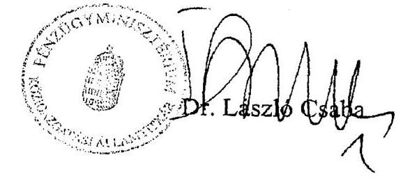

---

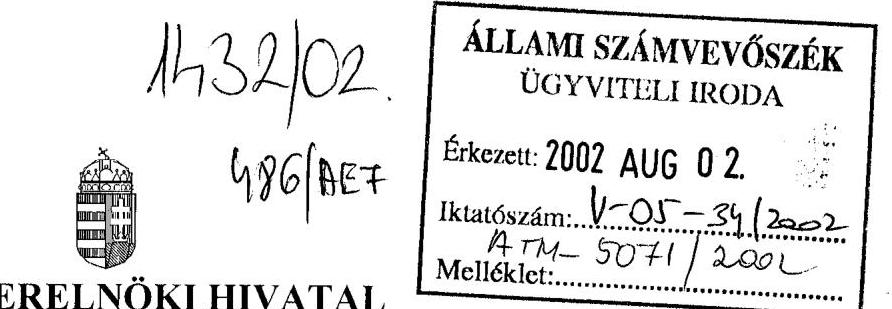

MINISZTERELNÖKI HIVATAL KORMÁNYIRODA VEZETŐJE HELYETTES ÁLLAMTITKÁR

1. melléklet

1013/VIII/2002.
Ügyintéző: dr. Varga Zoltán
Hiv.sz.: V-05-31/2002.

Bihary Zsigmond úrnak, az Állami Számvevőszék főigazgatójának

Budapest

Tisztelt Főigazgató Úr!
Az ÁPV Rt. 2001. évi működésének és a központi költségvetés végrehajtásához kapcsolódó tevékenységének ellenőrzéséről szóló jelentés tervezetére a következő észrevételt teszem.

A tervezet 28. oldalán a kincstári vagyon, illetve a vállalkozói vagyon közötti átjárhatóság kérdésében leírtakat tévesnek tartom.

A Priv. tv. 1. § (1) bekezdése - a tartós vagyon kivételével - a vállalkozói vagyon kötelező értékesítését írja elő. Ezzel szemben az Áht. 109/A. § (1) bek. értelmében a kincstári vagyon az állami feladatok ellátását szolgálja, értékesítésére - a 109/K. § (1) bekezdésében meghatározottakból következően - kivételesen kerülhet sor. Alapvetően eltér tehát a két vagyoni kör funkciója, eltérőek a két törvényben a döntésre jogosult szervezetek és hatáskörök, az értékesítési technikák.

A fentiekből következően az Áht. 108. § (5) bekezdésében foglaltak 1999. január 1-jével történt beiktatásáig a Kormánynak egyáltalán nem volt felhatalmazása egyik vagyoni körből a másikba történő átcsoportosításra. A joggyakorlat ezen annyiban „könnyített", hogy ún.

---

„egyenértékű csere" címén lehetőséget látott kormányhatáskörben dönteni a két vagyonkezelő közötti egyidejű vagyoncseréről.

Az Áht. 108. § (5) bekezdése a csere nélküli átcsoportosításra ad felhatalmazást a Kormánynak, de csupán évi 2 Mrd Ft értékhatárig.

A kifogásolt szövegrész mellőzését javasolom.

Budapest, 2002. augusztus 1.

Üdvözlettel:
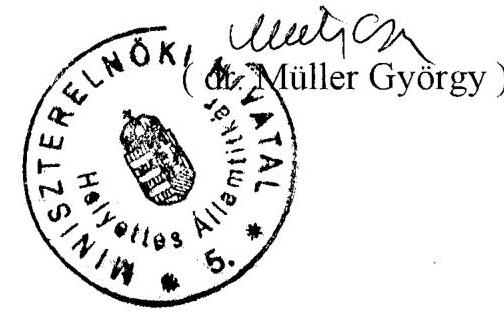

---

# Dr. Müller György úr 

helyettes államtitkár
Miniszterelnöki Hivatal

Budapest

## Tisztelt Helyettes Államtitkár Úr!

Megköszönöm az Állami Privatizációs és Vagyonkezelő Rt. 2001. évi működésének és a központi költségvetés végrehajtásához kapcsolódó tevékenységének ellenőrzéséről készített jelentéstervezetünkre adott észrevételét.

Tájékoztatom, hogy az észrevételében foglaltakat a jelentés véglegesítésénél figyelembe vettük.

Budapest, 2002. augusztus $\angle \angle$.

Tisztelettel:

---

# 1567/02

Állami Privatizációs és Vagyonkezelő Rt.

Hungarian Privatization and State Holding Company

ÁLLAMI SZÁMVEVŐSZÉK
ÜGYVITELI IRODA
ATH-536712002
Érkezett: 2002 AUG 21

Vezérigazgató

Iktatószám: 4-05-38/2002

Melléklet:

Fax: 349 4368

Budapest

Isz: 206....1..42./ÁPV/2002.

Budapest, 2002. augusztus 16.

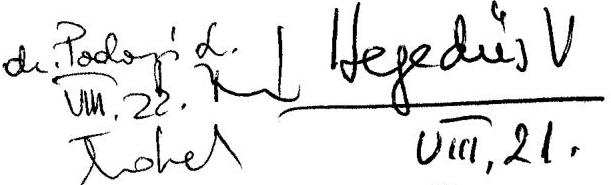

Tárgy: Észrevételek az "ÁPV Rt. 2001. évi működésének és a központi
költségvetés végrehajtásához kapcsolódó tevékenységének
ellenőrzéséről" szóló jelentés tervezetéhez

Tisztelt Főigazgató Úr!

Az Ön által kezdeményezett, a tárgyban jelzett vizsgálattal kapcsolatos egyeztetés
augusztus 14-én megtörtént.

Az egyeztetésen a vizsgálatot végzők részéről a vizsgálat vezetője, dr. Podonyi
László igazgatóhelyettes vett részt a vizsgálatban kolléganőjével, Bátory Bélánéval.
Az ÁPV Rt. részéről a megbeszélésen Kocsis Magdolna ügyvezető igazgató
vezetésével, dr. Gál Gyöngyi jogtanácsos bevonásával az ÁPV Rt. érintett szervezeti
egységeinek képviselői vettek részt.

Az egyeztetésen tételesen áttekintésre kerültek az ÁPV Rt. által tett észrevételek és
a vitás kérdések túlnyomó többségében megegyezés született a lezárás módjáról,
amelyek alapján a jelentésben megjegyzésként szerepelnek az ÁPV Rt.
megítélésbeli észrevételei.

Az ÁPV Rt. részéről az augusztus 15-én mail-en megkapott és 16-án még szóban
egyeztetett változattal kapcsolatban az alábbi megjegyzéseket tesszük:

1. Az állami vagyoni körben történt vagyontárgy csere ellenértékének privatizációs
bevételként történt elszámolása az ÁPV Rt. könyvvizsgálójának egyetértésével
történt. A könyvvizsgáló által ígért állásfoglalást az ÁSZ részére továbbítani
fogjuk.

2. A 3.5. ponthoz a CW Bank csereügyletbe termőföldek bevonásával kapcsolatban
tett észrevételekhez:

„Így a konkrét csereügyletben nem tölthette be csereérték szerepét
 olyan vagyon,
ami köztudottan rövid időn belül mindkét vagyonkezelőtől elkerült."

II-1133 BUDAPEST, POZSONYI ÚT 56
TEL: (36 1) 237-4400, FAX: (36 1) 237-4100
H-1399 BUDAPEST, PF. 708
INTERNET: WWW.APVRT.HU

---

A termőföldek a földalapról szóló tv. hatálybalépését követően is a kincstári vagyonban maradtak, így azok cserébe történő bevonása álláspontunk szerint a földalapról szóló tv. megszületésének fényében is értelmezhető, a csereérték szerepét be tudja tölteni, hiszen nem vált forgalomképtelenné, a földalap is értékesíthet földet. Mindezeken felül a cseréről szóló tárgyalások kezdete és ÁPV Rt.-n belüli döntés 2001. augusztusában történt és a cserébe bevont vagyoni kör október elején már a két fél között véglegessé vált, a szerződés megkötése az egyéb szerződésben rendezendő kérdések miatt halasztódott novemberre.

A CW Bank csereügylet két vagyonkezelő közti vagyonátcsoportosítást feltételező megállapítással kapcsolatban:
„A csereügylet a két vagyonkezelő közti vagyonátcsoportosítás, így kormányrendeletet feltételez, amellyel a tárgyalt ügylet nem rendelkezett."

Az Áht. előírásait az ügylet nem sérti, tekintettel arra, hogy az ÁSZ jelentés által idézett Áht. 108.§(5) bek. visszapótlás nélküli (tehát ellenérték nélküli) átcsoportosítást tesz lehetővé a Kormány számára rendeletalkotás útján. Az ellenérték fejében történő átcsoportosításra, azaz a cserére az ÁPV Rt.-t a Priv. tv. 28.§ (2) c) pontja, míg a KVI-t az Áht. 109.§ (3) d) pontja hatalmazza fel, a Kormány bármilyen szintű döntését nem írja elő hozzá egyik törvény sem. A tárgyalt ügylet csereügylet volt, tehát ellenérték fejében történt, így nem kell hozzá Kormány rendelet.

Kérem észrevételeim szíves figyelembe vételét.
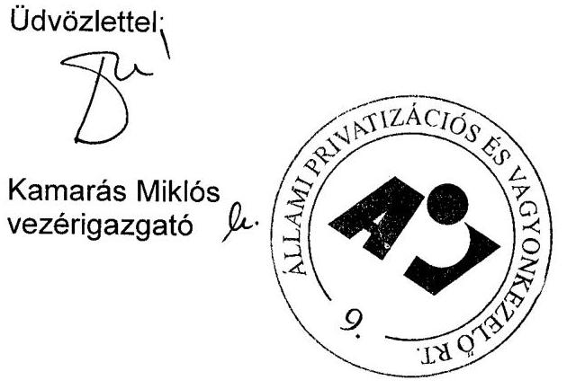

---

# Kamarás Miklós úr 

vezérigazgató
ÁPV Rt.

## Budapest

## Tisztelt Vezérigazgató Úr!

Megköszönöm az Állami Privatizációs és Vagyonkezelő Rt. 2001. évi működésének és a központi költségvetés végrehajtásához kapcsolódó tevékenységének ellenőrzéséről készített jelentéstervezetünkkel kapcsolatos, soron kívül biztosított egyeztetési lehetőséget és az arra adott észrevételeket, kiegészítéseket.

A portfóliócsere privatizációs bevételként való elszámolására új körülményt nem tártak fel, ezért fenntartjuk álláspontunkat, mely szerint privatizáció nem történt, tehát a csere értéke a privatizációs bevételek között nem szerepeltethető.

A CW Bank csereügyletbe termőföldek bevonásával kapcsolatban tett észrevételük nem cáfolja, hogy az ÁPV Rt. Igazgatóságának augusztusi döntése ellenére a csereszerződés csak november 20-án vált hatályossá, így az időközben közismertté vált információk figyelembevétele indokolt lett volna.

Az ÁPV Rt. és KVI között létrejött portfóliócsere vonatkozó észrevételt nem tudom elfogadni, mivel a csereügylet olyan értékű vagyont érintett, amely miatt az Áht., a Priv. tv. és a költségvetési tv. előírásait együttesen értelmezve a döntés meghaladta az ÁPV Rt. hatáskörét.

A vagyontárgyak vásárlása jogcímű kifizetésekhez is a Kvtv. 6. § (7) bekezdése a kormánydöntést előírja. Az ügylet bármilyen más jogcímen (pl. üzleti befektetésként) történő elszámolása szintén kormányhatározathoz kötött, mivel a tranzakció vagyoni értéke meghaladja az 1 milliárd Ft-ot. Jóváhagyó kormányhatározatot az ÁPV Rt. nem tudott bemutatni. Ennek hiányában a KVI-vel lefolytatott portfoliócsere nem felel meg a törvényi előírásoknak.

Kérem, hogy az észrevételekre adott válaszokat elfogadni szíveskedjék.
Budapest, 2002. augusztus 26.
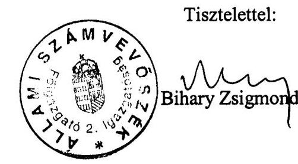

---

# A. Térítésmentes átadás jogszabályok alapján: 

| Átadott társaság megnevezése | Az új tulajdonosi   joggyakorló | Jogszabály   megnevezése |
| :-- | :-- | :-- |
| Földhitel- és Jelzálogbank Rt | pénzügyminiszter | 2000. évi CXXXIII. tv. |
| Magyar Fejlesztési Bank Rt. | pénzügyminiszter | 2000. évi CXXXIII. tv. |
| Hitelgarancia Rt | pénzügyminiszter | 2000. évi CXXXIII. tv. |
| Regionális Fejl. Holding Rt. (RFH) | gazd. miniszter és MeH   vezető miniszter együtt | 2000. évi CXXXIII. tv. |
| Postabank Rt. 1,99 milliárd Ft   névértékű részvénycsomag | Kincstári Vagyoni   Igazgatóság | 147/2001. (VIII. 22.)   Korm. rend. |

## B. Térítésmentes átadások kormányhatározatok alapján:

| Átadott társaság   megnevezése | Új tulajdonosi   joggyakorló | Korm. határozatok   száma |
| :-- | :-- | :-- |
| Agroprodukt Mg. Rt. | MFB Rt. | 2045/2001. (III. 14.) Korm. hat |
| Dalmandi Mg. Rt. | MFB Rt. | 2045/2001. (III. 14.) Korm. hat |
| Dél-Pest Megyei Mg. Rt. | MFB Rt. | 2045/2001. (III. 14.) Korm. hat |
| Gödöllői Tangazdaság Rt. | MFB Rt. | 2045/2001. (III. 14.) Korm. hat |
| Herceghalmi Kísérleti Gazd. Rt. | MFB Rt. | 2045/2001. (III. 14.) Korm. hat |
| Hidasháti Mg. Rt. | MFB Rt. | 2045/2001. (III. 14.) Korm. hat |
| Lajta-Hanság Rt. | MFB Rt. | 2045/2001. (III. 14.) Korm. hat |
| Mezőfalvai Mg. Term. Rt. | MFB Rt. | 2045/2001. (III. 14.) Korm. hat |
| Szarvasi Mg. Term. Rt. | MFB Rt. | 2045/2001. (III. 14.) Korm. hat |
| Szombathelyi Tangazdaság Rt. | MFB Rt. | 2045/2001. (III. 14.) Korm. hat |
| Sárvári Mg. Rt. | MFB Rt. | 2045/2001. (III. 14.) Korm. hat |
| Törökszentmiklósi Mg. Rt. | MFB Rt. | 2045/2001. (III. 14.) Korm. hat |
| Balatoni Hajózási Rt. | MFB Rt. 51\% | 2039/2001. (II. 28.) Korm. hat |
|  | Helyi önk.-ok 49\% | 2219/2001.(VIII.28.) Korm. hat |

---

# C. Az MFB Rt.-nek átadott mezőgazdasági társaságok által bérelt területek mértéke az ÁPV Rt. kimutatásai szerint 

| Mezőgazdasági Rt. megnevezése | állami tulajdonú bérelt terület mértéke |  |
| :--: | :--: | :--: |
|  | hektár (ha) | aranykorona (AK ) |
| Agroprodukt Mg. Rt. | 8189 | 165491 |
| Dalmandi Mg. Rt. | 10795 | 257625 |
| Dél-Pest Megyei Mg. Rt. | 9663 | 142745 |
| Gödöllői Tangazdaság Rt. | 4754 | 130057 |
| Herceghalmi Kísérleti Gazd. Rt. | 2994 | 80678 |
| Hidasháti Mg. Rt. | 3360 | 100931 |
| Lajta-Hanság Rt. | 10689 | 248930 |
| Mezőfalvai Mg. Term. és Szolg. Rt. | 8336 | 181041 |
| Szarvasi Mg. Term. és Él. Rt. | 2691 | 66019 |
| Szombathelyi Tangazd. Rt. | 2736 | 59172 |
| Sárvári Mg. Rt. | 6111 | 99504 |
| Törökszentmiklósi Mg. Rt. | 4318 | 105692 |

*A mennyiségek az ÁPV Rt. - KVI csereszerződésből származnak. Az ÁPV Rt. és a KVI budapesti ingatlanokat, a Herceghalmi Kísérleti Gazdaság Rt.-t és a Bábolna Nemzeti Ménesbirtok Kft.-t cserélte el egymással a CW Bank Bécs, Kartner Str.43. alatti épületére.

---

# Az ÁPV Rt. követeléseinek összetétele 2001. december 31-én 

ezer Ft

| Megnevezés | Bruttó érték | Értékvesztés | Nettó érték |
| :--: | :--: | :--: | :--: |
| Adott kölcsönök | 5348 | 2701 | 2647 |
| Vevők | 1512 | 1006 | 506 |
| Egyéb követelések | 39998 | 15167 | 24831 |
| ebből kiemelve: |  |  |  |
| osztalékkövetelés | 897 | 488 | 409 |
| később számlázandó | 1025 | 1001 | 24 |
| HM ingatlanok | 9048 | - | 9048 |
| rövid lejáratú kölcsön | 3793 | 1048 | 2745 |
| válságkeret támogatásra | 3600 | - | 3600 |
| átutalt, be nem jegyzett tőkeemelés | 5157 | - | 5157 |
| adott előleg | 2770 | - | 2770 |
| egyéb (döntően felszámolás alatt álló cégek) | 12118 | 11923 | 195 |
| Mindösszesen: | 46858 | 18874 | 27984 |

---

# 4. melléklet 

a V-05-42/2002. számú jelentéshez

A költségvetési törvény eredeti és módosított előírásai, az ÁPV Rt. eredeti és módosított üzleti tervének megfelelő paraméterek, valamint a zárszámadási törvényben szereplő összegek

A táblázat kontrolling adatokat tartalmaz
(millió Ft)

| Megnevezés | $\begin{aligned} & \text { kv. tv. } \\ & \text { jan. 1-én } \\ & \text { hat. előir. } \end{aligned}$ | zárszámadási tv.-vel   mód. el. | eredeti   üzleti terv | mód. üzleti   terv | tény |
| :--: | :--: | :--: | :--: | :--: | :--: |
| Hozzárendelt vagyon nyitó egyenlege | - | - | 838724 | 838724 | 838724 |
| BEVÉTELEK |  |  |  |  |  |
| osztalékbevételek | - | - | 5556 | 10055 | 8492 |
| vagyonhasznosítás | - | - | 2790 | 2975 | 2293 |
| a hozzárendelt vagyon egyéb bevételei, privatizáció, stb. | - | - | 50654 | 53470 | 44828 |
| BEVÉTELEK ÖSSZESEN | - | - | 59011 | 66496 | 55613 |
| KIADÁSOK | 180500 | 180500 | 57560 | 66091 | 52272 |
| záró egyenleg | - | - | 840175 | 842444 | 842066 |

---

| kiadások részletezése | jan. 1-én hat. előir. | zárszámadási tv.-vel   mód. előir. | eredeti   üzleti terv | mód. üzleti terv | tény |
| :--: | :--: | :--: | :--: | :--: | :--: |
| I. A vagyont csökkentő kiadások | 85500 | 85500 | 21400 | 18461 | 22097 |
| 1. Ráfordítások az 1995. évi XXXIX. tv. alapján | 33500 | 33500 | 10410 | 9331 | 13493 |
| a) a hozzárendelt vagyon értékesítése előkészítésének költségei, [23. § (1) bek. a) és f) ] | 10000 | 10000 | 2320 | 1429 | 4959 |
| b) vagyonkezeléssel összefüggő ráfordítások [23. § (1) bek. e) | 4000 | 4000 | 2090 | 2301 | 1071 |
| c) társaságok támogatása [23. § (1) bek. g) pont] forrásátadás, kamatátvállalás | 4000 | 4000 | 500 | 500 | 2323 |
| d) az ÁPV Rt. működési költségei [23. § (1) bek. h) pont] | 5500 | 5500 | 5500 | 4500 | 4500 |
| e) államadósság törlesztése E-hitelből és kárpótlási jegy bevonása [23. § (1) bek. i) pont] | 10000 | 10000 | 0 | 601 | 639 |
| 2. Ráfordítások egyéb kötelezettségek alapján | 52000 | 52000 | 10990 | 9130 | 8604 |
| a) osztalék-befizetési kötelezettség a központi költségvetés felé [e törvény 6. § (2) bek.] | 36000 | 0 | 0 | 0 | 0 |
| b) az állam tulajdonosi felelősségével kapcsolatos környezetvédelmi feladatok finanszírozása | 4000 | 4000 | 3000 | 2000 | 2159 |
| c) a volt szovjet ingatlanok környezetvédelmi kárelhárítása | 1000 | 1000 | 1000 | 600 | 309 |
| d) a HM-től átvételre kerülő vagyonelemekkel kapcsolatos megelőlegezési költségek [ | 3000 | 3000 | 2000 | 1500 | 1106 |
| - ebből: a vagyonátvétel megelőlegezési költségei | 500 | 500 | - | - | - |
| e) egyéb kötelezettség [RFH Rt. Áht. 109/G. § (6) bek. szerinti kifizetések] | 8000 |

 8000 | 4990 | 5030 | 5030 |
| II. Vagyonváltozást nem eredményező kiadások | 95000 | 95000 | 36160 | 46455 | 30175 |
| 1. Reorganizációs célú kifizetések [1995. évi XXXIX. tv. 23. § (1) bek. g) pont] | 20000 | 20000 | 5000 | 5702 | 1616 |
| 2. Vagyontárgyak vásárlása | 12000 | 12000 | 5900 | 4000 | 6096 |
| 3. Fejlesztési projektek | 18000 | 18000 | 11300 | 5258 | - |
| 4. Üzleti célú befektetések | 15000 | 15000 | 13900 | 11749 | 13066 |
| 5. Privatizációs tartalék feltöltése | 30000 | 30000 | 0 | 20921 | 9397 |
| KIADÁSOK ÖSSZESEN | 180500 | 180500 | 57560 | 66091 | 52272 |

---

# Az ÁPV Rt. hozzárendelt vagyonához kapcsolódó bevételek tervezési folyamata, a jóváhagyott terv és a teljesítés 

(millió Ft)

|  | "Optimista" terv   változat | Eredeti   terv | Módosított   terv | Teljesítés | Teljesítés   mértéke | Korrigált   teljesítés |
| :-- | :--: | :--: | :--: | :--: | :--: | :--: |
|  | 1 | 2 | 3 | 4 | 5 | 6 |
| előterjesztés/jóváhagyás   hónapja | IV. hó | IV. hó | IX. hó | XII. hó |  |  |
| Megnevezés |  |  |  |  |  |  |
| Privatizációs bevételek | 62171 | 45338 | 39286 | 35377 | 90% | 29277   74% |
| Vagyonhasznosítási bevétel | 2790 | 2975 | 2975 | 2293 | 77% |  |
| Privatizációs kárpótlási jegy   bevétel | 288 | 288 | 548 | 639 | 117% |  |
| Értékesítés és   vagyonhasznosítás   összesen | 65249 | 48416 | 42809 | 38309 | 89% |  |
| Kapott osztalék,   részesedés | 6556 | 5556 | 10055 | 8492 | 84% |  |
| Egyéb bevételek | 3339 | 2639 | 8710 | 3890 | 45% |  |
| Gázközmű   államkötvény kamata | 2400 | 2400 | 4922 | 4922 | 100% |  |
| BEVÉTELEK ÖSSZESEN | 77604 | 59011 | 66496 | 55613 | 84% | 49514   74% |

A táblázat kontrolling adatokat tartalmaz

---

A kormány gazdaságpolitikai intézkedéseit támogató 2001. évi ráfordítások

| Kedvezményezett | Forrásjuttatás célja és formája | Összege |
| :--: | :--: | :--: |
| Bábolna Rt | Földterület kivásárlása [2285/2000.(XI.29.) Korm.hat.] | 3386 |
|  | Ménesbíró Kft. kivásárlása. [2385/2001(XII.20.)] | 1593 |
| Millenniumi Média Kft | Alapítás törzstőkéje [2296/2000. (XII.17.) Korm.hat.] | 2500 |
| Millenniumi Média Kft | Tőkeemelés [2118/2001.(V.18.) és 2385/2001.(XII.20.) Korm.hat.] | 2100 |
| MALÉV Rt | Tagi kölcsön [2055/2001.(III.27.) Korm.hat.] | 3000 |
|  | Tagi kölcsön visszafizetése | -3000 |
|  | Tőkeemelés [2268/2001.(IX.26.) Korm.hat.] | 9200 |
| Reorg Apport Rt | Költségvetési juttatás [2000:CXXXIII.tv.6.§(6) bek.] | 25000 |
|  | Tulajdonosi kölcsön | 4400 |
|  | Vissza nem térítendő támogatás | 20600 |
| Reorg Apport Rt | Megtérülés | -2000 |
| MVM Rt | Vissza nem térítendő támogatás | 32000 |
|  | 2000:CXXXIII.tv. 6. § | 10000 |
|  | 1131/2001. (XII.11.) Korm.hat. | 22000 |
| MAHART Balatoni | Részv. vás. [2029/2001.(II.28.) és 2219/2001.(VIII.28.) Korm.hat.] | 2655 |
| KVI (CW Bank) | Elszámolás | -356 |
| Népliget Autóbusz | Buszpályaudvar megvalósítás céljából tőkeemelés [2385/2001(XII.20.)] | 2360 |
| Tokaj Kereskedőház Rt | Tőkeem. és vissza nem térítendő támogatás [1131/2001.(XII.11.) K.h.] | 2500 |
| Ganz Millenáris Park | Tőkeemelés [1055/2001. (VI.20.) Korm. hat.] | 1812 |
| Egyéb |  | 22 |
| Összes ráfordítás |  | 82772 |

---

# Az ÁPV Rt. készpénz kötelezettsége 

| Összes kötelezettség a 2000. augusztus 12-i időpontra   számítva: | 63,63 |
| :-- | :--: |
| A 20 millió Ft alatti járandóságok összege (215   önkormányzat) | -1,76 |
| A fennmaradó 411 önkormányzat 20 millió Ft-os   járandóságának összege: | -8,22 |
| Fennmaradó rész: | 53,65 |
| Ennek 50%-a: | 26,83 |
| A készpénz kötelezettség együtt (2., 3., és 4. tétel) | 36,80 |

---

# Az ÁPV Rt. hozzárendelt vagyona értéke társaságokban megjelenő részének szerkezete a tulajdonlás mértéke szerint 

| Megnevezés   (tulajdonlás mértéke) | Nyitó   (2000. jan.1.) | Záró   (2000. dec.31.) | % |
| :-- | --: | --: | --: |
| 100%-os tulajdon | 172203 | 74976 | 43,54 |
| Többségi tulajdon | 224534 | 180892 | 80,56 |
| Kisebbségi tulajdon | 1575 | 1575 | 100,00 |

## A kisebbségi tulajdonlás néhány jellemzője

millió Ft

|  | 2001. 01. 01. | 2001. 12. 31. | % |
| :--: | :--: | :--: | :--: |
| Kisebbségi tul. társaságok   száma | 46 | 52 | 113,04 |
| A társaságok jegyzett tőkéje | 452823 | 458347 | 101,22 |
| ÁPV Rt. részvényre eső jegy.   tőke | 17425 | 9976 | 57,25 |
| Átlag ÁPV Rt. tul. hányad | 3,85 | 2,17 | - |
| A társaságok saját tőkéje | 1272639 | 1285358 | 101,00 |
| ÁPV Rt. részvényre eső saját   tőke | 20987 | 9016 | 42,96 |
| Tartós és priv. rész. összesen | 790472 | 667228 | 84,41 |
| Kisebbségi tul. az összes %-   ában | 2,65 | 1,35 | - |

---

# A privatizációs tartalék kiadásai az egyes felhasználási célok szerint 

| Millió Ft |  |  |
| :-- | :--: | :--: |
| Megnevezés | Összeg | % |
| A privatizációval összefüggő kötelezettségek   teljesítése | 5274,8 | 4,2 |
| Gázközművekkel kapcsolatos önkormányzati   kifizetések | 34179,6 | 27,3 |
| Az állam vagyonpolitikai intézkedései,   válságkezelés   (a 2000. évi CXXXIII. tv. 6. § (10) bek. o. pont) | 82770,9 | 66,3 |
| Egyéb törvényi előírások (pl. kárpótlás,   életjáradékra váltása, a feladatok   végrehajtásával kapcs. ráfordítások) | 2780,0 | 2,2 |
| Összes kiadás: | 125005,3 | 100,0 |

---

# Tanúsítványok jegyzéke 

1. A hozzárendelt vagyon változása 2001. évben - összesített kimutatás
2. A hozzárendelt vagyon változása tranzakciók alapján 2001. évben
3. Pénzforgalmi szemléletű eredménykimutatás az ÁPV Rt. hozzárendelt vagyon bevételeiről és kiadásairól 2001. évben
4. Privatizációs tartalék 2001. évben
5. ÁPV Rt. kötelezettségeinek változása
6. Az ÁPV Rt. eszközállományának változása a 2001. évben
7. Az ÁPV Rt. forrásainak összetétele 2001. évben
8. Az ÁPV Rt. működéséhez kapcsolódó anyagjellegű ráfordítások alakulása 2001. évben
9. Az ÁPV Rt. átlagos állományi létszámának alakulása 2001. évben
10. Az ÁPV Rt. állományi létszámának alakulása 2001. évben
11. Az ÁPV Rt. működésével kapcsolatos személyi jellegű ráfordítások alakulása 2001. évben
12. Az ÁPV Rt. munkavállalóinak 2001. évi beosztásonkénti átlagkeresete

---

A hozzárendelt vagyon változása 2001. évben - összesített kimutatás

1.sz.tanúsítvány V-05- /2002.

| Megnevezés | Nyitó adatok |  |  |  | Vagyonváltozás |  |  |  | (4/b) Záró adatok  |
| --- | --- | --- | --- | --- | --- | --- | --- | --- | --- |
|   |  |  |  |  | Tranzakciók alapján |  |  | Gazdálkodás eredményessége |   |
|   |  |  |  |  | Növekedés |  | Csökkenés |  |   |
|   | db* | millió Ft |  |  | db* | millió Ft | db* | millió Ft |   |
|  1. Gazdasági társaságok | 276 | 834958 |  |  | 36 | 67848 | 72 | 191128 | 21551  |
|  1.1. Működő társaságok | 172 | 834707 |  |  | 29 | 67751 | 42 | 190907 | 21551  |
|  1.1.1. Tartós állami tulajdonban lévő | 93 | 398312 |  |  | 1 | 6891 | 21 | 145476 | 12839  |
|  ebből: részvénytársaság | 91 | 393480 |  |  | 1 | 6891 | 21 | 145476 | 12815  |
|  egyéb társaság | 2 | 4832 |  |  | 0 | 0 | 0 | 0 | 24  |
|  1.1.2. Teljes mértékben privatizálható | 79 | 436395 |  |  | 28 | 60860 | 21 | 45431 | 8712  |
|  ebből: részvénytársaság | 44 | 416498 |  |  | 24 | 50763 | 12 | 43473 | 7580  |
|  egyéb társaság | 35 | 19897 |  |  | 4 | 10097 | 9 | 1958 | 1132  |
|  1.2. Végelszámolás alatt álló társaságok | 13 | 251 |  |  | 3 | 62 | 6 | 186 | 0  |
|  1.3. Felszámolás alatt álló társaságok | 91 | 0 |  |  | 4 | 35 | 24 | 35 | 0  |
|  2.Állami vállalatok | 155 | 349 |  |  | 2 | 22 | 11 |  |   |
|  2.1. Működő vállalatok | 3 | 130 |  |  | 0 | 0 | 2 |  |   |
|  2.2. Végelszámolás alatt álló vállalatok | 16 | 219 |  |  | 0 | 2 | 1 | 9 |   |
|  2.3. Felszámolás alatt álló vállalatok | 136 | 0 |  |  | 2 | 0 | 21 | 0 |   |
|  3. Elvont, vásárolt, átvett vagyonelemek |  | 22009 |  |  | 0 | 19494 | 0 | 4071 |   |
|  3.1. Immateriális javak |  | 10 |  |  | 0 |  | 5 |  |   |
|  3.2. Ingatlanok |  |

 21756 |  |  |  | 19292 |  | 4007 |   |
|  3.3. Egyéb eszközök |  | 243 |  |  |  | 202 |  | 59 |   |
|  4. Termőföld* |  | 71672 |  |  |  | 334 |  | 3158 |   |
|  5. Pénzkészlet |  | 29249 |  |  |  | 164737 |  | 182270 |   |
|  6. Államkötvény |  | 46000 |  |  |  | 0 |  | 46000 |   |
|  7. Követelések*** |  | 31233 |  |  |  | 6047 |  | 7910 |   |
|  8. Kötelezettségek*** |  | -196746 |  |  |  | -8268 |  | -95927 |   |
|  HOZZÁRENDELT VAGYON ÖSSZESEN | 431 | 838724 |  |  | 38 | 250194 | 94 | 338621 | 21551  |

- A termőföld esetében a mértékegység ha **A 4/a sz. melléklet összesített adatait tartalmazza ***Nem tartalmazza az aktív és passzív időbeli elhatárolásokat. Budapest, 2002.07.23.

P.h.

1. sz. tanúsítvány V-05- /2002.

19. alárás

---

A hozzárendelt vagyon változása tranzakciók alapján 2001. évben

2.sz.tanúsítvány V-85/2002.

|  Megnevezés | Nyitó adatok 2001.01.01 |  |  |  |  |  |  |  |  |  |  |  |  |  |  |  |  |  |  |  |  |  |  |  |  |  |  |  |  |  |  |  |  |  |  |  |  |  |  |  |  |  |  |  |  |  |  |  |  |  |  |  |  |  |  |  |  |  |  |  |  |  |  |  |  |  |  |  |  |  |  |  |  |  |  |  |  |  |  |  |  |  |  |  |  |  |  |  |  |  |  |  |  |  |  |  |  |  |  |  |  | 

---

# Pénzforgalmi szemléletű eredménykimutatás az ÁPV Rt. hozzárendelt vagyon bevételeiről és kiadásairól 2001. évben

M Ft-ban

Hozzárendelt vagyon bevételek

|   |  | költs. elő- | üzleti terv | tény  |
| --- | --- | --- | --- | --- |
|   | Hozzárendelt vagyon folyó tételek |  |  |   |
|   | NYITÓEGYENLEGE |  | 3 315 | 3 315  |
|  B.1.1. | Privatizációs bevétel |  | 39 286 | 35 377  |
|  B.1.2. | Vagyonhasznosítási bevételei |  | 2 975 | 2 295  |
|  B.1.3. | Kárpótlási jegy |  | 548 | 639  |
|  B.1. | Értékesítés és vagyonhasznosítás összesen |  | 42 809 | 38 311  |
|  B.2. | Kapott osztalék, részesedés |  | 10 055 | 8 492  |
|  B.3. | Egyéb bevételek |  | 8 710 | 10  |
|  B.4. | Gázközmű államkötvény kamata |  | 4 922 | 4 922  |
|  B. | Rendelt vagyonnal kapcsolatos bevételek |  | 66 496 | 51 735  |
|   | összesen (B.1.- B.4.) |  |  |   |

Hozzárendelt vagyon kiadások

|   |  |  |  |  |  |  |  |  |  |  |  |  |  |  |  |  |  |  |  |  |  |  |  |  |  |  |  |  |  |  |   |
| --- | --- | --- | --- | --- | --- | --- | --- | --- | --- | --- | --- | --- | --- | --- | --- | --- | --- | --- | --- | --- | --- | --- | --- | --- | --- | --- | --- | --- | --- | --- | --- | --- | --- | --- |
|  K.1.1. | Hozzárendelt vagyon értékesítése előkészít- |  |  |  |  |  |  |  |  |  |  |  |  |  |  |  |  |  |  |  |  |  |  |  |  |  |  |  |  |  |  |  |   |
|   | nek ktg. kiadások, díjak |  |  |  |  |  |  |  |  |  |  |  |  |  |  |  |  |  |  |  |  |  |  |  |  |  |  |  |  |  |  |  |  |   |
|  K.1.2. | Vagyonkezeléssel összefüggő ráfordítások |  |  |  |  |  |  |  |  |  |  |  |  |  |  |  |  |  |  |  |  |  |  |  |  |  |  |  |  |  |  |  |  |   |
|  K.1.3. | Privatizációval és vagyonkezeléssel összefüggő reorg. kifizetések |  |  |  |  |  |  |  |  |  |  |  |  |  |  |  |  |  |  |  |  |  |  |  |  |  |  |  |  |  |  |  |  |   |
|  K.1.4. | Az ÁPV Rt. működési költségei |  |  |  |  |  |  |  |  |  |  |  |  |  |  |  |  |  |  |  |  |  |  |  |  |  |  |  |  |  |  |  |  |   |
|  K.1.5. | Alacsony kamatozású államadósság törlesztés |  |  |  |  |  |  |  |  |  |  |  |  |  |  |  |  |  |  |  |  |  |  |  |  |  |  |  |  |  |  |  |  |   |
|   | E-hitelből |  |  |  |  |  |  |  |  |  |  |  |  |  |  |  |  |  |  |  |  |  |  |  |  |  |  |  |  |  |  |  |  |   |
|  K.1. | Ráfordítások az 1995. évi XXXIX. tv. 23. |  |  |  |  |  |  |  |  |  |  |  |  |  |  |  |  |  |  |  |  |  |  |  |  |  |  |  |  |  |  |  |  |  |   |
|   | §-a alapján |  |  |  |  |  |  |  |  |  |  |  |  |  |  |  |  |  |  |  |  |  |  |  |  |  |  |  |  |  |  |  |  |  |   |
|  K.2.1. | Osztalékbefizetési kötelezettség a Központi |  |  |  |  |  |  |  |  |  |  |  |  |  |  |  |  |  |  |  |  |  |  |  |  |  |  |  |  |  |  |  |  |  |   |
|   | Költségvetés felé |  |  |  |  |  |  |  |  |  |  |  |  |  |  |  |  |  |  |  |  |  |  |  |  |  |  |  |  |  |  |  |  |  |   |
|  K.2.2. | Az
 állam tulajdonosi fel. kapcsán környezet- |  |  |  |  |  |  |  |  |  |  |  |  |  |  |  |  |  |  |  |  |  |  |  |  |  |  |  |  |  |  |  |  |  |  |   |
|   | védelmi fel. finanszírozása |  |  |  |  |  |  |  |  |  |  |  |  |  |  |  |  |  |  |  |  |  |  |  |  |  |  |  |  |  |  |  |  |  |  |   |
|  K.2.3. | Volt szovjet ingatlanok környezetvédelmi |  |  |  |  |  |  |  |  |  |  |  |  |  |  |  |  |  |  |  |  |  |  |  |  |  |  |  |  |  |  |  |  |  |  |   |
|   | kárelhárítása |  |  |  |  |  |  |  |  |  |  |  |  |  |  |  |  |  |  |  |  |  |  |  |  |  |  |  |  |  |  |  |  |  |  |   |
|  K.2.4. | HM-től átvett tárgyi eszközök értékesítése kap- |  |  |  |  |  |  |  |  |  |  |  |  |  |  |  |  |  |  |  |  |  |  |  |  |  |  |  |  |  |  |  |  |  |  |   |
|   | csán előzetesen felmerülő költségek |  |  |  |  |  |  |  |  |  |  |  |  |  |  |  |  |  |  |  |  |  |  |  |  |  |  |  |  |  |  |  |  |  |  |   |
|  K.2.4.1. | ebből: vagyonátvétel megelőlegezés költségei |  |  |  |  |  |  |  |  |  |  |  |  |  |  |  |  |  |  |  |  |  |  |  |  |  |  |  |  |  |  |  |  |  |  |   |
|  K.2.5. | Egyéb kötelezettségek (RFH Rt., Áht. tv. |  |  |  |  |  |  |  |  |  |  |  |  |  |  |  |  |  |  |  |  |  |  |  |  |  |  |  |  |  |  |  |  |  |  |   |
|   | 109/G § 6. bek.) |  |  |  |  |  |  |  |  |  |  |  |  |  |  |  |  |  |  |  |  |  |  |  |  |  |  |  |  |  |  |  |  |  |  |   |
|  K.2. | Ráfordítások az 1999. évi CXXV. tv. alapján |  |  |  |  |  |  |  |  |  |  |  |  |  |  |  |  |  |  |  |  |  |  |  |  |  |  |  |  |  |  |  |  |  |  |   |
|  I. | Hozzárendelt vagyont csökkentő kiadások |  |  |  |  |  |  |  |  |  |  |  |  |  |  |  |  |  |  |  |  |  |  |  |  |  |  |  |  |  |  |  |  |  |  |   |
|  K.3. | Üzleti célú befektetések |  |  |  |  |  |  |  |  |  |  |  |  |  |  |  |  |  |  |  |  |  |  |  |  |  |  |  |  |  |  |  |  |  |  |   |
|  K.4. | Reorganizációs célú kifizetések |  |  |  |  |  |  |  |  |  |  |  |  |  |  |  |  |  |  |  |  |  |  |  |  |  |  |  |  |  |  |  |  |  |  |   |
|  K.5. | Vagyontárgyak vásárlása |  |  |  |  |  |  |  |  |  |  |  |  |  |  |  |  |  |  |  |  |  |  |  |  |  |  |  |  |  |  |  |  |  |  |   |
|  K.6. | Fejlesztési projektek |  |  |  |  |  |  |  |  |  |  |  |  |  |  |  |  |  |  |  |  |  |  |  |  |  |  |  |  |  |  |  |  |  |  |   |
|  K.7. | Tartalék feltöltése |  |  |  |  |  |  |  |  |  |  |  |  |  |  |  |  |  |  |  |  |  |  |  |  |  |  |  |  |  |  |  |  |  |  |   |
|  II. | Hozzárendelt vagyon változását nem |  |  |  |  |  |  |  |  |  |  |  |  |  |  |  |  |  |  |  |  |  |  |  |  |  |  |  |  |  |  |  |  |  |  |   |
|   | eredményező kiadások |  |  |  |  |  |  |  |  |  |  |  |  |  |  |  |  |  |  |  |  |  |  |  |  |  |  |  |  |  |  |  |  |  |  |   |
|  K. | Kiadások összesen |  |  |  |  |  |  |  |  |  |  |  |  |  |  |  |  |  |  |  |  |  |  |  |  |  |  |  |  |  |  |  |  |  |  |   |
|   | Az adózott időszak pénzügyi egyenlege |  |  |  |  |  |  |  |  |  |  |  |  |  |  |  |  |  |  |  |  |  |  |  |  |  |  |  |  |  |  |  |  |  |  |   |
|   |

  |  |  |  |  |  |  |  |  |  |  |  |  |  |  |  |  |  |  |  |  |  |  |  |  |  |  |  |  |  |  |  |  |  |  |  |   |
|   | Budapest, 2002. Július 23 |  |  |  |  |  |  |  |  |  |  |  |  |  |  |  |  |  |  |  |  |  |  |  |  |  |  |  |  |  |  |  |  |  |  |  |   |

Budapest, 2002. Július 23

19.

---

Privatizációs tartalék 2001. évben

|   |  | költs. előirányzat | üzleti terv | tény  |
| --- | --- | --- | --- | --- |
|   | Privatizációs tartalék bankszámla nyitóegyenlege |  | 25719 | 25720  |
|   | Gázközműkötvény nyitóegyenlege |  |  | 46000  |
|   | Privatizációs tartalékba helyezett részvények nyitóegyenlege |  |  | 44835  |
|   | Privatizációs tartalék NYITÓEGYENLEGE |  |  | 116555  |
|   | Privatizációs tartalékképzés Ft összege |  |  | 106756  |
|   | Privatizációs tartalékba helyezett részvények |  |  | 0  |
|  T.K. | Privatizációs tartalékképzés összesen |  |  | 106756  |
|  T.F. | Összes forrás |  | 171439 | 207577  |
|  T.1. | Jótállással, szavatossággal, kezességvállalással kapcs. kifiz. |  | 2133 | 82  |
|  T.2. | Készfizető kezességek, átvállalt tartozások kiegyenlítése |  | 0 | 0  |
|  T.3. | Szerződéses kapcsolaton alapuló tartozás kiegyenlítése |  | 0 | 0  |
|  T.4. | Belt. föld értéke alapján, alapytói jogon kifiz. önk. járandóság |  | 4821 | 3350  |
|  T.5. | E-hitel garancialehívás teljesítése |  | 0 | 0  |
|  T.6. | Elvont vagyontárgyak után beálló kezesi felelősség rend. |  | 0 | 200  |
|  T.7. | A „reverzális levelek" alapján történő kifizetések |  | 300 | 42  |
|  T.8. | Vill.ipari dolg. energiasz. priv. kapcs. kötött megáll. fedezete |  | 1444 | 1420  |
|  T.9. | Privatizációs ellenérték hányad |  | 580 | 181  |
|  T.10. | A gázközművekkel kapcsolatos önk. igények rendezése |  | 64463 | 34179  |
|  T.11. | A tartósan állami tul. társaságok tőkehelyzetének rendezése |  | 0 | 0  |
|  T.12. | Kárpótlási jegyek életjáradékra váltása |  | 2700 | 2666  |
|  T.13. | T.1.-T.12. pontokban szereplő feladatok végrehajtásával kapcs. ráfordítások |  | 348 | 114  |
|  T.14. | Tartalékban lévő értékpapírok, részesedések ért. kapcs. kötlségek |  | 0 | 0  |
|  T.15. | Az állam vagyon és gazd.pol. tev. tám. int. váls.helyz. megsz. összefüg. kiad. |  | 92700 | 82771  |
|  T. | Összes kiadás |  | 169489 | 125006  |
|   | Bankszámlák közötti rendezés |  |  | -410  |
|   | Gázközműkötvény záróegyenlege |  |  | 0  |
|   | Privatizációs tartalékba helyezett részvények záróegyenlege |  |  | 44835  |
|   | Privatizációs tartalék bankszámla záróegyenlege |  |  | 7059  |
|   | Privatizációs tartalék ZÁRÓEGYENLEGE |  |  | 51894  |

Budapest, 2002. Július 23

---

ÁPV Rt. kötelezettségeinek változása (2001. január 1. -2001. december 31.)

|  Normatív kötelezettségek | 2001.01.01-i nyitó |  |  | Növekedés |  | Csökkenés |  | 2001.12.31-i záró |  |   |
| --- | --- | --- | --- | --- | --- | --- | --- | --- | --- | --- |
|   | alap+
kamat | alap | korrekció | tárgyévi
növekedés | korrekció | tárgyévi
csökkenés | alap | kamat | alap+
kamat |   |
|  Gázközművagyonnal kapcsolatos kötelezettség | 60169 | 60169 |  |  |  | 60169 | 0 |  | 0 |   |
|  PEH | 126 | 60 |  | 106 |  | 54 | 112 | 143 | 255 |   |
|  Önkormányzati járandóságok | 12659 | 7904 | 1275 |  | 300 | 2475 | 7314 | 6029 | 13343 |   |
|  ebből Belterületi föld utáni járandóság | 10835 | 6168 | 1244 | 910 | 137 | 2474 | 5711 | 5851 | 11562 |   |
|  ebből 1989. évi XIII. tv. szerint átalakult társas. | 2941 | 1560 | 318 | 152 | 11 | 389 | 1630 | 2400 | 4030 |   |
|  1992. évi LIV. szerint átalakult társas. | 7894 | 4608 | 926 | 758 | 126 | 2085 | 4081 | 3451 | 7532 |   |
|  ebből Alapitói jog alapján járó járandóság | 1824 | 1736 | 31 |  | 163 | 1 | 1603 | 178 | 1781 |   |
|  TB részére fennálló kötelezettség | 3115 | 3115 |  |  |  | 3115 | 0 |  | 0 |   |
|  Villamosipari dolgozók járandósága | 4944 | 4944 |  |  |  | 1419 | 3525 |  | 3525 |   |
|  Egyéb kötelezettség | 31104 | 30339 | 0 | 3396 | 0 | 17958 | 15777 | 296 | 16073 |   |
|  ebből bánatpénz+szállítók+saját vagy. szembeni köt.* | 419 | 419 |  | 2522 |  |  | 2941 |  | 2941 |   |
|  Priv. tartalékot terhelő egyéb köt.* | 17 | 17 |  | 770 |  |  | 787 |  | 787 |   |
|  MALEV Rt. vételár hátralék | 11290 | 10813 |  |  |  | 10813 | 0 | 0 | 0 |   |
|  Gépjármú Felelősség Bizitisitási Alappal szemben. | 3486 | 3198 |  | 104 |  |  | 3302 | 296 | 3598 |   |
|  Be nem jegyzett tőkeemelés* | 8186 | 8186 |  |  |  | 2979 | 5207 |  | 5207 |   |
|  Egyéb rövid lejáratú kötelez* | 7706 | 7706 |  |  |  | 4166 | 3540 |  | 3540 |   |
|  Normatív kötelezettségek összesen: | 112117 | 106531 | 1275 | 3502 | 300 | 85190 | 26728 | 6468 | 33196 |   |
|  Függő kötelezettségek |  |  |  |  |  |  |  |  |  |   |
|  Privatizációs szerződésekből eredő garancia és szavatosság | 22090 | 21863 | 366 | 1253 | 52 | 5954 | 17476 | 346 | 17823 |   |
|  ebből jogszavatosság | 10590 | 10363 | 234 | 378 | 1 | 1310 | 9664 | 346 | 10011 |   |
|  kereskedelmi szavatosság | 1402 | 1402 |  | 225 |  | 1245 | 382 |  | 382 |   |
|  környezetvédelmi garancia | 8495 | 8495 | 132 |  | 51 | 1796 | 6780 |  | 6780 |   |
|  vagyonkezeléshez kapcsolódó garancia | 1603 | 1603 |  | 650 |  | 1603 | 650 |  | 650 |   |
|  Elvont vagyon utáni kezesség | 27201 | 10675 |  | 237 |  |  | 10727 | 18817 | 29544 |   |
|  PEH | 8408 | 2937 | 15 | 2 | 65 | 2350 | 539 | 1151 | 1690 |   |
|  Önkormányzati járandóságok | 10288 | 7115 |  |  |  | 0 | 7428 | 3306 | 10734 |   |
|  ebből Belter. föld utáni járandóság (1989. évi XIII. tv.) | 7035 | 6738 |  | 313 |  |  | 7051 | 266 | 7317 |   |
|  ebből Alapitói jog alapján járó járandóság | 3253 | 377 |  |  |  |  | 377 | 3040 | 3417 |   |
|  Tőkepótlási kötelezettség (ÁPV Rt. társaságok) | 157 | 157 |  |  |  | 105 | 52 |  | 52 |   |
|  Reverzális levelek utáni kötelezettség | 15985 | 15985 |  | 1 |  | 440 | 15546 |  | 15546 |   |
|  Egyéb kötelezettségek | 500 | 500 |  | 0 |  | 0 | 500 |  | 500 |   |
|  Malév Rt. részvény visszavásárlás | 500 | 500 |  |  |  |  | 500 |  | 500 |   |
|  Függő kötelezettségek összesen: | 84629 | 59232 |  |  |  |  |  |  |  |   |

 | 381 | 1493 | 117 | 8849 | 52268 | 23620 | 75889 |   |
|  Mindösszesen: | 196746 | 165763 | 1656 | 4995 | 417 | 94039 | 78996 | 30088 | 109085 |   |
|  *Tárgyévi változás egyenlege |  |  |  |  |  |  |  |  |  |   |
|  Budapest, 2002. július 23. |  |  |  |  |  |  |  |  |  |   |

---

Az ÁPV Rt. eszközállományának változása a 2001. évben (saját vagyon)
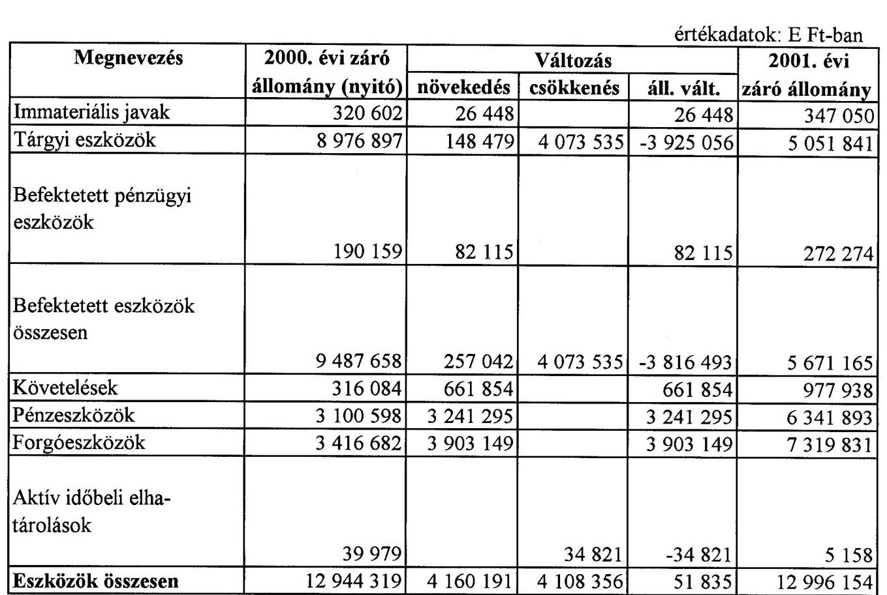

Budapest, 2002. július 23
P.H.
aláírás
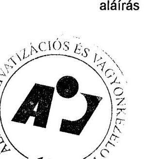

---

Állami Privatizációs és Vagyonkezelő Rt.

Az ÁPV Rt. forrásainak összetétele 2001. évben (saját vagyon)

| Megnevezés | 2000. évi záró állomány (nyitó) | Változás |  |  | 2001. évi záró állomány |
| :--: | :--: | :--: | :--: | :--: | :--: |
|  |  | növekedés | csökkenés | áll. vált. |  |
| Saját tőke | 12298753 | 12452 | 0 | 12452 | 12311205 |
| Céltartalék |  |  |  | 0 | 0 |
| Kötelezettségek | 619744 | 9420 | 0 | 9420 | 629164 |
| Passzív időbeli elhatárolások | 25822 | 29963 | 0 | 29963 | 55785 |
| Források összesen | 12944319 | 51835 | 0 | 51835 | 12996154 |

Budapest, 2002. július 23
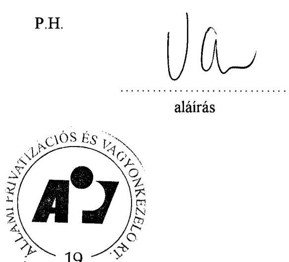

---

Állami Privatizációs és Vagyonkezelő Rt.

# Az ÁPV Rt. működéséhez kapcsolódó anyagjellegű ráfordítások alakulása 2001. évben

értékadatok: E Ft-ban

|  Megnevezés | 2001. év |  |  |  | $\%$  |
| --- | --- | --- | --- | --- | --- |
|   | terv | $\%$ | tény $\%$ |  | Tervhez  |
|  Energia |  |  | 41786 | 2,8 |   |
|  Üzemanyag |  |  | 21903 | 1,5 |   |
|  Nyomtatvány, irodaszer |  |  | 24746 | 1,7 |   |
|  Egyéb ki nem emelt anyag- |  |  |  |  |   |
|  költség |  |  | 19355 | 1,3 |   |
|  1. Anyag költség összesen | 135510 | 7,3 | 107790 | 7,3 | 79,5  |
|  Utazás- és szállásköltség |  |  | 26505 | 1,8 |   |
|  Fenntartás, javítás és karbantartás |  |  | 72411 | 4,9 |   |
|  Posta, telefon, futárszolgálat |  |  | 68397 | 4,6 |   |
|  Székház fenntartás, üzemeltetés |  |  | 301621 | 20,5 |   |
|  Egyéb ki nem emelt anyag- |  |  |  |  |   |
|  jellegű szolgáltatás |  |  | 9296 | 0,6 |   |
|  Egyéb ki nem emelt anyag- |  |  |  |  |   |
|  jellegű szolgáltatás |  |  | 886432 | 60,2 |   |
|  2. Anyag jellegű szolgál- |  |  |  |  |   |
|  tatás összesen | 1714754 | 92,7 | 1364662 | 92,7 | 79,6  |
|  3. Anyag jellegű ráfordítá- |  |  |  |  |   |
|  sok összesen (1 + 2) | 1850264 | 100,0 | 1472452 | 100 | 79,6  |

Budapest, 2002. július 23

---

# Az ÁPV Rt. átlagos állományi létszámának alakulása 2001. évben 

|  |  |  | létszámadatok: főben |
| :--: | :--: | :--: | :--: |
| Megnevezés | 2001. év |  | Telj. \% |
|  |  |  |  |
|  | terv | tény | tervhez |
| Teljes munkaidőben foglalkoztatott | 300 | 241 | 80,33 |
| Részmunkaidőben foglalkoztatott | 0 | 0 | - |
| Állományi létszám összesen | 300 | 241 | 80,33 |

Budapest, 2002. április 30.
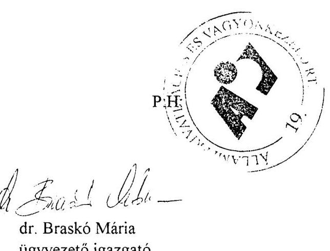

---

# Az ÁPV Rt. állományi létszámának alakulása 2001. évben 

| létszámadatok: főben |  |  |
| :--: | :--: | :--: |
|  | 2001. XII. 31. |  |
| Megnevezés | Státusz** | Betöltött állás |
|  |  |  |
| Vezetők* | 55 | 42 |
| Menedzser | 167 | 111 |
| Ügyintéző | 78 | 61 |
| Ügyviteli dolgozó | 0 | 0 |
| Fizikai | 0 | 0 |
| Összesen | 300 | 214 |

Megjegyzés:

* felsővezetők, ügyvezető igazgatók és ügyvezető igazgató-helyettesek adatait tartalmazza.
**Jóváhagyva 2000. december 01. napjától, 2001. évben a folyamatos létszámcsökkentés eredményeként a december 31-i létszám 86 fővel kevesebb.

Budapest, 2002. április 30.
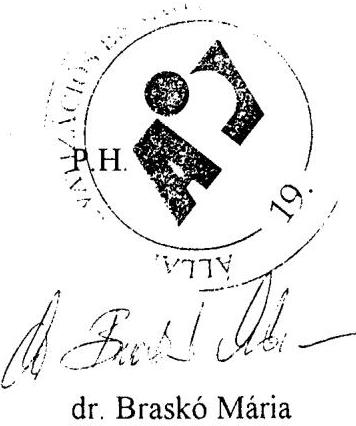

---

Állami Privatizációs és Vagyonkezelő Rt.

Az ÁPV Rt. működésével kapcsolatos személyi jellegű ráfordítások alakulása 2001. évben értékadatok: E Ft-ban

| Megnevezés | 2001. év |  |  |  | Telj. \%   tervhez |
| :--: | :--: | :--: | :--: | :--: | :--: |
|  | terv | \% | tény | \% |  |
| Bérköltség | 2157064 | 58,7 | 1816428 | 62,7 | 84,2 |
| Személyi jellegű kifizetések+bérjárulék | 1516201 | 41,3 | 1078358 | 37,3 | 71,1 |
| ebből: szerzői díjak |  |  | 0 | 0,0 |  |
| étkezési hozzájárulás |  |  | 6849 | 0,2 |  |
| üdülési hozzájárulás |  |  | 11540 | 0,4 |  |
| albérleti hozzájárulás |  |  | 320 | 0,0 |  |
| utazási hozzájárulás |  |  | 3573 | 0,1 |  |
| reprezentáció |  |  | 34883 | 1,2 |  |
| segélyek |  |  | 120 | 0,0 |  |
| gépjárműhasználati költség |  |  | 2434 | 0,1 |  |
| belföldi napidíj |  |  | 29 | 0,0 |  |
| külföldi napidíj |  |  | 3297 | 0,1 |  |
| betegszabadság |  |  | 14605 | 0,5 |  |
| egyéb személyi jell. kifiz. |  |  | 141186 | 4,9 |  |
| táppénz |  |  | 2352 | 0,1 |  |
| nyugdíjpénztári hozzájár. |  |  | 96146 | 3,3 |  |
| dolgozók életbiztosítása |  |  | 0 | 0,0 |  |
| oktatás továbbképzés |  |  | 1544 | 0,1 |  |
| egészségpénztári hozzájár. |  |  | 24170 | 0,8 |  |
| munkaruha |  |  | 52793 | 1,8 |  |
| társadalombizt. járulék | 972863 | 26,5 | 82136 | 2,8 |  |
| egyéb járulék |  |  | 600381 | 20,7 | 70,2 |
| Személyi jellegű ráfordítások összesen | 3673265 | 100,0 | 2894786 | 100,0 | 78,8 |

Budapest, 2002. július 23
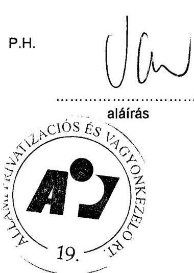

---

# Az ÁPV Rt. munkavállalóinak 2001. évi beosztásonkénti átlagkeresete 

| Sor | Állománycsoport | 2001. évi átlagkereset   Ft/fő/hó |
| :-- | :-- | :--: |
|  |  |  |
| 1 | Felsővezetők | 1997578 |
| 2 | Ügyvezető igazgatók | 981345 |
| 3 | Ügyvezető igazgató-helyettesek | 656876 |
| 4 | Menedzserek | 413588 |
| 5 | Ügyintézők | 195517 |
| 6 | Ügyviteli alkalmazottak | 165207 |
| 7 | ÁPV Rt. összesen | 454795 |

Budapest, 2002. április 30.
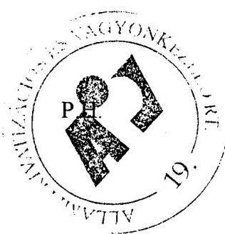
dr. Braskó Mária
ügyvezető igazgató

---

2001. évi ÁSZ-beszámoló és auditált beszámoló közötti főbb különbségek levezetése

Huzsárendelt vagyon

|   | ÁSZ beszámoló   adatai | Végleges beszámoló | Eltérés  |
| --- | --- | --- | --- |
|  Bevételek | 55.613 | 51.735 | 3.878  |
|  Kiadások | 52.272 | 50.920 | 1.352  |

Jelentős eltérések magyarázata: Bevételek: Az MTV reverzálás miatt a végleges beszámolóban 4.000 MFt bevétel csökkentő tételként került elszámolásra. / Az ÁSZ beszámolóban privatizációs kiadásként volt kimutatva /. A változás az egyéb bevételek soron történt!

# Kiadások:

- Az MTV reverzálás miatt kikerült a kiadások közül: -4.000
- Egy átvezetés az ÁSZ-szal történt egyeztetés szerint átkönyvelésre került a kiadások közé:

A változások a K.1.1 és a K.7. soron történtek

|  Privatizációs tartalék |  |  |   |
| --- | --- | --- | --- |
|   | ÁSZ beszámoló adatai | Végleges beszámoló | Eltérés  |
|  Bevételek | 104.230 | 106.756 | -2.526  |
|  Kiadások | 125.005 | 125.005 | 0  |

Jelentős eltérések magyarázata: Bevételek: Egy átvezetés 2.526 MFt értékben az ÁSZ-szal történt egyeztetés szerint átkönyvelésre került a bevételek közé

---

Vagyonváltozás
millió Ft

|  | ÁSZ beszámoló   adatai | Végleges beszámoló | Eltérés |
| :--: | :--: | :--: | :--: |
| 4/a vagyontábla sorai   1-6-ig | 830.708 | 830.014 | 694 |
| követelések | 27.984 | 29.370 | -1.386 |
| kötelezettségek | 120.776 | 109.087 | 11.689 |
| hozzárendelt vagyon   összesen | 737.916 | 750.297 | -12.381 |

Jelentős eltérések magyarázata:
A vagyontábla 1-6 sorában a gazdasági társaságok változása -47 MFt csökkenés oka a részvények RJGY szerinti nyilvántartásának felülvizsgálata miatti átértékelése volt (46.848.018 Ft)
Az elvont, átvett vagyonelemek eltérését az időben később elfogadott leltárkülönbözetek lekönyvelése jelentette, összességében 113 MFt.
A termőföldek esetében ugyancsak a leltáreltérésből adódik a különbség 762 MFt.
A követelések 1.386 MFt-os növekedése: a HM követelés elszámolásának tisztázása következtében 1,2 MrdFt-tal nőtt, befolyt követelés miatt az értékvesztés értéke is változott mintegy 178 MFt-tal.
A kötelezettségek összege 11.689 MFt-tal történő csökkenésének oka:
PEH kötelezettség elévülése miatt felülírásra került összesen 6.967 MFt értékben, a Fővárosi Önkormányzattal szemben fennálló kötelezettség kamata 450 MFt összegben, illetve a TB vagyon miatt 3.115 MFt módosította a korábban közölt adatokat.

Budapest, 2002. augusztus 15.

