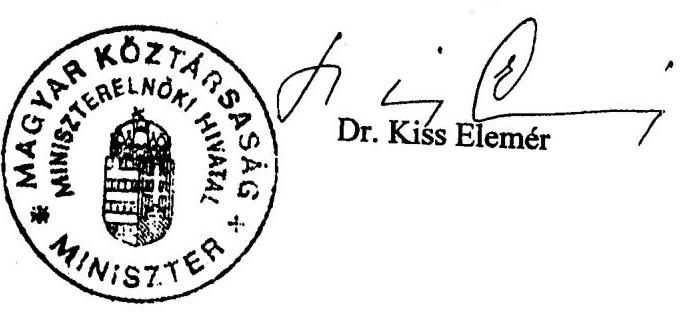
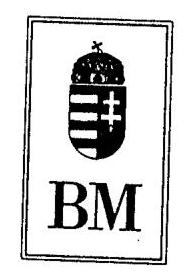
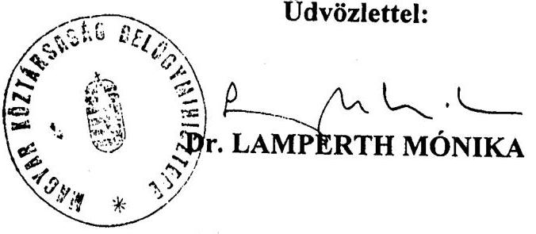

# JELENTÉS 

a Kormány által a miniszterelnök részére állandó szálláshelyként kijelölt ingatlan személyi védelemmel összefüggő átalakítási költségeinek ellenőrzéséről

---

# 2. Államháztartás Központi Szintjét Ellenőrző Igazgatóság 

2.3. Átfogó Ellenőrzési Főcsoport

Iktatószám: V-20-44/2002.
Témaszám: 616
Vizsgálat-azonosító szám: V0062

## Az ellenőrzést felügyelte:

Bihary Zsigmond
föigazgató
Az ellenőrzés végrehajtásáért felelős:
Hegedűsné dr. Müllern Veronika
főcsoportfőnök
Az ellenőrzést vezette:
Hudik Zoltán
számvevő igazgatóhelyettes
Az összefoglaló jelentést készítette:
Hudik Zoltán
számvevő igazgatóhelyettes
A számvevői jelentés feldolgozásában és a jelentés összeállításában
közremüködött:
Tóth Bálint
számvevő tanácsos főtanácsadó
Az ellenőrzést végezték:

| Balkay Attila | Tóth Bálint | Jakab Péter |
| :-- | :-- | :-- |
| számvevő | számvevő tanácsos | külső szakértő |
|  | főtanácsadó |  |

Jelentéseink az Országgyűlés számítógépes hálózatán és az Interneten a www.asz.hu címen is olvashatók.

---

# TARTALOMJEGYZÉK 

BEVEZETÉS ..... 5
I. ÖSSZEGZŐ MEGÁLLAPÍTÁSOK, KÖVETKEZTETÉSEK, JAVASLATOK ..... 8
II. RÉSZLETES MEGÁLLAPÍTÁSOK ..... 12

1. A miniszterelnök személyi védelmével és az elnöki rezidenciákkal kapcsolatos szabályozási háttér áttekintése ..... 12
1.1. A személyi védelemmel összefüggő feladat-, hatás- és jogkörök szabályozottsága, a szabályozási hierarchia különböző szintjein kiadott rendelkezések egyértelműsége és összhangja ..... 12
1.2. A miniszterelnök (közjogi méltóságok) elhelyezését, az egyes kincstári vagyonkörbe tartozó ingatlanok hasznosítását érintő szabályozások ..... 17
2. A miniszterelnök személyére és állandó szálláshelyére (rezidenciájára) kiterjedő védelem megszervezése és végrehajtása ..... 21
2.1. A védett személy biztosítási rendszerének meghatározása ..... 21
2.2. Az állandó szálláshely (rezidencia) védelmi célú beruházása, biztonságtechnikai védelme, a költségvetési források biztosítása ..... 22
2.3. Az elnöki rezidenciákkal kapcsolatos költségvetési ráfordítások ..... 26
Mellékletek:
3. sz. Miniszterelnöki Hivatalt vezető miniszter észrevétele
4. sz. Belügyminiszter észrevétele

---

.

---

# RÖVIDÍTÉSEK JEGYZÉKE 

| áfa | általános forgalmi adó |
| :--: | :--: |
| Áht | az államháztartásról szóló 1992. évi XXXVIII. törvény |
| BM | Belügyminisztérium |
| BM KGFI | Belügyminisztérium Központi Gazdasági Főigazgatóság |
| Jt. | a Kormány tagjai és az államtitkárok jogállásáról és felelősségéről szóló 1997. évi LXXIX. törvény |
| KVI | Kincstári Vagyoni Igazgatóság |
| MEH | Miniszterelnöki Hivatal |
| MFB Rt. | Magyar Fejlesztési Bank Részvénytársaság |
| OGY | Magyar Köztársaság Országgyúlése |
| ORFK | Országos Rendőr-főkapitányság |
| Örezred | Országos Rendőr-főkapitányság Köztársasági Örezred |
| SzMSz | Szervezeti és Múködési Szabályzat |

---

.

---

# JELENTÉS 

## a Kormány által a miniszterelnök részére állandó szálláshelyként kijelölt ingatlan személyi védelemmel összefüggő átalakítási költségeinek ellenőrzéséről

## BEVEZETÉS

A Magyar Köztársaság 2002. május 27 -én beiktatott miniszterelnökének állandó szálláshelyéül a Kormány - a miniszterelnök személyi védelméről szóló 2177/2002. (VI. 5.) Korm. határozatban - a Budapest XII. kerület Stromfeld Aurél út 26/B. szám alatti állandó lakóhelyét jelölte meg. E kormányhatározat egyben felhívta a belügyminisztert, hogy azonnali határidővel gondoskodjon a védett személyek és a kijelölt létesítmények védelméről szóló 160/1996. (XI. 5.) Korm. rendelet előírásai szerint - a miniszterelnök személyi védelméről.

A köztársasági elnök, a miniszterelnök, az Országgyúlés elnöke, az Alkotmánybíróság elnöke és a Legfelsőbb Bíróság elnöke tiszteletdíjáról és juttatásairól szóló - 2000. VI. 3-tól hatályos - 2000. évi XXXIX. törvény a köztársasági elnökre és a miniszterelnökre vonatkozóan részletes szabályozást adott, az Országgyúlés, az Alkotmánybíróság és a Legfelsőbb Bíróság elnökére vonatkozóan pedig a miniszterelnökre irányadó szabályozásra való utalással történt a juttatások meghatározása, az egyes közjogi tisztségek sajátosságaiból adódó eltérések külön rendezésével. E törvény értelmében mind az öt közjogi méltóság külön jogszabály szerint személyi védelemre jogosult ( 9 . §, valamint 20, 24, 25 és a 26. §).

A Rendőrségről szóló 1994. évi XXXIV. törvény 100. § (1) bekezdés i) pontja hatalmazta fel a Kormányt, hogy rendeletben szabályozza a megelőzési védelemmel, a személybiztosítással és objektumvédelemmel kapcsolatos szabályokat. Ez a védett személyek és a kijelölt létesítmények védelméről szóló 160/1996. (XI. 5.) Korm. rendelet kiadásával valósult meg.

A kormányrendeletben foglaltak alapján védelemben kell részesíteni: állandó jelleggel a rendelet mellékletében kijelölt állami vezetőket (a közjogi méltóságokat és esetenként ide sorolt minisztereket); a nemzetközileg védett személyt, valamint viszonosság alapján más külföldi személyt magyarországi tartózkodása alatt; továbbá ideiglenes jelleggel mindazon személyeket, akiket az Alkotmánnyal és a törvényekkel összhangban álló közéleti tevékenységük miatt személyük vagy közvetlen környezetük ellen irányuló erőszakos bűncselekménnyel fenyegettek meg, illetve egyéb alapos okból a védelmük szükséges és a védelmet a Kormány a Rendőrségről szóló törvény 46. §-ának (2) bekezdése szerint elrendelte. A jogszabályalkotásnál azonban figyelmen kívül maradt, hogy van számos olyan - egyébként miniszteri juttatásokra jogosult - állami vezető is

---

(pl. az Alkotmánybíróság elnökhelyettese, a Legfelsőbb Bíróság elnökhelyettese, a Legfőbb Ügyész, az Állami Számvevőszék elnöke stb.), akik nem a Kormány felügyelete alatt látják el feladataikat, de közéleti tevékenységükre tekintettel, különböző indokok alapján, a hivatkozott kormányrendeletben foglaltakkal azonos besorolásuk megalapozott lehet. Esetükben azonban a hatályban levő szabályozás nem ad kellő eligazítást.

A belügyminiszter a személyi védelemmel és a meghatározott létesítmények őrzésével kapcsolatos feladatok ellátására - a Rendőrségről szóló törvény alapján rendeletben szabályozva - a Köztársasági Örezredet jelölte ki. A Köztársasági Örezred hatáskörébe utalt személyvédelmi, megelőző védelmi, létesítményvédelmi, híradás- és biztonságtechnikai feladatok végrehajtását a 3/1998. (BK 2.) BM Utasítás szabályozza.

Az öt közjogi méltóság közül a köztársasági elnök, a miniszterelnök és az Országgyúlés elnökének elhelyezése a többször módosított 1/2000. (II. 2.) ME határozatban foglaltak szerint a Budapest, XII. Béla Király út 28. szám alatti objektumban - az ingatlan értékesítésére tekintettel - 2002. augusztus 31-ig lenne biztosított. A köztársasági elnök végleges elhelyezése még nem tekinthető lezárt folyamatnak. Az Országgyúlés elnökének elhelyezése a miniszterelnök részére történt állandó szálláshely ez év júliusi kijelölésével vált megoldhatóvá. Az Alkotmánybíróság elnökének, valamint a Legfelsőbb Bíróság elnökének állandó szálláshelyét (rezidenciáját) tekintve ilyen gondok nem merültek fel, a védelmüket szolgáló technikai biztosítás - az áttekintett időszakban - rendezett volt. (A helyszíni ellenőrzés befejezésének időszakában, a Legfelsőbb Bíróság elnöke személyét érintő változást követően, az elnöki rezidenciát szolgálati lakássá minősítették, így maradt az a leköszönő elnök használatában. A Legfelsőbb Bíróság új elnökének állandó szálláshelye - belső határozattal - vált rezidenciává és ez részesül technikai és egyéb élőerős védelemben.)

A miniszterelnök elhelyezéséül szolgáló - Kormány által meghatározott - állandó szálláshely védelmi feladatait ellátó Köztársasági Örezredet csak ez évben minősítették önálló költségvetési szervnek (egyes belügyminiszteri rendeletek módosításáról szóló 15/2002. (V. 10.) BM rendelet), ezt megelőzően részben önálló költségvetési szerv besorolással rendelkezett. A Magyar Köztársaság 2001. és 2002. évi költségvetéséről szóló 2000. évi CXXXIII. törvény a Köztársasági Örezred kiadási előirányzatát 2002. évre 4,4 Mrd Ft-ban állapította meg, amely a miniszterelnöki rezidencia kialakításával kapcsolatban előirányzatot nem tartalmazott. (A többször módosított 1/2000. (II. 2.) ME határozat a közjogi méltóságok új elhelyezését szolgáló - a kincstári vagyonkörből kijelölt - ingatlanok helyreállítási költségeinek fedezetéül a Béla Király út 28. szám alatti ingatlan eladásból származó bevételt jelölte meg.)

A Kormány által a miniszterelnök részére állandó szálláshelyként kijelölt objektum átalakítási költségeinek ellenőrzésére - a miniszterelnök felkérésének figyelembevételével - a többször módosított, az Állami Számvevőszékről szóló 1989. évi XXXVIII. törvény 2. § (3) és 17. § (6) bekezdésében, valamint a többször módosított, az államháztartásról szóló 1992. évi XXXVIII. törvény (Áht.) 121. § (1) bekezdésében foglaltak adtak jogszabályi alapot. A hivatkozott jogszabályok szerint az Állami Számvevőszék ellenőrzi az államháztartás forrása-

---

it, azok felhasználását és a vagyonnal való gazdálkodást, a Kormány felkérésére ellenőrzést végezhet.

Az ellenőrzés célja annak megállapítása volt, hogy a miniszterelnök

- személyi védelmével kapcsolatos feladatok szervezését, végrehajtását támogatja-e kellően összehangolt, egyértelmű eligazítást nyújtó szabályozási háttér (jogszabályok, egyéb jogi szabályozási eszközök);
- személyére és állandó szálláshelyére (rezidenciájára) kiterjedő védelem megszervezése és végrehajtása szabályszerűen és egyben célszerűségi szempontok érvényesülésével történt-e;
- állandó szálláshelye technikai eszközökkel biztosított védelmének kialakításánál érvényesültek-e a célszerűségi és eredményességi szempontok, a veszélyeztetettségi szintnek megfelelő (elegendő védelmet nyújtó) technikai védelmi rendszert alakítottak-e ki.

A helyszíni ellenőrzés alapvetően a Köztársasági Őrezred - miniszterelnök állandó szálláshelyének (rezidenciájának) átalakításával és védelmének biztosításával kapcsolatos - tevékenységére és a Belügyminisztérium rezidenciák kialakításában érintett intézményeinek közremúködésére terjedt ki. A miniszterelnök környezetének védelmét szolgáló rendszer értékelését - az Állami Számvevőszék megbízásával - külső biztonsági szakértő végezte. Tájékozódtunk továbbá a közjogi méltóságok elhelyezésével összefüggésben feladatokat ellátó intézményeknél, így a Miniszterelnökség, az Alkotmánybíróság és a Bíróságok költségvetési fejezetek érintett szervezeteinél, valamint a Kincstári Vagyoni Igazgatóságnál.

A védett személyek és objektumok biztosítási, őrzési és védelmi tervei, a hírközlő és biztonsági berendezések múködésére, elhelyezésére vonatkozó adatok, továbbá a köztársasági elnöki, valamint a miniszterelnöki rezidenciákra vonatkozó építészeti tervdokumentációk, az épület-átalakítási, felújítási tervek, a biztonsági rendszer múködésével kapcsolatos adatok, dokumentációk - az államtitokról és a szolgálati titokról szóló 1995. évi LXV. törvény mellékletét képező államtitokköri jegyzék alapján - államtitoknak minősülnek. Ennek figyelembevételével és eleget téve a jelentés nyilvánossá tételére vonatkozó miniszterelnöki felkérésnek is, a jelentés csak nem titkos megállapításokat és következtetéseket tartalmaz. A részletes megállapítások összeállításánál sem használtunk fel titokvédelem alá tartozó adatokat, információkat (melyekkel a helyszíni ellenőrzés találkozott), mindössze az ellenőrzés nyíltan megfogalmazható tapasztalatait rögzítettük, a következtetések alátámasztására.

A végleges jelentést - az Állami Számvevőszékről szóló 1989. évi XXXVIII. törvény 25. § (1) bekezdésének megfelelően - megküldtük a Miniszterelnöki Hivatalt és a Belügyminisztériumot vezető minisztereknek. A Miniszterelnöki Hivatalt vezető miniszter nem tett észrevételt (1. sz. melléklet). A belügyminiszter asszony a jelentésben foglaltakkal egyetértett, továbbá jelezte, hogy az ellenőrzés alapján tett intézkedésekről a jogszabályban előírtak szerint tájékoztatja az Állami Számvevőszéket (2. számú melléklet)

---

# I. ÖSSZEGZŐ MEGÁLLAPÍTÁSOK, KÖVETKEZTETÉSEK, JAVASLATOK 

A hatályos jogszabályi rendelkezések értelmében a miniszterelnök - többek között - elnöki rezidencia használatára, valamint hivatalos és magánprogramokra is kiterjedően személyi védelemre jogosult. A miniszterelnök az állandóan védett személyi körhöz tartozik, így védeni kell a környezetét (munkahelyét, lakását vagy egyéb tartózkodási helyét) adott célnak megfelelő technikai eszközökkel (berendezésekkel). Emellett a védelme kiterjed az állandó szálláshelyének (rezidenciájának) és ideiglenes szállásának őrszemélyzettel történő biztosítására. A jogszabályok egyértelműen alátámasztják, hogy a Kormány által a miniszterelnök részére kijelölt állandó szálláshely (rezidencia) biztonsági átalakítása indokolt és szükségszerú feladat volt.

A védett személyek és a kijelölt létesítmények védelméről szóló rendelkezések nem tartalmaznak utalást a védendő lakás vagy egyéb tartózkodási hely tulajdoni formájára, nyilvánvalóan azt tükrözve, hogy a biztonsági feladatokat minden körülmények között teljesíteni kell. Ugyanakkor a szabályozás elrendelte a lakásba felszerelt biztonságtechnikai eszközök - védelemre, utóbiztosításra vonatkozó jogosultság megszűnésével egyidejű - leszerelését, kivéve, ha a védett személy azokat az amortizáció figyelembevételével meghatározott térítés ellenében átveszi és vállalja a fenntartási, üzemeltetési költségek viselését. Következésképpen indifferens, hogy a biztonságtechnikai átalakítás állami vagy magántulajdonú ingatlanban történt.

A miniszterelnök személyi védelmét és elnöki rezidenciáját érintő szabályozási háttér áttekintése hozta felszínre, hogy - a biztonságos elhelyezését szolgáló (Bp. XII. Béla király út 28. szám alatti) ingatlan 2000. évben elhatározott értékesítése következtében beállott új helyzetben - a közjogi méltóságok juttatásaira, védelmére vonatkozó jogszabályi elöírások további olyan pontosításokat, kiegészítéseket igényelnek, melyekre a hatályos jogszabályok többszöri módosításuk ellenére - nem tértek ki.

Korábban, amíg a köztársasági elnök, a miniszterelnök és az Országgyúlés elnöke ezen ingatlanon levő objektumokban nyertek elhelyezést, nem volt különösebb jelentősége a rezidencia fogalomkör meghatározásának, mert az objektumok adottak voltak. Az új objektumok kijelölésénél, kialakításánál, védelmük biztosításánál viszont már felmerül az igény a rezidenciák paramétereinek, a kapcsolódó feladatok felelőseinek tisztázására, ezen a téren - a közjogi méltóságokat érintő feladatellátásra tekintettel - a Kormány, illetve a felügyelete alá tartozó szervek (intézmények) szerepének meghatározására.

A miniszterelnök (és általánosságban a védett személyek) védelmére vonatkozó alacsonyabb szintű rendelkezések (miniszteri, országos főkapitányi stb. utasítások) lényegében egymással összhangban - a végrehajtásban érintettek számára megfelelő eligazítást adó módon - szabályozták a feladatokat és hatásköröket. Ugyanakkor a szabályozás magasabb szintjeit is beleértve az összhang már nem teljesült, a védett személyek védelmét kifejező fogalmak következe-

---

tesnek nem minősíthető használata következtében. (Értelmező rendelkezések hiányában nem világos, hogy a törvényi szabályozásban hivatkozott személyi védelemről szóló jogosultság csak a BM utasítással meghatározott személyvédelmi feladatokat öleli fel, vagy tartalmazza a kormányrendelet személyek védelme címszó alatt felsorolt technikai eszközökkel biztosított védelmét is.)

A fogalmak pontos értelmezése a védelmi feladatok szabályszerű finanszírozása szempontjából sem közömbös, mivel sajátos értelmezés esetén akár konzisztencia zavarról is lehet beszélni. (A törvényi előírás alapján a juttatásként járó védelem költségeit a védett személy hivatali szervezetét tartalmazó fejezetnek kell fedezni, a kormányrendelet szerint a technikai és személyvédelemmel kapcsolatos költségek a BM fejezet költségvetését terhelik).

A legfőbb közjogi méltóságok (köztük a miniszterelnök) elhelyezésének korszerűsítésére irányuló elképzelések felvetése az 1999. évre vezethető vissza, bár erről kevés dokumentum volt fellelhető. A 2000. év februárjában hozott miniszterelnöki határozat rendelkezett a - „közjogi skanzen"-nek tartott - Béla király út 28. alatti ingatlan értékesítése céljából folytatandó tárgyalások megkezdéséről anélkül, hogy e döntést alapos előkészítés megelőzte volna. Ezt támasztják alá az ingatlanértékesítés tapasztalt bonyodalmai, a feltételezett nagyságrendű bevétel elérhetetlensége, az elnöki rezidenciahelyszínek (ingatlankijelölések) - különböző okok miatt történt - a miniszterelnöki határozat módosításaiban testet öltő, szinte folyamatos változtatása és nem utolsó sorban az új rezidenciák 2002. szeptemberére tervezett használatba vételi lehetőségében mutatkozott csúszások.

A több mint kétéves időszak alatt mindössze a Művész utca 6. alatti ingatlan több mint 800 M Ft kiadással járó - helyreállításáról mondható el, hogy rendelkezésre állhat a miniszterelnöki határozatban eredetileg kitűzött határidőre. A rezidencia célú hasznosításra 2001 júniusában kijelölt ingatlanok (Cinege u. 4-6. és Felvinci út 27.) helyreállításának kivitelezési munkálatait el sem kezdték. E két ingatlannál az előkészítés fázisában megrendelt, főként tervezői munkákra összesen mintegy 116,0 M Ft-ot fizettek ki, amihez a Felvinci úti ingatlan esetében az ingatlan felszabadításával (bérleti szerződés felmondásával) összefüggésben a költségvetésből további 40,0 M Ft kifizetése társult. Tulajdonképpen a 2002. júniusi kormányhatározattal kijelölt miniszterelnöki rezidencia hozott kedvező fordulatot a legfőbb közjogi méltóságok elhelyezésében, mert így csak az egyikük elhelyezése maradt rendezetlen (a Béla király út 28. alatti ingatlan eladásának elhúzódása miatt).

A miniszterelnök személyére és állandó szálláshelyére (rezidenciájára) kiterjedő védelem megszervezését előírásszerűen és egyben a célszerűségi szempontok érvényesülésével végezték a Köztársasági Örezred illetékes szervezetei. A megelőző védelmi feladatok végrehajtása megalapozta a biztosítási rendszer meghatározását. A veszélyeztetettség mértékéhez igazodva dolgozták ki az állandó szálláshely (rezidencia) komplex élőerős és technikai védelmi rendszerének koncepcióját. A lakóépület folyamatban lévő felújítási, átalakítási munkáit is figyelembe véve végeztek állapotfelmérést. Ez adott kellő alapot költségvetési forrásból finanszírozható - a személyi védelem elégséges feltételeinek biztosításához szükséges - beszerezési és építési feladatok meghatározásához.

---

A Köztársasági Őrezred parancsnoka által jóváhagyott rendszerterv alapján határozták meg a behatolási és tűzvédelmi, valamint a biztonságtechnikai eszközök körét és mennyiségét. Az ingatlan védelmi kockázataira figyelemmel szükségessé vált az épület mechanikai védelme biztosításához védelmi elemek beépítése, felszerelése is, ami szükségszerűen együtt járt járulékos építési feladatokkal (tartószerkezet megerősítés, páraelzárás, hőszigetelés). A titokvédelem alá eső (termék és szolgáltatás tárgyú) beszerzéseket - az OGY Nemzetbiztonsági Bizottsága felmentő határozatára tekintettel - az ide vonatkozó kormányrendelettel előírt tárgyalásos közbeszerzési eljárás keretében bonyolították.

A közbeszerzési eljárás kormányrendeletben meghatározott módjától annyiban tértek el, hogy a pályáztatást már az érintett ajánlattevők biztonsági ellenőrzése előtt elindították, a védelmi rendszer mielőbbi megvalósítása érdekében. Ez akkor sem minősíthető szabályszerű megoldásnak, ha a kiválasztott gazdálkodó szervezetek ellenőrzése - a Nemzetbiztonsági Hivatal tájékoztatása szerint - nemzetbiztonsági szempontból kockázati tényezőt jelentő információt nem hozott felszínre. A beszerzési folyamat - előírásokba nem ütköző - lerövidítését az előminősített vállalkozások rendelkezésre állása segíthette volna.

A miniszterelnök állandó szálláshelye védelmének biztosítása céljára rendelkezésre álló 50,0 M Ft keretösszeg terhére - a mechanikai védelem építési munkáira és a technikai eszközbeszerzésekre - vállalkozói, illetve szállítói szerződésekben (a helyszíni ellenőrzés lezárásáig) összesen 37 239,8 E Ft összegben vállaltak kötelezettséget. Ezt követően, a biztosítás teljessé tételéhez csak a nyílászárók technikai védelme szükséges, melynek becsült kivitelezési összegét tekintve az előirányzott költségvetési keret elegendő forrást biztosít. Megállapítható volt, hogy a vállalkozási és szállítási szerződések megkötésénél (kötelezettségvállalásnál) a költségvetési gazdálkodásra vonatkozó előírások szerint jártak el. A védelmi elemek beépítése, illetve a kapcsolódó építési feladat végrehajtása az objektum használati funkcióinak bővítését nem eredményezte. (A helyszíni ellenőrzés lezárása után kapott adatok szerint a nyílászárók mechanikai védelmének költsége 1812,5 E Ft volt.)

A miniszterelnök állandó szálláshelye technikai eszközökkel biztosított védelmének szakértői ellenőrzése - az objektum védelmi rendszertervének áttekintése alapján - megállapította, hogy az elnöki rezidencia és az ott tartózkodó védett személyek biztonsága a fenyegetettség minősítéshez igazodóan szavatolható. A szakértői vélemény szerint az alkalmazott kompromisszumos megoldások (fizikai, műszaki-technikai védelem, élőerős intézkedések) a megállapított veszélyeztetettségi szintre vonatkoztatva kockázatarányosak. Ez a beszerzett, beépített eszközök szempontjából azt jelenti, hogy azok a védettségi szint biztosításához valóban szükségesek és a feladat ellátásához elégségesnek minősíthetők.

A beszerzett, illetve beépítésre kerülő eszközök árfekvését a szakértő teljesít-mény-arányosnak találta, mivel azok ár/teljesítmény viszonya alapvetően nem tért el a szakmailag indokolt és általánosan elfogadott árszínvonaltól, megfelelve a gazdaságosság követelményének.

A konkrét szakértői vizsgálat kapcsán nyert általános megfogalmazást, hogy amíg a kiemelten védett személyek nem az erre a célra kijelölt és felkészített re-

---

zidenciát használják védett státuszuk ideje alatt, addig az általuk preferált szálláshely sajátosságaiból következően környezetük védettsége csak eltérő színvonalon és eltérő költségekkel valósítható meg. Ezek a megoldások rendszerint és szükségszerűen tartalmaznak olyan biztonsági kompromisszumokat, melyekre egy állandó rezidencia kialakításakor nem kényszerülne a biztonságos környezet megteremtéséért felelős szervezet.

A helyszíni ellenőrzés megállapításainak hasznosítása mellett javasoljuk:

# a Kormánynak 

Gondoskodjon a közjogi méltóságok juttatásairól szóló és a védett személyek védelmével kapcsolatos jogszabályok összhangjának biztosításáról, hogy azok egyértelmú eligazítást nyújtsanak a végrehajtásban érintettek számára és nem utolsó sorban a számonkérhetőség szempontjából.

## a belügyminiszternek:

Gondoskodjon a tárcánál előforduló, nemzetbiztonsági és titokvédelmi okok miatt sajátos beszerzések - jogszabályi rendelkezésekhez igazodó - szabályozásáról, különös tekintettel az irányadó, 151/1999. (XI. 22.) Korm. rendelet 5. és 6. §-aiban hivatkozott előzetes minősítésekre.

---

# II. RÉSZLETES MEGÁLLAPÍTÁSOK 

## 1. A MINISZTERELNÖK SZEMÉLYI VÉDELMÉVEL ÉS AZ ELNÖKI REZIDENCIÁKKAL KAPCSOLATOS SZABÁLYOZÁSI HÁTTÉR ÁTTEKINTÉSE

### 1.1. A személyi védelemmel összefüggő feladat-, hatás- és jogkörök szabályozottsága, a szabályozási hierarchia különböző szintjein kiadott rendelkezések egyértelmúsége és összhangja

A miniszterelnök juttatásairól (beleértve a személyes biztosításra, illetve a személyi védelemre vonatkozó jogosultságot) egyfelől 1997. évben az állami vezetökre, másfelől 2000. évben a közjogi méltóságokra kiterjedő törvényi szabályozás rendelkezett. Mindkét jogszabály kitért a miniszterelnöki, elnöki rezidencia használatára. A korábbi szabályozás a jogosultság mellett még egyértelmúen rögzítette a miniszterelnök rezidencia-igénybevételi kötelezettségét, a törvény erről rendelkező szakaszát azonban a 2000. évi szabályozás hatályon kívül helyezte. Ettől kezdve, a közjogi méltóságok jogosultságairól rendelkező törvény csak a köztársasági elnök részére írt elő egzakt módon igénybevételi kötelezettséget.

A miniszterelnök, mint politikai tisztséget betöltő állami vezető - a Kormány tagjai és az államtitkárok jogállásáról és felelősségéről szóló 1997. évi LXXIX. törvény (Jt.) 52. § (1) bekezdése alapján - hivatali lakással való ellátásra, illetőleg lakásfenntartási térítésre, személyes biztosításra stb., az állami vezetői juttatások jogosultsági feltételeiről szóló 131/1997. (VII. 24.) Korm. rendeletben meghatározottak szerint jogosult. A Jt. 45. §-a rendelkezett arról, hogy a miniszterelnök a miniszterelnöki rezidencia használatára jogosult, amelyet köteles igénybe venni. Egyben előírta, hogy a rezidencia fenntartásának költségeit a központi költségvetés fedezi. Ez a § 1997. VIII. 1-től 2000. VI. 3-ig volt hatályos.

A köztársasági elnök, a miniszterelnök, az Országgyűlés elnöke, az Alkotmánybíróság elnöke és a Legfelsőbb Bíróság elnöke tiszteletdíjáról és juttatásairól szóló 2000. évi XXXIX. törvény - a köztársasági elnökre és a miniszterelnökre vonatkozóan részletesebb szabályozást adott, az Országgyűlés, az Alkotmánybíróság és a Legfelsőbb Bíróság elnökére vonatkozóan pedig a miniszterelnökre irányadó szabályozásra való utalással történt a juttatások meghatározása, az egyes közjogi tisztségek sajátosságaiból adódó eltérések külön rendezésével. A törvény 5. §-a rögzítette, hogy a köztársasági elnök elnöki rezidencia használatára jogosult, amelyet köteles igénybe venni. Ugyanakkor a törvény 20. § (2) bekezdése szerint: „a miniszterelnököt egyebekben az e törvény 2-9. §-ában, továbbá 11. és 13. §ában meghatározott juttatások illetik meg."

A közjogi méltóságok juttatásainak 2000. évben hatályba léptetett törvényi szabályozása - a miniszterelnököt érintő jogszabályhely [20. § (2) bek.] utaló jellegénél fogva - az 5. § tekintetében a miniszterelnök személyére csak a jogosultságot vonatkoztatja, a kötelezettséget nem. Amennyiben a szabályozás

---

az 5. § rendelkezésének egészét - a kötelezettséggel együtt - kívánná a miniszterelnökre vonatkoztatni, akkor a 20. § (2) bekezdésnek a következőképpen kellene fogalmaznia: „A miniszterelnök további juttatásaira egyebekben az e törvény 2-9. §-ai, valamint a 11. § és a 13. § rendelkezései az irányadóak". A 2000. évi XXXIX. törvény indoklása sem utalt arra a miniszterelnök esetében, hogy kötelező lenne a rezidencia igénybevétele - akár gazdasági, akár biztonsági és protokolláris megfontolások miatt - csak felsorolta a rezidenciát a miniszterelnököt megillető juttatások között.

A törvényi indoklás rögzítette, hogy „az így kialakított juttatási rendszer alapján a megbízatási ideje alatt a miniszterelnököt megilleti a köztársaság elnökének megfelelő társadalombiztosítási jogállás, évente egyhavi illetményének megfelelő külön juttatás, negyven munkanap szabadság, a rezidencia, a személyi és hivatali használatú gépkocsi, a zártcélú távközlő hálózat használata, a külföldi kiküldetés során kíséret, a költségtérítés, a különjáratú légiutazás, illetőleg más közlekedési eszközön az első osztályú komfortfokozat, a kormányváró használata, továbbá a személyi védelem, a Kormány Központi Üdülőjének használata, és a térítésmentes egészségügyi ellátás.".

A 2000. évi XXXIX. törvény további rendelkezései - 24. §, 25. § és 26. § - az Országgyűlés elnöke, az Alkotmánybíróság elnöke, valamint a Legfelsőbb Bíróság elnöke tiszteletdíját (illetményét) és juttatásait, a miniszterelnököt megillető járandóságok, juttatások alapján, külön-külön megállapított eltérésekkel határozták meg. Így a törvény az „elnöki rezidencia" igénybevételével kapcsolatban számukra is csak jogosultságot állapított meg, kötelezettséget nem.

A Rendőrségről szóló 1994. évi XXXIV. törvény hatalmazta fel a Kormányt, hogy rendeletben szabályozza a megelőzési védelemmel, a személybiztosítással és objektumvédelemmel kapcsolatos szabályokat [100. § (1) bekezdés i) pont]. Ez a védett személyek és a kijelölt létesítmények védelméről szóló 160/1996. (XI. 5.) Korm. rendelet kiadásával valósult meg. A közjogi méltóságok juttatásait szabályozó törvény ugyan nem nevesítve, de valószínűsíthetően (és a jogalkalmazás tapasztalatai által alátámasztottan) erre a kormányrendeletre utalt, amikor a „külön jogszabály szerinti" személyi védelemről rendelkezett. Az állami vezetők juttatásaival kapcsolatos szabályozás (a többször módosított 1997. évi LXXIX. törvényben hivatkozott, az állami vezetői juttatások jogosultsági feltételeiről szóló 131/1997. (VII. 24.) Korm. rendelet 16. §-a) az állami vezető személyes biztosítását illetően - konkrétan utalt e kormányrendelet irányadó szerepére.

A 160/1996. (XI. 5.) Korm. rendeletben foglaltak szerint kell megszervezni és végrehajtani a Magyar Köztársaság - e rendelet melléklete szerint kijelölt - állami vezetője (Magyar Köztársaság elnöke, Magyar Köztársaság miniszterelnöke, Magyar Országgyűlés elnöke, Magyar Köztársaság Alkotmánybíróságának elnöke, Magyar Köztársaság Legfelsőbb Bíróságának elnöke és 2002 májusáig a polgári nemzetbiztonsági szolgálatokat felügyelő tárca nélküli miniszter) állandó védelmét, az utóbiztosításra jogosultak védelmét [1. § (1) bekezdés a) pont].

A védelem megszervezésében, végrehajtásában irányadó jogszabály a védett személyekre vonatkozóan általánosságban igyekezett rámutatni a védendő környezetre, melyet biztonságtechnikai berendezésekkel kell védeni. Ezen túlmenően a miniszterelnök esetében konkrétan előírta az állandó és az ideiglenes szálláshelyének őrszemélyzettel történő biztosítását. A szabályozás

---

ezáltal teljes körűen lefedi többek között a miniszterelnök őrszemélyzettel és/vagy technikai eszközökkel történő védelmét, azonban a védendő környezet különböző megjelenési formáinak jogszabályi meghatározására nem tért ki.

A 160/1996. (XI. 5.) Korm. rendelet 3. § (1) bekezdés b) pontja alapján a védelem kiterjed a védett személy munkahelye, lakása vagy egyéb tartózkodási helye őrszemélyzettel vagy technikai eszközzel biztosított védelmére.

A 3. § (2) bekezdés a) pontja szerint az (1) bekezdésben meghatározottakon túl a Magyar Köztársaság elnöke és a miniszterelnök védelme kiterjed állandó szálláshelyének (rezidencia), illetve ideiglenes szállásának őrszemélyzettel történő biztosítására. (Hasonlóan fogalmazott a jogszabály az Országgyúlés elnöke, az Alkotmánybíróság elnöke és a Legfelsőbb Bíróság elnöke állandó szálláshelyének (rezidencia), illetve ideiglenes szállásának őrszemélyzettel történő biztosításával összefüggésben is [3. § (3) bekezdés]).

A 3. § (4) bekezdése alapján a védett személy biztosításának rendszerét a rendőrség határozza meg.

Az 5. § (1) bekezdése szerint a személyvédelmet a rendőrség elsősorban az ilyen tevékenység végrehajtására kiképzett hivatásos állományú rendőr szolgálatba állításával, felső kategóriájú és megfelelő biztonsági berendezéssel ellátott gépjármú rendelkezésre bocsátásával, továbbá állandó híradástechnikai összeköttetéssel biztosítja.

Az 5. § (2) bekezdése alapján a védett személy környezetét [3. § (1) bek. b) pont] az adott célnak megfelelő biztonságtechnikai berendezésekkel kell védeni. Ezek beszerzésével, üzemeltetésével, fel- és leszerelésével, továbbá a személyvédelemmel, valamint a (3)-(4) bekezdésben foglaltakkal kapcsolatos költség a Belügyminisztérium költségvetési fejezet, Rendőrség költségvetési címet terheli.

Meg kell még jegyezni, hogy az állami vezetőkre - ezek között a miniszterelnökre, mint politikai vezetőre - vonatkozóan hatályban maradt jogszabályok (1997. évi LXXIX. tv. és 131/1997. (VII. 24.) Korm. rendelet) ugyanúgy rendelkeznek továbbra is a védett személy lakásának az állami vezetői tevékenység ellátásához szükséges technikai eszközökkel való felszereléséről, ezek karbantartásáról és javításáról (131/1997. Korm. rend. 7. § (1) bekezdés), valamint külön jogszabály rendelkezések alapján a technikai védelméről (7. § (2) bekezdés).

A különböző szintű jogszabályokban alkalmazott fogalmak (a törvényekben: elnöki rezidencia, illetve hivatali lakás; kormányrendeletben: állandó szálláshely, rezidencia, lakás, ideiglenes szállás stb.) használatát értelmező rendelkezések nem segítik. A miniszterelnöki rezidenciával kapcsolatos értelmezés 2000. évtől bír nagyobb jelentősséggel, miután a köztársasági elnök, a miniszterelnök és az Országgyúlés elnökének elhelyezését szolgáló ingatlan (Budapest, XII. ker. Béla király út. 28.) értékesítése (eladása) felmerült. Ezt megelőzően, a védelemmel kapcsolatos kormányrendelet alkotása időszakában a rezidencia, mint védendő környezet adott volt (mivel az említett három közjogi méltóság elhelyezése egy védett, közös ingatlan objektumaiban történt).

A közjogi méltóságok (köztük a miniszterelnök) juttatásainak ugyancsak 2000. évben történt törvényi szabályozásánál sem számoltak azzal, hogy az említett ingatlan eladására tekintettel - a rezidencia célját szolgáló új objektumok kijelöléséhez, kialakításához, védelmük biztosításához - egyértelművé kell tenni az

---

alkalmazható kategóriákat, a kapcsolódó beruházási, védelmi feladatok végrehajtásának felelőseit és nem utolsó sorban a Kormánytól független közjogi méltóságok és a Kormány e tárgykörben történő együttműködésének módját. A gyakorlatban az érintett közjogi méltóságokkal folytatott többoldalú egyeztetés eredménye volt a meghatározó a rezidencia célját szolgáló új objektum kijelölésében.

A magasabb szintű jogszabályokban foglaltak figyelembevételével kiadott belügyminiszteri utasítás részletesen szabályozta a személyvédelmi, megelőző védelmi, létesítményvédelmi, híradás- és biztonságtechnikai feladatok végrehajtását (a Köztársasági Örezred feladatáról, hatásköréről és illetékességéről szóló (69/1997. (XII. 29.) BM rendelet végrehajtására kiadott 3/1998. (BK 2.) BM utasítás).

A védett személyek és a kijelölt létesítmények védelméről szóló 160/1996. (XI. 5.) Korm. rendelet rendelte el, hogy a védett személy biztosítási rendszerét a rendőrség határozza meg. A személyek védelemével és a meghatározott létesítmények őrzésével kapcsolatos feladatok ellátására - a belügyminiszter - a Rendőrségről szóló törvény alapján rendeletben szabályozva - a Köztársasági Örezredet (továbbiakban: Örezred) jelölte ki (69/1997. (XII. 29.) BM rendelet). Az Örezred, a feladatáról, hatásköréről és illetékességéről szóló jogszabály 3. § alapján, a sze-mély-, valamint létesítményvédelmi feladatai körében szakmailag irányítja és koordinálja a rendőrségi feladatok előkészítését és végrehajtását.

A szabályozások jelenlegi megfogalmazása mellett csak az egyértelmú, hogy az egyes közjogi tisztséget betöltő személyeket, illetve a kiemelt állami vezetőket megillető juttatások igénybevételével felmerült költségek fedezetét a központi költségvetés tartalmazza. Ez visszavezethető arra, hogy a szabályozás különböző szintjein a védett személyek védelmére vonatkozó fogalmak (személyi védelem, személyes biztosítás, személyvédelem, személyek védelme) hasonlósága ellenére a tartalom eltérő lehet. A konkrét finanszírozási forrás meghatározása szempontjából lényeges, hogy a szabályozásokban előforduló személyi védelem, személyes biztosítás, személyvédelem, személyek védelme fogalmak melyike fedi le teljes egészében a védett személyekkel összefüggő feladatok széles körét.

Egyértelmű meghatározás hiányában - a védett személyek védelméhez kapcsolódó költségek fedezetének biztosítását illetően - a rendelkezések között inkonzisztencia léphet fel. Például nem zárható ki a közjogi méltóságok juttatásairól szóló törvényben hivatkozott személyi védelem olyan értelmezése sem, hogy az erre vonatkozó jogosultság kiterjed a védett személy környezetének biztonságtechnikai eszközökkel történő védelmére is. Ez esetben - a jogalkotásról szóló 1987. évi XI. törvény által meghatározott jogszabályi hierarchiának megfelelően - a törvény rendelkezéseit kell irányadónak tekinteni. Ez a miniszterelnöki rezidenciára vonatkoztatva azt jelentené, hogy a juttatásként járó védelem teljes költségét a miniszterelnök hivatali szervezetét tartalmazó fejezetnek kell fedezni, szemben a védett környezethez kötődő költségek BM fejezet előirányzataiból történő finanszírozásával.

Az 1997. évi LXXIX. törvény hatályban levő 52. § (1) bekezdése személyes biztosításra vonatkozó jogosultságot állapított meg. Az így meghatározott juttatás pénzügyi fedezetét a 131/1997. (VII. 24.) Korm. rendelet 3. § alapján annak a

---

szervezetnek a költségvetéséből kell biztosítani, amelyben a jogosult a tisztségéből (megbízatásából) adódó feladatait teljesíti. Mivel ez a rendelkezés akkor alkalmazandó, ha törvény, kormányrendelet vagy e rendelet eltérően nem rendelkezik, a 160/1996. (XI. 5.) Korm. rendeletre tekintettel a szabályozásban konzisztencia zavart még nem jelent.

A 2000. évi XXXIX. törvény valamennyi közjogi méltóságra kiterjesztett 9. §-a személyi védelemre szóló jogosultságot említ juttatásként. Az ennek igénybevételével kapcsolatban felmerült költségeket - a 27. § (1) bekezdés szerint - az adott tisztségviselő hivatali szervezetét tartalmazó költségvetési fejezet fedezi.

A 160/1996. (XI. 5.) Korm. rendelet a személyek védelme fogalomkörbe sorolta az állandó szálláshely, munkahely, lakás stb. örszemélyzettel, illetve technikai eszközökkel biztosított védelmet egyaránt, míg az Örezredre háruló konkrét feladatokat meghatározó 3/1998. (BK 2.) BM utasítás külön rendelkezett a személyvédelmi, a létesítményvédelmi, valamint a védett személy környezetét érintő hír-adás- és biztonságtechnikai feladatokról.

A biztonságtechnikával és a személyvédelemmel kapcsolatos feladatokat az Örezred látja el, így azok finanszírozási forrásának meghatározásánál praktikussági szempontokat is érdemes mérlegelni. A személyi- és az objektumvédelemhez szükséges beruházások gyors és akadálymentes végrehajtását nehezítheti a fedezetbiztosítás 2000. évi XXXIX. törvényben meghatározott módja, mely szerint az adott közjogi méltóság hivatali szervezetét tartalmazó fejezet felügyeletét ellátó szerv és az Örezred pénzügyi együttműködése szükséges a tervezéstől a megvalósításig. A védett személyek és a kijelölt létesítmények védelméről szóló 160/1996. (XI. 5.) Korm. rendelet szerinti, illetve a gyakorlatban alkalmazott megoldás - a beruházások pénzügyi kereteinek megteremtése, a védelmi berendezések kivitelezéséhez a szakmai háttér biztosítása szempontjából - a kivitelezés egy fejezethez való telepítése (pl. a Belügyminisztérium) tekinthető a célszerűbb eljárási rendnek.

A védett személyek és a kijelölt létesítmények védelméről szóló kormányrendelet szerint a védett személy biztosítási rendszerének meghatározása a rendőrség feladata, melyet a kormányrendelet végrehajtására kiadott belügyminiszteri utasítás az Örezred parancsnokának hatáskörébe utalt. A kormányrendelet 2000. évtől hatályos módosítása révén lehetővé vált az is, hogy a védett személy a személyvédelem egyes elemeiről meghatározott feltételek között lemondjon. Az utasításban foglaltak betartásával a felelősségek megosztása, illetve a veszélyeztetettségtől függően az intézkedési jogosultság rendezettnek tekinthető.

A védett személyek védelmével kapcsolatos rendelkezések ugyanakkor egyáltalán nem tértek ki a védett környezet - szakmai szempontok alapján szükségesnek ítélt - technikai biztosításának elfogadási kötelezettségére vagy ezzel összefüggésben az eltérések szabályozására. Az természetes igényként jelentkezhet a hierarchia magasabb szintjén álló védett személyek részéről, hogy véleményük legyen a védett környezetük kialakításáról, ezzel együtt kell gondoskodni a veszélyeztetettség szempontjából indokolt védelemről és az ehhez kapcsolódó felelősség tisztázásáról.

A Magyar Köztársaság 2002. május 27 -én beiktatott miniszterelnökének állandó szálláshelyéül a Kormány - a miniszterelnök személyvédelméről szóló

---

2177/2002. (VI. 5.) Korm. határozatban - a Budapest XII. kerület Stromfeld Aurél út 26/B. szám alatti állandó lakóhelyét jelölte meg. E kormányhatározat egyben felhívta a belügyminisztert, hogy azonnali határidővel gondoskodjon a védett személyek és a kijelölt létesítmények védelméről szóló 160/1996. (XI. 5.) Korm. rendelet előírásai szerint - a miniszterelnök személyi védelméről.

# 1.2. A miniszterelnök (közjogi méltóságok) elhelyezését, az egyes kincstári vagyonkörbe tartozó ingatlanok hasznosítását érintő szabályozások 

Az előzményekhez tartozik, hogy először 1990. évben merült fel a XII. kerület Művész utca 6. szám alatti objektum miniszterelnöki rezidencia céljára történő hasznosítása. Az 1999. évi dokumentumok szerint a több mint 70 éves villaépület időközben műszakilag elhasználódott, így a teljes átépítése időszerűvé vált.

Az 1998. évi országgyűlési választást követően a miniszterelnök részére a Béla király út 28. alatti - akkor a Belügyminisztérium kezelésében lévő - ingatlanon lévő épületet alakították ki elnöki rezidenciának. Ugyanezen az ingatlanon található további két épület állt rendelkezésre a köztársasági elnök, illetve az Országgyűlés elnöke lakóhelyéül. (Ideköltözött a 2000. augusztus hónapban megválasztott új köztársasági elnök is.) Az ingatlanon kialakított védelmi rendszer - a Köztársasági Őrezred minősítése szerint - jelenleg is megfelelő védelmet biztosít.

A három közjogi méltóság részére 13 hektáros területen az 1950-es évek elején épült négy azonos méretű vendégházból hármat alakítottak ki rezidencia céljára, a negyedik a személyzet használatában van. A Béla Király út 28. alatti ingatlanon 1985-ben vasbeton szerkezetű 4 szintes kormányszálló épült, melyet vendéglátásra rendeztek be.
2000. év februárjában miniszterelnöki határozat rendelte el, hogy tárgyalásokat kell folytatni a Béla király út 28. alatti ingatlan értékesítése érdekében úgy, hogy 2002 szeptemberéig a közjogi méltóságok elhelyezése változatlan maradjon. Az értékesítésből származó bevétel felhasználási céljaként négy kincstári vagyonkörbe tartozó ingatlan helyreállítását, felújítását jelölte meg a határozat, azzal a szándékkal, hogy azokban alakítsák ki a közjogi méltóságok rezidenciáit. A miniszterelnöki határozatban megjelölt ingatlanok köre azonban többször változott, egyrészt az érintett körben folyamatosan alakuló elvárások, másrészt az értékesítési feltételek függvényében.

Az 1/2000. (II. 2.) ME határozat szerint a II. ker. Istenhegyi út 8-12., a II. ker. Vérhalom tér 7., a XII. ker. Béla király út 59-61., valamint a XII. ker. Múvész utca 6. szám alatti ingatlanokat kellett helyreállítani.

A 3/2001. (VI. 15.) ME határozattal történt módosítás szerint a II. ker. Felvinci út 27., a XII. ker. Cinege u. 4-6. és a XII. ker. Művész u. 6. ingatlanokat, valamint ezek helyreállítási költségén felül fennmaradó összegből a XII. ker. Béla király út 59-61. ingatlant kell felújítani.

---

A még hatályos 18/2002. (V. 17.) ME határozattal előírt módosításnak megfelelően az ingatlan értékesítési bevételéből a XII. ker. Cinege u. 4-6, valamint a XII. ker. Művész u. 6. szám alatti ingatlanok helyreállítását kell elvégezni.

A 2000. évben kiadott miniszterelnöki határozatot megalapozó előterjesztést a helyszíni ellenőrzés részére nem tudtak bemutatni. A döntések, feladat meghatározások többsége szóban történt, a gazdasági szempontokat (várható bevételt, helyreállítás, felújítás költségvonzatát stb.) szűk körben, nagyvonalú becslések alapján mérlegelték.

Az ellenőrzés rendelkezésére bocsátott - témakörhöz kapcsolódó - dokumentumok alapján megállapítható volt, hogy a kormányzati elhelyezési ügyeket a Miniszterelnöki Hivatal 10 fős Kormányzati Elhelyezést Koordináló Bizottsága intézte, a Kormányzati Elhelyezési Iroda megalakításáig. A kormányzati szervek elhelyezésével kapcsolatos feladatok ellátására az 1025/2000. (III. 31.) Korm. határozattal kormánymeghatalmazottat neveztek ki, munkáját a 3 fős Kormányzati Elhelyezési Iroda segítette. (Az iroda feladatairól korábban SzMSz, ügyrend nem rendelkezett, a MEH SzMSz-e az ellenőrzés időszakában átdolgozás alatt volt.)

A fellelhető dokumentumokból az volt megállapítható, hogy a Miniszterelnöki Hivatal Kormányzati Elhelyezést Koordináló Bizottsága javaslatára 1999-ben pályázatot írtak ki a kormányzati intézmények jövőbeni elhelyezésének koncepciójára. A pályázatot elnyerő építésziroda - a kormányzati intézmények elhelyezésével kapcsolatos anyaga mellett - 1999. júliusi keltezésű, Vizsgálati összefoglaló-Javaslat című anyagot is összeállított. Az építészeti iroda a rezidenciák kialakítására tett, hosszú távra szóló javaslatai színkronizálnak a 2000. februári miniszterelnöki határozatban kijelölt ingatlan-felújításokkal.

Az építésziroda a megállapításai között rögzítette, hogy a Béla Király út 28. alatti rezidenciákat közjogi és praktikus szempontból sem tartotta megfelelőnek (közjogi skanzen), a felújításukat megkérdőjelezte (mivel az épületek építészeti kialakítása nem felel meg a kor elvárásainak), ugyanakkor az ingatlant rendkívül értékesnek tartotta.

A javaslatok között szerepelt: „Hosszútávon a Miniszterelnöki Rezidencia és vendégház a XII. kerületi Béla király út 59-61. alatt - a néhai „Fácános" helyén épülhet fel. A terület parkja a hagyomány szerint Mátyás király fácánosa volt. A XIX. században az egyik legismertebb és legkedveltebb nyári üdülőhelyként tartották nyilván. A klasszicista, 1856-ban épült Hild-műemlékház rekonstrukciója után vendégrezidencia, a Honthy-villa átépítése után pedig Miniszterelnök Rezidencia befogadására alkalmas." (A KVI szövegpontosítása szerint Horthy villa.)

Az építésziroda a köztársasági elnök részére az Istenhegyi út 8. szám alatti, a házelnök részére a Múvész u. 6. alatti villát ajánlotta hosszú távon.

A rezidencia-kialakítási elképzelésekben 2001. évtől bekövetkezett módosítások már jobban nyomon követhetők a Kormányzati Elhelyezési Iroda, illetve a kormánymeghatalmazott javaslati és beszámolási anyagaiból. Ezek rögzítettek tulajdonképpen olyan lépéseket, melyeket a tervszerűség jegyében, a miniszterelnöki döntést jól előkészítő munka keretében, az első miniszterelnöki határozat meghozatala előtt célszerű lett volna elvégezni.

---

A Kormányzati Elhelyezési Iroda 2001. márciusban készített javaslatot a közjogi méltóságok rezidenciáinak elhelyezéséről. Ez foglalta össze az addig hozott döntéseket, nagy vonalakban tárgyalta a felújításra kijelölt ingatlanok alkalmasságát, ennek alapján javaslatot tettek a rezidencia célra alkalmasnak tartott ingatlanok körére. Ezúttal módosult a miniszterelnöki rezidencia elhelyezésére vonatkozó elképzelés is, mivel a Fácános felújításának építészeti tanulmánytervét a miniszterelnök nem fogadta el (új ház építéséhez nem járult hozzá, a családi lakótér kialakítását a nagy Hild-villában képzelte el, majd az újabb hasznosítási tervtanulmány megismerése után a Fácános kizárólag rendezvényközpontú hasznosításáról döntött). Így ismét felmerült a miniszterelnöki rezidencia céljára a Múvész utca 6. szám alatti objektum hasznosítása, amikor a felújítási tervei már rendelkezésre álltak.

A Kormányzati Elhelyezési Iroda anyaga kitért arra, hogy az 1/2000. (II. 2.) ME határozatban kijelölt ingatlanok közül több (II. ker. Istenhegyi út 8-12., a XII. ker. Béla király út 59-61.) nem volt alkalmas rezidencia céljára. A kiesett rezidenciák helyére alkalmas helyszínként a XII. ker. Cinege u. 4-6. és a II. ker. Felvinci út 27 . került.

A javaslat mellékletét képezte még a rezidenciák általánosan megfogalmazható főbb paramétereinek összeállítása, valamint egy nemzetközi kitekintés más országok közjogi méltóságainak elhelyezéséről és vendéglátási gyakorlatáról.

Az 1/2000. ME (II. 2.) határozat 2001. évi módosítása sem jelentette a végleges megoldást, a még hatályos 18/2002. (V. 17.) ME határozat értelmében már csak a XII. ker. Cinege utca 4-6. épület (az OGY elnöke részére), valamint a XII. ker. Művész utca 6. szám alatti ingatlan (a miniszterelnök részére) maradt a felújítandó ingatlanok között. Az ingatlankörből kivették a II. ker. Felvinci út 27. szám alatti villaépületet, ahol a köztársasági elnöki rezidencia kialakítását tervezték. Ugyanakkor erre az időpontra - a 2002. I. negyedévében adott megbízások alapján - az építésziroda a Felvinci úti és a Cinege utcai objektumok kiviteli tervdokumentációit elkészítette, azok kifizetése is megtörtént.

A miniszterelnök igazságügyi tanácsadója - szakértői vélemény alapján - jelezte a miniszterelnök kabinetfőnöke részére, hogy a köztársasági elnök nem kíván a Felvinci u. 27. szám alatti objektumba beköltözni (2002. február 4-i feljegyzés). A Kormányzati Elhelyezési Iroda döntés-előkészítését követően az előzőek figyelembevételével a Felvinci u. 27. szám alatti rezidenciát az újra módosított 1/2000. (II. 2.) ME határozat a közjogi méltóságok elhelyezésére tervezett ingatlanok közül törölte, helyette új objektumot nem jelölt ki.

Az előző kormányzati ciklus végén a miniszterelnöki rezidencia céljára a XII. ker. Múvész utca 6. szám alatti - felújítása befejezéséhez közeledő - ingatlant szánták. Ennek igénybevétele az új miniszterelnök részéről azonban - a Kormány ez évben hozott határozata (2177/2002. (VI. 5.) Korm. határozat) értelmében, más állandó szálláshely (rezidencia) kijelölése révén - elmaradt. Ezzel viszont megoldást nyer az Országgyűlés elnökének elhelyezése, mivel rezidenciája céljára előzetesen elfogadta a művész utcai objektumot.

Egyébként az Országgyűlés elnökének elhelyezése - a többször módosított 1/2000. (II. 2.) ME határozatban foglaltak szerint - a XII. Béla király út 28. szám alatti objektumban 2002. augusztus 31-ig van biztosítva. A számára ezt követően kije-

---

lölt Cinege utcai épület rezidencia célú átalakításának csak a kiviteli tervei készültek el 2002 májusáig.

Az adott helyzetben a köztársasági elnök rezidenciája tekinthető rendezetlen, bizonytalan megoldásnak, figyelemmel a XII. Béla király út 28. szám alatti ingatlan eladására. Ezzel kapcsolatban a Kormányzati Elhelyezési Iroda MEH közigazgatási államtitkárának szóló - 2002. május 17-én kelt - tájékoztatása mindössze arra korlátozódott, hogy a „Béla Király út 28. szám alatt levő köztársaság elnöki rezidencia az MFB Rt.-től a teljes vételár megfizetése és a használatba vétel után visszabérelhető".

A többször módosított 1/2000. ME (II. 2.) határozat értelmében a Béla király út 28. szám alatti ingatlan értékesítéséből származó bevétel jelenti az új elnöki rezidenciák helyreállításának, felújításának finanszírozási forrását. Már az ingatlan eladásának előkészítési szakaszában jelentkeztek az ingatlan jellegéből és a terület tulajdonságaiból eredő értékesítési nehézségek. Az ingatlan múemléki védettsége miatt területmegosztás vált szükségessé, kedvező árbevétel eléréséhez építési övezetbe sorolásával kellett számolni, továbbá az ingatlan értékbecsléssel meghatározott értéke meg sem közelítette az előzetesen kalkulált vételárat.

2000-ben az ingatlanra két értékbecslés készült, melyek 4,3-5,3 Mrd Ft (áfa nélkül), illetve 4,4 Mrd Ft (áfa nélkül) értékben - az előzetesen kalkulált ár alatt határozták meg az ingatlan értékét.

Az eladási nehézségek tükröződtek abban, hogy az ingatlanértékesítésre kiírt pályázat először eredménytelenül zárult. A tervezettnél kedvezőtlenebb megoldást jelentette a Magyar Fejlesztési Bank Rt.-vel kötött előszerződés, melynek alapján fizetett előlegből finanszírozhatók egyes rezidencia felújítások. A teljes vételár és az előleg különbözete természetesen csak a végleges adásvételi szerződés aláírása után esedékes, ennek időpontja a szerződéses feltételek teljesíthetőségére tekintettel bizonytalan.

A Miniszterelnöki Hivatalt vezető miniszter 2000. októberben jóváhagyta a Béla Király út 28. szám alatti ingatlan kincstári vagyonkörből - zártkörű pályázat útján -, legalább 6 milliárd Ft (áfá-val együttesen) vételáron történő kikerülését.

A zártkörű meghívásos pályázat - 15 meghívottal - eredménytelen volt. Ezek után zártkörű elhelyezés keretében - az államháztartási törvény 109/D § (3) bekezdés d) pontjában megengedett módon - az aktualizált forgalmi értéknek megfelelő bruttó 3.787.750.000,0 Ft eladási áron a Magyar Fejlesztési Bank Rt. nyerte el a vásárlás jogát.

A Magyar Fejlesztési Bank Rt. és a Magyar Állam képviseletében eljáró Kincstári Vagyoni Igazgatóság 2002. februárban adásvételi előszerződést kötött. A vevő a teljes vételárat két részletben, egy részét előlegként, a fennmaradó részét pedig a végleges adásvételi szerződéskor kiállított számla alapján fizeti ki. A végeleges adásvételi szerződést még nem kötötték meg. A folyamatot lassítja, hogy az eladáshoz az ingatlan építési övezetének átsorolása tovább húzódik.

Az ellenőrzés alapvetően a miniszterelnöki rezidenciával kapcsolatos szabályozásokra és azok végrehajtására koncentrált. Figyelemmel arra, hogy ez az áttekintés nem érintette a további két közjogi méltóság elhelyezését, így a rájuk

---

vonatkozó megállapítások a következőképpen foglalhatók össze. Az Alkotmánybíróság elnökének, valamint a Legfelsőbb Bíróság elnökének állandó szálláshelye (rezidenciája) rendezett volt, elhelyezési gondok nem merültek fel, mivel ezek az 1992-1993. években - más szabályozási feltételek között - kialakított rezidenciák. A védett személyek védelmét szolgáló biztonságtechnikai eszközbeszerzéseket a közjogi méltóság ellátásáért felelős hivatali szervezet, illetve költségvetési fejezet költségvetéséből finanszírozták.

# 2. A MINISZTERELNÖK SZEMÉLYÉRE ÉS ÁLLANDÓ SZÁLLÁSHELYÉRE (REZIDENCIÁJÁRA) KITERJEDŐ VÉDELEM MEGSZERVEZÉSE ÉS VÉGREHAJTÁSA 

### 2.1. A védett személy biztosítási rendszerének meghatározása

A Rendőrségről szóló törvényben, valamint a védett személyek és a kijelölt létesítmények védelméről szóló kormányrendeletben meghatározott feladatok végrehajtását, az eljárás rendjét egymásra épülő szabályozási háttér megfelelően részletezi. A Rendőrség Szolgálati Szabályzatáról szóló 3/1995. (III. 1.) BM rendelet önálló rendőrségi szolgálati ágnak határozta meg a személyi és objektumvédelmi szervezetet (4. § (2) e) bekezdés). A szolgálat feladataira figyelemmel szakmai tagozódását (személybiztosító, lakásbiztosító, programhely biztosító, útvonal biztosító) is rögzítette.

A jogszabályokban meghatározott személy- és objektumvédelem végrehajtása érdekében a feladatokat az állami irányítás egyéb eszközeiben részletezték, meghatározták a végrehajtásért felelős szervezeteket, az együttmúködés rendjét. A jogszabályból levezetett személyi és létesítményvédelmi feladatokat az ORFK utasítás, a Köztársasági Örezred parancsnokának intézkedése, a szakterületek (főosztályok) ügyrendje részletesen meghatározta az érintett szervezetek feladatait.

A kockázatok lehető legszélesebb feltárásához szükséges információk megszerzésében - a belső normák betartása mellett - az Örezred feladatellátásban illetékes szervezetei operatívan együttmúködtek, napi kapcsolatot tartottak a rendőrség más érintett szakmai szervezeteivel és a nemzetbiztonsági szolgálatokkal. Az állandó szálláshellyel kapcsolatos biztonsági kockázatokat jelentő körülmények feltárása érdekében helyszíni felmérések, környezeti tanulmányok alapján értékelték az állandó szálláshelyként kijelölt ingatlan veszélyeztetettségi szintjét a védelmi rendszer elemeinek, módszereinek meghatározásához, továbbá az ingatlan behatolás elleni védelmének megtervezéséhez és kialakításához.

Az Őrezred parancsnoka a védett személyek, kijelölt létesítmények és veszélyeztetésük értékelési rendjét, intézkedésben, részletesen szabályozta. A veszélyeztetésre vonatkozó adatok, információk értékelésére szervezeti egységet alakítottak ki. A folyamatosan végzett tevékenység keretei között megszerzett információk ismeretében időszakosan értékelt veszélyeztetettségre, a kockázati elemekre figyelemmel szervezik a védett személyek védelmét, az objektumok őrzés-védelmi rendszerét.

A veszélyeztetettség mértékének, szintjének megállapítására a rendőrségnél, az Örezrednél az ún. ötfokozatú skála alkalmazását határozta meg utasításában az országos rendőrfőkapitány (6/1998. (II. 18.) ORFK utasítás). A veszélyezte-

---

tettség megállapítására a rendőrségnél meghatározott skála a nemzetközi gyakorlatban alkalmazott háromfokozatútól mindössze árnyalataiban tér el, alkalmas a veszélyeztetettségi szinthez megfelelő fokozatú védelmet (védelmi eszközöket, módszereket stb.) hozzárendelni.

Az egyes védelmi fokozathoz tartozó biztonsági intézkedések nem alkotnak merev rendszert, a védelmi, a biztosítási feladatok sajátosságainak figyelembevételével, az eredményességhez biztosítják a kombinálhatóságot. A veszélyeztetettségi szinthez szükséges védelmi fokozatok közül a legmagasabb szinthez a kiemelt védelem, alsó szélsőértékéhez a biztosítási intézkedések tartoznak.

A személyi- és objektumvédelmi feladatok végrehajtására - megelőző, személyiés objektumvédelmi szakterületekből álló - önálló szervezeti egységet alakítottak az Örezrednél, amely a szakszerű feladatellátás kereteit megteremtette. A Megelőző Védelmi Osztály a miniszterelnöki állandó szálláshely védelmének kialakításához az összegyűjtött adatok és információk alapján elemezte és értékelte a veszélyeztetettséget. Az értékelés eredményének figyelembevételével a veszélyeztetési szint megállapítása képezte a védelmi fokozat meghatározásának, a bevezetendő biztonsági intézkedések, a védelmi rendszer kialakításának, a védelmi feladatok megszervezésének alapját.

A miniszterelnök élete, testi épsége, emberi méltósága, továbbá az állandó szálláshely biztonsága ellen irányuló cselekmény előzetes felderítése érdekében az Örezred Megelőző Védelmi Osztálya élt a jogszabályokban meghatározott eszközök alkalmazásával.

# 2.2. Az állandó szálláshely (rezidencia) védelmi célú beruházása, biztonságtechnikai védelme, a költségvetési források biztosítása 

A szálláshelyként kijelölt, magántulajdonú ingatlannál az Örezred által szükségesnek tartott, elégséges védelmet biztosító - mechanikai és biztonságtechnikai - védelmi rendszer kialakítása új, korábban ilyen formában nem jelentkező helyzet elé állította a szakmai szervezetet. A mechanikai és biztonságtechnikai rendszer kiépítése - a magántulajdonban lévő ingatlan felújítási és átalakítási munkáira is figyelemmel - folyamatos egyeztetést igényelt a tulajdonosokkal. Az állandó szálláshely védelmét szolgáló átalakítási, biztonságtechnikai feladatok elvégzését - a munkálatok megkezdése előtt a tulajdonosoktól erre vonatkozóan kapott - hozzájárulási nyilatkozat tette lehetővé.

A tulajdonosi nyilatkozat az ingatlanon szükséges építési és biztonságtechnikai munkák elvégzéséhez adott hozzájárulást. Magántulajdonú állandó szálláshelyről (rezidenciáról) lévén szó, célszerűnek látszik még áttekinteni, hogy a jövőbeni nem várt események későbbi - Polgári Törvénykönyv alapján történő rendezéséhez szükséges-e további megállapodások, nyilatkozatok kezdeményezése.

Az Őrezred szakemberei tervező bevonásával - a lakóépület folyamatban lévő felújítási, átalakítási munkáit is figyelembe véve - állapotfelmérést végeztek. Ennek alapján meghatározták az elvégzendő - a személyi védelem elégséges

---

feltételeinek biztosításához szükséges - feladatokat, melyek költségvetési forrásból finanszírozhatók.

Az ingatlan védelmi kockázataira figyelemmel szükségessé vált az épület mechanikai védelmet biztosító kiegészítése (a védelmi elemek beépítése, felszerelése). A tervezett mechanikai védelmi elemek beépítése járulékos építési feladatokat generált (tartószerkezet megerősítés, páraelzárás, hőszigetelés), de az építési tervek módosítását lényegében nem igényelte. A védelem kialakításához a műszaki leírásban részletesen meghatározott építési munkákra vonatkozóan történt a közbeszerzési pályáztatás.

Az állandó szálláshely védelmi rendszerének kialakításához a behatolási és tüzvédelmi, valamint a biztonságtechnikai eszközök körét és mennyiségét az Örezred parancsnoka által jóváhagyott rendszerterv alapján határozták meg a szakmai és a gazdasági szakterületek. Az így meghatározott eszközök beszerzéséről kellett intézkedni.

A védelmi rendszer soron kívüli kiépítéséhez szükséges biztonságtechnikai eszközökből raktári készlettel az Örezred nem rendelkezett, azok beszerzése az erre a célra biztosított költségvetési forrás terhére kezdődhetett meg. Meg kell említeni, hogy a védelmi feladatokra alkalmazható biztonságtechnikai eszközök tartalékolása, raktári készlet kialakítása ellen hat az eszközök gyors avulása, illetve a veszélyeztetettséghez igazodó védelmi feladatok egyedi jellege.

A titokvédelemmel védett beszerzések indítási feltételét az OGY Nemzetbiztonsági Bizottságnak a közbeszerzésekről szóló 1995. XL. törvény alkalmazása alóli felmentő határozata teremtette meg. A miniszterelnök kormányalakítási felkérését követően az OGY bizottság gyors döntése kedvezően hatott az eljárási mód kiválasztása szempontjából. A beszerzés, beruházás átfutási idejében azonban - több más befolyásoló tényező miatt - összességében jelentős időmegtakarítás mégsem jelentkezett. Bizonytalanság volt a beruházás kivitelezőjének kijelölésében, késéssel állt rendelkezésre a kötelezettségvállaláshoz szükséges költségvetési forrás. Ezek mellett az Örezred csak a beszerzés saját hatáskörű végrehajtásának engedélyezését követően tudta az általa alkalmasnak minősített szállítók nemzetbiztonsági átvilágítását kérni a Nemzetbiztonsági Hivataltól.

Az OGY Nemzetbiztonsági Bizottság 2002. május 27 -én kelt felmentő határozata következtében a beszerzési eljárást az egyes beszerzések nemzetbiztonsági és titokvédelmi okok miatti sajátos szabályairól szóló 151/1999. (X. 22.) Korm. rendelet előírásai szerint kellett lefolytatni. Az Örezred e jogszabály alkalmazását illetően kellő gyakorlattal nem rendelkezett. Erre vonatkozóan a beszerzés rendjét meghatározó belügyminisztériumi szabályzat sem tartalmazott előírást. A védett személyek és objektumok védelmi rendszeréhez beszerzett eszközök tekintetében a korábbi időszakban a közbeszerzési törvény előírásai szerint jártak el, mivel a beszerzések nem közvetlenül kötődtek a védett személyhez, illetve a rezidenciájához, mint ez esetben.

Mindezekre tekintettel az Örezred a beszerzést először - a korábbi gyakorlatra alapozva - a BM Beszerzési és Kereskedelmi Rt. bevonásával javasolta végrehajtani. Nem sokkal később miniszteri döntést kért arra vonatkozóan, hogy a beruházás kivitelezőjének az Örezredet jelölje ki a belügyminiszter (figyelembe véve a

---

biztonságtechnikai eszközök alkalmassága megállapításában, az eszközök telepítésében fennálló illetékességét).

A kormányhatározatban azonnali határidővel elrendelt személyvédelmi feladatokkal kapcsolatos beruházás és eszközbeszerzések saját hatáskörben való végrehajtását a BM közgazdasági helyettes államtitkára - BM utasításban kapott jogosultsága alapján - csak 2002. június 13 -án engedélyezte az Örezred részére. Egyidejűleg engedélyezte - az érvényes belügyi szabályozástól eltérően - az egy millió forint összeget meghaladó eszközbeszerzés végrehatását is. (A 2001. október 17től hatályos, a Belügyminisztérium fejezethez tartozó költségvetési szervek Gazdálkodási Szabályzatának kiadásáról szóló 37/2001. (BK 17.) BM utasítás melléklete 28. d) pontja szerint, a költségvetési szerv vezetője 1 millió Ft szerződéskötési összeget elérő, illetve meghaladó szerződés tervezetét köteles előzetes jóváhagyásra a belügyminiszterhez felterjeszteni. A szerződéskötésre a belügyminiszter jóváhagyása, illetve a felterjesztést követő hét munkanap eredménytelen elteltét követően kerülhet sor.)

A 151/1999. (XII. 22.) Korm. rendelettel meghatározott közbeszerzési eljárással választották ki az eszközöket szállító, szolgáltatást nyújtó vállalkozásokat. A tárgyalásos közbeszerzési eljárásokat előírásszerűen, a kötelezettségvállaláshoz szükséges költségvetési forrás - fejezet részéről történt - biztosítását követően (2002. június 21-én) indították meg.

A beszerzési eljárást a technikai védelem mielőbbi megvalósítása érdekében azonban már azelőtt lefolytatták, mint ahogy a Nemzetbiztonsági Hivatal - a jogszabályban meghatározott módon - az ellenőrzést 2002. július 8 -án befejezte. Így csökkenteni tudták a költségvetési forrás biztosításának elhúzódása miatt kieső időt, ezzel együtt kockázatos megoldásnak minősíthető még akkor is, ha a kiválasztott ajánlattevőkről már rendelkeztek megbízhatósági információkkal (de ez nem azonos az előminősítési referenciákkal).

A nemzetbiztonsági és titokvédelmi beszerzés területen mutatkozó tapasztalat hiányával hozható összefüggésbe, hogy az Örezred még nem élt az ajánlattevők előzetes minősítésének lehetőségével, amit az egyes beszerzések nemzetbiztonsági és titokvédelmi okok miatti sajátos szabályokról szóló 151/1999. (X. 22.) Korm. rendelet biztosít. Még nincs kialakított gyakorlata a jogszabály hatálya alá tartozó szervezeteknél az előminősített vállalkozások jegyzékbe vételének. Ehhez hozzájárult az is, hogy a jogszabály sem rendelkezett az ilyen jegyzékek hasznosításáról, hozzáférési lehetőségeiről (de nem is tiltotta az előminősítettek jegyzékének más érintett szervezetek körében való megismerését).

A 151/1999. (X. 22.) Korm. rendelet 6. § (1) bekezdésében foglaltak lehetőséget adtak arra is, hogy a nemzetbiztonsági ellenőrzésre nem jogosult ajánlatkérő megkeresésére az illetékes nemzetbiztonsági szolgálat - adott beszerzési tárgy tekintetében - tájékoztatást adjon az előminősítettek jegyzékében szereplő ajánlattevőkről, bár a jogszabály ennek módjára vonatkozóan további útmutatást nem adott.

A biztonságra, a titokvédelmi előírások betartására való törekvés más jellegű problémát is felszínre hozott. A kiválasztott szolgáltatók, illetve szállítók nem mindegyike rendelkezett a titokvédelmi jogszabályi előírásoknak is eleget tevő szervezeti, tárgyi, személyi feltételekkel. Emiatt a beruházással, beszerzéssel kapcsolatos egyes dokumentumokat az Örezred objektumában helyezték el,

---

átmeneti megoldásként. Ez nem tekinthető hosszú távon megfelelő megoldásnak. Az eszközök szállítására olyan vállalkozások pályáztatása, meghívása célszerű, akik képesek valamennyi feltételnek megfelelni (amit pl. az előzetes minősítéssel lehet kiszűrni).

Az Őrezred a beszerzési eljárások keretében, a sürgősségre figyelemmel előnyben részesítette azon szervezeteket, amelyekkel korábban szállítási szerződést kötöttek, referenciával rendelkeztek. Az import eszközök szállítására olyan szállító szervezeteket választottak ki, amelyek Magyarországon kizárólagos forgalmazó szervezetek. Ezzel kizárták a további közvetítők bevonását, amely segítette az eljárás rövidítését, a beszerzés teljesítésének mielőbbi realizálását.

A beszerzési eljáráshoz bizottságot alakítottak ki, összetételét, feladatait az Örezred parancsnoka határozta meg. A bizottság az eljárás szakaszairól dokumentációt készített, amelyet az érintettek kézjegyükkel láttak el.

A felhívásban meghatározott építési munkák elvégzésére a megkeresett vállalkozás határidőre érvényes pályázatot nyújtott be. A tárgyalási eljáráson kialakított - az ajánlati ártól (15 997,2 E Ft) alacsonyabb - 15 612,7 E Ft összegben kötött vállalkozási szerződés tartalmazta a tervezett építési feladatokat.

Az elvégzendő átalakítási munkákra kötött vállalkozási szerződésben a személyvédelmet szolgáló, a személyvédelmet biztosító mechanikai elemek beépítése, az építészeti munkák miatt adódó helyreállítás elvégzése szerepelt. A kivitelezés készültségi fokának megfelelő részletfizetés megtörtént.

A helyszíni vizsgálat idején a szerződésben rögzített építési munkákat, a tervezett sorrendben hajtották végre, a befejezésüket követően a vállalkozó számára a részteljesítés szerint a munkák műszaki átvételét követően egyenlítették ki a szerződött összeg mintegy $88 \%$-át kitevő számla szerinti értéket (10 774,7 E Ft)

A behatolás elleni és tűzvédelmi, valamint a biztonságtechnikai eszközök tekintetében egy-egy vállalkozás részére küldték meg az ajánlati felhívást. A vállalkozások által megajánlott eszközök megfeleltek az ajánlati felhívásban szereplő rendszer specifikációnak. A tárgyalás eredményként a behatolás elleni és tűzvédelmi eszközök tekintetében - a tervezett eszközök mennyiségének csökkentése, minőségének módosítása nélkül - 441,2 E Ft-tal (6,6\%), végeredményét tekintve 6130,9 E Ft-ra csökkent a beszerzési ár.

A rendszer múködéséhez szükséges alapvető biztonságtechnikai és híradástechnikai eszközök szállítását rendelte meg az Örezred.

A biztonságtechnikai eszközök szállítására benyújtott opciós, ezért 428,1 E Ft-tal magasabb értékű ajánlatot az Örezred részéről elfogadták, figyelembe véve, hogy az abban szereplő színes monitor korszerűbb, energiatakarékosabb, olcsóbb üzemeltetésű. Így a biztonságtechnikai eszközbeszerzés összege 15 496,2 E Ft-ra módosult.

A miniszterelnöki állandó szálláshely technikai védelmével kapcsolatban az Örezred - a helyszíni ellenőrzés lezárásáig - 37 239,8 E Ft összegű kötelezettséget vállalt. A még le nem bonyolított beszerzés becsült összegére tekin-

---

tettel, a technikai védelemmel összefüggő kiadások fedezetére a fejezet által biztosított költségvetési előirányzat várhatóan elegendő forrást biztosít.

A nyílászárók mechanikai védelmének megvalósításával kapcsolatos tárgyalásos beszerzési eljárást az Örezred helyszíni vizsgálat lezárását követően indította el.

A miniszterelnök részére kijelölt állandó szálláshely védelmével összefüggésben, valamint a közjogi méltóságok - Béla király u. 28. szám alatti rezidenciáit kiváltó - több ingatlanban tervezett elhelyezése következtében felmerülő, a védelmi rendszerek kialakításához szükséges előirányzatot a jóváhagyott költségvetés nem tartalmazott. A közjogi méltóságok részére a figyelembe vett, de változó összetételű épületek átalakításával, felújításával kapcsolatos kiadások forrásaként a Béla király út 28. számú ingatlan értékesítéséből származó bevételt tervezte és írta elő - a felelősként meghatározott szervezetek számára - a többször módosított 1/2000. (II. 2.) ME határozat.

A 2001-2002. évi költségvetés tervezésének időszakában - 2000-ben - az Örezred a 2002-ben kijelölt miniszterelnöki rezidencia védelméhez szükséges költségvetési források tervezésével nem számolt/számolhatott. Ebből adódóan a Magyar Köztársaság 2001. és 2002. évi költségvetéséről szóló 2000. évi CXXXIII. törvénnyel a Köztársasági Ôrezred, a Rendőrség cím, illetve a Belügyminisztérium fejezet részére meghatározott kiadási összeg erre nem tartalmazott előirányzatot. A kialakítandó védelemi rendszer finanszírozásához szükséges költségvetési előirányzatot a BM fejezet - átmenetileg - a fejezeti kezelésű előirányzaton más feladatra jóváhagyott előirányzat terhére előlegezte meg az Örezred részére, 50,0 M Ft keretösszeggel.

Az előleg biztosításakor a BM közgazdasági helyettes államtitkára meghatározta, hogy a megelőlegezett forrást - végleges rendezésig - az Örezrednél átvett pénzeszközként kell kezelni, a végleges rendezését - várhatóan 2002. év második felében - a Rendőrség többlet-forráshoz jutását követő időszakra prognosztizálta.

# 2.3. Az elnöki rezidenciákkal kapcsolatos költségvetési ráfordítások 

Egyes ingatlanok miniszterelnöki rezidencia céljára tervezett átalakításával, helyreállításával kapcsolatos költségek:

Az elnöki rezidenciák elhelyezésével összefüggésben az ellenőrzés rendelkezésére bocsátott - a MEH Kormányzati Elhelyezési Iroda által készített - anyag hivatkozott arra, hogy építészeti tanulmányterv, majd hasznosítási tervtanulmány készült (2000. év végén, 2001. év elején) a Béla király út 59-61. szám alatti objektum (Fácános) miniszterelnöki rezidencia célú kialakításához. Az építész irodától kapott tájékoztatás szerint e tervekre 9,9 M Ft-ot fizetett ki részükre a KVI.

A 2000. szeptember 26-án aláírt szerződésben foglaltak teljesítéséért (tanulmányterv készítéséért) 2300000,0 Ft + áfa kifizetése történt. A 2001. március 31-én aláírt szerződés alapján fejlesztési program, tervezési program előkészítés, összeállítása címén elvégzett munkáért 5634400,0 Ft + áfa összeget fizettek ki az építészirodának.

---

Miután miniszterelnöki döntés született a Fácános rendezvényközpontú hasznosításáról, a KVI - 2001. április 3-án - az ingatlan meglévő épületeinek felmérésére, a geodéziai alaptérkép elkészítésére és a műszaki állapotvizsgálat elvégzésére kötött szerződést egy építész irodával, 8,7 M Ft összegben. A vállalási díj kiegyenlítésre került.
2001. április 11-én további két szerződést kötöttek egy kft-vel és egy kht-val, egyrészt a terület műszeres helyzetfelmérő vizsgálatára (a közműhálózat feltárás, a közműtérkép elkészítés, közműállapot feltárás, a tűzszerészeti átvizsgálás és a talajmechanikai térkép elkészítés, valamint az üreg- és geofizikai vizsgálat feladataira) $10,5 \mathrm{M} \mathrm{Ft}$, másrészt szakértői munkák (talajmechanikai és hidrogeológiai, barlangászati és környezetvédelmi szakvélemények, valamint a szakhatósági engedélyek beszerzése) elvégzésére $8,7 \mathrm{M}$ Ft értékben. A két szerződéses teljesítést követően a KVI összesen 19,2 M Ft-ot fizetett ki.

A Művész u. 6. szám alatti épület 1990-1998 között időszakosan funkcionált miniszterelnöki rezidenciaként, az 1998. évben a miniszterelnök már nem költözött be. A rossz műszaki állapotára tekintettel teljes felújításáról döntöttek. A rezidencia felújítását a közbeszerzési pályáztatást követően - 1999. második félévben - az ingatlan vagyonkezelője, a BM Központi Gazdasági Főigazgatóság (BM KGFI) megkezdte. Az elvégzett munkákra a BM KGFI - a kiviteli tervek módosítását figyelembe vevő - 824,0 M Ft összegű szerződésből, 2002. júniusig bezárólag 781, 9 M Ft-ot fizettek ki, ami a kiviteli tervek további módosítása miatt végösszegnek még nem tekinthető.

A kivitelezés érdekében vállalt kötelezettségek pénzügyi forrását a BM KGFI költségvetése, illetve a Béla király út 28. objektum értékesítéséből, a KVI által realizált bevétel jelentette.

A Művész utcai objektum kezelője a BM KGFI, az épület felújítására nyílt közbeszerzési eljárást követően, 2001-ben kötött szerződést 608,8 M Ft összegben. A BM KGFI a közbeszerzési eljárást követően kialakított, szerződött összeget az időközben felmerült igényekre figyelemmel (a Karthauzi utca 9. számú épületének bevonásából adódó együttes kezelése, részleges bontása, angol kert kialakítás stb.), mintegy $36 \%$-kal, $824,0 \mathrm{M}$ Ft-ra emelte.

Az Őrezred 2001. július hónapban, a személyi védelmi rendszer kiépítése érdekében 45,5 M Ft értékű biztonságtechnikai eszköz beszerzését, a kapcsolódó építési munkák elvégzését javasolta, amelyet az ingatlan felújítását végző BM KGFI elfogadva intézkedett azok beszerzésére, a szükséges építési munkák elvégzésére.

A Művész utcai ingatlan felújításához szükséges forrásként a XII. ker. Béla király út 28. szám alatti ingatlan értékesítésből származó bevételt jelölte meg a 1/2000. (II. 2.) ME határozat. Ugyanakkor a jelzett ingatlan értékesítésének elhúzódása miatt az elkezdődött felújításhoz a forrás nem állt rendelkezésre, a vállalkozói számlák 2001-ben esedékes kifizetése érdekében, költségvetési pótelőirányzatként, a Kormány 391,0 M Ft-ot biztosított.

A többször módosuló felújítás befejezéséhez a 2002-ben szükséges mintegy 433,0 M Ft előirányzat a BM KGFI-nél nem állt rendelkezésre, így az első negyedévben határidőre nem tudta a számlákat kifizetni (a vállalkozás által, a szerződésbe foglalt, teljesített munkák alapján benyújtott számlákból 2002. március 28-án mintegy 200,0 M Ft volt kifizetetlen). A Belügyminisztérium a

---

szükséges fedezet biztosítását a Miniszterelnöki Hivataltól kérte, mivel a forrásként megjelölt, a Béla király út 28. objektum értékesítéséből származó bevételt a felügyeletéhez tartozó KVI kezeli.

A Belügyminisztérium kérésével egyidőben a Miniszterelnöki Hivatalt vezető miniszter a szerződés szerinti vételárból ( $3787,7 \mathrm{M}$ Ft) 2002. márciusban befolyt 2333,7 M Ft előleg felhasználást a KVI átmeneti hiányának megszüntetésére engedélyezte (XXII/K-25/2/2002. ügyirat). A bevétel ilyen célú felhasználását a Magyar Köztársaság 2001. és 2002. évi költségvetéséről szóló 2000. évi CXXXIII. törvény 9. § (4) bekezdés nem tette lehetővé. A hivatkozott bekezdésben meghatározottak szerint, a kincstári vagyonért felelős miniszter egyedi hozzájárulás alapján, a kormányzati elhelyezési feladatokkal összefüggésben értékesített kincstári vagyon teljes bevétele az elhelyezési feladatokra fordítható.

2002 márciusában a Miniszterelnöki Hivatalt vezető miniszter az 1/2000. (II. 2) ME határozat rendelkezésétől eltérően engedélyt adott az értékestésből származó bevétel más célú felhasználására (likvidítási hiány megszüntetésére), amellyel egyidejúleg a rezidencia célú ingatlanok helyreállításához szükséges forrásként a további állami ingatlanok (V. ker. Szende Pál u-i, Vigadó u-i) értékesítéséből származó bevételt határozta meg.

Az engedély ellenére ilyen célú felhasználás nem történt, a KVI a Művész utcai rezidencián elvégzett felújítási munkák számláinak kiegyenlítésére a bevételből 350,0 M Ft biztosított a BM KGFI részére.

A köztársasági elnöki rezidencia kialakításának előkészítése során felmerült költségvetési kiadások, a felújítás tervezett költsége:

A Felvinci u. 27. alatti ingatlan rezidencia célú hasznosítása az 1/2002. (II. 2.) ME határozat kiadása után, a 2000. novemberi miniszterelnöki döntést követően került napirendre, majd 2002. februárjában dőlt el, hogy a köztársasági elnök nem kíván odaköltözni. Ezen időszak alatt egyfelől szükségessé vált az ingatlan hasznosítására korábban kötött bérleti szerződés felmondása, melyhez a bérlő részére történt 40,0 M Ft kifizetés kapcsolódott.

A Felvinci u. 27. állami tulajdonú ingatlan kezelője 2001. év végéig a BM KGFI volt, e jogkörében eljárva 1998 márciusában 2003. július 30-ig tartó határozott idejű bérleti szerződést kötött egy alapítványi óvoda és iskolával. Az ingatlan rezidencia célú hasznosítására figyelemmel 2000-ben a belügyminiszter utasította a vagyonkezelő szervezetet annak kiürítésére. A BM KGFI a határozott idejű szerződés felbontásával, az alapítványnak az ingatlan kiürítésekor, a bérlő ingatlanon korábban végzett felújítási munkáinak elismert ellenértékeként fizette ki 2000. júliusban a fenti összeget.

Másfelől az ingatlan kezelői jogát gyakorló szervezetek (a BM KGFI, majd 2001 szeptemberétől a KVI), összesen 62,5 M Ft értékben finanszírozták az előkészítés fázisában megrendelt munkálatokat.

A BM KGFI az épület felújításával kapcsolatos előkészítési tevékenységre 2001ben, a költségvetése terhére, a felmérési, tervezési, feltárási, belsőépítészeti tervezés, kerticsapok, díszkút vízellátásának megtervezésére 47,2 M Ft-ot fizetett ki.

---

Az ingatlan kezelői jogát a BM KGFI 2001. szeptemberben átadta a KVI-nek, ezt követően az ingatlan átalakításával kapcsolatos további kiadások a KVI költségvetésében jelennek meg. Az épület átalakítására készített a tervezési munkára (módosított építési-, engedélyezési terv, kiviteli tervkészítés) a 2002. február 14-ei szerződés alapján 15,4 M Ft- fizetett ki a KVI a munkát elvégző építész irodának.

A Felvinci u. 27. számú objektum rezidencia célú átalakításának kivitelezésére felkért mérnöki iroda Kormányzati Elhelyezési Irodához eljuttatott szakvéleménye szerint a rezidencia teljes kivitelezési költsége meghaladná a 800,0 M Ftot.

Az Országgyűlés elnöke részére rezidencia céljára kijelölt ingatlan átalakításával kapcsolatos ráfordítások:

Az Országgyűlés elnöke rezidenciája céljára a Cinege u. 4-6. ingatlant még a 3/2001. (VI. 15.) ME határozat írta elő. Az ingatlan átalakításával kapcsolatos feladatokat a KVI részére határozták meg. A KVI a tervezés előkészítésére, a felmérési tervek, az építészeti és a belsőépítészeti vázlattervek, az építési engedélyezési terv, a belsőépítészeti, a kiviteli előterv elkészítésére, valamint az építés felügyeletére kötött szerződést egy építész irodával 2002. február hónapban 61,8 M Ft értékben. A szerződést 2002. május 31-én - a szerződő felek - felfüggesztették, a benyújtott számlák alapján a KVI részarányos teljesítésre 53,6 M Ft-ot fizetett ki.

A legfőbb közjogi méltóságok által lakott rezidenciák felújítási célú kiadásai:
A Béla király út 28. szám alatti ingatlan területén lévő - a köztársasági elnök, a miniszterelnök és az Országgyűlés elnöke által használt - rezidenciákhoz kapcsolódó felújítási és beruházási feladatokra az 1998-2002. években a BM KGFI teljesített kifizetéseket. A BM KGFI kimutatása szerint a II. és III. épületeknél végeztek jelentősebb felújítást az adott időszakban, összesen 245,6 M Ft értékben.

A köztársasági elnökök által használt II. épület 1998-2001. évi felújítására 129,5 M Ft (1998-ban 18,8 M Ft, 2000-ben 83,6 M Ft, 2001-ben 26,9 M Ft) kiadást számolt el a BM KGFI.

Az Országgyűlés elnöke által (az 1999-2002. években) használt III. épület felújítása 1998-ban kezdődött, befejezése áthúzódott 1999. évre. A megrendelt felújítási munkára 116,1 M Ft költségvetési pénz fordítottak.

A 2000. évben leköszönt köztársasági elnököt, mivel a tisztségét két évet meghaladóan töltötte be - a 2000. évi XXXIX. törvény 15. § (1) és (2) bekezdése alapján - megfelelő lakás (legalább három lakószoba) használati joga illette meg. Így részére az elhelyezést - a Belügyminisztérium kezelésében lévő Vérhalom tér 7. szám alatti épületben biztosították, melyet előzőleg 129,0 M Ft ráfordítással újítottak fel.

Végezetül megállapítható volt, hogy az Alkotmánybíróság elnökének és a Legfelsőbb Bíróság elnökének rezidenciáival kapcsolatos kiadások egyrészt több év távlatában merültek fel, másrészt a ráfordítások nagyság-

---

rendje sem volt összemérhető az előzőkben áttekintett elnöki rezidenciákkal összefüggésben felmerült kiadásokkal.

Az Alkotmánybíróság az elnöki rezidenciát (XII. ker. Rege u. 5.) 1992. évben a Belügyminisztériumtól részletfizetéssel 25,0 M Ft-ért vásárolta (ellenértéket részben a szolgálati lakás bérlőkijelölési jogának beszámítása jelentette). A rezidencia felújítására (tetőtér kialakítása) 16,0 M Ft-ot fordított a vagyonkezelő szervezet, értékével a nyilvántartási értéket megnövelve. Az ingatlan bruttó értéke a 2001. évi beszámolási adatok szerint 51,6 M Ft (ebből a telek értéke - 12,3 M Ft -2001-től, a szakértői felmérést követően külön szerepel az Alkotmánybíróság nyilvántartásában). A védelmi rendszer részét képező biztonságtechnikai eszközök cseréjével 2000-ben - az Örezred szakmai javaslatai figyelembevételével végrehajtott rekonstrukció kiadásait az Alkotmánybíróság kiadása tartalmazza, az eszközöket ennek megfelelően szerepelteti számviteli nyilvántartásában, illetve vagyonában. A korszerűsített biztonságtechnikai berendezések kiadása mintegy 6,0 M Ft összeget tett ki.

A Legfelsőbb Bíróság az elnöki rezidencia céljára kialakított (XII. ker. Korompai u. 18. szám alatti) állami tulajdonú ingatlant a Honvédelmi tárcától 1992-ben 33,0 M Ft-ért, tizenegyévi részletfizetéssel vásárolta meg. Az elnöki rezidencia felújításakor - 1993-ban - a védelmi rendszer részeként a biztonságtechnikai eszközök beszerzésére a Legfelsőbb Bíróság 1,3 M Ft-ot fordított, amelyet az Örezred szakmai javaslatai figyelembevételével 1996-ban és 2000-ben részlegesen korszerűsítettek, amelyre az évek sorrendjében 0,1 és $0,2 \mathrm{M}$ Ft-ot számolt el (az ingatlan nyilvántartási értéke 2002-ben 43,1 M Ft).

Budapest, 2002. szeptember " "

Dr. Kovács Árpád
elnök

Melléklet: 2 db 2 lap

---

1. sz. melléklet

A V-20-44/2002. számú jelentéshez

# MINISZTERELNÖKI HIVATAL MINISZTER 

Dr. Kovács Árpád úr elnők

Állami Számvevőszék

Budapest

Tisztelt Elnők Úr!

Ezúton tájékoztatom, hogy a Kormány által a miniszterelnök részére állandó szálláshelyként kijelölt ingatlan személyi védelemmel összefüggő átalakítási költségeinek ellenőrzéséről szóló Jelentéshez észrevételt nem teszek.

Budapest, 2002. szeptember 10.
Üdvözlettel:

---

BELÜGYMINISZTER

Iktatószám: 1-a-2/52/2002.

Hiv. szám: V-20-41/2002.

Dr. KOVÁCS ÁRPÁD úr
elnök
ÁLLAMI SZÁMVEVŐSZÉK

# Budapest 

## Tisztelt Elnök Úr!

Áttanulmányoztam a Kormány által a miniszterelnök részére állandó szálláshelyként kijelölt ingatlan személyi védelemmel összefüggő átalakítási költségeinek ellenőrzéséről készített anyagot, a benne foglaltakat - észrevétel megtétele nélkül elfogadom.

Tájékoztatom Elnök urat, hogy az ellenőrzés tapasztalatainak javaslat részében leírtataknak megfelelően, a szükséges előkészületekre intézkedtem, további intézkedéseimről az Állami Számvevőszékről szóló 1989. évi XXXVIII. törvény alapján további tájékoztatást fogok adni.

Budapest, 2002. szeptember " $Q$."

## Üdvözlettel:

