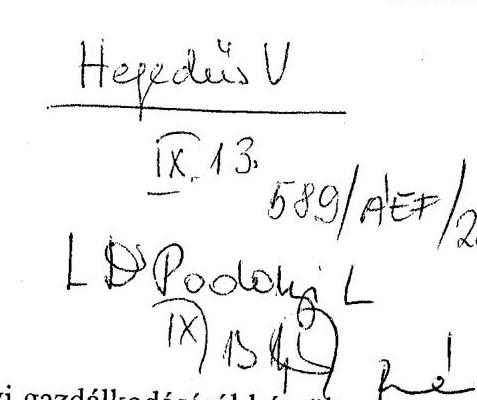
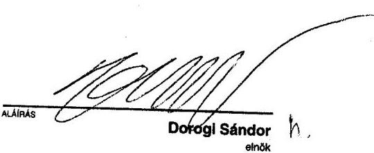
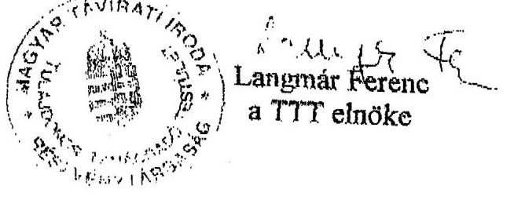
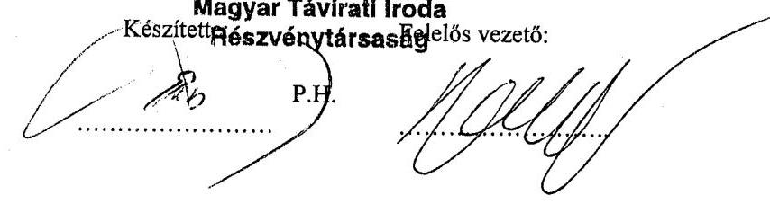

# JELENTÉS 

a Magyar Távirati Iroda Rt. 2001. évi gazdálkodásának ellenőrzéséről
$\qquad$
$\qquad$

---

2. Államháztartás Központi Szintjét Ellenőrző Igazgatóság
2.3. Átfogó Ellenőrzési Főcsoport
V-06-21/2002.
Témaszám: 594
Vizsgálat-azonosító szám: V0026
Az ellenőrzést felügyelte:
Bihary Zsigmond
főigazgató
Az ellenőrzés végrehajtásáért felelős:
Hegedűsné dr. Müllern Veronika
főcsoportfőnök
Az ellenőrzést vezette:
dr. Podonyi László
igazgatóhelyettes
Az ellenőrzést végezték és a jelentés összeállításában közreműködtek:
Koós Lászlóné
számvevő tanácsos, tanácsadó
dr. Majoros Sándor
számvevő tanácsos
A témához kapcsolódó eddig készített számvevőszéki jelentések:
címe
sorszáma
Jelentés a Magyar Távirati Iroda költségvetési fejezet és a Magyar 9829 Távirati Iroda Részvénytársaság pénzügyi-gazdasági ellenőrzéséről (1997.)

Jelentés a Magyar Távirati Iroda Részvénytársaság működésének 9924 pénzügyi-gazdasági ellenőrzéséről (1998.)

Jelentés a Magyar Távirati Iroda Rt. 1999. évi
0029
gazdálkodásának ellenőrzéséről
Jelentés a Magyar Távirati Iroda Rt. 2000. évi gazdálkodásának 0124 ellenőrzéséről

Jelentéseink az Országgyűlés számítógépes hálózatán és az Interneten a www.asz.hu címen is olvashatók.

---

# TARTALOMJEGYZÉK 

BEVEZETÉS ..... 3
I. ÖSSZEGZŐ MEGÁLLAPÍTÁSOK, KÖVETKEZTETÉSEK, JAVASLATOK ..... 5
II. RÉSZLETES MEGÁLLAPÍTÁSOK ..... 12

1. Az MTI Rt. működésének szabályozottsága, törvényessége, a feladatok és a szervezeti rendszer összhangja ..... 12
1.1. A működés külső szabályozása ..... 12
1.2. A működés belső szabályozása ..... 14
2. Az MTI Rt. gazdálkodása ..... 17
2.1. A Társaság 2001. évi árbevétel-, költség- és eredménytervének a teljesülése, az üzleti terv megalapozottsága ..... 17
2.2. Az MTI Rt. árképzési gyakorlata ..... 21
2.3. Az állami támogatások felhasználásának szabályozottsága ..... 22
2.4. A gazdasági évek között áthúzódó elszámolások ..... 24
2.5. A Társaság létszámgazdálkodása ..... 24
2.5.1. A külföldi tudósítóhálózat működtetésének szabályszerűsége ..... 25
2.6. Az MTI Rt. beszerzéseinél a közbeszerzési törvény betartása ..... 28
2.7. Az MTI Rt. gazdasági, műszaki fejlesztési és üzleti tevékenysége és a középtávú stratégia összhangja ..... 29
2.8. Az MTI Rt. saját alapítású társaságainak gazdálkodása ..... 31
3. A Társaság belső információs rendszere és a belső ellenőrzés működése ..... 34
4. Az Állami Számvevőszék 2001. évi jelentésének hasznosulása ..... 36

## MELLÉKLETEK

1. sz. melléklet a jelentésre adott észrevételek
2. sz. melléklet Tanúsítványok 1-10-ig

---

.

---

# JELENTÉS 

## a Magyar Távirati Iroda Rt. 2001. évi gazdálkodásának ellenőrzéséről

## BEVEZETÉS

A Magyar Köztársaság Országgyűlése - az állam nevében - a nemzeti hírügynökségről szóló 1996. évi CXXVII. törvény (Nht.) 3.§ (1) bekezdésében foglaltak szerint megalapította a Magyar Távirati Iroda Részvénytársaságot (MTI Rt., Társaság) a nemzeti hírügynökségi tevékenység ellátására. Az Rt.vé alakulás időpontjában (1997. július 15.) a Társaság jegyzett tőkéje 1750 millió Ft, saját tőkéje 2642 millió Ft volt. A 100\%-ban állami tulajdonú Rt. felett az alapítói jogokat az Országgyűlés, a tulajdonosi irányítást és ellenőrzést a Tulajdonosi Tanácsadó Testület (TTT), a Felügyelő Bizottság (FB) és az Rt. elnöke megosztva gyakorolja.

2001-ben az MTI Rt. nettó árbevétele 2030 millió Ft, mérleg szerinti nyeresége 140 millió Ft, saját tőkéje 3395 millió Ft volt. (A Társaság jegyzett tőkéje az alapítás óta nem változott.) Az MTI Rt. 2001-ben 1322 millió Ft működési támogatást és 94 millió Ft céltámogatást kapott.

Az Nht. 9. §-a és a MTI Rt. alapító okirata 5.7. pontja szerint az MTI Rt. elnöke évente beszámol az Országgyűlésnek (OGY) a részvénytársaság tevékenységéről, amelynek keretében sor kerül a mérleg és az eredménykimutatás jóváhagyására, valamint a nyereség felosztására. Az elnök beszámolóját a részvénytársaság felügyelő bizottságának véleményével együtt kell az Országgyűlés elé terjeszteni. A beszámolóhoz mellékelni kell az Állami Számvevőszék elnökének jelentését a részvénytársaság tevékenységéről. Az Nht. 29. §-a előírja, hogy az Rt. gazdálkodását az Állami Számvevőszék (ÁSZ) ellenőrzi.

Az ÁSZ az MTI Rt. gazdálkodásáról készített korábbi jelentéseiben hangsúlyozta, hogy az MTI Rt. tulajdonosi irányítása, ellenőrzése, működtetési folyamata, a közszolgálati feladatok és az állami támogatás meghatározása, a közöttük lévő összhang megteremtése átfogó felülvizsgálatot és összehangolt szabályozást igényel. Az ÁSZ hiányolta a termékek és szolgáltatások költségalapú árképzését, valamint a belső szabályzatok felülvizsgálatát és egységesítését, kifogásolta továbbá az MTI Rt. társaságai nem hatékony működtetését, az ÁSZ ellenőrzési megállapításai és javaslatai hasznosítása érdekében készített elnöki intézkedési tervek nem következetes végrehajtását.

A jelenlegi ellenőrzés célja annak értékelése volt, hogy

- az MTI Rt. külső és belső szabályozása, szervezeti és működési rendszere összhangban volt-e a feladatokkal, mennyiben segítette azok hatékony

---

és eredményes ellátását, belső szabályozása megfelelt-e a hatályos jogszabályoknak;

- a Társaság alapító okiratában és a vonatkozó törvényekben, egyéb jogszabályokban foglaltaknak megfelelően törvényesen, célszerűen és eredményesen gazdálkodott-e a rendelkezésére bocsátott vagyonnal és a központi költségvetésből a részvénytársaság közszolgálati feladatai ellátásához nyújtott működési- és céltámogatással. A megkezdett és befejezett fejlesztések összhangban voltak-e a közszolgálati feladatok biztonságos ellátásával;
- a Társaság információs rendszere és a belső ellenőrzés elősegítette-e a hatékony gazdálkodást;
- a Társaság 2000. évi gazdálkodása ellenőrzéséről készült ÁSZ-jelentés megállapításai, javaslatai, ajánlásai hasznosultak-e.

Az ÁSZ az MTI Rt. 2001. évi gazdálkodásának ellenőrzésével ötödik alkalommal tesz eleget az Nht. előírásainak, annak hatálybalépése óta.

A Jelentéstervezetet egyeztettük az MTI Rt. Tulajdonosi Tanácsadó Testület elnökével, a Felügyelő Bizottság elnökével és a Társaság elnökével, akik a megállapításokat elfogadták. (Az észrevételeket az 1. sz. melléklet tartalmazza.)

---

# I. ÖSSZEGZŐ MEGÁLLAPÍTÁSOK, KÖVETKEZTETÉSEK, JAVASLATOK 

Az MTI Rt. elmúlt négy év ellenőrzési tapasztalatainak összegzése alapján felhívjuk a figyelmet a jelenlegi vizsgálat során ismételten feltárt jogi- és társasági szabályozási hiányosságokra, amelyek megszüntetésére már több alkalommal rámutattunk, mindeddig azonban eredménytelenül.

A Társaság stratégiai és operatív működése szempontjából a legfontosabb következtetésünk az volt, hogy a részvénytársaság hatékonyabb tulajdonosi irányítása, ellenőrzése és működtetési folyamata átfogó tulajdonosi felülvizsgálatot és teljes körűen összehangolt szabályozást igényel.

A nemzeti hírügynökség közszolgálati feladatainak ellátása érdekében az Országgyűlés, a Tulajdonosi Tanácsadó Testület (TTT), a Felügyelő Bizottság (FB) és az MTI Rt. elnöke (az igazgatóság feladatait egyszemélyes ügyvezetőként az elnök látja el) között megosztott a tulajdonosi jogok gyakorlása. E törvényi szabályozás pontosítást igényel, mert a feladat- és hatásköri szabályozás nem egyértelmű, összehangolásában hiányosságok mutatkoznak. Az Országgyűlés nem élt az Nht.-ban előírt tulajdonosi kötelezettségével. Nem alkották meg az Nht.-ban (2. § (1) bek. h) pontban) jelzett, a választási időszakban végzendő feladatokról szóló törvényt. A nemzeti hírügynökségi törvény, a Társaság alapító okirata, a testületek ügyrendjei, az Rt. Szervezeti és Működési Szabályzata (SZMSZ) sem rendelkeztek a tulajdonosi jogok gyakorlóinak egymás és a Társaság közötti, valamint a működés során alkalmazandó eljárási rendről. Mindez a részvénytársaság működésének a hatékonyságát rontotta.

A stratégiai és operatív irányítás szabályozatlansága korábban elsősorban a TTT feladat- és hatáskörében a díjszabás megállapítása, a Társaság éves tervei és beszámolói véleményezése, a jogi szabályozás változtatásának javaslattétele, 2001-ben pedig a Társaság Szervezeti és Működési Szabályzata véleményezése hatásköri kérdéseiben nyilvánult meg. A TTT 1998-ban először, 2001 márciusában másodszor készített javaslatot az Nht. és az MTI Rt. létrehozásáról szóló 70/1997. (VII. 15.) OGY határozat módosítására annak érdekében, hogy az alapítói- és részvényesi jogok gyakorlása a napi működés szintjén a TTT-én keresztül valósuljon meg. A TTT a javaslatait 2001. július 2-án továbbította az Országgyűlés elnökének, Kulturális és sajtó bizottságának, Költségvetési és pénzügyi bizottságának és a hat parlamenti párt frakcióvezetőjének.

Az Országgyűlés plenáris ülése az Rt. létrehozása óta, az elmúlt négy évben nem tűzte napirendjére a Társaság elnöke által évente beterjesztett beszámolóit, így nem született döntés az MTI Rt. éves mérlegének és eredménykimutatásának jóváhagyásáról, a nyereség felosztásáról. (Az Országgyűlés bizottságai, utoljára 2001. október 10-én a Kulturális és sajtó bizottság, az MTI Rt. elnökének éves jelentését minden esetben elfogadásra javasolta.) Az éves

---

beszámolókat az MTI Rt. elnöke írta alá. Ez az aláírás nem pótolja a mérlegbeszámoló elfogadására vonatkozó tulajdonosi döntést.

A vonatkozó jogszabályok és az Rt. alapító okirata sem ad eligazítást abban a tekintetben, hogy a Társaság közszolgálati feladatai ellátásához szükséges mértékű állami támogatás összegét kinek, milyen feladat-meghatározás, kritériumrendszer és számítás alapján kell megalapozni, a támogatás összege mire nyújtson fedezetet, a javaslatot kinek kell benyújtani. Ennek hiánya a támogatás célszerű és eredményes felhasználása ellenőrzését nehezíti. További probléma az is, hogy a költségvetés Országgyűlés fejezetében a TTT 2000-ben mintegy 75, 2001-ben 63 millió Ft-os működési költségét a Társaság támogatásától nem különítették el. A többi médiakuratórium esetében azok működtetési költsége nem része a társaságok működési támogatásának, mert e költségek alakulására a társaságoknak nincs befolyása.

A Társaság szabályozott működése 2001-ben is alapvetően az 1999. június 1-jétől hatályos Szervezeti és Működési Szabályzatra, elnöki, alelnöki utasításokra, szakmai kézikönyvekre, munkaköri leírásokra épült. A Társaság jogkövető működése érdekében 2001-ben is munkaviszonyban jogi referenst, megbízási szerződéssel átalánydíjas külsős ügyvédeket foglalkoztatott.

Az SZMSZ nem szabályozta a Társaságnak a TTT-vel és az FB-vel való kapcsolattartási és együttműködési feladatait. A szabályozással a TTT és az Rt. közötti nézetkülönbség csökkenthető, az egyeztetési folyamat, pl. az SZMSZ véleményezése, a díjszabás jóváhagyása kérdésében pontosítható és lerövidíthető lenne. Az SZMSZ nem rendelkezett továbbá a Társaság belső szabályai kidolgozásának követelményeiről, nem szabályozta az alkalmazandó egységes eljárási rendet. Nem határozta meg a Társaság és szervezeti egységei működését általánosan és tartósan szabályozó kötelező érvényű rendelkezések (szakmai, számviteli, pénzügyi, beruházási, közbeszerzési, munkajogi, stb.) körét. Ezért az érvényes szabályzatok köre, hatálya nehezen áttekinthető, a szabályok megszegése miatti felelősség ténye nem megállapítható. Az SZMSZ pl. a pénzügyi igazgató feladat- és hatáskörében nem rendelkezett a munkaköri leírások elkészítési kötelezettségéről. Ahol volt az SZMSZ-ben ilyen rendelkezés, ott a személyi feltételek (nem volt kinevezett vezető) hiányoztak. 2001-ben a dolgozók mintegy 10\%-ának nem volt érvényes munkaköri leírása.

A részvénytársaság szervezeti, irányítási és működési rendszerének 2001-ben végrehajtott változtatása egy szakterületet (Elnöki Titkárság megszüntetése, Stratégiai Iroda megalakítása) érintett. Az SZMSZ tervezett érdemi módosítása 2001-ben elmaradt. Változott viszont a vezetés személyi összetétele. 2001 második félévében vezetőcsere volt a gazdasági alelnök és az Elnöki Titkárság (Stratégiai Iroda) vezetője személyében. Betöltötték a szakmai alelnöki és 2002. január 1-jétől a pénzügyi igazgatói státusokat.

A gazdasági társaságokra kötelező gazdálkodási szabályzatokkal a Társaság rendelkezett, de három szabályzat aktualizálása késett. A termékre, szolgáltatásra vonatkozó önköltségszámítási szabályzat az egységes tarifarendszer kialakításának határidő módosítása miatt, a projektszabályzat kidolgozása, és egy szakmai kézikönyv aktualizálása 2002. évi feladat maradt. 2001. év

---

második felében a Társaság szakmai tevékenységének szabályozása kedvező irányban mozdult el.

A Magyar Távirati Iroda Rt.-nek 1997. július 15-ei alapítása óta - tulajdonosi döntés hiányában - nem volt jóváhagyott mérlege és eredménykimutatása.

Az MTI Rt. 2001. évi mérlegét is könyvvizsgáló hitelesítette. A hitelesítő záradék szerint az éves beszámoló a Társaság 2001. december 31-én fennálló vagyoni, pénzügyi és jövedelmi helyzetéről megbízható és valós képet ad.

A Társaság 2001. évi mérleg szerinti eredménye 139,6 millió Ft nyereség, saját tőkéje 3395 millió Ft volt, vagyonát gyarapította. A Társaság főbb gazdálkodási mutatói 2001-ben javultak. Eladósodottsága csökkent, likvidítása javult. A befektetett üzletrészek rontották a Társaság eredményét. A költségvetési támogatás felhasználása szabályozatlan volt, a társaságnak termékre, szolgáltatásra vonatkozó elő- és utókalkulációja nem volt. Ezek a gazdálkodás eredményességét, a tervezhetőséget és az ellenőrizhetőséget negatív irányban befolyásolták.

Az MTI Rt. 2001. évi üzleti terve a stratégiai tervvel összhangban készült. Az MTI Rt. a tervkészítés során csak az üzleti eredmény szintjéig kalkulált, ami nem tette lehetővé a cash-flow és a pénzügyi eredménytervek összehasonlítását a gazdasági év tényleges eseményeivel. A 2002. évi üzleti tervet már a mérleg szerinti eredmény szintjéig tervezték.

A Társaság nettó árbevétele 2001-ben 2030 millió Ft volt. A Társaság az üzleti árbevétel tervezett értékét 6,5\%-kal teljesítette túl. A költségvetésből kiutalt 1322 millió Ft közszolgálati feladatok ellátására biztosított támogatás az előző évben kiutalt összeghez képest nem változott. Meghatározott fejlesztési célokra különféle állami szervezetektől összesen 94 millió Ft céltámogatásban részesült az MTI Rt. 2001-ben.

A költségek és ráfordítások (pénzügyi műveletek ráfordításaival és rendkívüli ráfordításokkal együtt számított) 3509 millió Ft összege 2001-ben, 216 millió Ft-tal (6,2\%) haladta meg a bázis év adatait és 132 millió Ft-tal (4,6\%) a tervezett értéket. Ezen belül a takarítási költségek 60,3\%-os növekedése a minimálbér emelkedésének a következménye volt. A korábbi ÁSZ jelentések is kifogásolták a rendszeres és eseti vállalkozói díjak, valamint a tanácsadói, szakértői díjak bérköltséghez viszonyított magas értékét. Ennek ellenére 2001-ben a vállalkozói díjak 20,9\%-kal, a tanácsadói és szakértői díjak pedig 42,4\%-kal tovább emelkedtek az előző évhez képest.

A Társaság a 2001. évi üzleti tervében vállalt 20,8 millió Ft-os üzemi szintű nyereséget teljesítette. Mérleg szerinti nyeresége, a pénzügyi és a rendkívüli eredmény hatására, a tervezettnél 6,7-szer magasabb értéken, 139,6 millió Ft-ban realizálódott. Az alapítás óta az eredménytartalék az éves nyereségek összegével évenként folyamatosan nőtt, mivel a tulajdonos nem döntött a mérleg elfogadásáról, és a felgyülemlett eredménytartalék - 2001. december 31-én 613,4 millió Ft volt - felhasználásáról sem rendelkezett.

---

Az MTI Rt. Tulajdonosi Tanácsadó Testülete nem fogadta el a Társaság 2001. évi díjszabási javaslatát. Az új tarifapolitika kidolgozása - amely már az önköltségszámításon alapuló díjstruktúra kialakítását tűzte ki célul - folyamatban van, bevezetésének határideje 2002 decembere.

Az állami támogatások felhasználása során értelmezési zavart okoz a nemzeti hírügynökségről szóló törvény megfogalmazása, mivel a törvényben biztosított támogatás célja a közszolgálati feladatokkal összefüggő és ezért nem kellően meghatározott. Pontosításra szorul az Nht. megfogalmazása a Társaság képződött nyereségének, illetve eredménytartalékának a felhasználásával kapcsolatban is, mivel a felhasználást a közszolgálati feladatokkal összefüggésben határozza meg a törvény. Amíg a Társaság könyvelésében nem különítik el a közszolgálati feladatokkal kapcsolatos bevételeket és kiadásokat, addig a törvény által megfogalmazott közszolgálati célú felhasználás nem követhető nyomon és nem is ellenőrizhető.

Az átmenő könyvelési tételek között egy esetben volt eltérés, amely a 2001. évi eredményt nem befolyásolta.

Nem volt biztosított a megbízási és vállalkozási szerződések indokoltsága, a szerződésekben megfogalmazott feladatok konkrét meghatározás hiányában nem értékelhetők.

A külföldi tudósítói hálózat 2001-ben 13 teljes munkaidős tudósítóval, 3 megbízással dolgozó tudósítóval (stringer) és két megbízásos vállalkozóval működött. Az egy tudósítói hely fenntartásának éves költsége 2001-ben 26,5 millió Ft volt. A tudósítók költségeinek az elszámolását a Társaság szabályozta, de a végrehajtás során az elszámolás alapjául szolgáló és ellenőrzött bizonylatok hat esetben nem feleltek meg a számviteli törvényben előírt alaki, formai és tartalmi követelményeknek. (Nagyságrendjük a lényegességi küszöb alatt marad.)

A Társaság a közbeszerzési törvény betartásával hajtotta végre beruházásait és felújításait. A beruházások saját erő részének elszámolása a többcélú eszközök beszerzése esetén nem volt kellően dokumentált. A hatályos Projekt szabályzat nem rendelkezett az elszámolásról és felelősségről.

Az MTI Rt. egy-egy helyiséget biztosít egy takarító és egy őrzés-védelmet ellátó vállalkozásnak térítésmentesen. Sem a közbeszerzési pályázati kiírásban, sem a vállalkozási szerződésben nem rögzítették a helyiségbiztosítás feltételeit. A pályázatban vállalt feltételektől a gyakorlat eltért.

Az alapítás óta eltelt időszakban az MTI Rt. a befektetések között nyilvántartott társaságai kapcsolatából gazdasági előnyt nem szerzett. Az ÁSZ többször javasolta a társaságok megszüntetését - a 100\%-os üzletrész tulajdon jogszabályba ütközött - ennek ellenére 2001-ben csak az MTI Fotó Kft. kényszerű végelszámolása kezdődött meg.

Az MTI ECO Kft. saját tőkéje - 2001. évi vesztesége miatt - a jegyzett tőke felére csökkent. Ezért a tulajdonosnak kell határozni a Kft. további sorsáról a

---

jegyzett tőke leszállítása vagy pótbefizetés, illetve a Kft. megszüntetése formájában.

2001-ben a Társaság belső információs rendszere érdemben nem változott. Az év végi informatikai fejlesztés vezetői döntéseket elősegítő hatása 2002-ben lesz mérhető. A fejlesztés egyelőre a „személyre szabott" vezetői döntések informatikai hátterét biztosította. A belső információs rendszer alapvető hiányossága, hogy a Társaság valamennyi termékére, szolgáltatására vonatkozó elő- és utókalkulációját, az árak kialakítására, fedezetelemzésre vonatkozó szabályozását nem dolgozta ki.

A Társaság belső ellenőrének munkájában nem kapott kellő hangsúlyt a megállapítások és javaslatok hasznosításának, a hiányosságok felszámolásának utóellenőrzési igénye. 2001-ben a belső ellenőr nem tervezett és nem végzett utóellenőrzést. A 2001. évi javaslatok felét hasznosította, illetve hasznosítani tervezte az MTI Rt. Az ellenőri jelentéseken az észrevételezési záradékot a Társaság elnöke nem írta alá, a jelentésekre írásban észrevételt nem tett, az azokban foglaltakat az FB üléseken a napirend tárgyalásakor megismerte.

Az Állami Számvevőszék az elmúlt négy évben készített jelentéseiben megfogalmazott megállapításai, javaslatai és ajánlásai hasznosításának szándékát valamennyi gazdasági évben tapasztalta. Az MTI Rt. elnökének - az ÁSZ ajánlások hasznosítása érdekében - 2001-ben hozott döntései megalapozásában a következetesség javult.

Az MTI Rt. elnöke minden évben intézkedési tervet készített az ÁSZ jelentésben feltárt hiányosságok megszüntetésére, az FB minden évben ellenőriztette az intézkedési terv végrehajtását a Társaság belső ellenőrével. Az utasításban elrendelt intézkedések egy részének azonban korábban és 2001-ben sem volt eredménye, bár az intézkedések végrehajtásának számonkérési mechanizmusa 2001-ben következetesebb volt. Az FB a Társaság elnökét az intézkedési terv kiadását követő minden hónapban beszámoltatta az intézkedések végrehajtásának állásáról. A megtett intézkedések és a folyamatos beszámoltatás ellenére néhány 2001-re tervezett feladat elvégzése 2002-re csúszott át, míg más feladatok elvégzése részben formai, részben tartalmi változást eredményezett. Ezek közül a legfontosabbak:

A Társaság elnöke 2002 januárjában elnöki utasításban adta ki a beruházások megkezdéséhez szükséges általános érvényű szabályokat, az alkalmazandó kritériumrendszert a gazdaságosság szempontjaira, a költséghaszonelemzés követelményeire.

2002-re húzódott a Károly körúti ingatlan bérleti jogának rendezése és hasznosítása.

2001-ben nem véglegesítették az árképzés egységes elveit, 2002. december 31-ére módosított végrehajtási határidőkkel vezetik majd be az ún. egységes tarifarendszert. Az új tarifarendszer szolgáltat majd adatot az elő- és utókalkuláció elvégzéséhez, az egyes termékek, szolgáltatások árképzéséhez.

---

A kettős foglalkoztatás keretében alkalmazott megbízási és felhasználási szerződéseket 2001. augusztus 1-jétől megszüntették, az ily módon foglalkoztatottak egy része munkaviszonyban, más része munkaviszony és vállalkozói jogviszony együttes alkalmazásával végez munkát az MTI Rt.-nek. A kettős foglalkoztatás vállalkozói szerződéseit egységes elvek alapján 2001. december 1-jétől módosították. A munkaviszonyban ellátott feladatokat részben formailag elválasztották a szerződéses viszonyban végzettektől. A vállalkozásban, de a Társaság eszközeivel végzett tevékenység esetében az eszközök után felszámított eszközhasználati díjjal a vállalkozói díjat megemelték. Meghatározták a visszatartható vállalkozói díj mértékét. A vállalkozó számára kedvező, aránytalanul magas felmondási időket megszüntették. 2001-ben elmaradt a csak vállalkozói szerződéssel foglalkoztatottak szerződéseinek feladat és teljesítés szempontú felülvizsgálata. Változatlanul foglalkoztattak vezetőket kettős jogviszony keretében. Nem egységes elvek alapján foglalkoztatták a jogi feladatokat átalánydíjas megbízási szerződések keretében végző ügyvédeket. A külsős ügyvédi megbízási szerződésekben a feladatok pontosítása, a teljesítés számonkérése nem volt összhangban. Elmaradt a teljesítményértékelési rendszer bevezetése.

A helyszíni ellenőrzés megállapításainak hasznosítása mellett javasoljuk:

# a Kormánynak 

1.  Kezdeményezze a nemzeti hírügynökségről szóló törvény és az MTI Rt. létrehozásáról szóló 70/1997. (VII. 15.) OGY határozat (az MTI Rt. Alapító Okirata) módosítását az MTI Rt.-re vonatkozó tulajdonosi jogosítványok, az eljárási rendek és a döntési folyamatok, valamint a közfeladatok szükséges mértékű támogatásának pontosítása és szabályozása érdekében.
2.  Kezdeményezze az Nht. 2. § (1) bekezdése h) pontjaiban megjelölt (a választási időszak alatti tájékoztatásra vonatkozó) külön törvény megalkotását.
3.  Fontolja meg a TTT működési költségeinek elkülönítését - a következő évi költségvetési törvényjavaslatban - az MTI Rt. támogatásától.

## a Tulajdonosi Tanácsadó Testületnek

Szabályozza a testület ügyrendjében a döntési, a tanácsadói, a javaslattételi, a véleményezési hatáskörében végzett feladatai ellátásával kapcsolatos eljárási rendet.

## az FB elnökének

Intézkedjen, hogy a belső ellenőr munkatervében hangsúlyt kapjon az utóellenőrzés, az MTI Rt. munkájában pedig a belső ellenőri megállapítások hasznosításának igénye.

## az MTI Rt. elnökének

1.  Vizsgálja felül a megbízási és vállalkozási szerződések hatékonyságát, egységesítse a megbízási és vállalkozási szerződéseket és biztosítsa azokban a feladat meghatározás, a teljesítés és a számonkérés összhangját.

---

2.  Alakíttassa ki úgy a Társaság elő- és utókalkulációját, hogy azok megfelelő adatokat szolgáltassanak az egyes termékek, szolgáltatások árképzéséhez. Intézkedjen az új árképzési elvek kidolgozásával és bevezetésével kapcsolatos határidők betartására.
3.  Intézkedjen a Károly krt.-i bérelt ingatlan kihasználatlan helyiségeinek hasznosítása érdekében, szüntesse meg a Társaság területén két esetben tapasztalt szerződés nélküli ingatlan használatot, és a Társaság 100\%-os tulajdonában álló MTI ECO Kft. által bérelt ingatlanra vonatkozó üzemeltetési költségtérítési engedményt.
4.  Szüntesse meg a befektetett üzletrészek között nyilvántartott korlátolt felelősségű társaságokban a 100\% tulajdoni hányadot és a tulajdonosi jóváhagyást követően vezettesse át a mérlegén az MTI Fotó Kft. vagyonrendezéséhez biztosított pénzügyi intézkedést az adózott eredmény terhére.
5.  Szabályozza a Társaság Szervezeti és Működési Szabályzatában a TTT, az FB és az MTI Rt. közötti kapcsolattartás és együttműködés rendjét. Vizsgáltassa felül a TTT-t érintő kérdésekben a TTT egyetértésével a hatályos társasági szabályokat, intézkedjen, hogy azok tartalmi és formai követelményei a 2002-ben kiadott utasításban foglaltaknak megfeleljenek.

---

# II. RÉSZLETES MEGÁLLAPÍTÁSOK 

## 1. Az MTI Rt. MŰKÖDÉSÉNEK SZABÁLYOZOTTSÁGA, TÖRVÉNYESSÉGE, A FELADATOK ÉS A SZERVEZETI RENDSZER ÖSSZHANGJA

### 1.1. A működés külső szabályozása

Az MTI Rt. a közszolgálati feladatait a nemzeti hírügynökségről szóló, és egyéb piaci tevékenységét a gazdasági társaságokról szóló törvények szabályai szerint látja el. A nemzeti hírügynökségről szóló törvény, az MTI Rt. alapító okirata az Országgyűlést - mint alapítót - tulajdonosi joggyakorlatát a részleges döntési jogokat gyakorló Felügyelő Bizottsággal, az egyszemélyi igazgatósági szerepkörben eljáró elnökkel és a Tulajdonosi Tanácsadó Testülettel osztotta meg. A nemzeti hírügynökség befolyásmentessége érdekében megosztott tulajdonosi irányításnak, ellenőrzésnek és a részvénytársaság működésének a hatékonyságát rontotta e szervezetek feladat- és hatásköri szabályozásának pontatlansága, a szabályozás összehangolásának hiánya, egymás közötti kapcsolattartásuk, együttműködésük módjának szabályozatlansága. A hiányosságok nagy részére korábbi ellenőrzései során az ÁSZ az érintettek figyelmét több alkalommal felhívta. 2001-ben az Nht. rendelkezései nem módosultak, változás a TTT és az FB összetételében, a tagok megbízási idejében volt.

Az MTI Rt. tulajdonosi irányítása, ellenőrzése és a Társaság gazdálkodása szempontjából fontos, megismétlésre szoruló, változatlanul fennálló szabályozási hiányosságok:

Az Nht. meghatározta (egyes feladatok tekintetében azonban nem egyértelműen) a tulajdonosi jogokat gyakorló szervezetek és az MTI Rt. elnökének fő feladatait, ugyanakkor nem szabályozta
 a tulajdonos és társasága, valamint a tulajdonosi joggyakorlók egymás közötti kapcsolatában - a működés során - alkalmazandó eljárás rendjét. A szervezetek közötti hatékony együttműködéshez szükséges szabályokat, eljárási rendeket az érintett szervezetek sem dolgoztak ki. Például: a TTT ügydöntő hatásköre az MTI Rt. díjszabásának jóváhagyása. A törvény nem tartalmazza, hogy a díjszabás jóváhagyása konkrétan melyik termékre, termékcsoportra vagy szolgáltatásra vonatkozik, a díjszabás milyen részletességű kidolgozása szükséges a döntés meghozatalához. A TTT 2001-ben nem döntött az MTI Rt. 2002. évi díjszabásáról. Egy másik példa szerint: a TTT törvényben előírt feladata az MTI Rt. elnöke pályázatában foglalt célkitűzései megvalósításának folyamatos ellenőrzése és értékelése, joga és kötelessége-e az MTI Rt. éves beszámolójának testületi tárgyalása és véleményezése, az éves beszámolókat a pályázati célkitűzések megvalósításának mércéjeként értékelje-e. Nincs szabályozva a TTT véleményezési joga az MTI Rt. SZMSZ-ével kapcsolatban. Emiatt 2001-ben nézetkülönbség volt a TTT és a Társaság között, amely a véleményezési jog gyakorlásával kapcsolatban merült fel, a vélemény kialakításához szük-

---

séges idő, a vélemények indokolásának tartalma és az egyeztetési folyamat időbeni terjedelme, valamint az SZMSZ módosításának részletezettsége tekintetében. Mindezek következtében az eredetileg 2001. december 15-ei hatállyal bevezetni tervezett új SZMSZ 2002. április 5-én lépett hatályba.

Az Országgyűlés olyan tulajdonosi jogosítványt tartott meg saját hatáskörében, amellyel a mai napig nem élt. Az Nht. szerint „az MTI Rt. elnöke évente beszámol az Országgyűlésnek a részvénytársaság tevékenységéről, ennek keretében kerül sor a mérleg és eredménykimutatás jóváhagyására". Az MTI Rt. megalapítása óta az Országgyűlés egyszer sem döntött a mérleg és eredménykimutatás jóváhagyásáról. Az MTI Rt. elnökének éves beszámolóját az OGY plenáris ülése egyszer sem tárgyalta. A Magyar Országgyűlés illetékes bizottságai - az éves beszámoló cégbírósági leadási határidejét követően - tárgyalták az MTI Rt. elnökének éves jelentéseit. (A Társaság éves jelentései közül az 1997. évire a Költségvetési és pénzügyi bizottság 1999. február 23-án, az 1998. éviről a Kulturális és sajtó bizottság nyújtott be országgyűlési határozati javaslatot. Az 1999. évi jelentést 2000. október 31-én, a 2000. évit 2001. október 10-én tárgyalta a Kulturális és sajtó bizottság.) A bizottságok az MTI Rt. elnökének éves jelentését minden esetben elfogadásra javasolták. Érvényesek voltak-e az MTI Rt. mérlegei tulajdonosi döntés hiányában.

A nemzeti hírügynökségi törvény 30. § (1) bek.-ben megfogalmazott, a közszolgálati feladatok ellátásához szükséges mértékű országgyűlési céltámogatásban való részesítés kitétel nem ad eligazítást abban a tekintetben, hogy mit kell szükséges mértéknek tekinteni. Ugyanez vonatkozik a részvénytársaság alapító okiratára is. A részvénytársaság alapító okirata 10.3. pontja szerint az alapító Országgyűlés a központi költségvetés Országgyűlés fejezetében a részvénytársaságot a közszolgálati feladatai ellátásához - ideértve a Titkárság működtetésével kapcsolatos feladatokat is - szükséges mértékű céltámogatásban részesíti. A támogatásra a részvénytársaság elnöke tesz javaslatot a felügyelő bizottság és a könyvvizsgáló véleményével. Nincs szabályozva, hogy a javaslatot milyen számítással kell megalapozni, kinek és milyen határidőig kell benyújtani. Az MTI Rt. az évenkénti támogatások összegének növelését szorgalmazó leveleit az Országgyűlés elnökének, az Országgyűlés Költségvetési és pénzügyi bizottsága elnökének, a Kulturális és sajtó bizottság egy tagjának, a Pénzügyminisztérium helyettes államtitkárának is megküldte. A kezdeményezés eredménytelen volt, egyrészt az illetékességet az MTI Rt.-nek nem sikerült kideríteni, másrészt a 2001-2002. évi költségvetésben az MTI Rt. a 2000. évivel megegyező összegű, 1322 millió Ft működtetési támogatást kapott. A támogatás összegének megalapozottsága érdekében a közszolgálati feladatok pontos - termék vagy szolgáltatás szerinti - meghatározása, a kritériumrendszer kidolgozása, a számítás módjának a meghatározása, a támogatás felhasználásának ellenőrizhetősége a tulajdonosnak és az MTI Rt.-nek - a tervezés megalapozottsága miatt - közös érdeke. Ennek hiányában az MTI Rt. a költségvetésben meghatározott támogatást közszolgálati feladataihoz mérten minden évben elégtelennek tartja és sérelmezi a gazdálkodás tervezése kiszámíthatóságának a hiányát is. Az MTI Rt. elnöke az éves jelentésekben hangsúlyozta, hogy az MTI Rt. gazdasági helyzete nem megoldott, a támogatás nem követi a Társaság tevékenységének változását, a műszaki fejlesztés forrásigényét. A részvénytársaság véleménye szerint a 2000-ig inflációkövető működési támogatás nem biztosít

---

fedezetet - többek között - a 2001. I. félévben 15, a II. félévben 6 tagú TTT 2000-ben mintegy 75 M, 2001-ben 63 millió Ft-os költségeire, a 2002-es választások idejére törvényben meghatározott feladatai ellátása érdekében végzett tevékenységei költségeire sem. Az Állami Számvevőszék javasolta a 2001-2002. évi költségvetésben a Tulajdonosi Tanácsadó Testület működési költségeinek elhatárolását az MTI Rt. támogatásától, mert ezek a költségek a Társaság tevékenységétől függetlenül alakulnak. Az állami költségvetés ez irányú módosítása elmaradt.

A Tulajdonosi Tanácsadó Testület megbízása 2001. július 15-én lejárt, az Országgyűlés az 54/2001. (VI. 29.) határozatával a TTT tisztségviselőit és tagjait megválasztotta. A testület elnökhelyettese 2001-ben a TTT munkájában nem kívánt részt venni. A korábbi testület 2001 márciusában elkészítette a nemzeti hírügynökségről szóló 1996. évi CXXVII. törvény és a Magyar Távirati Iroda Részvénytársaság létrehozásáról szóló 70/1997. (VII. 15.) OGY határozat módosítására készített javaslatát. A javaslatot 2001. július 2-án továbbították az Országgyűlés elnökének, Kulturális és sajtó bizottságának, Költségvetési és pénzügyi bizottságának és a hat parlamenti párt frakcióvezetőjének. (Meg kell jegyezni, hogy a TTT elnöke 1998-ban hasonló tartalmú javaslattal próbálkozott, testületi határozat hiányában, eredménytelenül.) Az új összetételű testület ügyrendjét 2001-ben kisebb módosításokkal pontosította, tagjait nyilatkozattal titoktartásra kötelezte. Az ügyrendben sem korábban, sem 2001-ben a testület nem szabályozta a döntési, a tanácsadói, a javaslattételi, a véleményezési hatáskörben végzett feladatai ellátásával kapcsolatos eljárási rendeket.

A TTT Titkársága korábban ellátta az FB adminisztrációjával összefüggő feladatokat is. 2001. november 21-étől az FB önálló titkársági szervezetet alakított ki, amit a 2002. január 8-án elfogadott FB ügyrend módosítása rögzített.

A részvénytársaság Felügyelő Bizottságának elnökét és egy tagját az Országgyűlés - korábbi mulasztását pótolva - az 53/2001. (VI. 21.) határozatával 2001. július 16-ától négy évre megválasztotta. Az FB további három tagjának megbízása 2002. január 5-én járt le, újabb négy évre szóló delegálásuk 2001. decemberében megtörtént. Az 53/2001. (VI. 21.) OGY határozat következményeként az FB két tagjának megbízatási ideje eltér a másik három tagétól. A határozat ellentétes az MTI Rt. alapító okiratáról rendelkező 70/1997. (VII. 15.) OGY határozat Melléklete VI. rész 6.6. pontjában foglalt szabályozással, amely szerint" A Felügyelő Bizottság tagjainak részleges cserélődése esetén az új tag(ok) megbízatása a Felügyelő Bizottság eredeti megbízásának időpontjáig szól". Az FB ügyrendje 2001-ben nem változott, az FB elnökének álláspontja szerint a hatályos ügyrend alapján évek óta zökkenőmentes volt a testületi működés.

# 1.2. A működés belső szabályozása 

Az MTI Rt. szervezete 2001-ben érdemben nem változott, alapvetően funkcionális munkamegosztás szerint működött. A Társaság működése 2001-ben is az 1999. június 1-jétől hatályos Szervezeti és Működési Szabályzatra épült. Az SZMSZ V. fejezete szabályozza többek között az irányítás és a tájékoztatás

---

rendjét, a vezetői munkaköröket, a munkáltatói jogokat, illetve azok gyakorlását, az ügyiratkezelés és titokvédelem rendjét, a hírkiadás-, a munkavédelmi és tűzvédelmi tevékenység rendjét, a kapcsolattartást az érdekképviseleti szervezetekkel. Az SZMSZ nem szabályozta a Társaságnak a TTT-vel és az FB-vel való kapcsolattartási és együttműködési feladatait, a kapcsolattartás módját, rendszerességét, személyi feltételeit. A szabályozás hiánya 2001-ben, az érintettek véleménye szerint, a Társaság és az FB együttműködésében nem, a Társaság és a TTT együttműködésében azonban nézetkülönbségeket okozott, pl. az SZMSZ módosítására (Stratégiai Iroda felállítása), és a bevezetni tervezett új SZMSZ-re vonatkozó, a TTT véleményezési joga gyakorlása és a díjszabás jóváhagyása kérdésében.

Az SZMSZ V. fejezetének 1.1. pontja (a vezetők szabályozási, utasítási joga) szerint az Rt. belső működésének rendjét az SZMSZ mellett írásos szabályzatok, elnöki, alelnöki utasítások kiadásával kell meghatározni. Az SZMSZ nem rendelkezett a Társaság belső szabályai kidolgozásának tartalmi és formai követelményeiről. Nem határozta meg a Társaság egészét, vagy az egyes szervezeti egységek működését általánosan és tartósan szabályozó kötelező érvényű rendelkezések (kötelezően előírt és alkalmazandó szakmai, számviteli, pénzügyi, beruházási, közbeszerzési, munkajogi, rendvédelmi, titokvédelmi szabályzatok, kézikönyvek, kódexek, stb.) körét. A 2001-ben kiadott Eszközök és források leltárkészítési és leltározási szabályzatáról szóló Alelnöki utasítás nem rendelkezik a hatálybaléptetésről, az ugyancsak 2001-ben kiadott Külpolitikai Főszerkesztőség Kézikönyvének nincs kiadmányozója, és kimaradt belőle a hatálybaléptetésről szóló rendelkezés is. (A Társaság 2002. április 29-én Elnöki utasításban szabályozta a belső szabályzók kidolgozásának tartalmi és formai követelményeit.)

A Társaság belső ellenőre 2001-ben vizsgálta a számviteli törvényhez kapcsolódó szabályzatok időszerűségét és a munkaköri leírások meglétét, naprakészségét, a munkaköri leírások és az SZMSZ szerinti feladatok összhangját. A belső ellenőr 2001. november 21-ei jelentésében megállapította, hogy a számviteli törvény (Sztv.) 14. § (5) bekezdésében rögzített szabályzatok közül az Eszközök és a források leltárkészítési és leltározási szabályzatát határidőn (90 nap) túl, az Eszközök és a források értékelési szabályzatát pedig a belső ellenőri vizsgálatot követően adta ki a Társaság. (Az utóbbit 2002. januárjában adta ki a Társaság.) A munkaköri leírásokkal foglalkozó belső ellenőri jelentést tárgyaló, 2001. július 19-i, FB-ülés jegyzőkönyvében foglaltak szerint, összességében az MTI Rt. 430 fő körüli munkavállalója közül 30-35 főnek nem volt szabályos, 10-15 főnek egyáltalán nem volt munkaköri leírása. Az ellenőri jelentés szerint, a Pénzügyi Igazgatóság alárendeltségében dolgozó munkavállalók (22 fő) nem rendelkeztek megfelelő (aláírás, alá- és fölérendeltségi viszonyok pontos megnevezésének, a munkaköri leírások aktualizálásának hiánya miatt) munkaköri leírással. Az SZMSZ a gazdasági alelnök irányítása alá tartozó szervezeti egységek vezetői, pl. a pénzügyi igazgató felelősségi körében nem nevesítette a munkaköri leírások elkészítéséért és folyamatos karbantartásáért való felelősséget. (2001-ben a pénzügyi igazgatói munkakör nem is volt betöltve.) Az Ingatlankezelési és Üzemeltetési Igazgatóságon 26 főnek nem volt aláírt (egyik fél sem írta alá) munkaköri leírása, mert az ezek elkészítéséért és aktualizálásáért felelős igazgatói státus nem volt betöltve. A belső ellenőri jelentésben foglalt hiá-

---

nyosságokat 2001-ben a Társaság nem számolta fel, mert a második félév végére tervezte egy új SZMSZ (hatályba lépett 2002. április 5.) megalkotását, és ehhez kívánta igazítani a munkaköri leírásokat is.

A Társaság 2001. évi munkatervében elhatározta a Belpolitikai kézikönyv aktualizálását és a projekt szabályzat kidolgozását, amelyet azonban nem készítettek el.

Az MTI Rt. 2001-2003. Stratégiai terve stratégiai fő célként a feladatokhoz igazodó rugalmas és „tanuló" szervezet működtetését fogalmazta meg. A Stratégiai terv a szervezeti stratégiai cél megvalósításának mérési lehetőségeit

- a szervezeti kultúra változásának értékelésében, a belső projektmunkák tapasztalatainak összegzésében,
- az irányítási rendszer elemzésében, a vezetői kompetenciavizsgálat elvégzésében,
- a belső kommunikáció hatékonyságának vizsgálatában és értékelésében,
- a szervezetfejlesztési, átalakítási intézkedések hatásainak elemzésében határozta meg.
A fő cél az Rt. 2001. évi feladattervében is szerepelt. A szervezetfejlesztéssel összefüggő korábbi szakmai tanulmányokat áttekintették, 2001. szeptemberében vezetői értekezleten az összegző tanulmányt (általános tanulságok, konkrét feladatok rangsorolása stb.) megvitatták. Az új SZMSZ-t, 2001. december 15-ei bevezetést tervezve, megküldték a véleményezési joggal rendelkező TTT-nek 2001. november 22-én. A véleményezési jog gyakorlása kérdésében a TTT és az Rt. között nézetkülönbség alakult ki. Az új SZMSZ-t a tervezett határidőre nem sikerült hatályba léptetni. (A 2002. április 5-étől hatályos SZMSZ-ben megvalósult, a szervezeti, irányítási és működési rendszer változtatás indokoltságát és a változás hatását a Társaság működésére, a következő évi ÁSZ ellenőrzés keretében lehet majd értékelni.)

A Társaság életében 2001. augusztus 1-jén egy, az SZMSZ-t is érintő, strukturális változás volt, a Stratégiai Iroda megalakítása, és ezzel egy időben az Elnöki Titkárság szervezeti egység megszüntetése. E konkrét szervezeti változást nem előzte meg a korábbi szervezet működésének elemzése, az ebből következő szervezet-változtatási igény, a megoldási mód kiválasztása és indokolása. Az új szervezet, a létrehozásáról rendelkező Elnöki utasítás szerint egyrészt átvette a megszüntetett Elnöki Titkárság feladatai közül a humánpolitikai, a nemzetközi és titkársági munka egy részét, másrészt stratégiai elemző csoportot működtet. A Stratégiai Iroda alárendeltségében két szervezeti egység a Stratégiai elemző és a Humánpolitikai, képzési csoport (korábban humánpolitikai osztály) alakult. Az MTI Rt. elnökének közvetlen felügyelete alá került a minősített időszakra vonatkozó felkészülés, a rendészettel való kapcsolattartás, a Társaság jogi tevékenységének a koordinációja, a belső szabályzatok, elnöki utasítások előkészítése és a központi ügyiratkezeléssel összefüggő feladatok. E szervezeti változást követően, pl. a Humánpolitikai, képzési csoport dolgozóinak munkaköri leírásait a függelmi viszonyok változása miatt nem módosították, de az Elnöki utasítás sem rendelkezett ar-

---

ról, hogy a munkaköri leírások elkészítése, aktualizálása az új szervezetben kinek lesz a feladata. A szervezeti változás a vezető személyében és a besorolásban (igazgatói beosztás) is változást eredményezett.
2001. július 15-étől, a korábban be nem töltött szakmai alelnöki munkakörbe, új szakmai alelnököt nevezett ki a Társaság elnöke. Változás volt a gazdasági alelnök személyében. (Az új gazdasági alelnököt 2001. december 27-én nevezte ki az elnök.)

A Társaság a jogi feladatok elvégzése érdekében 1 fő főállású jogi referenst és öt külsős ügyvédet foglalkoztatott folyamatosan megbízási szerződéssel 2001-ben. A 2001. augusztus 1-jétől hatályos SZMSZ módosítás szerint a jogi referens feladata az MTI Rt. jogi tevékenységének koordinációja, a belső szabályzatok, elnöki utasítások előkészítése. A belső szabályzatok készítése, felülvizsgálata két külső megbízási szerződésben is feladat. 2001-ben, a Társaság érvényben lévő szabályainak általános felülvizsgálatáról ügyvédi szakvélemény nem készült. A Munka Törvénykönyve módosítása kapcsán a Társaságot érintő feladatokról készült szakvélemény 2001-ben. A szakvéleményben célszerűnek tartott pontosítások, változtatások a Kollektív Szerződésben 2001-ben nem valósultak meg, a KSZ időbeli hatálya módosult, 2001. december 18-án határozatlan idejű lett. A megbízási szerződésekben a feladatok meghatározása általános, a havi rendszerességgel elvégzendő feladatok pontosítása, az azok alapján kalkulált díjak, a teljesítés és számonkérés összhangja nem biztosított, a különböző szerződések tartalmi és formai elemei nem egységesek. Két olyan megbízási szerződés is érvényben volt, amelyeknek a feltételrendszere megváltozott, de azt a szerződések módosítása nem követte.

# 2. Az MTI Rt. GAZDÁLKODÁSA 

### 2.1. A Társaság 2001. évi árbevétel-, költség- és eredménytervének a teljesülése, az üzleti terv megalapozottsága

A Magyar Távirati Iroda Rt. tevékenységéről szóló éves mérleget és eredménykimutatást a részvénytársaság elnökének előterjesztése alapján az Országgyűlés hagyja jóvá. Fontos ezt hangsúlyozni az Állami Számvevőszék vizsgálata során, mert a Magyar Távirati Iroda Rt. 1997. július 15-ei alapítása óta nem rendelkezik jóváhagyott mérleggel és eredmény-kimutatással. Az összehasonlító adatok és az elemzések során bázis kiinduló adatként mégis a 2000. év mérleg és eredmény-kimutatás adatait vesszük figyelembe, abból kiindulva, hogy az előző évek mérlegeinek az utólagos jóváhagyása megtörténik majd.

Az új számviteli törvény előírásainak a változása miatt átrendeződött a 2000. évi beszámolóhoz képest a követelések nyilvántartása. Ennek megfelelően 2001-től külön soron kell nyilvántartani a leányvállalatokkal szemben fennálló vevő- és egyéb követeléseket, az egyéb részesedési viszonyban lévő társaságokkal és az egyéb vállalkozókkal szemben kimutatott követeléseket. Változott a céltartalék nyilvántartásának a helye is.

---

2001-től értékvesztésként a követelések között kell elszámolni a 2000. év mérlegében a vevőtartozások után elszámolt céltartalék értékét, ezért módosítani kellett - 21 252 ezer Ft-tal - a 2001. évi nyitó mérleget.

A 2000. évi mérleget érintő változások a 9. sz. tanúsítványban megtalálhatók. Az MTI Rt. a tervkészítés során csak az üzleti eredmény szintjéig kalkulált, ami nem teszi lehetővé a cash-flow és pénzügyi eredménytervek összehasonlítását a gazdasági év eseményeivel. Mivel a Társaság esetében az üzleti eredmény alakulását követő gazdasági események hatása meghatározó a mérleg szerinti eredmény kialakulásában, ezért indokolt a tervet az adózás előtti eredmény szintjéig elkészíteni. A 2002. évi üzleti tervet már a mérleg szerinti eredmény szintjéig tervezte a Társaság.

A Társaság saját tőke összege 2001-ben 4,3\%-kal emelkedett, értéke 3 395 343 ezer Ft. Az alapítás óta eltelt időszakhoz képest a saját tőke - az eredménytartalék változásával összhangban - 28,5\%-kal növekedett.

Javult a saját és idegen források aránya a saját tőke javára. A saját források aránya az összes forrás $89 \%$-a. Az évente képződő nyereség minden évben növeli az eredménytartalékot. Mivel az alapítás óta a tulajdonosi jogok gyakorlója nem döntött a Társaság éves mérlegbeszámolóinak az elfogadásáról, ezért az eredménytartalék az 1997-2000 évek halmozott eredményével megegyező (613 366 ezer Ft). A mérleg eszköz és forrás oldalának az egyezősége biztosított, az eredménytartalék összege a Társaság eszközeiben rendelkezésre áll. Az eredménytartalék felhasználására csak az alapítás óta eltelt évek mérlegeinek a jóváhagyását követően kerülhet sor. A jóváhagyás a tulajdonosi jogokat gyakorló Országgyűlés hatáskörébe tartozik.

A kötelezettségek értéke 242 671 ezer Ft, a 2000. évhez viszonyítva abszolút értékben $32 \%$-kal csökkent. Ennek oka, hogy a Társaság nyilvántartásaiban szerepelt az alapítás előtti időszakból áthúzódó társadalombiztosítási járulékfizetés elmaradása miatt előírt késedelmi pótlék (143 000 ezer Ft), amelyet - az 1998. évi megállapodás alapján - a tartozás rendezése után az APEH elengedett és ezt a kötelezettséget a tárgyévben írták le. A mérlegben kimutatott 112 351 ezer Ft csökkenés relatív értékben a kötelezettségek összegének 30 649 ezer Ft-os növekedését jelenti.

A MTI Rt. eszközeinek értéke 2001. végén 2\%-kal magasabb volt - 3 808 505 ezer Ft -, mint az előző év hasonló időszakában. Az eszközökön belül a befektetett eszközök értéke 2,9\%-kal emelkedett. Ezen belül 9\%-kal csökkent az immateriális javak értéke, mert az ingatlanokhoz kapcsolódó vagyoni értékű jogok értékét (28 351 ezer Ft) a számviteli törvény szerinti nyilvántartás változása miatt át kellett vezetni a tárgyi eszközök közé. A Társaság 2001-ben az amortizációt meghaladó értékben hajtott végre beruházási és felújítási tevékenységet, így a tárgyi eszközök nettó értéke 4,3\%-kal emelkedett.

A forgóeszközök értékének 1\%-os csökkenése mellett romlott a forgóeszközök szerkezeti megoszlása, az értékpapírok és pénzeszközök együttes értéke 7,3\%-kal csökkent és $10,5 \%$-kal nőtt a követelések állománya.

---

A Társaság 2001. évi nettó 2 029 723 ezer Ft értékesítési árbevétele 6,5\%-kal haladta meg az előző év hasonló adatát. A belföldi értékesítés céltámogatások nélkül számított nettó árbevételének 8\%-os növekedése mellett az export árbevétel 13\%-kal, 116 839 ezer Ft-ra esett vissza. A Társaság az üzleti árbevétel tervezett értékét $6 \%$-kal, míg a tervezett összes bevételét 4,5\%-kal teljesítette túl. A bevételek közül meghatározó híranyag szolgáltatás 1 178 836 ezer Ft árbevétele éves szinten 8,8\%-kal (95 340 ezer Ft) haladta meg az előző év árbevételét és a tervezettnél 6,6\%-kal - 73 395 ezer Ft - magasabb értéken realizálódott.

A költségvetési támogatás összege - 1 322 200 ezer Ft - megegyezett az előző évivel.

A Társaság 2001. évi üzleti tevékenysége költségeinek és ráfordításainak az együttes összege 3 402 496 ezer Ft értékben realizálódott, 4,5\%-kal haladva meg a tervezett és $4,2 \%$-kal az előző évi értéket.

Az anyagjellegű ráfordítások értéke 3,3\%-kal növekedett a tervhez és 5,6\%-kal az előző évhez képest. Jelentős, $26 \%$-os a növekedés a tervezett és a felhasznált anyagköltség értéke között. $45 \%$-kal (38 079 ezer Ft) haladta meg a karbantartási költség az előző évben felhasznált értéket, viszont 6,7 millió Ft-tal kevesebb volt az igénybe vett távközlési szolgáltatás.

A Társaság 42 534 ezer Ft-tal több - összesen 906 399 ezer Ft - bérköltséget mutatott ki mérlegében, mint 2000-ben, ami 4,9\%-os növekedést jelent.

Annak ellenére, hogy a korábbi jelentésekben az ÁSZ már kifogásolta a külső vállalkozóknak kifizetett vállalkozási díjak magas összegét, 2001-ben tovább emelkedtek az ezen a címen elszámolt költségek. Az előző évhez képest az emelkedés 13\%, azaz 43 869 ezer Ft, míg a tervezetthez képest $16 \%$-kal, azaz 52 985 ezer Ft-tal több vállalkozói díj került kifizetésre 2001-ben.

Részben a 2000-ben rendezett olimpia kiugróan magas ügyeleti óraszáma miatt, részben az előző évi ÁSZ-vizsgálat észrevételeinek figyelembevételét követően 12 773 ezer Ft-tal csökkent (13\%) a túlórára, ügyeletre és készenlétre kifizetett összeg, amely a tervezett 108 777 ezer Ft-nál 22 123 ezer Ft-tal lett kevesebb.

Az elszámolt értékcsökkenés (281 188 ezer Ft) a tervezett értéket 12\%-kal haladta meg 2001-ben annak hatására, hogy a fejlesztési célú pályázatokon elnyert céltámogatásokból és a többlet árbevételből a tervezettet meghaladó mértékű fejlesztést valósíthattak meg.

# A bevételek és költségek elszámolása után a Társaság 139 581 ezer Ft mérleg szerinti eredményt ért el 2001-ben. 

A Társaság üzleti eredménye 21 060 ezer Ft volt, a tervezettnek megfelelően alakult.

A gazdálkodásból származó eredmény a mérleg szerinti eredménynek mindössze 15\%-a, a többi a tevékenységtől független gazdasági

---

események eredménye. A Társaság szabad pénzeszközei után fizetett 72 411 ezer Ft kamat, összesen 69 906 ezer Ft pénzügyi eredmény elérését tette lehetővé. A pénzügyi műveletek eredményével növelt szokásos vállalkozói eredmény 90 966 ezer Ft volt 2001-ben.

A 48 615 ezer Ft rendkívüli eredmény döntően a 143 000 ezer Ft késedelmi pótlék elengedés eredménynövelő hatásának, és az MTI Fotó Kft végelszámolás alatt (v.a.) végelszámolására a mérlegkészítés időpontjáig felmerült 101 928 ezer Ft veszteség elszámolásának az együttes hatására alakult ki. A késedelmi pótlék törlése készpénz bevételt nem jelentett 2001-ben az MTI Rt. számára, ezért a likviditására sem hatott, de mint megszűnt kötelezettség, ugyanezen összeggel nőtt az év végi eredmény.

Az MTI Rt.-nél 2001-ben 10,5\%-kal nőtt a követelésállomány. A követeléseken belül a vevőállomány elérte a 216 171 ezer Ft-ot, amely az előző évhez képest $21 \%$-os növekedést jelent. A vevőkövetelések közül 208 080 ezer Ft-ot a mérlegkészítés időpontjáig rendeztek.

A behajthatatlan vevőkövetelések (20 158 ezer Ft) között a legnagyobb tétel az MTI Fotó Kft. v.a. 18 870 ezer Ft tartozása volt.

A Társaság 2001-ben az 576 269 ezer Ft költségvetéssel szembeni tartozásait időben rendezte, folyamatosan megőrizte likviditását.

Az MTI Rt. főbb gazdálkodási mutatói javultak 2001-ben. A Társaság eladósodottsága a 2000. évi 10,9\%-ról 7,2\%-ra változott, elsősorban a kötelezettségek állományát pozitívan befolyásoló 143 millió Ft késedelmi kamat elengedése következtében. A saját tőke értéke a Társaság mérlegének főösszegén belül 87,3\%-ról 89,2\%-ra emelkedett 2001-ben.

A likviditási mutató értéke 2001. végén 2,86, ami a rövidlejáratú kötelezettségek állománya csökkenésének a következtében 45\%-kal jobb, mint az előző évben. A bankbetétben és készpénzben meglévő likvid eszközök gazdálkodási célú felhasználása csak a tulajdonos döntését követően lehetséges, rontva ezáltal az eszközök kihasználtságának a hatékonyságát.

A nemzeti hírügynökségről szóló 1996. évi CXXVII. törvény 24/c §-a szerint, a „részvénytársaság a közszolgálati feladatainak folyamatos és zavartalan ellátása érdekében gondoskodik műszaki eszközeinek üzemeltetéséről és fejlesztéséről." A Társaság vezetése nem tud teljes körűen eleget tenni a törvény említett előírásának akkor, amikor az évente képződő nyereséget az eredménytartalékba kell helyezni, mert annak felhasználásáról nem született döntés. Az Rt. megalakulása óta eltelt években a tőkeellátottság javulását eredményezte, hogy az évente képződő eredményt - a mérleg jóváhagyás és az eredmény felosztásról szóló tulajdonosi döntés hiányában - a Társaság vezetése minden évben az eredménytartalékba helyezte, ami a saját vagyon növekedését okozta.

---

# 2.2. Az MTI Rt. árképzési gyakorlata 

Az MTI Rt. gazdálkodását befolyásolja a médiapiacon végbemenő változás, amely a hagyományos piacok telítettségével és az új internet alapú szolgáltatások bővülésével jellemezhető. A hagyományos piacokon bevétel növekedés ezért sem extenzív, sem intenzív módon nem várható. Az egyes lapok, kiadók és műsorszolgáltató társaságok szervezeti összevonása a meglévő piacok koncentrációját és egyben szűkülését is jelenti. Az MTI Rt. közszolgálati partnerei fizetési gondokkal küzdenek, amelyek hatása megjelenik az MTI Rt. gazdálkodásában is. A követelésállomány növekedése és magas szintje e médiumok fizetési nehézségeivel összefüggőek.

A nemzeti hírügynökségről szóló törvény a Tulajdonosi Tanácsadó Testület hatáskörébe utalja a részvénytársaság díjszabásának a jóváhagyását. A TTT minden évben felülvizsgálja az adott évre vonatkozó szolgáltatási díjtételek kialakítását. A 2002-re vonatkozó díjszabást a TTT nem hagyta jóvá, mert az Rt. vezetőinek előterjesztése nem költségalapú számításokat tartalmazott.

Az árképzés alapját még a részvénytársaság megalapítása előtt megkötött szerződésekben rögzített elvek és díjak képezik. Az MTI Rt. vezetése több alkalommal jelezte a partnerek felé a hírügynökségi és műszaki szolgáltatások árképzési gyakorlatának a változtatási szándékát, viszont az érvényben lévő szerződések esetében egy újszerű, a piaci igényekhez alkalmazkodó díjstruktúrát csak fokozatosan és a másik fél egyetértésével lehet bevezetni.

Az ÁSZ-jelentésekben már szerepelt, de aktuális jelenleg is, hogy az alkalmazott előfizetési díjak az éves előfizetői tárgyalásokon kialakított egyedi megállapodások eredményei. Összehasonlításuk ezért nem lehetséges. Továbbra sem valósult meg, a racionális gazdálkodás elveire épülő éves controlling és önköltségszámítást alapul vevő díjstruktúra kialakítása, amely egyben korrekt támpontot szolgáltatna az Nht.-ben megfogalmazott közszolgálati feladatok ellátási kötelezettségeinek az ellentételezését jelentő támogatás mértékének a megítélésénél is.

A hatályban lévő árképzési irányelvek kidolgozása során már a különböző szolgáltatásokra vonatkozóan rögzítették az egységárakat, amelyek alkalmazása az egyedi szerződések miatt továbbra sem következetes. A jelenlegi árképzés rendszerének a kialakításakor nem kapott kellő hangsúlyt az egyes médiumok előfizetői számának a nagyságrendje. A korábban kötött és érvényben lévő szolgáltatási szerződések az adott médium - szervezeti változást követő - nagyságának a változását nem tudják követni és esetenként visszás helyzetet idéznek elő. (pl.: a Mai Nap és a Blikk összevonása után a két lap együttes példányszáma $6 \%$-kal csökkent, de az MTI Rt. a két szolgáltatási díj helyett csak a Blikk eredeti szerződése szerinti tarifára jogosult). A példányszám, vagy hírsűrűség függő szolgáltatási díjak hatása előre nem jelezhető és hatása akár negatív jellegű is lehet. Alapos felkészülést igényel ezért a jelenleg alkalmazott díjstruktúra alapjaiban történő megváltoztatása és a kialakítandó új díjstruktúra kereteinek és feltételeinek a meghatározása.

A tényleges költségadatokra épülő, a piaci szegmens sajátosságait figyelembe vevő árképzési rendszer kialakításának a stratégiai tervben meghatáro-

---

zott határideje 2001. II. félév. Az egységes hírszolgáltatási tarifarendszer 2001. évi bevezetésére több tanulmány is készült, de a várható hatások bizonytalansága miatt az MTI Rt.-n belül nem sikerült egységes álláspontot kialakítani. Ezt követően rendelkezett a 10/2001. évi Elnöki utasítás az új tarifarendszer kidolgozására, amely már alapjaiban változtatja meg az eddigi gyakorlatot.

Az említett elnöki utasítás szerint az egységes tarifarendszer kialakításának szempontjainál figyelembe kell venni az MTI Rt. termékeinek költségvizsgálatát és ennek megfelelően a szolgáltatási díjakat költségszemlélettel kell meghatározni, a szolgáltatási díjak közötti aránytalanságokat meg kell szüntetni, és ki kell dolgozni a lépcsőzetes díjfelzárkóztatás elemeit. Az új tarifarendszer bevezetésének a határideje 2002. december 31.

Az MTI Rt. árképzésében új elemként jelent meg a vevők igényeihez igazított szolgáltatási díjcsomagok kialakítása és az OTS céginformációs honlap és adatbázis bevezetése. Az Internet alapú szolgáltatások esetében kísérletképpen 2001. július 1-jétől bevezették a teljesítmény alapú új tarifarendszert.

Az MTI NET projekt év végi bevezetése és a fotóarchívum digitalizálása, amely lehetővé teszi, hogy a digitalizált archívumból gyors, az igényekhez alkalmazkodó, korszerű kiszolgálás történjen, gazdasági előnyt eredményez az MTI Rt. számára. Az utóbbi szolgáltatások bevezetésének eredményre gyakorolt hatását 2002-től lehet értékelni.

# 2.3. Az állami támogatások felhasználásának szabályozottsága 

Az MTI Rt. 2001-ben a Magyar Köztársaság 2000. évi költségvetéséről szóló törvény szerint 1322200 ezer Ft működési támogatásban részesült az Nht. 2. és 24. §-aiban meghatározott feladatainak ellátására, az Alkotmányban megfogalmazott közszolgálati hírügynökség fenntartása érdekében. Ezen túlmenően az MTI NET Projekt informatikai és multimédiás beruházás megvalósítására 50000 ezer Ft (ebből beruházásként elszámolva 34300 ezer Ft), az MTI Nemzeti Digitális Fotóarchívuma fejlesztésére 25000 ezer Ft és a gödöllői telephelyen a minősített időszaki feladatok ellátására 19200 ezer Ft céltámogatásban részesült (ez utóbbi beruházás eredménye a továbbiakban az Informatikai Kormánybiztosság tulajdonát képezi).

A TTT 28/2001. (XI.6.) számú határozatában megállapította, hogy nem készült el a 8/2001. számú Elnöki utasításban a digitális tartalomszolgáltatás projektjéről az előírt projektterv és ütemterv, az eljárás nem felel meg az MTI Rt. projekt szabályzatának.

A kapott céltámogatások közül az MTI NET Projekt keretében 2001-ben 34313 ezer Ft-ot számoltak el. A 9555 ezer Ft különbözetből 2001-ben beszerzett eszköz beruházási célú elszámolása 2002-ben történik. A fotóarchívum fejlesztésére kapott céltámogatásból 14957 ezer Ft összegű beruházás valósult meg 2001-ben, a fennmaradó összeg felhasználásának a határideje 2002. február 28. A támogatás elszámolása az amortizáció éves ütemezésével együtt történik.

---

Az MTI Rt. számára, a nemzeti hírügynökségről szóló törvény szerint biztosított támogatás célja nem meghatározott. A törvény 30. § (1) bekezdése szerint az MTI Rt. „a 2. §-ban rögzített közszolgálati feladatok ellátásához szükséges mértékű céltámogatásban" részesül. A közszolgálati feladatok viszont átölelik a részvénytársaság teljes tevékenységi körét. Ennek megfelelően a támogatás felhasználásának ellenőrzése csak a teljes gazdálkodási folyamat ellenőrzésével biztosítható. Ez a tény viszont ellentmond a 30. § (1) bekezdésben megjelölt „céltámogatás" megfogalmazással. Ezért fordulhat elő, hogy az MTI Rt. működési támogatásként szerepelteti a közszolgálati feladatok ellátására biztosított támogatást. Az ellentmondás feloldására az Nht. módosítása szükséges.

Az Nht. 30. § (2) bekezdése olyan korlátozást tartalmaz a részvénytársaság nyereségének a felhasználására, miszerint a „nyereséget kizárólag a közszolgálati hírügynökségi tevékenység folytatására, fejlesztésére, illetve vállalkozásainak fejlesztésére, valamint munkavállalóinak javadalmazására használhatja fel. A nyereség felhasználására vonatkozó döntés csak a számviteli törvény betartásával - a mérleg és eredményfelosztás jóváhagyását követően - elért eredmény felosztásáról rendelkezhet. Ennek megfelelően jogszabályt sértene az MTI Rt., ha a képződött nyereséget, a jóváhagyást megelőzően felhasználja. Mivel az Nht. 30. § (2) bekezdés szintén tartalmazza a képződött nyereség közszolgálati célú felhasználását - ami nem konkrétan meghatározott - ezért ebben az esetben is a törvénymódosítás teremtene egyértelmű helyzetet.

Az MTI Rt.-nek 101928 ezer Ft vesztesége származott a korábbi ÁSZ jelentésekben is kifogásolt MTI Rt. Fotó Kft. eredménytelen gazdálkodásából 2001-ben.

Az ÁSZ tételesen ellenőrizte az MTI Nemzeti Digitális Fotóarchívum fejlesztésére kapott támogatás felhasználását. A digitális portrétár kialakítása a stratégiai tervben 2001. II. félévi határidővel szerepelt, amely adott időpontra teljesült is. A fejlesztés célja a havi 5000 darab új kép archiválása mellett a meglévő archív fotó adatbázis szolgáltatási rendszerének kialakítása korszerű digitális eszközök felhasználásával. A Nemzeti Kulturális Örökség Minisztérium 43/888/2001. számú támogatási szerződése alapján kiutalt 25 millió Ft céltámogatás felhasználásának a célja

- képdigitalizálás és archiválás,
- digitalizált képek tárolása,
- kódolt, feldolgozott képek adatbázisára épülő szolgáltató rendszer kiépítése,
- biztonságos üzemeléshez szükséges információs rendszer kialakítása volt.

A pályázatban igényelt 27 millió Ft támogatáshoz 24 millió Ft sajáterő biztosítását vállalta az MTI Rt. A bekért dokumentumok szerint mind a saját erő, mind a céltámogatás összegének a felhasználása határidőre befejeződött. A saját erő felhasználása tartalmában eltér a pályázatban foglalt részletezéstől, de az eltérés a pályázati határidő és a felhasználás között eltelt egy év alatt bekövetkezett kedvező áralakulás következtében minőségi javulást eredményezett.

---

# 2.4. A gazdasági évek között áthúzódó elszámolások 

A Társaság 2001. évi mérlegében kimutatott aktív időbeli elhatárolások értéke 30064 ezer Ft, az előző év záró állományával azonos nagyságrendű volt. Mind a 2002-ben kiszámlázott, de 2001 évet érintő bevételek (13 783 ezer Ft), mind a 2001-ben elszámolt, de a következő évet érintő költségek (16 281 ezer Ft) elszámolása a számviteli törvény előírásai szerint történt. Az átmenő aktívák között lett nyilvántartva az államkötvény és értékpapír kamatának az elhatárolása 2002-ről 2001-re, 2002-ben kiszámlázott 2001. évi bevételek ( 4385 ezer Ft), az MTI ECO Kft. tagi kölcsön kamatának az elhatárolása, valamint lap előfizetési díjak.

A passzív időbeli elhatárolások 2001. évi záró állományának értéke (159 494 ezer Ft) $48 \%$-kal nőtt az előző év december 31-i állományhoz képest. A 2001-ben kiszámlázott, de 2002. évet érintő bevételek értéke 75203 ezer Ft volt, amely a Társaság alaptevékenységével összefüggésben keletkezett szolgáltatási és előfizetési díjakat foglalja magába. A 2001 évre vonatkozó, de 2002-ben felmerülő költségek és ráfordítások között tartja nyilván a Társaság 32546 ezer Ft értékben a mozgóbéreket és azok járulékait, az MTI Fotó Kft. végelszámolásával összefüggő 33838 ezer Ft kiadást (ennek részletezése a 2.8.2. pontnál) és egyéb költségeket. A Társaság 2001-ben 25000 ezer Ft céltámogatásban részesült a Fotóarchívum fejlesztése céljából. A 25000 ezer Ft felhasználására és elszámolására nyitva álló határidő 2002. február. A céltámogatásból megvalósított beruházás aktiválására csak a felhasználást és a beüzemelést követően kerülhetett sor. A céltámogatásból beszerzett és 2001-ben felhasznált összeg 14957 ezer Ft, amelyet az MTI Rt. a könyveiben megvalósult beruházásként nyilvántartva időarányosan amortizált, míg a fennmaradó rész könyvelési nyilvántartása az egyéb rövidlejáratú kötelezettségek között történt. A Számvitelről szóló 2000. évi C. Tv 43. és 44. §-ai rendelkeznek az egyéb rövidlejáratú kötelezettségek és a passzív időbeli elhatárolások tartalmáról. Ennek megfelelően helytelen az MTI Rt. eljárása a fel nem használt céltámogatás könyvviteli nyilvántartásában, mert azt helyesen a passzív időbeli elhatárolások között kell kimutatni.

A Társaság 2001-ben 1645600 Ft értékben mobiltelefont vásárolt az addigi telefon szolgáltatási díjak után járó aranypontok terhére, térítésmentesen. A vizsgálat keretében ellenőrzött telefonbeszerzés a könyvviteli előírások betartásával történt, az amortizációt az előírások szerint számolták el.

### 2.5. A Társaság létszámgazdálkodása

A Társaság létszáma a bázisnak tekintett 2000. évi 429 főről 428 főre változott 2001-ben.

A létszám összetételében jelentős módosulás történt. A 190 újságíró foglalkoztatott helyett 2001-ben 204-re nőtt az újságírói alkalmazottak száma. A belső átrendeződés oka adminisztratív, mert a FEOR számok felülvizsgálatával megváltozott egyes munkakörök besorolása. Ezzel együtt csökkent az egyéb foglalkoztatottak létszáma 236-ról 220-ra.

A teljes munkaidőben foglalkoztatott dolgozói létszám 378 fő. A megbízási szerződéssel illetve un. osztott szerződéssel rendelkező foglalkoztatottak szá-

---

ma 81 (beleértve azokat a foglalkoztatottakat is akik betéti Társaság alapításával vállalkoznak), a külső vállalkozói szerződéssel alkalmazottak száma 13 volt.

A Társaság dolgozóinak alapbére 8\%-kal emelkedett 2001-ben. A választható béren kívüli juttatások egy főre jutó összege 50\%-kal nőtt. A rendszeres jövedelmek esetében a növekedés mértéke $9,8 \%$, viszont az összes személyi jellegű ráfordítás növekedésének mértéke 2,17\% volt. Felmentés és végkielégítés címén 43800 ezer Ft-ot fizettek ki 12+3 dolgozó részére. A dolgozóknak juttatott bérjellegű, de választható béren kívüli juttatás összege a 2001. évi bérmegállapodásban végrehajtott módosítás eredményeként 6366 ezer Ft-tal (58\%) volt magasabb, mint a tervezett érték.

A bérjárulékok összege 1041 ezer Ft-tal volt kevesebb, mint az előző évben, annak ellenére, hogy a bér és személyi jellegű egyéb kifizetések összege 37496 ezer Ft-tal magasabb volt. A 2000. év gazdálkodásáról készített ÁSZ jelentés kifogásolta a nem bérként kifizetett, de bérjellegű költségként elszámolt dolgozói juttatások magas értékét, aggályosnak tartva a társadalombiztosítási járulékok fizetésének a gyakorlatát és értékét. A megbízási szerződések ÁSZ által kifogásolt szerződéses formáját megváltoztatta ugyan az MTI Rt. vezetése, de a munkavállalók osztott formában történő foglalkoztatása változatlan maradt. Az osztott foglalkoztatási gyakorlat alapján a 2001-ben vállalkozási díjként kifizetett 292 millió Ft a Társaságnál nem képez járulékalapot, mert ezen összeg után a vállalkozó a költségelszámolást követő jövedelem kivétel után fizet csak járulékot.

A rendszeres és eseti vállalkozói díjaknál 20,9\% volt a növekedés, mert 2001-ben az ÁSZ által korábban kifogásolt megbízási szerződéseket vállalkozói szerződésekké alakították át. A tanácsadói, szakértői díjak 42,4\%-kal emelkedtek, részben az MTI NET Projekthez kapcsolódó többletköltségek miatt.

Az MTI Rt. szervezeti egységeinek a működését kívánják segíteni az eseti vagy rendszeres munkavégzés keretében vállalkozói és megbízási szerződésekkel foglalkoztatott belső, illetve külső munkavállalók. Különbözik a szerződések nyilvántartása aszerint, hogy határozott vagy határozatlan időtartamra kötötték.

A vállalkozói illetve megbízási szerződéssel főállásban az MTI Rt.-nél foglalkoztatott munkavállalóknál a szerződésekben megfogalmazott feladatok, nem közvetlenül kötődnek a főállású munkavégzéshez, de határozottan nem is különíthető el az adott szakterület, vagy szervezeti egység feladataitól. A szerződések feladat meghatározása nem konkrétan behatárolt és nem kötődik semmilyen objektív tényen alapuló teljesítményhez. Az egyes szerződésekhez kapcsolódó feladatok számonkérése egzakt módon nem lehetséges. Ezekben az esetekben a megbízási és vállalkozási szerződések alapján végzett tevékenység hatékonysága nem mérhető.

# 2.5.1. A külföldi tudósítóhálózat működtetésének szabályszerűsége 

A nemzeti hírügynökségről elfogadott 1996. évi törvény az MTI Rt. közszolgálati feladatai közé sorolja, hogy a közérdeklődésre számot tartó hazai és

---

külföldi eseményekről híreket, tudósításokat, fényképeket, adathordozókat, háttéranyagokat, grafikákat és dokumentációs adatokat szolgáltat, illetve rendszeresen és tényszerűen tájékoztat a Magyar Köztársaság határain kívül élő magyarság életéről. A törvény 24. §-a kimondja azt is, hogy a hírügynökség „az ország nemzetközi kapcsolatrendszerének és érdekeinek megfelelő külföldi tudósítói hálózatot tart fenn és működtet".

A törvény tehát az MTI-re bízza a külföldi hálózathoz tartozó tudósítói helyek meghatározását, működtetésének konkrét módját és szabályozását.

A tudósítók külföldi kiküldésének elsődleges célja és értelme az, hogy a törvényben is megfogalmazott átfogó feladatot szem előtt tartva a hírügynökség gyorsan, hitelesen, folyamatosan és széles körűen beszámolhasson azokról az eseményekről és értesülésekről, amelyek kiemelkedő fontossággal bírnak egyfelől az ország érdekeire nézve, másfelől a magyar közvélemény számára, ám helyszíni jelenlét nélkül erre nem nyílna lehetőség, vagy a tájékoztatás volna hiányos. A hálózat fenntartása biztosítja, hogy az MTI rendszeresen hozzájusson olyan információkhoz, amelyek csak helyi forrásokból vagy személyes kapcsolatokon keresztül érhetők el, illetve az érdeklődési-tájékoztatási kör eltérő volta miatt az esetek többségében kimaradnak a világhírügynökségek jelentéseiből.

Az állomáshelyek kiválasztása és fenntartása - az anyagi vetületek figyelembe vételén túlmenően - Magyarország nemzetközi kapcsolatai, szövetségesi viszonyai, politikai-gazdasági érdekei és a szomszédos államokhoz fűződő kötelékei, illetve a fogadó országok világpolitikai jelentősége, regionális súlya és érdeklődést kiváltó szerepe alapján történik. A magyar külpolitikai és külgazdasági érdekekkel összhangban a jelenlegi tudósítói hálózat elsősorban térségünkre, Európára és Észak-Amerikára figyel. A tudósítói hálózat szakmai működtetése és igazgatása szervesen beépül a Külpolitikai Főszerkesztőség tevékenységébe, feladatkörét alapvetően az utóbbival szemben támasztott követelményrendszer határozza meg, és éppúgy vonatkoznak rá az MTI Rt. általános szakmai szabályai és elvárásai, mint a hírügynökség bármely más részlegére.

A tudósítók szakmai feladatait a pályázati kiírás, a munkaköri leírás és a Külpolitikai Főszerkesztőség kézikönyve rögzíti. Irányításukat közvetlenül a főszerkesztőség látja el konzultációk és utasítások formájában. A tudósítók kijelölése nyílt, általában a váltás előtt egy évvel meghirdetett pályázat útján történik. A pályáztatás feltételeit az 1997/3. számú Elnöki utasítás részletesen szabályozza. A tudósítók személyére - a beadott pályázatok alapján a pályázati bizottság tesz javaslatot.

A tudósítók devizailletményének az elszámolása az 5/1997. (XII. 29.) KüM. rendelet alapján történik, amelyet alapvetően két elem és a korrekciós szorzó határoz meg.

Az illetményalapot a külügyminisztérium által hivatalosan közölt adatok amerikai dollárban, illetve euróban számolt devizakosarak - alapján állapítja meg a hírügynökség állomáshelyenként történő bontásban.

---

A korrekciós szorzó a 2-es és a 3-as érték között mozog. A megbízással dolgozó tudósítók - stringerek - javadalmazása kétféleképpen történik. Vagy átalánydíjas, tehát állandó havi összeget megjelölő szerződés, vagy utólagos, az adott időszakban nyújtott teljesítményt figyelembe vevő értékelés alapján.

Mindkét esetben a főszerkesztőség állapítja meg az összeget, és terjeszti a pénzügyi igazgató elé jóváhagyásra, a külföldi kiküldetéshez kapcsolódó elismert költségek kifizetéséről rendelkező 168/1995. (XII. 27.) Korm. rendelet előírásai alapján.

A hálózat fenntartására fordított költségek meghatározását, illetve a tudósítók elszámoltatását az ésszerű gazdálkodás szempontjai, a tudósítói munka maradéktalan, gördülékeny elvégzéséhez szükséges anyagi feltételek biztosítása és takarékossági törekvések jellemzik a hatályos rendelkezések, illetve a helyi sajátosságok figyelembevételével.

A hálózatot érintő jelentősebb összegű beruházásról - például lakásbérlésről, gépkocsi vásárlásról vagy nagy értékű műszaki berendezés vételéről - a Külpolitikai Főszerkesztőség és a Pénzügy Igazgatóság közösen tesz javaslatot, a végső jóváhagyás pedig a gazdasági alelnök kezében van.

A kisebb összegű - 50 000-100 000 forintig terjedő - beszerzéseket a főszerkesztőség illetékese hagyja jóvá. (Ebbe a kategóriába tartoznak egyebek között a forgóeszközpótlások, javítások és utazások.) A külföldi tudósítók járandóságairól, jogairól és kötelezettségeiről szóló, 1991-ben kiadott szabályzat, illetve az azóta bevezetett módosítások értelmében az MTI magára vállalja azoknak a kiadásoknak a fedezését, amelyek folyamatosan megteremtik a tudósítói megbízás problémamentes ellátását, illetve bizonyíthatóan a tudósítói munka elvégzéséhez köthetők.

A kiadások nagysága és egymáshoz való arányuk országonként - állomáshelyenként - változik, részben szubjektív okokból (például hosszú ideje fennálló bérleti szerződés eredményezte kedvezménynek köszönhetően), részben a helyi létfeltételektől, a tudósítók társadalmi státusával járó elvárásoktól és a társasági szokásoktól függően.

A rezsiköltségek - gáz-, víz-, fűtés- és villanydíj - harminc százaléka a tudósítókat terheli. A kiküldöttek kötelesek minden hónap végén számot adni az általuk eszközölt számlával vagy bizonylattal igazolt kiadásokról. Az erre a célra rendszeresített formanyomtatvány kitöltésével készült beszámolókat a csatolt számlákkal együtt - a Pénzügyi Igazgatóság Devizacsoportjához kell eljuttatni megszabott időpontig.

Az elszámolásokat a Külpolitikai Főszerkesztőség és a Pénzügyi Igazgatóság közösen igazolja. Hivatalos bizonylattal alá nem támasztott kiadás csak akkor fogadható el, ha a helyi körülmények nem tesznek lehetővé számlakérést.

A 2001. december 31. állapot szerint 13 teljes munkaidős külföldi tudósító, 3 stringer és két megbízásos vállalkozó látta el a külföldi tudósítói feladatokat. A hálózat fenntartására összesen 365961 ezer Ft-ot költött az MTI Rt. 2001-ben. A kiadások közül 30791 ezer Ft a teljes munkaidős tudósítók

---

alapbére, 97371 ezer Ft a valutailletmény, 70862 ezer Ft a bérelt helységek díja, 50029 ezer Ft az üzemeltetési díj és a három stringer éves költsége 11805 ezer Ft volt. A tudósítói helyek fenntartására fordított költségek összehasonlításában kiemelkedően magas volt a pozsonyi tudósító 10325 ezer Ft vállalkozói díja. A tudósítói hálózat fenntartása, az egyes tudósítóknak megállapított illetmény és ellátás összegének megállapítása csak szubjektív elemek alapján lehetséges. Átlagban egy tudósítói hely fenntartása és éves költsége 26449 ezer Ft-ba került az MTI Rt.-nek.

A tételes ÁSZ vizsgálat kiterjedt a washingtoni és a kijevi tudósítói irodák augusztusi és decemberi elszámolásának az ellenőrzésére. Az ellenőrzés során tapasztaltak szerint hat esetben nem felelt meg az elszámolás alapjául szolgáló bizonylat a számviteli törvényben előírt alaki, formai és tartalmi követelményeknek. A Reuters hírügynökség szolgáltatásainak ellenértékeként kiállított és elszámolt 853,55 USD számla fénymásolt, az eredeti nem állt rendelkezésre a vizsgálat időtartama alatt, annak ellenére, hogy az már egy lezárt időszakra vonatkozott.

Nem egységes az egyes elszámolás alapját képező számlákon a vevő megnevezése, mert egy adott hónapon belül is számolnak el MTI Rt. és a tudósító nevére kiállított számlákat mindkét ellenőrzött külföldi tudósítónál. A washingtoni tudósító által bérelt lakás 1950 USD bérleti díját szerződés alapján, de számla nélkül térítette az MTI Rt. Nincs kellően leszabályozva a reprezentáció elszámolása. Mindkét tudósító esetében számla nélkül, blokk ellenében számolnak el reprezentációs költséget. A kijevi tudósító esetében az újság elszámolás $-74,6+87,25$ UHR (ukrán hrivnya) - és az irodaszer vásárlás 26,46 UHR - számla nélkül, belső bizonylat alapján történt. Nem minden esetben lehet számlát kérni, pl. a kijevi parkolókban készpénzzel kell fizetni, de az ilyen jellegű kiadások elszámolása nem volt pontosan meghatározva a szabályzatokban.

# 2.6. Az MTI Rt. beszerzéseinél a közbeszerzési törvény betartása 

Az MTI Rt. a közbeszerzési törvény hatálya alá tartozó beszerzéseinek a szabályozása a 8/2000. Elnöki utasításban foglaltak szerint történik. Ennek megfelelően a közbeszerzésekről szóló 1999. évi LX. törvénnyel és a Magyar Köztársaság 2000. és 2001. évi költségvetéséről szóló 2000. évi CXXXIII. törvénnyel összhangban a közbeszerzés értékhatára árubeszerzés esetén 18 millió Ft , építési beruházás esetén 36 millió Ft , szolgáltatás megrendelése esetén 9 millió Ft és építési beruházás esetén (előminősítési eljárással) 240 millió Ft.

2001-ben 3 db folyamatban lévő közbeszerzési eljárás volt az MTI Rt.-nél összesen 56486 ezer Ft értékben. Ennek keretében a saját tulajdonú ingatlanok takarítására, őrzés-védelmére valamint mobiltelefon szolgáltatás igénybevételére folytattak le vagy fejeztek be nyílt eljárást.

---

Értékhatár alatti beszerzés 64 esetben, 102285 ezer Ft értékben
 történt. A központosított közbeszerzési eljárásban beszerzett áruk és szolgáltatások értéke 195 897 ezer Ft volt 2001-ben.

Az MTI Rt. belső ellenőre vizsgálta a 2000. és 2001. évi közbeszerzési gyakorlatot, de lényegi hibát nem állapított meg.

Az ÁSZ ellenőrizte az MTI Rt. ingatlanjainak takarítására kiírt pályázatot. A pályázatot 2000-ben írta ki az MTI Rt. és még az évben (IX. 15.) szerződést is kötöttek az egyetlen pályázóval. A szerződést viszont 2001-ben közbeszerzési eljárás lefolytatása nélkül módosították. A közbeszerzési törvény egy alkalommal engedi meg a közbeszerzési szerződés módosítását, amennyiben a szerződéskötést követően olyan változás áll be, amelyet a felek a szerződéskötés időpontjában még nem ismerhettek (vis major). A Kormány döntése nyomán a minimálbér változása a szerződéskötés időpontjában még nem ismert változásokat eredményezett. Ennek értelmében a Kft. a vis major esetére hivatkozva kérte a szerződés módosítását, amely 2001. május 18-án megtörtént. A módosítás következtében az eredetileg vállalt szolgáltatási ár (2184 ezer Ft) a módosított szerződésben 2425 ezer Ft-ra változott. A szerződés módosítása a törvényi előírások betartásával történt.

A pályázati kiírás nem rendelkezett a takarítási szolgáltatást végző vállalkozó alkalmazottainak az elhelyezéséről, öltözési és tisztálkodási lehetőségéről, valamint a felhasznált eszközök tárolásáról. Erre a célra az MTI Rt. egy helyiséget biztosít a Kft. részére térítésmentesen. Sem a pályázati kiírásban, sem a vállalkozási szerződésben nem rögzítették a helyiség biztosítás feltételeit. A pályázati kiírástól és a szerződésben vállalt feltételektől eltér a gyakorlat. Ugyanez vonatkozik az őrzés-védelmet ellátó vállalkozásra is.

# 2.7. Az MTI Rt. gazdasági, műszaki fejlesztési és üzleti tevékenysége és a középtávú stratégia összhangja 

A Társaság szolgáltató tevékenységének színvonala és megítélése szorosan kapcsolódik az informatika térén világszerte végbement dinamikus fejlődéshez. A korábbi években megkezdett dinamikus fejlesztési munka alapvető célja megfelelni a kor színvonalán elvárható informatikai és infrastrukturális követelményeknek. A középtávú stratégiában megfogalmazott fejlesztési elképzelések a részvénytársaság eszközparkjának fokozatos, de teljes körű megújítását tartalmazzák. A számítástechnika, az Internet, a digitális alapokon nyugvó információ feldolgozás és továbbítás fejlesztési forrásait az év közben képződő amortizáció és a pályázat útján elnyerhető pénzek szolgálják.

Az MTI Rt. 2001-ben a tervezett 302 millió Ft beruházással szemben 357,7 millió Ft beruházást valósított meg. Ezen belül az informatikai célú felhasználás 180 millió Ft volt. Az üzleti tervben 132 millió Ft ingatlanfejlesztési célú beruházással kalkuláltak, amelyből az időközi változtatások miatt feladat törlés 46,5 millió Ft, új feladatok 21,5 millió Ft - 93,1 millió Ft értékben valósult meg. A megvalósított fejlesztések nem tartoztak a közbeszerzési törvény hatálya alá.

---

Az év utolsó negyedévében három kiemelt feladathoz kapott céltámogatást a Társaság:

Az MTI NET projekt informatikai és multimédiás beruházáshoz 34 millió Ft
MTI Nemzeti Fotóarchívum fejlesztése 25 millió Ft
Gödöllői műszaki bázis fejlesztése 19 millió Ft.
Ez utóbbi nem szerepel az MTI Rt. könyveiben mivel a támogatásból megvalósult beruházás csak az eszközök használatára vonatkozik.

A fejlesztések és beruházások nyilvántartása egyedileg megfelel a számviteli előírásoknak, de mind az informatikai, mind az infrastrukturális beruházások esetében az átláthatóságot gátolja, hogy nincs egységesen összefogva egy-egy projekt. Ezért nehezen követhető egy adott beruházási projekt az elejétől a végéig. Nem szabályozott az MTI Rt-nél, hogy mi számít beruházásnak és mi az, ami a folyamatos, zavartalan, biztonságos üzemeltetést szolgáló karbantartás, illetve felújítás keretében egyedi beszerzésnek minősül. Az egységes megítélés hiányára vezethető vissza, hogy a 2001. évi gazdálkodásról szóló üzleti jelentésben is ugyanazon projekt több néven szerepel (MTI Nemzeti Fotóarchívum, MTI Nemzeti Digitális Fotóarchívum, Nemzeti Digitális Fotóarchívum, Fotóbank archívum), vagy a projekt megvalósításához beszerzett eszközök egyedi illetve rendszer néven szerepelnek (Compacq szerver számítógép vagy számítógép konfiguráció). A szabályozás hiánya miatt nem lehet egyértelműen elhatárolni az olyan jellegű munkákat, amelyeket több év alatt valósítanak meg, de egy-egy évben csak részfeladatként számolnak el, vagy amelyek céltámogatásból valósulnak meg, de többcélú felhasználást tesznek lehetővé (pl.: a Nemzeti Digitális Fotóarchívum és az MTI NET Projekt céljaira történő eszközök beszerzése).

A támogatásból megvalósuló fejlesztések, beruházások esetében a saját erő felhasználását a támogatás elszámolásával azonos időben és módon szükséges dokumentálni. Az 1/2002. számú Elnöki utasítás - amely 2002. január 31.-től hatályos, már rendelkezik a beruházások, fejlesztések és épület felújítások előkészítésének és gazdaságosságának az értékelési szempontjairól, de nem terjed ki az elszámolás módjára. A 2001. második felében tervezett Projekt szabályzat célja az egyes „projektek és a megvalósításukra létrehozott szervezetek működésének formái és feladatainak egységes elvek szerinti szabályozása." A szabályzat a feladatkörök meghatározásán túl nem nevez meg a projektek végrehajtásáért felelős személyeket, és nem rendelkezik a projektek megvalósítását követő elszámolásokról.

Az MTI Informatikai Igazgatóságának javaslatára 2001 végén megszüntették az 1993-ban indított műholdas adatátviteli rendszer használatát. A változtatás oka, hogy 2001-ben lejárt a MATÁV-val kötött üzemeltetési szerződés. A szerződés meghosszabbítása konzerválta volna az egyre rosszabb kihasználtsággal rendelkező, elavult szolgáltatási rendszert, amely a Társaság ügyfél kapcsolatait is veszélyeztette. Ezért a VSAT rendszert helyettesítő lehetőségek feltérképezésével és gazdasági számításokkal alátámasztva, annak megszüntetéséről döntöttek. A VSAT rendszer megszüntetésével egy időben

---

komplex szolgáltatás fejlesztés kezdődött az integrált telekommunikációs rendszer kialakításával. A fejlesztés megvalósításával gyorsabbá és kétirányúvá vált a hírtovábbítás, biztonságosabb formában és lényegesen jobb minőségben van lehetőség tetszőleges (videó és audio) fájlok továbbítására.

A beruházást megelőző gazdaságossági számítások is alátámasztották a rendszer változtatásának az indokoltságát. Az összes beruházási költség 33 920 ezer Ft. A beruházás tervezett megtérülési ideje 2 év.

# 2.8. Az MTI Rt. saját alapítású társaságainak gazdálkodása 

A Kft.-k konkrét, adott évi vizsgálatát megelőzően vissza kell térni a korábbi ÁSZ jelentések megállapításaihoz. Már az 1999. év gazdálkodásáról készített ÁSZ jelentés is megállapította, hogy „gazdasági szempontok figyelembevételével is a befektetések azonnali megszüntetése indokolt az MTI Fotó Kft. és az MTI Kiadói Kft. esetében" mert „tevékenységük (az anyavállalat és a kft.-k tevékenysége) között függőség nem áll fenn". Az MTI Informatika Kft.-ben meglévő „kisebbségi részesedés megtartása nem indokolt, mivel gazdasági kapcsolódás az Rt. és a Kft. között lényegében nincs és az Rt.-nek gazdasági előnye nem származik ezen befektetésekből."

Az akkori megállapítások továbbra is helytállóak, azzal a kiegészítéssel, hogy az MTI Fotó Kft. végelszámolása megkezdődött és az MTI ECO Kft. megszüntetése is indokolttá vált gazdasági szempontból.

A nemzeti hírügynökségről szóló 1996. évi CXXVII. törvény 28. §-a megengedi a részvénytársaságnak a vállalkozásokban való részvételt azzal a korlátozással, hogy „a részvénytársaság olyan vállalkozásban nem vehet részt, amelyben felelőssége meghaladja a vagyoni hozzájárulásának mértékét." Annak ellenére, hogy a korábbi ÁSZ jelentések felhívták a figyelmet az alapításkor már meglévő kft.-k 100\% tulajdoni részesedésének megszüntetésére, ez egyetlen kft. esetében sem történt meg. A vagyoni hozzájárulás mértékét meghaladó kötelezettségvállalást, annak bekövetkeztéig csak előre lehet jelezni - amelyet az ÁSZ meg is tett - de konkrétan bizonyítani csak azt követően lehetséges, amennyiben bekövetkezik.

Az MTI Fotó Kft. megszüntetése igazolja az MTI Rt. kötelezettségvállalásának vagyoni hozzájárulás mértékét meghaladó szükségességét.

Az MTI Rt. a befektetései között 2001. december 31-én három 100\%-ban tulajdonolt kft.-t és egy nem meghatározó tulajdoni részesedést tart nyilván a könyveiben. Az eredménykimutatás szerint a befektetetésekből nem származott eredménye az MTI Rt.-nek 2001-ben. Az egyes kft.-k és a tulajdonos részvénytársaság közötti szoros üzleti kapcsolat hiányában az üzletrészek megtartása továbbra sem indokolt.

---

Az MTI Rt. 100\%-os tulajdoni részesedéssel rendelkező kft.-i főbb gazdálkodási számai a következők:
ezer Ft

| Megnevezés | MTI Kiadói Kft. |  | MTI ECO Kft. | MTI Fotó Kft. v.a.* |  |  |
| :-- | --: | --: | --: | --: | --: | :--: |
|  | $\mathbf{2 0 0 0}$ | $\mathbf{2 0 0 1}$ | $\mathbf{2 0 0 0}$ | $\mathbf{2 0 0 1}$ | $\mathbf{2 0 0 0}$ | $\mathbf{2 0 0 1 * *}$ |
| Jegyzett tőke | 6000 | 10000 | 25000 | 25000 | 58440 | 58440 |
| Saját tőke | 21340 | 24044 | 32486 | 12340 | 34252 | -34947 |
| Mérleg főösszeg | 51419 | 51978 | 80863 | 56771 | 63700 | 44175 |
| Értékesítés nettó ár-   bevétele | 403678 | 423895 | 151377 | 127984 | 154683 | 91930 |
| Mérleg szerinti   eredmény | 367 | 2704 | 426 | -20146 | -2691 | -69199 |

*végelszámolás alatt
**2001. október 31. tevékenységet lezáró mérleg
A jegyzett tőke egyedül az MTI Kiadói Kft. esetében emelkedett az alapítás óta, mivel a tulajdonos MTI Rt. a képződött nyereséget osztalék formájában elvonta és azt tőkeemelésre fordította. Az MTI Kiadói Kft. árbevétele 4\%-kal emelkedett a tavalyi évben, piacai kiegyensúlyozott gazdálkodást tesznek lehetővé.

Az MTI ECO és az MTI Fotó Kft. esetében az elmúlt évben a saját tőke értéke a jegyzett tőke 50\%-a alá süllyedt, ezért a Gt. előírásai szerint a tulajdonos kötelezettsége a tőke pótlásáról, vagy leszállításáról gondoskodni. Az MTI ECO Kft. árbevételének visszaesése és ennek következtében 20 146 ezer Ft 2001. évi veszteség már meghaladja a kft. saját tőkéjének az értékét.

A gazdasági társaságokról szóló 1997. évi CXLIV. törvény 152. § értelmében haladéktalanul össze kell hívni a taggyűlést, ha a Társaság mérlegéből kitűnik, hogy a saját tőke veszteség folytán a törzstőke felére csökken. A jogszabály 3. bekezdése értelmében ilyen esetben a tagoknak határozniuk kell a pótbefizetés előírásáról, vagy, ha ennek lehetőségét a társasági szerződés (jelen esetben alapító okirat) nem tartalmazza, a törzstőke más módon való biztosításáról, vagy a törzstőke leszállításáról, ezek hiányában a Társaság megszüntetéséről.

A könyvvizsgálónak az MTI Fotó Kft. üzleti értékeléséről szóló 2000-ben készített jelentése már jelzi a tulajdonos részére, hogy az eszközök likvid értéke alapján a „Kft. vagyona nem elegendő a hitelezők kielégítéséhez. A Kft. alkalmazottainak bére és végkielégítése a Kft. jelenlegi vagyonának a dupláját is elérheti". A pályázati úton 2000. év végén értékesítésre meghirdetett 100\% tulajdoni részesedést biztosító kft-üzletrészt a három pályázó közül senki nem vette meg.

Az MTI Fotó Kft. veszteséges gazdálkodása nem tette lehetővé további működését, ezért az MTI Rt. vezetése 2001. október 8-án hozott alapítói határozatában a kft. végelszámolással történő megszüntetéséről döntött (2001. évi 4. sz. Alapítói határozat). Fentebb, az MTI ECO Kft.-nél idézett jogszabály-

---

helyek alapján a tulajdonos MTI Rt. megszüntetést kimondó alapítói határozata meghozatalakor mérlegelnie kellett a Kft. veszteségeinek rendezési lehetőségeit (pótbefizetés, törzstőke biztosítása vagy leszállítása, vagy megszüntetés). Mivel a Kft. veszteségei meghaladták a vagyonát, ezért 2001. október 18-án Tagi kölcsön megállapodás keretében biztosította az MTI Rt. vezetése a végelszámoláshoz szükséges 53 000 ezer Ft-ot. A „tagi kölcsön" folyósításának célja, hogy „fedezetet nyújtson az MTI Fotó Kft. végkielégítéseire és azok járulékaira, valamint a 2001. 07. 01. és 2001. 09. 30. közötti időszak elmaradt adófizetési kötelezettségeire". A „kölcsönt" 2001. október 24. és 2001. november 27. között öt részletben folyósították. Ezt megelőzően 1999-ben szintén tagi kölcsön címén 2 millió Ft-ot utaltak át.

A Kft. tevékenységét lezáró mérleg szerint az anyavállalattal szembeni kötelezettség 53076 ezer Ft, amelyből 20076 ezer Ft a szállítói tartozás és 33000 ezer Ft a kölcsön folyósításából a tevékenység lezárásáig keletkezett kötelezettség. Az MTI Fotó Kft. tulajdonosa 100\%-ban az MTI Rt., ezért a végelszámolás során felmerülő összes kötelezettség, ami a Kft. vagyonából nem teljesíthető, az MTI Rt.-t terheli. A tevékenységet lezáró mérleg szerint ezen költségelemek közé tartozott 8335 ezer Ft adótartozás, 14304 ezer Ft bérjellegű járulék és 1047 ezer Ft egyéb, a költségvetéssel szemben elszámolandó kötelezettség.

A végelszámolás során 30799 ezer Ft-ot az adó és járulék, 21971 ezer Ft-ot bér és 7372 ezer Ft-ot előnyugdíjra használtak fel. Ezen túlmenően 22908 ezer Ft az egyéb címen fizetendő kötelezettség, amelyből 15306 ezer Ft az anyavállalattal szemben fennálló és elengedett tartozás volt. A Kft. vagyontárgyainak értékesítéséből vagy egyéb címen a végelszámolás ideje alatt beérkező várható bevétel mintegy 6,5 millió Ft.

A tagi kölcsön megállapodás tartalmában nem felelt meg a szerződések előírt tartalmi és formai követelményeinek. Megítélésekor már lehetett tudni, hogy a kölcsön az MTI Fotó Kft. kötelezettségeinek a teljesítését szolgálja, ezért visszafizetési határidőt sem jelöltek meg benne, mindössze az elszámolás határidejét tüntették fel. Az MTI Fotó Kft. vagyona nem nyújtott megfelelő biztosítékot a kölcsön fedezeteként. Ezért az MTI Rt.-nél az MTI Fotó Kft.-nek folyósított 53000 ezer Ft rendkívüli ráfordításként történő elszámolása számviteli szempontból nem lehetséges. Az MTI Fotó Kft. vagyoni helyzetét javító pénzügyi intézkedés könyvelése az MTI Rt.-nél az adózott eredményt érinti. Az MTI Rt. 1997. óta nem rendelkezik a tulajdonos által jóváhagyott mérleggel, így az eredménytartalékban 1997. óta felhalmozott összeg felhasználásáról sem dönthet a vezetőség a tulajdonos jóváhagyásáig.

Az MTI Rt. az 1996. évi LXXXI. tv. 5. számú melléklete szerint nem alanya társasági adónak. Ezért a mérlegben kimutatott adózás előtti eredmény megegyezik a mérleg szerinti adózott eredménnyel, ami azt jelenti, hogy az adózás előtti eredmény - tulajdonosi döntést követően - teljes egészében az eredménytartalék összegét növeli. Az MTI Fotó Kft.-nek folyósított 53000 ezer Ft elszámolása az MTI Rt. 2001. évi mérlegében rendkívüli ráfordításként történt, csökkentve ezzel a 2001. évi eredményt. Az ÁSZ vizsgálat megállapítása szerint az adózott eredmény terhére történhet az MTI Fotó Kft.

---

végelszámolását megelőzően vagyonrendezési céllal folyósított 53000 ezer Ft elszámolása. Ehhez a 2001. évi mérleg elfogadásával egy időben a tulajdonosi hozzájárulást meg kell kérni. Az elszámolás módjának változása az MTI Rt. vagyoni helyzetét nem módosítja, a mérlegben és az eredménykimutatásban viszont a változást át kell vezetni.

A végelszámolás nem fejeződött be az ÁSZ vizsgálat lezárásának időpontjáig és jogerősen nem is zárulhat le, amíg a Szikra Lapnyomdával szembeni peres eljárás nem fejeződik be. A Szikra Lapnyomda az MTI Fotó Kft.-vel szemben 4500 ezer Ft tőke és kamatai követeléssel lépett fel, amelyet az MTI Fotó Kft. v.a. nem ismer el.

# 3. A TÁRSASÁG BELSŐ INFORMÁCIÓS RENDSZERE ÉS A BELSŐ ELLENŐRZÉS MŰKÖDÉSE 

Az MTI Rt. információs rendszere 2001-ben is alapvetően az SZMSZ-ben rögzített funkcionális szervezeti hierarchiára épült. A 2001-ben hatályos SZMSZ V. fejezete 1. pontja az irányítás, 2. pontja a tájékoztatás rendjét szabályozza. Az irányítás rendjében rögzítették a vezetők szabályozási és utasítási jogát, az elnöki, alelnöki utasítások hatókörét, a kiadásukra vonatkozó kezdeményezést. Az irányítás rendjében szabályozták a Vezetői értekezlet működését is, amely az elnök döntési hatáskörébe tartozó témákban döntés előkészítő fórum. Az alacsonyabb szintű vezetői döntések előkészítését szolgáló vezetői értekezletek működésének (pl. gazdasági alelnök hatáskörébe tartozó gazdasági kabinet, a szakmai alelnök hatáskörébe tartozó hírkabinet) rendszerességét a Társaság éves feladatterve határozza meg. Ezek mellett rendszeres vagy eltérő gyakoriságú alacsonyabb vezetői szintű értekezletek segítik a vezetői irányítást. A Társaság 2001-2003 közötti évekre készített stratégiai tervének tárgyévi aktualizálása az éves üzleti tervben és az éves feladattervben jelenik meg. Ez utóbbiban a menedzsment folyamatos feladata a középtávú stratégia és az éves üzleti tervek pontosítása. A feladatterv rendelkezik többek között a szervezeti egységek vezetőinek értékelő és feladatmeghatározó értekezletéről, beszámoltatásától.

Az SZMSZ a belső tájékoztatás formái között az értekezleteken kívül a körleveleket, a Társaság belső kommunikációs rendszerét, az MTI Hírlevelet említi. Az SZMSZ az egyes szervezeti egységek vezetőinek feladat- és hatásköre felsorolásában is kitér a Társaság belső információs rendszerével összefüggő kérdésekre. Pl. a pénzügyi igazgató kialakítja az állami támogatások elszámolásának nyilvántartási rendszerét, beszámol azok éves felhasználásáról. Egy másik példa szerint az Elnöki Titkárság (2001. augusztus 1-jétől a Stratégiai Iroda vezetője) vezetője szervezi a Társaság belső kommunikációját. Az SZMSZ szervezeti egységeihez kapcsolódnak a különböző időszakokra vonatkozó, de rendszeresen elkészített különböző jelentések is. Ezek elsősorban a gazdálkodással összefüggő heti, havi, negyedéves, éves rendszerességű pénzügyi, üzleti tervteljesítésre, humánerőforrás alakulására vonatkozó, szervezeti egységek szerinti kontrolling, stb. jelentések.

A belső információs rendszerben az információáramlás informatikai hátterét 2001-ben is az alábbi négy lehetőség biztosította:

---

- Corporate Information Center (CIC) belső intranetes felület,
- Az MTI Rt. levelezőrendszere,
- Scala pénzügyi rendszer,
- Közös könyvtárak használata.

A CIC-en a dolgozókat is érintő fontos információk, elnöki, alelnöki utasítások, SZMSZ, Kollektív Szerződés, letölthető sablonok, MTI-kiadványok, stb. találhatók. Az adatállomány hiányossága, hogy pl. az elnöki, alelnöki utasítások tartalomjegyzékében a megnevezés nem egységes, abban a kiadás és a hatálybaléptetés dátuma nem szerepel. Az információkhoz való hozzáférés valamennyi dolgozót megilleti. Az adatok feltöltése, aktualizálása az Elnöki Titkárság, 2001. augusztus 1-jétől a Stratégiai Iroda feladata.

Az MTI Rt. levelezőrendszere egyrészt számítástechnikai megoldásokkal, másrészt a 2001-ben kiadott Számítógép Használati Szabályzattal védett.

A pénzügyi rendszer egy adatbázisból és egy könyvtárból áll. A könyvtár a hálózaton keresztül a felhasználók számára hozzáférhető. A felhasználók jogosultsága a beosztásuktól függ, adatbevitelre a Pénzügyi Igazgatóság kijelölt munkatársai jogosultak. A pénzügyi rendszer adataiból zárt rendszerben, nem végezhető el a Társaság termékeinek, szolgáltatásainak elő- és utókalkulációja, az árak fedezetelemzése. A pénzügyi rendszer adataiból zárt rendszerben, szűkített - egy adott feladathoz szükséges - adattartalommal, pl. a Kontrolling csoport sem tud adatokat átvenni, a tényadatokat külön munkával neki kell a nyilvántartásba bevinni. A pénzügyi rendszert 2001 végén bővítette a Társaság, egy Webes felületen elérhető riportkészítő modullal. A Társaság véleménye szerint e bővítéssel, a vezetői információs rendszer fejlesztéseként, a „személyre szabott" jelentések (megrendelések állománya, tartozások állománya, stb.) 2002. évi informatikai hátterét teremtették meg.

A Társaság belső ellenőre 2001-ben is éves munkaterv alapján dolgozott, amelyet az FB 2001. február 20-ai ülésén jóváhagyott. A belső ellenőr tevékenységével kapcsolatos szabályok (az FB ügyrendje, a belső ellenőrzési szabályzat) 2001-ben nem módosultak.

2001-ben a belső ellenőr 7 vizsgálatot végzett, ebből három az elfogadott munkatervben is szerepelt, négy feladat elvégzését az ellenőrzési tervtől eltérően rendelte el az FB. (Az utóbbiak közül egyet a TTT kérése alapján.) A belső ellenőr munkatervében és az elvégzett ellenőrzések között sem volt olyan vizsgálat, amely a korábbi ellenőri megállapítások utóellenőrzésére, a javaslatok társasági hasznosítására irányultak volna. A vizsgálati jelentések az FB jóváhagyásáig tervezetek voltak, a záradék 15 napos határidő megjelölésével a Társaság elnökének észrevételezési lehetőséget biztosított. 2001-ben nem volt olyan jelentés sem a belső ellenőr, sem az FB birtokában, amelyen a záradékot a Társaság elnöke aláírta, azokra írásban észrevételt nem tett. A gyakorlatban az FB üléseken meghívottként résztvevő MTI Rt. elnök a napirendek tárgyalása során megismerte a belső ellenőri jelentéseket, az abban foglaltakat (megállapítások, ajánlások) az FB elnöke a Társaság figyelmébe ajánlotta.

---

2001. évi ellenőrzési megállapításai alapján a belső ellenőrnek 14 javaslata volt. Ebből ötöt, ha némi késéssel is, de a Társaság hasznosított, kettőt a jövőben tervez hasznosítani. Hét javaslat nem hasznosult. Ezek közül fontos megemlíteni a megbízási szerződéssel is foglalkoztatott munkavállalók foglalkoztatási szerződéseivel kapcsolatos ellenőrzés megállapításait és javaslatait, mert ebben a témakörben az ÁSZ korábban többször is kifogásolta az alkalmazott társasági megoldásokat. Pl.: a belső ellenőr szerint kívánatos lenne a feladatok konkrét, egyértelmű, ugyanakkor kellő módon körülírt meghatározása. A belső ellenőr fontosnak tartotta, hogy azokban a vállalkozási szerződésekben, ahol a feladatok szükségessé teszik mennyiségi jellemzőket is határozzon meg a Társaság. Szükségesnek tartaná a szerződésekben meghatározott feladatok és az ezekhez kapcsolódó díjak összhangjának a megteremtését.

# 4. Az Állami Számvevőszék 2001. ÉVI JELENTÉSÉNEK HASZNOSULÁSA 

Az MTI Rt. elnöke - felelősök és határidők megjelölésével - az 5/2001. sz. Elnöki utasításában rendelkezett az Állami Számvevőszék jelentése alapján foganatosítandó intézkedésekről. Az Elnöki utasításban egyrészt összefoglalva megismételték 6 pontban azokat az 1998, 1999, 2000-ben el nem végzett feladatokat, amelyek a korábbi intézkedési tervekben szerepeltek, de végrehajtásuk eredménytelen volt, másrészt további 5 pontban, a 2001-ben ajánlott ÁSZ intézkedésekre koncentráltak. A részvénytársaság belső ellenőre vizsgálta az elnöki utasításban foglaltak végrehajtását. Az erről készült belső ellenőri jelentést az FB - FB-35/2002. (IV. 6.) sz. határozatával - elfogadta.

Az MTI Rt. az intézkedési tervet teljes egészében 2001-ben sem hajtotta végre. Az értékelés az intézkedési terv sorrendjében készült.

A Társaság az új számviteli törvény szerinti Önköltség-számítási szabályzatát 2001. március 19-ére visszadátumozva 2001. novemberében készítette el.

2002-re módosított végrehajtási határidőkkel tervezik bevezetni az ún. egységes tarifarendszert, amelyet az MTI Rt. termékeinek költségvizsgálata, a szolgáltatási díjak költségalapú meghatározása, az előfizetők által fizetett szolgáltatási díjak közötti aránytalanság megszüntetése érdekében a lépcsőzetes díjfelzárkóztatás kidolgozása feladat előz meg. A 2001. december 18-án kiadott Elnöki utasítás szerint a tarifarendszer kialakításának határideje 2002. június 30., bevezetésének határideje 2002. december 31. A Társaság jövőbeni feladata maradt a többi szolgáltatás árképzése egységes elveinek a kidolgozása.

A beruházások, fejlesztések, épület felújítások előkészítésére és a gazdaságosság értékelésére vonatkozó 1/2002. sz. Elnöki utasítást 2002. január 31-én adta ki a Társaság. Az intézkedési terv szerinti határidő 2001. november 30. volt.

Az MTI Rt. saját alapítású kft.-iben a 100\%-os tulajdonrész fenntartásának a felülvizsgálatát követően döntés 2001-ben az MTI FOTÓ Kft. végelszámolá-

---

sáról született, a végelszámolás 2001. november 1-jével megkezdődött. Az MTI ECO Kft. szakmai tevékenysége és létszáma a Társaság tervei szerint az MTI Rt. szervezetébe visszaintegrálódik. (Határidő: 2002. július 1.) A kft. - a tevékenysége változása utáni - jövőjéről a Társaság az intézkedési tervben szereplő határidőig, 2002. március 31-éig, nem döntött. Az MTI Kiadói Kft. 2001-ben is nyereségesen működött.

A Pénzügyi Igazgatóság, a Létesítményüzemeltetési osztály és az Ingatlanhasznosítási csoport dolgozóinak szabályszerű munkaköri leírása a megadott (2001. november 30.) határidőig nem készült el. A 2002. április 5-étől hatályos SZMSZ végrehajtásáról rendelkező Elnöki utasítás szerint a munkaköri leírások elkészítésének határideje 2002. július 30.

Az egyes szervezeti egységek felelősségi rendszerének rögzítése, a feladatokban és a hatáskörökben levő átfedések kiküszöbölése, a részvénytársasági tulajdonformához illő intézményesítettség mértékének növelése érdekében már 2001-ben folyamatban volt az SZMSZ módosítására irányuló javaslat kidolgozása. Az MTI Rt. elnöke elnöki értekezleten a javaslat kidolgozására 2001. május 30. határidőt jelölt meg. A javaslat nem készült el a megadott határidőre. Ehhez kapcsolódó feladatnak tekinthető a teljesítményértékelési rendszer kidolgozása érdekében 2001. március 26-án elkészített, ún. személyzeti leltár, amely gyakorlatilag a foglalkoztatott létszám és annak szakmai összetétel szerinti elemzése. A teljesítményértékelési rendszer előkészítésének határideje az Elnöki Titkárság feladattervében 2001. szeptember 30. Az SZMSZ-szel összefüggő feladat elvégzésének módosított határideje a 2001-es Elnöki utasítás szerint 2001. december 31. lett. (Az új SZMSZ elkészítésével kapcsolatos megállapítások az 1.2. pontban.) A teljesítményértékelési rendszer bevezetése 2002. évi feladat maradt, mert a Társaság véleménye szerint e feladat elvégzése a tervezettnél több időt vesz igénybe.

Nem volt változás 2001-ben sem a kettős foglalkoztatás (munkaviszony és vállalkozói jogviszony együttes alkalmazása) és a vállalkozói, megbízási szerződéssel foglalkoztatás szabályozásában. A gyakorlati megoldásokban volt tartalmi és formálisnak tekinthető változás is. A kettős foglalkoztatás vállalkozói szerződéseit egységes elvek alapján többségében, kettő kivételével 2001. december 1-jétől egységes elvek alapján módosították. (A határidő 2001. november 30. volt.) A munkaviszonyban ellátott tevékenységet részben formailag (a munkaköri leírás és a vállalkozói szerződések feladatmeghatározása tekintetében) elhatárolták a szerződéses viszonyban végzett tevékenységtől. A vállalkozásban, de a Társaság eszközeivel végzett tevékenység esetében az eszközök után eszközhasználati díjat állapítottak meg, amelynek összegével a vállalkozói díjat megemelték. Az eredménykötelem biztosítása érdekében meghatározták a visszatartható vállalkozói díj mértékét. Lényeges tartalmi változás volt a vállalkozó számára kedvező, aránytalanul magas felmondási idők egységesítése, két hónapban történő meghatározása. 2001-ben elmaradt a csak vállalkozói szerződéssel foglalkoztatottak szerződéseinek feladat és teljesítés szempontú felülvizsgálata. 2001-ben is foglalkoztattak vezetőket ( 8 fő) munka- és vállalkozási (kettős) jogviszony keretében, továbbá nem egységes elvek alapján foglalkoztatták a jogi feladatokat átalánydíjas megbízási szerződések keretében végző ügyvédeket. 2001. december 31-én az MTI Rt.-nél 428 fő volt munkaviszonyban foglal-

---

koztatva, ebből kettős jogviszony keretében 82 fő. Ugyanebben az időpontban a külsős (megbízási és vállalkozói szerződések) foglalkoztatottak száma 106 fő volt.

A kettős foglalkoztatás keretében alkalmazott megbízási és felhasználási szerződéseket - a megadott határidő előtt 3 hónappal - 2001. augusztus 1-jétől (kettőt szeptember 1-jétől) megszüntették. Az ily módon foglalkoztatott 24 dolgozó közül 13 fő munkaviszonyban, 11 fő - a dolgozók választása szerint - munkaviszony és vállalkozói jogviszony együttes alkalmazásával végzett munkát az MTI Rt.-nek. Az önrevíziót a Társaság nem tartotta szükségesnek, mert véleménye szerint teljesítménnyel nem fedezett jövedelemkiáramlást a szerződések felülvizsgálata során nem állapítottak meg.

A 100\%-ban társasági tulajdonban álló kft.-k által bérelt ingatlanokra vonatkozó bérleti díjkedvezményét az MTI Rt. az MTI ECO Kft. bérleti szerződésében nem szüntette meg, bár az 50\%-os korábbi kedvezményt mérsékelte. A 2001. március 22-én módosított, 2001. január 1-jétől hatályos helyiségbérleti szerződés szerint a bérbeadói kedvezmény 10\%. Az így csökkentett bérleti díjnak és az üzemeltetési költség átalánydíjának is csak a 89\%-át kell a bérbevevőnek megfizetni. Végeredményben az összes bérleti díjkedvezmény közel 20\% lett, a korábbi 50\% volt. Az üzemeltetési költségekből adott engedmény az MTI Rt. nyereségét csökkentette indokolatlanul. A bérleti díjkedvezmények megszüntetésének határideje 2001. december 31.

A Károly körúti ingatlan bérleti jogának rendezésére és hasznosítására a határidő 2001. december 31. volt. Az ingatlanban működő három bérlő közül kettő 2000. január 1-jétől használati/bérleti díjat sem fizetett. A két bérlő közül az egyikkel 2002. április 16-án, a másikkal 2002. április 30-án a díjak visszamenőleges megfizetésében az MTI Rt. megállapodott. Az MTI FOTO Kft. szerződéseit - a Kft. végelszámolása miatt - jogutódlási megállapodással 2001. november 5-én az MTI Rt.-re engedményezték. A bérelt ingatlan fele 2001-ben is kihasználatlan volt.

A Társaság elő- és utókalkulációjának kialakítása úgy, hogy megfelelő adatokat lehessen szolgáltatni az egyes termékek, szolgáltatások árképzéséhez című feladat intézkedési terv szerinti határideje 2002. március 31. volt. A feladat szorosan összefügg a Társaság új tarifarendszerének kialakításával, amelyre Elnöki utasítással határidő módosítás született.

Budapest, 2002. szeptember

Dr. Kovács Árpád
elnök

Melléklet: $\quad 2 \mathrm{db} \quad 10$ lap

---

# Észrevételek 

1/A MTI Rt. elnökének észrevétele
1/B MTI Rt. FB elnökének észrevétele
1/C MTI Rt. TTT elnökének észrevétele

---

# $1695 / 02$ 

## mti

## ÁLLAMI SZÁMVEVŐSZÉK ÜGYVITELI IRODA

Érkezett: 2002 SZEPT. 12.
Iktatószám:.... $\frac{11-06-19 / 2 a n a}{A+B-571912200}$
Melléklet: $\qquad$

Az Állami Számvevőszék által a Magyar Távirati Iroda Rt. 2001. évi gazdálkodásáról készült
jelentéstervezetet a 2002. szeptember 11-én lefolytatott konzultáción tett észrevételeknek a jelentéstervezeten történő átvezetésével elfogadottnak tekintjük.

Magyar Távirati Iroda
Részvénytársaság

Budapest, 2002. szeptember 12.

---

# $1 / B$ sz. melléklet   a V-06-21/2002. számú jelentéshez 

## $m t i$

## Magyar Távirati Iroda Rt. $\cdot$ Felügyelő BizottsáG

## ÁLLAMI SZÁMVEVŐSZÉK ÜGYVITELI IRODA

T.

Bihary Zsigmond
Főigazgató Úrnak!
Állami Számvevőszék
Budapest, V. ker.
Apáczai Csere János u .10.
1052
Mindenekelőtt faxon: 484-9206

Igen Tisztelt Főigazgató Úr!
Ezúton szeretném megköszönni, hogy lehetőséget biztosított az MTI Rt. gazdasági vezetése, illetőleg a TTT. képviselője, valamint a Felügyelő Bizottság képviselője részére, hogy személyes egyeztetésre sor kerülhetett az MTI Rt. 2001. évi gazdálkodásának ellenőrzési jelentésére is vonatkozóan.
Külön köszönöm, hogy a jelentés végleges változatának elkészítésénél a Felügyelő Bizottság képviseletében, június 14 -én tett észrevételeimet figyelembevették és azok lényegét a jelentésbe beleszerkesztették.

A fentiekre is tekintettel a jelentés végleges változatát minden vonatkozásban tudomásul veszem.
Szíves eljárásukat még egyszer megköszönve, maradok

Budapest, 2002. szeptember hó 12.
tisztelettel:
dr. Boglutk István
FB. Elnöke

---

# $m t i$ 

## Bihary Zsigmond főigazgató

Állami Számvevőszék
1052 Budapest
Apáczai Csere János u. 10.
V-06-18/2002
Témaszám: 563

## Tisztelt Főigazgató Úr!

Ezúton is köszönöm a tegnapi, 2002. szeptember 12.-ei hasznos konzultációt az MTI Rt.-ről készített jelentéstervezet kapcsán.

A tegnap elfogadott pontosításokat, illetve az Állami Számvevőszék álláspontját tudomásul vettem. A Jelentés tervezetéhez további megjegyzést nem kívánok fűzni.

Budapest, 2002. szeptember 12.
Tisztelettel

---

# Tanúsítványok 

## a Magyar Távirati Iroda Rt. 2001. évi gazdálkodásának ellenőrzése című jelentéshez

1. Árbevétel és eredményterv értékelése 2001.

Költség- és ráfordítás terv értékelése 2001.
2. A társaság vagyoni helyzetének alakulása
3. A társaság vagyoni helyzetének alakulása
4. Bevételek alakulása
5. Költségek és ráfordítások alakulása
6. Eredmény alakulása
7. Költségvetési befizetési kötelezettségek
8. Költségvetési juttatások
9. Az új Számviteli Törvény alapján a Magyar Távirati Iroda Rt. 2001. évi mérlegbeszámolójában végrehajtott módosítások a 2000. évi bázisra vonatkozóan
10. 2000. évi záró, 2001. évi nyitó változás

---

Magyar Távirati Iroda Rt. Budapest

Árbevétel és eredményterv értékelése 2001.

V-6- /2002. 1/a sz. tanúsítvány

adatok: eFt-ban

|  Megnevezés | 2000. Tény | 2001. Terv | 2001. Tény | Index (%) 2001. tény/terv | Index (%) 2001/2000 tény/tény | Terv 2002 | Index (%) 2002/2001 terv/tény  |
| --- | --- | --- | --- | --- | --- | --- | --- |
|   | 1 | 2 | 3 | 4 (3/2) | 5 (3/1) | 6 | 7 (6/3)  |
|  Belföldi értékesítés nettó árbevétele | 1 772 421 | 1 816 904 | 1 912 884 | 105,28% | 107,92% | 2 039 368 | 106,61%  |
|  Export értékesítés nettó árbevétele | 133 739 | 138 726 | 116 839 | 84,22% | 87,36% | 130 000 | 111,26%  |
|  Egyéb bevételek | 14 241 | 0 | 53 881 | 0,00% | 378,35% | 35 400 |   |
|  Árbevétel összesen | 1 920 401 | 1 955 630 | 2 083 604 | 106,54% | 108,50% | 2 204 768 | 105,82%  |
|  Költségvetési támogatás | 1 357 850 | 1 322 200 | 1 339 952 | 101,34% |  | 1 534 710 |   |
|  intézményi támogatás | 1 322 200 | 1 322 200 | 1 322 200 | 100,00% | 100,00% | 1 322 200 | 100,00%  |
|  céltámogatás - Olimpia és egyéb | 35 650 | 0 | 17 752 | 0,00% |  | 212 510 |   |
|  Aktivált saját teljesítmény | 43 302 | 0 | 0 | 0,00% | 0,00% | 0 | 0,00%  |
|  Bevételek összesen | 3 321 553 | 3 277 830 | 3 423 556 | 104,45% | 103,07% | 3 739 478 | 109,23%  |
|  Költségek és ráfordítások összesen | 3 265 786 | 3 257 016 | 3 402 496 | 104,47% | 104,19% | 3 735 592 | 109,79%  |
|  Üzleti eredmény (II-V) | 55 767 | 20 814 | 21 060 | 101,18% | 37,76% | 3 886 | 18,45%  |
|  Pénzügyi műveletek bevétele | 66 507 | 0 | 75 219 | 0,00% | 113,10% | 40 000 | 53,18%  |
|  Pénzügyi műveletek ráfordítása | 15 962 | 0 | 5 313 | 0,00% | 33,29% | 2 210 | 41,60%  |
|  Pénzügyi műveletek eredménye | 50 545 | 0 | 69 906 | 0,00% | 138,30% | 37 790 | 54,06%  |
|  Szokásos vállalkozói eredmény | 106 312 | 20 814 | 90 966 | 437,04% | 85,57% | 41 676 | 45,81%  |
|  Rendkívüli eredmény * | -10 085 | 0 | 48 615 | 0,00% | -482,05% | 0 | 0,00%  |
|  Mérleg szerinti eredmény | 96 227 | 20 814 | 139 581 | 670,61% | 145,05% | 41 676 | 29,86%  |

- A számviteli Törvény változása miatt a 2000. és a 2001. évi adatok változatlan szerkezetben nem hasonlíthatók össze, ezért a 2000. évit korrigáltuk.

* A 2001. évi elfogadott üzleti tervben csak az üzleti eredményt határoztuk meg. A várható pénzügyi eredményt 20.000 eFt-tal, a rendkívüli eredményt - a késedelmi pótlék elengedése miatt - 143.000 eFt-tal kalkuláltuk. Ez utóbbi technikainak minősíthető.

Budapest, 2002. május 7.

Készítette:

Magyar Távirati Iroda Részvénytársaság PH

Felelős vezető:

M.

---

Magyar Távirati Iroda Rt. Budapest

Költség- és ráfordítás terv értékelése 2001. V-6- /2002. I/b sz. tanúsítvány adatok: eFt-ban

|  Megnevezés | 2000.
Tény | 2001.
Terv | 2001.
Tény | Index (%) |  | Terv
2002 | Index (%)  |
| --- | --- | --- | --- | --- | --- | --- | --- |
|   |  |  |  | 2001.
tény/terv | 2001/2000
tény/tény |
 | 2002/2001
terv/tény |
| | 1 | 2 | 3 | 4 (3/2) | 5 (3/1) | 6 | 7 (6/3) |
| IV. Anyagjellegű ráfordítások | 1257370 | 1285487 | 1328488 | 103,35\% | 105,66\% | 1474312 | 110,98\% |
| V. Személyi jellegű ráfordítások | 1677735 | 1711033 | 1714190 | 100,18\% | 102,17\% | 1897880 | 110,72\% |
| VI. Értékcsökkenés összesen | 282635 | 250196 | 281188 | 112,39\% | 99,49\% | 343100 | 122,02\% |
| VII. Egyéb költség és ráfordítások összesese | 48046 | 10300 | 78630 | 763,40\% | 163,66\% | 20300 | 25,82\% |
| Költség és ráfordítások összesen | 3265786 | 3257016 | 3402496 | 104,47\% | 104,19\% | 3735592 | 109,79\% |

- A számviteli Törvény változása miatt a 2000. és a 2001. évi adatok változatlan szerkezetben nem hasonlíthatók össze, ezért a 2000. évit korrigáltuk.

Budapest, 2002. május 7. Készítette: 8

Magyar Távirati Iroda Részvénytársaság PH

Felelős vezető:

---

# Magyar Távirati Iroda Rt.

## Budapest

### 2. Tanúsítvány

#### A társaság vagyoni helyzetének alakulása (ESZKÖZÖK)

| Megnevezés | 1998 | 1999 | 2000 | 2001 |
| --- | --- | --- | --- | --- |
| Befektetett Eszközök | 2 898 228 | 3 033 394 | 2 996 070 | 3 084 308 |
| ebből: Immateriális javak | 100 402 | 158 025 | 149 500 | 112 128 |
| tárgyi eszközök | 2 753 879 | 2 826 295 | 2 799 967 | 2 921 726 |
| befektetett pü. eszközök | 43 947 | 49 074 | 46 603 | 50 454 |
| Forgóeszközök | 691 759 | 586 098 | 703 965 | 694 133 |
| ebből: készletek | 14 091 | 13 310 | 20 179 | 19 110 |
| követelések | 157 604 | 232 209 | 229 517 | 253 553 |
| értékpapírok | 485 777 | 205 777 | 205 777 | 305 791 |
| pénzeszközök | 34 287 | 134 802 | 248 492 | 115 679 |
| Aktív időbeli elhatárolások | 22 176 | 39 873 | 29 454 | 30 064 |
| ESZKÖZÖK ÖSSZESEN: | 3 612 163 | 3 659 365 | 3 729 489 | 3 808 505 |

- A számviteli Törvény változása miatt a 2000. és a 2001. évi adatok változatlan szerkezetben nem hasonlíthatók össze, ezért a 2000. évit korrigáltuk.

Adatforrás: az éves beszámolók

Budapest, 2002. május 7.

Készítette: Magyar Távirati Iroda

Felelős vezető: ..................................................................................................................................................................................................................................................................................................................................................................................................................................................................................................................................................................................................................................................................................................................................................................................................................................................................................................................................................................................................................................................................................................................................................................................................................................................................................................................................................................................................................................................................................................................................................................................................................................................................................................................................................................................................................................................................................................................................................................................................................................................................................................................................................................................................................................................................................................................................................................................................................................................................................................................................................................................................................................................................................................................................................................................................................................................................................................................................................................................................................................................................................................................................................................................................................................................................................................................................................................................................................................

---

# Magyar Távirati Iroda Rt.

## Budapest

### 3. Tanúsítvány

#### A társaság vagyoni helyzetének alakulása (FORRÁSOK)

| Megnevezés | 1998 | 1999 | 2000 | 2001 |
| --- | --- | --- | --- | --- |
| Saját tőke | 3 054 488 | 3 159 535 | 3 255 762 | 3 395 343 |
| ebből: jegyzett tőke | 1 750 000 | 1 750 000 | 1 750 000 | 1 750 000 |
| tőketartalék | 892 396 | 892 396 | 892 396 | 892 396 |
| eredménytartalék | 168 283 | 412 093 | 517 139 | 613 366 |
| mérleg sz. eredmény | 243 809 | 105 046 | 96 227 | 139 581 |
| Céltartalék | 13 423 | 18 057 | 10 997 | 10 997 |
| Kötelezettségek | 435 289 | 355 701 | 355 022 | 242 671 |
| Passzív időbeli elhatárolások | 108 963 | 126 072 | 107 708 | 159 494 |
| FORRÁSOK ÖSSZESEN: | 3 612 163 | 3 659 365 | 3 729 489 | 3 808 505 |

- A számviteli Törvény változása miatt a 2000. és a 2001. évi adatok változatlan szerkezetben nem hasonlíthatók össze, ezért a 2000. évit korrigáltuk.

Adatforrás: az éves beszámolók

Budapest, 2002. május 7.

Készítette: Magyar Távirati Iroda

Részvénytársaság: Felelős vezető

P.H.:

---

# Magyar Távirati Iroda Rt.

## Budapest

### 4. Tanúsítvány Bevételek alakulása

| | | | | ezer Ft-ban |
| --- | --- | --- | --- | --- |
| Megnevezés | 1998 | 1999 | 2000 | 2001 |
| Belföldi értékesítés nettó árbevétele | 1 183 799 | 1 364 519 | 1 772 421 | 1 912 884 |
| Export értékesítés nettó árbevétele | 70 402 | 79 288 | 133 739 | 116 839 |
| Egyéb bevételek | 1 383 957 | 1 465 091 | 1 372 091 | 1 393 833 |
| Saját előállítású eszközök aktivált értéke | 0 | 0 | 43 302 | 0 |
| Pénzügyi műveletek bevételei | 131 874 | 96 929 | 66 507 | 75 219 |
| Rendkívüli bevételek | 131 868 | 71 388 | 1 407 | 149 752 |
| BEVÉTELEK ÖSSZESEN: | 2 901 900 | 3 077 215 | 3 389 467 | 3 648 527 |

- A számviteli Törvény változása miatt a 2000. és a 2001. évi adatok változatlan szerkezetben nem hasonlíthatók össze, ezért a 2000. évit korrigáltuk.

Adatforrás: az éves beszámolók

Budapest, 2002. május 7.

Készítette: Magyar Távirati Iroda

P.H.

Felelős vezető

P. H.

---

Magyar Távirati Iroda Rt. Budapest

1. Tanúsítvány Költségek és ráfordítások alakulása

| | | | | ezer Ft-ban |
| --- | --- | --- | --- | --- |
| Megnevezés | 1998 | 1999 | 2000 | 2001 |
| Anyagjellegű ráfordítások | 492 743 | 516 293 | 1 257 370 | 1 328 488 |
| Személyi jellegű ráfordítások | 1 351 732 | 1 429 085 | 1 677 735 | 1 714 190 |
| Értékcsökkenési leírás | 165 429 | 218 376 | 282 635 | 281 188 |
| Egyéb költségek és ráfordítások | 449 334 | 617 666 | 48 046 | 78 630 |
| Pénzügyi műveletek ráfordításai | 3 613 | 14 852 | 15 962 | 5 313 |
| Rendkívüli ráfordítások | 120 600 | 76 726 | 11 492 | 101 137 |
| KÖLTSÉGEK ÉS RÁFORD. ÖSSZESEN: | 2 583 451 | 2 872 998 | 3 293 240 | 3 508 946 |

- A számviteli Törvény változása miatt a 2000. és a 2001. évi adatok változatlan szerkezetben nem hasonlíthatók össze, ezért a 2000. évit korrigáltuk.

Adatforrás: az éves beszámolók

Budapest, 2002. május 7.

Készítette

Magyar Távirati Iroda Részvénytársaság

Felelős vezető

P.H.

P. H.

---

Magyar Távirati Iroda Budapest

# 6. Tanúsítvány

## Eredmény alakulása

| Megnevezés | 1998 | 1999 | 2000 | 2001 |
| --- | --- | --- | --- | --- |
| 1.Üzemi(üzleti)tev.eredménye | 104280 | 28307 | 55767 | 21060 |
| 2.Pénzügyi műveletek eredménye | 131874 | 82077 | 50545 | 69906 |
| 3.Szokásos vállalkozási eredmény (1+2) | 232541 | 110384 | 106312 | 90966 |
| 4.Rendkívüli eredmény | 11268 | -5338 | -10085 | 48615 |
| 5.Adózás előtti eredmény (3+4) * | 243809 | 105046 | 96227 | 139581 |

Adatforrás: az éves beszámolók

Budapest, 2002. május 7.

Készítette: Magyar Távirati Iroda

Felelős vezető

Részvénytársaság

P.H.

Magyar Távirati Iroda

Mészvénytársaság

---

Magyar Távirati Iroda Rt. Budapest 7. Tanúsítvány Költségvetési befizetési kötelezettségek (adók, járulékok)

| Megnevezés | 1998 | 1999 | 2000 | 2001 |
| --- | --- | --- | --- | --- |
| Személyi jövedelemadó | 309 777 | 323 868 | 340 775 | 361 924 |
| Általános forgalmi adó | 149 978 | 137 392 | 172 454 | 169 999 |
| Munkaadói járulék | 30 905 | 25 800 | 27 712 | 30 552 |
| Munkavállalói járulék | 10 733 | 11 673 | 12 537 | 13 794 |
| Mindösszesen: | 501 393 | 498 733 | 553 478 | 576 269 |

Adatforrás: az adóbevallások, az éves beszámolók, analitikus nyilvántartások

Budapest, 2002. május 7. Készítette: Felelős vezető: Magyar Távirati Iroda Részvénytársaság

---

# Magyar Távirati Iroda Rt.

# Budapest

# 8. Tanúsítvány

# Költségvetési juttatások (közvetlen és közvetett támogatások)

| Megnevezés | 1998 | 1999 | 2000 | 2001 |
| --- | --- | --- | --- | --- |
| Bevételt növelő támogatások | | | | |
| Működési támogatás | 1 119 400 | 1 207 000 | 1 322 200 | 1 322 200 |
| Céltámogatás: létszámleépítés (195.000) | 119 766 | 70 247 | | |
| Választási feladatok | 57 060 | | | |
| **Olimpia** | | | **30 000** | |
| **ÖSSZESEN:** | 1 296 226 | 1 277 247 | 1 352 200 | 1 322 200 |
| Saját tőkét növelő támogatások | | | | |
| **ÖSSZESEN:** | | | | |
| **Egyéb támogatások** | | | | |
| Magyar Olimpiai Bizottság-Ifjúsági és Sport Minisztérium: Olimpia | | | 4 900 | |
| Határon Túli Magyarok Hivatala Információs központ létesítése | | | 750 | |
| IKB MTI Net projekt (50.000 eFt) * | | | | 16 783 |
| NKÖM Digitális Fotóarchív pr. (25.000 eFt) * | | | | 169 |
| Oktatási Minisztérium Rendszerterv | | | | 800 |
| **ÖSSZESEN:** | | |
 **5 650** | **17 752**  |
|  **MINDÖSSZESEN:** | 1 296 226 | 1 277 247 | 1 357 850 | 1 339 952  |

- A céltámogatások tárgyévben elszámolt összegei nem tartalmazzák a beruházások miatt a következő évekre az amortizációval arányosan elhatárolt támogatási fedezetet.

Adatforrás: az adóbevallások, az éves beszámolók, analitikus nyilvántartások

Budapest, 2002. május 7.

---

# 9. Tanúsítvány

Az új Számviteli Törvény (2000. évi C. törvény) alapján a Magyar Távirati Iroda Rt. 2001. évi mérlegbeszámolójában végrehajtott módosítások a 2000. évi bázisra vonatkozóan

|  Megnevezés |  | 2000. évi
eredeti adatok | Módosító
tételek | 2000. évi
korrigált adatok  |
| --- | --- | --- | --- | --- |
|  01. | Belföldi értékesítés nettó árbevétele | 1498444 |  |   |
|   | + bevétel bérlőktől |  | 248460 | 1772421  |
|   | + Egyéb szolgáltatások |  | 25517 |   |
|  02. | Export értékesítés nettó árbevétele | 133739 | - | 133739  |
|  I. | Értékesítés nettó árbevétele | 1906160 | - | 1906160  |
|  II/3. | Aktivált saját teljesítmény értéke | 43302 | - | 43302  |
|  III. | Egyéb bevételek | 1646068 |  |   |
|   | - Bevétel bérlőktől |  | 248460 | 1372091  |
|   | - Egyéb szolgáltatás |  | 25517 |   |
|  05. | Anyagköltség | 171364 |  | 203441  |
|   | + Lapelőfizetés, könyv 06-ból |  | 32077 |   |
|  06. | Igénybevett anyagjellegű szolgáltatás | 389911 |  |   |
|   | - Lapelőfizetés, könyv |  | 32077 | 1036272  |
|   | + Egyéb költségekből (VII-ből) |  | 678438 |   |
|  07. | Egyéb szolgáltatások | - |  |   |
|   | + Egyéb költségekből (VII-ből) |  | 14567 | 14567  |
|  09. | Eladott szolgáltatás értéke (alvállalkozók) | 3090 | - | 3090  |
|  IV. | Anyagjellegű ráfordítások (05-09) | 1257370 | - | 1257370  |
|  10. | Bérköltség | 863865 | - | 863865  |
|  11. | Személyi jellegű egyéb kifizetés | 401253 |  | 406743  |
|   | + Munkáltatót terhelő SZJA (VII-ból) |  | 5490 |   |
|  12. | Bérjárulékok | 364023 |  |   |
|   | + Munkaadói, szakképzési hozzájárulás (VII-ből) |  | 42597 | 407127  |
|   | + Rehab.fogl. hozzájárulás (VIII-ból) |  | 507 |   |
|  V. | Személyi jellegű ráfordítások | 1677735 | - | 1677735  |
|  VI. | Értékcsökkenési leírás | 282635 | - | 282635  |
|  VII. | Egyéb ráfordítások (VIII. volt) | 54043 |  |   |
|   | - Munkáltatót terhelő SZJA |  | 5490 | 48046  |
|   | + Rehab.fogl. hozzájárulás |  | 507 |   |

Adatforrás: az adóbevallások, az éves beszámolók, analitikus nyilvántartások

Budapest, 2002. május 7.

---

# Magyar Távirati Iroda Rt. Budapest

10. Tanúsítvány 2000. évi záró, 2001. évi nyitó változás

|   | ezer Ft-ban  |
| --- | --- |
|  B. FORGÓESZKÖZÖK |   |
|  II/1. Követelések áruszállításból | -21 252  |
|  Egyéb követelések |   |
|  - egyéb vállalkozók |   |
|  E. CÉLTARTALÉK | -21 252  |
|  ESZKÖZÖK | -21 252  |
|  FORRÁSOK | -21 252  |

Adatforrás: az adóbevallások, az éves beszámolók, analitikus nyilvántartások

Budapest, 2002. május 7.

Készítette: Magyar Távirati Iroda Részvénytársasága
