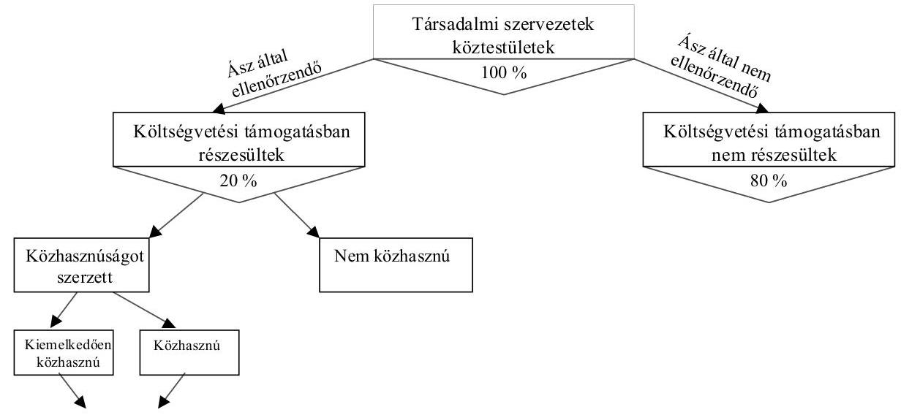
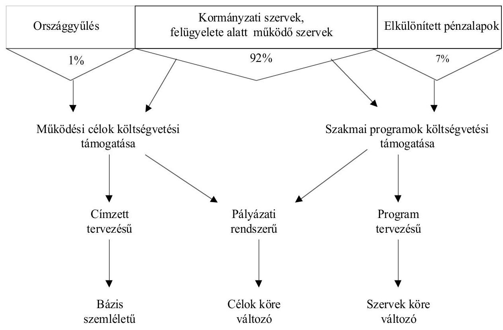

# JELENTÉS 

a társadalmi szervezeteknek és
köztestületeknek juttatott költségvetési
támogatások ellenőrzéséről

---

3. Önkormányzati és Területi Ellenőrzési Igazgatóság
4. Szabályszerűségi Ellenőrzések Főcsoport
V-1002-263/2002.
Témaszám: 588
Vizsgálat-azonosító szám: V0031
Az ellenőrzést felügyelte:
dr. Lóránt Zoltán
főigazgató
Az ellenőrzés végrehajtásáért felelős:
dr. Elek János
főigazgató helyettes
Az ellenőrzést vezette:
dr. Szávai Tamás
osztályvezető főtanácsos
Az összefoglaló jelentést készítette:
Horváth Balázs
számvevő tanácsos
Az ellenőrzést végezték:
Berzétey Attiláné
számvevő tanácsos
dr. Dotterweich Antal
számvevő tanácsos
Horváth Balázs
számvevő tanácsos
számvevő tanácsos
Szendrey Lajos
számvevő tanácsos
tanácsadó
számvevő

# A témához kapcsolódó eddig készített számvevőszéki jelentések: 

címe
sorszáma
Jelentés a Magyarországi Németek Szövetségének 1991. évben juttatott állami költségvetési támogatás felhasználásának ellenőrzéséről (1992.)
Jelentés a Magyarországi Szlovákok Szövetségének 1991. évben juttatott állami költségvetési támogatás felhasználásának ellenőrzéséről (1992.)
Jelentés a Magyarországi ROMA Parlament 1991. évi gazdálkodásának ellenőrzéséről (1992.)
Jelentés a Phralipe Független Cigány Szervezetnek 1991. évben juttatott állami költségvetési támogatás felhasználásának ellenőrzéséről (1992.)
Jelentés az AMELIPE Cigány Kultúra és Hagyományőrző Egyesületnek 1991. évben juttatott állami költségvetési támogatás felhasználásának ellenőrzéséről (1993.)
Jelentés a Magyarországi Cigányok Igazság Szövetsége 1992. évi állami költségvetési támogatás felhasználásának ellenőrzéséről 192 (1993.)

---

Jelentés a Magyarországi Románok Szövetsége 1992. évi állami ..... 193
költségvetési támogatás felhasználásának ellenőrzéséről (1993.)
Jelentés a Magyarországi Horvátok Szövetsége 1993. évi állami ..... 197
költségvetési támogatás felhasználásának ellenőrzéséről (1994.)
Jelentés a Szerb Demokratikus Szövetség 1993. évi állami ..... 198
költségvetési támogatás felhasználásának ellenőrzéséről (1994.)
Jelentés a LUNGO DROM Érdekvédelmi Cigányszövetség 1993. évi ..... 202
állami költségvetési támogatás felhasználásának ellenőrzéséről (1994.)
Jelentés a Cigány Ifjúsági Szövetség 1993. évi állami költségvetés ..... 203
támogatás felhasználásának ellenőrzéséről (1994.)
Jelentés a Magyar Madártani és Természetvédelmi Egyesület 1993. ..... 205
évi központi költségvetési támogatás felhasználásának ellenőrzéséről (1994.)
Jelentés az Országos Ómagyar Kultúra Baráti Társaság 1993. évi ..... 206
állami költségvetési támogatás felhasználásának ellenőrzéséről (1994.)
Jelentés a Magyarországi Szlovének Szövetsége részére az állami ..... 241
költségvetésből juttatott 1994. évi támogatás ellenőrzéséről (1994.)
Jelentés a Magyar Zsidók Kulturális Egyesülete részére az állami ..... 242
költségvetésből juttatott 1994. évi támogatás ellenőrzéséről (1995.)
Jelentés a Szülői Kamara részére az állami költségvetésből juttatott ..... 277
1993-94. évi támogatás felhasználásáról (1995.)
Jelentés a Magyarok Világszövetsége által 1993-1995. évben kapott ..... 315
állami költségvetési támogatás felhasználásának ellenőrzéséről (1996.)
Jelentés a Magyar Vöröskereszt pénzügyi-gazdasági ellenőrzéséről ..... 331 (1996.)
Jelentés az egészségügyi, rehabilitációs prevenciós, egészségmegőrzési és szociálpolitikai társadalmi szervezetek ..... 353
költségvetési támogatása igénylésének és felhasználásának ellenőrzéséről (1997.)
Jelentés a Magyar Vakok és Gyengénlátók Országos Szövetségének ..... 9808
1995-97. években juttatott állami költségvetési támogatás felhasználásának ellenőrzéséről (1998.)
Jelentés a Siketek és Nagyothallók Országos Szövetsége ..... 9809
gazdálkodásának, az 1995-97. évben juttatott állami költségvetési támogatás felhasználásának ellenőrzéséről (1998.)
Jelentés az Értelmi Fogyatékosok és Segítőik Országos Érdekvédelmi ..... 9917
Szövetsége gazdálkodásának ellenőrzéséről (1999.)
Jelentés a Mozgáskorlátozottak Egyesületeinek Országos Szövetsége ..... 9918
gazdálkodásának ellenőrzéséről (1999.)
Jelentés a Magyar Máltai Szeretetszolgálat Egyesülete ..... 0019
gazdálkodásának ellenőrzéséről (2000.)
Jelentés a Műszaki és Természettudományi Egyesületek Szövetsége ..... 0020
gazdálkodásának ellenőrzéséről (2000).
Jelentés a gazdasági kamarák 1999. évi vagyonleltárának ..... 0038
ellenőrzéséről (2000.)

---

## Eierlikör (1)

Menge: 1 Drink

2 Zentiliter Zitronensaft
2 Zentiliter Zuckersirup
1 Zentiliter Zuckersirup
1 Zentiliter Zuckersirup
etwas Zuckersirup
etwas Zuckersirup
etwas Zuckersirup
etwas Zuckersirup
etwas Zuckersirup
etwas Zuckersirup
etwas Zuckersirup
etwas Zuckersirup
etwas Zuckersirup
etwas Zuckersirup
etwas Zuckersirup
etwas Zuckersirup
etwas Zuckersirup
etwas Zuckersirup
etwas Zuckersirup
etwas Zuckersirup
etwas Zuckersirup
etwas Zuckersirup
etwas Zuckersirup
etwas Zuckersirup
etwas Zuckersirup
etwas Zuckersirup
etwas Zuckersirup
etwas Zuckersirup
etwas Zuckersirup
etwas Zuckersirup
etwas Zuckersirup
etwas Zuckersirup
etwas Zuckersirup
etwas Zuckersirup
etwas Zuckersirup
et

---

# TARTALOMJEGYZÉK 

BEVEZETÉS ..... 5
I. ÖSSZEGZŐ MEGÁLLAPÍTÁSOK, KÖVETKEZTETÉSEK, JAVASLATOK ..... 9
II. RÉSZLETES MEGÁLLAPÍTÁSOK ..... 17

1. A társadalmi szervezetek, köztestületek központi költségvetési kapcsolata, működési és szakmai célú támogatása ..... 17
1.1. A társadalmi szervezetek és köztestületek központi költségvetési támogatása, nyilvántartásának államháztartási rendszere ..... 17
1.2. A társadalmi szervezeteknek, köztestületeknek címzett előirányzatok és teljesítésük ..... 21
1.3. A nonprofit célokat szolgáló fejezeti kezelésű előirányzatok és elosztásuk ..... 22
2. A társadalmi szervezeteknek nyújtott támogatás eljárási, finanszírozási és elszámoltatási rendje, szabályozottsága és szabályossága a minisztériumoknál ..... 25
2.1. A fejezeti kezelésű előirányzatok felhasználásának szabályozottsága ..... 25
2.2. A pályáztatási rend szabályozottsága, bonyolításának intézményesítése, problémái ..... 26
2.3. A támogatások jóváhagyása és finanszírozása ..... 29
2.3.1. A társadalmi szervezetek, köztestületek címzett előirányzatai finanszírozása ..... 29
2.3.2. A minisztériumok saját hatáskörben engedélyezett céljellegű támogatásai ..... 31
2.3.3. A támogatások elbírálásának és odaítélésének szabályossága ..... 33
2.3.4. A támogatások felhasználása és elszámolására kötött szerződések szabályossága ..... 34
2.3.5. A rendeltetésszerű felhasználás elszámoltatása, ellenőrzése ..... 36
2.3.6. A költségvetési támogatás visszafizetésének, visszakövetelésének esetei ..... 39
3. A támogatásban részesült társadalmi szervezetek, köztestületek működésének szabályozottsága és szabályossága ..... 40
3.1. A gazdálkodás és működés szabályozottsága ..... 40
3.2. A könyvvezetés és beszámolás összhangja ..... 41
3.3. A közhasznúság értékelése, jelentési kötelezettségének teljesítése ..... 42
3.4. Auditálási kötelezettség, belső és külső ellenőrzés ..... 45
3.5. A központi költségvetési támogatások felhasználásának célszerűsége, elszámolásának szabályossága ..... 46
4. A nyilvánosság tájékoztatásával kapcsolatos törvényi követelmények teljesítése ..... 48

---

# MELLÉKLET 

1. Az ellenőrzési feladatok modellezése és mintaválasztása
2. A társadalmi szervezetek, köztestületek számának és közhasznúságának statisztikai adatai 1998-2000. években
3. A költségvetés végrehajtásának zárszámadási adatai a nonprofit szervezetek költségvetési támogatásáról
4. Statisztikai adatok a nonprofit szervezetek állami támogatásáról
5. A helyszínen ellenőrzött társadalmi szervezetek, köztestületek központi támogatásának mutatói közhasznúság szerinti csoportosításban
6. A helyszíni vizsgálatba bevont költségvetési fejezetek társadalmi szervezeteknek, köztestületeknek címzett támogatás alakulása 1998-2001. között
7. A KSH 2000. évi adatbázisából kiválasztott 150 szervezet listája
8. Közhasznú nyilvántartásba vételhez megjelölt közhasznú tevékenységek megoszlása és a tevékenységek hatóköre
9. Összesítő a felmérésbe vont szervezetek kiválasztott költségvetési kapcsolatáról 1998-2001. között

---

# RÖVIDÍTÉSEK JEGYZÉKE 

| OGY | Országgyűlés |
| :-- | :-- |
| KE | Köztársasági Elnökség |
| ÁSZ | Állami Számvevőszék |
| ME | Miniszterelnökség |
| BM | Belügyminisztérium |
| FVM | Földművelésügyi és Vidékfejlesztési Minisztérium |
| HM | Honvédelmi Minisztérium |
| IM | Igazságügyi Minisztérium |
| GM | Gazdasági Minisztérium |
| KöM | Környezetvédelmi Minisztérium |
| KVM | Közlekedési és Vízügyi Minisztérium |
| KüM | Külügyminisztérium |
| SZCSM | Szociális és Családügyi Minisztérium |
| OM | Oktatási Minisztérium |
| EüM | Egészségügyi Minisztérium |
| PM | Pénzügyminisztérium |
| NKÖM | Nemzeti Kulturális Örökség Minisztériuma |
| ISM | Ifjúsági és Sportminisztérium |
| GVH | Gazdasági Versenyhivatal |
| KSH | Központi Statisztikai Hivatal |
| MTA | Magyar Tudományos Akadémia |
| MPA | Munkaerőpiaci Alap |
| KNA | Központi Nukleáris Alap |
| MeH | Miniszterelnöki Hivatal |
| MOB | Magyar Olimpiai Bizottság |
| MOK | Magyar Orvosi Kamara |
| NOE | Nagycsaládosok Országos Egyesülete |
| APEH | Adó- és Pénzügyi Ellenőrzési Hivatal |
| OEP | Országos Egészségbiztosítási Pénztár |
| ÁSZ tv. | az Állami Számvevőszékről szóló 1989. évi XXXVIII. törvény |
| Ptk. | a Polgári Törvénykönyvről szóló 1959. évi IV. törvény |
| Kh. tv. | a közhasznú szervezetekről szóló 1997. évi CLVI. törvény |
| Áht. | az államháztartásról szóló 1992. évi XXXVIII. törvény |
| Ámr. | az államháztartás működési rendjéről szóló 217/1998. |
|  | (XII.30.) Korm. rendelet |

---

.

---

# JELENTÉS 

## a társadalmi szervezeteknek és köztestületeknek juttatott költségvetési támogatások ellenőrzéséről

## BEVEZETÉS

Magyarországon a társadalmi és gazdasági átalakulás több mint egy évtizedes szakaszában a rendszerváltás nehézségei, illetve a demokratikus kibontakozás együttesen eredményezték az önkéntes összefogás, a közösségi akaratérvényesítés erősödését. Kialakult egy olyan szektor, melynek része a társadalmi szervezet, az alapítvány, a közalapítvány, a köztestület, a sportági szakszövetség, valamint a közhasznú társaság (továbbiakban: nonprofit szervezetek). A társadalmi szervezetek tevékenységében az állami feladatok ellátásának aránya növekvő tendenciát mutat. Mindegyik szervezet típusra más és más jellemzők érvényesek. Alapításuk ennek megfelelően lehet központi, önkormányzati, vállalkozási, illetve magán kezdeményezésű. A nonprofit szervezetek megváltozott társadalmi jelentőségére, gazdasági súlyára jellemző, hogy a működő szervezetek száma eléri az 50 ezret, míg az összes bevétele meghaladja az 500 milliárd Ft-ot. Ebből az összegből a Pénzügyminisztérium 2000. évi zárszámadási adatai szerint 141,5 milliárd Ft a költségvetési támogatás, mely a megelőző évhez képest 43 %-kal emelkedett.

Az ellenőrzés célcsoportját a nonprofit szervezetek felét kitevő társadalmi szervezetek, köztestületek képezték, melyek létrehozása külön törvényben szabályozott. Ennek előírása értelmében:

- A társadalmi szervezet - az egyesülési jogról szóló 1989. évi II. tv szerint - olyan önkéntesen létrehozott, önkormányzattal rendelkező szervezet, amely az alapszabályban meghatározott célra alakul, nyilvántartott tagsággal rendelkezik, és célja elérésére szervezi tagjai tevékenységét. Célja érdekében vállalkozási tevékenységet is folytathat.
- A köztestület - a Polgári Törvénykönyv rendelkezései szerint - közfeladatot ellátó, önkormányzattal és nyilvántartott tagsággal rendelkező szervezet, amelynek létrehozását törvény rendeli el. Célja érdekében akkor végezhet vállalkozási tevékenységet, ha a létesítéséről szóló törvény ezt megengedi. Működésének elveit nem a tagság, hanem a törvényhozó határozza meg. A köztestületekre - ha törvény eltérően nem rendelkezik - az egyesületekre, s ennek megfelelően további utaló jogszabályi rendelkezés folytán a társadalmi szervezetekre vonatkozó szabályokat kell alkalmazni.

A Központi Statisztikai Hivatal 1998-2000 között „Nonprofit szervezetek Magyarországon" címmel évenként kiadott statisztikai adatai az egyesületi jelleggel működő társadalmi szervezetek számát 22500 körül, a köztestületekét

---

pedig 500-at megközelítően regisztrálták. A tényleges tevékenységet végző nonprofit szervezetekre vetített hányaduk 49 %, ezzel szemben a nonprofit szervezeteknek juttatott költségvetési támogatás - hozzávetőleg - egyötödéhez jutottak hozzá.

Az éves költségvetési törvényekben a nonprofit szervezetek, köztük a társadalmi szervezetek és köztestületek támogatása a központi, az önkormányzati, valamint az elkülönített állami pénzalap költségvetéséből valósult meg.

A társadalmi szervezetek, köztestületek központi támogatása az éves költségvetési törvényekben jóváhagyott előirányzatok terhére normatív, és nem normatív módon két fő célra teljesült:

- működés támogatására
- szakmai-ágazati programokra

A nem normatív központi költségvetési támogatás döntési és elosztási mechanizmusára jellemzően:

- az éves költségvetési törvények az Országgyűlés jóváhagyásával tartalmaztak társadalmi szervezetnek, köztestületnek címzett előirányzatot;
- az Országgyűlés kijelölt bizottságainak javaslata alapján, országgyűlési határozattal részesültek a társadalmi és karitatív, valamint nemzeti és etnikai kisebbségi szervezetek támogatására jóváhagyott keretből;
- az általános tartalékból egyedi kormányhatározattal kaphattak támogatást;
- a központi és fejezeti kezelésű előirányzatok terhére fejezeti döntési hatáskörben pályáztatással, illetve pályáztatás nélkül juthattak támogatáshoz.

A költségvetési támogatás rendszerében a központi költségvetési támogatásokat ellenőriztük, melyek normatív és nem normatív módon teljesültek. A feladatmutatóhoz rendelt normatívákat a költségvetési törvény rögzítette. A nem normatív támogatások tervezése közvetlenül névre címzetten, vagy címzés nélkül történt. A nem címzett előirányzatok fejezeti elosztása pályázattal és egyedi döntéssel teljesült.

A társadalmi szervezetek, köztestületek központi költségvetési támogatásáról nem álltak rendelkezésre megfelelő mélységű és bontású költségvetési adatok, ezért becsülni kellett a támogatás rendszerét (lásd: 1. sz. melléklet 3. pontban). Megállapítottuk, hogy a támogatás 92-93%-a minisztériumi (központi intézményi) döntéssel teljesült. Az Országgyűlés 1%-ot sem elérő támogatási hányadából a Társadalmi szervezetek bizottsága hatáskörében elosztott - 2000 óta változatlan - 348,1 millió Ft keret a tíz évvel ezelőtti összeget sem éri el (1991. évi 400 millió Ft). Ugyanakkor azóta közel megtízszereződött a támogatott szervezetek száma (172 helyett 1611).

A jelenlegi pénzelosztási rendszerben nem különül el az állami közfeladatok és nem állami tevékenységek finanszírozása. A helyzetet az is jellemzi, hogy nem készült felmérés az átvállalt állami feladatok finanszírozási igényéről.

---

Ellenőrzésünket - a rendszermodell elosztási hányadára figyelemmel - a meghatározó döntési joggal bíró minisztériumi fejezetek felügyeletét ellátó szervezetektől származó támogatásokra
 összepontosítottuk. A fejezetek felügyeletét ellátó szervezetek az éves költségvetési törvényekben nem normatív módon tervezett támogatásokat a társadalmi szervezet, köztestület javára címzetten, valamint pályázati és egyedi döntésű programokra biztosították.

Az ellenőrzést helyszíni ellenőrzéssel, illetve az Állami Számvevőszékről szóló 1989. évi XXXVIII. tv. (továbbiakban: ÁSZ tv.) 21. § (2) bekezdése alapján teljességi nyilatkozattal hitelesített írásos beszámoltatással végeztük.

Az ellenőrzés reprezentatív mintavétel alapján 1998. január 1-2001. december 31. közötti időszakra terjedt ki.

A rendszerellenőrzés célja annak értékelésében fogalmazódott meg, hogy:

- Rendeltetésszerű-e a társadalmi szervezetek, köztestületek központi költségvetési támogatásának felhasználása?
- Szabályszerű-e a költségvetési támogatással összefüggő gazdálkodási és beszámolási kötelezettségük teljesítése?
- Miként valósul meg az államháztartási szabályozás előírásainak betartása a központi támogatás tervezési, finanszírozási, elosztási és nyilvántartási rendszerében?
- Miként érvényesülnek a közhasznúsági törvény jelentési és nyilvántartási követelményei?

Vizsgálatunkat a követelmények alapján, oly módon készítettük elő, hogy elvégeztük az ellenőrzési feladatok értékelését és szisztematikus mintaválasztását; figyelemmel az ÁSZ ellenőrzés törvényi szabályozására (1. sz. melléklet).

Első ütemben a költségvetési fejezetek felügyeletét ellátó szervezetek vezetői (miniszterelnökség, minisztériumok) adatot szolgáltattak a társadalmi szervezetek és köztestületek 1998-2001 közötti címzett támogatásának alakulásáról, a pályáztatás és finanszírozás gyakorlatáról, az ellenőrzés működéséről.

Második ütemben a KSH - 2000. évi adatgyűjtése alapján - szűkített adatbázist biztosított a legalább 100 ezer Ft központi költségvetési támogatásban részesült társadalmi szervezetekről, köztestületekről. A megadott 3236 szervezetből sávosan súlyozott módszerrel, 150 szervezetre kiterjedő célcsoportot képeztünk az egységes kérdőíves felmérés céljára. A megkérdezettek közül 18 nem küldött jelentést, 3 szervezet nemlegesen nyilatkozott a központi támogatásról, 2 beszámoló nem felelt meg a tartalmi követelményeknek.

Összességében a kijelölt 150 szervezet 85%-a küldött érdemi, értékelhető beszámolót:

- tevékenységéről, könyvvezetési és beszámolási kötelezettségéről;
- 1998-2001 közötti gazdálkodásáról és költségvetési támogatásáról;

---

- 1998-2001 között végzett külső és belső pénzügyi ellenőrzésekről.

A jelentések informatikai feldolgozására a felülvizsgálatot követően került sor.
Az ellenőrzési minta kiválasztásához a domináns tevékenységeket öt funkcionális csoportba rendeztük:

- egészségügyi, szociális és családügyi;
- oktatási, művelődési és kulturális;
- szervezetfejlesztési, sport és ifjúsági;
- környezetvédelmi, település- és gazdaságfejlesztési;
- rendészeti, közbiztonsági és jogvédelmi.

A reprezentatív csoportosítással kiemelt 5 funkcionális terület lefedte a társadalmi szervezeteknek, köztestületeknek nyújtott támogatási összegek több mint felét (51-53%).

A társadalmi szervezetekre, köztestületekre jellemző - első három helyre rangsorolt - tevékenység alapján választottuk ki helyszíni ellenőrzésre a 6 költségvetési fejezet felügyeletét ellátó szervezetet (EüM, ISM, ME, NKÖM, OM, SZCSM). Ehhez a minta 10%-a szerint jelöltük ki a 13 társadalmi szervezetet és 2 köztestületet (lásd.: 1. sz. melléklet 4. pontja szerint).

Jelentésünkben a közvetlenül társadalmi szervezetre, köztestületre címzett, valamint a számukra pályáztatással vagy egyedi elbírálással adott támogatások felhasználásának ellenőrzési tapasztalatait foglaltuk össze.

Az Állami Számvevőszék rendszeresen ellenőrzi a nonprofit szférába tartozó közalapítványoknak, alapítványoknak, valamint a társadalmi szervezeteknek juttatott költségvetési támogatások felhasználását. Ez évben végzett, 0228. sorszámmal közzétett jelentésünk a közalapítványoknak és az alapítványoknak az 1998-2001. évek között juttatott nem normatív központi költségvetési támogatás felhasználásának ellenőrzéséről számolt be. Jelen vizsgálatunk módszerében és céljában kapcsolódik az alapítványi szféra ellenőrzése során követett gyakorlathoz.

Az ellenőrzés az ÁSZ. tv. 2. § (5) bekezdésén, valamint a közhasznú szervezetekről szóló 1997. évi CLVI. tv. (továbbiakban: Kh.tv.) 21. § rendelkezésén alapult.

---

# I. ÖSSZEGZŐ MEGÁLLAPÍTÁSOK, KÖVETKEZTETÉSEK, JAVASLATOK 

Az Állami Számvevőszék rendszeresen ellenőrzi a közalapítványoknak és a társadalmi szervezeteknek juttatott költségvetési támogatások felhasználását. A költségvetési támogatások mértéke dinamikus emelkedést mutat. A nonprofit szervezetek 1999. évben 97,9 milliárd Ft, 2000. évben 141,5 milliárd Ft, valamint a 2001. évi előzetes adatok szerint 189,2 milliárd Ft központi támogatásban részesültek. A két év alatt a támogatási összeg megduplázódott. A PM zárszámadáson alapuló adatai a nonprofit szervezetek támogatását összevontan tartalmazzák.

Az elosztási rendszerben nem érvényesült kellő módon az államháztartási törvényben megfogalmazott alapelvek közül: a teljesség, az egységesség, az áttekinthetőség és a nyilvánosság követelménye. A teljesség követelményének hiányára utal, hogy a pénzügyi információs rendszerben nem állapítható meg pontosan a társadalmi szervezetek, köztestületek központi költségvetési támogatásának mértéke. A központi támogatások 80%-ának elosztása 1998-2001. közötti időszakban egyedi döntések alapján történt. A tapasztalatok szerint nem különült el az állami közfeladatok és nem állami tevékenységek finanszírozása.

A központi költségvetési támogatások 92-93 %-a a minisztériumok, 6-7 %-a az elkülönített állami pénzalapok döntési hatáskörében, míg az Országgyűlés bizottságainak javaslatai alapján 0,2-0,3 %-a került elosztásra. Az Állami Számvevőszék jelen ellenőrzése a minisztériumok által nyújtott költségvetési támogatások rendeltetésszerű felhasználásának ellenőrzésére irányult.

A társadalmi szervezetek, köztestületek támogatásának összege - a KSH becsült adatai alapján - a nonprofit szervezetek költségvetési juttatásának hozzávetőlegesen 1/5-ét tette ki. A nonprofit szervezetek támogatásnövekedési dinamikáján belül a társadalmi szervezetek, köztestületek támogatási részaránya csökkenést mutat a közhasznú társaságok növekvő részarányával szemben. A gyakorlatban a társadalmi szervezetek, köztestületek közül minden ötödik jutott költségvetési támogatáshoz. A 2000. évi statisztika szerint 100 ezer Ft összeget meghaladó központi támogatásban 3236 szervezet részesült a hozzávetőleg 23000 működő szervezetből.

Az államháztartáson belül nem megoldott a nonprofit szervezetek támogatását figyelemmel kísérő, részletező nyilvántartás rendszere. Ezért a különféle összeállításban szereplő számok meglehetősen pontatlanok, belső tartalmuk nem egységes és egyrészt halmozódásokat, másrészt a vállalkozói kör részére juttatott összegeket is tartalmaznak. A PM által kialakított rendszer nem követi a közhasznú szervezetekről szóló törvényben meghatározott tevékenységi kört. A KSH évente kiadott statisztikai elemzései a pénzügyi adatszolgáltatás érdemi felülvizsgálata nélkül, a működő szervezetek egyharmadának jelentése hiányában készültek. Az 1999-2000. évi központi költségvetési támogatásra vonatkozó KSH adatok 21,0 milliárd Ft illetve 30,6 milliárd Ft eltérést mutatnak a

---

PM adatokhoz képest. A támogatások 20%-át meghaladó eltérés utal a pénzügyi információs rendszer nem megfelelő működésére, az államháztartási nyilvántartás elégtelenségére, valamint a fogalmi rendszer nem egységes értelmezésére.

A minisztériumok a döntési hatáskörükbe tartozó fejezeti kezelésű előirányzatok felhasználását - az EüM 2000. évet illető szabályzata kivételével - a pénzügyminiszterrel egyetértésben szabályozták. A szabályzatok összhangban voltak az államháztartási törvény, illetve az államháztartás működési rendjéről szóló kormányrendelet előírásaival. Ugyanakkor nem fordítottak kellő figyelmet az egyedi támogatások döntés-előkészítési mechanizmusának szabályozására. A pályázati követelményekhez viszonyítva kevésbé kötött eljárási feltételeket határoztak meg. Az egységesen alkalmazandó követelményekről jogi előírás nem rendelkezik.

Az éves költségvetési törvényekben címzett támogatásban részesülő szervezetek száma a négy év viszonylatában 22-26 között volt, így 1000 szervezet közül 1 részesült ebben a támogatási formában. A támogatásban részesültek éves támogatása átlagosan az 1998. évi 86,3 millió Ft-ról 2001. évre 141,1 millió Ft-ra nőtt. A címzett előirányzatok alakulása jellemzően bázis szemléletű tervezési gyakorlatot mutat, melyhez egyes minisztériumok nem kértek az adott szervezetektől szakmai és költségvetési indokolást. Előfordult, hogy a kizárólagosan társadalmi szervezetekre előirányzott költségvetési keretekből nem társadalmi szervezeteknek is juttattak támogatást (EüM, SZCSM).

A minisztériumok a nem normatív támogatást - közel teljes összegben - végleges költségvetési juttatásként folyósították. A céljelleggel megítélt támogatások 10-15%-át tették ki az igényelt összegnek.

A minisztériumok a címzett támogatást - egy kivétellel - működési céllal tervezték, ennek megfelelően időarányos finanszírozással folyósították. A címzett támogatásban részesült szervezetek az előírt tartalommal, határidős kötelezettséggel szakmai és pénzügyi beszámolót készítettek. Ennek helyszíni ellenőrzését a minisztériumok alapvetően elmulasztották.

A nem címzett támogatások elosztása a vizsgált időszakban pályázati úton és egyedi elbírálás alapján történt.

Az 1998-2001 között a szervezetek 4/5-e pályázat útján nyerte el támogatását, míg e támogatások összege 1/5-ét tette ki a fejezeti hatáskörű döntésekkel adott támogatásoknak. Egyes minisztériumok a pályáztatás koordináltabb lebonyolítása érdekében külön szervezeteket bíztak meg, melyek által színvonalasabbá vált a támogatások ügyintézése (ISM, NKÖM, MeH).

A pályázati támogatások rendszere nem egységes, minisztériumonként és pályázati kiírásonként változó tartalmú. A pályázó szervezetekről nincs egységes, naprakész nyilvántartás. Egy pályázó szervezet pályázatonként külön-külön kötelezett a teljes pályázati dokumentációjának benyújtására. A központi nyilvántartás hiányában a támogatás odaítélésének és elszámolásának jelenlegi rendje többlet ráfordítást igényel mind a pályáztató, mind a pályázó részéről.

---

A pályázatot kiírók 5%-ban nem tartják be az elbírálási, finanszírozási határidőket, mely pénzügyi nehézséget okoz a felhasználónál.

A tipikusan egyedileg elbírált támogatásoknál nem valósult meg az államháztartásról szóló törvény komplex követelménye, a közpénzekkel való hatékony és ellenőrizhető gazdálkodás garanciáinak érvényesítése. A minisztériumok rendelkezési jogosultsággal felruházott szakmai szervezetei nem gondoskodtak a törvény előírásainak következetes betartásáról.

A helyszíni ellenőrzésre kiválasztott minisztériumok viszonylatában rendkívül szűk körben valósult meg a forrás koncentrálását célzó kormányzati koordináció, együttműködés. Az összehangolás hiánya visszavezethető arra is, hogy e kötelezettségről rendelkező kormányrendelet az azonos támogatási célt szolgáló fejezeti kezelésű előirányzatok, illetve elkülönített állami pénzalapok pénzeszközei felhasználásának speciális szabályait rögzíti, s nem tartalmaz általános érvényű követelményeket.

Az éves költségvetési törvényekben elfogadott, a vizsgált fejezetekhez tartozó szakmai programok céljai összhangban álltak a közhasznú szervezetekről szóló törvény által közhasznúnak minősített tevékenységi körrel.

A minisztériumok, a támogatás feltételeit - az EüM 1998-1999. évi néhány esetét kivéve - a jogszabályi előírásoknak megfelelően a kedvezményezett szervezetekkel kötött támogatási szerződésekben rögzítették. A közhasznú szervezetekről szóló törvény értelmében kizárólag a közhasznú szervezeteknek nyújtott - nem normatív - államháztartási támogatásra vonatkozik a szerződéskötés követelménye. Ennek ellenére a minisztériumoknál helyes módon, 2000. évtől egységes gyakorlattá vált, hogy a nem közhasznú szervezetekkel is szerződést kötöttek.

A támogatások felhasználására és elszámolására kötött szerződések tartalma általában megfelelt az államháztartás működési rendjéről szóló előírásoknak. Azáltal, hogy a szabályozás nem teljes körű, a szerződések tartalma eltérő volt minisztériumonként és minisztériumon belül is. Egyes minisztériumok szerződései egyrészt olyan kötelezettségeket is tartalmaztak, melynek nem lehetett eleget tenni, másrészt fontos tartalmi követelményeket mellőztek. A támogatásokról megkötött szerződések hibái és hiányosságai a nem megfelelő belső szabályozásra voltak visszavezethetőek. A szabályzatok gyakran csak általánosságban rögzítették az elszámolási kötelezettség tartalmára, formájára és határidejére; a szakmai és pénzügyi beszámoló összeállításának szempontjaira; valamint az ellenőrzési jog gyakorlására vonatkozó eljárási rendet.

A minisztériumok pályázati rendszerét az államháztartási alapelvekkel összhangban álló szabályozottság, szervezettség jellemezte. A minisztériumok a pályázati célra elkülönített céltámogatások felhasználását a szakmai szempontokra és az államháztartási követelményekre figyelemmel szervezték. A pályázatokat jellemzően nyílt formában, de változó arányban zárt keretek között is meghirdették. A meghívásos pályáztatásnál nem érvényesültek következetesen a döntés-előkészítési szabályok. A MeH 1999-2001 között a civil szervezetek támogatására szolgáló keretének 20-25%-át meghívásos formában osztotta el. A 2001. évben két pályázatra elkülönített, majd összevont 110 millió Ft

---

pályázati pénzalap egyedi igényekre, formális kuratóriumi döntéssel került elosztásra. A pályázati cél részletezése és a javaslat indokolása nélkül megítélt támogatást 10 szervezet kapta, egyenként 5-25 millió Ft-ig terjedő nagyságrendben.

A pályázati támogatások rendeltetésszerű felhasználásának elszámoltatását és ellenőrzését a pályázatkezelő szervezeteknél értékeltük szabályszerűnek, módszeresnek. Így pl. a MeH Informatikai Kormánybiztosság Hivatala - a pályázati típustól függően - a szerződések 30-100% közötti hányadában helyszíni ellenőrzést végzett; a Mobilitás Ifjúsági Szolgálat számítógépes nyilvántartás alapján kísérte nyomon a támogatási határidők betartását;
 a Nemzeti Kulturális Alapprogram pályázatkezelő rendszere monitoring szervezésű célirányos ellenőrzéseket tesz lehetővé.

A minisztériumok a célelőirányzatokból folyósított támogatások meghatározó hányadát egyedi kérelmek alapján döntötték el. A felmérésbe vont 6 minisztérium által, az ellenőrzött 127 szervezetnek juttatott támogatások 80%-a egyedi döntési hatáskörbe tartozott. Az egyedi támogatások fele a programfinanszírozási szabályok szerint teljesült. A szabályozás az egyedi támogatások döntéselőkészítési folyamatára - a pályázatokkal ellentétben - nem tartalmazott kötelező érvényű előírásokat. Így a beküldött kérelmek 25-30%-a megalapozatlan költségvetéseken alapult, melyhez a szabályszerűség követelményeinek ellenőrzésére kevésbé alkalmas információk kapcsolódtak. Pl.: A MeH a Rákóczi Szövetség támogatását ily módon folyósította 10-15 millió Ft nagyságrendben 1999-2001 között.

A helyszíni ellenőrzésbe vont társadalmi szervezetek és köztestületek a költségvetési támogatásokat alapvetően rendeltetésszerűen, a támogatási szerződésekben rögzítettek szerint használták fel. A minisztériumoknál vizsgált egyedi támogatások célszerű felhasználását igazoló bizonylatok egyharmada nem felelt meg a számviteli törvény követelményeinek.

A vizsgálatba vont 127 társadalmi szervezet és köztestület 30%-a nem rendelkezett szervezeti és működési szabályzattal és 36%-a számviteli politikát sem készített. Az alkalmazott könyvvezetés formája nem igazodott a választott beszámoló típus formai követelményéhez, így például 2000. évben 43 szervezet vezetett kettős könyvelést, miközben 64 szervezet töltött ki ehhez a könyvvezetéshez igazodó beszámolót. A 82 közhasznú szervezethez képest 62 készített közhasznú beszámolót. A negatív tapasztalok azt mutatják, hogy a társadalmi szervezetek szabályzatalkotási és könyvvezetési, beszámolókészítési gyakorlatán feltétlenül javítani szükséges, mely feladat végrehajtása csak jelentős külső segítséggel valósítható meg.

A statisztikai adatok szerint a szervezetek többsége nem kérte a közhasznú besorolását. Ebben közrejátszott az is, hogy a költségvetési támogatás megszerzésének nem volt általános feltétele, pedig a törvény éppen a gazdálkodás áttekinthetőbbé tételét célozta. Ehhez elrendelte a közhasznúsági jelentés készítését, melyben elsődlegesen követelte meg a költségvetési támogatás mértékéről, rendeltetésszerű felhasználásáról való elszámolást.

---

Még nem kellően megoldott az egyesülési jog hatálya alá tartozó szervezetek egységes, naprakész, korszerű szakmai és szervezeti csoportosítást is bemutató bírósági nyilvántartási rendszere. Alapvetően a közhasznúvá minősített szervezetek esetében újabb igényként jelentkezik az adományozók és a piac szereplői számára hasznos információt nyújtó, a szervezetek szakmai és gazdálkodási eredményeit bemutató - számviteli és közhasznúsági - beszámolók évenkénti bírósági letétbe helyezésének elrendelése, általános körű internetes hozzáférésének biztosítása.

Költségvetést az 1998-2001. évekre a szervezetek 73-82%-a készített, melyek közül a legfőbb döntéshozó szerv hatáskörében 67-76%-a került jóváhagyásra. A beszámolót mindhárom évben valamennyi helyszínen ellenőrzött szervezetnél a legfőbb döntéshozó szerv jóváhagyta, ezen belül a kiemelkedően közhasznú szervezetek beszámolóit és közhasznú jelentéseit - egy kivétellel - könyvvizsgáló vizsgálta felül. A közhasznúsági jelentések tartalma nem felelt meg a közhasznúsági törvényben meghatározott részletezési követelményeknek, mivel a jogalkotók nem gondoskodtak annak egységes értelmezhetőségéről.

A helyszínen ellenőrzött társadalmi szervezetek központi támogatói - az Országgyűlés kivételével - az államháztartás működési rendjéről szóló kormányrendelet szerint a támogatás felhasználásának feltételeit és elszámolásának módját szerződésben rögzítették.

A Magyar Olimpiai Bizottság 2001. évben 1 milliárd Ft nagyságrendű - alapítótól továbbadási céllal kapott - támogatást a kormányrendelet előírásától eltérően nem kötelezettségként, hanem bevételként kezelte. A kormányrendelet helyes módon a támogatási pénzek szervezetenkénti halmozódásának kiküszöbölését célozza.

A helyszínen ellenőrzött szervezeteknél a választott ellenőrző bizottságok jellemzően nem vizsgálták a költségvetési támogatások rendeltetésszerű felhasználását. A támogatók részéről végzett ellenőrzések öt esetben állapítottak meg társadalmi szervezetnél rendeltetésellenes felhasználást, mely összegek visszafizetéséről intézkedtek. Jogi eljárás alatt áll 13,2 millió Ft támogatás visszakövetelése.

A közpénzek átláthatósága érdekében a támogatások elosztásának és felhasználásának nyilvánosságra hozataláról törvények rendelkeznek. Megfelelő szabályozás hiányában a minisztériumok tájékoztatási kötelezettségüknek eltérő módon és tartalommal tesznek eleget. Az egyedi döntések és meghívásos pályázatok esetében a szűk körű tájékoztatás nem felel meg a nyilvánosság követelményének. A társadalmi szervezetek és köztestületek közül a kiemelkedően közhasznúak számára írja elő jogszabály a tevékenységre és gazdálkodásra vonatkozó legfontosabb adatok közlését. E kötelezettségének a szervezetek 85-90%-a eleget tett.

Az államháztartás kormányprogramban szereplő tervezett modernizációjával megoldandó az állami közfeladatok és nem állami tevékenységek költségvetési finanszírozásának elkülönítése.

---

A helyszínen ellenőrzött szervezetek számára a következő javaslatokat fogalmaztuk meg:

1. Az Alapszabályban előírt Szervezeti és Működési Szabályzatot készítsék el.
2. Kezdeményezzék, hogy a Számvizsgáló Bizottság (Felügyelő Bizottság) Ügyrendje elkészüljön, illetve a bizottság éves munkaterv alapján rendszeres ellenőrzést végezzen, mely terjedjen ki a kapott támogatások célszerű felhasználására is.
3. A Közgyűlések időpontját úgy határozzák meg, hogy a legfőbb döntéshozó testület az elkészült közhasznúsági jelentést és a beszámolót a megfelelő időben mindenképpen jóváhagyhassa.
4. A közhasznúsági jelentés készítésénél maradéktalanul vegyék figyelembe a közhasznú szervezetekről szóló 1997. évi CLVI. törvény 19. § (3) bekezdésében meghatározott kötelező tartalmi követelményeket.
5. Gondoskodjanak a szervezet Számviteli politikájának teljes körű elkészítéséről, a számvitelről szóló 2000. évi C. törvény 14. § (8) bekezdésében foglaltak végrehajtásáról, valamint a gazdálkodásra vonatkozó szabályzatok jóváhagyásáról, aktualizálásáról.
6. A többszörös elszámolás lehetőségének kiküszöbölése érdekében a költségvetési támogatás elszámolásához felhasznált eredeti bizonylatokra a beérkezést követően, de legkésőbb még a másolás elkészültéig írják rá, hogy melyik támogatás elszámolásához használták fel.
7. Az állami támogatások főkönyvi könyvelése során tartsák be a számvitelről szóló 2000. évi C. törvény előírásait. A támogatások összegét az előírások szerint mutassák ki. Az egyéb szerződések alapján kapott költségvetési juttatásokat különítsék el az állami és más forrásokból kapott támogatásoktól.
8. Fordítsanak nagyobb figyelmet a támogatási szerződések tartalmára. Csak olyan kötelezettséget vállaljanak, amelyek betartására valóban befolyással bírnak. Hosszabbtávú feladatvállalás esetén kezdeményezzék a támogatónál a hosszabb távú költségvetési fedezetvállalást.
9. A kapott támogatások továbbadása esetén, a továbbszerződés tartalmánál tartsák be a kapott támogatás felhasználására vonatkozó szerződés előírásait. Fordítsanak nagyobb figyelmet a végső felhasználás bizonylati tartalmára, és ne fogadjanak be más elszámolásokhoz tartozó, vagy bizonytalan tartalmú bizonylatokat.

A helyszíni ellenőrzés megállapításainak hasznosítása mellett javasoljuk:

# a Kormánynak 

1. Kezdeményezze az Áht.-nak a központi költségvetési kiadásokra vonatkozó szabályozása módosítását, figyelemmel a fejezeti kezelésű támogatási lehetőségek előze-

---

tes, illetve a támogatást elnyert szervek névsorának és a kapott támogatásnak az utólagos nyilvánossá tételére.
2. Módosítsa az államháztartás működési rendjéről szóló 217/1998. (XII. 30.) Korm. rendeletet, hogy:

- a VIII. fejezet összehangolásra vonatkozó, 81-93. §-ban foglalt előírásai valamennyi támogatási célt megvalósító előirányzatra vonatkozzanak;
- a nem normatív államháztartási támogatások nem költségvetési szervek körére írja elő az írásbeli szerződéskötés követelményét.

3. Gondoskodjon a támogatók és a támogatottak adminisztrációs terhei csökkentése érdekében olyan központi nyilvántartási rendszer kialakításáról, mely lehetővé teszi a támogatások igénybevevői, illetve pályázói számára azt, hogy az előírt nyilatkozatokat, igazolásokat, alapító okiratokat és egyéb változatlan tartalmú bizonylatokat csak az adatok módosulása esetén kell a nyilvántartást vezető szervezetnek benyújtani.
4. Módosítsa a számviteli törvény szerinti egyes egyéb szervezetek beszámoló készítési és könyvvezetési kötelezettségének sajátosságairól szóló 224/2000. (XII. 19.) Korm. rendelet 20. § (4) bekezdését annak érdekében, hogy a közhasznú és kiemelkedően közhasznú szervezetek kötelesek legyenek beszámolóikat a nyilvántartásukat vezető megyei bíróságnál letétbe helyezni.
5. Fontolja meg annak lehetőségét, hogy a minisztériumi pályázatok teljes körű figyelemmel kísérésére információs központot hozzon létre, mely képes ellátni a pályázatkezelő szervezettel nem rendelkező minisztériumok pályáztatási feladatát is.
6. Intézkedjék, hogy a fejezetek felügyeletét ellátó szervek vezetői az éves zárszámadási törvényjavaslatok keretében egységes szempontok szerint számoljanak el a társadalmi szervezeteknek, köztestületeknek adott nem normatív támogatásaikról, a Kh. tv. 26. § c) pontjában meghatározott közhasznú tevékenységek szerinti részletezésben.
7. Intézkedjék, hogy a minisztériumok csak kivételesen indokolt esetekben, a fejezeti kezelésű előirányzatok szabályzatában meghatározott keretek és feltételek között adjanak a pályázati út mellőzésével egyedi támogatást.

# a pénzügyminiszternek 

Intézkedjék - az ÁHH elnökével együtt - a már meglévő azonosító- és monitoringrendszer továbbfejlesztéséről annak érdekében, hogy az ÁHH a jövőben rendszeresen és teljes körűen információt tudjon adni az államháztartáson kívülre folyósított valamennyi juttatásról, gazdasági társaságok és a Kh. tv.-ben meghatározott közhasznú szervezetek (társadalmi szervezet, alapítvány, közalapítvány, közhasznú társaság, köztestület, sportági országos szakszövetség) szerint.

## az igazságügyi miniszternek

1. Módosítsa - az Országos Igazságszolgáltatási Tanács egyetértésével - a társadalmi szervezetek nyilvántartásának ügyviteli szabályairól szóló 6/1989. (VI. 8.) IM rendelet 1. számú mellékletét annak érdekében, hogy a nyilvántartás adattartalma feleljen

---

meg a társadalmi szervezetek támogatói, kedvezményezettjei, üzleti partnerei és az ellenőrzést végző szervek információigényének. Bővítse a nyilvántartást a következő adatokkal:

- az induló vagyon összege és összetétele;
- a törzsvagyon mértékére és a tartalmára előírt feltételek;
- a társadalmi szervezetek csoportosítása az alapító szervek szerint;
- a közhasznú és kiemelkedően közhasznú szervezetek az alapító okiratban megjelölt közhasznú tevékenységek (a Kh. tv. 26. § c) pontjának megfelelő csoportosításban).

2. Kezdeményezze - az Országos Igazságszolgáltatási Tanács bevonásával - a társadalmi szervezetek adataira és letéti mérlegeire vonatkozóan olyan számítógépes nyilvántartási rendszer kialakítását, amelyet - szükség szerint külön díjazás mellett - internetes hozzáférési módon bárki megtekinthet.

# a miniszterelnöki hivatalt vezető miniszternek 

1. A jogszabályi és szakmai követelmények figyelembevételével pontosítsák valamennyi támogatási szerződés tartalmát.
2. A kifogásolt területeken is biztosítsa a támogatások felhasználásának hatékonyabb ellenőrzését.

## az egészségügyi, szociális és családügyi miniszternek

Intézkedjék, hogy a minisztérium illetékes főosztályai maradéktalanul tartsák be a támogatások odaítélésének, a pályázók által csatolt nyilatkozatok ellenőrzésének szabályait, alakítson ki megfelelő információbázist a minisztériumon belüli összehangolt döntés-előkészítés javítása érdekében.

## a gyermek-, ifjúsági és sportminiszternek

1. Intézkedjék a támogatásokkal kapcsolatban feltárt szabálytalan elszámolások felülvizsgálatára és a szükséges intézkedések megtételére, szankciók - beleértve a személyes felelősség megállapítását - alkalmazásának kezdeményezésére.
2. Gondoskodjon az egységes iratkezelési rend kialakításáról, mely lehetővé teszi az egyes iratok gyors visszakeresését és támogatásonkénti kezelését.

## a nemzeti és kulturális örökség miniszterének

A támogatásban részesített társadalmi szervek körében rendszeresen végeztessen ellenőrzést.

---

# II. RÉSZLETES MEGÁLLAPÍTÁSOK 

## 1. A TÁRSADALMI SZERVEZETEK, KÖZTESTÜLETEK KÖZPONTI KÖLTSÉGVETÉSI KAPCSOLATA, MŰKÖDÉSI ÉS SZAKMAI CÉLÚ TÁMOGATÁSA

### 1.1. A társadalmi szervezetek és köztestületek központi költségvetési támogatása, nyilvántartásának államháztartási rendszere

Az éves költségvetésről, illetve az éves költségvetés végrehajtásáról szóló törvények adatai 1999-től a nonprofit szervezeteknek juttatott támogatásokról összevontan tájékoztatnak. Így a társadalmi szervezetek, köztestületek támogatásáról - a címzett előirányzatokat és teljesítéseket kivéve - még hozzávetőleges adatok sem álltak rendelkezésünkre. Korábban a költségvetés alapján gazdálkodó szervek könyvvezetési és beszámolási kötelezettségéről rendelkező - többször módosított - 54/1996. (IV. 12.) Korm. rendelet a társadalmi szervezetek támogatását is részletező beszámolási kötelezettséget írt elő, mely 1998. december 31-ig volt érvényben.

A civil szervezetek teljes körű államháztartási támogatásáról készített „A civil szervezetek költségvetési támogatása az 1999-2002. években" című PM elemzés is rámutat arra, hogy adatai tájékoztató jellegűek, s jelenlegi adatbázisából csak abban az esetben lehetne pontosabb adatokhoz jutni, ha a civil szervezeti formák támogatása külön költségvetési sorban kerülne feltüntetésre. A részletesebb adatbázist az államháztartáson kívüli támogatások áttekinthetősége, összehasonlíthatósága érdekében szükséges megoldani.

A 2001. évi előzetes PM adatokat is megkérve az 1999-2001. évek viszonylatában fejezeti és funkcionális részletezésben állítottuk össze a támogatás
 alakulását, megoszlását (lásd: 3.1-3.2. sz. melléklet).

A nonprofit célú támogatás fejezetek szerinti mutatói a következő tendenciára utalnak:

- a nonprofit szektor támogatása évről évre dinamikus emelkedést mutat, a növekedési index 43,3 %, illetve 34,6 %;
- a központi és önkormányzati támogatások viszonyában lényeges elmozdulás nem következett be, de 84 % körüli hányadával a központi költségvetés domináns szerepe érvényesül;
- a nonprofit szervezetek 1999-ben 97,9 milliárd Ft, 2000-ben 141,5 milliárd Ft, 2001-ben 189,2 milliárd Ft központi támogatásban részesültek, így e rövid periódusban támogatásuk megduplázódott;
- az Országgyűlés két bizottság hatáskörében elosztott támogatása nem követte az általános növekedési dinamikát, így töredékét teszi ki a teljes támogatásnak (0,2-0,3 %);

---

- a minisztériumok közül helyszíni vizsgálatba bevont fejezetek támogatási részaránya az 1999. évi 40,1 %-ról 2001. évre 42,0 %-ra emelkedett, mellettük a BM 26,1 %-os mutatója 22,0 %-ra csökkent;
- a két elkülönített pénzalap közül a társadalmi szervezeteket, köztestületeket is támogató Munkaerőpiaci Alap támogatása 6 milliárd Ft-tal emelkedett.

A nonprofit szervezetek költségvetési támogatásának PM által kialakított funkcionális bontása nem követi a közhasznú szervezetekről szóló Kh. tv. 26. § c) pontjában meghatározott tevékenységi kört, bár attól bővebb tagolású. Így a funkciók támogatása - egységes értelmezés, szervezeti részletezés hiányában - valóban nem tekinthető megbízható, valós költségvetési adatnak. Az ellenőrzésünkhöz kapcsolódó funkcionális körben az alábbi jellemzőket emeljük ki:

- a nonprofit szektorban megvalósuló oktatási tevékenység támogatása 1999-2001. években 35,4 milliárd Ft-ról 57,2 milliárd Ft-ra emelkedett, ezen belül a növekedés a középfokú és egyéb oktatásra koncentrálódott, melynek támogatása 80,0 %-os hányadot képviselt;
- a vizsgált szervezetekre jellemző kulturális és egyéb közéleti tevékenységek támogatása 2001-ben 23,2 milliárd Ft-tal teljesült, mely kétszerese az 1999. évinek;
- a kulturális területenél is dinamikusabban nőtt a sport és szabadidős funkciók támogatása, amely 20 milliárd Ft-ot megközelítő teljesítményének mutatója 275 %;
- a szociális és egészségügyi feladatoknál a karitatív szervezetekre jellemző nyugellátások és szociális szolgáltatások, egyéb közegészségügyi feladatok kerültek előtérbe, melyek támogatási szintje, növekedése az előzőhöz hasonló.

Szintén tájékoztató jellegűek a KSH évente kiadott „Nonprofit szervezetek Magyarországon" című statisztikai elemzései, melyek a pénzügyi adatszolgáltatás érdemi felülvizsgálata nélkül, a működő szervezetek egyharmadának jelentése hiányában készültek. A KSH reprezentációs módszert alkalmazott az információk teljeskörűsítéséhez.

A KSH a nonprofit szervezetek állami támogatását a költségvetéstől eltérő módon értelmezi (lásd: 4.1. A nonprofit szektor állami támogatásának jogcímenkénti alakulása 1998-2000.). Ebből, valamint az adategyeztetések hiányából is fakad, hogy az 1999-2000. évi központi költségvetési támogatásra vonatkozó PM adatokhoz képest 21,0 milliárd Ft, illetve 30,6 milliárd Ft eltérést tapasztaltunk a központi költségvetés javára. A statisztikai adatok az önkormányzati támogatás, valamint a teljes körű támogatás növekedését illetően mutattak hasonlóságot (Utóbbi PM adatok szerint: 43,3 %, KSH adatok szerint: 43,6 %).

A statisztika jellemzően mutatja be, hogy a támogatás 2/3-a nem normatív módon teljesült; így célszerű felhasználása, hasznosságának mérhetősége sem rendelhető feladatmutatóhoz. Az egyesületek, köztestületek támogatását részletezi, de abból nem tűnik ki, hogy a központi támogatás mely szervezeteknél, milyen összeggel és hányaddal teljesült (lásd: 4.2. melléklet Az állami támogatás szervezeti formánkénti alakulása, megoszlása 1998-2000.). Így csak követ-

---

keztetni lehet, hogy az egyesületek támogatásának növekedését döntően a központi források eredményezték. Ugyanakkor részarányának 25,0 %-ról 19,4 %-ra csökkenése szerkezeti eltolódásra utal, mely a közhasznú társaságok támogatásának intenzív növekedésében jut kifejezésre (280 %). A közhasznú társaságok támogatása 2000-ben 5,5 milliárd Ft-tal haladta meg az egyesületek, köztestületek együttes támogatását. (Meg kell jegyezni, hogy a KSH által használt egyesületek fogalomkör tartalma megegyezik a jelentésben alkalmazott társadalmi szervezetekkel.)

A PM-hez hasonlóan a statisztika is részletezi a támogatás tevékenységcsoportra teljesülését (lásd: 4.3. melléklet Az állami támogatás tevékenységenkénti alakulása és megoszlása 1998-2000.). Elnevezésében és szerkezetében a KSH jobban igazodott a közhasznúsági törvényben foglaltakhoz. Így a nonprofit célú támogatások vonatkozásában általánosságban állapíthattuk meg a juttatások domináns tevékenységekre koncentrálódását (oktatás 17,7-18,1 %; kultúra 10,2-17,2 %, szociális ellátás 14,1-19,5 %; sport-szabadidő 8,5-13,6 %; egészségügy 3,2-5,3 %). A költségvetési források növekedésével javult a támogatáshoz jutottak részarány-mutatója. A kedvező változás következtében a központi támogatásból részesültek aránya 18,2 %-ról 22,3 %-ra módosult.

Az ellenőrzött minisztériumok jelenlegi belső információs rendszere az ellenőrzés szempontjainak megfelelő, szervezetenkénti összevont támogatási adatokat nem nyújtott, ezért azokról külön összeállítást kellett kérni.

Elemzési eredményeinket, megállapításaink helyességét a domináns tevékenységcsoportok alapján választott és helyszínen ellenőrzött szervezetek 1998-2001. évre részletezett vagy összesített központi támogatásának mutatói döntőrészt igazolták (lásd: 5. sz. melléklet).

A helyszínen ellenőrzött szervezeteknél felülvizsgált központi támogatás részarányát, változását a közhasznúság szerinti csoportosításban vizsgáltuk (lásd: 5.1. melléklet A központi támogatás bevételi részarányának alakulása, változása 1998-2001. között). Megállapítottuk, hogy a kiemelkedően közhasznú besorolás csak a szervezetek kisebb hányadánál jutott kifejezésre (Magyar Olimpiai Bizottság + 43 %; Magyar Kékkereszt Egyesület + 53 %; Összhang Kulturális Egyesület + 24 %). A szervezetek többségénél a forrásösszetételben lényegtelen (1-6 % növekedés), esetenként negatív irányú (Magyar Természetbarát Szövetség - 7 %; Európa Jövője Egyesület - 4 %) változás történt. Utóbbi két szervezetnél súlyos finanszírozási, likviditási gondokkal párosult a támogatás bizonytalansága.

A közhasznú fokozatot szerzett 3 társadalmi szervezet részarány-mutatója 66, 70, 89 %-ra emelkedett, ezen túl az emelkedés mértéke is kifejezte a tevékenység megkülönböztetett támogatását. A Drog Stop Budapest Egyesület, valamint a Közösségfejlesztők Békés Megyei Egyesülete kiugró növekedésében a kábítószer-megelőzési, illetve civil ház programba való bekapcsolódás (funkcionális kiteljesedés) bírt döntő befolyással.

A nem közhasznú szervezetek támogatási részaránya lényegi változást nem mutat, de stabil és kiemelt támogatottságra utal a Hallgatói Önkormányzatok Országos Konferenciájának 90 %-ot, valamint a Fóti Ökumenikus Közművelő-

---

dési Egyesület 91 %-ot is elérő mutatója. Ilyen feltételek mellett nem meglepő, hogy egyik szervezet sem kezdeményezte a közhasznú vagy kiemelkedően közhasznú besorolását. A köztestületként működő Magyar Orvosi Kamara minden tekintetben kivételt képez e szervezeti körben. Ugyanis tevékenységi körét illetően kiemelkedően közhasznú besorolás illetné meg, de közhasznúságáról a létrehozásáról szóló törvény nem rendelkezett, másfelől a közfeladatai színvonalasabb ellátása céljából 35 %-kal nagyobb hányadban fedezte működését a központi költségvetés.

A vizsgált szervezetek támogatásának 99,5 %-át a minisztériumok és intézményeik biztosították. Az együttes támogatásra vetítve az Országgyűlés határozatával, valamint az elkülönített pénzalapból folyósított juttatás mindösszesen 0,3 %, illetve 0,2 %. (lásd: 5.2. melléklet A központi támogatás összetételének alakulása, megoszlása a pályázati összeg és hányad részletezésével).

A legnagyobb támogatásban részesülő köztestületek (Magyar Olimpiai Bizottság, Magyar Orvosi Kamara), mint címzett támogatottak; valamint az oktatást is folytató, így normatív támogatásra jogosult szervezetek (Protestáns Gimnázium Egyesület, Fóti Ökumenikus Közművelődési Egyesület) támogatását leszámítva, minden csoportra általánosítható, hogy a támogatást jellemzően pályázat útján nyerték el. Kivételként a Hallgatói Önkormányzatok Országos Konferenciája hozható, amely 41 %-ban címzett és egyedi támogatásban is részesült.

A központi támogatások célja szerinti vizsgálatát is a közhasznúsági csoportosításra, a törvényben meghatározott tevékenységi körre figyelemmel végeztük és táblázatba foglaltuk (lásd: 5.3. melléklet A központi költségvetésből kapott támogatások felhasználásának célja a közhasznúsági besorolás és tevékenységi kör alapján).

Reprezentatív mintavételünk nyomán az egészségügyi és szociális, az oktatási és kulturális, a sport és ifjúsági ágazati kapcsolatokra utal a támogatás eloszlása, melynek 82 %-a kiemelkedően közhasznú vagy közhasznú szervezetekhez került. Nagyságrendi megoszlásában érvényesült, hogy a támogatás a kiemelkedően közhasznú szervezeteknél koncentrálódott (80,7 %), mely a Magyar Orvosi Kamara közhasznúsági besorolása esetén még reálisabb elosztási helyzetet mutatott volna. Mindenesetre tényként állapítható meg, hogy a nem közhasznú szervezetek is részesültek támogatásban. A támogatás célja szerinti arányt tekintve a közhasznú szervezeteknél a szakmai programok kaptak prioritást (3,1 milliárd Ft teljesítéssel 83 %-os hányadot képviselt), míg a nem közhasznú szervezetek támogatása fele-fele arányban oszlott meg a működés és szakmai program között.

Az elmondottak alapján megállapítható, hogy a nonprofit szervezetek, valamint ezen belül a vizsgálati kört képviselő társadalmi szervezetek és köztestületek központi költségvetési támogatásának pontos éves adatai a jelenlegi államháztartási nyilvántartási rendszerből nem állapíthatók meg. A PM és KSH által közölt adatok csak tájékoztató jelleggel bírnak.

---

# 1.2. A társadalmi szervezeteknek, köztestületeknek címzett előirányzatok és teljesítésük 

Megbízható költségvetési adat hiányában az éves költségvetési törvényekben nevesített társadalmi szervezetek, köztestületek címzett támogatásáról minden minisztériumi fejezettől írásos tájékoztatást kértünk. Az előzetes információk birtokában 78,5 %-os reprezentációt képviselt a helyszíni ellenőrzésbe bevont 6 minisztérium.

Millió Ft-ban, egy tizedessel

| Ellenőrzési célcsoport   megnevezése | Fejezet   száma | Címzett támogatás |  |  | Index\% |
| :-- | :--: | :--: | :--: | :--: | :--: |
|  |  | eredeti | módosított | tény |  |
| Helyszíni ellenőrzésbe vont   minisztériumok | 6 | 8.196,6 | 8.612,6 | 8.612,6 | 100 |
| Csak kérdőíves felmérésbe   vont minisztériumok | 9 | 2.247,9 | 2.355,7 | 2.355,7 | 100 |
| Minisztériumi fejezetek   együtt | 15 | 10.443,5 | 10.968,3 | 10.968,3 |  |
| Reprezentatív minta   hányada |  | 78,5 % | 78,5 % | 78,5 % |  |

A felmérés eredményeként megállapítottuk, hogy a minisztériumi fejezetek 1998-2001. között mintegy 11 milliárd Ft címzett támogatást biztosítottak. Az előirányzat-felhasználás az általános tartalékból engedélyezett félmilliárd forinttal növelt összegben, 100 %-os mutatóval teljesült.

A támogatott szervezetek száma a négy év viszonylatában 22-26 között mozgott, így ezer szervezet közül egy részesült ebben a támogatási formában. A támogatott szervezetek köre a finanszírozás törvényi rendezése - pl. új sporttörvény megjelenése - folytán, valamint kormányzati megfontolások - pl. Magyarok Világszövetsége támogatásának megszüntetése - nyomán változott. Ezen túl nem a szervezetekre, hanem a támogató fejezetre vonatkozó módosulások érdemlegesek a kormányzati struktúra és munkamegosztás változásainak függvényében.

Becsléseink szerint a társadalmi szervezetek, köztestületek központi juttatásának egy tizede teljesült címzett támogatásként. A támogatásban részesültek számára vetítve az egy szervezetre számított éves támogatás átlagos mértéke az 1998. évi 86,3 millió Ft-ról 2001. évre 141,1 millió Ft-ra nőtt.

A helyszíni ellenőrzésbe bevont minisztériumok a négy év során 8,6 milliárd Ft támogatást biztosítottak címzetten (lásd: 6. sz. melléklet). A támogatás 72,8 %-a a társadalmi szervezeteknek jutott. A címzett előirányzatok alakulása jellemzően bázisszemléletű tervezési gyakorlatot mutat, melyhez egyes minisztériumok nem kértek az adott szervezetektől a támogatásigényre szakmai és költségvetési indokolást (NKÖM, OM, SZCSM). A vizsgált fejezeteknél - törvény által - jóvá-

---

hagyott előirányzatok a társadalmi szervezeteknek, köztestületeknek stabil forrást jelentettek. Évközi, érdemi módosításra az ISM fejezetnél került sor, melynél a Magyar Olimpiai Bizottság címzett támogatását 414 millió Ft-tal növelte a 2378/2001. (XII. 18.) Korm. határozattal engedélyezett póttámogatás. Felhasználásának célja a 2012. évi nyári olimpiai játékok megrendezését célzó pályázat előkészítésével kapcsolatos feladatok végrehajtása.

Az OM fejezetnél a címzett támogatásban részesülők köre folyamatosan változott. A 8. Társadalmi szervezetek támogatása törvényi soron címzett előirányzatot juttattak a miniszter két tanácsadó testületének is, melyek nem bíróságon bejegyzett társadalmi szervezetek (Országos Diákjogi Tanács 1998-2000, Országos Kisebbségi Bizottság 1999-2000).
 E testületek finanszírozását 2001-től a felsőoktatási feladatfinanszírozás jogcímen állapították meg.

# 1.3. A nonprofit célokat szolgáló fejezeti kezelésű előirányzatok és elosztásuk 

A társadalmi szervezetek, köztestületek döntően az éves költségvetési törvények címzés nélküli szakmai előirányzataiból juthattak nem normatíván alapuló központi költségvetési támogatáshoz. A fejezeti kezelésű központi előirányzatok esetenként nevesítették, hogy a törvényi sor a civil vagy társadalmi szervezetek támogatását szolgálja (pl. Társadalmi szervezetek támogatása, Civil szervezetek és kapcsolódó feladatok támogatása). Többségében azonban az ágazati-szakmai programok elnevezése nem utalt az általunk vizsgált szervezetek támogatásának lehetőségére. Megvalósulását pedig a könyvvezetési és beszámolási rendre 1.1 pontban hivatkozott előírás szerint nem kellett elkülönítetten nyilvántartani. A költségvetési információ hiányára tekintettel:

- a minisztériumoktól írásos információt kértünk a társadalmi szervezetek, köztestületek összevont fejezeti támogatásáról, különös tekintettel a jogcím pontos megjelölésére, a fejezeti koordináció bemutatására, a támogatásigénylés meghatározására, a pályáztatás jellemző követelményeire;
- a helyszíni ellenőrzésre kiválasztott 6 minisztériumtól további információként kértük a 127 szervezet által megjelölt ágazati-szakmai támogatások címzett, pályázati, egyedi döntésű részletezésének egyeztetését.

A minisztériumoktól és a társadalmi szervezetektől, köztestületektől kapott támogatási adatok nagymértékű eltérést mutattak, mely okait a szervezetek ellenőrzési tapasztalatainál részletezzük.

Statisztikára alapozott becsléseink szerint a társadalmi szervezetek, köztestületek nem normatív támogatásának 85-90%-a az ágazati-szakmai programokra tervezett fejezeti kezelésű előirányzatokból teljesült. A fejezetek döntési gyakorlatát a következő szempontok szerint vizsgáltuk:

- célszerű-e a „társadalmi szervezetek támogatása" jogcímen tervezett előirányzatok felhasználása;
- működik-e a kormányzati koordináció a vizsgálati célcsoportot érintő programokban;

---

- hogyan értékelhető a támogatási célok meghatározása, kereteinek elosztása.

Egyes minisztériumok az ágazati-szakmai szervezetek összevont támogatását a „társadalmi szervezetek támogatása" jogcímen belül alcímenként tervezték (EüM, SZCSM, OM). A kizárólagosan társadalmi szervezetekre korlátozott jogcím nem felelt meg a valóságnak, mivel a törvényi sorokról nem társadalmi szervezetek működési támogatására is lehetőséget biztosítottak. Így az EüM és SZCSM fejezetnél más nonprofit szervezeteknek (pl.: alapítványoknak, közhasznú társaságoknak); az OM fejezetnél miniszteri tanácsadó testületeknek (Országos Diákjogi Tanács, Országos Kisebbségi Bizottság). A jelzett esetek közül az SZCSM 2001. évi felhasználása minősült céltól eltérő felhasználásnak, mivel a szabályzat a társadalmi szervezetek kizárólagos támogatásáról rendelkezett.

Az államháztartásról szóló Áht. - 1998. január 1-jétől hatályos - 24. § (4) bekezdése szerint a fejezeti kezelésű előirányzatok kizárólag a költségvetési törvényben meghatározott célra használhatók fel. A minisztériumoknak erre figyelemmel kellett a fejezeti kezelésű előirányzatok felhasználásáról, valamint a támogatásban részesíthető szervezetek köréről rendelkezni.

Az írásos jelentést összeállított 127 szervezet támogatása az ágazati feladatok kapcsolatrendszerében, jellemzően többcsatornás finanszírozással teljesült (felmérésünk eredményét az egyes társadalmi szervezetek, köztestületek által közölt fejezeti támogatásokról szóló összeállításban foglaltuk össze).

Ezzel összefüggésben a helyszíni ellenőrzésre kiválasztott 6 minisztériumtól származó támogatások viszonylatában vizsgáltuk a **MeH** és a minisztériumok, valamint a minisztériumok egymás közötti kapcsolatát. Megállapítottuk, hogy forráskoncentrálással járó együttműködést célzó kormányzati koordináció mértéke jelenleg még nem kielégítő.

- A MeH kizárólag az OM fejezettel alakított ki együttműködést, melynek mértéke kezdetben a támogatási keret 3%-át tette ki, míg 2001-ben összege 5 millió Ft-ra csökkent;
- A minisztériumok közül csupán az ISM-GM folytatott együttműködést, melynek eredményeként a pályázati források 1998-2000 között 170 millió Ft-tal nőttek, melyre az Ámr. VIII. fejezete biztosított ésszerű lehetőséget.

A rendkívül szűk körben megvalósult együttműködés hátterében a következőket állapítottuk meg:

- a „civil szervezetek és kapcsolódó feladatok" támogatására évente félmilliárd forint nagyságrendben tervezett célelőirányzat felhasználása során a MeH nem biztosította széles körben a támogatáshoz jutás feltételeit, átfogó módon nem koordinálta és ösztönözte a minisztériumi források növelését;
- az összehangolás hiánya visszavezethető arra is, hogy az ennek kötelezettségéről rendelkező kormányrendelet az „azonos támogatási célt szolgáló fejezeti kezelésű előirányzatok, illetve az elkülönített állami pénzalapok pénzeszközei felhasználásának speciális szabályai"-t rögzíti, s nem tartalmaz általános érvényű követelményeket;

---

- a nonprofit célokat, társadalmi szervezetek és köztestületek támogatását is szolgáló előirányzatok az 1998-tól foganatosított intézkedésekkel egyébként is megemelkedtek.

A kormányzati struktúra új alapokra helyezésével a prioritások érdemben módosultak. A nonprofit szféra támogatási esélyeit javító kormányzati intézkedések nyomán:

- az ISM fejezetnél 90%-os hányadot kitevő sportcélú nonprofit támogatások 1998 és 2001 viszonylatában közel 10 milliárd Ft-tal nőttek, melyből 4,3 milliárd Ft - az általános tartalék terhére - a 2378/2001 (XII. 18.) Korm. határozattal póttámogatásként teljesült;
- a Miniszterelnökség fejezetnél 1999-től külön törvényi soron jelent meg a civil szervezetek és feladatok támogatása, melyből nyújtott támogatásokból 1999-2001 között 1,2 milliárd Ft-tal a társadalmi szervezetek és köztestületek részesedtek oly módon, hogy a teljesítés 22%-kal haladta meg a tervezettet;
- egyes megszűnt állami pénzalapok 5-6 milliárd Ft nagyságrendű, növekvő támogatási lehetőséggel fejezeti keretek között Alapprogramként folytatódtak (Nemzeti Kulturális Alapprogram, Gyermek és Ifjúsági Alapprogram).

Az új kormányzati ciklus 2000-2001 közötti időszakát a szakmai programok bővülése jellemezte:

- Az ISM fejezetnél 25 új törvényi soron jelentek meg a feladatok, melynek következtében a bázisidőszakhoz viszonyítva 72%-kal, illetve 167%-kal több támogatást folyósítottak.
- A MeH hatáskörében három új programba kapcsolódhattak be a társadalmi szervezetek és köztestületek, melynek nyomán az informatikai fejlesztések induló támogatási keretéből 2001-ben 235 millió Ft-tal részesedtek.
- A többi négy ágazati minisztérium évente 7-8 szakmai célú előirányzat felhasználása során engedélyezte a vizsgált szervezetek bekapcsolódását, ha megfeleltek a támogatási követelményeknek.

Az éves költségvetési törvényekben elfogadott, általunk vizsgált minisztériumokhoz tartozó szakmai programok céljai összhangban álltak a közhasznú szervezetekről szóló Kh. tv. által közhasznúnak minősített tevékenységi körrel. A pályázati és egyedi elosztású keretek jellemzően törvényi soronként változtak, fejezetenként pedig szélsőségesen szóródtak. Az általunk vizsgált szervezetek nagyságrendileg nagyobb számban részesültek pályázati támogatásban, ezzel szemben viszont az egyedi támogatásban részesülők átlagos támogatottsága többszöröse volt az egy szervezetre jutó pályázati támogatásnak, amelynek keretét a többször módosított Áht. 24. § (4)-(5) bekezdése, valamint 49. § o) pontja alapján a fejezetek előre meghatározhatták.

---

# 2. A TÁRSADALMI SZERVEZETEKNEK NYÚJTOTT TÁMOGATÁS ELJÁRÁSI, FINANSZÍROZÁSI ÉS ELSZÁMOLTATÁSI RENDJE, SZABÁLYOZOTTSÁGA ÉS SZABÁLYOSSÁGA A MINISZTÉRIUMOKNÁL 

### 2.1. A fejezeti kezelésű előirányzatok felhasználásának szabályozottsága

A minisztériumok a döntési hatáskörükbe tartozó fejezeti kezelésű előirányzatok felhasználását - egy esetet kivéve - a pénzügyminiszterrel egyetértésben szabályozták. Az EüM 2000. évre elmulasztotta a szabályzat elkészítését, ezzel megsértette az Áht. 49. § o) pontjának előírását, amely évenkénti kötelezettséggel rendelkezik a szabályozás kidolgozásáról.

A helyszíni vizsgálat az elkészült szabályzatok tartalmában is észlelt ellentmondásokat, hiányosságokat:

- A MeH „civil szervezetek és kapcsolódó feladatok" támogatására vonatkozó 1999. évi előírásai közül indokolatlannak minősült a célelőirányzat teljes körű programfinanszírozásba sorolása, mivel az egyedi elbírálású támogatások jelentős hányada csak előfinanszírozással biztosította a működési cél megvalósulását. Továbbá hiányzott a támogatás rendeltetésszerű, széleskörű felhasználását biztosító szerződéses kötelezettségek és nyílt pályáztatási követelmények meghatározása.
- Az ISM 2001. évi szabályozása a sportról szóló 2000. évi CXLV. törvény XX. fejezete szerint, a sport állami támogatása rendszerének új előírásaira figyelemmel készült. A hivatkozott törvény 93. § (2) bekezdés a) pontja felhatalmazta a minisztert, hogy rendeletben állapítsa meg az állami támogatás felhasználásának, elosztásának részletes szabályait. A 2001. január 1-jén hatályba lépett törvény alapján csak év végén került kihirdetésre az állami támogatások 2001. és 2002. évi felhasználásának szabályairól szóló 10/2001. (XII. 23.) ISM rendelet. Így előírásai 2001-ben nem érvényesülhettek. A késedelem miatt finanszírozási nehézséggel indult az újonnan felállított három nemzeti sportszövetség működése, valamint a társadalmi szervezetek és köztestületek támogatásának folyósítása.

Az ISM a Nemzeti Szabadidősport Szövetséggel a rendelet hatálybalépése előtt - 2001 novemberében - kötött szerződést, mely következtében az általunk is vizsgált Magyar Természetbarát Szövetség csak ezt követően jutott hozzá éves támogatásához.

A rendelet nem megfelelő előkészítésére utal, hogy a módosítására kiadott 3/2002. (IV. 13.) ISM rendelettel lényegi helyesbítés, kiegészítés vált szükségessé.

Fontos jelenségként tapasztaltuk, hogy a minisztériumok nem fordítottak kellő gondot az egyedi támogatások döntés-előkészítési mechanizmusának szabályozására. Így előfordult, hogy a szabályzatból minden időszakban kimaradt (EüM) vagy korábbi években nem szerepelt benne (OM). Jellemzőbb volt azonban, hogy a pályázati követelményekhez viszonyítva lazább eljárási feltételeket, kötelmeket szabtak (ISM, MeH). Véleményünk szerint az államháztartási szabályozásnak kellene megoldást találni a kritériumok egységesítésére, általános érvényesülésére.

A minisztériumok által összeállított szabályzatok az általános követelménynek megfelelően - évenként egyre színvonalasabban - tartalmazták az előirányzatok finanszírozási besorolását, felhasználási célját és rendeltetését; a pénzügyi rendelkezési és ellenjegyzési jogosultság rendjét; az előirányzatmódosítás és maradvány-felhasználás szabályait; a támogatási keret elosztási és döntési mechanizmusát; a szerződéskötés kötelmeit és feltételeit; valamint a beszámolás és ellenőrzés hatásköri megosztását.

Az ISM szabályzata sajátos követelményeket is meghatározott:

- a kötelezettségvállalás értékhatárhoz kötött rendjére és nyilvántartására;
- az engedélyezési és pályázati eljárás, valamint teljesítésigazolás ügymenetére;
- a támogatást bonyolító szervezetet megillető normatív kezelési és ellenőrzési költségre;
- a fejezeti kezelésű előirányzatok átcsoportosítására és összehangolt felhasználására;
- a hatásköri jegyzékhez megállapított összeférhetetlenségre;
- az Ellenőrzési Főosztály pénzügyi ellenőrzési jogosultságára.

A MeH utasításai a civil szervezeteket érintő előirányzat felhasználás célszerű követelményeként rögzítették a tárcák szakmai programjainak segítését. A 2000. és 2001. évi utasítás az ellenőrzési megállapítások hasznosításával, a finanszírozási gondokra figyelemmel készült.

A NKÖM szabályzata 2000-től az egyes törvényi sorokat alszámonként feladatokra bontotta, a feladatokhoz támogatási keretet rendelt, így feladatmélységig szabályozta a nyújtható támogatások odaítélésének módját.

Az SZCSM hasonlóan 2000-től konkrétan szabályozta a pályázati és egyedi elosztású keretét; 2001-ben pedig előírta a pályázati támogatások Szociális és Munkavédelmi Közlönyben való közzétételét.

# 2.2. A pályáztatási rend szabályozottsága, bonyolításának intézményesítése, problémái 

A pályáztatás általános gyakorlattá vált a központi fejezetek nonprofit célú támogatásában. Megbízható adatok nincsenek arról, hogy a társadalmi szervezetek és köztestületek milyen hányada, milyen mértékben jutott pályázatok útján központi forráshoz. Tapasztalataink szerint 1998-2001 között a szervezetek 4/5-e pályázat útján nyerte el támogatását, de ennek összege 1/5-ét tette ki a fejezeti hatáskörű döntésekkel adott támogatásoknak. További sajátossága, hogy a pályáztatási rend a kormány által rendeletben, a minisztériumoknál a fejezeti kezelésű előirányzatok felhasználásával összefüggésben szabályozott. Ellenőrzési megállapításainkat az általunk vizsgált hat minisztériumi fejezet szabályozási, bonyolítási gyakorlatára vonatkozóan tesszük, melyet előzetes adatszolgáltatással készítettünk elő.

A rendszeres pályáztatást folytató, jelentős támogatási kerettel rendelkező fejezetek sajátosságaiknak megfelelően cél-előirányzatonként szabályozták a pályázati feltételeket. Az e körbe tartozó minisztériumok pályáztatási szabályozása és módszere folyamatosan fejlődött, intézményes keretet is öltött:

- A MeH szervezeti és feladatkörében 2000. évben kezdte meg működését az Informatikai Kormánybiztosság Hivatala, mely az informatikai és távközlési fejlesztések támogatását kizárólag nyílt pályázat útján végezte. Ennek eljárási szabályait részletes, általános érvényű pályázati útmutatóba foglalta. Ebben rögzítette a pályáztatás menetét és tartalmát, a pályázatok elbírálásának rendjét, a támogatási szerződések tartalmi követelményét, a szükséges nyilatkozatokat és elszámolási kötelezettségeket.

A „civil szervezetek és kapcsolódó feladatok" támogatására hasonló szabályozás nem készült, bár a pályáztatás különféle formában 1999-től működött (nyílt, meghívásos, koordinált). A szabályozás hiányát, a megelőzően végzett ÁSZ ellenőrzés és a MeH Ellenőrzési Főosztály folyamatos célvizsgálata egyöntetűen megállapította. Megállapításunkat annak ellenére fenntartjuk,
 hogy a korábban hatályban levő, jelenleg is hatályos államháztartási rendelkezések nem írják elő kötelezően a belső szabályozást.

- Az ISM létrehozásának évében készült fejezeti kezelésű szabályzata, illetve hatályba helyező miniszteri határozata nem tartalmazott előírásokat a pályáztatási rendre. 1999-ben a célelőirányzatokból pályázat útján szétosztható keretről sem született döntés.

A 2000. évben miniszteri határozat rendelkezett a pályázatok köréről, keretéről. A miniszter a Mobilitás Ifjúsági Szolgálat feladatkörébe rendelte a pályázatok teljes körű bonyolítását, mely egységes elveket dolgozott ki az általános pályázati feltételekre (Mobilitás Pályázati Kézikönyv). A 2001. évi pályázati felhívást - év elején - már az új szabályozásnak megfelelően tették közzé. A kiírásban pontosan meghatározták a pályázat benyújtásának és elbírálásának határidejét, kijelölték a támogatásban részesíthető szervezetek körét, konkrét tájékoztatást adtak a támogatás feltételeiről és normatív módon behatárolt mértékéről.

- A NKÖM fejezeti kezelésű előirányzatok felhasználási rendjéről összeállított szabályzatai 2000-től külön pontban tartalmazták a pályázati eljárási rendet. Meghatározták a pályázati felhívások kötelező tartalmi elemeit, megjelentetési módját, a pályázásból kizáró feltételeket, a pályázat formai és tartalmi követelményeit, a benyújtás módját. Szabályozták továbbá a pályázatok feldolgozásának, elbírálásának rendjét és az érvénytelenségi okokat, valamint a szerződési feltételeket.

A pályázatok bonyolítására a minisztérium Gazdasági Főigazgatóságán belül, 2000. január 1-jétől pályázatkezelő szervezet jött létre, melynél a pénzügyi-technikai munkafolyamat külön szabályozásra került.
A fejezet pályázati rendszerébe sajátos módon illeszkedik a Nemzeti Kulturális Alapprogram, mely az 1993. évi XXII. törvény végrehajtására kiadott

---

13/1999. (VIII. 27.) NKÖM rendelet 20-31. §-ban előírt szabályok szerint kialakított Pályázatkezelési Szabályzattal funkcionált.

A minisztériumok másik köre a pályázati támogatások feltételrendszeréről külön szabályzatot nem készített. Az előírásokat a fejezeti kezelésű előirányzatok szabályozásával összhangban, a feladatok jellegéhez igazodóan; egyben az államháztartás működési rendjéről szóló, többször módosított Ámr.-re figyelemmel alakította ki. A fejezetenként eltérő szabályozási megoldásokat, gondokat a következőkben részletezzük:

- Az SZCSM a pályázat útján megvalósuló programok jóváhagyási rendjét évente egyre magasabb döntési szintre helyezte, így a 2001. évi pályázati felhívások tartalmát és keretét a miniszter hagyta jóvá, akinek hatáskörébe tartozott a nevezési díjak megállapítása is.

A minisztérium fejezeti kezelésű szabályzata a társadalmi szervezetek számára kiírt pályázatokkal kapcsolatban nem rögzítette a pályázatok kiírásának és feldolgozásának feladatait, valamint elbírálási és ellenőrzési módját. Így az 1999. évi szabályzat nem határozta meg a pályázati kiírások határidejét, figyelemmel az 1999. évi költségvetésről szóló 1998. évi XC. törvény 125. § (1) bekezdésére. Továbbá nem tartalmazta a pályázók nyilatkozattételi kötelezettségét az Ámr. 83. § (2) bekezdésének a) - j) pontjai szerint.

- Az EüM nem készített a pályáztatással összefüggő feladatokat logikai sorrendben felsoroló tételes szabályozást, mivel a hatályos rendelkezésekben nem volt erre vonatkozó, kötelező előírás.
- Az OM fejezeti kezelésű előirányzatok szabályzata tartalmazta a pályázati úton bonyolított támogatások feltételrendszerét. A szabályzat előirányzatonként rögzítette a kötelező pályázati tartalomra, a becsatolandó mellékletekre, a forrásigazolásokra és garanciákra vonatkozó rendelkezéseket. A pályázatok benyújtásához általános érvénynyel írták elő a pályázati adatlap kitöltését is.

A pályáztatás rendszere nem egységes és nem eléggé következetes. A pályázatok beadása, majd sikeres pályázat esetén a szerződéskötés egyre nagyobb adminisztrációs terhet jelent, melyet újabb és újabb pályázat esetén minden alkalommal meg kell ismételni, azonos pályázatkiíró esetében is. Az Európa Jövője Egyesületnek egy pályáztató részére, annyi pályázati alapcsomagot kellett készítenie egy időben, ahány nyelvterületről fogadott diákokat. A Nagycsaládosok Országos Egyesülete évente 80-100 pályázaton indul. Ennyi alkalommal kell beszerezze a szükséges hitelesített igazolásokat ami rengeteg másolási költséggel, idővel, fáradtsággal jár mind az Egyesület, mind pedig az igazolók részéről, miközben a pályáztatónál is ismétlődően többlet kapacitást igényel. Gyakori, hogy szerződéskötéskor újabb adatlapot kell kitölteni, csupa olyan adattal, ami a pályázati űrlapon is szerepelt. A MeH gyakorlata, hogy a szervezet jogi képviseletére jogosult személy 30 napnál nem régebbi aláírási címpéldányát akkor is kérik, ha az illető személye nem változott. Az alacsony összegben megítélt pályázatok esetében a nevezési díj, valamint a pályázati csomag elkészítésének, az elszámolási bizonylatok többpéldányú másolásának költsége megközelítette, vagy el is érte az elnyert összeget. A pályázati elbírálási és szerződéskötési határidőket a pályáztatók 4-6\% arányban nem tartották be.

---

Nyári programmal kapcsolatban még nyár végén sem lehetett tudni, kap-e a pályázó támogatást. Így aligha lehetett felelősen bármit szervezni. Arra is volt példa, hogy a pályáztató honlapján a meghirdetett időpontban közzétette a nyertes pályázatok listáját a támogatási összegekkel, de utána hónapokig nem kötöttek szerződést. Ez azért okozott gondot, mert a társadalmi szervezeteknek hosszú ideig meg kellett hitelezni a költségeket.

A pályázók hozzávetőleg fele - adott program megvalósítására - több forrásból pályázott. A pályázók az igényelt támogatási összegek 10-15\%-át kapták meg. Példaként a rendszeresen pályázó Európa Jövője hozható, mely kétévenkénti nemzetközi ifjúsági rendezvényét ilyen feltételek mellett szervezte. Ehhez mindig bizonytalanul és rövid távú elkötelezettséggel jutott költségvetési forráshoz. A nagyszabású esemény tervszerű előkészítése az igény reálisabb elismerését és hosszabb távú költségvetési fedezetvállalást tesz szükségessé.

A pályázatok kiírásainak hozzáférhetősége komoly gondot okoz a felhasználóknak, ugyanis jelenleg nincs egy olyan hely, ahol az összes központi költségvetési forrásból finanszírozott pályázat megtalálható lenne. Ezért több ernyőszervezet, majd pedig a MeH Civil Kapcsolatok Főosztálya internetes elérhetőségű módon gyűjti és teszi hozzáférhetővé azokat a pályázati kiírásokat, melyekről tudomást szereznek.

# 2.3. A támogatások jóváhagyása és finanszírozása 

### 2.3.1. A társadalmi szervezetek, köztestületek címzett előirányzatai finanszírozása

Az ellenőrzésre kiválasztott költségvetési fejezetek társadalmi szervezeteknek, köztestületeknek címzett támogatását felülvizsgáltuk; eredményét fejezetenkénti, éves részletezéssel összesítettük (6. sz. melléklet). Megállapítottuk, hogy a címzett előirányzatok finanszírozása évenként - az államháztartási szabályozással összhangban - változott:

- 1998. évben a programfinanszírozás szabályai érvényesültek, figyelemmel a 208/1996. (XII. 23.) Korm. rendelet 6. § (1)-(2) bekezdésében foglaltakra;
- 1999. évben az államháztartás működési rendjéről szóló 217/1998 (XII. 30.) Korm. rendelet 75. § teljesítményarányos finanszírozást írt elő a programfinanszírozási körbe vont előirányzatoknál;
- 2000-2001. évben a módosított 217/1998 (XII. 30.) Korm. rendelet 70. § (2) bekezdése feladatfinanszírozásba nem tartozónak minősítette a társadalmi szervezetek költségvetési törvényben működési támogatásként megjelölt előirányzatát, valamint a pályázat útján nyújtott támogatások előirányzatait is.

Az éves költségvetési törvények alapján ellenőrzött címzett támogatások célját, finanszírozásának módját, elszámolásának kötelezettségét, felhasználásának értékelését, ellenőrzésének jogosultságát a fejezetek általában meghatározták. Ennek szerződésbe foglalása is általános gyakorlattá vált. A közhasznú szervezetekről szóló Kh. tv. 14. § (2) bekezdése azonban kizárólag a közhasznú szervezeteknek nyújtott - nem normatív - államháztartási támogatásra írja elő az írásbeli szerződés követelményét. Véleményünk szerint az államháztartási tör-

---

vény végrehajtására kiadott rendeletnek tartalmaznia kellene, hogy a nem normatív címzett támogatásokra akkor is szerződést kell kötni a fejezetnek, ha azt nem közhasznú szervezetnek juttatják. Egyébként a vizsgálatok során azt állapítottuk meg, hogy a minisztériumok 2000-től egységes gyakorlatot folytatnak, s a nem közhasznú szervezetekkel is szerződtek (pl. EüM). E rendelkezés betartása két minisztériumnál sérült:

- Az EüM a Rákbetegek Országos Szövetsége, a Magyar Rákellenes Liga, valamint a Magyar ILCO Szövetség 1998. és 1999. évi támogatásánál értesítő levél formájában mellőzte a szerződés megkötését, bár a szervezetek közhasznú fokozattal rendelkeztek.
- Az ISM 2000. október 3-án együttműködési szerződést kötött a XXVII. Nyári Olimpiai Játékokon eredményesen szereplő sportolók és sportszakemberek jutalmazására. A szerződés értelmében 257,1 millió Ft összegű támogatást biztosított a MOB részére. A szerződésben kikötötték, hogy amennyiben a meghatározott keretösszeg nem lenne elegendő, úgy az ISM a különbözetet 2000. december 31-ig teljesíti a MOB-nak. A tényleges támogatás 559,6 millió Ft-tal teljesült. A 302,5 millió Ft többlettámogatásra szerződésmódosítást vagy újabb szerződést a minisztériumban bemutatni nem tudtak. A MOB kiemelkedően közhasznú státuszára tekintettel a többlettámogatásra is vonatkozik, hogy csak írásbeli szerződés alapján történhet a folyósítása.

A minisztériumok a címzett támogatást jellemzően működési céllal tervezték, s ennek megfelelően időarányos finanszírozással folyósították. Kivételként az ISM költségvetésébe tartozó MOB támogatása hozható példaként, melynek növekedése a szakmai célok támogatásával összefüggésben következett be:

Millió Ft-ban, egy tizedessel

| Költségvetési | Működési |  | Szakmai |  | Címzett támogatás |  |
| :--: | :--: | :--: | :--: | :--: | :--: | :--: |
| időszak | terv | tény | terv | tény | terv | tény |
| 1998. | 100,0 | 100,0 | - | - | 100,0 | 100,0 |
| 1999. | 127,0 | 127,0 | 223,0 | 223,0 | 350,0 | 350,0 |
| 2000. | 163,9 | 163,9 | 186,1 | 186,1 | 350,0 | 350,0 |
| 2001. | 114,0 | 114,0 | 1.050,0 | 1.050,0 | 1.164,0 | 1.164,0 |
| Együtt | 504,9 | 504,9 | 1.459,1 | 1.459,1 | 1.964,0 | 1.964,0 |
| Hányad | 26% |  | 74% |  | 100% |  |

A sportról szóló 1998. évi XXXI. törvénnyel módosított 1996. évi LXIV. törvény 36. § (6) bekezdés alapján köztestületként funkcionáló szervezet feladatai összességében - másfélmilliárd forintot megközelítő, szakmai célú támogatással egészült ki. Ennek 72%-a 2001. évre teljesült, mivel a Magyar Olimpiai Bizottság funkcionális erősödését eredményezte a sportról szóló - új - 2000. évi CXLV. törvény kihirdetése, valamint a 2012-es nyári olimpiai játékok rendezését célzó pályázat előkészítése.

---

A címzett támogatásban részesült szervezetek - előírt tartalommal, határidős kötelezettséggel - szakmai és pénzügyi beszámolót készítettek. Ennek helyszíni ellenőrzési lehetőségével a minisztériumok alapvetően nem éltek.

A címzett támogatottak körében az 1998-2001 között nyújtott támogatások rendeltetésszerű felhasználását csak dokumentumok alapján ellenőrizte: NKÖM, OM, ISM, MeH. A felsorolt fejezetek így csak formálisan tettek eleget az államháztartásról szóló 1992. évi XXXVIII. törvény 13/A. § (2) bekezdés rendelkezésének: „A finanszírozó ellenőrizni köteles a felhasználást és a számadást."
Az EüM 2000. évben minden támogatottnál cél- vagy témavizsgálatot végzett. Az SZCSM 2001-ben 8 támogatott közül 5 szervezetnél tartott átfogó ellenőrzést. A két minisztériumi ellenőrzés során céltól eltérő felhasználást nem állapítottak meg.

# 2.3.2. A minisztériumok saját hatáskörben engedélyezett céljellegű támogatásai 

Az éves költségvetési törvényekben elhatárolódik az olyan állami feladatok finanszírozása, melyek végrehajtását - az állami intézményekhez hasonlóan normatív módon biztosítják. Bár a normatíva közgazdasági tartalma, megalapozottsága vitatott; mégis a feladatok hosszabb távú tervezéséhez, a költségvetési támogatás rendeltetésszerű felhasználásának elszámolásához, az állami fedezetvállalás kiszámíthatóságához és elemzéséhez egyaránt alkalmas közgazdasági kategória. A támogatási összeg teljesítményhez kötött megállapítása, valamint a hasznosnak elismert feladat tervezhető pénzügyi fedezetének biztosítása érdekében az ÁSZ folyamatosan szorgalmazta a nonprofit célok feladatmutatóhoz és normatívához kötött körének kiszélesítését.

A statisztika szerint a központi támogatások növekedésével párhuzamban a nem normatív finanszírozású hányad nőtt erőteljesebben, így 1999-ig 73,9%-ot ért el. A tendencia 2000-ben megfordítódni látszik, de a mutató 69,4%-os mértéke jelzi, hogy lényeges elmozdulás nem történt. A központi támogatások 2/3-a feladatmutató
 hozzárendelése nélkül teljesült.

Az írásban beszámoltatott 127 társadalmi szervezettől nyert információink bár nem voltak pontosak, visszaigazolták a statisztikai felmérést:

| Költségvetési | Normatív | Nem normatív |
| :-- | :--: | :--: |
| időszak | részaránya |  |
| 1998. évi | $21 \%$ | $79 \%$ |
| 1999. évi | $24 \%$ | $76 \%$ |
| 2000. évi | $25 \%$ | $75 \%$ |
| 2001. évi | $26 \%$ | $74 \%$ |
| Súlyozott átlag | $\mathbf{25 \%}$ | $\mathbf{75 \%}$ |

---

A vizsgált szervezetek támogatásának háromnegyede teljesült nem normatív módon, s átlagban hasonlóan 4% körüli csökkenést regisztráltunk.

A nem normatív támogatás összetételéről a helyszínen ellenőrzött 6 fejezettől kértünk a pályázati és egyedi elosztásra vonatkozó adatszolgáltatást, melyek szintén arányaiban voltak értékelhetők:

| Fejezet |  | Pályázati | Egyedi |
| :--: | :--: | :--: | :--: |
| száma | megnevezése | döntésű |  |
| 10 | ME | $50 \%$ | $50 \%$ |
| 19 | SZCSM | $33 \%$ | $77 \%$ |
| 20 | OM | $97 \%$ | $3 \%$ |
| 21 | EüM | $20 \%$ | $80 \%$ |
| 23 | NKÖM | $46 \%$ | $54 \%$ |
| 24 | ISM |  |  |
| Súlyozott átlag |  | $42 \%$ | $58 \%$ |

Az ISM fejezetre vonatkozó arányokat az összeállításban nem szerepeltettük, mivel a sport célú támogatások ellenőrzött adata a szervezetek által jelentett adatokhoz képest 1 milliárd Ft nagyságú, 18%-os mértékű; míg a fejezeti adatszolgáltatáshoz viszonyítva közel 10%-os eltérést mutatott.

A minisztériumok - ISM nélkül - nyújtott 1998-2001. közötti támogatása 58%ban egyedi döntésen alapult. Ennek mértéke az ISM 90%-os hányadra becsült adatával, valamint az össztámogatásra vetített ⅔-os részesedésével a 127 felmérésbe vont szervezet $\mathbf{80 \%}$ hányadban egyedi döntéssel kapta juttatását. Az egyedi támogatás fele a programfinanszírozási szabályok szerint teljesült.

A minisztériumok a nem normatív támogatást - közel teljes összegben - végleges költségvetési juttatásként folyósították. A saját hatáskörben engedélyezett céljellegű támogatások másik fontos jellemzőjeként állapítottuk meg a szélsőséges értékű szóródását. Jellemzőbb volt azonban a támogatási igények és megítélt támogatások viszonya, mely a legnagyobb eltéréseket az ISM-nél mutatta:

- A Magyar Ökumenikus Szeretetszolgálat támogatási kérelmében 2 millió Ft szerepelt, ezzel szemben 0,3 millió Ft-ot ítéltek meg.
- Az Európa Jövője Egyesület pályázatán 56,8 millió Ft-os programhoz 5,3 millió Ft támogatást igényelt, de csak 0,5 millió Ft-ot kapott. Elszámolásra azonban a teljes költségvetéssel kötelezték.
- A Magyar Ökölvívó Szövetség nyári tábor pályázatához 1 millió Ft támogatást igényelt. A 20 ezer Ft összeggel engedélyezett támogatást a pályázó nem vette igénybe.

---

# 2.3.3. A támogatások elbírálásának és odaítélésének szabályossága 

A nonprofit célú központi támogatások szabályozása és döntési rendszere pályázati vagy egyedi bírálaton alapult. Az engedélyezési eljárást döntően a támogatás odaítélésének módja határozta meg, de ezen túlmenő sajátosságokat mutatott:

- a pályázati forma megválasztása (pl.: MeH-nél nyílt, meghívásos, koordinált);
- a törvényi sorok rendelkezési jogosultságának specifikáltsága (pl.: ISM-nél sport, ifjúsági, kábítószerügyi, fogyatékos);
- a pályázati és egyedi döntés előkészítés folyamatának szabályozottsága, szervezettsége (minisztériumonként és minisztériumon belül változó).

A szabályszerűséget a döntés előkészítés folyamatának szabályozása, szervezése függvényében a 6 minisztérium és 127 szervezet, ezen belül helyszínen ellenőrzött 13 társadalmi szervezet és 2 köztestület támogatásának kapcsolatrendszerében vizsgáltuk. A pályázati és egyedi döntési mechanizmusok lényegileg eltérő jellemzői miatt külön választottuk a szabályszerűségre vonatkozó megállapításainkat.

A minisztériumok pályázati elosztási rendszerét az államháztartási alapelvekkel összhangban álló szabályozottság, szervezettség jellemezte. A pályáztatási rend szabályozottságát, bonyolításának intézményesítését a 2.2 pontban értékeltük, kritikai észrevételeinket megfogalmaztuk.

A minisztériumok a pályázati célra elkülönített céltámogatások felhasználását a szakmai szempontokra és államháztartási követelményekre figyelemmel szervezték. A pályázatokat jellemzően nyílt formában, de változó arányban zárt keretek között is meghirdették.

A nyílt pályáztatásnál komplex módon határozták meg a feltételeket, mely a pályázatok érvényességéhez is garanciát jelentett. A támogatásigények bírálata szisztematikus szakértői értékelésen és bizottsági javaslaton alapult. A pályázatok kötelező dokumentumai közé tartozott a pályázati adatlap, a pályázati értékelőlap, a javaslati jegyzőkönyv. A támogatás jóváhagyása a miniszter hatáskörébe tartozott.

A meghívásos pályáztatásnál nem érvényesültek következetesen a döntés előkészítési szabályok. A MeH 1999-2001. között a civil szervezetek támogatására szolgáló keretének 20-25%-át meghívásos formában osztotta el. A 2001. évben két pályázati feladatra elkülönített, majd összevont 110 millió Ft pályázati pénzalapot egyedi igények kielégítésére fordították. A 2001. június 7-én felvett jegyzőkönyv tanúsága szerint az elosztás formális kuratóriumi döntéssel történt. A pályázati cél részletezése és a javaslat indokolása nélkül megítélt támogatást 10 szervezet kapta, egyenként 5-25 millió Ft-ig terjedő nagyságrendben.

A minisztériumok a célelőirányzatok meghatározó hányadát egyedi kérelmek alapján döntötték el. A szabályozás az egyedi támogatások döntés előkészítési folyamatára „a pályázatokkal ellentétben” nem tartalmazott kötelező

---

érvényű előírásokat. Így a beküldött kérelmek esetenként megalapozatlan költségvetéseken alapultak, melyhez a szabályszerűség követelményeinek ellenőrzésére kevésbé alkalmas - politikai vagy személyes hivatkozású - információk kapcsolódtak.

A MeH Rákóczi Szövetség támogatása ily módon lett folyósítva 10-15 millió Ft nagyságrendben 1999-2001. között.

# 2.3.4. A támogatások felhasználása és elszámolására kötött szerződések szabályossága 

A helyszínen ellenőrzött 15 szervezetnek a központi költségvetésből juttatott támogatások nyújtói - az Országgyűlés fejezet kivételével - az államháztartás működési rendjéről szóló 217/1998. (XII.30.) Korm. rendelet 87. § (1) bekezdésében foglalt előírásnak megfelelően támogatási szerződésben rögzítették a pénz felhasználásának feltételeit és az elszámolás módját. Az Országgyűlés két bizottsága útján, országgyűlési határozatban kihirdetett összegeket elnyert pályázókkal az Országgyűlés Hivatala egyik évben sem kötött szerződést. Az utalást csak egy értesítő levél küldése előzte meg. Az értesítő levél tartalmazta az elszámolási kötelezettség formáját és határidejét. Az elszámolás ennek megfelelően minden esetben a következő támogatási igény benyújtásával egyidejűleg történt.

A minisztériumi támogatások felhasználására és annak elszámolására kötött szerződések tartalma - mivel azok teljes tartalmára vonatkozó központi előírás nincs - az egyes minisztériumok között és minisztériumon belül is eltérő.

A támogatási szerződések tartalma általában megfelelt az Ámr. előírásainak. A szerződések érvényességének minden esetben előfeltétele volt a kormányrendelet 83. § (2) bekezdésében előírt rendelkezése és nyilatkozatok megküldése a támogató részére.

Szinte valamennyi minisztérium támogatási szerződése tartalmazza azt az előírást, hogy a támogatásról és annak felhasználásáról a támogatott elkülönített analitikus nyilvántartást köteles vezetni. E kötelezettségnek egyes esetekben problémás eleget tenni:

- A támogatási szerződés megkötésére olyan időpontban kerül sor, amikor a támogatott cél kiadásai már teljesültek. A nyilvántartást visszamenőlegesen kell elkészíteni.
- Nyílt pályázatok alapján odaítélt néhány ezer forint támogatás esetében a támogatás összege többnyire egyetlen kiadási tétel kifizetésére sem elegendő.
- A szakmai programok esetében a támogatási szerződések a teljes program elszámolásának kötelezettségét írják elő. A könyvelés is ezt az elvet követi. Különösen, ha a program több forrás igénybevételével valósul meg, a támogatónkénti elkülönített nyilvántartás vezetése nehezen megoldható.

A támogatási szerződések tartalmára vonatkozó egységes minisztériumi belső szabályozás hiányára vezethető vissza, hogy egyes konkrét esetekben a szerződések tartalma nem minden esetben felelt meg a követelményeknek. A vizsgá-

---

lat során alapvetően a MeH-nél és az ISM-nél tapasztaltunk olyan hiányosságokat, amelyek a szerződések teljesítésének számonkérését is megnehezítik.

A szerződések tartalmával kapcsolatban a MeH-nél az alábbi hiányosságokat tapasztaltuk:

- A támogatási szerződésekből - ha azok alapján tárgyi eszköz beszerzés megvalósítására is lehetőség volt - hiányzott a rendelkezés az Ámr. 89. § (1) bekezdésben előírt elidegenítési korlátozás időtartamára. Ezért a szerződések alapján nem állapítható meg, hogy milyen idő eltelte után lehet a beszerzett tárgyi eszközöket a MeH előzetes engedélye nélkül elidegeníteni.
- Az Informatikai Kormánybiztosság által történt beszerzés alapján biztosított eszköztámogatási szerződések olyan rendelkezéseket tartalmaztak, mintha a támogatottak pénzbeli támogatásban részesültek volna, és az eszközök beszerzésének időpontjára és a pénzügyi teljesítésre bármiféle befolyásuk is lett volna. A szerződés a beszerzéssel kapcsolatos határidős kötelezettségeket a támogatott részére írja elő, miközben a beszerzési időpontokra csak a támogatónak volt ráhatása, mivel ő a beszerző (pl. Drog Stop Egyesület 2001. évi 331 ezer Ft értékű támogatása).
- A Civil Kapcsolatok Főosztálya által kötött egyedi támogatási szerződésekben nem szerepelt az állami támogatásra és annak felhasználására vonatkozó elkülönített, analitikus nyilvántartási kötelezettség. Nem írták elő azt sem, hogy a támogatás folyósításához hitelesített bizonylat másolatokat csatoljanak.
- Nem tartalmaznak a Civil Kapcsolatok Főosztálya által kötött egyedi támogatási szerződések arra vonatkozó rendelkezést, hogy a támogatott program megvalósításait milyen módon kell a szakmai beszámolóban, vagy az ellenőrzés céljára dokumentálni.

Az ISM-nél a támogatási szerződések tartalmával kapcsolatban az alábbi hiányosságok fordultak elő:

- A Mobilitás Ifjúsági Szolgálat által bonyolított pályázat útján odaítélt támogatásokra vonatkozó szerződésekben a különböző képzési, táborozási és egyéb programok szakmai teljesítésének ellenőrzésére alkalmas dokumentáció készítését nem írták elő.
- A sportért felelős helyettes államtitkárság által intézett egyedi támogatási szerződéseket és azok dokumentációját nem tudták teljes körűen bemutatni. Ennek oka a nem megfelelő iktatási és nyilvántartási rendszer. Nem minden szerződést iktattak, előfordult, hogy a dokumentációból a szerződés hiányzott. A bemutatott támogatási szerződések alapvetően megfeleltek a jogszabályi előírásoknak, de néhány hiányosság előfordult:

A támogatási szerződésekben nem zárták ki, hogy a támogatást részben beruházási, tárgyi eszközvásárlási célra használják fel. Ennek ellenére a támogatási szerződésből hiányzik a rendelkezés arról, hogy a támogatással megvalósult beruházás eredményeként a támogatott tulajdonába került eszközre - az államháztartás működési rendjéről szóló Ámr. előírásai alapján - milyen elidegenítési és terhelési korlátozás vonatkozik.

---

A közhasznú szerződés formájában megkötött támogatási szerződésekből 2001-ig hiányzott az elszámolási kötelezettség tartalmára és határidejére vonatkozó előírás.

Az ISM a sportszövetségekkel és a MOB-bal kötött szerződésekben megengedte, illetve kötelezően előírta, hogy a támogatást, vagy annak egy részét szerződéssel más sportszervezetnek átadja. A szerződésből hiányzik annak előírása, hogy az elszámoláshoz hitelesített számlamásolatot kell csatolni. Hiányzik továbbá annak előírása, hogy a bizonylatra rá kell vezetni, hogy azt mely támogatás elszámolásához használták fel. A továbbadott támogatás esetére az ISM előírta, hogy az elszámolás alapjául szolgáló bizonylatnak a támogatott szervezet nevére kell szólnia. Ettől eltérő tartalmú szerződéseket kötött a MOB a sportszövetségekkel. Az ISM pedig nem kifogásolta, hogy a szerződések nincsenek összhangban a vele kötött szerződésekkel.
2001. decemberében az ISM által 1,3 milliárd Ft értékben sportszervezetekkel kötött szerződéssel, a szerződések 2.1. pontja szerint a kedvezményezett a szerződések mellékleteként csatolt és a támogatás átutalásának feltételét képező szakmai feladatleírást és finanszírozási tervet nyújtott be a támogatás elnyerésére. Az ISM a hivatkozott szerződés mellékleteket az ellenőrzés során bemutatni nem tudta. A bemutatott munkaprogram nem tekinthető a szerződésben hivatkozott feladatleírásnak. A szerződésekből nem állapítható meg, hogy milyen időszakban felmerült kiadások vehetők figyelembe az elszámolás során.

# 2.3.5. A rendeltetésszerű
 felhasználás elszámoltatása, ellenőrzése 

A fejezeti kezelésű előirányzatok felhasználásának szabályozása minisztériumonként, valamint minisztériumon belül a rendelkezési jogosultsággal felruházott szakmai területenként lényegi eltéréseket mutatott. Az ellenőrzési megállapításaink azt igazolják, hogy a kötelező érvényű előírások nem voltak teljes körűek, nem támasztottak egységes szemléletű követelményt. A támogatásokról megkötött szerződések hibái és hiányosságai a nem megfelelő belső szabályozásra voltak visszavezethetőek (előző pontban részletezettek szerint).

A szabályzatok gyakran csak általánosságban rögzítették az elszámolási kötelezettség tartalmára, formájára és határidejére, a szakmai és pénzügyi beszámoló összeállításának szempontjaira, valamint az ellenőrzési jog gyakorlására vonatkozó eljárási rendet.

A vizsgált minisztériumokban a támogatással való elszámolás felelőssége a törvényi sorral rendelkező szakmai területhez tartozott. Kivételt jelentett a pályázatok vonatkozásában a pályázatkezelő szervezet megbízása, melynél átruházott hatáskörben náluk valósult meg a támogatás rendeltetésszerű felhasználásának elszámoltatása, ellenőrzése is.

A társadalmi szervezeteknek, köztestületeknek nyújtott támogatások célszerű felhasználásának felülvizsgálatát utóbbi megoldás formájában értékeltük szabályszerűnek, következetesnek és módszeresnek.

- A MeH Informatikai Kormánybiztosság Hivatala által bonyolított támogatási szerződések esetében a teljesítés elfogadása során maradéktalanul érvényt szereztek a támogatási szerződésben, valamint a Számviteli törvényben bizonylatokkal szemben támasztott alaki és formai követelményeknek.

---

A beszámolók elfogadásáról a támogatottat mindenkor írásban értesítették. A támogatás felhasználását, a program megvalósítását pályázati típustól függően a szerződések 30-100\% közötti hányadában egy éven belül a helyszínen ellenőrizték.

- Az ISM központi intézményként működő és pályázati rendszerét 2000. január 1-jétől teljes körűen bonyolító, Mobilitás Ifjúsági Szolgálat feladatkörében valósult meg a szerződésteljesítés, a beszámolók elfogadása és az ellenőrzési jog gyakorlása. Az intézménynél számítógépes nyilvántartás alapján kísérték nyomon a támogatással kapcsolatos határidők betartását. Ha a támogatott az előírt elszámolási határidőt előzetes írásos módosítási kérelem nélkül elmulasztotta, akkor 30 napos póthatáridő kitűzésével intézkedtek írásban az elszámolás pótlására. A beküldött szakmai és pénzügyi beszámolókat írásban értékelték. Amennyiben hiányosságot tapasztaltak, szintén írásban felszólították a támogatottat a hiánypótlásra. Az ügyirat lezárására minden esetben azt követően került sor, hogy a támogatottat értesítették a szakmai és pénzügyi beszámoló elfogadásáról. A támogatás rendeltetésszerű felhasználását utólag a helyszínen is ellenőrizték a megítélt támogatás 5-10\%-os hányadában.
- A NKÖM Nemzeti Kulturális Alapprogramot működtető Igazgatóságának elszámoltatási rendszere az előzőhöz hasonló szervezettségű. A számítógépes pályázatkezelő rendszere alkalmas a támogatott pályázatok szervezeti formánként kigyűjtésére is, mely célirányos ellenőrzéseket tesz lehetővé. A monitoring szervezésű helyszíni ellenőrzések a pályázati igazgató hatáskörében koordináltak. A tárca a vizsgált időszakban sem cél, sem témavizsgálatot nem végzett a támogatásban részesített szervezeteknél.

# Tipikusan egyedi döntéssel teljesült támogatásoknál nem valósult meg az államháztartásról szóló 1992. évi XXXVIII. törvény komplex követelménye: 

„a közpénzekkel való hatékony és ellenőrizhető gazdálkodás garanciáinak megteremtésére érvényesítse a teljesség, a részletesség, a valódiság, az egységesség, az áttekinthetőség és a nyilvánosság alapelvét"

## A minisztériumok rendelkezési jogosultsággal felruházott szervezeti

egységei (államtitkárságai, helyettes államtitkárságai, főosztályai) nem gondoskodtak a törvény előírásainak következetes érvényesüléséről.

- A MeH Civil Kapcsolatok Főosztálya hatáskörébe rendelt „civil szervezetek és kapcsolódó feladatok" támogatása 1999-ben 81\%, 2000-ben 95\%, 2001-ben 86\% hányadban egyedi kérelemre teljesült. Az egyedi és meghívásos pályázattal született döntések előkészítésére - az informatikai területhez hasonló - szabályozás nem készült. A törvényi sorra végzett vizsgálat megerősítve látta, hogy a célelőirányzat kezelésének és pénzügyi ellenőrzésének nincsenek meg a kellő személyi feltételei. A támogatás rendeltetésszerű felhasználásának elszámoltatásához és ellenőrzéséhez esetenként nem megfelelő tartalmúak a megkötött szerződések. Ennek hátterében megállapítottuk az egyedi kérelmek megalapozottságának hiányát is. A bizonylatok egyharmadánál nem érvényesítették a számviteli törvényben előírt tartalmi kö-

---

vetelményeket. A vizsgálattal érintett társadalmi szervezetek esetében az 1999-2001 között nyújtott támogatásokra nem élt az ellenőrzési jogosultságával.

- Az ISM nonprofit célú támogatásának 90\%-a a sportügyekért felelős helyettes államtitkár hatáskörében bonyolódott. A több milliárd forinttal meghirdetett programok megvalósulásának és az elszámolás elfogadásának ellenőrzését az egyedi támogatások vonatkozásában számos tényező nehezítette:

Az elszámolás általában nem egy alkalommal történt, hanem több részletben.
Az elszámolás alkalmával a kísérő levélben nem tüntették fel, hogy melyik szerződéshez kapcsolódik az elszámolás.

Az elszámolás elfogadásáról, az elszámolás állásáról az ISM a támogatottat írásban nem tájékoztatta.

Egy szervezet általában nem egy jogcímen kapott támogatást és gyakran egy elszámolásban nem egy szerződéshez kapcsolódó részelszámolások voltak.

A sportszövetségi és a MOB elszámolások továbbadott támogatást is tartalmaztak.

Az ISM-nél a szerződések teljesítésének, a beszámolók elfogadásának során sem jártak el kellő körültekintéssel:

A beszámolók elfogadásakor nem követelték meg, hogy a kísérő levélben egyértelműen feltüntetésre kerüljön, hogy melyik támogatáshoz kapcsolódik.

A MOB-bal kötött támogatási szerződésekben foglaltak ellenére nem kifogásolták, ha az elszámolásokban a bizonylatok nem annak a szervezetnek a nevére voltak kiállítva, amelyiknek a MOB a támogatást továbbadta.

A továbbadott támogatásról történő elszámolás esetén a sportszövetségek és a MOB nem a tényleges felhasználó által hitelesített bizonylatmásolatokat nyújtotta be az ISM-hez, hanem annak olvashatatlan másolatait. Ezeket a másolatokat az ISM elfogadta annak ellenére, hogy ellenőrzési célra használhatatlanok.

Az elszámolások során nem követelték meg, hogy a bizonylatokon másolás előtt tüntessék fel, melyik támogatás elszámolásához használták fel. Így fordulhatott elő, hogy a Magyar Kajak-Kenu Szövetség által az ISM-től kapott támogatás terhére elszámolandó egyesületi bizonylatokat 13 millió Ft értékben a szövetség a 2001. évi rendkívüli MOB támogatás terhére is elszámolta.

A 2001. évi rendkívüli támogatás terhére a MOB felé a Magyar Kajak-Kenu Szövetség által elszámolt 13 millió Ft értékű egyesületi kiadást az ISM nem fogadta el, de erről a körülményről a MOB-ot a helyszíni vizsgálat lezárásáig nem értesítette.

A 2001. december 20-án a MOB-nak adott rendkívüli támogatás továbbadása során az ISM nem kifogásolta, hogy a MOB 2001. decembere előtt felmerült kiadások számláit is elfogadta, holott a szerződés szerint csak a szerződés megkötése után keletkezett kötelezettség kiegyenlítésére lehetett volna felhasználni.

---

Nem kifogásolta az ISM, hogy a MOB a rendkívüli támogatás terhére, bizonylatok alapján a szerződéskötést megelőzően eszközölt kifizetéseket.

A két szakmai területhez kapcsolódóan vizsgáltuk a minisztériumok Ellenőrzési Főosztályainak közreműködését is:

- A MeH Ellenőrzési Főosztálya egy-egy jelentése a civil szervezetek és kapcsolódó feladatok támogatása fejezeti kezelésű előirányzat 1999-2000. I. félévi, valamint 2000. II.-2001. I. félévi felhasználásának szabályszerűségi vizsgálatáról készült. Az ellenőrzés megállapította, hogy a támogatás elosztásának rendszere nem biztosította széles körben a támogatáshoz jutás feltételeit. Kifogásolta a szerződéssel kapcsolatos hiányosságokat és intézkedési mulasztásokat. Az ellenőrzési javaslatok alapján intézkedési terv készült a megoldandó feladatokra. A hiányosságok egy része a 217/1998. (XII. 30.) Korm. rendelet módosítása alapján, valamint a belső ellenőrzés alapján tett intézkedésekkel megoldást nyert, de továbbra sem történt rendelkezés a pályáztatás követelményeire.
- A belső ellenőrzés egy esetben állapított meg - társadalmi szervezetet érintően - céltól eltérő felhasználást, mely eredményeként büntetőszakaszba került a 8,2 millió Ft támogatás ügyének kivizsgálása.
- Az ISM Ellenőrzési Főosztálya 10 millió Ft céltól eltérő felhasználást tárt fel, melyből 5 millió Ft társadalmi szervezet támogatása volt. Az ügy jelenleg peres eljárás alatt áll. A vizsgált időszakban további 18 társadalmi szervezetnél helyszínen ellenőrizte az 1998-2001. évi céltámogatások rendeltetésszerű felhasználását.

# 2.3.6. A költségvetési támogatás visszafizetésének, visszakövetelésének esetei 

Fejezeti vizsgálatunk kiterjedt a nyújtott támogatások visszafizetésének, visszakövetelésének eseteire, különös tekintettel:

- a célszerű felhasználás meghiúsulására;
- az elszámolási kötelezettség elmulasztására vagy az elszámolás elfogadhatatlanságára;
- a rendeltetéstől eltérő felhasználás megállapítására.

A társadalmi szervezetek, köztestületek a cél meghiúsulása esetén elsődlegesen a szerződésmódosítást kezdeményezték a támogató fejezeteknél, s a támogatás megtartására törekedtek. A minisztériumok általában humánus gyakorlatot követtek és engedélyezték a cél módosítását vagy a határidő átütemezését. Kivételként az EüM intézkedése hozható, mivel a MOK 2001. évi címzett támogatása kapcsán a 17,2 millió Ft maradványának visszafizetéséről rendelkezett. Hasonlóan az EüM-MOK szerződéses kapcsolatában fordult elő, hogy a 2000. végén kapott 8 millió Ft felhasználása nem történhetett meg a nemzetközi szerződés meghiúsulása miatt. A köztestület a támogatás visszafizetése helyett - az elszámolási határidőt követő egy hónappal - kérte, hogy az államközi szerződés aláírásáig a támogatást maradványértékként rendelkezésre tarthassa. A

---

vizsgálatunkig eltelt egy év alatt a minisztérium nem válaszolt, s a támogatás visszafizetésére sem került sor.

Előfordult, hogy a kapott támogatás fel nem használt részét a társadalmi szervezetek, köztestületek az elszámolással egyidejűleg fizették vissza (pl.: MOB az ISM-nek, NOE az SZCSM-nek).

Jellemzőnek a minisztériumi felszólításokra történő visszafizetések tekinthetők, melyre vonatkozó nyilvántartások - a pályázatkezelő szervezeteket kivéve - hiányosak vagy pontatlanok voltak. Az ISM-nél a szakmai területek rendszeresen elmulasztották a Közgazdasági Főosztály kötelezően előírt tájékoztatását is.

Az ISM a támogatás nem rendeltetésszerű felhasználása miatt - a vizsgált időszakra, szervezeti körre vonatkoztatva - négy esetben indított jogi eljárást. Ebből kettő peren kívül rendeződött, illetve egy szervezet közel 1 millió Ft összeggel teljesítette a támogatás visszautalását. A peres eljárás alá vont ügyben 5 millió Ft támogatás- és 17\%-os kamatkövetelés a per tárgya. A MeH-nél hasonlóan e jogcímen büntetőjogi kivizsgálás folyik, a 2354/1999. (XII. 23.) Korm. határozat 4. pontja alapján engedélyezett 8,2 millió Ft támogatás ügyében.

# 3. A TÁMOGATÁSBAN RÉSZESÜLT TÁRSADALMI SZERVEZETEK, KÖZTESTÜLETEK MŰKÖDÉSÉNEK SZABÁLYOZOTTSÁGA ÉS SZABÁLYOSSÁGA 

A bíróságoknál vezetett nyilvántartás tartalma, részletezettsége nem volt alkalmas arra, hogy a társadalmi szervezetekről, köztestületekről az ellenőrzéshez szükséges alapinformációkat szolgáltassa. Jelenleg még nem kellően megoldott az egyesülési jog hatálya alá tartozó szervezetek egységes, naprakész, korszerű szakmai és szervezeti csoportosítást is bemutató bírósági nyilvántartási rendszere. Ezért az ellenőrzési mintába kerülő szervezetek kiválasztásánál kizárólag a KSH adataira támaszkodhattunk.

A KSH 2000. évi adatbázisában 100 ezer Ft feletti költségvetési juttatást jelző 3236 társadalmi szervezet és köztestület közül mintaként 150-et választottunk ki (lásd.: 7. sz. melléklet). A mintába került, információs kérdőívvel megkeresett társadalmi szervezet és köztestület közül 127-től érkezett értékelhető válasz. A megkérdezettek közül 18 egyáltalán nem válaszolt, 2 beszámoló nem felelt meg a tartalmi követelményeknek és 3 szervezet nemlegesen nyilatkozott a kapott központi támogatásról. A feldolgozott mintában 114 társadalmi szervezet és 13 köztestület volt. A 150 elemű mintába került szervezet közül 15-nél helyszíni ellenőrzést is végeztünk.

### 3.1. A gazdálkodás és működés szabályozottsága

A vizsgált időszakban a társadalmi szervezetek könyvvezetési kötelezettségét a számvitelről szóló 1991. évi XVIII. törvény, illetve a 2000. évi C. törvény szabályozta. Ezen belül a könyvvezetési kötelezettség sajátosságait az 1991. évi XVIII. törvény 11. § (2) bekezdésének, illetve a 2000. évi C. törvény 6. § (2) bekezdésének felhatalmazása alapján kiadott kormányrendeletek - 8/1996. (I.

---

24.), 219/1998. (XII. 30.), és a 224/2000. (XII. 19.) - részletezték. A felsorolt jogszabályok értelmében minden szervezetnek rendelkeznie kell érvényes számviteli politikával, mely részét képezi a számlarend, az eszközök és források értékelése, a pénzkezelés és gazdálkodás, a leltározás és leltárkészítés, valamint szükség szerint az önköltségszámítás szabályozása. Ezen kívül, értelemszerűen minden szervezetnek rendelkeznie kell érvényes szervezeti és működési szabályzattal is.

Saját bevallása szerint 2001. évben az adatszolgáltató
 127 szervezet egyharmada ( $36,2 \%$ ) nem rendelkezett számviteli politikával, és $29,1 \%$-ának nem volt szervezeti és működési szabályzata. Számlarenddel $52 \%$, eszköz-forrás értékeléssel $47,2 \%$, pénzkezelés és gazdálkodás szabályzatával $75,6 \%$, leltározási szabályzattal 67,7\% rendelkezett. A 2001. évben érvényes szabályzatoknak csupán közel a felét hagyta jóvá a legfőbb döntéshozó szervezet. A vizsgált négy évben a szabályozás tekintetében csak nagyon lassú fejlődés állapítható meg, mely tendenciáját tekintve egy egész évtized szükséges a teljes körű szabályozáshoz.

A helyszínen ellenőrzött 15 szervezetnek - a nagyobb mintával egyezően - csak kétharmada rendelkezett szervezeti és működési szabályzattal, és ezeknek is csak 70\%-át hagyták jóvá. A könyvvezetés számára alapvető fontosságú számviteli politikával 12 szervezet rendelkezett. A legtöbb szervezet (13) a pénzkezelési szabályzatot készítette/készíttette el.

A szabályzatkészítés tekintetében a társadalmi szervezetek a korábbinál nagyobb mértékű külső szakértő segítségre szorulnak, ugyanis önerőből nem képesek a megadott szigorú követelményeknek maradéktalanul eleget tenni.

# 3.2. A könyvvezetés és beszámolás összhangja 

A 127 szervezet saját bevallása és a beküldött könyvviteli beszámolók tanúsága szerint igen gyakori, hogy a választott könyvvezetési módhoz nem igazodik az alkalmazott éves beszámoló típusa. A választott könyvvezetési módnál az egyszeres könyvvitel dominált, miközben a kettős könyvvitel alkalmazása fokozatosan előtérbe került. (Pl. Nagycsaládosok Országos Egyesülete) Az 1988-2001. évek között az alkalmazott kettős könyvvitel aránya 24\%-ról 40\%-ra emelkedett. A 2000. évben 43 szervezet vezetett kettős könyvvitelt, ugyanakkor 64 (149\%) töltött ki ehhez a könyvvezetéshez igazodó egyszerűsített éves-, illetve közhasznú egyszerűsített éves beszámolót, míg a 82 közhasznú szervezet közül csupán 62 (76\%) választotta a közhasznú szervezetek számára előírt közhasznú egyszerűsített-, illetve közhasznú egyszerűsített éves beszámoló formát. Egy szervezet a költségvetési szervekre érvényes beszámolót alkalmazott.

A helyszínen felkeresett 15 szervezetnél nyert tapasztalatok megegyeztek a kérdőíves módon megkeresett szervezetek összesített eredményeivel, miközben a lassú jogszabálykövetésről is képet alkothattunk. Itt általános példaként említhető a Magyar Olimpiai Bizottság. A köztestület 1998. és 1999. évben közhasznú egyszerűsített éves beszámoló készítési kötelezettséget választott, s számlarendje kettős könyvvitel alkalmazását írta elő. A gyakorlatban a költségvetési szervekre jellemző, pénzforgalmi szemléletű egyszeres könyvvezetést folytattak, mely nem volt összhangban a választott beszámoló követelményeivel. A 2000. évtől áttértek a kettős könyvvitelre, mely következtében az ellentmondást megszüntették.

A Magyar Kékkereszt Egyesület az 1998-2000. években a kettős könyvvezetést feltételező egyszerűsített éves beszámolót töltötte ki, miközben egyszeres könyvvitelt alkalmazott. Az 1999-2000. évi beszámolókhoz kapcsolódó tájékoztató adatok egyes sorai elnevezését megváltoztatták és a 10. számú eredménylevezetést tartalmazó melléklet A/ pontjában szereplő részletező sorait üresen hagyták, így az adatok tartalma nem felel meg a 219/1998. (XII. 30.) Korm. rendelet előírásainak. A helyszíni ellenőrzés megállapítása szerint az 1998. évről készített beszámoló tartalmilag nem ad megbízható és valós képet a szervezet vagyoni, pénzügyi és jövedelmi helyzetéről, mert egyes, 500 ezer Ft értéket meghaladó összegben beszerzett tárgyi eszközök a mérlegben nem szerepelnek és az eredmény-kimutatásban 176 ezer Ft személyi jellegű kifizetés kétszeresen szerepel, mely következtében a tőkeváltozás adat sem a valós helyzetet tükrözi. Az 1998-2000. évi időszakban az adott évi beszámolóknak csupán 81-87\%-ban növekvő tendenciát mutató hányadát hagyta jóvá a legfőbb döntéshozó szerv. Költségvetést az 1998-2001. gazdasági évekre vonatkozóan a szervezetek 73-82\%-a készített, melyek közül csak a szervezetek 67-76\%-ánál hagyta azt jóvá a legfőbb döntéshozó szerv.

Valamennyi helyszínen ellenőrzött szervezet, mindhárom évi beszámolóját jóváhagyta a legfőbb döntéshozó szerv. Egy szervezet 1998. évét kivéve mind a 15 szervezet rendelkezett jóváhagyott éves költségvetéssel. A helyszínen ellenőrzött kiemelkedően közhasznú szervezetek beszámolóit és közhasznú jelentéseit, egy kivétellel könyvvizsgálók vizsgálták felül, és a három éves időszakot is figyelembe véve, néhány korábbi évben korlátozó záradékot is alkalmaztak.

# 3.3. A közhasznúság értékelése, jelentési kötelezettségének teljesítése 

Az 1997. évi közhasznúsági törvény meghatározta azokat a tevékenységeket, melyeket a társadalom számára fontosnak tart és végzésüket a költségvetésből támogatja. A törvény lehetővé tette a közhasznú feladatot ellátó, valamint szigorú működési követelményeknek megfelelő szervezetek számára a közhasznú, illetve kiemelkedően közhasznú besorolás megszerzését. A feldolgozott mintába került szervezetek a vizsgált négy évben fokozatosan léptek előre a bíróság által bejegyzett közhasznúsági fokozatban. A legtöbb szervezet 69 db (54,3\%) már 1998. évben megszerezte valamelyik közhasznúsági fokozatot. 1999. évben 74 db (58,3\%), míg 2000-2001. években 82 db (64,6\%) felelt meg a közhasznúsági magasabb követelményeknek. A 2000-2001. években is volt változás; 6 szervezet vált közhasznúból kiemelkedően közhasznú szervezetté. Egy szervezet jelezte, hogy 1999. évtől megindított közhasznúsági kérelmének elbírálási folyamata még nem zárult le. A megkérdezett szervezetek zöme a közhasznúsági nyilvántartásba vételi folyamatot nehézkesnek ítélte. Példaként említjük a Protestáns Gimnázium Egyesületét, mely esetében a kiemelkedően közhasznú besorolást a Fővárosi Bíróság a 2001. március 8-án kelt végzésével, 1998. január 1jei hatállyal adta meg.

A mintába bevont 82 közhasznú szervezet a létesítő okiratában cél szerinti tevékenységként megjelölt, a közhasznúsági törvény 26. § c) pontjában nevesített 22 közhasznúnak minősített tevékenységet változó megoszlásban végezte (lásd.: 8. sz. melléklet). Legnépszerűbb tevékenységnek számított a nevelés és oktatás, képességfejlesztés, ismeretterjesztés (49\%), a hátrányos helyzetű csoportok társadalmi esélyegyenlőségének elősegítése (43\%), az egészségmegőrzés, betegségmegelőzés, gyógyító-, egészségügyi rehabilitációs tevékenység (41\%), a kulturális örökség megóvása (39\%), valamint a szociális tevékenység, családsegítés, időskorúak gondozása (33\%). A közforgalom számára megnyitott út, híd, alagút fejlesztéséhez, fenntartásához és üzemeltetéséhez kapcsolódó tevékenységet egyetlen szervezet sem végezte. Nem számított gyakori tevékenységnek a fogyasztóvédelem (2\%), műemlékvédelem (5\%), ár- és belvízvédelem elhárításához kapcsolódó tevékenység (5\%), valamint a közrend és közbiztonság védelme, önkéntes tűzoltás, mentés, katasztrófa-elhárítás (6\%).

A közhasznúsági fokozattal nem rendelkező támogatott szervezetek is végeztek a törvényben felsorolt közhasznú feladatot, de egyéb okból nem kezdeményezték, illetve még nem nyerték el a közhasznúvá minősítést.

A közhasznú szervezeteket hatókörükről is nyilatkoztattuk. A helyi, regionális és országos hatókörű tevékenységek számossága a felsorolás sorrendjének megfelelően növekedett. A legnagyobb súlyt az országos hatókörű tevékenységet végző szervezetek képviselték. Számarányuk a helyi és regionális hatókörű szervezetek együttes számának másfél-kétszeresét tette ki. Határon túli tevékenységet is végző szervezetek is szerepeltek a mintában.

A törvény 4. § (1) b) pontjában engedélyezett vállalkozási tevékenységet, a közhasznú célok megvalósítása érdekében az egyes években a mintába bevont szervezetek 20-22\%-a végzett.

A közhasznúsági jelentés tartalmi követelményeit a közhasznúsági törvény 19. § (3) bekezdése a következőképp határozza meg:

- számviteli beszámoló;
- költségvetési támogatás felhasználása;
- vagyon felhasználásával kapcsolatos kimutatás;
- cél szerinti juttatások kimutatása;
- központi költségvetési szervtől, elkülönített állami pénzalaptól, helyi önkormányzattól, kisebbségi települési önkormányzattól, települési önkormányzatok társulásától és mindezek szerveitől kapott támogatás mértéke;
- a közhasznú szervezet vezető tisztségviselőinek nyújtott juttatások értéke, illetve összege;
- a közhasznú tevékenységről szóló rövid tartalmi beszámoló.

A számviteli beszámoló kivételével az egyes követelménycsoportok teljesítésének formájára nincs kötelező előírás, ezt az 51/2000. Számviteli kérdés is megerősíti (konkrétan közhasznú társaságra vonatkozóan feltett kérdés kapcsán, de a helyzetet általánosságban rögzíti). A mondanivaló közlési formája egyaránt lehet szöveges, táblázatos, vagy ezek kombinációja.

A helyszíni ellenőrzésbe bevont, közhasznú beszámoló készítésére kötelezett szervezetek esetében az 1998-2000. évi beszámolók tartalmát tekintve az időszak egészében mind a hét követelmény csoport nem megfelelő érvényesülésére volt példa. Általánosságban azonban az állapítható meg, hogy a kezdeti időszakhoz képest a hibák, hiányosságok száma fokozatosan csökkent.

A legtöbb szervezet esetében a vagyonfelhasználásról szóló kimutatás elkészítése okozott problémát. Az ellenőrzés időszakában is fennálló hiányosság volt, hogy nem, vagy nem megfelelően készítették el a vagyon felhasználásával kapcsolatos kimutatást. A hivatkozott 51/2000. számviteli kérdés pedig már a 2000. évben iránymutatást adott az egységes gyakorlat kialakítása érdekében, azonban az ott leírtakat figyelmen kívül hagyták. Általános jelenség volt, hogy a vagyon fogalomkörébe csak a pénzkészletet értették bele, holott ezen a teljes eszközállományt és az ezt terhelő kötelezettségeket is ide kell érteni.

Nem tartalmazta a cél szerinti juttatások kimutatását több szervezet közhasznúsági jelentése, holott ennek tartalmára, a közhasznúsági törvény 26. § a) pontjában megfogalmazott értelmezés megfelelő eligazítást ad.

A számszaki adatok pontatlanságát okozza, hogy a szervezetek egy része nem a megfelelő jogcímen szerepelteti a kapott támogatást, mivel nincsenek tisztában az egyes támogatást nyújtó szervezetek besorolásának kritériumaival, melyhez gyakran a támogatási szerződések tartalma sem ad elegendő útmutatást.

Az 1998-2000. évek gazdálkodási adatait bemutató közhasznúsági jelentések tartalmi hibáit, hiányosságait szervezetenként, előfordulási típusonként összesítettük. Az összesíthető tapasztalatok a következők:

| Követelmény megnevezése | Megsértő szervezet   (db) |
| :-- | :--: |
| számviteli beszámoló | 2 |
| költségvetési támogatás felhasználása | 3 |
| vagyon felhasználásával kapcsolatos kimutatás | 6 |
| juttatások kimutatása | 2 |
| kapott támogatás mértéke | 2 |
| vezetői tisztségviselők juttatásai | 2 |
| tartalmi beszámoló | 1 |

Az ellenőrzés megállapítása szerint a szervezetek egy része a közhasznúsági jelentés mellett készített például a tagság igényei, vagy a külföldi támogatók elvárásai következtében részben más jellegű számszaki és szöveges éves összesítést.

Az Európa Jövője Egyesület által összeállított beszámoló tartalmi hiányosságokkal készült. Az 1998. évi beszámolóból hiányzik a közhasznú tevékenység eredmény levezetésének kormányrendelet által előírt tagolása, a rendelet 10. számú melléklete szerinti tartalommal, adatokkal. Az 1999. évi eredmény levezetésben csak főösszegben szerepeltette bevételeit, míg a 2000. és 2001. évi beszámolóban elmulasztotta közölni az államháztartás alrendszereitől közérdekű célra, működésre kapott támogatások összegét.

# 3.4. Auditálási kötelezettség, belső és külső ellenőrzés 

Az auditálási kötelezettség alá eső helyszínen vizsgált mind az 5 szervezet alkalmazott külső, független könyvvizsgálót. A Protestáns Gimnázium Egyesület esetében a könyvvizsgálói nyilatkozat csak az éves normatív költségvetési hozzájárulások elszámolásának és felhasználásának jogszerűségét igazolta. Ez megfelel a közoktatási törvény végrehajtására kiadott 20/1997. (II.13.) Korm. rendelet 17. § (1) bekezdése előírásának, mely szerint a szervezet, mint fenntartó a normatív költségvetési hozzájárulás igénybevételének és felhasználásának jogosságáról köteles elszámolni, és az elszámoláshoz annak jogszerűségét alátámasztó, független könyvvizsgáló által tett nyilatkozatot köteles csatolni. Ugyanakkor a számviteli törvény szerinti egyes egyéb szervezetek beszámoló készítési és könyvvezetési kötelezettségének sajátosságairól rendelkező, az egyes évekre hatályos kormányrendeletek szerint az Egyesület köteles a beszámolójában foglaltak valódiságának és jogszerűségének ellenőrzését bejegyzett könyvvizsgálóval elvégeztetni.

A belső ellenőrzés tekintetében az 1998-2001. években lényeges előrelépést nem jeleztek az adatközlő szervezetek. Alapvetően a vezetői ellenőrzésre szorítkozó munkafolyamatba épített belső ellenőrzésről a szervezetek 65-72\%-a számolt be, míg függetlenített belső ellenőröket 19-20\% alkalmazott. Külső könyvvizsgáló, illetve szakértő tevékenységét a szervezetek 15-18\%-a vette igénybe, alapvetően azok, akiket a jogszabályok erre köteleztek. A testületek nem vizsgálták a központi költségvetési támogatások célszerű felhasználását.

A helyszínen vizsgált szervezetek mindegyike rendelkezett ellenőrző-számvizsgáló-, vagy felügyelő bizottsággal. Ezek tevékenységének írásos dokumentumait csak 1-2 esetben tudták bemutatni. Ennek következtében az ellenőrzés keretében a bizottságok munkájáról nem tudtunk értékelhető képet kapni.

A társadalmi szervezetek és köztestületek esetében a külső
 ellenőrzés alapvetően az adományozók által bekért, jelentős volument kitevő, gyakran tételes bizonylati részletességig menő elszámoltatáson keresztül vált gyakorlattá. Valamennyi elszámolás tételes ellenőrzésének tényleges megtörténtéről munkánk során nem tudtunk megbízható információt szerezni.

Külső szervezetek által végzett helyszíni ellenőrzések száma a vizsgált 1998-2001. években fokozatosan növekvő tendenciát mutatott. Legnagyobb számú ellenőrzést az APEH, OEP végezte. Néhány esetben az illetékes Területi Államháztartási Hivatal és az Ügyészség is ellenőrzött. Az adományozók közül a helyszíni ellenőrzés tekintetében az önkormányzatok jártak az élen. A központi támogatást nyújtók részéről megvalósult ellenőrzések száma a 127 mintába bevont szervezetnél az 1998. évi 70 alkalomról 2001. évre 128 alkalomra növekedett. Ez koránt sem jelentett teljes lefedettséget, ugyanis a szervezetek 70%-ánál nem volt ellenőrzés, és egy-egy szervezetnél több forrásból támogatott ellenőrzendő program is futott egy időben. A Magyar Ökumenikus Szeretetszolgálatnál az SZCSM 2001. évben 7 helyszíni vizsgálatot is végzett, mely zöme az

---

orosházi 35 férőhelyes családi átmeneti otthon építkezésre terjedt ki. Ezen kívül még az ISM is végzett egy helyszíni ellenőrzést az adott évben.

# 3.5. A központi költségvetési támogatások felhasználásának célszerűsége, elszámolásának szabályossága 

A Magyar Olimpiai Bizottság a támogatás továbbutalását a sportági szakszövetségek részére utófinanszírozási rendszerben, számlák alapján vállalta. A Magyar Kajak-Kenu Szövetség a részére biztosított támogatásból 36 millió Ft kifizetésére 36,7 millió Ft összegű 2001. november 11-e előtt kiállított számlákat nyújtott be. A támogatás igénybevételéhez az elszámolást a MOB teljes egészében elfogadta annak ellenére, hogy abban 13 millió Ft értékben olyan szakosztályi elszámolások szerepeltek, amelyekre vonatkozóan a Magyar Kajak-Kenu Szövetség a támogatási szerződéseket más támogatási előirányzat terhére kötötte. Az ISM a MOB Kajak-Kenu Szövetséget érintő elszámolásából 13 millió Ft kiadást nem fogadott el.

A számviteli törvény szerinti egyes egyéb szervezetek beszámoló készítési és könyvvezetési kötelezettségének sajátosságairól szóló 224/2000. (XII. 19.) Korm. rendelet 16. § (5) bekezdése értelmében nem bevételként, hanem kötelezettségként kell kimutatni azt az alaptevékenység céljára kapott támogatást, amelyet az alapítótól pályázati vagy egyéb más úton kap és azt továbbadja, illetve átadja olyan szervezet részére, amely a cél szerinti feladatot közvetlenül megvalósítja, és az így támogatott szervezet az egyéb szervezettől, közhasznú egyéb szervezettől kapott eszközöket bevételként mutatja ki. A Magyar Olimpiai Bizottság 2001. évben az ISM-től kapott és továbbadott 1.040 millió Ft támogatást bevételként mutatott ki a hivatkozott kormányrendelet ellenére. A kormányrendelet a támogatások szervezetenkénti halmozódásának kiküszöbölését célozza a továbbadó szervezet(ek)nél, azzal a logikával, hogy a támogatások csak a végső felhasználónál jelentkezzenek bevételként.

Az 1998. évben az Egészségesebb Iskolákért Hálózat Magyarországi Egyesülete 3 millió Ft-ot kapott konferencia szervezésére. A minisztérium a rendezvény során felmerült szállásköltséget 2.218.845 Ft-ot közvetlenül a szállítónak utalta. Az Egyesületnek az átutalásról - a kincstári számla-helyettesítő bizonylatból - tudomása volt. Az Egyesületnél az állami támogatás összegének nem a szervezethez utalt része - az alkalmazott egyszeres könyvvitel előírásaival összhangban - nem jelent meg a naplófőkönyvben, és kimaradt a beszámolóból.

A támogatóval történő folyamatos kapcsolattartást, az egyes támogatások sorsának alakulásáról a naprakész egyeztetést, s végül az elszámolások megfelelő célba juttatását nagymértékben nehezítette a minisztériumoknál bekövetkezett gyakori szervezeti változás. A társadalmi szervezetek fejezeti felügyelete, a rendelkezési jogot gyakorló személye, a támogatásuk feletti ügyintézés helye folyamatosan változott. Pl.: a Magyar Orvosi Kamara esetében az elmúlt négy év alatt az EüM-ben a jogkörök a politikai államtitkártól a Társadalmi Kapcsolatok Főosztályához, majd a miniszterhez és a miniszteri kabinethez került, mely komoly gondot okozott az ügyintézésben.

Megkíséreltük az értékelhető tartalmú kérdőíves adatot szolgáltató 127 szervezetnek a 6 vizsgált fejezettől részükre juttatott támogatási összegeket a minisz-

---

tériumtól kapott információkkal összevetni (lásd.: 9. sz. melléklet). Igen sok eltérést találtunk. Az eltérések fő okai a következők voltak:

- a kettős könyvelést vezető szervezetek, abban az esetben, ha a támogatási pénz folyósítása és a ténylegesen felmerült kiadás, különböző években valósult meg, nem a folyósítás évében jelezték a támogatást;
- az ellenőrzött időszak alatt a támogató fejezeteknél történt szervezeti változás, összevonás és szétválás követése nehézséget okozott a támogatott szervezetek számára;
- a felhasználó szervezetek 3%-a a minisztériumtól kapott támogatást országgyűlési támogatásnak jelezte;
- szélsőséges esetként az is előfordult, hogy egy szervezet konkrét szerződésekkel igazolt támogatási adatait az adott minisztériumnál nem találták.

Véleményünk szerint az eltérések nagyobb része kiküszöbölhetővé válna, ha minden esetben a támogatási szerződések kötelező tartalmának tekintenék a támogatási forrás pontos megjelölését. Az egyezőség megteremtése a folyamatba épített ellenőrzés lehetőségének biztosításán túl az adatok egységes, megbízható, pontos értelmezését szolgálja, mely különösen a KSH-nak adott adatszolgáltatásból levonható következtetések színvonalát javítja.

A támogatás rendeltetésszerű felhasználását a helyszínen nem vizsgált, de írásban beszámoltatott 112 szervezet vonatkozásában - szúrópróbaszerűen minisztériumi dokumentációk alapján - ellenőriztük. A támogatási szerződések, illetve elszámolásként csatolt pénzügyi beszámolók és számviteli bizonylatmásolatok tartalmi felülvizsgálatának eredményeként jellemző hiányosságként tapasztaltuk a számviteli törvény bizonylatolásra vonatkozó követelményeinek megsértését.

- A Rákóczi Szövetség rendezvényeinek, programjainak finanszírozására rendszeres, nagy összegű támogatásokat kapott. Az 1999. évi 16 millió Ft támogatás elszámolására, mintegy 2,3 millió Ft értékben, hiányosan kitöltött, nem megfelelő számlát nyújtott be. A 2000. évi 10 millió Ft támogatás elszámolásához 1 millió Ft-ot meghaladó, a számviteli törvény által előírt tartalmi követelmények szempontjából elfogadhatatlan számlák értéke, melyből a ténylegesen igénybevett szolgáltatás nem állapítható meg. A 2001. évi 15 millió Ft támogatás pénzügyi elszámolásában 3,7 millió Ft összegű, olyan természetű kiadásokról szólnak a bizonylatok, melyek tartalma a szerződésben foglaltaktól eltér. A számviteli és elszámolási hibák, hiányosságok ellenére a MeH az elszámolásokat elfogadta és az elfogadás tényéről a Szövetséget írásban tájékoztatta.
- A Kortárs Ifjúsági és Kulturális Egyesület, valamint az Új Generáció Egyesület pályázatának elszámolására kiállított számlákról hiányzik a szolgáltatás megnevezése, mennyisége és egységára. Utóbbi elszámolás nincs összhangban a pályázat eredeti költségvetésével.
- Az Új Generáció Egyesület pályázatában kézikönyv technikai és egyéb költségeire kapott támogatást. A bizonylatok előadások megtartásával kapcsolatos kiadásokat tartalmaztak.

---

# 4. A NYILVÁNOSSÁG TÁJÉKOZTATÁSÁVAL KAPCSOLATOS TÖRVÉNYI KÖVETELMÉNYEK TELJESÍTÉSE 

Az éves költségvetési törvények az államháztartási törvényben megfogalmazott nyilvánossá tételi kötelezettség szerint rögzítették a fejezetek költségvetési támogatásával összefüggő tájékoztatási kötelezettséget.

A törvényi szabályozás 1998-1999. között a támogatási lehetőségek nyilvánossá tételéről, 2000-2001. között a támogatott szervezetek névsorának és támogatásának utólagos közlési kötelezettségéről is rendelkezett.

A minisztériumok előzetes adatszolgáltatása és helyszíni ellenőrzése a törvényi előírás részleges betartására utal.

- A nyílt pályázati lehetőségekről és e formában megítélt támogatásokról a modern és hagyományos tájékoztatás eszközei igénybevételével gondoskodtak (internet, sajtó, közlöny).
- A meghívásos pályázatok, egyedi döntések támogatási keretéről, elosztásáról szűk körű tájékoztatás valósult meg, mely nem felel meg a törvény szellemének.

A minisztériumonként eltérő tájékoztatási gyakorlat igényli az eljárási rend egységesítését.

A törvény a pályázati lehetőségek meghirdetésének határidejét évente február 28-i időponttal rögzítette. Ellenőrzésünk során tapasztaltuk, hogy egyes pályázatoknál a késedelem oly mértékű volt, hogy év végén vált lehetővé a szerződés megkötése. Ennek következtében a feladat megvalósulása, finanszírozása már az újabb pályázati ciklusra tolódott át (pl.: ISM sportlétesítmény építésre és korszerűsítésre, EüM légúti betegségek megelőzésére és visszaszorítására kiírt pályázata).
A közhasznúsági törvény 5. § b) pontja értelmében a kiemelkedően közhasznú szervezet tevékenységének és gazdálkodásának legfontosabb adatait helyi vagy országos sajtó útján is nyilvánosságra kell hozni. E kötelességének a szervezetek 85-90%-a eleget tett.

Budapest, 2002. október 3
Melléklet: $\quad 9 \mathrm{db} \quad 16$ lap

Dr. Kovács Árpád
elnök

---

# AZ ELLENŐRZÉSI FELADATOK MODELLEZÉSE ÉS MINTAVÁLASZTÁSA 

## 1) Az ÁSZ ellenőrzés törvényi szabályozása

Az Állami Számvevőszékről szóló 1989. évi XXXVIII. törvény 2.§ (5) bekezdés szerint:
„Az Állami Számvevőszék ellenőrzi .......... az állami költségvetésből
juttatott támogatás felhasználását ........ a társadalmi szervezeteknél"
A közhasznú szervezetekről szóló 1997. évi CLVI. törvény 21.§ rendelkezése értelmében:
„A közhasznú szervezetek költségvetési támogatása felhasználásának ellenőrzését az Állami Számvevőszék látja el"
2) Az ellenőrzési célcsoport rendszermodellje

Közhasznúsági jelentésében köteles:

- számviteli beszámolót készíteni
- elszámolni a költségvetési támogatás felhasználásáról
- számot adni a költségvetési és más kapott támogatás mértékéről
- kimutatni a cél szerinti juttatást, a vagyonfelhasználást
- beszámolni a tevékenységéről, a tisztségviselők juttatásáról

---

# 3) A költségvetési támogatás rendszermodellje 

## 4) A helyszínen ellenőrzött szervezetek

Miniszterelnökség
Szociális és Családügyi Minisztérium
Oktatási Minisztérium
Egészségügyi Minisztérium
Nemzeti Kulturális Örökség Minisztériuma
Ifjúsági és Sportminisztérium
Drop Stop Budapest Egyesület
Egészségesebb Iskolákért Hálózat Magyarországi Egyesülete
Európa Jövője Egyesület
Fóti Ökumenikus Művelődési Egyesület

---

Hallgatói Önkormányzatok Országos Konferenciája
Kapolcsi Kulturális és Természetvédelmi Egylet
Közösségfejlesztők Békés Megyei Egyesülete
Magyar Kékkereszt Egyesület
Magyar Olimpiai Bizottság
Magyar Orvosi Kamara
Magyar Ökumenikus Szeretetszolgálat
Magyar Természetbarát Szövetség
Nagycsaládosok Országos Egyesülete
Összhang Kulturális Egyesület
Protestáns Gimnázium Egyesület

---

# A TÁRSADALMI SZERVEZETEK, KÖZTESTÜLETEK SZÁMÁNAK ÉS KÖZHASZNÚSÁGÁNAK STATISZTIKAI ADATAI 1998-2000. ÉVEKBEN

|  KSH SZERINTI SZERVEZETJELÖLÉS |  |  |  |  |  |  |  |   |
| --- | --- | --- | --- | --- | --- | --- | --- | --- |
|   |  |  |  |  |  |  | Változás | mértéke  |
|   | 1998. | Megoszl. | 1999. | Megoszl. | 2000. | Megoszl. | 1998. évhez képest |   |
|   | db | \% | db | \% | db | \% | mennyiség | hányad \%  |
|  I. EGYESÜLETEK |  |  |  |  |  |  |  |   |
|  Kiemelkedően közhasznú | 576 | 3 | 801 | 3 | 886 | 4 | $+310$ | $+1$  |
|  Közhasznú | 2539 | 11 | 5475 | 24 | 5676 | 25 | $+3137$ | $+14$  |
|  Nem szerzett közhasznúságot | 19606 | 86 | 16849 | 73 | 15858 | 71 | $-3748$ | $-15$  |
|  Ö S S Z E S E N : | 22721 | 100 | 23125 | 100 | 22420 | 100 | $-301$ |   |
|  II. KÖZTESTÜLETEK |  |  |  |  |  |  |  |   |
|  Kiemelkedően közhasznú | 18 | 4 | 26 | 5 | 26 | 6 | $+8$ | $+2$  |
|  Közhasznú | 59 | 12 | 168 | 34 | 162 | 34 | $+103$ | $+22$  |
|  Nem szerzett közhasznúságot | 416 | 84 | 302 | 61 | 284 | 60 | $-132$ | $-24$  |
|  Ö S S Z E S E N : | 493 | 100 | 496 | 100 | 472 | 100 | $-21$ |   |
|  VIZSGÁLATI KÖR |  |  | 

 |  |  |  |  |   |
|  Közhasznúságot szerzett | 3192 | 14 | 6470 | 27 | 6750 | 29 | 3558 | $+15$  |
|  Nem szerzett közhasznúságot | 20022 | 86 | 17151 | 73 | 16142 | 71 | $-3880$ | $-15$  |
|  EGYÜTTESEN : | 23214 | 100 | 23621 | 100 | 22892 | 100 | $-322$ |   |
|  NONPROFIT SZERVEZETEK |  |  |  |  |  |  |  |   |
|  Közhasznúságot szerzett | 10854 | 23 | 18180 | 38 | 19764 | 42 | $+8910$ | $+19$  |
|  Nem szerzett közhasznúságot | 36530 | 77 | 29991 | 62 | 27380 | 58 | $-9150$ | $-19$  |
|  Ö S S Z E S E N : | 47384 | 100 | 48171 | 100 | 47144 | 100 | $-240$ |   |
|  VIZSGÁLATI KÖR HÁNYADA | $49 \%$ |  | $49 \%$ |  | $49 \%$ |  |  |   |

KSH adatok

---

# A KÖLTSÉGVETÉS VÉGREHAJTÁSÁNAK ZÁRSZÁMADÁSI ADATAI A NONPROFIT SZERVEZETEK KÖLTSÉGVETÉSI TÁMOGATÁSÁRÓL 

### 3.1 A költségvetési támogatás fejezetek szerinti teljesítésének alakulása, megoszlása 1999-2001. között (pártok támogatása nélkül)

| Fejezet |  | Támogatás M Ft-ban |  |  | Megoszlás %-ban |  |  |
| :--: | :--: | :--: | :--: | :--: | :--: | :--: | :--: |
| száma | megjelölése | 1999. | 2000. | 2001.* | 1999. | 2000. | 2001.* |
| 01 | 0GY | 401,0 | 442,7 | 453,0 | 0,3 | 0,3 | 0,2 |
| 02 | KE |  |  | 0,1 |  |  |  |
| 05 | ÁSZ | 7,4 | 7,7 | 6,7 |  |  |  |
| 06 | Bíróságok | 0,3 | 0,1 | 0,6 |  |  |  |
| 08 | Ügyészségek |  | 0,2 | 0,3 |  |  |  |
| 10 | ME | 1.122,3 | 1.187,5 | 4.990,1 | 1,0 | 0,7 | 2,2 |
| 11 | BM | 30.513,4 | 37.666,9 | 49.687,9 | 26,1 | 22,5 | 22,0 |
| 12 | FVM | 2.695,6 | 3.116,3 | 4.407,4 | 2,3 | 1,9 | 2,0 |
| 13 | HM | 179,0 | 1.138,4 | 6.958,6 | 0,2 | 0,7 | 3,1 |
| 14 | IM | 853,7 | 830,4 | 1.028,0 | 0,7 | 0,5 | 0,5 |
| 15 | GM | 2.021,7 | 23.998,0 | 6.353,3 | 1,7 | 14,3 | 2,8 |
| 16 | KőM | 506,5 | 1.072,4 | 867,0 | 0,4 | 0,6 | 0,4 |
| 17 | KVM | 26,3 | 23,5 | 18,2 |  |  |  |
| 18 | KülüM | 1.571,2 | 2.803,9 | 2.609,4 | 1,3 | 1,7 | 1,2 |
| 19 | SZCSM | 12.012,0 | 8.484,7 | 9.969,7 | 10,3 | 5,1 | 4,4 |
| 20 | OM | 8.971,7 | 10.128,8 | 14.858,6 | 7,7 | 6,0 | 6,6 |
| 21 | EűM | 1.254,8 | 1.572,5 | 1.926,1 | 1,1 | 0,9 | 0,9 |
| 22 | PM | 3.214,5 | 4.173,6 | 4.634,3 | 2,8 | 2,5 | 2,1 |
| 23 | NKőM | 19.663,7 | 27.760,5 | 47.830,4 | 16,9 | 16,6 | 21,2 |
| 24 | ISM | 3.656,4 | 6.753,0 | 15.118,9 | 3,1 | 4,0 | 6,7 |
| 30 | GVH |  | 1,5 | 1,9 |  |  |  |
| 31 | KSH | 53,9 | 2,4 | 78,5 |  |  |  |
| 33 | MTA | 155,2 | 187,5 | 314,4 | 0,1 | 0,1 | 0,2 |
| 63 | MPA | 5.573,3 | 8.178,2 | 11.544,4 | 4,8 | 4,9 | 5,1 |
| 66 | KNA | 3.486,6 | 1.922,4 | 5.585,5 | 3,0 | 1,1 | 2,5 |
| 80 | Önkormányzatok | 18.955,0 | 26.058,1 | 36.281,7 | 16,2 | 15,6 | 16,1 |
| KÖLTSÉGVETÉS |  | 116.895,5 | 167.511,2 | 225.525,0 | 100,0 | 100,0 | 100,0 |
| Növekedési index |  |  | $+43,3 \%$ | $+34,6 \%$ |  |  |  |

* Előzetes PM információ a zárszámadási adatokról

---

# 3.2 A nonprofit szervezetek költségvetési támogatásának teljesítése funkcionális bontásban 1999-2001. között 

M Ft-ban

| Kód | Funkció megnevezése | Költségvetési támogatás |  |  | $\begin{gathered} \text { Index } \\ \% \end{gathered}$ |
| :--: | :--: | :--: | :--: | :--: | :--: |
|  |  | 1999. | 2000. | 2001.* |  |
| 01.a | Törvényhozó és végrehajtó szervek | 11.271,5 | 17.090,6 | 23.086,4 | 205 |
| b | Pénzügyi és költségvetési | 308,1 | 610,4 | 690,0 | 224 |
| c | Külügyek | 1.639,5 | 2.729,2 | 3.213,1 | 196 |
| d | Alapkutatás | 411,5 | 473,2 | 2.422,0 | 589 |
| e | Műszaki fejlesztés | 237,7 | 193,2 | 543,3 | 229 |
| f | Egyéb közösségi | 54,6 | 6,2 | 83,0 | 152 |
| 02. | Védelem | 39,5 | 40,2 | 6.721,7 | 17017 |
| 03.a | Igazságszolgáltatás | 10,0 | 10,0 | 10,9 | 109 |
| b | Rend- és közbiztonság | 28,0 | 58,2 | 588,2 | 2101 |
| c | Tűzvédelem | 450,8 | 542,7 | 779,9 | 173 |
| 04.a | Előkészítő és alapfokú oktatás | 6.498,4 | 5.163,6 | 6.978,6 | 107 |
| b | Középfokú oktatás | 20.151,7 | 28.560,4 | 35.638,2 | 177 |
| c | Felsőfokú oktatás | 4.597,2 | 4.480,9 | 4.580,9 | 100 |
| d | Egyéb oktatás | 4.133,6 | 5.046,8 | 9.966,0 | 241 |
| 05.a | Kórházi tevékenység | 682,5 | 542,2 | 510,3 | 75 |
| b | Házi- és gyermekorvosi | 17,0 | 28,6 | 62,7 | 369 |
| c | Rendelői, fogorvosi | 67,0 | 12,4 | 39,7 | 59 |
| d | Közegészségügyi tevékenység | 6,4 | 31,7 | 22,7 | 355 |
| e | Egyéb közegészségügy | 364,6 | 785,0 | 1.150,7 | 316 |
| 06.b | Nyugdíjellátások | 4.644,7 | 5.111,4 | 5.592,4 | 120 |
| d | Munkanélküli ellátások |  | 73,3 | 68,4 | - |
| f | Szociális támogatások | 4.571,0 | 542,3 | 427,0 | 9 |
| g | Szociális szolgáltatások | 8.629,5 | 9.732,9 | 13.915,6 | 161 |
| 07. | Lakásügyek, települési és közösségi | 1.265,0 | 21.615,6 | 3.803,7 | 301 |
| 08.a | Sport és szabadidős | 7.011,9 | 10.467,6 | 19.259,1 | 275 |
| b | Kulturális tevékenységek | 6.261,8 | 10.470,9 | 13.749,1 | 220 |
| c | Műsorszórási és kiadói | 36,2 | 79,9 | 12.663,5 | 34982 |
| d | Hitéleti tevékenységek | 13.364,4 | 17.065,1 | 21.650,1 | 162 |
| f | Egyéb közösségi és kulturális | 6.578,7 | 8.673,3 | 9.400,9 | 143 |
| 09. | Energiaellátási feladatok |  |  | 37,6 | - |
| 10. | Mező-, erdő- és vadgazdálkodás | 1.741,8 | 2.228,5 | 2.341,6 | 134 |
| 11 | Bányászat és ipar | 55,7 | 80,0 | 469,4 | 843 |
| 12.a | Közúti közlekedés | 52,0 | 36,9 | 42,4 | 82 |
| c | Távközlés | 441,9 | 488,3 | 1.649,6 | 373 |
| d | Egyéb közlekedés és szállítás | 16,2 | 35,9 | 19,4 | 120 |
| 13.a | Többcélú fejlesztési tevékenység | 1.081,6 | 2.510,7 | 6.335,7 | 586 |
| b | Egyéb gazdasági tevékenység | 5.771,1 | 7.277,7 | 9.436,9 | 164 |
| 14. | Környezetvédelem | 4.311,3 | 3.206,0 | 7.322,5 | 170 |
| 16. | Főcsoportokba nem sorolt | 91,1 | 1.409,4 | 251,8 | 276 |
|  | Ö S S Z E S E N : | 116.895,5 | 167.511,2 | 225.525,0 | 193 |

* Előzetes PM információ a zárszámadási adatokról

---

# STATISZTIKAI ADATOK A NONPROFIT SZERVEZETEK ÁLLAMI TÁMOGATÁSÁRÓL 

### 4.1 A nonprofit szektor állami támogatásának jogcímenkénti alakulása 1998-2000.

| Támogatás jogcíme | Teljesítése M Ft-ban |  |  | Megoszlása %-ban |  |  |
| :--: | :--: | :--: | :--: | :--: | :--: | :--: |
|  | 1998. | 1999. | 2000. | 1998. | 1999. | 2000. |
| Normatív költségvetési | 11.559 | 14.513 | 26.365 | 14,5 | 14,8 | 18,7 |
| Nem normatív költségvetési | 32.394 | 41.191 | 59.934 | 40,7 | 42,0 | 42,6 |
| Központi alapoktól | 12.221 | 12.385 | 19.587 | 15,5 | 12,6 | 13,9 |
| SZJA egy százaléka | 2.362 | 3.080 | 3.643 | 3,0 | 3,1 | 2,6 |
| ÁFA visszatérítésből* | - | 1.916 | 2.992 | - | 2,0 | 2,1 |
| Normatív önkormányzati | 1.066 | 1.693 | 2.538 | 1,3 | 1,7 | 1,8 |
| Nem normatív önkormányzati | 15.047 | 17.649 | 23.873 | 18,9 | 18,0 | 16,9 |
| Költségvetési intézménytől | 4.858 | 5.737 | 1.267 | 6,1 | 5,8 | 0,9 |
| Átengedett iparűzési adó* | - | - | 718 | - | - | 0,5 |
| ÁLLAMI TÁMOGATÁS | 79.508 | 98.164 | 140.917 | 100,0 | 100,0 | 100,0 |
| Növekedési index |  | $+23,5 \%$ | $+43,6 \%$ |  |  |  |

KSH adatok

* Egyes években a statisztika az egyéb bevételekhez sorolta, így adat nem szerepel

### 4.2 Az állami támogatás szervezeti formánkénti alakulása, megoszlása 1998-2000.

| Szervezeti forma megnevezése | Állami támogatás (MFi) | 

 |  | Megoszlása %-ban |  |  |
| :--: | :--: | :--: | :--: | :--: | :--: | :--: |
|  | 1998. | 1999. | 2000. | 1998. | 1999. | 2000. |
| Alapítvány | 22.206 | 26.027 | 37.897 | 28,0 | 26,6 | 26,9 |
| Közalapítvány | 17.341 | 21.721 | 29.836 | 21,8 | 22,1 | 21,2 |
| Egyesület | 19.914 | 24.049 | 27.275 | 25,0 | 24,5 | 19,4 |
| Köztestület | 2.728 | 1.804 | 2.822 | 3,4 | 1,8 | 2,0 |
| Közhasznú társaság | 12.698 | 16.029 | 35.594 | 16,0 | 16,3 | 25,3 |
| Nonprofit intézmény | 2.276 | 3.391 | 3.242 | 2,9 | 3,5 | 2,2 |
| Érdekképv., szakszerv. | 2.345 | 5.143 | 4.251 | 2,9 | 5,2 | 3,0 |
| ÖSSZESEN: | 79.508 | 98.164 | 140.917 | 100,0 | 100,0 | 100,0 |

KSH adatok
4.3 Az állami támogatás tevékenységenkénti alakulása és megoszlása 1998-2000.

---

| Tevékenységcsoport nevezése | Állami támogatás (MFt) |  |  | Megoszlása %-ban |  |  |
| :--: | :--: | :--: | :--: | :--: | :--: | :--: |
|  |  | 1998. | 1999. | 2000. | 1998. | 1999. | 2000. |
| Oktatás | 14.037 | 17.861 | 25.403 | 17,7 | 18,1 | 18,0 |
| Kultúra | 8.089 | 12.834 | 24.286 | 10,2 | 13,1 | 17,2 |
| Szociális ellátás | 15.644 | 16.478 | 19.917 | 19,5 | 16,8 | 14,1 |
| Egészségügy | 2.541 | 3.132 | 7.500 | 3,2 | 3,2 | 5,3 |
| Sport | 9.103 | 9.015 | 8.462 | 11,4 | 9,2 | 6,0 |
| Szabadidő | 1.719 | 2.260 | 3.469 | 2,2 | 2,3 | 2,5 |
| Gazdaságfejlesztés | 6.292 | 9.509 | 15.158 | 7,9 | 9,7 | 10,8 |
| Településfejlesztés | 3.720 | 4.159 | 8.023 | 4,7 | 4,2 | 5,7 |
| Jog- és polgárvédelem | 3.215 | 2.619 | 2.681 | 4,1 | 2,7 | 1,9 |
| Környezet és közbiztonság | 1.907 | 2.250 | 5.158 | 2,4 | 2,3 | 3,7 |
| Nemzetközi kapcsolatok | 2.326 | 3.124 | 3.117 | 2,9 | 3,2 | 2,2 |
| Kutatás | 1.506 | 2.230 | 2.889 | 1,9 | 2,3 | 2,0 |
| Többcélú, szövetségi | 4.113 | 5.597 | 7.637 | 5,2 | 5,7 | 5,4 |
| Szakmai érdekképviseleti | 4.622 | 5.837 | 5.169 | 5,8 | 5,9 | 3,7 |
| Politika, vallás | 674 | 1.259 | 2.048 | 0,9 | 1,3 | 1,5 |
| ÖSSZESEN: | 79.508 | 98.164 | 140.917 | 100,0 | 100,0 | 100,0 |
| A költségvetési forrás növekedésével javult a támogatáshoz juttatottak részarány-mutatója |  |  |  |  |  |  |
| Központi támogatásból részesültek aránya |  |  |  | 18,2 | 18,9 | 22,3 |
| SZJA egy százalékából részesültek aránya |  |  |  | 19,4 | 22,5 | 27,1 |
| Önkormányzati támogatásból részesültek aránya |  |  |  | 29,9 | 31,8 | 32,8 |

---

# A HELYSZÍNEN ELLENŐRZÖTT TÁRSADALMI SZERVEZETEK, KÖZTESTÜLETEK KÖZPONTI TÁMOGATÁSÁNAK MUTATÓI, KÖZHASZNÚSÁG SZERINTI CSOPORTOSÍTÁSBAN 

### 5.1. A központi támogatás bevételi részarányának alakulása, változása 1998-2001. között

százalékban

| Megnevezés | Központi támogatás részaránya |  |  |  | Változása   (2001-1998.) |
| :--: | :--: | :--: | :--: | :--: | :--: |
|  | 1998. | 1999. | 2000. | 2001. |  |
| 1. Kiemelkedően közhasznú |  |  |  |  |  |
| Magyar Olimpiai Bizottság | 32 | 69 | 68 | 75 | +43 |
| Nagycsaládosok Országos Egyesület | 57 | 49 | 59 | 63 | +6 |
| Protestáns Gimnázium Egyesület | 81 | 96 | 98 | 86 | +5 |
| Magyar Ökumenikus Szeretetsz. | 2 | 2 | 2 | 3 | +1 |
| Magyar Kékkereszt Egyesület | 31 | 22 | 84 | 84 | +53 |
| Magyar Természetbarát Szövetség | 62 | 57 | 45 | 55 | -7 |
| Európa Jövője Egyesület | 20 | 41 | 35 | 16 | -4 |
| Összhang Kulturális Egyesület | 54 | 60 | 65 | 78 | +24 |
| 2. Közhasznú |  |  |  |  |  |
| Egészségesebb Iskolákért Hálózat | 50 | 45 | 72 | 70 | +20 |
| Drog Stop Budapest Egyesület | 16 | 30 | 38 | 66 | +50 |
| Közösségfejlesztők Békés M. E. | 22 | 11 | 89 | 89 | +67 |
| 3. Nem közhasznú |  |  |  |  |  |
| Magyar Orvosi Kamara | 26 | 10 | 40 | 61 | +35 |
| Kapolcsi Kulturális és Term. E. | 37 | 47 | 40 | 37 | 0 |
| Fóti Ökumenikus Műv. E | 84 | 85 | 91 | 87 | +3 |
| Hallgatói Önkormányzat Orsz. K. | 85 | 89 | 75 | 90 | +5 |

---

# 5.2. A központi támogatás összetételének alakulása, megoszlása a pályázati összeg és hányad részletezésével 

M Ft-ban, egy tizedessel

| Megnevezés | OGY hat. | Minisztérium, intézménye | Elkül. pénzalap | Központi támogatás | ebből pályázati összeg | $\%$ |
| :--: | :--: | :--: | :--: | :--: | :--: | :--: |
| 1. Kiemelkedően közhasznú |  |  |  |  |  |  |
| Magyar Olimpiai Bizottság | - | 3.075,5 | - | 3.075,5 | - | - |
| Nagycsaládosok Országos E. | - | 209,0 | - | 209,0 | 206,9 | 99 |
| Protestáns Gimnázium E. | 0,5 | 130,8 | - | 131,3 | 0,5 | 0 |
| Magyar Ökumenikus Sz. | 4,1 | 64,7 | 6,0 | 74,8 | 68,8 | 92 |
| Magyar Kékkereszt E. | 3,1 | 69,9 | - | 73,0 | 16,9 | 23 |
| Magyar Természetbarát Sz. | 2,7 | 73,7 | - | 76,4 | 71,2 | 93 |
| Európa Jövője Egyesület | - | 32,8 | - | 32,8 | 31,6 | 96 |
| Összhang Kulturális E. | - | 18,4 | - | 18,4 | 18,4 | 100 |
| ÖSSZESEN: | 10,4 | 3.674,8 | 6,0 | 3.691,2 | 414,3 | 11 |
| 2. Közhasznú |  |  |  |  |  |  |
| Egészségesebb Iskolákért | - | 26,0 | - | 26,0 | 21,3 | 82 |
| Drog Stop Budapest E. | 2,8 | 26,3 | - | 29,1 | 29,1 | 100 |
| Közösségfejl. Békés M. E. | 0,7 | 5,4 | 1,6 | 7,7 | 7,7 | 100 |
| ÖSSZESEN: | 3,5 | 57,7 | 1,6 | 62,8 | 58,1 | 93 |
| 3. Nem közhasznú |  |  |  |  |  |  |
| Magyar Orvosi Kamara | - | 339,0 | - | 339,0 | - | - |
| Kapolcsi Kult. és Term. E. | 1,2 | 93,1 | - | 94,3 | 94,3 | 100 |
| Fóti Ökumenikus Műv. E | - | 248,3 | - | 248,3 | - | - |
| Hallgatói Önkormányzat O.K | - | 139,1 | - | 139,1 | 81,6 | 59 |
| ÖSSZESEN: | 1,2 | 819,5 | - | 820,7 | 175,9 | 21 |
| SZERVEZETEK EGYÜTT: | 15,1 | 4.552,0 | 7,6 | 4.574,7 | 648,3 | 14 |
| Megoszlása | 0,3 | 99,5 | 0,2 | 100% |  |  |

Megjegyzés:

* 2000. évi hatállyal
** 2001. évi hatállyal

---

# 5.3. A központi költségvetésből kapott támogatások felhasználásának célja a közhasznúsági besorolás és tevékenységi kör alapján 

M Ft-ban, egy tizedessel

| Támogatás céljának rövidített jelölése | Kiemelk. közhaszn. | Köz-   hasznú | Nem   közh. | Együttes |  |
| :--: | :--: | :--: | :--: | :--: | :--: |
|  |  |  |  | összege | közh.\% |
| 1) Egészségmegőrzés, betegségmegelőzés, gyógyító-, egészségügyi rehabil.tev. | 79,0 | 18,9 |  | 97,9 | 100 |
| 2)Szociális tevékenység, családsegítés, időskorúak gondozása | 94,8 | 14,1 |  | 108,9 | 100 |
| 3) Tudományos tevékenység, kutatás | 2,3 | 4,1 | 1,9 | 8,3 | 77 |
| 4) Nevelés és oktatás, képességfejlesztés, ismeretterjesztés | 141,6 | 10,3 | 248,3 | 400,2 | 38 |
| 5) Kulturális tevékenység | 36,7 | 1,4 | 92,8 | 130,9 | 29 |
| 6) Kulturális örökség megóvása |  |  |  |  |  |
| 7) Müemlékvédelem |  |  |  |  |  |
| 8) Természetvédelem, állatvédelem |  |  |  |  |  |
| 9) Környezetvédelem | 2,4 |  |  | 2,4 | 100 |
| 10) Gyermek- és ifjúságvédelem, gyermek és ifjúsági érdekképviselet | 13,1 | 8,9 | 63,4 | 85,4 | 26 |
| 11) Hátrányos helyzetű csoportok társ. esélyegyenlőségének elősegítése | 18,5 |  |  | 18,5 | 100 |
| 12) Emberi és állampolgári jogok védelme |  |  |  |  |  |
| 13) A magyarországi nemzeti és etnikai kisebbségekkel, valamint a határon túli magyarsággal kapcsolatos tev. | 5,4 |  | 1,4 | 6,8 | 79 |
| 14) Sport, a munkaviszonyban és a polgári viszony keretében megbízás alapján folytatott sporttev.kivételével | 2.637,9 |  | 2,0 | 2.639,9 | 99 |

 100 |
| 15) Közrend és közlekedésbiztonság védelme, önkéntes tűzoltás, mentés, katasztrófa-elhárítás |  |  |  |  |  |
| 16) Fogyasztóvédelem | 10,6 |  |  | 10,6 | 100 |
| 17) Rehabilitációs foglalkoztatás |  |  |  |  |  |
| 18) Munkaerőpiacon hátrányos helyzetű rétegek képzésének foglalkoztatásának elősegítése és a kapcs.szolg. |  |  |  |  |  |
| 19) Euroatlanti integráció elősegítése | 3,1 |  |  | 3,1 | 100 |
| 20) Közh. szervezetek számára biztosított csak közh. szervezetek által igénybe vehető szolgáltatások |  |  |  |  |  |
| 21) Ár- és belvízvédelem elhárításához kapcsolódó tevékenység |  |  |  |  |  |
| 22) A közforg. számára megnyitott út, híd, alagút fejlesztéséhez, fenntartásához és üzemeltetéséhez kapcsolódó tev. |  |  |  |  |  |
| 23) Működési célra | 636,8 | 5,1 | 408,9 | 1.050,8 | 61 |
| 24) Egyéb: beruházás | 9,0 |  | 2,0 | 11,0 | 82 |
| TEVÉKENYSÉGEK TÁMOGATÁSA | 3.691,2 | 62,8 | 820,7 | 4.574,7 | 82 |
| Megoszlása | 80,7 | 1,4 | 17,9 | 100% |  |

---

# A HELYSZÍNI VIZSGÁLATBA BEVONT KÖLTSÉGVETÉSI FEJEZETEK TÁRSADALMI SZERVEZETEKNEK, KÖZTESTÜLETEKNEK CÍMZETT TÁMOGATÁS ALAKULÁSA 1998-2001. KÖZÖTT 

M Ft-ban, egy tizedessel

| Fejezet |  | Időszak év | Előirányzat |  | Tényleges teljesítés | Index   % |
| :--: | :--: | :--: | :--: | :--: | :--: | :--: |
| száma | jelölése |  | eredeti | módosított |  |  |
| 10 | ME | 1998. | 216,7 | 208,7 | 208,7 | 100 |
|  |  | 1999. | 10,0 | 10,0 | 10,0 | 100 |
|  |  | 2000. | 19,9 | 19,9 | 19,9 | 100 |
|  |  | 2001. | 19,9 | 19,9 | 19,9 | 100 |
|  | ÖSSZESEN: |  | 266,5 | 258,5 | 258,5 | 100 |
| 19 | SZCSM | 1998. | 561,2 | 561,2 | 561,2 | 100 |
|  |  | 1999. | 631,1 | 631,1 | 631,1 | 100 |
|  |  | 2000. | 651,1 | 651,1 | 651,1 | 100 |
|  |  | 2001. | 693,9 | 693,9 | 693,9 | 100 |
|  | ÖSSZESEN: |  | 2.537,3 | 2.537,3 | 2.537,3 | 100 |
| 20 | OM | 1998. | 45,9 | 45,9 | 45,9 | 100 |
|  |  | 1999. | 13,0 | 13,0 | 13,0 | 100 |
|  |  | 2000. | 23,0 | 23,0 | 23,0 | 100 |
|  |  | 2001. | 44,5 | 44,5 | 44,5 | 100 |
|  | ÖSSZESEN: |  | 126,4 | 126,4 | 126,4 | 100 |
| 21 | EüM | 1998. | 415,2 | 415,2 | 415,2 | 100 |
|  |  | 1999. | 420,2 | 420,2 | 420,2 | 100 |
|  |  | 2000. | 581,0 | 581,0 | 581,0 | 100 |
|  |  | 2001. | 710,0 | 710,0 | 710,0 | 100 |
|  | ÖSSZESEN: |  | 2.126,4 | 2.126,4 | 2.126,4 | 100 |
| 23 | NKÖM | 1999. | 418,0 | 418,0 | 418,0 | 100 |
|  |  | 2000. | 430,0 | 430,0 | 430,0 | 100 |
|  |  | 2001. | 443,0 | 453,0 | 453,0 | 100 |
|  | ÖSSZESEN: |  | 1.291,0 | 1.301,0 | 1.301,0 | 100 |
| 24 | ISM* | 1998. | 351,0 | 351,0 | 351,0 | 100 |
|  |  | 1999. | 374,0 | 374,0 | 374,0 | 100 |
|  |  | 2000. | 374,0 | 374,0 | 374,0 | 100 |
|  |  | 2001. | 750,0 | 1.164,0 | 1.164,0 | 100 |
|  | ÖSSZESEN: |  | 1.849,0 | 2.263,0 | 2.263,0 | 100 |
| FEJEZETEK EGYÜTTESEN |  |  | 8.196,6 | 8.612,6 | 8.612,6 | 100 |
| ebből társadalmi szerv. |  |  |  |  |  |  |
| - támogatása |  |  | 6.270,6 | 6.272,6 | 6.272,6 |  |
| - hányada |  |  | 76,5% | 72,8% | 72,8% |  |

*Jogelőd OTSH 1998. évi adataival

---

|  NEV |  | IRSZAM | VAROS | CIM  |
| --- | --- | --- | --- | --- |
|  1 | BUDAPESTI HONVÉD SPORTEGYESÜLET | 1134 | BUDAPEST | DÓZSA GYÖRGY ÚT 53.  |
|  2 | TUDOMÁNYOS ISMERETTERJESZTŐ TÁRSULAT (TIT) | 1088 | BUDAPEST | BRÓDY SÁNDOR U. 16.  |
|  3 | S.O.S. GYERMEKFALU MAGYARORSZÁGI EGYESÜLETE | 1025 | BUDAPEST | FELSŐ ZÖLDMÁLI ÚT 53.  |
|  4 | MAGYAR VAKOK ÉS GYENGÉNLÁTÓK ORSZÁGOS SZÖVETSÉGE | 1146 | BUDAPEST | HERMINA ÚT 47.  |
|  5 | OLTALOM KARITATÍV EGYESÜLET | 1086 | BUDAPEST | DANKÓ U. 9.  |
|  6 | MAGYAR MÁLTAI SZERETETSZOLGÁLAT EGYESÜLET | 1125 | BUDAPEST | SZARVAS GÁBOR U. 58-60.  |
|  7 | MAGYAR VÖRÖSKERESZT | 1051 | BUDAPEST | ARANY JÁNOS U. 31.  |
|  8 | MAGYAR SZABVÁNYÜGYI TESTÜLET | 1091 | BUDAPEST | ÚLLŐI ÚT 25.  |
|  9 | MAGYAR KAJAK-KENU SZÖVETSÉG | 1138 | BUDAPEST | LATORCA U. 2.  |
|  10 | MAGYAR ÚSZÓ SZÖVETSÉG | 1023 | BUDAPEST | ÁRPÁD FEJEDELEM ÚTJA 8.  |
|  11 | MAGYAR VÍVÓ SZÖVETSÉG | 1143 | BUDAPEST | DÓZSA GYÖRGY ÚT 1-3.  |
|  12 | MAGYAR OLIMPIAI BIZOTTSÁG | 1118 | BUDAPEST | BALOGH TIHAMÉR U. 4.  |
|  13 | MŰSZAKI ÉS TERMÉSZETTUDOMÁNYI EGYESÜLETEK SZÖVETSÉGE | 1055 | BUDAPEST | KOSSUTH TÉR 6-8.  |
|  14 | MOZGÁSKORLÁTOZOTTAK EGYESÜLETEINEK ORSZÁGOS SZÖVETSÉGE | 1032 | BUDAPEST | SAN MARCO U. 76.  |
|  15 | SIKETEK ÉS NAGYOTHALLÓK ORSZÁGOS SZÖVETSÉGE | 1068 | BUDAPEST | BENCZÚR U. 21.  |
|  16 | MAGYAROK VILÁGSZÖVETSÉGE | 1068 | BUDAPEST | BENCZÚR U. 15.  |
|  17 | MAGYAR KERESKEDELMI ÉS IPARKAMARA | 1055 | BUDAPEST | KOSSUTH TÉR 6-8.  |
|  18 | MAGYAR ORVOSI KAMARA | 1055 | BUDAPEST | BALASSI BÁLINT U. 15.  |
|  19 | FERENCVÁROSI TORNACLUB | 1091 | BUDAPEST | ÚLLŐI ÚT 129.  |
|  20 | NEMZETKÖZI GYERMEKMENTŐ SZOLGÁLAT MAGYAR EGYESÜLETE | 1066 | BUDAPEST | TERÉZ KRT. 24. I.  |
|  21 | NAGYCSALÁDOSOK ORSZÁGOS EGYESÜLETE | 1056 | BUDAPEST | MÁRCIUS 15. TÉR 8.  |
|  22 | ÉRTELMI FOGYATÉKOSOK ÉS SEGÍTŐIK ORSZÁGOS ÉRDEKVÉDELMI SZERVEZETE | 1051 | BUDAPEST | OKTÓBER 6. U. 22.  |
|  23 | MAGYAR VÖRÖSKERESZT BORSOD-ABAÚJ-ZEMPLÉN MEGYEI SZERVEZETE | 3530 | MISKOLC | SAROLTA U. 18.  |
|  24 | MAGYAR MADÁRTANI ÉS TERMÉSZETVÉDELMI EGYESÜLET | 1121 | BUDAPEST | KÖLTŐ U. 21.  |
|  25 | BALATONI FEJLESZTÉSI TANÁCS | 8600 | SIÓFOK | BATTHYÁNY U. 1.  |
|  26 | VILLÁNY-SIKLÓSI BORÚT EGYESÜLET | 7773 | VILLÁNY | DEÁK F. U. 22.  |
|  27 | MAGYAR PARALIMPIAI BIZOTTSÁG | 1143 | BUDAPEST | DÓZSA GYÖRGY ÚT 1-3.  |
|  28 | MAGYAR ÖKÖLVÍVÓ SZÖVETSÉG | 1143 | BUDAPEST | DÓZSA GYÖRGY ÚT 1-3.  |
|  29 | MAGYAR JUDO SZÖVETSÉG | 1143 | BUDAPEST | DÓZSA GYÖRGY ÚT 1-3.  |
|  30 | MAGYAR TŰZOLTÓ SZÖVETSÉG | 1105 | BUDAPEST | MARTINOVICS TÉR 12.  |
|  31 | KAPOLCSI KULTURÁLIS ÉS TERMÉSZETVÉDELMI EGYESÜLET | 8294 | KAPOLCS | POLGÁRMESTERI HIVATAL  |
|  32 | VASAS SPORT CLUB | 1139 | BUDAPEST | FÁY U. 58.  |
|  33 | FÓTI ÖKUMENIKUS KÖZMŰVELŐDÉSI EGYESÜLET | 2151 | FÓT | VÖRÖSMARTY TÉR 2.  |
|  34 | PROTESTÁNS GIMNÁZIUM EGYESÜLET | 1025 | BUDAPEST | BERKENYE U. 4.  |
|  35 | TIT TELEKI LÁSZLÓ ISMERETTERJESZTŐ EGYESÜLET | 1085 | BUDAPEST | ÚLLŐI ÚT 14.  |
|  36 | DUNAKESZI WALDORF EGYESÜLET | 1046 | BUDAPEST | EÖTVÖS U. 2/A.  |
|  37 | HALLGATÓI ÖNKORMÁNYZATOK ORSZÁGOS KONFERENCIÁJA | 1053 | BUDAPEST | AUTÓSI DÜRER SOR 19-21.  |
|  38 | ALBA CSALÁDORVOSI EGYESÜLET | 8000 | SZÉKESFEHÉRVÁR | BEREGSZÁSZI U. 20.  |
|  39 | MAGYAR LELKI ELSŐSEGÉLY TELEFONSZOLGÁLATOK SZÖVETSÉGE | 1013 | BUDAPEST | ATTILA ÚT 47.  |
|  40 | FÉSZEK EGYESÜLET | 2030 | ÉRD | MÁLYVA U. 3.  |
|  41 | MAGYAR ÖKUMENIKUS SZERETETSZOLGÁLAT | 1116 | BUDAPEST | TOMAJ U. 4.  |
|  42 | SZOCIÁLIS HÁLÓ EGYESÜLET | 7621 | PÉCS | KAZINCZY U. 1.  |

---

|  NEV | IRSZAM | VAROS | CIM  |
| --- | --- | --- | --- | --- |
|  43 HUMÁN FEJLESZTŐK KOLLÉGIUMA | 4025 | DEBRECEN | TÖRÖK BÁLINT U. 4.  |
|  44 SZERB DEMOKRATIKUS SZÖVETSÉG | 1065 | BUDAPEST | NAGYMEZŐ U. 49.  |
|  45 MAGYAR RENDÉSZETI SPORTSZÖVETSÉG | 1051 | BUDAPEST | JÓZSEF ATTILA U. 2-4.  |
|  46 FOGLALKOZTATÁSI CÉLÚ NONPROFIT SZERVEZETEK HEVES MEGYEI EGYESÜLETE | 3300 | EGER | DEÁK FERENC U. 19.  |
|  47 ORSZÁGOS POLGÁRŐR SZÖVETSÉG | 1077 | BUDAPEST | KIRÁLY U. 71.  |
|  48 MAGYAR MUNKAADÓK NEMZETKÖZI EGYÜTTMŰKÖDÉSI SZÖVETSÉGE | 1055 | BUDAPEST | NÁDOR U. 13.  |
|  49 MAGYAR ATLANTI TANÁCS |

 1024 | BUDAPEST | MARGIT KRT. 43-45.  |
|  50 THE HUNGARIAN QUARTERLY EGYESÜLET | 1016 | BUDAPEST | NAPHEGY TÉR 8.  |
|  51 VÖRÖSMARTY TÁRSASÁG | 1137 | BUDAPEST | JÁSZAI TÉR 4/A.  |
|  52 MAGYAR NEMZETI HŐS EGYESÜLET | 1063 | BUDAPEST | MUNKÁCSY U. 16.  |
|  53 PESTI WALDORF PEDAGÓGIAI EGYESÜLET | 1028 | BUDAPEST | LESHEGY U. 7/A.  |
|  54 COLLEGIUM BUDAPEST EGYESÜLET | 1014 | BUDAPEST | SZENTHÁROMSÁG U. 2.  |
|  55 MAGYAR KÉKKERESZT EGYESÜLET | 1151 | BUDAPEST | ALAGI TÉR 13.  |
|  56 GYÖNGYHÁZ EGYESÜLET | 7621 | PÉCS | JÓZSEF U. 43.  |
|  57 SZÖVETSÉG A DOHÁNYZÁS VISSZASZORÍTÁSÁÉRT | 2000 | SZENTENDRE | NAP U. 15.  |
|  58 EGÉSZSÉGES MAGYARORSZÁGÉRT EGYESÜLET | 1012 | BUDAPEST | ATTILA ÚT 93.  |
|  59 MAGYAR RÁKELLENES LIGA | 1118 | BUDAPEST | VILLÁNYI ÚT 80/A.  |
|  60 IFJÚSÁGÉRT EGYESÜLET | 7626 | PÉCS | MAJOR U. 2.  |
|  61 FIATALOK ÖNSEGÍTŐ EGYESÜLETE | 1119 | BUDAPEST | MAJOR U. 37.  |
|  62 MAGYAR SPECIÁLIS MŰVÉSZETI MŰHELY EGYESÜLET | 3399 | ANDORNAKTÁLYA | RÁKÓCZI ÚT 289.  |
|  63 TÁMASZ - SEGÉLYEZÉST FELVÁLLALÓ ÖNSEGÉLYEZŐ EGYESÜLET | 6724 | SZEGED | ÖSZ U. 5.  |
|  64 MAGYAR ILCO SZÖVETSÉG | 7400 | KAPOSVÁR | SZENT IMRE U. 14.  |
|  65 MAGYAR SZERVÁTÜLTETETTEK ORSZÁGOS SPORT, KULTURÁLIS ÉS ÉRDEKVÉDELMI SZÖVETSÉGE | 1138 | BUDAPEST | ESZTERGOMI ÚT 36.  |
|  66 EGYMÁST SEGÍTŐ EGYESÜLET | 2119 | PÉCEL | PIHENŐ U. 2.  |
|  67 VÁROSI ÖNKÉNTES TÜZOLTÓSÁG | 6060 | TISZAKÉCSKE | ADY ENDRE U. 66.  |
|  68 DELTA ORSZÁGOS KATASZTRÓFA MENTŐ CSOPORT | 1182 | BUDAPEST | ÚLLŐI ÚT 775.  |
|  69 REFLEX KÖRNYEZETVÉDŐ EGYESÜLET | 9023 | GYŐR | BARTÓK BÉLA U. 7.  |
|  70 ÉLETFA KÖRNYEZETVÉDŐ SZÖVETSÉG | 3300 | EGER | BAJCSY-ZSILINSZKY U. 9.  |
|  71 TISZAMENTI TELEPÜLÉSEK TÉRSÉGFEJLESZTÉSI TÁRSULATA | 4456 | TISZADOB | ANDRÁSSY ÚT 37.  |
|  72 ELSŐ NYÍRSÉGI FEJLESZTÉSI TÁRSASÁG | 4400 | NYÍREGYHÁZA | HŐSÖK TERE 9.  |
|  73 BEREG TÉRSÉGI FEJLESZTÉSI TÁRSULAT | 4800 | VÁSÁROSNAMÉNY | TAMÁSI ÁRON U. 1.  |
|  74 1000 MESTER EGYESÜLET A FIATALOK REHABILITÁCIÓJÁÉRT | 2310 | SZIGETSZENTMIKLÓS | HARCSA KÖZ 8.  |
|  75 IMPULZUS - PÁLYAKEZDŐK MUNKASZOCIALIZÁCIÓJÁVAL FOGLALKOZÓ SZAKEMBEREK EGYESÜLETE | 5000 | SZOLNOK | JÓZSEF ATTILA U. 70.  |
|  76 MAGYAR SPECIÁLIS OLIMPIA SZÖVETSÉG | 2643 | DIÓSJENŐ | KASTÉLY  |
|  77 MAGYAR TERMÉSZETBARÁT SZÖVETSÉG | 1065 | BUDAPEST | BAJCSY-ZSILINSZKY U. 31. II/3.  |
|  78 RÁKÓCZI SZÖVETSÉG | 1027 | BUDAPEST | SZÁSZ KÁROLY U. 1. IV/1.  |
|  79 EURÓPA JÓVÓJÉRT EGYESÜLET | 6000 | KECSKEMÉT | KÁPOLNA U. 24.  |
|  80 MAGYAR NÉPRAJZI TÁRSASÁG | 1055 | BUDAPEST | KOSSUTH TÉR 12.  |
|  81 MAGYAR TERMÉSZETTUDOMÁNYI TÁRSULAT | 1088 | BUDAPEST | BRÖDY SÁNDOR U. 16.  |
|  82 ANYANYELVÁPOLÓK SZÖVETSÉGE | 1126 | BUDAPEST | SZOBOSZLAI U. 2-4.  |
|  83 NEVELŐK HÁZA EGYESÜLET | 7624 | PÉCS | SZENT ISTVÁN TÉR 17.  |
|  84 MAGYAR BŰVÁRSZÖVETSÉG | 1054 | BUDAPEST | ZOLTÁN U. 16.  |

---

|  NEV | IRSZAM | VAROS | CIM  |
| --- | --- | --- | --- |
|  85: MAGYAR VÉDŐNŐK EGYESÜLETE | 1134: BUDAPEST |  | TÜZÉR U. 33-35.  |
|  86: SZELLEMTUDOMÁNYI MŰHELY EGYESÜLET | 9027: GYŐR |  | MADÁCH U. 10.  |
|  87: NONPROFIT KUTATÓCSOPORT EGYESÜLET | 1096: BUDAPEST |  | THALY K. U. 39.  |
|  88: MAGYAR SZÍV EGYESÜLET | 1096: BUDAPEST |  | HALLER U. 27.  |
|  89: MAGYARORSZÁGI KRIZIS-INTERVENCIÓS KÖZPONT EGYESÜLET | 1215: BUDAPEST |  | TEMESVÁRI ÚT 4.  |
|  90: KÜLDETÉS EGYESÜLET | 1072: BUDAPEST |  | KLAUZÁL TÉR 5.  |
|  91: ÉSZAKKELET-BÉKÉS MEGYEI KISTÉRSÉG FEJLESZTŐ EGYESÜLET | 5720: SARKAD |  | KOSSUTH U. 27.  |
|  92: RÉS EGYESÜLET A REGIONÁLIS ÉS LOKÁLIS MUNKAERŐPIACI FEJLESZTÉSÉÉRT | 4025: DEBRECEN |  | KÜLSŐVÁSÁRTÉR 19.  |
|  93: FIKSZ EGYESÜLET | 1137: BUDAPEST |  | SZENT ISTVÁN KRT. 12.  |
|  94: JÁSZ-NAGYKUN-SZOLNOK MEGYEI SPORTSZÖVETSÉGEK SZÖVETSÉGE | 5000: SZOLNOK |  | KOSSUTH LAJOS U. 11.  |
|  95: JÓLÉTI SZOLGÁLATOK ORSZÁGOS SZÖVETSÉGE | 1046: BUDAPEST |  | KLAUZÁL U. 10.  |
|  96: DÉL-BALATONI BORVIDÉK HEGYKÖZSÉGI TANÁCSA | 8630: BALATONBOGLÁR |  | SZABADSÁG U. 28.  |
|  97: MATYÓFÖLDI ALKOTÓK ÉS MŰVÉSZETPÁRTOLÓK EGYESÜLETE | 3400: MEZŐKÖVESD |  | SZENT LÁSZLÓ TÉR 24.  |
|  98: ÖSSZHANG KULTURÁLIS EGYESÜLET | 1093: BUDAPEST |  | LÓNYAY U. 19. I/4.  |
|  99: SOPRON ÉS KÖRNYÉKE NÉMET KULTÚRKLUB | 9400: SOPRON |  | FŐ TÉR 1.  |
|  100: ÚJ GENERÁCIÓ ORSZÁGOS IFJÚSÁGI EGYESÜLET | 1143: BUDAPEST |  | GIZELLA U. 37.  |
|  101: NOVUM EGYESÜLET | 6720: SZEGED |  | ARANY JÁNOS U. 1.  |
|  102: EGÉSZSÉGESEBB ISKOLÁÉRT HÁLÓZAT MAGYARORSZÁGI EGYESÜLETE | 1136: BUDAPEST |  | HERZEN U. 6.  |
|  103: SÁROSPATAKI NÉPFÖISKOLAI EGYESÜLET | 3950: SÁROSPATAK |  | KAZINCZY U. 23.  |
|  104: MAGYAR GERINCGYÓGYÁSZATI TÁRSASÁG | 1126: BUDAPEST |  | KIRÁLYHÁGÓ U. 1-3.  |
|  105: DROG-STOP-BUDAPEST EGYESÜLET | 1045: BUDAPEST |  | RÓZSA U. 6.  |
|  106: MAGYAR CUKORBETEGEK ORSZÁGOS SZÖVETSÉGE | 1013: BUDAPEST |  | ATTILA ÚT 39. I/1.  |
|  107: KORTÁRS SEGÍTŐ SZOLGÁLAT EGYESÜLET | 4032: DEBRECEN |  | BOLYAI U. 29.  |
|  108: ARANYHOMOK KISTÉRSÉGFEJLESZTÉSI EGYESÜLET | 6000: KECSKEMÉT |  | KOSSUTH TÉR 1.  |
|  109: KÖZÖSSÉGFEJLESZTŐK BÉKÉS MEGYEI EGYESÜLETE | 5600: BÉKÉSCSABA |  | LUTHER U. 6.  |
|  110: NEMZETI AKKREDITÁLÓ TESTÜLET | 1091: BUDAPEST |  | ÚLLŐI ÚT 25.  |
|  111: MAGYAR PÁNEURÓPA-UNIÓ EGYESÜLET | 1126: BUDAPEST |  | SZOBOSZLAI U. 2-4.  |
|  112: FEJÉR MEGYEI MÚZEUMEGYESÜLET | 8000: SZÉKESFEHÉRVÁR |  | FŐ U. 6.  |
|  113: KOSSUTH SZÖVETSÉG | 1084: BUDAPEST |  | DÉRI MIKSA U. 3. III/22.  |
|  114: MADÁCH-KÖR | 2600: VÁC |  | GÉZA KIRÁLY TÉR 10.  |
|  115: NÉMET KULTÚREGYESÜLET | 1065: BUDAPEST |  | NAGYMEZŐ U. 49.  |
|  116: MAGYAR TRANSZPLANTÁLT KULTURÁLIS ÉS SPORTEGYESÜLETE | 1138: BUDAPEST |  | ESZTERGOMI ÚT 36.  |
|  117: KORTÁRS IFJÚSÁGI ÉS KULTURÁLIS EGYESÜLET | 4400: NYÍREGYHÁZA |  | BÚZA U. 38.  |
|  118: FIATAL TÉRSÉGFEJLESZTŐK EGYESÜLETE | 1021: BUDAPEST |  | LABANC U. 41.  |
|  119: SZENT HUBERTUS CSONGRÁD MEGYEI VADÁSZEGYESÜLET | 6726: SZEGED |  | BLAHA LUJZA U. 3.  |
|  120: HELIKON LIGET EGYESÜLET | 8360: KESZTHELY |  | MADÁCH U. 6.  |
|  121: SZABÓ DEZSŐ NÉPFÖISKOLAI EGYESÜLET | 8555: BAKONYTAMÁSI |  | SZÉCHENYI U. 1.  |
|  122: HÁLÓZATI EGYETEM - UNIWORLD KÖZHASZNÚ EGYESÜLET | 1054: BUDAPEST |  | SZEMERE U. 10.  |
|  123: MAGYAR NYELVTUDOMÁNYI TÁRSASÁG | 1052: BUDAPEST |  | PESTI BARNABÁS U. 1.  |
|  124: SÜRGŐSSÉGI BETEGELLÁTÓ OSZTÁLYOK MAGYARORSZÁGI EGYESÜLETE | 4400: NYÍREGYHÁZA |  | SZENT ISTVÁN U. 68.  |
|  125: KORTÁRSAK AZ EGÉSZSÉGES FIATALOKÉRT EGYESÜLET | 4029: DEBRECEN |  | VÍZTORONY U. 19.  |
|  126: LIGA AZ AGYI ÉRBETEGSÉGEK ELLEN | 1021: BUDAPEST |  | HÜVÖSVÖLGYI ÚT 116.  |

---

|  NEV | IRSZAM | VAROS | CIM  |
| --- | --- | --- | --- |
|  127 MAGYAR SZOCIÁLPOLITIKAI TÁRSASÁG | 1125 | BUDAPEST | KÜTVÖLGYI ÚT 4. VI/636.  |
|  128 ÖNKÉNTES TÜZOLTÓEGYESÜLET | 2651 | RÉTSÁG | RÁKÓCZI U. 20.  |
|  129 HEGYVIDÉKI TAVAINKÉRT KÖRNYEZETVÉDELMI EGYESÜLET | 3524 | MISKOLC | KLAPKA GYÖRGY U. 42. VIII/2.  |
|  130 DUNA KÖR | 1054 | BUDAPEST | VADÁSZ U. 29.  |
|  131 SOMOGYÉRT EGYESÜLET | 7400 | KAPOSVÁR | SZENT IMRE U. 14. II/1.  |
|  132 MUNKANÉLKÜLIEK ÉS ÁLLÁSKERESŐK EGYESÜLETE | 4220 | HAJDÚBÖSZÖRMÉNY | BOCSKAI TÉR 2.  |
|  133 C. E. T. KÖZÉPEURÓPAI IRODALMI ÉS KULTURÁLIS TÁRSASÁG | 1052 | BUDAPEST | KRISTÓF TÉR 6.  |
|  134 LÁNCHÍD KÖR | 1011 | BUDAPEST | CORVIN TÉR 8.  |
|  135 NULLPONT KULTURÁLIS EGYESÜLET | 4010 | DEBRECEN | EGYETEM TÉR 1.  |
|  136 ERKEL FERENC NÉPTÁNCEGYÜTTES EGYESÜLET | 1088 | BUDAPEST | SZENTKIRÁLYI U. 26.  |
|  137 FÁKLYA CLUB EGYESÜLET | 1067 | BUDAPEST | CSENGERY U. 68.  |
|  138 MAGYARORSZÁGI KÁRPÁT EGYESÜLET | 1535 | BUDAPEST | PF. 862.  |
|  139 ÖNKONTROLL EGYESÜLET | 1133 | BUDAPEST | KÁRPÁT U. 38. I/1.  |
|  140 NEMZETI TÁRSASKÖR | 1077 | BUDAPEST | ROTTENBILLER U. 7.  |
|  141 SCHOLA HUNGARICA EGYESÜLET | 1025 | BUDAPEST | NAGYBÁNYAI U. 35.  |
|  142 VITALIS - ÉLETVÉDŐK ÉS EGÉSZSÉGŐRZŐK EGYESÜLETE | 1013 | BUDAPEST | ÁLAGÚT U. 1. I/5.  |
|  143 ÉLETFA SEGÍTŐ SZOLGÁLAT EGYESÜLET | 4033 | DEBRECEN | SÜVEG U. 3.  |
|  144 MOHÁCSI DUNA-TAJÉRT EGYESÜLET | 7700 | MOHÁCS | SZENTHÁROMSÁG U. 61.  |
|  145 HERMAN OTTÓ KÖRNYEZETVÉDELMI, KULTURÁLIS

 ÉS SPORTEGYESÜLET | 3530 | MISKOLC | SOLTÉSZ NAGY K. U. 13. FSZ. 9.  |
|  146 ZOO DIÁK EGYESÜLET | 1077 | BUDAPEST | ROTTENBILLER U. 50.  |
|  147 ZALAEGERSZEGI EGYESÜLET | 8900 | ZALAEGERSZEG | KISFALUDY U. 7-11.  |
|  148 DEBRECENI KERTSÉGI POLGÁROR SZÖVETSÉG | 4033 | DEBRECEN | GÁBOR ÁRON U. 58.  |
|  149 FIATAL SASOK ORSZÁGOS EGYESÜLETE | 2132 | GÖD | BOCSKAY U. 13/B.  |
|  150 ÖSSZMAGYAR TESTÜLET | 1088 | BUDAPEST | VAS U. 19.  |

---

# Közhasznú nyilvántartásba vételhez megjelölt közhasznú tevékenységek megoszlása és a tevékenységek hatókőre (a 127 adatközlő szervezetből 82 db vált közhasznúvá)

|  Megnevezés | Összesen |  | Hatóköre (db) |  |  |   |
| --- | --- | --- | --- | --- | --- | --- |
|   | \% | db | Helyi | Regionális | Országos | Határon túl is  |
|  1) Egészségmegőrzés, betegségmegelőzés, gyógyító-, egészségügyi rehabilitációs tevékenység | 41 | 34 | 4 | 6 | 22 | 2  |
|  2) Szociális tevékenység, családsegítés, időskorúak gondozása | 33 | 27 | 6 | 5 | 15 | 1  |
|  3) Tudományos tevékenység, kutatás | 28 | 23 | 3 | 1 | 12 | 7  |
|  4) Nevelés és oktatás, képességfejlesztés, ismeretterjesztés | 49 | 40 | 6 | 11 | 25 | 8  |
|  5) Kulturális tevékenység | 39 | 32 | 5 | 7 | 14 | 6  |
|  6) Kulturális örökség megóvása | 16 | 13 | 3 | 3 | 3 | 4  |
|  7) Műemlékvédelem | 5 | 4 | 0 | 2 | 2 | 0  |
|  8) Természetvédelem, állatvédelem | 13 | 11 | 1 | 3 | 7 | 0  |
|  9) Környezetvédelem | 21 | 17 | 2 | 4 | 10 | 1  |
|  10) Gyermek- és ifjúságvédelem, gyermek és ifj. érdekképviselet | 30 | 25 | 5 | 4 | 12 | 4  |
|  11) Hátrányos helyzetű csoportok társadalmi esélyegyenlőségének elősegítése | 43 | 35 | 5 | 7 | 21 | 2  |
|  12) Emberi és állampolgári jogok védelme | 20 | 16 | 3 | 4 | 7 | 2  |
|  13) A magyarországi nemzeti és etnikai kisebbségekkel, valamint a határon túli magyarsággal kapcsolatos tevékenység | 20 | 16 | 2 | 1 | 3 | 10  |
|  14) Sport a munkaviszonyban és a polgári viszony keretében megbízás alapján folytatott sporttevékenység kivételével | 21 | 17 | 2 | 1 | 12 | 2  |
|  15) Közrend és közlekedésbiztonság, önkéntes tüzoltás, mentés, katasztrófa-elhárítás | 6 | 5 | 1 | 0 | 4 | 0  |
|  16) Fogyasztóvédelem | 2 | 2 | 0 | 0 | 2 | 0  |
|  17) Rehabilitációs foglalkoztatás | 13 | 11 | 4 | 3 | 4 | 0  |
|  18) Munkaerőpiacon hátrányos helyzetű rétegek képzésének, foglalkoztatásának elősegítése és a kapcsolódó szolgáltatások | 27 | 22 | 7 | 7 | 7 | 1  |
|  19) Euroatlanti integráció elősegítése | 16 | 13 | 1 | 3 | 4 | 5  |
|  20) Közhasznú szervezetek számára biztosított - csak közhasznú szervezetek által igénybe vehető - szolgáltatások | 12 | 10 | 4 | 2 | 3 | 1  |
|  21) Ár- és belvízvédelem elhárításához kapcsolódó tevékenység | 5 | 4 | 1 | 1 | 1 | 1  |
|  22) A közforgalom számára megnyitott út, híd, alagút fejlesztéséhez, fenntartásához és üzemeltetéséhez kapcsolódó tevékenység | 0 | 0 | 0 | 0 | 0 | 0  |

---

|  Azonosító | Szervezet megnevezése | EÜM | SZCSM | OM | NKÖM | ME | ISM | Fejezetek együtt  |
| --- | --- | --- | --- | --- | --- | --- | --- | --- |
|  1 | Budapesti Honvéd Sportegyesület |  |  |  |  |  |  |   |
|   |  | 1999. |  |  |  |  | 5.062 | 5.062  |
|   |  | 2000. |  |  |  |  | 65.355 | 65.355  |
|   |  | 2001. |  |  |  |  | 5.700 | 5.700  |
|  9 | Magyar Kajak-Kenu Szövetség |  |  |  |  |  |  |   |
|   |  | 1998. |  |  |  |  | 30.400 | 30.400  |
|   |  | 1999. |  |  |  |  | 191.210 | 191.210  |
|   |  | 2000. |  |  |  |  | 126.067 | 126.067  |
|   |  | 2001. |  |  |  |  | 39.300 | 39.300  |
|  10 | Magyar Úszó Szövetség |  |  |  |  |  |  |   |
|   |  | 1998. |  |  |  |  | 129.886 | 129.886  |
|   |  | 1999. |  |  |  |  | 160.499 | 160.499  |
|   |  | 2000. |  |  |  |  | 150.321 | 150.321  |
|   |  | 2001. |  |  |  |  | 132.781 | 132.781  |
|  11 | Magyar Vívó Szövetség |  |  |  |  |  |  |   |
|   |  | 1998. |  |  |  |  | 37.503 | 37.503  |
|   |  | 1999. |  |  |  |  | 132.149 | 132.149  |
|   |  | 2000. |  |  |  |  | 139.341 | 139.341  |
|   |  | 2001. |  |  |  |  | 37.850 | 37.850  |
|  12 | Magyar Olimpiai Bizottság |  |  |  |  |  |  |   |
|   |  | 1998. |  |  |  |  | 121.987 | 121.987  |
|   |  | 1999. |  |  |  |  | 449.763 | 449.763  |
|   |  | 2000. |  |  |  |  | 1.299.715 | 1.299.715  |
|   |  | 2001. |  |  |  |  | 1.204.000 | 1.204.000  |
|  19 | Ferencvárosi Torna Club |  |  |  |  |  |  |   |
|   |  | 1998. |  |  |  |  | 4.165 | 4.165  |
|   |  | 1999. |  |  |  |  | 1.200 | 1.200  |
|   |  | 2001. |  |  |  |  | 15.443 | 15.443  |
|  27 | Magyar Paralimpiai Bizottság |  |  |  |  |  |  |   |
|   |  | 1998. |  |  |  |  | 16.000 | 16.000  |
|   |  | 1999. |  |  |  |  | 25.557 | 25.557  |
|   |  | 2000. |  |  |  |  | 95.244 | 95.244  |
|   |  | 2001. |  |  |  |  | 47.974 | 47.974  |
|  Azonosító | Szervezet megnevezése | EÜM | SZCSM | OM | NKÖM | ME | ISM | Fejezet együtt  |
|  28 | Magyar Ökölvívó Szövetség |  |  |  |  |  |  |   |
|   |  | 1998. |  |  |  |  | 25.295 | 25.295  |
|   |  | 1999. |  |  |  |  | 23.536 | 23.536  |

---

|   |  | 2000. |  |  |  |  |  | 58.330 | 58.330  |
| --- | --- | --- | --- | --- | --- | --- | --- | --- | --- |
|   |  | 2001. |  |  |  |  |  | 38.395 | 38.395  |
|  29 | Magyar Judó Szövetség |  |  |  |  |  |  |  |   |
|   |  | 1998. |  |  |  |  |  | 9.730 | 9.730  |
|   |  | 1999. |  |  |  |  |  | 78.621 | 78.621  |
|   |  | 2000. |  |  |  |  |  | 77.254 | 77.254  |
|   |  | 2001. |  |  |  |  |  |  |

  |  |  |  | 34.053 | 34.053  |
|  32 | Vasas Sport Club |  |  |  |  |  |  |  |   |
|   |  | 1998. |  |  |  |  |  | 15.410 | 15.410  |
|   |  | 1999. |  |  |  |  |  | 18.326 | 18.326  |
|  65 | Magyar Szervátültetettek Szöv. |  |  |  |  |  |  |  |   |
|   |  | 1999. |  | 10.000 |  |  |  | 1.334 | 11.334  |
|   |  | 2000. | 970 | 10.000 |  |  |  | 6.150 | 17.120  |
|   |  | 2001. | 1.000 | 10.000 |  |  |  | 16.180 | 27.180  |
|  75 | Impulzus Egyesület |  |  |  |  |  |  |  |   |
|   |  | 2000. |  |  | 50 |  | 5.000 | 400 | 5.450  |
|   |  | 2001. |  |  |  |  | 2.025 | 800 | 2.825  |
|  76 | Magyar Speciális Olimpia Szöv. |  |  |  |  |  |  |  |   |
|   |  | 1998. | 400 |  |  |  |  | 400 | 800  |
|   |  | 1999. |  |  |  |  |  | 10.112 | 10.112  |
|   |  | 2000. |  |  |  |  |  | 17.900 | 17.900  |
|   |  | 2001. |  |  |  |  |  | 39.230 | 39.230  |
|  77 | Magyar Természetbarát Szöv. |  |  |  |  |  |  |  |   |
|   |  | 1998. |  |  |  |  |  | 3.000 | 3.000  |
|   |  | 1999. |  |  |  |  |  | 440 | 440  |
|   |  | 2001. |  |  |  |  |  | 6.000 | 6.000  |
|  79 | Európa Jövője Egyesület |  |  |  |  |  |  |  |   |
|   |  | 1998. |  |  | 2.000 |  |  |  | 2.000  |
|   |  | 1999. |  |  |  | 1.400 |  | 4.100 | 5.500  |
|   |  | 2000. |  |  |  | 2.200 | 5.707 | 1.250 | 9.157  |
|   |  | 2001. | 300 |  | 2.100 |  |  | 1.540 | 3.940  |
|  |   |   |   |   |   |   |   |   |   |
|  Azonosító | Szervezet megnevezése |  | EÜM | SZCSM | OM | NKÖM | ME | ISM | Fejezetek együtt  |
|  84 | Magyar Búvár Szakszövetség |  |  |  |  |  |  |  |   |
|   |  | 1998. |  |  |  |  |  | 6.804 | 6.804  |
|   |  | 1999. |  |  |  |  |  | 7.388 | 7.388  |
|   |  | 2000. |  |  |  |  |  | 6.958 | 6.958  |
|   |  | 2001. |  |  |  |  |  | 10.600 | 10.600  |
|  94 | Jász-N.-Sz. M. Sportszöv. |  |  |  |  |  |  |  |   |
|   |  | 1998. |  |  |  |  |  | 1.300 | 1.300  |

---

|   |  | 1999. |  |  |  |  |  | 1.000 | 1.000  |
| --- | --- | --- | --- | --- | --- | --- | --- | --- | --- |
|   |  | 2000. |  |  |  |  |  | 1.300 | 1.300  |
|   |  | 2001. |  |  |  |  |  | 2.000 | 2.000  |
|  100 | Új Generáció Óv. Ifjúsági Egyesület |  |  |  |  |  |  |  |   |
|   |  | 2000. |  |  |  |  |  | 2.080 | 2.080  |
|   |  | 2001. |  |  |  |  |  | 335 | 335  |
|  105 | Drog-Stop Budapest Egyesület |  |  |  |  |  |  |  |   |
|   |  | 1999. | 1.200 |  |  |  |  | 865 | 2.065  |
|   |  | 2000. |  |  |  |  |  | 3.000 | 3.000  |
|   |  | 2001. |  |  |  |  |  | 18.860 | 18.860  |
|  109 | Közösségfejlesztők Békés M. Egy. |  |  |  |  |  |  |  |   |
|   |  | 1998. |  |  |  |  | 250 |  | 250  |
|   |  | 2000. |  |  |  |  | 2.000 |  | 2.000  |
|   |  | 2001. |  |  |  | 400 | 2.750 |  | 3.150  |
|  116 | Magyar Transzplantáltak Kórháza és SE. |  |  |  |  |  |  |  |   |
|   |  | 1998. | 3.000 |  |  |  |  |  | 3.000  |
|   |  | 1999. |  |  |  |  |  | 5.180 | 5.180  |
|   |  | 2000. |  |  |  |  |  | 418 | 418  |
|  107 | Kortárs Segítő Szoc. Egyesület |  |  |  |  |  |  |  |   |
|   |  | 1999. |  | 1.150 |  |  |  | 15 | 1.165  |
|   |  | 2000. |  | 200 |  |  |  |  | 200  |
|   |  | 2001. |  | 863 |  |  |  | 50 | 913  |
|  21 | Nagycsaládosok Országos Egyesülete |  |  |  |  |  |  |  |   |
|   |  | 1998. | 2.230 |  | 2.280 |  | 2.990 |  | 7.500  |
|   |  | 1999. |  | 2.000 | 1.783 |  | 1.000 | 5.200 | 9.983  |
|   |  | 2000. | 256 | 3.400 | 1.450 | 2.000 | 2.000 | 7.485 | 16.591  |
|   |  | 2001. |  | 60.875 | 1.920 |  | 2.000 | 6.140 | 70.935  |
|  Azonosító | Szervezet megnevezése |  | EÜM | SZCSM | OM | NKÖM | ME | ISM | Fejezetek együtt  |
|  56 | Gyöngyház Egyesület Pécs |  |  |  |  |  |  |  |   |
|   |  | 1998. | 300 | 8.430 |  |  |  |  | 8.730  |
|   |  | 1999. |  | 4.737 |  |  |  | 615 | 5.352  |
|   |  | 2000. | 1.500 | 2.200 |  |  |  | 1.990 | 5.690  |
|   |  | 2001. |  | 11.000 |  |  |  | 400 | 11.400  |
|  63 | Támasz Egyesület Szeged |  |  |  |  |  |  |  |   |
|   |  | 1999. |  | 70 |  |  |  |  | 70  |
|   |  | 2000. |  |  |  |  |  | 320 | 320  |

   |  | 2001. |  |  |  |  |  | 145 | 145  |
|  58 | Egészséges Magyarországért |  |  |  |  |  |  |  |   |
|   |  | 2000. | 11.000 |  |  |  |  |  | 11.000  |

---

|  145 | Hermann Ottó KKSE |  |  |  |  |  |  |   |
| --- | --- | --- | --- | --- | --- | --- | --- | --- |
|   |  | 2000. |  |  |  |  | 100 | 100  |
|   |  | 2001. |  |  |  |  | 100 | 100  |
|  60 | Ifjúságért Egyesület Pécs |  |  |  |  |  |  | 5.000  |
|   |  | 1998. |  | 5.000 |  |  |  | 5.000  |
|   |  | 2000. |  | 500 |  |  |  | 500  |
|  15 | Siketek és Nagyothallók Sz. |  |  |  |  |  |  |   |
|   |  | 1998. |  | 105.600 |  |  |  | 105.600  |
|   |  | 1999. |  | 116.550 | 650 | 300 | 65 | 117.565  |
|   |  | 2000. |  | 116.100 | 900 | 300 |  | 117.300  |
|   |  | 2001. |  | 130.230 |  | 6.000 | 5.000 | 136.230  |
|  4 | Magyar Vakok és Gyengénlátók |  |  |  |  |  |  |   |
|   |  | 1998. | 200 |  | 1.504 |  |  | 1.704  |
|   |  | 1999. |  | 300 | 1.850 |  |  | 2.150  |
|   |  | 2000. |  |  | 1.208 |  | 21.354 | 22.562  |
|   |  | 2001. |  | 24.267 | 1.268 |  | 6.660 | 32.195  |
|  95 |  | Jóléti Szolgálatok Orsz. Szöv. |  |  |  |  |  |   |
|   |  | 2000. |  | 200 |  |  |  | 200  |
|   |  | 2001. |  | 200 |  |  |  | 200  |
|  124 |  | Sürgősségi Betegállítás Oszt. |  |  |  |  |  |   |
|   |  | 2000. | 500 |  | 300 |  |  | 800  |

|  Azonosító | Szervezet megnevezése | EÜM | SZCSM | OM | NKÖM | ME | ISM | Fejezetek együtt  |
| --- | --- | --- | --- | --- | --- | --- | --- | --- |
|  39 | Magyar Lelki Segély Telefonos Sz |  |  |  |  |  |  |   |
|   |  | 1998. | 10.000 | 120 |  |  |  | 10.120  |
|   |  | 1999. | 20.000 | 1.300 |  |  |  | 21.300  |
|   |  | 2000. | 41.000 | 7.500 |  |  |  | 48.500  |
|   |  | 2001. | 3.000 | 4.027 |  |  | 19.993 | 27.020  |
|  61 | Fiatalok Önsegélyező Egyesülete |  |  |  |  |  |  |   |
|   |  | 1998. | 1.700 |  |  |  |  | 1.700  |
|   |  | 1999. |  | 1.700 |  |  |  | 1.700  |
|   |  | 2000. |  | 2.400 |  |  |  | 2.400  |
|   |  | 2001. |  | 1.375 |  |  |  | 1.375  |
|  142 | Vitalis Életvédők Egyesülete |  |  |  |  |  |  |   |
|   |  | 1998. |  | 100 |  |  |  | 100  |
|  55 | Magyar Kékkereszt Egyesület |  |  |  |  |  |  |   |
|   |  | 1998. | 1.000 |  |  |  |  | 1.000  |
|   |  | 2000. | 1.200 |  |  |  |  | 1.200  |

---

|   |  | 2001. |  | 300 |  | 9.000 |  |  | 9300  |
| --- | --- | --- | --- | --- | --- | --- | --- | --- | --- |
|  14 | Mozgáskorlátozottak Orsz. Szöv. |  |  |  |  |  |  |  |   |
|   |  | 1999. |  | 101.600 |  |  |  |  | 101.600  |
|   |  | 2000. |  | 101.600 |  |  |  |  | 101.600  |
|   |  | 2001. |  | 107.000 |  |  |  |  | 107.000  |
|  127 | Magyar Szociálpolitikai Társ. |  |  |  |  |  |  |  |   |
|   |  | 1998. |  | 500 |  |  |  |  | 500  |
|   |  | 1999. |  | 1.000 |  |  |  |  | 1.000  |
|   |  | 2000. |  | 1.000 |  |  |  |  | 1.000  |
|   |  | 2001. | 400 | 2.500 |  |  |  |  | 2.900  |
|  7 | Magyar Vöröskereszt |  |  |  |  |  |  |  |   |
|   |  | 1998. | 1.400 |  |  |  | 400 |  | 1.800  |
|   |  | 1999. | 26.826 |  |  |  |  | 200 | 27.026  |
|   |  | 2000. | 197.000 |  |  |  |  |  | 197.000  |
|   |  | 2001. | 205.916 | 750 |  |  |  |  | 206.666  |
|  106 | Magyar Cukorbetegek |  |  |  |  |  |  |  |   |
|   |  | 1998. | 200 |  |  |  |  |  | 200  |
|   |  | 2000. | 2.100 |  |  |  |  |  | 2.100  |

|  Azonosító | Szervezet megnevezése | EÜM | SZCSM | OM | NKÖM | ME | ISM | Fejezetek együtt  |
| --- | --- | --- | --- | --- | --- | --- | --- | --- |
|  18 | Magyar Orvosi Kamara |  |  |  |  |  |  |   |
|   |  | 1998. | 30.000 |  |  |  |  | 30.000  |
|   |  | 1999. | 35.000 |  |  |  |  | 35.000  |
|   |  | 2000. | 104.000 |  |  |  |  | 104.000  |
|   |  | 2001. | 170.000 |  |  |  |  | 170.000  |
|  126 | Liga az Agyi Érbetegségek Ellen |  |  |  |  |  |  |   |
|   |  | 1999. | 350 |  |  |  |  | 350  |
|   |  | 2001. |  |  |  | 333 |  | 333  |
|  23 | Magyar Vöröskereszt BAZ m. |  |  |  |  |  |  |   |
|   |  | 1998. |  | 3.200 |  |  |  | 3.200  |
|   |  | 1999. |  | 6.314 |  |  |  | 6.314  |
|   |  | 2000. |  | 13.090 |  |  |  | 13.090  |
|   |  | 2001. |  | 18.434 |  |  |  | 18.434  |

 |
|  89 | Magyarország Krizis Intervenciós Központ |  |  |  |  |  |  |   |
|   |  | 1998. | 400 |  |  |  |  | 400  |
|   |  | 2000. | 2.200 | 593 |  |  |  | 2.793  |
|   |  | 2001. | 800 | 18.600 |  |  |  | 19.400  |
|  102 | Egészségesebb Iskolákért Egyesület |  |  |  |  |  |  |   |
|   |  | 1998. | 806 |  |  |  |  | 806  |

---

|   |  | 1999. | 8.400 |  |  |  |  |  | 8.400  |
| --- | --- | --- | --- | --- | --- | --- | --- | --- | --- |
|   |  | 2000. | 3.350 |  | 1.190 |  |  |  | 4.540  |
|   |  | 2001. | 1.000 |  | 2.590 |  |  | 2.899 | 6.489  |
|  62 | Magyar Speciális Művészeti Műhely |  |  |  |  |  |  |  |   |
|   |  | 1998. |  | 4.000 |  |  |  |  | 4.000  |
|   |  | 1999. |  | 5.000 |  |  |  |  | 5.000  |
|   |  | 2000. |  | 5.600 |  | 1.550 |  |  | 7.150  |
|   |  | 2001. |  | 7.250 |  | 2.000 |  |  | 9.250  |
|  69 | Reflex Környezetvédelmi Egyesület |  |  |  |  |  |  |  |   |
|   |  | 2000. |  |  |  |  | 2.000 |  | 2.000  |
|  59 | Magyar Rákellenes Liga |  |  |  |  |  |  |  |   |
|   |  | 2001. | 1.247 |  |  |  | 1.331 |  | 2.578  |
|  5 | Oltalom Karitatív Szervezet |  |  |  |  |  |  |  |   |
|   |  | 1999. |  | 15.100 |  |  |  |  | 15.100  |
|   |  | 2000. |  | 3.958 |  |  |  |  | 3.958  |
|   |  | 2001. |  | 8.200 |  |  |  |  | 8.200  |
|  Azonosító | Szervezet megnevezése |  | EÜM | SZCSM | OM | NKÖM | ME | ISM | Fejezetek együtt  |
|  71 | Tiszamenti Településfejlesztő Társulás |  |  |  |  |  |  |  |   |
|   |  | 1999. |  | 11.022 |  |  |  |  | 11.022  |
|   |  | 2000. |  |  |  |  |  | 1.500 | 1.500  |
|   |  | 2001. |  | 695 |  |  | 885 | 100 | 1.680  |
|  85 | Magyar Védőnők Egyesülete |  |  |  |  |  |  |  |   |
|   |  | 1998. | 11.150 |  |  |  |  |  | 11.150  |
|   |  | 1999. | 7.723 |  |  |  |  |  | 7.723  |
|   |  | 2000. | 7.957 | 700 |  |  |  |  | 8.657  |
|   |  | 2001. | 3.000 | 4.050 |  |  |  |  | 7.050  |
|  22 | Értelmi Fogyatékosokért |  |  |  |  |  |  |  |   |
|   |  | 1998. | 800 |  | 350 |  |  |  | 1.150  |
|   |  | 1999. | 460 | 150 | 500 | 200 |  | 735 | 2.045  |
|   |  | 2000. | 1.116 |  | 100 | 400 |  | 3.325 | 4.941  |
|   |  | 2001. | 3.000 | 11.600 |  |  |  | 3.230 | 17.830  |
|  66 | Egymást Segítő Egyesület |  |  |  |  |  |  |  |   |
|   |  | 1998. | 500 |  |  |  |  |  | 500  |
|   |  | 1999. |  | 500 |  |  |  |  | 500  |
|   |  | 2000. | 900 |  | 200 |  |  |  | 1.100  |
|   |  | 2001. |  | 11.860 |  |  |  |  | 11.860  |
|  41 | Magyar Ökumenikus Szeretetszolgálat |  |  |  |  |  |  |  |   |
|   |  | 1998. | 6.384 |  |  |  |  |  | 6.384  |
|   |  | 1999. | 8.780 | 5.232 |  |  |  |  | 14.012  |
|   |  | 2000. | 1.100 | 5.045 |  |  |  | 742 | 6.887  |

---

|   |  | 2001. | 100 | 14.313 |  |  |  | 1.790 | 16.203  |
| --- | --- | --- | --- | --- | --- | --- | --- | --- | --- |
|  43 |  |  |  |  |  |  |  |  |   |
|   |  | 1998. | 2.907 | 84.810 |  |  |  |  | 87.717  |
|   |  | 1999. |  | 89.657 |  |  |  |  | 89.657  |
|   |  | 2000. | 400 | 29.416 |  |  |  |  | 29.816  |
|   |  | 2001. |  | 11.958 |  |  |  |  | 11.958  |
|  6 | Magyar Máltai Szeretetszolgálat |  |  |  |  |  |  |  |   |
|   |  | 1998. | 156.808 |  |  |  |  |  | 156.808  |
|   |  | 1999. | 15.000 | 124.959 |  |  |  | 40 | 139.999  |
|   |  | 2000. | 15.000 | 197.611 |  |  | 875 |  | 213.486  |
|   |  | 2001. | 18.126 | 213.373 |  |  | 1.875 | 12.700 | 246.074  |
|  |   |   |   |   |   |   |   |   |   |
|  Azonosító | Szervezet megnevezése |  |  |  |  |  |  |  |   |
|  132 |  |  |  |  |  |  |  |  |   |
|   |  | 1998. |  | 200 |  |  |  |  | 200  |
|   |  | 1999. |  | 100 |  |  |  | 15 | 115  |
|   |  | 2000. |  |  |  |  |  | 350 | 350  |
|  88 |  |  |  |  |  |  |  |  |   |
|   |  | 1998. | 350 |  |  |  |  |  | 350  |
|   |  | 1999. | 1.900 |  |  |  |  |  | 1.900  |
|   |  | 2001. | 800 |  |  |  |  |  | 800  |
|  139 |  |  |  |  |  |  |  |  |   |
|   |  | 1998. |  |  |  |  |  | 200 | 200  |
|   |  | 1999. |  |  |  |  |  | 350 | 350  |

  |
|   |  | 2000. |  |  |  |  |  | 1.037 | 1.037  |
|   |  | 2001. |  |  |  |  |  | 4.100 | 4.100  |
|  125 |  |  |  |  |  |  |  |  |   |
|   |  | 1998. | 200 |  |  |  |  |  | 200  |
|   |  | 1999. |  |  |  |  |  | 300 | 300  |
|   |  | 2000. | 500 |  |  |  |  | 450 | 950  |
|   |  | 2001. |  |  |  |  |  | 800 | 800  |
|  33 |  |  |  |  |  |  |  |  |   |
|   |  | 1998. |  |  | 25.114 |  |  |  | 25.114  |
|   |  | 1999. |  |  | 33.058 |  |  |  | 33.058  |
|   |  | 2000. |  |  | 46.856 |  |  |  | 46.856  |
|   |  | 2001. |  |  | 60.219 |  |  |  | 60.219  |
|  34 |  |  |  |  |  |  |  |  |   |
|   |  | 1998. |  |  | 13.547 |  |  |  | 13.547  |
|   |  | 1999. |  |  | 25.807 |  |  |  | 25.807  |
|   |  | 2000. |  |  | 42.844 |  |  |  | 42.844  |
|   |  | 2001. |  |  | 48.610 |  |  |  | 48.610  |
| --- | --- | --- | --- | --- | --- | --- | --- | --- | --- |
|  82 | Anyanyelvápolók Szövetsége |  |  |  |  |  |  |  |   |
|   |  | 1998. |  |  | 1.400 |  |  |  | 1.400  |
|   |  | 1999. |  |  | 1.550 | 800 |  |  | 2.350  |
|   |  | 2000. |  |  | 1.650 | 3.260 |  |  | 4.910  |
|   |  | 2001. |  |  | 1.900 | 5.190 |  |  | 7.090  |

|  Azonosító | Szervezet megnevezése | EÜM | SZCSM | OM | NKÖM | ME | ISM | Fejezetek együtt  |
| --- | --- | --- | --- | --- | --- | --- | --- | --- |
|  31 | Művészetek Völgye |  |  |  |  |  |  |   |
|   |  | 1998. |  |  |  | 2.000 |  | 2.000  |
|   |  | 1999. |  |  |  | 10.000 |  | 10.000  |
|   |  | 2000. |  |  |  | 18.000 | 3.000 | 21.000  |
|   |  | 2001. |  |  |  | 19.000 | 4.000 | 23.000  |
|  117 | Kortárs Egyesület |  |  |  |  |  |  |   |
|   |  | 2000. |  |  |  |  | 320 | 320  |
|   |  | 2001. |  |  |  |  | 2.399 | 2.399  |
|  87 | Nonprofit Kut.cs.Egyesület |  |  |  |  |  |  |   |
|   |  | 1998. | 4.250 |  |  |  |  | 4.250  |
|   |  | 1999. | 2.450 |  |  |  |  | 2.450  |
|   |  | 2000. | 500 |  |  |  |  | 500  |
|  35 | TIT Teleki L. Ism.terj.Egyesület |  |  |  |  |  |  |   |
|   |  | 1998. |  |  |  |  | 300 | 300  |
|  70 | Életfa Körny.védő Szöv. |  |  |  |  |  |  |   |
|   |  | 1999. |  |  |  |  | 1.000 | 1.000 |
|   |  | 2000. |  |  |  |  | 2.500 | 2.500  |
|   |  | 2001. |  |  |  |  | 6.250 | 6.250  |
|  99 | Sopron és Körny.Német Kult.Club |  |  |  |  |  |  |   |
|   |  | 2000. |  |  |  | 380 |  | 380  |
|   |  | 2001. |  |  |  | 140 |  | 140  |
|  131 | Somogyért Egyesület |  |  |  |  |  |  |   |
|   |  | 2000. |  |  |  | 1.500 |  | 1.500  |
|   |  | 2001. |  |  |  | 1.000 |  | 1.000  |
|  122 | Hálózati Egyetem UNIWORDL |  |  |  |  |  |  |   |
|   |  | 1999. |  |  | 2.500 |  |  | 2.500  |
|  115 | Német Kultúregyesület |  |  |  |  |  |  |   |
|   |  | 1998. |  |  | 200 |  |  | 200  |
|   |  | 1999. |  |  |  | 100 |  | 100  |
|  114 | MADÁCH Kör |  |  |  |  |  |  |   |
|   |  | 2000. |  |  |  | 600 |  | 600  |

|  97 | Matyóföldi Alkotók |  |  |  |  |  |  |   |
| --- | --- | --- | --- | --- | --- | --- | --- | --- |
|   |  | 2000. |  |  | 2.266 |  |  | 2.266  |
|   |  | 2001. |  |  | 184 |  |  | 184  |

|  Azonosító | Szervezet megnevezése | EÜM | SZCSM | OM | NKÖM | ME | ISM | Fejezetek együtt  |
| --- | --- | --- | --- | --- | --- | --- | --- | --- |
|  98 | Összhang Kult. Egyesület |  |  |  |  |  |  |   |
|   |  | 1998. |  |  | 4.257 |  |  | 4.257  |
|   |  | 1999. |  |  | 4.756 |  |  | 4.756  |
|   |  | 2000. |  |  | 4.800 |  |  | 4.800  |
|   |  | 2001. |  |  | 4.470 |  |  | 4.470  |
|  83 | Nevelők Háza Egyesület |  |  |  |  |  |  |   |
|   |  | 1998. |  |  | 200 | 1.557 |  | 1.757  |
|   |  | 1999. |  |  |  | 1.655 |  | 1.655  |
|   |  | 2000. |  |  |  | 1.800 | 3.500 | 5.300  |
|   |  | 2001. |  |  |  | 2.060 | 1.250 | 3.310  |
|  72 | Első Nyírsági Fejlesztő Társ. |  |  |  |  |  |  |   |
|   |  | 1998. |  | 300 |  |  |  | 300  |
|   |  | 1999. |  |  |  |  |  | 860  |
|   |  | 2000. |  |  |  |  | 450 | 450  |
|   |  | 2001. |  | 481 |  |  |  | 481  |

  |  | 200 | 300  |
|  51 | Vörösmarty Társaság |  |  |  |  |  |  |   |
|   |  | 1998. |  |  |  | 9.000 |  | 9.000  |
|   |  | 1999. |  |  |  | 8.201 |  | 8.201  |
|   |  | 2000. |  |  |  | 11.500 |  | 11.500  |
|   |  | 2001. |  |  |  | 14.000 |  | 14.000  |
|  2 | TIT |  |  |  |  |  |  |   |
|   |  | 2000. |  |  | 56 |  |  | 56  |
|   |  | 2001. |  |  | 450 | 4.000 |  | 4.450  |
|  37 | HÖK |  |  |  |  |  |  |   |
|   |  | 1998. |  |  | 12.000 |  |  | 12.000  |
|   |  | 1999. |  |  | 13.000 |  |  | 13.000  |
|   |  | 2000. |  |  | 13.000 |  |  | 13.000  |
|   |  | 2001. |  |  | 19.500 |  |  | 19.500  |
|  133 | Közép-Európai Irodalmi és Kult.Társ. |  |  |  |  |  |  |   |
|   |  | 1998. |  |  | 430 |  |  | 430  |
|   |  | 1999. |  |  |  | 250 |  | 250  |
|   |  | 2000. |  |  |  | 400 |  | 400  |
|   |  | 2001. |  |  |  | 500 |  | 500  |

---

|  Azonosító | Szervezet megnevezése | EÜM | SZCSM | OM | NKÖM | ME | ISM | Fejezetek együtt  |
| --- | --- | --- | --- | --- | --- | --- | --- | --- |
|  113 | Kossuth Szövetség |  |  |  |  |  |  |   |
|   |  | 1999. |  |  |  | 100 |  | 20  |
|   |  | 2000. |  |  |  |  |  | 50  |
|   |  | 2001. |  |  |  |  |  | 70  |
|  50 | The Hungarian Q. |  |  |  |  |  |  |   |
|   |  | 1998. |  |  |  | 9.199 |  |   |
|   |  | 1999. |  |  |  | 12.272 |  |   |
|   |  | 2000. |  |  |  | 11.627 |  |   |
|   |  | 2001. |  |  |  | 10.505 |  |   |
|  44 | Szerb Demokratikus Szöv. |  |  |  |  |  |  |   |
|   |  | 2000. |  |  |  | 800 |  |   |
|   |  | 2001. |  |  |  | 200 |  |   |
|  36 | Dunakeszi Waldorf Egyesület |  |  |  |  |  |  |   |
|   |  | 1998. |  |  | 13.391 |  |  |   |
|   |  | 1999. |  |  | 20.631 |  |  |   |
|   |  | 2000. |  |  | 26.796 |  |  |   |
|   |  | 2001. |  |  | 40.643 |  |  |   |
|  54 | Collegium Egyesület |  |  |  |  |  |  |   |
|   |  | 2000. |  |  | 10.000 |  |  |   |
|   |  | 2001. |  |  | 10.000 |  |  |   |
|  81 | Magyar Természettudományos Társulat |  |  |  |  |  |  |   |
|   |  | 1998. |  |  | 1.500 | 400 |  |   |
|   |  | 1999. |  |  | 3.150 | 600 | 375 |   |
|   |  | 2000. |  |  | 5.700 | 550 | 795 |   |
|   |  | 2001. |  |  | 6.000 |  | 4.330 |   |
|  78 | Rákóczi Szövetség |  |  |  |  |  |  |   |
|   |  | 1999. |  |  |  | 800 | 15.000 | 40  |
|   |  | 2000. |  |  | 3.500 | 1.750 | 10.000 | 360  |
|   |  | 2001. |  |  | 2.380 | 1.200 | 6.900 | 1.940  |
|  123 | Magyar Nyelvtudományi Társaság |  |  |  |  |  |  |   |
|   |  | 1998. |  |  | 300 | 300 |  |   |
|   |  | 1999. |  |  | 300 | 500 |  |   |
|   |  | 2000. |  |  |  | 500 |  |   |
|   |  | 2001. |  |  |  | 500 |  |   |
|  Azonosító | Szervezet megnevezése | EÜM | SZCSM | OM | NKÖM | ME | ISM | Fejezetek együtt  |
|  111 | Magyar Páneurópai Unió |  |  |  |  |  |  |   |
|   |  | 2001. |  |  | 700 |  |  |   |
|  24 | Madártani és Természetvédelmi Egyesület |  |  |  |  |  |  |   |

---

|   | 1998. |  |  | 600 |  |  | 600  |
| --- | --- | --- | --- | --- | --- | --- | --- |
|   | 1999. |  |  | 1.100 |  | 474 | 1.574  |
|   | 2000. |  |  |  |  | 1.700 | 1.700  |
|   | 2001. |  |  | 840 |  | 970 | 1.810  |
|  86 | Szellemtudományi Műhely Egyesület |  |  |  |  |  |   |
|   | 2001. |  |  | 83 |  |  | 83  |
|  118 | Fiatal Térségfejlesztők Egyesülete |  |  |  |  |  |   |
|   | 2001. |  |  |  |  | 103 | 103  |

