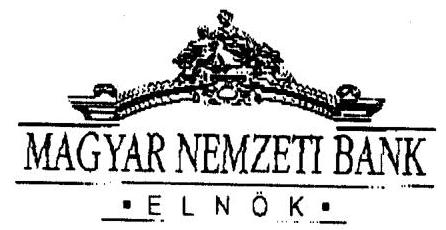
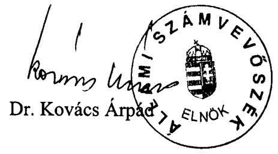
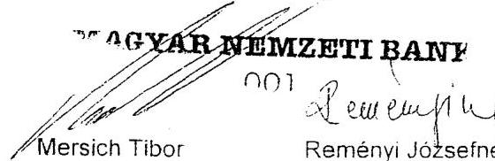
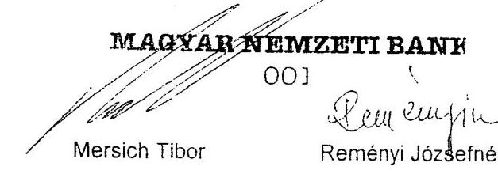
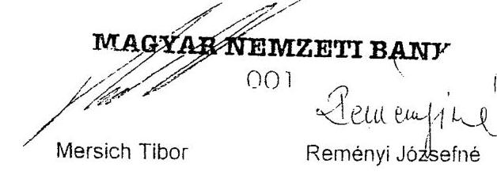
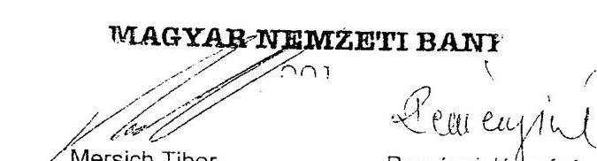
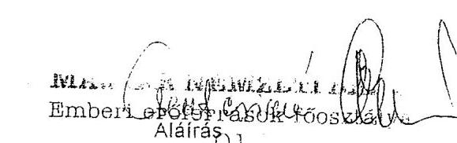

# JELENTÉS 

## a Magyar Nemzeti Bank működésének ellenőrzéséről

---

# 2. Államháztartás Központi Szintjét Ellenőrző Igazgatóság 

2.1. Teljesítmény Ellenőrzési Főcsoport

Iktatószám: V-8-27/2002.
Témaszám: 596
Vizsgálat-azonosító szám: V0032

## Az ellenőrzést felügyelte:

Bihary Zsigmond
főigazgató
Az ellenőrzés végrehajtásáért felelős:
Kemény Emil
főcsoportfőnök
Az ellenőrzést vezette:
Farkas László
osztályvezető főtanácsos
Az ellenőrzést végezték:

| Gaálné Izsó Éva | Dr. Jártas Ágnes | Massányi Tibor |
| :-- | :-- | :-- |
| számvevő | számvevő tanácsos | számvevő gyakornok |
| Matuk Károly | Nagy Ákos | Tóthné Nagy Éva |
| számvevő | számvevő | számvevő |

Jelentéseink az Országgyűlés számítógépes hálózatán és az Interneten a www.asz.hu címen is olvashatók.

---

# TARTALOMJEGYZÉK 

RÖVÍDITÉSEK JEGYZÉKE ..... 3
BEVEZETÉS ..... 5
I. ÖSSZEGZŐ MEGÁLLAPÍTÁSOK, KÖVETKEZTETÉSEK, JAVASLATOK ..... 8
II. RÉSZLETES MEGÁLLAPÍTÁSOK ..... 12

1. Az MNB működésének törvényi keretei és szabályozottsága ..... 12
1.1. Az MNB és az állam tulajdonosi jogait gyakorló pénzügyminiszter közötti kapcsolattartás és a közgyűlés tevékenysége ..... 12
1.2. Az MNB szervezeti struktúrájának változása az új jegybanktörvény és az új stratégia következtében ..... 13
1.3. Az MNB működésének belső szabályozottsága ..... 16
1.4. Az MNB ellenőrzési rendszere ..... 19
2. Az MNB kapcsolata az államháztartással ..... 21
2.1. A számlavezetési tevékenység ..... 21
2.2. A pénzbevonási nyereség elszámolása ..... 22
2.3. Az állam megbízása alapján végzett tevékenységek ..... 22
3. Az MNB nemzetközi kapcsolatai ..... 24
4. Az MNB 2001. évi belső gazdálkodása ..... 25
4.1. A működési költségek tervezése ..... 25
4.2. Gazdálkodás a befektetett eszközökkel ..... 27
4.3. Az MNB részvétele gazdasági társaságokban ..... 30
4.4. A mérleg szerinti eredmény, az előírt tartalékok és az osztalék, valamint a banküzemi bevételek, működési költségek és ráfordítások ..... 32
4.5. A humánerőforrás gazdálkodás ..... 35

---

# MELLÉKLETEK 

1/A. melléklet Az MNB elnökének észrevétele
1/B. melléklet Válasz az MNB elnökének észrevételére
2. melléklet Tanúsítványok

1. sz. Az MNB 2001. évi belső gazdálkodása
2. sz. Tárgyi eszközök bruttó értékének alakulása
3. sz. Tárgyi eszközök nettó értékének alakulása
4. sz. Immateriális javak bruttó értékének alakulása
5. sz. Immateriális javak nettó értékének alakulása
6. sz. Az immateriális javak és tárgyi eszközök bruttó értékének alakulása
7. sz. Az immateriális javak és tárgyi eszközök értékcsökkenés részletezése
8. sz. Befektetések és a befektetésekből származó osztalékok
9. sz. A statisztikai létszám alakulása és megoszlása
10. sz. A személyi költségek alakulása és megoszlása
11. sz. A jóléti költségek alakulása

---

# RÖVIDÍTÉSEK JEGYZÉKE 

| Áht. | 1992. évi XXXVIII. törvény az államháztartásról |
| :-- | :-- |
| ÁKK Rt. | Államadósság Kezelő Központ Részvénytársaság |
| ÁPV Rt. | Állami Privatizációs és Vagyonkezelő Részvénytársaság |
| ÁSZ | Állami Számvevőszék |
| Gt. | 1997. évi CXLIV. törvény a gazdasági társaságokról |
| Jbt. | 2001. évi LVIII. törvény a Magyar Nemzeti Bankról |
| KESZ | Kincstári egységes számla |
| Kjbt. | 1991. évi LX. törvény a Magyar Nemzeti Bankról |
| Ksz | Kollektív Szerződés |
| MNB | Magyar Nemzeti Bank |
| PM | Pénzügyminisztérium |
| Sztv. | 2000. évi C. törvény a számvitelről |
| ÁSZ tv. | 1989. évi XXXVIII. törvény az Állami Számvevőszékről |

---

.

---

# JELENTÉS   a Magyar Nemzeti Bank működésének ellenőrzéséről 

## BEVEZETÉS

A Magyar Nemzeti Bankot (továbbiakban: MNB), az ország központi bankját 1924-ben alapította az Országgyűlés részvénytársasági formában. Az MNB részvényei az állam tulajdonában vannak. Alaptőkéje 10 Mrd Ft, 2001. évi mérlegfőösszege 5.453 Mrd Ft.

A Magyar Köztársaság Alkotmánya 32/D 8. (1) bekezdése olyan alapfeladatok ellátását bízza az MNB-re, mint a törvényes fizetőeszköz kibocsátása, a nemzeti fizetőeszköz értékállandóságának védelme és a pénzforgalom szabályozása.

Az MNB jogállását és feladatait, a monetáris politika meghatározását és a devizaműveletek végzését, az árfolyampolitikai célok megvalósítását, a devizatartalékok képzését és kezelését, továbbá a fizetési rendszer működését részletesen a hatályos jegybanktörvény határozza meg.

Az MNB működését és gazdálkodását kettősség jellemzi. Egyfelől speciális feladatra, az ország monetáris politikájának alakítására és végrehajtására létrehozott intézmény, másfelől gazdasági társaság, amely állami forrásból gazdálkodik, ennek megfelelően működésére és gazdálkodására a közpénzek felhasználásának átláthatósági követelményei érvényesülnek.

Feladatai végrehajtása során teljes személyi, intézményi és pénzügyi függetlenséget élvez, de mint 100%-ban állami tulajdonú gazdasági társaság, elszámolással tartozik tulajdonosa felé. Az állam, mint tulajdonos jogait a pénzügyminiszter gyakorolja az MNB-vel kapcsolatban.

Az MNB működési formájára nézve részvénytársaság, de funkciójában nem üzletszerű tevékenységre, hanem törvényben meghatározott feladatra létrehozott intézmény. Tevékenységének eredményessége nem pénzügyi mutatói alapján határozható meg, hanem az ország makrogazdasági folyamatainak összefüggésében. Az MNB mérlegét és eredményét alapvetően a monetáris politika megvalósításához szükséges eszközök határozzák meg. A jegybank nem profitorientált intézmény. A kitűzött monetáris politikai célok elérése prioritást élvez, az eredmény és a költségvetési befizetések pedig ennek alárendeltek. Az MNB mérlege nem a pénzintézetek mérlegére előírt szabályok szerint tagolódik és mérleg szerinti eredménye nincs összefüggésben gazdálkodásának eredményességével. A jegybanki beszámoló nem a gazdasági társaságok számviteli beszámolási rendszerét követi, hanem a jegybanki funkció sajátosságaira tekintettel a Magyar Nemzeti Bankról szóló 2001. évi LVIII. törvény

---

(továbbiakban: Jbt.) és a Magyar Nemzeti Bank éves beszámoló készítési és könyvvezetési kötelezettségének sajátosságairól szóló 221/2000. (XII. 19.) Korm. rendelet alapján számol be.

A Jbt. alapjaiban megváltoztatta az MNB ellenőrzési rendszerét. Megszűnt a felügyelő bizottság, a külső ellenőrzési funkciót, a működés törvényességi ellenőrzését az Állami Számvevőszék (továbbiakban: ÁSZ) látja el.

A Jbt. rendelkezése alapján az ÁSZ azt ellenőrzi, hogy az MNB a törvényeknek, más jogszabályoknak, az alapszabálynak és a közgyűlés határozatainak megfelelően működik-e. Az ÁSZ hatásköre kiterjed az MNB működésének és gazdálkodásának egészére, a törvényben meghatározott kivételekkel; így az ÁSZ ellenőrzési jogosultsága nem terjed ki a monetáris politika meghatározására és megvalósítására; a hivatalos deviza- és aranytartalék képzésére és kezelésére; a devizatartalék kezelésével és az árfolyampolitika végrehajtásával kapcsolatban végzett devizaműveletekre; a belföldi elszámolási rendszerek kialakítására és szabályozására, azok biztonságos és hatékony működésének támogatására; a feladatai ellátásához szükséges statisztikai információk gyűjtésére és közzétételére; a pénzügyi rendszer stabilitásának, valamint a prudenciális felügyeletére vonatkozó politika kialakításának és hatékony vitelének támogatására. Ugyanakkor az ellenőrzés kiterjed az MNB által az állam megbízásából végzett devizaműveleteire, az államháztartási kapcsolatokon belül végzett számlavezetési tevékenységre és a pénzbevonási nyereség elszámolására.

A Jbt. - az ÁSZ törvénnyel összhangban - nem vonja ki az ÁSZ hatásköréből az MNB bankjegy- és érmekibocsátó tevékenységének ellenőrzését. Az ÁSZ tv. szerint azonban annak elvégzésére csak az Országgyűlés utasítására kerülhet sor (az Országgyűlés hozzájárulását kértük, hogy 2003. évi ellenőrzési tervben felvehessük ezt az ellenőrzési feladatot).

A jelenlegi vizsgálat az első számvevőszéki ellenőrzés, amely az MNB működésére és gazdálkodására irányul. A korábbi számvevőszéki ellenőrzések (zárszámadás, éves költségvetés, államadósság) az MNB-nek kizárólag a központi költségvetéssel kapcsolatos tevékenységeit érintették.

# Az ellenőrzés célja annak értékelése volt, hogy az MNB 

- működése megfelel-e a törvényesség követelményeinek, alapszabálya, a szervezetét és működését szabályozó ügyrend és belső szabályzatai összhangban vannak-e a jogszabályokkal, szervezeti, irányítási és működési rendje igazodik-e a feladatokhoz, biztosított-e a közgyűlési határozatok végrehajtása, valamint betartják-e az összeférhetetlenségi szabályokat;
- az állam megbízása alapján végzett értékpapír- és hitelügyletek lebonyolítása, a külföldi forrásbevonás, az adósságszolgálati tevékenység, valamint a nemzetközi pénzügyi intézményekben reá háruló feladatok ellátása során teljesíti-e a vállalt, illetve jogszabályokban rögzített kötelezettségeit;
- intézményi gazdálkodása és számlavezetési tevékenysége megfelel-e a jogszabályi előírásoknak, illetve a szervezet belső szabályzatainak.

---

Az ellenőrzés - az MNB elnökének álláspontját tudomásul véve - az új jegybanktörvény hatálybalépése utáni időszakra irányult (2001. július 13. - december 31. közötti), de a pénzügyi, gazdasági folyamatokat a helyszíni ellenőrzés befejezéséig - 2002. június 28. - figyelemmel kísértük.

A végleges jelentést megküldtük az MNB elnökének, akinek észrevételét és az arra adott válaszunkat a jelentés 1/A és 1/B melléklete tartalmazza.

---

# I. ÖSSZEGZŐ MEGÁLLAPÍTÁSOK, KÖVETKEZTETÉSEK, JAVASLATOK 

A 2001. év folyamán az MNB szervezete jelentős átalakuláson ment keresztül, amely több okra vezethető vissza. 2001 márciusában új vezetőség került az MNB élére, megváltozott a jogszabályi környezet, valamint profiltisztítás következtében megszűntek olyan tevékenységek, amelyek nem kapcsolódtak szorosan a jegybanki feladatokhoz.

Az új vezetés meghirdette a költségtakarékos és hatékony szervezetre vonatkozó elképzelését, amelynek megvalósítása érdekében nagyarányú átszervezésbe és ezzel összefüggésben létszámcsökkentésbe kezdett. A 2001-ben megkezdett és 2002-re áthúzódó átszervezések miatt 2001. január 1. és 2002. május 31. között összesen 340 alkalmazott munkaviszonyát szüntették meg, melynek személyzeti költsége mintegy 1,1 Mrd Ft volt. (2001-ben 237 fő munkaviszonyát szüntették meg, melynek költsége 757 M Ft volt). A szervezet átalakítása jelenleg is tartó folyamat. Az átszervezés következtében 2001-ben az MNB kisebb létszámmal és reálértékben csökkenő költséggel látta el feladatait. Az átszervezés a működésben nem okozott fennakadást.

A jegybanktörvény újrakodifikálása (2001. július 13.) miatt az irányítási és a döntési rendszer alapvetően átalakult. A törvény változásait - amelynek értelmében az igazgatóság felelős az MNB működésének irányításáért - késedelem nélkül átvezették az MNB alapszabályában és az igazgatóság ügyrendjében, de a gyakorlatban továbbra is az elnöki irányítás érvényesült.

Az MNB új vezetése 2001 októberében közzétette az MNB középtávú intézményi célkitűzéseit. 2001-re nem készültek lebontott részstratégiák, a lebonyolításra vonatkozó, banki szinten összehangolt ütem-, vagy költségtervek. 2002-re az MNB elkészítette éves munkatervét, amely a középtávú stratégiával összhangban - bankszervenkénti bontásban - tartalmazza a feladatokat és a tervezett intézkedéseket.

Az MNB vezetőségének az új stratégiára és a munkaszervezet átalakítására irányuló elképzeléseit az év folyamán az igazgatóság nem tárgyalta, így az igazgatósági ülésen részvételi joggal rendelkező pénzügyminiszteri képviselő nem kapott tájékoztatást a tervezett és végrehajtott nagyarányú és jelentős költséggel járó elbocsátásokról. A szervezeti átalakításokról utólag, a 2002. évi rendes közgyűlésen a 2001. évről szóló üzleti jelentésben számoltak be a pénzügyminiszternek (részvényesnek).

A szervezeti átalakítással kapcsolatos, 2001 második felében folytatott gyakorlat kifogásolható, mert a döntéseket nem a döntési kompetenciával rendelkező testület hozta meg. Az igazgatóság 2002-ben két alkalommal tárgyalta a szervezeti változásokról szóló előterjesztést. A 2001. március 1. és 2002. március 31. között lezajlott szervezeti változásokat egy csomagban, utólag hagyta jóvá.

---

A szervezet átalakítására vonatkozó vezetői döntések elnöki utasításként, ügyrendmódosítás formájában jelentek meg. Az ügyrend folyamatos aktualizálása az egyes bankszervek feladatának definiálását és a többi bankszervvel való kapcsolatának meghatározását szolgálta.

Az MNB vezetőségének célkitűzéseit aktív személyzeti politika támogatta. Egyrészt végrehajtotta az átszervezésekkel összefüggő létszámleépítéseket és munkaerőcserét, másrészt a korábbi rendszerek megszüntetésével új humánerőforrás alrendszereket (munkaköri és bérbesorolási rendszer, teljesítményértékelési rendszer) alakítottak ki. Az új szabályozás 2002-ben lépett hatályba, ezért a 2001. év átmeneti időszaknak tekinthető.

2001-ben a jegybanki feladatokban lényeges változás nem történt. Az MNB rendelkezik feladatai ellátásához szükséges belső szabályzatokkal, és ezek összhangban vannak a jogszabályi előírásokkal. Az ügyrend naprakész módosításaitól eltérően a többi belső szabályzat több hónappal később követte a változásokat, de ez nem akadályozta a szakmai tevékenység ellátását. A meglévő szabályok deregulációja,
 aktualizálása, rendszerezése a 2002-ben elindított Szabályozás-felülvizsgálati Projekt keretében történik az MNB egészére átfogóan, a munkafolyamatok felmérése alapján. Az összeférhetetlenségi szabályok betartását belső utasítás és a nyilvántartási rendszer biztosítja. A szabályozottságot és a szabályzatok betartását a függetlenített belső ellenőrzés vizsgálja.

Az MNB számlavezetési tevékenysége összhangban van a törvényi előírásokkal. A pénzbevonási nyereséget a Jbt. előírása alapján megkötött keretmegállapodás szerint számolták el és az államadósság csökkentésére használták fel.

Az éves beszámoló szerint az MNB 2001. évi nyeresége 3,6 Mrd Ft, mérlegfőösszege 5.453 Mrd Ft. Az MNB eredményességének alakulását elsődlegesen a jegybanki alapfunkciókhoz kapcsolódó tevékenységek eredményre gyakorolt hatása határozta meg.

Az MNB 2001-ben az 1998. és az 1999. évi eredményének átlaga alapján osztalékot fizetett a tulajdonos Magyar Állam részére (a Jbt. előírásai szerint). A 2001. évre megállapított osztalék 27,7 Mrd Ft volt, amelyet havi osztalékelőleg formájában a költségvetés részére az év folyamán átutalt. Az osztalékra a 3,6 Mrd Ft nyereség nem nyújtott fedezetet, ezért a különbözetet, 24,1 Mrd Ft-ot az eredménytartalék terhére számolta el az MNB, ezáltal az eredménytartalék a 2000. december 31-i 55 Mrd Ft-ról 30,9 Mrd Ft-ra csökkent.

A kiegyenlítési tartalék 2002. január 1-től a saját tőke része, előtte a banküzem egyéb forrásai között szerepelt. 2001-ben a kiegyenlítési tartalék egyenlege -250,2 Mrd Ft volt, amelyet a központi költségvetés készpénzben megtérített az MNB-nek annak érdekében, hogy a jegybank auditált mérlegében kimutatott saját tőkéje ne váljon negatívvá. Az ÁKK Rt. a 250,2 Mrd Ft fedezetét 2001 novemberétől kezdődően többlet állampapír kibocsátásával finanszírozta meg (a Jbt. előírásainak megfelelően).

---

Az MNB belső gazdálkodása biztosítja a feltételeket a jegybanktörvényben előírt feladatok elvégzéséhez. Az MNB új középtávú intézményi célkitűzései következtében módosította a működési költségek és beruházások 2001. évi tervét.

Az év közben történt tervfelülvizsgálatok eredményeképpen az igazgatóság által 2000. december 18-án elfogadott 16.728,6 M Ft-os működési költségkeret 16.243,9 M Ft-ra módosult. A 2001. évi működési költségek tényleges összege 15.196 M Ft volt, amely a tervezett pénzügyi keret 93,5%-át teszi ki és a 2000. évhez képest reálértékben 8,6%-os csökkenést jelent.

2001-ben az MNB tevékenységhez szükséges ráfordítások (személyi költségek és általános működési költségek) összetétele változott. A személyi költségek 2000-ben a működési költségek mintegy 60,4%-át alkották és ez 2001-ben 64,7%-ra emelkedett az átlagos létszám 8,5%-os csökkenése mellett, ugyanakkor az általános működési költségek aránya az összes működési költségeken belül 39,6%-ról 35,3%-ra csökkent.

2001-ben a személyi jellegű ráfordítás 9.837 M Ft volt. A létszámcsökkenés - a munkaviszony megszüntetésével kapcsolatos költségeket kivéve - csaknem minden költség-pozícióban megtakarítást eredményezett. Az elért bérmegtakarítást a munkaviszony megszüntetésekkel kapcsolatban felmerült költségekre fordították.

Az általános működési költségeken belül nyilvántartott minden egyes költségcsoport értéke csökkent mind a tervhez, mind pedig a 2000. évi tényadatokhoz viszonyítva.

Az MNB új célkitűzései megváltoztatták az eredeti beruházási terv prioritásait, így több banküzemi területen (elsősorban az információ-technológia, ingatlanok állagmegőrzése és technológiai korszerűsítése, valamint bankbiztonsági beruházások területén) vezetői döntések születtek számos beruházás leállításáról, illetve halasztásáról, anélkül, hogy az MNB igazgatósága ezekben az ügyekben döntést hozott volna.

A beruházások 2001. évi tervét az igazgatóság eredetileg 2.113 M Ft-ban hagyta jóvá. A beruházási célú kiadások tényleges összege 656,4 M Ft volt, mely a módosított terv 46,9%-át tette ki, ez a 2000. évben megvalósított beruházások összegének 28%-a.

A beruházások tervezettől való elmaradása is hozzájárult a tárgyi eszközök és immateriális javak nettó állományának és a tárgyévben elszámolt értékcsökkenés összegének csökkenéséhez.

A befektetett eszközök állománya 2001. év végére 2.122 M Ft-tal csökkent. A változást - különböző mértékben - az összes eszközfajta állományának csökkenése okozta. A legjelentősebb, 35%-os csökkenés az immateriális javak állományában a számítástechnikai beszerzések elmaradása miatt következett be.

Az MNB utolsó - 2001-ben meglévő devizakülföldi - kereskedelmi banki részesedését (bécsi CW AG) eladta és ezzel eleget tett a Jbt. tulajdonosi részesedésekre vonatkozó tilalmának.

---

Az igazgatóság döntött a Magyar Pénzverő Rt. és az Érmeker Rt. összevonásáról, illetve arról, hogy a - középtávú stratégiába nem illeszkedő, a jegybanki tevékenységhez szorosan nem kapcsolódó - társaságokban (GIRO Rt., KELER Rt., Budapesti Értéktőzsde, Pénzjegynyomda) lévő részesedését értékesíti.

Az MNB igazgatósága 2001-ben az emissziós tevékenység áttekintése keretében döntött egy új emissziós, számítástechnikai és logisztikai központ létrehozásáról.

Az elmúlt években az MNB nemzetközi szerepvállalása a finanszírozás területéről az európai integrációba való bekapcsolódás irányába tolódott el. A nemzetközi pénzügyi intézményekben (Világbank, EBRD) való jegybanki részvétel nem tartozik az MNB alapfeladatai közé, ezért a pénzügyminiszterrel e tárgyban történt megállapodás alapján az MNB visszahívja delegáltjait és a jövőben ezekben a szervezetekben a Kormány képviseli Magyarországot.

A helyszíni ellenőrzés megállapításainak hasznosítása mellett javasoljuk:

# a Magyar Nemzeti Bank elnökének 

1. Gondoskodjon arról, hogy az igazgatóság minden esetben a jogszabályoknak megfelelően működjön, és egyúttal biztosítsa a tulajdonosi jogokat gyakorló pénzügyminiszter megfelelő tájékoztatását.
2. Kezdeményezze, hogy az igazgatóság folyamatosan kísérje figyelemmel a szabályozás felülvizsgálati projekt megvalósítását, és szükség szerint intézkedjen a projekt következetes végrehajtása érdekében.
3. Követelje meg az új humánerőforrás alrendszerek hatékony, konzisztens működtetését és a változások eredményének folyamatos értékelését.

---

# II. RÉSZLETES MEGÁLLAPÍTÁSOK 

## 1. Az MNB MŰKÖDÉSÉNEK TÖRVÉNYI KERETEI ÉS SZABÁLYOZOTTSÁGA

Az MNB-re, mint részvénytársaságra a gazdasági társaságokról szóló 1997. évi CXLIV. törvény (továbbiakban: Gt.) rendelkezéseit a Jbt-ben foglalt eltérésekkel kell alkalmazni. Az MNB számos vonatkozásban eltér a hagyományos részvénytársaságoktól mind szervezeti, mind gazdasági vonatkozásban.

Az MNB a Magyar Állam egyszemélyes gazdasági társasága. A társaság legfőbb szerve a közgyűlés, ahol a részvényesi jogokat a pénzügyminiszter gyakorolja.

Az MNB alapszabályának megállapítása és módosítása a közgyűlés kizárólagos hatáskörébe tartozik. Az alapszabály módosítása a Jbt. hatályba lépése után vált szükségessé, amelyet a 2001. október 11-én megtartott rendkívüli közgyűlés hagyott jóvá.

A korábbi alapszabály szerint az MNB 10 Mrd Ft-os alaptőkéje 500.000 darab, egyenként 20.000 Ft névértékű bemutatóra szóló részvényből állt. Az új alapszabály szerint az alaptőke 1 darab 10 Mrd Ft névértékű, névre szóló részvényből áll, melyet nyomdai úton előállítottak és a pénzügyminiszter megbízásából az MNB trezorjában őrzik.

### 1.1. Az MNB és az állam tulajdonosi jogait gyakorló pénzügyminiszter közötti kapcsolattartás és a közgyűlés tevékenysége

A profitorientált üzleti tevékenységet végző társaságok esetében a tulajdonosnak közvetlen ráhatása van az üzletmenetre, amely az MNB esetén a monetáris politikát végrehajtó jegybank függetlensége miatt kizárt. Ebből következően a tulajdonosi ellenőrzés tartalma és terjedelme is eltér az állami tulajdonú társaságok ellenőrzésétől.

A jegybankok függetlenségének egyik alapkritériuma a pénzügyi függetlenség. Ennek értelmében a jegybank maga határozza meg költségvetését. Gazdálkodására a saját maga számára felállított szabályok és korlátok érvényesülnek. Gazdasági döntéseinek meghozatalában teljes szabadsága van, viszont az azokhoz felhasznált forrásokkal elszámolással tartozik. Gazdálkodásával kapcsolatban alapkövetelmény az átláthatóság és a hatékonyság, amelyet a tulajdonos jogosult számon kérni. A tulajdonosi ellenőrzés nem terjedhet ki a monetáris politikával összefüggő tevékenységekre és nem csorbíthatja az MNB függetlenségét.

---

Az állam tulajdonosi joggyakorlásához a Gt. és a Jbt. adja meg a törvényes kereteket. A Gt. a részvényeseknek a közgyűlésen való részvétel révén biztosítja, hogy a társaság felett irányítási, ellenőrzési jogukat közvetlenül gyakorolhassák a társaság működésével kapcsolatban.

2001-ben az MNB két közgyűlést tartott: az éves rendes közgyűlést 2001. május 16-án, valamint 2001. október 11-én egy rendkívüli közgyűlést. Mindkét közgyűlés összehívása, lefolytatása, a közgyűlés által tárgyalt napirendek és az ott hozott határozatok megfeleltek a jogszabályok és az alapszabály előírásainak.

A Gt. a tulajdonosnak a társaság működése feletti ellenőrzési lehetőségét a felügyelő bizottság intézményén keresztül biztosítja, amelynek alapvető feladata a társaság ügyvezetésének ellenőrzése. A felügyelő bizottság 2001 júliusáig, az új jegybanktörvény hatályba lépéséig működött az MNB-ben, ekkor a törvény erejénél fogva megszűnt.

A tulajdonos a felügyelő bizottság tevékenységének megszűnése után az általa ellátott ellenőrzési funkció (részleges) kiváltására nem épített ki olyan kapcsolatrendszert az MNB vezetőségével, amely az MNB gazdálkodásával kapcsolatos tulajdonosi kontrollt biztosította volna.

A Magyar Köztársaság 2001. és 2002. évi költségvetéséről szóló 2000. évi CXXXIII. törvényt módosító 2002. évi XXIII. törvény 23. §-a visszaállította a felügyelő bizottság intézményét és a felügyelő bizottságot az MNB folyamatos tulajdonosi ellenőrzési szerveként határozta meg.

A tulajdonos a közgyűlésen kívül részt vehet az igazgatósági üléseken is, amely lehetőséget teremt arra, hogy figyelemmel kísérje az MNB tevékenységét.

A jegybanktörvények biztosították a Kormány képviselője számára a részvételi jogot az igazgatóság és a monetáris tanács (jegybanktanács) ülésein. Az igazgatósági üléseken a Pénzügyminisztérium (továbbiakban: PM) képviselője tájékozódhat az MNB működéséről, kérdéseket tehet fel és hozzászólhat a napirenden szereplő témákhoz, de szavazati joga nincs. A PM az igazgatósági üléseken általában államtitkári szinten képviseltette magát.

A Gt. által szabályozott tulajdonosi ellenőrzéstől függetlenül a pénzügyminiszter eseti jelleggel az MNB vezetésétől bármely, a gazdálkodással összefüggő kérdésben tájékozódhat vagy információt kérhet. A helyszíni ellenőrzés folyamán nem találtunk arra vonatkozó dokumentumot, hogy a tulajdonos részéről ilyen igény felmerült 2001-ben.

# 1.2. Az MNB szervezeti struktúrájának változása az új jegybanktörvény és az új stratégia következtében 

A Jbt. alapvető változást hozott az MNB irányításában: az egyszemélyi (elnöki) felelősség helyett - a testületi felelősség elve alapján - a korábban tanácsadó szerepet betöltő igazgatóság lett az MNB irányító testülete.

Az MNB-ben az igazgatóság feladata eltér az általános részvénytársasági gyakorlattól. Az igazgatóságot a felsővezetés tagjai (az elnök és az alelnökök) alkotják, amely (3 szakértővel kiegészülve) egyben a monetáris tanács is. Az

---

igazgatóság a legfőbb döntéshozó testület stratégiai, vagy az MNB egészét érintő gazdasági, működési, szervezeti kérdésekben, az operatív irányítás ügyvezető igazgatói szinten valósul meg (a Jbt. szerint az igazgatók már nem tagjai az igazgatóságnak).

A Jbt. hatályba lépésével egyidejűleg (július 13-án) az igazgatóság elfogadta az új törvény előírásainak megfelelően elkészített igazgatósági ügyrendet és a működésével kapcsolatos eljárásrendet. Az ügyrend az igazgatóságot, mint az MNB operatív irányító testületét határozza meg és a törvény, illetve az alapszabály rendelkezéseivel összhangban (annak megismétlésével) meghatározta azokat a területeket, amelyek az igazgatóság kizárólagos hatáskörébe tartoznak.

Az igazgatóság ülésein a Kormányt szavazati jog nélkül a pénzügyminiszter vagy az általa felhatalmazott személy képviseli.

Az ügyrend alapján az igazgatóság szükség szerinti gyakorisággal ülésezik, 2001-ben 12 alkalommal ült össze. A Jbt. szerint, mint operatív irányító testület 4 alkalommal ülésezett és kétszer hozott ülésen kívül határozatot.

Az operatív döntések meghozatala nem tevődött át az igazgatósági ülésekre, hanem a korábbi gyakorlatnak megfelelően a hetenként ülésező elnöki értekezlet keretében maradt, amelyen részt vesznek az igazgatóság tagjai, az adott témában érintett bankszervek ügyvezető igazgatói és vezetői, valamint a humánpolitikáért felelős ügyvezető igazgató.

Az elnöki értekezlet konzultatív fórum, nem rendelkezik azzal a döntési hatáskörrel, amelyet a törvény az igazgatóság, mint testület számára biztosít, továbbá a tulajdonos képviselője
 nem vesz részt az értekezleten, így nem szerez tudomást azokról a döntésekről, amelyek ott születtek.

A Jbt. szerint az igazgatóság felelős az MNB működésének irányításáért, így kizárólagos hatáskörébe tartozik az MNB szervezetével – beleértve az MNB szervezeti és működési szabályzatának létrehozását és módosítását – és belső irányításával összefüggő kérdések jóváhagyása.

# 2001. második felében az igazgatóság nem tárgyalt szervezetátalakítással kapcsolatos előterjesztéseket, az erre vonatkozó döntések nem az igazgatósági üléseken születtek.

Az igazgatóság 2002-ben két alkalommal tárgyalt szervezeti változásokról szóló előterjesztést. A 2001. március 1. és 2002. március 31. között lezajlott szervezeti változásokat egy csomagban, utólag hagyta jóvá. Az átalakítással kapcsolatos, 2001. második felében folytatott gyakorlat kifogásolható, mert a döntéseket nem a döntési kompetenciával rendelkező testület hozta meg. A végrehajtott döntések utólagos, egy évre visszamenőleges jóváhagyása pedig formális részvételt biztosított az igazgatóságnak, ami nem egyeztethető össze irányító testületi funkciójával.

---

Az igazgatóság 2002. májusában újra foglalkozott szervezeti kérdésekkel és úgy határozott, hogy a jövőben az MNB szervezetével és belső irányításával összefüggő valamennyi kérdést előzetesen jóvá kell hagynia, és csak ezt követően kerülhet sor az ügyrend módosítására.

A Jbt. szabályozása alapján szűkült az igazgatóságban résztvevők köre és a felsővezetés változása miatt személyi összetétele is módosult az év folyamán: egy alelnök kivételével júliusra minden tagja kicserélődött.

Ügyvezetői igazgatói szinten a 10 pozícióból 8 helyre (2002. májustól 9 helyre) új vezető került. A területi igazgatók személyében 2001-ben nem történt változás, 2002. áprilásától áll új vezető a győri kirendeltség élén. A főosztályvezetői pozíciók száma az év folyamán 24-ről 18-ra csökkent (2002. május 31-ig 11-re). A 18 főosztályvezetőből 9 főt 2001-ben neveztek ki.

Az MNB vezetésében nemcsak személyi, hanem strukturális változások is történtek. A vezetői besorolású munkakörök számának csökkentésével és szervezeti egységek megszüntetésével jelentősen csökkent a vezetők száma. (2001. január 1-jén 134 fő volt vezető besorolásban, 2002. január 1-jén 115, 2002. május 31-én 81 fő volt a vezetők száma.)

A 2001-ben kívülről felvett 25 fő vezetőből 22 fő ajánlás révén került vezetői pozícióba, belső áthelyezés útján 34 vezetőt neveztek ki.

Az új vezetés meghirdette a költségtakarékos és hatékony szervezetre vonatkozó elképzelését, amelynek megvalósítása érdekében nagyarányú átszervezésbe és ezzel összefüggésben létszámcsökkentésbe kezdett.

A létszámleépítés 60%-a az átszervezésből, 40%-a pedig az MNB-nél megszűnő tevékenység leépítéséből adódott.

2001-ben megszűnt a Devizaszabályozási és engedélyezési főosztály és a Speciális bankügyletek főosztályának tevékenysége, a Nemzetközi tőkepiaci főosztály és a felügyelő bizottság titkársága, valamint az Intézményfejlesztési önálló osztály, 2002. elején az Európai integráció és nemzetközi szervezetek osztálya. Átszervezték a Bankfőosztályt, az Ellenőrzési főosztályt, az Emberi erőforrások főosztályát, a Titkárságot és az Elnökséget.

2002-ben a Pénz- és devizapiaci főosztályon és a Bankműveleti főosztályon történt meg az átvilágítás és az átstruktúrálás, és folyamatban van az Emissziós főosztály, a Műszaki-ellátási főosztály, a Statisztikai és a Számítástechnikai főosztály átszervezése.

A szervezeti átalakításokra vonatkozó döntések ügyrendmódosítások formájában jelentek meg. 2001. március 1-től 2002. május 15-ig összesen 36 alkalommal módosult az ügyrend. Az egyes területeket érintő módosításokat nem egyszerre, hanem folyamatosan adták ki.

A munkaszervezet átalakítása együtt járt a döntési hatáskörök változásával. A törvényi változások megjelentek az MNB és az igazgatóság ügyrendjében, valamint módosult a szakmai bizottságok ügyrendje is.

---

A döntés-előkészítés speciális intézménye a szakmai bizottsági rendszer, amely az igazgatóság kizárólagos hatáskörébe tartozó kérdéseket tárgyalja meg szakmai szempontból. Az ügyrendjükben meghatározott jogállásuk szerint a bizottságok az MNB szakmai konzultatív testületei, amelyek feladata a hatáskörükbe tartozó kérdések megtárgyalása és az azokban való döntés előkészítése. Döntési joggal is rendelkeznek az egyes bizottságokra vonatkozó szabályok szerint az igazgatóság által delegált hatáskörükben eljárva.

Többször módosították a döntéshozatal eljárási rendjéről és a döntési hatáskörökről szóló utasítást, amelyet azonban nem hangoltak össze a Jbt. előírásaival, így az a korábbi törvény szövegének megfelelően azt tartalmazza, hogy az MNB működésének irányításáért az elnök felelős, a bank üzemeltetéséhez szükséges döntések joga az elnököt illeti meg. Ezeket a jogköröket a Jbt. szerint az igazgatóság gyakorolja.

A szakmai kérdésekben a döntési jogköröket az egyes tevékenységre vonatkozó belső szabályzatok tartalmazzák.

Az MNB új vezetése 2001. októberében meghirdette a középtávú intézményfejlesztési célkitűzéseit azért, hogy az átalakított szervezet képes legyen megfelelni a stratégiai célok elérésének.

A korábbi struktúrában az egymástól funkcionálisan eltérő területek (emisszió, hatósági feladatok, banki szolgáltató tevékenység, kutató és elemző tevékenység) decentralizált munkaszervezéssel és apparátussal látták el feladataikat. A meghirdetett átalakítás keretében a párhuzamosságok megszüntetése és a centralizálás, ezen keresztül a létszám és a költségek csökkentése lett a változtatások fő iránya.

A szervezet átalakítása 2001. márciusában indult és jelenleg is tartó folyamat. Nem egyszeri, átfogó átszervezést hajtottak végre, hanem egy-egy területre koncentráló átalakítást, amely az MNB működésében nem okozott fennakadást.

Az átszervezést a vezetés belső ügynek tekinti. A szervezeti átalakításokról a 2001. évről szóló üzleti jelentésében számolt be a közgyűlésen a tulajdonost képviselő pénzügyminiszternek.

Az átszervezés következtében 2001-ben az MNB kisebb létszámmal és reálértékben csökkenő banküzemi költséggel működött; egyszerűsödött a szervezet struktúrája, egyszerűbb vezetői hierarchiával és kevesebb szervezeti egységgel látja el feladatait.

# 1.3. Az MNB működésének belső szabályozottsága

Az MNB belső működésének és gazdálkodásának kereteit alapvetően a Jbt., a 2000. évi C. törvény a számvitelről (továbbiakban: Sztv.) és a Magyar Nemzeti Bank könyvvezetéséről szóló 221/2000. Korm. rendelet képezte, a munkavállalókra a Munka Törvénykönyve rendelkezései voltak az irányadók.

---

Az MNB elkészítette a számviteli politika alapelveit és a számviteli rend fontosabb szabályait, az eszközök és források értékelési szabályzatát, az eszközök és források leltárkészítési és leltározási szabályzatát, a bizonylati szabályzatot, a pénz- és értékkezelés, valamint a pénz- és értékszállítás rendjét tartalmazó utasításokat.

Az MNB Kollektív Szerződését (továbbiakban: KSz) a Munka Törvénykönyve változásaira tekintettel módosították, a KSz rendelkezései összhangban vannak a törvény rendelkezéseivel.

Az MNB-nél kialakították, írásban rögzítették a jogszabályok által előírt és a tevékenységek végzéséhez szükséges belső szabályzatokat. A szabályzatok biztosították a törvényes és szabályszerű működést, valamint a gazdálkodás feltételeit.

Az MNB szabályozottsága kiterjed a szervezetre és az egységek feladataira, a szervezeti egységek közötti munkamegosztásra és az irányításra. A szervezet működését az ügyrend szabályozta, az irányítás további szabályzata a döntési eljárásokra és döntési hatáskörökre vonatkozó utasítás (döntési hatáskörök és azok átruházása, döntések előkészítése, meghozatala, végrehajtása és ellenőrzése). A hatályos ügyrendben foglaltak megfelelnek a Jbt. rendelkezéseinek.

Mindkét jegybanktörvény rendelkezik az MNB vezető tisztségviselőire és alkalmazottaira vonatkozó összeférhetetlenségi szabályokról. A korábbi Jbt. rendelkezéseinek végrehajtása során a további munkaviszony, munkavégzésre irányuló egyéb jogviszony engedélyezéséről és bejelentéséről a KSz-ben intézkedtek.

Az összeférhetetlenségi szabályokra, azok betartására vonatkozó belső szabályzat megalkotása 2002-ben történt meg. Az utasítás végrehajtása és a nyilvántartás vezetése a Humán Kockázatkezelési Osztály feladata, mely kezeli a vagyonnyilatkozatokat is. Nyilvántartást alakítottak ki az alkalmazottak által szerzett befektetési eszközökről, és külön regisztrálják, illetve ellenőrzik, hogy a bejelentések a törvényben előírt határidőn belül megtörténtek-e.

A fenti intézkedések megteremtették a feltételét a Jbt. összeférhetetlenségi szabályai betartásának.

A Jbt. rendelkezik az alkalmazottak titoktartási kötelezettségéről. Az MNB gyakorlatában kialakították az államtitok, banktitok, értékpapírtitok és az üzleti titok megőrzésére vonatkozó törvényi rendelkezések végrehajtásának folyamatát és a vezetői ellenőrzést. A titokvédelemre vonatkozó szabályozást kiadták, melyet folyamatosan aktualizáltak.

Az MNB-nél megalkották a pénzmosás elleni küzdelemre vonatkozó szabályzatot, melynek átalakítását végrehajtják, a terrorizmus elleni küzdelemről, a pénzmosás megakadályozásáról szóló rendelkezések szigorításáról, valamint az egyes korlátozó intézkedések elrendeléséről szóló 2001. évi LXXXIII. törvény és a végrehajtására kiadott kormányrendelet alapján.

---

Mindkét jegybanktörvény rendelkezett arról, hogy az MNB forintban vezetheti alkalmazottainak bankszámláját. 2001. év folyamán megszüntették a dolgozói devizaszámlákat.

Az MNB kialakította a jogszabályok által kötelezően elő nem írt, az egységes működéshez, a tevékenységek szabályszerű végzéséhez szükséges egyéb belső szabályzatokat. Az MNB szabályozottsága kiterjedt a biztonságra, a gazdálkodásra, a számítástechnikára. A szabályzatok és betartásuk biztosították az MNB eszközeinek és információinak védelmét, a számviteli nyilvántartások megfelelő minőségét, a megbízható pénzügyi és vezetői információk elkészítését.

2001-ben az igazgatóság határozata alapján a pénzpiaci műveletekkel kapcsolatos ügyviteli folyamatokat utasításokkal szabályozták. A végrehajtási feladatokat rendszerszemléletben határozták meg, lépésről-lépésre rögzítették a feladatok leírását és kijelölték a felelősöket.

2001-ben az utasításmódosításoktól eltekintve 75 db elnöki, és 80 db alelnöki, ügyvezetői utasítás, körlevél volt hatályban (összesen 155 db). Utasítás írta elő a szabályozás menetét, mely átfogóan rögzítette a teljes munkafolyamatot, az utasítások kiadásának, módosításának eseteit.

Az MNB-ben a belső szabályzatok elkészítésének tartalmi és formai szabályait betartották, az utasítások előkészítését, kialakítását megfelelően dokumentálták.

A szabályzatok közzététele a kiadással egyidejűleg a Bankértesítőben és az MNB elektronikus rendszerében is megtörtént. A jogszabályi változásokról az alkalmazottak számára tájékoztatást adtak az elektronikus levelező rendszerben.

Az ügyrend naprakész módosításaitól eltérően a többi belső szabályzat több hónappal később követte a változásokat, de ez nem akadályozta a szakmai tevékenység ellátását. 2001. év folyamán az MNB áttért az egységes szerkezetű szabályozási gyakorlatra, illetve új szabályzatot léptettek életbe, ha a módosítás hosszabb terjedelmű volt vagy lényeges kérdéseket érintett. Ez a gyakorlat javítja a szabályzat áttekinthetőségét, segíti az alkalmazást, és végrehajtást.

Az MNB-nél megvalósuló szervezeti változások miatt folyamatosan módosítani kell a szabályzatokat.

2002-ben új utasítási rendszert vezettek be, melyben meghatározták azokat a témaköröket, amelyeket elnöki utasítással kell szabályozni. A korábbi elnöki, alelnöki utasításokat azonban változatlan tartalommal adták ki. A Szabályozásfelülvizsgálati Projekt tevékenységének eredményeképpen az MNB működését teljes körűen újraszabályozzák (útmutató, szabályozási standardok, munkafolyamatok szabályozása).

---

# 1.4. Az MNB ellenőrzési rendszere

Az MNB belső ellenőrzési rendszere a vezetői, a munkafolyamatba épített és a függetlenített ellenőrzésből áll. Mind a folyamatba épített, mind a vezetői ellenőrzés esetén a fő ellenőrzési pontokat a belső utasítások rögzítik.

A vezetői- és a munkafolyamatba épített ellenőrzés szabályozottsága teljes körű a gazdálkodás területén.

Az MNB-ben tipikus munkafolyamatba épített ellenőrzési rendszer az úgynevezett „átvezetési” számlákhoz kapcsolódik. Az „átvezetési” számlák tekintetében a munkafolyamatba épített és vezetői ellenőrzés szabályainak eleget tettek.

A vezetői információs rendszer biztosítja a vezetői ellenőrzéshez, illetve az ezek alapján meghozható döntésekhez szükséges adatokat, információkat.

2001-ben a vezetői információs rendszer jelentései (riportjai) szolgáltatták az operatív irányításhoz, és a gazdálkodáshoz szükséges alapvető, legfontosabb információkat. A jelentések közé tartoztak az MNB havi mérleg- és eredménykimutatásai, valamint a bankszervenkénti és banki pénzügyi keretek felhasználásának kimutatásai, ezen belül a működési költségek és beruházások alakulása. A kontrolling terület értékelte a tervtől való, átlagot meghaladó eltéréseket rövid, szöveges indoklással.

A havi jelentések mellett esetenként negyedéves, illetve éves beszámolók készültek a vezetők és a bizottságok átfogó és részletes tájékoztatása céljából.

Az MNB elnöke és alelnökei – az igazgatósági tagok – minden (havi, negyedéves, éves) jelentést megkapták.

A vezetői információs rendszer adatainak, jelentéseinek rendszeres értékelése és felhasználása közvetetten jelent meg az irányítási, döntési rendszerben. Nem volt vezetői fórum (pl. elnöki
 értekezlet), ahol rendszeresen megtárgyalták volna a jelentéseket és a beszámolókat, vagy ezek alapján döntések születtek volna. Az igazgatósági ülések napirendjei között nem szerepelt az MNB havi mérleg- és eredménykimutatásának értékelése, továbbá a költségek, a beruházások alakulásának megtárgyalása.

A jelentések adatait az SAP rendszer állította elő, amelynek működése szabályozott volt. Az integrált rendszerbe az adatokat hiánytalanul és megbízhatóan bevitték. A rendszer működése biztonságos, illetve dokumentált és a belső kontroll rendszer elemei megfelelően működnek.

Az MNB-ben az Ellenőrzési főosztály a függetlenített belső ellenőrzés szervezeti egysége, amelynek ellenőrzései lefedik az MNB teljes tevékenységét és kiterjednek minden szervezeti egységre. Feladata az MNB működésében rejlő kockázatok feltárása és kezelése, a jogszabályok és a belső utasítások betartásának ellenőrzése, visszacsatolás az MNB vezetősége felé az elvégzett vizsgálatok tapasztalatairól. Az Ellenőrzési főosztály három osztályra (operációs kockázatkezelési osztály, IT audit osztály, pénzügyi audit osztály) tagozódik. Az ellenőrzési főosztály szervezetileg közvetlenül az MNB elnökéhez tartozik.

---

Az MNB függetlenített belső ellenőrzésének kiépítettsége, annak szervezetbe történő illeszkedése megfelelő. A Jbt. változása miatt a függetlenített belső ellenőrzés jogállására vonatkozó rendelkezéseket 2002 januárjában módosították.

Az ellenőrzési rendszer szervezeti kiépítettségét, feladatait az MNB ügyrendje szabályozza. A függetlenített belső ellenőrzés működésének rendjét utasítás részletezi. A 2002 januárjában kiadott elnöki utasítás újraszabályozta a belső ellenőrzési tevékenységet. A belső ellenőrzés függetlenségének feltételeit a hivatkozott belső utasítás rögzíti, mely kiterjed a személyi és anyagi függetlenségre. Az ellenőrökkel kapcsolatos széleskörű szakmai követelményeket és személyi elvárásokat az ellenőrzési kézikönyv írja elő. Az Ellenőrzési főosztály személyi állományának összetétele - akik zömében közgazdászok, könyvvizsgálók, többnyire több éves könyvvizsgálói, jegybanki, kereskedelmi banki gyakorlattal - megfelel az MNB által meghatározott elvárásoknak.

Az ellenőrzési munka folyamata, dokumentálása a belső ellenőrzési kézikönyv előírásai alapján történt.

Az MNB a 2001-2005. évi középtávú ellenőrzési tervében az egyes banki tevékenységek kockázati típusú újrabesorolását a kézikönyv kockázatelemzési elvei szerint elvégezte. A középtávú terv a biztosíték arra, hogy az ellenőrzés ötéves ciklusonként a teljes banki működést lefedje.

Az Ellenőrzési főosztály 2001. évi munkaterve az elfogadott középtávú ellenőrzési terv alapján készült, amely 46 darab belső vizsgálatot irányzott elő.

Az Ellenőrzési főosztály beszámolót készített a 2001. évi feladatainak végrehajtásáról, melyet az igazgatóság megtárgyalt és elfogadott.

Az Ellenőrzési főosztály megállapításainak, javaslatainak hasznosulása intézkedési tervek készítésével és végrehajtásával, annak nyomon követésével, nyilvántartásával történik.

Az Ellenőrzési főosztály írásos jelentéséhez formalizált, kiegészítő lapot csatolnak, amely táblázatos formában tartalmazza az ellenőrzés megállapításainak, javaslatainak rövid leírását. Az egyes megállapításokat és javaslatokat prioritási sorrendbe sorolják.

Az intézkedési tervben foglaltak végrehajtásáért a bankszerv felügyeletét ellátó ügyvezető igazgató, ennek hiányában a bankszerv vezetője a felelős. Olyan vizsgálatok esetében, ahol a terület kontrollkörnyezetét az ellenőrzés alapvetően javításra szorulónak ítélte, a vizsgálat lezárását követő egy éven belül mindenképpen utóvizsgálatot tartanak a belső előírások alapján.
2001. évre vonatkozóan, teljes körűen elkészült a vizsgálatok és utóvizsgálatok megállapításait, illetve a megtett intézkedéseket tartalmazó nyilvántartás, továbbá az intézkedéseket igénylő megállapítások regisztere, amelyek a banküzemi ellenőrzés során hasznosultak.

---

# 2. Az MNB KAPCSOLATA AZ ÁLLAMHÁZTARTÁSSAL 

### 2.1. A számlavezetési tevékenység

A Jbt. előírja, hogy az MNB köteles vezetni a kincstári egységes számlát (továbbiakban: KESZ), az Állami Privatizációs és Vagyonkezelő Részvénytársaság (továbbiakban: ÁPV Rt.) pénzforgalmi számláját és az Államadósság Kezelő Központ Részvénytársaság (továbbiakban: ÁKK Rt.) pénzforgalmi számláját.

A KESZ szolgál a kincstári kör szervezetei pénzforgalmának lebonyolítására, melynek napi likviditásáról a Kincstár gondoskodik.

Törvényi kötelezettségüknek eleget téve, az MNB és a Magyar Államkincstár pénzforgalmi bankszámlaszerződést kötött.

A Magyar Államkincstár által indított kifizetések és a javára érkező jóváírások a KESZ-en kerülnek kiegyenlítésre. A KESZ-re vonatkozó számlavezetési feltételeket a Kincstár és az MNB között megkötött elszámolási és készpénzforgalmi szerződések tartalmazzák.

A Jbt. alapján az ÁPV Rt. pénzforgalmi számláinak egyenlegét folyamatosan be kell számítani a KESZ egyenlegébe.

Az MNB a KESZ mindenkori egyenlege után az egyhónapos jegybanki passzív műveletre meghirdetett kamatot fizeti. Ennek hiányában a kamat mértéke a jegybanki alapkamat. A kamat mértékét az államháztartásról szóló 1992. évi XXXVIII. törvény, (továbbiakban: Áht.) alapján a jegybanki alapkamat figyelembevételével határozták meg.

A KESZ záró egyenlege után térítendő kamatok elszámolásának szabályait az MNB, a Magyar Államkincstár és az ÁKK Rt. között létrejött együttműködési megállapodás tartalmazza.

A kamatszámítás számítógépes program segítségével történik. A számítástechnikai rendszer zárt, a lebonyolítási rend biztonságos, a kamatkódhoz vezetői szintű hozzáférés van.

Az MNB elkészítette a Magyar Államkincstár részére az MNB-ben vezetendő számlákról szóló utasítást, mely a jegybanki műveleteket szabályozta.

Az MNB az ÁKK Rt. számláját az Áht. alapján vezeti. A számlavezetés feltételeit az ÁKK Rt.-MNB „Pénzforgalmi számlaszerződés"-e tartalmazza.

A Jbt. 2001. október 1-től nem teszi lehetővé a KESZ ellen inkasszó benyújtását. 2001-ben a KESZ ellen inkasszót nem nyújtottak be.

A számlavezetés szabályozása összhangban van a törvényi előírásokkal, az MNB számlavezetési kötelezettségét a jogszabályokban és a számlaszerződésekben foglaltaknak megfelelően végzi.

---

A Jbt. tiltja az államnak, a helyi önkormányzatnak vagy az államháztartás körébe tartozó más intézménynek, vagy az állam, illetve a helyi önkormányzat befolyásoló irányítása alatt működő gazdálkodó szervezet részére a hitelnyújtást. Ezt a törvényi előírást az MNB betartja.

Az Államháztartás éven belüli hitelei elnevezésű főkönyvi számlán nincs könyvelési tétel, nincs megnyitott analitikus számla. Az Államháztartás éven túli hitelei főkönyvi számlán és az ehhez tartozó analitikus számlákon a hitelállományok törlesztését könyvelik, melyeket 1992. december 31-ig folyósítottak.

# 2.2. A pénzbevonási nyereség elszámolása 

A pénzbevonási nyereség a kibocsátott és a bevonási határidőig forgalomban levőre át nem cserélt pénz összegének különbsége, amit a Jbt. 18. §-a szerint az MNB-vel szemben fennálló államadósság csökkentésére kell fordítani.

A törvényi szabályozásnak megfelelően a pénzügyminiszter és az MNB elnöke a privatizációs bevételnek és a pénzbevonási nyereségnek az államadósság csökkentésére történő felhasználásáról keretmegállapodást írt alá.

A megállapodás kimondja, hogy a pénzbevonási nyereséget az államadósság azon elemére kell fordítani, amelynek a még hátralevő futamideje meghaladja az 1 évet. Az államot a lebonyolítás során az ÁKK Rt. képviseli.

Az MNB pénzbevonási nyereséggel kapcsolatos tevékenysége eseti jellegű, az érmék és a bankjegyek cseréjéhez kapcsolódik.

Az MNB a bankjegyek, illetve érmék gyártásával, bevonásával, az érmék hulladék anyagának értékesítésével, és a forgalomból bevont pénz kezelésével, őrzésével, megsemmisítésével kapcsolatos feladatait egységes szerkezetbe foglalt utasításban szabályozta.

A 2001. december 31. elévülési határnappal a 100 forintos bankjegyek pénzbevonási nyeresége 1.849 M Ft volt. A pénzbevonási nyereség elszámolása a keretmegállapodás szerint megtörtént, az összeget a belső szabályozásnak megfelelően állapították meg.

A forgalomból bevont régi típusú (500, 1.000, 5.000 forintos) bankjegyek elévülési határidejét módosították 2001. december 31-ről 2009. december 31-re. A határozatról a Pénzügyminisztériumot értesítették, egy országos napilapban közzétették és az MNB Hirdetmény módosítása is megtörtént, az előírt szabályoknak megfelelően.

### 2.3. Az állam megbízása alapján végzett tevékenységek

A Jbt. rögzíti az MNB által az állam megbízása alapján végzett tevékenységeket, azok szabályait.

Az MNB az állam megbízása alapján, illetve az állam tulajdonában lévő értékpapírok - ide nem értve a részvényeket - tekintetében az állam megbízottjaként az értékpapírpiacon eljárhat. Az MNB közreműködhet az állam devizában történő hitelfelvételeiben és külföldi értékpapír-kibocsátásaiban, valamint az

---

állam külföldi követeléseinek kezelésével, értékesítésével, behajtásával kapcsolatos feladatok ellátásában.

Az MNB az állammal, illetőleg az állam megbízottjaként határidős és fedezeti ügyleteket köthet.

A devizakötvény és fedezeti ügyleteknél a Magyar Állam és az MNB között kötött megbízási megállapodások szabályozzák a törvényi előírások végrehajtását.

A devizakötvény-kibocsátási és fedezeti ügyletek részletes lebonyolítását az MNB belső utasításai szabályozzák, a szabályzatok részletes műveleti táblákat tartalmaznak.

Az MNB 2001-ben egy devizakötvény kibocsátási és egy fedezeti ügyletben működött közre.

# Az MNB a devizakötvény-kibocsátás és fedezeti ügylet esetében a jogszabályokban, az állammal kötött megállapodásokban és a belső utasításokban foglaltaknak megfelelően járt el. 

A fedezeti ügylet lebonyolítása során az International Swaps and Derivatives Inc. szokványait alkalmazták és betartották.

Az MNB ügyrendje szabályozza a külföldi hitelminősítőkkel való kapcsolattartást. Az illetékes szervezeti egység gondoskodik Magyarország államadósságának minősítését végző nemzetközi hitelminősítő intézetek információs igényeinek kielégítéséről, illetve a minősítők által készített értékelések véleményezéséről.

A külföldi hitelminősítőkkel történő kapcsolattartást a Magyar Állam és az MNB között kötött megállapodások rögzítették. 2001. április 2-i hatállyal az MNB ez irányú feladatát a felek közös megegyezéssel megszüntették.

A külföldi követelések nyilvántartását, illetve azokról negyedéves részletes kimutatás készítését az Áht. írja elő.

A központi költségvetés külföldi követeléseivel való gazdálkodásért a Kormány felelős. Az MNB - hazai és nemzetközi információi alapján - közreműködik az illetékes miniszter külföldi követelések kezelésével, értékesítésével kapcsolatos munkájában.

Az MNB végzi a külföldi követelések dokumentációjával, a számlavezetéssel, a nyilvántartással kapcsolatos feladatokat.

Az MNB a törvényben előírt kötelezettségeinek eleget tett, vagyis az állam külföldi követeléseit nyilvántartja, és azokról negyedévente állomány szintű részletes kimutatást készít. A 2001. évi zárszámadási ellenőrzés kifogásolta, hogy az MNB nem a likvidációs számla devizanemében tartja nyilván az Oroszországgal szemben fennálló követelés összegét.

---

# 3. Az MNB NEMZETKÖZI KAPCSOLATAI 

Az MNB ellátja a nemzetközi pénzügyi szervezetekben reá háruló feladatokat, és közreműködhet az állam megbízása alapján a devizában történő hitelfelvételekben.

A jegybank feladatai abból adódnak, hogy egyrészt az egyes intézményekhez való csatlakozáskor a törvényben az MNB-t jelölték ki kapcsolattartásra, másrészt a nemzetközi pénz- és tőkepiacokról az MNB 1998-ig saját nevében vett fel devizaforrásokat, azóta pedig az állam hitelfelvételeiben ügynökként működik közre.

Az állam által felvett kölcsönök banktechnikai lebonyolítását az MNB a törvényi szabályozásnak megfelelően látta el.

Az MNB szerepét a nemzetközi pénzügyi szervezetekben és fejlesztési intézményekben nemzetközi egyezmények, országgyűlési és kormányhatározatok szabályozzák.

Az MNB a nemzetközi szervezetekben a tagsággal kapcsolatos pénzügyi kötelezettségének a jogszabályi előírások betartásával eleget tett.

Magyarország 1996-tól az OECD tagja. A csatlakozással vállalta, hogy a devizakorlátozásokat fokozatosan feloldja. Ennek utolsó lépése a 88/2001. (VI. 15.) Korm. rendelet alapján a deviza liberalizáció és a forint konvertibilissé válása volt. A vállalt liberalizációs kötelezettségnek - az MNB közreműködésével - Magyarország eleget tett.

Az elmúlt években az MNB feladatai a nemzetközi finanszírozás területéről az európai integrációba való bekapcsolódás irányába tolódtak el. Az MNB-re fokozatosan növekvő feladatok hárulnak az Európai Uniós tagsággal kapcsolatban. A csatlakozási tárgyalások során az MNB négy fejezet - Gazdasági és Monetáris Unió, Tőke szabad áramlása, Szolgáltatások szabad áramlása, Statisztika - tárgyalásában vett részt, tekintettel arra, hogy a csatlakozási követelmények egy része - a pénzügyi rendszer működése, devizaszabályozás - az MNB illetékességi körébe tartozik.

Az MNB-n belül elvégzendő feladatokat utasítások szabályozták, meghatározva a pénz-, deviza- és tőkepiaci műveletekre vonatkozó főbb eljárásokat az üzleti események lebonyolításának alapvető feltételeit. A 2001-ben végrehajtott szervezeti átalakítást 2002 júniusában követte az utasítások aktualizálása.

Az MNB igazgatósága áttekintette a nemzetközi szervezetekkel kapcsolatos jegybanki feladatokat és határozott a kormányzati és a jegybanki feladatok szétválasztásáról és kezdeményezte a nem jegybanki feladatok átadását a kormányzatnak.

Az MNB részvétele a nemzetközi pénzügyi intézményekben (Világbank, EBRD) nem
 tartozik az alapfeladatai közé, ezért a pénzügyminiszterrel megállapodott, hogy visszahívja delegáltjait és a pénzügyi intézményekben a jövőben a Kormány képviseli Magyarországot.

---

# 4. Az MNB 2001. ÉVI BELSŐ GAZDÁLKODÁSA 

### 4.1. A működési költségek tervezése

Az MNB belső gazdálkodása biztosítja a Jbt.-ben előírt feladatok ellátását.
Az MNB 2001. évben rendelkezett az éves operatív pénzügyi terv kidolgozását és megvalósítását megalapozó belső szabályzatokkal. Ezek a szabályzatok egymással, valamint a belső szabályzatok kiadására vonatkozó utasítással összhangban voltak. A belső gazdálkodás rendje kiterjed a tervezés, a működési költségek, illetve a beruházási keretek felhasználására, a kötelezettségvállalás és utalványozás, valamint a beszámolás szabályozására.

Az MNB ügyrendje szerint az igazgatóság megtárgyalja „az MNB működésével, illetve feladatainak ellátásával kapcsolatos fejlesztési és működési költségtervet, valamint a jóléti és szociális ellátási tervet", amelyekről az igazgatósági ülés előtt a Beruházási és költséggazdálkodási bizottság állásfoglalást alakít ki. A tervek összeállítása és a bankszervek tervjavaslatainak koordinálása a Kontrolling főosztály feladata.

Az MNB igazgatósága 2000. december 18-án megtárgyalta és elfogadta a 2001. évi fejlesztési és működési költségterveket.

Az MNB a 2001. évi pénzügyi tervében a beruházási programok főösszegét 2.112,6 M Ft-ban, a banküzemi működési költségek főösszegét 16.728,6 M Ft-ban határozta meg.

Az év folyamán az eredetileg jóváhagyott működési költségtervet felülvizsgálták és módosították, ami nem veszélyeztette a biztonságos ügy- és üzemmenetet.

Az év közben történt felülvizsgálatok eredményeképpen az igazgatóság által jóváhagyott 16.728,6 M Ft-os működési költségkeret 16.243,9 M Ft-ra módosult, tehát 484,7 M Ft-tal csökkent. A 2001. évi működési költségek összege 15.196 M Ft volt, mely a módosított terv 93,5 %-át teszi ki; nominálértékben nem érte el a 2000. évi költségszintet, reálértékben pedig 8,6 %-kal csökkent.

Az MNB személyi költségei 2001-ben (9.837 M Ft) 7 %-kal növekedtek 2000-hez képest. Ugyanezen időszak általános működési költségei 11,1 %-kal csökkentek.

Ezen belül:

- az információ-technológia költségei (953 M Ft) 11,4 %-kal;
- az üzemeltetés költségei (1.730 M Ft) 8,6 %-kal csökkentek, amiben meghatározó szerepet játszottak az ingatlanokkal kapcsolatos költségek csökkenései;
- az értékcsökkenési leírás összege 1 %-kal csökkent, az elszámolt összeg 2.114 M Ft volt, tekintettel arra, hogy a tárgyévre tervezett fejlesztések nagymértékben elmaradtak a tervezettektől;

---

- az egyéb költségek (jogi, audit, kommunikációs, kiküldetési, külképviseleti, illetve egyéb vegyes költségek) összege 634 M Ft volt, ami 36 %-kos csökkenésnek felel meg (átvezetések 72 M Ft).

Az év közbeni működési költségkeret-átcsoportosításokat megfelelően dokumentálták.

Az MNB 2001. évre tervezett beruházásai késéssel indultak; 2000. végén, vezetői döntés alapján csupán azon fejlesztések kereteit biztosították, amelyek 2001. március 1-ig a folyamatos működés szempontjából nélkülözhetetlenek voltak. Ezek összege a jóváhagyott terv 12 %-át tette ki.

Az MNB új középtávú intézményi célkitűzései megváltoztatták az eredeti beruházási terv prioritásait, így több banküzemi területen (elsősorban az informá-ció-technológia, az ingatlanok állagmegőrzése és technológiai korszerűsítése, valamint a bankbiztonsági beruházások területén) vezetői döntések születtek számos beruházás leállításáról, illetve halasztásáról, anélkül, hogy az MNB igazgatósága ezekben az ügyekben döntést hozott volna.

Az év folyamán a beruházások leállításáról, halasztásáról hozott döntések eredményeképpen a felhasználásra engedélyezett fejlesztési keret (2.112,6 M Ft) összességében 1.400 M Ft-ra módosult.

A beruházási célú kiadások összege 656,4 M Ft volt, mely a módosított terv 46,9 %-át tette ki, ez a 2000. évben megvalósított beruházások összegének 28 %-a.

Ezen belül:

- az információ-technológia korszerűsítése terén ténylegesen beruházásokra fordított összeg 332,9 M Ft volt (32,8 %). Az eredeti előirányzatból csak a nélkülözhetetlenül szükséges fejlesztéseket hajtották végre, tekintettel arra, hogy a számítástechnikai szakterület átszervezés és új stratégia kidolgozása előtt áll;
- az elektronikus fizetések korszerűsítése (Valós Idejú Bruttó Elszámolási Rendszer) terén végrehajtották a központi szoftver verzióváltását;
- az MNB Emissziós, Logisztikai és Számítástechnikai Központ létrehozásáról az igazgatóság döntött. Az emissziós tevékenység korszerűsítése terén a fejlesztések nagyobbrészt nem valósultak meg az eredeti előirányzatban szereplő 355,7 M Ft-tal szemben a kifizetés 43,7 M Ft volt;
- az ingatlanok állagmegőrzése és technológiai korszerűsítése terén az eredetileg elfogadott 683,8 M Ft-tal szemben 125,7 M Ft került kifizetésre. A kapcsolódó bankbiztonsági beruházásokat nem valósították meg. A B épületet érintő, negyedik negyedévre ütemezett, használati érték növelő beruházások - a szervezeti átalakítások, átszervezések befejezéséig - elhalasztásra, majd a 2002. év pénzügyi tervezése során törlésre kerültek;
- a területi igazgatóságok átszervezési, felújítási és korszerűsítési munkálatainak eredeti beruházási előirányzata 49,1 M Ft volt, tényleges kifizetésre egy területi igazgatóság esetében került sor 19 M Ft értékben;

---

- az egyéb tárgyi eszközök pótlására, felújítására, bővítésére 2001. évben 130,3 M Ft-ot költöttek.

A bankszervek 2001. év folyamán 930,2 M Ft-ot jelentettek vissza a központi beruházási tartalék javára és 217,7 M Ft pótkeretet igényeltek, ennek dokumentálása az előírásoknak megfelelően megtörtént.

Az MNB-nek a bankszervektől származó információk szerint 2001. év folyamán szerződésfelmondásból költségkihatással járó joghátránya nem származott. Ezt az információt megerősítette a vonatkozó főkönyvi számla (fizetett bírság, kötbér, késedelmi kamat, kártérítés) mögött álló analitika tételes vizsgálata.

# 4.2. Gazdálkodás a befektetett eszközökkel 

A befektetett eszközök nettó állománya 2001. év végére a számviteli nyilvántartások szerint 2.122 M Ft-tal csökkent. A változást - különböző mértékben - az összes eszközfajta nettó állományának csökkenése okozta. A befektetett eszközök záró állományának nettó értéke 23.501 M Ft volt, azon belül az immateriális javaké (1.576 M Ft) pedig 7 %, a tárgyi eszközök (9.194 M Ft) részaránya 39 %, a befektetett pénzügyi eszközök (12.731 M Ft) 54 %.

Az immateriális javak, a tárgyi eszközök és a beruházások nettó értéke 2001. december 31-én a nyilvántartás szerint 10,8 Mrd Ft volt. Ez az előző évhez képest 1,7 Mrd Ft csökkenést jelent.

A tárgyévben elszámolt értékcsökkenés összegét nem fedezték a 2001. évi új beszerzések, beruházások és üzembe helyezések. (6. és 7. sz. tanúsítvány)

Az immateriális javak állományának nettó értéke 2001. év végére 845 M Ft-tal csökkent. Az immateriális javak 95 %-át a Számítástechnikai főosztály által beszerzett vagy elkészített szoftverek alkotják. (4. és 5. sz. tanúsítvány)

A tárgyi eszközök állományának nettó értéke 2001. végére 867 M Ft-tal csökkent. (A tárgyi eszközök bruttó értéke 2001. január 1-jén 17.876 M Ft, 2001. december 31-én pedig 17.670 M Ft volt. (2. és 3. sz. tanúsítvány.)

A tárgyi eszközökön belül a két legjelentősebb csoport a „műszaki berendezések, gépek, felszerelések, járművek" valamint az „ingatlanok és a kapcsolódó vagyoni értékű jogok" csoportja. A 2001. december 31-i bruttó értékek alapján a tárgyi eszközökön belül az ingatlanok 53 %-os, a műszaki berendezések pedig 40 %-os részarányt képviselnek. Mindkét csoportban a bruttó értékben minimális csökkenés történt 2001-ben. (Az ingatlanoknál 9.469 M Ft-ról 9.344 M Ft-ra, a műszaki berendezéseknél pedig 7.165 M Ft-ról 7.155 M Ft-ra.) Ugyanez a csökkenés a nettó értékek esetében 7.697 M Ft-ról 7.392 M Ft-ra, illetőleg 1.598 M Ft-ról 1.171 M Ft-ra történt.

Az ingatlangazdálkodás rendje egységesen szabályozott.
Az ingatlanvagyon a 2001. évben nem változott. Az MNB sem vásárlás, sem saját kivitelezés útján nem jutott új ingatlanhoz. A létszámcsökkenés következtében a használt (tulajdonában lévő és bérelt) ingatlanok egy része feleslegessé

---

vált. Megkezdődött az ingatlanok egy részének (C és D épület) értékesítésével kapcsolatos előkészítő munka.

Az MNB tárgyi eszközeit és immateriális javait az SAP rendszerrel tartják nyilván. A rendszer zártkörű nyilvántartást, naprakész számviteli elszámolást és dokumentáltságot biztosít.

A tárgyi eszközökkel és az immateriális javakkal való gazdálkodást az MNB-nél több belső utasítás is szabályozza.

A költséghatékony gazdálkodás érdekében 2001-ben részletesen szabályozták a beszerzésekre vonatkozó pályázati és döntési rendszert.

A beszerzések előkészítettsége (bejelentési igény, felülvizsgálat, ajánlatkérési igény), a beszerzések lebonyolítása (pályázati eljárás, ajánlatok elbírálása, szerződések megkötése, kötelezettségvállalás), az elszámolás (utalványozás), a számviteli feladatok és a nyilvántartások vezetése megfelel a belső utasítások előírásainak.

Az épületüzemeltetési tevékenység körébe tartozik az MNB épületeinek állagmegóvása és a megfelelő munkakörülmények biztosítása.

Az épületüzemeltetéssel kapcsolatban elszámolt költségek összege 234 M Ft volt. Ez a 2000. évi korrigált tényadathoz képest 14 M Ft-os emelkedést, a tárgyévi tervhez viszonyítva 7 M Ft-os megtakarítást jelent. Az épületüzemeltetési költségeken belül legnagyobb volumenű az elektromos áram költsége (98 M Ft), amelyet az ingatlanok bérleti díja (80 M Ft), illetve a gáz és egyéb energia, továbbá az ingatlanok fűtési díjának az együttes összege (41 M Ft) követ.

Az épületüzemeltetési tevékenységre közüzemi, illetve vállalkozási szerződéseket kötöttek, 2001-ben 85 darab szerződés volt érvényben. A szerződésekkel kapcsolatos kifizetések az igazolt teljesítéseknek és az előirányzatoknak megfelelőek voltak.

A műszaki karbantartás költsége 103 M Ft volt, melyből 96 M Ft a számítástechnikai gépek javítási és karbantartási költsége.

A gépek és berendezések karbantartása és javítása tervszerűen történt, mely biztosította a biztonságos üzemeltetést.

A műszaki és a számítástechnikai karbantartási tevékenységre vonatkozó szerződéseknél a teljesítések, az elszámolások és a kifizetések a szerződéseknek megfeleltek.

Az MNB nem alanya a társasági adóról és az osztalékadóról szóló törvénynek, így az immateriális javak, a tárgyi eszközök (a továbbiakban együtt: vagyontárgyak) értékcsökkenésének elszámolásában elsősorban a Sztv. előírásai az irányadók.

A számviteli politika aktualizálása - a törvényi és jogszabályi változásoknak megfelelően - megtörtént, ezen belül az értékcsökkenési leírás is megfelel a hatályos előírásoknak.

---

Az MNB a lényegesség elvére való tekintettel maradványértéket nem határoz meg, a vagyontárgyak értékcsökkenését a hasznos élettartam alatt nulla értékig számolja el. A vagyontárgyak terv szerinti értékcsökkenésének számítását az SAP rendszer e célra kialakított programja hajtja végre. Az MNB nem él a kisösszegű 50.000 Ft egyedi bekerülési eszközök használatba vételkori egy összegben történő leírásának lehetőségével.

Az értékcsökkenési leírás számítása és a számítás dokumentálása szabályszerűen, a törvényi és jogszabályi előírásoknak, valamint a belső utasításoknak megfelelően történt.

Az MNB számviteli politikájában az Sztv. előírásainak megfelelően szabályozta a tárgyi eszközök és készletek nyilvántartását, ezzel összhangban belső utasításokban szabályozta a raktár- és készletgazdálkodás folyamatát.

A belső utasítások aktualizálása 2001. év folyamán elkezdődött, és 2002. évre áthúzódott.

Az MNB számviteli politikájának „Tárgyi eszközök nyilvántartása" című fejezete a raktárakat felügyelő bankszervek részére raktározási és készletkezelési szabályzat elkészítését írta elő. A szabályzat tervezete elkészült, de kiadására nem került sor, ezért továbbra is a korábbi utasítás előírásai alapján dolgoztak a raktárak azzal a kiegészítéssel, hogy a Műszaki Ellátási főosztály elkészítette a minimum készletfigyelésbe vont tételek jegyzékét a „Foglalás" körébe bevont raktárak és anyagcsoportok esetében, melyet a 2001. évi tervezésnél alkalmazták először.

Az MNB készleteit az SAP rendszer tartja nyilván. A készletgazdálkodás teljes folyamatára vonatkozóan (igénylés, beszerzés, raktárra vétel és kiadás, értékesítés, értékvesztés, selejtezés) a belső utasítások és az SAP rendszer a zártkörű nyilvántartást, naprakész számviteli elszámolást és dokumentáltságot biztosítja.

A raktár- és készletgazdálkodás szabályszerűségének vizsgálatához kezdeményezett térítés nélküli átadások elvégzésének szabályszerűsége, dokumentáltsága és elszámolása is hozzátartozik. A 2001.
 évi térítés nélküli átadás folyamata, lebonyolítása és dokumentáltsága a hatályos vonatkozó utasítások szerint megfelelő.

Az MNB a készletek értékvesztése és terven felüli értékcsökkenése az Sztv. előírásával összhangban a Számviteli politikájában valamint az Eszközök és források értékelési szabályzatában írta elő.

Az értékvesztés és terven felüli értékcsökkenés elszámolása és dokumentálása a hatályos utasításoknak megfelelően történt.

A raktári készletek kezelése a belső utasításoknak megfelelő, a nyilvántartás biztosítja a teljes körűséget és naprakészséget, a nyilvántartásból adatszolgáltatásra, ellenőrzésre alkalmas lekérdezések készíthetők.

Az MNB a számviteli politikájában az Sztv. előírásainak megfelelően szabályozta a leltározás folyamatát és a leltározás végrehajtását. A leltározással kapcsolatos belső utasítások egymással összhangban vannak, és teljes körűen,

---

megbízható módon biztosítják a mérleg leltárral való alátámasztását és az eszközök meglétének vizsgálatát, a leltáreltérések rendezését.

A 2001. év végi leltározásról felvett dokumentáció a hatályos belső utasításokban foglaltaknak megfelelt.

Az eszközök és források leltárkészítési és leltározási szabályzata alapján az MNB tárgyi eszközeit és immateriális javait (szoftvertermékek kivételével) háromévente, ingatlanait és ingatlan tartozékait ötévente, bankjegy és érmegyűjtemény állományát tízévente kell mennyiségi felvétellel leltároznia, készleteit és szoftvertermékeit évente kell leltározni.

A leltározás végrehajtását a belső utasítások részletesen szabályozták, és az integráltan zárt rendszerben működő SAP megfelelően támogatta.

A szoftvertermékek leltáráról készült dokumentáció az Sztv-ben foglalt tételesség és ellenőrizhetőség követelményeinek megfelelt.

Az MNB a készleteinek leltározását a szabályzatban leírtak szerint és az SAP rendszer segítségével, előírt dokumentáltsággal végezte el.

A készletek - leltáreltérésekkel korrigált - analitikus nyilvántartása a főkönyvvel megegyezik és dokumentáltsága megfelelő. A befektetett eszközökre vonatkozó főkönyvi számlák analitikus kimutatásokkal való egyezőségének dokumentáltsága is megfelelt az utasításban előírtaknak.

# 4.3. Az MNB részvétele gazdasági társaságokban 

A korábbi JBt. 84. § (4) bekezdése kötelezte az MNB-t, hogy idegenítse el az 1997. január 1-én devizakülföldinek tekintendő gazdasági társaságban még fennálló részesedését.

Az MNB utolsó, 2001-ben meglévő devizakülföldi kereskedelmi banki részesedése a bécsi CW AG Bankban volt. A pénzügyminiszter alapítói határozatban felhatalmazta az MNB-t arra, hogy a Magyar Követeléskezelő Részvénytársaságra ruházza át a végelszámolás alatt levő CW AG részvényeit.

Az MNB 2001. évi auditált éves beszámolója alapján a részvények könyv szerinti értéke 262 M Ft (13,6 M ATS) volt. Az elszámolt és levont költségek után átutalt összeg 12,9 M ATS forint ellenértéke, az MNB számlájára 2001. június 7-én érkezett meg.

## Ezzel az MNB teljesítette törvényi kötelezettségét és a pénzügyminiszter határozatát.

Az MNB csak a tevékenységével összefüggő belföldi gazdasági társaságokban és a törvényekben megjelölt tevékenységre alapított társaságokban rendelkezhet részesedéssel.

Az MNB 8 társaságban volt tulajdonos 2001. év végén. A tulajdoni hányad könyv szerinti értéke 12.731 M Ft volt. Ebből 3 társaságban 100%-os részesedéssel rendelkezik. A többi 5 társaságban a részesedése 50%, vagy ez alatti. Ez

---

utóbbiakban az MNB nem rendelkezik sem jelentős, sem többségi, sem pedig közvetlen irányítást biztosító befolyással.

A társaságok tevékenységük alapján:

- az emissziós tevékenységhez kapcsolódó társaságok, amelyek a kibocsátott bankjegyek és érmék gyártását, emlékérmék értékesítését végzik és az MNB 100%-os tulajdonában vannak (Pénzjegynyomda Rt., Magyar Pénzverő Rt., Érmekereskedelmi Rt.);
- a pénz- és tőkepiaci infrastruktúra fontos elemeit képező társaságok, ahol az MNB részesedése 50%, vagy ez alatt van (GIRO Rt., KELER Rt., Budapesti Értéktőzsde, Nemzetközi Bankárképző Rt.);
- szolgáltatásokat nyújtó társaság, ami 100%-os tulajdonban van (Üdültetési és Jóléti Szolgáltató Kft., rövidített nevén Bankjóléti Kft.).

A társaságok (a Bankjóléti Kft. kivételével) részvénytársaságként működtek, melynek vezető tisztségviselőit és a felügyelő bizottság tagjait az MNB delegálta.

Az MNB új vezetésének hivatalba lépése után az igazgatóság részére előterjesztés készült a 100%-os tulajdonú érdekeltségek irányításának átalakítására. A korábbi igazgatósági rendszert felváltotta a vezérigazgatói irányítás, amely egyrészt lehetővé teszi az egységes irányítást és kontrollt, továbbá költségkímélőbb megoldás.

A MNB belső szervezeti rendjében is változások történtek: alelnöki irányítás mellett a tulajdonosi képviselő látja el az MNB befektetéseivel kapcsolatos feladatokat. A Tulajdonosi bizottság döntés-előkészítési feladatokat lát el az igazgatóság számára, továbbá összehangolja a befektetésekkel kapcsolatos stratégiai és operatív feladatokat, az ügyrendjében meghatározott esetekben pedig döntéseket hoz. A társaságokra vonatkozó legfontosabb döntések az MNB különböző szakterületein fogalmazódtak meg. Az MNB befektetéseivel kapcsolatban a legfőbb döntéshozó fórum az MNB igazgatósága.

Igazgatósági határozat alapján 2001-ben az Érmekereskedelmi Rt. beolvadással egyesült a Magyar Pénzverő Rt.-vel. A két társaság egyesülése a törvényi előírások betartásával történt, az alapító okiratot is ennek megfelelően módosították.

Az Üdültetési és Jóléti Szolgáltató Kft. felügyelő bizottságának megbízatása 2001. június 30-án lejárt, a tulajdonos MNB élve a törvényi lehetőséggel, új felügyelő bizottságot nem hozott létre. 2001. június 1-től az MNB képviseletében teljes jogkörrel ügyvezető igazgató jár el. A változtatásokat a társaság alapító okirata is tartalmazza.

A pénz- és tőkepiaci struktúrába tartozó társaságoknál osztalék kifizetés csak a GIRO Rt.-nél volt 2001-ben (73 M Ft).

Az MNB emissziós tevékenységéhez kapcsolódó társaságok közül a Magyar Pénzverő Rt. 9 M Ft, és az Érmeker Rt. 65 M Ft osztalékot fizetett.

---

Az MNB a közvetlen érdekeltségi körébe tartozó társaságokban a vezető tisztségviselőkön keresztül rendelkezik ellenőrzési lehetőséggel, emellett rendszeresen adatbekéréssel ellenőrzi cégei tevékenységét. A társaságoknál választott könyvvizsgálók működnek. A társaságok felügyelő bizottságai saját éves munkatervük alapján folytattak ellenőrzéseket, határozataikról a tulajdonos MNB-t értesítették. Az MNB Ellenőrzési főosztályának ellenőrzési jogköre kiterjed az MNB többségi tulajdonában álló társaságokra.

Az MNB igazgatósága megtárgyalta a társaságokban fennálló részesedésére vonatkozó jövőbeli stratégiát. A bankjegy- és érmegyártáshoz kapcsolódó társaságok tekintetében elfogadott koncepciója van.

- Az MNB igazgatósága jóváhagyta, hogy a Pénzjegynyomda Rt., illetve ennek leányvállalata a Diósgyőri Papírgyár Rt. átadásra kerüljön az ÁPV Rt. részére. Az átadásra nem került sor, tekintettel arra, hogy az ÁPV Rt. a vonatkozó jogszabály szerint 0 forinton, ellenérték nélkül vette volna át a társaságot. Új koncepcióként merült fel a Magyar Fejlesztési Banknak piaci értéken történő értékesítés, amelyet a PM is támogatott, a konkrét megvalósításról a partnerek az egyeztetést megkezdték.
- Az igazgatóság döntött az Érmekereskedelmi Rt. beolvadásáról a Magyar Pénzverő Rt.-be. Határozott az új emissziós központ kialakításának feltételeiről, első lépésként pedig a géppark felújításáról.

Az MNB „középtávú intézményi célkitűzései" között nem szerepel, hogy megtartja részesedését a GIRO, a KELER és a Nemzetközi Bankárképző Rt.-ben, valamint a Budapesti Értéktőzsdében.

Üdültetési és Jóléti Szolgáltató Kft.-vel kapcsolatosan az a döntés született, hogy tevékenységét zárja le, az üdülő ingatlanokat értékesítse és végelszámolással szűnjön meg.

# 4.4. A mérleg szerinti eredmény, az előírt tartalékok és az osztalék, valamint a banküzemi bevételek, működési költségek és ráfordítások 

Az MNB 2001. évi - beszámoló szerinti - nyeresége 3,6 Mrd Ft, mérlegfőösszege 5,453 Mrd Ft volt. Az MNB eredményességének alakulását elsődlegesen a jegybanki alapfunkciókhoz kapcsolódó tevékenységek eredményhatása határozza meg.

Az MNB 2001-ben az 1998. és az 1999. évi eredményének átlaga alapján megállapított osztalékot fizetett a tulajdonos Magyar Állam részére. A 2001. évre megállapított osztalék 27,7 Mrd Ft, amelyet havi osztalékelőleg formájában a költségvetés részére az év folyamán átutalt. Az osztalékra a 3,6 Mrd Ft nyereség nem nyújtott fedezetet ezért a különbözetet, 24,1 Mrd Ft-ot az eredménytartalék terhére számolta el az MNB.

Az osztalék megállapítása megfelel a Jbt. előírásainak, a dokumentáltság, az előleg pénzügyi elszámolása megfelelt a vonatkozó utasításnak.

---

Mivel az MNB tárgyévi fizetendő osztaléka meghaladta a tárgyévi eredményt, az osztalék levonása után maradó mérleg szerinti eredmény nulla.

Az eredménytartalék állományát az osztalék fedezetére elszámolt 24,1 Mrd Ft csökkentette.

| Eredménytartalék 2000. december 31-én | $55,0 \mathrm{Mrd} \mathrm{Ft}$ |
| :-- | :-- |
| Eredménytartalék igénybe vétele osztalékra: | $24,1 \mathrm{Mrd} \mathrm{Ft}$ |
| Eredménytartalék 2001. december 31-én | $30,9 \mathrm{Mrd} \mathrm{Ft}$ |

Az MNB devizaköveteléseit és -kötelezettségeit naponta átértékeli a hivatalos deviza árfolyamán, és az évzáró mérlegében az év utolsó napján érvényes hivatalos árfolyamon mutatja ki.

A devizaárfolyam változásából származó átértékelési eredmény elszámolására a Jbt. előírásai vonatkoznak. A napi átértékelésből származó árfolyam különbözet két részből áll:

- a devizakövetelés/kötelezettség nyilvántartási értéke és a centrum árfolyamon számított értéke közötti eltérés miatt keletkező árfolyameredmény, amely az MNB tárgyévi eredményében szerepel;
- a centrum árfolyam és a hivatalos árfolyam közti eltérés miatt keletkező árfolyam eredmény, amely a forint árfolyamának centrum árfolyam körüli piaci ingadozását tükrözi, ez a rész a devizaárfolyam változás miatti kiegyenlítési tartalékba kerül.

A kiegyenlítési tartalék elszámolása a jegybanktörvény alapján történt.
A forint 2001-ben bekövetkezett 7%-os erősödése miatt a devizakövetelések és a devizakötelezettségek forintban kifejezett összevont értéke (a devizapozíció forintban kifejezett állománya) 156,8 Mrd Ft-tal csökkent (2001. évi átértékelési veszteség). Ebből a centrum és a hivatalos árfolyam eltérése miatt elszámolt korrekció 211,9 Mrd Ft volt, ez került a deviza- és nemesfém árfolyamváltozás kiegyenlítési tartalékába. A korrekciónak megfelelően 211,9 - 156,8 = 55,1 Mrd Ft nyereség keletkezett az MNB eredményében, amely a deviza és nemesfém állományok átértékeléséből származott, és lényegében a forint hivatalos leértékelésének megfelelő átértékelési nyereség.

A 2001. évi mérlegben a deviza és nemesfém árfolyamváltozásból származó kiegyenlítési tartalék a banküzem egyéb forrásai közt szerepel. A 2002. gazdasági év első könyvelési napján mint értéknapon a saját tőke elemei közt kimutatott forint árfolyam kiegyenlítési tartalékába vezették át, és a költségvetés 2002. március 31-ig megtérítette a kiegyenlítési tartalék számlákon 2001. december 31-én lévő negatív egyenleg összegét, 250,2 Mrd Ft-ot.
2000. december 31-i záró egyenleg: $\quad 38,3 \mathrm{Mrd} \mathrm{Ft}$
2001. évi képzés 211,9 Mrd Ft
2001. december 31-i záró egyenleg: $\quad 250,2 \mathrm{Mrd} \mathrm{Ft}$

Az MNB nettó devizapozícióján keletkezett 250,2 Mrd Ft árfolyam-különbözet megtérítése a folyó költségvetést nem érinti, ennek megfelelően nem keletkeztet

---

költségvetési hiányt, hanem a belső államadósságot növeli. Az ÁKK Rt. a 250,2 Mrd Ft fedezetét 2001 novemberétől kezdődően többlet állampapír kibocsátásával finanszírozta meg.

Az MNB a devizatartalékába tartozó devizaértékpapírok állományát piaci értéken értékeli. A 2001. december 31-én állományban lévő devizaértékpapírok nyilvántartási értéke és a 2001. december 31-i piaci értéke közötti különbözet, mint nem realizált árfolyameredmény a devizaértékpapírok piaci értékváltozása miatt képzett kiegyenlítési tartalékba került.

A deviza értékpapírok nem realizált árfolyamnyeresége 2001. december 31-én 2,8 Mrd Ft, amely a 2001. évi mérlegben a banküzem egyéb forrásai között kimutatott kiegyenlítési tartalékban szerepel. A Jbt. előírása szerint a kiegyenlítési tartalék pozitív egyenlege a saját tőke állományát növeli. Ennek megfelelően a 2002. gazdasági év első könyvelési napján mint értéknapon az átvezetés megtörtént.

# Az MNB számviteli nyilvántartásában a kiegyenlítési tartalék elszámolása, dokumentáltsága és a pénzügyi rendezés szabályszerűen, az előírt határidők betartásával történt. 

A Jbt. 2002-re vonatkozó előírása szerint a devizakövetelések és -kötelezettségek átértékeléséből származó árfolyameredmény elszámolása és ennek megfelelően a devizaárfolyam-változás kiegyenlítési tartalék tartalma megváltozik. A változás értelmében az MNB eredményében csak a pénzügyileg is realizált nyereség vagy veszteség jelenhet meg, a pénzügyileg nem realizált átértékelési eredmény
 a kiegyenlítési tartalékba kerül.

A 221/2000. (XII. 19.) Korm. rendelet alapján a banküzem működési költségei és ráfordításai között kell kimutatni az MNB gazdálkodásával kapcsolatban a tárgyévben felmerült és elszámolt összes költséget és ráfordítást. A banküzemi bevételek, költségek és ráfordítások elszámolásának szabályait az MNB számlarendjében rögzítette.

A 2001. évi banküzemi bevételek 853 M Ft-ot tettek ki, ami 24 M Ft-tal volt alacsonyabb a 2000. évinél. Ennek legnagyobb tétele a részesedések osztaléka (608 M Ft) volt.

Az anyagköltségeknél és anyagjellegű szolgáltatásoknál 637 M Ft-os költségmegtakarítás keletkezett az előző évi költségekhez viszonyítva, amelyet:

- az ingatlanokkal való gazdálkodás racionalizálása (rekonstrukciók felfüggesztése, raktározási, irattározási célokat szolgáló bérlemények felmondása, üzemeltetési szerződések felülvizsgálata és módosítása);
- az adatátviteli, telefon és postai költségek csökkentése (telefon fővonalak számának csökkentése, mobil és nemzetközi hívások olcsóbb útra terelése, internet hozzáférések számának csökkentése) eredményezett.

---

# 4.5. A humánerőforrás gazdálkodás 

Az MNB 2001. évi humánerőforrás gazdálkodási tevékenysége a teljes körű átalakítás jegyében zajlott.

A 2001. évi létszámot 2000. év végén bázis alapon tervezték, amelynek során nem határozták meg az MNB feladataihoz igazodó létszámszükségletet. Az éves tervek kialakítására vonatkozó szabályzat nem tartalmazott elveket és tervezési módszert a létszám megállapításával kapcsolatosan.

Az MNB szervezeti egységeinél a tevékenységhez szükséges létszámot 2001-ben és 2002. elején az átszervezéssel párhuzamosan, folyamatosan határozták meg. A 2002-ben létrehozott Működésfejlesztési osztály feladata lesz a munkafolyamatok áttekintése, és az azokhoz szükséges létszám megállapítása.

## 2001-ben a szervezet folyamatos átalakításával párhuzamosan jelentős létszámleépítésre került sor.

A 2001. évi tervezett létszámkeret 73 fő létszámleépítéssel számolt a feladatok várható csökkenése miatt. A tervtől eltérően, az év során 237 fő távozott az MNB-ből (ebből 190 fő munkaviszonyának megszüntetését az MNB kezdeményezte), ugyanezen időszak alatt 82 új dolgozó lépett be. 2001. év végén a foglalkoztatottak száma 1163 fő volt, amely 11,6 %-kal volt alacsonyabb az előző évinél. (9. sz. tanúsítvány)

Az év során a statisztikai átlaglétszám 8,5 %-kal csökkent. 2001-ben a kilépési arány 20 %-ra emelkedett, az előző évi 10 %-hoz képest.

2001-ben az átszervezések miatt az MNB-n belüli létszámmozgás is jelentős volt, 111 főt helyeztek át új szervezeti egységhez.
2002. május végéig további 88 fővel csökkent a zárólétszám, ez a tendencia az év végéig folytatódik és a várható zárólétszám 982 fő.
2001. január 1. és 2002. május 31. között összesen 340 alkalmazott munkaviszonyát szüntették meg. A létszámcsökkentés 2001. évi egyszeri kiadást jelentő költsége 757 M Ft volt, amely 2002. május végére meghaladta az 1,1 Mrd Ft-ot.

2001-ben az MNB alkalmazottai közül felsőfokú végzettséggel 42,1 % rendelkezett, az átlag életkor 40,8 év, az átlagos banki munkaviszony 12,3 év, a nyelvismerettel rendelkezők aránya 45 % volt.

Az év folyamán az MNB-ben új munkaköri és bérbesorolási rendszert alakítottak ki, ennek során újra meghatározták a banki munkaköröket és bérsávokat, melyet 2002. február 1-től alkalmaznak.

2001-ben az új alkalmazottak részére nem határoztak meg munkaköri leírásokat, a következő évben az új munkakörökhöz igazítva új munkaköri leírásokat terveznek kiadni valamennyi munkavállaló részére.

---

2001-ben az MNB oktatási, képzési rendszere átfogó volt, azonban az éves tervben foglalt feladatokat nem hajtották végre. A jóváhagyott oktatási költségterv 57,9 %-ra realizálódott. A költségmegtakarítás valamennyi képzési területen jelentkezett, amelynek oka az igények mérséklődése és a képzések vezetői átértékelése volt.

2002-től az oktatás, képzés új koncepció alapján valósul meg, amelyben a képzés a munkavállaló munkaköréhez, karrierlehetőségéhez kapcsolódik és az MNB céljait, szükségleteit helyezi előtérbe, nagyobb hangsúlyt kap a vezetői képzés.

2001-ben az alkalmazottak teljesítményét nem értékelték, a prémiumrendszer keretében az alkalmazottak teljes körére nem határoztak meg egyéni célkitűzéseket, feladatokat. Az új teljesítmény-értékelési rendszer kialakítását 2001-ben kezdték meg és 2002-től alkalmazzák.

2001-ben az MNB-ben nem alakították ki a vezetői és szakember utánpótlásra vonatkozó tervet. Ez a 2002. évi fejlesztési tervek között szerepel, továbbá a karrier rendszer kidolgozása és bevezetése, a toborzás, kiválasztás rendszerének és módszertanának kialakítása, valamint az új belépő munkatársak beilleszkedési programjának elkészítése.

Az MNB 2001. évi bérkeretét az igazgatóság hagyta jóvá az éves fejlesztési és működési költségtervek tárgyalásakor. Az igazgatóság elé jóváhagyásra előterjesztett bérterv az előző évi bértömeg 9,5 %-os növelését irányozta elő, és megnövelte a bértömeget az előző évben ki nem fizetett alelnöki bérek összegével. 2001-ben a bérfejlesztés mértéke 9,5 % volt, az Országos Munkaügyi Tanács ajánlásának figyelembevételével.

A bértömeg növelésének a bérfejlesztés mértékéhez való kapcsolása a prognosztizált létszámcsökkentés miatt (73 fő) a bérkeretben tartalékot jelentett.

Az év folyamán a bérkeret-gazdálkodásra vonatkozó utasítást és gyakorlatot megszüntették, az MNB centralizált bérgazdálkodásra tért át.

Az MNB 2001. évi működési költségén belül a személyi jellegű költségek aránya 64,7 %-ot tett ki. A személyi jellegű ráfordítás 9.837 M Ft volt. A terv - a személyi alapbérek fejlesztésének ellenére - tartható volt az éves átlaglétszám terven felüli 8,5 %-os csökkenése, és az éves bérterv tartaléka miatt. A létszámcsökkenés - a munkaviszony megszüntetésével kapcsolatos költségeket kivéve - csaknem minden költség-pozícióban megtakarítást eredményezett. Az elért bérmegtakarítást a munkaviszony megszüntetésekkel kapcsolatban felmerült költségekre fordították.

Az előző évhez viszonyítva a személyi jellegű ráfordítások 7 %-kal, ezen belül a bérköltség 7,4 %-kal, a személyi jellegű egyéb kifizetések 12,6 %-kal, a bérjárulék 3,1 %-kal emelkedtek.

2001-ben a bérrendszer elemei a személyi alapbér, pótlékok, jutalom, prémium voltak, a jövedelem részét képezték továbbá a költségtérítések és a jóléti juttatások.

---

Az MNB 2001. évi beszámoló szerint összesen 5.852,4 M Ft bérköltséget fizetett ki, ebből prémium 1.382 M Ft, jutalom 325 M Ft volt. (10. sz. tanúsítvány) Az alkalmazottak általános költségtérítése 564,5 M Ft-ot képviselt. Az alkalmazottak átlag havi alapbére 2001. év végén 236,2 E Ft volt. A különböző bérelemek és juttatások nagyságrendjét tekintve az alapbér aránya az összjövedelmen belül nem érte el a 60 %-ot.

A vezetői munkakörökben foglalkoztatottak és a többi felsőfokú végzettségű alkalmazott prémiumra voltak jogosultak. A prémium nagysága differenciált volt beosztástól függően, és 2-15 havi alapbérnek megfelelő összeget érhetett el. Prémiumot két alkalommal fizettek az év során, ebből 50 % előleg volt. A második részt - a szabályozás szerint - az általános és a személyenkénti prémiumfeltételek teljesítésének értékelése alapján fizethették ki differenciáltan. 2001-ben nem minden érdemi munkavállaló részére határoztak meg prémiumfeladatokat.

Az év során a premizált körbe nem tartozó alkalmazottak 13-14. havi jutalomban részesültek.

2002-ben a prémium és a jutalom megszűnt. A két keretet összevontan a teljesítményértékelési rendszer keretében bónusz jogcímként fizetik ki. A bónusz egy része fix, személyi alapbérnek tekinthető és rendszeres jövedelemként funkcionál, másik része függ az egyéni teljesítménytől. A vezetők esetében a fix bónusz aránya 60 %, a beosztott munkavállalóknál 70 %.

Az MNB szociális juttatásai a bérrendszert egészítik ki, a segélyek támogatás jellegűek, a jóléti juttatások minden alkalmazottra kiterjednek. A béren kívüli, jóléti juttatások számos formában vehetők igénybe, ezek az egészségügyi ellátás, segélyek, a sport támogatása, az üdültetés, a nyugdíjasok rendszeres támogatásban részesülnek. Az MNB 2001. évi jóléti terve 294 M Ft volt, a tényleges költség 267,6 M Ft. (11. sz. tanúsítvány)

2002-ben a jóléti alapjuttatások köre kiegészült további 13 féle választható juttatással, amelynek 2002. évi költsége 418 M Ft. Ennek fedezete a Bankjóléti Kft. felszámolása, az üdülők eladása, továbbá egyes jóléti juttatások kifizetésének csökkenése.

Az igazgatóság megtárgyalta és jóváhagyta a jóléti juttatások rendszerének 2002. évi kiegészítését.

2001-ben a belső ellenőrzés vizsgálta az MNB jóléti ügyintézését. Ezen a területen kialakított gyakorlatot szabályszerűnek ítélte meg, a dokumentáltság és az ellenőrzöttség követelményei érvényesültek. Javaslat volt, hogy a jóléti szolgáltatások nyújtására külső cégekkel évek óta fennálló szerződések felülvizsgálatára kerüljön sor, a pályáztatás végrehajtása, továbbá a jóléti ügyintézés részleteire vonatkozó eljárási rend kialakítása. A megállapítások alapján megtették a szükséges vezetői intézkedéseket.

Az MNB jóléti juttatásait és az erkölcsi elismeréseket utasítások szabályozták. A KSz-ben rögzítették a munkavállalók alkalmazási követelményeit, a munkaköri és bérbesorolási rendszert, a prémiumra, a jutalomra, a pótlékokra, a költségtérítésekre vonatkozó szabályokat.

---

A KSz-t érintő módosításként az igazgatóság nem tárgyalta az új munkaköri és bérbesorolási rendszert és a teljesítményértékelési rendszert, a változtatások költségkalkulációját.

A humánerőforrás gazdálkodás területén végrehajtott változtatások eredményeinek realizálása érdekében gondoskodni kell az új alrendszerek hatékony működéséről, az esetleges korrekciók végrehajtásáról, a konzisztencia biztosításáról, illetve a szabályozottság megteremtéséről.

Budapest, 2002. szeptember
Dr. Kovács Árpád
elnök

Melléklet: 13 db 8 lap

---

MELLÉKLETEK

---

ADP/75-23/102/2002

dr. Kovács Árpád elnök
Állami Számvevőszék

Budapest

Tisztelt Elnök Úr!

A Magyar Nemzeti Bank működésének ellenőrzéséről készített jelentésükhöz a következő észrevételt teszem:

11. old. javaslatok a Magyar Nemzeti Bank elnökének 1. ponthoz:

"1. Gondoskodjon arról, hogy a szervezet-átalakítás, valamint a beruházási tervben foglaltaktól való eltérés tekintetében az Igazgatóság a jogszabályoknak megfelelően működjön és egyúttal biztosítsa a tulajdonosi jogokat gyakorló pénzügyminiszter megfelelő tájékoztatását."

A pontosítás azért szükséges, mert a jelenlegi szöveg azt sugallja, mintha az Igazgatóság alapvetően jogszabályellenesen működne. Ez egyrészt nem igaz, másrészt maga a Jelentés egyetlen részében sem említ ilyet és nem is céloz ilyesmire, tehát az ajánlás a jelenlegi megfogalmazásban a Jelentés tartalmával sincs összhangban.

Budapest, 2002. szeptember 26.

Tisztelettel:

Járai Zsigmond

---

# Állami Számvevőszék 

## Járai Zsigmond úr   elnök   Magyar Nemzeti Bank

## Budapest

## Tisztelt Elnök Úr!

Köszönettel megkaptam a Magyar Nemzeti Bank működésének ellenőrzéséről készített jelentésünkre adott észrevételét.

A levelében foglaltakat mérlegelve az MNB elnökének címzett 1.sz. javaslati pontot a következők szerint módosítom: „1. Gondoskodjon arról, hogy az Igazgatóság minden esetben a jogszabályoknak megfelelően működjön és egyúttal biztosítsa a tulajdonosi jogokat gyakorló pénzügyminiszter megfelelő tájékoztatását."

Tájékoztatom Elnök urat, hogy a végleges jelentéshez - kialakult gyakorlatunknak megfelelően - az Ön levelének és arra adott válaszom másolatát mellékelem.

A végleges jelentést szíves tájékoztatásul megküldöm, és egyidejűleg megköszönöm Elnök úrnak és munkatársainak ellenőrzésünk eredményes lefolytatásához nyújtott segítségüket.

Végül tájékoztatom Elnök urat, hogy 2002. évi ellenőrzési tervünkkel összhangban megkezdjük a Magyar Nemzeti Bank belső (banküzemi) működésének ellenőrzésére való felkészülést.

Budapest, 2002. szeptember 26.

Tisztelettel:

---

2. sz. melléklet
a V-8-27/2002. sz. jelentéshez

TANÚSÍTVÁNYOK

---

# Magyar Nemzeti Bank

## Az MNB 2001. évi belső gazdálkodása

|  Megnevezés | 2000. évi tény | 2001. évi módosított terv | 2001. évi tény | Index (2001. évi tény/2001. évi tény) | Index (2001. évi tény/2000. évi tény)  |
| --- | --- | --- | --- | --- | --- |
|  1. Személyi költségek | 9194 | 10147 | 9837 | 96,9% | 107,0%  |
|  2. Banküzemi általános költségek | 6026 | 6097 | 5359 | 87,9% | 88,9%  |
|  Összesen | 15220 | 16244 | 15195 | 93,5% | 99,8%  |
|  Változás reálértékben |  |  |  |  | 91,4%  |

## Beruházások

|  Beruházási programok

 megnevezése | 1999. |  | 2000. |  | 2001. |   |
| --- | --- | --- | --- | --- | --- | --- |
|   | millió forint | megoszlás | millió forint | megoszlás | millió forint | megoszlás  |
|  1. Információ-technológiai korszerűsítése | 2208 | 64,1% | 1130 | 48,6% | 336 | 51,2%  |
|  2. Logisztikai és egyéb beruházások, beszerzése | 995 | 28,9% | 984 | 42,3% | 277 | 42,2%  |
|  3. Emissziós tevékenység korszerűsítése | 241 | 7,0% | 213 | 9,1% | 43 | 6,6%  |
|  Beruházási programok összesen: | 3444 | 100,0% | 2327 | 100,0% | 656 | 100,0%  |

A fenti adatok a számviteli nyilvántartással megegyeznek.

Budapest, 2002.

---

# Tárgyi eszközök bruttó értékének alakulása

|  Megnevezés | 2001.01.01 | 2001.12.31 | Index (2001.01.01.=100%) | Változás (+ -)  |
| --- | --- | --- | --- | --- |
|  Ingatlanok és a kapcsolódó vagyoni értékű jogok | 9469 | 9344 | 99% | -125  |
|  Műszaki berendezések, gépek, felszerelések, járművek | 7165 | 7155 | 100% | -10  |
|  Egyéb berendezések, felszerelések | 911 | 950 | 104% | 39  |
|  Beruházások, felújítások | 202 | 80 | 40% | -122  |
|  Beruházásokra adott előlegek |  |  |  |   |
|  Tárgyi eszközök értékhelyesbítése |  |  |  |   |
|  Bankjegy és érmegyűjtemény eszközei | 129 | 141 | 110% | 12  |
|  ÖSSZESEN: | 17876 | 17670 | 99% | -206  |

A tanúsítványokban szereplő adatok a számviteli nyilvántartás adataival megegyeznek.

Budapest, 2002.

---

# Tárgyi eszközök nettó értékének alakulása

|  Megnevezés | 2001.01.01 | 2001.12.31 | Index (2001.01.01.=100%) | Változás (+ -)  |
| --- | --- | --- | --- | --- |
|  Ingatlanok és a kapcsolódó vagyoni értékű jogok | 7697 | 7392 | 96% | -305  |
|  Műszaki berendezések, gépek, felszerelések, járművek | 1598 | 1171 | 73% | -427  |
|  Egyéb berendezések, felszerelések | 436 | 410 | 98% | -26  |
|  Beruházások, felújítások | 201 | 80 | 40% | -121  |
|  Beruházásokra adott előlegek |  |  |  |   |
|  Tárgyi eszközök értékhelyesbítése |  |  |  |   |
|  Bankjegy és érmegyűjtemény eszközei | 129 | 141 | 110% | 12  |
|  ÖSSZESEN: | 10061 | 9194 | 91% | -867  |

A tanúsítványokban szereplő adatok a számviteli nyilvántartás adataival megegyeznek.

Budapest, 2002.

---

Magyar Nemzeti Bank 4. sz. Tanúsítvány a V-8-27/2002. számú jelentéshez

Immateriális javak bruttó értékének alakulása

|  Megnevezés | 2001.01.01 | 2001.12.31 | Index (2001.01.01.=100 %) | Millió forint  |
| --- | --- | --- | --- | --- |
|  Vagyoni értékű jogok | 77 | 73 | 95% | -4  |
|  Szellemi termékek | 4506 | 4790 | 106% | 284  |
|  Alapítás, átszervezés aktivált értéke | 49 | 49 | 100% |   |
|  Immateriális javak beszerzési számla | 17 | 11 | 65% | -6  |
|  Immateriális javakra adott előlegek |  |  |  |   |
|  Immateriális javak értékhelyesbítése |  |  |  |   |
|  Összesen: | 4649 | 4923 | 106% | 274  |

A tanúsítványokban szereplő adatok a számviteli nyilvántartás adataival megegyeznek.

Budapest, 2002.

---

Magyar Nemzeti Bank 5. sz. Tanúsítvány a V-8-27/2002. számú jelentéshez

Immateriális javak nettó értékének alakulása

millió forint | Megnevezés | 2001.01.01 | 2001.12.31 | Index (2001.01.01.=100 %) | Változás (+ -) | | --- | --- | --- | --- | --- | | Vagyoni értékű jogok | 52 | 39 | 75% | -13 | | Szellemi termékek | 2305 | 1495 | 65% | -810 | | Alapítás, átszervezés aktivált értéke | 47 | 31 | 66% | -16 | | Immateriális javak beszerzési számla | 17 | 11 | 65% | -6 | | Immateriális javakra adott előlegek |  |  |  |  | | Immateriális javak értékhelyesbítése |  |  |  |  | | Összesen: | 2421 | 1576 | 65% | -845 |

A tanúsítványokban szereplő adatok a számviteli nyilvántartás adataival megegyeznek.

Budapest, 2002.

MAGYAR NEMZETI BANK

Mérsich Tibor

Reményi Józsefné

---

# Magyar Nemzeti Bank

## Az immateriális javak és tárgyi eszközök bruttó értékének alakulása

### 6. sz. Tanúsítvány

### a V-8-27/2002. számú jelentéshez

|  Eszközcsoport |  | Bruttó érték alakulása |  |  |  |  |  |  |   |
| --- | --- | --- | --- | --- | --- | --- | --- | --- | --- |
|   | Nyitó állomány | Évközi növekedés |  | Évközi csökkenés |  |  |  | Záró állomány |   |
|   | 2000.12.31 | Üzembehelyezés | Egyéb | Selejt | Eladás | Térítés nélküli eszközátadás | Egyéb csökk. | 2001.12.31 (2+3+4+5-..-8) |   |
|  1 | 2 | 3 | 4 | 5 | 6 | 7 | 8 | 9 |   |
|  Immateriális javak | 4649 | 596 | 0 | 10 | 0 | 0 | 312 | 4923 |   |
|  Ingatlanok | 9469 | 71 | 8 | 0 | 0 | -5 | 201 | 9344 |   |
|  Berendezések | 8705 | 372 | 178 | 13 | 37 | 6 | 467 | 8102 |   |
|  Bankjegy- és érmegyűjtemény eszközei | 129 |  | 12 | 22 |  |  |  | 141 |   |
|  Tárgyi eszközök összesen | 17613 | 443 | 190 | 13 | 37 | 1 | 668 | 17587 |   |
|  Beruházások | 202 | 330 | 4 | 0 | 0 | 5 | 450 | 81 |   |
|  Immateriális javak, tárgyi eszközök, beruházások összesen | 22524 | 1369 | 194 | 23 | 37 | 6 | 143 | 22591 |   |

A fenti adatok a számviteli nyilvántartással megegyeznek.

Budapest, 2002.

MAGYAR NEMZETI BANK

Mérsich Tibor

Reményi Józsefné

---

Magyar Nemzeti Bank Az immateriális javak és tárgyi eszközök értékcsökkenés részletezése

|  Eszközcsoport | Értékcsökkenés részletezése |  |  |  |  |  |  |  |  | Záró nettó érték |   |
| --- | --- | --- | --- | --- | --- | --- | --- | --- | --- | --- | --- |
|   | Nyitó állomány |  | Évközi növekedés |  |  | Évközi csökkenés |  | Záró állomány |  |  |   |
|   | 2000.12.31 | Terv szerinti értékcsök. leírás | Terven felüli értékcsök.leírás | Káresemény miatti értékcsök.
Leírás | Átsorolás miatti növekmény | Évközi csökkenés sz állományból történő kivezetés miatt | Átsorolás miatti csökkenés | 2001.12.31.
(10+...14-15-16) | 2000.12.31.
(2-10) | 2001.12.31.
(5-17) | Változás (19-18)  |
|  1 | 10 | 11 | 12 | 13 | 14 | 15 | 16 | 17 | 18 | 19 | 20  |
|  Immateriális javak | 2229 | 1140 | 0 | 0 | 0 | 10 | 12 | 3347 | 2420 | 1576 | -844  |
|  Ingatlanok | 1772 | 286 |  |  |  |  | 108 | 1952 | 7697 | 7392 | -305  |
|  Berendezések | 6040 | 897 | 1 | 0 | 61 | 46 | 453 | 6520 | 2035 | 1562 | -453  |
|  Bankjegy- és érmegyűjtemény eszközei |  |  |  |  |  |  |  |  | 129 | 141 | 12  |
|  Tárgyi eszközök összesen | 7812 | 1183 | 1 | 0 | 81 | 46 | 559 | 8472 | 9861 | 9115 | -746  |
|  Beruházások | 2 | 0 | 0 | 0 | 0 | 0 | 0 | 2 | 200 | 79 | -121  |
|  Immateriális javak, tárgyi eszközök, beruházások összesen | 10043 | 2323 | 1 | 0 | 81 | 66 | 871 | 11821 | 12481 | 10770 | -1711  |

A fenti adatok a számviteli nyilvántartással megegyeznek. 

Budapest, 2002.

Reményi Józsefné

---

8. sz. Tanúsítvány a V-8-27/2002. számú jelentéshez

|  Megnevezés | 2001.12.31 | 2000.12.31 | 2001.12.31 | 2000. | 2001.  |
| --- | --- | --- | --- | --- | --- |
|   | Tulajdoni hányad % | Könyv szerinti érték | Könyv szerinti érték | Kapott osztalék |   |
|  CWAG (millió forint, |  | 262 |  |  |   |
|  millió ATS) |  | 13,6 |  |  |   |
|  BIS (millió forint, |  | 2327 | 2224 | 454 | 461  |
|  millió arany CHF) |  | 6,7 | 6,7 |  |   |
|  SWIFT (millió forint, |  | 0,5 | 0,4 |  |   |
|  millió EUR) |  | 2 | 2 |  |   |
|  Pénzjegynyomda | 100 | 8927 | 8927 |  |   |
|  Magyar Pénzverő Rt. | 100 | 505 | 575 |  | 9  |
|  MNB Érmekereskedelmi Rt.* |  | 115 |  | 14 | 65  |
|  KELER

 Rt. | 50 | 250 | 250 |  |   |
|  GIRO Elszámolásforgalmi Rt. | 15 | 91 | 91 | 91 | 73  |
|  Nemzetközi Bankárképző Központ Rt. | 13 | 31 | 31 |  |   |
|  Bankjóléti Kft. | 100 | 602 | 602 |  |   |
|  Budapesti Értéktőzsde | 6 | 30 | 30 |  |   |
|  Befektetések összesen: |  | 13140 | 12731 | 559 | 608  |

Megjegyzés: *2001. november 26-i cégbírósági határozat alapján történt beolvadás - a Magyar Pénzverő Rt. beolvadása miatti kivezetés.

A tanúsítványokban szereplő adatok a számviteli nyilvántartás adataival megegyeznek.

Budapest, 2002.

MÁGYAR NEMZETI BANK

Mersich Tibor

Remi

Reményi Józsefné

---

|  A statisztikai létszám alakulása és megoszlása |  |  |  |  |  | adatok: fő |  |   |
| --- | --- | --- | --- | --- | --- | --- | --- | --- |
|  Megnevezés | Létszámkeret |  |  | Tényleges létszám |  |  |  |   |
|   | 2000. XII. 31. | 2001. XII. 31. | Változás | 2000. XII. 31. | 2001. XII. 31. | Változás |  |   |
|  Központ fizikai állomány | 168 | 160 | $-8$ | 165 | 149 | $-16$ |  |   |
|  Központ szellemi állomány | 1069 | 1010 | $-59$ | 1040 | 908 | $-132$ |  |   |
|  Központ összesen | 1237 | 1170 | $-67$ | 1205 | 1057 | $-148$ |  |   |
|  Hálózat fizikai állomány | 7 | 7 | 0 | 7 | 7 | 0 |  |   |
|  Hálózat szellemi állomány | 104 | 98 | $-6$ | 104 | 99 | $-5$ |  |   |
|  Hálózat összesen | 111 | 105 | $-6$ | 111 | 106 | $-5$ |  |   |
|  Fizikai állomány összesen | 175 | 167 | $-8$ | 172 | 156 | $-16$ |  |   |
|  Szellemi állomány összesen | 1173 | 1108 | $-65$ | 1144 | 1007 | $-137$ |  |   |
|  MNB mindösszesen | 1348 | 1275 | $-73$ | 1316 | 1163 | $-153$ |  |   |
|  Megnevezés |  | 2000. év | 2001. év | Változás |  |  |  |   |
|  Fizikai állomány átlagos statisztikai létszám |  | 175 | 160 | $-15$ |  |  |  |   |
|  Szellemi állomány átlagos statisztikai létszám |  | 1186 | 1086 | $-100$ |  |  |  |   |
|  Munkavállalók átlagos statisztikai létszáma |  | 1361 | 1246 | $-115$ |  |  |  |   |
|  Megnevezés | 2000. év |  |  |  | 2001. év |  |  |   |
|   | Belépők
száma | Kilépők
száma | Létszám
2000. XII. 31. | Kilépési
arány, % | Belépők
száma | Kilépők
száma | Létszám
2001. XII. 31. | Kilépési
arány, %  |
|  Fizikai állomány | 2 | 12 | 172 | 7,0 | 6 | 22 | 156 | 14,1  |
|  Szellemi állomány | 33 | 119 | 1144 | 10,4 | 76 | 215 | 1007 | 21,4  |
|  MNB összesen | 35 | 131 | 1316 | 10,0 | 82 | 237 | 1163 | 20,4  |

2001-ben a jogi állomány mozgásának egyenlege +2 fő. (jogi állományba vétel/visszavétel) (Jogi állományba kerülés: betegség, szülési szabadság, Gyes, Gyed, Fizetés nélküli szabadság, felmentési idő, stb.)

Budapest, 2002. Augusztus 15.

---

A személyi költségek alakulása és megoszlása

|  Megnevezés | *2000. év | 2001. év | Index 2001./2000.  |
| --- | --- | --- | --- |
|  Fizikai állomány bérköltsége | 286,1 | 295,9 |   |
|  Szellemi állomány bérköltsége | 5 095,3 | 5 510,6 |   |
|  Egyéb állományba nem tartozó munkavállalók bérköltsége | 69,1 | 45,9 |   |
|  Kifizetett bérköltség | 5 450,5 | 5 852,4 | 1,07  |
|  Kifizetett bérköltségből: jutalom | 347,5 | 324,7 |   |
|  Kifizetett bérköltségből: prémium | 1 403,5 | 1 382,4 |   |
|  Fizikai állomány személyi jellegű egyéb kifizetése | 114,4 | 122,7 |   |
|  Szellemi állomány személyi jellegű egyéb kifizetése | 1 170,3 | 1 359,4 |   |
|  Egyéb, állományba nem tartozó munkavállalók személyi jellegű egyéb kifizetése | 32,1 | 0,4 |   |
|  Személyi jellegű egyéb kifizetések | 1 316,8 | 1 482,5 | 1,13  |
|  Belépett munkavállalók bérköltsége | 74,1 | 388,6 |   |
|  Belépett munkavállalók személyi jellegű egyéb kifizetése | 8,6 | 29,1 |   |
|  Belépett munkavállalók kifizetései | 82,7 | 417,7 | 5,06  |
|  Kilépett munkavállalók bérköltsége | 250,2 | 1 065,5 |   |
|  Kilépett munkavállalók személyi jellegű egyéb kifizetése | 111,4 | 358,8 |   |
|  Kilépett munkavállalók kifizetései | 361,6 | 1 424,3 | 3,94  |

A tanúsítványon szereplő adatok a számviteli nyilvántartás adataival megegyeznek.

- A Sztv. 2001. évtől hatályos átrendezett értékei

* A kilépett és belépett munkavállaló részére közvetlenül elszámolt személyi jellegű költségek.

Budapest, 2002. április 26.

---

|  Megnevezés | 2000. év |  |  | 2001. év |  |  | tény  |
| --- | --- | --- | --- | --- | --- | --- | --- |
|   | terv | tény | tény/terv | terv | tény | tény/terv | 2001./2000.  |
|  Intézmények költségei |  |  |  |  |  |  |   |
|  Üdültetés* | 41078 | 38463 | 93,6 | 2345 | 2038 | 86,9 | 0,05  |
|  Egészségügyi ellátás | 30528 | 29711 | 97,3 | 34116 | 32489 | 95,2 | 1,09  |
|  Egyéb intézmények költségei | 5449 | 5713 | 104,8 | 8488 | 4664 | 54,9 | 0,82  |
|  Intézmények költségei összesen | 77055 | 73887 | 95,9 | 44949 | 39191 | 87,2 | 0,53  |
|  Juttatások, támogatások |  |  |  |  |  |  |   |
|  Eseti segélyezés | 14000 | 12465 | 89,0 | 28583 | 15764 | 55,2 | 1,26  |
|  Nyugdíjasok rendszeres támogatása | 136206 | 132558 | 97,3 | 133210 | 122779 | 92,2 | 0,93  |
|  Sporttámogatása | 33410 | 33410 | 100,0 | 32079 | 32079 | 100,0 | 0,96  |
|  Egyéb juttatások, támogatások | 6282 | 6005 | 95,6 | 6610 | 9337 | 141,3 | 1,55  |
|  Juttatások, támogatások összesen | 189898 | 184438 | 97,1 | 200482 | 179959 | 89,8 | 0,98  |
|  Jóléti költségek összesen | 266953 | 258325 | 96,8 | 245431 | 219150 | 89,3 |   |
|  *Átcsoportosítva egészségpénztári hozzájárulásra |  |  |  | 48532 | 48491 | 99,9 |   |
|   |  |  |  | 293963 | 267641 | 91,0 | 1,04  |

A tanúsítványon szereplő adatok a számviteli nyilvántartás adataival megegyeznek. Budapest, 2002. április 26.
