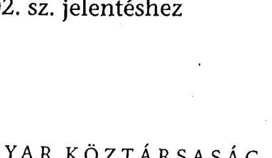
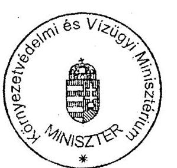
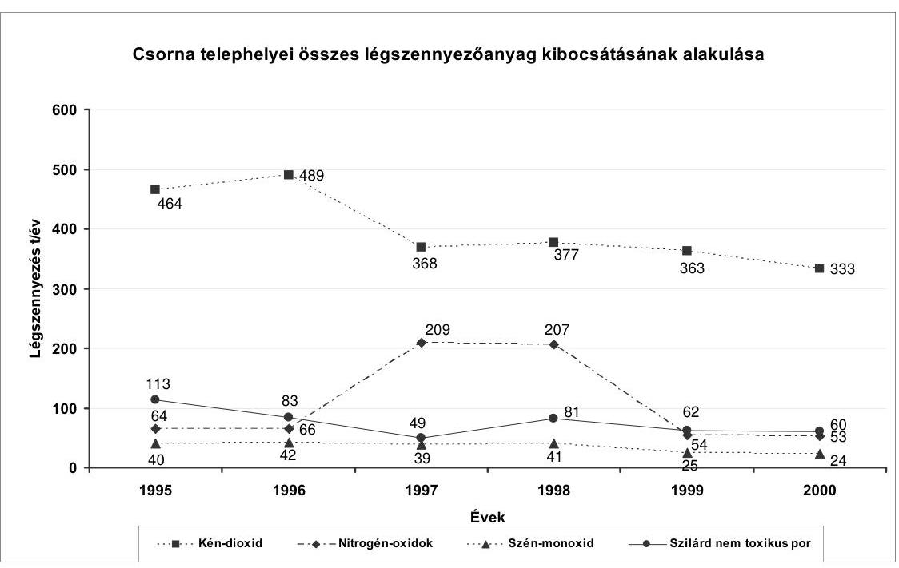
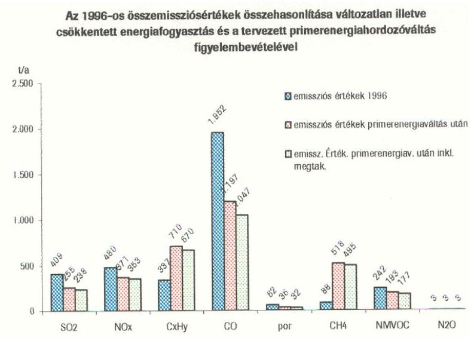
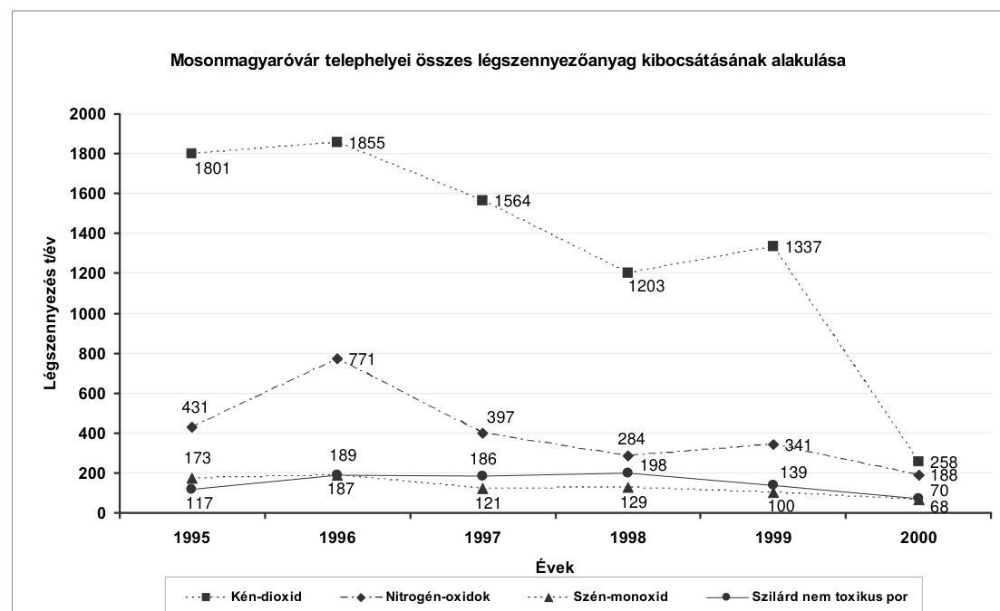
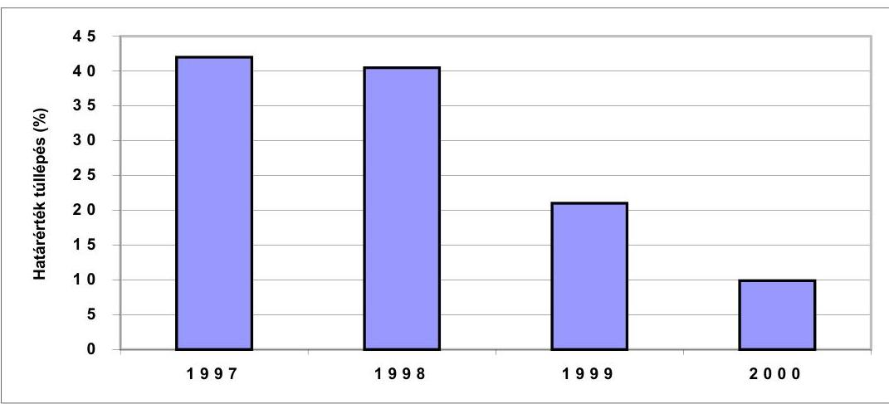
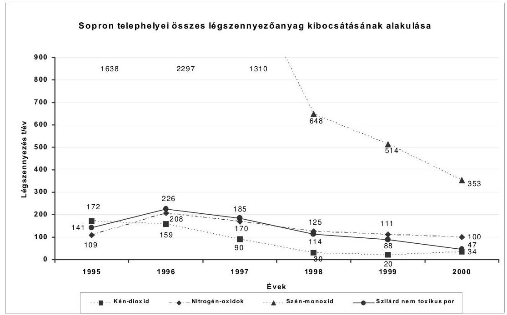

# JELENTÉS 

## a Nyugat-dunántúli környezetvédelmi beruházások ellenőrzéséről

---

# 2. Államháztartás Központi Szintjét Ellenőrző Igazgatóság 2.3 Átfogó Ellenőrzési Főcsoport 

Iktatószám: V-7-034/2002.
Témaszám: 595
Vizsgálat-azonosító szám: V0028

## Az ellenőrzést felügyelte:

Bihary Zsigmond
föigazgató
Az ellenőrzés végrehajtásáért felelős:
Hegedűsné dr. Müllern Veronika
főcsoportfőnök
Az ellenőrzést vezette:
Papp Sándor
osztályvezető főtanácsos

Az ellenőrzést végezték:

| Beck Miklós | Dr. Horváth Erika | Dr. Mohácsi Istvánné |
| :-- | :-- | :-- |
| számvevő | számvevő gyakornok | számvevő tanácsos |
| Csóry Györgyné | Kalmár István | Sinka Zoltán |
| számvevő tanácsos, | számvevő tanácsos | számvevő gyakornok |
| tanácsadó |  |  |

A témához kapcsolódó eddig készített számvevőszéki jelentések:
Az ÁSZ ebben a témában eddig vizsgálatot nem folytatott le.

---

# TARTALOMJEGYZÉK 

BEVEZETÉS ..... 5
I. ÖSSZEGZŐ MEGÁLLAPÍTÁSOK, KÖVETKEZTETÉSEK, JAVASLATOK ..... 7
II. RÉSZLETES MEGÁLLAPÍTÁSOK ..... 12

1. A levegő védelmét szolgáló jogszabályi és szervezeti háttér ..... 12
1.1. A levegővédelmet szolgáló jogszabályi háttér ..... 12
1.2. A levegőminőségi és a kibocsátási mérések és ellenőrzések szervezeti háttere ..... 14
1.3. Az érintett régió levegőszennyezettségének okai, a befolyásoló tényezők változásának tendenciái ..... 16
1.4. A központi forrásokból származó környezetvédelmi támogatások ..... 17
1.5. A nemzetközi, ezen belül a szomszédos országokból érkező támogatások kezelését biztosító jogszabályi, illetve költségvetési intézményi háttér ..... 17
2. A városi energia koncepciók elkészítése, végrehajtása ..... 18
2.1. A koncepciók elkészítésének folyamata ..... 18
2.2. A koncepciók pénzügyi háttere ..... 21
3. A koncepciókban lefektetett energia-korszerűsítési és levegőminőség védelmét szolgáló célok teljesülése ..... 23
3.1. Az energiakoncepciókban megjelent fő célkitűzések ..... 23
3.2. A koncepciókban foglalt javaslatok teljesülése ..... 24
3.3. A koncepciók javaslataitól függetlenül hozott intézkedések ..... 26
4. A koncepciókban javasolt környezetvédelmi célkitűzések teljesülése ..... 26
4.1. A levegő szennyezettségének és minőségének javítását célzó beruházások ..... 27
4.1.1. Fűtés korszerűsítését célzó beruházások ..... 28
4.1.2. Gázüzemre való átállást célzó beruházások ..... 28
4.1.3. Biomassza fűtőművek építését célzó beruházások ..... 29
4.2. Energiamegtakarítást célzó beruházások ..... 30
4.2.1. Villamos energia felhasználást csökkentő beruházások ..... 31
4.2.2. Primer energia felhasználás csökkentését célzó beruházások ..... 32
4.2.3. Osztrák cégek további megbízásai ..... 33
5. A koncepciók végrehajtásának, a beruházások megvalósításának a levegőminőség és levegő szennyezett-ség mutatóira gyakorolt hatása ..... 34
5.1. A károsanyag kibocsátás (emisszió) mutatóinak alakulása. ..... 34
5.2. Az imisszió mutatószámainak alakulása ..... 36

---

# MELLÉKLET 

1. számú melléklet: Kimutatás az önkormányzatok tanulmányterveihez igényelt és kifizetett pályázati összegeiről
2. számú melléklet: A beruházások főbb adatai
3. számú melléklet: A beruházások pénzügyi adatai
4. számú melléklet: A környezetvédelmi és vízügyi miniszter észrevétele

## FÜGGELÉK

1. számú függelék: A koncepciók elkészültének és pénzügyi hátterének adatai
2. számú függelék: Az egyes városokra vonatkozó a koncepciókban rögzített energetikai és légszennyezettségi adatok részletezése

---

# RÖVIDÍTÉSEK JEGYZÉKE 

| ÁNTSZ | Állami Népegészségügyi és Tisztiorvosi Szolgálat |
| :-- | :-- |
| EHP | Energia Hitel Program |
| EKFM | Energetikai, Környezetvédelmi és Faipari Mérnöki Kft. |
| GM | Gazdasági Minisztérium |
| IKIM | Ipari Kereskedelmi és Idegenforgalmi Minisztérium |
| KöM | Környezetvédelmi Minisztérium |
| KWI | Kapustra és Wildburger G.m.b.h. |
| OKTH | Országos Környezet és Természetvédelmi Hivatal |
| Ökoplan | Ökoplan Energietechnische Ökologische Beatungs und |
| SZTKFT | Planungs G.m.b.h. |
| t.r.b. I.C. | Szombathelyi Távhőszolgáltató Kft. |
|  | Interdiscipálinare Consulenten ZT G.m.b.h. |

---

4

---

# JELENTÉS 

## a Nyugat-dunántúli környezetvédelmi beruházások ellenőrzéséről

## BEVEZETÉS

A Környezetvédelmi Minisztérium „A nagy távolságra jutó, határokon átterjedő légszennyezésről szóló Genfi Egyezmény" című 2001. évi kiadványa alapján a környezeti károk növekvő mértéke fokozottan igényli a környezetszennyezés csökkentését, illetve a növekedése ütemének mérséklését. A levegőt szennyező kibocsátási források természeti eredetűek, illetve emberi tevékenységből - főként tüzelőanyag felhasználásból - származnak. A légszennyezés nem ismer határokat, terjedése nem áll meg az országhatárokon. A légköri folyamatok révén a légszennyező anyagok káros hatásaikat nem csak keletkezésük környezetében fejtik ki, hanem attól nagy távolságra, akár több ezer kilométerre is. A helyzet javítására csak széles nemzetközi együttmúködés keretében van lehetőség. A légköri környezet védelmére szolgáló első nemzetközi megállapodást 1979-ben Genfben fogadták el.

A magyar környezetvédelemre vonatkozó jogi szabályozás alapjait és ezen belül a levegő tisztaságának védelmét a környezet védelmének általános szabályairól szóló 1995. évi LIII. törvény (Kvt.) biztosítja, a részletes szabályozás kormány- és miniszteri rendeletek, illetve rendelkezések útján valósul meg.

Az Osztrák Köztársaság - környezetfejlesztési törvénye alapján - 1996-tól támogatást nyújtott Magyarország nyugati határvidékén fekvő városainak olyan energiakoncepciók kidolgozásához, amelyek Ausztria számára környezeti szempontból kedvezőbb helyzetet eredményezhetnek (a magyar fél által benyújtott pályázat kidolgozását az osztrák állam finanszírozta és közvetlenül a pályázatot készítő osztrák cég(ek)nek fizette ki). A program 1996. és 2000. év között 5 magyar város (Szombathely, Sopron, Körmend, Mosonmagyaróvár Csorna), köztük a szombathelyi FALCO Rt. 7 projektjét támogatta, összesen 13,768 millió ATS összegben. A projektek döntően az érintett városok környezetvédelmi feladatait, az energiafelhasználás optimalizálását, korszerűsítését, valamint a javasolt beruházások megvalósíthatósági tanulmányát foglalták magukban. A program Ausztriában a Környezetvédelmi Minisztériumhoz tartozott, a kifizetések és az elszámolások kezelő szerve egy osztrák pénzintézet, a Kommunalkredit AG volt.

Az osztrák támogatásból elkészült tanulmányok alapján megvalósult beruházások forrásaként a hazai lehetőségeken belül az önkormányzati saját erőn és a lakossági hozzájáruláson kívül a környezetvédelmi és a gazdasági tárca célelőirányzatai, valamint a nemzetközi pályázatokon elnyerhető támogatások (például Phare) jöhettek szóba.

---

A két ország számvevőszékének elnökei a 2001. február 22-23-i határmenti találkozón megállapodtak a határokon átnyúló környezeti kérdések egyidejú, egymástól független vizsgálatában. Az Osztrák Számvevőszék a Környezetvédelmi Minisztérium tevékenységét 2002-ben vizsgálja. Jelentésében be kívánja mutatni a magyar településeknek nyújtott környezetvédelmi támogatások eredményességét. A vizsgálathoz két lépésben kapcsolódtunk. Az osztrák támogatással készített projektek megvalósulásáról részletes adatokat szolgáltattunk 2002. februárjában.

A jelen ellenőrzésünk célja annak értékelése volt, hogy hogyan valósultak meg az Osztrák Köztársaság által pénzügyileg támogatott energiaracionalizálási és környezetvédelmi projektek, és a megvalósult beruházások mennyiben csökkentették a környezetterhelést, illetve milyen jellegű energiakorszerűsítést és energia megtakarítást eredményeztek. Egyidejűleg áttekintettük a szomszédos országokkal való környezetvédelmi együttműködés hazai szabályozását.

Az ellenőrzés 13 megvalósult, illetve befejezés előtt álló, valamint négy előkészületben levő beruházásra irányult. Helyszíni ellenőrzést végeztünk az öt érintett város polgármesteri hivatalaiban, a Környezetvédelmi Minisztériumban, az Észak-dunántúli és a Nyugat-dunántúli Környezetvédelmi Felügyelőségeknél. Tájékozódás céljából megkerestük a Gazdasági Minisztériumot, illetve az Energiaközpont Kht-t, a Fodor József Országos Közegészségügyi Központ Országos Környezetegészségügyi Intézetét, az Országos Meteorológiai Szolgálatot, a Szombathelyi Távhőszolgáltató Kft-t, és adatokat kértünk. Vizsgálatunk során figyelembe vettük a Környezetvédelmi Minisztérium 2002. év elején lefolytatott átfogó ellenőrzésének vonatkozó megállapításait.

Az osztrák támogatás hasznosulását a teljesítmény-ellenőrzés módszerével értékeltük. A megvalósult beruházások energia korszerűsítési és megtakarítási hatását hatékonysági, míg a környezetre gyakorolt hatását eredményességi szempontból értékeltük. A ráfordítások hatékonyságának megállapításához az energiamegtakarítások mértékét és a megtérülési időt vettük alapul. Az eredményesség alapjául a koncepciókban célként rögzített indikátorok és a környezetvédelmi hatóságok méréseinek, valamint az üzemeltetők bevallásainak az adatai szolgáltak. Összevetéssel értékeltük - ahol adatok rendelkezésre álltak - a szennyező források beruházások előtti és a megvalósítást követően mért káros anyag kibocsátási adatait. A tervezett, illetve folyamatban lévő beruházásoknál a választott műszaki megoldás révén elérhető környezetszennyezés csökkentésének várható mértékét mutattuk be.

Az ellenőrzés az 1996. január 1.-2002. május 10. közötti időszakot fogta át.
Az ellenőrzés végrehajtására az Állami Számvevőszékről szóló 1989. évi XXXVIII. törvény 2. § (5) bekezdése, az államháztartásról szóló 1992. évi XXXVIII. törvény 121. § (3) bekezdése és a helyi önkormányzatokról szóló 1990. évi LXV törvény 92. § (2) bekezdése alapján került sor.

A jelentést véglegezés előtt egyeztettük a környezetvédelmi és vízügyi miniszterrel, aki az abban foglalt megállapításokra észrevételt nem tett. (4. sz. melléklet)

---

# I. ÖSSZEGZŐ MEGÁLLAPÍTÁSOK, KÖVETKEZTETÉSEK, JAVASLATOK 

A környezet és ezen belül a levegőtisztaság védelmét az osztrák támogatásból finanszírozott energiakoncepciók készítése, illetve megvalósulása idején a környezet védelmének általános szabályairól szóló, többször módosított törvény, valamint annak végrehajtási rendeletei szabályozzák.

Az érintett magyar városok levegőszennyezettségének javítását célzó tanulmányok készítésére irányuló osztrák kezdeményezés és annak magyar részről történt kedvező fogadtatása megfelelt a nagy távolságra jutó, országhatárokon átterjedő levegőszennyezésre vonatkozó, Genfben, az 1979. év november hó 13. napján aláírt NEMZETKÖZI EGYEZMÉNY szellemének. Ebben az aláíró országok - így Ausztria és Magyarország is - vállalták, hogy közösen lépnek fel a környezeti szennyezések ellen. A felajánlás önkormányzatok általi elfogadásának alapját az önkormányzatokról illetve a környezetvédelem általános szabályairól szóló törvények biztosították.

Az önkormányzatok az önkormányzati törvény és a Ptk. által biztosítottan magánjogilag is önálló jogalanyok, ennél fogva befogadhatnak a feladatstruktúrájukba illeszthető, pl. környezetvédelmet célzó tanulmánykészítésre irányuló kezdeményezéseket. Az önkormányzati törvény nagyfokú önállóságot biztosít számukra a közszolgáltatási feladatok kiválasztásában és megvalósításában. A környezet védelmének általános szabályairól szóló törvény szintén kitér az önkormányzatok környezetvédelmet érintő feladataira.

A vizsgálatban érintett öt magyar város osztrák cégektől, illetve külső információk alapján értesült a pályázati lehetőségről. Az adott városokra vonatkozó energiakoncepciókat az ajánlattevő cégek készítették el, amit a Kommunalkredit osztrák pénzintézet finanszírozott.

Az öt város energiakoncepcióját (a FALCO Rt. támogatása nélkül) az osztrák Környezetvédelmi Minisztérium Ökofond alapjából finanszírozták. Erre a célra összesen 11,975 millió ATS-t fordítottak. A kifizetések ütemezése városonként eltérő volt. Szombathely Energetikai Főtervére a szerződésben rögzített összeg 70 \%-át fizették ki. A kifizetések során, pl. Körmend és Csorna városokban a helyszínen nem tisztázható pénzügyi konstrukciók is előfordultak (pl. odavisszautalás, vállalás nélküli önrész kifizetés). Egyéb dokumentumok hiányában ennek tisztázása csak az osztrák cégeknél lehetséges.

Az önkormányzatok nem fordítottak kellő figyelmet az eljárással kapcsolatos dokumentumok kezelésére. Az eljárás menetének (pl. szerződések), valamint a környezetvédelmi, illetve energetikai célkitűzéseknek az értékelését (pl. pályázatok) az alátámasztó dokumentumok hiánya korlátozta.

Az Osztrák Számvevőszék előzetes véleménye szerint a koncepciók készítése nem volt szabályszerű, ezt vizsgálatunk is megerősítette. Erre utal, hogy az elő-

---

készítő szakasz (pl. szerződéskötés) eljárási folyamata városonként eltérő volt, az önkormányzatok az osztrák cégek útmutatása alapján jártak el, a megbízásokat versenyeztetés nem előzte meg. (A pályáztatás osztrák eljárási rendjéről ismereteink nem voltak.)

Szombathely város Energetikai Főterve a Világbank által finanszírozott országos program keretében készült el, a tanulmány kidolgozását az Ipari, Kereskedelmi és Idegenforgalmi Minisztérium irányította. A finanszírozásba a Kommunalkredit is bekapcsolódott.

Az elkészült koncepciókat két város képviselő-testülete nem tárgyalta meg, ennek ellenére az abban javasolt beruházásokat megvalósították. A koncepciók javaslatai az ajánlatokban és a pályázatokban foglalt előzetesen kijelölt feladatokhoz és célokhoz igazodtak. Ezek hangsúlyozottan az energiagazdálkodás korszerűsítésére, kisebb részben és közvetetten a környezet javítására irányultak. A marketing és kommunikációs javaslatok a racionális energiagazdálkodás széles körben való elterjesztésének szükségességére mutattak rá. A gázfűtésre való átállást a kibocsátott károsanyag mennyiség és a fajlagos költségcsökkentés, a biomassza fűtőanyag használatát a hagyományos tüzelőanyagokkal szembeni előnye, az ún. „üvegház-hatás" kialakulásához vezető széndioxid kibocsátás csökkenése, valamint a helyben rendelkezésre álló tüzelőanyag mennyisége is alátámasztotta. A napenergia hasznosítása és a közvilágítás korszerűsítése, valamint az épületek utólagos szigetelése a primer energiahordozók igénybevételének csökkentését célozta.

A javaslatok megvalósulása eltérő képet mutat. A városok környezeti javulását célzó marketing és kommunikációs jellegű javaslatokat az érintett önkormányzatok nem minősítették feladatkörükbe tartozónak, a végrehajtásukhoz szükséges forrásokat biztosítani nem tudták. A javaslatok koncepciókban való megjelenése az osztrák és a magyar fél közötti kommunikáció hiányosságára utal. A konkrét beruházási javaslatokon belül az önkormányzatok az azonnali eredményt hozókat helyezték előtérbe. Az összességében kedvező fogadtatáson még az sem változtatott, hogy Sopron - a javaslatok városi tervekbe történt beépítése mellett -, a fűtőmú építésére, illetve a napkollektor telepítésére vonatkozó javaslatot elutasította.

A városok 13 beruházást kezdtek el, illetve valósítottak meg, ezek összege 640,1 millió Ft. A 10 megvalósult beruházás 402,9 millió Ft-ba került, 3 pedig még folyamatban van. Az előkészítési fázisban lévő 4 legnagyobb összegű beruházás közül 3 tervezett összege 3.643 millió Ft, egynek költségtervezete még nincs. Három beruházás biomassza fűtőmú építését célozza, vagyis az önkormányzatok kedvezően fogadták az erre irányuló javaslatokat.

A projektek finanszírozása több különböző forrásból történt. A koncepciók elkészítését az osztrák támogatás finanszírozta, az azokban foglaltak végrehajtásának fedezetét az önkormányzatok biztosították. A megvalósult, illetve folyamatban levő beruházások finanszírozásában a közvetlen önkormányzati forrás mindössze 3,2 millió Ft volt, a forráshiány áthidalására az önkormányzatok 188,9 millió Ft hitelt és 7,4 millió Ft visszatérítendő támogatást vettek igénybe. A megvalósulást 27 millió Ft állami támogatás és az egyéb forrásokon belül 27 millió Ft lakossági hozzájárulás is segítette. A legnagyobb összeget,

---

357,8 millió Ft-ot az önkormányzati tulajdonú cégek biztosították. Források hiányára utal, hogy először a kisebb összegű beruházásokat kezdték meg.

A beruházások közül hat érte el a közbeszerzési törvényben foglalt értékhatárt, ebből két esetben volt közbeszerzési eljárás, két esetben a beruházást az üzemeltető maga hajtotta végre. Ugyancsak két esetben a közbeszerzési eljárásokra vonatkozó törvényi előírások mellőzésével kötöttek szerződést (versenyeztetés, illetve közvetlen szerződéskötés).

Az önkormányzatok a koncepciók megvalósításának folyamatában a tervezést végző osztrák cégeknek további megbízást adtak szakértői és bonyolítói tevékenység elvégzésére. Körmenden és Mosonmagyaróváron a közvilágítás korszerűsítésében, Szombathelyen a biomassza fűtőművel kapcsolatos munkálatokban vettek részt. Mosonmagyaróváron a közvilágítás korszerűsítéséhez szükséges eszközök beszállítását is osztrák cég végezte.

A koncepciókra fordított osztrák támogatás hasznosulását jelzi a beruházások megvalósításával elért energia és pénzügyi megtakarítás, valamint a levegő minőségének a javulása.

Az energiamegtakarítást célzó beruházásoknál (pl. közvilágítás korszerűsítése) a teljesítményben számított megtakarítás $50 \%$ feletti, a megtérülés az üzemi ráfordításoknál átlagosan 5-8, a közvetlen energia költségeknél kb. 10 év alatti. A tanulmányok az energiamegtakarításon túl az energiatermelőhely károsanyag-kibocsátásának csökkenését is prognosztizálták.

A környezetvédelmi célú beruházásoknál (pl. gázfűtésre való átállás) az újonnan bevezetett energiahordozó alacsonyabb fajlagos költségszintje pénzügyi megtakarítást is eredményezett.

A beruházásoknak a levegőre gyakorolt hatását már nem lehet ilyen egyértelműen értékelni. A koncepciók Mosonmagyaróvár kivételével a városra vonatkozó legjellemzőbb levegőterhelési és légszennyezettségi bázisadatokon túl a környezetvédelmi céloknak megfelelő konkrét elvárásokat nem fogalmaztak meg. A károsanyag-kibocsátást a beruházást követően mérésekkel nem ellenőrizték. A levegő terhelés csökkenése mindössze egy, a javaslatok között nem szereplő beruházásnál mutatható ki az átalakítást megelőző kibocsátási adatokkal való összehasonlíthatóság alapján.

A vizsgálatba vont városok levegő terhelési adatai a környezetvédelmi felügyelőségek mérései szerint javultak. Ez azonban nem hozható szoros összefüggésbe a koncepciók alapján megvalósult beruházásokkal, mivel a vezetékes gázfűtésre való áttérés a koncepciótól függetlenül a városokban a kibocsátott károsanyagok csökkenését, illetve az egyes összetevők mértékének, arányának a változását vonta maga után. Az adott régiókban nyilvántartott több ezres levegőszennyező pontforrás egyikén megvalósított beruházás következtében elérhető károsanyag kibocsátás csökkenés alig vagy egyáltalán nem mutatható ki a határmenti terület levegőminőségében.

A légszennyezettségi adatok alapján a városok levegőminősége a vizsgált időszakban némiképp javult. Mosonmagyaróváré és Soproné megfelelő maradt, Szombathelyé a korábbi szennyezett minősítésről mérsékelten szennyezettre

---

változott. Két szennyezőanyag (kéndioxid és ülepedő por) mutatói az országos átlaggal megegyezően határérték alatt maradtak. Ugyanakkor - elsősorban a közlekedéssel összefüggésben - a nitrogéndioxid koncentráció Mosonmagyaróváron és Sopronban az M 1 autópálya közelsége miatt többször túllépte az egészségügyi határértéket. Ezeknek az eseteknek a száma azonban a vizsgálatba vont régióban folyamatosan csökken.

A levegő minőségének javulása elsősorban hazánkban érzékelhető. A Csorna városra készített tanulmány szerint Ausztriában is kismértékű javulás jelentkezhet. Az uralkodó szélirány gyakorisága, illetve az osztrák határ távolsága ( 25 km ) miatt Ausztriába a károsanyag-kibocsátás 10\%-a jut. A Körmendre készített tanulmány alapján a legkedvezőtlenebb hatás a kibocsátó forrástól délre, max. 120 méter távolságban várható.

A koncepciók adatbázisai a további fejlesztésekhez alapként szolgálhatnak, szellemi tőkeként a jövőben is hasznosíthatóak. Az előkészület alatt álló beruházásoknál a technikai fejlődés és a jogszabályi változások felvetik a koncepciók időszakos aktualizálásának szükségességét.

A koncepciókban a városok tágabb környezetét érintő, nem kizárólag önkormányzati feladatkörbe tartozó javaslatok is megjelentek. Ilyen javaslat volt pl. az energiahordozó-váltás hatása a környezetszennyezésre és ennek népszerűsítése.

A KöM a kétoldalú kapcsolatok koordinálásában nem vett rész, annak ellenére, hogy a minisztériumot két város is megkereste. Szombathely Energetikai Főterve világbanki kezdeményezésre, minisztériumi közreműködés mellett készült el, ami ugyancsak az érintett tárcák jövőbeni együttműködésének a szükségességére hívja fel a figyelmet.

Az Osztrák Számvevőszék Elnöke levélben tájékoztatta a Magyar Állami Számvevőszék Elnökét az Osztrák Környezetvédelmi Minisztérium konkrét beruházások támogatására irányuló szándékáról. A vizsgálat tapasztalatai szerint az önkormányzatok részéről fokozott igény mutatkozik - elsősorban visszatérítési kötelezettség nélküli - támogatási lehetőségek iránt. A magyar környezetvédelem javítását célzó osztrák támogatás - megfelelő keretben kiegészülve a magyar támogatási rendszer forrásaival - hatékonyan szolgálná a környezetvédelmi beruházások megvalósulását. Ennek feltétele a környezetvédelmi beruházásokat célzó források komplex kezelésének megoldása.

A helyszíni ellenőrzés megállapításainak hasznosítása mellett javasoljuk:

# a környezetvédelmi és vízügyi miniszternek: 

A regionális környezetvédelmi feladatok megvalósítása érdekében fokozottabban múködjön közre a kétoldalú kapcsolatok koordinálásában, a kezdeményezések felkarolásában, szervezze meg a források hatékony és koncentrált felhasználását. Vegye fel a kapcsolatot az Osztrák Környezetvédelmi Minisztériummal és tájékozódjon a várható magyarországi támogatásokról.

---

# a vizsgálatban érintett önkormányzatok polgármestereinek: 

1. Gondoskodjanak a beruházások előkészítésével és lefolytatásával kapcsolatos dokumentáció egységes és hiánytalan kezeléséről.
2. Intézkedjenek a koncepcióban foglalt javaslatok, valamint adatbázisok szükség szerinti aktualizálásáról és kísérjék figyelemmel a megvalósulásukat
3. Fordítsanak kiemelt figyelmet a beruházásokra vonatkozó szabályok, különösen a közbeszerzésre és a szabadkézi vételre vonatkozó jogszabályok betartására.

---

# II. RÉSZLETES MEGÁLLAPÍTÁSOK 

## 1. A LEVEGŐ VÉDELMÉT SZOLGÁLÓ JOGSZABÁLYI ÉS SZERVEZETI HÁTTÉR

### 1.1. A levegővédelmet szolgáló jogszabályi háttér

A levegőtisztaság-védelem alapjait a környezet védelmének általános szabályairól szóló (2000-ben módosított) 1995. évi LIII. tv. biztosítja. Fontos kiegészítő szabályokat tartalmaz az egészségügyről szóló 1997. évi CLIV törvény. Az Állami Népegészségügyi és Tisztiorvosi Szolgálatról szóló 1991. évi XI. törvény a légszennyezettséggel összefüggő mérési, értékelési feladatok szervezeti hátterét jelöli ki.

Az egészségügyről szóló 1997. évi CLIV tv. 45. § (1) a környezet egészségkárosító hatásainak vizsgálatával és a megelőzés lehetőségeinek feltárásával összefüggő feladatokat a környezet- és település-egészségügy feladatává jelöli ki. A tv. 46. §-a tiltja a talaj, a vizek és a levegő fertőzését, illetőleg az ember egészségét veszélyeztető mértékű szennyezését.

Az Állami Népegészségügyi és Tisztiorvosi Szolgálatról (ÁNTSZ) szóló tv. 4. § (1) a. pont szerint az ÁNTSZ feladata a légszennyezettség (immisszió) egészségügyi határértékeinek megállapításában való közreműködés, a légszennyezettség rendszeres közegészségügyi értékelése.

A levegőtisztasággal kapcsolatos szabályokat a levegőtisztaság védelméről szóló 21/1986. (VI. 2.) MT rendelet rögzítette, a vizsgált időszakban - 2001. közepéig - ez képezte bázisát a további rendelkezéseknek. Az MT rendelet az ország területét a védelem megkívánt szintjéhez igazodva védett és kiemelten védett területek kategóriába sorolta.

A kiemelten védett területre (pl. természetvédelmi terület, gyógy- és üdülőhelyek) az egészség- illetve a környezet védelme érdekében a legalacsonyabb határértékek vonatkoztak. A többi terület a védett I-II. kategóriába tartozott. A II. kategóriába tartoztak a lakott és a kiemelten védett területekkel közvetlenül nem érintkező ipari, illetve mezőgazdasági nagyüzemi telepek, ezekre enyhébb levegő tisztasági követelményeket lehetett meghatározni. Erre az érintett önkormányzatok képviselő testülete volt jogosult.

A vizsgált régióban a gyógy- és üdülőhelyek védelme érdekében Sopronban volt kijelölt kiemelten védett terület. Sopron egyéb részei, illetve Csorna és Mosonmagyaróvár a védett I. kategóriába tartozott.

Sopronban a képviselő testület 2002. tavaszán a védett II. kategória eltörléséről határozott.

Az MT rendelet a levegőminőségi (imissziós) határértékek vonatkozásában is differenciált határértéket állapított meg. A kibocsátási (emissziós) határ-

---

értékekre vonatkozó előírásokon belül területi, illetve technológiai kibocsátási határértéket különböztetett meg. Ezekre differenciált alkalmazást írt elő.

A kevésbé szennyezett területek további elszennyeződése, illetve a súlyosan szennyezett területek javulása érdekében a rendelet előírta, hogy a két határérték közül mindig a szigorúbbat (kisebbet) kell alkalmazni.

A rendelettel az egyes légszennyezők által kibocsátható szennyező anyag mennyiségét és a bírságolás alapjául is szolgáló tényleges kibocsátás ellenőrzését az önbevallás rendszerével valósította meg. A kötelezettség teljesítése adatbevallásra, alapbejelentésre, illetve a változások bejelentéseire terjedt ki.

Az alapbejelentés olyan légszennyező anyagokra vonatkozott, amelyek mérésére országos, illetve ágazati szabvány előírások rendelkezésre álltak.

A változás bejelentését a kibocsátási határérték módosulását eredményező változás esetén (pl. légszennyező forrás magasságának változása) 30 napon belül, a mérési szabvány alá tartozó anyagnál év végén kell megtenni.

Az 1995. évi LIII. törvény 2000. évi módosítását a kapcsolódó joganyagok aktualizálása követte. Az MT rendelet hatályon kívül helyezését követően annak a helyébe a levegő védelmével kapcsolatos egyes szabályokról szóló 21/2001. (II. 14.) Korm. rendelet lépett. Az önbevallás rendszere továbbra is az adatszolgáltatás alapját képezte, fennmaradt az alapbejelentési kötelezettség (légszennyező anyagokra), új elemként jelentkezett a légszennyezés mértékére vonatkozó éves bejelentés.

A rendelet a légszennyezettség mértéke alapján 5 betűvel jelölt zónát állapított meg, ezeken belül ökológiailag sérülékeny területek kijelölését engedte meg. A kibocsátási (emissziós) határértékek megállapítására egy új alapfogalom - az elérhető legjobb technika - bevezetése szolgált. A pontforrások emisszióját a korábbiaktól eltérően a térfogatáram és egy kibocsátási koncentráció megadásával határozza meg, új mértékegysége a korábbi kilogramm/óra helyett kifejezett $\mathrm{mg} / \mathrm{Nm}^{3}$.

A kormányrendelet 3. §-a pontosította a levegőre vonatkozó két fontos mutató értelmezését:
levegőterhelés (emisszió): valamely anyag vagy energia levegőbe juttatása;
légszennyezettség (immisszió): a levegőben a levegőterhelés hatására kialakult légszennyező anyag koncentrációja, beleértve a légszennyező anyag adott időtartam alatt felületekre történt kiülepedését.

Az MT rendelet a határértékek meghatározását a népjóléti miniszter feladatává tette. A légszennyező anyagokról, a levegőminőségi határértékekről és a légszennyezettség méréséről szóló 17/1993. (VIII. 25.) NM rendelet intézkedett. A kormányrendelet hatálybalépését követően a levegő legfontosabb összetevőire vonatkozó követelményeket az NM rendeletet hatályon kívül helyező, a légszennyezettségi határértékekről, a helyhez kötött légszennyező pontforrások kibocsátási határértékeiről szóló 14/2001. (V. 9.) KöM-EüM-FVM együttes rendelet írta elő.

---

Az EU környezetpolitikájának alapja a szennyezés megelőzése, illetve csökkentése, de szintén nagy hangsúly helyeződik a megfelelő információcsere biztosítására. Ezért a kormányrendelet új feladatként írta elő a légszennyezettségi vizsgálatokat végző állami szervezetek számra az Országos Környezetvédelmi Információs Rendszer felé történő adatszolgáltatást. Előírta az állami és nem állami mérőhálózatok egymás közötti adatcsere-rendszer kialakítását, illetve a szabályozás megteremtését, a légszennyezettségi adatok nyilvánosságának, valamint a környezetvédelmi miniszter nemzetközi adatszolgáltatásainak kötelezettségét.

Az EU környezetvédelmi szabályozásának fő irányvonala a fenntartható fejlődés megvalósítására való törekvés, ezen belül a környezetre legnagyobb hatást gyakorló energiapolitika.

Az ipar és energetika területén alapvető cél a kibocsátások csökkentése, vagyis a megelőzés. A káros hatások teljes, illetve részleges semlegesítéséhez a fütési energiaigény csökkentése, a kis szennyezőanyag kibocsátású tüzelőberendezések és megfelelő tüzelőanyagok alkalmazása szükséges. Ennek eszköze a határértékek megállapítása és rendszeres ellenőrzése.

Hazánkban a fenti törekvések a fűtő- és tüzelőberendezések légszennyező hatásainak korlátozását szakágazati rendeletekben meghatározott kibocsátási határértékek szabályozásával és korlátozásával biztosították. Ez a kör 2001-től szélesebb szabályozást nyújtott a korábbinál alacsonyabb bemenő hőteljesítményű tüzelőberendezésekre vonatkozó előírások lefektetésével.

A 23/2001. (XI. 13.) KöM rendelet az 50 MWth-nál kisebb, de 140 KWth-nál nagyobb tüzelőberendezéseket is hatálya alá vonta.

# 1.2. A levegőminőségi és a kibocsátási mérések és ellenőrzések szervezeti háttere 

A levegőminőség mérésével, ellenőrzésével kapcsolatos hatáskörök és feladatok 2002. februárjáig megosztottak voltak. A környezet védelméről szóló 1995. évi LIII. tv. a környezet állapotának elemezését és értékelését a környezetvédelmi miniszter feladatává tette.

Ennek érdekében a minisztérium a környezeti állapot figyelemmel kísérésére mérő, értékelő és ellenőrző hálózatot létesít és múködtet. Ugyanezen feladatot rögzíti a környezetvédelmi miniszter feladat - és hatásköréről szóló 158/1998. (IX. 30.) Korm. rendelet is.

A települések légszennyezettségének rendszeres ellenőrzését 2001 előtt az Állami Népegészségügyi és Tisztiorvosi Szolgálatról szóló 1991. évi XI. tv. az Állami Népegészségügyi és Tisztiorvosi Szolgálat (ÁNTSZ) feladatává tette.

A levegő állapotának nyomon követésére az Országos Imisszióvizsgáló Hálózat manuális mérőrendszere (RIV) és monitorállomásai szolgáltak. Az imisszió mérése nem teljes körűen megoldott. RIV mérőpont a vizsgált városok közül Szombathelyen, Sopronban és Mosonmagyaróváron található. Csornán és Körmenden mérőállomás nincs.

---

Az ÁNTSZ által mért adatokat a Fodor József Országos Közegészségügyi Központ Országos Környezetegészségügyi Intézete összesítette és értékelés nélkül félévente továbbította a Környezetvédelmi Minisztériumba.

A 21/1986. (VI. 2.) MT rendelet a helyhez kötött légszennyező források lég-szennyező-anyag kibocsátásával kapcsolatos feladatok ellátására az Országos Környezet- és Természetvédelmi Hivatalt (OKTH) jelölte ki.

A légköri háttérszennyezettség mérését az Országos Meteorológiai Szolgálat látta el. A tevékenységbe a vizsgálatba vont térségben a környezetvédelmi felügyelőség is bekapcsolódott.

A mérőhálózatok közötti adatforgalmi rendet, az adatcserét, az adatfeldolgozás és értékelés módját rendelet nem szabályozta. A Környezetvédelmi és az Egészségügyi Minisztérium közötti adatcserét együttmúködési megállapodás alapján látták el. A mérések adatait a KöM kezelte és értékelte, ezeket évente kiadvány formájában tette közzé.

A 21/2001. (II. 14.) Korm. rendelet a káros anyagot kibocsátó forrás tevékenysége és hőteljesítménye alapján jelölte ki az önbevallások kezelésére hivatott szervezetet. A jogszabály értelmében, levegővédelmi ügyekben első fokon a környezetvédelmi felügyelőség, illetőleg e rendeletben meghatározott esetekben, a települési önkormányzat polgármestere illetve jegyzője jogosult eljárni. A 120 KW feletti üzemi hőtermelő berendezések légszennyező anyag kibocsátását 2001 közepéig a környezetvédelmi felügyelőségek mérték, és elvégezték az üzemi technológiákból származó több mint 100 légszennyező komponens adatainak nyilvántartását, ellenőrzését. Ezt a feladatot a szolgáltatók vonatkozásában a települések jegyzői végezték el.

A levegő tisztaságának védelméről szóló 21/1986. (VI. 2.) MT rendelet végrehajtásáról szóló 4/1986. (VI. 2.) OKTH rendelkezés szerint a bevallási kötelezettség a 120 KW alatti tüzelőberendezésekre nem vonatkozott.

A környezetvédelmi felügyelőség határozatban állapíthatja meg - a helyhez kötött légszennyező források tekintetében - a kibocsátási határértékeket, levegővédelmi követelményeket, valamint ezek ellenőrzési módját és gyakoriságát. Ennek ellátására mérést, vizsgálatot végezhet vagy végeztethet.

A törvénymódosítás alapján 2001. végétől a mérőhálózatot az ÁNTSZ és a környezetvédelmi felügyelőségek közösen múködtették, 2002. elejétől a feladatok véglegesen a környezetvédelmi felügyelőségekhez kerültek.

A fenti feladatokat a 21/2001. (II. 14.) Korm. rendelet alapján mind a termelők, mind a szolgáltatók esetében az önbevallás rendszerének fenntartásával a felügyelőségek vették át. Továbbra is az önkormányzatok hatósági jogkörében maradtak a háztartási tüzelőberendezések forrásai, valamint a 140 KW névleges bemenő hőteljesítményt meg nem haladó tüzelő- és egyéb, kizárólag füstgázt kibocsátó berendezések forrásai.

---

# 1.3. Az érintett régió levegőszennyezettségének okai, a befolyásoló tényezők változásának tendenciái 

A légszennyezési anyagok kibocsátásának és területi megoszlásának vizsgálatához négyzethálós rendszerú emisszió kataszterek készülnek.

A legjelentősebb légszennyező anyagok a tüzeléssel megjelenő kéndioxid, a közlekedéshez kapcsolható nitrogéndioxid, ezeken kívül jelentős még a szénmonoxid és a szilárd anyagok aránya is.

A környezetvédelmi kimutatások szerint a gazdaságszerkezet átalakulása, a tüzelőberendezések korszerűsítése, a felhasznált tüzelőanyagok változásának eredményeként a kéndioxid és a szilárd anyag kibocsátásának mutatói javultak. A közlekedésben a korszerúbb üzemanyagok és katalizátorok alkalmazásának pozitív hatását a közúti közlekedés volumenének növekedése lerontotta. Erre utal a nitrogéndioxid kibocsátás mértékének növekedése.

Vas megyében a levegőminőségi állapotot alapvetően befolyásoló ipari üzemek nincsenek, a légszennyezettséget a nagymértékű tranzit forgalom határozza meg.

A nitrogéndioxid és a szilárd anyag emisszió a megyében 1996 óta stagnál, a széndioxid ( $20 \%$-kal), a szénmonoxid emisszió ( $65 \%$-kal) csökkent. Oka a vezetékes gáz használatának elterjedése (a lakásállomány $56 \%$-a vezetékes gázzal ellátott).

A térség a szeles területek közé tartozik, ennek hígító hatása a levegő minősége szempontjából kedvező. A megye az imissziós mérések alapján az országos adatokkal való összevetéssel a rangsor első harmadában van, ugyanakkor Szombathely térségében a porkoncentráció a legnagyobb 5-ös kategóriába esik.

Győr-Moson-Sopron megyében az ismét termelésbe lépő és az új üzemek kibocsátása alacsony - lényegében az 1992-93-as éveknek megfelelő - szinten maradt. Mindezek következtében az összkibocsátás valamennyi komponense csökkenő tendenciát mutatott.

A szennyezett térségek levegőminőségének javítására irányuló 1079/1993. (XII. 23.) Korm. határozat alapján elindított levegőtisztaság-védelmi Ágazatközi Intézkedési Program keretében a megengedett határérték felett kibocsátó források üzemeltetőit kötelezték a káros kibocsátás megszüntetésére. Az elért eredmények és a folyamatos bírságolás ellenére még mindig üzemelnek a határértéket meghaladó szennyező források.

A javulást elősegítette a vezetékes gáz hálózat kiépítése, ugyanakkor az állandósuló átmenő közúti forgalommal összefüggő nitrogéndioxid koncentráció növekedése a légszennyezettséget kedvezőtlenül befolyásolta.

---

# 1.4. A központi forrásokból származó környezetvédelmi támogatások 

A költségvetési pénzek közül a környezetvédelmi és a gazdasági tárca célelőirányzatai jelentettek forrást a levegő állapotát befolyásoló beruházások finanszírozásához.

Környezetvédelmi beruházásokhoz a vizsgált időszakban a Környezetvédelmi Minisztérium kezelésében levő Környezetvédelmi Alap (KKA), illetve a fejezet célelőirányzatai közé 1999-ben integrálódott Környezetvédelmi Alap Célfeladat biztosított pályázati úton - döntően vissza nem térítendő - támogatást.

A levegő védelme érdekében 1996-2001. I. féléve között 1118 pályázó összesen 150,2 milliárd Ft beruházásához 66,2 milliárd Ft támogatást kért. A tárcaközi bizottság 464 pályázatot támogatott 13,3 milliárd Ft összeggel, a tényleges kifizetés 7 milliárd Ft volt.

Győr-Moson-Sopron megyében ebből 16 pályázat részesült támogatásban 161,4 millió Ft összértékben.

A támogatások környezetre gyakorolt hatásának eredményességéről értékelések nem állnak rendelkezésre. Az egyes pályázatok célkitűzéseit nem rögzítették, az eredményesség értékeléséről alapot szolgáltató követelményeket, mutatókat nem határoztak meg.

A KöM működéséről szóló 2002. évi ÁSZ jelentés szerint a fejlesztésekre fordított támogatásokról, azok hasznosságára, eredményességére következtetést lehetővé tevő összegezések, nyilvántartások nincsenek.

Az említett forrásokon kívül a GM fejezet - Széchenyi terv céljaival összhangban levő - vállalkozási célelőirányzata biztosíthatott támogatást, az energia megtakarítás és korszerűsítés finanszírozásával. A pályázati rendszerben 2000től 2002 közepéig a vizsgált két megyében (Győr-Moson-Sopron és Vas) összesen 461,1 millió Ft támogatást nyújtottak, a támogatásokból a lakosság, az önkormányzatok és a vállalkozások egyaránt részesültek. A lakosság részesedése mintegy 188 millió Ft ( $40 \%$ ) volt, a célok között a megújuló energiaforrások hasznosítása is szerepelt 89,5 millió Ft támogatással.

### 1.5. A nemzetközi, ezen belül a szomszédos országokból érkező támogatások kezelését biztosító jogszabályi, illetve költségvetési intézményi háttér

Az Osztrák Köztársaság környezetvédelmi törvénye alapján 1996. évtől Magyarország határvidékén lévő városoknak nyújtott támogatások kezelésére külön jogszabályi, illetve költségvetési intézményi háttér nem alakult ki.

A magyar városok levegőszennyezettségének javítását célzó tanulmányok készítése megfelelt a nagy távolságra jutó, országhatárokon átterjedő levegőszennyezésre vonatkozó, Genfben, az 1979. évi november hó 13. napján aláírt NEMZETKÖZI EGYEZMÉNY-ben foglaltak szellemének. Magyarország 1980; az Osztrák Köztársaság 1982 óta részese az egyezménynek.

---

#### Abstract

„...elismerve a levegőszennyező anyagok nagy távolságokra való továbbjutásával járó következmények tanulmányozásának és a felismert problémák megoldása keresésének szükségességét..."
„...megerősítve készségüket, hogy fokozzák az aktív nemzetközi együttmúködést.....továbbá arra, hogy információcsere, konzultáció, kutatás és megfigyelés révén összehangolják a levegőszennyezés - ezen belül a nagy távolságokra jutó, országhatárokon átterjedő levegőszennyezés elleni küzdelemmel kapcsolatos nemzeti tevékenységet...."

Az önkormányzati törvény és a Ptk. által biztosítottan az önkormányzatok magánjogilag is önálló jogalanyok, ennél fogva befogadhatnak ingyenes vagy visszterhes, a feladatstruktúrájukba illeszthető külföldi tanulmánykészítésre irányuló tevékenységet, illetve felajánlást.

Az önkormányzati törvény 8. § (1) bekezdése alapján a települési önkormányzat feladata a helyi közszolgáltatások körében az épített és a természeti környezet védelme is.

Az önkormányzati törvény nagyfokú önállóságot biztosít az önkormányzatoknak a közszolgáltatási feladatok kiválasztásában és a megvalósításában. Ennek következtében az osztrák cégeknek az önkormányzatok felé irányuló közvetlen megkeresése is megfelel a hazai törvényi előírásoknak.

A törvény 8. § (2) bekezdése alapján a települési önkormányzat maga határozza meg - a lakosság igényei alapján, anyagi lehetőségeitől függően - mely feladatokat, milyen mértékben és módon lát el.

A törvény 1. § (4) bekezdése értelmében önkormányzati alapjog, hogy a helyi önkormányzat önként vállalhatja minden olyan helyi közügy önálló megoldását, amelyet jogszabály nem utal más szerv hatáskörébe.

A környezet védelmének általános szabályairól szóló 1995. évi LIII. törvény ugyancsak kitér az önkormányzatok környezetvédelmet érintő feladatira.

A törvény 12. § (3) bekezdése szerint az állami szervek és az önkormányzatok feladatkörükben kötelesek a környezet állapotát és annak az emberi egészségre gyakorolt hatását figyelemmel kísérni.

A törvény IV. fejezete a helyi önkormányzatok környezetvédelmi feladatait részletesen meghatározza. Például a 46. § (1) alapján a települési önkormányzat a környezet védelme érdekében a környezetvédelmi feladatok megoldására önkormányzati rendeletet bocsát ki, illetőleg határozatot hoz, a fejlesztési feladatok során érvényesíti a környezetvédelem követelményeit, elősegíti a környezeti állapot javítását.

# 2. A VÁROSI ENERGIA KONCEPCIÓK ELKÉSZÍTÉSE, VÉGREHAJTÁSA 

### 2.1. A koncepciók elkészítésének folyamata

Három város - Mosonmagyaróvár, Szombathely, Sopron - vezetését 1995-96ban osztrák cégek keresték meg és egy energiakoncepció elkészítésére tettek javaslatot. Két város, Csorna és Körmend külső információkból szerzett tudomást

---

a pályázatok lehetőségéről, ezt követően vették fel a kapcsolatot az osztrák cégekkel. (2. számú függelék)

Mosonmagyaróvárt az Ökoplan Tervező és Tanácsadó Iroda, Szombathelyt és Sopront a Kapustra és Wildburger G.m.b.h. (KWI) kereste meg ajánlattal. Csorna város vezetése Mosonmagyaróvártól kapott információt és kereste meg a KWI-t., Körmend 1996-ban Güssing-i (Németújvár) kapcsolata révén szerzett tudomást a pályázati lehetőségről és kereste meg az Interdiscipálinare Consulenten ZT G.m.b.h. (t.r.b. I.C.) és az Ökoplan Energietechnische Ökologische Beatungs-und Planungs G.m.b.h. (Ökoplan) cégeket.

Az ajánlattevő cégek egyúttal tájékoztatást adtak arról, hogy a koncepciók elkészítésére az Osztrák Környezetvédelmi Minisztérium által felügyelt Kommunalkredit AG által kezelt Ökofond keretből kért pályázat révén lehet forrást biztosítani.

A koncepció készítésére irányuló tárgyalási folyamatban a megállapodást minden esetben ajánlattétel előzte meg. Ebben az ajánlattevők átfogóan felsorolták a kidolgozásra javasolt és a szükségesnek tartott, pl. a környezetvédelemmel, az energiaracionalizálással összefüggő témaköröket.

Az érintett városokra általánosan felvetett szempontként szerepelt a lakossági és intézményi energiatakarékosság, a távhő népszerúsítése és a gázra, illetve a biomassza fútőanyagra való átállás.

Az ajánlattételt követően a megállapodás módja, formája eltérő volt. Három város: Sopron, Szombathely, Csorna és az ajánlattevő osztrák cégek esetenként többoldalú közös szándéknyilatkozatot írtak alá, külön megbízási szerződés nem készült.

A szándéknyilatkozatok általános megfogalmazásban rögzítették azokat a feladatokat, amelyek a városok energiaracionalizálási és levegőtisztasági céljainak megvalósítását szolgálhatták.

Szombathelyen négyoldalú szándéknyilatkozatot írt alá az önkormányzat, a távhőszolgáltató, a KWI és az Energetikai, Környezetvédelmi és Faipari Mérnöki Kft. (EKFM).

Körmenden és Mosonmagyaróváron az ajánlattétel elfogadása, aláírása és visszaküldése jelentette a tulajdonképpeni megbízást. Mindkét városban az ajánlattevő az Ökoplan volt, Körmenden egy másik osztrák céggel együttmúködve.

Mindkét ajánlat tartalmazta a tanulmányban kidolgozni kívánt célokat, így a helyzetfelmérés és ismertetés mellett energiatakarékossági fútőberendezésekre és fútőtestekre vonatkozó elképzeléseket.

Az ajánlatok elfogadását, illetve a szándéknyilatkozatok aláírását követően a városok a pályázatukat a finanszírozást végző Kommandkredit AG-hez nyújtották be. A pályázatokat a megbízott cégek készítették el. A pályázatok tartalmazták a városok kérelmét a koncepció elkészítésének finanszírozására vonatkozóan. A pályázatok dokumentumait nem, vagy - Mosonmagyaróvár esetében - csak német nyelven tudták bemutatni.

---

A pályázatokban az alábbi, elsősorban energetikai problémák megoldására kerestek megoldást.

Csorna város önkormányzata az energiakoncepció (energiaellátási és levegőtisztasági stratégia) elkészittetésével a városban felmerült energetikai problémákra keresett komplex, koherens megoldást.

Körmend város önkormányzata az energiakoncepció elkészítésén belül kiemelten biomassza alapú hőenergia előállításra, az energiaközpont létesítésére, hőtávvezeték bővítésére igényelte a tanulmányt.

Mosonmagyaróvár város javaslatokat kért a távfútőhálózat optimalizálására és a távhőforrás kérdésének megnyugtató lezárására.

Sopron város az energiaellátási és levegőtisztasági koncepció elkészítésétől a döntéshozatal megkönnyítését várta.

Szombathely város célként jelölte meg olyan projekt előkészítését, amely által csökken a környezeti ártalom, valamint a fosszilis energiahordozóktól való függőség, a hulladékok energiatermelés útján hasznosulnak.

A pályázatok alapján a Kommunalkredit egy un. Támogatási Garanciát (Engedélyt) állított ki. A dokumentum város általi aláírása és visszaküldése jelentette a szerződés megkötését. A támogatói szerződés visszaküldésével egyidejúleg be kellett mutatni a koncepciót készítő osztrák céggel kötött munkaszerződést.

Szombathelyen két tanulmány készült: a fűtőmú fejlesztése, valamint az átfogó Energetikai Főterv. Ez utóbbi a többi várostól eltérően nem osztrák kezdeményezéssel, hanem egy országos program részeként készült el.

A tanulmány a „Megújuló energiaforrások és területfejlesztési projekt" című országos program részeként „Energetikai főterv és megvalósíthatósági tanulmány Szombathely számára" címen készült el. A három város - Székesfehérvár, Esztergom és Szombathely - részére készülő tanulmányt az IKIM irányította.

A tanulmányt nemzetközi támogatások igénybevétele mellett a Világbank finanszírozta. A tanulmány készítésének kiegészítő finanszírozásáért 1996 májusában az érintett felek között létrejött szándéknyilatkozattal fordult a város a Kommunalkredit-hez. A pénzintézet a saját hozzájárulás lekérése mellett 2 millió ATS maximált összegű támogatási szerződést kötött az önkormányzattal.

A szándéknyilatkozatot Szombathely városon kívül a KWI, Allplan és t.r.b.I.C. osztrák cégek, valamint az EKFM magyar cég írta alá. Az önkormányzat a szerződés, valamint az osztrák cégekkel kötött és a Kommunalkredithez benyújtott munkaszerződés dokumentumait a vizsgálat részére bemutatni nem tudta.

A koncepciók elkészültét a városok különböző módon, pl. adatszolgáltatással, saját szakemberek közremúködésével, esetenként szerződéses megállapodás révén külső szakértőkkel segítették.

Szombathelyen és Körmenden a városi távhőszolgáltató, Mosonmagyaróváron és Csornán önkormányzatok saját energetikai szakemberei működtek aktívan köz-

---

re. Szombathelyen az Energetikai, Környezetvédelmi és Faipari Mérnöki Kft. külső szakértőként vett részt az előkészületi munkákban.

Az energiakoncepciók elkészülése átlagosan mintegy 2 évet vett igénybe, ez alól Mosonmagyaróvár kivétel, ahol az kb. 1 év alatt készült el (részletezése a 2. számú függelékben)

Az elkészült koncepciókat 2 városban további szakértői, illetve képviselőtestületi szinten nem tárgyalták meg.

A városi képviselő-testület Csornán, Mosonmagyaróváron és Körmenden határozattal fogadta el a koncepciót.

Sopronban a Városfejlesztési Bizottság ülésén a Soproni Fútőmú képviselői tájékoztatták a bizottságot.

Szombathelyen sem a fútőmú koncepcióját, sem az energiakoncepciót közgyűlés elé nem terjesztették be, de az utóbbi tanulmányban foglaltak - meghatározó tényezőként kezelve - a városi tervekbe és programokba beépültek.

A képviselő testületi megtárgyalás elmaradása nem felelt meg a helyi önkormányzatokról szóló 1990. évi LXV., illetve a környezet védelmének általános szabályairól szóló 1995. évi LIII. törvénynek. Ez azonban nem a városok érdektelenségére vezethető vissza, mivel a koncepciókban foglaltakat hasznosították. Pl. Sopron város mind a Településszerkezeti Terve, mind a Környezetvédelmi Programjai készítésekor figyelembe vette azokat.

Körmend és Mosonmagyaróvár polgármestere az Ökoplan képviselőjével együtt - a pályázat Kommunalkredithez való benyújtása előtt - megkereste a Környezetvédelmi Minisztérium (KöM) irodavezetőjét, majd annak javaslata alapján a minisztérium államtitkárát és tájékoztatta az osztrák ajánlattételről. Egyúttal támogató nyilatkozatát kérte a koncepció elkészítéséhez.

A KöM államtitkára állásfoglalásában az energiaracionalizálási törekvésekkel egyetértett, emellett magyar szakértők részvételének szükségességét is kihangsúlyozta. Tájékoztatást adott a lehetséges forrásokról, pl. PHARE, Energia Takarékossági Hitel, Központi Környezetvédelmi Alap stb. A városok koncepció készítésének egységes kezelését, összefogását, az osztrák társ-minisztériummal történő kapcsolatfelvételt célzó ajánlatot vagy ígéretet nem tett.

# 2.2. A koncepciók pénzügyi háttere 

A szerződéses összegek 12,148 millió ATS-t tettek ki. (1. sz. melléklet)
Körmend eredeti szerződése 1,875 millió ATS-ről szólt, ezt a Kommunalkredit AG egy későbbi döntéssel 2,813 millió ATS-re emelte (részletes magyarázat a 22. oldalon a kifizetésekhez kapcsolódó tranzakciók közötti részben).

A szerződés dokumentumait nem minden esetben tudták bemutatni, a szerződéskötés tényére csak egyes kifizetési bizonylatok utaltak.

---

Mosonmagyaróvár és Szombathely dokumentumot bemutatni nem tudott, Csornán, Körmenden és Sopronban csak aláíratlan példány állt rendelkezésre.

A kifizetések összege 11 975,4 ezer ATS-t volt, a szerződéstől való elmaradás a Szombathely városra készített koncepcióra történt mintegy $30 \%$-kal alacsonyabb kifizetéssel függött össze.

A szerződéses összeg 2620 ezer ATS, ezzel szemben a kifizetés 1827,4 ezer ATS volt.

A teljesítés feltételéül szolgáló - a felmerült költségekről szóló igazoló jelentés (beszámoló) -dokumentumait a vizsgálat során három város nem tudta bemutatni. A kifizetések ütemezése a szerződéshez igazodott, városonként eltérő volt. (részletezése a 1. számú függelékben)

Nem tudott igazolást bemutatni Csorna, Mosonmagyaróvár és Sopron. Körmenden az önkormányzat, Szombathelyen a koncepció elkészitésébe besegítő távhőszolgáltató kft igazolta a teljesítést.

A Csorna város önkormányzata és a KWI közötti kifizetési konstrukció ellentmondásos. A szerződésben a város $20 \%$-os, pénzügyi ráfordítást nem igénylő önrészt vállalt. A meglevő dokumentumok ugyanakkor ennek ellentmondanak, ugyanis a $25 \%$-os önrész kifizetése megtörtént.

Az önkormányzat azzal a feltétellel kötötte meg a KWI-vel a szerződést, hogy a 20 \% önrész pénzügyi ráfordítást nem igényel. A Kommunalkredit 1998. július 27-én kelt levelében $25 \%$-os önrész KWI felé történt kifizetésének igazolását kérte. A visszaigazolás ténye egy 1999. szeptember 24-én kelt, a polgármester által írt levélből tűnik ki, amelyben megküldik a saját rész (587 ezer ATS) bankátutalási megbízás másolatát.

A körmendi energiakoncepció dokumentációi között a vizsgálat sajátos pénzügyi tranzakciót tárt fel. Az önkormányzat a tranzakcióra nem adott kielégítő magyarázatot.

Az energiakoncepció elkészítésének költségeit a Kommunalkredit AG közvetlenül az osztrák tanácsadó cégnek fizette ki, az önkormányzatnak a szerződés szerint az együttműködést, az adatszolgáltatást stb. kellett biztosítania. Az osztrák cég-májustól-szeptemberig folytatott - tevékenységéért 1997. szeptemberében 937700 ATS értékű számlát állított ki az önkormányzatnak, a számlához mellékelte a DIE ERSTE Bank visszavonhatatlan garanciáját, mely szerint a számlájára érkező 937700 ATS összeget haladéktalanul visszautalja az önkormányzatnak.

A pénzügyi tranzakció lezajlott, a bemutatott bankkivonat alapján az önkormányzat számlájára visszaérkezett a pénz 935 281,80 ATS értékben.

Az energiakoncepció elkészítésének költségét az osztrák cég 3750800 ATS-ben határozta meg, a Kommunalkredit AG ennek $50 \%$-át ítélte meg támogatásként. A Kommunalkredit AG 1998. júliusában, levélben tájékoztatta az önkormányzatot, hogy az önkormányzatot, hogy az általuk elnyert Phare CBC támogatásra való tekintettel ennek mértékét $75 \%$-ra -2813100 ATS - emeli.

---

Az átutalt, illetve visszautalt 937700 ATS összeg megfelel az energiakoncepció elkészítéséért megadott teljes összeg - 3750800 ATS valamint a megítélt támogatás - 2813100 ATS - különbségének.

# 3. A KONCEPCIÓKBAN LEFEKTETETT ENERGIA-KORSZERŰSÍTÉSI ÉS LEVEGŐMINŐSÉG VÉDELMÉT SZOLGÁLÓ CÉLOK TELJESÜLÉSE 

### 3.1. Az energiakoncepciókban megjelent fő célkitűzések

A városok pályázataiban megfogalmazott cél elsősorban az energiaellátás optimalizálása, az energiafelhasználás csökkentésének elérése volt. Az elkészült koncepciókban ezek az előzetesen rögzített célok jelentek meg, városonként eltérő csoportosításban.

A csornai energiakoncepció a javasolt intézkedéseket a megvalósítás időtartama szerint három - rövid, közép és hosszú távú - csoportba sorolta. Ezeken belül külön fogalmazott meg javaslatokat, intézkedéseket szektoronként a közületi (KI), háztartási (HI), ipari üzemek (ÜI) területen. Külön csoportot képeztek a távhőre (IT) vonatkozó javaslatok.

Körmenden elsődleges prioritást a faaprítékon alapuló biomassza fűtőmú megvalósítása kapott, ezt követte az energiatakarékossági célt szolgáló közvilágítás racionalizálása, a középületek nyílászáróinak szigetelése, és a napkollektorok felszerelésének megvalósítása.

Mosonmagyaróváron a projektben foglalt koncepciók 5 főjavaslatot, ezen belül összesen 13 részjavaslatot tartalmaztak az alábbi bontásban.

- Hőszolgáltatás jövőbeni hőerőmű technológiája
- Primer energiahordozók kiválasztásának optimalizálása
- Távhőhálózat optimalizálása
- Megtakarítási intézkedések a fogyasztói oldalon
- Szervezeti javaslatok
- Sopron energiakoncepciója 4 fő célt jelölt meg.
- Energetikai felelős kinevezése
- A távhő lehetséges ellátási területeinek további megjelölése
- A távhő új elszámolási rendszerének kidolgozása
- Távfűtőmú átalakítása kapcsolt hő- és villamos energia termelésre.

Szombathelyen két koncepció készült: egy, a fűtőmű biomassza fűtésre való átalakítására, és egy a város átfogó fejlesztési tervére.

A javasolt intézkedések között tudatformáló jelleggel, városonként eltérő mértékben marketing és kommunikációs feladatok szerepeltek a legnagyobb számban. Ezek a javaslatok alapvetően pszichológiai és információs jellegűek voltak.

A csornai koncepció 24 javaslata többségében (13) marketing és kommunikációs jellegű volt (pl. tanácsadás illetve információs rendezvények tartása). Egy javaslat vonatkozott konkrét, a távfűtőmű termelésének átalakítására, és egy új elszámolási rendszer kidolgozására.

A Sopronra kidolgozott 21 javaslatból 14 nem beruházási témakörre vonatkozott.

---

A koncepciókban szervezeti, illetve személyzeti javaslatok is szerepeltek, ezen belül energetikai felelősök kinevezése, energia-team felállítása és energia üzemeltetők képzése kapott hangsúlyt.

A csornai koncepció elsődleges feladatnak az energetikai felelős kinevezését tekintette. Szerepet kapott még a napenergiával foglalkozó egyéni csoportok szervezése.

# 3.2. A koncepciókban foglalt javaslatok teljesülése 

Az energiaracionalizálási problémák kezelését célzó marketing javaslatok végrehajtásának eredménye csak hosszabb távon jelentkezhetett, emellett további forrásokat igényelt, így ezek elhagyása ezért részben forráshiány miatt következett be. A marketing és kommunikációs javaslatok nem teljesültek, több javaslatot az önkormányzatok nem saját hatáskörükbe tartozónak minősítettek.

Ilyen témakörök voltak pl. Sopronban az energetikai tanácsadás, vagy a „helyes fütési mód" akció. Csorna esetében ide sorolható egy alacsony energiafogyasztású ház építése, illetve a több témában is javasolt információs rendezvények tartása.

Szervezeti jellegű javaslatok csak közvetve és áttételesen valósultak meg.
Csorna önkormányzatánál önálló energetikai felelős megbízására nem került sor, a feladattal a környezetvédelmi felelős foglalkozik kapcsolt munkakörben.

Sopronban ugyancsak a környezetvédelmi felelős foglalkozik az energetikai kérdésekkel és azok környezetvédelmi hatásaival. Emellett 1998-ban albizottsági formában felállt a Városi Energia Munkacsoport, de ennek múködéséről jegyzőkönyvek, dokumentációk nem készültek.

Az önkormányzatok intézkedéseiben a konkrét beruházások végrehajtása kapott prioritást. Ezen belül elsősorban pénzügyi befektetést követő, azonnali eredményt hozó javaslatokat, vagyis a beruházások megvalósítását támogatták.

Csornán az elkészült energiakoncepcióban javasolt megvalósítandó beruházásokat fontosságuk szerint rangsorolták, a képviselő-testület elviekben támogatta a beruházások révén megvalósítható célok teljesítését. A koncepcióban lefektetett szempontrendszer egy pontja mondja ki, az energiatermeléssel összefüggő légszennyező anyagok emissziójának csökkentését.

Körmenden az önkormányzati képviselőtestület részéről az energiakoncepció javaslatai közül a faaprítékon alapuló biomassza fűtőmú megvalósítása, az energiatakarékossági célt szolgáló közvilágítás racionalizálása, a középületek nyílászáróinak szigetelése kapott azonnali prioritást.

Mosonmagyaróváron a tanulmány komplex megvalósítására testületi döntést nem hoztak, de az egyedi programokat testületi döntéssel elfogadták. Az önkormányzati körön kívüli hasznosulásnak tekinthető a most készülő környezetvédelmi program, amely elfogadása esetén a város minden természetes és jogi személyére kötelező érvénnyel bír. Az önkormányzat a hatáskörébe tartozó ipari és lakossági beruházásokhoz kapcsolódó intézkedésként a vizsgált idő-

---

szakban 5 beruházást kezdett meg, több konkrét beruházás végrehajtását maga a koncepció nem javasolta.

A koncepcióban 7 részjavaslatot - döntően konkrét beruházásokat - gazdaságossági szempontból maguk a tervezők vagy nem ajánlottak, vagy a jövőben újabb véleményezéseket, ajánlatkéréseket tartanak szükségesnek.

Sopronban az önkormányzat a javasolt 21 intézkedést megtakarítási potenciál, pénzügyi ráfordítás, helyi szükségesség és végrehajthatósági szempontból értékelte. Ebből 8 javaslatot tartott megvalósításra alkalmasnak. Kiemelten kezelték a távhőellátás területeinek további megjelölését (ez a Településszerkezeti Tervbe is beépült), valamint a távfűtőmú kapcsolt hő- és villamos energiatermelésre való átalakítását. Az elutasított javaslatok közé tartozott a napenergia hasznosítás és a biomassza fűtőmú építése is.

Szombathelyre két koncepció készült, egyik az olajtüzelésű Huszár utcai fűtőmú átalakítására. A fűtőmú egy 12 különálló kazánházból álló távhőrendszer része, a hálózat nincs összekapcsolva. A koncepció a meglévő hőtermelő berendezés tartalékként való megtartása mellett egy 2 MW teljesítményű biomassza fűtésű melegvízkazán létesítését dolgozta ki. A tanulmány szükségesnek tartotta a távvezeték rendszer modernizálását is. A megvalósítás végrehajtása az épület tulajdonjogának megszerzéséig szünetel.

A beruházásra kijelölt épület jelenleg az Apáczai Csere János Alapítvány tulajdonában van. Az önkormányzat térítés ellenében szeretné visszakapni a Szombathely belterületén fekvő, fejlesztésre alkalmas területet és ingatlant, de az önkormányzati javaslatot az alapítvány kuratóriuma nem szavazta meg. Az önkormányzat perli az alapítványt.

A szombathelyi Városi energia főterv két fázisban, egy előzetes megvalósíthatósági tanulmány (1997. szeptemberében) és egy komplett megvalósíthatósági tanulmány formájában készült el. Az energiakoncepcióban tett javaslatokat három csoportba lehet sorolni:

- távhő szolgáltatásával kapcsolatos fejlesztési, korszerűsítési, biomassza alapú, nap-energiafejlesztés, ill. a kogenerációs energiafejlesztések
- energiamegtakarítást célzó közvilágítás korszerűsítés
- egyéb energiatakarékossági beruházások (pl.: középületek hő- és ablakszigetelése), javaslatok, adminisztratív intézkedések

Az 1. Fázis jelentés címet viselő előtanulmány, az alternatívák felsorolása, gazdasági elemzések, környezeti előnyök elemzése és támogatási lehetőségek feltárása mellett széleskörű áttekintést ad a város potenciális energetikai főtervéről. Emellett hangsúlyt fektet a környezetvédelmi szempontból előnyös beruházásokra. Az első fázis három alternatíva elemzését tartalmazta.

Az 2. Fázis jelentés a már kiválasztott alternatíva megvalósíthatósági tanulmánya volt, piacelemzéssel, múszaki változatok kidolgozásával és a városi távfűtés átalakítására, korszerűsítésére vonatkozó finanszírozási tervvel.

A szombathelyi tanulmány javaslatot tett a FALCO Rt. biomassza (faapríték) tüzelőanyag- alapú energiatermelésre való átállítására. A FALCO Rt. magán cég, az önkormányzatnak minimális tulajdonhányada (kb. 3\%) van a cégben. A Nyugat-dunántúli Környezetvédelmi Felügyelőség információja szerint a

---

vállalat a beruházás megvalósítását irracionálisnak találta a megtérülési idő miatt. (A magáncég vizsgálata nem tartozik az ÁSZ vizsgálati körébe.)

# 3.3. A koncepciók javaslataitól függetlenül hozott intézkedések 

A koncepciókban több olyan javaslat is szerepelt, amelyek korábbi döntések, tanulmányok alapján már elkezdődtek, illetve megvalósultak. Az energiakoncepció alátámasztotta a döntések helyességét.

A mosonmagyaróvári primer energiahordozók kiválasztásának optimalizálásánál a javaslatokban szerepel családi házakra és ipari üzemekre vonatkozó javaslat is, melyek Mosonmagyaróvár gázellátásának megvalósulásával - koncepciótól függetlenül - folyamatosan teljesülnek a gazdaságossági szempontok ésszerű figyelembevételével. A távhőhálózatra vonatkozó tervezett intézkedéseket a Joule Kft. folyamatosan végzi egy korábbi - 1991-ben készült - tanulmány alapján.

Sopronban a távhőhálózattal és az erőművek fejlesztésével foglalkozó négy javaslatban foglaltakkal a SOTÁV Kft. már komplexen több előterjesztés és tanulmány keretében foglalkozott. A fejlesztést az ellátási biztonság és a hatékony távhőellátás biztosítása motiválta.

Sopronban a szennyvíziszap és depóniagáz felhasználását biztosító soproni szenyvíztisztító rekonstrukciója terveinek készítése a szolgáltatást végző Sopron és Környéke Víz- és Csatornamú Rt. aktív közremúködésével már a koncepció készítése előtt elkezdődött, költségvetési és nemzetközi források bevonásával.

Csornán helyi kezdeményezés eredményeként a koncepciótól függetlenül két környezetjavító és energia megtakarítást eredményező beruházást hajtottak végre. A javaslatok a koncepcióban nem szerepeltek, végrehajtásuk helyi kezdeményezésre történt.

A csornai javaslatok között nem szerepelt a Csukás Szakközépiskola távhőre való átállítása, szükségessége elsősorban az iskola szenes kazánjainak műszaki problémái következtében merült fel. Működése során környezetvédelmi problémák is jelentkeztek, több lakossági panasz is érkezett az önkormányzathoz és a felügyelőséghez. Megvalósítása csak tágan kapcsolható az elkészített koncepcióhoz.

A helyi hőszolgáltató egy 1996. évi fejlesztési szerződés alapján 1999-ben egy melegvíz előmelegítését biztosító füstgázhasznosító berendezés kifejlesztését és beépítését valósította meg.

## 4. A KONCEPCIÓKBAN JAVASOLT KÖRNYEZETVÉDELMI CÉLKITŰZÉSEK TELJESÜLÉSE

A koncepciókban foglalt célkitűzések a fő hangsúlyt az energiára helyezték, a levegőszennyezettség mértékét adatbázisokban rögzítették. Az emisssziós adatokat a városok egészére, azon belül főbb szennyező forrásonként a károsanyag-kibocsátás 6 tényezőjére adták meg, kivéve Sopront, ahol csak széndioxid mérleget készítettek.

---

Csornán a támogatási szerződésben konkrét emissziós bázisadatok nem szerepelnek. Az energiafüggő emissziós értékek kiinduló adatait a tanulmány három fő forrásra bontotta. A legnagyobb kibocsátónak - az üzemeket is megelőzve - a háztartások bizonyultak.

A háztartások, a közintézmények és az üzemek egészére megadott bázis adatok szerint az önkormányzatnak emisszió-csökkentésre ráhatása leginkább a helyi, pl. környezetvédelmi, építési, területfejlesztési rendeleteken keresztül lehet.

A tanulmány szerint az uralkodó szélirány gyakoriságából, illetve az osztrák határ távolságából ( 25 km ) számítottan Ausztriába a kibocsátott károsanyagok kb. $10 \%$-a jut.

A mosonmagyaróvári koncepció 14 pontjából 12 az energia témakörrel foglalkozott (pl. energiaforrás, energiahordozó kiválasztás stb.), mindössze egyetlen pont tesz említést az emisszió mutatószámainak szemléltetéséről. A koncepciók közül egyedüliként a primer energiahordozó-váltás megvalósulásának a városi levegő szennyezettségére gyakorolt hatását is bemutatja.

A benyújtott pályázat az éves emisszió kibocsátásra csak becsült bázis adatokat tartalmaz, az adatok időpontja nincs megjelölve (ez vélhetően 1995.).

Legjelentősebb a timföldgyár kibocsátása, ezt követik a - nagyságrendjében ettől elmaradva, de még mindig jelentős mértékű - családi házak egyedi fűtéseiből fakadó kibocsátási adatok.

Legjelentősebb, kb. 40 \%-os csökkenés a legnagyobb károsanyag tényező, a szénmonoxid esetében várható.

Sopronban az ajánlat, a szándéknyilatkozat, illetve a benyújtott pályázat környezetvédelmi indikátorokat nem tartalmazott. Az emisszió és az energiafelhasználás bázisadatai a tanulmányban már szerepeltek, de ezek csak a széndioxid $\left(\mathrm{CO}_{2}\right)$ emisszió adataira korlátozódtak szektoronként és energiahordozónként.

A legjelentősebb szennyezők a háztartások (41,3 \%) és az ipar (38,7 \%), az egyes energiahordozók szennyezésben való aránya közel megegyező (földgáz 35,8 \%, az áramtermelés és a távhő kb. $28 \%$ ).
(A környezeti és energia hatások adatait a 2. számú melléklet, a pénzügyi adatokat a 3. számú melléklet tartalmazza.)

# 4.1. A levegő szennyezettségének és minőségének javítását célzó beruházások 

A konkrét beruházásokra tett javaslatok két fő csoportra bonthatók, mindkettőnél alapvetően energiamegtakarítási, korszerűsítési szempontok érvényesültek. Az egyik fő csoportot a fűtés korszerűsítését és fűtőanyag váltását, ezen belül a gázüzemre átállást célzó javaslatok alkották. Ezeknél a környezetvédelmi könnyítést jelentő energiakorszerűsítés került középpontba, emellett az energiahordozó- váltás a fajlagos energia költségcsökkentés miatt megtakarítást is eredményezett. A másik fő csoportba, az energiamegtakarítást eredményező beruházásokra tett javaslatok kerültek.

---

# 4.1.1. Fűtés korszerűsítését célzó beruházások 

Mosonmagyaróváron a hőközponti rekonstrukció végrehajtása folyamatban van, 4 év alatt a ráfordítás összege 121,2 millió Ft volt, a befejezés 2003. évben várható. A megtakarítás 10-15\% körül várható, pontos adat külső és szervezési problémák miatt csak hosszú távon számítható.

A ráfordítás 1998-ban 27,3 millió Ft, 1999-ben 23,7 millió Ft, 2000-ben 28,3 millió Ft, 2001-ben 41,9 millió Ft volt. A tanulmányban a 25 hőközpont prognosztizált összege 1997-es árszinten 203 millió Ft. A pontos megtakarítás az egyes évek eltérő időjárási viszonyai, valamint a vásárolt és a fogyasztott (hőközponti) hőmennyiségek ugyanazon időpontban történő leolvasásának megoldatlansága miatt rövidtávon nem mutatható ki.

### 4.1.2. Gázüzemre való átállást célzó beruházások

Valamennyi energiakoncepcióban visszatérő ajánlásként fogalmazódott meg az energiahordozó váltás szükségessége, ezen belül a korábbi szén illetve olajfűtéssel üzemelő kazánok gázfűtésre cserélése. Ennek szükségességét döntően gazdaságossági okok miatt a városok már korábban felismerték, így olyan beruházás megvalósítására is sor került, amely nem szerepelt a koncepció javaslatai között.

Csornán a Csukás István Mezőgazdasági Szakközépiskola távfűtésre való átállításának elsődleges kiváltó oka a szakközépiskolában múködő 3 szenes kazán elhasználódása volt. Az előterjesztés nem hivatkozott az energiakoncepcióra. A beruházás 22,6 millió Ft összegének fedezetére a beruházást végző kft. 3 éves futamidőre 20 millió Ft-os finanszírozási megállapodást kötött egy lízing Rt.-vel. A 2,6 millió Ft költségű bontási és helyreállítási munka pénzügyi fedezetét a szakközépiskola biztosította. A beruházás az 1999/2000. évi fűtési idény megindulására befejeződött.

A csornai energiakoncepció legfontosabb javaslatának, a távfűtőmú koogenerációs átalakításának végrehajtására 1999-ben a régió áram-, illetve gázszolgáltatója, a városi hőszolgáltató Kft., valamint az önkormányzat együttműködési megállapodást kötött a kapcsolt hő- és villamos energiatermelést megvalósító beruházás előkészítésére. A projekt tervezett összege 477 millió Ft.

Mosonmagyaróváron az önkormányzati intézmények gázüzemre való átállítása 1997-ben valósult meg és az önkormányzat olaj-, illetve széntüzelésű kazánnal működő 24 intézményét érintette. Az átállítást a koncepció készítésével párhuzamosan, annak felhasználásával hajtották végre. A 115,5 millió Ft-os beruházást a közbeszerzési eljárásban kiválasztott kivitelező PROMETHEUS Rt. saját forrásból finanszírozta, önkormányzati forrást nem vettek igénybe, a törlesztést az önkormányzat a havi díjban 5 év alatt teljesíti. A megtakarítás nem energia mennyiségben, hanem az energiahordozó fajlagos költségszintjén jelentkezett.

A kivitelező-üzemeltető megvalósítási ajánlatából és a tanulmány adatai alapján a felhasznált energia-többlet $37,6 \%$, ugyanakkor a közvetlen energiaköltség

---

(az alacsonyabb fajlagos költségek miatt) mintegy 75\%-kal kisebb (68 millió Ft/év).

Az energiakoncepcióhoz csak közvetetten kapcsolódik a tervezés időszaka alatt megvalósult Mosoni kazánház tüzelőolajról gázüzemre való átállítása. A beruházás 40,9 millió Ft -ba került, környezetre gyakorolt hatásáról adat nem állt rendelkezésre.

# 4.1.3. Biomassza fűtőművek építését célzó beruházások 

A koncepciók egyik alapvető felvetése volt az energiahordozó-váltáson belül a biomassza fűtésre való átállás. Az energiatermelésben a biomassza fűtőanyag bevezetésének két fő előnye mutatkozik a fosszilis tüzelőanyagokkal szemben. Egyrészt jelentősen csökken az ún. „üvegház-hatás" kialakulásához és a légkör felmelegedéséhez vezető széndioxid kibocsátás, másrészt - mint megújuló fűtőanyag - a szükséges mennyiségben és legtöbbször lokálisan rendelkezésre áll a természetben.

A körmendi biomassza fűtőmú célja, hogy együttmúködve a jelenlegi földgáz üzemú fűtőművel biztosítsa a város távfűtési ellátását, megvalósításával a városi távhő rendszerben létrejön egy teljesítménytartalék is, amely lehetővé teszi az addicionális fogyasztónak - pl. a kórháznak - állandó vagy időszakos hőeladást.

A várható energiamegtakarítás prognosztizálásához az energiatermelést és a biomasszából, mint primer energiaforrásból nyert értékeket kell alapul venni. A megtakarítás az üzleti terv szerint üzemi szinten évente mintegy 16-20 millió Ft lehet.

A város jelenlegi primer energia igénye: 64800 GJ/év, a fűtőmú biomassza szükséglete 5184 tonna/év. A fűtőmú energiatermelési kapacitása fele-fele arányban fog megoszlani a földgáz és a biomassza üzemmód között, de a földgáz üzemú fűtőmú csúcsüzemben működne, az alapfűtőmú a biomassza lenne, így az éves hőtermelés tervezett megoszlása: faapríték eredetű $80 \%$, földgáz eredetű $20 \%$. A fűtőmú földgáz üzemmódban 12960 GJ, biomassza üzemmódban 51840 GJ hőmennyiséget termelne.

Megtakarítás a megújuló energiahordozóval kiváltott hagyományos energiahordozó révén keletkezne, ez éves szinten 75890 GJ/év. A földgázt kiváltó faapríték éves mennyisége $8184 \mathrm{t} /$ év, a kiváltott földgáz mennyiség 2,2 millió $\mathrm{m}^{2}$. Teljes körű értékelés csak az üzem folyamatos múködésekor történhet meg.

A projekt megvalósítása várhatóan 490 millió Ft-ba kerül. A beruházást az önkormányzat saját erő mellett hazai és két külföldi forrásból származó támogatásból fedezi. Az energiakoncepciót készítő osztrák tanácsadó cég javasolta a megépítendő biomassza fűtőmú napkollektorral való kiegészítését, amit az önkormányzat a beruházás finanszírozásához szükséges támogatás elnyerésétől tett függővé. Ez nem valósult meg.

Saját pénzeszköz 90 millió Ft, Phare CBC támogatás 253 millió Ft, KAC Támogatás 78,4 millió Ft (ebből 50\% visszatérítendő), Kommunalkredit AG 68,7 millió Ft.

---

A Kommunalkredit AG előírta egy általa elismert mérnöki szervezet közremúködését a tervezésben- Körmend esetében ez az t.r.b.I.C. - ilyen módon ezt a költséget, valamint a beszerzések $5 \%$-át finanszírozza.

A beruházás racionalitása a megújuló energiaforrás hasznosítása és a diffúz kibocsátóforrások megszüntetésének révén mutatható ki. A megtérülés mintegy 24 év, de komplex értékelés, vagyis a környezetvédelmi és racionális szempontok figyelembe vétele mellett a beruházás hasznossága egyértelmú.

A korábban más módon nem hasznosítható üzemi illetve erdészeti fahulladék egy része kommunális lerakóba került, a többi a telephelyen vagy az erdőben maradt.

A szombathelyi Huszár úti fűtőmúre készített koncepció egy 2 MW teljesítményű biomassza-melegvízkazán telepítését javasolta, ez évi 27720 GJ hőmennyiséget biztosítana, a meglévő hőtermelő berendezés tartalékként maradna meg. A fűtőmú kazánjait átmeneti megoldásként az SZTKFT saját beruházásban égőcserével olajról gáztüzelésűre alakította át, évente kb. 11000 GJ hőmennyiséget termel, a széndioxid kibocsátás évente közel $30 \%$-kal csökken.

Szakértői számítások szerint 1000 GJ hőtermelés földgáz felhasználás esetén 52 000 t , a korábbi tüzelőolaj felhasználás esetén 78000 t széndioxid kibocsátással járt.

Szombathelyen egy vegyes fűtőmú építését célozta a „Szombathelyi biomassza és kogenerációs energiatermelési projekt", amelynél a hangsúly nem az energia megtakarításra, hanem a korszerúsítésre helyezödik. A projekt több mint öt éve indult el és számos módosítás után 10,5 millió Euro (kb. 2,7 Mrd Ft) várható beruházási költséggel tartalmazza egy biomassza fűtőmú (kapacitás: kb 7,5 MW) létesítését és új gázmotorok koogenerációs termeléséhez kapcsolódó (elektromos kapacitás: 6+1 MW), valamint a távhőrendszeren végzendő több kisebb beruházás végrehajtását.

A beruházással az energiatermelés átstrukturálódik, három korszerűtlen régi fűtőművet leállítanak, így a helyébe lépő új gázmotorok beállításával a tanulmányban foglalt számítások szerint a széndioxid kibocsátás $46 \%$-ra fog csökkeni.

A fűtőmű évente 153.588 MWh hőt és 64.320 MWh villamos energiát fog termelni, ebből 53.359 MWh villamos energia korábban a magyar - szén- és gáztüzelésű - erőmű rendszerből származott. A biomassza alapú hőtermelés 18.638 MWh/év lesz (ez 66.000 GJ-nak felel meg) és az újonnan belépő gázmotorok révén az összmennyiségből 42.175 MWh/év hőtermelést, és 53.359 MWh/év villamos energiatermelést biztosítanak.

# 4.2. Energiamegtakarítást célzó beruházások 

Az energiamegtakarítást célzó beruházások a primer energiahordozó felhasználás csökkenésére irányultak. A kitűzött célt részben a felhasznált villamos energiacsökkentő, részben a napenergia hasznosítása révén a hagyományos energiát kiváltó beruházással érték el. Közös jellemzőjük, hogy közvetve az energiát termelő egység termelés volumenére gyakorolt hatása révén a kibocsá-

---

tott káros anyagok szintjét csökkentették. A környezetvédelmi hatás nyilvánvaló, de csak közvetett, ezáltal nehezen mérhető, illetve számítható. Egyedül a csornai közvilágítási rekonstrukció esetén készült az energia termelőhelyre prognosztizált számítás.

# 4.2.1. Villamos energia felhasználást csökkentő beruházások 

A közvilágítás korszerűsítése keretében a korábbi nagy fogyasztású lámpatesteket korszerű energiatakarékos lámpatestekre cserélték. Az alacsonyabb villamos energia igénybevétel a beépített teljesítményérték csökkentése révén jelentkezik, ennek mértéke a három beruházásnál 460 KW (50 \%).

Csornán a beruházás 26,2 millió Ft-ba került. Ennek keretében a 67,5 kW teljesítményt képviselő 768 db lámpatest helyett beszerelt 815 db fogyasztó teljesítményértéke $37,8 \mathrm{~kW}$, így a megtakarítás $29,7 \mathrm{KW}$ (44\%). A rekonstrukció nem érintette a város teljes közvilágítását, a már korszerű világítótestek változatlanul maradtak, így a megtakarítás a teljes közvilágításra vetítve kb. $25 \%$.

Körmenden a folyamatban levő korszerűsítés során a beépített villamos energia teljesítmény $167,4 \mathrm{~kW}$-ról $75,8 \mathrm{~kW}$-ra csökken, vagyis a várható villamos teljesítmény megtakarítás $91,6 \mathrm{~kW}(55 \%)$.

Mosonmagyaróváron a beruházást követően a korábbi beépített 623 KW villamos energia 284 KW-ra csökkent, így az energia megtakarítás mértéke 339 KW ( $54 \%)$.

A megtakarítás mértéke az éves világítási óraszám függvényében alakul, ez két beruházásnál az üzemeltetési díj kb. harmada. A megtakarítás mértéke határozza meg egyúttal a korszerűsítés megtérülési idejét is. Ez 8-10 év, erre vonatkozó elfogadott megtérülési időszámítás nincs, szakértői vélemények szerint a 10 éves megtérülés elfogadható.

Csornán a havi közvilágítási számla 990 ezer Ft-ról 701 ezer Ft-ra csökkent, vagyis a pénzben kifejezett megtakarítás 289 ezer Ft, közel $30 \%$. A beruházás összköltsége 26,2 millió Ft volt, a kivitelező saját forrásból finanszírozta, a törlesztést 10 éven keresztül az energia megtakarítás fedezi.

Körmenden a közvilágítás rekonstrukciója várhatóan 2002. közepén fejeződik be, ezért energia megtakarításra vonatkozó adatok csak a megvalósíthatósági tanulmányterv LightControl (LC) tervezésoptimalizálással számított költségei alapján mutathatók be. A várható megtakarítás kb. 5,8 millió Ft/év (41\%). A beruházás összege 32 millió Ft, a lebonyolítói díj 3,7 millió Ft. A beruházás forrását az önkormányzat hitelből biztosította. A rekonstrukció előtti rendszer üzemeltetési költsége 14 millió Ft/év, ezt követően a közvilágítás éves üzemeltetési költsége 8,3 millió Ft/év, a megtérülés 7,7 év.

Mosonmagyaróváron a beruházás versenyeztetést követően osztrák beszállítóval 8,6 millió ATS (kb. 158 M Ft), illetve magyar kivitelezővel 27,7 millió Ft-ba került és 1999-ben 164,4 millió Ft összeggel aktiválták. Az üzemi megtakarítás átlagos 3960 világítási óra alapján a 2000. évi tarifa rendszer szerint 34 millió Ft/év, a megtérülési idő 5 év.

---

# 4.2.2. Primer energia felhasználás csökkentését célzó beruházások 

A beruházásokkal a fűtéshez, illetve a melegvízellátáshoz szükséges energia igénybevétel csökkenthető. Ennek elérésére a koncepciók két fő javaslatot tettek, ez részben a megújuló energiaforrások (napenergia) hasznosítására, részben épületek hőszigetelésére vonatkozott.

A napkollektor felszerelésével a hasznosított napenergia révén a nyári időszakban a földgáz felhasználás minimálisra csökkenthető. Beépítése önkormányzati lakások használati melegvíz előállítását biztosította. A megtérülési idő a villamos energiakorszerűsítéshez hasonlóan, szakértői vélemények alapján 8-10 év.

Körmenden a 8,7 millió Ft értékű beruházás elsőként 1999. márciusában valósult meg. A napkollektor által szolgáltatott energia-mennyiség a harminc kis garzonlakás és a posta melegvíz-ellátásához szükséges energiamennyiség 80\%-át szolgáltatja a nyári időszakban. Az üzembe helyezést követő első teljes évben, 2000-ben 237,43 GJ, a 2001. évben pedig 190 GJ volt az így termelt hőmennyiség, mértéke az évszaktól és az időjárástól függően változik. Éves szinten 213,60 GJ hőtermelés figyelembevételével az éves költségmegtakarítás (a villamos energia és az élőmunka megtakarítást is beleszámolva) kb. 1 millió Ft/év, megtérülési idő kb. 9 év (a megtakarított hőmennyiség közvetlen költsége 162 ezer Ft).

Az épületek utólagos hőszigetelése révén a felhasznált primer energia pl. gáz, vagy a távhő felvétele csökken. A beruházás részben lakások részben önkormányzati intézmények nyílászáróinak szigetelését érintette. A három városban végrehajtott szigetelési munkák összesen 16,7 millió Ft-ba kerültek, a megtakarítás várható összege 5,5 millió Ft/év, ezzel a megtérülési idő átlagosan 3 év. A folyamatban levő legnagyobb összegű beruházás megtakarításairól adatok még nem állnak rendelkezésre. A saját forrás szűkösségét és ezzel a külső források iránti igényt mutatta, hogy az összesen 97,7 millió Ft összegű beruházásra pályázati úton vissza nem térítendő támogatásként 33 millió Ft-t kaptak, és 7,4 millió Ft hitelt vettek fel.

Csorna város önkormányzati intézményeinek ablakszigetelése 19 intézménynél valósult meg az Energiatakarékossági Hitel Program (EHP) keretében felvett 7,4 millió Ft-ból és 2,5 millió Ft saját forrásból. A kivitelező ajánlatában 15-25\%-os megtakarítást prognosztizált, de tényleges energiamegtakarítást nem számoltak. Ennek fő okát a vizsgálat az energetikusi funkció betöltetlenségében látja. Az EHP hitel pályázatában minimum 10\% energiamegtakarítást jelöltek meg, a megtérülési időt 2,6 évre becsülték. Eszerint a megtakarítás éves összege kb. 3,8 millió Ft.

Mosonmagyaróváron a panelházak nyílászáróinak utólagos szigetelése program 2910 lakás felújítását tűzte ki célul, várhatóan 20 éves megvalósulási időtartammal. A finanszírozásához az önkormányzat pályázati úton a Széchenyi terv keretéből 27 millió Ft vissza nem térítendő támogatást nyert. A kivitelezőt közbeszerzési eljárás keretében választották ki. A beruházás első lépcsőben 81 millió Ft összköltséggel 2002 nyarán fejeződik be. A távhővel fűtött lakásoknál (az összes tervezett lakás esetében az igénybevett távhő várhatóan 92.000 GJ-lal csökken), ez $74 \%$-os megtakarítást jelent.

Körmenden az önkormányzati intézmények nyílászáró-szigetelése 6,7 millió Ftba került, ennek $90 \%$-át EHP támogatásból fedezték A 2000 végén megvalósult

---

beruházás tényleges megtakarítását a korrigáló tényezők, pl. a felmerült energiaköltségek, az időjárási és a hőmérsékleti viszonyok, és a bekövetkezett árváltozások alapján lehet számolni. A beruházás fajlagos energia-megtakarítása: 249 GJ/év, ez energiahordozó természetes mértékegységbe átszámolva kb. 60000 $\mathrm{Nm}^{3} /$ év. Az éves energia költség megtakarítás 1,7 millió Ft, ezzel a megtérülési idő 4 év.

Csornán a koncepcióban nem szereplő, de az energia megtakarítás sajátos, ugyanakkor célszerű megoldásaként egy melegvíz előállítására kifejlesztett füstgázhasznosító berendezést építettek, összköltsége 7,4 millió Ft volt. A megtérülési idő 1996-os árakon számolva kb. 3 év.

A berendezés a még meleg füstgázokat hasznosítva állított elő melegvizet, primer energiát megtakarítva. Az üzemelés tapasztalatai szerint megtakarított éves hőmennyiség a hőszolgáltató adatai szerint 4-5000 GJ, pénzben kifejezve (2001-es adatok alapján) kb. 4 millió Ft.

# 4.2.3. Osztrák cégek további megbízásai 

A koncepciókban foglalt javaslatok végrehajtása különböző osztrák cégeknek további megrendelést jelentett, mivel megbízás alapján a javasolt beruházások végrehajtásának előkészületeiben is szakértői és bonyolítói tevékenységet vállalva vettek részt.

Körmenden a közvilágítás korszerűsítése javaslat részletes kidolgozására 1999ben osztrák-magyar energetikai tanácsadó céget bízott meg a város közvilágításának korszerűsítéséről szóló tanulmány elkészítésével. A szakértői tevékenységgel kapcsolatos költségeket az osztrák cég megelőlegezte. A kijelölt feladat a rekonstrukció előtt álló objektum jellemzőinek bemutatása és a hiányosságok feltárása, az üzemeltetési költségek jelentős csökkenéséhez vezető megoldási csomagok összeállítása, a rekonstrukció előtti és utáni energiafogyasztási és a karbantartási költségek meghatározása volt. A szakértői díj $40 \%$-a a sikeres közbeszerzési pályázatot követően, a fennmaradó $60 \%$-a a beruházás megvalósulását követően vált esedékessé.

Mosonmagyaróváron a koncepcióban szereplő energetikai feladat műszaki és szervezeti kidolgozására a koncepciót készítő Ökoplan céggel kötöttek 1997 októberében szerződést. A tanulmányért 1,32 millió ATS-t fizettek. A megvalósításra 4 céget kértek fel ajánlattételre. Az elbírálást a koncepciót készítő Ökoplan és az ÉDÁSZ Rt. végezte el. A berendezéseket az osztrák KNOBLICH GesmbH szállította (8,6 millió ATS), a kivitelezést magyar cég végezte alvállalkozóként (27,7 millió Ft).

A Szombathelyi Távhőszolgáltató Kft. 2002. elején szerződést kötött az osztrák KWI tanácsadó céggel a projekt mérnöki, tervezési munkáinak elvégzésére, valamint, egy új környezeti hatástanulmány elkészítésében való közreműködésre.

---

# 5. A KONCEPCIÓK VÉGREHAJTÁSÁNAK, A BERUHÁZÁSOK MEGVALÓSÍTÁSÁNAK A LEVEGŐMINŐSÉG ÉS LEVEGŐ SZENNYEZETTSÉG MUTATÓIRA GYAKOROLT HATÁSA 

A beruházások levegő minőségére és szennyezettségére gyakorolt hatása értékelésének alapját a koncepciók képezhetik. Ezek kiindulási alapként a városra és környezetére vonatkozó bázis adatokat megadták, de a beruházásokra konkrét elvárásokat nem fogalmaztak meg. A Nyugat-dunántúli Környezetvédelmi Felügyelőség a hatáskörébe tartozó térségben közel 3800 levegőszennyezést kibocsátó pontforrást és ezek emissziós adatainak 5 komponensét tartja nyilván. Egy légszennyező pontforrás kibocsátásának csökkenése fentiek miatt szinte alig, vagy nem kimutathatóan befolyásolja az egész határmenti terület levegőminőségét.

### 5.1. A károsanyag kibocsátás (emisszió) mutatóinak alakulása.

Az emisszió csökkenés konkrét mértékének értékelését az intézmények önbevallási adatai illetve a környezetvédelmi felügyelőségek mérési adatai alapján lehet elvégezni. Ilyen adat csak egyetlen beruházásról állt rendelkezésre, egy esetben pedig csak a koncepció számításaiból lehetett következtetni.

Csornán a Csukás Szakközépiskolában a szenes kazánok kiváltásával az emissziós értékek gyakorlatilag 0-ra csökkentek. A fejlesztés előtt kibocsátott kéndioxid aránya a város összes emissziós adatának $6 \%$-át, a szilárd por $10 \%$-át tette ki, a többi összetevő csökkenése gyakorlatilag nem volt kifejezhető mértékủ. (2. sz. függelék)

Csornán a fűtőmú kogenerációs átalakításának eredményeként elért károsanyag kibocsátás javulását értékelni nem lehetett, mert az önkormányzat a pályázatát nem tudta bemutatni. Ennek hiányában a kiindulási adatok nem álltak rendelkezésre, az adatok összevetésére így nem volt lehetőség.

Az energiamegtakarítást eredményező beruházások a tanulmányok prognózisa szerint - nem elhanyagolható további hatásként - a villamos energia termelő helyen káros anyag kibocsátás csökkenését valószínűsítették. (1. sz. függelék)

A Körmendre kidolgozott koncepció prognózisa szerint a napkollektor beépítése az energiatermelőnél alacsonyabb szintű energia igénybevételt eredményez. Ennek következtében a környezetbe kibocsátott szennyezőanyag a városi kibocsátott szennyezést $0,1 \%$-ot elérő mértékben csökkenthette. A tanulmány szerint a beruházással az éves gázfelhasználás $36000 \mathrm{Nm}^{3}$-rel, a széndioxid kibocsátás 73 tonnával csökken, a városi kibocsátás a tanulmány szerint 58,5 ezer t/év.

A Mosonmagyaróváron végrehajtott közvilágítási rekonstrukció eredményeként jelentkező alacsonyabb szintű energia felvétel a villamos energia termelőhelyen 745 t/év szénmonoxid csökkenést prognosztizált.

A vizsgálatba vont városok szennyezettség változásának értékeléséhez a Környezetvédelmi Felügyelőség mérései szolgáltattak alapot. Az emissziós adatok javultak, de ezek nem hozhatók szoros összefüggésbe a koncepciók alapján megvalósult beruházásokkal. Elsődleges oka, hogy a városok egyre inkább ve-

---

zetékes gázfűtésre tértek át, ennek következtében a káros anyag kibocsátás csökkent illetve átstrukturálódott. A városok levegőminősége tartósan megfelelő volt. Az üvegházhatás kialakulásáért felelős széndioxid minden város esetében csökkent.

Az emisszió vonatkozásában az Észak-dunántúli Környezetvédelmi Felügyelőség kimutatásai szerint, három város légszennyezőanyag kibocsátása gyakorlatilag valamennyi főbb összetevő tekintetében csökkent, a levegőminőség javult. A tapasztalatok közvetlenül nem hozhatók összefüggésbe az energiakoncepció elkészítésével. (2. sz. függelék)

A csökkenés legfőbb oka a vezetékes gázzal való ellátás kiszélesedése, melynek következtében a lakosság és az ipari üzemek átálltak a földgázra. Az átállást legfőképpen piaci mechanizmusok motiválták.

A fenti megállapításokkal ellentétben Szombathely és Körmend térsége az emissziós adatok tekintetében romlott.

Az önkéntes bevallásra épülő adatbázis alapján a város térségében 1996. és 2000. között a 4 legfőbb légszennyező anyag koncentrációja jelentősen nőtt a kéndioxid másfélszeresére, a szénmonoxid és a szilárd anyagok koncentrációja hat és félszeresére nőtt. Széndioxidra vonatkozóan nincs önbevallási, adatszolgáltatási kötelezettség.

Szombathely térségében a levegőminőség állapotát hátrányosan befolyásoló nagyfokú iparosodottság, nagy vegyi üzemek, erőművek léte nem jellemző, a vezetékes földgáz elterjedése kedvezően hatott a levegőminőségre. Mindezek következtében a hagyományos légszennyező komponensek tekintetében a levegő minősége az első osztályú kategória besorolásába esik.

Az önkéntes bevallásra épülő adatbázis alapján Szombathely térségében a 4 legfőbb légszennyező anyag kibocsátásának alakulására 1996. és 2000. között a szénmonoxid kivételével a kibocsátás koncentrációjának közel állandósága volt a jellemző. A szénmonoxid koncentráció több mint kétszeresére nőtt. Széndioxidra vonatkozóan nincs önbevallási, adatszolgáltatási kötelezettség.

A kibocsátási adatok konkrét változásával a körmendi biomassza fűtőmú megépítésével lehet számítani. A Nyugat-dunántúli Környezetvédelmi Felügyelőség szerint - a földgáztüzelésből származó légszennyezéssel összehasonlítva - várhatóan a széndioxid komponens kivételével a többi légszennyező anyag tekintetében jelentős növekedést mutatnak ezek az értékek, viszont a fahulladék diffúz kibocsátása megszűnik.

A felhasználásra kerülő kb. 5-6000 t fahulladék elégetésekor a gáztüzeléssel összevetve a széndioxid kibocsátás közel ötödére csökken ( $1335 \mathrm{t} / \mathrm{év}$ ), a kéndioxid 0 -ról $656 \mathrm{~kg} /$ évre nő, a többi összetevő 1,5-2-szeresére nő, de az immissziós koncentráció a legnagyobb mennyiségben kibocsátott nitrogén-oxidoknál sem éri el a határérték $20 \%$-át.

A biomassza fűtőmú várható emisssziós értékeinél a kibocsátási határértékek betartását a fűtőműre kiírt - az EU több tagállamában hatályos kibocsátási határértékekhez igazodó - standard biztosítja.

---

Mosonmagyaróváron a város légszennyezettsége az emissziós és imissziós értékek tekintetében az elmúlt időszakban folyamatosan csökkent. (2. számú függelék) A tényleges légszennyezettség mérésére szolgáló RIV regionális imisszió vizsgáló állomás 3 mérési helyének adatai alapján az elmúlt 5 évben kéndioxid határérték túllépés nem volt, a nitrogén-dioxid szennyezettség csökkenő tendenciát mutat, ennek ellenére a város még mindig a mérsékelten szennyezett kategóriába sorolt.

A szénhidrogének kivételével az egyes komponensek jelentős csökkenése volt megfigyelhető, ami pl. a kéndioxid és a por esetében megközelítette az $50 \%$-ot. Hasonló eredményt mutatnak az ipar nélkül mért emissziós adatok, azzal az eltéréssel, hogy a szénhidrogének növekedése mindössze 1,3-szeres.

A gépjármúforgalom következményeként fellépő nitrogéndioxid szennyezettség legmagasabb koncentrációja a város belterületén mérhető. A szennyezettségi szint tendenciaszerű csökkenését a gépkocsipark technikai színvonalának és az üzemanyagok minőségének javulása okozta. Az 1997. évi kb. $40 \%$-os határérték túllépés, 2000-re $10 \%$ os túllépésre csökkent.

Sopronban az energiakoncepció javaslataiból megvalósult, illetve folyamatban lévő beruházások (középületek felújítása, a forróvízhálózatok összekötése, illetve a hálózat kiterjesztése, a szennyvíziszap és depóniagáz felhasználása) levegőminőségre és levegőtisztaságra gyakorolt hatását közvetetten sem lehet megállapítani. (2. számú függelék)

# 5.2. Az imisszió mutatószámainak alakulása 

A mutatószámok alakulásának értékelése során figyelembe kell venni, hogy ezek mértéke illetve változásai nem feltétlen igazodnak a kibocsátási adatok tendenciájához. (Ez különösen Szombathely esetében tűnik ki, ahol a kibocsátott szilárd anyagok koncentrációja nőtt, de az ülepedő por mértéke gyakorlatilag stagnált.)

A vizsgálatunk által érintett városok közül Szombathelyen, Sopronban és Mosonmagyaróvárott múködnek a levegőminőség mérését biztosító RIV mérőpontok, Csornán és Körmenden nincsenek az imisszió mérésére alkalmas műszerek.

Az ÁNTSZ Vas és Győr-Moson-Sopron megyei Intézete az imissziós levegővizsgálat során meghatározza, és évente elemzi a levegő kéndioxid, nitrogéndioxid és ülepedő por mennyiségét.

További komponensek (pl: szálló por, szénmonoxid, ózon, stb.) mérésére a vizsgált városokban nincsenek technikai feltételek. A szálló port Szombathelyen a vizsgált időszak egyes éveiben mérték. A szénmonoxid mérésére az érintett régióban csak Győrött van lehetőség.

Az értékelés alapjául szolgáló 14/2001. (V. 9.) KöM-EüM-FVM együttes rendelet jogszabály a kéndioxidnál $50 \mu \mathrm{~g} / \mathrm{m}^{3}$, a nitrogéndioxidnál $40 \mu \mathrm{~g} / \mathrm{m}^{3}$, az ülepedő pornál 30 napra $16 \mathrm{~g} / \mathrm{m}^{2}$, egy évre vetítve $120 \mathrm{t} / \mathrm{km}^{2}$ egészségügyi határértéket szab meg.

---

A 3 város adatait ezekhez, illetve az országos átlaghoz viszonyítva mutatjuk be 1996-2001. évek között az Országos Közegészségügyi Intézet és az Állami Népegészségügyi és Tisztiorvosi Szolgálat által rendelkezésünkre bocsátott adatsorok és elemzések alapján.

Mosonmagyaróváron a kéndioxid és a nitrogéndioxid vizsgálatokat a városban 3 mérőhelyen, az ülepedő por szennyezettséget 7 ponton mérik. A kéndioxid és az ülepedő por alapján a város levegőminősége a vizsgált időszakban megfelelő volt.

A város kéndioxid szennyezettsége a vizsgált időszakban, 1997-98-ban és 2001ben meghaladta az országos átlagot, legjelentősebben 1997-ben (Mosonmagyaróvár 20, országos átlag 12). A 2001. évi átlagérték (13), az országos átlagnál (8) kedvezőtlenebb. Az ülepedő por 6 mérőhelyen a fűtési és fűtés nélküli félévre mérve kis ingadozással, de változatlan szinten maradva, a megengedett határérték mintegy felét érte el, szemben az országosan mutatkozó javuló tendenciával.

A nitrogéndioxid szennyezettség az imisszió méréssel érintett városok között itt volt a legkritikusabb, a határérték túllépés 10-260 \%-os mértékek között változott, az országos átlagot is valamennyi évben magasan túlhaladta a város szennyezettségi mutatója. (1997. évben több mint, 1998. évben közel háromszorosan, az ezt követő években körülbelül kétszeresen.)

Az 1996-97-es években a nitrogéndioxid szennyezettség alapján a város szennyezett minősítésű volt.

Az 1997-es évben a város gépjárműforgalom által kritikusnak minősülő pontjain a fűtési időszakban végrehajtott 8 db 24 órás mérés szerint a nitrogéndioxid koncentráció $75 \%$-kal haladta meg az egészségügyi határértéket. Az átlagérték 2,3szerese, a maximum érték pedig 4,1-szerese volt a megengedett határértéknek.

Az M1-es autópálya káros hatásaként a nitrogéndioxid szennyezettség 1998. évben további jelentős mértékű növekedést mutatott. A nitrogéndioxid koncentráció 1999. évben csökkent, a minősítés ennek ellenére nem változott. A 2000. évi adatok alapján még mindig mérsékelten szennyezett minősítésű volt a város. A 2001. évben a szennyezettség tovább csökkent, de a szigorúbb levegőminőségi éves határértékeket az átlagkoncentráció meghaladta.

Sopronban a kéndioxid és a nitrogéndioxid vizsgálatokat 4 folyamatosan mérő állomás végzi. Az ülepedő port mérő helyek száma 6-10 között változott. A kéndioxid és az ülepedő por szennyezettség alapján a város a vizsgált időszakban megfelelő minősítésű volt.

A város kéndioxid szennyezettsége 1996-ban az országos átlaggal (14) megegyezett, 2001. évre az alacsonynak ítélhető átlagérték (12) meghaladta az országos átlagot (8). Az ülepedő por alapján Sopronban a vizsgált időszak utolsó három évében az országos átlagot meghaladó volt a szennyezettség. Az 1997. évben a porra nézve a levegőminőség mérsékelten szennyezett volt.

A vizsgált időszak nagy részében, 2001-ig a nitrogéndioxid szennyezettség - egy év kivételével - 17-100 \%-kal meghaladta a megengedett szintet, ezért a város szennyezett levegőminősítésű volt. A 2001. évben változás következett be, a szennyezettség a határértéken volt, így a korábbi évekhez képest a levegőminőség mérsékelten szennyezettre módosult. Nagyobb határérték túllépést csak a

---

korábbi években tapasztalt magasabb gépjárműforgalommal is érintett helyeken mértek.

Szombathelyen a kéndioxid és a nitrogéndioxid vizsgálatokat 6 mérőhelyen 24 órás mintavétellel végzik. Az ülepedő port 13 mintavételi helyen mérik, évente változó mintával.

A kéndioxid szennyezettség szempontjából a város az országos átlaghoz képest is kedvező képet mutat. A levegőminőség a vizsgált időszak egészében mérsékelten szennyezettnek minősült.

A város átlagértékei 1996. évben az országos átlag felét sem érték el. Az évenkénti csökkenő tendenciának köszönhetően a 2001. évi éves átlagérték az országosnak mindössze nyolcada.

A nitrogéndioxid szennyezettség konkrét vizsgálati értékei a határérték alatt maradtak, az átlagérték adatai 1998. és 2000. évben haladták csak meg az országos szennyezettségi szintet (1998. év: Szombathely 32, országos 28, 2000. év: Szombathely 31, országos 27). A többi évben az országos átlaggal közel megegyeztek.

Az ülepedő por szennyezettség alapján az országos átlaghoz képest Szombathely a vizsgált városok között a legtisztábbnak bizonyult, a szennyezettség éves adatai nem érték el az országos átlagot, a város megfelelő levegőminőségű volt.

Budapest, 2002. október „ „

Dr. Kovács Árpád
elnök

| Melléklet: | 4 db | 4 lap |
| :-- | :-- | :-- |
| Függelék: | 2 db | 7 lap |

---

II. RÉSZLETES MEGÁLLAPÍTÁSOK

---

MELLÉKLETEK

FÜGGELÉKEK

---

# KIMUTATÁS

## az önkormányzatok tanulmányterveihez igényelt és kifizetett pályázati összegeiről

|  Önkormányzatok neve | Elkészítés időpontja | Igényelt összeg | Környezetvédelemmel kapcsolatos | Környezetvédelemmel kapcsolatos az igényelt $\%$-ában | Támogatási alap | Támogatás | Támogatás a támogatási alap \%-ában | Kifizetett  |
| --- | --- | --- | --- | --- | --- | --- | --- | --- |
|   |  | ATS | ATS |  | ATS | ATS |  | ATS  |
|  Körmend Város |  |  |  |  |  |  |  |   |
|  Energiatakarékossági koncepció | 1998.12.31. | 3750800 | 3750800 | 100\% | 3750800 | 2813100 | 75\% | 2813100  |
|  Hőszolg. biomasszatüzelés | - | 24499000 | 24499000 | 100\% | 24499000 | 3674850 | 15\% |   |
|  Csorna Város |  |  |  |  |  |  |  |   |
|  Energiakoncepció | 1998.12.31. | 2980000 | 2980000 | 100\% | 2980000 | 2235000 | 75\% | 2235000  |
|  Mosonmagyaróvár Város |  |  |  |  |  |  |  |   |
|  Energiakoncepció | 1997.10.31. | 4760000 | 2500000 | 053\% | 2500000 | 2500000 | 100\% | 2500000  |
|  Sopron Megyei Jogú Város |  |  |  |  |  |  |  |   |
|  Energia koncepció, légszennyezettség csökkentése | 1997.10.31. | 2370000 | 2200000 | 093\% | 2200000 | 2200000 | 100\% | 2200000  |
|  Szombathely Megyei Jogú Város |  |  |  |  |  |  |  |   |
|  Kommunális energiakoncepció | 1997.07.31. | 2620000 | 2620000 | 100\% | 2620000 | 2620000 | 100\% | 1827000  |
|  Megvalósíthatósági tanulmány a Huszár úti fütőmű átalakítására biomassza tüzelésű berendezéssel | 1996.06.30. | 400000 | 400000 | 100\% | 400000 | 400000 | 100\% | 400000  |

Készült: 2001. december

---

# A beruházások főbb adatai

|   |  | Megvalósítás
dátuma | Bekerülési összeg (millió Ft) | Megtakarítás mértéke |  | Környezetvédelmi előny  |
| --- | --- | --- | --- | --- | --- | --- |
|   |  |  |  | Természetes mértékegységben | Összegben (millió Ft/év) |   |
|   | Csorna |  |  |  |  |   |
|  1. | Közintézmények nyilászáróinak szigetelése | 2001 | 9,9 | Kb. 15-25 \% | Nem kiszámított |   |
|  2. | Közvilágítás korszerűsítése | 2002. | 26,2 | $30 \%$ | 3,5 |   |
|  3. | Csukás szakközépiskola gázfűtésre átállás | 1999. | 22,6 | Nem kiszámított | Nem kiszámított | Kibocsátás mértékének csökkenése  |
|  4. | Fűtőmű gázfűtésre átállítása | 2002. | 477,0 | Nincs adat |  |   |
|  5. | Füstgázhasznosító | 1996. | 7,4 | 4 -5000 GJ | 4,0 |   |
|   | Körmend |  |  |  |  |   |
|  6. | Biomassza fűtőmű | 2003. | 490,0 | 2,2 millió $\mathrm{m}^{3}(78 \%)$ | 20,0 | biomassza hasznosítás  |
|  7. | Közvilágítás korszerűsítése | 2002. | 35,0 | $54 \%(91,6 \mathrm{~kW})$ | 5,8 |   |
|  8. | Közintézmények nyilászáróinak szigetelése | 2000. | 6,7 | 249 GJ/év | 1,7 |   |
|  9. | Napkollektor telepítés | 1999. | 8,7 | 2,2 KJ/év | 1,0 | $\mathrm{CO}_{2}$ csökkenés 73t/év (tanulmány)  |
|   | Mosonmagyaróvár |  |  |  |  |   |
|  10. | Közintézmények gázfűtésre átállítása | 1997. | 115,5 | $75 \%$ | 68,0 |   |
|  11. | Közvilágítás korszerűsítése | 1999. | 164,0 | $54 \%$
339 KW (beépített) | 34,0 | $\mathrm{CO}_{2}$ csökkenés az energia termelő helyen: 745 t/év (tanulmány)  |
|  12. | Panelházak nyilászáróinak hőszigetelése | 2002. | 81,0 | 92.000 GJ/év (53\%) |  |   |
|  13. | Hőközponti rekonstrukció | 2003. | 121,2 | 10-15 \% (terv) |  |   |
|  14. | Mosoni hőközpont gázra átállítása | 1997. | 40,9 | A javaslatok között nem szerepelt, adatok az elért előnyökről nincsenek |  |   |
|   | Szombathely |  |  |  |  |   |
|  15. | Huszár úti fűtőmű gázra átállítása | 1997. | 1,0 | n.a. | n.a. | $\mathrm{CO}_{2}$ csökkenés 26.000 t/év  |
|  16. | Huszár úti fűtőmű biomassza kazán telepítése | n.a. | n.a. | n.a. | n.a. | n.a.  |
|  17. | Biomassza fűtőmű | n.a. | 2676,0 |  |  | $\mathrm{CO}_{2}$ csökkenés $46 \%$ (tanulmány)  |

Budapest 2002. június.

---

Beruházások pénzügyi adatai. Adatok M Ft-ban

|   | Település | Befejezés dátuma | Beruházás stádiuma | Beruházás költsége | Ebből |  |  |   |
| --- | --- | --- | --- | --- | --- | --- | --- | --- |
|   |  |  |  |  | Saját | Önkormányzati tulajdonú Kft | Költségvetési támogatás | Egyéb  |
|   |  |  |  |  | hitel |  |  |   |
|   | Csorna |  |  |  |  |  |  |   |
|  1. | Közintézmények nyílászáróinak szigetelése | 2001. | befejezett | 9,9 | 2,5 | * 7,4
(EHP) |  |   |
|  2. | Közvilágítás korszerűsítése | 2002. | befejezett | 26,2 |  |  |  | kivitelező 26,2  |
|  3. | Csukás Szakközépiskola távfűtésre való átállása | 1999. | befejezett | 22,6 |  |  | 20,0 | 2,6  |
|  4. | Távfűtőmű koogenerációs átalakítása | 2002. | előkészületben | 477,0 |  |  |  | 477,0  |
|  5. | Füstgázhasznosító berendezés | 1996. | befejezett | 7,4 |  | 5,4 | 2,0 |   |
|   | Körmend |  |  |  |  |  |  |   |
|  6. | Biomassza fűtőmű | 2003. | előkészületben | 490,0 | 90,0 | * 39,2
(KAC) |  | KAC 39,2  |
|  7. | Közvilágítás korszerűsítése | 2002. | folyamatban | 35,0 |  | 35,0 |  |   |
|  8. | Közintézmények nyílászáróinak szigetelése | 2000. | befejezett | 6,7 | 0,7 | 6,0 |  |   |
|  9. | Napkollektor telepítés | 1999. | befejezett | 8,7 |  |  | 8,7 |   |
|   | Mosonmagyaróvár |  |  |  |  |  |  |   |
|  10. | Közintézmények gázüzemre átállítás | 1997. | befejezett | 115,5 |  | 115,5 |  |   |
|  11. | Közvilágítás korszerűsítése | 1999. | befejezett | 164,0 |  |  | 164,0 |   |
|  12. | Panelházak nyílászáróinak szigetelése | 2002. | folyamatban | 81,0 |  | 27,0 |  | Széchenyi terv 27,0  |
|  13. | Hőközponti rekonstrukciók | 2003. | folyamatban | 121,2 |  |  | 121,2 |   |
|  14. | Mosoni hőközpont gázüzemre átállítása | 1997. | befejezett | 40,9 |  |  | 40,9 |   |
|   | Szombathely |  |  |  |  |  |  |   |
|  15. | Huszár úti átmeneti gázra átállás | 1997. | befejezett | 1,0 |  |  | 1,0 |   |
|  16. | Huszár úti biomassza kazán telepítése | n.a. | előkészületben | n.a. |  |  |  |   |
|  17. | Biomassza fűtőmű | n.a. | előkészületben | 2676 |  |  |  |   |

- visszatérítendő állami támogatás

Budapest 2002. június

---

4. sz. melléklet a V-7-034/2002. sz. jelentéshez

MAGYAR KÖZTÁRSASÁG
környezetvédelmi és vízügyi minisztere
(1)
$M-10-15 / 2002$
$866 / 3 / 2002$

## Dr. Kovács Árpád elnök úr részére

Állami Számvevőszék

Tisztelt Elnök Úr!

Köszönettel megkaptam a Nyugat-dunántúli Környezetvédelmi beruházások ellenőrzéséről készített végleges ÁSZ jelentést észrevételezés céljából. Tekintettel arra, hogy az előzetesen megküldött jelentés tervezetre tett észrevételünket Önök elfogadták és azt a végleges jelentésen átvezették, észrevételt nem teszek.

Szíves tájékoztatásul közlöm, hogy a jelentésben szereplő javaslatok alapján megtett intézkedésekről a megjelölt határidőn belül tájékoztatni fogjuk Önöket.

Budapest, 2002. szeptember 30.
Üdvözlettel:

Dr. Kóródi Mária

---

# A koncepciók elkészültének és pénzügyi hátterének adatai 

(A jelentés 2. pontjához)

## A szerződéses összegek városok között megoszlása:

|  | millió ATS |
| :-- | --: |
| Csorna | 2,235 |
| Körmend | $\max 2,813$ |
| Mosonmagyaróvár | $\max 2,500$ |
| Sopron | $\max 2,200$ |
| Szombathely (fütőmú) | $\max 0,400$ |
| Szombathely (energetikai főterv) | 2,620 |
| Szombathely FALCO Rt. | 1,600 |
| Összesen | 14,368 |

## A kifizetések részletezése:

|  |  |  | ezer ATS |  |
| :-- | --: | --: | --: | --: |
| Város | Összesen | I. ütem | II. ütem | III. ütem |
| Csorna | $2.235,000$ | 745,000 | 931,000 | 559,000 |
| Körmend | $2.813,000$ | 937,600 | $1.172,225$ | 703,175 |
| Mosonmagyaróvár | $2.500,000$ | 940,000 | $1.560,000$ | - |
| Sopron | $2.200,000$ | Nincs adat |  |  |
| Szombathely (fütőmú) | 400,000 | 400,000 |  |  |
| Szombathely (energetikai főterv) | $1.827,436$ | $1.827,436$ |  |  |
| Összesen | $11.975,436$ |  |  |  |

## A koncepciók elkészítésének ideje:

| Város | Ajánlattevő | Megbízási idő | Elkészült* |
| :-- | :--: | :--: | :--: |
| Csorna | KWI | 1996. nov. | 1999. máj. |
| Körmend | Ökoplan | 1996. okt. | 1998. aug. |
| Mosonmagyaróvár | Ökoplan | 1996. szept. | 1997. jún. |
| Sopron | KWI | 1996. máj. | 1998. márc. |
| Szombathely (fütőmú) | KWI | 1995. aug. | 1997. nov. |
| Szombathely   (energetikai főterv) | KWI, Allplan, t.r.b.C.i. | 1996. | 1999. ápr. |

* a végjelentésen szereplő dátum

Készült: 2002. június

---

# Az egyes városokra vonatkozó a koncepciókban rögzített energetikai és légszennyezettségi adatok részletezése 

## 1. CSORNA

Energiafelhasználási bázisadatok szektoronként
háztartások
közületi szektor
ipar és kisipar

590.000 GJ (összes)
38.212 GJ (összes)
360.324 GJ (hő)

Az energiafüggő emissziós értékek tanulmány szerinti kiinduló adatai:

| Emissziós   forrás | $\mathbf{C O}_{\mathbf{2}}$ | $\mathbf{S O}_{\mathbf{2}}$ | $\mathbf{N O}_{\mathbf{2}}$ | $\mathbf{H C}$ | $\mathbf{C O}$ | Por |
| :-- | --: | --: | --: | --: | --: | --: |
|  | $\mathbf{t} / \mathbf{a}$ | $\mathbf{k g} / \mathbf{a}$ |  |  |  |  |
| Háztartások | 36.947 | 117.320 | 23.441 | 251.650 | 2379.916 | 56.003 |
| Közintézmények | 2.790 | 4.406 | 1.834 | 2.511 | 26.413 | 824 |
| Üzemek | 18.791 | 18.414 | 9.236 | 5.360 | 41.359 | 1.483 |
| Összesen | 58.528 | 140.140 | 34.511 | 259.521 | 2.447 .688 | 58.310 |

A táblázatban az elektromos energiatermelés és a közlekedés okozta emissziós értékek nem szerepelnek. Az emisszió mértékét elsősorban akkor az egyedi kályhák nagy száma határozza meg.

A tanulmány az uralkodó szélirány gyakoriságából, illetve az osztrák határ távolságából ( 25 km ) számította az Ausztriába jutó károsanyagok mennyiségét, mely $\mathrm{SO}_{2}, \mathrm{NO}_{2}, \mathrm{HC}$ és CO szennyezőanyag esetén a kibocsátás $10 \%$-a.

| $\mathrm{SO}_{2}$, | $14.014 \mathrm{~kg} / \mathrm{a}$ |
| :-- | --: |
| $\mathrm{NO}_{2}$, | $3.451 \mathrm{~kg} / \mathrm{a}$ |
| HC | $25.952 \mathrm{~kg} / \mathrm{a}$ |
| CO | $244.769 \mathrm{~kg} / \mathrm{a}$ |

A Csukás szakközépiskolában a szenes kazánok kiváltását megelőző, 1998. évre vonatkozó, az Észak-Dunántúli Környezetvédelmi Felügyelőségnek adott bevallás alapján az emissziós értékek a következők (kg/év):

| kéndioxid | 8600,0 |
| :-- | --: |
| szénmonoxid | 5435,0 |
| nitrogénoxid | 885,0 |
| szilárd por | 5743,5 |

---

Az emisszió vonatkozásában az Észak-Dunántúli Környezetvédelmi Felügyelőség kimutatásai szerint a város légszennyezőanyag kibocsátása a következőképpen alakult:

# 2. MOsonmAGYARÓVÁr 

Az Ökoplan által benyújtott pályázat A3-as pontja éves emisszió kibocsátásra a következő becsült bázis adatokat tartalmazza ( $\mathrm{kg} / \mathrm{év}$ ). (Az adatok forrása nincs megjelölve a készítés időpontjából következtetve 1995. évre vonatkozhat.)

| $\mathrm{SO}_{2}$ (Kéndioxid) | 1.384 .580 |
| :-- | --: |
| $\mathrm{No}_{\mathrm{x}}$ (Nitrogénoxidok) | 416.380 |
| CO (Nitrogénoxidok) | 331.630 |
| $\mathrm{C}_{\mathrm{x}} \mathrm{H}_{\mathrm{y}}$ (Szénhidrogének) | 28.450 |
| Por | 165.100 |
| $\mathrm{CO}_{2}$ (Széndioxid) | 244.750 .000 |

Az Észak-dunántúli Környezetvédelmi Felügyelőség kimutatásai szerint az általuk nyilvántartott emissziós adatok a következők (t/év):

|  | $\mathbf{1 9 9 4}$ | $\mathbf{1 9 9 5}$ | $\mathbf{1 9 9 6}$ |
| :-- | --: | --: | --: |
| Kéndioxid | 2.086 | 1.801 | 1.855 |
| Nitrogénoxid | 328 | 431 | 771 |
| Szénmonoxid | 463 | 173 | 187 |
| Szilárd nem toxikus por | 189 | 117 | 189 |

---

A tanulmány levegőminőségre és levegőtisztaságra prognosztizált adatai:

|  | $\mathrm{CO}_{2}$ | $\mathrm{SO}_{2}$ | $\mathrm{No}_{\mathrm{x}}$ | $\mathrm{C}_{\mathrm{x}} \mathrm{H}_{\mathrm{y}}$ | CO | por | $\mathrm{CH}_{4}$ | NMVOC | $\mathrm{N}_{2} \mathrm{O}$ |
| :--: | :--: | :--: | :--: | :--: | :--: | :--: | :--: | :--: | :--: |
| Emissziók iparral együtt t/a |  |  |  |  |  |  |  |  |  |
| Emissziós értékek 1996 | 240.613 | 409 | 480 | 337 | 1.952 | 62 | 88 | 2.420 | 3 |
| Emissziós értékek primerenergiaváltás után | $-34.787$ | $-153$ | $-109$ | $+373$ | $-755$ | $-26$ | $+430$ | $-49$ | $-0$ |
| Emissz.ért. primerenergia váltás után inkl. megtak. | $-10.714$ | $-17$ | $-18$ | $-40$ | $-150$ | $-4$ | $-23$ | $-17$ | $-0$ |
| Összemisszió-csökkenés t/a-val | $-45.501$ | $-170$ | $-127$ | $+333$ | $-905$ | $-30$ | $+407$ | $-66$ | $-0$ |
| Összemisszió-csökkenés \%-kal | $-1.9 \%$ | $-4.2 \%$ | $-2.6 \%$ | $+9.9 \%$ | $-4.6 \%$ | $-4.8 \%$ | $+46.0 \%$ | $-2.7 \%$ | $-7 \%$ |
| Emissziók az ipar nélkül t/a |  |  |  |  |  |  |  |  |  |
| Emissziós értékek 1996 | 57.462 | 136 | 77 | 226 | 1.796 | 47 | 56 | 163 | 1 |
| Emissziós értékek primerenergiaváltás után | $-8.636$ | $-56$ | $-9$ | $+33$ | $-794$ | $-21$ | $+97$ | $-60$ | $+0$ |
| Emissziósért. Primerenergia váltás után inkl. megtak. | $-10.492$ | $-17$ | $-17$ | $-40$ | $-150$ | $-4$ | $-23$ | $-17$ | $-0$ |
| Összemisszió-csökkenés t/a-val | $-19.128$ | $-73$ | $-26$ | $-7$ | $-944$ | $-25$ | $+74$ | $-77$ | $-0$ |
| Összemisszió-csökkenés \%-kal | $-3.3 \%$ | $-5.3 \%$ | $-3.4 \%$ | $-3 \%$ | $-5.3 \%$ | $-5.4 \%$ | $+13.2 \%$ | $-4.7 \%$ | $-1.6 \%$ |

A tanulmányban szereplő 1996-os bázisadatok az emisszió vonatkozásában a felhasznált energia feltérképezés alapján kerültek be. A károsanyag-kibocsátást a felhasznált energiahordozó alapján számították, megjelölve a forrásmunkát: "Joanneum Research" Energia és emisszió-mérlegek faktorai és energetikai paraméterei a távhő-felhasználás területén.

Az energia-koncepció a károsanyag-kibocsátás mindegyik tényezőjére megadja szennyező forrásonként a bázisadatokat a következő bontásban (\%).

|  | $\mathbf{C O}_{\mathbf{2}}$ | $\mathbf{S O}_{\mathbf{2}}$ | $\mathbf{N o}_{\mathbf{x}}$ | $\mathbf{C}_{\mathbf{x}} \mathbf{H}_{\mathbf{y}}$ | $\mathbf{C O}$ | por |
| :-- | --: | --: | --: | --: | --: | --: |
| MOTIM Rt | 75 | 67 | 83 | 33 | 8 | 24 |
| Egyéb ipar | 8 | 6 | 8 | 3 | 1 | 2 |
| Közhasznú épületek | 1 | 1 | 1 | 2 | 3 | 3 |
| Családi házak | 16 | 26 | 8 | 62 | 88 | 71 |

---

Az Észak-Dunántúli Környezetvédelmi Felügyelőség kimutatásai szerint a város légszennyezőanyag kibocsátása a következőképpen alakult: (a szennyezési források

---

A tényleges légszennyezettség mérésére szolgáló RIV (regionális imisszió vizsgáló) a városban 3 mérési hellyel rendelkező mérőhálózata alapján a kéndioxid, nitrogén-dioxid és a por koncentrációjának a következő:

Kéndioxid: Határérték túllépés az elmúlt 5 évben nem volt. A szennyezettség a megengedett $70 \mathrm{mg} / \mathrm{m}^{3}$ határérték koncentráció $10-15 \%$-a. 2001-ben $8,4 \mathrm{mg} / \mathrm{m}^{3}$ volt. ${ }^{1}$

Nitrogén-dioxid: A szennyezettség csökkenő tendenciát mutat, ennek ellenére a város még mindig a mérsékelten szennyezett kategóriába sorolt. 2001-ben az átlagos koncentráció $43,3 \mathrm{mg} / \mathrm{m}^{3}$ határérték túllépés a 276 mérés $8,3 \%$-ánál fordult elő. A korábbi évek túllépési \%-a a következő:

Ülepedő por: a 30 nap alatt leülepedő pormennyiség $\mathrm{g} / \mathrm{m}^{2}$ felületen.

|  | 1997 | 1998 | 1999 | 2000 |
| :-- | :--: | :--: | :--: | :--: |
| fűtési félév | 5,3 | 6,2 | 5,0 | 5,9 |
| Fűtés nélküli félév | 8,0 | 8,5 | 9,3 | 7,6 |

---

# 3. SOPRON 

A $\mathrm{CO}_{2}$ emisszió szektoronként és energiahordozónként:

| Szektor | földgáz | áram | távhő | szén | fűtőolaj | fa | összesen | százalék |
| :-- | --: | --: | --: | --: | --: | --: | --: | --: |
| Háztartás | 33.659 | 10.656 | 18.749 | 7.461 | 415 | 0 | 70.940 | 41,3 |
| Intézm. | 7.389 | 5.097 | 3.592 | 973 | 308 | 0 | 17.359 | 10,1 |
| Ipar, kisipar | 14.559 | 22.176 | 24.385 | 3.182 | 2.190 | 0 | 66.492 | 38,7 |
| Ker.szolg.idforg. | 5.906 | 10.368 | 560 | 75 | 140 | 0 | 17.049 | 9,9 |
| Összesen | 61.513 | 48.297 | 47.286 | 11.691 | 3.053 | 0 | 171.840 | 100,0 |
| Százalék | 35,8 | 28,1 | 27,5 | 6,8 | 1,8 | 0,0 | 100,0 | 0 |

A város 1995. évi energiamérlege (adatok GJ-ban):

| Szektor | földgáz | áram | távhő | szén | Fűtőolaj | fa | összesen | Százalék |
| :-- | --: | --: | --: | --: | --: | --: | --: | --: |
| Háztartás | 647.296 | 133.200 | 301.464 | 71.742 | 5.320 | 17.935 | 1.176 .957 | 43,3 |
| Intézm. | 142.098 | 63.717 | 57.756 | 9.358 | 3.946 | 0 | 276.875 | 10,2 |
| Ipar | 279.974 | 277.200 | 392.077 | 30.600 | 28.080 | 144 | 1.008 .075 | 37,1 |
| Ker.szolg.idforg | 113.573 | 129.600 | 9.000 | 720 | 1.800 | 0 | 254.693 | 9,4 |
| Összesen | 1.182 .941 | 603.717 | 760.297 | 112.420 | 39.146 | 18.079 | 2.716 .600 | 100,0 |
| Százalék | 43,5 | 22,2 | 28,0 | 4,1 | 1,4 | 0,7 | 100,0 | 0 |

Az emisszió vonatkozásában az Észak-Dunántúli Környezetvédelmi Felügyelőség kimutatásai szerint a város légszennyezőanyag kibocsátása a következőképpen alakult:

Budapest. 2002. junius.