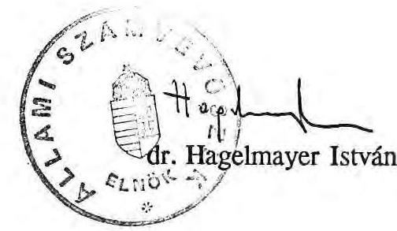

# Állami Számvevőszék

## JELENTÉS

a Magyar Távirati Iroda (MTI) 1990. évi pénzügyi-gazdasági ellenőrzéséről

---

# Az ellenőrzést végezték: 

Bakonyvári Róbertné számvevő tanácsos, Éva Katalin számvevő tanácsos, dr. Mihály Sándor számvevő tanácsos, Szabó József számvevő

## Az ellenőrzést vezette:

Matusek István főtanácsos

---

# JELENTÉS 

a Magyar Távirati Iroda (MTI) 1990. évi pénzügyi-gazdasági ellenőrzéséről

Az MTI-nek, mint a Magyar Köztársaság hír-, kép-, és sajtóügynökségének a feladatkörébe tartozik:

- a hazai nyomtatott sajtó, a Magyar Rádió, a Magyar Televízió és más tömegtájékoztatási eszközök, valamint a politikai és gazdálkodó szervezetek ellátása bel- és külföldi hírekkel, képekkel és sajtószolgálati anyagokkal;
- a külföldi hír-, kép- és sajtóügynökségek, valamint más információs szervezetek hír-, kép- és sajtószolgálati anyagokkal való ellátása a magyarországi eseményekről;
- az országos sajtó- és politikai adatbank, valamint képarchívum működtetése, és mindezek mellett:
- magyar és idegennyelvű lapok, kiadványok megjelentetése, szakjellegű információk terjesztése;
- önálló kiadási, műszaki-fejlesztési, nyomdai, fototechnikai és kereskedelmi, valamint reklámtevékenység folytatása.

Az MTI összesen 17 nemzetközi hangfrekvenciás vonalat, ezen belül 14 multiplex összeköttetést és három egyedi telefotó vonalat tart fenn. A létesített vonalakból 218 a hírszolgálati és 12 a fotócsatorna. A 14 multiplex összeköttetésből három kereskedelmi célú, amelyek különböző gazdasági monitorszolgáltatások továbbítására létesültek. A nemzetközi állandó összeköttetések - egy kivételével - bérelt postai csatornák. A belföldi összeköttetésre szolgáló csatornák száma 400.

A külföldön dolgozó 23 tudósító közül 12-vel tart fenn az MTI állandó kétirányú összeköttetést, az állandó vonallal nem rendelkező tudósítók különböző hírügynökségek vagy telex segítségével tartanak Budapesttel kapcsolatot.

---

A fejezet 1990. évi bevételi előirányzata 1 milliárd 351 millió Ft, ebből állami támogatás 147,3 millió Ft (10,8%). Fejezet szinten az ez évre jóváhagyott létszámelőirányzat 1440 fő.

Az ellenőrzés célja az MTI működésének, költségvetési gazdálkodásának és a gazdasági, pénzügyi irányítás színvonalának célszerűségi, eredményességi és törvényességi szempontból való értékelése volt.

Az ellenőrzés az MTI fejezetet és az azt alkotó két gazdálkodási intézményt 1988. január 1. és 1990. június 30. közötti időszakra terjedően vizsgálta

# I. 

## Következtetések, javaslatok

A korábbi évtizedekben a hírközlés hivatalos szervezetét az államhatalom részeként olyan politikai intézménynek tekintették, amelynél a gazdálkodásnak alárendelt, kisegítő szerepe van.

A de facto elismerten privilegizált helyzet és az utóbbi években bekövetkezett gazdasági romlás (pénzügyi restrikció) egyre súlyosabb ellentmondásba került egymással, különösen 1986. óta, amikor az MTI kivált a Minisztertanács által közvetlenül irányított szervezetek közül és önálló költségvetési fejezetté minősítették. Ezzel az aktussal de jure elindult egy olyan folyamat (ami máig sem ért véget), amelyben az MTI szembesülni kényszerül az egyre keményebb költségvetési korlátokkal, a szolgáltatások iránti igények visszaesésével és a nem alapfeladatoknál az élesedő piaci viszonyokkal.

Az ár- és díjbevételes tevékenység korábban is integráns részét képezte az MTI tevékenységének. A költségvetési támogatás reálértékének csökkenése fokozatosan nélkülözhetetlenné tette az árbevételek növelését, a nyereség elérését, erre a pénzügyi szabályozók is ösztönözték az intézményt.

Az 1988-1990. évi állami támogatás a kormányzati intézkedések ellensúlyozására szolgált és csak kisebb mértékben a gazdálkodás támogatására.

Az MTI fejezetszintű gazdálkodása - az eredményérdekeltségű tevékenységek következtében - 1989. év végéig nyereséges volt. Az 1990. I. félév veszteséget mutatott. A gazdálkodás egyensúlyát több tényező együttes kedvezőtlen hatása bontotta meg. Az MTI a növekvő költségeit csak részben volt képes megrendelőire áthárítani, mert a kereslet

---

csökkenése és az élesedő verseny miatt a szolgáltatások iránti igények mérséklődtek. A tervezetthez képest bevételkiesések jelentkeztek, továbbá a megrendelők fizetési készségének romlása és a belső gazdálkodási hiányosságok miatt az MTI kényszerhitelezésre és bankhitelek felvételére kényszerült.

Mivel a meghatározó tendenciákban érdemi változás nem várható, az éves egyenleg is valószínűleg veszteséges lesz. Ennek főbb okai a következők:

- az MTI létszáma - a feladatok mindenkor igazolt bővülésével összhangban folyamatosan növekedett. A létszámcsökkentésre irányuló eddigi intézkedések csak átmeneti részeredményeket hoztak;
- nem vizsgálták felül a külföldi tudósítói hálózat korábban kialakult szerkezetét, irányultságát;
- nem voltak elég eredményesek a kintlévőségek behajtását, a követelések csökkentését célzó erőfeszítések;
- a készletek növekedése is hozzájárult a pénzforgás lassulásához, a hiteligények megjelenéséhez;
- a meglévő eszközállomány hatékonyabb vagy racionálisabb hasznosításával a költségek csökkenthetők lennének (pl: gépkocsik üzemeltetésénél);
- a felesleges álló- és forgóeszközök értékesítési lehetőségei nincsenek még kimerítve;
- egyes veszteséges tevékenységek megszüntethetők, mások nyereségessége még növelhető;
- nem mérték még pontosan fel, hogy az új üzemépület üzembehelyezésével a működési és fenntartási költségek milyen terhet jelentenek az éves intézményi költségvetésre;
- nem számoltak kellően a múlt évben (1989.) és az 1990. évben végrehajtott saját elhatározású bérfejlesztések költségnövelő hatásaival;
- az érdemi munkaterületeken hiányzik a munkaköri kötelezettségek, a teljesítménykövetelmények egyértelmű meghatározása.

A teljességre törekvés nélkül jelzett gazdálkodási lazaságok arra hívják fel a figyelmet, hogy az MTI még nem tett meg mindent a szigorú takarékosság érvényesítése érdekében. Az ellenőrzés megállapításai alapján a következőket javasoljuk:

---

# 1.) A kormány 

a) a nemzeti médiákra vonatkozó törvény előkészítése során tekintse át a médiák (MTI, MTV, MR) eddigi állami funkcióját, határozza meg a velük szemben támasztott társadalmi (állami) követelményeket és a közérdekű működés állami támogatásának költségvetési feltételeit, esetleg mértékét;
b) elvi döntés szükséges arról, hogy az MTI-nek, mint állami szervnek mely tevékenysége privatizálható, illetve a privatizálás milyen módon és mértékben engedhető meg. Meghatározandó, hogy a további működésében miként vesz részt az állam;
c) az előző döntések figyelembevételével határozhatók meg az MTI szervezeti és működési feltételei. (Így pl. a nagyságrend, létszám, a műszaki fejlesztés támogatása, az állami részvétel a beruházásokban stb.)

## 2.) Az MTI vezetése

a) dolgozzon ki intézkedési tervet az ellenőrzés során feltárt hiányosságok megszüntetésére;
b) tegyen sürgős intézkedéseket a gazdasági egyensúly helyreállítása érdekében (követelések behajtása, készletek csökkentése, felesleges eszközök értékesítése stb.);
c) tárja a döntésre jogosult állami szervek elé további működésének belsőleg kialakított koncepcióját olyan részletességgel, amiből minden lényeges faktor felelősen megítélhető és eldönthető;
d) sürgősen intézkedjen az elmaradt nyereségadó pótlólagos befizetésére.

---

# II. 

## Megállapítások

## 1. A fejezet és intézményeinek költségvetési és finanszírozási rendszere.

### 1.1. A gazdálkodás szervezeti rendszere

Az MTI 1987. évtől kezdődően önálló költségvetési fejezet keretében gazdálkodik, szerteágazó feladatait a fejezet két önálló költségvetési intézménye:

- a maradványérdekeltségű MTI Gazdálkodó Szervezet és
- az eredményérdekeltségű MTI Intézménye keretében látja el.

Az MTI Gazdálkodó Szervezet központi igazgatási, gazdasági és elszámoló feladatokat végez. E szervezeten belül látja el a fejezet pénzellátási tevékenységét is. Működését 97-99%-ban központi támogatás finanszírozza.

Az eredményérdekeltségű MTI Intézmény szervezete a hír-, kép- és sajtóügynökségi feladatokat ellátó szerkesztőségeket, a kiadói, a fotó, a műszaki igazgatóságokat és az adatbankot, képarchívumot, a gödöllői rádió-vevő állomás egységeket foglalja magában.

Az intézmény fejezetre, gazdálkodó szervezetre és eredményérdekeltségű intézményre tagolása a valóságban fikció, ezek a szervek elkülönítetten csak a költségvetési tervekben és beszámolókban léteznek. Az MTI valójában egységes szervezet, amelyet a költségvetési szabályok követelményei szerint "megosztottak".

Tevékenységek szerint tagolva az intézmény hírügynökségi, sajtóügynökségi és fotóügynökségi feladatokat foglal magában.

Az MTI az összetett szakmai feladatai és az elkülönített gazdálkodási (érdekeltségi) viszonyai miatt bonyolult szervezet, ahol gyakran szervesen összefonódnak az állami feladatok és a nyújtott szolgáltatások. Az igazgatóságok, szerkesztőségek munkáját, a szervezeti egységek ellátandó feladatait és a pénzügyi-gazdasági követelmények teljesítését többnyire elavult ügyrendek szabályozzák, beleértve az egységek szervezeti rendszerét is.

A szabályzatok többségükben a fejezetté válást megelőzően készültek, illetve azóta csak egy 6 oldal terjedelmű "ideiglenes" SZMSZ van érvényben. A jelenlegi 18 szervezeti egység

---

közül 9 szervezeti egységnek van ügyrendje, ebből jóváhagyva egy van. A Bizonylati Szabályzat és Album 1986. óta, a Házipénztári Szabályzat 1983. óta nincs karbantartva. A létszám- és bérgazdálkodásról szóló vezérigazgatói utasítás jogérvénye mindvégig kétséges volt. Szabályozatlan a decentralizált bérgazdálkodással együttjáró utalványozási jog.

Az MTI felső vezetését az egyre sűrűbben fellépő fizetési nehézségek arra késztették, hogy részletesen elemezze az intézmény jelenlegi gazdasági, szakmai helyzetét és ez alapján működési tervet dolgozzon ki. A szervezet felépítéséről készített elemzéséből egyértelműen kirajzolódott, hogy az intézmény tevékenységi köre, szervezete olyan szerteágazó, hogy a jelenlegi rendszer működése során törvényszerűek a párhuzamosságok, az irányítási és működési zavarok, az érdekkonfliktusok. A megállapítások alapján szükséges intézkedések megtétele még hátra van.

# 1.2. A gazdálkodás általános pénzügyi feltételei 

Az évről-évre növekvő saját bevételek és emelkedő költségvetési támogatás ellenére a fejezet gazdálkodására a napi pénzügyi gondok, a késedelmesen realizálódó kintlévőségből adódó számottevő pénzügyi problémák, a bevételeket meghaladó, növekvő ütemű költségek és a folyamatosan rosszabbodó gazdálkodási feltételek a jellemzőek.

A Magyar Távirati Iroda alaptevékenysége keretében végzett hírszolgálati tevékenység veszteséges. E tevékenység szolgáltatási költségeit az intézmény a felhasználókra nem tudja teljesen áthárítani.

A hírszolgálati alaptevékenység bevételének és szűkített önköltségének különbözeteként kimutatott veszteség 1988-ban 55,5 millió Ft, 1989. évben 59,3 millió Ft, 1990. I. félévben 39,5 millió Ft volt, mely veszteségeket a központi irányítási és egyéb általános költségek tovább növeltek.

Az MTI Intézmény jelzése szerint az egyéb szolgáltatások bevételeiből az alaptevékenység veszteségének kigazdálkodására 1990. évben várhatóan nem lesz mód. Az 1990. I. félévében az intézmény kimutatott nettó vesztesége 12,3 millió Ft volt.

Az eredményromlás külső tényezői közül a belföldi és külföldi távközlési költségek, a külföldi hírek beszerzési árainak, továbbá az energia, szállítási, közlekedési költségek növekedése emelhető ki.

Az intézmény legnagyobb költségtényezője a munkaerő és bérköltség. A többi költségtényező olyan jellegű, amely gazdálkodási eszközökkel kevésbé befolyásolható, vagy aránya a költségek között nem meghatározó. A fejezet növekvő állami

---

támogatása ellenére, az intézményi gazdálkodás feszültsége az idei évben nem enyhült, sőt a jelentkező veszteség miatt nőtt.

Az 1988-89. évi és 1990. évi magasabb állami támogatás elsődlegesen a kormányzati intézkedések miatti költségemelkedések ellensúlyozására szolgált (személyi jövedelemadó, általános forgalmi adó bevezetése 1988. évben, társadalombiztosítási járulék emelése, többszöri valutaárfolyam növekedés) és csak kisebb mértékben kötődött az éves gazdálkodáshoz.

A központi támogatás részaránya viszonylag alacsony, 1988. évben 8,2 %, 1989. évben 10,2 % volt, az 1990. évben a tervszámok alapján 10,8 %.

A fejezet az 1988-1989-es években 1.075,0 millió Ft, illetve 1.266,3 millió Ft pénzforrással gazdálkodott, melyből a központi támogatás 88,8 millió Ft, illetve 130,2 millió Ft volt. (A fejezet 1987-ben 22,9 millió Ft központi támogatást kapott). Az 1990. évi bevételi előirányzat 1.351,6 millió Ft összegű, ebből az állami támogatás 147,3 millió Ft.

A fejezet működését, gazdálkodását elsődlegesen a saját bevételek finanszírozzák, döntően az eredményérdekeltségű intézményi bevételekből. (A fejezet költségvetésének összetevői az 1. és 3. sz. melléklet részletezi.)

A fejezet által teljesített ár- és díjbevétel 1988-ban 33,4%-kal, 1989-ben 25,9%-kal haladta meg az eredeti bevételi előirányzatot. Az elért ár- és díjbevétel 1988-ban 828,7 millió Ft, 1989-ben 997,8 millió Ft volt, az 1990. évi előirányzat 1.012,7 millió Ft, melyből az év első felében 45,1 % teljesült.

Az éves gazdálkodás finanszírozására a fejezet az MTI Intézmény érdekeltségi alapjából 1988. évben 34,5 millió Ft-ot, 1989. évben 18,8 millió Ft-ot,
 az 1990. év első félévében 6,9 millió Ft-ot vett igénybe. Az eredményérdekeltségű intézménynél ezen kívül számottevő az éven belüli, működési célokra felvett hitelforrás is a késedelmesen befolyó kintlevőségek miatt.

A működési célokra igénybevett éven belüli MNB hitel 1988-ban 35 millió Ft, 1989-ben 20 millió Ft, 1990. első félévében 53 millió Ft volt, jelentős szállítói állomány mellett, mely tartós finanszírozási feszültségre utal. (Ez év első felében átlagosan a lejárt kintlevőségek állománya 55-70 millió Ft között ingadozott, a szállítói követelések 77-80 millió Ft összegű állománya mellett.)

Az MTI eredményérdekeltségű intézmény az egyre nehezedő gazdálkodási feltételek mellett 1988-ban mérleg szerint 30,5 millió Ft, 1989-ben 41,9 millió Ft nyereséget ért el. Árbevételarányos nyereségszintje 1988-ban 3,4 %; 1989-ben 3,7% volt, tehát kifejezetten alacsony. Az intézmény az 1988-as évben árbevételéhez viszonyítva 4,1 %-os, 1989-ben 6,5 %-os költségvetési támogatásban részesült. Központi támogatás nélkül az intézmény tevékenysége veszteséges lett volna. (Az MTI

---

Gazdálkodó Szervezetének - maradványérdekeltségű intézmény — bevételei és kiadási előirányzatai és azok teljesítése a 2. sz. mellékletben találhatók.)

Az előző évi pénzmaradvány igénybevétele a fejezetnél a fejezeti pénzellátáshoz és a maradványérdekeltségű intézményi gazdálkodáshoz kapcsolódóan nem volt számottevő.

Az éves költségvetési előirányzatok kialakításánál a fejezet a kiadott éves költségvetési tervezési irányelveket, előírásokat figyelembe vette, beleértve az új, 1988. évtől bevezetett költségvetési rendnek megfelelő elszámolási előírásokat is.

Az éves költségvetési előirányzatok megalapozottságát vizsgálva megállapítható, hogy azok többnyire a korábbi évek adataiból kiindulva a tervezett termelésfelfutás várható bevételei és kiadásai, illetve költségvonzatai figyelembevételével alakultak ki, általában hozzávetőleges becslés alapján és nem voltak részletes számításokkal alátámasztva.

A tervezés bizonytalanságait és nehézségeit a bevezetett jövedelemadó, ÁFA és az új költségvetési előírások is növelték.

# 1.3. Az éves kiadási és bevételi előirányzatok teljesítése 

A fejezet kiadási előirányzatai 1988-1989. és 1990. években dinamikusan emelkedtek. A növekedés részbeni előidézői azok a kormányzati intézkedések, melyek jelentős kiadást, ill. költségemelkedést jelentettek (pl. jövedelemadó, ÁFA, TB járulék emelése), részben az évről-évre emelkedő bevételek növekvő ráfordításai voltak.

A fejezet eredeti kiadási előirányzata 1988-ban 701,9 millió Ft volt, amelyet az 1989. évi eredeti kiadási előirányzat 42,7 %-kal, az 1990. évi pedig 92,0 %-kal halad meg. Ezen belül a tervezett működési kiadások 1989. évben 24,8 %-kal, 1990. évben 80,1 %-kal haladják meg az 1988. évit.

A tényleges működési kiadások 1988. évben 48,8 %-kal, 1989. évben 19,4 %-kal meghaladták a tervezett eredeti előirányzatot.

A saját bevételi előirányzatoknál a bevétel-centrikus tervezés érvényesült. Az éves tervszámok kialakításánál a már elért tényleges bevételek döntő hányadát tervezték.

Az 1988. évi 622,4 millió Ft eredeti előirányzatú saját bevételt az 1989. évi eredeti saját bevétel előirányzata 27,4 %-kal, az 1990. évi 77,2 %-kal haladja meg.

---

A saját pénzforgalmi bevétel az 1988. évben 33,1 %-kal, az 1989. évben 25,8 %-kal volt magasabb mint a tervezett éves eredeti előirányzat.

A növekvő ráfordításokat az új szolgáltatások bevételei ellensúlyozták elsődlegesen és szerényebb mértékben volt érvényesíthető a szolgáltatások áremelése. Új tevékenységek között említendő az Econew külföldre irányuló gazdasági hírszolgálat, a kiállításszervezési tevékenység, a videoszolgáltatás és az új korszerűbb kiadványok megjelentetése. Bővült a Reuter és Telerate gazdasági monitor hírszolgáltatást igénybe vevők köre.

Az évközi előirányzat módosítások viszonylag szerényebb köre kapcsolódik a központi támogatás évközi változásához.

Így 1988-ban a bérbruttósítás kiegészítése címén 6,5 millió Ft-tal, valamint az újságírói bérek soronkívüli emelésére kapott támogatás 1988. évre eső részével, 2,9 millió Ft-tal módosították a központi támogatást.

Az 1989. évi eredeti éves központi támogatásból a Pénzügyminisztérium évközben 4,4 millió Ft-ot elvont a Kormány egyensúlyjavító intézkedése részeként. Az idei évben — eddig — a támogatás mértéke nem változott.

Az évközi módosítások többségében a tényleges pénzforgalmi teljesítésekhez igazodtak. Jelentősebb eltérések az MTI Intézménynél egyes kiadási rovatokon tapasztalhatók, részben a jelentős év végi kiegyenlítetlen szállítási követelések, részben a béralap indokolatlan módosítása miatt.

A készleteknél, a béralapnál, a bérjellegű és az anyagjellegű kiadásoknál 1988-1989. években a módosított előirányzatokhoz képest megtakarítások mutatkoztak. Ebből a fel nem használt bérelőirányzat 1988-ban 12,3 millió Ft, 1989-ben 9,4 millió Ft volt, amely a következő évben az érdekeltségi alap egyik forrása. A jelentős összegű bérmaradvány annak ellenére képződött, hogy a nyereségprémiumot mind a két évben a béralap terhére számolták el és nem az érdekeltségi alapot terhelte. Az előirányzat módosítást az érdekeltségi alap szempontjai motiválták. A fejezet éves bérkiadása terhére 1988-ban 15,3 millió Ft-ot, 1989-ben 16,8 millió Ft-ot és 1990-ben — eddig — 10,4 millió Ft eredményérdekeltségű prémiumot fizetett ki.

A fejezet költségvetési előirányzatainak levezetését, módosítását és tényleges pénzforgalmának alakulását a jelentéshez csatolt mellékletek részletezik. (1-6. sz. melléklet).

Az átmenetileg szabad pénzeszközeit az MTI, mint fejezet 1989-ben és 1990. első félévében a Citibank Bp. Rt-től vásárolt Metalimpex és BKV kötvényekbe fektette be.

A kötvényekből származó kamat (jutalék) bevétel összege 1989. évben 212,5 ezer Ft volt, melyet egyéb bevételként elszámoltak az MTI Intézmény MNB bankszámlájára. A megkötött kötvényüzletek rövid időtartamúak voltak (6 naptól 2,5 hónap), az MTI Irányító

---

Szervezete Költségvetési, illetve Állóeszköz-fenntartási bankszámlájáról került a tőke átutalásra, visszautalásuk a rövid lekötés után megtörtént.

Az idei évben a kihelyezett tőke utáni kamat összege 135,9 ezer Ft, amely vizsgálatunk időpontjában is a Citibank Bp. Rt-nél vezetett MTI fedezeti bankszámlán volt. A kihelyezett tőke visszautalása a fejezet bankszámláját vezető MNB pénzintézethez már megtörtént, a kamatot még nem vételezték be.

Ugyanakkor a fejezeti pénzgazdálkodással kapcsolatban súlyos hiányosságként kell megemlítenünk, hogy az MTI eredményérdekeltségi intézmény adózott nyeresége utáni adóbefizetési kötelezettségének nem tett eleget. A befizetési kötelezettség elengedésére, vagy a mentesítésre engedélyt nem kaptak.

Az MTI-nek az 1988. évi eredménye után 1,7 millió Ft, az 1989. évi eredménye után 4,2 millió Ft összegű adóbefizetési kötelezettsége állt fenn. A "Költségvetési szervek befizetése" rovaton sem 1989-ben, sem 1990-ben ilyen befizetés nem volt.

# 1.4. Az intézményi érdekeltségi rendszer 

Az intézményi érdekeltségi rendszer a bevételek növelésére épül és csak szűkebb területen tartalmaz valós és mérhető költségkimélő elvárásokat (fotó-, nyomda-anyagfelhasználás egyes elemei).

Az eredményérdekeltségű rendszer és a szolgáltatások árképzési rendszere az üzleti és vállalkozási tevékenységhez kapcsolódik. A növekvő költségek mellett átlagban 10-12 %-os, vagy ezt meghaladó nyereség elérését igyekeznek érvényesíteni az árak kialakításánál a nyomdai, fotó termékeknél, szolgáltatásoknál.

Az MTI alaptevékenységét jelentő szorosan vett hírügynökségi szolgáltatásokra nincsenek kialakított árképzési szabályok. Az alaptevékenységnél a ráfordítások a bevételekből nem térülnek meg, a költségek áthárítása a felhasználókra hosszas tárgyalások, megállapodások eredményeként is csak részben lehetséges.

PI: a hírszolgáltatás egyik legnagyobb felhasználója a Magyar Rádió, 1988-ban 28,7 millió Ft-ot, 1989-ben 33,5 millió Ft-ot fizetett a nyújtott szolgáltatásokért. A Magyar Televízió 1988-ban 37,9 millió Ft, 1989-ben 43,8 millió Ft-ot térített az általa igénybevett szolgáltatásokért. A szerződések a híranyag térítési költségei mellett a vonaldijak, a műszaki technikai berendezések bérleti díját is tartalmazzák. Ezek a térítések - bár szerződés szerintiek - nem fedezik a szolgáltatások költségeit.

A szakfeladatonkénti eredményelszámolás adatai szerint a hír-, kép-, és sajtószolgáltatás bevételi előírása 1989-ben 23,2 %-kal haladta meg az 1988. évit. A ráfordítások ezzel szemben 1989-ben 26,6 %-kal emelkedtek. Például a postaköltségek 61 %-kal nőttek, a nemzetközi vonalbérletek több mint duplájára emelkedtek, A hírügynökségi költségeknek mintegy negyede térül meg az MTI-nek fizetett hírügynökségi bevételekből.

---

A külső tényezők okozta eredményromlás mellett belső okok is közrehatnak abban, hogy a gazdálkodás eredményessége romlik. Mindeddig nem volt kiemelt feladat az MTI-nél az alaptevékenység költségeinek csökkentése. Ehhez az intézménynek sem fűződik igazán érdeke. Az egyes szerkesztőségek a korszerűbb munkaerőgazdálkodásban és a költségek csökkentésében alig érdekeltek. Az intézmény vezetése nem érzékelte kellő időben és mértékben a feszültségeket, ezért megkésve tett intézkedéseket és azok sem hoztak kielégítő eredményt.

# 1.5. Az MTI részvétele gazdasági társaságokban 

A vállalkozást ösztönző szabályozási lehetőségekkel élve az MTI Intézmény öt korlátolt felelősségű társaság létrehozásában vesz részt (1988-ban 1, 1989-ben 3, 1990-ben 1 társaságba lépett be.)

A társaságokba 14,4 millió Ft értékű apportot vitt.

Készpénzben 4,5 millió Ft-os végleges hozzájárulásként, 750 ezer Ft-tal kölcsönként, szolgáltatással, eszmei vagyonként 9,2 millió Ft-tal vesz részt a vállalkozásokban.

A társaságok működését egy kivételével az indulás jellemzi. Az öt Kft-ből kettő veszteséggel zárta az 1989. gazdálkodási évet. A Nap TV Kft 1989. évi teljes éves vesztesége 24,0 millió Ft, melynek anyagi kihatása az egyes tagokra vonatkozóan vizsgálatunk időpontjáig nem tisztázódott.

Az MTI az ECODATA Gazdasági Információszolgálati Kft-be 3-5 évre szóló - a szerződő felek által 7 millió Ft-ra értékelt - szolgáltatást vitt be eszmei apportként. A Nap TV Kft-ben ugyancsak eszmei apportként 1,2 millió Ft-ra értékelt szolgáltatással (heti két adás hírellátása), illetve 750 ezer Ft kölcsönnel vesz részt.

A bekért tanúsítvány adatai szerint a Kft-ék tevékenysége nyereséget eddig alig hozott az MTI-nek, a befektetett pénzeszközök és nyújtott szolgáltatások megtérüléséről még nem beszélhetünk. Kivételnek a Fotólux- Extra Kft tekinthető, amely az 1989. évi eredményei után 200 ezer Ft nyereséget utalt át az MTI-nek. (Adatok a 4. sz. mellékletben).

---

# 2. A főbb költségtényezők ellenőrzése 

### 2.1. A létszám és bérgazdálkodás

A fejezet évi béralap előirányzata az 1988. évi 232,4 millió Ft-ról 1990-re 340 millió Ft-ra nőtt (46 %). E nagymértékű növekedést a fejezet alapvetően ár- és díjbevételből tervezte megvalósítani. A béralapnak támogatásból származó növekménye mindössze 19,9 millió Ft volt, ebből azonban 4,2 millió Ft olyan, a PM tervezési irányelveivel ellentétes szintrehozás, ill. automatizmus megtervezéséből származott, amelyet a fejezeteknek kellett kigazdálkodniuk. A bértervezés megalapozatlanságára utal a bérköltség terv és tény szintű összehasonlítása.

1988-ban a munkavégzésre irányuló egyéb jogviszony eredeti előirányzatának (11,2 millió Ft) kétszeresét költötték el. Hasonlóképpen a jutalom előirányzat 6,5 millió Ft összegét 3,9 millió Ft-tal lépték túl. Nyugdíjas foglalkoztatást nem terveztek, mégis 7,9 millió Ft bért fizettek ki részükre. Hasonlóan alakult az 1989. év is, a megbízási díj előirányzatát (16,2 millió) kétszeresére teljesítették (33,2 millió Ft), a nyugdíjas foglalkoztatás költsége (9,6 millió Ft) pedig a tervelőirányzat háromszorosát tette ki. Háromszoros az arány az alkalmi munkavállalók részére kifizetett összeg és tervszám között is (előirányzat 0,8 millió Ft, tényszám 2,5 millió Ft.).

A tervelőirányzat átcsoportosítását a jogszabályok megengedik, de az ilyen nagymértékű eltérések arra mutatnak rá, hogy a tervezés során nem mérték fel kellő gondossággal a létszám- és bérigényt.

A fejezet működési költségeinek 40 %-át a TB járulékkal együtt számított bérköltség összege tette ki. A bérköltség összege 1988-ban 242 millió Ft, 1989-ben 319 millió Ft, 1990. I. félévében 173 millió Ft volt. A bérköltségek növekedését a feladatok változásán túl az alapbérek emelkedése, ill. a megbízási díjak jelentős mértékű növekedése okozta.

A legnagyobb mértékű bérfejlesztésre 1988. október 1-jével
 került sor, amikor az újságírók és szerkesztőségi dolgozók központilag elhatározott béremeléséhez a kormányzat 13 millió Ft összegű költségvetési támogatást biztosított. A bérfejlesztés a központilag elhatározott (15%) mértéket meghaladta, mivel a fejezet bevételei lehetőséget adtak arra, hogy az újságírók 20%, a szerkesztőségi dolgozók 17%, az e körön kívül eső dolgozók pedig 12%-os bérfejlesztésben részesüljenek. A béremelések forrása - ezt az egy esetet kivéve - az ár és díjbevétel volt.
1989. szept. 1-jei hatállyal az alapbéreket kétszer is emelték, 3,2%-kal, illetve 4,5%-kal.

A döntés nem volt megalapozott, mivel a béremelést a következő év fedezetének ismerete nélkül határozták el. Ennek ellenére 1990-ben újabb béremelésre került sor.

---

A január 1-jei hatállyal megvalósított 10%-os béremelés forrása az 1989. december 31-vel zárolt üres álláshelyek béralapja és a költségvetésben tervezett ár és díjbevétel volt.

Az igazgatók és szerkesztőség vezetők január 1-jei 31,9%-os bérfejlesztése a mindenkit érintő 10%-os béremelésből származott, ill. a nyereség függvényében képződő ún. eredményességi prémium alapbérbe való beépítése okozta azt.

E mögött gyakorlatilag a kiemelt vezetői réteg előző évi szintű átlagjövedelmének biztosítására való törekvés húzódik meg. Mivel az első negyedév gazdálkodási adatai 36,0 millió Ft veszteséget mutattak, az eredményességi prémiumból származó jövedelmet biztosabbnak látták az alapbérbe beépíteni.

A bérfejlesztés fedezetének számítására vonatkozó anyag nem állt az ellenőrzés rendelkezésére.

Számításaink szerint a bérfejlesztések elhalasztása esetén az I. félévet a fejezet 12 millió Ft-os veszteség helyett közel 16 millió Ft-os nyereséggel zárhatta volna.

Fedezetszámítás nélkül is látható azonban, hogy ekkora összegű veszteség esetén a bérfejlesztést el kellett volna halasztani, amíg a források a tartós elkötelezettség kifizetését garantálni tudják.

A folyósítható bérpótlékok száma az 1988. évi bruttósítás során jelentős mértékben lecsökkent, a 32 féle pótlék javarésze alapbéresítésre került. Ma már "csak" 12 féle jogcím szerint fizet az MTI bérpótlékot. A kifizetésre került bérpótlékok összegének közel 3/4 része saját hatáskörben megállapított pótlék volt. Jellemző, hogy ezek szabályozására soha sem került sor. A vizsgált esetekben a szervezeti egységeknél az azonos feltételek szerint kifizetett összegek igen eltérőek voltak. Emellett a pótlék folyósításának indokoltsága esetenként megkérdőjelezhető.

Vasárnapi pótlékot három szervezeti egységnél fizetnek, mindegyiknél eltérő feltételekkel és viszonylag jelentős összegbeli különbségekkel (pl. beosztottak esetében 200 Ft+csúsztatás, illetve 1.800 Ft a két szélső érték. Turnusvezetőknél 1.800 Ft, illetve 3.000 Ft az egy alkalommal kifizetett összeg.)

A display pótlék folyósításának pedig megszűntek az indokai.
A megbízási díj címén történt kifizetések megnövekedtek, egyéb bérelemek funkcióját átvéve.

Az MTI tudatosan arra törekedett, hogy a megbízási díjak kifizetését növelje a jutalom, vagy más mozgóbérelemek (pótlékok, túlteljesítési prémiumok stb.) rovására, mivel az így kifizetett összegek kedvezőbb SZJA alá esnek, illetve mentesülnek a TB járulék fizetési kötelezettsége alól.

---

A kifizetett jutalmak összege gyorsan lecsökkent, a megbízási díjaké növekedett. (A jutalom az 1988. évi 10,4 millió Ft-ról az idei évben 0,3 millió Ft-ra csökkent, a megbízási díj ugyanezen időszakban közel megkétszereződött.)

Mint az 5. sz. mellékletben látható, az 1989-ben kifizetett 33,2 millió Ft összegű megbízási díjból a legnagyobb arányban az MTI dolgozói részesültek 62,7%-os arányban. Megbízási szerződésekből 1831 db-ot MTI munkatárssal kötöttek, akik közül 425 fő saját szervezeti egységétől kapta a megbízást.

Az általánosnak tekinthető belső "keresztbe foglalkoztatás" valódi pontos arányának megállapítása azért nem lehetséges, mert az esetek egy részénél a megbízási díj tulajdonképpen más jogcímet takar.

Piaci viszonyokra hivatkozással megbízási díjként eléggé eltérő tarifákat alkalmaznak (pl. 1.000 Ft/cikk, vagy 2.200 Ft/nap).

Egyértelmű munkaköri leírások hiányában a kifizetések jogossága nem állapítható meg. Különösen az újságírói munkaköröknél lenne fontos a követelmények behatárolása, ugyanis nem egyedi jelenség az, hogy az újságírói beosztásban lévők éves törzsbérük összegének többszörösét vették fel megbízási díjként.

A megbízási díjak növekedése az MTI vezetését is foglalkoztatja és a honorárium rendszer felülvizsgálata mellett foglalt állást. Ebbeli törekvésüket az ellenőrzés tapasztalatai megerősítik.

A egyéni ösztönzési rendszernek két pillére van: az egyik a szervezeti egységek rendelkezésére bocsátott jutalomkeret, a másik az ún. eredményességi prémium.

A jutalom kifizetése a fotólaboratórium és a Kiadói Igazgatóság egyes területein igen szigorú feltételekhez kötött, ugyanakkor az újságírók számára feltételeket nem szabtak, sőt 1990-ben az újságírói jutalmakat alapbérestették.

Az eredményességi prémium feltételrendszere mind a két évben változott. Jellemzője, hogy a vezetők részére külön személyre szóló prémium kitűzés készült.

A FOTO és Kiadó, valamint Pénzügyi Igazgatóság felső vezetői körében az ösztönzési prémiumon felül külön alaprémium kitűzésére került sor. Tekintettel arra, hogy az egész fejezet finanszírozásához a Kiadó, ill. a Fotóigazgatóság a többi egységhez képest jelentős mértékben hozzájárult, a plusz prémium kiírása indokoltnak minősíthető.

Formális volt a Pénzügyi Igazgatóság vezetőinek a prémium kitűzése, akiknél a feltétel gyakorlatilag a munkaköri kötelezettségek teljesítése volt.

---

# a) A létszám alakulása, munkaköri követelmények 

Az MTI-nél alkalmazott dolgozók öt féle központi szabályozású bérrendszer valamelyikének hatálya alá tartoznak.

Az MTI-nél a teljesítménykövetelményeknek két végpontja van: a Fotólabor munkatársai normaidőben dolgoznak, az újságírók, fotóriporterek és műszaki felvételezők kötetlen munkaidőben, csak éves munkaidőkeretük kötött. Első esetben a munkaköri leírás - mint követelményrendszer - szinte szükségtelen, a másik csoportnál csak formális.

A fejezet a feladatokat 1988-ban 1.356 fő, 1989-ben 1455 fő, 1990-ben 1418 fő átlagos állományi létszámmal oldotta meg.

Az ellenőrzés megítélése szerint a létszámcsökkentést célzó ösztönzők hatása nem hozott kielégítő eredményt.

Az 1989. évi érdekeltségi rendszer szabályai szerint a megszüntetett álláshely bérének 10%-át a vezető jutalomként megkaphatta, a megtakarított bér további része bérfejlesztésre kiosztható volt. Ezzel az intézkedéssel 41 tartósan üres álláshely szűnt meg.

Az elmúlt két és fél évben majdnem minden szervezeti egység feladatbővülés címén létszámfejlesztésben részesült, így a tartósan üres álláshelyeket viszonylag könnyen fel tudták adni.

A létszámellátottság lazaságaira utal az a tény is, hogy a munkaköri kötelezettségek ellátása mellett viszonylag sokan képesek egyéb belső megbízásokat vállalni.

A gondos előrelátásból eredő, konzekvensen végrehajtott létszámgazdálkodás hiányát mutatja, hogy a szervezeti egységek által felajánlott álláshelyek számát nem vizsgálták felül abból a szempontból, hogy az miért volt betöltetlen. Indokolt volt-e annak fenntartása, vagy csak formális álláshely volt, vagy feladat megszünése miatt vált feleslegessé?
b) A bér és létszám keretgazdálkodás gyakorlata

Az MTI létszám- és bérgazdálkodása a szervezeti egységekre lebontott keretgazdálkodáson alapult.

A bérkeretek megállapítására az év eleji egyeztető tárgyalások alkalmával került sor, esetenként évközi módosítások is előfordultak. Mindezekről azonban nem lehetett megállapítani, hogy a feladatok és a rendelkezésre bocsátott bérkeretek között ténylegesen milyen kapcsolat volt.

---

Pl. az 1990. évi bérjellegű gazdálkodási keretszámok megállapításakor az 1989. december 31-i zárólétszámhoz tartozó alapbérkeretet rögzítették és a többi jogcím esetében az 1989. évi tényadatokat állították be előirányzatként. Ez utóbbi azért volt helytelen, mert nem vették figyelembe az éves feladatváltozás mértékét, s az előző évben elért szintet a bérkeret mozgóelemeinél is szükséges szintként fogták fel.

# 2.2. Állóeszközgazdálkodás 

a) Állóeszközállomány összetétele, változása, nettó-bruttó állománya

Az MTI állóeszközállományának bruttó értéke 1990. június 30-án 966.878 ezer Ft volt és 1986. január 1-hez képest mintegy 390 millió Ft-tal (67,5%-kal) gyarapodott.

Az átlagos növekedést jóval meghaladó volt az ingatlanállomány fejlődése.
Összetételét tekintve 1990. június 30-án az állóeszközállomány közel kétharmada gép-berendezés, harmada ingatlan volt, a járműállomány értéke pedig 2,7%-ot képviselt.

Az állóeszközállomány gyarapodásának üteme az utóbbi években lelassult.
Az intézmény állóeszközállományának elhasználódási foka (a nettó-bruttó érték aránya) a vizsgált időszak végén 60%-os volt. Az alacsony leírási kulcsok miatt az avulás mértéke a számvitelben kimutatottnál még nagyobb.

Az állóeszközállomány alakulásának összevont adatait a 6. sz. melléklet tartalmazza.

## b) Beruházások

Az MTI beruházási tevékenysége a vizsgált időszakban jelentős volt, 1986. január 1-től 1990. június 30-ig 971 millió Ft összegű beruházás pénzügyi rendezése történt meg. A beruházások forrása 85,1%-ban (826 millió Ft) központi beruházási juttatás, 13,3%-ban saját forrás volt és kis hányadban egyéb forrás (KSH, OMFB) is előfordult.

A beruházási ráfordítások kétharmada építési jellegű volt, harmada az alaptevékenységi feladatok ellátásához, a műszerpark fejlesztéséhez szükséges beszerzéseket fedezte. A beruházások műszaki-gazdasági előkészítése általában szabályos volt, a jelentősebb értékű beruházásoknál versenytárgyalást hirdettek meg és megfelelő szerződéseket kötöttek.

---

Az építés jellegű beruházásoknál a tényleges költség az előirányzatot rendre meghaladta, ami arra utal, hogy a megvalósítási folyamatnál a kötelező takarékosság, illetve a gondos tervezés nem minden esetben érvényesült. Esetenként az ország anyagi helyzetéhez képest túl nagyvonalú megoldásokat alkalmaztak, vagy a döntést hozó szervek nem számoltak a gazdasági kihatásokkal.

Ilyen például a gödöllői rádió-vevő központ és a székház létesítése.
Az egyes beruházásokkal kapcsolatos megállapításainkat a 6-8. és a 15. sz. melléklet tartalmazza.

# c) Nagyjavítások 

Az MTI 1986. I. 1-től 1990. VI.30-ig 53,5 millió Ft-ot fordított nagyjavításokra, aminek a jelentősebb tételei az alábbiak:

- felújították a Tanács körúti - Asbóth utcai részlegeket (20,4 millió Ft),
- ideiglenes konténer kazánt állítottak üzembe (9,7 millió Ft),
- elvégezték egy nyomdai színbontó gép nagyjavítását (6,5 millió Ft).

A ráfordítások zömét a központi keret terhére, egytizedét saját forrásból finanszírozták. A jelentősebb nagyjavításokhoz versenytárgyalásokon választották ki a legkedvezőbb ajánlatokat.

A Tanács körúti-Asbóth utcai részlegek felújításának magas volt a fajlagos költsége (17.568 Ft/m²). A költségesen kialakított pince egy része a beázások miatt nem használható. A konténerkazánt a kazánház rekonstrukció befejezése után elbontották.

A nagyjavítások részletes adatai a 9. sz. mellékletben láthatók.

## d) Állóeszközök nyilvántartása, leltározása

Az állóeszközökről vezetett analitikus nyilvántartás jól áttekinthető, a főkönyvi könyveléssel rendszeresen egyeztetésre került.

A felvett leltárak végösszegei a könyv szerinti készletekkel megegyeztek. A kedvező tapasztalatok mellett néhány nyilvántartási, elszámolási hiányosság is előfordult:

---

- Az intézmény 1986. XII. 3-i dátumú szerződéssel Siófok Városi Tanácsától 19,8 millió Ft-ért megvásárolta egy 14.000 m² -es siófoki terület kezelői jogát. A kezelői jogvásárlás költségének kiegyenlítésére 4 évi egyenlő részletben állapodtak meg, de a vizsgálat idején abból 3,8 millió Ft még nem került kifizetésre. A kezelői jogvásárlás eddigi költségét (16 millió forintot) a 10/1985. (VI.22.) ÉVM-MÉM-PM számú együttes rendelet alapján egyéb költségként (igazgatási költségként) számolták el, de az intézmény állóeszközei között ez a telek egyáltalán nem szerepel, aminek következtében az MTI vagyoni helyzetét bemutató mérleg sem pontos.
- Az állóeszközök értékcsökkenését - a jogszabály adta lehetőségekkel élve - a vizsgált időszakban nem számolták el költségként.
- A balatonföldvári üdülő bruttó értéke az ingatlanok között, továbbá 3 üdülési célt szolgáló lakókocsi a járművek között helytelenül van nyilvántartva. Mivel ezek jóléti célt szolgálnak, a jóléti állóeszközök között kellene szerepelniük.
- Az intézmény területén található használaton kívüli állóeszközök bruttó értéke magas, meghaladja a 10 millió forintot. Dönteni kellene további sorsukról.

# 2.3. Anyaggazdálkodás 

Az intézmény anyagkészlete a vizsgált időszakban (1988. január 1 - 1990. június 30.) 10 millió
 Ft-tal, 11%-kal gyarapodott és az időszak végére 100,6 millió Ft-ot ért el.

A növekedés elsődleges oka az árak változása, de előfordult túlzott beszerzés is pl. az expedíció anyagainál, a gépkocsi alkatrészeknél, a riporteri mechanikus alkatrészeknél.

Romlott az anyagkészletek forgási sebessége. Intézményi szinten az 1988. évi 10 havi átlagkészlet ebben az évben 11,7 hónapra növekedett.

Az anyaggazdálkodásban észlelt hiányosságok már csak azért is nagy figyelmet érdemelnek, mert az intézmény gazdálkodási egyensúlya megbomlott és a szükségtelen anyagkészletek felszámolása forrásokat szabadíthat fel fontosabb célokra.

Az anyagbeszerzés általában az igények jobb-rosszabb felmérésére épült. Egyes területeken (pl. vegyszerek, fotófilmek, papírok) a felhasználás alakulását is figyelemmel kísérték. Anyagbeszerzésre 1988. évben 105, 1989. évben 115, 1990. I. félévében 49 millió Ft-ot fordítottak.

---

A tartalék alkatrészek magas zárókészletének (és beszerzéseinek) értékében az üzemeltetés biztosítására való törekvés érződik, de ez mindenképpen túlzó, felülvizsgálatra és korlátozásra szorul pl. a riporteri elektromos alkatrészek, a laboratóriumi karbantartási anyagok és a riporteri mechanikus alkatrészek esetében.

A beszerzéseknél törekedtek a célszerűséget szem előtt tartani (pl. gyártótól, nagykereskedelemtől vásárolni), de ez csak az anyagbeszerzések kb. 50%-áig sikerült és magas a kiskereskedelmi, ad hoc beszerzések aránya.

Ebben a helytelen gyakorlatban közrejátszott az is, hogy az anyaggazdálkodás megosztott, továbbá, hogy sem Anyaggazdálkodási Szabályzattal, sem teljes körű anyagbeszerzési tervekkel nem rendelkeznek. Az anyagbeszerzési keretszámokat sem bontották le. Végül oka az is, hogy az anyaggazdálkodási osztálynak, csoportnak bizonyos anyagok tekintetében nincs joga az igényeket felülbírálni.

A helytelen anyaggazdálkodás következtében egyes területeken tűrhetetlenül magas elfekvő készleteket talált a vizsgálat.

A nyomdai gépek alkatrészei, valamint a fotólaboratóriumi alkatrészek teszik ki az összes elfekvő készlet 95%-át.

Az elfekvő készlet értéke ebben a két csoportban 5,8 millió Ft.
Az anyagok tárolási rendje, a raktári nyilvántartások általában rendben lévőek, helyenként - különösen a Fotó Igazgatóság raktáraiban - rendkívül nagy a zsúfoltság.

Az anyagok analitikus nyilvántartása az előírásoknak megfelelő.
A kartonok kezelését, bizonyos adatok hozzáférhetőségét nehezíti, hogy az analitikus nyilvántartásokat háromféle módon: kézi átirással, könyvelőgéppel és PC számítógéppel vezetik.

Az analitikus nyilvántartást a főkönyvi kartonokkal negyedévente egyeztették.
Az anyagokra vonatkozó leltárakat minden év decemberében felvették, kiértékelték. A leltárak eredménye zömében kielégítő volt, a könyv szerinti készlettel általában megegyezett. A raktárak forgalmához képest elenyésző arányt képviselt a kimutatott hiány.

---

# 2.4. Fogyóeszközgazdálkodás 

Az MTI fogyóeszközbeszerzésre 1988-1990. I. féléve között mintegy 58 millió Ft-ot fordított. Ebből az új üzemépület bútorai 26,5 millió Ft értékkel szerepelnek.

A beszerzésekkel a fogyóeszközállomány a vizsgált időszakban 71%-kal nőtt (53 millió Ft-ról 90,6 millió Ft-ra). Az állomány túlnyomó többsége használatban lévő fogyóeszköz volt. A raktáron lévő új készlet - az új üzemépület bútorai nélkül - minimális (4-5%).

Az üzemépület berendezéséhez beszerzett bútorok 60%-a tipizált berendezés, kisebb hányada kereskedelmi forgalomban kapható. Ezek között szerepel 324 db tőkés importból származó munkaszék, amelynek beszerzési értéke 7 millió Ft. Ha ugyanezt jugoszláv importból, vagy hazai előállításban vásárolták volna, 4-5,5 millió Ft-tal lehetett volna a beszerzés olcsóbb.

A fogyóeszközök analitikus nyilvántartása zömében szabályos, az előírt egyeztetéseket rendszeresen elvégezték, azonban az értékesebb eszközökre is csak csoportos nyilvántartást alkalmaznak, így az eszközök hollétének megállapítása, leltározása nehézségeket okoz.

A fogyóeszközök leltározását szakaszonként, részlegenként, fogyóeszközfajtánként végezték.

A fogyóeszköz leltározás hiányossága, hogy a székház munkaszobáinak bútorberendezés állományát teljes körűen csak 1983. évben leltározták, (de ennek dokumentációját, kiértékelését, eredményét nem tudták rendelkezésre bocsátani). 1986. évben megkísérelték a leltárt felvenni, de teljes körűen ez nem sikerült, így kiértékelésre sem került.

Ez a gyakorlat ellentmond a fogyóeszközállomány két évenként kötelező leltározása előírásának, és sürgős intézkedést igényel.

### 2.5. A felesleges készletek, vagyontárgyak feltárása, selejtezése

A felesleges tárgyak, készletek feltárása az egyes szervezeti egységeknél változó gyakoriságú (pl. a Fotó Igazgatóságon rendszertelen).

A feleslegesnek ítélt 17 millió Ft értékű állóeszközből 3,4 millió Ft értékűt hasznosítottak (gépkocsikat, nyomdai gépeket), a többit leselejtezték.

A felesleges anyagokat (nyomdai nyersanyagokat, nyomdai papírt) értékesítették, anyagokból selejtezés nem volt. A fogyóeszközök kisebb része volt hasznosítható.

---

A selejtezésekre általában szabályosan, a selejtezési bizottság közreműködésével, az előírt nyomtatványok alkalmazásával került sor.

Esetenkénti hiányosság az, hogy a selejtezett eszközökről szabályos jegyzék és megsemmisítési jegyzőkönyv nem készült, így a selejtezett tárgyak további sorsa egyértelműen nem állapítható meg. További hiányosság, hogy az 1988. végén selejtezett műszerek, televíziók, diktafonok, bútorok értékesítésére csak a vizsgálat időpontjában került sor.

# 2.6. A belföldi utazások gépkocsi költségei és a gépkocsihasználat gazdaságossága 

A belföldi kiküldetési költségek között a legjelentősebb és az intézmény által befolyásolható költségtényező a gépkocsi használat, ezért ennek összetevőinek vizsgálatára tért ki az ellenőrzés.

Az MTI vezérigazgatója legutóbb 1981-ben szabályozta a gépjárműhasználatot, ezen belül a közületi gépjárművek üzemeltetését, a dolgozók saját gépkocsijainak hivatalos utakra történő használatát és a bérelt gépkocsik igénybevételét. Kifogásolható, hogy az eltelt időszakban új belső szabályozás nem készült, a meglévő nem került módosításra, kiegészítésre.

Az összes belföldi utazási költség az 1988. évi 23,9 millió Ft-ról 1990-re várhatóan 40 millió Ft-ra emelkedik, ami 67%-os növekedést jelent.

Az utazási költségekből az MTI hivatali gépkocsik használata a legnagyobb arányú (84-86%). Ez ráirányítja a figyelmet a hivatalos gépkocsihasználat felülvizsgálatának, a gazdaságosabb üzemeltetési variánsok alkalmazásának szükségességére. (Pl. saját gépjárművek rendszeres hivatali használata, állami gépjárművek hivatásos gépjárművezetők nélküli üzemeltetése stb.)

A vizsgálat időpontjában az MTI gépkocsi parkja 53 db személygépkocsiból, 32 db teher- és egyéb gépjárműből, összesen 85 db gépkocsiból állt. A gépkocsiállomány 1988-hoz képest 5 db-bal csökkent, ezzel szemben az üzemeltetés költsége 1989-ben 15%-kal nőtt (23,5 millió Ft-ra). Annak ellenére, hogy az utazási és szállítási költségek az MTI összes költségvetésének csupán 3%-át teszik ki, a költségek volumene mégis jelentős tétel.

A költségek folyamatos növekedését mutatja, hogy évről-évre nagyobb a fajlagos költség (1988-ban 8,92 Ft/km, 1990-ben 15 Ft/km). A legköltségesebbek a hivatásos gépkocsivezetővel üzemelő gépkocsik, ahol a fajlagos mutató 1990-ben várhatóan 18-19 Ft/km lesz, azonos a taxi-gépkocsik költségével (20 Ft/km).

Az új üzemeltetési formák bevezetésével a költségek mintegy 50%-kal csökkennének, s rövid távon közel 6 millió Ft megtakarítás lenne elérhető. A vizsgálat szerint a gépkocsihasználat gazdaságosabb üzemeltetési formáinak tényleges bevezetésére

---

mindeddig érdemi intézkedések nem történtek, a lehetséges megoldások nagyobb részt az elképzelések szintjén maradtak.

# 3. A devizagazdálkodás, a devizakeretek felhasználása 

Az MTI költségigényes működése a devizakeretek növekvő felhasználásánál is érzékelhető (1988-ról 1990-re várhatóan 14%-kal, közel 140 millió deviza Ft-ra emelkedik), emellett a saját exporttevékenységből származó nettó devizahozam 1989-ben 1988-hoz képest 102%-kal (49 millió deviza Ft-ra, 778 ezer USD-re) nőtt. Az 1990. I. félévi teljesítés időarányosan az előző év hasonló időszakánál kisebb.

A PM tervezési irányelvei egyre liberálisabb feltételeket szabtak a devizaigény jóváhagyásához.

Pl. 1988-ban még a rubel elszámolású devizakeretet is indokolni kellett; 1989-ben már csak a nem rubel elszámolású devizakeretet kellett tervezni és indokolni; 1990-ben pedig indoklás nélkül és címenként csak a fő összeget kívánta meg a devizatervezési útmutató.

A vizsgált három évben benyújtott devizaigény, összesen 346 millió Ft 77%-át az áruforgalmon kívüli devizaigény tette ki (fő jogcímek szerint: képviseleti ellátmány, hírügynökségi munkadíjak, hivatalos utazások).

A benyújtott igényeket a PM Nemzetközi Pénzügyi Főosztálya - minimális eltéréssel - elfogadta. A tényleges felhasználás 1988-89-ben lényegében igazodott a jóváhagyott tervhez, az 1990. I. félévi teljesítés a számlakiegyelítések miatt nem volt reálisan értékelhető. Nagyobb mértékű növekedés (18%) az áruforgalommal kapcsolatban jelentkezett (anyag-, alkatrészbeszerzés), ami az áremelkedés, a Ft leértékelés és a nagyobb javítások miatt következett be.

Az áruforgalmon kívüli devizafelhasználás legnagyobb tételét a tartós külszolgálattal összefüggő költségek képezték, amelyek a külföldi tudósítói hálózat fenntartásával kapcsolatban merültek fel.(Az ellenőrzött időszak alatti devizafelhasználás adatait a 10. sz. melléklet tartalmazza.)
a) A tartós külszolgálattal összefüggő előirányzatok célszerűsége, teljesítése, az elszámolások szabályszerűsége

Az MTI külföldi tudósítói hálózatát 21 országban építette ki, ahonnan 23 fő küld rendszeres, közvetlen információkat. A hálózat fenntartása, valamint a működésükhöz szükséges műszaki berendezések és egyéb fenntartási, működési költségek legnagyobb része devizában merül fel.

Az MTI külföldi képviseleteinek deviza Ft felhasználása az 1988. évi 68 millió Ft-tal szemben 1990-ben várhatóan jóval felette lesz a 80 millió deviza Ft-nak. A kiadások döntő része, 80-90%-a a nem rubel viszonylatú relációban létesített 15 képviselet működésével kapcsolatos. A képviseleti devizaellátmány megoszlása a 11. sz. mellékletben található.

#### Abstract

A költségek között folyamatosan növekedett a külföldi tudósítók valutailletménye és családi pótléka, az 1988-1990. közötti időszakban 47%-os az emelkedés ennél a tételnél. A bérköltségek 35,6 millió Ft-ot tesznek ki (44,5%). Ebben a növekedésben az itthon Ft-ban kifizetett munkabér is benne van (7,4 millió). A képviseleti ellátmánynál ugyancsak jelentős tételt jelentettek az iroda, a lakás, a garázs bérleti díjak. Ezek összege 1989-ben 15%-kal nőtt és meghaladta a 20 millió deviza Ft-ot. A képviseleti ellátmányt terhelő lakásfenntartási költségek (komplett felújítás miatt) 2,7-szeresére növekedtek. Két képviseleti helyen a bérleti díjak több milliós nagyságrendűek voltak (Tokió, London), de több helyen szintén meghaladták az 1 millió Ft-ot. Az áttanulmányozott bérleti szerződésekkel kapcsolatban több hiányosság került megállapításra (magyar fordítás hiánya, egyes szerződések érvénytelenek voltak, a bérleti díjat és a bérlemény nagyságát a szerződés nem tartalmazta stb.), ebből következően a szerződések nem tekinthetők naprakészen karbantartottnak. Várható, hogy a jelenlegi képviseleti helyek fenntartásával - az 1988-1989. közötti időszakban 7 új gépkocsi beszerzését követően - a közel jövőben 11 képviseleten válik szükségessé a gépkocsik cseréje. A gépkocsik üzemeltetése, fenntartása több mint 2 millió deviza Ft kiadással járt évenként.

A dologi költségekről a külföldi tudósítók havonta elszámoltak. A pénzügyi áttekintést jól szolgálták a költségekről készített számítógépes főkönyvi kimutatások.

A képviseletek fenntartása jelentős kiadási tétel az MTI költségvetésében, indokolt tehát azok felülvizsgálata.

# b) Devizabevételek képződése és felhasználása 

Az MTI devizaszükségletének egy részét saját tevékenységének devizabevételével termeli ki. Jelentős bevételi forrást jelent az angol Reuter és az amerikai Telerate monitor szolgáltatásainak közvetítése a hazai és a külföldi megrendelők részére. A két világcég-gel kiépített kapcsolatok (kábelvonalak, berendezések létesítésével, üzembehelyezésével) Budapestet hírelosztó-továbbító közép-európai központtá tették a gazdasági információáramlásban. A környező országokba való vonalkiépítések, szolgáltatások átvétele miatt ez a szerep tovább erősödhet, sőt indokolt a pozicionális helyzet stabilizálása.

---

A két monitorszolgáltatásból az MTI bruttó eredménye 1988-ról 1989-re közel 70%-kal nőtt, s elérte a 62 millió Ft-ot. Az eredményesség szempontjából döntő volt a szolgáltatások közvetítéséért kapott jutalék (12. sz. melléklet), amely egyben exportbevételt (devizát is) jelentett az MTI-nek. A jutalék 60%-kal növekedett a két év alatt. A forgalom, a szolgáltatási kör növelése, bővítése érdeke az MTI-nek, ehhez a technikai feltételek belátható
 időre adottak. (Az MTI által elért devizabevételeket a 13. sz. melléklet részletezi.)

Az MTI devizaösztönzés címen kapott célkereteket anyag, fogyóeszköz beszerzésre és utazások fedezésére irányozta elő.

A devizahozam dinamikus növekedésével az MTI-nek lehetősége volt a célkeretjellegű felhasználások finanszírozására, ezáltal a kiadások fedezete biztosított volt.
c) Az esetenkénti külföldi kiküldetések cél- és szabályszerűsége

A vizsgálattal érintett két és féléves időszakban az MTI-nél 1283 fő ideiglenes külföldi kiküldetésére került sor 13 millió deviza Ft felhasználásával. /14. sz. melléklet/. Az utak 81%-a (11 millió deviza Ft-tal) a nem áruforgalmi jellegű devizakeretet terhelte (hivatalos út, sajtódiplomáciai út, külföldi tudósító helyettesítése). A kereskedelmi utak, a kiállítások szervezésével, szerelési munkával összefüggő utak a központi devizakeretet nem terhelték (232 út, 1.989 ezer deviza Ft költséggel). A vizsgált időszakban az utak száma és költsége évről évre mérsékelten növekedett.

A nagyobb arányú növekedést azáltal sikerült mérsékelni, hogy az egy útra eső kiküldetési napok száma az 1988. évi 17-ről 1990. I. félévében 6,3 napra csökkent.

Az ideiglenes külföldi kiküldetések közül a külföldi tudósítók helyettesítésével kapcsolatos utak voltak a legköltségesebbek. Egy-egy ilyen út 80-100 ezer deviza Ft költséget igényelt (Bécs, Bonn, Washington). E helyettesítések a vizsgált időszakban mintegy 1,5 millió Ft költséggel, ezen belül több mint 1 millió deviza Ft ráfordítással jártak. A helyettesítések gyakorisága nem változott, az alkalmazott gyakorlat módosítását nem mérlegelték.

Budapest, 1990. november 15.

---

Bevételek és kiadások alakulása (kiegyenlítő, függő- és átfutók nélkül)

|   | 1.000 forintban |  |  |  |  |   |
| --- | --- | --- | --- | --- | --- | --- |
|   | 1988. |  | 1989. |  | 1990. I. félév |   |
|   | eredeti | teljes | eredeti | teljes | eredeti | teljes  |
|  kiadások |  |  |  |  |  |   |
|  működési kiadás | 693.905 | 905.475 | 891.175 | 1.047.606 | 1.250.000 | 612.758  |
|  ebből bér | 242.972 | 233.812 | 299.133 | 304.096 | 340.000 | 185.902  |
|  fejlesztési kiadás | 8.000 | 46.370 | 20.000 | 41.687 | 23.000 | 41.636  |
|  ÁFA (27 + 28. s.) | - | 92.849 | 91.100 | 107.340 | 75.000 | 67.673  |
|  összesen: | 701.905 | 1.044.694 | 1.002.275 | 1.196.633 | 1.348.000 | 722.157  |
|  bevételek |  |  |  |  |  |   |
|  támogatás | 79.459 | 88.884 | 134.538 | 130.170 | 147.300 | 73.650  |
|  működési bevétel | 1.100 |  |  |  |  |   |
|  ár- és díj bevétel | 621.346 | 828.668 | 792.737 | 997.806 | 1.102.700 | 496.880  |
|  költségvetési szervek befizetései | 3.598 | 623 | 3.598 |  | 3.600 |   |
|  hitel működési célra |  | 35.000 |  | 20.000 |  | 53.000  |
|  ÁFA (57 + 58. s.) |  | 75.160 | 75.000 | 96.673 | 98.000 | 53.496  |
|  működési célra átvett |  | 3.106 |  |  |  |   |
|  fejlesztési célra átvett |  | 8.162 |  | 2.204 |  | 5.500  |
|  előző évi pénzmaradvány igénybevétele |  | 946 |  | 716 |  | 264  |
|  érdekeltségi alap igénybevétele |  | 34.484 |  | 18.789 |  | 6.913  |
|  összesen: | 705.503 | 1.075.033 | 1.005.873 | 1.266.358 | 1.351.600 | 689.703  |

---

# Teljesített kiadások és bevételek alakulása (kiegyenlítő, függő- és átfutó kiadások és bevételek nélkül)

1.000 forintban

|  rovat megnevezése | 1988. |  |  | 1989. |  |  | 1990. I. félév |  |   |
| --- | --- | --- | --- | --- | --- | --- | --- | --- | --- |
|   | eredeti | módosított | teljes | eredeti | módosított | teljes | eredeti | módosított | teljes  |
|  kiadások alakulása |  |  |  |  |  |  |  |  |   |
|  11. készletbeszerzés | 2.850 | 1.562 | 1.562 | 120 | 179 | 179 | 210 | 210 | 98  |
|  12. béralap | 23.582 | 23.582 | 23.029 | 23.537 | 27.947 | 27.947 | 29.524 | 29.524 | 15.096  |
|  13. anyagjellegű kiadások | 11.550 | 9.922 | 9.922 | 4.460 | 6.213 | 6.213 | 7.310 | 7.310 | 2.601  |
|  14. bérjellegű kiadások | 1.000 | 2.598 | 2.589 | 1.130 | 1.025 | 770 | 609 | 609 | 248  |
|  15. szolgáltatások | 4.418 | 8.401 | 8.800 | 5.150 | 33 | 33 | 831 | 1.093 | 1.393  |
|  16. költségvetési befizetés | 2.100 | 2.211 | 2.211 | 9.278 | 10.725 | 10.725 | 11.986 | 11.986 | 6.100  |
|  21. költségvetési jövedelemelvonás | - | 182 | 182 | - | - | - | - | - | -  |
|  27. vásárolt term. és szolg. áfa | - | 95 | 95 | - | 12 | 12 | - | 2 | 2  |
|  kiadások összesen: | 45.500 | 48.553 | 48.390 | 43.675 | 46.134 | 45.879 | 50.470 | 50.734 | 25.538  |
|  bevételek alakulása |  |  |  |  |  |  |  |  |   |
|  51. működési bevétel | 1.100 |  |  |  |  |  |  |  |   |
|  52. ár- és díjbevétel |  | 1.100 | 1.094 |  |  |  |  |  |   |
|  44. költségvetési támogatás | 44.400 | 44.000 | 44.000 | 43.675 | 45.943 | 45.943 | 50.470 | 50.470 | 25.500  |
|  58. általános forgalmi adó visszatérítés |  |  | 34 |  | 8 |  |  |  |   |
|  62. működési célra átvett p. e. |  | 3.106 | 3.106 |  |  |  |  |  |   |
|  82. előző évi pénzmaradvány igénybevétel |  | 347 | 347 |  | 191 | 191 |  | 264 | 264  |
|  bevételek összesen: | 45.500 | 48.553 | 48.581 | 43.675 | 46.134 | 46.142 | 50.470 | 50.734 | 25.764  |

---

# Teljesített kiadások és bevételek alakulása (kiegyenlítő, függő- és átfutó kiadások és bevételek nélkül)

1.000 forintban

|  rovat megnevezése | 1988. |  |  | 1989. |  |  | 1990. I. félév |  |   |
| --- | --- | --- | --- | --- | --- | --- | --- | --- | --- |
|   | eredeti | módosított | teljes | eredeti | módosított | teljes | eredeti | módosított | teljes  |
|  kiadások alakulása |  |  |  |  |  |  |  |  |   |
|  11. készletbeszerzés | 96.400 | 136.449 | 129.103 | 97.627 | 137.706 | 120.508 | 194.300 | 194.345 | 41.244  |
|  12. béralap | 219.390 | 223.102 | 210.783 | 275.596 | 285.596 | 276.149 | 310.476 | 310.476 | 170.806  |
|  13. anyagjellegű kiadások | 160.409 | 204.784 | 199.405 | 174.000 | 244.000 | 239.757 | 246.100 | 256.100 | 146.457  |
|  14. bérjellegű kiadások | 9.680 | 25.017 | 23.880 | 11.476 | 22.007 | 18.153 | 21.179 | 21.217 | 11.933  |
|  15. szolgáltatások | 46.545 | 175.456 | 165.741 | 144.655 | 218.624 | 209.663 | 266.250 | 281.365 | 154.528  |
|  16. költségvetési befizetés | 77.866 | 79.172 | 72.071 | 119.119 | 119.119 | 99.957 | 133.800 | 133.800 | 58.358  |
|  17. nagyjavítás |  | 11.115 | 3.590 |  | 11.527 | 11.527 |  | 1.226 | 1.226  |
|  21. költségvetési jövedelemelvonás |  | 8 | 8 |  |  |  |  |  |   |
|  24. működési célú hitel visszaf. | 15.000 | 50.000 | 50.000 |  | 20.000 | 20.000 |  |  |   |
|  61. működési célú átadott p.e. |  | 3.606 | 3.606 |  | 4.000 | 4.000 |  | 1.670 | 1.670  |
|  35. népgazdasági beruházás | 8.000 | 35.386 | 35.386 | 18.500 | 26.921 | 24.834 | 23.000 | 28.500 | 5.863  |
|  36. üzemgazdasági beruházás |  | 77 | 77 | 1.500 | 3.800 | 2.300 |  |  |   |
|  37. első fogyóeszköz beszerzés |  |  |  |  |  |  |  | 28.000 | 25.228  |
|  63. fejlesztési célú p.e. végleges átadás |  | 4.907 | 4.907 |  | 4.053 | 4.053 |  | 5.045 | 5.045  |
|  27. vásárolt term. és szolg. áfa |  | 42.136 | 42.136 | 40.500 | 59.747 | 59.747 | 40.000 | 40.000 | 34.529  |

  28. általános forgalmiadó befizetés |  |  | 50.618 | 50.600 | 50.600 | 47.581 | 35.000 | 35.000 | 33.232  |
|  kiadások összesen: | 633.290 | 991.215 | 991.311 | 933.573 | 1.207.700 | 1.138.229 | 1.270.105 | 1.336.744 | 690.119  |
|  bevételek alakulása |  |  |  |  |  |  |  |  |   |
|  52. ár- és dijbevétel | 621.346 | 801.584 | 827.574 | 792.737 | 997.815 | 997.806 | 1.102.700 | 1.102.700 | 496.880  |
|  44. költségvetési támogatás | 11.944 | 36.859 | 36.859 | 65.836 | 72.227 | 72.227 | 69.405 | 70.631 | 34.726  |
|  53. működési célú hitel |  | 35.000 | 35.000 |  | 20.000 | 20.000 |  | 53.000 | 53.000  |
|  57. kiszámlázott szolg. áfa |  | 75.126 | 75.126 | 75.000 | 94.729 | 94.729 | 98.000 | 98.000 | 53.496  |
|  58. általános forgalmi adó visszatérítés |  |  |  |  | 1.936 | 1.936 |  |  |   |
|  64. fejlesztési célra végi. átvett |  | 8.162 | 8.162 |  | 2.204 | 2.204 |  | 5.500 | 5.500  |
|  84. érdekeltségi alap igénybev. |  | 34.484 | 34.484 |  | 18.789 | 18.789 |  | 6.913 | 6.913  |
|  bevételek összesen: | 633.290 | 991.215 | 1.017.205 | 933.573 | 1.207.700 | 1.207.691 | 1.270.105 | 1.336.744 | 650.515  |

---

# Összesító kimutatás

## az MTI által 1988. január 1. és 1990. szeptember 10. közötti időszakban kihelyezett vagyonrészekről

|  megnevezés | kihelyezés |  | befektetés | kihelyezett | befektetés eredménye  |
| --- | --- | --- | --- | --- | --- |
|  befektetés helye | időpontja | feltétele | fajtája | érték összege | 1989/1990.  |
|  1. Px Informatikai és Humán Kockázatokat Kezelő Kft. Budapest, V., Arany J. u. 6-8. | 1988. XI. | osztalék | apport, Kp. | 500 | 1989. nyereséget nem osztották fel  |
|  2. FOTOLUX-EXTRA Kft.
Budapest, VII., Tanács Krt. 21. | 1989. VII. | osztalék | apport, Kp. | 500 | 200  |
|  3. EUROPRIZMA Kommunikációs Tanácsadó Kft.
Budapest, I., Berényi u. 7. | 1989. VIII. | osztalék | apport, Kp. | 1.500 | veszteség  |
|  4. ECODATA Gazd. Inform. Szolg. Kft.
Budapest, I., Fém u. 5-7. | 1989. IX. | osztalék | apport, Kp. | 2.000 | 1989. nyereségét nem osztották fel  |
|   |  |  | dologi apport | 7.000 |   |
|   |  |  | eszmei apport |  |   |
|  5. Nap TV Kft. Budapest | 1990. III. | osztalék | apport, Kp., | 1.669,9 | veszteség  |
|   |  |  | szellemi apport | 1.214,5 |   |
|   | 1990. III. |  | kölcsön | 750 |   |
|  Összesen |  |  |  |  |   |
|  készpénz |  |  |  | 4.500 |   |
|  eszmei |  |  |  | 9.214,5 |   |
|  kölcsön |  |  |  | 750,0 |   |

---

# 1989. évi megbízási díj megoszlás

|  szervezeti egység | teljes kifizetés | ebből MTI dolgozó |  | \% | szervezeti egységen belüli |  | százalékos megoszlás |   |
| --- | --- | --- | --- | --- | --- | --- | --- | --- |
|   |  | fő | forint |  | fő | forint | fő | forint  |
|  Igazgatás MTI | 1.347.170 | 106 | 477.650 | 35,4 | 5 | 82.800 | 4,7 | 17,3  |
|  Igazgatás G | 1.230.103 | 224 | 1.178.303 | 95,7 | 34 | 223.110 | 15,1 | 18,9  |
|  Kiadói Igazgatóság | 7.862.644 | 465 | 7.454.751 | 94,8 | 45 | 1.352.894 | 9,6 | 18,1  |
|  Fotó Igazgatóság | 8.431.382 | 209 | 2.404.098 | 28,5 | 23 | 781.584 | 11,0 | 32,5  |
|  Külpolitikai szerkesztőség | 1.118.630 | 127 | 739.050 | 66 | 63 | 477.800 | 49,6 | 64,6  |
|  Belpolitikai szerkesztőség | 1.928.130 | 125 | 1.554.260 | 80,6 | 51 | 962.420 | 40,8 | 61,9  |
|  Sportszerkesztőség | 420.760 | 37 | 143.230 | 34 | - | - | - | -  |
|  Külföldi Adások szerkesztősége | 381.378 | 31 | 328.254 | 86 | 22 | 265.466 | 70,9 | 80,8  |
|  MTI-press Budapest | 2.578.960 | 86 | 1.163.544 | 45,1 | 30 | 391.572 | 34,8 | 33,6  |
|  Teletext | 731.330 | 18 | 619.330 | 84,6 | 14 | 485.050 | 77,7 | 78,3  |
|  Dokumentációs szerkesztőség | 1.062.457 | 73 | 690.019 | 64,9 | 34 | 355.566 | 46,5 | 51,5  |
|  Gödöllői Rádióállomás | 106.550 | 6 | 69.550 | 65,2 | 3 | 29.150 | 50,0 | 41,9  |
|  Mószaki Igazgatóság | 551.200 | 45 | 503.400 | 91,3 | 25 | 262.500 | 55,5 | 52,1  |
|  Külföldi Sajtószolgálat | 2.472.492 | 135 | 1.325.522 | 53,6 | 10 | 283.215 | 7,4 | 21,3  |
|  Daily News szerkesztőség | 658.960 | 58 | 261.040 | 39,6 | 17 | 126.340 | 29,3 | 48,3  |
|  Világgazdaság | 2.312.100 | 86 | 1.896.875 | 82 | 49 | 1.286.350 | 56,9 | 67,8  |
|  összesen | 33.194.246 | 1.831 | 20.808.876 | 62,7 | 425 | 7.365.817 | 23,2 | 35,4  |

---

Állóeszköz állomány alakulása

|  megnevezés | 1985. | 1986. | 1987. | 1988. | 1989. | 1990. | 1990. az  |
| --- | --- | --- | --- | --- | --- | --- | --- |
|   | december 31-én |  |  |  |  | június 30. | 1985. év %-ában  |
|  állóeszközök |  |  |  |  |  |  |   |
|  - bruttó értéke | 577.113 | 628.002 | 824.365 | 876.566 | 936.863 | 966.878 | 167,5  |
|  - értékcsökkenése | 218.726 | 245.762 | 271.254 | 319.845 | 365.247 | 365.247* | 167,0  |
|  - nettó értéke | 358.387 | 382.240 | 553.111 | 556.721 | 571.616 | 601.631* | 167,8  |
|  nettó érték a bruttó érték %-ában | 62,1 | 60,9 | 67,1 | 63,5 | 61,0 | 60,2 | 96,9  |
|  befejezetlen beruházások értéke | 66.978 | 159.862 | 113.532 | 270.112 | 384.207 | 461.256 | 688,7  |
|  jóléti állóeszközök | 185 | 710 | 598 | 556 | 588 | 792 | 435,2  |

- Az értékcsökkenés csak év végén kerül kiszámításra és lekönyvelésre

---

Az építés jellegű beruházások éves összegei

|  megnevezés | 1986.
előtt | 1986. | 1987. | 1988. | 1989. | 1990.
I. félév | vizsgált
isz. össz. | 1990.
I. félév után | mindösszesen
(várható)  |
| --- | --- | --- | --- | --- | --- | --- | --- | --- | --- |
|  Gödöllői rádió-vevő központ | 56.459 | 68.866 | 32.419 | 4.000 | - | - | 105.285 | - | 161.744  |
|  Naphegy tér 1. tetőtér beépítés | - | - | 4.698 | - | - | - | 4.698 | - | 4.698  |
|  székházrekonstrukció I. ütem új üzemépület | 7.233 | 4.405 | 98.222 | 198.538 | 105.733 | 77.435 | 484.333 | 72.759 | 564.325  |
|  székházrekonstrukció II. ütem | - | - | - | - | - | 50.280 | 50.280 | 3.292 | 53.572  |
|  összesen | 63.692 | 73.271 | 135.339 | 202.538 | 105.733 | 127.715 | 644.596 | 76.051 | 784.339  |
|  ebből kp-i beruházás juttatás | 63.692 | 73.271 | 126.737 | 185.263 | 105.733 | 127.715 | 618.719 | 76.051 | 758.462  |

---

# Gép-, műszer-, járműbeszerzések éves összegei

|  megnevezés | 1986. | 1987. | 1988. | 1989. | 1990.
I. félév | vizsgált
isz. össz. | 1990.
I. félév után | mindösszesen
(várható)  |
| --- | --- | --- | --- | --- | --- | --- | --- | --- |
|  éves beszerzések | 34.088 | 38.836 | 27.272 | 67.221 | 54.087 | 221.504 | 28.469 | 249.973  |
|  sajtó dokumentumt. rendszer | 3.702 | - | 6.000 | 96 | - | 9.798 | - | 9.798  |
|  VILÁGGAZDASÁG - napilap | - | - | 5.314 | 2.991 | - | 8.305 | - | 8.305  |
|  saját forrású beszerzés | 14.494 | 13.936 | 26.901 | 25.173 | 6.084 | 86.588 | 4.000* | 90.588*  |
|  összesen | 52.284 | 52.772 | 65.487 | 95.481 | 60.171 | 326.195 | 32.469 | 358.664  |
|  ebből kp-i beruházás juttatás | 33.088 | 30.836 | 26.456 |  |  |  |  |  |

 | 70.308 | 46.617 | 207.305 | 2.976 | 210.281  |

- becsült adat, a vizsgálat lezárásakor még nem ismert

---

Nagyjavítások 1986-1990. VI. 30-ig

|  megnevezés | 1986. | 1987. | 1988. | 1989. | 1990. VI. 30. | összesen  |
| --- | --- | --- | --- | --- | --- | --- |
|  Dohány u. végelszám. | 178.208 |  |  |  |  | 178.208  |
|  konyha-étterem | 1.353.598 |  |  |  |  | 1.353.598  |
|  Wesselényi u. II. ütem | 2.761.692 |  |  |  |  | 2.761.692  |
|  Naphegy tér 1. sz. II. ütem | 3.419.372 |  |  |  |  | 3.419.372  |
|  Tanács krt. | 6.765.256 | 1.764.303 |  |  |  | 8.529.559  |
|  Asbóth u. |  | 38.712 | 3.101.801 | 7.568.120 | 1.158.268 | 11.866.901  |
|  székház raktári új bejárat |  | 2.669.990 |  |  |  | 2.669.990  |
|  székház telefonhálózat |  | 832.993 |  |  |  | 832.993  |
|  székház III. em. klíma |  | 3.399.539 |  |  |  | 3.399.539  |
|  színbontó gép |  | 6.450.757 |  |  |  | 6.450.757  |
|  Naphegy tér faház tető |  |  | 488.589 |  |  | 488.589  |
|  ideiglenes konténer kazán |  |  | 7.524.610 | 2.129.758 | 67.315 | 9.721.683  |
|  Gödöllői antenna |  |  |  | 1.375.000 |  | 1.375.000  |
|  csőposta |  |  |  | 454.122 |  | 454.122  |
|  összesen | 14.478.126 | 15.156.294 | 11.115.000 | 11.527.000 | 1.225.583 | 53.502.003  |
|  központi keret | 8.500.000 | 15.002.000 | 11.115.000 | 11.527.000 | 1.225.583 | 47.369.583  |
|  saját forrás kiegészítés | 5.978.126 | 154.294 |  |  |  | 6.132.420  |

---

# Devizafelhasználás

## 1988-1990. I. félév

1.000 forintban

|   | viszonylat | 1988 |  |  | 1989 |  |  | 1990. I. félév |  |   |
| --- | --- | --- | --- | --- | --- | --- | --- | --- | --- | --- |
|   |  | igény | jóváhagyott | tényleges költség | igény | jóváhagyott | tényleges költség | igény | jóváhagyott | tényleges költség  |
|  ideiglenes kiküldetés
(hivatalos + sajtódiplomáciai) | Rbl | 583 | - | 315 | - | - | 388 | - | - | 610  |
|   | nem Rbl | 2.800 | 2.600 | 2.284 | 2.750 | 3.300 | 2.923 | 3.300 | 3.220 | 1.661  |
|  képviseleti ellátmány | Rbl | 12.122 | - | 7.845 | - | - | 9.509 | - | - | 2.394  |
|   | nem Rbl | 61.100 | 58.200 | 60.216 | 67.429 | 64.500 2.895* 67.395 | 67.534 | 71.789 | 77.555 | 26.170  |
|  nemzetközi tagdíj | Rbl | - | - | - | - | - | - | - | - | -  |
|   | nem Rbl | 130 | 136 | 97 | 160 | 400 | 132 | 445 | - | 217  |
|  hírügynökségi munkadíjak | Rbl | - | - | - | - | - | - | - | - | -  |
|   | nem Rbl | 11.099 | 11.600 339* 11.939 | 10.943 | 13.578 | 12.760 | 9.803 | 15.073 | 12.760 | 3.197  |
|  képvásárlási jogdíjak | Rbl | - | - | - | - | - | - | - | - | -  |
|   | nem Rbl | 1.663 | 1.663 60* 1.732 | 1.016 | 1.868 | 1.868 | 1.044 | 1.868 | 1.100 | 172  |
|  import | Rbl | - | - | - | - | - | - | - | - | -  |
|   | nem Rbl | 36.000 | 36.000 | 36.000 | 42.500 | liberalizáció | 38.000 | - | 40.000 | 40.000  |
|  összesen |  | 125.497 | 110.607 | 118.716 | 128.285 | 85.723 | 129.333 | 92.475 | 134.635 | 74.421  |

## Megjegyzés:

- keretemelés árfolyamváltozás miatt ** MTI saját magának állapította meg *** az egész évi keret már le van kötve

---

# Képviseleti ellátmány

|   |  | 1988. |  |  | 1989. |  |  | 1990. I. félév |  |   |
| --- | --- | --- | --- | --- | --- | --- | --- | --- | --- | --- |
|   |  | igény | jóváhagyott | tényleges költség | igény | jóváhagyott | tényleges költség | igény | jóváhagyott | tényleges költség  |
|  bér + csp. | T | 15.475 |  | 15.736 | 16.766 |  | 20.681 |  |  | 12.399  |
|   | D | 4.500 |  | 3.248 | - |  | 3.459 |  |  | 1.718  |
|   | Σ | 19.975 |  | 18.984 |  |  | 24.140 |  |  | 14.117  |
|  dologi | T | 44.159 |  | 43.872 | 48.986 |  | 46.289 |  |  | 26.170  |
|   | D | 7.269 |  | 4.507 | - |  | 5.888 |  |  | 2.394  |
|   | Σ | 51.428 |  | 48.379 |  |  | 52.177 |  |  | 28.564  |
|  egyéb | T | 1.466 |  | 608 | 1.677 |  | 564 |  |  | 67  |
|   | D | 353 |  | 90 | - |  | 162 |  |  | 46  |
|   | Σ | 1.819 |  | 698 |  |  | 726 |  |  | 113  |
|  összesen | T | 61.100 | 58.200 | 60.216 | 67.429 | 64.500 | 67.534 | 71.789 | 77.555 | 38.636  |
|   | D | 12.122 | - | 7.845 | - | - | 9.509 | - | - | 4.158  |
|   | Σ | 73.222 |  | 68.061 |  |  | 77.043 |  |  | 42.794  |

## Megjegyzés:

- keretköttötség nélkül ** túllépés oka tárgy évi keretből, tárgy évet követő évben lett a ktg. elszámolva *** keretemelés árfolyamváltozás miatt +2.895 e Ft

---

A monitorszolgálatok fontosabb adatai - 1988-1990. I. félév

| megnevezés | 1988. | 1989. | 1990. I. félév |
| :-- | :--: | :--: | :--: |
| REUTER |  |  |  |
| megrendelők száma | 21 | 26 | 26 |
| befizetései (eFt) | 119.240 | 156.500 | 104.376 |
| átutalt deviza (DEM) | 3.155 | 3.603 | 2.170 |
| TELERATE |  |  |  |
| megrendelők száma | 7 | 9 | 7 |
| befizetései (eFt) | 12.219 | 21.685 | 13.168 |
| átutalt deviza (USD) | 157 | 214 | 112 |
| MTI jutalék (eFt) |  |  |  |
| Reuter | 14.500 | 21.563 | 12.604 |
| Telerate | 3.334 | 7.340 | 1.505 |

---

Devizahozam alakulása - 1988-1990. I. félév

|   | 1988. |  |  | 1989. |  |  | 1990. I. félév |  |   |
| --- | --- | --- | --- | --- | --- | --- | --- | --- | --- |
|   | bevétel | kiadás | netto bevétel | bevétel | kiadás | netto bevétel | bevétel | kiadás | netto bevétel  |
|  export hirdetés | 2.805.3 | - | 2.805.3 | 6.165.6 | - | 6.165.6 | 1.173.6 | - | 1.173.6  |
|   |  |  | USD | 53.3 |  | USD | 98.6 |  | USD  |
|  nyomdai export | 426.3 | - | 426.3 | 252.4 | 7.8 | 244.6 | 362.7 | - | 362.7  |
|   |  |  | USD | 8.0 |  | USD | 3.9 |  | USD  |
|  Reuter M. szolg. | 39.460.8 | 29.592.4 | 9.868.4 | 45.963.0 | 24.400.0 | 21.563.0 | 31.997.0 | 19.393.0 | 12.604.0  |
|   |  |  | USD | 187.3 |  | USD | 344.8 |  | USD  |
|  Telerate szolg. | 3.385.1 | 303.2 | 3.081.9 | 9.266.0 | 1.926.0 | 7.340.0 | 2.392.0 | 887.0 | 1.505.0  |
|   |  |  | USD | 58.5 |  | USD | 117.4 |  | USD  |
|  Foto export | 3.172.0 | 920.0 |

 2.252 .0 | 5.154 .8 | 1.697 .5 | 3.457 .3 | 1.736 .6 | 243.8 | 1.492 .8  |
|   |  |  | USD | 42.7 |  | USD | 55.3 |  | USD  |
|  Rexfair export | 6.803 .0 | 2.486 .8 | 4.316 .2 | 8.977 .4 | 683.6 | 8.293 .8 | 416.8 | - | 416.8  |
|   |  |  | USD | 82.0 |  | USD | 132.6 |  | USD  |
|  Foto nyomdai export | 1.095 .6 | - | 1.095 .6 | 97.0 | - | 97.0 | 243.8 | - | 243.8  |
|   |  |  | USD | 20.8 |  | USD | 1.6 |  | USD  |
|  video export | 248.6 | - | 248.6 | 1.488 .1 | - | 1.488 .1 | 160.5 | - | 160.5  |
|   |  |  | USD | 4.7 |  | USD | 23.7 |  | USD  |
|  összesen | 57.396 .7 | 33.302 .4 | 24.094 .3 | 77.364 .3 | 28.714 .9 | 48.649 .4 | 38.483 .0 | 20.523 .8 | 17.959 .2  |
|   |  |  | USD | 457.3 |  | USD | 777.9 |  | USD  |

---

# Az ideiglenes külföldi kiküldetések/utazások száma 

## 1988-1990. I. félév

|  | 1988. |  | 1989. |  | 1990. |  |
| :--: | :--: | :--: | :--: | :--: | :--: | :--: |
|  | utak száma | költség | utak száma | költség | utak száma | költség |
| hivatalos utazás* | 331 | 3.681.123 | 349 | 2.101.577 | 179 | 1.853.758 |
| sajtódiplomáciai utazás | 34 | 507.944 | 54 | 1.025.973 | 15 | 357.688 |
| képviseleti (tudósítói) | 35 | 698.003 | 30 | 725.810 | 14 | 122.644 |
| kereskedelmi utazás | 53 | 191.392 | 38 | 187.197 | 11 | 68.197 |
| devizaérdekeltségi utazás | - | - | - | - | 7 | 265.395 |
| kiállítás kereskedelmi | 23 | 284.483 | 28 | 470.679 | 2 | 27.933 |
| kiállítás szerelői | 41 | 124.573 | 30 | 299.322 | 6 | 22.933 |
| adóvisszatérítés | - | - | - | - | 3 | 47.229 |
| összesen | 517 | 5.487.518 | 529 | 4.810.558 | 237 | 2.755.777 |

Megjegyzés:

* az 1988. évi hivatalos utazások között szerepel a szöuli olimpiai 12 utazás 2.043.323 forintos költséggel

---

# Az MTI építési-, gép- és műszer-beruházásai 

## Gödöllői rádió-vevő központ

Építésére a Politikai Bizottság 1980-ban hozott határozatot. A döntés meghozatalakor a működés gazdaságossági szempontjai nem voltak meghatározóak, ma pedig e döntés negatív gazdasági következményeit az MTI-nek kell viselnie.

Építése 157,7 millió forintba került, túlnyomóan központi beruházási juttatásból valósult meg.

Az építmény csak 50%-ban kihasznált és távolsága miatt remény sincs arra, hogy az intézmény részlegei (pl. kiadó, nyomda) oda áthelyezhetők lennének. A jelenlegi körülmények között gazdaságosabb lenne a rádió-vevő központot a régi vevőközpont bővítésével elhelyezni, az új épületet pedig eladni.

## Naphegy tér 1. sz. alatti tetőtér beépítése

Az új hírügynökségi üzemépület beruházásának indításakor felmerült helyiséghiány szükségessé tette a pénzügyi igazgatóság különálló épülete tetőterének beépítését, amit 1987-ben végeztettek el.

A tetőtérbeépítéssel 246 m²-en létesített munkaszobák és kiszolgáló helyiségek költsége 4,7 millió forintot tett ki. A beruházás saját forrásból valósult meg nem termelő egyéb központi beruházásként.

## Székházrekonstrukció I. ütem

(Hírközlési üzemépület létesítése)
Az ellenőrzött időszak legnagyobb értékű MTI beruházása. Építését az Állami Tervbizottság 1985-ben hagyta jóvá a székházrekonstrukció részeként. A beruházás eredeti költségelőirányzata az előterjesztésben 256,6 millió forint volt, ami a többszöri módosítások és árváltozások hatására a vizsgálat időpontjában 564,3 millió forintra növekedett, ennek 97,6%-a központi beruházási juttatás.

A beruházás megvalósítása során a fajlagos költség 81.727 Ft/m² lett (az előirányzott 48.023 Ft/m²-rel szemben), az új üzemépületben egy munkahely kialakítása (401 főt terveznek elhelyezni) 1.407.294 forintba került (az előirányzott 826.933 forinttal szemben), ami túlzóan magas. A 6905 m² összes alapterületből 1 dolgozóra 17,3 m² fog jutni és az átköltözés után a régi székházban mintegy 5.000 m² terület (az összes terület 50%-a) szabadul fel. (Jelenleg az intézmény valamennyi saját ingatlanja alapterülete alapján 1 dolgozóra 15,5 m² összes terület jut, a kihasználatlan gödöllői objektumot - ahol 79 m², irreálisan magas a mutató - figyelmen kívül hagyva, 12,9 m².) Az épület várható üzembehelyezése 1990. vége, 1991. tavasza.

A létesítmény korszerű, modern és a hírügynökségi munka megfelelő feltételeit jónéhány évre biztosítja. Az építmény városképi hatása nem túl pozitív, ugyanis magából az üvegfalú, modern épületből csak egy kisebb rész látható és látványában a tetőszintről 31 m magasra nyúló antennatorony (de főleg a tetőszint felett 3,6 méter magasra tervezett, valójában 6 m felett kialakított) és szatelit vevőantennák teraszai dominálnak.

A létesítmény várható éves üzemeltetési költsége 18-20 millió forintra becsülhető.

# Székházrekonstrukció II. ütem 

A székházrekonstrukció II. ütemeként 1989. év folyamán olyan munkákat, létesítményeket kiviteleztettek, melyek a régi és új épület funkcionális működtetéséhez szükségesek voltak és mindkét épületet kiszolgálják.

Így közös a kazánház, az inverter (megszakításmentes áramszolgáltató) rendszer és részben közös a hűtőrendszer is.

A beruházásra érvényes engedélyokirat nélkül került sor (az engedélyokirat utólag 1989. december 15-én készült), ezért a pénzügyi rendezés is részben - szabálytalanul — az intézmény MNB egyszámlája terhére történt (37,4 millió forint értékben).

A vizsgált időszak építési jellegű beruházásainak összefoglaló adatai a 7. sz. mellékletben találhatók.

## Gép-, műszer- és járműbeszerzések

A vizsgált időszakban minden évben jelentős összegű gép-, műszer-beszerzés volt. A teljes időszakban 326 millió forint értékű beszerzésre került sor.

Főleg hírszolgálati-, hírátviteli- és fotóberendezéseket, valamint gépkocsikat vásároltak.

---

A gép-, műszer-beszerzések terhére valósult meg a sajtóadatbank rendszer korszerűsítése (közel 25 millió forint költséggel), valamint a Világgazdaság c. napilap gépparkjának fejlesztése (8,3 millió forint összeggel).

A gép-, műszer-beszerzésekről részletesebb információ található a 6. és 8. sz. mellékletben.

Budapest, 1990. november
