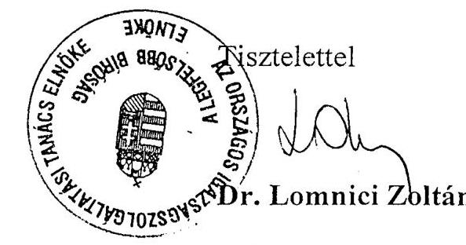

# JELENTÉS 

## a Bíróságok fejezet működésének ellenőrzéséről

---

# 2. Államháztartás Központi Szintjét Ellenőrző Igazgatóság 2.3 Átfogó Ellenőrzési Főcsoport 

Iktatószám: V-3-40/2002.
Témaszám: 591
Vizsgálat-azonosító szám: V0021

## Az ellenőrzést felügyelte:

Bihary Zsigmond
főigazgató
Az ellenőrzés végrehajtásáért felelős:
Hegedűsné dr. Müllern Veronika
főcsoportfőnök
Az ellenőrzést vezette:
Hudik Zoltán
számvevő igazgatóhelyettes
Az összefoglaló jelentést készítették:
Trenovszki István
számvevő tanácsos, főtanácsadó
Dr. Király László
számvevő tanácsos, tanácsadó
Az ellenőrzést végezték:

| Trenovszki István | Maczekó Károly | Korsósné Vígh Andrea |
| :-- | :-- | :-- |
| Számvevő tanácsos, | számvevő tanácsos, | számvevő |
| főtanácsadó | irodavezető |  |
| Dr. Király László | Dr. Telkes Imre | Vásárhelyi Zoltán |
| Számvevő tanácsos, | számvevő tanácsos | számvevő |
| tanácsadó |  |  |
| Domonkosné Kurilla | Tormáné Ivánfi Irén | Nagy Józsefné |
| Edit | számvevő tanácsos | Külső munkatárs |
| Számvevő tanácsos |  |  |
| Kollár Lászlóné |  |  |
| Számvevő tanácsos |  |  |

A témához kapcsolódó eddig készített számvevőszéki jelentések:
Címe
Sorszáma
Jelentés az Igazságügyi Minisztérium fejezet pénzügyi-gazdasági ellenőrzéséről (1995.)
Jelentés a Legfelsőbb Bíróság fejezet pénzügyi-gazdasági ellenőrzéséről (1997.)

---

Jelentés a közbeszerzésekről szóló tv. 1995-96. évi végrehajtásának ellenőrzéséről a központi költségvetési szerveknél és az elkülönített állami pénzalapoknál (1997.) ..... 394
Jelentés a PHARE program helyzetéről Magyarországon (1997.) ..... 402
Jelentés a költségvetési fejezetek jóléti célú kiadásainak és jóléti intézményei működésének pénzügyi-gazdasági utóellenőrzéséről (1999.) ..... 9925
Jelentés a PHARE támogatások felhasználásának vizsgálatáról (2000.) ..... 0042
Jelentés a közbeszerzésekről szóló törvény végrehajtásának ellenőrzéséről (2001.) ..... 0109
Jelentés az Igazságügyi Minisztérium fejezet működésének ellenőrzéséről (2001.) ..... 0110
Jelentés a központi költségvetés területén működő belső kontrollmechanizmusok ellenőrzéséről (2001.) ..... 0115
A zárszámadás és a költségvetési előirányzatok tervezésének ellenőrzése (évente)

---

# TARTALOMJEGYZÉK 

BEVEZETÉS ..... 5
I. ÖSSZEGZŐ MEGÁLLAPÍTÁSOK, KÖVETKEZTETÉSEK, JAVASLATOK ..... 7
II. RÉSZLETES MEGÁLLAPÍTÁSOK ..... 15

1. A Bíróságok fejezet igazgatási felügyeleti tevékenysége ..... 15
1.1. A bíróságok igazgatási struktúrája, az igazgatási tevékenység irányítása, felügyelete ..... 15
1.2. Az OIT Hivatal szerepe a fejezet irányításában, felügyeletében ..... 21
1.3. A felügyeleti költségvetési ellenőrzés és a belső ellenőrzés irányítása ..... 23
1.4. A belső kontrollmechanizmus egyes szabályozási elemeinek alakulása ..... 26
1.5. A bíróságok védelmét szolgáló biztonságpolitika fejezeti irányítása, felügyelete ..... 28
2. A bíróságok fejezet költségvetési gazdálkodásának irányítása, felügyelete ..... 33
2.1. A költségvetési gazdálkodás szabályozottsága ..... 33
2.2. A Bíróságok fejezet költségvetés tervezési információs rendszere, kialakításának célszerűsége, működésének szabályszerűsége, eredményessége ..... 37
2.3. A költségvetés végrehajtási és beszámolási információs rendszer működése ..... 42
2.4. Bíróságok vagyongazdálkodása ..... 46
3. A bírósági informatikai rendszer irányítása ..... 51
3.1. Az informatikai stratégia ..... 51
3.2. Az informatikai tevékenység fejezeti irányítása ..... 54
3.3. Az informatikai beruházások, az infrastruktúra, eszköz- és alkalmazásfejlesztés ..... 55
3.4. A megvalósított informatikai rendszerek működtetése ..... 58
3.5. Az informatikai biztonság ..... 60

Melléklet: az Országos Igazságszolgáltatási Tanács elnökének észrevétele

---

.

---

# RÖVIDÍTÉSEK JEGYZÉKE 

| AB | Alkotmánybíróság |
| :--: | :--: |
| Áht. | az államháztartásról szóló 1992. évi XXXVIII. törvény |
| Ámr. | az államháztartás működési rendjéről szóló 217/1998. (XII. 26.) Korm. Rendelet |
| ANP | Az Európai Unió közösségi vívmányainak átvételéről szóló Nemzeti Program |
| APEH | Adó- és Pénzügyi Ellenőrzési Hivatal |
| ÁSZ | Állami Számvevőszék |
| BGH (GH) | Bírósági Gazdasági Hivatal |
| Bjj. | a bírák jogállásáról és javadalmazásáról szóló 1997. évi LXVII. Törvény |
| BM | Belügyminisztérium és Intézményei |
| Bsz. | a bíróságok szervezetéről és igazgatásáról szóló 1997. évi LXVI. Törvény |
| BÜSz | Bírósági Ügyviteli Szabályzat |
| BV | Büntetés-végrehajtás |
| EU | Európai Unió |
| EURO | Az EU fizetési eszköze 1999. január 1-től |
| Iasz. | az igazságügyi alkalmazottak szolgálati jogviszonyáról szóló 1997. évi LXVIII. törvény |
| IM | Igazságügyi Minisztérium |
| ITB | Informatikai Tárcaközi Bizottság |
| Kbsz. | korábbi Bsz; a bíróságokról szóló 1972. évi IV. törvény |
| Kbt. | Közbeszerzésekről szóló 1995. évi XL. törvény |
| KVI | Kincstári Vagyoni Igazgatóság |
| LB | Legfelsőbb Bíróság |
| LÜ | Legfőbb Ügyészség |
| M Ft | millió forint |
| Mrd Ft | milliárd forint |
| MÁK | Magyar Államkincstár |
| OGY | Országgyűlés |
| OIT | Országos Igazságszolgáltatási Tanács |
| OITH | Országos Igazságszolgáltatási Tanács Hivatala |
| PKKB | Pesti Központi Kerületi Bíróság |
| PHARE | Poland-Hungary Aid for Restructuring the Economy |
| PM | Pénzügyminisztérium |
| SzMSz | Szervezeti és Működési Szabályzat |
| VIR | Vezetői Információs Rendszer |

---

.

---

# JELENTÉS   a Bíróságok fejezet működésének ellenőrzéséről 

## BEVEZETÉS

A bíróságok korábbi - 1995. évben az IM fejezetre, 1997. évben a Legfelsőbb Bíróság fejezetre kiterjedő - átfogó ellenőrzése óta jelentős változások történtek az intézményi struktúrában, igazgatásban és költségvetési gazdálkodásban. A bíróságok szervezetéről és igazgatásáról, a bírák jogállásáról és javadalmazásáról, az igazságügyi alkalmazottak szolgálati jogviszonyáról, valamint az ítélőtáblák székhelyének és illetékességi területének megállapításáról szóló törvények 1997. évi megalkotását követően a bíróságok önálló költségvetési fejezetben gazdálkodnak.

Megalakult az Országos Igazságszolgáltatási Tanács (OIT), amely az önálló hatalmi ág legfelsőbb testületeként ellátja a Bíróságok fejezet igazgatási és fejezeti gazdálkodási döntéshozó és felügyeleti feladatait, megosztva az OIT elnökével. A fejezethez 22 önállóan gazdálkodó költségvetési szerv tartozik (Országos Igazságszolgáltatási Tanács Hivatala, Legfelsőbb Bíróság, fővárosi, megyei bíróságok). A 131 helyi bíróság a megyei bíróságok szervezetébe és költségvetésébe tagozódik. A fejezet részére 2002-ben közel 38 Mrd Ft eredeti kiadási előirányzat állt rendelkezésre, a foglalkoztatottak száma megközelítette a 10 ezer főt.

Az átfogó ellenőrzés a bíróságok igazgatásának 1998-2001. évi működésére, ezen belül az utóbbi két év gazdálkodási folyamataira irányult, illetve a pénzügyi-gazdasági folyamatokat figyelemmel kísértük a helyszíni ellenőrzés lezárásáig, 2002. június végéig.

A jelenlegi átfogó ellenőrzés végrehajtására az Állami Számvevőszékről szóló 1989. évi XXXVIII. törvény 2. § (3) és a 17. § (3) bekezdésében foglaltak adtak jogszabályi alapot.

Az ellenőrzés célja annak értékelése volt, hogy a Bíróságok fejezet 1998. évi megalakulása óta eltelt időszakban hogyan működött:

- a fejezet igazgatási felügyeleti tevékenysége; ezen belül az Országos Igazságszolgáltatási Tanácsnak, illetve Hivatalának irányító szerepe; a felügyeleti költségvetési és belső ellenőrzés irányítása; a belső kontrollmechanizmus és a bíróságok védelmét szolgáló biztonságpolitikai irányítás;
- a fejezet költségvetési gazdálkodása; a költségvetés tervezési, végrehajtási és beszámoltatási rendszere; a fejezet vagyongazdálkodása és mindezeken a területeken hogyan érvényesültek a célszerűség és eredményesség szempontjai;

---

- a fejezet informatikai rendszere, különös tekintettel a bíróságok munkáját és gazdálkodását segítő szerepére, továbbá a megvalósításhoz kapott PHARE támogatás igénybevételére.

Az ellenőrzés alapvetően a Bíróságok igazgatási és gazdasági tevékenységének irányítására, felügyeletére, informatikai, biztonságtechnikai rendszer működésének hatékonyságára koncentrált. Ezen túlmenően az ellenőrzés az Országos Igazságszolgáltatási Tanács fejezeti irányító tevékenységének megvalósulását is áttekintette 6 megyei bíróságnál (Baranya, Békés, Heves, Somogy, Pest Megyei Bíróságok és a Fővárosi Bíróságnál). Az Országos Igazságszolgáltatási Tanács egységesítést célzó irányító tevékenysége mellett is az önállóan gazdálkodó intézményeknél sok egyedi igazgatási és gazdálkodási feladatmegoldás volt tapasztalható. Ezek általánosítható tapasztalatai a javaslataink kialakításánál voltak hasznosíthatók, az egyedi példák a részletes megállapításokat illusztrálják.

A végleges jelentést - az Állami Számvevőszékről szóló 1989. évi XXXVIII. törvény 25. § (1) bekezdésének megfelelően - megküldtük dr. Lomnici Zoltán úrnak, a Legfelsőbb Bíróság és az Országos Igazságszolgáltatási Tanács elnökének. Az elnök úr a jelentésben foglaltakat elfogadta, észrevételt nem tett, továbbá jelezte, hogy a jelentés alapján készített intézkedési tervet a törvényes határidőn belül megküldi az Állami Számvevőszék részére.

---

# I. ÖSSZEGZŐ MEGÁLLAPÍTÁSOK, KÖVETKEZTETÉSEK, JAVASLATOK 

Az 1997. évben a bíróságokat érintő törvénycsomag elfogadásával - az OIT elnökének az Országgyűlés részére első alkalommal benyújtott tájékoztatója szerint - Magyarországon befejeződött a hatalmi ágak szétválasztásának folyamata, megvalósult a bírói hatalom kiteljesedése. Az Országgyűlés - a törvény preambuluma szerint - „az igazságszolgáltatás feladatainak jogállami szintű ellátása, a bírói függetlenség elvének maradéktalan megvalósítása és az ítélkezés egységének biztosítása érdekében" megalkotta a bíróságok szervezetéről és igazgatásáról szóló 1997. évi LXVI. Törvényt (Bsz.). Az elfogadott törvények megváltoztatták a bírósági igazgatás szervezeti kereteit a hatékonyabb munkaszervezés és irányítás érdekében. A törvényi szabályozás azonban a gazdálkodás fejezeti irányítása szempontjából az igazgatás szükséges központosítása arányainak kialakításához nem adott kellő támpontot.

A négyszintű bíráskodást, s ezzel a bonyolultabb ügyekben az ítélkezés és a jogorvoslat megfelelő bírói szinten történő gyakorlását lehetővé tevő ítélőtáblák ügyében a kezdeti lendület megtört. Az 1997. évben hozott törvény 1999. évi módosításával az ítélőtáblák számának csökkentéséről, illetve a fővárosi ítélőtábla működése megkezdésének halasztásáról döntöttek. 2002-ben 4 év kieséssel - eleget téve az Alkotmánybíróság határozatának is - ismét előtérbe került az ítélőtáblák létrehozásának fontossága, melyet az Országgyűlés is megerősített, így az ítélőtáblák 2003-ban az eredeti terveknek megfelelő számban kezdhetik meg az ítélkezést.
1997. december óta a bíróságok egységes igazgatási irányítása a létrehozott Országos Igazságszolgáltatási Tanács (OIT) feladatkörébe került. Számára a bíróságok szervezetéről és igazgatásáról szóló új törvény számos feladatot határozott meg, tagjainak kétharmada a bírák küldöttei által megválasztott bíró. Az OIT önkormányzati jellegű testület, irányítja a bírósági vezetők igazgatási tevékenységét és a működés feltételeit megteremteni hivatott fejezeti gazdálkodást.

Az OIT, megalakulása óta, az igazgatási feladatok egységének megteremtését és hatékonyságának növelését tartotta szem előtt. Az irányítás törvény által biztosított eszközeit - szabályzatok, ajánlások, határozatok - használja, az előterjesztések és a döntések megfelelően dokumentáltak. A hosszabb és rövidebb távú feladatai között megfelelő arányt alakítottak ki. A „napi" feladatok ellátása mellett olyan - a bíróságok munkaszervezésében meghatározó szerepet betöltő - intézkedéseket hoztak, melyek jó alapot biztosítanak a továbblépésre.

A bíróságok igazgatásáról szóló szabályzat a magyar igazságszolgáltatás történetében első ízben szabályozta a bírók munkarendjét, a kötelező tárgyalási napok számát, meghatározta a bírói munka igazgatási ellenőrzésének eszközeit. Annak érdekében, hogy az ítélkezési tevékenység egyes fázisairól folyamatosan részletes adatok álljanak rendelkezésre, az OIT intézkedett az egyéni bírói adatszolgáltatás egységesítéséről. Az így rendelkezésre álló adatok elemzése, a

---

rendszeresített álláshelyek számának, az ügyforgalom mértékének és ezek egymáshoz viszonyított arányának ismerete alapozhatja meg az OIT intézkedéseit a munkateher arányosabb elosztására, a bírói tevékenységek mérési rendszerének kialakítására, végül, de nem utolsó sorban az álláshelyek arányosabb elosztására (akár a jelenleg kedvezőbb helyzetben lévők terhére is) annak érdekében, hogy az egy bíróra háruló munkateher egyes megyék és bírósági szintek közötti eltérései csökkenjenek.

A tartósan távollévő bírák helyettesítését a költségvetési szabályozás jelenleg nem teszi lehetővé, mivel a bírói kinevezések időtartamuk alapján tartós kötelezettségvállalásnak minősülnek. Hosszabb távon egy rugalmas rendszer kialakítása a szabályozás módosításával együttesen a bírói kapacitás növekedését eredményezné többlet költségvetési forrás igénybevétele nélkül.

A jogalkotás folyamatában, a jogszabályok véleményezésében a bíróságokon felhalmozott tudás megfelelő kihasználását akadályozza, hogy a jogalkotási törvény nem veszi figyelembe az OIT megalakulását és testületi jellegét. Így a sürgős véleményezést a
 testület elnöke a saját belátása szerint oldja meg, legtöbbször az OIT Hivatala (Hivatal) igénybevételével. Az igazgatás számos területére az OIT nem alkotott önálló szabályzatot, ezért még IM utasítások vannak hatályban, melyek tartalmukban és szellemükben elavultak.

Az OIT elnökének feladatait a törvény szűkszavúan szabta meg. Az elnök irányítja a Hivatal vezetőjének tevékenységét. A Hivatalt a testület döntéseinek előkészítése és végrehajtása céljából hozta létre a törvény. A testület elnökének irányító tevékenysége a Hivatal által készített előterjesztések tervezetének egyeztetésében, elfogadásában, OIT elé terjesztésében, végül a kiadmányozásban valósult meg. A kialakított irányítási rendnek megfelelően a Hivatal kiemelt szerephez jutott a döntések előkészítésében, de a törvény nem adott részletes eligazítást hatáskörére, kapcsolatrendszerére, a bírósági hierarchiában elfoglalt helyére. Ezzel hozható összefüggésbe, hogy a Hivatal SzMSz-ében, a főosztályok ügyrendjében a feladatok megszabása hiányosan, jog- és hatáskör konkrét meghatározása nélkül történt. Elsődleges a törvényi szabályozás, de ennek hiányában megoldást jelenthet az OIT erre vonatkozó szabályzatának megalkotása is.

A testület felügyeleti ellenőrzést irányító tevékenysége megkésve indult. A hatáskörök tisztázásának időigénye, az OIT SzMSz-e elkészítésének elhúzódása, a Hivatal SzMSz-ének ebből következő késedelmes jóváhagyása vezettek a felügyeleti ellenőrzés két éves kieséséhez.

A felügyeleti ellenőrző szervezet kialakítását követően a helyszíni ellenőrzés lezárásáig elvégzett ellenőrzések és a testület által jóváhagyott középtávú ellenőrzési terv alapján előre vetíthető, hogy mintegy két év szükséges a teljes intézményi kör felügyeleti ellenőrzéssel történő lefedéséhez, az ellenőrzések jogszabályban előírt teljesítéséhez. Az elvégzett ellenőrzéseik tapasztalatai hasznosultak. A fejezetnél a jelentős forgalmat bonyolító letéti számlák ellenőrzését a felügyeleti és a belső ellenőrzés egyaránt jelentőségének megfelelően kezelte. A megállapítások a bíróságok ez irányú tevékenységét összességében pozitívan értékelték, az egyes helyeken tapasztalható elszámolási hiányosságok kijavítására a megyei bíróságok elnökei saját hatáskörükben intézkedtek.

---

A belső ellenőrzés irányítása körében megfelelő hatáskör- és munkamegosztás alakult ki az OIT, illetve a tanács elnöke és az ellenőrző szervezet között. A Bsz. 39. § g) pontja szerint az OIT közvetlenül irányítja a belső ellenőrzést, de a törvény szövegéből nem állapítható meg, hogy csak az OIT, illetve Hivatala, vagy a fejezet egészének belső ellenőrzésére vonatkozik ez a jogkör. A törvénynek az OIT SzMSz-ében megnyilvánuló tágabb értelmezése azonban - miszerint az OIT a költségvetési intézményeinek belső ellenőrzését irányítja -, nincs összhangban a vonatkozó kormányrendelet előírásaival. Ez esetenként hatásköri vitát eredményezett.

Az OIT a költségvetési gazdálkodás irányításában - törvényi előírások alapján - meghatározta, illetve pontosította pénzügyi-gazdasági hatáskörét, valamint a tanács elnökének jogkörét. A pontosításra azért volt szükség, mert a testület önkormányzati jellegéből adódóan másképp látja el felügyeleti feladatát, mint ahogy az az államháztartás központi szintjén (pl. a minisztériumoknál) kialakult. A Bsz.-nek a fejezeti gazdálkodásra vonatkozó előírásai nem konzisztensek a költségvetési gazdálkodást szabályozó jogszabályokkal, így ebben a helyzetben sem a Bsz., sem a vonatkozó kormányrendelet előírásai nem teljesülnek következetesen. A jogszabályi lehetőségeket kihasználva minden területen erősen központosított gazdálkodás folyt a fejezetnél. Ez részben a korábban kialakult egyenlőtlenségek felszámolását célozta, részben a mindvégig szűkös források megfontolt elosztásában játszott szerepet.

Az igazságszolgáltatáshoz és a pártatlan bíráskodáshoz fűződő alkotmányos alapjog érvényesülésének feltétele a bíróságok zavartalan működésének biztosítása. Ezt a működést évente 30-40 alkalommal zavarta meg intézkedést igénylő rendkívüli esemény (pl. bombariadó, személyek fenyegetése stb.), amelyekről a Hivatal Bírósági Igazgatási Főosztálya végzett elemzést és készített rendszeresen tájékoztatót az OIT számára. Az események száma az évek során lassú növekedést mutatott, az elkövetési mód durvulása jellemző. Elkövetési helyeiket tekintve, az események többsége az amúgy is gyengébb biztonsági feltételek között dolgozó helyi bíróságokon következett be.

Az OIT előírta az ítélkezési tevékenység feltételeit biztosító munkaszervezeti egységek között biztonsági szolgálat létesítését, amely a bírósági szervezet részeként vagy külső szervként is működhet. A dologi kiadások között megjelenő vásárolt biztonsági szolgáltatások - melyekre az egyes bíróságok különböző szerződéseket kötnek - teljesítményének megítélését és az egységes költségvetési szempontok érvényesítését szolgálná egy, az átfogó biztonsági koncepcióhoz illeszkedő mintaszerződés, amelyet ajánlásként adhat ki az OIT. A Hivatal vezetői ügyeleti rendszert működtet, ahol a rendkívüli események és az intézkedések jelentésre és dokumentálásra kerülnek. Így a bíróságok felsővezetőinek van információjuk a biztonsági helyzetről. A rendkívüli és egyéb eseményekkel kapcsolatos intézkedésekről szóló 1999. évi 10. szabályzat alapján működtetett papíralapú információs rendszer még nem használhatta ki azokat a lehetőségeket, melyeket a „Justicianet" hálózat biztosította elektronikus levelezés nyújt az információáramlás gyorsításában és az adminisztratív terhelések csökkentésében.

Fejezeti kezelésű felhalmozási előirányzatból biztonságtechnikai eszközök beszerzésére az 1999-2002. években összesen 355 M Ft-ot fordítottak. Ezek hasz-

---

nosságát igazolják az átvizsgált személyeknél talált és a csomagjaikból kiemelt, majd a távozáskor visszaadott veszélyes tárgyak. A rendkívüli események elleni hatékony fellépés lehetőségét korlátozza az, hogy a bírósági szervezet részeként működő biztonsági szolgálat dolgozói fizikai dolgozó besorolású igazságügyi alkalmazottak, akiknek a szervezet adta tekintélyen túl intézkedési lehetőségük nincs. Előrelépést eredményezhet a biztonsági kérdések komplex áttekintése és az egységes szabályozás irányába történő elmozdulás (pl. a beléptetés egységes rendszerének kialakítása). A biztonsági koncepció kidolgozása a helyszíni ellenőrzés időszakában kezdődött meg adatbekéréssel, de értékelhető munkaanyag még nem állt rendelkezésre.

Az OIT a költségvetési tervezés folyamatában felmérte a jogszabályok változásainak várható hatását, kialakította a fejlesztési elképzeléseit. A szakmai és pénzügyi szervezetek jó együttműködése jellemezte a tervező munkát. A testület élt ugyan a költségvetés önálló elkészítésére biztosított jogával, azonban a költségvetési lehetőségeket érdemben a kormányzat határozta meg. A normatív tervezés irányába történő elmozdulás a fejezetnél kezdeti szakaszában tart, a testület - a bíróságok gazdálkodásának független szakértő általi átvilágítását követően - intézkedett a normatív finanszírozási rendszer módszereinek kidolgozására.

A bázisszemléletű tervezés a vonatkozó jogszabályok előírásainak nem mindig következetes alkalmazásával párosulva tette lehetővé a fejezet számára, hogy az 1998-1999. években a bírák és igazságszolgáltatási dolgozók javadalmazására pontatlanul, valamint a Pénzügyminisztérium (PM), illetve a Kormány szándéka szerint többletként tervezett (jóváhagyott) előirányzatokat felhasználhassák a későbbiekben. A többletek az 1999-2000. években alkalmasak voltak a működéshez szűkösen biztosított előirányzatok, valamint a törvény szerint járó juttatás növekmények (pl. a kezdő bírói illetmény összegének emelése, háromévenkénti előresorolás) megszorítások miatt alultervezett fedezetének kiegészítésére. A személyi juttatások előirányzatainak tervezését illetve a gazdálkodást befolyásolja az is, hogy a bírósági eljárásokkal összefüggő egyes juttatások, díjazások éves összege a bírói döntésektől függ. Az egyes évek tervezési hibái a 2002. évre kiegyenlítődtek, ami kedvező feltételt teremt a bíróságok létszámmal és személyi juttatásokkal való gazdálkodásának, illetve nyilvántartásának felülvizsgálatára és a juttatásokat szabályozó törvényekhez jobban igazodó tervezési rendszer kialakítására. A felülvizsgálatban a PM közreműködése - a költségvetési tervezésben viselt felelőssége miatt - nem nélkülözhető.

A fejezet kiadási előirányzata az 1998. évi 24,8 Mrd Ft-ról 2002. évre 37,6 Mrd Ft-ra nőtt, melynek 90%-a költségvetési támogatás, a fennmaradó 10% saját bevétel. A költségvetési kiadások legnagyobb hányadát a személyi juttatások és járulékai képezték, melynek összege 19,4 Mrd Ft-ról 29,2 Mrd Ft-ra emelkedett 2002. évre. A jóváhagyott előirányzatok a működőképességet biztosították, viszont a felújításokat és fejlesztéseket a műszakilag indokoltnál csak alacsonyabb szinten tették lehetővé.

A Bíróságok fejezet - az önállóvá válás óta eltelt időszakban - a Bsz. és a költségvetési gazdálkodásra vonatkozó jogszabályok fő szabályozási elve között meglévő ellentmondás terhe mellett gazdálkodott. Annak ellenére, hogy az OIT 1998-ban belső határozatban intézkedett a pénzügyi-gazdálkodási jogkörök

---

megosztásáról, átfogó szabályozás a fejezetre vonatkozóan sem a testület, sem az elnöke részéről nem történt.

Az újonnan létrejött OIT és Hivatala a lehetőségein belül megpróbált segítséget nyújtani az egységes szemlélet kialakítása érdekében (minta SZMSZ, ajánlott számlarend és szabályzatok, szabályzat tervezetek, a Gazdasági Hivatal (GH) vezetőknek tartott konferenciák stb.). A Hivatal azonban - figyelembe véve, hogy a megyei (fővárosi) bíróságok önállóan gazdálkodó költségvetési szervek - hatás- és jogkör nélkül ennél sokkal többet nem tehetett, például a személyi juttatások, ezen belül a zárolt előirányzatok egységes nyilvántartásának érdekében nem készített útmutatót.

A bíróságok működésével kapcsolatos gazdálkodási és pénzügyi teendőket egy még hatályos, de idejétmúlt, 1971. évi IM utasítás mellett, olykor helyileg sem kellően szabályozott környezetben, esetenként a szokásokra alapozva végezték a megyei (fővárosi) gazdasági hivatalok. Munkájukat ugyan számítógépes programok segítették, azonban ezek kompatibilitási problémák miatt nem tették lehetővé az országos hálózaton keresztül történő adatkommunikációt. Az információáramlás gyengesége, a szabályozás hiányossága, a feladat-, hatás- és jogkörök tisztázatlansága, esetleges emberi mulasztásokkal társulva, együttesen magukban rejtik gazdálkodási problémák kialakulásának lehetőségét.

A veszélyek ellenére a fejezet gazdálkodásában, a feladatok végrehajtásában részt vevő költségvetési szervek együttműködése a vizsgált időszakban folyamatosan javult, összességében kiegyensúlyozott gazdálkodást folytattak. Az előirányzat módosítások általában indokoltak, a felhasználások szabályszerűek voltak. Beszámolási és adatszolgáltatási kötelezettségeinek a fejezet az előírásoknak megfelelően eleget tett.

A vizsgált időszakban a bíróságok eszköz- és technikai ellátottsága korszerűsödött, a rekonstrukciók által érintett épületek állapota javult, egyes esetekben pedig kifejezetten érzékelhető az elhelyezés színvonalának emelkedése. Az időszak elején nagyrészt végrehajtották az ítélőtáblák felállításával kapcsolatos személyzeti és műszaki feladatokat. A megváltozott helyzetben a már elért eredményeket (irodák, eszközök) a bírósági munka színvonalasabb ellátása érdekében használták fel.

A bevételek nagyobb része a független bírák által hozott ítéletekből adódik. Így annak a költségvetés érdekében kívánatos növelése összeférhetetlen a függetlenség alapelvével. Ezért a bevétel mértéke nem írható elő, csak durva közelítéssel prognosztizálható, a ténylegesen befolyó bevétel pedig igen eltérő mértékű.

A fejezetnél a bírói, a humánpolitikai, a gazdasági tevékenységeket támogató informatikai fejlesztéseket a 1998-2000. években elkülönülten, nem egységes rendszerben végezték. A PHARE támogatással 1999-re megvalósított Justicianet hálózat üzembe helyezésével megkezdődött a bírósági informatika hálózatba szervezése, ami szükségessé tette egy egységes stratégiai terv elkészítését. Az ITB ajánlásait figyelembe vevő és ezzel a hazai igazgatási informatikai fejlesztésekhez igazodó stratégiát az OIT 2000. szeptemberi belső határozatával elfogadta. Ezzel tartalmilag teljesült az idevonatkozó, 1999. évben hozott OGY hatá-

---

rozat előírása is. A fejezetnél az informatikai tevékenység irányítását az OIT határozata alapján a Hivatal látja el, melynek keretében módszertani ajánlásokat adott ki, rendszeres értekezleteket és eseti továbbképzéseket tartott.

A 2000-2001. években az elfogadott stratégia alapján fejezeti kezelésű előirányzatból, intézményi beruházásként évi 400 M Ft értékben végrehajtott beruházások eredményeként a bíróságok számítógépes eszközellátottsága javult. Az alkalmazott informatikai rendszerek teljesítményének, a végrehajtott fejlesztések hatékonyságának mérésére még nincs kialakult mutatőrendszer. Az egy bírósági alkalmazottra jutó számítógépek száma (ami az 1998. évi 0,25-ről 2001. végére 0,51-re nőtt) erre nem alkalmas, a felhasználás minőségét jellemzi, hogy a gépek közel 50%-át szövegszerkesztésre használták.

A 2000 szeptemberében aláírt pénzügyi memorandum alapján PHARE támogatással (összesen 8,25 M EUR értékben) 2003. szeptember 30-ig teljesülő projektben az ún. Justicianet-2 hálózat mind a 131 helyi bíróságot érintően biztosíthatja a bírói munka informatikai támogatását. A
 gazdálkodási tevékenységet támogató programok megújításához, valamint egy korszerű vezetői információs rendszer kialakításához pedig technikai feltételt biztosít.

A használatban lévő informatikai rendszerek és programok nagyobb részt közvetlenül a bírói munkát és a gazdálkodási tevékenységet támogatják (53%-ban, illetve 32%-ban), a fennmaradó részben a humánpolitikai tevékenységet segítik és a hálózat-felügyelet, vírusvédelem céljait szolgálják. A fejezet szerint az intézményeknél alkalmazott szoftverek jogtiszták, azonban fejezeti szintű szoftvernyilvántartás hiányában ez átfogóan nem volt ellenőrizhető. A hálózatba szervezett informatikai eszközökkel való gazdálkodás indokolttá teszi az egységes informatikai nyilvántartást, melynek szabályzata tervezet formájában található meg.

Az informatikai biztonsági átvilágítás - annak ellenére, hogy a fejezetnél ennek elvégzésére költségvetési fedezetet különítettek el - nem történt meg. Ezért jelenleg a fejezet nem rendelkezik olyan dokumentummal, ami a biztonsági helyzetet minősíti. Az alkalmazott vírusvédelmi rendszerek, mentési eljárások, az adathozzáférések jelenlegi szabályozottsága nem nyújt elégséges biztonságot. Ezen a területen jelentős áttörést csak a PHARE II. programban megvalósuló hálózat menedzsment, az új információtechnológiák figyelembevételével megújított Bírósági Ügyviteli Szabályzat és a mindkettőt ötvöző biztonsági kézikönyv együttes alkalmazása hozhat.

A helyszíni ellenőrzés megállapításainak hasznosítása mellett javasoljuk:

# az Országos Igazságszolgáltatási Tanácsnak 

1. Kérje fel az igazságügyminisztert
a) a jogalkotási törvény olyan értelmű módosításának kezdeményezésére, mely figyelembe veszi az OIT megalakulását és testületi jellegét a jogszabályok tervezeteinek véleményezése során;

---

b) szabályozási (hatálytalanítási) kötelmei teljesítésére a korábbi IM utasítások vonatkozásában, valamint gondoskodjon az utasítások helyébe lépő szabályzatok kidolgozásáról, kiadásáról;
c) kezdeményezze a belső ellenőrzés szabályozása tekintetében a Bsz. és a vonatkozó kormányrendelet összhangjának megteremtését.
2. Kezdeményezze a pénzügyminiszternél
a) az államháztartás működési rendjéről szóló 217/1998. (XII. 30.) Korm. rend. módosítását a tartósan távollévő bírák álláshelyei egy részének feltöltése érdekében;
b) a személyi juttatások előirányzatainak közös felülvizsgálatát, a javadalmazási törvényekkel és a bírósági eljárás sajátosságaival összhangban álló tervezési és gazdálkodási rendszerének kialakítását;
c) a bíróságok saját bevételeinek felülvizsgálatát a működéssel közvetlenül nem összefüggő bevételek leválasztása céljából, ezek állami bevételként történő kezelését.
3. Gondoskodjon
a) a bírói álláshelyek arányosabb elosztásáról a jelenleg kedvezőbb helyzetben lévő megyei bíróságok terhére is, és ehhez vizsgálja meg a bírói tevékenységek mérési rendszere kialakításának lehetőségét;
b) az általános gazdálkodási szabályzat megalkotásáról, valamint állapítson meg a Hivatal, illetve főosztályai feladataihoz hatásköröket munkájuk hatékonyabb ellátása és számon kérhetősége érdekében.

# az Országos Igazságszolgáltatási Tanács elnökének 

1. Gondoskodjon
a) útmutató kidolgozásáról a gazdasági hivatalok számára a személyi juttatások, ezen belül a zárolt előirányzatok egységes nyilvántartásának kialakítása érdekében;
b) a bíróságok védelmét szolgáló, országosan egységes biztonságpolitika kidolgozásáról, a bírósági épületekbe való beléptetés egységes szabályozásáról; ehhez komplex módon tekintse át a bíróságok biztonságos működtetéséhez kapcsolódó kérdéseket (személy és vagyonbiztonság, tűzbiztonság, informatikai biztonság, ideértve azok számított és becsülhető költségeit, statisztikai számbavételük módját és a szabályzatok szükséges módosítását is);
c) mintaszerződés ajánlásáról a bíróságok számára, amelynek jövőbeni alkalmazásával lehetővé válik a biztonsági és költségvetési szempontok egységes érvényesítése és átfogó értékelése a külső szervként működtetett biztonsági szolgálatoknál;

---

d) a rendkívüli eseményekre vonatkozó eseti jelentések egységes rendszerének kialakításáról, kihasználva a JUSTICIANET hálózat adta elektronikus levelezés lehetőségeit, az adminisztratív terhelés csökkentése és az informáltság egyidejű növelése érdekében;
e) az informatikai nyilvántartás és eszközgazdálkodás egységes rendjének kidolgozásáról a naturális és a számviteli nyilvántartások egyezőségének megteremtése érdekében;
f) az informatikai tevékenység irányítása keretében olyan mutatószámok kidolgozásáról, amelyek mérhetővé teszik a projektek végrehajtásának eredményességét és kihatását a bírói munkavégzésre.
2. Vizsgálja meg:
a) jogszabály módosítás indokoltságát, annak érdekében, hogy a bíróságok biztonságát garantáló intézkedések különféle szervezési megoldások (belső vagy külső biztonsági szolgálat) és biztonságtechnikai eszközök használata esetén egyaránt hatékonyan megtehetők legyenek;
b) a kialakult hálózat és a felhalmozódott adatvagyon informatikai biztonsága kielégíti-e a törvényes követelményeket, azokat integrálja a bíróságok (egységes) biztonságpolitikájába.

---

# II. RÉSZLETES MEGÁLLAPÍTÁSOK 

## 1. A BÍRÓSÁGOK FEJEZET IGAZGATÁSI FELÜGYELETI TEVÉKENYSÉGE

### 1.1. A bíróságok igazgatási struktúrája, az igazgatási tevékenység irányítása, felügyelete

A bíróságok korábbi számvevőszéki ellenőrzéseket (1995. IM; 1997. Legfelsőbb Bíróság) követően elkezdett törvényalkotási lépések eredményeként megvalósult a bírósági reform. Elsődleges célkitűzése a bírói hatalom kiteljesedésének megvalósítása volt. Ezen túl a megalkotott törvények a megelőző években felhalmozódott problémák megoldását is célozták.

A rendszerváltást követően a jogszabályok tömeges változása, a bírák fluktuációja (ezzel párhuzamosan az átlag életkor csökkenése), valamint egyéb tényezők hatására az ügyhátralék folyamatosan, a nehéz ügyek száma pedig az átlagnál is gyorsabban nőtt. Ugyanakkor a bírák jövedelmi helyzete - az OIT értékelése szerint - nem állt arányban a bírói függetlenség követelményeivel. A bírák jogállásáról és javadalmazásáról szóló 1997. évi LXVII. törvény (Bjj.) alapelvként rögzítette, hogy a bírót hivatása méltóságának és felelőssége súlyának megfelelő, függetlenségét biztosító javadalmazás illeti meg.

Az 1990-es évek közepére zavarok mutatkoztak a bíróságok külső igazgatásában (pl. megyei elnökök kinevezése, költségvetési hatásköri viták), valamint a bírói testületek működésében is. Az OIT elnökének első parlamenti tájékoztatójában a történelmi előzményekről szólva állapította meg: „Az igazgatási gyakorlat ... nem tudta megoldani a végrehajtó hatalom általi igazgatás és az igazgatásban részt vevő bírói testületek párhuzamosságából adódó konfliktust. A megoldás a bírói hatalomnak a végrehajtó hatalomtól történő teljes leválasztása és a teljes körű bírósági önigazgatás megteremtése volt."

A háromszintű bírósági szervezet nem engedett kellő mozgásteret a hatáskörök ésszerű telepítésére. A helyi bíróságok bírái kevés gyakorlattal rendelkezve a nehezebb jogi megítélésű ügyeket kevésbé tudták időszerűen intézni, ugyanakkor a Legfelsőbb Bíróság hatásköre és így munkaterhe nem tette/teszi lehetővé, hogy maradéktalanul ellássa a bírói jogalkalmazás egységének biztosításával kapcsolatos alkotmányos feladatát.

Az Alkotmány 1997. évi LIX. törvénnyel történt módosítása kibővítette az igazságszolgáltatási szervezetek körét az ítélőtáblákkal. Az ítélőtáblák székhelyének illetékességi területének megállapításáról szóló 1997. évi LXIX. törvény megállapította az ítélőtáblák székhelyét és illetékességét, valamint meghatározta működésük megkezdésének időpontját.

A törvény 1999. január 1-jétől három (Budapest, Pécs, Szeged), legkésőbb 2003. január 1-jéig újabb két ítélőtábla létesítését rendelte el (Győr, Debrecen).

Az ítélőtáblák azonban még ma sem működnek, az előkészítő tevékenységet felfüggesztették, mivel 1998. végén az Országgyűlés ezt a törvényt hatályon kívül helyezte. (1998. évi LXXI. tv.)

---

A Kormány indoklásában arra hivatkozott, hogy az ítélőtáblákra többnyire nem a Legfelsőbb Bíróságról, hanem az alacsonyabb szintű bíróságokról jelentkeztek a pályázók, valamint a szükséges létszám, eszköz és épület igény felmérésével sem volt elégedett. Ezzel egyidejűleg az OGY - a 80/1998. (XII. 16.) OGY határozatban felkérte a Kormányt, hogy az Országos Igazságszolgáltatási Tanács (OIT) és a legfőbb ügyész bevonásával vizsgálja meg, hogy az ítélőtáblák és a fellebbviteli főügyészségek felállításának feltételei mikor és hogyan biztosíthatók, majd 1999. 06. 30-ig a Kormány nyújtson be erre irányuló törvényjavaslatot.

Az 1999-ben megalkotott újabb (1999. évi CX.) törvény már csak egyetlen országos (budapesti székhelyű) ítélőtábla létrehozásáról döntött, de ez (mivel több ítélőtábláról szól) nem volt összhangban az Alkotmánnyal, holott erre a követelményre a 80/1998. (XII. 16.) OGY határozat az ítélőtáblák és fellebbviteli főügyészségek felállításával kapcsolatos feladatokról külön is felhívta a Kormány figyelmét. Az alkotmányellenes helyzet megszüntetésére az Alkotmánybíróság által szabott határidőn belül, 2002. július 9-én megalkotta az Országgyűlés a 2002. évi XXII. törvényt, mely szerint 2003. január 1-jén három, 2004-ben pedig újabb kettő ítélőtábla létesül.

A bíróságok igazgatásának feladatait, a hatásköröket és a szervezetrendszert 1997. október 1. óta az 1997. évi LXVI. törvény (Bsz.) szabályozza.

Összhangban az Alkotmánybíróság egyes határozataiban megfogalmazott szervezeti autonómia és önkormányzat gondolatával az igazgatás olyan szabályozási rendszerét alakították ki, amely a politikailag semleges bírói hatalmat elkülöníti a törvényhozó és a végrehajtó hatalomtól. A törvény az igazságügy miniszternek a bíróságok igazgatásával kapcsolatos jogosítványait megszüntette és a bíróságok igazgatására létrehozta az OIT-ot.

A bíróságok szervezetének törvényi újraszabályozásával a bíróságok igazgatása jelentősen megváltozott. A korábbi külső igazgatás belső igazgatássá vált, s ez az igazgatás valamennyi résztvevőjének szerepét átértékelte. Megváltozott a bírósági vezetők igazgatási tevékenységének elvi alapja, terjedelme és eszköztára.

Az OIT tagjainak kétharmadát (9 főt) a bíróságok küldöttértekezletén választják. Egyharmaduk hivatalból tag: az igazságügy-miniszter, az Ügyvédi Kamara elnöke, az Országgyűlés két bizottságának kijelölt tagja és a legfőbb ügyész.

Az OIT tagok megválasztása, a törvényben előírt határidőre megtörtént, a tanács 1997. december 1-jén megkezdte működését. 1998. február 1-jét megelőzően az IM látta el az OIT tevékenységét segítő adminisztratív feladatokat, azt követően a törvény alapján az erre a feladatra létrehozott Hivatal.

Az OIT a bíróságok igazgatása keretében a Bsz. 39. §-ban meghatározott számos feladatának ellátása során az igazgatási feladatok egységességét és hatékonyságának folyamatos növelését tartotta szem előtt. Az első évben, 1998-ban a működés előzmények nélküli feltételeinek kialakítása, a törvények értelmezése, az igazgatás stratégiájának és módszereinek kidolgozása zajlott. A konkrét intézkedéseket - megfelelő elméleti megalapozást követően - 1999-ben kezdték meg. Feladatai ellátása érdekében a Bsz. szabályzatok, ajánlások és határozatok megalkotására hatalmazta fel az OIT-ot. Az irányítás ezen eszközeit az elérendő célok érdekében megfelelő arányban használták fel.

---

Az OIT az 1999. év 1. sz. szabályzatként fogadta el saját SzMSz-ét. A szabályzatok megalkotásán és az eseti döntéseken túl a tanács igazgatási hatáskörében ajánlásokat fogadott el, melyekkel elősegítette a bíróságok elnökeinek szabályozó munkáját, az egyforma vagy hasonló feladatok egységes szempontok szerinti szabályozását (pl. titokvédelmi szabályzat, SzMSz-minta, bírósági könyvtárak SzMSz-e). Ezen túl egyes jogszabályok, szabályzatok egységes végrehajtása céljából is készített az OIT ajánlásokat (pl. a nyári és téli tárgyalási szünet egységesítéséről).

A bírósági vezetők igazgatási feladatait részletesen meghatározta az OIT 1999. évi 9. számú, a bíróságok igazgatásáról szóló szabályzat. Ez írta elő a megyei elnökök részére - többek között -, hogy az évenkénti összbírói értekezlet részére készített (a Bsz. 63.§ k) pontjában előírt) tájékoztató felhasználásával az OIT felé is számoljanak be a megyei bíróság működéséről, illetve igazgatási tevékenységükről. A beszámolókról a Hivatal összegző véleményt ad az OIT részére. A beszámoló elfogadásáról szóló határozatban az OIT szükség esetén felhívja a megyei elnök figyelmét a legfontosabb jövőbeni teendőire.

Az OIT-ot a törvény nem hatalmazta fel közvetlen utasítási jogkörrel, viszont határozatot hoz és annak megtartását ellenőrzi. Az ellenőrzés eredménye után a határozatban foglalt feladatok nem teljesítése esetén fegyelmi eljárást kezdeményezhet az OIT. A kinevező a bírósági vezető igazgatási tevékenységét bármikor megvizsgálhatja. A vezető alkalmatlanságának megállapítása esetén a vezetőt vezetői tisztségéből azonnal felmenti.

Az igazgatási szabályzat - első ízben a magyar igazságszolgáltatás történetében - szabályozta a bírák munkarendjét, éves viszonylatban előírta a tárgyalási napok minimális számát. Ugyanakkor valamennyi bírósági vezető számára előírta (folyamatos kötelezettségként) a bírói munka igazgatási ellenőrzését.

Az OIT felismerte, hogy az igazgatásnak és az igazgatás ellenőrzésének fontos feltétele az, hogy az ítélkezési tevékenység egyes fázisairól folyamatosan adatok álljanak rendelkezésre. Ennek biztosítására 1999. év végén intézkedett az egyéni bírói adatszolgáltatás egységesítésére. A havonkénti igazgatási adatszolgáltatás alkalmas a bírói munkateljesítmény és munkateher folyamatos figyelemmel kísérésére,
 a perek előkészítésének, a tárgyalások kitűzési gyakorlatának megismerésére, a tárgyalási napok kihasználtságának megállapítására és az ügyek elhúzódása okainak felderítésére. A mindenki számára megterhelő többletmunka (mely 2000. január 1-jén kezdődött), az OIT elnökének 2001. évi beszámolója szerint 2001. évre elérte a kívánt hatást, a bírák tevékenységében pozitív változások voltak tapasztalhatók, amit az adatszolgáltatás támaszt alá.

Az adatszolgáltatás folyamatos elemzésével az OIT megállapította, hogy a bírák teljesítménye nőtt ugyan, de még mindig jelentős különbségek vannak az egy bíróra háruló munkateher szempontjából. Az aránytalanságok csökkentése érdekében 2000-ig az arányosabb létszám-elosztást szorgalmazta az OIT. A Hivatal már 1998-ban tájékoztatta az OIT-ot a bíróságok engedélyezett létszámának felméréséről az ügyérkezés tükrében. A Hivatal akkori bírósági igazgatási főosztályvezetője szerint a tényleges létszámra vetített munkateher felmérése lesz az alapja a bírói létszám elosztására vonatkozó koncepciónak és a bírói tevékenység mérése rendszerének. A havi bírói adatszolgáltatást a Hivatal fel-

---

dolgozza és az országos és megyei adatokat megküldi valamennyi bíróság részére.

A megyei elnökök összbírói tájékoztatójának véleményezése során a Hivatal az átlagos munkateljesítményt el nem érő megyéknél kimutatja az elmaradást és elemzi azokat az okokat, melyek ehhez az eredményhez vezettek. Nincs azonban - sem előre meghirdetett, sem utólag alkalmazott - következménye a megyei bíróság teljesítménye elmaradásának az országos átlagtól. Az OIT elnöke a 2000. évi tájékoztatójában arról számolt be, hogy az OIT az adatok elemzésével megállapította, hogy a bíróságokon „a rendszeresített bírói álláshelyek száma nem minden bíróságon igazodik kellően az ügyforgalom által indokolt mértékhez." Ezért az OIT 2001. év első felében megvizsgálta a bírói létszám átcsoportosításának lehetőségeit, de a problémát a jogi szabályozás és az ügyforgalom miatt 2001. évben nem tudta megoldani. 2002. év elején a különösen kedvező feltételek között dolgozó Somogy megyei Bíróság elnöke tájékoztatójának megtárgyalásához kapcsolódva az OIT ismét megerősítette a feladat súlyát és a megoldás szükségességét. Megoldás hiányában az OIT konzerválja az általa is elismert aránytalanságot. A munkateher arányosítását sürgeti az állampolgárok törvény előtti egyenlősége követelményének érvényesítése.

Az OIT személyügyi jogkörét a törvények szerint gyakorolja. Az OIT kinevezési jogkörébe tartozó egyes vezetői munkakörökhöz előírt feltételek pontosítását is a tanács magának tarja fenn, s valamennyi, hatáskörébe tartozó személyi kérdésben önálló határozatot hoz.

A bírói pálya presztízsének emelkedése és az egyéb jogi pályákon a túlképzésből származó kínálati munkaerő-piaci helyzet alapján a bírói helyek feltöltésének ma már alapvetően csak technikai akadálya van; a megüresedett hely pályáztatásának időigénye. Megoldatlan a tartósan távollévő bírák helyettesítése a költségvetési szabályozás miatt. 2001. december 31-én 143 bíró volt tartósan távol, 2002. április 30-án 166 bíró. (Ez a szám megfelel két közepes megyei bíróság teljes rendszeresített bírói létszámának). Helyettük jelenleg nem kerülhet sor bíró felvételére, mivel az olyan tartós kötelezettségnek számít, amelyet a 217/1998. (XII. 30.) Korm. rend. (továbbiakban: Ámr.) 59. § (7) bek. tilt.

A Bjt. szerint bíró kinevezése első alkalommal három évre, egyéb esetben határozatlan időre szól, viszont a 3 év leteltével joga van további kinevezését kérni.

Tekintettel arra, hogy ez a probléma ilyen mértékben az államháztartás más területein nem jelentkezik, célszerű és indokolt lehet a hivatkozott kormányrendelet előírásának olyan értelmű módosítása, ami lehetővé tenné a tartósan távollévő bírák 50-70%-ának megfelelő bírói létszám kinevezését. A bírói pálya elnőiesedése és a szülésre irányuló igény tartós fennmaradása biztosítja a folyamatosan gyesen, gyeden lévők minimális létszámát, így a váratlanul ismét munkába álló bíró személyi juttatásának fedezete rendelkezésre állna.

Az OIT a jogalkotás folyamatában számos előterjesztést véleményez. A véleményt kérő szervek rövid határidővel kérnek véleményt. Az előterjesztőket a jogalkotásról szóló törvény nem kötelezi az OIT esetén hosszabb határidő megszabására, nem veszi figyelembe annak megalakulását és testületi jellegét. A havonkénti ülésezés miatt az OIT felhatalmazta elnökét, hogy esetenként el-

---

döntse, milyen módon készíti el a véleményt. Sürgős esetekben a Hivatala készíti elő az elnök számára a tervezetek véleményezését.

Az OIT elnöke eddigi valamennyi beszámolójában javasolta az Országgyűlésnek a jogalkotásról szóló 1987. évi XI. tv. olyan módosítását, mely az OIT-ot a jogalkotási folyamatba, az egyeztetés rendjébe szervesen beillesztené, törvény módosítását azonban az arra jogosultak nem kezdeményezték.

A Bsz. 106. § előírta az igazságügy-miniszter részére, hogy a bíróságokra vonatkozó IM rendeleteket egy éven belül köteles felülvizsgálni és azokat módosítani vagy hatályon kívül helyezni. A rendeletek felülvizsgálata megtörtént. A törvény azonban nem szólt a bíróságok tevékenységét szabályozó miniszteri utasításokról. Ezek felülvizsgálatát az igazságügy-miniszter teljes körűen azóta sem végezte el.

A tanácsnak az utasítások által korábban szabályozott tevékenységeket áttekintve - függetlenül a hatálytalanítás elmaradásától - OIT szabályzatokat kellett volna kiadnia, az állampolgárok jogait és kötelességét érintő kérdésekben pedig az IM-nek kellene rendelkeznie.

Még ma is hatályban vannak 25-30 éves IM utasítások, mint pl. a 13/1953. (IK. 17.) IM-KPM-BM együttes utasítás a hivatalos iratok kézbesítésének egyszerüsítéséről szóló 43/1953. (VIII. 20.) MT rendelet végrehajtásáról; a 113/1974. (IK. 8.) IM utasítás a bírósági statisztikai szabályzatról. A bíróságok ügyviteli szabályairól szóló 123/1973. (I.K. 1974. 1.) IM utasítást a 14/2002. (VIII. 1.) IM rendelet helyezi hatályon kívül 2003. július 1-jétől, ugyanakkor a részletkérdésekre vonatkozóan OIT szabályzat készült.
2001. év elején a Pénzügyi Ellenőrzési Önálló Osztály - a fejezeti ellenőrzés szervezete - a 2000. évi tevékenységéről készült beszámolóban is felhívta a tanács figyelmét erre a problémára, az ekkor hozott 2001/37. (III. 7.) sz. belső határozat 6. pontjában az OIT felkérte az igazságügyminisztert, hogy kezdje meg a bíróságok gazdasági feladatait érintő, illetve ügyviteli rendjét szabályozó IM rendeletek és utasítások felülvizsgálatát és korszerűsítését.

A tanács kidolgozta, majd a 47/1999. (V. 5.) OIT határozattal elfogadta a bíróságok szervezeti és működési szabályzatának alapelveit, annak legfontosabb tartalmi és szerkezeti elemeit. Ezzel egységes alapra helyezte a bíróságok igazgatásának működését. A megyei bíróságok SzMSz-einek kidolgozását mintaszabályzattal segítették. A kidolgozott SzMSz-eket az OIT hagyta jóvá 2000. I. félévében.

Az ÁSZ által kijelölt megyei bíróságokon végzett ellenőrzések során megállapítást nyert, hogy az 1999. év végéig kidolgozott tervezeteket az OIT Hivatala 2000. év elején felülvizsgálta, majd az általa indokoltnak tartott hiánypótlásra felkérte a megyei elnököket. Megállapítható, hogy az OIT az alapelvek meghatározásával és a mintaszabályzat kiadásával megfelelő iránymutatást adott a megyei bíróságok elnökei számára az SzMSz-ek elkészítéséhez, az egységességhez és az azonos értelmezéshez. 2001. év végén az OIT alapelveinek megfelelően az indokolt változásokat átvezették, a módosított SzMSz-eket a tanács 2002. év I. félévében jóváhagyta.

---

Az OIT igazgatást szabályozó tevékenységére 2001-ben a korábban már megalkotott szabályzatok pontosítása, finomítása volt jellemző. A Bsz. hatálybalépése óta eltelt időszak tapasztalatai azt igazolták, hogy az OIT, mint testület alkalmas a Bsz. 39. §-ban megfogalmazott klasszikus igazgatási feladatai ellátására, azt a Hivatal döntés-előkészítő munkájának köszönhetően alkotó módon tudta ellátni.

A Bsz.-ben meghatározott klasszikus igazgatási feladatok mellett a fejezet költségvetésének elkészítését, illetve a fejezet gazdálkodásával kapcsolatos feladatokat szabta meg a törvény az OIT számára. A fejezet felügyeleti szerve tehát eltérően az államháztartás többi fejezetétől - egy önkormányzati jellegű, havonta ülésező testület, ami esetenként hátráltatja az ügyek intézését, valamint megakadályozza a jogkörök ésszerű telepítését a hivatali szervezet különböző szintjeire.

Az OIT elnöke a Legfelsőbb Bíróság mindenkori elnöke. Jogkörét és feladatait a Bsz. meghatározza. Összehívja és vezeti az OIT üléseit, aláírja a döntéseket, irányítja a Hivatal vezetőjének tevékenységét. A tanács egyik határozata szerint előterjesztést annak elnöke és tagja vihet az ülésre, (amit később az OIT SzMSz-e is rögzített) a Hivatalvezető pedig tájékoztatja az OIT-ot. Az előterjesztés tervezete is a Hivatalban készül, azonban az elnök irányító tevékenysége az előterjesztés tervezet egyeztetésével, elfogadásával, illetve annak aláírásával realizálódik.

Az elnök ellátja a törvényben meghatározott feladatait: irányítja a fejezet felügyeleti pénzügyi ellenőrzését, valamint a fejezet vezetője számára az Áht-ban és más jogszabályokban előírt feladatokat. A Bsz-ben az igazgatás fogalmának meghatározása nem történt meg. Az egységes fejezeti gazdálkodás megvalósítása érdekében az OIT és annak elnöke (aki a Legfelsőbb Bíróság mindenkori elnöke) a megyei bíróságokat, az OIT Hivatalát és a Legfelsőbb Bíróságot egységesen kezeli, ami a Bsz-ből közvetlenül nem származtatható. A Bsz. 39. § a) pontja szerinti, az OIT kinevezési hatáskörébe tartozó bírósági elnökök igazgatási tevékenységére vonatkozó irányító-ellenőrző jogkör ezen értelmezés szerint nem terjedne ki a Legfelsőbb Bíróság elnökének tevékenységére, így a Legfelsőbb Bíróság költségvetési gazdálkodásának irányítására sem. Ez azonban ütközne az egységes költségvetési fejezet megalkotására vonatkozó törvényi szándékkal.

Az OIT által is érzékelt ellentmondást úgy oldották fel, hogy az egységes feladatszabásra, vagy a juttatások egységes szempontok szerinti megítéléséről szóló döntések a Legfelsőbb Bíróságra is vonatkoztak, így a Legfelsőbb Bíróság pénzügyi-gazdálkodási feladatait érintően teljes mértékben jogszerű az OIT irányító hatásköre.

Az OIT elnöke évente elkészíti a Bsz.-ben előírt tájékoztatóját az Országgyűlés részére. Az 1998. évi tevékenységről készült beszámolót az Országgyűlés 1999. decemberben megtárgyalta, a következő években az Országgyűlés Alkotmányügyi Bizottsága tárgyalta meg és elfogadásra javasolta az Országgyűlés számára (ezeket azonban az Országgyűlés nem tárgyalta). Az elkészült tájékoztatók tartalmasak, jó áttekintést adnak mind a bíróságok helyzetéről, mind az OIT igazgatási tevékenységéről, annak eredményeiről és a megoldandó

---

problémákról. A beszámoló minden évben megjelenik, mint a Bírósági Közlöny melléklete és eljut valamennyi bíróhoz is.

# 1.2. Az OIT Hivatal szerepe a fejezet irányításában, felügyeletében 

A Bsz. 51. §-a a Hivatalt az OIT döntéseinek előkészítésére és végrehajtására hozta létre, illetve hatalmazta fel. Ugyanakkor más jogszabályokból adódó igazgatási feladatok (pl. költségvetési törvények) végrehajtására már nem adott jog- és hatáskört. A Hivatal költségvetését, létszámát, szervezeti felépítését, a szervezeti egységek részletes feladatait, 1998. február 4-én fogadta el az OIT.

A Hivatal induló létszáma 99 fő volt. 2002. év elején az engedélyezett létszámkeret 132 fő, azonban ez sem elegendő a megnövekedett feladatokra. Pl. a Fejezeti Költségvetési Főosztály jelenleg is az induló 7 fős létszámával látja el feladatait. Az akkori szervezeti elképzelés a későbbi SzMSz-ben csak minimálisan változott. A részletes feladatokat a februári előterjesztés mellékleteként bemutatott munkaköri leírások tartalmazták.

A Hivatal részletes feladatait az OIT alakította ki határozataiban és az általa elfogadott szabályzatokban. A Hivatal feladatainak végső formába öntése az SzMSz-ben történt meg, melyet az OIT SzMSz-ének - többszöri egyeztetését, átdolgozását követő, 1999. év eleji - elfogadása után, 1999. IV. 7-i ülésén hozott 37/1999. (IV. 7.) OIT határozattal hagyta jóvá az OIT és tette közzé.

A Hivatal fennállása óta feszültség forrása az, hogy a Bsz.-ben az OIT Hivataláról csak néhány szakasz szól, azok többsége is a Hivatal vezetőjéről.

Az 55. § lényegében csak a Hivatal fogalmát határozza meg, viszont semmilyen eligazítást nem ad működésére, hatáskörére, felépítésére, kapcsolatrendszerére, a bírósági szervezet
 hierarchiájában elfoglalt helyére.

Alapvetően az okozza a problémát, hogy az OIT testület, tehát nem tud úgy működni, mint pl. egy minisztérium, ahol a hatásköröket a különböző vezetési szintekre lehet delegálni, pl. úgy, hogy a döntési jogkör a legtöbb információval rendelkező személyhez kerüljön.

A Hivatalban végeznek olyan feladatokat, mint egy minisztériumban, azonban a döntés-előkészítésen túl nincs felhatalmazva a Hivatal érdemi döntésekre, az OIT határozatok végrehajtásában pedig a szerepük elvileg ügyviteli tevékenységre terjedhetne ki. A valóságban, elsősorban gazdálkodási területen, ennél többet végeznek felhatalmazás nélkül (pl. szakmai irányítás, adatbekérés, létesítményfelelősi feladatok, számlák záradékolása stb.)

Ellenőrzésünk azt tapasztalta, hogy még hiányoznak a fejezeti gazdálkodást segítő olyan szabályozók, melyek a Hivatal főosztályainak és a megyei bíróságoknak a kapcsolatrendszerét, a tevékenységek és a felelősség egyértelmű meghatározását rendeznék részben a Hivatal SzMSz-ében, részben önálló szabályzatban. Pl. a közbeszerzési eljárásokban, illetve a felújítások, beruházások szerződéseinek, számláinak záradékolásában.

---

A Hivatalra vonatkozó törvényi szabályozás szűkössége és a Hivatal hatáskörének hiánya esetenként lassítja az előkészítést és a végrehajtás folyamatát.
1999. áprilisban az OIT Hivatal SzMSz-ének jóváhagyását követően a főosztályok elkészítették ügyrendjüket, melyeket a főosztályvezetők írtak alá, a hivatalvezető pedig jóváhagyta azokat. Az SzMSz melléklete ajánlást (mintát) tartalmazott a főosztályok ügyrendjéhez, melyet felhasználva készültek el a konkrét ügyrendek. Ennél fogva azok meglehetősen egyformák, viszont a felelősséget - hatáskör hiányában - nem tartalmazzák megfelelően.

Pl. a Műszaki Főosztály a megyei bíróságok felé felelősöket jelöl ki, de azt nem határozták meg sem az ügyrendben, sem a munkaköri leírásokban, hogy felelősségük hogyan viszonyul az általuk végzett tevékenységekhez (szerződések ellenjegyzése, számlák záradékolása, részvétel vagy tanácsadás a közbeszerzési eljárásokban stb.)

A Hivatal 1998-ban éves munkatervet készített, majd 1999. óta féléves munkatervek készülnek, melyekben főosztályonként összegyűjtik a várható, illetve a Hivatalvezető és az OIT döntései alapján meghatározott feladatokat. A feladatok tervezését 2002-től ún. irodaprogram segíti.

Az OIT megalakulását követően, felhatalmazása alapján a Hivatal megszervezte a Bírósági Közlöny kiadását. A költségeket a Hivatal tervezi és fizeti, s ezzel a közlönyt valamennyi bíró számára biztosítja. Az OIT belső határozatait a Hivatalban hozzáférhető módon összegyűjtve adja ki a Hivatal Titkársága. A belső határozatok ilyen gyűjteményes megjelenítésének használhatóságát korlátozza, hogy egyes határozatok csak az előterjesztésre hivatkoznak, s az a gyűjteményben nem olvasható. A külső határozatokat a Bírósági Közlönyben a Hivatal közzéteszi.

Az OIT-ot, illetve annak elnökét a fejezeti gazdálkodásban a Hivatal három főosztálya segíti. Az SzMSz-ben hatás- és jogköreik nincsenek megfogalmazva, csak a feladatköreik. Eszerint a Műszaki Főosztály az ingatlanokkal és beruházásokkal, felújításokkal foglalkozik, a Személyzeti és Oktatási Főosztály a személyi juttatásokkal és létszámokkal kapcsolatos feladatokat látja el, ideértve az intézmények elemi költségvetésének megállapításával és végrehajtásával kapcsolatos feladatokat is.

A feladat nagyságrendjéhez képest a Személyzeti Főosztályon ezzel foglalkozó osztályvezető és munkatársa helyettesítése nincs megoldva, célszerű lenne egy munkatárs felvétele és betanítása erre a feladatra. Ezzel megoldható lenne az is, hogy az osztályvezető a gazdasági hivatalok ez irányú feladatait a helyszínen, személyesen is tudja segíteni, valamint a felügyeleti ellenőrzésekben is részt tudna venni esetenként.

A Költségvetési Fejezeti Főosztályon is hasonló a helyzet. Munkájukat a más minisztériumi fejezeti főosztályokhoz hasonló tervezési, egyeztetési, számviteli, beszámolási, nyilvántartási feladatok határozzák meg, azzal a többlet feladattal, hogy nem egyetlen vezetőt (pl. minisztert) kell döntési helyzetbe hoznia, hanem a havonta ülésező OIT-ot.

A költségvetési gazdálkodás egyre bonyolultabb feladatainak ellátásához az 1998. óta biztosított 7 fős létszám változatlansága azt eredményezi, hogy a mun-

---

katársak folyamatosan munkacsúcson dolgoznak, nem tudnak közvetlen, személyes kapcsolatot tartani a megyei bíróságok gazdasági hivatalainak vezetőivel, valamint az önképzésben is elmaradás mutatkozik. Célszerű lenne esetenként a felügyeleti átfogó ellenőrzésben is részt venniük a két főosztály összehangoltabb, jobb együttműködése érdekében.

Célszerű lenne továbbá egy költségvetési gazdálkodásban jártas, elméleti (szabályozó) munkára is alkalmas munkatárs felvétele is, az eddigi gyakorlat szerinti a szóbeli eseti eligazítások helyett írásban is szabályozott „irányító" feladatok elvégzésére illetve a főosztályvezető ilyen irányú munkájának segítésére. Létszámbővítés esetén célszerű lenne, ha a Pénzügyi Ellenőrzési Önálló Osztály által kezdeményezett, a gazdálkodás átfogó átvilágításában a Költségvetési Fejezeti Főosztály átvenné a vezető szerepet, természetesen továbbra is támaszkodna a helyszíni ellenőrzési tapasztalatokkal rendelkező ellenőrökre.

A fejezeti gazdálkodás döntési mechanizmusában a Hivatal kiemelt szerepet játszik. Betölti törvényben megfogalmazott szerepét: az OIT döntéseinek előkészítését. A hivatalvezető irányításával az adott témában illetékes főosztályok kidolgozzák az előterjesztést, melynek során egymással folyamatosan együttműködnek. A tanács üléseken az előkészítést végző főosztályok vezetői is részt vesznek a Hivatalvezető mellett.

Az ellenőrzött időszakban az OIT és Hivatala döntéseinek, törekvéseinek célpontjában a bíróságok működése személyi és tárgyi feltételeinek biztosítása állt. A bíróságok működőképessége a vizsgált időszakban mindvégig biztosítva volt.

# 1.3. A felügyeleti költségvetési ellenőrzés és a belső ellenőrzés irányítása 

A felügyeleti költségvetési ellenőrzési tevékenység a fejezetnél jelentős késéssel indult. A Bsz. 39. § g., pontja szerint az OIT közvetlenül irányítja a bírósági fejezet felügyeleti pénzügyi ellenőrzését és a belső ellenőrzést. 1998-ban - annak ellenére, hogy a Hivatal vezetője által az OIT 1998. februári ülésére a Hivatal részletes költségvetéséről készített előterjesztésben már szerepelt Ellenőrzési Osztály 3 fővel - a felügyeleti ellenőrzés megkezdésére nem történt intézkedés.

Az ellenőrzési osztály beindításához az OIT SzMSz-ének 1999. év eleji elfogadása teremtette meg az elvi alapokat, mivel ebben a tanács megnevezte ellenőrzési szervezetét, meghatározta feladatait, az irányítási eszközeit, és azokat a jogköröket, melyeket magának tart fenn.
1999. áprilisban a vezetői és munkatársi állásokra vonatkozó pályázati feltételek meghatározásával megkezdődött a személyi feltételek megteremtése. Az ellenőrzési munka decemberben indult meg az osztályvezető kinevezésével, így gyakorlatilag 2 teljes év kiesett a felügyeleti ellenőrzésből. Az osztály munkáját éves tervek alapján végzi, melyet az SzMSz szerint az OIT hagy jóvá. Munkájáról évente beszámol a tanácsnak. A beszámolók alkalmával az OIT rendszeresen elfogadta a végzett munkát, illetve az arról készített beszámolót, s egyúttal ahhoz kapcsolódóan feladatokat is szabott az osztály, illetve a Hivatal részére.

---

Az osztály rendelkezik az OIT elnöke által jóváhagyott ügyrenddel, mely megfelelően tartalmazza az osztály működésének alapvető feladatait, módszereit, hatáskörét. Melléklete a dolgozók munkaköri leírásai, melyek szintén helyesen tartalmazzák a feladatokat, helyettesítést, jogszabályi hivatkozásokat. Az osztály létszáma és ezzel párhuzamosan teljesítménye folyamatosan növekedett.

Pl. az elmúlt két és fél évben. 2000. évben 1 átfogó ellenőrzést és 2 célvizsgálatot tartottak, 2001-ben 2 átfogó, 1 utóellenőrzést és 1 célellenőrzést végeztek. 2002-re már 6 megyei bíróságnál terveznek átfogó ellenőrzést és 1 utóellenőrzést. Az OIT 2001. július 4.-i ülésén a Hivatal vezetője bemutatta a Pénzügyi Ellenőrzési Önálló Osztály középtávú ellenőrzési feladatait és a létszám 2 fővel történő emelésére tett javaslatot. Az intézmények ellenőrzésének optimális, évek közötti elosztása mellett is vannak olyanok, ahova csak 7-8 év után jut el a felügyeleti ellenőrzés. 2004. lesz az első olyan év, amikor el lehet mondani, hogy valamennyi intézménynél legalább egyszer már végzett átfogó ellenőrzést az OIT.

Pl. a Legfelsőbb Bíróság átfogó ellenőrzésére az OIT létrehozása óta eltelt időszakban nem került sor, és a 2002. évi ellenőrzési tervben sem szerepel.

A felügyeleti ellenőrzés tapasztalatai hasznosulnak. Az ellenőrzött szervezeteknek a megállapítások kijavítását célzó feladatokat javasolnak, a megyei bírósági elnökök az alapján intézkedési tervet dolgoznak ki. Az osztály azt átvizsgálja, és szükség esetén annak kiegészítését kéri.
2001. év elején az előző évi tapasztalatok alapján az osztály a következő 3 évben a gazdálkodás valamennyi területének áttekintését javasolta. Ebben szerepeltek folyamatosan végzendő feladatok: a költségvetés tervezési és beszámolási rendszerének áttekintése, valamint a belső ellenőrzés szabályozottsága, egységes gyakorlat kialakítása céljából. Az eseti feladatokat féléves ütemezéssel, a GH vezetők és a belső ellenőrök bevonásával képzelték el.

Mivel a végrehajtás konkrét módszerét az OIT nem hagyta jóvá, egyes megyei elnökök megtagadták a belső ellenőrök részvételét a feladat végrehajtásában, mások az összegyűjtött táblázatokat nem engedték továbbítani. A jövőben, a hasonló problémák elkerülése érdekében a feladatszabást az OIT határozatában kell konkrétan megfogalmazni, valamint OIT szabályzatban is indokolt megfogalmazni a belső ellenőrök bevonásának lehetőségét.

Az OIT Hivatal SzMSz-ének Pü. Ell. Ö. Osztályról szóló 30. §-a többször is említ „belső ellenőrzési szabályzatot", mely alapján az Osztály ellenőriz. Ugyanakkor sem „belső ellenőrzési" sem „ellenőrzési belső szabályzat" nem készült, azt bemutatni nem tudták.

A Pénzügyi Ellenőrzési Önálló Osztály 2 évi munka alapján jutott olyan tapasztalatokhoz, hogy azokból általánosítható következtetéseket vonjon le. Ezek hasznosítására elnöke útján tájékoztatták az OIT-ot a típushibákról és megoldási javaslatot tettek azok kijavítására. Az elfogadott határozat a fejezet valamennyi intézménye számára hasznos iránymutatás.

A bíróságok gazdálkodásában speciális tevékenység a különféle letéti számlák kezelése. Az osztály átfogó ellenőrzési programja és az elkészült ellenőrzési

---

jelentések alapján megállapításra került, hogy azzal jelentőségének megfelelően foglalkozik az átfogó ellenőrzés.

Az osztály dolgozói és a szerződéssel foglalkoztatott könyvvizsgálók által készített jelentések alapján megállapítható, hogy munkájukat annak vezetője megfelelően irányítja. Az osztály napjainkra alkalmassá vált az intézményi gazdálkodás kockázati tényezőinek feltárására, elemzésére. A munkatársak (ide értve a könyvvizsgálókat is) rövid felkészülés után alkalmassá válhatnak az önállóan gazdálkodó költségvetési szervek beszámolóinak hitelesítésére. Az osztály vezetője nem tervezi a feladatkörének ilyen bővítését, tekintettel az átfogó ellenőrzésekben való lemaradásra.

Az OIT SzMSz szerint a tanács a bíróságok belső ellenőrzésének közvetlen irányítását a Hivatal Pénzügyi Ellenőrzési Önálló Osztály közreműködésével látja el. A Bsz. 46. § 1. b, pontja szerint az OIT elnöke képviseli a tanácsot, a belső ellenőrzés irányításában.

Az OIT, illetve elnökének jogköre a belső ellenőrzés irányítására gyakorlatilag a Pénzügyi Ellenőrzési Önálló Osztályra leadásra került a Hivatal SzMSz-ében, illetve az Osztály - elnök által jóváhagyott - ügyrendjében. Ezek szerint a Pénzügyi Ellenőrzési Önálló Osztály átruházott jogkörben irányítja a bíróságok belső ellenőrzését. A gyakorlatban a belső ellenőrök számára az OIT a megyei elnökök útján szab feladatot, az osztály pedig módszertani útmutatást nyújt.

A Bsz. 39. § g) pontja szerint az OIT közvetlenül irányítja a belső ellenőrzést, de a törvény szövegéből nem állapítható meg, hogy csak az OIT, illetve Hivatala, vagy a fejezet egészének belső ellenőrzésére vonatkozik ez a jogkör. A törvénynek az OIT SzMSz-ében megnyilvánuló tágabb értelmezése azonban - miszerint az OIT a költségvetési intézményeinek belső ellenőrzését irányítja -, nincs összhangban a vonatkozó kormányrendelet előírásaival. A megyei bírósági elnökök és a Legfelsőbb Bíróság vezetése esetenként a belső ellenőrzést is szabályozó 15/1999. (II. 5.) Kormányrendeletre hivatkozva rosszallásukat fejezték ki a belső ellenőreik munkájába való beleszólás miatt.

Mivel a bíróságoknál folyó gazdálkodás több - más költségvetési szervnél elő nem forduló - speciális feladatot tartalmaz (letétek kezelése, végrehajtás, bűnjelek kezelése, értékesítése, stb.), ellenőrzésünk indokoltnak tartja a fejezetnél a belső ellenőrök munkájának összefogását, koordinálását, munkaidejük
 egy részében irányított témaválasztás előírását és az éves munkájukról készített jelentésekről átfogó tájékoztatást az OIT részére.

A Pü. Ell. Ö. Osztály a belső ellenőrök részére rendszeresen tart szakmai napokat, ahol az OIT Hivatal munkatársai és meghívott külső előadók tartanak tájékoztatást az egyes gazdálkodási területek működésének szabályairól, ellenőrzési módszerekről, aktuális kérdésekről, valamint az OIT erre vonatkozó döntése alapján a gazdálkodás 3 éves áttekintésének aktuális feladatainak pontosítására is ezt az alkalmat használják fel.

A Pénzügyi Ellenőrzési Önálló Osztály megalakulását követően bekérte az 1998-1999. évekre a belső ellenőri jelentéseket, majd 2001. februárban a 2000. évi munkájuk összefoglaló értékelését. (Ez utóbbit nem küldte meg a Legfelsőbb Bíróság és a Fejér Megyei Bíróság.) Ezekből megállapítható, hogy a

---

függetlenített belső ellenőrzés nem működött kellő hatékonysággal. Nem vizsgálták a gazdálkodás valamennyi területét, több általános gazdálkodási hiányosságot nem észleltek, mivel ellenőrzéseik inkább a sajátos igazságszolgáltatási tevékenységhez kapcsolódó gazdálkodási feladatokra terjedtek ki.

Helyszíni ellenőrzésünk megállapította, hogy belső ellenőrzési szabályzattal valamennyi ellenőrzött megyei bíróság rendelkezik, éves munkatervek alapján végzik ellenőrzéseiket. Rendszeresen ellenőrzik a jelentős forgalmat lebonyolító bírói és végrehajtói letéti számlák kezelésének rendjét (pl.: Heves, Baranya, Somogy, Békés megyei bíróságnál). A helyi bíróságok pénzkezelését rendszeresen ellenőrzi a Békés, Pest, Somogy és Heves megyei Bíróság belső ellenőre, a többiek pedig esetenként. Előfordult, hogy a belső ellenőr megállapításai nem voltak elég konkrétak, így az ellenőrzés sem érhette el célját (Pest Megyei Bíróságnál), illetve a költségvetési beszámolók ellenőrzése keretében csak egy-egy szűk terület ellenőrzését végezte el a Békés Megyei Bíróság belső ellenőre.

A nagyobb megyei bíróságokon és a Fővárosi Bíróságnál a függetlenített belső ellenőr mellett a Gazdasági Hivatalban is foglalkoztatnak belső ellenőrt. A Fővárosi Bíróságnál a GH vezetői utánpótlását a belső ellenőrök adták. A kieső munkaerő pótlása azonban nem megoldott, ami a hatékony munkavégzés akadálya. A fluktuáció, betegség és egyéb okok miatt az elvégzett munkát írásban nem dokumentálták (Fővárosi és Pest megyei Bíróság Gazdasági Hivatalának belső ellenőrei), így azt ellenőrzésünk nem tudta értékelni.

A belső ellenőrzés megállapításainak hasznosulása az ellenőrzött időszakban változó és hullámzó volt. Az ÁSZ helyszíni ellenőrzés és az OIT felügyeleti ellenőrzés megállapításai e tekintetben megegyeznek.

# 1.4. A belső kontrollmechanizmus egyes szabályozási elemeinek alakulása 

Az intézményi beszámolók megbízhatósága szempontjából az intézményi tevékenység szabályozottsága, a Kincstári adatszolgáltatáshoz kapcsolódó ellenőrzés, valamint a számviteli rendszer szabályozottsága a fejezetnél alacsony kockázati tényező volt. Közepes kockázatot jelentett az intézményi függetlenített belső ellenőrzés működése, valamint a számviteli tevékenység informatikai szabályozottsága. Magas kockázati minősítést kapott az informatikai környezet szabályozottsága (az intézmények 81,8 %-ánál), valamint az információs rendszer működése (az intézmények 54,5 %-ánál). Az intézmények számítástechnikai környezetének gyengeségei miatt magas volt a kockázata annak, hogy hátrányosan befolyásolhatják a pénzügyi alkalmazások, a számviteli nyilvántartások és az adatok megbízhatóságát, így az elemi beszámolók valódisága ellenőrzési kockázatát nem csökkentik.

Az ÁSZ belső kontroll vizsgálatok megállapításait követően az OIT által elfogadott Intézkedési terv alapján az informatikai környezet szabályozottsága és az információs rendszer működésének magas kockázati minősítése javítása érdekében a fejezetnél intézkedésekre került sor.

- Az OIT elfogadta és jóváhagyta a bíróságok új informatikai stratégiáját, mely alapján meghatározásra kerültek az aktuális informatikai feladatok.

---

- Az OIT megnövelte az informatikai stratégia végrehajtásához szükséges informatikusi létszámot (71 fő informatikusi álláshelyet engedélyezett, az intézmények részére)
- Ajánlás készült a bírósági informatikai szervezetek közötti munkamegosztásra
- Az országos hálózat védelmére tűzfalat alakítottak ki, elkészült a vírusvédelmi rendszer, utasítás készült a számítógépes adatok mentéséről OITH-nál.
- Folyamatban van a szoftver-, és hardverbeszerzés szabályozása, valamint a közigazgatási adatbázisokhoz való hozzáférésről szóló szabályozás.

Nem valósult meg a kontrollkockázatok mérséklését célzó intézkedések közül - az Intézkedési Tervben szereplő - az informatikai rendszer átfogó biztonságtechnikai felülvizsgálata. Az intézmények átfogó biztonságtechnikai szabályzattal nem rendelkeznek, mely az informatikai környezet szabályozottságának magas kockázatát okozta.

Az intézkedési tervben felsorolt intézkedések közül a megvalósítottak a kockázatot csökkentették, míg az elmaradt intézkedések nem változtatták azt. A 2002. áprilisában készített munkalapos felmérés és kiértékelés alapján - az információs rendszer működésének, valamint a számviteli rendszer informatikai támogatottságának fejezeti minősítése javult (magasról közepesre, az utóbbinál közepesről alacsonyra változott). Nem következett be kedvező irányú változás az informatikai környezet szabályozottsága terén, a belső kontroll kockázatok egyik fontos eleme - a fejezet egészének informatikai szabályozottsága változatlanul magas kockázatú maradt. A felmérés alapján a számviteli tevékenység informatikai támogatásának kockázata javult az előző időszakhoz képest, közepesről alacsony kockázatúra változott.

A fejezet intézményeinél a számviteli folyamatokat, a főkönyv kezelése, a pénzügyi beszámoló készítése területén a számítógépes támogatottság megoldott, külső (általában SALDO) fejlesztésű programokkal támogatott. Az alkalmazott programok folyamatos - jogszabályi változásoknak megfelelő - módosítása a szerződések értelmében a programkészítők feladata, a megfelelés folyamatos kontrollja biztosított.

A számviteli eljáráson belül csak engedélyezett tranzakciók könyvelése történt, azonban a bizonylatok számszaki pontosságának, a végösszegek és a számlaegyenlegek automatikus egyeztetése, ellenőrzése, a rögzített, de hibás bizonylatok kezelése számítógépes programmal nem megoldott. Az analitikus nyilvántartások nagy részét (89 %-át) számítógépen vezették, ezek főkönyvi kapcsolata nem automatikus, a zárási-nyitási tevékenység és annak ellenőrzése, programtámogatottsága 50 %-ban biztosított.

A számítógépes rendszer biztosítja a beszámolási kötelezettség teljesítését, az előirányzatok és a pénzforgalom egyeztetését, a mérleg és a beszámoló egyéb kimutatásainak (előirányzat-maradvány) egyezőségét. A mérleg és a főkönyvi könyvelés egyezőségét azonban az informatikai rendszer nem biztosította, ami a belső kontroll kockázatot ezen a területen magasan tartotta.

A fejezetnél - a 2 évvel ezelőtti minősítéssel azonos - KÖZEPES-nek minősíthető a belső kontroll mechanizmus kockázata. A fejezet szintjén a 22 intéz-

---

mény közül az összesített kockázat a korábbi 3-ról 8-ra növekedett az alacsony kockázati besorolást kapott intézmények száma, a magas besorolásúak száma pedig 8-ról 4-re mérséklődött. Közepes besorolást kapott korábban 11, most 10 intézmény.

Az ellenőrzés eredendő kockázatának csökkentésére vonatkozó intézkedés szükségességét a felügyeleti ellenőrzés feltárta, azonban végső megoldás még nem született.

A függetlenített belső ellenőrzés színvonalának kockázatra gyakorolt hatását a fejezetnél felmérték, a belső ellenőrzés javítására tett intézkedések eredménye meglátszik az alacsony kockázati besorolásban a korábbi közepessel szemben. Az intézményeknél a számviteli rendszer szabályozottsága alacsony kockázatot hordoz, ennek ellenére a felügyeleti ellenőrzés a fejezeti költségvetési főosztály együttműködésével folyamatosan figyelemmel kíséri az intézmények számviteli tevékenységének szabályozottságát, az ellenőrzések során annak javítására megfelelő javaslatokat fogalmaznak meg a megyei bíróságok elnökei számára.

A fejezeti gazdálkodás kialakult rendjének szabályzatokban történő megjelenítésével (pl. közbeszerzési, beruházási, felújítási stb.), az OIT Hivatal SzMSzében és az illetékes főosztályok ügyrendjében valamint a munkaköri leírásokban egyértelműen megfogalmazható lenne a személyes felelősség, ami a szabályozottságot növelve csökkentené a kontrollkockázatot.

Az ellenőrzés kockázatát befolyásolta a fejezetnél az elmúlt 4 évben az a szabályozási hiányosság, miszerint a fejezeti kezelésű előirányzatokkal való gazdálkodás szabályozása nem történt meg minden évben, valamint az is, hogy ezekben a szabályozásokban az előirányzat ellenőrzésére nem hatalmazott fel senkit az OIT elnöke.

# 1.5. A bíróságok védelmét szolgáló biztonságpolitika fejezeti irányítása, felügyelete 

Az igazságszolgáltatáshoz és a pártatlan bíráskodáshoz fűződő alkotmányos alapjog érvényesülésének feltétele a bíróságok zavartalan működése. Ezt a fejezet a megyei bíróságok számára igazgatási oldalról szabályozással, költségvetési oldalról pedig személyi, dologi és beruházási pénzeszközökkel biztosítja.

Az OIT és a Hivatala megalakulását megelőzően a bíróságok szervezeti és működési szabályzatai tartalmaztak rendelkezéseket a személy- és vagyonvédelem, a tűzvédelem kérdéseiben. A működés egységesítése érdekében a tanács igazgatási tevékenysége keretében a bíróságok szervezetéről és igazgatásáról szóló 1997. évi LXVI. törvény, mint elsődleges jogforrás alapján elkészítette és kiadta a bíróságok szervezeti és működési szabályzatáról szóló 3/1999. (V. 5.) ajánlását (minta SzMSz), amelynek figyelembevételével elkészítették és az OIT jóváhagyásával a megyei (fővárosi) bíróságok hatályba léptették saját szabályzataikat. Ezek rendelkeznek arról, hogy a bíróságot az elnök vezeti, aki felel a szervezet szabályos és hatékony működéséért. Ennek érdekében az ítélkezési tevékenység feltételeit biztosító munkaszervezeti egységeket hoz létre, amelyek között szerepel a biztonsági szolgálat.

---

A biztonsági szolgálat a bírósági szervezet részeként, vagy külső szervként is működhet. A szolgálat ellátja a személy- és vagyonbiztonsággal kapcsolatos teendőket. Gondoskodik a beléptetésről, biztosítja a portaszolgálatot, a tárgyalások zavartalanságát, működteti a technikai rendszereket. A biztonsági szolgálat vezetőjét a megyei bíróság elnöke bízza meg írásban és munkáját a gazdasági hivatal közreműködésével felügyeli.

Az ajánlás adta lehetőségek keretein belül a helyi szokásoknak és sajátosságoknak megfelelően sokféle megoldás létezik. Így Békés és Somogy megyében saját állománnyal, Baranya és Heves megyében vegyesen (saját és külső) míg a Fővárosban és Pest megyében dominánsan külső szervvel működik a biztonsági szolgálat.

A Békés Megyei Bíróság a vizsgált időszakban biztonság-védelmi szabályzattal nem rendelkezett, csak az SZMSZ III. fejezete 3.27. pontjában rögzítették a biztonsági szolgálat feladatait, felügyeletének rendjét, valamint a munkaköri leírások határozták meg a konkrét feladat és jogköröket.

1998-ban összesen 6 fő biztonsági őrt foglalkoztattak. A Battonyai és a Szeghalmi Városi Bíróságnál, valamint a Munkaügyi és Cégbíróságnál nem volt biztonsági őr. Három év alatt az őrök száma 11 főre nőtt és a városi bíróságoknál is mindenütt van egy-egy fő. A Békés Megyei Bíróság épületében a személyi- és csomag átvilágító, bírói irodákhoz vezető folyósokon mágneskártyás beléptető rendszer működik. Ezen kívül az itt foglalkoztatott biztonsági őrök száma 5 fő.

Heves Megyei Bíróság Elnöke a helyi biztonsági politikát az alábbiakban szabályozta:

- A Heves Megyei Bíróság Elnökének 1/2000. szabályzata a Bírósági Rendészeti Szolgálati Utasításról ,amely kiterjed valamennyi rendészre
- A Heves Megyei Bíróság Elnökének 2/2000. számú szabályzata - a dolgozók felé - a Biztonsági utasítás bevezetéséről
- A Heves Megyei Bíróság Elnökének 3/2000. számú szabályzata a bírósági állományú biztonsági szolgálat részére
- A Heves Megyei Bíróság Elnökének szabályozása a Bombariadó estén szükséges intézkedésekről.
- Az Egri Városi Bíróság új épületbe költözésekor készült a (39/2001/6. BGH) Menekülési útvonalak kijelölése, valamint a biztonsági szolgálat teendői tűz, illetve bombariadó esetén az Egri Városi Bíróság épületében.
- A megyei bíróság elnökének biztonsági szabályzatait a Biztonsági Szolgálat vezetője által készített (és a biztonsági szolgáltató cég által is aláírt) Őrutasítás egészíti ki. Ezen túlmenően az őrző-védő vállalkozás alkalmazottainak be kell tartaniuk a saját cégük Őrszolgálati Szabályzatát is.

A biztonsági szolgáltató cég jelenleg is érvényes (határozatlan időre szóló) megbízási szerződés alapján látja el az őrző-védő tevékenységet. (Az eredeti szerződés 1999. 04. 01-től érvényes, amelyet azóta több alkalommal módosítottak, utoljára 2002. január hónapban.)

A vállalkozó cég - a városi bíróság, illetve megyei bíróság elnöke és a GH vezető által aláírt szolgálati jelenléti ívről készített összesítő kimutatás alapján - havon-

---

ta számláz a megyei bíróság részére. A számlához fénymásolatban csatolja a fenti (vezetők által már igazolt) havi analitikát.

A Pest Megyei Bíróságnál (PMB) a rendészeti tevékenység ellátását
 vagyonvédelmi céggel kötött szerződés keretében vezették be, az 1993. június 8-án aláírt megállapodással. A szerződésben a megrendelő részéről a PMB felettes szerve az Igazságügyi Minisztérium lett nevesítve megállapodó félként, de a dokumentumot aláírta a PMB Gazdasági Hivatala is.

A PMB a határozott idejű szerződés lejárta után 2002. évtől közbeszerzési eljárás során kívánta eddig biztosított épületei ingatlanainak személy- és vagyonvédelmét ellátó szervezetet kiválasztani. Ezért tárgyalásos közbeszerzési eljárást indított. A győztessel kötött új szerződést, amely határozatlan időre szól, a PMB elnöke és a nyertes pályázó képviselője 2002. január 31-én írták alá. A személy- és vagyonvédelemért a vállalkozó a szerződésben megállapított szolgáltatási díjat kapja. A szolgáltató szervezet havonta számlát bocsát ki, az elvégzett munka teljesítését, kifogástalan jellegét, valamint az egységár helyességét és a számla végösszegét a PMB Műszaki Osztályának vezetője havonta igazolja. A rendészeti tevékenységért járó ellentételezést a PMB éves költségvetésében a dologi előirányzatok között biztosították és biztosítják. A díjazás az infláció figyelembevételével és a tevékenység bővülésével emelkedett.

Sajátos helyet foglal el ebben a rendszerben az OIT Hivatala, amely mint a bíróságok igazgatási központja indokolt, hogy a kiemelt védettségű állami épületek között szerepeljen.

Az OITH épületét a Fővárosi Bíróság, az Igazságügyi Minisztérium és a Hivatal közösen használja és a használatot egy 1998. április 28-án kelt, 5089/98. ügyszámú megállapodás szabályozza. Ez alapján az IM egy fő büntetésvégrehajtási (BV) őrt biztosít térítésmentesen és egyéb költségekkel nem járul hozzá a biztonsági szolgálat fenntartásához. A portaszolgálatot és az épület biztonsági őrzését a Fővárosi Bíróság egy biztonsági kft-vel kötött szerződés alapján biztosítja. A BV őr és a biztonsági szolgálat közötti feladatmegosztást és az épületbe történő beléptetés rendjét a Fővárosi Bíróság elnökének (a Hivatal vezetőjével egyeztetett - 7159/2001/12. sz. ügyirat) utasítása szabályozza.

Meg kell jegyezni, hogy az OIT Hivatala a rendkívüli események megelőzése és az ellenük történő hatékony fellépéshez elégséges feltételekkel rendelkezik. Ez abból adódik, hogy az IM biztosította BV őr rendvédelmi testület tagja, a biztonsági kft. által biztosított személy- és vagyonőrökre pedig a vállalkozás keretében végzett személy- és vagyonvédelmi, valamint magánnyomozói tevékenység szabályairól, a Személy-, Vagyonvédelmi és Magánnyomozói Szakmai Kamaráról szóló 1998. évi IV. tv. 13. §-15. § vonatkozik. Ez számukra korlátozott, de mindenképpen hatékonyabb fellépési és intézkedési lehetőséget biztosít, mint ami a bíróságok saját rendészei számára fennáll. Ők ugyanis fizikai besorolású igazságügyi alkalmazottak, akik munkajogilag az igazságügyi alkalmazottak szolgálati jogviszonyáról szóló 1997. évi LXVIII. tv. hatálya alatt állnak és ez számukra semmilyen intézkedési jogosítványt nem biztosít.

Ugyanakkor nem hagyható figyelmen kívül az, hogy bár a többször pontosított HM-BM utasítás az OITH épületét a kiemelten fontos állami objektumok körébe sorolja, a FB helyi bíróságával közös épületben történő elhelyezés annak

---

szükségszerűen nyílt volta és jelentős ügyfélforgalma miatt a biztonsági feltételeket lerontja.

A fejezet a biztonsági szolgálatokról és szolgáltatásokról átfogó információkkal nem rendelkezik. A fizikai besorolású rendész állomány a munkaügyi statisztikákban, a vásárolt biztonsági szolgáltatás a megyék dologi kiadásai között jelenik meg, az összesített adatokból nem különíthető el. A vizsgálat időszakában kezdődött meg egy átfogó biztonsági koncepció kidolgozása és ahhoz a megyéktől adatok bekérése, azonban ennek még értékelhető munkaanyagai nem álltak rendelkezésre.

Az OIT 1999. július 1-jei hatállyal léptette életbe „a rendkívüli és egyéb eseményekkel kapcsolatos intézkedésekről" szóló 1999. évi 10. sz. szabályzatát. A szabályzat definiálja a külön intézkedés bevezetését szükségessé tevő eseményt, meghatározza a bíróság elnökének tájékoztatási kötelezettségét munkaidőben és azon túl is, előírja, hogy a megtett intézkedést - jellegének és súlyosságának megfelelően - elemezni és értékelni kell, ideértve azoknak a bírákkal és az igazságügyi alkalmazottakkal történő ismertetését is.

Az OIT Hivatala a szabályzatban foglaltaknak megfelelően kidolgozta és folyamatosan működteti azt a vezetői ügyeleti rendszert, amely munkaidőn túl és munkaszüneti napokon fogadja, feldolgozza és értékeli a rendkívüli eseményeket (12.276/1999/3.OIT Hiv.). Az eseményekről készült írásos jelentések az ügyviteli szabályzat szerint kerülnek iktatásra, szignálásra és feldolgozásra.

Az OIT számára rendszeresen (évente egy-két alkalommal) készült átfogó tájékoztató (pl. 12.253/2000. OIT Hiv. számon). Ez az eseményeket típusonként összesíti és értékeli. Megállapítható, hogy jellemző esemény a bombariadó, aminek következménye az épület kiürítése, átvizsgálása, majd utána a bírósági munka újraindítása. Ez jellemzően néhány órás munkaidő kiesést okoz, majd az ügy ismeretlen tettes ellen, közveszéllyel való fenyegetés vétségének alapos gyanúja miatti - sok esetben eredménytelen - rendőrségi nyomozással zárul.

A bombariadók okozta költségkihatásokról a Komárom-Esztergom Megyei Bíróság és a Szabolcs-Szatmár-Bereg Megyei Bíróság Gazdasági Hivatalánál 1999-ben és 2000-ben készültek eseti jelleggel becslések, amelyek a bírói létszámra kalkulált bérköltséget, illetve az egy tárgyalási napra eső átlagos költséget vették figyelembe. Ezen becslés szerint egy bombariadó költségkihatása a bíróság nagyságától függően néhány százezer forinttól az 1-2 milliós nagyságrendig terjedhet. Ezek a költségbecslések eseti jellegűek, módszertanilag kidolgozatlanok. Emiatt a biztonságtechnikai beruházások költségvetési tervezése nem kellően megalapozott.

A rendkívüli események miatti munkaidő kiesés a 98/1999. (XII. 1.) OIT határozattal az egységes bírói adatszolgáltatásban az elhalasztott ügyek között „a bíróság működésében felmerülő objektív ok" címen, más egyéb okokkal összesítve jelenik meg, így nem alkalmas arra, hogy a vezetés számára objektív információt adjon.

A rendkívüli események megelőzését, a biztonsági szolgálatok hatékonyságának növelését szolgálják azok a technikai eszközbeszerzések, amelyről az OIT először 1999/76. (X. 6.) belső határozatában döntött. Az 55.193/1999. OIT Hiv. számon készült előterjesztés célként meghatározza, hogy bírósági szinten-

---

ként és bíróság típusonként egységes védettségi szintet kell kialakítani és felsorolja azokat a tűzjelző, biztonságtechnikai, személyvédelmi és beléptető rendszereket, amelyekkel mindez biztosítható. A konkrétan megvalósításra javasolt épületekhez költségbecslés is készült, amely alapján az OIT 1999. évre 78,5 M Ft-ban, 2000-re pedig 114,7 M Ft-ban határozta meg a biztonságtechnikai eszközbeszerzésre fordítható előirányzatot.

Ennek ismeretében az OIT Hivatala pályázati kiírást tett közzé, majd a beérkezett ajánlatokból bizottságilag választotta ki a beszerzésre javasolt eszközöket, ami alapján a beruházásban kedvezményezett megye kötötte meg a vállalkozói szerződéseket. Az áttekintett esetekben (Baranya megyei bíróság, Marcali bíróság, Kispest- XIX. kerületi bíróság) a szerződések a pályázati keretösszegen belül teljesültek.
2001. évre az OIT 2001/70 (VI. 6.) belső határozatával 116,5 M Ft-ban határozta meg a biztonságtechnikai eszközbeszerzés előirányzatát. A Hivatal ennek ismeretében tizenhárom megyei bíróság területén lévő összesen tizenöt bírósági épület összetett biztonságtechnikai rendszerének tervezésére, kivitelezésére, az érintett személyi állomány oktatására és a rendszerek használatára, valamint öt megyei bíróság épületében összetett csomag- és személyátvizsgáló rendszerének beszerzésére, telepítésére és az érintett személyzet oktatására kezdeményezett közbeszerzési eljárást. Az eljárás a rendszertervezés feladatára eredménytelenül, az eszközbeszerzésre eredményesen végződött (Közbeszerzési Értesítő 4428/2001; 6407/2001; 7839/2001. közlemények).

A közbeszerzési eljárásban nyertes ajánlata és a rendelkezésre álló (módosított) előirányzat között mintegy 38,5 M Ft-os különbözet áll fenn, ami a 2001. szeptember 24-én kelt javaslat szerint 2002. évi fejezeti kezelésű előirányzatból három épület rekonstrukciójának átütemezésével hidalható át.

A tanács nem hozott határozatot az előirányzat emeléséről, így az eredmény nélkül zárult közbeszerzési eljárás nem valósult meg. Az összetett biztonsági rendszer megvalósításának célkitűzését a megyék a rekonstrukciós folyamathoz igazítva, az eredetihez közeli műszaki tartalommal valósították meg, amelyek így egyenként már értékhatár alatti beszerzésnek minősültek. A megvalósítás során az OITH-ban az eljárásban felhalmozódott tapasztalatokat hasznosították.

Az OIT 2002/36 (V. 15.) belső határozatával 46,9 M Ft-ot hagyott jóvá biztonságtechnikai eszközberuházásra. Ez az előirányzat értéktároló széfek, kézi csomagátvizsgálók beszerzését és négy bírósági épület összetett (tűz- és vagyonvédelmi), értékhatár alatti biztonsági beruházását fedezi.
A Heves Megyei Bíróság biztonságtechnikai eszközökkel való felszerelése folyamatos volt az elmúlt években, leglátványosabb a változás azokon a városi bíróságokon, ahol ez az épület rekonstrukció keretében valósult meg, 2000. év májusában az Egri Városi Bíróságon, 2001-ben a Gyöngyösi Városi Bíróságon.
A biztonságtechnikai eszközrendszer fejlesztéséhez a Megyei Bíróság Elnöke és a Biztonsági Szolgálat vezetője figyelembe vette a Hivatal Biztonságtechnikai Csoportvezető javaslatait. Ez a két épületrekonstrukciónál dokumentált is, mert az épület-felújítások során 2 hetente tartott koordinációs értekezletekről emlékeztető jegyzőkönyvek készültek, és ezt rögzítették.

A PMB-nél és a helyi bíróságoknál a technikai védelem teljes körűen nem megoldott. A PMB és a helyi bíróságok épület- és vagyonbiztosítással nem rendelkeznek.

---

A biztonságtechnikai eszközbeszerzések célszerűségét igazolják a csomag- és személyvizsgáló kapukon rögzített adatokról készített tájékoztatók (az adott megye biztonsági csoportja által a Műszaki Főosztály részére készített eseti jelentés), amelyek szerint az átvizsgált személyektől és csomagokból kiemelt veszélyes tárgyak (lőfegyver, szúró és vágó szerszám, gázspray) száma esetenként eléri a vizsgált darabszám 5-10%-át.

A beléptetésnek nincs egységes rendszere, azt a megyék egyenként szabályozzák és igen nagy a biztonsági vizsgálat alól mentesülők száma (ügyvéd, közjegyző, szabadalmi ügyvivő stb.).

A biztonságtechnikai eszközbeszerzések tervezésének az 1999. októberi előterjesztésben megfogalmazottakon túl nincs egységes szempontrendszere, így annak hatékonysága sem értékelhető. Mindenképpen hiányosságként kell megemlíteni, hogy az eszközbeszerzéshez esetenként az épületrekonstrukció részeként szereplő járulékos költségek tapadnak és minden esetben ismeretlen az üzemeltetési költség.

A fentiekből adódik, hogy a komplex biztonság „árának" meghatározásához a helyszíni ellenőrzés időpontjában nincs elegendő és megbízható adatunk.

# 2. A bíróságok fejezet költségvetési gazdálkodásának irányítása, felügyelete

### 2.1. A költségvetési gazdálkodás szabályozottsága

A bíróságok 1997-ig az igazságügy-miniszter felügyeletével önálló, elkülönült költségvetési fejezetet alkottak. A Legfelsőbb Bíróság szintén önálló fejezetként működött, igazgatási és gazdálkodási szempontból egyaránt elkülönült a többi bíróságtól. 1998. január 1-től, a Bsz. alapján a két fejezet egyesítésével létrejött az új „Bíróságok" fejezet. A fejezet 1998. évi költségvetése - és azóta valamennyi évben - a „Bíróságok" és a „Fejezeti kezelésű előirányzatok" címből állt.

A Bsz. az OIT-ot mint testületet felhatalmazta a bírósági fejezet gazdálkodásával kapcsolatos feladatok gyakorlásával (39. § c.) pontja), a fejezet költségvetési tervjavaslatának elkészítésével és a Kormányhoz való benyújtásával (39. § b.) pontja). Az OIT elnöke a 46. § c., pontja alapján „ellátja az államháztartásról szóló törvényben és más jogszabályokban a költségvetési fejezet felügyeletét ellátó szerv vezetője számára meghatározott feladatokat a bíróságok költségvetési fejezete tekintetében". A Magyar Köztársaság 1998. évi költségvetéséről szóló 1997. évi CXLVI. tv. 46. § (6) bekezdése kijelölte az OIT elnökét a fejezet felügyeletét ellátó szerv vezetőjének. A költségvetési jogszabályok egyedi felelősséget deklarálnak, míg az OIT kollektív vezetést valósít meg. Az Áht. alkalmazása szempontjából a vonatkozó jogszabályok az OIT elnökét jelölték ki fejezetgazdának (217/1998.(XII.30.) Korm.rendelet 2. § 2.pontja).

Az államháztartás vitelében új helyzetet teremtett egy testület felruházása felügyeleti szervi jogkörökkel, a Bsz. 39. § megfogalmazása nem konzisztens sem a Bsz. 46.§-ával, sem a költségvetési gazdálkodást szabályozó jogszabályokkal,

---

így ebben a helyzetben sem a Bsz., sem a kormányrendelet előírásai nem teljesülnek következetesen. Ezt az ellentmondást próbálta feloldani az OIT, a szabályozás értelmezésére egy önálló, csak ezzel
 foglalkozó OIT ülésen megállapodás született. A tanács elnöke ismertette a PM vezető munkatársaival lefolytatott konzultáció alapján kialakított álláspontját. A vitát követően az OIT egyhangúlag meghozta 1998/47. (V. 20.) belső határozatát az OIT pénz-ügyi-gazdasági hatásköréről, amely átfogóan rendezi azt.

Rögzítette, hogy „a Legfelsőbb Bíróság, az ítélőtáblák, a megyei (fővárosi) bíróságok és az OIT Hivatala teljes jogkörrel rendelkező, a jóváhagyott éves költségvetésük alapján önállóan gazdálkodó költségvetési szervek". Az OIT jogkörébe tartozik a fejezet költségvetésének megtervezése, benyújtása a Kormányhoz, az éves költségvetési beszámoló elkészítése, az igazságügyi szervek éves költségvetésének meghatározása, a fejezeti kezelésű előirányzatok felhasználásának meghatározása, a bírói, titkári, fogalmazói létszám megállapítása az intézmények számára, és általános jutalmazás engedélyezése, valamint ahhoz a feltételek meghatározása. A jogkörök megállapítása, felosztása az OIT és elnöke között, a jogszabályokkal összhangban történt.

A határozat egyúttal felkérte a Hivatalt, hogy dolgozza ki „az OIT elnöke pénz-ügyi-, gazdasági-, döntési-jogkörének elveit". A Hivatal vezetője elkészítette a hatáskörök felosztását az OIT határozattal összhangban, de ezt az iratot már nem hagyta jóvá az OIT, (ezt formálisan nem is kérte az OIT).

A tanulmányt az OIT Hivatal használja munkája során, azonban az elkészítése óta bekövetkezett néhány jogszabályi változást, hivatkozást nem vezették át rajta.

Az OIT pénzügyi gazdasági hatáskörét szabályozó hatásköréhez képest az éves költségvetés kiemelt előirányzatainak jóváhagyása keretében nagy gyakorisággal alkalmazza a zárolást. Egyúttal felhatalmazta elnökét a zárolás egy részének vagy egészének feloldására.

Ezzel leginkább a személyi juttatások és járulékai tételeknél élt az OIT. A zárolt összeg felhasználását az OIT elnökének engedélyéhez kötötte. Minden évben zárolásra került a személyi juttatások bizonyos (2-4) %-a, melynek indoklását a előterjesztések tartalmazzák. Zárolásra kerül továbbá az új állások bére, amíg be nem töltik, a kötelező előresorolás fedezetének becsült összege. A dologi kiadási előirányzatokon történt zárolások célja fejezeti tartalék képzése. (Pl. a 2001. évi költségvetésben a Fővárosi Bíróságnál 100 M Ft, Pest megyei Bíróságnál 66 M Ft-ot zárolt ilyen célra az OIT.) A tartalék ilyen intézményi elrejtése nem célszerű, az adott intézmények költségvetési adatainak összehasonlítását lehetetlenné teszi. Célját tekintve fejezeti tartalékként célszerűbb lenne ezen összegek kezelése pl. a Hivatalánál. Előfordult, hogy központilag elrendelt beszerzésekre is kijelölt az OIT egy megyei bíróságot azzal, hogy a beszerzett eszközöket térítésmentesen adja át a többi bíróságnak.

Az OIT nem kérdőjelezte meg az intézmények költségvetési önállóságát, azonban fennállása óta gyakran hozott olyan döntéseket, melyekkel a gyakorlatban ezt tette. Az OIT egységesítési törekvése a feladatok, követelmények hasonlósága alapján indokoltnak tekinthető. Így pl. az általános jutalmazást oly módon engedélyezi, hogy elnöki jogkörben kezelteti a bérmegtakarítások 50%-át, s ezzel el tudja érni, hogy fejezeti szinten a havi béralap meghatározott %-a kifizetésre kerüljön jutalomként, s ekkor a zárolt előirányzatból kiegészítést biztosít azoknak a megyéknek, ahol kisebb a megtakarítás.

Az intézmények önállóságuk csorbításaként élik meg egyrészt a felújítások és beruházások tekintetében azt, hogy szabad felhasználású eredeti előirányzattal szinte nem rendelkeznek, a módosított előirányzat felett az OIT rendelkezik, elvonhatja, átcsoportosíthatja. Az ellenőrzés tapasztalata szerint ugyanakkor a megyei elnökök a hatáskörüket valamelyest csorbító eseti intézkedéseket elfogadják, mivel azok össz-szervezeti szempontból célszerű döntések.

A helyi szabályozás szerint kötelezettségvállalásra és utalványozásra jogosultak a megyei bíróság elnöke, a városi bíróságok elnökei a részükre elkülönített költségvetési előirányzat terhére - a beruházások, felújítások, a béralap felhasználás kivételével -, a gazdasági hivatallal történő egyeztetés után, továbbá a gazdasági hivatal vezetője 1 M Ft-ig.
1999. év végéig a megyei bíróságok a korábban készített SzMSz-ek alapján működtek. A Bsz. meghatározza, hogy a Legfelsőbb Bíróság, a megyei bíróság, az OIT és az OIT Hivatala jogi személy. A Legfelsőbb Bíróság, az OIT Hivatala és a megyei bíróságok önálló költségvetési szervek. Gazdálkodásuk alapvető szabályait a Szervezeti és Működési Szabályzataik, valamint a Gazdasági Hivatalok ügyrendje tartalmazza (a szervezet feladatait, a dolgozók feladat-, hatás- és jogkörét).

A Bíróságok SzMSz-e tartalmazza a gazdálkodás vitelére vonatkozó szabályozást is. is. Az Ámr. 17. § -a szerint az SzMSz-ben rögzíteni kell a gazdasági szervezet felépítését és feladatát is. Az Ámr. szerint a gazdasági szervezet Ügyrendet készít, melyben a szervezet feladatait, a vezetők és más dolgozók feladat-, hatás és jogkörét kell meghatározni. Ennek alapján - az SZMSZ-szel összehangoltan- készítették el a BGH Ügyrendjét. A hatályos Ügyrend 2001. január 1-jétől érvényes. Az Ügyrend megfelel a Bsz. és az Ámr. előírásainak, biztosítja a Bíróság gazdálkodásának zavartalan vitelét. Az Ügyrend mellékletét képezi a kötelezettségvállalás, érvényesítés - beleértve a teljesítés megtörténtének igazolását is - az utalványozás és ellenjegyzés rendjének részletes meghatározása, továbbá a munkaköri leírások és az érvényesítéssel megbízottak felhatalmazása.

Tapasztalatunk ugyanakkor hiányosságot is. A Békés Megyei Bíróság GH ügyrendje nem tartalmazza az engedélyezett létszámot és a helyettesítések rendjét.

A Bsz. 19. § (5) bek. szerint a helyi és munkaügyi bíróság nem jogi személy. A Pénzügyminisztérium 1999. évi intézmény felülvizsgálata során megállapította, hogy a jogi személyiséggel nem rendelkező helyi és munkaügyi bíróságok nem költségvetési szervek, így sem önálló, sem részben önálló költségvetési szerveknek nem lehet besorolni ezeket. Így a korábbi besorolásnak a központi költségvetési szervek törzsadattárából való törlését kellett kezdeményezni. A kialakult helyzetről a Hivatal tájékoztatta az OIT-ot arról, hogy a korábbi részben önálló költségvetési szerv helyett részjogkörű költségvetési egységgé alakulnak át ezek a bíróságok. Az OIT végül 2002. január 1-től úgy intézkedett a besorolás módosítására, hogy a helyi bíróságok a megyei bíróságok szervezeti egységei.

A helyi bíróságok 2000. év előtti részben önállóan gazdálkodó jogkörének besorolása, valamint 2000-2002. közötti részjogkörű költségvetési egységként történő meghatározása nem felelt meg az Ámr. 14. 15. és 16. §-aiban foglaltaknak, elsősorban a helyi és a munkaügyi bíróságok jogi személyiségének hiánya miatt. Ugyanakkor a részben önállóvá történő besorolás ellentétes volt a Bsz. 64. § b) pontjával is, mivel a helyi és munkaügyi bíróság elnökének általános munkáltatói jogköre nem terjedhet ki valamennyi foglalkoztatottra (bírákra).

A felügyeleti szerv, a besorolásoknál nem tartotta be az Ámr. előírásait, viszont a helyi bíróságok sem tudták a feltételek hiánya miatt gyakorolni a részben önállóan gazdálkodókat illető jogokat. Az akkor érvényes szabályozás szerint a részben önállóan gazdálkodók feladat- és hatásköre azonos volt az önállóan gazdálkodókéval, eltérés csak a gazdálkodás bonyolításában volt. A 2002. évi szervezeti változtatás - amely szerint a helyi bíróságok a megyei bíróságok szervezeti egységeiként működnek - jogszerű helyzetet teremtett.

A 2002. évi költségvetésről szóló 42.040/2001./7.OIT Hiv. számú körlevélben tájékoztatták a Bíróságot az OIT 2001/105.(XII.5.) határozatáról, amellyel a munkaügyi és a helyi bíróságok részjogkörű költségvetési státuszát megszünteti azzal, hogy ezek a megyei bíróság szervezeti egységeként működnek. Ezek a megyei bíróság által meghatározott keretek között és hatáskörrel gazdálkodnak, részükre nem kell költségvetést és beszámolót készíteni, de a központilag nyilvántartott adatokat továbbra is elkülönülten kell kezelni.

A helyi bíróságok gazdálkodási jogkörének meghatározása tekintetében az SzMSz-ek hiányosak, illetve nem egyértelműek.

A Heves Megyei Bíróság SzMSz-e a GH ügyrendjét jelölte meg a helyi bíróságokkal való kapcsolattartás módjának, az ellátmány biztosítása ütemezésének, az elszámolás rendjének és a helyi bíróságokon folyó gazdálkodás ellenőrzésének meghatározására, ezt azonban a GH ügyrendjében nem szabályozták. Egyes pénzkezelési feladatokat a megyei Bíróság Pénz- és Értékkezelési Szabályzata is tartalmaz. A 2002. évi költségvetési alapokmány 4/b pontjában a helyi bíróságok az OIT intézkedése ellenére még részben önálló költségvetési szervként szerepelnek.

A Fővárosi Bíróság SzMSz-ét is módosítani szükséges a helyi bíróságok státuszának megváltozása miatt.

A költségvetési kiadások szabályos elszámolását akadályozza a helyi bíróságoknál a gazdasági apparátus hiánya.

Somogy megyében pl. a költségvetési feladatokat az elnöki irodavezető látja el, aki a könyvelői és a pénztárosi feladatokat egyaránt elvégzi. Érvényesítő nincs, a pénzgazdálkodás szabályait nem lehet betartani. Ennek a költségvetési keretnek a gazdálkodásra vonatkozó szabályozása (nagysága, összetétele, az elszámolás módja, stb.) a felügyeleti szerv részéről hiányzik.

A helyi bíróságoknál a pénzgazdálkodás törvényi kereteinek betartását elősegítené a készpénzforgalmat kímélő rendszer működtetése. Az ismétlődő ítélkezési kiadásokat (pl. ülnökök, kirendelt védők, szakértők díjai, útiköltségei, stb.) bankszámláról a felek folyószámlájára lenne célszerű utalni.

# 2.2. A Bíróságok fejezet költségvetés tervezési információs rendszere, kialakításának célszerűsége, működésének szabályszerűsége, eredményessége 

1997-ig a bíróságok, mint önálló költségvetési intézmények költségvetési gazdálkodásában nagyfokú önállóság érvényesült. A fejezet vezetője, az igazságügy-miniszter elsősorban iránymutatásokat adott a gazdálkodáshoz. Az egyes bíróságok között a működés személyi és tárgyi feltételeiben nagymértékű eltérés mutatkozott. Az OIT működésének megkezdése óta arra törekszik, hogy a korábbi egyenlőtlenségeket kiigazítsa, s lehetőségeihez mérten egyforma körülményeket teremtsen. Ez a központosítás már a költségvetési tervezésben megnyilvánul.

Az OIT a tervezés folyamatában nem az intézményekre támaszkodva alakította ki elképzeléseit, hanem felmérte a jogszabályok változásaiból adódó többletfeladatokat, az ahhoz szükséges létszámfejlesztési szükségletet, a felújítási és beruházási igényeket. A tanács minden évben kialakította továbbá véleményét arról, hogy a kezdő bírói illetmény (aminek összege határozza meg a szorzószámok hozzárendelésével a fejezet dolgozóinak illetményét) milyen növelését tartja indokoltnak.

A létszámigények kialakításánál a Hivatal szakmai főosztályai a megyei bíróságok vezetőinek bevonásával számításokat végeznek a többletfeladatoknak a bírók, ügyintézők, titkárok közötti megoszlására, várható megyénkénti eloszlására.

Számoltak a bíróságok munkáját érintő jogszabály változások hatálybalépésével együtt járó valamennyi prognosztizálható következménnyel. Pl. a gazdasági társaságokról szóló 1997. évi CXLIV. törvényből a cégbíróságokra háruló többlet feladatokkal, a szabálysértési törvény 1999. évi módosításával, az ítélőtáblák 1999-től tervezett illetve 2003. évre módosított felállításával, valamint a Be. és a Btk. 2003. évi hatálybalépésével. Ebben a tervezési munkában felhasználják az egyéni bírói adatszolgáltatás feldolgozott, elemzett adatait is.

A tervezés kezdeti szakaszában az intézményektől olyan adatokat kér be az OIT Hivatala, amelyek intézményi szinten rendelkezésre állnak pl. a jubileumi jutalom várható összege, a bevételek tervezett összege.

A fejezetnél a normatív tervezés lehetőségének átgondolása kezdetén tartanak. A fejezet vezetése a 2064/2000. (III. 29.) Korm. határozatban meghatározott, az államháztartás pénzügyi rendszereinek továbbfejlesztési elképzeléseivel és célkitűzéseivel egyetértett és szűk határokon belül támogatta. A Bíróságok fejezetre hosszabb távon megvalósíthatónak tartotta, elsősorban a költségvetési tervezésben, a végrehajtásban és az ellenőrzésben a fejezetek döntési szerepének növekedését, az intézményeknél a szakmai végrehajtás előtérbe kerülését és a költségvetési törvény végrehajtásán alapuló gazdálkodás fejezeti szintre való koncentrálódását, valamint a normatív tervezés és feladatfinanszírozás rendszerét.

Többek között ezt a célt szolgálta egy független szakértő cég felkérése a bíróságok gazdálkodásának átvilágítására, majd OIT határozat döntött arról, hogy a külső szakértőket bevonva, folytassák a megkezdett vizsgálatokat a normatív finanszírozási rendszer módszereinek kidolgozására. (A helyszíni ellenőrzés befejezésekor erre a munkára a közbeszerzési eljárás kidolgozása folyik.)

Az elmúlt években a tervezést a többi fejezethez hasonlóan a bázisszemlélet uralta. A Bíróság fejezet a vizsgált időszakban (1998-2002. év között) 24,8-37,6 Mrd Ft
 kiadási előirányzattal gazdálkodott. A kiadási előirányzatok közel 90%-a támogatással és mindössze 10%-ban saját bevétellel fedezett előirányzatok. A kapott támogatás összege 22,0-33,3 Mrd Ft volt. Saját bevételre 2,8-4,4 Mrd Ft előirányzatot terveztek. Az önálló költségvetési intézmények a saját bevételek tervezéséhez részletes bevételi tervet készítettek.

A vizsgált időszakban a költségvetési kiadások legnagyobb hányadát (mintegy 80%-át) a személyi juttatások és járulékai képezték, 19,4-29,2 Mrd Ft eredeti előirányzathoz 9007-9844 fő költségvetési létszámmal terveztek. A bírák és az igazságügyi alkalmazottak javadalmazásáról szóló törvények determinálták ezen a területen a költségvetési tervezés és gazdálkodás lehetőségeit (1997. évi LXVII. törvény, 1997. évi LXVIII. törvény). Azonban ezen a téren sikerült a fejezet számára 1998-ban, illetve 1999-ben a tervezés szakaszában olyan költségvetési pozíciót elérni, a fejezeti gazdálkodáshoz olyan - arányaiban nem jelentős - fejlesztési tartalékot biztosítani, mely részben, ideiglenesen alapját képezhette a bíróságok működőképessége fenntartásának a forráshiányos dologi és beruházási, felújítási kiadási előirányzatok mellett is.

Az 1998. évi költségvetésben a Bíróság címen a tervezési körirat szerinti és jóváhagyott 14,5%-os személyi juttatás előirányzat növekmény és a korábbi jogállási törvények szerinti illetménynövelés 11,1%-os mértékének különbözeteként mutatkozó előirányzat nem került lekötésre.

Az illetmények emelése 1998. július 1-jétől a jogállási törvények szerinti átsorolással valósult meg. Az ehhez, valamint az illetményalaphoz kapcsolódó nem rendszeres személyi juttatások emeléséhez szükséges többlet előirányzatokat az OIT Hivatal létrehozásához szükséges előirányzatokkal együtt a fejezeti kezelésű előirányzatok között tervezték meg.

1997-ben még az IM-ben készültek számítások arra vonatkozóan, hogy a bírák jogállására és javadalmazására, valamint az igazságügyi alkalmazottak szolgálati viszonyára vonatkozó törvények tervezeteiben szereplő bértáblázatok szerinti illetményekre való átsorolás milyen támogatási többletet igényel. A számítások alapját egy 1997 nyarán végzett próbabesorolás képezte, azonban a későbbiek során az Iasz. végső változatában (illetve az elfogadott törvényben) csökkentek a szorzószámok.

A végleges átsorolások után már 1998-ban világossá vált az OIT Hivatala számára, hogy maradvány képződik a többlet előirányzatból. Ezt abban az évben a ruházati költségtérítés személyi jövedelemadó vonzatának megfizetésére fordították. A fejezeti kezelésű előirányzatként, a reform keretében hatályba lépett jogállási törvények végrehajtása érdekében jóváhagyott előirányzatokat rendeltetésüknek megfelelően használták fel.

A személyi juttatásokra fel nem használt 1998. évi összeghez, mint tartalékhoz 1999-ben hozzáadódott a költségvetési törvényben jóváhagyott

---

szintrehozásból az az összeg, amelyre nem volt szükség sem a besorolásokhoz úgy, hogy a nem rendszeres, és a külső személyi juttatásokat csak bázisszinten vették figyelembe. Részletes számítások hiányában nem volt ellenőrizhető a szintrehozás szabályszerű végrehajtása és a helyszíni ellenőrzés idején sem adott az OIT Hivatala meggyőző bizonyítékot a vonatkozó 1999. évi előirányzati adatok kellő megalapozottságára. Tény azonban, hogy az 1999. évi besorolásokat követően az OIT szintjén 1,4 Mrd Ft összegben olyan személyi juttatás és járulékai előirányzattal rendelkeztek, amelynek zárolását az OIT elrendelhette. (Ezt a tartalékot az intézmények részére leosztották a költségvetésük részeként, majd zárolták belőle azokat az összegeket, melyeket összbírósági célokra terveztek felhasználni.)

A képződött tartalék visszaadására a fejezet nem gondolt, a megtett intézkedések ezt támasztják alá. A költségvetési gazdálkodásra vonatkozó jogszabályok direkt módon nem írták elő ennek a megmaradt összegnek az előirányzat maradvány elszámolásban önrevízióval történő visszaadását.

Az Ámr. 59. § (6) bek. szerint: „A személyi juttatások előirányzatából származó megtakarítás - a feladatelmaradásra eső megtakarítás kivételével - ... felhasználható." A rendelet azonban azt nem tisztázza, hogy pontosan mit kell feladatelmaradáson érteni. A fejezet feladatai nem csökkentek ebben az időszakban, azonban az érintett két költségvetési törvény célja az volt, hogy az igazságszolgáltatási dolgozók felemelt személyi juttatásait a költségvetés fedezni tudja. Ez a törvényekből, azok indoklásából egyértelműen megállapítható. A költségvetési gazdálkodást szabályozó jogszabályok azonban nem adnak konkrét útmutatást arra vonatkozóan, hogy jelentős nagyságrendű tervezési hiba esetén mi a teendő.

Az 1999. évi tervezés során - e témához az ÁSZ által kért feljegyzésben adott válaszában a Hivatal két illetékes főosztályvezetőjének tájékoztatása szerint - a javadalmazási rendszer szerinti új illetményekre és az illetményalappal összefüggő egyéb személyi juttatás tételeket érintő forrástöbblet igényre vonatkozó első számításokat nem módosította a Hivatal és nem tartották indokoltnak a július 31-ig elvégzett tényleges besorolások ismeretében sem, a PM-nek 1998. augusztus 5-ig megküldött 1999. évi költségvetési javaslatban, tekintettel az ülnöki díjaknál, jubileumi jutalmaknál és a nem rendszeres és külső személyi juttatásoknál meglévő bizonytalanságra. A bizonytalanságot fokozták a besorolásokra vonatkozó jogviták és az ügykezelők tisztviselőkké való átsorolását folyamatosan előíró jogszabályi rendelkezés.

A zárolt előirányzatként kezelt tartalékot 1999-ben csökkentette a kormányzati zárolás 419,1 M Ft összegben. A fennmaradó 999 M Ft-ból álláshely létesítésekre és egyéb személyi juttatásokra 266,6 M Ft-ot fordított az OIT, a többit pedig dologi kiadásokra és fejlesztésekre.

A bázisban 2000. évre átvitt 665 M Ft tartalékot a - 8,25% illetményfejlesztéssel és mintegy 1,7%-ot kitevő kötelező előresorolással szemben a fejezet költségvetésében biztosított mindössze 5%-nak megfelelő forrás közötti - hiány felemésztette. 2001-től kezdődően tehát a zárolt előirányzatok már nem tartalmaztak az 1998-1999. évi többlet-előirányzatokból származó tartalékot.

A négy év alatt -az OIT Hivatalának adatai szerint - tartós bérmegtakarításból létesített álláshelyek száma 637 fő volt. A bérmegtakarításokat tehát célszerűen

---

a fejezet feladatainak megoldására fordították, ahelyett hogy esetleg személyi juttatásokból képzett jutalmazásra költötték volna.

A vizsgált időszakban a személyi juttatások évközben képződött megtakarítása évente mintegy 1 havi jutalom több részletben történő kifizetését tette lehetővé.

A bemutatott folyamat rámutat arra, hogy a bíróságok fejezetnél a személyi juttatásokkal való gazdálkodás kialakított gyakorlata, a megyei bíróságok költségvetésének jóváhagyása során alkalmazott módszer nem alkalmas arra, hogy megállapítható legyen a tervezett személyi juttatások előirányzatának megalapozottsága. Legfeljebb az adott évi többlet-előirányzatok realitása vizsgálható.

A személyi juttatások egy jelentős része törvényen alapuló besorolástól függő fix összeg (ideértve a jubileumi jutalmat is). Másik része a források függvényében adható (jutalom, nyugdíjbiztosítási hozzájárulás stb.) harmadik része esetén a tarifa rendeletben szabályozott, éves nagyságrendje pedig az ügyektől függ, a költségvetési fedezet nem befolyásolhatja a kifizetéseket (pl. ülnöki díj, szakértői díj stb.), viszont csak statisztikailag tervezhetőek.

Az OIT törvény által biztosított joga, hogy elkészíti a Bíróságok fejezetre vonatkozó költségvetési javaslatot; ha az OIT költségvetési javaslata és a Kormány által benyújtott törvényjavaslat között eltérés van, a Kormány köteles részletesen feltüntetni, hogy mi volt az eredeti javaslat, és mi az eltérés indoka (Bsz. 39. § b) pont).

Az állami feladatokat ellátó Bíróságok fejezet indokolt finanszírozási igénye és az államháztartás teherbíró képességéhez való igazodás teljes összhangja nem volt megteremthető egyformán a vizsgált években sem. Az OIT javaslat a bíróságok feladatellátásának és zavartalan működésének pénzügyi hátterét volt hivatott biztosítani. A javaslatok elkészítése során figyelemmel voltak a kiadott tervezési irányelvekre, de érvényesíteni kívánták az OIT és elnökének stratégiai tervét.

1998-ban és 1999-ben az OIT a PM-mel egyező éves költségvetési előirányzattal számolt, a költségvetési törvényjavaslatban a tanács és a Kormány javaslata azonos volt.

Lényeges eltérés alakult ki a 2000. évi és a 2001-2002. évi OIT költségvetési javaslat és a Kormány által benyújtott törvényjavaslat között. 2000-ben 10 Mrd Ft, 2001-ben 23 Mrd Ft volt az eltérés - a fejezet szempontjából támogatási hiány - a két költségvetési javaslat között, ez utóbbi év 76%-ban tért el egymástól.

A 2000. évi költségvetési javaslatában az OIT 22,9 Mrd Ft-tal tervezte növelni az előző évi költségvetését, majd a létszámfejlesztésekhez kapcsolódó beruházások átütemezésével 11,3 Mrd Ft-tal csökkentette igényét.

Fejlesztésként tervezték meg az illetményalap 180.000 Ft-ra (12,5%-kal) történő emeléséhez (2.918,5 M Ft), a kötelező előresorolásokhoz (225,4 M Ft), 689 fős létszámfejlesztéshez (80 bíró és 140 igazságügyi alkalmazott, 160 titkár, 100 fogalmazó, 100 tisztviselő, 100 biztonsági dolgozó, EU csatlakozáshoz 9 fő összesen

---

2.418,5 M Ft), az ítélkezésben közreműködők díjának emeléséhez (500 M Ft), a bíráknak az EU csatlakozással összefüggő képzéséhez szükséges (360 M Ft), a helyi bírák 10%-os pótlékához (530,4 M Ft), az előző évi létszámfejlesztés szintrehozásához (444,9 M Ft), valamint a működés dologi kiadások reálértékének megőrzéséhez szükséges (401,0 M Ft) előirányzatokat. A központi beruházások fejlesztési igényeinél figyelembe vették az Országos Ítélőtábla felállításával kapcsolatos, az igazságszolgáltatás működését érintő módosításával kapcsolatos beruházási, valamint a nagy számú és amortizálódott épületállomány rekonstrukciójával kapcsolatos támogatási többlet (6.216,5 M Ft) is.

A Kormány által beterjesztett, a költségvetési törvényben elfogadott fejezeti költségvetés végül 1,66 Mrd Ft támogatási többletet tartalmazott.

A személyi juttatásoknál és járulékainál az emeléshez hiányzó 3,25%-ot, valamint a kötelező előresoroláshoz szükséges 1,7%-ot a korábban jelzett tartalékból fedezték. A dologi kiadások, felújítások beruházások hiányát bevételi többlettel tervezték fedezni.

A 2001-2002. évi költségvetés az OIT törvényi kötelezettségének eleget téve felmérte a bíróságok munkájához szükséges feltételek megteremtése érdekében szükséges előirányzatokat. Az OIT által tervezett 27,3 Mrd Ft, illetve 15,8 Mrd Ft fejlesztési többletigényéből a Kormány 2001-2002. évre javasolt költségvetése központi beruházást is tartalmazó - 3,7 Mrd Ft, valamint 3,0 Mrd Ft támogatási többletet fogadott el.

A jóváhagyott támogatási többletek az illetményalap részbeni emeléséhez (1.125,9 M Ft, 2002. évre 1.009,5 M Ft), a 10%-os bírói pótlékra (510,4 M Ft), a törvényben előírt átsorolásokra (89,6 M Ft), az elhelyezési körülmények javítására (100 M Ft) 2001. évre, valamint az Országos Ítélőtábla működésének előkészítéséhez biztosított fedezetet (231,5 M Ft) 2002. évre. A Kormány által javasolt 2.070,0 M Ft, valamint 2.068,8 M Ft központi beruházási támogatási előirányzat mindkét évben csak a folyamatban lévő épület-beruházásokra, rekonstrukciókra adott fedezetet.

Az OIT által javasolt és az elfogadott előirányzatok közötti lényeges eltérés forráskülönbözet - az illetményalap-emelés eltérő mértéke és a többlet feladatokkal, illetve a determinációkkal összefüggő fejlesztések, beruházási többletek miatt jelentkezett 2001-2002. évben.

Az OIT terveitől lényegesen eltérő, a 2001. évi jóváhagyott költségvetési előirányzatok nyújtotta kisebb pénzügyi lehetőségek ellenére mégis több területen előrelépéssel számoltak a bíróságok munkájában. Az eredmények hátterében elsősorban a bíróságok megfeszített, belső tartalékait maradéktalanul felhasználó munkatempója állt, párosulva a bírósági vezetők következetes, egyre magasabb mércét állító igazgatási tevékenységével, melynek stratégiai céljait, módszereit és eszközeit az OIT határozta meg.

Ehhez járult még a fejezet felügyeletét ellátó OIT, és az OIT elnökének hatáskörében gyakorolt előirányzat-átcsoportosítás és zárolás eszköze, a központi tartalékkeret kialakítása az intézményi előirányzatok zárolása és felszabadítása, a nagyfokú fejezeti centralizált gazdálkodás az „önálló" intézményi költségvetési előirányzatok felhasználásával kapcsolatban. Az OIT az igazságszolgáltatási feladatok zökkenőmentes végrehajtásának személyi és tárgyi fel-

---

tételeit az előírt többletbevételek mellett, körültekintő gazdálkodással és a központi irányítás erősítésével tudta biztosítani. A központi irányítás egyrészt az OIT határozataiban, másrészt az előirányzatok zárolásában és azok
 szükség szerinti felszabadításában nyilvánult meg.

A megyei bíróságok szintjén ellenőrzésünk azt tapasztalta, hogy a költségvetéseikben jóváhagyott eredeti előirányzatok egyik évben sem nyújtottak fedezetet a bírósági feladatok ellátására (Somogy, Pest megyei bíróságok), ezért az OIT a zárolt tartalékkal minden évben a szükséges mértékig egészítette ki azokat. Ugyanakkor ez a probléma a Fővárosi Bíróságnál azért nem érzékelhető ilyen markánsan, mert az OIT által zárolt előirányzat maradványa miatt nem tükrözi a feszített gazdálkodást, holott itt is a bevételi többletek és a személyi juttatásból átcsoportosított előirányzatok fedezték a költségvetés tervezésekor még meglévő forráshiányt.

A felügyeleti szerv a tervezés során lehetőség szerint feltárta a feladatok végrehajtásának racionalizálható pontjait, mobilizálható belső erőforrásait is. A már jóváhagyott éves (kétéves) költségvetések lebontásakor a bírói szervezetek részére prioritásokat határoztak meg, értékelték az OIT tervjavaslatától eltérő költségvetés hatását a feladatok végrehajtására, elvégezték a mennyiségi és minőségi mutatók elemzését. Az elemi költségvetések készítéséhez a keretszámokat ezek alapján határozták meg. Részletes tervezési útmutatóban határozták meg a követendő fejezeti irányelveket a vonatkozó költségvetési törvények, illetve a kiadott PM tervezési tájékoztatók és segédletek mellett.

A fejezeti éves költségvetések jóváhagyását követően az OIT jóváhagyta a bíróságok számára a kiemelt előirányzatokat, a zárolások összegét (általában a személyi juttatások és járulékainál végrehajtott zárolások), valamint a saját bevétel és támogatás előirányzatait, ezek működési és felhalmozási megoszlását, valamint az engedélyezett költségvetési létszámot. Ezen információknak megfelelően kellett elkészíteniük a bíróságoknak az elemi költségvetést, melyet felterjesztés után már a tanács elnöke hagyott jóvá.

A tervezési információs rendszer fontos eleme, hogy az OIT év közben tájékozódott, helyzetértékelést kért az intézményektől a költségvetés végrehajtása során tapasztalt feszültségekről, figyelemmel kísérte a tényleges kiadásokat és bevételeket, a működőképesség biztosítása érdekében előirányzat-módosításokat hajtott végre. Az így szerzett információk szükség szerint a következő időszak költségvetési tervezését befolyásolták.

Évközi pótelőirányzati igényt a vizsgált időszakban a fejezet nem nyújtott be a PM-hez. A fejezet a fentiek szerint kidolgozott fejlesztési igényét minden évben a rendes költségvetés tervezése során terjesztette elő.

# 2.3. A költségvetés végrehajtási és beszámolási információs rendszer működése 

A bíróságok költségvetési gazdálkodásának végrehajtására, számvitelére, beszámolási kötelezettségeire az általános jogszabályi rendelkezések vonatkoznak. A gazdálkodás információs rendszerét úgy kell kialakítani, hogy segítse a pénzügyi folyamatok megtervezését, a költségvetési előirányzatok kialakítását,

---

a végrehajtást, és a teljesülés elemzésére, értékelésére, ellenőrzésére alkalmas legyen.

Az OIT a fejezeti gazdálkodás irányítására mindössze egyetlen szabályzatot alkotott, az 1998. évi 4. számú szabályzatot a bíróságok létszámmal és személyi juttatással való gazdálkodásáról. (Emellett egy-egy, a gazdálkodás részterületeit érintő szabályzat készült, pl. a lakáscélú támogatásról, az egyéb juttatásokról.)

A szabályzat megfelelően elkülöníti a hatásköröket, azonban nem rendelkezik arról, hogy az önálló bírósági szerv vezetőjének jogkörében történő gazdálkodás nyomon követésére milyen nyilvántartást célszerű vezetni annak érdekében, hogy az előirányzatokról, létszámkeretekről, zárolt előirányzatok létszám-csoportonkénti összegéről pontos és aktuális információ álljon rendelkezésre a gazdálkodáshoz, a belső és a felügyeleti ellenőrzéshez egyaránt.

A költségvetés végrehajtásának elszámolására, számvitelére vonatkozóan fejezeti intézkedés nem történt. Az intézmények számviteli szabályzatokkal rendelkeznek, azok aktualizálására a fejezeti főosztály a szükséges útmutatást megadja. A szabályzatok összességében megfelelnek a jogszabályoknak és az igazságszolgáltatás speciális dokumentálási követelményeinek, azonban a helyszíni ellenőrzések során tapasztaltunk hiányosságokat is.

A Fővárosi Bíróságnál a számlarendet a helyi sajátosságoknak megfelelően pontosítani szükséges. Békés megyében a számviteli szabályzatokban a jogszabályok változásait késedelmesen vezetik át, az indokoltnál kevesebb figyelmet fordítanak az egyeztetésre, és nem szabályozták az informatikai eszközök működtetését a Gazdasági Hivatalban. A számviteli szabályzatok Heves megyében sem utalnak a számviteli tevékenység informatikai támogatottságára. Somogy megyében a 2001-től érvényes szabályzatokban nem került kidolgozásra az analitikus nyilvántartások köre, használata és a főkönyvvel való egyeztetés rendje. A Pest megyei Bíróság számviteli politikája a helyi bíróságok jogkörének megváltozását még nem tükrözi.

Az OIT Hivatala a költségvetés végrehajtásával, elszámolásával kapcsolatos feladatait maradéktalanul elvégzi. Az időszakosan jelentkező feladatokra folyamatosan készülnek, az intézményekkel folyamatos a kapcsolatuk. Egyeztetik az előirányzatok változásait, a támogatást, a bevételek alakulását. A létszámok és a személyi juttatások tekintetében ugyanezt elvégzi a Személyügyi Főosztály. A Hivatal az előírt feladatokat szakmailag jó színvonalon teljesíti, a szükséges esetekben az OIT, illetve elnöke felé előterjesztésekkel fordul a jogkörükbe tartozó döntések meghozatala érdekében.

# A bíróságok bevételei alapvetően nem a jó gazdálkodás eredményei, 

hanem a bírói ítéletekben kiszabott pénzbírság (vagyonelkobzás stb.) beszedéseként teljesül az adott megyei bíróság költségvetésében a bevételi előirányzat. Alkotmányossági szempontból összeférhetetlen a bíróság gazdálkodásának a bírói ítéletekben hozott döntésektől való függővé tétele. Ezt már az ÁSZ 1995. évi jelentése az Igazságügyi Minisztérium fejezet pénzügyi-gazdasági ellenőrzéséről megállapította és javasolta a Kormánynak a pénzügyi és igazságügyi tárca közös feladatául meghatározni egy a bírói függetlenség érvényesülésével ellentmondásmentes tervezési és elosztási rendszer kialakítását, a költségvetési

---

szervek működésével nem közvetlenül összefüggő bevételek leválasztását és állami bevételként kezelését.

Az OIT elnöke esetenként - áttekintve az egyes intézmények költségvetésének helyzetét - a többletbevétellel azonos összegű támogatást átcsoportosít másik, nehéz helyzetben lévő bírósághoz, s ezzel feloldja azt a problémát, hogy ezeket a bevételeket nem lehet pontosan megtervezni. Így a gazdálkodási lehetőségek nem megyei, hanem országos szinten függenek a bevételek alakulásától.
1998. óta a fejezetnél a működési bevételek törvényi előirányzata 2,7 Mrd Ft-ról a 2002. évre 3,4 Mrd Ft-ra emelkedett. A teljesítés 2001-et kivéve meghaladta a tervezett összeget. A bevételek 90%-át az alaptevékenység bevételei adják, melyek az ítélkezéssel függenek össze (pénzbüntetés, pénz mellékbüntetés, bűnügyi költség megtérítése).

A bíróság saját bevételeinek összegét az éves költségvetési tervek előkészítésekor az OIT határozza meg a bíróságok javaslata alapján. A többféle bevételi jogcím, az új ügyek érkezési számának alakulása, a bírói határozatban kivetett követelés ütemezése, a behajthatóság feltételei külön-külön ellentétes irányban is befolyásolják a tényleges bevétel összegét.

A bevételek reális tervezése - a szabályozási feltételekből adódóan - a megyei bíróságoknak is alapvető érdeke. Az alultervezés ellen hat, hogy a saját bevételek növekményéből lehet fedezetet teremteni a dologi kiadások növekményére; továbbá az a központi (költségvetési törvényben előírt) előírás, hogy az alaptevékenységi bevételek körében a bevételi többlet 50%-a nem használható fel, az a központi költségvetést illeti meg. A bevételek túltervezése pedig fedezet kiesés miatt - likviditási, finanszírozási gondokhoz vezethet.

Az ítélkezés függetlenségéből és az ügyérkezések számából adódóan következik, hogy a bevételek csak statisztika alapján tervezhetők, a tervezési előírások által nem befolyásolhatóan. Szerepet játszik továbbá az ügyfelek fizetési hajlandósága, ami miatt a bevételi hátralékok évről évre növekvő összeget mutatnak. A szabadságvesztésre át nem váltható tartozások törlésére az egyes megyéknél különböző intézkedéseket adtak ki a megyei elnökök.

Pl. Baranya megyében az értékelési szabályzat a 10.000 Ft alatti tételek törlésére ad lehetőséget, a gyerektartás hátralékainak kivételével. Békés megyében a BGH ügyrendjének a 7. pontja a mindenkori költségvetési törvény vonatkozó szabályozásának betartását és felszólítás kiküldését írja elő az ügyintézőnek. Heves megyében a 3.000 Ft alatti tételek törlését engedélyezték elnöki jóváhagyással, ami 2000-ben 1800 tételt jelentett 2,8 M Ft összegben. Somogy megyében a behajtásra elő nem írandó tétel nagyságát 5.000 Ft-ban határozták meg.

A bevételeket és kiadásokat befolyásoló tényezők, a gazdasági folyamatok, a likviditási helyzet alakulásának figyelemmel kísérését, a kiépített on-line kapcsolat ellenére, jelenleg, naprakészen csak a megyei (fővárosi) bíróságokon lehetne megoldani. Tekintve, hogy a gazdálkodás központilag nem teljes körűen szabályozott, az információs rendszer kialakítása nagyrészt helyben történik, nyilvánvalóan az igények különbözősége, a számítógépes programok és egyéb eljárások ismerete, rendelkezésre állása miatt megyénként eltérő minőségben.

---

Helyszíni ellenőrzéseink során megállapítottuk, hogy a bevételek tervezése nem azonos színvonalon történik.

Pl. Heves megyében az adatok elemzése alultervezést mutat az elmúlt években. Békés megyében 1998-99. években 26-29%-os túlteljesítés volt, 2000-2001-ben azonban már nem, 2001-ben 16%-kal maradt el a teljesítés a tervezettől.

A fejezet bevételeit elemezve megállapítottuk, hogy vannak olyan ismétlődő túlteljesítések, melyeknél az előirányzat pontosabban tervezhető lett volna, pl. a közös épületben elhelyezkedő ügyészségtől a közüzemi költségek továbbszámlázása alapján befolyó bevételek.

Az igazságszolgáltatási bevételek informatikai háttere évek óta rendezetlen. A problémát a fejezet ismeri, megoldást egyelőre nem sikerült találni.

Pl. a Fővárosi Bíróság 1990. évtől a Gyulai bevételi programot alkalmazta, amely csak a főkönyvi könyvelésre terjedt ki. A munka egyéb ügyintézési részét a Robotron kartonfejelő és könyvelő programmal végezték.
2001. év július 1-jétől az OIT által megvásárolt és a Fővárosi Bíróság részére biztosított új programot, a „Libra" bevételi rendszert vezették be. Vele párhuzamosan működik a korábbi, Gyulai bevételi program. (A Robotron programot csak akkor alkalmazzák, ha a régi ügyekben befizetés történik.)

A Gazdasági Hivatal szerint az új program nem alkalmas a bevételek analitikájának számítógépes kezelésére, mert

- a program hibásan működik,
- lassú,
- felhalmozódott az alkalmazást követően a könyvelési lemaradás,
- bonyolult a kezelése.

A témában - az egyéves alkalmazás tapasztalatai alapján - megbeszélést tartottak a fejlesztők és a Fővárosi Bíróság gazdasági és informatikai vezetői. A régi, illetve új program további alkalmazását illetően megállapodás még nem született.

A befizetési kötelezettségek teljesítésének nyomon követhetősége, a felhalmozódott lemaradás rendezése érdekében a számítógépes háttér ügyében mielőbbi fejezeti szintű - érdemi döntésre van szükség, hogy a célszerűségi és megbízhatósági szempontokat hogyan tudják jobban érvényesíteni, tekintettel a bíróságok igen nagy ügyiratszámára.

Az OITH Költségvetési Fejezeti Főosztály floppy-n negyedévente, míg nyomtatott formában havonta kap a megyei bíróságoktól pénzforgalmi kimutatást, amely a SALDO programból származik. Ez tételesen, főkönyvi kivonat szerinti bontásban (jogcímenként) tartalmazza az adott megye előirányzatát, annak felhasználását, és az egyenleget. A lemezen érkező adatokat a Költségvetési Fejezeti Főosztály programmal nem tudja összesíteni, ezt szükség esetén a felküldött kimutatásokból manuálisan végzik el. A Költségvetési Fejezeti Főosztály havonta kap összesített tájékoztatót - a bíróságok bankforgalmával kapcsolatos feladatokat ellátó - Államháztartási Hivataltól a pénzforgalom alakulásáról, azonban ez nem pótolhatja az összesítő program hiányát.

---

Nagyrészt az információáramlás már említett gyengeségeire, a helyi szintű információhoz jutás esetlegességére, illetve a szabályozás hiányosságaira, valamint emberi mulasztásokra visszavezethető okok következtében a vizsgált időszakban, egy esetben - az elemi költségvetésben felhasználási engedélyhez kötött (zárolt) előirányzat belső szabályzattól eltérő kezelése miatt - igen komoly likviditási gondok merültek föl az egyik megyei bíróságnál. A probléma finanszírozási részét haladéktalanul megoldotta az OIT, egyúttal azonnal, célvizsgálat keretében feltárták a helyzet kialakulásához vezető okokat. Intézkedés történt a hiányosságok megszüntetésére és személyi konzekvenciák levonására is sor került. A megyei szintű gazdálkodás normalizálódását utóellenőrzés keretében megvizsgálták, mely pozitív eredménnyel zárult.

A bevételek beszedésének hatékonysága a bírósági végrehajtók munkafeltételeinek teljes körű biztosításával javítható.

Pl. a Pest megyei Bíróságon a végrehajtói létszám betöltetlensége miatt emelkedett a befejezetlen ügyek száma, valamint a 4 főből csak 2 rendelkezik gépkocsival. Változott a behajtás infrastruktúrája, nincs közvetlen kapcsolatuk a földhivatalokkal és
 a BM lakcímnyilvántartással.
Az új jogszabályi előírás szerint a megyei bírósági végrehajtóknak is szüksége van a kamara által működtetett elektronikus nyilvántartás adatainak elérésére, használatára. Ezért célszerű lenne a végrehajtói iroda 3-4 munkaállomásának számítógéppel való ellátása, mely lehetővé tenné a kommunikációs csatlakozást az internetes adatbázisra.
A hátralék összegének megháromszorozódása fokozottan igényelné a behajtásban a hatékonysági intézkedések megtételét a tendencia megállítása, javítása érdekében.

# 2.4. Bíróságok vagyongazdálkodása 

A fejezet vagyona bruttó értéken az 1998. évi nyitó 9,2 Mrd Ft-ról több mint kétszeresére, 20,6 Mrd Ft-ra növekedett a vizsgált időszakban. Az ingatlanok aránya a folyamatos felújítási és beruházási tevékenység ellenére, a jelentős informatikai és infrastrukturális fejlesztések következtében, a kezdeti közel 80%-os (79,8) részesedésről 74% alá (73,6) csökkent. E nagy értékű vagyonnal történő gazdálkodás fejezeti szinten a már vázolt szervezeti és szabályozási helyzet következtében teljes körűen nem megoldott. Az Ámr. 63/A. § előírásának megfelelően, a KVI által rendelkezésre bocsátott mágneses adathordozó segítségével, az önálló költségvetési szervek az igényelt adatszolgáltatásnak eleget tesznek. Az Ámr. 63/A § (2) szerinti költségvetési szervek részletes, éves vagyongazdálkodási tervet nem készítettek.

A vagyongazdálkodási programot a KVI részére minden év május 31-ig megküldték. Az éves beszámolóhoz kapcsolódóan írásban értékelték az éves vagyongazdálkodási program szakmai, tárgyi és számszaki végrehajtását. Az értékelésről készített dokumentumot április 30-ig megküldték a KVI-nek.
A fejezetre vonatkozóan csak az ingatlanok, a személygépkocsik, a biztonságtechnikai- és informatikai eszközök terén van nyilvántartás. A fénymásolók, diktafonok, írógépek és más „kisebb jelentőségű" eszközök nyilvántartása csak helyben történik.

A vagyon védelme érdekében az OIT kezdeményezte annak biztosítására vonatkozó közbeszerzési eljárás megindítását. (1999/11.(II. 3.) sz. OIT belső hatá-

---

rozat - a bíróságok épületállományának és vagyontárgyainak biztosítására vonatkozó közbeszerzési pályázatról.) Annak ellenére, hogy a várható éves díj (kb. 15 M Ft) igen kedvezőnek tűnt, az eljárás elhúzódott, majd az állami tulajdonban lévő vagyontárgyakat fenyegető kockázatok kezelésével és egyéb kockázatkezelési kérdésekkel kapcsolatos egyes kormányzati feladatokról szóló 60/2000. (VI. 21.) OGY határozatot követően, egy esetleges pozitív kormányzati döntésre várva leállt az előkészítés, és annak elmaradása után már nem folytatódott.

A Budapest Sportcsarnok leégése után előtérbe került az állami tulajdon védelme. Az OGY határozat alapján a kormány 2000. decemberében beszámolót készített az Országgyűlés Költségvetési és Pénzügyi Bizottsága részére az állami tulajdonban lévő vagyontárgyakat fenyegető kockázatok kezelésével és egyéb kockázatkezelési kérdésekkel kapcsolatos egyes kormányzati feladatok tárgyában. A beszámoló alapján rövid időn belül nem várható központi intézkedés az állami tulajdon biztosításával kapcsolatban. 2001. februárjában az OITH Műszaki Főosztály kezdeményezte a folyamat ismételt beindítását.

A bíróságok kezelésében lévő épületek egy részében az ügyészségek is elhelyezésre kerültek. Ezen helyiségek használatával kapcsolatos kérdések rendezéséről egy 1955-ben megjelent utasítás (114/1955. (IK 11.) IM-Legf.Ü.) rendelkezik, amelyet azóta nem aktualizáltak, így a megyei (fővárosi) bíróságok külön megállapodásokat kötöttek.

Az utasítás szerint a bíróságoknak és az ügyészségi szerveknek bírósági épületekben történő közös elhelyezése esetén az ügyészi szervek által igénybevett helyiségek és az ezekkel összefüggő folyosók légtere után a Pénzügyminisztérium által ez idő szerint megállapított karbantartási norma 30 százalékát, az ügyészségnek, 70 százalékát, pedig a bíróságok költségvetésében kell előirányozni.

Az OIT által korábban, a helyzet átfogó megoldására kezdeményezett tárgyalások nem vezettek végleges eredményre, igaz az utóbbi években az ügyészség adott esetben a felújításra kerülő, közösen használt épületeknél a használati aránynak megfelelő pénzeszköz átadással hozzájárul a költségekhez. Egy mindenki számára jó megállapodás érdekében 2001. végén az OIT ismét határozatot hozott, de ennek eredménye a jelentés írásba foglalásáig még nem mutatkozott. (125/2001 (XI. 7.) sz. határozat.)

Problémát okoznak továbbra is a közműdíjak, mivel a továbbszámlázás ÁFA-ját nem tudják a bíróságok teljes mértékben visszaigényelni.

Az OITH Műszaki Főosztály elkészítette - és folyamatosan karbantartja - a bírósági épületek műszaki állapota szerinti 5 lépcsős rangsorolást, majd ennek alapján kidolgozta a 2001-2010. közötti időszak felújítási, rekonstrukciós sorrendjét.

A megyei és a fővárosi bíróságok, valamint a megyeszékhelyi városi bíróságok a nagy alapterületű bíróságok - zömmel a századforduló környéke és az I. világháború közötti időszakban épültek, míg a helyi bíróságok többségében a két világháború közötti időszakban. A bírósági épületek új generációját a más funkcióra épült, a rendszerváltozás során átvett épületek jelentik.

---

A nagyobb munkák előkészítését (pontos igényfelmérés, terveztetés, engedélyeztetés stb.) a közbeszerzési pályázattal kapcsolatos feltételek megfogalmazásáig a Főosztály végzi. A pályázat kiírásáról az érintett megyei (fővárosi) bíróság intézkedik, a döntésben ismét segédkeznek a Hivatal szakemberei, de a győztessel a szerződéseket helyi szinten írják alá. Tekintve, hogy az esetek döntő részében a GH szervezetében nincs olyan műszaki végzettségű igazságügyi alkalmazott, aki jogosult lenne műszaki ellenőri tevékenységet végezni, ezt a feladatot a Főosztály munkatársai látják el, olykor külsős, egyedi szerződéses szakemberek bevonásával. A benyújtott számlák műszaki szempontú ellenőrzését, igazolását a Műszaki Főosztályon végzik - összevetve az esetleges részteljesítésekhez megállapított kritériumokkal -, majd a kifizetés iránt a beruházás illetékességi helyén történik intézkedés.

Fenti gyakorlat üzemgazdasági szempontból félreérthető döntési helyzeteket eredményez. A feladat-, hatás- és jogkörök tisztázatlansága időnként - az OITH hivatalvezetői Tájékoztatókban is visszatérően jelzett - komoly feszültségek kialakulásához vezet, ráadásul esetenként indokolatlan költségek megjelenését is eredményezheti.

A beruházások, felújítások rendjének átfogó szabályzatát a felügyeleti szerv nem alkotta meg. Az Ámr. 63. §-a szerint a felügyeleti szerv feljogosíthatja az önállóan gazdálkodó költségvetési szervet a tárgyi eszköz felújítási pénzekkel való önálló gazdálkodásra, ez a felhatalmazás nem történt meg. Ugyanígy nem történt meg a központi beruházások egyértelmű, írásos szabályozása, a feladat- és hatáskörök meghatározása sem. E tevékenységek bonyolítására belső útmutatást adtak ki. A gyakorlat szerint a központosított beruházások (pl. számítógépes fejlesztések) közbeszerzését központilag bonyolítják. Az előirányzatokat az OIT Hivatala leadja, a további feladatokat (szerződéskötés, az üzembe helyezés, a szállító kifizetése) a Bíróság bonyolítja. A beruházások, felújítások bonyolítására külön szakembert nem foglalkoztatnak. A legnagyobb gondot a megyei bíróságok elnökei és a Műszaki Főosztály vezetője hatásköri kérdései jelentik.

Az OIT által jóváhagyott SzMSz egyértelműen fogalmaz: valamennyi, a bírósági épületek beruházásával és karbantartásával kapcsolatos téma az OIT Hivatala Műszaki Főosztály feladatkörébe tartozik. A vizsgált időszakban az ellenőrzött beruházásoknál mégis előfordult három esetben, hogy megyei bírósági elnökök az OIT, a Hivatal, a Műszaki Főosztály tudta nélkül épület-beruházási, felújítási feladatot rendeltek meg.

Az OITH Műszaki Főosztálya csak 2001. június 13-i dátummal adott ki egy segédletet „a bírósági gazdasági hivatalvezetők részére a bírósági épületek beruházásának alapelveiről". A Békés Megyei Bíróság épületének 1999-ben kezdődött közel 1,0 Mrd Ft összegű rekonstrukciója során a feladat részekre bontásával az előkészítési időt sikerült lerövidíteni. A teljesítés során jelentős szerződésmódosításra és pótmunkákra került sor, melynek eredményeként a költségek összege 440 M Ft-tal nőtt. A pótmunkákat az OITH minden alkalommal elfogadta és jóváhagyta.

A szabályozottság hiányára vezethető vissza, hogy Heves megyében - ahol 1999-2001. években a beruházás-felújítás elérte a megyei költségvetés főössze-

---

gének 22-26%-át, ugyan az ellenőrzés törvénysértést nem tapasztalt, de a megvalósított beruházások szabályszerűségi vizsgálata nem volt elvégezhető.

A beruházási-felújítási pénzeszközök felhasználása - a központi stratégiai tervek megfogalmazásával, és a felhasználások ehhez igazításával - egyre célszerúbbé válik mind központi, mind helyi szinten.

A bírósági épületek korszerűsítése az OITH Műszaki Főosztálya által 2000. évben készített rövid-, közép-, és hosszú távú terven alapul, amelybe az épületeket a műszaki állapotuknak megfelelő fontossági sorrendbe állították. Az épület-rekonstrukciókkal párhuzamosan az informatikai és biztonságtechnikai rendszerek is korszerűsítésre illetve kialakításra kerültek.

Az OITH Műszaki Osztálya felismerte: a szűkös pénzügyi lehetőségeket ott célszerű informatikai és biztonságtechnikai beruházásokra fordítani, ahol az épületek alkalmasak az eszközök fogadására, működtetésére, tehát a beruházásokkal, felújításokkal egy időben. Emellett az OIT a tárgyi eszközökkel való ellátottságban fennálló különbségek mérséklésére törekszik (pl. ügyviteltechnika).

Ezeket a fejezeti szinten kezelt és szétosztott pénzeszközöket egészítik ki az Intézményi felújítások, beruházások, melyeknek forrása többletbevétel, és a központi rangsorban hátrébb sorolt, de jogos helyi igények kielégítésére törekszik.

Az OITH Műszaki Főosztálya a stratégiai célok, közép- és hosszú távú tervek kidolgozásába bevonta a megyei bíróságokat: pl. a bírósági épületek 2001-2010. évek közötti felújítási, rekonstrukciós sorrendjéről vitaanyagot állított össze, amelyet a megyei bírósági elnökök értekezlete megtárgyalt, az elnökök észrevételeit az OIT előterjesztéshez csatolták. Maga az épületállomány felmérése is a helyi bíróságok által megküldött adatlapokra épült.

A végrehajtás gyakorlatában azonban a Fővárosi Bíróság mint „önállóan gazdálkodó költségvetési intézmény" önállósága a felújítások vonatkozásában nem, a beruházás tekintetében igen szűk területen valósult meg. A felhasználási kiadások közül számottevő eredeti előirányzat csak az intézmény felújítások esetében szerepel. Az intézményi beruházások minimális eredeti előirányzata csak a működéshez legszükségesebb beszerzéseket fedezheti. A 2001. év kivételesen magas intézményi beruházási előirányzata a fejezet PHARE önrészét biztosította.

Az intézményi felújítások előirányzata esetében önállóságról beszélni nem lehet, mivel a támogatások az OIT által a bírósági épületek rangsorolásával kapcsolatosak. Az OIT minden évben határozatot hoz a tárgyévben sorra kerülő beruházások engedélyezett költségkeretéről és egyedi döntéseit a bírósági épületek felújítási sorrendje szerint hozza meg. Fejezet szinten ezek a megoldások a szűkös erőforrások miatt célszerűnek tekinthetők, de egyúttal kizárják a bíróságok önállóságát.

A jelenlegi helyzetben a megyei bíróságok és a Fővárosi Bíróság szerepe a felújítások és beruházások előkészítésében és lebonyolításában formális, mivel önálló mozgásterük nincs, helyzetük a körülmények által behatárolt. Ebből következően igazi felelősségmegosztásról a fejezet és a bíróságok, mint költségvetési intézmények esetében beszélni nem lehet. A megyei bíróságok elnökeinek és a Fővárosi Bíróság elnökének a felelőssége arra terjed ki, hogy a pénzgazdálkodási jogköreit - kötelezettségvállalás, utalványozás - szabályszerűen gyakorolja, illetve a szabályozást kialakítsa az ellenjegyzésre és az érvényesítésre is.

A Pest megyei Bíróságnál a beruházásokra és felújításokra rendelkezésre álló előirányzatok felhasználását nem szabályozták. A PMB Szervezeti Működési Szabályzatában (SzMSz) az OIT általános irányelvei jelennek meg. Eszerint pénzügyi jogszabályokban biztosított jogköreit a Bíróság elnöke szabályszerűen gyakorolta. A felújítások és beruházások esetében azonban a kötelezettségvállalást és az utalványozást az OIT hivatala ellenjegyzésével, illetve a teljesítés igazolásával valósíthatta meg.

A felújításokat értékhatártól függően közbeszerzési eljárás mellett bonyolították le. Kötelezettségvállaló és utalványozó a megyei bíróság elnöke volt. Nagyobb értékű felújítások esetén a szerződéskötéseket az OIT Műszaki Főosztálya is ellenjegyezte és részt vett a kifizetések előtt a teljesítések igazolásában.

A megyei bíróságok és a Fővárosi Bíróság gazdálkodási önállóságát a beruházási előirányzatok felhasználásáról szóló 19/1998. (III. 4.) OIT határozat igen szűk területre korlátozza. Eszerint:

- valamennyi intézmény a felújítási előirányzat terhére csak az OIT elnökének előzetes egyetértésével vállalhat kötelezettséget;
- az 1,0 M Ft (áfa-t is tartalmazó) egyedi értéket meghaladó értékű eszköz beszerzéséhez az OIT elnökének - a Hivatal útján adott - engedélye szükséges;
- a bíróságok saját hatáskörében az intézményi beruházások előirányzata
 csak akkor használható fel, ha az 1,0 M Ft-ot meg nem haladó egyedi értékű eszköz vásárlását jelenti és az a folyamatos működéshez feltétlenül szükséges

Az „önállóság" gyakorlatilag az utóbbi esetre terjed ki. Ezt azonban tovább lehet szűkíteni oly módon, hogy a bíróságok nem vagy csak alig kapnak eredeti előirányzatot intézményi beruházás jogcímekre vagy azt eleve zároltan kapják. Az OIT a támogatásokat saját belátása szerint bármikor elvonhatja, illetve a költségvetés főbb kiadási jogcímei között átcsoportosításokat hajthat végre.

Pest Megyei Bíróság intézményi beruházásra a négy év alatt 185,3 M Ft eredeti előirányzatot tervezett. A módosított előirányzatok összesen 595,6 M Ft-ot tettek ki, míg a tényleges teljesítést csak 208,6 M Ft-ot érte el. A vizsgált négy év alatt a központi beruházási előirányzatból a módosítások eredményeként a PMB 376,7 M Ft-tal részesedett. A módosított előirányzat és a teljesítés megegyezett.
Az OIT minden évben jóváhagyta a PMB éves költségvetését is, arról az OIT elnöke írásban tájékoztatta a PMB elnökét. Az írásos tájékoztatóban rendszeresen kiemelték, hogy az intézményi beruházások előirányzata az elhasználódott irodatechnikai és informatikai eszközök saját hatáskörben bonyolítható cseréjét kell, hogy biztosítsa.
A PMB-nél megvalósult gyakorlat ellentmond az értesítésben foglaltaknak. A 2000. évi költségvetésben ugyanis intézményi beruházás eredeti előirányzatból 71,720 M Ft-ot biztosítottak a PMB épülete bővítésének és a meglévő épület rekonstrukciós munkáinak fedezetére. A 2001. évi intézményi beruházások eredeti előirányzata 104,0 M Ft, amelyből csak 4,0 M Ft-tal rendelkezhetett a megye, 100 M Ft a fejezet PHARE támogatásának önrésze. Újabb példa arra, amikor az OIT fejezeti feladatot a PMB költségvetésébe helyezett át.

---

Az intézményi beruházások előirányzatának teljesülése végül az OIT elnöke körlevelében foglaltaknak megfelelő célok szerint realizálódott. Az 1999. évben viszont a már említett fejezeti célok a PMB költségvetésén keresztülfuttatva 65.992 ezer Ft értékben bonyolódtak le.

Az intézményi beruházási előirányzat 2000. és 2001. évi jelentős megemelése nem a PMB működési feltételeit szolgálta, hanem az OIT fejezeti szintű feladatai egy részének a PMB költségvetésébe való áthelyezését jelentette és a PMB mint önállóan gazdálkodó költségvetési intézmény szempontjából nem tekinthető célszerűnek.

A PMB mint „önállóan gazdálkodó intézmény" önállósága a felújítások és a beruházások tekintetében nem valósul meg. Szabad felhasználású eredeti előirányzata alig van, míg a módosított előirányzatok felett az OIT rendelkezik. Ebben a felállásban „az önállóan gazdálkodó" megyei bíróság előkészítésben és lebonyolításban felvetődő felelőssége csak azoknál a kisebb összeghatárú felújításoknál és beruházásoknál jöhet szóba, amelyeknél a szerződést önállóan kötötte (ellenjegyzés nélkül), illetve a lebonyolítással a PMB Műszaki Osztályát külön megbízzák.

Az 1998. év kiemelkedő feladata az ítélőtáblák működési feltételeinek megteremtése volt. Ennek keretében 308,6 M Ft felhasználásával elkészült a Fővárosi Ítélőtábla elhelyezésére szolgáló tetőtér beépítés és számítástechnikai hálózat kialakítás. Épületvásárlásra és a megvásárolt épület átalakítására került sor a Pécsi Ítélőtábla, a Pécsi Fellebbviteli Főügyészség valamint a Baranya megyei Bíróság elhelyezésének megoldása céljából (526,7 M Ft). A Szegedi Ítélőtábla és a Szegedi Fellebbviteli Főügyészség elhelyezése céljából megvásárolt ingatlan (vételár + tervezési költség 134,4 M Ft) átalakítási munkái a Kormány halasztó döntésére figyelemmel nem kezdődtek meg. Tekintettel arra, hogy az ítélőtáblák 1999. január 1-jével nem kezdhették meg működésüket, az OIT 1999. február 3-i ülésére a Költségvetési Fejezeti Főosztály tájékoztatót készített a részükre beszerzett eszközök (202,0 M Ft) bíróságoknak történő átadásáról, és a helyiségek használatáról.

A tájékoztatóból megállapítható, hogy a Fővárosi Ítélőtábla részére kialakított helyiségek a Legfelsőbb Bíróságnál, a beszerzett eszközök a PKKB, LB és OITHnál hasznosultak. Hasonlóan történt a Pécsi Ítélőtábla esetében a Baranya Megyei Bíróság, a Szegedi Ítélőtábla esetén pedig a Csongrád Megyei Bíróság javára. Így az elvégzett beruházások és beszerzések nem az eredeti célkitűzésnek megfelelően, de összességében a Bíróságok fejezet javára hasznosultak.

Az ítélőtáblák 2003. január 1-jével történő felállításáról a vizsgálat befejezésének idején hozott új törvény végrehajtása miatt új beruházási és beszerzési igények és azok költségei prognosztizálhatók.

# 3. A BÍRÓSÁGI INFORMATIKAI RENDSZER IRÁNYÍTÁSA 

### 3.1. Az informatikai stratégia

Az OITH megalakulásakor a bíróságokon az információ technológiák és eszközök elavultak voltak, az összehangolatlan fejlesztések eredményeként együttműködésre képtelen (al)rendszerek léteztek. A bíróságokon az ügyviteli munkát

---

támogató Lajstrom program és a Gazdasági Hivatalok munkáját támogató programok kivételével nem volt működő informatika. Ez alól bizonyos fokú kivételt jelentett a Legfelsőbb Bíróság, ahol korábban kidolgozott stratégiai terv szerint végeztek helyi fejlesztéseket.

1999-ben koncepció készült az informatikai fejlesztésekre, melynek keretében célként tűzték ki:

- az ítélkezés támogatását;
- a gazdasági hivatalok informatikai rendszerének egységesítését;
- az irodai automatizálást.

Ebben a környezetben született meg a 102/1999. (XII. 18.) OGY határozat az igazságügyi reform folytatásával kapcsolatos feladatokról, amelynek 2. c) pontjában felkérték az OIT, hogy dolgozza ki a bírósági informatika - ennek keretében a bírósági ügyviteli rendszer - fejlesztésének rövid és középtávú tervét. Másik hajtóerő volt az 1998. decemberében átadott bírósági információs rendszer és hálózat („Justicianet-1"), amely összesen 1,5 M EUR (ebből PHARE támogatás 1,1 M EUR) beruházással hálózati összeköttetést teremtett az OITH központja, 19 megye, LB és FB dedikált munkaállomásai - összesen 322 db között, ami rámutatott arra, hogy hálózat üzemeltetés, eszköz és alkalmazásfejlesztés csak egységes stratégiai terv alapján lehetséges. Ugyancsak 1999-ben indult meg a pályázat a Justicianet-2 néven realizálódott PHARE támogatás elnyerésére, ami szintén feltételezte átfogó stratégia meglétét. 2000. márciusában pályáztatás útján választottak ki egy vezetői informatikai tanácsadó kft-t, amellyel az informatikai helyzetfelmérésre és a stratégiai kialakítására összesen 6,3 M Ft + ÁFA értékben vállalkozói szerződést kötöttek. A szerződés teljesült, az elkészült anyagot az OIT 2000/68. (IX. 13.) belső határozatával elfogadta.

Az elfogadott informatikai stratégia az ITB vonatkozó módszertani ajánlásának megfelelő szerkezetben 5 éves előretekintéssel és 3 éves konkrét ütemezéssel tárgyalja a hardver- és szoftverfejlesztési feladatokat, meghatározva azok prioritásait és kockázatait is.

A stratégia célkitűzései szerint az informatika alkalmazásával:

- csökken az ítélkezés átfutási ideje;
- minél teljesebb informatikai támogatást kap a bírói munka;
- biztosítja az azonos szintű bíróságok egységes szolgáltatási színvonalát;
- javítja a bírósági szervezetek működésének hatékonyságát;
- elősegíti a bíróságok munkájában az Internet-használatot;
- biztosítja a bírósági munkában hasznosítható adatbázisok elérését és a külföldi bíróságokkal, az igazságszolgáltatási szervekkel történő elektronikus kapcsolat kialakítását.

A stratégia a bírói munkát támogató alkalmazásfejlesztésre helyezi a fő hangsúlyt és szerepet szán a Vezetői Információs Rendszer (VIR)-nek, a gazdálkodási információ rendszernek és a jogszabályi előírás alapján megvalósítandó Országos Közhiteles Nyilvántartásoknak.

---

A fenti munkával párhuzamosan, illetve a stratégiakészítés részeként az USA Kereskedelmi és Fejlesztési Hivatala (TDA), az Amerikai Egyesült Államok Kormányának exporttámogatási hivatala finanszírozásában a National Center for State Courts (NCSC) elkészített egy jelentést a magyar bírósági szervezetek informatikai fejlesztésének irányvonalára. Ez részben megerősíti, részben bírálja az elfogadott stratégiát. Ez azt jelenti, hogy egy erőltetettebb ütemű fejlesztést javasol, de annak költségkihatása az abban az időben már körvonalazódó PHARE II, projekt 8,2 M EUR összegével szemben 10,7 M EUR, aminek a forrása nem volt biztosítható.

A Stratégiát időközönként felülvizsgálják és aktualizálják. Ezt az OIT 2001/53. (V. 2.) belső határozatával elfogadott informatikai célfeladatok tartalmazzák 2002. június 30.-i határidővel, így annak a vizsgálat lezárásakor elfogadott dokumentuma nem volt. A stratégiában meghatározott kritikus pontok között szerepel a bírósági ügyviteli szabályzat (BÜSz) felülvizsgálata és átdolgozása. Ennek elhúzódása illetve hiánya a bírói munkát támogató alkalmazásfejlesztést alapjaiban gátolja, mivel azt a jelenlegi elavult, papíralapú, többször módosított szabályzatra kell elvégezni, ami viszont ellentétes a stratégiai célkitűzéssel, mert konzerválja a régi eljárásokat.

Másik megemlítendő negatív jelenség egyes célok eróziója. Így a Vezetői Információs Rendszer kialakítását a stratégia fél év alatt kidolgozandó és 1-2 éven belül megvalósítandó feladatnak jelöli meg. Ennek megfelelően a „2000. évi informatikai tevékenység súlypontjai" jelentés mellékletében szereplő feladatjegyzékben (27. számon) „Vezetői információs rendszer megvalósítása" szerepel.

Az Áht. 97. § szerinti vezetői felelősség érvényesítéséhez szükséges egy vezetői információs rendszer működtetése. Ez a főkönyvi és a megfelelő analitikus nyilvántartásokra, valamint az azt kiegészítő, döntés előkészítést szolgáló egyéb nyilvántartásokra épülve biztosít a döntések idejéhez alkalmazkodó információszolgáltatást. A vezetői információs rendszer legfontosabb jellemzője, hogy rendszeres időközönként, a gazdálkodás kulcsterületeit felölelően kell elkészülnie.

A fejezet alá tartozó költségvetési szerveknél 31 féle gazdasági tevékenységet támogató program van alkalmazásban, de ezek használata - tekintve, hogy beszerzésük nem minden esetben történt központilag - nem egységes. Annak ellenére, hogy a megyei bíróságok szintjéig kiépült az országos számítógépes hálózat, a gazdasági információ átadás ennek révén nem megoldott, ami nagyrészt kompatibilitási problémákra vezethető vissza. (A programok egy része régi, így adott esetben a programnyelv eleve nehézségeket okoz az információ áramlásban - pl. Clipper - másrészt a régebbi operációs rendszerek - pl. DOS, Novell - nem minden esetben felelnek meg a mai hálózati protokollnak.) Így a számítástechnikai háttér mellett továbbra is jelentőséggel bír a papíralapú, illetve mágneses információ hordozó alkalmazása. Az OITH jelenleg igazgatási, személyzeti, létszám és bér, műszaki állapotra, és fejezeti költségvetési gazdálkodásra vonatkozó adatokat kap a megyei (fővárosi) bíróságoktól.

Minden intézmény alkalmaz vezetői információs rendszert. Az általában havi gyakorisággal kapott információk (likviditási helyzet, szállító állomány, saját bevétel alakulása, létszám és bérgazdálkodás, külső személyi juttatások stb.) felhasználói döntő többségében a megyei bíróságok elnökei, de volt a vizsgált időszak alatt olyan megye is, ahol az elnök rendszeres információt nem kapott (pl. Komárom-Esztergom megyében).

---

Ugyanakkor a bíróságok 2001. évi informatikai tevékenységéről szóló jelentés a 2002. évi kiemelt feladatok között szerepelteti „a vezetői információs rendszer szakmai koncepciójának kialakítását". A VIR részét képezi a gazdasági információ, amiről viszont a 2001. évi elnöki beszámoló megállapítja, hogy a jelenlegi gazdálkodási informatikai rendszerek technológiailag elavultak, egy korszerű rendszerbe nem integrálhatók. A gazdálkodást segítő rendszerek gyökeres megújítására van szükség, de ez az erőforrások jelentős részét lekötő PHARE II. projekt szolgáltatás fejlesztési feladatai között nem szerepel.

# 3.2. Az informatikai tevékenység fejezeti irányítása 

Az OIT 3/1999. (V. 5.) ajánlásával kiadta a bíróságok szervezeti és működési szabályzatához készített minta SzMSz-t, amiben az ítélkezési tevékenység feltételeit biztosító munkaszervezeti egységek között szerepel az informatikai csoport. A Hivatalban Informatikai Főosztály létesült, amelynek az SzMSz-ben megfogalmazott feladatai között nem szerepelt a megyei bíróságokon folyó informatikai munka irányítása, így az egymásnak mellérendelt szervezetek hatékony koordinációja nem volt lehetséges.

Gyökeres változást jelent az OIT 2001/18. (I. 10.) számú belső határozata (az informatikai szervezet helyéről és szerepéről a bírósági munkában), melynek 4. pontjában az OIT felkéri a Hivatalt a bíróságok informatikai szervezetének szakmai irányításával kapcsolatos feladatok ellátására. A feladat végrehajtása érdekében határozott az informatikai szervezet módosításáról (a korábbi csoport helyett osztály, illetve főosztályi szervezet, vezetői kinevezések) és új informatikusi álláshelyek rendszeresítéséről.

Mindezek eredményeképpen 2001. végére az
 informatikusok engedélyezett létszáma elérte az engedélyezett összlétszám 1,5%-át (országosan mintegy 150 fő). A kinevezési lehetőségekkel kedvezően alakult az informatikusok iskolai végzettsége is.

A fejezeti irányítás eszköze az OIT 2001/53. (V. 2.) számú belső határozata alapján létrehozott egyéni érdekeltségi rendszer. A Bírósági Közlönyben meghirdetett célfeladatok pályázati úton teljesíthetők. A teljesített célfeladatokra 73 fő részére 5,8 M Ft nettó céljutalmat fizettek ki.
2002. áprilisára elkészült és 60.125/2002/OIT. Hiv. számon kiadásra került a bírósági informatikai szervezetek közötti munkamegosztásra vonatkozó ajánlás. A koordinációs tevékenység eszközrendszerének fontos eleme az informatikusi értekezlet, amelyről a megyei bírósági elnökök tájékoztatást kapnak és az ott hozott szakmai döntések végrehajtása az ő jóváhagyásukkal történik. Ez látszólag lassítja a végrehajtást, viszont a vezetői felelősségvállalással hatékonyabbá teszi azt.

Az informatikai fejlesztéseknek jelenleg nincs kialakított és elfogadott mérőszáma. A PHARE támogatással megvalósuló „Justicianet-2" információs rendszer fejlesztés dokumentumaiban megtalálhatók az elérendő eredmények mutatói. Azonban ezek is sokkal inkább minőségi értékelések, mintsem normatív mutatók. Ilyenek pl: a kommunikációs problémák okozta késedelmek; vagy a bíróságok belső kommunikációjának elektronikus útra terelése; a postai költségek jelentős csökkenése; az adatbekérés főként elektronikus úton történik; a bí-

---

rók 20%-a használja a távoktatást. A jelenleg még nem normált mutatók főleg az alapadatok hiányos volta miatt nem értékelhetők.

# 3.3. Az informatikai beruházások, az infrastruktúra, eszközés alkalmazásfejlesztés 

Az 1998. előtti állapotokat minősítő beszámolók jelzőit megerősíti az információtechnikai és technológiai színvonalat nem túl pontosan jellemző szám. Az 1999-es év végén 43 db volt a bíróságokon 100 fő foglalkoztatottra jutó munkaállomások száma (ez jóval elmarad a központi államigazgatásban mérhető hasonló mutatóhoz, ami közelít a 100-hoz). 2002-re a végrehajtott fejlesztések eredményeként ez a mutató elérte az 51%-os értéket, ami a hálózatban használt 4536 és az önálló PC-ként használt 393 gép darabszámból adódik. Természetesen ez a mutatószám az alkalmazás minőségéről nem ad felvilágosítást, amit leginkább az jellemez, hogy a számítógépek mintegy felét csak szövegszerkesztési célokra használják.

A fejlesztések közül ki kell emelni a PHARE támogatással végrehajtott bírósági információs rendszer és hálózat fejlesztést. A HU9602-01-05 projektszámon megvalósított beruházás megyei szinten megteremtette a bíróságok hálózatos együttműködési lehetőségét és ablakot nyitott a nagy országos adatbázisok eléréséhez.

A beruházást 1999-ben az ÁSZ vizsgálta és megállapította, hogy a beszerzett eszközök használatbavétele a kedvezményezett bíróságok által megtörtént, de a nyilvántartásba vétel késedelmes. Az aktiválás a jogi szabályozásnak megfelelő.

A másik kiemelendő fejlesztés a 2001-ben végrehajtott 621 db-os számítógép (a hozzátartozó szoftverekkel együtt) beszerzés. Az informatikai stratégia alapján 2001. júliusában az OIT Hivatala kialakította a beszerzésre javasolt típuskonfigurációt. A központosított közbeszerzés keretei között kiadott felhívásra beérkezett szállítási ajánlatok bizottsági kiértékelése után megtörtént az eszközök és előirányzatok megyénkénti elosztása, amelynek alapján a megyék közvetlenül szerezték be a pályázatgyőztes szállítótól az eszközöket (60.217/2001. OIT. Hiv. úgyszám). Ez egyben az eljárás gyenge pontja, mivel a végrehajtás során lehetőség nyílik az eredeti elképzeléstől való eltérésre (a megye önálló költségvetési szervezet, annak megfelelő szerződéskötési szabadsággal).

Békés megyében a vizsgált négy év alatt a működő bíróságoknál a számítástechnikai programok és eszközök értéke a beruházások és a térítés nélküli átvételek hatására 4,8 M Ft-tal, illetve 62,0 M Ft-tal nőtt. A gyors fejlesztés azonban ellentmondásokat is eredményezett:

Jelentős, központilag szervezett szoftverek beszerzéseivel a Bíróság informatikusa nem értett egyet és 2001-ben az eredetileg megrendelt helyett más szoftvereket kért leszállítani. Ez a 2001. november 29.-i keltezésű elszámolásukból ki is derült - azzal együtt, hogy a módosítás megtakarítást is eredményezett, ami + 2 munkaállomás és +4 helyi nyomtató beszerzésére is lehetőséget nyújtott.

A beszámoló szerint: „a beszerzésekből megoldottuk az új informatikusok, bírák, lajstromirodák számítógép ellátását, valamint a selejtezendő elavult számítógé-

---

peink cseréjét." Selejtezésre azonban sem a számítógépek közül, sem a nyomtatók közül még nem került sor. (A selejtezendő gépek raktáron találhatók.)

A hirtelen beszerzett nagy mennyiségű munkaállomáshoz az alkalmazók oktatására legfeljebb 1-2 napos tanfolyamokon került sor.

A Bíróság éves munkatervének része az oktatási terv. A 2001. évi tervben az V. sz. függelék negyedévenkénti ütemezésben tartalmazza bíróságonként az oktatás idejét és témáit, de az érintett kört és az oktatás időszükségletét nem.

A gépek többsége egymástól elszigetelten működik, nem a hálózat előnyeit kihasználva. A GH-nál üzemeltetett gépek elkülönítése olyan mértékű, hogy gyakorlatilag a számítástechnikai csoportnak ezekről információja sincs.

Központosított közbeszerzési eljárásban az OIT Hivatal megrendelésére történt, az 1000 db-os Novell Net Ware hálózati operációs szoftver beszerzés. Az eszközöket a megyei felhasználók az OITH-tól kapták meg átadás-átvétel útján. Ez a szerződéssel átadott licencjogoknak a felhasználói munkahelyekre történő telepítésében okoz gondot.

A 2001. évben végrehajtott fejlesztések összesített értéke eléri a 400 M Ft-ot, aminek a pénzügyi teljesítése jelentős hányadában a megyéknél jelentkezik.

A sikeresen végrehajtott Justicianet-1 program továbbvitelére a Magyar Köztársaság Kormánya 2000. szeptember 12-én pénzügyi memorandumot írt alá az EK képviselőivel, melynek része az összességében 8,25 M EUR költségű Justicianet-2 program. Ennek általános célja a magyar bíróságokon az „Acquis" aktuális és szakértő alkalmazása. Közvetlen céljai: a gyors és megbízható adatáramlás és kommunikáció a bíróságok hálózatában mind vertikálisan, mind horizontálisan; jobb kommunikáció és adatcsere a társintézmények között; kommunikáció és adatcsere a bíróságok és a már működő Európai Bírói Információs rendszer között; fejlettebb távoktatási és önképzési lehetőség a bírók számára az EU törvényhozásával kapcsolatban.

A projekt megvalósulásával a jelenlegi 22 megye 300 munkaállomásán túl további 131 helyi bíróság legalább 1150 munkaállomása veheti igénybe a szolgáltatásokat. A 8,25 M EUR keretösszegen belül 3,91 M EUR-t tesz ki a hardver beszállítás (TS) és 4,34 M EUR értékű a szolgáltatás (TOR). A program társfinanszírozási hozzájárulását az Államháztartási Hivatalhoz 43.034/2002. OIT Hiv. számon 05. 31-én benyújtott, 1,03 Mrd Ft összegű beruházási alapokmány biztosítja. A pénzügyi memorandum aláírása után, az informatikai stratégia figyelembevételével készült projekt dokumentum úgy a hardver, mind a szoftverfejlesztésekre 2001. áprilisában induló pályáztatást, 2001. szeptemberében meginduló és 2003. januárjában lezáruló projekttevékenységet prognosztizált, ami utóbb optimista becslésnek bizonyult. 2001. első negyedévében világossá vált, hogy a PHARE szerződéses eljárásokban megkövetelt dokumentumok előállításához, a nyílt eljárások lebonyolításához, az eljárásban előírt döntés-előkészítő és döntéshozó testületek (PIB, DEB) működtetéséhez, a projekt nagyságrendje miatt előírt „exante" vizsgálatok kezeléséhez az OIT Hivatalának humán erőforrása, még az engedélyezett létszámbővítéssel sem elegendő.

Ezért 2001 márciusában tárgyalásos gyorsított közbeszerzési eljárást indítottak a PHARE tender szakértői tevékenységének ellátására (1952/2001. KÉ közlemény). Az eljárás eredményeként szerződést kötöttek egy piackutatós számítástechnikai részvénytársasággal a szakértői és részletes követelmény kidolgozói feladatokra, összességében 98 M Ft-ért. A PHARE eljárásban megkövetelt független projektmenedzseri és minőségbiztosítási feladatokat az ugyancsak közbeszerzési eljárásban kiválasztott informatikai kft látja el egy 2003. 06. 30-ig terjedő, összességében 101,5 M Ft értékű szerződés keretében. Ezeknek a szerződéseknek a fedezete az OITH fejezeti kezelésű előirányzataiban található meg.

A szakértői szervezetek közreműködésével a PHARE eljárási szabályainak megfelelően elkészült, jóváhagyásra majd meghirdetésre került az infrastruktúra beszállítói tender (HU-0007-02-01) aminek eredményeként 2002. június 7-én aláírták a szerződéseket.

Ennek alapján ez év végére várható a 131 bíróság helyi hálózatának (LAN), a megyékkel és az OITH-val országosan összeköttetést biztosító hálózat (WAN), valamint az összesen 1217 munkaállomás felszerelése, természetesen ideértve a működéshez szükséges szerverek, routerek, nyomtatók, szoftverek, tartalék alkatrészek leszállítása, kiépítése és üzembe helyezése is. Nem ilyen kedvező a helyzet a szolgáltatásfejlesztés (HU-0007-02-02) részprojektben, ami a hálózatos működéshez szükséges rendszer menedzsmentet és annak dokumentumait, valamint a bírói felhasználás szempontjából leglényegesebb alkalmazásfejlesztést és oktatást tartalmazza.

Ez öleli fel mindazokat a dokumentumkezelési, elektronikus levelezés, adatbázis kezelési és hozzáférési, kommunikációs és iroda-automatizálási funkciókat, amelyek lehetővé teszik a megújított BÚSz alkalmazásával a bírói munka minőségi megváltozását (javulását). Ugyanakkor itt áll fenn a legnagyobb kockázati tényező az egész projekt eredményessége tekintetében. Az érvényes pénzügyi memorandum szerint a szerződéskötés véghatárideje 2002. szeptember 30., míg ugyanez a PHARE támogatás kifizetésére 2003. szeptember 30.

A szolgáltatásfejlesztési tender kiírásában az eredeti, majd korrigált ütemezéshez (2001. július, 2002. január) képest 3-4 hónapos csúszás tapasztalható. Ez azonban ma még a „kritikus úton" összes előírt határidő betartásával, illetve lehetőség szerinti lerövidítésével (pl. a pályázatok beadására a pályázatoknak adott 50 nap még akkor sem csökkenthető, ha arra a pályázók képesek lennének) a 2002. szeptember 30.-i szerződés aláírási határidő tartható.

Az OITH kezdeményezte a pénzügyi memorandum kifizetési periódusának meghosszabbítását 2004. szeptember 30.-ig (az OIT elnökének és a PHARE ügyekért felelős tárca nélküli miniszter 2002. januárjában kelt levelezése), ami a vizsgálat lezárásának idején még nyitott kérdés volt. A PHARE program pénzügyi teljesítése a rendszeres monitoring jelentések alapján 2002. júniusában 0%-os, így a nemzeti társfinanszírozási hozzájárulás előirányzata a fejezet költségvetésében kötelezettségvállalással terhelt maradványként szerepel. Ugyanakkor nem hagyható figyelmen kívül, hogy a projekt megvalósításához a fejezeti kezelésű előirányzatok terhére, már jelentős - 2002. júniusáig kb. 100 M Ft nagyságrendű - kifizetések történtek és továbbiak is várhatók, amit a projekt lezárása után a teljes költség meghatározásához mindenképpen szükséges figyelembe venni.

---

Nem tartozik az informatikai fejlesztések körébe, de az alkalmazók professzionalizmusát támogatja a HU-0103-02 PHARE projekt alapján a bírák és ügyészek EU jogi képzése, ami folyamatosan teljesülő program.

# 3.4. A megvalósított informatikai rendszerek működtetése 

A bíróságok munkáját támogató alkalmazások négy nagy csoportba sorolhatók: a bírói munkát támogató alkalmazás (CD jogtár, bírósági nyomtatványok, bírósági határozatok, címtár, illetékességi program, dokumentátor program, lajstrom program stb.); a gazdálkodást támogató programok (kincstári nyilvántartó, GIRO elszámolás, bevételi program, költségvetési tervezési program); személyzeti nyilvántartás; egyéb alkalmazások.

A nagyszámú (100-110 féle) alkalmazói program heterogenitását jól mutatja, hogy összesen 34 volt olyan, amit több mint tíz bírósági szervezet használt. Az össz darabszám százalékos megoszlása alapján a programok 53%-a a bírói munkát támogatja, 32%-a a gazdálkodási tevékenységet, 10%-a a humán erőforrás gazdálkodást, míg a fennmaradó 5% az egyik csoportba sem sorolható egyéb alkalmazás.

A Justicianet-1 programmal megindított és 2001-ben végrehajtott sávszélesség bővítéssel folytatott hálózatépítés eredménye az az országos WAN hálózat, ami biztosítja a megyék és az OITH közötti elektronikus levelezést, az internetre való kijutást, a CD jogtárhoz való on-line hozzáférést és az arra feljogosítottak számára a BM adatállományokhoz való hozzáférést. A hálózat vezérlést az OITH-ban elhelyezett szerverek végzik, amelyek munkaidő alatt az informatikai munkatársak felügyeletével, azon túl autonóm üzemmódban működnek. A hálózati összeköttetést szerződés alapján a MATÁV biztosítja bérelt vonalakon, illetve FRAMEFLEX szolgáltatásban. Mindezért az OITH havonta mintegy 1,5 M Ft nagyságú szolgáltatási díjat fizet.

A bíróságoknak jogszabályi felhatalmazás alapján lehetőségük van más szervezetek által vezetett nyilvántartások, adatbázisok adatainak felhasználására. Ilyenek a BM adatbázisai, pl. a népesség és lakcímnyilvántartás, körözöttek és bűntettesek nyilvántartása.

A megyei bíróságokról a Justicianet hálózaton
 keresztül biztosított a hozzáférés, míg a helyi bíróságokról jelenleg ez hálózat hiányában mobil telefon útján biztosított. Az adatszolgáltatás ingyenes, az igénylő bíróság csak a távközlési díjakat fizeti.

Somogy megyében a kiépített strukturált hálózat ellenére még nem történt meg a jogszabályok által előírt központi adatbázisok elérése. Eddig a megyei és a kaposvári városi bíróság számítógépes rendszere kapcsolható a BM központi lakcímnyilvántartó adatbázisához, az ingatlan-nyilvántartással (földhivatal) való számítógépes kapcsolat még nem valósult meg. Az országos rendszerre történő csatlakozás várhatóan még a 2002-ben „Justicianet-2" hálózat fejlesztéssel valósul meg.

A hálózat adta lehetőségek kihasználásával működik a Legfelsőbb Bíróság határozatainak lekérdezése, illetve a Complex CD jogtár on-line elérése. Míg az előbbi a belső hálózaton elérhető ingyenes szolgáltatás, addig az utóbbi az egyik legtöbbet igénybevett fizető szolgáltatás.

---

Az állampolgárokkal való kapcsolat javítása és a bírói tevékenység gyorsítása érdekében törvényi felhatalmazás alapján:

- 2002. január 1-jétől a hirdetményi kézbesítésekről;
- 2003. január 1-jétől a gondnokság alá helyezettekről;
- 2003. január 1-jétől a társadalmi szervezetekről és alapítványokról
szóló országos közhiteles nyilvántartást, illetve az országos névjegyzéket az OITH működteti.

A hirdetményi kézbesítéseket tartalmazó nyilvántartáshoz jogszabályi alapot az Országos Ítélőtábla székhelyének és illetékességi területének megállapításáról, valamint az igazságszolgáltatás működését érintő egyes törvények módosításáról szóló 1999. évi CX. törvény ad. A szolgáltatás tartalmát és működtetését az OIT 2001. évi 9. sz. szabályzata, az igénybevétel költségtérítéséről a 23/2001. (XII. 15.) IM rendelet rendelkezik.

A bevételeket és kiadásokat befolyásoló tényezők, a gazdasági folyamatok, a likviditási helyzet alakulásának figyelemmel kísérését, a kiépített on-line kapcsolat ellenére, jelenleg, naprakészen csak a megyei (fővárosi) bíróságokon lehetne megoldani. Tekintve, hogy a gazdálkodás központilag nem teljes körűen szabályozott, az információs rendszer kialakítása nagyrészt helyben történik, nyilvánvalóan az igények különbözősége, a számítógépes programok és egyéb eljárások ismerete, rendelkezésre állása miatt megyénként eltérő színvonalú.

A bevételekkel kapcsolatban 4 féle számítógépes programot használnak a megyei bíróságok, de 3 helyen ettől eltérő módon, kézzel végzik a teendőket.
Eszközgazdálkodáshoz 1 megye kivételével mindenütt számítógépet vesznek igénybe, döntően ugyanazt a programot használva.
A gyermektartásdíjak megelőlegezésével kapcsolatos nyilvántartási feladatokat 4 megye manuálisan végzi.
1992. óta működik a megyei bíróságokon és a Fővárosi Bíróságon az egységes SALDO könyvelési programcsomag (főkönyv, pénzügy, kötelezettségvállalások). 2000-től az OITH is áttért ennek a programnak a használatára, így a Legfelsőbb Bíróság kivételével teljes körűvé vált ennek a csomagnak az alkalmazása.
Az OITH Költségvetési Fejezeti Főosztály floppy-n negyedévente, míg nyomtatott formában havonta kap a megyei bíróságoktól pénzforgalmi kimutatást, amely a SALDO programból származik. Ez tételesen, főkönyvi kivonat szerinti bontásban (jogcímenként) tartalmazza az adott megye előirányzatát, annak felhasználását, és az egyenleget.
A lemezen érkező adatokat a Költségvetési Fejezeti Főosztály programmal nem tudja összesíteni, ezt szükség esetén a felküldött kimutatásokból manuálisan végzik el. A SALDO program Clipper programozási nyelven készült, az összesítés a mai napig nem valósítható meg. A programkészítővel történő tárgyalások eddig nem vezettek eredményre.
A Költségvetési Fejezeti Főosztály havonta kap összesített tájékoztatót a bíróságok bankforgalmával kapcsolatos feladatokat ellátó Államháztartási Hivataltól a pénzforgalom alakulásáról, azonban ez nem pótolhatja az összesítő program hiányát.

---

Az informatikai stratégia elkészültét megelőzően folytatott önálló és összehangolatlan fejlesztések, a szoftver- és hardverpark elismerten heterogén volta felvetette annak lehetőségét, hogy a rendszerben nem jogtiszta szoftver is előfordul. A fejezet szerint az intézményeknél alkalmazott szoftverek jogtiszták, azonban fejezeti szintű szoftvernyilvántartás hiányában ez átfogóan nem volt ellenőrizhető.

Bár az OIT Hivatalában az Informatikai Főosztályon 1997 decemberétől fellelhetők a központilag beszerzett szoftverek licencei, valamint az, hogy az éves beszámoló jelentések szerint a szoftverek darabszáma meghaladja a számítógépek darabszámát (pl. 2001 végén 5440:4536-hoz) valószínűsíti a jogtisztaságot, de az teljes bizonyossággal nem volt kijelenthető.

Ezért az OIT 2000/89. (XII. 7.) belső határozatának 3. pontjában felkérte az intézmények vezetőit, hogy biztosítsák a használatukban lévő szoftverek jogtisztaságát. Ennek teljesítéséről a megyei elnökök nyilatkoztak.

A Somogy megyei Bíróság a helyi bírósági bírói pótlék 2000. évi 16 M Ft visszapótolt összegéből dokumentáltan 3,2 M Ft-ot fordított a szoftverek jogtisztaságának biztosítására. Ebből szövegszerkesztőket, operációs rendszereket vásároltak. A szoftverek hozzáférésének szabályozása eddig nem történt meg. A számítástechnikai fejlesztések terén jogos igényt jelentenek a szoftverfejlesztések is.

A probléma végleges megoldását az informatikai eszközgazdálkodásról szóló szabályzat kiadása jelentheti, amely rendelkezik az egységes nyilvántartás, a szoftver kiválasztás, bevizsgálás, selejtezés szabályairól. Ez a dokumentum 2002. áprilisi dátummal tervezet formájában volt fellelhető.

# 3.5. Az informatikai biztonság 

Az informatikai biztonság kérdéskörének tárgyalásakor előre kell bocsátani, hogy az állami és szolgálati titokról szóló 1995. évi LXV. tv. hatálya alá tartozó adatokat és iratokat a hatályos BÚSz előírásai szerint a papíralapú ügyviteli rendszerben kezelik, így azok az elektronikus adatáramlásba nem kerülhetnek be.

Az eljárások során nagyszámú adat keletkezik, amelyek az adatvédelemről szóló 1992. évi LXIII. tv; a név és lakcímnyilvántartásról szóló 1992. évi LXVI. tv; az egészségügyi adatokról szóló 1997. évi XLVII. tv. hatálya alá tartoznak. Korlátozott nyilvánosságúnak tekinthetők a személyi és munkaügyi nyilvántartások, valamint a bíróságok gazdálkodásának egyes adathalmazai is.

Az egyedi gépes információtechnológiai alkalmazások önmagukban korlátozott védelmet jelentettek, ami a hálózatba kapcsolódással külön védelmi intézkedések hiányában jelentősen leromlik. Fokozott kockázati tényező a heterogén géppark és szoftverállomány, amire a stratégia és minden fejlesztéssel foglalkozó dokumentum külön is felhívja a figyelmet.

Az OITH hatályos SzMSz-e szerint az Informatika Főosztály „gondoskodik a bírósági számítógépes rendszerben rögzített adatok védelméről" (29. § e, pont).

A szakemberek körében általában ismert problémára a fejezeti irányítás figyelmét az ÁSZ „... belső kontroll mechanizmusok ellenőrzéséről" szóló vizsgálata

---

hívta fel, amely az informatikai környezet szabályozottságát az intézmények 82%-nál; az információs rendszer működését az intézmények 54%-nál és a fejezet egészénél általában magas kockázatúnak értékeli. Az OIT Elnökének az ÁSZ Elnökéhez 2001. júliusában írt 42.003/2001/00. OIT Hiv. számú levelében tájékoztat a hiányosságok megszüntetése érdekében teendő intézkedésekről.

Az ott felsoroltak közül létezik az informatikai stratégia, megvalósult az informatikusi létszámbővülés, 2002. áprilisában hatályba lépett a bírósági informatikai szervezetek közötti munkamegosztásról szóló ajánlás, az OIT Hivatal vezetőjének 1/2002. (04. 30.) számú utasítása a számítógépes adatok mentéséről. Módszertani útmutató készült a számítógépes vírusok elleni védelem rendszerének működtetéséhez. A felsorolt dokumentumoknak nincs OIT jóváhagyása, így a megyéknél történő alkalmazásuk a szakmai igényességre és belátásra alapozódik.

TERVEZET formájában találhatók meg az informatikai eszközgazdálkodásról és a közigazgatási szervek által kezelt adatbázisokhoz való hozzáférésről szóló szabályzatok.

Működik a WAN hálózat és a nyilvános hálózat közötti tűzfal. Az OIT Hivatalában található központi szerver szoba beléptető rendszere elkülönült a Hivatal általános beléptetési rendszerétől.

Nem valósult meg az informatikai rendszer átfogó biztonságtechnikai felülvizsgálata annak ellenére, hogy az OIT a Hivatal dologi kiadásai között 10,6 M Ft-ot különített el erre a célra.

A 2002. I. félévi informatikai célfeladatok között június 30.-i határidővel szerepel az informatikai biztonsági szabályzat elkészítése és bevezetése. A kéziratban fellelhető dokumentum a helyszíni vizsgálat befejezésekor az OIT jóváhagyásra történő előterjesztés egyeztetési eljárása alatt állt. A Békés Megyei Bíróság nem rendelkezik számítástechnikai üzemeltetési, biztonságtechnikai szabályzattal. A csoportvezető a helyi szabályzat összeállítását fontosnak és sürgősnek ítélte, ezért az saját hatáskörben elkezdte, de az OITH az egységesség érdekében az informatikai célfeladatok között (2001. október 17.-i keltezésű) a bíróságok informatikai hálózatüzemeltetési, valamint biztonsággal kapcsolatos feladatainak kidolgozását is szerepeltette.

A meghozott és az elmaradt intézkedések eredőjeként a 2001. évi költségvetési audit vizsgálat keretében elvégzett kérdőíves felmérés szerint a fejezet egészének informatikai szabályozottsága változatlanul magas kockázatú, az informatikai rendszerek működése pedig közepes kockázatú.

Budapest, 2002. október

Melléklet: 1 db 1 lap

Dr. Kovács Árpád
elnök

---

# ATM-6208 / 2002 

Melléklet
a V-3-40/2002. számú jelentéshez

A LEGFELSŐBB BÍRÓSÁG ELNÖKE
AZ ORSZÁGOS IGAZSÁGSZOLGÁLTATÁSI TANÁCS ELNÖKE
42.008/2002/81. OIT Hiv.

## Dr. Kovács Árpád úr

az Állami Számvevőszék elnöke

Budapest

## Tisztelt Elnök úr!

A V-3-38/2002. számú levélére hivatkozással tájékoztatom, hogy a Bíróságok fejezet ellenőrzéséről készített jelentésben foglaltakat elfogadom, észrevételt nem teszek, és a jelentés alapján készített intézkedési tervünket 30 napon belül megküldöm.

Budapest, 2002. október 7.

