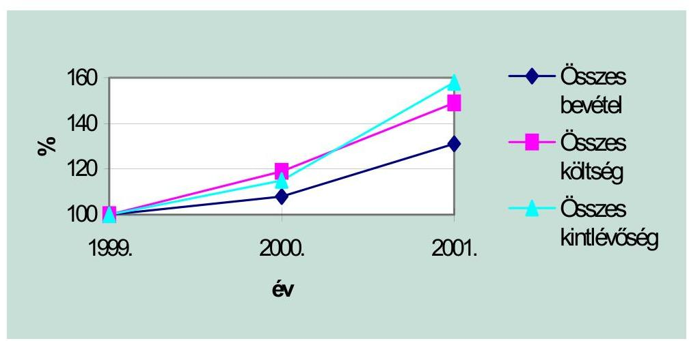
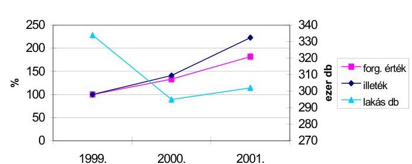
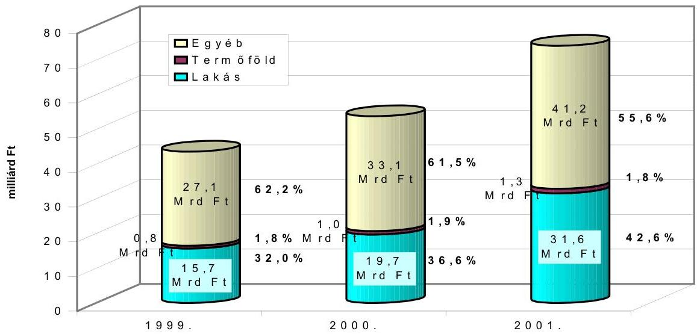
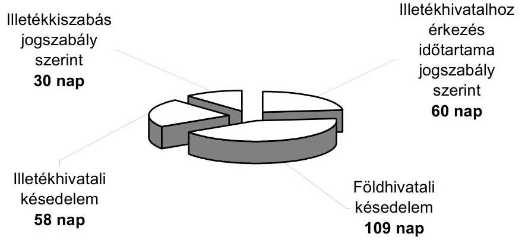
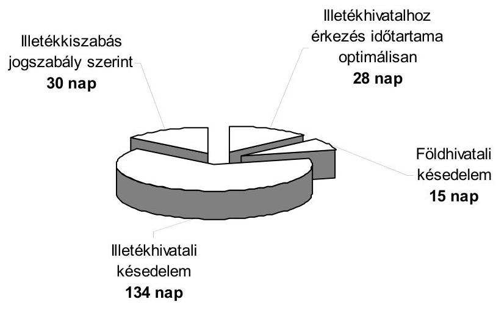
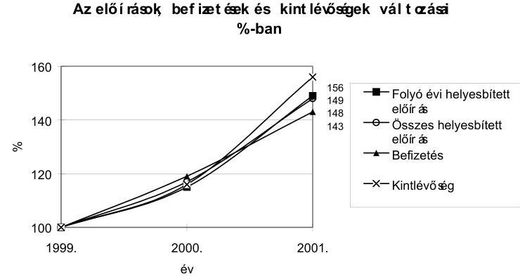
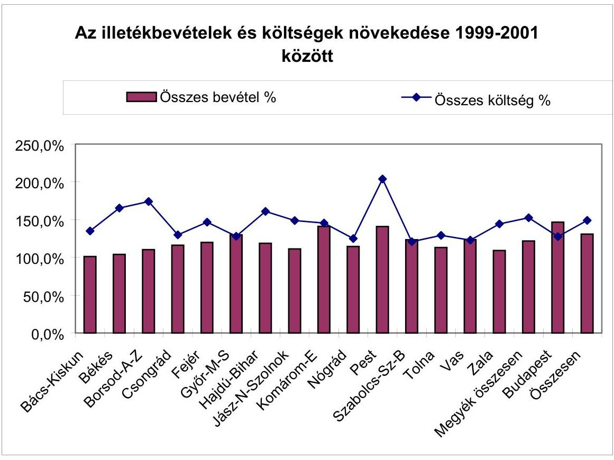

# JELENTÉS 

a megyei, fövárosi illetékhivatali tevékenység ellenőrzéséről

---

3. Önkormányzati és Területi Ellenőrzési Igazgatóság
4. Pénzügyi-szabályszerüségi és Teljesítmény-ellenőrzési Föcsoport Iktatószám: V-1006-34/2002.
Témaszám: 606
Vizsgálat-azonosító szám: V-0024
Az ellenőrzést felügyelte:
Dr. Lóránt Zoltán
föigazgató
Az ellenőrzés végrehajtásáért felelős:
Németh Péterné
főcsoportfőnök
Az ellenőrzést vezette:
Dr. Sallai Antal
osztályvezető főtanácsos
Az összefoglaló jelentést készítették:
Dankó Géza
számvevő tanácsos
Kozák György
számvevő tanácsos
Dr. Szücs Zoltán
számvevő tanácsos
A számvevői jelentések feldolgozásában és a jelentés összeállításában közremüködtek:

Dankó Géza
számvevő tanácsos
Kozák György
számvevő tanácsos
Dr. Szücs Zoltán
számvevő tanácsos
Az ellenőrzést végezték:

| Dr. Botta Tibor | Laki Dóra | Dankó Géza |
| :-- | :-- | :-- |
| számvevő tanácsos | számvevő tanácsos | számvevő tanácsos   irodavezető |
| Dr. Fülöp László | Czifra Erzsébet | Buczkó András |
| számvevő tanácsos | számvevő tanácsos |  |

Jelentéseink az Országgyűlés számítógépes hálózatán és az Interneten a www.asz.hu címen is olvashatók.

---

| Zeke József | Dr. Telkes Imre | Dr. Szücs Zoltán |
| :-- | :-- | :-- |
| számvevő tanácsos | számvevő tanácsos | számvevő tanácsos |
| Dér Lívia | Szabó Tamás | Szihalminé Kovács |
| számvevő tanácsos | számvevő tanácsos | Zsuzsa |
|  |  | számvevő |
| Dr. Lacó Bálintné | Böröcz Imre | Péntek László |
| számvevő tanácsos | számvevő tanácsos | számvevő tanácsos |
| tanácsadó | tanácsadó | irodavezető |
| Kántor Ilona | Kozma Gábor | Nyikon Zsigmondné |
| számvevő tanácsos | számvevő | számvevő |
| tanácsadó |  |  |
| Kozák György |  |  |
| számvevő tanácsos |  |  |
| irodavezető |  |  |

# A témához kapcsolódó eddig készített számvevőszéki jelentések: 

címe
Jelentés a megyei (fővárosi) illetékhivatalok tevékenységének vizsgálatáról
sorszáma
V-30/1993

---

# TARTALOMJEGYZÉK 

BEVEZETÉS ..... 3
I. ÖSSZEGZŐ MEGÁLLAPÍTÁSOK, KÖVETKEZTETÉSEK, JAVASLATOK ..... 5
II. RÉSZLETES MEGÁLLAPÍTÁSOK ..... 14

1. Az illetékügyi feladatok ellátásának szervezeti keretei, szabályozása, személyi és tárgyi feltételei ..... 14
1.1. Az illetékhivatalok jogállása, szervezeti keretei ..... 14
1.2. Az illeték hatáskörök gyakorlásának rendje ..... 15
1.3. Személyi feltételek alakulása ..... 18
1.4. Az illetékhivatalok múködésének tárgyi feltételei ..... 20
2. Az előírt és ténylegesen befolyt bevételek, kintlévőségek, hátralékok, az ezek nagyságrendjét befolyásoló tényezők ..... 24
2.1. Az előírt illetékbevétel és összetételének alakulása ..... 24
2.2. Az illetékek megállapításának időigénye ..... 27
2.3. Az illetékelőleg intézményének hasznosulása ..... 29
2.4. A határozatok megalapozottsága, törvényessége ..... 31
2.5. A bevételek beszedése, a kintlévőségek, hátralékok alakulása ..... 32
2.6. A követelések törlése ..... 34
2.7. Az illetékhivatalok ellenőrző tevékenysége ..... 35
2.8. A közigazgatási hivatalok által tartott ellenőrzések tapasztalatai ..... 35
3. A beszedett illetékek felosztása, utalása, költségeinek alakulása ..... 35
3.1. Az illetékbevételek felosztása, utalása ..... 35
3.2. A költségek viselésére vonatkozó megállapodások megkötése és betartása ..... 38
3.3. Az illetékbeszedés költségei ..... 40
4. Az anyagi érdekeltségi rendszer szabályozása, múködtetése ..... 42
4.1. Az érdekeltségi rendszer kialakítása, szabályozása ..... 42
4.2. A forrásképzéssel, ösztönzési formákkal és kifizetéssel kapcsolatos szabályozás ..... 45
4.3. Az érdekeltségi juttatások fedezetének számbavétele és kifizetése ..... 46

---

# MELLÉKLET 

1. Az ellenőrzött illetékhivatalok létszámellátottsága (1 oldal)
2. Az illetékhivatalok elhelyezési körülményei (1 oldal)
3. Az elhelyezést szolgáló összes alapterület tulajdonosi megoszlása (1 oldal)
4. A helyszíni munkavégzést segítő technikai eszközökkel való ellátottság (1 oldal)
5. A számítástechnikai eszközök beszerzésére fordított összegek (1 oldal)
6. A számítástechnikai eszközellátottság alakulása (1 oldal)
7. A hivatalok által előírt illetékbevételek alakulása (1 oldal)
8. A kiszabott illetékek megoszlása a folyó évi előírások alapján (1 oldal)
9. A lakásokkal kapcsolatos visszterhes vagyonátruházási illeték és alapjának alakulása ( 1 oldal)
10. A földhivatali bejegyző határozatok alapján kiszabott végleges illetékek ügyintézési napjainak alakulása ( 1 oldal)
11. Az illetékelőleg kiszabással érintett tételek ügyintézési napjai (1 oldal)
12. A folyó évi helyesbített visszterhes vagyonátruházási illeték tételszámának dinamikája (1 oldal)
13. Az ajándékozási és visszterhes vagyonátruházási illetékből az illetékelőleges tételek száma és aránya (1 oldal)
14. A folyó évi helyesbített előírások és befizetések alakulása (1 oldal)

14/a. Az összes helyesbített előírások és befizetések alakulása (1 oldal)
14/b. A helyesbített előírások megoszlása (1 oldal)
15. A december 31-én fennálló kintlévőségek alakulása (1 oldal)

15/a. A hátralék és az ún. nyitott általánosként kimutatott kintlévőségek alakulása (1 oldal)

15/b. Az előírt bevételek teljesítésével kapcsolatos főbb mutatószámok (1 oldal)
16. Az illetéktörlésre vonatkozó adatok (1 oldal)

16/a. Az illetéktörlések jogcímeire vonatkozó adatok (1 oldal)
17. Az illeték beszedéssel összefüggő költségek alakulása (1 oldal)
18. Az egy főre jutó személyi jellegű kifizetések alakulása (1 oldal)
19. Az érdekeltségi célú kifizetések alakulása (1 oldal)

---

# JELENTÉS 

## a megyei, fôvárosi illetékhivatali tevékenység ellenőrzéséről

## BEVEZETÉS

Az illetékhivatalok 1991. évig a fővárosi, megyei városi, illetve a megyei tanács vb. pénzügyi szakigazgatási szervének irányítása alatt álló önálló költségvetési intézményként múködtek. A helyi önkormányzatok és szerveik, a köztársasági megbízottak, valamint egyes centrális alárendeltségű szervek feladat- és hatásköréről szóló törvény alapján 1991-1996 között illetékügyekben első fokon a megye székhelye szerinti - Pest megyében kijelölés alapján Cegléd - városi önkormányzat jegyzője a megye egész területére kiterjedő illetékességgel, a fővárosban a Fővárosi Önkormányzat főjegyzője járt el.

A hatáskör-átrendezés következtében az illetékhivatalok elvesztették jogi önállóságukat és a városi (fővárosi) önkormányzatok polgármesteri hivatalának részeként múködtek. Az illetékhivatalok elhelyezésére szolgáló épületek a korábbi irányítási rendszerből adódóan többségében a megyei önkormányzatok tulajdonát képezték, ezek és a felszerelések, berendezések ingyenes használatba adását követően a városi önkormányzatok nem fordítottak jelentős összeget a szükséges fejlesztésekre, a múködési feltételekben mutatkozó különbségek megszüntetésére.

A bevételekből nagyobb hányadban részesülő (az illetékhivatal múködtetésével összefüggő költségek nagyobb részét viselő) megyei önkormányzatoknak nem volt érdemi beleszólásuk az illetékhivatalok személyi, technikai feltételeinek alakításába, jelentős különbségek konzerválódtak az illetékhivatalok elhelyezési feltételeiben, számítástechnikai és egyéb felszereltségében.

Az Állami Számvevőszék (ÁSZ) az illetékhivatalok tevékenységét legutóbb 1993-1994. évben ellenőrizte. Az ÁSZ javaslatait is figyelembe véve az adózás rendjéről szóló többször módosított 1990. évi XCI. törvény (Art.) 49. § (4) bekezdése alapján az illetékügyi hatáskör 1997. január 1-jétől a megyei jogú városoktól átkerült a megyei főjegyzőkhöz, az illeték kiszabásával, megfizetésével, behajtásával, az illetékfizetés rendjének ellenőrzésével kapcsolatos ügyekben első fokon a megyékben megyei illetékhivatal elnevezéssel a megyei, a fővárosban változatlanul a Fővárosi Önkormányzat főjegyzője jár el.

Az ellenőrzés célja annak áttekintése és értékelése volt, hogy az illetékhatósági jogkör megyei főjegyzőhöz történő áttelepítését követően tett intézkedések hogyan biztosították az illetékügyi feladatok célszerű, szakszerű ellátását, hogyan befolyásolták az illetékbevételek és az abból való részesedés nagyságát,

---

valamint a múködési feltételek változása, az érdekeltségi rendszer milyen szerepet játszott az illetékalapok reális kimunkálásában, az illetékkiszabásban, a bevételek beszedésében, a hátralékok csökkentésében.

A helyszíni ellenőrzés, az önkormányzati hivatalokban (főpolgármesteri hivatalban), valamint az illetékhivatalokban az alábbi főbb kérdésekre irányult:
-az illetékügyi feladatok ellátásának szervezeti kereteit, személyi és tárgyi feltételeit, a hatáskörök gyakorlásának rendjét célszerűen alakították-e ki, ja-vult-e az illetékügyi feladatok ellátásának színvonala, szakszerűsége;
-a kiszabott és beszedett illeték összegében, a hátralékok alakulásában milyen tényezők játszottak szerepet;
-az illetékbevételek önkormányzatok, központi költségvetés, valamint az illeték beszedésével kapcsolatosan felmerülő költségek közötti megosztása során ér-vényesültek-e a jogszabályban meghatározott követelmények;
-az érdekeltségi rendszer elősegítette-e az eredményesség javítását, a reálisabb illeték alapok (forgalmi érték) megállapítását, a bevételek beszedését, a hátralékok csökkentését.

Az ellenőrzés jogalapja: az Állami Számvevőszékről szóló 1989. évi XXXVIII. törvény 2. § (4) bekezdése.

Az ellenőrzés típusa: egyéb szabályszerűségi. Az illetékhatósági feladatok ellátásának, az illetékkiszabás, beszedés kialakított rendjének célszerűségét, az illetékbevételek megosztásának törvényességét az 1999. január 1. és 2001. december 31. közötti időszakra vonatkozóan 15 megyében és a fővárosban ellenőriztük, az illetékhivatalok múködésének feltételeiben bekövetkezett változásokat a hatáskör áttelepítésének időpontjától (1997. január 1.) kezdve értékeltük.

Az ellenőrzésre az önkormányzati hivatalokban és az illetékhivatalokban az ellenőrzési program, módszertani útmutató, valamint az átadott dokumentumok, adatszolgáltatás és a helyszíni vizsgálat keretében megtekintett iratok és bizonylatok, valamint egyeztetések alapján került sor. Az ajándékozási és visszterhes vagyonátruházási illetékek átlagos ügyintézési napjainak megállapításához a 2001. áprilisi és októberi kiszabásokból mintavételes eljárással, központi számítógépes program segítségével került sor 65893 db tétel leválogatására, amely az adott évben, ebben a számcsoportban alapszámon iktatott ügyiratok 5\%-ának felel meg.

Az ellenőrzött hivataloktól a személyi és tárgyi feltételekre, gazdálkodásukra, az illetékek megállapításával és beszedésével összefüggő szakmai tevékenységükre vonatkozó számszaki információkat kértünk be tanúsítvány formájában. Az ezek összegzését és a Pénzügyminisztérium részére évente általuk megküldött zárási összesítők egyes adatainak kiértékelését tartalmazó, 1-19-ig terjedő sorszámmal ellátott táblázatokat a jelentés függelékeként csatoljuk.

---

# I. ÖSSZEGZŐ MEGÁLLAPÍTÁSOK, KÖVETKEZTETÉSEK, JAVASLATOK 

A tulajdonjog földhivatali bejegyezésénél mutatkozó késedelem, hátralék miatt az ingatlan tulajdonjogának, az ingatlanhoz kapcsolódó vagyonértékű jognak ajándékozási, illetve visszterhes vagyonátruházási illeték alá eső szerzése után 1994. évtől bevezetésre került az illetékelőleg rendszere. A tulajdonviszonyok, az ingatlan árak, forgalmi érték változásával növekedett a kiszabott illeték összege és tételszáma, a vagyonszerzési illetékek körében a forgalmi érték felülvizsgálatának jelentősége, összetettsége.

Az illetékhivatalok által beszedett illetékbevétel az 1995. évi 28,6 milliárd Ft-ról 1999. évben 54,6 milliárd Ft-ra, 2001. évben 71,2 milliárd Ft-ra nőtt. A megyei, megyei jogú városi önkormányzatokat megillető részesedés az elmúlt három évben az inflációt meghaladó mértékben bővítette az érintett önkormányzatok forrásait.

Az illetékek kiszabásával, megfizetésével, behajtásával, az illetékfizetés rendjének ellenőrzésével kapcsolatos ügyekben 1997. január 1-jétől a megyékben első fokon - megyei illetékhivatal elnevezéssel - a megyei önkormányzatok főjegyzői járnak el. A hatáskört korábban a megyeszékhely városi önkormányzatok jegyzői gyakorolták. A hatáskör átrendezés nem érintette a fővárosi illetékigazgatást.

Az illetékhatósági jogkör megyei főjegyzőhöz történő telepítését követően - az ügyintézési határidők kivételével - az illetékek kiszabását, beszedését összességében szakszerúen és törvényesen végezték a vizsgált illetékhivatalok. A múködési feltételek változása, az érdekeltségi rendszer az illetékigazgatási feladatok ellátását kedvezően befolyásolta, de az ügyintézés, a hátralékok behajtása területén a jelentésben részletezett hiányosságok továbbra is tapasztalhatóak voltak.

A megyei önkormányzatok illetékbevételből való részesedésére elsősorban az illetékek megosztásának, a költségek viselésének szabályozása volt hatással, így az illetékigazgatási feladatok célszerű, szakszerű ellátásában, a hátralékok csökkentésében a hatáskör címzettjei és a fenntartó önkormányzatok intézkedései kisebb szerepet játszottak.

A fenntartó önkormányzatok kevésbé voltak érdekeltek a célszerú, költségtakarékos megoldásokban, miután a költségek megosztása során az illetékhivatalok múködtetésével kapcsolatos kiadásoknak csupán 15-20\%-át viselték közvetlenül, a nagyobb hányadot levonták a kincstárnak utalandó, megyék között újraosztásra kerülő illetékbevételből, illetve a megyei jogú városokat megillető részből.

A megyékben a hatáskör átvételét követően sor került az illetékhivatali feladatoknak az önkormányzati hivatal szervezetébe történő beillesz

---

tésére, amelynek szabályozási feltételeit a megyei közgyűlések a szervezeti és működési szabályzat, az ügyrend módosításával teremtették meg. Különböző elnevezéssel (főosztály, osztály, iroda) és hatáskörrel bíró szervezeti egységeket hoztak létre az illetékigazgatási feladatok ellátására.

Az illetékhivatalok belső szervezete, múködése, gazdálkodási, előirányzat felhasználási jogköre és a múködési feltételek biztosítása tekintetében megyénként eltérő gyakorlat alakult ki. Az illetékhivatalok jogi és gazdálkodási önállóssága a jelenlegi jogszabályi keretek között nem biztosítható, így a vizsgált illetékhivatalok háromnegyede részjogkörű költségvetési egységként került besorolásra. Az illetékhivatalok egy része gyakorlatilag önálló gazdálkodást folytat, és a főjegyző a munkáltatói jogkört is átruházta az illetékhivatal vezetőjére.

A megyei (fővárosi) főjegyzők hatáskörük gyakorlását, néhány ügyet kivéve (pl. fellebbezések felterjesztése másodfokra, fizetési könnyítések engedélyezése, jelentős értékhatárt meghaladó érdemi döntések) az illeték hivatalok vezetőire és munkatársaira ruházták át. A szinte teljes körű hatáskör átruházás az illeték ügyintézés összetettségéből, sajátosságaiból, az ügyek nagy számából adódóan célszerűnek tekinthető, mivel ezzel megteremtődött az ügyintézés gyorsításának egyik feltétele.

Az illetékhatósági ügyintézés törvényességére, szakszerűségére kiterjedő vizsgálatokat a hatáskör címzettjei csak kivételesen végeztettek, az átruházott hatáskör gyakorlásáról elsősorban a másodfokon eljáró közigazgatási hivatalok jogorvoslati ügyekben szerzett tapasztalatai, esetenkénti ellenőrzései és a hivatalvezetők szóbeli beszámoltatása alapján tájékozódtak.

Nem volt teljes körű az egyes illetékigazgatással összefüggő feladatok szabályozottsága (pl. forgalmi értékelés, behajtási munka, ingó-ingatlan végrehajtás) de négy megyében a minőségbiztosítási rendszer bevezetésével nagyobb figyelmet fordítanak az ügyintézés szabályozottságára, színvonalára, az ügyfelek tájékoztatására.

A hivatalok 20\%-ában a kulturált ügyfélfogadás feltételei hiányoztak, a hivatalok fele nem gondoskodott az ügyfélforgalom alakulásának, tapasztalatainak folyamatos nyomon követéséről sem.

Az illetékhivatalok engedélyezett létszáma az ügyiratok számának, az ügyintézés összetettségének növekedése ellenére csak mérsékelten ( $12,5 \%$-al) nőtt a hatáskör átvételét követően. A létszám emelésében a megyék között mutatkozó különbség ( 8 hivatalban az átlagos mértéket lényegesen meghaladó, 6 megyében csak minimális létszámnövekedés volt, miközben 2-ben csökkentették a létszámot) nem a feladatok nagyságával, változásával, sokkal inkább az elhelyezés feltételeivel, illetve azok bővülésének lehetőségével függött össze.

Azonos tevékenységek körében sem alakultak ki a teljesítmények mérésének, a létszámigény normatív meghatározásának módszerei, a vizsgálat során végzett - a sajátosságokat is figyelembe vevő - összehasonlítások jelentős különbségeket mutattak az egy ügyintézőre jutó elintézett ügyek számában.

---

Az illetékhivatalokban dolgozók iskolai végzettsége, szakképzettsége a hatáskör átvételét követően kedvező irányban változott, nőtt a felsőfokú végzettségűek száma, de az ügyintézők körében a középiskolai végzettségűek aránya továbbra is magasabb, mint az önkormányzati hivatalok egyéb részlegeiben.

A hatáskör átvételét követően az illetékhivatalok elhelyezési feltételei a felújítások, de nagyobb részt bérelt ingatlanba történő költözés eredményeként javultak, a korábban jellemző szűkösség néhány megye kivételével megszűnt. A hivatalok elhelyezését szolgáló alapterületben meglévő különbségeket jelzi, hogy az egy főre jutó alapterület 29,4\%-os átlagos növekedése mellett Komá-rom-Esztergom megyében 29\%-os csökkenés, Szabolcs-Szatmár-Bereg megyében 112,7\%-os növekedés volt (11 hivatalnál nőtt, 5-nél csökkent az egy főre jutó alapterület 1997. évhez képest).

Két megyében (Borsod-Abaúj-Zemplén és Pest megye) és 2002. évtől a fővárosban az elhelyezést csak bérelt ingatlanban tudták biztosítani kulturált körülmények között, amely a működtetéssel összefüggő költségek jelentős növekedését okozta.

A helyszíni értékelést segítő technikai eszközök (fényképezőgép, videó) és gépjármúvek cseréjét is a múködtetéssel összefüggő költségek terhére biztosították a fenntartók, amely révén javultak a megfelelő színvonalú és hatékony munkavégzés tárgyi feltételei.

Az illetékhivatalok számítástechnikai eszközei 1997. évben mennyiségüket és minőségüket tekintve nem feleltek meg a követelményeknek (a számítógépek 80,8\%-a korszerűtlen volt, 1 számítógépre 2 fő jutott). Az elmúlt években 343 millió Ft felhasználásával korszerú informatikai hálózat jött létre az illetékhivatalokban, a korszerú számítógépek aránya 90,2\%-ra, a számítógépek száma duplájára nőtt. Az informatikai feladatok, a rendszer üzemeltetés feltételeinek javítására megfelelő szakemberek (informatikus, rendszergazda) alkalmazásával és az ügyintézők felhasználói ismereteinek szervezett képzés keretében történő bővítésével is törekedtek. (A számítógépek korszerűségében azonban továbbra is egyenetlenségek tapasztalhatók, Szabolcs-Szatmár-Bereg megyében a számítógépek 97\%-a nullára leírt.)

Az illetékek kezelését biztosító, az APEH - SZTADI által kifejlesztett feldolgozási program 1997. évig a PM engedélyével állami szoftverként múködött. A program fejlesztése azt követően nem tartott lépést a beszerzett, használatban lévő számítástechnikai eszközök fejlődésével, nem támogatja a fejlett, grafikus operációs rendszereket, az általa nyújtott szolgáltatások nem elégítik ki a felhasználói igényeket. A hivatalok ezért más forrásból származó, illetve saját fejlesztésű programokat is használnak, valamint jelentős manuális kigyűjtésekre, egyeztetésekre kényszerülnek, amely felesleges többletmunkát okoz és növeli a költségeket.

Az illetékhivatalok által kiszabott és beszedett illetékek összege - az ingatlanárak utóbbi években tapasztalt rohamos emelkedése következtében dinamikusan nőtt. A 20 hivatalban a 2001. évben előírt folyó évi befizetési kötelezettség - két év alatt 50\%-ot emelkedve - megközelítette a 100 milliárd Ftot. E növekedés összességében egy csökkenő ingatlanforgalom mellett valósult

---

meg, mivel a használt lakások adásvétele, az illetékhivatalok adatai alapján, két év alatt mintegy 10\%-kal mérséklődött. A kiszabások tételszámának átmeneti mérséklődése viszont azok munkaigényességének olyan mértékű növekedésével párosult, amelynek következtében a hivatalok által ellátandó adminisztratív feladatok összességében tovább bővültek. Ezekkel a szükséges munkaerő-fejlesztés nem mindenütt járt együtt.

Nem sikerült felszámolni a földhivatalokban a korábbi időszakra jellemző munkatorlódást, az illetékek megállapításának alapjául szolgáló bejegyző határozatok továbbra is későn készülnek és érkeznek az illetékhivatalokhoz. ${ }^{1}$ Ennek is betudhatóan az állam és az önkormányzatok a törvényes lehetőséghez képest lényegesen később jutnak hozzá a bevételekhez.

Az illetékek megállapítása a törvényben előírtnál hosszabb időt igényel. A vizsgált hivatalok kéthavi ügyiratforgalmának tételes feldolgozása szerint a szerződéskötéstől számítva országos átlagban 257 nap telik el a végleges illeték kiszabásáig, így a jogorvoslati lehetőséget is figyelembe véve azok megfizetésére a 287. napig pótlékmentesen kerülhet sor. A végleges illeték megállapításához szükséges bejegyző határozatokat a földhivatalok átlagosan 109 napos késedelemmel küldték meg az illetékhivatalok részére, ahol az ügyintézés a jogszabályban meghatározott 30 nappal szemben összesen 88 napot igényelt. Az átlag jelentős szóródást takar és ezen belül nem elhanyagolható mértékű volt az olyan késedelem, amely a kivetéshez való jog elévüléséhez, a jogszerű bevétel elmaradásához vezetett.

A földhivatali munkatorlódások miatt bevezetett előlegfizetési rendszerrel sem sikerült érdemben csökkenteni a bevétel beszedhetőségének időtartamát. A jelentős többletadminisztráció miatt a több mint hét éves jogintézménynek az illetékhivatalokban történő szakmai elfogadtatása a mai napig nem oldódott meg. A hivatalokban 2001. évben az összes ügyeknek csak 20,2\%-ában állapítottak meg előleget. A helyszíni ellenőrzés tapasztalatai szerint az indokoltnál munkaigényesebb eljárás következtében ezek időtartama is alig maradt el a végleges illetékekétől. A földhivatali késedelem ezekben az ügyekben lényegesen kisebb volt, az illetékhivatalok viszont a végleges illeték 88 ügyintézési napjával szemben, átlagosan 164 nap alatt szabták ki az előleget.

Az illetékhatósági ügyintézés - az ügyintézési határidőtől eltekintve összességében szakszerú és törvényes volt. A megtámadott határozatok

[^0]
[^0]:    ${ }^{1}$ Az Állami Számvevőszék 2000. évben vizsgálta az állami tulajdonú földterület-ingatlanok nyilvántartását és megállapította: „Az ingatlan-nyilvántartási ügyirathátralék tekintetében a Főváros helyzete sajátos. Itt koncentrálódik az összes ügyirat 24\%-a. Megnehezítette az ügyhátralék ütemes feldolgozását a Fővárosban meglévő, a megyei szervezetektől eltérő szervezeti felépítés, valamint az országostól eltérő a Fővárosban alkalmazott nyilvántartási rendszer." A földművelésügyi és vidékfejlesztési miniszternek tett javaslatok között szerepel: „Tárja fel a Főváros Kerületek Földhivatala ügyirat-hátralék-képződésének (újraképződésének) részletes okait, és intézkedjen azok felszámolására."

---

száma viszonylag alacsony, s a fellebbezésekkel vitatott esetek nagy részében a jogorvoslati fórumok (közigazgatási hivatalok, bíróságok) is a hivatalok határozatát hagyják jóvá.

A vizsgált időszakban az illetékhivatalok által beszedett illetékek összege az előírásokénál kisebb mértékben emelkedett, következésképp a kintlévőségek, hátralékok állománya nőtt. Ezért elsősorban egyes hivatalok nem kellő hatékonyságú behajtási tevékenysége okolható, de a jelenlegi jogi szabályozás is nehezíti a végrehajtást. Az illetékhivatalokat az adatszolgáltatás, a végrehajtás során annak ellenére sem illetik meg az állami adóhatósággal azonos jogok, hogy az általuk beszedett bevétel több mint 50\%-ka az államot illeti. A követelések behajtásához szükséges információk begyűjtése, esetenként egy-egy végrehajtási cselekmény foganatosítása így nehézségekbe ütközik.

A hivatalok az előírt illetékeknek évente mintegy tizedét törlik a jogorvoslati eljárás, vagy a hivatal saját kezdeményezésére végzett jogalapi törlések eredményeként. Számottevő, elévülés miatti törlésre néhány hivatalban (pl. főváros, Pest megye) a földhivatali és illetékhivatali késedelmek, esetenként a nem megfelelően végzett behajtási tevékenység miatt került sor. Számottevőbb (az éves előírás $1,5 \%$-a) a behajthatatlanság címén törölt összeg. Külön gond e vonatkozásban, hogy nem teremtődött meg a hátralékok rendszeres felülvizsgálatának, indokolt esetben ismételt előírásának információs rendszere és kontrollmechanizmusa.

Az illetékhivatalok csak formálisan, kampányszerúen végezték az eljárási illetékek lerovásának az egyes szemlealanyoknál történő az ellenőrzését. Alapvetően a túlzott leterheltségükre hivatkoztak, emellett azonban nem elhanyagolható ok az sem, hogy az önkormányzati bevételt jelentő vagyonátruházási illeték beszedésében az érdekeltség nagyobb, mint az eljárási illetékeknél. Az illetékhatósági tevékenység ellenőrzésére jogosult közigazgatási hivataloknak több mint fele az illetékhivatalok hatósági tevékenységét a helyszínen nem ellenőrizte.

A beszedett illeték központi költségvetés és önkormányzatok közötti megosztásában a vizsgált években lényeges változás 2001. évet megelőzően nem történt. Ekkortól a területi kiegyenlítésbe az önkormányzatokat megillető hányad terhére nem csak a megyei, hanem a fővárosi önkormányzatot megillető illetékbevétel 70\%-a is bevonásra került. Ennek eredményeként a megyék között újra elosztott illetékbevétel a 2000. évi 1,6 milliárd Ft-ról a fővárostól átcsoportosított 5,9 milliárd Ft-tal, 2001. évben 7,2 milliárd Ft-ra nőtt. (A kiegészítésben részesülő megyék száma 13 -ról 17 -re, az egy megyére jutó kiegészítés átlaga 120 millió Ft-ról, 425 millió Ft-ra nőtt.)

Az illetékbeszedés költségei viseléséről az érintett megyei és megyei jogú városi önkormányzatoknak a költségvetési törvény szerint minden év február 1-jéig megállapodást kell kötniük, amelyre 7 megyében nem került sor. Megállapodás hiányában a törvény felhatalmazása alapján visszatartható bevétel is biztosította az illetékigazgatási feladatok ellátásának fedezetét. A megállapodások tartalma a költségvetési törvény elöírásainak csak részben felelt meg (pl. nem tartalmazta a költségek körét és mértékét, az elszámolási kötelezettség módját és határidejét, ellenőrzésének, a visszatartott fedezet és a ténye

---

ges költségek különbözete rendezésének módját). A megállapodást megkötő megyékben sem került teljes körúen rendezésre a tervezett és tényleges költségek közötti különbség.

Az illetékhivatalok múködtetésével kapcsolatos költségek tartalmát, elszámolásának szabályait a költségvetési törvényben nem határozták meg egyértelmúen (a törvény ugyanazon szakaszában, egyik helyen múködéssel, másik helyen múködtetéssel összefüggő költségeket említ). A költségek fedezetének visszatartására vonatkozó előírások egyrészt bonyolultak, másrészt nem igazodnak a költségvetési gazdálkodásban, beszámolóban és könyvvezetésben érvényesülő pénzforgalmi szemlélethez, mert a költségek fedezetének visszatartását tette lehetővé és nem a teljesített, beszámolóval és könyvvezetéssel alátámasztott kiadásokét. Nem tartalmaz előírásokat, eljárási szabályokat a visszatartott és a tényleges kiadások közötti eltérés rendezésének kötelezettségére, módszerére sem.

A múködtetéssel összefüggő (múködési, felhalmozási, érdekeltségi) összes kiadásnak átlagosan $31 \%$-át a megyei jogú városi önkormányzatokra, a fennmaradó összegnek a $70 \%$-át a kincstárnak utalandó, újraosztásra kerülő hányadból történő levonással a 19 megyei önkormányzatra terhelték át, így a kiadások nagyságát meghatározó fenntartó önkormányzatok csak mintegy 15-20\%ot viseltek közvetlenül.

Az erre lehetőséget biztosító szabályozás mellett a hivatalok és azok fenntartói nem váltak érdekeltté a költségekkel való ésszerú takarékosságban. A beszedett bevételből egyre nagyobb hányadot tartottak vissza kiadásaik fedezeteként, miközben az illetékek kiszabása az indokoltnál hosszabb időt igényelt, a kintlévőség a bevételekét meghaladó mértékben emelkedett.

Az illetékbeszedéssel kapcsolatos kiadás 1999-2001. között 49\%-kal, a kintlevőség 58\%-kal, az illeték bevétel ezzel szemben csak 30,7\%-kal növekedett. A kiadások a bevételek százalékában az 1999. évi 7,3\%-ról 2001. évben 8,4\%-ra emelkedtek, ezen belül a szélső értékek között (Békés megye 31,9\%, Győr-Moson-Sopron, Komárom-Esztergom megye 8\%) négyszeres az eltérés.

---

A növekedés 53\%-a a személyi jellegű kiadásoknál és azok járulékainál, 25\%-a a hivatalok működésével kapcsolatos dologi kiadásoknál következett be, de ilyen irányba hatott néhány megyében a munkakörülmények, illetve a munkavégzés technikai feltételeinek javítása is.

Az elszámolt kiadások eltérő mértékű, de összességében számottevő növekedéséhez hozzájárult az is, ahogyan az illetékhivatali tevékenységgel kapcsolatos anyagi érdekeltségi rendszer megteremtésére a helyi adókról szóló törvény, továbbá a mindenkori költségvetési törvények biztosították a lehetőséget. Míg ugyanis a helyi adókból felhasznált összeget teljes mértékben a fenntartók viselik, az illetékbeszedéssel kapcsolatos érdekeltségi célú felhasználást „átterhelik" a bevételből részesedő önkormányzatokra.

A törvény az érdekeltségi rendszer feltételeit, forrásait, felhasználásait illetően részletes szabályokat nem tartalmaz, csupán az érdekeltségi juttatásban részesíthetők körét határozta meg, azonban ennek értelmezésében is gondok mutatkoztak. Ebből adódóan a vizsgálattal érintett önkormányzatok a juttatásban részesíthetők körét, a képzett forrás alapját és mértékét, valamint a kifizethető összegek nagyságrendjét illetően, egymástól eltérő módon alkották meg a helyi szabályokat tartalmazó rendeleteiket.

# Jelentős különbségek alakultak ki ezért az érdekeltségi célból megképzett források nagyságát, illetve az egy főre eső juttatás összegét 

tekintve is. Eltérő a gyakorlat a forrásképzés módszerét illetően is, mivel egyes önkormányzatok alapszerűen kezelték a megképzett forrásokat, míg mások az éves költségvetési gazdálkodásra vonatkozó szabályok figyelembevétele mellett működtették érdekeltségi rendszerüket.

A pontatlan törvényi szabályozás következtében az érdekeltségi juttatásban részesíthetők körét az önkormányzatok többsége kiterjesztően értelmezte, és ennek következtében nem csak az illeték hatáskör címzettjeit (megyei, fővárosi főjegyzők) és az önkormányzati hivatalok illetékügyi feladatokat ellátó köztisztviselőit részesítették ilyen kifizetésekben.

A vizsgálattal érintett megyékben az érdekeltségi célú juttatások és az egyéni teljesítménykövetelmények közötti összhang nem érvényesült maradéktalanul, a kifizetés nem az elért teljesítményekhez, hanem az érintett dolgozók illetményéhez igazodott.

A köztisztviselői törvény 2001. július 1-jétől hatályos módosítása a köztisztviselők többletteljesítményének elismeréseként megállapítható jutalom, érdekeltségi, és egyéb jogcímen alapuló és a teljesítménytől függő juttatás összegét az önkormányzatoknál a köztisztviselő 6 havi illetményének megfelelő összegben maximalizálta. Ez a törvényi szabályozás az illetékhivatali feladatokkal kapcsolatban eddig múködő érdekeltségi rendszer jelentőségét alapvetően mérsékelte, mivel az érdekeltségi célú kifizetések összege a vizsgálattal érintett illetékhivatalok egy részében korábban meghaladta a 6 havi illetmény összegét. Az érintett köztisztviselők éves keresete így 2002. évtől várhatóan csökken.

A helyszíni ellenőrzések tapasztalatai alapján több javaslatot fogalmaztunk meg az illetékhatáskör címzettjei (főjegyzők) illetve az illetékhivatalok felé:

---

- az SZMSZ-ben, ügyrendben, szabályzatokban meghatározott feladat- és hatáskörök, illetve a tényleges gyakorlat összhangjának megteremtésére,
- az ügyintézési hátralékok megszüntetése, a szakszerű ügyintézés érdekében az illetékhivatal szervezeti felépítésének, belső munkamegosztásának, a feladatok szabályozottságának áttekintésére és módosítására,
- az illeték ügyintézés során (különösen az iktatás, kiszabás területén) a jogszabályban előírt ügyintézési határidők betartására, a behajtási munka eredményességének javítására,
- a földhivatalok felé intézkedés kezdeményezését az irattovábbítási kötelezettség előírt időpontban való teljesítésére, az illetékelőleg törvényben meghatározott módon történő megállapítására,
- a költségek viselésére vonatkozó megállapodások előírt határidőben történő megkötésére, abban a költségek körének és mértékének (beleértve az érdekeltségi célú juttatásokat is) rögzítésére, valamint az elszámolás felülvizsgálatának, ellenőrzésének és a különbözet pénzügyi rendezése módszerének meghatározására,
- a hatályos törvényi előírásokkal összhangban az anyagi érdekeltségi rendszerre vonatkozó önkormányzati rendeletek felülvizsgálatára, korszerűsítésére.

Az illetékügyi feladatok gyorsabb, hatékonyabb és egyben költségtakarékosabb ellátása érdekében, a helyszíni ellenőrzés megállapításainak hasznosítása mellett javasoljuk:

# a Kormánynak: 

1. Kezdeményezze az illetékhátralékok behajtásának elősegítése érdekében a társadalombiztosítás ellátásaira és a magánnyugdíra jogosultakról, valamint e szolgáltatások fedezetéről szóló 1997. évi LXXX. tv. 43. §-ában felsorolt, a személyes adatok igénylésére jogosult szerveknek az illetékhivatalokkal, valamint az egyéni vállalkozásról szóló 1990. évi V. tv. 5. § (1) bekezdés g) pontjának, illetve 14. § (1) bekezdés c) pontjának az illetéktartozásokkal történő kiegészítését.
2. Intézkedjen a felügyeletet gyakorló miniszter útján a földhivataloknál a tulajdonjog bejegyzésének a jelenleginél gyorsabbá tétele, az illetéktörvényben meghatározott irattovábbítási kötelezettségük teljesítése érdekében.

## a pénzügyminiszternek :

1. Dolgozzon ki olyan szabályozási javaslatot a költségvetési törvénytervezetben az illetékek megosztására, amely szerint

- a felmerült kiadásokat azok a szervek viseljék, amelyeknek azokra ráhatásuk lehet, azaz közvetlenül befolyásolni tudják a nagyságrendjük kialakítását (a fenntartó és a megyei jogú városok önkormányzatai),

---

- a megyei jogú városoknak legyen beleszólásuk az érdekeltségi célú források képzésébe és az illetékügyi feladatok ellátásához szükséges fejlesztések meghatározásában is,
- az elszámolási kötelezettség, továbbá a visszatartott, illetve tényleges kiadás különbözetének rendezése kötelező,
- a pénzforgalmi szemléletnek megfelelően nem a felmerült költségek, hanem a teljesített kiadások visszatartására nyújt lehetőséget.

2. Tegyen javaslatot az illetéktörvény olyan módosítására, amely lehetővé teszi az illetékelőlegeknek egy egyszerűsített eljárás keretében történő megállapítását és megfizettetését.
3. Dolgoztasson ki az illetékek nyilvántartására, a zárási összesítők elkészítésére az illetékhivataloknál létrejött, korszerűsödött informatikai eszközökre alapozva egységes, államilag jóváhagyott szoftvert.
4. Hívja fel a közigazgatási hivatalok vezetőit az illetékhivatalokban folyó hatósági tevékenység helyszíni ellenőrzésekkel történő segítésére.
5. Dolgozzon ki javaslatot az illetékigazgatási feladatok végrehajtásában közreműködő személyek érdekeltségi juttatásban részesíthető körének törvényi meghatározására oly módon, hogy jogértelmezési gondok ne merüljenek fel a jogalkalmazás során.

---

# II. RÉSZLETES MEGÁLLAPÍTÁSOK 

## 1. AZ ILLETÉKÜGYI FELADATOK ELLÁTÁSÁNAK SZERVEZETI KERETEI, SZABÁLYOZÁSA, SZEMÉLYI ÉS TÁRGYI FELTÉTELEI

### 1.1. Az illetékhivatalok jogállása, szervezeti keretei

A hatáskör átvételét követően a helyi önkormányzatokról szóló 1990. évi LXV. törvény (Ötv.) 38. §-a alapján a megyei közgyűlések szervezeti és múködési szabályzataik (SZMSZ) módosításával az egységes önkormányzati hivatalon belül különböző elnevezéssel és hatáskörrel bíró szervezeti egységeket hoztak létre az illetékigazgatási feladatok ellátására. A vizsgált 15 megyében az önkormányzati hivatalon belül az illetékhivatalok közül 5 főosztály, 8 osztály, 2 iroda elnevezéssel, ezen belül igen eltérő belső tagozódásban (osztály, csoport) és előirányzat-felhasználási hatáskörrel rendelkezve működik. Az eltérő gyakorlat az önkormányzatok szervezetalakítási autonómiáját figyelembe véve nem kifogásolható, néhány esetben összefügg a feladatok eltérő jellemzőivel, nagyságrendjével.

Az SZMSZ-ok szerint az illetékhivatalt a főjegyző irányítja és gyakorolja a munkáltatói jogokat az illetékhivatal vezetője és a hivatal dolgozói felett.

A jogszabályi előírások jelenleg nem teszik lehetővé, hogy a főjegyző az illetékügyekben hatáskörét önkormányzati intézmény (költségvetési szerv) alapítása útján lássa el, az illetékhivatal törvényesen az önkormányzati hivatal részeként működhet. Az Art. már hivatkozott rendelkezése ugyanakkor a főjegyző illetékhatósági jogkörében eljáró „megyei (fővárosi) illetékhivatal" elnevezést használja.

A hatásköri szabályozás eltérő alkalmazására utal, hogy pl. Békés megyében az illetékhivatal vezetőjét teljes körű munkáltatói jogkörrel ruházták fel, Pest megyében 2002. márciusában az ügyrend módosításával a főjegyző az illetékhivatal vezetőre ruházta át az összes munkáltatói jogkör gyakorlását a hivatal köztisztviselői tekintetében, miközben a többi megyében csak az egyéb munkáltatói jogok körébe tartozó kérdések (kiküldetés elrendelése, szabadság engedélyezése, a munka szervezésére vonatkozó utasítási jog) átruházására került sor.

Az illetékhivatalok belső szervezetét és működését meghatározó ügyrendi szabályozás és a múködés feltételeinek biztosítása terén is eltérő gyakorlat alakult ki. Az SZMSZ mellékletét képező, vagy annak felhatalmazásával a közgyűlés elnöke által jóváhagyott ügyrendben határozták meg az önkormányzati hivatal részeként működő illetékhivatal belső szervezeti felépítésének és működésének részletes szabályait. Ugyanakkor előfordult késedelmes szabályozás is, pl. Nógrád megyében az illetékhivatal az 1997-1999 közötti időszakban a megyei jogú város által elfogadott ügyrend alapján múködött, ezt követően 2001. évig főjegyzői utasítás határozta meg az önkormányzati hivataltól elkülönítetten az illetékhivatal szervezetének és múködésének részletes szabályait.

---

A szervezeti sajátosságok, az önkormányzati hivatalhoz képest jelentős létszám (az illetékhivatalok létszáma az önkormányzati hivatal összlétszámának 36-$40 \%$-át alkotja), az elkülönült területi elhelyezés, a múködési költségek megosztása indokolta, hogy meghatározott költségvetési előirányzatok felett az illetékhivatalok előirányzat-felhasználási jogkörrel rendelkezzenek.

Az illetékhivatalok múködésével kapcsolatos költségek viselése, megosztása, az ellenőrizhetőség biztosítása érdekében a költségek elkülönített kezelését különböző módon oldották meg. Az illetékhivatalok sajátos feladatai, az alkalmazott létszám miatt a gazdálkodás során az önkormányzati hivatal más szervezeti egységeihez képest nagyobb önállósággal rendelkeztek, azonban jogi és gazdálkodási önállóságuk jogszabályi feltételei nem álltak fenn.

Négy megyében (Békés, Csongrád, Nógrád, Szabolcs-Szatmár-Bereg) az illetékhivatalok előirányzat felhasználási jogkör szerinti besorolására nem került sor, a vizsgált illetékhivatalok közül 12 db részjogkörú költségvetési egységként (75\%) meghatározott költségvetési előirányzatok felett rendelkezett előirányzat felhasználási jogkörrel. Ennek keretében vagy a költségvetési rendeletben külön meghatározott előirányzatok, vagy az összes (beleértve a személyi jellegű, a dologi, a felhalmozási kiadásokat) előirányzat felett rendelkeztek kötelezettségvállalási, utalványozási jogkörrel. Ez utóbbi megoldás célszerűtlen, mert az egységes hivatal részét képező illetékhivatal köztisztviselői feletti munkáltatói jogkört a megyei főjegyző gyakorolja, így a személyi jellegű kiadásokat illetően kötelezettségvállalásra is ő jogosult.

# 1.2. Az illeték hatáskörök gyakorlásának rendje 

Az illetékigazgatási hatáskör gyakorlásával kapcsolatos legfontosabb kérdéseket az önkormányzati hivatalok ügyrendjében, az ezzel összefüggő kiadmányozási jogkört szintén az ügyrendben vagy külön főjegyzői, hivatalvezetői utasításban szabályozták. A főjegyzök az illeték hatáskörrel kapcsolatos kiadmányozási jogkört - az általuk fontosnak ítélt ügytípusoktól eltekintve az illetékhivatalok vezetőire és munkatársaira ruházták át.

A főjegyzők a fellebbezések felterjesztésével, meghatározott összeghatár felett a fizetési könnyítések engedélyezésével, ingatlan végrehajtás elrendelésével, felszámolási eljárás kezdeményezésével kapcsolatos kiadmányozási jogkört tartották maguknál, vagy a döntést megelőzően egyeztetési kötelezettséget határoztak meg.

Az ügyintézés gyorsítása érdekében az illetékhivatalok dolgozói (szervezeti egység vezetői, ügyintézők) a kiadmányozás rendjét szabályozó rendelkezések keretei között gyakoroltak szükségszerűen és célszerűen az ügy érdemét nem érintő közbenső intézkedésekkel (tájékoztatással, értesítéssel, felhívásokkal stb.) kapcsolatos kiadmányozási jogot.

Az illetékkel kapcsolatos hatáskör gyakorlásának átruházása az illeték ügyintézés összetettségéből, a nagyszámú ügyiratból és közbenső intézkedésből adódóan jogszerű és célszerűnek tekinthető. Az érdemi ügyintézéssel kapcsolatos kiadmányozási jogkör átruházása az illetékhivatal vezetőjére helyi meggon

---

dolásból, néhány megyében az ügy jellegéből, vagy az értékhatártól függően korlátozott.

Hajdú-Bihar megyében a kiadmányozási jogot az illetékhivatal vezetője és a hivatal munkatársai gyakorolják, de 2 millió Ft feletti értékhatárt meghaladó kiadmányozás csak a főjegyző egyetértésével történhet. (2001. évben 287 ilyen eset volt a több mint 42 ezer ügyiratból.)

Vas megyében a méltányossági jogkörben átruházott hatáskörben hozott döntésekről a főjegyzőt félévente tájékoztatni kell, az 500 ezer Ft-nál nagyobb összegű illeték elengedésére irányuló kérelmet a főjegyző előzetes véleményezése után lehet elbírálni.

Győr-Moson-Sopron megyében a főjegyző összeghatártól függően a fizetési könnyítésre irányuló kérelmek elbírálásával, valamint a 100 ezer Ft feletti hátralék törlésével kapcsolatos kiadmányozást 5 tagú bizottság előzetes véleményezéséhez kötötte, amely lassítja az ügyintézést, esetenként az illetékbeszedést.

Az átruházott hatáskör gyakorlásáról 10 megyében és a fővárosban a főjegyzők elsősorban a másodfokon eljáró közigazgatási hivatalok egyedi jogorvoslati kérelmek elbírálása során szerzett tapasztalatai, vagy ellenőrzései alapján szereztek információt. Az illetékügyi feladatok ellátását a főjegyzök elsődlegesen az ügyrendben szabályozott gyakoriságú vezetői értekezleteken történő beszámoltatás és eseti információk bekérésének útján ellenőrizték, az átruházott hatáskör gyakorlását érintő írásos intézkedésre általában nem került sor.

Kivételesen fordult elő, hogy az ügyintézés törvényességére, szakszerűségére kiterjedően végeztetett vizsgálatot a hatáskör címzettje.

Fejér megyében a főjegyző az illetékekkel kapcsolatos hatósági jogkör gyakorlását teljes egészében átruházta az illetékhivatal vezetőjére, amelynek gyakorlását a főjegyző a vizsgált időszak mindhárom évében az önkormányzati hivatal dolgozóival belső ellenőrzés keretében ellenőriztette.

Jász-Nagykun-Szolnok megyében a főjegyző évente 6-8 alkalommal ellenőrizte és értékelte az illetékhivatali ügyintézés színvonalát, törvényességét. A vizsgálatokról készült dokumentumokban visszatérő feladatként került meghatározásra az ügyintézési határidők csökkentésének, jogszabályban előírt határidők betartásának, a saját hatáskörben tett intézkedésekről az érintett ügyfelek határidőben történő, maradéktalan értesítésének követelménye.

Az ügyrendek, az azokhoz kapcsolódóan kiadott belső (főjegyzői vagy hivatalvezetői) utasítások az illetékhivatal belső szervezeti egységei feladataira keret jellegú szabályokat állapítottak meg. Az egyes tevékenységek részletes szabályozásának hiányában a követelmények sem kerültek teljes körűen megfogalmazásra.

Hajdú-Bihar megyében a behajtási tevékenység esetén a végrehajtási cselekményekre történő kiválasztás módja nem volt szabályozott, az ügyintézők maguk jelölték ki a végrehajtásba bekerülő ügyeket, de előfordult olyan tétel, amellyel kapcsolatban 2-3 évig nem történt végrehajtási cselekmény.

---

A feladatok végzése során a munkaköri leírások szűkebb körű utalásaihoz a megszokott, hagyományos gyakorlathoz igazodtak. A szabályozás korszerűsítését a jogszabályi változás (pl. a 2002. évtől a forgalmi értékeléssel kapcsolatos előírások), valamint három megyében (Fejér, Hajdú - Bihar, Tolna megyében) az önkormányzati hivatalnál 2001. évben bevezetett ISO 9001 jelzésű minőségbiztosítási rendszerből adódó szabályozási igény váltotta ki. Részletes eljárásrendet dolgoztak ki és vezettek be korábban nem szabályozott területeken, mint pl. a forgalmi érték megállapításának rendjére, az értékelő bizottság összetételére, a behajtási, végrehajtási ügyintézést végzők feladataira.

Az illetékügyi feladatok ellátásáról szóló beszámoló, tájékoztató a közgyú1lések elôtt önálló napirendként nem szerepelt a vizsgált időszakban, azonban az ösztönző rendszert tartalmazó önkormányzati rendelet, a hivatalok elhelyezésével összefüggő döntések, a költségvetési előirányzatok tárgyalásakor érintették az illetékhivatal múködésével kapcsolatos kérdéseket. Néhány megyei közgyűlés bizottsága előtt sor került a vizsgált időszakban az illetékhivatal munkájáról készült beszámoló megtárgyalására.

Komárom megyében 1999. évben a Pénzügyi Bizottság előtt számolt be az illetékhivatal munkájáról a hivatal vezetője.

Hajdú-Bihar megyében 2000. évben a közgyűlés gazdasági és vagyongazdálkodási bizottsága előtt számolt be az illetékhivatal vezetője az illetékigazgatási feladatok ellátásáról, az illetékbevételek, hátralékok alakulásáról.

# A vizsgált illetékhivatalok közül 13 múködtet külön ügyfélszolgálati 

irodát, amelyből négynél az ellenőrzött időszakban teremtődtek meg, vagy javultak a kulturált ügyfélfogadás feltételei. Három illetékhivatalnál az elhelyezés szűkössége miatt nincs külön ügyfélszolgálat, amelyet különböző módon igyekeznek pótolni. Ügyfélszolgálati ablakot nyitottak (pl. Győr-Moson-Sopron megyében), az ügyfelek tájékoztatása az arra kijelölt ügyintéző irodájában történik (pl. Zala megyében).

Az ügyfélszolgálat forgalmi tapasztalatait számokkal alátámasztott módon a hivatalok egy részében nem értékelték. A hivataloknak csak a fele oldotta meg az ügyfélforgalom valamilyen módszerrel történő mérését, tapasztalatainak értékelését.

Hajdú-Bihar megyében kérdőíves módszerrel 100 ügyfél véleményét kérték ki az ügyintézés során az illetékhivatalban szerzett tapasztalataikról és javaslataikról, amelyeket igyekeznek hasznosítani (pl. az alaposabb tájékoztatás érdekében kiadványokat jelentettek meg).

Vas megyében a helyszíni vizsgálat időpontjában reprezentatív mérést végeztek egyheti ügyfélforgalomról. Ez alatt 106 ügyfél kereste fel a hivatalt, 32\%-uk általános tájékoztatást kért, 18\%-uk beadványában azonnal kiadható igazolást kért, $50 \%$-a a megkapott fizetési meghagyás értelmezéséhez kért segítséget.

Bács-Kiskun megyében naponta 50-60 fő keresi fel az ügyfélszolgálatot, amelynek tevékenységét 2002. január hónapban az ügyfélszolgálatot váltásban teljesítő ügyintézők tesztlapos módszerrel értékelték, amelyben az ügyfélszolgálat munkáját ügyfél centrikusnak, a dolgozók szakmai fejlődését elősegítőnek minősítették.

---

Az ügyfélszolgálatok az ügyfelek tájékoztatása mellett ellátják az illetékekkel, illetékmentességekkel kapcsolatos igazolások kiadását, befizetési lapok átadását. Három illetékhivatalban illetékpénztárt is múködtetnek, ahol az illetékbélyeg megvásárlása mellett az ügyfél rendezheti illetéktartozását is.

A Fővárosi Illetékhivatal ügyfélszolgálati irodájában évente megjelenő ügyfelek száma 37 ezerről 40 ezerre nőtt, az itt múködtetett illetékpénztárban évente közel 12 ezer ügyfél 1 milliárd Ft-ot meghaladó összegű befizetést teljesített.

# 1.3. Személyi feltételek alakulása 

A vizsgált illetékhivatalok engedélyezett létszáma a hatáskör áttelepítésekor 927 fő volt, amely 2001. év végéig 1037 főre nőtt (12,5\%). Ezen belül jelentős a szóródás: 8 illetékhivatalnál átlagos mértéket meghaladó volt a növekedés (pl. Békés megyében 33,3\%, Zala megyében 28,1\%, Nógrád megyében $25 \%$, Pest megyében 18,6\%), 8 illetékhivatalnál a létszám csak minimális mértékben változott.

A ténylegesen rendelkezésre álló munkaerő-kapacitás belső összetételében azonban olyan változások következtek be, amelynek eredményeként, elsősorban a kiszabás, értékelés és végrehajtás területén javultak az érdemi ügyintézés személyi feltételei.

Komárom megyében az engedélyezett létszám egy fővel nőtt, azonban a takarítók és gépkocsivezetők létszámból való kikerülése, a tevékenység külső szolgáltatásként történő megvásárlása tette lehetővé a kiszabói és végrehajtói létszám $15 \%$-os emelését.

Az előző ÁSZ vizsgálatot követően (1994. évtől) 31 alkalommal módosult illetéktörvény megnövelte a munkaterheket az illetékigazgatásban. A többletfeladatok a vagyonátruházási ügyek számának növekedésével, az illetékkiszabásokat megelőző, illetve az azt követő időigényes és gyakran bonyolult belső munkafolyamatok (igazolások, nyilatkozatok beszerzése, kiadása, társhatóságok megkeresése, különböző adatszolgáltatások stb.) végzése során jelentkeztek. A feladatok növekedésével járt, pl.

- Az illetékelőleg jogintézményének bevezetése az iktatási munkában, az előleg és a végleges illeték eltérő esedékessége miatt a számviteli és végrehajtási munkában.
- A lakások 1 éven belüli eladásához, vételéhez kötődő illetékalap kedvezmények megállapításához szükséges ügyféli nyilatkozatok, társhivatali igazolások beszerzése, 35. évet be nem töltött fiatalok első lakásszerzésével kapcsolatos illetékkedvezmény alkalmazása (nyilatkozatok beszerzése), a 30 millió Ftot meg nem haladó forgalmi értékű új lakások vásárlásával kapcsolatos illetékmentesség feltételeinek vizsgálata.
- Az ingatlanforgalmazási célú vagyonszerzésekkel kapcsolatos (főtevékenység szerint ingatlanszerzésre jogosult vállalkozó, ingatlan lízingjét főtevékenységként végző vállalkozó) illetékkedvezmény törvényi feltételeinek vizsgálata, az önálló orvosi tevékenység működtetési jogának megszerzésével kapcsolatos illetékügyi feladatok.

---

# A létszám növekedésének üteme az illetékhivatalok 50\%-ában elmaradt az illetékkiszabás tételszámának, a beszedett illeték növekedésének ütemétől. A létszám emelésének a hivatalok egy részénél korlátot szabott az elhelyezés szűkössége, megoldatlansága. 

A fővárosban az illetékhivatal engedélyezett létszáma 1994-2001 között változatlanul 131 fő volt, a feladatok növekedése miatt igényelt 21 fős létszámfejlesztésre csak 2001. április 1-jétől - a hivatal várható költözésére tekintettel - nyílt meg a lehetőség. A megnövelt létszám ellenére egy köztisztviselőre jutó tételszám $50,5 \%$-kal haladja meg a megyei illetékhivatalok átlagát.

Az ügyintézéshez szükséges létszám elsősorban az elhelyezési feltételektől függően változott, az ügyintézés egyes területein a feladatok normatív módon történő meghatározására, a teljesítmények mérésére csak elszigetelten volt példa, de a kialakított normák az egyes tevékenységek eltérő jellegéből adódóan nem is hasonlíthatóak össze:

- Jász-Nagykun-Szolnok megyében a kiszabást és forgalmi értékelést egyaránt végző ügyintézőkre 1996. évben még csak 200 ügy, az elmúlt három év átlagában 300-330 ügy elintézése jutott átlagosan egy hónapban.
- A fővárosban a teljesítménymérés alapját képező normarendszert a kiszabási ügyintézők esetében 500 ügyirat/hóban állapították meg, a forgalmi értékelők részére 15 szemle/kiszállási napot határoztak meg havonta.
- Győr-Moson-Sopron megyében a kiszabást és értékelést egyaránt végző ügyintézők havi átlagban 1999. évben $156 \mathrm{db}, 2000$. évben 217 db és 2001 . évben 247 db ügyiratot intéztek el.
- Pest megyében a kiszabást és a forgalmi értékelést végző illetékkiszabási osztályon egy ügyintézőre jutó ügyiratok száma 2000. évben $265 \mathrm{db} /$ hó volt, amely a létszám emelkedésének és a kiszabások számának csökkenése együttes hatására 2001. évben $215 \mathrm{db} /$ hóra csökkent. A teljesítményeket rontotta az új dolgozók betanulása, amely egyénenként eltérő, de minimálisan 3-5 hónapot vett igénybe.

A behajtás, végrehajtás területén a teljesítmény mérésének nem alakultak ki megfelelő módszerei. Az ügyintézés jelentős része ezen a területen adatszerzéssel, azonosítással és nem konkrét végrehajtási cselekménnyel (azonnali beszedési megbízás, letiltás, ingó-, ingatlanfoglalás, árverés) függ össze.

Az illetékekről szóló többször módosított 1990. évi XCIII. tv. (Itv.) 88. § (2) bekezdése alapján 2001. szeptember 1-jétől az illetéktartozás behajtását önálló bírósági végrehajtó is foganatosíthatja. Ebben az esetben az illetékhivatal a fizetési meghagyást illetve a fizetési felhívást megküldi az adós lakóhelye, vagy végrehajtás alá vonható vagyontárgy szerinti illetékes helyi bíróság mellett múködő önálló bírósági végrehajtónak. Erre vonatkozó megállapodásokat már részben megkötötték a főjegyzők.

A Tolna Megyei Önkormányzat főjegyző́je 2001. október 29-én együttműködési megállapodást kötött a Megyei Bíróság Végrehajtó Kamara Tolnai Megyei Csoportjával az illetékek végrehajtásának elősegítésére.

---

Az illetékhivatalokban foglalkoztatottak iskolai végzettség szerinti megoszlása megyénként eltérően, de összességében számottevően javult a hatáskör átvételét követően, bár az ügyintézői létszámon belül a középfokú iskolai végzettségúek aránya továbbra is meghatározó, magasabb, mint az önkormányzati hivatalok egyéb részlegeiben.

Az illetékhivatali létszámon belül felsőfokú iskolai végzettséggel rendelkezők aránya Pest megyében 19\%, Zala megyében 43\%, Tolna megyében 17\%. Ez utóbbiban 1997. évben csak a hivatalvezetőnek volt felsőfokú végzettsége.

Szabolcs-Szatmár-Bereg megyében, az illetékhivatalban a felsőfokú iskolai végzettségűek száma 1997-2001 között 20 fơről 30 főre nőtt, a köztisztviselői létszám 46\%-a rendelkezik felsőfokú végzettséggel. Fluktuáció esetén új felvételnél csak felsőfokú végzettségűeket alkalmaznak.

Az illetékhivatalok dolgozóinak továbbképzése, szakmai ismereteinek folyamatos fejlesztése érdekében a vizsgált időszakban számos intézkedést tettek. A munkáltatók támogatták a kiszabók, értékelők körében az ingat-lanforgalmi-értékbecslő szakértői képesítés megszerzését, a pénzügyi tanácsadói középfokú tanfolyam adó- és illetékszakán történő elvégzését.

A főiskolai és egyetemi tanulmányok végzését a hivatalok egy részében (pl. főváros, Szabolcs-Szatmár-Bereg megye) fizetett távollét biztosításával támogatták, de tanulmányi hozzájárulást nem folyósítottak, a hivatalok más részében tanulmányi szerződést kötve átvállalják a képzéssel kapcsolatos költségeket is (pl. Hajdú-Bihar megye, Borsod-Abaúj-Zemplén megye).

# 1.4. Az illetékhivatalok múködésének tárgyi feltételei 

Az illeték hatáskörben bekövetkezett változás időpontjában az illetékhivatalok elhelyezése jellemzöen a megyei önkormányzatok tulajdonában lévő (a vizsgált 15 megyéből 12-ben), és kisebb számban megyei jogú városi önkormányzat vagy kincstári tulajdonban lévő épületekben ingyenes használat mellett volt biztosított.

Az illetékhivatalokban a munkakörülményeket 1997. évet megelőzően a szűkösség jellemezte, az egy dolgozóra jutó irodai alapterület átlagosan $7 \mathrm{~m}^{2}$ volt, amely $4-11 \mathrm{~m}^{2}$ között szóródott. A növekvő iratmennyiség megfelelő, szakszerű tárolásának, valamint a kulturált ügyfélfogadásnak is hiányoztak a feltételei.

Az illetékhivatalok elhelyezési feltételeiben, technikai felszereltségében mutatkozó hiányosságok megszüntetésére a hatáskör átvételét követően a fenntartó megyei önkormányzatok különböző időpontokban, egymástól eltérő megoldásokat alkalmazva tettek intézkedéseket.

A hivatalok elhelyezésére szolgáló alapterület $4869 \mathrm{~m}^{2}$-rel (45,5\%-kal), ezen belül az irodai alapterület 37,8\%-kal nőtt 1997-2001 között. (Ezen túl a Fővárosi Illetékhivatal 2002. évi bérelt ingatlanba történt költözését követően az általa használt alapterület $1386 \mathrm{~m}^{2}$-rel nőtt.) A létszám emelkedé

---

se miatt az egy főre jutó összes alapterület csak 29,4\%-kal, az irodai alapterület $22,5 \%$-kal nőtt.

Az illetékhivatalok által használt irodaépületekben az egy főre jutó összes, ezen belül az irodai alapterület átlagos változása mögött jelentős a szóródás. Amíg az egy főre jutó alapterület 2001. évben 1997. évhez képest KomáromEsztergom megyében 29\%-kal csökkent, addig Szabolcs-Szatmár-Bereg megyében 112,7\%-kal nőtt. (Összességben 11 hivatalnál nőtt, ötnél csökkent az egy főre jutó alapterület.)

Az elhelyezési feltételekben jelenleg is tapasztalható különbségeket jellemzi az egy főre jutó irodai alapterületben meglévő több mint 100\%-os eltérés (az egy főre jutó irodai alapterület a Csongrád megyei $13 \mathrm{~m}^{2} /$ fő és a Győr megyei 6 $\mathrm{m}^{2} /$ fő szélső értékek között szóródik).

Csongrád megyében az illetékhivatal elhelyezésére szolgáló épület bérelt volt. A hivatalt a hatáskör átvételét követően költöztették át a megyei önkormányzat épületébe, amelyben a hivatal által használt alapterület $51 \%$-kal növekedett. A döntően $13 \mathrm{~m}^{2}$ hasznos alapterületű irodákban nagyobbrészt egy fő került elhelyezésre, amely jól szolgálja a zavarmentes kulturált ügyintézést.

Győr-Moson-Sopron megyében az egykor családi ház céljára készült épületben történő elhelyezés a többszöri átalakítás és felújítás ellenére sem biztosít az ügyintézés számára korszerű, megfelelő feltételeket, mivel az egyes irodákban 4-5 fő ügyintéző van elhelyezve.

A hatáskör átadását követően két megyében (Pest és Borsod-Abaúj-Zemplén) a korszerú elhelyezés feltételei bérelt ingatlanokban teremtődtek meg (a Fővárosi Illetékhivatal 2002 márciusában költözött bérelt épületbe). A bérletek eredményeként az érintett hivatalok által használt terület több mint kétszeresére nőtt. További három illetékhivatal bérelt a használatában lévő helyiségek mellett irodai és egyéb célra ingatlant.

A munkakörülmények javítását, a kulturált munkafeltételek megteremtését célzó bérlet formájában történő bővítés az illetékhivatalt múködtető önkormányzatok részéről a költségek viselésének megosztását is eredményezte.

Pest megyében 2000. évben az illetékhivatal $2913 \mathrm{~m}^{2}$-es bérelt ingatlanba költözött, az önkormányzati tulajdonban lévő, korábban használt épület alapterülete $1315 \mathrm{~m}^{2}$ volt. A fenntartó megyei önkormányzat az illetékhivatal által használt gépkocsik közül 14 db-ot szintén bérleti konstrukcióban cserélt le. A bérelt ingatlanba költözés, az irodatechnika és gépkocsi állomány tartós bérlet útján végrehajtott minőségi cseréje a bérleti díj jelentős növekedéséhez vezetett, amely 2001. évben 96 M Ft folyamatosan jelentkező többletkiadással járt.

Hajdú-Bihar megyében a megyei önkormányzat 4 db garázst, $332 \mathrm{~m}^{2}$ alapterületű irodahelyiséget kezdettől fogva, majd 2001. július 9-től további két irodát bocsátott az illetékhivatal rendelkezésére $7,7 \mathrm{M}$ Ft bérleti díj ellenében.

A meglévő elhelyezési feltételeket felújítások is javították, amellyel összefüggő egyszeri ráfordítás - a bérleti díj növekedéséhez hasonlóan - a megosztásra kerülő illetékbevételekből levonásra került.

---

Békés megyében az illetékhivatal 87 M Ft értékű felújítása eredményeként 33\%kal nőtt az összes alapterület.

Fejér megyében 2000. évben bővítés és felújítás eredményeként 70 M Ft-os ráfordítással $25 \%$-kal bővült az illetékhivatal által használt alapterület.

A helyszíni értékelést segítő technikai eszközök (fényképezőgép, videó) 1997. január 1-jén mindössze három hivatalnál álltak rendelkezésre, 2001. év végén már csak két hivatal nem rendelkezett ilyen eszközökkel.

Tolna megyében a helyszíni értékeléshez szükséges két db digitális fényképezőgép, egy db Pentium 4 számítógép (kártyaolvasóval, szkennerrel, színes lézernyomtatóval és monitorral), valamint egyedi fejlesztésű - felhasználó barát - ingatlan adatnyilvántartó program a helyszínelők és az értékelő bizottságok munkáját fogja segíteni, amelynek bekerülési értéke 2002. évben 2353 E Ft volt.

Az elmúlt években összesen 56 db többnyire korszerű digitális fényképezőgépet és 4 db videó kamerát szereztek be a hivatalok. A forgalmi értékelést és a behajtást egyaránt segítő személygépkocsik száma csak 9 db-bal (70-ről 79-re) nőtt 1997-2001. évek között, azonban a jelentős mértékben elhasználódott, lefutott járművek helyett új gépkocsik kerültek beszerzésre, amelynek eredményeként a bruttó értékük a jelzett időszakban 136 M Ft-tal nőtt.

A vizsgált illetékhivatalok által 1997. január 1-jén használt 463 db számítógép túlnyomó részben ( $80,8 \%$-ban) korszerűtlen volt (286-os, winchester nélküli számítógép). Az elmúlt 5 évben összesen 343 M Ft értékben szereztek be számítástechnikai eszközt az illetékhivatalok, ennek eredményeként a korszerú számítógépek aránya 90,2\%-ra, a hivatalokban lévő számítógépek száma több mint kétszeresére nőtt, az egy főre jutó számítógépek száma a hivatalok átlagában 0,5 db-ról 1 db-ra nőtt. Ezen belül azonban eltérő a hivatalok számítógép ellátottsága, és a gépek a korszerűségi színvonala is.

Országos átlagban a számítógépek 51,8\%-át selejtezték ki 1997-2001 között, de megyénként jelentős a különbség: 7 megyében szinte a teljes számítógép állomány selejtezése, cseréje megtörtént, 2 megyében és a fővárosban selejtezésre nem került sor. Új gépek beszerzését a meglévő eszközök bővítésével, a fő alkatrészek (alaplap, processzor, merevlemez) cseréjével igyekeztek pótolni. Mindezek következtében az illetékhivataloknál mennyiségileg megfelelő számítástechnikai háttér, azonban eltérő minőségű informatikai feltételek teremtődtek meg.

Szabolcs-Szatmár-Bereg megyében a számítógép ellátottság mennyiségileg kielégítő (minden érdemi ügyintéző rendelkezik számítógéppel), de a használatban lévő 68 berendezés közül 66 db nettó értéke nulla, azaz 3 évnél régebbi beszerzésű. Új beszerzésre, a régebbi gépek cseréjére (selejtezésére) 1998-2000 években nem került sor.

Az informatikai eszközök beszerzését megelőzően az illetékhivatalok nem mindig rendelkeztek informatikai fejlesztési koncepcióval, a beszerzéseket elsősorban a költségvetési keretek és a személyes, helyi törekvések határozták meg.

A számítástechnikai rendszer korszerűsítését fejlesztési koncepcióra alapozó megyékben a korszerű informatikai rendszer (amely elősegítette az évezredvál

---

tással kapcsolatos problémák megoldását is) létrehozása mellett gondot fordítottak a rendszerüzemeltetés egyéb feltételeinek (informatikusok, rendszergazda alkalmazása, szünetmentes tápegység stb.) javítására, és a felhasználói ismeretek bővítésére is. A technikai feltételek mellett a fejlesztési koncepció kitért a személyi feltételek kialakítására és a hivatali dolgozók számítástechnikai felhasználói ismereteinek fejlesztésére (pl. ECDL tanfolyamok és vizsgák szervezésével).

Vas megyében a megyei jogú várostól 1997. évben átvett számítógépek cseréje teljes körűen nem történt meg, a hivatal számítástechnikai fejlesztési koncepcióval nem rendelkezik, az eszközök beszerzésére az elmúlt években a megyék átlagának csupán kétharmadát fordították, az egy számítógépre jutó ügyintézők száma 1,5 fő (a megyék átlaga 1 fő).

Pest megyében az illetékhivatal 2000. évben történő költözését megelőzően a számítógépes infrastruktúra elavult volt, a munkaállomások alkalmatlanok voltak fejlettebb Windows-s operációs rendszerkörnyezet futtatására, két-három ügyintézőre jutott egy db műszakilag elavult, gyakran meghibásodó számítógép, a hálózati operációs rendszer nem volt 2000-kompatibilis. Az informatika fejlesztése jelentős beruházás nélkül valósult meg, mert a korszerű számítástechnikai hálózatot az épület üzemeltetőjétől bérlik. Ennek eredményeként korszerű informatikai infrastruktúra jött létre, többségében Pentium típusú számítógép konfiguráció biztosítja a korszerú irodai munkakörnyezetet.

A számítógépek beszerzésével (bérletével) kialakított informatikai hálózatok az általános ügyviteli szoftverek (MS OFFICE irodai programcsomag), a külső információs programok és adatbázisok (Cégtár, CD jogtár) mellett elektronikus levelezésre, Internet használatra is alkalmasak.

Az ügyiratok kezelését, iktatását, a fizetési meghagyások készítését, az illetékek könyvelését, a befizetések elszámolását, a zárást az illetékhivatalok a hálózatban működő személyi számítógépes adatfeldolgozási és nyilvántartási rendszeren, többnyire az APEH-SZTADI által korábban kifejlesztett, többször módosított illeték feldolgozási programmal végzik.

Az illetékek kezelését biztosító alapszoftver (feldolgozási program) fejlesztése központi kezdeményezésre, az APEH-SZTADI bevonásával az 1980-as évtized végén igen eltérő illetékhivatali technikai háttér mellett kezdődött meg, amely 1997. évig, mint egységes állami szoftver a Pénzügyminisztérium (PM) által jóváhagyott feldolgozásként múködött. A PM 1998. évben engedélyezte a Heves Megyei Illetékhivatal közreműködésével vállalkozói alapon kifejlesztett illeték nyilvántartási rendszer használatát, amelyre 2000. évtől a Komárom-Esztergom Megyei Illetékhivatal is áttért.

Az 1999. évben felülvizsgált, azóta többször módosított APEHSZTADI illetékszoftver fejlesztése nem tartott lépést a használt eszközök fejlődésével, nem támogatja a fejlett, grafikus operációs rendszereket, fejlesztése, támogatottsága bizonytalan, ezért az illetékhivatalok kiszolgáltatott helyzetben vannak.

A központilag kifejlesztett illeték feldolgozási rendszer bonyolult, egymással összefüggő vagy részben összefüggő adatbázisokkal dolgozik. Az általa nyújtott

---

szolgáltatások nem minden esetben fedik le a felhasználói igényeket, ezért a központi programon kívül még több, más forrásból származó, illetve saját fejlesztésú programot is használtak (pl. kiskorúak be nem hajtható hátralékának, a lejárt építési kötelezettségű építési telkek felfüggesztett tételeinek listázását az egri program alapján végzik), illetve manuális kigyűjtéseket alkalmaznak.

- A hatósági statisztikai adatgyűjtéshez az ügyintézők manuálisan vezetik és összesítik az adatlapokat, miközben az iktatási rendszer adatbázisa az illeték feldolgozási rendszer részeként számítógépen található.
- Az illetékhivatalnak néhány eset kivételével az eladott ingatlanok szerződés szerinti értékéről és az ingatlanhoz kapcsolódó vagyonértékű jogok átruházásával kapcsolatos adatokról, az ingatlanok értékesítésével összefüggésben adatot kell szolgáltatni az állami adóhatóság (APEH) felé, amelyet a kiszabási osztály dolgozói az évet követően többheti munkával manuálisan készítenek el.
- Bár az ingatlanokra vonatkozó adatok rögzítésre kerülnek, ebből különböző szempontokból történő listázás nem megoldott, nincs olyan adatbázis, amelyből listázási, leválogatási lehetőség nyílna, ezért a forgalmi érték megállapítók külön egyéni nyilvántartások vezetésére kényszerülnek.
- A fizetési meghagyások adattartalma és formátuma egységes (ez a nagy tömegű és rutinszerű kiszabások esetén a tevékenység automatizálását jól szolgálja), de a növekvő számú egyedi tartalmú és formátumú fizetési meghagyás készítésére, nyomtatására nem ad lehetőséget. (Ilyen igényt generál nagy számban a bejelentett vagy szerződés szerinti forgalmi értéktől eltérő illetékalap figyelembe vételével történő kiszabás.)
- Az APEH-SZTADI feldolgozási rendszerben csak előre meghatározott számtartományok lekérésével működtethető az iktatási program (nem teszi lehetővé a folyamatos iktatást), és ez számos munkaszervezési problémát vet fel.
- A feldolgozási rendszer a végrehajtási cselekmények nyomon követéséhez szükséges adatokat nem tudja megfelelően biztosítani, ezért az APEH-SZTADI-s és az egri program párhuzamos használatával igyekeznek a szükséges leválogatásokat elvégezni.

# 2. AZ ELŐíRT ÉS TÉNYLEGESEN BEFOLYT BEVÉTELEK, KINTLÉVŐSÉGEK, HÁTRALÉKOK, AZ EZEK NAGYSÁGRENDJÉT BEFOLYÁSOLÓ TÉNYEZŐK 

### 2.1. Az előírt illetékbevétel és összetételének alakulása

A hivatalok által megállapított (kiszabott) illeték összege a vizsgált időszakban (1999. évhez viszonyítva 2001. évben) másfélszeresére, 66,6 milliárd Ft-ról, 100 milliárd Ft-ra emelkedett. A dinamikában az egyes megyék között jelentős szóródás tapasztalható. Amíg 6 hivatalban a két év alatti növekedés a 20\%-ot sem érte el, Pest megyében 58\%, a fővárosban pedig $75 \%$ volt. A differenciálódást döntően az ingatlanárak eltérő

---

alakulása okozta, amely a budapesti agglomeráción túl, a nyugati megyékben is jelentős bevétel növekedést eredményezett. Az átlagot el nem érő növekedés azokban az alföldi és déli megyékben tapasztalható, ahol az önkormányzati egyéb bevételek is alacsonyak. (Az ingatlanok árnövekedésének különbözőségéből adódó tendencia alól csak egy-egy olyan hivatal jelent kivételt, ahol az összehasonlítást az illetékügyek folyamatos feldolgozásának hiánya, az egyes évek közötti áthúzódása akadályozza.) Az illetékbevételek eltérő alakulásának a megyei és a fővárosi önkormányzatok pénzügyi helyzetére gyakorolt hatását azonban a költségvetési törvény szerinti újraelosztás mérsékli.

A különböző illetékfajtákon belül meghatározó a visszterhes vagyonátruházási illeték, melynek súlya a vizsgált időszakban $86 \%$-ról $88 \%$ ra nőtt. Állandósult a hagyaték $6 \%$-os és az ajándék után fizetendő illetékek 2\%os részesedése, miközben az egyéb illeték (különböző eljárási illetékek) súlya 5\%ról, $3 \%$-ra mérséklődött.

A visszterhes vagyonátruházási illetéken belül a lakásvásárlások után kiszabott összeg 15,7 milliárd Ft-ról 31,6 milliárd Ft-ra emelkedett. A növekedés kizárólag a forgalmi értékek változásával függ össze, mivel az illetékköteles lakásforgalom (lényegében a használt lakások forgalma) két év alatt 10\%-kal mérséklődött. A kiszabott illeték a kapcsolódó kedvezmény „elinflálódása" következtében a forgalmi értéket lényegesen meghaladó mértékben emelkedett.

Az illetékköteles lakások darabszáma, forgalmi értéke és kiszabott illetéke
Az illetéktörvényben meghatározott kedvezményes ( $2 \%$-os) kulcsú illeték alapja ugyanis 1994. év óta változatlanul 4 millió Ft. A forgalmi érték viszont csak az elmúlt két évben közel megduplázódott ( $82 \%$-kal

nőtt) és az illetékalap nagyobb hányada a $6 \%$-os kulcs alá esett. Ennek tudható be, hogy a $82 \%$-os lakásár változás mellett a kiszabott illetékek összege 123\%-kal emelkedett. A kedvezményezett összeg változatlansága így például 2001. évben az 1999. évihez képest 5,8 milliárd Ft-os bevételi többletet eredményezett, illetve ilyen összegben növelte a lakásvásárlók terheit.

---

A termőföldekkel kapcsolatos illetékköteles jogügyletekből származó bevétel 2001. évben is alig haladta meg az 1,3 milliárd Ft-ot. Az 1999. évihez képest a tételszám mintegy 10\%-kal, a kiszabott illeték 70\%-kal emelkedett. A két dinamika közötti különbséget részben a forgalmi értékek változása, részben a vásárolt ingatlanok területnagyság szerinti összetételének különbözősége okozta.

A visszterhes vagyonátruházási illetékeknek több mint 55\%-át az egyéb (nem lakás céljára szolgáló) ingatlanok forgalmához kapcsolódóan kiszabott összegek teszik ki. E bevételből a két év alatti növekedés 14 milliárd Ft volt, melynek 53\%-a a forgalom bővüléséből, 47\%-a pedig az egy tételre jutó illetékalap növekedéséből származott.

A következő diagram a folyó évi helyesbített visszterhes vagyonátruházási illeték vagyoncsoportonkénti megoszlását és dinamikáját szemlélteti.

Az illetékköteles jogügyletek számával, az ingatlanok forgalmával kapcsolatos évek közötti összehasonlítást és a megfelelő következtetések levonását nagymértékben megnehezítik az illetékhivatali munkatorlódások. Az adott évi ügyirat forgalmat csak a következő év(ek)ben tudják feldolgozni, így az éves elszámolások, jelentések nem az illetékköteles jogügyletek adott évi tényleges forgalmát, hanem a hivatalok által elintézett ügyeket tartalmazzák.

A Fejér Megyei Illetékhivatal 1999. évben közel 20 ezer db-os kiszabási hátralékkal kezdte meg az éves tevékenységét. A hátralék a 2000. év elejére 8 ezer db-ra csökkent, majd 2001. évre 12 ezer db-ra nőtt, s azóta az ingatlanforgalom felerősödése miatt folyamatosan emelkedik.

A Jász-Nagykun-Szolnok megyében kialakult gyakorlat szerint év végén mintegy 30 napos ügyiratforgalmat még adott évben érkeztetnek, de iktatásukra, elintézésükre csak a következő évben kerül sor.

Zala megyében azért csökkent 2001. évben a kiszabott illetékek tételszáma, mert az előző évben céljutalom ellenében felszámolták az ügyirathátralék egy részét.

---

# Az illetékhivatalokéhoz hasonló munkatorlódások feltételezhetőek a földhivataloknál is, mivel az elöírt irattovábbítási kötelezettségüknek csak jelentős késéssel tesznek eleget. A legrosszabb a helyzet a fővárosi kerületek földhivatalában, ahol az ügyintézési késedelem jelentős állami, illetve önkormányzati bevételkiesést is okoz. 

A Fővárosi Illetékhivatalhoz 2000. évben mintegy 17 ezer ügyben a bejegyzó határozat olyan időpontban érkezett meg, amikor már az elévültnek nyilvánítás miatt az illetéket már meg sem állapították. Jelentős volt az olyan ügyek száma is, amelyeket a kiszabást követő jogorvoslati eljárásban ítéltek elévültté.

Az 1986. évi I. törvény hatálybalépését követően az adásvételi szerződéseket elsőként nem az illetékhivatalhoz kell bemutatni, hanem a földhivatalokhoz. Az adózás rendjéről szóló többször módosított 1990. évi XCI. törvény (Art.) 13. § (1) bekezdése alapján az illetékkötelezettséggel járó vagyonszerzés tényét az illetéktörvényben foglaltak szerint kell bejelenteni. Az Itv. 91. §-a szerint az ingatlan tulajdonjogának megszerzését a földhivatalhoz kell bejelenteni illetékkiszabásra, az azt tartalmazó szerződés (okirat) benyújtásával, amelynek iktatószámmal ellátott és hitelesített másolatát a földhivatal 8 napon belül továbbítja az illetékhivatalhoz.

Az Art. 95. § (2) bekezdése az illeték megállapításhoz való jog elévülése számításának kezdő időpontjaként a bejelentési kötelezettség teljesítését, vagy az adózó mulasztása esetén a mulasztásnak az illetékhivatal tudomására jutását határozza meg.

Ügyészi óvás alapján indult eljárásban az illeték megállapításához való jog elévülésével kapcsolatosan a Pénzügyminisztérium és a Legfőbb Ügyészség jogértelmezése szerint
„Az Art. az elévülés kezdő időpontját a vagyonszerzés illetékkiszabásra bejelentéséhez [91. § (1) bek.], és nem a vagyonszerzési ügy iratainak földhivatal általi továbbításához [92. § (2) bek.] köti, ebből adódóan az iratok illetékhivatalhoz történő érkezésének időpontja indifferens az elévülés szempontjából."

### 2.2. Az illetékek megállapításának időigénye

Az ügyintézés átlagos időtartamának megismeréséhez egy számítógépes program segítségével 2001. évből két teljes hónap (április és október) tételes kiszabási forgalmát feldolgoztuk. A földhivatali bejegyzó határozatok alapján kiszabott (végleges) illetékek adatainak összesítéséből megállapíthatóan országos átlagban 257 nap telik el a szerződéskötéstől az illeték kiszabásáig. A jogorvoslati határidő ezt követő 15 nap, s ettől számítva újabb 15 nap áll az ügyfél rendelkezésére, hogy az összeget kamatmentesen befizethesse. A jogorvoslat nélküli esetekben így a befizetési határidő a 287. nap.

A földhivatalok a hozzájuk beérkezett szerződéseket a megkötésüktől számítva átlagosan a 169. napon továbbítják az illetékhivatalok részére, a jogszabály szerinti 60 nappal szemben. (Az ügyfeleknek 30 napon belül kell a szerződést a földhivatalnál bemutatni, amelynek újabb 30 nap áll rendelkezésre a bejegyzésre és az illetékhivatalhoz történő továbbítás

---

ra.) Az ellenőrzött 16 megyéből csak 4-nél volt az átlagos napszám 100 alatt és a legalacsonyabb ( 73 nap) is meghaladta a jogszabály szerintit. A fővárosban a földhivatali átlagos irattovábbítási idő 860 nap, ebből 150 esetben a késedelem 1000 nap fölötti volt.

Az illetékhivatalban az ügyiratokat a 32/1999. (XII. 22.) PM rendelet előírásai alapján beérkezésükkor, de legkésőbb a következő napon be kellene iktatni. Ezzel szemben az átlagos iktatási időtartam 19 nap, annak ellenére, hogy 5 hivatalban (a tényleges időpontoktól függetlenül) az iktatásét regisztrálták az érkezés napjaként is.

Az 1957. évi IV. törvényben meghatározott 30 napos ügyintézési határidő az illetékhivatalokra is kötelező. Ehhez képest az átlagos időtartam 88 nap volt és mindössze egy hivatalban tudták tartani a határidőt, négynél 100 nap fölött, a fővárosban 245 nap volt az ügyintézés átlagos időtartama.

# A földhivatali bejegyzö határozatok alapján kiszabott illetékek ügyintézési napjai 

Az illetékhivatalok az ügyintézési késedelem okaként a földhivatalok irattovábbítási gyakorlatából fakadó munkatorlódást és a létszámhiányt jelölték meg. A helyszíni vizsgálat a földhivatalok tevékenységére nem terjedt ki, de tény, hogy a földhivatalok az ügyiratokat nem folyamatosan, elintézésük napján, hanem különböző időpontokban továbbítják az illetékhivatalokhoz. Ez is okozott késedelmet, de munkaerőgondok, munkaszervezési és egyéb (pl. a munkafolyamat belső ellenőrzésének, a munkafegyelem számonkérésének hiánya) okok is késleltették az ügyintézést.

Bács-Kiskun megyében a 319385-01/2000. számú ügyirat esetében az iktatástól a kiszabásig 202 nap telt el. A forgalmi értékelés 1,5 hónapot igényelt, míg a viszonylag kevesebb időigényű kiszabás 5 hónapig tartott.

Hajdú-Bihar megyében a 301084-01-2001. számú ügyiratot a 2001. január 18-ai érkeztetést követően február 20-án iktatták be, s február 21-én adták át a forgalmi értékelő részére. Az utóbbi a szerződésben szereplő összeget fogadta el, ennek ellenére csak április 3-án adta tovább a kiszabó részére. A 201483-01-2000. számú ügyirat esetében a földhivatali bejegyző határozatot 2000. október 12-én iktatták és a forgalmi értékelő már október 17-én továbbította azt a kiszabás részére. A fizetési meghagyás (kiszabás) 2001. április 22-ei keltezéssel készült el.

---

A Nógrád Megyei Illetékhivatalban a helyszíni ellenőrzés céljára kiválasztott mintában olyan egyszerű ügyek fordultak elő, amelyeknél csak eljárási illetéket kellett megállapítani és mégis több hónapos, esetenként több mint egy féléves késedelemmel adták ki a fizetési meghagyást.

Létszámgondokat csak a Fővárosi Illetékhivatal adatai jeleztek.
Miközben az egy köztisztviselőre jutó halmozott (a résztulajdonosok számát és a bejegyzési illetéket is külön tartalmazó) tételszám a vizsgált megyék átlagában 2001. évben nem érte el a 2000-et, a fővárosban meghaladta a 3000-et. A fővárosban a foglalkoztatott létszámhoz viszonyított munkaterhelés nagyságára jellemző, hogy - 1997 és 2000 között - évente az elintézetlen ügyek száma meghaladta az elintézettét, azaz a földhivatalok által átadott iratoknak még a felét sem tudták feldolgozni. A legkedvezőtlenebb helyzet 2000. évben volt, amikor 66765 ügyet intéztek el, míg 91277 elintézetlen maradt.

# Olyan objektív okok is előfordultak, amelyek lehetetlenné tették a 30 napon belüli ügyintézést. 

A Győr-Moson-Sopron megyében kiválasztott 100 ügyirat 25\%-ánál a forgalmi érték helyszíni megállapítása, 14\%-ánál pótlólagos ügyiratok bekérése, 7\%-ánál más szervvel való egyeztetés vált szükségessé. Emellett mintegy 10\%-ot tett ki a külföldiek vagyonszerzése, s az ezekben az ügyekben kiadott határozatok törvényességéről, szabályszerűségéről a közigazgatási hivatal előzetes véleményét kérték.

Hasonló késedelmeket okoz a cserét pótló vételek esetében az eladott ingatlanok szerződésének bekérése, a módosuló szerződések, továbbá a helyszíni szemlék időtartamának egyeztetése, esetenként többszöri megismétlése.

Az ügyintézési határidők ilyen esetekben meghosszabbíthatók lennének, de ezeknek a dokumentumai csak néhány olyan hivatalban voltak fellelhetők, amelyek az utóbbi időszakban (többnyire 2001. évtől) bevezették a minőségbiztosítási rendszert (ISO).

### 2.3. Az illetékelőleg intézményének hasznosulása

A földhivatali jelentős ügyintézési késedelem kedvezőtlen hatásainak mérséklésére az illetékekről szóló törvénybe 1994. évtől beépült az illetékelöleg intézménye. Az ezzel kapcsolatos törvényi rendelkezéseket a mai napig nem tartják be. A földhivatalok az ügyiratokat nem küldik meg az előírt időben, az illetékhivatalok nem, vagy csak az esetek kisebb, helyenként elenyésző hányadában állapítják meg az előleget.

Az illetékelőleg kiszabás aránya a 20 hivatalban, 2001. évben - az összes ügyhöz képest $-20,2 \%$, a hivatalok közel felénél $10 \%$ alatt, ezen belül kettőnél $1 \%$ alatt volt annak ellenére, hogy a tulajdonjog bejegyzés elhúzódása miatt csaknem valamennyi vásárlás esetén előleg megállapítása vált volna szükségessé.

Az illetékhivatalok a hatályos jogszabályi előírással ellentétes gyakorlatért az illetékelőleggel kapcsolatos bürokratikus eljárást és a földhivatalokat okolják. Az előleggel együtt meg kell állapítani az illetékkülönbözetet is, amelyhez az illetékkiszabáshoz szükséges összes körülményt előzetesen tisztáznak és a tény

---

leges forgalmi értéket megállapítják. A fizetési meghagyás kiadása ugyanannyi munkavégzést igényel, mint az illeték normál eljárásban történő kiszabása. Többletadminisztrációt jelent az előleg majd a különbözet újabb előírása, a földhivatali bejegyzést követő újbóli fizetési felhívás kiadása is. Az ügyiratok kétszeres iktatása (előbb a szerződés, majd a bejegyző határozat), és az eltérő esedékesség miatt a késedelmi pótlék számítása is munkatöbbletet okoz. Jelentős időigénnyel jár továbbá, hogy a bejegyzö határozat hiányában a mentességet megalapozó adatokat is az ügyféltől kell beszerezni. A helyszínen ellenőrzött hivatalokban mindezek eredményeként - a 2001. április és október hónapokban megállapított illetékelölegek ügyintézési napjai alig maradtak el a végleges illetékekétől. Miközben az ilyen ügyek lényegesen rövidebb idő alatt jutottak el az illetékhivatalokhoz, az ottani ügyintézési napok száma csaknem megduplázódott (88-ról, 164-re emelkedett. Ezt szemlélteti az alábbi diagram, mely szerint az illetékelőleges tételek esetében a földhivatali késedelem csupán 15 nap, ezzel szemben az illetékhivatalok a jogszabály szerinti határidőnél 134 nappal többet fordítanak az ügyintézésre a kiszabásig.

Az illetékelőlegek megállapításának időigénye

A földhivatalok csak kivételesen tesznek eleget a 8 napon belüli irattovábbítási kötelezettségüknek - előfordul, hogy az ügyiratoknak csak egy részét küldik - az illetékhivatalok viszont tudomásul vették, és nem szorgalmazták a törvényi előírások betartását.
Az illetéktörvény lehetőséget biztosít arra, hogy amennyiben a fizetési meghagyás kiadásának időpontjáig megérkezik a földhivatali bejegyző határozat, előleg helyett végleges illetéket állapítsanak meg a hivatalok. A Vas Megyei Illetékhivatalban e rendelkezést figyelmen kívül hagyva a tulajdonjog bejegyzó határozat megérkezését követően is megállapították az előleget, pl. 2001. áprilisban 71 előleges tételből 68-nál, októberben 321 tételből 138-nál. A jelenleg hatályos rendelkezésekkel ellentétes gyakorlatot követ a Komárom-Esztergom Megyei Illetékhivatal azzal, hogy a tényleges forgalmi érték megállapítása és

---

minden lényeges körülmény tisztázása után - bejegyzö határozat hiányában is - végleges illetéket állapít meg.

Az illetékalapok, a forgalmi érték reális megállapítása érdekében a vizsgált hivatalok mindegyike vezetett a korábbi ügyletek adatairól olyan nyilvántartást, amelyből a szerződésekben szereplő értéket és a forgalmi értéket össze tudták hasonlítani. Emellett a szükséges esetekben helyszíni szemlét is tartottak a tényleges forgalmi érték megállapítása céljából. Az utóbbi tételek aránya növekvő, melynek szükségességét a szerződésekben szereplőnél magasabb értékek megállapítása, illetve az ennek révén elért többletbevételek igazolják.

Borsod-Abaúj-Zemplén megyében 2000. július 1. és december 31. között 692 esetben állapítottak meg a bejelentettől eltérő forgalmi értéket. A lakások esetében 233,7 M Ft, az egyéb ingatlanoknál 622,1 M Ft illetékalap növelésre került sor, melynek illetékvonzata $68,3 \mathrm{M}$ Ft volt.

Csongrád megyében a bejelentett forgalmi érték emelésére 1999. évben 9187, 2000-ben 13338, 2001. évben pedig 12966 esetben került sor. Ezek révén az évek sorrendjében 94,7 M Ft, 146,2 M Ft, 166,2 M Ft többletbevételt írtak elő.

A Fejér Megyei Illetékhivatal a jogügyleteknek 1999. évben 57\%-át, 2000. évben $66 \%$-át, 2001. évben $60 \%$-át ellenőrizte helyszíni szemle keretében. Ezek 75, 68, illetve $62 \%$-ánál a forgalmi értéket a szerződésben szereplőnél nagyobb összegben állapították meg.

Az értékeléssel kapcsolatos viták elkerülése, illetve megalapozott eldöntése érdekében egyre több hivatal alkalmaz korszerű technikai eszközöket (pl. digitális fényképezőgépet). Ezek megkönnyítik a fizetési meghagyások ellen benyújtott fellebbezések elbírálását is.

# 2.4. A határozatok megalapozottsága, törvényessége 

A hivatalok az általuk hozott határozatok fontosabb adatairól éves statisztikai jelentéseket készítenek a közigazgatási hivatalok részére. Az ezekből nyert információk szerint a határozatok - a hivatalok által bevallottan is - mintegy fele határidőn túl készült el. (A korábban ismertetett mintavétel szerint az illetékek megállapításáról szóló fizetési meghagyások esetében ez az arány lényegesen kedvezőtlenebb.) A határozatok megalapozottságát jelzi viszont, hogy a vizsgált 16 hivatal közül 12-ben az ügyfelek által megtámadott (megfellebbezett) határozatok aránya 1\% alatt volt. A többi hivatal közül viszont - a 2001. évi adatok alapján - kiugróan magas a jogorvoslati eljárások aránya Szabolcs-Szatmár-Bereg megyében (3,6\%), Vas megyében (4\%) és a fővárosban ( $9,9 \%$ ).

Leggyakrabban, azért fellebbeztek az ügyfelek, mert előzetesen nem nyilatkoztak azokról a körülményekről, amelyek a kedvezmények igénybevételére nyújtanak lehetőséget, így a hivatalok ezek figyelmen kívül hagyásával hozták meg a határozatokat. (Nem nyilatkoztak, pl. a megvásárolt telek beépítésének szándékáról, a 35 év alatti életkorról, cserét pótló vétel esetén az eladott ingatlanról, az ingatlanforgalmazók tömegesen nem jelentették be az eladási szándékukat stb.) Ilyen esetekben a határozatot a hivatalok - a szükséges bizonyítékok beszerzését követően - saját hatáskörben módosították. Másodfokú dön

---

tésre a fellebbezéseknek csak mintegy 11-12\%-át terjesztették fel. A hivatalok eljárásának szakszerúségét jelzi, hogy elenyésző a másodfokon, vagy a bíróságon megváltoztatott határozatok száma.

# 2.5. A bevételek beszedése, a kintlévőségek, hátralékok alakulása 

Az előírt illetékfizetési kötelezettségre teljesített bevétel 2001. évben megközelítette a 71 milliárd Ft-ot. A befizetések növekedési üteme azonban az előírásokétól elmaradt, így számottevően emelkedett a kintlévőségek összege.

A vizsgált időszakban a helyesbítésekkel korrigált folyó évi előírás $49 \%$-kal, az összes (az előző évről áthozott tartozásokat is tartalmazó) előírás $48 \%$-kal, míg a befizetés csak $43 \%$-kal nőtt, következésképp a kintlévőségek összege $56 \%$-kal emelkedett. Különösen magas a

kintlévőségek növekedési üteme a fővárosban (67\%), Pest megyében (73\%) és Hajdú-Bihar megyében (76\%), ahol ezért az alacsonyabb fizetési morál mellett a behajtási intézkedések hiánya is okolható.

A még nem esedékes tartozásokat is tartalmazó bruttó kintlévőség összege a vizsgált 16 hivatalban 2001. év végén 49,2 milliárd Ft volt, amely az éves előírt bevételnek 60\%-át tette ki. Ebből 30 milliárd Ft az olyan nem esedékes tartozás (kiskorúak fizetési halasztása, részletfizetési kedvezmény, fizetési halasztásban részesülők, a pótlékmentes befizetési határidő még nem járt le stb.), amelynek a behajtására a hivataloknak jogi lehetősége nem volt. A fizetési határidőn túli olyan kintlévőségek, amelyekre a hivatalok részletfizetést, vagy fizetési halasztást nem engedélyeztek 19,9 milliárd Ft volt, s ennek 87\%-a 3 hivatalban (Hajdú, Pest, főváros) keletkezett. Az ilyen hátralékok $48 \%$-a 1 M Ft feletti, $33 \%$-a 200 ezer és 1 M Ft közötti tételekből tevődött össze.

Az utóbbi információkat a vizsgálatba bevont hivatalok adatszolgáltatásai alapján állítottuk össze. A zárási összesítők ugyanis csak a kintlévőségek összegéről nyújtanak megbízható információkat, a behajtható hátralékokat pontatlanul tartalmazzák. Az utóbbi években ugyanis a hivatalok, a kimutatott hátralékok mérséklése érdekében, azok összegéből levonták az ún. „nyitott általános tételeket", azaz az olyan hátralékokat, amelyekkel kapcsolatban általános iktatás (levelezés) történt. Ezek között azonban nem csak az ügyfél által vitatott, vagy kérvényezett és még el nem bírált tételek találhatók, hanem olyanok is, amelyekkel kapcsolatban hivatalból indult a le

---

velezés (pl. behajtási cselekmény előkészítése, munkahelyről, jövedelemről történő információkérések, stb.). Az utóbbiak kikerültek a hátralékok összegéből.

A vizsgált 16 hivatal közül a nyitott általános tételek miatt 1999. évben 2, összesen 340 M Ft-tal, 2000. évben 13, összesen 6900 M Ft-tal, a 2001. évben pedig 16 hivatal, összesen 15451 M Ft-tal csökkentette a kimutatott hátralékot.

A behajtási tevékenység személyi feltételei a vizsgált időszakban javultak. Csaknem valamennyi hivatalban növelték a létszámot, a felsőfokú végzettségűek, közöttük a jogászok számát és a hatékonyság növelése érdekében a különböző hátralékok típusainak megfelelő szakosítást hajtottak végre, továbbá az érdekeltségi célú juttatásokat a behajtás eredményességéhez kötötték.

Szabolcs-Szatmár-Bereg megyében 5 felsőfokú végzettségű dolgozóval növelték a létszámot, de 20-30\%-kal nőtt a végrehajtók száma Bács-Kiskun, Borsod-AbaújZemplén, Fejér, Jász-Nagykun-Szolnok, Komárom-Esztergom megyékben is.

A személyi feltételek javulása ellenére a regisztrált behajtási cselekmények száma alacsony. A vizsgált hivatalok a zárási összesítöben 12762 db behajtási cselekményt mutattak ki, ez alig haladja meg az év eleji nyitó kintlévőségek tételszámának 3\%-át. Ez az arány 5 hivatalnál 1\% alatt van (Borsod-Abaúj-Zemplén, Nógrád, Vas, Zala, főváros), míg 10\%-ot elérő, vagy lényegesen meghaladó mértékű 4 hivatalnál (Békés, Fejér, Jász-Nagykun-Szolnok, Tolna) fordult elő 2001. évben. A vizsgálathoz bekértük a hivatalok saját nyilvántartásainak vonatkozó adatait is, ezek alapján az adatok valamelyest kedvezőbbek, a 10\%-ot meghaladó arány azonban csupán további 3 hivatalban (Borsod-Abaúj-Zemplén, Győr-Moson-Sopron, főváros) volt kimutatható.

A tartozások behajtását számos, a megváltozott gazdasági, jogi környezetből, az illetékhivatalok jogállásából fakadó probléma nehezíti. A munkahelyre, illetve más jövedelemforrásra vonatkozó információk beszerzése nehézségekbe ütközik (pl. az egészségbiztosítási pénztárak és a nyugdíjfolyósító igazgatóság az információszolgáltatást megtagadták). A bankoknál az ügyfél folyószámlájára vonatkozó adatokhoz a hivatalok csak 2001. szeptember 1-jétől juthatnak hozzá, de azok a benyújtott beszedési megbízásokat csak 15 napig állítják sorba, s ha ez idő alatt fedezethiány miatt nem tudják teljesíteni, visszaküldik. A gondok egy része a hatályos jogszabályok előírásaiból, vagy azok eltérő értelmezéséből fakadt.

Borsod-Abaúj-Zemplén megyében az Országos Egészségbiztosítási Pénztár elutasította egy magánszemély munkahelyére, munkabérére vonatkozó adatszolgáltatást arra hivatkozással, hogy a pénztár adatszolgáltatási kötelezettségét szabályozó 1997. évi LXXX. törvény 43. § (1) bekezdése szerint adatokat az állami adóhatóság részére adókötelezettség ellenőrzése érdekében jogosult kiadni, de az Art. 6. § (1) bekezdése alapján az illetékhivatal nem minősül állami adóhatóságnak. Egy városi önkormányzat jegyzője az illetékhivatal egyéni vállalkozói igazolvány bevonására - a vállalkozó illetéktartozására tekintettel - tett kezdeményezését elutasította, majd azt a közigazgatási hivatal helybenhagyta. Az illetékhivatal az egyéni vállalkozásról szóló törvényre hivatkozva végrehajtási eljárás keretében kérte a jegyző intézkedését. A kérelmet az első fokon eljárt jegyző arra való hivatkozással utasította el, hogy az egyéni vállalkozásról szóló, többször módosított

---

1990. évi V. törvény 14. § (1) bekezdés c) pontja szerinti visszavonás lehetősége illetéktartozásra nem vonatkozik.

A Csongrád Megyei Illetékhivatal kérésére a nyugdíjfolyósító igazgatóság megtagadta az adatszolgáltatást arra hivatkozással, hogy csak ellenőrzés céljára szolgáltat adatot, de behajtásra nem.

A hátralékok beszedésében komoly hátrányt jelent az illetékkiszabások kiemelkedően hosszú átfutási ideje is, mivel a befizetésre kötelezettek időközben elköltöznek, nem találhatók, nem azonosíthatók be, a vállalkozások egy része csőd-, illetve felszámolási eljárás alá kerül.

# 2.6. A követelések törlése 

A hivatalok a vizsgált időszakban az előírt bevételnek évente 11-12\%-át törölték. Ennek döntő hányada (2000. évben 85\%-a, 2001. évben $88 \%$-a) az a jogalapi törlés, amelyet az ügyfelek fellebbezésére, saját hatáskörben, vagy II. fokon, továbbá a belső ellenőrzés megállapítása alapján a kiszabó határozat módosítása révén hajtottak végre. Az elévülés, méltányosság, illetve behajthatatlanság címén törölt összegek együttesen a 2000. évi törlések 15\%-át, a 2001. évi 12\%-át tették ki.

A zárási összesítők tanúsága szerint elévülés miatti törlés számottevő mértékben csak néhány hivatalnál fordult elő. A 20 hivatalból 2000. évben 8, a 2001. évben 7 nem szerepeltetett a zárási összesítőben ilyen jogcímen összeget. Milliós nagyságrendű törlés mindkét évben ugyanabban a 6 hivatalban (Bács-Kiskun, Borsod-Abaúj-Zemplén, Csongrád, Hajdú-Bihar, Pest, főváros) fordult elő és kiugróan nagy összegű volt a fővárosnál (2000. évben 71 M Ft, 2001. évben 28 M Ft), továbbá a Pest Megyei Illetékhivatalban (2001. évben 41 M Ft$)$.

A fốvárosban és Pest megyében a földhivatalok az ügyiratok egy részét olyan időpontban továbbították, amikor az illetékek megállapítása után nem maradt kellő idő annak beszedésére. E késedelmet tovább növelték az illetékhivatalok kiugróan magas ügyintézési napjai. Előfordult, hogy a kiszabásról szóló határozat megfellebbezése esetén a jogorvoslati szakaszban elévülés címén kellett törölni az illetéket. Emellett a munka tömegéhez viszonyítva mindkét hivatalban kevés a behajtással foglalkozók létszáma, emiatt a végrehajtásban szelektálásra kényszerülnek a nagyobb összegű hátralékok beszedhetősége érdekében.

Valamennyi hivatal munkáját nehezíti, hogy a számítógépes program automatikusan nem jelzi az elévülési idő közelségét, emiatt időközönként a hátralékos tételek e szempontú, munkaigényes felülvizsgálatára van szükség.

Behajthatatlanság címén átlagosan az összes előírásnak 2000. évben az 1,5\%-át, illetve 2001. évben 1\%-át töröltek. Ezeket amennyiben később behajthatóvá válnak, újra elő kell írni. Ezek figyelésére alkalmas információs rendszert azonban nem alakítottak ki, a behajthatatlanná válás tényét nem vizsgálják. Az ellenőrzött hivatalok közül csak egynél (Tolna) fordult elő olyan eset, amikor az újbóli előírás megtörtént.

---

# 2.7. Az illetékhivatalok ellenőrző tevékenysége 

Az Itv. 83. §-a szerint az illetékhivatal az illetékekre vonatkozó jogszabályokban megállapított illetékfizetési kötelezettség, valamint az illetékbélyeggel (bélyeges űrlappal), vagy illeték-bevételi számlára pénzben megfizethető díjak teljesítését rendszeresen ellenőrzi azoknál a magán- és jogi személyeknél, valamint jogi személyiséggel nem rendelkező szervezeteknél, amelyek illetékvagy dijköteles ügyekkel foglalkoznak. Az ellenőrzési kötelezettséget és az ellenőrzés lefolytatásának rendjét az Art. is előírja.

A fenntartók elsősorban az önkormányzatokat megillető bevételek beszedését kérik számon, az illetékhivatalok a vagyonátruházási illetékekre koncentrálásra, valamint a feladatok rangsorolására hivatkozással az eljárási illetékekkel kapcsolatos ellenőrzési kötelezettségüknek csak formálisan, vagy egyáltalán nem tettek eleget.

Az ellenőrzött hivatalok közül a Tolna és a Vas megyei 3 év alatt ellenőrzést nem végzett. A többi 14 megyében zömében kampányszerúen a szemlealanyok egy jelentéktelen hányadánál tartottak vizsgálatot, többnyire érdemi megállapítások nélkül.

### 2.8. A közigazgatási hivatalok által tartott ellenőrzések tapasztalatai

Az illetékekkel kapcsolatos másodfokú hatósági feladatokat a közigazgatási hivatalok látják el, ebből következően a 191/1996. (XII. 17.) Korm. rendelet alapján jogosultak ellenőrzéseket tartani az államigazgatási ügyek intézése területén. A közigazgatási hivatalok e lehetőségükkel az általunk ellenőrzött 16 hivatalból csak 7-nél éltek, 9-nél átfogóan és célvizsgálat keretében sem ellenőrizték az illeték ügyintézést. Ezzel szemben volt olyan hivatal is (Nógrád megye), ahol minden évben tartottak ilyen vizsgálatot. A megtartott ellenőrzések viszont hasznosak voltak, a hivatali ügyintézés törvényességét, szakszerüségét segítették.

Győr-Moson-Sopron megyében a közigazgatási hivatal vizsgálata több hiányosságra felhívta a figyelmet az ügyintézés, a határozathozatal, a behajtási tevékenység és az illetékek törlése területén is.

Békés megyében a közigazgatási hivatal vizsgálata jónak minősítette az illeték ügyintézést, kifogásolta viszont, hogy a végrehajtás során a törvényben meghatározott sorrendet nem minden esetben tartották be.

## 3. A BESZEDETT ILLETÉKEK FELOSZTÁSA, UTALÁSA, KÖLTSÉGEINEK ALAKULÁSA

### 3.1. Az illetékbevételek felosztása, utalása

Az illetékhivatalok által pénzben beszedett illeték - az ingatlan nyilvántartási eljárási illeték kivételével - 50\%-a a központi költségvetést, 50\%-a pedig a fővárosi, a megyei, a megyei jogú városi önkormányzatokat,

---

# az ingatlan nyilvántartási eljárási illeték 90\%-a a központi költségvetést, 10\%-a a felsorolt önkormányzatokat illette meg a vizsgált években. 

A bevételek megosztásának részletes szabályait évente a költségvetési törvény, utalásának rendjét az államháztartás működési rendjéről szóló 217/1998. (XII. 30.) Korm. rendelet határozza meg. A tárgyévben teljesített befizetésből a visszatérítésekkel és a pénzforgalmi áthúzódással korrigált bevételt az illetékhivatalok minden hónap 10. napjáig az előző hó végi állapotnak megfelelően utalták a kincstári és az önkormányzati számlákra.

Az utalási kötelezettséget havonta teljesítik, a bevételmegosztás és az utalások ellenőrzését lehetővé tevő PM rendelet szerinti zárási összesítőt az első félév végén és év végén készítik el az illetékhivatalok. A zárási összesítők adattartalma azonban nem egységes, esetenként feldolgozási hibákat is tartalmaz, ezért az utalási kötelezettségek teljesítésének ellenőrzésére csak korrekciók után volt alkalmas.

A zárási összesítő ingatlan eljárási illeték befizetések sora nyitó tételeket tartalmaz, valamint a felosztható bevételek (zárási összesítő 2. sz. melléklete 24-33. sora) az illetékbeszedési számla előző évi záró (tárgyévi nyitó) egyenlegét is magában foglalja 15 megyében és a fövárosban, így nem biztosított a felosztás zárási összesítőből történő ellenőrzése.

Az illetékhivatalokhoz december hónapban befolyt illeték a következő év január 10-éig került átutalásra, a következő év bevételében, mint nyitó egyenleg szerepel.

A nyitó egyenlegekkel és a visszatérítésekkel korrigált tárgyévi (pénzforgalmilag teljesített) utalások a vizsgált években országos összesesítésben az alábbiak szerint alakultak:
adatok milliárd Ft-ban

| Megnevezés | $\mathbf{1 9 9 9}$. év | $\mathbf{2 0 0 0}$. év | $\mathbf{2 0 0 1}$. év | $\mathbf{2 0 0 1 / 1 9 9 9}$   $\mathbf{\%}$ |
| :-- | --: | --: | --: | --: |
| Központi költségvetést megillető   rész | 25,9 | 29,1 | 35,6 | 137,5 |
| Önkormányzatokat megillető   rész | 24,6 | 29,0 | 34,8 | 141,5 |
| Tárgyévben utalt összeg összesen | 50,5 | 58,1 | 70,4 | 139,4 |
| Önkormányzati részesedésből: |  |  |  |  |
| - megyei önkormányzatok | 12,8 | 14,1 | 23,1 | 180,5 |
| - megyei jogú városok | 4,0 | 4,9 | 5,3 | 132,5 |
| - föváros | 7,8 | 10,0 | 6,4 | 82,1 |

---

(A megyei, fővárosi önkormányzatok részesedése tartalmazza az illetékhivatalok múködtetésével összefüggő költségek fedezetét is, amely 2001. évben 6,1 milliárd Ft, az összes részesedésük 26,3\%-a volt.)

Az önkormányzatokat megillető illetékbevételekből a megyei jogú városi önkormányzatok illetékességébe tartozó ügyekből befolyt, a megyei jogú városok területén képződő - központi költségvetést megillető bevétellel és az illetékhivatal múködtetésével összefüggően felmerült költségek fedezetére visszatartott összeggel csökkentett - bevétel a megyei jogú városi önkormányzatokat illette meg.

A megyei jogú városok részesedése az illeték bevételekből a vizsgált időszakban 32,5\%-al nőtt, amely alacsonyabb, mint az összes önkormányzati részesedés $41,4 \%$-os növekedése. A megyei jogú városok részesedése függ az illetékességi területükön az ingatlanforgalom, a forgalmi érték változásától, egy-egy jelentősebb ingatlan (iparterület, építési telek) értékesítése adott évben 50-100 M Ft illeték bevételi többletet eredményezett.

A vizsgált megyék közül négyben a megyeszékhelyen kívül további egy-egy megyei jogú város területén képződött illeték bevétel is megosztásra került. A megyei jogú városok 2001. évben összességében 15,2\%-ban részesedtek az átutalt illetékekből, a megyék közötti szélső értékeket Győr-Moson-Sopron megye 68\%-a és Nógrád megye 8,5\%-a képviseli.

A megyei jogú városok költségvetési forrásai között nincs meghatározó jelentősége az 1,5\%-os részarányt képviselő illetékbevételnek. A megyei önkormányzatok esetében az illetékek jelentősebb szerepet játszanak, költségvetési bevételeik 6-7\%-át jelentik, amelynek mintegy 25\%-át leköti a beszedéssel összefüggő költségek viselése, az ezen felüli rész szolgálja az önkormányzati feladatok ellátását.

Az illetékbevételek megosztásának előző években kialakított gyakorlatától a 2001-2002. évi szabályozás a Fővárosi Illetékhivatal által beszedett illetékek területi kiegyenlítésbe történő bevonásával tért el. A megyei önkormányzatokat (2001. évtől a fővárosi önkormányzatot is) az illetékességi szabályok szerint saját területükön keletkezett - a központi költségvetést megillető bevétellel és az illetékhivatal múködtetésével összefüggően felmerült költségek fedezetére visszatartott részesedéssel csökkentett - illetékbevétel

- 30\%-a közvetlenül a területileg illetékes megyei önkormányzatot,
- 70\%-ának fele - egyhuszad részenként - egyenlő összegben, fele a megye, valamint a főváros lakosságszáma arányában a megyei, valamint fővárosi önkormányzatokat illette meg a kincstár országos összesítését és felosztását követően.

A területi kiegyenlítést szolgáló újraelosztásra 2000. évig csak a megyei önkormányzatok között került sor. A képződött (a kincstárhoz beutalt 70\%-os rész) illetékbevételből Pest és négy Dunántúli megyében (Veszprém, Somogy, Vas, Zala) 2000. évben 1,6 milliárd Ft került 13 megye között újraelosztásra (ebből 1,2 milliárd Ft Pest megyétől került elvonásra), amelyek

---

átlagosan 120 M Ft-tal részesedtek a területi kiegyenlítést szolgáló illetékbevételből.

A 2001. évi módosítás - a főváros területi kiegyenlítésbe történő bevonása eredményeként már csak Pest és Veszprém megyét érintette az elvonás 1,3 milliárd Ft-tal, valamint a fövárost 5,9 milliárd Ft-tal. A kedvezményezett megyék száma 17-re nőtt, átlagosan 425 M Ft-tal részesedtek az újraosztott illetékbevételből a $30 \%$-os közvetlen részesedésen túl.

Miközben a megyék területén képződött bevétel 2001. évben az előző évhez képest $21,5 \%$-kal nőtt, addig a megyei önkormányzatoknak utalt illetékbevétel összességében $64 \%$-kal nőtt megyénként jelentős szóródással.

Győr-Moson-Sopron Megyei Önkormányzat az átlagos mértékű növekedés mellett - a ténylegesen képződött bevétellel szemben - 2000. évben 35,7 M Ft, 2001. évben már 378,6 M Ft többletbevételt realizált.

Hajdú-Bihar megyében a képződött bevételből 2000. évben 211 M Ft-ot, 2001. évben 213 M Ft-ot utalt be a kincstárhoz az illetékhivatal, ezzel szemben az újraelosztást követően a megyei önkormányzat 2000. évben 400 M Ft-tal, 2001. évben 840 M Ft-tal részesedett.

# 3.2. A költségek viselésére vonatkozó megállapodások megkötése és betartása 

A költségvetési törvény szerint az illetékhivatalt fenntartó megyék és a megyei jogú városok önkormányzatai legkésőbb a tárgyév február 1jéig megállapodnak a beszedett bevétellel kapcsolatos költségek viseléséről, amelynek tartalmaznia kell a költségek körét és mértékét, az elszámolási kötelezettségeket, az elszámolás ellenőrzésének módját.

Az ellenőrzöttek közül 14 illetékhivatal múködtetésével összefüggő költségekről kellett megállapodást kötni az érintett megyei és a megyei jogú városi önkormányzatoknak. (Pest megyében és a fővárosban megyei jogú város hiányában nem került megosztásra a bevétel, illetve a költség.)

Az érintettek közül csupán 7 megyében kötöttek mindhárom évben megállapodást, kettőben (Zala, Borsod-Abaúj-Zemplén) egy-egy évben, két további megyében (Csongrád, Komárom-Esztergom) egyik évben sem jött létre megállapodás. Három megyében (Fejér, Győr-Moson-Sopron, Vas) a hatáskör átadásakor született megállapodás a költségek viseléséről, azóta újat nem kötöttek, illetve egy megyében (Fejér) évente megújították.

Az illetékhivatalok megállapodás hiányában is visszatarthatták a múködtetéssel összefüggő költségek fedezetét, ilyenkor a költségviselésre vonatkozó arányszámok meghatározása az előző évben befolyt bevételek alapján történt.

A megkötött megállapodások tartalma a költségvetési törvény elöírásainak csak részben felelt meg, pl. nem mindig tartalmazta jóváhagyott költségvetés hiányában a költségeket (a megállapodás megkötésének

---

időpontjában még nem rendelkeztek a megyék elfogadott költségvetéssel), az elszámolási kötelezettség módját és határidejét, ellenőrzésének és a visszatartott fedezet és a tényleges költségek különbözete rendezésének módját.

A megállapodások többsége a múködési, felhalmozási kiadások mellett az érdekeltségi célú juttatások fedezetét is tartalmazza, kisebb része csak utal rá, hogy az érdekeltségi juttatások céljait szolgáló forrásképzés és visszatartás a megyei önkormányzat rendelete alapján történik.

A megállapodások külön elszámolási kötelezettséget sem írtak elő, csupán a bevételek, kiadások teljesítéséről szóló tájékoztatási kötelezettséget tartalmazták, a tervezett és tényleges költségek közötti különbség nem került rendezésre.

A múködéssel összefüggő költségek fedezetére visszatartott összeg és a tényleges költségek közötti különbség rendezése nem történt meg, így három év alatt az illetékhivatal Szabolcs-Szatmár-Bereg megyében 22,6 M Ft-tal, Tolna megyében 16,3 M Ft-tal kevesebbet utalt a múködés fedezeteként.

Pest megyében a hivatal múködésére és érdekeltségi kiadásaira visszatartott fedezet a tényleges kiadásokat 2000. évben 74,3 M Ft-tal haladta meg, amely elsősorban a költözés elhúzódása miatti bérleti díj megtakarítással függ össze. A túlfinanszírozás csökkentette a területi kiegyenlítés céljaira utalandó $70 \%$-os hányadot, így a megye részéről 52 M Ft jogtalanul került igénybevételre.

Borsod-Abaúj-Zemplén megyében az érdekeltségi alap képzésére visszatartott összeg és a tényleges kifizetések különbözeteként 2001. év végére $60,4 \mathrm{M} \mathrm{Ft}$ maradvány képződött az alapszerű kezelés következtében, amely nem került elszámolásra és pénzügyileg rendezésre a megyei jogú várossal és az újraelosztásra kerülő hányadot sem korrigálták.

Az illetékhivatalok múködtetésével összefüggően felmerült költségek visszatartását a megállapodások vagy a tervezett költségek egytizenketted része alapján havonta végezték. Mivel a költségek arányos részét levonják az újraosztásra kerülő 70\%-os részből is, az illetékhivatalokkal kapcsolatos múködési, felhalmozási kiadások, érdekeltségi juttatások jelentős része lényegében a megyék között kerül megosztásra.

A visszatartás szabályai nem igazodnak a költségvetési gazdálkodásban, könyvvezetésben és beszámolásban érvényesülő pénzforgalmi szemlélethez, mert a költségek fedezetének és nem a teljesített kiadások visszatartását teszi lehetővé a törvény. Nem tisztázott a visszatartott és tényleges kiadások közötti eltérés rendezésének kötelezettsége, módszere. Ennek köszönhetően, pl. volt olyan megye, ahol a többletet a hivatal saját pénzmaradványának tekintették és a zárszámadási rendelet keretében vonták el.

Győr-Moson-Sopron megyében a múködéssel összefüggő visszatartott bevétel és a kiadások különbözetéből, valamint a rövid lejáratra elhelyezett bevételek kamatából, az illetékhivatalnál 1999. évben 59,9 M Ft, 2000. évben 27,4 M Ft többletbevétel (maradvány) keletkezett. Ebből a megyei önkormányzat 44,8 M Ft, illetve 15 M Ft-ot vont el úgy, hogy sem a megyei jogú városok felé, sem a kincstár felé nem módosította elszámolásait.

---

A költségvetési törvényben meghatározott bevétel megosztási szabályok nem tisztázzák, illetve félreérthetően tartalmazzák a visszatartható bevételeket meghatározó működtetéssel összefüggő költségek körét.

A Magyar Köztársaság 2001. és 2002. évi költségvetéséről szóló 2000. évi CXXXIII. tv. 23. § (4) bekezdése szerint az illetékhivatal múködésével kapcsolatos költségeket a beszedett bevételből részesedő önkormányzatok viselik, a (7) bekezdés szerint az illetékhivatal múködtetésével összefüggő éves költség egytizenkettede tartható vissza havonta. A múködéssel illetve a múködtetéssel kapcsolatos költségek fogalmi meghatározását sem a költségvetési törvény, sem az államháztartás múködését szabályozó más jogszabályok nem tartalmazzák.

# 3.3. Az illetékbeszedés költségei 

Az illetékek beszedésének költségei a beszámolók teljesített kiadásaival azonosíthatók, amelyek a vizsgált megyékben 1999-2001. évek között megyénként jelentős eltérésekkel, de összességében 49\%-kal, az összes illetékbevétel ezzel szemben csak 30,7\%-kal növekedett.

Az összes bevétel és kiadás növekedését a vizsgált megyékben és a fővárosban az alábbi diagramm szemlélteti:

Az illetékhivatal múködtetésével kapcsolatos költségek átlagosnál magasabb növekedése Borsod-Abaúj-Zemplén, Pest megyében bérelt ingatlanba történő költözéssel, Békés megyében a jelentős összegű, részben az önkormányzati hivatal céljait szolgáló felújítási kiadásokkal függ össze.

---

Pest megyében az illetékhivatal múködésével összefüggő költségek, az 1999. évi 425,7 M Ft-ról 2001. évben 867,7 M Ft-ra, kétszeresére nőttek. Ezen belül az érdekeltségi célú kifizetés 85,2 M Ft-ról 222,9 M Ft-ra (261,6\%), bérelt ingatlanba költözés, az irodatechnika és gépjármúvek tartós bérlet útján végrehajtott minőségi cseréje miatt a bérleti díjak 0,9 M Ft-ról 96,2 M Ft-ra nőttek.

Békés megyében 3 év alatt 192,7 M Ft-ot számoltak el az illetékhivatal múködtetésével kapcsolatos költségek között felhalmozási (felújítási) kiadásként, amelynek csak egyik összetevője volt az illetékhivatal épületének 87,2 M Ft értékű felújítása. Ezen felül 26,7 M Ft az önkormányzat nagytermének, 4,7 M Ft a konyha felújítását, 13,9 M Ft az önkormányzati hivatal telefonközpontjának cseréjét szolgálta, 19,2 M Ft értékben az önkormányzati hivatal egyéb részlegei által használt gépkocsik cseréjére került sor, összességében 64,5 M Ft nem az illetékigazgatás költségeivel függött össze.

A költségek a bevétel \%-ában az 1999. évi 7,3\%-ról 2001. évben 8,4\%ra növekedtek megyénként eltérő mértékben. Ez a megyék eltérő adottságait (pl. ingatlanforgalom jellemzői, forgalmi érték változása stb.) is tükrözi, de szerepet játszott a költségek levonhatósága az utalandó illetékbevételekből.

A költségvetési törvénynek a költségek viselésére vonatkozó rendelkezései nem teszik érdekeltté a fenntartó önkormányzatokat és az illetékhivatalokat az ésszerú költségtakarékosságban. Az illetékbeszedés költségeit, az önkormányzatokat megillető bevételekből (visszatérítésekkel csökkentett vagyonátruházási illeték 50\%-a, a vagyonátruházási eljárási illeték $10 \%$-a) a felosztást megelőzően levonásba helyezhetik. Ily módon a költségek átlagosan $31 \%$-át a megyei jogú városi, a fennmaradó összegnek pedig a $70 \%$-át a felosztandó hányadból történő levonással a 19 megyei önkormányzatra terhelik át. Így a fenntartók a költségeknek megyénként eltérően, de csak 15-20\%-át viselték közvetlenül.

Hajdú-Bihar megyében 2001. évben a 401 M Ft költség fedezetére az illetékességi szabályok szerint 187 M Ft-ot tartottak vissza a megyei jogú várostól, a megyét terhelő 214 M Ft-ból csak 30\%-kal ( 64 M Ft-tal) csökkent közvetlenül a megyei önkormányzat illetékbevétele, amely az összes költségnek csupán 16\%-át jelentette.

Az illetékhivatalok múködtetésével kapcsolatos költségek a vizsgált megyékben és a fôvárosban 2 év alatt 1,7 milliárd Ft-tal emelkedtek (1999. évi 3,6 milliárd Ft-ról 2001. évben 5,3 milliárd Ft-ra nőttek). A növekedés 53\%-ban az illetékhivatalok dolgozói bérének és azok közterheinek emelkedéséből, 25\%-ban a működtetéssel összefüggő dologi kiadásokból (infláció hatása, bérleti díjak növekedése) adódik, de ilyen irányban hatott néhány megyében a munkakörülmények, illetve a munkavégzés technikai feltételeinek javítása is.

A költségek 68\%-a a szűken vett működési költség (személyi jellegű kiadás és járulékok, üzemeltetési, fenntartási jellegű dologi kiadások), a fennmaradó $32 \%$ az érdekeltségi juttatásokra és felhalmozási kiadásokra jutó kiadás.

A kiadások növekedési üteme az előző évhez képest 2000. évben 19,1\%-os, 2001. évben $25,1 \%$-os volt. Az utóbbi elsősorban a köztisztviselői törvény változásával, az ezzel összefüggő illetményemeléssel, a személyi jellegű kiadások

---

38,8\%-os emelkedésével függ össze. A vizsgált időszakban az egy főre jutó személyi jellegű kifizetések 49,2\%-kal növekedtek, amelyből 8,6\%-pontot vitt el a létszám emelkedése, a különbözet a létszám minőségi cseréjével, a bérezési feltételek javításával, az illetményalap és a pótlékok emelkedésével függött össze.

# 4. AZ ANYAGI ÉrDEKELTSÉGI RENDSZER SZABÁLYOZÁSA, MÜKÖDTETÉSE 

### 4.1. Az érdekeltségi rendszer kialakítása, szabályozása

A helyi adókról szóló többször módosított 1990. évi C. tv. (Htv.) 45. §a teremtette meg a lehetőséget arra, hogy az illetékalapok reális kimunkálása, a kiszabási és egyéb határidők betartása, a jogerősen megállapított illeték beszedése és a hátralékok csökkentése érdekében az önkormányzatot megillető illetékbevétel terhére az érintett önkormányzatok anyagi érdekeltségi rendszert alakítsanak ki.

Az anyagi érdekeltség feltételeit az önkormányzatok rendeletben határozhatták meg. A vizsgálati körbe tartozó önkormányzatok mindegyike élt a Htv. által biztosított lehetőséggel és az érdekeltségi juttatások lehetőségének megteremtése érdekében 1997. és 1998. években megalkották, illetve módosították az e tárgyban hatályos rendeleteiket.

A Htv. amellett, hogy megteremtette az anyagi érdekeltség kialakításának lehetőségét, a feltételeket illetően sem a forrásképzés, sem a felhasználás vonatkozásában részlet szabályokat nem tartalmazott. Az érdekeltségi rendszer múködtetésével kapcsolatos részletszabályok hiányában a vizsgálattal érintett önkormányzatok a forrásképzés mértékét, a felhasználásában érintettek körét a kifizetések gyakoriságát, s a feltételrendszer meghatározását illetően is sokszínúen alkották meg saját szabályozásukat.

A rendeletekben az érdekeltségi kifizetések céljaként legtöbbször általános elvárások (pl. az illetékbevételek növelése, a tartozások csökkentése, szakképzett munkavállalók megtartása, színvonalas ügyintézés stb.) fogalmazódtak meg. A vizsgálattal érintett 16 önkormányzat közül mindössze 9 határozott meg a rendeletében olyan konkrét feltételt, amely korlátot jelenthetett a kifizetések teljesítésekor.

A 9 önkormányzat által alkalmazott korlát szerint a korrigált folyó évi előírás meghatározott (általában 90-97) százalékának megfelelő bevétel teljesülése esetén volt lehetőség érdekeltségi célú juttatás kifizetésére. A korlát „puhaságát" jelzi, hogy 1999-2001 között mindössze egy önkormányzat egyetlen esedékes kifizetésekor nem teljesült a meghatározott előírás szerinti bevétel.

Az önkormányzatok többsége (14) a helyi rendeletben, ill. a rendeleti felhatalmazás alapján készült főjegyzői intézkedésekben sem határozott meg konkrét követelményrendszert, így az érdekeltségi rendszer és az egyéni teljesítményértékelés között közvetlen kapcsolat nem múködött.

---

# Az érdekeltségi juttatásban részesíthetők körét a Htv. 45. §-a határozza meg. Eszerint: 

„Az érdekeltségi célú juttatásból az adó- és az illetékhatáskör címzettjei, továbbá a polgármesteri (főpolgármesteri), valamint a megyei önkormányzati hivatal adó- vagy illetékügyi feladatokat ellátó köztisztviselői részesülhetnek."

A vizsgálattal érintett megyék szabályozása az érdekeltségi juttatásban részesíthetők körének és a felhasználási céljának meghatározásakor - az azonosságok mellett - több vonatkozásban is jelentős eltéréseket tartalmazott.

Egyes önkormányzati rendeletek a személyi jellegú kifizetéseken túl a múködéssel összefüggő dologi és felhalmozási célú kiadások finanszírozását is lehetővé tették, az érdekeltségi célból képzett pénzeszközök terhére annak ellenére, hogy az idézett jogszabályhely a személyes részesedés lehetőségét teremtette meg (Borsod-Abaúj-Zemplén, Hajdú-Bihar, KomáromEsztergom megyék).

Borsod-Abaúj-Zemplén megye esetében a nem személyi jellegű kifizetések aránya az érdekeltségi célú kifizetésekből 1999-ben 41,4\%-ot, 2000-ben 24,1\%-ot, 2001ben $57,2 \%$-ot tett ki. E kifizetések a számítástechnikai eszközök fejlesztését, az illetékhivatali dolgozók képzését, a tárgyi és technikai feltételek színvonalának javítását szolgálták, továbbá az illetékügyi feladatokhoz kapcsolódó más szerv részére - külön megállapodás alapján - pénzeszköz átadásként teljesültek.

Nem volt egységes a helyi szabályozás az illetékhatáskör címzettjeinek megítélésében sem, így pl. Békés, Hajdú és Fejér megyékben a Közigazgatási Hivatalok, illetve azok vezetői is részesültek érdekeltségi célú juttatásban. A helyi rendelet a közigazgatási hivatalok érdekeltségi célú juttatásban való részesítését arra alapozta, hogy a közigazgatási hivatalok látják el illetékügyek vonatkozásában a másodfokú hatósági teendőket.

Az illetékhatáskör címzettjét az adózás rendjéről szóló 1990. évi XCI. tv. 49. § (4) bekezdése határozza meg:
„az illeték kiszabásával, megfizetésével behajtásával, az illetékfizetés rendjének ellenőrzésével kapcsolatos ügyben első fokon - ha törvény másként nem rendelkezik - a fővárosban ......... a fővárosi önkormányzat főjegyzője, a megyékben ....... a megyei önkormányzat főjegyzöje jár el."

A Közigazgatási Hivatal az 1957. évi IV. tv. 66. §-ban kapott felhatalmazás alapján az illetékügyben benyújtott fellebbezésről, mint felettes közigazgatási szerv és nem mint az illetékhatáskör címzettje határoz, ebből következően a hivatal nem címzettje az illetékhatáskör gyakorlásának. Ezt a jogértelmezést erősíti az illetékekről és a helyi adókról szóló törvényt módosító 1997. évi CIX. tv. általános indokolása is, amely szerint az illetékhatáskör címzettje a megyei (fővárosi) főjegyzó.

Jellemzően kiterjesztő módon értelmezték a Htv. előírását a vizsgálattal érintett önkormányzatok, az illetékügyi feladatokat ellátó köztisztviselők vonatkozásában is. Ennek következtében általános gyakorlat volt az, hogy az aljegyző, a pénzügyi osztály vezetője és egyes dolgozói, illetve

---

más osztályok azon köztisztviselői, akiknek munkája az illetékhivatali tevékenységgel kapcsolatba hozható volt, részesedtek az érdekeltségi célú pénzeszközökből.

A Békés megyei önkormányzat rendelete az érdekeltségi alap 20\%-át nevesítve az önkormányzati hivatal dolgozóinak jutalmazására különítette el.

A törvényi szabályozásnak még kiterjesztő értelmezés mellett sem felel meg az azon szervek (pl. Megyei Rendőr-főkapitányság, Földhivatal), részére történő érdekeltségi célú juttatás, amelyek csak áttételesen személyenként az illetékigazgatási feladatokban, vagy valamilyen módon kapcsolódnak azokhoz.

A Hajdú-Bihar megyei önkormányzat rendelete, pl. lehetővé tette az érdekeltségi forrásból a Megyei Rendőr-főkapitányság és a Földhivatal részére történő pénzeszköz átadást.

Az érdekeltségi célú juttatások a vizsgálattal érintett időszakban különösen a köztisztviselői törvény 2001. július 1-jei módosításáig jelentős mértékben hozzájárultak a juttatásokkal érintett dolgozók jövedelmi helyzetének javulásához.

A törvényi szabályozás az érdekeltségi juttatások céljára szolgáló pénzeszközök nagyságát, illetve az egyes személyeknek kifizethető juttatás összegét illetően nem tartalmazott előírást. Ennek következtében a képzett érdekeltségi célú pénzeszközök összege, illetve az egy főre eső kifizetések nagysága is megyénként eltérően alakult. A szabályozásban csupán abban volt hasonlóság, hogy a kifizethető jutalék összege egyetlen megyében sem haladhatta meg az éves alapbér összegét.

Az éves illetékbevételhez viszonyítva az érintett megyékben az érdekeltségi célú kifizetések bruttó összegei 1999-ben 1 és 8,3\% között, 2000-ben 0,9 és $10 \%$ között 2001-ben 0,6 és $14,2 \%$ között szóródtak. A két szélső érték mindhárom évben a fővárost és Békés megyét jellemezte.

Az 1 főre eső átlagos kifizetés összege 1999-ben 289 E Ft (Tolna megye) és 1562 E Ft (Fejér megye), 2001-ben pedig 433 E Ft (Komárom-Esztergom megye) és 2068 E Ft (Fejér megye) között szóródott.

Az érdekeltségi célú kifizetések növekedési üteme az 1999-2001. évi kifizetések vonatkozásában annak ellenére meghaladta az illetékbevétel növekedési ütemét, hogy 2001-ben már több önkormányzat érvényesítette szabályozásában a köztisztviselői törvény által életbe léptetett korlátozásokat. Az összes illetékbevétel ugyanis a vizsgálattal érintett megyék vonatkozásában $21,7 \%$-kal, míg az érdekeltségi célú kifizetések 39,6\%-kal nőttek két év alatt.

Az adatok azt mutatják, hogy az érdekeltségi célú kifizetések alapvetően a személyi jellegú kifizetések változásához igazodtak, ugyanis a személyi jellegű kifizetések ugyanezen időszakban 57,9\%-kal nőttek. Az érdekeltségi célú kifizetések és a tevékenységgel összefüggő teljesítmény közötti közvetlen összefüggésre az előbbiekben elmondottak alapján sem lehet következtetni.

---

# 4.2. A forrásképzéssel, ösztönzési formákkal és kifizetéssel kapcsolatos szabályozás 

Az önkormányzati rendeletek többsége az ösztönzési rendszer múködtetését alapszerú formában határozta meg annak ellenére, hogy a vizsgált években hatályos államháztartási törvény és a költségvetési törvények nem tették lehetővé az alapszerű kezelést. A költségvetési törvények ugyanis az illeték bevételek megosztása során a ténylegesen felmerült költségek és nem a megképzett alapok visszatartását tették lehetővé.

Az érdekeltségi rendszer azonban 5 megyében - Békés, Borsod-AbaújZemplén, Hajdú-Bihar, Jász-Nagykun-Szolnok és Komárom-Esztergom - és a fővárosban ténylegesen alapszerüen múködött. Ezeknél ugyanis az illetékbevételek megosztása során az érdekeltség céljából megképzett összegeket és nem a tényleges kifizetéseket tartották vissza.

Az érdekeltségi célú források képzését illetően alapvetően kétféle módszer jelent meg az önkormányzati rendeletekben. Egyrészt a beszedett illetéktartozás meghatározott aránya, másrészt az egyes bevételi nemekből származó bevételek nevesítése biztosította az érdekeltségi célú kifizetések, források fedezetét.

Az önkormányzatok többsége az érdekeltségi alap forrásaként a végrehajtási cselekmény alkalmazásával beszedett illeték, a feltáró munka eredményeként keletkező többletilleték, valamint a mulasztási bírság és késedelmi pótlék egészét, vagy egy részét nevesítette rendeletében.

Kisebb részben a beszedett illeték meghatározott százaléka (9-30\%) jelentette az érdekeltségi alapképzést. Pl. főváros, Szabolcs-Szatmár-Bereg.

A Tolna megyei szabályozás az érdekeltségi célú pénzeszközök esetében csak a forrást jelölte meg, de konkrét mértéket nem határozott meg.

Általánosan jellemző volt az, hogy - Komárom-Esztergom megye kivételével - az önkormányzati rendeletek alapján képzett forráslehetőség meghaladta a tényleges kifizetéseket.

A kifizetéstől eltérő forrásképzés abban az esetben torzította a rendszer működését, ha a bevétel terhére nem a tényleges kifizetés, hanem a képzett forrás került elszámolásra. Ebben az esetben ugyanis csökkent az az összeg, ami a megyék részére visszaosztásra kerülhetett.

Egy-két kivételtől eltekintve nem volt jellemző az, hogy az önkormányzatok által alkotott rendelet illetve a főjegyzö által kiadott intézkedés előre meghatározott konkrét, személyre szabott követelményrendszerhez kapcsolta volna az érdekeltségi kifizetéseket. E konkrét követelményrendszer hiányában az érdekeltségi célú kifizetések és az egyéni munkateljesítmények között csupán közvetett kapcsolat alakulhatott ki.

Az érdekeltségi célú, kifizetések ösztönző hatását - és az alanyi jogon való hozzájutás tudatának kizárását - igyekezett több főjegyző biztosítani azzal, hogy a kifizetés előtt részletes elemzés alapján határozta meg - az illetékhivatal veze

---

tőjének véleményét is figyelembe véve - a személyi juttatások összegét. Az elemzések kiterjedtek a hátralékok alakulására, az illetékalapok reális kimunkálása érdekében megtett intézkedésekre és azok hatására, az ügyintézés helyzetére. Ezek azonban a hivatal egészének munkáját, illetve egy-egy részlegének tevékenységét és nem az egyéni teljesítményeket foglalták magukba.

Az érdekeltségi juttatásokról szóló rendeletek meghatározták azokat az eseteket, amelyek bekövetkezése miatt az érintett személy részben vagy egészben kizárható, illetve kizárandó a juttatásból. Ilyennek minősült többek között a fegyelmi eljárás, a fegyelmi büntetés hatálya alá való tartozás, illetve a munkából meghatározott időre történő kiesés esete.

A vizsgált megyékben az érdekeltségi juttatásokról alkotott önkormányzati rendeletek szerint a kifizetés feltétele általában az éves korrigált előírás meghatározott százalékú - 95-97\% - teljesítése volt, amely a normál munkavégzés mellett is elérhető volt.

A rendeletekben meghatározott célkitúzések és a főjegyzó által rögzített feltételek is - egy-két feltételtől eltekintve - a hivatali tevékenység egészét illetően határoztak meg többnyire általános követelményeket.

A Ktv. módosítása 2001. július 1-jétől bevezette a köztisztviselők munkateljesítménye értékelésének rendszerét és a 34. § (4) bekezdése tartalmazza azt, hogy a hivatalvezető a szervezet kiemelt céljai alapján írásban állapítja meg a tárgyévre vonatkozóan a köztisztviselővel szemben támasztott teljesítménykövetelményeket.

A vizsgált megyék - Pest megye kivételével - szabályozásaikban meghatározták a hivatal kiemelt céljait és személyre szólóan is rögzítették a köztisztviselővel szemben támasztott követelményeket. Továbbra is jellemző azonban, hogy a személyre szóló teljesítménykövetelmények az illetékhivatali feladatokat ellátó köztisztviselők esetében is 2-3 általános célkitűzést nevesítenek, de ezek sem az adott konkrét munkakörből fakadó mérhető és konkrétan számon kérhető követelményeket fogalmazzák meg. Továbbra sincs tehát közvetlenül megteremtve a kapcsolat az érdekeltségi célú juttatások és az egyéni teljesítménykövetelmények között.

# 4.3. Az érdekeltségi juttatások fedezetének számbavétele és kifizetése 

Az érdekeltségi célú juttatások fedezetének forrását és mértékét az önkormányzati rendeletek meghatározzák. A rendeletek előírása szerint az illetékhivatalok kiszámították és dokumentálták az érdekeltségi célra felhasználható keret nagyságát.

A kiszámított keretek meghatározását és felhasználását illetően a vizsgálat tapasztalatai szerint nincs kialakult, egységes gyakorlat.

---

- Egyes esetekben havonta kiszámításra kerül az érdekeltségi célú forrás, s azt külön számlára, vagy alszámlára utalják (pl. Békés, Borsod-Abaúj-Zemplén, Hajdú-Bihar).
- Az önkormányzatok egy része negyedéves gyakorisággal tesz eleget a keret meghatározási kötelezettségének, pl. főváros, Vas, Jász-Nagykun-Szolnok.
- Vannak önkormányzatok, ahol félévente a tényleges kifizetést megelőzően végzik el az alap meghatározását, pl. Szabolcs-Szatmár-Bereg, Győr-MosonSopron, Fejér, Bács-Kiskun.
- A Tolna Megyei Önkormányzat által alkotott rendelet nem tartalmaz előírást sem a forrásképzés gyakoriságára, sem a konkrét mértékre, csupán azt rögzíti, hogy a kifizetések és járulékok forrása az illetékbevételek, késedelmi pótlékok és mulasztási bírságok.

A jelenleg alkalmazott gyakorlat nem felel meg a költségvetési törvény illetékbevételek megosztásával kapcsolatos előírásainak. Abban az esetben ugyanis, amikor a megképzett forrás akár az önkormányzat költségvetési számlájára, akár külön számlára elutalásra került, az illetékbevételek megosztásánál kiadásként elszámolták, függetlenül a tényleges kifizetés időpontjától.

A költségvetési törvény előírásaival ellentétes az a gyakorlat is, amely szerint a tényleges érdekeltségi célú kifizetéseknél nagyobb összegű forrást különítenek el, ugyanis ez esetben az önkormányzatok számára visszaosztható illetékbevétel nagyságrendje lesz kevesebb.

A fơvárosban 1999. évben 227 M Ft-ot, 2000. évben 378 M Ft-ot tett ki a megképzett alap és a tényleges kifizetés különbsége, amely a költségvetési számlán maradt és megjelent pénzmaradványként is.

# Az érdekeltségi célú tényleges kifizetések a szabályozásban foglaltaknak - Hajdú-Bihar megye kivételével - megfeleltek. 

A Hajdú-Bihar megyei illetékhivatal által megbízásos jogviszony keretében foglalkoztatott 6 fő részére 2001. júniusában 230 E Ft-ot fizettek ki érdekeltségi juttatás címén.

Az önkormányzati rendeletekkel összhangban, azonban a Htv. 45. §-ában foglaltakkal ellentétesen a megyei önkormányzatok azon köztisztviselői is részesültek érdekeltségi juttatásban, akik a főjegyző minősítése szerint „közremúködnek az illetékügyi feladatok ellátásában". Egyes megyei önkormányzatok esetében ez jelentős számú fő tevékenységként nem illetékhivatali feladatokat ellátó dolgozót érintett.
2001. évben Békés megyében 19 fő, Hajdú-Bihar megyében 18 fő, Jász-NagykunSzolnok megyében 15 fő részesült az illetékhivatali dolgozókon kívül érdekeltségi juttatásban.

A közigazgatási hivatalok, valamint a megyei rendőr-főkapitányságok, illetve más szervek részére történő alapátadás ellentétes a törvény előírásaival.

---

A köztisztviselői törvény 2001. július 1-jétől hatályos módosítása alapján a köztisztviselő részére kiemelkedő munkavégzés illetve többletteljesítmény elismeréseként megállapítható jutalom, érdekeltség, egyéb jogcímen alapuló és a teljesítménytől függő juttatás együttes összege évente nem haladhatja meg a köztisztviselő 6 havi illetményének összegét.

A vizsgálattal érintett önkormányzatok a törvényi rendelkezést saját rendeletükbe átvették és a 2001. II. félévében - egy kivételtől eltekintve - a kifizetések vonatkozásában alkalmazták is.

Békés megyében a Ktv. módosítását tartalmazó 2001. évi XXXVI. tv. 106. § (6)(7) bekezdéseiben foglaltakra hivatkozással a hatálybalépést úgy értelmezték, hogy 2001. október 28 -áig még az önkormányzat korábbi szabályozásai érvényesek és az azt követő időszakra alkalmazták azt az értelmezést, hogy a II. félévben kifizethető jutalék nem haladhatja meg a 3 havi illetményt. Ez a gyakorlat 2001. évben semmiféle szigorítást nem hozott az illetékjutalék fizetések vonatkozásában.

Pest megyében a törvényi szigorítást úgy „hidalták át", hogy a törvény hatályba lépését megelőzően 12 havi illetménynek megfelelő jutalmat fizettek a jutalékkörbe tartozóknak - előirányzatát utólag, többek között az érdekeltségi juttatás címén visszatartott bevétel terhére teremtette meg a közgyűlés - és a II. félévben jutalékfizetésre nem került sor.

Budapest, 2002. december „ „

Dr. Kovács Árpád

Melléklet: 24 lap

---

Az ellenőrzött illetékhivatalok létszámellátottsága

|  Megye | Szervezett álláshelyek száma (fő) |  | Változás |  | 2001. évi |  |   |
| --- | --- | --- | --- | --- | --- | --- | --- |
|   | 1996.12.31 | 2001.12.31 | Fő
(3-2) | $\begin{gathered} \% \ (4 / 2) \end{gathered}$ | Köztisztviselői létszám | Illetékelőírás tételszáma | Egy köztisztviselőre jutó tételszám (6/3)  |
|  1 | 2 | 3 | 4 | 5 | 6 | 7 | 8  |
|  Bács-Kiskun | 61 | 68 | 7 | 11,5\% | 58 | 130959 | 2258  |
|  Békés | 45 | 60 | 15 | 33,3\% | 43 | 97272 | 2262  |
|  Borsod-Abaúj-Zemplén | 69 | 72 | 3 | 4,3\% | 64 | 132097 | 2064  |
|  Csongrád | 54 | 53 | $-1$ | $-1,9 \%$ | 47 | 99329 | 2113  |
|  Fejér | 49 | 58 | 9 | 18,4\% | 53 | 92313 | 1742  |
|  Győr-Moson-Sopron | 48 | 51 | 3 | 6,3\% | 42 | 86339 | 2056  |
|  Hajdú-Bihar | 75 | 85 | 10 | 13,3\% | 71 | 113167 | 1594  |
|  Jász-Nagykun-Szolnok | 45 | 53 | 8 | 17,8\% | 38 | 83043 | 2185  |
|  Komárom-Esztergom | 35 | 36 | 1 | 2,9\% | 31 | 61909 | 1997  |
|  Nógrád | 24 | 30 | 6 | 25,0\% | 25 | 53642 | 2146  |
|  Pest | 118 | 140 | 22 | 18,6\% | 116 | 247904 | 2137  |
|  Szabolcs-Szatmár-Bereg | 74 | 72 | $-2$ | $-2,7 \%$ | 65 | 127371 | 1960  |
|  Tolna | 29 | 31 | 2 | 6,9\% | 29 | 49213 | 1697  |
|  Vas | 33 | 35 | 2 | 6,1\% | 24 | 46491 | 1937  |
|  Zala | 32 | 41 | 9 | 28,1\% | 35 | 58115 | 1660  |
|  Megyék összesen | 791 | 885 | 94 | 11,9\% | 741 | 1479164 | 1996  |
|  Budapest | 131 | 152 | 21 | 16,0\% | 110 | 330416 | 3004  |
|  Vizsgált hivatalok összesen | 922 | 1037 | 115 | 12,5\% | 851 | 1809580 | 2126  |

---

# Az illetékhivatalok elhelyezési körülményei (adatok $\mathrm{m}^{2}$-ben)

|  Megye | 1997.01.01 |  |  |  |  | 2001.12.31 |  |  |  |  |  | Változás 2001/1997 \% |   |
| --- | --- | --- | --- | --- | --- | --- | --- | --- | --- | --- | --- | --- | --- |
|   | Összes
alapterület | Irodák
alapterülete | Engedé-
lyezett
létszám | Egy före jutó |  | Összes
alapterület | Irodák
alapterülete | Engedé-
lyezett
létszám | Egy före jutó |  | egy före jutó |  |   |
|   |  |  |  | összes | iroda |  |  |  | összes | iroda |  | összes | iroda  |
|   |  |  |  | alapterület |  |  |  |  | alapterület |  | alapterület |  |   |
|  1 | 2 | 3 | 4 | 5 | 6 | 7 | 8 | 9 | 10 | 11 | 12 | 13 |   |
|  Bács-Kiskun | 656 | 529 | 61 | 11 | 9 | 984 | 830 | 68 | 14 | 12 | 134,6\% | 140,7\% |   |
|  Békés | 719 | 338 | 45 | 16 | 8 | 1004 | 499 | 60 | 17 | 8 | 104,7\% | 110,7\% |   |
|  Borsod-Abaúj-Zemplén | 714 | 462 | 69 | 10 | 7 | 1362 | 578 | 72 | 19 | 8 | 182,8\% | 119,9\% |   |
|  Csongrád | 780 | 611 | 54 | 14 | 11 | 1136 | 690 | 53 | 21 | 13 | 148,4\% | 115,1\% |   |
|  Fejér | 657 | 394 | 49 | 13 | 8 | 828 | 494 | 58 | 14 | 9 | 106,5\% | 105,9\% |   |
|  Győr-Moson-Sopron | 771 | 325 | 48 | 16 | 7 | 771 | 325 | 51 | 15 | 6 | 94,1\% | 94,1\% |   |
|  Hajdú-Bihar | 827 | 559 | 75 | 11 | 7 | 1297 | 743 | 85 | 15 | 9 | 138,4\% | 117,3\% |   |
|  Jász-Nagykun-Szolnok | 561 | 265 | 45 | 12 | 6 | 714 | 367 | 53 | 13 | 7 | 108,1\% | 117,6\% |   |
|  Komárom-Esztergom | 507 | 301 | 35 | 14 | 9 | 367 | 253 | 36 | 10 | 7 | 70,4\% | 81,7\% |   |
|  Nógrád | 270 | 223 | 24 | 11 | 9 | 393 | 328 | 30 | 13 | 11 | 116,4\% | 117,7\% |   |
|  Pest | 1315 | 660 | 118 | 11 | 6 | 2913 | 1400 | 140 | 21 | 10 | 186,7\% | 178,8\% |   |
|  Szabolcs-Szatmár-Bereg | 490 | 263 | 74 | 7 | 4 | 1014 | 604 | 72 | 14 | 8 | 212,7\% | 236,0\% |   |
|  Tolna | 431 | 270 | 29 | 15 | 9 | 431 | 270 | 31 | 14 | 9 | 93,5\% | 93,5\% |   |
|  Vas | 307 | 260 | 33 | 9 | 8 | 307 | 260 | 35 | 9 | 7 | 94,3\% | 94,3\% |   |
|  Zala | 441 | 271 | 32 | 14 | 8 | 503 | 333 | 41 | 12 | 8 | 89,0\% | 95,9\% |   |
|  Megyék összesen | 9446 | 5731 | 791 | 12 | 7 | 14024 | 7974 | 885 | 16 | 9 | 132,7\% | 124,4\% |   |
|  Budapest | 1254 | 678 | 131 | 10 | 5 | 1545 | 858 | 152 | 10 | 6 | 106,2\% | 109,1\% |   |
|  Vizsgált hivatalok összesen | 10700 | 6409 | 922 | 12 | 7 | 15569 | 8832 | 1037 | 15 | 9 | 129,4\% | 122,5\% |   |

---

# Az elhelyezést szolgáló összes alapterület tulajdonosi megoszlása 

(adatok $\mathrm{m}^{2}$-ben)

| Megye | 1997.01.01 |  |  |  | 2001.12.31 |  |  |  |
| :--: | :--: | :--: | :--: | :--: | :--: | :--: | :--: | :--: |
|  | Tulajdon | Bérlemény | Összesen | Bérlemény   aránya   \%   $3 / 4$ | Tulajdon | Bérlemény | Összesen | Bérlemény   aránya   \%   $7 / 8$ |
| 1 | 2 | 3 | 4 | 5 | 6 | 7 | 8 | 9 |
| Bács-Kiskun | 656 | 0 | 656 | 0,0\% | 984 | 0 | 984 | 0,0\% |
| Békés | 719 | 0 | 719 | 0,0\% | 1004 | 0 | 1004 | 0,0\% |
| Borsod-Abaúj-Zemplén | 0 | 714 | 714 | 100,0\% | 0 | 1362 | 1362 | 100,0\% |
| Csongrád | 0 | 780 | 780 | 100,0\% | 1045 | 91 | 1136 | 8,0\% |
| Fejér | 657 | 0 | 657 | 0,0\% | 828 | 0 | 828 | 0,0\% |
| Győr-Moson-Sopron | 735 | 36 | 771 | 4,7\% | 735 | 36 | 771 | 4,7\% |
| Hajdú-Bihar | 495 | 332 | 827 | 40,1\% | 941 | 356 | 1297 | 27,4\% |
| Jász-Nagykun-Szolnok | 561 | 0 | 561 | 0,0\% | 714 | 0 | 714 | 0,0\% |
| Komárom-Esztergom | 507 | 0 | 507 | 0,0\% | 367 | 0 | 367 | 0,0\% |
| Nógrád | 270 | 0 | 270 | 0,0\% | 393 | 0 | 393 | 0,0\% |
| Pest | 1100 | 215 | 1315 | 16,3\% | 0 | 2913 | 2913 | 100,0\% |
| Szabolcs-Szatmár-Bereg | 490 | 0 | 490 | 0,0\% | 1014 | 0 | 1014 | 0,0\% |
| Tolna | 431 | 0 | 431 | 0,0\% | 431 | 0 | 431 | 0,0\% |
| Vas * | 0 | 307 | 307 | 100,0\% | 0 | 307 | 307 | 100,0\% |
| Zala | 333 | 108 | 441 | 24,5\% | 333 | 170 | 503 | 33,8\% |
| Megyék összesen | 6954 | 2492 | 9446 | 26,4\% | 8789 | 5235 | 14024 | 37,3\% |
| Budapest | 1254 | 0 | 1254 | 0,0\% | 1545 | 0 | 1545 | 0,0\% |
| Vizsgált hivatalok összesen | 8208 | 2492 | 10700 | 23,3\% | 10334 | 5235 | 15569 | 33,6\% |

Megjegyzés:

* A bérleményként kimutatott alapterület ténylegesen ingyenes határidő nélküli épülethasználat.

---

# A helyszíni munkavégzést segítő technikai eszközökkel való ellátottság

|  Megye | 1997.01.01 |  |  |  |  | 2001.12.31 |  |  |  |   |
| --- | --- | --- | --- | --- | --- | --- | --- | --- | --- | --- |
|   | Fényképezőgép (db) | Video
(db) | Személygépkocsi |  | Saját gépkocsi | Fényképezőgép (db) | Video
(db) | Személygépkocsi |  | Saját gépkocsi  |
|   |  |  | (db) | bruttó érték (ezer Ft) | használat (fő) |  |  | (db) | bruttó érték (ezer Ft) | használat (fő)  |
|  1 | 2 | 3 | 4 | 5 | 6 | 7 | 8 | 9 | 10 | 11  |
|  Bács-Kiskun | 0 | 0 | 3 | 3578 | 0 | 5 | 1 | 5 | 10487 | 0  |
|  Békés | 3 | 1 | 4 | 8778 | 0 | 9 | 1 | 5 | 17729 | 0  |
|  Borsod-Abaúj-Zemplén | 0 | 0 | 6 | 2143 | 0 | 6 | 1 | 9 | 25162 | 0  |
|  Csongrád | 0 | 0 | 2 | 2106 | 5 | 5 | 0 | 3 | 10185 | 5  |
|  Fejér | 0 | 0 | 2 | 4237 | 0 | 4 | 1 | 3 | 19836 | 0  |
|  Győr-Moson-Sopron | 0 | 0 | 3 | 3468 | 0 | 3 | 0 | 3 | 9222 | 0  |
|  Hajdú-Bihar | 0 | 0 | 5 | 6122 | 7 | 2 | 1 | 5 | 10366 | 14  |
|  Jász-Nagykun-Szolnok | 1 | 0 | 4 | 5550 | 7 | 5 | 0 | 4 | 22159 | 9  |
|  Komárom-Esztergom | 0 | 0 | 2 | 1357 | 3 | 2 | 0 | 3 | 3950 | 3  |
|  Nógrád | 1 | 0 | 2 | 1307 | 1 | 1 | 0 | 3 | 6748 | 0  |
|  Pest | 0 | 0 | 16 | 14001 | 0 | 12 | 0 | 15 | 13178 | 0  |
|  Szabolcs-Szatmár-Bereg | 0 | 0 | 4 | 3829 | 0 | 4 | 0 | 4 | 12548 | 0  |
|  Tolna | 0 | 0 | 2 | 2050 | 0 | 0 | 0 | 2 | 4770 | 0  |
|  Vas | 0 | 0 | 2 | 2202 | 0 | 0 | 0 | 3 | 7718 | 0  |
|  Zala | 0 | 0 | 4 | 3597 | 0 | 1 | 0 | 4 | 14802 | 0  |
|  Megyék összesen | 5 | 1 | 61 | 64325 | 23 | 59 | 5 | 71 | 188860 | 31  |
|  Budapest | 1 | 1 | 9 | 6588 | 0 | 3 | 1 | 8 | 17941 | 0  |
|  Vizsgált hivatalok összesen | 6 | 2 | 70 | 70913 | 23 | 62 | 6 | 79 | 206801 | 31  |

---

# A számítástechnikai eszközök beszerzésére fordított összegek (adatok ezer Ft-ban)

|  Megye | 1997. | 1998. | 1999. | 2000. | 2001. | Összesen | Engedélyezett
létszám
2001.12.31. | Egy létszámra jutó
összes költség
(7/8)  |
| --- | --- | --- | --- | --- | --- | --- | --- | --- |
|  1 | 2 | 3 | 4 | 5 | 6 | 7 | 8 | 9  |
|  Bács-Kiskun | 1614 | 1110 | 1245 | 2218 | 2013 | 8200 | 68 | 121  |
|  Békés | 3925 | 9793 | 5388 | 7203 | 8176 | 34485 | 60 | 575  |
|  Borsod-Abaúj-Zemplén | 1030 | 14978 | 12450 | 2765 | 35310 | 66533 | 72 | 924  |
|  Csongrád | 1348 | 5605 | 2246 | 1330 | 2648 | 13177 | 53 | 249  |
|  Fejér | 5058 | 5526 | 20007 | 0 | 11630 | 42221 | 58 | 728  |
|  Győr-Moson-Sopron | 985 | 10230 | 5554 | 550 | 2068 | 19387 | 51 | 380  |
|  Hajdú-Bihar | 2852 | 5041 | 7607 | 7912 | 5628 | 29040 | 85 | 342  |
|  Jász-Nagykun-Szolnok | 807 | 3851 | 3113 | 5500 | 2902 | 16173 | 53 | 305  |
|  Komárom-Esztergom | 2109 | 208 | 3320 | 649 | 2818 | 9104 | 36 | 253  |
|  Nógrád | 1874 | 32 | 2115 | 1598 | 2387 | 8006 | 30 | 267  |
|  Pest | 0 | 0 | 0 | 13462 | 2787 | 16249 | 140 | 116  |
|  Szabolcs-Szatmár-Bereg | 7914 | 0 | 0 | 121 | 1440 | 9475 | 72 | 132  |
|  Tolna | 400 | 78 | 1687 | 2049 | 2078 | 6292 | 31 | 203  |
|  Vas | 1526 | 1236 | 2949 | 554 | 1201 | 7466 | 35 | 213  |
|  Zala | 3073 | 6212 | 1483 | 836 | 5065 | 16669 | 41 | 407  |
|  Megyék összesen | 34515 | 63900 | 69164 | 46747 | 88151 | 302477 | 885 | 342  |
|  Budapest | 6845 | 4243 | 11017 | 9907 | 8414 | 40426 | 152 | 266  |
|  Vizsgált hivatalok összesen | 41360 | 68143 | 80181 | 56654 | 96565 | 342903 | 1037 | 331  |
|  Láncviszonyszám (\%-ban) | 100 | 164,8\% | 117,7\% | 70,7\% | 170,4\% |  |  |   |
|  Bázisviszonyszám (\%-ban) | 100 | 164,8\% | 193,9\% | 137,0\% | 233,5\% |  |  |   |

---

# A számítástechnikai eszközellátottság alakulása

|  Megye | 1997.01.01 |  |  |  |  |  | 2001.12.31 |  |  |  |  |   |
| --- | --- | --- | --- | --- | --- | --- | --- | --- | --- | --- | --- | --- |
|   | Számítógépek (db) |  |  | A korszerü aránya (3/4) | Engedélyezett létszám (fó) | Egy gépre jutó létszám (fó) | Számítógépek (db) |  |  | A korszerü aránya (9/10) | Engedélyezett létszám (fó) | Egy gépre jutó létszám (fó)  |
|   | Korábbi | Korszerü | Összesen |  |  |  | Korábbi | Korszerü | Összesen |  |  |   |
|   | típus |  |  |  |  |  | típus |  |  |  |  |   |
|  1 | 2 | 3 | 4 | 5 | 6 | 7 | 8 | 9 | 10 | 11 | 12 | 13  |
|  Bács-Kiskun | 8 | 0 | 8 | 0,0\% | 61 | 7,6 | 20 | 37 | 57 | 64,9\% | 68 | 1,2  |
|  Békés | 27 | 8 | 35 | 22,9\% | 45 | 1,3 | 11 | 66 | 77 | 85,7\% | 60 | 0,8  |
|  Borsod-Abaúj-Zemplén | 34 | 0 | 34 | 0,0\% | 69 | 2,0 | 5 | 101 | 106 | 95,3\% | 72 | 0,7  |
|  Csongrád | 38 | 0 | 38 | 0,0\% | 54 | 1,4 | 23 | 33 | 56 | 58,9\% | 53 | 0,9  |
|  Fejér | 39 | 0 | 39 | 0,0\% | 49 | 1,3 | 0 | 72 | 72 | 100,0\% | 58 | 0,8  |
|  Győr-Moson-Sopron | 29 | 0 | 29 | 0,0\% | 48 | 1,7 | 1 | 47 | 48 | 97,9\% | 51 | 1,1  |
|  Hajdú-Bihar | 26 | 0 | 26 | 0,0\% | 75 | 2,9 | 0 | 75 | 75 | 100,0\% | 85 | 1,1  |
|  Jász-Nagykun-Szolnok | 22 | 0 | 22 | 0,0\% | 45 | 2,0 | 0 | 34 | 34 | 100,0\% | 53 | 1,6  |
|  Komárom-Esztergom | 14 | 0 | 14 | 0,0\% | 35 | 2,5 | 7 | 22 | 29 | 75,9\% | 36 | 1,2  |
|  Nógrád | 10 | 1 | 11 | 9,1\% | 24 | 2,2 | 5 | 23 | 28 | 82,1\% | 30 | 1,1  |
|  Pest | 51 | 26 | 77 | 33,8\% | 118 | 1,5 | 0 | 166 | 166 | 100,0\% | 140 | 0,8  |
|  Szabolcs-Szatmár-Bereg | 20 | 27 | 47 | 57,4\% | 74 | 1,6 | 20 | 48 | 68 | 70,6\% | 72 | 1,1  |
|  Tolna | 24 | 0 | 24 | 0,0\% | 29 | 1,2 | 1 | 30 | 31 | 96,8\% | 31 | 1,0  |
|  Vas | 16 | 0 | 16 | 0,0\% | 33 | 2,1 | 0 | 24 | 24 | 100,0\% | 35 | 1,5  |
|  Zala | 16 | 4 | 20 | 20,0\% | 32 | 1,6 | 0 | 37 | 37 | 100,0\% | 41 | 1,1  |
|  Megyék összesen | 374 | 66 | 440 | 15,0\% | 791 | 1,8 | 93 | 815 | 908 | 89,8\% | 885 | 1,0  |
|  Budapest | 0 | 23 | 23 | 100,0\% | 131 | 5,7 | 8 | 112 | 120 | 93,3\% | 152 | 1,3  |
|  Vizsgált hivatalok összesen | 374 | 89 | 463 | 19,2\% | 922 | 2,0 | 101 | 927 | 1028 | 90,2\% | 1037 | 1,0  |

---

# A hivatalok által előírt illetékbevételek alakulása

|  Megye | Folyó évi előírás összesen (Ft) |  |  | 2000/1999 | 2001/2000 | 2001/1999  |
| --- | --- | --- | --- | --- | --- | --- |
|   | 1999. | 2000. | 2001. |  |  |   |
|  1 | 2 | 3 | 4 | 5 | 6 | 7  |
|  Bács-Kiskun | 2552715249 | 2898246931 | 2965204440 | $114 \%$ | $102 \%$ | $116 \%$  |
|  Békés | 1649986669 | 1903425588 | 1929797353 | $115 \%$ | $101 \%$ | $117 \%$  |
|  Borsod-Abaúj-Zemplén | 2074600169 | 2421245935 | 2704802565 | $117 \%$ | $112 \%$ | $130 \%$  |
|  Csongrád | 1888199493 | 2263605617 | 2589735695 | $120 \%$ | $114 \%$ | $137 \%$  |
|  Fejér | 2619765653 | 2621950363 | 3613351108 | $100 \%$ | $138 \%$ | $138 \%$  |
|  Győr-Moson-Sopron | 2627006164 | 3007110302 | 3728468445 | $114 \%$ | $124 \%$ | $142 \%$  |
|  Hajdú-Bihar | 2408848631 | 2627876598 | 3613501269 | $109 \%$ | $138 \%$ | $150 \%$  |
|  Jász-Nagykun-Szolnok | 1721588732 | 1891527004 | 2005347367 | $110 \%$ | $106 \%$ | $116 \%$  |
|  Komárom-Esztergom | 1331521185 | 1624901850 | 2235138535 | $122 \%$ | $138 \%$ | $168 \%$  |
|  Nógrád | 618399979 | 587768729 | 879406015 | $95 \%$ | $150 \%$ | $142 \%$  |
|  Pest | 8458528804 | 9871650935 | 13357021406 | $117 \%$ | $135 \%$ | $158 \%$  |
|  Szabolcs-Szatmár-Bereg | 1813169972 | 2039232213 | 2557927434 | $112 \%$ | $125 \%$ | $141 \%$  |
|  Tolna | 1170846022 | 1254051145 | 1505337914 | $107 \%$ | $120 \%$ | $129 \%$  |
|  Vas | 1429016642 | 1458414587 | 2035155681 | $102 \%$ | $140 \%$ | $142 \%$  |
|  Zala | 2069407026 | 2201681643 | 2187997640 | $106 \%$ | $99 \%$ | $106 \%$  |
|  Budapest | 23423179871 | 27704326284 | 41053816781 | $118 \%$ | $148 \%$ | $175 \%$  |
|  Vizsgált hivatalok összesen | 57856780261 | 66377015724 | 88962009648 | $115 \%$ | $134 \%$ | $154 \%$  |
|  Baranya | 2222751528 | 2624863351 | 2649505536 | $118 \%$ | $101 \%$ | $119 \%$  |
|  Heves | 1256715856 | 1391200113 | 1450051112 | $111 \%$ | $104 \%$ | $115 \%$  |
|  Somogy | 2440577174 | 2752995557 | 3053929984 | $113 \%$ | $111 \%$ | $125 \%$  |
|  Veszprém | 2776306416 | 3456717921 | 3903115035 | $125 \%$ | $113 \%$ | $141 \%$  |
|  Mindösszesen | 66553131235 | 76602792666 | 100018611315 | $115 \%$ | $131 \%$ | $150 \%$  |
|  Ebből megyék összesen | 43129951364 | 48898466382 | 58964794534 | $113 \%$ | $121 \%$ | $137 \%$  |
|  Főváros | 23423179871 | 27704326284 | 41053816781 | $118 \%$ | $148 \%$ | $175 \%$  |

---

A kiszabott illetékek megoszlása a folyó évi előírások alapján

|  Megye | 1999. |  |  |  | 2000. |  |  |  | 2001. |  |  |   |
| --- | --- | --- | --- | --- | --- | --- | --- | --- | --- | --- | --- | --- |
|   | Hagyaték | Ajándék | Visszterhes | Egyéb | Hagyaték | Ajándék | Visszterhes | Egyéb | Hagyaték | Ajándék | Visszterhes | Egyéb  |
|  1 | 2 | 3 | 4 | 5 | 6 | 7 | 8 | 9 | 10 | 11 | 12 | 13  |
|  Bács-Kiskun | 9\% | 3\% | 83\% | 4\% | 7\% | 3\% | 86\% | 4\% | 8\% | 3\% | 85\% | 4\%  |
|  Békés | 12\% | 3\% | 78\% | 8\% | 11\% | 3\% | 81\% | 6\% | 12\% | 3\% | 78\% | 7\%  |
|  Borsod-Abaúj-Zemplén | 8\% | 3\% | 82\% | 7\% | 8\% | 2\% | 82\% | 8\% | 7\% | 3\% | 83\% | 6\%  |
|  Csongrád | 11\% | 2\% | 79\% | 7\% | 10\% | 2\% | 82\% | 6\% | 10\% | 3\% | 82\% | 6\%  |
|  Fejér | 7\% | 3\% | 87\% | 3\% | 6\% | 3\% | 89\% | 2\% | 7\% | 3\% | 87\% | 3\%  |
|  Győr-Moson-Sopron | 8\% | 3\% | 86\% | 3\% | 7\% | 2\% | 88\% | 2\% | 7\% | 3\% | 87\% | 3\%  |
|  Hajdú-Bihar | 9\% | 3\% | 82\% | 6\% | 9\% | 3\% | 82\% | 6\% | 9\% | 2\% | 85\% | 4\%  |
|  Jász-Nagykun-Szolnok | 9\% | 3\% | 78\% | 10\% | 10\% | 3\% | 81\% | 6\% | 9\% | 3\% | 83\% | 5\%  |
|  Komárom-Esztergom | 7\% | 3\% | 85\% | 4\% | 9\% | 3\% | 85\% | 4\% | 7\% | 4\% | 85\% | 4\%  |
|  Nógrád | 9\% | 4\% | 81\% | 6\% | 12\% | 4\% | 77\% | 7\% | 9\% | 5\% | 81\% | 5\%  |
|  Pest | 6\% | 3\% | 89\% | 2\% | 5\% | 3\% | 91\% | 2\% | 4\% | 2\% | 92\% | 2\%  |
|  Szabolcs-Szatmár-Bereg | 7\% | 3\% | 85\% | 6\% | 6\% | 3\% | 85\% | 5\% | 7\% | 4\% | 85\% | 4\%  |
|  Tolna | 9\% | 3\% | 81\% | 7\% | 10\% | 3\% | 81\% | 6\% | 8\% | 5\% | 81\% | 6\%  |
|  Vas | 11\% | 2\% | 84\% | 3\% | 12\% | 4\% | 81\% | 3\% | 8\% | 4\% | 85\% | 2\%  |
|  Zala | 8\% | 3\% | 85\% | 3\% | 9\% | 3\% | 84\% | 3\% | 10\% | 4\% | 83\% | 2\%  |
|  Budapest | 3\% | 1\% | 90\% | 6\% | 4\% | 1\% | 90\% | 5\% | 4\% | 1\% | 91\% | 3\%  |
|  Vizsgált hivatalok összesen | 6\% | 2\% | 87\% | 5\% | 6\% | 2\% | 87\% | 4\% | 6\% | 2\% | 89\% | 4\%  |
|  Baranya | 9\% | 3\% | 83\% | 4\% | 9\% | 4\% | 83\% | 4\% | 8\% | 3\% | 84\% | 4\%  |
|  Heves | 9\% | 3\% | 83\% | 4\% | 9\% | 3\% | 84\% | 4\% | 11\% | 3\% | 82\% | 4\%  |
|  Somogy | 7\% | 4\% | 85\% | 3\% | 8\% | 4\% | 84\% | 4\% | 7\% | 4\% | 85\% | 4\%  |
|  Veszprém | 6\% | 4\% | 88\% | 2\% | 6\% | 4\% | 88\% | 2\% | 6\% | 4\% | 88\% | 2\%  |
|  Mindösszesen | 6\% | 2\% | 86\% | 5\% | 6\% | 2\% | 87\% | 4\% | 6\% | 2\% | 88\% | 3\%  |
|  Ebből megyék összesen | 8\% | 3\% | 85\% | 4\% | 8\% | 3\% | 86\% | 4\% | 7\% | 3\% | 86\% | 3\%  |
|  Főváros | 3\% | 1\% | 90\% | 6\% | 4\% | 1\% | 90\% | 5\% | 4\% | 1\% | 91\% | 3\%  |

---

A lakásokkal kapcsolatos visszterhes vagyonátruházási illeték és alapjának alakulása

| Megye | Egy tételre jutó | | | | | | Egy tételre jutó összegek dinamikája | | | | | | | | :--: | :--: | :--: | :--: | :--: | :--: | :--: | :--: | :--: | :--: | :--: | :--: | :--: | :--: | :--: | | | 1999. | | 2000. | | 2001. | | 2000/1999 | | 2001/2000 | | 2001/1999 | | | | | | | | | | | | | | | | | | | | | | | | | | | | | | | | | | | | | | | | | | | | | | | | | | | | | | | | | | | | | | | | | | | | | | | | | | | | | | | | | | | | | | | | | | | | | | | | | | | | | | | | | | | | | | | | | | | | | | | | | | | | | | | | | | | | | | | | | | | | | | | | | | | | | | | | | | | | | | | | | | | | | | | | | | | | | | | | | | | | | | | | | | | | | | | | | | | | | | | |

---

A földhivatali bejegyző határozatok alapján kiszabott végleges illetékek ügyintézési napjainak alakulása

| Megye | Átlagos idötartamok |  |  |  |  |  |  |  |
| :--: | :--: | :--: | :--: | :--: | :--: | :--: | :--: | :--: |
|  | Földhivatali bemutatás a szerződés keltétöl | Illetékhivatalhoz érkezés a földhivatali bemutatástól | Az iktatásra fordított idő | Kiszabás az iktatáshoz számítva | Kiszabás az illetékhivatalhoz érkezéstől $(4+5)$ | Kiszabás a szerződés keltétől $(2+3+4+5)$ | Pü-i teljesítés |  |
|  |  |  |  |  |  |  | a kiszabás napjától | a szerződés keltétöl $(2+3+4+5+8)$ |
| 1 | 2 | 3 | 4 | 5 | 6 | 7 | 8 | 9 |
| Bács-Kiskun | 23 | 91 | 14 | 99 | 113 | 227 | 32 | 259 |
| Békés | 21 | 69 | 0 | 20 | 20 | 110 | 29 | 139 |
| Borsod-Abaúj-Zemplén | 34 | 118 | 27 | 48 | 75 | 227 | 30 | 257 |
| Csongrád | 21 | 94 | 24 | 32 | 56 | 171 | 24 | 195 |
| Fejér | 22 | 77 | 43 | 61 | 104 | 203 | 36 | 239 |
| Győr-Moson-Sopron | 28 | 101 | 6 | 25 | 31 | 160 | 38 | 198 |
| Hajdú-Bihar | 21 | 202 | 11 | 52 | 63 | 286 | 33 | 319 |
| Jász-Nagykun-Szolnok | 21 | 52 | 0 | 49 | 49 | 122 | 42 | 164 |
| Komárom-Esztergom | 127 | 129 | 4 | 62 | 66 | 322 | 38 | 360 |
| Nógrád | 17 | 117 | 25 | 69 | 94 | 228 | 21 | 249 |
| Pest | 24 | 123 | 54 | 104 | 158 | 305 | 27 | 332 |
| Szabolcs-Szatmár-Bereg | 32 | 107 | 0 | 51 | 51 | 190 | 30 | 220 |
| Tolna | 19 | 77 | 28 | 69 | 97 | 193 | 39 | 232 |
| Vas | 22 | 134 | 0 | 64 | 64 | 220 | 43 | 263 |
| Zala | 33 | 129 | 0 | 80 | 80 | 242 | 44 | 286 |
| Megyék összesen | 33 | 123 | 18 | 67 | 85 | 241 | 33 | 274 |
| Budapest | 75 | 860 | 26 | 219 | 245 | 1180 | 62 | 1242 |
| Vizsgált hivatalok összesen | 34 | 135 | 19 | 69 | 88 | 257 | 33 | 290 |

---

# Az illetékelőleg kiszabással érintett tételek ügyintézési napjai

|  Megye | Átlagos időtartamok |  |  |  |  |  |  |  |   |
| --- | --- | --- | --- | --- | --- | --- | --- | --- | --- |
|   | Földhivatali bemutatás a szerződés keltétől | Illetékhivatalhoz érkezés a földhivatali bemutatástól | Az
iktatásra fordított idő | Előleg kiszabás |  |  | Bejegyzö határozat érkezése a bemutatás napjától | Pü-i teljesítés |   |
|   |  |  |  | az iktatástól | érkezéstől $(4+5)$ | szerződés keltétől $(2+3+4+5)$ |  | előleg kiszabástól | szerződés keltétől $(2+3+4+5+9)$  |
|  1 | 2 | 3 | 4 | 5 | 6 | 7 | 8 | 9 | 10  |
|  Bács-Kiskun | 25 | 87 | 14 | 118 | 132 | 244 | 106 | 46 | 290  |
|  Békés | 17 | 7 | 0 | 17 | 17 | 41 | 189 | 74 | 115  |
|  Borsod-Abaúj-Zemplén | 88 | 171 | 37 | 40 | 77 | 336 | 0 | 19 | 355  |
|  Csongrád | 12 | 11 | 14 | 71 | 85 | 108 | 89 | 46 | 154  |
|  Fejér | 16 | 20 | 28 | 112 | 140 | 176 | 154 | 55 | 231  |
|  Győr-Moson-Sopron | 14 | 13 | 6 | 29 | 35 | 62 | 229 | 58 | 120  |
|  Hajdú-Bihar | 19 | 52 | 2 | 57 | 59 | 130 | 213 | 37 | 167  |
|  Jász-Nagykun-Szolnok | 19 | 24 | 0 | 58 | 58 | 101 | 77 | 45 | 146  |
|  Komárom-Esztergom | 35 | 65 | 4 | 56 | 60 | 160 | 128 | 16 | 176  |
|  Nógrád | 27 | 90 | 9 | 438 | 447 | 564 | 119 | 45 | 609  |
|  Pest | 21 | 26 | 37 | 140 | 177 | 224 | 246 | 45 | 269  |
|  Szabolcs-Szatmár-Bereg | 21 | 27 | 0 | 56 | 56 | 104 | 113 | 48 | 152  |
|  Tolna | 21 | 20 | 27 | 76 | 103 | 144 | 140 | 52 | 196  |
|  Vas | 21 | 76 | 0 | 67 | 67 | 164 | 143 | 33 | 197  |
|  Zala | 17 | 91 | 0 | 126 | 126 | 234 | 149 | 47 | 281  |
|  Megyék összesen | 19 | 26 | 19 | 92 | 111 | 156 | 163 | 49 | 205  |
|  Budapest | 23 | 14 | 16 | 354 | 370 | 407 | 410 | 64 | 471  |
|  Vizsgált hivatalok összesen | 20 | 23 | 18 | 146 | 164 | 207 | 212 | 52 | 259  |

---

A folyó évi helyesbített visszterhes vagyonátruházási illeték tételszámának dinamikája

|  Megye | Lakás |  |  | Termőföld |  |  | Egyéb |  |   |
| --- | --- | --- | --- | --- | --- | --- | --- | --- | --- |
|   | 2000/1999 | 2001/2000 | 2001/1999 | 2000/1999 | 2001/2000 | 2001/1999 | 2000/1999 | 2001/2000 | 2001/1999  |
|  1 | 2 | 3 | 4 | 5 | 6 | 7 | 8 | 9 | 10  |
|  Bács-Kiskun | 89\% | 118\% | 105\% | 96\% | 102\% | 99\% | 93\% | 117\% | 109\%  |
|  Békés | 93\% | 92\% | 86\% | 111\% | 111\% | 122\% | 105\% | 87\% | 92\%  |
|  Borsod-Abaúj-Zemplén | 96\% | 95\% | 92\% | 89\% | 120\% | 107\% | 84\% | 110\% | 92\%  |
|  Csongrád | 116\% | 86\% | 100\% | 144\% | 94\% | 135\% | 140\% | 98\% | 136\%  |
|  Fejér | 73\% | 94\% | 69\% | 72\% | 121\% | 87\% | 90\% | 119\% | 107\%  |
|  Győr-Moson-Sopron | 79\% | 126\% | 99\% | 85\% | 112\% | 95\% | 105\% | 135\% | 141\%  |
|  Hajdú-Bihar | 92\% | 88\% | 81\% | 78\% | 111\% | 86\% | 94\% | 97\% | 91\%  |
|  Jász-Nagykun-Szolnok | 111\% | 84\% | 93\% | 103\% | 101\% | 104\% | 111\% | 91\% | 100\%  |
|  Komárom-Esztergom | 96\% | 116\% | 112\% | 119\% | 142\% | 170\% | 458\% | 127\% | 581\%  |
|  Nógrád | 92\% | 131\% | 120\% | 112\% | 167\% | 188\% | 84\% | 150\% | 126\%  |
|  Pest | 78\% | 101\% | 78\% | 101\% | 115\% | 116\% | 97\% | 90\% | 87\%  |
|  Szabolcs-Szatmár-Bereg | 103\% | 113\% | 116\% | 138\% | 92\% | 126\% | 104\% | 114\% | 119\%  |
|  Tolna | 96\% | 93\% | 89\% | 107\% | 96\% | 103\% | 103\% | 99\% | 102\%  |
|  Vas | 92\% | 104\% | 96\% | 86\% | 209\% | 179\% | 107\% | 101\% | 108\%  |
|  Zala | 91\% | 72\% | 65\% | 106\% | 108\% | 114\% | 101\% | 84\% | 85\%  |
|  Budapest | 78\% | 124\% | 96\% | 91\% | 41\% | 37\% | 89\% | 135\% | 120\%  |
|  Vizsgált hivatalok összesen | 87\% | 106\% | 92\% | 101\% | 111\% | 112\% | 111\% | 109\% | 120\%  |
|  Baranya | 120\% | 71\% | 85\% | 133\% | 82\% | 109\% | 130\% | 80\% | 104\%  |
|  Heves | 98\% | 86\% | 84\% | 84\% | 95\% | 80\% | 540\% | 86\% | 467\%  |
|  Somogy | 90\% | 88\% | 79\% | 121\% | 102\% | 124\% | 99\% | 97\% | 96\%  |
|  Veszprém | 81\% | 84\% | 68\% | 107\% | 94\% | 100\% | 90\% | 92\% | 82\%  |
|  Mindösszesen | 88\% | 102\% | 90\% | 103\% | 107\% | 110\% | 124\% | 102\% | 127\%  |
|  Ebből megyék összesen | 92\% | 95\% | 88\% | 103\% | 107\% | 111\% | 128\% | 100\% | 128\%  |
|  Főváros | 78\% | 124\% | 96\% | 91\% | 41\% | 37\% | 89\% | 135\% | 120\%  |

---

Az ajándékozási és visszterhes vagyonátruházási illetékekből az illetékelőleges tételek száma és aránya

|  Megye | Kiszabási tételek száma |  |  |  |  |  | Az előleges tételek aránya |  |   |
| --- | --- | --- | --- | --- | --- | --- | --- | --- | --- |
|   | 1999. |  | 2000. |  | 2001. |  | 1999. | 2000. | 2001.  |
|   | Összesen | Előleges | Összesen | Előleges | Összesen | Előleges |  |  |   |
|   | (db) |  |  |  |  |  |  |  |   |
|  1 | 2 | 3 | 4 | 5 | 6 | 7 | 8 | 9 | 10  |
|  Bács-Kiskun | 48352 | 421 | 89934 | 3282 | 100539 | 2654 | 0,9\% | 3,6\% | 2,6\%  |
|  Békés | 30559 | 7771 | 69294 | 25843 | 68596 | 26855 | 25,4\% | 37,3\% | 39,1\%  |
|  Borsod-Abaúj-Zemplén | 46873 | 19 | 81002 | 3 | 87455 | 5 | 0,0\% | 0,0\% | 0,0\%  |
|  Csongrád | 32113 | 4033 | 77796 | 23950 | 73797 | 19335 | 12,6\% | 30,8\% | 26,2\%  |
|  Fejér | 36875 | 1552 | 59087 | 7517 | 68328 | 7885 | 4,2\% | 12,7\% | 11,5\%  |
|  Győr-Moson-Sopron | 24233 | 2261 | 48173 | 20265 | 62842 | 25672 | 9,3\% | 42,1\% | 40,9\%  |
|  Hajdú-Bihar | 44545 | 334 | 75001 | 311 | 73405 | 975 | 0,7\% | 0,4\% | 1,3\%  |
|  Jász-Nagykun-Szolnok | 28310 | 1987 | 60970 | 14736 | 57966 | 16481 | 7,0\% | 24,2\% | 28,4\%  |
|  Komárom-Esztergom | 15705 | 1362 | 34238 | 1376 | 44225 | 3234 | 8,7\% | 4,0\% | 7,3\%  |
|  Nógrád | 13057 | 653 | 25428 | 1450 | 38777 | 85 | 5,0\% | 5,7\% | 0,2\%  |
|  Pest | 94435 | 4787 | 180572 | 67970 | 195035 | 57172 | 5,1\% | 37,6\% | 29,3\%  |
|  Szabolcs-Szatmár-Bereg | 35826 | 2622 | 80661 | 19952 | 88159 | 23961 | 7,3\% | 24,7\% | 27,2\%  |
|  Tolna | 17700 | 2466 | 35675 | 9571 | 34804 | 8354 | 13,9\% | 26,8\% | 24,0\%  |
|  Vas | 13837 | 836 | 25599 | 1071 | 33005 | 1863 | 6,0\% | 4,2\% | 5,6\%  |
|  Zala | 25040 | 488 | 46679 | 3481 | 40935 | 3079 | 1,9\% | 7,5\% | 7,5\%  |
|  Budapest | 114735 | 1102 | 193704 | 85881 | 240078 | 73068 | 1,0\% | 44,3\% | 30,4\%  |
|  Vizsgált hivatalok összesen | 622195 | 32694 | 1183813 | 286659 | 1307946 | 270678 | 5,3\% | 24,2\% | 20,7\%  |
|  Baranya | 27825 | 2092 | 71597 | 8892 | 57582 | 11011 | 7,5\% | 12,4\% | 19,1\%  |
|  Heves | 46316 | 0 | 47242 | 296 | 41497 | 595 | 0,0\% | 0,6\% | 1,4\%  |
|  Somogy | 26677 | 500 | 54657 | 2674 | 52709 | 3566 | 1,9\% | 4,9\% | 6,8\%  |
|  Veszprém | 29250 | 5029 | 61341 | 20978 | 55869 | 21024 | 17,2\% | 34,2\% | 37,6\%  |
|  Mindösszesen | 752263 | 40315 | 1418650 | 319499 | 1515603 | 306874 | 5,4\% | 22,5\% | 20,2\%  |
|  Ebből megyék összesen | 637528 | 39213 | 1224946 | 233618 | 1275525 | 233806 | 6,2\% | 19,1\% | 18,3\%  |
|  Főváros | 114735 | 1102 | 193704 | 85881 | 240078 | 73068 | 1,0\% | 44,3\% | 30,4\%  |

---

A folyó évi helyesbített előírások és befizetések alakulása

|  Megye | Folyó évi helyesbített előírás |  |  | Befizetések előírásra* |  |  | Teljesítés mértéke |  |   |
| --- | --- | --- | --- | --- | --- | --- | --- | --- | --- |
|   | 1999. | 2000. | 2001. | 1999. | 2000. | 2001. | 1999. | 2000. | 2001.  |
|   | (Ft) |  |  | (Ft) |  |  |  |  |   |
|  1 | 2 | 3 | 4 | 5 | 6 | 7 | 8 | 9 | 10  |
|  Bács-Kiskun | 2431237938 | 2619655053 | 2803177004 | 2093586430 | 2349293517 | 2305315304 | 86\% | 90\% | 82\%  |
|  Békés | 1541404062 | 1770179445 | 1790906145 | 1460243863 | 1656775263 | 1631036129 | 95\% | 94\% | 91\%  |
|  Borsod-Abaúj-Zemplén | 2030736823 | 2351985280 | 2649495926 | 1922718222 | 2139792552 | 2371188851 | 95\% | 91\% | 89\%  |
|  Csongrád | 1749545533 | 2110984047 | 2316369962 | 1652058656 | 1795347056 | 2112194828 | 94\% | 85\% | 91\%  |
|  Fejér | 2374846207 | 2438339458 | 3313539842 | 2224367877 | 2317687549 | 2839216702 | 94\% | 95\% | 86\%  |
|  Győr-Moson-Sopron | 2457306807 | 2702910516 | 3462581191 | 2112552525 | 2547693978 | 2959989984 | 86\% | 94\% | 85\%  |
|  Hajdú-Bihar | 2261100235 | 2502062856 | 3404221179 | 1985825173 | 2249282321 | 2572374445 | 88\% | 90\% | 76\%  |
|  Jász-Nagykun-Szolnok | 1610540138 | 1794690524 | 1900061064 | 1469732499 | 1585324279 | 1762026547 | 91\% | 88\% | 93\%  |
|  Komárom-Esztergom | 1217562228 | 1473739172 | 2027272617 | 1088707311 | 1322165614 | 1674842501 | 89\% | 90\% | 83\%  |
|  Nógrád | 603036144 | 577587068 | 870354810 | 537104654 | 554298994 | 680162605 | 89\% | 96\% | 78\%  |
|  Pest | 8060889227 | 9517816984 | 12602771333 | 5891855507 | 6206095478 | 8964467025 | 73\% | 65\% | 71\%  |
|  Szabolcs-Szatmár-Bereg | 1734805250 | 1984813962 | 2470920293 | 1562533015 | 1808471015 | 2099086719 | 90\% | 91\% | 85\%  |
|  Tolna | 1098025405 | 1196678102 | 1406188051 | 991896051 | 1076953883 | 1280292953 | 90\% | 90\% | 91\%  |
|  Vas | 1307049429 | 1409529947 | 1879742537 | 1138746439 | 1356599951 | 1518412739 | 87\% | 96\% | 81\%  |
|  Zala | 1996972535 | 1999408209 | 1998692670 | 1453156626 | 1768490099 | 1684436648 | 73\% | 88\% | 84\%  |
|  Budapest | 21305923158 | 25498612443 | 37359937930 | 14968099860 | 19930266640 | 25086263767 | 70\% | 78\% | 67\%  |
|  Vizsgált hivatalok összesen | 53780981119 | 61948993066 | 82256232554 | 42553184708 | 50664538189 | 61541307747 | 79\% | 82\% | 75\%  |
|  Baranya | 2132505457 | 2390194033 | 2408643675 | 1768666823 | 2039730329 | 2074750940 | 83\% | 85\% | 86\%  |
|  Heves | 1173143741 | 1309825849 | 1366189378 | 1071407980 | 1222988536 | 1244056652 | 91\% | 93\% | 91\%  |
|  Somogy | 2380466397 | 2684099361 | 2989409296 | 2041080939 | 2300524405 | 2538131176 | 86\% | 86\% | 85\%  |
|  Veszprém | 2570503218 | 3237253406 | 3671135081 | 2284958652 | 2792622919 | 3476665582 | 89\% | 86\% | 95\%  |
|  Mindösszesen | 62037599932 | 71570365715 | 92691609984 | 49719299102 | 59020404378 | 70874912097 | 80\% | 82\% | 76\%  |
|  Ebből megyék összesen | 40731676774 | 46071753272 | 55331672054 | 34751199242 | 39090137738 | 45788648330 | 85\% | 85\% | 83\%  |
|  Főváros | 21305923158 | 25498612443 | 37359937930 | 14968099860 | 19930266640 | 25086263767 | 70\% | 78\% | 67\%  |

Megjegyzés:

- A befizetések tartalmazzák az előző évi hátralékra teljesített összegeket is.

---

Az ajándékozási és visszterhes vagyonátruházási illetékekből az illetékelőleges tételek száma és aránya

|  Megye | Kiszabási tételek száma |  |  |  |  |  | Az előleges tételek aránya |  |   |
| --- | --- | --- | --- | --- | --- | --- | --- | --- | --- |
|   | 1999. |  | 2000. |  | 2001. |  | 1999. | 2000. | 2001.  |
|   | Összesen | Előleges | Összesen | Előleges | Összesen | Előleges |  |  |   |
|   | (db) |  |  |  |  |  |  |  |   |
|  1 | 2 | 3 | 4 | 5 | 6 | 7 | 8 | 9 | 10  |
|  Bács-Kiskun | 48352 | 421 | 89934 | 3282 | 100539 | 2654 | 0,9\% | 3,6\% | 2,6\%  |
|  Békés | 30559 | 7771 | 69294 | 25843 | 68596 | 26855 | 25,4\% | 37,3\% | 39,1\%  |
|  Borsod-Abaúj-Zemplén | 46873 | 19 | 81002 | 3 | 87455 | 5 | 0,0\% | 0,0\% | 0,0\%  |
|  Csongrád | 32113 | 4033 | 77796 | 23950 | 73797 | 19335 | 12,6\% | 30,8\% | 26,2\%  |
|  Fejér | 36875 | 1552 | 59087 | 7517 | 68328 | 7885 | 4,2\% | 12,7\% | 11,5\%  |
|  Győr-Moson-Sopron | 24233 | 2261 | 48173 | 20265 | 62842 | 25672 | 9,3\% | 42,1\% | 40,9\%  |
|  Hajdú-Bihar | 44545 | 334 | 75001 | 311 | 73405 | 975 | 0,7\% | 0,4\% | 1,3\%  |
|  Jász-Nagykun-Szolnok | 28310 | 1987 | 60970 | 14736 | 57966 | 16481 | 7,0\% | 24,2\% | 28,4\%  |
|  Komárom-Esztergom | 15705 | 1362 | 34238 | 1376 | 44225 | 3234 | 8,7\% | 4,0\% | 7,3\%  |
|  Nógrád | 13057 | 653 | 25428 | 1450 | 38777 | 85 | 5,0\% | 5,7\% | 0,2\%  |
|  Pest | 94435 | 4787 | 180572 | 67970 | 195035 | 57172 | 5,1\% | 37,6\% | 29,3\%  |
|  Szabolcs-Szatmár-Bereg | 35826 | 2622 | 80661 | 19952 | 88159 | 23961 | 7,3\% | 24,7\% | 27,2\%  |
|  Tolna | 17700 | 2466 | 35675 | 9571 | 34804 | 8354 | 13,9\% | 26,8\% | 24,0\%  |
|  Vas | 13837 | 836 | 25599 | 1071 | 33005 | 1863 | 6,0\% | 4,2\% | 5,6\%  |
|  Zala | 25040 | 488 | 46679 | 3481 | 40935 | 3079 | 1,9\% | 7,5\% | 7,5\%  |
|  Budapest | 114735 | 1102 | 193704 | 85881 | 240078 | 73068 | 1,0\% | 44,3\% | 30,4\%  |
|  Vizsgált hivatalok összesen | 622195 | 32694 | 1183813 | 286659 | 1307946 | 270678 | 5,3\% | 24,2\% | 20,7\%  |
|  Baranya | 27825 | 2092 | 71597 | 8892 | 57582 | 11011 | 7,5\% | 12,4\% | 19,1\%  |
|  Heves | 46316 | 0 | 47242 | 296 | 41497 | 595 | 0,0\% | 0,6\% | 1,4\%  |
|  Somogy | 26677 | 500 | 54657 | 2674 | 52709 | 3566 | 1,9\% | 4,9\% | 6,8\%  |
|  Veszprém | 29250 | 5029 | 61341 | 20978 | 55869 | 21024 | 17,2\% | 34,2\% | 37,6\%  |
|  Mindösszesen | 752263 | 40315 | 1418650 | 319499 | 1515603 | 306874 | 5,4\% | 22,5\% | 20,2\%  |
|  Ebből megyék összesen | 637528 | 39213 | 1224946 | 233618 | 1275525 | 233806 | 6,2\% | 19,1\% | 18,3\%  |
|  Főváros | 114735 | 1102 | 193704 | 85881 | 240078 | 73068 | 1,0\% | 44,3\% | 30,4\%  |

---

A folyó évi helyesbített előírások és befizetések alakulása

|  Megye | Folyó évi helyesbített előírás |  |  | Befizetések előírásra* |  |  | Teljesítés mértéke |  |   |
| --- | --- | --- | --- | --- | --- | --- | --- | --- | --- |
|   | 1999. | 2000. | 2001. | 1999. | 2000. | 2001. | 1999. | 2000. | 2001.  |
|   | (Ft) |  |  | (Ft) |  |  |  |  |   |
|  1 | 2 | 3 | 4 | 5 | 6 | 7 | 8 | 9 | 10  |
|  Bács-Kiskun | 2431237938 | 2619655053 | 2803177004 | 2093586430 | 2349293517 | 2305315304 | 86\% | 90\% | 82\%  |
|  Békés | 1541404062 | 1770179445 | 1790906145 | 1460243863 | 1656775263 | 1631036129 | 95\% | 94\% | 91\%  |
|  Borsod-Abaúj-Zemplén | 2030736823 | 2351985280 | 2649495926 | 1922718222 | 2139792552 | 2371188851 | 95\% | 91\% | 89\%  |
|  Csongrád | 1749545533 | 2110984047 | 2316369962 | 1652058656 | 1795347056 | 2112194828 | 94\% | 85\% | 91\%  |
|  Fejér | 2374846207 | 2438339458 | 3313539842 | 2224367877 | 2317687549 | 2839216702 | 94\% | 95\% | 86\%  |
|  Győr-Moson-Sopron | 2457306807 | 2702910516 | 3462581191 | 2112552525 | 2547693978 | 2959989984 | 86\% | 94\% | 85\%  |
|  Hajdú-Bihar | 2261100235 | 2502062856 | 3404221179 | 1985825173 | 2249282321 | 2572374445 | 88\% | 90\% | 76\%  |
|  Jász-Nagykun-Szolnok | 1610540138 | 1794690524 | 1900061064 | 1469732499 | 1585324279 | 1762026547 | 91\% | 88\% | 93\%  |
|  Komárom-Esztergom | 1217562228 | 1473739172 | 2027272617 | 1088707311 | 1322165614 | 1674842501 | 89\% | 90\% | 83\%  |
|  Nógrád | 603036144 | 577587068 | 870354810 | 537104654 | 554298994 | 680162605 | 89\% | 96\% | 78\%  |
|  Pest | 8060889227 | 9517816984 | 12602771333 | 5891855507 | 6206095478 | 8964467025 | 73\% | 65\% | 71\%  |
|  Szabolcs-Szatmár-Bereg | 1734805250 | 1984813962 | 2470920293 | 1562533015 | 1808471015 | 2099086719 | 90\% | 91\% | 85\%  |
|  Tolna | 1098025405 | 1196678102 | 1406188051 | 991896051 | 1076953883 | 1280292953 | 90\% | 90\% | 91\%  |
|  Vas | 1307049429 | 1409529947 | 1879742537 | 1138746439 | 1356599951 | 1518412739 | 87\% | 96\% | 81\%  |
|  Zala | 1996972535 | 1999408209 | 1998692670 | 1453156626 | 1768490099 | 1684436648 | 73\% | 88\% | 84\%  |
|  Budapest | 21305923158 | 25498612443 | 37359937930 | 14968099860 | 19930266640 | 25086263767 | 70\% | 78\% | 67\%  |
|  Vizsgált hivatalok összesen | 53780981119 | 61948993066 | 82256232554 | 42553184708 | 50664538189 | 61541307747 | 79\% | 82\% | 75\%  |
|  Baranya | 2132505457 | 2390194033 | 2408643675 | 1768666823 | 2039730329 | 2074750940 | 83\% | 85\% | 86\%  |
|  Heves | 1173143741 | 1309825849 | 1366189378 | 1071407980 | 1222988536 | 1244056652 | 91\% | 93\% | 91\%  |
|  Somogy | 2380466397 | 2684099361 | 2989409296 | 2041080939 | 2300524405 | 2538131176 | 86\% | 86\% | 85\%  |
|  Veszprém | 2570503218 | 3237253406 | 3671135081 | 2284958652 | 2792622919 | 3476665582 | 89\% | 86\% | 95\%  |
|  Mindösszesen | 62037599932 | 71570365715 | 92691609984 | 49719299102 | 59020404378 | 70874912097 | 80\% | 82\% | 76\%  |
|  Ebből megyék összesen | 40731676774 | 46071753272 | 55331672054 | 34751199242 | 39090137738 | 45788648330 | 85\% | 85\% | 83\%  |
|  Főváros | 21305923158 | 25498612443 | 37359937930 | 14968099860 | 19930266640 | 25086263767 | 70\% | 78\% | 67\%  |

Megjegyzés:

- A befizetések tartalmazzák az előző évi hátralékra teljesített összegeket is.

---

Az összes helyesbített előírások és befizetések alakulása

|  Megye | Helyesbített előírás összesen |  |  | Az előírásra befizetett összegek |  |  | Teljesítés mértéke |  |   |
| --- | --- | --- | --- | --- | --- | --- | --- | --- | --- |
|   | 1999. | 2000. | 2001. | 1999. | 2000. | 2001. | 1999. | 2000. | 2001.  |
|   | (Ft) |  |  | (Ft) |  |  |  |  |   |
|  1 | 2 | 3 | 4 | 5 | 6 | 7 | 8 | 9 | 10  |
|  Bács-Kiskun | 3184966366 | 3491626065 | 3697032763 | 2093586430 | 2349293517 | 2305315304 | 66\% | 67\% | 62\%  |
|  Békés | 1767383297 | 2012404100 | 2080956208 | 1460243863 | 1656775263 | 1631036129 | 83\% | 82\% | 78\%  |
|  Borsod-Abaúj-Zemplén | 3041225304 | 3332438112 | 3687405406 | 1922718222 | 2139792552 | 2371188851 | 63\% | 64\% | 64\%  |
|  Csongrád | 2309047678 | 2611860258 | 2945278516 | 1652058656 | 1795347056 | 2112194828 | 72\% | 69\% | 72\%  |
|  Fejér | 2896205266 | 2993245895 | 3794342346 | 2224367877 | 2317687549 | 2839216702 | 77\% | 77\% | 75\%  |
|  Győr-Moson-Sopron | 3125263722 | 3538780711 | 4288947217 | 2112552525 | 2547693978 | 2959989984 | 68\% | 72\% | 69\%  |
|  Hajdú-Bihar | 3087960774 | 3466447192 | 4501241303 | 1985825173 | 2249282321 | 2572374445 | 64\% | 65\% | 57\%  |
|  Jász-Nagykun-Szolnok | 1848925343 | 2029828945 | 2247511354 | 1469732499 | 1585324279 | 1762026547 | 79\% | 78\% | 78\%  |
|  Komárom-Esztergom | 1666399574 | 1948386062 | 2532893785 | 1088707311 | 1322165614 | 1674842501 | 65\% | 68\% | 66\%  |
|  Nógrád | 862531656 | 866450957 | 1170896854 | 537104654 | 554298994 | 680162605 | 62\% | 64\% | 58\%  |
|  Pest | 11196197194 | 13441635558 | 18080600443 | 5891855507 | 6206095478 | 8964467025 | 53\% | 46\% | 50\%  |
|  Szabolcs-Szatmár-Bereg | 2105025450 | 2395010553 | 2829222441 | 1562533015 | 1808471015 | 2099086719 | 74\% | 76\% | 74\%  |
|  Tolna | 1431638309 | 1512265249 | 1715752059 | 991896051 | 1076953883 | 1280292953 | 69\% | 71\% | 75\%  |
|  Vas | 1906587161 | 2100277814 | 2515912079 | 1138746439 | 1356599951 | 1518412739 | 60\% | 65\% | 60\%  |
|  Zala | 2437116735 | 2805593229 | 2895408849 | 1453156626 | 1768490099 | 1684436648 | 60\% | 63\% | 58\%  |
|  Budapest | 30801521930 | 37679809470 | 51425943404 | 14968099860 | 19930266640 | 25086263767 | 49\% | 53\% | 49\%  |
|  Vizsgált hivatalok összesen | 73667995759 | 86226060170 | 110409345027 | 42553184708 | 50664538189 | 61541307747 | 58\% | 59\% | 56\%  |
|  Baranya | 2509030113 | 2936048745 | 3064813320 | 1768666823 | 2039730329 | 2074750940 | 70\% | 69\% | 68\%  |
|  Heves | 1501072087 | 1692031640 | 1772714239 | 1071407980 | 1222988536 | 1244056652 | 71\% | 72\% | 70\%  |
|  Somogy | 2960195102 | 3325966688 | 3673990880 | 2041080939 | 2300524405 | 2538131176 | 69\% | 69\% | 69\%  |
|  Veszprém | 2958547136 | 3781891170 | 4505592943 | 2284958652 | 2792622919 | 3476665582 | 77\% | 74\% | 77\%  |
|  Mindösszesen | 83596840197 | 97961998413 | 123426456409 | 49719299102 | 59020404378 | 70874912097 | 59\% | 60\% | 57\%  |
|  Ebből megyék összesen | 52795318267 | 60282188943 | 72000513005 | 34751199242 | 39090137738 | 45788648330 | 66\% | 65\% | 64\%  |
|  Főváros | 30801521930 | 37679809470 | 51425943404 | 14968099860 | 19930266640 | 25086263767 | 49\% | 53\% | 49\%  |

---

A helyesbített előírások megoszlása

|  Megye | Folyó évi |  |  | Előző évről áthozott tartozások |  |  | Összes előírás |  |  | Az előző évől áthozott tartozások aránya |  |   |
| --- | --- | --- | --- | --- | --- | --- | --- | --- | --- | --- | --- | --- |
|   | 1999. | 2000. | 2001. | 1999. | 2000. | 2001. | 1999. | 2000. | 2001. | 1999. | 2000. | 2001.  |
|   | (ezer Ft) |  |  | (ezer Ft) |  |  | (ezer Ft) |  |  |  |  |   |
|  1 | 2 | 3 | 4 | 5 | 6 | 7 | 8 | 9 | 10 | 11 | 12 | 13  |
|  Bács-Kiskun | 2431238 | 2619655 | 2803177 | 753728 | 871971 | 893856 | 3184966 | 3491626 | 3697033 | 24\% | 25\% | 24\%  |
|  Békés | 1541404 | 1770179 | 1790906 | 225979 | 242225 | 290050 | 1767383 | 2012404 | 2080956 | 13\% | 12\% | 14\%  |
|  Borsod-Abaúj-Zemplén | 2030737 | 2351985 | 2649496 | 1010488 | 980453 | 1037909 | 3041225 | 3332438 | 3687405 | 33\% | 29\% | 28\%  |
|  Csongrád | 1749546 | 2110984 | 2316370 | 559502 | 500876 | 628909 | 2309048 | 2611860 | 2945279 | 24\% | 19\% | 21\%  |
|  Fejér | 2374846 | 2438339 | 3313540 | 521359 | 554906 | 480803 | 2896205 | 2993246 | 3794342 | 18\% | 19\% | 13\%  |
|  Győr-Moson-Sopron | 2457307 | 2702911 | 3462581 | 667957 | 835870 | 826366 | 3125264 | 3538781 | 4288947 | 21\% | 24\% | 19\%  |
|  Hajdú-Bihar | 2261100 | 2502063 | 3404221 | 826861 | 964384 | 1097020 | 3087961 | 3466447 | 4501241 | 27\% | 28\% | 24\%  |
|  Jász-Nagykun-Szolnok | 1610540 | 1794691 | 1900061 | 238385 | 235138 | 347450 | 1848925 | 2029829 | 2247511 | 13\% | 12\% | 15\%  |
|  Komárom-Esztergom | 1217562 | 1473739 | 2027273 | 448837 | 474647 | 505621 | 1666400 | 1948386 | 2532894 | 27\% | 24\% | 20\%  |
|  Nógrád | 603036 | 577587 | 870355 | 259496 | 288864 | 300542 | 862532 | 866451 | 1170897 | 30\% | 33\% | 26\%  |
|  Pest | 8060889 | 9517817 | 12602771 | 3135308 | 3923819 | 5477829 | 11196197 | 13441636 | 18080600 | 28\% | 29\% | 30\%  |
|  Szabolcs-Szatmár-Bereg | 1734805 | 1984814 | 2470920 | 370220 | 410197 | 358302 | 2105025 | 2395011 | 2829222 | 18\% | 17\% | 13\%  |
|  Tolna | 1098025 | 1196678 | 1406188 | 333613 | 315587 | 309564 | 1431638 | 1512265 | 1715752 | 23\% | 21\% | 18\%  |
|  Vas | 1307049 | 1409530 | 1879743 | 599538 | 690748 | 636170 | 1906587 | 2100278 | 2515912 | 31\% | 33\% | 25\%  |
|  Zala | 1996973 | 1999408 | 1998693 | 440144 | 806185 | 896716 | 2437117 | 2805593 | 2895409 | 18\% | 29\% | 31\%  |
|  Budapest | 21305923 | 25498612 | 37359938 | 9495599 | 12181197 | 14066005 | 30801522 | 37679809 | 51425943 | 31\% | 32\% | 27\%  |
|  Vizsgált hivatalok összesen | 53780981 | 61948993 | 82256233 | 19887015 | 24277067 | 28153112 | 73667996 | 86226060 | 110409345 | 27\% | 28\% | 25\%  |
|  Baranya | 2132505 | 2390194 | 2408644 | 376525 | 545855 | 656170 | 2509030 | 2936049 | 3064813 | 15\% | 19\% | 21\%  |
|  Heves | 1173144 | 1309826 | 1366189 | 327928 | 382206 | 406525 | 1501072 | 1692032 | 1772714 | 22\% | 23\% | 23\%  |
|  Somogy | 2380466 | 2684099 | 2989409 | 579729 | 641867 | 684582 | 2960195 | 3325967 | 3673991 | 20\% | 19\% | 19\%  |
|  Veszprém | 2570503 | 3237253 | 3671135 | 388044 | 544638 | 834458 | 2958547 | 3781891 | 4505593 | 13\% | 14\% | 19\%  |
|  Mindösszesen | 62037600 | 71570366 | 92691610 | 21559240 | 26391633 | 30734846 | 83596840 | 97961998 | 123426456 | 26\% | 27\% | 25\%  |
|  Ebből megyék összesen | 40731677 | 46071753 | 55331672 | 12063641 | 14210436 | 16668841 | 52795318 | 60282189 | 72000513 | 23\% | 24\% | 23\%  |
|  Főváros | 21305923 | 25498612 | 37359938 | 9495599 | 12181197 | 14066005 | 30801522 | 37679809 | 51425943 | 31\% | 32\% | 27\%  |

---

A december 31-én fennálló kintlévőségek alakulása

|  Megye | Kintlévőség összege |  |  | Kintlévőség dinamikája |  |   |
| --- | --- | --- | --- | --- | --- | --- |
|   | 1999. | 2000. | 2001. | 2000/1999 | 2001/2000 | 2001/1999  |
|   | (ezer Ft) |  |  |  |  |   |
|  1 | 2 | 3 | 4 | 5 | 6 | 7  |
|  Bács-Kiskun | 1091380 | 1163781 | 1416390 | 107\% | 122\% | 130\%  |
|  Békés | 307139 | 358482 | 453307 | 117\% | 126\% | 148\%  |
|  Borsod-Abaúj-Zemplén | 1118507 | 1200217 | 1324198 | 107\% | 110\% | 118\%  |
|  Csongrád | 656989 | 863870 | 881677 | 131\% | 102\% | 134\%  |
|  Fejér | 671837 | 690525 | 974367 | 103\% | 141\% | 145\%  |
|  Győr-Moson-Sopron | 1012711 | 994949 | 1336778 | 98\% | 134\% | 132\%  |
|  Hajdú-Bihar | 1102133 | 1221084 | 1934300 | 111\% | 158\% | 176\%  |
|  Jász-Nagykun-Szolnok | 379193 | 446621 | 489993 | 118\% | 110\% | 129\%  |
|  Komárom-Esztergom | 577692 | 641739 | 872334 | 111\% | 136\% | 151\%  |
|  Nógrád | 325274 | 313154 | 494217 | 96\% | 158\% | 152\%  |
|  Pest | 5304342 | 7289097 | 9183876 | 137\% | 126\% | 173\%  |
|  Szabolcs-Szatmár-Bereg | 542492 | 588977 | 734921 | 109\% | 125\% | 135\%  |
|  Tolna | 439742 | 437859 | 437931 | 100\% | 100\% | 100\%  |
|  Vas | 767841 | 757763 | 1007854 | 99\% | 133\% | 131\%  |
|  Zala | 983960 | 1055308 | 1233943 | 107\% | 117\% | 125\%  |
|  Budapest | 15833422 | 17824580 | 26416293 | 113\% | 148\% | 167\%  |
|  Vizsgált hivatalok összesen | 31114656 | 35848006 | 49192380 | 115\% | 137\% | 158\%  |
|  Baranya | 740363 | 904366 | 1007028 | 122\% | 111\% | 136\%  |
|  Heves | 429664 | 471318 | 530311 | 110\% | 113\% | 123\%  |
|  Somogy | 919059 | 1068373 | 1147630 | 116\% | 107\% | 125\%  |
|  Veszprém | 673588 | 1008859 | 1047847 | 150\% | 104\% | 156\%  |
|  Mindösszesen | 33877330 | 39300922 | 52925195 | 116\% | 135\% | 156\%  |
|  Ebből megyék összesen | 18043908 | 21476341 | 26508903 | 119\% | 123\% | 147\%  |
|  Főváros | 15833422 | 17824580 | 26416293 | 113\% | 148\% | 167\%  |

---

# A hátralék és az ún. nyitott általánosként* kimutatott kintlévőségek alakulása

|  Megye | Behajtható hátralékként kimutatott összegek |  |  | Ün. nyitott általános összegek |  |  | Együtt |  |  | 2001/1999 |   |
| --- | --- | --- | --- | --- | --- | --- | --- | --- | --- | --- | --- |
|   | 1999. | 2000. | 2001. | 1999. | 2000. | 2001. | 1999. | 2000. | 2001. | Hátralék | Hátralékok
+nyitott
általános  |
|   | (ezer Ft) |  |  | (ezer Ft) |  |  | (ezer Ft) |  |  |  |   |
|  1 | 2 | 3 | 4 | 5 | 6 | 7 | 8 | 9 | 10 | 11 | 12  |
|  Bács-Kiskun | 719135 | 735979 | 619881 |  |  | 167654 | 719135 | 735979 | 787535 | 86\% | 110\%  |
|  Békés | 179485 | 230332 | 281807 |  | 5460 | 20472 | 179485 | 235792 | 302279 | 157\% | 168\%  |
|  Borsod-Abaúj-Zemplén | 371092 | 519333 | 360760 |  | 40519 | 214190 | 371092 | 559852 | 574950 | 97\% | 155\%  |
|  Csongrád | 456656 | 608246 | 633034 |  | 12638 | 55195 | 456656 | 620884 | 688229 | 139\% | 151\%  |
|  Fejér | 275588 | 447450 | 396471 |  | 129642 | 201264 | 275588 | 577092 | 597735 | 144\% | 217\%  |
|  Győr-Moson-Sopron | 634875 | 696375 | 834430 |  | 20758 | 44948 | 634875 | 717133 | 879378 | 131\% | 139\%  |
|  Hajdú-Bihar | 689287 | 663047 | 640946 |  | 199046 | 423729 | 689287 | 862093 | 1064675 | 93\% | 154\%  |
|  Jász-Nagykun-Szolnok | 199414 | 274694 | 267291 |  |  | 24759 | 199414 | 274694 | 292050 | 134\% | 146\%  |
|  Komárom-Esztergom | 335446 | 466730 | 562062 | 143093 | 171752 | 209747 | 478539 | 638482 | 771809 | 168\% | 161\%  |
|  Nógrád | 214275 | 213758 | 291665 |  | 10092 | 13553 | 214275 | 223850 | 305218 | 136\% | 142\%  |
|  Pest | 3849922 | 4578499 | 3066132 |  | 1446699 | 3450547 | 3849922 | 6025198 | 6516679 | 80\% | 169\%  |
|  Szabolcs-Szatmár-Bereg | 338853 | 387055 | 389036 | 196436 | 202776 | 140226 | 535289 | 589831 | 529262 | 115\% | 99\%  |
|  Tolna | 156336 | 204851 | 173084 |  | 20440 | 42113 | 156336 | 225291 | 215197 | 111\% | 138\%  |
|  Vas | 531211 | 603668 | 619582 |  | 44256 | 112897 | 531211 | 647924 | 732479 | 117\% | 138\%  |
|  Zala | 619295 | 778669 | 365485 |  |  | 481194 | 619295 | 778669 | 846679 | 59\% | 137\%  |
|  Budapest | 10820625 | 13150623 | 10158352 |  | 4595437 | 9848293 | 10820625 | 17746060 | 20006645 | 94\% | 185\%  |
|  Vizsgált hivatalok összesen | 20391495 | 24559308 | 19660019 | 339529 | 6899515 | 15450781 | 20731024 | 31458823 | 35110800 | 96\% | 169\%  |

Megjegyzés:

- Különféle beadványok, hivatalból kezdeményezett intézkedések folyamatban lévő ügyintézése miatt végrehajtás alá nem vonható kintlévőségként kimutatott összegek.

---

Az előírt bevételek teljesítésével kapcsolatos főbb mutatószámok

|  Megye | Folyó évi helyesbített előírások változásai |  |  | Összes helyesbített előírás változásai |  |  | Befizetések változásai |  |  | Kintlévőségek változásai |  |   |
| --- | --- | --- | --- | --- | --- | --- | --- | --- | --- | --- | --- | --- |
|   | 2000/1999 | 2001/2000 | 20001/1999 | 2000/1999 | 2001/2000 | 20001/1999 | 2000/1999 | 2001/2000 | 20001/1999 | 2000/1999 | 2001/2000 | 20001/1999  |
|  1 | 2 | 3 | 4 | 5 | 6 | 7 | 8 | 9 | 10 | 11 | 12 | 13  |
|  Bács-Kiskun | 108\% | 107\% | 115\% | 110\% | 106\% | 116\% | 112\% | 98\% | 110\% | 107\% | 122\% | 130\%  |
|  Békés | 115\% | 101\% | 116\% | 114\% | 103\% | 118\% | 113\% | 98\% | 112\% | 117\% | 126\% | 148\%  |
|  Borsod-Abaúj-Zemplén | 116\% | 113\% | 130\% | 110\% | 111\% | 121\% | 111\% | 111\% | 123\% | 107\% | 110\% | 118\%  |
|  Csongrád | 121\% | 110\% | 132\% | 113\% | 113\% | 128\% | 109\% | 118\% | 128\% | 131\% | 102\% | 134\%  |
|  Fejér | 103\% | 136\% | 140\% | 103\% | 127\% | 131\% | 104\% | 123\% | 128\% | 103\% | 141\% | 145\%  |
|  Győr-Moson-Sopron | 110\% | 128\% | 141\% | 113\% | 121\% | 137\% | 121\% | 116\% | 140\% | 98\% | 134\% | 132\%  |
|  Hajdú-Bihar | 111\% | 136\% | 151\% | 112\% | 130\% | 146\% | 113\% | 114\% | 130\% | 111\% | 158\% | 176\%  |
|  Jász-Nagykun-Szolnok | 111\% | 106\% | 118\% | 110\% | 111\% | 122\% | 108\% | 111\% | 120\% | 118\% | 110\% | 129\%  |
|  Komárom-Esztergom | 121\% | 138\% | 167\% | 117\% | 130\% | 152\% | 121\% | 127\% | 154\% | 111\% | 136\% | 151\%  |
|  Nógrád | 96\% | 151\% | 144\% | 100\% | 135\% | 136\% | 103\% | 123\% | 127\% | 96\% | 158\% | 152\%  |
|  Pest | 118\% | 132\% | 156\% | 120\% | 135\% | 161\% | 105\% | 144\% | 152\% | 137\% | 126\% | 173\%  |
|  Szabolcs-Szatmár-Bereg | 114\% | 124\% | 142\% | 114\% | 118\% | 134\% | 116\% | 116\% | 134\% | 109\% | 125\% | 135\%  |
|  Tolna | 109\% | 118\% | 128\% | 106\% | 113\% | 120\% | 109\% | 119\% | 129\% | 100\% | 100\% | 100\%  |
|  Vas | 108\% | 133\% | 144\% | 110\% | 120\% | 132\% | 119\% | 112\% | 133\% | 99\% | 133\% | 131\%  |
|  Zala | 100\% | 100\% | 100\% | 115\% | 103\% | 119\% | 122\% | 95\% | 116\% | 107\% | 117\% | 125\%  |
|  Budapest | 120\% | 147\% | 175\% | 122\% | 136\% | 167\% | 133\% | 126\% | 168\% | 113\% | 148\% | 167\%  |
|  Vizsgált hivatalok összesen | 115\% | 133\% | 153\% | 117\% | 128\% | 150\% | 119\% | 121\% | 145\% | 115\% | 137\% | 158\%  |
|  Baranya | 112\% | 101\% | 113\% | 117\% | 104\% | 122\% | 115\% | 102\% | 117\% | 122\% | 111\% | 136\%  |
|  Heves | 112\% | 104\% | 116\% | 113\% | 105\% | 118\% | 114\% | 102\% | 116\% | 110\% | 113\% | 123\%  |
|  Somogy | 113\% | 111\% | 126\% | 112\% | 110\% | 124\% | 113\% | 110\% | 124\% | 116\% | 107\% | 125\%  |
|  Veszprém | 126\% | 113\% | 143\% | 128\% | 119\% | 152\% | 122\% | 124\% | 152\% | 150\% | 104\% | 156\%  |
|  Mindösszesen | 115\% | 130\% | 149\% | 117\% | 126\% | 148\% | 119\% | 120\% | 143\% | 116\% | 135\% | 156\%  |
|  Ebből megyék összesen | 113\% | 120\% | 136\% | 114\% | 119\% | 136\% | 112\% | 117\% | 132\% | 119\% | 123\% | 147\%  |
|  Főváros | 120\% | 147\% | 175\% | 122\% | 136\% | 167\% | 133\% | 126\% | 168\% | 113\% | 148\% | 167\%  |

---

Az illetéktörlésre vonatkozó adatok

|  Megye | 1999. |  |  | 2000. |  |  | 2001. |  |   |
| --- | --- | --- | --- | --- | --- | --- | --- | --- | --- |
|   | Összes előírás (nyitó+folyó évi) | Összes törlés | Összes törlés aránya az összes előíráshoz | Összes előírás (nyitó+folyó évi) | Összes törlés | Összes törlés aránya az összes előíráshoz | Összes előírás (nyitó+folyó évi) | Összes törlés | Összes törlés aránya az összes előíráshoz  |
|   | (ezer Ft) |  |  | (ezer Ft) |  |  | (ezer Ft) |  |   |
|  1 | 2 | 3 | 4 | 5 | 6 | 7 | 8 | 9 | 10  |
|  Bács-Kiskun | 3645504 | 460538 | 13\% | 3996556 | 504930 | 13\% | 4115192 | 418159 | 10\%  |
|  Békés | 1950553 | 183170 | 9\% | 2214713 | 202309 | 9\% | 2289696 | 208739 | 9\%  |
|  Borsod-Abaúj-Zemplén | 3248932 | 207707 | 6\% | 3555189 | 222751 | 6\% | 3911905 | 224500 | 6\%  |
|  Csongrád | 2578410 | 269362 | 10\% | 2929069 | 317209 | 11\% | 3415674 | 470395 | 14\%  |
|  Fejér | 3356342 | 460136 | 14\% | 3306428 | 313182 | 9\% | 4305587 | 511244 | 12\%  |
|  Győr-Moson-Sopron | 3433123 | 307859 | 9\% | 4029577 | 490796 | 12\% | 4729149 | 440202 | 9\%  |
|  Hajdú-Bihar | 3380716 | 292756 | 9\% | 3744339 | 277892 | 7\% | 4840524 | 339283 | 7\%  |
|  Jász-Nagykun-Szolnok | 2115999 | 267073 | 13\% | 2276953 | 247124 | 11\% | 2454827 | 207316 | 8\%  |
|  Komárom-Esztergom | 1911723 | 245324 | 13\% | 2206839 | 258453 | 12\% | 2868468 | 335575 | 12\%  |
|  Nógrád | 899417 | 36886 | 4\% | 916893 | 50442 | 6\% | 1195008 | 24111 | 2\%  |
|  Pest | 12584341 | 1388144 | 11\% | 15260130 | 1818494 | 12\% | 20658352 | 2577751 | 12\%  |
|  Szabolcs-Szatmár-Bereg | 2287160 | 182135 | 8\% | 2589645 | 194635 | 8\% | 3155695 | 326472 | 10\%  |
|  Tolna | 1613832 | 182194 | 11\% | 1695731 | 183466 | 11\% | 1942157 | 226405 | 12\%  |
|  Vas | 2114046 | 207459 | 10\% | 2230201 | 129923 | 6\% | 2780445 | 264533 | 10\%  |
|  Zala | 2704680 | 267563 | 10\% | 3190256 | 384663 | 12\% | 3230899 | 335490 | 10\%  |
|  Budapest | 36263755 | 5462233 | 15\% | 43579900 | 5900090 | 14\% | 58846172 | 7420229 | 13\%  |
|  Vizsgált hivatalok összesen | 84088533 | 10420537 | 12\% | 97722419 | 11496358 | 12\% | 124739750 | 14330405 | 11\%  |
|  Baranya | 2989031 | 480001 | 16\% | 3370228 | 434179 | 13\% | 3554007 | 489194 | 14\%  |
|  Heves | 1651179 | 150106 | 9\% | 1825586 | 133554 | 7\% | 1922660 | 149946 | 8\%  |
|  Somogy | 3271685 | 311490 | 10\% | 3679003 | 353037 | 10\% | 4089858 | 415867 | 10\%  |
|  Veszprém | 3283835 | 325288 | 10\% | 4143130 | 361239 | 9\% | 4904661 | 399068 | 8\%  |
|  Mindösszesen | 95284262 | 11687422 | 12\% | 110740366 | 12778367 | 12\% | 139210937 | 15784480 | 11\%  |
|  Ebből megyék összesen | 59020508 | 6225190 | 11\% | 67160466 | 6878277 | 10\% | 80364764 | 8364251 | 10\%  |
|  Főváros | 36263755 | 5462233 | 15\% | 43579900 | 5900090 | 14\% | 58846172 | 7420229 | 13\%  |

---

Az illetéktörlések jogcímeire vonatkozó adatok

|  Megye | 2000. |  |  |  |  |  | 2001. |  |  |  |  |   |
| --- | --- | --- | --- | --- | --- | --- | --- | --- | --- | --- | --- | --- |
|   | Összes törlés (ezer Ft) | Összes törlésböl |  |  |  | 6/2 | Összes törlés (ezer Ft) | Összes törlésböl |  |  |  | 12/8  |
|   |  | elévülés | méltányos-
ság | behajtha-
tatlanság | összesen
(3+4+5) |  |  | elévülés | méltányos-
ság | behajtha-
tatlanság | összesen
(9+10+11) |   |
|   |  | jogcímen (ezer Ft) |  |  |  |  |  | jogcímen (ezer Ft) |  |  |  |   |
|  1 | 2 | 3 | 4 | 5 | 6 | 7 | 8 | 9 | 10 | 11 | 12 | 13  |
|  Bács-Kiskun | 504930 | 11555 | 15111 | 44453 | 71119 | $14 \%$ | 418159 | 12718 | 10185 | 75328 | 98231 | $23 \%$  |
|  Békés | 202309 | 488 | 6245 | 33201 | 39934 | $20 \%$ | 208739 | 685 | 5511 | 14312 | 20508 | $10 \%$  |
|  Borsod-Abaúj-Zemplén | 222751 | 5366 | 15415 | 49967 | 70749 | $32 \%$ | 224500 | 6508 | 15426 | 79060 | 100993 | $45 \%$  |
|  Csongrád | 317209 | 12374 | 31212 | 39683 | 83269 | $26 \%$ | 470395 | 10488 | 27648 | 73988 | 112124 | $24 \%$  |
|  Fejér | 313182 |  | 4767 | 26619 | 31386 | $10 \%$ | 511244 |  | 4984 | 81460 | 86444 | $17 \%$  |
|  Győr-Moson-Sopron | 490796 | 18 | 10603 | 77090 | 87711 | $18 \%$ | 440202 | 56 | 15106 | 28482 | 43644 | $10 \%$  |
|  Hajdú-Bihar | 277892 | 1475 | 10699 | 25504 | 37678 | $14 \%$ | 339283 | 3330 | 12635 | 11719 | 27684 | $8 \%$  |
|  Jász-Nagykun-Szolnok | 247124 |  | 2258 | 19025 | 21283 | $9 \%$ | 207316 | 858 | 3332 | 26258 | 30447 | $15 \%$  |
|  Komárom-Esztergom | 258453 |  | 5140 | 45931 | 51071 | $20 \%$ | 335575 |  | 10981 | 26749 | 37730 | $11 \%$  |
|  Nógrád | 50442 | 14 | 870 | 9874 | 10758 | $21 \%$ | 24111 |  | 2696 | 762 | 3458 | $14 \%$  |
|  Pest | 1818494 | 918 | 20601 | 126189 | 147709 | $8 \%$ | 2577751 | 41149 | 53469 | 102034 | 196653 | $8 \%$  |
|  Szabolcs-Szatmár-Bereg | 194635 |  | 8365 | 30729 | 39094 | $20 \%$ | 326472 | 331 | 8905 | 32954 | 42190 | $13 \%$  |
|  Tolna | 183466 | 5 | 5961 | 34659 | 40625 | $22 \%$ | 226405 | 738 | 9424 | 18246 | 28408 | $13 \%$  |
|  Vas | 129923 |  | 7964 | 16012 | 23976 | $18 \%$ | 264533 |  | 3542 | 16633 | 20175 | $8 \%$  |
|  Zala | 384663 | 79 | 2146 | 25501 | 27726 | $7 \%$ | 335490 | 1078 | 2819 | 18879 | 22776 | $7 \%$  |
|  Budapest | 5900090 | 70684 | 71331 | 648220 | 790236 | $13 \%$ | 7420229 | 28262 | 76012 | 665495 | 769768 | $10 \%$  |
|  Vizsgált hivatalok összesen | 11496358 | 102977 | 218691 | 1252656 | 1574323 | $14 \%$ | 14330405 | 106201 | 262675 | 1272358 | 1641235 | $11 \%$  |
|  Baranya | 434179 |  | 10543 | 114921 | 125464 | $29 \%$ | 489194 |  | 8523 | 42070 | 50593 | $10 \%$  |
|  Heves | 133554 | 39 | 13758 | 10638 | 24436 | $18 \%$ | 149946 |  | 15834 | 26584 | 42418 | $28 \%$  |
|  Somogy | 353037 |  | 18742 | 94102 | 112845 | $32 \%$ | 415867 | 62 | 16238 | 51235 | 67535 | $16 \%$  |
|  Veszprém | 361239 |  | 6397 | 22287 | 28684 | $8 \%$ | 399068 |  | 4191 | 22466 | 26657 | $7 \%$  |
|  Mindösszesen | 12778367 | 103016 | 268131 | 1494605 | 1865752 | $15 \%$ | 15784480 | 106263 | 307461 | 1414713 | 1828437 | $12 \%$  |
|  Ebből megyék összesen | 6878277 | 32332 | 196800 | 846384 | 1075516 | $16 \%$ | 8364251 | 78001 | 231449 | 749219 | 1058669 | $13 \%$  |
|  Főváros | 5900090 | 70684 | 71331 | 648220 | 790236 | $13 \%$ | 7420229 | 28262 | 76012 | 665495 | 769768 | $10 \%$  |

---

Az illeték beszedéssel összefüggő költségek alakulása

| Megye | 1999. |  |  | 2000. |  |  | 2001. |  |  | 2001/1999 |  |  |
| :--: | :--: | :--: | :--: | :--: | :--: | :--: | :--: | :--: | :--: | :--: | :--: | :--: |
|  | Összes bevétel | Összes költség |  | Összes bevétel |  | Összes költség |  | Összes bevétel |  | Összes költség |  | Összes költség $\%$ |
|  | ezer Ft | ezer Ft | a bevétel $\%$-ában | ezer Ft | ezer Ft | a bevétel $\%$-ában | ezer Ft | ezer Ft | a bevétel $\%$-ában |  |  |  |
| 1 | 2 | 3 | 4 | 5 | 6 | 7 | 8 | 9 | 10 | 12 |  | 13 |
| Bács-Kiskun | 2355949 | 202446 | 8,6\% | 2428483 | 237999 | 9,8\% | 2381994 | 273392 | 11,5\% | 101,1\% |  | 135,0\% |
| Békés | 1610257 | 323436 | 20,1\% | 1701143 | 424640 | 25,0\% | 1676092 | 534771 | 31,9\% | 104,1\% |  | 165,3\% |
| Borsod-Abaúj-Zemplén | 2220875 | 237996 | 10,7\% | 2209877 | 249745 | 11,3\% | 2450305 | 413998 | 16,9\% | 110,3\% |  | 174,0\% |
| Csongrád | 1870412 | 188761 | 10,1\% | 1842298 | 211997 | 11,5\% | 2171036 | 245167 | 11,3\% | 116,1\% |  | 129,9\% |
| Fejér | 2422146 | 274518 | 11,3\% | 2385208 | 338582 | 14,2\% | 2902884 | 402925 | 13,9\% | 119,8\% |  | 146,8\% |
| Győr-Moson-Sopron | 2354512 | 187830 | 8,0\% | 2659516 | 228538 | 8,6\% | 3058420 | 240388 | 7,9\% | 129,9\% |  | 128,0\% |
| Hajdú-Bihar | 2225020 | 249033 | 11,2\% | 2323376 | 310690 | 13,4\% | 2639913 | 400659 | 15,2\% | 118,6\% |  | 160,9\% |
| Jász-Nagykun-Szolnok | 1616970 | 167680 | 10,4\% | 1630024 | 193804 | 11,9\% | 1799436 | 249411 | 13,9\% | 111,3\% |  | 148,7\% |
| Komárom-Esztergom | 1209432 | 94355 | 7,8\% | 1361336 | 102234 | 7,5\% | 1706166 | 137290 | 8,0\% | 141,1\% |  | 145,5\% |
| Nógrád | 609741 | 91252 | 15,0\% | 568840 | 98703 | 17,4\% | 698153 | 113984 | 16,3\% | 114,5\% |  | 124,9\% |
| Pest | 6647327 | 425684 | 6,4\% | 6573436 | 599432 | 9,1\% | 9363611 | 868143 | 9,3\% | 140,9\% |  | 203,9\% |
| Szabolcs-Szatmár-Bereg | 1751750 | 293547 | 16,8\% | 1864553 | 288454 | 15,5\% | 2159569 | 354710 | 16,4\% | 123,3\% |  | 120,8\% |
| Tolna | 1170582 | 87775 | 7,5\% | 1113668 | 96230 | 8,6\% | 1323857 | 113501 | 8,6\% | 113,1\% |  | 129,3\% |
| Vas | 1252699 | 108009 | 8,6\% | 1374997 | 114240 | 8,3\% | 1548249 | 132661 | 8,6\% | 123,6\% |  | 122,8\% |
| Zala | 1619683 | 131841 | 8,1\% | 1833148 | 142902 | 7,8\% | 1766988 | 190212 | 10,8\% | 109,1\% |  | 144,3\% |
| Megyék összesen | 30937355 | 3064163 | 9,9\% | 31869903 | 3638190 | 11,4\% | 37646673 | 4671212 | 12,4\% | 121,7\% |  | 152,4\% |
| Budapest | 17480726 | 492704 | 2,8\% | 20458405 | 597822 | 2,9\% | 25644587 | 628607 | 2,5\% | 146,7\% |  | 127,6\% |
| Vizsgált hivatalok összesen | 48418081 | 3556867 | 7,3\% | 52328308 | 4236012 | 8,1\% | 63291260 | 5299819 | 8,4\% | 130,7\% |  | 149,0\% |

---

Az egy főre jutó személyi jellegű kifizetések alakulása (érdekeltségi kifizetések nélkül)

|  Megye | 1999. |  |  | 2000. |  |  | 2001. |  |  | Egy főre jutó összeg dinamikája |   |
| --- | --- | --- | --- | --- | --- | --- | --- | --- | --- | --- | --- |
|   | Összeg
(Ft) | Tényleges létszám 12.31-én (fő) | Egy főre jutó összeg (Ft) | Összeg
(Ft) | Tényleges létszám 12.31-én (fő) | Egy főre jutó összeg (Ft) | Összeg
(Ft) | Tényleges létszám 12.31-én (fő) | Egy főre jutó összeg (Ft) | 2000/1999 | 2001/1999  |
|  1 | 2 | 3 | 4 | 5 | 6 | 7 | 8 | 9 | 10 | 11 | 12  |
|  Bács-Kiskun | 86094000 | 67 | 1284985 | 103623000 | 68 | 1523868 | 125067000 | 68 | 1839221 | 118,6\% | 143,1\%  |
|  Békés | 80691000 | 56 | 1440911 | 88224000 | 59 | 1495322 | 116912000 | 58 | 2015724 | 103,8\% | 139,9\%  |
|  Borsod-Abaúj-Zemplén | 80275000 | 72 | 1114931 | 88293000 | 73 | 1209493 | 121289000 | 76 | 1595908 | 108,5\% | 143,1\%  |
|  Csongrád | 70476000 | 52 | 1355308 | 74569000 | 52 | 1434019 | 95977000 | 52 | 1845712 | 105,8\% | 136,2\%  |
|  Fejér | 77571000 | 54 | 1436500 | 83756000 | 57 | 1469404 | 126752000 | 58 | 2185379 | 102,3\% | 152,1\%  |
|  Győr-Moson-Sopron | 68660000 | 49 | 1401224 | 76501000 | 51 | 1500020 | 101437000 | 51 | 1988961 | 107,1\% | 141,9\%  |
|  Hajdú-Bihar | 94099000 | 82 | 1147549 | 114849000 | 85 | 1351165 | 149404000 | 85 | 1757694 | 117,7\% | 153,2\%  |
|  Jász-Nagykun-Szolnok | 61102000 | 52 | 1175038 | 67283000 | 53 | 1269491 | 87501000 | 54 | 1620389 | 108,0\% | 137,9\%  |
|  Komárom-Esztergom | 33975000 | 34 | 999265 | 36356000 | 35 | 1038743 | 55373000 | 36 | 1538139 | 104,0\% | 153,9\%  |
|  Nógrád | 27442000 | 29 | 946276 | 32955000 | 30 | 1098500 | 42634000 | 32 | 1332313 | 116,1\% | 140,8\%  |
|  Pest | 152614000 | 127 | 1201685 | 177588000 | 130 | 1366062 | 353295000 | 140 | 2523536 | 113,7\% | 210,0\%  |
|  Szabolcs-Szatmár-Bereg | 110019000 | 75 | 1466920 | 109723000 | 69 | 1590188 | 132527000 | 72 | 1840653 | 108,4\% | 125,5\%  |
|  Tolna | 32237000 | 30 | 1074567 | 40487000 | 30 | 1349567 | 45876000 | 31 | 1479871 | 125,6\% | 137,7\%  |
|  Vas | 34024000 | 35 | 972114 | 39042000 | 35 | 1115486 | 49134000 | 35 | 1403829 | 114,7\% | 144,4\%  |
|  Zala | 46473000 | 38 | 1222974 | 51206000 | 38 | 1347526 | 73866000 | 40 | 1846650 | 110,2\% | 151,0\%  |
|  Megyék összesen | 1055752000 | 852 | 1239146 | 1184455000 | 865 | 1369312 | 1677044000 | 888 | 1888563 | 110,5\% | 152,4\%  |
|  Budapest | 139358000 | 127 | 1097307 | 175331000 | 127 | 1380559 | 209497000 | 148 | 1415520 | 125,8\% | 129,0\%  |
|  Vizsgált hivatalok összesen | 1195110000 | 979 | 1220746 | 1359786000 | 992 | 1370752 | 1886541000 | 1036 | 1820986 | 112,3\% | 149,2\%  |

---

Az érdekeltségi célú kifizetések alakulása

| Megye | 1999. |  |  | 2000. |  |  | 2001. |  |  | 2001/1999 |  |  |
| :--: | :--: | :--: | :--: | :--: | :--: | :--: | :--: | :--: | :--: | :--: | :--: | :--: |
|  | Összes bevétel | Érdekeltségi célú kifizetés |  | Összes bevétel | Érdekeltségi célú kifizetés |  | Összes bevétel | Érdekeltségi célú kifizetés |  | Összes bevétel \% | Érdekeltségi céli kifizetés \% |  |
|  | ezer Ft | ezer Ft | a bevétel \%-ában | ezer Ft | ezer Ft | a bevétel \%-ában | ezer Ft | ezer Ft | a bevétel \%-ában |  |  |  |
| 1 | 2 | 3 | 4 | 5 | 6 | 7 | 8 | 9 | 10 | 12 | 13 |  |
| Bács-Kiskun | 2355949 | 48541 | 2,1\% | 2428483 | 56259 | 2,3\% | 2381994 | 59719 | 2,5\% | 101,1\% | 123,0\% |  |
| Békés | 1610257 | 132969 | 8,3\% | 1701143 | 170571 | 10,0\% | 1676092 | 238748 | 14,2\% | 104,1\% | 179,6\% |  |
| Borsod-Abaúj-Zemplén | 2220875 | 45393 | 2,0\% | 2209877 | 54075 | 2,4\% | 2450305 | 67048 | 2,7\% | 110,3\% | 147,7\% |  |
| Csongrád | 1870412 | 36519 | 2,0\% | 1842298 | 42192 | 2,3\% | 2171036 | 47093 | 2,2\% | 116,1\% | 129,0\% |  |
| Fejér | 2422146 | 95616 | 3,9\% | 2385208 | 117463 | 4,9\% | 2902884 | 146973 | 5,1\% | 119,8\% | 153,7\% |  |
| Győr-Moson-Sopron | 2354512 | 36311 | 1,5\% | 2659516 | 37279 | 1,4\% | 3058420 | 44134 | 1,4\% | 129,9\% | 121,5\% |  |
| Hajdú-Bihar | 2225020 | 55738 | 2,5\% | 2323376 | 70175 | 3,0\% | 2639913 | 102088 | 3,9\% | 118,6\% | 183,2\% |  |
| Jász-Nagykun-Szolnok | 1616970 | 43510 | 2,7\% | 1630024 | 58994 | 3,6\% | 1799436 | 75802 | 4,2\% | 111,3\% | 174,2\% |  |
| Komárom-Esztergom | 1209432 | 16993 | 1,4\% | 1361336 | 21080 | 1,5\% | 1706166 | 24081 | 1,4\% | 141,1\% | 141,7\% |  |
| Nógrád | 609741 | 30123 | 4,9\% | 568840 | 28566 | 5,0\% | 698153 | 28247 | 4,0\% | 114,5\% | 93,8\% |  |
| Pest | 6647327 | 115862 | 1,7\% | 6573436 | 142808 | 2,2\% | 9363611 | 115481 | 1,2\% | 140,9\% | 99,7\% |  |
| Szabolcs-Szatmár-Bereg | 1751750 | 87052 | 5,0\% | 1864553 | 83625 | 4,5\% | 2159569 | 81500 | 3,8\% | 123,3\% | 93,6\% |  |
| Tolna | 1170582 | 13015 | 1,1\% | 1113668 | 22095 | 2,0\% | 1323857 | 27134 | 2,0\% | 113,1\% | 208,5\% |  |
| Vas | 1252699 | 26509 | 2,1\% | 1374997 | 30742 | 2,2\% | 1548249 | 35919 | 2,3\% | 123,6\% | 135,5\% |  |
| Zala | 1619683 | 35529 | 2,2\% | 1833148 | 33668 | 1,8\% | 1766988 | 50050 | 2,8\% | 109,1\% | 140,9\% |  |
| Megyék összesen | 30937355 | 819680 | 2,6\% | 31869903 | 969592 | 3,0\% | 37646673 | 1144017 | 3,0\% | 121,7\% | 139,6\% |  |
| Budapest | 17480726 | 173616 | 1,0\% | 20458405 | 189334 | 0,9\% | 25644587 | 161544 | 0,6\% | 146,7\% | 93,0\% |  |
| Vizsgált hivatalok összesen | 48418081 | 993296 | 2,1\% | 52328308 | 1158926 | 2,2\% | 63291260 | 1305561 | 2,1\% | 130,7\% | 131,4\% |  |