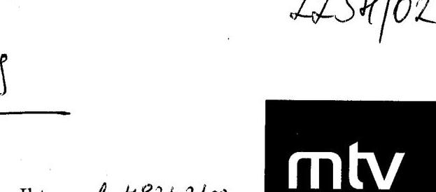
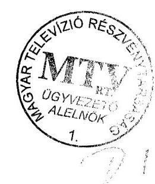
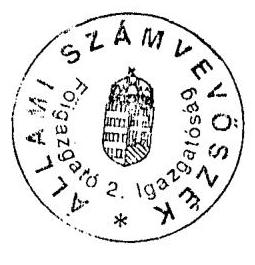
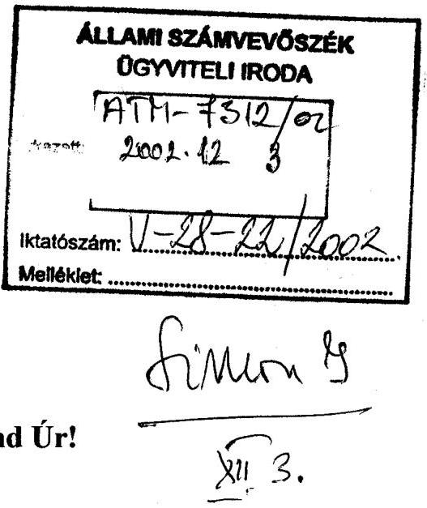
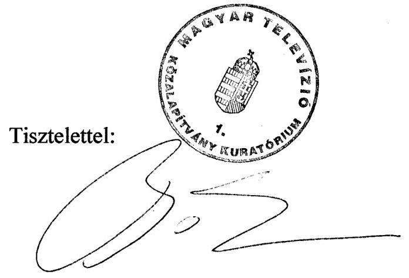
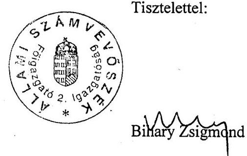

# VÉLEMÉNY 

a Magyar Televízió Részvénytársaság 2003. évi költségvetési támogatási igényének megalapozottságáról, indokoltságáról

0244. J/1659. 2002. december

---

# 2. Államháztartás Központi Szintjét Ellenőrző Igazgatóság   2.2. Pénzügyi Ellenőrzési Főcsoport   Iktatószám: V-28-25/2002.   Témaszám: 632.   Vizsgálat-azonosító szám: 0063 

## Az ellenőrzést felügyelte:

Bihary Zsigmond
főigazgató
Az ellenőrzés végrehajtásáért felelős:
Simon Ákosné
főcsoportfőnök
Az ellenőrzést vezette:
Horváth Sándor
főcsoportfőnök-helyettes
Pongrácz Éva
osztályvezető főtanácsos
A számvevői jelentések feldolgozásában és a jelentés összeállításában közreműködtek:
Dr. Béhm Imre Éva Katalin
számvevő tanácsos, tanácsadó
számvevő tanácsos, tanácsadó

Az ellenőrzést végezték:
Dr. Béhm Imre Éva Katalin
számvevő tanácsos, tanácsadó
Szabó Erzsébet Szöllősiné Hrabóczki Tolnai Lászlóné
számvevő tanácsos
számvevő tanácsos,
tanácsadó számvevő tanácsos
Szállóiné Hrabóczki
Etelka
számvevő tanácsos,
főtanácsadó

A témához kapcsolódó eddig készített számvevőszéki jelentések:
címe:
sorszáma:
Jelentés a médiatörvény végrehajtásának pénzügyi-gazdasági 396. ellenőrzéséről
Jelentés a Magyar Televízió Közalapítvány és kapcsolódó ellenőrzés 418. keretében a Magyar Televízió Rt. működésének és gazdálkodásának ellenőrzéséről

---

# TARTALOMJEGYZÉK 

BEVEZETÉS ..... 5
I. ÖSSZEGZŐ MEGÁLLAPÍTÁSOK, KÖVETKEZTETÉSEK, JAVASLATOK ..... 7
II. RÉSZLETES MEGÁLLAPÍTÁSOK ..... 11

1. Az MTV Rt. alapítása, vagyona, működésének és tervezési rendszerének szabályozottsága ..... 11
1.1. Az MTV Rt. alapítása ..... 11
1.2. Az MTV Rt. vagyona ..... 12
1.3. Az MTV Rt. működésének és tervezési rendszerének szabályozottsága ..... 14
2. Az MTV Rt. 2003. évi előzetes üzleti tervének megalapozottsága ..... 17
2.1. Az MTV Rt. 2003. évi üzleti terve és a Média tv.-ben előírt feladatok kapcsolata, a 2002. évi várható adatok figyelembevétele ..... 18
2.2. A szakmai tevékenység és a pénzügyi lehetőségek összhangja, a tervezett intézkedések ..... 19
2.3. A 2002. évi várható veszteség ellentételezésének módja ..... 20
2.4. A 2003. évi előzetes üzleti terv számításokkal való alátámasztottsága ..... 21
2.5. Az MTV Rt. kötelezettségeinek alakulása ..... 21
2.6. Az MTV Rt. követeléseinek alakulása ..... 22
2.7. Az MTV Rt. értékelései és intézkedései a kötelezettségek, a követelések, a likviditási helyzet alakulásával kapcsolatban ..... 22
3. A bevételek tervezésének megalapozottsága ..... 23
3.1. A költségvetési támogatási igény dokumentáltsága ..... 24
3.2. A műsorszolgáltatási költségvetési támogatás finanszírozásban betöltött szerepe ..... 25
3.3. A reklámbevételek alakulása ..... 25
3.4. Az MTV Rt. intézkedései a bevételek növelésére ..... 26
4. A költségek tervezésének megalapozottsága ..... 27
4.1. A költségek 2002. évi szerkezete és várható alakulása ..... 27
4.2. A létszám és bérköltségek tervezésének megalapozottsága ..... 28
4.3. A 2003. évi költségcsökkentési intézkedési terv megalapozottsága ..... 30
4.4. Az MTV Rt. előzetes tervében szereplő kedvezőbb költségszerkezet kialakítása ..... 31
4.5. A tervezett költségek (ráfordítások) és a tervezhető forráslehetőségek összhangja ..... 32

---

# 2

---

# RÖVIDÍTÉSEK JEGYZÉKE 

áfa
ÁPV Rt.
ÁSZ
FB
KSz
Média tv.
Mt.
MTV KA
MTV Rt.
OGY
ORTT
SzMSz
Sztv.
Ügyrend
általános forgalmi adó
Állami Privatizációs és Vagyonkezelő Rt.
Állami Számvevőszék
Felügyelőbizottság
Kollektív Szerződés
1996. évi I. törvény a rádiózásról és a televíziózásról

Munka Törvénykönyve
Magyar Televízió Közalapítvány
Magyar Televízió Részvénytársaság
Országgyűlés
Országos Rádió és Televízió Testület
Szervezeti és Működési Szabályzat
2000. évi C. törvény a számvitelről

MTV KA Kuratóriuma Ellenőrző Testületének Ügyrendje

---

# 4

---

# VÉLEMÉNY 

## a Magyar Televízió Részvénytársaság 2003. évi költségvetési támogatási igényének megalapozottságáról, indokoltságáról

## BEVEZETÉS

Az Országgyűlés a szabad és független rádiózás és televíziózás, a véleménynyilvánítás szabadsága, a tájékoztatás függetlensége, kiegyensúlyozottsága és tárgyilagossága, a tájékozódás szabadsága, valamint az egyetemes és a nemzeti kultúra támogatása, a vélemények és a kultúra sokszínűségének érvényre juttatása érdekében, a tájékoztatási monopóliumok kialakulásának megakadályozására, az Alkotmány 61. §-a szerint, alkotta meg a rádiózásról és televíziózásról szóló 1996. évi I. törvényt (Média tv.). A Média tv. 53. § (1) bekezdése és 140-141. §-ai alapján a közszolgálati műsorszolgáltatás biztosítására, függetlenségének védelmére a 18/1996. (III. 8.) OGY határozatával az Országgyűlés létrehozta a Magyar Televízió Közalapítványt (MTV KA).

Az Országgyűlés a Polgári Törvénykönyvről szóló 1959. évi IV. törvény 74/G. § (1) bekezdése szerint a Média tv. 53. § (1) bekezdésében foglaltak végrehajtására határozatlan időre megalkotta a MTV KA Alapító Okiratát. A Média tv. 64. §-a alapján a nemzeti közszolgálati televízió feladatainak ellátására az MTV KA megalapította a Magyar Televízió Részvénytársaságot (MTV Rt.).

Az MTV KA Alapító Okirata megfogalmazza a Közalapítvány alapvető feladatát, hogy az MTV Rt. tulajdonosaként gondoskodjon a közszolgálati műsorszolgáltatás Média tv.-ben meghatározott követelményeinek érvényesüléséről.

Az MTV Rt. 1996. október 1-jei, alapításkori vagyona 24157 M Ft volt. A saját tőke 18964 M Ft, ezen belül az alaptőke (jegyzett tőke) 16056 M Ft-ot, a tőketartalék 2908 M Ft-ot tett ki.

---

A Magyar Televízió Közalapítvány és kapcsolódó ellenőrzés keretében a Magyar Televízió Rt. működésének és gazdálkodásának ellenőrzéséről szóló, 1998 júniusában készült jelentésünkben jeleztük, hogy az Rt.-nek 1998. évben már a reális prognózisok szerint komoly gazdálkodási problémákkal kell szembenéznie. Elkerülhetetlen a racionális szervezeti átalakítás, a megrendelő típusú televízió feladataihoz igazodó létszám és költségtakarékos gazdálkodás.

Az MTV Rt. - a várható adatok szerint - 12863 M Ft veszteséggel zárja a 2002. évet. A társaság 2002. évi rendkívüli költségvetési támogatási igénye 7 Mrd Ft. A 2003. évi költségvetési törvényjavaslat összesen 6,8 Mrd Ft támogatási összeget határozott meg alaptőke emelésre a közszolgálati média részvénytársaságok részére.

Az Országgyűlés 89/2002. (XI. 13.) OGY határozata alapján lefolytatott célvizsgálat arra keresett választ, hogy az MTV Rt. 2003. évi költségvetési támogatási igénye (27-28 Mrd Ft) megalapozott és indokolt-e. Az ellenőrzés keretében - figyelemmel a vizsgálat eredeti céljára - áttekintettük az MTV Rt. tervezési rendszerét, hogy ezáltal megalapozottabb képet nyújthassunk a működés egészéről és az ehhez szükséges támogatás megítéléséhez.

A Vélemény tervezetét észrevételezésre megküldtük a Magyar Televízió Rt. ügyvezető alelnökének, valamint a Magyar Televízió Közalapítvány Kuratóriuma elnökének. Észrevételeiket és az azokra adott válaszainkat a Vélemény melléklete tartalmazza.

---

# I. ÖSSZEGZŐ MEGÁLLAPÍTÁSOK, KÖVETKEZTETÉSEK, JAVASLATOK 

Az MTV Rt. már alapításkor jelentős, - az eszközállomány mellett - „örökölt" tartozásállománnyal rendelkezett, ami 1996. év végén 5193 M Ft-ot tett ki. Az Rt. kötelezettségeinek összege 1998-tól minden évben jóval meghaladta a saját tőke értékét. A 2002. év végén a kötelezettségek várhatóan a saját tőke háromszorosát teszik ki.

Az MTV Rt. saját tőkéje - az alapítás évétől folyamatosan veszteséges gazdálkodás következtében - jelentősen lecsökkent. A 2002. évre a saját tőke várható értéke negatív előjelű, -4392 M Ft (a jegyzett tőke 1200 M Ft). Az MTV Rt. megítélése szerint a 2002. évet várhatóan 12863 M Ft veszteséggel zárja. A 2002. szeptember 30-i szállítóállomány 75%-át a 10 M Ft feletti tartozások jelentették. A helyszíni ellenőrzés befejezéséig 77 esetben kezdeményeztek a hitelezők az Rt. ellen felszámolási eljárást.

Az Rt. likviditása 1998. második felében olyan mértékben romlott, hogy nem tudott eleget tenni a költségvetés felé fennálló tartozásainak. Az OGY 2001-ben a köztartozásokat (10542 M Ft) elengedte. Ennek is köszönhetően 2002. szeptember 30-án az Rt. 288 M Ft köztartozással rendelkezett, amelyek között lejárt tartozás nem volt.

A saját források jelentős szűkülése következtében egyre nagyobb összegű bankhitel felvétele vált szükségessé, az ellenőrzés lezárásakor az Rt. folyószámlahitel-kerete 990 M Ft volt, amelyet felhasználtak.

A kialakult pénzügyi és vagyoni helyzet döntően arra vezethető vissza, hogy az MTV Rt. bevételei 1997. évtől kezdődően - a Média tv. korlátozásai, a kereskedelmi televíziók által támasztott konkurencia együttes hatásaként - jelentősen csökkentek, a költségeket nem a forrásokhoz igazodóan határozták meg, és a bevételek növelése érdekében sem tettek meg minden szükséges intézkedést. Ugyanakkor az évek során egyre nagyobb átfedést mutat az Rt. által üzemeltetett két csatorna műsorstruktúrája, melynek költségcsökkentő hatása van. Az MTV 2 csatorna műsorstruktúrájában viszont a DTV Rt. profiljába tartozó műsorok is jelen vannak.

Az MTV KA Kuratóriuma rendre minden évben veszteséggel számított üzleti tervet fogadott el, a veszteség rendezésére pedig nem tett érdemi lépéseket. A 2002. évre az MTV Rt. éves üzleti tervet nem, csak féléves üzleti tervet készített. A 2002. második félévi üzleti tervet az MTV KA - bár napirendjére tűzte - erről nem hozott határozatot. A Média tv. betartásával egyidejűleg nem valósult meg a racionális szervezeti átalakítás a forrásokhoz igazodó költségtakarékos gazdálkodás (a legutóbbi időkben születtek ugyan költségcsökkentő intézkedések, de ezek hatása még nem mérhető).

Az MTV KA Kuratóriumának Elnöksége 2002. október 8-i határozatában felkérte az MTV Rt. ügyvezető alelnökét, hogy 2002. október 17-ig dolgozzon ki válságtervet az MTV Rt. 2002. év végéig történő működtetésére és ezen belül az Rt. 1-3 éves jövőbeni működésére vonatkozó konszolidációs tervet. E határozat alapján elkészült az Rt. Válság- és konszolidációs tervjavaslata, amelyről kuratóriumi határozat helyszíni ellenőrzésünk lezárásáig nem született.

Az Rt. 2003. évi előzetes üzleti tervének első változata 2002. november 6-ára készült el, 41,7 Mrd Ft finanszírozási igénnyel. Az MTV Rt. rövid távú Válság- és konszolidációs tervét figyelembe véve - a 2,0 Mrd Ft fejlesztési igénnyel együtt - ez az összeg 32,3 Mrd Ft-ra csökkent. Az MTV Rt. tervezése nem a forrásokból, hanem a költségek tervezéséből indult ki, ehhez igazítva a forrásoldalt, aminek mintegy 84%-a költségvetési támogatás. A 2003. évi összes költség 2,0 Mrd Ft fejlesztési igénnyel magasabb a 2002. évi várható adatnál. A támogatásból mindkét változatban azonos az üzemben tartási díj (11,5 Mrd Ft), a mentesítettek miatti költségvetési támogatás (2,5 Mrd Ft), a műsorterjesztési költség támogatása (6,5 Mrd Ft) és a fejlesztési igény támogatása (2 Mrd Ft). A folyó finanszírozáshoz szükséges további támogatási igénye 4,5 Mrd Ft.

Az MTV Rt. üzleti terve szerint felsorolt támogatási igényen kívül a saját tőke rendezéséhez minimálisan 5,6 Mrd Ft, a megnyugtató rendezéshez 7 Mrd Ft forrás szükséges.

Az ellenőrzés rendelkezésére bocsátott 2003. évi előzetes terv még nem tartalmazta a költségvetési támogatási igényt részletesen alátámasztó számításokat. Az Rt. támogatási igénye mintegy 11-12 Mrd Ft-tal magasabb a költségvetési törvényjavaslatban előirányzott támogatásnál (a hiány összege az alaptőke emelés megosztását követően határozható meg). Az alacsonyabb összegű - a takarékossági intézkedések hatását tartalmazó - változatban is a költségek 15-20%-ára nincs fedezet. Az átláthatatlan önköltségszámítás nem teszi lehetővé a megalapozott költségtervezést. Az üzleti tervben szereplő összes költséget - az utókalkuláció hiányára is visszavezethetően - nem osztják meg a két közszolgálati adó között.

A Média tv.-ben meghatározott feladatellátási kötelezettség és a közszolgálati televízió finanszírozási módja közötti ellentmondás nehezíti a stratégiai döntések meghozatalát és tényleges végrehajtását. A normatív alapra helyezett, a Média tv.-ben előírt feladatok ellátásához rendelt támogatási rendszer (normatív alapú feladatfinanszírozás), kiegészítve a szükség szerinti céltámogatással, elősegítheti a hosszú távú, megalapozott döntéshozatalt és az így hozott döntések végrehajtását. Ez a Média tv. módosítását is feltételezi.

Az Rt. gazdálkodását érintő szabályozásokat - korábbi ellenőrzésünk során tett megállapításaink ellenére - nem aktualizálták. A közszolgálati műsorszolgáltatási szabályzat tervezetét csak késve, 2002 januárban készítették el. Az Országos Rádió és Televízió Testület 472/2002. (III. 19.) ORTT számú határozatában egy módosítással egyetértett a szabályzattal.

A Felügyelőbizottság 2001-ben készített ügyrendjét nem hagyták jóvá. Az MTV KA-nál Ellenőrző Testület - országgyűlési megválasztás hiányában - nem működött, egyetlen megválasztott tagja
 2001. március 20-án lemondott. Az Rt. az MTV KA oldaláról - a Testület 2002. júniusi megválasztását megelőzően - lényegében kontroll nélkül működött.

---

A szabályozottság, a tervezési rendszer, a 2003. évi előzetes üzleti-, a rövid távú válság- és konszolidációs terv dokumentációs hiányosságai, valamint az átláthatatlan önköltségszámítás nem teszik lehetővé az MTV Rt. költségvetési támogatási igénye megalapozottságának megítélését.

A koncepcionális javaslatban leírt takarékossági intézkedésből hiányzik annak a követelményrendszernek a kidolgozása, amely biztosítja, hogy a gyártási költségek - a produkciók színvonalának csökkenése nélkül - csak a reális mértékben növeljék az MTV Rt. költségeit. Az ellenőrzés tapasztalatai alapján az anyag-, bér- és rezsi-, valamint gyártási normák kidolgozása nélkül az egyes műsortípusok költség-, illetve kapacitásigénye objektív módon a következő időszakban sem határozható meg. Így a műsor előállítási költségét alapvetően csak a műsorgyártó egységek részére rendelkezésre álló keretek korlátozzák (akadályozzák meg túllépését).

A törvényjavaslatban szereplő költségvetési támogatás összege az Rt. változatlan külső és belső szabályozási, illetve strukturális keretek közötti működtetése esetén az Rt. vezetése által már meghozott és a jövőben alkalmazásra kerülő intézkedésekre tekintettel is csak a 2003. év mintegy első háromnegyed évi működésének finanszírozását biztosíthatja.

Folyamatban van a Magyar Televízió Közalapítvány és az MTV Rt. működésének átfogó számvevőszéki ellenőrzése, amelynek eredményei 2003. május végén válnak publikussá.

A korábbi ÁSZ ellenőrzés és a jelenlegi célvizsgálat megállapításai alapján is látható azonban, hogy a kialakult helyzetben egyaránt szerepe van a törvényi szabályozás ellentmondásainak, a realitásokat figyelmen kívül hagyó szakmai koncepcióknak és (a helyenként pazarló) gazdálkodási gyakorlatnak, valamint a Közalapítványnak az MTV Rt., az Országgyűlésnek pedig a Közalapítvány irányában meglévő hatásköre, feladatai nem megfelelő gyakorlásának.

Mindezt figyelembe véve csak a finanszírozható közszolgálati televízió modelljének kialakítását követően célszerű dönteni a költségvetési támogatás 2003. évi teljes összegéről, ugyanakkor konszolidálni kell az Rt. pénzügyi helyzetét a további veszteségek elkerülése érdekében. A konszolidációs célú támogatás összegét egyrészt úgy javasoljuk meghatározni, hogy azzal megszűnjön a saját tőke negatív előjele (4392 M Ft) és kiváltható legyen a folyószámlahitel-keret (990 M Ft), másrészt a további támogatás - a térítés jellegű támogatások kivételével - összegét csak a Közalapítvány, illetve az Országgyűlés által elfogadott konszolidációs program ismeretében célszerű az Rt. saját tőkéjének növelése érdekében, hogy elérje a jegyzett tőke kétharmadát, valamint a további támogatási összeg meghatározását.

---

A helyszíni ellenőrzés megállapításainak hasznosítása mellett javasoljuk:

# az Országgyűlés részére 

1. Kérje fel a Kormányt, hogy soron kívül bocsásson az Rt. rendelkezésére a folyószámlahitel-keret kiváltására 990 M Ft-ot, valamint a saját tőke negatív előjelének megszüntetése érdekében 4392 M Ft-ot.
2. Kérje fel a Kormányt, - a konszolidációs terv elfogadását követően, - hogy részesítse az MTV Rt.-t 800 M Ft összegű tőkejuttatásban annak érdekében, hogy saját tőkéje elérje a jegyzett tőke kétharmadát.
3. Határozzon - a konszolidációs terv elfogadását követően - az MTV Rt. működési struktúrájáról és annak finanszírozásáról.
4. Számoltassa be az MTV KA Kuratóriumát a törvényi előírásoknak (Média tv., Számviteli tv. stb.) megfelelő belső szabályozás elkészítéséről, a belső elszámolások rendszerének szabályozásáról.

## a Magyar Televízió Közalapítvány részére

Kérje fel a Magyar Televízió Rt.-t, hogy dolgozzon ki egy megfelelően dokumentált, számszakilag alátámasztott, felelősökkel és határidőkkel rögzített feladatokat tartalmazó, - beleértve a meglévő infrastruktúra strukturális átalakítását - konszolidációs tervet.

---

# II. RÉSZLETES MEGÁLLAPÍTÁSOK 

## 1. Az MTV Rt. alapítása, vagyona, működésének és tervezési rendszerének szabályozottsága

### 1.1. Az MTV Rt. alapítása

A Magyar Köztársaság Országgyűlése a szabad és független rádiózás és televíziózás, a véleménynyilvánítás szabadsága, a tájékoztatás függetlensége, kiegyensúlyozottsága és tárgyilagossága, a tájékozódás szabadsága, valamint az egyetemes és a nemzeti kultúra támogatása, a vélemények és a kultúra sokszínűségének érvényre juttatása érdekében, a tájékoztatási monopóliumok kialakulásának megakadályozására az Alkotmány 61. §-a szerint alkotta meg a rádiózásról és televíziózásról szóló 1996. évi I. törvényt (Média tv.).

A Média tv. 53. § (1) bekezdése és 140-141. §-ai alapján a közszolgálati műsorszolgáltatás biztosítására, függetlenségének védelmére a 18/1996. (III. 8.) OGY határozatával az Országgyűlés létrehozta a Magyar Televízió Közalapítványt (MTV KA).

Az Országgyűlés a Polgári Törvénykönyvről szóló 1959. évi IV. törvény 74/G. § (1) bekezdése szerint a Média tv. 53. § (1) bekezdésében foglaltak végrehajtására határozatlan időre megalkotta a MTV KA Alapító Okiratát.

A Média tv. 64. §-a alapján a nemzeti közszolgálati televízió feladatainak ellátására az MTV KA megalapította a Magyar Televízió Részvénytársaságot (MTV Rt.).

Az MTV KA Alapító Okirata megfogalmazta a Közalapítvány alapvető feladatát, amely szerint az MTV Rt. tulajdonosaként gondoskodjon a közszolgálati műsorszolgáltatás Média tv.-ben meghatározott követelményeinek érvényesüléséről.

Az MTV KA ellenőrzés részére bemutatott Szervezeti és Működési Szabályzata (SzMSz) 1996. december 10-én lépett hatályba, amelyet a jogszabályi változások ellenére sem aktualizáltak.

Az MTV KA a Média tv., illetve SzMSz-ének 1. 2. pontja alapján az MTV KA gyakorolja - az SzMSz-ben tételesen felsorolt kivételekkel - az MTV Rt. vonatkozásában a gazdasági társaságokról szóló törvényben meghatározott alapítói, részvényesi jogokat.

A MTV Rt. saját vagyonát, saját tőkéjét - az alapító okirata szerint (megjelent a Magyar Közlöny 1996. évi 106. számában) - 1996. október 1-jével 18964 M Ft-ban állapították meg, ezen belül az alaptőke (jegyzett tőke) 16056 M Ft-ot, a tőketartalék 2908 M Ft-ot tett ki. Ezek az adatok kerültek véglegesen a Fővárosi Bíróság, mint Cégbíróság 1996. november 18-án kelt

---

végzésével - az Alapító Okirat és annak módosítása adatai alapján - a Cg.01-10-043219. számú cégjegyzékbe.

Az induló vagyonmérleg szerint az eszközállományt 24157 M Ft-ban, a források között a saját tőkét eredetileg 17620 M Ft-ban, ezen belül a jegyzett tőkét 16056 M Ft-ban, a tőketartalékot pedig 1564 M Ft-ban állapították meg. Ez az összeg szerepel az MTV Rt. 1996. évi mérlegében. A vagyonértékelést azonban korrigálni kellett a felmérés alapjául szolgáló vagyonleltár hiányosságai miatt. A végleges értékek az Alapító Okirat még ugyanezen évi módosítása következtében alakultak ki.

# 1.2. Az MTV Rt. vagyona 

Az MTV Rt. saját tőkéje az alapítás évétől folyamatosan veszteséges üzleti tevékenysége következtében - amely változóan kisebb vagy jelentősebb összegben negatív előjelű mérleg szerinti eredményben nyilvánult meg - jelentősen lecsökkent az alapításkori nagyságrendhez képest. Az MTV Rt. - a várható adatok szerint - 2002. december 31-ei mérleg szerinti vesztesége 12863 M Ft lesz.

A saját tőke az 1997. év végén még 18489 M Ft-ot tett ki, ezen belül a jegyzett tőke 16056 M Ft-ot. Ekkortól a saját tőke nagyságrendje folyamatosan, a részét képező jegyzett tőke ugyancsak csökkent. 2000-ben a saját tőke negatív előjelűvé vált (-5808 M Ft), és a várható adatok alapján, 2002 végén ismételten negatív előjelű lesz.

Az alapításkor a saját tőke az eszközállománynak a 78,5%-a volt a forrása. A veszteséges gazdálkodás következtében az MTV Rt. saját vagyona olyan mértékben csökkent, hogy a sajáttőke-ellátottság 1998-ban 43,4%-ot tett ki. 1998-ban a saját tőke az alaptőke (jegyzett tőke) 63,4%-ára, az alapításkori saját tőkéhez viszonyítva pedig annak 50,8%-ára csökkent. 1999-ben a sajáttőke-ellátottság 22,0%, 2001-ben 33,9% volt.

A Magyar Televízió Közalapítvány Kuratórium Elnöksége 2001. december 20-ai elnökségi ülésén foglalkozott az MTV Rt. III. és IV. negyedéves gazdasági munkájával. Az Elnökség a gazdasági munka értékeléséről 201/2001. EH számon határozatot hozott.
„A Magyar Televízió Közalapítvány Kuratórium Elnöksége úgy döntött, hogy a Magyar Televízió Részvénytársaság III. és IV. negyedéves gazdasági munkáját kiemelkedően jónak ítéli, ezért az MTV Rt. elnökének a III. és IV. negyedévre előírt célfeladatait elvégzettnek tekinti és a szerződés szerint járó díjazás kifizetéséhez hozzájárul (3 igen szavazattal, egyhangúlag)."

A Magyar Rádió Rt. és a Magyar Televízió Rt. saját tőkéje egyes elemeinek emelésével kapcsolatos teendőkről szóló 1132/2001. (XII. 11.) Korm. határozat alapján az MTV Rt. tőketartalékába 2001-ben 12500 M Ft-ot juttatott a Kormány, az NKÓM és az MTV Közalapítvány Kuratóriuma között kötött szerződés alapján. A tőkehiányon a juttatás csupán enyhített, de nem jelenti a jövőbeni működés biztonságát. A 2000. évi -5808 M Ft összeghez képest a saját tőke 2001. december 31-ére - átmenetileg - +8471 M Ft-ra, a tőkeellátottság 33,9%-ra növekedett.

---

A veszteséges gazdálkodás következtében a saját tőke a 2002. évben ismét csökken. A 2002. szeptember 30-ai főkönyvi kivonat szerint ugyan a saját tőke ebben az időpontban 43 M Ft, a miatt azonban, hogy az év utolsó negyedében nem időarányos kötelezettségek keletkeznek, hanem azt jóval meghaladó nagyságrendűek - a 2002. év végére az MTV Rt. -4392 M Ft-ban számszerűsíti a saját tőke nagyságrendjét, ezen belül 1200 M Ft-os jegyzett tőkével.

A saját tőke ismertetett nagyságrendű csökkenése - különösen a várható adatok ismeretében - jelentős vagyonvesztésnek minősül.

Az MTV Rt. saját tőkéjének kiegészítésére vonatkozó 2003. évi költségvetési támogatási igény számszerűsítéséhez kiindulási alapot ad a saját tőke 2002. év végi várható nagyságrendje (-4392 M Ft), illetve az a tény, hogy a vagyonvesztés nagyságrendje (már 1998-ban) meghaladta azt a mértéket, amelyet a gazdasági társaságokról szóló 1997. évi CXLIV. törvény megenged, és amelyet meg kell szüntetni.

A gazdasági társaságokról szóló 1997. évi CXLIV. törvény 243. §. (1) bekezdése a rendkívüli közgyűlés összehívásának 3 esetét tartalmazza. Össze kell hívni a közgyűlést, ha a társaság saját tőkéje veszteség következtében az alaptőke egy harmadával csökkent, vagy ha a társaság saját tőkéje 20 M Ft alá csökkent, továbbá akkor is, ha a társaság a fizetéseit megszüntette és vagyona a tartozásokat nem fedezi. Ha a társaság saját tőkéje már 20 M Ft alá csökkent, az alaptőke leszállítására a Gt. 258. § (1) bekezdésében foglalt korlátozás miatt nem kerülhet sor; ilyen esetben a Gt. 258. § (3) bekezdés alkalmazásával a társaság köteles az átalakulásról vagy a jogutód nélküli megszűnéséről gondoskodni.

A független könyvvizsgáló több évben, először 1998-ban, felhívta a figyelmet arra, hogy a gazdasági társaságokról szóló törvény nem engedi meg, hogy részvénytársaság negatív tőkével működjön. Több évben javasolta, hogy a Magyar Televízió Közalapítvány Kuratóriuma tegye meg az alapítótól elvárható, szükséges intézkedéseket, a MTV Rt. likviditási válságának kezelését szolgáló, valamint tőkehelyzetének normalizálását jelentő lépéseket. Ellenkező esetben nem biztosított az MTV Rt. működésének folyamatossága.

Legutoljára a 2002. év félévének zárásakor, illetve a 2002. évi gazdálkodás várható főbb sarokszámainak előterjesztésekor, annak megismerésekor kezdeményezte a független könyvvizsgáló és az MTV Rt. menedzsmentje is, hogy az Alapító járjon el a gazdasági egyensúlyi hiány felszámolását jelentő intézkedések meghozatala, jogszabályok megalkotása érdekében.

A Kuratórium foglalkozott - a független könyvvizsgáló jelzése alapján is - a tőkehiány, a vagyonvesztés problémájával. A Kuratórium vezetője 2002. augusztus 27-én levelet írt az Országgyűlés elnökének. A levél hangsúlyozta, hogy „haladéktalanul szükséges az MTV Rt.
 tőkéjének pótlása, továbbá a közszolgálati televíziózás tartós finanszírozhatóságát biztosító törvényi feltételek megteremtése".

---

# 1.3. Az MTV Rt. működésének és tervezési rendszerének szabályozottsága 

A 2/1999. MTV Rt. Elnöki utasítása alapján az ügyvezető alelnök 1999. február 1-jén hatályba léptette az MTV Rt. SzMSz-ét (az SzMSz-t nem írták alá). Az SzMSz nem tekinthető korszerű és teljes körű szervezeti és működési szabályzatnak.

Az SzMSz nem tartalmazza a szervezeti felépítést bemutató táblázatot (szervezeti sémát).

Az SzMSz részletesen foglalkozik a Gazdaságelemzési és Tervezési Főosztály feladataival annak ellenére, hogy az osztály megszűnt.

A gazdasági társaságokról szóló törvényi hivatkozása elavult.
A számvitelről szóló 2000. évi C. törvény 9. § (1) bekezdése értelmében az Rt.-k számára kötelező beszámolási forma az éves beszámoló és üzleti jelentés készítése. Az éves beszámolónak a törvény 4. §, 9. §, 20. §, valamint a 95. §-ában foglaltak alapján része a mérleg, az eredménykimutatás, a kiegészítő melléklet és az üzleti jelentés.

Ennek ellenére az SzMSz (1.2. bekezdés o) pont) és a Média tv. 66. § (1) bekezdés m) pontja is csak a mérleggel és az eredménykimutatással kapcsolatos teendőket nevesíti.

## Az MTV Rt. SzMSz-e jelenleg átdolgozás alatt van.

A Média tv. 27. §-a alapján a közszolgálati műsorszolgáltató a tevékenysége során birtokába került kulturális értékek és történelmi jelentőségű dokumentumok tartós megőrzéséről archívumában gondoskodik, azokat szakszerűen összegyűjti, tárolja és gondozza.

Az archiválás szabályait és feltételeit, a hasznosítás módját az MTV KA Kuratóriumának az Országos Rádió és Televízió Testülettel (ORTT) egyetértésben külön szabályzatban kell megállapítania.

Az MTV KA késve, 1998 márciusában készítette el az MTV Rt. Archiválási Szabályzatát, amely nem lépett hatályba, mivel az ORTT ezzel nem értett egyet.

A Média tv. 29. §-a Közszolgáltatási műsorszolgáltatási szabályzat elkészítését és alkalmazását írta elő, amelynek tervezetét a törvény hatálybalépésétől számított 9 hónapon belül jóváhagyásra meg kellett küldeni az MTV KA Kuratóriumának. A szabályzat-tervezetet késve, 2002. januárban készítették el, amely nem tartalmazza a hatálybaléptetést, annak aláírt példányát az MTV KA az ellenőrzés részére bemutatni nem tudta.

Az ORTT, 472/2002. (III. 19.) ORTT számú határozatában egy módosítással egyetértett a Közszolgálati műsorszolgáltatási szabályzattal, amelyet a szabályzat-tervezetben átvezettek. A Kulturális Közlöny 2002. évi 14. számában az MTV Rt. Közszolgálati Műsorszolgáltatási Szabályzatát közzétették.

---

A Média tv. 66. § (1) bekezdés m) pontja alapján a mérleg és az eredménykimutatás jóváhagyása az MTV Rt. vonatkozásában az MTV KA Kuratóriumának hatáskörébe tartozik.

Az MTV KA Kuratóriuma 18/2002. KH szám alatt 20 igen szavazattal és 4 tartózkodás mellett elfogadta az MTV Rt. 2001. évi mérlegét és eredménykimutatását.

A Média tv. 66. § (1) bekezdés g) pontja szerint az MTV KA Kuratóriumának hatáskörébe tartozik az MTV Rt. éves gazdálkodási és pénzügyi terv elveinek és főösszegeinek jóváhagyása.

Az MTV KA Kuratóriuma az MTV Rt. 2002. évi üzleti tervét nem hagyta jóvá.
A 2002. I. félévi üzleti terv január 15-ére készült el (a gazdasági folyamat kezdetéhez viszonyítva már ez is félhavi késedelmet jelent), az Rt. szervezeti egységei csak január 21-e után ismerhették meg a rendelkezésre álló keretük összegét, amelyet a Kuratórium csak január 31-ei ülésén hagyott jóvá. A jóváhagyott 2002. I. félévi tervben a veszteség összege 5,5 Mrd Ft volt, annak ellenére, hogy a 2001. évi beszámoló könyvvizsgálata alapján már komoly kétségek merültek fel arra vonatkozóan, hogy a társaság a jövőben a hatályos jogszabályok előírásait, valamint a piaci viszonyokat figyelembe véve képes-e tevékenységét folytatni.

Az MTV KA Kuratóriuma az MTV Rt. tárgyévre vonatkozó éves adásidejét csak késve, a 40/2002. (IX. 17.) számú határozatában állapította meg.

Az MTV Rt. 2002. évre vonatkozó éves teljes gazdálkodásának várható főbb tervszámait 2002. július 9-én nyújtotta be az MTV KA Kuratóriumához, amelynek megtárgyalása a helyszíni vizsgálat lezárásáig nem történt meg.

A 2002. II. félévi üzleti terv augusztus 23-án készült el (a tényleges folyamatokhoz képest közel egyhavi a késéssel), a szervezeti egységek pedig csak október 3-a után (két hónapos késéssel) tudták meg előzetes keretszámaikat, mivel a Kuratórium jóváhagyása még nem történt meg.

Az MTV KA Kuratóriuma 2002. szeptember 17-én határozott arról, hogy az MTV Rt. vezetése a 2002. év gazdasági folyamatairól 2002. október 31-ei fordulónappal állítson össze egy közbenső mérleget, amelynek elkészítése a helyszíni vizsgálat lezárásakor folyamatban volt.

Az MTV KA Kuratóriuma csak október 8-án kérte fel az MTV Rt. ügyvezető elnökét, hogy konszolidációs tervet dolgozzon ki.

A konszolidációs terv október 16-ára elkészült, de ehhez új, átdolgozott II. félévi üzleti terv nem kapcsolódott. Az MTV Rt. 2002. I-IX. havi gazdálkodását bemutató összeállítás az augusztusban készített, jóvá nem hagyott terv tényadatokkal való összehasonlítását tartalmazza.

Az MTV Rt. gazdasági irányítása az augusztus hónapban kidolgozott, jóvá nem hagyott üzleti terv alapján történik. A szervezeti egységek részé

---

re a II. félévre kiadott keretszámok a konszolidációs intézkedések hatását nem tartalmazzák.

A konszolidációs tervet - amelyet az MTV KA Kuratóriuma részére 2002. október 18-án az MTV Rt. benyújtott - az Elnökség több ülésén tárgyalta, határozat még nem született.

A Kuratórium Elnöksége csak november 19-ei átiratában (az üzleti év végét megelőzően másfél hónappal) szólította fel az MTV Rt. ügyvezető elnökét, hogy a benyújtott konszolidációs tervet legkésőbb november 25-ig dolgozza át, úgy hogy „annak költségszintje 28 Mrd Ft legyen".

A 2003. évre készített üzleti tervet az MTV Rt. még nem terjesztette be az MTV KA Kuratóriuma elé, az a vizsgálat időszakában előzetes munkaanyagként állt rendelkezésre.

Az MTV Rt. 2003. évi előzetes üzleti tervének első változatát 2002. november 6-ára készítették el, amely 41,7 Mrd Ft finanszírozási igényt fogalmazott meg. Figyelembe véve az MTV Rt. rövid távú válságtervét és a konszolidációs terv szempontjait, valamint a rendelkezésre álló tényadatokat, az üzleti terv főösszegének felső határát 30,3 Mrd Ft-ban határozták meg.

A Média tv. 73. §-a alapján az MTV Rt. ügyvezetését a felügyelőbizottság (FB) ellenőrzi. Az FB 2001. október 17-én elkészítette ügyrendjét, amelyet a Kuratórium elnöksége még nem hagyta jóvá. Az FB az MTV Rt. 2003. évi üzleti tervét - előterjesztés hiányában - nem tárgyalta.

Az MTV Rt. KA Alapító Okiratának 10. pontja alapján az MTV KA Kuratóriumának tevékenységét az Ellenőrző Testület ellenőrzi.

A Magyar Köztársaság Országgyűlése számára az MTV KA Kuratóriumának 2000. évi tevékenységéről készített J/4727. számú beszámoló 2.3. pontja alapján az Ellenőrző Testület tagjainak - országgyűlési megválasztás hiányában - 2000. február 28-tól az MTV KA-nál nem működött, egyetlen megválasztott tagja (a média közalapítványok ellenőrző testületei egy-egy tagjának megválasztásáról szóló 21/2000. (III. 24.) OGY határozat), 2001. március 20-án lemondott. (A célvizsgálat rendelkezésére bocsátott 2000. és 2001. évi beszámolók - a Magyar Köztársaság Országgyűlése számára az MTV KA Kuratóriumának tevékenységéről - nem tartalmazhatták az Ellenőrző Testület véleményét.)

Az Országgyűlés a Magyar Rádió, a Magyar Televízió és a Hungária Televízió Közalapítvány Kuratóriuma Elnökségének, illetőleg Ellenőrző Testületének kiegészítéséről szóló 23/2002. (V. 22.) OGY határozatával 2002. május 21-én megválasztotta az Ellenőrző Testület elnökét és 1 tagját, majd a Magyar Rádió, a Magyar Televízió és a Hungária Televízió Közalapítvány Kuratóriuma Elnökségének, illetőleg Ellenőrző Testületének kiegészítéséről szóló 26/2002. (VI. 5.) OGY határozatával kiegészítette az Ellenőrző Testületet, így az Ellenőrző Testület teljes létszámúvá vált.

Az Ellenőrző Testület 2002. július 17-én fogadta el az MTV KA Kuratóriuma Ellenőrző Testületének Ügyrendjét (Ügyrend), amelyben a feladatokat a Média tv.

---

62. §-ában előírt feladatkörével összhangban határozták meg. A célvizsgálat rendelkezésére bocsátott Ügyrend azonban nem tartalmazta a hatálybaléptetést, valamint az 1996. október 21-ei ülésen elfogadott TKT 256-97 számon hivatkozott Ellenőrző Testület Ügyrendjének hatályon kívül helyezését sem, nem tartalmazta továbbá valamennyi ellenőrző testületi tag aláírását.

Az Ellenőrző Testület elnöke 2002. november 12-én úgy nyilatkozott, hogy az Ellenőrző Testület a 2002. június 4-e óta eltelt időszakban az MTV Rt.-re vonatkozóan törvénysértést vagy az MTV Rt. gazdálkodását veszélyeztető döntéseket nem állapított meg.

Az Országgyűlés Kulturális és Sajtó bizottsága levélben kérte fel az Ellenőrző Testületet, hogy az MTV KA Kuratóriumának az 1997-2001. évekről benyújtott parlamenti beszámolóit véleményezze.

Az Ellenőrző Testület véleménye többek között a következőket tartalmazta:
„Az idő rövidségére való tekintettel részletes és szakmailag megalapozott, felelősségteljes, minden körülményt figyelembe vevő jelentést most nem áll módunkban kiadni." továbbá „... az MTV KA Kuratórium Ellenőrző Testülete folyamatosan és visszamenőlegesen vizsgálat tárgyává teszi az 1997-2002. május 21-ig tartó időszakot, és az Országgyűlés Kulturális és Sajtó Bizottságát a vizsgálati eredményekről írásban, részletesen tájékoztatni fogja."

# 2. Az MTV Rt. 2003. ÉVI ELŐZETES ÜZLETI TERVÉNEK MEGALAPOZOTTSÁGA 

Az MTV Rt. a 2003. évi üzleti terv kidolgozásához nem adott ki új, a tervezés általános feltételeire, metodikájára, a feladatmegosztásra, a felelősség rendjére kiterjedő belső szabályozást, tervkészítési ütemtervet. Az MTV Rt. vezetése 2002. október 29-én, 141/1259/2002. számon körlevelet bocsátott ki a szervezeti egységek részére, amely alapján a 2003. évi üzleti tervet a már korábbi időszakban megszokott formában kívánták elkészíttetni. Ezért a tervezés során alkalmazott alapelvek, kitöltendő táblázatok megegyeznek a 2001. október 12-én kiadott 5/2001. számú Pénzügyi főigazgatói utasításban foglaltakkal.

Az 5/2001. számú Pénzügyi főigazgatói utasításban és a 11/2001. számú MTV Rt. Elnöki utasításban a 2002. évi üzleti terv elkészítésével összefüggő feladatokkal kapcsolatosan határozták meg a tervezés alapelveit, mellékelték a tervezési táblákat, a kitöltéssel kapcsolatos tudnivalókat, meghatározták a felelősöket és a határidőket. Az utasítás nem fogalmazta meg az időközben bekövetkezett szervezeti változásokat, azok kezelését.

A 2003. évi üzleti tervhez a szervezeti egységeknek tervtáblázataikat rendkívül szoros határidőre, a 2002. október 29-én elkészített körlevél alapján 2002. október 31-én 12 óráig kellett elkészíteniük.

A Kontrolling osztálytól kapott tájékoztatás alapján az MTV Rt. 21 szervezeti egységéből 85,7% határidőre, 14,3% feldolgozhatósági határidőn belül készítette el és bocsátotta az osztály rendelkezésére a tervezési táblázatokat.

---

A határidő az átgondolt, kellő mélységben történő tervezést nem tette lehetővé. Az MTV KA Kuratóriuma az MTV Rt. 2003. évi adásidejét, műsorsugárzásának idejét a vizsgálat időpontjáig nem hagyta jóvá.

Az üzleti terv az ügyvezető alelnök által megfogalmazott koncepcióra épülve készült el, amelyről az ellenőrzés részére írásos dokumentáció nem állt rendelkezésre, annak ellenére, hogy az SzMSz 4.1.6. pontja alapján az MTV Rt. ügyvezetését ellátó elnök feladata elsősorban az éves gazdálkodási terv meghatározása.

# 2.1. Az MTV Rt. 2003. évi üzleti terve és a Média tv.-ben előírt feladatok kapcsolata, a 2002. évi várható adatok figyelembevétele 

A 2003. évi előzetes üzleti terv kidolgozása során prioritásként kezelték - a költségek korlátozása mellett - a törvényi feladatok megvalósítását, fontos szempont volt, hogy a 2003. évi költségek ne haladják meg a 2002. évi költségszintet.

A 2003. évi tervszámok kialakításához figyelembe vették a 2002. évi várható adatokat, amelyeket a 2002. I. félévi tény és a 2002.
 II. félévi üzleti terv számainak összesítésével állapítottak meg. A 2003. évi előzetes üzleti tervbe beállított összes költség (32,3 Mrd Ft) 2 Mrd Ft-tal magasabb az előbbiek szerint számított 2002. évi várható adatnál ( $30,3 \mathrm{Mrd}$ Ft).

Az MTV Rt. tervezési rendszere alulról építkező rendszer, mivel a tervezés kiinduló pontja az Rt. valamennyi szervezeti egysége által, a Média tv.-ben meghatározott feladatokhoz rendelten kidolgozott költségterv. A szervezeti egységek műsoronként tervezték meg, majd összesítették költségvetési tervüket, amit a területi igazgatók ellenőriztek és a Pénzügyi Főigazgatóságra továbbítottak.

A szervezeti egységek vezetői írásban nyilatkoztak arról, hogy a Média tv.-ben előírt szakmai feladatoknak megfelelően alakították ki a 2003. évi tervezett feladatok költségtervezetét.

A szervezeti egységek által kidolgozott igények tervezésének alapdokumentációja rendelkezésre állt. Annak megalapozottságát azonban közgazdasági szempontból megítélni csak részletes munka és időigényes ellenőrzéssel lehet, mert anyag-, bér- és rezsi-, valamint gyártási normák nincsenek. Nincsenek elfogadott gyártási normatívák, amelyek meghatározzák az egyes műsortípusok költség-, illetve kapacitásigényét.

A költséggazdálkodás szempontjából a normák hiánya alapvető kérdés, mivel így az élő- és holtmunka, a termelési tényezők követelményének rendszere hiányzik, ezért az előállított sajátos termék, a műsor drága vagy olcsó voltának egzakt módon történő meghatározására, a tervezett költségek elismerhető költségekkel való egyezősége nem biztosítható.

Az előzetes üzleti terv tervszámai és a feladatok egymáshoz rendelése - az igényekkel kapcsolatos megállapítással ellentétben - nem volt ellenőrizhető, mivel nem állt rendelkezésre olyan kimutatás, ami a 2002. évi várható adatokat szervezeti egységenkénti és költségnemenkénti bontásban tartalmazta volna. Továbbá a 2002. évi várható adatok és a 2003. évi tervszámok közötti eltérések okai - az erre vonatkozó számítás hiányában - szervezeti egységenként nem voltak megállapíthatóak.

# 2.2. A szakmai tevékenység és a pénzügyi lehetőségek összhangja, a tervezett intézkedések 

Az MTV Rt. a 2003. évi üzleti tervét a 2002. I. félévi beszámoló adataira, valamint az MTV Rt. 2002. I-IX. havi gazdálkodásáról szóló jelentésre és a Kuratórium által jóvá nem hagyott, 2002. II. félévi üzleti tervére alapozta.

A Média tv. a közszolgálati műsorszolgáltatókra, így az MTV Rt.-re vonatkozóan is meghatároz a műsorstruktúrát kötelezően befolyásoló szabályokat.

A Média tv. 7. §. (1) bekezdése szerint az országos és a körzeti televízió évi teljes műsoridejének 1999. január 1-jétől legalább 15%-ában olyan műsort köteles bemutatni, illetve a számvitelről szóló törvény 15. § (7) bekezdése szerinti éves ráfordítása legalább 12%-át olyan műsor költségeire köteles fordítani, amelyet külső vállalkozóval készíttetett, vagy attól - 5 évnél nem régebben készült műsorként - szerzett be. A műsorszerkezetre vonatkozó számításokat igénylő arányokat tartalmazza a Média tv. 28. §-a is.

A 2003. évi előzetes üzleti terv elkészítéséhez a Média tv.-ben meghatározott, különböző arányokra vonatkozó számításokat csak szervezeti egységekre végeztek.

A Média tv. előírásainak betartását havonta, utólagosan ellenőrzik. A 2002. évben a Média tv. 28. § (1) bekezdés d) pontjában a nem saját gyártású műsorokra vonatkozó arányt nem tartották be. A belső gyártású műsoroknál költségesebb külső gyártású műsorok adásidejét, s így az előírt arányt az MTV Rt. forráshiányra hivatkozva nem tudta 2002-ben betartani.

A szakmai tevékenység és a pénzügyi források összhangját „Az éves teljes gazdálkodás várható főbb sarokszámai 2002." az MTV Rt. Közalapítvány Kuratóriuma Elnöksége részére készített anyagban „A Magyar Televízió rövid távú válságterve és Konszolidációs Tervének sarokpontjai a következő 1-3 éves időtartamra" című koncepcionális javaslatokat is megfogalmazó anyagban és a 2003. évi előzetes üzleti tervben elemezték.

Az MTV Rt. tervezési módszerét az ÁSZ az MTV Rt. 1998. évi átfogó ellenőrzéséről készült jelentésében már kifogásolta, mivel a tervezés nem a pénzügyi forrásokból, hanem a költségek tervezéséből indul ki. A 2003. évi tervezés során is a forrásoldalt a költségek főösszegéhez igazították, így a tervek szerint a bevételek mintegy 84%-ának költségvetési támogatásból kellene származnia.

A szakmai tevékenység és a pénzügyi források összhangját külső tényezők is érdemben befolyásolják. Ez elsősorban a Média tv.-ben előírt feladat-ellátási kötelezettség és a közszolgálati televízió finanszírozásának kiszámíthatatlan módja közötti ellentmondásban jelölhető meg, ami a stratégiai döntések meghozatalát és tényleges végrehajtását megnehezíti. A hosszú távú, megalapozott döntéshozatalt és annak folyamatos végrehajtását normatív alapra helyezett, a Média tv.-ben előírt feladatokhoz rendelt támogatási rendszer szolgálhatná, szükség szerinti céltámogatással kiegészítve. Ez azonban a Média tv. módosítását is igényli.

Az MTV Rt. 2002-ben költségcsökkentő intézkedéseket tervezett, amelyeket a 2003. évben folytatni kíván további intézkedésekkel együtt. A 2003. évi üzleti tervben szereplő megtakarítási terv (költségcsökkentési lehetőségek) szerint összesen 1,7 Mrd Ft megtakarítás érhető el. Az előzetes üzleti tervbe intézkedésenként beállított megtakarításokat azonban számítással nem támasztották alá, így azok nem minősíthetők megalapozottnak.

A bevételek növelését célozza a televízió nézettségének, presztízsének növelésén keresztül a 2002. november elejétől bevezetett arculat- és műsorstruktúraváltás, amely kedvező hatást gyakorolhat a reklám- és szponzori bevételek drasztikus csökkenési tendenciájának megfordításához (az 1997. évi reklámbevétel mintegy 17 Mrd Ft volt, a 2002. évi várható reklámbevétel nem éri el a 2 Mrd Ft-ot). A bevételek növeléséhez emellett szükség van az Rt. által is felismert sales kommunikáció és annak szakmai háttere megteremtésére és működtetésére.

Nagyobb hangsúlyt kell helyezni az MTV Rt. szervezeti felépítésének racionalizálására, az SzMSz aktualizálására, a humánerőforrás mennyiségi és minőségi átvilágítására, a szabad belső kapacitás kihasználásának növelésére, amit az Rt. is felismert és célul tűzött ki.

Az integrált információs rendszer létrehozásához és bevezetéséhez célszerű lenne a központi költségvetésből céltámogatást nyújtani. Az integrált vezetői információs rendszer - egyéb tényezők mellett - közvetlenül hozzájárul a gazdálkodás átláthatóságának, egyértelmű nyomon követhetőségének megteremtéséhez.

# 2.3. A 2002. évi várható veszteség ellentételezésének módja 

Az MTV Rt. a 2002. év végére mintegy 12,8 Mrd Ft mérleg szerinti veszteséggel számol. A veszteség következtében a saját tőke 2002. december 31-ére - a számítások szerint - negatív előjelű, 4,4 Mrd Ft lesz. Annak érdekében, hogy az MTV Rt. tőkehelyzetében egyensúlyi állapotot lehessen elérni, 5,6 Mrd Ft külső forrás bevonására van szükség, amelyet az MTV Rt. költségvetési támogatásként jelölt meg. A tőkehelyzet megnyugtató rendezéséhez az MTV Rt. további rendkívüli támogatási igénye 7 Mrd Ft.

A két összeg együttesen nagyságrendileg fedezné a 2002. évi várható veszteséget is, átmenetileg megakadályozva az Rt. tőkehelyzetének fenntarthatatlan romlását.

Amennyiben az MTV Rt. üzleti tervében a tulajdonosi jogok gyakorlója veszteséget hagy jóvá, a mérlegszerinti veszteség képződésének mértékétől függően a saját tőke ismét negatívvá válik. A jóváhagyott veszteség az Rt.-én belül a szervezeti egységek szintjén a keretgazdálkodás rendszerében "jelenik meg". A szervezeti egységnél pedig, ha egy vagy több műsor fel nem használt kerete fedezetet nyújt más produkció(k) keretének túllépésére, akkor a szervezeti egység szintjén túllépés nem történik. Ha az egyes szervezeti egységek szintjén keletkezett megtakarítás más egységek túllépését kompenzálja, akkor az MTV Rt. szintjén „csak" a betervezett veszteség realizálódik, ami már önmagában, automatikusan tőkevesztés következményével jár.

Az előbbiekből következik, hogy a rendszerben a műsorgyártó egységek szintjén maximálisan elérhető eredmény az, hogy az eleve veszteséget termelő keretek sarokszámait betartják, ezáltal a tervezett - az MTV KA Kuratórium által is elfogadott - veszteség teljesül.

A keretgazdálkodás rendszere a költségek és ráfordítások oldalát - a veszteség képződésének másik forrását - nem kellőképpen, csak adminisztratív úton enyhíti, ezért a gazdálkodás megnyugtató rendezése érdekében a jelenleg érvényes tervezési- és finanszírozási rendszer felülvizsgálata, átgondolása szükséges.

# 2.4. A 2003. évi előzetes üzleti terv számításokkal való alátámasztottsága 

A költségek, ráfordítások tervezésének megalapozottsága, mivel azok mintegy 84%-át költségvetési támogatásból tervezik finanszírozni, meghatározó a költségvetési támogatási igény megalapozottsága, indokoltsága értékelésénél. A költségek tervezésénél normákat nem alkalmaztak, ami az önköltségszámítás területén meglévő anomáliákkal együtt nem teszi lehetővé a racionális és megalapozott költségtervezést.

Az önköltség-számítási szabályzatban leírtak a műsorkészítés specialitásait nem veszik figyelembe, így a produkciók önköltségének alakulása - bár a költségekre azok hatással vannak - a keretgazdálkodás rendszerében nem meghatározó tényező.

Az anyag-, bér- és rezsi-, valamint gyártási normák kidolgozása nélkül az egyes műsortípusok költség-, illetve kapacitásigénye objektív módon nem határozható meg. Így a műsor előállítási költségét alapvetően csak a műsorgyártó egységek részére rendelkezésre álló keretek korlátozzák.

### 2.5. Az MTV Rt. kötelezettségeinek alakulása

Az MTV Rt. már az alapításakor - az eszközállomány mellett - jelentős tartozásállománnyal rendelkezett, amelyet, mint jogutód „örökölt". A kötelezettségállomány értéke a nyitómérlegben 5951 M Ft-ot tett ki.

A likviditás az 1998. év második felében olyan mértékben romlott, hogy a költségvetés felé fennálló tartozásoknak nem tudott az MTV Rt. eleget tenni. A köztartozások tekintetében kialakult helyzetet rendezte, hogy 2001-ben az OGY (a Magyar Köztársaság 2001. és 2002. évi költségvetéséről szóló 2000. évi CXXXIII. tv.-ben, illetve a Magyar Köztársaság 2000. évi költségvetésének végrehajtásáról szóló 2001. évi LXXV. tv.-ben) elengedte az Rt. 2001. augusztus 31-éig fennálló köztartozásait (10542 M Ft-ot).

Az MTV Rt. ellen megalapításától a vizsgálat lezárásának időpontjáig 77 esetben kezdeményeztek felszámolási eljárást.

Több év átlagában a kötelezettség-állomány mintegy fele szállítókkal szembeni tartozás, a tartozások 75-89%-a lejárt kötelezettség. Az utóbbiak háromnegyede esetében a lejárat a 30 napot meghaladja.

Értékhatár szerint 2002. szeptember 30-án szállítókkal szembeni tartozások túlnyomó része nagy összegű tartozás (5285 M Ft, 2884 db tartozás 75%-át 10 M Ft feletti tartozások tették ki, a 10 legnagyobb belföldi tartozás együttes összege 1468 M Ft-ot tett ki, a 10 legnagyobb külföldi tartozásé együttesen 1485 M Ft volt).

# Az MTV Rt. 2002. szeptember 30-án 288 M Ft köztartozással rendelkezett, amelyek között lejárt tartozás nem volt. 

A saját források jelentős szűkülése miatt a folyó finanszírozásban bankhitel igénybevétele vált szükségessé. A helyszíni ellenőrzés időszakában az MTV Rt.-nek 990 M Ft folyószámlahitel-kerete volt.

### 2.6. Az MTV Rt. követeléseinek alakulása

A működés első teljes évének végén, 1997. december 31-én az MTV Rt. mérlegében a követelések állománya 3464 M Ft volt, 1998. évtől a követelések 1000-1800 M Ft-ra csökkentek.

A követelések mintegy háromnegyedét - több év átlagában - a vevőkkel szembeni követelések teszik ki, a vevőkövetelések egyharmada lejárt követelés. A vevőállomány 55,8%-a lejárt követelés, 27,7%-a kétes követelés volt 2002. szeptember 30-án.

A vevőkkel szembeni követelések kétharmada 10 M Ft feletti értékhatárba tartozik. 2002. szeptember 30-án a vevőállomány (1244 M Ft, 467 db) 76%-át a 10 M Ft feletti követelések tették ki (948 M Ft, 13 db). Ugyanekkor az 5 legnagyobb - 18 M Ft és 265 M Ft értékhatár közötti - belföldi követelés együttes összege 482 M Ft-ot tett ki, aminek kétharmada időközben kompenzálással rendezett tétel. A 2 legnagyobb külföldi követelés együttesen 121 M Ft volt.

### 2.7. Az MTV Rt. értékelései és intézkedései a kötelezettségek, a követelések, a likviditási helyzet
 alakulásával kapcsolatban

A 2002. évben a folyamatos likviditás felmérésére és biztosítására féléves likviditási tervek készültek. A tervezetthez képest 2002-ben a bevételkiesés havonta 2000-2500 M Ft volt.

Az MTV Rt. folyamatosan értékelte kötelezettségeinek alakulását, szerkezetét, különös tekintettel a köztartozásokra, illetve a követelésállomány változását. A kötelezettségállomány esetében az értékelés fajtánként, pl. szállítók (műsorgyártás, műsorterjesztés, hírszolgáltatás, közművek), a köztartozások vonatkozásában adó- és járuléknemenként történik.

---

A lejárt követelésállomány csökkentésére a jogi lehetőségek több formájával élnek. A határidő lejártával fizetési felszólítást küldenek, azt megismétlik, valamint ügyvédi felszólításra, fizetési meghagyás kibocsátására kerül sor, felszámolási eljárást helyeznek kilátásba. A kétesnek minősített követelés menedzselésével behajtásban jártas gazdasági szakember és jogi szakértő foglalkozik (perlés, rendőrségi feljelentés, egyezség részletfizetésre, más műsor elfogadása az adósság fejében). A vevőkkel havonta folyószámla-egyeztetést végeznek.
Az MTV Rt. a következőkben határozta meg a likviditási problémák okát, amelyek a kialakult helyzethez vezettek:

- az örökölt kötelezettségek;
- a költségvetési törvény módosítása a Média tv.-t az üzemben tartási díj felosztási aránya tekintetében. Az MTV Rt.-t megillető díjat 50%-ról 40%-ra módosította, ami további bevételkiesést idézett elő;
- a reklámbevételek a kereskedelmi televíziók piaci jelenléte után egytizedére csökkentek, és a törvényt alkotó nem gondoskodott a reklámbevételek nyilvánvalóan bekövetkező kiesésének ellentételezéséről, miközben a feladatok nem változtak;
- a gyakori elnökváltás sem segítette a gazdasági viszonyok konszolidálását;
- a közszolgálati televízió nem igazán a piaci szabályoknak megfelelően működtethető szervezet, hiszen az alacsony nézőszámot jelentő műsorokat is kötelező sugároznia;
- a műsorterjesztés költségeit az állami költségvetés támogatja, de szabályozása állandóan változott, illetve a támogatás még ma sem terjed ki a műsorterjesztés teljes egészére.

A hitelforrások kimerülésével a 2003. évben a pénzügyi egyensúlyt - az üzleti terv szerint - csak költségvetési támogatásból tudják megteremteni. Az MTV Rt. számítása szerint átlagosan havi 2200 M Ft költségvetési alapú támogatási igényt jelent.

# 3. A bevételek tervezésének megalapozottsága

Az MTV Rt. a 2002. évre vonatkozóan jóváhagyott bevételi tervvel nem rendelkezik, mivel az MTV Rt. KA csak az I. félévi Üzleti tervet hagyta jóvá.

Az I. félévi bevételi terv 9167 M Ft volt, amelyből a kereskedelmi bevétel 1458 M Ft, a költségvetési támogatás 6973 M Ft, az ORTT pályázatokból származó bevétel 250 M Ft, egyéb forrásból származó bevétel 486 M Ft.

Az I. félévi bevételek a tervezettől elmaradtak (8922 M Ft), a költségek és ráfordítások meghaladták a tervezett szintet (14728 M Ft helyett 15067 M Ft).

---

Az MTV Rt. vagyoni és likviditási helyzetét, az MTV Rt. Kuratóriumának elnöke az Országgyűlés elnökének 2002. augusztus 27-én írt levelében az alábbiak szerint jellemezte:
„A Testület megállapította, hogy a súlyos gazdasági helyzet gyökerei már a Részvénytársaság megalapításának időszakára nyúlnak vissza. A kialakult helyzet elsősorban a médiatörvény által a közszolgáltatási műsorszolgáltatás számára megállapított feladatok, másfelől pedig a médiatörvény által a közszolgáltatási műsorszolgáltatás számára biztosított források közötti aránytalanságra vezethető vissza."..."Ezért haladéktalanul szükséges az MTV Rt. tőkepótlása, továbbá a közszolgálati televíziózás tartós finanszírozhatóságát biztosító törvényi feltételek megteremtése."

Az MTV KA a feladatok és a források közötti aránytalanságot hangsúlyozta, kérve az Országgyűlés, mint alapító intézkedését az MTV Rt. további folyamatos működésének biztosítása érdekében.

A 2002. évi várható adatok az I. félévi tényadatok és a II. félévi - nem jóváhagyott - tervadatok összesítésével készültek.

Az éves várható bevétel 17376 M Ft, amelyből a kereskedelmi bevétel 2132 M Ft, a költségvetési támogatás 15484 M Ft, a pénzügyi műveletek bevételei 273 M Ft (értékpapír-állomány utáni kamatbevétel), az egyéb bevételek összege 89 M Ft (céltartalék feloldása). A bevételt csökkenti az aktivált saját teljesítmények negatív összege (-602 M Ft).

# A 2002. évi várható bevétel teljesítése az ellenőrzés megítélése szerint bizonytalan, mert a II. félévre tervezett bevétel időarányos részéhez viszonyítva a III. negyedévben már elmaradás volt (273 M Ft).

Különösen nagy volt az elmaradás a reklámbevételeknél (380 M Ft helyett 161 M Ft) és a szponzori bevételeknél (45 M Ft helyett 26 M Ft), amelyet nem pótol az export- és egyéb kereskedelmi bevételek többlete. A költségvetésből különféle címeken juttatott forrásoknál az elmaradás 105 M Ft. Az üzemben tartási díj időarányosan teljesült.

A reklámbevételek terén javulás várható, mert az MTV Rt. az In Media Kft.-vel kötött szerződését - amelyben a reklámtevékenységet haszonbérbe adta egy adott listaár 45%-áért - 2002. október 1-jei hatállyal felbontotta, és jelenleg saját apparátusa végzi a reklámértékesítést.

### 3.1. A költségvetési támogatási igény dokumentáltsága

Az MTV Rt. a 2003. évi üzleti tervében 41,7 Mrd Ft, illetve - a takarékossági intézkedések hatását tartalmazó változatban - 32,3 Mrd Ft bevételt tervezett. A tervezett bevételből 36,5 Mrd Ft (87,5%), illetve 27,1 Mrd Ft (83,9%) költségvetési támogatás.

A támogatás összegéből mindkét változatban azonos összegű az üzemben tartási díj (11,5 Mrd Ft), a mentesítettek miatti költségvetési támogatás (2,5 Mrd Ft), a műsorterjesztési költség támogatása (6,5 Mrd Ft) és a fejlesztési igény támogatása (2,0 Mrd Ft). A folyó finanszírozáshoz szükséges további támogatási igény 14,0 Mrd Ft, illetve 4,6 Mrd Ft.

---

A 2003. évi üzleti terv nem tartalmazza a támogatási igényt részletesen alátámasztó számításokat, a tervezett költségek és ráfordítások, továbbá a tervezett saját bevételek különbözete alapján határozta meg annak összegét.

Nem állapítható meg pl. az, hogy az üzemben tartási díj miatti költségvetési támogatás miért csökkent 14 Mrd Ft-ról 11,5 Mrd Ft-ra. A 2002. októberében készített Konszolidációs Tervben lévő 14 Mrd Ft-ot 3863000 háztartás alapján, $740 \mathrm{Ft} /$ hó előfizetési díj és 40%-os hányad alapján határozták meg.

A költségvetési támogatások közül 4 Mrd Ft a tudásalapú társadalomhoz kapcsolódó események, produkciók támogatását, az EU csatlakozással kapcsolatos információs anyagok készítését és sugárzását, továbbá távmunkaprogram népszerűsítését szolgálná, a Nemzeti Kulturális Örökség Minisztériuma és a Foglalkoztatáspolitikai és Munkaügyi Minisztérium pályázati forrásainak terhére. Informatikai fejlesztésre 2 Mrd Ft pályázattal elnyerhető forrást terveznek felhasználni az Informatikai és Hírközlési Minisztérium forrásaiból.

# 3.2. A műsorszolgáltatási költségvetési támogatás finanszírozásban betöltött szerepe

A 2003. évi költségvetési törvényjavaslatban az üzemben tartási díj pótlása címen szereplő költségvetési támogatás összege 20788,8 M Ft, amelynek - a Média tv. szerint - 40%-a, 8315,52 M Ft illeti meg a MTV Rt.-t. Ez az összeg a 32,3 Mrd Ft tervezett költség 25,75%-át fedezi (a 41,7 Mrd Ft-nál az arány 19,9%).

Emellett a törvényjavaslat az MTV Rt. műsorterjesztési költségeire 6999,2 M Ft-ot, a közszolgálati társaságok alaptőke-emelésére 6800 M Ft-ot irányoz elő.

A társaság támogatási igénye tőkepótlással együtt mintegy 11-12 Mrd Ft-tal magasabb a költségvetési törvényjavaslatban előirányzott támogatásnál, tehát az alacsonyabb összegű - a takarékossági intézkedések hatását tartalmazó - változatban is már a költségek 34-37%-ára nincs fedezet. A hiányt enyhíthetik az említett minisztériumi pályázati forrásból származó összegek, de ezek bizonytalan bevételi forrást jelentenek.

A zavartalan működőképesség a bevétel oldaláról - a tervezett költségeket és ráfordításokat alapul véve - 2003. évben nem biztosított.

Az MTV Rt. üzleti terve szerint felsorolt támogatási igényen kívül a saját tőke rendezéséhez minimálisan 5,6 Mrd Ft, a „megnyugtató" rendezéshez 7,0 Mrd Ft költségvetési forrás szükséges.

### 3.3. A reklámbevételek alakulása

Az MTV Rt. saját bevételei között mutatja ki a reklámtevékenységből származó bevételét.

---

A 2003. évi tervben a saját bevétel mindkét változatban összesen 5,2 Mrd Ft, amelyből a reklámbevétel 3,0 Mrd Ft, a szponzori bevétel 0,3 Mrd Ft, az egyéb kereskedelmi bevétel $0,5 \mathrm{Mrd} \mathrm{Ft}$, az exportárbevétel $0,1 \mathrm{Mrd} \mathrm{Ft}$, a koncessziós díjbevétel 1,0 Mrd Ft, az aktivált saját teljesítmények értéke $0,3 \mathrm{MFt}$.

A koncessziós díjbevétel csak számviteli szempontból jelenik meg bevételként a 2003. évben, de a költségek finanszírozásában nem vesz részt. Az MTV Rt. ugyanis a 2006. év végéig fennálló koncessziós díj követelését a 2002. évben faktorálta.

A faktorálással a 2006-ig évente esedékes koncessziós díjbevételét a bankra engedményezte úgy, hogy a hitelintézet a pénzpiaci kamattal csökkentett összegű követelését előre kifizette az MTV Rt. részére. A Bank úgy nyújtott hitelt az MTV Rt.-nek, hogy a hitel fedezete a jövőben esedékes koncessziós díjbevétel, melyet a faktorálási szerződést követően már közvetlenül a bank kap meg az MTV Rt. helyett.

A bevétel pótlására az MTV Rt. a támogatási igényét 1 Mrd Ft-tal megemelte, ezért az üzleti terv mellékleteként csatolt eredménykimutatások összesített támogatási igénye 1 Mrd Ft-tal alacsonyabb az üzleti terv szöveges részében leírt támogatási igénynél.

Az MTV Rt. 2003. évi üzleti tervéből megállapítható, hogy a reklámbevételek növekedése miatt - a saját bevételeknél is jelentős (53%-os) növekedést tervezett.

# 3.4. Az MTV Rt. intézkedései a bevételek növelésére

A reklámbevételek a Média tv. hatálybalépését követően folyamatosan csökkentek, az 1997. évi 17647 M Ft-ról a 2001. év végére 1918 M Ft-ra. Ezt az MTV Rt. egyrészt a kereskedelmi csatornák megjelenésével és megerősödésével magyarázta, másrészt azzal, hogy az MTV Rt. sem a műsorstruktúra, sem a reklámeladás tekintetében a kialakult helyzethez nem megfelelően alkalmazkodott.

Az MTV Rt. a reklámbevételeinek csökkenését döntően a Média tv.-ben meghatározott jogi szabályozásra vezeti vissza. Az engedélyezett 6 perc reklámidő a Média tv.-ből adódó feladatok ellátása és ennek megfelelő műsorstruktúra mellett nem használható ki, az átlagos reklámidő a statisztikák szerint 3 perc óránként.

Az MTV KA Kuratóriumának Elnöksége többször tárgyalta a reklámértékesítés helyzetét. A 2002. június 24-i, 237/2002. Elnökségi Határozatban - többek között - felkérte az MTV Rt. elnökét, hogy a reklámidő belső értékesítésének lehetőségét tanulmány formájában vizsgáltassa, 2002. június 25-i határidőre.

A tanulmány szerint az MTV Rt.-nek előnyösebb a belső értékesítés alkalmazása, de ennek személyi és tárgyi feltételeit meg kell teremteni. Az ellenőrzés nem kapott információt a Kuratórium állásfoglalásáról.

---

Az MTV KA Kuratóriuma korábbi döntésének megfelelően 2002. október 24-én ismét megindította a közbeszerzési eljárást a készpénzes reklámidő és a készpénzes szponzori tevékenység értékesítésére, mivel az előző pályázatot eredménytelennek minősítették. A pályázatot később visszavonták, így a tevékenységet a belső szervezeti egység a vezetés újabb döntéséig tovább folytatja.

Az MTV Rt. 2003. évi tervezett reklámbevétele 3,0 Mrd Ft, amely az Értékesítési főosztály dokumentumában lévő 2,1 Mrd Ft-ot közel 50%-kal meghaladja. Ugyanez tapasztalható az exportárbevételnél (tervszám 100 M Ft, alapdokumentum adata 10 M Ft) és az egyéb kereskedelmi tevékenység árbevételénél (tervszám 500 M Ft, alapdokumentum adata $231,25 \mathrm{MFt}$).

A szervezeti egységek által adott tervadatok megemelését az MTV Rt. a 2002. november 3-án megkezdett struktúraváltás pozitív hatásával, másrészt az eddig teljesen hiányzó sales kommunikációs tevékenység bevezetésével indokolja. Ez utóbbi tevékenység célja, hogy a nagy ügynökségeken keresztül meggyőzze a reklámozókat arról, hogy a Magyar Televízió „értékes felület,
 értékes nézőkkel".

A helyszíni ellenőrzés lezárásig nem volt tudomásunk arról, hogy a struktúraváltással kapcsolatos hatásvizsgálatot lefolytatták-e. Ezért és az eltelt idő rövidsége miatt a reklámterv teljesíthetőségének realitása nem ítélhető meg.

# 4. A KÖLTSÉGEK TERVEZÉSÉNEK MEGALAPOZOTTSÁGA 

### 4.1. A költségek 2002. évi szerkezete és várható alakulása

A Média tv. 6-8. §-a és a 28. §-a rendelkezik az egyes műsorszerkezeti követelményekről. A törvény előírásának betartását az MTV Rt. havonta értékeli. Az értékelés a 2002. október 31-ig tartó időszakra vonatkozóan állt az ellenőrzés rendelkezésére.

Nem teljesült a jogszabálynak az a feltétele, hogy a teljes műsoridő legalább 15%-ában olyan műsort köteles bemutatni, amelyet hazai, külső vállalkozóval készíttetett vagy attól - 5 évnél nem régebben készült műsorként - szerzett be. (Média tv. 7. § (1) bekezdése). Összességében a bemutatott külső gyártású műsor a teljes műsoridő 12,8%-a. A Reggeli magazin című műsor 2002. szeptemberével kezdődött külső gyártása az elképzelések szerint év végére a törvényben előírtak teljesítését eredményezi.

Nem teljesült a közszolgálati televízióra vonatkozó külön szabály sem - a Média tv. 28. § (1) bekezdés d) pontja -, amely szerint a reklám és sportközvetítés nélkül számított évi műsoridő legalább 10%-át nem saját, de hazai gyártású műsorokkal tölti ki. Reklám és sport nélkül a saját, de nem magyar műsoridő 5,3%-ban teljesült. Az MTV Rt. írásbeli tájékoztatása szerint a jogszabályi feltételeknek való megfelelés nem lehetséges, mivel ennyi magyar film nem készül.

A 2003. évi tervezés során, a fent említett jogszabály szerinti arányszámításokat nem készítettek.

---

A Magyar Televízió Rt. 2003. évi előzetes üzleti tervének összeállítása az 5/2001. MTV Rt. számú pénzügyi főigazgatói utasítás és a MTV Rt. 11/2001. számú elnöki utasítás szerint történt. A vizsgált terv pozitív várakozásra épülő munkapéldány.

A tervezés első lépéseként az MTV Rt. valamennyi szervezeti egysége meghatározta saját tevékenységének függvényében a tervezési időszakra vonatkozó tervszámait. Az igények felmérése szerint a kiadások főösszege 41,7 Mrd Ft. Ebből a műsorkészítési költség 15,1 Mrd Ft, a műsorterjesztési költség 5,2 Mrd Ft, a feladatköltségek 6,6 Mrd Ft, az általános működési költségek 1,8 Mrd Ft, a munkavállalókhoz kapcsolódó ráfordítás 6,1 Mrd Ft, az értékcsökkenési leírás 1,3 Mrd Ft, a le nem vonható áfa 3,5 Mrd Ft, a fejlesztési igény 2 Mrd Ft.

Az összesített igényeken alapuló, magas költségigényű változatból kiindulva készítették el az előzetes üzleti terv munkaanyagát, amelynek összeállítása során feltétel volt, hogy az adatok ne haladják meg a 2002. évi várható költségszintet és a Média tv. által meghatározott feladatok teljesíthetők legyenek. Ezzel szemben a 2003. évi tervezett kiadások 64 M Ft-tal haladják meg a 2002. évi várható kiadásokat, valamint 2 Mrd Ft fejlesztési igényt is terveztek.

A várható kiadásokat a 2002. I. félévi beszámoló és a 2002. II. félévi jóvá nem hagyott üzleti terv alapján határozták meg.

Nem készült olyan kimutatás, amely a 2002. évi várható adatokat szervezeti egységenkénti és költségnemenkénti bontásban tartalmazta. A dokumentáció hiánya miatt a 2003. évi tervszámokkal való összehasonlításra az ellenőrzésnek nem volt módja.

# 4.2. A létszám és bérköltségek tervezésének megalapozottsága 

A munkáltatói jogkört SzMSz szerint az MTV Rt. elnöke gyakorolja, amelynek keretében a létszámfelvétel engedélyezése és a bérmegállapítás is kizárólagosan az elnök jogköre.

A személyi juttatások körét a 2002. április 3-án aláírt Kollektív Szerződés (KSz) szabályozza, amely az MTV Rt. tájékoztatása szerint, 2002. novemberéig volt érvényben. A szabályzat sajátossága, hogy a Munka Törvénykönyvében (Mt.) nem szabályozott, az MTV Rt. speciális feladatai alapján fizethető pótlékok mértékét nem tartalmazza (pl. műsorpótlék, közönség-minőségi pótlék), annak nagyságát a munkaszerződésekben rögzítik.

A személyi juttatásokat a KSz-en kívül elnöki és főigazgatói utasítások szabályozzák.

Az alapbért és az Mt.-ben nem szabályozott pótlékokat írásban nem rögzített szempontrendszer alapján állapítják meg, a KSz általánosságban fogalmazza meg a juttatások feltételeit. Ennek következtében az ilyen bérpótlék alapbérhez viszonyított aránya átlagosan 15%, de a szervezeti egységeknél az arány esetenként meghaladja a 30%-ot is.

## Belső érdekeltségi rendszer nem működött.

---

A 2002. évben a helyszíni ellenőrzés lezárásáig létszámleépítés nem történt. Az előző évben végrehajtott munkaszerződés felmondásokkal kapcsolatos kifizetéseket 2002. szeptember hónapban teljesített utoljára az MTV Rt., a felmentettek bérköltsége 2002. évben 147 M Ft, ennek bérjáruléka 50 M Ft volt.

Az MTV Rt. 2002-ben három esetben változtatta meg szervezeti felépítését. Az átszervezés egyes vezetői beosztások megszüntetésével, illetve alacsonyabb vezetői beosztásba sorolással járt együtt, a beosztottak körében átszervezés miatt munkaviszony megszüntetésére - három eset kivételével - nem került sor. A vezetői szintek számának csökkentése nem befolyásolta lényegesen a bérköltséget, mert a visszaminősítések változatlan bérrel történtek.

A 2003. évi üzleti terv létszámtervet nem tartalmazott, az Rt. megfogalmazása szerint „klasszikus létszámtervet nem készítenek, helyette a szervezeti egységek tervkészítés időpontjában meglévő létszámára készítik el a számításokat", a tervkészítéskor állományban lévők 1554 fős létszámával számoltak.

A szervezeti egységek munkavállalóinak személyi juttatásait központilag, a Humánpolitikai Főosztályon a 2002. októberi bérek alapján tervezték meg, a 2003. évre nem számoltak bérfejlesztéssel. Többletként az elmaradt (27 hónap) ruházati költségtérítés összege (105 M Ft) szerepel.

Az állományba tartozó munkavállalók 2003. évi - bérjárulékokat is tartalmazó - személyi jellegű ráfordítása az üzleti terv mindkét változatában megegyezik, (6094 M Ft).

Az állományon kívüli dolgozók díjazásának (honoráriumok, tiszteletdíjak, jogdíjak) tervezése „alulról építkező" módon történt, a tervezett összeget az egyes szervezeti egységek állapítják meg az ún. Feladatköltségek között. A szerződéskötést a szervezeti egység vezetője kezdeményezi, majd egy bizottság véleményezi. A díjazás mértékét belső szabályzatban nem rögzítik, ez biztosítaná az azonos feladatra az egységes követelményeket és a közel azonos díjazást a jelenlegi, a felek megegyezésén alapuló, ún. „piacfüggő" gyakorlaton alapuló díjazás helyett. A díjazás mértékének korlátot az adott műsor költségterve jelent, amelynek betartását informatikai úton figyelik.

A 2003. évi üzleti terv nem tartalmazta teljes körűen az állományon kívüli bér részletezését. Az általános költségek között (szervezeti egységenként) „honoráriumként" 352 M Ft-ot terveztek, ami kevesebb, mint az összes állományon kívüli bér és járulék terv. A különbség nem dokumentált. A honoráriumokat és azok bérjárulékait is tartalmazó összes személyi jellegű ráfordítás 7032 Mrd Ft, illetve 6684 Mrd Ft.

A 2003. évi üzleti tervben foglaltak olyan intézkedéseket is tartalmaznak, amelyek a foglalkoztatott létszám csökkenését jelentik (alacsony termelékenységű díszletgyártó műhely átrendezése, a gyártó bázis és a gépjárműveket kiszolgáló műhely átszervezése, a speciális gépjárművekkel, közvetítő kocsikkal végzett tevékenység kiszervezése, a belső munkanélküliség felszámolása), de részletesen sem az esetleges létszámleépítést, sem

---

ennek bérkihatását nem tervezték meg. A létszámleépítéssel kapcsolatos bérkiadásokra és járulékokra a 2003. évi üzleti tervbe 500 M Ft-ot állítottak be.

# 4.3. A 2003. évi költségcsökkentési intézkedési terv megalapozottsága 

A válságterv pozitívuma, hogy a folyamatos működés fenntartása érdekében nemcsak külső források bevonását jelöli meg, hanem olyan intézkedések bevezetését tartalmazza, amelyek - az Rt. megítélése szerint - a költségeket csökkentik.

A 2003. évre vonatkozó költségcsökkentő intézkedésként az MTV Rt. a következőket jelölte meg:

Az újonnan bevezetett műsorstruktúra szerényebb formában, elsősorban az M2 csatornán, az ismétlések arányának növelésével, alacsonyabb költségszinten történő megvalósítása.

A pályázatokhoz kapcsolódó kötelezettségek teljesítésének elhalasztása.
A drága, magas percköltséggel beszerzett, gyártott műsorok helyett olcsóbb gyártási megállapodások megkötése (megtakarítás 300 M Ft).

Filmbeszerzési, sugárzási jogok vásárlása kizárólag nagyforgalmazóktól, az eddiginél kedvezőbb percdíjak mellett (megtakarítás 300 M Ft).

A belföldi szállítók műsorgyártásban és a műsorsugárzás bonyolításában betöltött szerepének csökkentése.

A regionális stúdiók fenntartása mellett, Szombathely, Miskolc, Debrecen, Sopron szerepének megváltoztatása (megtakarítás 300 M Ft).

Új informatikai rendszer bevezetésének elhalasztása.
Az ingatlanok használata után fizetendő bérleti díj 50%-os mérséklése (megtakarítás 300 M Ft).

A magas sport jogdíjak fizetését jelentő szerződések felülvizsgálata. Profi Liga szerződés felmondása, amelyből 500 M Ft megtakarítás várható.

A díszletgyártó műhely munkaerőt lekötő, alacsony termelékenységgel dolgozó egysége szerepének átrendezése.

A gyártó bázis 551 főnek biztosít ma alacsony kihasználás mellett megélhetést, amit tervezett intézkedésként módosítani kell.

Az autóparkban a saját tulajdonú gépjárművek értékesítése, kiváltása olcsóbb üzemeltetésű, bérelt járművekkel. Közel 100 járművet érint a tervezett intézkedés.

A gépjárműveket kiszolgáló, komplexen felszerelt műhely a magas költséggel szemben minimális bevételt jelent, tehát a műhely kapacitását is a közszolgálati televízió profilján, tevékenységi körén kívül kell kihasználni.

A speciális gépjárművek, közvetítő kocsik személyzete, a szigorú időbeosztás, a vidéki közvetítések miatt jelentős költségnövelő tényező. A tevékenység lehetséges kiszervezése a költségek csökkentését eredményezheti.

A mindennapokban még tapasztalható belső munkanélküliség felszámolása is belső tartalékot jelent és a költségeket csökkenti.

---

# A felsorolt költségcsökkentési lehetőségek részletes számítási dokumentációja nem állt rendelkezésre, ezért annak megalapozottsága nem volt ellenőrizhető. 

A koncepcionális javaslatban leírt takarékossági intézkedésből azonban hiányzik annak a követelményrendszernek a kidolgozása, amely biztosítja azt, hogy a gyártási költségek - a produkciók színvonalának csökkenése nélkül - csak a reális mértékben növeljék az MTV Rt. költségeit. Az ellenőrzés tapasztalatai alapján az anyag-, bér- és rezsi-, valamint gyártási normák kidolgozása nélkül az egyes műsortípusok költség-, illetve kapacitásigénye objektív módon a következő időszakban sem határozható meg. Így a műsor előállítási költségét alapvetően csak a műsorgyártó egységek részére rendelkezésre álló keretek korlátozzák.

### 4.4. Az MTV Rt. előzetes tervében szereplő kedvezőbb költségszerkezet kialakítása

A 2002. november 3-tól megváltozott programstruktúra és az arculat megújulása azt szolgálja, hogy a nemzeti főadó egyszerre legyen képes megfelelni a közszolgálatiság, a nézők és a piac kihívásainak. Az üzleti terv szerint megújulás alapját a közszolgálati funkciók megerősítése, a piacvezető hírműsorok megjelenése biztosítja.

A változások három területet érintenek. Átalakuló programok jelennek meg a Magyar Televízió kínálatában. A változások középpontjában álló hírműsorokkal az MTV a sokoldalú, kiegyensúlyozott és hiteles tájékoztatást kívánja biztosítani.

A struktúraváltás a terv szerint a nézők igényeihez jobban igazodó, a kereskedelmi adók programjához képest valódi alternatívát nyújtó, és egyben minőségi műsorkínálat áttekinthető tagolását jelenti.

Az arculatváltás keretében a nemzeti főadó visszakanyarodik az MTV hagyományos értékeihez, de igazodik a modern televíziózás és a piac elvárásaihoz is. Az MTV 1-es és 2-es csatornájának hagyományos viszonya megváltozik.

Az arculat- és struktúraváltással kapcsolatban nem készült olyan költségkimutatás, amely alapján összehasonlítható lenne a régi és az új költségigény.

A televízió programszerkezetét és összetételét érintő, valamint a nézettség növekedését eredményező változtatások mellett konkrét költségcsökkentő döntések is születtek. Ilyenek voltak többek között az MTV Rt. számára előnytelen, rossz ár/érték arányú filmbeszerzési szerződések felbontása, az egyes magas költségigényű műsorok gyártására vonatkozó szerződések megszüntetése, az MTV Rt. számára jelentős és egyoldalú kockázatot jelentő regionális műsorgyártó szerződések módosítása.

---

# 4.5. A tervezett költségek (ráfordítások) és a tervezhető forráslehetőségek összhangja 

Az MTV Rt. tervezési módszerét jellemzi, hogy a költségek tervezéséből indul ki. A saját bevételek tervezett összege 5,2 Mrd Ft (reklámbevétel 3,0 Mrd Ft, szponzorbevételek 0,3 Mrd
 Ft, egyéb kereskedelmi bevételek 0,5 Mrd Ft, exportbevételek 0,1 Mrd Ft, így a kereskedelmi bevételek teljes összege 3,9 Mrd Ft, ezen túlmenően az aktivált saját teljesítmények értéke 0,3 Mrd Ft, egyéb saját bevételek (koncessziós díj) 1,0 Mrd Ft, amely az összkiadások 16,4%-ára nyújt fedezetet.

A költségvetési támogatási igény 27,1 Mrd Ft, amelyből az üzemben tartási díj (11,5 Mrd Ft) a mentesítettek miatti költségvetési támogatással (2,5 Mrd Ft) együtt 14 Mrd Ft, a műsorterjesztési költség támogatása 6,5 Mrd Ft, a folyó finanszírozáshoz szükséges további (4,6 Mrd Ft) és a fejlesztéshez szükséges (2,0 Mrd Ft) támogatási igény összesen 6,6 Mrd Ft.

A tervezett saját bevételek összege és az igényelt költségvetési támogatás együttesen adja ki a fejlesztési költség nélküli összes bevétel 30,3 Mrd Ft összegét.

A 2003. évben, a fejlesztési igényként megjelölt 2,0 Mrd Ft-on felül, a tervezett költség - a székház felépítése nélkül - a tervezett költségcsökkentő intézkedések hatásait is számításba véve (műsorkészítés, filmbeszerzési költség 9,0 Mrd Ft, műsorterjesztési költség 5,2 Mrd Ft, feladatköltségek 4,4 Mrd Ft, általános működési költségek 1,7 Mrd Ft, személyi jellegű ráfordítások 6,1 Mrd Ft, értékcsökkenési leírás 1,3 Mrd Ft, le nem vonható áfa 2,6 Mrd Ft) összesen 30,3 Mrd Ft.

Az üzleti tervben szereplő összes költséget nem osztják meg a két közszolgálati adó között. Ennek következtében az egyes adók (M1 és M2) költségei nem különülnek el és különállóan azok nem ellenőrizhetők, értékelhetők.

Budapest, 2002. december
dr. Kovács Árpád
elnök

Mellékletek:
Észrevételek és az azokra 4 db 6 lap adott válaszaink

---

Állami Számvevőszék
Főigazgató
Bihary Zsigmond úr
Részére

Budapest V.
Apáczai Csere János u. 10

Tisztelt Főigazgató Úr!

Ikt.sz.: 9-48343/oz
Hiv.sz.: V-28-19/2002

Köszönettel kézhez vettem a Magyar Televízió Részvénytársaság 2003. évi költségvetési támogatási igényének megalapozottságáról, indokoltságáról készített vélemény-tervezetet és az Államháztartások Központi Szintjét Ellenőrző Igazgatóság Pénzügyi Ellenőrzési Főcsoport 632. témaszám alatti vélemény-tervezethez az alábbi észrevételeket terjesztem elő:
I. Összegező megállapításokhoz:
a. 7. oldal első bekezdés 3. sor: 2002. év végére vonatkoztatás a pontos.
b. 7. oldal, 5. bekezdés, 7. sor: „melynek" alkalmazását javaslom.
c. 7. oldal, 5. bekezdés, első mondat: leegyszerűsítve, a kialakult pénzügyi és vagyoni helyzet oka, bevétel csökkenése - nem tett meg minden szükséges intézkedést a növelés érdekében -, továbbá az, hogy a költségeket nem a forrásokhoz igazodóan határozták meg. Az összefüggés klasszikus részvénytársaságnál, illetve gazdálkodó szervezetnél igaz, helytálló lenne az MTV Rt. tekintetében is, ha a feladatait, a gazdálkodási szabályait csak a gazdasági törvények írnák le, de egy speciális törvényi feltételnek, nevezetesen a Médiatörvénynek is meg kell felelni. Eldöntendő az általános vagy a speciális szabályok az erősebbek-e egy közszolgálati televízió működése, feladatainak ellátása, az Alapító Okirat szerinti tevékenységének gyakorlása során. A speciális törvény tartalmazza a feladatokat, ezek megoldásának költségvonzatával kell számolni, amivel szemben áll a forrás.
d. 7. oldal, 6. bekezdés, 3. mondat: „A 2002. második félévi üzleti tervet az MTV KA nem hagyta jóvá." Ehhez pontosító kiegészítést tárok Ön elé: A 2002. második félévi üzleti terv önálló napirendi pontként szerepelt az MTV KA Elnökségének is és a Kuratórium ülésein is, tehát a kuratórium tagjai megismerték a második félévi üzleti tervet, de nem döntöttek a második félévi üzleti tervről. Tehát nem hoztak határozatot sem a jóváhagyásáról, sem arról, hogy nem hagyták jóvá.

---

e. 7. oldal, 6. bekezdés utolsó mondata: a Médiatörvény betartásával egyidejűleg nem valósult meg a racionális szervezeti átalakítás, a forrásokhoz igazodó költségtakarékos gazdálkodás. Ezen megállapítások egyes elemeit nem vitatjuk, azonban minden egyes elem egyidejű követése nehezen valósulhat meg. A kialakult állapot javulását mutatja a Részletes Megállapítások 31. oldalán, a 8. bekezdésben leírtak, nevezetesen az, hogy konkrét költségcsökkentő intézkedések születtek. Ami azt is jelzi, hogy a korábbi rendezetlen állapotokat módosító irányítás érvényesül.
f. 8. oldal, 4. bekezdés, 6. sor: „A költségek tervezésénél az Rt. nem normákat alkalmazott." Ehhez a megállapításhoz szeretném Ön elé tárni azt, hogy a televízió a produkciók gyártásával szellemi terméket hoz létre, nem tipizálható a műsorgyártásnál - néhány kiemelt műsortípust említek - az, hogy milyen norma szerint lehet gyermek, ifjúsági, vallási, hír, vagy sport témájú illetve szórakoztató típusú műsorokat gyártani. Természetesen az egyes konkrét műsorokhoz tartozik kapacitásigény-terv. Továbbá a tervezett belső gyártású produkciókhoz készül költség-terv, amit az elismert kapacitásigény határoz meg, A költség terv elkészítése nélkül nem is lehet műsor gyártását megkezdeni.
g. 8. oldal, 4. bekezdés, 9. sor: „Az üzleti tervben szereplő összes költséget nem osztják meg a két közszolgálati adó között." Ennek oka az, hogy a gyártott és beszerzett műsorok nem kizárólagosan csak az egyik vagy csak a másik csatorna műsorstruktúrájában kerülnek képernyőre.
h. 8. oldal utolsó bekezdés 2. sor: „és" kötőszó helyett.
i. 8. oldal utolsó bekezdése: felrója a 2003. évi üzleti-, valamint a rövid távú Válság és konszolidációs terv dokumentációs hiányosságait, holott az előzetes munkaanyagnak tekintett 2003. évi üzleti terv alulról építkezve, az egyes szervezeti egységek feladataihoz illeszkedően, a műsoros területek műsoridő terveihez kapcsolódóan készültek, a szervezeti egységek költség tervei, költség-nemenkénti részletezésben fellelhetők a tervezési szoftvert alkalmazó munkatárs számítógépén.
j. 9. oldal 1. bekezdése, utolsó mondat: „Így a műsor előállítási költségét alapvetően csak a műsorgyártó egységek részére rendelkezésre álló keretek korlátozzák." Szükségesnek ítélem megjegyezni és megfontolásra előterjesztem a következőket: A „keretek"-et a műsorgyártó szervezeti egységek kapják, feladataik, nevezetesen a műsorgyártási (belső, külső, filmbeszerzés) célok megvalósításához, az üzleti terv műsorgyártásra előirányzott költség-terv szervezeti egységenkénti allokálásával. Ezek a keretek a valóságban szabályozzák a műsoros területeket és a nem műsoros szervezeti egységeket. Végső soron a belső szervezeti egységenként limitált költség tömeg biztosítja a műsorgyártás és a működés igényeit. Nem csak korlátozza, hanem megakadályozza a feladatokhoz előirányzott költségek túllépését. A „keret" gazdasági lényegétől eltérő a tartalma az egyes műsor költségének.

---

k. 9. oldal 5. bekezdés, 2. mondata: „A konszolidációs célú támogatás összegeit egyrészt úgy javasoljuk meghatározni, hogy azzal megszűnjön a saját tőke negatív előjele (4392 M Ft)." A javasolt összeggel (4392 M Ft) a saját tőke már valóban nem negatív, de a saját tőke még mindig nem érné el a jegyzett tőke (1200 M Ft) kétharmadát.

l. 14. oldal utolsó bekezdés: pontosan: Kulturális Közlöny a Művelődési Közlöny helyett.
m. 19. oldal utolsó előtti bekezdésében: az MTV Rt. tervezési módszerével kapcsolatos kifogásként írja le a jelentés-tervezet azt, hogy 1998 óta a tervezés nem a pénzügyi forrásokból, hanem a költségek tervezéséből indul ki. Ez a megközelítés, megítélésem szerint figyelmen kívül hagyja azt a körülményt, hogy az MTV Rt. feladatait a Médiatörvény írja elő. A Médiatörvény meghatározza a különböző műsortípusok szerinti igényeket, ennek a feladatnak a megoldása költséggel jár, tehát elkerülhetetlen a költségtervből induló tervezés, hiszen nem mondhatja ki a televízió vezetése azt, hogy nem kell példának okáért: ifjúsági, vallási, regionális műsorokat gyártani, azokat műsorra tűzni, mivel veszteséges, azaz a műsor környezetében nem vagy minimális a reklámbevétel, tehát megszüntethető.
n. 25. oldal 3.2. első bekezdése: a 2003 évi költségvetési törvényben a 20788,8 M Ft, amelynek 40%-a, 8315,52 M Ft illeti meg az MTV Rt.-ét, valójában „üzembentartási díj pótlása" és nem a „műsorszolgáltatási költségvetési támogatás összege".
o. 25. oldal 32. második bekezdése: helyesen: emellett a törvényjavaslat az MTV Rt. műsorterjesztési költségeire 6999,2 M Ft-ot, a közszolgálati társaságok alaptőke emelésére 6800 M Ft-ot irányoz elő.
p. Az Összegező Megállapítások 8. oldalán megfogalmazott azon következtetéssel, hogy „A Médiatörvényben meghatározott feladatellátási kötelezettség és a közszolgálati televízió finanszírozási módja közötti ellentmondás nehezíti a stratégiai döntések meghozatalát és tényleges végrehajtását." Teljes mértékben egyetértek. Ez az ellentmondás nagymértékben előidézője a pénzügyi, likviditási helyzetnek. A Médiatörvény szerinti feladat és a finanszírozási mód közötti ellentmondás befolyásolására nem bírhat meghatározó erővel az, hogy „csak a finanszírozható közszolgálati televízió modelljének kialakítását követően célszerű dönteni a költségvetési támogatás 2003. évi összegéről, ugyanakkor konszolidálni kell az Rt. pénzügyi helyzetét a további veszteségek elkerülése érdekében." közelítési mód. Ugyanis az ellentmondás változatlanul fennmarad, az Új Médiatörvény létrejöttéig, vagy a meglevő módosításáig. Amennyiben a közszolgálati televízió Médiatörvényben előírt feladatainak ellátásához, a 2003. évi Költségvetési Törvény elfogadásakor nem döntenének, akkor bekövetkezhet az ellentmondásnak azon szintje, mely már nem is kezelhető, és oka fogyottá is válhat akár a Médiatörvény MTV Rt.-re vonatkozó szabályainak új alapokra helyezése.

---

q. Valóságos finanszírozási forrásokon nyugvó konszolidációs terv, megfelelően dokumentált, számszakilag is alátámasztott, felelősökkel és határidőkkel rögzített feladatokat tartalmazó konszolidációs terv készítésének én is a híve vagyok, melyet az esetben lehet kidolgozni, ha nem pozitív várakozásokkal, hanem valóban dokumentálható finanszírozási forrásokkal számolhat a televízió.

Kérem, szíveskedjen a fentiekben leírt észrevételeket mérlegelni és a szükséges változtatásokat átvezetni a jelentés tervezetben.

Budapest, 2002. december 2.

Köszönöm. Tisztelettel:

Ragáts Imre
Ügyvezető alelnök

---

# Ragáts Imre úr 

ügyvezető alelnök
Magyar Televízió Rt.

Budapest

## Tisztelt Ügyvezető Alelnök Úr!

Köszönettel megkaptam a Magyar Televízió Rt. 2003. évi költségvetési támogatási igényének megalapozottságáról, indokoltságáról szóló vélemény-tervezetre adott észrevételeit.

A pontosító észrevételeit ($1. a, b, d, h, j, l, n, o$ pontok) a tervezeten átvezettük. A további pontokkal kapcsolatban a következőkről tájékoztatom:
ad. 1. c.
Megítélésem szerint a probléma lényege nem az, hogy a gazdasági törvényeknek vagy a média törvénynek kell-e megfelelnie az MTV Rt.-nek működése, gazdálkodása során. A média tv. szabályozása ugyanis tág teret hagy a közszolgálati televíziós műsorellátás konkrét tartalommal való kitöltésére. Másképpen fogalmazva, különböző költségvonzatú feladatellátás valósítható meg, természetesen az adott pénzügyi lehetőségeken belül. A pénzügyi lehetőségek mintegy 80%-át az OGY határozza meg az éves költségvetési törvényekben. Mindezt figyelembe véve a közpénzek fokozott védelmének követelménye az MTV Rt. esetében is azt kívánja meg, hogy a feladatellátást a pénzügyi lehetőségekhez igazítsák.
ad. 1. e.
A 7. oldal 6. bekezdését kiegészítettük azzal, hogy a legutóbbi időben konkrét költségcsökkentő intézkedések születtek, de azok hatása még nem mérhető.
ad. 1. f.
A szöveget úgy módosítottuk, hogy az átláthatatlan önköltségszámítás nem teszi lehetővé a megalapozott költségtervezést.
ad. 1. g.
A 8. oldal 4. bekezdését kiegészítettük azzal, hogy az utókalkuláció hiányára is visszavezethetően nem osztják meg az összes költséget a két közszolgálati adó között.

---

ad. 1. i.
A tervezési szoftvert alkalmazó munkatárs számítógépén fellelhető szervezeti egységenkénti költségtervek nem tekinthetők a rövid távú válság- és konszolidációs terv dokumentációjának, mivel azok a 2003. évi előzetes üzleti terv megalapozását célozták. A válság- és konszolidációs terv pedig felülírta a 2003.
 évi előzetes üzleti tervet.
ad. 1. k.
Az Országgyűlésnek címzett javaslatainkat kiegészítettük azzal, hogy a konszolidációs program elfogadását követően a saját tőkét meg kell növelni annak érdekében, hogy elérje a jegyzett tőke kétharmadát.
ad. 1. m.
A média törvény nem a különböző műsortípusok szerinti igényeket, hanem a különböző műsortípusok arányait határozza meg. Amint az 1. c. pont alatti észrevételével kapcsolatban már jeleztem, a különböző költségvonzatú feladatellátások közül azt kell preferálni, amelyik összhangban van a pénzügyi lehetőségekkel.
ad. 1. p-q.
Az Országgyűlés fontosnak tartotta, hogy az ÁSZ soron kívül véleményezze az MTV Rt. 2003. évi költségvetési támogatási igényét. Számomra ez azt jelzi, hogy a Parlament felelősen kíván dönteni e kérdésben és megfelelően mérlegelni fogja az ÁSZ megállapításait, javaslatait.

Kérem Úgyvezető Alelnök urat, hogy a levelemben foglaltakat mérlegelni és elfogadni szíveskedjék.

Budapest, 2002. december " $t$. "

Tisztelettel:

Bihary Zsigmond

---

# Bihary Zsigmond úr 

főigazgató

Állami Számvevőszék

Budapest

## Tisztelt Bihary Zsigmond Úr!

November 29-én pénteken megkaptuk az Állami Számvevőszék által készített Vélemény a Magyar Televízió Részvénytársaság 2003. évi költségvetési támogatási igényének megalapozottságáról, indokoltságáról című munkaanyagot.

Kérésüknek megfelelően a lehető leggyorsabb időn belül válaszolunk. Ugyanakkor megjegyezzük, hogy a válaszadási határidő (hétfő 16 óra) lehetetlen helyzet elé állított bennünket, mert az MTV KA Kuratórium hétfőn-kedden-szerdán (december 02-03-04.) az Magyar Televízió Rt. elnöki posztjára kiírt pályázatának elnökjelölti meghallgatásait tartjuk (kötött és előzetesen meghirdetett program szerint), ezért a nagyfontosságú és terjedelmes számvevői anyagot a szoros határidő miatt nem tudjuk érdemben - kellő terjedelemben - megválaszolni.

Válaszként a bennünket érintő legfontosabb megállapításokra - néhány példát kiragadva - a következőket írjuk:
„...a költségeket nem a forrásokhoz igazodóan határozták meg és a bevételek növelése érdekében sem tettek meg minden szükséges intézkedést."
„Az MTVKA Kuratóriuma rendre minden évben veszteséggel számított üzleti tervet fogadott el, a veszteség rendezésére pedig nem tett érdemi lépéseket". (7.o.)

## Észrevétel:

Az MTV Rt. költségeinek a forrásokhoz igazodó meghatározása nehézségekbe ütközik, mivel a források - mindenekelőtt a költségvetési támogatás, valamint a

---

reklámbevételek - bizonytalanok. Az MTV Rt. 1996-ban még 16 milliárd forint reklámbevétellel rendelkezett. Ez a bevétel 1999-ben a kereskedelmi televíziók tevékenységének köszönhetően már csak 3 milliárd forintot tett ki.
A Kuratórium a veszteségek rendezésére minden évben igyekezett megoldást találni a Médiatörvény által megszabott keretek között. Valamennyi Országgyűlési beszámolóban felhívta a figyelmet az MTV Rt. súlyos gazdasági helyzetére és parlamenti döntést sürgetett a közszolgálati televízió hosszú távú finanszírozása érdekében. Legutóbb Dr. Szili Katalinhoz, az Országgyűlés elnökéhez intézett levelet a tartós finanszírozás biztosítását kérve ( lásd. ÁSZ vélemény 13.o.)
„ A Közszolgálati Műsorszolgáltatási Szabályzat tervezetét csak több év késéssel, 2002-ben készítették el." (8.o.,14.o.)

# Észrevétel: 

Az 1997-ben elkészült KMSZ tervezetet az új Kuratórium mandátumának kezdetén, 1999-ben módosította és megküldte az ORTT-nek. A Testület a tervezetet többszöri módosítás után nagy késéssel, 2001 végén fogadta el.

## „Az MTV KA Kuratóriumánál Ellenőrző testület nem működött...."( 8.o.)

## Észrevétel:

Az Ellenőrző Testület - országgyűlési megválasztás hiányában - nem működött. ( ÁSZ vélemény 16.o. )
„....az MTV KA gyakorolja - az SZMSZ-ben tételesen felsorolt kivételekkel az MTV Rt. vonatkozásában a gazdasági társaságokról szóló törvényben meghatározott alapítói, részvényesi jogokat. „ ( 11.o.)

## Észrevétel:

Az MTV KA az alapítói, részvényesi jogokat a Médiatörvény alapján gyakorolja.
„Az MTV KA Elnöksége úgy döntött, hogy az MTV Rt. III.-IV. negyedéves gazdasági munkáját kiemelkedően jónak ítéli, ezért az MTV Rt. elnökének a III. és IV. negyedévre előírt célfeladatait elvégzettnek tekinti és a szerződés szerint járó díjazás kifizetéséhez hozzájárul." (12.o.)

---

# Észrevétel: 

A határozat az MTV Rt. elnökének célfeladataira vonatkozott.
Az Elnökség döntését az indokolta, hogy az MTV Rt. 2001. évi mérleg szerinti eredménye 1.7 milliárd forint volt. Javasoljuk az említett határozati szöveget kihagyni.

Kérjük észrevételeink megfontolását.

Budapest, 2002. december 3.

Bakó Lajos

---

# Bakó Lajos úr 

elnök
Magyar Televízió Közalapítvány
Budapest

## Tisztelt Elnök Úr!

Köszönettel megkaptam a Magyar Televízió Rt. 2003. évi költségvetési támogatási igényének megalapozottságáról, indokoltságáról szóló vélemény-tervezetre adott észrevételeit, és azokkal kapcsolatban - levele sorrendjében - a következőkről tájékoztatom:

Nem vitatva azokat a nehézségeket, amelyekre a tervezéssel kapcsolatban utal, kulcsfontosságúnak azonban azt tartjuk, hogy a pénzügyi lehetőségek mintegy 80%-át az OGY határozza meg az éves költségvetési törvényekben. Mindezt figyelembe véve a közpénzek fokozott védelmének követelménye az MTV Rt. esetében is azt kívánja meg, hogy a feladatellátást a pénzügyi lehetőségekhez igazítsák.

A KMSZ tervezetének elkészítését és jóváhagyását érintő észrevételeire figyelemmel a vélemény-tervezet 8. és 14. oldalának ide vonatkozó részeit módosítottuk.

A 8. és a 11. oldal utolsó előtti bekezdését észrevétele alapján pontosítjuk.
A vélemény-tervezet 12. oldalán szó szerint idézzük az Elnökség határozatát, ezért azt módosítani nem tudjuk, elhagyni pedig nem indokolt.

Kérem Elnök urat, hogy a levelemben foglaltakat mérlegelni és elfogadni szíveskedjék.

Budapest, 2002. december " $H$. "

