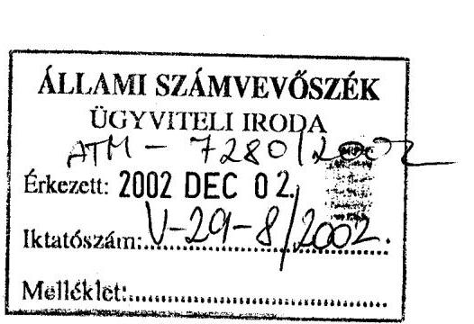
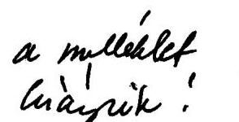
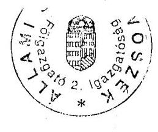
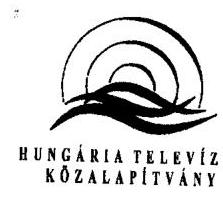
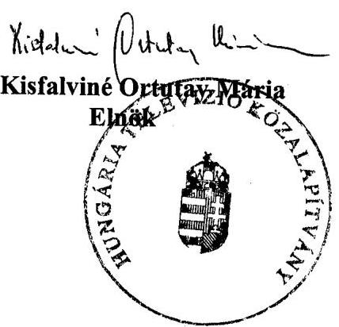
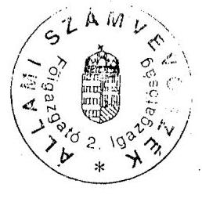

# VÉLEMÉNY 

a Duna Televízió Részvénytársaság 2003. évi költségvetési támogatási igényének megalapozottságáról, indokoltságáról
$\qquad$
$\qquad$ J/1660. 2002. december

---

# 2. Államháztartás Központi Szintjét Ellenőrző Igazgatóság   2.2. Pénzügyi Ellenőrzési Főcsoport   Iktatószám: V-29-12/2002.   Témaszám: 633.   Vizsgálat-azonosító szám: 0064 

## Az ellenőrzést felügyelte:

Bihary Zsigmond
föigazgató
Az ellenőrzés végrehajtásáért felelős:
Simon Ákosné
főcsoportfőnök
Az ellenőrzést vezette:
Horváth Sándor
főcsoportfőnök-helyettes
Pongrácz Éva
osztályvezető főtanácsos

A számvevői jelentések feldolgozásában és a jelentés összeállításában közreműködtek:

Szilágyi Gyöngyi Szabó Józsefné Fodor Edit számvevő tanácsos, számvevő főtanácsadó

Az ellenőrzést végezték:

Szilágyi Gyöngyi Szabó Józsefné Fodor Edit számvevő tanácsos, számvevő főtanácsadó

A témához kapcsolódó eddig készített számvevőszéki jelentések: címe:
sorszáma:
Jelentés a Duna Televízió működésének és gazdálkodásának 357 ellenőrzéséről

Jelentéseink az Országgyűlés számítógépes hálózatán és az Interneten a www.asz.hu címen is olvashatók.

---

# TARTALOMJEGYZÉK 

BEVEZETÉS ..... 5
I. ÖSSZEGZŐ MEGÁLLAPÍTÁSOK, KÖVETKEZTETÉSEK, JAVASLATOK ..... 7
II. RÉSZLETES MEGÁLLAPÍTÁSOK ..... 9

1. A DTV Rt. tervezési rendszere, a kuratórium feladata és hatásköre ..... 9
2. A DTV Rt. 2003. évi előzetes üzleti tervének megalapozottsága ..... 11
3. A bevételi tervek megalapozottsága ..... 15
4. A költségek tervezésének megalapozottsága ..... 17

---

# 2

---

# RÖVIDÍTÉSEK JEGYZÉKE 

áfa
ÁPV Rt.
ÁSZ
DTV Rt.
FB
HTVKA
Média tv.
OGY
ORTT
SzMSz
általános forgalmi adó
Állami Privatizációs és Vagyonkezelő Rt.
Állami Számvevőszék
Duna Televízió Rt.
Felügyelőbizottság
Hungária Televízió Közalapítvány
1996. évi I. törvény a rádiózásról és a televíziózásról Országgyűlés
Országos Rádió és Televízió Testület
Szervezeti Működési Szabályzat

---

# 4

---

# VÉLEMÉNY 

## a Duna Televízió Részvénytársaság 2003. évi költségvetési támogatási igényének megalapozottságáról, indokoltságáról

## BEVEZETÉS

A Kormány az 1057/1992. (X. 9.) Korm. határozatával létrehozta a Hungária Televízió Alapítványt, a Duna Televízió működtetőjét. Az alapítás gyorsaságából következő előkészületi hibák, a nem kellően tisztázott feltételek és körülmények helyszíni ellenőrzésünk lezárásáig kedvezőtlen hatásúak voltak a már 1992 óta részvénytársaságként működő Duna Televízió tevékenységére, gazdálkodására.

Az Országgyűlés az Alkotmány 61. §-a szerint megalkotta a rádiózásról és a televíziózásról szóló 1996. évi I. törvényt (továbbiakban: Média tv.).

A Média tv. 53. § (1) bekezdése, 140. és 141. §-ai alapján, az Országgyűlés a 19/1996. (III. 8.) OGY határozatában döntött a Hungária Televízió Alapítvány közalapítvánnyá történő átalakításáról, és módosította az alapító okiratot. A Közalapítvány tulajdonosi feladata a közszolgálati műsorszolgáltatás Média tv.-ben meghatározott követelményeinek érvényesítése.

A 19/1996. (III. 8.) OGY határozat mellékletében szereplő Alapító Okirat szerint a közalapítvány célja: „A Magyar Köztársaság Alkotmánya 6. §-ának (3) bekezdése megvalósítása érdekében televízióműsor sugárzása Közép- és Kelet-Európában, különösen az országon kívül élő magyarság számára. A műsorszolgáltatás szolgálja a magyar és az egyetemes szellemi és kulturális értékek közvetítését; a tárgyilagos Magyarország- és magyarság-kép kialakítását; a népek közötti és a nemzetközi kapcsolatok ápolását és erősítését; a magyar kisebbségek identitásának, anyanyelvének, kultúrájának megőrzését."

---

A DTV Rt. jegyzett tőkéje 1992-ben 10 M Ft, 1993-ban 196 M Ft és 1994-től 1104 M Ft. Az Rt. a működéséhez szükséges forrásokat rendszeresen késedelmesen, nem az éves likviditási tervében meghatározott időpontban és összegben kapta meg, és ez folyamatos forgóeszközhiányt okozott. Mindezt a DTV Rt. működésének és gazdálkodásának ellenőrzéséről szóló 1997 májusában készült jelentésünk is feltárta. Javasoltuk az Országgyűlésnek a forgótőke ellátottság rendezését. Ebből adódóan a DTV Rt. megalakulása óta folyamatosan forráshiánnyal küzd. A társaság saját tőkéje első ízben 2001-ben a jegyzett tőke alá csökkent.

Az OGY 94/2002. (XI. 13.) sz. határozata alapján lefolytatott célvizsgálat arra keresett választ, hogy a DTV Rt. 2003. évi költségvetési támogatási igénye (2 Mrd Ft) megalapozott és indokolt-e. A 2003. évi költségvetési törvényjavaslat összesen 6,8 Mrd Ft támogatási összeget határozott meg a közszolgálati média részvénytársaságok alaptőke emelésére. Az ellenőrzés keretében röviden áttekintettük a DTV Rt. 2002-2003. évi tervezési rendszerét, hogy ezáltal megalapozottabb képet nyújthassunk a működés egészéről és az ehhez szükséges támogatás megítéléséhez.

A Vélemény tervezetét észrevételezésre megküldtük a Duna Televízió Rt. elnökének, valamint a Hungária Televízió Közalapítvány Kuratóriuma elnökének. Észrevételeiket és az azokra adott válaszainkat a Vélemény melléklete tartalmazza.

---

# I. ÖSSZEGZŐ MEGÁLLAPÍTÁSOK, KÖVETKEZTETÉSEK, JAVASLATOK 

A Média tv.-ben determinált műsorpolitikai célok figyelembevételével összeállított éves üzleti terveit az Rt. az elmúlt 10 évben nem tudta pénzügyileg megalapozni. Ez részben arra vezethető vissza, hogy a társaság alultőkésített, részben pedig, hogy az éves üzleti tervek összeállításánál a szakmai szempontok domináltak. A média tv-ben és az alapító okiratban meghatározott követelményekhez, célokhoz és feladatokhoz azonban az OGY nem rendelt konkrét pénzügyi forrásokat, a tulajdonos (köz)alapítvány pedig úgy fogadta el évről évre az üzleti tervet, hogy figyelmen kívül hagyta azt a körülményt, miszerint az üzemben tartási díjból származó bevétel rendre elmaradt a tervezettől. Mindezek hatására az Rt. 1998-tól veszteséggel zárta az üzleti évet, 2001. december 31-én pedig a nettó forgótőkéje negatív előjelűvé (-598,9 MFt) vált.

Az Rt. 2002. évi költségcsökkentő intézkedéseinek (a költségek szigorúbb kontrolljának kiépítése, a saját gyártás csökkentése, az ismétlések arányának növelése) hatására az első három negyedévet pozitív eredménnyel és pozitív nettó forgótőkével zárta. Ennek ellenére az utolsó negyedévben felmerülő eseti költségek (elhalasztott filmbeszerzés, 10 éves a DTV Rt., a tengerentúli sugárzás elindítása) mellett év végére mintegy 10 M Ft veszteséggel számolnak, az elért likviditási egyensúly pedig valószínűsíthetően nem tartható fenn.

Az Rt. alacsony tőkeellátottsága miatt fejlesztéseit elhalasztva elsődlegesen a folyamatos működés fenntartását kívánta biztosítani. Ennek következtében az eszközállomány a 2002. évre oly mértékben elavult, hogy a jelenlegi állapot már a műsorszolgáltatás színvonalát is kedvezőtlenül érintheti.

Az Rt. 2003. évre (2002. november 15-én) összeállította az előzetes üzleti tervét, amely részletes számításokkal még nem volt alátámasztva. Az Rt. a Média tv. szerinti feladatának arányát és azok teljesíthetőségét ugyan nem tudtuk maradéktalanul megítélni, de az elmúlt 10 évben kialakult vagyoni és pénzügyi helyzet ismeretében indokoltnak tartjuk a kuratórium által az Országgyűlés felé már 2001. évben is jelzett 2 Mrd Ft költségvetési támogatási igényből 700 M Ft alaptőke emelésben (konkrétan egyszeri forgótőke-alap juttatásban) részesüljön soron kívül. A további támogatási összeg meghatározásához összefüggésben az MTV Rt. működésével - szükségesnek tartjuk az Rt.-vel kapcsolatos szakmai feladatok, követelmények konkrét meghatározását.

---

A helyszíni ellenőrzés megállapításainak hasznosítása mellett javasoljuk:

# az Országgyűlésnek 

1. Kérje fel a Kormányt, hogy 700 M Ft-ot soron kívül bocsásson az Rt. rendelkezésére egyszeri forgóalap juttatás céljából.
2. Kérje fel a Hungária Televízió Közalapítványt, hogy terjessze az Országgyűlés elé a DTV Rt. által kidolgozott szakmai koncepciót és annak pénzügyi vonzatát.

## a Hungária Televízió Közalapítvány Kuratóriuma részére

1. Kezdeményezze a DTV Rt. SzMSz-ében az éves üzleti terv kuratórium elé terjesztése tárgyév május 15-i határidejének tárgyév január 31-ére történő módosítását.
2. Vizsgáltassa felül a 2003. évi üzleti terv elveinek és főösszegeinek jóváhagyása előtt a Média tv-ben, az alapító okiratban meghatározott feladatok és a tervezett források összhangját, és csak egyensúlyi költségvetést hagyjon jóvá.

---

# II. RÉSZLETES MEGÁLLAPÍTÁSOK 

## 1. A DTV Rt. TERVEZÉSI RENDSZERE, A KURATÓRIUM FELADATA ÉS HATÁSKÖRE

A DTV Rt. - bár arra vonatkozó kötelezettséget jogszabály nem ír elő - az 1992. évi létrehozása óta minden évben elkészítette üzleti tervét. A tervezés során az Rt. menedzsmentje meghatározta - a középtávú elképzelések szerint - a tárgyévi működés szakmai követelményeit és számba vette annak teljesítését biztosító tevékenységek részelemeit, a bevételeket és ráfordításokat, azok várható alakulását.

A tervezésnél kiemelt szempont a műsorpolitika és a gazdálkodás összhangjának megteremtése, de ezen tényezők egyensúlyát a DTV Rt. működésének elmúlt 10 évében nem sikerült fenntartani. Ez visszavezethető az alapításkori alacsony tőkeellátottságra, a feladatok és az ezeket finanszírozó források egyensúlyhiányára.

A gazdálkodás likviditását kedvezőtlenül befolyásolta, hogy a működés forrásai nem a tervezettnek megfelelő időpontban és összegben álltak rendelkezésre.

A társaság gazdálkodása 1998. évtől veszteséges, a fizetőképesség megőrzése érdekében a 2002. évben a gazdálkodás stabilitásának követelménye került előtérbe. Ennek következtében az Rt. maradéktalanul nem tudott eleget tenni a műsorszerkezet Média tv.-ben előírt követelményeinek.

Az üzleti terv készítése a gazdasági alelnök közvetlen irányítása alá tartozó Kontrolling főosztály feladata. A főosztály az integrált rendszerben (ENIAC) a pénzügyi, számviteli adatokat illetően közvetlen hozzáféréssel rendelkezik, így hozzájut a tervkészítéshez szükséges információkhoz és nyomon követheti a tárgyévi teljesítési adatok alakulását. A rendszer biztosítja részére a terv- és tényadatok összehasonlíthatóságát. Az adatok összesítése, feldolgozása által a főosztály el tudja készíteni a negyedéves értékelést, a bevételi és költségadatok tételes elemzését, az eltérések pontos kimutatását és indoklását.

A Kontrolling főosztály által kidolgozott adott évi üzleti terv a menedzsmenttel való folyamatos szakmai és gazdasági egyeztetést követően nyeri el végleges formáját. A tervezés meghatározója a bevételi oldal - a tervezés bevételalapú -, azon belül is a működés mintegy 80%-át finanszírozó költségvetési támogatás. A várható pályázati támogatások, a saját, az egyéb, illetve a reklámbevételek bizonytalanok és változó összegűek, de nem hagyhatók figyelmen kívül a működés pénzügyi forrásainak számbavételénél.

Az Rt. az SZMSZ-ben, a Média tv.-ben megfogalmazottakkal összhangban szabályozta az éves gazdálkodási és pénzügyi (üzleti) terv készítését. E szerint az adott évben május 15-ig, a beszámolóval együtt kell a Kuratórium elé terjeszteni az Rt. adott évi üzleti tervét. Az elmúlt években ezen előírásnak az Rt. eleget tett. Tekintettel arra, hogy az Rt. működését mintegy 80%-ban költségvetési forrás biztosítja, amelynek összege az üzleti évet

---

megelőző év végén elfogadásra kerül, ezért a gazdálkodása szempontjából késői időpontnak tartjuk a tervév május 15-ét megjelölni az üzleti terv Kuratórium elé terjesztése időpontjaként. (Az Rt. a 2001., illetve 2002. évi üzleti tervét a Kuratórium 2001. március 23-án, illetve 2002. február 22-én jóváhagyta.)

A célellenőrzés lezárásáig a 2003. évre előzetes üzleti terv készült, 2002. november 15-i keltezéssel. A műsorpolitikai elképzelések teljesítését biztosító bevételek és ráfordítások tervezése során meghatározó volt a menedzsment rendelkezésére álló információk alapján - a 2002. július 1-től megváltozott új finanszírozási rendhez igazodva - a közszolgálati társaságok 2003. évi finanszírozására tervezett költségvetési támogatás 24%-os aránya.

A DTV Rt. tájékoztatása szerint:„A 2003. évi működési költségei új rendszerű támogatásának nagyságrendjéről a részvénytársaság a vizsgálat időpontjáig semmiféle hivatalos információt nem kapott."

Az előzetes üzleti terv bevételi és ráfordítási adatai tükrözik az Rt. menedzsmentjének 2003. évi műsorpolitikai elképzeléseit (a minőségi javulást a saját gyártású és a vásárolt műsorok minősége és nagyobb aránya tudná biztosítani).

A DTV Rt. végleges 2003. évi üzleti tervet a Hungária Televízió Közalapítvány Kuratóriuma elé nem terjesztett. Az ellenőrzés részére átadott előzetes üzleti tervet sem tárgyalta a Kuratórium. A részletes üzleti terv összeállítására, a műsorpolitikai koncepció kidolgozására az év hátralévő időszakában, illetve 2003 első hónapjában kerül sor. Az Rt. a HTVKA Kuratórium elé csak a végleges üzleti tervet terjeszti. A terv összeállítását befolyásolja, hogy a DTV Rt. a központi költségvetéstől megkapja-e az igényelt és a Kuratórium által is támogatott költségvetési forrást.

A HTVKA Kuratóriuma az Országgyűlés részére - a 2001. áprilisa-tól 2002
 márciusáig terjedő időszakról - készített beszámolójában értékelte a DTV Rt. tevékenységét.

A Kuratórium - mint közgyűlés - hatáskörét a Média tv. 66. §-a szabályozza, ahol a gazdálkodáshoz kapcsolódóan a feladatai közé tartozik - az (1) bekezdés i) és j) pontjai szerint - az alaptőke felemelése és leszállítása, továbbá az éves gazdálkodási és pénzügyi terv elveinek és fő összegeinek jóváhagyása. E kötelezettségét a Kuratórium a 2001. és 2002. években - a II/2001. és IV/2002. határozataival - az üzleti tervek jóváhagyásával teljesítette.

A Kuratórium ülésein többször megfogalmazódott - a DTV Rt. saját tőkéjét illetően - az egyszeri tőkejuttatásra vonatkozó költségvetési támogatási igény, ami forrást biztosíthat a beruházásokra és a minőségi műsorpolitikát megvalósító működésre.

A XV/2001. (május 15-i) kuratóriumi határozat szerint a menedzsment fő célkitűzése a gazdasági stabilitás és a tőkevesztési folyamat megállítása mellett a likviditás biztosítása, az Rt. tevékenységét meghatározó jogszabályok előírásainak betartásával. Az Rt. elnöke szerint a DTV Rt. műszaki leépülése évek óta tart, a kor követelményeihez igazodó, műszaki és technikai szempontból megújulni képes televíziót egyre kevésbé tudják fenntartani.

---

A 2001. november 23-i kuratóriumi ülésen is megfogalmazódott az a szándék, hogy a Kuratórium elnöksége járjon el az Országgyűlés bizottságainál a DTV Rt. 2 Mrd Ft nagyságú tőkejuttatása ügyében. A Kuratórium elnöke 2001. november 23-án írásban tájékoztatta a Magyar Országgyűlés Költségvetési és pénzügyi bizottságát a DTV Rt. 2 Mrd Ft összegű támogatási többletigényéről, amelyet megnövekedett feladataival indokolt. (A Kulturális és sajtó bizottsághoz 2001. szeptember 24-én küldte meg írásban a Kuratórium a támogatási kérelmét.)

A 2001. november 23-i kuratóriumi ülés jegyzőkönyve szerint az új gazdasági alelnök, beszámolójában két szempontot emelt ki az elkövetkező időszak gazdálkodására vonatkozóan:

Olyan műsorpolitika kialakítását szorgalmazta, amely egyben a gazdasági stabilitást tekinti fő célnak, és ennek rendeli alá a törvényi előírások teljesítését. Kiemelte a saját tőke csökkenésének megállítására irányuló intézkedések bevezetésének szükségességét. Beszámolójában már jelezte, hogy az Rt. tartalékai kimerültek, és ezért olyan szervezeti változtatásokat vezettek be, ami a költségek naprakész figyelése mellett azonnali beavatkozást tesz lehetővé a gazdasági folyamatokba.

A Kuratórium 2002. március 23-i ülésén hozott VII/2002. határozata értelmében (a teljes Kuratórium támogatásával, a határon túli kurátorok nevében és egyetértésével) ismét megfogalmazódott a tőkeemelés szükségessége, mivel a tőke felélése 1998-ban már megkezdődött, a bevételek azóta nem biztosítottak elegendő forrást a szükséges beruházásokra, fejlesztésekre.

A Duna Televízió Részvénytársaság támogatásáról szóló 2158/2002. (V. 15.) Korm. határozat szükségesnek tartotta a Rt. támogatását. A Kormány - a kormányhatározat szövege szerint - a Duna Televízió Rt. működésével kapcsolatos forráshiányos helyzet megoldására szükségesnek tartotta a Duna Televízió Rt. részére 2 Mrd Ft-os tőkejuttatás biztosítását, a feladat végrehajtását a kormányzati munka átadásával az új Kormánynak átadta. Az egyes kormányhatározatok hatályon kívül helyezéséről szóló 1106/2002. (VI. 14.) Korm. határozat a tőkejuttatást hatályon kívül helyezte.

A DTV Rt. Felügyelőbizottsága (FB) kötelezettségét a Média tv. 73. §-a részletezi. Az elnök által vezetett FB minden kuratóriumi ülésen részt vesz, véleményezi az ülésre beterjesztett, a társaság gazdálkodásával, vagyoni helyzetével kapcsolatos előterjesztéseket. Véleményét - a jegyzőkönyvek tanúsága szerint - számításokkal alátámasztott értékelések alapján a kuratóriumi üléseken kifejti. Hatáskörébe tartozik az üzleti terv, a társaság beszámolójának, azon belül mérlegének, eredmény-kimutatásának, kiegészítő mellékletének és üzleti jelentésének véleményezése. Irányítása alá tartozik az Rt. belső ellenőrzési szervezetének működése.

# 2. A DTV RT. 2003. ÉVI ELŐZETES ÜZLETI TERVÉNEK MEGALAPOZOTTSÁGA 

A 2003. évi előzetes üzleti terv elkészítésénél a folyó bevételekkel és költségekkel kalkulált, az alaptőke emelés bizonytalansága miatt a

---

szükséges fejlesztési tervek ebben nem jelentek meg. A szakmai elképzelésekre alapozott tervben közel nullszaldós eredménnyel számolnak.

Az elmúlt évek tervkészítési metodikája változó volt. A 2001. évre még a műsorstruktúra prioritását szem előtt tartó üzleti terv készült, de az elért veszteség mértéke miatt 2002-re „...a gazdálkodási feltételek határozzák meg a műsorstruktúrát" alapon terveztek, ami egyrészt a gazdálkodás stabilitását, másrészt a likviditás biztosítását célozta. Ennek eredményeként a 2002. év végére közel nullszaldós teljesítés várható.

A DTV Rt. Média tv. szerinti feladatait a közszolgálati televíziózással kapcsolatos előírások határozzák meg, amelyek rögzítik a különböző műsorok arányát a műsoridőn belül. A tv. 26-28. §-aiban megfogalmazott arányok azok 2003. évre vonatkozó teljesíthetősége - a helyszíni ellenőrzés lezárásakor rendelkezésre álló üzleti tervből nem ellenőrizhetők.

Erre vonatkozó adatok az Rt. 2001. évi beszámolójában szerepelnek, amely szerint a 26 tételből négy esetben nem volt megfelelő a teljesítés. A főműsoridőben a műsoridő 51%-a legyen hazai gyártású műsorszám, az előírás teljesítése 40,57%; gyermek és ifjúsági műsorszámokból megszerkesztett évi műsoridő 3%-a legyen új magyar, az előírás teljesítése 1,98%; főműsoridőben a műsoridő 15%-a legyen magyar, de nem saját gyártású, az előírás teljesülése 14,8%; a műsoridő 15%-a legyen magyar, de nem saját gyártású, az előírás teljesülése 12,54%.

# A DTV Rt. ellenőrzésre átadott 2003. évi előzetes üzleti terve számításokkal nem volt alátámasztva. 

A tervet a színvonalas műsorszolgáltatás biztosításának előtérbe helyezésével állították össze. Az Rt. a 2003. évi tervet nem a mérleg szerkezete szerint, hanem a termékekre, a műsorokra terhelhető és az általános költségek bontásában készítette el. Ebben a szerkezetben a 2002. év várható adatai rendelkezésre álltak, de a költségek csak a beszámoltatási rendnek megfelelő szerkezet esetén hasonlíthatók össze, amihez az ellenőrzés lezárásáig a dokumentációk 2002. negyedik negyedévére nem álltak rendelkezésre.

A 2002. évben a költségcsökkentő intézkedések hatására a január-szeptember havi mérleg pozitív eredménnyel, és pozitív nettó forgótőkével zárt. A 2002. év végi várható nettó forgótőkét a mérlegsorok ismerete nélkül az ellenőrzés nem tudta meghatározni, 2001. december 31-én a nettó forgótőke negatív (-598,9 M Ft) volt. A 2002. év végére tervezett 9,9 M Ft veszteség, valamint az utolsó negyedévben felmerülő eseti költségek (elhalasztott filmbeszerzés, 10 éves a DTV Rt.), következtében a 2002. I-III. negyedév pozitív nettó forgótőke év végére negatív előjelűvé válhat.

A DTV Rt. likviditásának bizonytalansága miatt folyamatosan figyeli kötelezettségeinek alakulását, a követelésállomány változását. Az Rt. 2001. év végi határidőn túli vevőállománya 113909 E Ft, 2002. szeptember 30-án 56534 E Ft volt. A határidőn túli szállító állomány a 2001. év végén 450593 E Ft, 2002. szeptember 30-án 55726 E Ft volt.

---

A vevőkövetelés és a szállítói kötelezettségállomány lejárat szerinti megoszlása a következők szerint alakult. A 2002. szeptember 30-i lejárt vevőállomány 58%-a volt éven túli követelés, amelynek több mint 40%-a barter ügyletből származott. Ugyanekkor a lejárt szállítóállomány 34%-a volt éven túli kötelezettség, amelyből a barter ügyletek 83,7%-os arányt képviseltek. Így 2002. szeptember végén a látszólagos vevő-szállítói összhang, a barter ügyletek nélkül, 24217 E Ft-os követelés állományt jelentett. A barter ügyletek nélküli lejárt vevő állomány 33312 E Ft, 73,5%-a éven túli követelés, ami a DTV Rt. nem megfelelő szerződéses kapcsolatait mutatja.

A 2001. évhez viszonyítva az előrelépés a likviditási helyzet javulását tükrözi, ahol a bevétel - egy takarékos költséggazdálkodás mellett - lehetővé tette a lejárt kötelezettségek kiegyenlítését.

Ez az átmeneti kedvező helyzet a - koncessziós díjból július elején három nap alatt - kifizetett lejárt szállítóállomány miatt alakult ki. Ezen kívül 2002-ben egy hónappal több költségvetési támogatást kapott az Rt., mivel a korábbi év végi időbeli elhatárolás helyett a második félévben, minden esetben a tárgyhónapban rendelkezésre állt a bevétel, míg az üzemben tartási díj 2002. évi utolsó részletét augusztus hónapban - két hónap késéssel - kapták meg.

A 2001. év végi kötelezettségállomány közel 80%-a 90 napon belüli ki nem fizetett számlát tartalmazott. A 2002. év végi várható adatokból is az előző évhez hasonló nagyságrendű követelés-kötelezettség arány várható, mivel az éves bevételnél már csak a havi támogatásra számít az Rt., és a költségek fedezetének biztosítására más, rendkívüli forrás nem várható.

Az ellenőrzés megítélése szerint a pénzgazdálkodás területén nem megfelelő, hogy a társaság jelentős összegű barterügyletből származó lejárt vevőköveteléssel rendelkezik. A barterszerződések saját bevételt növelő mértéke - amennyiben nem párosul igénybe vehető szolgáltatással - megfontolást igényel.

A DTV Rt. a saját bevételeinek növelése érdekében olyan vállalkozói szerződéseket kötött (ún. barter szerződések), amelyek sem a vevők, sem a szállítók részéről pénzügyi ellentételezést nem igényeltek, így készpénz nélküli fizetést eredményeztek. Ezen szerződések többségében reklámszerződések, mivel az alacsony fizetőképes kereslet miatt barter ügyletek keretében készítettek reklámfilmeket. Ezen áruszolgáltatás csereszerződéseknél az ellentételezés nem egyidejű teljesítést jelent, ami miatt a DTV Rt. követelés és kötelezettség állományában jelentős összegű a barterrel ellentételezendő lejárt állomány.

A mérlegben szereplő elismert követelésállomány - bár számvitelileg szabályos - nem tartalmaz realizált árbevételt, amennyiben az nem ellentételezett reklámok barterszerződéseit takarja. Ezt a független könyvvizsgáló is észrevételezte.

Az Rt. a 2002. évben a folyamatos fizetőképességét a saját gyártás csökkentésével, az ismétlések arányának növelésével tudta megvalósítani, ami az egyes műsorarányok nem megfelelő teljesítését jelentette. Mindez már a 2001. évben is fennállt.

A jogszabályi háttér 2002. év második félévében már biztosította a DTV Rt. részére a kiszámítható finanszírozást, de annak mértéke továbbra sem nyújt ele

---

gendő fedezetet a működés és fejlesztés célkitűzéseinek megvalósításához. Az Rt. gazdálkodását a műsorpolitikai elvárásokon kívül minden esetben a működési költségvetési támogatás összege határozta meg. Az egyszeri tőkejuttatás hosszú távon nem oldja meg a finanszírozást.

A Magyar Köztársaság 2001. és 2002. évi költségvetéséről szóló 2000. évi CXXXIII. tv. módosításáról szóló 2002. évi XXIII. tv. 14 §-a alapján:
b) a rádiózásról és televíziózásról szóló 1996. évi I. tv. 79. §-ának (1) bekezdése szerinti üzemben tartási díj 2002. július-december hónapokra esedékes összegének megfizetését átvállalja. Az összeg megállapításának alapja: a 2001. évben ténylegesen beszedett üzemben tartási díjbevétel 107%-ának 50%-a, csökkentve 9,55% (áfával növelt) beszedési költséggel,
c) az 58. §-ban 2002. évben megállapított havi 740 forint üzemben tartási díjat 2002. július 1-jét követően nem kell beszedni."

A DTV Rt. 2003. évi előzetes üzleti tervében jelzett 700 M Ft-os egyszeri forgótőke-alap juttatási és 1300 M Ft-os beruházási igénye a DTV Rt. 2001. közepétől kezelhetetlen szállítóállományának, és forráshiány miatt visszafogott beruházási tevékenységének ellensúlyozására szolgálhat. Az üzemben tartási díjat kiváltó költségvetési támogatásnak a folyamatos működést kell fedeznie, és akkor a koncesszióból származó díjbevétel részben alapja lehet a fejlesztésnek.

A Média tv. 131. §-a értelmében az MTV 2 utáni díj hetven százaléka a Magyar Televízió Közalapítványt, harminc százaléka a Hungária Televízió Közalapítványt illeti meg.

A DTV Rt. 2003. évi előzetes üzleti tervében a korszerű technika biztosítása érdekében jelentős összegű fejlesztési célkitűzést fogalmazott meg, mivel az elmúlt években az ilyen jellegű elképzelések nem valósultak meg. Az Rt. eszközállománya elavult, amit a 2002. III. negyedévi könyvvizsgálói jelentés is
 jelzett. Az eszközállomány amortizálódása az immateriális javaknál 78,57%, a műszaki gépek, járműveknél 62,91%, az egyéb gépek, berendezések járműveknél 61,28%. A korábbi években ennek mértéke nem akadályozta a műsorszolgáltatást, de a jelenlegi állapot műszaki vélemények szerint már járhat ilyen következményekkel.

Az Rt. a 2003. évre 1,32 Mrd Ft összegű műszaki beruházást tervez.
A megvalósítás fő szempontjai: az adásbiztonság fenntartása, illetve fokozása, a korszerű és gyors műsorkészítés, a bérelt eszközök kiváltása, a képi megjelenítés korszerűbbé tételét szolgáló beszerzések, az archiváló rendszerek, a számítógépes rendszerek a szervezet működéséhez, az épület állagmegőrző beruházásai.
Az elmúlt években nem valósultak meg az üzleti tervekben számszerűsített elképzelések. A 2003. évre megfogalmazott beruházási célkitűzések forrás hiányában csak elképzelések maradnak.

A 2001. évi üzleti terv 24 tételben 405 M Ft beruházási ráfordítást tartalmaz, amelyből 17 tétel (215 M Ft) már a 2000. üzleti év tervében is megfogalmazódott. Az Rt. 2002. évi üzleti terve 25 tételben 300 M Ft beruházás megvalósulásával számolt, amelyből az első három negyedévben forráshiány miatt mindössze 56,3 M Ft, 18,8% realizálódott.

---

A DTV Rt. 1992-ben, mint új műsorszolgáltató, korszerű technikával kezdte meg működését. Ezt az előnyét azonban fokozatosan elveszítette. Az Rt.-nek nem a hazai médiapiaci technikával, hanem a határon túli sugárzást biztosító technikával kell versenyre kelnie. A 2003. évi beruházási terv, ezen fejlett technika megvalósítása felé tesz lépéseket. A részben még nem konkrét elképzelések előre vetítik a költségszerkezet átalakulását (pl. magasabb amortizáció) is.

# 3. A BEVÉTELI TERVEK MEGALAPOZOTTSÁGA 

A DTV Rt. a 2003. évi előzetes üzleti tervében 8470 M Ft összes bevételt tervezett. A tervezett bevételből 7620 M Ft (90%) a költségvetési támogatás, amelyből 6420 M Ft (75,8%) a működési költség fedezete, 1200 M Ft (14,2%) a sugárzási díj. Saját bevételként 280 M Ft-ot (3,3%), koncessziós díjbevételként 400 M Ft-ot (4,7%), egyéb támogatásként pályázati díjakból 150 M Ft-ot (1,8%) és egyéb bevételként 20 M Ft-ot (0,2%) tartalmazott.

Az Rt. a 2002. évben bevételi tervét 6984 M Ft-ban határozta meg, amelyből a költségvetési támogatás (amely tartalmazza az üzemben tartási díjat, a mentesítettek utáni költségvetési támogatást és a sugárzási díjat) 5053 M Ft (72,4%), a saját bevétel 332 M Ft (4,7%), a koncessziós díj 396 M Ft (5,7%), a pályázati támogatások 389 M Ft (5,6%), az egyéb bevételek 20 M Ft (0,3%) volt.

A DTV Rt. 2002. évi várható bevétele 6694,73 M Ft (amelyből a saját bevétel 236,64 M Ft, a költségvetési támogatás 5673,29 M Ft, a koncessziós díj 402 M Ft, az egyéb pályázati bevétel 346,27 M Ft és az egyéb bevétel 36,53 M Ft). A teljesülés - a 2002. I-III. negyedévi beszámolóban kimutatott 5100,3 M Ft realizált bevétel alapján - biztosított.

Az Rt. 2003. évi előzetes tervéből egyértelműen megállapítható, hogy éves bevételi tervének többletigényét - a 2002. évi várható bevételhez viszonyítva - a költségvetési támogatás jelentős mértékű (34,3%) növekedéséből kívánja fedezni. A 2002. évi várható bevételekhez viszonyítva csak a saját bevételénél tervezett mintegy 18%-os növekedést. A 2002. évi várható pályázati díjbevételeket (43,3%) túl, az egyéb bevételeket (54,7%) pedig alul tervezte.

A tervezett bevételekkel a DTV Rt. egy új műsorstruktúra fejlesztését szeretné megvalósítani. Biztosítani kívánja a határon túli stúdiók és stúdióhálózat folyamatos munkával történő ellátását, a saját gyártású szintén határon túli témákban készítendő tévéjátékok, illetve dokumentumfilmek gyártását, a Kárpát-medencei kulturális értékek televíziós feldolgozását, új távoktatási forma bevezetését, az igényes ifjúsági és szórakoztató műsorok mennyiségének emelését, a minőségi filmkínálatot, és a 2002 karácsonyán induló tengerentúli adások speciális szerkesztését.

A DTV Rt. megítélése szerint a 2002. évi műsorstruktúra megfelel a Média tv.-ben előírtaknak, de a bevételi források nem tették lehetővé a saját gyártású produkciók nagyobb arányát, a megfelelő mennyiségű és minőségű filmek vásárlását. Ezért az egyes műsorok ismétlése nagyobb mértékű, mintegy 20%-a volt a műsoridőnek, ami magyarázható az idei 10 éves jubileummal, de ezt a műsorpolitikát a 2003. évben és a következő években az Rt. nem folytathatja.

---

A DTV Rt. jelentős bevételt 2003. évben elsősorban az állami költségvetésből kaphat, így a 2003. évben reálisan megvalósítható műsorstruktúra fejlesztési igényét csak a támogatás összegének ismerete után tudja kidolgozni és azt a HTVKA Kuratóriuma felé jóváhagyásra beterjeszteni.

A 2003. évi költségvetési törvényjavaslatban a műsorszolgáltatási költségvetési támogatás összege 20788,8 M Ft, amelynek 24%-a, 4989,31 M Ft illeti meg a DTV Rt.-t. Az Rt. előzetes tervében a sugárzási díjjal csökkentett támogatási igénye 6420 M Ft.

A 2003. évi költségvetési törvényjavaslat a közszolgálati társaságoknak egyszeri tőkejuttatásként 6,8 Mrd Ft támogatási összeget irányzott elő. Abban az esetben, ha az Rt. az OGY által megszavazásra kerülő 2 Mrd Ft tőkejuttatásból a 2003. évi terve alapján a hiányzó mintegy 1437 M Ft működési költségét finanszírozná, akkor a beruházási tervéhez nem áll rendelkezésre elegendő forrás, illetve a 2002. évben már jelentkező forgóeszköz-finanszírozáshoz szükséges forrást sem tudja biztosítani. Ez az elkövetkezendő években továbbra is folyamatos forgóeszközhiányhoz és fejlesztési forráshiányhoz vezet.

A DTV Rt. saját bevételei között elszámolt reklámtevékenységből származó bevételeit, a 2003. évi előzetes tervében külön nem számszerűsítette.

A rendelkezésre álló anyagokban a Kereskedelmi Iroda által realizált 2001. évi árbevétele 295,43 M Ft volt, ebből a reklámfilm sugárzás árbevétele 194,28 M Ft. A 2002. évi üzleti tervben a reklámbevétel 311 M Ft összegben szerepel, az év végi várható bevétel 190 M Ft.

A DTV Rt. reklám bevételeinek jelentős része (30-50%-a) ún. barterszerződésből származik.

A 2001. évi tényleges kereskedelmi árbevételének mintegy 52%-a származott barterügylettől, 2002. évre a várható adatok szerint ez az arány 28%-ra csökken. A vevő és szállítói folyószámlakivonatok 2002. szeptember havi állapota szerint a szállítói állományban a tartozásként kimutatott összegből mintegy 46,6 M Ft barterszerződéssel kapcsolatos kötelezettség, ami azt mutatja, hogy a szállítók a szerződésekben vállalt kötelezettségeiket teljesítették, de az ellenértékként felkínált reklámidőt nem tudták, vagy nem akarták felhasználni. A vevő oldalon a barterszerződésekkel kapcsolatos követelés csak 23,2 M Ft.

Az Rt. a reklámbevételek csökkenését nem a Média tv. előírásaira vezeti vissza, hanem arra, hogy az AGB Hungary által mért nézettségi adatai annak ellenére is alacsonyak, hogy 2002-ben a nézettsége mintegy 20%-kal nőtt.

Ez részben azzal magyarázható, hogy a Média tv.-ben előírt feladatoknak megfelelő műsorstruktúrát úgy alakítják ki, hogy az elsősorban a határon túli magyarok részére nyújt információt, így nem a hazai fogyasztók körét bővíti. Másik probléma, hogy a reklámpiac évről évre szűkül, és a televíziós reklámok mellett egyre több más reklámhordozó jelenik meg (pl. óriásplakát, metróreklám). Így a hirdetők elsősorban azoknál a televíziós csatornáknál helyezik el reklámjaikat, amelyek nézettsége a magasabb (kereskedelmi csatornák).

---

A DTV Rt. ebben a helyzetben csak a kis- és középvállalkozások köréből számíthatott új partnerekre. A közel ezer ügyfelük részére egyedi reklámcsomagajánlatokat készítettek. Az Rt. szolgáltatási, kereskedelmi ajánlataiban cégek, intézmények életét bemutató filmek gyártását és produkciós támogatását szerezték meg.

A DTV Rt. 2002. évi üzleti tervének várható bevételeiből a saját bevétel 236,64 M Ft, amelynek 80%-a reklám, 20%-a egyéb bevétel.

A reklámbevételek a tervhez képest várhatóan 61%-ban teljesülnek. A reklámbevételek növelése céljából az Rt. a 2003. évtől új reklámidő értékesítési stratégia kidolgozását tervezi. A helyszíni ellenőrzés lezárásakor nem állt rendelkezésre olyan dokumentáció, amelyből számszerűsíteni lehetett volna az elképzelések megvalósítása utáni árbevétel növekedést.

Az Rt. bevételeit minden évben támogatások, pályázatok útján növeli. A 2001. évi mérlegadatok szerint gyártási támogatásból 312,21 M Ft, beruházási támogatásból 48,83 M Ft összesen 361 M Ft árbevétele származott. A 2002. évben ezeknek a támogatási bevételeknek a teljesülése - a 389 M Ft tervezettel szemben - 346,27 M Ft összegben várható. (A 2002. I-III. negyedévi mérlegadatok szerint 326,28 M Ft realizálódott).

A 2003. évi tervben csak 150 M Ft bevétellel számolnak.
Az Rt. az Illyés Közalapítványtól a 2001. évben 300 M Ft beruházási támogatást kapott, amelyből eddig 110 M Ft-ot fordított beruházásra. A fennmaradó 190 M Ft-ot - a már másodszor meghosszabbított 2002. december végi elszámolási határidőig - beruházásra kell elköltenie, különben visszafizetési kötelezettsége keletkezik.

# 4. A KÖLTSÉGEK TERVEZÉSÉNEK MEGALAPOZOTTSÁGA 

A DTV Rt. az 1998. évtől folyamatosan veszteséges volt. Az Rt. a 2002. évi üzleti tervében a veszteség megállítására költségcsökkentő intézkedések bevezetését határozta el.

#### Abstract

Minden vezető prémiumfeladatai között szerepeltették az üzleti terv gyártási, illetve rezsigazdálkodási előírásainak betartását, túllépés esetén prémiumelvonást eszközöltek. Központi kezelés alá vonták az utazási, oktatási költségeket és a nem gyártási költségvetésben lévő megbízási díjak kezelését. Az évközi műsorváltoztatásoknál az egyensúlyi feltételek fenntartása érdekében prioritást alkalmaztak. Új kötelezettségvállalási és utalványozási rendszert vezettek be, amelynek alapelve, hogy önálló aláírási jogosultsággal csak az elnök rendelkezik. Az új műsorstruktúrát figyelembe véve munkakörönként vizsgálták felül az Rt. személyi állományát. Felülvizsgálták továbbá az egyes azonos vagy hasonló feltételű műsorok költségvetését, különös tekintettel a honoráriumok kifizetésére. Fokozták a belső ellenőrzést (műsoroknál), és a feltárt szabálytalanságokat szankcionálták. Intézkedést terveztek a vezetői személyi gépkocsihasználat feltételeiről, a vezetékes telefonok, a személyi PIN kód használatáról, mérsékelték az Rt. tulajdonában lévő mobiltelefonok számát, valamint csökkentették a DTV Rt. által fizetett beszélgetési díjak összeghatárát, továbbá korszerűsítették a honoráriumrendszert és minőség szerinti differenciálást alkalmaztak.

---

Az Rt. konkrét intézkedései elnöki utasításban, illetve elnöki körlevélben kerültek szabályozásra.

A költségcsökkentő hatásokat egyrészt az Rt. számítógépes kigyűjtése alapján, a működési költségek azonos idejű (2001. szeptember 30. és 2002. szeptember 30.) összehasonlításával végeztük, amely szerint az azonos típusú költségek a 2001. évben 564 M Ft, a 2002. évben 398,3 M Ft összegűek voltak. Másrészt a DTV Rt.nek az Állami Számvevőszék részére készített írásos jelentése alapján, amely szerint mintegy 300 M Ft-tal (15%) csökkent a műsorok előállítására fordított költség.

A kimutatás szerint közel 200 M Ft megtakarítást eredményezett a technológiai, gyártási folyamatok üzemgazdasági szempontok szerinti újraszervezése, és mintegy 100 M Ft a megtakarítás az eszközbérlések engedélyezésének igazgatói szintre emeléséből, a külföldi utazások szigorításából, a honoráriumrendszer korszerűsítéséből, a mobiltelefonok térítési díjhatárainak szigorításából, valamint a műsoros területen a belső ellenőrzés intenzitásának növeléséből keletkezett.

Az Rt. a 2002. évben elmaradt költségcsökkentő intézkedéseit a 2003. évben tervezi bevezetni, például a személygépkocsi-használat feltételeinek szigorítását, a műsorok költségvetéseinek felülvizsgálatát és a vezetékes telefonok személyes PIN kóddal történő ellátását.

A DTV Rt. 2002. I. féléves működési és gazdálkodási szöveges beszámolója a létszámcsökkentéssel kapcsolatosan a következőket fogalmazta meg: „terveinknek megfelelően az őszi új műsorstruktúra tükrében felül kell
 vizsgálni az Rt. munkatársi állományát és egyben a vezetői és szervezeti hierarchiát is egyszerűsítve végre kell hajtani egy csoportos létszámcsökkentést”. Az ellenőrzés részére az Rt. nem adott át olyan dokumentációt, amelyből megállapítható lett volna, hogy a tervezett létszámleépítés melyik területet, milyen létszámot és munkakört érint, annak milyen hatása van a műsorstruktúrára, illetve mekkora a költségkihatása, és finanszírozását milyen forrásból kívánja megoldani.

Az Rt. 2002. I. félévi beszámolójáról készített könyvvizsgálói jelentésben a költséghelyeken gyűjtött bérköltségek és azok járulékai produkciókra történő belső terhelésének vizsgálatánál a könyvvizsgáló észrevételezte, hogy a bérek és járulékok tervezettől lényegesen elmaradó belső terhelésének nem a racionalizálási folyamat hatékonysága az oka. Azok a likviditási gondok következtében kényszerűen visszafogott gyártás miatt történtek, vagyis a teljes alapbértömeg mögött nem állt produkciós teljesítés, hanem alulfoglalkoztatottság érvényesült.

Az Rt. a 2003. évi előzetes üzleti tervében nem számol létszámleépítéssel.
A DTV Rt. a 2003. évi előzetes tervében a műsorköltségekre 4736 M Ft-ot (ebből a saját gyártás 3486 M Ft, a vásárolt 1250 M Ft összegű) kíván fordítani. A műsorgyártás és adás egyéb költségeire 660 M Ft-ot, a sugárzási díjra 1200 M Ft-ot (amely a bevételi oldallal megegyezik), a marketing költségekre 320 M Ft-ot, a központi bérköltségre 440 M Ft-ot, az általános költségekre 810 M Ft-ot, míg az egyéb költségekre és ráfordításokra 110 M Ft kiadást tervezett, a központi értékcsökkenési leírás 200 M Ft.

---

Az Rt. a 2003. évi előzetes tervét egy - műsorköltség műfajonkénti részletezése című - táblázattal támasztotta alá, amelyben a műsorköltség 8 műfaj megjelölésével szerepel, de azon belül a konkrét produkciók nem kerültek megjelölésre. A táblázat tartalmazza a sugárzott perc/év adatot, a műsorperc költségét és annak éves szintű műsorköltségét.

A tervben a tengerentúli sugárzásra szerkesztett műsorokkal együtt 525000 sugárzott perc/év szerepel, amelynek 7,6%-át a hír- és aktuális műsorokra, 9,5%-át az információs műsorokra, 22,9%-át a filmekre, sorozatokra, 9,8%-át a művészeti műsorokra, 7,6%-át a közművelődési műsorokra, 4,3%-át az ifjúsági és szórakoztató műsorokra, 20,9%-át a tengerentúli sugárzásra szerkesztett műsorokra és 17,4%-át ismétlésekre kívánják felhasználni. Az így kimutatott műsorköltség éves szinten 4736 M Ft.

A DTV Rt. 2003. évi előzetes üzleti terve más szerkezetben tartalmazta a műsorszerkezeti arányokat az előző évhez képest. Az Rt. napi 19,5 óra műsoridővel éves szinten 427050 perc adását tervezte, amelyből a saját gyártású rendszeres műsorok 47,8%-ban, az egyedi gyártás 2,8%-ban, a vásárolt műsorok 46,1%-ban és az egyéb műsorok 3,3%-ban kerültek meghatározásra.

Az összes műsoridő összehasonlításakor megállapítható, hogy az - a 2003. évi terv szerint - csak a tengerentúli sugárzás műsoridejével növekszik, amelynek pl. műsorszórási költségéből a sugárzási díj adott, mert a DTV Rt. eddig is 24 óra adásra volt jogosult. Az Rt. 2003. évi tervében átlagosan 9021 Ft műsorperc költséggel számol, ugyanez a 2002. évi üzleti terve alapján 5524 Ft. Egy, az ellenőrzés rendelkezésére bocsátott kimutatás szerint a 2001. évre számított átlagos műsorperc költsége 13 938,4 Ft volt.

A DTV Rt. 2002. január hónaptól léptette hatályba új Önköltség-számítási szabályzatát. A szabályzatban többek között meghatározták az önköltségszámítás tárgyát (kalkulációs egység), amely az Rt.-nél lehet a produkció, a szervezeti egységek, valamint a saját előállítású tárgyi eszközöket és készleteket gyártó szervezeti egység. A kalkulációs időszak a Számviteli politikában meghatározott főkönyvi zárlati időszakokkal azonos. A produkciók elő- és utókalkulációs sémája 18 költségtényező bontást tartalmaz. A szabályzatban az egyes költségtényezők tartalma meghatározásra került. A szervezeti egységek kalkulációs sémája az összes működési költségtényezőt (23 féle) tartalmazza, azok tartalmának ismertetésével. Nem tartalmazza azonban a Szabályzat azt, hogy az egyes költséghelyeken gyűjtött költségek átterhelése a kalkulációs egységekre hogyan és milyen módszerrel történik.

Az előkalkuláció készítésekor a „Gyártásba vételt engedélyező lap" mellékleteként a produkciók költségtervezése honorárium és technika bontásban történik, valamint jelezni kell az ún. belső terhelést. Az Rt. belső terhelést a felvételi és utómunka-technika, valamint a szállítás költségtényezőknél tervez. A tervezés az Rt. belső árjegyzéke alapján történik. A belső árjegyzékben foglalt árak kialakításának belső tartalmára vonatkozó sémát a DTV Rt. nem adott át az ellenőrzésnek, annak felépítését az Önköltség-számítási szabályzat sem tartalmazza. Az Rt. szóbeli tájékoztatása alapján a belső árjegyzékben feltüntetett árakat a piaci árakat figyelembe véve állapították meg.

---

Az Rt. könyvvizsgálója a 2002. I. félévi beszámolóról készített jelentésében az alkalmazott módszerrel kapcsolatosan az alábbi észrevételt tette: „A költségviselők közvetlen költségeit a főkönyvi könyveléssel egy időben számolják el a „produkciókra”. A közvetett költségeket úgynevezett „belső terheléssel” utólag osztják fel a költséghelyek között. A beszámoló tanúsága szerint a montírozók, a mobil forgatási eszközök, illetve a szállítás belső terhelése jóval meghaladja a ténylegesen felmerült költségek összegét. Ez azt jelzi, hogy a költség felosztást a Duna TV nem a ténylegesen felmerült költségei alapján, hanem piaci áron végzi. Ez, noha végszámaiban természetesen nem okoz eltérést az eredménykimutatás szerinti összes költségtől, de nincs összhangban a Számviteli törvénnyel és a Duna TV önköltségszámítási szabályzatával sem”.

Az ellenőrzés időszakában a DTV Rt. továbbra is ezt a gyakorlatot folytatta. A módszerrel a DTV Rt. egyes műsorainál nem a tényleges előállítási költséget mutatja ki, így a produkciók percköltsége torzul. (Az alkalmazott módszer a belső és külső gyártású műsorok összehasonlítására alkalmas.)

A DTV Rt. véleménye szerint: „…jelenleg a közszolgálati televíziók közül csak a Duna TV Rt.-ben tudják kimutatni az egyes műsorok piaci szintű költségstruktúrával bíró előállítási költségeit. (Ennek fontossága a televíziós gazdasági döntések megalapozottságánál kiemelkedő jelentőséggel bír, elég ha utalok az MTV külső megrendelései körüli vitákra.)”

A DTV Rt. Számlarendjében - a produkciókkal kapcsolatban - befejezetlen állomány fogalmat nem határozott meg. Ennek megfelelően a beszámolókban sem szerepel befejezetlen állomány. Az Rt. ezt azzal indokolta, hogy a produkciókat döntően költségvetési támogatásból valósítja meg és a pénzforgalmi szemlélet miatt az évek között nem jelentős összegű a befejezetlen állomány, ezáltal az évek közötti eredményt nem befolyásolná a módosító tétel.

A DTV Rt. a 2001. évről készített üzleti jelentésében a bevételeknek és a költségeknek a tervezett és tényleges alakulását bemutatta és értékelte.

A 2002. évi I. féléves szöveges beszámolójában részletesen - szöveges és táblázatos formában - mutatta be a tervezett és tényleges bevételek és költségek alakulását.

A bevételek elemzésénél megállapították, hogy a kereskedelmi bevételek csupán 35%-ra teljesültek, amelynek okát a reklámpiac bővülésének lelassulásában jelölték meg. A költségvetési támogatás (mentesítettek miatt) és a koncessziós díj bevétele a tervhez viszonyítva időarányos volt. Az üzemben tartási díj bevételének első félévi elmaradása az Rt. számítása szerint viszont mintegy 200 M Ft bevétel kiesést jelentett. Az egyéb támogatási bevételek tervhez viszonyítva magasabb összegben realizálódtak.

A költségek alakulásánál a számvevőszéki célvizsgálat megállapította, hogy a fontos üzleti tervsorokon nem került sor költség túllépésre. A tervhez képest elért 44%-os költségszint egyensúlyi helyzetet jelez.

---

Az Rt. 2002. I. félévében nyereségesen gazdálkodott, amelyet a III. negyedévben tovább folytatott. Az Rt. 2002. évi várható eredménye negatív előjelű lesz, a tervezéskor is 1,58 M Ft veszteséggel számolt, amely év végén megközelítheti a 10 M Ft-ot. Az Rt. a tényleges terv- és tényadatok összehasonlítását a mérlegbeszámoló részét képező üzleti jelentésében fogja elemezni.

Budapest, 2002. december
dr. Kovács Árpád
elnök

Mellékletek:
Észrevételek és az azokra  5 db  6 lap adott válaszaink

---

2232/02

ÁLLAMI SZÁMVEVŐSZÉK
ÜGYVITELI IRODA
HT-7280/2
Érkezett: 2002 DEC 02
Iktatószám: 1-29-8/2002
Melléklet: 1-29-8/2002

H-1016 Budapest, Mészáros utca 48.
H-1537 Budapest, Pf.: 445
Telefon: (36-1) 489-1200, 489-1260
Telefax: (36-1) 489-1366
E-mail: dunatv@dunatv.hu

Elnök

Ikt.sz.: 100/2394/2002.

Bihary Zsigmond
főigazgató úrnak

Állami Számvevőszék

Budapest

E
2232/02

E 1 3.

Tisztelt Főigazgató Úr!

A Duna Televízió Rt-nél elvégzett 7 napos célvizsgálat eredményéről készített, november 29-én megküldött anyaggal kapcsolatban az alábbi észrevételekkel kívánok élni:

1.) A témával kapcsolatban nem lehet figyelmen kívül hagyni az előzményeket. Abból a tényből kiindulva, hogy az állam sohasem tudott érvényt szerezni a közmédiák Médiatörvényben megfogalmazott meghatározó bevételi forrása, az üzembentartási díj hiánytalan beszedésének (az éves tényszámok 63-65% között alakultak), már kezdettől kódolva volt a közmédiák pénzügyi ellehetetlenülése.

2002-ben az Országgyűlés Költségvetési és Pénzügyi Bizottsága többször is tárgyalta a témát, ahol megállapították, hogy a szükségessé vált tőkejuttatások tárgyában egyedül a Duna Televízió Rt. adott be értékelhető gazdasági anyagot. Vita csak a nagyságrendről alakult ki, mivel a részvénytársaság 2 Mrd Ft-ban, a Hungária Televízió Közalapítvány pedig 3 Mrd Ft-ban fogalmazta meg igényét. A választások eredményeként leköszönő kormány 2 Mrd Ft-ban határozta meg a Duna Tv Rt-nek

---

folyósítandó egyszeri tőkejuttatás nagyságrendjét. (A rendelkezést sok egyébbel együtt az új kormány hatályon kívül helyezte).
2.) A vázolt helyzettől függetlenül a médiatörvény megalkotásánál már látni lehetett, hogy a működéshez rendelt pénzügyi keretek még a teljes üzembentartási díttömeg beszedése esetén sem biztosították volna a részvénytársasági szervezet létrehozásánál elmaradt forgótőke, illetve e folyamatos technológiai fejlesztési kényszerben élő szakágazatok fejlesztési forrásait. Könnyen belátható ugyanis, hogy egy eleve „0” szaldós pozícióra finanszírozott részvénytársaság - tőketartalék nélkül - csupán az értékcsökkenési leírás erejéig képes fejleszteni (ha ebben nem akadályozná a forgótőke hiányból adódó állandó finanszírozási egyensúlyhiány), ami pedig biztonsággal az eszközök gyors avulásához vezet. A fenti logikai levezetés realitása sajnos mindhárom közmédiánál azonnal tettenérhető.
3.) Az előzőekben elmondottak tények, amelyek nyilván kellő alapot szolgáltattak a „Közszolgálati média részvénytársaságok alaptőke emelése” címén az állami költségvetésbe beállított 6,8 Mrd Ft előirányzat tervezésére.
Ebben a helyzetben a Duna Televízió Rt. sorsa szempontjából könnyen végzetes lehet az „összegző megállapítások” (7. oldal) utolsó szakaszában tett javaslat, miszerint szemben a forgótőke igény támogatásával, az azonos tényekből következő, a részvénytársaság eszközeinek 70%-os elavultságával és az átadott, részletes műszaki célkitűzésekkel megalapozott, fejlesztési célokat szolgáló tőkejuttatás szükségességéről (koncepció, nagyságrend) az Országgyűlésnek kellene döntenie.

Túlmenően azon, hogy az Országgyűlés döntési szintje talán messze meghaladja egy szűk szakma által művelt technológiai fejlesztés kérdését, a hivatkozott megállapítást tartalmazó szakaszt megelőző bekezdés maga is utal az eszközállomány elhasználódására és ennek következményeire. Sajnos itt nem jelenik meg a részletes vizsgálati részben is szereplő, az adásbiztonság veszélyeztetettségére utaló megjegyzés.

A Duna Televízió Rt. 2002. évi gazdálkodása bizonyíték arra, hogy a részvénytársaság képes a szűkös működési kiadások ellenére is a folyó éves pénzügyi egyensúly tartására. Emellett azonban közgazdasági képtelenség a sok éve húzódó tőkejuttatás további időbeli tolódását elviselni.

---

A fentiekkel kapcsolatban kénytelen vagyok megjegyezni azt a tényt is, hogy munkatársaim tájékoztatása szerint - éppen a vizsgálatra rendelkezésre álló idő rövidsége miatt - a szokásosnál bizonyára intenzívebb személyi megbeszélések során a vizsgálat vezetésével megbízott magasrangú ÁSZ munkatársak a rendelkezésre álló anyagok és az előzmények ismeretében egyértelműen megalapozottnak látták a 2 Mrd Ft-os alaptőke emelés igényét.
4.) További megjegyzésem, hogy az „összegző megállapítások” első bekezdésében foglaltak ebben a megfogalmazásban
 egyszerűen nem felelnek meg a valóságnak. Az utóbbi években a sorozatos éves veszteségek ugyanis nem abból következtek (korábban sem), hogy a Kuratórium eleve megalapozatlan terveket hagyott volna jóvá, hanem abból a már említett tényből, miszerint az üzembentartási díj egyetlen évben sem közelítette meg akár az ORTT tervében, akár az állami költségvetés számítási anyagában szereplő nagyságrendet. Javaslom, hogy az anyag kísérelje meg minősíteni az évek óta fennálló és sajnos napjainkban is koncepció nélküli médiafinanszírozási rendszert. Ez bizonyára ösztönzést adhatna a Médiatörvény immár elodázhatatlan módosítására is.

Tisztelt Főigazgató Úr!

Felsorolt érveim alapján kérem a szövegszerű javaslatok szíves átgondolását. Meggyőződésem, hogy a fennállásának éppen tizedik évfordulóját ünneplő, eddig mindent önerőből megoldó intézmény az azonnali 2 Mrd Ft-os tőkeemelés nélkül technikailag súlyos helyzetbe kerül, ami alkalmanként már a világ 52 országában látható képernyőnkön is érzékelhető lesz.

Köszönöm szíves figyelmét.

Budapest, 2002. december 2.

Üdvözlettel:

DUNA TV RT

Pekár István

---

# 223402 

H-1016 Budapest, Mészáros utca 48. H-1537 Budapest, Pf.: 445
Telefon: (36-1) 489-1200, 489-1260
Telefax: (36-1) 489-1366
E-mail: dunatv@dunatv.hu

## Elnök

Ikt.sz.: 100/2598/2002.
Budapest, 2002. december 2.

## Dr. Kovács Árpád elnök úrnak

## Állami Számvevőszék

Budapest
a muldívet
cukyrik

Tisztelt Elnök Úr!
T. Bihoy a 1
Kellemes ünnepeket kívánunk
és boldog új évet kívánunk

12.02 .

Engedje meg, hogy az idén tízéves Duna Televízió jövője szempontjából sorsdöntő kérdésben személyesen Önhöz forduljak.

Mint az bizonyára Elnök úr előtt is ismert, a Duna Tv Rt 2 Mrd Ft-os tőkeemelésének megalapozottságáról szóló célvizsgálat lezárult. A tervezett összegzés szerint az Állami Számvevőszék ezúttal 700 millió Ft forgótőke emelést javasol, a további 1,3 Mrd Ft-os fejlesztési szükséglet megítélését pedig ismételt, valószínűsíthetően a messze távolba vesző vizsgálódások hatókörébe utalná.

Ez az álláspont - amely munkatársaimtól szerzett ismereteim szerint ellentétes a vizsgálatot irányító magasrangú ÁSZ munkatársak álláspontjával is - a részvénytársaság technikai ellehetetlenüléséhez vezet. (Részletes érveim és a témával kapcsolatos előzmények összefoglalása a mellékelt, Bihary Zsigmond főigazgató úrnak megküldött levelemben.)

---

Szeretném felvetni Önnek az ügy másik fontos aspektusát is. A Duna Tv Rt. 2002-ben a központi bevételek további csökkenése mellett is - egyedül a közmédiák között egyensúlyban lévő gazdálkodást folytatott. Talán nem kell bizonygatnom, milyen megszorító intézkedések árán értük el ezt. A média ügyek iránt érdeklődő közvélemény ugyanakkor azt látja, hogy az évente több milliárdos veszteséget „termelő" MTV rendszeresen negatívba hajló saját tőkéjét újra és újra költségvetési eszközökből pótolják. (Nincs kétségem, hogy ez ebben az évben is így fog történni.) Ezzel szemben áll a Duna Televízió tíz éve első, és minden szempontból megalapozott egyszeri tőkeemelési igénye, amely most - a megküldött javaslat szerint - ismét meghiúsulni látszik.

Kérem az ügyben tehát Elnök úr személyes támogatását. Bízom abban, hogy a végleges javaslat pártfogolja a már többször elfogadott 2 Mrd Ft-os egyszeri tőkeemelést, melyet különben az Országgyűlés Költségvetési és Pénzügyi Bizottsága már ezév júniusában tartott ülésén is pártállásra való tekintet nélkül elfogadásra ajánlott.

Kívánságára érveimet személyes megbeszélés keretében is készséggel kifejtem.

Szíves figyelméért ezúton is köszönetet mondva,
üdvözlettel:

Pekár István

DUNA TV RT

Melléklet: Bihary Zsigmond főigazgató úrnak írt levél

---

# Pekár István úr 

elnök
Duna Televízió Rt.

Budapest

## Tisztelt Elnök Úr!

Köszönettel megkaptam a Duna Televízió Rt. 2003. évi költségvetési támogatási igényének megalapozottságáról, indokoltságáról szóló vélemény-tervezetre adott észrevételeit, és azokkal, továbbá az ÁSZ elnökének címzett levelével kapcsolatban - Elnök úr megbízásából - a következőkről tájékoztatom:

Mindenek előtt a számvevőszék elnöke és a magam nevében is arról szeretném biztosítani, hogy nagyra értékeljük a határon túli magyarság érdekében kifejtett tevékenységüket.

Ugyanakkor szíves belátását kérem annak, hogy az ÁSZ nem tekinthet el a közszolgálati televíziózás egészét érintő összefüggésektől, hiszen fokozott felelősség terheli a közpénzek, a közvagyon védelmét illetően. Optimizmusra adhat okot, hogy az OGY soron kívül igényelte az ÁSZ véleményét az MTV Rt. és a Duna TV Rt. 2003. évi költségvetési támogatási igényéről.

A levele 1-3. pontjában leírtak lényegében egybecsengnek a vélemény-tervezetben foglaltakkal azzal a nem lényegtelen különbséggel, hogy mi a rendezésre két lépcsőben teszünk javaslatot.

Első körben a további veszteségek keletkezését javasoljuk megelőzni. Ezt célozza a soron kívüli forgóalap-juttatás szorgalmazása.

A további támogatásokról (ide értve a szakmai célokat szolgáló fejlesztéseket is) azonban megítélésünk szerint csak azt követően célszerű dönteni, miután tisztázódott koncepcionálisan a finanszírozható közszolgálati televíziózás tartalma és strukturáltsága. Megítélésem szerint erre minden remény megvan, hiszen az Országgyűlés fontosnak tartotta, hogy az ÁSZ soron kívül véleményezze az DTV Rt. 2003. évi költségvetési támogatási igényét. Számomra ez azt jelzi, hogy a Parlament felelősen kíván dönteni e kérdésben és megfelelően mérlegelni fogja az ÁSZ megállapításait, javaslatait.

---

A 4. pontban részletezett észrevételeire figyelemmel az összegző megállapítások első bekezdését úgy módosítjuk, hogy az éves üzleti tervek jóváhagyásánál figyelmen kívül hagyták azt a körülményt, hogy az üzemben tartási díjból származó bevétel rendre elmaradt a tervezettől.

Kérem Elnök urat, hogy a levelemben foglaltakat mérlegelni és elfogadni szíveskedjék.

Budapest, 2002. december 2.

Tisztelettel:

Bihary Zsigmond

---

H-1016 Budapest, Mészáros utca 48-54. Telefon: 355-9327; 355-8249 Fax: 355-9691

141/123/2002

Állami Számvevőszék
Bihary Zsigmond
Főigazgató Úr részére
Budapest

Tisztelt Főigazgató Úr!

2002. november 29-én kelt és szervezetünkhöz eljuttatott vizsgálati anyagukat köszönettel megkaptuk és ezzel kapcsolatos észrevételeinket az alábbiakban terjesztjük elő.

1.) Az I. összegző megállapítások, következtetések, javaslatok közül a jelentés az Országgyűlésnek ajánlja, hogy szólítsa fel a HTVKA-t, terjessze az Országgyűlés elé a DTV Rt-vel kapcsolatos szakmai koncepcióit és annak pénzügyi vonzatát. A Duna Televízió feladatát az egyes műsorarányok kötelező meghatározásával egészen a műsorarányokig bezárólag tekintettel a közszolgálatiságra a Médiatörvény írja elő. A HTVKA a DTV Rt. szakmai koncepciójába nem szólhat bele, tulajdonosi jogosultsága körében a közszolgálatiságot, a gazdálkodást felügyeli. Ez a felszólítás tehát hatáskörünkön kívüli feladatot adna.

2.) A megalapítás időpontjától napjainkig a Duna Televízió mindenkor csak annyi támogatást kapott, amennyi a szűkös működéséhez fedezetet nyújtott. Ennek következtében eddig is csak a legszükségesebb feladatait láthatta el, még a Médiatörvény előírásait sem tudja teljességgel betartani – mint ahogy ez a vizsgálatból is tükröződik. Szakmai koncepció elkészítése a törvény szerint a DTV Rt. feladata. A HTVKA évente az éves üzleti tervek tárgyalásakor mérlegeli és véleményezi.

3.) A HTVKA Szervezeti és Működési Szabályzatában azért szerepel az éves üzleti terv és a mérleg tárgyalása a tárgyévben május 15-i határidővel, mert a Duna Televízió Alapító Okirata így rendelkezik.

Mint azt a vizsgálat is megállapította, évek óta a közalapítvány ezt valóban határidőnek tekinti és február, március hónapban törekszik az éves gazdálkodás és pénzügyi terv jóváhagyására. Úgy gondoljuk, nincs annak akadálya, hogy a HTVKA az SZMSZ-ben is az előbbi időpontot rögzítse.

4.) Az ÁSZ jelentés a HTVKA kuratóriuma részére azt javasolja, hogy a 2003. évi üzleti tervben a feladatok és a tervezett források összhangját teremtse meg és csak egyensúlyi költségvetést hagyjon jóvá. Ezt a közalapítvány is így gondolja, amennyiben megváltoznak a gazdasági feltételek.

5.) Észrevételt kívánunk tenni az ÁSZ vizsgálat jelentésének 7. oldalán található megállapításához, amelyet a 7. oldalon fogalmaztak meg:

„A tulajdonos a (köz) alapítvány pedig úgy fogadta el évről-évre az üzleti tervet, hogy az pénzügyileg nem volt megalapozott.”

---

Az ÁSZ vizsgálóinak rendelkezésére bocsátott jegyzőkönyvek és egyéb dokumentumok bizonyítják, hogy évről évre alaposan vizsgáltuk az egyes évek üzleti terveinek megalapozottságát. Ennek alapján nem tudjuk, mire alapozta a jelentés az idézett megállapítást. Több éves gyakorlat, hogy a közalapítvány az üzleti tervet több változatban is elkészítteti. Ezt első lépcsőben az elnökség tárgyalja és több esetben elutasította a pénzügyi megalapozatlanság és a finanszírozhatatlanság miatt. A kuratórium csak azokat az üzleti terveket tárgyalta, amelyeket az elnökség pénzügyileg is megalapozottnak tartott.

Sajnálatosnak tartjuk, hogy a vizsgálat a Duna Televízió utóbbi néhány éves veszteséget produkáló gazdálkodásából arra a következtetésre jutott, hogy a tulajdonosi testület évről-évre megalapozatlan üzleti tervet hagyott jóvá. Ezek a nem várt éves veszteségek minden esetben abból adódtak, hogy a költségvetési törvényben rögzített üzembentartási díj évente 300-400 millió forinttal kevesebb volt az ORTT költségvetésében rögzítettnél.
6.) Az ÁSZ a forráshiányt már az 1995. évi jelentésében is rögzítette és javasolta az Országgyűlésnek az 1,5 milliárd forintos tőkejuttatást. Miután ez a tőkejuttatás nem valósult meg, az ebből származó gondok csak gyarapodtak, ismétlődtek.

A közalapítvány készséggel eleget tesz azoknak a javaslatoknak, melyeket a jelentés megfogalmazott, indítványozzuk, hogy ne tegyék függővé a támogatás megítélését a 2003. év aktuális üzleti tervétől.

Budapest, 2002. december 2.

Tisztelettel

---

# Kisfalviné Ortutay Mária asszony 

elnök

Hungária Televízió Közalapítvány

Budapest

## Tisztelt Elnök Asszony!

Köszönettel megkaptam a Duna Televízió Rt. 2003. évi költségvetési támogatási igényének megalapozottságáról, indokoltságáról szóló vélemény-tervezetre adott észrevételeit, és azokkal kapcsolatban a következőkről tájékoztatom:
ad. 1-2
A javaslatot úgy módosítjuk, hogy a DTV Rt. által kidolgozott szakmai koncepciót terjessze a Közalapítvány az Országgyűlés elé.
ad. 3 .
A Magyar Köztársaság éves költségvetéséről szóló törvényt december végéig fogadja el az Országgyűlés, és ezzel ismertté válik a közszolgálati médiumok költségvetési támogatása. Ezért az lenne célszerű, ha január 31-ig a Közalapítvány megtárgyalná és a szükséges módosításokkal jóváhagyná az Rt. éves üzleti tervét.
ad. 4 .
Megítélésem szerint minden esetben kizárólag egyensúlyi költségvetés jóváhagyása lehet a cél.
ad. 5 .
A 7. oldalról idézett mondatot úgy módosítjuk, hogy az üzleti terv jóváhagyásánál figyelmen kívül hagyták azt a körülményt, miszerint az üzembentartási díjból származó bevétel rendre elmaradt a tervezettől. Egyidejűleg arra is utalunk, hogy az üzleti terv szempontjából nem az ORTT költségvetésében, hanem a költségvetési törvényben rögzített összeg a meghatározó.
ad. 6 .
A DTV Rt. működésének és gazdálkodásának ellenőrzéséről szóló jelentésünket 1997. májusában hoztuk nyilvánosságra. Ebben a szakmailag megalapozott beruházásokat az MTV 2 tervezett eladásából a HTVKA-t megillető összegből (média törvény 131. §) javasoltuk megoldani. Ezen javaslatunk jelenleg is aktuális, figyelemmel az Rt. eszközeinek közel 70%-os elavultságára. A kérdés azonban úgy merül fel a közpénzek vé-

---

delme szempontjából, hogy célszerű-e a közszolgálati televíziózás egészéből kiemelten dönteni szakmai célokat szolgáló fejlesztésekről, miközben koncepcionálisan nem tisztázott a finanszírozható közszolgálati televíziózás tartalma. Megítélésünk szerint ebben a kérdésben az Országgyűlés döntésére van szükség. Ezért a magunk részéről azt a megoldást szorgalmazzuk, amelyik komplex módon áttekinti a közszolgálati televíziózás rendszerét és csak ezt követően születnek döntések fejlesztési célokról és összegekről.

Mint már a 3. ponthoz kapcsolódóan is utaltam rá, a 2003. évi költségvetési törvény elfogadását követően az abban foglaltak figyelembevételével indokolt az Rt. 2003. évi üzleti tervét jóváhagyni.

Kérem Elnök asszonyt, hogy a levelemben foglaltakat mérlegelni és elfogadni szíveskedjék.

Budapest, 2002. december 2.
Tisztelettel:

Bihary Zsigmond
