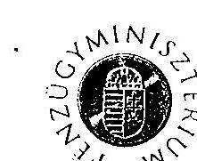
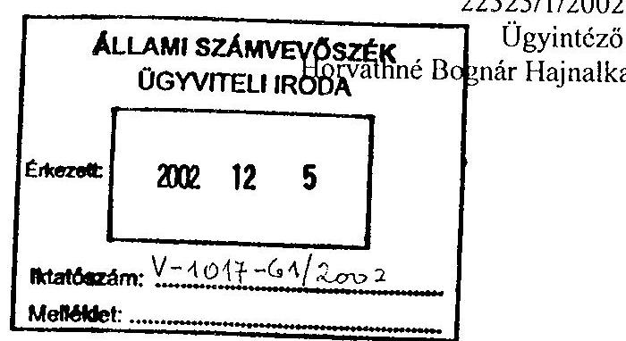
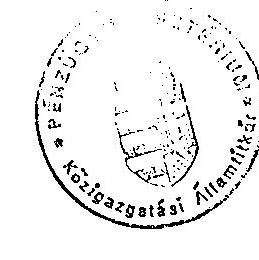
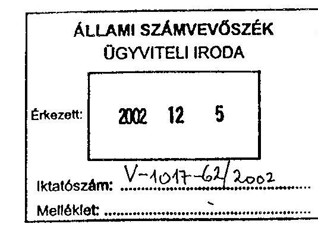
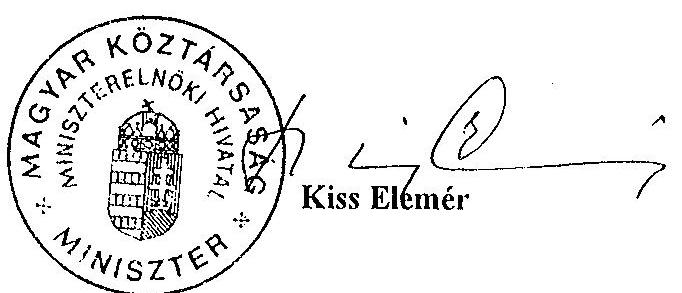
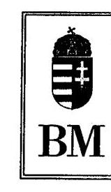
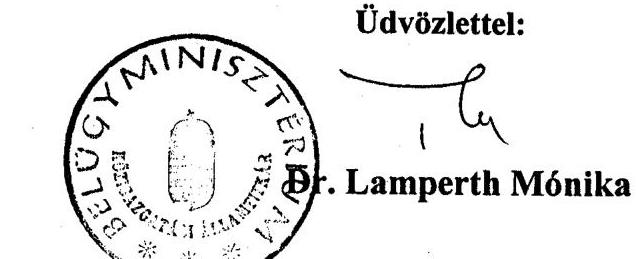
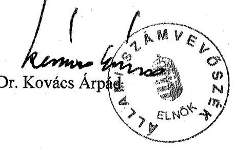

# JELENTÉS 

## Budapest Főváros Önkormányzata gazdálkodásának utóvizsgálatáról

---

# 3. Önkormányzati és Területi Ellenőrzési Igazgatóság 

3.3. Átfogó Ellenőrzések Főcsoport

Iktatószám: V-1017-65/2001-2002.
Témaszám: 584
Vizsgálat-azonosító szám: V0010

## Az ellenőrzést felügyelte:

## dr. Lóránt Zoltán

főigazgató
Az ellenőrzés végrehajtásáért felelős:
Németh Péterné
főcsoportfőnök
Az ellenőrzést vezette:
Csecserits Imréné
osztályvezető, igazgatóhelyettes
A számvevői jelentések feldolgozásában és a jelentés összeállításában közreműködött:

## Bauer Lajosné

számvevő tanácsos
Az ellenőrzést végezték:

| Bauer Lajosné | dr. Karáné Kőszegi | Vojcsekné Szabó |
| :-- | :-- | :-- |
| számvevő tanácsos | Zsuzsanna | Ágnes |
| Fővárosi Ellenőrzési Oszt. | számvevő tanácsos | számvevő tanácsos |
|  | Pest megye | Pest megye |
| Cséffai János | Kozma Gábor |  |
| számvevő tanácsos | számvevő |  |
| Fővárosi Ellenőrzési Oszt. | Fővárosi Ellenőrzési Oszt. |  |
| Endrődy Péterné | Marosi Gyöngyi |  |
| számvevő | számvevő tanácsos |  |
| Fővárosi Ellenőrzési Oszt. | Pest megye |  |

A témához kapcsolódó eddig készített számvevőszéki jelentések:
címe
sorszáma
Jelentés a Budapest Főváros Önkormányzata pénzügyi-gazdasági 364 ellenőrzésének tapasztalatairól
Jelentés a főváros és a megyei jogú városok szennyvíztisztítási 9805 programjára rendelkezésre álló források felhasználásának vizsgálatáról
Jelentés a helyi önkormányzatok által fenntartott járóbeteg- 9817 szakellátás helyzetének és a ráfordított pénzeszközök felhasználásának vizsgálatáról

---

| Jelentés a helyi önkormányzatok által nyújtott pénzbeli szociális ellátások helyzetének vizsgálati tapasztalatairól | 9913 |
| :--: | :--: |
| Jelentés a helyi önkormányzatok által igényelhető 1998. évi központosított előirányzatok felhasználásának ellenőrzéséről | 9921 |
| Jelentés a helyi önkormányzatok beruházásaihoz és rekonstrukcióihoz nyújtott 1998. évi címzett és céltámogatások vizsgálatáról | 9922 |
| Jelentés a helyi önkormányzatok 1998. évi normatív állami hozzájárulás, valamint az ezekhez kapcsolt kiegészítő támogatások igénybevételének és elszámolásának ellenőrzéséről | 9929 |
| Jelentés a települési önkormányzatok tulajdonában lévő közutak, hidak, alagutak fejlesztésének, fenntartásának és üzemeltetésének vizsgálatáról | 0007 |
| Jelentés a helyi önkormányzatok vagyonszerkezetének, vagyonhasznosítási és nyilvántartási tevékenységének vizsgálatáról | 0008 |
| Jelentés a helyi önkormányzatok beruházásaihoz és rekonstrukcióihoz nyújtott 1999. évi címzett és céltámogatások felhasználásának vizsgálatáról | 0022 |
| Jelentés a helyi és kisebbségi önkormányzatok 2000. évi zárszámadásának ellenőrzéséről | 0126 |

---

# TARTALOMJEGYZÉK 

BEVEZETÉS ..... 5
I. ÖSSZEGZŐ MEGÁLLAPÍTÁSOK, KÖVETKEZTETÉSEK, JAVASLATOK ..... 7
II. RÉSZLETES MEGÁLLAPÍTÁSOK ..... 13

1. A költségvetés tervezésének, végrehajtásának és a zárszámadás elkészítésének szabályszerűsége ..... 13
1.1. A költségvetési rendelet jogszerűsége, a költségvetési tervezési folyamat szabályozottsága, a költségvetés megalapozottsága ..... 13
1.1.1. A költségvetés összeállítási folyamatának változása ..... 15
1.1.2. A költségvetés megalapozottságát javító intézkedések ..... 17
1.1.2.1. A szociális és gyermekvédelmi ellátások intézményi háttere kialakításának tervezése ..... 17
1.1.2.2. Beruházásokat, felújításokat és egyéb feladatokat érintő korábbi elkötelezettségek, kötelezettségvállalások figyelembe vétele ..... 18
1.1.2.3. Tárgyi eszközök műszaki állapotának felmérése ..... 18
1.1.2.4. A Környezetvédelmi Alap tervezése ..... 19
1.1.2.5. A Vagyongazdálkodási Alap tervezésének megalapozottsága ..... 20
1.2. Jóváhagyott költségvetési előirányzatok változtatása, nyilvántartása, az előirányzatok betartása ..... 20
1.3. A költségvetési rendeletben meghatározott hitelfelvételi korlát betartásának figyelemmel kísérése ..... 22
1.4. Az önkormányzat bankszámla vezetési rendjének változása ..... 22
1.5. A gazdálkodási hatáskörök szabályozottsága ..... 23
1.6. A kötelezettségvállalások nyilvántartási rendje ..... 26
1.7. A beruházások aktiválásának (számviteli nyilvántartásba vételének) szabályszerűsége ..... 27
1.8. Bruttó elszámolás számviteli alapelv érvényesülése a bevételek és kiadások elszámolása során ..... 29
1.9. Értékpapírok, üzemeltetésre átadott eszközök leltározása, ingatlanértékesítések nyilvántartása ..... 30
1.10.Az önkormányzati eszközök nyilvántartása ..... 31
1.10.1.Céltámogatással megvalósult közmű beruházások tulajdonba vétele ..... 31
1.10.2.Egyes eszközök nyilvántartási értékének megállapítása ..... 31
1.10.3.A törzsvagyonnak minősülő ingatlanok tulajdonjogának bejegyzése ..... 32

---

1.10.4.Az ingatlan-nyilvántartások közötti összhang ..... 33
1.11.Közbeszerzési eljárás alapján megkötött szerződések módosításának szabályszerűsége ..... 33
1.12.Együttműködés a helyi kisebbségi önkormányzatokkal ..... 34
1.13.A költségvetési beszámoló és a zárszámadási rendelet közötti összhang megléte ..... 34
2. Az irányítási, szabályozási és ellenőrzési rendszer működésének értékelése ..... 35
2.1. A gazdálkodás szabályozottsága ..... 35
2.2. A pénzügyi-gazdasági folyamatok szabályozottsága ..... 37
2.2.1. A gazdasági események bizonylatainak nyilvántartása ..... 37
2.2.2. A pénzkezelés rendjének szabályozottsága ..... 38
2.2.3. A számlarend ..... 38
2.3. Vagyongazdálkodással kapcsolatos feladat- és hatáskörök felülvizsgálata ..... 40
2.4. A pénzügyi, gazdálkodási és számviteli feladatellátás területén a kontrollok kiépítettsége ..... 42
MELLÉKLETEK

1. számú A számvevői jelentésekben megfogalmazott javaslatok (6 oldal)
2. számú Dr. László Csaba pénzügyminiszter észrevétele (1 oldal)
3. számú Dr. Kiss Elemér a Miniszterelnöki Hivatal miniszterének észrevétele (1 oldal)
4. számú Dr. Lamperth Mónika belügyminiszter észrevétele (1 oldal)
5. számú Dr. Demszky Gábor a Budapest Főváros Önkormányzata főpolgármesterének észrevétele (7 oldal)
6. számú Főpolgármesteri észrevételre adott válaszlevél (1 oldal)

---

# RÖVIDÍTÉSEK JEGYZÉKE 

| ÁSZ | Állami Számvevőszék |
| :--: | :--: |
| önkormányzat | Budapest Főváros Önkormányzata |
| közgyűlés | Budapest Főváros Önkormányzatának Közgyűlése |
| főpolgármesteri   hivatal | Budapest Főváros Önkormányzatának Főpolgármesteri Hivatala |
| főpolgármester | Budapest Főváros Önkormányzatának főpolgármestere |
| főjegyző | Budapest Főváros Önkormányzatának főjegyzője |
| intézmények | Budapest Főváros Önkormányzatának költségvetési intézményei |
| vezetői intézkedések   minőségügyi   eljárások | "500-as" főpolgármesteri és főjegyzői intézkedések   ISO 9001 Minőségbiztosítási rendszeren belüli a Minőségügyi Kézikönyvben szereplő minőségügyi eljárások |
| gazdálkodási hatáskörökről szóló intézkedés | 531/1998. számú főpolgármesteri és főjegyzői intézkedés a főpolgármesteri hivatal pénzgazdálkodásával kapcsolatos kötelezettségvállalás, utalványozás, ellenjegyzés és érvényesítés hatásköri rendjéről |
| FÁKISZ - FÁH | Fővárosi Államháztartási Közigazgatási Információs Szolgálat, majd Fővárosi Államháztartási Hivatal |
| SzMSz | Szervezeti és Működési Szabályzat |
| BSE | Budapest Sport Egyesület |
| Fejlesztési Kiadások   Főkönyvelősége | Fővárosi Önkormányzat Közigazgatás-Szervezési és Informatikai Szolgálat (FŐSZINFORM), majd 2001. november 1-től Főpolgármesteri Hivatal Költségvetési, Tervezési és Gazdálkodási Ügyosztály Fejlesztési Kiadások Főkönyvelősége |
| BFVK Rt. | Budapest Főváros Vagyonkezelő Rt. |
| Ötv. | 1990. évi LXV. törvény a helyi önkormányzatokról |
| Áht. | 1992. évi XXXVIII. törvény az államháztartásról |
| Sztv. | 2000. évi C. törvény a számvitelről |
| hatásköri törvény | 1991. évi XX. törvény a helyi önkormányzatok és szerveik, a köztársasági megbízottak, valamint egyes centrális alárendeltségű szervek feladatai és hatásköreiről |
| Kbt. | 1995. évi XL. törvény a közbeszerzésekről |

---

| Gt. | 1997. évi CXLIV. törvény | a gazdasági társaságokról |
| :--: | :--: | :--: |
| Ámr. | 217/1998. (XII. 30.)   Korm. rendelet | az államháztartás működési rendjéről |
| Vhr. | 249/2000.(XII. 24.)   Korm. rendelet | az államháztartás szervezetei beszámolási és könyvvezetési kötelezettségének sajátosságairól |
| ingatlanvagyon   rendelet | 147/1992. (XI. 16.)   Korm. rendelet | Az önkormányzatok tulajdonában lévő ingatlanvagyon nyilvántartási és adatszolgáltatási rendjéről |
| beruházási rendelet | 50/1998. (X. 30.) Főv.   Kgy. rend. | az önkormányzat és intézményei beruházási és felújítási tevékenysége előkészítésének, jóváhagyásának, megvalósításának rendje |

---

# JELENTÉS 

## Budapest Főváros Önkormányzata gazdálkodásának utóvizsgálatáról

## BEVEZETÉS

A helyi önkormányzatok között Budapest Főváros Önkormányzatának sok tekintetben egyedi szerepe és szerteágazó feladatai miatt meghatározó jelentősége van, amelyhez kapcsolódik, hogy az önkormányzatok vagyonának 29,5%-ával, az önkormányzatok évenkénti kiadásainak mintegy 10%-ával rendelkezik.

Az önkormányzat gazdálkodását az Állami Számvevőszék - jelentőségének megfelelően - kiemelt gyakorisággal ellenőrzi. Az elmúlt 11 évben összesen 68 vizsgálat foglalkozott az önkormányzat gazdálkodásának egy-egy területével. A költségvetési gazdálkodást átfogó jelleggel egy alkalommal, 1996/97. évben ellenőriztük, ez a vizsgálat azonban nem terjedt ki részletesen a költségvetési gazdálkodás keretében biztosított szolgáltatások, városüzemeltetési feladatok ellátására, fejlesztésére, a vagyongazdálkodás részterületeire.

Az önkormányzat gazdálkodásának különböző típusú, témájú számvevőszéki ellenőrzéseit a jövőben az ellenőrzési megállapítások, javaslatok időszakonkénti összefoglaló bemutatásával kívánjuk hatékonyabbá tenni. E folyamat első lépéseként utóvizsgálat keretében ellenőriztük az 1996/97. évi átfogó jellegű, valamint az ezt követő 11 ellenőrzés megállapításainak, ajánlásainak megvalósulását.

Az utóellenőrzés végrehajtására az Állami Számvevőszékről szóló 1989. évi XXXVIII. törvény 2. § (5), és a 17. § (5) bekezdésében, a helyi önkormányzatokról szóló 1990. LXV. törvény 92. § (1) bekezdésében, továbbá az államháztartásról szóló 1992. évi XXXVIII. törvény 121. § (3) bekezdésében foglaltak adtak jogszabályi alapot.

Az utóellenőrzés célja annak értékelése volt, hogy a korábbi számvevőszéki ellenőrzések megállapításait, ajánlásait követően az önkormányzat által meghatározott intézkedésekkel

- a gazdálkodás szabályszerűsége javult-e;
- a javasolt intézkedések végrehajtása eredményeként érvényesültek-e a tervezés, az operatív gazdálkodás, a számviteli bizonylati rend és a beszámolási kötelezettség teljesítése során a jogszabályokban és belső szabályzatokban megfogalmazott követelmények;

---

- a javaslatok figyelembevételével módosított irányítási és kontrollfolyamatok megfelelően segítették-e a gazdálkodást és feladatellátást.

Az utóvizsgálat feladata volt, hogy a javaslatokkal összefüggésben megtett intézkedések végrehajtásának és azok hatásának ellenőrzésén túlmenően az önkormányzat gazdálkodásának, későbbiekben részletesebben vizsgálandó súlyponti kérdéseire is javaslatot tegyen.

Az ellenőrzést az 1999-2001. évi dokumentumok alapján végeztük, de egyes gazdasági folyamatok, tendenciák megítélésénél hosszabb időtávot is áttekintettünk. A költségvetési rendeletre vonatkozó megállapítások érvényesek a 2002. évi rendeletre is.

A számvevői feladat végrehajtását Útmutató segítette.
Budapest Fővárosi Önkormányzat Főpolgármesteri Hivatalánál az alábbi szervezeti egységeknél végeztünk utóellenőrzést:

Beruházási és Közbeszerzési Ügyosztály
Egészségügyi Ügyosztály
Gazdasági Főpolgármester-helyettesi Iroda Programvégrehajtó Egysége
Gyermek- és Ifjúságvédelmi Ügyosztály
Informatikai Ügyosztály
Költségvetési, Tervezési és Gazdálkodási Ügyosztály
Környezetvédelmi Ügyosztály
Közlekedési Ügyosztály
Közmű Ügyosztály
Lakás Ügyosztály
Szociálpolitikai Ügyosztály
Vállalkozási és Vagyonkezelési Ügyosztály

---

# I. ÖSSZEGZŐ MEGÁLLAPÍTÁSOK, KÖVETKEZTETÉSEK, JAVASLATOK 

#### Abstract

A fővárosi önkormányzat gazdálkodásának 1996/97. évi átfogó jellegű ellenőrzése, valamint az ezt követően végzett további 11 ellenőrzés számos szabályszerűségi hiányosságot, valamint célszerűtlenséget tárt fel. Az ellenőrzések érintették a működés szabályozottságát, a vagyon nyilvántartását, a közbeszerzések szabályszerűségét, a kisebbségi önkormányzatokkal megvalósuló együttműködést, a költségvetési kapcsolatok szabályszerűségét, az önkormányzat felügyeleti, belső és tulajdonosi ellenőrzésének megoldását, az irányítási, szabályozási és kontrollrendszerek működését.

Az 1996/97. évi átfogó jellegű ellenőrzést követően az önkormányzatnál részletes intézkedési tervet készítettek a feltárt hiányosságok megszüntetése érdekében. A főjegyző összesen négy alkalommal tájékoztatást adott az ÁSZ részére ezen intézkedési tervben rögzítettek végrehajtásának helyzetéről. A kapott tájékoztatás - amely elsődlegesen a közgyűlés részére készült - egyes feladatok teljesítéséről, más esetben a teljesítést akadályozó tényezőkről, több esetben a feladat elvégzésére vonatkozó intézkedés kiadásáról adott számot.

Az utóvizsgálat során az ÁSZ részére megküldött intézkedési tervekben szereplő feladatok teljesítését a megjelölt felelősök és határidők figyelembevételével ellenőriztük. Az intézkedési tervek a számvevői jelentésekben javasolt feladatok végrehajtását teljes körűen felölelték. A feladatok folyamatos teljesítésének eredményeként az utóvizsgálat során jellemzően az intézkedési tervekben foglaltak végrehajtását tapasztaltuk, azonban néhány esetben elmaradást, valamint újabb hiányosságokat is megállapítottunk.

A költségvetés összeállításának folyamatát az ÁSZ javaslatainak figyelembevételével szabályozták, illetve a korábbi szabályozásokat kiegészítették, pontosították. Előrelépést jelentett a főpolgármesteri hivatalban 2001. évben bevezetett ISO 9001 minőségbiztosítási rendszer, amely tartalmazza a költségvetés készítésének folyamatszabályozásáról szóló minőségügyi eljárásokat is. Szabályozták a költségvetés készítésével kapcsolatos feladatokat, a folyamatban részt vevők feladatát és felelősségét, az adatszolgáltatás rendszerét. A költségvetés tervezését szabályozó minőségügyi eljárásokon és vezetői intézkedéseken túlmenően a főpolgármesteri hivatal Költségvetési, Tervezési és Gazdálkodási Ügyosztályának vezetője által kiadott köriratok is tartalmazták az évenkénti aktuális feladatokat.

A költségvetés korábbiaknál megalapozottabb tervezését tapasztaltuk a szociális és gyermekvédelmi ellátások intézményi hátterének kialakítása területén. Az ellenőrzött beruházások esetében biztosították a költségvetési rendeletben a beruházási engedélyokiratokban jóváhagyott éves
 költségelőirányzatok és az éves költségvetési kiadási előirányzatok összhangját, figyelembe véve egyes beruházások időbeni elhúzódását is.

---

A költségvetés megalapozottságát elősegítő tervezett intézkedések közül nem valósult meg a tárgyi eszközök műszaki állapotának teljes körű felmérése, valamint az „alapok” tervezésének javasolt módosítása. A tárgyi eszközök műszaki állapotának felméréséhez készült ütemtervből csak az egészségügyi ágazatot érintő első ütem valósult meg. Az „alapok” tervezésének, felhasználásának rendjét szabályozták, azonban nem döntöttek a meghatározott célra elkülönített keretösszegek eddigi elnevezésének módosításáról és a céltartalékok közötti szerepeltetéséről.

A költségvetési rendeletben nem írták elő a szabad pénzeszközökből történő rövid lejáratú értékpapír vásárláshoz és -eladáshoz fűződő előirányzat-módosítási kötelezettség rendjét. Ennek hiánya következtében a forgatási célú értékpapír vételhez-eladáshoz jóváhagyott módosított előirányzattal (fedezettel) nem rendelkeztek.

A hitelfelvételi korlát betartásának ellenőrzését elősegítő zárt rendszerű nyilvántartást a megkötött hitelszerződésekről - a javaslatnak megfelelően - kialakították, annak zárt rendszerét biztosították.

A főpolgármesteri hivatal a költségvetési elszámolási számlák javasolt felülvizsgálatát elvégezte. A korábbi hét elszámolási számla helyett 2002. évben két költségvetési elszámolási számlával rendelkezik, azonban ez továbbra is ellentétes a hatályos jogszabályi előírásokkal.

Korábbi ellenőrzések során is javasoltuk módosítani, kiegészíteni, egyértelművé tenni a kötelezettségvállalás, ellenjegyzés, utalványozás, érvényesítés szabályozását. A főpolgármester és a főjegyző a gazdálkodási hatáskörökről közös intézkedést adott ki, amelyet később több alkalommal módosítottak, azonban a szabályozás nem felel meg maradéktalanul sem a jogszabályi előírásoknak, sem a kialakított gyakorlatnak. A szabályozás végrehajtásához kapcsolódó aláírás bejelentő formanyomtatvány adattartalma és a meghatározott gazdálkodási jogkörök nincsenek összhangban. Az utalványozás kialakított rendjében nem szerepel az érvényesítés ellenőrizhető dokumentálásának követelménye, a szabályozásból a vállalkozások támogatása esetében kimaradt a kötelezettségvállalók és a kötelezettségvállalást ellenjegyző személyek meghatározása.

A beruházások aktiválási eljárásának rendjét az elmúlt években többször módosították, kiegészítették, azonban a feladatokat nehezen áttekinthetően, bonyolultan és részben hiányosan szabályozták. A kialakított új eljárási rend továbbra sem biztosítja teljes mértékben a zártságot, mivel nem ugyanazon a költségvetési körön belül történik a beruházás aktiválása és a beruházási állományból történő kivezetése.

Továbbra sem megoldott a valamilyen okból meghiúsult beruházási kiadások befejezetlen állományból történő kivezetése. A számvevőszéki ellenőrzések ajánlása alapján a főpolgármesteri hivatalban a befejezetlen és befejezett beruházások könyvviteli nyilvántartását 2000. évben felülvizsgálták és a nyilvántartásokat helyesbítették. Az 1996-2000. év közötti időszakot érintő tételes felülvizsgálat kifejezetten az elmaradt aktiválások feltárására irányult, ezért csak részben oldotta meg a beruházások aktiválásával kapcsolatban jel

---

zett hiányosságokat. A helyesbítések után is mintegy 350 beruházás szerepelt a nyilvántartásokban, amelyek közel felénél egy évet meghaladóan semmilyen pénzmozgás nem volt.

Az önkormányzati tulajdonban lévő, elsősorban tárgyi eszközök nyilvántartási hiányosságaira a számvevői ellenőrzések is felhívták a figyelmet. A javaslatok alapján a főpolgármesteri hivatalnál a vízi közművek nem minősülő eszközök (árkok, árvízvédelmi létesítmények) kivételével elvégezték az érték nélkül nyilvántartott, illetve térítésmentesen átvett ingatlanok értékének megállapítását. A megállapított értékadatokat a könyvviteli nyilvántartásokban és a zárszámadáshoz csatolt vagyonleltárban egymással egyezően szerepeltették. A korábban érték nélkül nyilvántartott eszközök értékének megállapítása következményeként 2000. évben jelentős mértékben, 139 milliárd Ft-ról 727 milliárd Ft-ra nőtt az önkormányzat könyveiben kimutatott tárgyi eszközök bruttó értéke.

Az érték nélkül nyilvántartott, illetve térítésmentesen átvett ingatlanok értékének megállapításával és nyilvántartásba vételével, valamint a könyvviteli nyilvántartásban és a vagyonleltárban szereplő értékadatok egyeztetésének elvégzésével az önkormányzati eszközök számbavételének megbízhatósága javult, azonban a vonatkozó jogszabályban előírt befejezési határidőre tekintettel az érték-megállapítás megalapozottsága, helyessége a jövőben ellenőrzést igényel. Az önkormányzat korlátozottan forgalomképes vagyonnal történő gazdálkodásának ellenőrzésekor, az ingatlanok nyilvántartásával összefüggésben feltárt konkrét hiányosságokat, eltéréseket rendezték. Az önkormányzati szinten végrehajtott nyilvántartásba vételi korrekciók elvégzése a későbbiekben ellenőrzést igényel.

Az ingatlanok tulajdonjogi rendezésére vonatkozó számvevőszéki javaslat alapján 2001. évben a főpolgármesteri hivatalban elvégezték a vagyonátadó bizottságtól átvett törzsvagyonnak minősülő ingatlanok tulajdonjogi bejegyzésének felülvizsgálatát. A 2001. december 12-i állapotot tükröző összesítés szerint rendezetlen és elmaradt 289 híd és felüljárónak, valamint 71 aluljárónak és további 126 ingatlannak a földhivatali ingatlan-nyilvántartásba történő bejegyzése.

A vagyonleltárral összefüggésben megállapított eltérések miatt a könyvviteli mérleg, a zárszámadáshoz csatolt vagyonleltár és az ingatlankataszter közötti teljes összhang 2001. év végén még nem volt biztosított.

A közbeszerzési eljárásoknál a korábbi számvevői jelentés észrevételezte, hogy a fővárosi önkormányzatnál a kiemelt szintű folyamatba épített ellenőrzés mellett is tapasztaltunk szabálytalanságokat, elsősorban a megkötött szerződések módosításánál. Az utóellenőrzés és a közbeszerzéseket ellenőrző vizsgálóbiztosi csoport megállapítása szerint is, a közbeszerzési eljárások eredményeként létrejött szerződések módosítása továbbra sem felelt meg maradéktalanul a közbeszerzési törvényben előírtaknak. A vizsgált beruházások felénél a szerződésmódosítás nem a szerződéskötést követően beállott körülmény, hanem tervezési és szervezési mulasztások miatt vált szükségessé. A közbeszerzési eljárások lebonyolítása során a helyi szabályzatban

---

előírt, folyamatba épített ellenőrzés hiányosan, nem minden szerződésre kiterjedően valósult meg.

A főpolgármesteri hivatal gazdálkodásával kapcsolatos belső szabályozás jelenleg is hiányos. Korábbi ellenőrzéseink során észrevételeztük, hogy a pénzügyi-gazdasági eseményeket rögzítő bizonylatok (pl. számla) hivatalon belüli szervezeti egységek közötti átadása-átvétele az egységes nyilvántartási rendszer hiánya miatt nem követhető. A nyilvántartásra vonatkozó főjegyzői intézkedés 2001. évi módosítása szerint a pénzügyi bizonylatokat iktatni nem kell, kezelésükre a gazdálkodási hatáskörökről szóló intézkedésben foglaltak az irányadók, azonban ez nem tartalmaz szabályozást a bizonylatok nyilvántartását, átadását-átvételét érintően. Ennek következtében a gazdasági eseményeket rögzítő bizonylatok főpolgármesteri hivatalon belüli mozgása 2001. évtől szabályozatlan. Az ügyosztályok ezen bizonylatok nyilvántartását, átadását-átvételét különböző módon dokumentálják. Az egyedileg kialakított nyilvántartások az ellenőrzött esetekben megfelelően rögzítették a bizonylatok mozgását.

Korábbi számvevőszéki ellenőrzés javaslata alapján a vonatkozó előírásoknak megfelelő tartalommal 1999. évben elkészült a főpolgármesteri hivatal Pénzkezelési Szabályzata.

A számvevői jelentésekben rögzített hibák felszámolása érdekében 1999. évben új számlarend készült, azonban a gazdasági események könyvviteli nyilvántartásának gyakorlatban kialakított rendszere eltér a számlarendben meghatározottaktól. A számlarendből megállapítható, hogy a főpolgármesteri hivatalban négy könyvelési kör (operatív gazdálkodás, önkormányzati feladatok, fejlesztési feladatok és Fővárosi Illetékhivatal) végzi a gazdasági események könyvviteli elszámolását, de nem egyértelmű, hogy ezek a könyvelési körök a gyakorlatban önálló könyvviteli rendszert alkotnak és a négy részbeszámoló alapján készült el a főpolgármesteri hivatali szintű költségvetési beszámoló. A számlarend nem tartalmazza a négy önálló könyvelési kör közötti, illetve a négy költségvetési beszámoló közötti kapcsolódási pontokat és egyeztetési feladatokat.

A különböző önkormányzati tulajdonú gazdasági társaságok igazgatósági és felügyelő bizottsági tagjai, valamint a társaságok köz- és taggyűlésein az önkormányzatot képviselők részére a feladatok és a velük szemben támasztott, a képviselettel kapcsolatos általános elvárások meghatározását több korábbi számvevőszéki jelentésben javasoltuk. A javaslatot figyelembe véve a főpolgármesteri hivatal a tulajdonosi jogok gyakorlásának továbbfejlesztésére irányuló előterjesztést elkészítette, azonban annak tartalmát sem a tulajdonosi bizottság, sem a közgyűlés nem fogadta el.

A korábbi számvevői jelentés a tulajdonosi joggyakorlás feltételeinek az önkormányzat SzMSz-ében történő szabályozását ellentmondásosnak ítélte. Az ellentmondás megszüntetése érdekében az SzMSz-t ugyan módosították, de ez még nem szüntette meg a jelzett ellentmondást.

A költségvetési szervek ellenőrzésének feladata nem szerepelt a főjegyző feladatai között, e mulasztás megszüntetésére vonatkozó számvevőszéki javaslatot

---

elfogadva az önkormányzat SzMSz-ében a főjegyző feladatait kibővítették. Az intézményi ellenőrzések megállapításainak realizálása a kialakított rendszerben biztosított. Nem kielégítő azonban a főpolgármesteri hivatalon belül a belső ellenőri jelentések realizálásának gyakorlata, elsősorban az időbeli elhúzódás miatt.

A belső szervezeti egységeknél a folyamatba épített vezetői ellenőrzés, valamint a munkafolyamatba épített ellenőrzés dokumentálási követelményeinek pontosítását javasoltuk, melyet a belső szabályozások - Ügyrend, vezetői intézkedések, szervezeti egységenkénti belső működési szabályzatok - módosítása során végrehajtottak. Az Ügyrendben meghatározott feladatok végrehajtásának részletes leírását a minőségügyi eljárások rögzítették.

A főpolgármesteri hivatal belső ellenőrzési szabályzata megfelelő, ennek ellenére az utóellenőrzéssel érintett ügyosztályok belső működési szabályzata és a vezetői munkaköri leírások nem tartalmazták a vezetői és a munkafolyamatba épített ellenőrzés konkrét feladatait. Nem teljes körűek a minőségügyi eljárások sem, mivel nem jelölik meg a tervezés valamennyi részfeladatához az ellenőrzési pontokat, az ellenőrzés tartalmát. A gazdálkodáshoz kapcsolódó, folyamatba épített ellenőrzési feladatot és az annak megtörténtére vonatkozó dokumentálási kötelezettséget a munkaköri leírások nem tartalmazzák.

Az utóellenőrzés során megfogalmazott számvevői javaslatokat az 1. számú melléklet részletezi.

Még mindig nem megoldott a főváros és kerületi önkormányzatok közötti forrásmegosztás rendje, ezért a 2003. évi forrásmegosztás a főváros és kerületek között továbbra is számos vita forrása lehet.

# JAVASLAT:

## a Kormánynak

1. dolgozza ki az Alkotmánybíróság határozatának megfelelően a fővárosi és kerületi önkormányzatokat osztottan megillető bevételek megosztásának garanciális szabályait, a kerületi önkormányzatok számára az Alkotmányban biztosított önkormányzati alapjog védelmének érvényesülése érdekében;

## a főpolgármesternek

1. segítse elő a helyszíni ellenőrzés során tett javaslatok hasznosulását, különös tekintettel arra, hogy zárt rendszerű elszámolások alapozzák meg a valós helyzetet tükröző költségvetési beszámolást, valamint a Fővárosi Önkormányzat költségvetése és a számviteli elszámolás rendje a külső ellenőrzés számára is átlátható legyen;
2. biztosítsa, hogy a költségvetés végrehajtásához és annak ellenőrzéséhez kapcsolódó feladatok felelősei személyre szólóan meghatározottak legyenek és érje el, hogy a gazdálkodáshoz kapcsolódó pénzforgalom áttekinthetővé és szabályszerűvé tétele

---

érdekében a Főpolgármesteri Hivatal csak egy költségvetési elszámolási számlával rendelkezzen;
3. tájékoztassa a fővárosi önkormányzat közgyűlését az utóvizsgálat megállapításairól, a feltárt hiányosságok megszüntetésére és kijavítására készített intézkedési tervről, továbbá tájékoztassa az Állami Számvevőszéket az elfogadott intézkedési terv tartalmáról.

---

# II. RÉSZLETES MEGÁLLAPÍTÁSOK

## 1. A KÖLTSÉGVETÉS TERVEZÉSÉNEK, VÉGREHAJTÁSÁNAK ÉS A ZÁRSZÁMADÁS ELKÉSZÍTÉSÉNEK SZABÁLYSZERŰSÉGE

### 1.1. A költségvetési rendelet jogszerűsége, a költségvetési tervezési folyamat szabályozottsága, a költségvetés megalapozottsága

Korábbi számvevői jelentésben megállapított hiányosságok megszüntetése érdekében a költségvetési rendelet-tervezet előkészítésekor szükséges intézkedéseket - az „alapokra” vonatkozó megállapítás kivételével - megtették. Az utóellenőrzés során a pozitívumok mellett megállapítottunk újabb hiányosságokat is:

- az Ámr. 29. § (4) bekezdésében előírtak ellenére elmaradt a költségvetési rendelet-tervezetnek az intézmények vezetőivel történt egyeztetésekor elfogadott, főbb megállapítások írásos rögzítése,
- az Áht. 73.§ (1) bekezdésében és a „saját” költségvetési rendelet 2. § (1) bekezdésében előírtak ellenére a költségvetési rendeletben nem szerepel elkülönítetten a céltartalék előirányzatok teljes köre. A költségvetési rendelet évente változó számú (2001. évben 13, 2002. évben 17) költségvetési címen tartalmaz kiadási előirányzatot különféle „alapokra”, amelyek többségében működési célú pénzeszközátadásra tervezett kiadások.

Az „alapok” forrását kizárólag a fővárosi önkormányzat éves költségvetési rendeletében meghatározott támogatás biztosította. Az „alapok” a fővárosi önkormányzat költségvetésének olyan támogatási keretei, elkülönített előirányzatai, tartalmukat tekintve valójában céltartalékai, amelyek felhasználásáról - átruházott hatáskörben - az éves költségvetési rendeletekben kijelölt bizottságok rendelkezhetnek. Egy olyan „alap”-ja van az önkormányzatnak, a Környezetvédelmi Alap, amelyet törvényi felhatalmazás alapján (a környezet védelmének általános szabályairól szóló 1995. évi LIII. törvény 58. § (1) bekezdés) hozott létre.

Az „alapok” eredeti költségvetési előirányzata 2000. évben 879 millió Ft, 2001. évben 1144 millió Ft, 2002. évben 1400 millió Ft volt, amely összeg a fővárosi önkormányzat összes kiadásának 0,3-0,6%-a volt. Az egyes „alapok” elnevezése utal a várható felhasználási célra (Pl.
 Vagyongazdálkodási, Egészségügyi, Rekreációs és Sport, Oktatási, Ifjúsági, Gyermek- és Ifjúságvédelmi, Kulturális, Színházi, Múemléki, Környezetvédelmi, Fővárosi Idegenforgalmi, Esélyegyenlőségi, Európai Integrációs). Az "alapok" közül 2001. évben egyedül a Vagyongazdálkodási Alap tervezett kiadási előirányzata tartalmazott a működési célú pénzeszközátadáson túl dologi kiadásra is előirányzatot.

Az "alapok" száma 2001. évben eggyel (Fővárosi Egészségfejlesztési Alap, 250 millió Ft felhalmozási célú pénzeszköz átadási előirányzattal), 2002. évben kettővel (Európai Integrációs Alap 40 és Prevenciós Sport Alap 150 millió Ft működési célú pénzeszköz átadási előirányzattal) növekedett.

---

A költségvetési rendeletek költségvetési címenként külön-külön tartalmazzák az alapítványok és társadalmi szervek részére jóváhagyott működési és felhalmozási célú pénzeszköz átadásokat. A költségvetési címek többsége név szerint tartalmazta a támogatni kívánt szerv pontos megjelölését, kivétel ez alól három költségvetési cím, amelyekre különböző célú (foglalkoztatáspolitikai, környezetvédelmi, szociális célú) közszolgáltatási kereteket különítettek el. A kivételként jelzett költségvetési címeken, elnevezésüktől függetlenül, tartalmukat tekintve előre meghatározott feladatra - a kiadási előirányzati jogcím megjelölésével - céltartalékot képeztek.

A költségvetési rendeletben a költségvetési szerveknek folyósított támogatások költségvetési címei között több olyan önálló előirányzat szerepelt, ami tartalmát tekintve szintén céltartalék (pl. pályázat hajléktalanok ellátására; célkeret a közbiztonság megerősítésére).

- A fővárosi önkormányzat költségvetési rendeletében nem egyértelműek és nem következetesek az alábbiak:
- A költségvetési rendelet bevételeket bemutató része bevételi jogcímek szerint külön-külön mutatja be az intézmények, a főpolgármesteri hivatal és az összesen (önkormányzati szintű) adatokat. Az intézmények bevételi jogcímei között nem szerepel bevételi tételként a felügyeleti szervtől a költségvetési szerveknek folyósított támogatás előirányzata (pl. 2000. évben 43012 millió Ft önkormányzati támogatás), illetőleg ugyanezen előirányzati összeg a főpolgármesteri hivatal bevételt csökkentő tételei között az intézményfinanszírozás, ezáltal nem biztosított a költségvetési rendelet bevételeket bemutató részének összhangja az önkormányzat által fenntartott, működtetett intézmények elemi költségvetésének összesített adatával.
- A költségvetési rendelet kiadásokat jogcímek szerint megállapító részében nem szerepel a főpolgármesteri hivatal által az önkormányzat felügyelete alá tartozó költségvetési intézményeknek folyósított támogatás kiadási előirányzata (a főpolgármesteri hivatal esetében az ily módon nettósított előirányzatokat mutatták be).
- A költségvetési rendeleteknek az intézmények és a főpolgármesteri hivatal tervezett kiadási és bevételi előirányzatait együttesen bemutató részében az intézményi összesített adatok nem tartalmazzák az intézményeknek folyósított támogatást, ezáltal az önkormányzati intézmények bevételei csak az intézményi tervezésű bevételeket tartalmazzák. Ennek következtében az intézményi bevételek és kiadások egyensúlya felbomlott.
- A költségvetési rendelet fejlesztési kiadásokat bemutató része nem tartalmazza az egyes feladatok és korábbi közgyűlési elkötelezettségek megfeleltetését, áttekintését elősegítő azonosító számot.

Korábban hiba volt, hogy a közgyűlés nem határozta meg költségvetési rendeletében a címrendet, a címrend kialakításának elveit, illetve, hogy a fővárosi önkormányzat költségvetési és zárszámadási rendelete több tekintetben nem felelt meg az Áht. és annak végrehajtási rendeletében foglaltaknak. A feltárt

---

hiányosságok megszüntetésére kiadott főjegyzői intézkedési tervben foglaltakat e tekintetben végrehajtották. A költségvetési rendelet címrendjének meghatározása és a rendelet táblázataiban kialakított és részletezett felépítés megfelel az Áht. 67. §-ában előírtaknak.

- A közgyűlés a címeket a költségvetési rendelet módosításával több alkalommal kiegészítette, módosította. Például a 2000. évre vonatkozó zárszámadási rendelet a költségvetési rendelet címeihez viszonyítva 30, évközben jóváhagyott új címet tartalmazott.
- A költségvetési rendeletben jóváhagyott címrend címkódjait a TATIGAZD könyvelőprogramban is alkalmazták. A címkódra alapozva, helyi fejlesztéssel készítették el az előirányzat nyilvántartás programját és a havi zárlati kimutatás programját.

# 1.1.1. A költségvetés összeállítási folyamatának változása 

Korábbi számvevői ellenőrzési jelentés megállapítása szerint a fővárosi önkormányzat nem rendelkezett az önkormányzati költségvetés összeállítási folyamatára vonatkozó belső szabályzattal.

A főpolgármesteri hivatalban a költségvetés készítésével és a költségvetési rendelet végrehajtásával kapcsolatos feladatokat a számvevői jelentésben tett javaslatokat figyelembe véve szabályozták, illetve a korábbi szabályozásokat kiegészítették, pontosították.

A költségvetés készítésével kapcsolatos belső előírásokat tartalmaznak a következő szabályzatok, intézkedések:

- főpolgármesteri hivatal Ügyrendje;
- a 2001. évben főjegyző által jóváhagyott, ügyosztályi belső működési szabályzatok;
- a fővárosi önkormányzat költségvetése készítésének és a költségvetési rendelet végrehajtásának folyamatszabályozásáról szóló minőségügyi eljárások leírása;
- különböző vezetői intézkedések;
- munkaköri leírások.

Ezek közül új a költségvetés készítésének és a költségvetési rendelet végrehajtásának folyamatszabályozásáról szóló minőségügyi eljárások leírása. A többi szabályozáson átvezették a korábbi számvevői jelentésekben megfogalmazott javaslatokat. Például az ügyosztályok, irodák által közvetlenül ellátott szakmai feladatok - sajátos elnevezésük szerint a Költségvetési, Tervezési és Gazdálkodási Ügyosztály Főkönyvelősége kezelésébe tartozó költségvetési előirányzatai tervezési rendjére, az éves pénzügyi terv összeállítási feladataira a főjegyző, korábbi számvevői jelentésben javasoltak alapján, intézkedést adott ki. A főjegyzői intézkedés a főpolgármesteri hivatal működésével kapcsolatos részletes költségvetés elkészítését teljes körűen és célszerűen szabályozta.

---

A főpolgármesteri hivatal 2001-ben vezette be az ISO 9001 Minőségbiztosítási rendszert. A minőségügyi eljárások leírása keretében a költségvetés összeállításával kapcsolatos folyamatot is rögzítették. A minőségbiztosítási rendszer bevezetése a költségvetés készítésének munkafolyamatában nem jelentett változást, hanem a gyakorlatban működtetett rendszert írta le, foglalta össze, s ezzel biztosította az egységes szabályozás megjelenítését és a folyamat nyomon követhetőségét.

#### Abstract

A Minőségügyi Kézikönyvben a főpolgármesteri hivatal általános feladatait leíró (ME 04-01 számútól a ME 04-08 számúig szereplő) úgynevezett alapeljárások között az ME 04-02 számú tartalmazza a fővárosi önkormányzat költségvetése készítésének és a költségvetési rendelet végrehajtásának folyamatszabályozását. Szabályozták az önkormányzat éves költségvetése készítésével és a költségvetési rendelet végrehajtásával kapcsolatos feladatokat, a folyamatban részt vevők feladatát és felelősségét, rögzítették a feladathoz tartozó iratok formáját. Az ügyosztályi folyamatszabályozásokban szerepel az intézmény-felügyeleti feladatokban közreműködő, illetve az operatív gazdálkodási folyamatban részt vevő "gazdálkodó" ügyosztályok speciális feladatainak a leírása is.

A minőségügyi eljárások száma 2001. évben 87 volt, egy-egy folyamatleírás záró része, a hivatkozási rész tartalmazza a legfontosabb jogszabályok - törvények, kormányrendeletek, helyi rendeletek - és a tárgyhoz tartozó vezetői intézkedések számát.

A főpolgármesteri hivatalban a költségvetés összeállításához az adatszolgáltatás rendszerét a hivatali struktúrához igazodóan alakították ki. Az adott évi költségvetés elkészítéséhez szükséges mindenkor aktuális és konkrét feladatot azok az intézmény-felügyeletben közreműködő, illetve "gazdálkodó" ügyosztályok látták el, amelyek a végrehajtáshoz, az ellenőrzéshez és az esetleges beavatkozáshoz a megfelelő jogkörrel rendelkeznek. Szervezési hierarchia szempontjából a költségvetés készítés rendje teljes körűen és célszerűen szabályozott.

A költségvetés tervezését és végrehajtását szabályozó minőségügyi eljárások és vezetői intézkedések mellett a Költségvetési, Tervezési és Gazdálkodási Ügyosztály által kiadott köriratok alapozzák meg az aktuális feladatok jogszerű és egyértelmű, határidőkhöz kötött végrehajtását, amelyek alapján tervezésmódszertani szempontból a költségvetés készítés folyamatában biztosított a teljes körűség és célszerűség.

A Költségvetési, Tervezési és Gazdálkodási Ügyosztály a 2000. évi költségvetési feladatok ellátásához évente több, pl. 2000. évben 14 köriratot adott ki. A több ütemben végrehajtott költségvetési tervezés az abban részt vevőktől nagy pontosságot, fegyelmezett munkavégzést követelt annak érdekében, hogy az önkormányzat költségvetése az előírt határidőre testületi (bizottsági, közgyűlési) ülésre előterjeszthető legyen. Ezek a tervezési dokumentumok tartalmazták a felelős készítők (ügyintézők és vezetők) megnevezését és aláírását is. A Költségvetési, Tervezési és Gazdálkodási Ügyosztály és az adatszolgáltatók közötti egyeztetések és az ellenőrzések elvégzése - az iratokon megtalálható szignálások alapján - nyomon követhető volt.

Az ellenőrzött ügyosztályok a költségvetés összeállításával kapcsolatos valamennyi feladatot határidőre elvégezték, betartották a tervezési folyamatban részü

---

kre előírtakat, az adatszolgáltatásokat az elrendelt módon, formában és határidőre teljesítették. A vonatkozó szabályozások és a Költségvetési, Tervezési és Gazdálkodási Ügyosztály körlevelei, valamint az alkalmanként kiadott aktuális intézkedései részletes útmutatóul szolgáltak a költségvetés tervezéséhez kapcsolódó ügyosztályi feladatok végrehajtásához.

A főpolgármesteri hivatalon belüli egységes adatszolgáltatás érdekében kidolgozott táblarendszer azon túl, hogy biztosította az önkormányzati szintű költségvetés összeállítását, a költségvetés jóváhagyását követően az Ámr. 38. § (1) bekezdésében előírt elemi költségvetés elkészítését is megkönnyítette azáltal, hogy kimunkálták az űrlapokkal és azok megfelelő soraival kapcsolatos összefüggéseket, egyezőségi követelményeket.

# 1.1.2. A költségvetés megalapozottságát javító intézkedések 

A költségvetés megalapozottságát azokon a területeken ellenőriztük, ahol a korábbi számvevői jelentések hiányosságokat állapítottak meg.

### 1.1.2.1. A szociális és gyermekvédelmi ellátások intézményi háttere kialakításának tervezése

A szociális ellátások intézményi hátterének kialakításával kapcsolatban korábbi megállapítás volt, hogy az idősek otthonai, a pszichiátriai és értelmi fogyatékosok otthonai, valamint a hajléktalanok átmeneti szállásának férőhelyei közül - intézménytípustól függően - 21, illetve 97%-nak 1999. december 31-én lejárt az ideiglenes működési engedélye. A korábbi számvevői jelentés javaslatai alapján készített intézkedési tervnek megfelelően a Szociálpolitikai Ügyosztály a közgyűlés részére tájékoztatót készített a szakosított szociális intézmények fejlesztési lehetőségeiről. A tájékoztatót figyelembe véve a közgyűlés határozott a szociális intézmények rekonstrukciós programjának felülvizsgálatáról.

Korábbi számvevői jelentés szerint a 32 gyermek és ifjúságvédelmi intézmény 2324 férőhelyének 86,5%-a (2010 férőhely) határozott idejű, 2002. decemberig érvényes működési engedéllyel rendelkezett. A számvevői jelentésben tett javaslat alapján készített intézkedési tervnek megfelelően a Gyermekvédelmi Ügyosztály tájékoztatót készített a fővárosi gyermekvédelmi intézményhálózat átalakításáról, amelyre alapozva a közgyűlés elfogadta a fővárosi önkormányzat gyermek- és ifjúságvédelmi hálózatának modernizációs szakmai programját. Ezzel meghatározta - a gyermekek védelméről és a gyámügyi igazgatásról szóló 1997. évi XXXI. törvény előírásaival összhangban - a gyermekvédelmi hálózat új feladatait, a nagy létszámú és alapterületű intézmények teljes, illetve részleges kiváltásának irányait.

A fővárosi önkormányzat szociális intézményeire vonatkozó rekonstrukciós és a gyermek- és ifjúságvédelmi hálózat modernizációs szakmai programjaiban jóváhagyottak alapul szolgáltak az éves költségvetések összeállításához, megalapozásához.

---

# 1.1.2.2. Beruházásokat, felújításokat és egyéb feladatokat érintő korábbi elkötelezettségek, kötelezettségvállalások figyelembe vétele 

Korábbi számvevői jelentésben hiányoltuk a beruházásokat, felújításokat és egyéb jelentős nagyságrendű feladatokat érintő elkötelezettségek, kötelezettségvállalások költségvetési koncepcióban történő bemutatását.

A költségvetési koncepciók készítését megelőzően a Költségvetési, Tervezési és Gazdálkodási Ügyosztály az érintett ügyosztályok rendelkezésére bocsátotta az általa nyilvántartott fejlesztési feladatok kimutatását. Ebben a feladatokat kettős csoportosításban mutatták be. Szerepeltették az ágazat jóváhagyott fejlesztési feladatait és az ágazati céltartalékon tervezett fejlesztéseket, továbbá mindkét csoporton belül megkülönböztették a tárgyévet megelőző évben befejeződő, valamint a tárgyévtől pénzügyi ütemet tartalmazó feladatokat. A koncepció felújítási feladatokat nem tartalmazott. Az érintett ügyosztályok feladata volt ennek a kimutatásnak az egyeztetése a tekintetben, hogy az teljes körűen tartalmazta-e a célokmánnyal, engedélyokirattal, vagy korábbi közgyűlési, bizottsági jóváhagyással rendelkező beruházásokat.

Az ügyosztályokon jelen vizsgálat keretében ellenőrzött beruházások szerepeltek a Költségvetési, Tervezési és Gazdálkodási Ügyosztály kimutatásában, egyezően az engedélyokiratban foglalt megvalósítás ütemezése szerinti évekre bontott kiadásokkal és azok forrásaival. Az ellenőrzött beruházások a következők voltak:

- A Közmű Ügyosztályon a Rákosvölgyi északi fogyűjtő csatorna és a Gyáli patak 7. ág mederrendezése.
- Az Informatikai Ügyosztályon a környezetvédelmi grafikus munkahelyek kialakítása, valamint a meglévő számítógép-állomány cseréje.
- A Beruházási és Közbeszerzési és Ügyosztályon a Gundel Károly Idegenforgalmi és Vendéglátóipari Szakközépiskola, Szakmunkásképző fűtéskorszerűsítése és a Gyermekotthon (XVIII., Gyöngyvirág u.) átalakítása.

A 2000. évi költségvetési koncepcióhoz hét évre kiterjedő fejlesztési tervet csatoltak, amely azonban a több évig tartó beruházások nyomon követéséhez, a nagyszámú beruházás áttekintését segítő azonosító számot (beruházási egységszám vagy a testületi döntés száma) nem tartalmazott. Az ellenőrzött beruházások esetében biztosították
 a költségvetési rendelet előterjesztésekor a beruházási engedélyokiratokban jóváhagyott éves költségelőirányzatok és az éves költségvetési kiadási előirányzatok összhangját, figyelembe véve egyes beruházások időbeni elhúzódását is.

### 1.1.2.3. Tárgyi eszközök műszaki állapotának felmérése

A fővárosi önkormányzat korábbi számvevői javaslat figyelembe vételével a tervezés megalapozása érdekében intézkedési tervet fogadott el a tárgyi eszközök műszaki állapotának felmérésére vonatkozóan. A feladat első ütemeként az egészségügyi ágazatban végezték el a felmérést, amelyhez az

---

1998. évi költségvetési rendelet tartalmazta a szükséges pénzügyi fedezetet. További ilyen típusú felmérés nem volt.

A témát ellenőrző korábbi számvevői jelentés szerint az intézmények ingatlanainak műszaki állapotát a felügyeleti ellenőrzés is vizsgálta, valamint az egyes ágazatokra, szakterületekre vonatkozó programok készítése is az épületek műszaki állapot-felmérésén alapult. (Például: a szakosított szociális intézmények 2000-2006 közötti időszakra vonatkozó rekonstrukciós programja, a gyermek- és ifjúságvédelmi hálózat modernizációs szakmai programja.) A közgyűlés által elfogadott intézkedési tervben szerepelt az intézmények műszaki állapotának felülvizsgálata, és a változás ingatlan-kataszterben történő átvezetésének feladata 2001. október 31-ei határidővel, a vagyongazda ügyosztályok felelősségével. Az intézkedések végrehajtásáról az összefogói feladattal megbízott Vállalkozási és Vagyonkezelési Ügyosztály 2002. január 3-ra készítette el összefoglaló jelentését. Az összefoglaló jelentés utalt arra, hogy időközben hatályba lépett az ingatlanvagyon rendelet módosításáról szóló 48/2001. (III. 27.) Korm. rendelet, amely 2003. január 1-ig írja elő az ingatlanvagyon-kataszter felülvizsgálatát és a rendelet mellékletei szerinti módosítások elvégzését.

# 1.1.2.4. A Környezetvédelmi Alap tervezése 

A fővárosi önkormányzat évenkénti költségvetéseiben elkülönítetten - önálló költségvetési címen - szerepel a Környezetvédelmi Alap. Az önkormányzati Környezetvédelmi Alap létrehozását a környezet védelmének általános szabályairól szóló 1995. évi LIII. törvény 58. § (1) bekezdése tette lehetővé. A közgyűlés a 32/1996. (VI. 21.) Főv. Kgy. rendeletben, a törvényben foglaltakkal összhangban határozta meg a Környezetvédelmi Alap bevételi forrásait és felhasználási lehetőségeit.

## Az önkormányzati rendeletben szereplő nyolc forráslehetőséggel

szemben a Környezetvédelmi Alapnak a vizsgált időszakban ténylegesen csak a fővárosi önkormányzat bevételeiből a költségvetésben környezetvédelmi célra - az alap támogatására - elkülönített előirányzatból volt forrása.

Az Alapnak évek óta nem volt bevétele a területi környezetvédelmi hatóság által Budapest területén kiszabott környezetvédelmi bírság 30%-a jogcímén, tekintettel arra, hogy - az ágazati minisztériumnak a Belügyminisztérium Önkormányzati Főosztályával egyeztetett, 1996. évi állásfoglalása értelmében - a Közép-Duna-Völgyi Környezetvédelmi Felügyelőség által Budapest területén kiszabott bírság közvetlenül a kerületi önkormányzatokat illeti meg.

A Környezetvédelmi Alapnak nem volt bevétele az alábbi - jogszabályokban taxatíve felsorolt - jogcímek révén sem:

- a főváros közigazgatási területén kivetett természetvédelmi bírság;
- környezetterhelési díjak és igénybevételi járulékok külön törvényben meghatározott része;
- az önkormányzat által jogerősen kivetett környezetvédelmi bírság;
- az állami és nemzetközi alapoktól pályázatok benyújtásával elérhető összegek jogcímén.

---

# 1.1.2.5. A Vagyongazdálkodási Alap tervezésének megalapozottsága 

A fővárosi önkormányzat évenkénti költségvetéseiben elkülönítetten - önálló költségvetési címen - szerepel a Vagyongazdálkodási Alap, amely tartalmát tekintve az önkormányzat vagyongazdálkodási feladataihoz biztosított előirányzat.

A Vagyongazdálkodási Alap felhasználási célját a költségvetési rendeletek határozták meg, tételesen rögzítve a különböző finanszírozási lehetőségeket. A felhasználási céloknak megfelelő feladatok kiadási igényét felmérték a tervezés során, azonban az 1999-2001. évi költségvetésben jóváhagyott eredeti előirányzatok a bázisszemléletet tükrözték. Az eredeti előirányzat összege évente azonos, 175 millió Ft volt. A költségvetési rendeletek végrehajtási szabálya ugyanakkor lehetővé tette - főpolgármesterre átruházott hatáskörben - az alap előirányzatának módosítását, "feltöltését" az általános tartalékból a tárgyhót megelőző hónapban történt tényleges kifizetésekkel azonos összegben, de éves szinten legfeljebb 200 millió Ft erejéig.

### 1.2. Jóváhagyott költségvetési előirányzatok változtatása, nyilvántartása, az előirányzatok betartása

Korábbi számvevői ellenőrzésről készített jelentés megállapítása szerint a fővárosi önkormányzat évközi előirányzat-változtatásánál, nyilvántartásánál nem tartották be teljes körűen az Ámr-ben és az önkormányzat éves költségvetési rendeleteiben előírtakat. A költségvetési rendeletben meghatározott hitelkorlátok betartásához az előirányzatokat és azok folyamatos teljesülését nem tartották nyilván; az év folyamán képződött - nem céljellegű - többletbevételekről nyilvántartást nem vezettek és év végén annak összegét nem mutatták be; a költségvetési- és zárszámadási rendelet fejlesztési feladatokat tartalmazó részének eltérő szerkezete miatt a beruházások feladatonkénti kiadási előirányzatának teljesülése fedezeti oldalról nem volt nyomon követhető.

A korábbi számvevői jelentés megállapításainak figyelembevételével 1999. évben elfogadott, jelenleg is a hatályos számlarend már tartalmazza a főpolgármesteri hivatal költségvetési bevételi és kiadási előirányzatai változásának jogcím szerinti analitikus nyilvántartási rendszerét.

A költségvetési előirányzatok módosításának, átcsoportosításának főpolgármesteri hivatalon belüli előkészítési, lebonyolítási, nyilvántartási rendjét főpolgármesteri és főjegyzői intézkedésekben, valamint a Költségvetési, Tervezési és Gazdálkodási Ügyosztály vezetője által kiadott hivatali belső intézkedésekben szabályozták (pl. a gazdálkodó szervezeti egységek és a Költségvetési, Tervezési és Gazdálkodási Ügyosztály munkamegosztása, az "alapok" előirányzatai és a bizottságok működési előirányzatai esetében).

Az utóellenőrzés ideje alatt készült el a költségvetési rendeletben előírt tájékoztatási kötelezettségekhez kapcsolódó adatszolgáltatási rendről szóló főpolgármesteri intézkedésnek a módosítási javaslata. A korábbi intézkedés kiegészítése és pontosítása szerepel a javaslatban.

---

Külön főpolgármesteri intézkedés szabályozza a költségvetési rendeletben megtervezett "alapok" eljárási rendjét, az "alapokra" vonatkozó javaslattételi és felhasználási jogköröket, az "alapok" felhasználására vonatkozó általános - a Vagyongazdálkodási, a Környezetvédelmi és a Fővárosi Stratégiai Alapok felhasználására vonatkozó sajátos - szabályokat, a jóváhagyott előirányzatok pályáztatás, valamint egyedi odaítélés útján történő elosztásának a rendjét. A bizottsági döntéshozatal és annak végrehajtása, az előirányzat módosítása során alkalmazandó eljárási rend szabályozása kiterjed a támogatásban részesülők szerint a bizottsági határozat bizonylatára, valamint az előirányzat-rendezési kötelezettségre és annak formanyomtatványára, az előirányzat-nyilvántartás vezetéséhez, a pénzügyi teljesítéshez szükséges, a Költségvetési, Tervezési és Gazdálkodási Ügyosztály részére megküldendő dokumentumokra (bizottsági határozat, az előirányzat-módosítás engedélye, utalványrendelet).

A főpolgármesteri hivatal operatív gazdálkodásával (a Főkönyvelőség kezelésében lévő előirányzatok) kapcsolatos belső szabályokat külön, a Költségvetési, Tervezési és Gazdálkodási Ügyosztály vezetője által kiadott intézkedés tartalmazza.

A hivatkozott intézkedések tartalmazzák a közgyűlési hatáskörű és a főpolgármester részére leadott, átruházott hatáskörű előirányzat-módosítások, átcsoportosítások előkészítésének és végrehajtásának rendjét.

# Az előirányzatok módosítása, átcsoportosítása a hatályos rendelkezéseknek megfelelt. 

Kialakították a főpolgármesteri hivatal költségvetése bevételi és kiadási előirányzatai változásainak jogcím szerinti analitikus nyilvántartási rendszerét, amely tartalmazza az előirányzat-változtatás indokát, a módosítás jogkörét, a változás előírásának bizonylatát, folyamatosan vezetik a bevételi és kiadási előirányzatok nyilvántartását.

A főpolgármester eleget tett tájékoztatási kötelezettségének és a közgyűlést az előírt időben, rendszeresen tájékoztatta az átruházott hatáskörben végrehajtott előirányzat-módosításokról.

A fővárosi önkormányzat 2000. és 2001. évben - az egyéb kiadások kivételével - a módosított kiadási főösszegen belül gazdálkodott. Nem valósultak meg a tervezett ütem szerint az önkormányzati beruházások, ezért az átmenetileg szabad pénzeszközöket bármikor értékesíthető értékpapírok vásárlására fordították. A vásárolt értékpapírok vételi árát jelentő kiadást helytelenül az Áht. 8/A. § (3) bekezdése alapján finanszírozási műveletnek minősítették, ezért előirányzatot (fedezetet) nem biztosítottak az éven belüli többszöri forgatási céllal vásárolt értékpapír kiadásokhoz. A költségvetési rendeletben nem írták elő a szabad pénzeszközökből történő rövid lejáratú értékpapír vásárlásához és eladásához fűződő előirányzatmódosítási kötelezettség rendjét. A kiadás téves megítélése következtében nem tettek eleget az előirányzat-módosítási kötelezettségnek és figyelmen kívül hagyták az Áht. 12/A. § (1) bekezdésében előírtakat, mivel előirányzat nélkül történt a kiadási kötelezettségvállalás.

---

A Költségvetési, Tervezési és Gazdálkodási Ügyosztály vezetője által 2001. évben kiadott intézkedés nem tartalmazta a főpolgármesteri hivatal ágazati- és városüzemeltetési feladataihoz kapcsolódó gazdálkodó ügyosztályok szakmai kiadási előirányzatainak átcsoportosítási rendjét. A gyakorlatban kialakult előirányzat-átcsoportosítási rend azonban megfelelő alapot biztosít az intézkedés kiegészítéséhez.

# 1.3. A költségvetési rendeletben meghatározott hitelfelvételi korlát betartásának figyelemmel kísérése 

Korábbi számvevői jelentésben hiányoltuk a hitelfelvételek áttekintést, ellenőrzést elősegítő zárt rendszerű nyilvántartását.

A főpolgármesteri hivatalban a Gazdasági Főpolgármester-helyettesi Iroda Programvégrehajtó Egységének feladatát képezte, illetve képezi jelenleg is, a külföldi hitelek szerződéseinek előkészítése, ezen hitelek felvételének lebonyolítása, nyilvántartása és elszámolása, az adatszolgáltatási eljárási rendből fakadó feladatok ellátása.

Az utóellenőrzés során 2000. év november hónapjára vonatkozóan tekintettük át a külföldi hitelfelvételek analitikus nyilvántartását, a főkönyvi könyvelést, valamint a vezetői tájékoztatóban megjelent adatok egyezőségét a nyilvántartásokkal. A hitelek nyilvántartási rendszere zárt, az analitikus és főkönyvi adatok egyezőségének ellenőrzési lehetősége több ponton biztosított, hiányosságot nem tártunk fel.

A Programvégrehajtó Egység által, a külföldi hitelek felhasználásának több szempontú figyelésére kialakított nyilvántartási rendszerek lehetővé tették a nemzetközi forrásokból finanszírozott projektek esetében a hitel-előirányzatoknak és azok teljesülésének figyelemmel kísérését. A fővárosi önkormányzat világbanki hitelt a közlekedésfejlesztési és a szennyvíztisztítási beruházások megvalósításához vett igénybe a vizsgált időszakban.

### 1.4. Az önkormányzat bankszámla vezetési rendjének változása

Korábbi számvevői jelentés megállapítása szerint a főpolgármesteri hivatal az önkormányzat gazdálkodását - az akkor hatályban lévő, vonatkozó jogszabályi előírást megsértve - több (hét) költségvetési elszámolási számlán bonyolította.

A főpolgármesteri hivatalnak az utóellenőrzés idején két költségvetési elszámolási számlája volt, egy a fővárosi önkormányzat és egy a Fővárosi Illetékhivatal költségvetési gazdálkodásának a lebonyolítására, amely ellentétes a helyi önkormányzatok bankszámlavezetésére előírtakkal. Az Ámr. 103. §-ának (2) bekezdése kimondja, hogy "A helyi, helyi kisebbségi önkormányzat költségvetési elszámolási és a (6)-(7) bekezdésben foglalt számlákat, alszámlákat - a meghatározott kivételekkel - egy hitelintézetnél nyithat, és csak egy költségvetési elszámolási számlával rendelkezhet. Költségvetési gazdálkodásával és a

---

pénzellátással kapcsolatos minden pénzforgalmát e számlán - ideértve az elszámolási számla alcímű számláit is - köteles lebonyolítani."

A Fővárosi Illetékhivatal a főpolgármesteri hivatal elkülönült szervezeti egysége, amely az előirányzatok feletti jogosultsága szempontjából részjogkörű. Az Ámr. 103. §-ának (2) bekezdésében előírtakkal ellentétes a főpolgármesteri hivatal részjogkörű költségvetési egysége részére - a Fővárosi Illetékhivatal gazdálkodásának lebonyolításához - megnyitott és fenntartott költségvetési elszámolási számla működtetése.

A Fővárosi Illetékhivatalt a törzsadattári nyilvántartásban a főpolgármesteri hivatal részben önállóan gazdálkodó önálló bankszámlával rendelkező költségvetési szerveként tartják nyilván, amely nem felel meg a fővárosi közgyűlés döntésének. A közgyűlés döntése szerint a Fővárosi Illetékhivatal a főpolgármesteri hivatal részjogkörű költségvetési egysége, ezért a törzsadattári nyilvántartásban történő szerepeltetése nem felel meg az Ámr. 158. § (1) bekezdésében foglaltaknak.

# 1.5. A gazdálkodási hatáskörök szabályozottsága 

Korábbi számvevői jelentés megállapításai szerint a főpolgármesteri hivatalban a kötelezettségvállalás, utalványozás, ellenjegyzés, érvényesítés rendjét nem szabályozták teljes körűen, az ellenőrzés több ágazati - sport, köztisztasági és közlekedési - feladatot érintően hiányosságokra mutatott rá. A számvevőszéki ellenőrzést követően a főpolgármester és a főjegyző a gazdálkodási hatáskörökről intézkedést adott ki, amelyet később több alkalommal (így pl. a helyszíni ellenőrzés ideje alatt is) módosítottak.

A főpolgármesteri hivatal pénzgazdálkodását szabályozó gazdálkodási hatáskörökről szóló intézkedés melléklete - többek között - értelmező rendelkezéseket is tartalmaz. Az értelmező rendelkezések között szerepel a főpolgármesteri hivatal speciális, rendkívül széttagolt gazdálkodási tevékenységéhez kialakított sajátos "dupla utalványozás és ellenjegyzés", valamint "előzetes és utólagos" érvényesítés fogalma, továbbá a jogkör gyakorlásakor ellátandó feladat. Az intézkedés végrehajtásához tartozó aláírás-bejelentő formanyomtatvány adattartalma és az intézkedésben szabályozott gazdálkodói jogkörök nincsenek összhangban. A gazdálkodói jogköröket megszemélyesítő aláírás-bejelentő formanyomtatvány nem részletezi az "előzetes és utólagos" gazdálkodói feladatköröket és a feladatok ellátására jogosultakat.

Az "előzetes"
 érvényesítés dokumentálása a bizonylatokon - így az utóellenőrzéskor kiválasztott bizonylatokon is - elmaradt, így az utalványozások során megsértették az Ámr. 136. § (3) bekezdésében előírtakat, miszerint "Utalványozni csak az érvényesített okmányra rávezetett vagy külön írásbeli rendelkezéssel... lehet".

A gazdálkodási hatáskörökről szóló intézkedés alapján az "előzetes" érvényesítési feladattal megbízott - általában szakmai ügyosztályi felelős - személy aláírása az ellenőrzött utalványrendeleteken nem szerepelt, az utalványozás

---

# kialakított rendje nem követeli meg az "előzetes" érvényesítési feladat ellátásának ellenőrizhető dokumentálását. 

A Szociálpolitikai Ügyosztályon a gazdasági eseményeket magukba foglaló bizonylatok közül a kötelezettségvállalást tartalmazó közszolgáltatási szerződések és azok ellenjegyzése a helyi szabályozás hiányossága miatt 2000. évben még nem felelt meg a jogszabályi előírásnak. A szabályozás és a gyakorlat hiányosságát 2001. évben megszüntették.

A Gyermek- és Ifjúságvédelmi Ügyosztályon a gazdasági eseményeket magukba foglaló 2000. évi bizonylatok (a levél formátum szerinti utalványozás, valamint az aláírás-bejelentő formanyomtatványon a változás-bejelentés szabálytalansága miatt) nem feleltek meg maradéktalanul az alaki és tartalmi követelményeknek.

A Vállalkozási és Vagyonkezelési Ügyosztályon az utóellenőrzés során a Vagyongazdálkodási Alaphoz, mint elkülönített költségvetési előirányzathoz tartozó gazdasági események bizonylatait vizsgáltuk. Az alap terhére kötelezettséget a Tulajdonosi Bizottság vállalt, az utalványozást a jogkör gyakorlására főpolgármesteri felhatalmazással rendelkezők végezték. Az utalványozás során nem tartották be az Ámr. 136. § (3) bekezdésében foglaltakat, mert érvényesítés hiányában is elvégezték az utalványozást.

A Környezetvédelmi Ügyosztályon a Környezetvédelmi Alapból teljesített kiadásoknál a gazdálkodási hatáskörök gyakorlásának tapasztalatai:

A tárgyévi alap terhére vállalt kötelezettségek teljesítése - esetenként a pénzügyi teljesítésen túlmenően a szerződéskötés is - rendszeresen a következő évre húzódott át, a kései pályázati kiírások miatt.

A benyújtott pályázatok elbírálása a pályázati kiírás tartalmi követelményének figyelembevételével történt, tekintettel arra, hogy a feltételrendszer a környezetvédelmi célok széles körét ölelte fel. A nyertes pályázókkal azonos tartalmú "sablon" szerződést kötöttek. Az elszámolás módját - a különböző témakörök sajátosságait is figyelembe véve - nem határozták meg, ezáltal pl. a pályázói saját rész meglétét, felhasználását nem ellenőrizték. Nem alkalmaztak szankciót azok esetében sem, akik késtek, vagy nem küldték meg beszámolójukat és elszámolásukat.

Az alap terhére kötött egyedi támogatási szerződések tartalmukat tekintve jellemzően szolgáltatás megrendelésére vonatkozó kötelezettségvállalások voltak. A támogatás ellenében nyújtott szolgáltatás tényét bizonyítja, hogy a feladat végrehajtását igazoló beszámoló általában valamilyen termék (pl. lemezen átadott számítógépes modell, kiadvány, tanulmány stb.) átadását tartalmazta. A szolgáltatás megrendelésére vonatkozó és ennek ellentételezésére pénzeszközátadást tartalmazó egyedi támogatási szerződések ellenjegyzésével az ügyosztály vezetője megsértette az Ámr. 134. § (7) bekezdésében előírtakat, miszerint
"az ellenjegyzésre jogosultnak az ellenjegyzést megelőzően meg kell győződnie arról, hogy... a kötelezettségvállalás nem sérti-e a gazdálkodásra vonatkozó szabályokat,...".

A Környezetvédelmi Ügyosztály működési kiadási előirányzatának döntő hányada a FŐKERT Rt-vel kötött parkfenntartási szerződéssel kapcsolatos. A szerződéses viszonyban nem a tulajdonos önkormányzat, hanem a FŐKERT Rt. által meghatározott - számára előnyös - feltételek voltak a meghatározók. (pl. az önkormányzat az Rt. által megajánlott, versenyeztetés nélkül kialakított egységárakat

---

módosítás nélkül elfogadta; az Rt. részére rendszeres, havi kétszeri előlegfizetéshez hozzájárult). A parkfenntartási munkák teljesítésének szakmai igazolása külső cég véleményének ellenőrzés nélküli elfogadásával történt. A kifizetések engedélyezése során ezen az ügyosztályon sem az érvényesítés után végezték el az utalványozást.

A különböző részletes szabályozások ellenére az ellenjegyzési jogkör szabályozása ellentmondásos, mivel az "alapokra" vonatkozó eljárás rendjéről szóló helyi szabályozás értelmében a kötelezettségvállaláshoz és az utalványozáshoz kapcsolódó ellenjegyzést az ügyosztályvezető gyakorolja, az ügyosztályi ügyrendben előírtak szerint azonban ugyanezen jogkört a Környezet-gazdálkodási alosztály gyakorolja.

A döntési hatáskör és ugyanabban az ügyben a kötelezettségvállalási hatáskör helyi szabályozástól eltérő különválását okozta néhány feladatnak a címrend felépítési elveitől eltérő besorolása. A költségvetési címrend elveinek megfelelő besorolásnak azért van jelentősége, mert a címekhez, címcsoportokhoz kapcsolódnak a gazdálkodási jogkörök. Címcsoportok pl. a fővárosi önkormányzat és a főpolgármesteri hivatal működtetésével, fenntartásával kapcsolatos feladatok a városüzemeltetési operatív feladatok, az önkormányzati feladatok kiadásai; önkormányzati bevételek. Az önkormányzati feladat nem megfelelő címrendbe sorolásával függ össze, hogy az alábbi feladatoknál a döntéshozatal és a kötelezettségvállalás helyi szabályozás szerinti összhangja nem volt biztosított, mert bizottság döntött és az ügyosztályvezető vállalt kötelezettséget:

A BSE támogatásának és a többi sport célú támogatásnak, mint önkormányzati feladatnak 7 ezres címrendbe sorolása nem felelt meg a fővárosi önkormányzat 2000. évre szóló költségvetési rendeletében a címrend felépítési elveire előírtaknak, amely szerint a 7100-7300 címeken a főpolgármesteri hivatal operatív gazdálkodási feladatainak előirányzatait, míg az önkormányzati feladatok kiadásait a 8100-8400 címeken különítik el.

A "Fővárosi Településtisztasági és Környezetvédelmi Kft. Támogatása" költségvetési címen teljesített kiadás, mint vállalkozásnak átadott támogatás esetében a kötelezettségvállalás, utalványozás, ellenjegyzés, érvényesítés gyakorlásakor a gazdálkodási hatáskörökről szóló intézkedésnek az önkormányzati feladatok kiadása, azon belül a vállalkozások támogatása részében szabályozottak szerint kellett volna eljárni. A szabályozásnak ez a része azonban hiányos, pontatlan, az intézkedésben elmaradt az ilyen esetekben kötelezettségvállalásra és a kötelezettségvállalás ellenjegyzésére jogosultak meghatározása, az utalványozás, az utalvány ellenjegyzés és az érvényesítés jogkörét a Költségvetési, Tervezési és Gazdálkodási Ügyosztály munkatársai feladatául jelölték meg.

A közgyűlés működési célú pénzeszköz átadásra költségvetési előirányzatot hagyott jóvá évenkénti költségvetési rendeleteiben a Fővárosi Településtisztasági és Környezetvédelmi Kft. támogatására (1998. évben 43, 1999. évben 46, 2000. évben 49, 2001. évben 49, 2002. évben 52,9 millió Ft). A támogatás átadása előtt az önkormányzat kötelezettségvállalását azonban nem foglalták írásba, nem határozták meg a működési célú pénzeszközátadással támogatni kívánt célt, feladatot, továbbá nem írták elő a támogatott számadási kötelezettségét, a tá

---

mogató ellenőrzési jogosultságát. Az összeg átadását megelőzően az önkormányzati kötelezettségvállalás írásba foglalásának elmulasztása sérti az Ámr. 134. § (2) bekezdésében foglaltakat.

# 1.6. A kötelezettségvállalások nyilvántartási rendje 

A főpolgármesteri hivatal gazdálkodó egységei - a helyi szabályozás hiánya miatt - a kötelezettségek, követelések nyilvántartását eltérő módon oldották meg.

A Költségvetési, Tervezési és Gazdálkodási Ügyosztály a gazdálkodási körébe tartozó kiadási előirányzatok felhasználásáról helyileg kialakított analitikus nyilvántartást vezet. Az egyedi nyilvántartó karton alkalmas az eredeti és módosított előirányzat, illetve az előirányzathoz tartozó költségvetési évre vonatkozó kötelezettségvállalások nyomon követésére.

A Környezetvédelmi Ügyosztály a kötelezettségeket tartalmazó szerződések nyilvántartását számítógépen, Excel táblázatkezelő program felhasználásával oldotta meg, az előirányzat felhasználás figyelemmel kísérésével. A különböző előirányzatokra külön Excel tábla szolgál, így elkülönítetten vezetik a működési keretre, a Környezetvédelmi Alapra és a fejlesztésekre vonatkozó szerződéseket, ez utóbbiakat beruházási egységszámonként.

A Szociálpolitikai Ügyosztályon a szerződések nyilvántartásáról "Kiadási lap" nyomtatványon gondoskodnak, címkódonként. A nyilvántartásba vételt az utalványozáskor végzik, a támogatott megnevezésének, a támogatás bruttó összegének és az előirányzat göngyölített összegének a feltüntetésével.

A Gyermek és Ifjúságvédelmi Ügyosztályon a szerződések nyilvántartásáról számítógépes adatfelvitel útján gondoskodnak. A címkódok szerint nyilvántartják az eredeti és módosított előirányzatot, a felhasználás dátumát és a hozzá tartozó döntés azonosító számát, valamint a rendelkezésre álló szabad keretet.

A Közmű Ügyosztályon egységes kötelezettségvállalási nyilvántartást nem dolgoztak ki. A kötelezettségvállalás nyilvántartását beruházásonként vezetik. Az utóellenőrzési mintába választott beruházások közül a Rákosvölgyi északi főgyűjtő csatorna szerződéseit és az azokhoz kapcsolódó kifizetéseket a lebonyolítást végző Fővárosi Csatornázási Művek Rt. tartotta nyilván, amelyet időközönként egyeztetésre megküldött a Közmű Ügyosztálynak. A kimutatás tartalmazta a szerződéseket, a szerződéskötés idejét, a teljesítés határidejét, a szerződés szerinti összeget, továbbá nettó összeg és ÁFA bontásban a már kifizetett összeget. A Gyáli patak 7-es ág mederrendezésével kapcsolatos szerződéseket, kötelezettségvállalásokat az ügyintéző az általa kialakított számítógépes táblázatban vezette, évenkénti bontásban. A nyilvántartás a következő adatokat tartalmazta: sorszám, a feladat megnevezése (beruházási egységszámra hivatkozással részletezve), a szerződés kelte, a megbízott azonosító adatai, szállítási határidő, a szerződés száma, a szerződés összege, megbontva bruttó összegre és ebből az ÁFA, előző évben kifizetett bruttó összeg, tárgyévi ütem (bruttó), és megjegyzés. Az ügyosztályon ellenőrzött beruházáshoz kapcsolódó szerződéseken minden esetben rajta volt a nyilvántartás szerinti hivatkozási szám.

A Vállalkozási és Vagyonkezelési Ügyosztályon a kötelezettségvállalást tartalmazó szerződésekről számítógépes analitikus nyilvántartást vezettek, a szerződések

---

egy példányát a jutalék elszámolás bizonylatanyagában külön is gyűjtötték. A nyilvántartásba vétel a vizsgált tételek esetében megtörtént.

Az Informatikai Ügyosztályon a kötelezettségvállalás nyilvántartását beruházásonként vezették, de arról ügyosztályi szintű összesítést nem készítettek. Az ellenőrzött beruházásokhoz kapcsolódóan évente felvetették a kötelezettségvállalások és szerződések nyilvántartását. A beruházási egységszámonkénti nyilvántartásba a szerződéseket, egyéb kötelezettségvállalásokat bevezették. A nyilvántartás egyben a beruházásra rendelkezésre álló előirányzatok és teljesítések adatait is tartalmazta. Az egyes szerződések nyilvántartásba vételekor nem jelöltek meg sorszámot, és így az ellenőrzött beruházáshoz kapcsolódó szerződéseken sem tüntettek fel a nyilvántartásba vételt igazoló hivatkozási számot.

A Beruházási Ügyosztályon ügyosztályi szintű kötelezettségvállalási nyilvántartást dolgoztak ki és vezették naprakészen. A nyilvántartás hiányossága, hogy nem tartalmazta, hogy kinél (témafelelős) van a kötelezettségvállalást tartalmazó szerződés. Ennek feltüntetése azért fontos, mert a szerződéseket a Beruházási Ügyosztály nem az ügyosztályi kötelezettségvállalás-nyilvántartás szerinti sorrendben összegyűjtve őrzi, hanem azok az egyes témafelelősöknél vannak. Az ellenőrzött beruházáshoz kapcsolódó szerződéseken minden esetben rajta volt a nyilvántartási szám, amelyen bevezették a kötelezettségvállalás-nyilvántartásba. Az ellenőrzött beruházásokhoz kapcsolódóan a beruházási egységszámonkénti nyilvántartásban a szerződéseket, egyéb kötelezettségvállalásokat, vagy a kötelezettségvállalási nyilvántartásra való hivatkozási számot nem tüntették fel.

# 1.7. A beruházások aktiválásának (számviteli nyilvántartásba vételének) szabályszerűsége 

Az önkormányzat az aktiválással kapcsolatos feladatokat a korábbi számvevői jelentésekben tett figyelemfelhívások ellenére még mindig rendkívül összetetten és bonyolultan szabályozta. A szabályozás alapján nem egyértelmű a folyamat egyes részfeladatainak végrehajtásáért felelősök köre. Az aktiválás főpolgármesteri hivatalon belüli könyvelési feladatához a számlarend nem tartalmazza egyértelműen a hivatalon belül kialakított négy könyvelési kör közötti kapcsolódási pontokat és a közöttük lévő kapcsolatot.

A beruházások aktiválásának feladata a beruházási rendeletben megfogalmazottak szerint attól függ, hogy kinek a feladata a beruházás befejezése. A beruházások rendjét szabályozó önkormányzati rendelet 19. § (1) bekezdése első mondata előírja, hogy: "A megvalósult beruházást vagy felújítást a vagyonkezelő költségvetési szervnek üzembe helyezésre, illetve aktiválásra át kell adni."

Ugyanezen rendelet 21. §-a rögzíti, hogy a beruházás akkor befejezett, ha a beszerzett, előállított vagyontárgyakat (tárgyi eszközöket) üzembe helyezték és a számvitelről szóló törvény rendelkezéseinek megfelelően aktiválták. A rendelet 19. § (1) bekezdésének második mondata szerint a beruházó köteles gondoskodni többek között az üzembe helyezési eljárás szabályszerű lefolytatásáról és az aktiváláshoz szükséges dokumentumok és adatok szolgáltatásáról, jogszabály vagy szerződés eltérő rendelkezése hiányában.

A beruházási rendelet 19. § (1) bekezdése szerinti szabályozás hiányos, mivel nem tér ki azokra az esetekre, amikor az üzemeltető nem költségvetési szerv.

---

Például a Rákosvölgyi északi főgyűjtő csatorna üzemeltetője nem költségvetési szerv, hanem gazdasági társaság, az aktiválás pedig az önkormányzat feladata, mivel önkormányzati tulajdonban maradnak az eszközök.

A korábbi számvevői jelentésekben jelzett hiányosságok megszüntetése érdekében módosították a beruházások aktiválásának eljárási rendjét. Az aktiválás és a befejezetlen beruházási állományból való kivezetés azonban továbbra is külön könyvelési körökben történik, de
 a folyamat szabályozása, az ellenőrzési pontok kijelölése és az egyeztetési kötelezettség előírása a főpolgármesteri hivatalban aktivált beruházások vonatkozásában az elszámolás rendszerét a korábbiaknál zártabbá tette. Ugyanakkor a főpolgármesteri hivatal által lebonyolított, de az intézményeknél aktiválásra kerülő beruházások vonatkozásában a szabályozás továbbra sem kielégítő. A különböző szabályzatokban - a beruházási rendeletben, az érintett ügyosztály működési szabályzatában, a számlarendben és a minőségügyi eljárások leírásában - nincsenek teljes mértékben összhangban az aktiválással összefüggő felelősségi- és hatáskörök.

Az aktiválással kapcsolatos feladatok szabályozása hiányosan tartalmazza a részfeladatok felelőseit. A beruházások részbeni vagy teljes üzembe-helyezését követően az aktiválást nem minden esetben végezte el az érintett ügyosztály. A beruházás folyamata az üzembe helyezés pontjánál gyakran megakad, mivel a beruházás műszaki lezárásaként az üzembe helyezés esetenként nem a beruházó feladata. Szabályozatlan maradt az, hogy melyek azok a konkrét beruházások, amelyeknél nem a beruházó ügyosztály fejezi be, helyezi üzembe, aktiválja a beruházást.

Továbbra sem szabályozott a valamilyen okból meghiúsult beruházási kiadások beruházási állományból történő kivezetésének rendje. A főpolgármesteri hivatal számlarendje irányadó útmutatásként a vagyongazdálkodásról szóló rendeletre, illetve a leltározási szabályzatra utal általános formában. A jelenleg hatályos hivatkozott rendelet, illetve szabályzat azonban nem tartalmaz erre vonatkozó előírást, így az ezekre való utalás nem megalapozott.

A beruházás befejezési folyamat kettébontásának, az aktiválási dokumentumok nem kellő szabályozásának következménye, hogy a főpolgármesteri hivatalban a Fejlesztési Kiadások Főkönyvelőségének nyilvántartásában az önkormányzati beruházások közül egy beruházást sem aktiváltak.

Korábbi számvevői jelentésben megfogalmazott javaslat alapján a főpolgármesteri hivatalban a beruházások számviteli nyilvántartásait 2000. évben felülvizsgálták, a főkönyvi és analitikus nyilvántartásokat helyesbítették. Az ügyosztályok a Fejlesztési Kiadások Főkönyvelősége által elkészített lista alapján teljes körűen elvégezték a felülvizsgálatot és az indokolt egyeztetések, helyesbítések megtörténtek.

- A Közmű Ügyosztálynál 2187 millió Ft, a Lakás Ügyosztálynál 6,9 millió Ft volt a feltárt eltérés, amelyet 2000. december 31-i hatállyal rendeztek a főkönyvi könyvelésben és az analitikus nyilvántartásokban egyaránt.
- A Közlekedési és a Környezetvédelmi Ügyosztályok esetében csak a térítésmentesen átadott, más gazdálkodó szervezet által aktivált beruházások, illetve a mások által létesített eszközök összege jelent meg a beruházások kivezetése és az aktiválás különbözeteként, ezek további intézkedést nem igényeltek.

- A Közlekedési Ügyosztálynál a beruházások 1996-2000. között kivezetett értéke 23123 millió Ft, ebből 9032 millió Ft értékű eszközt adtak át különböző jogcímen más ügyosztályoknak, szerveknek, illetve a szolgáltató gazdasági társaságoknak (térítésmentes átadás 851 millió Ft értékben történt). Az egyeztetés során 651 millió Ft értékben tártak fel olyan beruházást, amelyeknél az aktiválás 1996. előtt megtörtént, de a Fejlesztési Kiadások Főkönyvelősége csak a felülvizsgálat időszakában vezette ki a beruházások állományból.
- Az Egészségügyi Ügyosztály, továbbá a Beruházási és Közbeszerzési Ügyosztály, valamint az intézmények közötti eltérések egyeztetése és rendezése a helyszíni ellenőrzés ideje alatt nem fejeződött be. A 2001. december 12-i állapot szerint a rendezetlen tételek értéke 2309 millió Ft, amelyben 570 millió Ft értékkel szerepeltek beruházásként el nem számolható kiadások is.

A tételes egyeztetés - az egészségügyi ágazat kivételével - eredményes volt. Elvégezték a beruházási állományból kivezetett, de nem aktivált eszközök feltárását és állományba vételét a főkönyvi és az analitikus nyilvántartásokban. Az 1996-2000. év közötti időszakot érintő tételes felülvizsgálat kifejezetten az elmaradt aktiválások feltárására irányult, ezért csak részben megoldott a korábbi számvevői jelentésekben a beruházások aktiválásával kapcsolatban jelzett probléma. A helyszíni vizsgálat idején a Fejlesztési Kiadások Főkönyvelőségének kimutatás szerint még mintegy 350 nyilvántartott beruházása volt a fővárosi önkormányzatnak, ennek közel 50%-ánál az előző évben semmilyen pénzmozgást nem könyveltek. Különösen magas volt ez az arány a Lakás Ügyosztály esetében, ahol a beruházások 96%-a ebbe a körbe tartozott.

Az önkormányzati pénzeszközökből megvalósított beruházások és felújítások elszámolásával és aktiválásával kapcsolatban kialakított szabályok, szabályozások csak részben feleltek meg a korábbi, számvevői ellenőrzés során javasolt elvárásoknak, mert:

- az aktiválási rend szabályozása továbbra sem egyértelmű;
- a szabályozások általános rendező elvként nem tartalmazzák a beruházó aktiválási kötelezettségét, az aktiválásért felelősök körét;
- nem készült el a fővárosi önkormányzati pénzeszközökből megvalósított beruházások, felújítások pénzügyi-számviteli elszámolására vonatkozó részletes eljárási rend.

# 1.8. Bruttó elszámolás számviteli alapelv érvényesülése a bevételek és kiadások elszámolása során 

Korábbi számvevői jelentés a bruttó elszámolás elvével, illetve a költségvetési bevételek és kiadások részletes és teljes összegű elszámolásával kapcsolatos észrevételeket tartalmazott az ingatlan és értékpapír értékesítési ügyletek tőke, illetve hozam elszámolásaiban érvényesített jutalék, díj, illetve sikerdíj tételekkel összefüggésben.

A Tulajdonosi Bizottság az 1998. évben hozott határozataival a bruttó elszámolás elvével összefüggő, az értékpapír és ingatlanügyletek elszámolásait érintő számvevői megállapításokra a szükséges szervezési intézkedéseket megtette. Az ingatlan és értékpapír értékesítések, valamint az osztalék beszedések és a kapcsolódó díjak, jutalékok, illetve sikerdíjak tételeiről a BFVK Rt. a fővárosi önkormányzat számára a bruttó elszámolást lehetővé tevő bizonylatot csatolt a számlákhoz. Az elszámolások során kialakított gyakorlat megfelel az Sztv. szerinti bruttó elszámolás elvének.

# 1.9. Értékpapírok, üzemeltetésre átadott eszközök leltározása, ingatlanértékesítések nyilvántartása 

Korábbi számvevői jelentés észrevételeket tartalmazott a BFVK Rt. kezelésében lévő részesedések (részvények és kft. üzletrészek) nyilvántartására és elszámolására vonatkozóan, továbbá az üzemeltetésre átadott eszközök nyilvántartásával összefüggésben megállapította, hogy az üzemeltetést végző társaságok adatszolgáltatásának hivatali ellenőrzése elmaradt, eltérés mutatkozott a mérlegben és a vagyonleltárban szereplő, üzemeltetésre átadott eszközök összesített értékadatai között.

A részesedésekre vonatkozó leltározást helyettesítő 2000. évi egyeztetési folyamatok megfeleltek a főpolgármesteri hivatal Leltározási Szabályzatában előírtaknak. Az adatok egyeztetését a portfólió-kezelési szerződéshez csatolt eljárási rendnek megfelelően szervezték meg és hajtották végre.

Az üzemeltetésre átadott eszközök leltári dokumentációinak felülvizsgálata és egyeztetése a Vállalkozási és Vagyonkezelési Ügyosztályon az ügykörükbe tartozó, használatba adott eszközök tekintetében megvalósult, azonban az üzemeltetésre átadott eszközök hivatali egyeztetési és ellenőrzési rendszerére vonatkozó - főjegyzői intézkedésben előírt - egységes szabályozást a helyszíni vizsgálat befejezéséig még nem léptettek hatályba.

Korábbi számvevői jelentés észrevételeket tartalmazott az ingatlanértékesítési eljárás szabályozottságával, az ingatlanértékesítések analitikus nyilvántartásával, pénzügyi lebonyolításával kapcsolatban. Az utóellenőrzés során véletlenszerűen kiválasztott 11 ingatlan értékesítési dokumentumainak ellenőrzésekor hiányosságot nem tapasztaltunk. A 2000. évi ingatlanértékesítések vételárát a vevők azonnali fizetéssel teljesítették, így év végén ebből származó követelés állománya a fővárosi önkormányzatnak nem volt.

# 1.10. Az önkormányzati eszközök nyilvántartása 

### 1.10.1. Céltámogatással megvalósult közmű beruházások tulajdonba vétele

A korábbi időszakban elkövetett könyvviteli hibát, amely az előző években részaktiválással keletkezett önkormányzati vagyonnak nem megfelelő értéken történő számbavételére vonatkozott, 2000. évben korrigálták.

A főpolgármesteri hivatalban gondoskodtak a céltámogatott beruházások elkülönített nyilvántartásáról. Az utolsó céltámogatott építési-beruházási feladat, a Rákosvölgyi északi főgyűjtő csatorna beruházás utolsó szakasza 2000. évben fejeződött be. A Költségvetési, Tervezési és Gazdálkodási Ügyosztályon vezetett főkönyvi és analitikus nyilvántartásokból, illetve a Közmű Ügyosztályon kialakított nyilvántartásokból áttekinthető módon megállapítható a beruházás 2000. évi kiadásának és az azzal összefüggésben igényelt céltámogatás alakulása. A beruházás befejezését követően elkészítették a teljes beruházás műszaki átadásátvételi jegyzőkönyvét, és a 2000. évben befejezett szakasz üzembe helyezési okmányát. Az adott évi beruházást aktiválták, az analitikus nyilvántartásba a megvalósult beruházást bevételezték. A Költségvetési, Tervezési és Gazdálkodási Ügyosztály elkészítette a 2000. évi beszámolóhoz kapcsolódóan a céltámogatás elszámolását is.

A könyvviteli nyilvántartások - mind a főkönyvi, mind az analitikus - tartalmazták a céltámogatással megvalósult beruházást.

### 1.10.2. Egyes eszközök nyilvántartási értékének megállapítása

Korábbi időszakban elvégzett számvevői jelentések tartalmazták, hogy

- a fővárosi önkormányzat a tulajdonában lévő útügyi létesítmények, egyéb forgalomképtelen törzsvagyonnak minősített vagyontárgyak és térítésmentesen átvett földterületek, telkek, ingatlanok jelentős részét érték nélkül tartja nyilván;
- a könyvviteli mérlegben és a vagyonleltárban megjelenített értékadatok nem egyeznek;
- a forgalomképtelen törzsvagyon esetében a vagyonleltárban az útügyi létesítményeken végrehajtott beruházások, felújítások értéke nem szerepel;
- az EXPO '96 Budapest Nemzetközi Szakkiállítás megrendezésének lemondásáról szóló 1994. évi LXX. törvény 4. § (2) bekezdése és az 1128/1995. (XII. 15.) Korm. határozat 2. a) pontja alapján térítésmentesen önkormányzati tulajdonba átvett 857 millió Ft értékű vagyon (továbbiakban: EXPO vagyon) nem szerepel a számviteli nyilvántartásban és az önkormányzat vagyonleltárában sem.

Az utóellenőrzés idejéig összesen 1567 millió Ft értékű EXPO vagyonhoz jutott az önkormányzat. A 2000. évi könyvviteli mérlegben az átvett eszközökből 1105 millió Ft értékű szerepelt (közművek, illetve a Budapest, XI. kerület Pázmány Péter sétány alsó rakparti támfala), a fennmaradó 462 millió Ft értékű eszköz (3 út-átjáró műszaki berendezése, földterület, közúti jelzőberendezés és út) állományba vétele az utóellenőrzés befejezéséig nem történt meg. A térítésmentesen átvett EXPO vagyon egy részének (462 millió Ft) kivételével rendezték a számvevői jelentésekben korábban megállapított konkrét nyilvántartásbeli hiányosságokat, eltéréseket. Az EXPO vagyon teljes körű számbavételének elmaradásával megsértették a Vhr. 32. § (3) bekezdése előírásait.

Az önkormányzat vagyongazdálkodási rendeletének 2000. év elején elfogadott módosítása előírta az útügyi létesítmények értékadatainak - a mérleggel egyező - megjelenítését a vagyonleltárban. Az 1999. évi zárszámadáshoz csatolt vagyonleltárt már ennek megfelelően állították össze.

A főpolgármesteri hivatalnál a vízi közműnek nem minősülő eszközök (árkok, árvízvédelmi létesítmények) kivételével elvégezték az érték nélkül nyilvántartott, illetve térítésmentesen átvett ingatlanok értékének megállapítását. A hivatal gondoskodott a védett természeti területek számviteli nyilvántartási értékének megállapításáról is. Az önkormányzat 2000. évi vagyonleltárában és könyvviteli mérlegében e vagyonelemek már a megállapított értékekkel szerepeltek. A megállapított értékadatokat a könyvviteli nyilvántartásokban és a vagyonleltárban egyezően szerepeltették.

A korábban érték nélkül nyilvántartott eszközök értékének megállapítása következményeként 2000. évben jelentős mértékben, 139 milliárd Ft-ról 727 milliárd Ft-ra, nőtt az önkormányzat könyveiben kimutatott tárgyi eszközök bruttó értéke. Az érték nélkül nyilvántartott, illetve térítésmentesen átvett ingatlanok értékének megállapításával és nyilvántartásba vételével, valamint a könyvviteli nyilvántartásban és a vagyonleltárban szereplő értékadatok egyeztetésének elvégzésével javult az önkormányzati eszközök számbavételének megbízhatósága, azonban az érték-megállapítás megalapozottsága, helyessége a jövőben ellenőrzést igényel.

Az önkormányzat korlátozottan forgalomképes vagyonnal történő gazdálkodásának ellenőrzésekor, az ingatlanok nyilvántartásával összefüggésben megállapított konkrét hiányosságokat, eltéréseket rendezték. Az önkormányzati szinten végrehajtott nyilvántartásbeli korrekciók elvégzése a későbbiekben ellenőrzést igényel.

# 1.10.3. A törzsvagyonnak minősülő ingatlanok tulajdonjogának bejegyzése 

Korábbi számvevői jelentések észrevételezték, hogy a Fővárosi Vagyonátadó Bizottság (VÁB) közreműködésével a fővárosi önkormányzat tulajdonába adott ingatlanok átvétele és tulajdonjogi rendezése nem történt meg teljes körűen. A főjegyzői intézkedésben kijelölt felelősök 2001. évben elvégezték a VÁB-tól átvett, törzsvagyonnak minősülő ingatlanok tulajdonjogi bejegyzésének felülvizsgálatát, javaslatot tettek a további intézkedésekre is. A felülvizsgálatról készített, a 2001. december 12-i állapotot tükröző összesítés szerint a korlátozottan forgalomképes törzsvagyoni körben 126 olyan ingatlan volt, amelyek tulajdonjoga még nem volt rendezett.

Az utóellenőrzés idején is rendezetlen volt az önkormányzat vagyonleltárában szereplő forgalomképtelen törzsvagyoni körből 289 híd és felüljáró, valamint 71 darab aluljáró tulajdonviszonya. Az egyes állami tulajdonban lévő vagyontárgyak önkormányzatok tulajdonába adásáról szóló 1991. évi XXXIII. törvény 14. §-a rögzíti, hogy a főváros illetékességi területén az országos közutakat és műtárgyaikat, a
 közúti hidakat, az alul- és felüljárókat, az országos közúthálózatba tartozó autópálya, autóút szakaszok és műtárgyaik kivételével - a fővárosi önkormányzat tulajdonába kell adni. Az Ötv. 68/D. §-a alapján a fővárosban a fővárosi és a kerületi önkormányzatok az ott meghatározott ingatlanok, műtárgyak tulajdonjogát egymásra átruházhatják. A tulajdonjog bejegyzéséhez a területileg érintett kerületi önkormányzatokkal megállapodás megkötése szükséges, amely azonban az összes kerületi önkormányzattal még nem történt meg.

# 1.10.4. Az ingatlan-nyilvántartások közötti összhang 

Korábbi számvevői jelentésekben észrevételeztük az ingatlanokra vonatkozó különböző nyilvántartások - könyvviteli mérleg, zárszámadáshoz csatolt vagyonleltár és az ingatlan-kataszter - közötti összhang hiányát.

A vagyonleltár alapjául szolgáló ingatlankataszteri nyilvántartást 2001-ig a FÁKISZ vezette. A FÁKISZ jogutódja a FÁH és a fővárosi önkormányzat 2001. augusztus 1-én megállapodást kötöttek az ingatlan-kataszter számítógépes adattárának átadásáról. A vagyon nyilvántartásával kapcsolatos feladatok elvégzésére a főpolgármesteri hivatalon belül önálló ügyosztályt hoztak létre Vagyonnyilvántartási Ügyosztály elnevezéssel, 2002. január 1-én. A FÁH-tól átvett adatállomány további kezelése, az abban felmerült eltérések megszüntetése az újonnan alakult ügyosztály feladata lett. A vagyonleltárral összefüggésben megállapított eltérések és a FÁH-tól átvett adatállományban az utóellenőrzés időpontjában még fennálló eltérések miatt a könyvviteli mérleg, a zárszámadáshoz csatolt vagyonleltár és az ingatlan-kataszter közötti összhang nem volt biztosított még 2001. év végén sem.

Az utóvizsgálat során 11 értékesített ingatlanra vonatkozóan ellenőriztük a vagyonleltár teljes körűségét.

A vagyonleltárban 1999. évben szereplő négy ingatlan 2000. évi értékesítés átvezetése következtében 2000. évben - helyesen - a vagyonleltárban már nem szerepelt.

Három 2001. évben értékesített ingatlan sem az 1999. évi, sem a 2000. évi vagyonleltárban nem szerepelt.

Négy 2000. évben értékesített ingatlan nem csak az 1999. évi, hanem a 2000. évi vagyonleltárban is szerepelt, mivel kivezetésük elmaradt.

### 1.11. Közbeszerzési eljárás alapján megkötött szerződések módosításának szabályszerűsége

Korábbi számvevői jelentés észrevételezte, hogy a fővárosi önkormányzatnál a megerősített folyamatba épített ellenőrzés mellett is követtek el szabálytalanságokat elsősorban az eljárás eredményeként megkötött szerződések módosítása során. Ezért az utóellenőrzés a szerződésmódosítással összefüggő kérdésekre terjedt ki.

A fővárosi önkormányzatnál főpolgármesteri-főjegyzői együttes utasítás alapján a Főjegyzői Irodán belül működő Vizsgálóbiztosi Csoport ellenőrizte a közbeszerzési eljárásoknál a jogszabályi kötelezettségek és a belső szabályzatok maradéktalan betartását.

Az utóellenőrzés során ellenőriztük a Vizsgálóbiztosi Csoport jelentésében rögzítetteket három közbeszerzés dokumentumai alapján (a Szent János Kórház 3 épületének rekonstrukciójával, az Óhegy u. 48. sz. Idősek Otthona építésével, a Német Nemzetiségi Gimnázium rekonstrukciójával és új tanterem építésével kapcsolatos közbeszerzések). Megállapítottuk, hogy a Vizsgálóbiztosi Csoport jelentésében leírtak tényszerűek, megfelelően dokumentáltak, alkalmasak következtetések levonására, a megállapításokból levont következtetések helytállóak.

Az utóellenőrzés és a Vizsgálóbiztosi Csoport megállapítása szerint is a közbeszerzési eljárás eredményeként létrejött szerződések módosítása több esetben nem felelt meg a Kbt-ben előírtaknak. A beruházási költségek növekedését és a kivitelezési határidő hosszabbodását eredményező szerződésmódosítások a Vizsgálóbiztosi Csoport által ellenőrzött beruházások felénél nem a Kbt. 73. § (1) bekezdésében rögzített "a szerződéskötést követően beállott körülmény...", hanem tervezési, lebonyolítási és szervezési mulasztások miatt vált szükségessé. A közbeszerzések lebonyolítása során a helyi szabályzatokban előírt, folyamatba épített ellenőrzés hiányosan valósult meg, mert négy beruházás összesen 10 módosításából három esetben késve, hét esetben egyáltalán nem küldték meg a beruházó ügyosztályok a szerződésmódosítást véleményezésre a Vizsgálóbiztosi Csoporthoz.

A beruházások tervezőinek kiválasztásakor a Kbt. előírásait megsértve járt el a fővárosi önkormányzat, mert 1999-2000. évben az ellenőrzött 10 közbeszerzésből két esetben kellett volna, de mégsem írtak ki tervezésre vonatkozó közbeszerzési eljárást.

A fővárosi önkormányzat közbeszerzési rendeletében és a kapcsolódó vezetői intézkedésben nem egyértelmű a közbeszerzési eljárásban közreműködők (eljárók) felelősségének meghatározása.

# 1.12. Együttműködés a helyi kisebbségi önkormányzatokkal 

A fővárosi önkormányzat a Fővárosi Szerb Kisebbségi Önkormányzat kivételével megszüntette a korábban jelzett hiányosságot és a további nyolc kisebbségi önkormányzattal megkötötte az Áht. 68. § (3) bekezdésében előírt együttműködési megállapodást.

### 1.13. A költségvetési beszámoló és a zárszámadási rendelet közötti összhang megléte

A főpolgármesteri hivatal elkészítette a hivatalon belüli, négy önálló kör beszámolói alapján a hivatali szintű beszámolót, és összesítették az önállóan

gazdálkodó intézmények beszámolóit is (továbbiakban intézményi szintű beszámoló) a minden önkormányzat számára központilag előírt és biztosított számítógépes program használatával. A program segítségével elkészítették az önkormányzati szintű éves költségvetési beszámolót is. A jogszabályi előírásokban előírt szerkezetű és formájú költségvetési beszámoló adataiból korrekciók nélkül nem készíthetők el azok a táblázatok és nem minden esetben határozhatók meg azok az összegek, főösszegek sem, amelyeket a zárszámadási rendelet elfogadásához a közgyűlés elé be kell terjeszteni. A költségvetési beszámolóban kimutatott adatokat ezért korrigálni kell. A fővárosi önkormányzat két fő korrekciós elvet alkalmazott, amelyeket figyelembe véve a 2001. évben elkészített költségvetési beszámoló és a zárszámadás közötti összhang biztosított volt.

Korrigálták a könyvviteli szabályok szerint könyvelt és a beszámolóban helyesen szereplő, forgatási céllal vásárolt értékpapírok vásárlási, illetve visszaváltási ügyleteihez kötődő összeget, amely az éven belüli többszöri forgatás miatti halmozódás következtében nagymértékben torzította az önkormányzati feladatellátáshoz kapcsolódó előirányzat gazdálkodás bemutatását. A korrigálás módját, levezetését azonban a zárszámadási rendelet mellékletei nem tükrözik, azok már csak a korrigált összegeket tartalmazzák.

A másik korrekció az önkormányzati intézményeknek folyósított támogatással (továbbiakban intézményfinanszírozással) kapcsolatos. Az intézményfinanszírozásnak zárszámadási rendeleti bemutatása azonos a költségvetési rendeletével, a költségvetési rendelet hiányosságát is ideértve.

A zárszámadási rendeletben a fővárosi önkormányzat költségvetési intézményei és a főpolgármesteri hivatal 2000. és 2001. évi költségvetésének alakulását bemutató táblázatokban helytelenül az értékpapír (államkötvény) vásárlást önkormányzati beruházásként, a részesedés vásárlását pedig intézményi beruházásként mutatták be. Az önkormányzat kiadásait részletesen bemutató táblázatban az értékpapír vásárlásra fordított összeg már helyesen pénzügyi befektetésként szerepel a főpolgármesteri hivatal kiadásai között, a részesedés vásárlása címén teljesített intézményi (két önállóan gazdálkodó intézmény) kiadást azonban változatlanul helytelenül, intézményi beruházásként, végleges kiadásként szerepel.

# 2. AZ IRÁNYÍTÁSI, SZABÁLYOZÁSI ÉS ELLENŐRZÉSI RENDSZER MÜKÖDÉSÉNEK ÉRTÉKELÉSE 

### 2.1. A gazdálkodás szabályozottsága

Korábbi számvevői jelentések megállapításai szerint a gazdálkodás egésze nem volt teljes körűen szabályozott, egyes területeken és pontokon nem felelt meg a kötelezettségvállalással, utalványozással, ellenjegyzéssel, érvényesítéssel szemben támasztott követelményeknek, továbbá a főpolgármesteri hivatalban a jogszabályi előírásoknak nem megfelelő és nem egységes utalványozási gyakorlatot működtettek.

A főpolgármesteri hivatal gazdálkodásával kapcsolatos belső szabályozás az utóvizsgálat idején sem volt teljes körű. A gazdálkodási hatáskörökről szóló intézkedés önkormányzati feladatcsoportonként tartalmazta a jogkörrel felruházott felelősök kijelölését, de nem teljes körűen. A közüzemi társaságok támogatása és a költségvetésben megtervezett "alapok" előirányzata esetében hiányzott a kötelezettségvállalásra és annak ellenjegyzésére feljogosított személyek meghatározása. Az intézkedés mellékletét képező, és a gazdálkodási jogkör gyakorlására feljogosítottak megszemélyesítését dokumentáló aláírás-bejelentő formanyomtatvány nem volt összhangban a szabályozással, mert nem különítette el a kötelezettségvállaláshoz és az utalványozáshoz tartozó ellenjegyzést, másrészt nem jelenítette meg az "előzetes" utalványozásra, ellenjegyzésre, érvényesítésre feljogosított személyek aláírás mintáját. Nem tartalmazta továbbá teljes körűen a főpolgármesteri hivatal költségvetési elszámolási számlájához tartozó alszámlákat. Az intézkedés az utalványrendeletben feltüntetendő adatok felsorolását sem tartalmazta teljes körűen, az Ámr. 136. § (4) bekezdés (e-f) pontokban előírtakhoz képest hiányzott a fizetés időpontjának, módjának és összegének, a megterhelendő, jóváírandó bankszámlák megnevezésének feltüntetése. Az intézkedés nem tartalmazott az utalványrendeletre kötelezően alkalmazandó, egységes formanyomtatványt, valamint az utalványok nyilvántartására, átadás-átvételére vonatkozó rendelkezést.

A szervezeti egységek által kötelezően alkalmazandó egységes utalványrendelet, illetve az okmányra történő rávezetéssel megoldandó utalványozás egységes módjának, formájának meghatározatlansága miatt a gyakorlatban többféle, egyes esetekben a jogszabályi előírásoknak nem megfelelő - utalványrendelkezést alkalmaztak az egyes ügyosztályok.

Az intézkedés további melléklete segédletként tartalmazta a gazdálkodással összefüggő jogkörök feladatának részletes meghatározását. A speciális belső szabályozásból (előzetes és utólagos érvényesítés) az "előzetes" érvényesítési feladat felelt meg az Ámr. 135. §-ában foglalt előírásnak, ezért az "előzetes" érvényesítőnek kell rendelkeznie az Ámr. szerinti képesítéssel és az aláírás formanyomtatvány szerinti megszemélyesítéssel. (A bejelentett aláírók a főpolgármesteri és főjegyzői aláírást követően gyakorolhatják az aláírói jogosultságukat.) Az "utólagos" érvényesítés valójában folyamatba épített ellenőrzés, erre utal az intézkedésben a zárójeles megjegyzés is.

A korábbi számvevői jelentésben a gazdálkodás szabályszerűségével kapcsolatban megállapított hiányosságok megszüntetésére elhatározott intézkedési terv időarányos végrehajtása nem történt meg. A főpolgármesteri hivatalban nem biztosított - helyi szabályozás hiánya miatt - a kötelezettségek, követelések egységes nyilvántartási rendszere. Nincs meghatározva - a teljes körű nyilvántartás biztosításához - a helyi követelmény- és feltételrendszer, ennek következtében a követelések és kötelezettségek teljes körű és egységes nyilvántartásával a főpolgármesteri hivatal nem rendelkezik.

Hiányos volt, ezért korábbi számvevői jelentés észrevételezte, hogy az ügyrend és a főpolgármesteri hivatali szervezeti egységek belső működési szabályzatai nem tartalmazták az ügyosztályok költségvetési szervekkel, bizottságokkal, társaságokkal kapcsolatos nyilvántartási és döntés-végrehajtási feladatait. E feladatokat az utóellenőrzés idején hatályos ügyrend, valamint a belső működési szabályzatok már tartalmazzák.

A korábbi számvevői jelentésben szereplő javaslatot figyelembe véve a közgyűlés 1997. évben módosította az SzMSz-t és kiegészítette az ellenjegyzési jogra vonatkozó szabályozással. Ennek értelmében a bizottságokra és a képviselőcsoportokra átruházott hatáskörben hozott döntésekhez kapcsolódóan az önkormányzat képviseletével megbízott személy - a bizottság elnöke vagy tagja - kötelezettségvállalási, utalványozási joggal rendelkezik, a főpolgármester által adott meghatalmazás alapján, a főjegyző, illetve az általa megbízott személy ellenjegyzése mellett. A képviselőcsoport és a bizottság kiadási előirányzata, kerete terhére kötelezettségvállalási, utalványozási joggal a képviselőcsoport vezetője, a bizottság elnöke, vagy erre felhatalmazott tagja jogosult, a főjegyző, illetve az általa megbízott személy ellenjegyzése mellett. Ez utóbbi rendelkezésből hiányzik a főpolgármesteri felhatalmazás meglétére vonatkozó utalás, ami az átruházott hatáskörben történő kötelezettségvállalás, utalványozás feltétele. Az SzMSz-ben történő szabályozás célszerűtlen, mivel ugyanilyen tartalmú szabályozást - a meghatalmazásokkal együtt - a gazdálkodási hatáskörökről szóló főpolgármesteri és főjegyzői együttes intézkedés is tartalmaz (pl. a képviselőcsoport és a bizottság költségvetési keretére vonatkozóan az intézkedés I/2/E pontja).

Az önkormányzat szabályzatainak ellenőrzése a 2001. júliustól hatályos, a minőségirányítási rendszerrel összehangolt, szabályzatokra terjedt ki.

A főpolgármesteri hivatal Ügyrendje, valamint az ügyosztályok, szervezeti egységek belső működési szabályzatai nem írtak elő párhuzamos feladatellátást. A gyakorlatban azonban a fejlesztési kiadások analitikus nyilvántartása, könyvelése terén többszörös párhuzamos feladatellátást állapítottunk meg.

# 2.2. A pénzügyi-gazdasági folyamatok szabályozottsága 

### 2.2.1. A gazdasági események bizonylatainak nyilvántartása

Korábbi számvevői jelentésben észrevételeztük, hogy a gazdasági eseményeket rögzítő bizonylatok (pl. számla) hivatalon belüli, ügyosztályok közötti átadása-átvétele az egységes nyilvántartási rendszer hiánya miatt nem követhető.

A gazdasági eseményeket magukban foglaló bizonylatok főpolgármesteri hivatalon belüli mozgásának követését biztosító nyilvántartását, azok átadás-átvételi rendszerét az ellenőrzést követően főjegyzői intézkedésként kiadott iratkezelési szabályzat tartalmazta. A 2000. évre hatályos intézkedés szerint a gazdasági eseményeket tartalmazó bizonylatokat nem kell beiktatni, de a szervezeti egységeknek gondoskodniuk kell - az érkezés sorrendjében - azok nyilvántartásáról.

A főjegyzői intézkedés 2001. évi módosítása szerint a pénzügyi bizonylatokat (számlákat) iktatni nem kell, kezelésükre a gazdálkodási hatáskörökről szóló intézkedésben foglaltak az irányadók. A gazdálkodási hatáskörökről szóló
 intézkedés azonban nem tartalmaz előírást a bizonylatok nyilvántartására, átadás-átvételére vonatkozóan. Ennek következtében a

---

gazdasági eseményeket magukba foglaló bizonylatok útja, főpolgármesteri hivatalon belüli mozgása 2001. évtől szabályozatlan. Emiatt az ügyosztályok, a szervezeti egységek különböző módokon oldották meg a gazdasági események bizonylatai nyilvántartását és a bizonylatok szervezeti egységek közötti átadásának, átvételének dokumentálását. A bizonylatok főpolgármesteri hivatalon belüli útja - az ellenőrzött esetekben - nyomon követhető volt.

Az utóellenőrzéssel érintett ügyosztályokon a gazdasági eseményeket magukba foglaló bizonylatok főpolgármesteri hivatalon belüli mozgását folyamatosan dokumentálták.

A dokumentálás a bizonylatok teljes körére kiterjedt az ellenőrzött beruházásokra is, azonban a kifizetéseket alátámasztó eredeti dokumentumokat nem továbbították a Fejlesztési Kiadások Főkönyvelőségéhez.

A Fejlesztési Kiadások Főkönyvelősége a beruházó ügyosztályok által készített elsődlegesen a számítógépes analitikus nyilvántartáshoz kapcsolódó - belső bizonylatok alapján könyvelt. A kiadást megalapozó utalványrendeleteket a kapcsolódó bizonylatokkal együtt (számla, szerződés stb.) nem a bank-kivonatok mellett gyűjtötték és őrizték idősorosan, hanem a beruházó ügyosztályokon maradtak, annak ellenére, hogy a fejlesztési kiadást tartalmazó bizonylatok a főkönyvi könyvelés alapdokumentumai. Ezzel nem biztosították az Sztv. 165. § (4) bekezdésben megfogalmazott követelményt, miszerint a főkönyvi könyvelés, az analitikus nyilvántartások és a bizonylatok adatai közötti egyeztetés és ellenőrzés lehetőségét logikailag zárt rendszerrel biztosítani kell. A főkönyvi könyveléshez a pénzforgalmi adatokat, párhuzamosan az analitikus nyilvántartási rendszerrel - ismételten - lekönyvelték a TATIGAZD könyvelési rendszerben, amelynek ugyanaz a dokumentum volt a bizonylataként, mint az analitikus könyvelésnek. A beruházások és egyéb állományváltozások könyvelése a főkönyvi könyvelésben az analitikus nyilvántartás által szolgáltatott bizonylat alapján történt.

A Fejlesztési Kiadások Főkönyvelősége az analitikus nyilvántartásból készült ügyosztályonkénti és beruházásonkénti kiadásokat, valamint a beruházásokat tartalmazó kimutatásokat küldte meg a beruházó ügyosztályoknak egyeztetésre. Az ügyosztályok egyedileg alakították ki az egyes beruházások figyelemmel kíséréséhez az ügyosztályi, szintén analitikus, nyilvántartásaikat. A Fejlesztési Kiadások Főkönyvelősége és a beruházó ügyosztályok közötti egyeztetés a beruházási kiadásoknak az analitikus nyilvántartására terjedt ki. Az egyeztetés nem érintette az üzembe helyezés és aktiválás elvégzését.

# 2.2.2. A pénzkezelés rendjének szabályozottsága 

A főpolgármesteri hivatalnak nem volt pénzkezelési szabályzata, amelyet korábbi számvevői jelentés hiányosságként rögzített. A számviteli politika részeként elkészítették a vonatkozó előírásoknak megfelelő pénzkezelési szabályzatot, amelyet a főjegyző 1999. novemberében hatályba léptetett.

### 2.2.3. A számlarend

Korábbi számvevői jelentésben rögzített hibák felszámolása érdekében főjegyzői intézkedést követően - új számlarendet készítettek, amely 1999. no

---

vember 4-től hatályos. A gazdasági események könyvviteli nyilvántartásának gyakorlatban kialakított rendszere azonban eltér a számlarendben meghatározottaktól.

A számlarendből kitűnt, hogy a főpolgármesteri hivatalban (vagy ahhoz kapcsolódóan) négy könyvelési körben végezték a gazdasági események könyvviteli elszámolását, de azt egyértelműen nem rögzítették, hogy ezek a gyakorlatban önálló könyvviteli rendszerben dolgoznak és négy (rész)beszámoló alapján készül el a főpolgármesteri hivatali szintű beszámoló.

A főpolgármesteri hivatal speciális (egyedülálló) számviteli rendjének áttekinthető bemutatása a számlarendben elmaradt, és ennek következtében a számlarendben nem írták elő a négy könyvelési kör költségvetési beszámolója közötti kapcsolódási pontokat és mindazokat a sajátos egyeztetési feladatokat sem, amelyeket el kell végezni annak érdekében, hogy a könyvviteli rendszer zártságának követelményét biztosítani tudják.

A számlarendben nem szabályozták teljes körűen a főkönyvi számlák közötti számlaösszefüggéseket, így a négy részre osztott könyvviteli rendszer miatt felmerülő speciális számlaösszefüggéseket, valamint ezzel összefüggésben az egyes főkönyvi számlákhoz kapcsolódó analitikus nyilvántartásokat sem. Meghatározták a főkönyvi számlák tartalmát, de a saját tőkeváltozást bemutató főkönyvi számlán csökkenésként-növelésként helytelenül a Vhr. 24. § (6)-(8) bekezdéseiben felsoroltakon kívüli egyéb módosulásokat is megengedtek.

Az utóellenőrzés idején hatályos számlarend a vagyon forgalomképessége szerinti kategóriáknak megfelelő tagolást nem tartalmazott. A számlarend nem rögzíti - korábbi számvevői jelentésben javasoltak, illetve a Vhr. 9. számú melléklet 1/k pontjában előírtak ellenére - a forgalomképtelen és a korlátozottan forgalomképes törzsvagyon évenkénti együttes értékének megállapítása érdekében szükséges analitikus nyilvántartás módját.

A számlarendben lévő hiányosságok megnehezítették, de a gyakorlatban nem akadályozták a Költségvetési, Tervezési és Gazdálkodási Ügyosztályt abban, hogy a különböző (központi, testületi, vezetői és az operatív gazdálkodáshoz szükséges) információigényeket teljesítse.

A beruházások analitikus nyilvántartása terén többszörös (a Fejlesztési Kiadások Főkönyvelőségén kétszeres rögzítés, továbbá a beruházó ügyosztályokon vezetett analitikus nyilvántartások) párhuzamos munkavégzés alakult ki. A Fejlesztési Kiadások Főkönyvelőségén ugyanazon adatokat szerepeltetik az analitikus nyilvántartásban, amelyeket a beruházó ügyosztályok kimutatnak saját, egyedileg kialakított nyilvántartásaikban. A TATIGAZD főkönyvi könyvelési rendszer részletező nyilvántartási rendszere is alkalmas a beruházások beruházó ügyosztályonkénti és beruházási egységszámonkénti kiadásainak elkülönített könyvelésére egy lépésben a pénzforgalmi könyveléssel. A jelenleg kialakított TATIGAZD főkönyvi könyvelési rendszerben azonban nem gyűjtik a beruházási kiadásokat ügyosztályonként és beruházási egységszámonként. Ezáltal nem teremtették meg annak a lehetőségét, hogy a Fejlesztési Kiadások Főkönyvelőségén vezetett analitikus nyilvántartást a beruházó ügyosztályokhoz telepítsék.

---

Hibát okozott, hogy a főpolgármesteri hivatal számlarendje egymást helyettesítő, azonos tartalmú fogalomként alkalmazza az önkormányzat és a főpolgármesteri hivatal mérlegének, valamint a főpolgármesteri hivatal tulajdonában és az önkormányzat tulajdonában lévő eszközöknek a fogalmát.

A hatályos szabályozás nem tér ki a hivatal költségvetésében tervezett, de intézményeket érintő beruházásokat érintően arra, hogy milyen dokumentumokkal, milyen módon igazolják vissza az intézmények az átvett befejezetlen beruházások főkönyvi nyilvántartásba vételét. Ennek a könyvelési lépésnek és a hozzá kapcsolódó bizonylatoknak az előírása a főpolgármesteri hivatalon belül is szükséges minden olyan esetben, amikor helytelenül nem a fejlesztési feladatok könyvelési körön belül történik az aktiválás, tehát a főpolgármesteri hivatalon belül is befejezetlen beruházást adnak és vesznek át az egyes könyvelési körök között.

# 2.3. Vagyongazdálkodással kapcsolatos feladat- és hatáskörök felülvizsgálata 

Több, korábbi számvevői jelentés tartalmazott a vagyongazdálkodással kapcsolatos feladat- és hatásköröket érintő észrevételeket, amelyekben javasolták, hogy az önkormányzat többségi részesedésével működő gazdasági társaságok igazgatósági, felügyelő bizottsági tagjai, valamint a társaságok köz- és taggyűlésein az önkormányzatot képviselők részére a közgyűlés határozza meg az önkormányzat tulajdonosi képviseletével összefüggő általános elvárásokat, feladatokat. Javasolták továbbá a vagyongazdálkodásról szóló rendelet kiegészítését a korlátozottan forgalomképes vagyont üzemeltető, hasznosító szervezetek - különös tekintettel a közüzemi tevékenységet ellátó gazdasági társaságokra - feladatainak és felelősségi körének szabályozásával, a tulajdonosi ellenőrzés módozataira, gyakoriságára és az ellenőrzések megállapításainak hasznosítására vonatkozó rendelkezésekkel.

A hiányosságok megszüntetése érdekében kiadott főjegyzői intézkedési tervekben előírt előterjesztéseket a főpolgármesteri hivatal elkészítette. A gazdasági társaságokban a tulajdonosi jogok gyakorlásának továbbfejlesztésére irányuló előterjesztést - amelyet a Tulajdonosi Bizottság nem támogatott - a közgyűlés 2001. október 15-i ülésén tárgyalta, az előterjesztett javaslatokat nem fogadta el. A napirend tárgyalása kapcsán a közgyűlés határozatával felkérte a főpolgármestert a vagyongazdálkodási rendelet és az SzMSz felülvizsgálatára és, ha szükséges, módosító javaslat előterjesztésére. A helyszíni ellenőrzés befejezéséig módosító javaslat beterjesztésére nem került sor.

Korábbi számvevői jelentés szerint a korlátozottan forgalomképes vagyontárgyak feletti tulajdonosi joggyakorlás feltételeit az önkormányzat SzMSz-e ellentmondásosan szabályozta.

Az SzMSz a 3. számú mellékletben értékhatár megjelölése nélkül, a minősített szavazattöbbséget igénylő kérdések között tartalmazta a korlátozottan forgalomképes törzsvagyon tárggyá minősítést, átminősítést, elidegenítést és apportálást, ugyanakkor az 5. számú mellékletben - amely az önkormányzati bizottságokra átruházott hatáskörök jegyzékét tartalmazta - a vagyongazdálkodási rendeletre

---

hivatkozva a 200 millió Ft értékhatárig - a Tulajdonosi Bizottsághoz utalta a döntést a felsorolt kérdésekben is.

A közgyűlés 2000. évben módosította az SzMSz 5. számú mellékletének szövegét. A módosítással nem szüntették meg a jelzett ellentmondást, tekintettel arra, hogy az önkormányzati SzMSz 5. számú mellékletének a valamennyi bizottságra vonatkozó általános hatáskört rögzítő részében és a Tulajdonosi Bizottság SzMSz-ében a változást nem vezették át.

A vagyongazdálkodási rendelet és erre történő hivatkozással az önkormányzati SzMSz 5. számú mellélete a 200 millió Ft-os értékhatár meghatározásakor továbbra sem szabályozza, hogy a Tulajdonosi Bizottság a korlátozottan forgalomképes törzsvagyon felett a tulajdonosi jogok közül melyeket gyakorolhatja. A jelenlegi szabályozás szerint a bizottság hatásköre a 200 millió Ft-os értékhatár alatt a tulajdonosi jogok teljes körére kiterjed, azokra is, amelyek az önkormányzati SzMSz 3. számú mellékletében - értékhatár megjelölése nélkül - a közgyűlés minősített többségi szavazatával eldönthető kérdések közé tartoznak.

Az önkormányzati SzMSz 3. számú melléklete és a Tulajdonosi Bizottság SzMSzének 4. számú melléklete egyaránt a minősített többségi szavazással eldönthető kérdések közé sorolta a korlátozottan forgalomképes törzsvagyon körbe tartozó vagyontárgyak átsorolásával, elidegenítésével, apportálásával kapcsolatos döntéseket. A közgyűlés és a Tulajdonosi Bizottság 12 esetben az SzMSz előírásait sértő döntést hozott, miután az igen szavazatok száma nem érte el a minősített többségi döntéshez előírt szavazatszámot.

A közgyűlés a vizsgált időszakban három alkalommal foglalkozott a Szőlősgyörök, Szabadság út 46. szám alatti 69. helyrajzi számú ingatlan értékesítésével. Az ingatlanban gyermek- és ifjúságvédelmi intézmény működött, az épület műemlék, a földterület természetvédelmi terület. Az ingatlan mindhárom szempontból korlátozottan forgalomképes törzsvagyon. Az előterjesztésekben a határozathozatal módjaként az egyszerű szavazattöbbséget jelölték meg. A meghozott határozatokban nem volt meg a minősített többség. A Tulajdonosi Bizottság ugyanezen Szőlősgyörök-i ingatlan értékesítésével összefüggően 13 határozatot hozott, ebből hat esetben nem volt meg a minősített többség a döntésnél.

Az egyéb ingatlanértékesítéseknél a Tulajdonosi Bizottság 2000-2001. évben összesen négy esetben úgy adott határozatában felhatalmazást az adásvételi szerződés aláírására, hogy nem volt meg a minősített többséghez szükséges szavazatszám.

Korábbi számvevői jelentésben javasoltuk, hogy az önkormányzat alakítsa ki a korlátozottan forgalomképes törzsvagyonhoz tartozó eszközök (ingatlanok és ingó befektetett eszközök) törzsvagyonon kívüli, egyéb vagyonhoz történő átsorolásának egységes eljárási rendjét. A feladat szerepelt a főjegyzői intézkedési tervben is, előírva, hogy a szabályozás terjedjen ki az értékesítési előírásokra, feltételekre, az átsorolási döntések időbeni sorrendjének meghatározására is. A javasolt feladat végrehajtása nem történt meg.

Elkészült az eljárási rend szabályozásának tervezete a megszüntetett költségvetési szervek esetében a vagyongazdálkodásra, nyilvántartásra vonatkozó egységes szabályzat részeként, de a tervezet nem tért ki az egyéb okból feleslegessé váló, korlátozottan forgalomképes eszközök esetében követendő eljárási rend szabályozására.

---

# 2.4. A pénzügyi, gazdálkodási és számviteli feladatellátás területén a kontrollok kiépítettsége 

Korábbi számvevői jelentés javaslatának realizálásaként az önkormányzati SzMSz-ben a főjegyző feladatait a költségvetési szervek ellenőrzési feladatával kibővítették. Az intézmények ellenőrzését végző ügyosztály munkáját a főjegyző az aljegyző III. közreműködésével irányítja.

Az intézményi ellenőrzések megállapításainak realizálása a kialakított rendszerben biztosított. Nem kielégítő azonban a főpolgármesteri hivatalon belüli belső ellenőri jelentések realizálásának gyakorlata, elsősorban az időbeli elhúzódás miatt.

A korábbi számvevői jelentés észrevételt tartalmazott a Tulajdonosi Bizottság, a főpolgármesteri hivatal és a BFVK Rt. együttműködésére vonatkozóan. A hiányosság megszüntetése érdekében a főpolgármester megbízta a Vállalkozási és Vagyonkezelési Ügyosztály vezetőjét a BFVK Rt. Tulajdonosi Bizottsági előterjesztéseinek főpolgármesteri hivatali koordinációjával, illetve utólagos szakmai ellenőrzésével. Ennek következményeként a BFVK Rt. a Tulajdonosi Bizottsággal megkötött szerződések keretében felmerült ügyekben a szakmai ügyosztály kontrollja mellett járhat el önálló előterjesztőként, egyéb ügyekben az előterjesztést a szakmai ügyosztály önállóan teszi meg, a BFVK Rt. anyagai alapján. A kialakított előterjesztési rendszert a Tulajdonosi Bizottság SzMSz-e tartalmazza.

A
 2000. év folyamán a BFVK Rt. 47 önálló előterjesztést tett a szakmai ügyosztály utólagos kontrollja mellett a Tulajdonosi Bizottsággal megkötött szerződések keretében. Az előterjesztések közül 27 ingatlan értékesítésre, 5 ingatlan hasznosításra, 15 pedig a tulajdonosi jogok gyakorlására vonatkozott.

A főpolgármesteri hivatal belső szervezeti egységeinél a folyamatba épített vezetői ellenőrzés, valamint a munkafolyamatba épített ellenőrzés dokumentálására vonatkozó előírások pontosítását javasoltuk korábbi számvevői jelentésben.

A főpolgármesteri hivatal a döntések előkészítési és végrehajtási feladatait a jogszabályok és különböző belső szabályozások - Ügyrend, vezetői intézkedések, szervezeti egységenkénti belső működési szabályzatok, szervezeti egység vezetője által kiadott munkautasítás - alapján látta el. Az Ügyrendben meghatározott feladatok végrehajtásának részletes leírását (a végrehajtási folyamat lépéseit, felelőseit, iratait, szabályozási hátterét, ellenőrzését) a 2001. évben bevezetett minőségügyi eljárások rögzítették.

A főpolgármesteri hivatal belső ellenőrzési szabályzata - szabályozási szempontból - megfelelő, a szabályzat meghatározza a belső ellenőrzés célját, szervezeti rendjét, feladatait és eszközeit.

A vezetői és a munkafolyamatba épített ellenőrzésről kimondja, hogy az a főpolgármesteri hivatal valamennyi dolgozójának munkaköri leírásában megjelenő, folyamatosan elvégzendő feladat. A belső ellenőrzési szabályzat a főpolgármesteri hivatal belső szervezeti egységei vezetőinek feladataként írja elő a munkafolyamatok ellenőrzésre kijelölt pontjaival kapcsolatban a beosztott vezetők és dolgozók ellenőrzési kötelezettségeinek munkaköri meghatározásán túl az ellenőrzés módjának, gyakoriságának és az ellenőrzési eredmény hasznosítási módszerének meghatározását is.

# A belső ellenőrzési szabályzatban meghatározottak ellenére, az utóellenőrzéssel érintett ügyosztályok belső működési szabályzata és a vezetői munkaköri leírások nem tartalmazzák a vezetői és a munkafolyamatba épített ellenőrzés konkrét feladatait.

A gazdasági események bizonylati alátámasztottságának, megfelelőségének ellenőrzéséhez kiválasztott gazdasági események bizonylatai a szabályozás hiányosságai ellenére tartalmazták a folyamatba épített belső ellenőrzés, valamint a vezetői ellenőrzés elvégzésének dokumentálását. (Valamennyi bizonylaton kézjel jelezte az ellenőrzés megtörténtét.) A vezetői ellenőrzés elvégzése a kötelezettségvállalás, utalványozás, ellenjegyzés során, illetve a gazdasági események kísérőleveleinek kiadmányozásával dokumentált volt.

A minőségügyi eljárások a költségvetés készítés folyamatát főbb feladatokra csoportosítva, rendszerezetten tartalmazzák. A folyamatszabályozás több részfeladathoz tartozóan ír elő az ügyosztályok számára ellenőrzési kötelezettséget, de nem következetesen. Az utóellenőrzéssel érintett ügyosztályok tevékenységének folyamat-szabályozása tartalmazza az ügyosztályhoz tartozó feladatokra vonatkozó költségvetés elkészítésének és végrehajtásának a szabályozását, azonban a minőségügyi eljárások nem jelölik meg a tervezés valamennyi részfeladatához az ellenőrzési pontokat, az ellenőrzés tartalmát.

Az utóellenőrzésbe vont ügyosztályok vezetőinek és beosztott köztisztviselőinek munkaköri leírása a költségvetési összeállítási folyamatához kapcsolódó vezetői, illetve folyamatba épített ellenőrzési feladatot nem tartalmaz.

A gazdálkodási folyamatban részt vevők munkaköri leírásaiban hiányosság, hogy nem írják elő a kötelezettségvállalás, utalványozás, ellenjegyzés, érvényesítés feladatainak ellátásáról szóló hatályos főpolgármesteri-főjegyzői együttes intézkedésben szabályozottak betartását. A gazdálkodási folyamatban feladatot ellátók munkaköri leírásaiból nem állapítható meg, hogy a gazdasági események utalványozási folyamatában kinek a kötelessége az érvényesítés. A munkaköri leírások további, a gazdálkodáshoz kapcsolódó folyamatba épített ellenőrzési feladatot és annak megtörténtére vonatkozó dokumentálási kötelezettséget nem tartalmaztak.

A költségvetési előírányzatok módosításával, átcsoportosításával kapcsolatos feladatokat, hatásköröket a Költségvetési, Tervezési és Gazdálkodási Ügyosztály köztisztviselőinek munkaköri leírása tartalmazta.

A Tulajdonosi Bizottság - az alapító okiratban, illetve az SzMSz-ben előírtak ellenére - négy cég esetében a Felügyelő Bizottság ügyrendjét nem tárgyalta meg (Fővárosi Közterület-fenntartó Rt., FŐKÉTÚSZ Fővárosi Kéményseprőipari Kft., Fővárosi Településtisztasági Szolgáltató Kft., Parking Kft.). Korábbi számvevői jelentés részletesen foglalkozott a tulajdonosi joggyakorlás kérdéseivel. Az ellenőrzés során javasoltak alapján a fővárosi önkormányzat intézkedéseket tett, melynek keretében a fővárosi önkormányzat Tulajdonosi Bizottsága a tulajdonosi ellenőrzés lehetőségeinek vizsgálatáról rendelkezett. A bizottsági határozat óta eltelt időszakban részintézkedések történtek, amelyek a tulajdonosi joggyakorlás és ellenőrzés rendszerének információs alapjait építették ki.

Budapest, 2002. december " "

Dr. Kovács Árpád
elnök

Melléklet: $\quad 6 \mathrm{db} \quad 17$ lap

---

# A számvevői jelentésekben megfogalmazott javaslatok 

## A) A jogszabályi előírások betartása és a szabályszerű működés érdekében a főjegyző:

1. gondoskodjon a költségvetési rendelet-tervezet előkészítésekor
a) az Ámr. 29. § (4) bekezdésében előírtaknak a betartásáról, a költségvetési rendelet-tervezetet a költségvetési szervek vezetőivel egyeztesse és az egyeztetést írásban rögzítse;
b) a céltartalék előirányzatok teljes körének (ide értve az „alapokat" is) elkülönítéséről az Áht. 73. § (1) bekezdésében előírtaknak megfelelően;
c) az egyes önkormányzati feladatok költségvetési címbe sorolásakor a fővárosi önkormányzat költségvetési rendeletében meghatározott címrend felépítési elveinek betartásáról;
d) az Áht. 12/A. § (1) bekezdésében foglaltak betartása érdekében olyan szabályozási tervezet előkészítéséről, amelyben a közgyűlés felhatalmazást ad a főpolgármesternek az átmenetileg szabad pénzeszközök rövid lejáratú értékpapír befektetésben történő hasznosítására az előirányzatmódosítás egyidejű kötelezettsége mellett;
2. a Fővárosi Illetékhivatal feladataihoz kapcsolódóan
a) intézkedjen az Ámr. 103. §-ának (2) bekezdésében előírtak betartása érdekében a gazdálkodás bonyolításához megnyitott és fenntartott költségvetési elszámolási számla megszüntetésére;
b) gondoskodjon a Fővárosi Illetékhivatal törzskönyvi nyilvántartásának helyesbítéséről, kezdeményezze a közgyűlési döntéssel ellentétes - részben önállóan gazdálkodó intézmény, önálló bankszámlával - nyilvántartás módosítását;
3. az operatív gazdálkodást meghatározó jogszabályok, belső szabályzatok érvényesítése érdekében
a) tartassa be az Ámr. 135. §-ában az utalványozás és érvényesítés rendjére vonatkozó előírásokat;
b) gondoskodjon az utalványozás rendjének az Ámr. 136. § (3)-(5) bekezdésében előírtak szerinti betartásáról;
c) gondoskodjon a kötelezettségvállalás és annak ellenjegyzése, az utalványozás és annak ellenjegyzése, valamint az érvényesítés rendjéről szóló főpolgármesteri-főjegyzői intézkedésnek az Ámr. 136. § (3) bekezdésében előírtakkal történő összhangba hozataláról, figyelemmel az Ámr. 135. § (2) bekezdésében foglaltakra is;
d) intézkedjen a belső szabályozás szerinti gazdálkodási jogköröket megszemélyesítő aláírás-bejelentő nyomtatványon a személyi változások átvezetéséről az 531/1998. számú főpolgármesteri és főjegyzői együttes intézkedésben előírtaknak megfelelően;
e) intézkedjen, hogy a Környezetvédelmi Alap terhére kötött szerződések ellenjegyzésekor a belső szabályozás szerinti gazdálkodási jogkör gyakorlására felhatalmazott tartsa be az Ámr. 134. § (7) bekezdésében előírtakat és vegye figyelembe az Sztv-ben előírt „a tartalom elsődlegessége a formával szemben" számviteli alapelvet;
f) gondoskodjon a Vagyongazdálkodási Alap terhére történő kiadások utalványozására vonatkozó helyi szabályozás módosításáról, összhangba hozva azt az Ámr. 135. §-ának előírásával;
g) kezdeményezze, hogy a gazdálkodási jogköröket szabályozó 531/1998. számú főpolgármesteri és főjegyzői együttes intézkedésben
- jelöljék ki - az Ámr. 134. § (3) bekezdésében foglaltakkal összhangban - a közüzemi társaságok támogatása és a költségvetésben megtervezett „alapok" előirányzata esetében a kötelezettségvállalásra és annak ellenjegyzésére feljogosított személyeket;
- gondoskodjanak az aláírás-bejelentő formanyomtatvány és a szabályozás összhangba hozataláról;
- alakítsák ki a főpolgármesteri hivatalban az utalványrendelkezés egységes formáját, az Ámr. 136. § (4) bekezdésében előírtaknak megfelelő tartalommal és rendeljék el annak kötelező használatát;
h) intézkedjen a gazdasági eseményeket magukba foglaló bizonylatok főpolgármesteri hivatalon belüli mozgását szabályozó 523/2001. számú főjegyzői intézkedés módosításáról, annak érdekében, hogy ennek egységes nyilvántartási rendje legyen;

4. a számviteli elszámolások áttekinthetőbbé tétele érdekében
a) intézkedjen a számlarend olyan módosításáról, amely a főpolgármesteri hivatal könyvviteli sajátosságait egyértelművé teszi;
b) intézkedjen a kötelezettségvállalások analitikus nyilvántartásáról az Ámr. 134. § (6) bekezdésében és a 136. § (4) bekezdés h) pontjában előírtak betartása érdekében, rendelkezzen olyan egységes főpolgármesteri hivatali szintű nyilvántartás kialakításáról, amely egyértelműen tartalmazza az elkészült beruházás üzembe helyezéséért és annak aktiválásáért felelősök megnevezését;
c) szabályozza a feleslegessé vált vagyontárgyak selejtezésével kapcsolatos eljárás rendjét;
d) gondoskodjon a fejlesztési (beruházási) kiadások bizonylatai kezelési rendjének felülvizsgálatáról az Sztv. 165. § (1), (2) és (4) bekezdései, valamint a Vhr. 51. §-ban előírtak alapján;
e) gondoskodjon arról, hogy a beruházásoknál az Sztv. 47. § (1) bekezdés figyelembe vételével csak az egyes eszközökhöz egyedileg hozzákapcsolható kiadásokat számolják el;
5. a közbeszerzések területén
a) gondoskodjon a Kbt. 2. § (1) bekezdés, illetve a 9. § (2) bekezdés g) pontja előírásainak betartásáról, a beruházások tervezőinek közbeszerzési eljárás, vagy tervpályázat útján történő kiválasztásáról;
b) határozza meg a Kbt. 73. § (1) bekezdésében előírtak betartása érdekében, a beruházó ügyosztályok ezzel kapcsolatos feladatait, a közreműködő személyek felelősségét;
6. a vagyonnyilvántartás és vagyongazdálkodás területén
a) intézkedjen az érték nélkül nyilvántartott, illetve a térítésmentesen önkormányzati tulajdonba átvett eszközök értékelési feladatának teljes körű elvégzéséről, a Vhr. 32. § (3) bekezdés és a 147/1992. (XI. 16.) Korm. rendelet előírásainak megfelelően;
b) kezdeményezze az érintett kerületi önkormányzatokkal megállapodás megkötését az önkormányzat tulajdonában lévő hidak, felüljárók és aluljárók tulajdonjogának a földhivatali ingatlan-nyilvántartásba történő bejegyzése érdekében;
c) gondoskodjon az értékesített ingatlanok vagyonleltárból történő kivezetéséről az Áht. 118. §, illetve az Ötv. 78. § (2) bekezdésében foglalt előírások maradéktalan betartása érdekében;
d) gondoskodjon a belső szabályozások összhangba hozataláról annak érdekében, hogy a közgyűlés és a Tulajdonosi Bizottság az önkormányzati és a bizottsági SzMSz előírásainak betartásával, minősített többségi szavazással döntsön a korlátozottan forgalomképes törzsvagyoni körbe tartozó vagyontárgyak értékesítésével kapcsolatos kérdésekről (értékesítésről csak törzsvagyonon kívüli vagyonnal történt átminősítést követően hozzon döntést);
e) kezdeményezze az önkormányzati SzMSz 3. és 5. számú melléklete, illetve a vagyongazdálkodási rendelet módosítását, a korlátozottan forgalomképes törzsvagyonnal való gazdálkodással összefüggő hatáskörök egyértelmű, ellentmondásoktól mentes meghatározása érdekében;
f) kezdeményezze és készítse elő az önkormányzat beruházási rendeletének felülvizsgálatát annak érdekében, hogy a beruházás megvalósítása és befejezése során ne váljon ketté a feladat és felelősség;
7. gondoskodjon az Áht. 68. § (3) bekezdésében előírtak betartása érdekében arról, hogy Budapest Főváros Önkormányzata az összes fővárosi kisebbségi önkormányzattal együttműködési megállapodást kössön;
8. a belső ellenőrzés területén
a) gondoskodjon az előírt folyamatba épített ellenőrzés teljes körű megvalósításáról, tartassa be a beruházási feladatellátásban közreműködő ügyosztályok köztisztviselői által a szerződés-módosítás eljárási rendjére vonatkozó előírásokat;
b) intézkedjen a Környezetvédelmi Ügyosztály belső működési szabályzatának és az itt dolgozók munkaköri leírásának az alapokra vonatkozó eljárások rendjéről szóló főpolgármesteri intézkedéssel történő összhangba hozataláról;
c) gondoskodjon a belső ellenőrzési szabályzatban előírtak alapján az ügyosztályok belső működési szabályzatának és a munkaköri leírásoknak a vezetői és folyamatba épített ellenőrzés feladataival történő pontosításáról, kiegészítéséről;
d) intézkedjen annak érdekében, hogy a kötelezettségvállalás és annak ellenjegyzése, az utalványozás és annak ellenjegyzése, valamint az érvényesítés feladatainak ellátásáért felelős köztisztviselők munkaköri leírása tartalmazza a feladat-ellátási felelősséget, figyelemmel a vonatkozó főpolgármesteri-főjegyzői intézkedésben foglaltak betartására is;
e) gondoskodjon a belső ellenőrzési szabályzat realizálás módjára és idejére vonatkozó előírásainak a betartásáról;

# B) a munka színvonalának javítása érdekében a főjegyző: 

1. gondoskodjon az éves költségvetési rendelet-tervezet előkészítésekor
a) a fővárosi önkormányzat felügyelete alá tartozó költségvetési szervek részére a főpolgármesteri hivatal által folyósított támogatás összegének (intézmény-finanszírozásnak) a bevételeket és kiadásokat bemutató táblázatokban történő szerepeltetéséről, illetve a költségvetési előirányzatokat költségvetési címek szerint bemutató táblázatban - a halmozódás kiszűrése érdekében az intézmény-finanszírozás miatti korrekciónak a főpolgármesteri hivatal adatai között - történő bemutatásáról;
b) a fejlesztési feladatokat bemutató táblázatban a már folyamatban lévő beruházások esetében a beruházási egységszám szerepeltetéséről;
2. az éves költségvetési koncepció előkészítésekor
a) gondoskodjon arról, hogy az éves költségvetési koncepció mellékletét képező fejlesztési feladatokat bemutató táblázatban tüntessék fel a feladatokhoz kapcsolódóan a célokmányok, engedélyokiratok, illetve - ezek hiányában - a feladat végzéséről meghozott testületi vagy más hatáskörben hozott döntés számát a korábbi kötelezettség-vállalások áttekinthető követése érdekében;
b) intézkedjen arra, hogy az éves költségvetési koncepcióban elkülönülten mutassák be
 az engedélyokirat szerint tárgyévet megelőző évben befejezésre tervezett, de ténylegesen a következő évre áthúzódó beruházásokat;
3. az operatív gazdálkodás területén
b) intézkedjen, hogy a Környezetvédelmi Alap terhére kötött támogatási szerződésekben egyedileg határozzák meg az elszámolás módját, határidejét, a szerződések betartásának elmulasztását követő szankciókat. Biztosítsa, hogy a kilátásba helyezett szankciókat indokolt esetben következetesen érvényesítsék;
c) intézkedjen, hogy a FŐKERT Rt-vel kötendő szerződéseknél fokozottabban érvényesítsék az önkormányzat érdekeit, különös tekintettel a rendszeres előlegfizetés megszüntetésére;
d) kezdeményezze a párhuzamos szabályozás megszüntetése érdekében az SzMSz kötelezettségvállalást, utalványozást, ellenjegyzést tartalmazó rendelkezéseinek hatályon kívül helyezését;
e) gondoskodjon a főkönyvelőség kezelésében lévő pénzeszközökkel való gazdálkodás szabályzatának a kiegészítéséről a főpolgármesteri hivatal ágazati és városüzemeltetési feladataihoz kapcsolódó ügyosztályok szakmai kiadási előirányzatai átcsoportosítási rendjének előírásával, továbbá pontosítsa az igazgatási apparátus kiadásaihoz, valamint a gazdasági és ellátási feladatokhoz kapcsolódó címkódokon lévő előirányzatokkal gazdálkodó ügyosztály(ok) előirányzat-átcsoportosítási rendjét;
4. a számviteli elszámolások területén
a) gondoskodjon olyan egységes főpolgármesteri hivatali szintű nyilvántartás kialakításáról, amely egyértelműen tartalmazza a beruházás üzembe helyezéséért és annak aktiválásáért felelősök megnevezését;
b) kezdeményezze a beruházási rendelet felülvizsgálatát annak érdekében, hogy ne váljon ketté a beruházás megvalósítása és befejezése során az üzembe helyezési és az aktiválási feladat és felelősség;
c) gondoskodjon az önkormányzat beruházási rendelete és az egyéb szabályzatok, szabályozások közötti összhang megteremtéséről, különösen az aktiválással kapcsolatos feladat- és hatáskörök egyértelmű rögzítéséről. A szabályozás terjedjen ki a meg nem valósult beruházások költségeinek kivezetésével összefüggő kérdésekre is;

---

d) intézkedjen a meghiúsult, illetve évek óta lezáratlan beruházások állományból való kivezetése érdekében;
e) végeztesse el a beruházási állomány azon részének tételes felülvizsgálatát, amelynél 2000. évben nem volt számlaforgalom;
f) határozza meg az egységes, főpolgármesteri hivatali szintű bizonylati rend keretében a beruházások aktiválásához szükséges bizonylatok körét, adattartalmát;
g) intézkedjen, hogy a Fejlesztési Kiadások Főkönyvelősége dolgozza ki a hivatal által alkalmazott TATIGAZD főkönyvi könyvelési rendszer törzsadatait, beruházó ügyosztályonként és ezen belül beruházásonként;
h) gondoskodjon a fejlesztési analitikus könyvelési rendszer beruházó ügyosztályokhoz történő telepítéséről, ezáltal szüntesse meg a Fejlesztési Kiadások Főkönyvelőségén belüli párhuzamos munkavégzést, valamint tegye egységessé - főpolgármesteri hivatali szinten - a beruházásokhoz kapcsolódó analitikus nyilvántartásokat;
i) intézkedjen a (pénzforgalomhoz kapcsolódó és pénzforgalom nélküli) számviteli elszámolásokhoz kapcsolódó bizonylatok főpolgármesteri hivatalon belüli „gazdálkodónkénti”, egységes rendszerű nyilvántartásáról és ezen bizonylatok főpolgármesteri hivatalon belüli átadás-átvételének nyilvántartási rendjéről;
j) intézkedjen a követelések főpolgármesteri hivatalon belüli egységes rendszerű, szabályozott nyilvántartásának folyamatos vezetése érdekében;
5. gondoskodjon arról, hogy a költségvetési és zárszámadási rendeletek azonos tartalommal mutassák be a fejlesztési kiadásokat, továbbá intézkedjen annak érdekében, hogy a zárszámadási rendeletben az önkormányzati kiadásokat valós tartalmuknak megfelelően mutassák be (például az értékpapír vásárlást pénzügyi befektetésként);
6. a vagyonnyilvántartás és a vagyongazdálkodás területén
a) gondoskodjon a vagyonelemek évenkénti leltározási, egyeztetési feladatainak összefogásáról;
b) segítse elő a Vagyongazdálkodási Információs Rendszer mielőbbi kialakítását, működtetését;
c) gondoskodjon arról, hogy jóváhagyás céljából a jelentésben említett gazdasági társaságok a felügyelő bizottság ügyrendjét a Tulajdonosi Bizottság elé terjesszék a Gt. 34. § (4) bekezdésében foglaltaknak megfelelően.

---

PÉNZÜGYMINISZTÉRIUM

Dr. Kovács Árpád úr részére elnök
Állami Számvevőszék
Budapest
Tárgy: Budapest Főváros Önkormányzat gazdálkodásának utóvizsgálata

Tisztelt Elnök Úr!
Iktatószám:
22525/1/2002.

A „Budapest Főváros Önkormányzat gazdálkodásának utóvizsgálatáról" szóló jelentés részemre megküldött példányát köszönöm. Az abban foglaltakat a Pénzügyminisztérium munkája során hasznosítani fogja.

A jelentéshez észrevételt, javaslatot nem teszek.

Budapest, 2002. november 28.

Üdvözlettel:

Dr. László Csaba

---

# MINISZTERELNÖKI HIVATAL   MINISZTER   XXII/TP-466/2002 

Dr. Kovács Árpád úr, elnök
Állami Számvevőszék

Tisztelt Elnök Úr!

Köszönettel vettem „Budapest Főváros Önkormányzata gazdálkodásának utóvizsgálatáról" szóló Jelentésüket. Megállapítottam, hogy ellenőrzéseik tükrözik azt a súlyt és jelentőséget, amellyel Budapest Főváros Önkormányzata rendelkezik. Megnyugtatónak tartom, hogy az Önkormányzat teljes körű intézkedési tervet készített az átfogó ellenőrzés során feltárt hiányosságok megszüntetésére. Erről még annak tükrében is így vélekedek, hogy az intézkedések végrehajtása nem maradéktalan, és újabb szabályozatlanságok is keletkeztek. A fővárosi és a kerületi önkormányzatok sajátos viszonya, az eszközök nagyságrendje, a vagyonnak a rendszerváltozást megelőző időszakot is jellemző rendezetlensége a legbonyolultabb gazdálkodási viszonyokat hívta életre a fővárosi önkormányzatnál.

A Jelentésben a Kormánynak tett javaslat kapcsán jelzem Elnök Úrnak, hogy az Alkotmánybíróság határozatának végrehajtása érdekében a Kormány foglalkozik a fővárosi és kerületi önkormányzatokat osztottan megillető bevételek megosztása garanciális szabályainak a kialakításával. A lehetséges változatok egy részét áttekintette, de még további egyeztetésekre van szükség különös tekintettel arra, hogy a kétharmados önkormányzati törvény módosítására van szükség a probléma megoldásához.

Kérem tájékoztatásom szíves elfogadását.

Budapest, 2002. november 28.

---

Iktatószám: 1-a-2/59/2002.

Dr. Kovács Árpád úr részére
elnök

Állami Számvevőszék

Budapest

Tisztelt Elnök Úr!

„Budapest Főváros Önkormányzata gazdálkodásának utóvizsgálatáról" készített jelentésben foglalt megállapításokkal egyetértek, azokkal kapcsolatosan észrevételt nem teszek.

A fővárosi önkormányzat és a kerületi önkormányzatok közötti forrásmegosztásnak az Alkotmánybíróság 47/2001. (XI. 22.) AB határozatában foglaltak szerinti módosításával kapcsolatos, a Kormány részére megfogalmazott javaslattal összefüggésben tájékoztatom Elnök Urat, hogy a kérdésben érintett önkormányzatok képviselői által folytatott egyeztetéseket követően előkészítettük a helyi önkormányzatokról szóló 1990. évi LXV. törvény forrásmegosztási rendelkezései módosítását is tartalmazó kormány-előterjesztést, melyet a Kormány megtárgyalt és elfogadott. A törvényjavaslat T/1468. irományszámon szerepel az Országgyűlés tárgysorozatában és a kijelölt bizottságok tárgyalják a törvényjavaslat általános vitára való alkalmasságát.

Bízom abban, hogy a forrásmegosztás tervezett anyagi- és eljárásjogi szabályai módosításával - az Alkotmánybíróság határozatában foglaltaknak megfelelően - biztosítható a kerületi önkormányzatok gazdasági autonómiájának és az önkormányzati alapjogok védelmének a jelenleginél erőteljesebb érvényesülése.

Megköszönöm az Önök előremutató, segítőkész és hasznos megállapításait, javaslatait, melyeket munkánk során hasznosítunk.

Budapest, 2002. november 27.

Budapest, V. József Attila u. 2-4. Postacím: 1093 Budapest, Pf. 314.

---

# BUDAPEST FŐVÁROS FŐPOLGÁRMESTERE 

Ikt.sz.: 70-320/13/2002

Állami Számvevőszék
Kovács Árpád elnök úr részére

## Tisztelt Elnök Úr!

A Budapest Főváros Önkormányzata gazdálkodásának utóvizsgálatáról szóló véglegesített jelentésüket [V-1017-56/2001-2002.sz.] köszönettel vettem. E komplexnek tekinthető utóvizsgálat ebben a formában és tartalommal először valósult meg a Fővárosi Önkormányzatnál. Kiterjed az 1996/97. évi átfogó pénzügyi-gazdasági, valamint az azt követő számvevőszéki vizsgálatok alapján tett fővárosi intézkedésekre, azok hatására, a jelen állapot megítélésére. Mindez igen széles körű információk áttekintését, megismerését tette szükségessé. Általános tapasztalat, hogy a vizsgálatot végző munkatársaik nagyfokú megértéssel és odafigyeléssel végezték tevékenységüket a korábbiaknál nehezebb időszakban. A kölcsönös együttműködés eredményeként megítélésem szerint a vizsgálat zavartalanul kerülhetett lefolytatásra, komoly akadályozó tényezők nem merültek fel.

A vizsgálati jelentés tükrözi az Ön és a hivatal munkatársai eddigi eredményes munkavégzését is. A megállapított hiányosságok megítélésem szerint egy része a Fővárosi Önkormányzat speciális helyzetéből adódó további jogszabályi pontosítást, módosítást igényel (pl. Illetékhivatal), más része hivatalon belüli szabályozók pontosításával, a munkavégzés során nagyobb odafigyeléssel kiküszöbölhetők.

Köszönettel vettem a jelentés azon megállapítását, hogy az egyes vizsgálatokat követő intézkedési tervek teljes körűek voltak, és az azokban foglaltak teljesedése jellemző. E vizsgálatot követően is szükséges intézkedési terv készítése (a feladatok egy része közgyűlési döntést, más része hivatalon belüli intézkedést igényel), melynek véglegesítését megelőzően köszönettel venném észrevételeiket is. A végleges jelentésről, az ez alapján készült intézkedési tervről a közgyűlési tájékoztatását biztosítani fogjuk.

A következőkben összefoglaljuk a jelentéshez teendő főbb észrevételeinket. Ehhez az érintett belső szervezeti egységek vezetőinek véleményét megkértem. Az észrevételek egy része munkakapcsolatban már Önök számára ismertté váltak. A szakmai alapokon nyugvó továbbra is fennálló véleménykülönbségekre tekintettel egyes kérdéseket érintően ezek írásbeli megerősítése szükséges. Jelen észrevétel nem tér ki ugyanakkor azokra a megállapításokra, melyek pontosítást, illetve a már folyamatban lévő belső intézkedéseink befejezését igénylik.

---

# Konkrét észrevételek 

(Észrevételeinket a jelentés szerkezetének megfelelő bontással adjuk meg)

## I. Az összegző megállapításokhoz, következtetésekhez:

$\Rightarrow$ A hetedik bekezdésében megfogalmazott hiányosság véleményünk szerint nem áll fenn, egyrészt a 07-509/2/2002. szám alatt megfogalmazottak alapján, másrészt a következők miatt. Az Áht. 69. § (1) bekezdése, valamint az államháztartás működési rendjéről szóló többször módosított 217/1998.(XII. 30.) számú Korm. rendelet (továbbiakban: Ámr.) határozza meg az önkormányzat éves költségvetéséről szóló rendeletének felépítését. Az Áht. 12. § (2) bekezdése, illetve a 12/A. § (1) bekezdése a költségvetés végrehajtásával összefüggő gazdálkodást szabályozza. Az Áht. 72. §-a előírja, hogy az önkormányzat által elfogadott költségvetésről az államháztartás információs rendszere szerint tájékoztatást ad, a tartalmát és rendjét az Ámr. 155. §-a szabályozza. Ennek alapján a Pénzügyminisztérium által előírt nyomtatványt, kitöltési útmutatót, számítástechnikai programot kell alkalmazni. A költségvetési nyomtatvány garnitúra 43-as űrlapja tartalmazza a működési és felhalmozási célú bevételek és kiadások alakulását bemutató mérleget.
A működési célú bevételek és kiadások ezen űrlap szerint magukba foglalják a rövid lejáratú értékpapír vásárlás és értékesítés (visszaváltás) összegeit. A 80-as költségvetés jelentés űrlap a tárgyévi bevételeket és kiadásokat követően - különös helyzetüket tükrözendő - külön csoportban sorolja fel az ún. finanszírozási műveleteket, melyek a rövid lejáratú értékpapírokat is tartalmazzák. Az Áht. fentiekben hivatkozott 69. §-a ezen bevételeket és kiadásokat kiemelt előirányzatként nem nevesíti. Az Áht. 12/A. § (1) bekezdése, valamint a 93. § (1) bekezdése tartalmazza, hogy a költségvetési szerv a jóváhagyott előirányzatán belül köteles gazdálkodni. Egy esetben sem alkalmazza a kiemelt, illetve rész előirányzat megjelölést. A helyi önkormányzat tehát az éves költségvetési előirányzatot költségvetési rendeletében hagyja jóvá, melynek keretében az előirányzatokon felül az érvényes jogszabályok alapján a végrehajtásra különféle szabályozást állapít meg. Az Áht. 100. § (3) bekezdésében foglaltak alapján ennek keretében került sor azon szabályozásra, mely felhatalmazást ad a Főpolgármesteri Hivatal részére az átmenetileg szabad pénzeszközök értékpapír vásárlására történő fordítására. Átmenetileg szabad pénzeszközök elsősorban a bevételek és kiadások eltérő ütemben történő teljesítéséből keletkezhetnek, amely nem jelenti azt, hogy a már megtervezett, illetve a többletbevétel tervbevételekor elhatározott kiadások teljesítésére nem kerül sor. (Ettől átmeneti a megtakarítás). Ez jelenti továbbá a közgyűlés által jóváhagyott előirányzaton belüli gazdálkodást. Abban az esetben, ha az átmeneti pénzeszközök lekötésekor előirányzat-módosításra kerülne sor, a már megtervezett (beruházási, felújítási okmánnyal, egyéb kötelezettségvállalással alátámasztott) és a költségvetési év során teljesítendő kiadás előirányzatát kellene lecsökkenteni, illetve visszaváltáskor megemelni a költségvetés egyensúlyának fenntartására figyelemmel -, amely ellentmond a számviteli törvény valódiság elvének. A jelenlegi gyakorlat alapján a teljesített bevételek és kiadások figyelembevételével a finanszírozási műveletek egyenlegétől függően az év végén kerül sor bevételként, vagy kiadásként az előirányzat-módosításra.

---

Ezzel nem sérül az Áht. előzőekben hivatkozott 12/A. § (1) bekezdésében megfogalmazott azon szabály, mely szerint tárgyévi fizetési kötelezettség (a 80-as űrlap tárgyévi bevételek és kiadások összesítését követően a finanszírozási blokkban nevesíti az értékpapírokkal kapcsolatos bevételeket és kiadásokat) a kiadási előirányzatok mértékéig rendelhető el. A kiadási előirányzat pl. a fejlesztési kiadásokon jelenik meg, tehát előirányzatot meghaladó fizetési kötelezettség teljesítésére nem kerül sor.

Ezen észrevételünket kérjük figyelembe venni a II. Részletes megállapítások 1.2. pont 11. fr. bekezdésében foglaltak esetén is.
$\Rightarrow$ A kilencedik bekezdés a költségvetési elszámolási számlavezetésben jelez gondot utalva az Illetékhivatal által vezetett számlára. A költségvetési bankszámlavezetésre [217/1998.(XII.30.). Korm. r. 103. § (2) bekezdésére] vonatkozó megállapításaikkal
 kapcsolatban egyetértünk abban, hogy az államháztartás működési rendjét szabályozó jogszabály egy költségvetési elszámolási számlán kötelezi a költségvetési szerveket arra, hogy a költségvetési gazdálkodásával és a pénzellátással kapcsolatos minden pénzforgalmat e számlán bonyolítsa le. A Fővárosi Illetékhivatal által vezetett költségvetési elszámolási számla fennmaradása arra vezethető vissza, hogy a kormányrendeletet megelőzően a Főv. TÁH közreműködésével a Pénzügyminisztérium előzetesen leiratot adott ki, mely nem alcímű számlaként jelölte meg az Illetékhivatalok részéről fenntartható költségvetési elszámolási számlát. A törzsadattári nyilvántartás módosításra került oly módon, hogy az önálló költségvetési szerv törzsszámaként a Fővárosi Önkormányzat törzsszáma jelenik meg. A kormányrendelet módosítására a Főpolgármesteri Hivatalon belül az akkor lefolytatott számvevőszéki vizsgálat megállapításainak megfelelően elvégzett bankszámla felülvizsgálatot követően került sor. Az Illetékhivatalnál a fenntartott költségvetési számlához kapcsolódóan vezetik az illetékbeszedési számlát, amely a költségvetési számla megszüntetése, illetve kihelyezett számlaként történő megnyitása esetén a Fővárosi Önkormányzat költségvetési elszámolási számlájához kerülne megnyitásra. Mindez azt eredményezné, hogy az Illetékhivatal mindkét számlája e számla alcímű számlájaként működne és az illetékbeszedési számla miatt jelenleg napi kb. 100 tétel nagyságú bankszámlaszám, elírás miatti rendezetlen befizetés az önkormányzati költségvetési elszámolási számlán jelenne meg függő, tisztázandó befizetésként. A számvevőszéki utóvizsgálat keretén belül is kifogásolt gyakorlat fenntartása tekintetében még a vizsgálat időszakában állásfoglalást kértünk a Pénzügyminisztériumtól, melyet a vizsgálatot folytató munkatársuk nem fogadott el.
A vizsgálat lezárását követően munkatársuk javaslatára ismételt állásfoglalást kértünk. Az érintett számlák megváltoztatásában a nagyszámú ügyfélkör, valamint a döntően postai úton történő befizetések miatt továbbra is komoly nehézséget látunk. Megjegyezni kívánjuk, hogy a Főv. TÁH-on keresztül javaslatot tettünk a kormányrendelet módosítására, melyre vonatkozóan visszajelzést nem kaptunk.

---

Itt szükséges egyidejűleg jelezni azt is, hogy a Fővárosi Illetékhivatal számvevőszéki ellenőrzésére is sor került ez évben. Az elkészült vizsgálati anyag több, számunkra is hasznosítható országos szintű összehasonlítást tartalmazott és egyben a jogszerűség igénye mellett igen helyesen rámutatott az egy bankszámlavezetés maradéktalan érvényesülése esetén annak jelentős kockázati tényezőire. Ezen vizsgálat kapcsán is jeleztük, hogy e kérdés átfogó rendezését szükségesnek tartjuk, melyhez kértük - és jelenleg is kérjük - T. Számvevőszék támogatását.

Ezen észrevételünket kérjük figyelembe venni a II. Részletes megállapítások 1.4. pont foglaltak esetén is.
$\Rightarrow$ A tizedik bekezdésben a kötelezettségvállalás, utalványozás, ellenjegyzés, érvényesítés vonatkozásában tett megállapítások átgondolását kérjük. A vizsgálat során feltárt hiányosságok, valamint a munkatársai részéről tett javaslatok alapján egyrészt az 531/2002. számú intézkedéssel módosításra került a Budapest Főváros Főpolgármesterének és főjegyzőjének többször módosított 531/1998. számú együttes intézkedése, másrészt a munkatársaival történt egyeztetés alapján átdolgozásra került az aláírás bejelentésére szolgáló formanyomtatvány, melyet a bizonylati album is magába foglal. Az ezzel kapcsolatos intézkedést korábban már megküldtük.

Ezen észrevételünket kérjük figyelembe venni a II. Részletes megállapítások 1.5. pontjának 1-4 bekezdéseiben, illetve a 2.1. pontjában tett megállapításokban foglaltak esetén is.
$\Rightarrow$ A tizenegyedik és tizenkettedik bekezdések a beruházások aktiválásának (számviteli nyilvántartásba vételének) szabályszerűségére vonatkozó megállapítások tekintetében rögzíthető, hogy a befejezett és befejezetlen beruházások a főkönyvi könyveléssel egyeztetésre kerültek, mint ahogy azt a V-1017-6/2001-2002. számú számvevői jelentésre írt aljegyzői észrevételben már jeleztük, melyet Önök részéről a V-1017-39/2002. számú levélben visszaigazoltak. Ezzel összefüggően különös tekintettel a még befejezetlen állományban lévő beruházások felülvizsgálatára közgyűlési előterjesztés készült. Ez alapján hozott 1147/2002.(VI. 27.) Főv. Kgy. határozattal a már elkészült és tulajdonjogilag már nem a Fővárosi Önkormányzathoz tartozó, valamint az elkezdett, de meg nem valósuló beruházások befejezetlen állományból történő kivezetése jóváhagyásra került. Mindezekre tekintettel különösen e pont 5. és 7. bekezdésében foglaltakat kérjük átgondolni. Külön is megemlítendő e körben, hogy a Lakás Ügyosztály esetében közgyűlési döntés alapján 2,6 mdFt. befejezetlen állomány került rendezésre. Jelenleg a Lakás Ügyosztály tevékenységi körébe tartozó 41 mFt. befejezetlen állomány rendezésére ez év végéig sor kerül.

---

A javaslatokra is tekintettel - azzal egyetértve - a hivatalon belüli szabályozás további javítását magunk is szükségesnek tartottuk, s ezért az Önök által tett észrevételek, valamint a Hivatalban lezajlott belső egyeztetések során a továbbiakban szükséges szabályozás pontosítására a számlarendben kerül sor a közeljövőben. E munka részeként az intézményeknél aktiválásra kerülő beruházásokra külön szabályozásra került sor.

A meghiúsult beruházások kiadásának befejezetlen állományból történő kivezetés rendjét is érinti a szabályozásunk pontosítása a következők szerint: a számvitelről szóló 2000. évi C. tv. 53.§ (1) bek. b. pontja, ill. a (2) bek. szerint a befejezetlen beruházások állományából történő kivezetésre - amennyiben a beruházás a rendeltetésének megfelelően nem használható - a terven felüli értékcsökkenés elszámolását követően, a tőkeváltozással szemben kerülhet sor. A befejezetlen beruházások állományából a beruházó szervezeti egység vezetője - a feladat elmaradását jóváhagyó illetékes testület döntését követően - kezdeményezi a meghiúsult beruházások miatt a számlán nyilvántartott ráfordítások költségeinek (előkészítés, tanulmányok, tervezési, költségelemzési, szakértők és egyéb jogcímen kifizetésre került költségek) a könyvekből történő kivezetését, a hatályos önkormányzati vagyonrendelet, illetve a hivatal selejtezési szabályzatában foglaltak szerint.

Ezen észrevételünket kérjük figyelembe venni a II. Részletes megállapítások 1.7. pontjában tett megállapításokban foglaltak esetén is.
$\Rightarrow$ A tizennyolcadik bekezdés a bizonylatok nyilvántartására vonatkozó megállapításuk véglegesítése során (miszerint az 2001. évtől szabályozatlan) kérem figyelembe venni a következőket: A bizonylatok nyilvántartására a vonatkozó pénzügyi, számviteli szabályok figyelembevételével kerül sor, az ez irányú szabályozó intézkedéseink (pl. számlarend, bizonylati album) Önök számára is ismertek. 2001-ben - a hivatal ISO folyamatszabályozását követően - került sor az iktatási rend módosítására, melynek során a hivatalon belüli átadások esetén (egyik szervezeti egységtől a másik szervezeti egységig) a szabályozás eltekint további iktatástól, melyet indokolt a bizonylatok igen nagy száma, az ezzel járó többlet adminisztráció és többlet időigény is. E módosítás a bizonylatok nyilvántartását nem sértette, s - mint az a jelentésből is kiderül - a bizonylatok hivatalon belüli mozgása nyomon követhető.

Ezen észrevételünket kérjük figyelembe venni a II. Részletes megállapítások 2.2.1. pontjában tett megállapításokban foglaltak esetén is.

---

# II. A részletes megállapításokhoz: 

$\Rightarrow$ 1.1. pont harmadik bekezdésében megfogalmazott észrevételre tájékoztatom, hogy a pontosításra, illetve a táblázatok kiegészítésére az intézményeknek nyújtott támogatás vonatkozásában már a 2002. évi költségvetés első félévi alakulásáról szóló beszámoló előterjesztésében sor került.
$\Rightarrow$ 1.1.2.3. pont a tárgyi eszközök műszaki állapota felmérésével foglalkozik. Kiegészítő információként jelezzük, hogy az ezzel kapcsolatos feladatokra további (519/2002.sz.) főjegyzői intézkedés is kiadásra került. Az ez évben létrehozott Vagyon-nyilvántartási Ügyosztály összefogásában az ingatlanvagyon kataszter véglegesítése folyamatban van, amely a tárgyi eszközök műszaki állapota jellemzői jelentős hányadára kiterjed. A tárgyi eszközök további elemei (pl. gép, műszer) műszaki állapot felmérése a jelentős költségigényére, s ezen ráfordítás „hasznosulására” tekintettel csak lassúbb, szakaszolt előrehaladás várható.
$\Rightarrow$ 1.9. pont: Az értékpapírok, üzemeltetésre átadott eszközök leltározásával, ingatlanok értékesítésének nyilvántartásával kapcsolatban tájékoztatom, hogy az üzemeltetésre átadott eszközök hivatali egyeztetési és ellenőrzési rendszerére vonatkozó, az intézkedésben előírt egységes szabályozás jelenleg készül. Korábbi vizsgálatuk alapján kiadott főjegyzői utasítás alapján olyan üzemeltetésre átadott eszközökre vonatkozó szerződés-minta kidolgozása van folyamatban, amely az eddigiektől eltérően mind a számviteli előírásoknak, mind pedig a vagyonvédelmi követelményeknek eleget tesz, ezzel biztosítva az ellenőrzési és egyeztetési pontokat.
$\Rightarrow$ 1.10.4 pont: Az ingatlan nyilvántartások közötti összhang tekintetében e pont 3.bekezdése szerint az értékesített ingatlanok vagyon leltárból történő kivezetése nem minden esetben történt meg az értékesítést követően. Figyelemmel kell azonban azt is venni, hogy a vagyonleltárnak a földhivatali állapottal kell megegyeznie, ezért az értékesített ingatlanokat a tulajdonból kikerült, földhivatali átvezetés alatt című fejezetben érték nélkül szerepeltetjük a földhivatali átvezetésig. Az analitikus nyilvántartással történő folyamatos egyeztetés 2002. évtől hasonló hiba előfordulását kiküszöböli.
$\Rightarrow$ A 2.2.3. pontban a számlarenddel összefüggően jelzett javaslatok, illetve észrevételek vonatkozásában a vizsgálat alatti egyeztetések alapján az elkészült (kiadás előtt) számlarend módosításában a szükséges pontosítások átvezetésre kerültek.
$\Rightarrow$ a 2.3 pont a vagyongazdálkodással kapcsolatos feladat és hatáskörök felülvizsgálatára vonatkozó megállapítás pontosítása érdekében jelezzük, hogy a Fővárosi Önkormányzat vagyonáról a vagyontárgyak feletti tulajdonosi jogok gyakorlásáról szóló 27/1995. (V.15.) Főv. Kgy. rendelet az Állami Számvevőszék javaslatára felállított munkacsoport által elkészített módosítási javaslat szerint módosításra került, amelyet a Fővárosi Közgyűlés 2002. május 30-án fogadott el és 2002. július 1-én lépett hatályba. A vagyonrendelet módosítása többek között rendezi a korlátozottan forgalomképes törzsvagyonhoz tartozó eszközök (ingatlanok és ingó befektetések) törzsvagyonon kívüli, egyéb vagyonhoz történő átsorolásának kérdését is.

---

Az egységes eljárási rendet a vagyonpolitikai irányelvek mellett, a vagyonrendelet 2002. július 1-én hatályba lépett módosítása 9/B (3)-(4) bekezdésében előírtak biztosítják:

"(3) Az önkormányzati költségvetési szervek használatában lévő, a költségvetési szerv alaptevékenysége ellátásához nem szükséges vagy véglegesen feleslegessé váló vagyon tekintetében a tulajdonosi jogokat gyakorló szerv dönt a költségvetési szerv alapító okiratának megfelelő módosításával arról, hogy a vagyontárgyat kivonja a költségvetési szerv használatából és forgalomképes vagyoni körbe sorolja ezzel biztosítva a vagyon vállalkozási célú használatát, hasznosítását."

(4) A (3) bekezdésben nevesített vagyon értékesítését megelőzően a vagyont a korlátozottan forgalomképes vagyoni körből a forgalomképes vagyoni körbe kell sorolni."

A vagyonrendelet módosítása mellett további intézkedés alapján az egyértelmű döntéshozatal biztosítása érdekében a Tulajdonosi Bizottság részére készített előterjesztéseinken a közgyűlési előterjesztésekhez hasonlóan feltüntetésre kerül a határozat hozatal módja.

---

2.4. pont 14. bekezdésében foglaltakra jelezzük, hogy a szükséges intézkedés időközben megtörtént. A Tulajdonosi Bizottság 2002. április 2-i ülésén 161-164/2002. (IV. 02.) számú T.B. határozataiban jóváhagyta az FKF Rt., a FŐKÉTŰSZ Kft., az FTSZV Kft., valamint a Parking Kft. felügyelő bizottsági ügyrendjét, ezáltal eleget téve a Gt. 34.§ (4) bekezdésében foglaltaknak.

A számvevői jelentésekben megfogalmazott javaslataikat további intézkedések kiadása során hasznosítani fogjuk. Munkájukat megköszönve kérem fenti észrevételeink figyelembevételét a vizsgálati jelentés véglegesítése során.

Budapest, 2002. december "Gt."

Üdvözlettel:

Dr. Demszky Gábor

---

# Állami Számvevőszék 

## Dr. Demszky Gábor úr,   főpolgármester

Budapest Főváros Önkormányzata

## Budapest

## Tisztelt Főpolgármester Úr!

Köszönettel vettem a Budapest Főváros Önkormányzata gazdálkodásának utóvizsgálatáról szóló jelentésre adott észrevételét, tájékoztatását.

Megnyugtató, hogy az utóellenőrzés során tett megállapítások alapján a helyszíni ellenőrzés befejezése óta már több területen intézkedtek a feltárt hiányosságok megszüntetése érdekében, valamint javaslatainkat a további intézkedések kiadása során hasznosítani tervezik. Kérem, hogy az elfogadott intézkedési tervről tájékoztatni szíveskedjen.

Az ellenőrzés megállapításaihoz füzött konkrét észrevételeivel kapcsolatosan kialakított álláspontomról az alábbiakban tájékoztatom.

A Fővárosi Illetékhivatal által vezetett költségvetési elszámolási számla működtetése a hatályos jogszabályi előírásokkal nincs összhangban, ezért egyetértek a több éve kialakult szabálytalan helyzet rendezésére vonatkozó kezdeményezéssel.

Az értékpapírok vételére, eladására, mint önálló, kockázatot és felelősségvállalást jelentő gazdasági eseményre vonatkozó kötelezettségvállalás, a hatályos jogszabályi előírások alapján, a jóváhagyott előirányzatok mértékéig vállalható. Ezt az előírást nem módosítja az államháztartás információs rendszerében elkészítendő költségvetési beszámoló űrlapjainak kitöltési útmutatója, ezért az értékpapír vétellel-eladással kapcsolatos állásfoglalásunkat fenntartjuk.

Kérem a fentiek szíves tudomásulvételét.
Budapest, 2002. december "18"
Tisztelettel:

