# JELENTÉS 

## a nemzetközi támogatások monitoring rendszerének ellenőrzéséről

---

Államháztartás Központi Szintjét Ellenőrző Igazgatóság
Teljesítmény Ellenőrzési Főcsoport
V-9-136/2002.
Témaszám: 597.

# Az ellenőrzést felügyelte: 

Bihary Zsigmond
föigazgató
Az ellenőrzés végrehajtásáért felelős:
Kemény Emil
főcsoportfőnök
Az ellenőrzést vezette:
Karsainé Dömsödi Éva
számvevő igazgatóhelyettes
A számvevői jelentések feldolgozásában és a jelentés összeállításában
közreműködött:
Tóthné Kiss Katalin
számvevő tanácsos
Az ellenőrzést végezték:
Kiss Istvánné
Feketéné Hajkó Andrea
Szemerics Györgyi
főtanácsadó
számvevő gyakornok
számvevő tanácsos
Klimkó Gábor
Barna Zoltán
külső szakértő

## A témához kapcsolódó eddig készített számvevőszéki jelentések:

Címe Sorszáma
A magyar környezetvédelmi programok támogatása ..... 135
Az Állami Vagyonügynökség tevékenysége ..... 161
A Központi Statisztikai Hivatal támogatása ..... 196
A Magyar Vállalkozásfejlesztési Alapítvány tevékenysége ..... 216
A pénzügyi szektor fejlesztése ..... 241
A magyar tudományos kutatási és fejlesztési tevékenység ..... 297
A PHARE program helyzete Magyarországon ..... 379
A határmenti együttműködést (Cross Border Cooperation - CBC) 9931 támogató Phare programok ellenőrzéséről
A nemzetközi segélyek monitoring rendszerének ellenőrzéséről ..... 0018
A Phare támogatások felhasználásának vizsgálatáról ..... 0042

---

# TARTALOMJEGYZÉK 

BEVEZETÉS ..... 9
I. ÖSSZEGZŐ MEGÁLLAPÍTÁSOK, KÖVETKEZTETÉSEK, JAVASLATOK ..... 11
II. RÉSZLETES MEGÁLLAPÍTÁSOK ..... 15

1. A monitoring rendszer szervezeti és működési szabályai ..... 15
2. A monitoring rendszer működtetéséhez szükséges erőforrások ..... 21
2.1. A monitoring feladatok és a pénzügyi erőforrások összhangja ..... 21
2.2. A monitoring feladatok és a humán-erőforrások összhangja ..... 21
2.3. Az informatikai rendszerek működtetésének és fejlesztésének forrásai ..... 23
3. A monitoring feladatok ellátása ..... 23
3.1. A PHARE monitoring ..... 23
3.1.1. A PHARE végrehajtó szervezetek ..... 23
3.1.2. A PHARE monitoring bizottságok ..... 27
3.2. Az ISPA monitoring ..... 35
3.2.1. Az ISPA végrehajtó szervezetek ..... 35
3.2.2. Az ISPA monitoring bizottságok ..... 37
3.3. A SAPARD monitoring ..... 38
4. A monitoring informatikai támogatottsága ..... 39
4.1. A MEMOR rendszer ..... 40
4.2. Az OTMR rendszer ..... 42
4.3. A PERSEUS rendszer ..... 42
4.4. A PRIMA rendszer ..... 43
5. A nemzetközi támogatások monitoring rendszerének utóellenőrzése ..... 43

## MELLÉKLETEK

1. A monitoring rendszer intézményi struktúrája
2. A PHARE és az ISPA monitoring rendszer intézményei
3. Minták a PHARE és az ISPA programokból
4. Kimutatás a monitoring feladatot ellátók létszámának alakulásáról 2000 - 2002. években
5. Kimutatás a monitoring feladatot ellátók végzettségének alakulásáról 2000 - 2001. években
6. A PERSEUS, a MEMOR és az OTMR számítástechnikai rendszerek közötti kapcsolat
7. A 166/2001. (IX. 14.) Korm. rendelet vonatkozó részének és a MEMOR adatbázistábláinak tételes összerendelése
8. Az OTMR külső adatfolyamatai
9. A vizsgált szervezetek beérkezett észrevételei (4 db. Levél)

---

.

---

# RÖVIDÍTÉSEK JEGYZÉKE 

166-os kormányrendelet a nemzetközi segélyek, támogatások felhasználásával megvalósuló programok megfigyelő és értékelő rendszerének kialakításáról szóló 166/2001. (IX. 14.) Korm. rendelet
255-ös kormányrendelet az Európai Uniós előcsatlakozási eszközök támogatásai felhasználásának pénzügyi tervezési, lebonyolítási és ellenőrzési rendjéről szóló 255/2000. (XII. 25.) Korm. rendelet
ÁPV Rt.
ÁSZ
BM
CFCU
EL
FMB
GM
ISPA
KEHI
KMB
KöM
KöViM
MeH
MEMOR
MVB
NA
NAC
NAO
NIC
OM
OMB
OTMR
PERSEUS
PHARE

PHARE tnm
PHARE TNMH
Állami Privatizációs és Vagyonkezelő Részvénytársaság
Állami Számvevőszék
Belügyminisztérium
Central Finance and Contracts Unit - CFCU (Központi Pénzügyi és Szerződéskötő Egység - KPSZE)
Európai Unió
Fejezeti Monitoring Bizottság
Gazdasági Minisztérium
Instrument for Structural Policies for Pre-accession (Strukturális politikák eszköze az előcsatlakozáshoz)
Kormányzati Ellenőrzési Hivatal
Központi Monitoring Bizottság
Környezetvédelmi Minisztérium
Közlekedési és Vízügyi Minisztérium
Miniszterelnöki Hivatal
Magyar Egységes Monitoring Rendszer
Monitoring Vegyes Bizottság (Joint Monitoring Committee)
Nemzeti Alap
National Aid Co-ordinatior (Nemzeti Segélykoordinátor)
National Authorising Officer (Nemzeti Programengedélyező tisztviselő)
National ISPA Coordinator (Nemzeti ISPA Koordinátor)
Oktatási Minisztérium
Országos Monitoring Bizottság
Országos Támogatási Monitoring Rendszer
PHARE projektekre vonatkozó regisztrációs és nyilvántartási rendszer
Poland-Hungary Assistance/Action for Restructuring of the Economy (Segély Lengyelországnak és Magyarországnak a gazdasági újjáépítéshez)
PHARE tárca nélküli miniszter
PHARE Tárca Nélküli Miniszter Hivatala

---

| PRIMA | PHARE projektekre vonatkozó regisztrációs és nyilvántartási rendszer |
| :-- | :-- |
| PM | Pénzügyminisztérium |
| PMB | Program Monitoring Bizottság |
| SAPARD | Special Accession Programme for Agriculture and Rural Development (Speciális Csatlakozási program a mezőgazdaság és a vidékfejlesztés számára) |
| SIB | Segélykoordinációs Intézőbizottság |
| SMB | SAPARD Monitoring Bizottság |
| VPOP | Vám- és Pénzügyőrség Országos Parancsnoksága |

---

# ÉRTELMEZŐ SZÓTÁR 

ISPA végrehajtó szervezetek

Feladatuk az ISPA projektek előkészítése, a projektfinanszírozási tervek elkészítése, a projektekkel összefüggésben a tendereztetés, a szerződések megkötése, az utalványozás illetve a technikai lebonyolítás. Feladataikat a környezetvédelmi projektek esetén a Környezetvédelmi Minisztérium, közlekedési projektek esetén a Közlekedési és Vízügyi Minisztérium látja el.

PHARE végrehajtó szervezetek

A decentralizált végrehajtási rendszernek a nemzeti adminisztráció keretei között működő végrehajtó egységei, amelyek felelősek a projektek pályáztatásáért, a szerződések megkötéséért és a kifizetésekért, valamint a projektek szakmai megvalósításáért.
A beruházási projektek és - a vonatkozó konkrét rendelkezések alapján - egyéb projektek pályáztatását, a szerződések megkötését és a kifizetéseket, valamint a projektek szakmai megvalósítását a Pénzügyi Megállapodásokban meghatározott intézmények (minisztériumok, az általuk átruházott hatáskörben eljáró szervezetek) látják el. Az intézményfejlesztési projektek és - erre vonatkozó konkrét rendelkezések alapján - egyéb projektek meghirdetését, a szerződések megkötését és a kifizetését a Központi Pénzügyi és Szerződéskötő Egység látja el. Ezekben az esetekben a szakmai megvalósítás a Szakmai Programfelelős (ágazati minisztérium/intézmény tisztviselője) feladata.

Program célok

Értékelés

A program célok lehetnek operatív, specifikus és átfogó célok.
Az operatív célok outputok formájában fejeződnek ki (pl. tartósan munkanélküliek számára szervezett képzések). A specifikus célok eredmények formájában fejeződnek ki (pl. a képzés révén elért javulás a tartós munkanélküliek foglalkoztatottságában).
Az átfogó célok hatások formájában fejezhetők ki (pl. a tartósan munka nélkül lévő körében a munkanélküliség csökkenése).

A programokat három különböző időszakban kell értékelni. A program indulása előtt (ex-ante), amely értékelés a program dokumentáció része, továbbá a program végrehajtás menetében, általában félidőben, amelyet időközi értékelésnek nevezünk, és végül a program befejeződése után (ex-post). Az értékeléseket mindig független külső értékelők végzik, akik a program minden részének teljesítését és végrehajtását ellenőrzik.

---

| Ex-ante értékelés | A program vagy projekt elindulása előtt elvégzett értékelés, amely egyenértékű az előzetes elbírálással. |
| :--: | :--: |
| Közbenső értékelés | A végrehajtási időszak közepén, az előzetes értékelés tükrében a kezdeti eredmények értékelése, a célokkal való összhang megállapítása és a ténylegesen elért eredmények felmérése. |
| Ex-post értékelés | A program vagy projekt lezárást követően elvégzett értékelés, amely egyenértékű a program kiértékelésével. |
| Hatás | A projekt végső következménye, amelyeket meghatározott eredményekből következtetnek ki. Általában nettó többlet hatásként fejezik ki. |
| Mutatók | Azon gazdasági mennyiségek vagy jellemzők, amelyeket a projektek és programok tervezéséhez, nyomon követéséhez és értékeléséhez használnak. Ezeket outputok, eredmények és hatások szerint csoportosítják. Ezeket a projekt/program időtartama alatt kell megvalósítani. |
| Input mutatók | A program megvalósításához szükséges pénzügyi, humán és tárgyi erőforrások (pl. juttatások és társfinanszírozás). |
| Output mutatók | Az input források felhasználásával megvalósuló projekt tevékenységekre vonatkoznak. Gyakran tárgyi vagy monetáris egységekben kerülnek meghatározásra (pl. a pénzügyi támogatásban részesülő cégek száma, a megépített útszakasz hossza). |
| Eredmény mutatók | A programból származó közvetlen előnyök a kedvezményezettek számára (pl. két település közötti utazási idő csökkenése) |
| Hatás mutatók | A program hosszabb távú hatásai (pl. az áru és utasforgalom növekedése) |
| Partnerség | A szervezetek közötti együttműködés, az EU Alapok programjainak egyik fő alapelve. A projekt szintjén a támogatás partner szervezetektől is származhat. A szervezetek közötti partnerség kialakítása kívánatos egyrészt a párhuzamosság elkerülése végett, másrészt pedig azért is, hogy a gazdasági fejlődés tekintetében átfogó módszer alakulhasson ki. |
| Program | A tágabb ágazati vagy térségi fejlesztési célrendszert megvalósító fejlesztési terv, amely több egymással összefüggő projekt útján, egységes, koordinált szervezeti rendszerben, az érintettek együttműködése alapján valósul meg, SAPARD esetében a SAPARD Program. |

---

Projekt A PHARE és az ISPA esetében tartalmilag és formailag részletesen kidolgozott, megfelelő pénzügyi háttérrel és végrehajtási ütemezéssel rendelkező fejlesztési elképzelés. A SAPARD esetében a végső kedvezményezettek által a Program keretében elvégzett (bármely) tevékenység, melyet a pályázó a támogatási szerződésében meghatározottak szerint hajt végre.

---

# 8

---

# JELENTÉS 

## a nemzetközi támogatások monitoring rendszerének ellenőrzéséről

## BEVEZETÉS

A monitoring olyan megfigyelő, értékelő és jelző rendszer, amelynek feladata, hogy folyamatosan nyomon kövesse és elősegítse a nemzetközi támogatások céljainak megvalósítását. A monitoring tevékenység keretében számot kell adni a támogatások felhasználásáról. Értékelni kell a kitűzött célok teljesülését, a kívánt eredmény és hatás elérését. A monitoring összetett folyamat, amely egy-egy program teljes életciklusát végigkíséri. Az Európai Unióval konform rendszerben a támogató megköveteli a programok pénzügyi és teljesítmény monitoringját is.

Az ellenőrzés kiterjedt a Magyarországon kiépült PHARE, ISPA monitoring rendszerre, valamint a megalakult SAPARD Monitoring Bizottságra.

Az ellenőrzést időszerűvé tette, hogy a monitoring hangsúlyos szerepet kapott az Európai Uniós támogatások célszerű és hatékony felhasználásának elősegítésében. Megerősítette ezt az Európai Uniós csatlakozási folyamat felgyorsulása és a csatlakozási időpont közeledése. Az előcsatlakozási eszközök monitoring rendszerének működtetése közösségi elvárás és egyben tanulási folyamat, amely alkalmassá kell, hogy tegye a tagjelölt országot az Európai Unió pénzügyi alapjainak monitorozására. Magyarországon a három előcsatlakozási eszköz összesen, évente 200-250 millió Euro (50-60 milliárd Ft) értékű támogatást jelent. A társfinanszírozás aránya a PHARE esetében az Európai Uniós pénzösszeg 0-50\%-áig terjedhet, a SAPARD és az ISPA esetében a maximum 75 %-os - intézkedésenként változó - Európai Uniós támogatást kell kiegészíteni társfinanszírozással.

Jelen ellenőrzés keretében teljesítmény ellenőrzéssel vizsgáltuk a felhasznált erőforrásokat, a kiépített intézményrendszert és a feladatok ellátását. A teljesítmény értékelésekor az Európai Uniós és a hazai szabályozást tekintettük kiindulópontnak, ehhez viszonyítottuk a ténylegesen ellátott monitoring feladatokat és a feladatok ellátásához szükséges feltételek meglétét.

Az ellenőrzés célja annak megállapítása volt, hogy az Európai Unióhoz történő csatlakozás közeledtével kiépült-e a szabályoknak megfelelő monitoring intézményi és informatikai rendszer, és ezek támogatták-e az Európai Uniós és a magyar elvárások teljesítését.

Az ellenőrzési cél megvalósításához értékeltük:

- a hazai monitoring rendszer szervezeti és működési szabályait;
- a monitoring feladatok és a rendelkezésre álló erőforrások összhangját;

---

- az adat- és információgyűjtést, elemzést, az Európai Bizottság által közzétett jelzőszámok figyelembevételét, a végrehajtási jelentéseket és értékeléseket;
- a programcélok teljesítése érdekében tett monitoring intézkedéseket.

A témakörben az Állami Számvevőszék 2000-ben az 1998. január 1-től 1999. december 31-ig terjedő időszakra végzett vizsgálatot. Az ellenőrzésen kívül az Állami Számvevőszék képviselői, a nemzetközi segélyek, támogatások felhasználásával megvalósuló programok megfigyelő és értékelő rendszerének kialakításáról szóló 166/2001. (IX. 14.) Korm. rendelet 11. § (2) bekezdése alapján, tanácskozási joggal részt vettek az Országos Monitoring Bizottság munkájában, ezáltal a monitoringról folyamatos információval rendelkeztek.

A jelenlegi ellenőrzésre, az Állami Számvevőszékről szóló 1989. évi XXXVIII. törvény 2. § (5) bekezdése, valamint az államháztartásról szóló 1992. évi XXXVIII. törvény 121. § (1) bekezdése alapján került sor. Utóellenőrzéssel értékeltük az Állami Számvevőszék korábbi ellenőrzése során tett megállapítások, ajánlások hasznosulását. Az ellenőrzés a 2000. január 1. - 2001. december 31. közötti időszakra irányult, de a folyamatokat a helyszíni ellenőrzés, illetve a számvevőszéki jelentés lezárásáig figyelemmel kísérte.

A vizsgált szervezetek: a minisztériumok PHARE és ISPA végrehajtó szervezetei, illetve az általuk átruházott hatáskörben eljáró szervezetek; a Nemzeti PHARE, illetve ISPA Koordinátor, az Országos
 Monitoring Bizottság, a PHARE programokat koordináló Tárca Nélküli Miniszter Hivatalának Segélykoordinációs Titkársága, mint az Országos Monitoring Bizottság Titkársága és az ISPA MB Titkársága, valamint a Monitoring Vegyes Bizottság Titkársága; a Központi Monitoring Bizottság; a Kormányzati Ellenőrzési Hivatal, mint a Központi Monitoring Bizottság titkársági feladatait és a monitoring információtechnológiai rendszer szakmai működtetését ellátó szervezet; a Fejezeti Monitoring Bizottságok, az Államháztartási Hivatal, mint az Országos Támogatási Monitoring Rendszer működtetését ellátó szerv. A minisztériumok közül a Külügyminisztérium és a Nemzeti Kulturális Örökség Minisztériumát nem ellenőriztük, mivel a vizsgált időszakban nem volt nemzetközi támogatással megvalósuló programjuk. Nem ellenőriztük továbbá a megalakult Regionális Monitoring Bizottságokat, mivel tevékenységük a vizsgált időszakban a nemzetközi támogatásokra nem terjedt ki.

A végleges ÁSZ jelentést az Állami Számvevőszékről szóló 1989. évi XXXVIII. tv. III. fejezet 25. § (1) bekezdésének megfelelően észrevételezésre megküldtük: Dr. Csehák Judit, Dr. Kóródi Mária, Dr. Lamperth Mónika miniszter asszonyoknak, valamint Dr. Csillag István, Dr. Kiss Elemér, Dr. László Csaba, Dr. Magyar Bálint, Dr. Németh Imre miniszter uraknak, akik közül Dr. Kóródi Mária miniszter asszony, Dr. Csillag István, Dr. Magyar Bálint miniszter urak válaszukban nem tettek észrevételt. Dr. Németh Imre miniszter úr pontosító észrevételeket tett, amelyeket átvezettünk, Dr. Kiss Elemér miniszter úr pedig tájékoztatást adott a megtett, illetve tervezett kormányzati intézkedésekről. Az észrevételezési lehetőséggel a törvényes határidőn belül nem élt Dr. Csehák Judit és Dr. Lamperth Mónika miniszter asszony, valamint Dr. László Csaba miniszter úr. A beérkezett észrevételeket a jelentés melléklete tartalmazza.

---

# I. ÖSSZEGZŐ MEGÁLLAPÍTÁSOK, KÖVETKEZTETÉSEK, JAVASLATOK 

#### Abstract

Az Európai Uniós csatlakozás közeledtével a monitoring intézményi rendszer a PHARE és az ISPA programra kiépült, a SAPARD programra a Monitoring Bizottság megalakult.

A létrejött monitoring intézményi rendszert kettősség, párhuzamosság jellemezte: egyrészt a Monitoring Vegyes Bizottság működésével megfelelt a tagjelölt országokra vonatkozó Európai Uniós előírásoknak, másrészt működtek a hazai szabályozás szerinti monitoring bizottságok. A kettősség kialakulásában meghatározó volt a hazai monitoring szervezetek, bizottságok korábbi feladat- és hatásköri átfedéseinek fennmaradása, tehát nem jelentett tartalmi változást a kormányhatározatokat kiváltó kormányrendelet hatályba lépése. Így csak részben teljesült az Állami Számvevőszék előző jelentésében megfogalmazott, a kormányhatározatokban előírt monitoring feladatok egységesítésére, jogszabályi formában történő szabályozására tett javaslat.

A monitoring rendszer szervezeti és működési szabályait meghatározó kormányrendeletben a monitoring szervezetek, felelősök megnevezése és feladatainak meghatározása nincs összhangban a nemzetközi megállapodásokkal. A hazai szabályozás nem hangolta össze a Monitoring Vegyes Bizottság és a hazai monitoring bizottságok feladatait, hatásköri és eljárási szabályait. Az 1998-tól kiépített hazai monitoring bizottságok struktúrája nem igazodott az Európai Unióval közösen működtetett monitoring struktúrához. Az Európai Unióval közös monitoring, illetve a 2000 októberétől megalakult Monitoring Vegyes Bizottság és albizottságai meghatározó jellege, a hazai monitoring bizottságok formális működéséhez vezetett.

A SAPARD Monitoring Bizottság - a Monitoring Vegyes Bizottság albizottságaként - a vonatkozó Európai Uniós előírásokkal összhangban alakult meg és látta el feladatait. A program Európai Uniós elvárások szerinti monitoringjához, az eredmények és a hatások értékeléséhez a minimumként jóváhagyott jelzőszámok bővítése, a monitoring táblák pontosítása, valamint a program kiindulási adatainak meghatározása további feladatot jelent.

Több informatikai rendszer támogatta a monitoring tevékenységet. A számítástechnikai rendszerek kialakítása, adattartalma az Európai Uniós, illetve hazai monitoring szabályozásnak megfelelt. A felhasználók a rendszerekbe párhuzamosan rögzítettek adatokat, de ez a párhuzamosság nem okozott jelentős többletfeladatot a PHARE és az ISPA projektek Európai Uniós alapokhoz képest alacsony száma miatt. A rendszerek adattartalmának egységesítése, a Magyar Egységes Monitoring Rendszer (Rendszer) működtetésével megoldott lenne, de a vizsgált időszakban a rendszerek között sem adathordozón, sem hálózati úton adatcsere nem történt. A programok pénzügyi követésére valamennyi számítástechnikai rendszer alkalmas volt. A pénzügy és a teljesítmény együttes monitorozására csak a MEMOR képes, amellett, hogy magában foglalja mindhárom előcsatlakozási eszköz (PHARE, ISPA, SAPARD) modulját is. A Rendszer alkalmassá tehető az Európai Uniós alapok kezelésére. Ehhez a Ren

---

szer informatikai auditálását el kell végezni, amelyre nem került sor a vizsgálat lezárásáig, megfelelő pénzügyi fedezet hiányában. Nem megoldott a Rendszer teljes körű adatfeltöltése, amelyhez nem álltak rendelkezésre a szükséges személyi feltételek.

Az Európai Uniós erőforrások a Magyarország számára meghatározott monitoring feladatokkal összhangban rendelkezésre álltak, többféle formában. Az Európai Unió a monitoring-módszertan átvételét útmutatókkal, információs rendszerfejlesztéssel, tanulmányutakkal és szakértői segítségnyújtással támogatta. A PHARE felhasználás korábbi időszakában a programok megfigyelését és értékelését az Európai Unió, illetőleg magyarországi képviselete, majd 2000 októberétől a Monitoring Vegyes Bizottság látta el. Az ISPA és a csatlakozási feltételek megteremtését elősegítő, kiemelt PHARE projekteknél a projektek egy-egy komponense fedezetet nyújtott a monitoringra, a szükséges hatástanulmányok készítésére.

A hazai szabályozásban előírt feladatokhoz az erőforrások csak részben álltak rendelkezésre. A Kormány a PHARE Segélykoordinációs Titkárság monitoring feladatainak ellátásához ugyan rendelt erőforrásokat, de a hazai monitoring bizottságok tagállami szintű monitoring feladataira nem volt erőforrás. Ez, a hazai monitoring bizottságok formális szerepe miatt, nem befolyásolta érdemben a monitoring és értékelési feladatok ellátását.

A Központi Monitoring Bizottság és Titkársága a jogszabályban előírt, országos szintű monitoring bizottsági feladatai közül - erőforrás és szervezeti háttér hiányában - koordinációs feladatokat látott el, de más feladatokat csak közvetve, az Országos Monitoring Bizottságon és a Fejezeti Monitoring Bizottságokon keresztül végzett. A Kormányzati Ellenőrzési Hivatal munkatársai a monitoring rendszer alapjainak megteremtésével, módszertani anyagok átadásával, külföldi tanulmányutak és képzések szervezésével, az információs rendszer fejlesztésével a Központi Monitoring Bizottság titkársági feladataihoz kapott erőforrásokat meghaladó mértékben - az ellenőrzési feladataik mellett - járultak hozzá a monitoring feladatok elvégzéséhez.

Az Országos Monitoring Bizottság feladatai ellátásához szervezetileg megfelelő hátteret adott a Nemzeti PHARE Koordinátor monitoring feladatait ellátó Segélykoordinációs Titkárság, így a széleskörű információk lehetővé tették, hogy az Országos Monitoring Bizottság, a PHARE koordinátorral azonos szintű és információtartalmú beszámolót állítson össze. Az Országos Monitoring Bizottság - a Központi Monitoring Bizottság mellett - a monitoringért és értékelésért felelős Nemzeti PHARE Koordinátor hivatalával látott el párhuzamosan feladatokat. Ugyanakkor az Országos Monitoring Bizottság - erőforrások hiányában a programtervezéshez kapcsolódó monitoring feladatot nem látott el, és nem vizsgálta a projektek teljes megvalósulását, a jogszabályban előírtak ellenére.

A minisztériumok szintjén a monitoring feladatokat - a nemzetközi megállapodásokból eredően - a PHARE, ISPA végrehajtó szervezetek látták el, így a Fejezeti Monitoring Bizottságok szerepe korlátozott és formális volt. A Fejezeti Monitoring Bizottságok, a hazai szabályozásnak megfelelően megalakultak, a végrehajtó szervezetek beszámolói alapján féléves és éves jelentési kötelezettségüknek eleget tettek, az ügyrendjük szerint üléseket, esetenként soron kívüli

---

ülést tartottak. A projektek sikeres végrehajtásában, a projektenként létrehozott tanácsadó csoportoknak, illetőleg a minisztériumok számos főosztályának tevékenységét koordináló monitoringnak volt jelentős szerepe.

A Fejezeti Monitoring Bizottságok tagjainak kiválasztásánál a hazai jogszabály figyelembe vette az Európai Unió által előírt és megkövetelt partnerség elvét, de ez az elv a Fejezeti Monitoring Bizottságoknál csak korlátozottan - a bizottságok negyedénél - érvényesült. A PHARE és az ISPA program tervezésében és végrehajtásában érintett szervezetek együttműködése a minisztériumok végrehajtó szervezeteinél megvalósult, ami hozzájárult a különböző fejlesztési elképzelések összehangolásához, a finanszírozók és érintett társadalmi szervezetek érdekeinek érvényesítéséhez a döntéshozatal során.

Az előcsatlakozási eszközök monitoring és értékelési feladatainak ellátása, különösen az adatgyűjtés, elemzés és jelentéstétel, a Monitoring Vegyes Bizottság módszertani követelményeinek teljesítése a PHARE és az ISPA végrehajtó szervezeteknél, valamint a PHARE Segélykoordinációs Titkárságnál többletfeladatot jelentettek, de a szükséges létszám nem volt biztosított.

Az Európai Uniós támogatások pénzügyi adatainak gyűjtése, elemzése megoldott. A végrehajtó szervezetek és a végrehajtásért felelősök, a támogatók és a menedzsment döntéseinek megalapozását, tájékoztatását megfelelően szolgálták. A társfinanszírozási adatok gyűjtésében hiányzott a végrehajtó szervezetek és a végrehajtásért felelősök közötti összhang. A hazai költségvetési forrás biztosításának és felhasználásának folyamatos figyelemmel kíséréséhez szükséges adatok és információk a végrehajtó szervezetek szintjén rendelkezésre álltak, a koordinálásért és a monitoringért felelős Nemzeti PHARE Koordinátor területén nem. A helyszíni vizsgálat lezárását követően az általános pénzügyi felelősséggel rendelkező Nemzeti Programengedélyező és a monitoringért felelős Nemzeti PHARE Koordinátor között létrejött megállapodás lehetővé teszi, hogy a hazai társfinanszírozási adatok rendelkezésre álljanak.

A teljesítménymérések tekintetében új követelmény az Európai Uniós módszertan elsajátítása, amelyben a célok, az eredmények és a hatások Európai Uniós jelzőszámokkal, azok figyelembevételével mérhetők. Ez a PHARE program korábbi időszakában nem volt elvárás, a csatlakozást elősegítő új PHARE, ISPA és SAPARD programoknál 2001-től hangsúlyos szerepet kapott. A vizsgált szervezetek a folyamatban lévő projekteknél a Monitoring Vegyes Bizottság által meghatározott szempontok szerint a szöveges értékelésről folyamatosan áttértek a mutatók (fizikai, környezetvédelmi stb.) alkalmazására, ezzel a Monitoring Vegyes Bizottság elvárásai teljesültek.

Magyarország, a Monitoring Vegyes Bizottság jóváhagyásával, az általa előírt formában és tartalommal adott jelentést az Európai Unió Bizottságának a programok helyzetéről és eredményéről. A jelentéstételi forma lehetővé tette az alprogramok, projektek egységes adminisztrálását, az adatok, információk rövid, lényeges összefoglalását, gyors információkat nyújtó táblázatos formában. A végrehajtó szervezetek a jelentés pénzügyi és adatszolgáltatási tábláit nem megfelelően értelmezték vagy töltötték ki. A különböző évek egymásra épülő, kapcsolódó projektjeit nem együtt mutatták be. A mutatók használatában értelmezési problémák voltak, például felcserélték az eredmény- és a

---

hatásmutatókat, továbbá nem mérhető, vagy az értékelés elvégzéséhez kevés eredménymutatót jelöltek meg.

A megtett monitoring intézkedések közvetlen eredménye, hogy a 1999. évi Nemzeti Program fel nem használt pénzeszközei a korábbi évekhez képest csökkentek. A végrehajtásért felelősök és a végrehajtó szervezetek, valamint a monitoring bizottságok a kockázati tényezőket figyelemmel kísérték és szükség esetén a szerződéskötési, illetve kifizetési határidő hosszabbítását, vagy a források átrendezését kezdeményezték.

A vizsgált időszakot (2001. december 31.) követően, 2002 áprilisában a PHARE és az ISPA monitoring feladatok ellátására is vonatkozó nemzetközi megállapodások a hazai jogrendbe beépültek. Ezen túlmenően megváltoztak az európai uniós támogatásokhoz kapcsolódó, a monitoringot is érintő hazai szabályozások. A Kormány határozatot hozott az EU Strukturális Alapjai és a Kohéziós Alap igénybevételéhez szükséges intézményi felkészülésről is, amelynek értelmében ki kell dolgozni a csatlakozásig terjedő időszakra vonatkozó részletes tartalmi, szervezeti, személyi és pénzügyi munkatervet.

A helyszíni ellenőrzés megállapításainak hasznosítása mellett javasoljuk:

# a Kormánynak: 

1. Intézkedjen a nemzetközi segélyek, támogatások felhasználásával megvalósuló programok megfigyelő és értékelő rendszerének kialakítását szabályozó kormányrendelet (166/2001. (IX. 14.) Korm. rendelet) módosításáról annak érdekében, hogy
a) a kormányrendelet előírásai összhangba kerüljenek a PHARE, az ISPA és a SAPARD programra vonatkozó, nemzetközi megállapodásokból eredő kötelezettségekkel, és ennek megfelelően hangolja össze a monitoring bizottságok és titkárságaik működési szabályait;
b) a Központi Monitoring Bizottság és az Országos Monitoring Bizottság között ne legyen párhuzamos feladatvégzés.

## a Miniszterelnöki Hivatalt vezető miniszternek:

1. Gondoskodjon, hogy a monitoring feladatot ellátók az uniós gyakorlat elsajátításához,
 és az információs rendszer eredményes használatához rendszeres időközönként módszertani, jelentéstételi és informatikai oktatásban részesüljenek.
2. Intézkedjen, együttműködve a Magyar Egységes Monitoring Rendszert használó tárcák vezetőivel, hogy a rendszer adatállománya naprakész legyen, az adatfeltöltés folyamatossá váljék, és illeszkedjen a projektek végrehajtásának folyamatába. Ehhez kezdeményezze a szükséges erőforrások biztosítását.

---

# II. RÉSZLETES MEGÁLLAPÍTÁSOK 

## 1. A MONITORING RENDSZER SZERVEZETI ÉS MŰKÖDÉSI SZABÁLYAI

A monitoring rendszer szabályozási háttere (jogi szabályozás, ügyrendek, módszertani segédanyagok, jelentéstételi előírások) az előcsatlakozási eszközökre vonatkozó Európai Uniós (a továbbiakban: EU-s) szabályok kialakításával, az EU és Magyarország közötti megállapodások megkötésével párhuzamosan fejlődött.

A Kormány - bár még nem volt feltétel - a PHARE támogatások elnyeréséhez, 1998. év elejétől határozatokban rendelkezett a monitoring feladatok ellátásáról, az intézményrendszer bevezetéséről. Az intézkedések előremutatóak voltak, mivel a monitoring tevékenység és a monitoring rendszer az uniós támogatások területén meghatározó intézménynek minősült. Ugyanakkor az intézkedésekre, a nemzetközi támogatások felhasználásának koordinálására, valamint a monitoring rendszer kialakítására, fejlesztésére különböző felelős szervezetek kaptak egyidejűleg megbízást. A monitoring szabályozási és fejlesztési elképzelésekben - a Kormányzati Ellenőrzési Hivatal (a továbbiakban: KEHI), mint a Központi Monitoring Bizottság (a továbbiakban: KMB) Titkársága és az Országos Monitoring Bizottság (a továbbiakban: OMB), illetve titkársága között - feloldatlan véleménykülönbségek és párhuzamosságok voltak, amelyek indokolatlan többletmunka ráfordítást okoztak. Az 1998-tól bevezetett monitoring rendszerre vonatkozóan, az 1998-1999 közötti időszakra részletes megállapításokat és ajánlásokat az Állami Számvevőszék (a továbbiakban: ÁSZ) 2000. júliusi jelentése tartalmazta. Az ajánlások teljesítéséről szóló utóvizsgálati megállapításokat a jelentés 5. pontja tartalmazza.

A hazai monitoring rendszer kiépítésével egyidejűleg az EU támogatások felhasználásának intézményrendszere, az átlátható és hatékony gazdálkodás érdekében, új intézményekkel bővült. Az 1998. évi PHARE programok felhasználásától, a PHARE programok Új Orientációja kezdődött el, ami azt jelentette, hogy a PHARE a magyar előcsatlakozási stratégia támogatásának eszköze lett, amely megkövetelte a Nemzeti Alap (a továbbiakban: NA), a Központi Pénzügyi és Szerződéskötő Egység (a továbbiakban KPSZE) létrehozását és a Nemzeti Programengedélyező (a továbbiakban: NAO) kinevezését a Pénzügyminisztériumban (a továbbiakban: PM).

A KPSZE, valamint az NA felállítására a magyar Kormány és az EU Bizottsága közötti, 1998. december 17-én kelt megállapodások alapján - a Megállapodások több éves késéssel történő kihirdetése ellenére - került sor. A KEHI vizsgálataiban több alkalommal is jelezte, hogy a jogalkotási törvénnyel ellentétben, nem történt meg a nemzetközi szerződések kihirdetése, késve épültek be jogrendünkbe, ami nehezítette az egységes hazai szabályozás kialakítását.

A Kormány a Központi Pénzügyi és Szerződéskötő Egység felállításáról szóló, 1998. december 17-én kelt Megállapodás kihirdetéséről a 83/2002. (IV. 19.) Korm. rendeletben, a Nemzeti Alap felállításáról szóló Megállapodás kihirdetéséről a

---

84/2002. (IV. 19.) Korm. rendeletben, valamint a PHARE segélyprogram igénybevételéről szóló, 1990. szeptember 3-án kelt Keretmegállapodás kihirdetéséről a 85/2002. (IV. 19.) Korm. rendeletben intézkedett.

A nemzetközi megállapodások közül a monitoring szervezeti és működési keretének meghatározása, a felelősök kijelölése tekintetében, az NA felállításáról szóló megállapodás meghatározó jellegű. Ennek alapján az előcsatlakozás időszakában a PHARE monitoringot az EU-val közösen életre hívott Monitoring Vegyes Bizottság (a továbbiakban: MVB) működtetésével kell ellátni. A nemzetközi megállapodás késedelmes kihirdetése ellenére 2000. októberében megalakult az MVB, és a programok megfigyeléséhez albizottságokat hoztak létre.

Az MVB életre hívásával 2000. októberétől a hazai monitoring rendszerben meglévő párhuzamosságokon túl további átfedéseket, ellentmondásokat tartalmazó bonyolult rendszer jött létre.

A hazai szabályozásban 2001. szeptemberétől a korábbi kormányhatározatokat jogi szabályozás váltotta fel. A Kormány a nemzetközi segélyek, támogatások felhasználásával megvalósuló programok megfigyelő és értékelő rendszerének kialakításáról szóló 166/2001. (IX. 14.) Korm. rendeletben (a továbbiakban: 166-os kormányrendelet) szabályozta a nemzetközi segélyek rendszerét. A hazai monitoring szervezetek, bizottságok korábbi feladat- és hatásköri átfedései fennmaradtak, tehát nem jelentett tartalmi változást a kormányhatározatokat kiváltó kormányrendelet hatályba lépése. Így csak részben teljesült az ÁSZ előző jelentésében megfogalmazott, a kormányhatározatokban előírt monitoring feladatok egységesítésére, jogszabályi formában történő szabályozására tett javaslat.

A 166-os kormányrendelet a monitoringért való felelősség, a monitoring feladatok ellátása, a jelentéstételi rendszer kialakítása tekintetében nincs összhangban az NA felállításáról szóló megállapodással. A rendelet alkotója nem vette figyelembe a megállapodás alapján 2000-ben megtett MVB intézkedéseket (például: nem vették figyelembe az MVB által kialakított jelentéstételi rendszert).

A 166-os kormányrendelet 12. §-ban nem szerepel, azonban a gyakorlatban a végrehajtó szervezetek jelentéseket készítenek az MVB számára, és az MVB jelentést, ajánlást tesz, de a rendelet nem határozza meg, hogy ezt kinek teszi.

A monitoring és értékelés felelőse, az NA felállításáról szóló megállapodás szerint, a Nemzeti Segélykoordinátor (a továbbiakban: NAC). Az EU-s előcsatlakozási eszközök támogatásai felhasználásának pénzügyi tervezési, lebonyolítási és ellenőrzési rendjéről szóló 255/2000. (XII. 25.) Korm. rendelet (a továbbiakban: 255-ös kormányrendelet) a megállapodással összhangban rendelkezett, ugyanakkor a 166-os kormányrendelet szerint a magyarországi monitoring rendszer kifejlesztéséért, annak beindításáért és továbbfejlesztéséért a KMB felel - nem a monitoringért és értékelésért felelős NAC -, ellátja továbbá a nemzetközi támogatások felhasználásának folyamatos figyelemmel kísérését. A KMB munkájában a monitoringért a nemzetközi megállapodás szerint felelős NAC közvetlenül nem vett részt. A NAC, illetve a NAC szerepét betöltő PHARE tárca nélküli miniszter (a továbbiakban: PHARE tnm) a hatáskörébe utalt nemzetközi támogatások monitorozását hivatalán keresztül, valamint az OMB keretein belül látta el. Az OMB a 166-os kormányrendelet szerint a KMB keretein belül, de valójában önálló hatáskörben, önálló döntéshozatallal működött. Ennek hatására a KMB és az OMB között párhuzamos feladatellátás következett be a kormány tájékoztatásában, a monitoring rendszer intézményi és módszertani fejlesztésében, a jelentéstétel előírásában.

A monitoring egységes jelentéstételi eljárási rend kialakítása a 166-os kormányrendelet szerint a KMB feladata volt. Ez a rendelkezés ellentétes az NA létrehozásáról szóló megállapodás 15. cikkével, amely az MVB igényeinek megfelelő jelentéstételi kötelezettséget írt elő. Az MVB albizottságai részére a végrehajtó szervezetek által összeállított monitoring jelentésekért a NAC felelt. Az eltérő szabályozás következményeként egységes PHARE jelentéstételi rendszer nem alakult ki. A hazai monitoring bizottságok által előírt jelentés és az MVB által előírt jelentés különbözősége a végrehajtó szervek számára jelentett többletfeladatot.

A hazai monitoring bizottságok közül az OMB és a Program Monitoring Bizottság (a továbbiakban: PMB) működtetésének szabályai ellentmondást tartalmaznak. A 166-os kormányrendeletből nem állapítható meg, hogy a PHARE program monitoring bizottsági feladatait az OMB feladatkörében kell ellátni, vagy a feladatellátás során a PMB-re vonatkozó szabályokat kell alkalmazni, továbbá az OMB-nek és a PMB-nek más az összetétele, és a két bizottság jogosítványai is különböznek.

A 166-os kormányrendeletben foglaltak végrehajtását nehezítette még, hogy a rendeletben nem pontos a megbízott hatóság definíciója, a PHARE esetében nem egyértelmű, hogy a felsorolt feladatokat mely szervezetnek, felelősöknek és milyen feladatmegosztásban kell ellátni.

A PHARE programok monitoringjának és értékelésének felelőse 2001. októberétől - a NA felállításáról szóló Megállapodás szerint - a NAC. A 255/2000. (XII. 25.) Korm. rendelet 7. § (2) bekezdése alapján pénzügyi kérdésekben a NAC a NAO-val egyeztetett eljárás szerint, tartja a kapcsolatot az EU Bizottsággal, azonban pénzügyi kérdésekben jogszabály és belső eljárásrend sem szabályozta a monitoringért és értékelésért felelős NAC és az általános pénzügyi felelősséggel rendelkező NAO közötti eljárásrendet.

A NAO és a NAC közötti koordináció hiányosságát mutatta, hogy az ország számára pénzügyi kötelezettségvállalást jelentő PHARE pénzügyi megállapodásokat a NAC kötötte meg. A megállapodásokat az általános pénzügyi felelősséggel rendelkező NAO nem írta alá, illetve nem ellenjegyezte.

A pénzügyi megállapodások aláírására a NAO-t a 164/1998. (IX.30.) Korm. rendelet 1. § c) és 3. § d) pontjai, valamint a PHARE 2001. évi Nemzeti Programjának prioritásairól és tárgyalási irányelveiről szóló 1063/2000. (VII. 11.) Korm. határozat jogosította fel.

A helyszíni vizsgálatot követően 2002. augusztus 2-án létrejött a NAO és a Nemzeti PHARE Koordinátor közötti munkamegosztásról szóló együttműködési megállapodás a PHARE program lebonyolításához. A megállapodás pontosan meghatározta, és írásban rögzítette a NAO és a NAC feladatát, felelősségét, amelyre az együttműködésnek ki kell terjednie. A megállapodás szerinti eljárás az elkö

---

vetkező időszakban pótolja majd a korábbi együttműködési, koordinációs hiányosságokat, illetőleg elősegíti a szükséges együttműködést.

Az ISPA monitoring szervezeti és működési szabályait a NA-nak az ISPA keretében történő igénybevételéről szóló Együttműködési Megállapodás, valamint a 2000. évi ISPA projektek pénzügyi megállapodásainak kihirdetéséről szóló 89/2002. (IV. 20.) Korm. rendelet határozta meg. Az Együttműködési Megállapodás rendelkezéseit 2000. november 27-től kellett alkalmazni, annak ellenére, hogy a nemzetközi szerződés kihirdetése csak 2002. április 20-án történt meg. Az együttműködési megállapodás alapján az MVB albizottságaként alakult meg az ISPA Monitoring Bizottság, amelynek elnöke a Nemzeti ISPA Koordinátor (a továbbiakban: NIC).

Az ISPA monitoring működési szabályai átfedéseket tartalmaztak, mivel az együttműködési megállapodáson kívül a 166-os kormányrendelet további szabályokat állapított meg az ISPA monitoringra. A 166-os kormányrendelet szerint a KMB és az OMB monitoring tevékenysége kiterjedt az ISPA programra is, ami párhuzamos feladatellátást jelentett az MVB, ISPA Monitoring Bizottsága és a hazai monitoring bizottságok között.

A PHARE, az ISPA monitoring és értékelési feladatok ellátását meghatározta, hogy a PHARE programot - a Strukturális Alapoktól eltérően - az EU centralizáltan hajtotta végre (ex-ante, a végrehajtás folyamatába épülő és ex-post ellenőrzést egyaránt végzett). A támogatás projekt-orientált volt, a projektek egymáshoz csak lazán kapcsolódtak. A hazai monitoring bizottságok létrehozását nemzetközi megállapodás nem írta elő, a hazai szabályozás alapján csak véleményezési, javaslattételi hatáskörük volt, a Strukturális Alapokra jellemző döntési jogkörrel nem rendelkeztek, ami a döntések meghozatalának idejét megnövelte. Az MVB meghatározó jellegéből adódóan a hazai monitoring bizottságok szerepe formális volt.

A döntések meghozatalának átfutási idejét szemléltette a pénzeszközök átcsoportosításának útja. A pénzeszközök átcsoportosítása az EU Bizottság jóváhagyását igénylő esetekben a Segélykoordinációs Titkárság, illetve OMB javaslata, ezt követően az MVB ajánlása alapján, a NAO kérésére volt lehetséges. Az EU Bizottság Delegációjának jóváhagyását igénylő pénzeszköz-átcsoportosítás szintén a NAO kérésére a Segélykoordinációs Titkárság, illetve OMB javaslata, ezt követően az MVB ajánlása alapján történt.

A PHARE és az ISPA monitoring intézmény rendszerében egyaránt megfigyelhető volt a hazai monitoring rendszerben meglévő és a hazai, illetve a közös monitoring rendszer közötti párhuzamosság. A monitoring rendszer intézményi struktúráját az 1. melléklet mutatja.

A melléklet szerinti intézményi struktúrát a 166-os kormányrendelet, a 255-ös kormányrendelet, a Nemzeti Alap felállításáról szóló Megállapodás kihirdetéséről szóló 84/2002. (IV. 19.) Korm. rendelet, a NA-nak az ISPA keretében történő igénybevételéről szóló Együttműködési Megállapodás, valamint a 2000. évi ISPA projektek pénzügyi megállapodásáról szóló 89/2002. (IV. 20.) Korm. rendelet, továbbá a SAPARD Többéves Pénzügyi Megállapodás kihirdetéséről szóló 117/2001. (VI. 30.) Korm. rendelet alapján állítottuk össze.

---

A SAPARD monitoringra vonatkozóan a megalakult SAPARD Monitoring Bizottságot tüntettük fel, mivel az intézményi rendszer előakreditációja a vizsgálat idején folyamatban volt.

Az EU-magyar közös monitoring
 rendszer és a hazai monitoring rendszer - a PHARE-hoz hasonlóan - a működtetett monitoring bizottságokban tér el (2. melléklet: A PHARE és az ISPA monitoring rendszer intézményei).

A SAPARD program monitoring mechanizmusa meg kell, hogy feleljen a Strukturális Alapokra vonatkozó specifikus szabályoknak, az EU Tanácsának 1268/1999/EK rendelete szerint. A SAPARD monitoring rendszerre a hazai jogrendben kettős szabályozás alakult ki. A SAPARD esetében a PHARE-hoz és az ISPA-hoz hasonlóan, az EU Bizottsága a nemzetközi megállapodáson alapuló szabályok betartását kéri számon, az ezen túlmenő hazai szabályozást nem. A 166-os kormányrendelet előírásait az EU képviselői által elfogadott SAPARD Monitoring Bizottság (a továbbiakban: SMB) ügyrendje is figyelmen kívül hagyta, ennek ellátása indokolatlan többletfeladatot jelentett volna az SMB számára.

A SAPARD monitoring szervezeti és működési szabályait az EU előírásokkal összhangban tartalmazta a SAPARD Többéves Pénzügyi Megállapodás (Multiannual Financing Agreement, a továbbiakban: MAFA) kihirdetéséről szóló 117/2001. (VI. 30.) Korm. rendelet. Meghatározta az intézményrendszer résztvevőinek (Illetékes Hatóság, SAPARD Hivatal, Igazoló Szerv, Irányító Hatóság, Monitoring Bizottságok) feladatait, a feladatok elvégzésének módját és az intézményrendszer résztvevőinek felelősségi körét. Az SMB az előcsatlakozás időszakában az MVB albizottságát képezi, és a 117-es kormányrendeletben foglalt előírások vonatkoznak rá. A 166-os kormányrendeletben foglalt előírások a SAPARD monitoringra vonatkozóan is párhuzamos és indokolatlan többletfeladatot jelentettek.

A vizsgált időszakot (2001. december 31.) követően, 2002 áprilisában a PHARE és az ISPA monitoring feladatok ellátására is vonatkozó nemzetközi megállapodások a hazai jogrendbe beépültek. Ezen túlmenően megváltoztak az EU-s támogatásokhoz kapcsolódó, a monitoringot is érintő hazai szabályozások. A Kormány határozatot hozott az EU Strukturális Alapjai és a Kohéziós Alap igénybevételéhez szükséges intézményi felkészülésről is, amelynek értelmében ki kell dolgozni a csatlakozásig terjedő időszakra vonatkozó részletes tartalmi, szervezeti, személyi és pénzügyi munkatervet.

A Miniszterelnöki Hivatalról szóló 148/2002. (VII. 1.) Korm. rendelet többek között kimondja, hogy a Miniszterelnöki Hivatalt vezető miniszter (a továbbiakban: MeH vezető miniszter) - a Nemzeti Fejlesztési Terv és EU-támogatások Hivatalát kormánymegbízottként vezető politikai államtitkár útján - az EU előcsatlakozási eszközeihez kapcsolódó feladatkörében

- ellátja a Nemzeti PHARE Koordinátor és a Nemzeti ISPA Koordinátor feladatait;
- vezeti az Országos Monitoring Bizottságot és az ISPA Monitoring Bizottságot, gondoskodik titkársági feladataik ellátásáról;
- társelnökként részt vesz a Monitoring Vegyes Bizottság munkájában és gondoskodik a titkársági feladatok ellátásáról.

---

A rendelet hatálybalépésével egyidejűleg a PHARE program koordinációjáért felelős tárca nélküli miniszter feladat- és hatásköréről szóló 164/1998. (IX. 30.) Korm. rendelet hatályát vesztette. A jogszabályi változással a Nemzeti PHARE és ISPA Koordinátor, valamint a hazai monitoring rendszer fejlesztéséért és működtetéséért felelős KMB elnöke egyaránt a MeH vezető miniszter. Ezzel a korábbi ellentmondás megszűnt, a vonatkozó hazai jogszabályokban a monitoring és értékelés felelőse egységesen a MeH vezető miniszter.

A Miniszterelnöki Hivatalról szóló 148/2002. (VII. 1.) Korm. rendelet 4. § (1) bekezdés c) pontja szerint „az európai uniós közösségi fejlesztési támogatások, valamint a Nemzeti Fejlesztési Terv kidolgozása és megvalósítása" a MeH vezető miniszter feladatkörébe tartozik, amely feladatot a miniszter a Hivatal önálló feladatkörű politikai államtitkárai útján, illetőleg közreműködésével lát el. A fenti rendelkezés elősegíti az EU-s támogatások és a kormányzati prioritások összehangolását, amelyre az ÁSZ 2000. júliusi vizsgálatában ajánlást fogalmazott meg, de a feladat teljesítése még folyamatban van.

A nemzetközi segélyek, támogatások felhasználásával megvalósuló programok megfigyelő és értékelő rendszerének kialakításáról szóló 166/2001. (IX. 14.) Korm. rendelet módosításáról a 231/2002. (XI. 7.) Korm. rendelettel a Központi Monitoring Bizottság tagjainak köre 2002. november 22-től a MeH közpénzügyek ellenőrzéséért felelős politikai államtitkárral bővült.

A Nemzeti Fejlesztési Tervről, az Európai Unió Strukturális Alapjai és a Kohéziós Alap igénybevételéhez szükséges intézményi felkészülésről - a közzététele napján hatályba lépett - 2199/2002. (VI. 26.) Korm. határozattal egyidejűleg az EU Strukturális Alapjai és a Kohéziós Alap fogadására történő felkészülés felelősségi rendjének pontosításáról szóló 2146/2002. (V. 10.) Korm. határozat hatályát vesztette. A hatályba lépett kormányhatározat az új kormányzati struktúrával összhangban jelölte ki a Nemzeti Fejlesztési Terv, illetve az EU-s Közösségi Támogatási Keret és a kapcsolódó Operatív Programok Irányító Hatóságait. Az Operatív Programok Irányító Hatóságainak kijelölése - tekintettel arra, hogy hatáskörük az EU-s rendelkezéseknek megfelelően monitoring feladatokra is kiterjed - ugyancsak szükségessé teszi a minisztériumonként létrehozott FMB-k feladatainak felülvizsgálatát.

Az Európai Unió támogatási programjainak költségvetési tervezésével összefüggő feladatokról szóló 1194/2002. (IX. 9.) Korm. határozat rögzítette az EU Strukturális Alapjai és a Kohéziós Alap igénybevételéhez szükséges intézményi felkészüléshez szükséges erőforrások tervezésének feladatait.

A MeH-től kapott tájékoztatás szerint a Nemzeti Fejlesztési Terv és EU Támogatások Hivatala az elmúlt időszakban elkészítette azt a koncepció-tervezetet, amelynek célja a monitoring intézményi rendszer felkészítése a Strukturális Alapok és a Kohéziós Alap fogadására. A koncepció-tervezet tartalmazza a monitoring bizottságok számának csökkentését oly módon, hogy az FMB-k és az OMB megszüntetésével csak az EU-Magyar vegyes bizottsági rendszer működne tovább. A MeH határozati javaslatot terjesztett a Kormány elé, amely szerint a Hivatal átveszi a MEMOR feletti felügyeletet és a KMB titkársági feladatait a KEHI-től, illetve indítványozták a hazai támogatások monitoring rendszerének kiépítését. A javaslat szerint a hivatal az EU támogatások és a hazai támogatások monitoring tevékenységének kormányzati összehangolását a KMB végzi. Az MVB fejlődését tekintve alkalmas arra, hogy a közösségi támogatási keret monitoring bizottságává, a szektor monitoring bizottságok pedig az operatív programok monitoring bizottságaivá alakuljanak.

---

# 2. A MONITORING RENDSZER MŰKÖDTETÉSÉHEZ SZÜKSÉGES ERŐFORRÁSOK 

### 2.1. A monitoring feladatok és a pénzügyi erőforrások összhangja

A monitoring pénzügyi erőforrások biztosításában, a feladatok ellátásában az EU meghatározó szerepet töltött be. A PHARE esetében az értékeléseket és a programok megfigyelését az EU, illetőleg magyarországi képviselete, majd 2000 októberétől a Monitoring Vegyes Bizottság látta el. A csatlakozás szempontjából meghatározó célkitűzésekkel rendelkező PHARE projektek, valamint az ISPA projektek egy-egy komponense fedezetet biztosított a monitoringra, és az értékeléshez szükséges hatástanulmányok készítésére is. Az EU támogatta a módszertan átvételét és a feladatok ellátását módszertani útmutatókkal, információs rendszerfejlesztéssel és tanulmányutak szervezésével.

A magyar Kormány a hazai monitoring bizottságoknak Strukturális Alap-szintű monitoring feladatokat írt elő, de ehhez a KMB, az OMB és a Fejezeti Monitoring Bizottságok (a továbbiakban: FMB-k) pénzügyi erőforrásokkal nem rendelkeztek, ami a feladatok korlátozott ellátásához vezetett. Mindez - a hazai monitoring bizottságok formális szerepe miatt - nem befolyásolta érdemben az EU által elvárt monitoring és értékelési feladatok ellátását.

Az OMB feladatai ellátásához szervezetileg megfelelő hátteret biztosított a Nemzeti PHARE Koordinátor monitoring feladatait ellátó Segélykoordinációs Titkárság, ami külön erőforrások biztosítása nélkül is elősegítette az OMB feladatainak ellátását.

Monitoring kiadások címén a 166-os kormányrendelet szerint 2001 szeptemberétől a monitoring bizottságok és titkárságaik működésének fedezetét a program, alprogram, illetőleg a minisztérium költségvetéséből kellett biztosítani.

A minisztériumok költségvetése monitoring feladatra elkülönített előirányzatot nem tartalmazott. A 2000. évi és az azt követő évekre bázis jelleggel beterjesztett költségvetési igényt a költségvetési vita során nem fogadták el. A minisztériumok FMB titkársági, illetve a végrehajtó szervezetek által ellátott monitoring feladatra év közben sem különítettek el előirányzatot, mivel a feladatot az érintettek jellemzően munkaidejük egy részében végezték.

A monitoring pénzügyi forrása a PHARE, ISPA program, alprogram csak az EU által jóváhagyott esetekben volt lehetséges. Az értékelési feladatokat EU Bizottsága, az általa megbízott szakértő cégeken keresztül látta el.

### 2.2. A monitoring feladatok és a humán-erőforrások összhangja

A monitoring rendszer a közigazgatás szerves részét képezte, a monitoring feladat beépült a program végrehajtók és a monitoring bizottsági feladatot is ellátó személyek tevékenységébe. A monitoringot teljes munkaidőben ellátók létszáma

---

nak aránya a munkaidejük egy részében feladatot ellátók létszámához viszonyítva 2000-ben 5,7 %-ot, 2001-ben 7,5 %-ot tett ki, és 2002-ben az arány várhatóan az előző évihez hasonlóan 7,5 % lesz.

A felügyelt programok és projektek összetettsége, értéke minisztériumonként különbözött, ami a létszám alakulásában is megnyilvánult (3. melléklet: Kimutatás a monitoring feladatot ellátók létszámának alakulásáról 2000-2002. év).

A feladatot ellátók létszáma 1999-ben és 2000-ben azonos szinten mozgott, míg a 2001 évi létszámadatok az előző évihez képest 55 %-kal növekedtek. A 2002. évi létszám az előző évihez viszonyítva várhatóan (a tervadatok alapján) további 24 %-kal nő. A létszámnövekedést befolyásolta, hogy 2001-ben a PHARE mellett megjelent az ISPA előcsatlakozási eszköz is, megkezdte működését az MVB, továbbá bevezetésre került a Magyar Egységes Monitoring Rendszer (a továbbiakban: MEMOR).

A vizsgált szervek kimutatása szerint monitoring feladattal foglalkozott:

- 2000-ben összesen 147 fő, és az érintettek teljes munkaidős létszáma összesen 22 fő;
- 2001-ben a minisztériumokban összesen 186 fő, az érintettek teljes munkaidős létszáma összesen 34 fő;
- 2002-ben a létszám várhatóan (a tervadatok alapján) tovább emelkedik, várhatóan 225 fő foglalkozik monitoring feladattal (teljes munkaidős és érintett létszám), az érintettek teljes munkaidős létszáma várhatóan 42 fő.

Felsőfokú végzettséggel 2000-ben a monitoring feladatot ellátók 99 %-a, 2001-ben 98 %-a rendelkezett. A nyelvvizsgával rendelkezők adatait tekintve magasnak számít, 55 % az angol nyelvvizsgák aránya az összes nyelvvizsgához képest, míg a francia nyelvvizsga aránya 13 % és az egyéb nyelvvizsgák aránya 32 % az összeshez képest. Nyelvi képzésben 2001-ben a munkatársak közel 20 %-a részesült. (4. melléklet: Kimutatás a monitoring feladatot ellátók végzettségének alakulásáról 2000-2001. év).

A feladat ellátására külső szakértőket három minisztérium (PM, IM, KöViM) kivételével nem vettek igénybe. A megnövekedett, illetve folyamatosan ellátandó monitoring feladatokhoz (például a MEMOR üzemeltetéséhez) belső átcsoportosításokat hajtottak végre a Közlekedési és Vízügyi Minisztériumban (a továbbiakban: KöViM-ben) és a Környezetvédelmi Minisztériumban (a továbbiakban: KöM).

Az előcsatlakozási eszközök monitoring és értékelési feladatainak ellátása, különösen az adatgyűjtés, elemzés és jelentéstétel, a Monitoring Vegyes Bizottság módszertani követelményeinek teljesítése a PHARE és az ISPA végrehajtó szervezeteknél, valamint a PHARE Segélykoordinációs Titkárságnál többletfeladatot jelentettek.

Az, hogy a monitoring feladatok ellátásához, a pénzügyi monitoring mellett az egyre hangsúlyosabbá váló teljesítmény monitoring ellátásához státusz többlet nem volt biztosítva, a végrehajtó szervek leterheltségét növelte, ami a projekt végrehajtásától vett el személyi erőforrást.

---

# 2.3. Az informatikai rendszerek működtetésének és fejlesztésének forrásai 

A monitoring számítástechnikai rendszerek közül a MEMOR és az Országos Támogatási Monitoring Rendszer (a továbbiakban: OTMR) kifejlesztése az EU PHARE programjainak keretében, a PRIMA rendszer német kormányzati forrásból, dán fejlesztéssel valósult meg.

A MEMOR-hoz az üzemeltetésre és a továbbfejlesztésre nevesített költségvetési forrás nem állt rendelkezésre a vizsgált időszakban.

A 166-os kormányrendelet 20. § (4) bekezdése szerint: „Ha a programban olyan változtatások szükségesek, amelyek az IT rendszer szoftverét is érintik, akkor annak módosítását a KMB-vel előzetesen egyeztetni kell, költségét PHARE, ISPA esetében a PHARE program koordinációjáért felelős tárca nélküli miniszter hivatala, SAPARD esetében a Földművelésügyi és Vidékfejlesztési Minisztérium viseli". A folyamatos
 oktatási és fejlesztési igényekre - a PHARE, ISPA modulok esetében a szakmai gazdánál, a PHARE TNMH-nál a szabályozás ellenére sem volt fedezet, a MEMOR pótlólagos oktatását a KöViM saját költségvetési kerete terhére rendelte meg.

A PHARE TNMH Segélykoordinációs Titkársága a helyszíni vizsgálat ideje alatt tett lépéseket az MeH Informatikai Kormánybiztosnál, ígéretet kaptak az üzemeltetés támogatására.

A MEMOR, SAPARD moduljának alkalmazásáról végleges döntés nem született. A pénzügyi feltételeket a MEMOR alkalmazásáról, szükség szerinti továbbfejlesztéséről szóló döntéssel összhangban kell biztosítani.

Forrás hiányában elmaradt a MEMOR informatikai auditja. Az audit a rendszer megfelelőségének biztosításához, továbbá az EU Bizottsággal a számítógépes adatcsere megvalósításához szükséges.

## 3. A MONITORING FELADATOK ELLÁTÁSA

### 3.1. A PHARE monitoring

Ennek keretében ellenőriztük a PHARE végrehajtó szervezetek és a monitoring bizottságok monitoring és értékelési tevékenységét.

### 3.1.1. A PHARE végrehajtó szervezetek

A végrehajtó szervezetek feladatainak teljesítését, mind a beruházási, mind az intézményfejlesztési projektek esetében a minisztériumok végrehajtó szervezeteinél, szakmai programfelelőseinél és az általuk decentralizált hatáskörben eljáró intézményeknél vizsgáltuk, elemezve az adat- és információgyűjtést, a programcélok és a monitoring mutatók meghatározását, az előrehaladást, az elért eredmények és a hatások mérését és a jelentéskészítést.

Az adat- és információgyűjtés, elemzés elsődlegesen a végrehajtó szervezetek feladata volt. E feladat ellátásához már a tervezés során figyelemmel kellett lenni, hogy a támogatók és a menedzsment által igényelt adatok rendelkezésre álljanak.

---

A PHARE felhasználás korábbi időszakában a célkitűzésekhez a feladatok hozzárendelése, majd a végrehajtás folyamán a pénzügyi monitoring, és ehhez az alapvető elvárás a pénzügyi adatok gyűjtése volt. A szükséges pénzügyi adatok gyűjtését a Decentralizált Végrehajtási Rendszer (DIS) szabályai határozták meg, és ehhez az EU által biztosított regisztrációs és nyilvántartási rendszer (a továbbiakban: PERSEUS) adta meg a kereteket. Így a pénzügyi monitoring az EU Delegáció és az EU elvárásainak megfelelt.

A PHARE tervezési dokumentumok tartalmazták a teljesítmény monitorozásához szükséges elemeket (például a mutatókat), de alapvető elvárás a célok megjelölése, a célokhoz a feladatok hozzárendelése volt. A mutatók használata a 2000-2006 közötti programoknál előtérbe került, és az EU Bizottsága 1999 februárjában kiadta az „Útmutató a jövő (2000-2006) programjaihoz" dokumentumot, amely a szükséges elvi iránymutatáson túl tartalmazta a Strukturális és a Kohéziós Alap mutatóállományát.

A végrehajtó szervezetek a vizsgált 1996-1999. évi PHARE programok (5. melléklet: minták a PHARE és az ISPA projektekből) tervezésekor nem rendelkeztek hivatalosan, minden érintett által egységesen elfogadott, az adatgyűjtést is szabályozó hazai monitoring útmutatóval. A KEHI, mint a KMB Titkársága és a PHARE TNMH Segélykoordinációs Titkársága is adott ki az EU Bizottság útmutatásain alapuló, a Strukturális Alapokra jellemző módszertani anyagokat, amelyek ismeretanyagát oktatásokon terjesztették. A korábbi PHARE támogatásokhoz az EU közvetlenül nem tett közzé mutatószám módszertant, az 2001 végétől állt a végrehajtó szervezetek rendelkezésre.

Az FMB-knek - a KMB ülését követő - 2001 novemberében átadott „monitoring és értékelés mutatószámainak gyűjteménye" című dokumentum a végrehajtó szervezetek számára jelzésértékű mutatószám listát tartalmazott. Ebben az ajánlott alapmutatókat 11 szakterületi csoportba összesítették, aminek célja az országos mutatószám-rendszerek felállítása volt. A végrehajtó szervezeteknek adaptálni kellett az indikátorokat a szakterületi sajátosságokhoz.

2000 előtt a PHARE tervezési dokumentumokba foglalt indikátorokat - azok hiányosságaival együtt - az EU Bizottság, illetve annak magyarországi Delegációja elfogadta. A Delegáció álláspontját, konkrét útmutatásait a tervezés során figyelembe vették, ez a projektek elfogadásának feltételét jelentette. A pótlólagos módszertani, indikátor módosítási igények az EU által végzett utóértékelések során - főként az előcsatlakozás időszakában - az MVB részéről merültek fel.

Az egymásra épülő programoknál az EU Bizottsága a pénzügyi forrást a projekt részeként betervezte és jóváhagyta. Ilyen projektek voltak, a kis- és középvállalkozások (KKV) támogatása és a privatizáció elősegítése megnevezésű projektek. A KKV projektek esetében monitoring kézikönyvet dolgoztak ki, informatikai rendszert építettek ki, és az adatgyűjtést kis- és középvállalkozásokra adaptált mutatószámokkal végezték. Az Állami Privatizációs és Vagyonkezelő Rt. (a továbbiakban: ÁPV Rt.) a privatizációt elősegítő projektjénél (HYFERP) a keretmegállapodásba foglalt monitoring szintén a projekt részét képezte.

A programcélok és monitoring mutatók meghatározása a végrehajtó szervek szintjén történt. A PHARE programok és projektek tervezése során a célhierarchia kialakítása - ilyen irányú kötelezettség és módszertani útmutatás

---

hiányában - formailag igen, tartalmilag nem megfelelően követte az EU Strukturális Alapokra jellemző operatív, specifikus és átfogó célok egymásra épülésének logikáját. A minisztériumok kétharmadának egyes programjainál pedig nem volt megfelelő az indikátorok célkitűzésekhez történő hozzárendelése.

Az előrehaladás, az elért eredmények mérésének módszere 2001-től változott, amikor az MVB PHARE szektorális albizottságai folyamatosan alakították, javították azt. A célok és így az eredmények számszerűsítése, az EU elvárás szerinti mutatók alkalmazása minisztériumonként és projektenként változott.

Pozitív példa erre a Vám- és Pénzügyőrség Országos Parancsnoksága (a továbbiakban: VPOP) és a KöViM egyes projektjei esetében tapasztalható, amikor fokozatosan áttértek a mutatók alkalmazására. Általános probléma volt, hogy a PHARE projektek céljaihoz rendeltek mutatókat, de a számszerűsíthető mutatókat sem számszerűsítették.

A nem számszerűsíthető, úgynevezett minőségi mutatók esetében a célok mérésének módszerét a végrehajtó szervezetek valamely objektív tényező állapotához, leggyakrabban az EU vonatkozó területén meglévő szint eléréséhez kötötték. A vizsgált szervezetek háromnegyede alkalmazta ezt az indirekt módszert, hatásmutatóinak konkretizálása helyett.

A pénzügyi, fizikai, emberi erőforrások (inputok) feltüntetése tekintetében jelentős eltérések vannak az ellenőrzött programok, projektek tervezési dokumentumaiban, különösen a logikai keret-mátrixokban. Átfogó pénzügyi adatok - az FVM négy projektje kivételével - mindenütt szerepeltek. Az FVM „A területfejlesztés intézményrendszerének fejlesztése" című projektje esetén az inputok széles körét meghatározták. A kötelező társfinanszírozás igénybevételének ütemezését, biztosításának módját nem határozták meg, ami a hazai költségvetési tervezését, a tervezés megalapozottságát, majd a források igénybevételét nehezítette.

A KöM-ben az input adatok hiányossága, hogy - bár a magyar kormányzati társfinanszírozást a pénzügyi tervekbe belefoglalták - az erre fordítandó forrásokat a költségvetésben nem különítették el.

Az outputokat, azaz a fizikai megvalósítást, vagy terméket kivétel nélkül meghatározták. A mérhető jellemzők közül az outputok darabszámait határozták meg leggyakrabban a végrehajtó szervezetek. Mutatóként az eszköz paramétereire jellemző kategória megjelöléseket is alkalmazták.

Az eredmény-mutatókat a végrehajtó szervezetek fele a tervezési dokumentumokban megjelölte, de ezeket nem számszerűsítette, vagy az értékelés elvégzéséhez kevés számú, vagy nem megfelelő mutatót jelöltek meg. Az operatív és specifikus célok, az outputok és eredmények, illetve azok mutatói keveredtek. Erre utal, az EU által megbízott szakértő cég (OMAS, illetve jogutódja az EMS) jelentése, amelyben az eredmény-mutatók kijavítását kérte például az Egészségügyi Minisztérium és a BM egy-egy vizsgált programja kapcsán.

---

A távlati célokat, azaz a hatásokat szövegesen minden esetben meghatározták. A PHARE programok új orientációja szerint a PHARE program általános célja az EU csatlakozás elősegítése, az arra való felkészülés. A hatás csak hosszabb távon, több program együttes eredményeként értékelhető, például amikor a projektek vagy komponenseik egy rendszer fejlesztés folyamatának egy-egy szakaszát jelentették a MÁV Rt. vasúti modernizációja tekintetében. A hatások mérését nehezítette, hogy a fejlesztés előtti és utáni állapotra vonatkozó hatásmutatók illetve a hozzá tartozó adatok nem mindenütt álltak rendelkezésre például a határátkelőhelyeket érintő BM program esetében.

A PHARE végrehajtó szervezetek folyamatosan két típusú jelentési kötelezettségnek tettek eleget. 2000-ig az egyik jelentési forma OMB-nek, a másik az FMB-knek - a KMB által előírt szempontrendszer szerint - készített jelentés volt. 2001-től a végrehajtó szervezetek az MVB által meghatározott jelentéstételi formában teljesítettek adatszolgáltatást, tájékoztatást, valamint az FMBknek a KMB által meghatározott jelentéshez adtak információt. Egységes jelentéstételi rendszer a vizsgált időszakban nem alakult ki, a két típusú jelentési forma alkalmazása indokolatlan volt.

A hazai monitoring rendszerben a KMB által meghatározott szempontrendszer szerinti jelentések az előrehaladás bemutatását, az elért eredményeket szöveges leírás formájában tartalmazták. A hazai, országos szintű monitoring intézmények jelentéstételi követelményének hiányossága volt, hogy nem segítette a számszerűsített indikátorok használatát, ami EU elvárás volt. Az MVB főként 2001-ben ezt már megkövetelte az előrehaladások értékelésénél.
2001. I. negyedévében az OMB a végrehajtó szervezeteknél kezdeményezte a KMB és az MVB által előírt jelentések egységesítését, de ez nem járt eredménnyel, mivel ez a KMB-nek nem szerepelt feladatai között és továbbra is fenntartotta az általa előírt jelentési formát.

Az MVB-nek adott jelentéseket - a vonatkozó előírások alapján - maguk a végrehajtó szervezetek készítették. Az FMB, illetve Titkársága által készített jelentések információtartalma szintén a végrehajtóktól származott, ugyanis a monitoring bizottságok önálló információs rendszerrel nem rendelkeztek. Mindezek alapján a jelentésekben foglalt adatok hitelességéért a végrehajtó szervezetek feleltek, és a valós adatok biztosításáról a végrehajtás során követett PHARE szabályok, valamint a végrehajtó szervezetek saját belső szabályozásaik alapján gondoskodtak.

A monitoring eredményeket és a konkrét tapasztalatokat a végrehajtó szervezetek - a Delegációval és a Segélykoordinációs Titkársággal közösen rendszeresen áttekintették. A PHARE programok esetében az MVB szektorális albizottságai a monitoring által feltárt eredményeket rendszeresen értékelték. A monitoring visszacsatolási funkciója ezeken a szervezeteken, testületeken keresztül működött. A feltárt problémák alapján a vizsgált szervezetek háromnegyedénél követhető, hogy ezekben a bizottságokban megfogalmazódtak a menedzsment munkájának javítására vonatkozó javaslatok.

---

# 3.1.2. A PHARE monitoring bizottságok 

A KMB tevékenysége a programok egészére kiterjedt, de csak közvetve az FMB-k és az OMB jelentésein keresztül. A KMB az egyes alprogramok, projektek vizsgálatát, monitoringját tehát az OMB-n és az FMB-ken keresztül látta el.

Az 1009/1998. (I. 30.) Korm. határozat 5. d) pontja alapján a KMB feladata, hogy „folyamatosan figyelemmel kíséri a hosszú távú PHARE program alapján megvalósuló munkát, vizsgálja az országos PHARE program célkitűzései megvalósításának menetét". A fenti kormányhatározatot a 2262/2001. (IX. 14.) Korm. határozat hatályon kívül helyezte. A feladatot az 1108/1997. (X. 11.) Korm. határozatot módosító 1026/1999. (III. 3.) Korm. határozat a KMB keretein belül létrehozott OMB feladatai közé sorolta.

Ebben az időszakban program monitoringot a KMB csak az OMB-n és az FMBken keresztül végzett. A programok végrehajtó szervezeteivel a KMB-nek, illetve Titkárságának közvetlen szakmai kapcsolata nincs, kiépített és minden alapadatot tartalmazó információs rendszer nem állt rendelkezésre. A 166-os kormányrendelet részletesen meghatározta a KMB feladatait (például a nemzetközi segélyprogramok, támogatások felhasználásának folyamatos figyelemmel kísérését, azonban a feladatok alapvetően a hazai monitoring intézményrendszer és módszertan koordinálását és fejlesztését tartalmazzák).

A KMB a programokról és projektekről naprakész információkkal nem rendelkezett, az adat- és információáramlást az FMB-k és az OMB jelentéstételi kötelezettség formájában utólag biztosították.

Az FMB-k éves jelentéstételi kötelezettségét, illetve annak idejét, a nemzetközi segélyprogramok végrehajtásának monitoring rendjéről szóló 1009/1998. (I. 30.) Korm. határozat, majd a 166-os kormányrendelet szabályozta, amely féléves és éves jelentéstételi kötelezettséget írt elő az OMB és az FMB-k számára.

A KMB, illetve a KEHI, mint a KMB Titkársága az FMB-k számára a 2000. évi és 2001. I. félévi
 tevékenységről szóló jelentések tartalmára vonatkozó egységes szempontrendszert adott ki. A szempontrendszert a KMB előzetesen elfogadta, az FMB-k azt figyelembe véve készítették el a jelentéseiket. A jelentéstételi szempontrendszer a minisztériumok számára egységes, nem differenciált a programok specifikus jellege szerint. A differenciálást a jelentések tartalma megtette.

Az OMB számára a KMB nem írt elő tartalmi kötelezettségeket a jelentéstételhez. Az OMB saját módszertana alapján készítette jelentéseit a PHARE és az ISPA programokról, amely megegyezik az OMB Titkárság által az OMB számára készített jelentéssel. A jelentéseket a KMB Titkárság befogadta, bár a jelentéstételi formát hivatalosan nem fogadta el.

A KMB, illetve a KEHI – mint a KMB Titkársága – az OMB és az FMB-k jelentései alapján készített beszámolójával tájékoztatta a Kormányt a 166-os kormányrendelet szerint évente április 30-ig. A KMB ezen feladatát az OMB-vel párhuzamosan látta el.

---

A KMB összetételét a nemzetközi segélyprogramok végrehajtásának monitoring rendjéről szóló 1009/1998. (I. 30.) Korm. határozat, illetve a 166-os kormányrendelet szabályozta. A vertikális partnerség az FMB-k negyedénél volt biztosított, a horizontális partnerség főként a közigazgatási intézményrendszer keretein belül valósult meg. A gazdasági-társadalmi partnerek bevonására a KMB által ellátott feladatokba – jellegüknél fogva – nem volt lehetőség.

A felügyelt programok módosítását a KMB nem kezdeményezte. A KMB Titkárság állásfoglalása szerint ilyen jellegű kezdeményezésre nem volt szükség, mert ezt a feladatot az OMB megfelelő módon ellátta és koordinálta.

Vizsgálatunk szerint a KMB – a kialakult jelentéstételi rendszer sajátosságait figyelembe véve, és a naprakész információt biztosító nyilvántartási rendszer hiányában – magukról a programokról viszonylag későn jutott információhoz, ezért a módosítást megfelelő időben nem tudta volna kezdeményezni. A nemzetközi támogatásból megvalósuló programok esetében a kezdeményezésekhez jobb alapot teremtettek az EU Delegáció részvételével dolgozó bizottságok.

A KMB az FMB-k jelentései alapján valamennyi program célkitűzéseinek eléréséről, illetve a programok eredményeiről értesült. A rendszeres jelentések mellett a KMB Titkársága az FMB titkárok számára negyedéves értekezleteket szervezett, ahol áttekintették a programok legfontosabb eredményeit. A munkaértekezletek alapvetően az FMB-k munkájának és a rendszeres beszámolók tapasztalatainak megvitatására szolgáltak, eredményeik a jelentéstételi szempontrendszerbe, illetve az FMB-k tevékenységére vonatkozó ajánlásokba épültek be.

A 166-os kormányrendelet 9. § (1) bekezdés o.) pontja felhatalmazást adott a KMB részére, hogy döntsön a közbenső értékelés szükségességéről, amely nem épült be a magyar program-végrehajtási gyakorlatba. Az értékeléseket az EU által megbízott szakértők, egyedi esetekben a minisztériumok végezték, a KMB az értékelésekről ezen beszámolók alapján értesült. A KMB az értékelések szükségességéről nem döntött és külső értékelő szervezeteket nem hitelesített.

A PHARE, az ISPA és a SAPARD programok lebonyolítási rendje szerint az EU Bizottságnak küldött jelentések megküldése előtt nem igényelték a KMB jóváhagyását. A KMB titkára jelen volt az MVB-ben, így ezeket a jelentéseket az MVB tagjaként véleményezte.

A KMB ülésein a projektek közötti átcsoportosításokat nem véleményezték. A minisztériumokhoz tartozó projektek esetében az átcsoportosítási javaslatokat tárgyaló ülésekre a KMB Titkársága meghívást kapott, és képviselete révén véleményező jogosítvánnyal rendelkezett. Azokban az esetekben, amikor az átcsoportosításokat az FMB nem véleményezte, az átcsoportosításokat az FMB-ken keresztül a KMB sem tudta véleményezni.

A KMB több esetben részletes tájékoztatást kért az FMB-ktől a programok végrehajtásának menetéről, de javaslatot nem tett a végrehajtás elősegítésére.

---

Például a KMB, a 2001. július 18-i ülés határozatában a tükörrégiók programjáról és az ISPA projektek előkészítéséről, míg a 2001. december 12-i ülés a SAPARD program előrehaladásáról kért beszámolót, de javaslatot nem fogalmazott meg a végrehajtás elősegítésére.

A KMB az FMB-k és az OMB felügyeletét azok rendszeres jelentései alapján látta el. A jelentések alapján vizsgálta és értékelte a bizottságok működését, fogalmazott meg javaslatokat a bizottsági munka hatékonyabbá tétele érdekében. Az FMB-k 2001. I. félévi munkájának értékelését tartalmazó, a KMB Titkársága által 2001 decemberében készített dokumentum javaslatokat fogalmazott meg.

A KMB-nek a jogszabályban előírt feladatai alapján kulcsfontosságú szerepe volt a monitoring intézményrendszer és módszertan fejlesztésében. A rendszer fejlesztésében, különösképpen az FMB-k működésének rendszeresítésében és koordinálásában, a KMB és Titkársága a vizsgált időszakban jelentős előrelépéseket tett. A szabályozási környezet terén a legjelentősebb változás a 166-os kormányrendelet megszületése volt, amelynek célja volt, hogy egységes rendszerbe foglalja a fennálló monitoring intézményrendszert.

A jogszabály által létrehozott rendszer működésében voltak a hatékonyságot kedvezőtlenül befolyásoló tényezők. A rendszer EU-s követelményeknek megfelelő fejlesztése a nemzetközi támogatások monitoring intézményeivel való szorosabb módszertani együttműködést követelt volna meg: a vizsgált időszakban a módszertani együttműködés még a KMB-OMB viszonylatban is gyenge volt. A rendszer módszertani fejlesztése ügyében a KMB Titkársága összegyűjtötte és az FMB-k között közzétette a jelenleg használt indikátorok listáját, de ezeket módszertani szempontból nem értékelte, ajánlásokat nem tett. A más szervezetektől megkapott módszertani anyagokat – például a VÁTI Kht. által készített „Segédlet a területfejlesztési programok értékeléséhez" című dokumentumot az FMB titkárokhoz eljuttatta. Emellett a módszertant az angol-magyar kormányzati együttműködés keretében fejlesztette, a British Know-How Fund anyagi támogatásával megvalósuló Közszolgálati képzési és fejlesztési programnak a nemzetközi segélyek és támogatások monitoring rendszerének fejlesztésére irányuló projektje is. Ennek részeként elkészülő módszertani útmutató kiadását a helyszíni vizsgálat lezárását követően tervezték.

A KMB Titkárságának intézményfejlesztése révén az FMB-k formai szempontból egységes szerkezetűek, tartalmi működésük különböző. A rendszer felállításának idején az FMB Titkárságok sok minisztériumnál az ellenőrzési osztályok részeként, legalábbis a tartalmi programvégrehajtást végző egységektől szervezetileg távol helyezkedtek el. Az FMB-k és a végrehajtó szervezetek kapcsolata nem volt megfelelő. A KMB Titkársága javasolta a minisztériumok számára az együttműködés javítását, de erre vonatkozóan módszertani útmutatást nem adott. Az FMB-k tartalmi működése megegyezett abban, hogy megalakultak, ügyrendet fogadtak el, az ügyrend alapján évente átlagosan négy ülést tartottak, a féléves és éves beszámolási kötelezettségeiknek eleget tettek. A bizottsági ülésen túlmenően folyamatos monitoring tevékenységet a monitoring bizottságok negyede látott el (GM, VPOP, FVM, KöViM).

---

A monitoring információs technológiai rendszer (MEMOR) fejlesztése során a KMB Titkársága együttműködött a PHARE, az ISPA és a SAPARD programok lebonyolításáért felelős szervezetekkel, a PHARE és ISPA esetében írásos megállapodásban rögzítették a működtetés részleteit.

A KMB a monitoring mutatók értékelésére vonatkozó feladatát nem látta el. A végrehajtó szervezetek által alkalmazott pénzügyi és fizikai mutatószámokat 2001. év elején összegyűjtötte, és az FMB-k 2000. évi munkájáról készített jelentésének mellékleteként közreadta, de nem értékelte. Az indikátorlista a projektek, programok logframe mátrixai alapján készült el.

Az OMB és Titkársága a PHARE program egészét figyelemmel kísérte. Az OMB háttérmunkáját a Titkárság végezte, amelynek feladatait a PHARE TNMH Segélykoordinációs Titkársága látta el.

Az OMB nem látta el, továbbá ügyrendje sem tartalmazta teljes körűen a 166-os kormányrendeletben meghatározott feladatait.

Az OMB nem látta el a 166-os kormányrendelet 11. § (3) bekezdésének k) pontjában meghatározott, egyes projektek megvalósulásának teljes vizsgálatára vonatkozó feladatot. Nem végeztek a 255/2000. (XII. 25.) Korm. rendeletben, a PHARE Nemzeti Koordinátor feladataként rögzített értékelést. Az egyes évek programjainak értékelését az EU Bizottsága látta el, így az értékelési feladat ezen keresztül teljesült.

A PHARE TNMH Segélykoordinációs Titkársága által, a monitoring rendszeren belül, a pénzügyi folyamatok nyomon követése fő vonalaiban megoldott volt, de a hazai társfinanszírozás biztosításában és elszámolásában hiányosságok mutatkoztak. A pénzügyi tervben a társfinanszírozást biztosító konstrukciót nem mutatták be, ezt szabályozás nem írta elő, bár ez a hazai társfinanszírozás, költségvetési tervezés megalapozottságát támogatta volna. A szerződéskötések, a kifizetések alakulásának és a reallokációnak a kimutatása megoldott volt, de a tervezett és a tényleges hazai társfinanszírozás összege hazai pénznemben és Euroban nem állt rendelkezésre a PHARE támogatás elszámolásával a monitoringért felelős PHARE, illetve ISPA Nemzeti Koordinátor területén, csak a minisztériumok szintjén.

Az OMB folyamatosan, a PHARE program egészére látott el monitoring feladatot, de tevékenysége a programtervezéshez kapcsolódó feladatokra nem terjedt ki. A PHARE esetében javítani kell a végrehajtás tervszerűségének felülvizsgálatát, követését. A megalapozott programtervezést, a tervszerű végrehajtást, a Segélykoordinációs Titkárság is a problémás, megoldandó feladatok között tartotta számon. A szerződéskötések és a kifizetések alakulásának függvényében a lehetséges vagy valós kockázatokat felismerte és figyelemmel kísérte. Az elnyert támogatások elvesztésének megakadályozásához szerződéskötési illetve a kifizetési határidő hosszabbítását kezdeményezte.

A programvégrehajtás tervszerűségének javulását mutatta, hogy az 1999. évi Nemzeti Program szerződéskötési időszakának szeptember 30-i lezárását követően a fel nem használt pénzeszközök a korábbi évekhez képest csökkentek: 1,9 millió Euro nem került felhasználásra, ami a teljes allokáció 1,8%-a. A fel nem használt pénzeszközök egyik tényezője az IT piacon kialakult kedvezőbb árviszonyok miatt keletkezett megtakarítás, amely újraelosztására már nem volt lehetőség, vagy a sikertelen ajánlattétel miatt fel nem használt pénzeszköz.

---

szonyok miatt keletkezett megtakarítás, amely újraelosztására már nem volt lehetőség, vagy a sikertelen ajánlattétel miatt fel nem használt pénzeszköz.

Az OMB monitoring feladatainak ellátásához szükséges adatszolgáltatás módját és tartalmát az OMB ügyrendje és eljárási rendje nem tartalmazta. A gyakorlatban kialakult rend szerint az OMB, illetve Titkársága több forrásból szerzett információkat, így:

- a PHARE végrehajtó szervezetektől, havonta a PERSEUS, és a PRIMA információs rendszerből nyert szerződéskötési és kifizetési adatok formájában;
- projekt szinten a Segélykoordinációs Titkárság – egyben az OMB Titkárságaként is – havonta végzett áttekintést (Implementation Review Meeting) a végrehajtó szervezetekkel. Ennek eredményeként a Titkárság a végrehajtó szervezet minisztériuma felé kezdeményezhetett intézkedést, vagy az EU Delegáción keresztül Brüsszel felé;
- program szinten a Nemzeti Koordináló Értekezlet (National Coordination Meeting) keretében az EU Delegáció, a Segélykoordinációs Titkárság, a PM, a KüM, a CFCU, az NA és a NAO végezte a feladatot;
- az FMB-k a 166-os kormányrendelet alapján – a KMB által meghatározott szempontrendszer szerint – féléves és éves monitoring jelentést készítettek, amelyet a KMB mellett megküldtek az OMB Titkárságának;
- a végrehajtó szervezetek által negyedévente, a PHARE szektorális monitoring albizottságok részére készített PHARE jelentésekből is információt nyert az OMB Titkársága;
- a NAC-on keresztül értesült a legfőbb döntéshozatali szervezet a Segélykoordinációs Intéző Bizottság munkájáról, az európai integrációval összefüggő kormányzati feladatok felelősségi és koordinálási rendjéről szóló 1093/1994. (X. 7.) Korm. határozat alapján. Az Intéző Bizottság tagjai: PM, KüM, NAC, MVB.

Az MVB megalakulásától kezdődően a PHARE szektorális albizottságok által előírt jelentések további információforrást jelentettek a PHARE TNMH Segélykoordinációs Titkárságának, illetve az OMB Titkárságának.

Az MVB ügyrendje szerint a végrehajtó szervezetek jelentéseit a NAC készítette elő az MVB albizottságai ülésére. A 166-os kormányrendelet szerint az MVB munkájában az OMB részt vett, azonban az OMB és a MVB munkakapcsolatát a kormányrendelet nem szabályozta.

# Az előcsatlakozás időszakában a monitoring rendszer meghatározó

eleme az MVB és albizottságai. Az MVB közvetítő szerepet töltött be az EU Bizottsága és a hazai partnerek között. Az MVB szektorális albizottságai által kért negyedéves jelentések megfeleltek az EU Bizottság követelményeinek, a monitoring ellátása mellett használhatóaknak kellett
 lenniük a programok értékelésére is.

Az OMB és Titkársága tevékenységében jelentős előrelépés történt a bizottsági és a titkársági munka rendszeresebbé és szervezettebbé tételében. Az OMB tevékenységében 2000. év végéig a pénzügyi monitoring túlsúlya volt jellemző,

---

mivel az 1999-ben és 2000-ben végrehajtás alatt álló PHARE programok tervezése során a monitoring rendszer kialakítása még kisebb hangsúlyt kapott. Az OMB főként szöveges formában értékelte és számba vette az egyes projektek által elért eredményeket.

A teljesítményértékeléshez, a programok eredményeinek bemutatásához - 2001. IV. negyedévétől - rendelkezésre állt az EU tervezési szaksegédletekből származó „monitoring és értékelési mutatószámok gyűjteménye”. A monitoring módszertan tekintetében, különösen az alkalmazandó indikátorokkal kapcsolatban a monitoring feladatot ellátók részéről igény és szükség merült fel - esetleg EU-s szakemberek közreműködésével - továbbképző értekezletekre.

Az OMB féléves és éves értékelő jelentéseiben a programok előrehaladása mellett feltárta és beszámolt a Kormánynak a programok végrehajtása problémáinak tényezőiről is:

- a tárcák érintett belső részlegei közötti elégtelen együttműködésről;
- az EU támogatásra javasolt projektek jelentős részeinél a tárcák nem végzik el a megfelelő szakmai előkészítő háttérmunkát;
- a pénzügyi menedzsment tevékenységhez kapcsolódó problémákról.

A PHARE TNMH folyamatosan foglalkozott PHARE és ISPA intézményfejlesztési kérdésekkel, a megfelelő intézményi kapacitások felmérésével (egészen az ex post ellenőrzési rendszerre való áttérésig). A PHARE TNMH - együttműködésben az EU Delegációjával és a CFCU-val - egy közbeszerzési eljárás során kiválasztott független auditor céggel részletes jelentést készíttetett valamennyi meglévő PHARE Irodáról.

Az FMB-k minden - az EU Bizottsága által közvetlenül nem felügyelt - PHARE projekt végrehajtását figyelemmel kísérték, alapvetően a féléves, éves jelentés készítés alkalmával. A bizottságok formailag egységes, de a megfigyelés folyamatosságát és gyakoriságát tekintve eltérően látták el a feladatot.

Az FMB-k 90%-a a programok, projektek felügyeletét a KMB-nek és az OMB-nek megküldött jelentések (féléves, éves) összeállításával, és tárgyalásával látta el. Önálló adatbázissal nem rendelkeztek, és folyamatos információáramlás (az FVM, GM kivételével) nem volt az FMB-k és a végrehajtó szervezetek között. Így az FMB-k Titkárságai a jelentéseket a végrehajtó szervezetek által összeállított információk és dokumentáció alapján készítették el, ezen túlmenően az esetlegesen felmerült problémák megvitatását tűzték napirendre.

Az FVM-ben - az FMB ülésének határozata alapján - a végrehajtó szervezetek a MEMOR rendszer feltöltéséig kötelesek voltak havonta előrehaladási jelentéseket benyújtani a Titkárságra, ami alapján a folyamatos figyelemmel kísérés megvalósult, az időközi értékelés elkészült és javaslat született az allokáció felülvizsgálatának előterjesztésére. A GM FMB-ben tanácsadó csoportok esetében biztosított volt a folyamatos adatáramlás.

Az FMB-k közül a GM és a helyszíni vizsgálat idején a PM az érintett szakmai főosztályok közötti koordináció javítására, a projektek folyamatos figyelemmel kísérésére FMB csoportokat, albizottságokat hozott létre.

---

A GM-ben a monitoring bizottsági feladatokat - projekt szinten - tanácsadó csoportok látták el. A tanácsadó csoportok a minisztérium számos szakfőosztályának közreműködésével (Jogi, EU-s, költségvetési stb.), a döntés előkészítésben, az álláspontok egyeztetésében lényeges szerepet töltött be. Tevékenységük hozzájárult az allokált keretek minél jobb kihasználásához.

A PM-ben a monitoring feladatok következetes áttekintése érdekében a projektek egyes szakaszaihoz kapcsolódóan három albizottságot hoztak létre (Programozási, Tervezési albizottság, Projekt végrehajtási albizottság, Ellenőrzési, Értékelési albizottság). Az albizottságokat az FMB SZMSZ-ének 2002. április 30-i módosításával hozták létre, így a működési tapasztalatok még nem értékelhetőek.

Az FMB-k feladataikat csak korlátozottan tudták ellátni azokban az esetekben, amikor az alprogram, a projekt megvalósítása és a monitoring két, vagy több minisztérium közös feladata volt. A 166-os kormányrendelet 17. §-a szerint, a 13. §, illetőleg a 15. § alapján létrehozott monitoring bizottságok döntéseiket egyeztető tárgyalások útján, a forrásgazdák egyetértésével hozhatták meg. A kapcsolódó projektek az OM-FVM, KSH-FVM, GM-FVM, OKF-KöM és a BM-VPOP egyes projektjei voltak. Az érintett minisztériumok FMB-i között - a jogszabályi előírások ellenére - nem jött létre kapcsolat. Ugyanakkor a minisztériumok PHARE végrehajtó szervezetei a közös tevékenység ellátásához megállapodást kötöttek és együttműködtek.

A kapcsolódó projektek közül a GM-FVM közös, HU0008-05 számú projektje esetében a GM FMB elnöke 2001. december 4-i megkeresésében kifejezetten kérte az FVM FMB elnökétől, hogy biztosítsa képviselőjének részvételét az FMB ülésein.

Az FVM közigazgatási államtitkárának 2002. november 19-i levele szerint azért nem került sor egyeztető tárgyalásokra, mert az FVM FMB a GM levelének beérkezését megelőzően megtartott ülésén semmilyen döntést nem hozott a HU000805 PHARE projekttel kapcsolatban. Időközben - a vizsgált időszakot (2001. december 31.) követően - a hivatkozott projekt kikerült az FVM felügyelete alól.

Az Egészségügyi, Szociális és Családügyi Minisztérium közigazgatási államtitkára 2002. november 18-án kelt levelében arról tájékoztatott, hogy a tárcánál az FMB-t újraszervezték, az FMB Szervezeti és Működési Szabályzatát átírták, valamint gondoskodnak az FMB megfelelő működtetéséről.

Az FMB-k - a GM, KöM kivételével - nem vontak be társadalmi szervezeteket munkájukba. Az FMB-k, összetételüket tekintve, a minisztérium szakembereiből álltak, az FMB elnöke a minisztérium hivatali szervezetét közvetlenül irányító vezető (vagy az általa kijelölt személy). Ebből következően a partnerség elve az FMB-k munkájában nem érvényesült, azonban a végrehajtó szervezetek a tervezés, végrehajtás folyamán szükségszerűen bevonták az érintett társadalmi partnereket - például a társfinanszírozó önkormányzatokat - munkájukba. A 166-os kormányrendelet szerint, a projekt jellegétől függően kellett biztosítani a társadalmi partnerek, különösen a gazdasági kamarák, az érintett helyi önkormányzatok részvételét a bizottságban.

A KöM FMB 2001. évi értékelő tevékenységén kívül megalkotta új szervezeti és működési szabályzatát, elfogadta új összetételét, a partnerség jegyében munkájába aktívan bevonta a társadalmi szervezeteket is. Az FMB Szervezeti és Működési Szabályzata szerint a 13 állandó tagból 3 fő a társadalmi szervezetek dele

---

gáltja. A delegáló szervezeteket a Minisztérium jelölte ki, a delegált személyéről az érintett szervezetek döntöttek.

A GM-ben az FMB tanácsadó csoportok szintjén vontak be társadalmi szervezeteket, mivel az egyes projektek helyzetének tényleges megvitatása ezen a szinten valósult meg.

A programterv megerősítésére vagy módosítására az FMB-knek - az EU Strukturális Alapjainak koncepciójától eltérően - a vonatkozó hazai jogszabályok szerint jogosultsága nem volt. A 166-os kormányrendelet és az ez alapján készült SZMSZ, ajánlásra, illetve intézkedés kezdeményezésére lehetőséget biztosított, amennyiben a monitoring által feltárt tények fényében az FMB ezt szükségesnek látta. A vizsgált időszakban ilyen kezdeményezés az FMB-k részéről nem történt.

Az FMB-k megvitatták és jóváhagyták a 2000. illetve 2001. évekről szóló beszámolót a fogadott és a felhasznált EU támogatásokról. Ennek keretében áttekintette a végrehajtó által készített szöveges beszámolókat és táblázatokat, amelyek tartalmazták az egyes programok, projektek megvalósításában elért eredményeket és a megvalósítás részleteit.

Az EU Bizottság megbízásából végzett értékelésekről külső szakértő cég (OMAS, EMS) által készített jelentések az FMB-k Titkárságára is eljutottak. Az FMB-k a jelentést nem tárgyalta, de az abban foglalt főbb megállapítások belekerültek a végrehajtók által készített beszámoló anyagba, így az értékelés eredményeit az FMB csak közvetve tárgyalta.

A PHARE rendszerében készülő jelentések, a végrehajtási szabályrendszer szerint, nem igényelték az FMB jóváhagyását vagy véleményezését. Ezeket a jelentéseket az FMB nem tárgyalta. A magyar monitoring rendszer szerinti jelentést megvitatta és elfogadta a KMB-nek történő megküldés előtt.

A ténylegesen végrehajtott forrásátcsoportosítást az érintett FMB-k fele (GM, ÁPV Rt., MVA, PM-VPOP, FVM) figyelemmel kísérte, az átcsoportosításokat felülvizsgálta. Az FMB-k közül KöM és a BM utólag kapott tájékoztatást az átcsoportosításról, az FMB ülésekről készült emlékeztetők, illetve a határozatok tanúbizonysága szerint javaslatot vagy véleményt nem fogalmazott meg. Az FVM az átcsoportosítási lehetőség felülvizsgálatára az FMB két soron kívüli ülést tartott 2002 év elején. Az OM-et 2001-ben olyan átcsoportosítás érintette, hogy más programnál fel nem használt pénzeszközt kapott (a roma program keretének megemelésére). Ez hazai részről sürgős kormányzati intézkedést igényelt, az OM vezetése részt vett a döntésben, de az FMB, mint időszakosan működő testület, utólag kapott tájékoztatást. A reallokációk végrehajtása gyors intézkedést igényelt, így a minisztérium vezetése, szervezeti egységei jártak el. A minisztérium vezetése, érintett szervezeti egységeiben eljárók egyben az FMB tagjai is, a döntés részesei voltak. Az FMB tagjai ebben az esetben is, mint végrehajtók látták el feladatukat. Az FMB-k alapvetően a KMB-nek készített beszámolóban tekintették át a célok teljesülése és a terv állapot összevetését.

---

# 3.2. Az ISPA monitoring 

Tekintettel arra, hogy a monitoring vonatkozásában a végrehajtó hatósági feladatot a Nemzeti ISPA koordinátor látta el, és a hatósági feladatok ellátása az ISPA végrehajtó szervezetek és a monitoring bizottság(ok) tevékenységén alapult, ezért az egyes monitoring és értékelési feladatokat - mint kritériumok teljesítését - a végrehajtó szervezetek és a monitoring bizottságok szintjén vizsgáltuk.

### 3.2.1. Az ISPA végrehajtó szervezetek

A végrehajtó szervezetek monitoring tevékenységének értékelésekor a projekt tervezés, a végrehajtás, a jelentéskészítés során ellátandó monitoring feladatokat vizsgáltuk.

Az ISPA tervezése során a célhierarchia kialakítása - ilyen irányú kötelezettség, illetve módszertani útmutatás hiányában - nem követte a Strukturális Alapok programjaira jellemző, az operatív-specifikus-átfogó célok egymásra épülését jelentő logikát. A megjelölt célokhoz az ISPA projektjei esetében az EU előírásai a pénzügyi és fizikai indikátorok alkalmazását írták elő, nem a célhierarchiában megjelölt célok szerinti indikátor képzést és számszerűsítést.

Az EU támogatás és a hazai társfinanszírozás összegét a pénzügyi tervekbe belefoglalták. Hiányosság volt, hogy a költségvetésben nem különítették el.

Ebből adódóan problémaként jelentkezett például a KöViM-ben, az ISPA támogatáshoz szükséges 11,3 milliárd Ft hazai társfinanszírozási rész előteremtése (az FMB 2000. szeptember 8-i üléséről készült emlékeztető alapján), mivel az a 2001. évi költségvetés tervezésében nem volt biztosítva. A MÁV Rt. a tervezett fejlesztési előirányzatból erre a célra mindössze 4 milliárd Ft-ot tudott fordítani, majd hitelfelvétellel biztosították a szükséges pénzeszközöket.

Az infrastrukturális projektek esetében az outputok meghatározottak, az indikátor képzési és -alkalmazási módszertan EU elvárásokkal konform egységesítésére fizikai mutatószám-listát állítottak össze. A mutatószámok használata során - amint azt az ISPA Monitoring Commitee (IMC) értekezletek dokumentumai mutatják - előfordultak értelmezési problémák (JMC első, második és harmadik értekezletének jegyzőkönyve).

Az ISPA projektek esetében a hatásmutatók képzésére nem volt közvetlen EU követelmény. Bizonyos eredménymutatókat a pályázat iránti kérelmek (Application Form) tartalmaztak.

Ilyen eredménymutató például a térség lakosságának a hulladékkezelési rendszer kiépítettségének mértéke. Az átfogó célkitűzésekhez - környezetminőség javulása, életminőség javulása stb. - itt sem jelöltek ki indikátorokat.

Az EU kifejezetten az ISPA projektekhez a tervezés-programozás időszakában nem tett közzé indikátor-módszertant. A Strukturális Alapok céljaira készült hasonló útmutatókat a tervezéskor nem használták. Ugyanakkor az EU Bizottsága, illetve Delegációja álláspontját, útmutatásait egyes konkrét kérdésekben szükségszerűen figyelembe vették, így az egyes projektek elfogadásra kerültek.

---

Ahol az indikátorok nem számszerűsítve jelentek meg, ott a célok mérésének módszerét valamely objektív tényező állapotához kötötték, ezek szövegesen jelentek meg az ISPA támogatások iránti kérelemben és a pénzügyi megállapodásban.

Az infrastrukturális projektek előkészítése összetett előzetes értékelést és felmérést tartalmazott (környezeti hatáselemzések,
 költség-haszon elemzés stb.).

A monitoring tevékenységről szóló beszámolót a minisztériumoknál, mind az ISPA Monitoring Bizottság által előírt jelentéstételi követelményeknek, mind a KMB által kiadott követelményrendszernek megfelelően, az abban előírt tartalomban és mélységben elkészítették.

Az ISPA esetében az első ISPA Monitoring Bizottsági (IMC) ülés jegyzőkönyve szerint, a jelentéstételi rendszer újszerűsége folytán a KöM az EU által előírt jelentéstételi forma bizonyos elemeit - pénzügyi táblákat, illetve más adatszolgáltatási komponenseket - nem megfelelően értelmezett vagy töltött ki. A hibákra az Európai Bizottság képviselői az ülésen felhívták a figyelmet. A második IMC ülésen szintén elhangoztak a jelentés tartalmával kapcsolatos kifogások (például a pénzügyi táblákban megjelenítendő adatok értelmezése kapcsán). A minisztérium az ilyen esetekben megfelelő határidővel elvégezte a jelentések kiigazítását. A módosított jelentéseket a Delegáció elfogadta, így ezek a jelentések már eleget tettek a tartalmi előírásoknak.

Az ISPA projektek esetében a jelentéseket a végrehajtó szervezetek készítik. Az FMB, illetve Titkársága által készített jelentések információtartalma szintén a végrehajtóktól származik, mivel az FMB önálló információs rendszerrel nem rendelkezett, a szükséges adatok a végrehajtó szervezeteknél álltak rendelkezésre. Ezért a jelentésekben foglalt adatok hitelességéért a végrehajtó szervezetek felelnek, és a valós adatok biztosításában a végrehajtás során követett ISPA szabályoknak kiemelt szerepe van.

A monitoring és értékelési tapasztalatokat a végrehajtó szervezetek a Delegációval és a Segélykoordinációs Titkársággal közösen rendszeresen áttekintették, az ISPA esetében ennek legfontosabb fóruma az IMC. A monitoring visszacsatolási funkciója az IMC-n keresztül működött, ugyanis a feltárt problémák alapján intézkedéseket kezdeményeztek azok kiigazítására, a program módosítására, vagy a menedzsment munkájának javítására.

Az IMC 2001. október 8-i ülésén a győri ISPA-projekt kapcsán javasolta a projektmenedzsment részét képező közvélemény-tájékoztatási tevékenység javítását, egyes szerződéskötési kérdések kezelésének javítását stb. Az IMC 2001. április 25-i ülésén például a MÁV Rt. ISPA-projektje kapcsán javasolta a projektmenedzsment részét képező közvélemény-tájékoztatási tevékenység javítását, egyes szerződéskötési kérdések kezelésének javítását, a publicitás fontosságát, a pénzügyi végrehajtási tervben a tényleges fizetések figyelembevételét és nem a kötelezettségek bemutatását stb.

A visszacsatolás a programok, illetve lebonyolításuk módosítására irányult. A KöM az ISPA-projektek esetében pénzügyi határidő módosítást, vagy lehívás átütemezést kért. Minden esetben áttekintették az időbeli csúszások okait, az

---

indoklásokat és a módosítási kérelmeket az EU Bizottság, illetve a Delegáció a már lezárt ügyekben elfogadta. Nem történt javaslattétel a programmenedzsment munkájának módosítására, kiigazítására vonatkozóan a jövőbeni időbeli késedelmek elkerülése céljából.

Az ellenőrzési megállapítások hasznosulása tekintetében megállapítható, hogy a KöViM-ben az FMB, az ÁSZ 2000. évi vizsgálati jelentésében tett megállapítások kijavítására 2000. szeptember 12-én Intézkedési Tervet fogadott el. Ez rendelkezett az SZMSZ felülvizsgálatáról, illetve a szükséges módosítások végrehajtásáról, az indikátorok alkalmazásának szükségességéről. Az intézkedések a helyszíni vizsgálat idejére megtörténtek. Többen kezdeményezték az ÁSZ vizsgálat megállapításai és javaslatai alapján a titkárság személyi és tárgyi feltételei megteremtésének szükségességét. Az intézkedés eredményének tekinthető, hogy 2002-ben nőtt a monitoringgal foglalkozók létszáma.

A KöViM Ellenőrzési Önálló Osztálya - munkaterve szerint - 2001-ben és 2002-ben is ellenőrizte a PHARE, illetve ISPA támogatással megvalósuló programok, projektek teljesítését. A minisztérium, 2001. II. félévi ellenőrzési terve alapján, az ISPA támogatás felhasználásával megvalósuló Budapest-Cegléd-Szolnok vasútvonal rekonstrukciós előkészítő munkáit ellenőrizte. Az előkészítő munkák keretében a fejlesztés előkészítése, technikai segítségnyújtás a tenderek kiírásához, az alprojektek indítása és a pályáztatás fejeződtek be. Az ellenőrzés megállapításai alapján a jövőbeni munkáknál figyelembe kell venni. A megállapítások egy részét rövidtávon (árfolyam, kockázatviselése, áfa elszámolás ütemeltolódása), más részét hosszú távon (például ISPA társfinanszírozás problémája) kell a projektnél figyelembe venni.

# 3.2.2. Az ISPA monitoring bizottságok 

Az IMC nem a magyar monitoring intézményrendszerbe illeszkedő testület, ugyanakkor e pontnál megjegyezzük, hogy az IMC feladatának megfelelően, csak az ISPA projektek monitoringját végzi. Az IMC mind a hozzá benyújtott jelentések tartalma, mind az ülések jegyzőkönyve szerint, valamennyi ISPA projektet rendszeresen és tételesen áttekintett, nyomon követte.

Az EU, illetve az MVB az ISPA projektekre jelentéstételi rendszert írt elő. Tartalmi és formai követelményeit, illetve a jelentéstétel gyakoriságát az ISPA lebonyolítási szabályrendszere tartalmazta. Az ISPA esetében kizárólag infrastrukturális projektekről van szó, így a jelentéstételi rendszer is ennek megfelelően lett kialakítva, a tartalmi követelményeknél figyelembe véve a műszaki sajátosságokat.

Az ISPA-ról - másik típusú jelentés - a KMB Titkárság által megadott szempontrendszer szerint készült FMB jelentés. Ennek tartalmi és formai követelményeit a megadott szempontrendszer, míg a jelentéstétel gyakoriságát a vonatkozó jogszabályok (az 1009-es kormányhatározat, majd a 166-os kormányrendelet) tartalmazták. A szempontrendszer a rendszerre vonatkozóan egységes, a jelentéstételi követelményrendszer nem tesz különbséget szektor- vagy programspecifikus elemek szerint.

---

A KöM FMB pozitív megközelítéssel bevonta munkájába a minisztérium szervezetén kívüli társadalmi partnereket. A KöViM FMB munkájában a minisztérium és a MÁV Rt. szakmai felelősei vettek részt, más, esetlegesen érintett szervezetek nem.

Az ISPA rendszerében készülő végrehajtási és zárójelentések, a végrehajtási szabályrendszer szerint, nem igénylik az FMB jóváhagyását vagy véleményezését. Ezeket a jelentéseket az FMB nem tárgyalta. A hazai monitoring rendszer szerinti jelentést a KMB-nek történő megküldés előtt megvitatta és elfogadta.

Az FMB az előzetes pénzügyi tervektől való eltéréseket és az ezek alapján történő esetleges reallokációkat az éves beszámolók keretében a KMB előírásainak megfelelően áttekintette.

Az FMB a KöViM-ben és a KöM-ben egyaránt tett javaslatokat a programkezelés javítására és a monitoring hatékonyabb ellátására.

A KöViM-ben az FMB-k 2001. január 30-i ülésén, az SZMSZ módosítására vonatkozó javaslatok közül a finanszírozási folyamatok tisztázása (például társfinanszírozás biztosításához), az FMB más monitoring bizottságokhoz való kapcsolódása, párhuzamosságok, átfedések kiszűrése adatgyűjtésben, jelentéstételben, a vizsgált időszakban a hazai monitoring-rendszer aktuális feladatai voltak.

# 3.3. A SAPARD monitoring 

A SAPARD monitoring rendszer a SAPARD intézményrendszer részét képezte, amelynek akkreditálása a vizsgált időszakban folyamatban volt. Az akkreditációs fő kritériumok között a monitoring nem szerepelt, így az akkreditálás és jelen vizsgálat megállapításai között nincs közvetlen összefüggés. Vizsgálatunk az EU előírások szerint a SAPARD program jóváhagyását követően megalakult SAPARD Monitoring Bizottság (a továbbiakban: SMB) tevékenységére terjedt ki.

Az SMB, a SAPARD Program jóváhagyását követően, több mint három hónapos késéssel alakult meg. A késedelmes megalakulás feladatelmaradással nem járt, tekintettel arra, hogy a SAPARD intézményrendszer még nem épült ki. A késedelem oka, hogy az Európai Bizottság javaslatára megvárták a tagjelölt országok SAPARD intézményrendszerének kiépítésében résztvevők számára szervezett tanfolyamot és az ott szerzett tapasztalatokat is figyelembe véve alakították meg a bizottságot.

A SMB-t a Strukturális Alapok szabályozásával (Európai Bizottság 1260/1999/EK rendelete) összhangban állították fel. A 35 tagú bizottság összetételét és a bizottság ügyrendjét az EU képviselői elfogadták. Elnöke az előírásoknak megfelelően - a SAPARD Hivataltól független személy - az FVM helyettes államtitkára, titkári feladatait az FMV Integrációs Főcsoportfőnöksége látta el.

A SMB a helyszíni vizsgálat lezárásáig egy alkalommal ülésezett, amikor az ügyrend elfogadásán túlmenően a bizottság az aktuális monitoring feladattal, az indikátorok felülvizsgálatával foglalkozott.

---

A támogatás monitoringjához használatos fizikai és pénzügyi jelzőszámok elfogadása (megerősítése vagy módosítása) az elfogadott SAPARD Terv intézkedéseinek részét képezte és a program figyelemmel kísérésének nélkülözhetetlen eszközei.

A SAPARD Hivatal négy intézkedésre kérte az intézményrendszer akkreditálását (Mezőgazdasági vállalkozások beruházásai, Mezőgazdasági és halászati termékek feldolgozásának és marketingjének fejlesztése, A vidéki infrastruktúra fejlesztése és javítása, Technikai segítségnyújtás), az ezekre vonatkozó jelzőszámok véglegesítése az SMB-nek a program beindítása előtti feladatot jelentett.

A bizottság tagjai a 2001. május 2-i ülésen áttekintették a kialakított indikátorokat - az elnök javaslata alapján - konkrét módosítási javaslat hiányában május 12-vel minimumként elfogadták azokat. A bizottsági ülésen elhangzott észrevételek alapján a minimumként elfogadott indikátorokat bővíteni kell a környezeti hatásra vonatkozó indikátorokkal, ki kell egészíteni a kimaradt vidékfejlesztési mutatókkal, és a pénzügyi monitoring összesítő tábláit pontosítani kell (a jogcímek keveredését meg kell szüntetni, a tételek beazonosítását egyértelművé kell tenni). Az indikátorok továbbfejlesztését indokolta, hogy az EU Bizottsága az elkövetkező rövid időszakon belül ad ki irányadó dokumentumot az agrár-környezetvédelmi indikátorokra, amely a SAPARD program indikátorainak módosítását eredményezheti.

Az indikátorokkal kapcsolatos további feladatok másik iránya az volt, hogy a SAPARD program monitoring indikátorai és az EU indikátorai között meg kell teremteni az összhangot, a KSH és az Agrárgazdasági Kutató és Informatikai Intézetnek ezzel összhangban kell a kiindulási adatokat és az adatgyűjtést meghatározni.

# 4. A MONITORING INFORMATIKAI TÁMOGATOTTSÁGA 

A monitoring és a menedzsment támogatására a vizsgált időszakban több, párhuzamosan működő, eltérő tartalmú, önállóan kifejlesztett informatikai rendszer állt rendelkezésre. A számítástechnikai rendszerek közül három rendszer (PERSEUS, PRIMA, OTMR) a pénzügyi monitoringot támogatta. A MEMOR a pénzügyi- és a teljesítmény monitoring feladatok ellátására kifejlesztett rendszer.

A számítástechnikai rendszerek közül a PERSEUS, a PRIMA és az OTMR a vizsgált időszakban üzemeltek, míg a MEMOR rendszer üzemeltetése 2002 februárban kezdődött. A rendszerek adattartalmához kapcsolódó ellenőrzést a MEMOR és az OTMR esetében a fejlesztő és az üzemeltető helyeken végeztük. A megszüntetni tervezett PRIMA, illetve az EU által fejlesztett PERSEUS rendszereket az üzemeltetőknél ellenőriztük.

A monitoringot támogató számítástechnikai rendszerek kialakítása, adattartalma a vonatkozó EU, illetve hazai előírásoknak megfelelt. A MEMOR rendszer PHARE, ISPA moduljaiba és a PERSEUS, valamint az OTMR-be párhuzamosan rögzítettek program adatokat, de ez a párhuzamosság a követendő programok,

---

projektek viszonylag kis száma miatt nem okozott jelentős többletfeladatot (6. melléklet: A PERSEUS, a MEMOR és az OTMR számítástechnikai rendszerek közötti kapcsolat).

A rendszerek egységesítése - a MEMOR üzembe állítása után - megoldottá vált, mivel az adatszerkezet tervezésekor a PERSEUS és az OTMR rendszer adatstruktúráit figyelembe vették. Az adatszolgáltatás a PERSEUS és az OTMR-ből a MEMOR-ba, a logikai rendszerterv része volt, de a vizsgált időszakban a rendszerek között adatot sem adathordozón, sem hálózati úton nem adtak át. A PERSEUS, valamint az OTMR adatainak elektronikus átadásáról a tárgyalások folyamatban voltak.

# 4.1. A MEMOR rendszer 

A rendszer üzemeltetését, a tervezetthez képest negyedéves késéssel, 2002 februárjában indították el.

A rendszer használatbavételi akadályának bizonyult a 166-os kormányrendelet 10. § (2) bekezdés b) pontja, amely szerint a KMB elnöke jogosult a „programok, segélyek felhasználásában tapasztalt rendellenesség esetén - halasztást nem tűrő esetekben - dönteni és javaslatot tenni a szükséges intézkedésekre, így különösen ellenőrzés elrendelésére, a monitoring IT rendszerhez való hozzáférési jogosultság elbírálására (ez utóbbi PHARE, ISPA esetében a PHARE program koordinációjáért felelős tárca nélküli miniszter, SAPARD esetében a földművelésügyi és vidékfejlesztési miniszter egyetértésével". A PHARE tnm e jogot átadta a Miniszterelnökség Közbeszerzési és Gazdasági Igazgatóságnak, a KMB elnöke nem. A nagyszámú felhasználó között értelemszerűen bekövetkező változásokat engedély hiányában nem lehetett átvezetni.

A MEMOR a 166-os kormányrendeletben meghatározott adatkörök tárolására alkalmas (7. melléklet: A 166-os kormányrendelet vonatkozó részének és a MEMOR adatbázistábláinak tételes összerendeléséről).

A
 MEMOR műszaki infrastruktúrájának üzemeltetése, a rendszer felépítése miatt, sok szereplőt igényelt, de ez megoldott volt a vizsgált időszakban. Kezdetben a KEHI üzemeltette az adatbázis- és alkalmazás-szervereket, majd 2002-ben a PHARE és az ISPA modulok üzemeltetését a KEHI átadta a PHARE tárca nélküli miniszternek, majd a miniszter e jogot átadta a Miniszterelnökség Közbeszerzési és Gazdasági Igazgatóságának. A SAPARD modult a KEHI az FVM-nek adta át. A központi modult továbbra is a KEHI üzemelteti.

Az üzemeltetéshez a klienseknél a MEMOR szoftvert a központ telepítette, így előfordult, hogy a kliensre telepített MEMOR működtetéséért a helyi számítástechnikai személyzet, kompetencia és szakmai felkészítés nélkül nem vállalt felelősséget (KöViM). Az internetes elérésnél a tűzfalak megfelelő beállításai jelentettek problémát (KPSZE).

A fenti üzemeltetési problémák indokolták egy műszaki jellegű, központi gyorssegélyszolgálat ("IT help desk") működtetésének az igényét. Ez a feladat megjelent a KEHI és a PHARE TNMH, illetve a KEHI és az FVM közötti, a vagyonkezelői jogok átruházásáról és rendszergazdai feladatok ellátásáról szóló megállapodásban. A minisztériumokban szerzett gyakorlati tapasztalatok, a rendszer működtetésének problémái a feladat ellátásának megerősítését igénylik.

---

A KEHI a rendszer használóinak oktatását 2001 nyarán megkezdte, de az oktatás a rendszer üzembe állításának elhúzódása miatt korai volt. Az oktatásban részesülők egy része más feladatot kapott, másik része elhagyta szervezetét.

A rendszer használatának intenzitását jellemezte a felhasználók által felvitt, illetve módosított rekordok száma. A felviteleknek több mint 90%-át, a módosításoknak több mint 85%-át az „üzemeltetés” kezdeményezte. A rendszert a 451 hozzáférésre jogosult közül 290 (azaz több mint 60%) még nem használta.

A MEMOR használatának intenzitása, adatainak feltöltöttsége, a helyszíni vizsgálat befejezésekor nem érte el azt a szintet, hogy a napi irányítás, a beszámolási és a monitoring tevékenységek tényleges támogató eszközévé váljon.

A MEMOR adatfeltöltését több lépésben tervezték. Az 1998-1999-es PHARE projektekhez kapcsolódó adatokat (ezek nem tartalmaztak kifizetési, csak szerződéskötési adatokat) a MEMOR fejlesztője átvette a PRIMA rendszerből. A 2000-2001-es adatokat az írásos pénzügyi megállapodások és a projekt leírások (fiche-k) alapján manuálisan rögzítették. A projekt leírások adatainak rögzítésekor felmerült az adatok kiegészítésének szükségessége, amit az érintett szervezeteknek utólag kellett volna elvégezni.

A bevitt alapadatok módosítására, kiegészítésére, a folyamatban levő tevékenységek regisztrálására, a MEMOR adatainak és a reálfolyamatok összhangba hozására a 2002. június 15-i időpontot tűzték ki, de a helyszíni vizsgálat folyamán az adatrögzítésben és az adatok kiegészítésében elmaradások mutatkoztak, a végrehajtó szervezetek pótlólagos erőforrás hiányában a napi végrehajtási feladatok mellett nem tudtak teljesíteni.

A 166-os kormányrendelet 20. § (1) pontjának második mondata alapján „a monitoring bizottságoknak szükséges adatokat a programok végrehajtásáért felelős szervezeti egység köteles az adatok hozzá történő beérkezését követő napon a számítógépes rendszerbe betáplálni”. Ennek feltétele, hogy a megfelelő alapadatok a MEMOR-ban rendelkezésre álljanak, azaz minden adatot legkésőbb az előállása utáni napon rögzítsenek.

A MEMOR működtetése és továbbfejlesztése szempontjából alapvető fontosságú a modulok szakmai felelőseinek szerepe. A MEMOR hasznosulásának garanciája a kedvezményezettek, a megvalósító ügynökségek által a rendszer rutinszerű használata, amely a vizsgálat lezártakor nem volt biztosított.

A KEHI megállapodások keretében gondoskodott a vagyonkezelői jogok átruházásáról és a rendszergazdai feladatok átadásáról.

A vagyonkezelői jog átruházásáról és a rendszergazdai feladatok ellátásáról a KEHI két megállapodást kötött. Az egyik megállapodás a KEHI, PHARE TNMH és a Miniszterelnökség Közbeszerzési és Gazdasági Igazgatósága között jött létre 2002 márciusában a PHARE, az ISPA és a Strukturális Alap modul tekintetében a kifejlesztett szoftver, valamint a KEHI által átadott jegyzék szerinti hardver eszközök vagyonkezelői joga átadásának, illetve a rendszergazdai feladatok ellátására terjedt ki.

---

A másik megállapodást a KEHI az FVM-mel kötötte, amelyben a SAPARD modul tekintetében kifejlesztett szoftver tulajdonjogának és felhasználói licencének átadására, a rendszergazdai feladatok ellátására, valamint a KEHI által az FVM-nek átadott, jegyzék szerinti hardver eszközök tulajdonjogi kérdéseire terjedt ki. Az FVM miniszter vállalta, hogy a 166-os kormányrendelet 9. § (1) bekezdés k) pontjában, illetőleg a 10. § (2) bekezdés b) pontjában biztosított egyetértési jogkört átadja a SAPARD Hivatal vezetőjének.

# 4.2. Az OTMR rendszer 

Az egyes kormányzati teendőkről szóló 1045/1997. (IV. 29.) Korm. határozat 2.2. pontja alapján a Kincstárban olyan adatfeldolgozó rendszert kellett kialakítani, amely alkalmas volt a kis- és középvállalati körnek nyújtott költségvetési támogatások vállalkozásonkénti és projektenkénti nyilvántartására. E kormányhatározat alapján fejlesztették ki az OTMR-t PHARE támogatásból.

Az OTMR adattartalma megfelelt a vonatkozó szabályozási előírásoknak, a rendszerben az adatok rögzítésre kerültek. A rendszer követi a PHARE, ISPA támogatások mellett, a magyar költségvetési források felhasználását, kedvezményezettjeinek körét is. A rendszer a döntéshozókat a támogatásról szóló döntés meghozatala, illetve támogatás kifizetése előtt a köztehermentesség ellenőrzésében segíti, ezért az adóhatóságok (Adó- és Pénzügyi Ellenőrzési Hivatal, VPOP) és az OTMR között rendszeres adatszolgáltatás működött (8. melléklet: Az OTMR külső adatfolyamatai). A rendszer a feladatából adódóan (a MEMOR-tól eltérően) nem tárolt adatokat a program részfeladatainak határidejéről, azok ütemezéséről.

Az OTMR, a PHARE és ISPA projekteknél nem játszott meghatározó szerepet, mivel itt a kedvezményezettek általában nem kis- és középvállalkozások. A SAPARD esetében a MEMOR jelentősége nőtt, mivel itt a pályázók esetében a köztehermentességet ellenőrizni kell. Így a MEMOR-nak a SAPARD modulja és az OTMR összekapcsolásának, a rendszerek közötti adatátadásnak jelentősebb szerepe lesz mint a PHARE, vagy az ISPA programok esetében.

A PM közigazgatási államtitkára a 2002. november 20-án kelt levelében a következőkre hívta fel a figyelmet: „Az OTMR és a MEMOR rendszerek összekapcsolásának hiánya, a két rendszer közötti kommunikáció és adatátvitel megoldatlansága a strukturális és kohéziós alapokból beérkező támogatások felhasználásának megkezdésekor kettős adatbeviteli kötelezettséget róhat a támogatások lebonyolításában részt vevő szervekre, melynek okán a kifizetések lehívásához a Kifizető Hatóság számára szükséges információk átadása késedelmet szenvedhet.”

### 4.3. A PERSEUS rendszer

A PERSEUS az EU által előírt, jelenleg is kötelezően használandó rendszer, amelynek feladata az EU forrásból származó kifizetések nyomon követése. Az 1992 óta működő rendszer két részből áll, a végpontokból és a brüsszeli központból, közöttük kétirányú off-line adatkapcsolattal. A végpontokon gyűjtötték az előrehaladási adatokat, majd Brüsszelben összesítették. A PERSEUS rendszer az EU támogatások pénzügyi monitoring adatainak nyilvántartására szolgált, amely alapján az EU Bizottsága is tájékozódott. A MEMOR adatszerke-

---

zetek tervezésekor figyelembe vették a PERSEUS adatstruktúráját, így a két rendszer egységesítése megoldható.

# 4.4. A PRIMA rendszer 

A rendszer feladata hazánk és az EU közötti, támogatásról szóló PHARE és ISPA pénzügyi megállapodások, valamint az azokból eredő projektek alapadatainak tárolása (felelősök, végső kedvezményezettek követése stb.). Projektenként követhető az előrehaladás, illetve a kifizetések menete.

A 20 telephelyen dolgozó, közel 100 felhasználóval rendelkező rendszer német kormányzati támogatási forrásból, dán fejlesztéssel valósult meg, egy létező nyilvántartó rendszer átírása útján. Az induláskor a tárcák által készített és beküldött táblázatok összesítésén alapuló PRIMA fejlesztése során áttértek világhálóra alapozott (web alapú) rendszerre. A rendszer egyszerűen használható, adatok kinyerésére alkalmas.

A MEMOR, beindítása után kiváltja a PRIMA rendszert, amely a vizsgálat befejezésekor még elérhető volt.

## 5. A NEMZETKÖZI TÁMOGATÁSOK MONITORING RENDSZERÉNEK UTÓELLENŐRZÉSE

A 2000 júliusi ÁSZ ellenőrzés javaslatai alapján öt esetben intézkedési tervet készítettek, és a feladatokat jellegüknek megfelelően határidőhöz kötötték.

## A Kormány:

Az 1. pontban foglalt ajánlást részben teljesítette. Javasoltuk, hogy intézkedjen a nemzetközi segélyek monitoring tevékenységének átfogó, jogszabályi formában történő szabályozására. Az ajánlott jogszabály, azaz a nemzetközi segélyek, támogatások felhasználásával megvalósuló programok megfigyelő és értékelő rendszerének kialakításáról szóló 166/2001. (IX. 14.) Korm. rendelet 2001. szeptember 19-én hatályba lépett, de a rendelet a monitoring rendszer ellentmondásait, a feladatvégzésben meglévő párhuzamosságokat továbbra is fenntartotta. A szabályozással összefüggő részletes megállapításokat a vizsgálati jelentés II. Részletes Megállapítások 1. pontja tartalmazza.

A 2. pontban foglalt ajánlást részben teljesítette. Javasoltuk, hogy biztosítsa a külső ellenőrzést végző szervezetek számára a monitoring IT rendszerhez a hozzáférési jogosultságokat. A monitoring IT rendszerhez (MEMOR-hoz) hozzáférési jogosultsága a külső ellenőrző szervek közül a KEHI-nek biztosított, az ÁSZ-nak nem.

A 3. pontban foglalt ajánlás teljesítése folyamatban van. Javasoltuk, hogy koordinálja a monitoring rendszer működését támogató IT fejlesztéseket. A monitoring rendszer működését támogató, a különböző információs technológiai fejlesztések összehangolása a KEHI és a PHARE Segélykoordinációs Titkárság között megtörtént. A MEMOR és a Magyar Államkincstárnál működő

---

OTMR nincs összekötve, továbbá a vizsgált időszakban nem született döntés a SAPARD monitoringjának informatikai támogatottságáról.

# A Központi Monitoring Bizottság és az Országos Monitoring Bizottság: 

Az 1. pontban foglalt ajánlás folyamatosan teljesül. Javasoltuk, hogy biztosítsák a kormányzati és a PHARE prioritások összehangoltságát. A Nemzeti Fejlesztési Terv és az EU támogatások prioritásainak összehangolása a megtett kormányzati intézkedések alapján folyamatban volt.

A 2. pontban foglalt ajánlást teljesítették. Javasoltuk, hogy dolgoztassák ki a monitoring bizottságok egységes szervezeti és működési szabályait. A FMBk egységes szervezeti és működési szabályai elkészültek a 166-os kormányrendeletben foglalt feladat meghatározás alapján.

A 3. pontban foglalt ajánlást teljesítették. Javasoltuk, hogy dolgozzák ki a monitoring bizottságok és titkárságaik működésének eljárási rendjét. A végrehajtó szervezetek és a hazai monitoring bizottságok feladatának meghatározását és a munkamegosztást a 166-os kormányrendelet tartalmazta.

## A Fejezeti Monitoring Bizottságok, illetve az egyes minisztériumok:

Az 1. pontban foglalt ajánlást teljesítették. Javasoltuk, hogy szabályozzák az FMB elnökének és tagjainak feladat-, hatás- és jogkörét. Az FMB-k az FMB elnökének és tagjainak feladat-, hatás- és jogkörét SZMSZ-ben, illetve ügyrendben - a 166-os kormányrendeletben foglaltak szerint - szabályozták.

A 2. pontban foglalt ajánlást folyamatosan teljesítik. Javasoltuk, hogy határozzák meg a projektek előrehaladását és értékelését mérő szakmaspecifikus mutatókat. Az indikátorokat az ISPA programhoz kapcsolódóan meghatározták, a PHARE program mutatóinak meghatározására figyelmet fordítottak.

A 3. pontban foglalt ajánlást részben teljesítették. Javasoltuk, hogy kezdeményezzenek intézkedéseket a PMU jelentések hitelességét biztosító ellenőrzésekre. Az FMB-k a korábbi ellenőrzések tapasztalatainak kiértékelését elvégezték, a végrehajtó szervezetek jelentéseinek hitelességét biztosító ellenőrzésekre csak eseti jelleggel került sor.

Budapest, 2002. december „ ”

Dr. Kovács Árpád
elnök
Mellékletek: 9 db 11 lap

---

# A MONITORING RENDSZER INTÉZMÉNYI STRUKTÚRÁJA 

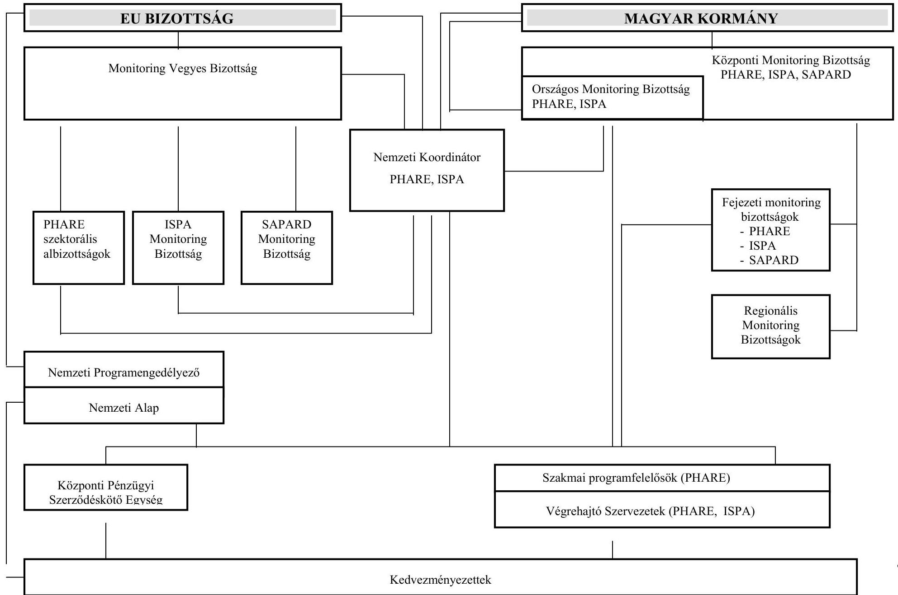

---

# A PHARE monitoring intézményi rendszer 

|  | Hazai monitoring rendszer* | EU - Magyar közös monitoring rendszer** |
| :--: | :--: | :--: |
| Monitoring Vegyes Bizottság |  | x |
| Monitoring Vegyes Bizottság   PHARE szektorális albizottságai |  | x |
| Nemzeti PHARE Koordinátor -   PHARE tárca nélküli miniszter | x | x |
| Nemzeti Programengedélyező | x | x |
| PHARE végrehajtó szervezetek | x | x |
| Minisztériumok szakmai programfelelősei | x | x |
| Központi Pénzügyi Szerződéskötési Egység | x | x |
| Nemzeti Alap | x | x |
| Központi Monitoring Bizottság | x |  |
| Központi Monitoring Bizottság Titkárság | x |  |

   Kormányzati Ellenőrzési Hivatal | x |  |
| Országos Monitoring Bizottság | x |  |
| Országos Monitoring Bizottság Titkárság -   PHARE Tárca Nélküli Miniszter Hivatala   Segélykoordinációs Titkárság | x |  |
| Fejezeti monitoring bizottságok, illetve titkárságaik minisztériumonként | x |  |

[^0]
[^0]:    * Hazai monitoring rendszer: a nemzetközi segélyek, támogatások felhasználásával megvalósuló programok megfigyelő és értékelő rendszerének kialakításáról szóló 166/2001. (IX. 14.) Korm. rendelet alapján
    ** EU - Magyar közös monitoring rendszer: az Európai Uniós előcsatlakozási eszközök támogatásai felhasználásának pénzügyi tervezési, lebonyolítási és ellenőrzési rendjéről szóló 255/2000. (XII. 25.) Korm. rendelet, valamint a Nemzeti Alap felállításáról szóló Megállapodás kihirdetéséről szóló 84/2002. (IV. 19.) Korm. rendelet alapján

---

# AZ ISPA monitoring intézményi rendszer 

|  | Hazai monitoring rendszer* | EU - Magyar közös monitoring rendszer** |
| :--: | :--: | :--: |
| Monitoring Vegyes Bizottság |  | x |
| Monitoring Vegyes Bizottság -   ISPA Monitoring Bizottság |  | x |
| Nemzeti ISPA Koordinátor -   PHARE tárca nélküli miniszter | x | x |
| Nemzeti Programengedélyező | x | x |
| ISPA végrehajtó szervezetei KöM és KöViM | x | x |
| Központi Pénzügyi Szerződéskötési Egység | x | x |
| Nemzeti Alap | x | x |
| Központi Monitoring Bizottság | x |  |
| Központi Monitoring Bizottság Titkárság -   Kormányzati Ellenőrzési Hivatal | x |  |
| Országos Monitoring Bizottság | x |  |
| Országos Monitoring Bizottság Titkárság -   PHARE Tárca Nélküli Miniszter Hivatala Segélykoordinációs Titkárság | x |  |
| Fejezeti monitoring bizottságok, illetve titkárságaik minisztériumonként | x |  |

[^0]
[^0]:    * Hazai monitoring rendszer: a nemzetközi segélyek, támogatások felhasználásával megvalósuló programok megfigyelő és értékelő rendszerének kialakításáról szóló 166/2001. (IX. 14.) Korm. rendelet alapján
    ** EU - Magyar közös monitoring rendszer: a Nemzeti Alapnak az ISPA keretében történő igénybevételéről szóló Együttmüködési Megállapodás, valamint a 2000. évi ISPA projektek pénzügyi megállapodásainak kihirdetéséről szóló 89/2002. (IV. 20.) Korm. rendelet, továbbá az Európai Uniós előcsatlakozási eszközök támogatásai felhasználásának pénzügyi tervezési, lebonyolítási és ellenőrzési rendjéről szóló 255/2000. (XII. 25.) Korm. rendelet

---

# KIMUTATÁS 

a monitoring feladatot ellátók végzettségének alakulásáról
2000 - 2001. év

Adatok: fő

| Megnevezés | BM |  | FVM |  | GM |  | HM |  | IM |  | KöM |  | KSH |  | KöViM |  | KMB Titk. |  | OMB Titk. |  | OM |  | PM |  | SAPARD |  | SzCsM |  | Összesen |  |
| :--: | :--: | :--: | :--: | :--: | :--: | :--: | :--: | :--: | :--: | :--: | :--: | :--: | :--: | :--: | :--: | :--: | :--: | :--: | :--: | :--: | :--: | :--: | :--: | :--: | :--: | :--: | :--: | :--: | :--: | :--: |
| Év | 2000 | 2001 | 2000 | 2001 | 2000 | 2001 | 2000 | 2001 | 2000 | 2001 | 2000 | 2001 | 2000 | 2001 | 2000 | 2001 | 2000 | 2001 | 2000 | 2001 | 2000 | 2001 | 2000 | 2001 | 2000 | 2001 | 2000 | 2001 |
| Felsőfokú végzettségűek | 8 | 8 | 30 | 43 | 20 | 31 | 14 | 14 | 8 | 8 | 1 | 1 | 1 | 1 | 18 | 16 | 7 | 12 | 3 | 3 | 12 | 12 | 15 | 16 | - | 8 | 10 | 10 | 146 | 182 |
| Nyelvtudással rendelkezők: angol |  |  |  |  |  |  |  |  |  |  |  |  |  |  |  |  |  |  |  |  |  |  |  |  |  |  |  |  |  |  |
|  | 3 | 2 | 29 | 42 | 14 | 18 | 8 | 8 | 2 | 2 | n.a | n.a | 1 | 1 | 10 | 12 | 7 | 12 | 3 | 3 | 4 | 2 | 8 | 9 | - | 6 | 4 | 3 | 91 | 119 |
|  | 1 | 1 | 3 | 3 | 1 | 2 | - | - | - | - | n.a | n.a | - | - | 2 | 2 | - | 10 | 2 | 2 | 1 | - | 3 | 4 | - | 4 | 1 | 2 | 13 | 29 |
|  | 3 | 3 | 24 | 20 | 8 | 11 | 12 | 14 | 1 | 1 | n.a | n.a | - | - | 4 | 4 | - | 2 | 2 | 2 | 2 | 1 | 5 | 5 | - | 3 | 2 | 4 | 63 | 70 |
| Jelenleg nyelvi képzésben részesül | - | 1 | - | 2 | 3 | 4 | - | - | 1 | 1 | n.a | n.a | - | - | 4 | 6 | - | - | - | - | 2 | 1 | 3 | 4 | - | 5 | - | - | 13 | 24 |

Jelölés: n.a = nincs adat

---

# MINTÁK A PHARE ÉS AZ ISPA PROJEKTEKBŐL 

| Sorszám | PHARE projekt száma | PHARE projekt címe | Szakmai felelős |
| :--: | :--: | :--: | :--: |
| 1. | HU9601 | Tempus | OM |
| 2. | HU9604 | Privatizáció, szerkezetátalakítás | ÁPV Rt. |
| 3. | HU9605 | Kis- és középvállalatok fejlesztése | MVA |
| 4. | HU9606 | Területfejlesztés | FVM |
| 5. | HU9610 | CBC Magyarország - Ausztria | FVM-Területfejl. |
| 6. | HU9701 | CBC Magyarország -Ausztria | FVM-Területfejl. |
| 7. | HU9705 | Területfejlesztés | FVM-Területfejl. |
| 8. | HU9707 | Közlekedés | KöViM |
| 9. | ZZ9722 | Szlovák vasúti összeköttetés | KöViM |
| 10. | HU9801 | Tempus | OM |
| 11. | HU9804-01 | Belső piacra való felkészülés | GM, IM |
| 12. | HU9805-01 | Határvédelem erősítése | BM |
| 13. | HU9805-02 | Röszke és Letenye határátkelők korszerűsítése | VPOP |
| 14. | HU9806-01 | Állategészségügy | FVM-Agrár |
| 15. | HU9806-02 | Növényegészségügy | FVM-Agrár |
| 16. | Hu9806-03 | Felkészülés a közös agrárpolitikára | FVM-Agrár |
| 17. | HU9806-04 | Minőségbiztosítás az élelmiszer-szektorban | FVM-Agrár |
| 18. | HU9806-05 | A vidékfejlesztési tervezőkapacitás fejlesztése | FVM-Agrár |
| 19. | HU9807-01 | Környezetvédelmi EU jogszabályok átvétele | KöM |
| 20. | HU9807-02 | Központi Környezetvédelmi Alap | KöM |
| 21. | HU9808-01 | SPP - felkészülés a Strukturális Alapokra | FVM |
| 22. | HU9811 | LSIF - Szak-Pesti Szennyvíztisztító | KöViM |
| 23. | HU9903 | LSIF-ISPA PPF | GM |
| 24. | HU9904-01 | Hátrányos helyzetű fiatalok oktatása (Roma-program) | OM |
| 25. | HU9906-01 | Kis- és középvállalkozások (mikrohitel) | MVA |
| 26. | HU9907-01 | Bel- és igazságügyi együttműködés (határőrizet) | BM |
| 27. | HU9908-01 | Esztergom-Párkány híd újjáépítése | KöViM |
| 28. | HU9908-02 | Vasúti modernizáció II. (Soroksár-Ferencárosi vonal) | KöViM |
| 29. | HU9909-01 | Növényegészségügyi intézményrendszer | FVM |
| 30. | HU9909-03 | Agrárstatisztika | KSH |
| 31. | HU9910-01 | Közegészségügyi laboratóriumok fejlesztése | EüM |
| 32. | HU9911-01 | Szilárdhulladék-lerakók felülvizsgálata | KöM |
| 33. | HU9911-02 | Katasztrófavédelem II. | BM |
| 34. | HU9913 | CBC - Ausztria | FVM |
| 35. | HU9914 | CBC - Románia | FVM |
| 36. | HU9914 | CBC - Szlovákia | FVM |
| 37. | HU9918 | PPF (Projekt előkészítés támogatás) | FVM |
| 38. | HU0003-01 | Állategészségügyi és élelmiszerhigiéniai ellenőrzés | FVM |
| 39. | HU0005-02 | VÁM-határ korszerűsítés | VPOP |
| 40. | HU0008-05 | PNDP - KKV együttműködés | FVM |
| 41. | HU0015 | CBC Magyar - Osztrák | FVM |

| Sorszám | ISPA projekt száma | ISPA projekt címe | Szakmai felelős |
| :--: | :--: | :--: | :--: |
| 1. | 2000/HU/16/P/PE/004 | Miskolci regionális hulladékgazdálkodási program | KöM |
| 2. | 2000/HU/16/P/PT/002 | Budapest-Győr-Hegyeshalom vasútvonal rehabilitációja | KöViM |
| 3. | 2000/HU/16/P/PE/006 | Tisza-tavi hulladékgazdálkodási program | KöM |

---

# A PERSEUS, A MEMOR ÉS AZ OTMR SZÁMÍTÁSTECHNIKAI RENDSZEREK KÖZÖTTI KAPCSOLAT 

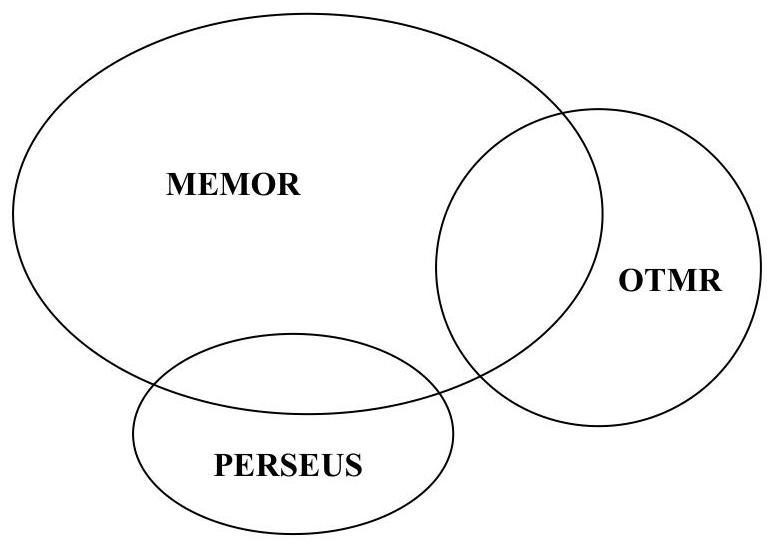

A rendszerek adatstruktúráinak viszonya

## PRIMA

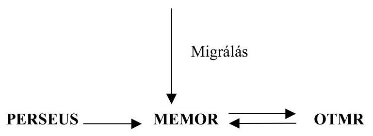

A rendszerek közötti elvi adatáramlás

---

# A 166/2001. (IX. 14.) Korm. rendelet vonatkozó részének és a MEMOR adatbázis-tábláinak tételes összerendelése 

| 21. § (1) bek. alpontjai | Tábla neve a MEMOR-ban, rövid leírás |
| :-- | :-- |
| a) végső kedvezményezett adatai | TPRT - partner adatai |
| b) beszállító adatai | TPRT - partner adatai |
| c) projekt adatai | TPMS - megállapodás szintjei |
| d) jóváhagyó és felelős | TPRT - partner adatai   RFEL - felhasználók adatai |
| e) alapkezelő, kifizető neve | PKOD - statikus kódok tára |
| f) finanszírozási források | TPMS - megállapodás szintjei,   TPMF - pénzügyi megállapodások fejadatai |
| g) kategóriák | PKOD - statikus kódok tára |
| h) tanúsítvánnyal kapcsolatos   adatok | PKOD - statikus kódok tára |
| i) előrehaladási adatok | TPMK - pénzügyi memorandum költségvetés   TPUR - pénzügyi utalás részletezése |

${ }^{1}$ A táblázat a MEMOR tervezési adatbázisából, Designer 2000 eszközzel generált jelentés alapján készült. A négykarakteres nagybetűvel szedett név a tábla SQL
 szinten elérhető neve.

---

# AZ OTMR KÜLSŐ ADATFOLYAMATAI 

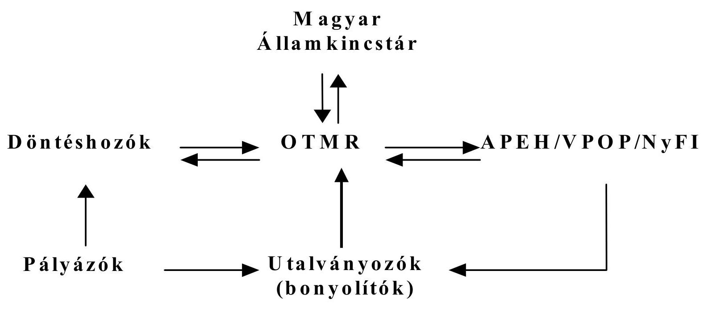

---

# 9. sz. melléklet 

a $0-9-136 / 2002$ sz.
jelentéshez

MAGYARKÖZTÁRSASÁG
környezetvédelmi és vízügyi minisztere
9.
$11-20-21 / 2002$

Dr. Kovács Árpád
elnök úr
részére

Állami Számvevőszék

Tisztelt Elnök Úr!
Külön
12.12

A „nemzetközi támogatások monitoring rendszerének ellenőrzéséről" készített jelentésük összegző megállapításainal, a következtetésekkel és javaslatokkal egyetértünk. A részletes megállapítások tekintetében az akkori statutum szerinti Környezetvédelmi Minisztériumot, szintén észrevételek helytállóak.

A jelentés megállapításait és javaslatait - a szükséges intézkedések megtételével - hasznosítjuk a minisztérium monitoring tevékenysége során.

Budapest, 2002. december 11.
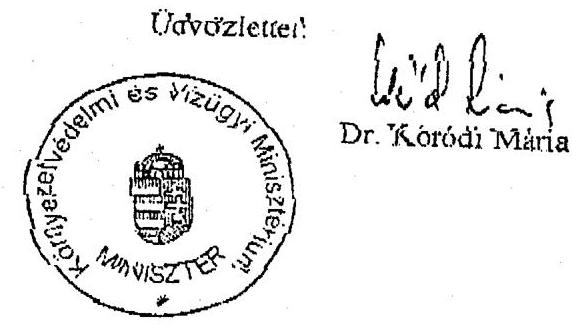

---

# 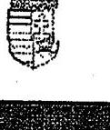 

## 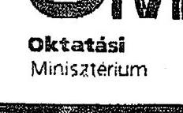

Kovács Árpád elnök úr
Állami Számvevőszék
Budapest

Tisztelt Elnök Úr!
A nemzetközi támogatási programok monitoring rendszerének ellenőrzéséről készített jelentésüket köszönettel megkaptuk.

Megelégedésünkre szolgál, hogy a vizsgált programok szakmai felelősségét viselő minisztériumok munkáját érintő konkrét megállapítások között nem szerepel az oktatási tárcát elmarasztaló kitétel. Mindazonáltal az anyagban megfogalmazott általános érvényű megállapítások szükségessé teszik, hogy az Oktatási Minisztérium megvizsgálja, hogyan biztosíthatja a saját hatáskörébe tartozó monitoring folyamatok és struktúrák jogszabályokban lefektetett követelményeinek magasabb szintű érvényesülését.

Kérésüknek megfelelően 30 napon belül tájékoztatni fogom Önöket a jelentés alapján elrendelt intézkedéseimről.

Budapest, 2002. december ..
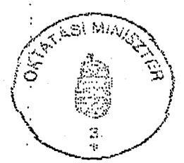
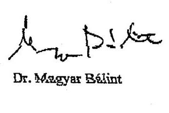

---

# MAGYAR KÖZTÁRSASÁG GAZDASÁGI ÉS KÖZLEKEDÉSI MINISZTÉRIUM MINISZTERE 

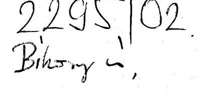

Dr. Kovács Árpád úr, elnök

Állami Számvevőszék

Budapest
Tárgy: Jelentés a nemzetközi támogatások monitoring rendszerének ellenőrzéséről

## Tisztelt Elnök Úr!

Tájékoztatom, hogy a fenti hivatkozási számú, nemzetközi támogatások monitoring rendszerének ellenőrzéséről készített jelentésükhöz az 1989. évi XXXVIII. tv. III. fejezet 25. § (1) bekezdése szerint adott észrevételi lehetőségemmel élni kívánok.
Az észrevételt az előírt határidőben Önöknek megküldjük.

Budapest, 2002. december 10.
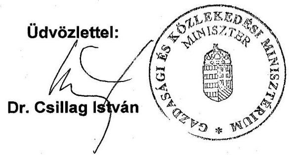

---

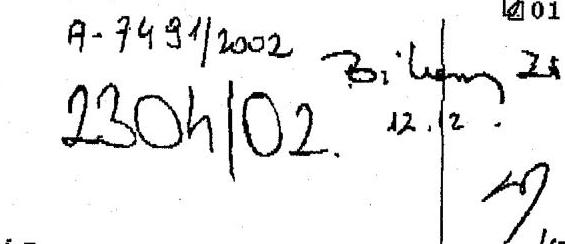

Ügyiratszám: 79052/01/2002.

Hiv.sz.:V-9-136/2002.
M 7453 - $2 / 2002$

Dr. Kovács Árpád elnök úr részére
Állami Számvevőszék

# Tisztelt Elnök Úr! 

Köszönettel vettem fenti hivatkozási számon küldött a nemzetközi támogatások monitoring rendszerének ellenőrzéséről szóló számvevői jelentést. A jelentésre az alábbi észrevételt teszem.

1. A Jelentés 22. oldalának (2.2. pontjában) 6. bekezdésének első sorában a külső szakértőket igénybe vevő minisztériumok felsorolását kérem kiegészíteni az FVM-mel. Az FVM a vizsgált időszakban az Agrárgazdasági Kutató és Informatikai Intézetét (a továbbiakban: AKII), mint külső szakértői céget bízta meg a területfejlesztési és agrárgazdasági PHARE programok végrehajtásának időközi értékelésével. Az előkészítést az FVM FMB Titkársága közösen végezte az AKII-val, azt követően gyorsjelentés készült a vizsgált időszak alatt, azaz 2001-ben, a teljes átfogó jelentés pedig 2002. januárjában és májusában lett kész.
2. A Jelentés 34. oldalának (5.1.2. pontban) utolsó bekezdésében az 5. sor elején az FMV-t kérem kijavítani FVM-re.

Tekintettel arra, hogy a jelentés tárcánk részére nevesített megállapítást nem tartalmaz, ezért külön intézkedési tervet nem készítünk. A monitoring rendszer működését értékelő jelentésük megállapításait azonban a tárca ezirányú tevékenységének fejlesztésében hasznosítani fogjuk.

Budapest, 2002. december ...
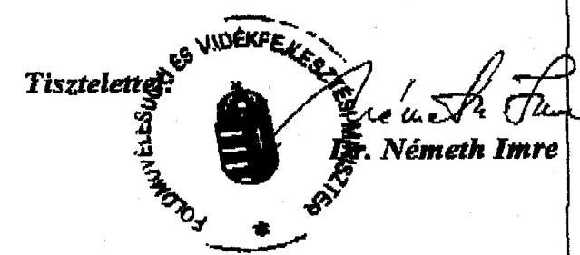

---

# Állami Számvevőszék 

## Dr. Németh Imre úr

miniszter
Földművelésügyi és Vidékfejlesztési Minisztérium

## Budapest

## Tisztelt Miniszter Úr!

A nemzetközi támogatások monitoring rendszerének ellenőrzéséről készített jelentésre adott észrevételeit megköszönöm, azok alapján a jelentést pontosítottuk.

Budapest, 2002. december 16.

Tisztelettel:
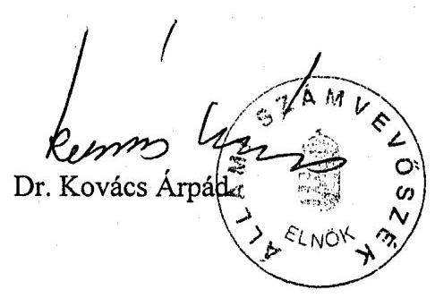

---

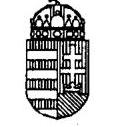

Miniszterelnöki Hivatal Minisztere

$$
\begin{gathered}
4 / 2 \\
\text { Kelt } \\
\text { Xl. 16. } \\
\text { V-1555/1/2002. }
\end{gathered}
$$

Dr. Kovács Árpád
Állami Számvevőszék elnöke

# Budapest 

Tisztelt Elnök Úr!

A nemzetközi támogatások monitoring rendszerének ellenőrzéséről szóló ÁSZ jelentéssel kapcsolatban az alábbiakról tájékoztatom:

A jelentés előkészítése során az ÁSZ és a Nemzeti Fejlesztési Terv és EU Támogatások Hivatalának munkatársai folyamatosan konzultáltak és együttműködtek a jelentés véglegesítésében is.
Ennek köszönhetően a Nemzeti Fejlesztési Terv és EU Támogatások Hivatala már elkészítette azt a koncepció-tervezetet, amelynek célja a monitoring intézményi rendszer felkészítése a Strukturális Alapok és a Kohéziós Alap fogadására. A koncepció tartalmazza a monitoring bizottságok számának csökkentését oly módon, hogy a Fejezeti Monitoring Bizottságok és az OMB megszünésével csak az EU-Magyar Vegyes Bizottsági rendszer működne tovább. Egyidejűleg határozati javaslatot terjesztettünk a Kormány elé, melyben a NFT Hivatala átveszi a MEMOR feletti teljes felügyeletet és a KMB titkársági feladatait a KEHI-től, illetve indítványoztuk a hazai támogatások monitoring rendszerének kiépítését. Az EU támogatások és a hazai támogatások monitoring tevékenységének kormányzati összehangolását a Központi Monitoring Bizottság fogja végezni. A határozatot a Kormány 2002. szeptember 29-i ülésén elfogadta.

---

Már elkészült és államigazgatási egyeztetés előtt áll az új monitoring kormányrendelet-tervezet is. A rendelet-tervezet szabályozza a MEMOR rendszer üzemeltetésével kapcsolatos államigazgatási feladatokat, oly módon, hogy az adatállomány naprakészen biztosítható legyen.
Az ÁSZ által javasolt képzések egy része már folyamatban van, más részük előkészítése megkezdődött, jövő év folyamán ezekre sor kerül.
Az ÁSZ vizsgálata és megállapításai rendkívül hasznosak voltak, a jelentés az elmúlt időszakot pontosan, jól rögzíti. Terveink és intézkedéseink a vizsgálat eredményeit hasznosítva tükrözik az Állami Számvevőszék által megfogalmazott elvárásokat is.

Budapest, 2002. december 12.
Tisztelettel

