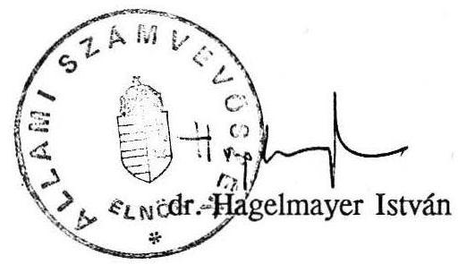

# Allami Ṣ̛ámutubóssèk 

## JELENTÉS

a Légiforgalmi- és Repülőtéri Igazgatóság (LRI)
$R / 31$ célellenőrzéséről

---

# Az ellenőrzést végezték: 

Czunyi Lajos számvevő tanácsos,
Szíjártó Károly számvevő

Az ellenőrzést vezette:
Rádfai Tibor főtanácsos

---

# JELENTÉS 

a Légiforgalmi- és Repülőtéri Igazgatóság (LRI)
célellenőrzéséröl

A magyar légiközlekedésben meghatározó szerepet betöltő két intézmény 1973 óta mơködik külön. Ekkor választották le a MALÉV-ről, s bízták az újonnan - költségvetési szervként - létrehozott LRI-re a nemzetközi közforgalmú repülőterek fenntartását, a polgári repülésirányítást, a polgári repüléssel kapcsolatos egyéb feladatokat és - a Légügyi Igazgatóság 1983. évi megalakításáig — az egyes légügyi hatósági feladatok ellátását.

Az állami költségvetés az LRI-t évente mintegy 650 millió Ft működési- fenntartási és további több száz millió Ft beruházási (1989. évben pl. együtt több, mint egy milliárd Ft) támogatásban kényszerült részesíteni. Ellenőrzésünk célja az volt, hogy a BudapestFerihegy repülőteret és kapcsolódó létesítményeit kezelő LRI, továbbá az azokat főként használó (hasznosító) MALÉV tevékenységi körét, bevételi- és költségstruktúráját vizsgálva a támogatások kiváltásának lehetőségeit feltárjuk.

Megállapításainkat elsősorban az 1988-1989. évi adatokra, a helyszíni tapasztalatok törvényességi, célszerűségi és eredményességi szempontból való értékelésére és nem utolsó sorban néhány külföldi repülőtérről szerzett információkra (1. sz. melléklet) alapoztuk.

Ellenőrzésünket a MALÉV napirenden lévő privatizációja is aktuálissá tette. Ennek előkészítéséhez ugyanis elkerülhetetlenné vált a vagyon, az állami, intézményi és vállalati feladatok, a bevételi és költségstruktúra - a felügyeletet gyakorlo Minisztérium által is kilátásba helyezett - pontos és igazságos szétválasztása, a szervezetek korszerűsítése, a vonatkozó nemzetközi megállapodások, a jogszabályi háttér rendezése stb. Ezek nélkül a vállalati privatizáció során a költségvetési és kincstári érdekek megnyugtatóan nem lennének képviselhetők, megvédhetők.

---

# I. 

## Következtetések és javaslatok

A légiforgalom és a földi kiszolgálás szétválasztása a repülés nemzetközi fejlődésével egybevágó, s a többi kelet-európai ország gyakorlatát megelőző lépés volt. Ezt követően azonban éppen a korszerűbb szervezeti megoldás eredményeként ütköztek ki az LRI és ezen keresztül az állami költségvetés szempontjából olyan hátrányok, hogy

- a csaknem teljesen költségvetési forrásokból létrehozott, majd vállalati és kincstári részre megosztott vagyon a költségvetésnek továbbra is jelentős terheket, nem pedig jövedelmet eredményezett;
- az LRI, mint maradványérdekeltségű és csak 1988 óta eredményérdekeltségű költségvetési szerv bevételi érdekeltsége és költségérzékenysége nem volt kielégítő. A megfelelő bevételek realizálását és elfogadható eredmények elérését máig hazai jogszabályok és nemzetközi egyezmények (pl. MALÉV és a volt szocialista légitársaságok repülési díjtételei, repülésoktatási, kutatási, egészségügyi feladatok ellátása) korlátozzák.

A nyugat-európai repülőterek közvetlen állami támogatást nem igényelnek, nyereségesek és - akár állami cégként, akár társaságként működnek - a légitársaságoknál többnyire jövedelmezőbb vállalkozások. Az eredményes, támogatások nélküli, sőt vállalati (jövedelemszabályozás melletti) gazdálkodás feltételei az LRI esetében is megteremthetők. A jelenlegi helyzet az LRI bevételi forrásainak növelésével és költséggazdálkodásának racionalizálásával számolható fel.

Az LRI gazdálkodását a költségvetésnek elsősorban azért kell támogatni, mert az intézmény az általa fenntartott és működtetett vagyonhoz - különböző okokból - nem rendelkezik megfelelő bevételekkel (3. sz. melléklet). Egy átfogó - takarékossági, szervezési és gazdálkodási megoldásokat egyaránt felölelő - intézkedéssorozat keretében ugyanakkor arra is mód nyílik, hogy az LRI költségeinek egy része megtakarításra (pl. létszám, szervezet stb.), más esetekben a költségeket előidéző feladatok szervezeti átsorolásával, vagy bevétellel való ellensúlyozásával a terhek kiiktatásra kerüljenek.

A lehetséges költségmegtakarítások érdekében teendő intézkedések várható eredményét számbavéve azonban azzal is számolni kell, hogy egyrészt néhány költségféleség a jövőben növekedni fog (pl. önkormányzati terhek, nyereségadó, amortizáció stb.), másrészt, hogy e lépések egy tetemes része a MALÉV gazdálkodását is érinti. Az LRI támogatásai ugyanis nagyrészt a MALÉV (illetve más kelet-európai légitársaságok) költségeit ellentételezik.

---

A MALÉV-nak azonban a bevételi források és a költségterhekkel járó feladatok átrendezése ellenére is módja nyílna vagyonarányos nyereségének növelésével tovább erősödni. (3. sz. melléklet) Erre utal, hogy 1990. I. félévében pl. - az 1990. szeptemberéig 110 millió Ft veszteséget eredményező Boeing áruszállító bérlet ellenére - a vállalat egy milliárd Ft nyereséget ért el.

E feladatok előkészítése érdekében a Közlekedési, Hírközlési és Vízügyi Minisztériumnál, valamint az LRI-nél már több intézkedést tettek (eredményérdekeltség, vállalkozási tevékenység engedélyezése, kisajátított ingatlanok hasznosításának lehetővé tétele, bérleti díjtételek bizonyos emelése, szolgáltatások szélesítése, a tax-free forgalom koncessziós megállapodása, költségkeret-gazdálkodás, létszámstop, új bérleti díjmegállapodás a MALÉV-val, energiaátalakítási /elosztási/ költségek áthárítása stb.).

Az elmúlt időszakban az LRI gazdálkodási, szervezeti-működési rendjében és vezetési felfogásában is jelentős változások következtek be. Az eredményérdekeltségű költségvetési szervvé történő átminősítés (ár)bevétel- és költségérzékenyebb gazdálkodást, nagyobb érdekeltséget biztosított. Erősödött az intézménynél a vállalkozási szemlélet is (pl. a vállalkozási és marketing iroda, a reklámkihelyezési és egyéb nem repüléssel összefüggő kereskedelmi, koncessziós tevékenység beindítása).

Az ellenőrzés tapasztalatai arra utalnak, hogy a problémák megoldása érdekében további gyors és határozott lépésekre van szükség és lehetőség. A MALÉV és LRI közötti munkamegosztás és egymás közötti elszámolási rend teljes körű felülvizsgálására és rendezésére még nem került sor. A kihasználatlan tartalékok feltárására rövid határidőn belül intézkedni kell. Az állami költségvetés terhelését a repülőtér fenntartása és üzemeltetése címén semmi sem indokolja. Ezért ellenőrzésünk tapasztalatai alapján és az eddigi kezdeti lépések kedvező tapasztalataira is tekintettel a következő intézkedéseket javasoljuk:
1.) Az LRI költségvetési támogatását meg kell szüntetni. Az ezzel összefüggő rövid távú feladatok - a pontosabb számítások eredményének függvényében — az 1991-1992. években (esetleg megosztva), a második szakasz legkésőbb 1993-tól megvalósíthatók lennének. A szakaszolást az indokolja, hogy a célok csak a körülmények fokozatos megváltoztatásával és a MALÉV gazdálkodási feltételeinek bizonyos módosításával oldhatók meg. Így
a) első szakaszban elérhető, hogy a bevételek növelésének, a költségek csökkentésének rövid távon érvényesíthető eredményeire alapozva (az évi 600 millió Ft-ot meghaladó) működési-fenntartási támogatások elvonásra kerüljenek. Ebben a szakaszban már az LRI vállalattá szervezése is megoldhatónak látszik.

---

a) A már folyamatban lévő beruházások támogatását rövid távon még fenn kellene tartani, biztosítva azok takarékos befejezését. A beruházási támogatások fokozatos megszüntetésére azok befejezési ütemének megfelelően legkésőbb 1993-ig kerülhetne sor. A repülőtéri kapacitást növelő́ beruházásokra a későbbiekben az LRI saját forrásaiból, hitelből (illetve társasági formában) szükséges fedezetet biztosítani. Ezt az LRI működésének minisztériumi szabályozásában is "át kell vezetni".
b) Következő szakaszban, a mai helyzethez képest, az LRI már mintegy egy milliárd Ft-tal több bevétellel rendelkezne, ami a vállalati gazdálkodáshoz kapcsolódó többletterhek és érdekeltségi alapok fedezetéül szolgálhatna. Ekkor a vállalati gazdálkodás megszilárdítása kerülhetne napirendre, amikor egyik oldalról a reális költségarányok (pl. amortizáció) és az új, kibontakozó (pl. kereskedelmi) tevékenységek továbbfejlesztésére is sor kerülhetne.
2.) Az LRI bevételei emelkedésének érdekében a következő intézkedések javasolhatók:
a) Az LRI bevételek növelésének egyik alapját képező forgalom- és járatszervező (marketing) jogosítványokat megadni, az ezeket szabályozó (korlátozó) jogszabályokat módosítani indokolt.
b) A MALÉV és a kelet-európai légitársaságok légiforgalommal kapcsolatos díjait az általánosan érvényes szintre kell emelni. Ezzel összefüggésben a nyugat-európai légitársaságok díjai is tovább korszerűsíthetők.
c) A kapacitások jobb kihasználásának biztosításához az új légijáratokat, társaságokat, a tranzitforgalmat stb. megfelelően ösztönző kedvezményrendszert indokolt kidolgozni. Célszerű megvizsgálni az időszaki (a napi csúcsidőn kívüli, esetleg a téli) kedvezmények bevezetésének lehetőségét is.
d) Megfontolható a repülőtér igénybevételéhez kapcsolódó "zajdíjak" megállapítása és az ezekből befolyt bevétel alapszerű kezelése.
e) Az LRI bérleti díjrendszerét - annak minden felet érintően reális szintre történő emelése érdekében - felül kell vizsgálni. Ezzel párhuzamosan növelni indokolt a meglévő (s pl. létszámcsökkentéssel felszabadítható) területek bérbeadását.
f) A kereskedelmi, a reklám- stb. tevékenységek kibontakoztatása érdekében eddig tett eredményes lépéseket folytatni kell.

---

g) A nem LRI üzemeltetésű kereskedelmi egységek és szolgáltatások árbevételéből - a nemzetközi gyakorlat szerint - általánossá kell tenni a koncessziós szerződésen alapuló részesedést. (Ebbe értendő a /földi/ repülőgép-kiszolgálás, a gép- és utaskezelés, az üzemanyag-ellátás, valamint az éttermi szolgáltatások köre is.)
h) A repülőtéren induló újabb üzleti vállalkozások létesítése (befogadása) előtt tenderkiíráson alapuló, versenysemleges elbírálást célszerű alkalmazni.
3.) Az LRI költségvetési támogatásainak kiváltásához szükség van néhány, a tevékenységet és létszámgazdálkodást racionalizáló intézkedés megtételére is. Ezek keretében
a) mindenekelőtt az LRI létszámának felülvizsgálása és - az eddigi helyes irányú lépések eredményein túl, valamint a jelenlegi feladatok mellett és az átszervezések révén átcsoportosítandó létszámon felül — legalább $20 \%$-os további csökkentésének fokozatos végrehajtása javasolható.
b) A belső vállalkozások jelenlegi, több szempontból kifogásolható rendszerét indokolt lenne új alapokra helyezni és korrigálni. Ehhez is teljes körű költség- (és bevételelmaradás) elemzésekkel kell a fenntartási (és beruházási) munkákat megalapozni.
c) A 3325/1975. (VII.31.) Mt sz., a közforgalmú légiközlekedés szakemberképzéséről szóló határozat felülvizsgálatra szorul. Az állami feladatként kezelt tanfolyamokat vállalati (MALÉV) érdekszférába kell sorolni. A szakemberképzést vagy el kell szervezetileg az LRI-től különíteni (és így önelszámolóvá tenni), vagy - járhatóbb útnak látszik - az egész tevékenységet vállalkozászerűen végezni és annak az LRI-n belüli önelszámolását biztosítani.
d) A közös üzemegészségügyi szolgálat költségeit indokolt megosztani, a startorvosi apparátus rezsivel terhelt költségeit pedig bevétellel ellensúlyozni.
e) A RTK szakmai-szervezeti hovatartozásának vizsgálata és költségei megtéríttetése is indokolt. (Leginkább a Közlekedéstudományi Intézet /KTI/, mint vállalat profiljába tartozónak ítélhető.)
f) A repülőtéren működő különféle állami szervek, a MALÉV és az LRI közötti felesleges párhuzamosságokat (pl. biztonsági, fenntartási területen) — az érvényes

---

jogszabályok felülvizsgálata mellett — sokoldalú megállapodások alapján célszerű megszüntetni.

# II. 

## Részletes megállapítások

Az LRI nyeresége 1989. évben - a bevételek 330, a támogatás 100 millió Ft-os növekedése mellett - elérte a 383,4 millió Ft-ot. Ez az előző évinek ötszöröse, az árbevételek $27 \%$-a volt. A magas költségek mellett az 1989. évben a megemelkedett bevételek is kb. 300 millió Ft-tal alatta maradtak a kívánatosnak. Ennek eredményeként a keletkezett nyereség teljes egészében a 661 millió Ft-os 1989. évi intézménytámogatási összegből származott.

A Budapest-Ferihegy repülőtéri létesítmények együttes értéke 1989. év végén meghaladta a 16 milliárd Ft-ot. E vagyon mintegy 2/3-a ( 11,5 milliárd Ft) az LRI állományát képezte. (Ezek $84 \%$-a ingatlan volt.) A két szervezet 1973. évi szétválasztásakor a tevékenységi körök mellett a feladatok végrehajtásához szükséges álló- és forgóeszközök megosztása ügyében is intézkedtek. A két szervezet közötti eszközmozgás azonban a szétválasztással nem zárult le. Egészen pontos és hiteles adatok máig sem állnak rendelkezésre. (2. sz. melléklet)

A MALÉV által átadott, illetve átvett eszközökön túl pl. a MALÉV a repülőtéren, illetve ahhoz kapcsolódóan több száz millió Ft értékủ saját ingatlanvagyont hozott létre (üzem-anyag-ellátás, autóbuszmosó stb.) úgy, hogy az építési területet ingyenesen vette igénybe.

Az összesen mintegy 10,7 milliárd Ft értékű, a repülőtér és repülésirányítás fejlesztését szolgáló és egyéb kapcsolódó 1987. évben befejezzett beruházások az LRI-nél a bevételek növelését lehetővé teszik. (A relatíve kisebb költségkihatású indokolt előtérfejlesztés már saját erőből is megoldható.)

A létrehozott kapacitások terhelése az épületeknél csak 55-60, a légtérnél 30-35, a pályáknál maximum 20-25 \%-ra becsülhető. A légtérterhelés a szovjet csapatkivonásokkal feltehetően tovább fog csökkenni.

---

# 1. Az LRI bevételi lehetőségei 

Az LRI-nél a bevételi lehetőségek kiaknázására mindenekelőtt az óriási költségvetési befektetéssel létrehozott objektumok kihasználásának növelésével nyílik lehetőség.
a) Megfelelő piac- és forgalomszervező munkával növelhetők (növelendők) a nyugateurópai légitársaságoktól származó bevételek is, de a nemzetközi megállapodások rendezésével, egységes díjszabással elsősorban a kelet-európai viszonylatokból (ebben a MALÉV-től) származó forgalmi bevételek bővíthetők jelentősen.

Az LRI ár- és díjbevételeinek 1988 -hoz mért több, mint $46 \%$-os emelkedésén belül a repüléssel összefüggő bevételek, csupán a nyugati viszonylatok relatív emelkedése folytán nőttek $15 \%$-kal. A gép- és utasforgalom, valamint az ebből származó bevételek a jelentősen megnőtt kapacitások ellenére stagnálnak, holott egyes kis-közepes nyugati repülőterek (pl. Linz, Dublin) forgalma is $40-50 \%$-kal nőtt az utóbbi 3 évben, sőt a nagy forgalmú zürichi létesítményeknél is $14-15 \%$-os növekedés következett be. A forgalmi bevételek növelési tartalékait szemlélteti a gép- és utasforgalom 1989. évi megoszlása:

|  | \%ban |  |  |  |
| :-- | :--: | :--: | :--: | :--: |
|  | MALÉV | kelet-   európai légitársaság | nyugat-   összes |  |
| gépforgalom | 50,5 | 26,1 | 23,4 | 100,0 |
| utasforgalom | 57,2 | 23,7 | 19,1 | 100,0 |
| forgalmi bevételhez való hozzájárulás | 44,0 | 8,0 | 48,0 | 100,0 |

A kelet-európai társaságok részesedésének torz arányai szembeszökőek. E légitársaságok a forgalom-kiszolgálás mintegy negyedét igénybe véve csak az összes bevétel 3-4, a repüléssel összefüggő bevételek alig $8 \%$-át fizették.

A nemzetközi megállapodásokon (EAPT, EAGT) alapuló kölcsönös díjkedvezmények költségkímélő (eredménynövelő) hatását a MALÉV élvezi, annak terheit pedig az LRI támogatása keretében a költségvetés hordozza. E kedvezmények bevételcsökkentő hatásának pontos értékét az LRI eddig nem dolgozta ki. Egyszerűsített számítás szerint a repüléssel összefüggő kedvezményes díjtételek folytán az elmaradt bevételek mértéke 1989-ben minimálisan 280 millió Ft volt.

---

|  | millió forintban |  |  |  |
| :-- | :--: | :--: | :--: | :--: |
|  | útvonal   használat | repülőtér-   igénybev. | leszállási | együtt |
|  | díjklesés |  |  |  |
| MALÉV-tól | 8,5 | 24,5 | 84,3 | 113,3 |
| kelet-európai légitársaságoktól | 74,0 | 17,9 | 75,9 | 167,8 |
| összes elmaradt bevétel | 82,5 | 38,4 | 160,2 | 281,1 |

Pl. útvonalhasználati díjat 1990. április 1-ig a kelet-európai légitársaságok (és szocialista végcél esetén a MALÉV) az EAPT-EAGT egyezmény alapján kölcsönösen nem fizettek. Azóta a gépsúly-kategóriák szerinti rubelben előírt díj is csak mintegy 1/5-e a normál (nyugati társaságokra érvényesített) díjaknak. A leszállásért pedig még jelenleg is csak mintegy $1 / 30$ arányú díjat fizetnek.

A repüléshez kapcsolódóan a nyugat-európai légitársaságok által fizetett díjak karbantartása (az ICAO ajánlásai szerint) ugyanakkor szakaszosan, de megtörtént (pl. 1990 április). Ennek évi kihatása 1991-től már legalább 180-200 millió Ft többletbevételt jelenthet. Ezzel együtt az LRI díjai még mindig jóval az ausztriai díjak alatt alakulnak.
b) Az intézmény 1989. évi jelentős bevételnövekedését főleg a bérleti díjakból és egyéb forrásokból produkálta. A korszerúbb gazdálkodás és elszámolási rendszer irányába tett első lépések következtében is a bérbeadásból származó bevételek 58 \%-kal, az egyéb bevételek (különféle vállalkozásokból, kötvény- és reklámbevételekből stb.) több, mint ötszörösre nőttek.

Az LRI — felmérései szerint — összesen 208,4 ezer m2 épületszinttel rendelkezik (100 \%). Ennek $61 \%$-át hasznosítják bérbeadással, amiből éves bevételeinek 1989-ben már $47 \%$-a származott. A bérbeadott területek 3/4-ét a MALÉV bérli, így e díjak $83 \%$-át ez a vállalat fizeti. A bérleti díjbevételek tetemes emelkedése, mindenekelőtt azonban az összes bevételen belül képviselt magas aránya a repüléssel összefüggő bevételek elégtelen szintjére utal.

Az LRI összes 1989. évi bevételének (1.047,4 millió Ft) közel $60 \%$-a származik pl. a MALÉV-től, ennek is $2 / 3$-a ( 406,7 millió Ft) azonban bérleti díj volt. A jelentős, 150 millió Ft-os emelkedést már 1989-ben a MALÉV vezetésének konstruktív magatartása, a szerződésmódosításon kívüli megállapodáshoz való hozzájárulása tette lehetővé.

---

A nem lakás céljára szolgáló helyiségek bérleti dijának emelését gátló 1/1972. (I.19.) Korm. sz. rendeletet csak tavaly oldották fel. A bérlők (köztük a légitársaságok) eddig emiatt is közvetett támogatásban részesültek.

Az 1990. júniusi új szerződések 60-100 \%-kal emelték a díjtételeket, bár a MALÉV (más légitársaságokhoz mért) 20-50 \%-os díjkedvezményét fenntartották. Erre sincs elvi ok. Ebből az LRI bevételei minimum 40 millió Ft-tal tovább lennének növelhetők. (10 ezer m2-re a Pannonia Kft-vel kötendő szerződés díjbevételi kihatása is további 40-50 millió Ft nagyságrendet jelenthet.)

Néhány eddigi igen pozitív intézkedés későbbi és kiterjedtebb hatásával is számolhatunk. Pl. az áramátalakítási költségek "elosztási dij" formájában való áthárítása egyedül a MALÉV-től évi 34-35 millió Ft bevételt eredményez. (Igaz, hogy ebből közel 6 millió Ft felszámítása kifogásolható.)

Az LRI 1989. évi bevételeinek kb. $10 \%$-a egyéb bevétel (pl. 37 millió Ft kamat) volt. Az intézmény azonban 1990-től már jelentősen bővítette idegen megrendelők részére nyújtott szolgáltatásait is. Két társaságban volt érdekeltsége (ASTRA SAT Kábeltelevízió Kft, Atocentrum Kft). Ezek révén kb. 6 millió Ft bevételhez jutott.
c) Külön figyelmet érdemelnek azok a bevételi elemek (lehetőségek), amelyek - a tevékenységek, szolgáltatások jellege szerint - az LRI feladatai közé lennének (vagy lettek volna eddig is) sorolhatók.

Ilyen pl. a 368,5 millió Ft árbevételt és 118,5 millió Ft nyereséget hozó tax-free üzleti forgalom, amelyre 1990. októberében az LRI már a nemzetközi gyakorlathoz közelálló koncessziós megállapodást kötött és amelyből 1991- től évi minimum 70-90 millió Ft (később még bővíthető) bevételre számíthat.

Jelentős bevételi forrást jelenthetne az üzemanyag-értékesítés eddig rendezetlen forgalmának korszerűsített elszámolása is. Ez a forgalmazás Nyugat-Európában szakcégek, nálunk a MALÉV birtokában van. A rendezésnél több irányú megközelítés lehetséges, illetve szükséges. Pl.jelenleg nem egységes a nyugat- és kelet-európai légitársaságok részére kiszolgált üzemanyag ára, aminek következtében

- a nyugat-európai cégek részére eladott üzemanyag a 272,3 millió Ft árbevétel mellett 76-77 millió Ft nyereséget eredményezett,
- a kelet-európai légitársaságok részére történő eladásokon viszont a 253,8 millió Ft árbevétellel - a kedvezmények miatt - évi 27 millió Ft veszteség keletkezett. Ezért ilyen címen a MALÉV 32 millió Ft állami támogatásban részesült, miáltal az üzlet eredménye mintegy 5 millió Ft nyereséget mutat.

---

Kelet-európai viszonylatokban a MALÉV hasonló kedvezményben részesül. Az üzemanyag-árkedvezmény költségvetési támogatása tehát a MALÉV nyereségében csapódott ki. Az árak - 1991-től egyébként is halaszthatatlan - rendezésével közvetlenül 30-40 millió Ft költségvetési támogatás kiváltására, a forgalmazási koncesszióval az árbevétel mintegy $4 \%$-ának megfelelő, kb. 30 millió Ft LRI bevételre lehetne (kell) számítani. (Az üzemanyag-forgalmazás részvénytársasági, pl. MALÉV, LRI, ÁFOR megoldása további intézményi bevételt eredményezhetne.)

# 2. A költségcsökkentési lehetőségek 

Az LRI költségei 1989. évben (1988. évhez képest) 7 \%-kal (86 millió Ft- tal) nőttek. A múködés fajlagos költségei, a költségszint a bevételek ugrásszerű emelkedése folytán csökkent. Ez az eredményt mintegy 60 millió Ft-tal javította.

Az LRI főfoglalkozású átlaglétszáma (a Légügyi Igazgatóság nélkül) az 1988-1989. években 1.960-1.970 főt, 1989. évi bérköltsége 310-320 millió Ft-ot tett ki. Az intézménynél eddig végrehajtott létszámracionalizálási intézkedések eredményeként az állományi létszám 2.160 fơről 1.957 főre ( $91 \%$ ) csökkent. A társadalombiztosítási járulékkal együtt az összes költség több, mint harmadát jelentő élőmunka ráfordításokat azonban még mindig növeli a kevésbé racionális létszámgazdálkodás és szervezet.

Az intézmény bérköltségeinek emelkedése 1989-ben ugyan nem érte el a $10 \%$ - ot ( 25 millió Ft), az 1990. évben viszont már eddig $43 \%$-os bérfejlesztést hajtottak végre. Ez a magas és alig csökkenő átlaglétszám mellett jelentős tétel (a tb-járulékkal együtt 187 millió Ft).
a) A túldimenzionált létszámra utalnak a hasonló nyugat-európai repülőterek lényegében hasonlítható adatai. (A kisebb-nagyobb szervezeti eltérések az óriási fajlagos különbség folytán elhanyagolhatók.)

Így pl. a zürichi repülőteret üzemeltető három szervezetnek (tüzoltósággal együtt és hasonló feladatokra) közel $20 \%$-kal alacsonyabb a létszáma az ötször akkora forgalom mellett. Az egy alkalmazottra jutó utasforgalom Zürichben 7.400 fő, az LRI-nél 1.300 fő. Az 1/8-ad akkora forgalmat lebonyolító linzi repülőtér - a korrekciókat figyelembe véve - is legalább 25-30 \%-kal alacsonyabb fajlagos létszámmal dolgozik.

A költségeket nagymértékben növeli a légiirányítás fajlagosan legalább kétszeres létszáma is. Jelentős létszámfelülvizsgálatot igényel a mintegy 300 főnyi "technikai" létszám is, ha az ICAO és a British Airports Service Limited értékelését is számításba vesszük.

Így pl. Írországban kb. 180 légiirányító bonyolít le akkora forgalmat, mint az LRI 325 fóje. Zürichben mintegy ötször akkora forgalom jut fele ekkora légiirányitási létszámra.

---

A ráfordítások megtérüléséhez a vonatkozó bevételek növelésén túl a költségek csökkentésére is szükség van. Az LRI irányítástechnikai költségei pl. 1989-ben 285 millió Ft-ot, a repülésforgalmi költségekkel együtt 465 millió Ft-ot tettek ki. Az útvonalhasználati díjak 128 millió Ft-os összege a ráfordításoknak csak alig több, mint negyedét fedezte.

Az LRI feladatába tartozik 23 főfoglalkozású, 5 másodállású létszámmal és 1989. évben 12,8 millió Ft ráfordítással az Üzemegészségügyi Szolgálat müködtetése. (Dublinban pl. az összes repülőtéri feladatra 12 fő /2 orvos és 10 ápolónő/ jut, a két terület közös finanszírozásában.)

Az eltérés döntő oka, hogy a MALÉV feladatokhoz kapcsolódó ún. startorvosokat is az LRI-nél alkalmazták vállalati térítés nélkül. A létszám itt is csökkenthető lenne. Az egyéb költségeket meg lehetne osztani, a MALÉV költségéhez tartozókat pedig át kellene hárítani.

Jelentős eltérés mutatkozik a nyugat-európai és a hazai gyakorlat között a fenntartási (beruházási) létszám tekintetében is (pl. Dublin, Linz, Zürich). Az LRI-nél a nagyberuházások lefutása óta leginkább csak a kisjavításokra, a vészhelyzetek elhárítására, valamint a külső cégekkel végeztetett nagyjavítások, felújítások szervezésére lenne indokolt fenntartani mérsékelt létszámot.

Az LRI-nél — az üzemgazdasági osztály nélkül is — 150-160 fős beruházási és nagyjavítási fóosztály tevékenykedik. (Ennek 2/3-át pl. az építési osztály teszi ki.) E nagy létszámot a megbízhatatlan és drága hazai vállalkozói szférával magyarázzák. Olyan gazdasági számítások azonban még nem készültek, amelyek e szervezet fenntartásának teljes, tehát járulékos veszteségeit is - többek között pl. az elfoglalt területek bérleti dijbevétel kicsését — számításba vették volna.

A 450-500 fős (külön) fenntartási főosztálynál az LRI vezetése által elrendelt létszámstop következtében 1990. augusztusában már 56 státusz betöltetlen volt, s további mintegy 30-50 fős csökkentés reális követelmény.

Felemások a tapasztalatok a belső vállalkozási tevékenység 1989. évi bevezetésével kapcsolatban. A korábban külső féllel végeztetett munkák kiváltása "az üzemeltetői állományban rejlő szabad kapacitások kihasználásá"-t, a munkával kevésbé "lekötött" dolgozók munkaidőn belüli jövedelmének célprémium formájában történő növelését célozta.

A végrehajtás azonban máig is hiányosságokkal terhes. Az egyes rendelkezéseknek az érintettek nem tesznek eleget (egyeztetések elmaradása, bizonylatolás hiányos-

---

sága, a rezsiórabér elavultsága stb.). A szabályozás is vitatható. Munkaidő alatt alapfizetésük mellett a belső vállalkozás anyagmentes összegének $30 \%$-ához azok juthatnak, akik jórészt feleslegesek, hivatalos munkaidejükben végezhetik ezeket a munkákat. További $10 \%$-os részesedés fejében eredeti munkafeladatukat munkatársuk végzi el.

Az LRI és a MALÉV között a fenntartási és üzemeltetési (pl. gondnoksági, jármű-üzemeltetési, karbantartási, nyomdai) tevékenységek szervezetei kisebb-nagyobb mértékben párhuzamosan épültek ki. Együttesen az LRI-nél 300-350 fó, a MALÉV-nél 500-550 fó dolgozik hasonló területeken. Megfelelő szervezéssel és együttmúködéssel a szervezetek profilírozhatók, karcsúsíthatók lennének. A felesleges létszámot kölcsönös elszámolással lehetne helyettesíteni.
b) Az állami és vállalati, továbbá a repülőtéri és légiforgalmi feladatok felülvizsgálása és határozott elkülönítése eddig nem történt meg.

A repülésoktatási feladatok ellátását az LRI szervezetén belül 63-66 fős Repülésoktatási Központ (RoK) végzi. Ezen túlmenően 39 fő (2-4 éves) légiforgalmi üzemmérnök hallgató is az LRI - oktatási-szakfeladati - létszámát terheli. Az 1989. évben a repülésoktatási feladatok (átlag 74 fős létszámmal) több, mint 85 millió Ft-ba kerültek ( 2,7 millió Ft bevétel mellett). Ennek fele a MALÉV, másik fele más hasonló profilú cégek érdekeltségi körébe tartozó feladatot fedezett.

A szervezett tanfolyamok között a 3325/1975. (VII.31.) Mt. sz. "a közforgalmú légiközlekedés szakemberképzéséről" szóló határozatra hivatkozva pl. az állami költségvetés terhére számolták el a MALÉV-nek tartott 16 db ( 167 fős, 4.116 óraszámú) tanfolyam ráfordításait 37,4 millió Ft értékben. (Ezen belül az uljanovszki repülő(-típus) átképzés költsége 23 millió Ft-ot tett ki. A 49, MALÉV által fedezettnek feltüntetett tanfolyam kiszámlázott összege is mindössze 1,5 millió Ft volt. (Bekérülésük tételesen és teljeskörűen nem került kimutatásra.)

A repülésoktatási feladatok szervezetének és költségeinek rendezésével az állami költségvetés legalább 45 millió Ft-tal lenne mentesíthető.

Szervezeti megoldásból eredő többletköltségek terhelik az LRI-t évi 14 millió Ft összegben a Repüléstudományi Központ (RTK) működtetéséből.

Az LRI több szervezeti egységének és egészének feleslegesen magas létszámát az intézmény vezetése is felismerte. Erre utal a British Airports Services Limited (BASL) 1990. márciusában - az LRI-vel közösen - készített (vegyes)vállalatajánlati tanulmánya és az LRI ú.n. "múködési stratégiája" is. Az eddigi intézkedések

---

azonban (létszámstop, belső vállalkozás kiterjesztése) csak szerény eredményeket hoztak.

A racionális létszámgazdálkodás érdekében tehető szervezetkorszerűsítési lehetőségek még széles körben adottak. Ennek megfelelően további létszámcsökkentésre, illetve az új feladatok ellátásához létszám-átcsopotosításokra van szükség. Összességében ezektől az intézkedésektől az LRI-nél legalább 200-250 millió Ft-os megtakarítás, illetve bevétel várható.

Budapest, 1990. november hó

---

# Egyes külföldi repülőterekről szerzett néhány tapasztalat és információ 

## A) Általános szervezeti-müködési jellemzők

1.) Jellemző, a hazai gyakorlattal megegyezően, a repülőtéri szolgáltatások és a légiforgalmi tevékenység különállása. Eltérés ugyanakkor, hogy a legtöbb helyen a forgalom irányítása, illetve a "földi" feltételeket biztosító területek - egymástól többé-kevésbé eltérő módon — különváltan müködnek.

Így pl. Svájcban a 4 repülőtér (közöttük a zürichi) le-felszállási és légiútvonal biztosítását a SWISSCONTROL Légiirányítási RT látja el. Írországban viszont az utóbbi időben vetődött fel a légiirányítás esetleges összevonása a repülőterek jelenlegi szervezetével.
2.) A "földi" repülőtéri szolgáltatás Zürichben lényegében a vám előtti ("külföldi") és a vám utáni területek kezelése alapján válik ketté.

- Az előbbi a Repülőtéri Igazgatóság (FDZ), az utóbbi a Repülőtéri Ingatlan Társaság (FIG) gazdálkodási területe. A FIG végzi emellett az épületek müködtetését, s a fejlesztések lebonyolítási munkáit.
- Külön szervezetek (7 forgalmazó cég) biztosítják az üzemanyag-ellátást.
- Az utasfelvételt egységesen az összes menetrendszerủ légijáratra vonatkozóan, a Swissair látja el. Ezen cég kezében van a "handling" is. (A charter járatoknál ezeket a feladatokat a JAT Légitársaság RT) végzi. Az Igazgatóság mindkét féltől koncessziós bevételekre tesz szert.

---

- A repülőtéri épület alatti 3-4 szinten elhelyezkedő pályaudvar (épületrészek, pályák) a SBB kezelésében vannak. Más feladatokban számos más szervezet (elsősorban hatóság) múködik közre (posta-, vámszervek, kanton-rendőrség, Polgári Repülési Hivatal stb.).

Svájcban és Ausztriában a "földi" feladatokat ellátó szervezetek lényegében a repülőterek helye szerint elkülönült egységet képeznek, ugyanakkor Írországban 3 repülőtér egyesül az Air Rianta szervezetében. (Ez általában jellemző az angolszász repülőterekre.)
3.) Az állami (önkormányzati) tulajdon a megkeresett szervezeteknél domináns (50-100 \%). A 6 osztrák polgári célú repülőtéri vállalat közül 3 (jellemző) példa az állami (önkormányzati) tulajdon részarányára:

|  | $\%$-ban |  |  |
| :-- | :--: | :--: | :--: |
|  | Linz | Bécs | Klagenfurt |
| állami | 40 | 50 | 60 |
| tartományi | 30 | 25 | 20 |
| városi | 30 | 25 | 20 |

Zürichben a Repülőtéri Igazgatóság (FDZ) mint tulajdon a szövetségi és az önkormányzati szervek között oszlik meg. Az RT-ként működő FIG 70 millió CHF részvénytőkéjében $50 \%$-a köz-, $50 \%$-a privát tulajdon. A stratégiailag fontos SWISSCONTROL RT részvényei döntően szövetségi tulajdonban vannak.
4.) Általában jellemző a repülőtéri és légiirányítási szervek korábban szoros állami, tartományi (költségvetési, müködési) kapcsolatainak fokozatos csökkenése, illetve megszűnése (pl. Zürich, Anglia, Amsterdam és több más hely). A vizsgált helyeken repülőtéri hatóság müködését tulajdonnal és bevételekkel általában jól megalapozták, önellátóvá (támogatás nélkülivé, sőt nyereségessé) tették.

Közvetlen állami (tartományi) támogatást az utóbbi 4-5 évben a szervezetek az esetek többségében már a beruházásokhoz sem kapnak. Pl. a linzi-, az írországi vállalat, s a zürichi FIG beruházásait már saját- és hitelforrásokból fedezi. (Viszont a SWISSCONTROL beruházásait a szövetségi kormány biztosítja.) Az állami támoga-

---

tásoknak azonban "közvetett" megoldásai (amortizáció átvállalása, alacsony adóterhek stb.) érzékelhetők voltak.

A zürichi Repülőtéri Igazgatóságnál az a gyakorlat alakult ki, hogy a korábbi jelentősebb fejlesztések fejében a vállalat - a fóként értékcsökkenési leírásból és müködési bevételi többletből finanszírozott beruházásai mellett - ún. tőketörlesztést fizet a zürichi kanton-
nak. Pl. az 1989. évi összes invesztíció és a visszatérítés lényegében azonos nagyságrendú, 26-26 millió CHF volt.

# B) A repülőterek forgalmi jellemzői 

1.) Mindegyik létesítményre jellemző a forgalom folyamatos emelkedése. Az 1987-1989. évek közötti fejlődés a gép- és utasforgalomnál Zürichben pl. 15-19 \%, Dublinban és Linzben 40-50 \% nagyságrendű volt. (Az áruforgalom változása megközelítőleg hasonló nagyságrendet mutat.)
2.) A fejlődési arányok a zürichi, dublini és linzi repülőterek eltérő nagyságrendje mellett összefüggnek a kapacitásleterheléssel is. Linzben pl. a pálya a jelenlegi forgalom legalább ötszörösét, Dublinban legalább kétszeresét bírja még el. A zürichi 3 pálya már csak kb. $50 \%$ körüli forgalomemelkedésre felelne meg. A kapacitástartalékokra tekintettel a linzi repülőtér az új légitársaságok és járatok megszerzésében, a zürichi viszont inkább az újak kizárásában, a régi partnerek megtartásában érdekelt. Linzben és Dublinban ugyanakkor pl. az új partnerek egy-két évig kisebb ár- és díjengedményt is kapnak.

## C) A bevételek forrásai, szerkezete

1.) A repülőtéri bevételek 3 év összehasonlításában Dublinban és Linzben lényegében a forgalom arányában ( $45-50 \%$-kal) emelkedtek. Zürichben pl. 50-50 \% arányt mutat az összes forgalmi és a kereskedelmi bevétel megoszlása. Dublinban a bevételek 56 \%-a, Linzben 1/3-a ered a kereskedelemből. (Ez megegyezik a nyugati repülőterek átlagával is.) Összességében a kereskedelmi bevételek a forgalmiaknál jobban emelkedtek.

---

Írországban pl. a repülőtér saját személyzete által kiszolgált "tax-free" üzletek, idegenforgalmi tevékenységek hozzák a kereskedelmi bevétel 70 és az összes bevétel $40 \%$-át (!). Linzben ezek az arányok 35 , illetve $9 \%$ körüliek.

A kis forgalom (s persze a kis létszám) miatt a linzi repülőtéren (nem külön vállalkozásban) a pénzügyi gazdasági dolgozók a vámmentes üzletben, a fizikai dolgozók az utas- és poggyász-kiszolgálásban ugyancsak részt vesznek.

Zürichben a repülőtéri személyzet nem végez közvetlen üzleti kiszolgálást, ebből kifolyólag a nem légiforgalomból eredő bevételek döntően bérleti és/vagy koncessziós jellegüek.
2.) A légiforgalommal kapcsolatos díjtételek megállapítása jellemzően (Svájcban részben) kormány szintű szabályozásokon nyugszik. Az ausztriai díjak pl. a budapestieknek 2-4-szeresét teszik ki (USD-ban számolva). A svájci díjak a leszállási és a repülőtérhasználati tételekben az osztrák szint alatt, az útvonalhasználatot és (gép)parkolást tekintve afölött alakulnak. Néhány jellemző mutató a Budapesten is jelentős forgalmat lebonyolító Boeing 727-737; DC-9; TU 134, 154 repülőgépekre vonatkoztatva (USD-ban kerekítve):

|  | Svájc | Ausztria |
| :-- | :-- | :-- |
| leszállási díj | $290 / 640$ | $720-1470$ |
| repülőtér használat | 9,2 | 11,7 |
| útvonal használat | $73-105$ | $70-100$ |
| parkolás | $185-380$ | $50-103$ |
| Svájcban a külön zajdíj mértéke a DC 9-re 100,   a Boeing és TU gépekre 147 USD nagyságú. |  |  |

3.) A kereskedelmi díjtételek általában a városi díjtételek $50 \%$-a körül alakulnak. A jól jövedelmező üzleteket általában nem a légitársaságok múködtetik. Az egyes hatóságok ugyanakkor a bérleteknél kedvezményezettek (Linzben pl. $40 \%$ körüli mértékben). Ezek néhány példája:

| Linzi bérleti díjak | $2000-2100 \mathrm{ATS} / \mathrm{m} 2 / \mathrm{év}$ |
| :-- | :-- |
| Zürichi irodadíjak | $350-500 \mathrm{CHF} / \mathrm{m} 2 / \mathrm{év}$ |

A bérleti jogviszony ideje 1 év (Amsterdam) és 5-10 év (Linz, Zürih) között mozog. A bérelt üzletek kialakítását Zürichben pl. a bérlők biztosítják. Amsterdamban, ahol mintegy háromszor ạnnyi üzlet müködik, ezt a repülőtér végzi el.

---

Zürichben pl. a hosszabb lekötés esetenként már korlátozza a rugalmasabb és nagyobb hasznot hozó helyiséggazdálkodást.
4.) Az üzemanyagot Dublinban 2, Zürichben 7 magáncég biztosítja koncessziós szerződéssel (köztük nincs légitársaság). Zürichben az alkalmazott koncessziós díj a forgalom $4 \%$-a.

A gépek földi kiszolgálását általában a nemzeti légitársaságok végzik, repülőtéri részesedés mellett. Az üzletek koncessziós díjai az árbevételek 3-35 \%-a között, zömmel 16-18 \%-a körül alakulnak. A legalacsonyabb a koncessziós díj az élelmiszer üzleteknél, a legmagasabb a luxuscikkeknél (pl. ékszer). A szociális foglalkoztató üzleteknél pl. 13, a "tax- free"-nél $23 \%$ a koncesszió mértéke).
D) A költségek alakulása
1.) Zürichben az Igazgatóság bérleti kifizetésének 3/4-ed részét a FIG részére teljesíti az annak tulajdonában lévő épületek igénybevétele után.
2.) Egyes repülőterek létszámának összehasonlítását az ellátott szolgáltatások esetenkénti jelentős eltérései és a sokszor elkülönült szervezetek miatt legfeljebb közelítéssel lehet elvégezni. Az eltérések azonban igen jelentősek. Megállapítható hogy:

- a kisforgalmú linzi repülőtér komolyabb fenntartási munkát maga nem végez. Saját szakemberállománya minimális. A külön szervezetet alkotó légiirányítás létszáma technikai személyzettel és a bécsi távolkörzeti irányítás arányos létszámával együtt 55-60 fő. Együtt 1 fő létszámra 1989- ben kb. 3.800 utassal lehet számolni, durva összehasonlításra alkalmas mutatóként.
- Az Air Rianta 3 repülőterén 7,2 millió utassal 2.177 földi és a különálló mintegy 180 fő irányítási létszám mellett 3.050 utas/fő mutató számítható. A vállalatnál 817 fős (!) kereskedelmi (üzleti, élelmezési, szállodai stb.) létszám múködik, ami az előbbi mutatót (létszámarányt) lefelé torzítja. A Linzihez hasonló feladatokra 4.500-5.000 utas/létszámmutató lehet a jobb közelítés.

---

- Zürichben az LRI létszámával összevethető állomány (maximum) 7.400 utas/létszám.

| A Repülőtéri Igazgatóságon | 526 (tüzoltósággal együtt) |
| :-- | :-- |
| az Ingatlanfenntartó RT-nél | 387 (saját apparátussal) |
| az SWISSCONTROL-nál | 339 (saját apparátussal) |
| a Kanton Rendőrségnél | 367 (saját apparátussal) |
| Együtt: | 1.619 fó |

3.) Az éves árbevételnek Dublinban 1989-ben alig $40 \%$-át tette ki az álló́eszközök bruttó értéke ( 124 millióval szemben 47 millió ír fontot). Linzben ez $30 \%$ volt.

Az értékcsökkenési leírás elszámolása Zürichben nem teljes, mivel a 605,5 millió CHF összes épületérték $36 \%$-ának költségeit a szövetségi kormány vállalta magára állami hozzájárulás formájában.A SWISSCONTROL teljes eszközértéke ( 180 millió CHF-ból 174 millió CHF) gyakorlatilag a szövetségi kormány tulajdona, tehát a céget amortizáció nem terheli.

Az éves költségeken belül az az amortizációs költségek az ír repülőtereken is kis arányúak, mivel csak a saját invesztíciójú állóeszközökre számítanak leírást, az állam által rendelkezésre bocsátottakra nem. Következően: az Air Rianta kimutatott összes költségének $5 \%$-át sem-, Linzben pedig $6 \%$-át érte el az értékcsökkenési leírás.
4.) Az elért nyereség az árbevétel \%-ában Linzben $30 \%$ felett, Zürihben a két "földi" repülőtéri szervezetnél 5-6 \% körüli. A SWISSCONTROL gyakorlatilag 0 -szaldós. Az állami repülőtéri szervezeteknél az éves "tiszta" nyereség kb. 55-60 \%-a a felügyeleti szervhez került befizetésre vagyontörlesztésként. A nyereség kisebbik felét pedig a vállalatnak fejlesztésre kell elkülönítenie.

Az utóbbi 3-4 évben az ír, a linzi, a zürichi FIG-beruházásokat az érintettek fedezték. A zürichi igazgatóságnál az állami (kanton) finanszírozások inkább az infrastruktúra fejlesztését szolgálták. A SWISSCONTROL-beruházások a szövetségi kormány forrásait terhelték.

---

5.) A támogatások egyik formája a csaknem teljes adómentesség. Pl. Zürichben az igazgatóság egyáltalán nem, a FIG egyéb terhei mellett csak névleges ( 1,9 millió CHF/év) adót fizet, azt is a helyi önkörmányzatnak. Az ír repülőtéri vállalat 28,1 millió ír font éves eredményét csak alig $1 \%$ adó terheli, a linzi repülőterét pedig semmi.

Budapest, 1990. november hó

---

# Állóeszközök, beruházások átcsoportosítása 

a MALÉV és az LRI között

Az állóeszközök és beruházások átadásának, átvételének kérdése a két szervezet 1973. évi szétválása óta vita tárgya. A megbízható MALÉV-nyilvántartások az átadás-átvételek teljes körére és az 1973 óta eltelt teljes időszakra még ellenőrzésünkkor sem álltak rendelkezésre. Az érintettek közötti elszámolásokat és a kimutatások hitelességét teljeskörűen a felügyeleti, illetve költségvetési ellenőrzések sem vizsgálták.

## 1.) Az LRI által a MALÉV-tól átvett vagyon

A rendelkezésre álló egyes MALÉV-kimutatásokat és mérlegadatokat egybevetve az LRI vonatkozó adataival az állapítható meg, hogy a MALÉV az LRI-nek összesen 927,8 millió Ft állóeszközt és folyamatban lévő beruházást adott át. E vagyonrendezés részletei:
a) A MALÉV az 1973. évi átszervezéskor az LRI részére térítésmentesen átadta gyakorlatilag az aktivált repülőtéri ingatlanok egészét és a gépek- berendezések mintegy felét:

|  | millió forint | az összérték \%-ában |
| :-- | :--: | :--: |
| épület és építmény | 679,1 | 100,0 |
| gép, berendezés és felszerelés | 64,2 | 53,3 |
| jármű | 12,7 | 2,5 |
| bruttó értékben összesen | 756,0 | 57,9 |
| nettó értékben összesen | 571,7 | 58,1 |

b) Az LRI-nek ugyancsak térítésmentesen átadott (MALÉV) befejezetlen beruházások értéke - a MALÉV 1977. évre visszanyúló adatai szerint - 17 tételben 76,1 millió Ft volt. (Ezek 1984-1988. évi beruházások voltak.) Az 1989. évről

---

a MALÉV - LRI-vel egyező - adatai szerint befejezetlen beruházás nem keletkezett. Az LRI-nek átadott jelentősebb beruházási tételek:

|  | millió forint | az összérték \%-ában |
| :--: | :--: | :--: |
| - II. Terminál forgalmi épület   elötti (3 db) gépállóhely | 45,7 | 60,0 |
| - II. Terminál CARGO konténertároló   beton térburkolat viztelenités | 14,2 | 18,7 |
| - Kerozintelep hőellátás kiépítése | 3,5 | 4,6 |
| - Egyetemes Magyar Repülő emlékmü   alapozás (Örs vezér tere) (*) | 3,4 | 4,5 |

(*) MALÉV 1987. XII. 7-i adata szerint. (Az LRI nyilvántartásában nem szerepel.)
c) Az LRI ingatlanon a MALÉV által 1977-1989 között végzett beruházási munkák értéke (a MALÉV kimutatása szerint) 95,8 millió Ft-ot tett ki ( 95 tétel). Ebből az 1988-1989. évi munkák 8,3, illetve 7,1 millió Ft értéket képviselnek. A tételek zöme iroda-, raktár-, hangár- és számítóközpont kiépítésekkel függött össze. (Az LRI csak 85,5 millió Ft értékủ MALÉV munkáról "értesült" a vizsgálat lezárásáig. Jelentősebb eltérés ebből fôként a számítástechnikai fejlesztéseknél mutatkozik.)

# 2.) A MALÉV által az LRI-től átvett vagyon 

Az LRI-től a MALÉV (1983-ban) 52,4 millió Ft értékben aktivált- és (1984-1988-ban) 156 millió Ft befejezetlen beruházást, együttesen 208,4 millió Ft állóeszköz értéket vett át. (Az LRI adatai szerint 1 millió Ft-tal többet.)

## 3.) A MALÉV vagyon alakulásának egyes adatai

A MALÉV 1973 óta ugyancsak térítés nélkül összesen 160,4 millió Ft értékben kapott állami, de nem LRI kezelésű állóeszközöket. (Ebből döntő tétel 2 db TU 134 tip. kormánygép 158,9 millió Ft, még 1974-ben.)

Nagyságrendi kiválasztás alapján vizsgáltuk a 80 -as évek 6 db jelentősebb (együtt 400 millió Ft) MALÉV ingatlanberuházásának forrásait a költségvetési terhek

---

szempontjából. A beruházásokat saját forrásból, fejlesztési alap kölcsönből és hoszszú lejáratú hitelből fedezte a vállalat.

A MALÉV állóeszköz-állománya az 1973. évi átszervezéskor 548,5 millió Ft bruttó, (412,1 millió Ft nettó) értéket képviselt. Ez 1989 végére 5.372,5 millió Ft bruttó (2.144,2 millió Ft nettó) értékre nőtt jóléti állóeszközökkel együtt. Ezen belül az aktivált érték főbb összetevői a MALÉV által kimutatott adatok szerint:

|  | millió forintban |  |
| :-- | :--: | :--: |
|  | 1973. I. 1. | 1989. XII. 31. |
| ingatlanok | 0,1 | 853,9 |
| gépek, berendezések | 56,3 | 897,8 |
| jármúvek | 491,1 | $3,524,7$ |
| összesen | 547,5 | $5,276,4$ |

Az ingatlanok között a MALÉV helytelenül aktiválta a 3 db bérelt Boeing 327 típusú személyszállító repülőgépen összesen 85,2 millió forintba került (!) új konyhák kialakítását. Ezzel az összeggel az ingatlanok értékét csökkentve, a járműveket növelve, a helyes értékek: ingatlanok: 768,7; járművek: 3.609,9 millió forint. (Kisebb-nagyobb nyilvántartási hibák az ingatlanokon belül az épületek és építmények nyilvántartásai között is fellelhetők pl. kerítés, üzemanyag-ellátó esetében.)

A MALÉV-ingatlanok, valamint gépek-berendezések döntő hányada (kb. bruttó 1,4 milliárd forint), a repülőgépeken kívüli "egyéb" járművek (1989 végén mintegy bruttó 650 millió forint érték) nagyobbik fele a Ferihegyen található, vagy ahhoz kapcsolódik. Így

| - üzemanyag-vezetékek (vonali állomásokkal, |  |
| :-- | :-- |
| hírközlő rendszerrel, felszálló ággal) |  |
| $132,8+183,3$ millió forint | 316,1 |
| - szimulátor épület | 45,9 |
| - autóbusz-mosó épületek | 44,8 |
| - térbeton | 11,0 |

A nem Ferihegyen lévő mintegy 130 millió forint bruttó értékủ MALÉV ingatlanok döntő hányada ( 125,5 millió forint) az Atrium Hyatt szállodában található (jegyiroda).

Budapest, 1990. november hó

---

# Az LRI és a MALÉV főbb vagyoni- és működési mutatói 

(1990)

|  | millió forintban |  |  |
| :-- | --: | --: | --: |
|  | LRI | MALÉV | egyiutt |
| állóeszközök bruttó értéke | 11538,0 | 5372,5 | 16910,5 |
| állóeszközök nettó értéke | 8892,5 | 2144,2 | 11036,7 |
| nettó érték a bruttó érték \%-ában | 77,1 | 33,9 | 65,3 |
| ebből légiközlekedési járművek | - | 20,3 | - |
| beruházások | 679,3 | 251,6 | 930,9 |
| saját vagyon | $9659,4^{*}$ | 4985,1 | 14644,5 |
| árbevétel | 1047,4 | 12408,9 | 13456,3 |
| nyereség | 383,4 | 1430,0 | 1813,4 |
| nyereség árbevétel \%-ában | 36,8 | 11,5 | - |
| nyereség a vagyon \%-ában | 4,0 | 28,7 | - |
| adózott nyereség | 345,1 | 620,8 | 965,9 |
| állami támogatás | 661,3 | 166,2 | 827,5 |
| állami támogatás beruházásra | 414,5 | - | - |

[^0]
[^0]:    * álló, forgó, érdekeltségi- és kölcsönadott eszköz alapja

---

a V-54-11/1990. számhoz
a) Az LRI bevételeinek alakulása

| bevételi   előírások | 1988. |  | 1989. |  | 1989/88   $\%$ |
| :--: | :--: | :--: | :--: | :--: | :--: |
|  | millió   forint | megoszlás   (\%) | millió   forint | megoszlás   (\%) |  |
| ár- és dijbevétel | 716,4 | 47,7 | 1047,4 | 56,5 | 146,2 |
| költségvetési támogatás | 568,8 | 37,9 | 661,3 | 35,6 | 116,2 |
| egyéb bevétel (igénybevétel) | 216,4 | 14,4 | 145,4 | 7,9 | 67,1 |
| összesen: | 1051,6 | 100,0 | 1854,1 | 100,0 | 123,5 |

b) Az LRI bevételeinek összetétele

|  |  |  |  |  |  | millió forintban |
| :--: | :--: | :--: | :--: | :--: | :--: | :--: |
|  | MALÉV | kelet-   európai légitársaságok | nyugat-   ok | egyéb | összesen | ra. \% |
| útvonal használati dij | 15,3 | 4,4 | 87,4 | - | 107,1 | 10,2 |
| repülőtér használati dij | 103,7 | 27,4 | 46,8 | - | 177,9 | 17,0 |
| leszállási dij | 74,2 | 3,3 | 76,8 | - | 154,3 | 14,7 |
| rep.sel összef. bevétel | 193,2 | 35,1 | 211,0 | - | 439,3 | 41,9 |
| bérleti dij | 406,7 | 0,6 | 4,5 | 80,5 | 492,3 | 47,0 |
| egyéb bevétel | 6,3 | - | 0,2 | 109,3 | 115,6 | 11,1 |
| összesen | 606,2 | 35,7 | 215,7 | 189,8 | 1047,4 | 100,0 |
| megoszlás \%-ban |  |  |  |  |  |  |
| útvonal használati dij | 14,3 | 4,1 | 81,6 | - | 100,0 |  |
| repülőtér használati dij | 58,3 | 15,4 | 26,3 | - | 100,0 |  |
| leszállási dij | 48,1 | 2,1 | 49,8 | - | 100,0 |  |
| rep.sel összef. bevétel | 44,0 | 8,0 | 48,0 | - | 100,0 |  |
| bérleti dij | 82,6 | 0,1 | 0,9 | 16,4 | 100,0 |  |
| egyéb bevétel | 5,4 | - | 0,2 | 94,4 | 100,0 |  |
| összesen | 57,9 | 3,4 | 20,6 | 18,1 | 100,0 |  |

---

# A költségek szakfeladatonkénti megoszlása 

(1990)

|  | ezer forint | részarány \% |
| :--: | :--: | :--: |
| közforgalmi repülőtér fenntartási és a légiirányitás 1989. évi költségei |  |  |
| fenntartás önköltsége | 364.427 |  |
| hóeltakarítás | 17.910 |  |
| irányitás önköltsége | 456.600 |  |
| repülőtéri rendészet önköltsége | 66.178 |  |
| RTK | 14.142 |  |
| tüzoltóság önköltsége | 22.289 |  |
| VAK-40 költségei | 13.859 |  |
| környezetvédelem költségei | 646 |  |
| vidéki repülöterek költségei | 4.143 |  |
| közlekedési jellegü nagyjavitás költségei | 246.075 |  |
| közlekedési jellegü szolgáltatás | 4.697 |  |
| összesen | 1.210 .966 | 92,0 |
| egyéb ipari szolgáltatás | 1.422 | 0,1 |
| szakipari fenntartási munkák | 1.132 | 0,1 |
| közlekedési jellegü szolgáltatás | 4.697 | 0,4 |
| üzemegészségügyi szolgáltatás | 12.763 | 0,9 |
| szakképzést nyújtó tanfolyam | 85.086 | 6,5 |
| összesen | 1.316 .066 | 100,0 |