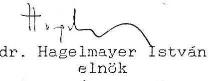

# Állami Számvevőszék

## JELENTÉS

a MEDICOR Vállalat szervezeti átalakulása,
az állami vagyon felszámolása tárgyában lefolytatott célvizsgálat
tapasztalatairól

---

# I. ELŐZMÉNYEK

A" V-36/1990.sz. A minisztériumi alapítású vállalatok vagyonkihelyezési és átalakulási tevékenységének ellenőrzése " tárgyú témavizsgálathoz kapcsolódva a MEDICOR Vállalat felkérésünkre írásban számolt be társaságalapítási, szervezetátalakítási intézkedéseiről. Tudomásunkra hozta, hogy kezdeményezte a kiürült, funkció nélkülivé vált állami irányító vállalat felszámolását.

A vállalati tájékoztató tisztázatlan kérdései alapján célvizsgálatot végeztünk. Ennek megállapításait és a javasolt intézkedéseket foglalja össze a jelentés.

A MEDICOR Vállalat a műszergyártási szakág legnagyobb vállalata volt. A Vállalati Tanács általános vezetésével működő vállalat vagyonában az alapítói - állami - vagyon közel 3 milliárd Ft értékű.
A vállalat pénzügyi-gazdasági helyzete 1986-ban megrendült; bár még nyereséges volt, hiteltartozásai meghaladták a 3 milliárdot, tartós vevői kinnlévőségei is kb. 3 milliárdot tették ki.
Pénzügyi-gazdasági helyzetének rendezésére a MEDICOR és az Ipari Minisztérium 1986 szeptemberében megállapodást kötöttek. E megállapodás részeként a vállalat előnyös kondíciók mellett az MNB-től 1 milliárd Ft forgóalap-megelőlegezési hitelt vett fel.
Az egyre súlyosbodó likviditási gondokon azonban így sem tudott úrrá lenni, s a pénzügyi egyensúly megszilárdítása, a tőkehiány feloldása érdekében jelentős szervezeti átalakulás mellett döntött.

A MEDICOR az ipari nagyvállalatok közül elsőként célozta meg szervezetének társasági átalakítását. Ennek előkészítését és jóváhagyását egyedi módon folytatta le, az átalakulást az államigazgatási gyakorlat és a szakmai közvélemény is fokozott figyelemmel kísérte.

Kidolgozott átalakulási elképzelését a vállalat egyeztette az Ipari Minisztériummal, illetve az Ipari Minisztérium előterjesztésében a Tervgazdasági Bizottság 1988 februári ülése is megtárgyalta.
A TGB tudomásul vette, hogy a MEDICOR a gyáraiból és központi funkcionális egységeiből társaságokat alapít, majd a második lépcsőben a vagyonkezelő állami vállalat szintén társasággá alakul át.

---

A MEDICOR Vállalat átalakulásának első fázisát - a termelő - szolgáltató profilú társaságok létrehozását - a célvizsgálat nem érintette, mivel ez a vállalat beszámolója alapján követhető volt. Tartalma egybeesett a korábbi országos témavizsgálat tapasztalataival és összességében az IPM, illetve a TGB által jóváhagyott elképzelés szerint ment végbe.
Az átalakulás második fázisában azonban a MEDICOR Vállalat gyökeresen eltért a jóváhagyott koncepciótól:

A termelő és funkcionális egységek társasággá alakítását követően a Medicor Irányító Vállalat (MIV) főként vagyonkezelői, tőkegazdálkodási feladatokat látott el. Az átalakulási tervelképzelésétől eltérően azonban a vagyonkezelőként működő állami vállalatot nem alakította át társasággá, hanem a Medicor társaságok részvényeivel rendelkező kereskedelmi bankokkal közösen megalapította a Medicor Befektetési Tanácsadó Részvénytársaságot (Holding Rt.). Az így létrehozott vagyonkezelő társaságnak zárt ügyletek formájában 2908,7 millió Ft könyvszerinti/név/értékű állami vagyont adott át 1796,2 millió Ft átvételi értéken.

A vagyonérték csökkenés főleg a Medicor társasági részvények leértékeléséből származik, melyet szélesebb körű piaci megméretés nélkül, saját hatáskörben eszközöltek.
Az állami tulajdon elidegenítését eredményező vagyonátruházások következtében a MIV vagyona folyamatosan csökkent és ennek arányában vagyonkezelői funkciói is áttevődtek a Holding Rt. társasághoz.
A szervezeti átalakulás kezdetén (1988. I. 1-én) az állami vállalat tulajdona az alapított társaságaiban 3359 millió forint volt, azaz az alapítói vagyon 94,9%-ával rendelkezett, 1990. VI. 30-án mindössze csak 30 millió forint; az alapítói vagyon 0,5%-a.
Az állami vállalat által alapított társaságok - maga a vagyonkezelő Holding Rt. is - kisebb részben egymás kereszt-tulajdonosai, jelentősebb részben azonban kereskedelmi bankok tulajdonában vannak.

A MEDICOR állami vállalat az ismertetett szervezetátalakítási lépéseken keresztül olyan helyzetet teremtett, melyben jelenleg az állami vállalat felszámolására vár, melyet maga kezdeményezett, s azt minden eszközzel sürgeti is.

---

Vagyonának mobilizálható elemeit az általa alapított társaságoknak átadta - eladta; vagyonkezelői funkciói is megszüntek.
Létszáma a minimumra csökkent, 1990 januárja óta nem rendelkezik irányító testülettel.
A még birtokában lévő Holding részvényeit egy általa létesített alapítványba helyezte.
Ennek alapszabálya szerint, ha az alapító állami vállalat jogutód nélkül megszűnik, annak jogai átszállnak a Medicor csoporthoz tartozó társaságokra. Így ezzel az ehhez kötődő minimális állami tulajdonosi jogosítvány is megszűnik.

A jogilag is ellentmondásos helyzetet az idézi elő, hogy a Medicor Irányító Vállalat nem a TGB által is jóváhagyott módon: a MIV átalakításával vitte be vagyonkezelői funkcióját társaságba, hanem megteremtve a Holdingot, annak adta ezt a funkciót át. Így az ipari nagyvállalat társasági átalakulásából az államnak bevétele nem keletkezett.
Ezzel szemben az állami tulajdonost sújtó 1112,5 millió forintos vagyonérték csökkenés a Holding Rt-t, illetve annak tulajdonosait; a Medicor által létesített alapítványt és a kereskedelmi bankokat gazdagítja.
A szervezetátalakítás lépéseihez szükséges döntéseket kezdetben a Vállalati Tanács, később a közgyűlés hozta. Az irányító testületek tagjai gyakran változtak, jelentős részben a megalapított társaságok valamelyikébe kerültek - vezető beosztásba.
A Holding Rt. megalapítását elhatározó Vállalati Tanács összetétele alapján nem zárható ki az állami vagyon védelmével szemben ható, jelentős ellenérdekeltség, mivel a 10 fős VT tagjai közül 5 fő (ezen belül a VT elnöke és a MIV vezérigazgatója) a Holding Rt. vezető tisztségeibe kerültek.

Az állami vállalat vezérigazgatója esetében - az állam tulajdonosi érdekeit is sértő - összeférhetetlen vezetői munkavállalás is tapasztalható:
A társaság megalapítását követően minden vagyonátruházási megállapodást az átadó képviseletében a MIV vezérigazgatója kötött, aki egyúttal a Holding Rt. Igazgatóságának az elnöke is, így az üzleti stratégia alakításáért felelős vezetője is. Az összeférhetetlenség tényéből adódóan az állami tulajdon képviselete nem volt megfelelő sem a sorozatos vagyonátadásoknál, sem az 1989. december 22-én megkötött vagyonátruházási megállapodásban az egyes társasági részvények testületi felhatalmazást meghaladó mértékű, a névérték 10-30%-ában történő átruházásánál. Ezek az ügyletek az összeférhetetlenség ténye mellett aránytalanságuk miatt is vitathatóak; így pl. a testületi felhatalmazást meghaladó mértékű, érték alatti

---

részvényátadás összesen az állami vagyon 330 millió forint értékű csökkenését eredményezte.

Az államot ért vagyoni sérelmek orvoslásának kézenfekvő módja a MIV vagyoni helyzetének Holding alapítását megelőző állapot szerinti visszaállítása.
A Holding Rt. alapításával, valamint az egyes vagyonátruházási megállapodásokkal kapcsolatban a vizsgálatunk több jogszerűtlenséget is feltárt, melyek különböző jogi realizálási kezdeményezéseket alapozhatnak meg egyrészt az állam tulajdonosi jogainak helyreállítása, másrészt a döntéshozók személyi felelőssége megállapítása tekintetében.

Az államot ért vagyoni veszteség rendezésére - amely azonban nyilván csak részbeni helyreállítás - az alapítványba helyezett részvényesi jogosultság államnak történő visszavonását is megfelelő megoldásnak ítéljük. Ez az alapítvány megszüntetésével, illetve az állami vagyonkezelő képviselőjének a kuratórium elnöki funkciójába történő beléptetésével jogszerűen megoldható. A 300 millió forint névértékű Holding részvény értéke jelenleg lényegesen magasabb forgalmi érték, mivel a Holding alaptőkéhez viszonyítva több, mint kétszeres névértékű vagyonnal (befektetett eszközzel, részvénnyel) rendelkezik.

Az államot ért vagyoni sérelmek rendezéséhez a jogi eszközök az állami vagyonkezelő, az Állami Vagyonügynökség rendelkezésére állnak; részben az állami vállalat államigazgatási felügyelet alá vonása, illetve peres eljárás kezdeményezése formájában. A Holding részvények feletti állami részvényesi jogosultság megszerzése az állami érdekek érvényesülése szempontjából alapvetően átalakíthatja a Medicor csoport jövőbeni működési feltételrendszerét.

Mivel az állam tulajdonosi érdekeinek kárára hozott döntések során nem zárható ki a döntéshozók személyi felelőssége sem, ennek megállapítása és a szükséges további intézkedések érdekében összefoglaló jelentésünket az Ügyészség részére is átadjuk.

---

# III. RÉSZLETES MEGÁLLAPÍTÁSOK

## 1. A szervezeti átalakítás végrehajtása

1.1. A termelő egységek társasággá alakítása

Az ipari nagyvállalat termelő egységei, funkcionális feladatokat ellátó szervezetei 1988. január 1-jével a Kereskedelmi tv. alapján társaságokká alakultak. Ez időponttól kezdődően a volt Vezérigazgatóság vagyonkezelőként működött, tőkegazdálkodási feladatokat látott el. Saját vagyonának 91%-a befektetett eszközként működött tovább.

A vállalat vagyonának társaságokba történő kihelyezése során az eszközöket és a készleteket könyvszerinti értéken, az ingatlanokat jelentősen felértékelve, összességében mintegy 30%-os vagyonérték-növekedést elérve vitte be.

A társaságokat tehermentesen alapította; szállítói-, hitel-, adótartozást, vevői követelést nem adott át. E tartozásait üzletrészeinek értékesítéséből szándékozott törleszteni, több kereskedelmi bankot is megkeresett - ez azonban nem járt eredménnyel. Ezért újabb hitelfelvételekre kényszerült, melyhez az óvadékként elhelyezett részvényeket a bankok csak 50%-os árfolyamon fogadták be.

### 1.2. A vagyonkezelő funkció társaságba helyezése

A MEDICOR Vállalat a tulajdonában lévő társasági részvények, az óvadékként MEDICOR társasági részvényekhez jutott kereskedelmi bankok tárgyi apportjával, valamint a Budapest Bank és az Állami Biztosító készpénz apportjával 1989. február 27-én megalapította a MEDICOR Befektetési Vállalatot (továbbiakban: a Holding Rt.) 1035 millió Ft alaptőkével.

A MIV 600 millió Ft névértékű részvényt 300 millió Ft értékben, a Postabank, az Ipari Fejlesztési Bank, s az OKHB összesen 700 millió Ft névértékű részvényt 350 millió Ft értékben vitt a Holdingba. A BB és az AB készpénz hozzájárulása 385 millió Ft.

---

A társaságot bár nem zártkörűen alapították, kizárólag kereskedelmi bankokat és pénzintézeteket kerestek meg, a részvények előnyösebb értékesítése érdekében további intézkedéseket nem tettek.

Az alapítás során így a Holding tulajdonába 650 millió Ft értékben olyan részvény került, amely egy évvel ezelőtt még 1300 Ft-ot ért, s valós piaci megméretésre nem került.

A Holding alaptőkéje készpénzhányadából további vagyonelemeket vásárol a MIV-től könyvszerinti, illetve névértéken:

MEDICOR székház 105,0 millió Ft; MEDUSZ Szolgáltató Kft. törzstőke 19,6 millió Ft; MEDINVEST Rt. üzletrész 9,5 millió Ft; MICROMED Kft. üzletrész 237,0 millió Ft; BIOCOR/Wien/ üzletrész 4,0 millió Ft; MEDICOR INT. BT vagyoni betét 24,1 millió Ft.

Itt jegyezzük meg, hogy bár vizsgálatot csak az állami tulajdon tekintetében végeztünk - végezhettünk -, a helyszíni vizsgálat során tájékoztattak bennünket, hogy a Holding Rt. a székházat röviddel az átvételt követően alaptőke-emelés címén 770 millió Ft értékben a MEDUSZ Kft-be helyezte, amely az ingatlant a Postabank részére értékesítette.

Ezt követően a 100%-os tulajdoni hányaddal a Holding tulajdonába került MEDUSZ Kft-vel a MIV közvetlenül is további üzleteket kötött.

- 1989. december 15-én megállapodtak a MIV három leányvállalatának (amelyek Kft-vé alakítását a Cégbíróságnál kezdeményezték) adás/vételében. A leányvállalatok 85,5 millió Ft értékű vagyonát az állami vállalat 52 millió Ft-ért adja el a már a Holding tulajdonában lévő Kft-nek.
(A vizsgálat lezárásáig csak egy leányvállalat átalakulását jegyezte be a Cégbíróság. A leányvállalatok átalakításánál az Átalakulási tv. előírásai szerint jártak el. Vizsgálati jelentésünk szabályszerűséget érintő, a könyvvizsgálók személyére vonatkozó megállapításaira a vállalat - válaszlevele szerint - már részben intézkedéseket tett a jogszerű állapot helyreállítása érdekében.) Az átalakulási tervhez kapcsolódó vagyonmérleget ugyanaz a könyvvizsgáló készítette, aki a társaság állandó könyvvizsgálója is lett. A vállalat módosította az erre vonatkozó megbízásokat.

---

- 1989. december 22-én a MIV és a MEDUSZ Kft. szerződést kötöttek, amelyben a Kft. átvállalta a MIV 695 millió Ft értékű középlejáratú hitel tartozását, s a MIV ennek ellentételezéseként a Kft. birtokába adott 1124 millió névértékű vagyont, 695 millió Ft átvételi áron.

Ezen belül:

- az ingatlanokat, melyek könyvszerinti értéke 55,7 millió Ft, 432,4 millió Ft átvételi áron,
- a
 részvényeket, melyek névértéke 1068,7 millió Ft, 262,5 millió Ft átvételi áron.

A MIV vezérigazgatóját egy korábbi VT ülés ugyan felhatalmazta, hogy a Holding Rt-nek az egyes társasági részvényeket névérték alatt „legalább 50%-os árfolyamon” értékesítse, ezt a felhatalmazást azonban több társaság esetében jelentősen túllépte. (A MEDICOR Orvosi Műszeripari Rt 260 millió Ft névértékű részvényét 18%-os értéken, a MEDICOR Elektromedika Ipari Rt 151 millió Ft névértékű részvényét 20%-os értéken, a MEDICOR Röntgen Rt 465 millió Ft névértékű részvényét 10%-os értéken, illetve további három társaság részvényeit a névérték 20-30%-os értékén adta át.)

Az eredményesen működő társaságok részvényeinek az állami vagyonkezelő MIV részéről történő ilyen mértékű leértékelése összességében 806,1 millió Ft vagyoncsökkenést jelentett, ebből 330,4 millió Ft az 50% alatti értékesítés hatása.

Az ismertetett szerződésekkel a Holding és annak egy személyes társaságának a tulajdonába került az állami vállalat könyvszerinti értéken 2008,7 millió Ft értékű vagyona 1796,2 millió Ft átvételi értéken.

Ez a 1112,5 millió Ft mértékű vagyonértékcsökkenés, az állami tulajdonost sújtva, a Holding Rt számára egy jelentős gazdálkodási tartalékot eredményez, melyet tovább növel a MEDICOR székház értékesítésének közel 650 millió Ft-os felértékeléséből származó bevételi többlet.
A részvények, üzletrészek nyilvános értékesítését nem kísérelték meg.

A jelentős vagyonértékesítés sem tette azonban lehetővé a vállalalat által részünkre átadott tájékoztatóval ellentétben -, hogy az állami vállalat hiteltartozásait felszámolja, hiszen azok átütemezett részét a MEDUSZ Kft.-re cedálták.

---

Az állami vállalat azzal, hogy a Holding Rt-t létrehozta, s részére 2,9 milliárd állami vagyont adott át, megteremtette saját vagyonkezelő duplikátumát, ily módon alapvetően eltért a TGB által jóváhagyott szervezeti átalakulástól.

# 1.3. „MEDICOR a magyar egészségügyért” alapítvány 

létrehozása

A mobilizálható vagyonelemek közül 300 millió Ft névértékű Holding Rt részvény átadásával az állami vállalat 1989. november 21-én alapítványt létesít. A 300 millió Ft szavazati erejű részvényesi jogokat ettől az időponttól kezdve az alapítvány, illetve a kuratórium mindenkori elnöke gyakorolja. (A Kuratórium jelenlegi elnöke az alapító MIV vezérigazgatója, az alapító megszünése esetén a MEDICOR csoporthoz tartozó társaságok által választott személy.)

A Holding részvények osztalékával gazdálkodó alapítvány a hazai egészségügyi ellátás fejlesztésének, illetve beruházási célú vásárlásainak támogatásán keresztül a MEDICOR csoport belföldi értékesítési érdekeit is szolgálja.

Az alapítvány létrehozása kapcsán a deklarált közösségi célok mellett nem zárható ki a társasági részvények (a MIV által azóta kezdeményezett) felszámolási eljárásból történő kivonásának szándéka, illetve az a törekvés, hogy a részvények továbbra is a Medicor csoport hatókörében maradjanak.

## 2. Az állami vállalat jelenlegi vagyoni helyzete

A termelő egységek társasággá alakításának időpontjában /1988. 01. 01./ az állami vállalat

Saját vagyona
Befektetett eszközeinek értéke
Hiteltartozásainak értéke
Vevői követelés állománya
: 3815 millió Ft
: 3472 millió Ft
: 4232 millió Ft
: 3254 millió Ft

Az 1989-ben kötött jelentős vagyonvesztéssel járó szerződések hatása még az állami vállalat 1989. évi

---

zárómérlegében sem tükröződik, mivel a hitelátruházáshoz szükséges banki hozzájárulást csak 1990-ben kapják meg.

# 1989. december 31.: 

Saját vagyona
: 3174 millió Ft
Befektetett eszközök értéke
: 2973 millió Ft
Hiteltartozások értéke
: 2211 millió Ft
Vevőkkel szembeni követelések
: 3355 millió Ft
Mérleg szerinti eredmény
: -303 millió Ft
A sorozatos vagyonátruházások elszámolása következtében, illetve azzal, hogy ennek kapcsán vevői követelés állományának jelentős hányadát az alapított társaságára ruházta, s vagyon eladásából hiteltartozásait visszafizette, az állami vállalat vagyoni helyzete 1990-ben az alábbiak szerint jellemezhető:
A felszámolási eljárás kezdeményezése előtt a MIV

- tartozásait az előző pontban ismertetett vagyonértékesítések bevételeiből, illetve a vagyonátruházások kapcsán „rendezte” /társaságára cedálta/; - tartozása nincs,
- vevői követelés állományának jelentős hányadát a MEDUSZ Kft-nek átadta; 2069 millió Ft értékben - a refinanszírozó hitelekkel, biztosításokkal együtt.

Az állami vállalatnál maradt 452 millió Ft követelés esetében számottevő pénzbefolyás már nem várható. (Ebből 208 millió Ft értékű követelés leírását a MIV már korábban kezdeményezte, de azt az MNB a felszámolás időszakára utalta.)
A 452 millió Ft kinnlévőségből 242 millió Ft az állami vállalat saját külföldi érdekeltségeivel szembeni követelése.

A vagyonelemek átadása és a hitelátruházások eredményeként 1990. június 30-án az állami vállalat

| Befektetett eszközeinek értéke | : | 160 millió Ft |
| :-- | :-- | --: |
| Hiteltartozása |  | nincs |
| Vevői kinnlévőségeinek értéke | : | 452 millió Ft |
| Mérleg szerinti eredménye | : | -899 millió Ft |

(A féléves mérlegkészítési kötelezettség megszűnt, az adatokat a vállalat szolgáltatta a statisztikai adatszolgáltatási kötelezettsége alapján.)

Az állami vállalatra bízott közel 3 milliárd Ft állami vagyon gyarapítása, gondos kezelése volt a MIV, illetve az azt irányító testület feladata. Az ismertetett sorozatos vagyonátruházások következtében a saját va-

---

gyonkezelő duplikátumával, illetve az annak tulajdonába adott társaságával kötött keresztüzletek során a vagyonellemek állami tulajdona megszűnt, anélkül, hogy az állam bevételhez jutott volna.
Az alapított társaságaiban az állami vállalat tulajdoni hányada minimálisra csökkent;

|  | MEDICOR   csoport   alapítói   vagyona   millióFt | EBBŐL   MIV   tulajdon   millióFt | % | MIV   befek-   tetett   eszk. ö.   millióFt |
| :--: | :--: | :--: | :--: | :--: |
| 1988.01.01.(*) | : 3541 | 3359 | 94,9 | 3472 |
| 1988.12.31. | : 3728 | 3134 | 84,1 | 3325 |
| 1989.01.01.(*) | : 4800 | 2862 | 59,8 | 3325 |
| 1989.12.31. | : 5550 | 1917 | 34,5 | 2059 |
| 1990.01.01.(*) | : 5371 | 1896 | 35,3 | 2059 |
| 1990.06.30. | : 5586 | 30 | 0,5 | 160 |
| (* = évközi alapítás, tőke | elés) |  |  |  |

Az állami vállalat által alapított társaságok - maga a vagyonkezelő Holding is - kisebb részben egymás kereszttulajdonosai, jelentősebb részben azonban kereskedelmi bankok tulajdonában vannak.

A szervezeti átalakulás deklarált célkitűzései nem teljesültek:

- jelentősebb külföldi tőkebevonásra nem került sor,
- a szakmai kultúra nem fejlődött,
- több társaság 1990. I. félévét veszteséggel zárta. A társaságok vesztesége összesen 395 millió Ft, hitelállományuk 2769 millió Ft.

3. Az átalakulási, vagyonátruházási döntések testületi
háttere, a felügyelő minisztérium szerepe

Az ipari nagyvállalat szervezeti rendszerének lebontása és átalakítása maga után vonta az irányító testület szervezetének folyamatos módosulását is.
A gyárak képviselőiből álló nagyvállalati tanács 1988. január 11-ét követően megszűnt. A vagyonkezelő funkciót ellátó MEDICOR irányító vállalat 10 fős vállalati tanácsa 1988. december 19-ével alakult meg, s a következő év május

---

9-éig működött. Ekkor a MIV lecsökkent létszáma miatt (23 fő) közgyűléses irányítási formára tért át. (A MIV utolsó közgyűlésére ismereteink szerint 1990. január 19-én került sor.) A közgyűléses irányítási formára való áttérés a vállalat „Létesítő Határozatának” módosítását is igényelte. Ezt az alapító 1990. március 3-án adta csak ki.

Jelenleg a MIV állományában csak egy főállású alkalmazott van; a december végével nyugdíjba vonuló vezérigazgató, aki jelenleg felmondási idejét tölti.

Az ellenőrzés az ülések dokumentumai alapján több olyan megállapítást tett, amelyek a testületek hiányos, illetve félrevezető tájékoztatására, egyes vagyonátruházási megállapodások utólagos jóváhagyatására, illetve a testületi döntések átértelmezésére vonatkoztak. Mindezek alapján a testületek működése, döntéshozatala csak formális lehetett. A személyi állományában is változó testületek a társaságalapításokkal, vagyonátruházásokkal kapcsolatos lépéseket érdemben nem tudták áttekinteni, ezt jórészt csak a törzskari vezetéshez tartozók követhették.

Mindemellett egy-egy testületi döntés kialakításánál további visszás mozzanatok is felmerültek.

- Az állami vagyon átruházását lehetővé tevő átalakulási döntéseket a 10 fős VT 1988. dec. 19-i ülésén hozta meg. Ekkor döntöttek a MEDUSZ Kft létrehozásáról, a vagyonkezelő Holding Rt megalakításáról, továbbá arról, hogy a MIV a megalakuló Holding Rt-nek a kezelésében lévő részvényeket leértékelve, a névérték 50%-ában is értékesíthesse.

A döntést hozó 10 fős VT tagjai közül ekkor 5 fő olyan személy volt, akik a két hónap múlva megalakuló Holding vezető tisztségviselői lettek. (A Holding Rt Igazgatóságának elnöke, vezérigazgatója, befektetési igazgatója, főmérnöke, illetve a MEDUSZ Kft osztályvezetője.)

Így tehát nem zárható ki a Holding Rt induló gazdálkodási pozíciójának javítása érdekében az állami vagyon védelmével szemben ható személyes érdekek érvényesülése.

---

- Az állami vállalat felszámolásának lezárására további fontos döntéseket az 1989. november 10-ei közgyűlés hozott.
Döntött a 300 millió Ft értékű Holding részvény alapítványba helyezéséről, s felhatalmazta a vezérigazgatót, hogy kezdeményezze az „üressé vált” állami vállalat felszámolását. E témák egy időpontban történő tárgyalása megerősíti azt a feltételezést, hogy az alapítvány létrehozását elsősorban a Holding részvények felszámolási eljárásból történő kivonásának szándéka vezette.
- A közgyűlés ezt követően még 1990. január 3-án, s január 10-én ülésezett. Az első felmentette a MIV vezérigazgatóját összeférhetetlenségi okokból, mivel a megalakult Holding Rt igazgatósági elnöke lett.

A második közgyűlés meghatározott időtartamra - 1990. december végéig - visszaállította az ügyvezető igazgatói megbízatását, azzal, hogy az állami vállalat felszámolási eljárását ő folytassa le.

Az összeférhetetlenség vonatkozásában megállapítható, hogy ez a Holding Rt-nek, illetve a MEDUSZ Kft-nek eszközölt vagyonátadások teljes ideje alatt, és a jelentős állami vagyoncsökkenést eredményező és előnytelensége miatt tartalmában is vitatott 1989. december 22-ei megállapodás megkötésekor is fennállt.

A MIV vezérigazgatója a Holding Rt megalakulásától kezdődően egyben a társaság Igazgatóságának elnöke is. Az állami tulajdonú vagyonelemek átadására vonatkozó megállapodásokat az átadó fél képviseletében a MIV vezérigazgatója kötötte a Holding Rt, illetve a MEDUSZ Kft. képviselőjével. Így az egyes ügyletek megkötésénél valóságos érdekütköztetésre nem kerülhetett sor, és a piaci megmérettetés hiánya miatt az állami vagyon leértékelésének mértéke sem fogadható el.

A MIV vezérigazgatójának MEDICOR csoportban betöltött további tisztségei ugyan az összeférhetetlenség szempontjából más elbírálás alá esnek, de a társaságok nyereséges működtetésében való érdekeltségét tovább erősítik; ilyen a MEDICOR külföldi érdekeltségeit összefogó MEDICOR INTERNATIONAL Kft. ügyvezető igazgatói posztja, MEDICOR alapítvány kuratóriumi elnöksége, s az ezzel járó részvényesi jogosultság.

---

A MEDICOR állami vállalat tulajdonosi-működtetési formájának átalakítását az Ipari Minisztérium előterjesztésében a TGB 1988. februárjában tárgyalta. Tudomásul vette a tervezett kétlépcsős átalakulást, s jegyzőkönyvben rögzítette, hogy a minisztérium számoljon be a szervezetkorszerűsítés érdemi tapasztalatairól.

A MIV 1990. január 25-ei levelében kezdeményezte az Ipari Minisztériumnál egyszerűsített rendben történő felszámolását.

A minisztérium válaszában - hivatkozva a jogi megalapozottság hiányára - az alábbi állásfoglalást adta ki: „A vállalat megszüntetésére törvényes lehetőséget ad az Átalakulási tv., mely alapján a közgyűlés a vállalat gazdasági társasággá való alakulásáról döntést hozhat, majd ezt követően, ... a Holding Rt-vel egyesülhet.”

A vállalat jogi megalapozottságot nyújtó (20%-os vagyoncsökkenést bizonyító) újabb megkeresését a minisztérium a Vagyonügynökség hatáskörébe utalta.

Ekkor fordult a vállalat a Vagyonügynökséghez egyszerűsített felszámolásra vonatkozó kérésével, melyben közli, hogy kérését az Ipari Minisztérium is támogatja.
 A megismert minisztériumi állásfoglalásokból ez az egyértelmű támogatás azonban nem következik.

Budapest, 1990. december 15.

