# JELENTÉS 

az állami és egyházi tulajdonban lévő kórházak, egyetemi klinikák gazdálkodásának ellenőrzéséről

---

# 2. Államháztartás Központi Szintjét Ellenőrző Igazgatóság 

### 2.1. Teljesítmény Ellenőrzési Főcsoport

Iktatószám: V-10-132/2002-2003.
Témaszám: 598
Vizsgálat-azonosító szám: V0034

## Az ellenőrzést felügyelte:

Bihary Zsigmond
főigazgató
Az ellenőrzés végrehajtásáért felelős:
Kemény Emil
főcsoportfőnök

## Az ellenőrzést vezette:

Söveges Erika Katalin
osztályvezető főtanácsos

## Az ellenőrzést végezték:

Zachár Péterné számvevő tanácsos
Federics Adrienn
számvevő gyakornok
Benkéné dr. Lavner
Klára
számvevő tanácsos
Kálmánné Juhász
Ilona
szakértő

Farkas Ildikó
számvevő gyakornok
Laskai Ede
számvevő
Puchy Márta
számvevő tanácsos
Dr. Ardai György
szakértő

Kriston-Vizi János
számvevő
Nyikon Zsigmondné
számvevő
Koronczai Sándorné
számvevő tanácsos
Bobál István
szakértő

## A témához kapcsolódó eddig készített számvevőszéki jelentések:

- Jelentés a felnőtt háziorvosi ellátásra fordított pénzeszközök felhasználásának vizsgálatáról (V-1017-53/19994-95.)
- Jelentés a fogászati ellátásra fordított pénzeszközök felhasználásának és a fogászati ellátás helyzetének vizsgálatáról (V-1013/3/1996.)
- Jelentés a helyi önkormányzatok által fenntartott járóbeteg szakellátás helyzetének és a ráfordított pénzeszközök felhasználásának vizsgálatáról (V-1013-121/1997-98.)
- Jelentés az önkormányzati egészségügyi intézmények gép-műszer ellátottságának, valamint egyes diagnosztikai részlegek teljesítményének vizsgálatáról (V-1016-78-1998-99.)
- Jelentések a társadalombiztosítás pénzügyi alapjai költségvetése végrehajtásának ellenőrzéséről (1997-98. évi)
- Jelentés az önkormányzati tulajdonban lévő kórházak pénzügyi helyzetének gazdálkodásának vizsgálatáról (V-1019-115/1999.)

Jelentéseink az Országgyűlés számítógépes hálózatán és az Interneten a www.asz.hu címen is olvashatók.

---

## Eierlikör (1)

Menge: 1 Drink

2 Zentiliter Zitronensaft
2 Zentiliter Zuckersirup
1 Zentiliter Zuckersirup
1 Zentiliter Zuckersirup
etwas Zitronensaft
etwas Zuckersirup
etwas Zuckersirup
etwas Zuckersirup
etwas Zuckersirup
etwas Zuckersirup
etwas Zuckersirup
etwas Zuckersirup
etwas Zuckersirup
etwas Zuckersirup
etwas Zuckersirup
etwas Zuckersirup
etwas Zuckersirup
etwas Zuckersirup
etwas Zuckersirup
etwas Zuckersirup
etwas Zuckersirup
etwas Zuckersirup
etwas Zuckersirup
etwas Zuckersirup
etwas Zuckersirup
etwas Zuckersirup
etwas Zuckersirup
etwas Zuckersirup
etwas Zuckersirup
etwas Zuckersirup
etwas Zuckersirup
etwas Zuckersirup
etwas Zuckersirup
etwas Zuckersirup
etwas Zuckersirup
et

---

# TARTALOMJEGYZÉK 

BEVEZETÉS ..... 15
I. ÖSSZEGZŐ MEGÁLLAPÍTÁSOK, KÖVETKEZTETÉSEK, JAVASLATOK ..... 19
II. RÉSZLETES MEGÁLLAPÍTÁSOK ..... 27

1. A vizsgált egészségügyi intézmények gazdálkodását meghatározó tényezők ..... 27
1.1. Az intézmények helye az egészségügyi ellátórendszerben ..... 27
1.1.1. Az Egészségügyi, Szociális és Családügyi Minisztérium gyógyító-megelőző ellátást végző országos intézetei ..... 28
1.1.2. Az Oktatási Minisztérium által felügyelt egyetemi klinikák ..... 28
1.1.3. A Gazdasági és Közlekedési Minisztérium által felügyelt vasút-egészségügyi intézmények ..... 29
1.1.4. A Belügyminisztérium egészségügyi szolgáltatást nyújtó intézetei ..... 30
1.1.5. Az egyházi tulajdonban lévő kórházak ..... 30
1.2. Az egészségügyi intézmények gazdálkodásának szabályozása ..... 30
1.3. A kórházi vezetői információs rendszerek ..... 32
1.4. A kórházak minőségügyi rendszerei ..... 34
2. Az intézmények gazdálkodása ..... 35
2.1. Az intézmények pénzügyi helyzete ..... 35
2.2. Az intézmények bevételei ..... 37
2.3. A gyógyító-megelőző ellátások bevételeit meghatározó tényezők ..... 38
2.3.1. A gyógyító-megelőző ellátások teljesítményarányos finanszírozása ..... 38
2.3.2. A teljesítményarányos finanszírozás szabályainak változása ..... 40
2.3.3. A gyógyító megelőző ellátások bevételeinek alakulása ..... 42
2.3.4. A betegforgalom és a finanszírozott teljesítmények alakulása ..... 45
2.4. Az intézmények kiadásai ..... 49
2.4.1. Humánerőforrás gazdálkodás ..... 50
2.4.1.1. A létszámellátottság alakulása ..... 50
2.4.1.2. Az egészségügyi dolgozók bérezése ..... 53
2.4.1.3. A kórházak munkaerőforgalma, munkaerő-megtartási lehetőségek ..... 55
2.4.2. A kórházak gyógyszergazdálkodása ..... 56
2.4.2.1. A gyógyszerkiadások alakulása ..... 56
2.4.2.2. A gyógyszerfelhasználás szabályozása ..... 58

---

2.4.2.3. A gyógyszerek beszerzése ..... 60
2.4.3. Az intézmények műszergazdálkodása ..... 61
2.4.3.1. Az orvosi berendezések állapota ..... 61
2.4.3.2. Az orvosi berendezések üzemeltetése és szervizelése ..... 65
3. A kórházak beteg-elégedettségi vizsgálatai ..... 66

---

# MELLÉKLETEK 

## TÁBLÁZATOK

1. számú táblázat:
2. számú táblázat:
3. számú táblázat:
4. számú táblázat:
5. számú táblázat:
6. számú táblázat:
6/a. számú táblázat:
7. számú táblázat:
7/a. számú táblázat:
8. számú táblázat:
9. számú táblázat:
10. számú táblázat:
11. számú táblázat:
12. számú táblázat:
13. számú táblázat:
14. számú táblázat:
15. számú táblázat:
16. számú táblázat:
17. számú táblázat:
17/a. számú táblázat:

Adatszolgáltatásra felkért állami és egyházi egészségügyi intézmények

Mátrix az intézmények kijelöléséhez
Adatszolgáltató intézmények pénzforgalmi bevételei
Gyógyító, megelőző ellátások támogatására OEP által kiutalt összegek

Az adatszolgáltató intézmények szerződött ágyszámai
Elbocsátott betegek száma
Finanszírozott esetszám
Az adatszolgáltató intézményekből elbocsátott betegek száma

Adatszolgáltató intézmények finanszírozott esetszámai
Az adatszolgáltató intézmények szerződött és működő ágyszámai

Egy ágyra jutó elbocsátott esetek száma az adatszolgáltatók körében

Aktív ágykihasználtság változás (intézménycsoportonként)
Az aktív ágykihasználtság alakulása (intézményenként)
Átlagos ápolási idő (aktív)
Krónikus ágykihasználtság változás (intézménycsoportonként)

A krónikus ágykihasználtság alakulása (intézményenként)
HBCS súlyszám összege (intézménycsoportonként)
Az adatszolgáltató intézmények teljesített HBCS súlyszámai
Átlagos esetsúlyossági index (intézménycsoportonként)
Átlagos esetsúlyossági index (intézményenként)

---

| 18. számú táblázat: | Adatszolgáltató intézmények pénzforgalmi kiadásai |
| :--: | :--: |
| 19. számú táblázat: | Adatszolgáltató intézmények személyi és dologi kiadásai |
| 20. számú táblázat: | Intézmények átlagos statisztikai állományi létszáma |
| 21. számú táblázat: | Egy orvosra jutó szakdolgozói létszámok az elemzett kórházakban |
| 22. számú táblázat: | Havi átlagjövedelmek alakulása intézménycsoportonként |
| 23. számú táblázat: | A munkaerőforgalom alakulása intézménycsoportonként |
| 24. számú táblázat: | Egy ágyra jutó orvosi gépek értéke |
| 25. számú táblázat: | Orvosi gépek, berendezések elhasználódottsága |

# DIAGRAMOK 

1. számú diagram:
2. számú diagram:
3. számú diagram:
4. számú diagram:
5. számú diagram:
6. számú diagram:
7. számú diagram:
8. számú diagram:
9. számú diagram:
10. számú diagram:
11. számú diagram:

## Egy finanszírozott esetre jutó OEP bevétel (e Ft/ágy)

Egy krónikus napra jutó OEP bevétel (e Ft/ágy)
Adatszolgáltató intézmények ágyszámainak aránya az országos ágyszámból 2001-ben

Adatszolgáltató intézmények ágyszámainak megoszlása (2001. év)

Fekvőbeteg ellátás egy ágyra jutó OEP bevétele
Fekvőbeteg ellátás egy ágyra jutó kiadása
Gyógyszer-vegyszer aránya a dologi kiadásokban
Egy finanszírozott esetre jutó gyógyszer-vegyszer kiadás (e Ft/eset)

Vásárolt gyári előállítású gyógyszer arányának változása
Gyógyszerbeszerzési egységárak
Egy ágyra jutó orvosi berendezések nettó értéke és egy ágyra jutó 0-ra leírt eszközök értéke (2001.)

Orvosi berendezések használhatósága (\%-ban)

---

# RÖVIDÍTÉSEK JEGYZÉKE 

| Áht. | Az államháztartásról szóló 1992. évi XXXVIII. törvény |
| :--: | :--: |
| ÁNTSZ | Állami Népegészségügyi és Tisztiorvosi Szolgálat |
| ÁSZ | Állami Számvevőszék |
| Balatonfüredi Szívkórház | Állami Szívkórház, Balatonfüred |
| Bethesda Gyermekórház | Magyarországi Református Egyház Bethesda Gyermekkórháza |
| BM | Belügyminisztérium |
| BM Kórház | Belügyminisztérium Központi Kórház és Intézményei |
| BNO | Betegségek Nemzetközi Osztályozása |
| CMI | Case-mix index |
| DOTE | Debreceni Orvostudományi Egyetem |
| DE OETC | Debreceni Egyetem Orvos- és Egészségtudományi Centrum |
| E. Alap | Egészségbiztosítási Alap |
| ESZCSM | Egészségügyi, Szociális és Családügyi Minisztérium |
| EU | Európai Unió |
| EüM | Egészségügyi Minisztérium |
| Eütv. | Az egészségügyről szóló 1997. évi CLIV. törvény |
| Ftv. | A felsőoktatásról szóló 1993. évi LXXX. törvény |
| GKM | Gazdasági és Közlekedési Minisztérium |
| GOKI | Gottsegen György Országos Kardiológiai Intézet |
| GYÓGYINFOK | Gyógyító Ellátás Információs Központja |
| HBCS | Homogén Betegség Csoport |
| Hévízi Kórház | Szent András Állami Reumatológiai és Rehabilitációs Intézet |
| HIETE | Haynal Imre Egészségtudományi Egyetem |
| Irgalmasrendi Kórház | Budai Irgalmasrendi Kórház Kht. |
| Központi MÁV kórház | MÁV Kórház és Központi Rendelőintézet, Budapest |
| Kjt. | A közalkalmazottak jogállásáról szóló 1992. évi XXXIII.tv. |
| KSH | Központi Statisztikai Hivatal |
| MÁGY | Mátrai Állami Gyógyintézet |
| MÁK | Magyar Államkincstár |
| NM | Népjóléti Minisztérium |
| OBSI | Országos Baleseti és Sürgősségi Intézet |
| OENO | Orvosi Eljárások Nemzetközi Osztályozása |
| OEP | Országos Egészségbiztosítási Pénztár |
| OGY | Országgyúlés |
| OGYK | Országos Gyógyintézeti Központ |
| OHII | Országos Haematológiai és Immunológiai Intézet |
| OITI | Országos Idegsebészeti Tudományos Intézet |
| OKTPI | Országos Korányi TBC és Pulmonológiai Intézet |
| OM | Oktatási Minisztérium |

---

| OOI | Országos Onkológiai Intézet |
| :-- | :-- |
| OORI | Országos Orvosi Rehabilitációs Intézet |
| OPNI | Országos Pszichiátriai és Neurológiai Intézet |
| ORFI | Országos Reumatológiai és Fizioterápiás Intézet |
| ORKI | Országos Orvos- és Kórháztechnikai Intézet |
| OSAP | Országos Statisztikai Adatgyűjtési Program |
| OSEI | Országos Sportegészségügyi Intézet |
| Parádfürdői Kórház | Parádfürdői Állami Kórház |
| POTE | Pécsi Orvostudományi Egyetem |
| PE OETC | Pécsi Egyetem Orvos- és Egészségtudományi Centrum |
| Soproni Kórház | Állami Szanatórium, Sopron |
| SE | Semmelweis Egyetem |
| SOTE | Semmelweis Orvostudományi Egyetem |
| SE ÁOK | Semmelweis Egyetem Általános Orvostudományi Kar |
| SE ETK | Semmelweis Egyetem Egészségtudományi Kar |
| Svábhegyi Gyermekkórház | Svábhegyi Állami Gyermekgyógyintézet |
| SZAOTE | Szentgyörgyi Albert Orvostudományi Egyetem, Szeged |
| SZCSM | Szociális és Családügyi Minisztérium |
| Szent Ferenc Kórház | Budapesti Szent Ferenc Kórház |
| Szeretetkórház | Magyarországi Zsidó Hitközségek Szövetségének Szeretet- |
|  | kórháza |
| SZMSZ | Szervezeti Múködési Szabályzat |
| Szolnoki MÁV kórház | MÁV Kórház és Rendelőintézet, Szolnok |
| SZTE ÁOK | Szegedi Tudományegyetem Általános Orvostudományi |
|  | Kar |
| WHO | World Health Organisation |

---

# ÉRTELMEZŐ SZÓTÁR 

After loading beavatkozás Szövetközi, testüregi sugárterápia.

Aktív fekvőbeteg-ellátás:

Akkreditálás:

Aktív kórházi ágy:

Alapdij:

Alapellátás:

Aneszteziológia:

Antibiotikum:

Ágyforgó:

Beavatkozás:

A fekvőbeteg-ellátó intézményben történő gyógyító, megelőző, rehabilitáló tevékenység, amelyben az ápolási idő előre tervezhető, többnyire rövid időtartamú. Az ellátásban az orvos-szakmai tevékenység a meghatározó, az ellátás célja az egészségi állapot mielőbbi helyreállítása. A besorolásban nem játszik szerepet, hogy az ellátás akut vagy krónikus betegség miatt következik be.

Államilag létrehozott köztestület által végzett eljárás annak igazolására, hogy a szervezet kompetens specifikus feladatainak ellátására. Az akkreditálás non profit tevékenység, melyet a szakma elismert képviselői végeznek a szakma által kidolgozott standardok alapján.

Az aktív minősítésű osztályon, illetve osztályokon lévő ágy.

A teljesítmény elvű finanszírozás bevezetésekor intézményenként megállapított díj (Ft összeg), mely 1,0 HBCS pont teljesítéséért járt az adott intézménynek, s amely az 1992-es év betegforgalma, s annak bizonyos ismérvei alapján került megállapításra.

A jelenlegi magyar egészségügyben a háziorvosi, a házi gyermekorvosi, a fogászati, a védőnői, valamint az iskolaegészségügyi ellátások összefoglaló megnevezése.

Érzéstelenítés, érzéstelenítő szerek alkalmazása, altatás.

Gyógyszer, mely gátolja a baktériumok szaporodását, illetve elpusztítja azokat.

Egy kórházi ágyon havonta (évente) átlagosan ellátott finanszírozási esetszám.

Azon megelőző, diagnosztikus, terápiás rehabilitációs vagy más célú fizikai, kémiai, biológiai, vagy pszichikai eljárás, amely a beteg szervezetében változást idéz, vagy idézhet elő, továbbá a holttesten végzett vizsgálatokkal, valamint szövetek, szervek eltávolításával összefüggő eljárás, finanszírozási szempontból olyan elvégzett szolgáltatás, amely megfelelő kódok alapján elszámolási tétel a járóbeteg szakellátásban.

---

BNO besorolás (Betegségek Nemzetközi Osztályozása):

Bruttó érték:

Case-mix index (CMI, átlagos esetsúlyossági index):

CT vizsgálat:

Diagnosztikai vizsgálat:

Diagnózis:
Egészségügyi szolgáltató:

Extrafinanszírozás:

Fekvőbeteg:

A betegségek osztályokba sorolására használt kódrendszer. Ezek, az orvosi diagnózisok szerinti besorolások alapozzák meg az egyes esetek homogén betegségcsoportok (HBCS) szerinti finanszírozását.

Az eszköz beszerzési, előállítási költsége a számviteli előírásokban részletezett valamennyi ráfordítást figyelembe véve.

Eset összetételi index, a HBCS súlyszámok súlyozott (éves) átlaga. Közelítő egyszerűsítéssel: egy aktív fekvőbeteg esetre átlagosan jutó súlyszám. Átlagos szakmai igényességű ellátások esetén értéke 1,0. Az ennél magasabb szám azt jelenti, hogy az intézmény az átlagosnál magasabb színvonalú, vagy nagyobb bonyolultságú eseteket kezel.

Computer Tomograph vizsgálat, azaz kiválasztott szelet síkja mentén több irányból mért röntgensugár gyengítésével a jellemző értékekből számítógép segítségével nyert képalkotás.

A betegségek felismerését, megállapítását, az egészségi állapot megismerését célzó vizsgálat.

Kórismeret.
A tulajdoni formától és a fenntartótól függetlenül minden, egészségügyi szolgáltatás nyújtására az egészségügyi hatóság által kiadott működési engedély alapján jogosult jogi személy, jogi személyiség nélküli szervezet és minden olyan természetes személy, aki a szolgáltatást saját nevében nyújtja.

Előre nem tervezhető, rendkívüli, illetve egyedi fekvőbeteg ellátási eset egyedi döntés alapján történő finanszírozása részletes költségkimutatás alapján.

Minden kórházban egészségügyi szolgáltatásban részesített beteg, aki az adott intézményben
 az érvényes intézkedéseknek megfelelően meghatározott időnél (24 óránál) hosszabb ideig folyamatosan tartózkodott, függetlenül attól, hogy ezalatt hány osztályon ápolták. A határidőn belül önkényesen eltávozott betegek jogi szempontból fekvőbetegnek tekintendők, finanszírozási és statisztikai szempontból azonban ambuláns (járóbeteg) esetenként kerülnek elszámolásra, és nem kell kitölteni a fekvőbeteg esetekre előírt "Adatlap a kórházi ápolási esetről" című nyomtatványt. Meghatározott esetben (pl.: halálozás,

---

Fekvőbeteg-szakellátás:

Felső határnap:

Finanszírozási eset:

Funkcionális privatizáció:

Gép-műszer kataszter:

GYÓGYINFOK:

HACCP (Veszélyelemzés Kritikus Szabályozási Pontok):
újszülött) a jogszabály az előírt ápolási időhatártól függetlenül felvett pácienseket fekvőbetegnek minősíti.

A betegnek a lakóhelye közelében, fekvőbeteggyógyintézeti keretek között végzett egészségügyi ellátása. Ennek igénybevétele a külön jogszabályban foglaltak szerint a beteg folyamatos ellátását végző orvos, a kezelőorvos vagy az arra feljogosított más személy beutalása, valamint a beteg jelentkezése alapján történik. (Finanszírozási szempontból 2000. április 1-től a 6-24 órás sürgősségi ellátások, a 24 órán belül más intézetbe áthelyezett újszülöttek és a 0 alsó határnapú HBCS szerinti ellátások is ide tartoznak.) A finanszírozás módja szerint lehet aktív és krónikus fekvőbetegellátás.

NM rendeletben meghatározott határnap, mely feletti hosszú ellátási esetekre térítés a krónikus ellátásnak megfelelő mértékben, ápolási nap arányosan jár.

Egy finanszírozási esetnek kell tekinteni azt az egy vagy több fekvőbeteg-osztályos esetből álló eseménysort, amely az ellátás azonos oka és az elszámolás azonos módja miatt egy elszámolási tételként jelenik meg. Aktívról krónikus osztályra (illetve viszont) áthelyezett beteg ellátását külön-külön finanszírozási esetekként számolják el.

Az egészségügyi tevékenység folytatásához szükséges eszközök - általában minimális vagy igen méltányos mértékű - bérlési rendszerén alapuló, vállalkozási jellegű (piaci elemeket tartalmazó) egészségügyi ellátás.

Az egészségügyi intézményekben alkalmazott kórház és orvostechnikai termékek (műszer, gép, eszköz, berendezés, gyógyászati segédeszköz) nyilvántartása.

Az Egészségügyi Minisztérium háttérintézménye, mely a fekvőbeteg ellátás kórházak által jelentett teljesítményeinek ellenőrzését, összesítését, kódkarbantartási munkálatokat, továbbá információgyűjtő tevékenységet végez a finanszírozás megalapozása érdekében. (Az intézmény székhelye Szekszárd.)

Az élelmiszerek előállításával, fogyasztásra való elkészítésével, felszolgálásával kapcsolatos tudományos és gyakorlati ismeretekre épülő módszeres megközelítés, amely a veszélyek megelőzésén alapuló hatékony élelmiszerbiztonsági rendszer létrehozását és működtetését segíti elő.

---

Haemodinamikai beavatkozás:

Használhatósági fok:

Homogén betegségcsoportok (HBCS):

Hotelfunkciók:

Igény (eü. ellátás):

Izotóp diagnosztika:

Járóbeteg szakellátás:

Járóbeteg-szakellátás kapacitása:

Kardiológia:

Kassza:

A szív- és érrendszer véráramlási rendellenességeinek diagnosztizálására, gyógyítására alkalmazott orvosi eljárás.

A tárgyi eszközök nettó értékének aránya a bruttó érték %-ában.

A fekvőbeteg-ellátás finanszírozásában használt betegosztályozási rendszer. Közel azonos gyógyítási költségigényű betegségek orvosi szempontból is elfogadható csoportjai.

A fekvőbeteg ellátást kiszolgáló háttértevékenységek, mint pl.: élelmezés, mosoda, takarítás, energiaellátás, karbantartás, telefonszolgálat, stb.

A biztosítottak részéről az egészségügyi ellátó rendszerrel szemben támasztott elvárás. Az igény tágabb fogalom, mint az egészségügyi ellátási szükséglet. Másrészt nem minden ellátási szükséglet jelenik meg igényként (pl.: ha a beteg nincs tudatában betegségének). A szükségleteket meghaladó igények esetén a kötelező biztosítások ill. a nemzeti egészségügyi rendszerek költségmegosztással, sőt a támogatás elutasításával valósítják meg a véges közpénzek hatékony és igazságos felhasználását.

Radioaktív izotópok felhasználásával végzett vizsgálat.

A beteg folyamatos ellátását, gondozását végző orvos beutalása vagy a beteg jelentkezése alapján, szakorvos által végzett egyszeri, illetve alkalomszerű egészségügyi ellátás, továbbá fekvőbeteg-ellátást nem igénylő krónikus betegség esetén a folyamatos szakorvosi gondozás. Az általános járóbeteg-szakellátást a beteg egészségi állapotának veszélyeztetése nélkül, rendszeres tömegközlekedés igénybevételével megközelíthetően (a továbbiakban: lakóhelyének közelében) kell biztosítani.

A járóbeteg-szakellátást nyújtó helyeken (rendelésen) lekötött heti szakrendelési óraszám (heti szakorvosi és nem szakorvosi órák száma).

A szív működésével és betegségeivel foglalkozó orvostan.
Az egészségbiztosítás költségvetésében a gyógyító-megelőző ellátások finanszírozására szolgáló előirányzati keret, mely egy-egy szolgáltatás fajtához kapcsolódik. (pl.: járóbeteg szakellátás, aktív fekvőbeteg ellátás, stb.)

---

Kasszarendszer (zárt):

Képalkotó berendezések:

Képi diagnosztika:

Konszolidációs hitel:

Kontrolling:

Kórházi ellátási eset:

Krónikus ápolási napok száma:

Krónikus fekvőbeteg-ellátás:

Labordiagnosztika:

Lézerterápia:

A kasszák egymás között nem átjárhatók, azaz automatikusan az így elkülönített pénzeszközök semmiféle matematikai modell szerint áramlást nem végeznek.

Olyan diagnosztikai berendezések, melyek valamilyen alkalmazott elvre épülő képi formátumban jelenítik meg a vizsgált testtájat, szervet, mely kép alapján az orvostudomány jelenlegi szintjén, megfelelő diagnózis állítható fel, illetve más eljárások alapján feltételezett diagnózis helyessége támasztható alá, vagy zárható ki.

A betegség felismerését, megállapítását szolgáló azon tevékenység, mely képalkotó eljáráson alapul. (CT, MRI, stb.)

Az OEP által -több évre szóló megállapodás alapján- nyújtott hitel, a pénzhiány miatt ellehetetlenült kórházak működőképességének fenntartása céljából.

A management igényei alapján, ugyanakkor annak kielégítésére szolgáló, üzemgazdasági szemléletű tervezési, ellenőrzési, információellátási, koordináló vezetési rendszer.

Egy betegnek a kórházba történt felvételétől az elbocsátásáig terjedő folyamatos kezelése. A folyamatos kezelés adaptációs szabadság miatt 3 napot meghaladó megszakítása a kórházi kezelés befejezését jelenti, ismételt kezelése ugyanezen betegnek a kórházi ápolási esetek szempontjából új esetnek minősül.

Finanszírozási kategória, a krónikus ellátás díjelszámolásának alapja. Krónikus minősítésű osztályon történt betegellátás napjainak összege. Az OEP az egyes krónikus fekvőbeteg ellátási esetek adott havi ápolási napjai alapján napidíjas térítést fizet a kórháznak.

Az a fekvőbeteg ellátó intézményben végzett tevékenység, amelynek időtartama, befejezése általában nem tervezhető, hosszabb időszakot ölel fel. Az ellátásban az ápolás a meghatározó, és az ellátás deklarált célja az egészségi állapot stabilizálása, fenntartása, illetve helyreállítása.

Laboratóriumi módszerekkel végzett elemző, analizáló tevékenység.

Lézersugár kibocsátó berendezés alkalmazásával végzett

---

Likviditás menedzselés:

Megfelelőség-tanúsítás:

Minimumfeltételek:

Minőségügyi rendszer:

MRI vizsgálat:

Nettó érték:

Normál ápolási eset:

Analógiai eset:

Onkológia:

Osztályos ellátási eset:
eljárás, amely a fénysugár nagy intenzitású energiájára és biológiai hatására építve a mikrosebészetben és a rosszindulatú daganatok kezelésében terjedt el elsősorban.

Az intézmény folyamatos fizetőképességének fenntartását biztosító irányító, szervező tevékenység.

Megfelelőség-tanúsítás az egészségügyi szolgáltató minőségügyi rendszerének, valamint ezáltal a szolgáltató által nyújtott ellátások minőségének felülvizsgálata és elismerése. Az egészségügyi szolgáltatók a megfelelőségtanúsítást az általuk önkéntesen teljesített, az ellátás színvonalát emelő és szakmai tartalmát bővítő szolgáltatás minősége megfelelőségének elismerése érdekében kezdeményezhetik.

Azon követelmények összessége, amelyek az egészségügyi szolgáltatás teljesítése során a betegek, az ellátást nyújtó személyzet és a környezet biztonsága szempontjából elengedhetetlenek. (A részletes követelményeket a 21/1998. (VI.8.) NM rendelet tartalmazza.)

Az egészségügyi szolgáltatások minőségét és minőségfejlesztését az egészségügyi szolgáltató minőségbiztosítási, minőségfejlesztési és ellenőrzési rendszere (a továbbiakban: belső minőségügyi rendszer), valamint a szakmai felügyeletet gyakorló szervezet minőségbiztosítási, minőségfejlesztési és ellenőrzési rendszere, továbbá a megfelelőség-tanúsítás (a továbbiakban: külső minőségi rendszer) biztosítja.

Magnetorezonanciás képalkotás, azaz mágneses tér által előidézett, együttmozgáson alapuló képalkotó eljárás.

Eszköz bruttó értékének (beszerzési, előállítási költség) és értékcsökkenésének különbözete.

A beteget az alsó-felső határnap közötti időtartamban ápolták. Az alsó és felső határnap közötti ápolásra a kórház megkapja a teljes díjat. Ez a normatív díj biztosít fedezetet a normatív ápolási idővel, az átlagnak megfelelő diagnosztikai, terápiás és ápolási szolgáltatásokkal végzett ellátásokra.

Az orvostudománynak a daganatokkal foglalkozó ága.

A beteg osztályos felvételétől az osztályról történő elbocsát

---

tásáig terjedő időtartamban végzett folyamatos kezelése. Egy kórházi ellátási eset egy vagy több osztályos ellátási esetből tevődhet össze.

Progresszív betegellátás:

Protokoll:

Rabatt:

Radiológia:

Rehabilitációs osztály:

Standardizált teljesítmény:

Sugárterápia:

Súlyozott (felszorzott) krónikus ápolási nap:

Súlyszám érték:

Szakambulancia:
Fokozatos (értsd: az egészségügyi ellátás különböző -egymásra épülő- szintjein) a beteg legeredményesebb kezelését biztosító intézményben történő ellátás.

Meghatározott kezelés vagy beavatkozás elvégzéséhez szükséges események és tevékenységek rendszerezett listája, amely az egészségügyi ellátás megkívánt vagy minimális standardjának való megfelelést szolgálja.

Engedmény, melyet a szállító a vevő részére ad, legtöbbször kedvezőbb fizetési megoldásokban, vagy nagyobb árumennyiségben (pl. gyógyszerek) testesül meg.

A sugárzás gyógyítási és diagnosztikai célokra történő felhasználásának tudománya. (Egészségügyi intézményeknél e szakterületet ellátó osztály megnevezése.)

Olyan -a krónikus fekvőbeteg ellátáson belüli- osztály, melyben történő ápolás célja az elvesztett fizikai képességek minél szélesebb körű visszaállítása.

A súlyszám és esetszám szorzatának összege vagy az egyes finanszírozási esetek súlyszámainak összege.

Radioaktív besugárzás alkalmazása a gyógyításban.
Súlyozási szorzószámmal megszorzott krónikus ápolási napok száma. A szorzószám értéke alacsonyabb, ha csak egyszerű ápolás és nagyobb, ha (speciális) rehabilitáció történt. A súlyozott krónikus napra országos napidíjat térít az OEP.

Aktív fekvőbeteg finanszírozási fogalom. A különböző HBCS-k, vagyis egy adott HBCS eset költségigényességét fejezi ki egy országos átlag eset költségéhez viszonyítva. Az egyes HBCS esetek súlyszámai összegezhetők (súlyszám összeg). Megszorozva az aktuális, országosan egységes súlyszám díjjal adódik a OEP díjazás összege. (Az egyes, lezajlott HBCS esetek valós, intézményi költségei ettől, természetszerűen, különböző mértékben eltérnek.)

A kórház által működtetett járóbeteg ellátás, ahol a kórházi osztály szervezetében működő speciális járóbetegszakellátást végző szolgáltató egység működik, és megha

---

Szakmai protokoll:

Szakorvosi rendelőintézeti szakrendelés:

Szolgáltatás auditálás:

Szükséglet (egészségügyi ellátási):

Szűrés:

TAJ szám:

Traumatológia:
UH:

Ügyeleti ellátás:

Valid adatállomány:
WHO pontérték:
tározott rendelési időben az osztálytól elkülönül.

Valamilyen irányelv.

Ahol legalább belgyógyászati, sebészeti, szülészet-nőgyógyászati szakorvosi egészségügyi szolgáltatás (rendelés) és a rendelési idő alatt szakorvos által vezetett radiológiai, klinikai laboratórium és elektrokardiográfiai (EKG) egészségügyi szolgáltatás (rendelés) működik.

Az egészségügyi szolgáltatás -szakmai ellenőrzésén alapuló- kiértékelése, mely lehet belső vagy külső audit.

A gyógyító-megelőző ellátások azon köre, melyek az adott egyén számára egészség-nyereséggel járnak. Optimális esetben az ellátási szükséglet és a biztosítási alapcsomag egybeesik.

Bizonyos betegségek, lehetőleg kezdeti stádiumban történő felismerését lehetővé tevő vizsgálati eljárás.

Társadalombiztosítási azonosító jel (szám), mely az állampolgár ingyenes egészségügyi ellátása igénybevételének alapfeltétele.

A sebészetnek a sérülésekkel foglalkozó ága.
A hallható hangnál nagyobb frekvenciájú, mechanikus rezgéseket érzékelni képes és azt kiértékelhető képi jellé alakító diagnosztikus tevékenység.

Az egészségügyi szolgáltatók napi munkarend szerinti munkaidő befejezésének időpontjától a következő napi munkarend szerinti munkaidő kezdetéig a beteg vizsgálata, egészségi állapotának észlelése, alkalomszerű és azonnali sürgősségi beavatkozások elvégzése, illetőleg fekvőbeteg-gyógyintézetbe történő sürgősségi beutalása, valamint a külön jogszabályokban meghatározott eljárásokban való részvétel.

Hiteles, minőségellenőrzött.
World Health Organisation. Az Egészségügyi Világszervezet irányelvei alapján kidolgozott pontrendszer a szakorvosi járóbeteg ellátás teljesítményeinek mérésére.

---

# JELENTÉS 

## az állami és egyházi tulajdonban lévő kórházak, egyetemi klinikák gazdálkodásának ellenőrzéséről

## BEVEZETÉS

Az egészségügyi ellátó rendszer az Egészségbiztosítási Alap (a továbbiakban E. Alap) legnagyobb felhasználója, a költségvetési újraelosztás meghatározó eleme. Nagyságát jelzi a gyógyító-megelőző ellátásokra 2001-ben kiutalt 410 Mrd Ft, amely az E. Alap teljesített kiadásainak 45 %-a. Az egészségügyi kiadások 2000-ben a GDP 4,2 %-át, az államháztartás kiadásainak 8,9 %-át tették ki.

Az Állami Számvevőszék az elmúlt években több vizsgálatot végzett az egészségügy területén, amelyek kiterjedtek a háziorvosi és a fogászati ellátás pénzeszközeinek felhasználására, a járóbeteg szakellátás helyzetére, az önkormányzati tulajdonú egészségügyi intézmények gép-műszer ellátottságára, pénzügyi helyzetük és gazdálkodásuk értékelésére.

Az eddig részletesen még nem ellenőrzött állami és egyházi tulajdonban lévő kórházak, egyetemi klinikák pénzügyi-gazdasági értékelésével a fekvőbeteg ellátás hazai intézményi rendszerének gazdálkodásáról rajzolt kép vált teljesebbé.

Az OEP a vizsgálat lezárásának időpontjában 182 fekvőbetegellátó intézményt finanszírozott (ebből 115 önkormányzati, 32 állami, 15 egyházi és 20 egyéb tulajdonban lévő).

1999-ben 39 önkormányzati kórháznál került sor helyszíni ellenőrzésre. Jelen vizsgálatunk további 28 kórházra (az állami kórházak 75 %-ára és az egyházi egészségügyi intézmények 27 %-ára) terjedt ki.

Az OEP az egészségügyi szolgáltatók részére a gyógyító-megelőző kasszákból 1999-ben 338,9 Mrd Ft-ot, 2000-ben 376,1 Mrd Ft-ot, 2001-ben 410 Mrd Ft-ot utalt ki. Az E. Alap kasszáiból a vizsgált állami és egyházi intézmények átlagosan 19 %-ban részesültek (1999-ben 64 Mrd Ft, 2000-ben 71 Mrd Ft és 2001-ben 80 Mrd Ft összegben), 2001-ben az országos ágyszám 17 %-át - az aktív ágyak 18 %-át, a krónikus ágyak 16 %-át - tartották fenn
 OEP támogatásból.

Az állami és egyházi tulajdonban lévő kórházak ellátórendszerben betöltött szerepe, súlya és felépítése lényegesen eltér egymástól. A fekvőbeteg ellátásban például funkciójukban alapvetően különböznek a magas progresszivitási szint

---

et képviselő országos intézetek vagy egyetemi klinikák az egyházi ápolási otthonoktól. A legnagyobb és a legkisebb betegellátási kapacitással, betegforgalmi értékekkel rendelkezők is az állami és egyházi kórházak köréből kerülnek ki.

Az egészségügyi, szociális és családügyi tárca által felügyelt 30 országos intézetből 16 végez fekvőbeteg ellátást a szakmai-irányítási és a szervezési módszertani tevékenysége mellett.

Az oktatási tárca által felügyelt 4 egyetem egészségügyi centrumának, illetve orvostudományi karának klinikáin folyik oktatási, gyógyító-megelőző és kutatási tevékenység. Ezen szervezetek az országos intézetekhez hasonlóan, egy-egy adott orvosi szakterületen kiemelkedő helyet töltenek be a hazai progresszív betegellátásban (pl. szívsebészeti klinika, transzplantációs klinika).

A Belügyminisztérium kórháza és a Gazdasági és Közlekedési Minisztérium által felügyelt 4 állami fekvőbetegellátó intézmény többsége sokszakmás, jellemzően saját ágazati betegellátásra szakosodott. A szabad orvosválasztással azonban az ágazat-specifikus jelleg már nem kizárólagos.

Az Igazságügyi Minisztérium felügyeleti jogkörébe tartozó 2 kórházat az OEP nem a gyógyító teljesítménye alapján finanszírozza, hanem bázisfinanszírozásban részesíti.

A Honvédelmi Minisztérium által felügyelt 5 honvéd-egészségügyi intézmény - a polgári lakosság gyógyító-megelőző ellátásán túlmenően - speciális honvédegészségügyi feladatokat is ellát. A honvédkórházak tevékenységi körébe tartozik - a rezidensképzés és a csapatorvosok képzése mellett - a NATO követelményeknek megfelelő orvosi szakállomány szakalegységének kiállítása is.

Az egyházi intézmények többségére a krónikus ellátás jellemző. Vannak azonban olyan egyházi kórházak, amelyek tevékenységében, klinikai struktúrájában a „nem egyháziaktól" eltérő, külön sajátosság nem mutatható ki. A társadalombiztosítás 15 egyházi kórházat finanszíroz (2002. decemberi állapot szerint).

Az ellenőrzés célja annak értékelése volt, hogy:

- az egészségügyi teljesítmény-finanszírozási rendszerben bekövetkezett változások miként befolyásolták az intézmények gazdálkodását, a felügyeleti szervek milyen szerepet töltöttek be a kórházaik gazdálkodásában,
- az állami és az egyházi kórházak törekedtek-e a rendelkezésükre álló személyi és anyagi erőforrások minél gazdaságosabb felhasználására, és egyidejűleg a betegellátás körülményeinek javítására.

Az állami és az egyházi kórházak, egyetemi klinikák heterogén csoportot alkotnak. Eltérő szakmaprofiljukból adódóan problémáik egy része az adott orvosi szakterületet jellemzi. Emiatt az ellenőrzés három olyan gazdálkodási területre összpontosított, amelyek valamennyi intézménytípusban stratégiai fontosságúak. Ezek:

---

- a humánerőforrás menedzsment, mivel a személyi kiadások a legnagyobb tételt képezik a kórházak költségvetésében, a legtöbb nehézség, és feszültség ezt a területet jellemzi;
- a gyógyszergazdálkodás, mivel a gyógyszerkiadások az egészségügyi intézmények dologi kiadásai között az első helyen szerepelnek;
- a gazdálkodás az orvosi gépekkel és berendezésekkel, mivel az meghatározó az intézmények tevékenysége, a betegek ellátása szempontjából.

Az állami és egyházi kórházak vizsgálata során a teljesítményellenőrzés módszereire támaszkodtunk. Elemzéseinkhez - a vizsgálat programjának megfelelően - tanúsítványokat, adatlapokat, és kérdőíveket is feldolgoztunk.

24 állami és 4 aktív ellátást is végző egyházi kórházat kértünk fel adatszolgáltatásra (1. számú táblázat).

Az igazságügyi tárca által felügyelt állami kórházak elkülönülő ellátási feladataik és bázisfinanszírozásuk miatt, a honvéd kórházak pedig a vizsgált időszakban zajló honvéd-egészségügyi átalakulások miatt nem kerültek a teljesítmény szerinti vizsgálatba. Nem vontuk be a monitorozott körbe a MÁV rehabilitációs intézeteit, továbbá azokat a vizsgálat tervezése idején egyházi tulajdonban lévő egészségügyi intézményeket sem, amelyek a hatályos rendeletek értelmében nem minősülnek „kórháznak", jellemzően néhány tíz ágyas gyógyító kapacitással kizárólag krónikus, illetve ápolási tevékenységre szerződtek az OEP-vel.

Helyszíni ellenőrzést 10 intézményben végeztünk, amelyeket 10 prioritási szempont alapján választottunk ki (2. számú táblázat).

A kiválasztott körben felügyeleti szervenként valamennyi intézménytípust reprezentálni kívántuk, ezért egyetemeket, országos intézeteket, egyéb állami kórházakat és egyházi kórházat is kijelöltünk.

A prioritási szempontok között az első helyen álló OEP bevételt az egy ágyra jutó OEP bevétel nagysága, majd az aktív ágyak száma követi. A vizsgált körbe a likviditási nehézségekkel küzdő intézmények mellé olyanokat is kijelöltünk, amelyek gazdálkodási egyensúlya az elmúlt években folyamatosan fennállt.

A reprezentativitást orvosi szakmai profilokra is kiterjesztettük: szakkórház ezen belül aktív ellátást nyújtó és rehabilitációs szakkórház - és „többszakmás" kórház egyaránt megtalálható a helyszínen ellenőrzött intézmények között.

A fenti szempontok alapján 3 egyetem orvostudományi karát (illetve egészségtudományi centrumát), 4 országos intézetet, 2 „egyéb állami" és 1 egyházi kórházat választottunk ki részletes helyszíni ellenőrzésre. (A többi kórházat bekért tanúsítványok, kérdőívek és mutatók alapján értékeltük.)

Az ellenőrzés jogalapja az Állami Számvevőszékről szóló - többször módosított 1989. évi XXXVIII. törvény 2. § (5) bekezdése volt. Az egyházi fenntartású intézményeknél az 1997. évi CXXIV. tv. 11. §-a, illetve az 1992. évi XXXVIII. tv. 121. § (1) bekezdése szerint a költségvetési támogatások felhasználását ellenő

---

rizheti az Állami Számvevőszék. Az egyházi vezetők hozzájárulása alapján az ellenőrzés az egyházi tulajdonban lévő intézmények gazdálkodására is kiterjedt.

Az ellenőrzés az 1999, 2000, 2001. évek gazdálkodási tevékenységére irányult, de a helyszíni ellenőrzés befejezéséig (2002. szeptember) figyelemmel kísérte a pénzügyi-gazdasági folyamatokat.

A végleges jelentést megküldtük az ellenőrzött egészségügyi intézmények vezetőinek, majd az intézményeket felügyelő tárcák minisztereinek észrevételezés céljából. Az észrevételezés lehetőségével Dr. Lamperth Mónika belügyminiszter asszony élt, aki a jelentésben foglaltakkal egyetértett. Az egyházi kórházak esetében a fenntartó egyházak és rendek a jelentés tervezetben foglaltakat tudomásul vették. A fenntartók észrevételező leveleit az $1 / a, 1 / b, 1 / c, 1 / d$ és $1 / e$ számú mellékletek tartalmazzák.

---

# I. ÖSSZEGZŐ MEGÁLLAPÍTÁSOK, KÖVETKEZTETÉSEK, JAVASLATOK 

#### Abstract

Az egészségügy több mint egy évtizede folyó átalakítási folyamatában célkitűzésként a lakosság egészségügyi szükségleteihez szerkezetében és területi elhelyezkedésében is igazodó, a forrásokat hatékonyan hasznosító és gazdaságosan működő ellátórendszer megvalósítása állt.

Az átalakítására irányuló törekvések között megjelent az alulfinanszírozottságot kompenzáló szándék, a költség/hatékonyság arányának javítása ágyszám csökkentéssel, intézményi átszervezésekkel, finanszírozási korlátozásokkal, valamint az ellátórendszer tulajdonviszonyainak a módosításával.

A szabályozás hiányosságai és ellentmondásai megjelennek az ellátórendszer struktúrájában éppúgy, mint a gazdálkodás területén: a közalkalmazotti törvény megnehezítette a kórházak vezetői számára a megfelelő humánerőforrás gazdálkodást; a tőkeköltségek, illetve a szolgáltatások működtetési költségeinek fedezetét az E. Alap előirányzata nem tartalmazza; nincs olyan szerződéses kapcsolatrendszer, amelyben világosan meghatározhatók az ellátók feladatai és a nyújtott szolgáltatások minősége.

Az egészségügyi ellátás társadalombiztosítási finanszírozási reformjának legnagyobb hatású eleme a teljesítményarányos finanszírozásra való áttérés volt. A rendszer jellemzőinek egységessége mellett, az intézményi díjazásban a szabályok folyamatosan változtak.

A finanszírozási rendszer nem fogadta be a jogszabályi kötelezettségből adódó többletterheket. Nem vette figyelembe az egészségügyi intézmények működését terhelő, átlagot meghaladó árindex-változásokat, nem oldotta meg a bérpolitikai intézkedések intézményenkénti beépítését a finanszírozásba.

A homogén betegség csoportok súlyszámai alulértékelik a magas közvetlen költségekkel, több munkával járó eseteket az egyszerűbbekkel szemben. Így ellenérdekeltséget teremtenek a magas közvetlen költséggel járó, szakmailag igényesebb esetek vállalásában.

A kórházak kötelező pénzforgalmi alapú beszámolási rendszere nem teszi lehetővé az üzemgazdasági jellegű döntések megalapozását, számos olyan információt állítva elő, amelyek a gazdálkodásban nem hasznosulnak. Ez nem teszi lehetővé a gyógyítás tényleges ráfordításainak, illetve a finanszírozás alapjául szolgáló súlyszámok reális forint értékének a meghatározását.

A gyógyítás költségeire vonatkozóan nem állnak rendelkezésre pontos információk. A költségek nyilvántartása, folyamatos követése párhuzamos elszámolási rendszer (kontrolling) működtetését igényli. Ennek személyi feltételei, finanszírozási forrásai az intézmények többségében nem állnak rendelkezésre.

---

A szakmák közötti költségarányok mértékének meghatározása mellett gondot jelent a progresszív ellátás magasabb szintjein történő betegellátás többletköltségeinek elismerése. A normatív alapon nyugvó teljesítményarányos finanszírozás a források elégtelensége és a költségmegfigyelések reprezentativitása miatt nem a szolgáltatások tényleges költségén alapul.

A bevételeket meghatározó teljesítmények mérését és rendszeres elemzését komplex mutatók teszik lehetővé: teljesített súlyszámok, az átlagos esetsúlyosság indexe (case-mix), a súlyszámokra, illetve finanszírozott esetekre jutó bevételek összege, a kapacitások kihasználtsága, standardizált naphányados, ágyforgó, stb. Ezeknek a mutatóknak a figyelése nélkül ma már nem irányítható hatékonyan egy kórház.

A költségvetési intézményként működő kórházakat olyan piaci hatások érik, amelyek nem egyeztethetők össze a hagyományos költségvetési gazdálkodás szabályaival. A gazdálkodási cél nem elsősorban az előre megtervezett előirányzatok betartása, hanem a pénzügyi egyensúly folyamatos megőrzése.

A források elosztása, a progresszív ellátás egyes szintjei közötti jövedelemátcsoportosítás nem kiszámítható, azt egymással ellentétes folyamatok jellemzik. Nem rendezettek a személyi és tárgyi feltételek szempontjából igényesebb ellátások finanszírozási problémái.

A monitorozott kórházak és klinikák - miközben méretüket, gyógyító funkcióikat, illetve fenntartóikat tekintve heterogén csoportot alkotnak - gazdálkodásában, működésében azonos jellemvonások tapasztalhatók. Valamennyi intézmény lényegében „humanitárius feladatokat ellátó üzem", ahol a beteg áll a teljesítmények középpontjában. Irányításukban, működtetésükben és gazdálkodásukban egyaránt érvényesülnek az üzemgazdasági elvek és a betegek érdekei.

A vizsgált kórházakban megjelent a vezetői információs rendszerek bővítésének, a kontrolling egység kialakításának igénye. Az intézmények így próbáltak üzemgazdasági szemléletet meghonosítani a mindennapos betegellátási és gazdálkodási folyamatokban.

A minőségügyi rendszerek kiépítése szemléletváltozást hozott az intézetekben. A minőségbiztosítás módszerei a működtetés, a szervezés és irányítás hatékonyságának javítását célozták. A standardizált tevékenységek részben hozzájárultak az egészségügyi szolgáltatások költségeinek kiszámíthatóbbá tételéhez, a nagyfokú dokumentáltság pedig megteremtette a szorosabb ellenőrzés lehetőségét.

A vizsgált időszakot a kórházi gazdálkodás szempontjából meghatározó szabályok többszöri változtatása jellemezte, amely a kiszámítható és átlátható finanszírozási környezet ellen hatott. A módosításokkal, revíziókkal egyidejűleg nem minden esetben kerültek többletforrások a rendszerbe, ezért egyes intézmények pénzügyi helyzete átrendeződött, a gazdálkodás egyensúlya felborult. A súlyszám rendszer verzióváltása és az alapdíjak növelése nem minden esetben mozgott szinkronban. Változatlan alapdíj mellett előfordult a súlyszámok csökkentése is.

---

Az intézmények - változatlan kapacitással - több beteget, rövidebb idő alatt láttak el a vizsgált három évben. Javult az ágykihasználtság, az átlagos ápolási idő és az egyéb betegforgalmi mutatók is.

A bér- és létszámgazdálkodást szűk korlátok közé szorítják az alacsony dinamikájú bevételi források. Az alacsony bérekre minimálisan előírt emelések, pótlékok, egyszeri juttatások kitermelése az egészségügyi intézmények gazdálkodásának legkritikusabb területe. Mindez ellentmondásban van az ennek ellenére is magas színvonalú szakmai ismereteket követelő betegellátási tevékenységgel.

A gyógyszergazdálkodásban elsősorban a beszerzésekben működnek költségcsökkentési technikák. A felhasználás területén hiányzik az orvosok, a gyógyszerészek és a gazdasági szakemberek kellő együttműködése. A szállítási keretszerződésekben nem mindig érvényesülnek kellően az intézeti érdekek. Árfigyelési technikák nem alakultak ki.

Az orvosi gépekkel-műszerekkel kényszerű hiánygazdálkodás folyik a szűkös finanszírozási források következtében. Elégtelen a tulajdonosok szerepvállalása az elavult orvosi berendezések cseréjében és pótlásában. A progresszív betegellátási szint a jelenleginél jóval nagyobb és korszerűbb műszerezettséget kíván. Ezen a területen a technikai fejlődés által gerjesztett gyors erkölcsi avulás mindennapos kihívások elé állítja a kórházi gazdálkodást. Az elavult gép-műszer állomány működtetése többletköltségekkel jár.

A mindennapos gazdálkodási döntésekben - intézménytípustól függetlenül előtérbe került a betegek elégedettségi színvonalának mérése, az elhelyezés komfortjának javítása. A betegek elégedettségét kérdőívek segítségével mérik fel, amelyek kiértékelésében intézményenként eltéréseket tapasztaltunk: egyesekben - változó gyakorisággal - csupán szöveges értékelések készülnek, másokban rendszeresen statisztikai módszereket használtak az elemzésre.

A kórházi gazdálkodás azonos jellemzőin kívül az állami és egyházi egészségügyi intézményekben,
 az egyetemi klinikákon a szakmaprofilból, a pénzügyi helyzetből, a fenntartók eltérő szerepvállalásából adódó sajátosságokat tapasztaltunk.

Az egyetemi klinikák és a fenntartó Oktatási Minisztérium operatív szakmai együttműködését kedvezően befolyásolná, ha a tárcánál az egészségügyi gazdálkodás speciális jellemzőit ismerő szakember foglalkozna a klinikák ügyeivel és rendszeres felügyeleti ellenőrzésével. Megoldásra vár az alapító okiratok, a szervezeti és működési szabályzatok, a belső szabályzatok pontosítása. Likviditási gondjaik megoldásában, orvosi berendezéseik pótlásában nem élvezik a fenntartó kellő támogatását. Gyógyító célú eszközeik beszerzéséhez - pénzügyi lehetőségei függvényében - az egészségügyi tárca járul hozzá. Az oktatási tárca által felügyelt egyetemi klinikák betegellátási tevékenységét a hatályos rendeletek értelmében az egészségügyi miniszter koordinálja. A klinikák felügyeletével és szakmai koordinációjával kapcsolatos rendelkezések pontosítása szükséges, a fennálló bizonytalanságok kizárása céljából.

Bevételeikre a növekvő betegforgalom és a - számukra javuló - finanszírozási paraméterek kedvező hatást gyakoroltak, azonban mindez kevésnek bizonyult

---

egy alapvető fordulathoz a likviditási gondokkal küzdő klinikák gazdálkodásában. Bevételeik és ráfordításaik nyilvántartásában az oktatási és a gyógyító célok elkülönítése még nem megoldott, ami akadályozza a tisztánlátást a „veszteséges" tevékenységeket (oktatás, gyógyítás, kutatás) illetően. A több éve pénzügyi nehézségekkel küzdő klinikák helyzete a 2000. évi egyetemi integráció után nem javult. (A SE eladósodását a volt HIETE klinikáinak integráció előtti tartozásállománya tovább növelte.)

Az egészségügyi tárca fekvőbetegeket ellátó intézményeinek szoros, operatív kapcsolata van a fenntartóval. A felügyelő tárca folyamatosan elemzi a pénzügyi gondokkal küzdő kórházainak helyzetét és likviditást javító támogatást is nyújtott. Ennek hatása az országos intézetek csökkenő adósságállományában is megnyilvánult. A vizsgált intézménycsoportok közül ebben a körben a legelavultabb az orvosi géppark, amely ellentmondásban van az intézmények ellátórendszerben betöltött vezető szerepével, a legmagasabb progresszivitású gyógyító ellátási szinttel. Egyes intézményekben felmerült az alapító okiratok és a szervezeti és működési szabályzatok aktualizálásának igénye.

A MÁV kórházak betegforgalmát nem garantálja kötelező ellátási terület, ennek ellenére szakmai munkájukkal összességükben egyre több beteget vonzanak, a vizsgált időszakban egyre több beteget láttak el. A finanszírozási feltételek változása miatt mindez mégsem bizonyult elegendőnek a pénzügyi helyzetük tartós kiegyensúlyozottságához. Az elmúlt években jelentkező pénzügyi gondjaik esetén a felügyeleti szerv szakszerű felméréssel alapozta meg támogatását, és segítséget nyújtott. A kórházak a szállítói tartozásaik alakulását havonta jelentik a felügyeleti szervnek, azonban a szakmai és a likviditási helyzetük fenntartó általi naprakész ismerete ennél részletesebb adatszolgáltatást igényel. A fenntartó egészségüggyel kapcsolatos feladatainak áttekintését, összehangolását megkönnyítené, ha a kórházakkal kapcsolatos ügyintézés a tárca egy szervezeti egységénél összpontosulna. Kiemelten támogatta a gazdasági és közlekedési tárca a MÁV kórházak műszerbeszerzéseit, azonban a támogatások nem minden esetben követték a kórház menedzsmentje által a fejlesztésekre, az orvosi berendezések beszerzésére kidolgozott prioritási sorrendet.

A Belügyminisztérium kórházának gazdálkodási helyzetét folyamatosan figyelemmel kíséri a fenntartó és szükség esetén pénzügyi támogatást is nyújt. Az elavult műszerpark cseréjét a kórház azonban saját erőből nem tudja megvalósítani, ez fokozottabb tulajdonosi közreműködést kíván. A betegforgalom növekedése - a MÁV kórházakhoz hasonlóan - itt is területi ellátás nélkül következett be, ezért a betegek „vonzása" a megbízható szakmai színvonalra utal. Ez a kapacitások átlagosnál jobb kihasználtságát eredményezte. A vizsgált három évben öt alkalommal változott a kórház gazdasági igazgatójának személye, amely nehezítette a gazdálkodás egyensúlyának megtartását.

Az egyházi tulajdonban lévő kórházakat csökkenő betegforgalom jellemezte, amelynek jövőbeni gazdálkodási kockázata a bevételek fokozódó csökkenése. Az egyházak és a kórházaik közötti operatív kapcsolattartás az egészségügyi gazdálkodás sajátosságainak ismeretét kívánná meg tulajdonosi oldalról is, megfelelő képzettségű szakember foglalkoztatásával. A kórházak likviditási helyzetének folyamatos figyelemmel kísérése szükségessé teszi a rendszeres és szakszerű felügyeleti ellenőrzéseket, továbbá a havi adatszolgáltatást

---

és beszámolást a tulajdonos részére. A fejlesztésekben, az orvosi eszközök pótlásában sajátos problémaként jelentkezik - a kisebb tőkeerőből adódóan - a tulajdonos korlátozott támogatási képessége.

A vizsgált kórházak törekvései az anyagi erőforrásaik gazdaságos kihasználása érdekében nem egy irányban hatottak. Az adósságállománnyal küzdő kórházak kényszerű takarékossággal próbáltak alkalmazkodni. A takarékosság ezekben az esetekben főleg adminisztratív intézkedésekben merült ki, és kevéssé irányult valamilyen minőségi szinthez kötött felhasználási norma elérésére. A kedvezőbb anyagi helyzetben lévő kórházaknak nincs motivációja a fajlagos ráfordításaik további ésszerűsítésére.

A gyógyító-megelőző intézmények vonatkozásában a fenntartókkal szemben támasztott követelmények nincsenek kidolgozva, ezért szerepvállalásuk mértéke és annak hatékonysága eltér egymástól.

A gyógyító eljárások követelményrendszere, szakmai protokolljai - néhány ajánlástól eltekintve - ma is hiányoznak. Nélkülük a hatékony gazdálkodási tevékenység pontos céljai nem tűzhetők ki.

A humán erőforrás szükséglet normáit tartalmazó szabályozás érvényesítése halasztódik, az egyes tárgyi feltételekre kiterjedő követelményekhez hasonlóan. Az optimális gyógyszergazdálkodás követelményrendszere nincs meghatározva. Az orvosi gépekkel, műszerekkel való hatékony gazdálkodásra kevés a megfogalmazott normativa.

Ebben a környezetben a kórházak törekvése a rendelkezésre álló erőforrások minél gazdaságosabb felhasználására sokszor az intézmény vezetésének elhatározásától függ. A kórházak gazdálkodásával szemben támasztott alapvető követelmény a tartósan kiegyensúlyozott pénzügyi helyzet biztosítása, amelyet ágazat-specifikus normák hiányában a menedzsment különböző módszerekkel és eszközökkel igyekszik elérni.

A menedzsment-függő módszerek közé sorolható a kontrolling rendszer kiépítése, a teljesítményalapú ösztönző rendszerek kialakítása, a keretgazdálkodás alkalmazása, gyógyító tevékenységek és háttérszolgáltatások üzemeltetésének a privatizálása, gyógyszerkeretek és alaplisták alkalmazása, stb. A külföldi szakirodalom mellett gyakran használják fel mintaként a likviditási zavarokon már túljutott társintézmények konkrét tapasztalatait is. A kiadások racionalizálására irányuló technikák egy része szakmai fórumokon jut el az egészségügyi intézmények vezetőihez. Közvetítésükben kiemelt szerepet játszik az Egészségügyi Gazdasági Vezetők Egyesülete és a Kórházszövetség.

Az alkalmazott gazdálkodási módszerek eredményességét a kórházak általában nem értékelik, így nem minden esetben mutatható ki ezek célszerűsége és hatékonysága. Önmagukban az intézmények saját hatáskörű intézkedései a legjobb szándék mellett sem hozhatják meg a tőlük elvárt eredményeket, ha nem párosulnak az ágazatirányítás és a fenntartók hathatós közreműködésével.

---

Az önkormányzati tulajdonban lévő kórházak legutóbbi vizsgálata óta eltelt időszakban a gyógyító intézmények működési feltételeiben, gazdasági és finanszírozási környezetében lényegi változások nem következtek be, így az önkormányzati kórházakkal kapcsolatos megállapítások egy része ebben az intézményi körben is érvényesül.

A vizsgált egészségügyi intézmények vezetői felé javaslatainkat megtettük, azokat az érintettek elfogadták. A helyszíni ellenőrzéseket követően többek között javasoltuk:

- rövid-, közép- és hosszú távú tervekkel alapozzák meg az intézmények gazdálkodási és fejlesztési koncepcióját, aktualizálják a belső szabályzataikat;
- tegyenek lépéseket a vezetői információs rendszereik egységesítése és továbbfejlesztése érdekében;
- folytassák a minőségbiztosítási rendszer és a kórházi kontrolling kiépítését és az intézmény működésébe való integrálását;
- az intézményi kapacitásaik jobb kihasználásával, eredményesebb piackutatással törekedjenek a saját bevételeik növelésére;
- vizsgálják meg az intézmény létszámhelyzetének és betegellátási feladatainak összhangját;
- mérjék fel a teljesítményhez kötött érdekeltségi rendszerek és egyéb munkaerő megtartó intézkedések kidolgozásának lehetőségét, a hatékonyabb humánerőforrás gazdálkodás biztosítása érdekében;
- szabályozzák gyógyszergazdálkodásukat, monitorozzák rendszeresen a gyógyszerkiadásaikat, értékeljék eredményességi szempontból a kiadások mérséklésére hozott racionalizálási intézkedéseiket;
- vizsgálják felül a gyógyszerbeszerzések keretszerződéseit, továbbá a közbeszerzések alkalmazásának lehetőségeit a hatékonyabb gyógyszergazdálkodás érdekében;
- dokumentálják a Gyógyszerterápiás Bizottságok és a Műszerügyi Bizottságok működését;
- értékeljék az orvosi berendezéseik kapacitásának és teljesítményének összhangját, alakítsanak ki egyedi költségfigyelési rendszereket a nagyértékű orvosi berendezéseikre;
- mérjék fel a „0"-ra leírt eszközeik használatából adódó többletköltségeket, elemezzék rendszeresen a szervízelési, a karbantartási és üzemeltetési költségeiket a gép-műszergazdálkodás hatékonyságának javítása érdekében.
- a betegek várakozási idejének csökkentése érdekében vezessék be az előjegyzés rendszerét.

---

A helyszíni ellenőrzés megállapításainak hasznosítása mellett javasoljuk:

# a Kormánynak 

1. Pontosítsa a gyógyító-megelőző ellátást végző egyetemi klinikák felügyeletével és szakmai koordinációjával kapcsolatos jogszabályi rendelkezéseket, a jelenleg fennálló bizonytalanságok kizárása céljából.
2. Kérje fel az egészségügyi, szociális és családügyi minisztert, valamint az oktatási minisztert az Ftv. 116/A. §. szerinti megállapodás aláírására.
3. Intézkedjen a Semmelweis Egyetem volt Szabolcs utcai klinikáival kapcsolatos adósságállomány rendezésének felgyorsításáról.

## az egészségügyi intézmények felügyeletét ellátó minisztériumok és a tulajdonos egyházak, illetve rendek vezetői részére

Kísérjék figyelemmel és rendszeresen számoltassák be az egészségügyi intézmények vezetőit a számukra megfogalmazott javaslataink hasznosításáról.

## az egészségügyi, szociális és családügyi miniszternek

1. Tegyen lépéseket az egészségügyi finanszírozási rendszer változtatásainak kiszámíthatósága, tervezhetősége érdekében, és törekedjen arra, hogy a finanszírozás alapját képező paraméterek revíziójára csak a költségvetés tervezésének időszakában kerülhessen sor.
2. Teremtse meg annak lehetőségét, hogy az egészségügyi finanszírozási rendszer változásai a gyógyító-megelőző ellátások valós költségadatain alapuljanak.
3. Kezdeményezze a teljesítményarányos finanszírozás sajátosságait figyelembevevő, pénzügyi-nyilvántartásokkal és gazdálkodási módszerekkel szemben támasztott ágazati követelmények kidolgozását.
4. Vizsgáltassa felül a tárca által fenntartott egészségügyi intézmények alapító okiratait, szervezeti és működési szabályzatait, és aktualizáltassa azokat.
5. Vizsgáltassa meg a tárca által fenntartott kórházak orvosi gépeinek állományát, a pótlások és a fejlesztések lehetőségeit, a fenntartói kötelezettségek teljesítése érdekében készüljön stratégiai terv az elavult géppark cseréjére.

## az oktatási miniszternek

1. Pontosítsa az egyetemek alapító okiratában a gyógyító-megelőző ellátásokkal kapcsolatos rendelkezéseket.
2. Tegyen lépéseket a klinikákat működtető, pénzügyi nehézségekkel küzdő egyetemek gazdálkodási egyensúlyának visszaállítása érdekében.

---

3. Gondoskodjon az egészségügyi gazdálkodás sajátosságait ismerő szakemberek alkalmazásáról, ezáltal lehetővé téve a hatékonyabb felügyeleti ellenőrzéseket.
4. Tegyen lépéseket a klinikák gyógyító megelőző, oktatási és kutatási feladatai bevételeinek és kiadásainak elkülönített kimutatása érdekében.
5. Kezdeményezze az egyetemi klinikákkal kapcsolatos kötelezettségekről szóló megállapodás aláirását az egészségügyi, szociális és családügyi miniszterrel, az Ftv. 116/A §-a értelmében.
6. Dolgoztasson ki közép- és hosszú távú stratégiát a klinikák fejlesztéseinek, orvosi berendezései pótlásának támogatására, és határozza meg ezek pénzügyi ütemezését.
7. Kezdeményezze - az egészségügyi, szociális és családügyi miniszterrel együttműködve - a Semmelweis Egyetem volt Szabolcs utcai klinikáival kapcsolatos adósságának rendezését.

# a gazdasági és közlekedési miniszternek 

1. Teremtse meg a kórházak és a felügyelet operatív kapcsolattartásának lehetőségét, az egészségügyet ismerő szakemberek alkalmazásával.
2. Határozza meg azon információk körét, amelyeket a pénzügyi adatszolgáltatás mellett rendszeresen bekér a gyógyító-megelőző ellátást nyújtó intézményeitől.
3. Tegyen lépéseket az intézményi forrásjuttatás terén kialakítandó fejlesztéspolitika érdekében, legalább középtávú fejlesztési tervek kidolgozásával.

## a belügyminiszternek

1. Fogalmazza meg igényként, hogy a felügyelt egészségügyi intézménye készítsen több évre szóló humánpolitikai stratégiát, annak érdekében, hogy a gazdasági terület vezetése hosszabb időszakra állandósuljon, az intézmény gazdálkodásának stabilitása érdekében.
2. Dolgoztasson ki stratégiát a kórház elavult orvosi berendezéseinek cseréjére, és határozza meg annak pénzügyi ütemezését.
a Magyarországi Református Egyháznak, a Magyarországi Zsidó Hitközségek Szövetségének, az Assisi Szent Ferenc Leányai Kongregációja Szerzetesrendnek, továbbá a Betegápoló Irgalmasrendnek
3. Elemezzék havonta a kórházaik likviditási helyzetét, továbbá gondoskodjanak arról, hogy az egészségügyi intézményeikben rendszeresen kerüljön sor szakszerű felügyeleti ellenőrzésekre.
4. Vizsgálják meg annak lehetőségét, hogy az elavult kórházi gépek és műszerek pótlását milyen tervszerű ütemezettséggel képesek biztosítani.

---

# II. RÉSZLETES MEGÁLLAPÍTÁSOK 

## 1. A VIZSGÁLT EGÉSZSÉGÜGYI INTÉZMÉNYEK GAZDÁLKODÁSÁT MEGHATÁROZÓ TÉNYEZŐK

### 1.1. Az intézmények helye az egészségügyi ellátórendszerben

Az alapvetően járó- és fekvőbeteg ellátásra tagolható rendszer magyarországi gyakorlatában a kórházi fekvőbeteg ellátás pénzügyi-gazdasági súlya meghatározó. A gyógyító-megelőző ellátások összes költségvetési előirányzatának $60 \%$-a a fekvőbeteg szakellátásé. Ebben
 szerepet játszik a messze jelentősége alatti megelőzési, szűrési tevékenység továbbá, hogy az ambuláns formában nyújtható kórházi tevékenységek elterjedése alacsony.

Az OEP-vel 2002-ben szerződött 182 fekvőbeteg intézményből álló ellátórendszer túlnyomó többségét az önkormányzati tulajdonú városi, fővárosi és megyei kórházak alkotják. Elsősorban a helyi, területi ellátás többszakmás kórházi ellátását nyújtják. A vizsgált országos intézetek és egyetemi klinikák országos, és regionális ellátási feladataik mellett közvetlen területi ellátást is végeznek.

Az ellenőrzésbe bevont 24 állami intézmény felügyeleti irányítása több tárcához tartozik: az Egészségügyi Minisztérium, (egyidejúleg ágazatirányító és felügyeleti szerv is), az Oktatási Minisztérium, Gazdasági és Közlekedési Minisztérium és a Belügyminisztérium egyaránt érintett. A monitorozott 4 egyházi kórház fenntartója a Magyarországi Református Egyház, a Magyarországi Zsidó Hitközségek Szövetsége, a Betegápoló Irgalmasrend és az Assisi Szent Ferenc Leányainak Kongregációja Szerzetesrend.

Az állami kórházak közül az Egészségügyi Minisztérium felügyelete alá tartozó országos intézetek és az Oktatási Minisztérium által felügyelt egyetemi klinikák a progresszív betegellátás felső szintjét reprezentálják egy-egy szakterületen. Az ellátott betegek lakóhelye szerint mindezek az intézmények általában a teljes országra kiterjedő illetékességgel (is) működnek.

A többi tárca által felügyelt kórházak többnyire sokszakmásak, jellemzően eredetileg saját ágazati betegellátásra szakosodtak (BM, MÁV kórházak). A szabad orvosválasztással az ágazat specifikus jelleg már nem kizárólagos.

Az egyházi kórházak tevékenységében, klinikai struktúrájában külön sajátosság nem mutatható ki.

A vizsgált intézményi körből az országos intézményekben és az egyházi kórházakban a többieknél számottevőbb a krónikus gyógyító kapacitás. Az állami kórházak jelentősebb krónikus kapacitását reprezentálják a szanatóriumi jellegű intézmények (pl. a Soproni Kórház, a Parádfürdői Kórház

---

és a MÁGY). Az egyetemi klinikák az aktív ágyakból részesednek nagyobb hányadban.

# 1.1.1. Az Egészségügyi, Szociális és Családügyi Minisztérium gyógyító-megelőző ellátást végző országos intézetei 

Az egészségügyi ágazat szakmapolitikai döntéseinek előkészítésében az országos intézetekre közreműködői szerep hárul. Az Eütv. 150. § (3) bekezdés alapján a miniszter ágazati irányító tevékenységét az Egészségügyi Tudományos Tanács (ETT), a szakmai kollégiumok, és az országos intézetek segítik.

Felügyeletüket az egészségügyi miniszter látja el. Feladataikat alapító okiratok tartalmazzák, amelyeket a Népjóléti Minisztérium 1997-ben megújított és egységesített. A népegészségügyi szempontból kiemelkedő fontosságú országos intézetek köréből 16-ban látnak el fekvőbetegeket.

A gyógyító-megelőző tevékenységet folytató országos intézetek a progresszív betegellátás "csúcsintézményeiként" működnek. Adott orvosi szakterületen a legmagasabb szintű ellátásokat nyújtják, országos hatókörük van.

Az OITI-ben az országban végzett agyműtétek közül a speciális műtétek 40,3 %-át, a koponya-gerinc műtétek 37,9 %-át végezték 2000-ben. Az "átlagos esetsúlyosság" (a case-mix index 3,28 volt), az idegsebészeti szakterületre átlagosan jellemző 1,91-el szemben. Az elbocsátott betegek 40 %-a nem budapesti lakos volt.

Az országos intézetek az orvosi-szakmai irányítás mellett szervezési-módszertani tevékenységet is végeznek: módszertani leveleket adnak ki az egészségügyi tárca jóváhagyásával; ellenőrzik a munkát a gyógyító intézményekben (az ÁNTSZ-szel együttműködve); meghatározzák az orvosi szakmai információs rendszerek tartalmi és formai követelményeit; elemzik a begyűjtött adatokat; közreműködnek a kutatásokban, az egészségügyi szakképzésben és a továbbképzésekben egyaránt. Részt vesznek a szakmai kollégiumok döntéseinek előkészítésében, végrehajtásában és ellenőrzésében.

### 1.1.2. Az Oktatási Minisztérium által felügyelt egyetemi klinikák

Magyarországon jelenleg négy egyetem klinikáin (két egyetem orvostudományi karain, illetve két egyetem egészségügyi centrumában) végeznek gyógyító-megelőző ellátásokat.

Az oktatási tárca által felügyelt egyetemi klinikák gyógyító tevékenységét az Ftv. 116 § (3) bekezdése értelmében az egészségügyi miniszter koordinálja. A törvény szerint a betegellátó tevékenységhez szükséges költségvetési forrást az OM fejezet költségvetése tartalmazza. A gyakorlatban ez a kettős irányítás nem teszi lehetővé egyértelmű felelősségi viszonyok meghatározását a klinikák működtetését illetően (pl. a gyógyítással kapcsolatos fejlesztések, műszerbeszerzések, stb.).

---

Az egyetemi klinikák - az országos intézetekhez hasonlóan - szintén egy adott orvosi szakterületen képviselik a progresszív betegellátás legmagasabb szintjét (pl. szívsebészeti klinika, transzplantációs klinika, urológiai klinika, szülészeti klinika, stb.)

A klinikák gyógyító-megelőző ellátásainak díjazása az elszámolt teljesítményadatok alapján, az oktatási tevékenység finanszírozása pedig a hallgatói létszám és rendeletben meghatározott támogatási normatívák figyelembevételével történik.

Az orvostudományi egyetemek 2000. január 1-jét megelőzően önálló költségvetési szervként működtek, önálló jogi személyiséggel rendelkeztek. Az egyetemi klinikák részben önállóak voltak, önálló gazdálkodási jogkörük nem volt.

Az Országgyűlés a felsőoktatási intézményhálózat átalakításáról, továbbá a felsőoktatásról szóló 1993. évi LXXX. törvény módosításáról szóló 1999. évi LII. törvényben döntött az orvostudományi egyetemek egyetemi központokba történő integrációjáról, 2000. január 1-jei hatállyal.

A DOTE a Debreceni Egyetembe, a POTE a Pécsi Tudományegyetembe integrálódott, a HIETE jogutódja az ETK és az EFK a Semmelweis Egyetem keretén belül, a SZAOTE jogutód intézménye pedig a Szegedi Tudományegyetem lett. Az ETK két év után kivált a Semmelweis Egyetemből, és 2002. január 1-jén megalakult az Országos Gyógyintézeti Központ (OGYK) az ETK és az OHII bázisán.

Az integrációt követően 1 évig a jogelőd egyetemek részjogkörű költségvetési szervként (orvostudományi karként vagy egészségügyi centrumként) működtek tovább a jogutód intézményben, önálló alszámlával rendelkeztek. 2001-től kizárólag a Centrumok számára maradt meg ez a lehetőség.

Az Ftv. 116. §-ának felhatalmazása alapján két egyetemen jött létre egészségügyi centrum: Debrecenben és Pécsett. A Szegedi Egyetemen és a Semmelweis Egyetemen jelenleg általános orvostudományi karok keretében működnek a klinikák.

# 1.1.3. A Gazdasági és Közlekedési Minisztérium által felügyelt vasútegészségügyi intézmények 

A MÁV kórházak a magyar egészségügyi ellátórendszer részeként, az arra jellemző jogszabályi, gazdálkodási és finanszírozási környezetben működnek.

A társadalombiztosítás által finanszírozott vasút-egészségügyi intézmények elsősorban a vasutas biztosítottakat látják el (az ágazat-specifikus jelleg azonban nem kizárólagos, ezekbe az intézményekbe bármelyik biztosított beutalható).

A gazdasági és közlekedési tárca felügyeleti jogkörébe három aktív fekvőbeteg ellátást nyújtó intézet tartozik: a Budai MÁV Kórház, a MÁV Kórház és Központi Rendelőintézet Budapest, valamint a MÁV Kórház és Rendelőintézet Szolnok.

A vizsgált időszakban a monitorozott MÁV egészségügyi intézményeinek körében a legjelentősebb változás 2001. január 1-jén következett be: a MÁV Központi Rendelőintézet a MÁV Kórházba integrálódott.

---

# 1.1.4. A Belügyminisztérium egészségügyi szolgáltatást nyújtó intéz-

ményei

A belügyi szervek személyi állományának egészségügyi ellátását a BM Központi Kórház és Intézményei, valamint a belügyi szervek egészségügyi szolgálatai (központi egészségügyi szervei és területi alapellátó egységei) együttesen végzik. A szakmai irányítás és felügyelet a BM Személyügyi Főosztály Egészségügyi Koordinációs Osztályának a feladata.

A Belügyminisztérium egészségügyi szolgálatáról és a belügyminisztériumi szerveknél folyó egészségügyi tevékenységről szóló 9/2001. (BK 4.) BM utasítás szerint a belügyi szervek személyi állományának egészségügyi ellátását - központi szakmai irányítás és felügyelet mellett - a Belügyminisztérium egészségügyi szolgálatának működtetésével kell biztosítani.

A Belügyminisztérium egészségügyi intézményeiben a belügyi dolgozók mellett olyan „állományon kívüli" biztosítottak ellátására is mód van, akiket a kezelőorvosuk ide utal.

### 1.1.5. Az egyházi tulajdonban lévő kórházak

Az egyházak egészségügyi intézményeikkel szembeni tulajdonosi kötelezettségeire az egészségügyről szóló 1997. évi CLIV. törvény, valamint az egészségügyi közszolgáltatások nyújtásáról szóló 2001. évi CVII. törvény rendelkezései az irányadók.

Az OEP a gyógyító-megelőző ellátást nyújtó egyházi egészségügyi intézményeket - az állami kórházakkal azonos módon - az elszámolt teljesítményeik szerint, szerződés alapján finanszírozza. Az OEP-nek a vizsgálat lezárásakor 15 egyházi egészségügyi intézménnyel volt finanszírozási szerződése, ebből a monitorozott 4 kórházban aktív fekvőbeteg szakellátást is végeztek. (További 10 intézmény kizárólag krónikus ellátást, ápolást, illetve drog-rehabilitációs tevékenységet, egy 2002. júliusától egyházi fenntartású kórház pedig aktív ellátást is nyújt.)

A vizsgált egyházi tulajdonban lévő kórházak az állami kórházakkal azonos fontosságú szerepet töltenek be a hazai ellátó rendszerben. Területi ellátási kötelezettség vállalásával működnek és bármely hozzájuk utalt beteget ellátják.

### 1.2. Az egészségügyi intézmények gazdálkodásának szabályozása

Az állami tulajdonban levő egészségügyi intézmények gazdálkodási tevékenységét az államháztartásról szóló 1992. évi XXXVIII. törvény, valamint az államháztartás működési rendjéről szóló 217/1998. (XII. 30.) Korm.rendelet szabályozza, dolgozóikra a közalkalmazottak jogállásáról szóló 1992. évi XXXIII. törvény vonatkozik.

Az egészségügyi szolgáltatások Egészségbiztosítási Alapból történő finanszírozásának részletes szabályait a 43/1999. (III. 3.) Korm.rendelet határozza meg. A finanszírozás alapja az ÁNTSZ által 113/1996. (VII. 23.) Korm.rendelet

---

alapján kiadott érvényes működési engedély és az OEP-vel kötött finanszírozási szerződés.

Az egészségügyi intézmények OEP bevételei - eltérően a többi költségvetési szervtől - teljesítményfüggők, időben és szezonálisan ingadoznak, kiadásaik viszont nem feltétlenül követik a bevételeik változásait.

Az egyházi kórházak könyvvezetési és beszámolási kötelezettségeit - az állami kórházaktól eltérően - a 218/2000. (XII. 11.) Korm.rendelet fogalmazza meg.

Az Eütv. 155. §. (1) bekezdés az egészségügyi intézmények fenntartóinak hatáskörébe utalja az alapítói jogok, a létesítés, az átszervezés, illetve a megszüntetés gyakorlását. A (2) bekezdés értelmében a fenntartó - külön törvényben foglaltaknak megfelelően - köteles biztosítani az általa fenntartott egészségügyi intézményben az egészségügyi szolgáltatás nyújtásához szükséges szakmai feltételeket, valamint az egészségügyi intézmény működőképességét és fejlesztését.

A költségvetési szervek alapításáról az Áht. és az államháztartás működési rendjéről szóló 217/1998. (XII. 30.) Korm.rendelet rendelkezik. A hivatkozott jogszabályok az alapító feladataként határozzák meg az alapító okirat elkészítését.

Az alapító okiratnak tartalmaznia kell a költségvetési szerv alaptevékenységét, illetékességi, működési körét, feladatvégzési és ellátási kötelezettségét, gazdálkodási jogkörét, felügyeleti szervét, a kiegészítő tevékenységeket, az ellátandó vállalkozási tevékenységet és annak mértékét.

Egyes vizsgált egészségügyi intézmények alapító okirata pontatlanul fogalmazza meg a gyógyító-megelőző tevékenységeket. Nem rendelkezik mindegyik kórház a felügyeleti szerv által jóváhagyott alapító okirattal, illetve szervezeti és működési szabályzattal.

A SE alapító okiratából hiányoznak a gyógyító-megelőző szakellátások. Az okirat csak alapellátási tevékenységet nevesít. Nem tartalmazza továbbá a kiegészítő és vállalkozási tevékenységek pontos meghatározását, illetve nem rögzíti azt sem, hogy az egészségügyi ellátás finanszírozását az OEP-vel kötött finanszírozási szerződés biztosítja.

A MÁGY alapító okirata az 1994. évi kibocsátást követően nem módosult, annak ellenére, hogy az alap- és vállalkozási tevékenység körében jelentős mértékű feladatváltozást hajtottak végre (pl. gyerekosztály - csontsebészeti ellátás - bölcsődei ellátás megszűnése, krónikus kapacitás bővítése).

Az OOI a felügyeleti szerv által jóváhagyott SZMSZ-szel a vizsgálat idején nem rendelkezett. Az 1997. október 3-tól érvényben lévő SZMSZ módosítási tervezetét 2002. áprilisában küldték meg a felügyeletnek jóváhagyás céljából. A gazdasági-műszaki ellátás 1997-ben készült külön SZMSZ-szel rendelkezik, amelynek korszerűsítése időszerű.

A DE OETC SZMSZ-ét az OM az Ftv. 74/A. §-ában biztosított törvényességi felügyeleti jogkörében eljárva felülvizsgálta. Az államháztartás működési rendjéről szóló 217/1998. (XII. 30.) Korm.rendelet 10. § (3) bekezdésében előírtak alapján azonban az SZMSZ nem került jóváhagyásra.

---

# 1.3. A kórházi vezetői információs rendszerek 

A kórházi vezetői információs rendszerek működtetésének célja, hogy a menedzsment rövid idő alatt megfelelő információkkal rendelkezzen az eredményes gazdálkodáshoz szükséges döntések meghozatalához, annak érdekében, hogy soron kívül beavatkozhasson az ellátási és üzemeltetési folyamatokba. Az elemzett intézmények 68 %-a működtet vezetői információs rendszert, 28 % 1999-et megelőző időponttól.

A SE 2001. július 1-től bevezetett vezetői információs rendszerének célcsoportja az egyetem felső vezetése, a kari szintű vezetés, a központi gazdálkodók, illetve a decentralizáltan gazdálkodó egységek vezetői. Az egyetemen lépéseket tettek a kontrolling rendszer kialakítása érdekében. 2002-ben 400 M Ft-tal támogatta az OM az
 egyetem gazdasági informatikai rendszerének fejlesztését és korszerűsítését, abban bízva, hogy ez hozzájárulhat az egyetem likviditási gondjainak enyhítéséhez.

A Központi MÁV kórház vezetői információs rendszerének kiépítése, a tárgyi és személyi feltételeknek a kialakítása a helyszíni vizsgálat időszakában még folyamatban volt, de már heti és havi rendszerességgel készültek olyan teljesítmény- és költségszámítások, pénzügyi-gazdasági tervek, beszámolók, amelyek a vezetői döntésekhez alapokat szolgáltatnak.

A vezetői információs rendszerek keretében elemzett adatok jellegét, volumenét és az elemzések gyakoriságát illetően intézményenként eltérések vannak. Más információs, adatszolgáltatási igény merül fel egy több klinikából álló orvostudományi egyetemen, egészségügyi centrumban, mint egy önálló költségvetési szervként működő kórházban.

Az intézmények - a finanszírozás sajátosságaiból adódóan - rendszeresen elemezték a bevételek szempontjából meghatározó teljesítményadatokat (betegforgalmi mutatók, ágykihasználás, esetszám, ápolási idő, casemix index, súlyszám, pontszám, alapdíj, stb.). A gazdálkodási-üzemeltetési folyamatokat azonban nem értékelték hasonló rendszerességgel és részletezettséggel (a pénzügyi gondok nélkül működő intézményekben az üzemeltetési folyamatok vizsgálata lényegében a likviditási helyzet folyamatos elemzését jelenti).

A hatékony vezetői döntéshozatal és kórházi gazdálkodás alapkövetelménye a ráfordítások pontos ismerete az ellátott betegek szintjén. A kórházak által alkalmazott pénzforgalmi szemléletű könyvvitel azonban a betegellátás ténylegesen felmerülő költségeinek esetenkénti követését nem teszi lehetővé.

A gazdálkodási folyamatok esetszintű követését, naprakész ismeretét és ellenőrzését a kórházak kontrolling rendszer bevezetésével próbálják megvalósítani. A kontrolling alkalmazása többletnyilvántartásokat és párhuzamos adatfeldolgozásokat igényel. Kialakítása for-

---

rásigényes, megfelelő fedezet, szakemberek és informatikai háttér hiányában az intézmények nem tudják létrehozni és hatékonyan működtetni. ${ }^{1}$

A kontrolling rendszer kialakítására a SE a vizsgálat idején ajánlatokkal rendelkezett. Bevezetését azért halasztják ma is, mert jelentős személyi és anyagi ráfordításokat igényelne.

A Központi MÁV kórház a már kialakított belső adatszolgáltatási folyamatokra alapozva szeretné bevezetni a kórházi kontrolling rendszert.

Egy jól működő kórházi vezetői információs rendszer pontos, klinikai és gazdálkodási adatok nyilvántartására alkalmas, egységes informatikai rendszert kíván. Ágazati szinten meghatározott standardok, iránymutatások hiányában a kórházak sokféle - egymással nem kompatibilis - informatikai nyilvántartási rendszert használnak. Az egymástól függetlenül működő, különböző adatokat szolgáltató rendszerek között kapcsolat nem hozható létre.

A helyszínen ellenőrzött 10 kórházban 8 féle betegfelvételi, 7 féle gyógyszergazdálkodási, 5 féle bérgazdálkodási, 6 féle gazdálkodási és főkönyvi, 6 féle élelmezési alrendszer fordult elő.

Pénzügyi lehetőségeik függvényében - döntően saját forrásból - az intézetek folyamatosan fejlesztették informatikai rendszereiket, azonban a teljes tevékenységüket átfogó, integrált számítógépes rendszereket nem alakítottak ki. ${ }^{2}$

A vizsgált intézmények köréből a legfejlettebb informatikai háttérrel rendelkező OOI középtávú tervei között szerepel a tételes HBCS fedezet számítások és a betegszámlák készítése. Ennek alapvető feltétele a klinikai rendszert kiszolgáló programok és a gazdasági számítógépes programok integrálódása, annak érdekében, hogy megvalósuljon az intézet teljes tevékenységét átfogó, az összes költség betegszintű nyilvántartását lehetővé tevő integrált számítógépes információs rendszer.

A GOKI-ban a betegszámla készítés megvalósítását rövidtávon tervezik.
A DE OETC-ban két egymástól elkülönített informatikai rendszer működik. A gazdálkodással kapcsolatos döntéshozatalt a pénzügyi-gazdálkodási információs rendszerből naprakészen lekérdezhető adatok segítik. A teljes körű információs rendszer kiépítését a centrumban belül a közeljövőben tervezik.

A vezetői információs rendszer kialakításához az OOI, az OKTPI, és a SZAOTE Világbanki támogatásban részesült.

A Világbanki forrásból indított Kórházvezetést Támogató Információs rendszer fejlesztési program a hazai intézmények 14%-át, az országos ágyszám 18%-át fogta át. Állami, önkormányzati egészségügyi intézmények és régiónkénti kórházcsoportok is támogatásra kerültek. A program keretében a kórházak adatke

[^0]
[^0]:    ${ }^{1}$ Az önkormányzati kórházakban is hiányzik a forrás a kívánatos informatikai rendszerekre (ÁSZ V-1019-115/1999. sz. jelentés).
    ${ }^{2}$ Integrált, jól működő informatikai rendszerek a számottevő saját erőfeszítések ellenére hiányoznak az önkormányzati kórházakból is (ÁSZ V-1019-115/19999. sz. jelentés).

---

zelését erősítették, szervereket telepítettek, hálózat kiépítéssel együtt. Az OKTPI 91,4 M Ft-ot, az OOI 60,3 M Ft-ot kapott. A SZAOTE a 6 intézményből álló Csongrád Megyei Kórházcsoport tagjaként részesült támogatásban.

A teljesítményfinanszírozás 10 évvel ezelőtti bevezetése óta többszörösére nőtt a kórházakkal szemben támasztott adatszolgáltatási igény. A finanszírozó és a különböző központi szervek felé teljesített - sokszor párhuzamos - adatszolgáltatásokra (bérezéssel, létszámhelyzettel, tartozás állománnyal kapcsolatosan, stb.) azért van szükség, mert a kórházak tevékenységével, gazdálkodásával kapcsolatos adatokat tartalmazó ágazati szintű adatbázis még nem került kialakításra.

# 1.4. A kórházak minőségügyi rendszerei 

A betegellátási és kórház-üzemeltetési folyamatok szabályozásában egyre nagyobb szerepet kapnak a minőségügyi rendszerek. Bevezetésük célja a különböző szinteken jelenlévő szakmai előírások és gazdasági-pénzügyi feltételek egységes szempontok szerinti működtetése. Megteremtik a feltételeket az intézményi folyamatok mérhető, ellenőrizhető és számon kérhető rendszerbe helyezéséhez.

A kórházak tanúsított minőségügyi rendszerei általában ISO alapúak, de mellettük megjelentek az egészségügy-specifikusabb, ún. Kórházi Ellátási Standardok (JCI). Azok az intézmények, akik tanúsítással még nem rendelkeznek, a belső minőségügyi rendszereik fejlesztésére törekedtek.

A vizsgált körből négy országos intézet és egy MÁV kórház rendelkezik tanúsított minőségügyi rendszerrel: a tanúsítás 2 intézménynél 1999-ben, egynél 2000-ben, és 2-nél 2001-ben történt.

A DE OETC 1995-ben elkötelezte magát a minőségügyi rendszer kialakítása mellett, amelyet előreláthatólag 2003-ban fognak befejezni. A rendszerépítéssel kapcsolatos operatív munkát és a belső audit lebonyolításának irányítását a Minőségügyi Iroda végzi.

A SE ÁOK-on minőségügyi rendszer egy klinikán működik, és további két klinikán kezdték el a felkészülést a tanúsítás megszerzéséhez. Az egyetem pénzügyi helyzete miatt egységes minőségügyi rendszer bevezetését ÁOK szintjén a vezetés nem látja szükségesnek. Az egyes klinikák által bevezetett minőségügyi rendszerek kari szinten nincsenek összehangolva, különbözőségük kizárja az ÁOK szintjén egységes minőségügyi rendszer jövőbeni kiépítését.

A minőségügyi rendszerek tanúsításával, bevezetésével és működtetésével kapcsolatos többletköltségeket eddig 13 intézmény vállalta: külső cégeknek felkészülésre és a tanúsításra összesen 128 M Ft-ot fizettek, saját adminisztrációs költségként pedig 32 M Ft-ot tartottak nyilván. A kifizetések sehol nem érték el az összkiadások 1%-át. Saját forrásai mellett két intézmény részesült pályázati támogatásban. Annak ellenére, hogy minőségügyi rendszer biztosítását az Eütv. írja elő, a finanszírozás nem ismeri el sem a rendszer működtetéséből, sem a tanúsításából adódó többletköltségeket.

---

A kérdőíves felmérésünk szerint a tanúsított rendszerrel rendelkező intézményekben a belső folyamatok áttekinthetőbbek és szervezettebbek lettek, ezáltal a szolgáltatások minőségbiztosítása hozzájárult az irányítási és szervezési folyamatok, valamint a vezetői információs rendszer hatékonyságának növeléséhez.

# 2. Az intézmények gazdálkodása 

### 2.1. Az intézmények pénzügyi helyzete

A vizsgált intézmények eltérő gyakorisággal szolgáltatnak adatokat a pénzügyi helyzetükről a fenntartóik számára. Az állami kórházak és egyetemek havonta számoltak be felügyeleti szerveiknek a határidőn túli szállítói tartozásaikról, likviditási helyzetükről, az államháztartás működési rendjéről szóló 217/1998. (XII. 30.) Korm.rendeletnek megfelelően. Az egyházi kórházak beszámolási kötelezettségének gyakoriságát a tulajdonos egyház határozza meg.

A Bethesda Gyermekkórház a szállítói tartozások alakulásáról negyedéves rendszerességgel tájékoztatja a tulajdonos egyházat.

A bevétel-kiadás egyensúlyának megtartását elősegítő likviditási tervet a monitorozott kórházak 65%-a készített rendszeresen. Jellemzően rövidtávra terveznek, ami a gazdasági környezet hatásainak, a nehezen tervezhető bevételeknek tudható be.

A gazdálkodási egyensúly folyamatos fenntartása érdekében az intézetek 68%-ában működik keretgazdálkodás, a betegellátó osztályok, illetve részlegek szintjén. A gazdálkodói keretek túllépését a kórházak rendszerint szóban - igazgatótanácsi üléseken, főorvosi értekezleteken, konzíliumokon, stb. - értékelik.

A kötelező bérpótlékok, a 13. havi illetmények a teljesítmény-finanszírozással jutnak a kórházakhoz. A központi bérintézkedések összegei a teljesítménydíjakba (alapdíjakba) épültek be. Emiatt ellentmondásba került a teljesítményarányos forrás a fix bérkötelezettségekkel. A teljesítmények rendszeres súlyszám változtatásai szintén bérfedezet hiányhoz vezetnek.

Jogszabályokban előírt többletfeladatok és kötelezettségek (az élelmezés HACCP minősítései, veszélyes-hulladék kezelése, betegjogi képviselő intézményének működtetése, az egészségügyi intézmények ÁFA kötelezettségei, stb.) költségfedezete hiányzik.

Az ellenőrzött intézmények közül egyesek folyamatosan biztosítani tudták a pénzügyi egyensúlyukat, másoknak likviditási nehézségei adódtak, 3 intézménybe kincstári biztos kirendelésére is sor került.

A DE költségvetésében kétharmados súlyt képviselő Egészségtudományi Centrum elsősorban „elkülönült" (független) gazdálkodásának köszönhette pénzügyi stabilitását. Az orvostudományi centrumok, egyetemi klinikák köréből az egyetlen olyan intézmény, amely valamennyi vizsgált évben pénzügyileg stabil volt.

---

(2001-ben a 13. havi bért OEP előleg igénybevétele nélkül tudták kifizetni, a likviditás megőrzése mellett fejlesztésekre is lehetőségük volt).

Az OOI kedvező pénzügyi helyzetéhez nagymértékben hozzájárult az onkológiai HBCS-k, a kúraszerű ellátások kiemelt finanszírozása. A kiegyensúlyozott gazdálkodást segítette a kontrolling tevékenység és a vezetői információs rendszer kiépítése is, valamint a szakmai protokollok kidolgozása.

# A vizsgált három év alatt a kórházak negyedében fordult elő, hogy a 30-90 napon túli szállítói tartozásaik összege meghaladta a kiadási előirányzatuk 5%-át. Azokban az intézetekben, ahol a gazdálkodás egyensúlya felborult, a likviditás visszaállítását célzó leggyakoribb (saját hatáskörű, illetve felügyeleti) intézkedés volt a kórház tevékenységének szakértő cég általi átvilágítása. A gazdálkodási egyensúly visszaállítása érdekében hozott belső intézkedéseik mellett a kórházak egy része segítséget kapott a felügyeleti szervtől. 

1999-2001 között a Központi MÁV kórház lejárt szállítói tartozásai 144 M Ft-ról 308 M Ft-ra emelkedtek. A kórházat a felügyeletet ellátó közlekedési tárca külső szakértő céggel átvilágíttatta. Ezt követően a felügyelet által jóváhagyott komplex intézkedési tervet dolgoztak ki, amelyet új menedzsment irányításával hajtottak végre.

A Bethesda Gyermekkórház az 1999. év végére 39 M Ft tartozást halmozott fel. Emiatt a tulajdonos egyház pénzügyi tanácsadó céggel átvilágíttatta a kórház gazdálkodását. A tartozások kialakulásának okaiként a finanszírozási rendszer változásainak gyermekgyógyászati szakmára gyakorolt negatív hatását, és kórházban végzett progresszív ellátások díjazásának megoldatlanságát jelölték meg. A református egyház a vizsgált három évben összességében 207 M Ft-tal járult hozzá a likviditási gondok enyhítéséhez.

## 14 intézmény tevékenységét már átvilágította pénzügyi-tanácsadó

cég (a kérdőíves felmérésünk szerint). 8 kórház jelenleg is foglalkoztat külső céget a gazdálkodási folyamataik átvilágítása céljából.

Az átvilágítást végző tanácsadó cégek a gazdálkodási egyensúly felborulását a finanszírozási rendszer változásaival, a 13. havi illetmények finanszírozásának megoldatlanságával, a kötelező pénzforgalmi alapú beszámolási rendszerrel, a jogszabályok által előírt egyes kötelezettségek teljesítéséhez hiányzó fedezettel (pl. veszélyes hulladékok kezelése, kötelező mérések, a betegjogi képviselő intézményének működtetése, stb.), az amortizáció fedezetének megoldatlanságával, külső és belső protokollok-, illetve belső szabályozások hiányával, stb. indokolták.

A helyszínen ellenőrzött intézmények köréből a GOKI-ban és a SE-n 2-2 alkalommal tevékenykedett kincstári biztos. A SZTE ÁOK-on 2001-ben kincstári biztosi szakértők vizsgálták a felhalmozódott tartozások okait.

Jelentéseikben a biztosok az eladósodás okaiként belső és külső tényezőket egyaránt kiemeltek: kihasználatlan kapacitásokat, a szervezettség hiányát, vezetési problémákat, kötelezettségvállalási jogkörök szabályozatlanságát, finanszírozási, elszámolási problémákat, stb.

A GOKI-ban először 1997. november - 1998. április között, majd 2000. december - 2001. január között volt kincstári biztos. A 2000. év végén fennálló 535 M Ft adósságot a biztos működése idején 22%-kal csökkentették. Az eladósodáshoz a kardiológiai ellátás finanszírozási problémái, gyermekkardiológiai HBCS-k mó-

---

dosításának hiánya, a szívsebészeti eszközök elszámolási problémái, a szervezettség, és protokollok hiánya vezetett. Napjainkra az intézmény pénzügyi helyzete stabilizálódott.

A SOTE-n először 1999. márciusában működött kincstári biztos. A felhalmozódott szállítói tartozás ekkor
 meghaladta az 1,2 Mrd Ft-ot, ebből a 60 napon túli állomány a 265 M Ft-ot, amely az éves kiadási előirányzat 6%-a. 2001. januárban, a kincstári biztos másodszori kirendelésénél is meghaladta az 50 M Ft-ot a 60 napon túli tartozás.

Az SOTE adósságállományának kialakulását tervezési hibák, a kötelezettségvállalások és ellenjegyzésének hiánya, hibás létszám- és bérgazdálkodás, kieső OEP bevételek, adminisztrációs hibák, az extrafinanszírozás elmaradása, a klinikák decentralizált jogkörei okozták. Az SE tartozásai a HIETE korábban felhalmozódott adósságával az integráció után tovább növekedtek. Az EüM 2001. decemberben átutalt 200 M Ft-ot a HIETE klinikáival összefüggő adósság rendezése céljából. A felügyeletet ellátó OM az egyetemet a pénzügyi nehézségek felszámolása, az adósság rendezése céljából nem támogatta.
2002. január 1-től az SE-ből kivált az ETK, de adósságállománya a SE-nél maradt, így az egyetem jelenleg is kritikus pénzügyi helyzetben van. A SE konszolidációjával kapcsolatos feladatokról szóló 2371/2001. (XII. 18.) Korm.határozat záradéka szerint az ETK felhalmozott adósságát 2001. december 31-ig rendezni kellett volna, azonban a helyszíni vizsgálat lezárásáig érdemi előrelépés ez ügyben nem történt. A tárgyban az OM több alkalommal készített előterjesztést a kormány részére, de intézkedés ez ideig nem történt.

# 2.2. Az intézmények bevételei 

A vizsgált intézményi kör összes bevétele az 1999. évi 100 Mrd Ft-ról 2001-ben 131 Mrd Ft-ra emelkedett. A bevételek 31%-kal haladták meg az 1999. évi teljesítést (3. számú táblázat).

Az egészségügyi intézmények bevételeinek meghatározó eleme az OEP által finanszírozási szerződés alapján folyósított bevétel, amely a betegforgalom függvénye. Nagyságrendjét tekintve a teljesítményarányos bevételeket a felügyeleti támogatás követi. A fenntartók működési és kutatási feladatokra, beruházásokra és felújításokra nyújtanak vissza nem térítendő vagy visszatérítendő támogatásokat. Az egészségügyi intézmények egyéb bevételi elemei a pályázatokon nyert összegek, alapítványi támogatások, saját működési bevételek stb.

Az ellenőrzött intézményi kör összes bevételének 64%-a az egyetemeknél, 26%-a az országos intézeteknél, 5%-a a MÁV intézményeinél, 3%-a BM kórházban, 2%-a az egyházi kórházakban realizálódott. Az összbevételek 61%-át tette ki a gyógyító-megelőző ellátások finanszírozására az OEP által utalt összeg, amely 25%-kal emelkedett (4. számú táblázat). E bevételekben a fekvőbeteg szakellátás átlagosan 73%-ot képviselt.

A vizsgált időszakban 19%-ról 16%-ra csökkent az intézmények felügyeleti szervtől származó bevételének aránya, amelynek összege 1999-ben 19 Mrd Ft, 2000-ben 21 Mrd Ft, 2001-ben 21 Mrd Ft volt. A felügyeleti támogatás 99%-a vissza nem térítendő támogatás volt, és 70%-ban működési célokat szolgált. Ebben kiemelt cél a kutatások támogatása.

---

A 16 országos intézet kutatási célú pénzeszközei 54 M Ft-ról 130 M Ft-ra növekedtek a három év alatt. Az összeg fele az onkológiai kutatást szolgálta. Az egyetemi kutatási források 1,4 Mrd Ft-ról 2,1 Mrd Ft-ra emelkedtek (150%). Az egyházi kórházak minimális összeggel, a MÁV és a BM intézmények nem rendelkeztek kutatási forrással 2001-ben.

1999-ben két, az egészségügyi tárca által felügyelt intézet kapott visszatérítendő felügyeleti támogatást: a Hévízi kórház 50 M Ft-ot, a GOKI 20 M Ft-ot. (a GOKI 50 M Ft-os támogatásából 20 M Ft volt a visszatérítendő)

A vizsgált 28 intézményben a tulajdonosi fejlesztési célú támogatás évenkénti összege lényegesen nem emelkedett: 1999-ben 6,2 Mrd Ft, 2000-ben 5,2 Mrd Ft, 2001-ben 6,6 Mrd Ft volt. Az elavult orvosi géppark cseréje, a kórházi infrastruktúra állagának és a betegellátás körülményeinek javítása nagyobb tulajdonosi szerepvállalást kíván.

Az intézményi saját bevételek növelésében a kórház menedzsmentjének van meghatározó szerepe. A kisegítő szolgáltatásoknál jelentkező szabad kapacitásaikat az intézmények igyekeztek kihasználni, térítés ellenében nyújtott szolgáltatásként bérbe adni (műszaki szolgálat, élelmezés, mosoda). A szabad helyiségek és parkolóhelyek értékesítése, más egészségügyi intézményeknek szolgáltatásként végzett sterilezés, mosatás, élelmezés, veszélyes hulladék gyűjtés, stb. egyaránt a bevételek növelését célozta.

11 adatszolgáltató kórházban az intézmény területén működő vállalkozások a kórház szabad kapacitását vették igénybe az anyagbeszerzési, a mosatási, a takarítási feladataik ellátására.

Egyes intézmények - szakmai hátterükből adódóan - gyógyító tevékenységet végeznek térítés ellenében, mások háttérszolgáltatásokat nyújtanak.

Az OOI bevételeinek 2,5%-át képező saját bevételek legjelentősebb tétele a társintézményeknek nyújtott szolgáltatásokból származik. 20 kórházzal van az intézménynek kétoldalú szerződése. A szerződött kórházak a betegeik elvégzett vizsgálataira, a kúraszerű ellátásokra - a GYÓGYINFOK adatközlése alapján - az OEP által folyósított finanszírozási összeg 47%-át fizetik az OOI részére.

# 2.3. A gyógyító-megelőző ellátások bevételeit meghatározó tényezők 

### 2.3.1. A gyógyító-megelőző ellátások teljesítményarányos finanszírozása

A kórházak gyógyító szakellátásainak finanszírozása teljesítményarányosan történik: a szektorsemlegesség elvének megfelelően az E. Alapból - minden, társadalombiztosítási ellátásra jogosult beteg gyógyítása után - egységes szempontok szerinti díjazásban részesülnek.

Az aktív fekvőbeteg ellátásban a homogén betegség csoportokba sorolt minden egyes kórházi eset - a relatív költségigényessége szerinti - súlyszámot kap.

---

A súlyszámrendszer kialakításának elve az, hogy egy adott évben előfordult összes betegségből számított egy átlagos - ezért természetesen fiktív - eset súlyszáma 1,00. A HBCS súlyszámok verzióváltása ennek az értéknek a „beállítására" szolgál. Az adott időszakra hivatalosan közzétett egy súlyszámra jutó alapdíj és a súlyszámösszeg szorzata adja az aktív ellátás díjazásának összegét.

A közel egy évtizede alkalmazott HBCS rendszer előnyeként fogalmazható meg, hogy a megelőző időszak bázisfinanszírozásával ellentétben lehetővé tette az egyes orvosi szakterületek differenciált díjazását. Hátránya, hogy a teljesítmények fokozására ösztönzi a kórházakat és az intézményekben nem épült rá megfelelő költségnyilvántartási rendszer.

Műtétek során a szervezetbe ültetett, különösen drága eszközöket, implantátumokat az OEP természetben biztosítja, illetve egységes díjakon téríti a kórházak számára. A különösen költségigényes eljárásokra (pl. transzplantációk) egyedileg köt szerződést a biztosító.

A legmagasabb szintű orvosi ellátást nyújtó intézetek az egészségügyi ellátások finanszírozásáról szóló 43/1999. (III. 3.) Korm.rendeletben meghatározott szempontok szerint progresszív ellátási díjban is részesülnek.

Országos szinten 42 intézmény - az összes kórház 26%-a - részesül progresszív ellátási díjban. Az egészségügyi miniszter és az OEP főigazgatójának közös közleménye tételesen sorolja fel a díjra jogosult egészségügyi szolgáltatók körét. A mindenkori aktív fekvőbeteg ellátási kassza módosított előirányzatának 2,5%-a kerül felosztásra a jogosult intézmények között.

# Az egyetemi klinikák és egyes országos intézetek tevékenységét a progresszív ellátás felső szintjeként deklarálja az egészségügyi közszolgáltatások nyújtásáról, valamint az orvosi tevékenység végzésének formáiról szóló 2001. évi CVII. törvény. 

A 43/1999. (III. 3.) Korm.rendelet 2000. április 1-től hatályos módosítása szerint külön díjazásra (progresszív ellátási díjra) jogosít, ha a case-mix index legalább öt szakmában az országos átlagot 10%-kal meghaladja. A díjra való jogosultság meghatározásakor a szaktárca és az OEP számításai figyelembe vették az átlagos case-mix indextől való eltérést, a területi kötelezettségen kívül felvett betegszámot, stb. (Ezzel azonban még továbbra sem határozza meg pontosan a rendelet, hogy mit is dotál a díj. A magasabb case-mix indexet eredményező súlyszámok az ún. „csillagos HBCS-k" révén már ettől függetlenül is nagyobb díjazást jelentenek.)

A progresszív ellátás szintjére további, pénzügyi-gazdasági meghatározások a hatályos szabályozásban nincsenek (csupán a gyógyítás egyes tárgyi feltételeire egyes diagnosztikai, terápiás munkahelyek műszerezettségére - létezik központi előírás). ${ }^{3}$ Közvetett követelményként, de inkább jogosultságként értékelhető a „csillagos" (bizonyos magasabb súlyszámú, így költség, illetve felszerelés igényesebb, magasabb szakmai felkészültséget igénylő) HBCS-k ellátására, illetve azok elszámolhatóságára jogosult intézményi kör tárcaszintű kijelölése.

[^0]
[^0]:    ${ }^{3}$ Nem öleli fel az összes orvosszakmát a tárgyi minimumfeltételek önkormányzati kórházakra érvényes szabályozása sem (V-1019-115/1999. sz. jelentés)

---

A 43/1999. (III. 3) Korm.rendelet 45. §-a alapján az átlagos költségeket különösen meghaladó beavatkozásokat az OEP ún. extrafinanszírozás keretében téríti meg az egészségügyi szolgáltatók számára.

A progresszív ellátási díj és az extrafinanszírozás egyaránt az átlagosnál magasabb költségigényű egészségügyi ellátások finanszírozására szolgál. A progresszív ellátási díj csoportos szemléletével szemben azonban az extrafinanszírozás olyan, egyedi esetek költségtérítését szolgálja, amelyek előre nem láthatóan, különösen nagy ráfordítást igényelnek, és amelyeket a HBCS-rendszer ehhez képest csak aránytalanul alacsonyabb összeggel ismer el.

A krónikus fekvőbeteg szakellátásban nem súlyszámok, hanem a betegforgalmi jelentés alapján finanszírozható napok száma a bevétel alapja. Itt az ellátás szakmai jellege - tartós ápolás, rehabilitáció stb. - szerinti szorzószámok és a krónikus ápolási napok napidíjai szerint számítják ki a finanszírozás összegét.

A járóbeteg szakellátás teljesítményének finanszírozása - az egyes orvosi beavatkozások és vizsgálatok OENO (Orvosi Eljárások Nemzetközi Osztályozása) nomenklatúrája alapján - WHO pontszámok szerint történik.

# 2.3.2. A teljesítményarányos finanszírozás szabályainak változása 

A tíz éve bevezetett teljesítményfinanszírozási rendszert folyamatos belső módosítások jellemezték: a rendre változó fix- és teljesítménydíjak mellett megjelentek a havonta, majd időszakonként változó alapdíjak a fekvő- és a járóbeteg szakellátásban, a pontszámokat és súlyszámokat folyamatosan felülvizsgálták, a CT vizsgálatok kezdetben fix összegű díjazását, majd a teljesítmények függvényében havonta változó díjazás követte, stb. Az időszakonként változó (előre meghirdetett) alapdíjak ugyan javítottak a finanszírozás stabilitásán, azonban az évközben történt verzióváltások a kiszámíthatósága ellen hatottak.

A vizsgált időszakban a teljesítmény-elszámolási szabályok gyakori módosításai miatt fokozódott a kórházak finanszírozásának kiszámíthatatlansága. A változtatások (elsősorban a súlyszámok "verzióváltásai") egyes orvosi szakterületeken előre nem látható „teljesítmény-ingadozásokat" eredményeztek. A szakterületek közötti arányok átrendeződtek, amely a kórházak bevételi pozíciójának változását vonta maga után. Mindez nem szolgálta az egészségügyi intézmények stabil gazdálkodási környezetének kialakítását.

A társadalombiztosítás pénzügyi alapjainak 1999. évi költségvetéséről szóló 1998. évi XCI. törvény záró rendelkezéseiben megszüntette az aktív, a krónikus fekvőbeteg ellátás, valamint a járóbeteg szakrendelések és a szakambulanciák teljesítménydíja mellett folyósított fix díjazást (a fix dí deklaráltan az adott kapacitások rendelkezésre állását volt hivatott elismerni). Így 1999 februárjától tisztán teljesítmény alapján jár díjazás.

1999-ben, 2000-ben és 2001-ben egyaránt sor került az aktív fekvőbeteg ellátás teljesítményét meghatározó HBCS súlyszámok verzióváltásaira (az

---

ún. „normálásokra"), amelyet az átlagos eset-összetételi mutató értékének (CMI, case-mix index) előző évhez mért növekedése indokolt.

A verzióváltások egyrészt a HBCS költségarányok aktualizálását, másrészt a case-mix index 1-hez való közelítését célozták. A korrekciók országos szinten visszaszorították az aktív fekvőbeteg kassza kiadásait, és egyidejűleg módosították a HBCS rendszer összetételét, struktúráját, valamint az egyes betegségcsoportok súlyszám értékeit.

Az első HBCS korrekció 1999. májusában történt, a HBCS 4.0 verziójának bevezetésével. A korábbi, 3.2 verzió átdolgozására azért volt szükség, mert az országos szinten mért case-mix 1999. áprilisban 1,18-ra emelkedett. A verzióváltást követően a CMI - a májusi teljesítményeknél - 1,02-re esett vissza. A 4.0 verzióval egyidejűleg az aktív fekvőbeteg ellátás addig érvényes alapdíját 68500,-Ft-ról 75500,-Ft-ra emelték.

A verzióváltás következtében 1999-ben az aktív fekvőbeteg ellátás esetszámban kifejezett országos teljesítménye 1998-hoz viszonyítva 101,1%-ra emelkedett, súlyszámban kifejezve viszont 99,3%-ra csökkent.

A HBCS 4.0 verziója és a módosított alapdíj finanszírozásra gyakorolt hatása kórházanként - az eltérő szakmaprofilok miatt, a progresszív betegellátásban betöltött helyük és az ellátott esetek különbözősége
 miatt eltérő. A 4.0 HBCS 10% feletti növekedést eredményezett az egyetemek, és 5% körüli növekedést a megyei, a fővárosi és a városi kórházak teljesítményében (az előző év azonos időszakához mérten).

2000-ben - a 4.1 verzió júliusi bevezetésével - ismét sor került a súlyszámok változtatására. Az aktív fekvőbeteg ellátás finanszírozása továbbra is az 1999. évben meghirdetett 75 500,-Ft-os alapdíjjal történt.

A 4.1 HBCS hatálybalépésével az 1999. év első félévéhez viszonyítva az esetszámok 3,7%-os növekedése ellenére a teljesített súlyszámok összege 99,8%-ra esett vissza.
2001. április 1-től a HBCS 4.3 verziója lépett hatályba, melynek következtében a case-mix a 2000. évi 1,07-ről 1,0-re esett vissza. Az aktív fekvőbeteg ellátás alapdíja háromszor változott: a kifizetések januártól-júniusig 81 000,-Ft-tal, júliustól-szeptemberig 90 000,-Ft-tal, utána 95 000,-Ft-os alapdíjjal történtek (86 700,-Ft éves átlagértéknek felel meg). Az alapdíjak többszöri emelése az év közbeni bérpolitikai intézkedések miatt történt.

A 4.3 verzió alapján teljesített súlyszám összeg 96,6%-a volt a 2000. év azonos időszakában mért értéknek, miközben az esetszám 3,2%-kal növekedett.

Annak ellenére, hogy a HBCS verzióváltásokat a GYÓGYINFOK kórházi költségadatgyűjtései, valamint az egészségügyi tárca által szervezett és működtetett Kódkarbantartó Bizottság munkája előzte meg, soron kívüli („kézi vezérlésű”) beavatkozásokra is szükség volt.

A 4.3 verzió hátrányosan érintette a gyermekgyógyászati szakmát, mert a HBCS-k elszámolt növekménye 25%-kal maradt el a tervezettől. Emiatt ezen súlyszámok ismételt módosítására került sor 2001. április 1-ig visszamenőleges

---

hatállyal. A traumatológiai szakma jelzései alapján a traumatológiai HBCS-k emelése is szükségessé vált 2001. szeptemberétől.

Ezen korrekciók révén a gyermekgyógyászattal, traumatológiával rendelkező intézmények ugyan több bevételhez jutottak, azonban a zárt finanszírozási rendszerbe ilyen címen nem került pótlólagos forrás, tehát az emelések terhét az összes többi kórháznak kellett viselnie.

Az országos kassza betartása céljából sorra kerülő verzióváltások következtében a súlyszámrendszer belső szakmai arányai is módosultak. Orvosi-szakmai szempontok - új orvosi technikák, új eljárások, új beavatkozások - miatt indokolt a súlyszámrendszer időszakos felülvizsgálata, azonban a szakmai arányok pénzügyi technikai okokból történő változtatása (a verzióváltásokat követő visszamenőleges beavatkozások) arra utalnak, hogy a finanszírozás alapját képező HBCS-k nincsenek összhangban az egyes beavatkozások valós költségeivel.

A verzió-váltásokat reprezentatív költségfelmérések támasztják alá. Az intézményektől begyűjtött adatok egy része becsléseken alapul, mivel pénzügyi nyilvántartási rendszerük nem a súlyszámok költségszerkezete szerint épül fel, így a tényleges költségek esetszintű, pontos kimutatása nem megoldott. A soron kívüli visszamenőleges beavatkozások is emiatt váltak szükségessé.

HBCS szintű ráfordítás-elemzések általánosan nem készülnek (erre nincs is kötelező jogszabályi előírás). Egyes intézményekben már ki tudják ugyan gyűjteni bizonyos HBCS-k költségadatait (pl. extrafinanszírozás igénylésénél), azonban ezek a kimutatások esetlegesek, a HBCS szintű költségnyilvántartási rendszert nem helyettesítik.

Az intézmények szakmai profiljának figyelembevételével öt HBCS súlyszámra kértük meg a „GYÓGYINFOK struktúra” szerinti tényleges költségeket. Az igényelt adatokat két intézmény nem tudta elkészíteni, mivel nyilvántartásaik hiteles kimutatás készítését a finanszírozás szerinti struktúrában nem teszik lehetővé.

A krónikus fekvőbeteg ellátás finanszírozásában - a napidíjak emelkedésén kívül - egyéb lényeges változások nem történtek.

A járóbeteg szakellátásban 2000. július 1-től a havonta változó (ún. „lebegő”) pont-forintérték szabálya meghirdetett fix értékre változott. A beavatkozások tevékenységi kódlistáját 1999-ben és 2000-ben két-két ízben, 2001-ben három alkalommal módosította egészségügyi miniszteri rendelet.

A nagy értékű képalkotó diagnosztikai eljárások finanszírozásában a legjelentősebb változás, hogy a CT és MRI készülékekre bevezették az ún. „korcsoportos” szorzókat, amely lehetővé teszi a kiutalt OEP támogatás differenciálását a berendezések életkora szerint.

# 2.3.3. A gyógyító-megelőző ellátások bevételeinek alakulása 

Az egyes kórházcsoportok OEP bevételeinek változását a szervezeti átalakulások döntően befolyásolták (az ORFI 2000. évi szétválása és az

---

Irgalmasrendi Kórház megalakulása, a MÁV Kórház és a Rendelőintézet 2000. évi összevonása).

A gyógyító-megelőző ellátás teljesítménydíjainak összbevételben képviselt aránya intézményenként jelentős mértékben eltért egymástól: 1999-ben az OORI-ban 84%, az OITI-ban 81%, 2001-ben a GOKI-ban 83%, az OOI-ban 75% volt az OEP bevétel aránya.

Az egyetemek orvostudományi karain, egészségtudományi centrumaiban az OEP bevételek részaránya 55% és 58% között változott a vizsgált időszakban. Az aktív fekvőbeteg ellátás bevétele meghatározó, átlagosan 78%-os részesedési aránnyal. Ezt követi 14%-kal a járóbeteg szakellátás bevétele, 7% az eset és eszközfinanszírozásból származó bevétel, közel 1% a krónikus ellátás bevétele.

A finanszírozási paraméterek (HBCS, alapdíj, stb.) tervezési időszakában való ismeretének hiánya a gyógyító-megelőző ellátások előirányzatainak reális tervezését nem teszi lehetővé.

Az OOI OEP bevétele 2001-ben 926 M Ft-tal (37%) haladta meg az éves eredeti előirányzatot. A súlyszámok alapján finanszírozott kúraszerű ellátások az 1999. évi 960 esetről 19741 esetre emelkedtek. A súlyszámértékek, az alapdíj változása így folyamatosan növekvő bevételt hozott.

A rehabilitációs profilú intézeteket kiegyensúlyozottabb, átlagosan 105-106%-os teljesítések jellemezték. Mindez annak következménye, hogy a krónikus fekvőbeteg ellátás finanszírozásában - az ápolási napra jutó rögzített alapdíjak emelésén kívül - lényeges változások nem történtek.

A vizsgált kórházakban - a teljesítményarányos bevételek szempontjából meghatározó - aktív fekvőbeteg ellátás bevételei eltérő mértékben növekedtek. A natúr súlyszámban elért teljesítmény, továbbá az azután járó támogatás összege több objektív tényező együttes hatásától függött: betegforgalom, az érvényes HBCS verzió és az alapdíj év közbeni módosításai.

A vizsgált 28 intézmény átlagát tekintve az egy aktív fekvőbeteg esetre jutó OEP bevétel 14,5%-kal emelkedett a három év alatt. Annak ellenére, hogy a növekedés mértéke 2,7%-kal haladta meg a 11,8%-os országos átlagot, nem érte el a hivatalosan közzétett infláció mértékét.

Az egészségügyi tárca által felügyelt országos intézetek és a BM kórház fajlagos bevételi növekménye a 11,8%-os országos átlagérték alatt maradt: az egy esetre jutó OEP bevétel átlagos emelkedése az országos intézetek csoportjában 8,5%, a BM kórházban 4,2% volt. Az egyetemi klinikákon 18,7%, a MÁV kórházakban 14,0%, az egyházi kórházak csoportjában pedig 13,6%-os volt a növekedés.

Annak ellenére, hogy az egy aktív fekvőbetegre jutó OEP bevételek az országos intézetek csoportjában átlagosan 8,5%-kal növekedtek a vizsgált időszakban, 2001-ben az 1999. évi fajlagos OEP bevételénél is kevesebbet realizált néhány „egyszakmás” intézet: az OOI (-13%-kal), az OSEI (-5%-kal), az OBSI (0,7%-kal), az OPNI (1,2%-kal), a Hévízi Kórház (17%-kal) és a Szeretetkórház (-15%). (1. számú diagram)

# A HBCS verzióváltásoknak orvosi szakterületenként eltérő hatása 

volt, amely az egyprofilú országos intézetekben fokozottabban érződött. Az

---

intézmények által készített kimutatások szerint az új verziók egyes szakmákban bevételkieséseket, másokban bevételnövekedéseket eredményeztek.

A tüdőgyógyászati ellátásra szakosodott, egyprofilú aktív ellátást nyújtó MÁGYot a HBCS 4.3 verziójának bevezetése kedvezőtlenül érintette. Az intézetre jellemző betegségcsoportok HBCS súlyszámai a verzióváltás eredményeként 20-22%-kal csökkentek, egy finanszírozott esetre 8,6 e Ft bevételkiesést mutattak ki.

A GOKI 2001. év első negyedévében teljesített súlyszáma 46,3%-kal haladta meg a 2000. év azonos időszakát. A teljesített súlyszámok növekedését a 4.1 HBCS verzió bevezetése, a haemodinamikai és a szívsebészeti esetszámok növekedése, az adatszolgáltatás fokozottabb ellenőrzése tette lehetővé.

A kardiológiai ellátást végző Balatonfüredi Szívkórház kimutatása szerint a szívelégtelenség HBCS súlyszáma és az alapdíj változásának együttes hatása 43,3%-os növekedést eredményezett, amely az esetek 6,9%-át képezi az intézmény aktív ellátásában.

A HBCS 4.3 verziója oly mértékben lecsökkentette a gyermekgyógyászati súlyszámokat, hogy a Bethesda Gyermekkórházban jelentős bevételkiesés következett be. A gyermekgyógyászati szakma nyomására a tárca a súlyszámok felülvizsgálatát követően visszamenőleges korrekciót hajtott végre 2001-ben.

Az elemzett intézmények közül 17 részesült progresszív ellátási díjban, 13 extrafinanszírozásban: OEP bevételeikben átlagosan 4,6% volt a progresszív ellátás díjazás, 0,2% az extrafinanszírozás. A progresszív ellátásra kapott támogatás 15,1%-kal növekedett a vizsgált három évben.

2001-ben országos szinten 34 intézmény kapott összesen 216,4 M Ft extrafinanszírozást. A vizsgált körből az OBSI 20,5 M Ft-ot, a Bethesda Gyermekkórház 20,7 M Ft-ot, az OHII 27,3 M Ft-ot.

Az OEP-hez benyújtott extrafinanszírozási igény elhúzódó teljesítése a Bethesda Gyermekkórházban átmeneti pénzügyi nehézségeket okozott: 2001. februári elfogadott igénye pénzügyileg több mint 9 hónap után, decemberben rendeződött.

A krónikus fekvőbeteg ellátásban - tartós ápolást és a rehabilitációs tevékenységet is beleértve - folyamatosan emelkedett az egy ápolási napra jutó OEP bevételek összege (2. számú diagram). A vizsgált intézménycsoportok átlagában a három év alatt 17% nominális érték növekedés következett be.

A krónikus díj növekedése nemcsak az országosan egységes napidíjak folyamatos emelkedését, hanem a különféle költségigényű (szorzószámú) tevékenységek arányának változását is tükrözi. Ezek az arányváltozások állnak az OKTPI 23,8%-os, a Hévízi Kórház 28,8%-os, a Parádfürdői Kórház 24,7%-os, a SE 29,4%-os és a Budai MÁV Kórház, valamint a Szeretetkórház 26,6%-os fajlagos bevételnövekedése mögött.

A járóbeteg szakellátás bevételeire a jogszabályok változásán túlmenően az ellátott betegek számának változása is hatással volt.

---

A vizsgált intézetek közül 1999. és 2001. között az OOI bevételei növekedtek a legjobban 29%-kal. A bevételek ilyen mértékű növekedésének oka a kúraszerű ellátások esetszám-növekedése volt.

A kórházak teljesítményből származó bevételeinek nagysága a betegforgalom függvénye. Ennek tulajdonítható, hogy a bevételek növelésére irányuló törekvések között kiemelt helye van a gyógyító-megelőző teljesítmények minél pontosabb nyilvántartásának, a beavatkozások megfelelő kódolásának.

A GYÓGYINFOK-tól havonta visszaérkező teljesítménylistákat minden hónapban egyeztetik az intézmények informatikai irodái. Ezzel a munkával a kórházak igyekeznek elkerülni a „bevételveszteségeiket”.

A SE ÁOK klinikáin, mivel az OEP bevételek meghatározók, elsődlegesen a teljesítmények növelése a cél, mind az aktív fekvőbeteg ellátásban, mind a járóbeteg szakellátásban. A bevételi források összetétele, megoszlása nem változott. Az egyes bevételi források tevékenységenkénti elszámolása azonban nem minden tekintetben felel meg a szabályozásoknak. (2000. évben az OEP támogatás 13,2%-a, míg 2001. évben 45%-a nem OEP finanszírozás tárgyát képező feladaton került elszámolásra.) A krónikus fekvőbeteg ellátást külön finanszírozza az OEP, de bevétele és kiadása külön szakfeladaton nem jelenik meg az elszámolásokban, miközben szerződés szerinti ágyszáma 1999-ben és 2000-ben 140, 2001-ben 125 volt. A bevételek növelése (továbbá a kiadások megtakarítása érdekében is) minden betegellátó egységben kódrevíziós, gyógyszerterápiás, infekciókontroll, diagnosztikai és esetfinanszírozást elemző bizottságot állítottak fel. Külön hangsúlyt fektettek a betegforgalom és a betegellátással kapcsolatos adminisztráció pontosságának növelésére.

Az „ágykihasználtság-függő” rehabilitációs intézményekben a teljesítményarányos bevételek további növelésére a magas ágykihasználtsági mutatókkal rendelkezőknek nem sok lehetősége van. Ott, ahol a rehabilitációs ellátásban még kihasználatlan kapacitás-tartalék van, az aktív ellátás normatív napon túli betegeinek átvételével törekednek a betegforgalom növelésére.

# 2.3.4. A betegforgalom és a finanszírozott teljesítmények alakulása 

A vizsgált kórházakat - adott finanszírozási körülmények között - növekvő betegforgalom jellemezte. Javuló ágykihasználtsági mutatók mellett növekedett az ellátott esetek száma.

A gyógyító-megelőző ellátások körében a fekvőbetegek ellátásának meghatározó
 szerepe van. A fekvőbeteg ellátás kapacitása az ágyszámok függvénye.

A monitorozott 28 állami és egyházi kórház a hazai fekvőbeteg ellátási kapacitás 17%-át reprezentálja (3. számú diagram). Ebben a körben 1999 és 2000 között, a gyógyító ellátások kapacitását érintő strukturális változások nem történtek. Egyes intézmények összevonása és szétválasztása azonban a gyógyító kapacitásokban átrendeződéseket eredményezett.

---

A HIETE 2000. január 1-től integrálódott a SE-be. Kapacitás-átrendeződéssel járt az ORFI szétválását követően az Irgalmasrendi Kórház létrejötte, illetve a Központi MÁV kórház és a Központi Rendelőintézet újbóli egyesítése.

A monitorozott kör OEP-pel szerződött ágyainak száma és struktúrája a három év alatt lényegesen nem változott: 1999-ben 16 758, 2000-ben 16 666, 2001-ben pedig 16 327 szerződött ágyból az aktív ágyak aránya 79% volt (5. számú táblázat).

A összes szerződött ágyból az egyetemek ágyszáma a vizsgált időszakban 45,2% és 47,7% közötti arányt képviselt (4. számú diagram), az aktív ágyakból 54,5%-57,3%-ot, a krónikus ágyakból 9,2% és 10,3%-ot. Az egyetemek összes ágyszámán belül az aktív ágyak aránya 95%.

A 28 intézményből 9 kizárólag aktív ágyakon lát el betegeket, 8-ban pedig a krónikus fekvőbeteg ellátó kapacitás meghaladja az aktív ellátásét. Egy intézmény (a Parádfürdői Kórház) kizárólag krónikus ágyakon gyógyít.

A hazai kórházak 2001-ben összesen 2 546 867 fekvőbeteget bocsátottak el. Országos szinten az ellátott esetek száma 5%-kal (2000-ben 3%-kal, 2001-ben 2%-kal) emelkedett 1999-2001 között. Az állami és egyházi kórházak körében szintén növekedést tapasztaltunk: 2000-ben és 2001-ben az esetszámok növekedése 2-2%-kal haladta meg az országos átlag értékét (6. számú táblázat). Ez azt jelenti, hogy fekvőbeteg kapacitásaikat egyre intenzívebben használják ki.

Az adatszolgáltató intézmények ellátórendszerben betöltött szerepének növekedésére utal, hogy évről évre nagyobb betegforgalmat bonyolítottak le. 1999-ben az országos szinten ellátott fekvőbetegek 20,2%-át, míg 2001-ben már 22,6%-át ezek a kórházak és klinikák látták el.

Részletesen vizsgálva megállapítható, hogy az egyes intézménycsoportok között szóródások tapasztalhatók: míg az egyetemi klinikákat 6%, majd 5%-os betegforgalmi növekedés jellemezte, addig az országos intézetek betegforgalma 2000-ben és 2001-ben 1-1%-kal csökkent az előző évhez viszonyítva. A MÁV és a BM kórházakban az elbocsátott esetszám a három év átlagában nem változott (7. számú táblázat).

A vizsgált időszakban mind a működtetett, mind az OEP-vel szerződött ágyak mennyisége minimálisan - 2,1%-kal, illetve 2,6%-kal - csökkent (8. számú táblázat).

Az ágyszám minimális csökkenése abból adódott, hogy a kórházak a tartósan ki nem használt kapacitásaikra inkább nem is kötöttek szerződést a finanszírozóval. Az OEP nem ragaszkodott a kihasználatlan ágyak lekötéséhez, elfogadta azt.

Egy „működő” ágyról évente, átlagban egyre több beteget bocsátottak el, mindez hatékonyabb ápolási kapacitás kihasználást is jelent. A javulás mindegyik intézménycsoportban töretlen, de eltérő dinamikájú. A legnagyobb arányú növekedés az egyetemi klinikákon tapasztalható. A vizsgált három év alatt, évi átlag 35,5 elbocsátott betegről 44,3 esetre (25%-kal) nőtt a mutatószám értéke egy ágyra vetítve. A legkisebb, 0,6%-os a változás a BM kórházban (9. számú táblázat).

---

Az átlagos növekvő tendencián belül azonban - a betegforgalomból adódóan - csökkenő kihasználtságok is tapasztalhatók. Az országos intézmények között négy kórházban (ORFI, Svábhegyi Gyermekkórház, a Hévízi Kórház, OHII) fordult elő az egy ágyra jutó elbocsátott esetek számának csökkenése. Közülük a legszámottevőbb (-15%) az OHII-nél fordult elő: 20-ról az időszak végére 17-re csökkent. A Szent Ferenc Kórház mutatója a vizsgált időszakban szintén folyamatosan csökkent.

Az aktív ágyak kihasználtsága a három vizsgált évben jellemzően javult, az átlagos ápolási idő pedig folyamatosan csökkent. Az ágykihasználás változását három tényező befolyásolta: egyrészt a betegforgalom említett folyamatos növekedése, másrészt az ágyak számának, valamint az átlagos ápolási időnek a csökkenése.

A növekvő betegforgalommal az országos tendenciának megfelelően, összességében javult a kórházcsoportok ágykihasználtsága. A javulás az aktív ellátásban az egyetemeknél 3,2%, az egyházi, a BM és a MÁV kórházakban 1,4% (10. és 11. számú táblázat).

Eközben egy aktív eset átlagos ápolási ideje is csökkent. Tehát a kihasználtság nem a hosszadalmasabb ápolások következtében javult, hanem ellenkezőleg: egyre rövidebb - de orvosi szakmai szempontból nem indokolatlan - kórházi tartózkodás után távoztatták a betegeket (12. számú táblázat).

A finanszírozási rendszer - helyesen - nem ösztönzi a kórházakat a betegek mielőbbi elbocsátására, mivel díjazás nem jár arra az esetre, ha a felső ápolási határnapon belül visszakerül az intézménybe a beteg, és ismét ápolásra szorul.

2001-ben az országos átlagot 2,2%-kal meghaladó az egyetemi klinikákon számított ágykihasználtság. 1999. és 2001. között is folyamatosan javult és az átlag feletti értékeken alakult a mutatójuk. Pl. a pécsi klinikák 88,69%-os ágykihasználtsági mutatója 8,4%-kal meghaladta az országos átlagot.

Az országos intézetek ágykihasználtsága 1999-ben és 2000-ben 6%-kal, illetve 5%-kal, 2001-ben 1,5%-kal haladta meg a hazai átlagot. A rövidülő ápolási igény mellett enyhén csökkenő betegforgalom eredményezte a kihasználtság kismértékű (1%-os) csökkenését.

A Bethesda Gyermekkórház ágykihasználtsága a gyermekkórházak országos átlagához mérten is alacsony volt: 2001-ben 60% az átlagos 69%-hoz képest. Az alacsony kihasználtsági mutató az ellátandó lakosság csökkenésének tulajdonítható.

A legalacsonyabb értékekkel rendelkezők között van a Szent Ferenc Kórház 67%-kal és az OITI is 66%-kal.

A krónikus fekvőbeteg ellátásban - mivel ebben az ápolási tevékenység a meghatározó - az ágykihasználtság közvetlenebbül utal a kapacitások kihasználtságára. Az egyes intézménycsoportokban növekvő az ágyak kihasználtsága. Csupán az országos intézetek csoportjában következett be 2001-ben 4,5%-os csökkenés. (13. és 14. számú táblázat).

---

A legtöbb krónikus ágyon (603) gyógyító OPNI realizálta az adatszolgáltatók közül a legmagasabb értékeket: 1999-ben 99%-ban, 2000-ben 104%-ban, 2001-ben 92%-ban használta ki a kapacitását. (A 100% feletti érték a speciális nappali szanatórium teljesítményéből adódott).

Az egyetemi krónikus részlegek kihasználtsága jóval az országos átlagértékek alatt maradt. Bár az elmaradás mértéke egyre csökkenő (1999-ben 37%, 2000-ben 28%, illetve 2001-ben 11%), kívánatos legalább az országos átlag elérése.

A SE összesen 140 ágyas krónikus részlegeinek kihasználtsága a legalacsonyabb. Az érték 1999-ben 53%-os, 2000-ben 51%, 2001-ben 62% volt. Az 1999-ben és 2000-ben ennél is alacsonyabb értékű kihasználtsági mutatóval rendelkező PE OETC 2001-ben már nem is szerződött krónikus ellátásra az OEP-vel.

A súlyszám teljesítmények a növekvő betegforgalmat nem követték. A HBCS verzióváltások az országos intézeteket, a MÁV és a BM kórházakat, és az egyházi kórházakat egyaránt kedvezőtlenül érintették, mivel intézménycsoportonként csökkent a teljesített súlyszámok összege. Az egyetemi klinikák viszont a verzióváltásokat követően magasabb súlyszámteljesítményeket realizáltak.

Az aktív fekvőbeteg ellátásban teljesített súlyszámok összege az országos intézetekben, a MÁV és a BM kórházakban 2001-re az 1999. évi összeg alá csökkent. Az országos átlagban mért -3%-hoz képest az országos intézeteknél átlagosan 8%, a közlekedési tárca kórházainál 10%, a BM kórháznál pedig 14% volt az éves csökkenés (15. számú táblázat).

Az országos intézetek eltérő szakmaprofiljai miatt az egyes intézetek súlyszámai között nagy eltérések tapasztalhatók.

Több „egyszakmás” országos intézetet érintett kedvezőtlenül a súlyszám korrekció. Az OKTPI és a hasonló profilú Svábhegyi Gyermekkórház 2001-es súlyszámai egyaránt 15%-kal kisebbek voltak az 1999. évieknél. A Hévízi Kórház 1999-ről 2001-re 23%-os súlyszámcsökkenést ért el (16. számú táblázat).

A helyszíni vizsgálatban résztvevő országos intézetek közül a GOKI 129%, az OOI 114% és a MÁGY 111%-os teljesítményt ért el 2001-ben 1999-hez viszonyítva.

Az egyetemek súlyszám teljesítménye átlagosan 110%-ra nőtt a vizsgált 3 évben.

Ezen belül 2 intézményt jellemezték a legmagasabb értékek: a HIETE - az egyetemi integráció után SE ETK - 117%, a PE OETC 115% súlyszám összeget ért el 2001-ben 1999-hez viszonyítva. A betegforgalom növekedésén túlmenően a teljesített súlyszámok emelkedését a HBCS verziók változásai is kedvezően befolyásolták.

Az Irgalmasrendi Kórház kivételével az egyházi kórházak az 1999. évi teljesített súlyszámaikhoz viszonyítva 9%-kal kevesebbet teljesítettek 2001-ben. A változás az évenkénti, - ezen belül különösen a 2001. évi - súlyszám revíziók következménye. (Az Irgalmasrendi Kórház 2000. második felétől működik, emiatt csak 2001-re van teljes éves betegforgalmi adata).

---

A főleg belgyógyászati profilú egyházi kórházak közül a Szent Ferenc Kórház 17%-kal, a Szeretetkórház 28%-kal kevesebb súlyszámot ért el ugyanebben az időszakban. A HBCS verziók változtatásán túl ebben a csökkenő betegforgalom szerepet játszott.

Az aktív ellátások homogén betegségcsoportonkénti relatív költségigényességi mutatói (case-mix indexei) a gyógyítás progresszivitásának megfelelően, meghaladták az országos - ideális esetben, éves viszonylatban 1,00 - átlag értéket.

A legmagasabb értékeket - specializáltságuknak megfelelően - az országos intézetek érték el. 1999-ben 1,48, majd 1,49, 2001-ben ismét 1,48. Az értékek ingadozása szembetűnőbb az egyetemi intézménycsoportban, itt a 2001. évi case-mix index 96%-a az előző évinek (17. számú táblázat).

Az SE klinikák case-mix index értékei (1999-ben 1,20, 2000-ben 1,27 és 2001-ben 1,22) rendre kisebbek az orvosi egyetemek 1,38-1,40-es átlagánál. Az alacsonyabb értékek arra utalnak, hogy több, kevésbé költségigényes - nem feltétlenül progresszív ellátást igénylő - esetet láttak el.

A MÁV, a BM és az egyházi kórházak 2001-ben csak az előző évi case mix index 90,5%-át érték el a GYÓGYINFOK adatai szerint.

# 2.4. Az intézmények kiadásai 

Az elemzett intézményi kör összes kiadása 29%-kal - az 1999. évi 97,4 Mrd Ft-ról 2001-ben 126,4 Mrd Ft-ra - emelkedett (18. számú táblázat).

## A kiadások belső szerkezetében lényeges változások nem történtek:

1999 és 2001 között a személyi juttatások aránya 47%-ról 46%-ra csökkent. A dologi kiadások aránya lényegében nem változott (43%). A személyi és dologi kiadások növekedési ütemében intézményenként eltérések figyelhetők meg (19. számú táblázat).

A személyi kiadások arányának legalacsonyabb értékei elsősorban a legköltségesebb beavatkozásokat végző országos intézeteket jellemezték: az OHII 25,3%, a GOKI 30,4%, az OOI 38,8%, az OITI 37,7%. A DE OETC-ben a személyi kiadások aránya átlagosan 38,8%-os volt. A többi állami kórházban és az egyházi kórházakban a személyi juttatások és járulékainak aránya meghaladta az 50%-ot. A dologi kiadások aránya az OHII-ben volt a legmagasabb (66%).

A kórházak folyamatosan értékelik a teljesítményarányos bevételeiket, és a bevételek változását (HBCS-k, illetve esetek szintjén is). A költségeket azonban nem mindegyik intézmény elemzi ugyanilyen részletezettséggel. Ennek alapvető oka, hogy a kórházak pénzügyi nyilvántartási rendszere betegszintű költségek nyilvántartására nem alkalmas. Ilyen mélységű nyilvántartási rendszer kialakítása többletforrásokat igényel, amellyel az intézmények jelenleg nem rendelkeznek.

Az elemzett intézmények közül 5-ben végeztek eseti jelleggel HBCS-költségfigyeléseket. A reprezentatív kigyűjtések azonban az intézeti szintű - az összes ellátott betegre vonatkozó - nyilvántartásokat
 nem helyettesítik.

---

A GOKI-ban ebben az évben indult el egy esetszintű ráfordítás-gyűjtési program, amely „betegszámla" mélységig teszi lehetővé a költségek figyelését.

A kórházak az orvosi-szakmai és a gazdasági tevékenységeik kiadásait jellemzően szervezeti egységenként (klinikánként, osztályonként, részlegenként) gyűjtik. A betegszintű költségnyilvántartást valamennyien fontosnak tartották, azonban meglévő nyilvántartási rendszereik ezt nem teszik lehetővé.

A SZTE ÁOK-on központosított keretgazdálkodás, a bevételekkel összhangban lévő költségelszámoltatás nincs, kontrolling rendszer nem működik.

A személyi és anyagi erőforrások hatékony és gazdaságos felhasználása megkövetelné, hogy a menedzsment a kórházakban felmerülő kiadásokat az ellátott betegek szintjére (a teljesített súlyszámokra, a krónikus napidíjakra, a teljesített pontokra) lebontva is ismerje.

A kontrolling rendszer megteremti a lehetőséget a költségek betegszintű követésére, azonban kialakítása forrásigényes, működtetése jelentős személyi és anyagi többletterhet ró a kórházakra.

A működő kontrolling rendszerek főként a bevételek részletes elemzését teszik lehetővé, a bevételek és a teljesítmények növelésére ösztönöznek. Költségkontroll általában nem része a rendszereknek. Mindaddig, amíg a bevételek elemzéséhez nem társul a kiadások ugyanolyan részletezettségű és rendszerességű vizsgálata, a gazdaságos működtetés feltételei teljes mértékben nem alakíthatók ki.

# 2.4.1. Humánerőforrás-gazdálkodás 

Pénzügyi-gazdálkodási szempontból a humánerőforrás-gazdálkodás jelentőségére utal, hogy az állami és egyházi kórházak költségvetésében a személyi juttatások és járulékaik közel 50%-os arányt képviselnek. Szintén e terület súlyát jelzi, hogy a bérkiáramlás korlátozásának jellemző eszköze a létszámleépítés, a létszámok befagyasztása.

### 2.4.1.1. A létszámellátottság alakulása

A vizsgált intézményekben az ország fekvőbeteg-ellátásban foglalkoztatott orvosainak 37%-a, a szakdolgozók 27%-a dolgozik. Annak ellenére, hogy az egyes intézménycsoportokban az alkalmazottak összlétszámát az összevonások és szétválások megváltoztatták, a belső létszámarányok a három év alatt gyakorlatilag nem változtak. Az orvosok összlétszámban képviselt aránya a vizsgált időszakban átlagosan 13,4 %, a szakdolgozóké 41,5 % volt. (A teljes munkaidőben foglalkoztatottak, főfoglalkozásúak létszámát a 20. számú táblázat mutatja.)

A legköltségesebb műtéti beavatkozásokat végző országos intézetekben (OBSI, OOI, GOKI) a foglalkoztatott orvosok aránya az összlétszámból átlagosan 14 %. Az egyetemek 20%-ot meghaladó arányait a rezidensek száma is befolyásolta. Az egy ágyra jutó alkalmazottak száma a vizsgált három év alatt átlagosan 1,69 dolgozó/ágy-ról 1,75 fő/ágyra emelkedett. (Csökkenés két intézménycsoportban

---

volt: az országos intézetekben 1,36-ról 1,29 fő/ágy-ra és a BM kórházban 2,4-ről 1,9 fő/ágyra.)

A rehabilitációs és krónikus fekvőbeteg-ellátó intézményekben az egy orvosra jutó szakdolgozók száma több mint kétszeresen haladta meg az orvosigényes klinikai szakmákra szakosodott intézmények átlagát: egy rehabilitációs profilú kórházban 9-10, egy aktív fekvőbeteg-ellátást végző intézményben 2-3 szakdolgozó jut egy orvosra (21. számú táblázat).

Az éves költségvetési törvényekben meghatározott mértékű (1999-ben 3%-os, 2000-ben 3%-os, 2001-ben 2%-os) létszámleépítéseket jellemző módon az üres állásokból valósították meg. A kötelező létszámleépítéseket nem mindegyik vizsgált intézet hajtotta végre. Egyes intézményekben létszámnövekedésre került sor.

A legjelentősebb mértékű létszámcsökkenés a rehabilitációs profilú intézeteket jellemezte: az OKTPI-ben és az OPNI-ban 12 %, az OORI-ban 9 %.

A SZTE ÁOK-on elmaradt a kötelező leépítések végrehajtása, amely közel 200 fő elbocsátását jelentette volna. A felügyelet jóváhagyásával nem történt létszámleépítés a BM kórházban sem. Az egyházi kórházakra - mivel dolgozóik nem közalkalmazottak - a leépítési kötelezettség nem vonatkozott.

A SE nyilvántartásaiból nem állapítható meg hitelesen a leépítések végrehajtásának mértéke. 1999. évtől az egyetem létszámadatai a rezidensek számát is tartalmazzák (az egészségügyi felsőfokú szakirányú szakképzésben résztvevők számára szervezett központi gyakornoki rendszerről szóló 125/1999. (VIII. 6). Korm. rendelet szerint). A rezidensek számáról 3 féle kimutatás készült: más adat van a kincstári biztos 2001. szeptemberi zárójelentésében, más a 2001. évi beszámolóban és megint más a vizsgálat idején készült adatszolgáltatásban.

1999-2001. között az országos intézetek csoportjának átlagosan 13%-os mértékű létszámcsökkenése, és az egyházi kórházakban foglalkoztatottak számának megduplázódása az ORFI szétválásának, illetve az Irgalmasrendi Kórház megalakulásának tulajdonítható. A két intézet együttes létszámhelyzetét vizsgálva megállapítható, hogy csupán átrendeződés történt, bővülésre nem került sor.

Két intézményben volt további jelentősebb mértékű létszámnövekedés: a járóbeteg szakrendelés és a kórház összevonása miatt a Központi MÁV kórházban, valamint az SE-n, a HIETE integrálása miatt.

# A költségvetési tervezések alkalmával „diktált", kötelező létszámleépítések figyelmen kívül hagyták az intézmények reális munkaerő-szükségleteit és a betegforgalmi adatait. 

OOI levélben kérte a fenntartót, hogy az elmúlt öt év alatt megkétszereződött betegforgalmára tekintettel 975 főre bővíthesse a létszámát. (A 975 fős optimális létszámot az intézet 1999-ben alakította ki, amikor a szervezett állások számát saját hatáskörben 1076-ról az ellátott feladatokhoz igazította.) Az intézmény adatai szerint 2001-ben átlagosan 14,8 perc jut egy ellátott esetre. Egy ambuláns sebészeti esetre 6,9 perc, egy bőrgyógyászatira 5,4 perc jut.

---

A minimum feltételekről szóló 21/1998. (VI. 3.) NM rendeletben az egyes szakterületekre előírt létszám-minimumoknak ellentmond a létszámcsökkentési kötelezettség.

A Balatonfüredi Szívkórházban a minimum feltételek eléréséhez 163 fő hiányzik. A kötelező létszámleépítéseket eddig minden évben végrehajtották.

Egyes szakterületek létszám-szükségletei még nem kerültek kidolgozásra (pl. onkológia, szívsebészet, stb.), emiatt az előírt minimumokhoz képest jelentkező létszámhiány nem számszerűsíthető mindegyik intézményben.

# A kórházak humánerőforrás-gazdálkodásának alapvető sajátossága, hogy együtt van jelen a létszámhiány és a létszám-leépítésének kényszere, amely ellentmondásos helyzetet teremt. 

A DE OETC-n jelenleg 450 álláshely hiányzik a minimumfeltételek teljesüléséhez, elsősorban a szakdolgozói körből. Az ápolás személyi minimum feltételeinek való megfelelést a krónikus nővérhiány akadályozza.

Szakdolgozókból és nővérekből ma is kritikus a hiány (elsősorban a műtősnői, műtőssegéd, aneszteziológiai, stb. munkakörökben). A gazdasági, pénzügyi, műszaki területen a diplomás állások betöltésénél a verseny szféra elszívó hatásával is számolni kell.
2001. július 1-től a megváltozott munkajogi szabályok lehetővé teszik a „munkaerő-kölcsönzését". A szakmai alapfeladatokat ellátó egészségügyi dolgozók a hatályos rendeletek értelmében nem tartozhatnak ebbe a körbe, ezért a munkaerő-kölcsönzésének lehetősége nem csökkentette a kórházak humánerőforrás-gazdálkodásának nehézségeit a létszámhiánnyal küzdő területeken.

A hiányzó egészségügyi szakemberek pótlásának elterjedt módja, hogy a betegeket a kórház területén működő vállalkozás látja el.

A kitöltött kérdőívek alapján 10 intézményben a szakember-hiány indokolta bizonyos szakorvosi feladatok vállalkozó általi ellátását. Továbbra is aneszteziológusokból és radiológusokból van a legnagyobb hiány.

A létszám-leépítésére vonatkozó kötelező előírások egyes gyógyító és üzemeltetési feladatok vállalkozásba adását is elősegítették. A vállalkozásba adást a kényszerű létszámleépítés, a közalkalmazotti foglalkoztatás terheitől való szabadulás mellett a pénzforrások és a fejlesztési tőke hiánya is motiválta. ${ }^{4}$

A kérdőíves felmérésünk szerint 14 elemzett kórházban vállalkozás lát el bizonyos gyógyító feladatokat, ebből 9 intézményben a funkcionális privatizációt a fejlesztési források hiányával is indokolták.

Háttérszolgáltatásokat a vizsgált körből 21 intézményben privatizáltak (75 %). A legtöbben a takarítási (19), illetve a mosodai szolgáltatásokat vásárolják (17). 11

[^0]
[^0]:    ${ }^{4}$ Az önkormányzati kórházakat is motiválta egyes tevékenységek vállalkozásba adásában a közalkalmazotti foglalkoztatás terheitől való szabadulás (V-1019-115/1999. sz. jelentés)

---

kórházban az őrző-védő feladatokat külső szolgáltató biztosítja. Az élelmezést, az informatikai és az energiaellátási feladatok ellátását a vizsgált kör 30%-a biztosítja külső cég bevonásával.

A GOKI-ban vállalkozás által működtetett ún. „textilbank" biztosítja a munkaruha és a kórházi textília-ellátást. Bevezetése a létszámleépítésen túlmenően elkerülhetővé tette a textíliák lecseréléséhez szükséges közel 50 M Ft-os beruházást.

Az OOI-ban a megnövekedett betegforgalom miatt van igény a CT és MRI berendezések üzemeltetésére délutáni és hétvégi műszakban. Speciális ismeretekkel rendelkező külső szakemberek hiánya miatt a saját dolgozóikkal kötöttek vállalkozói szerződést a feladat ellátására. Az intézet a teljes energiaellátás üzemeltetését adta vállalkozásba, így mentesült a kazánház rekonstrukciójától és leépítette a kazánház dolgozóinak álláshelyeit is.

A DE OETC-ben a vizsgált időszakban a haemodinamikai labor, a takarítás és az ügyeletek ellátását adták vállalkozásba. A haemodinamikai labor vállalkozásba adása 12 fő szakképzett munkaerő létszámcsökkenését eredményezte. A takarítás vállalkozásba adása a három év alatt 259 fő, a rendészeti tevékenység vállalkozás általi ellátása 2001-ben 34 fő leépítését tette lehetővé. Az ügyelet vállalkozás általi ellátása 2000. év februártól van jelen. Mindhárom évben - más szakterületeken - a létszámleépítéssel közel azonos létszámbővítés is volt, ezért a vállalkozásba adás miatti létszámcsökkenés a centrum létszámadataiban nem mutatható ki.

A vizsgált körben az egy orvosra jutó teljesített ügyeletek száma átlagosan 30 ügyelet/év volt, a jogszabály által éves szinten maximálisan megengedett 72 ügyelet/év-hez viszonyítva. A mutató alacsony értékének egyik oka, hogy kedvezőbb az orvos-ellátottság az országos intézetekben és az egyetemi klinikákon. Ez azonban az ágazat egészére nem általánosítható. (Egyes városi kórházakban például komoly nehézségekbe ütközik az ügyelet ellátása). Másik ok, hogy az ügyeletek során történő effektív munkavégzés a hatályos rendeletek értelmében túlmunkának minősül, amely éves szinten nem haladhatja meg a 300 órát. (Adott intézmény kollektív szerződésében 400 óra is meghatározható.)

Egy 16 órás ún. „minősített ügyeletből" 8 óra túlmunkának számít. Emiatt a jogszabály által megengedett 72 alkalom minősített ügyeletnél már nem egyeztethető össze a túlóra-szabályokkal (mivel ez 576 óra túlmunkavégzésnek) felel meg.

A hazai szabályozástól eltérően az EU tagállamokban az orvosi ügyelet és a kórházban eltöltött készenlét teljes időtartama túlórának minősül. Emiatt az ügyeleti ellátás hazai szabályozásának módosítása szükséges.

Az egy orvosra jutó ügyeletek számát a feladat vállalkozásba adása is befolyásolta. (9 intézményben vállalkozásokat is bevontak az ügyelet ellátásába.)

# 2.4.1.2. Az egészségügyi dolgozók bérezése 

A bérezés változatlanul az egészségügyi ágazat kritikus pontja. A kórházak költségvetésében a bér és járulékaik aránya viszonylag magas, ennek ellenére a bérszínvonal alacsony. Az egészségügyi intézmények bérei még a költségvetési szférában sem versenyképesek.

---

2001-ben a teljes munkaidőben foglalkoztatott szellemi foglalkozásúak átlagkeresete 165 102,-Ft/hó volt a közigazgatásban, 105 651,-Ft/hó az oktatásban és 88 426,-Ft/hó az egészségügyben.

A vizsgált években a kötelezően végrehajtandó béremelések mértéke 1999-ben 13 %, 2000-ben 8,25 %, 2001-ben 8,75 % volt. A bérfejlesztések fedezete a betegforgalom függvényében, a teljesítménydíjakon keresztül jutott el a kórházakhoz, miközben a törvény kötelezően előírta számukra ennek kifizetését.

Az 1999. évi költségvetés tervezésénél figyelembe vett 10%-os dologi és 13%-os bérnövekmény fedezetéhez mindegyik intézményben legalább 12%-os OEP bevétel-növekedésre lett volna szükség. 11 intézmény nem érte el a 12%-os növekedést, ami azt jelenti, hogy a kötelező bérfejlesztés fedezetét csak a dologi kiadásaik terhére tudták kigazdálkodni. 6,2 % volt a növekmény az OTRI-ban, 4,2 % az OSEI-ben, 3,5 % a Bethesda Gyermekkórházban.

A 2000. évi 8,25%-os, a 2001. évi 8,75%-os bérfejlesztések fedezete sem realizálódott több intézmény OEP bevételében. A GOKI OEP bevétele 5%-kal maradt el az 1999. évi összegtől. Az OHII 2000. évi OEP bevétele az 1999. évi 96%-ára teljesült. 2001-ben a Balatonfüredi Szívkórház is kevesebb OEP bevételt realizált az előző évhez képest. Az OKTPI 2001. évi OEP bevétele sem nyújtott fedezetet a bérfejlesztés végrehajtásához.

2001-től már valamennyi egészségügyi szolgáltató - az egyházi
 kórházak is igényelhettek OEP előleget a 13. havi bér kifizetéséhez.

A vizsgált kórházak közül 3 intézmény nem élt a lehetőséggel: a Bethesda Gyermekkórház, a DE OETC és az OOI. A szükséges fedezetet kigazdálkodták.

1999-2001. között a vizsgált körben az egy főre jutó átlagos jövedelem átlagosan 33%-kal emelkedett (22. számú táblázat).

Az intézmények közötti szóródást mutatja, hogy a legalacsonyabb és a legmagasabb növekmények közötti eltérés 1-41% között változott. A nagy szóródások az eltérő struktúrákból, a korábbi bérhelyzet különbözőségéből adódtak. Az eltérésekhez hozzájárult, hogy a kilépők helyére csak magasabb bérért tudtak megfelelő szakképzettségű új dolgozót találni.

Az ügyvitelben dolgozók átlagkeresete a BM kórházban 74%-kal növekedett (65 000,-Ft-ról 113 000,-Ft-ra). A növekedést az indokolta, hogy a kilépők helyére csak jóval magasabb bérért találtak megfelelő szakképzettségű dolgozót. Az ügyvitelt ellátók Kjt-től eltérő besorolása sem mindig teszi lehetővé, hogy megfelelő képzettségű, gyakorlatú munkatársakkal tudják betölteni a pénzügyi-számviteli munkaköröket.

Az EüM felmérése alapján országos átlagban az orvosok bruttó átlagkeresete 1999-2001. között 24%-kal, a szakdolgozók átlagkeresete 30%-kal emelkedett (az ügyvitelben dolgozókról nem áll rendelkezésre adat).

Annak ellenére, hogy a vizsgált intézményekben az orvosok és szakdolgozók jövedelmének átlagos növekedési üteme meghaladta a felmérés szerinti ágazati átlagot, a vizsgált körben továbbra is alacsonyak az átlagjövedelmek.

---

A BM kórházban az orvosok átlagjövedelme 3 év alatt bruttó 48 000,-Ft-tal emelkedett (40%). Az egyetemek szakdolgozóinak 48%-os jövedelem növekedése mindössze bruttó 27 000,-Ft-ot jelentett ugyanebben az időszakban.

A 2001. január 1-től bevezetett 40 000,-Ft-os, majd a 2002-ben az 50 000,-Ft-os minimálbér az ágazatban jelentős számú közalkalmazott jövedelmének növekedését eredményezte. A minimálbér emelésének negatív következménye volt az illetménytábla „összetolódása" (csökkent a felsőfokú végzettségűek és a felsőfokú végzettséggel nem rendelkező, a szakképzett és szakképzetlen egészségügyi dolgozók illetménye közötti különbség).

Az Egészségügyi Gazdasági Vezetők Egyesülete által készített felmérés szerint az 50 000,-Ft-os minimálbér bevezetése az országos intézetekben a foglalkoztatottak 38%-át, a BM intézményeiben 49%-át, a MÁV intézményeiben 60%-át érintette.

A bérgazdálkodás feszültségeit nem enyhítették az elmúlt években bevezetett szakmai szorzók, a megemelt munkahelyi pótlékok, és egyszeri bérkiegészítések sem. A munkahelyi pótlékok összege a garantált illetményekhez képest jelentős mértékű volt, azonban a gazdasági-műszaki ellátásban dolgozók ezekből nem részesültek. Mindez tovább csökkentette annak az esélyét, hogy a munkáltatók az ügyvitel és informatika terén dolgozó felsőfokú végzettségűek számára „munkaerő megtartó" illetményeket fizessenek.

Az ágazat bérhelyzetét kedvezően befolyásolta, hogy - a Kjt. 2002. szeptember 1-től hatályos módosításának eredményeként - jelentős mértékben megnövekedtek az egészségügyben dolgozó közalkalmazottak illetmény minimumai. Az A1-es kategóriában garantált illetmény havi 50 000,-Ft, az F1 kategóriában (felsőfokú végzettségűek) garantált illetmény pedig 100 000,-Ft lett. A dolgozók bérhelyzetének javítása érdekében hozott intézkedés átlagosan 50%-os mértékű illetményemelést biztosított és lehetővé tette a szakképzettség szerinti differenciálást. (Az intézkedés egyéb hatásai az ágazat bérhelyzetére még nem értékelhetők.)

# 2.4.1.3. A kórházak munkaerőforgalma, munkaerő-megtartási lehetőségek 

Az egészségügyi ágazatban évek óta folyamatosan meglévő feszültségek, a létszámmozgásokban is visszatükröződnek. Az állami és egyházi kórházak alkalmazottainak fluktuációja intézményenként nagy szóródást mutatott a vizsgált években (23. számú táblázat).

A vizsgált időszakban a legalacsonyabb fluktuációs értékek az orvosi munkaköröket jellemezték (átlagosan 15%). A szakdolgozói körben az orvosokét meghaladó mértékű (30-40%-os) volt a fluktuáció. A kilépő szakképzett dolgozók helyére a legtöbb esetben szakképzetleneket tudtak felvenni. Az ügyviteli dolgozók magas munkaerőmozgása a versenyszféra elszívó hatására utal.

Ha az egyes kórházak összevonását és szétválasztását figyelmen kívül hagyjuk, az országos intézetek orvosainak munkaerőforgalma 15-16%-os mértékű volt. A MÁV kórházak csoport átlaga 14,6-15,3%, a BM kórházé 7-18%, az egyházi kórházaké 12-16% volt.

---

Az orvosok fluktuációja az egyetemeken volt a legmagasabb, meghaladta a 26%-ot. Az egyetemeken az orvosok fluktuációja az integrációval és a foglalkoztatott rezidensek munkaerőforgalmával függ össze.

A SE ÁOK-on a szakképzett szakdolgozók mintegy 27%-a kicserélődött. A kilépett szakképzett szakdolgozókat csak szakképzetlenekkel sikerült pótolni.

A magas fluktuáció az alacsony bérezésen túlmenően az egyéb „munkaerőmegtartó" lehetőségek hiányát is jelzi. A munkaerő megtartás gyakorlatilag a továbbtanulási és továbbképzési lehetőségben, tudományos konferenciákon való részvétel biztosításában merül ki (a legtöbb intézmény azonban erre is korlátozott lehetőségekkel rendelkezik). Az egyéb juttatások (önkéntes egészségügyi pénztári tagdíj, kórházi óvodák és bölcsődék fenntartása, stb.) aránya minimális.

Az OOI-nak kedvező pénzügyi helyzetéből adódóan lehetősége van valamennyi munkakörben a Kjt. besorolásnál magasabb bérbeállás biztosítására, továbbá a dolgozók képzésének, továbbtanulásának támogatására is.

Egyes kórházakban teljesítményfüggő érdekeltségi rendszereket dolgoztak ki, melyek célja a bevételek növelése, a szakmai mutatók és a kódolási munka javítása, a költségek csökkentése, továbbá a jól dolgozók munkájának jobb elismerése. Az így kialakított ösztönző rendszerek a dolgozók premizálását teszik lehetővé, a kórházak teherviselő képességének figyelembevétele mellett.

A teljesítményen alapuló érdekeltségi rendszereket alkalmazó kórházak feltételként az aktív osztályokon bizonyos súlyszám összegek elérését kötötték ki. A krónikus osztályokon a havi átlagos ápolási naptól, illetve az intézmény átlagos gyógyító-megelőző teljesítményétől tették függővé a teljesítmények mérését.

A helyszínen ellenőrzött intézmények közül a MÁGY és a Központi MÁV kórház alakított ki érdekeltségi rendszert. A teljesítmény-ösztönző rendszereket eredményességi szempontból nem értékelték.

A SE-n a 2000. I. félévében bevezetett ideiglenes érdekeltségi rendszert - a pénz-ügyi-gazdasági problémák miatt - ugyanabban az évben megszüntették.

A kórházak létszám- és bérgazdálkodásában az új kórháztörvény különböző alkalmazási formák bevezetését teszi lehetővé (alvállalkozói szerződések, szabadfoglalkozású orvosok), mindez hozzájárulhat a jövőben egy rugalmasabb létszám- és illetmény struktúra kialakításához az egészségügyi intézményekben.

# 2.4.2. A kórházak gyógyszergazdálkodása 

### 2.4.2.1. A gyógyszerkiadások alakulása

Az intézmények költségvetésében a gyógyszer- és vegyszerbeszerzési kiadások - a személyi juttatásokat és a járulékokat követő - második legjelentősebb tételt képezik a dologi kiadásokban (7. számú diagram).

Az adatszolgáltató állami és egyházi intézmények gyógyszer-vegyszer kiadása 11,6 Mrd Ft-ról 14 Mrd Ft-ra emelkedett a vizsgált 3 év alatt (21%).

---

1999. és 2000. között az egyetemek gyógyszerkiadásai átlagosan 21%-kal, az országos intézeteké 14%-kal, a MÁV és a BM kórházak gyógyszerkiadásai átlagosan 17%, illetve 11%-kal növekedtek. 2000. és 2001. között már csökkenések is tapasztalhatók: átlagosan 3%-kal az egyetemek és 6%-kal a MÁV kórházak esetében.

Az egy finanszírozott esetre jutó átlagos gyógyszer-vegyszer kiadás az elemzett intézményi körben 20%-kal emelkedett (20 000,-Ft/esetről 24 000,-Ft/esetre). A legmagasabb csoportátlagok a progresszív betegellátás felső szintjét képviselő egyetemi klinikákat (24 000,-Ft/eset) és az országos intézeteket jellemezték (22 000,-Ft/eset). A MÁV és a BM kórházaiban egy finanszírozott esetre 8000,-Ft, az egyházi kórházakban 9000,-Ft jutott (8. számú diagram).

2001-ben az OHII-ban volt a legmagasabb az egy finanszírozott esetre jutó gyógyszer-vegyszer kiadás (405 000,-Ft/eset). Sorrendben utána következett a GOKI (54 000,-Ft/eset), majd az OITI (48 000,-Ft/eset). A magas költségek az intézetekben végzett költségigényes beavatkozásoknak tulajdoníthatók (az OHII-ban csontvelő transzplantációkat, a GOKI-ban szívsebészeti beavatkozásokat végeznek, az OITI-ban a felvett betegek több mint 90%-án idegsebészeti műtéteket végeznek).

1999-2001. között a gyógyszer-vegyszer beszerzési kiadások dologi kiadásokhoz viszonyított aránya a vizsgált körben lényegesen nem változott (1% alatt maradt az évenkénti változások mértéke).

Az országos intézetek a dologi kiadásaikból átlagosan 24%-ot, az egyetemek 29%-ot, a BM kórház 22%-ot, egyházi kórházak 27%-ot fordítottak gyógyszerek beszerzésére. A MÁV kórházaknál 4,7%-os csökkenést tapasztaltunk a 3 év alatt (23,1%-ról 18,4%-ra).

# A vizsgált években a vásárolt gyári előállítású gyógyszerek aránya a gyógyszer-vegyszer kiadásokban intézményenként nagy eltéréseket mutatott: 41%-86% között szóródott. 

A legmagasabb arányok mindhárom évben a rehabilitációs profilú országos intézeteket jellemezték (61-81%). A legalacsonyabb volt a SE klinikákon, ahol a vásárolt gyári előállítású gyógyszerek aránya a gyógyszer-vegyszer kiadások 25%-29%-a között változott (9. számú diagram).

A vizsgált intézmények gyógyszernyilvántartási rendszerei az egy beteg kezelésével kapcsolatos gyógyszerköltségek esetszintű követését teljeskörűen nem teszik lehetővé. Azokra a betegekre, akikre extrafinanszírozási igényt nyújtanak be az OEP-hez, manuálisan gyűjtik ki a gyógyszerfelhasználást. A drágább készítmények felhasználásáról - antibiotikumok, vérkészítmények, citosztatikumok, stb. - egyes kórházak szintén manuális nyilvántartásokat vezetnek.

Az egy betegre jutó gyógyszerelési költségek követését és ellenőrzését az OOI-ban 2001-ben bevezetett „unit dose" (egyszeri adag) rendszer teszi lehetővé. A betegnévre szóló, TAJ szám szerinti gyógyszerkiszerelés jelenleg hat betegosztályon működik. Az egyénre szabott gyógyszerelési rendszer bevezetésének közel 1 Mrd Ft-os beruházási igénye volt, 2 fő plusz létszámot igényelt. A módszerrel elérhető gyógyszerkiadás megtakarítás még nem számszerűsíthető.

---

Egységes ágazati irányelvek hiányában a kórházak az analitikus nyilvántartásokban gyógyszerként tartják nyilván a vásárolt gyári előállítású gyógyszereket, a saját előállítású gyógyszereket, a vegyszereket, a diagnosztikumokat, a vérkészítményeket, az oxigént, a röntgenfilmeket, a kötszereket, esetenként még az emberi testbe épített implantátumokat, protéziseket stb. is. Egyes kórházakban a gyógyszerkiadási adataik között szerepeltetik az intézmény által fenntartott közforgalmú gyógyszertár kiadásait is.

Az intézeti szintű gyógyszer felhasználás követését a kórházi analitikus nyilvántartások nem minden esetben teszik lehetővé. Több intézményben is előfordult, hogy az ingyen kapott ajándék gyógyszereket érték nélkül vették nyilvántartásba.

Az intézetek a gyógyszerköltségeiket folyamatosan figyelik, azonban ennek a betegforgalommal való kapcsolatát rendszeresen nem értékelik. A gyógyszerkiadásaik növekedése elsősorban a folyamatos áremelésekből, a készletválaszték bővüléséből adódott.

# 2.4.2.2. A gyógyszerfelhasználás szabályozása 

25 intézményben alaplisták, terápiás protokollok és standardok szerint használták fel a gyógyszer-készítményeket (a kitöltött kérdőívek szerint). Ezek alkalmazását valamennyien a gyógyszergazdálkodás fontos eszközének tartották.

Kötelező előírások hiányában az intézet menedzsmentje dönti el, hogy a fenti szabályozási eszközöket mely gyógyszercsoportokra, illetve terápiákra alkalmazzák. Egyes kórházakban a gyógyszerek teljes körére, másokban csak bizonyos gyógyszercsoportokra vezettek be alaplistákat, standardokat (pl. antibiotikumokra, diagnosztikumokra, citosztatikumokra, stb.).

A SE ÁOK-on a gyógyszerekkel való egységes gazdálkodás - a logisztikai terület kivételével - egyetemi, vagy kari szinten jelenleg nem koordinált. Egyes klinikákon egyedileg, a klinika vezetőjének döntésétől függően alkalmaztak - nem feltétlenül írásos - protokollokat, standardokat, vagy gyógyszer alaplistát. A klinikák által kidolgozott értékelési szempontokat egyetemi szinten nem koordinálták.

A DE OETC gyógyszer-gazdálkodási folyamatát minőségirányítási folyamatleírás szabályozza. A gyógyszerellátás centrum szintű összehangolását, értékelését a Gyógyszerterápiás és Antibiotikum Bizottság végzi. A Bizottság szakmai állásfoglalása alapján a főgyógyszerész állítja össze a hivatalos gyógyszerjegyzéket (Hospital Formulary). A jegyzék (alaplista) három csoportba sorolja a gyógyszerkészítményeket: védjegyzett néven tartalmazza a folyamatosan készleten lévő gyógyszereket, hatóanyag szerinti csoportban a legkedvezőbb feltételek mellett beszerezhető készítményeket. A nagy értékű, ritkán használt gyógyszerek a sürgősségi csoportban szerepelnek.

A gyógyszerkeret gazdálkodással kapcsolatban eltérő gyakorlat alakult ki. Egyes intézményekben osztályos keretek kidolgozásával próbálták a felhasználást adminisztratív módon szabályozni, a gyógyszerkiadásokat visszaszorítani.

---

A Központi MÁV kórházban 2001. második félévében újraszabályozták az osztályos gyógyszer-felhasználási kereteket.
 A kereteken belül 90% erejéig az osztályok vételezhetnek, a további 10% igénybevételéhez írásbeli kérelem alapján az orvosigazgató jóváhagyása szükséges.

A GOKI főigazgatója 2000. decemberében az egy betegre jutó napi gyógyszerkiadás 1000 Ft-ot meghaladó költségeinek engedélyezését osztályvezetői jogkörbe utalta.

A SE ÁOK-on klinikai gyógyszerkereteket központilag nem határoznak meg. Az egyes klinikák gyógyszerfelhasználását folyamatosan képes követni a nyilvántartási rendszer, azonban felhasználást értékelő „küszöbszámok” nincsenek klinikákra lebontva. A költségvetés egyetemi szintű „összes gyógyszer-előirányzatot” tartalmaz, amely egy esetlegesen alakuló tényösszeggel áll szemben. Az indokolatlan „túlfogyasztásokat” egyetemi szinten nem értékelik, emiatt központi intézkedéseket nem hoznak. A klinikák vezetői saját intézményeikben kísérik figyelemmel a gyógyszer költségeiket.

# Az osztályos gyógyszerkeretek túllépését az intézményekben a betegérdekek feltétlen prioritásával indokolják. Másokban a túllépéseket egyáltalán nem értékelték, nem is szankcionálták. 

Az intézeti gyógyszerellátásról szóló 34/2000. (XI. 22.) EüM. rendelet szerint a bennfekvés teljes idején a betegek részére valamennyi gyógyszert a kórházaknak kell biztosítaniuk. A legszigorúbb gyógyszergazdálkodás mellett is kerettúllépéshez vezethet azonban, ha az aktív osztályra bekerülő beteg más (krónikus) betegségeire többféle gyógyszert is szed egyidejűleg.

Az országos intézetek közül 15-ben működik gyógyszerigény felülbírálati rendszer a kérdőíves felmérésünk szerint. A felülbírálati 7 intézményben az intézetvezető hatáskörébe, 8 intézményben a gyógyszerterápiás bizottság hatáskörébe tartozik.

A vizsgált kórházak közül a legtöbb szigorító intézkedést a gyógyszerek beszerzésében és felhasználásában a likviditási nehézségekkel küzdő intézmények vezették be.

A Központi MÁV kórházban kiemelten kezelték a gyógyszergazdálkodást. 2001. második félévétől egyre több adminisztratív intézkedést hoztak a gyógyszerek beszerzésére és felhasználására: áttekinthető számítógépes rendszert vezettek be, felülvizsgálták a gyógyszer alaplistát, megjelölték a helyettesítő készítményeket. 2002-ben a hatóanyag tartalom alapján a teljes gyógyszerbeszerzésre közbeszerzési eljárást hirdettek. A Gyógyszerterápiás Bizottság és az Antibiotikum Bizottság javaslatot dolgozott ki a racionális antibiotikum felhasználás gyakorlatára. A gyógyszerkiadások alakulásában a változás pontosan nyomon követhető. (2001-ben 8,1%-kal csökkent a gyógyszerkiadás az előző évhez képest.)

A költséghatékonyabb gyógyszergazdálkodás megvalósítása érdekében készleteiket folyamatosan figyelemmel kísérték. A gyógyszerelési szokások, kezelési terápiák változásai miatt megmaradt készítményeiket lejárat előtt más intézeteknek ajánlották fel, vagy megpróbálták értékesíteni. Emiatt gyógyszerselejtezések csak minimális mértékben történtek (az éves felhasználásokhoz viszonyítva 1% alatt maradtak).

---

A MÁGY-ban 2001-től a gyógyszertár készletét 2 heti mennyiségre csökkentették, az osztályok havonkénti „önleltár” készítésére kötelezettek, melyek gyógyszertári nyilvántartással való egyeztetését elvégezték. Gyógyszerselejtezést évente egy alkalommal végeztek, a selejtezésre kerülő gyógyszerek aránya az éves gyógyszerforgalomhoz viszonyítva 0,6%.

A Központi MÁV kórházban 2001. második felétől az osztályos gyógyszerkészletek nagyságát 10 napra elegendő mennyiségben, az intézeti gyógyszertár készletszintjét pedig 2 heti felhasználásban határozták meg (a korábban jellemző kéthavival szemben).

A Bethesda Gyermekkórházban csak a legfontosabb gyógyszerekből (antibiotikumokból, immunglobulinokból, infúziókból) készleteznek. A vizsgált időszakban elfekvő készlet infúziókból és fertőtlenítőkből keletkezett, terápiaváltozás miatt. A megmaradt készletet más kórház részére értékesítették, illetve a lejáratig esetleges jövőbeni felhasználás céljából megőrzik.

# Az osztályos készletezési gyakorlattal szemben az intézmények a 

központi gyógyszertári készletezést preferálták. A legdrágább készítményekből csak kis mennyiségeket (1-2 hétre elegendőt) tároltak.

A kérdőíves felmérésünk szerint 11 országos intézet és mindegyik egyetem rendszeresen él a 24 órán belüli gyógyszerszállítás lehetőségével. Az ingyenesen kapott gyógyszereket az országos intézetben nyilvántartják. A gyógyszergazdálkodást számítógépes háttér segíti.

A gyógyszergazdálkodás területén hozott racionalizálási intézkedéseket eredményességi szempontból általában szóban, értekezletek során elemezték.

### 2.4.2.3. A gyógyszerek beszerzése

A gyógyszerek beszerzése - terápiás és gazdálkodási jelentősége miatt - kiemelt fontossággal bír. Az intézmények egy része a gyógyszerek közbeszerzésével törekedett a legkedvezőbb árak és szállítási feltételek kialakítására.

A kérdőívek szerint az országos intézetek közül 6-ban közbeszerzési eljárással biztosították a gyógyszereket, 6 intézményben részben, 4-ben egyáltalán nem alkalmaznak közbeszerzési eljárást. Két egyetem teljeskörűen, kettő pedig gyógyszereinek egy részét közbeszerzéssel biztosítja. A BM kórház 2001. évtől, a központi MÁV kórház 2002-től él a közbeszerzés lehetőségével. Az OOI a közbeszerzési törvény hatályba lépése előtt 1995-ben kötött határozatlan idejű keretszerződést 9 termékcsoportra egy gyógyszerszállítóval. A szerződés feltételeit még nem módosították.

A gyártók és forgalmazók által felkínált akciók, rabattok, kedvező fizetési feltételek döntően befolyásolják a gyógyszerek beszerzését a kórházakban. Tudatosan felépített, piackutatással egybekötött gyógyszerbeszerzések azonban nem jellemzők. A természetben kapott rabattok gyógyszerkiadásokra gyakorolt „megtakarítási” hatása egyértelműen nem volt kimutatható. A tendereztetés hátrányos következménye, hogy a forgalmazók év közbeni akcióit a kórházak nem tudják igénybe venni (a szerződéses kötelezettségeik miatt).

---

A monitorozott 28 intézmény 10 (ugyanolyan hatóanyag-tartalmú, ugyanolyan kiszerelésű) gyógyszerkészítményének beszerzési egységárait egymással összehasonlítva 30%-ot is meghaladó eltéréseket is tapasztaltunk. (A gyógyszer tenderek szerződéseiben levő egységárakat, illetve az ÁFA nélküli beszerzési egységárakat hasonlítottuk össze, rabattok és egyéb természetbeni kedvezmények figyelembevétele nélkül.)

Az intézmények beküldött adatai alapján a legnagyobb beszerzési egységár eltéréseket egyes antibiotikumoknál, gyomorsavcsökkentő készítményeknél, illetve az agyi keringés javítására szolgáló gyógyszernél tapasztaltunk. 7 intézmény 2500,-Ft-os (vagy az alatti) egységáron szerezte be azt az antibiotikumot, amit 14 másik kórház közel 3900,-Ft-ért. Az agyi keringés kezelésére használt készítmény beszerzési egységára 500,-Ft és 700,-Ft között, a gyomorsav kezelésének gyógyszerei 4000,-Ft és 8000,-Ft, illetve 7000,-Ft és 9000,-Ft között szórtak. A legalacsonyabb beszerzési egységárak tenderárak voltak (10/a és 10/b diagram).

A nagy árkülönbségek abból is adódtak, hogy az intézmények egymás gyógyszerbeszerzési árait nem ismerik, mivel nincs olyan központi információs adatbázis, amely elősegítené a beszerzéseiket megelőző piackutatási tevékenységet.

A gyógyszergazdálkodásban napjaink alapvető problémája, hogy a „felhasználó” orvosi szakmai oldal és a gazdálkodói oldal között nem biztosított a kellő összhang. A gyógyszerkiadások csökkentésére, a kiadások növekedési ütemének visszafogására irányuló gazdálkodási intézkedések az esetek többségében adminisztratív korlátozásokban merültek ki (keretgazdálkodás, kedvezőbb beszerzési árak és rabattok elérése, megállapodás a gyógyszerszállítókkal 60 napnál hosszabb fizetési határidőkben, készletek csökkentése, raktározás központosítása). A költség-hatékony gyógyszergazdálkodás, az eredményes racionalizálási törekvések a gazdasági és az orvosi-szakmai oldal szorosabb együttműködését feltételezi. ${ }^{5}$

# 2.4.3. Az intézmények műszergazdálkodása 

### 2.4.3.1. Az orvosi berendezések állapota

A vizsgálatba bevont intézmények adatai az ingatlanok és az orvosi berendezések nagyfokú elhasználódásáról tanúskodnak. Az elavult géppark működtetése a gazdálkodást nehezíti, a magas és nehezen tervezhető pótlási, javítási ráfordítások az intézményi költségvetés bizonytalanságát fokozzák.

A amortizáció fedezetét 10 éve nem sikerült a díjazási rendszerbe építeni, miközben az orvosi technológia robbanásszerűen fejlődött. A teljesítményarányos finanszírozási rendszerben a fejlesztésekhez és a felújításokhoz szükséges pénzügyi fedezet biztosítása a fenntartók feladata. Megfelelő források hiányában azonban az intézményi szükségletek töredékét képesek kielégíteni.

[^0]
[^0]:    ${ }^{5}$ Hiányzik a szakmai és a pénzügyi oldal összhangja az önkormányzati kórházakban is (V-1019115/1999. sz. jelentés)

---

A beruházási forrásokban a felújítási, a cserepótlási és a fejlesztési (bővítési) célok nem különülnek el. Ebből adódóan a szinten tartás vagy fejlesztés alternatívájában a források felhasználása nem tervszerű és nem következetes.

2000-től már megengedik a jogszabályok a műszerbeszerzéseket az OEP bevételből, az ehhez szükséges forrás viszont az intézmények költségvetésében nem biztosított. Csak szabályozás szintjén rendeződött a kérdés, mivel többletforrás a gyógyító-megelőző ellátások költségvetésébe ezen a címen nem került. Emiatt az OEP bevételből megvalósított beruházások, pótlások a működéstől vonnak el forrásokat.

Az intézmények teljes tárgyi eszközállományából bruttó értéken számítva az orvosi berendezések aránya 2001-ben átlagosan 33% volt. Az országos intézeteket 50%-nál (egyeseket 90%-nál) magasabb, az egyetemek orvostudományi karait és az egészségtudományi centrumokat 74%-os átlagérték jellemezte.

Az eltérő szakmaprofilból adódóan a műszerezettségben nagy eltérések mutatkoztak: 2001-ben az orvosi berendezések egy ágyra jutó nettó értéke az országos intézeteknél 572000,-Ft/ágy, az egyetemeken 1372000,-Ft/ágy, a MÁV kórházakban 681000,-Ft/ágy, a BM kórházban 270000,-Ft/ágy, az egyházi kórházakban átlagosan 241000,-Ft/ágy (24. számú táblázat).

A teljes intézményi körből kiemelkedett az OOI 3296000,-Ft/ágy, a GOKI 2447000,-Ft/ágy, a PE OETC 2190000,-Ft/ágy, illetve az OITI 1792000,-Ft/ágy (11. számú diagram). A rangsorban betöltött első helye ellenére az OOI-ban a sugárterápiás géppark cseréje 1,8 Mrd Ft beruházást igényel. Az OITI-ben az egy ágyra jutó, nullára leírt eszközök értéke 50%-kal meghaladja az egy ágyra jutó nettó értéket. A GOKI átlagértékét javítja a nemrég átadott gyermek-kardiológiai központ, azonban a felnőtt ellátásban a műtő, az intenzív osztály, a haemodinamika és a sebészeti osztály műszerei teljesen elavultak.

Valamennyi intézménytípusra általánosan igaz, hogy sok az elhasznált, fizikailag és erkölcsileg teljesen elavult, mielőbbi cserére szoruló orvosi eszköz. A hazai betegellátás csúcsát képviselő országos intézetekben és az egyetemi klinikákon az országos átlagnál rosszabb a gép-műszerállomány. Az eszközök lecserélését lehetővé tevő források hiányában a gép-műszer állomány évről évre öregszik.

Az ORKI nyilvántartása szerint a gyógyító-megelőző ellátást végző hazai intézmények orvosi eszközeinek átlagéletkora 9 év. Az orvosi gépek átlagos életkora az országos intézetekben a legmagasabb: 12,3 év. Őket követik a megyei kórházak 9,4 évvel, a városi kórházak 8,8 évvel. Az egyetemek 0,5 évvel maradnak el az országos átlagtól.

A MÁGY-ban a rétegfelvételi munkahelyen használt berendezés 1969-es beszerzésű, a félautomata előhívó 1972-es, a hűthető laborcentrifuga 1970-es. A GOKI felnőtt szívsebészeti ellátásában üzemelő haemodinamikai berendezés életkora meghaladja a 19 évet, és csak átvilágítási üzemmódban használható. A Központi MÁV Kórház radiológiai berendezéseinek életkora 11 év, a kardiológiai őrzőmonitor-rendszeré 18 év.

Az egyes intézménytípusok orvosi gép-műszer állományának nettó értéke megközelítőleg azonos a 0-ra leírt eszközök értékével, vagy az alatt marad. 1999 és

---

2001 között a nettó érték és a nullára leírt állomány azonos mértékben (44%-kal) növekedett.

A 16 országos intézet orvosi gép és berendezés állományának nettó értéke 2001-ben összesen 3,2 Mrd Ft, a 0-ra leírt eszközök értéke 3,3 Mrd Ft, az egyetemeké 9,8 Mrd Ft, illetve 9,2 Mrd Ft, a MÁV kórházaké 0,94 Mrd Ft és 0,92 Mrd Ft, a BM kórházban 0,2 Mrd és 0,5 Mrd Ft. Az egyházi kórházakat szintén hasonló átlagértékek jellemzik. 10 országos intézetben, 2 egyetemen, egy egyházi kórházban, a Központi MÁV és a BM kórházban a 0-ra leírt orvosi berendezések értéke meghaladja a nyilvántartott nettó értéket.

Az intézmények orvosi gépeinek, berendezéseinek elhasználódottsága (értékcsökkenés és bruttó érték hányadosa) mindhárom vizsgált évben meghaladta a 60%-ot. A legrosszabb átlagértékek - 67%, illetve 66% - az országos intézeteket és az egyetemeket jellemezték (25. számú táblázat).

A „műtétes szakmákat” képviselő országos intézeteknél az elhasználódás 70% feletti (74% az OITI-ben, 73% az OBSI-ban).

16 országos intézetből 2001-ben csak kettőnél haladta meg az orvosi gépek, berendezések használhatósági foka (nettó-bruttó érték hányados) az 50%-ot. 7 intézetben az orvosi berendezések használhatósága 15-29% közötti sávban található. ${ }^{6}$ Két egyetemen 26%, illetve 29%, a másik kettőn 40% és 43% volt az orvosi gépek használhatósága. A
 MÁV kórházak és az egyházi kórházak átlaga 35-35 %, a BM kórházé 22 % (12. számú diagram).

Az elemzett intézmények műszerbeszerzéseiket felügyeleti támogatásból, az egészségügyi tárca által biztosított forrásokból, pályázati pénzekből, kutatási keretekből, alapítványokból, saját bevételekből, adományokból, illetve az OEP finanszírozási összegekből biztosították. A vizsgált három év alatt összesen 17 Mrd Ft fejlesztési célú felügyeleti támogatásban részesültek (72,5 Mrd Ft értékcsökkenést tartottak nyilván az orvosi berendezéseikre).

Az orvosi műszerek beszerzésében - a pótlások fedezetének tervezhetetlensége és képződésének hiánya miatt - nincs hosszú távú stratégiai tervezés, rövid távú szempontok érvényesülnek. A beszerzésekben a fenntartók pénzügyi lehetőségei meghatározók.

A Bethesda Gyermekkórház fejlesztési célra 57 M Ft tulajdonosi támogatásban részesült a vizsgált időszakban. Az egyház nemzetközi kapcsolatainak köszönhetően a kórház adományként is kapott orvosi berendezéseket és felszereléseket.

Az intézmények műszerbeszerzéseinek fedezetét biztosító pótlási alap a kórházakban nem képződik, mivel a finanszírozási rendszerből hiányzik az amortizáció. ${ }^{7}$ A felügyeleti és a központi források elégtelensége miatt az eszközbeszerzések jelentős hányadát a saját bevételek és az OEP működési támogatás terhére valósították meg. Mindezek hozzájárultak egyes intézmények gazdálkodási nehézségeihez, eladósodottságához. ${ }^{8}$

Az egyetemi klinikák esetében a felügyeletet ellátó oktatási tárca elsősorban az oktatási célú eszközbeszerzéseket támogatja. Az orvosi műszer beszerzésekhez az egészségügyi tárca pénzügyi lehetőségei függvényében járul hozzá.

A SE klinikáinak orvosi műszer beruházásaihoz az OM gyakorlatilag nem járult hozzá. Az egészségügyi tárca a fejezeti kezelésű előirányzataiból évente csökkenő összegeket: 1999-ben 441 M Ft-ot, 2000-ben 306 M Ft-ot, 2001-ben pedig 210 M Ft-ot biztosított, amely az orvosi tárgyi eszközök beszerzésére fordított pénzeszközök 32,9 %-át, 23,1 %-át, illetve 12,1 %-át tette ki. Működési célt szolgáló OEP bevételeikből a klinikák a vizsgált három évben összesen 1,27 Mrd Ft gép-műszer beruházást finanszíroztak. Alapítványi forrásokból, adományokból és egyéb átvett pénzeszközökből, a deviza tandíjas és egyéb saját bevételeikből, orvosképzési támogatásból is vásároltak műszereket a klinikák. A beruházásra fordított összeg az egyetem adósságának növeléséhez járult hozzá. Mindezekkel együtt is a reprodukciós hányad évi 12-14 %, ami - különösen a progresszív ellátás felső szintjétől elvártakat tekintve - alacsony.

A SZTE ÁOK nem részesült felügyeleti támogatásban egészségügyi gép-műszer beszerzés céljából. Kutatási célú és saját bevételi források terhére vásároltak orvosi eszközöket.

A Központi MÁV Kórház részére 2000-ben a felügyeleti szerv 460 M Ft beruházási célú támogatást nyújtott. A pénzmaradvánnyal és az eredeti előirányzattal együtt 590 M Ft-ot fordíthattak beruházási kiadásokra. A felhalmozási kiadásokon belül 102 M Ft értékben vásároltak gépeket, berendezéseket.

A korlátozott fejlesztési források miatt az elavult műszerek cseréjére egyre elterjedtebb az orvosi berendezések bérlése, lízingelése vagy a készülékek ingyenes telepítése a forgalmazók által (ez utóbbi esetben a kórház szerződésben kötelezi magát arra, hogy az ingyen kapott berendezés üzemeltetéséhez a vegyszereket és reagenseket meghatározott ideig az adott forgalmazótól vásárolja). Ezekkel a módszerekkel a működtetésre fordítható pénzeszközökből egészítik ki a fejlesztési forrásokat. A szükséges fejlesztési források hiánya elősegíti a gyógyító ellátások funkcionális privatizációját is.

Műszerbizottság 20 intézményben működik a kérdőíves felmérésünk szerint. A bizottságok fő feladata, hogy az éves költségvetés és a pályázati lehetőségek függvényében javaslatot tegyen a beszerzendő eszközök köréről, rangsorolja a szakmai igényeket. Az üzemeltetési költségek csökkentése céljából a hasonló funkciójú eszközök beszerzését 14 kórház tipizálta. A helyszíni ellenőrzéseink során a tipizálásból adódó érdemi megtakarítás nem volt kimutatható.

A műszerbeszerzési döntésekben prioritásként jelent meg a szakmai minimumfeltételek teljesítése, mivel ennek hiányában az intézmény nem kaphatja meg a végleges működési engedélyét. A minimumfeltételekről szóló kormányrendelet nem tartalmaz előírásokat az összes orvosi-szakmai területre, ezért nem mindegyik intézmény mérhette fel a feltételek biztosításához szükséges műszerigényét.

A Központi MÁV kórház 2001-ben felmérte a minimumfeltételek biztosításához szükséges műszerigényt. A felmérés nem csak a rendelet által előírt eszközöket tartalmazza 73,5 M Ft értékben, hanem a készülékek alkalmazhatósági korhatárára vonatkozó jogszabályi követelményeket is, melyek számított összértéke 693 M Ft.

A szívsebészet gép-műszerállományra vonatkozó felmérés a GOKI-ban 115 M Ft-ot mutatott ki tájékoztató jelleggel csupán, mert a minimum feltételek még nem kerültek kidolgozásra.

A SE klinikáin a helyszíni vizsgálat időpontjában folyamatban lévő intézményi felmérés miatt még nem ismert, hogy működés tárgyi minimum feltételeihez mekkora további beruházási összeg szükséges.

# 2.4.3.2. Az orvosi berendezések üzemeltetése és szervizelése 

A vizsgált intézmények nagy értékű berendezéseire (nagy értékű képalkotó diagnosztikai eszközök, besugárzó készülékek, stb.) maximális kapacitás kihasználtság jellemző, a betegeket előjegyzés alapján látják el.

Az országban üzemelő 63 CT-ből 11 db, a 20 MRI-ből pedig 4 működik az országos intézetekben és az egyetemi klinikákon. A BM kórház és a Központi MÁV Kórház szintén rendelkezik CT berendezéssel. A berendezések két műszakban látják el a betegeket, egyesek az ügyeleti ellátásban is részt vesznek. Az OEP-pel szerződött óraszámot minden intézményben teljesítik, a gyártó által garantált optimális „szelet-számot" - a betegforgalomból adódóan - túllépik.

Az OOI besugárzó készülékeire jellemző adat, hogy a gyorsítókon az optimális napi 110-130 mezőszámmal szemben 160-200 volt a teljesített besugárzott mezők száma. A telekobalt készüléknél a napi optimális 80 mezőszám helyett 99-112 volt a tényleges mezőszám. Az afterloading műtéti beavatkozásoknál évi 252 munkanapot véve alapul, 2001-ben az optimális napi 5 beavatkozás helyett 5,4 volt a beavatkozások száma. Mindez a napi munkaidő elhúzódását eredményezi és a kezelések minőségének romlásához vezet.

A főbb berendezések működésének és teljesítményének fontosabb adatait egységesen nem rögzítik és nem értékelik. A kapacitás kihasználásával kapcsolatos adatok az üzembe helyezéshez csatolt gépkönyvekben találhatók, a tényleges használatra jellemző információkat külön nem tartják nyilván. ${ }^{9}$

Az orvosi technológiákra jellemző rohamos fejlődés következménye, hogy a berendezések karbantartását szakszervizek tudják csak elvégezni.

Ők rendelkeznek a javításhoz szükséges szakembergárdával, komplett műszaki dokumentációval és alkatrész bázissal.

Egyre inkább visszaszorulnak a sajáterős javítások, melynek következménye, hogy a kórházak kiszolgáltatottá válnak a márkaszervizek árképzésével szemben. A külső cégek az infláció függvényében évente felülvizsgálják a karbantartási szerződéseket.

Az átalánydíjas karbantartási szerződések összegéből az orvosi műszerekre kötött szerződések aránya a legjelentősebb. Általában csak azokra a műszerekre kötnek karbantartási szerződést, amelyek javítása saját műszerészekkel nem oldható meg. A szerződéseket takarékossági szempontok szerint rendszeresen felülvizsgálták, egy részüket megtakarítási indokkal fel is bontották.

A MÁGY a gazdálkodásának racionalizálását szolgáló intézkedési terve keretében 3 karbantartási szerződést bontott fel. A röntgen berendezések átalánydíjas karbantartási szerződésének felmondását a magas szerződési díj motiválta.

A Balatonfüredi Szívkórházban szintén csökkentek a külső cégeknek kifizetett szervízdíjak. Elsősorban saját műszerészekkel igyekeznek a javításokat elvégezni.

A kérdőíves felmérésünk szerint az intézetek 85 %-a nem használt számítógépes nyilvántartást az orvosi berendezéseik üzemeltetéséhez szükséges anyagokról, pótalkatrészekről, a berendezéseik meghibásodásáról, az alkatrészek cseréjéről. A számítástechnikai lehetőségekkel egyesek azért nem élnek, mert nem rendelkeztek anyagi forrásokkal a szükséges rendszer kiépítéséhez, másoknál még nem merült fel annak igénye, hogy mindezt naprakészen kövessék. ${ }^{10}$

A nagyértékű képalkotó diagnosztikai berendezések üzemeltetési és szervizelési költségeit az intézmények tételesen ki tudták mutatni.

A CT és MRI költségadatokat - a csőcserék számát, a fizetett szervízdíjakat, a javítások anyagköltségeit, a kontrasztanyag és a filmfelhasználást - naturálisan és értékben egyaránt elkülönítetten tartották nyilván.

# Az elavult műszerparkjuk használatából adódó többletköltségeiket az intézetek nem számszerűsítik. Az elavult gépek üzemeltetése - bár még lehetővé teszi a betegek ellátását - a minőség romlásához vezet. 

## 3. A KÓRHÁZAK BETEG-ELÉGEDETTSÉGI VIZSGÁLATAI

Az egészségügyi intézmények irányításában és gazdálkodásában egyre nagyobb jelentőséget tulajdonítanak a betegelégedettség felmérésének, valamint a betegellátási körülmények javításának. Előtérbe került a dolgozói elégedettség felmérésének igénye is.

A kórházak egymástól eltérő szerkezetű és adattartalmú - összességében nem összehasonlítható - beteg-elégedettségi kérdőíveket dolgoztak ki (kivételt képeztek egyes, az élelmezéssel és a tisztasággal kapcsolatos kérdések). A kérdőíveket eltérő módszerekkel értékelték: csak szöveges indoklások és statisztikai táblázatokkal is alátámasztott részletes elemzések egyaránt készültek. Az értékeléseket torzíthatja - pozitív irányba térítheti el -, hogy rendszerint a kórházi bennfekvés idején készültek a felmérések (amikor a betegek általában nem panaszkodnak a körülményeikre).

# A vizsgált időszakban az adatszolgáltatók 75 %-a váltakozó gyakorisággal - havonta, félévente, évente - végzett beteg-elégedettségi vizsgálatokat: 71 % értékelte az élelmezéssel, 68 % a környezeti higiéniával, 64 % az elhelyezés komfortjával való elégedettséget. A kérdőívek egy része már kitért a betegek várakozási idejére, az ápolási munka színvonalára, a beteg-tájékoztatásra és a dolgozók empátiájára is. 

Az OOI-ban 2001-ben készült felmérés során 561 beteg-elégedettségi kérdőívet dolgoztak fel, ebből 364 db a fekvőbeteg osztályról és 197 db járó beteg rendelőből érkezett. A felmérések kiértékelése szerint a betegek 60 %-a elégedett volt az étkezéssel, 78 %-a tisztának tartotta a rendelő mellékhelyiségeit. Elsődleges problémaként a járóbeteg szakellátásban a hosszú várakozási idő merült fel: 2001-ben a szakrendelésen megkérdezett 197 beteg 58 %-a több mint 2-3 órát várakozott (a felmérést követően a várakozási idő csökkentésére soron kívüli főigazgatói intézkedés történt).

A MÁGY-ban az élelmezés mennyiségét és minőségét a válaszadók 7,8 %-a ítélte kiválónak, 31,3 % jónak, 45,3 %-a közepesnek és 15,6 % rossznak. A kórtermek és a mellékhelyiségek tisztaságát a válaszadók 85,8 %-a megfelelőnek találta.

A DE OETC 10 klinikáján részletes kérdőívek készültek. Az orvosi és ápolói munkára és az elhelyezésre egyaránt kiterjedtek a betegek elégedettségével kapcsolatos kérdések. Centrum szintjén a betegek 63 %-a elégedett a mellékhelyiségek tisztaságával, 60 % az élelmezés mennyiségével. A vizsgált intézmények közül a legrészletesebb, legtöbb területre irányuló beteg-elégedettségi kérdőíveket ez az intézmény készítette.

## Az intézmények vizsgálták a betegek elhelyezési körülményeit és a kórtermek komfortját, a pénzügyi lehetőségeik függvényében egyesek komfortnövelő beruházásokat végeztek.

Az OOI betegeinek 94 %-a elégedett volt a kórtermi elhelyezésével. A vizsgált három év alatt összesen 7,5 M Ft-ot költöttek komfortnövelő beruházásokra.

Az EU tagállamok átlagához való közelítés a csatlakozásunkat követően új kihívások elé állítja a hazai kórházak menedzsmentjét és fenntartóit. A kihívás a betegek elhelyezésének komfortját, a kórházak infrastrukturális helyzetét érinti elsősorban.

Budapest, 2003. január

Dr. Kovács Árpád
elnök

---

# MELLÉKLETEK

---

# TÁBLÁZATOK

---

# Adatszolgáltatásra felkért állami és
 egyházi egészségügyi intézmények

| I. Az Egészségügyi, Szociális és Családügyi Minisztérium fekvőbeteg ellátást végző országos intézetei |  |
| :--: | :--: |
| 1 | Országos Sportegészségügyi Intézet |
| 2 | Országos Reumatológiai és Fizioterápiás Intézet |
| 3 | Országos Baleseti és Sürgősségi Intézet |
| 4 | Országos Idegsebészeti Tudományos Intézet |
| 5 | Országos Onkológiai Intézet |
| 6 | Országos Korányi TBC és Pulmonológiai Intézet |
| 7 | Országos Orvosi Rehabilitációs Intézet |
| 8 | Svábhegyi Állami Gyermekgyógyintézet |
| 9 | Mátrai Állami Gyógyintézet |
| 10 | Országos Pszichiátriai és Neurológiai Intézet |
| 11 | Állami Szívkórház Balatonfüred |
| 12 | Szent András Állami Reumatológiai és Rehabilitációs Kórház, Hévíz |
| 13 | Állami Szanatórium, Sopron |
| 14 | Országos Haematológiai és Immunológiai Intézet * |
| 15 | Gottsegen György Országos Kardiológiai Intézet |
| 16 | Parádfürdői Állami Kórház |
| II. Az Oktatási Minisztérium által felügyelt egyetemek orvostudományi karai és egészségügyi centrumai |  |
| 17 | Semmelweis Egyetem ÁOK és ETK |
| 18 | Debreceni Egyetem Orvos- és Egészségtudományi Centrum |
| 19 | Szegedi Tudományegyetem Általános Orvostudományi Kar |
| 20 | Pécsi Tudományegyetem, Egészségtudományi Centrum |
| III. A Gazdasági és Közlekedési Minisztérium által felügyelt intézmények |  |
| 21 | MÁV Kórház és Rendelőintézet, Szolnok |
| 22 | MÁV Kórház és Központi Rendelőintézet, Budapest |
| 23 | Budai MÁV Kórház |
| IV. A Belügyminisztérium által felügyelt intézmények |  |
| 24 | BM Központi Kórház és Intézményei |
| V. Aktív fekvőbeteg ellátást nyújtó egyházi intézmények |  |
| 25 | Magyarországi Református Egyház Bethesda Gyermekkórháza, Budapest |
| 26 | Magyarországi Zsidó Hitközségek Szeretetkórháza, Budapest |
| 27 | Budapesti Szent Ferenc Kórház |
| 28 | Budai Irgalmasrendi Kórház ** |

[^0]
[^0]:    * Az Országos Haematológiai Intézet 2002. január 1-től az Országos Gyógyintézeti Központba integrálódott.
    ** A Budai Irgalmasrendi Kórház 2000. július 1-től működik

---

# A MAGYAR KOZTÁRSASÁG BELÜGYMINISZTERE 

$3 / 12 / 231 / 3 / 2002$

Dr. Kovács Árpád elnök úr
részére
Állami Számvevőszék
Budapest

## Tisztelt Elnök Úr!

Az állami és egyházi tulajdonban lévő kórházak, egyetemi klinikák gazdálkodásának ellenőrzéséről szóló számvevő jelentésben foglaltakat áttanulmányoztam és az abban leírtakkal egyetértek.

A BM Központi Kórház és Intézményeire vonatkozó megállapítások tényszerűek. A Belügyminisztérium az Állami Számvevőszék javaslatait elfogadja. A felügyelt egészségügyi intézmény az elkövetkező három évre elkészítette humánpolitikai stratégiáját, valamint a gazdálkodási tevékenység biztosítása és megerősítése érdekében gazdasági igazgatót neveztem ki.

A kórház elavult gépparkjának cseréjére szintén hároméves stratégiát dolgozott ki az intézmény vezetése, a műszerbizottsággal közösen. A BM Közgazdasági Főosztálya a megvalósítás pénzügyi fedezetét részben ingatlan eladásból, részben erőforrás átcsoportosításból tervezi előteremteni.

Budapest, 2002. december 24.
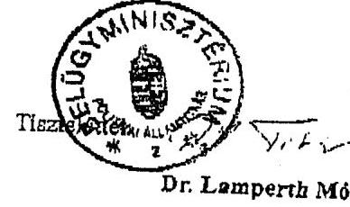

Dr. Lamperth Mónika

---

A MAGYARORSZÁGI REFORMÁTUS EGYHÁZ ZSINATÁNAK ELNÖKSÉGE

1146 Budapest, Abonyi u. 21.
Postacím: 1440 Budapest 70., Pf.: 5.

Telefon: (36 1) 4600712
Telefax: (36 1) 4600751
E-mail: zsinatel@matavnet.hu

Iktatószám: ad 720/2002 Eln.

Állami Számvevőszék
Bihary Zsigmond
Főigazgató Úr részére
1364 Budapest 4.
Pf.: 54.
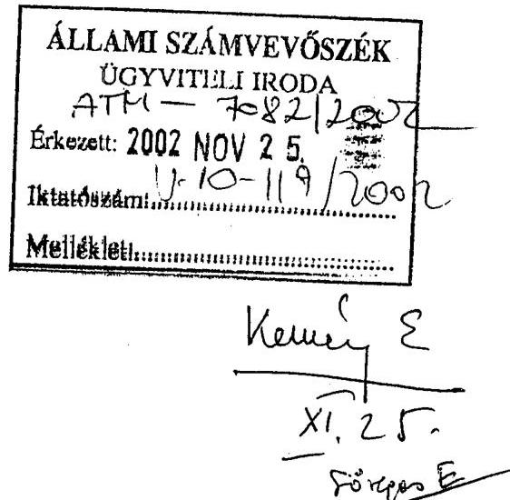

Az állami és egyházi tulajdonban levő kórházak, egyetemi klinikák gazdálkodásának ellenőrzéséről készített jelentés-tervezetet köszönettel megkaptam.

Tekintettel arra, hogy a MRE Bethesda Gyermekkórháza főigazgatója, Dr. Dizseri Tamás főorvos - mint szakmailag illetékes - nem tett észrevételt, a jelentés-tervezetet a Zsinat Elnöksége, mint fenntartó részéről elfogadom.

További eredményes munkát kívánva áldást kérek életükre.

Tisztelettel:

Budapest, 2002. november 22.
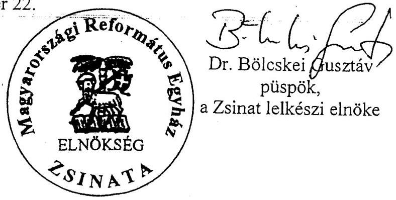

---

Bihary Zsigmond úr részére
Főigazgató
Állami Számvevőszék
1364 Budapest
Pf.: 54.
Fax: 4763829

Tisztelt Főigazgató Úr!
A pénteki napon megkapott tanulmányban lévő adatok megfelelnek a Mazsihisz Szeretetkórházának nyilvántartásában foglaltakkal. Az összefoglalóhoz az idő rövidsége miatt nem kívánok megjegyzést hozzáfűzni.
Tisztelettel:
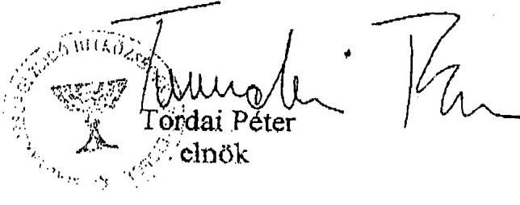

Budapest, 2002. november 25.

---

Állami Számvevőszék
Budapest 4
Pf. 54.
1364

Bihari Zsigmond
főigazgató
$\mathrm{V}-10-113 / 2002$

Tisztelt Főigazgató úr!
Köszönettel vettem a gazdálkodás ellenőrzéséről készített jelentés-tervezetüket. Ezúton közlöm, hogy a jelentéssel kapcsolatban észrevételem nincs.

Hálás köszönettel:
Budapest, 2002. nov. 25.

---

# Budai Irgalmasrendi Kórház Kht. 

Főigazgató főorvos: Prof. Dr. med. Naszlady Attila Acad. Pontif.

H - 1023 Budapest, Frankel Leó út 54. ■ 1277 Budapest, Pf. 98. Telefon/Fax +(36-1)-212-5378

Bihary Zsigmond Főigazgató Úrnak Állami Számvevőszék

Ikt.sz.: 808/2002.
Budapest
Budapest, 2002. december 06.

Tisztelt Főigazgató Úr!

A V-10-113/2002. sz. levelére válaszolva értesítem, hogy a 2002. novemberben megküldött Állami Számvevőszék Jelentésben a Budai Irgalmasrendi Kórházra vonatkozó korábbi levelünkbeli megállapításokkal egyetértünk.

Tisztelettel:
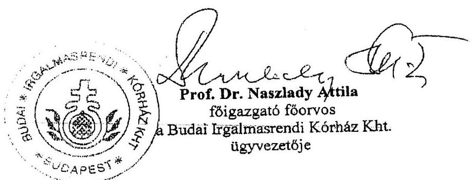

---

## **MÁTRIX az intézmények kijelöléséhez**

|  SZ
Z | Szempont megnevezése | Szempont jelentése | Szempont jelölése | Semmelweis
Egyetem ÁOK | Debreceni
Egyetem Orvos- és
Egészség
tudományi
Centrum | Szegedi
Tudomány
egyetem SZADTE
Centrum | Országos
Onkológiai
Intézet | Országos
Kardiológiai
Intézet | Mátrai Állami
Gyógyintézet | Állami Szív
kórház
Balatonfüred | MÁV Kórház és
Központi
Rendelőintézet,
Budapest | BM Központi
Kórház és
Intézményei | Bethesda Gyermek
kórház,
Budapest  |
| --- | --- | --- | --- | --- | --- | --- | --- | --- | --- | --- | --- | --- | --- |
|  1 | OEP bevételei tekintve az
állami és egyházi kórházak
közül | Az első, második stb.
helyen áll | bevétel 1, bevétel 2, stb. | bevétel 1 | bevétel 2 | bevétel 4 | bevétel 5 | bevétel 8 | bevétel 23 | bevétel 17 | bevétel 6 | bevétel 10 | bevétel 21  |
|  2 | Egy ágyra jutó OEP bevétele
szempontjából az állami és
egyházi kórházak közül | Az első, második stb.
helyen áll | ágy/bevétel 1,
ágy/bevétel 2, stb. | ágy/bevétel 10 | ágy/bevétel 6 | ágy/bevétel 4 | ágy/bevétel 2 | ágy/bevétel 4 | ágy/bevétel 24 | ágy/bevétel 21 | ágy/bevétel 11 | ágy/bevétel 15 | ágy/bevétel 14  |
|  3 | Az aktív ágyok számát
tekintve az állami és
egyházi kórházak közül | Az első, második stb.
helyen áll | A1, A2, stb. | A1 | A2 | A4 | A9 | A12 | nincs | A28 | A5 | A6 | A13  |
|  4 | Közörilag aktív ágya van |  | aktív | - | - | - | aktív | aktív | - | - | - | - | aktív  |
|  5 | Rehabilitációs szakkórház | A krónikus ágyainak
száma az intézet
ágyszámából 90 %
fölött | krónikus | - | - | - | - | - | krónikus | krónikus | - | - | -  |
|  6 | Kincstári biztos kirendelésére
sor került az intézményben |  | KB | KB |  |  |  | KB |  |  |  |  |   |
|   | A lejárt szállítás
tartozásainak száma az
eredeti kiadási előirányzat
%-ában | Egyáltalán nem volt
lejárt tartozása az
elmúlt 3 évben, illetve
1 % alatt | LIKV |  | LIKV | LIKV | LIKV |  |  | LIKV |  |  |   |
|  8 | A lejárt szállítás
tartozásainak száma az
eredeti kiadási előirányzat
%-ában | Megközelíti, vagy
meghaladja az
5 %-ot | TART | TART | - | - | - | TART | TART | - | TART | TART | -  |
|  9 | Intézmény típusa | Egyetem | E | E | E | E | - | - | - | - | - | - | -  |
|   |  | Országos intézet | O | - | - | - | O | O | O | O | - | - | -  |
|   |  | Egyéb állami kórház | Á | - | - | - | - | - | - | - | Á | Á | -  |
|   |  | Egyházi kórház | Eh | - | - | - | - | - | - | - | - | - | Eh  |
|  10 | Az intézmény működött | 1999. január 1-jén | M | M | M | M | M | M | M | M | M | M | M  |
|   |  | 2000. január 1-jén |  | M | M | M | M | M | M | M | M | M | M  |
|   |  | 2001. január 1-jén |  | M | M | M | M | M | M | M | M | M | M  |
|   |  | 2002. január 1-jén |  | M | M | M | M | M | M | M | M | M | M  |

Az 1999-2001. év adatai alapján, Honvédelmi Minisztérium és Igazságügyi Minisztérium intézményei figyelembe vétele nélkül rangsoroltunk.

---

# Adatszolgáltató intézmények pénzforgalmi bevételei

|  Intézmény neve | 1999 | 2000 | 2001 | 2000/1999 | 2001/2000 | 2001/1999  |
| --- | --- | --- | --- | --- | --- | --- |
|  Országos Sportegészségügyi Intézet | 978725 | 1321865 | 1328631 | 135% | 101% | 136%  |
|  Országos Reumatológiai és Fizioterápiás Intézet* | 2617875 | 2340909 | 1613223 | 89% | 69% | 62%  |
|  Országos Baleseti és Sürgősségi Intézet | 2426854 | 2504888 | 2658764 | 103% | 106% | 110%  |
|  Országos Idegsebészeti Tudományos Intézet | 1614429 | 1838134 | 2341470 | 114% | 127% | 145%  |
|  Országos Onkológiai Intézet | 4215222 | 4759353 | 5398412 | 113% | 113% | 128%  |
|  Országos Korányi TBC és Pulmonológiai Intézet | 2273698 | 2469179 | 2689410 | 109% | 109% | 118%  |
|  Országos Orvosi Rehabilitációs Intézet | 929366 | 1061763 | 3257584 | 114% | 307% | 351%  |
|  Svábhegyi Állami Gyermekgyógyintézet | 631946 | 717424 | 699542 | 114% | 98% | 111%  |
|  Mátrai Állami Gyógyintézet | 694026 | 742268 | 818913 | 107% | 110% | 118%  |
|  Országos Pszichiátriai és Neurológiai Intézet | 2475908 | 2743476 | 2773300 | 111% | 101% | 112%  |
|  Állami Szívkórház, Balatonfüred | 895117 | 1103792 | 967641 | 123% | 88% | 108%  |
|  Szent András Állami Reumatológiai és Rehabilitációs Kórház | 1435259 | 1750436 | 1820345 | 122% | 104% | 127%  |
|  Állami Szanatórium, Sopron | 737983 | 813104 | 865139 | 110% | 106% | 117%  |
|  Országos Haematológiai
 és Immunológiai Intézet (Gyógyintézeti Központ) | 1687998 | 1565887 | 2262283 | 93\% | 144\% | 134\%  |
|  Göttingen György Országos Kardiológiai Intézet | 3919466 | 3270332 | 3620272 | 83\% | 111\% | 92\%  |
|  Pécsi Állami Kórház | 165990 | 225602 | 262887 | 136\% | 117\% | 158\%  |
|  Országos Intézetek összesen | 27699862 | 29228412 | 33377816 | 106\% | 114\% | 120\%  |
|  Semmelweis Egyetem | 26488948 | 31460498 | 36681713 | 119\% | 117\% | 138\%  |
|  Debreceni Egyetem Orvos- és Egészségtudományi Centrum | 16784273 | 19175813 | 20395970 | 114\% | 106\% | 122\%  |
|  Szegedi Tudományegyetem SZOTE Centrum | 9382318 | 11786116 | 12039334 | 123\% | 102\% | 126\%  |
|  Pécsi Tudományegyetem | 10914948 | 13093875 | 14988241 | 120\% | 114\% | 137\%  |
|  Egyetemek összesen | 63770487 | 75516302 | 84105258 | 118\% | 111\% | 132\%  |
|  MÁV Kórház és Rendelőintézet, Szolnok | 938246 | 1126468 | 1075553 | 120\% | 95\% | 115\%  |
|  MÁV Kórház és Központi Rendelőintézet, Budapest | 2839176 | 4109098 | 4125790 | 145\% | 100\% | 145\%  |
|  Budai MÁV Kórház | 946448 | 1003801 | 1124697 | 106\% | 112\% | 119\%  |
|  MÁV összesen | 4723870 | 6239367 | 6326040 | 132\% | 101\% | 134\%  |
|  BM Központi Kórház és Intézményei | 2777187 | 3148171 | 3435669 | 113\% | 109\% | 124\%  |
|  BM összesen | 2777187 | 3148171 | 3435669 | 113\% | 109\% | 124\%  |
|  Bethesda Gyermekkórház | 721542 | 852048 | 917792 | 118\% | 108\% | 127\%  |
|  Szeretetekórház | 412795 | 430200 | 535284 | 109\% | 119\% | 130\%  |
|  Budapesti Szent Ferenc Kórház | 174252 | 193951 | 213846 | 111\% | 110\% | 123\%  |
|  Budai Irgalmasrendi Kórház Kht. | 0 | 840072 | 2308298 | 0\% | 275\% | 0\%  |
|  Egyházi intézmények összesen | 1308589 | 2336271 | 3975220 | 179\% | 170\% | 304\%  |
|  MINDÖSSZESEN | 100279995 | 116468523 | 131220003 | 116\% | 113\% | 131\%  |

*Az Országos Reumatológiai és Fizioterápiás Intézet 2000. II. félévétől szétvált. (Az 1999. és 2001. közötti csökkenés ezzel függ össze.) Az összehasonlíthatóság érdekében 1999-ben a SOTE adatait a HIETE adataival kiegészítettük, a 2000. évi integráció után a Testnevelési és Sporttudományi Kart nem vettük figyelembe. A Központi MÁV Kórházban 2000-ben integrálódott a szakrendelői intézet, a növekedés ennek tulajdonítható. A Kórház 2000. július 1-től működik, ezért 2000-ben féléves adatokat szolgáltatott. A 2001/2000-es arány magas értéke ebből adódik.

A táblázat az intézmények vezetői által hitelesített adatszolgáltatás alapján készült.

---

# Gyógyító, megelőző ellátások támogatására OEP által kiutalt összegek

|  Intézmény neve | 1999. | 2000. | 2001. | 2000/1999 | 2001/2000 | 2001/1999  |
| --- | --- | --- | --- | --- | --- | --- |
|  Országos Sportegészségügyi Intézet | 528922 | 595370 | 616711 | 113\% | 104\% | 117\%  |
|  Országos Reumatológiai és Fizioterápiás Intézet | 2354446 | 1890781 | 1154375 | 80\% | 61\% | 49\%  |
|  Országos Baleseti és Sürgősségi Intézet | 1836435 | 1905086 | 2027313 | 104\% | 106\% | 110\%  |
|  Országos Idegsebészeti Tudományos Intézet | 1309190 | 1528482 | 1773975 | 117\% | 116\% | 136\%  |
|  Országos Onkológiai Intézet | 3133132 | 3297392 | 4037295 | 105\% | 122\% | 129\%  |
|  Országos Korányi TBC és Pulmonológiai Intézet | 1732500 | 1849386 | 1830830 | 107\% | 99\% | 106\%  |
|  Országos Orvosi Rehabilitációs Intézet | 784280 | 839986 | 906865 | 107\% | 108\% | 116\%  |
|  Svábhegyi Állami Gyermekgyógyintézet | 586694 | 629782 | 626957 | 107\% | 100\% | 107\%  |
|  Mátrai Állami Gyógyintézet | 545887 | 573958 | 632363 | 105\% | 110\% | 116\%  |
|  Országos Pszichiátriai és Neurológiai Intézet | 2022493 | 2308969 | 2374330 | 114\% | 103\% | 117\%  |
|  Állami Szívkórház, Balatonfüred | 715099 | 867503 | 806531 | 121\% | 93\% | 113\%  |
|  Szent András Állami Reumatológiai és Rehabilitációs Kórház | 411462 | 475486 | 489093 | 116\% | 103\% | 119\%  |
|  Állami Szanatórium, Sopron | 580725 | 648451 | 685426 | 112\% | 106\% | 118\%  |
|  Országos Haematológiai és Immunológiai Intézet (Gyógyintézeti Központ) | 1260017 | 1210038 | 1607974 | 96\% | 133\% | 128\%  |
|  Göttingen György Országos Kardiológiai Intézet | 2386562 | 2265099 | 3013653 | 95\% | 133\% | 126\%  |
|  fürdői Állami Kórház | 110563 | 149565 | 180447 | 135\% | 121\% | 163\%  |
|  Országos Intézetek összesen | 20298407 | 21035334 | 22764138 | 104\% | 108\% | 112\%  |
|  Semmelweis Egyetem ÁOK | 11493014 | 12834120 | 14316656 | 112\% | 112\% | 125\%  |
|  Semmelweis Egyetem ETR | 2760742 | 2933524 | 3539158 | 106\% | 121\% | 128\%  |
|  Debreceni Egyetem Orvos- és Egészségtudományi Centrum | 9987264 | 11236426 | 12595195 | 113\% | 112\% | 126\%  |
|  Szegedi Tudományegyetem SZOTE Centrum | 5990158 | 6689194 | 7587899 | 112\% | 113\% | 127\%  |
|  Pécsi Tudományegyetem | 6557897 | 7897970 | 9029349 | 120\% | 114\% | 138\%  |
|  Egyetemek összesen | 36789075 | 41591234 | 47068257 | 113\% | 113\% | 128\%  |
|  MÁV Kórház és Rendelőintézet, Szolnok | 928167 | 1028433 | 974999 | 111\% | 95\% | 105\%  |
|  MÁV Kórház és Központi Rendelőintézet, Budapest | 2470126 | 3252147 | 3497533 | 132\% | 108\% | 142\%  |
|  Budai MÁV Kórház | 874587 | 914021 | 999326 | 105\% | 109\% | 114\%  |
|  MÁV összesen | 4272880 | 5194601 | 5471858 | 122\% | 105\% | 128\%  |
|  BM Központi Kórház és Intézményei | 1711647 | 1838301 | 1848046 | 107\% | 101\% | 108\%  |
|  BM összesen | 1711647 | 1838301 | 1848046 | 107\% | 101\% | 108\%  |
|  Bethesda Gyermekkórház | 537499 | 617960 | 665043 | 115\% | 108\% | 124\%  |
|  Szeretetkórház | 312173 | 377684 | 399584 | 121\% | 106\% | 128\%  |
|  Budapesti Szent Ferenc Kórház | 170138 | 185965 | 196594 | 109\% | 106\% | 116\%  |
|  Budai Irgalmasrendi Kórház Kht. | 0 | 611922 | 1718149 | 0\% | 281\% | 0\%  |
|  Egyházi intézmények összesen | 1019810 | 1793531 | 2979370 | 176\% | 166\% | 292\%  |
|  MINDÖSSZESEN | 64091819 | 71453001 | 80131669 | 111\% | 112\% | 125\%  |

(ORP adatai szerint)  1999-ben SOTE  1999-ben HIETE  a Kórház 2000. július 1-től működik, ezért 2000-ben féléves adatokat szolgáltatott. A 2001/2000-es arány magas értéke ebből adódik.

---

# Az adatszolgáltató intézmények szerződött ágyszámai

|  Intézmény neve | 1999 |  |  | 2000 |  |  | 2001 |  |   |
| --- | --- | --- | --- | --- | --- | --- | --- | --- | --- |
|   | Aktív | Krónikus | Összesen | Aktív | Krónikus | Összesen | Aktív | Krónikus | Összesen  |
|  Országos Sportegészségügyi Intézet | 110 | 40 | 150 | 110 | 40 | 150 | 110 | 40 | 150  |
|  Országos Reumatológiai és Fizioterápiás Intézet | 780 | 168 | 948 | 286 | 100 | 386 | 286 | 100 | 386  |
|  Országos Baleseti és Sürgősségi Intézet | 363 | 0 | 363 | 363 | 0 | 363 | 366 | 0 | 366  |
|  Országos Idegsebészeti Tudományos Intézet | 156 | 0 | 156 | 156 | 0 | 156 | 156 | 0 | 156  |
|  Országos Onkológiai Intézet | 348 | 0 | 348 | 348 | 0 | 348 | 348 | 0 | 348  |
|  Országos Korányi TBC és Pulmonológiai Intézet | 605 | 74 | 679 | 605 | 74 | 679 | 605 | 74 | 679  |
|  Országos Orvosi Rehabilitációs Intézet | 55 | 285 | 340 | 55 | 285 | 340 | 55 | 285 | 340  |
|  Svábhegyi Állami Gyermekgyógyintézet | 300 | 0 | 300 | 300 | 0 | 300 | 300 | 0 | 300  |
|  Mátrai Állami Gyógyintézet | 160 | 180 | 340 | 160 | 180 | 340 | 160 | 180 | 340  |
|  Országos Pszichiátriai és Neurológiai Intézet | 345 | 603 | 948 | 345 | 603 | 948 | 345 | 603 | 948  |
|  Állami Szívkórház, Balatonfüred | 36 | 393 | 429 | 36 | 393 | 429 | 36 | 393 | 429  |
|  Szent András Állami Reumatológiai és Rehabilitációs Kórház | 54 | 185 | 239 | 54 | 185 | 239 | 54 | 185 | 239  |
|  Állami Szanatórium, Sopron | 10 | 418 | 428 | 10 | 418 | 428 | 10 | 418 | 428  |
|  Országos Haematológiai és Immunológiai

 Intézet (Gyógyintézeti Központ) | 82 | 0 | 82 | 82 | 0 | 82 | 82 | 0 | 82  |
|  Gottsegen György Országos Kardiológiai Intézet | 247 | 0 | 247 | 247 | 0 | 247 | 275 | 0 | 275  |
|  Pszichiátriai Állami Kórház | 0 | 100 | 100 | 1 | 100 | 100 | 1 | 100 | 100  |
|  Országos Intézetek összesen | 3651 | 2446 | 6097 | 3157 | 2378 | 5535 | 3188 | 2378 | 5566  |
|  Semmelweis Egyetem ÁOK * | 2809 | 140 | 2949 | 2809 | 140 | 2949 | 2644 | 125 | 2769  |
|  Semmelweis Egyetem ÉTK ** | 572 | 0 | 572 | 572 | 0 | 572 | 527 | 0 | 527  |
|  Debreceni Egyetem Orvos- és Egészségtudományi Centrum | 1853 | 88 | 1941 | 1847 | 94 | 1941 | 1855 | 89 | 1944  |
|  Szegedi Tudományegyetem SZÁOTE Centrum | 1177 | 86 | 1263 | 1177 | 86 | 1263 | 1115 | 92 | 1207  |
|  Pécsi Tudományegyetem | 1226 | 40 | 1266 | 1251 | 15 | 1266 | 1212 | 0 | 1212  |
|  Egyetemek összesen | 7637 | 354 | 7991 | 7656 | 335 | 7991 | 7353 | 306 | 7659  |
|  MÁV Kórház és Rendelőintézet, Szolnok | 310 | 0 | 310 | 310 | 0 | 310 | 290 | 0 | 290  |
|  MÁV Kórház és Központi Rendelőintézet, Budapest | 629 | 150 | 779 | 629 | 150 | 779 | 611 | 150 | 761  |
|  Budai MÁV Kórház | 282 | 52 | 334 | 282 | 52 | 334 | 272 | 52 | 324  |
|  MÁV összesen | 1221 | 202 | 1423 | 1221 | 202 | 1423 | 1173 | 202 | 1375  |
|  BM Központi Kórház és Intézményei | 470 | 155 | 625 | 470 | 155 | 625 | 450 | 155 | 605  |
|  BM összesen | 470 | 155 | 625 | 470 | 155 | 625 | 450 | 155 | 605  |
|  Bethesda Gyermekkórház | 197 | 0 | 197 | 197 | 0 | 197 | 171 | 0 | 171  |
|  Szeretetkórház | 40 | 280 | 320 | 40 | 280 | 320 | 40 | 280 | 320  |
|  Budapesti Szent Ferenc Kórház | 105 | 0 | 105 | 105 | 0 | 105 | 85 | 20 | 105  |
|  Budai Irgalmazsosok Kórház Kht. *** | 0 | 0 | 0 | 420 | 50 | 470 | 478 | 48 | 528  |
|  Egyházi intézmények összesen | 342 | 280 | 622 | 762 | 330 | 1092 | 774 | 348 | 1122  |
|  MINDÖSSZESEN | 13321 | 3437 | 16758 | 13266 | 3400 | 16666 | 12938 | 3389 | 16327  |

- 1999-ben SOTE ** 1999-ben HIETE *** a Kórház 2000. július 1-től működik.

---

# Elbocsátott betegek száma

(fö)

|  Intézmény neve | 1999. | 2000. | 2001. | 2000/1999 | 2001/2000 | 2001/1999  |
| --- | --- | --- | --- | --- | --- | --- |
|  Egyetemek | 280291 | 298089 | 312450 | $106 \%$ | $105 \%$ | $111 \%$  |
|  Országos Intézetek | 124108 | 121972 | 120050 | $98 \%$ | $98 \%$ | $97 \%$  |
|  Szakkórházak | 39244 | 36637 | 39870 | $93 \%$ | $109 \%$ | $102 \%$  |
|  Gyermekkórházak | 57240 | 58208 | 57341 | $102 \%$ | $99 \%$ | $100 \%$  |
|  Megyei Intézetek | 740716 | 761075 | 780082 | $103 \%$ | $102 \%$ | $105 \%$  |
|  Fővárosi Intézetek | 298117 | 307363 | 310302 | $103 \%$ | $101 \%$ | $104 \%$  |
|  MÁV, HM, BM, Egyéb Intézetek | 122808 | 129217 | 133329 | $105 \%$ | $103 \%$ | $109 \%$  |
|  Városi Intézetek | 755672 | 781143 | 793443 | $103 \%$ | $102 \%$ | $105 \%$  |
|  Országos összesen | 2418196 | 2493704 | 2546867 | $103 \%$ | $102 \%$ | $105 \%$  |

GYÓGYINFOK adatai szerint.

---

# Finanszírozott esetszám

|  Intézmény neve | 1999. | 2000. | 2001. | 2000/1999 | 2001/2000 | 2001/1999  |
| --- | --- | --- | --- | --- | --- | --- |
|  Egyetemek | 277755 | 294349 | 308164 | $106 \%$ | $105 \%$ | $111 \%$  |
|  Országos Intézetek | 105748 | 103672 | 102201 | $98 \%$ | $99 \%$ | $97 \%$  |
|  Szakkórházak | 32471 | 31328 | 33256 | $96 \%$ | $106 \%$ | $102 \%$  |
|  Gyermekkórházak | 57202 | 58170 | 57326 | $102 \%$ | $99 \%$ | $100 \%$  |
|  Megyei Intézetek | 696166 | 717490 | 732117 | $103 \%$ | $102 \%$ | $105 \%$  |
|  Fővárosi Intézetek | 270960 | 281105 | 283717 | $104 \%$ | $101 \%$ | $105 \%$  |
|  MÁV, HM, BM, Egyéb Intézetek | 105210 | 110618 | 113917 | $105 \%$ | $103 \%$ | $108 \%$  |
|  Városi Intézetek | 690896 | 715599 | 726757 | $104 \%$ | $102 \%$ | $105 \%$  |
|  Országos összesen | 2236408 | 2312331 | 2357455 | $103 \%$ | $102 \%$ | $105 \%$  |

---

# Az adatszolgáltató intézményekből elbocsátott betegek száma

|  Intézmény neve | 1999. | 2000. | 2001. | 2000/1999 | 2001/2000 | 2001/1999  |
| --- | --- | --- | --- | --- | --- | --- |
|  Országos Sportegészségügyi Intézet | 5594 | 5905 | 6063 | 106\% | 103\% | 108\%  |
|  Országos Reumatológiai és Fizioterápiás Intézet | 23025 | 15981 | 8767 | 69\% | 55\% | 38\%  |
|  Országos Baleseti és Sürgősségi Intézet | 10299 | 10450 | 11319 | 101\% | 108\% | 110\%  |
|  Országos Idegsebészeti Tudományos Intézet | 2958 | 2845 | 2932 | 96\% | 103\% | 99\%  |
|  Országos Onkológiai Intézet | 19774 | 24076 | 28104 | 122\% | 117\% | 142\%  |
|  Országos Korányi TBC és Pulmonológiai Intézet | 14135 | 14297 | 14230 | 101\% | 100\% | 101\%  |
|  Országos Orvosi Rehabilitációs Intézet | 4064 | 4007 | 4293 | 99\% | 107\% | 106\%  |
|  Svábhegyi Állami Gyermekgyógyintézet | 6771 | 6551 | 6733 | 97\% | 103\% | 99\%  |
|  Mátrai Állami Gyógyintézet | 5989 | 6359 | 6502 | 106\% | 102\% | 109\%  |
|  Országos Pszichiátriai és Neurológiai Intézet | 12630 | 12771 | 13090 | 101\% | 102\% | 104\%  |
|  Állami Szívkórház, Balatonfüred | 8068 | 8681 | 8420 | 108\% | 97\% | 104\%  |
|  Szent András Állami Reumatológiai és Rehabilitációs Kórház | 4444 | 4368 | 4332 | 98\% | 99\% | 97\%  |
|  Állami Szanatórium, Sopron | 7143 | 7489 | 7446 | 105\% | 99\% | 104\%  |
|  Országos Haematológiai és Immunológiai Intézet (Gyógyintézeti Központ) | 1642 | 1380 | 1365 | 84\% | 99\% | 83\%  |
|  Gottsegen György Országos Kardiológiai Intézet | 5919 | 6287 | 6900 | 106\% | 110\% | 117\%  |
|  Parádfürdői Állami Kórház | 1374 | 1560 | 1702 | 114\% | 109\% | 124\%  |
|  Semmelweis Egyetem ÁOK * | 96618 | 99879 | 103042 | 103\% | 103\% | 107\%  |
|  Semmelweis Egyetem ETK ** | 19571 | 21403 | 21365 | 109\% | 100\% | 109\%  |
|  Debreceni Egyetem Orvos- és Egészségtudományi Centrum | 68059 | 72455 | 80345 | 106\% | 111\% | 118\%  |
|  Szegedi Tudományegyetem SZAOTE Centrum | 44778 | 47703 | 50547 | 107\% | 106\% | 113\%  |
|  Pécsi Tudományegyetem | 51263 | 56647 | 57148 | 111\% | 101\% | 111\%  |
|  MÁV Kórház és Rendelőintézet, Szolnok | 11567 | 11682 | 10200 | 101\% | 87\% | 88\%  |
|  MÁV Kórház és Központi Rendelőintézet, Budapest | 27376 | 27903 | 28080 | 102\% | 101\% | 103\%  |
|  Budai MÁV Kórház | 7751 | 8103 | 8310 | 105\% | 103\% | 107\%  |
|  BM Központi Kórház és Intézményei | 17923 | 18554 | 17993 | 104\% | 97\% | 100\%  |
|  Bethesda Gyermekkórház | 7781 | 7731 | 7313 | 99\% | 95\% | 94\%  |
|  Szeretetkórház | 2066 | 1678 | 2044 | 81\% | 122\% | 99\%  |
|  Budapesti Szent Ferenc Kórház | 2143 | 2075 | 2016 | 97\% | 97\% | 94\%  |
|  Budai Irgalmasrendi Kórház Kht. *** | 0 | 6238 | 14131 | 0\% | 227\% | 0\%  |
|  Mindösszesen | 490725 | 515058 | 534732 | 105\% | 104\% | 109\%  |

GYÓGYINFOK adatai szerint.

- 1999-ben SOTE ** 1999-ben HIETE *** a Kórház 2000. július 1-től működik, ezért
 2000-ben féléves adatokat szolgáltatott. A 2001/2000-es arány magas értéke ebből adódik.

---

# Adatszolgáltató intézmények finanszírozott esetszámai

|  Intézmény neve | 1999. | 2000. | 2001. | 2000/1999 | 2001/2000 | 2001/1999  |
| --- | --- | --- | --- | --- | --- | --- |
|  Országos Sportegészségügyi Intézet | 4620 | 4896 | 5010 | 106\% | 102\% | 108\%  |
|  Országos Reumatológiai és Fizioterápiás Intézet | 20439 | 13893 | 7145 | 68\% | 51\% | 35\%  |
|  Országos Baleseti és Sürgősségi Intézet | 10299 | 10450 | 11319 | 101\% | 108\% | 110\%  |
|  Országos Idegsebészeti Tudományos Intézet | 2958 | 2845 | 2932 | 96\% | 103\% | 99\%  |
|  Országos Onkológiai Intézet | 19774 | 24076 | 28104 | 122\% | 117\% | 142\%  |
|  Országos Korányi TBC és Pulmonológiai Intézet | 13785 | 14010 | 13954 | 102\% | 100\% | 101\%  |
|  Országos Orvosi Rehabilitációs Intézet | 943 | 931 | 978 | 99\% | 105\% | 104\%  |
|  Svábhegyi Állami Gyermekgyógyintézet | 6771 | 6551 | 6733 | 97\% | 103\% | 99\%  |
|  Mátrai Állami Gyógyintézet | 3270 | 3620 | 3747 | 111\% | 104\% | 115\%  |
|  Országos Pszichiátriai és Neurológiai Intézet | 7326 | 7425 | 7784 | 101\% | 105\% | 106\%  |
|  Állami Szívkórház, Balatonfüred | 1164 | 1256 | 1189 | 108\% | 95\% | 102\%  |
|  Szent András Állami Reumatológiai és Rehabilitációs Kórház | 1417 | 1334 | 1317 | 94\% | 99\% | 93\%  |
|  Állami Szanatórium, Sopron | 156 | 237 | 294 | 152\% | 124\% | 188\%  |
|  Országos Haematológiai és Immunológiai Intézet (Gyógyintézeti Központ) | 1642 | 1380 | 1365 | 84\% | 99\% | 83\%  |
|  Gottsegen György Országos Kardiológiai Intézet | 5919 | 6287 | 6900 | 106\% | 110\% | 117\%  |
|  Parádfürdői Állami Kórház | 0 | 0 | 0 | 0\% | 0\% | 0\%  |
|  Semmelweis Egyetem ÁOK * | 95679 | 98666 | 101468 | 103\% | 103\% | 106\%  |
|  Semmelweis Egyetem ETK ** | 19571 | 21403 | 21366 | 109\% | 100\% | 109\%  |
|  Debreceni Egyetem Orvos- és Egészségtudományi Centrum | 67213 | 71236 | 79027 | 106\% | 111\% | 118\%  |
|  Szegedi Tudományegyetem SZÁOTE Centrum | 44247 | 46671 | 49169 | 105\% | 105\% | 111\%  |
|  Pécsi Tudományegyetem | 51045 | 56374 | 57134 | 110\% | 101\% | 112\%  |
|  MÁV Kórház és Rendelőintézet, Szolnok | 11567 | 11682 | 10200 | 101\% | 87\% | 88\%  |
|  MÁV Kórház és Központi Rendelőintézet, Budapest | 25091 | 26176 | 26662 | 104\% | 102\% | 106\%  |
|  Budai MÁV Kórház | 6882 | 7103 | 7235 | 103\% | 102\% | 105\%  |
|  BM Központi Kórház és Intézményei | 15386 | 16041 | 15560 | 104\% | 97\% | 101\%  |
|  Bethesda Gyermekkórház | 7781 | 7731 | 7314 | 99\% | 95\% | 94\%  |
|  Szeretetkórház | 934 | 669 | 842 | 72\% | 126\% | 90\%  |
|  Budapesti Szent Ferenc Kórház | 2143 | 2075 | 1887 | 97\% | 91\% | 88\%  |
|  Budai Irgalmasrendi Kórház Kht. *** | 0 | 5838 | 13257 | 0\% | 227\% | 0\%  |
|  Mindösszesen | 448022 | 470856 | 489892 | 105\% | 104\% | 109\%  |

Hosszú ápolási esetek nélkül (GYÓGYINFOK adatai szerint).

- 1999-ben SOTE ** 1999-ben HIETE *** a Kórház 2000. július 1-től működik, ezért 2000-ben féléves adatokat szolgáltatott. A 2001/2000-es arány magas értéke ebből adódik.

---

# Az adatszolgáltató intézmények szerződött és működő ágyszámai

|  Intézmény neve | 1999 |  |  | 2000 |  |  | 2001 |  |   |
| --- | --- | --- | --- | --- | --- | --- | --- | --- | --- |
|   | Szerződött | Működő | Eltérés | Szerződött | Működő | Eltérés | Szerződött | Működő | Eltérés  |
|  Országos Sportegészségügyi Intézet | 150 | 150 | 0 | 150 | 150 | 0 | 150 | 150 | 0  |
|  Országos Reumatológiai és Fizioterápiás Intézet | 948 | 948 | 0 | 386 | 667 | $-281$ | 386 | 390 | $-4$  |
|  Országos Baleseti és Sürgősségi Intézet | 363 | 348 | 15 | 363 | 348 | 15 | 366 | 339 | 27  |
|  Országos Idegsebészeti Tudományos Intézet | 156 | 136 | 20 | 156 | 136 | 20 | 156 | 136 | 20  |
|  Országos Onkológiai Intézet | 348 | 348 | 0 | 348 | 348 | 0 | 348 | 348 | 0  |
|  Országos Korányi TBC és Pulmonológiai Intézet | 679 | 679 | 0 | 679 | 679 | 0 | 679 | 679 | 0  |
|  Országos Orvosi Rehabilitációs Intézet | 340 | 322 | 18 | 340 | 327 | 13 | 340 | 340 | 0  |
|  Svábhegyi Állami Gyermekgyógyintézet | 300 | 300 | 0 | 300 | 300 | 0 | 300 | 300 | 0  |
|  Mátrai Állami Gyógyintézet | 340 | 340 | 0 | 340 | 340 | 0 | 340 | 340 | 0  |
|  Országos Pszichiátriai és Neurológiai Intézet | 948 | 948 | 0 | 948 | 948 | 0 | 948 | 948 | 0  |
|  Állami Szívkórház, Balatonfüred | 429 | 429 | 0 | 429 | 429 | 0 | 429 | 429 | 0  |
|  Szent András Állami Reumatológiai és Rehabilitációs Kórház | 239 | 348 | $-109$ | 239 | 348 | $-109$ | 239 | 349 | $-110$  |
|  Állami Szanatórium, Sopron | 428 | 428 | 0 | 428 | 428 | 0 | 428 | 428 | 0  |
|  Országos Haematológiai és Immunológiai Intézet (Gyógyintézeti Központ) | 82 | 82 | 0 | 82 | 82 | 0 | 82 | 82 | 0  |
|  Gottsegen György Országos Kardiológiai Intézet | 247 | 247 | 0 | 247 | 247 | 0 | 275 | 275 | 0  |
|  Parádfürdői Állami Kórház | 100 | 90 | 10 | 100 | 100 | 0 | 100 | 100 | 0  |
|  Országos Intézetek összesen | 6097 | 6143 | $-46$ | 5535 | 5877 | $-342$ | 5566 | 5633 | $-67$  |
|  Semmelweis Egyetem ÁOK ** | 2949 | 2890 | 59 | 2949 | 2842 | 107 | 2769 | 2687 | 82  |
|  Semmelweis Egyetem ETK ** | 572 | 572 | 0 | 572 | 572 | 0 | 527 | 527 | 0  |
|  Debreceni Egyetem Orvos- és Egészségtudományi Centrum | 1941 | 1941 | 0 | 1941 | 1941 | 0 | 1944 | 1944 | 0  |
|  Szegedi Tudományegyetem SZÁOTE Centrum | 1263 | 1263 | 0 | 1263 | 1263 | 0 | 1207 | 1263 | $-96$  |
|  Pécsi Tudományegyetem | 1266 | 1231 | 33 | 1266 | 1255 | 11 | 1212 | 1220 | $-8$  |
|  Egyetemek összesen | 7991 | 7897 | 94 | 7991 | 7873 | 118 | 7659 | 7641 | 18  |
|  MÁV Kórház és Rendelőintézet, Szolnok | 310 | 310 | 0 | 310 | 310 | 0 | 290 | 290 | 0  |
|  MÁV Kórház és Központi Rendelőintézet, Budapest | 779 | 903 | $-124$ | 779 | 897 | $-118$ | 761 | 858 | $-97$  |
|  Budai MÁV Kórház | 334 | 334 | 0 | 334 | 334 | 0 | 324 | 324 | 0  |
|  MÁV összesen | 1423 | 1547 | $-124$ | 1423 | 1541 | $-118$ | 1375 | 1472 | $-97$  |
|  BM Központi Kórház és Intézményei | 625 | 604 | 21 | 625 | 622 | 3 | 605 | 601 | 4  |
|  BM összesen | 625 | 604 | 21 | 625 | 622 | 3 | 605 | 601 | 4  |
|  Bethesda Gyermekkórház | 197 | 190 | 7 | 197 | 190 | 7 | 171 | 171 | 0  |
|  Szeretetkórház | 320 | 320 | 0 | 320 | 320 | 0 | 320 | 320 | 0  |
|  Budapesti Szent Ferenc Kórház | 105 | 105 | 0 | 105 | 105 | 0 | 105 | 105 | 0  |
|  Budai Irgalmasrendi Kórház Kht. *** | 0 | 0 | 0 | 470 | 526 | $-56$ | 526 | 526 | 0  |
|  Egyházi intézmények összesen | 622 | 615 | 7 | 1092 | 1141 | $-49$ | 1122 | 1122 | 0  |
|  MINDÖSSZESEN | 16758 | 16806 | $-48$ | 16666 | 17054 | $-388$ | 16327 | 16469 | $-142$  |

- 1999-ben SOTE ** 1999-ben HIETE *** a Kórház 2000. július 1-től működik. A

 táblázat az intézmények vezetői által hitelesített adatszolgáltatás alapján készült.

---

# Egy működő ágyra jutó elbocsátott esetek száma az adatszolgáltatók körében

|  Intézmény neve | 1999 | 2000 | 2001 | 2000/1999 | 2001/2000 | 2001/1999  |
| --- | --- | --- | --- | --- | --- | --- |
|  Országos Sportegészségügyi Intézet | 37 | 39 | 40 | 105\% | 103\% | 108\%  |
|  Országos Reumatológiai és Fizioterápiás Intézet | 24 | 24 | 22 | 100\% | 92\% | 92\%  |
|  Országos Baleseti és Sürgősségi Intézet | 30 | 30 | 33 | 100\% | 110\% | 110\%  |
|  Országos Idegsebészeti Tudományos Intézet | 22 | 21 | 22 | 95\% | 105\% | 100\%  |
|  Országos Onkológiai Intézet | 57 | 69 | 81 | 121\% | 117\% | 142\%  |
|  Országos Korányi TBC és Pulmonológiai Intézet | 21 | 21 | 21 | 100\% | 100\% | 100\%  |
|  Országos Orvosi Rehabilitációs Intézet | 13 | 12 | 13 | 92\% | 108\% | 100\%  |
|  Svábhegyi Állami Gyermekgyógyintézet | 23 | 22 | 22 | 96\% | 100\% | 96\%  |
|  Mátrai Állami Gyógyintézet | 18 | 19 | 19 | 106\% | 100\% | 106\%  |
|  Országos Pszichiátriai és Neurológiai Intézet | 13 | 13 | 14 | 100\% | 108\% | 108\%  |
|  Állami Szívkórház, Balatonfüred | 19 | 20 | 20 | 105\% | 100\% | 105\%  |
|  Szent András Állami Reumatológiai és Rehabilitációs Kórház | 13 | 13 | 12 | 100\% | 92\% | 92\%  |
|  Állami Szanatórium, Sopron | 17 | 17 | 17 | 100\% | 100\% | 100\%  |
|  Országos Haematológiai és Immunológiai Intézet (Gyógyintézeti Központ) | 20 | 17 | 17 | 85\% | 100\% | 85\%  |
|  Gottsegen György Országos Kardiológiai Intézet | 24 | 25 | 25 | 104\% | 100\% | 104\%  |
|  Parádfürdői Állami Kórház | 15 | 16 | 17 | 107\% | 106\% | 113\%  |
|  Semmelweis Egyetem Budapest | 33 | 35 | 38 | 106\% | 109\% | 115\%  |
|  Debreceni Egyetem Orvos- és Egészségtudományi Centrum | 35 | 37 | 41 | 106\% | 111\% | 117\%  |
|  Szegedi Tudományegyetem SZÁOTE Centrum | 35 | 38 | 42 | 109\% | 111\% | 120\%  |
|  Pécsi Tudományegyetem | 42 | 45 | 47 | 107\% | 104\% | 112\%  |
|  MÁV Kórház és Rendelőintézet, Szolnok | 37 | 38 | 35 | 103\% | 92\% | 95\%  |
|  MÁV Kórház és Központi Rendelőintézet, Budapest | 30 | 31 | 33 | 103\% | 106\% | 110\%  |
|  Budai MÁV Kórház | 23 | 24 | 24 | 104\% | 100\% | 104\%  |
|  BM Központi Kórház és Intézményei | 30 | 30 | 30 | 100\% | 100\% | 100\%  |
|  Bethesda Gyermekkórház | 41 | 41 | 43 | 100\% | 105\% | 105\%  |
|  Szeretetkórház | 6 | 5 | 6 | 83\% | 120\% | 100\%  |
|  Budapesti Szent Ferenc Kórház | 20 | 20 | 19 | 100\% | 95\% | 95\%  |
|  Budai Irgalmasrendi Kórház Kht. * | 0 | 23 | 27 | 0\% | 117\% | 0\%  |

- a Kórház 2000. július 1-től működik.

---

# Aktív ágykihasználtság változás

|  Intézmény neve | 1999. | 2000. | 2001. | 2000-1999 | 2001-2000 | 2001-1999  |
| --- | --- | --- | --- | --- | --- | --- |
|  Egyetemek | 79,38 | 80,03 | 82,53 | 0,65 | 2,50 | 3,15  |
|  Országos Intézetek | 83,04 | 81,82 | 81,85 | $-1,22$ | 0,03 | $-1,19$  |
|  Szakkórházak | 83,43 | 78,48 | 82,68 | $-4,95$ | 4,20 | $-0,75$  |
|  Gyermekkórházak | 65,92 | 64,90 | 68,86 | $-1,02$ | 3,96 | 2,94  |
|  Megyei Intézetek | 77,69 | 77,35 | 80,98 | $-0,34$ | 3,63 | 3,29  |
|  Fővárosi Intézetek | 76,25 | 78,20 | 83,47 | 1,95 | 5,27 | 7,22  |
|  MÁV, HM, BM, Egyéb Intézetek | 75,34 | 74,62 | 76,72 | $-0,72$ | 2,10 | 1,38  |
|  Városi Intézetek | 74,91 | 74,60 | 78,66 | $-0,31$ | 4,06 | 3,75  |
|  Országos összesen | 76,89 | 76,74 | 80,30 | $-0,15$ | 3,56 | 3,41  |

GYÓGYINFOK adatai szerint.

---

# Az aktív ágykihasználtság alakulása

|  Intézmény neve | 1999. | 2000. | 2001. | 2000-1999 | 2001-2000 | 2001-1999  |
| --- | --- | --- | --- | --- | --- | --- |
|  Országos Sportegészségügyi Intézet | 75,78 | 70,07 | 73,17 | $-5,71$ | 3,10 | $-2,61$  |
|  Országos Reumatológiai és Fizioterápiás Intézet | 89,01 | 89,66 | 94,46 | 0,65 | 4,80 | 5,45  |
|  Országos Baleseti és Sürgősségi Intézet | 71,05 | 71,94 | 70,88 | 0,89 | $-1,06$ | $-0,17$  |
|  Országos Idegsebészeti Tudományos Intézet | 65,93 | 65,43 | 54,97 | $-0,50$ | $-10,46$ | $-10,96$  |
|  Országos Onkológiai Intézet | 84,04 | 86,04 | 82,76 | 2,00 | $-3,28$ | $-1,28$  |
|  Országos Korányi TBC és Pulmonológiai Intézet | 81,08 | 76,93 | 76,02 | $-4,15$ | $-0,91$ | $-5,06$  |
|  Országos Orvosi Rehabilitációs Intézet | 83,22 | 85,90 | 90,28 | 2,68 | 4,38 | 7,06  |
|  Svábhegyi Állami Gyermekgyógyintézet | 81,37 | 73,20 | 64,78 | $-8,17$ | $-8,42$ | $-16,59$  |
|  Mátrai Állami Gyógyintézet | 70,82 | 74,75 | 70,84 | 3,93 | $-3,91$ | 0,02  |
|  Országos Pszichiátriai és Neurológiai Intézet | 89,02 | 80,88 | 82,56 | $-8,14$ | 1,68 | $-6,46$  |
|  Állami Szívkórház, Balatonfüred | 69,61 | 81,53 | 71,83 | 11,92 | $-9,70$ | 2,22  |
|  Szent András Állami Reumatológiai és Rehabilitációs Kórház | 89,84 | 89,21 | 90,06 | $-0,63$ | 0,85 | 0,22  |
|  Állami Szanatórium, Sopron | 40,55 | 61,91 | 74,49 | 21,36 | 12,58 | 33,94  |
|  Országos Haematológiai és Immunológiai Intézet (Gyógyintézeti Központ) | 81,11 | 72,19 | 67,22 | $-8,92$ | $-4,97$ | $-13,89$  |
|  Gottsegen György Országos Kardiológiai Intézet | 72,13 | 75,25 | 71,95 | 3,12 | $-3,30$ | $-0,18$  |
|  Parádfürdői Állami Kórház | 0,00 | 0,00 | 0,00 | - | - | -  |
|  Semmelweis Egyetem Budapest | 80,11 | 76,81 | 80,79 | $-3,30$ | 3,98 | 0,68  |
|  Semmelweis Egyetem Egészségtudományi Kar | 82,26 | 79,74 | 80,05 | $-2,52$ | 0,31 | $-2,21$  |
|  Debreceni Egyetem Orvos- és Egészségtudományi Centrum | 74,70 | 76,27 | 75,22 | 1,57 | $-1,05$ | 0,52  |
|  Szegedi Tudományegyetem SZÁOTE Centrum | 81,29 | 81,40 | 85,35 | 0,11 | 3,95 | 4,06  |
|  Pécsi Tudományegyetem | 81,77 | 85,07 | 88,29 | 3,30 | 3,22 | 6,52  |
|  MÁV Kórház és Rendelőintézet, Szolnok | 77,15 | 76,34 | 74,70 | $-0,81$ | $-1,64$ | $-2,45$  |
|  MÁV Kórház és Központi Rendelőintézet, Budapest | 82,20 | 83,49 | 86,53 | 1,29 | 3,04 | 4,33  |
|  Budai MÁV Kórház | 81,00 | 81,45 | 83,15 | 0,45 | 1,70 | 2,15  |
|  BM Központi Kórház és Intézményei | 82,50 | 83,89 | 81,27 | 1,39 | $-2,62$ | $-1,23$  |
|  Bethesda Gyermekkórház | 57,43 | 54,36 | 60,10 | $-3,07$ | 5,74 | 2,67  |
|  Szeretetkórház | 103,12 | 98,50 | 100,66 | $-4,62$ | 2,16 | $-2,46$  |
|  Budapesti Szent Ferenc Kórház | 66,81 | 65,17 | 64,34 | $-1,64$ | $-0,83$ | $-2,47$  |
|  Budai Irgalmasrendi Kórház Kht. | 0,00 | 84,58 | 81,70 | - | $-2,88$ | 81,70  |

Károszerű ellátások nélkül. GYÓGYINFOK adatai szerint. Ahol nincsenek értékek, ott az intézmény nem tartott fenn aktív ágyakat.

---

# Átlagos ápolási idő (aktív) 

| Intézmény neve | 1999. | 2000. | 2001. | 2000/1999 | 2001/2000 | 2001/1999 |
| :-- | --: | --: | --: | --: | --: | --: |
| Egyetemek | 7,77 | 7,45 | 7,12 | $96 \%$ | $96 \%$ | $92 \%$ |
| Országos Intézetek | 10,61 | 9,76 | 9,10 | $92 \%$ | $93 \%$ | $86 \%$ |
| Szakkórházak | 12,50 | 12,29 | 11,55 | $98 \%$ | $94 \%$ | $92 \%$ |
| Gyermekkórházak | 6,17 | 5,93 | 5,93 | $96 \%$ | $100 \%$ | $96 \%$ |
| Megyei Intézetek | 8,14 | 7,77 | 7,53 | $95 \%$ | $97 \%$ | $93 \%$ |
| Fővárosi Intézetek | 8,02 | 7,83 | 7,52 | $98 \%$ | $96 \%$ | $94 \%$ |
| MÁV, HM, BM, Egyéb Intézetek | 8,50 | 8,50 | 8,42 | $100 \%$ | $99 \%$ | $99 \%$ |
| Városi Intézetek | 7,96 | 7,67 | 7,49 | $96 \%$ | $98 \%$ | $94 \%$ |
| Országos összesen | 8,17 | 7,84 | 7,59 | $96 \%$ | $97 \%$ | $93 \%$ |

GYÓGYINFOK adatai szerint.

---

# Krónikus ágykihasználtság változás

|  |   |   |   |   | 

  |   |
| --- | --- | --- | --- | --- | --- | --- |
|  Intézmény neve | 1999. | 2000. | 2001. | 2000-1999 | 2001-2000 | 2001-1999  |
|  Egyetemek | 50,17 | 59,07 | 74,40 | 8,90 | 15,33 | 24,23  |
|  Országos Intézetek | 95,52 | 98,95 | 94,52 | 3,43 | -4,43 | -1,00  |
|  Szakkórházak | 98,14 | 88,73 | 93,34 | -9,41 | 4,61 | -4,80  |
|  Gyermekkórházak | 53,87 | 62,97 | 72,86 | 9,10 | 9,89 | 18,99  |
|  Megyei Intézetek | 84,36 | 83,58 | 81,75 | -0,78 | -1,83 | -2,61  |
|  Fővárosi Intézetek | 89,60 | 90,94 | 90,01 | 1,34 | -0,93 | 0,41  |
|  MÁV, HM, BM, Egyéb Intézetek | 91,06 | 91,19 | 91,76 | 0,13 | 0,57 | 0,70  |
|  Városi Intézetek | 85,02 | 86,60 | 84,92 | 1,58 | -1,68 | -0,10  |
|  Országos összesen | 87,01 | 87,60 | 86,75 | 0,59 | -0,85 | -0,26  |

GYÓGYINFOK adatai szerint.

---

# A krónikus ágykihasználtság alakulása

|  Intézmény neve | 1999. | 2000. | 2001. | 2000-1999 | 2001-2000 | 2001-1999  |
| --- | --- | --- | --- | --- | --- | --- |
|  Országos Sportegészségügyi Intézet | 92,49 | 93,76 | 94,22 | 1,27 | 0,46 | 1,73  |
|  Országos Reumatológiai és Fizioterápiás Intézet | 97,26 | 93,39 | 98,35 | -3,87 | 4,96 | 1,09  |
|  Országos Baleseti és Sürgősségi Intézet | 0,00 | 0,00 | 0,00 | - | - | -  |
|  Országos Idegsebészeti Tudományos Intézet | 0,00 | 0,00 | 0,00 | - | - | -  |
|  Országos Onkológiai Intézet | 0,00 | 0,00 | 0,00 | - | - | -  |
|  Országos Korányi TBC és Pulmonológiai Intézet | 90,48 | 86,23 | 83,19 | -4,25 | -3,04 | -7,29  |
|  Országos Orvosi Rehabilitációs Intézet | 91,70 | 90,90 | 91,65 | -0,80 | 0,75 | -0,05  |
|  Svábhegyi Állami Gyermekgyógyintézet | 0,00 | 0,00 | 0,00 | - | - | -  |
|  Mátrai Állami Gyógyintézet | 87,40 | 85,78 | 90,32 | -1,62 | 4,54 | 2,92  |
|  Országos Pszichiátriai és Neurológiai Intézet | 99,62 | 104,48 | 95,13 | 4,86 | -9,35 | -4,49  |
|  Állami Szívkórház, Balatonfüred | 93,36 | 101,20 | 97,01 | 7,84 | -4,19 | 3,65  |
|  Szent András Állami Reumatológiai és Rehabilitációs Kórház | 92,64 | 93,45 | 90,88 | 0,81 | -2,57 | -1,76  |
|  Állami Szanatórium, Sopron | 84,74 | 85,92 | 86,05 | 1,18 | 0,13 | 1,31  |
|  Országos Haematológiai és Immunológiai Intézet (Gyógyintézeti Központ) | 0,00 | 0,00 | 0,00 | - | - | -  |
|  Gottsegen György Országos Kardiológiai Intézet | 0,00 | 0,00 | 0,00 | - | - | -  |
|  Parádfürdői Állami Kórház | 82,90 | 91,51 | 96,20 | 8,61 | 4,69 | 13,30  |
|  Semmelweis Egyetem Budapest | 52,58 | 51,27 | 61,56 | -1,31 | 10,29 | 8,98  |
|  Semmelweis Egyetem Egészségtudományi Kar | 0,00 | 0,00 | 0,00 | - | - | -  |
|  Debreceni Egyetem Orvos- és Egészségtudományi Centrum | 50,28 | 53,85 | 76,83 | 3,57 | 22,98 | 26,55  |
|  Szegedi Tudományegyetem SZÁOTE Centrum | 55,31 | 85,10 | 88,74 | 29,79 | 3,64 | 33,43  |
|  Pécsi Tudományegyetem | 34,13 | 46,02 | 0,00 | 11,89 | -46,02 | -34,13  |
|  MÁV Kórház és Rendelőintézet, Szolnok | 0,00 | 0,00 | 0,00 | - | - | -  |
|  MÁV Kórház és Központi Rendelőintézet, Budapest | 78,07 | 83,81 | 87,18 | 5,74 | 3,37 | 9,11  |
|  Budai MÁV Kórház | 79,27 | 85,15 | 78,08 | 5,88 | -7,07 | -1,19  |
|  BM Központi Kórház és Intézményei | 80,45 | 82,14 | 82,56 | 1,69 | 0,42 | 2,11  |
|  Bethesda Gyermekkórház | 0,00 | 0,00 | 0,00 | - | - | -  |
|  Szeretetkórház | 93,49 | 95,78 | 95,92 | 2,29 | 0,14 | 2,43  |
|  Budapesti Szent Ferenc Kórház | 0,00 | 0,00 | 24,18 | - | - | -  |
|  Budai Irgalmasrendi Kórház Kht. | 0,00 | 90,95 | 97,03 | 90,95 | 6,08 | 97,03  |

GYÓGYINFOK adatai szerint. Ahol nincsenek értékek, ott az intézmény nem tartott fenn krónikus ágyakat.

---

# HBCS súlyszám összege

|  Intézmény neve | 1999. | 2000. | 2001. | 2000/1999 | 2001/2000 | 2001/1999  |
| --- | --- | --- | --- | --- | --- | --- |
|  Egyetemek | 359223 | 392275 | 393597 | 109% | 100% | 110%  |
|  Országos Intézetek | 151766 | 144967 | 138964 | 96% | 96% | 92%  |
|  Szakkórházak | 33440 | 32668 | 31924 | 98% | 98% | 95%  |
|  Gyermekkórházak | 41179 | 39439 | 38583 | 96% | 98% | 94%  |
|  Megyei Intézetek | 727283 | 752506 | 689519 | 103% | 92% | 95%  |
|  Fővárosi Intézetek | 262509 | 276781 | 255611 | 105% | 92% | 97%  |
|  MÁV, HM, BM, Egyéb Intézetek | 110926 | 115308 | 107020 | 104% | 93% | 96%  |
|  Városi Intézetek | 640100 | 654525 | 608744 | 102% | 93% | 95%  |
|  Országos összesen | 2326426 | 2408469 | 2263962 | 104% | 94% | 97%  |

Hosszú ápolásokra számított súlyszámok nélkül. GYÓGYINFOK adatai szerint.

---

# Az adatszolgáltató intézmények teljesített HBCS súlyszámai

|  Intézmény neve | 1999. | 2000. | 2001. | 2000/1999 | 2001/2000 | 2001/1999  |
| --- | --- | --- | --- | --- | --- | --- |
|  Országos Sportegészségügyi Intézet | 3869 | 4002 | 3916 | 103% | 98% | 101%  |
|  Országos Reumatológiai és Fizioterápiás Intézet | 24034 | 15020 | 6136 | 62% | 41% | 26%  |
|  Országos Baleseti és Sürgősségi Intézet | 14635 | 14099 | 14971 | 96% | 106% | 102%  |
|  Országos Idegsebészeti Tudományos Intézet | 9646 | 9405 | 9047 | 98% | 96% | 94%  |
|  Országos Onkológiai Intézet | 27578 | 32374 | 31556 | 117% | 97% | 114%  |
|  Országos Korányi TBC és Pulmonológiai Intézet | 18544 | 18195 | 15704 | 98% | 86% | 85%  |
|  Országos Orvosi Rehabilitációs Intézet | 2133 | 2318 | 2058 | 109% | 89% | 96%  |
|  Svábhegyi Állami Gyermekgyógyintézet | 6356 | 5741 | 5385 | 90% | 94% | 85%  |
|  Mátrai Állami Gyógyintézet | 3466 | 3785 | 3831 | 109% | 101% | 111%  |
|  Országos Pszichiátriai és Neurológiai Intézet | 7949 | 7781 | 7490 | 98% | 96% | 94%  |
|  Állami Szívkórház, Balatonfüred | 1159 | 1293 | 1009 | 112% | 78% | 87%  |
|  Szent András Állami Reumatológiai és Rehabilitációs Kórház | 1358 | 1239 | 1048 | 91% | 85% | 77%  |
|  Állami Szanatórium, Sopron | 157 | 232 | 275 | 148% | 119% | 176%  |
|  Országos Haematológiai és Immunológiai Intézet (Gyógyintézeti Központ) | 5763 | 4445 | 6695 | 77% | 151% | 116%  |
|  Gottsegen György Országos Kardiológiai Intézet | 18258 | 19064 | 23574 | 104% | 124% | 129%  |
|  Parádfürdői Állami Kórház | 0 | 0 | 0 | 0% | 0% | 0%  |
|  Semmelweis Egyetem ÁOR | 110558 | 118916 | 116061 | 108% | 98% | 105%  |
|  Semmelweis Egyetem ÉTK | 26902 | 29033 | 31545 | 108% | 109% | 117%  |
|  Debreceni Egyetem Orvos- és Egészségtudományi Centrum | 97912 | 105411 | 105245 | 108% | 100% | 107%  |
|  Szegedi Tudományegyetem SZÁOTE Centrum | 56831 | 61292 | 63803 | 108% | 104% | 112%  |
|  Pécsi Tudományegyetem | 67020 | 77622 | 76944 | 116% | 99% | 115%  |
|  MÁV Kórház és Rendelőintézet, Szolnok | 10646 | 10561 | 7677 | 99% | 73% | 72%  |
|  MÁV Kórház és Központi Rendelőintézet, Budapest | 26972 | 28517 | 25852 | 106% | 91% | 96%  |
|  Budai MÁV Kórház | 9430 | 9462 | 8948 | 100% | 95% | 95%  |
|  BM Központi Kórház és Intézményei | 14928 | 15131 | 12774 | 101% | 84% | 86%  |
|  Bethesda Gyermekkórház | 5377 | 5257 | 5204 | 98% | 99% | 97%  |
|  Szeretetkórház | 888 | 605 | 643 | 68% | 106% | 72%  |
|  Budapesti Szent Ferenc Kórház | 2137 | 2160 | 1765 | 101% | 82% | 83%  |
|  Budai Irgalmasrendi Kórház Kht. | 0 | 7465 | 15580 | 0% | 108% | 208%  |

 | 209% | 0%  |
|  Mindösszesen | 574506 | 610425 | 604736 | 106% | 99% | 105%  |

Hosszú ápolási esetek nélkül (GYÓGYINFOK adatai szerint).

- A Parádfürdői Kórháznak mivel nincs aktív ágya, nincs súlyszámteljesítménye. ** 1999-ben SOTE *** 1999-ben HIETE **** a Kórház 2000. július 1-től működik, ezért 2000-ben féléves adatokat szolgáltatott. A 2001/2000-es arány magas értéke ebből adódik.

---

# Átlagos esetsúlyossági index (case-mix index)

|  Intézmény neve | 1999. | 2000. | 2001. | 2000/1999 | 2001/2000 | 2001/1999  |
| --- | --- | --- | --- | --- | --- | --- |
|  Egyetemek | 1,33611 | 1,40145 | 1,34524 | $105 \%$ | $96 \%$ | $101 \%$  |
|  Országos Intézetek | 1,48097 | 1,49089 | 1,48080 | $101 \%$ | $99 \%$ | $100 \%$  |
|  Szakkórházak | 1,07037 | 1,09294 | 1,01892 | $102 \%$ | $93 \%$ | $95 \%$  |
|  Gyermekkórházak | 0,82020 | 0,80194 | 0,78955 | $98 \%$ | $98 \%$ | $96 \%$  |
|  Megyei Intézetek | 1,07777 | 1,09923 | 0,98916 | $102 \%$ | $90 \%$ | $92 \%$  |
|  Fővárosi Intézetek | 0,99717 | 1,02766 | 0,94643 | $103 \%$ | $92 \%$ | $95 \%$  |
|  MÁV, HM, BM, Egyéb Intézetek | 1,07574 | 1,07900 | 0,97670 | $100 \%$ | $91 \%$ | $91 \%$  |
|  Városi Intézetek | 0,95601 | 0,95911 | 0,87914 | $100 \%$ | $92 \%$ | $92 \%$  |
|  Országos összesen | 1,07537 | 1,09514 | 1,01268 | $102 \%$ | $92 \%$ | $94 \%$  |

GYÓGYINFOK adatai szerint.

---

# Átlagos esetsúlyossági index (case-mix index)

|  Intézmény neve | 1999. | 2000. | 2001. | 2000/1999 | 2001/2000 | 2001/1999  |
| --- | --- | --- | --- | --- | --- | --- |
|  Országos Sportegészségügyi Intézet | 0,84379 | 0,83287 | 0,81284 | $99 \%$ | $98 \%$ | $96 \%$  |
|  Országos Reumatológiai és Fizioterápiás Intézet | 1,18452 | 1,09586 | 0,86974 | $93 \%$ | $79 \%$ | $73 \%$  |
|  Országos Baleseti és Sürgősségi Intézet | 1,46919 | 1,43824 | 1,39450 | $98 \%$ | $97 \%$ | $95 \%$  |
|  Országos Idegsebészeti Tudományos Intézet | 3,33990 | 3,56690 | 3,35157 | $107 \%$ | $94 \%$ | $100 \%$  |
|  Országos Onkológiai Intézet | 1,47543 | 1,47558 | 1,30192 | $100 \%$ | $88 \%$ | $88 \%$  |
|  Országos Korányi TBC és Pulmonológiai Intézet | 1,36116 | 1,33333 | 1,16962 | $98 \%$ | $88 \%$ | $86 \%$  |
|  Országos Orvosi Rehabilitációs Intézet | 2,31616 | 2,57447 | 2,22552 | $111 \%$ | $86 \%$ | $96 \%$  |
|  Svábhegyi Állami Gyermekgyógyintézet | 1,03027 | 1,00901 | 0,94336 | $98 \%$ | $93 \%$ | $92 \%$  |
|  Mátrai Állami Gyógyintézet | 1,06633 | 1,05596 | 1,03425 | $99 \%$ | $98 \%$ | $97 \%$  |
|  Országos Pszichiátriai és Neurológiai Intézet | 1,11221 | 1,08162 | 1,01086 | $97 \%$ | $93 \%$ | $91 \%$  |
|  Állami Szívkórház, Balatonfüred | 1,02035 | 1,07819 | 0,91169 | $106 \%$ | $85 \%$ | $89 \%$  |
|  Szent András Állami Reumatológiai és Rehabilitációs Kórház | 0,95828 | 0,92902 | 0,79808 | $97 \%$ | $86 \%$ | $83 \%$  |
|  Állami Szanatórium, Sopron | 1,02233 | 0,99132 | 0,97459 | $97 \%$ | $98 \%$ | $95 \%$  |
|  Országos Haematológiai és Immunológiai Intézet (Gyógyintézeti I) | 3,50010 | 3,32606 | 4,88084 | $95 \%$ | $147 \%$ | $139 \%$  |
|  Gottsegen György Országos Kardiológiai Intézet | 3,07575 | 3,14218 | 3,47528 | $102 \%$ | $111 \%$ | $113 \%$  |
|  Parádfürdői Állami Kórház * | 0,00000 | 0,00000 | 0,00000 | - | - | -  |
|  Semmelweis Egyetem ÁOK ** | 1,20226 | 1,27549 | 1,22086 | $106 \%$ | $96 \%$ | $102 \%$  |
|  Semmelweis Egyetem ETK *** | 1,40319 | 1,40581 | 1,55127 | $100 \%$ | $110 \%$ | $111 \%$  |
|  Debreceni Egyetem Orvos- és Egészségtudományi Centrum | 1,48275 | 1,53796 | 1,38291 | $104 \%$ | $90 \%$ | $93 \%$  |
|  Szegedi Tudományegyetem SZÁOTE Centrum | 1,33752 | 1,37819 | 1,35652 | $103 \%$ | $98 \%$ | $101 \%$  |
|  Pécsi Tudományegyetem | 1,36293 | 1,46464 | 1,42362 | $107 \%$ | $97 \%$ | $104 \%$  |
|  MÁV Kórház és Rendelőintézet, Szolnok | 0,95325 | 0,95219 | 0,79437 | $100 \%$ | $83 \%$ | $83 \%$  |
|  MÁV Kórház és Központi Rendelőintézet, Budapest | 1,10932 | 1,14375 | 1,02036 | $103 \%$ | $89 \%$ | $92 \%$  |
|  Budai MÁV Kórház | 1,37071 | 1,33901 | 1,25375 | $98 \%$ | $94 \%$ | $91 \%$  |
|  BM Központi Kórház és Intézményei | 0,99079 | 0,96718 | 0,84298 | $98 \%$ | $87 \%$ | $85 \%$  |
|  Bethesda Gyermekkórház | 0,79616 | 0,81977 | 0,86853 | $103 \%$ | $106 \%$ | $109 \%$  |
|  Szeretetkórház | 0,96343 | 0,91505 | 0,76896 | $95 \%$ | $84 \%$ | $80 \%$  |
|  Budapesti Szent Ferenc Kórház | 1,01494 | 1,10813 | 1,00297 | $109 \%$ | $91 \%$ | $99 \%$  |
|  Budai Irgalmasrendi Kórház Kht. **** | 0,00000 | 1,29874 | 1,19801 | - | $92 \%$ | -  |

A GYÓGYINFOK adatai szerint.

- A Parádfürdői kórháznak aktív ágyak hiányában nincs HBCS szerinti teljesítménye, ezért nincsenek adatai. ** 1999-ben SOTE *** 1999-ben HIETE **** a Kórház 2000. július 1-től működik.

---

# Adatszolgáltató intézmények pénzforgalmi kiadásai

(adatok: eft-ban)

|  Intézmény neve | Kiadások összesen |  |  |  |  |   |
| --- | --- | --- | --- | --- | --- | --- |
|   | 1999 | 2000 | 2001 | 2000/1999 | 2001/2000 | 2001/1999  |
|  Országos Sportegészségügyi Intézet | 930491 | 1322408 | 1326339 | $139 \%$ | $100 \%$ | $140 \%$  |
|  Országos Reumatológiai és Fizioterápiás Intézet* | 2340373 | 2031382 | 1309256 | $81 \%$ | $64 \%$ | $52 \%$  |
|  Országos Baleseti és Sürgősségi Intézet | 2392372 | 2460485 | 2719318 | $103 \%$ | $111 \%$ | $114 \%$  |
|  Országos Idegsebészeti Tudományos Intézet | 1371742 | 1882603 | 2349233 | $120 \%$ | $125 \%$ | $149 \%$  |
|  Országos Onkológiai Intézet | 4206813 | 4698865 | 5307080 | $112 \%$ | $113 \%$ | $126 \%$  |
|  Országos Korányi TBC és Pulmonológiai Intézet | 2245131 | 2579141 | 2740180 | $115 \%$ | $106 \%$ | $122 \%$  |
|  Országos Orvosi Rehabilitációs Intézet | 934838 | 1321926 | 3252822 | $138 \%$ | $246 \%$ | $341 \%$  |
|  Svábhegyi Állami Gyermekgyógyintézet | 623765 | 710402 | 718979 | $114 \%$ | $101 \%$ | $115 \%$  |
|  Mátrai Állami Gyógyintézet | 687432 | 714518 | 794480 | $104 \%$ | $111 \%$ | $116 \%$  |
|  Országos Pszichiátriai és Neurológiai Intézet | 2565645 | 2855752 | 2931266 | $111 \%$ | $103 \%$ | $114 \%$  |
|  Állami Szívkórház, Balatonfüred | 941123 | 1074658 | 957822 | $114 \%$ | $89 \%$ | $102 \%$  |
|  Szent András Állami Reumatológiai és Rehabilitációs Kórház | 1535250 | 1613925 | 1598428 | $105 \%$ | $99 \%$ | $104 \%$  |
|  Állami Szanatórium, Sopron | 738422 | 818198 | 873542 | $111 \%$ | $107 \%$ | $118 \%$  |
|  Országos Haematológiai és Immunológiai Intézet (Gyógyintézet) Központi | 1681841 | 1572740 | 2041648 | $94 \%$ | $130 \%$ | $121 \%$  |
|  Gottsegen György Országos Kardiológiai Intézet | 3995998 | 3200110 | 3528090 | $80 \%$ | $110 \%$ | $88 \%$  |
|  Parádfürdői Állami Kórház | 168166 | 220418 | 252803 | $131 \%$ | $115 \%$ | $150 \%$  |
|  Országos Intézetek összesen | 27799604 | 29097731 | 32701486 | $105 \%$ | $112 \%$ | $118 \%$  |
|  Semmelweis Egyetem ** | 26052409 | 30186490 | 34315796 | $116 \%$ | $114 \%$ | $132 \%$  |
|  Debreceni Egyetem Orvos- és Egészségtudományi Centrum | 15559021 | 18070630 | 18821325 | $116 \%$ | $104 \%$ | $121 \%$  |
|  Szegedi Tudományegyetem SZÁOTE Centrum | 9100327 | 11004792 | 11632930 | $121 \%$ | $106 \%$ | $128 \%$  |
|  Pécsi Tudományegyetem | 10866784 | 12637936 | 15010326 | $116 \%$ | $119 \%$ | $138 \%$  |
|  Egyetemek összesen | 61378541 | 71899848 | 79980377 | $117 \%$ | $111 \%$ | $130 \%$  |
|  MÁV Kórház és Rendelőintézet, Szolnok | 935730 | 1115114 | 1081708 | $119 \%$ | $97 \%$ | $116 \%$  |
|  MÁV Kórház és Központi Rendelőintézet, Budapest *** | 2662852 | 4226860 | 4126365 | $159 \%$ | $98 \%$ | $155 \%$  |
|  Budai MÁV Kórház | 890841 | 1043445 | 1120203 | $117 \%$ | $107 \%$ | $126 \%$  |
|  MÁV összesen | 4489423 | 6385419 | 6328276 |

 $142 \%$ | $99 \%$ | $141 \%$  |
|  BM Központi Körhöz és Intézményei | 2710455 | 3132345 | 3414774 | $116 \%$ | $109 \%$ | $126 \%$  |
|  BM összesen | 2710455 | 3132345 | 3414774 | $116 \%$ | $109 \%$ | $126 \%$  |
|  Bethesda Gyermekkörhöz | 708320 | 843753 | 927976 | $119 \%$ | $110 \%$ | $131 \%$  |
|  Szeretetszolgálat Körhöz | 414934 | 470548 | 504720 | $113 \%$ | $107 \%$ | $122 \%$  |
|  Budapesti Szent Ferenc Körhöz | 173016 | 214432 | 249890 | $124 \%$ | $117 \%$ | $144 \%$  |
|  Budai Irgalmasrendi Körhöz Kht. **** | 0 | 1055923 | 2354220 | $0 \%$ | $223 \%$ | $0 \%$  |
|  Egyházi intézmények összesen | 1296270 | 2584656 | 4036806 | $199 \%$ | $156 \%$ | $311 \%$  |
|  MINDÖSSZESEN | 97874293 | 113099999 | 126461719 | $116 \%$ | $112 \%$ | $129 \%$  |

- Az Országos Reumatológiai és Fizioterápiás Intézet 2000. II. félévétől szétvált. Az 1999. és 2001. közötti csökkenő kiadások ennek tulajdoníthatók. ** Az összehasonlíthatóság érdekében 1999-ben a SOTE adatait a HIETE adataival korrigáltuk, a 2000. évi integráció után a Testnevelési és Sporttudományi Kar nem vettük figyelembe. *** A Központi MÁV Körhöz 2000-ben integrálódott a rendelőintézet. A 2000/1999. és 2001/1999. arányok magas értéke ezzel függ össze. **** A Körhöz 2000. július 1-től működik, ezért 2000-ben féléves adatokat szolgáltatott. A 2001/2000-es arány magas értéke ebből adódik.

A táblázat az intézmények vezetői által hitelesített adatszolgáltatás alapján készült.

---

Adatszolgáltató intézmények személyi és dologi kiadásai 19. sz. melléklet adatok: eft-ban

|  Intézmény neve | Személyi juttatások összesen |  |  |  |  |  | Dologi kiadások összesen |  |  |  |   |
| --- | --- | --- | --- | --- | --- | --- | --- | --- | --- | --- | --- |
|   | 1999 | 2000 | 2001 | 2000/1999 | 2001/2000 | 2001/1999 | 1999 | 2000 | 2001 | 2000/1999 | 2001/2000  |
|  Országos Sporttápszolgálati Intézet | 435380 | 509672 | 543238 | 117% | 107% | 125% | 223988 | 400543 | 397682 | 124% | 99%  |
|  Országos Reumatológiai és Fizioterápiás Intézet * | 928163 | 796014 | 486710 | 86% | 61% | 52% | 1170359 | 817609 | 578264 | 70% | 71%  |
|  Országos Balneológiai és Sárterápiás Intézet | 742643 | 837354 | 818217 | 112% | 98% | 110% | 980502 | 1043298 | 1405073 | 106% | 135%  |
|  Országos Sárterápiás Fő Tudományos Intézet | 481310 | 386620 | 639071 | 80% | 165% | 133% | 768943 | 921180 | 1103752 | 120% | 120%  |
|  Országos Otolaryngológiai Intézet | 1179308 | 1280533 | 1506116 | 109% | 118% | 128% | 2051088 | 2328157 | 2804044 | 114% | 120%  |
|  Országos Könyöki TBC és Pulmonológiai Intézet | 737667 | 878962 | 805162 | 119% | 92% | 109% | 982977 | 1013323 | 1108918 | 103% | 109%  |
|  Országos Orvosi Rehabilitációs Intézet | 348622 | 391536 | 418078 | 112% | 107% | 120% | 373529 | 433010 | 455099 | 116% | 105%  |
|  Földvári Állami Kórház és Rendelőintézet | 272757 | 331193 | 327133 | 121% | 99% | 120% | 218789 | 225783 | 227897 | 103% | 101%  |
|  Mátrai Állami Gyógyintézet | 221426 | 259230 | 262005 | 117% | 101% | 118% | 315252 | 317347 | 367487 | 101% | 116%  |
|  Országos Fizioterápiás és Neurológiai Intézet | 919127 | 1032616 | 1101052 | 112% | 107% | 120% | 1212734 | 1238902 | 1268984 | 102% | 102%  |
|  Állami Szívkórház, Balatonfüred | 280098 | 326280 | 345373 | 116% | 106% | 123% | 300696 | 308572 | 432356 | 102% | 140%  |
|  Szent András Állami Reumatológiai és Rehabilitációs Kórház | 383552 | 444745 | 502838 | 116% | 113% | 131% | 506369 | 666790 | 736468 | 132% | 110%  |
|  Állami Szimmetrizációs Intézet | 265147 | 315641 | 320468 | 119% | 102% | 121% | 315237 | 333457 | 365157 | 106% | 110%  |
|  Országos Haematológiai és Immunológiai Intézet (Gyógyintézet Kórház) | 313130 | 334377 | 377369 | 107% | 113% | 121% | 1131339 | 1039185 | 1330201 | 92% | 128%  |
|  Gedeon Richter Országos Kardiológiai Intézet | 662831 | 713891 | 770371 | 108% | 108% | 116% | 1702876 | 1468182 | 2245007 | 86% | 153%  |
|  Pándli Állami Kórház | 56170 | 69979 | 82487 | 125% | 118% | 147% | 62478 | 85733 | 106293 | 137% | 124%  |
|  Országos Intézetek összesen | 8230363 | 9108643 | 9305688 | 111% | 102% | 113% | 12617158 | 12841071 | 14932681 | 102% | 116%  |
|  Semmelweis Egyetem. ** | 8279134 | 10178794 | 11898077 | 123% | 117% | 144% | 11799424 | 12592139 | 13666186 | 107% | 109%  |
|  Pécsi Tudományegyetem Egészségtudományi Centrum | 4165582 | 5224377 | 5478826 | 125% | 105% | 132% | 7059200 | 7689887 | 8880098 | 109% | 115%  |
|  Szegedi Tudományegyetem SZTE Centrum | 7110188 | 3519305 | 3884066 | 49% | 110% | 55% | 4097020 | 5120838 | 5451741 | 125% | 106%  |
|  Debreceni Tudományegyetem | 3515351 | 3868992 | 4585306 | 110% | 119% | 130% | 4798392 | 5866093 | 6800036 | 122% | 116%  |
|  Egyetemek összesen | 23470335 | 22791468 | 25846475 | 97% | 113% | 110% | 27754036 | 31268957 | 34798061 | 113% | 111%  |
|  MÁV Kórház és Rendelőintézet, Szolnok | 387568 | 427012 | 456507 | 110% | 107% | 118% | 378529 | 447156 | 457967 | 118% | 102%  |
|  MÁV Kórház és Központi Rendelőintézet, Budapest *** | 961949 | 1364993 | 1406534 | 142% | 103% | 146% | 1223310 | 1696525 | 2027823 | 139% | 120%  |
|  Budai MÁV Kórház | 353718 | 401932 | 468733 | 114% | 117% | 132% | 344643 | 355123 | 391878 | 103% | 110%  |
|  MÁV összesen | 1703235 | 2193937 | 2331774 | 129% | 106% | 137% | 1946482 | 2498804 | 2877667 | 128% | 115%  |
|  BM Központi Kórház és Intézményei | 1034208 | 1113847 | 1253071 | 108% | 112% | 121% | 1095503 | 1182870 | 1244565 | 108% | 105%  |
|  BM összesen | 1034208 | 1113847 | 1253071 | 108% | 112% | 121% | 1095503 | 1182870 | 1244565 | 108% | 105%  |
|  Bethesda Gyermekkórház | 276859 | 329083 | 351202 | 119% | 107% | 127% | 248978 | 297382 | 324028 | 119% | 109%  |
|  Szeretetszolgálat Kórház | 152374 | 190147 | 202572 | 125% | 107% | 133% | 151183 | 197764 | 208965 | 131% | 106%  |
|  Budapest Szent Ferenc Kórház | 74149 | 94422 | 98708 | 127% | 105% | 133% | 67132 | 80938 | 111566 | 121% | 138%  |
|  Budai Irgalmasrendi Kórház Kht. **** | 0 | 424373 | 845065 | 0% | 199% | 0% | 0 | 421279 | 1144732 | 0% | 272%  |
|  Egyházi intézmények összesen | 503582 | 1038025 | 1497547 | 206% | 144% | 297% | 467293 | 997384 | 1789291 | 213% | 179%  |
|  MINDÖSSZESEN | 30341
 643 | 36 245 922 | 40 234 557 | 119% | 111% | 133% | 43 880 472 | 48 789 106 | 55 642 255 | 111% | 114%  |

- Az Országos Reumatológiai és Fizioterápiás Intézet 2000. II. félévétől szétvált. Az 1999. és 2001. közötti csökkenő kiadások ennek tulajdoníthatók. ** Az összehasonlíthatóság érdekében 1999-ben a SOTE adatait a HIETE adataival korrigáltuk, a 2000. évi integráció után a Testnevelési és Sporttudományi Kart nem vettük figyelembe *** A Központi MÁV Kórházban 2000-ben integrálódott a rendelőintézet. A 2000/1999. és 2001/1999. arányok magas értéke ezzel függ össze. **** A Kórház 2000. július 1-től működik, ezért 2000-ben féléves adatokat szolgáltatott. A 2001/2000-es arány magas értéke ebből adódik.

A táblázat az intézmények vezetői által hitelesített adatszolgáltatás alapján készült.

---

Intézmények átlagos statisztikai állományi létszáma

|  (fü) |  |  |  |  |  |   |
| --- | --- | --- | --- | --- | --- | --- |
|  Intézmény neve | 1999. | 2000. | 2001. | 2000/1999 | 2001/2000 | 2001/1999  |
|  Országos Sportegészségügyi Intézet | 397 | 388 | 401 | $98 \%$ | $103 \%$ | $101 \%$  |
|  Országos Reumatológiai és Fizioterápiás Intézet * | 1125 | 720 | 364 | $64 \%$ | $51 \%$ | $32 \%$  |
|  Országos Baleseti és Sürgősségi Intézet | 723 | 758 | 689 | $105 \%$ | $91 \%$ | $95 \%$  |
|  Országos Idegsebészeti Tudományos Intézet | 385 | 395 | 388 | $103 \%$ | $98 \%$ | $101 \%$  |
|  Országos Onkológiai Intézet | 851 | 834 | 840 | $98 \%$ | $101 \%$ | $99 \%$  |
|  Országos Korányi TBC és Pulmonológiai Intézet | 799 | 745 | 714 | $93 \%$ | $96 \%$ | $89 \%$  |
|  Országos Orvosi Rehabilitációs Intézet | 370 | 343 | 339 | $93 \%$ | $99 \%$ | $92 \%$  |
|  Svábhegyi Állami Gyermekgyógyintézet | 342 | 330 | 303 | $96 \%$ | $92 \%$ | $89 \%$  |
|  Mátrai Állami Gyógyintézet | 295 | 289 | 282 | $98 \%$ | $98 \%$ | $96 \%$  |
|  Országos Pszichiátriai és Neurológiai Intézet | 961 | 883 | 855 | $92 \%$ | $97 \%$ | $89 \%$  |
|  Állami Szívkórház, Balatonfüred | 360 | 347 | 346 | $96 \%$ | $100 \%$ | $96 \%$  |
|  Szent András Állami Reumatológiai és Rehabilitációs Kórház | 429 | 433 | 443 | $101 \%$ | $102 \%$ | $103 \%$  |
|  Állami Szanatórium, Sopron | 352 | 336 | 327 | $95 \%$ | $97 \%$ | $93 \%$  |
|  Országos Haematológiai és Immunológiai Intézet (Gyógyintézeti Központ) | 309 | 300 | 297 | $97 \%$ | $99 \%$ | $96 \%$  |
|  Gottsegen György Országos Kardiológiai Intézet | 522 | 529 | 515 | $101 \%$ | $97 \%$ | $99 \%$  |
|  Parádfürdői Állami Kórház | 86 | 90 | 88 | $105 \%$ | $98 \%$ | $102 \%$  |
|  Országos Intézetek összesen | 8306 | 7720 | 7191 | $93 \%$ | $93 \%$ | $87 \%$  |
|  Semmelweis Egyetem ** | 7742 | 7923 | 8210 | $102 \%$ | $104 \%$ | $106 \%$  |
|  Debreceni Egyetem Orvos- és Egészségtudományi Centrum | 3787 | 3509 | 3059 | $93 \%$ | $87 \%$ | $81 \%$  |
|  Szegedi Tudományegyetem SZÁOTE Centrum | 3225 | 3208 | 2974 | $99 \%$ | $93 \%$ | $92 \%$  |
|  Pécsi Tudományegyetem | 2221 | 2273 | 2340 | $102 \%$ | $103 \%$ | $105 \%$  |
|  Egyetemek összesen | 16975 | 16913 | 16583 | $100 \%$ | $98 \%$ | $98 \%$  |
|  MÁV Kórház és Rendelőintézet, Szolnok | 444 | 456 | 427 | $103 \%$ | $94 \%$ | $96 \%$  |
|  MÁV Kórház és Központi Rendelőintézet, Budapest *** | 1104 | 1333 | 1334 | $121 \%$ | $100 \%$ | $121 \%$  |
|  Budai MÁV Kórház | 389 | 397 | 387 | $102 \%$ | $97 \%$ | $99 \%$  |
|  MÁV összesen | 1937 | 2186 | 2148 | $113 \%$ | $98 \%$ | $111 \%$  |
|  BM Központi Kórház és Intézményei | 1138 | 1214 | 1187 | $107 \%$ | $98 \%$ | $104 \%$  |
|  BM összesen | 1138 | 1214 | 1187 | $107 \%$ | $98 \%$ | $104 \%$  |
|  Bethesda Gyermekkórház | 325 | 310 | 312 | $95 \%$ | $101 \%$ | $96 \%$  |
|  Szeretetkórház | 152 | 155 | 153 | $102 \%$ | $99 \%$ | $101 \%$  |
|  Budapesti Szent Ferenc Kórház | 119 | 92 | 88 | $77 \%$ | $96 \%$ | $74 \%$  |
|  Budai Irgalmasrendi Kórház Kht. **** |  | 761 | 754 | $0 \%$ | $99 \%$ | $0 \%$  |
|  Egyházi intézmények összesen | 596 | 1318 | 1307 |  | $99 \%$ |   |
|  MINDÖSSZESEN | 28952 | 29351 | 28416 | $101 \%$ | $97 \%$ | $98 \%$  |

- Az Országos Reumatológiai és Fizioterápiás Intézet 2000. II. félévétől szétvált. Az 1999. és 2001. közötti csökkenés ennek tulajdonítható. ** Az összehasonlíthatóság érdekében 1999-ben a SOTE adatait a HIETE adataival korrigáltuk, a 2000. évi integráció után a Testnevelési és Sporttudományi Kart nem vettük figyelembe *** A Központi MÁV Kórházban 2000-ben integrálódott a rendelőintézet. A 2000/1999. és 2001/1999. arányok magas értéke ezzel függ össze. **** A Kórház 2000. július 1-től működik. A táblázat az intézmények vezetői által hitelesített adatszolgáltatás alapján készült.

---

# Egy orvosra jutó szakdolgozói létszámok az elemzett kórházakban

|  Intézmény neve | 1999 | 2000 | 2001 | 2000/1999 | 2001/2000 | 2001/1999  |
| --- | --- | --- | --- | --- | --- | --- |
|  Országos Sportegészségügyi Intézet | 2,40 | 2,60 | 2,50 | 108\% | 96\% | 104\%  |
|  Országos Reumatológiai és Fizioterápiás Intézet | 3,30 | 4,40 | 4,20 | 133\% | 95\% | 127\%  |
|  Országos Baleseti és Sürgősségi Intézet | 3,27 | 4,04 | 4,15 | 124\% | 103\% | 127\%  |
|  Országos Idegsebészeti Tudományos Intézet | 3,30 | 3,30 | 3,10 | 100\% | 94\% | 94\%  |
|  Országos Onkológiai Intézet | 3,00 | 3,00 | 3,00 | 100\% | 100\% | 100\%  |
|  Országos Korányi TBC és Pulmonológiai Intézet | 3,70 | 3,60 | 3,60 | 97\% | 100\% | 97\%  |
|  Országos Orvosi Rehabilitációs Intézet | 5,15 | 4,56 | 5,09 | 89\% | 112\% | 99\%  |
|  Svábhegyi Állami Gyermekgyógyintézet | 3,80 | 3,80 | 3,90 | 100\% | 103\% | 103\%  |
|  Mátrai Állami Gyógyintézet | 8,77 | 9,58 | 9,17 | 109\% | 96\% | 105\%  |
|  Országos Pszichiátriai és Neurológiai Intézet | 3,50 | 3,50 | 3,60 | 100\% | 103\% | 103\%  |
|  Állami Szívkórház, Balatonfüred | 4,80 | 4,90 | 5,00 | 102\% | 102\% | 104\%  |
|  Szent András Állami Reumatológiai és Rehabilitációs Kórház | 8,59 | 9,23 | 10,00 | 108\% | 108\% | 116\%  |
|  Állami Szanatórium, Sopron | 5,12 | 4,86 | 4,74 | 95\% | 98\% | 93\%  |
|  Országos Haematológiai és Immunológiai Intézet (Gyógyintézeti Központ) | 3,10 | 3,40 | 3,20 | 110\% | 94\% | 103\%  |
|  Gottsegen György Országos Kardiológiai Intézet | 4,00 | 4,00 | 4,00 | 100\% | 100\% | 100\%  |
|  Parádfürdői Állami Kórház | 3,60 | 3,90 | 4,60 | 108\% | 118\% | 128\%  |
|  Semmelweis Egyetem ÁOK | 2,60 | 2,10 | 1,80 | 81\% | 86\% | 69\%  |
|  Debreceni Egyetem Orvos- és Egészségtudományi Centrum | 1,90 | 1,70 | 1,80 | 89\% | 106\% | 95\%  |
|  Szegedi Tudományegyetem SZÁOTE Centrum | 3,48 | 2,55 | 1,90 | 74\% | 74\% | 56\%  |
|  Pécsi Tudományegyetem | 3,78 | 3,35 | 3,28 | 89\% | 98\% | 87\%  |
|  MÁV Kórház és Rendelőintézet, Szolnok | 3,80 | 4,20 | 4,10 | 111\% | 98\% | 108\%  |
|  MÁV Kórház és Központi Rendelőintézet, Budapest | 3,68 | 3,13 | 3,38 | 85\% | 108\% | 92\%  |
|  Budai MÁV Kórház | 3,69 | 3,52 | 3,68 | 95\% | 105\% | 100\%  |
|  BM Központi Kórház és Intézményei | 3,30 | 3,10 | 3,20 | 94\% | 103\% | 97\%  |
|  Bethesda Gyermekkórház | 3,24 | 3,23 | 3,70 | 100\% | 115\% | 114\%  |
|  Szeretetkórház | 8,50 | 9,40 | 9,30 | 111\% | 99\% | 109\%  |
|  Budapesti Szent Ferenc Kórház | 4,28 | 4,60 | 5,62 | 107\% | 122\% | 131\%  |
|  Budai Irgalmasrendi Kórház Kht. * | 0,00 | 2,70 | 3,00 | 0\% | 111\% | 0\%  |

- a Kórház 2000. július 1-től működik.

A táblázat az intézmények vezetői által hitelesített adatszolgáltatás alapján készült.

---

# Havi átlagjövedelmek alakulása intézménycsoportonként 

## Orvosok átlagjövedelme

(Ft/fő/hó)

| Megnevezés | 1999 | 2000 | 2001 | 2000/1999 |

 2001-2000 | 2001-1999 |
| :-- | :--: | :--: | :--: | :--: | :--: | :--: |
| Országos Intézetek | 128823 | 150233 | 168107 | $117 \%$ | $112 \%$ | $130 \%$ |
| Egyetemek | 104880 | 111486 | 140451 | $106 \%$ | $126 \%$ | $134 \%$ |
| MÁV | 112351 | 124071 | 140287 | $110 \%$ | $113 \%$ | $125 \%$ |
| BM | 119470 | 131670 | 167041 | $110 \%$ | $127 \%$ | $140 \%$ |
| Egyházi Intézmények | 109055 | 106200 | 136017 | $97 \%$ | $128 \%$ | $125 \%$ |

## Szakdolgozók átlagjövedelme

(Ft/fő/hó)

| Megnevezés | 1999 | 2000 | 2001 | 2000-1999 | 2001-2000 | 2001-1999 |
| :-- | :--: | :--: | :--: | :--: | :--: | :--: |
| Országos Intézetek | 64735 | 75899 | 85450 | $117 \%$ | $113 \%$ | $132 \%$ |
| Egyetemek | 56422 | 71125 | 83310 | $126 \%$ | $117 \%$ | $148 \%$ |
| MÁV | 59515 | 64481 | 76404 | $108 \%$ | $118 \%$ | $128 \%$ |
| BM | 61645 | 94203 | 85207 | $153 \%$ | $90 \%$ | $138 \%$ |
| Egyházi Intézmények | 57893 | 74301 | 82269 | $128 \%$ | $111 \%$ | $142 \%$ |

Úgyviteli alkalmazottak átlagjövedelme

| Megnevezés | 1999 | 2000 | 2001 | 2000/1999 | 2001/2000 | 2001/1999 |
| :-- | :--: | :--: | :--: | :--: | :--: | :--: |
| Országos Intézetek | 71867 | 86903 | 97245 | $121 \%$ | $112 \%$ | $135 \%$ |
| Egyetemek | 68231 | 78934 | 86828 | $116 \%$ | $110 \%$ | $127 \%$ |
| MÁV | 61545 | 61515 | 66981 | $100 \%$ | $109 \%$ | $109 \%$ |
| BM | 64997 | 64535 | 113018 | $99 \%$ | $175 \%$ | $174 \%$ |
| Egyházi Intézmények | 74341 | 73107 | 74478 | $98 \%$ | $102 \%$ | $100 \%$ |

A táblázat az intézmények vezetői által hitelesített adatszolgáltatás alapján készült.

---

# A munkaerőforgalom alakulása intézménycsoportonként 

## Orvosok fluktuációja

|  |  |  |  |  |  | (\%-ban) |
| :-- | --: | --: | --: | --: | --: | --: |
| Megnevezés | $\mathbf{1 9 9 9}$ | $\mathbf{2 0 0 0}$ | $\mathbf{2 0 0 1}$ | $\mathbf{2 0 0 0 - 1 9 9 9}$ | $\mathbf{2 0 0 1 - 2 0 0 0}$ | $\mathbf{2 0 0 1 - 1 9 9 9}$ |
| Országos Intézetek összesen | 15,6 | 27,7 | 15,7 | 12,06 | $-12,06$ | 0,01 |
| *Egyetemek összesen | 43,4 | 26,9 | 34,3 | $-16,47$ | 7,40 | $-9,07$ |
| MÁV összesen | 14,6 | 9,3 | 15,3 | $-5,30$ | 5,92 | 0,62 |
| BM összesen | 7,0 | 11,9 | 18,0 | 4,90 | 6,10 | 11,00 |
| Egyházi intézmények összesen | 16,1 | 33,7 | 12,1 | 17,60 | $-21,62$ | $-4,02$ |

## Szakdolgozók fluktuációja

|  |  |  |  |  |  | (\%-ban) |
| :-- | --: | --: | --: | --: | --: | --: |
| Megnevezés | $\mathbf{1 9 9 9}$ | $\mathbf{2 0 0 0}$ | $\mathbf{2 0 0 1}$ | $\mathbf{2 0 0 0 - 1 9 9 9}$ | $\mathbf{2 0 0 1 - 2 0 0 0}$ | $\mathbf{2 0 0 1 - 1 9 9 9}$ |
| Országos Intézetek összesen | 39,1 | 47,1 | 37,9 | 7,93 | $-9,18$ | $-1,25$ |
| *Egyetemek összesen | 42,2 | 36,0 | 38,8 | $-6,20$ | 2,74 | $-3,47$ |
| MÁV összesen | 23,9 | 34,0 | 28,9 | 10,16 | $-5,12$ | 5,04 |
| BM összesen | 23,8 | 24,9 | 22,8 | 1,10 | $-2,10$ | $-1,00$ |
| Egyházi intézmények összesen | 30,6 | 59,4 | 41,4 | 28,74 | $-17,98$ | 10,76 |

## Ügyviteli dolgozók fluktuációja

| Megnevezés | $\mathbf{1 9 9 9}$ | $\mathbf{2 0 0 0}$ | $\mathbf{2 0 0 1}$ | $\mathbf{2 0 0 0 - 1 9 9 9}$ | $\mathbf{2 0 0 1 - 2 0 0 0}$ | $\mathbf{2 0 0 1 - 1 9 9 9}$ |
| :-- | --: | --: | --: | --: | --: | --: |
| Országos Intézetek összesen | 36,5 | 34,9 | 40,9 | $-1,55$ | 5,99 | 4,45 |
| *Egyetemek összesen | 60,7 | 58,8 | 64,9 | $-1,96$ | 6,14 | 4,19 |
| MÁV összesen | 31,1 | 33,0 | 21,1 | 1,90 | $-11,89$ | $-9,99$ |
| BM összesen | 32,5 | 31,5 | 56,6 | $-1,00$ | 25,10 | 24,10 |
| Egyházi intézmények összesen | 14,6 | 44,7 | 14,5 | 30,06 | $-30,21$ | $-0,15$ |

*Megjegyzés:
Az egyetemek integrációja alapvetően befolyásolta az egyetemek intézménycsoportjának munkaerő forgalmát

A táblázat az intézmények vezetői által hitelesített adatszolgáltatás alapján készült.

---

# Egy ágyra jutó orvosi gépek értéke

|   |  | adatok: eFt/ágy  |
| --- | --- | --- |
|  Intézmény neve | Egy ágyra jutó orvosi gép
nettó értéke | Egy ágyra jutó "0"-ra leírt
orvosi gép  |
|   | 2001. év | 2001. év  |
|  Országos Intézetek | 572,17 | 584,32  |
|  Egyetemek | 1371,36 | 1286,47  |
|  MÁV Kórházak | 681,03 | 669,91  |
|  BM | 269,63 | 818,24  |
|  Egyházi Kórházak | 219,74 | 75,31  |

A táblázat az intézmények vezetői által hitelesített adatszolgáltatás alapján készült.

---

|  Intézmény neve | Bruttó érték (eFt) |  |  | ÉCS összesen (eFt) |  |  | Nettó érték (eFt) |  |  | ÉCS/Bruttó |  |  | Nettó/Bruttó |  |   |
| --- | --- | --- | --- | --- | --- | --- | --- | --- | --- | --- | --- | --- | --- | --- | --- |
|   | 1999. | 2000. | 2001. | 1999 | 2000 | 2001 | 1999 | 2000 | 2001 | 1999 | 2000 | 2001 | 1999 | 2000 | 2001  |
|  Országos Sportsgészségügyi Intézet | 309209 | 355252 | 351376 | 197156 | 198790 | 217068 | 112053 | 156462 | 134308 | 64\% | 56\% | 62\% | 36\% | 44\% | 38\%  |
|  Országos Reumatológiai és Fizioterápiás Intézet | 307755 | 61541 | 75455 | 241802 | 47007 | 52466 | 65953 | 14534 | 22989 | 79\% | 76\% | 70\% | 31\% | 24\% | 30\%  |
|  Országos Balesetei és Sürgősségi Intézet | 731751 | 846134 | 920204 | 547811 | 613475 | 704494 | 183940 | 232658 | 215710 | 75\% | 73\% | 77\% | 25\% | 27\% | 23\%  |
|  Országos Idegsebészeti Tudományos Intézet | 915612 | 913738 | 1021503 | 701987 | 772055 | 741912 | 213625 | 141683 | 279590 | 77\% | 84\% | 73\% | 23\% | 16\% | 27\%  |
|  Országos Onkológiai Intézet | 2231608 | 2838154 | 3083353 | 1380224 | 1670531 | 1936327 | 851384 | 1187623 | 1147026 | 62\% | 58\% | 63\% | 38\% | 42\% | 37\%  |
|  Országos Könyvi TBC és Pulmonológiai Intézet | 473395 | 506811 | 538267 | 339008 | 369775 | 398101 | 134387 | 137036 | 140166 | 72\% | 73\% | 74\% | 28\% | 27\% | 26\%  |
|  Országos Orvosi Rehabilitációs Intézet | 203408 | 251708 | 300206 | 122539 | 145647 | 174494 | 80869 | 106061 | 125709 | 60\% | 58\% | 58\% | 40\% | 42\% | 42\%  |
|  Svábhegyi Állami Gyermekkórház | 85410 | 62193 | 65613 | 67160 | 51845 | 55654 | 18250 | 10348 | 9959 | 79\% | 83\% | 85\% | 21\% | 17\% | 15\%  |
|  Máttai Állami Gyógyintézet | 118779 | 121766 | 139747 | 84913 | 90551 | 99117 | 33866 | 31215 | 40630 | 71\% | 74\% | 71\% | 29\% | 26\% | 29\%  |
|  Országos Pszichiátriai és Neurológiai Intézet | 655557 | 690115 | 710917 | 489025 | 546492 | 598195 | 166532 | 143623 | 112722 | 75\% | 79\% | 84\% | 25\% | 21\% | 16\%  |
|  Állami Szívkórház, Balatonfüred | 131777 | 154378 | 167646 | 64783 | 63767 | 78747 | 66994 | 88811 | 88899 | 49\% | 43\% | 47\% | 51\% | 57\% | 53\%  |
|  Szent András Állami Reumatológiai és Rehabilitációs Kórház | 83911 | 122461 | 157145 | 69539 | 81148 | 88470 | 14372 | 41313 | 68675 | 83\% | 66\% | 56\% | 17\% | 34\% | 44\%  |
|  Állami Stomatológiai Intézet, Sopron | 178392 | 196418 | 209702 | 118976 | 136508 | 152833 | 59416 | 59910 | 56869 | 67\% | 69\% | 73\% | 33\% | 31\% | 27\%  |
|  Országos Haematológiai és Immunológiai Intézet (OGYKI) | 51421 | 51393 | 57283 | 39266 | 43291 | 38718 | 12155 | 8302 | 18565 | 76\% | 84\% | 68\% | 24\% | 16\% | 32\%  |
|  Corvinus Gyógyintézet Országos Kardiológiai Intézet | 1348156 | 1721973 | 1875387 | 919647 | 1015267 | 1202439 | 428509 | 706706 | 672948 | 68\% | 59\% | 64\% | 32\% | 41\% | 36\%  |
|  Parádfürdői Állami Kórház | 41773 | 58924 | 76190 |

 18890 | 18499 | 25702 | 22883 | 40425 | 50488 | 45\% | 31\% | 34\% | 55\% | 69\% | 66\%  |
|  Országos Intézetek összesen | 7867914 | 8973359 | 9749994 | 5402726 | 5866648 | 6564737 | 2465188 | 3106710 | 3185253 | 69\% | 65\% | 67\% | 31\% | 35\% | 33\%  |
|  Semmelweis Egyetem ÁOK | 7826688 | 8577286 | 11661201 | 5052375 | 5923955 | 8297867 | 2774313 | 2653331 | 3363334 | 65\% | 69\% | 71\% | 35\% | 31\% | 29\%  |
|  Debreceni Egyetem Orvos- és Egészségtudományi Centrum | 5102388 | 6150919 | 6963421 | 3894200 | 3543089 | 4169947 | 1208188 | 2605830 | 2793474 | 76\% | 58\% | 60\% | 24\% | 42\% | 40\%  |
|  Szegedi Tudományegyetem SZÁGTE Centrum | 3654988 | 3967627 | 4277699 | 2697984 | 2795793 | 3151120 | 957004 | 1171834 | 1126579 | 74\% | 70\% | 74\% | 26\% | 30\% | 26\%  |
|  Pécsi Tudományegyetem | 3992016 | 5384185 | 5876601 | 2180261 | 2825619 | 3360269 | 1811755 | 2758566 | 2516332 | 55\% | 51\% | 57\% | 45\% | 49\% | 43\%  |
|  Egyetemek összesen | 20576080 | 24280017 | 28778922 | 13824820 | 15090456 | 18979203 | 6751260 | 9189561 | 9799719 | 67\% | 62\% | 66\% | 33\% | 38\% | 34\%  |
|  MÁV Kórház és Rendelőintézet, Szobrok | 262502 | 284920 | 347244 | 126166 | 166529 | 196772 | 136342 | 118391 | 150472 | 48\% | 58\% | 57\% | 52\% | 42\% | 43\%  |
|  MÁV Kórház és Központi Rendelőintézet, Budapest | 262502 | 1876743 | 1932604 | 871203 | 1228151 | 1376648 | 230566 | 648592 | 555956 | 332\% | 65\% | 71\% | 88\% | 35\% | 29\%  |
|  Budai MÁV Kórház | 182186 | 302560 | 381984 | 94587 | 140063 | 151990 | 87599 | 162497 | 229994 | 52\% | 46\% | 40\% | 48\% | 54\% | 60\%  |
|  MÁV összesen | 707190 | 2464223 | 2661832 | 1091953 | 1534743 | 1725410 | 454507 | 929480 | 936422 | 154\% | 62\% | 65\% | 64\% | 38\% | 35\%  |
|  BM Központi Kórház és Intézményei | 594787 | 701492 | 753062 | 527801 | 564943 | 589933 | 66986 | 136549 | 163129 | 89\% | 81\% | 78\% | 11\% | 19\% | 22\%  |
|  BM összesen | 594787 | 701492 | 753062 | 527801 | 564943 | 589933 | 66986 | 136549 | 163129 | 89\% | 81\% | 78\% | 11\% | 19\% | 22\%  |
|  Bethesda Gyermekkórház | 154576 | 158378 | 193467 | 80254 | 109263 | 139172 | 74322 | 49115 | 54295 | 52\% | 69\% | 72\% | 48\% | 31\% | 28\%  |
|  Szent Erzsébet Kórház | 125285 | 131351 | 132074 | 39478 | 54505 | 71149 | 85807 | 76846 | 60925 | 52\% | 41\% | 54\% | 68\% | 59\% | 46\%  |
|  Budapesti Szent Ferenc Kórház | 74125 | 86213 | 88297 | 37266 | 48672 | 60133 | 36859 | 37541 | 28164 | 50\% | 56\% | 68\% | 50\% | 44\% | 32\%  |
|  Budai Irgalmasrendi Kórház Kb1. * | 0 | 124891 | 138139 | 0 | 11347 | 34980 | 0 | 113544 | 103159 | 0\% | 9\% | 25\% | 0\% | 91\% | 75\%  |
|  Egyházi Intézmények összesen | 353986 | 500833 | 551977 | 156998 | 223787 | 305434 | 196988 | 277046 | 246543 | 44\% | 45\% | 55\% | 56\% | 55\% | 45\%  |
|  MINDÖSSZESEN | 30099957 | 36919924 | 42495787 | 21004295 | 23280577 | 28164717 | 9934929 | 13639347 | 14331070 | 70\% | 63\% | 66\% | 33\% | 37\% | 34\%  |

- a Kórház 2000. július 1-től működik.

A táblázat az intézmények vezetői által hitelesített adatszolgáltatás alapján készült.

---

# DIAGRAMOK

---

Egy finanszírozott esetre jutó OEP bevétel (e Ft/ágy)
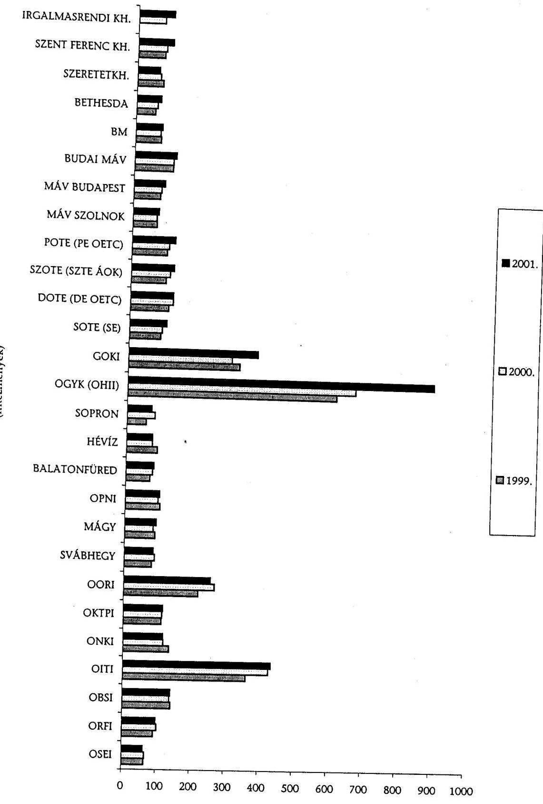

---

# Egy krónikus napra jutó OEP bevétel (e Ft/ágy) 

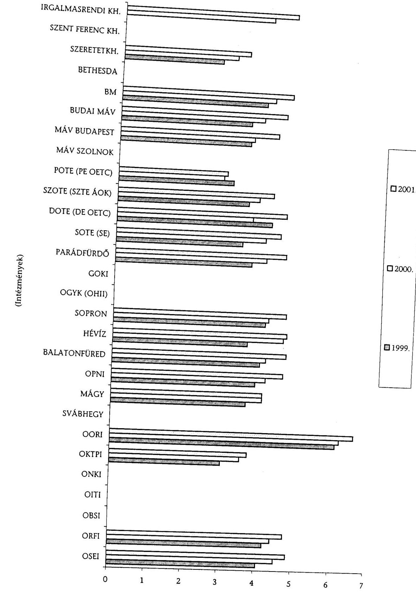

---

Adatszolgáltató intézmények ágyszámainak aránya az országos ágyszámhoz viszonyítva 2001-ben
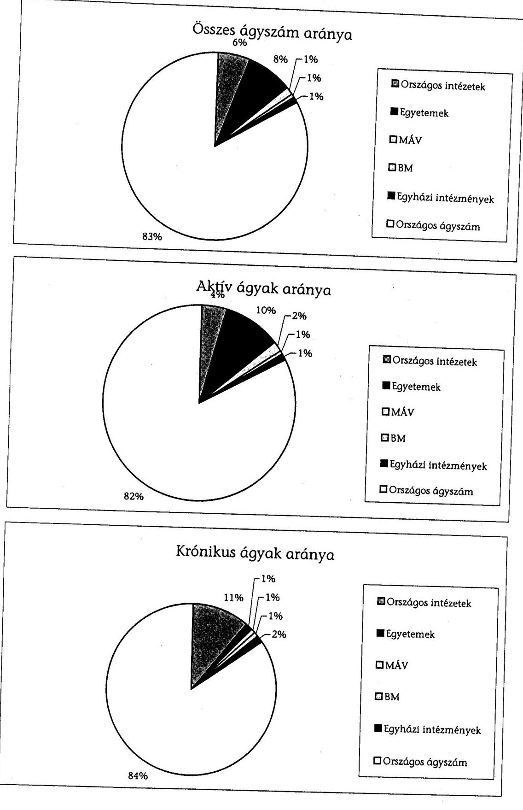

---

A vizsgált kórházak ágyszámainak megoszlása (2001. év)
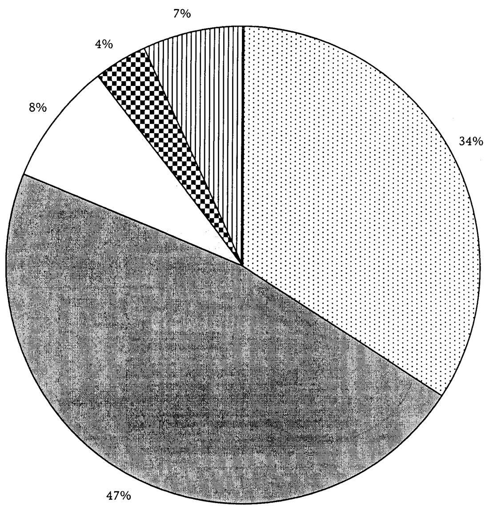

Országos intézetek 㓊Egyetemek ㅁMÁV 5BM ㅁEgyházi intézmények

---

Fekvőbeteg ellátás egy ágyra jutó OEP bevétele
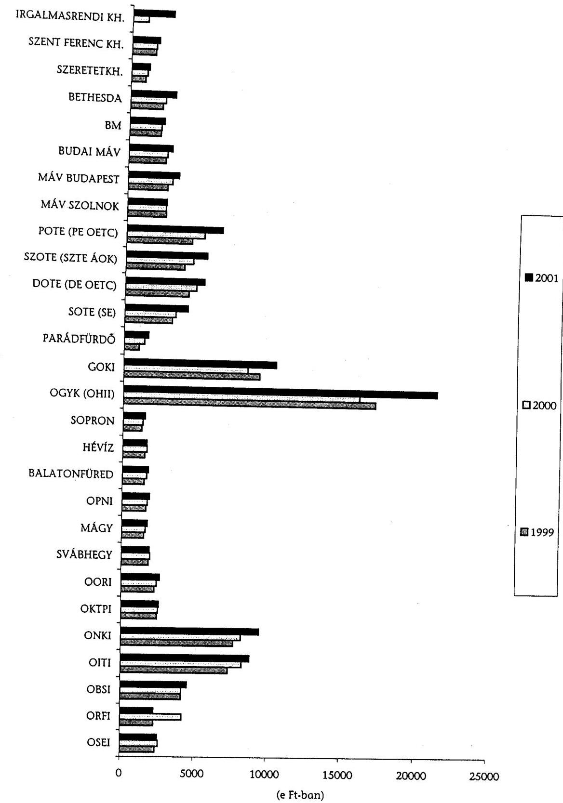

---

Fekvőbeteg ellátás egy ágyra jutó kiadása
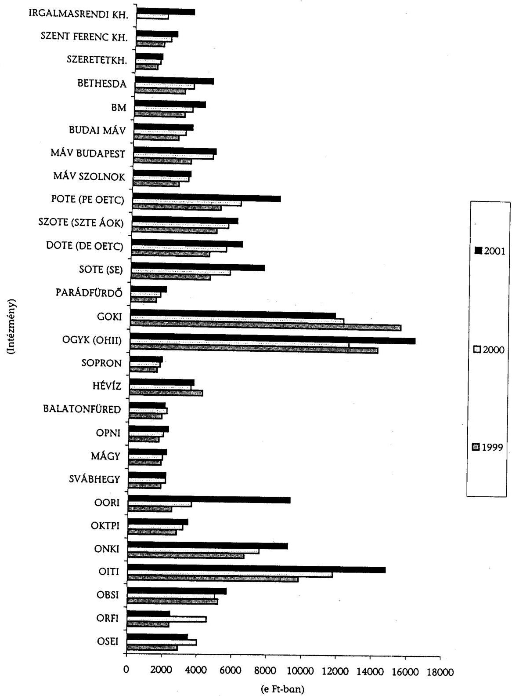

A diagram az intézmények vezetői által hitelesített adatszolgáltatás alapján készült.

---

Gyógyszer-vegyszer aránya a dologi kiadásokban
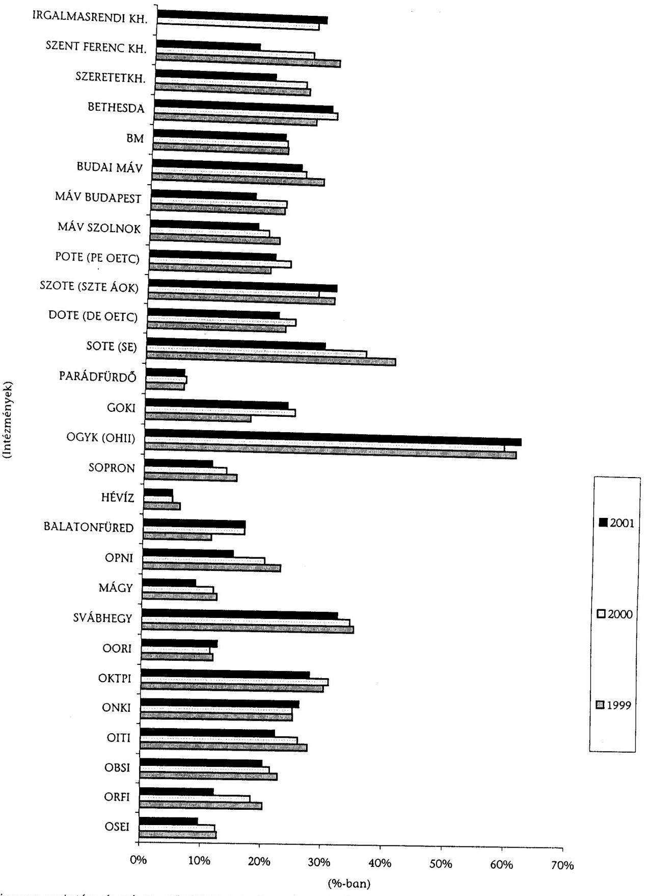

A diagram az intézmények vezetői által hitelesített adatszolgáltatás alapján készült.

---

Egy finanszírozott esetre jutó gyógyszer-vegyszer kiadás (eFt/eset)
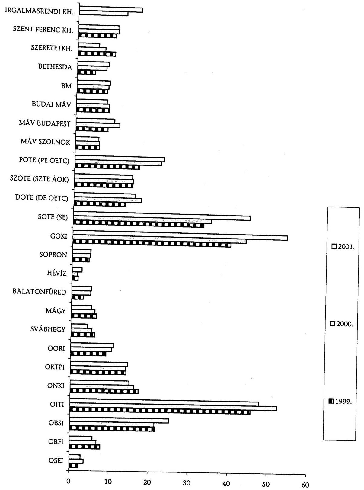

Megjegyzés: az OHII (OGYK) mutatója a csontvelő-transzplantációk sajátosságai miatt 405 eFt/eset értékű. Nem hasonlítható a többi kórházhoz, ezért a diagramban nem szerepel.
A diagram az intézmények vezetői által hitelesített adatszolgáltatás alapján készült.

---

# Vásárolt gyári előállítású gyógyszer arányának változása 

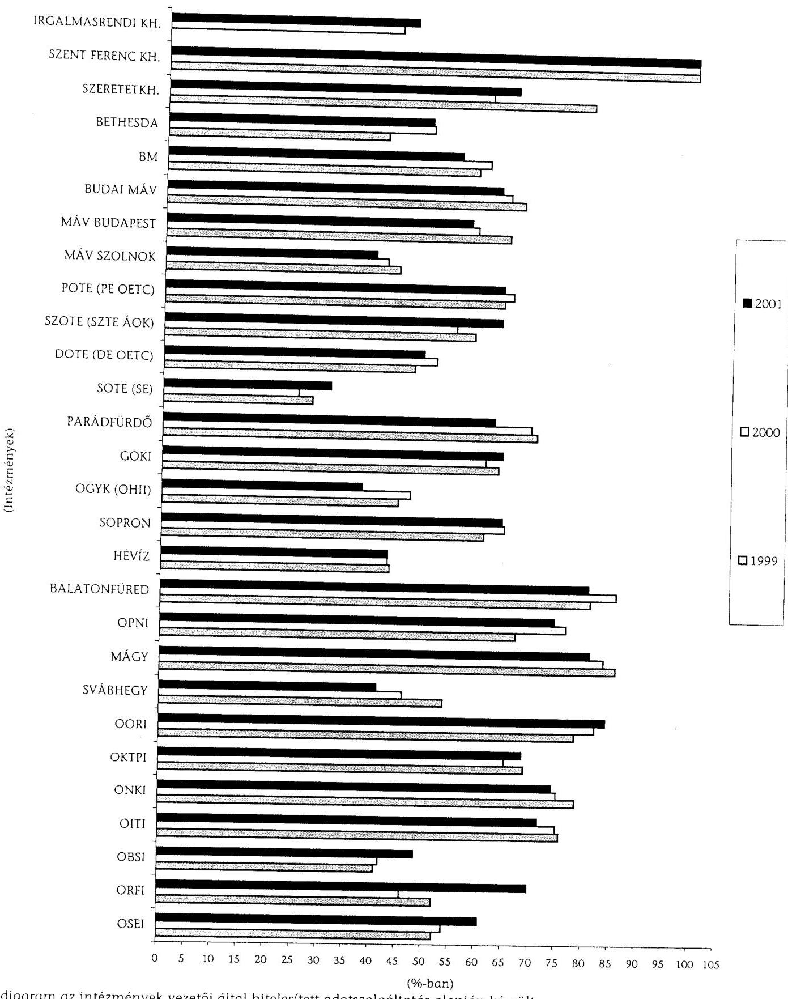

---

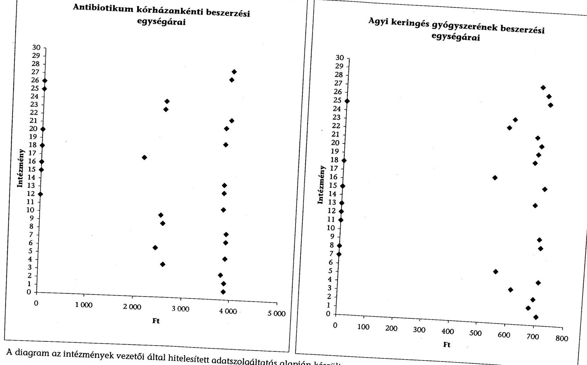

A diagram az intézmények vezetői által hitelesített adatszolgáltatás alapján készült.

---

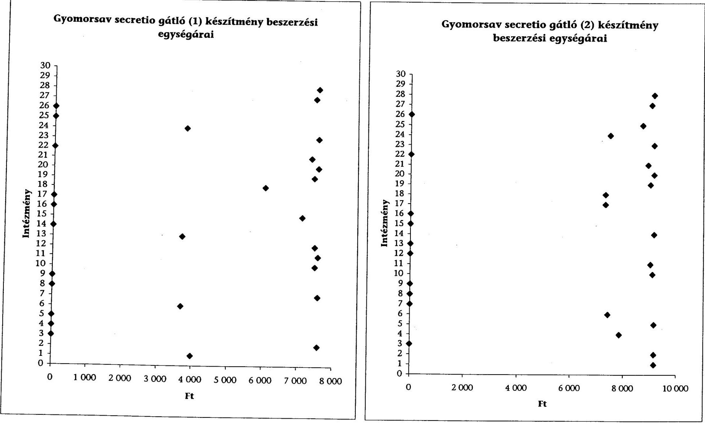

A diagram az intézmények vezetői által hitelesített adatszolgáltatás alapján készült.

---

# Egy ágyra jutó orvosi berendezések nettó értéke és egy ágyra jutó 0-ra leírt eszközök értéke 

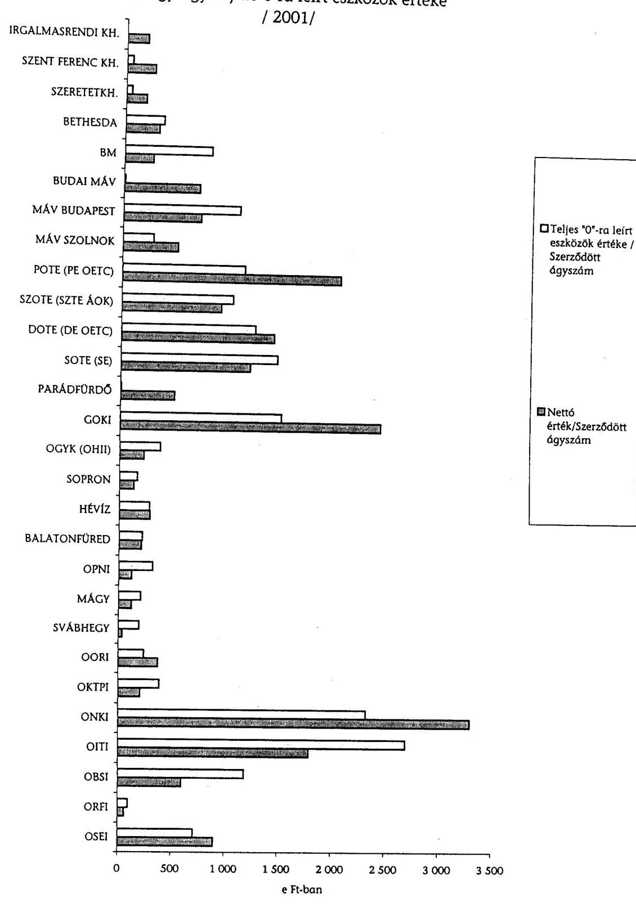

Budai Irgalmasrendi Kórház adatai nélkül
A diagram az intézmények vezetői által hitelesített adatszolgáltatás alapján készült.

---

# 12. számú diagram

a V-10-132/2002-2003. sz. jelentéshez

Orvosi berendezések használhatósága (\%-ban)
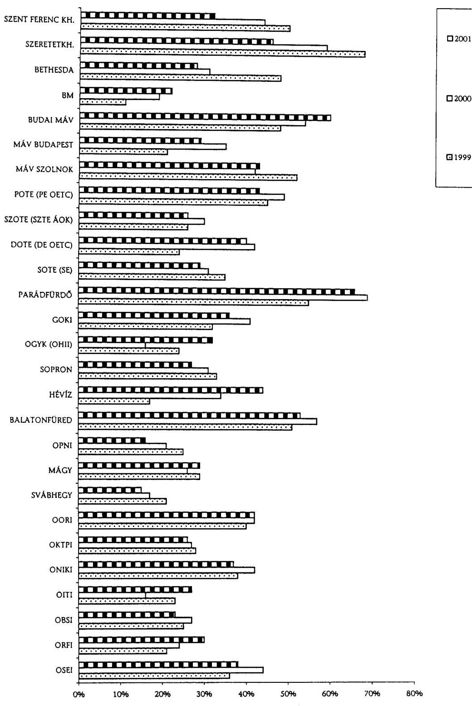

A Budai Irgalmasrendi Kórház adata nélkül
A diagram az intézmények vezetői által hitelesített adatszolgáltatás alapján készült.

