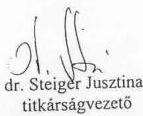
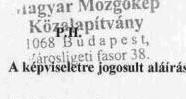
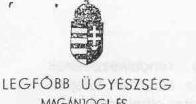
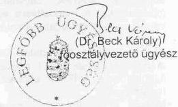

# JELENTÉS 

## a Magyar Mozgókép Közalapítvány gazdálkodásának ellenőrzéséről

---

3. Önkormányzati és Területi Ellenőrzési Igazgatóság
3.1. Szabályszerüségi Ellenőrzések Főcsoport
Iktatószám: V-1007-63/2002-2003.
Témaszám: 610
Vizsgálat-azonosító szám: V0057
Az ellenőrzést felügyelte:
Dr. Lóránt Zoltán
főigazgató
Az ellenőrzés végrehajtásáért felelős:
Dr. Elek János
főigazgató-helyettes
Az ellenőrzést vezette:
Balázs Andrásné
osztályvezető
Az összefoglaló jelentést készítette:
Balázs Andrásné
osztályvezető
A számvevői jelentések feldolgozásában és a jelentés összeállításában
közremüködött:
Szappanos Júlia
számvevő
Az ellenőrzést végezték:
Pásztor Katalin Sas Imréné Szappanos Júlia
számvevő tanácsos
Robbák Ferencné
számvevő
Számvevő tanácsos
Számvevő
A témához kapcsolódó eddig készített számvevőszéki jelentések:
címe
sorszáma
Jelentés a Nemzeti Gyermek és Ifjúsági Alapítvány pénzügyi- 80 gazdasági ellenőrzéséről
Jelentés a Magyar Vállalkozásfejlesztési Alapítvány részére PHARE 220 forrásból juttatott pénzügyi támogatások felhasználásának vizsgálatáról
Jelentés a fejezetek és intézményeik által az alapítványoknak 306 juttatott állami pénzek és vagyon felhasználásának, múködtetésének ellenőrzéséről
Jelentés a Magyar Alkotóművészeti Közalapítvány 347 gazdálkodásának ellenőrzéséről

---

Jelentés a Gandhi Közalapítvány pénzügyi-gazdasági ..... 351 ellenőrzéséről
Jelentés a Magyarországi Cigányokért Közalapítvány pénzügyi- ..... 372 gazdasági ellenőrzéséről
Jelentés a Magyarországi Nemzeti és Etnikai Kisebbségekért ..... 373
Közalapítvány pénzügyi-gazdasági ellenőrzéséről
Jelentés a médiatörvény végrehajtásának pénzügyi - gazdasági ..... 396 ellenőrzéséről
Jelentés a Nemzeti Gyermek és Ifjúsági Közalapítvány ..... 478
működésének pénzügyi-gazdasági ellenőrzéséről
Jelentés a Magyar Rádió Közalapítvány és - kapcsolódó ..... 9806
ellenőrzésként - a Magyar Rádió Részvénytársaság
gazdálkodásának ellenőrzéséről
Jelentés a Magyar Televízió Közalapítvány és kapcsolódó ellenőrzés ..... 9812 keretében a Magyar Televízió Rt. múködésének és
gazdálkodásának ellenőrzéséről
Jelentés a Nemzetközi Pető András Közalapítvány és - kapcsolódó ..... 9822
ellenőrzésként - a Mozgássérültek Pető András Nevelőképző és
Nevelőintézet pénzügyi-gazdasági ellenőrzéséről
Jelentés a Magyar Nemzeti Üdülési Alapítványnak juttatott állami ..... 9906
eszközök felhasználásának és múködtetésének pénzügyi-gazdasági ellenőrzéséről
Jelentés a sportcélú közalapítványok múködésének pénzügyi- ..... 9907 gazdasági ellenőrzéséről
Jelentés a Fogyatékos Gyermekek, Tanulók Felzárkóztatásáért ..... 9915
Országos Közalapítvány múködésének pénzügyi-gazdasági ellenőrzéséről
Jelentés a Nemzeti Gyermek és Ifjúsági Közalapítvány ..... 0002
működésének pénzügyi-gazdasági ellenőrzéséről
Jelentés a Közoktatási Modernizációs Közalapítvány múködésének ..... 0011 ellenőrzéséről
Jelentés a Magyar Nemzeti Üdülési Alapítvány vagyon- ..... 0101 gazdálkodásának ellenőrzéséről
Jelentés az Országos Foglalkoztatási Közalapítvány ..... 0117
gazdálkodásának ellenőrzéséről
Jelentés az Új Kézfogás Közalapítvány gazdálkodásának ..... 0136 ellenőrzéséről
Jelentés a közalapítványoknak és az alapítványoknak az 1998- ..... 0228 2001. évek között juttatott nem normatív központi költségvetési támogatás felhasználásának ellenőrzéséről

---

# TARTALOMJEGYZÉK 

BEVEZETÉS ..... 11
I. ÖSSZEGZŐ MEGÁLLAPÍTÁSOK, KÖVETKEZTETÉSEK, JAVASLATOK ..... 15
II. RÉSZLETES MEGÁLLAPÍTÁSOK ..... 25

1. A Magyar Mozgókép Közalapítvány működésének szabályozottsága és szabályossága ..... 25
1.1. Létrehozása ..... 25
1.2. Induló vagyon ..... 26
1.3. A kuratórium, a szakkollégiumok, az ellenőrző bizottság és a titkárság megalakítása ..... 26
1.4. A tisztségviselőkre előírt összeférhetetlenségi szabályok betartása ..... 28
1.5. A kuratórium és a szakkollégiumok múködése ..... 29
1.5.1. Határozatképtelen kuratóriumi ülések és törvénysértő határozatok ..... 30
1.6. Képviseleti jog és bankszámla feletti rendelkezés ..... 31
1.7. Titkárság ..... 34
1.8. Belső ellenőrzés ..... 34
1.9. Ellenőrző Bizottság ..... 34
2. A könyvvezetés és gazdálkodás szabályozottsága, szabályossága ..... 35
2.1. Gazdálkodási szabályzatok ..... 35
2.2. Éves költségvetések ..... 37
2.3. A számviteli nyilvántartás rendszere és szabályossága ..... 38
2.3.1. A támogatások elszámolása és nyilvántartása ..... 38
2.3.2. A cél szerinti- és a múködési költségek elkülönítése ..... 39
2.4. Az éves beszámolók szabályossága, a beszámolási- és auditálási kötelezettség teljesítése ..... 40
3. Támogatások, bevételek és költségek ..... 41
3.1. A támogatások, bevételek alakulása ..... 41
3.1.1. Az NKÖM közremúködése a központi költségvetési támogatás felhasználási céljainak meghatározásában és a felhasználás elszámoltatásában ..... 43
3.2. A költségek alakulása ..... 44
3.2.1. Múködési költségek ..... 48
3.2.2. Tiszteletdíjak ..... 49
3.2.3. A vállalkozási tevékenység és jövedelmezősége ..... 49
3.3. Pénzkezelés, vagyonvédelem és likviditás ..... 50

---

4. A vagyon alakulása ..... 51
4.1. A vagyonszerkezet, az eszközök összetétele és változása ..... 51
4.2. Ingatlanvagyon ..... 52
4.2.1. Az ingatlanvagyon hasznosítása ..... 53
4.2.1.1. A siófoki üdülőingatlan értékesítése ..... 53
4.3. Gazdasági társaságokban szerzett részesedések ..... 55
4.3.1. Résztulajdonok, üzletrészek ..... 57
4.3.2. Az MMK egyszemélyes tulajdonában álló kft.-k ..... 57
4.3.2.1. Magyar Filmunió Kft. ..... 58
4.3.2.2. Magyar Film Project Kft. ..... 60
5. A központi költségvetési támogatások és bevételek felhasználásának törvényessége és célszerűsége ..... 61
5.1. A támogatásokról hozott döntések szabályossága ..... 62
5.2. Pályázati úton adott támogatások ..... 64
5.2.1. Az alapítóknak juttatott támogatások ..... 64
5.2.2. A pályázati úton nyújtott támogatások szabályozottsága és szabályossága ..... 65
5.2.3. A kuratórium által közvetlenül nyújtott támogatások ..... 66
5.2.4. A szakkollégiumok által nyújtott pályázati támogatások ..... 67
5.3. Pályázaton kívül adott támogatások ..... 69
5.3.1. Visszatérítendő támogatások ..... 69
5.3.2. Magyar Filmszemle ..... 71
5.3.3. A kereskedelmi televíziók által a médiatörvény alapján teljesített közalapítványi befizetések ..... 73
5.3.3.1. Az M-RTL-től (RTL Klub) származó bevételekből kifizetett támogatások ..... 74
5.3.3.2. Az MTM-SBS-től (TV2) származó bevételekből kifizetett támogatások ..... 75

# MELLÉKLETEK 

1. számú Képviseleti jog átruházása I.
2. számú Képviseleti jog átruházása II.
3. számú Képviseleti jog átruházása III.
4. számú A Magyar Mozgókép Közalapítvány működési költségének és összes kifize- tésének alakulása
5. számú A Magyar Mozgókép Közalapítvány költségei 1998-2001. években
6. számú A Magyar Mozgókép Közalapítvány eszközei és forrásai
7. számú A Magyar Mozgókép Közalapítvány eredménykimutatása
8. számú A Magyar Mozgókép Közalapítvány költségei és ráfordításai

---

9. számú Az 1998. évi pályázati úton nyújtott támogatások
10. számú Az 1999. évi pályázati úton nyújtott támogatások
11. számú A 2000. évi pályázati úton nyújtott támogatások
12. számú A 2001. évi pályázati úton nyújtott támogatások
13. számú Kapott támogatások és bevételek
14. számú A közalapítvány pályázat útján nyújtott támogatásai az 1998-2001. évek között
15. számú A közalapítvány kuratóriumának és szakkollégiumainak pályázat útján nyújtott támogatásai az 1998-2001. évek között összesen
16. számú A közalapítvány kuratóriuma által a közalapítványi célú támogatásra jóváhagyott éves keret és ennek felhasználása az 1998-2001. években
17. számú A Legfőbb Ügyészség Magánjogi és Közigazgatási Jogi Főosztálya vezetőjének levele az MMK kuratóriumának törvénysértő határozataival kapcsolatban
18. számú Az Állami Számvevőszék intézkedése az MMK állami támogatása és egyéb bevételei törvénysértő felhasználásának megszüntetése érdekében

# FÜGGELÉKEK 

1. számú A Magyar Mozgókép Közalapítvány szakkollégiumainak filmgyártást támogató tevékenysége

---

.

---

# RÖVIDÍTÉSEK JEGYZÉKE 

| ÁFA tv. | az általános forgalmi adóról szóló 1992. évi LXXIV. tör- |
| :-- | :-- |
| Áht. | cény |
| APEH | az államháztartásról szóló 1992. évi XXXVIII. törvény |
| EB | Adó- és Pénzügyi Ellenőrzési Hivatal |
| EURIMAGES | Ellenőrző Bizottság |
|  | Kreatív mozi és audiovizuális alkotások létrejöttét és for- |
|  | galmazását támogató európai alap |
| GM | Gazdasági Minisztérium |
| Gt. | a gazdasági társaságokról szóló 1997. évi CXLIV. törvény |
| Kht. | a közhasznú szervezetekről szóló 1997. évi CLVI. törvény |
| médiatörvény | a rádiózásról és televíziózásról szóló 1996. évi I. törvény |
| MKM | Múvelődési és Közoktatási Minisztérium |
| MMA | Magyar Mozgókép Alapítvány |
| MMK | Magyar Mozgókép Közalapítvány |
| M-RTL | Magyar RTL Televíziós Részvénytársaság (RTL-Klub) |
| MTM-SBS | MTM-SBS Televízió Részvénytársaság (TV2) |
| NKA | Nemzeti Kulturális Alap |
| NKÖM | Nemzeti Kulturális Örökség Minisztériuma |
| OGY | Országgyúlés |
| ORTT | Országos Rádió és Televízió Testület |
| Ptk. | a Polgári Törvénykönyvről szóló 1959. évi IV. törvény |
| SZMSZ | Szervezeti és Múködési Szabályzat |
| Szt. (régi) | a számvitelről szóló 1991. évi XVIII. törvény |
| Szt. (új) | a számvitelről szóló 2000. évi C. törvény |

---

.

---

# ÉRTELMEZŐ SZÓTÁR 

| Alapítvány | Magánszemély, jogi személy és jogi személyiséggel nem rendelkező gazdasági társaság (a továbbiakban együtt: alapító) - tartós közérdekú célra - alapító okiratban alapítványt hozhat létre. Alapítvány elsődlegesen gazdasági tevékenység folytatása céljából nem alapítható. Az alapítvány javára a célja megvalósításához szükséges vagyont kell rendelni. Az alapítvány jogi személy [Ptk. 74/A. § (1) bekezdése]. |
| :--: | :--: |
| Alapítványi célú tevékenység | Az alapító okiratban meghatározott célok szerinti tevékenység [115/1992. (VII. 23.) Korm. rendelet 2. § (2) bekezdése]. |
| Befektetési tevékenység | A közhasznú (köz)alapítvány saját eszközeiből történő értékpapír, társasági tagsági jogviszonyból eredő vagyonértékű jog, ingatlan és más egyéb hosszú távú befektetést szolgáló vagyontárgy szerzésére irányuló tevékenység [Kht. 26. § k) pontja]. |
| Cél szerinti juttatás | A közhasznú (köz)alapítvány által cél szerinti tevékenysége keretében nyújtott pénzbeli vagy nem pénzbeli szolgáltatás [Kht. 26. § a) pontja]. |
| Cél szerinti tevékenység | Minden olyan tevékenység, amely az alapító okiratban megjelölt célkitúzés elérését közvetlenül szolgálja [Kht. 26. § b) pontja]. |
| Egyszemélyes társaság | A társaságot egy tag is alapíthatja, illetve ilyen társaság létrejöhet úgy is, hogy a már múködő társaság valamennyi üzletrészének tulajdonát egy tag szerzi meg. Egyszemélyes társaság alapításához alapító okirat elfogadására van szükség. Az alapító okirat tartalmára és alakszerűségére a társasági szerződésre vonatkozó szabályokat kell megfelelően alkalmazni. Egyszemélyes társaság alapítása esetén a cégbírósághoz történő bejelentés előtt a teljes pénzbetétet be kell fizetni, illetve valamennyi nem pénzbeli betétet a társaság rendelkezésére kell bocsátani. Az egyszemélyes társaságnál a taggyúlési hatáskörbe tartozó kérdésekben a tulajdonos tag dönt, és erről a vezető tisztségviselőket írásban köteles értesíteni (Gt. 171-172. §ai). |
| Egyszerűsített éves beszámoló | Egyszerűsített mérlegből és eredménylevezetésből áll [224/2000. (XII. 19.) Korm. rendelet 6. § (7) bekezdése]. |
| Felelős személy | A közhasznú (köz)alapítvány alapító okiratában és belső szabályzataiban vezető tisztségviselőként megjelölt vagy egyébként érdemi döntési jogkörrel rendelkező személy, valamint az a személy, aki az alapító okirat felhatalmazása, a közhasznú (köz)alapítvány legfőbb szervének határozata vagy szerződés alapján a közhasznú (köz)alapítvány képviseletére vagy bankszámlája feletti rendelkezésre jogosult [Kht. 26. § e) pontja]. |

---

Induló vagyon

Írásbeli szerződés

Kiemelkedően közhasznú közalapítvány

Közalapítvány

Közfeladat

Közhasznú közalapítvány

Közhasznú egyszerűsített éves beszámoló

Közhasznú tevékenység

Az alapítvány javára a célja megvalósításához az alapító okiratban meghatározott vagyon [Ptk. 74/A. § (1) bekezdése, 74/B. § (1) bekezdése]. Az alapítvány rendelkezésére legalább olyan mértékű vagyont kell bocsátani, amely a múködése megkezdéséhez feltétlenül szükséges [Ptk. 74/B. (4) bekezdése]. Az alapítványi vagyon pontos megjelölése nélkül az alapítvány nem jöhet létre [BH2001. 303 számú, egyedi ügyben hozott bírósági végzés].
A közhasznú (köz)alapítvány az államháztartás alrendszereitől - a normatív támogatás kivételével - csak írásbeli szerződés alapján részesülhet támogatásban. A szerződésben meg kell határozni a támogatással való elszámolás feltételeit és módját [Kht. 14. § (2) bekezdése].
A kiemelkedően közhasznú (köz)alapítványnak a közhasznú (köz)alapítványokra előírt követelmények teljesítésén túl közhasznú tevékenysége során olyan közfeladatot kell ellátnia, amelyről törvény vagy törvény felhatalmazása alapján más jogszabály rendelkezése szerint, valamely állami szervnek vagy a helyi önkormányzatnak kell gondoskodnia, az alapító okirata szerinti tevékenységének és gazdálkodásának legfontosabb adatait a helyi vagy országos sajtó útján is nyilvánosságra hozza, továbbá a közhasznú tevékenységet maga látja el [Kht. 5. § és a BH2001. 451 számú, egyedi ügyben hozott bírósági végzés].
A közalapítvány olyan alapítvány, amelyet az Országgyűlés, a Kormány, valamint a helyi önkormányzat vagy kisebbségi önkormányzat képviselő-testülete közfeladat ellátásának folyamatos biztosítása céljából hoz létre [Ptk. 74/G. § (1) bekezdése].
Közfeladatnak minősül az az állami vagy helyi önkormányzati, kisebbségi önkormányzati feladat, amelynek ellátásáról - jogszabály alapján - az államnak vagy az önkormányzatnak kell gondoskodnia [Ptk. 74/G. § (2) bekezdése].
A Kht. 26. § c) pontjában meghatározott közhasznú tevékenység(ek)et folytatja; vállalkozási tevékenységet csak közhasznú céljainak megvalósítása érdekében, azokat nem veszélyeztetve végez; gazdálkodása során elért eredményét nem osztja fel, azt az alapító okiratában meghatározott tevékenységére fordítja; közvetlen politikai tevékenységet nem folytat, pártoktól független és azoknak anyagi támogatást nem nyújt [Kht. 4. §].
A közhasznú nyilvántartásba vett közalapítványoknál mérlegből, közhasznú eredménykimutatásból és tájékoztató adatokból áll [224/2000. (XII. 19.) Korm. rendelet 6. § (8) bekezdése, illetve 4. és 6 . számú melléklete].

A társadalom és az egyén közös érdekeinek kielégítésére irányuló, a közhasznú közalapítvány alapító okiratában szereplő cél szerinti tevékenység [Kht. 26. § c) pontja].

---

Közhasznúsági jelentés

Közvetlen politikai tevékenység

Legfőbb szerv
Likviditási mutató

Múködési költségek

Nem pénzbeli támogatás

Nyilvánosság

Tartalmazza a számviteli beszámolót; a költségvetési támogatás felhasználását; a vagyon felhasználásával kapcsolatos kimutatást; a cél szerinti juttatások kimutatását; a központi költségvetési szervtől, az elkülönített állami pénzalaptól, a helyi önkormányzattól, a kisebbségi települési önkormányzattól, a települési önkormányzatok társulásától és mindezek szerveitől kapott támogatás mértékét; a közhasznú szervezet vezető tisztségviselőinek nyújtott juttatások értékét, illetve összegét; a közhasznú tevékenységről szóló rövid tartalmi beszámolót [Kht. 19. § (3) bekezdése].
A pártpolitikai tevékenység, továbbá országgyúlési képviselői, megyei, fővárosi önkormányzati választáson jelölt állítása [Kht. 26. § d) pontja].
A közalapítvány kezelő szerve (kuratóriuma) [Kht. 26. § f) pontja].
A pénzügyi helyzet értékelésére szolgáló mutató, amely a likvid (egy éven belül pénzzé tehető) eszközök és a rövid lejáratú kötelezettségek aránya.
Az üzemeltetési, fenntartási költségek (kiadások) és az egyéb közvetett költségek (kiadások) [115/1992. (VII. 23.) Korm. rendelet 6. §].
Vagyoni értékkel rendelkező forgalomképes dolog, szellemi alkotás, illetőleg vagyoni értékű jog részben vagy egészében, véglegesen vagy ideiglenesen történő teljesen vagy részben ingyenes átruházása vagy átengedése, illetve szolgáltatás biztosítása [Kht. 26. § h) pontja].
A kiemelkedően közhasznú közalapítvány az alapító okirata szerinti tevékenységének és gazdálkodásának legfontosabb adatait a helyi vagy országos sajtó útján is nyilvánosságra hozza [Kht. 5. § b) pontja].
A közhasznú és kiemelkedően közhasznú közalapítvány kuratóriumi ülései, határozatai, múködése, szolgáltatásai igénybevételének módja és beszámolói nyilvánosak [Kht. 7. § (1) bekezdése, (3) bekezdésének b) és d) pontja], a nyújtott cél szerinti juttatások bárki által megismerhetők [Kht. 14. § (3) bekezdése].
A közhasznú és kiemelkedően közhasznú közalapítvány éves közhasznúsági jelentésébe bárki betekinthet [Kht. 19. § (4) bekezdése].
A közalapítvány gazdálkodásának legfontosabb adatait nyilvánosságra kell hozni [Ptk. 74/G. § (8) bekezdése].
A közzétételnek, a beszámolónak a Magyar Közlöny Hivatalos Értesítőjében való megjelentetésével, a székhelyén történő betekinthetőséggel vagy egyéb más, a számviteli politikájában rögzített módon tehet eleget. A közzététel határideje az adott üzleti év mérlegfordulónapját követő 150. nap [224/2000. (XII. 19.) Korm. rendelet 20. § (4) bekezdése].

---

Pályázat

Színlelt pályázat

Szt. szerinti egyéb szervezet
Támogatás
Tőkeellátottsági mutató
Vállalkozási tevékenység

Vezető tisztségviselő

Az a nyilvános vagy előre meghatározott körben közzétett felhívás, amely a pályázók összevetésére alkalmas feltételeket és a pályázattal elnyerhető cél szerinti juttatást, a pályázat értékelésének lényeges feltételeit (beleértve a benyújtási és értékelési határidőket, valamint a pályázat elbírálására hivatottak körét) megjelöli [Kht. 26. § i) pontja].
A pályázat nem tartalmazhat olyan feltételeket, amelyekből - az eset összes körülményeinek mérlegelésével megállapítható, hogy a pályázatnak előre meghatározott nyertese van (színlelt pályázat). Színlelt pályázat a cél szerinti juttatás alapjául nem szolgálhat [Kht. 15. § (1) és (2) bekezdése].

Az alapítvány és a közalapítvány [Szt. (új) 3. § 4. e) pontja].
Pénzbeli és nem pénzbeli juttatás [Kht. 26. § j) pontja].
A saját vagyon részaránya az összes forráson belül.
A jövedelem- és vagyonszerzésre irányuló vagy azt eredményező gazdasági tevékenység, ide nem értve a bevétellel járó cél szerinti tevékenységet, valamint a közhasznú tevékenységhez nyújtott támogatást [Kht. 26. § l) pontja].
Az alapítvány és a közalapítvány kuratóriumának és felügyelő szervének elnöke és tagja, továbbá a közhasznú (köz)alapítvánnyal munkaviszonyban vagy munkavégzésre irányuló egyéb jogviszonyban álló, az alapító okirat szerint egyszemélyi felelős vezető feladatot ellátó személy [Kht. 26. § m) pontja].

---

# JELENTÉS 

## a Magyar Mozgókép Közalapítvány gazdálkodásának ellenőrzéséről

## BEVEZETÉS

A 2000. évben ${ }^{1}$ Magyarországon az önálló jogi személyként múködő 47144 nonprofit szervezet között 19700 (41,8\%) alapítvány és közalapítvány volt. Az összes nonprofit szervezet nettó értékű tárgyi eszközeinek és aktíváinak 442,3 milliárd Ft összegéből az alapítványok és közalapítványok tulajdonában volt 280,6 milliárd Ft (63,4\%), az összes nonprofit szervezetnél ezt a vagyont 92 milliárd Ft, ezen belül az alapítványok és közalapítványok vagyonát 19,8 milliárd Ft hitel- és egyéb tartozás terhelte.

Az Állami Számvevőszék ellenőrzési hatásköre a nonprofit szervezeteket - közöttük az alapítványokat - illetően jelenleg a központi költségvetésből és a központi alapoktól kapott támogatás felhasználására terjed ki.

A nonprofit szervezetek a 2000. évi 495,5 milliárd Ft összes bevételen belül a központi költségvetéstől és a központi alapoktól összesen 105,9 milliárd Ft (21,4\%) támogatást kaptak, az alapítványok és a közalapítványok pedig a 187,7 milliárd Ft összes bevételen belül 53,7 milliárd Ft-ot (28,6\%).

A nonprofit szervezetek között 1994. január 1-jétől jelentek meg a közalapítványok, melyek megalakítására és múködésére a Ptk. az alapítványok szabályozásán belül külön feltételeket és követelményeket határozott meg az alapítók körét, az ellátandó közfeladatokat, valamint a múködés és gazdálkodás feltételeit illetően.

Közalapítványt csak az Országgyűlés, a Kormány, valamint a helyi önkormányzat vagy kisebbségi önkormányzat képviselő-testülete hozhat létre állami közfeladat ellátásának folyamatos biztosítása céljából, de a közalapítvány létrehozása nem érinti az államnak, illetve az önkormányzatnak a feladat ellátására vonatkozó kötelezettségét. A közalapítványok a nyilvánosság előtt tevékenykednek, ezért alapító okiratukat, gazdálkodásuk legfontosabb adatait nyilvánosságra kell hozni. A közpénzek törvényes, felelős és a közjó érdekében történő felhasználását elősegítendő a Ptk. és a Kht. részletesen meghatározta a közalapítványok vagyonkezelő szervezete (kuratóriuma) múködésének, képvi-

[^0]
[^0]:    ${ }^{1}$ Központi Statisztikai Hivatal: Nonprofit szervezetek Magyarországon 2000.

---

seletének, a tisztségviselők felelősségének és összeférhetetlenségének szabályait. A közalapítványok vagyonát kezelő szervezet (a kuratórium) tagjai az alapítók bizalmából látják el feladatukat, de tőlük sem közvetlenül, sem közvetve nem függhetnek, az alapítók nem gyakorolhatnak meghatározó befolyást a közalapítvány vagyonának felhasználására.

A közalapítványok ellenőrzésére az alapítványoknál szigorúbb követelmények vonatkoznak, így az alapítóknak már az alapítással egyidőben létre kell hozni a kuratórium ellenőrzésére jogosult ellenőrző szervet (ellenőrző vagy felügyelő bizottságot). Az Országgyúlés és a Kormány által alapított közalapítványoknál az Állami Számvevőszék nemcsak az állami támogatás felhasználását, hanem a tevékenység törvényességét és célszerűségét is jogosult ellenőrizni.

A 2000. évben múködő², az Országgyűlés és a Kormány által alapított 34 közalapítvány saját tőkéje 15,9 milliárd Ft, összes bevétele 19,3 milliárd Ft volt, ebből a központi költségvetéstől és a központi alapoktól összesen 18,2 milliárd Ft támogatást kapott. A most ellenőrzött Magyar Mozgókép Közalapítvány 1998-ban jött létre, a 2000. évben a saját tőkéje 0,3 milliárd Ft, összes bevétele 1,8 milliárd Ft volt, ebből a központi költségvetéstől és központi alaptól összesen 1,2 milliárd Ft támogatást kapott.

A Magyar Mozgókép Közalapítvány állami közfeladatai a Kormány számára az Alkotmányban meghatározott tudományos és kulturális fejlesztési feladatoknak az ellátásában, illetve az ezek megvalósulásához szükséges feltételek megteremtésében való közremúködésre terjedtek ki.

A közalapítványt a Fővárosi Bíróság a 9. Pk. 60.105/1998/9. számú végzésében 1998. január 1-jei hatállyal kiemelkedően közhasznú közalapítványként nyilvántartásba vette.

A közalapítvány számára az alapító okirat a következő célok teljesítésében való közremúködést határozta meg:

- a mozgóképalkotások létrejöttének és a mozgóképkultúra terjesztésének elősegítése;
- a mozgóképalkotások megőrzése és védelme;
- a mozgóképszakmai tevékenység feltételeinek és infrastruktúrájának javítása, a mozgóképszakmában dolgozók szociális biztonságának elősegítése;
- a mozgóképkultúra fenntartása és megújulása;
- a mozgóképkultúra és a mozgóképszakma képviselete.

[^0]
[^0]:    ${ }^{2}$ Állami Számvevőszék: Jelentés a közalapítványoknak és az alapítványoknak az 19982001. évek között juttatott nem normatív központi költségvetési támogatás felhasználásának ellenőrzéséről (0228. szám)

---

Az Állami Számvevőszék a Ptk. 74/G. §-ának (8) bekezdése alapján ellenőrzi a közalapítványok gazdálkodásának törvényességét és célszerüségét.

# Jelen ellenőrzés célja törvényességi és célszerúségi szempontból annak értékelése volt, hogy 

- a közalapítvány rendelkezésére bocsátott induló vagyon múködtetése és a központi költségvetési támogatás felhasználása összhangban volt-e az alapító okiratban meghatározott célokkal és feladatokkal;
- a kuratórium szabályosan gazdálkodott-e a közalapítvány vagyonával, a központi költségvetési támogatással és egyéb bevételeivel;
- a kuratórium törvényesen és célszerűen gyakorolta-e az egyszemélyes tulajdonában lévő kft.-kel kapcsolatos tulajdonosi jogokat.

Az Állami Számvevőszékről szóló 1989. évi XXXVIII. törvény 21. § (3) bekezdése alapján - ha egyes vizsgálati megállapítások kiegészítése válik szükségessé, és ehhez más szervnél is ellenőrzést kell végezni - az Állami Számvevőszék ellenőre jogosult az összefüggő tényeket ott vizsgálni. Ennek megfelelően kapcsolódó ellenőrzés keretében ellenőriztük

- a közalapítvány egyszemélyes gazdasági társaságainak - a Magyar Filmunió Kft.-nek és a Magyar Filmproject Kft.-nek - a gazdálkodását, tevékenységük hatását a közalapítványi célok teljesítésére;
- a központi költségvetési támogatást nyújtó Nemzeti Kulturális Örökség Minisztériumánál a közalapítvány támogatásának és a támogatás elszámoltatásának a szabályosságát.

Az ellenőrzés a közalapítvánnyá alakulástól a 2001. december 31-ig tartó időszakra terjedt ki.

---

# BEVEZETÉS

---

# I. ÖSSZEGZŐ MEGÁLLAPÍTÁSOK, KÖVETKEZTETÉSEK, JAVASLATOK 

A Magyar Mozgókép Közalapítvány az 1998-2001. évek között összesen 5,7 milliárd Ft támogatást, illetve bevételt realizált, ennek mintegy hetven százaléka származott a központi költségvetésből. A közalapítvány kuratóriuma a magyar filmgyártás fenntartásának és támogatásának ellátásában való közremúködés mellett szerepet vállalt a filmszakma életképességének megőrzésében és fejlesztésében, a filmgyártás és filmterjesztés külső és saját forrásainak összehangolásával és bővítésével igyekezett megőrizni a filmszakma infrastruktúráját.

Az 1999. év közepétől a kuratórium romló költségvetési támogatási feltételek és önhibáján kívül ellehetetlenült múködési keretek között törvénysértően múködve teljesítette közhasznú feladatait.

Az elmúlt ciklusban és a jelenleg múködő Kormány(ok)nak és az NKÖM miniszter(ek)nek felróhatóan 1999. június 29 -ét követően a kuratórium múködésképtelenné vált, mivel a Magyar Mozgókép Közalapítvány alapító okiratában egyedüli képviseleti joggal felruházott kuratóriumi elnök 1999. június 29-i lemondását követően a többi alapító által (már két alkalommal is, más-más személyt illetően) egyhangúlag felkért kuratóriumi elnök bírósági bejegyzéséhez szükséges intézkedéseket részben a Kormány(ok), részben a miniszter(ek) elmulasztották, így egyik felkért kuratóriumi elnök sem nem vehetett részt döntési joggal a kuratórium munkájában, illetve nem gyakorolhatta a közalapítvány képviseleti jogát. A kuratóriumi elnökön túl további két kurátor tisztségéről történt lemondása miatt - egyikőjük helyett a nemzeti kulturális örökség miniszterének kellett volna más kurátort jelölni - a nyolctagú kuratórium határozatképességéhez az alapító okiratban előírt kétharmados arányú megjelenés ellehetetlenült. A tisztségekről történt lemondások és az esetenkénti hiányzások miatt kialakult határozatképtelenség következtében az 19982001. évek között hozott kuratóriumi határozatok hatvan százaléka törvénysértő. Álláspontunkkal azonosan a Legfőbb Ügyészség főosztályvezetője megerősítette ${ }^{3}$, hogy a Magyar Mozgókép Közalapítvány kuratóriumának azon határozatait, amelyeket nem az alapító okirat szerinti kétharmados arányú megjelenéssel, tehát legalább hat fő jelenlétében hoztak, törvénysértőnek kell tekinteni.

A Kormány a Magyar Mozgókép Közalapítvány Alapító Okiratának módosításáról szóló 1206/2002. (XII. 20.) Korm. határozatban elfogadta az alapító okirat módosításáról szóló előterjesztést, és felhatalmazta a nemzeti kulturális örökség miniszterét, hogy az alapító okiratot a Kormány nevében aláírja, to-

[^0]
[^0]:    ${ }^{3}$ 17. számú melléklet

---

vábbá azonnali határidő megjelölésével, hogy a módosítás bírósági nyilvántartásba vétele iránti eljárásban a Kormány, mint az alapítók egyike nevében és képviseletében eljárjon. Jelentésünk nyilvánosságra hozásáig az alapító okirat jogerős bírósági nyilvántartásba vétele nem történt meg.

A Magyar Mozgókép Közalapítvány állami közfeladatainak teljesítése és a magyar filmgyártás támogatásának folyamatossága érdekében a Magyar Mozgókép Közalapítvány fôtitkára és a titkárság vezetői 1999 óta hatáskörüket meghaladó döntéseket hoztak részben a kuratórium, részben a kuratóriumi elnök helyett, illetve törvénysértően gyakorolták a képviseleti jogot ${ }^{4}$. Az MMK főtitkárát felszólítottuk ${ }^{5}$ arra, hogy az új kuratóriumi elnök és a határozatképes létszámú kuratórium jogerős bírósági bejegyzéséig a közalapítványnak juttatott állami támogatás és egyéb bevételek felhasználását - beleértve az újabb kötelezettségvállalásokat, továbbá a törvénysértő kuratóriumi határozatokon alapuló vagy kuratóriumi határozat nélküli szakkollégiumi kötelezettségvállalásokon alapuló pénzügyi teljesítéseket - haladéktalanul függessze fel.

A törvénysértő tevékenység kialakulásában meghatározó szerepet játszott, hogy a lemondott kuratóriumi elnök a Magyar Mozgókép Közalapítvány képviseleti jogának gyakorlását illetéktelenül átruházta a főtitkárra, továbbá az, hogy az NKÖM szerződő félként a Magyar Mozgókép Közalapítvány képviseletében „jöhiszemú álképviselő"-ként elfogadta a főtitkárt és egy kurátort együttesen, a kuratórium utólagos jóváhagyását kikötve. A kuratórium, illetve a főtitkár az alapító okiratnak a titkárság feladatait meghatározó részéből azt a téves következtetést vonta le, hogy a kuratórium a főtitkárt az SZMSZ-ben felhatalmazhatja a képviseleti jog gyakorlásával.

A magyar filmgyártás állami támogatására az elmúlt években többcsatornás támogatási és finanszírozási gyakorlat alakult ki, amelyben a Magyar Mozgókép Közalapítvány szerepe, a közremúködésével kapcsolatos kormányzati igény ellentmondásossá vált. Az Országgyűlés az 1998. évi költségvetési törvényben eredeti előirányzatként a filmszakmai támogatásokat még az akkor múködő két alapítvány, a Magyar Mozgókép Alapítvány és a Magyar Történelmi Film Alapítvány támogatási előirányzatai keretében hagyta jóvá, közvetlenül az alapítványoknak nevére megjelölve. A Magyar Mozgókép Alapítvány közalapítvánnyá történt átalakítását követően a gyakorlatban a Magyar Mozgókép Közalapítványnak a filmgyártás támogatásában betöltött szerepe csökkent, mivel a központi költségvetésben a magyar filmgyártás támogatására szánt előirányzatok évről-évre csökkenő hányadát kapta. Az 1999-2003. évek között az OGY az éves költségvetési törvényekben a Magyar Mozgókép Közalapítvány számára közvetlenül névre címzetten évente 1,1 milliárd Ft előirányzatot, ezen túl az NKÖM fejezeti kezelésű előirányzatai kereté-

[^0]
[^0]:    ${ }^{4}$ Korábban már az Új Kézfogás Közalapítványnál (lásd a 0136. számú jelentést), a Magyarországi Cigányokért Közalapítványnál (lásd a 0228. számú jelentést) és a Magyarországi Nemzeti és Etnikai Kisebbségekért Közalapítványnál (lásd a 0228. számú jelentést) is megállapítottuk, hogy a Ptk.-val és az alapító okirattal ellentétesen a munkaszervezet alkalmazottai és/vagy más személyek gyakorolták a képviseleti jogot.
    ${ }^{5}$ 18. számú melléklet

---

ben „millenniumi filmprodukciók" jogcím megjelöléssel 1999-ben 700 millió Ft, 2000-ben 1050 millió Ft, 2001-2002-ben 750-750 millió Ft, „filmszakmai támogatások" jogcím megjelöléssel 2003-ban 3200 millió Ft, „első filmesek támogatása" jogcím megjelöléssel 200 millió Ft eredeti előirányzatot hagyott jóvá. A Magyar Mozgókép Közalapítvánnyal ellentétben évente növekvő összegű költségvetési támogatást kapott a Magyar Történelmi Film Alapítvány, támogatásának eredeti előirányzata az 1998. évi 25 millió Ft-ról 2003-ra 200 millió Ft-ra nőtt.

Az NKÖM a Magyar Mozgókép Közalapítvány alapító okiratában meghatározott feladatok ellátásához szükséges pénzeszközök nagyságát, a támogatás összegét nem támasztotta alá számításokkal, az előirányzatok tervezésekor még az inflációs hatást sem vette figyelembe, így a költségvetési támogatás reálértéke folyamatosan csökkent.

Az NKÖM és a Magyar Mozgókép Közalapítvány a támogatások felhasználásával kapcsolatos előírásokat minden évben támogatási szerződésben rögzítette, melyben a minisztérium kikötötte az alapító okiratban meghatározott célok szerinti felhasználást, meghatározta az elszámolások benyújtásának határidejét és az elszámolás módját, de a támogatás felhasználását nem ellenőrizte. A Magyar Mozgókép Közalapítvány a támogatások felhasználásáról szakmai értékelést és pénzügyi elszámolást készített. Ennek elfogadásáról, illetve az elszámolások tényleges, tartalmi felülvizsgálatáról a minisztérium nem készített írásos dokumentumokat, az elszámolások elfogadásáról sem tájékoztatta a közalapítványt.

A médiatörvényben előírt kötelezettség alapján a magyar filmgyártás támogatása céljából az MTM-SBS Rt., illetve az M-RTL összesen mintegy 1,2 milliárd Ft befizetést teljesített 1998-2001. évek között a Magyar Mozgókép Közalapítványnak. A befizetések fogadására, illetve teljesítésére kötött megállapodások pénzügyi szempontból a Magyar Mozgókép Közalapítvány és a kereskedelmi televíziók számára egyaránt előnyösek voltak: a kereskedelmi televíziók a befizetési kötelezettség szempontjából a közalapítványnak befizetett összeget kétszeres szorzóval vehették figyelembe, a Magyar Mozgókép Közalapítványnál viszont az 1998-2001. évi támogatások és bevételek mintegy ötödrészét kitevő pótlólagos pénzforrás bővítette a magyar filmalkotások létrehozására fordítható közalapítványi támogatás összegét. A számottevő új bevételi forrás és támogatási lehetőség ellenére a kuratórium nem dolgozta ki és nem szabályozta e támogatások odaítélésének célrendszerét, követelményeit és folyamatát. Ezért következhetett be, hogy a konkrét támogatások odaítélését a titkárság vezetői és a kereskedelmi televíziók képviselői a kuratórium hatáskörének elvonásával és a nyilvánosság kizárásával végezték, a kuratórium a támogatásokról csak év végén, utólag kapott tájékoztatást. A megállapodásokban a Magyar Mozgókép Közalapítvány a kereskedelmi televízióknak a médiatörvényben megengedett bemutatási jogon felül indokolatlanul biztosította a támogatott múvek és alkotók kiválasztásában való közremúködést.

A Magyar Mozgókép Közalapítvány a megszűnt - jogelőd - Magyar Mozgókép Alapítvány vagyonából jött létre. Az alapító okirat azonban - a bírósági nyilvántartásba vétel elhúzódása miatt - nem az 1998. április 30-i nyilvántartásba vételkor ténylegesen meglévő - és jogelőd által a megszűnéséig még gyarapított - 491,7 millió Ft összegű vagyon összegét tüntette fel induló vagyonnak, ha-

---

nem az 1997. július 31-én, az alapítói döntés időpontjában meglévő 460,4 millió Ft-ot. Részben emiatt, részben számviteli hibák miatt az MMK éves mérlegbeszámolói téves adatot - 491,7 millió Ft helyett 127,9 millió Ft-ot - tartalmaztak az induló tőke értékénél, emiatt tévesek lettek a mérlegek tőkeváltozás adatsorai is ${ }^{6}$, de a saját tőke összege és a mérleg-főösszeg a valós értéket mutatták.

A közalapítvány megalakulása óta a saját tőke - elsősorban a vállalkozási tevékenységként elszámolt 2001. évi ingatlanértékesítés eredményének hatására - 25\%-kal nőtt, a vállalkozási tevékenységek jövedelmezősége azonban évről évre fokozatosan romlott. A közalapítvány a vagyonából részben a filmgyártás infrastruktúrájának fenntartása érdekében vásárolt részesedéseket (Mafilm Rt., Mafilm Befektetési Kft.), melyek után osztalékbevétel nem keletkezett, mivel a társaságok veszteségesek voltak. A 2000. évben a Mafilm Befektetési Kft. múködőképességének fenntartása érdekében a Magyar Mozgókép Közalapítvány ötvenmillió Ft-ot meghaladó készpénzes tőkeemelésre kényszerült. A tőkeemelés a kuratórium jóváhagyó határozata nélkül történt. Fedezetét szabálytalanul, de az NKÖM engedélyével a központi költségvetési támogatás terhére teremtették meg. Az engedélyben előírt visszapótlásról azonban még a 2002. évi közalapítványi támogatási keret felhasználásának tervezésekor sem gondoskodtak.

A kuratórium a közalapítvány vagyonának kezelésére és egyes közhasznú feladatainak ellátására egyszemélyes kft.-ket alapított. Az ellenőrzött időszakban hiányosan gyakorolta tulajdonosi jogait, nem hagyta jóvá a kft.-k éves beszámolóit és üzleti terveit.

A Magyar Film Project Kft. további múködtetése felesleges és célszerűtlen, mivel az általa ténylegesen ellátott feladatot - a Magyar Filmszemle lebonyolításában és finanszírozásában való részvételt - a közalapítványi iroda meglévő szervezeti és személyi keretei között egyszerűbben és kevesebb költségráfordítással el lehet látni. Az ügyvezető személyében a közalapítvánnyal történő elszámolást illetően személyi összeférhetetlenség állt fenn.

A kuratórium döntő részben - az alapító okirat rendelkezésének megfelelően létrehozott - hét szakkollégiumon keresztül támogatta a magyar filmgyártást és filmterjesztést, amelyek az ellenőrzött négy év alatt az OGY által jóváhagyott közel 3,9 milliárd Ft előirányzat 76,6\%-ának felhasználásáról döntöttek, az alapító okirat céljainak megfelelő tárgyban kiírt, nyilvánosan meghirdetett pályázatok útján. A kuratórium és a szakkollégiumok a pályázatokat és a jóváhagyott támogatásokat a Magyar Filmlevélben és az Interneten keresztül hozták nyilvánosságra, de a tényleges kifizetésekről és a pályázati célok megvaló-

[^0]
[^0]:    ${ }^{6}$ Korábban már a Közoktatási Modernizációs Közalapítványnál (lásd a 0011. számú jelentést), az Országos Foglalkoztatási Közalapítványnál (lásd a 0117. számú jelentést) és az Új Kézfogás Közalapítványnál (lásd a 0136. számú jelentést) is megállapítottuk, hogy az auditált éves mérlegek az induló tőke összegét az alapító okirattól eltérő összegben tartalmazták.

---

sulásáról a közvélemény - beleértve a szakmai közvéleményt is - nem jutott információhoz. A kuratóriumhoz és a szakkollégiumokhoz az 1998-2001. évek alatt összesen 3784 pályázat érkezett, ebből 1674 db -ot ( $44,2 \%$-ot) bíráltak el kedvezően.

A kuratórium főleg a különböző filmszemlék lebonyolítására, a filmérték megőrzésére írt ki pályázatokat, továbbá támogatta a filmhez kapcsolódó művészeti szervezetek, szövetségek múködését is.

A szakkollégiumok az alapító okiratban megfogalmazott célrendszerből a mozgóképalkotások létrejöttét és a mozgóképkultúra terjesztését, valamint a mozgóképkultúra fenntartását és megújulását szolgáló célok megvalósulásának támogatását végezték. Múködésükhöz évente irányelveket és döntési alapelveket készítettek, erre alapozták a pályázati felhívásaikat és a pályázatok kiértékelését. Az alapító okirat elöírásait megszegve azonban a kuratórium jóváhagyása nélkül, önállóan döntöttek a támogatottak köréről, a támogatás céljáról, mértékéről és feltételeiről, és a kuratóriumot csak utólag, szóban tájékoztatták a jóváhagyott keretek felhasználásáról vagy túllépéséről. A szakkollégiumok saját keretük terhére hozzájárultak a Magyar Filmszemle megrendezéséhez, illetve más szakkollégium szakterületéhez tartozó alkotások létrejöttéhez, ezáltal szakterületük támogatásától vontak el forrásokat. A támogatások elszámolásához nem az eredeti számlákat kérték, így nem zárták ki a többszörös elszámolás lehetőségét (ezért fordulhatott elő pl. Magyar Film Projekt Kft. kétszeres elszámolása is). A szerződések megszegése, az elszámolási határidő elmulasztása esetén nem érvényesítették a szerződésekben kikötött jogkövetkezményeket, előfordult, hogy szankció helyett a támogatási szerződést módosították.

Az átmenetileg szabad pénzeszközök terhére a szakkollégiumok és a főtitkár összesen 778,4 millió Ft visszatérítendő támogatást nyújtott annak érdekében, hogy a más szervezettől kapott támogatás megérkezéséig, illetve a várható közalapítványi döntés meghozataláig biztosítani lehessen a produkció zavartalan folytatását. Nem alkalmaztak azonban szankciókat a visszatérítendő támogatásokból rövid lejáratú kölcsönként nyilvántartott kinnlevőségei (ez 2002 augusztusában 159,3 millió Ft volt) behajtása érdekében sem.

A Magyar Filmszemle megrendezéséhez - mely évenként elkészült játékfilmek bemutatásának fóruma volt - a kuratórium és vele párhuzamosan a szakkollégiumok is adtak pénzügyi támogatást. Lebonyolítását és finanszírozását az ellenőrzött négy évben a kuratórium részben indokolatlanul változó szervezeti keretek között végeztette. Az elmúlt négy évben a bemutatott játékfilmek állami támogatása - a producerek adatai szerint - növekvő arányt képviselt: az 1999. évi 30. szemlén $41 \%$ ( 864 millió Ft) volt, a 2002. évi 33. szemlén $51,4 \%$ ra (1730,2 millió Ft) emelkedett. Az állami mecenatúrán belül azonban a Magyar Mozgókép Közalapítvány szerepvállalása csökkent, míg az 1999. évi filmszemlén bemutatott alkotások állami részvételének 40,5\%-át ( 350 millió Ft), a 2002. évinek már csak 30,5\%-át (528,5 millió Ft) tették ki a közalapítvány által biztosított források.

Az alapító okirat az 1998. évre vonatkozóan az éves kiadások 8\%-ában határozta meg a múködési költségek felső határát, majd 1999-től csak az éves

---

központi költségvetési támogatásból felhasználható működési költségek arányát (8\%) határozta meg ${ }^{7}$, így a kuratórium a vállalkozásokból, egyéb forrásokból jogszerűen növelte a működési kiadások keretösszegét. Sem az alapító okirat, sem a kuratórium által jóváhagyott számviteli politika nem különböztette meg tartalmilag a kuratórium és a titkárság által felhasználható múködési (üzemeltetési, fenntartási) költségeket a közhasznú tevékenység ellátása miatt felmerülő közvetlen költségektől, emiatt e két költségfajta számbavétele ${ }^{8}$ pontatlan volt. A kuratórium nem elemezte a saját és a titkárság múködési költségeinek alakulását, nem tett intézkedéseket a túlzott, pazarló jellegű költségek csökkentésére, illetve keletkezésének megakadályozására.

Az ellenőrzés során feltárt hiányosságokhoz a közalapítvány nem megfelelő szabályozottsága is hozzájárult. A kuratórium által elfogadott SZMSZ a kuratóriumnak, illetve az MMK főtitkárának a Ptk., illetve az alapító okirat előírásait meghaladó hatásköröket adott, a számviteli politika, a pénzkezelési szabályzat, a vagyonkezelési és befektetési szabályzat tartalma hiányos volt, illetve nem a kuratórium hatáskörébe tartozó előírásokat is szabályozott.

Az ellenőrzött időszakban a kuratórium nem az alapító okiratban előírt tartalomban teljesítette az alapítóknak szóló beszámolási kötelezettségét, így az alapítók nem kaptak tájékoztatást a médiatörvény alapján kapott pénzeszközökről és azok felhasználásáról, a múködési költségekről, a vállalkozási tevékenységről és annak eredményéről. A közalapítvány gazdálkodásának legfontosabb adatait az általános szabályoknak megfelelően nyilvánosságra hozta.

Az alapítók az alapító okiratban nem határozták meg az ellenőrző bizottság által ellátandó feladatok körét, az alapítóknak történő beszámoló gyakoriságát, tartalmát, így az ellenőrző bizottság nem is tájékoztatta a kuratórium ellenőrzéséről szerzett tapasztalatairól az alapítókat.

Tekintettel arra, hogy a közalapítványnak még nincs határozatképesen múködő kuratóriuma, nem volt lehetséges az 1989. évi XXXVIII. tv. 25. § (1) bekezdésének megfelelően a kuratórium számára a jelentés nyilvánosságra hozását

[^0]
[^0]:    ${ }^{7}$ Az alapító okirat a múködési költségek vetítési alapját és mértékét az Új Kézfogás Közalapítványnál (lásd a 0136. számú jelentést) 1997-1998-ban az éves költségvetési támogatás 10\%-ában, 1999-től 7\%-ában, az Országos Foglalkoztatási Közalapítványnál (lásd a 0117. számú jelentést) a törzsvagyon nélkül számított mindenkori vagyon 10\%-ában, a Közoktatási Modernizációs Közalapítványnál (lásd a 0011. számú jelentést) az éves költségvetési kiadások 8\%-ában, a Fogyatékos Gyermekek, Tanulók Felzárkóztatásáért Országos Közalapítványnál ((lásd a 9915. számú jelentést) az éves tervezett költségvetés bevételi oldalának $8 \%$-ában határozta meg.
    ${ }^{8}$ Korábban már az Új Kézfogás Közalapítványnál (lásd a 0136. számú jelentést), az Országos Foglalkoztatási Közalapítványnál (lásd a 0117. számú jelentést) és a Közoktatási Modernizációs Közalapítványnál (lásd a 0011. számú jelentést) is megállapítottuk, hogy a számviteli nyilvántartásban nem teljes körűen különítették el a közalapítványi célú tevékenység közvetlen költségeit a kuratórium és a munkaszervezet költségeitől, illetve az egyéb közvetett költségektől.

---

megelőzően észrevételezési lehetőséget biztosítani. A jelentéstervezetet azonban korábban egyeztettük az NKÖM közigazgatási államtitkárával és az MMK munkaszervezetének vezetőivel, amelynek során a megállapítások megalapozottságát érintő véleménykülönbség nem maradt. A jogerős bírósági végzést követően a kuratóriumnak pótlólag megküldjük a jelentést azzal, hogy a javaslatainkkal kapcsolatosan tett intézkedésekről a kézhezvételt követő harminc napon belül adjon tájékoztatást.

A helyszíni ellenőrzés megállapításainak hasznosítása mellett javasoljuk:

# a Kormánynak 

1. Mérlegelje a közalapítvány megszüntetésének kezdeményezését - amennyiben a magyar filmgyártás állami támogatását más módon, illetőleg más szervezeti keretben hatékonyabban kívánja megvalósítani - a Ptk. 74/G. § (9) bekezdése alapján, figyelemmel arra, hogy a közalapítvánnyá történt átalakítást követően a gyakorlatban az MMK-nak a filmgyártás támogatásában betöltött szerepe az e célra rendelkezésére bocsátott állami támogatás arányának mérséklése miatt évről évre csökken.
2. Vizsgálja meg és érvényesítse a kormányzati szervek és/vagy köztisztviselők felelősségét a közalapítvány kuratóriuma törvénysértő működésének kialakulásáért, a Kormány által megteendő alapítói intézkedések elmulasztásáért.
3. Teremtse meg a szükséges szervezeti-szervezési-személyi feltételeket ahhoz, hogy a Kormány alapítói közremúködésével létrejött közalapítványok törvényes müködéséhez szükséges intézkedésekről a Kormány a jövőben jogszerűen és kellő időben határozhasson.

## a Magyar Mozgókép Közalapítvány alapítóinak

1. Módosítsák az alapító okiratot következőkkel
a) pontosítsák az induló vagyon összegét az 1998. április 30-i bírósági nyilvántartásbavétel időpontjában meglévő vagyoni állapotnak megfelelő összegre;
a) jelöljék meg a kuratórium mindenkori személyi összetételének megfelelően az alapító okiratban a képviseletre - beleértve a bankszámla feletti rendelkezésre jogosult személyeket, a képviseleti jog gyakorlásának módját, illetőleg terjedelmét;
b) határozzák meg az ellenőrző bizottság által ellátandó feladatok körét, az alapítóknak történő beszámolás gyakoriságát, tartalmát;
c) állapítsák meg a kuratórium és a titkárság által felhasználható működési (üzemeltetési, fenntartási) költségek körét, felső határát a központi költségvetésből származó, tárgyévben felhasznált támogatások arányában.

---

# a nemzeti kulturális örökség miniszterének 

1. Vizsgálja meg és érvényesítse a minisztérium szervezeti egységeinek és/vagy köztisztviselőinek felelősségét a közalapítvány kuratóriuma törvénysértő müködésének kialakulásáért, a Kormány által megteendő alapítói intézkedésekkel kapcsolatos előterjesztések elmulasztásáért és/vagy késedelmes előkészítéséért, a nemzeti kulturális örökség miniszterének hatáskörébe utalt kurátor felkérésének elhúzódásáért, továbbá az alapító okirat módosításának bírósági bejegyzéséhez szükséges intézkedések elmulasztásáért.
2. Dolgoztassa ki a minisztérium által adott (köz)alapítványi támogatások felhasználásának beszámolási és ellenőrzési rendszerét, tartalmi követelményeit, és ez alapján intézkedjék a támogatások szerződés szerinti teljesítésének ellenőrzéséről, a szerződésszegés szankcionálásáról.

## A módosított alapító okirat jogerős bírósági bejegyzését követően javasoljuk:

## a Magyar Mozgókép Közalapítvány kuratóriumának

1. Haladéktalanul intézkedjék a közalapítvány kuratóriuma, szakkollégiumai és titkársága törvénysértő müködésének és pénzfelhasználásának megszüntetéséről, ennek keretében
a) tételesen vizsgálja felül az 1998. óta keletkezett törvénysértő kuratóriumi határozatokat, a szakkollégiumok és a főtitkár, illetve a titkárság más vezetőinek kötelezettségvállalásait, és a felülvizsgálás eredményeként intézkedjék ezek megerősítéséről, törléséről vagy módosításáról;
b) a felülvizsgálat eredményeként feltárt, a közalapítvány céljaival összhangban nem álló és/vagy pazarló kifizetések, továbbá a támogatottaknak adott utólagos és indokolatlan engedmények, a szerződésekben rögzített szankciók érvényesítésének elmulasztása miatt állapítsa meg és érvényesítse a szakkollégiumok és a titkárság vezetőinek a felelősségét, szükség esetén kártérítési, polgári jogi vagy büntetőjogi eljárások megindításával is;
c) vizsgálja meg a Magyar Film Project Kft. munkaszervezetének felelősségét a 950 ezer Ft+ÁFA szabálytalan, kétszeres elszámolásáért, intézkedjék fent megjelölt összeg visszafizettetéséről, továbbá haladéktalanul szüntesse meg a közalapítvány és a kft. közötti elszámoltatásban a személyi összeférhetetlenséget;
d) gondoskodjék arról, hogy a Mafilm Befektetési Kft.-ben végrehajtott 54,4 millió Ft-os tőkeemelés fedezeteként átmenetileg felhasznált központi költségvetési támogatás a 2003. évi támogatási keret felosztásánál visszapótlásra kerüljön;
e) gondoskodjék arról, hogy a jövőben a kuratóriumi ülés megkezdésekor, továbbá a határozat meghozatala előtt megállapítást nyerjen a határozatképesség, a határozatok kimondása előtt a szavazatok előírt egyszerű vagy minősített többségének megléte, és ennek tényét az ülésekről készített jegyzőkönyvekben rögzítse;

---

f) intézkedjék, hogy a képviseleti jogot (beleértve a bankszámla feletti rendelkezési jogot is) csak az alapító okiratban megjelölt személyek (tisztségviselők és alkalmazottak) és az ott meghatározott terjedelemben gyakorolják, a belső szabályzatok és egyedi intézkedések törvényi előírással és alapító okirattal ellentétes, képviseleti joggal kapcsolatos rendelkezéseit haladéktalanul törölje;
g) számoljon be évente az alapító okiratban előírt tartalomban az alapítóknak a tevékenységéről.
2. Módosítsa az SZMSZ-t az alábbiakkal
a) törölje a kuratóriumi tagság időtartamával és megszűnésével kapcsolatos szabályokat;
b) törölje az ellenőrző bizottság beszámolási kötelezettségére vonatkozó előírást;
c) törölje az MMK főtitkárának a közalapítvány vagyona feletti valamennyi rendelkezési jogát.
3. Módosítsa a belső szabályzatokat az alábbiakkal
a) a számviteli politikában határozza meg a kuratórium és a titkárság múködési költségeinek körét, tartalmát, teljes körű elkülönítésének szabályait és módszereit;
b) a pénzkezelési szabályzatot aktualizálja és egészítse ki a bankkártya használatára vonatkozó előírásokkal;
c) a vagyonkezelési és befektetési szabályzatban az Áht. hatályos előírásai alapján rögzítse az átmenetileg szabad pénzeszközök befektetési lehetőségét, törölje a törzsvagyon kezelésével kapcsolatos szabályokat;
d) a vagyonkezelési és befektetési szabályzat vállalkozási tevékenységet szabályozó részét egészítse ki vagy készítsen külön szabályzatot a médiatörvény alapján kapott befizetések felhasználásáról, biztosítsa, hogy az e befizetések terhére adott támogatások nyilvánosan meghirdetett pályázatok keretében, az illetékes szakkollégiumok javaslatai alapján, a kuratórium önálló, külső befolyástól mentes határozatai alapján legyenek odaítélve.
4. Tegye meg az alábbi Intézkedéseket a törvényes és célszerű gazdálkodás érdekében
a) intézkedjék, hogy az alapító okirat módosítását követően a könyvvezetésben haladéktalanul helyesbítsék az induló tőke összegét az induló tőke és tőkeváltozás között;
b) biztosítsa a cél szerinti tevékenység, valamint a kuratórium és a titkárság működési költségeinek teljes körűen elkülönített nyilvántartását;
c) kísérje figyelemmel a közalapítvány működési költségeinek alakulását, és a takarékos költséggazdálkodás érdekében dolgoztassa ki a működési költségek csökkentésének lehetséges módjait;

---

d) módosítsa a támogatásokkal való elszámoltatás módszerét, az elszámolásokhoz csatoltassák a támogatott nevére szóló számlák, okmányok eredeti példányait, majd az ellenőrzést követően - a többszöri benyújtás elkerülése érdekében „MMK támogatás elszámolásához felhasználva" jelöléssel ellátva küldje vissza a támogatott részére; érvényesítse a határidőben el nem számolókkal szemben a szerződésekben kikötött jogkövetkezményeket;
e) intézkedjék a rövidlejáratú kölcsönként nyilvántartott visszatérítendő támogatások mielőbbi behajtása érdekében;
f) intézkedjék, hogy a szakkollégiumok az alapító okiratban és az SZMSZ-ben előírtak szerint bonyolítsák le a pályáztatásokat és javaslataikat jóváhagyás végett minden esetben terjesszék a kuratórium elé; évente írásban számoltassa be a szakkollégiumokat tevékenységükről, biztosítsa a nyilvánosság teljesebb körű tájékoztatását a tényleges kifizetésekről és a pályázati célok megvalósulásáról mind a kuratórium, mind a szakkollégiumok támogatási tevékenységét illetően;
g) dolgozza ki a közalapítvány jövedelmező vállalkozási tevékenységének lehetőségeit és intézkedjék végrehajtásáról.
5. Gondoskodjék az egyszemélyes tulajdonában álló kft.-kben tulajdonosi jogai maradéktalan gyakorlásáról, ennek keretében
h) intézkedjék, hogy a kft.-k ügyvezetői az éves beszámolót és az üzleti tervet terjesszék a kuratórium elé jóváhagyás céljából;
i) vizsgálja felül a Magyar Film Project Kft. tovább múködésének célszerűségét, figyelemmel a kft. által ellátott feladatoknak a közalapítványi irodához való átcsoportosítási lehetőségére.
6. Vizsgálja felül a Magyar Filmszemle közalapítványi támogatásának, megrendezésének és elszámoltatásának eddigi gyakorlatát, ennek eredményeként dolgozza ki a szemle összehangolt és takarékos támogatási, szervezési és elszámoltatási rendszerét.

---

# II. RÉSZLETES MEGÁLLAPÍTÁSOK 

## 1. A Magyar MozGóKÉP KÖzalapítVÁny múködéséneK SZABÁLYOZOTTSÁGA ÉS SZABÁLYOSSÁGA

### 1.1. Létrehozása

A Magyar Köztársaság Kormánya a Ptk. 74/G. § (3) bekezdésében meghatározott szabályozás figyelembevételével - a 2314/1997. (X. 8.) Korm. határozattal - az MMA alapítóival közösen hozta létre az MMK-t, miután az MMA alapítói azonos célú közalapítvány létesítése érdekében az alapítvány teljes vagyonát felajánlották. A MMK alapítói az alapítót megillető jogosultságokat együttesen gyakorolják, a Magyar Köztársaság Kormányát a nemzeti kulturális örökség minisztere képviseli. A Fővárosi Bíróság a MMK-t 7122. sorszámon 1998. április 30 -án vette nyilvántartásba.

Az MMA-t 1991. április 24-én kelt alapító okiratával az MKM, valamint 30 filmszakmai szervezet hozta létre, hogy elősegítse a magyar filmek gyártását, terjesztését, az egyetemes mozgóképkultúra értékeinek terjesztését, az egyetemes filmtörténet értékeinek megőrzését, a mozgóképszakma támogatását. A Kormány a 3160/1991 (IV. 24) Korm. határozattal jóváhagyta az MKM részvételét az alapítók között. A Fővárosi Bíróság 1991. május 16-án kelt végzésével az 1638. sorszámon nyilvántartásba vette az alapítványt. Az MMK az MMA jogutódja lett, a Fővárosi Bíróság az MMK nyilvántartásba vételével egyidejúleg az MMA-t törölte a nyilvántartásból.

Az MMK alapítói a kiemelkedően közhasznú szervezetekre előírt szabályozási követelményeket teljesítve a közhasznú szervezetekre vonatkozó módosításokat a Kht. 4. § (1) bekezdésében és a 7. §-ban megfogalmazott előírásoknak megfelelően az alapító okiraton és SZMSZ-en átvezették, így kérésükre a Fővárosi Bíróság 1999. szeptember 8-án kelt végzése az MMK-t 1998. január 1-jétől kiemelkedően közhasznú szervezetnek minősítette. Az MMK által ellátott állami közfeladatok az alapító okirat szerint az Alkotmány 35. § (1) bekezdésének f) pontjában meghatározott kormányzati feladatokra alapozódtak, amely szerint a Kormány meghatározza a tudományos és kulturális fejlesztés állami feladatait, és biztosítja az ezek megvalósulásához szükséges feltételeket.

## Az alapító okirat az MMK feladatait a következő célok keretei között határozta meg:

- a mozgóképalkotások létrejöttét és a mozgóképkultúra terjesztését szolgáló célok;
- a mozgóképalkotások megőrzését és védelmét szolgáló célok;
- a mozgóképszakmai tevékenység feltételeinek és infrastruktúrájának javítását, továbbá a mozgóképszakmában dolgozók szociális biztonságának elősegítését szolgáló célok;

---

- a mozgóképkultúra fenntartását és megújulást szolgáló célok;
- a mozgóképkultúra és a mozgóképszakma képviseletét szolgáló célok.

# 1.2. Induló vagyon 

Az MMK bírósági nyilvántartásba vételének elhúzódása miatt az alapító okiratban induló vagyonként megjelölt vagyonérték ( 460,4 millió Ft) nem azonos a tényleges induló vagyon összegével (491,7 millió Ft). Kifogásoltuk, hogy az alapítók az alapító okiratot a tényleges induló vagyon összegével - a helyszíni ellenőrzés befejezéséig - nem módosították.

Az MMK eredeti alapító okiratának VI. 1. pontja az induló vagyont 460,4 millió Ft-ban jelölte meg azzal, hogy a vagyon részletezését az alapító okirathoz csatolt 1997. július 31-i hitelesített vagyonmérleg tartalmazza. Az MMK azonban csak 1998. április 30-án jött létre, mivel a Fővárosi Bíróság ezen a napon vette nyilvántartásba. A Ptk. 74/A. § (2) bekezdése szerint az alapítvány a bírósági nyilvántartásba vétellel jön létre, illetve a 74/G. § (3) bekezdése szerint a közalapítvány létrehozásával az alapítvány megszűnik. A nyilvántartásból történő törléséig tehát csak az MMA kuratóriuma hozhatott jogszerű döntéseket az alapítványi vagyon felhasználásáról (melyet jelen esetben gyarapított), a kuratórium vagyonkezelési jogát csak az MMK nyilvántartásba vételéről szóló határozat jogerőre emelkedésének napján meglévő vagyon felett kezdhette el gyakorolni. Az MMK-nak a tényleges megalakulás időpontjában (1998. április 30-án) - könyvvizsgáló által hitelesített vagyonmérleg és vagyonleltár szerint - 491,7 millió Ft volt a vagyona, ezt az összeget kell induló vagyonként az alapító okiratban feltüntetni. Az MMK főtitkárának 2002. november 6-án kelt tájékoztatása szerint a könyvvizsgáló bevonásával kezdeményezni fogják az alapító okirat módosítását az induló vagyon összegének helyesbítése végett.

Az alapítók az alapító okiratban nem jelöltek meg törzsvagyont, a kuratórium azonban az általa jóváhagyott vagyonkezelési és befektetési szabályzatban tévesen - erre hivatkozott és a vállalkozási tevékenységre fordítható pénzeszközöknél a törzsvagyont mint korlátozó tényezőt jelölte meg.

Az MMK főtitkárának 2002. november 6-án kelt tájékoztatása szerint az új kuratórium hivatalba lépésekor indítványozni fogják a törzsvagyonra vonatkozó szabályzatok módosítását.

### 1.3. A kuratórium, a szakkollégiumok, az ellenőrző bizottság és a titkárság megalakítása

Az alapító okirat nyolc főben jelölte meg a kuratórium létszámát, négy évben rögzítve a tisztség betöltésének időtartamát. Egy kurátor jelölését az alapító okirat a Kormányt képviselő miniszter hatáskörébe utalta. Az MMK létrehozásakor az alapítók nyolc főt kértek fel a kurátori tisztség betöltésére, az alapító okiratban név szerint feltüntetve a kuratóriumi elnököt és a hét kurátort. A kuratórium az általa jóváhagyott SZMSZ II. 1. § 1. pontjában a kuratóriumi tagok megbízatására az alapító okiratnál rövidebb időtartamot - három évet - határozott meg, ezzel a kuratórium megszegte egyrészt a Ptk. 74/C. § (1) bekezdésének előírását, mely szerint a kuratórium tagjai megbízatásának időtartamáról az alapítók jogosultak rendelkezni az alapító okiratban, másrészt az alapító

---

okirat IX. 5. pontját, mely szerint az SZMSZ az alapító okirattól eltérő rendelkezést nem tartalmazhat. A kuratórium az SZMSZ II. 1. § 2. pontjában meghatározta a kuratóriumi tagság megszűnésének eseteit. E tisztségre történő megbízás, illetve a megbízás megszűnése csak az alapító okirat módosításával és ennek bírósági nyilvántartásba vételével lehetséges, így a kuratórium az SZMSZ fent megjelölt részének elfogadásával megszegte a Ptk. 74/B. § (5) bekezdésének előírásait, mely szerint az alapító okirat módosítására az alapító, a módosítások nyilvántartásba vételére pedig a bíróság jogosult, illetve a 74/C. § (1) bekezdését, amely szerint az alapító joga a kezelő szervezet létrehozása.

Az MMK főtitkárának 2002. november 6-án kelt tájékoztatása szerint az új kuratórium hivatalba lépésekor indítványozni fogják az SZMSZ-nek a kuratóriumi tagok megbízatásának időtartamára és a kuratóriumi tagság megszűnésének eseteire vonatkozó részek módosítását.

A kuratórium elnöke 1999. június 29-én írásban lemondott tisztségéről, ezt követően nem látta el a kuratóriumi elnöki teendőket és az MMK képviseletét. Az alapító szakmai szervezetek ez időpontot követően közösen kialakított személyi javaslattal kezdeményezték az új elnök kijelölését. Az alapító szakmai szervezetek által egyhangúan kiválasztott kuratóriumi elnök-jelölt bírósági nyilvántartásba vételéhez szükséges módosított alapító okirat-tervezetet mindegyik alapító szakmai szervezet aláírta, a kuratóriumi elnök-jelölt 2000 márciusában megtette a tisztség betöltésére vonatkozó, törvény által előírt elfogadó nyilatkozatot. A Kormány mint társalapító részére az NKÖM miniszter 2000 decemberében, majd 2001 májusában készített előterjesztést az MMK alapító okiratának módosításának elfogadása érdekében, de a Kormány csak az 1029/2002. (III. 26.) Korm. határozattal fogadta el az MMK alapító okiratának módosításáról - benne a kuratóriumi elnök személyéről és a képviseleti jog gyakorlásáról szóló előterjesztést. E határozatban a Kormány az NKÖM minisztert hatalmazta fel arra, hogy a módosítás bírósági nyilvántartásba vétele iránti eljárásban a Kormány mint az alapítók egyike nevében és képviseletében eljárjon, ezt követően pedig gondoskodjon a módosításokkal egységes szerkezetbe foglalt alapító okiratnak a Magyar Közlönyben történő közzétételéről. A kuratórium élére jelölt új elnök a Kormány fent megjelölt határozata meghozatalát követően az MMK-t alapító szakmai szervezetektől az elnöki pozícióban történő újbóli megerősítését kérte, de az alapítók a 2002. május 14-én megtartott ülésen már nem támogatták az általuk korábban egyhangúan kijelölt személyt, hanem 2002. május 22-én - ugyancsak egyhangúan - új kuratóriumi elnököt javasoltak.

# A bírósági bejegyzéshez szükséges kérelmet még 2002 decemberében sem nyújtották be az alapítók, így a módosított alapító okiratot és az új kuratóriumi elnök személyét ez időpontig a bíróság nem vehette nyilvántartásba. 

Az alapító okiratban megnevezett kurátorok közül 1999. július 5-én és 2001. március 28-án lemondott egy-egy fő (ez utóbbi a miniszter által kijelölt tag volt). A határozatképességhez az alapító okirat szerint a kuratórium tagjainak kétharmados aránya, azaz legalább hat fö részvétele szükséges.

A mozgókép szakma egyes területeit érintő döntések előkészítése érdekében az alapító okirat ún. szakkollégiumok létesítéséről határozott.

---

Az alapító okirat szerint a szakkollégiumok elnökei és tagjai megbízatásukat a kuratóriumtól kapják, meghatározott, legfeljebb ötévi időtartamra, de a szakkollégiumok javaslatának elfogadásán vagy elutasításán túl a kuratórium a tevékenységüket nem befolyásolhatja.

A kuratórium az alábbi hét szakkollégiumot hozta létre, amelyek a filmgyártás különféle múfajait, a filmterjesztést, valamint a képzést és a kiadást reprezentálták:

- animációs szakkollégium, létszáma három fő;
- art-mozi filmklub és üzemeltetői szakkollégium, létszáma három fő;
- dokumentumfilmes szakkollégium, létszáma három fő;
- filmforgalmazói és videó-kiadói szakkollégium, létszáma öt fő,
- játékfilmes szakkollégium, létszáma hét fő;
- kutatási, képzési, kísérleti film, könyv- és folyóirat kiadói szakkollégium, létszáma öt fő;
- népszerű-tudományos film szakkollégium, létszáma öt fő.

A MMK-nál az ellenőrzött időszakban háromtagú EB múködött. Megbízásukat az alapítók egyetértésével a Kormánytól kapták 1998 júliusában, ötéves időtartamra.

Az eredeti alapító okirat meghatározása szerint az EB feladata a közalapítvány céljai teljesítésére megállapított pénzügyi támogatások felhasználásának ellenőrzése volt, majd az alapító okirat 1999 szeptemberétől hatályos módosítása szerint a közalapítvány múködésének és gazdálkodásának ellenőrzése.

Az MMK titkárságát az alapító okirat rendelkezéseivel összhangban alakította ki a kuratórium.

Az alapító okirat szerint a titkárság ellátja az alapítók, a kuratórium és a szakkollégiumok adminisztratív ügyviteli feladatait, előkészíti a kuratórium és a szakkollégiumok üléseit, végrehajtja a kuratórium határozatait, illetve ellátja az információs feladatokat.

A helyszíni ellenőrzés 2002. július-augusztusi időszakában a titkárság főállású, munkaviszonyban lévő alkalmazottainak száma kilenc fő volt, megbízási szerződéssel öt, vállalkozási szerződéssel hat főt foglalkoztatott. Az MMK székhelye a Budapest VI. kerület, Városligeti fasor 38. szám alatti bérelt irodahelyiségekben van.

# 1.4. A tisztségviselökre elöírt összeférhetetlenségi szabályok betartása 

A MMK kuratóriumában az alapítók a vagyon felhasználására vonatkozóan meghatározó befolyással nem rendelkeztek, összhangban a Ptk. 74/C. § (3) bekezdése előírásaival. Az alapító okirat teljes körűen tartalmazta - a Kht.-vel összhangban - a kuratórium és az EB tagjaira vonatkozó összeférhetetlenségi

---

szabályokat. A kuratórium és az EB tagjai a tisztség elfogadásakor nyilatkozatot adtak, mely szerint a törvényben meghatározott kizárási okok nem állnak fenn. A későbbiekben egy kurátornál merült fel - egyéb tisztsége miatt - összeférhetetlenség, ezért a kuratóriumi tagságról lemondott.

Az alapító okirat szerint nem lehet a kuratórium tagja az a személy, aki olyan külföldi vagy belföldi gazdálkodó szervezet tulajdonosa vagy vezető tisztségviselője, amelynek alaptevékenysége a mozgókép alkotások gyártása és terjesztése.

# 1.5. A kuratórium és a szakkollégiumok múködése 

A kuratórium az alapító okirat által előírt évi négy ülésnél gyakrabban tartotta üléseit, 1998-ban és 1999-ben nyolc-nyolc, 2000-ben hat, 2001-ben kilenc alkalommal ülésezett. A kuratórium határozatképességéhez az alapító okirat szerint a nyolctagú kuratórium legalább kétharmadának (hat fő) jelenléte szükséges. A kuratórium elnöke 1999. június 29-én, a kurátorok közül pedig egy fő 1999. július 5-én, egy fő - az NKÖM miniszter által felkért kurátor 2001. március 28 -án lemondott.

Az alapító okirat IX. 2.1. pontja szerint a kuratórium elnökből és hét tagból áll. A kuratóriumot az alapítók egyetértésével az NKÖM miniszter nevezi ki, négyévi időtartamra. A kuratórium tagja a miniszter mindenkori jelöltje.

## A kuratórium nyolc főre való kiegészítését, így a törvényes múködéshez szükséges feltételek megteremtését az 1999. június 29 -ét követően funkcionáló kormányok és a 2001. március 28 -át követően hivatalban lévő NKÖM miniszterek elmulasztották.

Valamennyi kuratóriumi tag mandátuma 2002. április 30-án lejárt, de a Ptk. 74/C. § (1) bekezdése értelmében - mely 2002. január 1-jétől hatályos - a kurátorok tisztségüket ezt követően is ellátták.

A Ptk. 74/C. § (1) bekezdése szerint az alapító az alapító okiratban úgy is rendelkezhet, hogy a kezelő szerv tagjának kijelölése meghatározott időtartamra áll fenn. E rendelkezés azonban az időtartam lejárta esetén is csak az új kezelő szerv, illetve az új tag kijelölésének bírósági nyilvántartásba vételével egyidejűleg válik hatályossá.

Valamennyi kuratóriumi ülésről emlékeztető készült, amely tartalmazta a napirend alapján lefolyt vita fontosabb megállapításait és a határozatokat. Az emlékeztetőkből a kuratóriumi döntések sorszáma, időpontja és tartalma, a szavazás eredménye megállapítható volt.

A Kht. 7. § (2) bekezdésének a) pontja szerint a közhasznú szervezet létesítő okiratának vagy - ennek felhatalmazása alapján - belső szabályzatának rendelkeznie kell olyan nyilvántartás vezetéséről, amelyből a vezető szerv döntésének tartalma, időpontja és hatálya, illetve a döntést támogatók és ellenzők számaránya (ha lehetséges személye) megállapítható.

---

# 1.5.1. Határozatképtelen kuratóriumi ülések és törvénysértő határozatok 

Az ellenőrzött időszakban megtartott harmincegy kuratóriumi ülés közül tizenhat (52\%) volt határozatképtelen. Az 1999. május 3 -án tartott ülésen, továbbá az 1999. október 6. és 2001. március 28. között megtartott tizenegy ülésből tíz ülésen csak öt, illetve kevesebb számú kurátor volt jelen, így ezek az ülések határozatképtelenek voltak, a meghozott határozatok törvénysértőnek minősülnek. A lemondások következtében 2001. március 28 -tól a kuratórium múködőképes létszáma öt főre csökkent, így az ülések - az alapító okiratban előírt kétharmados jelenlét hiányában - határozatképtelenek lettek, a hozott határozatok törvénysértőnek minősülnek.

Az egyik kurátor írásos meghatalmazás alapján a 2001. szeptember 28-án megtartott - egyébként határozatképtelen - ülésen jogellenesen más kurátort is képviselt. Egyedi ügyben hozott BH. 1997. 457. számú bírósági ítéletnek a Ptk. 74/A. § (2) bekezdésére, valamint a 74/C. § (1), (3) és (6) bekezdéseire vonatkozó indokolása szerint a kurátor mást nem bízhat meg helyettesítésével. Ezt a tilalmat az MMK SZMSZ-ének 6. 2. pontja is megfogalmazta.

Az 1998-2001. évek alatt összesen 112 határozatot hozott a kuratórium, ebből $67 \mathrm{db}(60 \%)$ törvénysértőnek minősülő határozat született.

1999-ben tíz határozat, köztük pl.

- az MMK főtitkárával kötött öt éves munkaszerződés;
- az MMK 1998. évi mérlegbeszámolójának, közhasznúsági és könyvvizsgálói jelentésének elfogadása;
- az MMK beruházási tervének - maximum négymillió Ft értékhatárig - jóváhagyása;

2000-ben huszonöt határozat, köztük pl.

- a Magyar Filmunió Kft. húszmillió Ft-os póttámogatásának elfogadása;
- a Film Commission 23,3 millió Ft-os költségének elfogadása;
- az MMK 2000. évi beruházási tervének jóváhagyása;
- a 2002. évi központi költségvetési támogatás felosztása;
- döntés a közvetlenül hozzá benyújtott pályázatokról 90,5 millió Ft összegben;
- az MMK 1999. évi mérlegbeszámolójának, közhasznúsági és könyvvizsgálói jelentésének elfogadása;
- az MMK 2000. évi költségvetésének elfogadása;

2001-ben harminckettő határozat, köztük pl.

- a Magyar Filmunió Kft. 2001. I. negyedévi múködésének tizenhétmillió Ft-tal való támogatása;
- a 2001. évi szakkollégiumi kereteket meghatározása;
- az MMK 2000. évi mérlegbeszámolójának, közhasznúsági és könyvvizsgálói jelentésének elfogadása;
- az MMK 2001. évi múködési költségvetésének elfogadása;

---

- 2001. II. félévre a Magyar Filmunió Kft. múködésére megítélt harmincmillió Ft;
- a Magyar Filmunió Kft. 2000. évi mérlegbeszámolójának és könyvvizsgálói jelentésének elfogadása;
- a Magyar Film Project Kft. 2000. évi mérlegbeszámolójának, könyvvizsgálói jelentésének és 2001. évi költségvetésének elfogadása;
- döntés a Siófokon lévő ingatlan értékesítéséről.

A szakkollégiumok múködését az alapító okirat IX. 3. pontjának megfelelően a kuratórium által jóváhagyott SZMSZ szabályozta.

Az SZMSZ szerint a szakkollégiumok döntéseiket a tagok legalább kétharmadának jelenlétében, a jelenlevők egyszerű szótöbbségével hozzák.

A szakkollégiumi ülésekről készített jegyzőkönyvekben feltüntették az ülés időpontját, a jelenlévők személyét és a pályázati döntéseket, de az SZMSZ 3. § 6. pontjában foglalt előírásokat megszegve

- nem tartalmazták a határozathozatali szavazatarányt;
- a jegyzőkönyvet a szakkollégium elnöke és a nem kuratóriumi tag kuratóriumi titkár írta alá.

Az SZMSZ szerint a jegyzőkönyvet a szakkollégium elnökének és a döntéshozatalban résztvevő személynek kell aláírni.

A kuratórium évente meghatározta a szakkollégiumok által felosztható keretet, de az alapító okirat IX. 2. 3. pontja alapján a szakkollégiumok javaslatainak jóváhagyására a kuratórium volt jogosult. A szakkollégiumok azonban az alapító okirat előírását megszegve a támogatásokról szóló javaslataikat nem terjesztették a kuratórium elé, így jóváhagyás nélkül történtek a kötelezettségvállalások, illetve a kifizetések.

A szakkollégiumok a keretösszegek tételes elosztásáról csak utólag, szóban tájékoztatták a kuratóriumot, a múködésükről szóló beszámolás keretében.

# 1.6. Képviseleti jog és bankszámla feletti rendelkezés 

Az alapító okirat az MMK képviseletével kizárólag a kuratórium név szerint megjelölt elnökét hatalmazta fel, a kuratóriumi elnök állandó vagy alkalmankénti helyettesítését nem szabályozta. A kuratórium által elfogadott SZMSZ a képviseleti jog gyakorlásával kapcsolatosan - az alapító okirattal összhangban - azt rögzítette, hogy a kuratórium elnöke önállóan képviseli a közalapítványt a bíróságok és más hatóságok előtt, valamint harmadik személyekkel szemben. Kifogásoltuk, hogy az SZMSZ a képviseleti jog gyakorlásával kapcsolatosan az alapító okirattal ellentétes, illetve annak kereteit meghaladó rendelkezéseket is tartalmazott:

- az SZMSZ II. 2. § 2. pontja szerint a kuratórium elnökét tartós (30 napon túli) távolléte esetén a kuratórium által kijelölt tag helyettesíti;

---

- az SZMSZ V. 3/b pontja szerint az MMK-t a kuratórium elnöke vagy az elnök által a kuratórium tagjai közül írásban felhatalmazott személy(ek), illetve az ügyek meghatározott csoportjára nézve a főtitkár képviseli.

A kuratórium az MMK képviseletének az alapító okirattól eltérő szabályozásával és az alapítók kizárólagos hatáskörének elvonásával megszegte a Ptk. 74/C. § (4) bekezdésének előírását.

A Ptk. 74/C. § (4) bekezdése szerint - ha az alapító az alapítvány kezelésére külön szervezetet hoz létre - az alapító okiratban rendelkeznie kell annak összetételéről és meg kell jelölnie az alapítvány képviseletére jogosult személyt, ha pedig a képviseletre többen jogosultak, úgy a képviseleti jog gyakorlásának módját, illetőleg terjedelmét is.

Ténylegesen az MMK teljes körű képviseletét az MMK főtitkára látta el a támogatási szerződések, a megbízási szerződések, a vállalkozási szerződések, a bérleti szerződések esetében is, így a képviseleti jogot az alapító okirattal és az SZMSZ-szel ellentétesen gyakorolta.

Az MMK főtitkárának észrevétele szerint a képviseleti jog gyakorlására egyrészt az alapító okirat alapján a kuratórium, másrészt pedig a lemondott kuratóriumi elnök felhatalmazta, így a képviselettel kapcsolatos tevékenysége jogszerú volt. Ezt az észrevételt a következő bekezdésekben részletezett indokok alapján nem tudtuk elfogadni.

Az MMK kuratóriumának meghatalmazása (1. számú melléklet), törvénysértő volt, mert a Ptk. 74/C. § (4) bekezdése szerint az alapítványi képviselő kijelölésének a joga csak az alapítót illeti meg, ezt a jogot más nem gyakorolhatja és ez a jog nem ruházható át a kuratóriumra. Az alapító okirat IX. 4. 1. pontja a következőket tartalmazza: „A titkárság továbbá ellátja mindazokat a gazdasági, igazgatási és jogi képviseleti feladatokat, melyeket a kuratórium számára kijelöl." Az alapító okirat ezen része tehát a titkárság, nem pedig a főtitkár feladatairól szól, ezért nem értelmezhető úgy, hogy a főtitkár az alapító okirat alapján kapott jogot az MMK képviseletére. A képviseleti jog gyakorlása ugyancsak a Ptk. 74/C. § (4) bekezdése szerint - személyhez kötött, mivel az alapító okiratban meg kell jelölni az alapítvány képviseletére jogosult személyt. A főtitkár mint az MMK alkalmazottja 2002. január 1-jétől is csak abban az esetben képviselhette volna jogszerűen az MMK-t, ha ezt az alapító okirat kifejezetten tartalmazza, mivel a Ptk. 74/C. § (4) bekezdése értelmében 2002. január 1-jétől az alapító az alapító okiratban úgy is rendelkezhet, hogy a kezelő szerv (szervezet) az alapítvány alkalmazottjának képviseleti jogot biztosíthat, megjelölve a képviseleti jog gyakorlásának módját, illetőleg terjedelmét.

A kuratóriumi elnök által adott meghatalmazás (2. számú melléklet) törvénysértő volt, mert a Ptk. 74/C. § (4) bekezdése és az MMK alapító okirata nem adott lehetőséget arra, hogy az akadályoztatott (lemondott) kuratóriumi elnök helyett más személy járjon el az MMK ügyeiben. A kuratórium elnökének nem volt arra jogosultsága, hogy lemondása miatt más személy(eke)t felhatalmazzon az MMK képviseletével. Jogszerütlenül javasolta a 2000. évi központi költségvetési támogatás felhasználásával kapcsolatos szerződés MMK részéről történő aláírásával kapcsolatosan az NKÖM gazdasági helyettes államtitkár titkárságának vezetője (3. számú melléklet), hogy „kompro-

---

misszumos" megoldásként a szerződést - mint „ióhiszemú álképviselők" - a főtitkár és egy kuratóriumi tag írják alá, majd a lehető legrövidebb időn belül a megállapodást és az eljárást hagyassák jóvá a kuratóriummal. A Ptk. 74/C. § (1) bekezdése szerint a közalapítvány képviselője a kuratórium, tehát ha a képviseletre név szerint megjelölt személy akadályoztatva van a képviselet ellátásában, kizárólag a kuratórium (mint testület) jogosult a közalapítvány képviseletére. A kuratóriumnak tehát módot kellett volna adni arra, hogy a szerződéstervezetet előzetesen megismerje, és azt érvényes határozattal jóváhagyja. 2000 márciusáig két fő mondott le, így hat fővel még határozatképes kuratóriumi ülést lehetett volna összehívni, és az ülésen érvényes határozatot hozni.

Az MMK főtitkára a törvényben és az alapító okiratban meghatározott képviseletet figyelmen kívül hagyva és illetéktelenül más személyt is meghatalmazott az MMK képviseletére.
1998. május 1-jén meghatalmazta a finanszírozási igazgatót, hogy az Art-mozi, Filmklub és Üzemeltetői szakkollégium nevében 86 db támogatási szerződést megkössön.

A bankszámla feletti rendelkezési jog gyakorlását az MMK alapító okirata külön nem szabályozta. Az MMK belső szabályzatai és a gyakorlat szerint - a Ptk. 74/C. § (1) bekezdését megszegve - az MMK vagyona felett a kuratórium helyett az alkalmazottak rendelkeztek. A banki aláírásra jogosult a Magyar Államkincstárhoz és a Magyar Külkereskedelmi Bankhoz aláírásra bejelentett - személyek összetétele és a banki aláírás gyakorlata nem felelt meg az alapító okirat, az SZMSZ és a pénzügyi szabályzat előírásainak.

Az SZMSZ V. 4. pontja szerint a bankszámla feletti rendelkezési jog és aláírási jog gyakorlása a kuratórium elnökét, a főtitkárt, illetőleg annak távollétében a finanszírozási igazgatót, valamint a kuratórium elnöke által meghatározott személyeket illette meg.

A pénzügyi szabályzat az I. számú mellékletben a bankszámla feletti rendelkezéshez a kuratórium elnökét, valamint a főtitkárt, a vállalkozási igazgatót, a finanszírozási igazgatót, a főkönyvelőt és az elszámoltatót jelölte meg.

Az MMK Államkincstárnál és MKB-nál vezetett számláihoz 1998. június 19-én, illetve 1998. június 26 -án készült banki aláírás bejelentőkön a kuratórium elnöke nem szerepelt. A kuratórium elnöke bejelentette aláírónak a pénzügyi szabályzat szerint jogosultakon felül a kommunikációs igazgatót és egy további elszámoltató alkalmazottat is (gazdasági munkatárs). E személyek a pénzügyi szabályzat I. számú melléklete szerint nem jogosultak banki aláírásra.

A 2000. évi nyilvántartásból véletlenszerűen kiválasztott négy hónap adatai szerint az átutalási bizonylatokat a következő aláírási módozatok szerint írták alá: két elszámoltató együtt; elszámoltató - finanszírozási igazgató; elszámoltató vállalkozási igazgató, elszámoltató - főkönyvelő; főkönyvelő - finanszírozási igazgató. Az MMK deviza számlájának banki bizonylatait a főtitkár és a főkönyvelő együttesen írták alá.

---

# 1.7. Titkárság 

A titkárság működését az alapító okirat és az SZMSZ szabályozta, e feladatokat a titkárság ellátta. A titkárságot az MMK főtitkára irányította. Az MMK főtitkára felett a kuratórium gyakorolta a munkáltatói jogokat, míg a titkárság alkalmazottai felett a főtitkár. A titkárság dolgozói a vizsgált időszakban szabályos munkaszerződéssel és részletes munkaköri leírással rendelkeztek. Az operatív feladatokat kilenc teljes munkaidőben, öt megbízási szerződéssel és hat vállalkozási szerződéssel foglalkoztatott munkatárs látta el. A titkárság öt szervezeti egységből állt, amelyek a főtitkár irányítása alá tartoztak. A finanszírozási igazgató, a főkönyvelő, a vállalkozási menedzser és a kommunikációs igazgató alá tartozó szervezeti egységek, illetve a titkárság elkülönültségét az MMK sajátos feladatainak ellátása indokolta. Az MMK-t a bíróságok előtti képviseletre és a jogi ügyek ellátására megállapodás alapján ügyvéd képviselte.

### 1.8. Belső ellenőrzés

Az MMK-nál a belső ellenőrzés a vezetői ellenőrzésen és a munkafolyamatba épített ellenőrzésen keresztül, szervezetten és célszerűen valósult meg.

A függetlenített belső ellenőrzés személyi feltételeit az ellenőrzött időszakban a kuratórium nem teremtette meg, bár az SZMSZ mellékletét képező ellenőrzési szabályzat részletesen szabályozta a függetlenített belső ellenőrzés múködését is.

A vezetői ellenőrzés az aláírási és képviseleti jogok gyakorlásában, a beszámoltatásban és a konkrét ellenőrzéseken keresztül valósult meg. A titkárságon belüli vezetői ellenőrzés végrehajtásáért - munkaköri feladatukból adódóan - a főtitkár, a kuratóriumi titkár, a finanszírozási igazgató, a vállalkozási igazgató és a főkönyvelők voltak a felelősök.

A vezetői ellenőrzés kiterjedt a kuratóriumi határozatok és a vezetői utasítások végrehajtásával kapcsolatos információk elemzésére, értékelésére; a beosztott vezetők és dolgozók rendszeres és eseti beszámoltatására; a pénzügyi kihatásokkal járó intézkedések indokoltságának és eredményének vizsgálatára.

A munkafolyamatba épített belső ellenőrzési feladatokat az alkalmazottak munkaköri leírása szabályozta. Döntően azokat a munkafolyamatokat ellenőrizték, amelyek a költségvetési kötelezettségek teljesítéséhez és a mérlegbeszámolóhoz kapcsolódó adatokat szolgáltatták, így az ügyvitelt, a banki és készpénzes folyamatokat, a tárgyi eszközök beszerzését, a vagyonvédelmet és a leltározást.

### 1.9. Ellenőrző Bizottság

A kuratórium és a titkárság múködését 1998-2002. évek között a Ptk. 74/G. § (5) bekezdésének, illetve az alapító okirat előírásának megfelelően háromtagú EB ellenőrizte. Az EB elkészítette ügyrendjét, amely összhangban volt az alapító okirat előírásaival. Az EB az 1998-2002. évek között az ügyrendben meghatározott évi két-három alkalommal szemben évente csak egyszer ülésezett, így az ellenőrzött időszakban összesen öt alkalommal.

---

Az ellenőrzött időszakban az EB nem látta el kifogástalanul valamennyi feladatát. Nem ellenőrizte a közalapítvány céljainak teljesítésére biztosított pénzügyi támogatás felhasználását, jóllehet az 1999 szeptemberéig hatályos alapító okirat X. 3. pontja ezt előírta számára, továbbá nem kifogásolta sem a kuratóriumnál, sem az alapítóknál a kuratórium határozatképtelenségét, a jogszerütlenül gyakorolt képviseleti- és vagyonkezelési jogot.

Valamennyi ülésén megvitatta az MMK mérlegbeszámolóját, közhasznúsági jelentését és könyvvizsgálói jelentését.

Az EB elnöke tanácskozási joggal részt vett az éves beszámolót elfogadó kuratóriumi üléseken.

A Mafilm befektetéseknek, az MMK tulajdonrészeinek és a jelentős kintlévőségeknek az áttekintése alapján kezdeményezte, hogy a kuratórium készítsen stratégiát az MMK vagyonának hasznosítására. A kuratórium - az ÁPV Rt. mint tulajdonostárs közreműködése hiányában - nem tudott a közös tulajdonú vagyon hasznosítására reális stratégiát kidolgozni. A 2001. évben megtartott ülésén az EB véleményezte az új számviteli törvénynek megfelelő, aktualizált szabályzatokat.

A kuratórium az általa elfogadott SZMSZ-ben - hatáskörét meghaladóan az EB beszámolási kötelezettségét is szabályozta.

Az SZMSZ II. 6. pontja előírta, hogy az EB tevékenységének eredményéről és az MMK működéséről az alapítónak évente jelentést tesz, a kuratóriumot erről tájékoztatja.

A kuratórium és az EB között nincs hierarchikus kapcsolat, a Ptk. 74/G. § (5) bekezdése szerint mindkét testületet az alapító hozza létre, a kuratóriumot a vagyon kezelésére, az EB-t a kuratórium ellenőrzésére. Az EB számára feladatokat csak az alapító határozhat meg.

Ellenőrzési feladatai realizálásaként az EB nem adhat a kuratóriumnak utasítást a vagyon felhasználására vonatkozóan, ellenőrzési tapasztalatairól - a szükséges intézkedések megtétele végett - a kuratóriumot és/vagy az alapítót tájékoztathatja. Az alapítónak szóló tájékoztatás tartalmáról és gyakoriságáról az alapító jogosult dönteni.

Az EB az ellenőrzött időszakban nem számolt be tevékenységéről az alapítóknak, erre az alapító okirat sem kötelezte.

# 2. A KÖNYVVEZETÉS ÉS GAZDÁLKODÁS SZABÁLYOZOTTSÁGA, SZABÁLYOSSÁGA 

### 2.1. Gazdálkodási szabályzatok

Az ellenőrzött időszakban az MMK a számlarend kivételével rendelkezett az Szt.-ben és a Kht.-ben előírt, és a kuratórium által elfogadott szabályzatokkal. A számlarendet 2001. március 30-i keltezéssel készítették el, korábban

---

az MMK csak az egységes számlakeretnek megfelelő számlatükörrel rendelkezett.

Az Szt. (régi) 14. § (3-5), valamint az Szt. (új) 14. § (3-5) bekezdései szerint el kellett készíteni a számviteli politikát, és a számviteli politikán belül az eszközök és a források leltárkészítési és leltározási-, az eszközök és a források értékelési-, és a pénzkezelési szabályzatokat, valamint az Szt. (régi) 79. § (1) bekezdése, illetve az Szt. (új) 161. §-a szerint a számlarendet. A Kht. 17. §-a szerint a befektetési tevékenységet folytató közhasznú szervezeteknek - így az MMK-nak is - befektetési szabályzatot kellett készítenie.

Az Szt. (új) előírásának megfelelően az MMK 2001-ben új számviteli politikát, ezen belül értékelési szabályzatot készített, amely - a működési költségek elkülönítésének szabályozásán kívül - helyesen tartalmazta az MMK-ra jellemző számviteli elszámolási szabályokat, előírásokat, módszereket.

A működési költségek elkülönítésének szabályozása az alábbi előírások teljesítése érdekében lett volna szükséges:

Az alapítványok gazdálkodási rendjéről szóló 115/1992. (VII. 23.) Korm. rendelet 3. § (2) bekezdése és az 5. § szerint az alapítvány költségei (kiadásai) között elkülönítetten kell nyilvántartani az alapítvány kezelő szervének költségeit (kiadásait).

Az alapító okirat meghatározta a kuratórium számára, hogy múködési költségeire a központi költségvetési támogatás mekkora mértéke fordítható.

A régi és az új Szt. 14. § (3) bekezdése szerint a törvényben rögzített alapelvek, értékelési előírások alapján ki kell alakítani, és írásba kell foglalni a gazdálkodó adottságainak, körülményeinek leginkább megfelelő - a törvény végrehajtásának módszereit, eszközeit meghatározó - számviteli politikát.

A számlarend részletes és teljes körű volt, figyelembe vette az MMK működésének sajátosságait és jellemzőit.

Az MMK pénzkezelési szabályzata nem volt teljes körű és nem aktualizálták, így egyes rendelkezései - pl. a házipénztár elhelyezésére, a pénztárbizonylatok heti zárására vonatkozó előírásai - és a tényleges gyakorlat nem volt összhangban.

A leltározási szabályzat kiterjedt a mérlegben szereplő valamennyi eszközre, tartalmazta a leltározás szabályait, módját és bizonylatait, a leltárkiértékelést.

A vagyonkezelési és befektetési szabályzat 6. pontja rendelkezett a közalapítványi befektetésekről. A szabályzatban az átmenetileg szabad pénzeszközök befektetésére vonatkozó előírás nem felelt meg az Áht. 18/C. § (6) bekezdése előírásának, nevezetesen, hogy a közalapítványok átmenetileg szabad pénzeszközeiket a Kincstár hálózatában értékesített állampapírok vásárlásával hasznosíthatják. Ez a törvényi előírás 2000. január 1-jétől volt hatályos, ezen időpontot követően az MMK nem vásárolt értékpapírt.

---

Az MMK főtitkára 2002. szeptember 25-én kelt levelében azt a tájékoztatást adta, hogy a pénzkezelési szabályzatot aktualizálni, illetve a vagyonkezelési és befektetési szabályzat hivatkozott pontját módosítani tervezik.

# 2.2. Éves költségvetések 

Az 1998. évre csak költségvetés-tervezettel rendelkezett az MMK, a végleges változat hiányát az MMK megalakulásának elhúzódásával (1997 közepétől 1998. április 30-ig) indokolták. Az 1999-2001. évekre a titkárság elkészítette az MMK éves költségvetéseit.

A kuratórium - az alapító okirat előírásától eltérően - az 1998. és az 1999. évi költségvetést nem tárgyalta és így határozattal nem is hagyta jóvá. Ez a helytelen gyakorlat a 2000. évtől megszűnt, a kuratórium minden évben megtárgyalta és elfogadta az MMK költségvetését.

Az SZMSZ IV. fejezetének 5. pontja alapján a közalapítványnak éves költségvetést kellett készítenie. Az éves költségvetés elfogadását az alapító okirat IX. fejezetének 2.3. pontja a kuratórium hatáskörébe utalta.

A költségvetés tartalma és szerkezete az éves számviteli beszámolóval azonos volt.

A működési költségek fedezetét biztosító bevételeket, valamint a tervezett múködési költségeket az előző év tényadatai alapján tervezték, és közhasznú-, illetve vállalkozási tevékenység szerint bontották meg. Az MMK - összhangban a vonatkozó számviteli előírásokkal - azokat a támogatásokat, amelyeket az alapító okiratában meghatározott feladatai fedezetére kapott és pályázati úton továbbadott, az éves költségvetésében bevételként nem mutatta ki.

A közhasznú tevékenység bevételei között a múködésre kapott támogatást - az alapító okirat és a támogatási szerződés előírásának megfelelően az éves költségvetési támogatás $8 \%$-át - és a közhasznú tevékenység egyéb bevételeit - pl. a bankkamatot, pályáztatási díjat - vették számba. A vállalkozási tevékenység bevételeit alapvetően az ingatlanok hasznosításának bevételei és a médiatörvény alapján kapott támogatások után elszámolt bonyolítási díj képezték.

A közhasznú tevékenység közvetlen költségei között a titkárság és a kuratórium kiadásait tervezték.

A vállalkozási tevékenység költségei között az ingatlan fenntartással és hasznosítással, valamint a médiatörvény alapján a filmalkotások támogatására befizetett pénzeszközök felhasználásával kapcsolatos költségeket szerepeltetették.

A gazdasági és finanszírozási tevékenységre tervezett közös költségeket a tervezett bevétel arányában megosztották közhasznú és vállalkozási tevékenység között.

Az éves költségvetésben az 1999. évben még több mint 20 millió Ft-tal, 2000ben 10 millió Ft-tal haladták meg a tervezett bevételek a tervezett költségeket, 2001-ben azonban már több mint 10 millió Ft-ra, 2002-ben pedig 26,5 millió Ft-ra tervezték a bevétellel nem fedezett költségek (a saját tőke tervezett csökkenésének) összegét.

---

Az 1999-2001. években az MMK összes bevételének 16\%-os (2000-ben 10\%-os, 2001-ben 6\%-os) növekedését tervezték, döntően a vállalkozási tevékenység bevételének emelése révén, ugyanakkor a költségeket több mint $40 \%$-kal tervezték növelni, ezen belül a közhasznú tevékenység költségeinek az előző évhez képest 2000-ben 20\%-os, 2001-ben $24 \%$-os, a vállalkozási tevékenység költségeinek 2000-ben 20\%-os, 2001-ben 10\%-os emelkedésével számoltak.

Az MMK tervezett és tényleges eredménye az 1999-2001. években az alábbiak szerint alakult (millió Ft-ban):

| Évek | Közhasznú tevékenység eredménye |  | Vállalkozási tevékenység eredménye |  | Eredmény összesen |  |
| :--: | :--: | :--: | :--: | :--: | :--: | :--: |
|  | tervezett | tényleges | tervezett | Tényleges | tervezett | tényleges |
| 1999. | $+20,0$ | $-3,2$ | $+2,8$ | $+6,8$ | $+22,8$ | $+3,6$ |
| 2000. | $+0,1$ | $+0,4$ | $+10,0$ | $+3,2$ | $+10,1$ | $+3,6$ |
| 2001. ${ }^{9}$ | $-34,6$ | $-18,1$ | $+24,1$ | $+67,1$ | $-10,5$ | $+49,0$ |

Az MMK főtitkárának 2002. szeptember 25-én kelt levele szerint a veszteséges tervezést részben az indokolta, hogy a költségvetési támogatás összege évek óta változatlan összegű, így ennek múködési költségre fordítható 8\%-a nem fedezte az infláció és az alapító okirat szerinti tiszteletdíj és járuléknövekedést, másrészt az ingatlanok hasznosításából - jogi problémák miatt - nem tudták a valós piaci bevételt realizálni.

# 2.3. A számviteli nyilvántartás rendszere és szabályossága 

Az MMK - összhangban a vonatkozó jogszabályokkal - kettős könyvvitelt vezetett, egyszerűsített éves beszámolót és közhasznúsági jelentést készített.

A közalapítványok éves beszámoló készítésének és könyvvezetési kötelezettségének a számviteli törvény általános előírásaitól eltérő sajátosságait a 219/1998. (XII. 30.), 2001. január 1-jétől a 224/2000. (XII. 19.), gazdálkodási rendjét a 115/1992. (XII. 4.) Korm. rendeletek szabályozták.

Az éves beszámolót analitikus nyilvántartásokkal alátámasztott főkönyvi kivonat alapján állították össze.

### 2.3.1. A támogatások elszámolása és nyilvántartása

Az MMK az ellenőrzött időszakban vissza nem térítendő és visszatérítendő támogatásokat adott.

[^0]
[^0]:    ${ }^{9}$ A 2001. évi tényleges eredményt döntően a költségvetésben nem tervezett évközi ingatlanértékesítés határozta meg.

---

- A cél szerinti tevékenységre kapott és pályázati úton továbbadott vissza nem térítendő támogatásokat - a hatályos számviteli előírásokkal összhangban a kötelezettségek között számolták el.
- Az 1998-2000. években az alapító okiratban megjelölt feladatokra nyújtott visszatérítendő támogatások elszámolása nem felelt meg az Szt. 23. § (3) bekezdésének, mivel a követelések között nem tartották nyilván, így az éves mérleg sem tartalmazta e támogatások év végi állományát.

A visszatérítési kötelezettséggel adott támogatások mindenkori állományának alakulását csak az analitikus nyilvántartás keretében kisérték figyelemmel. Az MMK akkor járt volna el helyesen, ha az éves mérlegben a követelések, ezen belül az egyéb követelések között szerepeltette volna a visszatérítendő támogatások záró állományát.

A 2001. évi mérleg már tartalmazta a visszatérítendő támogatások év végi állományát.

- A támogatások sajátos csoportját alkották a médiatörvény alapján kapott és filmalkotások létrehozására továbbadott támogatások.

A médiatörvény 16. § (8) bekezdése szerint az országos és a körzeti televízió - a nem filmre szakosodott műsorszolgáltató kivételével - a reklámbevételének hat százalékát új, magyarországi filmalkotás létrehozására köteles fordítani. Ez legalább fele részében játékfilm, dokumentumfilm, népszerű tudományos film vagy animációs film, harminc százalékában nem saját gyártású alkotás. E kötelezettség filmgyártást támogató közalapítvány vagy állami alap részére - a bemutatási jogon kívüli egyéb megkötés nélkül - befizetett pénzösszeggel is teljesíthető.

Az MMK - az APEH állásfoglalása alapján - a médiatörvény alapján kapott és a filmalkotások létrehozására továbbutalt pénzeszközt, mint közvetített szolgáltatást a vállalkozási tevékenység bevételei, illetve ráfordításai között számolta el a produkciók bemutatási jogáról kiállított végszámlák alapján.

Az APEH Adónemek Főosztálya állásfoglalása alapján, a médiatörvény alapján teljesített befizetés, ha annak fejében a bemutatási jogot kikötik, az ÁFA tv. 22. § (1) bekezdése alapján konkrét szolgáltatás ellenértékének tekintendő. Az állásfoglalás alapján a filmalkotások létrehozói az MMK-nak, az MMK a kereskedelmi televíziónak ÁFA-s számlát bocsátott ki.

A médiatörvény alapján kapott, és filmalkotások létrehozására továbbutalt pénzeszközök elszámolásához teljes körű analitikus nyilvántartás kapcsolódott.

# 2.3.2. A cél szerinti- és a múködési költségek elkülönítése 

A számviteli nyilvántartásban - eltérően az alapítványok gazdálkodási rendjéről szóló 115/1992. (VII. 23.) Korm. rendelet 3. § (2) bekezdése b) és c) pontjainak, valamint az 5. §-a előírásaitól - nem különítették el teljes körüen a közalapítványi célú közvetlen költségeket a kuratórium és a titkárság múködési költségeitől, ezáltal a költségek nyilvántartása nem biztosította a kuratórium és a titkárság működési költségeinek folyamatos figyelemmel kísérését, elemzését.

---

Egyedi igények esetén év közben munkaszámok alkalmazásával külön kimutatták az alapítványi célú kifizetéseket, de azok év végi állományát nem rögzítették.

A belső szabályozás hiányossága miatt a kuratórium és a titkárság működési költségei között tévesen alapítványi célú közvetlen költségeket is elszámoltak:

- egyes alapítványi célú tevékenységek közvetlen költségeit (pl. 1999-2001. években a Magyar Filmbizottság múködtetésével, valamint a filmszemlék megrendezésével kapcsolatos megbízási díj, reklám költség, kiküldetési költség, kiadványok megjelentetése, rendezvények kiadásai, képviseleti díj, reprezentáció, stb.);
- egyes továbbadott támogatások közvetlen költségeit (pl. a szakkollégiumok által a pályázóknak szervezett találkozók költségeit, a pályázati felhívások hirdetési díját, a pályázatok elbírálásával kapcsolatban felmerült megbízási és szakértői díjakat).

Az ellenőrzött időszakban az MMK működési költségeinek és összes kifizetésének alakulását a 4. számú melléklet, a közhasznú és a vállalkozási tevékenység érdekében felmerült költségek alakulását az 5. számú melléklet mutatja be.

# 2.4. Az éves beszámolók szabályossága, a beszámolási- és auditálási kötelezettség teljesítése 

Az MMK az ellenőrzött időszak minden évére elkészítette az egyszerűsített éves beszámolót és a közhasznúsági jelentést. Az egyszerűsített éves beszámolót a kettős könyvvitel szerinti könyvvezetés támasztotta alá.

Az éves beszámolókhoz a mérleg és eredmény-kimutatás tételes elemzését tartalmazó szöveges kiegészítést is készítettek. Az éves mérlegadatokat a 6. számú, az eredmény-kimutatás adatait a 7. számú melléklet mutatja be.

A közhasznúsági jelentést a Kht. által előírt szerkezetben és tartalommal készítették el.

Az MMK számviteli rendjének folyamatos ellenőrzését független könyvvizsgáló végezte, aki az MMK egyszerűsített éves beszámolóiról szöveges jelentést készített és a beszámolókat hitelesítő záradékkal látta el.

Az éves beszámolókat - az alapító okirat előírásának megfelelően - az ellenőrző bizottság véleményezte, elfogadásra javasolta, ezt követően a kuratórium megtárgyalta és elfogadta.

Az auditált éves mérlegek az induló tőke összegét a közalapítvány számára ténylegesen rendelkezésre bocsátott 491,7 millió Ft helyett tévesen 127,9 millió Ft összegben tartalmazták.

Az alapítványok gazdálkodási rendjéről szóló 115/1992. (VII. 23.) Korm. rendeletnek a 2000. XII. 31-ig hatályos 8. § (1) bekezdése szerint az alapítvány az alapító által az alapítvány céljára rendelt pénzeszközöket és eszközöket induló tőkeként köteles kimutatni.

---

Az alapítók az alapító okiratban az MMK induló vagyonát a megszűnt MMA 1997. július 31-i hitelesített vagyonmérlege szerint 460,4 millió Ft-ban jelölték meg. Az alapítvány közalapítvánnyá alakulása elhúzódott, a Fővárosi Bíróság csak 1998. április 30 -án vette nyilvántartásba az MMK-t. Az 1998. április 30-i fordulónappal elkészített, könyvvizsgáló által hitelesített vagyonmérleg alapján az induló vagyon összege 491,7 millió Ft volt.

Az MMK akkor járt volna el helyesen, ha kezdeményezi az alapítóknál az alapító okirat induló vagyonra vonatkozó részének pontositását a tényleges állapotnak megfelelően és az 1998. évi mérlegben a nyitóadatok között a saját tőke 253,6 millió Ft összegén belül az induló tőke mérlegsoron 491,7 millió Ft-ot, a tőkeváltozás mérlegsoron -238,1 millió Ft-ot szerepeltet. Ugyanis az induló tőke az 1998. április 30 -ai vagyonmérleg szerinti induló vagyon összegével, a tőkeváltozás pedig a céltartalék, a kötelezettségek és a passzív időbeli elhatárolások együttes összegével egyezett meg.

Az eltérés az induló tőke és tőkeváltozás mérlegsorokat érintette, a saját tőke összege és a mérleg-főösszeg a valós értéket mutatták.

Az MMK gazdálkodásának legfontosabb adatait a Magyar Közlöny mellékleteként megjelenő Hivatalos Értesítőben éves beszámolóinak közzétételével nyilvánosságra hozta, ezzel teljesítette a Ptk.-ban és az alapító okiratban előírt kötelezettséget.

Az alapító okirat - a Ptk. 74/G. § (8) bekezdésével összhangban - azt is előírta, hogy a kuratórium a közalapítvány múködéséről, ezen belül különösen a közalapítványi vagyon, illetve támogatások felhasználásáról az alapítóknak évente legalább egyszer beszámoljon. Az ellenőrzött időszakban a kuratórium nem az alapító okiratban elöírt tartalomban teljesítette az alapítóknak szóló beszámolási kötelezettségét, mivel beszámoló helyett csak a titkárság által megjelentetett Magyar Filmlevél című rendszeres kiadványt küldte meg.

Az alapítók nem kaptak információt, pl. a médiatörvény alapján kapott pénzeszközökről és azok felhasználásáról, az MMK múködési költségeiről, a vállalkozási tevékenységről és annak eredményéről stb., mivel a kiadvány csak a különböző rendezvényekről és ülésekről, valamint a kuratórium határozatairól és a szakkollégiumok döntéseiről adott tájékoztatást.

# 3. TÁMOGATÁSOK, BEVÉTELEK ÉS KÖLTSÉGEK 

### 3.1. A támogatások, bevételek alakulása

Az MMK az 1998-2001. évek között összesen 5730,7 millió Ft támogatással, illetve bevétellel rendelkezett, ennek 69,8\%-a származott a központi költségvetésből.

- Az Országgyúlés által jóváhagyott közvetlenül névre címzett támogatás 3899,4 millió Ft volt, melynek 1100 millió Ft/év összege az 1999-2001. évek között nem változott.

Az 1998. évben jóváhagyott 900 millió Ft névre címzett támogatásból - mivel a közalapítvánnyá alakulás év közben történt - az MMA az I-IV. hónapra 475 mil-

---

lió Ft-ot, az MMK az V. hónaptól 425 millió Ft-ot kapott. Az MMK forrásait 599,4 millió Ft-ra növelte az MMA által a 475 millió Ft-ból fel nem használt 174,4 millió Ft.

Az OGY támogatásának részaránya az összes támogatáson és bevételen belül az 1999. évi 77,4\%-ról a 2001. évre 69\%-ra csökkent.

Az alapító okiratban meghatározott feladatok ellátásához szükséges pénzeszközök nagyságát, a támogatás összegét az NKÖM számításokkal nem támasztotta alá. Az éves támogatás tervezésekor a minisztérium az inflációt nem vette figyelembe, így a támogatás reálértéke folyamatosan csökkent.

- Az éves költségvetési törvényekben jóváhagyott előirányzatok azt jelzik, hogy a magyar filmgyártás állami támogatása és finanszírozása, ebben az e célra létrehozott MMK szerepe ellentmondásos.

Az OGY az 1998. évi költségvetésről szóló 1997. évi CXLV. tv.-ben a filmszakmai célú eredeti támogatási előirányzatokat még teljes egészében a Magyar Mozgókép Alapítvány és a Magyar Történelmi Film Alapítvány számára névre címzetten hagyta jóvá, az 1999. évtől a XXIII. Nemzeti Kulturális Örökség Minisztériuma fejezet fejezeti kezelésű előirányzatai között a Magyar Mozgókép Közalapítvány és a Magyar Történelmi Film Alapítvány támogatásán felül - és a kuratóriumok döntési hatáskörén kívül - millenniumi filmprodukciók támogatására az 1999. évi költségvetésről szóló 1998. évi XC. tv.-ben 700 millió Ft, a 2000. évi költségvetésről szóló 1999. évi CXXV. tv.-ben 1050 millió Ft, a 2001. és 2002. évi költségvetésről szóló 2000. évi CXXXIII. tv.-ben 750 millió Ft, illetve a 2003. évi költségvetéséről szóló LXII. tv.-ben filmszakmai támogatásokra 3200 millió Ft, az első filmesek támogatására 200 millió Ft eredeti előirányzatot hagyott jóvá.

- A központi költségvetésből további 101,8 millió Ft-ot kapott (64 millió Ft-ot pályázat útján a Nemzeti Kulturális Alapprogram Igazgatóságától, 30,2 millió Ft-ot az NKÖM-től), ennek 92,5 \%-a az EURIMAGES tagdíj részbeni fedezete volt.

Az EURIMAGES az Európa Tanács Miniszteri Bizottsága 88/15 sz. határozatával 1988. október 26-án létrehozott kreatív mozi és audiovizuális alkotások létrejöttét és forgalmazását támogató európai alap, amelyhez a Magyar Köztársaság 1990ben csatlakozott. Az alap pénzügyi forrása a tagállamok által befizetett tagdíj, melyet az Igazgató Tanács ítél meg filmterveknek. A tagdíjak minden esetben közpénzekből származtak, de az esetek többségében nem a kulturális tárca, hanem a filmtámogatásokra létrehozott szervezetek folyósították.

A tagdíjakat kezdetben 50-50 \%-os megosztásban a Magyar Mozgókép Alapítvány és a Magyar Televízió fizette, majd az MTV-re eső 64millió Ft megfizetését az NKA átvállalta. A 2001. évtől az NKÖM fizeti a tagdíj teljes összegét.

- Az ORTT 2000-ben a Magyar Filmszemle költségeihez 50 millió Ft támogatást adott.
- A médiatörvény 16. § (8) bekezdése alapján 1156 millió Ft bevétele származott a TV2-től (1004 millió Ft) és az RTL Klubtól (152 millió Ft).
- A többi bevétele között 433,7 millió Ft-ot képviselt a vállalkozási tevékenység bevétele, 41,7 millió Ft-ot a cél szerinti tevékenység bevétele, 28,9 millió Ft-ot a tárgyi eszköz adomány, 17,2 millió Ft-ot a pénzügyi műveletek bevételei, 2 millió Ft-ot a gazdasági társaságok adománya.

---

Az 1998-2001. évek között kapott támogatásokat és bevételeket a 13. számú mellékletben részleteztük.

# 3.1.1. Az NKÖM közremúködése a központi költségvetési támogatás felhasználási céljainak meghatározásában és a felhasználás elszámoltatásában 

A minisztérium és a közalapítvány a támogatások felhasználásával kapcsolatos előírásokat minden évben támogatási szerződésben rögzítette. A szerződésekben a támogató (1998-ban az MKM, 1999-től az NKÖM) az Áht. 13/A. § (2) bekezdése szerint kikötötte az alapító okiratban meghatározott célok szerinti felhasználást, meghatározta az elszámolások benyújtásának határidejét és az elszámolás módját.

A szerződések megkötésekor az NKÖM csak 2000-től kért be nyilatkozatot a köztartozásokról, az alapító okiratot és a bírósági határozatot az MMK bejegyzéséről.

A nyilatkozattételi kötelezettséget az Áht. 13/A. § (4)-(6) bekezdései, illetve az azonos támogatási célt szolgáló fejezeti kezelésű előirányzatokból adott támogatások esetében az államháztartás múködési rendjéről szóló 217/1998. (XII. 30.) Korm. rendelet 83. § (2) bekezdése, illetve az NKÖM fejezeti kezelésű szabályzata írta elő.

Az NKÖM fejezeti kezelésű szabályzata 2000-től meghatározta a pályáztatás általános eljárási rendjét, a pályázati felhívások kötelező tartalmi elemeit, megjelentetési módját, a pályázásból kizáró feltételeket, a pályázat tartalmi és formai követelményeit, a benyújtás módját. Szabályozta továbbá a pályázatok feldolgozásának, elbírálásának rendjét és az érvénytelenségi okokat, a szerződéskötés tartalmi kellékeit, valamint az általános szerződési feltételeket.

A szerződések 1998-2000. évek között nem rögzítették a minisztérium ellenőrzési jogosultságát, 1998-2001. évek között a támogatás felhasználását a minisztérium nem ellenőrizte.

A támogatási szerződést - a képviseleti joggal rendelkező kuratóriumi elnök helyett - az 1998., 1999., 2001. években a főtitkár, a 2000. évben a főtitkár és egy kuratóriumi tag írta alá.

A 2000. évben merült fel a képviselet rendezetlenségének kérdése, ezért a minisztérium elfogadta áthidaló megoldásként, hogy a főtitkár egy kuratóriumi taggal együtt írja alá a támogatási szerződést.

A 2001. évben ezt már nem követelte meg a minisztérium, jóllehet a képviseleti jog továbbra is rendezetlen volt.

A képviseleti jog törvénysértő gyakorlásával kapcsolatos megállapításokat az 1.6. pontban foglaltuk össze.

Az MMK a támogatások felhasználásáról a szakmai értékelést és a pénzügyi elszámolásokat határidőben benyújtotta. A pénzügyi elszámolások összefoglaló kimutatások voltak.

---

Az NKÖM Művészeti Főosztálya az elszámolások tényleges, tartalmi felülvizsgálatára utaló dokumentumokat nem tudott bemutatni és az elszámolások elfogadásáról sem tájékoztatta a közalapítványt.

Az MMK éves pénzmaradvány kimutatásai nem minden évben tartalmazták, hogy a központi költségvetési támogatás pénzmaradványa kötelezettségvállalással részben, vagy teljes egészében lekötött-e.

Az ellenőrzött időszakban az MMK-nak a központi költségvetési támogatásból az alábbi összegű pénzmaradványai voltak:

- az 1998. évi maradvány 31 millió Ft;
- az 1999. évi maradvány 115 millió Ft;
- a 2000. évi kimutatott maradvány a programfinanszírozott előirányzatból 66 millió Ft (ebből 65,6 millió Ft szerződéssel lekötött), a 2000. évi egyszerűsitett programfinanszírozású előirányzatból kapott támogatás maradványa 58 millió Ft;
- a 2001. évi maradvány 65,8 millió Ft.

Az MMK a múködési költségek felhasználásáról az 1998-2000. évek között nem nyújtott be részletező elszámolást. Ezt a minisztérium nem észrevételezte, nem kért hiánypótlást, pedig a támogatási szerződések a 2000. évtől - a fejezeti kezelésű előirányzatok szabályzatának megfelelően - külön meghatározták a támogatásból a működésre felhasználható összeget. A támogatások felhasználásáról készült beszámolókban az MMK tájékoztatást adott az átmenetileg szabad pénzeszközök terhére, nem pályázati úton nyújtott visszatérítendő támogatásokról. Ezt a minisztérium nem észrevételezte, jóllehet az 1998-1999. évi támogatási szerződések szerint a támogatásokat az MMK csak pályázati úton nyújthatta.

Az MMK pályázat útján 64 millió Ft központi költségvetési támogatást kapott az NKA Igazgatóságától és 2000-ben 30,2 millió Ft-ot az NKÖM-től (melyből 0,7 millió Ft-ot az elszámolás alapján visszautalt a minisztériumnak). A pályáztatás lebonyolítása megfelelt a 217/1998. (XII. 30.) Korm. rendelet előírásainak. A támogatások felhasználásáról az NKA Igazgatósága és az MMK szerződést kötött. Az MMK a szerződéses feltételeknek megfelelően elszámolt a támogatás felhasználásáról, ezeket az NKA Igazgatósága elfogadta.

# 3.2. A költségek alakulása 

Az MMK az ellenőrzött időszakban összesen 5749,7 millió Ft költséget számolt el, ebből a pályázati úton juttatott támogatás 3794,6 millió Ft (66\%), a médiatörvény alapján származó bevételekből juttatott támogatás 1143,3 millió Ft (19,9\%), a közhasznú és nem közhasznú tevékenységhez elszámolt költség 811,8 millió Ft $(14,1 \%)$ volt.

Az MKK költségeit és ráfordításait a 4., 5. és a 8. számú mellékletek részletezik.
A közhasznú és nem közhasznú tevékenységhez elszámolt költség 811,8 millió Ft-ból a közhasznú tevékenységre 415,4 millió Ft-ot (51\%), a vállalkozási tevékenységre 172,4 millió Ft-ot ((21\%), az ún. közös (mindkét tevékenységet ter-

---

helő gazdasági-finanszírozási) tevékenységre 224 millió Ft-ot (28\%) számoltak el. A közös tevékenység költségeit a bevételek arányában osztották meg a közhasznú (41\%) és a vállalkozási tevékenység (59\%) között, így a közhasznú tevékenység 505,8 millió Ft költsége az összes költség 62\%-át, a vállalkozási tevékenység 306 millió Ft költsége pedig 38\%-át tette ki.

Az MMK összes költsége jogcímenként az ellenőrzött időszakban az alábbiak szerint alakult:

A személyi jellegú költségek 291,7 millió Ft összege képviselte az összes költségből a legnagyobb (36\%) arányt, ezen belül a kifizetett munkabér összege 128,5 millió Ft, a bérjárulék összege 75,1 millió Ft volt.

A munkabér az alapbér, a negyedéves prémium és a 13. havi illetmény összegét foglalta magába. Az ellenőrzött időszakban a munkaszerződéssel teljes munkaidőben foglalkoztatott alkalmazottak száma alapvetően nem változott, átlagosan 10 főt foglalkoztatott az MMK.

A havi bruttó átlagjövedelem 1998-ban 230700 Ft/fő, 1999-ben 252800 Ft/fő, 2000-ben 268200 Ft/fő, 2001-ben 353400 Ft/fő volt, az előző évhez képest 1999-ben 9,6\%-kal, 2000-ben 6,1\%-kal, 2001-ben 31,8\%-kal nőtt.

Az MMK alkalmazottainak havi bruttó átlagjövedelme az 1998-2000. években 30-50\%-kal magasabb volt, mint az ÁSZ által - ugyanebben az időszakban ellenőrzött más közalapítványok ${ }^{10}$ alkalmazottaié, jóllehet azonos jellegű és bonyolultságú feladatot láttak el. (A 2001. évre vonatkozóan nem állt rendelkezésre viszonyítási adat).

Az MMK főtitkára a 2002. szeptember 25-én kelt levelében az MMK-nak a többi közalapítványétól eltérő költségfelhasználását egyrészt azzal indokolta, hogy a tevékenységi körbe tartozó feladatok elvégzése sokrétű és szerteágazó szakmai tudást és tapasztalatot feltételez, másrészt azzal, hogy az MMK - erre hivatott intézmények és szervezetek hiányában - az alapító okiratban meghatározott célokon túl is ellát feladatokat. A szakapparátus alkalmazottai a filmipari struktúrából, a filmgyártási és filmterjesztési tevékenység területeiről érkeztek és az MMKnál kialakult jövedelmek a filmszakmához képest alacsonyabbak.

A személyi jellegű költségek között a tisztségviselők részére kifizetett tiszteletdíj 77,3 millió Ft volt. Reprezentációra 4,2 millió Ft-ot, külföldi kiküldetések napidíj költsége címen 2 millió Ft-ot, egyéb személyi jellegű költség jogcímen 4,6 millió Ft-ot számoltak el.

Az egyéb személyi jellegű költség tartalmazta a munkaszerződéssel foglalkoztatott alkalmazottak évi 30 ezer Ft/fő ruházati költségtérítést ( 0,9 millió Ft), az SZJA szerint adómentesen fizethető étkezési hozzájárulást ( 0,7 millió Ft). 2000-től évente 1-1 fő részére kifizetett üdülési költséget ( 0,6 millió Ft). Életbiztosítási díj címen

[^0]
[^0]:    ${ }^{10}$ Az alkalmazottak átlagbére az Országos Foglalkoztatási Közalapítványnál (lásd a 0117. számú jelentést) 50\%-kal, az Új Kézfogás Közalapítványnál (lásd a 0136. számú jelentést), 30\%-kal alacsonyabb volt, mint az MMK-nál.

---

0,7 millió Ft-ot, természetbeni juttatás után SZJA kötelezettség címen 1,3 millió Ft-ot, egyéb címen 0,4 millió Ft-ot fizettek ki.

A szakértői- és megbízási díjakra 189,7 millió Ft-ot, az összes költség 23\%át fordította az MMK. Ebből 110,1 millió Ft-ot (60\%) az MMK titkárságának folyamatosan, vállalkozói szerződéssel foglalkoztatott - dolgozói részére fizették (a vállalkozási igazgató, a kommunikációs igazgató, a főkönyvelő, a könyvelő, a pénzügyi főelőadó, a projekt menedzser részére). Az elszámolt havi átlagos vállalkozói díj 1998-ban 387 ezer Ft/fő, 1999-ben 432 ezer Ft/fő, 2000-ben 475 ezer Ft/fő, 2001-ben 575 ezer Ft/fő volt.

Az 1999-2001. években további 31,5 millió Ft megbízási díjat - a médiatörvény alapján kapott bevétel 3\%-át - egy betéti társaság részére fizetett ki az MMK, a közremúködésével készülő filmekhez kapcsolódó line-produceri feladatokra, amelyet az MMK vállalkozási igazgatója végzett el. A megbízási díj a vállalkozási tevékenység közvetlen költségeinek (158,9 millió Ft) 20\%-át tette ki.

A fenti szakértői és megbízási díjak mértéke a személyi jellegű költségekhez hasonlóan ugyancsak magas volt.

Az MMK főtitkárának 2002. szeptember 25-én kelt levelében megfogalmazott álláspontja szerint az MMK költségeinek alakulására magyarázatot ad, hogy az elvégzett feladatok - a célrendszeren túl - olyan elemeket is tartalmaztak, melyeket a filmipar múködőképességének megőrzése érdekében vállaltak fel. A lineproduceri feladatokra kötött megbízási szerződés keretében az MMK vállalkozási igazgatója végezte a TV2 csatorna üzemeltetőjével a folyamatos, szinte naprakész kapcsolattartást, a produkciók vizsgálatát, a finanszírozás feltételeit, a szerződéskötések előkészítését és a gyártás figyelemmel kísérését, ellenőrzését. Munkájának köszönhetően az ellenőrzött időszakban több mint száz produkció részesedett ebből a pótlólagos forrásból, melyek közül csak töredéke készülhetett volna el az MMK forrásaiból. A line-produceri megbízási díj kifizetése nemcsak indokolt volt, hanem jóval alatta maradt a filmszakmában és az audiovizuális szektorban általában szokásos mértéknek.

A további 48,1 millió Ft szakértői díjat rendszeres és eseti megbízási szerződések alapján fizették, 1998-ban 5,9 millió Ft-ot, 1999-ben 11,9 millió Ft-ot, 2000-ben 14,2 millió Ft-ot, 2001-ben 16,1 millió Ft-ot.

Ebből a médiatörvény alapján kapott bevételek felhasználása során nyújtott tanácsadói tevékenységre 15,2 millió Ft-ot, a jogi képviselet ellátásáért 8,3 millió Ftot, általános üzletviteli tanácsadás címen 6,5 millió Ft-ot, pályáztatással és támogatással összefüggésben 5,8 millió Ft-ot, vagyonkezeléshez kapcsolódó tanácsadás és értékbecslés címen 4,4 millió Ft-ot, könyvvizsgálat címen 3,7 millió Ft-ot, az egyéb eseti megbízásokra 4,2 millió Ft-ot fizettek ki.

A hirdetési díj és reklámköltség 52,6 millió Ft volt. A reklámköltségből 38,3 millió Ft cél szerinti tevékenységgel kapcsolatos kifizetés volt.

Ebből a Magyar Filmbizottság múködésére - filmkészítés, kiadvány, rendezvény és egyéb költség - 24 millió Ft-ot, a filmszemlék megrendezésére 14,3 millió Ft-ot fordítottak 1999-2001. években.

Az MMK PR tevékenységre további 10,5 millió Ft-ot, hirdetésekre 3,8 millió Ft-ot számolt el, évenként közel azonos összegben.

---

A bérleti díj 34 millió Ft volt az ellenőrzött időszakban. Az MMK által bérelt irodahelyiségek bérleti díja - az ingóságok használati díjával együtt - évente 7,4 - 8,2 millió Ft + ÁFA összeg volt. Itt számolták el továbbá - a titkárság vezetői részére bérelt - két db személygépkocsi bérleti diját, évenként 1,9 millió Ftot.

Az utazási költség összege 28,3 millió Ft, ebből a külföldi utazások költsége 10,1 millió Ft, a belföldi utazási költség 18,2 millió Ft volt. A belföldi utazási költség meghatározó részét, 2001-ben 92\%-át két személyszállító vállalkozó által számlázott költség tette ki. A 2001. december 28-i szerződések szerint a vállalkozási díj mértéke $140 \mathrm{Ft} / \mathrm{km}$, valamint a várakozási és készenléti díj

1200 Ft/óra volt. Tekintettel arra, hogy az MMK három személyautóval (egy saját és két bérelt) rendelkezett, indokolatlan volt ezen felül a két személyszállító vállalkozó foglalkoztatása, folyamatos szerződéssel. Ugyanakkor a taxi költségek között is esetenként jelentős összeget fizetett ki az MMK.

A 2001. évi pénztári kifizetési dokumentumok ellenőrzése alapján az MMK összesen 0,2 millió Ft taxi költséget fizetett ki. Öt esetben a taxi számla összege meghaladta a tízezer Ft-ot, ebből egy alkalommal (Budapest - Keszthely - Budapest útra) 41 ezer Ft volt. A számla teljesítésének igazolásából nem derült ki, hogy ki, és milyen célból vette igénybe a szolgáltatást.

Az értékcsökkenési leírás 27,9 millió Ft-ot volt az immateriális javak és tárgyi eszközök után.

A posta- és telefon költség jogcímen 22,5 millió Ft-ot számoltak el. A telefon költség $40 \%$-át tette ki a mobil telefonok használatának díja, költsége évenként 2,1-2,3 millió Ft volt. A mobil telefonköltség megtérítésre - egy alkalmazott kivételével - az MMK nem határozott meg korlátot. Az ellenőrzött időszakban a havi átlagos mobil telefonköltség 34 ezer-38 ezer Ft között volt személyenként.

1998-ban négy db mobil telefon költségét fizette az MMK (a főtitkár, a vállalko-zási-, a kommunikációs- és a finanszírozási igazgató használatában). 1999-ben és 2000-ben hat db (az előzőekben felsorolt személyek, valamint a kuratórium elnöke és a titkárságvezető használatában). 2001-ben öt db (a kuratórium elnöke kivételével az előző személyek használatában).

A 2000. évben egy alkalmazottnál a havi mobil telefonszámla megtérítésének mértékét bruttó 40 ezer Ft-ban határozta meg az MMK főtitkára. A korlátozást követően az alkalmazott telefonszámlájának összege közel 60\%-kal csökkent (az 1999. évi 615 ezer Ft helyett 250-260 ezer Ft-ra).

Az anyagköltség 15,4 millió Ft volt, itt számolták el a nyomtatvány- és irodaszerek, a szakkönyvek, az üzemanyag és az egyéb vásárolt anyagok költségét.

Ebből az MMK tulajdonában lévő egy db saját, és kettő db bérelt személygépkocsi üzemanyag költsége 2001-ben 1,2 millió Ft volt.

Az egyéb anyag-, és nem anyagjellegú, valamint különféle egyéb költségek összege 149,8 millió Ft-ot tett ki. A költségek 50\%-a a Filmbizottsággal és filmszemlékkel kapcsolatos - cél szerinti tevékenység - kiadás (75,2 millió Ft)

---

volt, $43 \%$-a pedig az ingatlanok kezelésével kapcsolatban merült fel ( 55,9 millió Ft). A további 18,7 millió Ft költséget takarítási költség, biztosítási díj, bankköltség és különféle egyéb jogcímeken számolták el.

# 3.2.1. Múködési költségek 

Az 1998. évre vonatkozóan az MMK alapító okirata az éves kiadások 8\%-ában határozta meg a múködési költségek felső határát. 1999-től az alapítók módosították az alapító okirat e részét, csak az éves központi költségvetési támogatásból felhasználható múködési költségek arányát (8\%) határozták meg.

Az MMK kuratórium által jóváhagyott vagyonkezelési és befektetési szabályzat szerint - összhangban az alapító okirattal - múködési költségre az alapító okiratban foglaltak szerint $8 \%$ használható fel. A kuratórium döntése alapján a vállalkozásokból, egyéb forrásokból a múködési kiadások keretösszege növelhető. Az MMK múködési költségeinek és összes kifizetésének alakulását a 4. számú melléklet mutatja be.

Az MMK múködési költsége 1998. V-XII. hónapban (103,4 millió Ft) meghaladta az alapító okiratban meghatározott felső határt, mivel a múködési költségek összege az előírt 8\%-kal szemben az összes kiadás ( 956,4 millió Ft) 10,8\%-át tette ki. Az 1999-2001. években az MMK betartotta az alapító okirat azon előírását, hogy múködésre legfeljebb $8 \%$-ot használhat fel az éves költségvetési támogatásból, mivel a költségvetési támogatásból a cél szerinti kifizetések összege meghaladta a $92 \%$-ot.

Az MMK 1999-2001. években összesen 3300 millió Ft központi költségvetési támogatást kapott, és ugyanebben az időszakban a cél szerinti kifizetés 3069,2 millió Ft volt, amely a kapott támogatás $93 \%$-át képezte. Az éves támogatásból 1999-ben 86,8\%-ot, 2000-ben 93,5\%-ot, 2001-ben 98,7\%-ot fordított az MMK támogatásra. A cél szerinti kifizetés 1999-ben nem érte el a $92 \%$-ot, de 2000-2001. években meghaladta. Ennek oka az volt, hogy - a támogatás jellegéből adódóan - a kifizetések az évek között áthúzódtak.

Az ellenőrzött időszakban a múködési költségek összege 709,8 millió Ft volt, amely az MMK összes kiadásának átlagosan 12,3\%-át tette ki, ez az arány 1998-ban 10,8\%, 1999-ben 12,8\%, 2000-ben 11,2\% és 2001. évben 14,1\% volt. A múködési költségek fedezetét egyrészt az éves központi költségvetési támogatás meghatározott része, másrészt a közhasznú tevékenység egyéb bevétele, valamint az MMK vállalkozási tevékenységéből származó bevétel biztosította.

Az MMK az ellenőrzött időszakban az éves költségvetési támogatásból múködésre összesen 324 millió Ft-ot használhatott fel (mivel az éves költségvetési törvények alapján adott támogatásokból múködésre az alapító okirat előírása szerint $8 \%$ volt felhasználható). A múködési célú támogatások, kiadások összegét a 2000. és a 2001. évi költségvetési törvényben az OGY közvetlenül az MMK nevére címzetten, külön is megjelölte. Az OGY által jóváhagyott támogatás juttatását lebonyolító NKÖM a 2000. évi költségvetési törvényben múködésre jóváhagyott 88 millió Ft támogatásnál 12 millió Ft-tal magasabb összegű (100 millió Ft) múködési célú támogatásról írt alá szerződést az MMK szakmai programja terhére és a programfinanszírozás miatti többletfeladatokkal indokolva.

---

# A múködési többletköltségek szükségességét az NKÖM számítással 

nem támasztotta alá. A minisztérium számára nem álltak rendelkezésre a közalapítvány működési kiadásairól a megelőző évek beszámolóiban olyan információk, melyek bizonyították volna, hogy a működési kiadásokra alapító okirat szerint biztosított $8 \%$ nem elegendő.

Évenként az MMK a költségvetési támogatásból múködésre a következő összegeket használhatta fel:

- 1998. V-XII. hónapban 48 millió Ft-ot, az éves 900 millió Ft támogatás $8 \%$ának időarányos részét;
- 1999-ben 88 millió Ft-ot, az éves 1100 millió Ft támogatás $8 \%$-át;
- 2000-ben 100 millió Ft-ot, ebből az éves 1100 millió Ft támogatás $8 \%$-a 88 millió Ft, a programfinanszírozás többletfeladataira adott múködési jellegű támogatás 12 millió Ft volt;
- 2001-ben 88 millió Ft-ot, az éves 1100 millió Ft támogatás $8 \%$-át.

### 3.2.2. Tiszteletdíjak

Az alapító okirat szerint a kuratórium és a szakkollégiumi tagok, valamint az EB elnöke a feladatuk ellátásával kapcsolatban tiszteletdíjra és költségtérítésre jogosultak.

A tiszteltdíj mértéke a kuratórium és az EB elnökének a mindenkori minimálbér két és félszeres, a kuratórium tagjainak és a szakkollégiumok elnökeinek a mindenkori minimálbér kétszeres, a szakkollégiumok tagjainak a mindenkori minimálbér másfélszeres összege volt.

Az alapító okirat előírását a tiszteletdíjak elszámolásánál az érintettek betartották, költségtérítést nem számoltak el.

A kuratórium és a szakkollégiumok tagjai, valamint az EB elnöke részére kifizetett díjazást és járulékait a 8. számú melléklet tartalmazza.

Az ellenőrzött időszakban a tiszteletdíj és járulék együttesen 103 millió Ft volt, mely az alapító okirat szerint lehetővé tett, összesen 312 millió Ft múködési költségkeretnek átlagosan 33\%-át, évente növekvő arányát (az 1998-as tört évben 31,2\%-át, 1999-ben 24,8\%-át, 2000-ben 31\%-át, 2001-ben 44,3\%-át) kötötte le. Ennek oka az volt, hogy a múködési költségek vetítési alapjaként szolgáló központi költségvetési támogatás összege változatlan maradt, míg a tiszteletdíjak mértékét az alapító okirat az ellenőrzött időszakban dinamikusan emelkedő minimálbérhez kapcsolta.

### 3.2.3. A vállalkozási tevékenység és jövedelmezôssége

Az MMK vállalkozási tevékenységét a kereskedelmi televízióktól származó bevételekből megvalósított filmalkotások lebonyolítása, reklámtevékenység és ingatlanai bérbeadása jelentette. A vállalkozási tevékenység eredménye összesen 64,7 millió Ft-tal növelte az MMK forrásait.

---

Az alapító okirat VII. fejezet 5. d. pontja alapján az MMK a vállalkozási tevékenysége során elért eredményét nem oszthatja fel, azt az alapító okiratban meghatározott tevékenységekre fordítja.

A vállalkozási tevékenység nyeresége - a 2001. évi ingatlanértékesítési nyeresége leszámításával - évről évre csökkent. A vállalkozási tevékenység nyereségét csökkentette 1999-től a bevételek elszámolásának számviteli változása is, mivel az alapítványi célú támogatásoknak a bevétel helyett kötelezettségként történő kimutatása miatt csak a működési célra kapott támogatás került a közös költségek vetítési alapjába, így arányaiban nagyobb közös költséget kellett a vállalkozási tevékenység terhére elszámolni.

A 2001. évben a vállalkozási tevékenység bevétele az ingatlan értékesítésből származó 91 millió Ft bevétel és 1 millió Ft ráfordítás nélkül már nem nyújtott volna fedezetet ugyanezen időszak költségeire, elsősorban a költségként elszámolt növekvő összegű vállalkozási díjak és az ingatlan-fenntartási költségek miatt.

Az MMK 1998-2001. évi eredmény-kimutatásait a 7. számú mellékletben foglaltuk össze.

# 3.3. Pénzkezelés, vagyonvédelem és likviditás 

Az MMK az ellenőrzött időszak minden évében a költségvetési törvényben meghatározott összegben és a kért havi ütemezésben kapta meg költségvetési támogatását.

Az 1998-1999. évek között az MMK az egyszerűsített programfinanszírozási körbe tartozott, ami a közalapítvány által kialakított támogatási koncepciónak megfelelt. A 2000. évben a közalapítvány támogatásának finanszírozása átkerült a teljesítmény alapú programfinanszírozás körébe, mely teljes utófinanszírozást jelentett. Az MMK finanszírozási aggályait elfogadva az OGY által MMK programjára jóváhagyott 1012 millió Ft központi költségvetési támogatást az NKÖM a finanszírozás módja szerint megbontotta: 550 millió Ft-ot előfinanszírozással az év első négy hónapjában utaltak a 2000. évre áthúzódó kötelezettségei fedezetére, 450 millió Ft-ot pedig - a nyertes pályázatokra, projektekre megkötött szerződések részprogramjai alapján - teljesítmény-elszámolás szerinti ütemezésben.

Pénzforgalmát - az Áht. 18/C. § (6) bekezdésének d) pontja előírásait betartva a Magyar Államkincstárnál vezetett folyószámlán bonyolította.

A deviza átutalásokkal és a külföldi kiküldetések valuta ellátmányával kapcsolatos pénzforgalmat a Magyar Külkereskedelmi Bank Rt.-nél vezette.

A házipénztárban lévő pénzeszközöket a titkárság irodahelyiségében elhelyezett páncélszekrényben tárolták, az irodahelyiség elektromos riasztórendszerrel volt felszerelve. A pénztár elhelyezése nem felelt meg a pénzkezelési szabályzat 1.1. pontja előírásának és nem biztosította a biztonságos pénzkezelést sem.

---

A készpénzforgalom bonyolítására a titkárság volt a kijelölt hely, így ott a pénztároson kívül az MMK más alkalmazottai és külső személyek is tartózkodtak munkavégzési és egyéb célból.

A vagyonbiztosítási szerződés keretében az MMK biztosítást kötött a pénz- és értékkészletre, betöréses lopás és rablás estére. A pénztár kezelésével megbízott munkavállaló munkaszerződése gondatlan károkozás esetére előírta a pénztáros kártérítési felelősségét. (Ilyen eset az ellenőrzött időszakban nem fordult elő).

A pénzkezelési szabályzat maximum egy millió Ft-ban jelölte meg a pénztár napi zárókészletének mértékét. A szabályzat szerint heti, a gyakorlatban havi gyakorisággal végzett pénztárzárás azonban az előírt napi záró pénzkészlet betartásának ellenőrzését nem biztosította.

A leltározási kötelezettséget a leltározási szabályzatban meghatározott módon teljesítették.

Az 1998. április 30-i fordulónappal teljes körű leltárt készítettek, azt követően pedig a leltározási szabályzatban megjelölt gyakorisággal a tárgyi eszközöket mennyiségi felvétellel, az immateriális javakat és egyéb eszközöket egyeztetéssel leltározták.

Az MMK pénzügyi helyzete stabil volt, mivel a likviditási mutató (követelések és pénzeszközök együttes értéke/rövidlejáratú kötelezettségek) az ellenőrzött időszak minden évében kedvező - egy fölötti - értéket mutatott.

Az ellenőrzött időszakban az átmenetileg szabad pénzeszközeit nem hasznosította, értékpapírt nem vásárolt, összes pénzeszközét folyószámlán tartotta.

# 4. A VAGYON ALAKULÁSA 

### 4.1. A vagyonszerkezet, az eszközök összetétele és változása

Az MMK induló vagyonát az alapító okirat 460,4 millió Ft-ban határozta meg, a közalapítvány nyilvántartásba vételekor az induló vagyon ténylegesen 491,7 millió Ft volt, ezzel szemben az éves beszámolók az induló tőke összegét csak 127,9 millió Ft összegben tartalmazták.

Az 1998-2001. évek alatt az MMK saját tőkéje 262 millió Ft-ról 318 millió Ftra növekedett, az induló vagyont minden évben meghaladta. Az MMK saját tőkéjének az összes forrásállományon belüli részaránya az ellenőrzött időszakban átlagosan $48 \%$-os volt. Hosszú lejáratú kötelezettsége nem volt, a rövid lejáratú kötelezettségei évente átlagosan 381 millió Ft-ot tettek ki, amelynek $80 \%$-a az egyéb rövid lejáratú kötelezettségek voltak.

Az ellenőrzött időszak minden évében az MMK - a 219/1998. (XII. 30.) és a 224/2000. (XII. 19.) Korm. rendeleteknek megfelelően - a költségvetésből kapott és pályázat útján továbbadott támogatásokat egyéb rövidlejáratú kötelezettségként tartotta nyilván. Az egyéb rövidlejáratú kötelezettségek között - mint kapott előleget - tartotta nyilván továbbá az MTM-SBS TV2-vel kötött szerződés alapján kapott támogatásokat is.

---

Az egyéb rövidlejáratú kötelezettségek állománya 1999. évben az előző évhez viszonyítva jelentősen megnövekedett (14,2 millió Ft-ról 337,6 millió Ft-ra), amelynek oka a 294 millió Ft-ot kitevő MTM-SBS TV2-től kapott támogatás volt. Az egyéb rövidlejáratú kötelezettségek összege jelentősen - az előző év 2,5-szeresére növekedett 2001-ben (302,5 millió Ft-ról 762 millió Ft-ra), amelynek oka az volt, hogy az MMK által nyújtott visszatérítendő támogatások elszámolását - az előző évek helyesbítéseként - az Szt. előírásainak megfelelően rendezte.

Az eszközökön belül az ingatlanok aránya átlagosan 10\%, a befektetett pénzügyi eszközök aránya átlagosan $26 \%$ volt.

Az ingatlanok részaránya az eszközökön belül 1998-ban 13\%, 1999-ben 10\%, 2000-ben $11 \%$, 2001-ben $6 \%$ volt. A befektetett pénzügyi eszközök részaránya a közalapítvány eszközein belül 1998-ban 37\%, 1999-ben 17\%, 2000-ben 31\%, 2001-ben $17 \%$ volt.

Az eszközökön belül a forgóeszközök átlagosan 61\%-ot tettek ki. A forgóeszközök átlagosan 79\%-át a követelések és 19\%-át a pénzeszközök képviselték. A befektetett eszközökön belül a befektetett pénzügyi eszközök átlagosan 67\%-ot tettek ki.

A követelések állománya az ellenőrzött időszakon belül 1999-ben jelentősen - az előző évhez képest több mint négyszeresére - növekedett, amelynek oka az volt, hogy az MMK az egyéb követelései között tartotta nyilván az MTM-SBS TV2-vel kötött szerződés alapján kapott és filmgyártásra továbbadott támogatásokat a produkció elkészültéig. Az ebből adódó követelés állomány az összes követeléseknek 1999-ben 78\%-át, 2000-ben 82\%-át, 2001-ben 50\%-át tette ki. Az MMK eszközeit és forrásait a 6 . számú melléklet tartalmazza.

# 4.2. Ingatlanvagyon 

Az MMK ingatlan vagyonának könyvszerinti értéke az 1998. május 1-jei - a közalapítvánnyá alakulás időpontja - 43,2 millió Ft értékhez képest 2001. december 31-re 70,9 millió Ft-ra növekedett.

A közalapítvánnyá való átalakuláskor készített vagyonmérleg szerint az MMK tulajdonában az alábbi ingatlanok voltak:

- a Budakeszi út 51. szám alatti ingatlan hányad (Filmlabor) 41,8 millió Ft-os nyilvántartási értéken, az ingatlan másik két tulajdonosa a Magyar Filmarchívum és a Fővárosi Bíróság;
- a siófoki (Siófok, Arany J. u.23.) üdülő 1,4 millió Ft-os nyilvántartási értéken.

Az ingatlanok tulajdonjogát az MMK jogelődje, az MMA szerezte meg az MKM miniszterének 1992. augusztus 27 -én kelt határozata alapján.

A határozat szerint a miniszter az állami vállaltokról szóló 1977. évi VI. törvényben, illetve annak végrehajtásáról rendelkező 72/1992. (IV. 28) Korm. rendelettel módosított 33/1984. (X. 31.) MT rendelet 32. § (3) bekezdés b/ pontjában biztosított jogánál fogva a Magyar Filmlaboratórium Állami Vállalattól a Magyar Mozgókép Alapítvány céljaira elvonta a fent megjelölt két ingatlant. A Magyar Filmlaboratórium Vállalat Magyar Filmlaboratórium Kft. néven átalakult kft.-vé és az ÁPV Rt. 100\%-os tulajdonába került. A Budakeszi úti ingatlanban továbbra is a filmlaboratórium múködött, a kft. tulajdonában lévő eszközökkel.

---

Az MMA, majd 1998-tól az MMK és a Magyar Filmlaboratórium Kft. az ingatlanok kezelésére és hasznosítására vonatkozóan hosszú távú megállapodást nem kötött, de az 1998-2000 évek alatt az ingatlan használatára évenként megkötött megállapodásba rögzítették az adott évre vonatkozóan a Magyar Filmlaboratórium Kft. által fizetendő díjat. A 2001. évre vonatkozóan semmilyen érvényes megállapodás nem volt az MMK és a Magyar Filmlaboratórium Kft. között.

Az ellenőrzött időszak alatt az MMK ingatlanvagyona két alkalommal változott:

- az 1999. évben új ingatlan került az MMK tulajdonába;

Az MTM Kommunikációs Rt. ajándékozásának eredményeként az MMK térítés nélkül kapott két épületet a Budapest XIV. Róna u. 174. szám alatt, mely épületek és a hozzá tartozó telkek együttes könyvszerinti értéke az átadáskor 29 millió Ft volt. Az épületekben filmszakmai szempontból fontos technológiai munkák végezhetők.

- a 2001. évben értékesítették a siófoki üdülő ingatlant (részletesen a 4.2.1.1 pontban).

# 4.2.1. Az ingatlanvagyon hasznosítása 

Az ingatlanok hasznosításából származó bevétel az ellenőrzött négy év alatt 178 millió Ft-ot tett ki, amely az MMK vállalkozási tevékenysége összes bevételének $41 \%$-a volt. Ugyanezen időszak alatt az ingatlanok fenntartási költsége 47 millió Ft volt.

Az 1998-2001. évek között a Budakeszi úti ingatlan hasznosításából származó bevétel összesen 125 millió Ft, a Róna u-i ingatlan bérbeadásából származó bevétel 53 millió Ft volt. Ugyanezen időszak alatt a Róna u-i ingatlannal kapcsolatosan felmerült költségek összesen 42 millió Ft-ot, a Budakeszi úti és a siófoki ingatlanok költségeként elszámolt értékcsökkenés 5 millió Ft-ot tett ki.

A Róna u-i épületek hasznosítása az MMK és a filmszakmában működő társaságok között létrejött bérleti szerződések alapján történt. A bérleti szerződések negyedéves időtartamra szóltak, amelyeket az MMK lejáratkor folyamatosan megújított.

### 4.2.1.1. A siófoki üdülőingatlan értékesítése

A siófoki üdülőingatlan értékesítése az MMK vagyonkezelési szabályzatával, valamint a kuratórium e tárgyban meghozott határozataival összhangban, előzetes értékbecslés alapján történt.

Az ingatlan értékesítésével kapcsolatosan a kuratórium az alábbi határozatokat hozta:

- A siófoki üdülőingatlan értékesítési szándéka a 2000. április 4-én megtartott kuratóriumi ülésen fogalmazódott meg, amikor a kuratórium a 8/2000. 04. 04. számú határozatában egyhangúan arról döntött, hogy az ingatlan pályázati úton történő értékesítésére tervezetet kell készíteni és ennek érdeké-

---

ben meg kell rendelni az ingatlan értékbecslését. Ennek megfelelően az ingatlan értékbecslése elkészült, mely szerint az ingatlan becsült piaci értéke 100-105 millió Ft.

Az ingatlanforgalmi értékbecslés összehasonlító piaci adatok, újraelőállítási múszaki érték, és hozam számítás alapján készült.

- Ezt követően a kuratórium a 2000. május 25 -én megtartott ülésén azt a határozatot hozta, hogy az ingatlant - az elérhető legmagasabb áron - értékesíteni kívánja (16/2000. 05. 24.).

A kuratórium döntésének megfelelően az MMK nyilvános pályázatot hirdetett 2000. július 3 -án, mivel azonban a beérkezett ajánlatokban szereplő vételárak az értékbecslésben meghatározott érték alatt voltak (az egyik pályázó 1 millió Ft-ot, a másik 72 millió Ft-ot ajánlott), így a kuratórium a pályázatot eredménytelennek nyilvánította és felhatalmazta a titkárságot a további ajánlatkérésre. A második pályázati felhívásra két érvényes ajánlat érkezett, majd a pályázat lezárását követően érkezett meg az ingatlan üzemeltetőjének vételi ajánlata.

- A kuratórium a pályázatra beérkezett ajánlatok ismeretében egyhangúan a pályázatot eredménytelennek minősítette, és úgy döntött, hogy az adásvételi szerződést az ingatlan üzemeltetőjével köti meg (28/2001.12. 07).

Az ingatlan könyvszerinti értéke az értékesítéskor egymillió Ft volt.
Az MMK 2001. december 21-én - a kuratórium 28/2001.12.07. számú határozatának megfelelően - értékesítette a siófoki üdülőingatlant. Az ingatlan eladási ára 91 millió Ft + ÁFA volt, mely összegnek 50\%-át 2001. december 28-ig, a fennmaradó $50 \%$-át 2002. március 31 -ig volt köteles a vevő megfizetni. Ezzel szemben a vételár kifizetése - sem a részletek nagyságát, sem a fizetési határidőt tekintve - nem a szerződésben elóírtak szerint történt. Az ingatlan utolsó vételár részletét 2002. június 13 -án fizette meg a vevő.

A banki jóváírás értesítők szerint a vevő az ingatlan vételárának 50\%-át 2002. május 28 -ig fizette meg négy részletben ( 5 millió Ft-ot bánatpénzként 2001. november 14-én, 5 millió Ft-ot foglalóként 2002. január 16-án, 30 millió Ft-ot 2002. február 21-én, 9,25 millió Ft-ot 2002. május 28-án), a vételár fennmaradó 50\%-át egy összegben 2002. június 13-án egyenlítette ki. Az MMK főtitkára a 2002. szeptember 25-én kelt levelében azt a tájékoztatást adta, hogy a vételár kifizetésének elhúzódása a vevő jogi problémája miatt történt. A finanszírozást eredetileg vállaló bank helyett a vevőnek másik bankkal kellett megállapodást kötnie, a hitelbírálat időtartama elhúzódott. Az ingatlan értékesítésekor az MMK az adásvételi szerződés megkötésével egyidejűleg a vevővel kötött szerződést, amelynek értelmében a vevő vállalta, hogy az MMK érdekkörébe tartozó szervek alkalmazottai részére a 2004. évig tíz szobát biztosít.

Az ingatlan értékesítési ára az ingatlanforgalmi értékbecslés által megállapított érték $90 \%$-a volt.

Az ingatlan értékesítéséből az MMK-nak 91 millió Ft bevétele és 1 millió Ft ráfordítása származott, így az értékesítés eredménye 90 millió Ft volt.

Az ingatlanértékesítés jogszerűségét a Magyar Filmlaboratórium Kft. vitatja és ez ügyben az Állami Számvevőszék elnökének intézkedését is kezdeményezte.

---

# Megállapításaink szerint az ingatlan értékesítését az MMK jogszerüen végezte el. 

Az ingatlanra vonatkozó haszonbérleti jogviszony fennállásának és tartalmának megállapítása iránt a Magyar Filmlaboratórium Kft. 2002. március 27 -én keresetet nyújtott be az MMK ellen a Fővárosi Bíróságnál. A perben a Fővárosi Bíróság 2002. április 8 -án hozott végzésében a keresetet idézés kibocsátása nélkül elutasította illetékesség és hatáskör hiányában.

Az ingatlan értékesítése miatt a Magyar Filmlaboratórium Kft. az MMK ellen feljelentést tett a Siófoki Rendőrkapitányságon, mert álláspontjuk szerint az MMK, amikor eladta a siófoki üdülő ingatlant, nem vette figyelembe a kft. haszonbérleti jogát. A Siófoki Városi Ügyészség 2002. július 4-én kelt határozatában a panaszt elutasította. A panasz elutasításának indoka az volt, hogy a feljelentett cselekmény nem bűncselekmény, így annak eldöntése, hogy az MMK jogosult volt-e az ingatlant értékesíteni nem a büntető hatóság, hanem a polgári bíróság hatáskörébe tartozik.

A siófoki üdülő ingatlan jogszerű értékesítését ellenőrzési megállapításaink szerint az alábbiak tették lehetővé:

- Az ellenőrzött időszakban a 2001. évtől kezdődően - így a 2001. decemberi értékesítéskor - az MMK és a kft. között nem volt sem haszonbérleti, sem bérleti jogviszonyt tartalmazó érvényes szerződés.

Az MMK főtitkára a 2002. szeptember 25-én kelt levelében azt a tájékoztatást adta, hogy a Magyar Filmlaboratórium Kft.-vel a szerződéskötésre számtalan esetben kísérletet tettek, (személyes vezetői, személyes jogi egyeztetések, írásbeli megkeresések), sikertelenül.

- A Magyar Filmlaboratórium Kft. olyan szerződésre, illetve szerződéstervezetre hivatkozott, amelynek alapján a Magyar Filmlaboratórium Kft. huszonöt évre megszerezte volna az ingatlan hasznosítási, használati jogát, valamint további tíz évre opciós jogot. A hivatkozott szerződést az MMK, illetve még a jogelőd alapítvány nem írta alá.
- A haszonbérleti jog az ingatlan 2001. szeptember 24-én a Siófoki Körzeti Földhivatal által kiadott tulajdoni lapján (hrsz: 7353) nem szerepelt.
- A tartós haszonbérleti jogviszony a Magyar Filmlaboratórium Kft. könyveiben - a kft. ügyvezető igazgatója által az Állami Számvevőszék elnökéhez 2002. június 25 -én írt levél szerint - nem volt értékelve, tehát a kft. mérlegében az eszközei között mint vagyonértékű jog nem szerepelt.

### 4.3. Gazdasági társaságokban szerzett részesedések

Az MMK befektetési tevékenységét az alapító okirat és a kuratórium által jóváhagyott vagyonkezelési és befektetési szabályzat szabályozta.

Az alapító okirat VII. fejezet 4. pontja szerint a közalapítvány vagyona a hatályos jogszabályok figyelembevételével, a közalapítvány kezelő szervének döntése alapján, bármely olyan biztonságos vállalkozásba befektethető, amelyből a közalapítvány vagyonának növekedése várható. A közalapítvány ennek megfelelő-

---

en vállalkozási tevékenységet folytathat és támogathat, vállalkozást hozhat létre, illetve vállalkozásban vehet részt.

Az 1998 decemberétől hatályos vagyonkezelési és befektetési szabályzata szerint az MMK csak olyan vállalkozásban vehet részt, amelyben felelőssége nem haladja meg a vagyoni hozzájárulás mértékét. A vagyon szerkezeti összetételéről és a befektetési stratégia irányáról a kuratórium jogosult dönteni.

A vagyonkezelési és befektetési szabályzat előírásainak a kuratórium tevékenysége az alábbi esetekben nem felelt meg:

- A befektetési tevékenységére vonatkozó stratégiát a kuratórium nem határozta meg;
- A kuratórium az ellenőrzött időszakban, az ingatlanvagyonban bekövetkezett változásokról minden esetben, azonban a befektetett pénzügyi eszközökben bekövetkezett változásokról nem minden esetben hozott határozatot.

Így pl. az MMK által 2000-ben a Mafilm Befektetési Kft.-ben történt 54,4 millió Ft-os készpénzben történő tőkeemelés - mely a kft. hiteltörlesztésének pénzügyi fedezetét teremtette meg - kuratóriumi határozat nélkül történt.

A 2000. szeptember 20-án megtartott kuratóriumi ülés jegyzőkönyve szerint a kuratórium a Mafilm Befektetési Kft. törzstőke emelését apporttal akarta teljesíteni. A 2000. november 7-én megtartott határozatképtelen kuratóriumi ülés jegyzőkönyv szerint az ÁPV Rt. mint tulajdonostárs az apporttal történő teljesítést nem fogadta el. Az egyik kuratóriumi tag felvetette annak a lehetőségét is, hogy az MMK részesedése csökkenjen a Mafilm Befektetési Kft.-ben, valamint felhívta a figyelmet arra, hogy a tőkeemelésről a kuratóriumnak határozatot kell hoznia. Ennek ellenére - mivel 2000-ben már nem volt újabb kuratóriumi ülés - a törzstőke emelést 2000 decemberében kuratóriumi döntés nélkül végezték el. A kuratórium utólag sem hozott határozatot a tőkeemelés jóváhagyásáról.

Az MMK főtitkára a 2002. szeptember 25-én kelt levelében azt a tájékoztatást adta, hogy a tőkeemelés mértékéről született, korábbi kuratóriumi határozat adminisztrációs hiba miatt nem került be az emlékeztetőbe és a határozatok könyvébe. A tőkeemelésről a következő kuratóriumi ülésen tájékoztatást kapott a kuratórium és a 2000. évi éves beszámoló elfogadásával együtt a kuratórium a tőkeemelést tudomásul vette.

A tőkeemelés pénzügyi fedezetét az egyszerűsített programfinanszírozás keretében rendelkezésre álló központi költségvetési támogatás terhére számolták el.

Ezt a megoldást az MMK főtitkárának az NKÖM helyettes államtitkárának megküldött levele, valamint az NKÖM válaszlevele alapján alakították ki.

Az „átcsoportosított" pénzeszközt az NKÖM engedélye szerint az MMK-nak az ingatlanértékesítésből befolyó bevételből kell visszatéríteni. Az ingatlan értékesítése 2001. évben megtörtént, a teljes vételára 2002-ben folyt be az MMK-hoz. A kuratórium a 2002. évre vonatkozó támogatási keretek felosztásánál azonban nem számolt a tőkeemelésre átcsoportosított pénzeszközzel, így a helyszíni ellenőrzés befejezéséig a visszapótlás nem történt meg. Azzal, hogy az MMK a központi költségvetési támogatást vállalkozási célra használta fel, megszegte az NKÖM-mel 2000. január 12-én megkötött támogatá-

---

si szerződést, amely - összhangban az éves költségvetési törvénnyel - kizárólag az MMK programjára biztosította a támogatást.

# 4.3.1. Résztulajdonok, üzletrészek 

Az MMK az 1998-1999. években három, 2000. és 2001. években öt gazdasági társaságban rendelkezett tulajdoni hányaddal. A befektetések nyilvántartási értéke az 1998. évi 111,5 millió Ft-ról 2001. évre 195,7 millió Ft-ra növekedett.

A kuratórium az 1999. június 8-i, 19/1999. sz. határozatában kinyilvánította, hogy a részesedések megszerzésében nem a gazdasági előnyöket (osztalékbevételt), hanem filmszakmai célok elérését tartja elsődlegesnek.

Az 1998. és 1999. években az MMK-nak a Mafilm Befektetési Kft.-ben volt részesedése - ezek nyilvántartási értéke mindkét évben 109,5 millió Ft volt, továbbá 100\%-os tulajdonában volt az 1-1 millió Ft-os törzstőkéjű Magyar Filmunió Kft. és Magyar Film Project Kft.

2000-ben a részesedések értéke 84,2 millió Ft-tal (111,5 millió Ft-ról 195,7 millió Ft-ra) emelkedett:

- a Mafilm Rt.-ben 27,2 millió Ft értékben vásároltak részvényt kuratóriumi határozat alapján (17/2000.05. 24.);
- a Mafilm Befektetési Kft.-ben 54,4 millió Ft-os tőkeemelést hajtottak végre, ezt követően az MMK tulajdoni hányada $27 \%$, az ÁPV Rt. tulajdoni részaránya $73 \%$ lett (a tőkeemelés a fentiekben leírtak szerint, kuratóriumi határozat nélkül történt);
- a Magyar Film Project Kft.-ben 2 millió Ft-os tőkeemelést hajtottak végre, (1 millió Ft-ról 3 millió Ft-ra, kuratóriumi határozat alapján (6/2000.03.21.);
- részesedést vásároltak 0,65 millió Ft-ért a Médiaudvar Kft.-ben kuratóriumi határozat alapján (7/2000.03.21.)

Az ellenőrzött időszak alatt a részesedések után osztalékbevétel nem keletkezett, mivel mind a Mafilm Rt., mind a Mafilm Befektetési Kft. - az MMK két legjelentősebb részesedése - az ellenőrzött időszakban veszteséges volt.

1999-ben pl. a Mafilm Rt.-nél 103 millió Ft, a Mafilm Befektetési Kft.-nél 78 millió Ft volt a veszteség nagysága.

### 4.3.2. Az MMK egyszemélyes tulajdonában álló kft.-k

Az MMK-nak - mint a Magyar Filmunió Kft. és a Magyar Film Project Kft. egyszemélyes tulajdonosának - a tulajdonosi jogait a kft.-k alapító okiratai rögzítették, mindkét kft.-nél a taggyúlés jogkörét a kuratórium gyakorolta.

Az alapító kizárólagos hatáskörébe tartozó döntési jogosultságokat a Magyar Film Project Kft. esetében a kft. társasági szerződése, a Magyar Filmunió Kft. esetében - mivel alapító okirata erről külön nem rendelkezett - a gazdasági társaságokról szóló 1997. évi CXLIV. törvény 150. §. (2) bekezdése írta elő.

---

Az MMK kuratóriuma tulajdonosi jogait mindkét kft.-ben csak részben gyakorolta.

# A tulajdonosi hatáskör gyakorlása során az MMK kuratóriuma 

- kinevezte a kft.-k ügyvezető igazgatóját és könyvvizsgálóját, valamint döntött a tőkeemelésekről;
- elmulasztotta a Magyar Film Project Kft. 1998. évi éves beszámolójának és 1999. évi üzleti tervének; a Magyar Filmunió Kft. és a Magyar Film Project Kft. 1999. évi éves beszámolójának és a Magyar Film Project Kft. 2000. évi üzleti tervének megtárgyalását és határozattal történő elfogadását.

A kft-k gazdálkodásának, költségeik indokoltságának ellenőrzése a kuratóriumnak - mint tulajdonosnak - lett volna a feladata, mivel a kft.-knek nem volt felügyelő bizottsága (nem kellett létrehozni). A kuratórium azonban az éves beszámolók elfogadásán túl nem élt a kft.-knél ellenőrzési jogával, annak ellenére, hogy azok bevételének jelentős része (a Magyar Filmunió Kft. esetében $61 \%$, a magyar Film Project Kft. esetében 25\%) az MMK-tól származott.

A Magyar Filmunió Kft. és a Magyar Film Project Kft. éves beszámolóit könyvvizsgáló vizsgálta felül és hitelesítette.

### 4.3.2.1. Magyar Filmunió Kft.

A kft.-t az MMA alapította 1 millió Ft jegyzett tőkével, egyszemélyes társaságként 1992. december 18-án. A kft. létrehozásának alapvető célja - összhangban az MMA alapító okiratával - az volt, hogy támogassa a mozgóképszakma képviselőinek részvételét a hazai és a nemzetközi közélet fórumain, fesztiválokon.

A hatályos alapító okirat szerint a kft. tevékenységi körébe a következő tevékenységek tartoznak: könyvkiadás; időszaki kiadvány kiadása; könyv-, újság-, áru kiskereskedelem; piac- és közvélemény-kutatás; hirdetés; máshová nem sorolt egyéb gazdasági tevékenységet segítő szolgáltatás; film-videógyártás; filmvideóterjesztés; filmvetítés; máshová nem sorolható egyéb szórakoztatás; máshová nem sorolható egyéb szabadidős tevékenység.

A kft. az ellenőrzött időszak alatt a következő feladatokat látta el:

- a magyar filmek nemzetközi filmfesztiválokra történő nevezése, a fesztivál bemutatók szervezése, magyar filmnapok szervezése külföldön;
- a Magyar Filmszemle külföldi résztvevői programjainak megszervezése és lebonyolítása;
- kapcsolattartás nemzetközi szervezetekkel.

Saját tőkéje az 1998-2001. évek alatt 3,3 millió Ft-ról 10,7 millió Ft-ra emelkedett, minden évben meghaladta a jegyzett tőkéjét, az összes forrásállományon belüli részaránya - a tőkeellátottsági mutató - az 1998. évi 15\%-ról 2001. évre $31 \%$-ra növekedett (az ellenőrzött időszakban átlagosan $23 \%$-os volt). Eszközein belül a forgóeszközök (pénzeszközök és követelések) átlagosan 74\%-ot tettek ki. Likviditása - az 1999. év kivételével - kedvező volt, a likviditási mutatói

---

az 1-es értéket meghaladták, tehát a rendelkezésre álló pénzeszköz és követelés állománya fedezte a kötelezettségeket.

# A kft. összes bevétele az 1998-2001. években 494 millió Ft volt. 

- Bevételének 61\%-át a MMK-tól kapott 301 millió Ft összegű támogatás tette ki.

A múködésre és a kft. célszerinti tevékenységének ellátására adott támogatási összegről minden évben a kuratórium döntött. A kapott támogatásokkal a kft. összesítő jegyzékkel számolt el az MMK-nak, melyet a kuratórium egyik évben sem kifogásolt.

Az elszámolás tartalmazta a felmerült költségeket költség nemenkénti bontásban a főkönyvi számlaszámok feltüntetésével.

A támogatás jelentős részét 238 millió Ft-ot (79\%) múködésre és a magyar filmek nemzetközi filmfesztiválokon történő szerepeltetésére, magyar filmnapok külföldi szervezésére, nemzetközi kapcsolatok kialakítására és fenntartására kapta a kft.

A múködésre és fesztiválokon való szereplésre kapott támogatás 1998-ban 54 millió Ft, 1999-ben 60 millió Ft, 2000-ben 56 millió Ft, 2001-ben 68 millió Ft volt.

Szerződés alapján további 63 millió Ft összegű támogatást kapott az MMK kuratóriumától az 1998. és az 1999. években a Magyar Filmszemle lebonyolítására.

- Bevételének 25\%-át, 123 millió Ft-ot az egyéb támogatások tették ki, amelyek döntően a központi költségvetésből és az államháztartás más alrendszereitől származtak. A támogatók és a kft. által kötött szerződésekben meghatározták a támogatás célját.

A kft. az NKÖM-től 31 millió Ft, a Nemzeti Kulturális Alaptól 28 millió Ft, a Magyar Történelmi Film Alapítványtól 3 millió Ft, az ORTT-től 10 millió Ft, a Fővárosi Önkormányzattól 3 millió Ft támogatást kapott tevékenységéhez.

- Bevételének 14\%-át, 70 millió Ft-ot az értékesítés nettó árbevétele tette ki, amely elsősorban reklám bevételekből adódott.

Az elszámolt költségek és ráfordítások az 1998-2001. években 483 millió Ft-ot tettek ki.

- A kft. múködési költsége a négy év alatt 129 millió Ft-ot volt, az összes költség és egyéb ráfordítások átlagosan $27 \%$-át használta fel.
- A költségeken és ráfordításokon belül legnagyobb részarányt - 65\%-ot - az anyagjellegú ráfordítások ( 312,6 millió Ft) tették ki (a magyar filmek külföldi fesztiválokon való szerepeltetésével kapcsolatban felmerült költségek, mint pl. külföldi utazás és szállítás, fesztiválok helyszíni költségei, kópia készítés költségei stb.).
- A személyi jellegű ráfordítások 70,8 millió Ft-ot tettek ki, amely az összes költség és ráfordítás 15\%-a volt. A kft. alkalmazottainak száma lényegében állandó volt (1998-ban 8 fő, azt követően minden évben 7 fő).

---

- Az adózás előtti eredmény minden évben pozitív volt:

1998-ban 0,1 millió Ft, 1999-ben 0,5 millió Ft, 2000-ben 3,3 millió Ft, 2001-ben 5,9 millió Ft.

# 4.3.2.2. Magyar Film Project Kft. 

A kft.-t az MMA alapította egy millió Ft jegyzett tőkével, egyszemélyes társaságként 1995-ben. A kft. létrehozásának alapvető célja az MMA, majd 1998. áprilisát követően az MMK vagyonának kezelése volt.

A hatályos alapító okirat szerint a kft. tevékenységi körébe a következő tevékenységek tartoznak: a saját vagy bérelt ingatlan hasznosítása; ingatlankezelés; számviteli, könyvvizsgálói és adószakértői szolgáltatás; ügyviteli tanácsadás; vagyonkezelés; építészeti, építőmérnöki tevékenység és ehhez kapcsolódó műszaki tanácsadás; máshová nem sorolt, egyéb gazdasági tevékenységet segítő szolgáltatás; filmgyártás; filmforgalmazás; filmvetítés.

A kft. a létrehozáskor megfogalmazott céljának megfelelő tevékenységet a megalakítása óta nem folytatott.

1998-ban és 1999-ben gazdasági tevékenységet nem folytatott, így csak a múködőképesség fenntartásához szükséges költségek merültek fel. A 2000. és 2001. években a kft. tevékenysége a Magyar Filmszemle lebonyolításával kapcsolatos egyes feladatok elvégzésére terjedt ki.

Saját tőkéje az 1998-2001. évek alatt 0,7 millió Ft-ról 4,2 millió Ft-ra emelkedett, 1998. és 1999. években a jegyzett tőke alatt volt, majd 2000. évtől kezdődően meghaladta azt, az összes forrásállományon belüli részaránya - a tőkeellátottsági mutató - az ellenőrzött időszakban átlagosan 23\%-os volt. Befektetett eszközökkel nem rendelkezett, így eszközei között csak forgóeszközök (pénzeszközök és követelések) szerepeltek.

Likviditása az ellenőrzött időszak alatt végig kedvező volt, a likviditási mutató az 1-es értéket minden évben meghaladta, tehát a rendelkezésre álló pénzeszköz és követelés állománya fedezte a kötelezettségeket.

## A kft. összes bevétele az 1998-2001. években 116 millió Ft volt.

Bevételének 99\%-át - 115 millió Ft-ot - a 2000. és 2001. években realizálta. 2000ben 76 millió Ft, 2001-ben 39 millió Ft volt az éves bevétele.

- Az értékesítés nettó árbevétele 37 millió Ft (32\%) volt, amelyből 30 millió Ft a Magyar Filmszemle kiadványaiban és a helyszíén végzett reklámtevékenységből származott.
- Az MMK-tól kapott 29 millió Ft összegű támogatás négy év alatt realizált összes bevétel $25 \%$-át tette ki.
- Bevételének 43\%-át - 50 millió Ft-ot - egyéb támogatások és bevételek tették ki, amely $92 \%$-ban az államháztartás alrendszereitől származott.

A 2000. évi és a 2001. évi Magyar Filmszemle lebonyolításához 38,5 millió Ft támogatást kapott.

---

A 2001. évben támogatási szerződés alapján tíz millió Ft támogatást kapott a GM-től a Los Angelesben megrendezett „Expo"-ra.

Az egyéb bevételek között szerepelt a támogatásokon kívül a tárgyi eszközök értékesítéséből származó bevétele, összesen egy millió Ft értékben.

A kft. a kapott támogatásokat a célnak megfelelően használta fel, azokkal minden esetben a támogatási szerződésekben előírt módon - számlamásolatokkal alátámasztott összesítő jegyzékkel - elszámolt.

A költségek és ráfordítások az 1998-2001. évek alatt összesen 116 millió Ft-ot tettek ki. Az adózás előtti eredménye csak a 2000. évben volt pozitív.

1998-ban 1,8 millió Ft, 1999-ben 0,8 millió Ft, 2000-ben 72 millió Ft, 2001-ben 41 millió Ft volt a kft. összes költsége és ráfordítása. A 2000. évben elszámolt költségek és ráfordításokon belül 86\%-ot a Filmszemle lebonyolításával kapcsolatban felmerült közvetlen költségek ( 62 millió Ft) tettek ki. 2001. évben ugyanez az arány $71 \%$ volt.

A Magyar Film Project Kft. a létrehozásakor meghatározott vagyonkezelési feladatot - a tulajdonos MMK megbízásainak hiányában - alapítása óta nem végzett, a 2000. év óta végzett tevékenysége az MMK másik egyszemélyes társaságának, a Magyar Filmunió Kft.-nek a tevékenységi körébe tartozik, mely ezt korábban önállóan is el tudta végezni, így a Magyar Film Project Kft. további múködtetése célszerütlen és gazdaságtalan.

# 5. A KÖZPONTI KÖLTSÉGVETÉSI TÁMOGATÁSOK ÉS BEVÉTELEK FELHASZNÁLÁSÁNAK TÖRVÉNYESSÉGE ÉS CÉLSZERŰSÉGE 

A kuratórium - az SZMSZ-ben és a vagyonkezelési és befektetési szabályzatban meghatározott módon - minden év első negyedévében határozatot hozott az OGY által közvetlenül az MMK-nak címzett költségvetési támogatásból felhasználható pénzeszközök mértékéről és felosztásuk módjáról. Az 1988-2001. évek között az OGY által jóváhagyott összesen 3899,4 millió Ft támogatásból 2988,5 millió Ft összegű keretet ( $76,6 \%$ ) különített el a szakkollégiumok számára, csak 910,9 millió Ft ( $23,4 \%$ ) felhasználását vonta saját hatáskörébe.

A tartalékkeret nagyságát a vagyonkezelési és befektetési szabályzat korlátozta, az éves felosztható keret maximum 5\%-át engedélyezte tartalékként elkülöníteni. Ezt az előírást a kuratórium 2001-ben nem tartotta be, 51 millió Ft-tal túllépte a megengedett tartalékkeret nagyságát ( 106 millió Ft tartalékkeretet különített el), a tényleges 2001. évi felhasználás ( 40,5 millió Ft) viszont 10 millió Ft-tal alatta maradt a szabályzatban meghatározottaknak, de ugyancsak a szabályozás szerint a keretek egyik évről a másikra átvihetők voltak.

A jóváhagyott éves kereteket és felhasználásukat a 16. számú melléklet tartalmazza. A szakkollégiumok nem készítettek külön elszámolást a központi költségvetési támogatásból meghatározott keretük felhasználásáról.

---

# 5.1. A támogatásokról hozott döntések szabályossága 

A kuratórium 1998-2001. évek között - a mozgóképszakmában dolgozók szociális biztonságának elősegítését szolgáló célokat kivéve - az alapító okiratban meghatározott valamennyi cél megvalósítását támogatta.

Az alapító okirat IX. 1. pontja - összhangban a Ptk. 74/C. § (1) bekezdésével a kuratóriumnak, mint az MMK kezelő szervének feladatául szabta, hogy rendelkezzen a közalapítvány vagyonáról, a befolyt pénzeszközök felhasználásáról, a szakkollégiumok által felhasználható pénzeszközök mértékéről, jóváhagyja a szakkollégiumok javaslatait, döntsön tartós együttmúködési megállapodásokról.

A kuratórium által jóváhagyott SZMSZ - a visszatérítendő támogatások kivételével - az alapító okirat előírásait betartva részletesen és egyértelműen szabályozta a szakkollégiumok és a titkárság, illetve a főtitkár feladatait és hatáskörét. A közalapítvány vagyonát érintő döntések meghozatalára az alapítók az alapító okirat 2.3. pontjában csak a kuratóriumot jogosították fel, így az alapító okirattal ellentétes volt, hogy a főtitkárt - még ha utólagos beszámolási kötelezettséggel is - a kuratórium az SZMSZ-ben vagyonkezelő jogokkal ruházta fel.

Az SZMSZ IV. 1. pontja szerint a főtitkár az átmenetileg szabad pénzügyi eszközök terhére segíti a közalapítvány célkitúzéseinek maradéktalan megvalósítását, a sürgős intézkedést igénylő egyedi ügyekben - szakértői vélemények alapján (éves beszámolási kötelezettség mellett) saját hatáskörében eljárva visszatérítendő támogatást nyújthat megfelelő biztosítékadás mellett.

- A szakkollégiumok - az alapító okirat 2.3. és 3.1. pontjainak előírásait megszegve - nem terjesztették a kuratórium elé jóváhagyás céljából javaslataikat, hanem a pályázatok elbírálása alapján önállóan döntöttek a támogatottak köréről, a támogatás céljáról, mértékéről és feltételeiről és a kuratóriumot csak utólag - szóban - tájékoztatták a részükre jóváhagyott keretek felhasználásáról vagy túllépéséről. A kuratórium vagyon feletti rendelkezési jogát sértette, hogy a kuratórium csak utólag kapott tájékoztatást a szakkollégiumi keretek felhasználásáról.

Az MMK főtitkárának 2002. október 1-jén kelt észrevétele szerint az utólagos jóváhagyás során a kuratórium minden esetben egyhangú szavazással fogadta el a szakkollégiumi keretek felhasználását, továbbá a kuratórium nem írta elő a szakkollégiumoknak az írásos előterjesztésben történő beszámolási kötelezettséget.

Az észrevétel megalapozottságát a helyszíni ellenőrzés tapasztalatai nem támasztották alá. A szakkollégiumok - a kuratóriumi ülések emlékeztetői szerint - szóban számoltak be a kuratóriumnak éves múködésükről, írásban nem készítették el a beszámolójukat. A főtitkár a helyszíni ellenőrzés során mindössze három iratot tudott bemutatni, melyek ismertették - egy a dokumentumfilmes, kettő a nép-szerű-tudományos filmes szakkollégium 1999. illetve 2000. évi pályáztatási tevékenységét. Közülük kettő a kuratórium kijelölt elnökéhez írt levél volt, mely indokolta a szakkollégiumi döntések kerettúllépését.

Az SZMSZ 3. § 8. pontja szerint a szakkollégiumok az éves múködésükről a kuratóriumi titkár közremúködésével éves beszámolót készítenek. A szakkollégiumok,

---

mint testületek által elfogadott beszámoló írásos rögzítésének hiánya - múködési szabályaik figyelembevételével - életszerűtlen. (Három-hét főből állnak, határozatképességükhöz kétharmados megjelenési arány, döntéseikhez a jelenlévők egyszerű szótöbbsége szükséges, döntéseikről hitelesített jegyzőkönyvet készítenek). Az emlékeztetők nem tartalmazták, hogy a kuratórium elfogadta-e a beszámolókat.

- Az MMK főtitkára a kuratórium vagyon feletti rendelkezési jogát csorbítva az alapító okirat IX. 2.3. és 4.1. pontjainak előírásait megszegve, de a kuratórium által - alapító okirat ellenesen - jóváhagyott SZMSZ IV. 1. pontjában szereplő felhatalmazásnak megfelelően az átmenetileg szabad pénzeszközök terhére visszatérítendő támogatásokat adott.

Az SZMSZ által előírt beszámolási kötelezettséget teljesítve a kuratórium a felhasználást utólag, az éves keretfelosztással egyidőben elfogadta.

- Az MMK főtitkára az alapító okirat 2.3. és 4.1. pontjainak előírásait megszegve, ezáltal a kuratórium vagyon feletti rendelkezési jogát csorbítva visszatérítendő támogatások közül hetet utólag vissza nem térítendő támogatássá minősített, összesen 14,6 millió Ft értékben.
- Az MMK főtitkára és a vállalkozási igazgató a kuratórium vagyon feletti rendelkezési jogát csorbítva az alapító okirat 2.3. pontjának előírásait megszegve a kuratórium helyett 1999. évtől évente együttmúködési megállapodást kötött az MTM-SBS-sel (TV2-vel), továbbá a médiatörvény 16. § (8) bekezdésével ellentétesen nemcsak a kereskedelmi televízió bemutatási jogosultságáról, hanem a támogatandó filmalkotásokról és a támogatási összegekről is megállapodott.

A médiatörvény 16. § (8) bekezdése nem jogosította fel a kereskedelmi televíziókat arra, hogy részt vegyenek a támogatások megítélésének folyamatában, a támogatott alkotások kijelölésében. A kereskedelmi televíziók a befizetésük alapján csak a támogatott alkotások bemutatási jogára tarthattak igényt.

A kuratórium csak a vállalkozási tevékenységről szóló beszámoló elfogadásakor kapott tájékoztatást az együttmúködési megállapodás alapján befolyt bevételekről és kiadásokról, utólagos jóváhagyás céljából.

Az MMK főtitkárának 2002. szeptember 30-án kelt észrevétele szerint az 1998. évi alapszerződést a kuratórium határozata alapján kötötték meg. A megállapodás módosítását 1999 májusában a kuratóriumi elnök írta alá, aki erről a legközelebbi kuratóriumi ülésen beszámolt és a kuratórium jóváhagyóan tudomásul vette. A 2000-2001. években a főtitkár a képviseleti jog átengedésével vált jogosulttá a szerződések aláírására, melyekről a legközelebbi kuratóriumi ülésen a kuratóriumnak beszámolt és a kuratórium jóváhagyóan tudomásul vette.

Az észrevétel megalapozottságát a helyszíni ellenőrzés tapasztalatai nem támasztották alá. A kuratórium nem hozott határozatot az MTM-SBS szerződés elfogadásáról. Sem a kuratóriumi határozatok, sem a kuratóriumi ülések emlékeztetői nem tartalmazták, hogy az utólagos tájékoztatások alapján döntések születtek volna a csatlakozás elfogadásáról, illetve a szerződések jóváhagyására. Az 1998. évi alapszerződést még a jogelőd alapítvány kuratóriuma fogadta el, módosítása viszont a közalapítvány megalakulását követően történt, így a közalapítvány kuratóriuma volt illetékes a jóváhagyásához, mivel a közalapítvány bevételei terhére hozott döntések a közalapítvány vagyonát érintő döntések, melyre csak a

---

kuratórium, mint vagyonkezelő jogosult. A kuratórium jogosult arról is dönteni, hogy elfogadja-e a támogatók által megjelölt feltételeket. A vállalkozási bevételek - benne az MTM-SBS-től származó bevételek felhasználását a kuratórium az éves beszámoló kapcsán, csak utólag hagyta jóvá, így a vagyon feletti érdemi döntési joga csorbult. A képviseleti jog jogosulatlan gyakorlásával kapcsolatos megállapításokat az 1.6. pont tartalmazza.

# 5.2. Pályázati úton adott támogatások 

Az 1998-2001. évek között az MMK összesen 3992,6 millió Ft támogatást fizetett ki a benyújtott pályázatokra, ez az összeg a jóváhagyott 4520 millió Ft 88,3\%-a volt.

Az összes kifizetett pályázati célú támogatás $23 \%$-át 1998-ban, 23,7\%-át 1999ben, $24,7 \%$-át 2000-ben, $28,6 \%$-át 2001-ben fizette ki az MMK.

A pályázatok alapján nyújtott támogatási tevékenység a szakkollégiumoknál koncentrálódott, a jóváhagyott pályázatok alapján a kuratórium összesen 1257,2 millió Ft (27,8\%), a szakkollégiumok 3262,8 millió Ft összegű (72,2\%) támogatást ítéltek oda, a kuratóriumi támogatást teljes egészében kifizették, a szakkollégiumi támogatásokból azonban csak 2735,4 millió Ft-ot ( $83,8 \%$-ot).

Az MMK-hoz az 1998-2001. évek alatt összesen 3784 pályázat érkezett (a kuratóriumhoz 175 db , a szakkollégiumokhoz 3609 db ), ebből 1674 db -ot ( $44,2 \%$ ot) bíráltak el kedvezően, 160 db-ot a kuratórium, 1514 db-ot a szakkollégiumok.

A pályázat útján nyújtott támogatásokat részletesen a 14. és a 15. számú mellékletek tartalmazzák.

### 5.2.1. Az alapítóknak juttatott támogatások

Az MMK huszonhat szakmai (filmes) alapítója közül tizenöt részesedett az MMK pályázati úton kifizetett támogatásaiból.

Az alapítók, mint film- és videószakmai szervezetek, alkotói csoportosulások jogszerűen vették igénybe az MMK támogatásait. A pályázatok nyilvánosak voltak, minden szakmai szervezetre egyformán vonatkoztak. A Kht. 15. §-ában meghatározott színlelt pályázatot a vizsgált időszakban az MMK nem hirdetett meg.

Az alapító szervezetek részére 302 alkalommal összesen 959 millió Ft-ot fizetett ki az MMK, 14,3\%-ot a kuratórium, 44,4\%-ot a játékfilmes szakkollégium, $41,3 \%$-ot a másik hat szakkollégium döntése alapján. Az alapítók által elnyert támogatás a támogatott pályázatok $17,3 \%$-ának, a kifizetett támogatások $24 \%$-ának felelt meg. A kuratórium a négy év alatt finanszírozott támogatásainak $10,9 \%$-át, a játékfilmes szakkollégium $28,3 \%$-át, a többi szakkollégium $32,1 \%$-át fizette ki az alapító szervezeteknek.

Az alapító szervezetek közül legmagasabb támogatásban a Hunnia Filmstúdió Kft. részesült, az alapító szervezeteknek juttatott támogatás $24,8 \%$-át, 238,1 millió Ft-ot ítélt meg részére öt szakkollégium. A Balázs Béla Stúdió Alapítványt tá-

---

mogatták legtöbben (a kuratóriumon kívül hat szakkollégium), a négy év alatt összesen 81,2 millió Ft-tal. Nem nyert támogatást - mert pályázata sikertelen volt vagy nem nyújtott be pályázatot - tizenegy alapító, köztük a Dialóg Filmstúdió Kft., a Filmforgalmazók Egyesülete, a Magyar Tudományos Filmegyesület, a Filmművészek és Filmalkalmazottak Szakszervezete.

Az alapító szervezetek pályázatainak elbírálása során a kuratórium tagjainál az alapító okiratban meghatározott összeférhetetlenség - az ellenőrzött dokumentumok alapján - nem állt fenn.

Az alapító okirat szerint a kuratórium tagjait az alapítók egyetértésével a miniszter nevezte ki, a szakkollégiumok tagjait és elnökeit az alapítók jelölték. Nem lehetett a kuratórium tagja olyan személy, aki olyan külföldi vagy belföldi gazdálkodó szervezet tulajdonosa vagy vezető tisztségviselője, amelynek alaptevékenysége a mozgókép alkotások gyártása és terjesztése.

# 5.2.2. A pályázati úton nyújtott támogatások szabályozottsága és szabályossága 

Az MMK alapító okirata és a kuratórium által jóváhagyott SZMSZ-e nem kötötte pályáztatáshoz a támogatások kifizetését, nem kötelezte a kuratóriumot és a szakkollégiumokat arra, hogy a pályáztatással kapcsolatos szabályrendszert készítsenek.

Az alapító okirat IV. pontja szerint a közalapítványi célokra rendelkezésre álló összegeket demokratikusan múködő kuratórium ítéli oda a pályázó műhelyeknek, alkotói csoportosulásoknak, illetve az egyéni pályázóknak.

Az MMK kuratóriuma - mivel erre sem az alapító okirat, sem a szervezeti és múködési szabályzat nem kötelezte - nem készített egységes pályáztatási szabályzatot, így nem volt egységes követelményrendszer a szakkollégiumokkal szemben a pályázati kiírást, a bírálati módszereket és határidőket, a pályázati cél teljesülésének igazolását illetően.

Az alapító okirat és az SZMSZ módosítása csak a huszonhét alapító teljes egyetértésével valósítható meg, ezért - az MMK főtitkára a 2002. október 1-jén kelt levele szerint - az évente változó pályázati alapelveknek az alapító okiratban vagy az SZMSZ-ben történő rögzítése nem tette volna lehetővé az alkalmazkodást a változó körülményekhez.

A 2000. évet megelőzően a szabályozást szakkollégiumok végezték egymástól elkülönülten. A támogatások elszámoltatására a szakkollégiumok irányelvei és múködési szabályzatai voltak az irányadók, amelyek megadták a szükséges információkat a pályázóknak a pályázatok feltételeiről és lebonyolításáról. A pályáztatás egységes feltételeit a minden pályázóra vonatkozó általános pályázati feltételekben rögzítették, illetve évente a meghirdetett pályázatokban ismertették.

A támogatások elszámolásának rendjét - a kincstári elszámolások követelményeihez igazodva - 2000-ben dolgozta ki az MMK, figyelembevéve az államháztartás múködési rendjéről szóló (többször módosított) 217/1998. (XII. 30.) Korm. rendelet előírásait is.

---

A szabályozás a teljesítményarányos programfinanszírozott támogatásokra a 2000. év második félévétől volt hatályos.

2000-ben a kuratórium egységesítette a pályázati díjak befizetésének rendjét. Valamennyi pályázónak a megpályázott összeg függvényében ötezer-ötvenezer forintos nevezési díjat kellett fizetni. (Korábban csak a játékfilmes szakkollégiumhoz benyújtott pályázatokat kötötték díj befizetéséhez.)

A programfinanszírozás megszűnése után - a pénzügyi fegyelem megtartása érdekében - 2001-re új elszámoltatási rendet dolgozott ki az MMK, amely valamennyi pályázati úton támogatottal szemben egységes szabályokat írt elő az elszámoltatással kapcsolatosan. E szerint a támogatottnak be kellett nyújtania az elszámolni kívánt bizonylatok másolatait és az elszámolási összesítőt. Az elszámolásra kerülő bizonylatok eredeti és erről készült másolati példányain fel kellett tüntetni: „MMK-nál elszámolva".

# 5.2.3. A kuratórium által közvetlenül nyújtott támogatások 

A filmszemlék, filmérték megőrzés és egyéb pályázatok esetében a pályázati kiírásokra beérkezett pályamúveket a kuratórium a titkárság előkészítése alapján pályázatonként tárgyalta meg. A kuratórium az általa megítélt támogatásokat folyamatos feladatokra, filmmel kapcsolatos művészeti szervezetek, szövetségek működési támogatására, a különböző filmszemlék lebonyolítására nyújtotta.

A kuratóriumhoz benyújtott pályázatok számát és támogatottságát a 14. számú mellékletben mutatjuk be.

A kuratórium által kiírt pályázatokra évenként visszatérő pályázók jelentkeztek és kaptak támogatást, pl. a Magyar Filmintézet filmérték megőrzésre és működésre, a Magyar Film- és TV-művészek Szövetsége és a Balázs Béla Stúdió Alapítvány múködésre, illetve a filmszemlék lebonyolítói.

A visszatérő támogatottakon kívüli pályázók az évközben benyújtott külön kérelem alapján az ún. egyéb pályázati kategóriában kaptak a kuratóriumtól támogatást, így pl. a Média Hungária Kereskedelmi és Szolgáltató Bt. 1 millió Ft-ot kapott 2000-ben a „Kamera Hungária Televíziós Filmek Fesztiválja" megrendezésére és a filmek díjazására a nemzetközi tagdíjbefizetések keretéből, illetve pályázaton kívüli kuratóriumi döntéssel ítélték meg a Magyar Filmunió Kft. múködési támogatását és a Magyar Filmszemle megrendezéséhez adott hozzájárulást.

A kuratóriumnak a tartalékkeret terhére hozott támogatási döntései az év elején már meghatározott kuratóriumi kereteket egészítették ki. A tartalékkeret terhére a főtitkár is nyújtott támogatásokat (lásd 5.1. pont).

A kuratórium, illetve a főtitkár által megítélt támogatásokat az SZMSZ mellékletében rögzített támogatási szerződések alapján folyósította az MMK. A támogatási szerződésekben beszámolási és elszámolási kötelezettséget írtak elő, melynek a támogatottak nem minden esetben tettek határidőben eleget. Az elszámolási határidő lejárta után az MMK felszólította a támogatottat az elszá-

---

molás benyújtására, de a támogatási szerződésben rögzített jogkövetkezmények lehetőségét az ellenőrzött időszakban egyszer sem érvényesítették.

Így például:

- A Titanic Filmjelenlét Alapítvány a 2001. évi Nemzetközi Filmjelenlét Fesztivál megrendezéséhez hét millió Ft támogatást kapott (ebből kettő millió Ft ugyanerre a célra megítélt visszatérítendő támogatás jóváírása volt). Az elszámolásra 2001. április 3-án, majd december 6-án szólították fel az alapítványt. A hét millió Ft-tal a második felszólításra elszámolt, de a kimutatások szerint a NK 4/1999 sz. szerződéssel biztosított négy millió Ft támogatással a helyszíni ellenőrzés 2002. augusztusi befejezéséig nem számolt el. A szerződési feltételek között szerepelt, hogy amennyiben a támogatott neki felróható okból a szerződésben foglaltakat megszegi, úgy a támogató a pályázatokon való részvételből határozott ideig, vagy véglegesen kizárhatja, visszafizetési kötelezettséget írhat elő. Az elszámolás hiányát az MMK nem szankcionálta.
- A 2. Média Box Bt.-nek a tartalékkeret terhére a játékfilm labor költségeihez 1998-ban (kerekítve) 3,6 millió Ft-os támogatást fizettek ki pénztárból, készpénzben. A cél szerinti felhasználást igazoló átutalás másolatát a helyszíni ellenőrzés 2002. augusztusi lezártáig sem küldte meg a támogatott az MMKnak. A támogatott elszámolási kötelezettsége 1999. március 17-től fennáll, de az elszámolásra a felszólítást csak az elszámolási határidő lejárta után egy évvel (2000. március 16-án) küldte meg az MMK a bt.-nek. Az elszámolás elmaradásáért a szerződésben lehetővé tett szankciót nem alkalmazták.

A 2001. évben az ellenőrzésre kiválasztott esetekben a kuratórium által kialakított új elszámoltatási rendnek megfelelően nyújtották be az elszámolást a támogatottak.

A kuratórium az általa jóváhagyott (kifizetett támogatásokat) a Magyar Filmlevélben és az Interneten keresztül hozta nyilvánosságra.

# 5.2.4. A szakkollégiumok által nyújtott pályázati támogatások 

A szakkollégiumok az alapító okiratban megfogalmazott célrendszerből a mozgóképalkotások létrejöttét és a mozgóképkultúra terjesztését, valamint a mozgóképkultúra fenntartását és megújulását szolgáló célok megvalósulásának támogatását végezték.

A szakkollégiumok tevékenységét az alapító okirat és az SZMSZ szabályozta. Éves múködésükhöz irányelveket és döntési alapelveket készítettek, amelyek tartalmazták a pályázatok célját, a pályázókkal szemben támasztott követelményeket, a pályázattal szembeni elvárásokat, a bírálatra készített pályázatok szükséges mellékleteit, a szerződéskötés formai és tartalmi szabályait, a közalapítványi támogatás szabályait, a finanszírozás és elszámoltatás módját, az MMK ellenőrzési jogát és a hibás teljesítés szankcióit.

A titkárság évente egyszer nyilvánosságra hozta a szakkollégiumok pályázati felhívásait.

A pályázat tényéről az országos napilapokban jelent meg hirdetés, a részletes pályázati felhívásokhoz az MMK által kiadott Magyar Filmlevél című tájékoztatóban, illetve az Internetes honlapon lehetett hozzájutni.

---

A szakkollégiumok az alapító okirat szerinti feladatokra évente keretszámokat és tartalékkeretet határoztak meg, a felhasználásról önállóan döntöttek (lásd 5.1. pont). A szakkollégiumok kereteinek felhasználását a kuratórium külön határozattal egyik évben sem hagyta jóvá, az általuk megítélt támogatásokat az éves beszámoló keretében fogadta el.

A szakkollégiumok által jóváhagyott támogatások - a kuratórium által jóváhagyott támogatásokhoz hasonlóan - a Magyar Filmlevélben és az Interneten keresztül kerültek nyilvánosságra, de a tényleges kifizetésekről és a pályázati célok megvalósulásáról a közvélemény - beleértve a szakmai közvéleményt is nem jutott információhoz.

Az ellenőrzött időszakban a szakkollégiumi döntések és a tényleges kifizetések időben eltértek egymástól (az 1998-2001. évek között összesen jóváhagyott 3262,8 millió Ft-ból csak 2735,4 millió Ft-ot (83,8\%) fizettek ki), esetenként a megítélt összegeket - a pályázónak felróható okból - nem is fizették ki.

A beérkezett pályázatok elbírálásának előkészítését a titkárság munkatársai és a Magyar Film- és TV Művészek Szövetségének egy alkalmazottja készítette elő, akik a felülvizsgálat során felhívták a pályázókat a formai hibás pályázatok javítására, kiegészítésére, majd a pályázatokat bírálatra átadták a szakkollégiumoknak.

Kizárólag formai hiányosság miatt nem utasítottak el pályázatot.
A szakkollégiumok több fordulóban hozták meg döntésüket. A szavazati arányt - az SZMSZ 3. § 6. pontjától eltérően - a jegyzőkönyvek nem tartalmazták. A pályázatok nyerteseit, illetve az elutasított pályázókat a szakkollégium elnöke írásban értesítette, az elutasításokat nem indokolták.

A szakkollégiumok minden évben az előző év tapasztalatai alapján, az elszámoltatókkal történt szóbeli - a problémás eseteknél írásbeli - egyeztetést követően zárták le az adott évi pályázatokat, írták ki a következő pályázatokat, illetve bírálták el az új pályázatokat.

A főtitkár feladata volt az SZMSZ IV. 1. pontja szerint a pályáztatás pénzügyi, technikai és gazdasági lebonyolítása, a pályáztatás előkészítése a szakkollégiumok, a finanszírozási igazgató, a kuratóriumi titkár közremúködésével, a szerződések előkészítése és a szerződés szerinti finanszírozás megszervezése és lebonyolítása a finanszírozásért felelős igazgató együttműködésével.

# A szerződéskötéstől a végelszámolásig a titkárság alkalmazottai 

nemcsak a pályázatok adminisztrálásával foglalkoztak, hanem ők hozták meg az érdemi döntéseket is. A szerződések meghosszabbítását, az elszámolási idő módosítását a szakkollégiumok jóváhagyták, de a pályázatok lezárását nem tárgyalták, hanem azt a titkárság végezte.

Az egyes szakkollégiumok évenkénti támogatási tevékenységét a 9-12. számú mellékletekben, illetve az 1. számú FÜGGELÉK-ben mutatjuk be.

A szakkollégiumok nem csak a szakterületüknek megfelelő célokat támogattak, hanem a kuratóriummal párhuzamosan hozzájárultak a filmszemlék költsé-

---

geihez, illetve más szakkollégium szakterületéhez tartozó alkotások létrejöttéhez, így e támogatások az adott szakkollégium szakterületének támogatásától vontak el forrásokat.

A Magyar Filmszemléhez adott támogatást:

- 1998-ban kétmillió Ft-ot a Dokumentumfilm szakkollégium;
- 1999-ben kétmillió Ft-ot az Animációs film szakkollégium, hárommillió Ft-ot a Dokumentumfilmes szakkollégium, egy millió Ft-ot a Népszerú-tudományos filmes szakkollégium;
- 2000-ben hárommillió Ft-ot a Dokumentumfilmes szakkollégium, kétmillió Ftot az Animációs film szakkollégium.

Más szakkollégium szakterületéhez is adott támogatást a Játéḱlmes-, a Doku-mentumfilmes-, az Animációs-, a Népszerú-tudományos filmes-, és a Filmforgalmazói és videó-kiadói szakkollégium.

# 5.3. Pályázaton kívül adott támogatások 

### 5.3.1. Visszatérítendő támogatások

Az átmenetileg szabad pénzeszközök terhére a közalapítvány főtitkára és a szakkollégiumok egyedi döntésekkel visszatérítendő támogatást is nyújtottak. A visszatérítendő támogatások megítélési szempontja az volt, hogy a más szervezettől kapott támogatás megérkezéséig, illetve a várható közalapítványi döntés meghozataláig biztosítani lehessen a produkció zavartalan folytatását.

Az MMK vagyonának felhasználására vonatkozóan az alapító okirat nem határozta meg a támogatási formákat. A kuratórium által jóváhagyott vagyonkezelési és befektetési szabályzat azonban a támogatási formákon belül megkülönböztetett visszatérítendő és vissza nem térítendő támogatásokat.

A kuratórium - jogszerútlenül, lásd 5.1. pontot - az SZMSZ-ben úgy szabályozta a visszatérítendő támogatásokat, hogy azt az átmenetileg szabad pénzeszközök terhére a főtitkár - éves beszámolási kötelezettség mellett - saját hatáskörben eljárva nyújthatja, megfelelő biztosíték adása mellett. Az SZMSZ-ben azonban nem adott eligazítást a „megfelelő biztosíték" megítéléséhez.

Az 1998-2001. évek között az analitikus nyilvántartás adatai szerint összesen 778,4 millió Ft visszatérítendő támogatást adtak, ebből 262,2 millió Ft-ot fizetették vissza az érintettek, 33,5 millió Ft-ot utólag támogatássá minősítettek, 323,4 millió Ft-ot más támogatás folyósításánál mint előleget számoltak el. A helyszíni ellenőrzés 2002. augusztusi befejezésekor a fennálló tartozás 159,3 millió Ft volt, mely az ellenőrzött időszakban hozott támogatási döntések 20,5\%-át képviselte.

Az MMK az Szt. (régi) 1. sz. melléklete 11. pontjával ellentétben 2001-ig nem tartotta az egyéb követelések között nyilván a kölcsönadott rövidlejáratú pénzeszközeit. A 2001. évben már rövid lejáratú kölcsönként mutatták ki az elismert tartozásokat, összesen 182,5 millió Ft értékben.

---

Az MMK az MTV-vel kötött megállapodás alapján is nyújtott visszatérítendő támogatásokat az MTV által vállalt finanszírozás megelőlegezésére az 1997ben kötött 3 éves koprodukciós keretszerződésben meghatározott MTV éves keretek terhére. Az MTV keret terhére nyújtott támogatásokból a tartozás 2001. dec. 31-én 89 millió Ft volt. Az MTV a tartozást elismerte és a 2001-ben kötött megállapodásban vállalta a tartozás visszafizetését 2002. februárról júliusig, havi részletekben. Az MTV a helyszíni ellenőrzés 2002. augusztusi lezártáig 60 millió Ft-ot átutalt az MMK-nak. A visszatérítendő támogatások közül tizennégyet minősítettek át vissza nem térítendő támogatássá, összesen 33,5 millió Ft értékben. A tizennégy esetből csak hét esetben ( 18,9 millió Ft értékben) döntött a kuratórium, hét esetben ( 14,6 millió Ft értékben) a főtitkár minősítette át jogosulatlanul (lásd az 5.1. pontot).

A helyszínen ellenőrzött, véletlenszerűen kiválasztott esetek közül az átminősítés indoka egy esetben sem volt megállapítható. A döntésről annak megjelölésével, hogy a kuratórium, vagy a Titkárság hozta azt, feljegyzés készült a vállalkozási igazgató részére. A feljegyzés a produkció azonosítását, az elengedett visszafizetés összegét és azt tartalmazta, hogy mely év tartalékkerete terhére számolják el.

A visszatérítendő támogatás 51 esetben (a támogatások 41,5 \%-ában) előlegként funkcionált az MMK szakkollégiumai által még meg nem ítélt támogatásokra. A vissza nem térítendő támogatás megítélésekor jóváírásra került a visszatérítendő támogatás összege. A támogatottakat a támogatás felhasználásáról a szerződésben kikötött feltételek alapján számoltatták el. Az elszámolás beadására a mulasztókat felszólították, de az elszámolás elmaradása esetén jogkövetkezményt nem alkalmaztak, hanem a felszólításokat a támogatott elszámolásáig ismételték.

A támogatási szerződések a támogatás folyósításának feltételéül szabták az MMK-tól korábban kapott támogatásokkal való elszámolást is, de a visszatérítendő támogatások odaítélésekor ezen feltétel teljesülését nem vizsgálták.

Például a Goess Film Kft. az MMK-VT 3/2000 sz. szerződésben biztosított 25 millió Ft támogatással nem számolt el, mégis további 1,4 millió Ft visszatérítendő támogatást kapott az MMK-VT 32/2000 szerződés alapján. A támogatási szerződések 9. pontja feltételesen, az MMK választásától tette függővé a támogatás felfüggesztését, ha a támogatott a szerződésben vállalt kötelezettségeit nem teljesíti. A támogatás felfüggesztésének jogosultságával az ellenőrzött időszakban nem élt az MMK.

Nem alkalmazott jogkövetkezményt az MMK a visszafizetési határidő elmulasztása esetén, így nem mondták fel a szerződéseket, nem számoltak fel büntető kamatot.

A támogatási szerződés 11. pontja szerint a visszafizetési határidőt elmulasztókkal szemben alkalmazható a szerződés azonnali hatályú felmondása, egyúttal a jegybanki alapkamat kétszeresének megfelelő késedelmi kamatot köteles fizetni a támogatott.

A megítélt visszatérítendő támogatások 24,8 \%-ában a kuratórium által előírt, illetve a főtitkár által pedig meghatározott visszafizetési garancia - mivel nem megfelelő biztosítékot kötöttek ki - a gyakorlatban nem nyújtott fedezetet a visszatérülésre:

---

- A Magic Media Film Kft. a MMK-VT-03/98 sz. szerződéssel tizenkétmillió Ft visszatérítendő támogatást kapott filmgyártási munkálatokra. A támogatási szerződésben kikötött elszámolási határidő 1999. július 31-én lejárt. A kft. a támogatás felhasználásával határidőben elszámolt. A támogatás összegét azért nem fizette vissza, mert a visszafizetés esedékességének napjaként az EURIMAGES támogatásának utalását követő 8. munkanapot jelölték meg, de a kft. ezt a támogatást - az MMK vállalkozási igazgatójától kapott szóbeli tájékoztatás szerint - nem kapta meg.
- A Budapest Filmstúdió Kft. kétmillió Ft-os, filmelőkészítésre kapott támogatását nem fizette vissza, de a támogatási összeg cél szerinti felhasználásáról elszámolt. Az előkészítő munkákat elvégezték, de csak ekkor derült ki, hogy a film teljes pénzügyi fedezetét nem tudják biztosítani, ezért a gyártástól a producenti iroda elállt.
- A Mese Art Bt. tízmillió Ft visszatérítendő támogatást kapott. A támogatás visszafizetésének fedezetének az MMK - M-RTL 2001. évi keretszerződését jelölték meg, de ezt a nyilvántartás szerint nem írták jóvá. A támogatás cél szerinti felhasználása elszámolási kötelezettségének a bt. ismételt felszólításra sem tett eleget.
- Ugyancsak a 2001. évi keretszerződés volt a visszafizetési garanciája a Mega Film Kft. tizenötmillió Ft-os visszatérítendő támogatásának. A támogatás jóváírása nem történt meg. A támogatott a felhasználással késedelmesen, többszöri felszólítás után számolt el.

# 5.3.2. Magyar Filmszemle 

Az MMK a Magyar Filmszemle lebonyolítását és finanszírozását az ellenőrzött négy évben eltérő szervezeti keretek között végezte. Az ellenőrzési megállapítások szerint az MMK indokolatlanul vonta be a Magyar Film Project Kft.-t a rendezvény megszervezésébe (részletesen a 4.3.2.2. pont alatt).

A Magyar Filmszemle bevételei és költségei az 1998-2001. években a következők szerint alakultak (millió Ft-ban):

|  | 1998. év | 1999. év | 2000. év | 2001. év |
| :--: | :--: | :--: | :--: | :--: |
| Összes költség | 48 | 69 | 122 | 87 |
| ebből:   - a Magyar Filmunió Kft-nél felmerült | 48 | 69 | 10 | 8 |
| - a Magyar Film Project Kft.-nél felmerült | - | - | 62 | 29 |
| - az MMK-nál felmerült | - | - | 50 |  |
| - külső cégnél felmerült |  |  |  | 50 |
| Összes bevétel | 49 | 68 | 129 | 38 |
| ebből:   - támogatás | 41 | 63 | 113 | 24 |
| - reklám árbevétel | 8 | 5 | 16 | 14 |

---

- Az 1998. és 1999. években a Magyar Filmunió Kft. önállóan végezte a Filmszemle lebonyolításával kapcsolatos valamennyi feladatot, melynek megrendezési költsége teljes egészében a Magyar Filmunió Kft.-nél merült fel.

A Magyar Filmunió Kft. létrehozásának egyik célja e rendezvény lebonyolítása volt.

- A 2000. évben a Magyar Filmunió Kft.-n kívül a pénzügyi lebonyolításba egyes feladatok átvállalásával az MMK és a Magyar Film Project Kft. is bekapcsolódott.

Az MMK-nak azért kellett a rendezvény pénzügyi lebonyolításába bekapcsolódni, mert az ORTT a Filmszemlét csak az MMK-n keresztül kívánta támogatni. Az MMK az ORTT által kezelt Músorszolgáltatási Alaptól 2000-ben - együttmúködési megállapodás alapján - 50 millió Ft-ot kapott a 31. Filmszemle megvalósítására, melyben az ORTT is közremúködött társrendezőként. A megállapodás tartalmazott minden olyan kikötést, mely alkalmas volt a támogatás felhasználásának ellenőrzésére (a köztartozások befizetéséről szóló igazolások, számlák, szerződések, a rendezvényen készült felvételek, visszafizetési garanciák, az ellenőrzési jogosultság). A rendezvény teljes költségéből - 122 millió Ft-ból - 10 millió Ft a Magyar Filmunió Kft.-nél, 50 millió Ft az MMK-nál, 62 millió Ft a Magyar Film Project Kft.-nél jelent meg költségként.

- A 2001. évben a Filmunió Kft. és a Film Project Kft. bonyolította le a Filmszemlét.

A 87 millió Ft összes költségből 8 millió Ft a Filmunió Kft.-nél, 29 millió Ft a Film Project Kft.-nél, 50 millió Ft külső cégnél merült fel.

A Filmszemlék lebonyolításához az MMK 1998. és 1999. években a Filmunió Kft.-nek, 2000. és 2001. években a Film Project Kft.-nek adott támogatást, melyekről minden esetben a kuratórium illetve a szakkollégiumok döntöttek.

- A Filmunió Kft.-nek az MMK az 1998. évi Filmszemlére 20 millió Ft (18 millió Ft a kuratóriumtól, 2 millió Ft a Dokumentumfilm szakkollégiumtól), 1999. évi Filmszemlére 43 millió Ft ( 37 millió Ft a kuratóriumtól, 6 millió Ft szakkollégiumoktól) támogatást nyújtott. Az MMK-tól kapott támogatásokkal a kft. a szerződésekben előírtaknak megfelelő módon számolt el, de 1998-ban az MMK-tól kapott támogatási összegről a szerződésben előírt elszámolási határidőt nem tartotta be.
1998. évben az MMK által a Filmszemle lebonyolítására adott 18 millió Ft támogatásról a kft.-nek az átutalást követő kilencven napon belül kellett volna elszámolnia, de csak nyolc hónap múlva teljesítette elszámolási kötelezettségét.

A Filmunió Kft. számviteli nyilvántartásai alkalmasak voltak a Filmszemle lebonyolításával kapcsolatban felmerült költségek és ráfordítások elkülönített kezelésére.

- A Film Project Kft. a 2000. évi Filmszemlére összesen 53 millió Ft támogatást kapott. Ebből az MMK 25 millió Ft ( 20 millió Ft-ot a kuratórium, 3 millió Ft-ot a Dokumentumfilmes szakkollégium, 2 millió Ft-ot az Animációs film szakkollégium), az NKÖM 23,5 millió Ft, a Nemzeti Kulturális Alap (NKA) 2,5 millió Ft és a Fővárosi Önkormányzat 2 millió Ft támogatást adott. A

---

2001. évben a szemlére kapott 14,9 millió Ft-os támogatás $29 \%$-át (4,4 millió Ft-ot) az MMK-tól kapta, ezen felül 5 millió Ft összegű támogatást kapott a NKA-tól, 1 millió Ft-ot az NKÖM-től, 2 millió Ft-ot a Fővárosi Önkormányzattól és 2,5 millió Ft-ot Magyar Történelmi Film Alapítványtól.

- A kapott támogatásokat a támogatási szerződésekben meghatározott költségek fedezetére fordította, a felhasználásról a támogatási szerződésekben előírt határidőben és módon (összesítő jegyzéken, számla másolatokkal alátámasztva) számolt el.

# A helyszíni ellenőrzés során kifogásoltuk, hogy 

- az MMK és a Magyar Film Project Kft. közötti elszámoltatás összeférhetetlen személyi feltételek között történt, mivel az ellenőrzött időszak alatt az MMK titkárságán belül az elszámoltatásokért felelős és a Magyar Film Project Kft. ügyvezető igazgatója személyében azonos volt;
- a 2000. évi támogatások elszámolásánál a Magyar Film Project Kft. egy számlát két támogatónak is elszámolt: a MONTÁZS 2000 Kft. által kibocsátott 950 ezer Ft + ÁFA értékű számlát mind az animációs szakkollégiumtól, mind az NKÖM-től kapott támogatásnál elszámolták. Az MMK és a Magyar Film Project Kft. között létrejött támogatási szerződés 6. pontja szerint a támogatott köteles a fel nem használt támogatási összeget a folyósítás napjától számított jegybanki alapkamattal visszautalni a támogató részére.

### 5.3.3. A kereskedelmi televíziók által a médiatörvény alapján teljesített közalapítványi befizetések

Az MMK 1998-2001 között az MTM-SBS Rt.-vel (TV2) kötött együttműködési, illetve az M-RTL-lel (Rtl Klub) kötött támogatási megállapodást a médiatörvény alapján teljesítendő befizetésekről, illetve ezek fogadásáról. Az 1998-2001. évek között az MMK 5730,7 millió Ft összegű támogatásainak és bevételeinek 20,2\%át tették ki a kereskedelmi televíziók befizetései.

A médiatörvény szerint 16. § (8) bekezdése szerint a nem filmre szakosodott műsorszolgáltatók kivételével az országos és a körzeti televíziók reklámbevételük hat százalékát új, magyarországi filmalkotás létrehozására kötelesek fordítani, melynek legalább fele játékfilm, dokumentumfilm, népszerű tudományos film vagy animációs film, harminc százaléka nem saját gyártású alkotás. E kötelezettséget a filmgyártást támogató közalapítvány (az MMK) vagy állami alap részére - a bemutatási jogon kívüli egyéb megkötés nélkül - befizetett pénzösszeggel is teljesíthetik. E kötelezettség szempontjából a befizetett összeget kétszeres szorzóval kell figyelembe venni.

A megállapodások mind az MMK, mind a kereskedelmi televíziók számára előnyösek voltak, mivel az MMK forrásai a négy év alatt összesen 1451 millió Ft-tal bővültek; a kereskedelmi televíziók pedig az MMK-nak történő befizetéssel - a médiatörvény 16. § (8) bekezdésében megjelölt kétszeres szorzó figyelembevételével - 2902 millió Ft fizetési kötelezettséget teljesítettek.

---

Az MMK számára befizetett 1451 millió Ft-ból

- 152 millió Ft-ot az M-RTL teljesített, mely összeget az MMK a közhasznú tevékenysége keretében adott támogatásokra fordította,
- 1299 millió Ft-ot az MTM-SBS teljesített, amelyből - az APEH állásfoglalásának megfelelően - vállalkozási tevékenység keretében adtak filmalkotásokhoz támogatást (ebből összesen 1004 millió Ft elszámolása fejeződött be).

Az MMK a szabályos lebonyolítás érdekében az adóhatóságtól és adószakértőktől is kért állásfoglalásokat, illetve tanácsokat.

A kereskedelmi televízióktól származó bevételek felhasználását a kuratórium külön nem szabályozta, odaítélésében sem a kuratórium, sem a szakkollégiumok nem jutottak szerephez. A támogatások odaítéléséről a kuratórium vagyonkezelési jogkörének megsértésével (lásd 5.1. pont) a titkárság alkalmazottai (főtitkár, vállalkozási igazgató) és a televíziós társaságok képviselői döntöttek, pályáztatás nélkül. Az e körben eldöntött pénzeszközök meghaladták, pl. a játékfilmes szakkollégium által jóváhagyott támogatások háromnegyed részét.

Sem a kuratórium, sem a filmes szakma képviselői, sem a széles nyilvánosság nem kapott tájékoztatást a támogatás lehetőségéről, mértékéről, a megítélés feltételeiről.

Előfordult, hogy a szakkollégiumok által is támogatott alkotások jutottak ezen az úton kiegészítő forráshoz, de a vizsgált időszakban csökkent az összes támogatott közötti arányuk.

# 5.3.3.1. Az M-RTL-től (RTL Klub) származó bevételekből kifizetett támogatások 

A megállapodás célja az volt, hogy hozzájáruljon a finanszírozási nehézségek miatt félkész magyar filmalkotások elkészüléséhez. Az 1998-2001. évek között a megállapodásból származó 152 millió Ft bevétel 99,3\%-át fizették ki, ebből tizenhárom esetben produkciók támogatása címén 147,7 millió Ft-ot, egy esetben (1999-ben) az MMK múködési költsége címén 3,2 millió Ft-ot (a bevétel $8 \%$-át) számoltak el.

Az 1999-től hatályos alapító okirat csak az éves központi költségvetési támogatásból felhasználható múködési költségek arányát (8\%) határozta meg, így a vállalkozásokból, egyéb bevételekből a kuratórium növelhette a múködési kiadások keretét.

A megállapodásokban az M-RTL kikötötte, hogy az MMK a támogatás odaítélése előtt köteles meghallgatni véleményét, a 2001. évi megállapodásban még a támogatandó produkciókat is megnevezték. A megállapodások e részei ellentétesek a médiatörvény 16. § (8) bekezdésével, miszerint a befizetést a bemutatási jogon kívüli egyéb megkötés nélkül kell teljesíteni.

Az 1998-ban támogatott három produkció közül mindhárom produkcióhoz adott támogatást a játékfilmes szakkollégium is, kettőhöz pedig a filmforgalmazói és videó-kiadói szakkollégium. Az 1999-ben támogatott öt produkcióból, a 2000-ben

---

támogatott háromból kettőt-kettőt, a 2001-ben támogatott kettőből egyet támogattak ugyanezek a szakkollégiumok.

Az M-RTL csak az 1998. évre tartotta fent bemutatási jog vásárlására az igényét, a további években ezzel a jogával nem élt. Az 1998. évben a szerződésben rögzített 30 millió Ft-os támogatási összegből 3 millió Ft a támogatás által finanszírozott filmalkotások televíziós bemutatási jogának ÁFA-t is tartalmazó ellenértéke volt.

# 5.3.3.2. Az MTM-SBS-től (TV2) származó bevételekből kifizetett támogatások 

A MTM-SBS-sel kötött 1998. évi megállapodás olyan magyar televíziós filmalkotások létrehozására irányult, melyek az MMK szerint moziforgalmazásra, fesztiválszereplésre alkalmasak voltak. A megállapodást 1999 májusában módosították, kiegészítették, eszerint a támogatás $10 \%$-ának fejében a televíziós társaságot az elkészült produkciók bemutatási joga illette meg. A megállapodásokban rögzített támogatási feltétel - miszerint az MTM-SBS által alapítványi hozzájárulásként befizetett összegeket az MMK köteles új, magyarországi gyártású filmalkotások létrehozásának támogatására fordítani - megfelelt a médiatörvény előírásainak. Az MTM-SBS a támogatási szerződésekben kikötötte a törvényben biztosított bemutatási jogosultságot. Az MTM-SBS szerződést a kuratórium jóváhagyó határozata nélkül az MMK képviseletében a titkárság vezetője és a vállalkozási igazgató kötötte meg az 1999-2001. években (lásd 5.1. pont). Az MMK line-producerként közvetítő szerepet töltött be a kereskedelmi televízió és a produkciók között. Az MTM-SBS és az MMK közötti szerződés alapján a támogatott filmek elkészültéig a támogatást előlegként kellett kimutatni, csak a bemutatási jogról szóló végszámla alapján rendezte az MMK mindkét fél felé az előleg megszüntetését. Az együttmúködési megállapodások üzleti évre szóltak, mely nem egyezett meg a naptári évvel.

AZ MTM-SBS és az MMK között létrejött megállapodások alapján az adott évet illető, de az üzleti évben finanszírozott támogatások elszámolása a következők szerint alakult (millió Ft-ban):

|  | Kapott előleg | Az éves szerződésre utalt támogatás |
| :-- | --: | --: |
| 1998. év | 190,5 | 187,5 |
| 1999. év | 333,2 | 333,2 |
| 2000. év | 410,0 | 412,8 |
| 2001. év | 426,5 | 426,4 |
| Összesen | 1360,2 | 1359,9 |

Az 1998. és 2001. évek között a TV2-vel kötött megállapodás alapján összesen 122 támogatásról született döntés, egy támogatottra átlagosan 11,1 millió Ft jutott.

A támogatások összege 0,2 millió Ft-tól 90 millió Ft-ig terjedt. A legalacsonyabbat a Blue Bt. Dobray György „11 és fél lépés" című, a legmagasabbat a Ferenczy TV Budapest „Európa expressz I-IV." című produkciója kapta.

---

A megállapodás alapján kifizetett támogatás évről évre emelkedett, 2001-ben 127,4\%-kal haladta meg az 1998. évit. A kifizetett támogatások között folyamatosan csökkent - négy év átlagában 48,3\%-ra, de az 1998. évi 84,3\%-os arányról 2001-re 34,8\%-ra - a kuratórium vagy a szakkollégiumok által támogathatónak ítélt, pályázati felhívásokban rögzített célok aránya, miközben nőtt azoknak a produkcióknak a száma, amelyek támogatására nem nyújtottak be a közalapítványhoz pályázatot, vagy pályázatukat a szakkollégiumok nem támogatták, mégis kaptak támogatást. Elsősorban játékfilmek megvalósulásához adtak támogatást.

Huszonkilenc esetben juttattak kiegészítő forrást olyan produkciónak, melyet a játékfilmes szakkollégium, öt esetben, melyet a dokumentumfilmes, két esetben, melyet a népszerú-tudományos és egy esetben, melyet az animációs filmes szakkollégium is támogatott. A 122 támogatásból kilencszer fordult elő, hogy nem filmkészítéshez, hanem pl. filmszemlék, fesztiválok, operatőri mesterkurzus megvalósulásához járultak hozzá.

A támogatott filmek és a támogatás összegének odaítélésében a TV2 munkatársai döntési joggal részt vettek, e tevékenységük ellentétes volt a médiatörvény 16. § (8) bekezdésével, miszerint a befizetést a bemutatási jogon kívüli egyéb megkötés nélkül kell teljesíteni.

Budapest, 2003. január

Dr. Kovács Árpád

| Melléklet: | 18 db | 20 lap |
| :-- | --: | :-- |
| Függelék: | 1 db | 14 lap |

---

# MMK 

MAGYAR MOZGÓKÉP KÖZALAPÍTVÁNY
Motion Picture Public Foundation of Hungary
$\boxtimes$ H-1068 Budapest, Városligeti fasor 38.
(36-1) 351-7696 fax:(36-1) 3528789
E-mail: mma@euroweb.hu

## HATÁROZAT

A Magyar Mozgókép Közalapítvány Kuratóriuma, a közalapítvány folyamatos és zavartalan müködésének biztosítása érdekében, az Alapító Okirat IX. fejezet 4.1. bekezdésének megfelelően felhatalmazza

## TÖTH ERZSÉBET főtitkárt,

aki lakik . szám alatt, szem. ig. száma:
hogy a Magyar Mozgókép Közalapítványt munkaköréből adódóan gazdasági, igazgatási és jogi képviseleti feladatok ellátásában teljeskörűen képviselje. Ez a megbizás visszavonásig, de legkésőbb a közalapítvánnyal fennálló munkaszerződés megszűnéséig érvényes.

Budapest, 1998. május 28.

Dr. Bihari Mihály elnök
Kodolányi Gyula
Kőhalmi Ferenc
Koncz Erika
Dr. Kádár Béla
Pohárnok Mihály
Vásárhelyi Miklós
Vince Mátyás

---

Gazdasági helyettes államtitkár titkársága

# Feljegyzés 

Reichenberger János úrnak
Müvészeti Főosztály

Tárgy: az MMKA főtitkára ügyletkötési képessége

A Jogi és Igazgatási Főosztály fenti tárggyal összefüggésben Önhöz címzett feljegyzésének ismeretében, valamint az Önnel és Tóth Erzsébettel, az alapítvány főtitkárával folytatott személyes konzultációra hivatkozással, az alábbiak rögzítését tartom indokoltnak:

Álláspontom szerint a Jogi és Igazgatási Főosztály vezetője által aláirt feljegyzésben foglalt jogértelmezés lényegét tekintve helytálló, ugyanakkor nem vezet a kívánt eredményre.
Ezen túlmenően, a feljegyzés egyik megállapításával nem értek egyet: adott esetben Bihari Mihály nem a kuratóriumi megbízását adta át Tóth Erzsébetnek (tehát nem arról rendelkezett, hogy a főtitkár a kuratórium ülésén döntéshozóként vehet részt) - ezt tiltja a Ptk. - hanem arra hatalmazta fel, hogy akadályoztatása esetére az alapítványt képviselje, figyelemmel az Alapitó Okirat azon nehezen értelmezhető, de létező rendelkezésére, amely a 4.1. pontban azt írja: „A titkárság továbbá ellátja mindazokat a gazdasági, igazgatási és jogi képviseleti feladatokat, melyeket a Kuratórium számára kijelöl." Amennyiben ilyen döntést a meghatalmazást megelőzően, vagy éppen arra figyelemmel hozott a kuratórium, úgy a meghatalmazás jogszerủ lehet.
Tóth Erzsébet tájékoztatása szerint - az aktához csatolandó - alapítványi SZMSZ szintén felruházza őt képviseleti joggal. Az SZMSZ-t valamennyi alapító jóváhagyta. Mindezek a tények arra mutatnak, hogy az alapítók - mind az alapító okiratban, mind az SZMSZ-ben - maguk is képviseleti joggal kívánták felruházni a főtitkárt. (Más kérdés, hogy ezt akkor miért nem tették a polgári jog által is vita nélkül tolerálhatóan úgy, hogy a főtitkárt is delegálják a kuratóriumba.)
Az ügy egyéb szempontjait sorra véve: világos, hogy a megkötendő szerződés tárgyát képező támogatás összegét és rendeltetését a Magyar Köztársaság 2000. évi költségvetéséről szóló 1999. évi CXXV. törvény 1. sz. mellékletének XXIII. NKÖM fejezete 6.2. Magyar Mozgókép Közalapítvány támogatásáról rendelkező sora jogszabály erejével meghatározta, az nem a szerződő felek alkujának a tárgya. Az is belátható, hogy amennyiben az alapítvány statutumaiban meglévő hiátusokra és nem a lehetséges megoldásokra koncentrálunk, úgy a szerződés belátható időn belül nem jön létre, így célját betölteni nem tudja (a filmszemle időpontja nem módosítható) ergo, a költség-

---

vetési törvény előírását a minisztérium nem hajtja végre. Ebben az esetben kétséget kizáróan jogszerű, de teljesen eredménytelen lenne a minisztérium eljárása.
Az alapítók akaratának kifejezése és a költségvetési törvény rendelkezésének értelmezése után arra az álláspontra jutottam, hogy egyfelől, a szerződés megkötése következtében nem keletkezik kár, illetve a szerződő felek érdekkörében nem merül fel olyan jogsérelem amely ne lenne orvosolható, másfelől a szerződéskötés elmaradása esetén a minisztérium eljárása - nem feltétlenül jogi szempontból, de - vitathatóvá válik.

Mindezen jogi és ténybeli érvekre figyelemmel azt a kompromisszumos megoldást javasoltam, hogy Tóth Erzsébet és egy kuratóriumi tag - mint jóhiszemű álképviselők - írják alá a szerződést, majd a lehető legrövidebb időn belül a megállapodást és eljárásukat hagyassák jóvá a kuratóriummal. Ezzel a technikával az ügy nem szenved halasztást, a minisztérium a törvényalkotó szándékának megfelelően időben gondoskodik az alapítványi támogatás továbbításáról. Az alapítvány alapítói illetve kuratóriuma ezek után saját ügykörükben eljárva pedig akkor orvosolják a saját korábbi eljárásuk okozta jogkövetkezményeket, amikor azt - felelősségük ismeretében - jónak látják.

Fenti álláspontomról a Jogi és Igazgatási Főosztály vezetőjét tájékoztattam. A főosztályvezető úr a megoldást az adott helyzetben elfogadhatónak tartotta.

Budapest, 2000. január 11.

---

# A Magyar Mozgókép Közalapítvány múködési költségének és összes kifizetésének alakulása

|  Sorszám | Megnevezés | 1998. | 1999. | 2000. | 2001. | Összesen  |
| --- | --- | --- | --- | --- | --- | --- |
|  1 | Összes költség | 103,4 | 209,0 | 265,5 | 233,9 | 811,8  |
|  2 | Ebből: közhasznú tevékenység költségei
vállalkozási tevékenység költségei | $\begin{gathered} 75,6 \ 27,8 \end{gathered}$ | $\begin{gathered} 127,8 \ 81,2 \end{gathered}$ | $\begin{gathered} 171,9 \ 93,6 \end{gathered}$ | $\begin{gathered} 130,5 \ 103,4 \end{gathered}$ | $\begin{gathered} 505,8 \ 306,0 \end{gathered}$  |
|  3 | Alapítványi célú kifizetések az összes költségből (Magyar Filmbizottság és filmszemlék költségei) | 0,0 | 36,7 | 63,3 | 2,0 | 102,0  |
|  4 | Múködési költségek (1. sor - 3. sor) | 103,4 | 172,3 | 202,2 | 231,9 | 709,8  |
|  5 | Éves központi költségvetési támogatás | $600^{*}$ | 1100,0 | 1100,0 | 1100,0 | 3900,0  |
|  6 | Kifizetett támogatás az éves költségvetési támogatásból | $624,9^{*}$ | 954,9 | 1028,6 | 1085,8 | 3694,2  |
|  7 | Kifizetett támogatás a szponzori és egyéb bevételekből | 20,0 | 27,0 | 51,4 | 2,0 | 100,4  |
|  8 | Támogatás a MTM-SBS-től kapott bevételekből | 182,1 | 124,5 | 440,8 | 248,2 | 995,6  |
|  9 | Támogatás az M-RTL -től kapott bevételekből | 26,0 | 33,2 | 11,5 | 77,0 | 147,7  |
|  10 | Támogatás összesen (6+7+8 sorok) | 853,0 | 1139,6 | 1532,3 | 1413,0 | 4937,9  |
|  11 | Közalapítvány összes kifizetése (1.sor+10. sor) | 956,4 | 1348,6 | 1797,8 | 1646,9 | 5749,7  |
|  12 | Múködési költségek az összes kifizetés \%-ában (4. sor / 9. sor) | $10,8 \%$ | $12,8 \%$ | $11,2 \%$ | $14,1 \%$ | $12,3 \%$  |
|  13 | Alapítványi célú kifizetés a központi költségvetési támogatásból (6. sor / 5. sor) | $104,2 \%^{*}$ | $86,8 \%$ | $93,5 \%$ | $98,7 \%$ | $94,7 \%$  |

- 1998. évben a támogatásokat meghatározóan az V.-XII. hónapban fizették ki, ezért haladta meg a kifizetett támogatás összege a kapott támogatást, amely az éves támogatás időarányos része volt.

---

5. számú melléklet a V-1007. számú jelentéshez

# A Magyar Mozgókép Közalapítvány költségei 1998-2001. években

|   | 1998. |  |  |  | 1999. |  |  |  | 2000. |  |  |  | 2001. |  |  |  | Összesen |  |  |   |
| --- | --- | --- | --- | --- | --- | --- | --- | --- | --- | --- | --- | --- | --- | --- | --- | --- | --- | --- | --- | --- |
|  Költségnemek | Közbuszmá | Közös | Vállalkozási | Összesen | Közbuszmá | Közös | Vállalkozási | Összesen | Közbuszmá | Közös | Vállalkozási | Összesen | Közbuszmá | Közös | Vállalkozási | Összesen | Közbuszmá | Közös | Vállalkozási | Összesen  |
|  Vásárolt anyagok (üzemanyag, irodaszerek) | 1,1 | 0,6 |  | 1,7 | 2,0 | 1,1 | 0,1 | 3,2 | 3,1 | 2,2 | 2,5 | 7,8 | 0,8 | 1,2 | 0,7 | 2,7 | 7,0 | 5,1 | 3,3 | 15,4  |
|  Belföldi utazási költségek | 1,7 | 0,1 |  | 1,8 | 2,3 | 1,0 | 4,1 | 7,4 | 2,6 | 1,4 |  | 4,0 | 3,0 | 2,0 |  | 5,0 | 9,6 | 4,5 | 4,1 | 18,2  |
|  Külföldi utazási költségek | 0,6 |  |  | 0,6 | 7,2 |  |  | 7,2 | 1,7 |  |  | 1,7 | 0,6 |  |  | 0,6 | 10,1 |  |  | 10,1  |
|  Posta-, telefon költségek | 1,8 | 1,2 | 0,1 | 3,1 | 4,3 | 2,7 |  | 7,0 | 2,2 | 3,3 | 0,4 | 5,9 | 1,4 | 4,4 | 0,7 | 6,5 | 9,7 | 11,6 | 1,2 | 22,5  |
|  Személygk. fenntartás, egyéb karbantartási költségek | 0,1 |  |  | 0,1 | 0,6 |  |  | 0,6 | 0,4 |  |  | 0,4 | 0,2 | 0,8 | 1,1 | 2,1 | 1,3 | 0,8 | 1,1 | 3,2  |
|  Egyéb anyagjellegű ktg.-ek | 0,2 | 0,6 |  | 0,8 | 1,6 | 1,6 |  | 3,2 | 5,0 | 1,5 | 0,9 | 7,4 | 0,8 | 1,8 | 6,9 | 9,5 | 7,6 | 5,5 | 7,8 | 20,9  |
|  Munkabérek | 9,6 | 7,8 | 1,7 | 19,1 | 14,9 | 15,7 |  | 30,6 | 19,8 | 11,4 |  | 31,2 | 18,0 | 23,1 |  | 41,1 | 62,3 | 58,0 | 1,7 | 122,0  |
|  Megbízási díjak | 1,4 | 0,4 |  | 1,8 | 1,5 | 0,4 |  | 1,9 | 1,8 | 1,0 |  | 2,8 |  |  |  |  | 4,7 | 1,8 |  | 6,5  |
|  Tiszteletdíjak | 10,8 |  |  | 10,8 | 16,4 |  |  | 16,4 | 20,5 |  |  | 20,5 | 29,6 |  |  | 29,6 | 77,3 |  |  | 77,3  |
|  Reprezentációs költségek | 0,5 | 0,1 |  | 0,6 | 1,4 | 0,2 |  | 1,6 | 0,8 | 0,2 | 0,1 | 1,1 | 0,4 | 0,3 | 0,2 | 0,9 | 3,1 | 0,8 | 0,3 | 4,2  |
|  Külföldi napidíjak | 0,1 |  |  | 0,1 | 1,3 |  |  | 1,3 | 0,3 |  |  | 0,3 | 0,3 |  |  | 0,3 | 2,0 |  |  | 2,0  |
|  Egyéb személyi jellegű ktg.-ek | 0,3 | 0,2 |  | 0,5 | 0,6 | 0,6 |  | 1,2 | 0,7 | 1,2 | 0,2 | 2,1 | 0,1 | 0,5 | 0,2 | 0,8 | 1,7 | 2,5 | 0,4 | 4,6  |
|  Berjárulékok | 8,8 | 3,2 | 0,7 | 12,7 | 11,6 | 5,7 | 0,1 | 17,4 | 16,3 | 4,6 | 0,2 | 21,1 | 15,7 | 8,2 |  | 23,9 | 52,4 | 21,7 | 1,0 | 75,1  |
|  Fölmszemle díjak |  |  |  |  |  |  | 1,2 | 1,2 | 17,4 |  |  | 17,4 |  |  |  |  | 17,4 |  | 1,2 | 18,6  |
|  Hirdetési díjak, reklám költségek | 2,3 |  |  | 2,3 | 23,0 |  | 13,9 | 36,9 | 7,0 | 0,2 | 0,1 | 7,3 | 6,0 |  | 0,1 | 6,1 | 38,3 | 0,2 | 14,1 | 52,6  |
|  Szakértői-, megbízási díjak | 5,2 | 13,8 | 3,0 | 22,0 | 10,2 | 16,2 | 15,9 | 42,3 | 13,4 | 15,1 | 28,4 | 56,9 | 11,0 | 22,2 | 35,3 | 68,5 | 39,8 | 67,3 | 82,6 | 189,7  |
|  Bérleti díjak | 0,1 |  |  | 0,1 | 1,5 | 7,8 | 0,2 | 9,5 | 0,9 | 8,6 | 1,0 | 10,5 | 0,9 | 12,0 | 1,0 | 13,9 | 3,4 | 28,4 | 2,2 | 34,0  |
|  Egyéb nem anyagjellegű ktg.-ek | 0,7 | 2,9 | 2,0 | 5,6 | 16,4 | 1,1 | 2,9 | 20,4 | 35,3 | 1,1 | 16,3 | 52,7 | 1,4 | 1,3 | 1,1 | 3,8 | 53,8 | 6,4 | 22,3 | 82,5  |
|  Bankköltségek |  | 1,0 |  | 1,0 | 0,2 |  |  | 0,2 | 0,2 |  |  | 0,2 | 0,1 |  |  | 0,1 | 0,5 | 1,0 |  | 1,5  |
|  Biztosítási díjak | 0,3 |  |  | 0,3 | 0,2 | 0,3 |  | 0,5 | 0,2 | 0,4 |  | 0,6 | 0,2 | 0,4 | 0,2 | 0,8 | 0,9 | 1,1 | 0,2 | 2,2  |
|  Értékcsökkenés | 2,3 | 1,0 | 1,6 | 4,9 | 3,3 | 2,7 | 2,4 | 8,4 | 3,3 | 2,0 | 2,8 | 8,1 | 3,0 | 1,6 | 1,9 | 6,5 | 11,9 | 7,3 | 8,7 | 27,9  |
|  Közös költségek |  |  |  |  |  |  |  |  |  |  |  |  |  |  | 11,2 | 11,2 |  |  | 11,2 | 11,2  |
|  Készletek állomány változása |  |  |  |  | -14,0 |  |  | -14,0 | 5,0 |  |  | 5,0 |  |  |  |  | -9,0 |  |  | -9,0  |
|  Áthárított szolgáltatások | 9,1 |  | 4,4 | 13,5 |  |  | 4,6 | 4,6 | 0,5 |  |  | 0,5 |  |  |  |  | 9,6 |  | 9,0 | 18,6  |
|  Közvetített szolgáltatások |  |  |  |  |  |  | 124,5 | 124,5 |  |  | 440,8 | 440,8 |  |  | 248,2 | 248,2 |  |  | 813,5 | 813,5  |
|  Összesen | 57,0 | 32,9 | 13,5 | 103,4 |  | 57,1 | 169,9 | 333,5 | 158,4 | 54,2 | 493,7 | 706,3 | 93,5 | 79,8 | 308,8 | 482,1 | 415,4 | 224,0 | 985,9 | 1625,3  |
|  Le:Közvetített szolgáltatások |  |  |  |  |  |  | 124,5 | 124,5 |  |  | 440,8 | 440,8 |  |  | 248,2 | 248,2 |  |  | 813,5 | 813,5  |
|  Összes költség | 57,0 | 32,9 | 13,5 | 103,4 | 106,5 | 57,1 | 45,4 | 209,0 | 158,4 | 54,2 | 52,9 | 265,5 | 93,5 | 79,8 | 60,6 | 233,9 | 415,4 | 224,0 | 172,4 | 811,8  |

---

# A MAGYAR MOZGÓKÉP KÓZALAPÍTVÁNY ESZKÖZEI ÉS FORRÁSAI

|   |  | 1998-05-01 |  | (adatok: millió ftt-ban, egytizedes pontosságai) |  |   |
| --- | --- | --- | --- | --- | --- | --- |
|  Megnevezés |  | Alajátlátort
nyitó | 1998. Ev. | 1999. Ev. | 2000. Ev. | 2001. Ev.  |
|  A. | Befektetett eszközök (I+II+III+IV) | 182,4 | 177,0 | 197,8 | 274,5 | 271,3  |
|  I. | Immateriális javak | 1,2 | 0,9 | 0,9 | 1,8 | 1,3  |
|  II. | Tárgyi eszközök | 65,0 | 59,1 | 83,9 | 75,5 | 74,3  |
|  1. | Ingatlanok | 43,2 | 42,4 | 70,0 | 68,3 | 70,9  |
|  2. | Műszaki és egyéb berendezések, gépek, járművek | 19,8 | 16,7 | 13,9 | 7,2 | 3,4  |
|  3. | Beruházások, beruházásokra adott előlegek |  |  |  |  |   |
|  III. | Befektetett pénzügyi eszközök | 118,2 | 117,0 | 113,0 | 197,2 | 195,7  |
|  1. | Részesedések | 111,5 | 111,5 | 111,5 | 195,7 | 195,7  |
|  2. | Értékpapírok |  |  |  |  |   |
|  3. | Adott kölcsönök (1 éven túl) | 6,7 | 5,5 | 1,5 | 1,5 |   |
|  4. | Hosszú lejáratú bankbetétek (1 éven túl) |  |  |  |  |   |
|  IV. | Befektetett eszközök értékhelyesbítése |  |  |  |  |   |
|  B. | Forgóeszközök (I+II+III+IV) | 309,5 | 139,8 | 465,8 | 344,0 | 895,8  |
|  I. | Készletek | 3,2 | 2,2 | 14,0 | 9,0 | 10,5  |
|  II. | Követelések | 42,5 | 94,8 | 416,9 | 239,8 | 785,3  |
|  1. | Követelések áruszállításból és szolgáltatásokból | 41,4 | 63,8 | 83,4 | 32,9 | 118,4  |
|  2. | Váltókövetelések |  |  |  |  |   |
|  3. | Rövid lejáratú kölcsönök |  |  |  | 2,0 | 271,5  |
|  4. | Egyéb követelések | 1,1 | 31,0 | 333,5 | 204,9 | 395,4  |
|  III. | Értékpapírok |  |  |  |  |   |
|  1. | Eladásra vásárolt kötvények |  |  |  |  |   |
|  2. | Saját és eladásra vásárolt részvények, üzletrészek |  |  |  |  |   |
|  3. | Egyéb értékpapírok |  |  |  |  |   |
|  IV. | Pénzeszközök | 263,6 | 42,8 | 34,9 | 95,2 | 98,0  |
|  C. | Aktív időbeli elhatárolások |  | 1,0 | 0,9 | 20,5 | 0,5  |
|   | Eszközök összesen (A+B+C) | 491,7 | 317,8 | 664,5 | 639,0 | 1165,6  |
|  D. | Saját tőke (I+II+III) | 253,6 | 262,1 | 265,7 | 269,3 | 318,3  |
|  I. | Induló tőke | 127,9 | 127,9 | 127,9 | 127,9 | 127,9  |
|  II. | Tőkeváltozás | 125,7 | 134,2 | 137,8 | 141,4 | 190,4  |
|   | ebbűt tárgyévi eredmény | 4,3 | 8,5 | 3,6 | 5,6 | 49,0  |
|  III. | Értékelési tartalék |  |  |  |  |   |
|  E. | Céltartalék | 0,8 | 0,8 | 2,8 | 1,1 |   |
|  F. | Kötelezettségek (I+II) | 14,1 | 39,6 | 355,7 | 322,1 | 807,8  |
|  I. | Hosszú lejáratú kötelezettségek |  |  |  |  |   |
|  1. | Beruházási és fejlesztési hitelek |  |  |  |  |   |
|  2. | Egyéb hosszú lejáratú hitelek |  |  |  |  |   |
|  3. | Hosszú lejáratra kapott kölcsönök |  |  |  |  |   |
|  4. | Egyéb hosszú lejáratú kötelezettségek |  |  |  |  |   |
|  II. | Rövid lejáratú kötelezettségek | 14,1 | 39,7 | 355,7 | 322,1 | 807,8  |
|  1. | Kötelezettségek áruszállításból és szolgáltatásból | 4,6 | 3,9 | 10,4 |  | 4,3  |
|  2. | Rövid lejáratú hitelek és kölcsönök |  |  |  |  |   |
|  3. | Kizártozások (adó, járulék, vám, illeték, stb) | 7,4 | 21,6 | 7,7 | 19,6 | 41,5  |
|  3/a. | Ebbűt 60 napon túl lejárt esedékességű tartozás |  |  |  |  |   |
|  4. | Egyéb rövid lejáratú kötelezettségek | 2,1 | 14,2 | 337,6 | 302,5 | 762,1  |
|  G. | Pusselv időbeli elhatárolások | 223,2 | 15,2 | 40,3 | 46,5 | 39,4  |
|   | Források összesen (D+E+F+G) | 491,7 | 317,8 | 664,5 | 639,0 | 1165,6  |

Alulírott az Állami Számvevőszékről szóló 1989. évi XXXVIII. törvény 24. § (c) pontja alapján aláírásommal kijelentem, hogy a feltüntetett adatok teljesek és a közalapítvány nyilvántartásával, okmányulva mindenben egyeznek.

Magyar Mozgókép

Kozalapítvány

1068 Budapest

A képviselője érvénél alárása

A képviselője jogosult neve

TöTH ERZIZBET

---

# A MAGYAR MOZGÓKÉP KÓZALAPÍTVÁNY EREDMÉNYKIMUTATÁSA

(adatok: millió ftt-ban, egytizedes pontosággal)

|  Megnevezés | 1998. Év. | 1999. Év. | 2000. Év. | 2001. Év. | Összesen  |
| --- | --- | --- | --- | --- | --- |
|  A. Összes (közhasznú) tevékenység bevétele (1-4) | 68,2 | 131,0 | 174,0 | 382,8 | 756,0  |
|  1. (Közhasznú) célra, mL.ködésre kapott támogatás | 48,0 | 129,6 | 117,8 | 90,9 | 386,3  |
|  a.) alapítótól | 48,0 | 129,6 | 117,8 | 90,9 | 386,3  |
|  b.) állambáztartás alrendszerébL.II |  |  |  |  |   |
|  c.) más adományozótól |  |  |  |  |   |
|  2. Pályázati úton elnyert támogatás |  |  | 50,0 |  | 50,0  |
|  3. Cél szerinti (közhasznú) tevékenységbL.II származó bevétel | 10,5 |  | 5,7 | 21,7 | 37,9  |
|  4. Egyéb bevétel | 9,7 | 1,4 | 0,5 | 270,2 | 281,8  |
|  B. Vállalkozási tevékenység bevétele | 51,4 | 217,7 | 344,2 | 441,3 | 1254,6  |
|  C. Összes bevétel (A+B) | 119,6 | 348,7 | 718,2 | 824,1 | 2010,6  |
|  D. Cél szerinti (közhasznú) tevékenység költségei és ráfordításai(1+2) | 79,1 | 134,2 | 173,6 | 400,9 | 787,8  |
|  1. Cél szerinti tevékenység közvetlen költségei és ráfordításai |  |  |  | 270,2 | 270,2  |
|  2. M.Lködési költségek (kezelL)szerv ktg-ei és egyéb közvetett ktg-ek) | 79,1 | 134,2 | 173,6 | 130,7 | 517,6  |
|  E. Vállalkozási tevékenység költségei és ráfordításai | 29,4 | 209,8 | 540,4 | 363,1 | 1142,7  |
|  F. Összes tevékenység költségei és ráfordításai (D+E) | 108,5 | 344,0 | 714,0 | 764,0 | 1930,5  |
|  G. Adózás elLliti eredmény | 11,1 | 4,7 | 4,2 | 60,1 | 80,1  |
|  H. Adófizetési kötelezettség | 2,6 | 1,1 | 0,6 | 11,1 | 15,4  |
|  I. Tárgyévi eredmény (C-F-H) | 8,5 | 3,6 | 3,6 | 49,0 | 64,7  |

Alulírott az Állami SzámvevL.székrL.II szóló 1989. évi XXXVIII. törvény 24. § (c) pontja alapján aláírásommal kijelentem, hogy a feltüntetett adatok teljesek és a közalapítvány nyilvántartásaival, akmányaival mindenben egyeznek.

Magyar Mozgókép P. Közalapítvány 1068 Budapest, A képviselőjéve aláírása

A képviseletre jogosult neve

Magyar Mozg. Közalapítvány 1068 Budapest, Városligeti fasor

TÉTHERZSEBET

---

## A MOZGÓKÉP KÓZALAPÍTVÁNY KÖLTSÉGEI ÉS RÁFORDÍTÁSAI

(adatok: millió Ft-ban, egytizedes pontosággal)

|  Megnevezés | 1998. | 1999. | 2000. | 2001. | Összesen  |
| --- | --- | --- | --- | --- | --- |
|  1. | Közhasonú tevékenység közvetlen költségei | 56,7 | 106,3 | 158,7 | 93,3  |
|  1.1. | Kuratórium működésének költségei | 3,6 | 4,8 | 4,4 | 6,3  |
|   | ebből: tiszteletdíjak | 2,6 | 3,6 | 3,3 | 4,8  |
|   | költségtörtének |  |  |  |   |
|   | közterbek | 1,0 | 1,2 | 1,1 | 1,5  |
|   | egyéb költségek |  |  |  |   |
|  1.2. | Ellenőrző Bizottság működésének költségei | 0,6 | 0,8 | 1,1 | 1,6  |
|   | ebből: tiszteletdíjak | 0,4 | 0,6 | 0,8 | 1,2  |
|   | költségtörtének |  |  |  |   |
|   | közterbek | 0,2 | 0,2 | 0,3 | 0,4  |
|   | egyéb költségek |  |  |  |   |
|  1.3. | Szakkollégiumok működésének költségei | 10,8 | 16,2 | 21,7 | 31,1  |
|   | ebből: tiszteletdíjak | 7,8 | 12,2 | 16,3 | 23,7  |
|   | költségtörtének |  |  |  |   |
|   | közterbek | 3,0 | 4,0 | 5,4 | 7,4  |
|  1.4. | Titkárság működési költségei | 41,7 | 84,5 | 131,4 | 54,4  |
|   | ebből: bérköltségek | 9,6 | 20,8 | 19,8 | 18,0  |
|   | megbízási díj | 1,4 | 1,7 | 1,8 | 0,0  |
|   | egyéb személyi jellegű költségek | 0,3 | 0,7 | 19,4 | 1,3  |
|   | személyi jellegű költségek közterbei | 4,6 | 7,7 | 9,6 | 6,5  |
|   | nem személyi jellegű költségek | 25,8 | 53,6 | 80,8 | 28,6  |
|  2. | Közhasonú tevékenység közvetett költségei | 18,9 | 21,6 | 13,0 | 37,2  |
|  3. | Közhasonú tevékenység összes költségei (1+2) | 75,6 | 127,9 | 171,7 | 130,6  |
|  4. | Vállalkozási tevékenység közvetlen költségei | 13,5 | 170,4 | 493,5 | 308,7  |
|   | Ebből: Média bevételokból kifizetett támogatások | 0,0 | 124,5 | 440,8 | 248,2  |
|  5. | Vállalkozási tevékenység közvetett költségei | 14,3 | 35,3 | 40,9 | 42,9  |
|  6. | Vállalkozási tevékenység összes költsége (4+5) | 27,8 | 205,7 | 534,4 | 351,6  |
|  7. | Gazdasági tevékenység működési költségei (kösvetett) | 33,2 | 56,9 | 53,9 | 80,2  |
|   | ebből: bérköltségek | 7,4 | 15,7 | 12,3 | 23,1  |
|   | megbízási díj | 0,4 | 0,4 | 0,0 | 0,0  |
|   | egyéb személyi jellegű költségek | 0,1 | 0,8 | 1,5 | 1,2  |
|   | személyi jellegű költségek közterbei | 3,3 | 5,6 | 4,6 | 8,2  |
|   | nem személyi jellegű költségek | 22,0 | 34,4 | 35,5 | 47,7  |
|  8. | Összes költség (3+6) | 103,4 | 333,6 | 706,1 | 482,2  |
|  9. | Egyéb ráfordítások | 4,1 | 8,3 | 7,9 | 11,4  |
|  10. | Pénzügyi műveletek ráfordításai |  |  |  |   |
|  11. | Rendkívüli ráfordítások | 1,0 | 2,2 | 0,0 | 0,4  |
|  12. | Összes költség és ráfordítás (8+9+10+11) | 108,5 | 344,1 | 714,0 | 494,0  |
|  13. | Pályázati úton nyújtott támogatások | 644,9 | 981,9 | 1080,0 | 1087,8  |
|  14. | Média tv. alapján kapott táncfelh.(RTL) | 26,0 | 33,2 | 11,5 | 77,0  |
|  15. | Mindösszesen (12+13+14) | 779,4 | 1359,2 | 1805,5 | 1658,8  |

Alulírott az Állami Számvevőszékről szóló 1989. évi XXXVIII. törvény 24. § (c) pontja alapján aláírásommal kijelentem, hogy a feltüntetett adatok teljesek és a közalapítvány nyilvántartásaival, okminyaival mindenben egyeznek.

Magyar Mozgokei, Közalapítvány 1068 Budapest, A képviselője jogosult aláírása

A képviselője jogosult neve

TÖTH...ERZSÉBEI

---

Az 1998. évi pályázati úton nyújtott támogatások

|  Támogatást kiíró szakkollégiumok |  | Pályázatok száma (db) |  | Odaitélt összeg millió Ft | Kifizetett összeg millió Ft  |
| --- | --- | --- | --- | --- | --- |
|   |  | Benyújtott | Elfogadott |  |   |
|  I. | Kuratórium | 49 | 41 | 286,00 | 286,00  |
|  II. | Szakkollégiumok összesen (1-7) | 842 | 344 | 720,90 | 632,40  |
|  1. | Játékfiltmes | 150 | 36 | 430,00 | 361,54  |
|  2. | Dokumentumfiltmes | 171 | 45 | 58,10 | 60,00  |
|  3. | Népszerü-Tudományosfilt | 74 | 22 | 49,60 | 41,10  |
|  4. | Animációsfilt | 46 | 27 | 50,50 | 42,60  |
|  5. | Kutatási, képzési, kísérletfilt | 176 | 75 | 46,00 | 43,00  |
|  6. | Filmforgalmazói és Videokiadói | 64 | 59 | 41,00 | 41,00  |
|  7. | Art-mozi, filmklub és üzemeltetői | 161 | 80 | 45,71 | 43,22  |
|  III. | Mindösszesen (I +II) | 891 | 385 | 1006,9 | 918,4  |

Alulírott az 1989. évi XXXVIII. törvény 24. § c) pontja alapján aláírásommal kijelentem, hogy a feltüntetett adatok teljesek és a közalapítvány nyilvántartásaival, okmányaival egyezőek.

1. 2002. hó ... nap

13/12. 2020/2021.

---

Az 1999. évi pályázati úton nyújtott támogatások

|  Támogatást kiíró szakkollégiumok |  | Pálvázatok száma |  | Odaitélt összeg millió Ft | Kifizetett összeg millió Ft  |
| --- | --- | --- | --- | --- | --- |
|   |  | Benyújtott | Elfogadott |  |   |
|  I. | Kuratórium | 43 | 42 | 328,5 | 328,5  |
|  II. | Szakkollégiumok összesen (1-7) | 871 | 389 | 731,0 | 617,6  |
|  1. | Játékfílmes | 139 | 34 | 387,3 | 321,8  |
|  2. | Dokumentumfílmes | 133 | 41 | 68,0 | 62,0  |
|  3. | Népszerü-Tudományosfilm | 90 | 18 | 35,5 | 36,8  |
|  4. | Animációsfilm | 71 | 36 | 63,5 | 53,1  |
|  5. | Kutatási, képzési, kísérletfilm | 195 | 96 | 51,0 | 46,0  |
|  6. | Filmforgalmazói és Videokiadói | 89 | 85 | 65,0 | 42,0  |
|  7. | Art-mozi, filmklub és üzemeltetői | 154 | 79 | 60,7 | 55,9  |
|  III. | Mindösszesen (I +II) | 914 | 431 | 1059,5 | 946,1  |

Alulírott az 1989. évi XXXVIII. törvény 24. § c) pontja alapján aláírásommal kijelentem, hogy a feltüntetett adatok teljesek és a kőzalapítvány nyilvántartásaival, okmányaival egyezőek.

2002 hó ... nap

Magyar Mozgókép Kőzalapítvány 1068 Budapest, Vánofőleltére jogosult aláírása

A képviseletre jogosult neve

Töth. 02. 2021. TÖTH. ÉRZSEDET.

---

# A 2000. évi pályázati úton nyújtott támogatások

|  Támogatást kiíró |  | Pályázatok száma
(db) |  | Odaitélt összeg
millió Ft | Kifizetett összeg
millió Ft  |
| --- | --- | --- | --- | --- | --- |
|  szakkollégiumok |  | Benyújtott | Elfogadott |  |   |
|  I. | Kuratórium | 40 | 38 | 334,60 | 334,60  |
|  II. | Szakkollégiumok összesen (1-7) | 1037 | 374 | 864,80 | 651,70  |
|  1. | Játékfizmes | 242 | 57 | 511,50 | 360,90  |
|  2. | Dokumentumfizmes | 219 | 49 | 64,30 | 50,30  |
|  3. | Népszerü-Tudományosfizme | 129 | 21 | 46,60 | 37,08  |
|  4. | Animációsfizme | 69 | 24 | 55,00 | 58,80  |
|  5. | Kutatási, képzési, kísérletfizme | 109 | 37 | 52,00 | 35,00  |
|  6. | Filmforgalmazói és Videokiadói | 79 | 72 | 59,00 | 60,00  |
|  7. | Art-mozió, filmklub és üzemeltetői | 190 | 114 | 76,40 | 49,60  |
|  III. | Mindösszesen (I + II) | 1077 | 412 | 1199,40 | 986,30  |

Alulírott az 1989. évi XXXVIII. törvény 24. § c) pontja alapján aláírásommal kijelentem, hogy a feltüntetett adatok teljesek és a kőzalapítvány nyilvántartásaival, okmányaival egyezőek.

1. nap 2002.

Magyar Mozgókép Kőzalapítvány 1068 Budapest A képviseletre jogosult aláírása

A képviseletre jogosult neve

TÖTH ERZSÉBET

---

# A 2001. évi pályázati úton nyújtott támogatások

|  Támogatást kiíró szakkollégiumok |  | Pályázatok száma |  | Odaitelt összeg millió Ft | Kifizetett összeg millió Ft  |
| --- | --- | --- | --- | --- | --- |
|   |  | Benyújtott | Elfogadott |  |   |
|  I. | Kuratórium | 43 | 39 | 308,1 | 308,1  |
|  II. | Szakkollégiumok összesen (1-7) | 859 | 407 | 946,1 | 833,7  |
|  1. | Játékfiltmes | 114 | 47 | 573,0 | 459,5  |
|  2. | Dokumentumfiltmes | 212 | 65 | 61,8 | 56,9  |
|  3. | Népszerü-Tudományosfilt | 116 | 22 | 44,5 | 40,6  |
|  4. | Animációsfilt | 60 | 28 | 69,8 | 58,6  |
|  5. | Kutatási, képzési kisérletfilt | 108 | 52 | 58,0 | 59,0  |
|  6. | Filmforgalmazói és Videokiadói | 107 | 103 | 67,0 | 75,0  |
|  7. | Art-mozi, filmklub és üzemeltetői | 142 | 90 | 72,0 | 84,1  |
|  III. | Mindösszesen (I + II) | 902 | 446 | 1254,2 | 1141,8  |

Alulírott az 1989. évi XXXVIII. törvény 24. § c) pontja alapján aláírásommal kijelentem, hogy a feltüntetett adatok teljesek és a közalapítvány nyilvántartásaival, okmányaival egyezőek.

1. ... 2002. .................. hó ... nap

Magyar Mozgókép

Közalapíttve

A képviseletre jogosult aláírása

A képviseletre jogosult neve

---

## KAPOTT TÁMOGATÁSOK ÉS BEVÉTELEK

|  Megnevezés | 1998. Év | 1999. Év | 2000. Év | 2001. Év | Összesen  |
| --- | --- | --- | --- | --- | --- |
|  1. Éves költségvetési törvények alapján címzett támogatás | 599,4 | 1100,0 | 1100,0 | 1100,0 | 3899,4  |
|  ebbűl. működtetési kapott támogatás | 48,0 | 88,0 | 100,0 | 88,0 | 324,0  |
|  célszerinti tevékenységre kapott támogatás | 551,4 | 1012,0 | 1000,0 | 1012,0 | 3575,4  |
|  2. Központi költségvetési kapott egyéb támogatás | 20,0 | 28,5 | 53,3 | 0,0 | 101,8  |
|  NKOM fejezettű pályázat útján |  |  |  |  |   |
|  NKOM fejezettű pályázaton kívül kapott támogatás |  | 6,5 | 31,3 | 0,0 | 37,8  |
|  NKA támogatás | 20,0 | 22,0 | 22,0 | 0,0 | 64,0  |
|  3. ORTT Műszórolapjátalást alaptól kapott támogatás |  |  | 50,0 | 0,0 | 50,0  |
|  4. Média törvény alapján kapott támogatás (RTL) | 22,0 | 45,0 | 60,0 | 25,0 | 152,0  |
|  5. Gazdasági társaságtól kapott támogatás, adomány |  |  |  | 2,0 | 2,0  |
|  6. Magánszemélyektűl kapott támogatás, adomány |  |  |  |  |   |
|  7. Külföldi kapott támogatás, adomány |  |  |  |  |   |
|  8. Tárgyi eszköz adomány |  | 28,9 |  |  | 28,9  |
|  9. Egyéb forrásból kapott támogatás, adomány |  |  |  |  |   |
|  A. Kapott támogatás, adomány összesen (1-tűl 9-ig) | 641,4 | 1202,4 | 1263,3 | 1127,0 | 4234,1  |
|  10. Cél szerinti (közhasznú) tevékenységből származó bevétel | 10,5 | 0,9 | 5,7 | 24,6 | 41,7  |
|  11. Média törvény alapján kapott bevétel | 190,5 | 124,5 | 440,8 | 248,2 | 1004,0  |
|  12. Vállalkozási tevékenység bevételle | 45,0 | 92,6 | 103,2 | 192,9 | 433,7  |
|  13. Pénzügyi műveletek bevételei | 14,8 | 1,1 | 0,5 | 0,8 | 17,2  |
|  14. Rendkívüli bevételek |  |  |  |  |   |
|  B. Bevételek összesen (10-tűl 14-ig) | 260,8 | 219,1 | 550,2 | 466,5 | 1496,6  |
|  C. Mindösszesen (A+B) | 902,2 | 1421,5 | 1813,5 | 1593,5 | 5730,7  |

Alulírott az Állami Számvevőszékről szóló 1989. évi XXXVIII. törvény 24. § (c) pontja alapján aláírásommal kijelentem, hogy a feltüntetett

1.     1. 2002. hó ... nap P.H.

A képviseletre jogosult aláírása

A képviseletre jogosult neve

Hagyat Magyikép Központi Hagyat Magyikép Központi Hagyat

Várulási táv 38

---

# A közalapítvány pályázat útján nyújtott támogatásai az 1998-2001. évek között 

|  | Pályázatok száma és megoszlása |  |  |  | Odaítélt összeg és megoszlása |  | Kifizetett összeg és megoszlása |  |
| :--: | :--: | :--: | :--: | :--: | :--: | :--: | :--: | :--: |
|  | Benyújtott |  | Elfogadott |  | millió Ft | \% | millió Ft | \% |
|  | db | \% | db | \% |  |  |  |  |
| Kuratórium | 49 | 5,5 | 41 | 10,7 | 286,0 | 28,4 | 286,0 | 31,1 |
| Szakkollégiumok | 842 | 94,5 | 344 | 89,3 | 720,9 | 71,6 | 632,4 | 68,9 |
| 1998. év összesen | 891 | 100,0 | 385 | 100,0 | 1006,9 | 100,0 | 918,4 | 100,0 |
| Kuratórium | 43 | 4,7 | 42 | 9,7 | 328,5 | 31,0 | 328,5 | 34,7 |
| Szakkollégiumok | 871 | 95,3 | 389 | 90,3 | 731,0 | 69,0 | 617,6 | 65,3 |
| 1999. év összesen | 914 | 100,0 | 431 | 100,0 | 1059,5 | 100,0 | 946,1 | 100,0 |
| Kuratórium | 40 | 3,7 | 38 | 9,2 | 334,6 | 27,9 | 334,6 | 33,9 |
| Szakkollégiumok | 1037 | 96,3 | 374 | 90,8 | 864,8 | 72,1 | 651,7 | 66,1 |
| 2000. év összesen | 1077 | 100,0 | 412 | 100,0 | 1199,4 | 100,0 | 986,3 | 100,0 |
| Kuratórium | 43 | 4,8 | 39 | 8,7 | 308,1 | 24,6 | 308,1 | 27,0 |
| Szakkollégiumok | 859 | 95,2 | 407 | 91,3 | 946,1 | 75,4 | 833,7 | 73,0 |
| 2001. év összesen | 902 | 100,0 | 446 | 100,0 | 1254,2 | 100,0 | 1141,8 | 100,0 |
| Kuratórium | 175 | 4,6 | 160 | 9,6 | 1257,2 | 27,8 | 1257,2 | 31,5 |
| Szakkollégiumok | 3609 | 95,4 | 1514 | 90,4 | 3262,8 | 72,2 | 2735,4 | 68,5 |
| Mindösszesen | 3784 | 100,0 | 1674 | 100,0 | 4520,0 | 100,0 | 3992,6 | 100,0 |

---

# A közalapítvány kuratóriumának és szakkollégiumainak pályázat útján nyújtott támogatásai az 1998-2001. évek között összesen 

|  | Pályázatok száma és megoszlása |  |  |  | Odaítélt összeg és megoszlása |  | Kifizetett összeg és megoszlása |  |
| :--: | :--: | :--: | :--: | :--: | :--: | :--: | :--: | :--: |
|  | Benyújtott |  | Elfogadott |  | millió Ft | \% | millió Ft | \% |
|  | db | \% | db | \% |  |  |  |  |
| Kuratórium | 175 | 4,6 | 160 | 9,6 | 1257,2 | 27,8 | 1257,2 | 31,5 |
| Játékillmes szakkollégium | 645 | 17,1 | 174 | 10,4 | 1901,8 | 42,1 | 1503,7 | 37,7 |
| Dokumentumfilmes szakkollégium | 735 | 19,4 | 200 | 11,9 | 252,2 | 5,6 | 229,2 | 5,7 |
| Népszerú-   tudományos szak-   kollégium | 409 | 10,8 | 83 | 5,0 | 176,2 | 3,9 | 155,6 | 3,9 |
| Animációs film szakkollégium | 246 | 6,5 | 115 | 6,9 | 238,8 | 5,3 | 213,1 | 5,3 |
| Kut., képz., kísérlo szakkollégium | 588 | 15,5 | 260 | 15,5 | 207,0 | 4,6 | 183,0 | 4,6 |
| Filmforg. és videókiad. szakkollégium | 339 | 9,0 | 319 | 19,0 | 232,0 | 5,1 | 218,0 | 5,5 |
| Art-mozi, filmklub és üzemeltetői szakkollégium | 647 | 17,1 | 363 | 21,7 | 254,8 | 5,6 | 232,8 | 5,8 |
| Mindösszesen | 3784 | 100,0 | 1674 | 100,0 | 4520,0 | 100,0 | 3992,6 | 100,0 |

---

# A közalapítvány kuratóriuma által a közalapítványi célú támogatásra jóváhagyott éves keret és ennek felhasználása az 1998-2001. években 

millió Ft-ban

|  | 1998. év |  | 1999. év |  | 2000. év |  | 2001. év |  |
| :--: | :--: | :--: | :--: | :--: | :--: | :--: | :--: | :--: |
|  | Keret | Felhasználás | Keret | Felhasználás | Keret | Felhasználás | Keret | Felhasználás |
| Szakkollégiumi keretek | 653,5 |  | 800 |  | 785,0 |  | 750 |  |
| Nemzetközi szervezetek tagdíjai* | 25,0 | 35,1 | - | - | - |  | - | - |
| Magyar Filmunió, fesztivál költségek | 40,0 | 54,0 | 40,0 | 60,0 | 40,0 | 60,0 | 67,0 | 101,0 |
| Filmszemlék | 36,0 | 36,0 | 58,0 | 56,1 | 53,0 | 53,0 | 32,0 | 30,0 |
| Filmérték megőrzés | 14,6 | 14,6 | 15,0 | 15,0 | 15,0 | 15,0 | 16,0 | 16,0 |
| Egyéb pályázatok, tartalék, nemzetközi tagdíjak | 43,5 | 58,9 | 72,5 | 70,0 | 67,0 | 54,5 | 127,0 | 61,6 |
| Múködési költségek | 45,0 | 45,0 | 75,0 | 88,0 | 88,0 | 100,0 | 88,0 | 88,0 |
| Előző évi túllépés | 42,4 |  | 39,5 |  | 52,0 |  | 20,0 |  |
| Összesen | 900,0 |  | 1100,0 |  | 1100,0 |  | 1100,0 |  |

[^0]
[^0]:    * A nemzetközi tagdíjakat az alapítvány kuratóriuma 1998-ban külön összegben határozta meg. A nemzetközi tagdíjak az EURIMAGES és ASVA (Audiovizuális Múvek Szerzői Jogait Védő Közcélú Alapítvány, melynek egyik alapítója a Magyar Mozgókép Alapítvány) részére befizetett évenkénti hozzájárulások. Az ASVA támogatását a kuratórium 2000. május 3-i határozata (14/2000.) alapján a közalapítvány a 2000. évtől forráshiány miatt felfüggesztette. Az ASVA részére 1998-ban 6 millió Ft éves tagdíjat, 1999-ben 3 millió Ft első félévi tagdíjat, 2000-ben 3 millió Ft előző év második félévi tagdíjat utaltak át. A nemzetközi tagdíjak összege tartalmazta a kuratórium által pályázatokra - múködési támogatásként - odaítélt nemzetközi tagdíjakhoz való hozzájárulást is.

---

TLÜ.4702/2002.

ÁLLAMI SZÁMVEVŐSZ.....
ÜGYVITELI IRODA
4TH-7431/2002
Érkezett: 2002 NOV 25.
Iktalószám: K...8661-054/2002
Melléklet: ..................................................................................................................................................................................................................................................................................................................................................................................................................................................................................................................................................................................................................................................................................................................................................................................................................................................................................................................................................................................................................................................................................................................................................................................................................................................................................................................................................................................................................................................................................................................................................................................................................................................................................................................................................................................................................................................................................................................................................................................................................................................................................................................................................................................................................................................................................................................................................................................................................................................................................................................................................................................................................................................................................................................................................................................................................................................................................................................................................................................................................................................................................................................................................................................................................................................................................................................................

---

okirat kuratóriumi tagok létszámát meghatározó rendelkezésének módosulását automatikusan nem eredményezheti. Az átiratban kifejtett azon állásponttal, amely szerint a kuratóriumot - a kurátor elhalálozását, a kurátor lemondását követően is - nyolc főből állónak kell tekinteni, egyetértek.
2.) Az alapítványok, közalapítványok kuratóriumai testületként működnek, határozataikat és döntéseiket ennek megfelelően hozzák meg. A legfőbb szerv - és ha azzal nem azonos - az ügyintéző és képviseleti szerv üléseinek határozatképességére, valamint a határozathozatal módjára vonatkozó szabályokat az alapító okiratnak kell tartalmaznia.
A határozatképesség mindig a teljes taglétszámhoz igazodik, ezért értelemszerűen állandó.

A rendelkezésre álló adatok szerint a közalapítvány alapító okiratának IX.2.1. pontja úgy rendelkezik, hogy a határozatképességhez a kuratóriumi tagok legalább $2 / 3$ részének jelenléte szükséges. E rendelkezést semmiképpen nem lehet úgy értelmezni, hogy a kuratóriumi üléseket a kiesések (lemondás, elhalálozás) folytán öt főre csökkent kuratóriumi tagok 2/3-ának jelenlétében is határozatképesnek lehet tekinteni, az alapító okirat ugyanis azt egyértelműen valamennyi kuratóriumi tag 2/3-ának - hat főnek - a jelenlétéhez köti. A módosításhoz az alapító okirat módosítása szükséges.

A fentiekből következően a Magyar Mozgókép Közalapítvány kuratóriumának azon határozatait, amelyeket nem az alapító okirat szerinti legalább hat fö jelenlétében hoztak, törvénysértőnek kell tekinteni.

Kérem tájékoztatásom szíves elfogadását.

Budapest, 2002. november 22.

Tisztelettel:

---

# Tóth Erzsébet úrhölgy 

főtitkár
Magyar Mozgókép Közalapítvány
Budapest

## Tisztelt Fötitkár Úrhölgy!

Tájékoztatom, hogy az Állami Számvevőszék Elnöksége január 6-án megtárgyalta a Magyar Mozgókép Közalapítvány gazdálkodásának ellenőrzéséről készült jelentést, amelyben - többek között - megállapítást nyert, hogy a közalapítványnak juttatott állami támogatás és az egyéb bevételek felhasználására tett intézkedései - a kuratórium határozatképtelensége, továbbá az Ön számára a hatályos alapító okiratban megjelölt képviseleti jog hiányában - törvénysértők.

Felszólítom, hogy az új kuratóriumi elnök és a határozatképes létszámú kuratórium jogerős bírósági bejegyzéséig a közalapítványnak juttatott állami támogatás és egyéb bevételek felhasználását - beleértve az újabb kötelezettségvállalásokat, továbbá a törvénysértő kuratóriumi határozatokon alapuló vagy kuratóriumi határozat nélküli szakkollégiumi kötelezettségvállalásokon alapuló pénzügyi teljesítéseket - haladéktalanul függessze fel.

Tekintettel arra, hogy a Magyar Mozgókép Közalapítvány Alapító Okiratának módosításáról szóló 1206/2002. (XII. 20.) Korm. határozat alapján még nem történt meg az alapító okirat módosításának jogerős bírósági nyilvántartásba vétele, azaz a közalapítványnak még jelenleg sincs határozatképesen múködő kuratóriuma, az Állami Számvevőszék elnökének nem áll módjában az 1989. évi XXXVIII. tv. 25. § (1) bekezdésének megfelelően a kuratórium számára a jelentés nyilvánosságra hozását megelőzően - nyolc napos határidővel - észrevételezési lehetőséget biztosítani. A jogerős bírósági végzést követően a kuratóriumnak pótlólag megküldjük a jelentést azzal, hogy a javaslatainkkal kapcsolatosan tett intézkedésekről a kézhezvételt követő harminc napon belül adjon tájékoztatást.

Személyes tájékoztatására a jövő hét folyamán - a jelentés nyilvánosságra hozásával egyidejúleg - a jelentést megküldjük.

Budapest, 2003. január 9.
Tisztelettel:

---

# FÜGGELÉK

---

.

---

# A MAGYAR MOZGÓKÉP KÖZALAPÍTVÁNY SZAKKOLLÉGIUMAINAK 

## FILMGYÁRTÁST TÁMOGATÓ TEVÉKENYSÉGE

## 1. JÁTÉKFILMES SZAKKOLLÉGIUM

Az MMK alapító okiratában meghatározott célokon belül a játékfilmes szakkollégium szakterülete a bármely műfajban a nyilvánosság számára készülő, egész estés magyar játékfilmek gyártásának támogatása volt.

A közalapítvány hét szakkollégiumához az 1998-2001. évek között beérkezett összes pályázat 17,9\%-át ( 645 db ) a játékfilmes szakkollégiumhoz nyújtották be. A hét szakkollégium által együttesen elfogadott pályázatokból a játékfilmes szakkollégium $11,5 \%$-ot ( 174 db -ot), a megítélt támogatásokból $58,3 \%$-ot (1901,8 millió Ft-ot), a kifizetett összegből 55\%-ot (1503,8 millió Ft-ot) hagyott jóvá.

A játékfilmes szakkollégium a négy év alatt benyújtott pályázatok 22,3\%-át bírálta el kedvezően, itt volt a legmagasabb (13,2 millió Ft) az egy pályázatra átlagosan megítélt támogatás összege. Ugyanakkor a megítélt támogatások összege a támogatás tárgyától függően (forgatókönyv-írás, filmgyártás vagybefejezés) 0,5 és 50 millió Ft között szóródott.

A szakkollégiumhoz benyújtott pályázatok száma és támogatottsága a következők szerint alakult:

| Évek | Pályázatok száma és megoszlása |  |  |  | Odaítélt összeg és megoszlása |  | Kifizetett összeg és megoszlása |  |
| :--: | :--: | :--: | :--: | :--: | :--: | :--: | :--: | :--: |
|  | Benyújtott |  | Elfogadott |  | millió Ft | \% | millió Ft | \% |
|  | db | \% | db | \% |  |  |  |  |
| 1998 | 150 | 23,3 | 36 | 20,7 | 430,0 | 22,6 | 361,6 | 24,0 |
| 1999 | 139 | 21,6 | 34 | 19,5 | 387,3 | 20,4 | 321,8 | 21,4 |
| 2000 | 242 | 37,5 | 57 | 32,8 | 511,5 | 26,9 | 360,9 | 24,0 |
| 2001 | 114 | 17,6 | 47 | 27,0 | 573,0 | 30,1 | 459,5 | 30,6 |
| Összesen | 645 | 100,0 | 174 | 100,0 | 1901,8 | 100,0 | 1503,8 | 100,0 |

Az évenként elkészült játékfilmek bemutatásának fóruma a Magyar Filmszemle volt. Az elmúlt négy évben az itt bemutatott játékfilmek állami támogatása - a producerek által szolgáltatott adatok szerint - növekvő arányt képviselt: a 30. szemlén $41 \%$ ( 864 millió Ft) volt, a 2002. évi 33. szemlén 51,4 \%-ra (1730,2 millió Ft) emelkedett.

Az állami mecenatúrán belül az MMK szerepvállalása a vizsgált időszakban csökkent. Míg az 1999. évi filmszemlén bemutatott alkotások állami részvétel

---

ének 40,5\%-át ( 350 millió Ft), a 2002. évinek már csak 30,5\%-át (528,5 millió Ft) tették ki a közalapítvány által biztosított források.

A szakkollégium évente írta ki a pályázatait. A pályáztatással kapcsolatban a szakkollégium döntési alapelvei és múködési irányelvei voltak irányadók.

A pályázati felhívások forgatókönyvírásra, játékfilmgyártásra és a filmek utómunkáinak, befejezésének támogatására vonatkoztak. A pályázók 20-40 ezer forintos nevezési díjat fizettek.

A titkárság a nevezési díjakat bevételezte. Nem tett eleget azonban az 1998. és az 1999. évi pályázati felhívásban vállalt kötelezettségének, miszerint a kuratórium a nevezési díjakat nem fizeti vissza, hanem az így befolyt összeget játékfilmes pályázatok támogatására fordítja, így a játékfilmes szakkollégium által felhasználható keretet nem egészítették ki a megjelölt években a pályázati díjakból befolyt összesen 1,4 millió Ft-tal.

A pályázatokat évente kétszer lehetett beadni. A szakkollégium másfél hónap után hirdetett eredményt.

A sikeres pályázókkal meghatározott feltételek teljesítése esetén kötött szerződést a közalapítványi titkárság:

- A producernek, illetve a gyártónak a film költségvetésének legalább 10\%-áig saját forrásokkal kellett rendelkeznie.
- A gyártónak szerződéskötéskor igazolnia kellett, hogy nincs köztartozása. A közalapítvány számára garanciát jelentett, hogy első és utolsó helyen vállalta a finanszírozást.

A szakkollégium a támogatásról szándéklevelet adott, amely segített a hiányzó források - elsősorban koprodukciós támogatások - megszerzésében. A tényleges szerződést csak „utolsó beszállóként", a többi támogatás ismeretében kötötték meg a pályázókkal.

A megítélt támogatást a szerződésben rögzített ütemezésben folyósította az MMK. Az első részletet közvetlenül a szerződéskötés után utalta ki, a további részletek kifizetésének feltétele az volt, hogy a pályázónak el kellett számolnia az előző részlet felhasználásáról, pénzügyi és szakmai szempontból egyaránt.

A szakmai beszámoltatásnak nem alakították ki az egységes formáját. A film készültségi fokának összevetését a gyártási tervvel egyedileg és produkciónként a titkárság finanszírozási igazgatója végezte. Az ellenőrzéseknek - a véletlenszerűen kiválasztott mintába került produkciók esetén - nem volt írásos nyoma.

Az MMK részéről megbízott elszámoltató munkatárs napi kapcsolatban volt a produkcióval. Problémás esetben jegyzőkönyvet vettek fel, de az ellenőrzés során egyéb dokumentum nem készült. A finanszírozási igazgató a gyártási terv végrehajtását a részösszegek kifizetését megelőzően ellenőrizte, a támogatott bármely mulasztása esetén a további részösszegek kifizetését visszatartotta és felszólította a mulasztás pótlására.

---

A megítélt támogatás meghatározott célokra, a szerződésben rögzített költségfajták fedezetére szolgált. Az elszámoltatás során a közalapítvány titkársága a támogatási szerződésnek megfelelően - megtagadta például a tárgyi eszközbeszerzések elszámolását. Fel nem osztható költségként - egy összegben, részletezés és számlák nélkül - a támogatás $8 \%$-át számolhatták el a pályázók.

A szerződéskötés és a pályázat teljes lezárása között a filmgyártás hosszú (általában egy évnél hosszabb) átfutási ideje és a pályázók utolsó elszámolásának késedelme miatt egy évnél minden esetben több idő telt el.

A szakkollégium döntéseinek listájából megállapítható, hogy alapvetően - a szervezeti és működési szabályzatnak, valamint pályázati felhívásainak megfelelően - a magyar játékfilmek létrehozását támogatta. Az SZMSZ szabályozásától eltérően nemcsak az egész estés játékfilmek gyártását támogatta, hanem kisjátékfilmeket is (Balázs Béla Stúdió). Az SZMSZ a felsorolt feladatok támogatásával nem bízta meg a szakkollégiumot, így e támogatások a szakkollégium szakterületének támogatásától vontak el forrásokat.

Az alkotók egységes - a pályázat legfontosabb adatait tartalmazó - pályázati adatlap kitöltésével jelentkeztek a kiírásokra.

Az adatlapnak az elbírálás eredményével kapcsolatos adatait (a megítélt támogatás, a megítélt visszatérítendő támogatás, a támogatás folyósításának feltétele, dátum és az elnök aláírása) egyetlen pályázati adatlapon sem töltötték ki a pályázat elbírálói. Ennek oka - a főtitkár tájékoztatása szerint - az volt, hogy a szakkollégium döntéseiről készült jegyzőkönyv ezeket az adatokat tartalmazta. A 2001. évtől az adatlapok már nem tartalmazták az elbírálás eredményével kapcsolatos adatokat.

Nem volt írásos nyoma a bírálat menetének. Nem készítettek bírálati adatlapot egy-egy benyújtott pályázat értékeléséhez, nem rögzítették a beérkezett pályázatok rangsorolását bírálónként vagy valamennyi bírálóra együttesen.

A szakkollégium ülésein készült emlékeztetők nem voltak alkalmasak a bírálat folyamatának figyelemmel kísérésére, csak a döntések felsorolását tartalmazták. A döntések mellett nem szerepelt a szavazati arány.

A szakkollégiumi döntésről a szakkollégium elnöke levélben tájékoztatta a nyertes pályázókat. A döntések alapján a titkárság kötötte meg a támogatási szerződéseket.

Az 1998-ban támogatott pályázatokkal kapcsolatos elszámolásokhoz költségösszesítőt kellett mellékelni. Az ellenőrzött elszámolásokban a pályázók nem különítették el könyvvezetésükben - noha a szakkollégium döntési alapelvei és működési irányelvei erre kötelezte őket - az MMK-tól kapott támogatással kapcsolatos elszámolásokat. Az elszámoláshoz könyvelési kartonjuk fénymásolatát mellékelték, amin kijelölték az elszámolt tételeket.

A 6:3 című film a szakkollégium 29/1998. számú döntése alapján befejezési támogatásban részesült. A megítélt összeget a szerződés szerint keverés, labor utómunkára lehetett felhasználni. Az elszámolásból nem lehet egyértelműen

---

megállapítani, hogy a kifizetések az egész film forgatását, vagy csak valóban kizárólag az utómunkálatokat szolgálták.

A 2001. évi elszámolásokhoz már számlamásolatokat is mellékeltek a pályázók. A tételeket elszámolási összesítőn sorolták fel.

Az MMK a szerződésekben kikötötte, hogy a szerződésben foglaltak teljesítését szúrópróbaszerűen ellenőrizheti. Írásos nyoma csak az elszámoltatással kapcsolatos ellenőrzésnek volt. A titkárság felszólította a pályázókat, ha az elszámolás határideje lejárt, visszaküldte átdolgozásra az elszámolást, amennyiben az nem felelt meg az elvárásoknak.

A pályázók csak akkor kaphatták meg a következő finanszírozási részletet, ha elszámolási kötelezettségüket maradéktalanul teljesítették. Azok a támogatottak, akik az utolsó részlettel nem számoltak el, további pályázatokon addig nem vehettek részt, míg ennek a kötelezettségüknek nem tettek eleget. A pályázat akkor zárult le, amikor az elkészült kópiát a pályázó a közalapítványnak VHS videokazettán átadta.

# 2. DOKUMENTUMFILMES SZAKKOLLÉGIUM 

Az MMK alapító okiratában meghatározott célokon belül a szakkollégium szakterülete kizárólag mai, hazai társadalmi témákat feldolgozó epikus jellegű vagy egyszeri jelenséget filmpublicisztikai híradás formájában ábrázoló dokumentumfilmek előkészítésének és gyártásának támogatása volt. A szakkollégiumokhoz az 1998-2001. évek között beérkezett összes pályázat 20,4\%-át (735 db) a dokumentumfilmes szakkollégiumhoz nyújtották be, amely az elfogadott pályázatok 13,2\%-át (200 db) hagyta jóvá. A szakkollégiumok által összesen megítélt támogatások 7,7\%-át (252,2 millió Ft), a kifizetettek 8,4\%-át (229,2 millió Ft) hagyta jóvá a dokumentumfilmes szakkollégium. A benyújtott pályázatok $27,2 \%$-a kapott támogatást, négy év átlagában az egy pályázatra megítélt támogatás összege 1,3 millió Ft volt. Az elkészült filmek költségvetésében az MMK részvétele nagy szórást mutatott, a szakkollégium a költségek 50-100\%-ának finanszírozását vállalta.

A szakkollégiumhoz benyújtott pályázatok száma és támogatottsága a következők szerint alakult:

| Évek | Pályázatok száma és megoszlása |  |  |  | Odaítélt összeg és megoszlása |  | Kifizetett összeg és megoszlása |  |
| :--: | :--: | :--: | :--: | :--: | :--: | :--: | :--: | :--: |
|  | Benyújtott |  | Elfogadott |  | millió Ft | \% | millió Ft | \% |
|  | db | \% | db | \% |  |  |  |  |
| 1998 | 171 | 23,3 | 45 | 22,5 | 58,1 | 23,0 | 60,0 | 26,2 |
| 1999 | 133 | 18,1 | 41 | 20,5 | 68,0 | 27,0 | 62,0 | 27,1 |
| 2000 | 219 | 29,8 | 49 | 24,5 | 64,3 | 25,5 | 50,3 | 21,9 |
| 2001 | 212 | 28,8 | 65 | 32,5 | 61,8 | 24,5 | 56,9 | 24,8 |
| Összesen | 735 | 100,0 | 200 | 100,0 | 252,2 | 100,0 | 229,2 | 100,0 |

---

A szakkollégium nem csak a szakterületének megfelelő célokat támogatott: hozzájárult pl. a filmszemlék költségeihez, illetve támogatta a Balázs Béla Stúdió Alapítvány tevékenységét is. Az SZMSZ a felsorolt feladatok támogatásával nem bízta meg a szakkollégiumot, így e támogatások a szakkollégium szakterületének támogatásától vontak el forrásokat.

A Balázs Béla Stúdió Alapítványnak 1998-ban juttatott 5 millió Ft-ot a szakkollégium pályázat nélkül ítélte meg. Ezzel az összeggel nemcsak konkrét filmterveket támogatott (miként azt a többi pályázó esetében tette), hanem előre meg nem határozott alkotásokat is. Az így átadott pénzeszközöket a Balázs Béla Stúdió Alapítvány pályáztatás útján használhatta fel, $8 \%$-át fel nem osztott költségként részletezés és bizonylat nélkül számolhatta el. Mivel az 1998. évi költségvetési támogatásról szóló szerződésben az MMK kikötötte, hogy az összeg felhasználása csak az alapító okiratában meghatározott célokra, pályázati úton, kuratóriumi döntések alapján történhet, a Balázs Béla Stúdió Alapítványnak juttatott támogatással a közalapítvány megszegte a minisztériummal kötött szerződést. A véletlenszerűen kiválasztott és ellenőrzött pályázatok elszámolásai megfeleltek a támogatási szerződések előírásainak. A pályázókkal kötött szerződéseket minden esetben a munkaszervezet alkalmazottai írták alá.

# 3. ANIMÁciós SZAKKOLLÉGIUM 

Az MMK alapító okiratában meghatározott célokon belül a szakkollégium szakterülete bármilyen technikával készülő (hagyományos: rajz, báb, gyurma, homok, computer grafika) magyar animációs rövid, illetve játékfilmek előkészítésének és gyártásának támogatása volt. A szakkollégiumokhoz 1998-2001 között beérkezett összes pályázat $6,8 \%$-át ( 246 db ) az animációs filmes szakkollégiumhoz nyújtották be, amely az elfogadott pályázatok 7,6\%-át (115 db) hagyta jóvá. A szakkollégiumok által megítélt összes támogatás 7,3\%-át (238,8 millió Ft), a kifizetettek 7,8\%-át (213,1 millió Ft) hagyta jóvá, illetve a benyújtott pályázatok $46,7 \%$-át támogatta az animációs szakkollégium. Az egy pályázatra megítélt támogatás összege négy év átlagában 2,1 millió Ft volt.

A szakkollégiumhoz benyújtott pályázatok száma és támogatottsága a következők szerint alakult:

| Évek | Pályázatok száma és megoszlása |  |  |  | Odaitélt összeg és megoszlása |  | Kifizetett összeg és megoszlása |  |
| :--: | :--: | :--: | :--: | :--: | :--: | :--: | :--: | :--: |
|  | Benyújtott |  | Elfogadott |  | millió Ft | \% | $\begin{gathered} \text { millió } \\ \text { Ft } \end{gathered}$ | \% |
|  | db | \% | db | \% |  |  |  |  |
| 1998 | 46 | 18,7 | 27 | 23,5 | 50,5 | 21,2 | 42,6 | 20,0 |
| 1999 | 71 | 28,9 | 36 | 31,3 | 63,5 | 26,6 | 53,1 | 24,9 |
| 2000 | 69 | 28,0 | 24 | 20,9 | 55,0 | 23,0 | 58,8 | 27,6 |
| 2001 | 60 | 24,4 | 28 | 24,3 | 69,8 | 29,2 | 58,6 | 27,5 |
| Összesen | 246 | 100,0 | 115 | 100,0 | 238,8 | 100,0 | 213,1 | 100,0 |

---

A szakkollégium - szakterületén kívül - más célokat is támogatott, így a kutatási, képzési, kísérleti film, könyv- és folyóirat-kiadói szakkollégium szakkönyv kiadási támogatásait kiegészítette, támogatást adott oktatási feladatok teljesítésére is, továbbá részt vett rendezvények (a filmszemle, a Kecskeméti Animációs Filmfesztivál, a Millenniumi Képzőmúvészeti Filmszemle) támogatásában, valamint 1999-ben egy millió forintot adott a közalapítvány archívtárának fejlesztésére. Az SZMSZ a felsorolt feladatok támogatásával nem bízta meg a szakkollégiumot, így e támogatások a szakkollégium szakterületének támogatásától vontak el forrásokat.

A szakkollégium a pályáztatásnál, elszámoltatásnál az elkészített anyag hosszát (percben) tekintette irányadónak. Az elkészült alkotásokat, illetve azok percben mért részeit 100\%-os mértékű támogatásban részesítette.

A finanszírozás a szerződéskötéstől a vállalt feladat befejezéséig - a vállalt szakasz, vagy a teljes film megvalósulásáig - átlagosan egy évnél hosszabb időt vett igénybe.

Az ellenőrzéshez véletlenszerűen kiválasztott mintába három produkció került, amelyből egy készült el. Az ellenőrzés alapján az alábbiakat állapítottuk meg:

- Cakó Ferenc: „Vízió" című filmjének támogatási szerződését még a jogelőd MMA szakkollégiumának 1997. évi döntése alapján 1998 júniusában kötötték, a végelszámolás határideje 2000 januárja volt. A négymillió forintos támogatásból kilenc perc valósult meg az MMK 100\%-os támogatásával.
- Reisenbüchler Sándor: „A fény pillanata" című filmjének támogatási szerződését 1997-ben kötötték, a gyártási terv 1998. december 31-ei befejezési határidőt ígért, hat millió forintos támogatással azonban csak 2001 decemberében számolt el a pályázó, az elkészült rész kizárólagosan az MMK támogatásából valósult meg. A teljes befejezésig újabb 3 millió Ft támogatást ítélt meg a szakkollégium, de a film az új határidőre, 2002. július 31-ére sem készült el.
- Jankovics Marcell: „Az ember tragédiája" című egész estés rajzfilm támogatási szerződését 1997-ben kötötték, elkészítéséhez minden évben hozzájárult a szakkollégium. A film a helyszíni ellenőrzés 2002. augusztusi befejezéséig nem készült el, a támogatásokról a gyártó évről évre elszámolt.

# 4. NÉPSZERŰ-TUDOMÁNYOS FILMES SZAKKOLLÉGIUM 

Az MMK alapító okiratában meghatározott célokon belül a szakkollégium szakterülete a korszerű tudományos-kulturális ismereteket közvetítő, a modern tudományos világképen alapuló kritikus gondolkodásmódot népszerűsítő, bármilyen népszerú-tudományos téma feldolgozásának támogatása volt.

A szakkollégiumokhoz az 1998-2001. évek között beérkezett összes pályázat 11,3\%-át (409 db) a népszerű-tudományos filmes szakkollégiumhoz nyújtották be, amely az elfogadott pályázatok 5,5\%-át ( 83 db ) hagyta jóvá. A szakkollégiumok által megítélt összes támogatás 5,4\%-át (176,2 millió Ft), a kifizetettek 5,7\%-át (155,6 millió Ft) a népszerű-tudományos filmes szakkollégium nyújtotta.

---

A benyújtott pályázatok 20,3\%-át támogatta, az egy pályázatra megítélt támogatás összege négy év átlagában 2,1 millió Ft volt.

A szakkollégiumhoz benyújtott pályázatok száma és támogatottsága a következők szerint alakult:

| Évek | Pályázatok száma és megoszlása |  |  |  | Odaitélt összeg és megoszlása |  | Kifizetett összeg és megoszlása |  |
| :--: | :--: | :--: | :--: | :--: | :--: | :--: | :--: | :--: |
|  | Benyújtott |  | Elfogadott |  | millió Ft | \% | millió Ft | \% |
|  | db | \% | db | \% |  |  |  |  |
| 1998 | 74 | 18,1 | 22 | 26,5 | 49,6 | 28,2 | 41,1 | 26,4 |
| 1999 | 90 | 22,0 | 18 | 21,7 | 35,5 | 20,1 | 36,8 | 23,7 |
| 2000 | 129 | 31,5 | 21 | 25,3 | 46,6 | 26,5 | 37,1 | 23,8 |
| 2001 | 116 | 28,4 | 22 | 26,5 | 44,5 | 25,2 | 40,6 | 26,1 |
| Összesen | 409 | 100,0 | 83 | 100,0 | 176,2 | 100,0 | 155,6 | 100,0 |

A szakkollégium nem csak a filmgyártást támogatta, hanem hozzájárult a 30. Magyar Filmszemle és a Millenniumi Tudományos Filmszemle támogatásához is. Az SZMSZ a felsorolt feladatok támogatásával nem bízta meg a szakkollégiumot, így e támogatások a szakkollégium szakterületének támogatásától vontak el forrásokat.

Az ellenőrzéshez véletlenszerűen kiválasztott filmek költségvetésében az MMK részvétele 50-100\% közötti volt. Jelenczky István: „A Hold túlsó oldalán" című filmjét a dokumentumfilmes szakkollégium is támogatta, a pályázó ezt feltüntette pályázatában és elszámolásában is.

A finanszírozás a szerződéskötéstől a vállalt feladat befejezéséig - a film elkészültéig - átlagosan egy évnél hosszabb időt vett igénybe. Az elszámolási kötelezettség teljesítése 1998-ban és 1999-ben költségösszesítőn, a 2000. évtől számlamásolatokon történt.

# 5. ART-MOZIKLUB, FILMKLUB És ÜZEMELTETŐI SZAKKOLLÉGIUM 

A szakkollégium az MMK alapító okiratában meghatározott célokon belül a mozgóképkultúra terjesztését és a mozgóképszakmai tevékenység infrastruktúrájának javítását támogatta.

Az Art-moziklub részére a kuratórium döntése értelmében felosztható pénzösszegek az 1998-2001. években összesen 252 millió Ft-ot tettek ki. A szakkollégium által a pályázatokra megítélt támogatások összege elérte a 255 millió Ftot, átlagosan 45 - 75 millió Ft közötti összeget tett ki.

A felosztható keretet teljes egészében az igényelt kérelmek támogatására fordították. A ténylegesen kifizetett támogatás összesen 232,8 millió Ft volt, a kötelezettségvállalások $91 \%$-át pénzügyileg teljesítették.

---

A szakkollégiumhoz benyújtott pályázatok száma és támogatottsága a következők szerint alakult:

| Évek | Pályázatok száma és megoszlása |  |  |  | Odaitélt összeg és megoszlása |  | Kifizetett összeg és megoszlása |  |
| :--: | :--: | :--: | :--: | :--: | :--: | :--: | :--: | :--: |
|  | Benyújtott |  | Elfogadott |  | millió Ft | \% | millió Ft | \% |
|  | db | \% | db | \% |  |  |  |  |
| 1998 | 161 | 24,9 | 80 | 22,0 | 45,7 | 17,9 | 43,2 | 18,6 |
| 1999 | 154 | 23,8 | 79 | 21,8 | 60,7 | 23,8 | 55,9 | 24,0 |
| 2000 | 190 | 29,4 | 114 | 31,4 | 76,4 | 30,0 | 49,6 | 21,3 |
| 2001 | 142 | 21,9 | 90 | 24,8 | 72,0 | 28,3 | 84,1 | 36,1 |
| Összesen | 647 | 100,0 | 363 | 100,0 | 254,8 | 100,0 | 232,8 | 100,0 |

A szakkollégium 1998-ban egy, 1999-ben egy, 2000-ben három, 2001-ben kettő alkalommal ülésezett. A döntésekről készített jegyzőkönyveket a szakkollégium elnöke írta alá. A szakkollégiumhoz a kérelmet benyújtók pályázati adatlapot töltöttek ki, amelyhez költségvetést mellékeltek, sikeres elbírálás után támogatási szerződést kötöttek. A megkötött szerződések tartalmazták a támogatás formáját, a támogatás folyósításának esedékességét, a megítélt összeget, a támogatott célt, utalva a szakkollégiumi döntésére. A szerződések előírták, hogy a támogatottaknak rendelkeznie kell a szerződéssel nem fedezett költségekkel, amelynek meglétét egy igazoló dokumentummal kellett bizonyítania. A kérelmezők a támogatásokkal elszámoltak, az elszámoláshoz számlamásolatokat és összesítő jegyzéket nyújtottak be.

1998-ban a támogatottak között egyedi és rendszeresen pályázók is szerepeltek. A kérelmezők filmprogramok, filmklubok támogatására, Art-mozi múködési költségeinek fedezésére kaptak támogatást. A legmagasabb elnyert összeg három millió Ft, míg a legalacsonyabb húszezer Ft volt. Az 1999. évben 68 kedvezményezettnek, köztük számos egyetemi, középiskolai, valamint helyi közművelődési intézménynek adott art-mozi, filmklub üzemeltetői- és rendezvényi támogatást. A jóváhagyott kérelmekre az MMK 55,9 millió Ft-ot fizetett ki. Az 1998. évi támogatási célokon túl ez évben múszaki felújításra is támogatást nyújtott a szakkollégium. A 2000. évben 84 kedvezményezett részesült támogatásban, elsősorban egyetemi, középiskolai és helyi közművelődési intézmények. A felosztható 70 millió Ft keretből a tárgyévben kifizetett összeg csak 49,6 millió Ft volt, mivel a pályázók az utólagos finanszírozási feltételek miatt nem tudták vállalni az összes költséget. 2001-ben a felosztható 102 millió Ft-ból 84,1 millió Ft került kifizetésre, a 142 beérkezett kérelemből 90 pályázat kapott támogatást.

A támogatottak az elszámolás keretében benyújtották a számlákat, egy összesítő jegyzéket, a pénzügyi teljesítést igazoló bankkivonatokat. Az „MMK-nál elszámolva" kikötés az MMK előírásaival ellentétesen a benyújtott számlamásolatokon nem szerepelt.

---

A szakkollégium az alábbi esetben saját hatáskörben módosította az elszámolás határidejét:

A Magyar Filmklubok és Filmbarátok Szövetsége a szakkollégium 27/2000. évi döntése alapján 4,5 millió Ft támogatást nyert el magyarországi filmklubok támogatására. A részösszegekben folyósított támogatás utolsó részlete 2001 szeptemberében volt esedékes, a támogatott időarányos elszámolása után. A szövetség a szakkollégium 14/2001. évi döntése alapján 4,1 millió Ft támogatást nyert el magyarországi filmklubok támogatására és területi vándor filmvetítésekre. A részösszegekben folyósított támogatás első részlete 2001 szeptemberében volt esedékes. Az MMK a támogatásokat folyósította, annak ellenére, hogy az elszámolás 2001. szeptemberéig nem történt meg. A 2000. évi döntés alapján kifizetett 4,5 millió Ft-ból a szövetség 2001. év végén 2,9 millió Ft elszámolását bankszámla kivonatokkal igazolta, kérve egyúttal a közalapítványt, hogy a megváltozott körülmények miatt az elszámolási határidőt 2002. szeptember 15-ig módosítsák. A szakkollégium a kérelmet elfogadta. A szövetség az MMK-nál rendszeresen sikeresen pályázik.

# 6. KUTATÁSI, KÉPZÉSI, KÍSÉrLETI FILM, KÖNYV- ÉS FOLYÓIRAT KIADÓI SZAKKOLLÉGIUM 

Az MMK alapító okiratában meghatározott célokon belül a szakkollégium a mozgóképkultúra fenntartása és megújulása célokat támogatta. A szakkollégium az 1998-2001. években a kuratórium döntése értelmében 199,5 millió Ft-ot oszthatott fel. A szakkollégiumi jegyzőkönyvek alapján a pályázatokra megítélt támogatások összege 1998-ban 75 pályázatra 46 millió Ft, 1999-ben 96 pályázatra 51 millió Ft, 2000-ben 37 pályázatra 52 millió Ft, 2001-ben 52 pályázatra 58 millió Ft volt. A felosztható keretet az előző évekről megmaradt kerettel teljes összegében az igényelt kérelmek támogatására fordította a szakkollégium. Az időszakban ténylegesen kifizetett összeg 183 millió Ft volt, a kötelezettségvállalások $88 \%$-ban teljesültek.

A szakkollégiumhoz benyújtott pályázatok száma és támogatottsága a következők szerint alakult:

| Évek | Pályázatok száma és megoszlása |  |  |  | Odaitélt összeg és megoszlása |  | Kifizetett összeg és megoszlása |  |
| :--: | :--: | :--: | :--: | :--: | :--: | :--: | :--: | :--: |
|  | Benyújtott |  | Elfogadott |  | millió Ft | \% | millió Ft | \% |
|  | db | \% | db | \% |  |  |  |  |
| 1998 | 176 | 29,9 | 75 | 28,9 | 46,0 | 22,2 | 43,0 | 23,5 |
| 1999 | 195 | 33,2 | 96 | 36,9 | 51,0 | 24,7 | 46,0 | 25,2 |
| 2000 | 109 | 18,5 | 37 | 14,2 | 52,0 | 25,1 | 35,0 | 19,1 |
| 2001 | 108 | 18,4 | 52 | 20,0 | 58,0 | 28,0 | 59,0 | 32,2 |
| Összesen | 588 | 100,0 | 260 | 100,0 | 207,0 | 100,0 | 183,0 | 100,0 |

A szakkollégium évente egy alkalommal ülésezett, 1999-ben további egy alkalommal döntött a beérkezett soron kívüli igényekről. Az emlékeztetők egyen

---

ként tartalmazták az elfogadott és elutasított kérelmeket, a megítélt támogatási összegeket.

A pályázati adatlap kitöltésével, költségvetés tervezet készítésével pályázhattak a kérelmezők a kollégium támogatására. A szakkollégium a következő célok megvalósítására írt ki pályázatot:

- a magyar kísérleti film elmúlt években legeredményesebbnek bizonyult műhelyei számára, az összeg belátás szerinti felhasználásával, meghívásos pályázat keretében;
- hivatásos és nem hivatásos filmalkotók számára a filmművészet kifejezési lehetőségeit újszerűen alkalmazó, alacsony költségvetésű művek létrehozására;
- filmművészeti és filmtörténeti felsőoktatási, illetve tanári és filmklubvezetői továbbképző programokra a tanévben;
- szakkönyvek és szakfolyóiratok kiadására.

A támogatási szerződés tartalmazta a támogatás célját, összegét, a támogatás folyósításának ütemezését, a támogatott cél megvalósításának határidejét.

1998-ban a szakkollégium 46 esetben adott támogatást és ösztöndíjas kutatásokat finanszírozott. Az adott évben a kifizetések 43 millió Ft-ot tettek ki. A szakkollégium támogatta a Színház és Filmművészeti Főiskola hallgatóinak diplomafilm készítését, budapesti mozikataszter összeállítását, mozitörténeti kiállításhoz szükséges kutatások elvégzését, kísérleti filmek előállítását, a Filmvilág és a Szellemkép című folyóiratok megjelentetését, a médiatantárgycsoport bevezetéséhez szükséges tananyagok készítését, a Magyar Filmintézet némafilm vásárlásait.

1999-ben a szakkollégium 78 kedvezményezettnek adott támogatást, az adott évi kifizetés összege 46 millió Ft-ot tett ki. A támogatást többek között a Színház és Filmművészeti Főiskola hallgatóinak diplomafilm készítésére, kísérleti filmek előállítására, filmekkel foglalkozó folyóiratok megjelentetésére, a Magyar Filmintézet Szakkönyvtárának működtetésére kapták az igénylők.

A 2000. évben a szakkollégium 25 kedvezményezettnek szavazott meg támogatást, továbbá segítette a kísérletfilm előállítását, különböző szakmai folyóiratok megjelentetését, valamint a Magyar Filmintézet munkáját. A kollégium az egyszerűsített finanszírozás keretében 11,7 millió Ft-tal, a programfinanszírozás keretében 19,3 millió Ft-tal támogatta a pályázókat.

2001-ben a szakkollégium 108 beérkezett pályázatból 52 kérelmet részesített támogatásban. Az éves beszámoló szerint a tárgyévben 70,8 millió Ft kifizetése volt esedékes.

A véletlenszerűen kiválasztott támogatások ellenőrzése során a következőket állapítottuk meg:

A támogatottakkal az MMK támogatási szerződést kötött.

---

A legmagasabb elnyert összeg 12,4 millió Ft, míg a legalacsonyabb 60 ezer Ft volt. A kérelmezők közül kettő támogatás esetében a pályázók elszámolása a helyszíni ellenőrzés idején folyamatban volt, öten a kapott támogatással elszámoltak. Az elszámolásra benyújtott, a közalapítvány által elfogadott számlák 50\%-ban tartalmazták az „MMK-nál elszámolva" kikötést.

# 7. FILMFORGALMAZÓI ÉS VIDEÓ-KIADÓI SZAKKOLLÉGIUM 

Az MMK alapító okiratában meghatározott célokon belül a szakkollégium a mozgóképkultúra és a mozgóképszakma képviselete és a mozgóképkultúra terjesztése célokat támogatta.

A szakkollégium részére a kuratórium döntése értelmében felosztható pénzösszegek az 1998-2001. években összesen 238 millió Ft-ot tettek ki, átlagosan 46-65 millió Ft között voltak. A szakkollégium által a pályázatokra megítélt támogatások összege elérte a 232 millió Ft-ot, évente 41-67 millió Ft között mozgott. Az időszakban ténylegesen kifizetett összeg 218 millió Ft volt, így a kötelezettségvállalások 94\%-át teljesítette a közalapítvány.

A szakkollégiumhoz benyújtott pályázatok száma és támogatottsága a következők szerint alakult:

| Évek | Pályázatok száma és megoszlása |  |  |  | Odaítélt összeg és megoszlása |  | Kifizetett összeg és megoszlása |  |
| :--: | :--: | :--: | :--: | :--: | :--: | :--: | :--: | :--: |
|  | Benyújtott |  | Elfogadott |  | millió Ft | \% | millió Ft | \% |
|  | db | \% | db | \% |  |  |  |  |
| 1998 | 64 | 18,9 | 59 | 18,5 | 41,0 | 17,7 | 41,0 | 18,8 |
| 1999 | 89 | 26,2 | 85 | 26,6 | 65,0 | 28,0 | 42,0 | 19,3 |
| 2000 | 79 | 23,3 | 72 | 22,6 | 59,0 | 25,4 | 60,0 | 27,5 |
| 2001 | 107 | 31,6 | 103 | 32,3 | 67,0 | 28,9 | 75,0 | 34,4 |
| Összesen | 339 | 100,0 | 319 | 100,0 | 232,0 | 100,0 | 218,0 | 100,0 |

A szakkollégium 1998-ban három, 1999-ben nyolc, 2000-ben tíz, 2001-ben öt alkalommal ülésezett.

A szakkollégium által meghirdetett pályázatok célja volt a filmforgalmazók és videó-kiadók segítése az értékes, nem profitorientált filmek magyarországi forgalmazásában és kiadásában.

A támogatást a következő célokra lehetetett kérni:

- egy-egy film konkrét forgalmazási tervére;
- mai értékes, illetve filmtörténeti jelentőségű alkotások videón történő kiadására.

A pályázók egy pályázati adatlap kitöltésével, egy előzetes költségvetés elkészítésével pályázhattak. Az előzetes költségvetés tartalmazta a kérelmező részéről

---

biztosított saját forrás (a teljes költségvetés legalább 40\%-a) összegét. A jóváhagyott támogatások esetében az MMK támogatási szerződést kötött a kedvezményezettekkel.

Az elszámoláshoz a támogatottak számlamásolatokat nyújtottak be. Egyes pályázók írásos szakmai beszámolót is mellékeltek. Kitöltöttek továbbá egy sablont, amely a finanszírozási szerződés elszámolásához készült. Ezen tüntették fel a tényleges bevételeket és kiadásokat, igazolták továbbá, hogy a támogatáshoz elszámolt bizonylatok érvénytelenítése megtörtént, azokat más elszámolásban nem szerepeltették és a továbbiakban sem szerepeltetik.

A véletlenszerűen kiválasztott támogatások ellenőrzése során azt állapítottuk meg, hogy a támogatottakkal az MMK támogatási szerződést kötött, a támogatásokkal a kedvezményezettek elszámoltak.

1998-ban 21 pályázónak 58 film illetve videó forgalmazására nyújtott támogatást a szakkollégium, segítette a határon túli magyar közösségek videó filmekkel való ellátását, klasszikus filmalkotások videó kiadását illetve forgalmazását.

Az 1999. évben a szakkollégium 89 film illetve videó forgalmazását támogatta és segítette klasszikus filmalkotások forgalmazását, 54 kérelmezőnek az adott évben a támogatást részben vagy egészében kifizette. Az MMK a szakkollégium által megítélt támogatásokra a tárgyévben 42 millió Ft-ot fizetett ki, a kiválasztott támogatások összege 7,8 millió Ft-ot tett ki (19\%). A pályázatokat átlagosan 0,8 millió Ft-tal finanszírozta a szakkollégium, a legnagyobb összegű kifizetés 2,1 millió Ft, a legkisebb hetvenezer Ft volt.

2000-ben a szakkollégium húsz pályázónak 72 videó, illetve film forgalmazására nyújtott támogatást, továbbá segítette a Mediawave, a Titanic és TV film fesztivál lebonyolítását. A 2000. évben erősen érződtek a mozi piac átalakulásához kötődő problémák, a filmforgalmazásba kerülő források nem bizonyultak elégségesnek. A szakkollégium által a tárgyévben felosztható keret 65 millió Ft volt, 59 millió Ft értékben vállalt kötelezettséget, ténylegesen 60 millió Ftot fizetett ki.

A 2001. évben a szakkollégium a 107 beérkezett pályázatból 103-at támogatott. A döntésekkel a kollégium 67 millió Ft összegben vállalt kötelezettséget.

Budapest, 2003. január