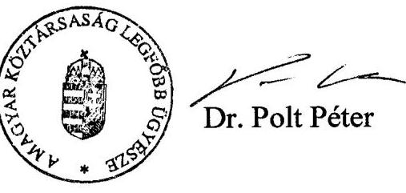

# JELENTÉS 

a Magyar Köztársaság Úgyészsége fejezet múködésének ellenőrzéséről

---

# 2. Államháztartás Központi Szintjét Ellenőrző Igazgatóság 

2.3. Átfogó Ellenőrzési Főcsoport

Iktatószám: V-15-43/2002-2003.
Témaszám: 607
Vizsgálat-azonosító szám: V0037

## Az ellenőrzést felügyelte:

## Bihary Zsigmond

főigazgató

## Az ellenőrzés végrehajtásáért felelős:

Hegedúsné dr. Müllern Veronika
főcsoportfőnök

## Az ellenőrzést vezette:

## Hudik Zoltán

számvevő igazgatóhelyettes

## Az ellenőrzést végezték:

## Tóth Bálint

Számvevő tanácsos, főtanácsadó

## Dr. Pataki Magdolna

Számvevő tanácsos, tanácsadó

## Dr. Király László

Számvevő tanácsos, tanácsadó

## Domonkosné Kurilla Edit

számvevő tanácsos

## Balkay Attila

számvevő

## A témához kapcsolódó eddig készített számvevőszéki jelentések:

## Címek

Éves jelentések a központi költségvetés előirányzatai megalapozottságáról (évente)
Éves jelentések a központi költségvetés zárszámadásainak ellenőrzéséről (évente)
Jelentés a költségvetési fejezetek jóléti célú kiadásainak és jóléti intézményei múködésének pénzügyi-gazdasági utóellenőrzéséről (a Legfőbb Úgyészségre vonatkozó megállapítások tekintetében) (1999.)

Jelentés a központi költségvetés területén múködő belső kontrollmechanizmusok ellenőrzéséről (a Magyar Köztársaság Úgyészsége fejezetre vonatkozó megállapítások tekintetében) (2001.)

## Sorszámok

[9839] [9932]
[0034]
[9826] [9927]
[0024] [0126]
[9925]
[0115]

---

# TARTALOMJEGYZÉK 

BEVEZETÉS ..... 5
I. ÖSSZEGZŐ MEGÁLLAPÍTÁSOK, KÖVETKEZTETÉSEK, JAVASLATOK ..... 8
II. RÉSZLETES MEGÁLLAPÍTÁSOK ..... 15

1. A Magyar Köztársaság Ügyészsége fejezet igazgatási és felügyeleti tevékenysége ..... 15
1.1. Az ügyészségek igazgatási, gazdálkodási struktúrája, a múködés szabályozottsága ..... 15
1.2. A felügyeleti költségvetési ellenőrzés és a belső ellenőrzés irányítása és múködése ..... 21
2. A fejezet költségvetési gazdálkodásának irányítása, felügyelete ..... 28
2.1. A költségvetés tervezési információs rendszere, múködése ..... 28
2.2. A költségvetés végrehajtási és beszámolási rendszerének múködése ..... 35
2.3. A belső kontrollmechanizmus egyes szabályozási elemeinek alakulása ..... 43
MELLÉKLET
Gazd.: 173/02/2003. legfőbb ügyész levele
FÜGGELÉK
01/4/2003 Titkos! Az ügyészségi informatikai rendszer irányítása (elosztó szerint)

---

.

---

# RÖVIDÍTÉSEK JEGYZÉKE 

| AB | Alkotmánybíróság |
| :--: | :--: |
| Áfa | általános forgalmi adó |
| Áht. | Az államháztartásról szóló 1992. évi XXXVIII. törvény |
| Ámr. | Az államháztartás múködési rendjéről szóló 217/1998. (XII. 30.) Korm. rendelet |
| APEH | Adó- és Pénzügyi Ellenőrzési Hivatal |
| ÁSZ | Állami Számvevőszék |
| BM | Belügyminisztérium és intézményei |
| Be. | a büntetőeljárásról szóló 1998. évi XIX. törvény |
| BV OP | Büntetés-végrehajtás Országos Parancsnokság |
| ERÜBS | Egységes Rendőrségi és Ügyészségi Bűnügyi Statisztikai Rendszer |
| EU | Európai Unió |
| IM | Igazságügyi Minisztérium |
| ISM | Ifjúsági és Sportminisztérium |
| ITB | Informatikai Tárcaközi Bizottság |
| Kbt. | A közbeszerzésekről szóló 1995. évi XL. törvény |
| KVI | Kincstári Vagyoni Igazgatóság |
| LAN | Local Area Network - informatikai helyi hálózat |
| LB | Legfelsőbb Bíróság |
| LÜ | Legfőbb Ügyészség |
| LÜGSZ | Legfőbb Ügyészség Gazdálkodó Szervezete |
| MÁK | Magyar Államkincstár |
| OGY | Országgyúlés |
| OIT | Országos Igazságszolgáltatási Tanács |
| OKRI | Országos Kriminológiai Intézet |
| PHARE | Poland-Hungary Aid for Restructuring the Economy |
| PM | Pénzügyminisztérium |
| SzMSz | Szervezeti és Múködési Szabályzat |
| Szt. | a számvitelről szóló 2000. évi C. törvény |
| TÜGSZ | Területi Ügyészség Gazdálkodó Szervezete |
| Üsztv. | Az ügyészségi szolgálati viszonyról és az ügyészségi adatkezelésről szóló 1994. évi LXXX. törvény |
| Ütv. | A Magyar Köztársaság ügyészségéről szóló 1972. évi V. törvény |
| WAN | Wide Area Network - kiterjedt (országos, világ- stb.) informatikai hálózat |

---

.

---

# JELENTÉS 

## a Magyar Köztársaság Ügyészsége fejezet múködésének ellenőrzéséről

## BEVEZETÉS

Az ügyészség fő feladatait és múködési, szervezeti rendeződésének alapelveit a Magyar Köztársaság Alkotmányáról szóló, többször módosított 1949. évi XX. törvényben, a Magyar Köztársaság ügyészségéről szóló 1972. évi V. törvényben (Ütv.), valamint az ügyészségi szolgálati viszonyról és az ügyészségi adatkezelésről szóló 1994. évi LXXX. törvényben (Üsztv.) foglaltak határozzák meg.

Az Állami Számvevőszék 1997. évi átfogó ellenőrzése óta az ügyészségek törvényekben meghatározott feladatköre az igazságügyi reform folyamatával, a bűnözés mennyiségi növekedésével és szerkezeti változásaival, valamint a közeledő Európai Uniós csatlakozással összefüggésben jelentősen bővült. A változó feladatokhoz az ügyészség szervezeti reform végrehajtásával igazodott, mely során módosította szakmai szervezetét, irányítási, igazgatási struktúráját. Az igazságügyi reform folyamatában kiemelt jelentőséggel bírt az ügyészi szervezet alkotmányos feladatainak ellátását támogató egységes, integrált ügyészségi informatikai és telekommunikációs rendszer létrehozása és fejlesztése.

Az ügyészi szervezet szakmailag egységesen foglalja magába a polgári és a katonai ügyészi feladatokat ellátó szerveket. A Magyar Köztársaság Ügyészsége (MKÜ) fejezet döntően a polgári feladatokat ellátó ügyészi szervezet részére biztosított költségvetési forrásokat, míg a katonai ügyészi feladatok finanszírozása a Honvédelmi Minisztérium fejezetből történt.

A kormány által 1960-ban alapított Országos Kriminológiai Intézet - 1999. évben kiadott alapító okirata szerint - állami feladatként a bűnügyi tudományok, valamint a bűnmegelőzés körében kutató, jogszabály-előkészítő, felügyeleti szervével együttműködésben oktató tevékenységet végez. Az intézet korábban nem ügyészi szervként gazdálkodhatott az MKÜ költségvetési fejezetben részére biztosított előirányzattal. A 2001. évben törvényi meghatározással minősítették az ügyészség tudományos kutató szervének.

A fejezet központosított gazdálkodó szervezete két önálló és 21 részben önálló intézményből állt, a 114 helyi (városi, kerületi) ügyészség a megyei (fővárosi) főügyészségek szervezetébe és költségvetésébe tagozódott. A szervezeti változtatások következményeként - 2003-tól - kizárólag a Legfőbb Ügyészség folytat az államháztartási szabályok szerinti teljes jogkörű gazdálkodást, míg a többi ügyészi szervezet részjogkörű költségvetési egységként múködik tovább.
Az ügyészség nem bevétel orientált szervezet, a saját tervezett bevétel aránya az összes kiadáshoz képest 1998-1999. években közel 2 \% volt. A 2000. évvel kezdődően megemelt központi támogatás mellett ez az arány a fél százalékot

---

sem érte el. A fejezet eredeti kiadási előirányzata öt év alatt több mint kétszeresre emelkedett, 2002-ben elérte a 16,1 Mrd Ft-ot. A beruházások és felújítások eredményeként az ügyészség tárgyi eszközeinek nettó értéke a 2001. év végére közel hétszeresére, 4,5 Mrd Ft-ra nőtt.
A feladatváltozásokkal összefüggésben a fejezet létszáma 2002-re 3455 főt ért el, ami az 1997. évihez képest több mint 550 fős bővülést jelentett. A költségvetési többletek az ügyészi teljesítmény növekedését eredményezték. Az érdemben elintézett ügyek száma 1997-hez képest $33 \%$-kal nőtt, az eredményes vádemelések aránya is kedvező irányban - 94,6 \%-ról 96,5 \%-ra - módosult.
A jelenlegi átfogó ellenőrzés végrehajtására az Állami Számvevőszékről szóló 1989. évi XXXVIII. törvény 2. § (3) és 17. § (3) bekezdésben foglaltak adtak jogszabályi alapot.
Az ellenőrzés célja annak értékelése volt, hogy a Magyar Köztársaság Ügyészsége költségvetési fejezetnél:

- az ügyészségek igazgatása, gazdálkodásának irányítása és felügyelete, valamint szervezeti háttere célszerűen biztosította-e a fejezet részére a törvényekben meghatározott feladatok teljesítését;
- a fejezet költségvetési gazdálkodásának irányítása és felügyelete célszerűen, eredményesen történt-e; a költségvetés tervezési, végrehajtási és beszámolási információs rendszere biztosította-e a különböző jogcímeken rendelkezésre álló közpénzek szabályszerű, célszerű és eredményes felhasználását;
- a fejezet informatikai stratégiáját a kormányzati informatikai programok fejlesztések, ajánlások figyelemmel kísérése mellett alakították-e ki, az intézmények informatikai rendszereinek szabályozottsága, múködtetése, fejlesztése megfelelt-e a célszerűségi és megbízhatósági szempontoknak, a források szabályszerű és hatékony felhasználásának;
- a korábbi számvevőszéki ellenőrzések - kiemelten a központi költségvetés területén múködő belső kontrollmechanizmus - vizsgálati megállapításait, ajánlásait figyelembe vették-e, a fejezet intézkedési tervei megfelelően hasz-nosultak-e.

Az átfogó ellenőrzés a Magyar Köztársaság Ügyészsége fejezet 1998-2002. évi múködését tekintette át, az ügyészségek igazgatásának, gazdasági tevékenységének irányítási, felügyeleti, ellenőrzési tevékenységének értékelésére koncentrálva. Figyelemmel kísértük továbbá az ügyészségi informatikai rendszer kialakítási folyamatát, valamint a korábbi számvevőszéki javaslatokra tett intézkedések hasznosulását. Az ellenőrzés keretében - a 2002. év zárszámadás előkészítéseként - elvégeztük a fejezet 2002. I. félévi kiadási és bevételi forgalmi adataiból kiválasztott tételek szabályszerűségi ellenőrzését is.

A következtetések megfogalmazásánál hangsúlyosabban az utóbbi két év pénzügyi-gazdasági folyamatainak tapasztalatait vettük figyelembe. Az ügyészségi informatikai rendszer irányításával kapcsolatos következtetéseinket elemző összesítéseinket e jelentés „Titkos" minősítésű függeléke tartalmazza, tekintettel arra, hogy azok - az államtitokról és szolgálati titokról szóló 1995. évi LXV. törvény 4. § (1) bekezdése foglaltak alapján a Magyar Köztársaság Leg

---

főbb Ügyésze által megállapított titokköri jegyzék szerint - szolgálati titoknak minősülnek.

A jelentést és titkos minősítésű függelékét az Állami Számvevőszékről szóló 1989. évi XXXVIII. tv. 25. § (1) bekezdésében foglaltaknak megfelelően Dr. Polt Péter legfőbb ügyész úrnak észrevételezésre megküldtük, aki jelentésünket köszönettel vette, észrevételt nem tett, továbbá tájékoztatást adott arról, hogy az előírások figyelembe vételével - a hiányosságok megszüntetésére - intézkedési tervet készít. (Levelének másolata a jelentés mellékletét képezi).

---

# I. ÖSSZEGZŐ MEGÁLLAPÍTÁSOK, KÖVETKEZTETÉSEK, JAVASLATOK 

A Magyar Köztársaság ügyészségének múködését meghatározó szakmai törvények különböző jogszabály helyeken többségében rögzítették azokat az alapító okirat információkat, melyeket az államháztartásról szóló, többször módosított törvény (Áht.) előírt. Az ügyészségre vonatkozó rendelkezések az áttekintett időszak alatt többször módosultak, ezzel együtt a költségvetési szervekre előírt alapító okirat adattartalom nem vált teljessé (pl. nem tértek ki a Katonai Főügyészség egyes költségeinek fejezeten belüli finanszírozására, elmaradt a költségvetési felügyeleti szerv, gazdálkodási jogkörök megjelölése). Az adattartalom - ellenőrzés során jelzett - hiányosságai a vagyongazdálkodási, szabályozási és ellenőrzési szempontok érvényesülését befolyásolják, ezért e kérdéskör rendezése nem maradhat el. A megoldást az ügyészi szerveknél - mint a törvény által létrehozott, felügyeleti szervvel nem rendelkező költségvetési szervek esetében az Áht. 2000. január 1-jétől hatályos rendelkezése adja. (Az alapítást elrendelő törvény mellékletének kell tartalmaznia az előírt tartalmú alapító okiratot.)

Az ügyészi szervezet irányítása, felügyelete, múködési, döntési mechanizmusa centralizált, a törvényi követelményekhez igazodóan a legfőbb ügyész vezeti és utasítások útján irányítja. A szakmai és gazdasági szervezeti struktúra egységes elvek alapján szabályozott, azonban a belső ellenőrzés hiányosságai miatt a feladatok egységes értelmezése nem minden esetben jutott érvényre (pl. leltározás, irodai ügyvitel).

A szabályozási hatáskörök rendje - igazodva az ügyészség szervezeti felépítéséhez - általában egyértelműen jelölte ki a szakmai és gazdasági szervezeti egységek együttmúködésének kereteit. Néhány esetben azonban a koordináció hiánya mutatkozott, mely az adott feladat végrehajtásának eredményességét érintette hátrányosan (pl. a felügyeleti költségvetési ellenőrzések realizálását, a pénzügyi terület és az OKRI informatikai eszközbeszerzéseit illetően). Ezek többségében a rugalmasabb hatásköri megoldásokkal, az információcsere szélesebb körű kiterjesztésével elkerülhetők.

A szakmai felügyeleti ellenőrzések rendje az ügyészségi szervezet egészére kiterjedően 2002. évtől szabályozott. A legfőbb ügyész az ellenőrzés rendszerét, az ügyészi szakterületen elfogadott ellenőrzés típusok tartalmát és a végrehatás szabályait körlevélben határozta meg. Ebben a szakmai felügyeleti ellenőrzés általános céljaként a főügyészségen a működés átfogó értékelését, a szakágak együttműködésének, a vezetői, irányító és ellenőrző tevékenységek eredményeinek elemzését fogalmazta meg. (2002-ben egy megyei főügyészségnél indult ilyen célú általános vizsgálat, melyet a helyszíni ellenőrzés időszakában még nem zártak le.)

Az ügyészi szervezet felépítése és irányítási struktúrája 2001. júniusától érdemi módosuláson ment keresztül. Ennek során eredményesen kezelték a törvényekben meghatározott feladatbővülés, az ügyforgalom növekedésének és bonyolultabbá válásának és az ügyészi utánpótlás egyidejűleg jelentkező - át

---

meneti - hiányának ellentmondását. (Az utánpótlási gondok kialakulásában szerepet játszott, hogy az ügyésszé válás folyamata 1997. októberétől két évről négy évre növekedett.)

Az ügyészségi reform keretében hatékony szervezeti intézkedéseket tettek. A szakmai feladatok terén - elsősorban a kiemelkedő súlyú bűncselekmények elleni fellépés érdekében - új szervezetet hoztak létre (Központi Ügyészségi Nyomozó Hivatalt), mely megfelelő szakmai és költségvetési előkészítés után 2001. júniusában kezdte meg a múködését.

A gazdálkodást érintően megvalósították a közvetlen, folyamatos költségvetési egyeztetés és ellenőrzés feltételeit. Szervezetileg elkülönítették - az előző átfogó ellenőrzés során együvé tartozásuk miatt kifogásolt - fejezeti és az intézményi gazdálkodás irányító szerveit.

Az Országos Kriminológiai Intézet (OKRI) elsősorban más felhasználóknak - többek között más költségvetési szerveknek (IM, BM, ISM) - nyújt szolgáltatást, legtöbbször díjazás ellenében. Az OKRI ügyészségi szervezetbe integrálását követően sem vált egyértelművé az ellátandó feladat költségvetési kapcsolata, nehezítve a költségvetési eszközök cél szerinti felhasználásának értékelését. Az intézet többirányú tevékenységére tekintettel, a költségvetési gazdálkodás keretei között különösen fontos a számon kérhető feladatok, illetve az azok ellátásához szükséges költségvetési források, valamint az egyéb szolgáltatások feltételeinek pontos meghatározása. Ez az államháztartás valamennyi költségvetési intézménye esetében követelmény. (Az Áht. ide vonatkozó előírásainak betartásával előzhető meg az olyan jellegű szabálytalanságok előfordulása, melyeket pl. a fejezet felügyeleti költségvetési ellenőrzése 2001-ben tárt fel az intézetnél.)

Az ügyészi szervezet összetétele még nem tekinthető véglegesnek, a további változtatások alapját az igazságügyi reform követelményei képezik, melynek szervezeti oldalon a legközelebbi feladata a fellebbviteli főügyészségek létrehozása. A Legfőbb Ügyészség az ezzel összefüggő szakmai és költségvetési feladatokat az érintett főosztályok koordinációjával folyamatosan tervezi és egyezteti.

Az ügyészség gazdálkodási rendje döntően a szakmai szervezet központosított rendjéhez igazodott. Ez biztosította, hogy a feladatellátás költségvetési forrásai ugyanazon a döntési szinten kerültek elosztásra, ahol a feladatok meghatározása és a végrehajtási felelősség jelentkezett. A Legfőbb Ügyészség és a megyei (fővárosi) főügyészségek gazdálkodási rendje a mindenkori költségvetési feladatokhoz igazodóan jól szervezett.

Általánosságban megállapítható volt, hogy a fejezet szakmai és gazdálkodó szervezetei a feladatokhoz igazodva célszerűen módosultak, a szabályozottság javult, a költségvetési gazdálkodás szakszerűsége és felügyelete erősödött. Az igazgatási, gazdálkodási feladatok ellátásának személyi és tárgyi feltételei két terület kivételével (a költségvetési felügyeleti ellenőrzés és az informatikai területen tapasztalt létszámhiány) - a szükségleteknek megfelelően alakultak.

A költségvetés tervezése és végrehajtása során jelentkező feladatokat kisebb hiányosságokkal a jogszabályi előírásoknak megfelelően teljesítették.

---

A tervezést a törvényi és szervezeti változásokból prognosztizálható költségvetési követelményekre alapozták, a prioritások meghatározása a bűnözés alakulásának és a büntető jogszabályok változásának figyelembevételével történt. A tervezéshez használt információs forrásokat célszerűen választották meg. A tárgyidőszaki tervezést minden esetben többéves előretekintés kísérte az ügyészi létszám utánpótlásának és bővítésének, valamint a szükséges beruházások kivitelezésének biztosítása érdekében.

A költségvetési tervezés szakmai feladatai - az államháztartás múködési rendjéről szóló jogszabály szerint - többek között magukban foglalják a tervezési követelmények megállapítását (érvényesítését) és módszertan kidolgozását, valamint a költségvetéssel rendelkező szervezet feladatait jellemző és a normatív hozzájárulásokhoz kapcsolódó mutatószámok (költségvetési feladatmutatók, költségvetési mutatószámok) kialakítását, megállapítását is.

Az ügyészségnél a költségvetési feladatmutatók alkalmazhatóságával foglalkoztak, azonban az ügyészi teljesítmény költségvetési szempontból értelmezhető normásítására - a szakmai sajátosságokból adódóan (újszerű bűnelkövetési formák szaporodása, a nehéz ténybeli és jogi megítélésű ügyek számának emelkedése) - nem találtak egyértelmúen célszerű megoldást. Ugyanakkor az ügyészség teljesítményét folyamatosan figyelemmel kísérték és alkalmazták a tervezés szempontjából hasznosítható mutatókat. (Pl. az ügyészségi költségvetés túlnyomó hányadát kitevő személyi juttatások és járulékaik tervezése éves személyügyi és továbbképzési tervekre épült, melyekben az ügyészi létszámot a fóügyészségek munkateher vizsgálata alapján határozták meg.)

Az ügyészség tervezési gyakorlata - mint más szervezeteknél szerzett ellenőrzési tapasztalatok sora -, arra engedett következtetni, hogy egyetlen jellemző mutatószámmal kívánták megalapozni a fejezeti tervezést. Ugyanakkor rendelkeznek több olyan adathalmazzal, melyek a feladatkör ellátásának jellemzésére alkalmasak. A tervezés jogszabályi előírásainak módszertani megoldásaként éppen ezek költségvetési összefüggéseit célszerű megtalálni.

A mutatószámok alkalmazása nem csak a költségvetés megalapozása céljából lényeges, hanem a költségvetési szervezetek teljesítményének ellenőrizhetősége szempontjából is. Olyan összetett szakmai terület, mint egy költségvetési fejezet teljesítménye sem mérhető egyetlen célra irányuló ellenőrzés elvégzésével, az érdemben csak több irányban lefolytatott teljesítmény-ellenőrzések tapasztalatainak összegzése révén ítélhető meg. A feladatmutatók, teljesítménymutatók célirányos kidolgozásához potenciálisan a költségvetési szerv rendelkezik adatokkal, de ehhez a szakmai és gazdasági szervek együttmúködése szükséges (az ügyészségnél pl. hasznosításra ajánlható a szakmai felügyeleti ellenőrzéseknél alkalmazott szempontrendszer).

A költségvetés végrehajtása során - a többlet-támogatások és a központi elvonások egyenlegeként, valamint az előző évi maradványok felhasználása és a többletbevételek következtében - a teljesítés minden évben meghaladta az eredeti előirányzatot.

---

Az ügyészség létszámbővítése 2002 szeptemberéig (az üres álláshelyek erőteljes csökkenésének bekövetkezéséig) a betöltetlen álláshelyek számának növekedése mellett valósult meg. Az engedélyezett ügyészi álláshelyeket egyik évben sem tudták feltölteni, melyben az ügyészi utánpótlás lassulásának, az öregségi nyugdíjkorhatárt elérők viszonylag magas arányának ( $9-10 \%$ ) és a kedvezőtlen elhelyezési körülményeknek (irodák hiányának) volt befolyásoló szerepe. A létszámgazdálkodással összefüggő döntések előkészítése szakmailag megfelelően támogatta a személyi juttatások tervezését. Ugyanakkor költségvetési oldalon nem vezettek olyan létszám- és bérnyilvántartást, ami biztosítéka lehet az üres ügyészi álláshelyek előirányzatai felhasználásával megvalósított létszámbővítésnek. Ennek hiánya a forráshiányos tervezés kockázatát hordozza magában, megjegyezve, hogy ilyen helyzetbe eddig nem kerültek.

Az ügyészség dologi kiadásainak eredeti előirányzatában az 1997. évhez képest másfélszeres (154\%) volt a növekedés. Ezzel együtt és a jellemzően takarékos gazdálkodás mellett forrás átcsoportosításokra volt szükség, többnyire a felújítások terhére. A kiadások emelkedésében az informatikai és kommunikációs hálózat folyamatos bővítésével és a férőhely-fejlesztésekkel kapcsolatban növekvő költség igények játszottak meghatározó szerepet.

A felújítási és beruházási előirányzatok kialakításánál az ügyészi szervek megfelelő elhelyezésének prioritása indokoltnak tekinthető, mert a helyiségek biztosítása jelenti az ügyészi létszámbővítés egyik meghatározó feltételét. Az előirányzatok felhasználása az ügyészség alkalmazásában állók elhelyezési és munkakörülményeiben mérsékelt ütemű javulást eredményezett. Az előirányzatok tervezése - a költségvetési gazdálkodás kialakult rendjében - bázisszemlélet alapján történt, de ez következett az objektív állapot felmérés hiányából és a közös épületben elhelyezett bíróságokkal fennálló vagyonkezelői jog körüli bizonytalanságból is. A járulékos kiadásokat megfelelően vették figyelembe, amelyek a tervezett előirányzaton belül valósultak meg.

A fejezet költségvetésében a 2000. évtől határoztak meg fejezeti kezelésű előirányzatokat, melyek felhasználása szabályszerűen történt, felhasználásuk szakmai ellenőrzése biztosított volt. A felújítások, beruházások végrehajtásánál a közbeszerzésre vonatkozó jogszabályi előírásokat az ügyészi szervezetek betartották. Mindezek a megállapítások nem adnak mentességet az alól, hogy a fejezet rendelkezzen e tevékenységek belső szabályozásával (a fejezeti kezelésű előirányzat-felhasználás szabályozása késedelemmel jelent meg, a beszerzések belső szabályozása előkészítés alatt állt).

Az ügyészi szervezetek felügyeleti költségvetési ellenőrzése a szabályozás oldaláról rendezettnek tekinthető. Az ellenőri szervezet függetlenségét a legfőbb ügyész közvetlen irányítása biztosítja. A tevékenységek részletes szabályozása elvileg megfelelő keretet adott a felügyeleti és a Legfőbb Ügyészséget érintő függetlenített belső ellenőrzési feladatok ellátásához. Az ellenőrző szervezet létszámának egy főben történt megállapítása és az ellenőrzési feladatok mellé rendelt más irányú tevékenységek azonban tarthatatlanná tették a felügyeleti költségvetési ellenőrzés keretében a kormányrendeletben előírt gyakoriságú átfogó ellenőrzések végrehajtását. A kapacitáshiány kedvezőtlen hatása a függetlenített belső ellenőrzési feladatoknál is érzékelhető volt, mivel az ügyészségi

---

költségvetés mintegy 92\%-ával gazdálkodó Legfőbb Ügyészségnél - néhány részterület kivételével - függetleníttett belső ellenőrzést nem végeztek.

Az intézményi belső ellenőrzési rendszer kialakítását az erősen központosított gazdálkodásra alapozták. A részben önálló költségvetési szervek belső ellenőrzését - a jogszabályi előírástól eltérően - a vezetői és a munkafolyamatba épített ellenőrzésre szűkítették, ugyanakkor a felügyeleti szervnél a függetlenített belső ellenőrzési kapacitás feltételeit nem biztosították. Kedvezőbb helyzetet teremtett az ellenőri létszámhelyek - 2001. augusztus tól - három főre történő növelése, de ennek hatása a létszámhelyek betöltetlensége miatt a felügyeleti, illetve a belső ellenőrzési feladatok végrehajtásában még nem volt kimutatható. A fejezetnél a részben önálló költségvetési szervek (főügyészségek, OKRI) részjogkörű költségvetési egységgé minősítése megoldást hozhat az előírástól eltérő belső ellenőrzési gyakorlat megszüntetésére is.

A múködés eredményességének megítélésében kiemelt jelentőséggel bír, hogy milyen a fejezet önértékelő (ellenőrzési) képessége, ezt tudja-e hasznosítani tevékenységei javításához. A fejezetnél már a korábban lefolytatott - a belső kontrollmechanizmus múködésére irányuló - számvevőszéki ellenőrzések magas kockázatúnak minősítették ezt a területet az informatikai szabályozással együtt. Ezek korrigálására azóta sem történtek érdemi intézkedések, ami lényegében a meglévő szabályozási keretek között az ellenőrzési célterületek kiszélesítését és ezekhez a megfelelő kapacitás biztosítását jelentené.

A hatékony belső ellenőrzés kialakításának, ezen belül különösen a számviteli folyamatok figyelemmel kísérésének szükségességét támasztják alá a központosított beszerzésből átadott eszközök nyilvántartásánál és a fejezeti kezelésű előirányzat felhasználásoknál a vagyonváltozás nyilvántartása terén tapasztalt hiányosságok. A Legfőbb Ügyészség vagyonnyilvántartásának és az eszközök azonosításának hiányosságait sem a belső ellenőrzés tárta fel, ezeket a tárgyi eszközök leltározása hozta felszínre.

A fejezet rendszeresen karbantartott számviteli politikája és a kiadott szabályzatok (pl. leltározási, leltárértékelési szabályzat, számlarend, pénzkezelési szabályzat, önköltség számítási szabályzat) a gazdasági események fejezeti és intézményi szintű egységes kezeléséhez megfelelő keretet adnak. A számviteli területeken tapasztalt hiányosságok nem a szabályozások pontatlanságával hozhatók összefüggésbe, előfordulásuk alapvetően az előírások megfelelő értelmezésével, továbbá a munkafolyamatba épített ellenőrzés körültekintőbb megszervezésével, a gazdasági folyamatokban együttműködő szervezetek részletekre kiterjedő eligazításával megelőzhető.

A számviteli politika főbb irányainak meghatározásáért, az elkészítéséért és az elkészült számviteli politika jóváhagyásáért, annak végrehajtásáért az államháztartás szervezetének vezetőjét tette felelőssé az Áht., valamint a számviteli törvény alapján hozott kormányrendelet. Ezt a jogkört a legfőbb ügyész a központi gazdálkodó szervezet gazdasági vezetőjére ruházta át, a gazdasági területre vonatkozó képviseleti joggal együtt. A jogszabály rendelkezésétől eltérő szintű szabályozást célszerű az előírt szintre emelni, vagy a kormányrendelet eltérést megengedő módosítását kell kezdeményezni.

---

Az ügyészségi középtávú (1999-2003. évekre meghatározott) informatikai stratégia az ügyészség alkotmányos feladatain, valamint - szervezetének és múködése feltételrendszerének 1997-ben a bírósági reformra figyelemmel kidolgozott koncepciójára épített - stabil szervezeti stratégián alapul. Az informatikai stratégia általános elvi célkitűzéseiben önálló intézményrendszerre épülő egységes, integrált ügyészségi telematikai (telekommunikációs és informatikai) rendszer kialakítását fogalmazta meg, melyben hangsúlyosan szerepelt az európai szabványok követése és a nemzetközi együttmúködés feltételeinek megteremtése. Tekintettel az ügyészség - a bűnüldözés és az igazságszolgáltatás egyéb területeihez viszonyítható - informatikai-technikai lemaradására, követelményként jelentkezett az együttműködő társszervek (OIT Hivatala, bíróságok, BM, IM szervei stb.), valamint a kormányzat fejlesztési stratégiáival konform fejlesztések szükségessége.

Az ügyészségi informatikai stratégia - bár a törvényi változásokat követő feladatokra épült - nem komplex módon tükrözte az ügyészi szervezet szakmai információs szükségleteit és ezzel nem nyújtott elégséges alapot projektjei rendszerszemléletű kezeléséhez. Az informatikai stratégia hiányosságának tekinthető például, hogy jelentősége ellenére sem tért ki az ügyészségi tevékenységhez kapcsolódó információk biztonságának elveire (a kérdéskör csupán néhány projekt - zártcélú távközlési hálózat, Internet működtetése kapcsán merült fel). Az ügyészségi fejezet informatikai feladataira vonatkozó munkamegosztás nem biztosította az irányítás, a fejlesztés és a működtetés összehangolt kapcsolódását, hiányzott a beszerzések koordinált lebonyolítása és felügyelete is. Az egységes fejezeti irányítás nem kellően érvényesült az informatikai rendszer teljes keresztmetszetében, amiben szerepet játszottak a szabályozási és szervezeti háttér különféle területein (informatikai értékelés-elemzés, minőségbiztosítás, biztonsági felügyelet) tapasztalt hiányosságok.

Mindezekkel együtt megállapítható volt az is, hogy 2000-ig a finanszírozási és technikai peremfeltételekkel sem rendelkeztek a szükséges mértékben. Csak a 2000. évtől biztosított pénzügyi források (központi tartalék, PHARE finanszírozás, egyéb külső pályázatok) járultak hozzá, hogy 2002-re jelentős fejlesztést értek el az ügyészségi informatikai alkalmazásokban (a bűnüldözést segítő nyilvántartó rendszer, országos távadat-átviteli hálózat stb.). Összességében láthatóvá vált, hogy az informatikai stratégia projektjeinek 2003-ig tervezett végrehajtása elhúzódik.

A további évekre szóló ügyészségi informatikai stratégia tervezet formájában elkészült (megvitatását 2003. februári országos vezetői értekezlet napirendjére tűzték). Lényegében a korábbi elmaradásokat emelték át feladatként, kiegészítő célkitűzésként fogalmazták meg a Katonai Főügyészség és a területi katonai ügyészségek informatikai rendszerének a meglévő ügyészségi hálózathoz kapcsolását és az EU követelményeknek megfelelő szabályozás készítését. Ugyanakkor ez a tervezet sem kezelte súlyának megfelelően a biztonsági kérdéseket, hátrányára nem a stratégiai tervezés államigazgatási körben elfogadott elveihez igazodó tartalommal készült.

Az ügyészség múködésének biztonsága terén az egyes részterületeket (sze-mély-, vagyonvédelem, informatikai biztonság) differenciáltan kezelték. A ki

---

dolgozott koncepciók végrehajtásához szükséges intézkedések és szabályzatok jóváhagyása, harmonizálása a helyszíni ellenőrzés befejezéséig nem történt meg (pl. a tűzbiztonság kezelése sem egyeztetett az informatikai katasztrófa és működésfolytonossági koncepcióval). Az egységes biztonságpolitikai szemlélet hiánya különösen a beruházásoknál, a műszaki kivitelezéseknél hordozza annak kockázatát, hogy az összehangolatlanság miatt indokolatlan ráfordítások is előfordulhatnak, miközben szükséges megoldások elmaradnak.

A helyszíni ellenőrzés megállapításainak hasznosítása mellett javasoljuk:

# a legfőbb ügyésznek: 

1. Kezdeményezze az államháztartásról szóló többször módosított 1992. évi XXXVIII. törvény 88. § (4) bekezdésében foglaltak teljesítése és a teljes körű alapító okirat adattartalom biztosítása érdekében az ügyészségről szóló 1972. évi V. törvény kiegészítését megfelelő melléklettel.
2. Intézkedjen
a) az ügyészi szervezetbe tagolt Országos Kriminológiai Intézet szakmai integrációját biztosító feladatok és azok költségvetési összefüggéseinek meghatározására, valamint a szolgáltatás rendjének szabályozására;
b) a fejezeti kezelésű előirányzat felhasználásával, gazdálkodásával, továbbá a számviteli politika és keretei között készítendő szabályzatok jogszerű kiadására, illetve szükség szerint kezdeményezze a vonatkozó jogszabályok módosítását.
3. Gondoskodjon
a) a jogszabályban előírt költségvetési (belső) ellenőrzések végrehajtásához szükséges ellenőri kapacitásról, figyelemmel a fejezethez tartozó költségvetési szervek besorolásának módosítására, valamint a fellebbviteli főügyészségek létrehozására;
b) a külső ellenőrzések által feltárt szabályozási hiányosságok megszüntetéséről, az ezzel összefüggő belső kontrollok működtetéséről;
c) a 2002 utáni évekre szóló informatikai stratégia kellő mélységű kidolgozásáról, hasznosítva a stratégiai tervezés államigazgatásban elfogadott általános szempontjait;
d) az informatikai stratégia végrehajtásának megalapozottan tervezhető ütemezéséhez olyan szabályozási háttér kialakításáról, amely biztosítja az erőforrások célok szerinti koordinált és ellenőrzött felhasználását;
e) az ügyészségi tevékenység egészét átfogó biztonságpolitika kialakításáról és annak érvényesítését biztosító szervezeti rendszer meghatározásáról, hangsúlyozottan az informatikai biztonságot stratégiai alapon megvalósító szabályozási és szervezeti háttér megteremtéséről.

---

# II. RÉSZLETES MEGÁLLAPÍTÁSOK 

## 1. A Magyar KöztÁrsasÁG ÜGYÉszSÉGE FEJEZET IGAZGATÁSI ÉS FELÜGYELETI TEVÉKENYSÉGE

### 1.1. Az ügyészségek igazgatási, gazdálkodási struktúrája, a múködés szabályozottsága

Az ügyészség fő feladatai és működési, szervezeti rendeződésének elvei alapvetően három fő törvényi helyen és köztársasági elnöki határozatban vannak lefektetve.

Az ügyészség fő feladatait az Alkotmány 51. §-a határozza meg. Az 53. § (3) bekezdés szerint az ügyészi szervezetet a legfőbb ügyész vezeti és irányítja.

Az Alkotmány rendelkezéseit az Útv. fejti ki részletesen, ugyanakkor az ügyészségek és a legfőbb ügyész feladatköréhez kapcsolódóan egyéb törvények is határoznak meg feladatokat. Az Útv. 18. § sorolja fel a Magyar Köztársaság ügyészi szerveit, ezek részletezését és székhelyüket - törvényi felhatalmazás alapján (Útv. 19. § (1) bekezdés) - a köztársasági elnök határozta meg (143/1997. (IX. 30.) KE határozat).

Az ügyészi szervek vezetőinek kinevezési rendjét az Üsztv. szabályozza.
Az ügyészségek tevékenységét meghatározó rendelkezések közül egyik sem tartalmaz olyan összefoglaló - és költségvetési szempontból eligazító - információkat, melyek az Áht. 88. § (3) bekezdés alapján az alapító okirattal szemben támasztott követelményeknek teljes körűen megfelelnének.

Például a gazdálkodási jogkörök, illetve a költségvetési felügyeleti szerv megjelölése a vonatkozó törvényi helyeken nem található. Az egyes ügyészi szervek székhelyét meghatározó 143/1997. (IX. 30.) KE határozat csupán városokat, illetve kerületeket nevesít, pontos címet egy esetben sem határoz meg.

Az ingatlan nyilvántartás és a vagyongazdálkodás szempontjából tisztázandó kérdés az egyes ügyészségek (ügyészi szervek) pontos címe - tekintve, hogy többféle tulajdonú, kezelői jogú épületben történt elhelyezésük -, mivel ez egyúttal az államháztartási kiadások tervezhetőségére is hatással van.

Pl. a fellebbviteli főügyészségek létrehozásának költség számításai azt mutatták, hogy ha a Szegedi Fellebbviteli Főügyészség elhelyezését a Csongrád Megyei Bíróság nem tudja megoldani, akkor 432,0 M Ft többlettámogatás szükséges az ügyészség részére 2003-ra. (Ez a kérdés időközben megoldódott, ugyanakkor a Pécsi Fellebbviteli Főügyészség elhelyezésére 200,0 M Ft többlettámogatás vált szükségessé.)

A számvevőszék korábbi javaslatára - mely szerint a költségvetési átláthatóság érdekében a Katonai Ügyészségek költségvetési címet egy költségvetési fejezetbe lenne célszerű helyezni az MK Ügyészségével -, a Legfőbb Ügyészség 1997. és

---

2000. között több kezdeményező és érdemi lépést tett, azonban a változtatáshoz szükséges törvénymódosítási javaslatok nem realizálódtak.

A Katonai Főügyészség és a területi katonai ügyészségek finanszírozása és költségvetési ellenőrzésének illetékessége szempontjából - nem vitatva, hogy a katonai ügyészi szervezet egyéb katonaszakmai feladatai alapján tartozik a Honvédelmi Minisztérium fejezethez -, tisztázandó lenne, hogy e feladatok milyen vonatkozásban és hányadban terhelik és/vagy kötelezik az MK Ügyészségét és a honvédelmi tárca költségvetését.

A katonai főügyész - mint a legfőbb ügyész helyettese - illetménye az MKÜ költségvetéséből kerül kiegyenlítésre, egyes nyelvi képzéseken katonai ügyészek is részt vesznek, illetve posztgraduális képzéseket - szakmailag indokoltan - az ügyészség támogat.

A költségvetési felügyeleti szerv megnevezésének hiányában a Legfőbb Ügyészség és az ú.n. Területi Ügyészségek gazdasági felügyeleti szerveinek helyzete 2002. végéig maradt megoldatlan.
2002. végéig a fejezet költségvetési intézményeinek besorolása ellentétes volt az Áht. 87. § (1) bekezdés, valamint az Ámr. 14. § (4) bekezdése szerinti követelményekkel, melyek szerint a költségvetési szerv, illetőleg a részben önállóan gazdálkodó költségvetési szerv jogi személy. Ennek sem a Területi Ügyészségek Gazdálkodó Szervezete (TÜ GSZ), sem az alá besorolt főügyészségek nem feleltek meg. A TÜ GSZ eleve kvázi intézményként működött, mivel létező szervezeti egysége nem volt, szakmai és pénzügyi vezetői pedig azonosak voltak a Legfőbb Ügyészség Gazdasági Szervezetének (LÚ GSZ) vezetőivel, így a fejezeti, illetve az intézményi döntések a felelősség és a hatáskörök szempontjából elkülöníthetetlenekké váltak.

A 2003. évi költségvetés tervezésével együtt járó szervezeti változtatási lehetőségekkel élve az egyes ügyészi szervek költségvetési besorolásának módosítását megkezdték. Az alapító okirat annyiban tenné teljessé a helyzet rendezését, hogy egyértelműen megnevezné a Legfőbb Ügyészséget (LÚ), mint az ügyészségek költségvetési felügyeleti szervét.

Az Ámr. 14. § alapján az önállóan gazdálkodó költségvetési szerv a központi költségvetési szerv felügyeleti szerve, vagy amelyet az alapító vagy a felügyeleti szerv annak sorol be, erre vonatkozó meghatározás pedig - a korábbiak szerint nincs.

A törvényi követelményekhez igazodóan az ügyészség döntési mechanizmusa centralizált, szakmai és gazdasági szervezeti struktúrája egységes elvek alapján szabályozott.

Az ügyészi szervezet felépítése és összetétele 2001. június 1-jétől az 1997. évihez képest - célszerűségi és eredményességi szempontokat követve - érdemi módosulást mutat. A szervezeti reform során a törvényekben meghatározott feladatbővülést, az Európai Unióhoz történő csatlakozásra történő felkészülést, az ügyforgalom növekedését, az ügyészi utánpótlás lassulását éppúgy figyelembe vették, mint a korábbi átfogó ellenőrzésünk javaslatait.

---

Az irányítás és felügyelet struktúrájának módosítása több vonatkozásban eredményesnek tekinthető. A szervezet változtatásával létrejöttek a múködési feltételek közvetlen pénzügyi kontaktpontjai, azaz a folyamatos költségvetési egyeztetés és kontroll lehetőségei.

Az új formációban az igazgatási, személyügyi és adminisztrációs feladatok a magánjogi és közigazgatási jogi legfőbb ügyész helyettes irányítása alá kerültek. Ugyanígy hozzá rendelődött a Számítástechnika-alkalmazási és Információs Főosztály. Ezzel a költségvetés közvetlen kommunikációs lehetőséget nyert a személyüggyel és az informatikával, a felügyeletet gyakorló legfőbb ügyész helyettes pedig teljes rálátással bírhat az összefüggő kérdésekre.

A korszerűsített szervezeti formában a szakmai és a funkcionális (a múködési feltételeket biztosító, kiszolgáló) szervezeti egységek felügyeleti rendszere jól elkülöníthetően szétvált, létrejöttek az együvé tartozó feladatok összehangolt végrehajtásának és a felelősségi körök elkülönítésének feltételei. A szakmai igényeket költségvetési oldalon leginkább tükröző személyügyi és informatikai feladatok finanszírozása a szakmai főosztályok és a Pénzügyi és Műszaki Főosztály koordinált együttműködése révén valósul meg.

A Pénzügyi és Műszaki Főosztályon - a korábbi számvevőszéki ellenőrzés intézkedési terve alapján - szervezetileg elkülönültek a fejezeti gazdálkodást és a Legfőbb Ügyészség intézményi gazdálkodását végző egységek, mellyel a feladatellátás sajátosságaihoz igazodó munkamegosztási szerkezetet sikerült létrehozni.

Az ügyészségi reform keretében - elsősorban a kiemelkedő súlyú bűncselekmények elkövetőivel szembeni hatékonyabb fellépés érdekében - 2001. június 1jén kezdte meg múködését a Központi Ügyészségi Nyomozó Hivatal, mely a Fővárosi Főügyészség országos illetékességgel rendelkező önálló szervezeti egysége, az általa folytatott nyomozás törvényességi felügyeletét a Legfőbb Ügyészség Nyomozás Felügyeleti Főosztálya (Kiemelt Ügyek Osztálya) gyakorolja. Az új szervezeti egység költségvetési háttere időben tervezett és biztosított volt.

Az Országos Kriminológiai Intézet alapító okiratát - a számvevőszéki ellenőrzés észrevételeit figyelembe véve - a 9/1999. (ÜK. 8-9.) LÜ utasítással a legfőbb ügyész szabályszerűen kiadta, az OKRI azonban ezt követően is az ügyészi szervezetbe sajátosan illeszkedő intézmény maradt.

A Kormány által 1960-ban létrehozott - 1999-ig Országos Kriminológiai és Kriminalisztikai Intézet néven múködő - intézményt 2000-ig az ügyészség SzMSz-e a legfőbb ügyész felügyelete alá tartozó nem ügyészi, tudományos és kutató szervként deklarálta, mivel az alkotmányos jogszabályon nyugvó ügyészi szervezethez való tartozására nem alkotmányos jogszabály rendelkezett (2004/1960. (I. 6.) Korm. határozat, melyet 1991-ben hatályon kívül is helyeztek).

Az OKRI-nak az ügyészi szervezethez való kapcsolódását - és ezzel szakmai felügyeletének és költségvetési helyzetének tisztázását - 2001. június 27-től hatályosan - törvényi szinten rendezték. Az Ütv. 18. §-ba iktatott (2) bekezdés ki

---

mondja, hogy "Az ügyészség tudományos és kutató szerve az Országos Kriminológiai Intézet."

A törvényi és a szervezeti változás során az OKRI felügyelete a legfőbb ügyész helyett a büntetőjogi legfőbb ügyész helyetteshez került. Az ügyészségi SzMSz nem határozott meg, a LÚ éves munkatervei - hagyományosan - pedig nem írtak elő kötelező feladatokat az OKRI számára. Ebből következően meghatározott kutatási célú többlet költségvetési forrást nem terveztek részére.

A kutatóintézet saját éves munkaterveit a Tudományos Tanács (melynek tagja a legfőbb ügyész) javaslatai alapján állította össze, a LÚ szakmai tevékenységét támogató kutatási téma elenyésző volt.

A kutatóintézet a magyarországi bűnmegelőzés szervezetének tudományos háttérintézménye, a jogalkotási munkálatok egyik műhelye és vitafóruma, Keletközép Európa legnagyobb kriminológiai kutató bázisa. Az itt kidolgozott anyagokat és megállapításokat a különböző minisztériumok, országos hatáskörű szervek rendszeresen hasznosítják (IM, BM, ISM szervei stb.), hazai és nemzetközi alapítványok alkalmazzák.

Az OKRI 2000. évi munkatervében a 19 kutatási feladatból egy sem kötődött a LÚ megbízásához. 2001-ben és 2002-ben a 17, illetve 15 kutatási témában már megjelenik a Legfőbb Ügyészség munkatervéhez való kapcsolódás egy-két esetben, illetve „igény szerint - szükség esetén" háttértanulmányokkal való közremúködés a kodifikációs és jogértelmezési tevékenységben. 2002-re a fogalmazók képzésében való részvétel is tervezett.

Az intézetben létező szellemi kapacitás - és az ügyészségen keresztül ide juttatott költségvetési támogatás (2002-ben 174,7 M Ft) - nem elsősorban az ügyészségnél, nem a gyakorlati ügyészi munka szemszögéből hasznosul. Az adott helyzet csak részben felel meg az Áht. 20. § (7) bekezdés rendelkezésének, miszerint „a központi költségvetés és az ellátandó feladat költségvetési kapcsolatának abban a szakmai cél szerinti költségvetési fejezetben kell megjelennie, amely fejezet felügyeletét ellátó szerv vezetője ellátja a számára e törvényben és a végrehajtására kiadott rendeletekben foglalt feladatokat."

A szakmai integritás hiányát érzékelve a LÚ az OKRI szakmai tevékenységének átvilágítását kezdte meg 2002. szeptemberében azzal a céllal, hogy felfedjék az intézet és az ügyészi szervezet lehetséges szorosabb együttmúködési formáit.

Az OKRI sajátos ügyészségi státuszából eredő formális szakmai, és az ehhez igazodó viszonylagosan gyenge költségvetési felügyelet szabálytalan gazdálkodást eredményezett az intézetnél, melyet a 2001. évi felügyeleti költségvetési ellenőrzés tárt fel.

Az ellenőrzés a kutatóintézet fő (és többlet) bevételi forrásait jelentő kutatási és megbízási szerződésekkel kapcsolatosan tárt fel szabálytalanságokat. Kifogás volt a kutatók munkában - munkahelyen - eltöltött idejének dokumentálatlansága.

Az ellenőrzés megállapításainak hatására az OKRI gazdasági tevékenységét a továbbiakban kiemelt figyelemmel kísérte a költségvetési felügyelet. Esetenként a kutatóintézet előirányzat módosításainak engedélyezése a gazdálkodási szabálytalanságok elkerülése érdekében elhúzódott.

---

2002-ben az OKRI többletbevételeinek felhasználását késleltette az a megoldás, hogy előirányzat módosítási kérelmeit csak az Ellenőrzési Önálló Osztály vezetőjének egyetértési javaslatát követően terjesztették fel engedélyeztetésre a legfőbb ügyész elé.

Tekintve, hogy az OKRI munkatervei munkaidő-mérleg kidolgozása nélkül készültek, egyúttal a kutatók jelentős száma - engedélyezetten - többes munkaviszonyban is áll (pl. oktatás), a kutatók munkateljesítménye - a költségvetési eszközök szabályos, cél szerinti felhasználása - nem mérhető. Ebből következően az sem ítélhető meg, hogy az Intézet egyes kutatási feladatok megoldására mely esetben köt indokoltan vagy indokolatlanul (szabad kapacitása ellenére) szerződést külső szervezetekkel a költségvetési források terhére. Az indokolatlan szerződéskötések megakadályozására a legfőbb ügyész 2002. augusztus 1-jével hatályosan kiadta a megfelelő utasítást. Ezen túlmenően - az OKRI gazdálkodásának szabályosságát megnyugtatóan rendezendő -, célszerűnek tekinthető az intézetnek az a törekvése, hogy költségvetési igényeit kutatási terveinek megfelelő munkaidő ráfordítással támassza alá, ami a szellemi tevékenységet végzőknél már elfogadott követelmény az EU országaiban. (Az Intézet 2003-tól normásított munkaidő ráfordítás alapján kívánja összeállítani kutatási terveit.)

A kialakított ügyészi szervezeti rendszer még nem végleges, további változtatásainak alapját az igazságügyi reform követelményei képezik, melyek - szervezeti oldalon - legközelebbi feladatként a fellebbviteli főügyészségek létrehozását kívánják meg. A fellebbviteli főügyészségek többszöri módosított határidő után - az ítélőtáblák és a fellebbviteli ügyészi szervek székhelyének és illetékességi területének megállapításáról szóló 2002. évi XXII. törvény 6. § (2) bekezdés alapján - 2003. július 1-jén, illetőleg 2005. január 1-jén kezdik meg tényleges múködésüket. A LÚ az ezzel összefüggő szakmai és költségvetési feladatokat az érintett főosztályok széles körű koordinációjával folyamatosan tervezi és egyezteti.

Az MK Ügyészségénél kialakított szabályozási rendszer alapjaiban biztosítja a feladatok egységes értelmezését és pontos végrehajtását, azonban a felügyeleti ellenőrzés által feltárt egyes esetekben a szabályozás pontosítása elmaradt.

Pl. az OKRI-nál 2001-ben a felügyeleti ellenőrzés által feltár szabálytalanságok következményeként legfőbb ügyész helyettesei engedélyhez kötött igazgatói kötelezettségvállalási jogot nem vezették át az ügyészi szervek, valamint az OKRI egyes gazdálkodási szabályairól szóló 3/2000. (ÜK. 4.) LÚ utasításon.

Az MK Ügyészsége szervezeti és múködési szabályzatát folyamatosan aktualizálta, 2001. június 1-jétől a 3/2001. (ÜK. 5.) LÚ utasítással kiadott szabályzat van érvényben, mely az új szervezeti struktúrának felel meg. A LÚ funkcionális főosztályai ennek megfelelően rendelkeznek jóváhagyott aktuális ügyrenddel, melyek többségében az egyes beosztások, munkakörök részletes leírásai, a helyettesítések rendje is megtalálható. A PHARE munkacsoportban résztvevők feladatai azonban az érintett ügyrendekben nem jelennek meg, ami az ellenőrzés és a számonkérés körülményeit tisztázatlanná teheti.

A szabályozás hatásköri rendje következetes, mivel a szervezet felépülési rendjéhez igazodik. Az egyes legfőbb ügyészi utasítások egyértelműen kijelölik a

---

különböző szervezeti egységek együttműködési formáit és módjait is. Ugyanakkor a költségvetési gazdálkodási területtel az együttmúködés - a szabályozás szélesítésével - egyes feladatoknál hatékonyabbá tehető (mint pl. a költségvetési ellenőrzések realizálását és az informatika fejezeti irányítását illetően).

A kialakított hierarchikus rendben (a felügyeleti ellenőrzés a legfőbb ügyészi, a gazdasági igazgató legfőbb ügyész helyettesi irányítás alá tartozik) és az érvényes szabályozás (a belső költségvetési ellenőrzés szabályairól szóló 7/1999. (ÜK. 6.) LÚ utasítás) rendelkezéseire tekintettel a gazdasági igazgató nem kapta meg a felügyeleti költségvetési ellenőrzések jelentéseit. A nem kellő tájékoztatás nyilvánvalóan hátráltathatja a gazdasági igazgató felelősségi körének érvényesítését.

Az informatikai terület szakmai vezetője szerint „a szervezeti struktúrában elfoglalt helyzetek miatt" nem áll módjukban pl. a pénzügyi terület informatikai beszerzéseit szakmailag befolyásolni, mert vagy nem tudnak, vagy csak utólag szereznek információkat erről.

Az ügyészség gazdálkodási rendje döntően a szakmai szervezet központosított rendjéhez igazodott, melyet az időszakokhoz kötött költségvetési feladatokhoz igazodóan (tervezés, beszámolás stb.) egyedi módon szabályozott.

Az ügyészi szervek, valamint az OKRI egyes gazdálkodási szabályairól szóló 3/2000. (ÜK. 4.) LÚ utasítás a LÚ gazdálkodási jogkörébe tartozóan határozta meg annak saját előirányzatain túl a főügyészségek és az OKRI tevékenységéhez kapcsolódó központi kezelésű előirányzatokat, a személyi juttatást és járulékait, a felújítási és beruházási kereteket.

Önálló költségvetési szervként és az előirányzatok felett teljes jogkörrel rendelkezett a Legfőbb Ügyészség és az ú.n. Területi Ügyészség, a megyei (fővárosi) föügyészségek és az OKRI részben önálló, részjogkörű költségvetési szervként múködött. A városi, kerületi ügyészségek a megyei (fővárosi) főügyészség gazdasági felügyelete mellett telephelyként kaptak és számoltak el költségvetési eszközöket.

A központi irányítás elvét követve az önálló és a részben önálló költségvetési szervek között az Ámr. 14. § (6) bekezdés alapján a munkamegosztás és felelősségvállalás rendjére megállapodásokat nem kötöttek. A megállapodások hiánya a főügyészségek gazdálkodásában zavart nem okozott. A 2003-tól bevezetett új, még erősebben centralizált költségvetési gazdálkodási rendben a részjogkörű egységekkel a megállapodás kötésének, illetve az ezt helyettesítő okirat kiadásának kötelezettsége megszűnt, a feladat és a felelősség megosztására vonatkozó szabályzat (ügyrend) elkészítését a legfőbb ügyész a félév végére határozta meg.

Az igazgatási, gazdálkodási feladatok ellátásának személyi és tárgyi feltételei az elmúlt öt évben a szükségletek alapján bővültek és 2002. végén kielégítően biztosítottak. Az 1999. évtől juttatott költségvetési többletek, valamint a PHARE pályázatok forrásai lehetővé tették az egyes szervek kulturált elhelyezését, az informatikai eszközök kiterjedt alkalmazását.

A fejezeti felügyeletet ellátó főosztály létszáma, annak összetétele és képzettsége alkalmas a fejezeti szintű gazdálkodási feladatok ellátására. A fejezeti szintű

---

gazdálkodás döntési mechanizmusában a szakmai és pénzügyi vezetés szoros együttműködése az SzMSz és egyéb legfőbb ügyészi utasítások, valamint a vezetői értekezletek rendszeressége révén megvalósult, ami folyamatosan biztosította a gazdálkodási fegyelmet.

# 1.2. A felügyeleti költségvetési ellenőrzés és a belső ellenőrzés irányítása és múködése 

Az MKÜ fejezet ellenőrzési rendszerét több különböző szintű belső rendelkezés (legfőbb ügyészi utasítás, legfőbb ügyészi körlevél, SzMSz, ügyrend) szabályozza. Az egymáshoz illeszkedő szabályzatok a fejezethez tartozó költségvetési szervekre vonatkozó felügyeleti, belső költségvetési, továbbá a teljes ügyészi szervezetre kiterjedően határoznak meg szakmai ellenőrzési rendet.

A szakmai ellenőrzést meghatározó rendelkezés a fejezethez tartozó költségvetési szervezeteken túl rendelkezik a LÚ keretei között múködő Katonai Főügyészség és a területei katonai ügyészségek szakmai ellenőrzési rendjéről is.

Az elhúzódó belső egyeztetésből adódóan a társadalombiztosítási és a köztestületi költségvetési szervek kormányzati, felügyeleti, valamint belső költségvetési ellenőrzéséről szóló 15/1999. (II. 5.) Korm. rendelet (ellenőrzési kormányrendelet) 42. § (3) bekezdésben meghatározott határidőt 1999. március 31-ikét - követően készült el a felügyeleti költségvetési ellenőrzés eljárási és végrehajtási rendjét részletező legfőbb ügyészi utasítás, illetve azt követően az ellenőrzési szervezet ügyrendje és a munkaköri leírások. Az átmeneti időszakban a korábbi belső rendelkezés szerint járt el a szervezet.

A felügyeleti, valamint a belső költségvetési ellenőrzés szabályait az 1999. augusztusában közzétett 7/1999. (ÜK. 6.) LÚ utasítás állapította meg, az ellenőrzési szervezet ügyrendjét, a munkaköri leírásokat 2002-ben aktualizálták.

A felügyeleti ellenőrzési szervezet (ellenőr) függetlenségét a legfőbb ügyész közvetlen felügyeletéhez való sorolása biztosítja. A belső rendelkezések, valamint az ügyrend és a munkaköri leírások megfelelő múködési keretet adnak a felügyeleti költségvetési, a LÚ függetlenített belső ellenőrzésének végrehajtására.

Az 1997. évi számvevőszéki ellenőrzést követően a fejezeti felügyeleti és a belső ellenőrzés tervezésénél és végrehajtásánál prioritást kapott a részben önálló költségvetési szervek - megyei (fővárosi) főügyészségek és az OKRI - felügyeleti ellenőrzésének végrehajtása. Az ellenőrzési jogszabály ellenőrzési feladatainak változásával összefüggésben a felügyeleti ellenőrzések súlypontjai módosultak, fokozatosan történt meg az előírásokban rögzített gazdálkodási és egyéb területek ellenőrzése (pl. a selejtezés, a leltározás, a belső ellenőrzés múködésének minősítése).

Az éves ellenőrzési kapacitás elosztásánál a hangsúlyt a felügyeleti ellenőrzés képezte, amely az ellenőri kapacitás döntő többségét (65-82 \%) lekötötte.

Az Ellenőrzési Önálló Osztály részére a Legfőbb Ügyészség 2001-ig egy fős létszámkeretet engedélyezett, emiatt az önálló osztályvezetői besorolású ellenőr - más jellegű feladataira is tekintettel - nem volt képes biztosítani a kötelezően előírt időszakokban a felügyeleti ellenőrzések végrehajtását

---

(1999-ig kétévenként, azt követően háromévenként). Ugyanakkor terven felül elrendelt, illetve egy esetben, a LÚ éves munkatervében (2002.) meghatározott ellenőrzést is végzett.

A végrehajtott ellenőrzésekről készített kimutatás szerint - a két önálló és 21 részben önálló költségvetési szervezetből - hat megyei főügyészségnél a felügyeleti ellenőrzést az előírt három éven túl tervezte és hajtotta végre az ellenőri szervezet. Az ütemezett felügyeleti ellenőrzések végrehajtásának halasztásával biztosították a 2001-ben meghatározott új feladat - vagyonnyilatkozatokkal összefüggő nyilvántartási és ügyviteli tevékenység - megvalósításának elsődlegességét.

A meglévő engedélyezett ellenőri létszámkeretet 2001. augusztus 15-től további három fővel növelte a LÚ (ebből kettő ellenőri, egy fő az egyéb feladatok végzésére), azonban a felügyeleti és a belső ellenőrzési kapacitásra gyakorolt kedvező hatás az ellenőri álláshelyek feltöltetlensége miatt - a helyszíni ellenőrzés idején - még nem volt érzékelhető.

Az ellenőri munkakörök betöltésére meghirdetett pályázat a helyszíni ellenőrzés befejezéséig nem járt eredménnyel, mivel a LÚ szerint nem volt megfelelő jelentkező, az adható jövedelem sem volt versenyképes, valamint a Budapesten kívüli munkavégzést a jelentkezők nem vállalták.

A fejezetnél a belső kontroll mechanizmusok működésének 2001. évben lezárult számvevőszéki ellenőrzését követően készített átfogó felügyeleti ellenőrzési programok tartalmilag bővültek (pl. vezetői és a munkafolyamatba épített ellenőrzés múködésének minősítésére vonatkozó kérdések stb.). Azonban az ellenőrzési programok továbbra is nélkülözték az intézményi sajátosságot, az adott főügyészség gazdálkodására jellemző szempontokat (a központi ellátásból kapott eszközök, új ingatlan, központi beruházás használatba vétele, számviteli kezelése, főkönyvi és az analitikus könyvelés kapcsolatrendszere stb.). Az ellenőrzésekről készített jelentésekben az intézményi sajátosságok egyes elemei már megjelentek.

A 2001. évi XXXVI. törvénnyel bevezetett - meghatározott ügyészségi munkakörökre alkalmazási feltételként előírt - vagyonnyilatkozattal kapcsolatos iratkezelési és adatvédelmi szabályokat legfőbb ügyészi utasítás az ellenőrzési szervezetet részére határozta meg, amely nem tekinthető célszerűnek, tekintettel a korábban jelzettekre, miszerint az tovább csökkentette a felügyeleti és a belsőellenőrzésre fordítható, egyébként is szűkös ellenőri kapacitást.

Az ellenőrzési szervezet feladatkörének bővítésekor a vagyonnyilatkozat nyilvántartásával, kezelésével kapcsolatos feladatvégzés szabályszerűségének, az előírások betartásának ellenőrzésére más személyt, szervezetet a legfőbb ügyészi utasítás nem határozott meg. Az ellenőrzés keretét mindössze a vezetői és a munkafolyamatba épített ellenőrzés jelentette.

A felügyeleti ellenőrzés eljárásrendjébe, az ellenőrzésről készített jelentésben az ellenőrzési kormányrendeletben előírt követelmények fokozatosan épültek be, azonban néhány formai elemet a legutóbbi időszakban készített jelentések sem tartalmaznak. Ezek a jelentés tartalmi részét nem érintették, de a rendeletben meghatározott előírások betartása indokolja ezek felügyeleti ellenőrzési jelentésben való szerepeltetését.

---

Az ellenőr részére kiadott megbízólevél nem tartalmazta a 15/1999. (II. 5.) Korm rendelet 13. §-ban meghatározott adatokat, hiányzott az ellenőrzés helyére, az ellenőrzési programra való utalás, az ellenőrzés végrehajtására, eljárási rendjére vonatkozó jogszabály megnevezése, a megbízólevél érvényessége, nem tüntették fel az ellenőr azonosítását biztosító igazolvány számát (a hiányosságot a helyszíni ellenőrzés ideje alatt megszüntették). A hiányosságok az ellenőrzés végrehajtására kedvezőtlen hatással nem voltak.

Az éves ellenőrzési tevékenységről, a jogszabályi előírásokat betartva írásos beszámoló készült, amelyet a MKÜ vezetői értekezlete megtárgyalt. A beszámolók alapján az ellenőrzött főügyészségeknél - a gazdálkodás, a kötelezettségvállalás, a bizonylati fegyelem, a vezetői és a munkafolyamatba épített ellenőrzés területein - lényeges javulás elsősorban ott következett be, ahol már két alkalommal volt felügyeleti ellenőrzés (pl. az átfogó és az azt követő utóellenőrzés). A beszámolók ugyanakkor nem tértek ki pl. a munkatervben foglalt feladatok teljesítésének értékelésére, a tervtől való esetleges lemaradás okára, a terven felüli ellenőrzések indokoltságára, az ügyészi szervezet belső ellenőrzési tapasztalatainak
értékelésére
(15/1999. (II. 5.) Korm. rendelet 33. § (2) bekezdés).
A részben önálló költségvetési szervek belső ellenőrzési tevékenységének - vezetői és a munkafolyamatba épített ellenőrzés - értékelését akkor tartalmazta a beszámoló, ha a felügyeleti ellenőrzés évközben értékelte. A belső ellenőrzés működéséről a szervezetek nem számoltak be, ezt számukra a belső rendelkezések nem határozták meg.

A felügyeleti ellenőrzések hasznosulása megfelelőnek értékelhető, az ellenőrzött szervezetek a kisebb hiányosságokat már az adott helyszíni ellenőrzés ideje alatt kijavították. Az azonnal nem javítható hiányosságok megszüntetésére tett intézkedések számon kérhető formáját az összeállított intézkedési tervek jelentették, amelyben az ellenőrzött szervezet - esetenként - olyan feladat elvégzését is felvállalta, amely meghaladta a hatáskörét.

A gazdálkodási előírások, a bizonylati fegyelem, a kötelezettségvállalással kapcsolatos szabályok betartásának elmaradása, vezetői ellenőrzés elmulasztása miatt az ellenőr egy esetben kezdeményezett fegyelmi eljárást, amely az érintettek elmarasztalásával zárult.

Az intézkedési tervben meghatározott feladatok végrehajtását az utóellenőrzés, illetve a következő átfogó ellenőrzés keretei között ellenőrizték. Az intézkedési terv készítésének egységes gyakorlata nem alakult ki, esetenként a költségvetési szerv vezetője (Békés, OKRI, Szabolcs-Szatmár-Bereg), egy esetben a pénzügyi vezető készítette, más esetben feljegyzés készült határidő és felelős megjelölése nélkül, erre vonatkozóan a belső szabályozás nem tartalmaz előírást. Az ellenőrzési kormányrendelet az intézkedési terv készítését a költségvetési szerv vezetőjének kötelezettségévé tette (26. § (1)-(3) bekezdés).

A felügyeleti ellenőrzés alapján egy megyei főügyészség és az OKRI olyan szabályzatokat készített, amelyek kiadására - LÜ utasításban - nem kapott felhatalmazást (számlarend számviteli politika stb.). A főügyészség számlarendje emellett az egyes számlákhoz kapcsolódó analitikus nyilvántartásra nem utal, azok egyeztetését nem tartalmazza, elkészítése ezért célszerűtlen volt.

---

A felügyeleti ellenőrző szervezet az ellenőrzéseiről egyszerűsített, számítógépen rögzített nyilvántartást vezet, amely alapvetően tartalmazza az ellenőrzési kormányrendeletben meghatározott adatokat. A nyilvántartás a 15/1999. (II. 5.) Korm rendelet 34. § (2) bekezdés alapján pontosítást, kiegészítést igényel (pl. az elvégzett ellenőrzések megnevezése, az ellenőrzések kezdete, befejezése és lezárása időpontja, az ellenőr(ök) neve stb.).

Az Áht 97. §-a szerint a költségvetési szerv vezetője felelős - többek között - a belső ellenőrzés megszervezéséért és múködéséért. A belső ellenőrzést legfőbb ügyészi utasítás szabályozza (7/1999. (ÜK. 6.) LÚ utasítás), ami hasznos és célszerű a fejezet sajátosságai szempontjából.

A részben önálló költségvetési szerveknél (megyei főügyészségek, OKRI) az ellenőrzési kormányrendelet előírásaitól eltérve, a legfőbb ügyészi utasítás alapján a belső ellenőrzés három eleméből kettő, a vezetői és a munkafolyamatba épített ellenőrzés múködik. A függetlenített belső ellenőrzés feladatokhoz létszámkeretet a LÚ gazdálkodása kivételével a felügyeleti szerv nem biztosított. A LÚ gazdálkodás függetlenített belső ellenőrzését a szabályozás szerint a felügyeleti ellenőrző szervezet látja el.

A vezetői és a munkafolyamatba épített ellenőrzés javulása ellenére a megyei föügyészségeknél és az OKRI-nál végzett felügyeleti ellenőrzés tapasztalatai, a feltárt hiányosságok is rámutattak a függetlenített belső ellenőrzés szükségességére. A hiányosságok ismétlődése jelezte, hogy a vezetői és a munkafolyamatba épített ellenőrzés a gazdálkodási hiányosságok kiszűrésére, megelőzésére nem minden esetben elegendő.

A fejezet felügyeletéhez tartozó részben önálló költségvetési szerveknél a jogszabálytól eltérően kialakított belső ellenőrzési rendszerre, a függetlenített belső ellenőr hiányára a belső kontrollmechanizmusok ellenőrzéséről szóló számvevőszéki jelentés 2001-ben felhívta a fejezet figyelmét, javasolva az előírás szerinti működési feltételek megteremtését. A jelentés alapján megfogalmazott intézkedési tervben rögzített határidőre - 2001. október 1. a tett intézkedés kedvező hatása még nem volt érzékelhető, a részben önálló költségvetési szerveknél, a főügyészségeken, az OKRI-nál - alkalmi megbízás kivételével - függetlenített belső ellenőrzés nem múködött.

A hiányosság megszüntetésében az elmozdulás 2002-ben történt meg, az Áht. előírásainak nem megfelelő, jogi személyiséggel nem rendelkező költségvetési szervek (főügyészség, Területi Ügyészség, Legfőbb Ügyészség Gazdálkodó Szervezete) részjogkörű költségvetési egységgé minősítésével.

A legfőbb ügyész 2001-ben - az ügyészi szervezet sajátosságaira, különösen arra figyelemmel, hogy az ügyészségi költségvetési gazdálkodás erősen centralizált, a főügyészségek, valamint az OKRI bérgazdálkodási jogkört, beruházási, felújítási, tevékenységet sem látnak el, és így a jogszabály alkalmazása az ügyészségi szervezetben indokolatlan státuszok létrehozását eredményezné -, kezdeményezte a pénzügyminiszternél az ellenőrzésről szóló kormányrendelet módosítását.

A változtatási igény lényege abban állt, hogy az olyan részben önállóan gazdálkodó szervek, amelyek csak az üzemeltetéshez szükséges múködési előirányzattal gazdálkodnak - ilyenek a főügyészségek - a függetlenített belső ellenőr alkalmazása ne legyen kötelező. A módosítási javaslatot a pénzügyminiszter - az Európai

---

Uniós elvárásra figyelemmel - nem tartotta elfogadhatónak, az ügyészség gazdálkodási jogköreinek áttekintésével, a gazdálkodás további centralizálásával megoldhatónak látta a - a jogszabályi előírások betartásával - az ügyészség belső ellenőrzési rendszerének kialakítását.

Az ügyészségi döntés a belső ellenőrzési feladatok feltételeinek kialakításában a központosított szervezeti megoldást tekintette elfogadhatónak. A tervezetek szerint a részjogkörű egységeknél függetlenített ellenőrzés nem múködik, azt az önállóan gazdálkodó költségvetési szerv, a Legfőbb Ügyészség 2003-tól saját hatáskörében látja el, amelyet az ellenőrzési kormányrendelet tesz lehetővé (15/1999. (II. 5.) Korm. rendelet 3. § (5) bekezdés.). A költségvetési szervek besorolásának változása, a fellebbviteli főügyészségek létrehozása a legfőbb ügyészi utasítás módosítását teszi szükségessé annak érdekében, hogy 2003-tól a jóváhagyott, emelt ellenőri létszámkeret feltöltésével biztosítható legyen a jogszabály szerinti függetlenített belső ellenőrzési feladatok teljesítése.

Az ellenőri kapacitás jelentősen (mintegy háromszorosára) növekszik, valamint figyelembe véve a korábbi években végrehajtott felügyeleti és belső ellenőrzésekre fordított kapacitást, a tervezett létszám biztosíthatja az ügyészi szervezet függetlenített ellenőrzési feladatainak végrehajtását.

A LÜ függetlenített belső ellenőrzését is ellátó ellenőrzési szervezet függetlenített belső ellenőrzési feladatait az évente készített - a felügyeleti ellenőrzést is tartalmazó - munkaterv határozta meg, amelyet a legfőbb ügyész hagyott jóvá. A tervekből megállapítható volt, hogy az ellenőri kapacitás felhasználási súlypontját a felügyeleti (átfogó, cél-, utó-) ellenőrzés végrehajtása jelentette, a függetlenített belső ellenőrzésre a maradék időt vette figyelembe, amelyet esetenként tartalék idő növelt meg.

Az 1998. évi ellenőrzési terv 4 belső ellenőrzési feladatot tartalmazott, ebből valamennyi ellenőrzés megvalósult. Az 1999. évi terv 6 vizsgálati témát irányozott elő a belső ellenőrzési feladatként, amely ellenőrzése megvalósult, a 2000. évi tevékenységről készített beszámoló, illetve az ellenőrzési jelentések szerint 15 témakört ellenőrzött. (A függetlenített belső ellenőrzési feladatokra - a tartalék idővel együtt - mintegy 40-60 munkanap ált rendelkezésre.)

A költségvetés meghatározó részével (több mint 92\%) gazdálkodó, az ellenőrzési kockázat jelentős területének minősülő központosított gazdálkodást végző szervezete (a LÜ, a Területi Ügyészségek, a LÜ Központi Gazdálkodó Szervezete) függetlenített belső ellenőrzése elmaradt, illetve a felügyeleti ellenőrzésekben késedelem volt tapasztalható. Az intézményi gazdálkodás kockázati tényezői miatt (központosított gazdálkodás, a költségvetés nagyságrendje, szabályozási hiányosságok stb.) szükséges lett volna az átfogó ellenőrzés végrehajtása.

A felügyeleti és a költségvetési belső ellenőrzésről szóló legfőbb ügyészi utasítás (7/1999. (ÜK. 6.) LÜ utasítás 2. § (2) bekezdés) a függetlenített belső ellenőrzés feladatainak ellátását a LÜ központi gazdálkodása körében, további részletezés nélkül határozta meg, amely a kialakított Kincstári gazdálkodás rendből adódóan „több költségvetési szervet takar". A három gazdálkodó szerv (fejezet, két önálló) szervezeti elkülönülésének hiánya a feladat- és hatáskörökben jelentősen eltérnek, más jellegű ellenőrzési feladatot jelentenek (pl. a fejezeti gazdálkodás irányítása, központosított beruházási előirányzatokkal való gazdálkodás, illetve az intézményi szintű gazdálkodás).

---

A tervezett, illetve a terven felül elvégzett függetlenített belső ellenőrzések mindössze a kisebb súlyú gazdálkodási részterületek ellenőrzésére terjedtek ki (gépjármú üzemanyag norma, a LÚ részére átadott köteles példány nyilvántartása, mobil telefon használata, tevékenység kihelyezés előzetes vizsgálata stb.). A központi gazdálkodó szervezetnél a gazdálkodás átfogó ellenőrzése elmaradt annak ellenére, hogy a végrehajtott célellenőrzések több évre visszamenő hiányosságot tártak fel ezeken a területeken.

A belső ellenőrzés keretében múködtetett vezetői ellenőrzés részletes feladatait az SzMSz, az ellenőrzési szabályzat, egyéb szabályzatok, a vezetői és a munkaköri leírások tartalmazzák. A vezetői ellenőrzések eszközei közt elterjedtebben az írásbeli és szóbeli beszámoltatást alkalmazták. A különböző szintű rendszeres vezetői értekezletek (pl. legfőbb ügyész, legfőbb ügyész helyettesi, főügyészi, főosztályvezetői stb.) alapvetően alkalmasak arra, hogy a gazdálkodás, a vagyon változás kérdéseit az adott terület vezetője figyelemmel kísérje.

A példák szerint áttekintett legfőbb ügyész ellenőrzési, beszámoltatási tevékenysége alapján megállapítható, hogy a belső szabályzatban előírt módszereket alkalmazzák, rendszeres a vezetői értekezleten az operatív feladatok meghatározása, a kiadott feladatok végrehajtásának számonkérése, ellenőrzése.

A LÚ gazdasági igazgatója a vezetői igényekhez igazodóan készített írásos tájékoztatót az ügyészség gazdálkodását jellemző legfontosabb mutatókról, a likviditási, finanszírozási helyzetet tükröző adatokról.

A munkafolyamatba épített ellenőrzés a megfelelően elkészített, naprakész belső szabályozás előírásainak betartatásán keresztül érvényesülhet (pl. kötelezettségvállalás-, utalványozás rendje, SzMSz, ügyrend, stb.), a költségvetési szervek új - részjogkörű - besorolásból adódó követelmények függvényében a szabályozások aktualizálása és a feladatok további pontosítása szükséges. A munkafolyamatba épített ellenőrzés hatékonyságát kedvezőtlenül befolyásolta a megyei pénzügyi szervezetek alacsony létszáma, a számvitel többlet feladatai (negyedéves beszámoló, központi beruházásból biztosított eszközök számviteli kezelése), az ügyészi szervezet területi tagoltsága.

A belső ellenőrzést a munkaköri feladatok részeként végzett, általában a körülmények (napi feladatok) miatt elmaradó, vagy változó hatékonyságú ellenőrzések jelentették, ezek formálissá váltak, a tapasztalatok feldolgozása, hasznosítása elmaradt. A felügyeleti ellenőrzés tapasztalatai azt támasztották alá, hogy a felszínes, illetve elmaradó vezetői ellenőrzések, a függetlenített belső ellenőrzés hiánya is közrejátszottak abban, hogy az egyes hiányosságok hosszabb időn keresztül jelentkeztek.

A főügyészségek - esetenként - jogszabályban rögzített kötelezettséget nem teljesítettek (pl. szolgálati lakás használatához kapcsolódó fütési és melegvíz díj, a vendégszobák igénybevételről számla készítés elmaradása, a bevételeket számla kiadása nélkül szedte be a főügyészség). A hiányosságokhoz az adott területen a nyilvántartások rendezetlensége, a munkafolyamatba épített ellenőrzés elmaradása is hozzájárult, amelyek a függetlenített belső ellenőrzés múködtetésével megelőzhetőek lettek volna.

---

Egyes megyei főügyészségek pénzügyi területén dolgozók munkaköri leírásai nem tartalmazták a munkafolyamatba épített ellenőrzési feladatokat, azok gyakoriságát.

Az ellenőrzési feladatok az ügyrend és a munkaköri leírásokban való meghatározásának és azok végrehajtásának ellenőrzése - a megyei főügyészségen, valamint az OKRI-nál - rendre megjelent a felügyeleti ellenőrzés végrehajtásakor, ugyanakkor a központi gazdálkodó területeken a függetlenített belső ellenőrzés erre nem terjedt ki.

Az ügyészségi tevékenység sajátosságaira tekintettel a főügyészségeken, területi ügyészségeken végrehajtható szakmai felügyeleti ellenőrzés általános szabályait a 2001-ben kiadott SzMSz rögzítette. A három típusra tagolódó - általános-, szakági és célvizsgálat - szakmai felügyeleti ellenőrzést az SzMSz a különböző szintű vezetők (legfőbb ügyész, katonai főügyész, főügyész stb.) irányítási és felügyeleti eszközeként határozza meg, amely a szervezeti felépítésből adódóan felügyeleti ellenőrzésként definiálta a megyei főügyészségek területi ügyészségen végrehajtott ellenőrzését is.

Az ügyészségi szakterületen elfogadott, jogszabályban - szakmai felügyeleti ellenőrzésként - nem meghatározott általános, a szakági, valamint célvizsgálat részletes tartalmát, a szakmai felügyeleti ellenőrzés végrehajtásának szabályait, a 2002-ben kiadott - 1/2002. (ÜK. 2.) LÜ számú - legfőbb ügyészi körlevél állapította meg, amelyet szakmai ellenőrzési jellegéből adódóan a Katonai Főügyészségnek is alkalmazni kell.

Az általános vizsgálat tartalmát - a legfőbb ügyész körlevél - egy főügyészségen (területi katonai ügyészségen) a múködés és a szakmai tevékenység átfogó értékelése, a szakágak együttmúködésének, a vezetői, az irányító és az ellenőrző munka eredményeinek elemzése, továbbá segítése céljából tartott felügyeleti ellenőrzésként fogalmazta meg, amely elrendelésének hatáskörét a legfőbb ügyész, illetőleg a főügyész számára határozta meg.

A szakági, illetőleg célvizsgálat szűkebb, egyes ügyészi szakterületeken folyó szakmai munka rendszeres figyelemmel kísérése, illetve meghatározott ügycsoportokban és ügyekben az ügyintézés ellenőrzése és segítése végett az alárendelt ügyészségeken végzett ellenőrzést jelent (SzMSz 29. § (1), (2) bekezdés).

A szakmai ellenőrzés végrehajtási rendje szabályozott módon tér el a költségvetési felügyeleti és a belső ellenőrzésre előírt szabályoktól. Az ellenőrzést nem az állandó felügyeleti ellenőrzési szervezet, hanem a szakmai és az egyéb szervezetek - közötte a felügyeleti ellenőrzés, központi gazdálkodó szervezet stb. - szakembereinek bevonásával kialakított csoportja, a vizsgálatot elrendelő (legfőbb ügyész, főügyész stb.) által jóváhagyott ellenőrzési szempontok alapján végezi/végezte. Az általános vizsgálat múködési tapasztalatának értékelésére lehetőség még nem adódott, mivel az ilyen típusú ellenőrzés végrehajtását első alkalommal a LÜ 2002. évi munkaterve írta elő.

A vizsgálatok megtartásának rendszerességét az SzMSz, a legfőbb ügyészi körlevél nem rögzítette, az utóbbi mindössze az ugyanazon a szakterületen, tizenkét hónapon belül tartott több, azonos témájú vizsgálat végrehajtásával kapcsolatosan határozott meg követelményt (csak kivételesen indokolt esetben engedélyezett több ellenőrzést). A felügyeleti ellenőrzéseknél előírt legalább háromévenként tartandó ellenőrzés figyelembevételével a költségvetési és a szakmai felügyeleti elle

---

nőrzés a fejezeti szintű szabályozás áttekintését indokolja a költségvetési és a szakmai felügyeleti ellenőrzés összehangolt tervezhetősége érdekében.

A legfőbb ügyész által jóváhagyott vizsgálati szempont a szakterületekre nem egységesen határozta meg az ellenőrzött időszakot (pl. a büntetőjogi, a büntetőbíróság előtti tevékenység, az informatikai szakterület öt, a gyermek- és ifjúságvédelmi szakterülete négy, a büntetés-végrehajtási törvényességi felügyeleti és jogvédelem területén az utóbbi évek, az ellenőrzési szakterület részére két év ellenőrzését határozta meg, a magánjogi, a pénzügyi és a nemzetközi szakterületre időszakot nem jelölt meg).

A szakmai ellenőrzés rendjét szabályzó körlevél az általános ellenőrzés keretében a funkcionális szervezetek tevékenységéhez kapcsolódóan az ellenőrzési kormányrendeletben vizsgálandó és értékelendő területtel közel azonos tartalmú, de szűkebb kérdéskört határozott meg. Ezáltal az Áht., illetve az ellenőrzési kormányrendeletben meghatározott, háromévente kötelezően előírt felügyeleti ellenőrzést nem váltja ki. Célszerű az általános és a szakági ellenőrzés végrehajtásának ciklus idejét a költségvetési felügyeleti ellenőrzési szabályra figyelemmel meghatározni.

A gazdálkodás vizsgálati kérdései között a költségvetési előirányzat, az eszközgazdálkodás, a számviteli tevékenység egyes vonatkozásai szerepelnek (pl. előirányzatok szabályszerű kimunkálása, a bevételek teljes körű számbavétele, a kincstári rendszer múködésével kapcsolatos tapasztalatok, a bizonylati fegyelem betartása, az előirányzat-maradvány keletkezésének okai, a nem rendszeres és külső személyi juttatások alakulása, az eszközgazdálkodás, az üzemeltetési és fenntartási kiadások alakulása, a beszerzések rendje, a kiküldetési költségek alakulása, a szakértői és tolmács díjazások rendje, az ügyészség elhelyezési körülményei, más szervekkel történő közös elhelyezés szerződéses feltételei stb.).

# 2. A FEJEZET KÖLTSÉGVETÉSI GAZDÁLKODÁSÁNAK IRÁNYÍTÁSA, FELÜGYELETE 

### 2.1. A költségvetés tervezési információs rendszere, múködése

Az ügyészség nem bevétel orientált szervezet, saját bevétele az ügyészségi üdülő által nyújtott szolgáltatás ellenértéke, esetenként a selejtezésből származó bevétel. A saját tervezett bevétel aránya az összes kiadáshoz képest 1998-ban és 1999-ben közel $2 \%$ volt, 2000-től a bővülő támogatás hatására ez az arány a fél százalékot sem érte el. A tervezett bevétel az 1997. évi 16,8 M Ft-ról - kisebb-nagyobb évenkénti eltéréssel - 2002-re 21,7 M Ft-ra nőtt. Az ügyészségek bevételének tervezése megalapozott volt, azt a teljesítési adatok alátámasztották.

Az OKRI saját bevételeinek tervezésénél a várható többlet-bevételeket minden évben figyelmen kívül hagyták azok bizonytalansági tényezőire hivatkozva. A tényadatok folyamatos eltérése ellenére a felügyelet a tervszámokat minden esetben elfogadta.

Az OKRI saját bevételeinek tervezésekor csak minimális, szakértői díjakból származó bevételt nevesítettek, amelyet minden évben a tényleges teljesítés nagyságrendekkel meghaladt. Pl. 1998-tól 2002-ig 0,3, 0,5, 0,8, 1,0 és 1,1 M Ft-ot tervez

---

tek, ugyanakkor a teljesítés sorrendben 26,2, 24,5, 41,6, 32,2, illetve 2002. I. félévében $4,5 \mathrm{M} \mathrm{Ft}$ volt.

A kiadások tervezésének kiindulópontját az ügyészségi feladatok költségvetési eszköz szükséglete képezte, melynek mértékét a feladatellátás korábbi szintű biztosításából és a prioritásokból levezetett költségvetési igények jelentették. A prioritásokat - csak úgy, mint korábban - 1998. óta is a bűnözés mértéke és szerkezete, valamint a büntető jogszabályok változása alapján határozták meg.

Így - többek között - 1997-től folyamatosan megkülönböztetett feladatot jelentett a szervezett és a gazdasági bűnözés elleni hatékonyabb fellépés, ennek keretében az 1077/1996. (VII. 16) Korm. határozatban foglaltak teljesítése.

1998-ban a korrupciós bűncselekmények feltárására és üldözésére helyeződött hangsúly. Ez évben új ügyészi feladat lett az épített környezet alakításáról és védelméről szóló, 1998. jan. 1-jén hatályba lépő 1997. évi LXXVIII. tv. 59. §-a alapján az ügyészi keresetindítási jog érvényesítése a közérdekben okozott sérelem megszüntetése érdekében. Prioritást jelentett az akkor hatályos törvényi rendelkezés (a Magyar Köztársaság ügyészségéről szóló 1972. évi V. törvény módosításáról szóló 1997. évi LXX. tv.) szerint az 1999. január 1-jén felállítandó három fellebbviteli és a Katonai Fellebbviteli Ügyészség előkészítése.

1998-ban további többlet - így kiemelt - feladatot jelentett a közhasznú szervezetekről szóló, 1998. január 1-jén hatályba lépett 1997. évi CLVI. tv. 21. §-a, ami az alapítványok, a közalapítványok és a társadalmi szervezetek vonatkozásában a múködés törvényessége ellenőrzésére feljogosító ügyészi törvényességi felügyeletet kiterjesztette a közhasznúság ellenőrzésére, továbbá a közhasznú múködés tekintetében - a közhasznú társaságok és a köztestületek felügyeletére.

1999-ben prioritásként jelentkezett az 1998. évi XIX. törvénnyel kihirdetett és 2000. január 1-jén hatályba lépő új büntetőeljárási törvény (Be.) alkalmazására történő felkészülés, mivel az ahhoz kapcsolódó nagyszámú jogszabály már az egész évre továbbképzési programot jelentett. Az akkor új Be. hatályba lépésével a büntetőjogi szakterület információs rendszerének tartalma is alapvető változást igényelt, ezért prioritást kapott az informatikai rendszerek ehhez történő igazítása (hardver, szoftver, hálózat bővítés). Kiemelt feladat volt a 2000. évszámmal összefüggő informatikai feladatok megoldása is.

Az 1999. év további kiemelt feladata volt az EU-hoz való csatlakozás közeledtével az ügyészek euro-jogi és idegen nyelvi képzésének fokozása és a nemzetközi tapasztalatcserékben való részvétel kiterjesztése.

2000-ben a Be. újabb módosításai (1999. évi CX. és CXX. tv.), valamint a 2000. január 1-jén hatályba lépő új szabálysértési törvény (1999. évi LXIX. tv. - Sztv.) jelentettek újabb feladatokat az ügyészség számára. A jogszabályi változások, valamint a fogva tartottak emberi jogi védelmével kapcsolatos - a nemzetközi szervezetek részéről is megnyilvánuló - erősödő követelmények folytán kiemelt hangsúlyt kapott a büntetés-végrehajtási (bv.) ügyészi feladatoknál a bv. intézetekben, rendőrségi fogdákban és a határőrség közösségi szálláshelyein az ügyészi felügyelet, tekintve a bv. intézetek zsúfoltságát, a fogva tartó helyeken a kábítószer és a szervezett bűnözés jelenlétét. 2000-ben országos vizsgálat keretében tervezték felmérni a fogva tartottakkal való bánásmód törvényességét, elhelyezésük, anyagi és egészségügyi ellátásuk törvényességét.

---

2001-2002-ben prioritást jelentett az újszerú bűnelkövetési formákhoz igazodó szervezeti egységek létrehozása, így 2001-ben a Központi Ügyészségi Nyomozó Hivatal. A bűnügyi nyilvántartásról és a hatósági erkölcsi bizonyítványról szóló 1999. évi LXXXV. tv. új és többlet kötelezettséget rótt az ügyészségre az adatszerzéssel és adatszolgáltatással összefüggésben. Kiemelt feladatot jelentett 2001-re a főügyészségek ügyészi álláshelyei számának emelése, melyet az Sztv. rendelkezéseinek érvényre juttatása indokolt.

A kétéves költségvetés készítése során prioritás volt a szakirányú felsőfokú végzettségű számítástechnikai szakemberek számának emelése, mellyel a PHARE forrás révén ugrásszerűen megemelkedett informatikai beruházások működtetésének személyi feltételeit teremtik meg. Hasonló fontossággal bírt a tervben az európai uniós jogi képzés folyamatosságának biztosítása, valamint a legfőbb ügyészségi szakkönyvtár korszerűsítése.

A bővülő feladatkörrel összefüggésben, valamint központi költségvetési intézkedések (pl. ügyészi alapilletmény növelése, életpálya különbözet bevezetése) hatására az MK Ügyészségének eredeti kiadási előirányzata az 1997. évi 6.934,0 M Ft-ról 2002-re több mint kétszeresére, 16.053,3 M Ft-ra nőtt.

A tervezés során a törvényi és szervezeti változásokból prognosztizálható költségvetési követelményeket figyelembe vették.

Pl. időben tervezett volt a 2001. évben létrehozott Központi Ügyészségi Nyomozó Hivatal létszám- és eszköz szükséglete. A 2003. január 1-jén felállításra kerülő és július 1-jétől múködő fellebbviteli főügyészségek kiadásait - 129 fős fokozatos létszámbővítés mellett - 922,2 M Ft-ra tervezték.

A prioritásokból kiindulva a tervezéshez felhasznált információs forrásokat célszerűen választották meg.

A tervezési folyamatban az ügyészség jellemző tevékenységi mutatóit hasznosították, melyek évről-évre rendelkezésre álltak. Ilyen mutatók pl. az érkeztetett ügyek száma, az ügyészségi nyomozás alá vont ügyek, az ügyészi vádképviselet, a külföldi, a fiatalkorú bűnelkövetők, stb. számának alakulása és a feladatokat ellátó ügyészi létszám. Rendszeresen elvégezték a megyei főügyészségek munkateher vizsgálatát, melynek eredménye alapján a szükséges létszámot határozták meg.

A költségvetési tervezés szakmai és számszaki feladatait a jogszabályi előírásoknak megfelelő tartalommal teljesítették. A tárgyidőszaki tervezést minden esetben többéves előretekintés kísérte az ügyészi létszám utánpótlásának és bővítésének, valamint a szükséges beruházások kivitelezésének biztosítása érdekében.
1997. október 1-jétől az ügyésszé válás időbeni feltételei oly módon változtak, hogy a korábbi kétévi fogalmazói idő három évre emelkedett, ez után tehet az ügyész jelölt szakvizsgát, majd pályázat alapján egy évi titkári múködés után nevezhető ki ügyésszé.

A szükségszerű létszámnövekedéshez a megfelelő elhelyezést, infrastruktúrát és eszközöket párhuzamosan tervezték a felújítási és felhalmozási, valamint a központi beruházások előirányzatain.

---

A 2064/2000. (III. 29.) Korm. határozat ajánlásait figyelembe véve, a tervezés során teljesítmény és feladatmutatók alkalmazásának lehetőségét megvizsgálták, azonban általánosan érvényesíthető, a tervezés alapjául megbízhatóan szolgáló normatív megoldást nem találtak.

Pl. 1997-ben bár a jogerős bírósági határozattal befejezett ügyek száma csökkent, az ügyészi vádképviselet terhei mégis növekedtek, mivel az ügyekben szereplő vádlottak száma a szervezett bűnözés terjedése révén nőtt.

1998-ban jogerős bírósági határozatokkal befejezve már 7.930 üggyel volt több, miközben az azokban szereplő vádlottak száma 11.745 -tel volt magasabb az előző évinél.

2000-ben ezeknek az ügyeknek a száma ismét csökkent, de azért, mert bonyolultságuk és a bíróságok túlterheltsége miatt a két éven túl elhúzódó büntetőeljárások száma nőtt, s ez az összes ügy $21 \%$-át jelentette.

Az újszerű bűnelkövetési formák szaporodása, a nehéz ténybeli és jogi megítélésű ügyek számának emelkedése és a tartalmában bővülő feladatkör nem tette lehetővé az ügyészi teljesítmény költségvetési szempontból értelmezhető normásítását.

Nem vezetett megoldásra a 2000. évi PM által lebonyolított feladat felülvizsgálat sem, mivel semmilyen érdemi megállapítással nem zárult. Az ügyészségek számára - tekintettel a feladatvégzés sajátosságaira a feladatellátás módjának, követelményrendszerének áttekintése nem eredményezte megfelelően alkalmas követelmények és feltételek (feladatmutatók, mennyiségi és minőségi mutatók, teljesítmény-mutatók, létszám-, költségnormák) kialakításának javaslatát. Az ügyészi teljesítmény szakmai értékelése ugyanakkor folyamatos volt, melyet a törvényszerűség és szakszerűség, valamint az ügyintézési határidő betartása alapján az ügyészek (fogalmazók, titkárok, ügyészségi nyomozók) rendszeres minősítése során a szakmai vezetők végeztek el. Ehhez kötődően 2001-től a jutalmazási rendszert is korszerűsítették, az a korábbihoz képest jobban figyelembe veszi az elvégzett munka teljesítményt.

A jutalomkeret korábban döntően illetményarányos elosztását 2001-től már csak $65 \%$-ban illetményarányosan, $35 \%$-ban a végzett teljesítménynek megfelelően kell elosztani a legfőbb ügyész állásfoglalása alapján (Országos Vezetői Értekezlet, 2001. május 8.)

A legfőbb ügyész által meghatározott költségvetési prioritásokat a fejezet vezetése érvényesíteni tudta a véglegesített tervekben. A 2000. évben fordult elő, hogy a jóváhagyott költségvetés nem tartalmazta a helyi ügyészek bérpótlékának, illetve a korábban megkezdett informatikai fejlesztés folytatásának fedezetét. A hiányzó forrásokat év közben a költségvetés általános tartalékából bocsátotta az ügyészség rendelkezésére a Kormány (2159/2000. (VII. 11.) Korm. határozat).

Pl. 1998-ban - többek között - az igazságszolgáltatási reform bevezetésének kihatásaként $847,0 \mathrm{M}$ Ft, a fellebbviteli főügyészségek létrehozásához $307,0 \mathrm{M}$ Ft többlet előirányzatban részesült a fejezet.

---

1999-ben - egyebek mellett - titkári és fogalmazói létszámbővítésre 66,6 M, a Fővárosi Főügyészség új elhelyezésének biztosítására 414,0 M, a Be. hatálybalépésével összefüggésben 289,0 M Ft többlet-támogatást, 2000-ben ismét a Be. módosításból következően 1.296,0 M Ft előirányzati többletet realizált az ügyészség.

A 2001-2002. évi előirányzatokban - többek között - az ügyészi utánpótlás biztosítására 567,4 M, a Központi Ügyészségi Nyomozó Hivatal létrehozásához 786,4 M Ft előirányzati többletet ismertetett el a fejezet.

Egyes években (1998., 1999.) a dologi kiadások automatikus emelését is elismertették, 2001-2002-ben pedig a befejezett beruházások múködési többletére is érvényesítettek előirányzati többletet.

Az MK Ügyészsége prioritásokra alapozott költségvetési többletigényeit az Országgyűlés elfogadta, melyek évről évre biztosították az ügyészség kiegyensúlyozott gazdálkodásának lehetőségét.

Az ügyészségi költségvetés túlnyomó hányadát - 75-85 \%-át a a személyi juttatások és járulékaik tették ki. 2002-ben a személyi juttatások eredeti előirányzata 9.327,5 M Ft, ami az 1997. évi előirányzatnál 127 \%-kal magasabb.

Az ügyészség engedélyezett költségvetési létszáma az 1997. évi 2893 fơről 2002-re 3455 főre emelkedett, ami közel $20 \%$-os növekedésnek felel meg. Az összes létszámon belül az egyes állástípusokra külön is meghatározták az engedélyezett létszámot.

2002-ben az engedélyezett ügyészi létszám 1490 fő, a titkári 106 fő, a fogalmazói 262 fő, az ügyészségi nyomozó 31 fő volt. 1566 fő az ügyészségi tisztviselői, írnoki és fizikai munkakörök együttes létszáma. Az összes létszámból közel $10 \%$ a Legfőbb Ügyészségen, 1,2 \% az OKRI-nál, a többi pedig a területi ügyészségeken engedélyezett.

A személyi juttatások tervezését és felhasználását megalapozó létszámgazdálkodás éves személyügyi és továbbképzési tervekre épült. 2002-ben középtávú személyügyi és továbbképzési tervet készítettek a 2007-ig tartó időszakra.

Az ügyészi létszámot a főügyészségek munkateher vizsgálata alapján határozták meg, amely segített eldönteni az új álláshelyek iránti előterjesztések indokoltságát.

2000-ben az átlagos ügyészi terhelés 1217 engedélyezett ügyészi létszám és a 113.754 számításba vett ügy alapján 93,5 ügy/fő volt. A betöltött álláshely alapján ( 1115 fő ügyész) ez a terhelés 102 ügy/főre módosult. A mutató azt jelenti, hogy csak büntetőügyben átlagosan kétnaponta új ügy érkezett minden ügyészhez.

Az utánpótlás biztosítására, valamint az ügyészi terhek csökkentése érdekében a fogalmazói és titkári álláshelyeknél ú.n. túlbetöltést engedélyeztek a betöltetlen ügyészi álláshelyek terhére. Az egyes ügyészségeken engedélyezett létszámon túl az esetleges rendkívüli létszámhiány áthidalásához központilag tartalékoltak ügyészi álláshelyeket (2002-ben 50 fő, az engedélyezett teljes létszám $1,4 \%$-a).

---

Átmenetileg tartalék álláshelyre van szükség pl. kirendelések esetén, bonyolultabb ügyek érkezésével, vagy - tekintve az ügyészi, titkári és fogalmazói létszámban a nők magas arányát (57-61 \%) - a tartósan távollévők helyettesítésére.

A területi ügyészségek létszámigényeinek mérlegelése során általános elvként érvényesítették azt, hogy amíg van feltöltetlen ügyészi és egyéb álláshely, addig nem engedélyeznek részükre újabb státuszokat. Ugyanakkor az ügyészség létszámbővítése 2002. szeptemberéig jellemzően a betöltetlen álláshelyek számának folyamatos növekedése mellett valósult meg. Akkor az üres álláshelyek száma erőteljesen csökkent.

1997-ben 2893 fő összügyészségi létszámból 194 volt betöltetlen, de 1998-ra 15 fős költségvetési létszámemelést hajtottak végre a fellebbviteli főügyészségek létrehozásának akkori terve alapján. 1998-ban a 2908 fős engedélyezett létszámból 117 fő volt a hiány, miközben a következő évre 166 fős növelést engedélyeztek. 2000-re 137 státuszbővítést engedélyeztek a betöltetlen 227 álláshely mellett, ami 2001-re már 321-re emelkedett. Ugyanakkor 2001-2002-re 244 fővel emelték az engedélyezett létszámot.

A nem ügyészi létszámbővítés költségvetési forrását csak részben fedezték központi többlet előirányzatokból, döntő mértékben a munkaerő belső átcsoportosításával, illetve az üres ügyészi álláshelyek előirányzatainak felhasználásával oldották meg a finanszírozást. Az alkalmazott gyakorlat a szakmai feladatok teljesítését elősegítette ugyan, mivel rugalmas alkalmazkodást tett lehetővé a törvényi változásokból eredő mennyiségében és struktúrájában módosuló létszám/státusz igényekhez, ugyanakkor magában hordozza annak a veszélyét, hogy az átmenetileg betöltetlen állások ideiglenes bértartalékát tartós kötelezettséggel terhelik.

Pl. 2002. szeptemberében az engedélyezett ügyészi létszám 182 betöltetlen státuszának terhére 109 fős túlbetöltést engedélyeztek a titkárok és fogalmazók álláshelyein. Ugyanakkor a tisztviselők és fizikai alkalmazottak álláshelye az engedélyezett szerint feltöltött lett, így tényleges költségvetési fedezettel 73 üres ügyészi álláshely maradt.

Fejezeti szinten a létszámgazdálkodás szakmai főosztálya havi nyilvántartásban rögzíti a mindenkori engedélyezett és betöltött álláshelyek aktuális állapotát, ugyanakkor ennek költségvetési megfeleltetése nem történik meg. Nincs olyan egyértelmű nyilvántartás, amely a különböző munkakörökre engedélyezett létszámhoz a megfelelő költségvetési forrásmennyiséget hozzárendeli, és amelyből megállapítható lenne, hogy mennyi időre és mekkora az a tartós bérmegtakarítás, ami az esetleges létszámbővítés forrásaként számba vehető.

A 2000. év költségvetési beszámolójának számvevőszéki ellenőrzésekor a költségvetési létszám nyilvántartásának hiányát kifogásoltuk, javasoltuk ennek elkészítését, azonban a hiányosság pótlására még nem került sor.

Az ügyészi engedélyezett álláshelyeket egyik évben sem tudták teljes mértékben betölteni, melynek okai voltak az ügyészi utánpótlás lassulása, az öregségi nyugdíjkorhatárt elérők viszonylag magas aránya ( $9-10 \%$ ), valamint az elhelyezést biztosító körülmények (ingatlanok, irodák) hiánya.

---

1998-ban az ügyészi létszám hiánya $11 \%$, 1999-ben 4,6 \%, 2000-ben 8,4 \%, 2001-ben 9,4 \% és 2002. szeptember 30-án 12,2 \% volt.

A fentebb jelzett hiányosság ellenére az engedélyezett létszám személyi juttatásainak és járulékainak előirányzatát a törvényi előírásoknak megfelelően tervezték, az ügyészek és az ügyészségi dolgozók illetményeit szabályszerűen, a költségvetési törvények és az Úsztv. vonatkozó rendelkezései szerint állapították meg.

Az ügyészi kinevezés az Úsztv. 14. § (5) bekezdés szerint egy évi titkári gyakorlat után, a titkári kinevezés az Úsztv. 79. § (2) bekezdés szerint 3 év fogalmazói gyakorlat után történt.

Az Úsztv. 46/D. § (2) bekezdés szerint 1998-at követően az OGY a költségvetési törvényben állapítja meg a legalacsonyabb ügyészi alapilletményt úgy, hogy az előző évinél nem lehet alacsonyabb és mindenkor meg kell felelnie a legalacsonyabb bírói alapilletménynek. A legalacsonyabb ügyészi alapilletmény (1. fokozat) 1998-ban 114.000 Ft, 1998. július 1-jén 160.000 Ft , a további években 160.000, 173.200, 188.350 és 2002-ben 202.950 Ft volt, mely összegeket szabályszerűen vettek figyelembe.
2001. június 30-ig a fogalmazók illetményének megállapításakor érvényesítették az Úsztv. 81/D. § (4) bek. követelményét, azaz az oklevél minősítéseit vették figyelembe.
2001. július 1-jétől hatályosan a 2001. évi XXXVI. tv. 91. § (2) bekezdése alapján módosított Úsztv. 94/C. §-a rendelkezik arról, hogy amennyiben a nem ügyész ügyészségi alkalmazott illetménye nem egyezik meg a besorolásuknak megfelelő hasonló köztisztviselői illetményekkel, a különbözetet életpálya-különbözetként kell kifizetni. Az MKÜ valamennyi érintett alkalmazottja esetében a megfelelő illetmény kiigazítást végrehajtották, beleértve az üres nem ügyészi álláshelyeket is. Erre a célra 2001-ben 199,9 M Ft, 2002-ben 744,9 M Ft többlet előirányzat a tervezettnek megfelelően - rendelkezésre állt.

A dologi kiadások eredeti előirányzata az 1997. évi 537,6 M Ft-ról 2002-re 154 \%-kal növekedett és 1.364,4 M Ft volt. A dologi kiadások aránya kis mértékben emelkedett, 2002-re az összes kiadás eredeti előirányzatának 8,5 \%-át tette ki. Az előirányzat kialakításánál a növekvő létszámot, a technikai és a férőhely-fejlesztésekkel összefüggő üzemeltetési és fenntartási kiadásokat vették figyelembe.

2001-ig az egyes évek tervezett dologi előirányzata még a jellemzően takarékos gazdálkodás mellett sem volt elegendő, az adott években -- többnyire a felújítási előirányzat terhére - forrás átcsoportosítással növelniük kellett azt. A dologi kiadások többlet igényei a férőhelybővülés, az informatikai és kommunikációs hálózat növekvő költségeiből következtek. Az előző év teljesítési adatait figyelembe vették.

2001-re a dologi előirányzatot a 2000. évi teljesítéshez képest 42 \%-kal magasabban állapították meg, melynek indokoltságát a teljesítés már nem támasztotta alá, így ezt figyelembe véve 2002-re a 2000. évinél $10 \%$-kal kevesebbet terveztek.

A felhalmozásra tervezett előirányzatokban az épület felújítások és az ezekkel összefüggő épületgépészeti, híradástechnikai, informatikai, biztonsági beruhá

---

zások ráfordítás szükségletét vették figyelembe. A felújítási és beruházási előirányzatok kialakításánál az ügyészi szervek megfelelő elhelyezését tekintették prioritásnak, mivel - az évtizedek óta elégtelen beruházási lehetőségek miatt - a helyiséghiány - az utánpótlás lehetőségein túl - jelentős szerepet játszott az ügyészi létszám hiányában.

1998-tól 2002-ig a felhalmozási előirányzaton összesen 6.625,4 M Ft-ot terveztek, amely fedezetet nyújtott a növekvő létszám munkafeltételeinek, eszközellátottságának javítására. A beruházási források koncentrálásával, valamint a KVI és egyes önkormányzatok segítségével az ügyészségi kezelésű épületállomány is gyarapodott (pl. Keszthely, Nyíregyháza, Pápa, Tiszaújváros, stb.). A beruházások esetenként lehetővé tették magas költségű bérlemények kiváltását is (pl. XI. és XXII. Kerületi Ügyészség Fő utcai elhelyezése).

1998-tól 2001-ig 54 ügyészi szervezet elhelyezési körülményeiben idéztek elő érdemi változást a felújítási és építési (rekonstrukciós) feladatokra tervezett előirányzatokkal. Az informatikai célú beruházások valamennyi ügyészi szervezet munkafeltételeit javították.

A fejezetnél a 2000. évtől jelentek meg fejezeti kezelésű előirányzatok az „Igazságszolgáltatás beruházásai" címen, melyen a három év alatt 3.584,9 M Ft-ot terveztek. Az előirányzat tartalmában a korábbi évek felhalmozási előirányzatán lévő központi beruházási előirányzatnak felelt meg.

A felújítási és építési beruházási kiadások tervezését fontossági és sürgősségi szempontok figyelembevételével az előzetes műszaki felmérésekre, a bekért árajánlatokra alapozva ütemezték. Az informatikai beruházások tervezésénél az erre a célra rendelkezésre álló forrásmennyiséget vették figyelembe.

A tervezett előirányzatok összességükben a múködés és fejlesztés kiadásait fedezték, ugyanakkor évek óta elégtelennek bizonyult a lakástámogatásra biztosított összeg. A lakástámogatás mértéke az átlagosan négyszeresre emelkedett lakásárakhoz képest csökkenő reálértéken maradt (1997-ben 17,3 M Ft, 2001-ben 35,1 M Ft), ami megnehezítette a megfelelő szakemberek - ügyészek - szakmai cél szerint indokolt településre történő kinevezését. Ugyanakkor lehetséges esetekben (pl. létszámhiányból származó bérmegtakarítás) nem merült fel az előirányzat növelése.

Az egyes évek bevételi és kiadási terveit a PM döntő többségükben elfogadta. Esetenként a tervjavaslatoktól eltérően jóváhagyott költségvetés (pl. 2000-ben) egyes kiadások (pl. felújítás) átütemezését eredményezte, ami az ügyészi feladatok végrehajtását számottevő hátránnyal nem érintette.

# 2.2. A költségvetés végrehajtási és beszámolási rendszerének múködése 

A költségvetés végrehajtása során a központi elvonások és többlet-támogatások egyenlegeként, valamint az előző évi maradványok felhasználása és a többletbevételek miatt a teljesítés minden évben meghaladta az eredeti előirányzatot. Míg az eredeti kiadási előirányzat 106 \%-kal nőtt 2001-re 1997-hez képest, a teljesített kiadás $146 \%$-kal volt több. A bázis év

---

7.209,8 M Ft kiadási teljesítése közel két és félszeresre, 17.734,3 M Ft-ra nőtt 2001-re.

Az MK Ügyészsége gazdálkodásának átfogó szabályozási és tervezési rendszere, valamint a tervek törvényi elfogadása biztosította a folyamatos - csupán ritka, kisebb és átmeneti zavarokat mutató - likviditást.

A fejezet költségvetési irányítása megfelelő módon megszervezte a fizetőképesség alakulásának figyelemmel kísérését, ezen keresztül megőrzését. Az előrehozásokat csak indokolt esetben (pl. 13 havi illetmény, felújítás stb.) és szabályszerűen kezdeményezték.

A LÚ és a részben önálló költségvetési szervek havonta jelentést készítettek előirányzataik felhasználásáról, melyet a felügyelet ellenőrzött.

A költségvetési többleteket évről évre cél szerint használták fel, ami hozzájárult az ügyészi tevékenység hatékonyságának növekedéséhez. Az érdemben elintézett ügyek száma 1997-hez képest $33 \%$-kal nőtt. A 30 napon belül feldolgozott vádemelési javaslattal érkezett nyomozati anyagok aránya az 1997. évi 84,4 \%-ról 2001-ben 91,8 \%-ra - összességében 8,8 \%-kal úgy emelkedett, hogy 23,4 \%-kal nőtt az ügyészségi nyomozások ügyiratforgalma, 20,5 \%-kal több volt az első fokú bíróságon tárgyalt ügyek száma, stb. Az eredményes vádemelések aránya az 1997. évi 94,6 \%-ról 96,5 \%-ra változott.

A bevételi előírásoknak az ügyészi szervek eleget tettek, a központi költségvetés számára kötelező befizetéseket - az OKRI-nál néhány esetben utólagosan szabályszerűen teljesítették.

Az OKRI bevételi többletei felhasználásának ellenőrzésekor ÁFA befizetéssel kapcsolatos hiányosságokat tárt fel a felügyeleti ellenőrzés. A hiányosságokat önellenőrzés keretében pótolták.

Az előirányzat módosítások számításokkal alátámasztottak és szakmailag indokoltak voltak, a kiemelt előirányzatokra vonatkozó előírásokat betartották.

Az előirányzat-módosítások 2002-ig folytatott gyakorlata a naprakész dokumentáltságot nem biztosította teljes körűen, ezért az előirányzatokkal való gazdálkodás szabályszerűségének folyamatos biztosítása érdekében 2002-től az ideiglenes keretátadás helyett az éven belüli többszöri fejezeti hatáskörű elői-rányzat-módosítást alkalmazták. A terv és a teljesítés adatainak eltérése minden évben indokolt volt.

A kiemelt előirányzatokon a Kormány szintű módosítások, illetve az utólagosan jóváhagyott előirányzat-maradvány idéztek elő eltéréséket. A felhalmozási kiadások és a fejezeti kezelésű előirányzatok terv és teljesítési adatai közötti különbség az év végére realizálódó közbeszerzési eljárások, a PHARE pályázat elhúzódása miatt következett be. Szerepet játszott az év vége felé kezdődő beruházásokban az is, hogy a PM az előző évi maradványokat csak jelentős késedelemmel, az év harmadik harmadában hagyta jóvá.

Amint megnőtt a nagyobb volumenű és hosszabb kivitelezési időt igénylő beruházások száma, megnőtt az előirányzat maradványok összege is.

---

1998-ban 688,5 M Ft, 1999-ben 748,3 M Ft, 2000-ben 1.310,3 M Ft és 2001-ben 1.660,1 M Ft maradvány képződött.

A kimutatott előirányzat maradványok teljes mértékben kötelezettséggel terheltek voltak, azokat minden évben felhasználhatóként hagyta jóvá a PM.

A fejezeti kezelésű előirányzat terhére megvalósítható beruházásokról a gazdasági szervezet részletes tervet készített, amely alapján végrehajtásáról a legfőbb ügyész döntött. A fejezeti kezelésű előirányzattal döntő többségében a LÚ szervezetei gazdálkodtak, mindössze - alkalmanként - egyes irodatechnikai eszközök és berendezések beszerzésére kaptak jogosultságot a megyei főügyészségek.

A fejezeti kezelésű előirányzatok felhasználását az Áht. kiemelten kezeli, előírva a felhasználással kapcsolatos szabályozási kötelezettséget, meghatározva a kiadásért felelős személyét és az egyeztetési kötelezettséget. Az MK Úgyészsége a szabályozási kötelezettségét az Áht-ban előírt határidőn túl, a pénzügyminiszter egyetértése nélkül teljesítette. A fejezeti előirányzatok gazdálkodásáról szóló, a gazdasági igazgató által - 2002. augusztus 1-jén - jóváhagyott szabályzat késedelme a központosított gazdálkodásból következően az előirányzat tervezésére, felhasználására alapvetően nem volt kedvezőtlen hatással (2000. és 2001. évben a szabályzatot nem adták ki).

Az Áht. a fejezet felügyeletét ellátó szerv számára határozta meg a fejezeti kezelésű előirányzat felhasználásával kapcsolatos szabályozás február 15-ig történő elkészítését, amely kiadásához a pénzügyminiszter egyetértését is előírta (24. § 4. bekezdés és 49 . § o) bekezdés).

A fejezeti kezelésű előirányzatok tervezését, felhasználását, az eszközök üzembe helyezését, a térítésmentes átadás, a számviteli elszámolások (főkönyvi analitikus) előírás szerinti teljesítését az ellenőrzési szervezet felügyeleti, illetve függetlenített belső ellenőrzés keretei között nem ellenőrizte, azt 2002-re sem tervezte.

A fejezeti kezelésű előirányzat felhasználás pénzügyi lebonyolítási rendje szabályozott, illeszkedik a fejezetnél kialakított erősen központosított gazdálkodási rendhez. A központi gazdálkodó szervezet a jogszabályi előírások figyelembevételével elkészített beszámoló ellenőrzését, a munkafolyamatba épített ellenőrzést és a vezetői ellenőrzését hajtotta végre (előirányzat felhasználási értesítő, számla terhelés és főkönyvi kivonat egyeztetésével). A beszámolóban szereplő, pénzügyi folyamatot tükröző adatok egyezősége biztosított volt.

Az előirányzat keret felhasználásáról, a rendelkezésre álló keretről tájékoztatást küldött, amely a munkafolyamatba épített, illetve a vezetői ellenőrzéshez nyújtott segítséget.

A korábbi ellenőrzésünk óta sem oldódtak meg teljes körűen az ügyészségi szervezetek elhelyezésének problémái. Az ügyészségek több mint 50\%-a (136 helyszínből 64 épület) bíróságokkal közös használatú épületekben van elhelyezve, ugyanakkor az állami tulajdonú ingatlanokra - a teljes épületre vonatkozóan - a Kincstári Vagyoni Igazgatóság (KVI) - az Áht. és a 183/1996. (XII. 11.) Korm. r. alapján - a megyei bíróságokkal kötött vagyonkezelői szerződést.

---

A kérdéskör rendezésének alapját az Országos Igazságszolgáltatási Tanács (OIT) határozata (1998/43 (V. 6.) számú belső határozat) jelentette, amely a közösen használt ingatlanok vagyonkezelésének rendezésére felhatalmazta az OIT elnökét, hogy - az OIT Hivatal vezetőjének bevonásával - tárgyalásokat folytasson az ügyészséggel, a Tanács utólagos tájékoztatása mellett.

A bíróságokkal közös épületekben elhelyezett ügyészségi szervek helyiséghasználati jogosultságát szabályozó 114/1955. (IK 11.) IM-Legf. Ü. együttes utasítást a 125/2001. (XI. 7.) OIT határozat a közösen használt ingatlanok vagyonkezelői jogáról még nem váltotta ki, mivel annak határidőzött feladata (2002. április 30.) csak részben teljesült, általános megállapodás a Bíróság és az MKÜ fejezet szintjén nem született. A közös elhelyezésben érintett bírósági és ügyészségi szervezetek között folyamatosan készültek és készülnek különböző részmegállapodások, amelyek azonban nem pótolják a közösen elfogadott OIT határozatban megfogalmazott megállapodás megkötését. Így még ma is a több évtizeddel korábban kiadott, a gyakorlathoz nem igazodó normatív költségfelosztást
meghatározó

- IM- Legf. Ü. együttes - utasítás van érvényben. (A helyszíni vizsgálat befejezéséig megállapodás nem született, bár a szakmai előkészítő anyagok határidőre elkészültek.)

A megállapodások közül volumenében is a legnagyobb az LB és az LÜ között a Budapest, Markó u. 16. szám alatti székház üzemeltetéséről szóló, 2002. márciusában kelt megállapodás. A részletes számvetés (nyomdai, takarítási, rendészeti, szakipari szolgáltatások) az adott évre 43 M Ft-ban határozza meg az ügyészség részesedését az üzemeltetési költségekből.

Az ingatlanok használatában érintett ügyészségi és bírósági szervezetek kimutatást készítettek, amelyek kijelölték az érintett épületekben ( $35.678 \mathrm{~m}^{2}$ ) a megosztást. Az átadás előtti állapot felmérés költségeit 2002. elején a felek 15 M Ft-ra becsülték, de azt egyik fél sem kívánja magára vállalni, a közös költségviselésről megállapodást nem kötöttek.

Az előzetes terület megosztási javaslat alapján született az OIT 125/2001. (XI. 7.) határozata a bíróságok - és az ügyészségek által közösen használt ingatlanok vagyonkezelői jogának rendezéséről. Határozatában a Tanács felkérte a Legfőbb Ügyészséget és az OIT Hivatalát, hogy 2002. április 30-ig dolgozzon ki - a megyei elnökökkel egyeztetett - megállapodás tervezetet, amely az üzemeltetési költségek részletes megosztásáról és annak viseléséről, valamint az épületek rekonstrukciója kapcsán felmerülő beruházási, felújítási kiadások megosztásáról szólnak.

Az 1998-2001. időszakban a felhalmozási kiadásokon belül a felújításra fordítható előirányzat jelentősen - mintegy háromszorosára - növekedett, az éves teljesítés évente 130 és 250 M Ft között változott, a központi beruházásra fordított összeg az 1999. és a 2000. évben megközelítette az 1000 M Ft-t. A növekvő felújítási és beruházási költségvetési előirányzat lehetővé tette új ügyészségi épületek vásárlását, építését, továbbá az ügyészségi által használt 136 épület/épületrész közül olyan kiemelkedő felújítás megvalósítását, mint az igazságügyi palota (Budapest, V. Markó u. 16.), amelynek rekonstrukciója többévi munkát követően sem fejeződött be, költsége 2002-ig meghaladta a 100 M Ft-ot.

---

A vásárlás, a térítésmentes átvétel és az elvégzett rekonstrukciók hatására az ügyészség által használt ingatlan állomány növekedett a fővárosban, valamint a megyei ügyészségi szervezeteknél, javítva az elhelyezési és a munkavégzési feltételeket (pl. a Főváros Főügyészség a Belgrád rkp. 5. és az Akadémia u. 13. sz. alatti épületek átvétele, a Szabolcs-Szatmár-Bereg Megyei Főügyészség új épületének üzembe helyezése, a debreceni, egri, keszthelyi, pápai új ügyészségi épületeket stb.).

Az Akadémia u. 13. sz. alatti épületet az ügyészség a KVI közremúködésével 1998. június 30 -án vette át a Nemzetbiztonsági Hivataltól. Az alapokmány szerint összesen 659 M Ft-os beruházás az üzembehelyezési okmány szerint 584 M Ft-ért valósult meg (ebből 429 M Ft építés, $4,5 \mathrm{M}$ Ft bonyolítás, 14 M Ft távbeszélő és számítógép hálózat és 134 M Ft az első készlet beszerzés). Az épületet 2000. végén rendeltetésszerú használatra átadták, az elszámolás a Kincstár felé 2001. februárjában megtörtént.

A 2002 májusában indított hirdetmény közzététele nélküli tárgyalásos közbeszerzési eljárást követően, az eredetileg banki tevékenységre épült 1674 m 2 területú irodaház (Budapest, VI. Zichy Jenő u. 14. sz. alatti ingatlan) bruttó $386,6 \mathrm{M}$ Ft értékben történő megvásárlásával korszerú, biztonságtechnikailag megfelelő elhelyezést biztosít a Központi Ügyészségi Nyomozó Hivatalnak. Az eljárást, az ajánlatok értékelését - a LÚ munkatársainak bevonásaival - korábban megkötött átalánydíjas közbeszerzés bonyolítási szerződés alapján vállalkozó szervezet végezte. Az épület használatbavételéhez szükséges átalakítás (karbantartás, festés, javítások, biztonságtechnika) nem haladta meg a vásárlási összeg $5 \%$-t, az épületet a helyszíni vizsgálat időszakában vették használatba.
A felújítások, rekonstrukciók ütemezését, az objektumok kiválasztását a komplex felújításra való törekvés jellemezte, bár az adott évi költségvetés tervezésekor, az ügyészség objektív állapotfelméréssel nem rendelkezett. Az elvégzendő munkákról készített feladatleírás megfelelt a közbeszerzési ajánlatkérés keretei kijelölésének is. A központosított gazdálkodáshoz igazodva az adott évi felújítások és beruházások jegyzéke költségvetés mellékletét képezte, amelyet a tervezett keretösszeggel együtt a legfőbb ügyész hagyott jóvá

A Pénzügyi és Műszaki Főosztály az ügyrendben meghatározott, az ügyészi szervezet felújítási és beruházási tevékenységét előkészítő és koordinációs feladatokat maradéktalanul ellátta. Az erősen központosított gazdálkodási rendszerben a területi szervek szerepe az előkészítés során az igények megfogalmazására korlátozódott, a beruházások felügyeletében a szerződésben rögzített módon vesznek részt.

Az 1998. évi számvevőszéki jelentést követően készített intézkedési tervben meghatározott, a beruházási, felújítási szabályzat készítésének kötelezettségét a Főosztály 2001. augusztusában jóváhagyott ügyrendje ismételten megfogalmazta. A helyszíni ellenőrzés lezárásáig a szabályzat azonban még nem készült el (munkaanyaggal rendelkeztek). A megnövekedett beruházási tevékenység végzésének kialakult gyakorlatát, az egyes feladatokat - meglehetős késéssel - a 2002. augusztusában kiadott fejezeti kezelésű előirányzatokkal való gazdálkodási szabályzat részben rögzíti, részletes szabályok hiányában azonban nem helyettesíti a beruházási, felújítási szabályzatot.

Az értékhatár feletti, közbeszerzési eljárásra kötelezett építési munkák esetében az eljárás bonyolítására - legfőbb ügyészi döntés alapján - arra szakosodott

---

vállalkozó szervezettel kötött szerződést a LÜ. A tevékenység kihelyezését megelőzően gazdaságossági számítást készítettek. A feladatok szervezeten belüli végzésének éves költségét ( 2 fő tisztviselő) mintegy 12,5 M Ft-ban prognosztizálták, a bonyolításra kötött vállalkozói szerződések alapján ezen a jogcímen évente ennek egy harmadát fizették ki.

Az ügyészi szervezet csatlakozott a központosított közbeszerzési rendszerhez, amelynek keretében a központosított előirányzat terhére irodatechnikai-, informatikai eszközöket, bútorokat és gépjárműveket vásároltak, a beszerzések nagyságrendje a vizsgált években nem érte el az adott év felhalmozási kiadásainak 10\%-át. A csatlakozást az intézmények számára (intézményi felhalmozási kiadási előirányzat terhére megvalósított beszerzéseknél) is előírta a felügyeleti szerv, betartását az éves beszámoló keretei között ellenőrizte.

Az ügyészi szervezet biztonsági követelményrendszerének meghatározását az SzMSz a Személyügyi, Továbbképzési és Igazgatási Főosztály feladatai között határozza meg (3/2001. (ÜK. 5.) LÜ utasítás 19. § (1) bekezdés y) pont). A követelmények egységes szabályzatba való foglalása nem történt meg, a 2002. január 1-jén hatályos legfőbb ügyészi irányító intézkedésekből nyolc olyan található, amelyek a biztonságot érintik ugyan, de csak egyes részterületeket szabályoznak (pl. a munkaidőn kívüli szolgálat, az iratkezelés és a titokvédelem-, a számítógép központok tűz-és munkavédelmi szabályai).

Az ügyészségek múködésével kapcsolatos biztonságtechnikai feltételek felülvizsgálatára és a szükséges intézkedések megtételére a szervezett bűnözés, valamint az azzal összefüggő egyes jelenségek elleni fellépés szabályairól és az ehhez kapcsolódó törvénymódosításokról szóló 1999. évi LXXV. törvény megjelenése irányította a figyelmet. Az ügyészi szervezetek biztonsági állapotának felmérése rávilágított a más szervezettel közös elhelyezésből adódódóan a kérdéskör rendezetlenségére.

Az ügyészségek több mint fele bírósággal, önkormányzattal, rendőrséggel közös épületben található, emiatt az ügyészi szervezet 68 épületben múködő rendészet esetében nem tudta megnevezni, hogy a szolgálat bírósági, ügyészségi vagy egyéb szervezet által irányított-e.

Az ügyészi szervezet biztonsági állapotáról 152 szervezeti egység szolgáltatott adatokat, amelyeket központi szervezet összesített és értékelte. Az ügyészi szervek elhelyezésére szolgáló épületek közül 73 helyen található ún. telepített biztonságtechnikai eszköz, de ezek közül a felmérés időszakában csak 32 múködött.

Az informatikai eszközök és információs rendszerek használatára a szabályozatlanság jellemző, így például a hozzáférhetőségre vonatkozóan 138 nemleges és csak 6 igenlő választ küldtek a megkérdezett szervezetek.

Az ügyészségi épületek védelmi megoldásai az egyszerű jelzőcsengőtől a kamerás mozgásérzékeléssel végzett rendszerfigyelésig igen széles skálán mozognak. Ezek hatékonyságának összemérésére és értékelésére az egységes biztonsági koncepció és az ügyészségek kockázati osztályba sorolása nélkül nem adódik lehetőség.

---

A 2001-ben kiadott, két területre irányuló kérdőív feldolgozása és kiértékelése alapján elkészített Ügyészségi személyi biztonsági és vagyonvédelmi koncepció, célszerűtlenül az informatikai biztonságot elválasztja a személyi és vagyonvédelmi biztonságtól. Emellett a koncepció nem tett javaslatot a biztonsági eszközök és szolgáltatások költségvetési tervezési helyére, illetve a biztonsági rendszerben a „titokkör" meghatározása és kezelésének módjára. A koncepció megvalósításához kiadott intézkedések tervezete alapvetően a belső szabályozási, a műsza-ki-és a személyügyi intézkedésekre, az oktatásra, továbbképzésre és a Legfőbb Ügyészség irányító tevékenységére vonatkozó teendőkre terjedt ki.

Előrelépés abban mutatkozott, hogy a kidolgozott védelmi koncepció tervezet meghatározta a különböző szintű ügyészségek (megyei, városi) eltérő mértékű fenyegetettségének és biztonsági kockázatának függvényében a biztonsági rendszerek kiépítésének indokolt mértékű differenciálását. Az ügyészségi épületek biztonsági besorolása, az eltérő mélységű technikai eszközkiépítettség a védelmi rendszer tervezés alapját képezheti. Ehhez szükséges a koncepció véglegezése, amely a helyszíni vizsgálat befejezéséig még nem történt meg.

A növekvő számú önálló ingatlannal, továbbá a közös elhelyezésből adódóan vállalt kötelezettséggel összefüggésben vagyon- és személyvédelmi rendszerek létesítésére, a feladatok ellátására a fejezet növekvő mértékben teljesített kiadást. Nagyságrendjét érzékelteti, hogy 2001-ben a biztonsági beruházások az összes felhalmozási kiadás $1,2 \%$-át, a védelmi rendszerek üzemeltetése pedig a dologi kiadásoknak 3,5\%-át tették ki (létesítésre 2000-ben 18 M Ft, 2001-ben 33 M Ft és 2002. I. félévében 24 M Ft , a védelmi rendszerek üzemeltetési kiadása ugyanezen időszakban 29 M Ft-t, 46 M Ft , illetve 33 M Ft ).

A védelmi rendszer létesítés költségében figyelembe vették a beruházási kiadásokat (riasztó, beléptető rendszer, vasrácsozás), továbbá a bíróságok általi kiépítéshez adott hozzájárulást. Az üzemeltetés költsége az őrző-védő szolgáltatónak, a rendszer figyelőnek, a saját rendésznek valamint a bíróságoknak ezen a címen teljesített kifizetéseket takarják.

A biztonsági rendszer részét képező ügyészi szolgálati igazolvány papíralapú dokumentumként 1953 óta volt forgalomban változatlan adattartalommal, biztonsági elemeket nem tartalmazott. Annak ellenére, hogy a mai kor követelményeinek nem felelt meg, az ügyészi igazolvány hamisítása és a vele való visszaélés nem volt. A biztonság növelését szolgálta az igazolványcseréről a 2002. februári vezetői döntés, amelyet követően a biztonság minősítésére jogosult szervezet javaslatának megfelelő igazolvánnyal, a belső szabályozás kiadását követően megkezdték az állomány ellátását (5/2002. (ÜK. 5.) LÜ utasítás). Az új igazolvány költségei a tervezetten belül maradtak.

Az MK Nemzetbiztonsági Szakszolgálat Szakértői Intézete a „Magyar Köztársaság Ügyészsége Szolgálati Igazolvány" elnevezésű okmányt „A" okmányvédelmi kategóriába sorolt biztonsági dokumentumnak minősítette (133/A-4/32/2/2002. számú határozat, 2002. május).

Az igazolvány kibocsátáshoz szükséges gyártó gépsor, digitális fényképezőgép, tok és jelvény beszerzése az előzetes kalkulációnál kedvezőbben 19,6 M Ft-t valósult meg (az előzetes kalkuláció alapján $21,5 \mathrm{M}$ Ft állt rendelkezésre a költségvetésben).

---

A biztonsági intézkedések közül kiemelhető a Központi Ügyészségi Nyomozóhivatal önálló épületben történő elhelyezése, az ott kezelt ügyek miatt indokolt szeparációja. Az épület eredeti funkciójából adódóan (bank) jó biztonságtechnikai adottságokkal rendelkezett, minimális átalakítással és költséggel ( $8,2 \mathrm{M}$ Ft) a kor színvonalán, magas biztonsági igényeket kielégítő elhelyezést biztosít az épület.

A fejezet és a felügyelete alá tartozó költségvetési szervek a jogszabályok szerint az évközi (féléves) és éves beszámolót határidőre elkészítették. A fejezeti és az intézmények költségvetési beszámolói tartalmilag és számszakilag megalapozottak voltak, megfelelően tükrözték a beszámolót készítő szervezetek pénzügyi helyzetét, az alaptevékenységgel összefüggésben meghatározott bevételi és kiadási előirányzatok teljesítését.

A Pénzügyi és Műszaki Főosztály - felügyeleti jogkörében - évente körlevélben határozta meg költségvetési szervek részére az évközi és az éves beszámolók beküldésének határidejét, kitűzte a felülvizsgálat időpontját, a beszámolási és az adatszolgáltatási kötelezettséget, a szöveges indokolás részletes - a szakmai feladatok és a költségvetés teljesítésére vonatkozó - tartalmi és formai követelményeit.

A felügyeleti szerv az intézményi beszámolókat a hatályos jogszabályok előírásainak betartása mellett vizsgálta felül, annak tényét a beszámolón a jogosultsággal rendelkezők aláírásukkal igazolták. A felülvizsgálat kiterjedt többek között a pénzügyi teljesítés és a feladatmegvalósítás összhangjára, az eredeti, módosított előirányzatok, a terv- és tényadatok eltérésének értékelésére, az elői-rányzat-maradványra, a beszámoló belső és külső számszaki egyezőségének ellenőrzésére.

A pénzforgalmi beszámolók módosított előirányzat és teljesítés adatai egyezőek voltak a főkönyvi kivonatok megfelelő számláinak egyenlegével. A kiegészítő kimutatások (űrlapok) adatainak belső és külső egyezősége érvényesült, a főkönyvi számlák zárásánál (az átvezetés és a záró tétel könyvelése szabályos volt).

A beszámoló- és mérlegvalódiságot befolyásoló lényeges hiba a pénzügyi adatok között nem került felszínre, a hiányosságok elsősorban szabályszerűségi, illetve kontroll mechanizmusbeli hiányosságokból adódtak, amelyeknek a beszámolóra, illetve a mérlegre gyakorolt hatása nem volt jelentős.

A szöveges indoklás tartalmi és formai követelményeknek eleget tett és az adott évre vonatkozóan a fejezet egészét érintő, részletes áttekintést adott a szakmai feladatokat befolyásoló jogszabályi változások hatásáról, a feladatstruktúra és intézményhálózat múködéséről, a fejezeti kezelésű előirányzatok felhasználásáról. A beszámolók alapvetően teljesítették a jogszabályi előírásban megfogalmazott követelményeket, egyes években mindössze kisebb hiányosság volt érzékelhető, amelyet a következő évi beszámoló készítésekor megszüntették.

A hiányosság abban nyilvánult meg, hogy nem tértek ki minden lényeges kérdésre (pl. a 2000. évi szöveges beszámoló nem érintette a munkaerővel és a személyi juttatások előirányzataival való gazdálkodást, a támogatások alakulását befolyásoló tényezőket, a költségvetési feltételek változásának hatását a feladatok teljesítésére, a kiadási megtakarítások összetételére).

---

Az adatszolgáltatási és az archiválási feladatok teljesítése során a rendszeresen ismétlődő és eseti információ- és adatszolgáltatási kötelezettségének a fejezet és intézményei a jogszabályok előírásainak megfelelően eleget tettek.

A fejezet és a felügyeletéhez tartozó önálló és a részben önálló költségvetési szervek a költségvetési gazdálkodási adatok archiválására egységes szabályozással nem rendelkeznek, azokat részben, egyéb belső előírások tartalmazzák (pl. az SzMSz, az ügyrend, az irat- és bizonylatkezeléssel, feldolgozással, kiadmányozással, az irattári feladatokkal, iratok megőrzésével kapcsolatos, az Iratkezelési, Bizonylati szabályzat, stb.). Az archiválás, az adatok érvényességi időn belüli használhatósága érdekében indokolt olyan szabályzat készítése, amely azonos eljárást biztosít a fejezet és az intézményei számára a költségvetési adatszolgáltatás és archiválási feladatokkal kapcsolatban (Ámr. 155. § (6) bekezdés).

A kiadási és bevételi előirányzatok nyilvántartására, módosításainak átvezetésére, valamint a kincstári számlák forgalmának és a bevételek könyvelésére vásárolt könyvelési programokat alkalmaztak. A költségvetési adatszolgáltatás és az alkalmazott pénzügyi és számviteli számítástechnikai programok adatállományait helyi szervereken, kinyomtatott formában pedig irattárakban archiválták.

# 2.3. A belső kontrollmechanizmus egyes szabályozási elemeinek alakulása 

A számvevőszék első alkalommal 2000. évben mérte fel és értékelte a központi költségvetés területén a belső kontrollmechanizmusok kialakítását és működését, amely kiterjedt a MKÜ fejezetre is.

Az ellenőrzés óta eltelt időszakban a fejezet intézményei közül a LÜ és az OKRI közepes minősítésű belső kontroll kockázata összességében nem változott, melyet a jelen vizsgálat részét képező utóellenőrzés keretében készített munkalapos felmérés és kiértékelés alapján állapítottunk meg. A költségvetési beszámoló a megbízhatóság szempontjából közepes kockázatú maradt, a lényegesnek ítélhető pontokon - a szabályozottság javulásától eltekintve - érdemi előre lépés nem történt.

A beszámoló megbízhatósága szempontjából a fejezetnél magas kockázati minősítést kapott az intézményi függetlenített belső ellenőrzés mindössze egy szervezetnél való múködése, illetve a részben önálló szervezeteknél ennek hiánya, valamint az informatikai környezet szabályozás hiányosságai. Közepes kockázatot jelentett az Intézményi tevékenység szabályozottsága, a Kincstári adatszolgáltatáshoz kapcsolódó ellenőrzés, és az informatikai rendszer múködése.

A kockázat mérséklése azzal függ össze, hogy a fejezet 23 intézményének múködése - köztük a két önállóan gazdálkodó intézménye - közepes kockázatú minősítést kapott. A kis létszámú ( 40 fő) elsősorban dologi előirányzattal rendelkező OKRI múködésének kérdőív alapján magas kockázatát a helyszíni ellenőrzés közepes kockázatúnak minősítette.

A számvevőszéki belső kontroll ellenőrzés megállapításait követően az intézmények tevékenységének szabályozottsága, ezen belül is kiemelten az informatikai környezet szabályozottsága és a belső ellenőrzési rendszer múködésének

---

magas kockázati minősítésének javítása érdekében készített intézkedési terv tartalmazta - határidőt és a végrehajtás felelősét a feladatokat, amelyek a belső kontroll elemek kiépítését, valamint azok múködését segítik elő.

Az SzMSz-ben meghatározott határidőre elkészítették a Pénzügyi és Műszaki Főosztály aktualizált Úgyrendjét és a munkaköri leírásokat. A Számítástechnikaalkalmazási és Informatikai Főosztály Úgyrendjét is kiadták, ugyanakkor a helyszíni ellenőrzés lezárásáig a munkaköri leírások nem készültek el.

Az ügyrendek részletesen meghatározták a főosztályok szervezeti felépítését, a feladat-, jog- és hatásköröket, a helyettesítés rendjét. A Pénzügyi és Műszaki Főosztály Úgyrendjében meghatározták a kötelezettségvállalás, utalványozás, ellenjegyzés, érvényesítés és a vezetői és a munkafolyamatokban épített ellenőrzési jogkörök gyakorlásának rendjét a költségvetési gazdálkodás szabályaira figyelemmel, valamint a kiadmányozás rendjét.

A számviteli tevékenység belső kontroll kockázatát - kisebb hiányossága ellenére - kedvezően befolyásolta, hogy elkészítették és kiadták az MKÜ és a felügyelete alá tartozó költségvetési szervek számára az aktualizált Számviteli politikát, Számlarendet. A beszámoló és mérlegvalódiság biztosításának követelménye a meglévő hiányosságok megszüntetését, a jelzett számvitel, szabályzatok további pontosítását teszik szükségessé.

Az aktualizált Számlarendben, néhány esetben hiányzik az analitikus nyilvántartás tartalmi meghatározása, az analitika és főkönyvi könyvelés egyeztetésének rendje (pl. az átfutó kiadás és bevételi számla, függő bevételi számla).

Az ingatlanhoz kapcsolódó vagyonértékű jog az immateriális javak és a tárgyi eszközök számlaösszefüggései, számlák tartalmi meghatározásai között is szerepel, tévedésre adhat lehetőséget. A 2002. évi számítástechnikai eszközbeszerzéseknél a Microsoft licencek vásárlását vagyonértékű jog helyett szellemi termékek között mutatták ki. Az értékcsökkenést az első félévben nem számolták el. (A licencek értékét az immateriális javak között kell kimutatni, a számlarendben meghatározott értékcsökkenést elszámolni.)

A fejezet intézményeinél a számviteli folyamatok (főkönyvi könyvelés, a pénzügyi beszámoló készítése stb.) számítógépes támogatottsága vásárolt programokkal megoldott. Az alkalmazott programok folyamatos, elsősorban a jogszabályi változásokhoz igazodó módosítását a programkészítő vállalkozás végrehajtotta, az előírásoknak való megfelelésre figyelemmel ennek folyamatos kontrollját az MK Úgyészsége biztosította, ezzel segítette a könyvelési és beszámolási feladatok naprakész végrehajtását.

A főkönyvhöz kapcsolódó analitikus nyilvántartások nagy részét (70 \%-át) számítógépen vezeti az ügyészi szervezet, ezek főkönyvi kapcsolata, az adatátadás $75 \%$-ban automatikus (a zárási-nyitási tevékenység és annak ellenőrzése program-támogatottsága biztosított, a rendező és zárótételek átvezetése nem igényel manuális tevékenységet). Az alkalmazott számítógépes program biztosítja az előírt egyezőséget (mérleg és a főkönyvi könyvelés, előirányzatmaradvány), a beszámolási kötelezettség teljesítését, az előirányzatok és a pénzforgalom egyeztetését.

---

Az 1997. évi ellenőrzésünk alapján készített intézkedési tervben foglaltak alapján, a főkönyvi és az analitikus nyilvántartás rendezése érdekében az OKRI könyveiben nyilvántartott a Maros u. 6./A szám alatti telket és a rajta egy ingatlant - figyelemmel az Informatikai Központ által elfoglalt önálló épületre és a telekhasználatra - a Legfőbb Ügyészség Gazdálkodó Szervezete és az OKRI között az 1998. év zárásakor megosztották. A megosztást követően az ingatlan nyilvántartás és a kezelői jog módosítására az intézkedés mindkét szerv részéről elmaradt, az állami tulajdonú telek és az azon feltüntetett egy épület kezelőjeként a földhivatali nyilvántartásban továbbra is az OKRI szerepel. Ez nincs szinkronban az akkor hatályos 1991. évi XVIII. törvény 77. §, illetve a költségvetési szervekre vonatkozó jogszabály (54/1996 (IV. 12.) Korm. rendelet 34. §) előírásaival, mivel az ingatlanok és azok értékének mérlegbe való beállítása, nyilvántartásának vezetése a tulajdonos, illetve a kezelői joggal rendelkező szervezet hatáskörébe tartozik.

A megosztás további hiányosságokat is a felszínre hozott. A területen lévő építmények (út, kerítés, stb.) értékét nem különítették el az épület értékétől, azok önállóan nem szerepelnek az OKRI, illetve a Legfőbb Ügyészség nyilvántartásában. A LÚ főkönyvi és analitikus nyilvántartásába felvett adatok - a jelenleg hatályos számviteli szabályok (a számvitelről szóló 2000. évi C. törvény, valamint az államháztartás szervezetei beszámolási és könyvvezetési kötelezettségének sajátosságairól szóló 249/2000. (XII. 24) Korm. rendelet 47. §.) szerint - nem tekinthetők alátámasztottnak.

A LÚ Gazdálkodó Szervezet könyvében (főkönyv, analitika) olyan tárgyi eszközöket mutat ki, amelyeket korábbi években más ügyészi költségvetési szervnek adtak át, emiatt a mérleg, a beszámoló nem a valós állapotot tükrözi. Az eltérés nagyságrendje nem haladja meg a számvitelről szóló 2000. évi C. törvényben (3. § 3. bekezdés 3. pont) meghatározott jelentős összeget.

Az informatikai környezet szabályozottsága és a függetlenített belső ellenőrzés területén kedvező irányú változás nem következett be, a belső kontroll kockázatok egyik fontos eleme - a fejezet egészének informatikai szabályozottsága változatlanul magas kockázatú. Ennek hiánya miatt továbbra is magas a kockázata annak, hogy hátrányosan befolyásolhatja a pénzügyi alkalmazások, a számviteli nyilvántartások és az adatok megbízhatóságát, így az a beszámolók valódisága ellenőrzési kockázatát növelő tényezője.

Némiképp csökkentette a kockázatot, hogy az OKRI-nál a gazdasági vezető váltást követően - 2001. közepétől - a költségvetési gazdálkodás, a számviteli folyamatok vizsgálatára esetenként megbízással belső ellenőrt foglalkoztatnak.

A korábbi számvevőszéki ellenőrzést követően a gazdálkodási feladatokat meghatározó alapvető szabályzatok készítésében, azok aktualizálásában - esetenként kisebb késedelem ellenére - előrelépés tapasztalható, a legfontosabb belső rendelkezéseket a központi gazdálkodó szervezet megújította, azokkal a felügyelete alá sorolt részben önálló szervezeteket ellátta. Az ügyészi szervek sajátosságaira figyelemmel fejezeti szinten készített számviteli politika, valamint ennek keretei között kiadott önálló szabályzatok (számlarend, leltározási szabályzat stb.) a költségvetési kiadások egységes szemléletű kezelését, eljárási rendjét, nyilvántartását biztosították a fejezet és a felügyeletéhez tartozó költségvetési szerveknél.

---

A jogszabályok (számviteli törvény, az Ámr.) a számviteli, könyvvezetési, va-gyon-nyilvántartási tevékenységet - nem fejezetre - a költségvetési szervekre értelmezik, pl. a számviteli politika, a számlarend készítését a költségvetési szerv feladatává tette, fejezeti kötelezettség nélkül.

A fejezeti gazdálkodási feladatokat ellátó szervezet vezetője által a számviteli politika és keretei között kiadott, rendszeresen karbantartott szabályzatok (leltározási és leltárértékelési szabályzat, számlarend stb.) a gazdasági események azonos megítélését, az egységes szerkezetű beszámolást, továbbá a számviteli és a kapcsolódó gazdasági tevékenység végzését segítették. A szabályozást a jogszabályban előírt vezetői szinttől eltérően adták ki, amely abból adódott, hogy a MKÜ SzMSz-e az ezzel kapcsolatos feladatokat a legfőbb ügyész és a Pénzügyi és Műszaki Főosztály feladatai között is rögzítette, másrészt az, hogy a gazdasági vezető részére a legfőbb ügyész a gazdálkodási terület tekintetében képviseleti jogot biztosított, amelyet a számvitelről szóló 2000. évi C. törvény (Szt.) 14. § (9) bekezdés alapján a számviteli politika kiadására vonatkozó feladat, illetve hatáskör átadásaként értelmeztek.

A számviteli politika főbb irányainak meghatározásáért, az elkészítésért és az elkészült számviteli politika jóváhagyásáért, annak végrehajtásáért az államháztartás szervezetének vezetője a felelős (249/2000. (XII. 24.) Korm. rendelet 8. § (10) bekezdés. Ezt megelőzően - 1999-től kezdődően - azonos tartalommal fogalmazott a 2001-ig hatályos 54/1996. (IV. 12.) Korm. rendelet 4. § (9) bekezdése.

Az SzMSz szerint a legfőbb ügyész ellátja az államháztartásról szóló törvényben és más jogszabályokban a költségvetési fejezet felügyeletét ellátó, valamint a költségvetési szerv vezetője számára meghatározott feladatokat. A pénzügyigazdálkodási rendre és a számvitelre vonatkozó irányító intézkedés kiadását, a gazdasági és vagyonvédelmi vonatkozású irányító intézkedések tervezetének elkészítését az SzMSz a Pénzügyi és Műszaki Főosztály részére határozta meg (3/2001. (ÜK. 5.) LÜ utasítás. 3. § (4) bekezdés és 20. § (1) bekezdés).

Az 1997-ben végzett pénzügyi-gazdasági ellenőrzést követően a számvevőszék évente ellenőrizte a fejezet zárszámadását, ennek keretében értékelte a számviteli tevékenység szabályozottságát, megbízhatóságát. Az éves zárszámadások ellenőrzésekor kisebb szabályozási hiányosságokat állapított meg, amelyet az adott szabályzat aktualizálásánál kijavítottak.

A felügyeleti szerv a számviteli politika keretei között készítendő szabályzatok kiadásánál nem alkalmazott egységes elvet. A fejezet központilag készítette el és tette kötelezővé a számviteli politika, a számlarend, az eszközök és a források leltárkészítési és leltározási szabályzat alkalmazását, ugyanakkor a pénzkezelésre a központi gazdálkodásért és szabályzásért felelős szervezete által kiadott szabályozás csak a LÜ gazdálkodó szervezeteire érvényes. A részben önálló költségvetési szerveket felhatalmazták - sajátosságaik figyelembevételével - az önálló szabályzat készítésére, melyet a követelmények szerint teljesítettek.

A LÜ a belső szabályzatban meghatározott időközönként rendelte el az intézményeknél az egyes eszközcsoportok leltározását. A szervezeteknél folyamatosan vezetett analitikus nyilvántartás, az alkalmazott könyvelési rendszere (gépi, kézi) alkalmas volt arra, hogy a nyilvántartásból a leltár adatai - a nyilván

---

tartásnak megfelelően - a mérleg fordulónapjára vonatkozóan összeállíthatók legyenek.

Az ügyészi szervezetek részére 2001-ben a nagy értékű tárgyi eszközök, 2002-ben a készletek és kis értékű tárgyi eszközök leltározását rendelték el.

A LÚ Gazdálkodó Szervezetnél és az OKRI-nál a leltározáskor felvett tárgyi eszközök azonosítása, analitikus nyilvántartással való összehasonlítása, az eltérések megállapítása azonban a kialakított tárgyi eszközazonosítási rendszer hiányossága miatt (leltári szám eszközökön való elhelyezésének hiánya) nem vált szabályszerűvé.

A leltározók a leltárfelvétel rögzítésére használt bizonylatokon az adott leltári körzetben található valamennyi eszközt - besorolástól függetlenül - felvették, gyakorlatilag átfogó, teljes körű leltározást hajtottak végre. Az előbbi módon végrehajtott leltárfelvétel mellett a LÚ mintegy harminc helyiségében pótleltár elvégzése is szükségessé vált, amely során további 60 tárgyi eszközt rögzítettek a leltárfelvételi íveken.

A tárgyi eszközök leltározásának hibátlan végrehajtását az analitikus nyilvántartás hiányossága sem tette lehetővé, figyelemmel arra, hogy tárgyi eszközként kis értékű eszközöket, tartozékokat, illetve részegységeket is nyilvántartanak a szervezetek, amelyek azonosítása egyedi azonosító hiányában nem volt megvalósítható. A leltár során - az analitikus nyilvántartás hiányossága, a felvett eszközök szélesebb köre ellenére - a helyszínen ellenőrzött szervezeteknél leltárhiányt nem állapítottak meg, amely abból adódott, hogy a leltár kiértékelés végrehajtásánál eltértek az általános leltárkiértékelési gyakorlattól. A ténylegesen felvett mennyiség és a leltárforduló napján nyilvántartott eszközök összehasonlításával az eltéréseket azonnal igyekeztek rendezni, anélkül, hogy az eltérés kielemzését - amelyet a belső szabályozás is előírt - elvégezték volna. Ez a módszer önmagában nem tette lehetővé a tényleges hiány, illetve többlet megállapítását, az elkészített leltár alátámasztottságának bizonyítását.

A LÚ tárgyi eszköz nyilvántartásában önálló, nagy értékű tárgyi eszközként a számítógépbe beépített cd író, hajlékony mágnes lemezmeghajtó, fax modem kártya, valamint készletnek minősített bútor, függöny stb. szerepelt. Más esetben, az egy darabos mennyiségben nyilvántartott eszköz több részből, illetve több részben nyilvántartott eszköz összeszerelve - esetenként azonosításra alkalmas jelölés nélkül - található meg.

A leltározás fordulónapján és azt követően is a LÚ főkönyvi és analitikus nyilvántartásában olyan - a korábbi években központi beruházásként beszerzett, vásárolt - tárgyi eszközt tart nyilván, amely már huzamosabb ideje megyei/fővárosi főügyészség használatában van, így azok leltározás kiértékelésekor - átadás-átvétel számviteli rendezéséig - hiányként/többletként jelentkeznek. A számítástechnikai eszközöknél a hiányosság kialakulásához hozzájárult az is, hogy az Informatikai Központ által - belső előírásban megengedett módon - a megyei főügyészségekre átadott eszközökről kiállított szállítólevél a főkönyvi és az analitikus könyvelő szervezethez nem érkezett meg, így azok könyvelésen való átvezetése elmaradt.

A LÚ Gazdálkodó Szervezete nyilvántartásában szerepelt a Fővárosi Főügyészség kezelésében lévő Belgrád rakparti épület, az épülethez tartozó garázs kapu, a te

---

lek, a távközlési rendszerrel kapcsolatos vagyonértékű jog értéke mintegy 250 M Ft értékben (az átadást a helyszíni ellenőrzés lezárásáig rendezték).

A leltározás végrehajtásakor ugyancsak a LÚ könyveiben tartották nyilván a megyei/fővárosi főügyészség részére 1999-2001-ben - részben szállítólevélen - átadott számítástechnikai eszközöket (számítógép, nyomtató, monitor stb.) mintegy 6,8 M Ft értékben (az eszközök egy része már nullára leíródott). Az eszközök átadására az Informatikai Központnál készített, a szervek által aláírt szállítólevél a Pénzügyi és Műszaki Osztályon nem volt megtalálható.

A számviteli szabályzatban megfogalmazottaktól eltérő szabályozást tartalmaz a SzMSz alapján kiadott Számítástechnika-alkalmazási és Információs Főosztály (611/2001. Legf. Ü. számú) ügyrendje. Az Informatikai Központ szervezetében - a számítástechnikai eszközök vonatkozásában - raktár működtetését határozta meg, amely negyedévente egyezteti az anyagkönyvelési adatokat a raktári nyilvántartással, erről jelentést küld a Pénzügyi és Műszaki Főosztálynak. Az ügyrendi szabályozás szerint raktár működését, nyilvántartás vezetését nem alakították ki. A beszerzett kis értékű eszközök, illetve az anyagok, alkatrészek értékét a LÚ Gazdálkodó Szervezete főkönyvében azonnali kiadásként számolja el. A működéshez igazodóan indokolt a szabályozás és a kialakított gyakorlat áttekintése, a vagyonvédelmi és számviteli szempontokat figyelembe vevő szabályozás elkészítése.

A jogszabályi előíráshoz igazodva - raktár hiányában - a LÚ a számlarendben döntött a készletbeszerzés folyó kiadásként való elszámolásáról. A vagyon védelmére figyelemmel a használt és a munkahelyen használatban lévő készletekről mennyiségi nyilvántartás vezetését írta elő.

A gazdálkodásban együttműködő szervezetek nem egyeztették az ügyrendeket, erre a belső szabályzat nem kötelezte őket. Az egyeztetés hiányában a számítástechnikai szakterület a korábban kiadott számviteli politikában, számlarendben meghatározott eljárás figyelmen kívül hagyásával fogalmazta meg az eszközök raktározásával, kezelésével kapcsolatos feladatait.

A központosított beszerzés, beruházás előirányzat számlákhoz az eszközök analitikus nyilvántartásának rendszerét nem alakította ki a LÚ, emiatt a beszerzett eszközökről, a főkönyvi számlákhoz kapcsolódó részletes eszköznyilvántartás a központi szervezetnél nem áll rendelkezésre. A számviteli szervezet a beruházás befejezését követően az érintett eszköz számlacsoporton az adott beruházás nyilvántartott értéket adja át térítésmentesen a használó megyei főügyészség részére, az analitikus nyilvántartás hiányában az egyedi eszköz értékek átadására nem adódik lehetőség. Az eszköz analitikus nyilvántartásba vétele a használó, üzemeltető költségvetési szervnél történik.

A nyilvántartás hiánya, a beszámoló valódiságára gyakorolt kockázatára korábbi számvevőszéki ellenőrzések felhívták a figyelmet. A LÚ a főkönyvi könyveléshez illeszkedő analitikus nyilvántartást azzal igyekezett helyettesíteni (kiváltani), hogy az eszközöket átvevő szervek részére a tárgyi eszközök azonosításához biztosítja beszerzési, kivitelezési számlák másolatát. A számítástechnikai eszközök és programok esetén további dokumentum az Informatikai Központ által készített bizonylatnak nem minősíthető - elosztási jegyzék, amely az eszközök megnevezését és értéket tartalmazza.

---

A központilag végzett beruházás, beszerzett eszköz átadási és elszámolási módja a belső számviteli előírások betartását sem tette lehetővé. A teljesített beruházások aktiválásakor, a központi gazdálkodó szervezetnél az eszköz számlára való könyveléskor (aktiváláskor) meghatározottá vált az eszköz besorolása. Ugyanakkor a beruházási számlán, elsősorban épület beruházás esetén, a beruházási számla kis értékű tárgyi eszközt és készletet (szék, asztal, függöny, szőnyeg, stb.) is tartalmaz, amely az alkalmazott aktiválási móddal tárgyi eszközzé vált.

A 2001. évtől alkalmazott számviteli politika az eszközök besorolásának beszerzéskori meghatározását írta elő. A besorolás módosítására, átminősítésére, a tárgyi eszközök, a kis értékű tárgyi eszközök, illetve a készletek közé való átsorolásra csak a központi gazdasági szervezet vezetője kapott jogosultságot. Ez egyes beruházások esetében azzal járt, hogy az irányító szervezet által tárgyi eszközként átadott eszközt az átvevő (főügyészség, OKRI) a számlarendtől eltérve, egyébként célszerűen kis értékű tárgyi eszköznek, vagy készletnek minősítette, és annak megfelelően vette fel a nyilvántartásába.

A felhasználó szervezetek a központi ellátás keretében átvett eszközökből a ténylegesen készlet, illetve anyag csoportba tartozókat - célszerűen - nem vették értékkel nyilvántartásba, azt csak a mennyiségi nyilvántartásban szerepeltették. Az így nyilvántartott eszközök értékét a vagyonból kivezetve a készletek 0-s számlaosztályában vették nyilvántartásba, amelyet a belső szabályozásban nem határoztak meg (pl. Nyíregyháza épület beruházás). A vagyonváltozást bemutató intézményi beszámoló űrlap már az átminősítéssel csökkentett eszközértéket tartalmazta.

A beszámolók fejezeti szintű felülvizsgálatával kapcsolatos aktuális jogszabály nem írta elő a költségvetési szerv nyilvántartásaiban szereplő adatok valódiságának ellenőrzését, mivel azt az intézmény szintjén kell vizsgálni. A Legfőbb Úgyészség a költségvetési beszámolók felülvizsgálatánál így nem is érzékelhette az ügyészi szervek nyilvántartásában szereplő adatok valódiságát, illetve az attól való eltérést. Az elemi költségvetést készítő (részben önálló) szervek beszámolóinak számszaki felülvizsgálatát évente végrehajtották, az esetleges hibát átvételkor kijavították (előirányzat eltérés stb.).

A költségvetési szerv beszámolójának felülvizsgálatát 1998-ig a 156/1995. (XII. 26.) Korm. rendelet 40. §, azt követően a 217/1998. (XII. 30.) Korm. rendelet 149. §-a szabályozza.

Az átvételi folyamat részét képezték - a beszámolók leadásakor - a számszaki és belső összefüggések, amelyet az átvevő, a Legfőbb Úgyészség ellenőrzött. Hiányosság esetén (pl. a főkönyvi kivonat és a beszámoló adatai nem egyeztek, a beszámoló űrlapok kötelező egyezőségei nem voltak meg) a beszámolót javításra visszaadták. Hibajavítás után a beszámolók tartalmi és számszaki egyezőségeit a költségvetés területén elfogadott számítógépes programmal leellenőrizték.

A használatból kivont, elhasználódott eszközök értékesítésénél a belső előírásokat betartva jártak el a költségvetési szervek. A használatra alkalmatlan, a felesleges, a használatból kivont eszközök selejtezését az arra feljogosított vezetők engedélyezték.

---

A LÜ központosítottan értékesítette a használatra alkalmatlannak minősített személygépjárműveket az azok forgalmazására feljogosított szervezet részére.

A kiselejtezett eszközök megvásárlását, a selejtezést végző szervezetek lehetővé tették a dolgozók részére, az értékesítés árát írásban határozták meg. Ettől az általános gyakorlattól eltérő értékesítést tárt fel a felügyeleti ellenőrzés, amikor eladási árat nem írásban határozták meg, azt szóban közölték az eszközt megvásárló alkalmazottakkal.

A LÜ és a szúrópróbaszerűen ellenőrzött intézmények (OKRI, Pest Megyei Főügyészség), valamint a felügyeleti ellenőrzési jelentésekben megfogalmazottak alapján megállapítható, hogy az ügyészségi szerveknél a kötelezettségvállalás, utalványozás és érvényesítés, valamint az ellenjegyzés rendje szabályozott, a szabályzatokban az utalványozással, érvényesítéssel megbízott személyeket és a jogköröket név (beosztás) szerint meghatározták.

A fejezeti ellenőrző szervezet ellenőrzései kiterjedtek a házipénztárakra, a pénzkezelés gyakorlatát elfogadhatónak minősítette. (Az elszámolásra kiadott előlegek nyilvántartása, elszámolásánál tapasztalt kisebb-nagyobb hiányosságot.)

Budapest, 2003. február

Dr. Kovács Árpád

| Melléklet | Legfőbb ügyész levele | 1 lap |
| :-- | :-- | :-- |
| Függelék: | $01 / 4 / 2003$. Titkos 1 db (elosztó   szerint) | 13 lap |

---

# LEGFÖBB ÜGYESZ 

Gazd.: 173/02/2003.

## Dr. Kovács Árpád úrnak elnök

## Állami Számvevőszék

## Budapest

Tisztelt Elnök Úr!

A Magyar Köztársaság Ügyészsége fejezet müködésének ellenőrzéséről készített Jelentést köszönettel vettem, arra észrevételt nem teszek.

A Jelentésben szereplő hiányosságok megszüntetésére az Állami Számvevőszékről szóló 1989. évi XXXVIII. törvény 25 §-ában foglaltakra figyelemmel Intézkedési tervet készítek, melynek egy példányát tájékoztatásul Elnök úr részére megküldök.

Engedje meg Elnök úr, hogy a vizsgálatban részt vevő valamennyi munkatársának megköszönjem segitő szándékú közremüködését, és azokat a jelzéseket, melyekkel rámutattak a változtatás szükségességére, ezzel is segitve vezetői munkám és az egész ügyészi szervezet mind hatékonyabb és eredményesebb müködését.

Budapest, 2003. február . 22 .

Tisztelettel
