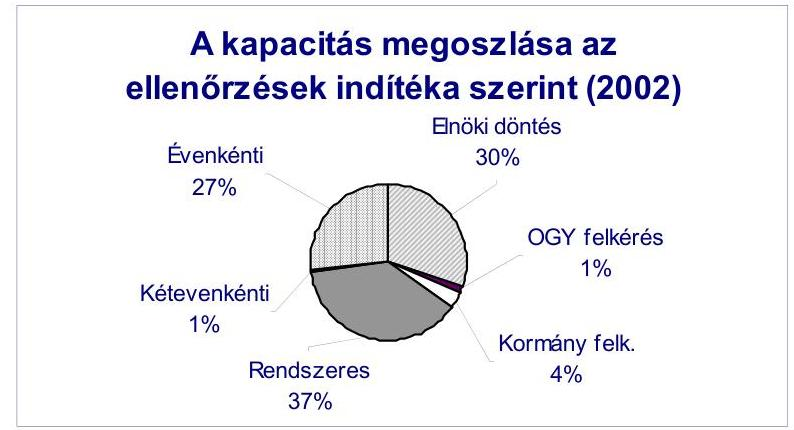
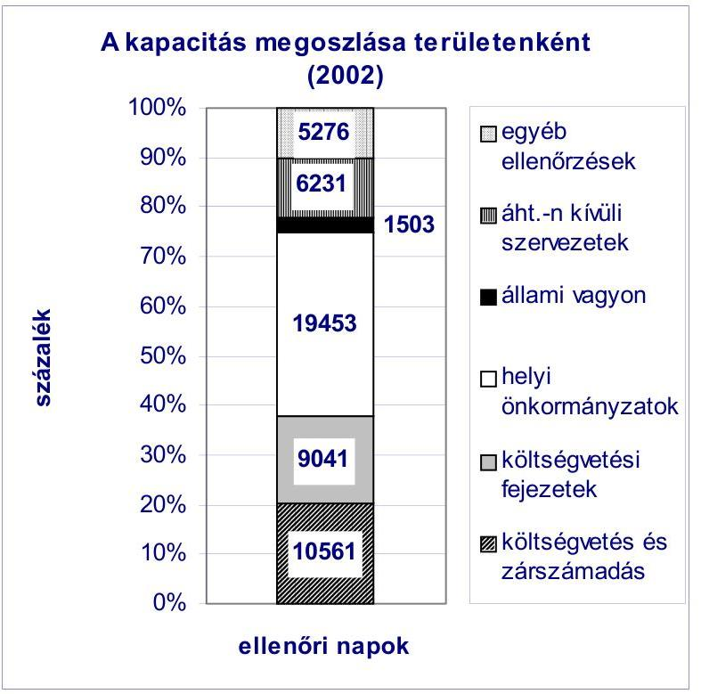
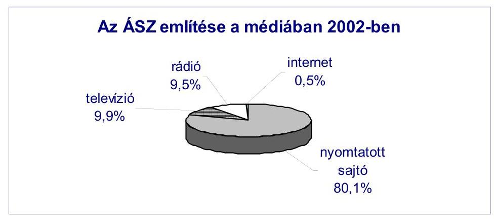
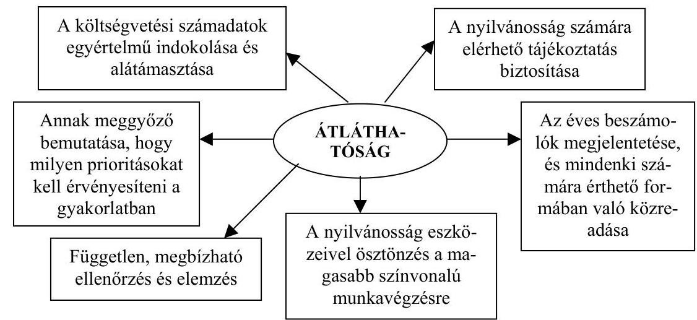
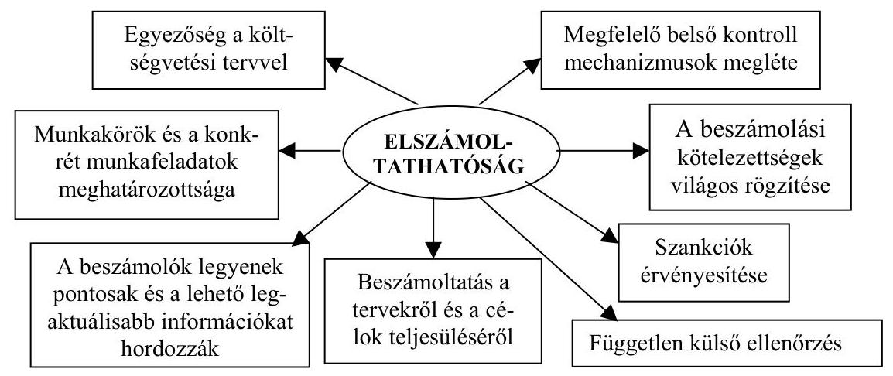
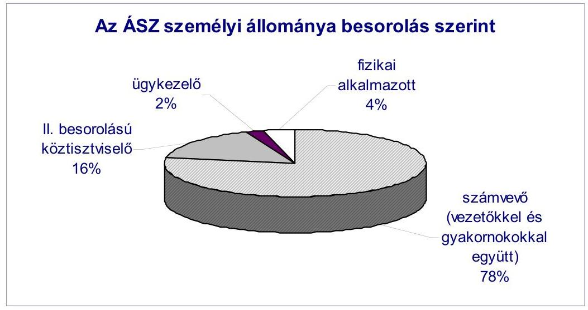
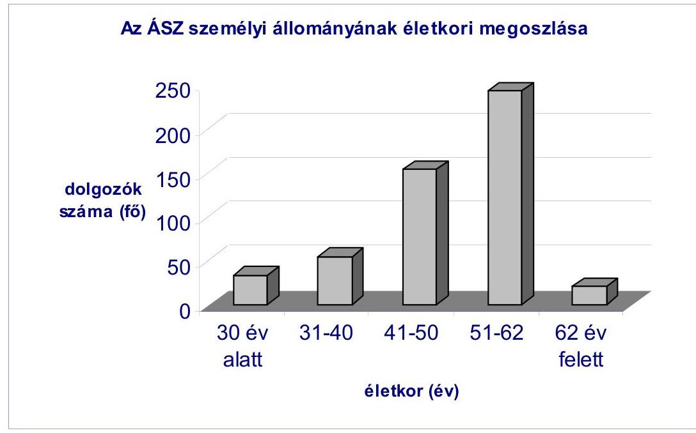
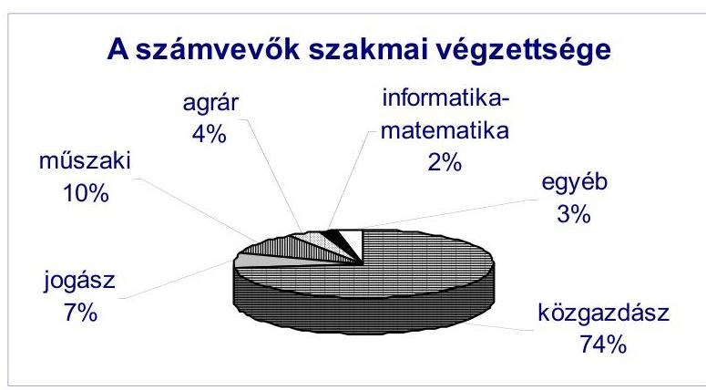

# JELENTÉS 

## az Állami Számvevőszék 2002. évi tevékenységéről

| 0306 | J/2545. | 2003. március |
| :-- | :-- | :-- |

---

Jelentéseink az Országgyúlés számítógépes hálózatán és az Interneten a www.asz.hu címen is olvashatók.

---

# TARTALOMJEGYZÉK 

1. AZ ÁSZ 2002. ÉVI TEVÉKENYSÉGE ..... 4
1.1. Az ellenőrzési munka súlypontjai ..... 4
1.2. A jelentések országgyűlési tárgyalása, határozatok és az országgyűlési kapcsolatok ..... 7
1.3. Az 2002. évi ellenőrzések alapján általánosítható tapasztalatok ..... 10
1.3.1. A központi költségvetési alrendszer ..... 12
1.3.2. Elkülönített állami pénzalapok ..... 19
1.3.3. A társadalombiztosítási alapok ..... 20
1.3.4. A helyi önkormányzati alrendszer ..... 22
1.3.5. Az állami vagyon ..... 29
1.3.6. A politikai pártok gazdálkodása ..... 31
1.3.7. Egyes kiemelt területekre vonatkozó ellenőrzési tapasztalatok ..... 31
1.3.7.1.Felkészülés az Európai Uniós csatlakozásra, nemzetközi támogatások igénybevétele ..... 32
1.3.7.2. Egészségügy ..... 34
1.3.7.3. Környezetvédelem ..... 36
1.3.7.4. Közoktatás ..... 38
1.3.7.5. Foglalkoztatás ..... 39
1.3.7.6. Nonprofit szervezetek ..... 41
1.4. Az ellenőrzések hasznosítása ..... 43
1.4.1. A javaslatok érvényesülése az Országgyűlés szintjén ..... 43
1.4.2. A javaslatok érvényesülése kormányzati szinten ..... 45
1.4.3. A javaslatok érvényesülése a vizsgált szervezeteknél ..... 47
1.4.4. Büntető feljelentések, közérdekű bejelentések ..... 47
1.4.5.Az ellenőrzések nyilvánossága ..... 51
1.5. Néhány következtetés ..... 53
2. AZ ELLENŐRZÉSI MUNKA MINŐSÉGÉNEK FEJLESZTÉSE ..... 55
2.1. Humán erőforrás gazdálkodás és fejlesztés ..... 55
2.1.1. Személyi feltételek ..... 55
2.1.2. Oktatás-továbbképzés ..... 57
2.2. A minőségbiztosítás ..... 59
2.3. A módszertani munka ..... 60
2.4.Az ellenőrzést segítő hazai és nemzetközi kapcsolatok ..... 62
2.5. Intézményi informatika, informatikai kapcsolatok ..... 65
3. AZ INTÉZMÉNY MŰKÖDÉSE ÉS GAZDÁLKODÁSA ..... 67

---

# MELLÉKLETEK 

A számvevőszéki jelentések számának alakulása 2002-ben
(1. számú melléklet)
2002. évi jelentések jellemzői (2. számú melléklet)

2001-ben és 2002-ben tett, még meg nem valósult jelentősebb törvény alkotásra vonatkozó ÁSZ javaslatok (3. számú melléklet)
ÁSZ jelentések az országgyúlési bizottságok napirendjén 2002-ben
(4. számú melléklet)

Az Állami Számvevőszék 2002. évi vizsgálati jelentéseiben a Kormánynak és a fejezetek vezetőinek megfogalmazott javaslatokra adott válaszok (5. számú melléklet)

## FÜGGELÉK

Összefoglalók a 2002-ben befejezett ellenőrzések tapasztalatairól

---

VE-1-002/2003.

# Jelentés 

## az Állami Számvevőszék 2002. évi tevékenységéről

Az Országgyúlés pénzügyi-gazdasági ellenőrző szerve, az Állami Számvevőszék (ÁSZ) a több mint egy évtizedes gyakorlatnak megfelelően éves beszámolóban ad számot a 2002-ben teljesített törvényi kötelezettségeiről és a szervezet müködésével összefüggő fontosabb folyamatok alakulásáról. A beszámoló kiemelt figyelmet fordít az ellenőrzési jelentésekben tett javaslatok hasznosulásának, illetve az ajánlások nyomán hozott intézkedéseknek a bemutatására.

Az utóbbi öt év beszámoló jelentéseit az Országgyúlés megtárgyalta. Gyakorlattá vált, hogy a beszámolót elfogadó országgyúlési határozatok iránymutatást is adtak a szervezet jövőbeni tevékenységére nézve. A munka elismerése mellett megerősítették az ellenőrzési tevékenység és a nemzetközi kapcsolatépítés stratégiai vonalvezetését, és alapvetően hozzájárultak a stratégiában megfogalmazott feladatok, az európai igényeknek is megfelelő pénzügyi ellenőrzés követelményei megvalósításához szükséges feltételek megteremtéséhez.

Az éves tevékenységről szóló jelentés alkalmat ad arra, hogy az ÁSZ egymás mellé rendezhesse az év során tett ellenőrzési megállapításainak leglényegesebb elemeit. Az összegző, beszámoló jelleg lehetővé teszi, hogy az államháztartás egyes területeinek müködésével kapcsolatos ellenőrzési tapasztalatokat rendszerszerüen, a folyamatok és a megtett intézkedések figyelembevételével mutassa be az Országgyúlésnek. Az ellenőrzési feladatokról készült jelentésekkel szemben a beszámoló jelentés - tájékoztatásképpen - az ÁSZ intézményi és emberi erőforrás fejlesztési, kapcsolatépítési és kommunikációs tevékenységének föbb jellemzőiről is képet ad a tisztelt képviselőknek.

E beszámoló három fő szerkezeti egységből áll. Az első számot ad az intézmény ellenőrzési tevékenységéről, az ellenőrzési munka minőségének fejlesztéséről, az ÁSZ müködéséről és gazdálkodásról. A második rész (mellékletek) áttekinti a 2002-ben készült jelentések fontosabb jellemzőit, bizottsági tárgyalásait és a javaslatok hasznosulását. A harmadik (függelék) rész a jelentések rövid összefoglalóját, legfontosabb megállapításait gyüjti egybe.

A 2002. évi gazdálkodásáról az ÁSZ az éves zárszámadás keretében részletesen, külön is tájékoztatást ad az Országgyúlésnek. A pénzügyi beszámolót - benyújtás előtt pályázaton kiválasztott, magyar könyvvizsgáló cég auditálja.

---

# 1. Az ÁSZ 2002. ÉVI TEVÉKENYSÉGE 

### 1.1. Az ellenőrzési munka súlypontjai

Az ÁSZ 2002-ben is az elnök által jóváhagyott - a Számvevőszéki Bizottság által megtárgyalt - ellenőrzési tervben foglaltak szerint végezte tevékenységét, azzal a szándékkal, hogy a hibák megelőzéséhez, megismétlődésük elkerüléséhez nyújtson segítséget.

A számvevők 2002-ben összesen 61 vizsgálati téma ellenőrzésén dolgoztak, amiből 34 fejeződött be, és így a 2001-ben lezárult, de csak az elmúlt évben közreadott 12 jelentéssel együtt az ÁSZ 46 jelentést publikált. A 2002. évi ellenőrzési terv alakulását az 1. sz. melléklet mutatja be.

Az ÁSZ 2002. január 1-jétől a feladatokhoz és az ellenőrzési módszerekhez pontosabban igazított, megújult szervezeti felépítésben végezte munkáját. Az elvégzett feladatok végrehajtása 2002-ben összesen 52.040 ellenőri napot igényelt.

A 2002-ben befejezett vizsgálatok 65\%-át törvényekben előírt, meghatározott gyakoriságú évenkénti, kétévenkénti, illetve rendszeres ellenőrzési kötelezettségek határozták meg.

A 2002-ben közzétett jelentések jellemzőit (a jelentés tárgya, száma, a jelentést készítő igazgatóság, az ellenőrzés jogszabályi alapja és indoka, célja, a költségvetési nagyságrend) a 2. sz. melléklet tartalmazza.

Az ÁSZ vizsgálati feladatai között első helyen szerepeltek az évenkénti ellenőrzési kötelezettséggel meghatározott feladatok (az állami költségvetés véleményezése és zárszámadásának ellenőrzése, az önkormányzati feladatokhoz kapcsolódó állami támogatások igénylésének és felhasználásának szabályszerűségi vizsgálatai, valamint az ÁPV Rt. és az MTI Rt. múködésének ellenőrzése). E feladatkörben 7 ellenőrzési jelentés készült, ezek közül a legnagyobb feladatot a 2001. évi költségvetés végrehajtásának ellenőrzése jelentette, ami az ÁSZ éves kapacitásának közel 14\%-át kötötte le.

---

A 2001. évi tevékenységünk elfogadására vonatkozó 69/2002. (X. 4.) OGY határozat 3. pontja szerint az Országgyúlés szükségesnek tartja a költségvetés végrehajtásának ellenőrzésénél a beszámolók szabályszerűségét minősítő ellenőrzések fokozatos teljes körűvé tételét, ennek érdekében a felügyeleti költségvetési ellenőrzés bevonásával ezen ellenőrzések egységes, zárt rendszerben való kiépítését. Kifejezésre juttatja, hogy a minisztériumi ellenőrzési apparátusok megerősítendők és a kormányzati ellenőrzésnek is alkalmazkodnia kell a számvevőszéki ellenőrzéshez.

A kétévenkénti ellenőrzési kötelezettségként jelentkező feladatok közül 2002ben 2 párt gazdálkodásának ellenőrzésére került sor, de a jelentések közzététele 2003-ra húzódott át.

A rendszeres ellenőrzési feladatok teljesítéseként 11 vizsgálati jelentés készült.

E körbe tartoznak azok az ellenőrzési kötelezettségek, amelyeknél a törvény a feladat teljesítésének „rendszerességét" írja elő, illetve ahol a törvény nem rendelkezik a feladat teljesítésének gyakoriságáról, de gyakoriság nélkül a feladat nem értelmezhető.

A rendszeres ellenőrzési feladatok körében több évre visszanyúló átfogó ellenőrzést végeztünk például a központi költségvetés 7 fejezeténél, valamint összefoglaltuk és közzétettük a 195 helyi és 81 helyi kisebbségi önkormányzatnál 2001-ben végzett helyszíni ellenőrzéseink tapasztalatait.

---

Az államháztartáson kívüli szervezetek körében a Magyar Nemzeti Bankról szóló 2001. évi LVIII. törvényben foglalt felhatalmazás alapján első alkalommal került sor a jegybank múködésének ellenőrzésére.

Az ÁSZ elnökének döntési hatáskörébe tartozó ellenőrzések közül 2002ben 24 ellenőrzés fejeződött be. Ezen feladatok teljesítése az ÁSZ éves ellenőrzési kapacitásának 30\%-át kötötte le.

2002-ben 4 jelentés volt, amelyek végrehajtására az Országgyúlés határozatot hozott, illetve a Kormány nevében a miniszterelnök kérte fel az ÁSZ elnökét ${ }^{1}$. Ezek közül három nem szerepelt az ellenőrzési tervünkben, egy - a SAPARD Hivatal akkreditáció előtti átvilágítása - a terveknek megfelelően történt.

Stratégiánkat 2002-ben megújítottuk. Főbb jellemzőit a legutóbbi, 2001. évi beszámolónkban már bemutattuk. A megújult stratégiánk mindenekelőtt arra irányul, hogy a gazdasági és pénzügyi, valamint a demokratikus kockázatokat körültekintően feltárjuk és azokat figyelembe véve, a szinte állandóan bővülő feladatokhoz képest szűkös erőforrásainkkal a legfontosabb területekre, folyamatokra összpontosuló ellenőrzéseket valósítsuk meg, azon - több év átlagban mintegy $40 \%$-os - kapacitásunkkal, melyet a törvényi kötelezettségekkel megkerülhetetlenül determinált vizsgálatok végzésére nem kell lekötnünk.

A 2003. évi ellenőrzési terv kialakítása során - éppen e viszonylag „szabad felhasználású" rész-kapacitás hatékony hasznosítására - tudatosan törekedtünk olyan témaválasztásra, amely módot ad a nemzetgazdaság, elsősorban a közháztartás múködésének biztonságára ható tényezők feltérképezésére. A biztonságot itt a pénzügyi folyamatok szabályszerű és a céloknak megfelelő alakulására, a rendeltetésszerű feladatok színvonalas teljesítésére, s mindenekelőtt adott tevékenységeknek a közszféra múködésére, a fontosabb pénzfolyamatokra gyakorolt hatására koncentrálva értelmezzük.

Ahhoz, hogy az önkormányzatok helyzetét minél teljesebben tudjuk bemutatni, arra törekszünk, hogy országgyúlési ciklusonként minden egyes önkormányzatnál legalább egy alkalommal ellenőrzést végezzünk átfogó, szabályszerűségi vagy teljesítmény vizsgálat keretében.

A jövőben az ÁSZ helyi önkormányzatokra irányuló ellenőrzéseinek súlyponti feladatát az átfogó ellenőrzés képezi. 2002-ben az önkormányzati ellenőrzések közel felét tette ki az ún. átfogó (szabályszerűségi és teljesítmény elemeket magában foglaló) ellenőrzés. E vizsgálatok célja kettős: egyrészt közvetlenül kívánják segíteni az önkormányzatok gazdálkodásának hatékonyságát a képvi-selő-testületnek átadott javaslatokkal, másrészt rendszerbeli képet ad e terület

[^0]
[^0]:    ${ }^{1}$ Vélemény a Magyar Televízió Rt. 2003. évi költségvetési támogatási igényének megalapozottságáról, indokoltságáról; Vélemény a Duna Televízió Rt. 2003. évi költségvetési támogatási igényének megalapozottságáról, indokoltságáról; Jelentés a Kormány által a miniszterelnök részére állandó szálláshelyként kijelölt ingatlan személyi védelemmel összefüggő átalakítási költségeinek ellenőrzéséről; Jelentés a SAPARD Program végrehajtására és a támogatások kifizetésére létrehozott magyarországi intézményrendszer akkreditáció előtti átvilágításáról.

---

működéséről az Országgyűlés számára. Az átfogó ellenőrzéseken belül továbbra is kiemelt figyelmet fordítunk a jelentős nagyságrendű költségvetéssel, illetve vagyonnal rendelkező közel 300 megyei, városi és fővárosi kerületi önkormányzat ellenőrzésére.

A helyi önkormányzatok ellenőrzésének korszerűsítése, a szélesebb körű nyilvánosság biztosítása érdekében azt tervezzük, hogy az önkormányzatok gazdálkodásának átfogó ellenőrzéséről készített - az eddigiekben redszeresített összefoglaló jelentés mellett a fővárosi és fővárosi kerületi, megyei, megyei jogú városi önkormányzatok, tehát a számottevő pénzügyi kockázatokkal gazdálkodást folytató önkormányzatok esetében az ellenőrzési tapasztalatokat önkormányzatonként is közreadjuk.

A társadalmi stabilitás fenntartása, a közbizalom kialakulása szempontjából kiemelt jelentősége van annak, hogy a közpénzek felhasználására, a közvagyon hasznosítására vonatkozó közérdekű adatok minél teljesebb körben megismerhetőek, nyilvánosak legyenek, és ezt a törekvést az üzleti titok megőrzésére hivatkozva se lehessen indokolatlanul korlátozni.

Az államháztartás finanszírozásának modernizációja, a közszolgáltatások szektorsemleges, hatékonyabb megvalósítására való törekvés magával hozza, hogy mind több állami feladat, illetőleg közpénz felhasználás lép ki az állami-költségvetési-intézményi, vállalati keretből. Az ezzel járó ellenőrzés-hatásköri és vizsgálatszervezési gondok 2002-ben markánsabbá váltak.

Ellenőrzésünk hasznosításának további lehetőségei szempontjából fontos, hogy a közpénzek felhasználásával, a köztulajdon használatának nyilvánosságával, átláthatóbbá tételével és - ezt előmozdítandó - az ÁSZ ellenőrzések hatókörének bővítésével összefüggő kezdeményezés van folyamatban. E törvényjavaslat szerint az ÁSZ olyan közjogi felhatalmazást kapna, amelynek alapján ellenőrzéseivel tulajdonformától függetlenül követhetné a közpénzek és a közvagyon felhasználásának útját, egészen a megrendelővel szerződéses viszonyban álló partnerekig, illetve a szerződés teljesítésében közreműködő valamennyi gazdálkodó szervezetig.

Ennek, a jövőben várható szakmai kihívásnak úgy tehetünk eleget, ha - e körben - ellenőrzéseinket elsősorban a jelentősebb beruházásokra, ezek sorában az autópálya építésre, valamint a számottevő állami garancia vállalásokra összpontosítjuk, de nem feledkezünk meg például az egészségügyi privatizációnak a törvényi felhatalmazással összefüggő vizsgálatáról sem.

# 1.2. A jelentések országgyúlési tárgyalása, határozatok és az országgyúlési kapcsolatok 

Az ÁSZ tevékenysége elsősorban az Országgyűlés bonyolult és felelősségteljes munkájának szolgálatában áll. Ennek érdekében - támaszkodva az Országgyűlés vezetőinek bátorítására és igényeire - újabb és újabb gyakorlati kezdeményezésekkel törekszünk a parlamenti képviselők munkájához hozzájárulni.

---

Így például az éves ellenőrzési terv kidolgozásához minden parlamenti bizottságtól véleményt kérünk és nemcsak az ellenőrzési jelentéseket, hanem az ellenőrzési programokat is átadjuk a Képviselői Tájékoztató Központnak, ily módon azokat a parlamenti elektronikus hálózaton elérhetik a képviselők. Az új ciklus megkezdésekor komplex bemutatkozó füzeteket, ismertetőket bocsátottunk az országgyúlési képviselők rendelkezésére, különös tekintettel az új képviselők felelősségteljes tevékenységére való felkészüléséhez.

Az előző parlamenti ciklusban megkezdett gyakorlatot folytatva az ÁSZ elnöke személyes konzultációkat kezdeményezett az Országgyúlés tisztségviselőivel és a képviselőcsoportok vezetőivel. A bizottsági elnökök szeptemberi értekezletén az Országgyúlés elnökének kezdeményezésére az ÁSZ elnöke írásban és szóban tájékoztatta az értekezlet tagjait az ÁSZ stratégiájáról, aktuális feladatairól, az adott évben addig befejeződött és folyamatban lévő ellenőrzéseiről, a jelentések tárgyalásának, s főként hasznosításának fontosságáról, az együttmúködés fejlesztésének lehetőségeiről.

A bizottsági elnökök és a Házbizottság támogatásával törekvéseinket keretbe foglalta és valóra váltásukat segítette az Országgyúlés és az ÁSZ főtitkárai által jegyzett együttmúködési megállapodás. A jelentősebb törvénymódosításra vonatkozó - még meg nem valósult számvevőszéki - javaslatok bekerültek az Országgyúlés „Kimutatás az Országgyúlés által meghatározott feladatokról és határidőkről" szóló kiadványába, az állampolgári jogok országgyúlési biztosának javaslataihoz hasonló módon. Ezáltal lehetőség nyílik a számvevőszéki javaslatoknak, az Európai Bizottság 2001. évi országjelentésében megfogalmazottak szerinti nyomon követésére. Így az előző évi beszámoló jelentés gyakorlatát folytatva az ellenőrzések során tett - általunk fontosnak tartott -, de meg nem valósított javaslatainkat a 3. sz. melléklet mutatja be.

Valamennyi ellenőrzési jelentésünket megküldtük az Országgyúlés vezető tisztségviselőinek, a Számvevőszéki bizottságnak, valamint a Költségvetési és pénzügyi bizottság-, a Gazdasági bizottság-, illetve az illetékes bizottságok elnökének, kísérőlevélben összefoglalva, kiemelve a legfontosabb megállapításokat. A különböző vizsgálati programok, az ellenőrzések főbb kérdései ugyancsak az Országgyúlés szakbizottságainak rendelkezésére álltak annak érdekében, hogy magának az ÁSZ ellenőrzéseknek a végrehajtása, irányultsága, a munka súlypontjai is átláthatók legyenek, és az Országgyúlés ellenőrző funkcióját szerveztünkre nézve is megfelelően gyakorolhassa.

Az ÁSZ a közelmúltban felmerült országgyúlési képviselői igényre, jelentéseit ahol ez lehetséges - szövegközi utalásokkal, korábbi jelentésekre való hivatkozásokkal látja el, és emellett továbbra is felsorolja a témához kapcsolódó közzétett ellenőrzési jelentés címét.

2002-ben 10 számvevőszéki jelentés szerepelt bizottsági ülések napirendjén, s e jelentéseken felül a SAPARD programmal kapcsolatos (főigazgató által kiadmányozott) ellenőrzési jelentést is napirendjükre tűzték a bizottságok. Az előző parlamenti ciklus azonos időszakában tárgyalt jelentések számához viszonyítva ez lényegesen több. Az ÁSZ vezetői, szakértői a jelentések bizottsági tárgyalásán túl, az intézmény feladatkörét, ellenőrzéseit érintő napirendek tárgyalásán is részt vettek és szót kaptak.

---

Az ÁSZ éves beszámoló jelentését 3 bizottság tárgyalta. A plenáris ülés tartózkodás és ellenszavazat nélkül egyhangulag fogadta el a Számvevőszéki bizottság határozati javaslatát.

Szinte valamennyi bizottság megtárgyalta a 2001. évi zárszámadásról szóló jelentést és a 2003. évi költségvetésről készült véleményt.

A plenáris ülés napirendjéhez kapcsolódóan tárgyalta meg a Gazdasági bizottság a települési önkormányzatok szilárd hulladék-gazdálkodási feladatai ellátásának ellenőrzéséről szóló jelentést. A helyi önkormányzatok beruházásaihoz és rekonstrukcióihoz nyújtott 2001. évi címzett és céltámogatások igénybevételének és felhasználásának vizsgálatáról készült jelentés megtárgyalása alkalmával eseti munkacsoport alakításáról döntöttek a címzett és céltámogatási rendszer múködési zavarainak áttekintésére, a törvényi szabályozás módosításának elősegítésére.

Az éves beszámoló, a zárszámadási jelentés, a költségvetés véleményezésén túl a plenáris ülés napirendjére került több, beszámolásra kötelezett szervezet még nem tárgyalt jelentése is. Így került sor a MTI Rt. 1997-2001 közötti beszámolóinak és a kapcsolódó ÁSZ jelentéseknek a tárgyalására is.

A Magyar Televízió Közalapítvány Kuratóriuma és a Hungária Televízió Közalapítvány Kuratóriuma 1997-2001 közötti beszámolóinak tárgyalásakor a Kulturális bizottság országgyűlési határozati javaslatait elfogadva, az Országgyűlés a Magyar Televízió Rt. és a Duna Televízió Rt. 2003. évi költségvetési támogatási igénye megalapozottságának, indokoltságának megítéléséhez célellenőrzések elvégzésére kérte fel az ÁSZ-t. Országgyűlési határozat alapján elvégeztük a két célellenőrzést. Az Országgyűlés elnöke 2003 februárjában külön is felkérte a Költségvetési és pénzügyi, valamint a Kulturális és sajtóbizottságot, hogy a hivatkozott véleményeket tűzzék a bizottsági ülések napirendjére, tekintettel a vizsgálatban megfogalmazott javaslatok aktualitására.

A Költségvetési és pénzügyi bizottság a közszolgálati médiák és a kapcsolódó közalapítványok ellenőrzésére albizottságot állított fel és az ÁSZ-t ellenőrzés lefolytatására kérte az MTV, a Duna TV, a Magyar Rádió vonatkozásában.

Az ÁSZ országgyűlési kapcsolattartásában meghatározó a Számvevőszéki bizottság, amely a plenáris ülés napirendjéhez kapcsolódó jelentéseken túl - a kialakult gyakorlatnak megfelelően - megtárgyalta az ÁSZ 2003. évi ellenőrzési tervjavaslatát. A Számvevőszéki bizottság igényére is figyelemmel, a stratégiában elhatározottakkal összhangban került sor 2002-ben a korrupció társadalmi és gazdasági jellemzőiről, e káros jelenség visszaszorításában betölthető számvevőszéki szerepről szóló, valamint az önkormányzati rendszer forrás- és feladatszabályozását feldolgozó elemzések közreadására. Legutóbb a helyi adók és illetékek témakörében készült hasonló összeállítás. E szolgáltatás 2003ban a korábbi jelentéseink feldolgozásával a privatizációs folyamatot, annak leglényegesebb makrogazdasági összefüggéseit értékelő elemzés készítésével folytatódik. A bizottság folyamatos tájékoztatását szolgálta az ÁSZ hivatali működéséről, az elnöki értekezletekről készülő emlékeztetők és elnöki határozatok, beszámolók, tárgyalási anyagok megküldése.

---

#### Abstract

Az ÁSZ vezetése áttekintette az átalakított szervezeti-irányítási modell egy éves működésének tapasztalatait, melyről az Számvevőszéki bizottságot tájékoztatta. A szervezet fejlesztése a „megőrizve megújulni" rendező elv alapján valósult meg. Az új szervezeti-irányítási rendszer a koncepcióban foglalt elhatározásoknak megfelelően múködik. A munkaszervezés és a vezetési folyamat korszerűsítése, az ezekhez kapcsolódó szervezeti átalakítások a korábbi eredményeket, bevált módszereket megtartva, egyidejúleg a változó, bővülő feladatokhoz és az Európai Unió tagországaiban rendszeresített ellenőrzés-szakmai igényszinthez igazodva teremtenek javuló feltételeket a számvevőszéki ellenőrzés folyamatos fejlesztéséhez, hatásfokának növeléséhez. Ez a modell azt is lehetővé tette, hogy a szervezet alelnökök nélkül is múködőképes maradjon.

A bizottság bemutató keretében tájékoztatást kapott a 2003-tól induló új internetes közönségkapcsolati lehetőségről.

Az elmúlt évben tovább bővültek a nem hagyományosan számvevőszéki ellenőrzési feladatok. A Magyar Fejlesztési Bankról szóló törvény módosításával a jövőben a tulajdonosi jogok gyakorlója az MFB könyvvizsgálatára az ÁSZ elnöke által javasolt könyvvizsgálót bízza meg. Az Adó- és Pénzügyi Ellenőrzési Hivatalról szóló törvény szerint az APEH elnökjelöltjéről kinevezés előtt az ÁSZ elnöke véleményt mond.

A plenáris és bizottsági üléseken a jelentések tárgyalása kapcsán hozott döntéseken túl az Országgyúlés növekvő figyelmét jelzi, hogy a plenáris ülések mintegy fele volt olyan, ahol különböző indíttatással a jelentésekben megfogalmazott megállapításokra, javaslatokra hivatkoztak a képviselők. A bizottságok napirendjén szereplő ÁSZ jelentésekről, a bizottsági és plenáris döntésekről készült kimutatást a 4. sz. melléklet foglalja össze.

# 1.3. Az 2002. évi ellenőrzések alapján általánosítható tapasztalatok 

A beszámolóban foglaltak a 2002. évi jelentések tapasztalataira épülnek, az ismétlődő jelenségek, trendek, összefüggések bemutatásának szándékával. Jeleznünk kell, hogy a 2002-ben végrehajtott ellenőrzések egy része a vizsgált pénzfolyamatok sajátosságaiból adódóan 2001-es, illetve azt megelőző évek lezárt pénzügyi adataira támaszkodik. Ezeket igyekeztünk azonban úgy bemutatni, hogy a 2002. évi államháztartási folyamatokra is egyértelmúen következtetni lehessen, s a legfrissebb tapasztalatok is tükröződjenek.

Tájékoztatásul - az 1. sz. táblázatban - a nagyságrendek és a kiadások egymáshoz viszonyított arányai hosszabb távú alakulása érzékeltetése céljából bemutatjuk az államháztartás kiadásait néhány nagy ellátórendszerre nézve a GDPhez, illetve az államháztartás kiadásaihoz viszonyítva. Az összeállítás érzékelteti, hogy - egyenlőre - hosszabb távon is a strukturális változások elmaradása jellemzi a kiadásokat.

---

Az államháztartás kiadásai néhány nagy ellátórendszerre nézve a GDP, illetve a teljes államháztartási kiadás \%-ában

|   | 1991 |  |  | 1995 |  |  | 2000 |  |  | 2001 |  |   |
| --- | --- | --- | --- | --- | --- | --- | --- | --- | --- | --- | --- | --- |
|   | GDP: 2498,2 (Mrd Ft) |  |  | GDP: 5614,0 (Mrd Ft) |  |  | GDP: 13 150,8 (Mrd Ft) |  |  | GDP: 14 876,4 (Mrd Ft) |  |   |
|   | Kiadás
Mrd Ft
(folyó
áron) | GDP
$\%$-ában | Áht.telj. kiad. \%-ában | Kiadás
Mrd Ft
(folyó
áron) | GDP
$\%$-ában | Áht.telj. kiad. \%-ában | Kiadás
Mrd Ft
(folyó
áron) | GDP
$\%$-ában | Áht.telj. kiad. \%-ában | Kiadás
Mrd Ft
(folyó
áron) | GDP
$\%$-ában | Áht.telj. kiad. \%-ában  |
|  Hon- és rendvédelem | 89,3 | 3,6 | 6,3 | 140 | 2,5 | 4,7 | 357,5 | 2,7 | 5,8 | 433,9 | 2,9 | 6,4  |
|  Közigazgatás | 66,3 | 2,7 | 4,7 | 145,7 | 2,6 | 4,9 | 579 | 4,4 | 9,4 | 642,5 | 4,3 | 9,4  |
|  Egészségügy | 124,6 | 5,0 | 8,9 | 245,9 | 4,3 | 8,3 | 552,1 | 4,2 | 8,9 | 623,1 | 4,2 | 9,1  |
|  Nyugellátás | 262,8 | 10,5 | 18,7 | 491,1 | 8,7 | 16,7 | 1051,4 | 8,0 | 17,0 | 1213,4 | 8,2 | 17,8  |
|  Alap és középfokú okt. | 92,7 | 3,7 | 6,6 | 161,8 | 2,9 | 5,5 | 262,2 | 2,0 | 4,2 | 309,4 | 2,1 | 4,5  |
|  Felsőfokú oktatás | 42,9 | 1,7 | 3,0 | 83,8 | 1,5 | 2,8 | 193,2 | 1,5 | 3,1 | 227,7 | 1,5 | 3,3  |
|  Környezetvédelem | 17,9 | 0,7 | 1,3 | 42,8 | 0,8 | 1,4 | 102,8 | 0,8 | 1,7 | 141,9 | 1,0 | 2,1  |
|  Közlekedés | 30,2 | 1,2 | 2,1 | 87,8 | 1,6 | 3,0 | 253,5 | 1,9 | 4,1 | 227,8 | 1,5 | 3,3  |
|  Összesen | 726,7 | 29,1 | 51,6 | 1398,9 | 24,9 | 47,3 | 3351,7 | 25,5 | 54,2 | 3819,7 | 25,7 | 55,9  |
|  Egyéb áht.
Kiadás összesen | 682,4 | 27,3 | 48,4 | 1555,5 | 27,7 | 52,7 | 2834,2 | 21,6 | 45,8 | 3006,9 | 20,2 | 44,1  |
|  Mindösszesen | 1409,1 | 56,4 | 100 | 2954,4 | 52,6 | 100 | 6185,9 | 47,1 | 100 | 6826,6 | 45,9 | 100  |

Megjegyzés: A táblázat a Pénzügyminisztérium által előállított adatok felhasználásával készült

---

# 1.3.1. A központi költségvetési alrendszer 

A központi költségvetés 2001-ben az előző évihez képest több közvetlen bevételt ${ }^{2}$ realizált, noha az APEH illetékességi körébe tartozó kiemelt adónemek közül mindössze a gazdálkodó szervezetek társasági adója haladta meg a módosított előirányzatot. Az ÁFA és az SZJA bevételek kismértékben elmaradtak az előirányzattól, alakulásukban különböző tényezők, jogszabályváltozások és a javuló adóztatási tevékenység hatásai egyaránt közrejátszottak.

A kincstári vagyon koncesszióba adásából a központi költségvetésnek 2001-ben két jogcímen (infrastruktúrával és árveréssel kapcsolatosan, illetve szerencsejáték kaszinók révén) keletkezett koncessziós díjbevétele. A bevétel az előirányzat egyötödét sem érte el. Az előirányzat jelentős alulteljesítése elsősorban az infrastruktúrával kapcsolatos koncessziós és árverési díj bevételi előirányzatánál jelentkezett a befizetések, illetve a tervbe vett pályázati kiírások halasztása miatt.

A költségvetési források elosztásának, felhasználásának szabályszerűségéről, célszerűségéről, eredményességéről, a pénzügyi folyamatokról 2002-ben 7 költségvetési fejezetnél ${ }^{3}$ - általában az 1998-2001. évekre irányuló - lezárt és nyilvánosságra hozott átfogó ellenőrzésekre, a 2001. évi zárszámadás vizsgálatára, továbbá a 2003. évi állami költségvetési törvényjavaslat véleményezésére alapozva formáltunk képet. ${ }^{4}$

Az államháztartási reformfolyamat keretében a már előző években elkezdett munka folytatódott. A megtett és hatásaiban kedvező intézkedések mellett - a tapasztalatok tükrében - mind a változtatások iránya, mind az üteme tekintetében vannak lényeges elmaradások. A feladatok és azok intézményi kereteinek felülvizsgálata, a célok, feladatok, források összhangjának biztosítása tekintetében - a pozitív irányú elmozdulások ellenére - nem történt érdemi áttörés, mert ez idő szerint még nem rendelkezünk az államháztartás egészének komplex reformját megalapozó, kiérlelt, részleteiben is kimunkált és konszenzussal elfogadott stratégiával. A gazdálkodás feltételeihez szükséges források megteremtése érdekében a fejezetek továbbra sem vállaltak kezdeményező szerepet az intézményrendszer átalakításában, holott a tervezési szempontok között változatlanul kiemelt szerepet kapott az intézmény- és feladatfelülvizsgálat. A központi költségvetésből finanszírozott állami feladatok köre nem csökkent. A feladatok és források összhangjának megteremtése érdekében - átfogó stratégiai iránymutatás hiányában - a jogszabályi előírások szükítése nem valósult meg a 2003. évi költségvetési tervezés keretében sem.

A kormányzati munkamegosztásban ciklusonként bekövetkező változások a fejezetek közötti feladat átrendezéssel, esetenként (pl. informatikát, közlekedést, egyházügyet érintően, illetve a nemzeti kisebbség, határon túli magyarság ügyei terén) visszarendezéssel jártak. Az utóbbiak, a profiltisztítás szándéka

[^0]
[^0]:    ${ }^{2}$ Lásd a Függelék 2. pontját.
    ${ }^{3}$ Lásd a Függelék 4-10. pontját.
    ${ }^{4}$ Lásd a Függelék 2. és 3. pontját.

---

mellett, összefüggtek a szoros vagy kevésbé szoros kormányzati koordináció szükségességének eltérő megítélésével is. Jellemzően a permanensen feladatváltoztatásokkal érintett tárcáknál nem alakulhatott ki stabil szervezeti struktúra, ami a fejezeti irányító munkára hátrányos, különösen az átrendezés éveiben.

A feladat-megosztások változtatását nem minden esetben követte a szervezeti irányítási rendszer felépítése, illetve a vezetési, belső ellenőrzési tennivalók célszerű kialakítása. Párhuzamosságokat tapasztaltunk a különböző kormányzati döntést előkészítő fórumok feladatainak meghatározásában, ellátásában, és következetlenséget, átgondolatlanságot a fejezeti előirányzat kezelő szervezet alapításában. Átfogó ellenőrzés során állapítottuk meg például azt is, hogy a településfejlesztés támogatására kialakított eszközrendszer - a megosztott források és ágazati irányítás - mellett a belügyi tárca nem rendelkezett a településfejlesztés koordinációjához szükséges feltételekkel.

Ugyanakkor a fejezetek múködésének ellenőrzése kedvező változásokra is ráirányította a figyelmet. Így megállapítottuk, hogy a Magyar Tudományos Akadémia ${ }^{5}$ jogállását, feladatait meghatározó 1994. évi törvény hozzásegítette az Akadémiát, hogy megújulva illeszkedjék a megváltozott társadalmi viszonyokba, csak részben tartva fenn a korábbi kutatási struktúrát. Az Akadémia szervezete és múködése gyakorlatilag minden tekintetben megújult. A kialakított múködési rend az irányítás, döntéselőkészítés, döntés és ellenőrzés tekintetében - az ellenőrzött szervezetek különböző szintjén kapott vélemények szerint - jól és törvényesen múködik, esetenkénti kifogások legfeljebb a folyamatok többszörös áttételéből eredő lassúság miatt fordulnak elő.

Az ún. „alkotmányos" fejezetek (I-VIII.) költségvetési gazdálkodása évről-évre kiegyensúlyozott. Az általuk felhasznált közpénzek a központi költségvetési források mindössze néhány százalékát jelentik, hatásuk azonban ezen messze túlmutat. Ezen fejezetek egységes kezelése - éves költségvetésük közvetlen országgyűlési megállapítása - függetlenségük biztosítása mellett a nemzetközi prezentáció szempontjából is indokolt. A költségvetési törvény vitája során e fejezetekkel összefüggésben felmerülő kérdések, viták a többi fejezethez képest eltérő jellegűek. A kormányzati arányok nem értelmezhetőek az alkotmányos fejezetek költségvetésének megállapításakor, amint ez a 2003. évi költségvetés vitája alkalmával is megmutatkozott.

A költségvetési tervezési ${ }^{6}$ folyamat továbbfejlesztése, új alapokra helyezése - a választások évében lerövidülő időszakra is tekintettel - az államháztartás pénzügyi reformja keretében változatlanul sürgető, tovább nem halasztható feladat. Az előző években tapasztaltakhoz hasonlóan a tervező munka jellemző hiányosságaként jeleztük, hogy az előirányzatok megalapozottabbá tétele érdekében indokolt, részletesebb intézményi szintű előirányzatok kialakítása elmaradt. A 2003. évi tervezés időszakában érvényes és a tervezési köriratban is hivatkozott, az államháztartás pénzügyi rendszerének továbbfejlesztési irányairól és a kincstári rendszer új szervezeti rendjének kialakí

[^0]
[^0]:    ${ }^{5}$ Lásd a Függelék 8. pontját.
    ${ }^{6}$ Lásd a Függelék 3. pontját.

---

tásáról szóló kormányhatározat végrehajtására, a tervezést megkönnyítő normatívák, feladatmutatók kidolgozására a fejezetek felügyeleti szervei érdemi lépéseket nem tettek. Ezek kidolgozását módszertani útmutatás nem segítette, ebben a fejezetek csak a saját elképzeléseikre támaszkodhattak. Az Áht.-ban foglalt törvényi követelményeknek csak formálisan eleget tevő gördülő tervezés nem felel meg a törvényalkotói szándéknak.

Hiányzik a költségvetési rendszerből az állami feladatok, a költségvetési szervek által elérendő célok és az elvárt eredmények meghatározása. A céljellegú előirányzatok teljesítése a jelenlegi beszámolási rendszerben nem jelenik meg teljes körűen. A célok és a feladatok teljesítéséről csak esetlegesen kap információt az Országgyűlés. A költségvetési szervek kiadási előirányzatai - normatívák hiányában - az igényekhez képest minden elemükben (személyi juttatások, dologi előirányzatok, felhalmozási kiadások, fejezeti kezelésű előirányzatok) feszültséget hordoznak.

A tevékenységek szabályozásának tekintetében az ellenőrzött szervezetek többségénél a szabályzatok lefedték a múködés, gazdálkodás egész területét. Ezzel együtt szűkebb körben továbbra is azt tapasztaltuk, hogy a jogszabályi háttér változását a belső szabályozás nem követte teljes körűen, vagy megfelelő időben. A feladatok, folyamatok szabályozása hiányos, esetenként elmaradt, a belső szabályzatok közötti összhang nem valósult meg mindenütt. Több évvel a törvényben előírt határidőt követően, még mindig tettünk megállapítást az intézményi alapító okiratok hiányára, hiányosságára, törzskönyvi nyilvántartásuk rendezetlenségére.

A szabályozottság tekintetében meg kell említeni, hogy a költségvetési gazdálkodás rendjét általánosan szabályozó jogi háttér mellett a sajátosságokat figyelembe vevő jogi előírások köre az indokoltnál szűkebb. Átfogó ellenőrzéseinkben jeleztük, hogy a fejezeti gazdálkodás specialitásait jóváhagyó jogszabály kibocsátása annak ellenére elmaradt, hogy erre kormányhatározat kötelezte a felelősöket és azt az érdekelt fejezet többször is kezdeményezte.

Javulás érzékelhető a költségvetési intézményi gazdálkodás és feladatellátás színvonalában, továbbá a törvényességi, pénzügyi, szabályossági követelmények betartásában. A fejezetek többségénél 2001-ben is jellemző volt a költségvetési előirányzatok és teljesítésük mind a bázis évhez, mind az eredeti előirányzathoz viszonyított emelkedése. Fejezeti szinten a teljesített kiadások egyetlen esetben sem haladták meg a módosított előirányzat összegét.

Az éves múködési költségek több mint 60\%-át változatlanul a személyi kiadások képviselték. Az eredeti előirányzathoz mért növekedésben az év közben végrehajtott, a köztisztviselők új illetményrendszerének bevezetéséből adódó, pótlólagos illetményemelésből, a közszféra egyösszegű kereset kiegészítéséből, valamint a minimálbér felemeléséből adódó többletkiadások, továbbá a létszámcsökkentés egyes kiadásainak pótlólagos fedezete játszott szerepet.

A dologi kiadások, bár az eredeti előirányzathoz viszonyítva a fejezetek többségénél részben a Kormány, részben a fejezeti hatáskörben történő módosítások hatására emelkedtek, a fenntartást, múködtetést szolgáló, ún. dologi automatizmusok azonban elmaradtak a bérkiáramlástól. A beszámolási időszak utolsó

---

napjaiban kormányhatározat által juttatott többletforrások felhasználására már nem volt lehetőség, ezért jelentős a maradványképződés.

A felhalmozási kiadások módosított előirányzatától elmaradó teljesítések okai között változatlanul a megkéső kormánydöntések, a közbeszerzési eljárások hosszú átfutási ideje, valamint a feladat egy részének a következő évre szóló kötelezettségvállalása említhetők.

Az ágazati feladatok prioritásainak érvényesítésében jelentős szerepet játszanak a fejezeti kezelésú előirányzatok. Ezeken belül a feladatfinanszírozás körébe vont fejezeti kezelésű előirányzatok összege és aránya növekedett. Ennek ellenére - a felhasználások tükrében - nem tudták maradéktalanul betölteni szerepüket. Mint azt az előző évben is megállapítottuk, jelentős (egyes fejezeteknél $40 \%$-ot meghaladó) a fejezeti kezelésű előirányzatok maradványa, ami a felhasználással kapcsolatos döntési mechanizmusokra, az eljárások elhúzódására, a nem kellően megalapozott előkészítésre, késői időpontban történő pótelőirányzat biztosítására, a tervszerűség hiányára vezethető vissza.

A fejezeti kezelésű előirányzatok felhasználása jellemzően a jogszabályban engedélyezett jogcímeken és rendeltetéssel, nyomon követhető módon, analitikus nyilvántartásokkal alátámasztottan valósult meg. Előfordult azonban egyes fejezeteknél, illetve fejezeti kezelésű előirányzatoknál, hogy a végrehajtási szabályok hiányosságai nem biztosították az egységes és célirányos felhasználást, illetve a koordinációs feltételekben, a pályázati rendszer múködésében tapasztalt hiányosságok kedvezőtlenül befolyásolták annak célszerűségét, eredményességét.

A költségvetési törvényben előírt, illetve az évközben módosított bevételi előirányzatokat - amelyek túlfeszített voltát az előző évben jeleztük - a fejezetek többsége nem teljesítette. Ezen belül az intézményi saját bevételek eseti túlteljesítése mögött előre nem tervezhető bevételek, feladatváltozások, pénzátvételek, valamint áthúzódó szakmai feladatok miatti előző évi maradványok igénybe vétele húzódott meg.

A fejezetek költségvetési gazdálkodása feltételeinek differenciáltsága a tervezésnél jelzett problémák miatt változatlanul fennáll. Az intézményi gazdálkodásban jelentkező átmeneti likvidítási problémákat részben takarékossággal, illetve előirányzat átcsoportosításokkal, feladatok halasztásával, pénzügyi technikákkal igyekeztek megszüntetni. Konszolidációt igénylő, tartós pénzügyi egyensúly hiányt - átfogó ellenőrzéseink keretében - az előző éveket érintően esetileg (BM-Rendőrség) jeleztünk. Ennek okai között a szakmai döntések gazdasági kihatásai vizsgálatának elmaradása, az elégtelen finanszírozás, a forrásokhoz képest túlzott kötelezettségvállalások egyaránt szerepeltek. A különböző kormányzati fejezeti póttámogatások, tartozás átütemezések, radikális takarékossági intézkedések és visszafogott, illetve elhalasztott fejlesztések révén sikerült a likviditási gondokat felszámolni.

A likviditási gondok, feszültségek elsősorban arra vezethetők vissza, hogy a feladatok és finanszírozásuk összhangját az éves költségvetések továbbra sem biztosítják teljes körűen, az évközi új feladatok többnyire nem jártak a kiadási előirányzat növekedésével.

---

Az évek óta jelzettek ellenére nem történt változás az előirányzat maradványok ${ }^{7}$ jóváhagyása idejét tekintve. Szabálytalanságok forrását is jelentheti, hogy a Pénzügyminisztérium a törvényi előírással szemben, késedelmesen tesz eleget előirányzat jóváhagyási kötelezettségének. Ennek következményeként a felügyeleti szervek sem tudják ez irányú feladataikat teljesíteni, később realizálódnak a központi költségvetést megillető befizetési kötelezettségek.

A fejezetek eszközállományának értéke - erős szórással - gyarapodott. A vagyonnövekedés többféle jogcímen - beruházás, beszerzés, vásárlás, térítésmentes átvétel miatt - következett be, a vagyoncsökkenést nagyobb arányban az elszámolt értékcsökkenés, továbbá a térítésmentes vagyonátadás (szolgálati lakások, üdülő- és sportlétesítmények), kisebb arányban az értékesítések, selejtezések és a leltározást követően kimutatott hiányok elszámolásai okozták. A vagyongyarapodást döntően költségvetési támogatások, egyes esetekben PHARE támogatások biztosították, de a térítésmentes átvétel is növelte néhány fejezet vagyonát. A vagyonnövekedés döntő részben az ingatlanok, gépek, berendezések és járművek állománycsoportban következett be, emellett jelentős arányt képviselt a befejezetlen beruházások állománya is. A feleslegessé vált, korszerűtlen vagyontárgyak értékesítését - eseti kivétellel - a jogszabályoknak és a belső szabályozásoknak megfelelően végezték.

A fejezetek gazdasági társaságokban való részvétele új társaságok (kht., kft.) alapítása következtében 2001-ben tovább növekedett. Az állami közfeladatok társasági formában történő ellátása, a tulajdonosi jogok gyakorlása ugyanakkor - megállapításaink szerint - nem problémamentes. A tárcák különböző mértékű részesedésével múködő vállalkozások közül több volt veszteséges. E körben jogkövetkezményekkel járó, gondatlan vagyonkezelést is tapasztaltunk, ahol a szükséges jogi kezdeményezéseket megtettük.

Az ellenőrzött körben a közbeszerzési törvény előírásait jellemzően betartották. Észrevételt az átfogó ellenőrzés keretében esetileg a rendszeresítési és közbeszerzési eljárások összehangolt tárcaszintű szabályozásának hiányára vonatkozóan tettünk, amely hiányosság szerepet játszott abban, hogy adott szakmai feladatra nem azonos típusú eszközöket vettek használatba. A közbeszerzésekről szóló törvény alapján a fejezetek felügyeletét ellátó szervek határidőre elkészítették és megküldték a Közbeszerzések Tanácsa részére a 2001. évi közbeszerzéseket tartalmazó "Éves jelentést".

A közbeszerzés kívánatosnál lassabb és ellentmondásosabb terjedése, a hibák elsősorban a jogalkalmazók felkészületlenségére, szemléleti okokra, illetve alapvetően a csoportérdekek sikeres érvényesítésére, az átláthatósággal szembeni ellenérdekeltségre vezethetők vissza. Másrészt a problémák az államháztartási finanszírozás időbeli szinkron hiányából, nem egészen világos elszámolási szabályaiból származnak. Még az előző kormányzati ciklusban megkezdődött a műhelymunka a közbeszerzési szabályok és a különböző támogatási rendszerek (például az önkormányzati cél-, címzett, a környezetvédelem, a vállalkozásfejlesztés, az EU források stb.)

[^0]
[^0]:    ${ }^{7}$ Lásd a Függelék 2. pontját.

---

pályázati igénybevételi feltételei - köztük az igénybevételi lehetőségek papíron egyszerűnek tűnő időbeli összhangjának - megteremtésére, illetve fejlesztésére. A szabályozás számos ponton már változott, azonban további jogalkotói lépésekre, a munka felgyorsítására, a társadalmi-gazdasági-politikai érdekharmonizáció javulására lenne szükség, hogy 2003-ban már valóságos változásokról lehessen számot adni.

A korábbi évek ÁSZ beszámolóiban ${ }^{8}$ is jeleztük: a korrupciós kockázatok mérséklésének akadálya az is, hogy a hatásköri korlátok, az üzleti titok védelmének szinte értelmezhetetlen falakat jelentő bástyái „féloldalas" helyzetet teremtenek. Így nem követhető a közpénzek útja a „végfelhasználóig". Mindez úgy alakult ki, hogy látható volt, a költségvetési és a nonprofit szféra intézményei a közösségi szolgáltatások mind nagyobb körét vásárolták meg a magánszektor üzleti vállalkozásaitól, s a gazdasági fellendüléssel növekvő mértékű infrastrukturális beruházásokra került sor. A pénzügyi ellenőrzés a közbeszerzést kiíró állami szerveknél mindent, a pályázóknál, a közreműködő fő- és alvállalkozóknál viszont lényegében semmit sem ellenőrizhetett. Az előkészületben lévő törvényi kezdeményezések - ha az ellenőrzések a legmeghatározóbb tételekre, pénzügyi konstrukciókra irányulhatnak - kedvező változásokra teremtenek lehetőséget.

A költségvetési belső ellenőrzés területén sem következett be a szükséges fejlődés ${ }^{9}$. A költségvetési beszámoló valódisága, az intézményi múködés és gazdálkodás szabályszerűsége szempontjából kockázati tényező a belső irányítás, ellenőrzés rendszerének nem kielégítő kiépítettsége, múködése. A felügyeleti költségvetési ellenőrzés feltételei továbbra sem elégségesek, a költségvetési ellenőrzés jogi szabályozási háttere is korszerűsítést, módosítást igényel. Észrevételeztük, hogy az államháztartás működési rendjéről szóló jogszabály módosítása a gazdálkodásban is elismerte a középirányító szerv létjogosultságát, aminek szabályozásbeli leképezése a felügyeleti költségvetési ellenőrzések végrehajtásában - a középirányító szervek gazdálkodásban betöltött szerepének figyelembevételével - nem történt meg.

Az új piacgazdasági követelményeknek megfelelő belső ellenőrzés szervezetrendszere még a lehetőségeknél is lassabban, múködése színvonalát tekintve pedig nagy hiányosságokkal épült ki. A köz- és a magánszféra kibontakozó együttműködése, annak az előzőekben bemutatottak szerint nem mindenben átlátható kapcsolata miatt, e területen új veszélyek is jelentkeznek. A Kormány ellenőrző apparátusaként működő szervezet késéssel, a különböző kormányzati időszakokban eltérő, de utólagos „szankcionáló" célvizsgálatokra koncentráló múködési koncepció szerint épült ki. A belső (kormányzati) ellenőrzés fejlesztése EU követelmény. A helyzet megváltoztatása legalább annak eldöntése, hogy egy központi, kormány kabinethez tartozó, belső ellenőrzési apparátus kap súlyponti szerepet, vagy inkább az EU különböző dokumentumaiban lévő ajánlásoknak ${ }^{10}$ megfelelően az ÁSZ tapasztalataira

[^0]
[^0]:    ${ }^{8}$ Lásd Jelentés az Állami Számvevőszék 2001. évi tevékenységéről.
    ${ }^{9}$ Lásd Jelentés a központi költségvetés területén múködő belső kontroll mechanizmusok ellenőrzéséről.
    ${ }^{10}$ Lásd például „Az Európai Bizottság 2002. évi éves jelentése Magyarország előrehaladásáról a csatlakozás felé".

---

is épülően a minisztériumi felügyeleti (belső kontroll) szervezeteket erősítik meg és a megelőzés kerül a középpontba - nemcsak az államháztartás átlátható működése, hanem a korrupciós kockázatok közvetlen csökkentése szempontjából is elsődleges fontosságú.

Utóbbi koncepció megvalósításával harmonizáló, a zárszámadás ellenőrzése keretében - az elszámoltatás korszerűsítése érdekében - fontos törekvésünk a négy éve akkor még kísérletként elkezdett "financial audit"-on alapuló, megbízhatósági nyilatkozattal záruló ellenőrzések számának növelése. A pénzügyi szabályszerűségi ellenőrzéssel a központi költségvetés kiadási főösszegéből közel 300 milliárd forintot - az előző évinek több mint négyszeresét - a bevételi főösszegből, pedig több mint 3.000 milliárd forintot - az előző évinek másfélszeresét - fedtük le. Így a 2001. évi zárszámadás keretében - a rendelkezésre álló kapacitással összefüggésben - a célkitúzésnek megfelelően 8 fejezetnél, 2 fejezeti jogosítvánnyal rendelkező költségvetés címnél teljes körű, illetve a további fejezeteknél az igazgatási címnél végeztünk pénzügyi szabályszerűségi ellenőrzést. A fejezeti kezelésű előirányzatok beszámolóját 8 fejezetnél, továbbá a nemzetgazdasági elszámolások közül az APEH illetékességi körébe tartozó adónemeket és a VP által kezelt vám és adó bevételeket ellenőriztük ezzel a módszerrel ${ }^{11}$.

Megállapítottuk, hogy - tekintettel a lényegesség elvére - az ellenőrzött fejezeteknél, illetve költségvetési szerveknél (egy igazgatási alcím kivételével), fejezeti kezelésű előirányzatoknál (négy fejezet kivételével) a költségvetési beszámolók, a fejezeti kezelésű beszámolók megfelelnek a törvényi előírásoknak, a vagyoni és pénzügyi helyzetet a valóságnak megfelelően tükrözik. A "financial audit" típusú vizsgálatok keretében feltárt leggyakoribb hiányosság az analitikus és egyéb nyilvántartások teljes körűségének és megbízhatóságának hiánya, a kötelezettségvállalás, illetve egyes esetekben az utalványozás ellenjegyzésének hiánya, a tárgyi eszközök aktiválásának helytelen időpontja volt.

Az Országgyúlés a 2001. évi tevékenységünkről szóló jelentést elfogadó 69/2002.(X. 4.) számú határozatában - többek között - megerősítette korábbi állásfoglalását, miszerint egyetért ezzel, az uniós követelményekkel harmonizáló, nemzetközi ellenőrzési sztenderdeken alapuló pénzügyi szabályszerűségi ellenőrzési módszer alkalmazásával. Szükségesnek tartotta továbbá a költségvetés végrehajtásának ellenőrzésénél a beszámolók szabályszerűségét minősítő ellenőrzések fokozatos teljes körűvé tételét, és ennek érdekében a felügyeleti költségvetési ellenőrzés bevonásával ezen ellenőrzések egységes, rendszerszemléletű kiépítését, valamint ehhez a szükséges források biztosítását a 2003. és a 2004. évi költségvetési előirányzatokban.

A határozatban foglaltak figyelembe vételével felgyorsítottuk a felügyeleti költségvetési ellenőrzés felkészítését a módszerek, a gyakorlat elsajátítására, és jeleztük a pénzügyi kormányzatnak a feladat várhatóan szükséges kapacitás igényét. A Kormány részéről azonban nem történt konkrét intézkedés

[^0]
[^0]:    ${ }^{11}$ Lásd a Függelék 2. pontját.

---

a szükséges feltételek biztosítására, ami a tárcáknál bizonytalansághoz vezetett. Megítélésünk szerint a Kormány részéről az Országgyűlés által kért intézkedések megtételének további halogatása veszélyezteti annak a lehetőségét, hogy a 2004. évi zárszámadási dokumentum megbízhatóságáról minősítő véleményt adhassunk.

A 2002. évről készített számvevőszéki beszámoló jelentésben összegzett általánosítható ellenőrzési tapasztalatok sok tekintetben egybevágnak a 2001-re megfogalmazottakkal. A költségvetési feladatok és a hozzájuk rendelt források összhangjával, a tervezéssel, a gazdálkodás szabályozottságával, a fejezeti előirányzatok maradványával és a belső kontroll rendszerek kiépítettségével és müködésével kapcsolatban ismételten a korábbiakkal megegyező, illetve közel azonos megállapítások tehetők. ${ }^{12}$

Az ellenőrzési tapasztalatok alapján államszámviteli rend megalkotására (költségvetési számviteli rend, vagyonnyilvántartás, teljesítmény mutatók, az államháztartás teljes körű elszámolását biztosító mérlegrendszer) lenne szükség az évek óta jelzett - a tervezési, szabályozási és gazdálkodási rendszer múködésében tapasztalt - hiányosságok felszámolására.

Új elemként épültek be megállapításaink közé azok a tapasztalatok, amelyek a kormányváltásból adódó struktúraváltás kapcsán merültek fel. Ezek, a természetükből fakadóan főként ciklikusan jelentkező át- és visszaszervezések a munka folyamatosságára, a feladatok, a szervezet, illetve a költségvetési gazdálkodás összhangjára általában kedvezőtlenül hatnak, ezért hívjuk fel a figyelmet ezek átgondoltabb, feladat-felülvizsgálattal alátámasztott megvalósítására.

# 1.3.2. Elkülönített állami pénzalapok 

Az államháztartás ezen alrendszeréhez tartozó két elkülönített állami pénzalapnál (Munkaerőpiaci Alap, Központi Nukleáris Pénzügyi Alap) a 2001. évi zárszámadás ellenőrzése, illetve a 2003. évi költségvetési tervezés véleményezése keretében folytattunk vizsgálatot, melynek során költségvetésük végrehajtását, a törvényi előírások betartását, a bevételek és kiadások alakulását meghatározó tényezőket, múködésük sajátos körülményeit értékeltük ${ }^{13}$.

Az elkülönített állami pénzalapok beszámolóit a törvényi előírások szerint könyvvizsgáló ellenőrizte és hitelesítő záradékkal látta el.

Az államháztartási törvény zárszámadásra vonatkozó előírásai az elkülönített pénzalapok tekintetében nem érvényesültek maradéktalanul. A pénzforgalmi mérlegek jóváhagyásán túl a törvény nem rendelkezett az alapok tárgyévi egyenlege rendezésének módjáról. A Munkaerőpiaci Alap hiányát a korábbi évek többletbevételének maradványa terhére számolják el. Felhívtuk a figyel

[^0]
[^0]:    ${ }^{12}$ Lásd Jelentés az Állami Számvevőszék 2001. évi tevékenységéről.
    ${ }^{13}$ Lásd a Függelék 2. és 3. pontját.

---

met arra, hogy - az alap 2002. évi költségvetésben meghatározott hiányát is figyelembe véve - közeledik a maradvány teljes felhasználása, ezért is gondoskodni kell a múködéshez szükséges likviditásról.

A költségvetési beszámoló mérlege nem tartalmazza a Munkaerőpiaci Alapot érintő (az APEH tájékoztatása szerint 11,4 milliárd forint összegű) tartozásokat - holott a valódiság számviteli alapelv megkívánná az adósállomány mérlegben szerepeltetését. Ez összefügg azzal, hogy az APEH csak a bevallások és befizetések teljesítéséről ad tájékoztatást az Alapnak, de nem szolgáltat adatokat a kintlevőségekről (túlfizetésekről).

A Munkaerőpiaci Alap 2001. évi kiadásai meghaladták a költségvetési törvény által jóváhagyott előirányzatokat. Az alapvetően a tervezettnél magasabb keresetkiáramlás miatt keletkező többletbevételek felhasználásról az illetékes miniszter és a Munkaerőpiaci Alap irányító testülete saját határkörben döntött.

A foglalkoztatás elősegítéséről és a munkanélküliek ellátásáról szóló törvény alapján a Kormánynak évente kell foglalkoztatás-politikai irányelveket kiadni. 2001-re vonatkozóan ilyen irányelv nem készült. A 2000-ben az EUcsatlakozásra való felkészülés keretében összeállított Nemzeti Foglalkoztatási Akcióterv - középtávra - stratégiai célként a foglalkoztatottság bővítését, az inaktivitás tendenciájának visszafordítását, a munkanélküliség jellegének megváltoztatását, a foglalkoztatottak alkalmazkodóképességének és a vállalkozások versenyképességének javítására irányuló törekvések támogatását, valamint a munkaerőpiaci egyenlőtlenségek mérséklését fogalmazta meg. A célok évenkénti konkretizálása a munkaerőpiaci helyzet jobb áttekinthetőségét és a költségvetési tervezést egyaránt segítené.

A Központi Nukleáris Pénzügyi Alap négy év alatt felhalmozott pénzeszközeinek nagysága (az évenkénti pozitív egyenlegek összessége) megközelíti a 27 milliárd forintot, amit a kincstári egységes számlán elkülönítetten tartanak nyilván. A felhalmozás összege évenként ugyan még növekvő, de a növekedés üteme csökkenő. Ennek fő oka, hogy az Alap értékállóságának biztosítására a központi költségvetés 2001-ben és 2002-ben nem nyújtott támogatást.

# 1.3.3. A társadalombiztosítási alapok 

A társadalombiztosítási alapok 2001. évi hiánya az előirányzottat meghaladóan, közel háromszorosára ( 28,8 milliárd forintra) nőtt. Ennek alapvető oka az Egészségbiztosítási Alap (E. Alap) pozíciójának romlása. Az E. Alap pénzügyi helyzete 2001-ben is kedvezőtlenül alakult, jellemzően a bevételi és kiadási előirányzatok megalapozatlan tervezése miatt. ${ }^{14}$

A 2003. évi költségvetési előirányzatok tervezésében a bizonytalansági tényezők fölerősödését jelentette, hogy - a választási évben lerövidült tervezési időszakban - a tervezés keretfeltételeit képező makrogazdasági paraméterek közül az alapok előirányzatai reális tervezése tekintetében meghatározó bruttó kere

[^0]
[^0]:    ${ }^{14}$ Lásd a Függelék 2. pontját.

---

settömeg, illetve a bruttó és nettó átlagkeresetek növekedési ütemét 2003-ra és a következő évekre konkrétan és az alapokra egységesen nem írták elő. ${ }^{15}$

Az Egészségbiztosítási Alap pénzbeni ellátásai közül 2001 végére túlteljesültek a rokkantsági nyugellátások, a táppénz és terhességi-gyermekágyi segély kiadásai. A természetbeni ellátások, a gyógyító-megelőző ellátások zárt előirányzata is - a felhasználásra vonatkozó szabályok betartása mellett - túlteljesült. Három éve folyik az irányított betegellátás modellkísérlete, amelyhez az Országos Egészségbiztosítási Pénztár és az egészségügyi tárca is komoly reményeket fúz. Az eddig szerzett tapasztalatok alapján azonban nem született döntés a kiterjesztésről, amit legalább az egészségügy átalakításának koncepcionális kérdésével összekapcsoltan célul kellene kitűzni.

Évek óta a legnagyobb gondot a gyógyszerkassza zárt előirányzatának tarthatatlansága jelenti. A kiadások mérséklését célzó intézkedések nem születnek, illetve nem valósulnak meg. A havi finanszírozás állandósult központi beavatkozás mellett teljesült. A gyógyszerkiadások társadalombiztosítási támogatási előirányzata - amelyet már a tervezéskor is alacsonynak minősítettünk - 2001 novemberére kimerült. A kritikus helyzet a támogatási előirányzat időben történő módosításával elkerülhető lett volna. A gyógyszerkiadásokon belül folyamatosan emelkedik a külön keretes gyógyszerek beszerzésére fordított összeg.

Az Nyugdíjbiztosítási Alap (Ny. Alap) pénzügyi egyensúlyát sikerült megőrizni, sőt pénzforgalmi egyenlege 2001 végén pozitív lett. A megközelítően 1,5 milliárd forintos többlet a költségvetési túlfinanszírozás által következett be. Bár az Alap pénzügyi pozíciója év végére érdemben nem változott, a napi likvidítási helyzet ugyanakkor változatosan alakult, három banki nap kivételével az év minden napján szükség volt a kincstári egységes számláról való hitel igénybevételére.

Az Ny. Alap megnövekedett kiadásainak fedezetét alapvetően a saját bevételi többletek biztosították. A bevételei növekedésében meghatározóan - a tervezettnél nagyobb mértékű és tömegű bérkiáramlással összefüggésben - a munkáltató által fizetett nyugdíjbiztosítási járulék emelkedése játszott szerepet. A központi költségvetésből a tervezettnél kisebb összegű pénzátadásra került sor.

A makroparaméterek (a fogyasztói árindex és nettó keresetek) tervezettet meghaladó növekedése miatt a nyugdíjak éves szinten 2001-ben átlag 15,9\%-kal emelkedtek. A nyugdíjemelések végrehajtása megfelelt a vonatkozó kormányrendeleteknek.

Az Országos Nyugdíjbiztosítási Főigazgatóság működési kiadásai az előirányzattal csaknem azonos szinten teljesültek. Ugyanakkor év közben a fejlesztési célok közötti súlypont eltolódások következtében többször változtatták az eredeti előirányzatokat. Az átcsoportosítások szabályszerűen történtek, ám azok előkészítettségét és indokoltságát illetően - elsősorban a kiemelt jelentőségű feladatok esetében - számos kifogás merült fel. A fejlesztési célú pénzforrások felhasználásában meghatározó nagyságrendű informatikai fejlesztésekhez és az

[^0]
[^0]:    ${ }^{15}$ Lásd a Függelék 3. pontját.

---

ingatlan beruházásokhoz kapcsolódó tételes ellenőrzésünk kedvezőtlen tapasztalatokkal zárult. Az ágazat egésze szempontjából olyan körülmények alakultak ki, ami miatt sürgetőnek ítéltük a helyzet teljes körű áttekintését és a szükséges intézkedések megtételét.

A Fiumei úti ingatlan beruházás és a kapcsolódó feladatok előkészítettségét összességében tervszerűtlennek, koncepcionálisan és részleteiben is átgondolatlannak tartottuk. A tervezési programot megalapozó feltételek időközbeni változása többletköltségekkel jár. A beruházás pénzügyi előkészítése sem volt megfelelő. A beruházásra vonatkozó döntést, a közbeszerzési eljárás megindítását nem előzte meg a feladatok részletes felmérése és a költségek meghatározása. A SAP integrált pénzügyi rendszer - aminek alapcélkitűzése a többszörös adatbevitel kiküszöbölése, a gazdálkodás naprakészségének, átláthatóságának biztosítása - ma sem működőképes teljes körűen és számos bizonytalansági elemet hordoz. A problémák zöme a fejlesztők költségvetési ismereteinek hiányából, a projekt előkészítetlenségéből és a SAP rendszer üzemgazdasági szemléletéből fakad.

A tárgyévet megelőző évi személyes nyugdíjbiztosítási adatokról a biztosítottak tájékoztatását szolgáló kiértesítési rendszer bevezetése - tekintettel a reális hasznosítás rendkívül alacsony arányára, valamint költségességére - felülvizsgálatot, illetve módosítást igényel.

A társadalombiztosítási alapok beszámolóit a törvényi előírásoknak megfelelően könyvvizsgáló hitelesítette. Az Ny. Alap működési költségvetési beszámolója - egy szabálytalanul elszámolt és felhasznált bevételi tétel miatt - korlátozó záradékot kapott.

A társadalombiztosítási alapok tekintetében az alapvető probléma változatlanul fennáll. Továbbra sem történt kedvezó elmozdulás az alrendszer egészének pénzügyi helyzetét tekintve, nem került sor a társadalombiztosítás egészének reformértékű megújítására.

# 1.3.4. A helyi önkormányzati alrendszer 

A helyi önkormányzatok és intézményeik elsődleges kiadásainak aránya az államháztartáson belül (2001-ben mintegy 24\%) a korábbi évekhez hasonlóan alakult. Az önkormányzati részesedésen belül a felhasználások döntő többségét (75\%) a jóléti funkciók teszik ki, amelyeken belül a közoktatási és a szociális kiadások meghatározóak. E területeken növekedtek leginkább az önkormányzatokra átruházott feladatok.

Az államháztartás önkormányzati alrendszerének (3.177 helyi önkormányzat, mintegy 1.250 helyi kisebbségi önkormányzat és 13.462 intézmény) tárgyévi kiadásai $14 \%$-kal, bevételei $16 \%$-kal emelkedtek az előző évihez képest.

A központi költségvetés által az önkormányzatoknak átadott költségvetési támogatások és hozzájárulások arányának évtizedes csökkenése a központi költségvetés kiadásai között 2001-ben megállt. Mindennek ellenére a normatív állami hozzájárulások, a központi költségvetés

---

által átengedett egyéb források és az államháztartás más alrendszereitől átvett pénzeszközök együttes részaránya a tárgyévi bevételek között az előző évivel megegyező részarányt (55\%) képviselt.

# Változatlanul gondot okoz, hogy a települési önkormányzatok önállóságához, széleskörú feladat- és hatásköréhez nem kapcsolódik megfelelő mértékű pénzügyi forrás. 

A növekvő feladatok finanszírozását az önkormányzatok továbbra is a helyi adók és a felhalmozási-, valamint tőkebevételek növelésével ellensúlyozták. Ezért és a fejlesztésekhez bevonható források megszerzése érdekében saját bevételek növelésére kényszerülnek. A megfelelő saját erő a hazai és nemzetközi pályázatok elnyerésének és a regionális együttműködésnek is feltétele. A saját folyó, felhalmozási- és tőkebevételek növekvő szerepét tükrözi, hogy részarányuk a bevételek között 2001-ben már kétszerese az 1991. évinek, eléri a $40 \%$ ot. A saját bevételeken belül kiemelkedő a helyi adóbevételek dinamikája. 2000-ben 207, 2001-ben már csak 127 önkormányzat nem élt a helyi adó kivetésének lehetőségével. A területi egyenlőtlenségek változatlanul jelentősek, összességében a községek (az önkormányzatok 85\%-a) a helyi adóbevételekből csak $12 \%$-kal részesednek, miközben a lakosság $36 \%$-a él e területen.

Az átfogó vizsgálatok tapasztalatai szerint ${ }^{16}$ a gazdálkodás szabályozottsága területén javulásként értékelhető, hogy az önkormányzatok költségvetése megalapozottabbá vált. Emellett azonban a költségvetési rendeletek tartalma és szerkezete továbbra sem felel meg a jogszabályi követelményeknek. A vizsgált önkormányzatok $25 \%$-a nem rendelkezett gazdasági programmal. A helyi önkormányzatok gazdálkodását végrehajtó hivatalok közel $25 \%$-a nem rendelkezett szervezeti és múködési szabályzattal, ügyrenddel, mintegy 75\%-ánál nem volt megfelelő a számviteli politika. Továbbra is hiányos a kisebbségi önkormányzatok együttműködésének szabályozása a helyi önkormányzatokkal, a feladatok és a hatáskörök vonatkozásában egyaránt.

A vizsgált önkormányzatok mindössze 25\%-a folytatott közbeszerzési eljárást. A közbeszerzési törvény és a helyi szabályozások előírásait a vizsgált eljárások kétharmadában nem tartották be teljes körűen. Leggyakrabban a döntéshozatal szabályai sérültek.

Az ellenőrzött önkormányzatok továbbra sem mérték fel, hogy anyagi lehetőségeik és a jelentkező igények alapján milyen kötelező és önként vállalt feladatokat kívánnak ellátni.

Az önként vállalt feladatok körében a források csökkenése miatt főként a városi önkormányzatok esetében tovább folytatódott a térségi feladatellátás és intézményátadás a megyei önkormányzatok számára (döntően középfokú oktatási intézmények). Az átadások gyakorlatilag a települési önkormányzatok múködésében jelentkező forráshiány egy részének továbbgördítését jelentik a megyei önkormányzat költségvetésébe. A megyei önkormányzatok forráshiányos helyzetbe kerülése több esetben a körzeti feladatokat ellátó intézmények átvételével

[^0]
[^0]:    ${ }^{16}$ Lásd a Függelék 14. pontját.

---

volt kapcsolatos. (Az Ötv. által biztosított feladat-átadási lehetőséggel az ellenőrzött városi önkormányzatok 16\%-ánál éltek). Mindez azt bizonyítja, hogy a térségi feladatok hatékony ellátásának pénzügyi finanszírozása továbbra sem megfelelő.

Kedvezően értékelhető viszont, hogy az ellátások iránti mennyiségi igények csökkenése és a gazdasági kényszer hatására néhány kiterjedt intézményhálózattal rendelkező megyei és városi önkormányzat áttekintette a feladatellátás struktúráját és szervezeti kereteit. A intézmények hatékonyabb múködtetése és a feladatellátás színvonalának szinten tartása érdekében szűkítette az intézményi struktúrát, helyi kiskincstári típusú gazdálkodást vezetett be. Több önkormányzatnál sor került létszámleépítésre, csökkentették az önként vállalt feladatok mértékét. Az intézkedések végrehajtása azonban néhány önkormányzat esetében nélkülözte a megalapozott helyzetelemzést.

A közös feladatellátást és a hatékonyság növelését ösztönző - 1990 óta létező - körjegyző́égek központi támogatása 1997 óta folyamatosan emelkedik, 2001-ben meghaladta a 2,9 milliárd forintot. Mindennek ellenére az 1000 fő lakosságszám alatti önkormányzatok közel egyharmada még jelenleg is körjegyzőségen kívül múködik. Egy-egy településhez átlagosan 2-3 önkormányzat tartozott 2001-ben. Továbbra is tisztázatlan a körjegyzőség jogszabályi fogalma, kidolgozatlan a szakmai követelményrendszer, amely biztosítaná, hogy csak a jogszabályban meghatározott feltételeknek megfelelő körjegyzőség kapja a központi támogatást.

Bár a forrásszabályozás az önkormányzatok közös feladatellátását továbbra is ösztönzi, a szükséges együttmúködési készség hiányában a társulásos forma még mindig nem jellemző. A társulási törvény közös feladatellátást ösztönző hatása a körjegyzőségek kivételével nem kielégítő, a társulások száma a városok és a vonzáskörzetükhöz tartozó községek között a jelentősebb pénzügyi erőforrást igénylő intézményi feladatok ellátásában alacsony.

Az előző évi tapasztalatokhoz hasonlóan az önkormányzatok mintegy fele-fele arányban gazdálkodtak stabil, illetve romló pénzügyi feltételek között. A vizsgálatok szerint az önkormányzatok egyharmada továbbra is forráshiányos. Az évközben felmerült likviditási problémákat az önkormányzatok a feladatok átütemezésével, rövid lejáratú múködési hitelek és kiegészítő központi támogatások igénybevételével oldották meg. Esetenként gazdasági szigorító intézkedéseket tettek, vagyontárgyaikat értékesítették. Helyenként a szükséges többletforrások megszerzése érdekében a lakásállomány felújítására, bővítésére fordítandó pénzeszközöket használták fel szabálytalanul múködési feladatokra.

A közfeladatok ellátásában továbbra is meghatározó a hagyományos szervezeti forma, de emellett érzékelhető az államháztartáson kívüli szervezeti formák bevonása is az önkormányzatok vagyoni, pénzügyi helyzetétől és egyéb lehetőségeitől függően. A szolgáltatások társasági megvalósításának feltételei a városokban továbbra is kedvezőbbek a községekénél, főként a közszolgáltatási igények összetettsége, valamint a jelentősebb mértékű vagyon koncentrálása miatt.

---

A helyi önkormányzatok vagyona 2001-ben 13\%-kal haladta meg az előző évit, év végére elérte a 3.505 milliárd forintot. A növekedés továbbra is csak részben tekinthető az önkormányzati gazdálkodás következményének, abban sokkal inkább szerepet játszott a térítésmentesen átvett és korábban érték nélkül nyilvántartott ingatlanok érték megállapítása, az „újraértékelés", de nem hagyható figyelmen kívül a privatizált gázközmű-vagyon értékesítése sem. A kötelezettségek 34\%-os növekedése jelentős mértékben meghaladta az eszközérték növekedését, mivel az önkormányzatok harmada csak külső források igénybevételével tudta múködési és fejlesztési feladatainak finanszírozását megoldani. Az adósságot keletkeztető kötelezettségvállalások a vizsgált önkormányzatok $12 \%$-ánál meghaladták az önkormányzati törvényben meghatározott mértéket. E helyzet kialakulásában szerepet játszik a likvid hitel számításának jogszabályi hiányossága is.

Az ellenőrzött önkormányzatok felénél a könyvviteli mérleg nem ad hiteles tájékoztatást az önkormányzat vagyoni helyzetéről, mert az érték nélkül nyilvántartott földterületek értékelését teljes körűen nem végezték el, az állományban lévő immateriális javak és tárgyi eszközök értékcsökkenését szabálytalanul számolták el. Nem végezték el a gazdasági társaságokban lévő tulajdoni részesedések és a hitelviszonyt megtestesítő értékpapírok év végi értékelését, ezáltal nem számolták el az értékvesztéseket sem.

Továbbra sem alakult ki egyeztetett nyilvántartásokon alapuló célszerű gazdálkodási gyakorlat a vagyon számbavétele, hasznosítása terén. A vagyoni állapot kimutatása még mindig nem felel meg a valódiság és áttekinthetőség követelményének, rendre eltérés mutatkozik a vagyonkataszter, a vagyonmérlegben nyilvántartott adatok és a valóság között. A vizsgált önkormányzatok kevesebb, mint fele támasztotta alá éves vagyonmérlegét dokumentált leltárral. Az önkormányzatok egyharmada csatolt a zárszámadáshoz a vagyoni helyzetét részben bemutató - jellemzően csak az ingatlanokat részletező - vagyonleltárt, vagyonkimutatást.

Az önkormányzati gazdálkodást végrehajtó hivataloknál és intézményeiknél, a felügyeleti és belső kontroll rendszerek kiépítettségét, múködését illetően, a korábbi évekhez hasonlóan kedvezőtlenek a tapasztalatok. Mind a mai napig nem készült el az önkormányzatok ellenőrzési tevékenységét részletesen meghatározó jogszabály. Az ellenőrzési rendszer önkormányzaton belüli kiépítettsége, a kontrollok kialakítása mind a felügyeleti és belső-, mind a munkafolyamatba épített és a vezetői ellenőrzés területén hiányos. A vizsgált önkormányzatok csaknem kétharmadánál a belső ellenőrzési rendszer nem múködik. A munkaköri leírások nem rögzítik a megelőző, illetve kapcsolódó részfolyamat eredményének ellenőrzési kötelezettségét, a szükséges egyeztetési kötelezettség módját. A községek nem éltek a megbízásos jogviszony, illetve a társulásos formában végezhető ellenőrzés lehetőségével.

---

A 479,2 milliárd forint előirányzatú normatív állami hozzájárulások igénylését és elszámolását ${ }^{17}$ az előző évinél kevesebb, 79 önkormányzatnál (és a hozzájuk tartozó 227 intézménynél) vizsgáltuk. Ennek részben az az oka, hogy a TÁH-okon keresztül végzett kormányzati ellenőrzési tevékenység kibővült ezen a területen, másrészt, hogy kapacitásunk növekvő részét köti le az önkormányzatok gazdálkodásának átfogó ellenőrzése. Tartalmilag pedig az támasztja alá, hogy részben a korábbi ellenőrzések eredményeként a számvevőszéki ellenőrzés során feltárt eltérés - a vizsgált önkormányzatok elszámolásához viszonyítva - minden évben $1 \%$ alatt maradt, ez tehát a központi költségvetés szempontjából nem jelentős kockázati tényező.

A vizsgált évben a helyi önkormányzatok 76 feldolgozási kódszámon igényeltek normatív állami hozzájárulást, ami jelentős csökkenés az elmúlt évekhez képest (2000-ben 103 volt). Az igénylési és elszámolási rendszer bonyolultságának enyhítése ellenére 2001-ben nőtt az ellenőrzés által feltárt eltérések aránya. A legnagyobb eltérést a nappali szociális intézményi ellátás, a különleges gondozás keretében nyújtott ellátás és a közoktatási kiegészítő hozzájárulás mutatta a központi költségvetés javára. Az eltérések jellemzően az önkormányzatok gazdálkodási fegyelmének, illetve a felügyeleti és a belső ellenőrzés hiányosságaira vezethetők vissza. A támogatás jogtalan igénybevételét legtöbb esetben a feladatmutatók kiszámításával kapcsolatos szabályozás hiányosságaival (félreértelmezhetőségével), és a tevékenységek engedélyeztetésével összefüggésben állapítottuk meg.

Kiemelt figyelmet fordítottunk 2002-ben a normatív, kötött felhasználású támogatások ellenőrzésére ${ }^{18}$ (előirányzatuk 100 milliárd forint volt 2001ben). Összegük az előző évhez képest csaknem 60\%-kal emelkedett, a központosított előirányzatok számának és összegének rovására. Ez utóbbiak - javaslatainkat is figyelembe véve - már csak az önkormányzatok kisebb körét érintő egy-egy probléma megoldását segítik, jórészt pályázati úton.

A támogatásokon belül a szociális jellegű támogatások aránya folyamatosan nő, ami elsősorban a rendszeres szociális segélyezés jogszabályi feltételeinek változásával függ össze. E változások nyomon követése nehezíti az ellátások helyes megállapítását, folyósítását, a szabályozásnak megfelelő igénylést, a bizonylatokkal alátámasztott felhasználást.

A közoktatáshoz és a közcélú foglalkoztatáshoz kapcsolódó támogatások esetén - a tavalyi évhez hasonlóan - ismét kiemeltük, hogy olykor éppen a jogszabályi kötöttségek akadályozzák a célszerű és eredményes felhasználásukat.

A 2001. évben is a cél- és címzett támogatások ${ }^{19}$ voltak az önkormányzatok fejlesztési tevékenységének meghatározó forrásai, a céltámogatások 50-80\%ban finanszírozták a beruházásokat. A helyi önkormányzatok rendelkezésére álló címzett és céltámogatások együttes összegéből (ez az előző évek maradvá

[^0]
[^0]:    ${ }^{17}$ Lásd a Függelék 1. pontját.
    ${ }^{18}$ Lásd a Függelék 18. pontját.
    ${ }^{19}$ Lásd a Függelék 20. pontját.

---

nyát is figyelembe véve 103 milliárd forint) $32 \%$ felhasználását ellenőriztük (ez az előző évi vizsgálatokhoz hasonló mértéket jelent) 152 beruházás megvalósítása kapcsán.

A vizsgált vízgazdálkodási, egészségügyi, oktatási és hulladékgazdálkodási beruházások mindegyikére jellemző, hogy a sokcsatornás támogatási rendszer átláthatatlan és nem biztosítja az önkormányzatok közötti esélyegyenlőséget. A címzett- és céltámogatások elbírálása időben és rendszerében is eltér a fejlesztésekre pályázatok útján elnyerhető egyéb állami támogatások rendszerétől. Ez az összehangolatlanság azt eredményezi, hogy az egyéb állami pénzekre való sikeres pályázat esetén megszerezhető a beruházás előirányzatának akár 100\%-a is, ami ellentmond annak az elvnek, hogy az önkormányzat a címzettés céltámogatással megvalósuló fejlesztéseihez saját erővel is járuljon hozzá.

A szabályozás negatívuma továbbra is, hogy ott tudnak beruházni, ahol jobbak a helyi bevételi, illetve érdekérvényesítési lehetőségek. Az infrastrukturális különbségek nem csökkennek az ország települései között. Sajátos ellentmondása a rendszernek, hogy miközben a beruházási pénzeszközök iránti kereslet mindvégig meghaladta az elmúlt évtizedben a rendelkezésre álló pénzügyi forrásokat, a fel nem használt pénzeszközök maradványa tartósan magas.

A maradványokat - az előző évekhez hasonlóan - az indokolatlan előirányzat lekötések okozták. Ezen túl szerepet játszott a maradványok keletkezésében az előminősítéses közbeszerzési eljárás időigénye, ami miatt több beruházás a tárgyévben el sem kezdődhetett. Ugyanakkor a támogatási arányok növekedése kedvezően hatott a korábbi években indított tőkeigényes beruházások megvalósítására, egyúttal a maradványok csökkenésére.

Több éven át szóvá tettük, hogy a saját forrás előteremtése érdekében az önkormányzatok számos esetben pénzügyi függő helyzetbe kerültek a kivitelezőkkel (közterület használati, helyiségbérleti, eszközhasználati szerződéseket kötöttek, amely többletköltségeket a kivitelezők a vállalkozói díjban érvényesítették). A 2001. évi új szabályozás szerint ez a lehetőség megszűnt.

# A múködésképtelenné vált helyi önkormányzatok kiegészítő tánno- 

gatásának ${ }^{20}$ feltételrendszerét illetően a szabályozás több ponton módosult, de lényegét tekintve nem változott.

A helyi források elégtelensége miatt a 2001. évi zárszámadás adatai szerint a működésképtelen önkormányzatok támogatására az előző évinél 1,2 milliárd forinttal magasabb, összesen 13,6 milliárd forint került felhasználásra 1.317 önkormányzat között. A tartósan fizetésképtelen 6 önkormányzat átmeneti támogatására felhasznált támogatási összeg pedig 59 millió forint volt. A forráshiányos és tartósan fizetésképtelen önkormányzatok száma 96-tal emelkedett az év folyamán. Az igénybevétel feltételeit első ízben szabályozó 1993. évi költségvetésben szereplő 900 millió forint támogatási összeg 2002-re tizenötszörösére nőtt, a támogatott önkormányzatok száma pedig nyolcszorosára. Jellemzően a kis költségvetésű önkormányzatok működési forráshiányát az in

[^0]
[^0]:    ${ }^{20}$ Lásd a Függelék 18. pontját.

---

tézmények nem megfelelő kapacitáskihasználása, az igénybevett hitelállomány miatt megnövekedett tőketartozás és kamatterhei okozták.

Az önhibáján kívül hátrányos helyzetbe került (ÖNHIKI), múködési forráshiányos, illetve tartósan fizetésképtelen önkormányzatok megsegítésének 2000-től újabb formája is létezik. A visszatérítendő, vagy esetenként vissza nem térítendő támogatást a belügyminiszter célhoz, feladathoz is kötheti. 2001-ben már 458 önkormányzat pályázott erre a támogatásra, közülük 369 helyhatóság részesült 1,5 milliárd forint összegű segítségben. Ez a nem elhanyagolható nagyságrendű, lényegében egyedi elbíráláson alapuló támogatás nem illik a normatív finanszírozás koncepciójába. Megléte arra utal, hogy az ÖNHIKI nem tudja teljes körűen kezelni a bajbajutott önkormányzatok finanszírozási problémáit.

Ellenőrzéseink alapján összefoglalóan megállapítható, hogy az önkormányzatok forrásszabályozási rendszerében az alapelvek érvényesülése mellett a konkrét számításokat meghatározó részletek, támogatási jogcímek, az átengedett bevételek megosztásának szabályai az elmúlt években, javaslatainkat is figyelembe véve folyamatosan változtak. A módosítások összességében pozitív hatásúak voltak, a rendelkezésre álló források feladatokhoz jobban igazodó elosztását, normativitásának erősítését, az indokolatlan igénybevétel megakadályozását, a kormányprogramban meghatározott prioritások érvényesítését célozták. Mindezek ellenére az önkormányzati feladatok és a rendelkezésre álló források közötti évek óta fennálló feszültségek oldását a költségvetés 2002-ben sem tudta biztosítani.

Az önkormányzati feladatok és hatáskörök kormányhatározatokban elrendelt felülvizsgálata nem történt meg, a kormányprogramban is szereplő és az ÁSZ által is több éve szorgalmazott finanszírozási reform előkészítésében érdemi előrelépés nem tapasztalható. Az államháztartás pénzügyi rendszerének továbbfejlesztésével kapcsolatos feladatokat meghatározó kormányhatározat - az éves költségvetési törvényjavaslatok elkészítéséhez igazodóan - az érintett miniszterek feladatává tette a helyi önkormányzatok kötelező feladatainak áttekintését, az ésszerű feladat- és hatáskör telepítéssel összehangoltan a helyi önkormányzatok forrásszabályozásának továbbfejlesztését, melyre azonban nem került sor.

Ellenőrzéseink szerint változatlanul jellemző az a gyakorlat, hogy az új önkormányzati feladatokhoz nem biztosítja a költségvetés az Ötv. által előírtaknak megfelelően a szükséges fedezetet, és nincs lényegi előrelépés a feladat- és költségarányos finanszírozásban, amit jól tükröz az önhibáján kívül hátrányos helyzetú önkormányzatok tartósan magas aránya. A gazdálkodás továbbra is alapvetően a központi pénzellátás függvénye, de a támogatások elosztásának rendszere még nem kellően hatékony. Esetenként a források felhasználását jogszabályi korlátok, olykor a szabályozás késedelmei nehezítik.

---

# 1.3.5. Az állami vagyon 

Az Állami Privatizációs és Vagyonkezelő (ÁPV) Rt. tevékenységében ${ }^{21}$ a privatizációs és vagyonkezelési funkció tovább gyengülése tükröződött. A korábbi elhatározástól eltérően azonban a szervezet átalakítása, illetve megszüntetése lekerült a napirendről. Sőt az ÁPV Rt. a részére biztosított költségvetési támogatással gazdaságpolitikai lépések végrehajtójává vált. A hozzárendelt vagyon értéke a törvényi változások ( 111 milliárd forint), valamint törvényi előírások figyelmen kívül hatásával, kormányhatározattal - államháztartáson kívüli szervezet részére - történő ingyenes vagyonátadás (közel 23 milliárd forint) következtében csökkent. Ez utóbbi intézkedés az állami vagyonnal való gazdálkodás átláthatatlanná válását erősítette, akadályozta az ellenőrzést.

Az ÁPV Rt. üzleti terve és a költségvetési törvény előirányzatai között a pénzügyileg lezárt, vizsgált 2001-es évet tekintve nem volt meg az összhang. Az év során a költségvetési törvény, az üzleti terv és a tényleges ráfordítások adatai olyan mértékben eltértek egymástól, hogy az ÁPV Rt. gazdálkodása a hozzárendelt vagyonnal nem volt tervszerűnek ítélhető, ami a költségvetés pozíciójára is kedvezőtlenül hatott. A privatizációból elért bevétel ( 29 milliárd forint) a tervezett összeg felét sem érte el. Az ÁPV Rt. költségvetési befizetési kötelezettségének teljesítése alól a felmentést utólagosan - a 2000. évi zárszámadási törvénnyel módosított költségvetési törvény keretében -, kapta meg. A költségvetési törvényben meghatározott kiadások jogcímenkénti teljesítése a vizsgált 2001. évben egyetlen tételre nézve sem valósult meg teljes körűen. A 0-87\% közti erős szóródásnak azonban nem csak a bevételek elmaradása miatti forráshiány volt az oka, hanem az abból is eredt, hogy a teljesített ráfordítások végleges elszámolása nem a költségvetésben rögzített jogcím szerint, hanem a privatizációs tartalék számla terhére történt.

Az ellenőrzött, közszolgálati feladatokat ellátó társaságok múködésére az állandósuló pénzügyi egyensúlyhiány és az állami finanszírozás iránti növekvő igény volt a jellemző. Ennek okai a feladat sajátosságától, jellegétől nem elválasztható módon külső és belső körülményekre egyaránt visszavezethetők. E tapasztalatok közül kiemeljük a Magyar Államvasutak (MÁV) vizsgálata ${ }^{22}$ nyomán szerzetteket. A MÁV részvénytársasággá alakulását követően a mindenkori kormányok több alkalommal foglalkoztak a gazdaságtalan személyszállítási közszolgáltatást is ellátó vasúttársaság gazdálkodásának gondjaival, az állami szerepvállalás kérdéseivel, de érdemi változás nem történt. A MÁV Rt. 2000-ben elfogadott átfogó reformjának célja a piaci viszonyokhoz rugalmasan alkalmazkodó, jó minőségű szolgáltatást nyújtó, modern nagyvállalat megteremtése volt. Az ehhez szükséges állami szerepvállalást azonban nem sikerült érvényre juttatni a 2001. és 2002. évi költségvetés tervezése során. A vasútról szóló törvény módosítása, a felügyeletet ellátó tárcánál történő koncepcióváltozások, a költségvetésben nem érvényesíthető forrásigények, a társaság gazdálkodását érintő, hatékonyság javító intézkedések nem teljesülése, vala

[^0]
[^0]:    ${ }^{21}$ Lásd a Függelék 24. pontját.
    ${ }^{22}$ Lásd a Függelék 21. pontját.

---

mint az EU-csatlakozás előkészítése idején a vasút tekintetében megfogalmazott uniós előírások módosulása miatt a vasúti reform nem valósult meg. A tarifapolitika és a személyszállítási díjkedvezmények egyszerűsítésére és korszerűsítésére tett, 2000-ben kidolgozott MÁV javaslatokat nem fogadták el. A vasúti reformmal kapcsolatosan korábban kidolgozott határozatokat 2001-ben visszavonták, és új célkitűzéseket fogalmaztak meg az EU-csatlakozással kapcsolatos kötelezettségek teljesítése, valamint a MÁV Rt. versenyképességének növelése érdekében.

A MÁV Rt. 1995-2000 közötti gazdálkodása - a költségvetési finanszírozás és szanálása ellenére - veszteséges volt. Az alapellátás költségvetési támogatása (fogyasztói árkiegészítés és termelési támogatás) nem biztosította a személyszállítás nullszaldós finanszírozását. A tervezett veszteséget a társaság egyik évben sem lépte túl. Átfogó, tartalékfeltáró átvilágítások a költséggazdálkodásban a társaságnál azonban nem voltak. A termékre közvetlenül, vagy áttételezéssel el nem számolható általános költségek 2000. évi nagymértékű növekedése a reformfolyamattal volt összefüggésben. Új központi szervezetet hoztak létre, erősödött a pályavasút koordináló szerepköre, nőttek a reformmal kapcsolatos szakértői vizsgálatokra fordított kiadások. A költségeket növelte az informatikai rendszer korszerűsítésével összefüggésben az informatikai szolgáltatások költségének emelkedése. A pályavasúti fejlesztések halmozott elmaradása, valamint a szintentartáshoz elégtelen karbantartás a vasúti pályák fokozatos elhasználódásához vezetett. Ennek következtében forgalombiztonsági okok miatt egyre növekvő mértékű sebességkorlátozást vezettek be. Az elmaradt beruházások következménye, hogy a járművek üzemkészsége romlott, és a karbantartásra fordított költségek növekedtek. Törvényszerú volt a közelmúltban bekövetkezett, a motorvonatok üzemkészségét érintő, súlyos forgalmi és szolgáltatási zavar.

A közszolgáltatások sajátos feladatcsoportja a közszolgálati televíziózás, rádiózás. Szabályozási hátterük nem ad megfelelő eligazítást a „közszolgálatiság" szakmai követelményrendszeréről, a szükséges állami támogatás mértékét meghatározó kritérium rendszerről. Ennek hiánya, felerősítve a tulajdonosi jogok gyakorlásában mutatkozó gyengeségekkel, a támogatás odaítélésének megalapozottságát, továbbá célszerű és eredményes felhasználása ellenőrzését nehezíti ${ }^{23}$.

Az alacsony tőkeellátottsággal (Duna Televízió), illetve örökölt tartozásállománnyal (Magyar Televízió) létrehozott társaságok a média törvényben meghatározott műsorpolitikai célok figyelembevételével összeállított, pénzügyileg megalapozatlan, illetve - a lehetséges és szükséges normák hiánya mellett, a költségekből kiinduló, a forráskorlátokkal nem számoló - eleve veszteséget mutató üzleti tervre alapozott gazdálkodása az adósságok felhalmozódásához, az eszközállomány elavulásához, a vagyonvesztéshez vezetett. A stratégiai és operatív múködés, irányítás szempontjából a hatékonyabb tulajdonosi irányítás,

[^0]
[^0]:    ${ }^{23}$ Lásd a Függelék 31. pontját.

---

ellenőrzés és működtetés folyamata átfogó tulajdonosi felülvizsgálatot és összehangolt szabályozást igényel az egyébként javuló gazdasági mutatók mellett eredménnyel záruló gazdasági évet maga mögött tudó Magyar Távirati Iroda Rt. esetében is.

A meghatározott feladat-ellátási kötelezettség és a közszolgálati televízió finanszírozási módja közötti ellentmondás nehezíti a stratégiai döntések meghozatalát és tényleges végrehajtását. A normatív alapra helyezett, média törvényben előírt feladatok ellátásához rendelt támogatási rendszer, kiegészítve a szükség szerinti céltámogatással, elősegíthetné a hosszú távú megalapozott döntéshozatalt, és az így hozott döntések végrehajtását.

# 1.3.6. A politikai pártok gazdálkodása 

Az ÁSZ 2002-ben ugyan nem adott közre pártellenőrzésről készített jelentést mivel azok közzététele 2003-ra áthúzódott -, de teljesítette ezirányú kötelezettségeit, így összegzést adhat a szerzett tapasztalatokról ${ }^{24}$. A pártok gazdálkodása körében végzett ellenőrzések továbbra is megerősítették azt az 1995 óta folyamatosan megfogalmazott számvevőszéki javaslatot, amely szerint szükség van a párttörvény módosítására.

A számviteli törvény 1992-es hatálybalépése óta folyamatosan gondot okoz, hogy az éves pártbeszámoló tartalmának meghatározásakor nem vették figyelembe a számviteli törvény által megszabott alapvető követelményeket.

A Kereszténydemokrata Néppártnál végzett ellenőrzés a párttörvény szabályainak további ellentmondását tárta fel. A párt gazdálkodása körében tiltott bevételhez jutott, amelynek garanciájaként a párttörvény értelmében a párt költségvetési támogatását is csökkenteni kell. A 2002. évi országgyűlési képviselői választásokon elért eredménye alapján azonban a párt már nem részesült költségvetési támogatásban, ezért e szankció nem volt alkalmazható. Ennek megfelelően jelezte az ÁSZ a pénzügyminiszternek a tényleges helyzetet, kérve, hogy vizsgálja meg a szankció alkalmazásának lehetőségét. Egyben javasolta a Kormánynak, hogy a hasonló esetek elkerülése végett indokolt a párttörvény olyan módosítása, amely egyértelmű szabályozást ad a hasonló esetekre, és egyben megszünteti a költségvetési támogatásban részesülő és nem részesülő pártok között jelenleg meglévő szankcionálási különbséget.

### 1.3.7. Egyes kiemelt területekre vonatkozó ellenőrzési tapasztalatok

Az ÁSZ 2002-ben megújított stratégiája az intézmény tevékenységében új elemként fogalmazta meg a gondolatot, miszerint a lehetőségekhez képest úgy kell megválogatni az ellenőrzési témákat, hogy a nemzetgazdaság egy-egy területéről néhány év alatt készült jelentések felhasználásával önálló elemzés keretében adjunk átfogó képet az adott területen érvényesülő folyamatokról, s azok okairól. E célkitúzés értelemszerúen mintegy 3-4 év alatt válhat valóra.

[^0]
[^0]:    ${ }^{24}$ Lásd Jelentés a Kereszténydemokrata Néppárt 2000-2001. évi gazdálkodása törvényességének ellenőrzéséről, illetve Jelentés a Munkáspárt 2000-2001. évi gazdálkodása törvényességének ellenőrzéséről.

---

Addig is, míg e feladat stratégiai szintű megvalósításának folyamata „körbeér", az államháztartás alrendszereinek évről-évre történő átfogó értékelése mellett lehetőség nyílik arra, hogy az ÁSZ korábbi években és 2002-ben lefolytatott ellenőrzései alapján néhány fontos, kiemelt területről az eddigieknél átfogóbb helyzetértékelést készítsen.

# 1.3.7.1. Felkészülés az Európai Uniós csatlakozásra, nemzetközi támogatások igénybevétele ${ }^{25}$ 

Kiemelt figyelmet fordítottunk az Európai Unióhoz való csatlakozást előkészítő feladatok, illetve végrehajtásuk vizsgálatára, az uniós forrásokból juttatott pénzeszközök (PHARE, ISPA) igénybevétele, felhasználása szabályszerűségének ellenőrzésére. Megállapításaink szerint az indokoltnál lassabban történt az uniós követelményeknek való megfelelés a jogharmonizáció, illetve az intézményi háttér megteremtésében, ami hátrányosan befolyásolta hazánk megítélését és késleltette a lehetséges források igénybe vételét. Kedvező ugyanakkor, hogy a felzárkózási folyamat az utóbbi időben erőteljesebbé, eredményesebbé vált.

A SAPARD előcsatlakozási program keretében Magyarország 2000-2006 között (illetve a csatlakozás évéig) évi 38 millió euró összegű támogatáshoz jut. A SAPARD Program lebonyolításában részt vevő intézményrendszer szervezetének, eljárásainak akkreditáció előtti átvilágítását, ami az akkreditálásra vonatkozó nemzeti szintű döntés alapja, a Kormány felkérése alapján végeztük el a Nemzeti Programengedélyező és az ÁSZ elnöke által kijelölt felelős vezető által kötött megállapodás alapján.

A "Mezőgazdasági vállalkozások beruházásainak támogatása", a "Mezőgazdasági és halászati termékek feldolgozásának és marketingjének fejlesztése", a "Vidéki infrastruktúra fejlesztése", továbbá a "Technikai segítségnyújtás" intézkedésekhez kapcsolódóan a SAPARD Hivatalnál és a Nemzeti Alapnál végzett ellenőrzésünk megállapította, hogy mind a két intézmény felkészültsége megfelel a Többéves Pénzügyi Megállapodás (MAFA) előírásainak, nemzeti akkreditációra alkalmas. Az előakkreditációs ellenőrzésünket az uniós követelményeknek megfelelő módszerrel végeztük. Jelentéseink és ellenőri véleményünk alapján hozta meg a Nemzeti Programengedélyező a nemzeti akkreditációról szóló döntését és ezzel egyidejűleg a vonatkozó dokumentumokat megküldte az Európai Bizottságnak. A magyar intézményrendszer akkreditációjával kapcsolatos hivatalos határozatát az Európai Bizottság 2002. november 26-i dátummal hozta meg.

Az európai uniós csatlakozás közeledtével létrejött monitoring intézményi rendszert a kettősség jellemezte: egyrészt a Monitoring Vegyes Bizottság múködésével megfelelt az európai uniós előírásoknak, másrészt múködtek a hazai szabályozás szerinti - a PHARE, az ISPA és a SAPARD, továbbá az országos, a fejezeti és részben a regionális szintre kiépült - monitoring bizottságok. A támogatás felhasználást megfigyelő, értékelő és jelző rendszer - amelynek felada

[^0]
[^0]:    ${ }^{25}$ Lásd a Függelék 23., 25. és 34. pontját.

---

ta a felhasználás folyamatos nyomon követése, a célelérés elősegítse - szervezeti és működési szabályai nincsenek összhangban a nemzetközi megállapodásokkal, ami a hazai monitoring bizottságok formális működéséhez vezetett. Az adatgyűjtő számítástechnikai rendszerek kialakítása, adattartalma az európai uniós, illetve hazai monitoring szabályozásnak megfelelt, a pénzügyi adatainak gyűjtése, elemzése megoldott, de az egyes rendszerek között átfedések tapasztalhatók, a rendszerek között sem adathordozón, sem hálózati úton adatcsere nem történt.

Az európai uniós erőforrások a Magyarország számára meghatározott monitoring feladatokkal összhangban voltak, azonban a hazai szabályozásban előírt feladatokhoz az erőforrások csak részben álltak rendelkezésre. A megtett monitoring intézkedések közvetlen eredménye, hogy az 1999. évi Nemzeti Program fel nem használt pénzeszközei a korábbi évekhez képest csökkentek. A teljesítménymérések tekintetében új követelmény az európai uniós módszertan elsajátítása, amelyben a célok, az eredmények és a hatások európai uniós jelzőszámokkal, azok figyelembevételével mérhetők, ami további feladatot jelent. A vizsgált időszakot követően, 2002 áprilisában a PHARE és az ISPA monitoring feladatok ellátására is vonatkozó nemzetközi megállapodások a hazai jogrendbe beépültek, megváltoztak az európai uniós támogatásokhoz kapcsolódó, a monitoringot is érintő hazai szabályozások, továbbá a csatlakozásig terjedő időszakra vonatkozó részletes tartalmi, szervezeti, személyi és pénzügyi munkaterv kidolgozását írták elő.

Az államhatár őrzése, védelme, valamint a határrendészeti feladatok tekintetében az EU-csatlakozáshoz megkezdett felkészülés, a Schengeni Egyezményben lefektetett alapelvek érvényesítése legkézzelfoghatóbb módon a határőrség feladatainak, szervezeteinek módosítási igényében jelent meg, amely egyaránt érintette a személyi állományt (erőteljes létszám csökkenés, sorozott állomány kiváltása hivatásos állománnyal) és a technikai eszközök összetételét. Az integrációs követelmények forrásszükséglete, a fejlesztések tapasztalt elhúzódására tekintettel a fejlesztési koncepciók racionalizálását, ennek alapján a határidőre végrehajtható és finanszírozható feladatok meghatározását tartottuk szükségesnek.

A szlovák-magyar együttműködéssel közösen - mindkét félnek juttatott PHARE és nemzeti források igénybevételével - újjáépített Mária Valéria híd beruházást a Szlovák Számvevőszékkel összehangoltan, párhuzamos ellenőrzés keretében vizsgáltuk. Tapasztalataink összességében kedvezőek voltak, megállapítottuk, hogy a projekt megvalósítási folyamatában a PHARE előírásokat és a FIDIC (Tanácsadó Mérnökök Nemzetközi Szövetsége) feltételeit szigorúan betartották. A munkálatok a jóváhagyott dokumentáció szerint valósultak meg, a megkövetelt műszaki és gazdasági jellemző értékek betartása mellett. A környezetvédelem és a környező régiók fenntartható fejlődésének elveiből származó követelményeknek megfelelő beruházás határidőben fejeződött be, átadására határidő előtt került sor.

---

A tárcáknál a támogatások odaítélését a PHARE eljárási szabályoknak megfelelően végezték, ugyanakkor néhány eszközbeszerzésnél a hazai számviteli előírásoktól eltérő aktiválást, nyilvántartást tártunk fel, egyes esetekben helytelen szerződés-kiegészítési, illetve módosítási gyakorlatot folytattak. Ezek előfordulásának megelőzése érdekében az érintetteknek, a projektek megvalósításával kapcsolatos feladat- és hatáskörök, jogosultságok kellő mélységű szabályozottságának, valamint a monitoring, a külső és belső ellenőrzések összehangolásának jelentőségét hangsúlyoztuk. A projektekhez kapcsolódó - hazai forrásból finanszírozott - beruházásoknál tapasztalt számlázási szabálytalanságok ügyében az adóhatóság felé szignalizációval éltünk. Előfordult, hogy egyes PHARE programok nem kellő előkészítése miatt a vállalt kötelezettségek teljesítésére a határidőt közvetlenül megelőző időszakban került sor. Ezeknél pénzügyi szabálytalanságot nem tártunk fel, azonban a nemzetközi támogatások nyilvántartási rendszere tekintetében - a projektek nyomon követése, időarányos teljesítése érdekében - intézkedéseket tartottunk szükségesnek.

Az ISPA programok végrehajtására csak az előkészületek történtek meg, a szervezeti háttér kialakult, de múködése nem volt szabályozott. Az éves keretlekötések ellenére kifizetések nem történtek, tekintettel arra, hogy a pénzügyi megállapodásban foglalt feltételek teljesítéséig a programok végrehajtása nem kezdődhet el.

# 1.3.7.2. Egészségügy ${ }^{26}$ 

Az egészségüggyel kapcsolatos állami feladatokat az egészségügyről szóló törvény tartalmazza. Megalkotásakor - a törvény indoklása szerint - az volt a cél, hogy az egészségpolitika meghatározó, átfogó kérdéseiben következetes, konszenzusra törekvő, átlátható döntéshozatali rendszer alakuljon ki. A törvény előírta a Nemzeti Egészségfejlesztési Program kidolgozását, amelyet az Országgyúlés fogad el és négyévenként rendszeresen felülvizsgál. A törvény értelmében a Nemzeti Egészségfejlesztési Programnak tartalmaznia kell egyrészt a népegészségügyre vonatkozó hosszú távú célokat, feladatokat, másrészt az egészségügyi ellátások és ellátó rendszer, az egészségbiztosítási rendszer, a gyógyszer- és gyógyászati segédeszköz ellátás koncepcionális irányait és feladatait. A Nemzeti Egészségfejlesztési Program ilyen tartalommal mindeddig nem készült el.

A Kormány 2001-ben elfogadta a 2001-2010 közötti évekre szóló Egészséges Nemzetért Népegészségügyi Programot, amely az Egészségfejlesztési Programban meghatározott tartalmi követelmények egy részét lefedi, de nem tartalmazza a közfinanszírozott egészségügyi ellátásokra (beleértve a gyógyszer-, gyógyászati segédeszköz ellátást is), az ellátórendszerre és a társadalombiztosítási finanszírozás módjára vonatkozó koncepciót. Ezek kidolgozása a Nemzeti Fejlesztési Terv egészségügyi ágazatra vonatkozó részeként folyamatban van. Az Egészséges Nemzetért Népegészségügyi Program nem került az Országgyúlés elé, többletforrást a 2001. és 2002. évi költségvetésben nem rendeltek hozzá.

[^0]
[^0]:    ${ }^{26}$ Lásd a Függelék 6. pontját.

---

Az egészségügyi ágazat irányító tevékenységét értékelve megállapítható, hogy a szakmai területek szabályozásában, illetve a jogszabályok elkészítésében a tárca általában teljesítette az egészségügyről szóló törvényben, illetve az egészségügyi miniszter feladat és hatásköréről szóló kormányrendeletben előírt feladatokat. Megtörtént az egészségügyi szolgáltatások szakmai követelményrendszerének, az egészségügyi képzés, szakképzés rendszerének és követelményeinek, a kutatási tevékenység irányításának, a szakmai kamarák törvényességi felügyeletének szabályozása. Az egészségügy egyes kérdéseivel foglalkozó kormányhatározatokban előírt szabályozási feladatoknak kevés kivétellel eleget tettek.

Elmaradás elsődlegesen az egészségpolitikával összefüggő koncepcionális feladatok teljesítésénél van. Nem került a Kormány elé a szükségleteknek megfelelő, finanszírozható egészségügyi ellátórendszer, intézményi struktúra kialakítására vonatkozó koncepció, elmaradt az amortizáció kérdésének rendezése, az egészségügyi finanszírozás korszerűsítése. Az egészségügyi ellátórendszer kapacitásának szabályozására megalkották az egészségügyi ellátási kötelezettségről és a területi finanszírozási normatívákról szóló törvényt, azonban a megyei szintű alku-mechanizmus keretében folyó "ágyszámcsökkenés" nem vezetett el a szükségletekhez jobban igazodó és finanszírozható ellátórendszer kialakulásához. Az 1991-ben elindított egészségügyi reform csak a háziorvosi ellátásban valósult meg teljes körűen. A szakellátás átalakítása szempontjából jelentős változásokat tartalmazó 2001. évi szabályozás hatása még nem érzékelhető.

Az egészségügyről szóló törvény - az európai normákat figyelembe véve - az állam felelőssége körében határozta meg a mentés, a vérellátás és a népegészségügyi feladatok ellátását. Mindhárom területen megtörtént a szakmai feladatok újradefiniálása, s egyidejúleg szervezeti átalakításokra került sor.

A vérellátás új rendszerének, szervezeti struktúrájának átalakítása a teljes körű jogi szabályozással együtt 2000. július 1-jével megvalósult. Forráshiány miatt elmaradás van az országosan egységes múködéséhez szükséges informatikai rendszer létrehozásában.

Az ÁNTSZ szervezeti átalakítása is megtörtént, központi szerve az Országos Tisztiorvosi Hivatal 1998. január 1-jétől új feladat- és hatáskörrel rendelkezik. A két szervezet belső szabályozása még nem teljes körű, kiegészítése folyamatban van. Hiányolható, hogy a tárcánál egyik esetben sem készült előzetes megvalósítási ütemterv az átszervezéshez.

A sürgősségi betegellátás, ezen belül a mentés, fejlesztésére jelenleg sincs a felügyeleti szerv által elfogadott szakmai koncepció, bár a feladat - összhangban az EU követelményeivel - 1998-tól 2001-ig az egészségpolitika prioritásai között szerepelt. A sürgősségi betegellátás átalakításának részeként 2001-ben megtörtént az Országos Baleseti és Sürgősségi Intézet létrehozása a korábbi Országos Traumatológiai Intézet és a Mentőkórház összevonásával. Az új szervezet létrehozásával kapcsolatos alapítói feladatoknak a tárca nem tett eleget maradéktalanul. Az intézkedés hatását az ellátás színvonalára még korai len

---

ne értékelni. Az Országos Mentőszolgálat múködésével kapcsolatos célokat - a 15 percen belüli elérhetőséget - csak részlegesen sikerült teljesíteni.

Az egészségügy az állami újraelosztás egyik legjelentősebb, az egész társadalmat érintő ágazata. Hazánkban a lakosság egészségi állapota rosszabb, mint ami az ország helyzetéből következne. Az ágazattal kapcsolatos feszültségek oldása, az EU elvárásaihoz igazodás az egészségügy reformját igényli, amelynek fő területei az egészségfejlesztés, a közegészségügy és az ellátó rendszer átalakítása. Az utóbbi átalakításán belül a sürgősségi ellátás élvez elsőbbséget.

Bár ezeken a területeken - mint a pénzügyi ellenőrzés is bizonyítja - eredmények születtek, a finanszírozás reformjában nem történt előrelépés. Erre azért nem kerülhetett sor, mert - egyebek mellett - ez olyan, megoldásában konszenzust igénylő kérdések megoldását feltételezi és igényli, mint az önkormányzatok szerepe, a vagyon sorsa.

# 1.3.7.3. Környezetvédelem ${ }^{27}$ 

A környezet- és természetvédelem államigazgatási irányítása, szakmai felügyelete a Környezetvédelmi Minisztérium feladata. A környezetvédelmi feladatok megvalósításához a fejezeti kiadásokon kívül más fejezetek (Közlekedési és Vízügyi Minisztérium, Földművelésügyi és Vidékfejlesztési Minisztérium), valamint az önkormányzatok forrásai is hozzájárultak.

A környezetvédelem területén az utóbbi időszakban tett (szervezeti és jogi szabályozás) intézkedések hatására az EU 2001-ben hazánk környezetvédelmi fejezetet érintő jogharmonizációs követelmények teljesítése terén elért eredményét pozitívnak minősítette és ideiglenesen lezárta a környezetvédelmi fejezet tárgyalását.

2002-ben több számvevőszéki vizsgálat érintette a környezetvédelmet, a Környezetvédelmi Minisztérium fejezet múködésének ellenőrzéséről szóló ÁSZ jelentés szerint több szabályozási kérdésben sikerült előrelépni. A vizsgált időszak alatt az Országgyúlés elfogadta a Nemzeti Környezetvédelmi Programot (NKP), amely hat évre vonatkozó beavatkozási tervrendszert jelent, s a jelen környezeti problémáinak megoldását, és a jövő problémáinak megelőzését kell, hogy eredményezze, valamint megalkotta a hulladékgazdálkodásról szóló törvényt. Ugyanakkor törvények végrehajtásához nélkülözhetetlen kormányzati és minisztériumi jogalkotási tevékenységnél lemaradás mutatkozott.

A környezetvédelem kormányzati kezelését tekintve jellemző, hogy az a költségvetési tervezési köriratban prioritásként nem szerepelt és a legfőbb tervezési elv az intézmények működőképességének fenntartása volt. A fejezeti kezelésű előirányzatok, valamint az intézmények felhalmozási előirányzatainak kialakítására a "maradvány elv" alapján került sor. A folyamatos múködés pénzügyi fedezetét a tárca csak a Központi Környezetvédelmi Alap és a Környezetvédelmi Alap Célelóirányzat pénzeszközeinek igénybevétele mellett tudta bizto

[^0]
[^0]:    ${ }^{27}$ Lásd a Függelék 4., 15. és 26. pontját.

---

sítani. A környezet- és természetvédelmi feladatok intézményi finanszírozása nem ellentétes ugyan a Környezetvédelmi Alap Célelóirányzat alapvető céljával, azonban - megállapításunk szerint - párhuzamos, nehezen átlátható feladat finanszírozásához vezetett.

A hulladékgazdálkodás területén a gyorsabb ütemű előrelépés nemcsak az ország környezeti állapotának fokozatos javítása érdekében szükséges, hanem az EU-csatlakozás egyik különösen fontos előfeltétele is. Az EU országjelentése is sürgetően vetette fel e tevékenység ellátása területén meglévő hiányosságok, problémák fokozatos felszámolását.

A helyi önkormányzatoknál a működőképességük megőrzése mellett a településeken továbbra is kiemelt feladatként jelent meg a lakossági kommunális ellátás javítása, melynek következtében javult a települések infrastrukturális ellátottsága. A környezetvédelemben meglévő lemaradás csökkentésére és az EU követelményekhez igazodóan a támogatási rendszer ösztönzi a szilárd és folyékony hulladékgyűjtési, ártalmatlanítási és hasznosítási beruházásokat. Az ország településein a szilárd hulladék EU követelményeknek megfelelő begyűjtése, kezelése területén terén csak lassú, fokozatos előrelépés tapasztalható. A begyűjtött szilárdhulladék mennyisége évente 3-4\%-kal emelkedett. A szilárdhulladék gyűjtésbe bevont települések aránya $80 \%$-ot ért el, miközben 604 település ellátatlan, ezek többségében 2000 fő alatti lakosságszámú települések. A fejlesztések eredményeként létrejött hulladéklerakó kapacitások közel fele a fóváros tulajdonában van.

A szilárdhulladék gazdálkodási feladatok ellátását szabályozási, finanszírozási és szemléletbeli problémák egyaránt nehezítették. A feladatellátás törvényi szabályozása időben elhúzódott. A törvényekben megfogalmazott köztisztasági és szilárdhulladék gazdálkodási feladatok, jórészt a törvényalkotás késedelme miatt, még nem épültek be valamennyi önkormányzat gyakorlatába.

Az ellenőrzött szilárdhulladék lerakó telepek mintegy 30\%-a felelt csak meg az EU környezetvédelmi direktíváiban meghatározott követelményrendszernek. Az összegyűjtött szilárd hulladékok közel 90\%-át lerakással ártalmatlanítják, 5-7\%-át elégetik és alig 1-2\%-át hasznosítják újra. Nem történt lényeges előrelépés a szelektív hulladékgyűjtés területén, egyenlőre csak kísérleti bevezetésre került sor néhány településen. A szelektíven gyűjtött szilárd hulladékok mennyisége az összesen keletkezett éves hulladéknak az 1\%-át sem éri el. Az önkormányzatok a szelektív gyűjtés műszaki és technikai feltételeit pénzügyi források hiányában nem alakították ki.

A szervezett gyűjtés megteremtésére, a hulladékgyűjtés korszerűsítésére, a szelektív hulladékgyűjtés fokozottabb ütemű bevezetésére, a hulladékhasznosításra, a szerves hulladékok komposztálására, a fővárosi égetőmú korszerűsítésére, a regionális hulladéklerakó telepek létesítésére, a régi lerakó telepek rekultiválására 2001-2008. évek közötti időszakban számítások szerint mintegy 140 milliárd forintra van szükség.

---

Önálló jelentésben foglalkoztunk a nyugat-dunántúli környezetvédelmi beruházásokkal. Az Osztrák Köztársaság 1996-tól támogatást nyújtott Magyarország nyugati határvidékén fekvő városainak olyan energiakoncepciók kidolgozásához, amelyek Ausztria számára környezeti szempontból kedvezőbb helyzetet eredményezhetnek. A program 1996-2000 között öt magyar város (Szombathely, Sopron, Körmend, Mosonmagyaróvár és Csorna), köztük a szombathelyi FALCO Rt. 7 projektjét támogatta. A projektek döntően az érintett városok környezetvédelmi feladatait, az energiafelhasználás optimalizálását, korszerűsítését, valamint a javasolt beruházások megvalósíthatósági tanulmányát foglalták magukban.

Bár a városok környezeti javulását célzó marketing és kommunikációs jellegű javaslatok végrehajtásához szükséges forrásokat az önkormányzatok nem tudták biztosítani, de a koncepciókra fordított osztrák támogatás hasznosulását jelzi a beruházások megvalósításával elért energia- és pénzmegtakarítás, valamint a levegő minőségének a javulása.

# 1.3.7.4. Közoktatás ${ }^{28}$ 

Az ország jövője, fejlődése, versenyképessége szempontjából meghatározó állampolgárai megalapozott és hasznosítható tudásszintjének folyamatos növelése. E követelményeknek megfelelni kívánó oktatási rendszernek lépést kell tartania a tudományok fejlődésével és meg kell felelnie a technikai és szakmai kihívásoknak. Ebben az alapképzésnek, az általános iskolai oktatás minőségének is kitüntetett szerepe van.

Az elmúlt évtizedben a magyar közoktatási rendszerben a legtöbb kritika a szolgáltatás minőségét érte. Ahhoz azonban, hogy az oktatásban a minőséggel kapcsolatos elvárások, követelmények teljesüljenek, a célok pontos meghatározására, a megvalósításukat segítő feladatok kijelölésére, s az e feladatok végrehajtását biztosító feltételek számbavételére és megteremtésére van szükség. Mindennek gondjai az ÁSZ vizsgálataiban sajátos pénzügyi-gazdasági tükörként jelentek meg.

A helyi önkormányzatok jóléti feladatain belül közel 40\%-os részarányt képvisel a közoktatás. A 2001. évi 524 milliárd forint oktatásra fordított kiadásból $3 \%$-os nagyságrend célzottan az oktatás minőségét szolgálta pedagógiai szakmai szolgáltatások és szakértők igénybevételével. Bár az 1998. évi kormányprogram közoktatási fejezete kiemelt feladatnak tekintette az oktatás minőségének javítását, minőségbiztosításának kialakítását, ennek ellenére nem készült olyan hosszú távú terv-stratégia ami meghatározná a feladat megvalósításának eszközrendszerét kockázati tényezőit és forrásszükségletét. A közoktatási törvény módosításával az iskolák közötti minőségi különbségek csökkentésének szándékával a nemzeti alaptanterv és a helyi tantervek közé - azok tapasztalatainak értékelése nélkül - beépült a kerettanterv.

[^0]
[^0]:    ${ }^{28}$ Lásd a Függelék 16. pontját.

---

A megyei oktatási fejlesztési tervek felülvizsgálatát előíró törvénymódosítás csak korlátozottan valósult meg, mert a települési önkormányzatok ehhez nem szolgáltattak megfelelő adatokat. Az elkészült megyei fejlesztési tervek ennek következtében hiányosak, esetenként ellentmondásosak és nem szabályozzák az önkormányzatok együttműködését, az információáramlás rendjét.

Az elmúlt években némileg javultak az oktatás személyi feltételei, bár a kistelepüléseken feszültségek jelentkeznek. A vizsgált körben a létszámfeltételek biztosítottak voltak, a városokban számottevően, de a községekben is némileg javult a szakos ellátottság. Ez nem mondható el a hátrányos helyzetű kistelepülések esetében, ahol csak a pedagógusok más településekkel közös foglalkoztatása, vagy a társulás segíthetne a problémák megoldásában.

Kedvezően értékelhető, hogy az önkormányzatok között a fenntartói feladatokra létrehozott társulások mellett illetve attól függetlenül több kistérségi együttműködés jött létre igazgatási és közoktatási szakmai feladatokra egyaránt.

Nem következett be továbbra sem számottevő javulás az oktatás tárgyi feltételeiben. Az iskolaépületek fele nem felel meg az előírásoknak, a taneszközökkel felszerelésekkel való ellátottság messze elmarad a követelményektől. Gondot okoz, hogy a pénzügyi információs rendszer önmagában nem teszi lehetővé az általános iskolai oktatás ráfordításainak elkülönített számbavételét.

A megyei közoktatási közalapítványok nem bizonyultak kellően hatékony eszköznek a helyi feladatok finanszírozásában. Egyrészt nem tudtak államháztartáson kívüli forrásokat mozgósítani, másrészt a költségvetési törvényben meghatározott felhasználási célok miatt háttérbe szorult a támogatás megyei fejlesztési tervnek megfelelő felhasználása.

A közoktatási törvény módosítása minden intézmény számára kötelezően előírja a helyi minőségbiztosítási rendszer kiépítését. Ennek elősegítésére beindult a Comenius 2000 közoktatási minőségbiztosítási program. A mérés-értékelés rendszerének múködéséről még nem beszélhetünk, de kiépítése megkezdődött.

# 1.3.7.5. Foglalkoztatás ${ }^{29}$ 

A közszolgáltatási feladatokat illetően az elmúlt években a legtöbb teendő a szociális ellátás területén mutatkozott. A helyi önkormányzatok a szociálisan rászorulók körében jelenleg közel egymillió fő segélyezését látják el. A segélyezési rendszer kiterjed azokra a lakossági csoportokra, amelyek munka által szerzett vagy biztosítási elven járó, a megélhetéshez szükséges jövedelemmel nem rendelkeznek, a hátrányos helyzetű családokban élő gyermekekre, krízis helyzetbe kerültekre egyaránt. A szociális tevékenységet illetően az önkormányzatok munkájában az előző évekhez viszonyítva hangsúlyeltolódások történtek, bővültek a munkanélküliekkel kapcsolatos feladataik.

[^0]
[^0]:    ${ }^{29}$ Lásd a Függelék 13. pontját.

---

Az önkormányzatok kezdettől fontos szerepet játszanak a foglalkoztatási helyzet befolyásolásában. Az 1991-től hatályos, a foglalkoztatás elősegítéséről és a munkanélküliek ellátásáról szóló törvény rendelkezései alapján részben az álláskereséshez, vállalkozóvá váláshoz kapcsolódóan munkaerőpiaci szolgáltatásokat nyújtanak, másrészt közvetlenül részt vesznek a foglalkoztatásban.

2000 májusától megszűnt a munkanélküli jövedelempótló támogatás megállapítása, az érintett körre a munkanélküli ellátásból kikerültek rendszeres szociális segélyezése vált általánossá. Vizsgálati tapasztalataink szerint a lakossági támogatások körében a munkanélküli ellátások rendszerének változásával összefüggésben 2001-ben a munkanélküli járadékra jogosultak száma csökkent és egyidejűleg nőtt a rendszeres szociális segélyben részesülők száma. A szociális ellátó rendszerben a szabályozás-változtatásokkal összhangban jelentősen emelkedett a rendszeres szociális segélyezésre jogot szerző aktív korú, nem foglalkoztatottak létszáma. A szociális törvény a rendszeres szociális segély nyújtásának feltételeként az önkormányzatot legalább 30 munkanap közfoglalkoztatás (közhasznú, közcélú munkavégzés és közmunkaprogram keretében végzett munka) megszervezésére kötelezte. A három támogatási forma múködésének célszerűségéről, eredményességéről differenciáltak a tapasztalatok.

Az önkormányzatok a foglalkoztatási formák közül előnyben részesítették a közhasznú foglalkoztatást, elsősorban annak többéves múltra visszatekintő gyakorlata, valamint az önkormányzatot tehermentesítő munkaerőpiaci szervezet szakértő közremúködése miatt.

A 2000 májusától induló közcélú foglalkoztatás kiszélesítette az önkormányzatok eszköztárát a helyi foglalkoztatási gondok kezelésében. Mivel a kiadásokat teljes egészében fedezni képes költségvetési támogatáshoz való hozzájutás feltételei a közhasznú és a közmunkaprogramhoz képest lényegesen könnyebbek, rugalmasabbak voltak, az önkormányzatoknak jó esélyt teremtett a munkanélküliség következményeinek enyhítésére. Ennek megvalósulására azonban összességében nem a törvényalkotói szándék szerint, a rendelkezésre álló támogatások legeredményesebb felhasználásával került sor. A közcélú munkák támogatásának rendszere - a felhasználási szabályok egyértelmű megfogalmazásának hiányával párosulva - csak részben érte el célját, mivel az régiónként, megyénként, de még az egyes kistérségek és önkormányzatok szintjén is jelentősen eltérően múködött. Sem a foglalkoztatottsági helyzet, sem az erősen differenciált helyi munkanélküliség javításában nem tudott átütő sikereket hozni, tartós megoldások esélyével járó foglalkoztatást kínálni.

A három vizsgált foglalkoztatási forma közül a kormányzati szándékoknak és a társadalmi elvárásoknak leginkább a közmunkaprogramok feleltek meg. A pályázati rendszerben múködő támogatási forma biztosította a konkrét, értékteremtő foglalkoztatás programszerű tervezését, számonkérését, értékelhetőségét és ellenőrzését, a minimum száz fő foglalkoztatása révén jól szolgálta a regionális és kistérségi szerveződések megerősödését.

---

#### Abstract

Összességében véve az ellenőrzési tapasztalatok azt támasztják alá, hogy a közfoglalkoztatások támogatási eszközrendszerének múködése, az e területre irányuló költségvetési eszközök felhasználásának célszerúsége és eredményessége nem megfelelő. Ennek következtében indokolt, a jelenleg három csatornán át áramoltatott foglalkoztatási támogatás rendszerének megváltoztatása. Ez a közcélú munkavégzés támogatásának jelenlegi formájában való megszűnését jelentené, s annak foglalkoztatásban betöltött szerepét a szervezeti kereteiben már begyakorlott, de múködési feltételeiben szigorításra szoruló közhasznú foglalkoztatás venné át. Ezzel egyidejúleg a közhasznú foglalkoztatás támogatási keretén belül célszerű növelni az értékteremtő jellegű, programszerűen, pályázati jelleggel múködő források arányát, valamint bővíteni szükséges a közmunkaprogramokra szánt támogatások összegét.

# 1.3.7.6. Nonprofit szervezetek ${ }^{30}$ 

A nonprofit szervezetek megváltozott társadalmi jelentőségére, gazdasági súlyára jellemző, hogy a múködő szervezetek száma eléri az 50 ezret, valamint költségvetési támogatásuk mértéke dinamikusan nő (2001-ben közel 200 milliárd forint). Erre is figyelemmel ellenőrizte 2002-ben az ÁSZ a közalapítványoknak, alapítványoknak, társadalmi szervezeteknek és köztestületeknek 19982001. években juttatott nem normatív központi költségvetési támogatás felhasználását.

A közalapítványok, alapítványok esetében az elmúlt négy évben évente 1000-1600 közalapítvány, illetve alapítvány kapott a központi költségvetésből - évente növekvő ütemben a négy év alatt összesen közel 80 milliárd Ft összegben - nem normatív támogatást, amelynek $80 \%$-ról az Országgyúlés döntött, a (köz)alapítványok nevének és általában a támogatás céljának megjelölésével.

A minisztériumok a fejezeti kezelésű előirányzataik terhére adott támogatásaik 16\%-át a pályázati út mellőzésével ítélték oda, és az éves költségvetési törvények előírásával ellentétesen - az ellenőrzött esetek csaknem negyedrészében nem közhasznú alapítványoknak is adtak támogatást. Négy minisztérium az államháztartási törvény előírásait megszegve 7 esetben olyan alapítványnak is adott támogatást, amelynek 60 napot meghaladó köztartozása volt. A minisztériumok a közhasznú szervezetekről szóló törvény szerződéskötési kötelezettségre vonatkozó előírását megszegve mintegy 13 milliárd Ft támogatás felhasználására nem kötöttek szerződést. A megkötött szerződések teljesítését a minisztériumok kevesebb, mint fele ellenőrizte a helyszínen, az adott támogatások alig 10\%-ára kiterjedően.

[^0]
[^0]:    ${ }^{30}$ Lásd a Függelék 28. és 29. pontját.

---

Az állami támogatások felhasználásához a minisztériumok összesen 800 millió forint saját forrás bevonását írták elő, ez azt jelzi, hogy a közhasznú feladatok ellátásában az államháztartáson kívüli forrásokat nem sikerült mobilizálni.

A közpénzek felhasználásának, átláthatóságának egyik - törvényekben előírt feltétele a nyilvánosság megfelelő tájékoztatása. Ennek azonban sem a minisztériumok, sem az ellenőrzött (köz)alapítványok nem tettek maradéktalanul eleget, mivel a minisztériumok fele csak a támogatási lehetőségek egy részét hozta előzetesen nyilvánosságra, 4 minisztérium egyet sem, a közhasznú, vagy kiemelten közhasznú (köz)alapítványoknak pedig több mint egyhatoda nem hozta nyilvánosságra gazdálkodásának legfontosabb adatait, közöttük 2 a Kormány által alapított közalapítvány volt.

A (köz)alapítványoknak adott központi költségvetési támogatások odaítélése, elszámoltatása és felhasználása során feltárt törvénysértések, illetve eljárási hibák, a törvényi szabályozások hiányossága, a minisztériumok és a kuratóriumok jogkövető magatartásának hiánya miatt az ÁSZ az átlagosat meghaladó számú és részletezettségű feladat elvégzésére tett javaslatot.

A társadalmi szervezetek, köztestületek támogatásának összege a nonprofit szervezetek költségvetési juttatásának mintegy egyötödét tette ki.

Az elosztási rendszerben nem érvényesült kellő módon az államháztartási törvényben megfogalmazott alapelvek közül a teljesség, az egységesség, az áttekinthetőség és a nyilvánosság követelménye. A teljesség követelményének hiányára utalt, hogy a pénzügyi információs rendszerben nem volt megállapítható pontosan a társadalmi szervezetek, köztestületek központi költségvetési támogatásának mértéke. A társadalmi szervezetek, köztestületek központi költségvetési támogatásáról nem álltak rendelkezésre megfelelő mélységű és bontású költségvetési adatok, csak becsülni lehetett a támogatás összegét.

A központi költségvetési támogatások 93\%-a a minisztériumok, 7\%-a az elkülönített állami pénzalapok döntési hatáskörében, míg az Országgyűlés bizottságainak javaslatai alapján 0,3\%-a került elosztásra. A központi támogatások 80\%-ának elosztása 1998-2001 közötti időszakban egyedi döntések alapján történt.

A jelenlegi pénzelosztási rendszerben nem különült el az állami közfeladatok és nem állami tevékenységek finanszírozása. Nem készült felmérés az átvállalt állami feladatok finanszírozási igényéről.

Az éves költségvetési törvényekben címzett támogatásban részesülő szervezetek száma - a négy év viszonylatában - 22-26 között volt, így átlagosan évente 1000 szervezet közül mindössze 1 részesült ebben a támogatási formában.

A nem címzett támogatások elosztása a vizsgált időszakban pályázati úton és egyedi elbírálás alapján történt. Az 1998-2001 között a szervezetek 80\%-a pályázat útján nyerte el támogatását, azonban e támogatások összege mindössze 20\%-át jelentette a fejezeti hatáskörű döntésekkel adott támogatásoknak.

---

A pályázati támogatások rendszere nem egységes, minisztériumonként és pályázati kiírásonként változó tartalmú volt. A pályázatot kiírók nem mindig tartották be az elbírálási, finanszírozási határidőket, ami pénzügyi nehézséget okozott a felhasználóknál.

# 1.4. Az ellenőrzések hasznosítása 

Az ÁSZ munkája iránti figyelem erősödése évről-évre tapasztalható. A számvevőszéki tevékenység megkezdését követő években elsősorban az ellenőrzési jelentésekben rendszerezett, helyzetfeltáró információk iránt volt fokozott az érdeklődés. Az ezt követő időszakot az jellemezte, hogy egyre több, a hibák megelőzését szolgáló, a múködést jobbító ajánlásunk épült be az államháztartás szabályozó rendszerébe és az állami élet irányításába. E máig tartó folyamat jelzi számunkra, hogy a demokratikus intézményrendszer, az ország közvéleménye számít az intézmény munkájára.

Amint azt az ÁSZ 2001. évi tevékenységéről szóló jelentés elfogadásáról hozott 69/2002. (X. 4.) határozatában is megerősítette, az Országgyúlés fontosnak tartja, hogy a vizsgálatok megállapításainak hasznosulását az ÁSZ, a kialakult gyakorlatot követve, fokozott figyelemmel kísérje, és éves beszámolója keretében adjon erről értékelést is tartalmazó tájékoztatást.

### 1.4.1. A javaslatok érvényesülése az Országgyúlés szintjén

Az Országgyúlés a 2001. évi zárszámadási törvény megalkotásakor a számvevőszéki javaslatok alapján fogadta el az önkormányzatok visszafizetési és pótlólagos támogatási igényeit, valamint az államháztartási törvény módosítását. A módosítások a belső ellenőrzés rendszerére, az előzetes ellenőrzések rendszerének pontosítására, a felügyeleti költségvetési ellenőrzés bevonásával a beszámolók szabályszerűségét minősítő ellenőrzések fokozatos teljes körűvé tételére irányultak.

A Kulturális és sajtó bizottság határozati javaslatát elfogadva az Országgyúlés az MTI Rt. 1997-2001 közötti, évenkénti beszámolói tárgyalásakor az ÁSZ jelentés ${ }^{31}$ javaslatai alapján a szervezet módosított mérleg- és eredménykimutatását hagyta jóvá, valamint a részvénytársaság hatékonyabb múködése, tulajdonosi irányítása, ellenőrzése érdekében a múködési folyamat átfogó tulajdonosi felülvizsgálatát és a jogi szabályozás áttekintését határozta el.

Többszöri javaslatunk nyomán 2003-tól módosult az SZJA központi költségvetés és helyi önkormányzatok közötti megosztása. A minden települési önkormányzatot feltétel nélkül megillető - elvileg szabad felhasználású - hányad az eddigi 5\%-ról 10\%-ra nőtt. Növeli az önkormányzatok bevételeit az is, hogy az általuk beszedett gépjármúadó teljes összege helyben marad.

[^0]
[^0]:    ${ }^{31}$ Lásd a Függelék 22. pontját.

---

Javaslatainkkal összhangban 2003-ban tovább szigorodnak a tartósan múködésképtelen önkormányzatoknak juttatott támogatás igénybevételének és elszámolásának feltételei.

A 2003. évi költségvetési törvénybe központosított jogcímként került be a belső ellenőrzési társulások múködtetésének költségvetésből történő ösztönzésére, támogatására vonatkozó számvevőszéki javaslat.

A 2003. évi költségvetés tovább pontosította a címzett-és céltámogatással megvalósítható fejlesztések körét és a támogatások igénybevételének feltételeit. A kiemelten támogatott szennyvízelvezetés- és tisztítás mellett hangsúlyt kapott a kórházi fekvőbeteg ellátás, a szociális, közoktatási és kulturális feladatok tárgyi feltételeinek megteremtése.

Javaslatunkra 2002-től előrelépés történt az ÁFA levonási jog érvényesítésének gyakorlatában is. A céltámogatások segítségével megvalósuló közös szennyvízközmű beruházásoknál 2001-ben is bizonytalanságot okozott az önkormányzatok számára az ÁFA levonási jog érvényesítése. A szabályozás-módosítással a központi támogatás címzettje a beruházás megvalósítása időszakában nem változhat, és csak a támogatás címzettje (gesztor önkormányzat) nyújthatja be a teljesítést igazoló, kiegyenlítetlen, felülvizsgált és igazolt számlát a pénzintézethez.

Az illetékhivatali tevékenységre vonatkozó vizsgálat tapasztalatai alapján a költségvetési törvényjavaslatban megfogalmazott módosítások érintik az illetékhivatalok múködtetésével kapcsolatos kiadások viselésének szabályait. Megszűnik a fővárosi, megyei illetékhivatalok által beszedett bevételből a felmerült kiadások - a megyék és főváros közötti újraelosztást megelőző - levonhatósága, a kiadásoknak ily módon történő „megosztása". Az intézkedés nagyobb érdekeltséget teremt ezáltal az illetékek beszedésével kapcsolatos kiadások viselésében, a költségtakarékos intézkedések kidolgozásában. Ezzel egyidejúleg 70\%-ról $65 \%$-ra csökkent a kincstárhoz utalandó hányad, amelynek kétharmada egyenlő összegben, egyharmada lakosságszám arányában illeti meg a fővárosi, megyei önkormányzatokat, a kincstári felosztást követően.

Elmozdulás történt a fővárosi önkormányzatot és a kerületi önkormányzatokat osztottan megillető bevételek sok éve vitatott megosztásának szabályozásában. A helyi önkormányzatokról szóló törvény módosításával az Országgyúlés eleget tett az Alkotmánybíróság határozatban előírt jogalkotási kötelezettségének. A törvény tartalmazza a forrásmegosztás elveit, kereteit, de a megosztásra vonatkozó részletes szabályozást (a forrásmegosztás normatív módszereit), valamint a számítások során figyelembe veendő feladatokat külön, később megalkotandó törvényben kívánják meghatározni.

Előrelépés tapasztalható az ÁSZ által évek óta szorgalmazott, a helyi önkormányzatok zárszámadásához csatolandó vagyonkimutatás tartalmának egyértelmű meghatározását illetően is. Az Ötv. módosítására benyújtott törvényjavaslat előirányozza a vagyonkimutatás tartalmának külön jogszabályi meghatározását.

---

A helyi önkormányzatokat megillető hozzájárulások és támogatások összege egyezőségének biztosítására megoldást jelenthet, hogy (a zárszámadási törvény és a helyi önkormányzati beszámolók összesített adatai között) az Áht. 2002. január 1-jétől az Államháztartási Hivatalok és a Területi Államháztartási Hivatalok feladatává teszi a helyi önkormányzatok központi költségvetésből származó, a Belügyminisztérium fejezetben szereplő támogatások, hozzájárulások év végi elszámolása szabályszerűségi felülvizsgálatát.

A közcélú foglalkoztatási támogatás felhasználásának hatékonyságát többször kifogásoltuk az elmúlt években. 2003-tól az első félévi támogatás felhasználásának függvényében mód nyílik a források átcsoportosítására, hiány esetén pedig igénybe vehető a munkaerőpiaci tartalék.

# 1.4.2. A javaslatok érvényesülése kormányzati szinten 

A számvevőszéki vizsgálatok során tett ajánlások, javaslatok hasznosításának nyomon követése érdekében a korábbi évek gyakorlatának megfelelően az ÁSZ 2002-ben is tájékoztatást kért a minisztériumok vezetőitől az éves ellenőrzések kapcsán tett ajánlások hasznosulásáról. A megkeresésnek az érintettek eleget tettek.

Ez a tájékoztatás azért is fontos információ az ÁSZ számára, mert a számvevőszéki javaslatok figyelembevételére - a törvényesség helyreállítására irányuló jogi realizálás kezdeményezésén túl - nincs általános érvényű törvényi előírás. A célszerűségi és eredményességi követelményekre irányuló ajánlások figyelembevétele nem kötelező, az érintettek belátásán múlik, ezért az ÁSZ részéről kiemelt fontosságú az a törekvés, hogy az ellenőrzöttek már a vizsgálat lefolytatása során fogadják el a megállapításokat és az ezekből következő javító szándékú javaslatokat.

Az ÁSZ 2002-ben a vizsgálatok alapján szám szerint 237 ajánlást fogalmazott meg a fejezetek számára, ezek 30\%-a jogszabály módosítást igénylő javaslat.

A minisztériumok többségében konkrét, részletes választ adtak a felvetett problémák megoldási lehetőségeiről, a kezdeményezett jogszabály változtatásokról, a megtett, illetve a folyamatban lévő intézkedésekről. A törvényességi, szabályszerűségi problémák megoldására irányuló javaslatokra 4 minisztériumnál intézkedési terv készült. Az ajánlásokra megfogalmazott válaszok szerint a javaslatok mintegy 43\%-a már konkrét intézkedésekkel illetve jogszabály módosítással megvalósult. Közel azonos arányt (42\%) képviselnek azok az ajánlások, amelyek előkészítés alatt állnak, folyamatban vannak, illetve megvalósításuk más jogszabály változtatásának függvénye. A megvalósított, illetve a konkrét intézkedéseket kiváltó javaslatok aránya emelkedett az elmúlt évhez képest.

A fennmaradó javaslatokra vonatkozóan (15\%) eredményes intézkedésről nem lehet számot adni. A miniszterek tájékoztatása szerint egyes javaslatokra nem történt intézkedés, illetve a javaslatokat célszerűségi, hatásköri szempontból nem tartották indokoltnak (többségében a PM), több javaslatra a miniszteri válaszok nem tértek ki.

---

Az előző évekhez hasonlóan előfordult, hogy az éves beszámoló összeállításához megkért tájékoztatás kapcsán a választ adók utólag kétségbe vonták a korábban lefolytatott egyeztetés során a minisztérium (a miniszter) által elfogadott javaslatok célszerűségét. (Így például utólag indokolatlannak minősítették a 2001. évi zárszámadási törvényjavaslathoz kapcsolódóan az APEH illetékességi körébe tartozó ÁFA bevételek megbontására, valamint a jövedéki és fogyasztási adó külön alcímeken történő tervezésére, az elkülönített állami pénzalapok bevételi többletéről, illetve hiányáról való rendelkezésre, az illetéktörvény illetékelőlegek egyszerűsített eljárás keretében történő megállapítása tekintetében való módosítására irányuló javaslatokat.) Ezekben az esetekben az ÁSZ csak akkor tudna azonosulni a korábbiaktól eltérő állásfoglalással, észrevétellel, ha az kormányzati döntés vagy a körülmények megváltozásának eredménye lenne.

A 2001. évi zárszámadás ellenőrzéséről készült jelentésben az ÁSZ minden fejezet vezetőjét érintő ajánlásokat fogalmazott meg. Az alapvetően szabályszerűségi és belső szabályozási követelmények teljesítésére irányuló javaslatok (intézmények és saját alapítású gazdasági társaságok alapító okiratainak, gazdálkodási pénzügyi és számviteli szabályzatainak felülvizsgálata, aktualizálása, vezetői és munkafolyamatba épített ellenőrzések megvalósítása, hatékonyabbá tétele, zárszámadási adategyeztetések teljesítése) eredményes megvalósulása - a miniszterek tájékoztatása szerint - a következő évi zárszámadási jelentések megbízhatóságát segíti elő.

Az ÁSZ a válaszlevelekben közölt intézkedések végrehajtását ellenőrzései során figyelemmel kíséri, a jelentésekben ezek megvalósulására kitér. A legfontosabb ÁSZ ajánlásokat és az ezekre adott válaszokat az 5. sz. melléklet foglalja össze.

A számvevőszéki javaslatok megvalósítása több-kevesebb időbeli eltéréssel történhet meg, a jogalkotói munka időigényéből adódóan. A következőkben néhány, a Kormány hatáskörében történt, hasznosítást mutatunk be.

A plenáris ülés napirendjéhez kapcsolódóan tárgyalta meg a Gazdasági bizottság a települési önkormányzatok szilárd hulladék-gazdálkodási feladatai ellátásának ellenőrzéséről szóló ÁSZ jelentést. A Kormány előterjesztésében figyelembe vette a jelentés megállapításait, tapasztalatait.

A 249/2000. (XII. 24) Korm. rendelet 2002. január 1-jétől hatályos módosításával javaslatunkra a könyvvizsgálatra kötelezett önkormányzatok köre összhangba került az Ötv. 92/A. §-ában foglaltakkal az ÁSZ részére megküldendő dokumentumok körét illetően.

A Belügyminisztérium fejezet múködésének ellenőrzését követően a Kormány részére megfogalmazott javaslatunk alapján - a tárca kezdeményezésére - a Kormány 150/2002. (VII. 2.) Korm. rendelettel módosította a Belügyminiszter feladat és hatásköréről szóló kormányrendeletet.

---

A NATO Biztonsági Beruházás Programja (NSIP) keretében Magyarországon megvalósuló fejlesztések ellenőrzésének ajánlása nyomán a Honvédelmi Minisztérium kezdeményezése alapján a Kormány 2002-ben kiadta az Északatlanti Szerződés Szervezete Biztonsági Beruházási Programja keretében kiírásra kerülő pályázatokon való részvételi jogosultság feltételeiről, a jogosultság megszerzésével kapcsolatos eljárás szabályairól és az eljáró szervezetről szóló 164/2002. (VIII. 2.) Korm. rendeletet.

# 1.4.3. A javaslatok érvényesülése a vizsgált szervezeteknél 

Az ÁSZ minden esetben értékeli korábbi ellenőrzései megállapításainak, javaslatainak hasznosulását, a tervezett és tett intézkedések végrehajtását. Különösen nagy hangsúlyt helyeztünk a költségvetési fejezeteknél végzett átfogó ellenőrzések során a belső kontroll mechanizmusok működésének erősítését így az ellenőrzési kockázat csökkentését - szolgáló ajánlásaink realizálására.

Az ellenőrzött szervezetek tevékenységük során törekedtek a feltárt szabálytalanságok, hibák, hiányosságok felszámolására. Az ennek érdekében tett intézkedéseik kedvező hatásai a tevékenységek, a múködés szabályozottságának, a gazdálkodás színvonalának javulásában tükröződtek. Ugyanakkor az intézkedési tervben visszajelzett feladatokat nem mindenütt hajtották végre teljes körűen, illetve az előirányzott ütemezés szerint. Volt rá példa, hogy a kitűzött határidőn túl, a következő számvevőszéki ellenőrzést követően hajtották végre a tervezett intézkedést.

Korábbi javaslataink egy része a vizsgált területet érintő feladat és/vagy szervezeti változás miatt okafogyottá vált, illetve hasznosítása nem volt követhető.

A 2002. évi ellenőrzéseink alapján tett ajánlásainkra az ellenőrzött szervezetek általában részletes intézkedési tervet készítettek, melyeket megállapításainkkal összhangban lévőnek, a hibák, hiányosságok megszüntetésére alkalmasnak ítéltük. Kivételt képezett, hogy a nyu-gat-dunántúli környezetvédelmi beruházások ellenőrzésénél - a beruházásokra, különösen a közbeszerzésekre vonatkozó szabályok betartására, a beruházások dokumentációjának kezelésére vonatkozó - javaslatainkra az érintett polgármesterek nem reagáltak.

A helyi önkormányzatok az ellenőrzések során tett javaslatokat elfogadták, a megállapítások megalapozottságát nem vitatták. Az ellenőrzött önkormányzatok 2/3-a készített a feltárt hiányosságok felszámolása érdekében megfelelő intézkedési tervet, amelyet tájékoztatásul megküldtek az ÁSZ részére.

### 1.4.4. Büntető feljelentések, közérdekű bejelentések

Az ÁSZ 2002-ben 12 helyszíni vizsgálata nyomán kezdeményezett büntető eljárást. Mindegyik esetben megindult a nyomozás. A 12 feljelentés tartalmát jellemzi, hogy 11 esetben fordult elő számviteli fegyelem megsértése, 2 esetben jogosulatlan gazdasági előny megszerzése, 2 esetben hűtlen kezelés, 1 esetben magánokirat hamisítás és 1 esetben sikkasztás volt az alapos gyanú tárgya. A vizsgálati jelentéseinkben feltárt tényállások jellemzően nem nagyobb léptékű,

---

összetett korrupciós jellegű bűncselekményeket takartak, hanem a pénzügyi és vagyoni eszközökkel történő gazdálkodás tartalmi és formai hiányosságaira utalnak. A 12 feljelentés 12 kis- vagy közepes nagyságú községi önkormányzatra vonatkozott, amelyből az a következtetés is levonható, hogy a kisebb önkormányzatoknál különféle okokból adódóan visszatérő gond a gazdálkodási fegyelem be nem tartása.

A 12 feljelentés személy szerint 22 gyanúsítottat érintett (polgármester, jegyző, gazdálkodási előadó, pénztáros).

Az 1990-től számított halmozott adataink szerint 2002-vel bezárólag összesen 40 vizsgálat alapján került sor bűntető eljárás kezdeményezésére, esetenként több jogcímen 105 ( 89 ismert, 16 ismeretlen) személy ellen.

A fejezeti és egyéb vizsgálatok a helyi önkormányzatok ellenőrzéseihez képest rendszerint bonyolultabb feladatot jelentenek, melyeknél nem könnyű a gazdálkodási hiányosságok információkkal, dokumentumokkal való alátámasztása. Ezekben az ügyekben nyilvánossá vált jelentéseink hozzájárultak ahhoz, hogy a felügyeleti szervek, illetve más erre hivatott szervek meghozzák a szükséges szervezeti és személyi intézkedéseket a gazdálkodási fegyelem helyreállítása érdekében. Nem egyszer a felügyeleti, vagy belső ellenőrzés adataival kiegészítve a bűntető jogi felelősséget is érvényesítették a számvevőszéki vizsgálat adataira támaszkodva.

Az ÁSZ által feltárt szabálytalanságok túlnyomó része a fegyelmi vétség kategóriájába tartozik. A fegyelmi felelősség érvényesítését nagymértékben gátolja, hogy noha a számvevőszéki törvény szerint az ÁSZ-nak van lehetősége munkajogi felelősségre vonást kezdeményezni, azonban a számvevőszéki törvény, és más jogszabály sem tartalmaz arra nézve kötelezést a vizsgált szervnek, hogy az ÁSZ kezdeményezése alapján fegyelmileg kivizsgálja az ügyeket. Előrelépést jelenthetne e téren, ha a számvevőszéki törvény az ügyészségi törvényhez hasonlóan kötelezést írna elő a munkáltatónak arra nézve, hogy az ÁSZ kezdeményezése alapján köteles a fegyelmi eljárást megindítani.

A büntetőjogi felelősséget minden olyan esetben felvetjük, amikor a vizsgálati megállapítások és az ÁSZ jogi apparátusának szakvéleménye szerint a bűncselekmény alapos gyanúja fennáll. A nyomozó hatóságokkal kialakított munkakapcsolatunkat kedvezően befolyásolta az, hogy az ÁSZ elnöke és magasabb vezetői rendszeres és folyamatos szakmai kapcsolatokat tartanak fenn az ügyészség vezetőivel és a különböző nyomozó hatóságok magasabb vezetőivel. Ez is közrejátszott abban, hogy egyes, általunk különösen fontosnak tartott ügyekben fokozott ügyészi felügyelet mellett folytassák le a nyomozást.

Az ügyészség és a rendőrség számos esetben fordulnak hozzánk olyan ügyekben, melyekben más tett feljelentést, és ilyenkor a tényállás tisztázásához igénybe veszik ellenőrzési tapasztalatainkat. Vizsgálati jelentéseinket természetesen akár több évre visszamenőleg is rendelkezésre bocsátjuk a hatóságoknak.

---

A 2001. évi tevékenységünkről szóló jelentésünkben már utaltunk arra, hogy az eljárási szabályok szerint az igazságszolgáltatás szervei nem kötelesek visszajelzést adni az általunk kezdeményezett eljárások helyzetéről, illetve befejezéséről. Felvetettük annak szükségességét, hogy az ÁSZ kapjon tájékoztatást az általa kezdeményezett bűntető eljárások előrehaladásáról. A helyzet ebben még nem változott. Az ÁSZ továbbra sem rendelkezik információkkal az általa korábban kezdeményezett eljárások eredményeiről. Ezért ismételten felvetjük a vonatkozó bűntető eljárási szabályok módosításának igényét.

Javaslataink megalapozottságát azáltal tudnánk erősíteni, ha tapasztalatokkal rendelkeznénk arról, hogy az igazságszolgáltatás az államháztartás körében felvetett személyi felelősség terén milyen ítélkezési gyakorlatot alakít ki. Ezen a téren ugyanis nincs egységes szemlélet.

Ezt több eset is alátámasztja, így például az Országos Örmény Önkormányzattal kapcsolatos 2001-es feljelentésünk alapján indult eljárás ügyészségi szakban azért került megszűntetésre, mert úgy ítélte meg az ügyészség, hogy a testületi felelősség és az önkormányzat elnökének felelőssége szabályozatlan a kisebbségi önkormányzatok esetében. Visszatérő vizsgálataink esetén javaslatokat kívánunk tenni arra is, hogy a szabályozás a személyi felelősség kérdését egyértelmúbbé tegye.

A problémákat részben oldja, az egységes elbírálást segíti, hogy a Legfelsőbb Bíróság és az ÁSZ vezetése közti együttműködés nyomán az ÁSZ rendszeresen tájékoztatást fog kapni a bírósági szakaszba jutott kezdeményezései előrehaladásáról, illetve az ÁSZ, az általa tett büntetőjogi kezdeményezésekről - függetlenül attól, hogy mely rendőri vagy ügyészi szervnél tette meg - tájékoztatja a Legfőbb Ügyészséget, s így az általa tett kezdeményezések sorsa fokozott kontroll alatt áll.

A legutóbbi öt évben összesen 1.114 közérdekü beadvány érkezett az ÁSZhoz. Ebből 2002-ben 214, a korábbi évekhez képest kevesebb közérdekű bejelentés és panasz, valamint 88 megkeresés címzettje volt a szervezet.

# A közérdekü bejelentések megoszlása 2002-ben témájuk szerint 

| Helyi önkormányzatokkal kapcsolatos | 148 | $69 \%$ |
| :-- | --: | --: |
| Kisebbségi önkormányzatokkal kapcsolatos | 18 | $8 \%$ |
| Állami támogatás felhasználásával kapcsolatos | 21 | $10 \%$ |
| Egyéb, a fentiekbe nem sorolható | 27 | $13 \%$ |
| Összesen: | $\mathbf{2 1 4}$ | $\mathbf{1 0 0 \%}$ |

A bejelentések témáiban nem tapasztalható változás. Érthető módon - összefüggésben a lakosságot, az adófizető állampolgárokat érintő szolgáltatásokkal, a mindennapi életvitelt befolyásoló helyi igényekkel, lehetőségekkel és korlátokkal - a helyi önkormányzatok gazdálkodásával, a vonatkozó szabályozás hiányosságaival, s az önkormányzati vezetők vélt, vagy valós visszaéléseivel,

---

továbbá az önkormányzatoknak juttatott állami költségvetési támogatásokkal kapcsolatos bejelentések aránya a meghatározó. Ezek 2002-ben a beadványok több mint kétharmadát tették ki.

A bejelentések egy része más szervektől (közigazgatási hivatalok, APEH, ügyészségek) áttétel folytán került az ÁSZ-hoz. Ezek a bejelentések szinte kivétel nélkül az önkormányzatok gazdálkodásának ellenőrzését kérik.

Az ÁSZ, mint ellenőrző szervezet állásfoglalás kiadására nem jogosult. Az eddigi gyakorlatnak megfelelően a bejelentők mellett hivatalos szervek is gyakran kérnek az ÁSZ-tól állásfoglalást. Ez jelzi azt a valós igényt, hogy különböző indítékból adódóan fontosnak tartanák az ÁSZ szakmai megítélésének és állásfoglalásának megismerését. A hatáskör hiánya miatt e bejelentéseket és megkereséseket - megfelelő tájékoztatás mellett - sorra el kellett utasítani.

2002-ben a bejelentések 13\%-a hasznosult az ellenőrzésekben oly módon, hogy az éppen folyamatban lévő vagy tervezett ellenőrzés kitért a jelzett probléma vizsgálatára. Előfordult, hogy kifejezetten a bejelentésre tekintettel került sor az ellenőrzés ütemezésére. A bejelentések közel 14\%-át hatáskör hiánya miatt az ÁSZ elutasította, illetve áttette az illetékességgel rendelkező más szervhez. A hatáskör hiányában, a tájékoztatás kérése céljából más szervhez részben vagy egészben áttett bejelentésekkel, panaszokkal kapcsolatosan a megkeresett szervek megfelelően tájékoztatták az ÁSZ-t. A bejelentések 28\%-ában - az ellenőrzési tervre tekintettel - közvetlen ellenőrzés elrendelésére nem volt lehetőség kapacitás hiánya miatt.

Ugyanazok a nagyságrendek, arányok voltak jellemzők az elmúlt öt évben a bejelentések előterjesztők szerinti megoszlására is. A bejelentéseknek nagyságrendileg 25-30\%-a (2002-ben 35\%-a) névtelenül érkezett. Ezek, valamint a vizsgálatot nem kérő, tájékoztató bejelentések a kialakult gyakorlatnak megfelelően általában további intézkedést nem igényelnek, kivéve, ha az intézkedést a bejelentés súlya indokolja, illetve a bejelentésben bűncselekmény alapos gyanújáról számolnak be. Az utóbbi esetben a szükséges intézkedés érdekében a bejelentés áttételre kerül az illetékes hatósághoz.

# A közérdekú bejelentések megoszlása 2002-ben az előterjesztő szerint 

| Névtelen | 74 | $35 \%$ |
| :-- | :--: | :--: |
| Magánszemély | 107 | $50 \%$ |
| Önkormányzati képviselő, polgármester, jegyző | 11 | $5 \%$ |
| Egyéb (gazd. társaság, szakszervezet, egyesület) | 22 | $10 \%$ |
| Összesen: | $\mathbf{2 1 4}$ | $\mathbf{1 0 0 \%}$ |

---

# 1.4.5. Az ellenőrzések nyilvánossága 

Az ÁSZ 2002. évi tájékoztatási munkájában a kialakult és bevált gyakorlat mellett több új elem is helyet kapott a céltudatos tájékoztatására való törekvés, a rendszerszerűen múködő kommunikáció érdekében.

Az ellenőrzési tapasztalatokról és a számvevőszéki tevékenységről való tájékoztatásban kiemelt feladatunknak továbbra is az Országgyúlés döntésmegalapozó információkkal történő ellátását tekintettük. Emellett jelentéseinket továbbra is megküldtük mind nyomtatott, mind elektronikus formában könyvtáraknak is. A jelentések összefoglalóit megjelentettük a Magyar Közlöny mellékletét képező Hivatalos Értesítőben, valamint az önkormányzatokkal kapcsolatos vizsgálatokat a valamennyi helyi önkormányzathoz eljutó Önkormányzati Tájékoztatóban. A legnépszerűbb információs forrás - évi 31 ezer látogatóval változatlanul az internetes honlapunk volt, ahol a jelentések teljes szövege, a szervezettel kapcsolatos információk, továbbá a jelentésekről készült összefoglalók angol nyelven is elérhetők.

A jelentéseknek a közvéleménnyel való megismertetése terén eddig elsősorban a sajtó közremúködésére támaszkodtunk. A rendszeres sajtótájékoztatók, az interjúk és szakcikkek, az internetes honlapon és számos könyvtárban elérhető dokumentumaink lefedték a munkánk iránt érdeklődők információ igényét. A sajtókapcsolatok ápolásával, szervezésével folyamatosan törekszünk arra, hogy a publikációk minél inkább az ÁSZ véleményét, megállapításait tükrözzék. Ezt a gyakorlatot évek óta fejlesztjük. Megkezdtük az ÁSZ stratégiájában megjelölt célkitúzés megvalósításaként, hogy a jelentések közvetítők nélkül, a lehető legrövidebb úton és leghitelesebb módon is elérhetők legyenek a széles nyilvánosság számára. A közvetlen, torzítatlan információk arányának növelésére, az Internet nyújtotta lehetőségeket használtuk fel.

2002-ben megújítottuk internetes honlapunkat, melyet elsősorban szakmai információkkal bővítettünk, és új rovatokkal is kiegészítettük (hírek, események, az európai ellenőrzés). 2002-ben készítettük elő azt a 2003-tól múködő újabb közönségszolgálati lehetőséget, mely előre meghirdetett időpontban rendszeresen (Elnöki fogadóóra), illetve folyamatosan múködni fog (ÁSZ jelentések fóruma). Az „Elnöki fogadóóra" lehetőséget kínál az Internethasználóknak, hogy előre meghirdetett témakörökben és időpontban, várhatóan negyedéves gyakorisággal közvetlenül tegyék fel kérdéseiket az ÁSZ elnökének és vezetőinek, melyekre azonnal választ is kapnak. Az „ÁSZ jelentések fóruma" pedig lehetővé teszi, hogy minden nyilvános jelentéssel kapcsolatban, bármely időpontban kérdéseket tegyenek fel.

Rendszeressé vált, hogy az ÁSZ vezetői, munkatársai előadásokat tartanak, szakcikkeket publikálnak a kiemelt szakmai feladatokról. A sajtótájékoztatókkal összehangolva, a jelentések iránti érdeklődést felkeltő rádió és televíziós interjúkat adott az ÁSZ elnöke. Érdeklődés kísérte az internetes újságok által szervezett fórumokon történt részvételét is.

---

Megjegyzés: Az Observer által figyelt nyomtatott és elektronikus médiában
A publikációk, rádió és televízió interjúk száma a korábbi évekhez hasonlóan alakult. Az évi mintegy 40 nyilvánosságra hozott jelentéshez általában 5-6 sajtótájékoztató kapcsolódik. Bevált gyakorlat, hogy a tájékoztatók keretében ismertetett új jelentéseink mellett a sajtó munkatársai összefoglaló anyagokat kapnak a negyedévben közzétett jelentésekről. Jelentéseink viszonylagosan egyenetlen közzététele miatt előfordult, hogy egyes ellenőrzési témák nem kaptak súlyukkal, jelentőségükkel arányos részt a nyilvánosság előtt.

Az ÁSZ 2001. évi beszámoló jelentésének bemutatása önálló sajtótájékoztató keretében történt, ahol az Országgyúlés és az ÁSZ elnöke is részt vettek. A résztvevők egyetértettek abban, hogy a beszámoló jelentés plenáris ülésen való tárgyalása és elfogadása kiemeli a számvevői munka képviselői munkát segítő jellegét. Hangsúlyozták, hogy az EU csatlakozás előkészítésének időszakában a törvényhozás mindinkább támaszkodni kíván az ellenőrzési tapasztalatokra, az ellenőrzés pedig végrehajtja a módszerek harmonizációját.

Az országgyűlési választások szükségessé teszik és egyben lehetőséget is adnak, hogy az ÁSZ megújított információkat jelentessen meg magáról. Ennek jegyében készült el a következő évek feladatait kijelölő megújított „Stratégia" kiadványa. Új formában, megújult tartalommal kétféle kivitelben adtuk ki az ÁSZ-t bemutató tájékoztatókat is. A gyors, áttekintő tájékozódást szolgáló, tömören szerkesztett leporelló formájú kiadvány és a bővebb, részletesebb bemutatkozást jelentő füzet formátum angol nyelven is rendelkezésre áll. A kiadványokkal elsősorban az újonnan választott országgyűlési képviselőket kívántuk segíteni, de a bel- és külföldi kapcsolatok estében is ezek szolgálnak tájékoztatásra. Első ízben került sor az ÁSZ munkáját bemutató és - tekintettel a 2004-ben rendezendő INTOSAI kongresszus szervezésére - egyben országpropagandát is nyújtó CD-ROM összeállítására.

A közkapcsolatok, a tájékoztató munka eleme az arculatformálás. Ennek megfelelően kiadványaink tartalmi megújulása mellett, a formai megjelenés is változott. A tájékoztató anyagok és a jelentések borítóinak mértéktartó átformálásánál a visszakereshetőség, megkülönböztethetőség javítása is cél volt.

---

# 1.5. Néhány következtetés 

A számvevőszéki tapasztalatok hasznosításával kapcsolatban - több év gyakorlata alapján - megállapítható, hogy kiemelkedő arányban realizálódnak a költségvetés végrehajtásával összefüggésben tett javaslatok. Ezzel szemben a jogalkotói munkában nem súlyuknak megfelelően hasznosulnak azok az ajánlások, amelyek megvalósítása rendszerbeni változásokat igényel, annak ellenére, hogy a kormányzati szervek jellemzően egyetértenek velük. E javaslatok hasznosításának végigvitele esetenként több, egymással összefüggő jogszabály módosítását is megköveteli, ami nem egy esetben csak több kormányzati cikluson keresztül lehetséges. Az ÁSZ tudatában van annak, hogy az átfogó, rendszerszemléletű változtatások csak a pénzügyi kormányzattal, a szaktárcákkal folyamatosan konzultálva, egyeztetve, az ellenérdekeltségek enyhítésével, fokozatosan juthatnak érvényre akkor, ha a reformértékű előrelépéseket megalapozó munkák szervezett keretekben felgyorsulnak és a szükséges változások stratégiai alapjait megteremtik, egyetértés alakul ki a nagy ellátórendszerek, az egészségügy, oktatás, önkormányzati rendszer finanszírozásában.

Ezért újra és újra fel kell hívnunk a figyelmet azokra a vizsgálatok során tapasztalt hibákra, hiányosságokra és ellentmondásokra, amelyek a törvényi és más jogi szabályozásokban, a döntéselőkészítés, a döntéshozatal, a végrehajtás és annak kompetens ellenőrzésének, értékelésének folyamatában jelentkeznek. Különösen akkor, amikor számos, a gazdaság és a társadalom fejlődése szempontjából fontos területen évről-évre ismétlődő problémákba ütközünk, és az elhatározott intézkedések vontatott megvalósítását tapasztaljuk. Ez az oka annak, hogy a hosszabb távon érvényesülő és tendenciájában kedvező irányú változások ellenére jelentéseink továbbra is hasonló, megoldásra váró problémákat jeleznek.

Az államháztartási célok elérésének hatékonysága nagymértékben függ attól az intézményesített szabályrendszertől is, amely szerint a költségvetési szervezetek múködnek. Ezek közül kiemelkedő szerepe van a költségvetés átfogó jellegének, az elszámoltathatóságnak és az átláthatóságnak. Az átláthatóság az el

---

számoltathatóságot támasztja alá. A teljes körű, szabályozott és meghatározott időben rendelkezésre álló költségvetési és pénzügyi információk fontos alkotórészei a végrehajtók, a törvényhozók és a közvélemény tájékoztatásának.

Emellett a nemzetközi kapcsolódások, az EU-csatlakozás diktálja, de a saját érdekünk is, hogy az átláthatóság és elszámoltathatóság kérdéskörében előrelépjünk. Ez megköveteli a belső (kormányzati) ellenőrzés fejlesztését, ami nem csak az államháztartás átlátható múködése, hanem a korrupciós kockázatok közvetlen csökkentése szempontjából is elsődleges fontosságú. A jól múködő, hatékony felügyeleti ellenőrzés és a számvevőszéki „financial audit" együttesen biztosíthatja a költségvetés végrehajtásának zárt rendszerú ellenőrzését. Ezzel párhuzamosan az önkormányzati alrendszerben is ki kell építeni a belső ellenőrzési rendszert, illetve fel kell számolni annak múködési hiányosságait. Az átláthatóság és az elszámoltathatóság fokozása iránti igény akkor jelenik meg, amikor a közpénzek - felhasználási folyamatuk részeként - elhagyják az államháztartási rendszert.

Az államszámviteli rend kidolgozása, bevezetése és alkalmazása az egyik alapfeltétele az államháztartás alrendszerei által kezelt pénzeszközök áttekinthetőségének, egységes elveken és szabályokon alapuló, konzisztens és zárt rendszerének és maradéktalan ellenőrizhetőségének.

Következetesen meg kell valósítani azokat a törekvéseket, kezdeményezéseket, amelyek az államháztartás hatékony pénzügyi-ellenőrzési rendszerének kiépítését, s általában az ellenőrzés szakmai kultúrájának megerősítését szolgálják. Az ÁSZ rendszervizsgálatokkal, képzésekkel, útmutatókkal, nemzetközi tapasztalataival, az ellenőrzési munka színvonalának javítását szolgáló intézkedésekkel és az ellenőrképzés egyetemi, főiskolai bevezetése szakmai segítésével támogatja a költségvetési gazdálkodás átláthatóságának és elszámoltathatóságának továbbfejlesztését.

# Az Állami Számvevőszékről szóló törvény a több, mint egy évtizedes „törvényalkalmazási" tapasztalataink szerint időtállónak bizonyult, megfelelő keretet nyújt a múködéshez. Bár ez idő alatt 13-szor került sor

---

módosításra, ezek jellemzően a köztisztviselői törvényhez, a személyi állományhoz kapcsolódó változtatásokat jelentettek. A közeljövőben - a közpénzek felhasználásával, a köztulajdon használatának nyilvánosságával, átláthatóbbá tételével és ellenőrzésének bővítésével összefüggő egyes törvények módosítása kapcsán várható a számvevőszéki törvény újabb módosítása. A törvény korábbi módosításai nem érintették az államháztartási gazdálkodás változásai következtében meghaladottá vált, a mai körülmények között nem értelmezhető rendelkezéseket (például előzetes ellenőrzés, az Országgyűlés elé terjesztett kormányprogramok véleményezése). E mellett a gazdasági-társadalmi környezet változásai, az államháztartási modernizáció, illetve az EUkövetelményeknek való megfelelés igénye a legfőbb ellenőrző szervezet függetlensége tekintetében új törvényi előírások beiktatását indokolják. Annak érdekében, hogy az ÁSZ minden tekintetben betöltse alkotmányos funkcióját, a számvevőszéki törvény áttekintésére, időszerú pontosítására lenne szükség.

# 2. AZ ELLENŐRZÉSI MUNKA MINŐSÉGÉNEK FEJLESZTÉSE 

A nemzetgazdaság versenyképességének javítása, ehhez kapcsolódóan a közszféra, az államháztartás múködésének megújítása, reformja, az ésszerűen és átláthatóan működő pénzügyi rendszer nemzetközi viszonylatban az egyik fő indikátora, tükrözője egy ország fejlettségének, az integrációra való érettségének. A jól működő, átlátható államháztartás igényli és feltételezi a korszerű pénzügyi ellenőrzési rendszert is.

Az ennek való megfelelés érdekében az ÁSZ elkészítette a humán és módszertani támogató stratégiáit és feladatait ezekre építve valósítja meg.

### 2.1. Humán erőforrás gazdálkodás és fejlesztés

### 2.1.1. Személyi feltételek

Az ÁSZ szervezeti és működési rendje 2002-ben jelentősen átalakult. A szervezet elnöke (az alelnökök megválasztásáig) elsősorban a három főegység vezetőjére - a főtitkárra, valamint az ellenőrzési igazgatóságokat vezető két főigazgatóra - támaszkodik. Az átszervezés többirányú és jelentős belső személyi mozgásokkal járt együtt.

A középtávú humánpolitikai stratégia jegyében - részben az ÁSZ megalakulása óta a szakmai törzsállományhoz tartozó idősebb munkatársak nyugdíjba vonulása, részben pedig a legfiatalabb ellenőr korosztály, a számvevő gyakornokok nagyobb számú bekerülése következtében - folytatódott a fiatalítás. Utóbbira az Országgyúlés támogatása mellett kialakított, ellenőrzési kapacitásokat bővítő, létszámfejlesztő program adott lehetőséget.

---

A fiatalítás - párhuzamosan a magyar közigazgatás egészében beindult személyi állomány-frissítéssel - korszerübb szakmai ismeretanyag, szélesebb körű idegen nyelvismeret és naprakész informatikai készségek behozatalát jelenti. Egyúttal felkészülünk arra is, hogy ellenőreink a nemzetközi szakmai mezőnyben versenyképesekké váljanak és megállják a helyüket az európai uniós, illetve más szervezetek, bizottságok munkájában is. 2002-ben 22 pályakezdő számvevő gyakornok dolgozott az ÁSZ-nál, számuk 2003-ban tovább növekszik. Ugyanakkor a fiatalításnak korlátai vannak, hiszen a szervezet összfelkészültségében a vizsgálati színvonal megtartásához nélkülözhetetlenek az ellenőrzési, szakmai tapasztalatok.

A fiatalabb vizsgáló korosztály előretörése - amelyen nemcsak a pályakezdőket értjük - a szisztematikus belső karrierfejlesztés kérdéseit is felveti. A felkészítés és a módosuló tartalmú továbbképzés oktatási természetű, az előlépések és a vezetői utánpótlás megszervezése személyzetpolitikai típusú tervezést, illetve intézkedéseket kíván. Az ÁSZ vezetése a személyi állományfejlesztés középtávú programját folyamatosan figyelemmel kíséri, annak ütemezett célkitűzéseit, beszámolóját elnöki értekezlet keretében tárgyalta 2002-ben is.

A 2002. január 1-jei átszervezés módosította a foglalkoztatási és munkáltatói jogosítványok megosztásának rendjét is. Míg korábban a munkáltatói jogok döntően a választott tisztségviselők kezében voltak, a szakmai-szervezeti önállósággal értelemszerűen megnőtt a három főegység vezetőjének személyügyimunkáltatói hatásköre. A kinevezett számvevő vezetők kivételével (akiknek továbbra is az ÁSZ elnöke a munkáltatójuk), a munkatársak legfontosabb személyi ügyeinek kezelése - kinevezés, előmenetel, felmentés stb. - igazgatósági szintre került. A köztisztviselőkről szóló törvény által 2002-ben rendszeresített személyi teljesítmény-értékelések kiadása is a főtitkár, illetve a főigazgatók feladata.

Az ÁSZ összlétszáma 2002. december 31-én 524 fő volt. A személyi mozgások száma - 76 felvétel, 25 fő jogviszonyának megszűnése - számottevően meghaladta a korábbi évek átlagát. Ennek oka jellemzően a nyugdíjba vonulás, illetve az új feladatokból következő létszámnövekedés. A vizsgálati kapacitások szempontjából meghatározó ellenőri állományban 12 hónap alatt 65 számvevő kapott kinevezést. A szakmai felkészültség végzettségi és képesítettségi muta

---

tói továbbra is meggyőzőek, 27 új munkatárs két- vagy többdiplomás, 26 fő okleveles könyvvizsgáló, 32 bekerülő beszél legalább egy európai uniós nyelvet, 13-an többet is. A szakismeretek szerkezetének változása - főként a nyelvtudás és az informatikai készségek fejlődése - összefüggésben van az életkor-struktúra jelentős elmozdulásával is. 1999-ben 50 év, 2001-ben 48 év, 2002-ben 49 év volt a személyi állomány átlagéletkora. A 2002-ben felvett dolgozók átlagéletkora 38 év.

A számvevőszéki munka szakmai és társadalmi megítélésére, elfogadottságára is utal, hogy a szervezetbe bekerülni szándékozók sokszorosan meghaladják a ténylegesen felvehető szakemberek számát. Annak ellenére, hogy az érdeklődők nagyobb hányada frissen végzett, gyakorlati tapasztalatokkal nem rendelkező diplomás, a megfelelő utánpótlás kiválasztását a széles merítési bázis megkönnyíti. A felvételi kívánalmak közül fokozott súllyal esnek latba a szakirányú (pénzügyi-számviteli és ellenőrzési) ismeretek, az okleveles könyvvizsgálói képesítés, az EU-intézményekben leginkább használatos angol és francia nyelv ismerete, valamint a nemzetközileg elfogadott ECDL informatikai vizsga.

2002-ben szervezetünk munkatársai közül ismét többen kaptak magas állami, illetve szakmai elismeréseket, kitüntetéseket. Külön örvendetes, hogy az ÁSZ elnöke által három éve alapított Hagelmayer István Díj a szakmai közvéleményben ismertté vált. Legutóbbi díjazottja dr. Roóz József professzor, a Budapesti Gazdasági Főiskola rektora kitüntetésével tovább emelte az elismerés rangját, tekintélyét.

# 2.1.2. Oktatás-továbbképzés 

1999-ben az ÁSZ összeállította hároméves középtávú továbbképzési tervét, amely elsősorban a közelgő EU-csatlakozással kapcsolatos ellenőrzés-szakmai felkészítés követelményeit, továbbá azokat a fő változásokat tartotta szem előtt, amelyek személyi állományunk felkészültségében a szervezet fennállása óta el

---

telt évtized alatt bekövetkeztek. Ebből adódóan a képzési programok középpontjába a vizsgálati-módszertani ismeretfejlesztés - kiemelten a „financial audit", illetve a teljesítmény-ellenőrzés - szervezésének és lebonyolításának korszerű sztenderdjei, valamint a fokozatos generációváltással összefüggő felkészítési, készségfejlesztési feladatok kerültek.

A Brit Számvevőszékkel (NAO) 1999-ben kötött twinning-megállapodásban vállalt oktatási-továbbképzési program hivatalosan 2001-ben lezárult, ami nem jelentette a hasonló tematikus továbbképzések befejeződését. Az ellenőr-zés-szervezésben és vizsgálati metodikában élenjáró nyugat-európai számvevőszékek és az EU-intézmények ellenőrzési gyakorlata továbbra is irányadó az ÁSZ számvevői, de más pénzügyi ellenőrzési szervezetek munkatársai számára is. Ennek szellemében 2002-ben közel száz munkatárs vett részt „financial audit" tanfolyamon, nagyobbrészt az alapképzésben, húsz fő azonban az újonnan indított, konkrét esettanulmányokat feldolgozó speciális kurzust végezte el. Tovább folytatódott a teljesítmény-ellenőrzések gyakorlatába bevezető felkészítés a belépőknek, illetve azoknak, akik korábban csak a „financial audit"-ot tanulmányozták. Mivel az ÁSZ - lehetőségei határán belül - az ellenőrzésben érdekelt más szervezetek (minisztériumok, országos hatáskörű szervek) ellenőrzési szakembereinek felkészítésében is missziót vállal, 2002-ben 50 külső munkatárs részvételét biztosítottuk „financial audit" képzéseinken.

Folyamatosan nagy az érdeklődés az EU intézményi és múködési rendszere iránt. Az EU pénzügyi-ellenőrzési rendje csak a történetileg kialakult szervezetijogi háttér, illetve a „közösségi vívmányok" alapismereteiből érthető meg, ezért széles körben vontuk be munkatársainkat a szakmai vonatkozásokra koncentráló tájékoztató előadássorozatba. Az EU strukturális és kohéziós alapjainak pénzügyi ellenőrzésére történő felkészülés jegyében 25 számvevőnek szerveztünk speciális tanfolyamot. A további ellenőrzésszakmai tanfolyamok (számvitel, statisztikai mintavétel, kérdőívszerkesztés stb.) mellett a korábbiaknál nagyobb óraszámban és több résztvevővel rendeztünk kommunikációs készségfejlesztő tréningeket.

Az informatikai alkalmazások helyben, illetve professzionális külső cégeknél szerződéssel lebonyolított tanfolyamain összesen közel 300 jelentkezést regisztráltunk. A magasabb előképzettséggel rendelkezők közül sokan több tanfolyamon is részt vettek. Számítástechnikai kurzusaink tematikailag a nemzetközi követelmény-szabványt jelentő ECDL rendszerében épülnek fel. Ennek köszönhetően munkatársaink mind többen tesznek képesítő vizsgát.

---

Sajátos feladatot jelent az ÁSZ-hoz bekerülő új munkatársak bevezetése a sze-vezeti-múködési viszonyainkba, felkészítésük az első vizsgálatokban való részvételre. Különösen fontos ez ha - mint 2002-ben - viszonylag sok a belépő. Az ellenőrzési kapacitások védelme érdekében 3-3 munkanapot fordítottunk az új belépők csoportjainak szervezett felkészítésére. Ez valójában orientáló, konzultációs segítség ahhoz, hogy a kollégák a múködéssel, szakmai tevékenységgel kapcsolatos legfontosabb dokumentumokat önállóan tanulmányozzák, megismerjék. Amennyiben az ÁSZ-nál szakmai (tanulmányi) gyakorlatukat töltő egyetemisták, főiskolások foglalkoztatása erre az időre esett, tájékozódásuk elősegítésére biztosítottuk részvételüket az új dolgozók szemináriumán.

Anyagi és szervezési lehetőségeinkhez mérten erőfeszítéseket tettünk az idegennyelv tudás - elsősorban az angol és a francia nyelvismeret - fejlesztésére. A közvetlen cél az, hogy a már meglévő haladó szintű nyelvtudást a munkaköri követelményeknek megfelelő vagy a külföldi szakmai együttműködéshez szükséges (majdan az EU-kapcsolatokhoz és vizsgálatokhoz nélkülözhetetlen) szintre emeljük. Tehetséges munkatársainknak akkor van ellenőrzési feladatvállalási esélyük az EU-bizottságokban vagy intézményekben, ha az angol nyelvet felsőfokon, a franciát pedig társalgási szinten értik, beszélik.

Az ÁSZ 2002. évi belső továbbképzési terve keretében 30 különböző témában, több mint 60 rendezvényen 964 dolgozói jelentkezésre, illetve beiskolázásra került sor. Mindebben nem szerepelnek a - többnyire tanulmányi szerződéssel támogatott - külső, posztgraduális iskolarendszerű képzések.

Távlatilag kiemelkedő fontosságú, hogy tárgyalásaink és előkészítő munkálataink eredményeként 2002-ben megteremtettük munkatársaink számítógépes távoktatásba kapcsolódásának technikai- és szoftverfeltételeit. Az „e-learning" típusú távoktatási programrendszer nemcsak az oktatásban résztvevő munkatársak felkészülését, tájékozódását, de magát az oktatásszervezést, illetőleg a tanulmányok folyamatos figyelemmel kísérését is korszerűsíti.

# 2.2. A minőségbiztosítás 

Az Országgyúlés igényeivel, elvárásával egyezően, az ellenőrzési megállapításaink megbízhatósága, és a jelentésekben megfogalmazott javaslataink megalapozottsága érdekében, 2002-ben továbbfejlesztve működtettük az ÁSZ belső minőségbiztosítási rendszerét. Építettünk az irányadó szakmai szervezetek, az INTOSAI (Legfőbb Ellenőrzési Intézmények Nemzetközi Szervezete) és az IFAC (Könyvvizsgálók Nemzetközi Szövetsége) ellenőrzési sztenderdjeinek, az ECA (Európai Unió Számvevőszéke) útmutatóinak ajánlásaira. Alaptevékenységünk belső kontrolljának biztosítékaként, az átszervezés részeként, az elnök közvetlen irányítása alá vont Minőségbiztosítási Önálló Osztály feladatokkal is kiegészített szervezeti keretébe csoportosítottuk, egyesítettük a függetlenített szakmai és jogi felülvizsgálati feladatok ellátását.

Az ellenőrzési főigazgatóságokon belül is kialakult a folyamatba épített belső szakmai kontroll és vezetői értékelési rendszer, ezáltal biztosítva annak feltételét, hogy már a számvevői jelentésekbe is többszörösen felülvizsgált, kiérlelt ellenőrzési vélemények és javaslatok, azokat tényszerűen megalapozó megállapí

---

tások kerüljenek. A belső kontrollok erősítésére annál is inkább szükség volt, mert a magasan kvalifikált, de a számvevőszéki ellenőrzési munkában még járatlan új kollégák viszonylag magas aránya nagyobb odafigyelést igényelt, a megállapítások kiterjedtebb felülvizsgálatát és korrekcióját vonta maga után. A szakmai színvonal tartása a növekvő feladatok miatt is fokozott erőfeszítést igényelt.

A jelentés-tervezetek kétlépcsős szakmai és jogi felülvizsgálatán túlmenően a minőségirányítási rendszer kialakítása irányába tett következő lépésként, az önálló osztály új feladataként került sor a 2002-ben végzett, statisztikai mintavétel útján kiválasztott ellenőrzések utólagos minőségbiztosítási felülvizsgálatára. Ennek során a minőségbiztosítás értékelte, hogy a számvevők az ellenőrzési munkát a vonatkozó szakmai előírásoknak megfelelően hajtották-e végre. Az egészében kedvező felülvizsgálati tapasztalatok alapján az önálló osztály javaslatokat tett az ellenőrzési tevékenység eljárási szabályainak és módszertanának fejlesztésére.

Az ÁSZ Fejlesztési és Módszertani Intézete bevonásával folytattuk a nemzetközi sztenderdekhez és élenjáró gyakorlathoz igazodó belső szakmai útmutatók, tematikák kiegészítését, pontosítását annak érdekében, hogy a követelmények és a garanciális elemek mind szélesebb körben érvényesüljenek, így a minőség a különböző típusú ellenőrzések vonatkozásában egységesen mérhető és számon kérhető legyen.

# 2.3. A módszertani munka 

Az ÁSZ az elmúlt években jelentős eredményeket ért el az ellenőrzési eljárások és módszerek fejlesztésére vonatkozó célok megvalósításában. Ezek az eredmények nemcsak a számvevőszéki ellenőrzési munka szakmai színvonalának javításához teremtenek alapot, hanem hozzájárulnak a hazai pénzügyi ellenőrzési rendszer fejlesztéséhez, az EU-csatlakozás előkészítése során felmerülő problémák, feladatok megoldásához is. Az elért eredmények alapján lehetővé vált a közpénzek ellenőrzésében érintett szervezetek, szakemberek közötti intenzívebb szakmai kommunikáció, és a különböző szakmai nézetek közelítése, az ellenőrzési kultúra erősítése.

A módszertani fejlesztések tekintetében az ÁSZ-on belül egy-egy szakmai dokumentum kidolgozása során széleskörű vita bontakozik ki, esetenként külső szakértők bevonásával. A viták nyugvópontra jutását követően meghozott döntésektől, illetve kialakított módszertani irányelvektől és belső szabályoktól az ellenőrzés már nem térhet el. A szakmai dokumentumok elkészítésének, fejlesztésének koordinációs feladatait az intézményen belül megalakított Módszertani bizottság végzi. A bizottság ajánlásával kerülhetnek alkalmazásra az egyes szakmai dokumentumok. 2002-ben megkezdődött e szakmai szabályozó dokumentumok rendszerének áttekintése, egységes hierarchiába rendezése.

---

Az útmutatók a pénzügyi, illetve a teljesítmény-ellenőrzésekhez rendelkezésre állnak. Elkészítésüknél az INTOSAI ellenőrzési sztenderdekre és a nemzetközi számvevőszéki gyakorlatra támaszkodtunk. Ezeket az elkövetkezendő években az alkalmazásuk során szerzett tapasztalatokra építve kell javítani, továbbfejleszteni.

Az ÁSZ számottevő ellenőrzési tapasztalatot szerzett, illetve szerez az EU támogatásokkal kapcsolatban, ami kellő alapot biztosít az EU-hoz történő csatlakozást követő ellenőrzési feladatokra történő felkészüléshez. A csatlakozás idejére az ÁSZ-nak ki kell dolgoznia azokat az útmutatókat is, amelyek az EU költségvetésébe történő befizetések, illetve az EU költségvetéséből származó támogatások ellenőrzéséhez adnak eligazítást.
2002. január 1-jén alakult meg az ÁSZ Fejlesztési és Módszertani Intézete. Az ÁSZ háttérintézetének feladata, hogy tudományos igényű fejlesztési tevékenységével, szakmai szolgáltatásaival, elemzéseivel és javaslataival segítse a közpénzekkel, a közvagyonnal való gazdálkodás átláthatóvá tételét és az elszámoltatást, az ellenőrzés hazai kultúrájának széleskörű elterjesztését.

Az ÁSZ 2002-ben nyilvános pályázatot hirdetett Fejlesztési és Módszertani Intézete 2003. január 1-jétől öt évre szóló megbízással betöltendő főigazgatói álláshelyére. A pályázatot a Magyar Közlöny Hivatalos Értesítőjében tettük közzé. A legalkalmasabb jelölt kiválasztása érdekében, a vonatkozó szabályozással összhangban bíráló bizottság alakult, amelynek munkájához az ÁSZ három vezető munkatársát, továbbá véleményezőként két oktatói-kutatói gyakorlattal és tudományos tekintéllyel rendelkező külső szakembert kért fel az ÁSZ elnöke. ${ }^{32}$

Az Intézet 2002. évi tevékenységének súlypontjai tanulmányok kidolgozása, oktatási tevékenység, továbbá szakmai kiadványok, publikációk készítése volt. Az intézeti tanulmányok részben az ÁSZ stratégiájában szereplő feladatokhoz közvetlenül kapcsolódtak, részben az ellenőrzések előkészítéséhez és a napi szakmai munkához adtak támogatást. Az EU tagságra való felkészülést szolgálta az Európai Tükör műhelytanulmányok kötetében is megjelent két tanulmány. A tanulmányok az Európai Unióban a csalások és szabálytalanságok elleni küzdelmet, illetve az Európai Számvevőszék ellenőrzési gyakorlatát mutatják be. Az ellenőrzési munka szakmai fejlesztéséhez, a szakmai szabályozási rendszer kialakításához kívántak hozzájárulni azok a tanulmányok, amelyek a teljesítmény-ellenőrzéseknél alkalmazható ellenőrzési kritériumok kiválasztásával, kifejlesztésével vagy a közpénzek ellenőrzésének szakmai szabályozási rendszerével foglalkoztak. Az intézet egyes számvevőszéki ellenőrzéseket, illetve ezek előkészítését az adott területekre vonatkozó nemzetközi ellenőrzési tapasztalatok összegyűjtésével, továbbá szakmai konzultációkkal is segítette.

[^0]
[^0]:    ${ }^{32}$ A bíráló bizottság álláspontját elfogadva az ÁSZ elnöke döntéséről levélben tájékoztatta az Országgyűlés elnökét, a Számvevőszéki, a Költségvetési és pénzügyi, illetve a Gazdasági bizottság elnökeit, valamint a pénzügyminisztert.

---

# 2.4. Az ellenőrzést segítő hazai és nemzetközi kapcsolatok 

Munkánk színvonalas ellátása érdekében szervezett keretek között figyelmet fordítunk a hazai szakmai közélet eseményeire, a társadalmi-tudományos egyesületekben, egyetemeken, főiskolákon folyó, a tevékenységünkkel összefüggésbe hozható szakmai munkára, rendezvényekre. Közremúködünk, vezető szerepet vállalunk több egyesület (Magyar Pénzügyi-Gazdasági Ellenőrök Egyesülete, Gazdálkodási és Tudományos Társaságok Szövetsége, Magyar Közgazdasági Társaság, Szervezési és Vezetési Tudományos Társaság) munkájában. A korábban kötött együttmúködési megállapodások alapján több egyetemen és főiskolán részt veszünk az oktatásban, s tudásunk, tapasztalataink átadása közben magunk is gazdagodunk ismeretekben. A külső kapcsolatépítést szakmai fejlődésünk fontos összetevőjeként kezeljük.

2002-ben került sor - a korábbi hasonló megállapodások mellett - a Szent István Egyetem, a soproni Nyugat-Magyarországi Egyetem és az ÁSZ együttmúködési megállapodására. Az együttmúködés, a számvevőszéki szakértők tudásának, tapasztalatainak, valamint az egyetem oktatási tudományos kapacitásának jobb hasznosítása érdekében született. Ez kiterjed a graduális és posztgraduális képzésekre, a módszertani és kutatási tevékenységekre, melyek a jogi ismeretek, a vezetés-szervezés színvonalának emelésével, a pénzügyi ellenőrzés EU követelményeknek is megfelelő fejlesztésével hozzájárul a közpénzekkel, a közvagyonnal való törvényes és hatékony gazdálkodáshoz.

2002-ben közel 200 fő vett rész külső tanfolyami képzésben, és jelent meg különféle hazai konferenciákon (pl. a Magyar Könyvvizsgálói Kamara X. Országos Szakmai Konferenciáján, a X. Országos Közigazgatási Konferencián). A képzések, konferenciák szakmai ismereteink bővítését, meglévő tudásunk mélyítését eredményezték, valamint szakmai tapasztalataink széleskörű megismerésének, hasznosításának lehetőségét biztosították.

A Magyar Pénzügyi-Gazdasági Ellenőrök Egyesülete szervezésében Miskolcon került megrendezésre, „Kihívások és válaszok - a pénzügyi ellenőrzés az ezredfordulón" címmel a IV. Ellenőrzési és Felügyeleti Konferencia. Az ÁSZ a konferencián 23 fővel képviseltette magát.

Az ÁSZ Fejlesztési és Módszertani Intézetének munkatársai 2002-ben számos oktatási-továbbképzési feladatot vállaltak az ÁSZ belső továbbképzési programjainak megvalósításában, a felsőfokú oktatásban és az ÁSZ nemzetközi szintéren vállalt oktatási kötelezettségei teljesítésében. Az intézet által szervezett, a nemzeti ellenőrzési sztenderdekről szóló konferencia, valamint az „intézeti napok" rendezvénysorozat az ellenőrzést érintő fontos szakmai problémák megvitatására adtak lehetőséget.

Az ÁSZ tudatosan törekszik arra, hogy folyamatosan gazdagodó nemzetközi kapcsolatai mindig a szakmai felkészültséget, az ellenőrzési tevékenységet segítsék. Ez a vezérelve a nemzetközi szakmai szervezetekben vállalt feladatainknak, valamint a kétoldalú kapcsolatépítésnek is.

---

2002-ben a fő súlypontokat az INTOSAI 2004 októberében megrendezendő XVIII. kongresszusára való felkészülés, az Európai Unióhoz való csatlakozás követelményeinek teljesítése, a konkrét ellenőrzési kapcsolatok erősítése, valamint a nemzetközi aktivitás fokozása jelentették. E kapcsolatok nem csak külföldi utazásokban, az idelátogató vendégek fogadásában és az ezzel együtt járó kapcsolattartásban mutatkoznak meg, hanem az egyre erősödő szinte protokollmentes munkakapcsolatokban, és a hazai pénzügyi ellenőrzés fejlesztésében immár évek óta tartó hazai kormányzati munkában való részvétellel, az Európai Unió követelmény-rendszerének teljesítése érdekében.

Vitathatatlan, hogy a nemzetközi kapcsolatok területén az ÁSZ előtt álló legnagyobb kihívás a közeljövőben a legfőbb állami ellenőrzési intézmények szakmai szervezete, az INTOSAI XVIII. kongresszusa megrendezése 2004. október 10-16. között. A hozzávetőlegesen 600-800 vendéggel, köztük 160-180 miniszteri rangú vezetővel megrendezendő kongresszuson egyéb fontos témák mellett a nemzetközi szervezet jövőjével kapcsolatosan is várhatóan fontos döntések születnek majd. A szervezés jól halad, amit az INTOSAI Kormányzó Tanácsának legutóbbi bécsi ülése is elismert.

Meg kell említeni az INTOSAI európai regionális tagszervezetének, az EUROSAI-nak a munkájában való részvételünket. Az EUROSAI 2002 májusában rendezett moszkvai konferenciájának előkészítésében jelentős szerepet vállaltunk a költségvetési ellenőrzés témakörének összefogásában, illetve előkészítésében. A résztvevők nagyon sikeresnek értékelték az EUROSAI második képzési rendezvényének, a teljesítményellenőrzéssel foglalkozó szemináriumnak (Budapest, 2002. szeptember 18-20.) megrendezését, amelyet az ÁSZ a Brit Számvevőszékkel közösen készített elő. A szeminárium teljes dokumentációját a rendezvény után egy jó hónappal már az interneten olvashatták az érdeklődők.

Az ÁSZ fontos szereplője a tagjelölt országok és az Európai Számvevőszék 1996 ősze óta folyó együttmúködésének. 2002-ben jelentős eredményeket ért el az EU tagállamok és a tagjelölt országok számvevőszékei közötti ellenőrzési együttmúködés előmozdításában az e célra létrehozott munkacsoport vezetésével, de tevékeny részese volt más szakmai témákban folyó közös munkáknak, az ellenőrzési kézikönyvek tartalmi kérdéseinek és az ellenőrzési munka minőségbiztosításának szempontrendszere kidolgozása folyamatának. Az ÁSZ 2002-ben is folytatta az Európai Számvevőszékkel való közvetlen ellenőrzési együttműködést, kapcsolódva a PHARE és ISPA területeken végzett vizsgálataikhoz.

Folyamatosan részt vettünk az EITB 28. Pénzügyi ellenőrzési munkacsoportja keretében folyó szerteágazó tevékenységben annak érdekében, hogy az Európai Bizottság által is elfogadható magyar kormányzati belső ellenőrzési modell alakuljon ki. Nagy megtiszteltetésnek tartottuk az Európai bizottság költségvetési ügyekért felelős tagjának látogatását intézményünknél.

A NATO kapcsolatokat tekintve a legfontosabb feladatunk a 2003 májusában tartandó budapesti védelmi szeminárium előkészítése volt.

---

2002-ben minden eddiginél több párhuzamos ellenőrzést végeztünk a szomszédos országok számvevőszékeivel (Ausztria, Szlovákia, Szlovénia). Ezek közül kiemeljük a Szlovák Számvevőszékkel elvégzett párhuzamos ellenőrzést a PHARE támogatásból újjáépített Mária Valéria híd kapcsán, amelyről három nyelvű (angol-magyar-szlovák) jelentés készült.

A számos kétoldalú kapcsolatból kiemelkedő volt a Svájci Számvevőszékkel rendezett második szeminárium 2002 áprilisában. Svájci rendezvényeinken a résztvevők elsősorban az EU-csatlakozással összefüggő egyes témák számvevőszéki feladatairól (pl. Schengeni határvédelem, környezetvédelem, mezőgazdaság) érdeklődtek. Fejlődtek az orosz és a lengyel legfőbb ellenőrző szervezetekkel ápolt kapcsolataink, mindkettővel együttműködési megállapodást írtunk alá. Továbbra is kiemelkedő jelentőségű az Osztrák Számvevőszékkel fenntartott korrekt és jó viszony, amelynek egyik jele volt az immár hagyományossá vált határmenti találkozó a két számvevőszéki elnök között.

Új jelenség volt 2002-ben, hogy olyan országok számvevőszékei, illetve számvevőszékek ügyeivel foglalkozó parlamenti bizottságok keresték fel az ÁSZ-t, amelyekkel már régen vagy egyáltalán nem volt magas szintű kapcsolatunk. Így például látogatást tett az Orosz Föderáció Legfőbb Ellenőrzési Kamarájának elnöke, de az ÁSZ munkája iránt érdeklődtek a Kínából, Vietnámból, sőt Bosz-nia-Hercegovinából érkezett vendégeink is.

Az ÁSZ folyamatosan súlyt helyez arra, hogy munkatársai egyre képzettebbek legyenek és mind többen állják meg a helyüket a nemzetközi megmérettetésben is. Jelentős eredménynek tartjuk, hogy magyar tagot javasolhattunk az OECD Auditori Testületébe a 2003-2006 közötti időszakra. Ennek törvényi alapját az jelentette, hogy a Számvevőszéki bizottság támogatásával a számvevőszéki törvény ezirányú módosítása megtörtént, lehetővé téve a külföldi munkavégzést, illetve szakértői tevékenységet. Miközben előmozdítjuk munkatársaink továbbképzését külföldön (pl. Amerikai Egyesült Államok, Európai Számvevőszék - Luxemburg, Kína stb.) a fejlett ellenőrzési módszerek megismerését lehetővé tesszük közép- és kelet-európai partnereink számára is. Ez történt az USA Számvevőszéke által tartott, Velencén rendezett teljesítményellenőrzési szemináriumon is.

A stratégiai célok valóra váltására, az időszerű és fontos kérdésekre, területekre összpontosuló ellenőrzési tevékenység, a korszerű ellenőrzési technológia és a minőségbiztosítás, immár több mint 13 évi tapasztalataink mellett sokat merít a nemzetközi szakmai együttműködésből. Ma már egyenrangú partnerei vagyunk a külföldi társszervezeteknek. A tapasztalatcsere már nem egyirányú, mert tőlünk is tudnak ismereteket elsajátítani. Ezek alapján elmondható, hogy messzemenőn megtérülnek azok a külföldi partnerintézeteknél folytatott tanulmányok költségei, amelyekre az ÁSZ megalapítása óta igen jelentős összegeket fordított.

---

# 2.5. Intézményi informatika, informatikai kapcsolatok 

Az ÁSZ stratégiájának 2002-es megújítása keretében a támogató stratégiák részeként elkészült az IT stratégia is. Ez összefoglalja az ÁSZ IT tevékenységének stratégiai céljait, a fejlesztések és a múködtetés alapelveit, szempontjait. Az ÁSZ informatikai és telekommunikációs fejlesztései 1996 óta évente aktualizált, a szervezet elnöke által jóváhagyott részletes IT stratégiában meghatározott projekt tervek szerint történnek.

Az Országgyúlés és az ÁSZ közötti, folyamatosan fejlődik az informatikai kapcsolat, folyamatosan biztosított a parlamenti számítástechnikai hálózat közvetlen elérhetősége. A közvetlen informatikai kapcsolat tette lehetővé számos belső tájékoztatási szolgáltatásunk bővítését.

A hivatal munkáját, a belső tájékoztatást közvetlenül segítő számítógépes hálózat és a Lotus Notes levelező rendszer tovább korszerűsödött, bővült és egyre inkább a napi munkavégzés nélkülözhetetlen eszközeivé váltak. A szakmai információktól, a múködéssel, programokkal kapcsolatos információkon keresztül, a sajtóban megjelent publikációk többféle lekérdezhetősége, valamint a külföldi tapasztalatszerzések úti jelentései, az elnöki értekezletek programja és emlékeztetői. Széleskörú megismerési lehetőség nyílt a Lotus Notes rendszerben kialakított adatbázisban az ÁSZ jelentéseinek és feladatkörét érintő előterjesztések, hozzászólások parlamenti tárgyalásának követésére a plenáris ülések jegyzőkönyveinek feldolgozásával, az ÁSZ-ra történő hivatkozások kiemelésével, az ÁSZ-t nevesítő és feladatkörével kapcsolatos előterjesztések feldolgozásával, az ÁSZ jelentések bizottsági tárgyalási jegyzőkönyveinek, s az ÁSZ-t érintő döntések kigyűjtésével.

Külön projekt terv alapján indítottuk el 2002-ben a XVIII. INTOSAI kongresszussal kapcsolatos informatikai fejlesztéseket. A kongresszus többnyelvű honlapjának és angol nyelvű regisztrációs rendszerének megtervezésére, kivitelezésére és üzembeállítására közbeszerzési pályázatot hirdettünk. 2003. február végére mindkét rendszer bevezetése megtörtént, így márciustól a honlap elérhető az interneten.

2002-ben kezdtük meg az ÁSZ honlapjának tartalmi és formai továbbfejlesztését. 2003 januárjában indult honlapunkon az „ÁSZ elnöki fogadóóra" és az „ÁSZ jelentések fóruma".

Az ÁSZ humánpolitikai stratégiájában megfogalmazott célokat kívánjuk támogatni annak az oktatás szervezési és nyilvántartási feladatokat támogató számítógépes keretrendszernek a bevezetésével, amely egyidejűleg a nemzetközi szabványoknak megfelelő távoktatási tananyagok kezelésére is képes. A rendszert 2003 januárjától üzembe helyeztük. Az ÁSZ belső képzéseire a rendszeren keresztül az ÁSZ dolgozók közvetlenül bejelentkezhetnek, számítógépes tananyag esetén a regisztrált hallgatók a számítógépről érhetik el a tananyagokat, a vizsgakérdéseket, illetve a számítógépen keresztül kommunikálhatnak az előadókkal.

---

Az infrastruktúra fejlesztése mellett új alkalmazásokat fejlesztettünk, és folyamatosan fejlesztjük a már bevezetett rendszereket. 2002-ben befejeztük az ÁSZ ún. metacímtárának kialakítását, amely tartalmazza az ÁSZ teljes alkalmazotti állományának, valamint szerződéses dolgozóinak címinformációs adatait. A dolgozók címinformációs adatai automatikusan kerülnek be az ÁSZ számítógépes alkalmazásaiba (tárgyi eszköz nyilvántartó rendszer, belső telefonkönyv, Novell hálózati felhasználók, Notes címjegyzék, Szekreter, oktatás nyilvántartási rendszer). A kialakított rendszer teljes körű és megbízható adatforrást biztosít a központi kormányzati címtár számára is. A rendszer kiépítésére az Informatikai Kormánybiztosság támogatásával került sor.

2002-ben kezdődött meg a Szekreter elnevezésű vizsgálat-nyilvántartó rendszer tervezési és munkaidő elszámolási moduljainak alkalmazása. E nyilvántartási rendszer lehetőséget biztosít a kapacitáskihasználás folyamatos figyelemmel kísérésére. A realizálási modul bevezetése, amely a vizsgálataink során tett javaslataink nyomon követésére szolgál, 2003 első negyedévében történik meg.

Az információ mennyiségének növekedésével egy időben az eligazodás igénye is egyre erősebb az információt felhasználók körében. Ebből következően egyre nagyobb az igény a strukturált információ, a strukturált információ források, így a különféle könyvtári adatbázisok iránt is. Ennek jegyében a ÁSZ Könyvtára évről-évre fejleszti szolgáltatásait.

A már évek óta működő sajtófigyelő adatbázisban dolgoztuk fel és tettük közzé az ÁSZ vezetőinek és munkatársainak előadásait és az általuk írt tanulmányokat. Az ÁSZ-ról a vidéki lapokban megjelenő cikkeket havonta külön kigyűjtve juttattuk el a vezetőkhöz és a Számvevőszéki bizottság tagjaihoz. A folyóiratok, a könyvekhez hasonlóan számítógépes integrált könyvtári rendszerben kerülnek feldolgozásra (TINLIB). Ennek alkalmazása nagy lépést jelent az „elektronikus könyvtár" felé, mivel a rendszer nem csak bibliográfiai adatbázisként működik, hanem teljes szövegű dokumentumokat képes tárolni, s azok visszakeresését biztosítani. A tájékoztatási munkában egyre fontosabb szerepet játszottak internetes szolgáltatásaink. Folyamatosan bővítettük az on-line adatbázisok elérési körét. Ezek közé tartozik az Európai Unió jogszabályait tartalmazó adatbázis (CELEX), a magyar nyelvű európai uniós információkat közlő adatbázis (EURO INFO SERVICE).

Az ÁSZ ellenőrzési munkájához kapcsolódó hazai és idegen nyelvű szakirodalomnak az igényekre épített tervszerű beszerzéséről, több szempontú feldolgozásáról és a munkatársakhoz való eljuttatásáról az elmúlt évben is a Könyvtár gondoskodott, különös tekintettel az új irodabérleményekben dolgozókra. Biztosította a munkatársak részére a helyben olvasást, kölcsönzést, tájékoztatást, adatszolgáltatást és másolatszolgáltatást, közreműködött az új dolgozók beilleszkedésének segítésében. Lehetővé tette az ÁSZ jelentéseinek elérését a nyilvánosság: újságírók, tanulók, állampolgárok számára helyben olvasással és másolatkészítéssel.

---

# 3. AZ INTÉZMÉNY MŰKÖDÉSE ÉS GAZDÁLKODÁSA 

Az ÁSZ a 2002. évi gazdálkodásról szóló beszámolóját - az előző évekhez hasonlóan - pályázat útján kiválasztott, független könyvvizsgálóval hitelesitteti. A könyvvizsgálók a jelentés készítésének időszakában kezdték meg tevékenységüket. A vizsgálati jelentést 2003. április 30-ig megküldjük a Számvevőszéki bizottságnak.

Az ÁSZ 2002. évi feladatai ellátására a költségvetési törvényben 3.882,3 millió forint került jóváhagyásra. Az évközi módosítások 1.382,7 millió forinttal növelték az előirányzatokat, ennek következtében összességében 5.265 millió forint állt rendelkezésre. A változás alapvetően a köztisztviselők jogállásáról szóló törvény módosításának, valamint az előző évi pénzmaradvány jóváhagyásának következménye volt. A felhasználás 5.010,1 millió forint, amely a kiadási előirányzat $95,2 \%$-a, a maradványból 135 millió forint ( $2,6 \%$ ) bevétel (PHARE támogatás) elmaradása, a többi ( $2,2 \%$ ) teljes egészében lekötött, a teljesítések következő évre történő áthúzódásának következménye.

Az ÁSZ a 2002. évi gazdálkodás során is kiemelt figyelmet fordított a takarékosság szempontjaira. A gazdálkodás mozgásterét - éves átlagban 97\%-ot meghaladó létszámfeltöltöttség mellett - meghatározta a személyi juttatások és a társadalombiztosítási járulékok együttesen $77 \%$-os kiadási aránya, a fennmaradó részből kellett biztosítani az ellenőrzési feladatok ellátásához szükséges múködési feltételeket, amelyből a dologi kiadások aránya 13\%, a felhalmozásé pedig $10 \%$ volt.

Az ÁSZ a szűkös források ellenére kiemelt feladatként kezelte az elhelyezési feltételek és az eszközellátottság fejlesztését, a meglévő irodaépületek állagának megőrzését és kismértékű javítását.

A 2002. évet megelőzően a Lónyay utcai székház 1999-ben megkezdett felújítása és bővítése szinte teljes mértékben lekötötte a költségvetési forrásokat, így az 1869-ben épült Apáczai Csere János utcai központi épület halaszthatatlanná vált rekonstrukciója csak 2002-ben kezdődhetett meg. Ez évben az épület alsó szintjeinek elektromos hálózata lett felújítva, mivel az elosztó és kábelhálózat elöregedett és túlterhelt, a világítási berendezések korszerűtlenek és pazarlóak voltak. Elkészültek az elektromos főelosztó, a kapcsoló- és elosztószekrények. Az elektromos rekonstrukció mellett, azzal egyidejúleg a falfelületeket is helyreállították, valamint álmennyezet építésével alkalmassá tették a kábeltartó szerkezeteket az elektromos és a strukturált informatikai hálózat későbbi, bontás nélküli karbantartására, módosítására. Ezekkel egy időben a nyílászárók karbantartása is megtörtént, előkészülve a 2003-ban megkezdődő - a későbbiekben jelentős megtakarításokat eredményező - fűtéskorszerűsítésre is. Ez mindösszesen több mint 101 millió forint felhasználását tette szükségessé. Az alsó szinteken kiépültek a tűzjelző berendezések, amelyek a ház biztonsági központjából vezérelhetőek. A rekonstrukció folytatására 2003-2004-ben kerül sor, amelynek költségei várhatóan meghaladják a 100 millió forintot.

Forráshiány miatt csak ideiglenes megoldásokat eszközöltek az Apáczai Csere János utcai székház életveszélyes homlokzatának veszélyelháritása érdekében. Ennek generális megoldására, a homlokzatnak a múemlékvédelmi előírásokat

---

is figyelembevevő teljes felújítására, melynek során a főpárkány meglazult bauxitbeton szerkezetét is el kell távolítani, 2003 nyarán kerül sor. Erre mintegy 200 millió forintot tervez az ÁSZ felhasználni.

Az ÁSZ kiemelt fontosságot tulajdonított a bérelt irodahelyiségek, így a Dunaház és a megyei irodák felújítására, működési feltételeik javítására (az esetek többségében a megyei önkormányzatokkal együttműködve). Erre, valamint az épületek védelmével összefüggő megfigyelő rendszerek bővítésére összesen több, mint 125 millió forint lett felhasználva.

Az ÁSZ elhasználódott gépkocsiparkjából központosított közbeszerzési eljárásban $4 \mathrm{db}, 6$ évnél idősebb alsó középkategóriás gépjármú cseréjére és a személyszállítás megoldása érdekében 1 db mikrobusz beszerzésére került sor, összesen 23 millió forint értékben.

Elkészült a központi székház földszintjén, valamint 1. és 2. emeletén a vizesblokkok elkerülhetetlenné vált felújítása.

Az Országgyűlés információ igényének jobb kielégítése érdekében az ÁSZ növelte a nyomda kapacitását, bővítette a gépparkot, amely csaknem teljes egészében biztosítani képes a nyomtatási, könyvkötési feladatokat.

Folytatódott - a lehetőségek szerint a központosított közbeszerzés keretei között, a források szűkössége miatt lassuló ütemben - a gépek, berendezések (fax, fénymásoló, iratmegsemmisítő) és a bútorok tervszerű cseréje.

A Soroksári úti Duna-házban (az Országgyűlés által meghatározott új feladatokkal összefüggő létszámfejlesztés miatt) bérelt irodahelyiségekben megtörtént a telekommunikációs hálózat kiépítése 70 db végponttal. A beruházás az ÁSZ központi számítógép hálózatának közvetlen elérését is lehetővé teszi, MATÁV bérelt vonali összeköttetéssel. Ezen keresztül valósul meg az ÁSZ központi adatbázisok elérése, és ez biztosítja a Soroksári úti hálózat internetes kapcsolatát is.

Az elmúlt évben 220 db asztali PC számítógépet vásároltunk szintén központosított közbeszerzési eljárással. Az igazgatóságoktól érkezett igények alapján az ÁSZ a létszámnövekedéshez igazodva, 90 db (ebből 45 db a 2003. évi létszámfejlesztés múködési feltételeinek biztosítása érdekében) új munkaállomás telepítését hajtotta végre. A többi munkaállomás az elavult gépek cseréjét szolgálta. 9 darabbal sikerült bővíteni az egyes feladatokhoz, külföldi tanulmányutakhoz, előadások megtartásához határozott időre kölcsönözhető hordozható notebook számítógépek számát.

Az ÁSZ a dinamikusan növekvő számítógépes szolgáltatások, az új fejlesztések megfelelő színvonalú kiszolgálása érdekében 4 új szervergépet vásárolt, ugyancsak központosított közbeszerzési eljárás útján - fejlesztve a meglévő szerverek kapacitását is.

A gazdasági szoftverek integrálására indított projekt keretében 2002-ben új költségvetési, pénzügyi, valamint személyzeti, munkaügyi és illetményszámfejtő program-rendszer került bevezetésre.

---

A szükséges mértékig bővítésre kerültek a Lónyay utcai, a debreceni, a miskolci és salgótarjáni telefonhálózatok és központok.

2002-ben az ÁSZ munkatársai 54 külföldi úton vettek részt, amely összesen 611 napot vett igénybe. A hivatalos külföldi utazások költségei 2002-ben megközelítették a 27 millió forintot, amely közel megegyezik a 2001. évi felhasználással, ez az éves előirányzat 0,5\%-át tette ki. Hat utazás konkrét ellenőrzési feladat végrehajtásához kapcsolódott, 8 utazás ( 465 nap) a különböző külföldi képzési formákban való részvétellel függött össze. A hivatalos utak többsége (24 utazás) nemzetközi szervezetekkel való kapcsolattartásból fakad (INTOSAI, EUROSAI, EU, NATO stb.), míg 16 utazás a számvevőszékek közti kétoldalú szakmai együttműködést, valamint egyéb rendezvényeken való részvételt szolgálta.

Az ÁSZ elnöke 16 alkalommal utazott hivatalosan külföldre, összesen 60 nap időtartamban. Ebből 6 út ( 27 nap) az INTOSAI alelnöki tisztségből következett, melyeken a világszervezet képviseletében INTOSAI, EUROSAI konferenciákon, rendezvényeken vett részt. Az utazások döntő többségének célja meghívott előadóként különböző (például államháztartási modernizáció, korrupció elleni harc) konferenciákon való részvétel volt. Egy elnöki út átlagos költsége 405,6 ezer forint volt, az egy napra eső költség pedig 108,2 ezer forint volt.

A források takarékos felhasználásához hozzájárul az is, hogy az Európán belüli utakon az ÁSZ elnöke és munkatársai repülőgépen általában turista osztályon utaznak, a rövidebb utakra személygépkocsit vesznek igénybe a kiutazók.

Az ÁSZ vezetői és munkatársai külföldi útjaikon tolmácsot nem vesznek igénybe, a különféle konferenciákra felkért előadásokért díjat nem vesz fel, ezekben az esetekben a regisztrációs díjat, egyes alkalmakkor az utazási költségeket a külföldi fél viseli.

Az utazásokról minden esetben meghatározott tartalom és forma szerinti úti jelentés készült. Az ÁSZ az elnöki utazásokról készült jelentéseket megküldi az Országgyúlés elnökének, a Számvevőszéki bizottság elnökének és a külügyminiszternek (esetenként az illetékes szaktárca vezetőjének). Valamennyi úti jelentés mindenki számára hozzáférhetően megtalálható az ÁSZ könyvtárában.

Az ÁSZ nemzetközi szakmai kapcsolatainak elmélyülésével és fokozódó INTOSAI szerepvállalásával összefüggésben a kapcsolódó költségek - a takarékossági intézkedések ellenére - a jövőben előreláthatóan emelkednek.

Budapest, 2003. március 3.

Dr. Kovács Árpád
elnök

---

# 1.3.2.2.2.2.2.3. Integrals 

## 1.3.2.2.3.1. Integrals

Integrals are functions of the same type as the functions of the other functions of the same type. The functions of the other functions of the same type are called functions of the same type of functions. The functions of the other functions of the same type are called functions of the other functions of the same type. The functions of the other functions of the same type are called functions of the other functions of the same type. The functions of the other functions of the same type are called functions of the other functions of the same type. The functions of the other functions of the same type are called functions of the other functions of the same type. The functions of the other functions of the same type are called functions of the other functions of the same type. The functions of the other functions of the same type are called functions of the other functions of the same type. The functions of the other functions of the same type are called functions of the other functions of the same type. The functions of the other functions of the same type are called functions of the other functions of the same type.

---

# MELLÉKLETEK 

A számvevőszéki jelentések számának alakulása 2002-ben (1. számú melléklet) ..... 1
2002. évi jelentések jellemzői (2. számú melléklet) ..... 3
2001-ben és 2002-ben tett, még meg nem valósult jelentősebb törvény alkotásra vonatkozó ÁSZ javaslatok (3. számú melléklet) ..... 17
ÁSZ jelentések az országgyúlési bizottságok napirendjén 2002-ben (4. számú melléklet) ..... 19
Az Állami Számvevőszék 2002. évi vizsgálati jelentéseiben a Kormánynak és a fejezetek vezetőinek megfogalmazott javaslatokra adott válaszok (5. számú melléklet) ..... 21

---

# A számvevőszéki jelentések számának alakulása 2002-ben 

A 2002. évi ellenőrzési tervben összesen 61 téma szerepelt, ezek egy része 2001ben már folyamatban volt, illetve 2003-ra húzódik át. 2002-es befejezési határidővel 34 vizsgálatot terveztünk. A tervezett ellenőrzések 2002 végéig befejeződtek, de 3 vizsgálatról (a KDNP és a Munkáspárt, valamint az állami és egyházi tulajdonban lévő kórházak és klinikák gazdálkodásának vizsgálata) készített ÁSZ jelentés közzététele 2003-ra húzódott át.

Év közben érkezett felkérés 3 vizsgálat elvégzésére. Az ÁSZ terven felül végezte el a Magyar Televízió Rt. és a Duna Televízió Rt. 2003. évi költségvetési támogatási igénye megalapozottságára irányuló célvizsgálatokat (országgyúlési határozatok alapján), illetve a miniszterelnök felkérésének figyelembevételével, a Kormány által a miniszterelnök részére állandó szálláshelyként kijelölt ingatlan átalakítási költségeinek ellenőrzését.

Így a 2002-re ütemezett ellenőrzési feladatokról készült 34 számvevőszéki jelentés összetételét tekintve némileg módosult, de számban a tervezettel megegyező. A 2002-ben közzétett jelentések számát növeli, hogy az országos kisebbségi önkormányzatok pénzügyi ellenőrzése 2001-ben megtörtént, de a 12 jelentés közzététele 2002-re húzódott át. (A 2002. évi ellenőrzési tervben ezek a feladatok nem szerepelnek.) Ezt figyelembe véve az elmúlt évben összesen 46 befejezett ellenőrzésről készült jelentés.

---

|  2002. évi jelentések jellemzői |  |  |  |  | 2. számú melléklet  |
| --- | --- | --- | --- | --- | --- |
|  Sorszám | A jelentés tárgya, száma | Jelentést készítő
főcsoport | Az ellenőrzés jogsza-
bályi alapja és indoka | Az ellenőrzés célja | Az ellenőrzött költségvetési
nagyságrend  |
|   | I. 2001-ben megkezdett, 2002-re áthúzódó ellenőrzések |  |  |  |   |
|  1. | A Környezetvédelmi Minisztérium fejezet működésének ellenőrzése
(átfogó ellenőrzés)
0225 | 2.3. Átfogó Ellenőrzési Főcsoport | törvényben előírt rendszeres ellenőrzési kötelezettség | annak értékelése, hogy a fejezet szervezeti, irányítási, működési rendszere, költségvetése, személyi és tárgyi feltételei megfelelően igazodnak-e a szakmai feladatokhoz, megfelelnek-e az Európai Unióhoz való csatlakozási folyamat követelményeinek; a költségvetési gazdálkodás során érvényesültek-e a törvényességi, célszerűségi szempontok, továbbá hogyan hasznosította a fejezet az előző ellenőrzésünk megállapításait; | kiadási előirányzat
1997-ben 15,3 Mrd Ft
1998-ban 11,5 Mrd Ft
1999-ben 45,9 Mrd Ft  |
|  2. | A Miniszterelnökség fejezet működésének ellenőrzése
(átfogó ellenőrzés)
0216 | 2.3. Átfogó Ellenőrzési Főcsoport | törvényben előírt rendszeres ellenőrzési kötelezettség | annak értékelése, hogy a fejezet szervezeti, irányítási és működési rendszere, költségvetése, személyi és tárgyi feltételei megfelelően igazodnak-e a szakmai feladatokhoz, biztosított-e azok hatékony és eredményes végrehajtása, a fejezeti kezelésű előirányzatok felhasználásánál a költségvetési gazdálkodás során érvényesültek-e a törvényességi, célszerűségi szempontok, továbbá hogyan hasznosította a fejezet az előző ellenőrzésünk megállapításait; | kiadási előirányzat
1997-ben 10,2 Mrd Ft
1998-ban 18,9 Mrd Ft
1999-ben 13,5 Mrd Ft
2000-ben 35,5 Mrd Ft
2001-ben 67,3 Mrd Ft  |
|  3. | Az Egészségügyi Minisztérium fejezet működésének ellenőrzése
(átfogó ellenőrzés)
0222 | 2.3. Átfogó Ellenőrzési Főcsoport | törvényben előírt rendszeres ellenőrzési kötelezettség | annak értékelése, hogy a fejezet szervezeti, irányítási, működési rendszere, költségvetése, személyi és tárgyi feltételei megfelelően igazodnak-e az állam egészségpolitikai feladataihoz; megítélni a tárca intézményirányító tevékenységének célszerűségét, eredményességét, az intézmények gazdálkodásának célszerűségét, a fejezeti kezelésű előirányzatok szabályozottságának, felhasználásának törvényességét, célszerűségét és eredményességét | kiadási előirányzat
2001-ben 109,7 Mrd Ft
2002-ben 114,0 Mrd Ft  |
|  4. | A Belügyminisztérium fejezet működésének ellenőrzése
(átfogó ellenőrzés)
0215 | 2.3. Átfogó Ellenőrzési Főcsoport | törvényben előírt rendszeres ellenőrzési kötelezettség | annak értékelése, hogy a fejezet szervezeti, irányítási, működési rendje, költségvetése, személyi és tárgyi feltételei a feladatokhoz megfelelően igazodnak-e; megítélni fejezet irányító, intézményeket felügyelő tevékenységének célszerűségét, eredményességét; a Rendőrség költségvetési cím gazdálkodási rendszere működését, a fejezeti kezelésű előirányzatok felhasználása során a törvényességi, célszerűségi és eredményességi szempontok érvényesülését; | kiadási előirányzat
2000-ben 221,3 Mrd Ft
2001-ben 247,8 Mrd Ft  |
|  5. | A Magyar Tudományos Akadémia fejezet működésének | 2.3. Átfogó Ellenőrzési Főcsoport | törvényben előírt rendszeres ellenőrzési kö- | annak értékelése, hogy az MTA szervezeti, irányítási, működési rendje, költségvetése, személyi és tárgyi feltételei a szakmai | kiadási előirányzat
2000-ben 27,6 Mrd Ft  |

---

|  Sorszám | A jelentés tárgya, száma | Jelentést készítő
főcsoport | Az ellenőrzés jogszabályi alapja és indoka | Az ellenőrzés célja | Az ellenőrzött költségvetési
nagyságrend  |
| --- | --- | --- | --- | --- | --- |
|   | ellenőrzése
(átfogó ellenőrzés)
0223 |  | telezettség | feladatokhoz megfelelően igazodnak-e; megítélni a fejezeti kezelésű előirányzatok felhasználása során a kutatáspolitikai, szakmai célkitűzések eredményességét; | 2001-ben 33,2 Mrd Ft  |
|  6. | A foglalkoztatást elősegítő támogatások felhasználásának ellenőrzése
(egyéb szabályszerűségi)
0226 | 3.2. Pénzügyiszabályszerűségi és Teljesítményellenőrzési Főcsoport | az ÁSZ elnökének döntése alapján végzett egyéb ellenőrzés | annak áttekintése, hogy a helyi önkormányzatok az 1990. évi LXV. törvény 8. §-ában meghatározott foglalkoztatási feladataik ellátása során hogyan, mely területeken, milyen eszközrendszer alkalmazásával, milyen hatékonysággal és eredményességgel vesznek részt a munkanélküliek részére történő foglalkoztatás szervezésében, a helyi foglalkoztatási viszonyok alakításában és a foglalkoztatási érdekegyeztetésben. Az egyes támogatási formák felhasználásának eredményessége, célszerűsége hogyan alakult, a Munkaerőpiaci Alap e célra elkülönített központi és decentralizált forrásai mennyiben szolgálták a törvényben foglalt célok megvalósítását; | 2001. évi költségvetési forrás összesen 23,5 Mrd Ft  |
|  7. | A helyi és a helyi kisebbségi önkormányzatok gazdálkodásának átfogó ellenőrzése
(átfogó ellenőrzés)
0220 | 3.3. Átfogó Ellenőrzések Főcsoport | törvényben előírt rendszeres ellenőrzési kötelezettség | annak fetárása, hogy a kiemelt városi önkormányzati körben a gazdálkodás törvényessége, szabályszerűsége biztosított-e; a feladatok és források célszerű és hatékony összehangolására történtek-e eredményes helyi intézkedések; az önkormányzati vagyonnal való gazdálkodás megfelelően szolgálta-e a helyi lakosság ellátását, a vagyon megőrzésére, gyarapítására tetteke intézkedéseket; érvényre juttatták-e a közbeszerzési törvényben foglaltakat; az önkormányzati felügyeleti és belső ellenőrzés elősegítette-e a törvényes és szabályszerű gazdálkodást; | a helyi önkormányzatok 2001. évi összes költségvetési kiadása 1 700 Mrd Ft, saját vagyona 3 000 Mrd Ft a vizsgált 195 helyi és 81 helyi kisebbségi önkormányzat 2000. évi kiadási előirányzata összesen 265,7 Mrd Ft  |
|  8. | A települési önkormányzatok szilárd hulladékgazdálkodási feladatai ellátásának ellenőrzése
(egyéb szabályszerűségi)
0221 | 3.2. Pénzügyiszabályszerűségi és Teljesítményellenőrzési Főcsoport | az ÁSZ elnökének döntése alapján végzett egyéb ellenőrzés | annak megállapítása, hogy a települési önkormányzatok a törvényekben, a kapcsolódó kormány- és miniszteri rendeletekben meghatározott hulladékgazdálkodási feladataiknak eleget tettek-e; rendelkeztek-e a feladat megoldásához szükséges pénzügyi eszközökkel a közszolgáltatás megszervezéséhez és annak működtetéséhez, fenntartásához, valamint a szükséges tárgyi eszközök és létesítmények fejlesztéséhez; a feladatok megoldásában milyen arányt képviseltek a központi költségvetési támogatások, a pályázatok útján nyert pénzeszközök; az önkormányzatok rendelkezésére állt pénzforrások célszerűen és eredményesen szolgálták-e a települések hulladékgazdálkodási feladatainak ellátását, milyen fejlődést biztosítottak a környezet állapotában; | a hulladékgazdálkodással összefüggő felhalmozási kiadás 1999-ben 6 Mrd Ft 2000-ben 4 Mrd Ft  |
|  9. | Az általános iskolai oktatás minőségének javítását szolgáló | 3.2. Pénzügyiszabályszerűségi és Teljesítményellenőrzési Főcsoport | az ÁSZ elnökének döntése alapján végzett | a Brit Know How Alapítvánnyal együttműködve - angol teljesítmény ellenőrzési módszerek átvételével - annak megállapítása, hogy milyen lépések történtek az eredményes szakmai állapotában; | a közoktatásra fordított előirányzat 1998-2000 években  |

---

|  Sorszám | A jelentés tárgya, száma | Jelentést készítő fócsoport | Az ellenőrzés jogszabályi alapja és indoka | Az ellenőrzés célja | Az ellenőrzött költségvetési nagyságrend  |
| --- | --- | --- | --- | --- | --- |
|   | intézkedések ellenőrzése
(teljesítményellenőrzés) | zési Főcsoport | egyéb ellenőrzés | munka feltételrendszerének javítása érdekében. Miként segítették ezt a jogszabályi módosítások, a központilag hozott intézkedések és a rendelkezésre álló költségvetési források. A fenntartók felismerték-e a pályázati lehetőségeket, tettek-e lépéseket a racionálisabb intézményi struktúra kialakítására, a költséggazdálkodás javítására, az intézmények szakmai munkájának megítélésére; | 300-500 Mrd Ft/év  |
|   | 0219 |  |  |  |   |
|  10. | Budapest Főváros Önkormányzata gazdálkodásának utóvizsgálata
(átfogó ellenőrzés) | 3.3. Átfogó Ellenőrzések Főcsoport | törvényben előírt rendszeres ellenőrzési kötelezettség | annak értékelése volt, hogy a korábbi számvevőszéki ellenőrzések megállapításait, ajánlásait követően az önkormányzat által meghatározott intézkedésekkel a gazdálkodás szabályszerűsége javult-e; a javasolt intézkedések végrehajtása eredményeként érvényesültek-e a tervezés, az operatív gazdálkodás, a számviteli bizonylati rend és a beszámolási kötelezettség teljesítése során a jogszabályokban és belső szabályzatokban megfogalmazott követelmények; a javaslatok figyelembevételével módosított irányítási és kontroll-folyamatok megfelelően segítették-e a gazdálkodást és feladatellátást; |   |
|   | 0246 |  |  |  |   |
|  11. | A Magyar Államvasutak Rt. 1999-2000. évi működésének és gazdálkodásának ellenőrzése
(átfogó ellenőrzés) | 2.3. Átfogó Ellenőrzési Főcsoport | az ÁSZ elnökének döntése alapján végzett egyéb ellenőrzés | annak feltárása, hogy a MÁV Rt. szervezeti és működési rendszere összhangban volt-e a feladatokkal, biztosította-e azok hatékony és eredményes ellátását, megfelel-e az Európai Unióhoz való csatlakozás követelményeinek; gazdálkodásának eredményessége szempontjából hogyan minősíthető a bevételek és ráfordítások alakulása, a díjkedvezmények rendszere, a kezelt vagyonnal való gazdálkodás; az 1995-2001 között juttatott állami fejlesztési és konszolidációs források, valamint más külső források felhasználása, továbbá szolgáltató tevékenységének színvonala, a vasút strukturális átszervezésére tett előkészületek mennyiben segítik a kitűzött célok teljesítését; | költségvetési támogatás 1999-ben 99,8 Mrd Ft 2000-ben 137,9 Mrd Ft 2001-ben 102,4 Mrd Ft  |
|   | 0224 |  |  |  |   |
|  12. | A Mária-Valéria híd beruházás ellenőrzése
(pénzügyi és egyéb szabályszerűségi) | 2.1. Teljesítmény Ellenőrzési Főcsoport | az ÁSZ elnökének döntése alapján végzett egyéb ellenőrzés | annak értékelése, hogy teljesültek-e a Magyar és a Szlovák Köztársaság Kormánya között 1999. szeptember 16-án aláírt Egyezményben foglaltak, a beruházás megvalósításában résztvevő szervezetek és intézmények működése, együttműködésük szabályozottsága összhangban volt-e a jog-szabályokban és a Phare előírásokban foglaltakkal; a források biztosítása, rendelkezésre állása, illetve azok felhasználása megfelel-e a jogsza- | a beruházás költségvetése 1999-ben 149,5 M Ft 2000-ben 228,4 M Ft 2001-ben 1001,5 M Ft  |

---

|  Sorszám | A jelentés tárgya, száma | Jelentést készítő fócsoport | Az ellenőrzés jogszabályi alapja és indoka | Az ellenőrzés célja | Az ellenőrzött költségvetési nagyságrend  |
| --- | --- | --- | --- | --- | --- |
|   | 0231 |  |  | bályokban és az EU támogatások felhasználására vonatkozó előírásokban foglaltaknak; betartották-e az EU Phare eljárási rendben előírtakat; |   |
|  13. | A SAPARD Program végrehajtására és a támogatások kifizetésére létrehozott magyarországi intézményrendszer akkreditáció előtti átvilágítása (pénzügyi-szabályszerüségi) | 2.2. Pénzügyi Ellenőrzési Főcsoport | Kormány felkérés alapján végzett ellenőrzések | annak értékelése, hogy a SAPARD Program lebonyolításában résztvevő intézmények szervezete és eljárásai megfelelnek-e a Magyar Köztársaság és az Európai Közösség nevében az Európai Közösségek Bizottsága által kötött Többéves Pénzügyi Megállapodásban meghatározott akkreditációs kritériumoknak; a szervezetek és az eljárások biztosítják-e a támogatások kezelésének átláthatóságát, az Európai Unió pénzügyi érdekeinek védelmét, kiemelt figyelemmel az igazgatási, számviteli, fizetési és belső ellenőrzési rendelkezésekben meghatározott követelményekre; |   |
|  14. | A Földhitel és Jelzálogbank Rt. 2000. évi tevékenységének ellenőrzése (átfogó ellenőrzés) | 2.1. Teljesítmény Ellenőrzési Főcsoport | az ÁSZ elnökének döntése alapján végzett egyéb ellenőrzés | annak értékelése, hogy a jelzálog hitelintézet működése, tevékenysége megfelel-e a törvényi előírásoknak, az állami tulajdonos speciális elvárásainak (pl. jelzáloghitelezés, lakáspolitikai koncepció megvalósítása), a belső szabályzatoknak; a szabályozási környezet megfelelően közvetíti-e a biztonságos és jövedelmező működés követelményeit, továbbá a szakosított hitelintézet vagyoni helyzetének, eszközeinek alakulásában mely tényezők játszottak szerepet; | jegyzett tőke
alapításkor
2000. év végén
mérleg föösszeg
2000-ben
20,2 Mrd Ft  |
|  15. | A közalapítványoknak és alapítványoknak 1998-2001 évek között juttatott nem normatív központi költségvetési támogatás felhasználásának ellenőrzése (egyéb szabályszerüségi) | 3.1. Szabályszerüségi Ellenőrzések Főcsoport | az ÁSZ elnökének döntése alapján végzett egyéb ellenőrzés | annak értékelése, hogy a központi költségvetésben a közhasznú feladatokra jóváhagyott előirányzatok és az adott támogatások összhangban vannak-e, a minisztériumok a (köz)alapítványi támogatások elbírálása és jóváhagyása, a szerződéskötés, a finanszírozás, a felhasználás elszámoltatása és ellenőrzése során betartották-e az Áht.-t és ennek végrehajtásáról szóló kormányrendeleteket; a támogatások meghirdetésénél, odaítélésénél és felhasználásánál a minisztériumok és a (köz)alapítványok tájékoztatták-e a nyilvánosságot, a központi költségvetésből juttatott támogatások mely közhasznú tevékenységek, állami közfeladatok ellátásához járultak hozzá; | központi költségvetési támogatás
1998-ban 13,2 Mrd Ft
1999-ben 14,1 Mrd Ft
2000-ben 20,1 Mrd Ft
2001-ben 21,4 Mrd Ft  |

---

|  Sorszám | A jelentés tárgya, száma | Jelentést készítő
főcsoport | Az ellenőrzés jogszabályi alapja és indoka | Az ellenőrzés célja | Az ellenőrzött költségvetési
nagyságrend  |
| --- | --- | --- | --- | --- | --- |
|  16. | A NATO Biztonsági Beruházási Programja (NSIP) keretében Magyarországon megvalósuló fejlesztések ellenőrzése (teljesítményellenőrzés) | 2.3. Átfogó Ellenőrzési Főcsoport | az ÁSZ elnökének döntése alapján végzett egyéb ellenőrzés | annak megállapítása, hogy a Honvédelmi Minisztérium, a Magyar Honvédség, illetve az érintett szervezetek a NATO Biztonsági Beruházási Programjába tartozó projektek tervezésének, végrehajtásának és elszámolásának szabályozása során mennyiben vették figyelembe a hazai jogszabályok előírásait, hogyan érvényesítették a NATO belső szabályait; milyen fokon integrálták a NATO Biztonsági Beruházási Programjával összefüggő feladatokat szervezeti felépítésükbe, katonaiszakmai tevékenységi körükbe, valamint a gazdálkodás rendjébe; a nemzeti finanszírozási körbe tartozó munkákat érintően hogyan törekedtek a feladatok szabályszerű, eredményes és gazdaságos végrehajtására, illetve milyen belső kontroll elemeket építettek be a folyamatokba; | a fejlesztések hazai pénzügyi fedezetére a HM költségvetésében felhasznált összeg 1999-ben 0,7 Mrd Ft 2000-ben 1,2 Mrd Ft 2001-ben 1,7 Mrd Ft 2002-ben 1,3 Mrd Ft  |
|  17. | Az M3-as autópálya beruházás pénzügyi folyamatának ellenőrzése (egyéb szabályszerűségi) | 2.1. Teljesítmény Ellenőrzési Főcsoport | az ÁSZ elnökének döntése alapján végzett egyéb ellenőrzés | annak értékelése, hogy a Kormány 15 éves gyorsforgalmi úthálózat fejlesztési programjának keretében megvalósuló M3 Füzesabony-Polgár közötti autópálya szakasz beruházás forrásainak biztosítása, rendelkezésre állása, illetve azok felhasználása megfelel-e a jogszabályokban és a kormányhatározatokban meghatározott előírásoknak; a megvalósításában résztvevő szervezetek és intézmények működése, együttműködésük szabályozottsága összhangban van-e a jogszabályokban és kormányhatározatokban meghatározott követelményekkel; a beruházás finanszírozási folyamatában hogyan működött az állam tulajdonosi érdekeit érvényesítő ellenőrzés; | a központi költségvetés keretében és az Útalapból biztosított forrás 1996-1998. években összesen 12,2 Mrd Ft 1999-2001. években összesen 3,7 Mrd Ft  |
|   | 0218 |  |  |  |   |
|   | II. 2002-ben induló, 2002-ben befejezett ellenőrzések |  |  |  |   |
|  18. | A helyi önkormányzatok 2001. évi normatív állami hozzájárulás igénülésének és elszámolásának ellenőrzése (egyéb szabályszerűségi) | 3.3. Átfogó Ellenőrzések Főcsoport | törvényekben előírt évenkénti ellenőrzési kötelezettség | annak megállapítása, hogy a 2001. évre vonatkozó költségvetési törvényben előírtaknak megfelelően tervezték és vették igénybe az önkormányzatok az őket megillető normatív állami hozzájárulásokat. Gondoskodtak-e a szükséges nyilvántartások, dokumentumok folyamatos, pontos vezetéséről; megfelelően ellenőrizték-e az intézményeik által közölt adatszolgáltatás helyességét; | 2001. évi igénybevett normatív állami hozzájárulás összesen 479,2 Mrd Ft; a 227 db vizsgált önkormányzat és intézmény számára megállapított normatív állami hozzájárulás összege 6,4 Mrd Ft.  |
|  19. | A Magyar Köztársaság 2001. évi költségvetése végrehajtásának ellenőrzése (pénzügyi és egyéb szabályszerű) | 3.3. Átfogó Ellenőrzések Főcsoport
2.2. Pénzügyi Ellenőrzési Főcsoport | törvényekben előírt évenkénti ellenőrzési kötelezettség | annak megállapítása, hogy a előterjesztett törvényjavaslat teljes körűen és helyesen tartalmazza-e a költségvetési év lezárásához szükséges rendelkezéseket; a központi költségvetés teljesítését bemutató adatok, információk valósághűen tükrözik-e a | az államháztartás kiadásainak föösszege 8664 Mrd Ft  |

---

|  Sorszám | A jelentés tárgya, száma | Jelentést készítő fócsoport | Az ellenőrzés jogszabályi alapja és indoka | Az ellenőrzés célja | Az ellenőrzött költségvetési nagyságrend  |
| --- | --- | --- | --- | --- | --- |
|   | rüségi)
0232 | 1.1. Szervezetirányítási és Kapcsolattartási Főcsoport |  | 2001. évi folyamatokat; a Kormány és a költségvetést végrehajtó szervezetek betartották-e az államháztartás gazdálkodására vonatkozó jogszabályi előírásokat; a zárszámadás és az azt megalapozó nyilvántartások, dokumentumok megfelelnek-e a szabályszerűség és a valódiság követelményének; |   |
|  20. | Vélemény a Magyar Köztársaság 2003. évi költségvetéséről (egyéb szabályszerűségi)
0241 | 3.3. Átfogó Ellenőrzések Főcsoport
2.2. Pénzügyi Ellenőrzési Főcsoport
1.1. Szervezetirányítási és Kapcsolattartási Főcsoport | törvényekben előírt évenkénti ellenőrzési kötelezettség | annak értékelése, hogy a 2003. évi költségvetésről szóló törvényjavaslat bevételi és kiadási előirányzatai megalapozottak-e; a 2003. évi költségvetési, illetve 2004-2006. évekre kimunkált irányszámoknál megfelelő módon vették-e számításba az EU-csatlakozás előkészítését, a költségvetési törvényjavaslatban az önkormányzati forrásszabályozás és támogatási rendszer tervezett változtatásai megalapozottak-e, a költségvetési törvényjavaslat összeállítása megfelel-e az államháztartási törvény, valamint a végrehajtására kiadott kormányrendeletek előírásainak; | az államháztartás tervezett kiadásai összesen 10686 Mrd Ft  |
|  21. | A Bíróságok fejezet működésének ellenőrzése (átfogó ellenőrzés)
0240 | 2.3. Átfogó Ellenőrzési Főcsoport | törvényben előírt rendszeres ellenőrzési kötelezettség | annak értékelése, hogy a fejezet szervezeti, irányítási, működési rendszere, költségvetése, személyi és tárgyi feltételei megfelelően igazodnak-e a feladatokhoz; a költségvetési gazdálkodás során érvényesültek-e a törvényességi, célszerűségi szempontok, továbbá hogyan hasznosította a fejezet az előző ellenőrzésünk megállapításait; | kiadási előirányzat 1998-ban 24,8 Mrd Ft 1999-ben 31,4 Mrd Ft 2000-ben 34,0 Mrd Ft 2001-ben 36,3 Mrd Ft 2002-ben 37,6 Mrd Ft  |
|  22. | Köztársasági Elnökség fejezet működésének ellenőrzése (átfogó ellenőrzés)
0227 | 2.3. Átfogó Ellenőrzési Főcsoport | törvényben előírt rendszeres ellenőrzési kötelezettség | annak értékelése, hogy a fejezet szervezeti, irányítási és működési rendje, költségvetése, személyi és tárgyi feltételei megfelelően igazodtak-e a feladatokhoz, az előirányzatok felhasználása biztosította-e azok szabályszerű és célszerű felhasználását, irányító és gazdálkodási tevékenységében mennyiben hasznosította a korábbi ÁSZ ellenőrzés megállapításait; | kiadási előirányzat 1998-ban 367,5 M Ft 1999-ben 368,0 M Ft 2000-ben 499,9 M Ft 2001-ben 496,9 M Ft  |
|  23. | Kötött felhasználású önkormányzati támogatások igénylésének és felhasználásának ellenőrzése (egyéb szabályszerűségi) | 3.2. Pénzügyiszabályszerűségi és Teljesítményellenőrzési Főcsoport | törvényekben előírt évenkénti ellenőrzési kötelezettség | annak megállapítása, hogy a központi költségvetésből a különböző feladatokra normatívan vagy pályázati rendszerben juttatott támogatások felhasználása a 2001. évi költségvetési törvényben meghatározott módon történt-e; a támogatási igények odaítéléséről, felhasználásánál és elszámolásánál a helyi önkormányzatok betartották-e a jogszabályi vonatkozó előírásokat; az állami források felhasználása hatékonyan, az igénybe- | ellenőrzött támogatások összege 73,0 Mrd Ft, az eredeti előirányzat 88,4 \%-a  |

---

|  Sorszám | A jelentés tárgya, száma | Jelentést készítő fócsoport | Az ellenőrzés jogszabályi alapja és indoka | Az ellenőrzés célja | Az ellenőrzött költségvetési nagyságrend  |
| --- | --- | --- | --- | --- | --- |
|   | 0234 |  |  | vétel szabályszerűen valósult-e meg; |   |
|  24. | Megyei, fővárosi illetékhivatali tevékenység ellenőrzése (egyéb szabályszerűségi) | 3.2. Pénzügyi szabályszerűségi és Teljesítményellenőrzési Főcsoport | törvényben előírt rendszeres ellenőrzési kötelezettség | annak áttekintése és értékelése, hogy 1997. évtől az illetéktörvény módosítása, valamint a megyei illetékhivatalok fenntartói jogának változása milyen hatást gyakorolt a hivatalok működésére, a beszedett illetékek alakulására, hogyan változott az illetékbevételek szerepe az érintett önkormányzatok forrászabályozásában; az egyes illetékhivatalok adottságai és működési feltételei között milyen különbségek jöttek létre, azok milyen módon segítették elő az illetékhivatali feladatok eredményes ellátását; az illetékhivatalok érdekeltségi rendszere milyen szerepet játszott a hátralékok csökkentésében, a hatékonyabb munkavégzésben; | a vizsgált illetékhivatalok által előírt illeték bevételek 1999-ben 57,9 Mrd Ft 2000-ben 66,4 Mrd Ft 2001-ben 89,0 Mrd Ft  |
|   | 0243 |  |  |  |   |
|  25. | A helyi önkormányzatok beruházásaihoz és rekonstrukcióihoz nyújtott 2001. évi címzett és céltámogatások igénybevételének és felhasználásának ellenőrzése (egyéb szabályszerűségi) 0229 | 3.2. Pénzügyi-szabályszerűségi és Teljesítményellenőrzési Főcsoport | törvényekben előírt évenkénti ellenőrzési kötelezettség | annak megállapítása, hogy a címzett és céltámogatások döntési rendszere hatékonyan segítette-e a fejlesztések megvalósítását; a beszerzések (beruházások) során érvényesültek-e a közbeszerzésekről szóló törvényi előírások; a támogatások felhasználása a törvényben megfogalmazott célra történt-e; | a helyi önkormányzatok számára 2001. évben rendelkezésre álló 103 074 M Ft összes címzett és céltámogatási előirányzat 32,1 %-át vizsgálta meg az ÁSZ, 16 megyében és a fővárosban 99 önkormányzatnál 152 beruházást ellenőriztünk  |
|  26. | A Magyar Távirati Iroda Rt. 2001. évi gazdálkodásának ellenőrzése (átfogó ellenőrzés) | 2.3. Átfogó Ellenőrzési Főcsoport | törvényekben előírt évenkénti ellenőrzési kötelezettség | az MTI Rt. külső és belső szabályozása, szervezeti és működési rendszere összhangban volt-e a feladatokkal, mennyiben segítette azok hatékony és eredményes ellátását; a Társaság alapító okiratában és a vonatkozó törvényekben, egyéb jogszabályokban foglaltaknak megfelelően törvényesen, célszerűen és eredményesen gazdálkodott-e a rendelkezésére bocsátott vagyonnal és a központi költségvetésből a részvénytársaság közszolgálati feladatai ellátásához nyújtott működési- és céltámogatással; | 2001. évi nettó árbevétel 2030 M Ft nyereség 139 M Ft költségv. támogatás 1322 M Ft  |
|   | 0236 |  |  |  |   |
|  27. | Az Állami Privatizációs és Vagyonkezelő Rt. 2001. évi működésének és a központi költségvetés végrehajtásához kap- | 2.3. Átfogó Ellenőrzési Főcsoport | törvényekben előírt évenkénti ellenőrzési kötelezettség | annak megállapítása, hogy a 2001. évi költségvetési törvényben az ÁPV Rt. tevékenységét érintő előirányzatok, kötelezettségek, garanciavállalások a törvényi előírásokkal összhangban teljesültek-e; a társaság működési bevételei, ráfordításai az üz- | az ÁPV Rt. hozzárendelt vagyona 2001. év végén 750,3 Mrd Ft, saját vagyona 12,3 Mrd Ft,  |

---

|  Sorszám | A jelentés tárgya, száma | Jelentést készítő fócsoport | Az ellenőrzés jogszabályi alapja és indoka | Az ellenőrzés célja | Az ellenőrzött költségvetési nagyságrend  |
| --- | --- | --- | --- | --- | --- |
|   | csolódó tevékenységének ellenőrzése
(átfogó ellenőrzés)
0233 |  |  | leti tervében meghatározott célkitűzéseknek megfelelően, a törvényben előírt keretek között alakultak-e; a társaság gazdálkodásában érvényesültek-e a szabályszerűségi, takarékossági szempontok; az előző számvevőszéki ellenőrzés megállapításait, javaslatait hasznosították-e; | működési bevétele 4,8 Mrd Ft; az értékesítésből és vagyonhasznosításból keletkezett bevétel 32,2 Mrd Ft  |
|  28. | Nyugat-dunántúli környezetvédelmi beruházások ellenőrzése
(teljesítményellenőrzés)
0239 | 2.3. Átfogó Ellenőrzési Főcsoport | az ÁSZ elnökének döntése alapján végzett egyéb ellenőrzés | értékelni az Osztrák Köztársaság által támogatott egyes önkormányzatok illetékességi területéhez kapcsolódó környezetvédelmi koncepciók gyakorlati megvalósulását, a támogatott települések által a tervek alapján megvalósult, illetve folyamatban lévő beruházásokhoz igénybevett - a magyar környezetvédelmi célú előirányzatokból, illetve nemzetközi segélyekből elnyert - pénzek felhasználását, valamint azt, hogy az így megvalósult beruházás mennyiben csökkenti a környezetre gyakorolt károk okozta terhelést. A vizsgálat szorosan kapcsolódik az Osztrák Számvevőszék környezetvédelmi célú támogatások ellenőrzéséhez; | az ellenőrzés 13 megvalósult, illetve befejezés előtt álló, valamint 4 előkészületben levő beruházásra irányult  |
|  29. | Társadalmi szervezeteknek és köztestületeknek juttatott költségvetési támogatások ellenőrzése
(pénzügyi és egyéb szabályszerűségi)
0237 | 3.1. Szabályszerűségi Ellenőrzések Főcsoport | az ÁSZ elnökének döntése alapján végzett egyéb ellenőrzés | az Állami Számvevőszékről szóló 1989. évi XXXVIII. tv. 2. § (5) bekezdése, valamint a közhasznú szervezetekről szóló 1997. évi CLVI. törvény 21. §-ban az Állami Számvevőszék számára megfogalmazott kötelezettség alapján, a társadalmi szervezeteknek juttatott költségvetési támogatások felhasználásának vizsgálata, a támogatási rendszerben meghatározottak szerint. A jelenlegi támogatási rendszer milyen hatékonysággal képes az egyes társadalmi szervezetek munkáját segíteni a társadalmi, közhasznú feladatok megvalósításában, valamint, hogy a reprezentatív minta alapján kiválasztott szervezetek a kapott támogatásokat rendeltetésszerűen használták-e fel; | központi támogatás a nonprofit szervezetek részére 1999-ben 97,9 Mrd Ft 2000-ben 141,5 Mrd Ft 2001-ben 189,2 Mrd Ft  |
|  30. | A Magyar Nemzeti Bank működésének ellenőrzése
(átfogó ellenőrzés) | 2.1. Teljesítmény Ellenőrzési Főcsoport | törvényben előírt rendszeres ellenőrzési kötelezettség | annak értékelése, hogy az MNB működése megfelel-e a törvényesség követelményének, az MNB alapszabálya, a szervezetét és működését szabályozó ügyrend és egyéb belső szabályzatai összhangban vannak-e a jogszabályokkal, szervezeti, irányítási és működési rendje igazodik-e a feladatokhoz, biztosított-e a közgyűlési határozatok végrehajtása, megítélni továbbá az | alaptőkéje 10 Mrd Ft
2001. évi
mérleg föösszege 5453 Mrd Ft
nyeresége 3,6 Mrd Ft  |

---

|  Sorszám | A jelentés tárgya, száma | Jelentést készítő
főcsoport | Az ellenőrzés jogszabályi alapja és indoka | Az ellenőrzés célja | Az ellenőrzött költségvetési
nagyságrend  |
| --- | --- | --- | --- | --- | --- |
|   | 0238 |  |  | MNB számlavezetési tevékenységét, az összeférhetetlenségi
szabályok betartását, az állam megbízása alapján végzett értékpapír és hitelügyletek lebonyolítását, az állam megbízottjaként
végzett külföldi forrásbevonást, az adósságszolgálat kezelését,
valamint az intézményi gazdálkodást; |   |
|  31. | A nemzetközi támogatások monitoring rendszerének ellenőrzése
(teljesítményellenőrzés) | 2.1. Teljesítmény Ellenőrzési Főcsoport | az ÁSZ elnökének döntése alapján végzett egyéb ellenőrzés | annak értékelése, hogy az EU csatlakozás közeledtével kiépülte az EU elvárásoknak megfelelő monitoring intézményi és informatikai rendszer, megfelel-e a hatályos magyar és Európai Uniós szabályoknak, lehetővé teszi-e a Strukturális Alapokból és a Kohéziós Alapokból Magyarországnak nyújtandó támogatások felhasználásának megbízható nyomon követését; a monitoring rendszerre fordított hazai és EU források felhasználása hatékony és eredményes volt-e, hogyan hasznosultak a korábbi ÁSZ vizsgálat ajánlásai az intézményi, illetve informatikai rendszer kialakításakor; |   |
|   | Terven felüli |  |  |  |   |
|  32. | A Kormány által a miniszterelnök részére állandó szálláshelyként kijelölt ingatlan személyi védelemmel összefüggő átalakítási költségeinek ellenőrzése
(egyéb szabályszerűségi)
0235 | 2.3. Átfogó Ellenőrzési Főcsoport | Kormány felkérés alapján végzett ellenőrzések | annak megállapítása, hogy a miniszterelnök személyi védelmével kapcsolatos feladatok szervezését, végrehajtását támogatjae megfelelő szabályozási háttér, a miniszterelnök személyére és állandó szálláshelyére (rezidenciájára) kiterjedő védelem megszervezése és végrehajtása szabályszerűen és egyben célszerűségi szempontok érvényesülésével történt-e, továbbá az állandó szálláshely technikai eszközökkel biztosított védelmének kialakításánál érvényesültek-e a célszerűségi és eredményességi szempontok; | a kialakítandó védelemi rendszer finanszírozásához 50 M Ft keretősszeg állt rendelkezésre  |
|  33. | A Magyar Televízió Részvénytársaság 2003. évi költségvetési támogatási igénye megalapozottságának célvizsgálatához
(pénzügyi és egyéb szabályszerűségi)
0244 | 2.2. Pénzügyi Ellenőrzési Főcsoport | Országgyűlési határozat és egyéb felkérés alapján végzett ellenőrzések | annak megítélése, hogy az MTV Rt. 2003. évi költségvetési támogatási igénye (27-28 Mrd Ft) megalapozott és indokolt-e; | az MTV Rt. a 2003. évi üzleti tervében 41,7 Mrd Ft bevételt tervezett, amelyből 36,5 Mrd Ft költségvetési támogatás, a 2003. évre tervezett összes költség 32,3 Mrd Ft  |

---

|  Sorszám | A jelentés tárgya, száma | Jelentést készítő
főcsoport | Az ellenőrzés jogszabályi alapja és indoka | Az ellenőrzés célja | Az ellenőrzött költségvetési
nagyságrend  |
| --- | --- | --- | --- | --- | --- |
|  34. | A DUNA Televízió Részvénytársaság 2003. évi költségvetési támogatási igénye megalapozottságának célvizsgálata
(pénzügyi és egyéb szabályszerűségi)
0245 | 2.2. Pénzügyi Ellenőrzési Főcsoport | Országgyűlési határozat és egyéb felkérés alapján végzett ellenőrzések | annak megítélése, hogy a Duna TV Rt. 2003. évi költségvetési támogatási igénye (2 Mrd Ft ) megalapozott és indokolt-e; | a DTV 2003. évi üzleti tervben 8,5 Mrd Ft bevételt tervezett, amelyből 7,6 Mrd Ft költségvetési támogatás  |
|   | 2001. évről áthúzódó, 2002. évi ellenőrzési tervben nem szerepel |  |  |  |   |
|  35. | Az országos kisebbségi önkormányzatok pénzügyigazdasági tevékenységének vizsgálata
(egyéb szabályszerűségi)
0201 | 3.2. Pénzügyiszabályszerűségi és Teljesítményellenőrzési Főcsoport | az ÁSZ elnökének döntése alapján végzett egyéb ellenőrzés | annak megállapítása, hogy az országos kisebbségi önkormányzat működési feltételrendszere hogyan változott a vizsgált időszakban; a gazdálkodás szervezettsége, szabályszerűsége mennyiben felel meg a jogszabályi követelményeknek és az önkormányzati működés sajátosságainak; biztosított-e a gazdálkodás és a pénzeszközök felhasználásának törvényessége és szabályszerűsége, a számviteli törvény és a vonatkozó kormányrendeletek előírásainak betartása; | a vizsgált önkormányzatok kiadása összességében 1999-ben 533,7 M Ft 2000-ben 653,4 M Ft  |
|  36. | A Bolgár Országos Önkormányzat pénzügyi-gazdasági tevékenységének vizsgálata
(egyéb szabályszerűségi)
0202 | 3.2. Pénzügyiszabályszerűségi és Teljesítményellenőrzési Főcsoport | az ÁSZ elnökének döntése alapján végzett egyéb ellenőrzés | annak megállapítása, hogy az országos kisebbségi önkormányzat működési feltételrendszere hogyan változott a vizsgált időszakban; a gazdálkodás szervezettsége, szabályszerűsége mennyiben felel meg a jogszabályi követelményeknek és az önkormányzati működés sajátosságainak; biztosított-e a gazdálkodás és a pénzeszközök felhasználásának törvényessége és szabályszerűsége, a számviteli törvény és a vonatkozó kormányrendeletek előírásainak betartása; | kiadási előirányzat 1999-ben 20,0 M Ft 2000-ben 31,9 M Ft 2001-ben 36,5 M Ft  |
|  37. | A Görög Országos Önkormányzat pénzügyi-gazdasági tevékenységének vizsgálata
(egyéb szabályszerűségi)
0203 | 3.2. Pénzügyiszabályszerűségi és Teljesítményellenőrzési Főcsoport | az ÁSZ elnökének döntése alapján végzett egyéb ellenőrzés | annak megállapítása, hogy az országos kisebbségi önkormányzat működési feltételrendszere hogyan változott a vizsgált időszakban; a gazdálkodás szervezettsége, szabályszerűsége mennyiben felel meg a jogszabályi követelményeknek és az önkormányzati működés sajátosságainak; biztosított-e a gazdálkodás és a pénzeszközök felhasználásának törvényessége és szabályszerűsége, a számviteli törvény és a vonatkozó kormányrendeletek előírásainak betartása; | kiadási előirányzat 1999-ben 26,3 M Ft 2000-ben 29,2 M Ft 2001-ben 31,0 M Ft  |
|  38. | Az Országos Horvát Önkormányzat pénzügyi-gazdasági tevékenységének vizsgálata | 3.2. Pénzügyiszabályszerűségi és Teljesítményellenőrzési Főcsoport | az ÁSZ elnökének döntése alapján végzett egyéb ellenőrzés | annak megállapítása, hogy az országos kisebbségi önkormányzat működési feltételrendszere hogyan változott a vizsgált időszakban; a gazdálkodás szervezettsége, szabályszerűsége | kiadási előirányzat 1999-ben 59,6 M Ft 2000-ben 66,1 M Ft  |

---

|  Sorszám | A jelentés tárgya, száma | Jelentést készítő fócsoport | Az ellenőrzés jogszabályi alapja és indoka | Az ellenőrzés célja | Az ellenőrzött költségvetési nagyságrend  |
| --- | --- | --- | --- | --- | --- |
|   | (egyéb szabályszerűségi)
0204 | zési Főcsoport |  | mennyiben felel meg a jogszabályi követelményeknek és az önkormányzati működés sajátosságainak; biztosított-e a gazdálkodás és a pénzeszközök felhasználásának törvényessége és szabályszerűsége, a számviteli törvény és a vonatkozó kormányrendeletek előírásainak betartása; | 2001-ben 127,6 M Ft  |
|  39. | A Magyarországi Németek Országos Önkormányzata pénzügyi-gazdasági tevékenységének vizsgálata
(egyéb szabályszerűségi)
0205 | 3.2. Pénzügyiszabályszerűségi és Teljesítményellenőrzési Főcsoport | az ÁSZ elnökének döntése alapján végzett egyéb ellenőrzés | annak megállapítása, hogy az országos kisebbségi önkormányzat működési feltételrendszere hogyan változott a vizsgált időszakban; a gazdálkodás szervezettsége, szabályszerűsége mennyiben felel meg a jogszabályi követelményeknek és az önkormányzati működés sajátosságainak; biztosított-e a gazdálkodás és a pénzeszközök felhasználásának törvényessége és szabályszerűsége, a számviteli törvény és a vonatkozó kormányrendeletek előírásainak betartása; | kiadási előirányzat 1999-ben 119,5 M Ft 2000-ben 118,1 M Ft 2001-ben 145,3 M Ft  |
|  40. | Az Országos Örmény Önkormányzat pénzügyi-gazdasági tevékenységének vizsgálata
(egyéb szabályszerűségi)
0206 | 3.2. Pénzügyiszabályszerűségi és Teljesítményellenőrzési Főcsoport | az ÁSZ elnökének döntése alapján végzett egyéb ellenőrzés | annak megállapítása, hogy az országos kisebbségi önkormányzat működési feltételrendszere hogyan változott a vizsgált időszakban; a gazdálkodás szervezettsége, szabályszerűsége mennyiben felel meg a jogszabályi követelményeknek és az önkormányzati működés sajátosságainak; biztosított-e a gazdálkodás és a pénzeszközök felhasználásának törvényessége és szabályszerűsége, a számviteli törvény és a vonatkozó kormányrendeletek előírásainak betartása; | kiadási előirányzat 1999-ben 20,7 M Ft 2000-ben 27,2 M Ft  |
|  41. | A Magyarországi Románok Országos Önkormányzata pénzügyi-gazdasági tevékenységének vizsgálata
(egyéb szabályszerűségi)
0207 | 3.2. Pénzügyiszabályszerűségi és Teljesítményellenőrzési Főcsoport | az ÁSZ elnökének döntése alapján végzett egyéb ellenőrzés | annak megállapítása, hogy az országos kisebbségi önkormányzat működési feltételrendszere hogyan változott a vizsgált időszakban; a gazdálkodás szervezettsége, szabályszerűsége mennyiben felel meg a jogszabályi követelményeknek és az önkormányzati működés sajátosságainak; biztosított-e a gazdálkodás és a pénzeszközök felhasználásának törvényessége és szabályszerűsége, a számviteli törvény és a vonatkozó kormányrendeletek előírásainak betartása; | kiadási előirányzat 2000-ben 30,4 M Ft 2001-ben 40,4 M Ft  |
|  42. | Az Országos Ruszin Kisebbségi Önkormányzat pénzügyi-gazdasági tevékenységének vizsgálata
(egyéb szabályszerűségi) | 3.2. Pénzügyiszabályszerűségi és Teljesítményellenőrzési Főcsoport | az ÁSZ elnökének döntése alapján végzett egyéb ellenőrzés | annak megállapítása, hogy az országos kisebbségi önkormányzat működési feltételrendszere hogyan változott a vizsgált időszakban; a gazdálkodás szervezettsége, szabályszerűsége mennyiben felel meg a jogszabályi követelményeknek és az önkormányzati működés sajátosságainak; biztosított-e a gazdálkodás és a pénzeszközök felhasználásának törvényessége és | bevételi előirányzat 1999-ben 14,3 M Ft 2000-ben 14,0 M Ft 2001-ben 16,0 M Ft  |

---

|  Sorszám | A jelentés tárgya, száma | Jelentést készítő
főcsoport | Az ellenőrzés jogszabályi alapja és indoka | Az ellenőrzés célja | Az ellenőrzött költségvetési
nagyságrend  |
| --- | --- | --- | --- | --- | --- |
|   | 0208 |  |  | szabályszerűsége, a számviteli törvény és a vonatkozó kormányrendeletek előírásainak betartása; |   |
|  43. | A Szerb Országos Önkormányzat pénzügyi-gazdasági tevékenységének vizsgálata (egyéb szabályszerűségi) | 3.2. Pénzügyiszabályszerűségi és Teljesítményellenőrzési Főcsoport | az ÁSZ elnökének döntése alapján végzett egyéb ellenőrzés | annak megállapítása, hogy az országos kisebbségi önkormányzat működési feltételrendszere hogyan változott a vizsgált időszakban; a gazdálkodás szervezettsége, szabályszerűsége mennyiben felel meg a jogszabályi követelményeknek és az önkormányzati működés sajátosságainak; biztosított-e a gazdálkodás és a pénzeszközök felhasználásának törvényessége és szabályszerűsége, a számviteli törvény és a vonatkozó kormányrendeletek előírásainak betartása; | kiadási előirányzat 1999-ben 26,0 M Ft 2000-ben 39,9 M Ft 2001-ben 40,0 M Ft  |
|  44. | Az Országos Szlovák Önkormányzat pénzügyi-gazdasági tevékenységének vizsgálata (egyéb szabályszerűségi) | 3.2. Pénzügyiszabályszerűségi és Teljesítményellenőrzési Főcsoport | az ÁSZ elnökének döntése alapján végzett egyéb ellenőrzés | annak megállapítása, hogy az országos kisebbségi önkormányzat működési feltételrendszere hogyan változott a vizsgált időszakban; a gazdálkodás szervezettsége, szabályszerűsége mennyiben felel meg a jogszabályi követelményeknek és az önkormányzati működés sajátosságainak; biztosított-e a gazdálkodás és a pénzeszközök felhasználásának törvényessége és szabályszerűsége, a számviteli törvény és a vonatkozó kormányrendeletek előírásainak betartása; | kiadási előirányzat 1999-ben 108,3 M Ft 2000-ben 116,2 M Ft 2001-ben 180,0 M Ft  |
|  45. | Az Országos Szlovén Önkormányzat pénzügyi-gazdasági tevékenységének vizsgálata (egyéb szabályszerűségi) | 3.2. Pénzügyiszabályszerűségi és Teljesítményellenőrzési Főcsoport | az ÁSZ elnökének döntése alapján végzett egyéb ellenőrzés | annak megállapítása, hogy az országos kisebbségi önkormányzat működési feltételrendszere hogyan változott a vizsgált időszakban; a gazdálkodás szervezettsége, szabályszerűsége mennyiben felel meg a jogszabályi követelményeknek és az önkormányzati működés sajátosságainak; biztosított-e a gazdálkodás és a pénzeszközök felhasználásának törvényessége és szabályszerűsége, a számviteli törvény és a vonatkozó kormányrendeletek előírásainak betartása; | kiadási előirányzat 1999-ben 22,5 M Ft 2000-ben 24,6 M Ft 2001-ben 27,4 M Ft  |
|  46. | Az Ukrán Országos Önkormányzat pénzügyi-gazdasági tevékenységének vizsgálata (egyéb szabályszerűségi) | 3.2. Pénzügyiszabályszerűségi és Teljesítményellenőrzési Főcsoport | az ÁSZ elnökének döntése alapján végzett egyéb ellenőrzés | annak megállapítása, hogy az országos kisebbségi önkormányzat működési feltételrendszere hogyan változott a vizsgált időszakban; a gazdálkodás szervezettsége, szabályszerűsége mennyiben felel meg a jogszabályi követelményeknek és az önkormányzati működés sajátosságainak; biztosított-e a gazdálkodás és a pénzeszközök felhasználásának törvényessége és szabályszerűsége, a számviteli törvény és a vonatkozó kormányrendeletek előírásainak betartása; | kiadási előirányzat 1999-ben 13,0 M Ft 2000-ben 18,2 M Ft 2001-ben 20,3 M Ft  |

---

|  Sor-
szám | A jelentés tárgya, száma | Jelentést készítő
főcsoport | Az ellenőrzés jogsza-
bályi alapja és indoka | Az ellenőrzés célja | Az ellenőrzött költségvetési
nagyságrend  |
| --- | --- | --- | --- | --- | --- |
|   | 0212 |  |  |  |   |

---

# 16

---

# 2001-ben és 2002-ben tett, még meg nem valósult jelentősebb törvénymódosításra vonatkozó ÁSZ javaslatok 

## A)

Javaslatok, melyek az ÁSZ 2001. évi éves jelentése alapján bekerültek a „Kimutatás az Országgyülés által meghatározott feladatokról és határidőkröl" c. kiadványba, de előrelépés a megvalósításukra még nem történt

## Jelentés az erdőgazdálkodás ellenőrzéséről (0030)

A Kormány kezdeményezzen törvénymódosítást annak érdekében, hogy állami pénzeszközökből kincstári tulajdonon megvalósuló beruházások kincstári vagyont eredményezzenek, ne válhassanak társasági tulajdonná. Intézkedjen az erdővagyont érintő állami támogatások jelenlegi számviteli elszámolásának megváltoztatására, megszüntetve az erdőtelepítések jelenlegi számviteli elszámolása gyakorlatából adódó tulajdonjogi problémákat.

## Jelentés a Magyar Köztársaság 2000. évi költségvetése végrehajtásának ellenőrzéséről (0126)

A Kormány gyorsítsa fel az államszámviteli törvény megalkotására irányuló munkálatokat.

## Jelentés a társadalombiztosítás pénzügyi alapjai 2000. évi költségvetése végrehajtásának ellenőrzéséről (0127)

A Kormány tekintse át a társadalombiztosítás pénzügyi alapjai költségvetésének tartalmi kérdéseit, ezzel összefüggésben az Áht. és az A.T. szabályozásának kapcsolatát.

## Jelentések a Pártok gazdálkodása törvényességének ellenőrzéseiről

A Kormány kezdeményezze a korábbi pártvizsgálatok alapján tett jelzésekre is figyelemmel azon, a pártok számviteli nyilvántartási és beszámolási rendszerét érintő ellentmondások feloldását, amelyek a pártok múködéséről és gazdálkodásáról szóló - többször módosított - 1989. évi XXXIII. törvény, valamint a 2001. január 1. napjától hatályos új Számviteli törvény között továbbra is fennállnak.

## Jelentés a települési önkormányzatok adóztatási tevékenységének vizsgálatáról (0121)

A belügyminiszter és a pénzügyminiszter kezdeményezzék az önkormányzati törvény felülvizsgálata keretében a feladat- és hatáskör, valamint a finanszírozási rendszer átfogó felülvizsgálatát, a kötelező feladatok ellátásában a finanszírozási kötelezettségek és garanciák egyértelműbb, számonkérhető meghatározását.

---

# B)   Javaslatok az ÁSZ 2002. évi ellenőrzései alapján 

## Jelentés a Magyar Távirati Iroda Rt. 2001. évi gazdálkodásának ellenőrzéséről (0236)

A Kormány kezdeményezze a nemzeti hírügynökségről szóló törvény (Nht.) és az MTI Rt. létrehozásáról szóló 70/1997. (VII. 15.) OGY határozat (az MTI Rt. alapító okirata) módosítását az MTI Rt.-re vonatkozó tulajdonosi jogok, az eljárási rendek, a döntési folyamatok, valamint a közfeladatok szükséges mértékű támogatásának pontosítása és szabályozása érdekében.
A Kormány kezdeményezze az Nht. 2. § (1) bekezdése h) pontjában megjelölt (a választási időszak alatti tájékoztatásra vonatkozó) külön törvény megalkotását.

---

# ÁSZ jelentések az országgyúlési bizottságok napirendjén 2002-ben

|  Sorszám | A jelentés ÁSZ OGY száma |  | A jelentés címe | A jelentést tárgyaló bizottság | $\begin{gathered} \text { A } \ \text { tárgyalás } \ \text { időpontja } \end{gathered}$ | Bizottsági és plenáris döntések, megjegyzések  |
| --- | --- | --- | --- | --- | --- | --- |
|  1. | 0214 | J/8. | Jelentés az ÁSZ 2001. évi tevékenységéről | Számvevőszéki
Gazdasági
Önkormányzati | IX.17.
IX.18.
IX. 23. | (Számv.biz.jav.: H/911);
69/2002.(X.4.) OGY. hat.
Az OGY. elfogadta az ÁSZ beszámoló jelentését, egyetértett a stratégiai célokkal, az ellenőrzési gyakorlat fejlesztésével, a nemzetközi kapcsolatok bővítésével, s felkérte az ÁSZ-t az MNB bankjegy és érmekibocsátásának 2003. évi ellenőrzésére.  |
|  2. | 0221 |  | Jelentés a települési önkormányzatok szilárdhulladék - gazdálkodási feladatai ellátásának ellenőrzéséről | Gazdasági | IX. 25. | A jelentést az Országos Hulladékgazdálkodási Tervről szóló (H/860. számú) országgyűlési határozati javaslat általános vitára való alkalmassághoz kapcsolódóan vitatták meg. A Kormány előterjesztésében figyelembe vette az ÁSZ jelentésben megfogalmazott tapasztalatokat  |
|  3. | 0222 |  | Jelentés az Egészségügyi Minisztérium fejezet müködésének ellenőrzéséről | Egészségügyi | IX.11. | -  |
|  4. | 0226 |  | Jelentés a foglalkoztatást elősegítő támogatások felhasználásának ellenőrzéséről | Foglalkoztatási és munkaügyi Gazdasági | $\begin{gathered} \text { X.8. } \ \text { XI. } 20 . \end{gathered}$ | -  |
|  5. | 0228 |  | Jelentés a közalapítványoknak és az alapítványoknak az 1998-2001. évek között juttatott nem normatív központi költségvetési támogatás felhasználásának ellenőrzéséről | Társadalmi szervezetek Szociális és családügyi Ellenőrző albizottsága | X.28.
XII.18. | -  |
|  6. | 0229 |  | Jelentés a helyi önkormányzatok beruházásaihoz és rekonstrukcióihoz nyújtott 2001. évi címzett és céltámogatások igénybevételének és felhasználásának vizsgálatáról | Gazdasági | XI. 20. | Eseti munkacsoport alakítása a cím-cél remdszer működési zavarainak áttekintésére, törvénymódosítás előkészítésére az ÁSZ jelentés tárgyalása kapcsán.  |

---

|  Sorszám | A jelentés ÁSZ OGY száma | A jelentés címe | A jelentést tárgyaló bizottság | A tárgyalás időpontja | Bizottsági és plenáris döntések, megjegyzések  |
| --- | --- | --- | --- | --- | --- |
|  7. | 0232 | T/762/1 | Jelentés a Magyar Köztársaság 2001. évi költségvetése végrehajtásának ellenőrzéséről* | 22 bizottság | IX.11.-
IX.16.  |
|  8. | 0236 | J/17/1 | Jelentés a Magyar Távirati Iroda Rt. 2001. évi gazdálkodásának ellenőrzéséről* | Számvevőszéki Kulturális és sajtó
Költségvetési és pénzügyi | IX.23.
IX. 23
IX.19.  |
|  9. | 0238 |  | Jelentés a Magyar Nemzeti Bank működésének ellenőrzéséről | Gazdasági
Költségvetési és pénzügyi | X.7.
XI.14.  |
|  10. | 0241 | T/1220/1 | Vélemény a Magyar Köztársaság 2003. évi költségvetési törvényjavaslatáról | 23 bizottság | XI.11.-
XI.14.  |
|  11. |  |  | Jelentés a SAPARD Program végrehajtására és a támogatások kifizetésére létrehozott magyarországi intézményrendszer akkreditáció előtti átvilágításáról** | Gazdasági | XI.6.  |
|  12. |  |  | Jelentés a SAPARD Program végrehajtására és a támogatások kifizetésére létrehozott magyarországi intézményrendszer akkreditáció előtti átvilágításáról a SAPARD Hivatalnál** | Gazdasági | XI.6.  |

- A bizottságok együtt tárgyalták az MTI 1997-2001. közötti évenkénti beszámolóit az ÁSZ évenkénti jelentéseivel. A parlamenti ciklusváltás miatt újratárgyalták, és új bizottsági állásfoglalásokat alakítottak ki az 1997-2000. évről szóló MTI beszámolók esetében. A bizottságok napirendjén szerepeltek így a 9829; 9924; 0029; 0124 sorszámú ÁSZ jelentések is. ** ÁSZ főigazgató által kiadmányozott jelentés

---

# Az Állami Számvevőszék 2002. évi vizsgálati jelentéseiben a Kormánynak és a fejezetek vezetőinek megfogalmazott javaslatokra adott válaszok 

## Kormánynak tett javaslatok

| Jelentés az országos kisebbségi önkormányzatok pénzügyi-gazdasági tevékenységének vizsgálatáról (0201) |  |
| :--: | :--: |
| Javaslat: | Gondoskodjon az országos kisebbségi önkormányzatok gazdálkodására vonatkozó jogszabályok (Nemzeti és etnikai kisebbségek jogairól szóló tv., országos kisebbségi önkormányzatok, társadalmi szervezetek gazdálkodásával kapcsolatos, valamint az államháztartás müködési rendjéről szóló kormányrendeletek) előírásainak összehangolásáról. |
| Válasz: | A Nek. tv. felülvizsgálata megkezdődött. A 2003. február 17-i közigazgatási államtitkári értekezlet állásfoglalása szerint a kisebbségekre vonatkozó komplex jogi szabályozás felülvizsgálatára van szükség. |
| Javaslat: | Kezdeményezze a törvényességi felügyelet kiterjesztését az országos kisebbségi önkormányzatokra. |
| Válasz: | A kisebbségekre vonatkozó komplex jogi szabályozás felülvizsgálata keretében kerül az ajánlás hasznosításra. |
| Javaslat: | Kezdeményezze a Nek. törvény módosítását az országos kisebbségi önkormányzatok müködési hozzájárulásának megállapításánál figyelembe veendő támogatási elvek meghatározása; továbbá az intézményeik alapításához, fenntartásához, müködtetéséhez szükséges konkrét feltételrendszer megállapítása, a feltételeknek való megfelelés esetén a törvényi garanciák megteremtése céljából. |
| Válasz: | A kisebbségekre vonatkozó komplex jogi szabályozás felülvizsgálata keretében kerül az ajánlás hasznosításra. |
| Javaslat: | Intézkedjen a Pénzügyminisztérium felé az országos kisebbségi önkormányzatok gazdálkodására, számvitelére kötelezően alkalmazandó egységes szabályrendszer kidolgozásáról, mely müködési sajátosságaikat figyelembe veszi. |
| Válasz: | A kisebbségekre vonatkozó komplex jogi szabályozás felülvizsgálata keretében kerül az ajánlás hasznositásra. A 15/1999. Korm. rendelet felülvizsgálata folyamatban van, mely figyelembe veszi az ÁSZ vonatkozó ajánlásait. |
| Jelentés a Belügyminisztérium fejezet müködésének ellenőrzéséről (0215) |  |
| Javaslat: | Követelje meg, hogy a jogszabály-előterjesztések minden esetben mutassák be a költségvetési összefüggéseket és adjanak számot a végrehajtás feltételeinek - a többször módosított 1987. évi XI. törvényben előírt - vizsgálatáról. |
| Válasz: | A Kormány nagy súlyt helyez arra, hogy a jogszabályok előkészitése során a költségvetési összefüggések bemutatása megtörténjen. |

---

| Javaslat: | Gondoskodjon   - a közigazgatás információvédelmének érvényesítése érdekében a közigazgatásban alkalmazott informatikai rendszerek biztonsági követelményeinek szabályozásáról;   - a településfejlesztés hatékony kormányzati koordinációjáról;   - a köztisztviselők jogállásáról szóló 1992. évi XXXIII. tv. és a fegyveres szervek hivatásos állományú tagjainak szolgálati viszonyáról szóló 1996. évi XLIII. tv. hatálya alá tartozó központi költségvetési szervek létszámkeretének megállapításáról és kérje fel az érintett minisztereket a költségvetési és a rendszeresített létszám összehangolására, az állománytáblában jóváhagyott létszámoknak megfelelő költségvetési irányszámok alkalmazására. |
| :--: | :--: |
| Válasz: | A tájékoztatás a javaslat hasznosítására nem tért ki. |
| Javaslat: | Intézkedjen a Pénzügyminisztérium és az érintett tárcák felé a felügyeleti költségvetési ellenőrzés és a belső ellenőrzés szabályainak (15/1999. (II. 5.) Korm. rendelet) felülvizsgálatáról, annak érdekében, hogy   - a fejezeti felügyelet alatt álló - kiterjedt területi és helyi hálózattal rendelkező - országos hatáskörű szervek gazdálkodásban betöltött középirányítói szerepe érvényesüljön a költségvetési ellenőrzés területén is, továbbá   - a felügyeleti átfogó ellenőrzésre vonatkozó rendelkezések egyértelmű útmutatást adjanak a végrehajtáshoz, különös tekintettel a több tárca szakmai felügyelete alatt álló költségvetési szervek ellenőrzésében. |
| Válasz: | A felügyeleti költségvetési ellenőrzés és a belső ellenőrzés szabályainak felülvizsgálata megkezdődött. A kormányrendelet felülvizsgálata során az ÁSZ ajánlásai hasznosulnak. |
| Jelentés a Miniszterelnökség fejezet múködésének ellenőrzéséről (0216) |  |
| Javaslat: | Vizsgáltassa felül az integrált üdültetési rendszernél a feladatok és források kormányzati szándéknak megfelelő összhangja biztosításának lehetőségét. |
| Válasz: | A jelentés megállapításaival kapcsolatban Intézkedési terv készült. |
| Jelentés a NATO Biztonsági Beruházási Programja (NSIP) keretében Magyarországon megvalósuló fejlesztések ellenőrzéséről (0217) |  |
| Javaslat: | Intézkedjen a hazai gazdálkodó szervezetek kiválasztásáról és minősítésükről, a pályáztatás eljárási rendjéről szóló kormányrendeletek megalkotására a feladatok szabályszerű végrehajtása, a számon kérhető felelősség egyértelmű meghatározása érdekében. |
| Válasz: | A Kormány az ÁSZ ajánlásait figyelembe véve a 164/2002. (VIII. 2.) Korm. rendeletben szabályozta az NSIP keretében kiírásra kerülő pályázatokon részt venni kívánó magyarországi szervezetekre és intézményekre vonatkozó értékelési eljárást, mely a szakmai és gazdasági alkalmasságot vizsgálja. |

---

| Jelentés az M3 autópálya beruházás pénzügyi folyamatának ellenőrzéséről (0218) |  |
| :--: | :--: |
| Javaslat: | Alkossa meg az MFB Rt.-ről szóló 2001. évi XX. törvény 20. §-ban meghatározott két kormányrendeletet, amelyek elengedhetetlenül szükségesek ahhoz, hogy az MFB Rt. a vonatkozó törvényben rögzítetteknek megfelelően folytathassa tevékenységét. |
| Válasz: | A törvényben megfogalmazott két felhatalmazás közül az egyik hatályon kivül került. Az állami garanciabeváltás, valamint a MÁK és az MFB Rt. közötti elszámolások eljárási szabályairól szóló kormányrendeletre vonatkozó előterjesztés benyújtása 2003. I. félévben várható. |
| Javaslat: | Szabályozza - figyelemmel a közlekedési és vízügyi miniszter feladat és hatáskörét meghatározó hatályos kormányrendeletre - az állam tulajdonosi jogainak érdemi képviseletét és érvényesítse azt az országos közúthálózat fejlesztési program megvalósításáért felelős új szervezeti rendben. |
| Válasz: | A tájékoztatás a javaslat hasznosítására nem tért ki. |
| Javaslat: | Alakítsa ki a gyorsforgalmi úthálózat fejlesztési program egésze megvalósításának ellenőrzési rendszerét. |
| Válasz: | A tájékoztatás a javaslat hasznosítására nem tért ki. |
| Jelentés a helyi és a helyi kisebbségi önkormányzatok gazdálkodásának átfogó ellenőrzéséről (0220) |  |
| Javaslat: | Kezdeményezze az államháztartási törvény módosítását, hogy a helyi kisebbségi önkormányzatoknál a kötelezettségvállalás és az utalványozás ellenjegyzése kizárólag a települési önkormányzati jegyző, vagy az általa megbízott személy feladatkörébe tartozzon. |
| Válasz: | A probléma megoldására két koncepció létezik. Az első a kisebbségi önkormányzati tag ellenjegyzési jogosultságának teljes megszüntetése. A második megoldás a kisebbségek részéről jobban elfogadható, ez csak szigorítást tartalmaz, mely szerint a kisebbségi önkormányzat a saját tagjára csak akkor ruházhat ellenjegyzési jogot, ha a tag megfelelő végzettséggel rendelkezik. |
| Javaslat: | Kezdeményezze a helyi önkormányzatok és költségvetési szerveik belső ellenőrzése tartalmának és eljárási rendjének jogszabályban történő meghatározását; tegyen javaslatot az önkormányzati ellenőrzés rendszerének áttekintése alapján a kistelepülések önkormányzati költségvetési szerveinél az "ellenőrzési társulás" működésének központi költségvetésből történő ösztönzésére, támogatására. |
| Válasz: | A kistelepülések önkormányzati költségvetési szerveinél az ellenőrzési társulás müködésének ösztönzésére a 2003. évi költségvetési törvény 100 M Ft előirányzatot tartalmaz ,,Belső ellenőrzési társulások támogatása" jogcímen. |
| Jelentés az Egészségügyi Minisztérium fejezet müködésének ellenőrzéséről (0222) |  |
| Javaslat: | Dolgoztassa ki az Egészséges Nemzetért Népegészségügyi Program forrásigényét, és ezt követően a Programot terjessze az Országgyűlés elé. |
| Válasz: | Az Egészség Évtizedének Johan Béla Nemzeti Programjáról szóló előterjesztést a Kormány az Országgyülésnek benyújtotta. |

---

| Javaslat: | Intézkedjen a Nemzeti Egészségfejlesztési Program elkészítéséről, illetve annak Országgyűlés elé terjesztéséről (Eü. tv 147. § (1) bekezdés). |
| :--: | :--: |
| Válasz: | A szabályozások áttekintése megtörtént, a tárcák között egyeztetés zajlik. |
| Jelentés a Magyar Tudományos Akadémia fejezet múködésének ellenőrzéséről (0223) |  |
| Javaslat: | Intézkedjen annak érdekében, hogy a Magyar Tudományos Akadémia elnöke maradéktalanul eleget tudjon tenni a Magyar Tudományos Akadémiáról szóló 1994. évi XL. törvény 3. § (3) bekezdésében foglalt beszámolási kötelezettségének. |
| Válasz: | Az MTA elnöke 2002. december 13-i Kormányülésen beszámolt az MTA 2001. évi tevékenységéről. |
| Javaslat: | Rendelje el az MTA által kidolgozott és a PM-mel egyeztetett sajátos gazdálkodási szabályok alkalmazását a 2064/2000. (III. 29.) Korm. határozatban foglaltak alapján. |
| Válasz: | A Kormány 2384/2002. (XII. 20.) határozatában döntött - a 2064/2000. (III. 29.) Korm. határozatnak megfelelően - a feladatfinanszirozás különféle formáinak alkalmazása mellett az alapellátási rendszer szabályozásáról. A 2004. évi költségvetéshez igazodóan ezt úgy kell kialakítani, hogy az hosszú távon biztosítsa a müködési hátteret a kutatóintézetek számára. |
| Jelentés a MÁV Rt. 1999-2000. évi müködésének és gazdálkodásának ellenőrzéséről (0224) |  |
| Javaslat: | Tekintse át és - figyelemmel az Európai Unióhoz való csatlakozás követelményeire is - átfogóan értékelje a vasúti reform eddigi alakulását, ezen belül különös tekintettel az intézményi, szolgáltatói és finanszírozási rendszerekre, és a szükséges intézkedések megtételével gondoskodjon annak következetes végrehajtásáról. |
| Válasz: | A vasúti reform átfogó értékelése a Kormány 2003. évi feladatai között szerepel. A GM - az ÁSZ javaslatatit figyelembe véve - intézkedési tervet készitett, melynek végrehajtása a „Pályaváltás" programjának meghirdetésével megkezdödött. |
| Jelentés a Környezetvédelmi Minisztérium fejezet múködésének ellenőrzéséről (0225) |  |
| Javaslat: | Gondoskodjon a természet védelméről szóló 1996. évi LIII. törvényben foglaltaknak megfelelően, a természeti értékek megóvásával összefüggésben felmerülő állami kötelezettséget meghatározó kormányrendelet kiadásáról. |
| Válasz: | „A természetvédelem kártalanitásáról és támogatásáról" címmel kormányrendelet tervezet készült, mely jelenleg szakmai egyeztetés alatt áll. A Kormány munkatervében júniusi határidővel szerepel. |
| Javaslat: | Kezdeményezze a nemzetközi támogatásokra benyújtott pályázatok elbírálása rendjének felülvizsgálatát. |
| Válasz: | A tájékoztatás a javaslat hasznosítására nem tért ki. |

---

| Jelentés a foglalkoztatást elősegítő támogatások felhasználásának ellenőrzéséről (0226) |  |
| :--: | :--: |
| Javaslat: | Hozzon létre olyan egységes munkaügyi információs rendszert, amely lehetővé teszi a különféle munkaerő-piaci státuszok szélesebb körű elemzését, vizsgálatát. |
| Válasz: | A Munkaügyi Nyilvántartási Rendszer létrehozásáról szóló előterjesztést a közigazgatási államtitkári értekezlet 2003. február 24-én tárgyalta meg. A nyilvántartás a valamennyi TAJ számot felhasználó államigazgatási szerv müködését támogató információrendszer kialakításának első lépcsője. A rendszer hatékony ellenőrzési lehetőséget teremt a hatóságok és a munkavállalók számára. A nyilvántartás lehetőséget fog biztositani továbbá az EU csatlakozás után a nemzetközi munkaerő mozgásokhoz kapcsolódó adatszolgáltatási kötelezettség teljesitésére is. |
| Javaslat: | Alakítsa át a foglalkoztatási támogatások finanszírozási rendszerét, a foglalkoztatási és a szociálpolitikai célok változatlan fenntartása mellett, a közcélú foglalkoztatás elkülönült finanszírozásának a megszüntetésével egyidejűleg. |
| Válasz: | A tájékoztatás a javaslat hasznositására nem tért ki. |
| Javaslat: | Tekintse át a munkaerőpiac aktívabb befolyásolásának szándékával a Foglalkoztatási Alap felhasználásának kialakult arányait, a közhasznú foglalkoztatás hatékonysági és eredményességi szempontjait és a támogatási eszköz szabályainak újólagos meghatározása során a rendelkezésre álló eszközök pályázati rendszerben való felhasználására, a támogatások programszerű megalapozására, az értékelhetőség szempontjaira helyezzék a hangsúlyt. |
| Válasz: | A tájékoztatás a javaslat hasznositására nem tért ki. |
| Jelentés a közalapítványoknak és az alapítványoknak az 1998-2001. évek között juttatott nem normatív központi költségvetési támogatás felhasználásának ellenőrzéséről (0228) |  |
| Javaslat: | A.) A központi költségvetésből a (köz)alapítványoknak juttatott támogatások célszerű és szabályos felhasználása érdekében:   Kezdeményezze az Áht. központi költségvetési kiadásokra vonatkozó szabályozása módosítását a következők szerint:   - a humánszolgáltatásokat ellátó nem állami intézmények fenntartói, továbbá a közhasznú és kiemelkedően közhasznú szervezetek az általános tartalék, a fejezetek ágazati, szakmai célú pénzeszközei, a helyi önkormányzatok és az elkülönített állami pénzalapok költségvetései terhére nem normatív támogatásban is részesíthetők, az azok felosztására, felhasználására vonatkozó szabályok keretei között.   - az Áht. 24. § (4) pontja tegye kötelezővé a fejezeti kezelésű előirányzatokkal kapcsolatos pályáztatási rend szabályainak rögzítését, valamint a fejezetből nyújtott támogatási lehetőségek előzetes, illetve a támogatást elnyert szervek névsorának és a kapott támogatásnak az utólagos nyilvánosságra hozatalát. |
| Válasz: | A közpénzek felhasználásával, a köztulajdon használatának nyilvánosságával, átláthatóbbá tételével és ellenőrzésének bővitésével összefüggésben egyes törvények módosításával kapcsolatos feladatokról a Kormány 2396/2002. (XII, 27.) határozata döntött. Emellett az ajánlásnak megfelelően folyamatban van az Áht. 24. § (4) bekezdése módosítási lehetőségének vizsgálata (a fejezeti kezelésü előirányzatokkal kapcsolatos pályáztatási rend szabályai). |

---

| Javaslat: | Módosítsa az államháztartás működési rendjéről szóló 217/1998. (XII. 30.) Korm. rendelet VIII. fejezetét annak érdekében, hogy a 81-93. §-ok előírásai ne csak az összehangolás alá tartozó előirányzatokra, hanem valamennyi fejezeti kezelésű előirányzatra vonatkozzanak. |
| :--: | :--: |
| Válasz: | A kormányrendelet a soron következő költségvetési törvényhez kötötten kerül módosításra. |
| Javaslat: | Módosítsa a számviteli törvény szerinti egyes egyéb szervezetek beszámoló készítési és könyvvezetési kötelezettségének sajátosságairól szóló 224/2000. (XII. 19.) Korm. rendelet 20. § (4) bekezdését annak érdekében, hogy a közhasznú és kiemelkedően közhasznú szervezetek kötelesek legyenek beszámolóikat a nyilvántartásukat vezető megyei bíróságnál letétbe helyezni. |
| Válasz: | A közpénzek felhasználásával, a köztulajdon használatának nyilvánosságával, átláthatóbbá tételével és ellenőrzésének bővitésével összefüggésben egyes törvények módosításával kapcsolatos feladatokról a Kormány 2396/2002. (XII. 27.) határozata döntött. |
| Javaslat: | Intézkedjék, hogy az éves költségvetési törvényjavaslatokban az Országgyűlés és a Kormány által alapított valamennyi közalapítványnak közvetlenül névre címzetten jelöljék meg az alapító okiratban szereplő állami közfeladatok ellátására és a müködési költségeikre előirányzott támogatásokat. |
| Válasz: | A közpénzek felhasználásával, a köztulajdon használatának nyilvánosságával, átláthatóbbá tételével és ellenőrzésének bővitésével összefüggésben egyes törvények módosításával kapcsolatos feladatokról a Kormány 2396/2002. (XII. 27.) határozata döntött. |
| Javaslat: | Intézkedjék, hogy a fejezetek felügyeletét ellátó szervek vezetői az éves zárszámadási törvényjavaslatok keretében egységes szempontok szerint számoljanak el a humánpolitikai szolgáltatásokat nyújtó nem állami intézmények fenntartóinak, valamint a közhasznú és kiemelkedően közhasznú szervezeteknek adott nem normatív támogatásaikról, a Kh. tv. 26. § c) pontjában meghatározott közhasznú tevékenységek szerinti részletezésben. |
| Válasz: | A nem normatív támogatásokról történő egységes beszámolás a 2002. évi zárszámadás keretében megvalósul. |
| Javaslat: | Intézkedjék, hogy a minisztériumok csak kivételesen indokolt esetekben, a fejezeti kezelésű előirányzatok szabályzatában meghatározott keretek és feltételek között adjanak a pályázati út mellőzésével egyedi támogatást. |
| Válasz: | A tájékoztatás a javaslat hasznosítására nem tért ki. |
| Javaslat: | Vizsgálja meg, hogy az éves költségvetési törvényekben a (köz)alapítványoknak közvetlenül névre címzett támogatások közül mely állami közfeladat finanszírozását célszerű a jövőben a feladatfinanszírozás szabályai szerint kezelni, ezek kijelöléséről az éves központi költségvetés jóváhagyását követően gondoskodjék. |
| Válasz: | A tájékoztatás a javaslat hasznosítására nem tért ki. |

---

| Javaslat: | B.) A Kormány által alapított közalapítványok alapítói intézkedéseit illetően:   Tekintse át a már müködő közalapítványok alapító okirataiban szereplő állami   közfeladatok tényleges ellátását, ezek figyelembevételével alakítsa ki az álla-   mi közfeladatoknak azt a körét, amelyek ellátásához lehetséges és célszerű a   már müködő közalapítványokat bevonni. Új közalapítvány megalapítására   csak az esetben célszerű a központi költségvetésből fedezetet teremteni, ha az   ellátandó állami közfeladat a már müködő közalapítványokkal nem biztosít-   ható. |
| :--: | :--: |
| Válasz: | A Kormány 2396/2002. (XII. 27.) határozata a közfeladatok tényleges ellátá-   sának, a közalapítványok feladatainak és forrásainak áttekintésére a MeH   vezető miniszter és a pénzügyminiszter felelössége mellett a 2003. augusztus   31-i határidőt tüzte ki. |
| Javaslat: | Módosítsa - a közalapítványok kuratóriumainak javaslatát is figyelembe véve   - az alapító okiratoknak a képviseleti jog gyakorlásával kapcsolatos szabályai, figyelemmel a Ptk. 2002. január 1-jétől hatályos 74/C. § (4) bekezdésére. |
| Válasz: | A tájékoztatás a javaslat hasznosítására nem tért ki. |
| Javaslat: | Módosítsa a közalapítványok alapító okiratainak vagyonfelhasználásra vonat-   kozó előírásait azzal, hogy a kuratórium valamennyi támogatottal köteles   szerződést kötni, melyben rögzíti a támogatás célját, az elszámolás határidejét,   tartalmát, az elszámoláshoz csatolandó eredeti dokumentumokat, a támogatás   továbbadásának feltételeit és ez esetekben a kedvezményezettekkel való szer-   ződéskötési kötelezettséget, a szerződésszegés szankcióit, a közalapítványnak   a támogatás felhasználására vonatkozó ellenőrzési jogosultságát. |
| Válasz: | A támogatási szerződések tartalmazzák, hogy a támogatottnak az eredeti bi-   zonylaton szerepeltetnie kell az adott támogatással történő elszámolás tényét. |
| Jelentés a Magyar Köztársaság 2001. évi költségvetése végrehajtásának ellenőrzéséről   (0232) |  |
| Javaslat: | Gyorsítsa fel az államszámviteli törvény megalkotására irányuló munkálatokat   és ennek keretében   - tekintse át és szabályozza a zárszámadási törvényjavaslat szerkezetét, el-   készítésének módszereit annak érdekében, hogy az biztosítsa az elszámol-   tatást, az áttekinthetőséget és az ellenőrizhetőséget;   - dolgozza ki - az Áht. 124. § (2) bekezdés j) pontjában kapott felhatalma-   zás alapján - az államháztartás alrendszerei vagyonnyilvántartásának   részletes szabályait. Alakítson ki olyan nyilvántartást, ami alapján a va-   gyonelemek állománya és változása a valóságnak megfelelően, természetes mértékegységben is követhető és bemutatható. |
| Válasz: | Az államháztartás szervezetei beszámoló készitési és könyvvezetési kötelezettségének sajátosságairól szóló kormányrendelet éves módosításai a gazdálko-dási jogszabályok változásait követik. Az értékelési eljárások változása megte-remtette a vagyon mérlegvalódiság elvét követő meghatározását. Az állam-számviteli törvénnyel kapcsolatos előkészitő munkák megkezdődtek. |

---

| Javaslat: | Fordítson fokozott figyelmet a központi költségvetés általános tartaléka átcsoportosítására irányuló döntéseknél a támogatási igények szakmai és számszaki megalapozására, a hatályos költségvetési törvény címrendjébe illesztésére. |
| :--: | :--: |
| Válasz: | A tájékoztatás a javaslat hasznosítására nem tért ki. |
| Javaslat: | Gondoskodjon a köztisztviselők jogállásáról szóló - többször módosított 1992. évi XXIII. törvény 1. § (8) bekezdés és a központi, a társadalombiztosítási és a köztestületi szervek kormányzati, felügyeleti és belső költségvetési ellenőrzéséről szóló 15/1999. (II. 5.) Korm. rendelet 3. § (7) bekezdés között fennálló ellentmondás megszüntetéséről. |
| Válasz: | A tájékoztatás a javaslat hasznosítására nem tért ki. |
| Javaslat: | Tekintse át a biztosítottak Tbj. 47. § (4) bekezdésén alapuló évenkénti kiértesítésére irányuló jelenlegi szabályozást és annak felhasználhatóságát a nyugellátás megállapításához. |
| Válasz: | A Tbj. újraszabályozása nem szükséges. A foglalkoztató és az ONYF nyugdíjjárulékra vonatkozó adatszolgáltatásának egyeztetését az elöírások részletesen szabályozzák. |
| Javaslat: | Hozzon végleges döntést a társadalombiztosítás fővárosi igazgatási szerveinek elhelyezésére, a források megjelölésével. |
| Válasz: | A tájékoztatás a javaslat hasznosítására nem tért ki. |
| Javaslat: | Határozza meg az egészségbiztosítás pénzbeni és természetbeni ellátásai esetében gyakorolható méltányosság elveit és célját, úgy, hogy a biztosítási elv és az OEP mérlegelési lehetőségei ne csorbuljanak. |
| Válasz: | A tájékoztatás a javaslat hasznosítására nem tért ki. |
| Javaslat: | Határozza meg az Ötv. 78. § (2) bekezdése alapján a zárszámadáshoz csatolandó vagyonállapotot kimutató leltár tartalmát, összhangban az Áht. 116. § 8. pontjában említett vagyonkimutatás tartalmi meghatározásával. |
| Válasz: | Az Ötv 2003. évi I. törvénnyel történt módosítása megteremtette az összhangot az Áht.-val. A vagyonkimutatás tartalmára és összefüggéseire vonatkozó jogi szbályozás előkészitése folyamatban van. |
| Javaslat: | Állapítsa meg rendeletben az Áht. 124. § (2) bekezdés b.) pontja előírásának megfelelően, a helyi önkormányzatok vonatkozásában, az Áht. 116. §-ban említett mérlegek tartalmának részletes szabályait. |
| Válasz: | A tájékoztatás a javaslat hasznosítására nem tért ki. |
| Jelentés az Állami Privatizációs és Vagyonkezelő Rt. 2001. évi müködésének és a központi költségvetés végrehajtásához kapcsolódó tevékenységének ellenőrzéséről (0233) |  |
| Javaslat: | Kezdeményezze az ÁPV Rt. privatizációs és vagyonhasznosítási tevékenységétől idegen privatizációs tartalék keret „az állam vagyon- és gazdaságpolitikai tevékenységét támogató intézkedések, és a válsághelyzetek megszüntetésével összefüggő kifizetések" jogcímének törvényi törlését. |
| Válasz: | A javaslatnak megfelelően a 2003. évi költségvetési törvény 5. § (4) bekezdése a hivatkozott jogcímet törölte. |

---

| Jelentés a kötött felhasználású önkormányzati támogatások igénylésének és felhasználásának ellenőrzéséről (0234) |  |
| :--: | :--: |
| Javaslat: | Módosítsa a kiegészítő családi pótlék megállapításának szabályozását úgy, hogy az a támogatásban részesíthető nagykorúak közül a felsőfokú tanulmányokat folytatókra vonatkozóan se legyen hátrányosabb, mint a középiskolai tanulmányokat folytatók számára. |
| Válasz: | A tájékoztatás a javaslat hasznosítására nem tért ki. |
| Javaslat: | Korszerűsítse - a cél szerinti felhasználás mellőzhető feltételei elhagyásával a pedagógus-továbbképzésről, pedagógus szakvizsgáról, valamint a továbbképzésben részt vevők juttatásairól és kedvezményeiről szóló 277/1997. (XII. 22.) Korm. rendeletet. Ehhez kapcsolódóan egyszerűsítse és pontosítsa a költségvetési törvényjavaslat elkészítése során a mutatószám meghatározását. |
| Válasz: | A pedagógus továbbképzéshez és szakvizsgához között normatív támogatás egyszerüsitési és pontositási lehetőségei összefüggnek a törvényben jóváhagyott feltételekkel. |
| Javaslat: | Egyszerűsítse a közoktatásról szóló 1993. évi LXXXIX. törvény végrehajtásáról szóló 20/1997.(II. 13.) Korm. rendelet 4-7. §-ai módosításával az igényjogosultság és kifizetés feltételeit, pontosítsa a szakirodalom meghatározását. |
| Válasz: | A tájékoztatás a javaslat hasznosítására nem tért ki. |
| Jelentés a Kormány által a miniszterelnök részére állandó szálláshelyként kijelölt ingatlan személyi védelemmel összefüggő átalakítási költségeinek ellenőrzéséről (0235) |  |
| Javaslat: | Gondoskodjon a közjogi méltóságok juttatásairól szóló és a védett személyek védelmével kapcsolatos jogszabályok összhangjának biztosításáról, hogy azok egyértelmű eligazítást nyújtsanak a végrehajtásban érintettek számára és nem útolsó sorban a számonkérhetőség szempontjából. |
| Válasz: | A javasolt jogszabályok felülvizsgálata a MeH és BM közremüködésével megkezdődött. |
| Jelentés a Magyar Távirati Iroda Rt. 2001. évi gazdálkodásának ellenőrzéséről (0236) |  |
| Javaslat: | Kezdeményezze a nemzeti hírügynökségről szóló törvény és az MTI Rt. létrehozásáról szóló 70/1997. (VII. 15.) OGY határozat (az MTI Rt. Alapító Okirata) módosítását az MTI Rt.-re vonatkozó tulajdonosi jogosítványok, az eljárási rendek és a döntési folyamatok, valamint a közfeladatok szükséges mértékủ támogatásának pontosítása és szabályozása érdekében. |
| Válasz: | A tájékoztatás a javaslat hasznosítására nem tért ki. |
| Javaslat: | Kezdeményezze az Nht. 2. § (1) bekezdése h) pontjaiban megjelölt (a választási időszak alatti tájékoztatásra vonatkozó) külön törvény megalkotását. |
| Válasz: | A tájékoztatás a javaslat hasznosítására nem tért ki. |
| Javaslat: | Fontolja meg a TTT működési költségeinek elkülönítését - a következő évi költségvetési törvényjavaslatban - az MTI Rt. támogatásától. |
| Válasz: | A javaslat hasznosítása a 2004. évi költségvetési törvényben válhat aktuálissá. |

---

| Jelentés a társadalmi szervezeteknek és köztestületeknek juttatott költségvetési támogatások ellenőrzéséről (0237) |  |
| :--: | :--: |
| Javaslat: | Kezdeményezze az Áht.-nak a központi költségvetési kiadásokra vonatkozó szabályozása módosítását, figyelemmel a fejezeti kezelésű támogatási lehetőségek előzetes, illetve a támogatást elnyert szervek névsorának és a kapott támogatásnak az utólagos nyilvánossá tételére. |
| Válasz: | Az Áht. újrakodifikálása során az ÁSZ javaslatok hasznosulnak. |
| Javaslat: | Módosítsa az államháztartás müködési rendjéről szóló 217/1998. (XII. 30.) Korm. rendeletet, hogy:   - a VIII. fejezet összehangolásra vonatkozó, 81-93. §-ban foglalt előírásai valamennyi támogatási célt megvalósító előirányzatra vonatkozzanak;   - a nem normatív államháztartási támogatások nem költségvetési szervek körére írja elő az írásbeli szerződéskötés követelményét. |
| Válasz: | A tájékoztatás a javaslat hasznosítására nem tért ki. |
| Javaslat: | Gondoskodjon a támogatók és a támogatottak adminisztrációs terhei csökkentése érdekében olyan központi nyilvántartási rendszer kialakításáról, mely lehetővé teszi a támogatások igénybevevői, illetve pályázói számára azt, hogy az előírt nyilatkozatokat, igazolásokat, alapító okiratokat és egyéb változatlan tartalmú bizonylatokat csak az adatok módosulása esetén kell a nyilvántartást vezető szervezetnek benyújtani. |
| Válasz: | A tájékoztatás a javaslat hasznosítására nem tért ki. |
| Javaslat: | Módosítsa a számviteli törvény szerinti egyes egyéb szervezetek beszámoló készítési és könyvvezetési kötelezettségének sajátosságairól szóló 224/2000. (XII. 19.) Korm. rendelet 20. § (4) bekezdését annak érdekében, hogy a közhasznú és kiemelkedően közhasznú szervezetek kötelesek legyenek beszámolóikat a nyilvántartásukat vezető megyei bíróságnál letétbe helyezni. |
| Válasz: | A beszámolók fogadására sem a biróságoknál, sem a törvényességi felügyeletet ellátó ügyészségeknél nincs fogadókészség technikai és személyi feltételek hiánya miatt. |
| Javaslat: | Fontolja meg annak lehetőségét, hogy a minisztériumi pályázatok teljes körű figyelemmel kísérésére információs központot hozzon létre, mely képes ellátni a pályázatkezelő szervezettel nem rendelkező minisztériumok pályáztatási feladatát is. |
| Válasz: | Az információs központ létrehozásával kapcsolatban megkezdődött a lehetőségek áttekintése. |
| Javaslat: | Intézkedjék, hogy a fejezetek felügyeletét ellátó szervek vezetői az éves zárszámadási törvényjavaslatok keretében egységes szempontok szerint számoljanak el a társadalmi szervezeteknek, köztestületeknek adott nem normatív támogatásaikról, a Kh. tv. 26. § c) pontjában meghatározott közhasznú tevékenységek szerinti részletezésben. |
| Válasz: | A 2002. évi zárszámadási törvény egységes szempontok szerinti elszámolást fog tartalmazni. |

---

| Javaslat: | Intézkedjék, hogy a minisztériumok csak kivételesen indokolt esetekben, a fejezeti kezelésű előirányzatok szabályzatában meghatározott keretek és feltételek között adjanak a pályázati út mellőzésével egyedi támogatást. |
| :--: | :--: |
| Válasz: | A fejezeti kezelésü előirányzatok alapján a támogatást elnyert szervezetek névsora és a kapott támogatás utólagos niylvánosságra hozatala törvényi szinten kerül rendezésre. |
| Vélemény a Magyar Köztársaság 2003. évi költségvetési törvényjavaslatáról (0241) |  |
| Javaslat: | Intézkedjen, hogy az Áht. 50. §-ában foglaltaknak megfelelően a költségvetési irányelvek határidőben elkészüljenek. Amennyiben a költségvetési irányelvek helyett más, a gazdaság állapotát felmérő és a következő évek mozgásterét meghatározó dokumentumot kíván elkészíttetni a költségvetési munka elősegítésére, úgy gondoskodjon a szükséges törvénymódosítás előkészítéséről. |
| Válasz: | A költségvetési irányelvek benyújtása késéssel teljesült. A 2004. évi költségvetéshez benyújtandó irányelvek esetében azonban az ajánlás teljesülni fog. |
| Javaslat: | Gondoskodjon arról, hogy az Áht. 51. § (2) bekezdésében foglaltaknak megfelelő időpontban terjessze a pénzügyminiszter a Kormány elé a költségvetési törvényjavaslat tervezetét. |
| Válasz: | 2004-ben a törvényjavaslat benyújtása határidőben meg fog történni. |
| Javaslat: | Intézkedjen, hogy az államháztartás pénzügyi rendszerének továbbfejlesztési irányairól és a kincstári rendszer új szervezeti rendjének kialakításáról szóló 2064/2000. (III. 29.) Korm. határozat és az államháztartás müködési rendjéről szóló 217/1998. (XII. 30.) Korm. rendelet módosításáról és a további feladatokról szóló 2399/2001. (XII. 29.) Korm. határozat maradéktalanul teljesüljön. |
| Válasz: | Az Ámr. korszerüsitése folyamatban van. Ennek keretében megkezdődött a saját bevételek felülvizsgálata, melyek 2004. január 1-től új csoportosításban jelennek meg az intézmények közötti elszámolásokból eredő halmozódások korlátozása érdekében. A tervezési módszertan továbbfejlesztése is megkezdődött a feladatrend szerinti átdolgozással. A cél annak bemutatása, hogy a költségvetésnek egy-egy feladat ellátása mennyibe kerül. Folyik a feladat- és teljesitmény mutatók felülvizsgálata. Az intézkedések a 2004. évi költségvetés összeállításánál már hasznosíthatók lesznek. |
| Javaslat: | Intézkedjen, hogy a választások évében megvalósuló fejezetek közötti előirányzat-átcsoportosítások - a költségvetési tervezési munkák zavartalan menete érdekében - megfelelő időpontban valósuljanak meg. |
| Válasz: | A választási évben a minisztériumok közötti elöirányzat átcsoportosításokkal kapcsolatos megállapodások kidolgozása a részletekbe menő előkészités ellenére elhúzódott. |
| Javaslat: | Dolgozza ki a fővárosi és kerületi önkormányzatokat osztottan megillető bevételek megosztásának, a kerületi önkormányzatok számára az Alkotmányban biztosított önkormányzati alapjog védelmének garanciális szabályait az Alkotmánybíróság határozatának megfelelően. |
| Válasz: | Az ajánlásban megfogalmazottakat a 2003. évi I. törvény veszi figyelembe. |

---

| Jelentés a nemzetközi támogatások monitoring rendszerének ellenőrzéséről (0242) |  |
| :--: | :--: |
| Javaslat: | Intézkedjen a nemzetközi segélyek, támogatások felhasználásával megvalósuló programok megfigyelő és értékelő rendszerének kialakítását szabályozó kormányrendelet (166/2001. (IX. 14.) Korm. rendelet) módosításáról annak érdekében, hogy   - a kormányrendelet előírásai összhangba kerüljenek a PHARE, az ISPA és a SAPARD programra vonatkozó, nemzetközi megállapodásokból eredő kötelezettségekkel, és ennek megfelelően hangolja össze a monitoring bizottságok és titkárságaik működési szabályait;   - a Központi Monitoring Bizottság és az Országos Monitoring Bizottság között ne legyen párhuzamos feladatvégzés. |
| Válasz: | Az EU támogatások monitoring rendszerének kialakításáért és müködtetéséért a Nemzeti Segélykoordinátor felel. A párhuzamosságok feloldása érdekében az EU által nyújtott pénzügyi támogatások felhasználásával megvalósuló programok monitoring rendszerének kialakításáról szóló Korm. rendelet tervezet az OMB megszüntetésére tesz javaslatot. A tervezet elfogadásával az ÁSZ ajánlásai megvalósulnak. |
| Jelentés a megyei, fővárosi illetékhivatali tevékenység ellenőrzéséről (0243) |  |
| Javaslat: | Kezdeményezze az illetékhátralékok behajtásának elősegítése érdekében a társadalombiztosítás ellátásaira és a magánnyugdíjra jogosultakról, valamint e szolgáltatások fedezetéről szóló 1997. évi LXXX. tv. 43. §-ában felsorolt, a személyes adatok igénylésére jogosult szerveknek az illetékhivatalokkal, valamint az egyéni vállalkozásról szóló 1990. évi V. tv. 5. § (1) bekezdés g) pontjának, illetve 14. § (1) bekezdés c) pontjának az illetéktartozásokkal történő kiegészítését. |
| Válasz: | Az 1997. évi LXXX. törvény módosítására a 2002. évi XLII. törvény keretében került sor. Az egyéni vállalkozásokról szóló törvényt az Országgyülés még nem módosította. |
| Javaslat: | Intézkedjen a felügyeletet gyakorló miniszter útján a földhivataloknál a tulajdonjog bejegyzésének a jelenleginél gyorsabbá tétele, az illetéktörvényben meghatározott irattovábbítási kötelezettségük teljesítése érdekében. |
| Válasz: | Kidolgozás alatt áll az új illetékhivatali információs rendszer fejlesztési koncepciója. Ebben kiemelt jelentőséggel szerepel az illetékhivatalok és a földhivatalok között kiépítendő elektronikus adatforgalom kialakítása, mely meggyorsítja a bejegyzést. |
| Jelentés Budapest Főváros Önkormányzata gazdálkodásának utóvizsgálatáról (0246) |  |
| Javaslat: | Dolgozza ki az Alkotmánybíróság határozatának megfelelően a fővárosi és kerületi önkormányzatokat osztottan megillető bevételek megosztásának garanciális szabályait, a kerületi önkormányzatok számára az Alkotmányban biztosított önkormányzati alapjog védelmének érvényesülése érdekében. |
| Válasz: | Az Országgyülés a jogalkotási kötelezettségnek eleget tett a 2003. évi I. törvény elfogadásával. Ennek alapján a fövárosi és kerületi önkormányzatok közötti feladat- és hatáskörarányos forrásmegosztás érdekében külön törvényben meghatározott normatív eljárásokat kell alkalmazni először a 2004. évi bevételek megosztásánál. |

---

# A fejezetek vezetőinek tett javaslatok 

## Belügyminiszter

| Jelentés a Belügyminisztérium fejezet müködésének ellenőrzéséről (0215) |  |
| :--: | :--: |
| Javaslat: | Gondoskodjon:   a.) a feladat- és hatásköréről szóló 147/1994. (XI. 17.) Korm. rendelet és a minisztérium Szervezeti és Müködési Szabályzatának összhangjáról, a gazdálkodással összefüggő szabályzatok pontosításáról, az ügyrendek, a munkaköri leírások és a költségvetési szervek alapító okiratainak aktualizálásáról, az államháztartás müködési rendjéről szóló 217/1998. (XII. 30.) Korm. rendeletben előírt törzskönyvi nyilvántartás vezetéséről; |
| Válasz: | Az SZMSZ-ről szóló 29/2002. (BK. 21.) BM utasitás 2002. november 15-én lépett hatályba. A tárca költségvetési szervei figyelmét felhívta ügyrendjeik és SZMSZ-eik pontositására, melynek alapján a munka folyamatban van. |
| Javaslat: | b.) a rendszeresítési eljárások racionalizálásáról, a rendszeresítés és a közbeszerzés összehangolt tárcaszintű szabályozásáról; |
| Válasz: | Az összehangolt szabályozást a 24/2002. (BK. 17.) BM utasitással kiadott Belügyminisztériumi Rendszeresités Szabályzata biztositja. |
| Javaslat: | c.) a BM gazdasági társaságai és költségvetési szervei gazdasági kapcsolatrendszerének szabályszerű és optimális kialakításáról, a beszerzések lebonyolításával és a szolgáltatások igénybevételével összefüggő eljárási rend szabályozásáról; |
| Válasz: | A BM tulajdonú gazdasági társaságok gazdálkodásának felülvizsgálatát és elemzését tartalmazó belső ellenőrzési jelentés észrevételeket, feladatokat fogalmazott meg a javaslattal kapcsolatban. |
| Javaslat: | d.) a hazai és nemzetközi normák figyelembevételével a fejezet átfogó informatikai biztonsági stratégiájának, informatikai szolgáltatás-folytonossági és katasztrófa-elhárítási tervének elkészítéséről, az ezek megvalósításához kapcsolódó egységes szabályozások (projektvezetés, minőségbiztosítás stb.) kidolgozásáról; |
| Válasz: | A BM informatikai üzemeltetési szabályzata a tárcaszintü egyeztetéseket követően elkészült, a végleges szabályozás várhatóan 2003. I. negyedév végére lép hatályba. |
| Javaslat: | e.) az informatikai fejlesztések - ezek között a PHARE projektek - eredményes és szabályszerű végrehajtása érdekében az informatikai stratégia megalapozott pénzügyi terveinek elkészítéséről, a fejlesztésekben közremüködő szakmai és gazdálkodó szervek eljárásrendjének (koordinációjának, munkamegosztásának, ellenőrzésének) kidolgozásáról; |
| Válasz: | Az informatikai stratégiai tervezés rendjéről szóló Útmutató módosítására |

---

|  | még nem került sor részben a SZMSZ és a szervezeti változások, részben a jogszabályi változások miatt. |
| :--: | :--: |
| Javaslat: | f.) a tárca intézményei költségvetési beszámolóinak auditálásához történő eredményes felkészülés érdekében:   - a külső és a belső ellenőrzések által feltárt számviteli hiányosságok felszámolásáról, az ellenőrzési megállapítások hatékony hasznosításáról, valamint   - az auditálásban közreműködő költségvetési ellenőrző szervezet személyi, tárgyi feltételeinek biztosításáról. |
| Válasz: | A pontban foglaltak végrehajtására a tárca intézkedési tervet készített, mely az audit elvégzéséhez szükséges személyi és tárgyi feltételek biztositását írta elő. A végrehajtás a közeljövőben várható. |
| Javaslat: | Követelje meg a fővárosi, megyei közigazgatási hivatalok által végzett közszolgálati ellenőrzések szabályszerű, eredményes végrehajtását. |
| Válasz: | A tárca 2003. évi ellenőrzési terve a javaslatban foglaltakat kiemelt témaként kezeli. |
| Javaslat: | Kezdeményezze:   a.) a helyi önkormányzatok és költségvetési szerveik belső ellenőrzése tartalmának és eljárási rendjének jogszabályban történő meghatározását; |
| Válasz: | A PM a vonatkozó irányelveket még nem dolgozta ki. |
| Javaslat: | b.) a helyi önkormányzatokról szóló, többször módosított 1990. évi LXV. törvény olyan célú kiegészítését, hogy a vagyon és területmegosztásban a szétváló települések érdekegyensúlya biztosítva legyen; |
| Válasz: | A törvény átfogó módosítása keretében kerülhet sor a meghatározott feladat kimunkálására. |
| Javaslat: | c.) helyi önkormányzatok címzett és céltámogatási rendszeréről szóló, többször módosított 1992. évi LXXXIX. törvény módosítását a kiegészítő támogatásokkal kapcsolatos rendelkezésekkel összefüggő koherencia-zavar megszüntetése érdekében. |
| Válasz: | A feladat végrehajtására az Ötv. átfogó módosítása keretében kerül sor. |
| Javaslat: | Intézkedjen a törvényi feltételek teljesülése szempontjából a céltámogatással folyamatban levő beruházásokhoz nyújtott kiegészítő támogatások felülvizsgálatáról. |
| Válasz: | A miniszter tájékoztatása a javaslat hasznosítására nem tért ki. |

---

| Jelentés a helyi és a helyi kisebbségi önkormányzatok gazdálkodásának átfogó ellenőrzéséről (0220) |  |
| :--: | :--: |
| Javaslat: | A pénzügyminiszterrel közösen kezdeményezzék az Ötv. 91. §-ában előirt gazdasági program elkészittési gyakoriságának, valamint az érvényesítendő általános tartalmi követelményeknek a meghatározását, szabályozását. |
| Válasz: | A szakmai útmutató tervezetét a BM Önkormányzati Gazdasági Főosztálya elkészítette, annak egveztetése folyamatban van. |
| Javaslat: | Kezdeményezze az Ötv. 88. §-ában szereplő kötelezettségvállalási korlát számítási módjának egységes meghatározását:   - tegye egyértelművé, hogy a tárgyévet megelőzően hozott, de a tárgyévet érintő döntéseket milyen módon kell számításba venni;   - határozza meg a kötelezettségvállalás sajátos eseteiben (p. garanciavállalás, kezességvállalás) a figyelembevétel módját;   - pontosítsa a kötelezettségvállalás felső határának számításánál figyelmen kívül hagyható likvid hitel fogalmát. |
| Válasz: | A kötelezettségvállalás szabályait az 1990. évi LXV. törvény rögzíti. Az átfogó önkormányzati finanszirozási reform ezeket a szabályokat is érinteni fogja. |
| Javaslat: | Szabályozza a kötelező önkormányzati feladatok fajlagos kiadásai mérésének alapjául szolgáló mutatószámok kialakításának módját, biztosítsa, hogy a normatív finanszírozásban, az önkormányzatok éves beszámolójában, valamint az intézmények statisztikai adatszolgáltatásában az egyes tevékenységeket jellemző mutatókat az összehasonlíthatóság érdekében azonos módon alakítsák ki. |
| Válasz: | A miniszter tájékoztatása a javaslat hasznosítására nem tért ki. |
| Javaslat: | Kezdeményezze az egységes gyakorlat kialakítása érdekében az Ötv. 78. § (1) bekezdése alapján a zárszámadáshoz csatolandó, a vagyonállapotot bemutató leltár és ezzel összhangban az Áht. 118. §-ban hivatkozott - a 116. § 8. pontjában megnevezett - ugyancsak a zárszámadáskor tájékoztatásul bemutatandó vagyonkimutatás tartalmának, összefüggésének jogszabályban történő rögzítését. |
| Válasz: | A vagyonkimutatás tartalmának és összefüggéseinek jogszabályban történő rendezése az Ötv.-t módosító 2003. évi I. törvényben valósult meg. |
| Jelentés a település önkormányzatok szilárdhulladék-gazdálkodási feladatai ellátásának ellenőrzéséről (0221) |  |
| Javaslat: | A környezetvédelmi miniszterrel közösen kezdeményezzék a szelektív hulladékgyűjtés ösztönzése módszerének és rendszerének kialakítását. |
| Válasz: | A 2003. évi költségvetés 2 Mrd Ft elöirányzatot tartalmaz a hulladék kezelés fejlesztésének támogatására. Ebben a szelektív hulladék gyüjtésének több formáját (hulladékgyüjtő sziget, udvar, szelektív hulladék gyüjtésre alkalmas jármü, komposztáló telep, házi komposztálás) támogatja a központi költségvetés. |

---

| Javaslat: | A környezetvédelmi miniszterrel közösen kezdeményezzék az EU konform, éves rendszeres, s az önkormányzatok által is felülvizsgált hulladékgazdálkodás naturális és pénzügyi adatszolgáltatásának kialakítását. |
| :--: | :--: |
| Válasz: | A 110/2002. (XII. 12.) OGY határozat melléklete az Országos Hulladékgazdálkodási Terv 2003-2008. A terv általános céljai között szerepel az adatszolgáltatási rendszer fejlesztése. |
| Jelentés a Magyar Köztársaság 2001. évi költségvetése végrehajtásának ellenőrzéséről (0232) |  |
| Javaslat: | Vizsgálja felül és szüntesse meg az ágazati célelóirányzatok, illetve a fejezeti tartalék céltól eltérő felhasználásának gyakorlatát. |
| Válasz: | Az ajánlást a fejezet hangsúlyozottan érvényesiteni fogja a szóban forgó elöirányzatok jövőbeni átcsoportositásainál, illetve az átutalásoknál. |
| Javaslat: | Intézkedjen a BM Központi Igazgatás tekintetében a számviteli területnek a minisztérium szervezetébe való integrálásáról, ezzel egyidejüleg a BM Központi Igazgatás és a Központi Gazdasági Föigazgatóság közötti megállapodás egészét érintő felülvizsgálatára. |
| Válasz: | A végrehajtás feltétele a személyi és tárgyi erőforrások megléte, ennek érdekében egyeztetések történtek. Az új SZMSZ kiadásával a létszám megemelhető lett, mely lehetővé teszi a számviteli terület integrálását. |
| Javaslat: | Szüntesse meg a PHARE előlegek és a vagyoni értékủ jogok számviteli nyilvántartásában tapasztalt, a számviteli törvénnyel ellentétes gyakorlatot. |
| Válasz: | A hiányosságokat a tárca felszámolta. |
| Jelentés a Kormány által a miniszterelnök részére állandó szálláshelyként kijelölt ingatlan személyi védelemmel összefüggő átalakítási költségeinek ellenőrzéséről (0235) |  |
| Javaslat: | Gondoskodjon a tárcánál előforduló, nemzetbiztonsági és titokvédelmi okok miatt sajátos beszerzések - jogszabályi rendelkezésekhez igazodó - szabályozásáról, különös tekintettel az irányadó, 151/1999. (XI. 22.) Korm. rendelet 5. és 6 . §-aiban hivatkozott előzetes minősítésekre. |
| Válasz: | A miniszter tájékoztatása a javaslat hasznositására nem tért ki. |

# Egészségügyi, szociális és családügyi miniszter 

| Jelentés az Egészségügyi Minisztérium fejezet múködésének ellenőrzéséről (0222) |  |
| :-- | :-- |
| Javaslat: | Intézkedjen a tárcán belül a fejezeti kezelésű előirányzatok tervezése és fel-   használása során a hatékonysági vizsgálatok megszervezéséről. |
| Válasz: | A jelentés alapján kiadott intézkedési terv nevesíti a támogatások célszerüségi,   hatékonysági ellenőrzését. A tervezés és forrásfelhasználás rendjének és mód-   szerének fejlesztése folyamatos feladat. A hatékony forrásfelhasználás érvé-   nyesitését segitő monitoring rendszer kiépitése folyamatban van. |

---

| Javaslat: | Kezdeményezze az egészségügyi szolgálati lakásokkal összefüggő jogszabályok módosítását úgy, hogy a jogszabály tartalmazza a bérleti jog megvásárlásának, a szolgálati lakás felújításának, berendezésének és fenntartásának a fejezetnél alkalmazható feltételeit. |
| :--: | :--: |
| Válasz: | Érdemi intézkedésre csak a 131/1997. (VII. 24.) Korm. rendelet módosítását követően van lehetőség, melyet a tárca kezdeményezett. A szolgálati lakások lakbérének megállapítási feltételeit a 27/2002. (V.4.) EüM-SZCSM együttes rendelet tartalmazza. |
| Javaslat: | Gondoskodjon arról, hogy a vonatkozó kormányrendelet előírásainak megfelelően fejeződjön be az Országos Baleseti és Sürgősségi Intézet átszervezése. |
| Válasz: | Az átszervezés munkajogi és vagyongazdálkodási feladatait a vezetői értekezlet már megtárgyalta, de a változtatás még nem került végrehajtásra. |
| Jelentés a közalapítványoknak és az alapítványoknak az 1998-2001. évek között juttatott nem normatív központi költségvetési támogatás felhasználásának ellenőrzéséről (0228) |  |
| Javaslat: | Követelje vissza a Szt. Cirill és Method Alapítványtól a Ptk. 361. § (1) bekezdése és az Áht. 104. § (3) bekezdéséből következően az alapítványnak felróható kötelezettségszegések miatt a cél szerint fel nem használt 13 millió Ft támogatás kamatokkal növelt összegét. |
| Válasz: | A támogatás visszakövetelése birósági szakaszban van. A biróság közremüködésével részletfizetési megállapodás készül. |
| Javaslat: | Intézkedjék, hogy a minisztérium illetékes főosztályai maradéktalanul tartsák be a támogatások odaítélésének, a pályázók által csatolt nyilatkozatok ellenőrzésének szabályait, alakítson ki megfelelő információbázist a minisztériumon belüli összehangolt döntés-előkészítés javítása érdekében. |
| Válasz: | A minisztériumon belüli információ bázis kialakítása folyamatban van. Megindult a közös adatbázis bevezetésére vonatkozó információ gyüjtés. |
| Javaslat: | Intézkedjék, hogy a Nemzeti Család- és Szociálpolitikai Intézet számoljon el a Családpolitikai program pályázataival kapcsolatosan elkülönített müködési kiadások felhasználásáról. |
| Válasz: | A minisztérium vezetése felügyeleti ellenőrzést rendelt el. A családpolitikai program tételes ellenőrzése alapján a támogatási összeg egy részét a tárca visszatartotta. |
| Jelentés a helyi önkormányzatok 2001. évi normatív állami hozzájárulás igénylésének és elszámolásának ellenőrzéséről (0230) |  |
| Javaslat: | Kezdeményezze a költségvetési törvény 3. számú mellékletében, hogy ne szerepeljen a feltételek között a szociális és gyermekjóléti alapszolgáltatási feladatokhoz kapcsolódó kiegészítő hozzájárulások esetében a társulási megállapodás törvényességének közigazgatási hivatal vezetője általi igazoltatása. |
| Válasz: | A tárca kezdeményezte a PM-nél a felülvizsgálat elhagyását. A PM azonban a szabályozás fenntartását indokoltnak tartotta a társulások szakmai tartalmának ellenőrzési szempontjai miatt. |

---

| Javaslat: | Alakítsa ki a hajléktalanok átmeneti intézményi ellátás jogcím feladatmutatójának - a gondozási napokon rendelkezésre álló férőhelyek számának - megállapításához szükséges intézményi nyilvántartási rendszert; |
| :--: | :--: |
| Válasz: | A nyilvántartási probléma nem az átmeneti szálló, hanem a hajléktalanok nappali melegedöjénél jelentkezik. A 2003. évi költségvetési törvény 3. sz. mellékletének 14/B pontjában lévő szabályozás szerint a nappali melegedöben engedélyezett férőhely alapján vehető igénybe a támogatás. A szakmai szabályozások kidolgozásakor a nyilvántartási rendszer felülvizsgálata is megtörtént. |
| Jelentés a Magyar Köztársaság 2001. évi költségvetése végrehajtásának ellenőrzéséről (0232) |  |
| Javaslat: | Gondoskodjon arról, hogy nagyobb hangsúlyt kapjon a pályázatok költségvetési árajánlatokkal, gazdasági számításokkal történő alátámasztása. |
| Válasz: | Az ajánlás érvényesitésére 2003-ban lesz lehetőség. |
| Javaslat: | Intézkedjen, hogy a támogatási szerződések megkötésénél, a szerződések tartalma teljes egészében a támogatott program sajátosságaihoz igazodjon. Dolgoztasson ki a hasonló célt szolgáló programok eredményességének, hatékonyságának mérésére egy egységes, országosan is összesíthető mutatószámrendszert. |
| Válasz: | Az ajánlás érvényesitésére 2003-ban lesz lehetőség. |
| Javaslat: | Tekintse át az ONYF és az OEP fővárosi szerveinek elhelyezési kérdését és tegyen (a pénzügyminiszterrel közös) javaslatot a Kormánynak az ágazatok ügyviteli feladatait legjobban szolgáló végleges megoldására, a megvalósítás pénzügyi igényeinek a 2003. évi költségvetés készítésével összehangolt meghatározására. |
| Válasz: | Az OEP és ONYF vezetése több koncepciót készitett és vitatott meg a minisztériummal. A Fiumei úti székházban az igényekhez jobban igazodó program valósult meg. A beruházással összefüggő szükséges intézkedéseket az ONYF föigazgatója saját hatáskörben tette, illetve teszi meg. |
| Javaslat: | Vizsgálja felül felügyeleti jogkörében az ONYF és az OEP működési költségvetésén belüli tartós kötelezettség-vállalásokat, az informatikai fejlesztések helyzetét, a kitűzött célok megvalósulását. Fordítson figyelmet arra, hogy a további fejlesztések a nyugdíjbiztosítás és az egészségbiztosítás ágazati szakmapolitikai céljaival összhangban valósuljanak meg. |
| Válasz: | A 2003. évi költségvetés tervezésekor a minisztérium figyelembe vette az ajánlást. |
| Javaslat: | Értékelje az irányított betegellátás modellkísérletének hároméves tapasztalatait és az OEP bevonásával dolgozza ki a széleskörü alkalmazás lehetőségeit, figyelemmel az egészségügyi reformtörekvések irányára is. |
| Válasz: | A négy éve tartó kisérlet egyes elemeire részjelentések készültek. Az eddigi elemzések alapján a modellkisérletet a tárca 1 millió före terjesztette ki. |

---

| Javaslat: | Követelje meg az OEP föigazgatójától a méltányosság gyakorlásának egysé-   ges elveken alapuló, átfogó szabályozását. |
| :-- | :-- |
| Válasz: | A méltányossági jogkör gyakorlásának szakmai koncepciója 2002-ben elké-   szült, melyet a Kormány 2003. I. félévében tárgyal meg. |
| Jelentés a kötött felhasználású önkormányzati támogatások igénylésének és felhasználásának ellenőrzéséről (0234) |  |
| Javaslat: | Kezdeményezze a közcélú foglalkoztatáshoz kapcsolódó támogatás   - településenkénti keretösszegére előírt korlátok feloldását;   - igénybevétele során elszámolható kiadások köre, módja, a munkavégzés dokumentálása szabályainak meghatározását. |
| Válasz: | A minisztérium a 2003. évi költségvetési törvény előkészitése során kezdeményezte az önkormányzatok által szervezett közcélú foglalkoztatás költségeihez való hozzájárulás rugalmasabb támogatási rendszerét, mely rögzíti az elszámolható kiadások körét is. |
| Jelentés a társadalmi szervezeteknek és köztestületeknek juttatott költségvetési támogatások ellenőrzéséről (0237) |  |
| Javaslat: | Intézkedjék, hogy a minisztérium illetékes főosztályai maradéktalanul tartsák be a támogatások odaítélésének, a pályázók által csatolt nyilatkozatok ellenőrzésének szabályait, alakítson ki megfelelő információbázist a minisztériumon belüli összehangolt döntés-előkészítés javítása érdekében. |
| Válasz: | Az ajánlással kapcsolatban 2002. novemberben intézkedési terv készült, végrehajtásának határideje 2003. január vége. |

# Foglalkoztatáspolitikai és munkaügyi miniszter 

| Jelentés a foglalkoztatást elősegítő támogatások felhasználásának ellenőrzéséről (0226) |  |
| :-- | :-- |
| Javaslat: | Alakítsa ki a közhasznú támogatás müködtetésének országosan egységes eljár-   rási rendjét, határozza meg és szerezzen érvényt a támogatási megállapodás-   ban foglalt kötelezettségek betartásának, ennek érdekében erősítse a döntés-   előkészítés folyamatába illeszkedő, az azt megalapozó előzetes, valamint a cél   szerinti felhasználás számonkérését biztosító utóellenőrzés rendszerét. |
| Válasz: | A munkaügyi központok valamennyi kirendeltsége a térség sajátosságainak   figyelembe vétele mellett azonos elvek és eljárási szabályok alapján birálja el   a kérelmeket. A közhasznú munkavégzés támogatásának 1996-ban készített   eljárási rendje folyamatosan aktualizálásra kerül. A támogatásokhoz kapcsolódó kötelezettségek teljesitésének ellenörzése a munkaügyi központok felada-   ta, a szabálytalanságok megszüntetése érdekében megteszik a szükséges intézkedéseket. A munkaügyi központok 2003. évi feladattervébe bekerült az elő-,   folyamatba épitett és cél szerinti felhasználások számonkérésére irányuló utó-   ellenörzések végrehajtásának összehangolása. |

---

| Javaslat: | Intézkedjék a közhasznú foglalkoztatás munkajogi szabályainak egységes értelmezéséről. |
| :--: | :--: |
| Válasz: | A Munka Törvénykönyve és a Kjt. összehangolására az EU jogharmonizációs folyamat részeként sor kerül (az előterjesztést a Kormány elfogadta), ennek alapján a közhasznú munkavégzés keretében foglalkoztatottakra a Munka Törvénykönyve szabályai terjednek ki. |
| Javaslat: | Szorgalmazza a közmunkaprogramok bővítési lehetőségét, szakmai iránymutatással támogassa az önkormányzatok szociális és munkanélküli ellátórendszert érintő feladatainak hatékonyabb megvalósítását, a közfoglalkoztatások rendszerének racionalizálását. |
| Válasz: | A 49/1999. (III. 26.) Korm. rendelet módosítása révén közmunkaprogramokkal kapcsolatban lehetővé válik pályázat benyújtása a kizárólagosan állami tulajdonú gazdasági társaságok, közhasznú társaságok számára is. Az erdőtelepítés és erdőgondozás közmunkaprogramját közvetlenül az erdő és fafeldolgozó rt-k bonyolíthatják. A módosítást lehetővé teszi azt is, hogy a foglalkoztatáspolitikai és munkaügyi miniszter a létszám és az önerő vonatkozásában a támogatás igénylésére általánosan meghatározott rendtől eltérjen vagy a pályázó kérésére előfinanszirozást biztosítson, így segitve a kisebb önkormányzatok pályázatait. |

# Földművelésügyi és vidékfejlesztési miniszter 

| Jelentés a Magyar Köztársaság 2001. évi költségvetése végrehajtásának ellenőrzéséről (0232) |  |
| :--: | :--: |
| Javaslat: | Intézkedjen az AIK letéti számlán kezelt pénzek rendezéséről a számlán szereplő - az Agrárrendtartási Hivatal illetékességébe tartozó - tisztázatlan eredetű pénzösszegeket illetően. |
| Válasz: | A jelentésben megfogalmazott ajánlások teljesitésére intézkedési terv készült, melynek végrehajtására 2003. első felében kerül sor. |
| Javaslat: | Gondoskodjon a 2000. évi zárszámadás ellenőrzése során feltárt hiányosságok felszámolására tett intézkedések maradéktalan végrehajtásáról. |
| Válasz: | A jelentésben megfogalmazott ajánlások teljesitésére intézkedési terv készült, melynek végrehajtására 2003. első felében kerül sor. |
| Javaslat: | Tegyen lépéseket az Európai Unióhoz való csatlakozással összefüggő támogatások, segélyek igénybevételének - lehetőség szerinti - növelésére, ennek érdekében gondoskodjon a tárcánál folyó szakmai munka színvonalának, tervszerűségének javításáról. |
| Válasz: | A jelentésben megfogalmazott ajánlások teljesitésére intézkedési terv készült, melynek végrehajtására 2003. első felében kerül sor. |

---

| Javaslat: | Intézkedjen, hogy a vidékfejlesztési célfeladatok támogatási előirányzata lehetőséget adjon a pályáztatás folyamatossá tételére, ezáltal a pénzügyi források ütemesebb felhasználására. |
| :--: | :--: |
| Válasz: | A jelentésben megfogalmazott ajánlások teljesitésére intézkedési terv készült, melynek végrehajtására 2003. első felében kerül sor. |
| Javaslat: | Vizsgálja felül az agrárlogisztika jogcímen előirányzott támogatások indokoltságát, a felesleges források más szakmai területekre történő átcsoportosítását. |
| Válasz: | A jelentésben megfogalmazott ajánlások teljesitésére intézkedési terv készült, melynek végrehajtására 2003. első felében kerül sor. |
| Javaslat: | Intézkedjen az FM hivatalok és az APEH megyei szervezetei közötti együttmüködés javításáról, hogy a nyilvántartási rendszer korszerűsítésével az agrártámogatások területén hozott döntések és a pénzügyi teljesítések közötti összhang biztosított legyen. |
| Válasz: | A jelentésben megfogalmazott ajánlások teljesitésére intézkedési terv készült, melynek végrehajtására 2003. első felében kerül sor. |

# Gazdasági miniszter 

| Jelentés a MÁV Rt. 1999-2000. évi müködésének és gazdálkodásának ellenőrzéséről (0224) |  |
| :--: | :--: |
| Javaslat: | Tekintse át ismételten a MÁV Rt. által benyújtott, a tarifa- és kedvezményrendszer korszerűsítésére tett javaslatokat, és a szükségesnek ítélt módosításokkal intézkedjen azok hasznosításáról. |
| Válasz: | A tarifa és kedvezmény rendszer korszerüsitésére tett javaslatok felülvizsgálata szükségessé tette a minisztériumon belül Hatósági Ár- és dijszabási Önálló Osztály létrehozását. |
| Javaslat: | Kezdeményezze a MÁV Rt. Igazgatóságánál   - a szabályzatok korszerűsítését, valamint a szabályzatok és utasítások kiadási rendjének egységes szabályozását, |
| Válasz: | A MÁV Rt. érintett egységei átdolgozták szabályzataikat. |
| Javaslat: | - a fejlesztési, beruházási tevékenységeknél a gazdaságossági vizsgálatok elvégzését, |
| Válasz: | A MÁV Rt. vezérigazgatója új Beruházási Utasítást kiadását tartja szükségszerünek, erre 2003. első félévében kerül sor. Kiadvány készült, mely felhívja valamennyi beruházó szakszolgálat figyelmét az ÁSZ által megfogalmazott követelmények figyelembevételére. 2003-tól ún. Projekt-lap tartalmazza a munkák fontosabb jellemzőit. |
| Javaslat: | - az ingatlanok értékesítésének és bérleti rendszerének felülvizsgálatát, |
| Válasz: | A MÁV új alapokra helyezte az ingatlangazdálkodást. |

---

| Javaslat: | - a szakértői szerződések terén feltárt hibák, hiányosságok megszüntetését. |
| :--: | :--: |
| Válasz: | A társaság Felügyelő Bizottsága és Ellenőrzési Főosztálya megvizsgálta a szerződéseket, az FB a jelentést februárban tárgyalja meg. A szerződések megkötésének engedélyezését a MAVV vezérigazgatója saját hatáskörbe utalta. |
| Jelentés a Mária Valéria-híd beruházás ellenőrzéséről (0231) |  |
| Javaslat: | Intézkedjen a Mária Valéria híd üzemeltetésére, fenntartására és felújítására vonatkozó hosszú távú feltételek biztosításáról. |
| Válasz: | 2001. októberben a szlovák és magyar közlekedési tárcák között megállapodás született. Ez a megállapodás van érvényben mindaddig, míg a szlovák-magyar határhid egyezmény azt fel nem váltja. Az egyezmény jelenleg egyeztetés alatt áll. |
| Javaslat: | Véglegesítse megállapodásban Esztergom város önkormányzatával a Mária Valéria hídhoz kapcsolódó úthálózat fejlesztési beruházások műszaki tartalmát és a költségmegosztás arányát, továbbá a tulajdonosi és kezelési viszonyokat. |
| Válasz: | Az ajánlásban megfogalmazottakat tartalmazó megállapodás aláirására 2002. február 21-én került sor. A hatálybalépés feltétele a földhivatali bejegyzés. |
| Javaslat: | Gondoskodjon olyan adatbázis és nyilvántartási rendszer kialakításáról, amely lehetővé teszi a nagyberuházások alapdokumentumainak hatékony visszakeresését és gazdaságtörténeti feldolgozását, valamint ezen alapdokumentumok egy helyen történő tárolását. |
| Válasz: | A nyilvántartási rendszer kialakítása folyamatban van. Az informatikai rendszer terve 2003 februárra készül el. |
| Jelentés a Magyar Köztársaság 2001. évi költségvetése végrehajtásának ellenőrzéséről (0232) |  |
| Javaslat: | Vizsgálja meg   - a garancia szövetkezetek alapításának körülményeit. Müködésük céljának és módjának teljes körű felülvizsgálatát követően, a törvényi rendelkezések figyelembevételével szükség esetén kezdeményezze a szövetkezetek más gazdasági társasági formába történő átalakítását, működtetését; |
| Válasz: | A tárca fóosztályai részletes elemzést készítettek a garancia szövetkezetekkel kapcsolatos intézkedési kötelezettség alapján. A GKM tagsági viszonya megszüntetésére több javaslat készült. |
| Javaslat: | - a fejezeti kezelésű támogatási célelóirányzatok, az éves költségvetési előirányzatok éven túli kötelezettségvállalásának gyakorlatát. |
| Válasz: | A fejezeti kezelésű előirányzatok kezelői a vonatkozó szabályokat évente felülvizsgálják, az éven túli kötelezettségvállalások gyakorlatát újraszabályozzák. |
| Javaslat: | Gondoskodjon a megállapodások alapján átvett, illetve átadott fejezeti kezelésű pénzeszközök elszámolási kötelezettségének betartásáról. |
| Válasz: | Az elöirányzatok kezelői az ajánlásban szereplő pénzeszközök elszámolási kötelezettségének feladatait újraszabályozzák. |

---

| Javaslat: | Biztosítsa   - az érték nélkül nyilvántartott ingatlanok értékelésének elvégzését és érté-   ken történő nyilvántartását, az ingatlanhasznosítással kapcsolatos bérleti   díjaknak a vagyonkezelő bevétele közötti elszámolását; |
| :-- | :-- |
| Válasz: | Az országos közúthálózat vagyonértékelésére munkabizottság jött létre. A nyil-   vántartás előkészitése 2003. januárban fejeződik be. |
| Javaslat: | - az új nemzeti szabványok bevezetésével kapcsolatos kiadásoknak a fel-   halmozási előirányzatok terhére történő finanszírozását (mivel a szabvány   az immateriális javak körébe tartozó szellemi terméknek minősül) és a   szabványok nyilvántartásba vételét; |
| Válasz: | A javaslat végrehajtására a tárca illetékes föosztályai új szabályzatot készite-   nek. |
| Javaslat: | - a feladatvégzés teljesítésének igazolását, dokumentálását a személyes ta-   nácsadással kapcsolatos ügyvédi szerződések esetében is. |
| Válasz: | A teljesítések igazolását a minisztériumi föosztályok vezetői külön ellenőrzik. |

# Gyermek-, ifjúsági és sportminiszter 

Jelentés a közalapítványoknak és az alapítványoknak az 1998-2001. évek között juttatott nem normatív központi költségvetési támogatás felhasználásának ellenőrzéséről (0228) és Jelentés a társadalmi szervezeteknek és köztestületeknek juttatott költségvetési támogatások ellenőrzéséről (0237)
Javaslat: Intézkedjék a támogatásokkal kapcsolatban feltárt szabálytalan elszámolások felülvizsgálatáról és a szükséges szankciókról.

Válasz: A pályázati úton nyújtott támogatások bonyolításával kapcsolatban a gazdálkodási szabályzat rendelkezik. A szabályozások jelentésben említett további hiányosságait a tárca a szabályzatok további aktualizálása keretében hasznosítja. Kedvezőek a tapasztalatok a pályázatok kezelésében közremüködő költségvetési intézményekkel.
Javaslat: $\quad$ Gondoskodjon az egységes iratkezelési rend kialakításáról, mely lehetővé teszi az egyes iratok gyors visszakeresését és támogatásonkénti kezelését.

Válasz: $\quad$ A miniszter tájékoztatása a javaslat hasznosítására nem tért ki.

---

# Honvédelmi miniszter 

| Jelentés a NATO Biztonsági Beruházási Programja (NSIP) keretében Magyarországon megvalósuló fejlesztések ellenőrzéséről (0217) |  |
| :--: | :--: |
| Javaslat: | Kezdeményezze a Honvédelmi Minisztérium és a Magyar Honvédség költségvetése tervezésének, gazdálkodásának, előirányzat-felhasználásának a sajátosságoknak megfelelő szervezeti és eljárási rendjére vonatkozó szabályairól szóló 90/1997. (V. 30.) Korm. rendelet módosítását annak érdekében, hogy a "Hozzájárulás a NATO Biztonsági Beruházási Programjához" című fejezeti kezelésű előirányzat felhasználásának, a kapcsolódó devizaszámla kezelésének és elszámolásának jogi szabályozása teljes körű legyen. |
| Válasz: | A jelzett fejezeti kezelésű előirányzat felhasználásának, a kapcsolódó devizaszámla kezelésének és elszámolásának teljes körü jogi szabályozása érdekében a minisztérium a szükséges lépéseket megtette. A 306/2002. (XII. 27.) Korm. rendelet lehetőséget teremt „NATO biztonsági program lebonyolítási számla" nyitására. Elkészült a 90/1997. (V. 30.) Korm. rendelet módosításának tervezete. Elkészült a Biztonsági Program pályázatain való részvételi jogosultság feltételeit érintő Korm. rendelet és előkészületben van a résztvevő szervezetek kiválasztására vonatkozó jogszabály is. |
| Javaslat: | Tekintse át a hazai NSIP szervezetek egyértelmű alá-, fölérendeltségi viszonyainak meghatározása, a szervezetek egységes irányítása érdekében, továbbá a kapcsolódó szakterületek hatékonyabb együttműködése céljából a HM adott szervezeteinek müködését. Célszerű olyan struktúra kialakítása, amelyben az NSIP szervezet közel áll a döntéshozókhoz, ugyanakkor operatív képessége is megmarad. |
| Válasz: | A szervezeti és hatásköri kérdések rendezésére várhatóan 2003. I. félévében kerül sor. |
| Javaslat: | Intézkedjen - a szervezetre irányuló felülvizsgálattól függetlenül - a hazai NSIP szervezet, a HM Beszerzési és Biztonsági Beruházási Hivatal Szervezeti és Müködési Szabályzatának véglegezésére és jóváhagyására. |
| Válasz: | A HM BBBH Szervezeti és Müködési Szabályzatát a HM közigazgatási államtitkára 2002. szeptember 19-én hagyta jóvá. |
| Javaslat: | Intézkedjen a költségvetési támogatás, valamint a NATO pénzeszközök elkülönített elszámolására, a maradványok értékelésére a pénzügyi elszámolás szabályszerűsége, a bizonylati fegyelem erősítése céljából. |
| Válasz: | Az intézkedések megtétele az ÁSZ vizsgálattal párhuzamosan megtörtént. A tárca 2001. évi gazdálkodási tevékenységének értékelése során az elkülönített maradványokról való elszámolás összeállítása már a javaslatoknak megfelelően történt. |

---

# Informatikai és hírközlési miniszter 

| Jelentés a Magyar Köztársaság 2001. évi költségvetése végrehajtásának ellenőrzéséről   (0232) |  |
| :-- | :-- |
| Javaslat: | A pénzügyminiszterrel közösen gondoskodjanak az infrastruktúrával kapcsolatos koncessziós- és árverési dij bevételi előirányzat számításokkal alátámasztott, megalapozott tervezéséről. |
| Válasz: | A koncessziós dijbevételek számítását a koncessziós szerződések határozzák   meg. Egyes szerződésekben a koncessziós dij árbevétel-függő, igy a tervezett   bevétel alapján számítható ki. A tervezést segíti a 2001. évi XL. törvény is,   mely szerint a koncessziós árbevételt a számviteli nyilvántartásokban elkülö-   nitetten kell bemutatni. A szerzödések másik részében a koncessziós dijat a   szerzödés rögziti, igy az tervezést nem igényel. Emellett az árverési dijbevéte-   leket megalapozó konkrét számítások az egyes eljárások elökészitési szakaszá-   nak részét képezik. |

## Igazságügyi miniszter

| Jelentés a közalapítványoknak és az alapítványoknak az 1998-2001. évek között juttatott nem normatív központi költségvetési támogatás felhasználásának ellenőrzéséről (0228) |  |
| :--: | :--: |
| Javaslat: | Kezdeményezze a Ptk. 74/C. § (4) bekezdésének a képviseleti joggal kapcsolatos szabályozása módosítását annak érdekében, hogy az alapítvány képviseleti jogát ne csak az alapítvány alkalmazottai, hanem meghatalmazott jogi képviselői (a külföldre nyújtott támogatások esetében a célországok ügyvédei) is gyakorolhassák, összhangban a Ptk. 219. § (1) bekezdésével. |
| Válasz: | A jelzett bekezdés módosítása az új Polgári Törvénykönyv folyamatban lévő megalkotásakor oldható meg. |
| Javaslat: | Kezdeményezze - a Legfelsőbb Bíróság elnökével egyetértésben - az alapítványok nyilvántartásának ügyviteli szabályairól szóló 12/1990. (VI. 13.) IM rendelet 1. számú mellékletének módosítását annak érdekében, hogy a nyilvántartás adattartalma feleljen meg az alapítványok támogatói, kedvezményezettjei, üzleti partnerei és az ellenőrzést végző szervek információigényének. Javasoljuk a nyilvántartás bővítését a következő adatokkal:   - az induló vagyon összege és összetétele;   - a törzsvagyon mértékére és a tartalmára előirt feltételek;   - a közalapítványok csoportosítása a Ptk 74/G. § (1) bekezdésében meghatározott alapításra jogosult szervek szerint   - a közhasznú és kiemelkedően közhasznú (köz)alapítványoknál az alapító okiratban megjelölt közhasznú tevékenységek (a Kh. tv. 26. § c) pontjának megfelelő csoportosításban). |
| Válasz: | A 12/1990. (VI. 13.) és a 6/1989. (VI. 8.) IM rendelet módosításáról a 24/2001. (XII. 6.) IM rendelet rendelkezett. A módosítás az ÁSZ javaslatban foglaltakkal nem teljesen egyezően módosította a nyilvántartandó és becsatolandó adatok körét. Azon adatok nyilvánossága, mely az éves beszámolóból kiderül, a beszámolók letétbe helyezésével valósul meg. |

---

| Javaslat: | Kezdeményezze - a Legfelsőbb Bíróság elnökének bevonásával - az alapítványok adataira és letéti mérlegeire vonatkozóan olyan számítógépes nyilvántartás kialakítását, amelyet - szükség szerint külön díjazás mellett - bárki megtekinthet. |
| :--: | :--: |
| Válasz: | A tárca fontosnak tartja a számítógépes nyilvántartás továbbfejlesztését, erre a jelenleg müködő nyilvántartás tapasztalatainak felmérését követően kerülhet sor. |
| Jelentés a Magyar Köztársaság 2001. évi költségvetése végrehajtásának ellenőrzéséről (0232) |  |
| Javaslat: | Intézkedjen a Cigány ösztöndíj források helyének (cím) és az azokból támogatott cigány tanulói kör pontos meghatározásáról, mérje fel az ösztöndíj várható költségvetési támogatás igényét. Alakítsa ki a kötelezettségvállalás megfelelő nyilvántartását, ezáltal biztosítva az átláthatóságot. |
| Válasz: | Az IM ,,A cigány tanulók ösztöndij támogatása" elöirányzatot Kormányhatározat alapján a Miniszterelnöki Hivatalnak adta át. A 2003. évi tervezési feladatokat is a MEH látta el. |
| Jelentés a társadalmi szervezeteknek és köztestületeknek juttatott költségvetési támogatások ellenőrzéséről (0237) |  |
| Javaslat: | Módosítsa - az Országos Igazságszolgáltatási Tanács egyetértésével - a társadalmi szervezetek nyilvántartásának ügyviteli szabályairól szóló 6/1989. (VI. 8.) IM rendelet 1. számú mellékletét annak érdekében, hogy a nyilvántartás adattartalma feleljen meg a társadalmi szervezetek támogatói, kedvezményezettjei, üzleti partnerei és az ellenőrzést végző szervek információigényének. Bővítse a nyilvántartást a következő adatokkal:   - az induló vagyon összege és összetétele;   - a törzsvagyon mértékére és a tartalmára előírt feltételek;   - a társadalmi szervezetek csoportosítása az alapító szervek szerint;   - a közhasznú és kiemelkedően közhasznú szervezetek az alapító okiratban megjelölt közhasznú tevékenységek (a Kh. tv. 26. § c) pontjának megfelelő csoportosításban). |
| Válasz: | A 12/1990. (VI. 13.) és a 6/1989. (VI. 8.) IM rendelet módosításáról a 24/2001. (XII. 6.) IM rendelet rendelkezett. A módosítás az ÁSZ javaslatban foglaltakkal nem teljesen egyezően módosította a nyilvántartandó és becsatolandó adatok körét. Azon adatok nyilvánossága, mely az éves beszámolóból kiderül, a beszámolók letétbe helyezésével valósul meg. |
| Javaslat: | Kezdeményezze - az Országos Igazságszolgáltatási Tanács bevonásával - a társadalmi szervezetek adataira és letéti mérlegeire vonatkozóan olyan számítógépes nyilvántartási rendszer kialakítását, amelyet - szükség szerint külön díjazás mellett - internetes hozzáférési módon bárki megtekinthet. |
| Válasz: | A miniszter tájékoztatása a javaslat hasznosítására nem tért ki. |

---

# Környezetvédelmi és vízügyi miniszter 

| Jelentés a települési önkormányzatok szilárdhulladék-gazdálkodási feladatai ellátásának ellenőrzéséről (0221) |  |
| :--: | :--: |
| Javaslat: | Szervezze meg a közterület-tisztántartás és a szilárdhulladék-gazdálkodás társadalmi környezeti követelményeinek megismertetését a médiákban, az oktatás különböző szintjén, javítva ezzel is a lakosság környezeti kultúráját, magatartását. |
| Válasz: | A hulladékgazdálkodási ismeretek oktatásba integrálása érdekében a tárca előkészitett, és részben kiadott egy 3 kötetből álló tankönyvsorozatot. A pedagógusok továbbképzését is szervezi a tárca, az óvodapedagógusok továbbképzése pedig előkészités alatt áll. Népszerüsitő kiadványokra jelentős forrásokat biztosit a tárca. |
| Javaslat: | A belügyminiszterrel közösen kezdeményezzék a szelektív hulladékgyűjtés ösztönzése módszerének és rendszerének kialakítását. |
| Válasz: | A tárca ösztönző eszközei között szerepel a környezetvédelmi alap célelőirányzat keretében beérkező pályázatok alapján történő támogatás. Ez a szükséges fejlesztések megvalósitásához igényelhető. A 2003. január 31-én megjelenő támogatási irányelvekben a közszolgáltatás továbbfejlesztése és a szelektív hulladékgyüjtés bevezetése fog prioritást élvezni. |
| Javaslat: | A belügyminiszterrel közösen kezdeményezzék az EU konform, éves rendszeres, s az önkormányzatok által is felülvizsgált hulladékgazdálkodás naturális és pénzügyi adatszolgáltatásának kialakítását. |
| Válasz: | A hulladékokkal kapcsolatos nyilvántartási és adatszolgáltatási kötelezettségekről szóló kormányrendelet tervezete elkészült, a szakmai egyeztetés megtörtént. A tervezet olyan adatszolgáltatást határoz meg, amely kielégiti az EU által megkövetelt adatszolgáltatás teljesitését. |
| Jelentés a Környezetvédelmi Minisztérium fejezet múködésének ellenőrzéséről (0225) |  |
| Javaslat: | Intézkedjen a célelőirányzatokat kezelő szervezetekre, feladatokra kiterjedő, valamint az EU források felhasználására vonatkozó hiányzó szabályzatok elkészítéséről, biztosítsa, hogy a belső szabályzatok módosítására csak indokolt esetben kerüljön sor, teremtse meg az EU segélyprogramok felhasználásához kapcsolódó, a feladatok ellátásához szükséges személyi feltételeket. |
| Válasz: | Az ISPA Végrehajtó Szervezetre vonatkozó alapvető szabályokat az SZMSZ tartalmazza, a Szervezet ügyrendjének elfogadására elöterjesztés készült. Előkészités alatt áll a PHARE ügyrend is. A létszámfejlesztésre vonatkozó feladat határidőre elkészült. |
| Javaslat: | Gondoskodjon az ágazati informatikai stratégia elkészítéséről, az egységes információs rendszer és közös adatbázis kialakításáról, valamint az egységes és szabványos informatikai biztonsági szabályzat kiadásáról. |
| Válasz: | Koncepció készült az egységes informatikai rendszerre. A szakmai egyeztetés februárban lezajlik, ennek alapján kerül sor a stratégia kidolgozására. A szabályzatok elkészültek, az informatikai szervezet irányitásával kapcsolatos SZMSZ módosítás megtörtént. Az informatikai vezető irányitási hatáskörrel történő felruházása az informatikai stratégia koncepciójának függvénye. |

---

| Javaslat: | Gondoskodjon az informatikai fejlesztés, müködtetés egyértelmü, szervezetekre lebontott szabályozásáról, határozza meg a döntési, felelősségi hatásköröket. |
| :--: | :--: |
| Válasz: | A témában informatikai fejlesztési javaslatot kell késziteni, mely tartalmazza a fejlesztések végrehajtásához szükséges döntési és felelősségi hatásköröket, és a fejlesztéseket támogató forrásokat is. |
| Javaslat: | Alakítsa ki a nemzetközi támogatású projektek információs bázisát, a projektek nyomon követését biztosító monitoringot, valamint a különböző támogatási rendszerek teljes körű nyilvántartásának rendjét, intézkedjen a támogatások értékelésének és a felhasználások teljesítmény- vizsgálatát elősegitő szakmai célok mutatóinak kidolgozásáról. |
| Válasz: | A projektek nyomon követését biztositó monitoring kialakítása megtörtént, müködése folyamatos. Az információs bázis kialakításával kapcsolatban egyeztetések folynak a minisztériumon kivül is. A Nemzeti Fejlesztési Terv és a Nemzeti Környezetvédelmi Program céljai szerint összehangolt nyilvántartási rendszer előkészités alatt áll, a befejezés várható ideje 2003. június 30. Az ISPA projektek előkészitésének és kiválasztásának rendjére vonatkozó szabályozás átdolgozásra kerül. A KAC terhére nyújtott támogatások teljesitményértékelését szolgáló naturális mutatók kidolgozása befejezés előtt áll. Az ezen utóbbihoz kapcsolódó ellenörzési rendszer kialakítása elökészületben van. |
| Javaslat: | Intézkedjen a Védett Természeti Területek Törzskönyvének elkészítéséről, a védett területekre vonatkozó vagyonkezelési koncepció és szakmai irányelvek kiadásáról. |
| Válasz: | Megkezdődött a Törzskönyv számítógépes kezelési rendszerének tesztelése a Természetvédelmi Hivatal megbizásából. A törzskönyvi lapokra bejegyzendő adatok a program segitségével rendelkezésre fognak állni a Védett Természeti Területek Törzskönyvének kézi nyilvántartásához. A vagyonkezelési koncepció 2003. március 31-re készül el. A természetvédelmi kezelési tervek készitésére vonatkozó intézkedések felgyorsultak. 2003 januárjában készül el az az útmutató, amely eligazítást ad a nemzeti park igazgatóságok részére a természetvédelmi kezelési tervek összeállitásához. A 132 magyarországi fokozottan védett barlang közül 65-nél a kezelési terv rendelkezésre áll. Az ex lege védetté nyilvánítással kapcsolatos országos felmérések még nem fejeződtek be. |
| Javaslat: | Gondoskodjon arról, hogy az EU előcsatlakozási források rendszeres ellenőrzése az éves ellenőrzési tervekben szerepeljen, helyezzen súlyt valamennyi fejezeti kezelésű előirányzat rendszeres ellenőrzésére. |
| Válasz: | A minisztérium 2003. évi ellenőrzési terve az ajánlást figyelembe veszi. Folyamatban van az EU források ellenőrzésére vonatkozó irányelvek beépitése a minisztérium ellenőrzési szabályzatába. A fejezeti kezelésű előirányzatok 2003. évi müködését szabályozó miniszteri utasitás szerint a felhasználási célok részletesebbek, kötelezö a rendeltetésszerü felhasználás ellenörzése, valamint a folyamatba épitett ellenörzés. |

---

| Javaslat: | Követelje meg, különösen a vagyonkezelésbe vett védett területek, valamint   egyéb vagyontárgyak nyilvántartása, leltározása terén tapasztalt, a számviteli   előírásokkal ellentétes gyakorlat megszüntetését. |
| :-- | :-- |
| Válasz: | A számviteli előírásokkal ellentétes gyakorlat megszüntetésére megfogalma-   zott intézkedések realizálása folyamatban van. |
| Jelentés a Magyar Köztársaság 2001. évi költségvetése végrehajtásának ellenőrzéséről   (0232) |  |
| Javaslat: | Intézkedjen a kötelezettségvállalással terhelt előirányzat-maradvány megala-   pozottságát alátámasztó dokumentációk felülvizsgálatáról. |
| Válasz: | A javaslattal kapcsolatban intézkedési terv készült. Ez tartalmazza, hogy a   fejezethez tartozó intézmények fokozottan hasznositsák a belső ellenőrzés és a   felügyeleti ellenőrzés megállapításait, valamint, hogy a kötelezettséggel terhelt   előirányzat-maradványok dokumentumainak ellenőrzését a minisztérium éves   ellenőrzési tervében szerepeltetni kell. |
| Jelentés a Nyugat-dunántúli környezetvédelmi beruházások ellenőrzéséről (0239) |  |
| Javaslat: | A regionális környezetvédelmi feladatok megvalósítása érdekében fokozot-   tabban müködjön közre a kétoldalú kapcsolatok koordinálásában, a kezdemé-   nyezések felkarolásában, szervezze meg a források hatékony és koncentrált   felhasználását. Vegye fel a kapcsolatot az Osztrák Környezetvédelmi Miniszt-  ériummal és tájékozódjon a várható magyarországi támogatásokról. |
| Válasz: | A javaslat alapján intézkedési terv készült, melynek megvalósítása folyamatos.   Az érintett környezetvédelmi felügyelőségek egyrészt már tájékoztatást adtak a   területükön induló környezetvédelmi beruházásokról és azok alakulását nyo-   mon követik. Másrészt, megtették a lépéseket az információk beszerzésére. |

# Köztársasági Elnöki Hivatal vezetője 

| Jelentés a Köztársasági Elnökség fejezet müködésének ellenőrzéséről (0227) |  |
| :-- | :-- |
| Javaslat: | Gondoskodjon a feltárt szabályozási hiányosságok megszüntetése érdekében a   szabályzatok kiegészítéséről, módosításáról, az egyes szabályzatok közötti   összhang biztosításáról (SzMSz, reprezentációs szabályzat); a belső ellenőrzé-   si szabályzat aktualizálásáról; a mobil távközlési szolgáltatás használati rend-   jének szabályozásáról. |
| Válasz: | A Hivatal szabályozta a mobil távközlési szolgáltatás használati rendjét; kikü-   szöbölte az ellentmondásos szabályozást. |
| Javaslat: | Tekintse át a Hivatal feladatköréhez igazodóan a függetlenített belső ellenőr-   zési teendők ellátásának lehetőségeit, intézkedjen annak működtetése érdeké-   ben. |
| Válasz: | A Hivatal aktualizálta a belső ellenőrzési szabályzatot, és egy munkatársat   megbizott a függetlenített belső ellenőrzési teendők ellátásával. |

---

| Javaslat: | Pótlólag tegye meg a muzeális értéket jelentő, régi kitüntetések érmeállományának archiválásával, a felesleges készlet hasznosításával kapcsolatos intézkedéseket. |
| :--: | :--: |
| Válasz: | A Hivatal selejtezte a régi, nem használatos kitüntetések érmeállományát. |

# Magyar Tudományos Akadémia Fötitkára 

| Jelentés a Magyar Tudományos Akadémia fejezet múködésének ellenőrzéséről (0223) |  |
| :--: | :--: |
| Javaslat: | Alakítson ki - az MTA elnökével egyetértésben - olyan belső szervezeti rendet, amely jobban igazodik a testületi igényekhez, és a gazdasági-pénzügyi vonatkozású ügyekben a döntések átfutási idejét meggyorsítja. |
| Válasz: | A gazdasági-pénzügyi döntéseket érintő testületi döntések átfutási idejének gyorsítására vonatkozó javaslatok megszülettek, melyek alapul szolgálnak a belső szabályozások felülvizsgálatához. |
| Javaslat: | Rendelje el, hogy a Támogatott Kutatóhelyek Irodája - a tudományterületi főosztályokkal közösen - mérje fel a pályáztatás tapasztalatait és a felmérés összegezését terjessze az Akadémiai Kutatóhelyek Tanácsa elé. |
| Válasz: | A támogatott kutatóhelyek pályáztatási rendszerének tapasztalatairól szóló összeállításhoz és elözetes elemzéshez kapcsolódó felmérés folyamatban van. |
| Javaslat: | Kezdeményezze, hogy az Akadémiai Kutatóhelyek Tanácsa a tudományos eredmények mérésére kidolgozott és alkalmazott módszert fejlessze olyan irányban tovább, hogy az alkalmas legyen mélyebb gazdasági elemzésekre is. |
| Válasz: | A javaslat realizálása folyamatban van. |
| Javaslat: | Kezdeményezze - az illetékes tudományos testületek bevonásával -, hogy "A fiatal kutatók pályázatos támogatása" című fejezeti kezelésű előirányzat felhasználása során a pályázati feltételeket sikerrel teljesített fiatal kutatók lehetőleg végleges státuszt nyerhessenek el. |
| Válasz: | A végleges álláshelyen foglalkoztatás lehetőségéről tájékoztató készül. |
| Jelentés a Magyar Köztársaság 2001. évi költségvetése végrehajtásának ellenőrzéséről (0232) |  |
| Javaslat: | Intézkedjen az MTA Nemzetközi és Együttműködési Iroda VISA-kártya kifizetéseihez kapcsolódó alapbizonylatok, számlák pótlása érdekében. Vizsgáltassa meg a felügyeleti ellenőrzés célvizsgálata keretében az átszámlázott szolgáltatásokat alátámasztó dokumentumok teljes körüségét. |
| Válasz: | Az MTA fötitkára a jelzett témákat illetően célvizsgálatot rendelt el. A rendszerbeli hiányosságokra visszavezethető problémák felszámolásra kerültek. |
| Javaslat: | Intézkedjen a társadalmi szervezetek részére átadott pénzeszközök köztestületi döntéssel történő alátámasztásáról. |
| Válasz: | Az MTA főtitkára a köztestületi keret felhasználását illetően a kötelezettség vállaláshoz szükséges bizonylatok alkalmazását kötelezővé tette, ezzel a feltárt hiányosság ismétlődésének lehetősége megszünt. |

---

# Miniszterelnöki Hivatalt vezető miniszter 

| Jelentés a Miniszterelnökség fejezet müködésének ellenőrzéséről (0216) |  |
| :--: | :--: |
| Javaslat: | Intézkedjen annak érdekében, hogy a felügyelete alá tartozó intézményeknél a belső kontroll mechanizmusok értékelése keretében feltárt szabályozási és működési hiányosságokat (megbízási díj, külföldi kiküldetés, reprezentáció, gépkocsi használat, közbeszerzéseknél a bizottsági munka szabályozása; számviteli- és bizonylati fegyelem) szüntessék meg, a meglévő szabályzataikat aktualizálják (szervezeti és működési szabályzatok, ügyrendek, számviteli szabályzatok). |
| Válasz: | A feltárt szabályozási és müködési hiányosságok megszüntetése megtörtént. A szabályzatokat a tárca és intézményei aktualizálják, illetve pótolják. |
| Javaslat: | Gondoskodjon a költségvetési előirányzatok szakszerűbb, megalapozottabb tervezéséről és felhasználásáról, különösen egyes, a programfinanszírozás körébe tartozó fejezeti kezelésű előirányzatoknál. |
| Válasz: | A miniszter tájékoztatása a javaslat hasznosítására nem tért ki. |
| Javaslat: | Kezelje kiemelt feladatként a kormányzati informatikában az adatbiztonsági követelmények, az adatvagyon-gazdálkodásban az összkormányzati érdekek hangsúlyozott érvényesítését. |
| Válasz: | Az adatbiztonsági követelmények teljesítése érdekében megkezdődött az alkalmazott rendszerek cseréjének előkészitése. A DOS platformon müködő dBase alapú rendszerekkel szembeni kifogások miatt a tárca az IHM és a PM közremüködését kérte. |
| Javaslat: | Segítse elő az integrált üdültetési rendszer hatékonyabb működtetéséhez szükséges egységes adatbázisok létrehozását. |
| Válasz: | Az egységes adatbázis kialakítása megtörtént. |
| Jelentés az M3 autópálya beruházás pénzügyi folyamatának ellenőrzéséről (0218) |  |
| Javaslat: | Vegye fel ellenőrzési munkatervébe az M3 Füzesabony - Polgár közötti szakasz autópálya beruházásra biztosított költségvetési források felhasználásának szabályszerűségi vizsgálatát. |
| Válasz: | A feladat idöközben a Gazdasági és Közlekedési Minisztériumhoz került. |
| Javaslat: | Alakítsa ki - a közlekedési és vízügyi miniszter bevonásával - a fejlesztési beruházások vállalkozásba adásának az NA Rt.-nél alkalmazandó eljárási rendjét, amely tartalmazza a tervezés, a műszaki előkészítés, a pályáztatás, illetve a pályáztatás nélküli ajánlatkéréssel történő megvalósítás szabályait, továbbá a kötelezően alkalmazandó szerződéses feltételek körét és az attól való eltérés engedélyezésének feltételeit. |
| Válasz: | A feladat időközben a Gazdasági és Közlekedési Minisztériumhoz került. |

---

| Javaslat: | Szabályozza - a közlekedési és vízügyi miniszter bevonásával - a beruházások műszaki gazdasági elszámolásának rendjét, amely lehetővé teszi a beruházások hatékonyságának, gazdaságosságának és eredményességének elemzését és ellenőrzését, a beruházások költségei és az alkalmazott egységárak összehasonlítása alapján. Alakítsa ki az ehhez szükséges, az állami beruházások adatait tartalmazó nyilvántartási rendszert. |
| :--: | :--: |
| Válasz: | A feladat időközben a Gazdasági és Közlekedési Minisztériumhoz került. |
| Javaslat: | Kezdeményezze - az MFB Rt. útján - az NA Rt. igazgatóságánál, hogy:   - a számviteli törvénynek megfelelően mutassák ki az NA Rt. vagyonkezelésébe tartozó ÁAK Rt.-ben meglévő tulajdoni hányadot a társaság részesedései között;   - tegyen eleget a kincstári vagyonnal való gazdálkodás szabályainak megfelelő vagyonkezelési szerződésből fakadó adatszolgáltatási kötelezettségeinek;   - úgy módosítsa a Mérnök feladatait ellátó társasággal megkötött szerződést, hogy az mindenkor garantálja a társaság függetlenségét a beruházás megvalósításában közremüködő vállalkozóktól;   - vegye fel belső ellenőrzési munkatervébe az M3 Füzesabony - Polgár közötti szakasz autópálya beruházás végrehajtásának, továbbá a gyorsforgalmi úthálózat fejlesztési program megvalósításának rendszeres ellenőrzését;   - az ÁAK Rt. igazgatósága gondoskodjon az idegen tulajdon kimutatásánál a számviteli törvényben rögzített előírások betartásáról. |
| Válasz: | A feladat időközben a Gazdasági és Közlekedési Minisztériumhoz került. |
| Javaslat: | Követelje meg, hogy a Kincstári Vagyoni Igazgatóság a kizárólagos állami tulajdonba tartozó közutak fejlesztési, fenntartási és üzemeltetési folyamataiban, a vagyonkezelési szerződések megkötésénél, a vagyonkataszteri nyilvántartások vezetésénél és a tulajdonosi ellenőrzések során fordítson kiemelt figyelmet az állam tulajdonosi jogainak érvényesülésére. Erről időszakosan számoltassa be a KVI vezérigazgatóját. |
| Válasz: | A feladat időközben a Gazdasági és Közlekedési Minisztériumhoz került. |
| Jelentés a társadalmi szervezeteknek és köztestületeknek juttatott költségvetési támogatások ellenőrzéséről (0237) |  |
| Javaslat: | A jogszabályi és szakmai követelmények figyelembevételével pontosítsák valamennyi támogatási szerződés tartalmát. |
| Válasz: | A támogatási szerződésekkel szemben támasztott követelményekkel összhangban a Költségvetési Főosztály szigorította a támogatások felhasználására vonatkozó elszámolásokkal kapcsolatos előirásait. |
| Javaslat: | A kifogásolt területeken is biztosítsa a támogatások felhasználásának hatékonyabb ellenőrzését. |
| Válasz: | A miniszter tájékoztatása a javaslat hasznosítására nem tért ki. |

---

| Jelentés a nemzetközi támogatások monitoring rendszerének ellenőrzéséről (0242) |  |
| :-- | :-- |
| Javaslat: | Gondoskodjon, hogy a monitoring feladatot ellátók az uniós gyakorlat elsajá-   titásához, és az információs rendszer eredményes használatához rendszeres   időközönként módszertani, jelentéstételi és informatikai oktatásban részesül-   jenek. |
| Válasz: | A miniszter tájékoztatása a javaslat hasznosítására nem tért ki. |
| Javaslat: | Intézkedjen, együttműködve a Magyar Egységes Monitoring Rendszert hasz-   náló tárcák vezetőivel, hogy a rendszer adatállománya naprakész legyen, az   adatfeltöltés folyamatossá váljék, és illeszkedjen a projektek végrehajtásának   folyamatába. Ehhez kezdeményezze a szükséges erőforrások biztosítását. |
| Válasz: | A miniszter tájékoztatása a javaslat hasznosítására nem tért ki. |

# Nemzeti Kulturális Örökség minisztere 

| Jelentés a Magyar Köztársaság 2001. évi költségvetése végrehajtásának ellenőrzéséről (0232) |  |
| :--: | :--: |
| Javaslat: | Vizsgálja meg a Millenniumi filmprogramok támogatására kötött megállapodásokban meghatározott feltételek szerinti teljesítést. |
| Válasz: | A miniszter tájékoztatása a javaslat hasznosítására nem tért ki. |
| Javaslat: | Kezdeményezze a színházak, bábszínházak művészeti támogatására vonatkozóan a költségvetési törvénybeli szabályozás olyan módosítását, hogy az önkormányzatok ne juthassanak indokolatlan előnyhöz. |
| Válasz: | A miniszter tájékoztatása a javaslat hasznosítására nem tért ki. |
| Jelentés a társadalmi szervezeteknek és köztestületeknek juttatott költségvetési támogatások ellenőrzéséről (0237) |  |
| Javaslat: | A támogatásban részesített társadalmi szervek körében rendszeresen végeztessen ellenőrzést. |
| Válasz: | A minisztérium Ellenőrzési Főosztálya 2002-ben a közigazgatási államtitkár kezdeményezésére ellenőrzési programjába beépítette a rendszeres, valamint az eseti ellenőrzéseket a szakmai fóosztályok indoklása alapján. A tárca a 2003. évi ellenőrzési programjába célvizsgálatként megtervezte az országos hatáskörü müvészeti és kulturális tevékenységet végző társadalmi szervezetek 2001. évi 155,5 M Ft összegü támogatásának ellenőrzését. |

---

# Oktatási miniszter 

| Jelentés az általános iskolai oktatás minőségének javítását szolgáló intézkedések ellenőrzésének tapasztalatairól (0219) |  |
| :--: | :--: |
| Javaslat: | A célok és a megvalósításukat szolgáló feladatok egyértelművé tétele érdekében   - dolgozza ki a közoktatási törvényben előírt hosszú- és középtávú fejlesztési terveket, vegye számba az ezek megvalósításához szükséges forrásokat; |
| Válasz: | A közoktatás valamennyi területére vonatkozóan a tárca a stratégiai feladatokat megfogalmazta. A nemzeti Fejlesztési Terv intézkedési tervei elkészültek, a tárca megtervezte a prioritások költség igényét és feladat ellátási rendszerét. |
| Javaslat: | - definiálja az oktatás minősége szempontjából kockázati tényezőnek minősülő hátrányos helyzetet, csökkentése érdekében készítsen feladattervet a szükséges források mellérendelésével. |
| Válasz: | A tárca törekszik a hátrányos helyzet egyértelmü definiálására a közoktatási törvényben. Létrejött a hátrányos helyzetüekkel és roma ügyekkel foglalkozó miniszteri biztos intézménye. Az esélyegyenlőtlenség csökkentése érdekében a tárca a kollégiumi hálózat fejlesztését kiemelt feladatnak tekinti, ösztönzi a gyógypedagógiai programokat, és összetett támogatási rendszerrel segíti a fogyatékos és krónikus beteg gyermekek együttnevelését a többi tanulóval, valamint kiegészitő támogatással ösztöni a roma tanulók integrált oktatását. |
| Javaslat: | Kezdeményezze, hogy a központi költségvetés az eddigieknél hangsúlyosabban támogassa a fenntartók szakmai felkészültségének növelése, a feladat hatékonyabb ellátása érdekében létrehozott intézményfenntartó, illetve -irányító társulások müködését. |
| Válasz: | A tárca ösztönzi a kistelepüléseket a közös összefogáson alapuló megoldásokra, ezekhez pénzügyi feltételrendszert hoz létre. |
| Javaslat: | A pedagógiai szakmai szolgáltatások igénybevételi lehetőségeinek javítása és feltételeinek egységesítése érdekében   - határozza meg a megyei önkormányzatok számára az ingyenesen ellátandó szakmai szolgáltatások minimális szintjét;   - kezdeményezze, hogy az igénybevételhez állami hozzájárulást, vagy kötött felhasználású támogatást biztosítson a központ költségvetés;   - írja elő a kötelező kapcsolatfelvételt a megyei pedagógiai szakmai szolgáltatók és az OKÉV között. |
| Válasz: | A miniszter tájékoztatása a javaslat hasznosítására nem tért ki. |
| Javaslat: | Tegyen lépéseket a központilag elrendelt statisztikai és pénzügyi beszámolórendszerek összhangjának megteremtése, a pénzügyi adatok iskolatípusonkénti elemzését lehetővé tevő adatgyűjtés, információszolgáltatás megvalósítása; a statisztikai adatgyűjtés rendszerének a pedagógiai szakmai szolgálatokra való kiterjesztése érdekében. |
| Válasz: | A miniszter tájékoztatása a javaslat hasznosítására nem tért ki. |

---

| Javaslat: | Adjon útmutatást az önkormányzatoknak a megyei helyettesítési rendszer megvalósítása érdekében a problémát okozó finanszírozási és munkajogi kérdésekben. |
| :--: | :--: |
| Válasz: | A miniszter tájékoztatása a javaslat hasznosítására nem tért ki. |
| Javaslat: | Kezdeményezze, hogy a minőségi munkavégzés differenciált elismerését központi támogatás segítse. |
| Válasz: | A miniszter tájékoztatása a javaslat hasznosítására nem tért ki. |
| Javaslat: | Határozza meg a kötelező taneszköz jegyzékben felsorolt eszközök 2003-ig történő biztosításához szükséges többlettámogatási igényt, kezdeményezze az ehhez szükséges pénzügyi forrás megteremtését, ennek hiányában módosítsa a megvalósításra előírt jogszabályi határidőt. |
| Válasz: | A tárca növeli a tankönyvtámogatást oly mértékben, hogy a rászorulóknak fokozatosan a közoktatás minden szintjén az iskolák ingyen biztosíthassák a tankönyveket. |
| Javaslat: | A mérés-értékelés, szakmai ellenőrzés rendszerszerű kiépítése érdekében határozza meg azok kötelező gyakoriságát, szabályozza tartalmi kritériumait, dolgozza ki a feladatot ellátókkal szembeni szakmai elvárásokat. |
| Válasz: | A 2002/2003-as tanév rendjéről szóló rendelet a közoktatás irányitás valamennyi szintjét befolyásolja a tervezés, mérés, értékelés és kötelező szakmai felügyeletek megvalósitásában. |
| Jelentés a helyi önkormányzatok 2001. évi normatív állami hozzájárulás igénylésének és elszámolásának ellenőrzéséről (0230) |  |
| Javaslat: | Kezdeményezze a költségvetési törvény 3. számú mellékletében:   - annak meghatározását, hogy a hátrányos helyzetű tanulók felkészültségét segítő foglalkozásokhoz biztosított normatív állami hozzájárulás mutatószámának számításhoz a hátrányos helyzetben lévő tanulókat a közoktatási statisztika szerinti mérési időpontra vonatkozóan összeállított nyilvántartásból állapítsa meg a jegyző;   - az iskolaotthonos oktatáshoz kapcsolódó mutatószám számítási módjának meghatározását;   - annak egyértelműsítését, hogy az általános iskolai napközis foglalkoztatáshoz biztosított normatív állami hozzájárulás jogcím keretében a tanulószobai foglalkozásban részesülő tanulók is figyelembe vehetők;   - a kiegészítő szabályokon belül a közoktatási intézmények alapító okiratára vonatkozó előírás olyan módosítását, hogy az a kiegészítő hozzájárulások igénybevételére jogosító tevékenységeknek konkrétan megjelölt körére vonatkozzon. |
| Válasz: | A tárca a javaslatot figyelembe vette és a joghelyeket pontositotta. |

---

| Jelentés a kötött felhasználású önkormányzati támogatások igénylésének és felhasználásának ellenőrzéséről (0234) |  |
| :--: | :--: |
| Javaslat: | Vizsgáltassa meg, hogy a tanulók tankönyvvásárlási támogatásából a tartós tankönyv, segédkönyv (illetve kötelező olvasmány) beszerezésére előírt legalább $25 \%$-os arány összhangban van-e az iskolák igényével és valós szükségleteivel; ennek alapján a támogatás megfelelő felhasználása érdekében mérlegelje a $25 \%$-os arány mérséklését és/vagy az előírandó mérték be nem tartásának szankcionálását. |
| Válasz: | A tárca a 2003. évi költségvetés alapján több támogatást tud nyújtani a tanulók tankönyv vásárlásához. |
| Javaslat: | Kezdeményezze a pedagógus szakvizsga és továbbképzés, valamint a pedagógusok szakkönyv-vásárlása támogatási jogcímek részletes szabályait tartalmazó kormányrendeletek egyszerűsítését, korszerűsítését, a támogatás felhasználására vonatkozó ágazati, költségvetési és beszámolási előírások összhangba hozását |
| Válasz: | A miniszter tájékoztatása a javaslat hasznosítására nem tért ki. |

# Pénzügyminiszter 

| Jelentés a Földhitel- és Jelzálogbank Rt. 2000. évi tevékenységének ellenőrzéséről (0213) |  |
| :--: | :--: |
| Javaslat: | Értékelje a Bank eddigi müködését, a kormányzati célok teljesülését, a Bank jövőbeni stratégiáját és erről tájékoztassa a Kormányt. |
| Válasz: | A Kormány a Bank privatizálásáról döntött, mely várhatóan 2003-ban befejeződik. Az APV Rt. pályázatot írt ki a privatizációs tanácsadó kiválasztására. |
| Javaslat: | Kezdeményezze a Bank igazgatóságánál   - a szabályzatok korszerüsitését és azok rendszerszemléletủ érvényesitését,   - az egyes költségek és ráfordítások tartalmuknak megfelelő tükröztetését az üzleti tervben,   - az ösztönzési rendszer előírásainak maradéktalan betartatását. |
| Válasz: | A Bank Igazgatósága a belső szabályzatokat korszerüsítette, az ösztönzési rendszer előirásainak betartására ígéretet tett. Az üzleti terv a jövőben tükrözni fogja az egyes költségeket és ráforditásokat. |
| Jelentés a helyi és a helyi kisebbségi önkormányzatok gazdálkodásának átfogó ellenőrzéséről (0220) |  |
| Javaslat: | A belügyminiszterrel közösen kezdeményezzék az Ötv. 91. §-ában előírt gazdasági program elkészítési gyakoriságának, valamint az érvényesítendő általános tartalmi követelményeknek a meghatározását, szabályozását. |
| Válasz: | A tartalmi követelmények és a gyakoriság szabályozását a nemzetgazdaság hosszabb távú pénzügyi tervezési rendszerének kialakítása alapján a helyi önkormányzatokról szóló törvény módosítása során megfontolás tárgyává lehet tenni. |

---

| Javaslat: | A belügyminiszterrel közösen kezdeményezzék az Ötv. 88. §-ában szereplő kötelezettségvállalási korlát számítási módjának egységes meghatározását:   - tegye egyértelművé, hogy a tárgyévet megelőzően hozott, de a tárgyévet érintő döntéseket milyen módon kell számításba venni;   - határozza meg a kötelezettségvállalás sajátos eseteiben (p. garanciavállalás, kezességvállalás) a figyelembevétel módját;   - pontosítsa a kötelezettségvállalás felső határának számításánál figyelmen kívül hagyható likvid hitel fogalmát. |
| :--: | :--: |
| Válasz: | A javaslat a belügyminiszter hatáskörébe tartozik. |
| Javaslat: | A belügyminiszterrel közösen szabályozzák a kötelező önkormányzati feladatok fajlagos kiadásai mérésének alapjául szolgáló mutatószámok kialakításának módját, biztosítsa, hogy a normatív finanszírozásban, az önkormányzatok éves beszámolójában, valamint az intézmények statisztikai adatszolgáltatásában az egyes tevékenységeket jellemző mutatókat az összehasonlíthatóság érdekében azonos módon alakítsák ki. |
| Válasz: | A normatív állami támogatások és hozzájárulások mutatószámai allokációs tényezőként szolgálnak, meghatározásukban költségvetési és szakmapolitikai szempontok játszanak szerepet. Ezzel együtt bizonyos mutatószámok a közvetlen szakmai szempontokon túlmutató érdekeket is megjelenítenek, valamint az Országgyülés a statisztikai adatgyüjtéshez nem kapcsolható normativákat is elfogadhat. |
| Javaslat: | A belügyminiszterrel közösen kezdeményezze az egységes gyakorlat kialakítása érdekében az Ötv. 78. § (1) bekezdése alapján a zárszámadáshoz csatolandó, a vagyonállapotot bemutató leltár és ezzel összhangban az Áht. 118. §ban hivatkozott - a 116. § 8. pontjában megnevezett - ugyancsak a zárszámadáskor tájékoztatásul bemutatandó vagyonkimutatás tartalmának, összefüggésének jogszabályban történő rögzítését. |
| Válasz: | A zárszámadáshoz csatolandó vagyonkimutatással összefüggő jogi szabályozás folyamatban van. Ezt nagyban elősegiti a 2003. január 1-ig elöirt önkormányzati teljes körü ingatlanfelmérés és a vagyonkataszter nyilvántartások megújítása. |
| Jelentés a települési önkormányzatok szilárdhulladék-gazdálkodási feladatai ellátásának ellenörzéséről (0221) |  |
| Javaslat: | Fordítson figyelmet a hulladékgazdálkodás feladatai működési költségeinek biztosítására a "Települési, igazgatási, kommunális és sportfeladatok" normatíva reálértékének folyamatos szinten tartására. |
| Válasz: | A 2003. évi azonos nevü előirányzat a 2002. évi költségvetési előirányzathoz képest $46 \%$-kal nőtt. |
| Javaslat: | Biztosítsa az érvényben lévő szakfeladatrend felülvizsgálatával, hogy a 902113 szakfeladaton önálló tételként emeljék ki a szilárdhulladék-gazdálkodással összefüggő bevételeket és kiadásokat. |
| Válasz: | A szilárdhulladék gazdálkodással összefüggő bevételek és kiadások kiemelése a 2003. évben sorra kerülő átfogó szakfeladat rend felülvizsgálat keretében történhet meg. |

---

| Jelentés a közalapítványoknak és az alapítványoknak az 1998-2001. évek között juttatott nem normatív központi költségvetési támogatás felhasználásának ellenőrzéséről (0228) és Jelentés a társadalmi szervezeteknek és köztestületeknek juttatott költségvetési támogatások ellenőrzéséről (0237) |  |
| :--: | :--: |
| Javaslat: | Intézkedjék - az ÁHH elnökével együtt - a már meglévő azonosító- és monitoring rendszer továbbfejlesztéséről annak érdekében, hogy az ÁHH a jövőben rendszeresen és teljes körűen információt tudjon adni az államháztartáson kívülre folyósított valamennyi juttatásról, gazdasági társaságok és a Kh. tv.-ben meghatározott közhasznú szervezetek (társadalmi szervezet, alapítvány, közalapítvány, közhasznú társaság, köztestület, sportági országos szakszövetség) szerint. |
| Válasz: | Az ajánlás alapján megkezdődött az Országos Támogatási Monitoring Rendszer továbbfejlesztése, mely alkalmassá válik az államháztartáson kivülre folyósított támogatások teljes körü nyilvántartására. |
| Jelentés a helyi önkormányzatok 2001. évi normatív állami hozzájárulás igénylésének és elszámolásának ellenőrzéséről (0230) |  |
| Javaslat: | Tegyen javaslatot az önkormányzati ellenőrzés rendszerének áttekintése alapján a kistelepülések önkormányzati költségvetési szerveinél az "ellenőrzési társulás" müködésének központi költségvetésből történő ösztönzésére, támogatására. |
| Válasz: | A 2003. évi költségvetésben e célra „Belső ellenőrzési társulások támogatása" központosított elöirányzatot fogadott el az Országgyülés 100 M Ft összegben. |
| Jelentés a Magyar Köztársaság 2001. évi költségvetése végrehajtásának ellenőrzéséről (0232) |  |
| Javaslat: | Kezdeményezze a központi költségvetés közvetlen bevételét jelentő - a VP, illetve az APEH illetékességi körében tartozó általános forgalmi adóbevételek előirányzatának megbontását, valamint a jövedéki és fogyasztási adó különkülön alcímeken történő tervezését. |
| Válasz: | A PM álláspontja szerint sem a költségvetési törvényjavaslatban, sem az EU felé történő elszámolásokban nem szerencsés az ÁFA bevételek külön kezelése. Legcélszerübb megoldás a bevételek kincstári számlákon történő elkülönített nyilvántartása, míg tervezésnél a végső fogyasztás makrogazdasági kategóriái szerint jelenik meg az elöirányzat. A 2003. évi költségvetési törvényben a fogyasztási és jövedéki adó azonban már önálló alcímkénti bontást tükröz. |
| Javaslat: | Gondoskodjon arról, hogy a zárszámadási törvényjavaslat az elkülönített állami pénzalapok tárgyévi bevételi többletéről, illetve annak hiányáról - az Áht. 8/A. § (1) bekezdésének megfelelően - tartalmazzon rendelkezést. |
| Válasz: | A Munkaerőpiaci Alap esetében az Országgyülés által jóváhagyott egyenlegtartási kötelezettség áll fenn. A Központi Nukleáris Pénzügyi Alap többlete felhasználásával kapcsolatosan az Alap müködését szabályozó, az atomenergiáról szóló 1996. évi CXVI. törvényben rögzítettek jelentik a garanciát. |

---

| Javaslat: | Vizsgálja meg az MPA esetében annak rendezési, szabályozási lehetőségét, hogy az alap mérlege az APEH által beszedett járulékokhoz és hozzájárulásokhoz tartozó kintlevőségek adatait is tartalmazza. |
| :--: | :--: |
| Válasz: | A 249/2000. (XII. 24.) Korm. rendelet módosításával nyílt volna lehetőség a kérdés rendezésére, azonban az alapkezelő kifogása miatt erre nem került sor. A téma további egveztetést igényel. |
| Javaslat: | Kezdeményezze az Áht. módosítását, amely alapján a hatályos rendelkezések lehetővé teszik az FVM Agrárrendtartási Hivatala, a Hitelgarancia Rt., az Agrárvállalkozási Hitelgarancia Alapítvány és az APEH kölcsönös tájékoztatáson alapuló együttműködését a többszörös kezességvállalás és az ebből származó költségvetési kiadások lehetőségének elkerülése érdekében. |
| Válasz: | Az Áht. módosítása nem valósult meg a PM és az FVM közös kezdeményezése ellenére. Ebben javaslatot tettek az APEH-nek, hogy az adóhivatalnál kért kezesség-érvényesités esetén az Agrárvállalkozási Hitelgarancia Alapítvány által kiutalt összeg csökkentse a fennálló hiteltartozást. Az Alapitvány azonban nem ad igazolást. A javaslat érvényesitésének rendkivül sok jogszabályt érintő vonzata van. Az EU csatlakozásra készülve a szakminisztérium folyamatosan harmonizálja a támogatási rendeleteit. |
| Javaslat: | Írja elő a 217/1998. (XII. 30.) Korm. rendeletben, hogy a költségvetési intézmények házi pénztáraikban, postai takarékbetétkönyveikben és bankkártyáikhoz kapcsolódó számláikon csak az év eleji zavartalan kifizetéseket biztosító összeggel rendelkezzenek. |
| Válasz: | A kormányrendelet meghatározza a házipénztárban tartható készpénz jogcímeit. A fejezet felügyeletét ellátó szerv által jóváhagyott pénzkezelési szabályzat tartalmazza a házipénztárban tartható összeg maximális értékét. |
| Javaslat: | Gondoskodjon arról, hogy a fejezetek előirányzat-maradványai a jogszabály által előírt határidőn belül kerüljenek jóváhagyásra. |
| Válasz: | A jóváhagyás a PM szándékai szerint 2003-ban már határidőben megtörténik. |
| Javaslat: | Fordítson fokozott figyelmet arra, hogy az Ny. és az E. Alap 2003. évi költségvetésének tervezésénél minden tekintetben érvényesüljön a 2001. és a 2002. "bázisévek" áthúzódó pénzügyi hatása. |
| Válasz: | A javaslatban megfogalmazottaknak megfelelően a tervezésnél a PM figyelembe vette a bázisévek áthúzódó pénzügyi hatását. |
| Javaslat: | Tegyen javaslatot az At. 4. § (2) bekezdés szerinti, az Ny. Alap előirányzatmódosítási kötelezettség nélkül túlléphető postaköltségei tartalmának egyértelmű szabályozására. |
| Válasz: | A 2002. évi XL. törvényben a szükséges pontositás megtörtént. |
| Javaslat: | Kezdeményezze az Ámr. 53. § (2) és (6) bekezdésében a költségvetési rendelet módosítására olyan határidő megállapítását, amely elősegíti a költségvetési beszámoló és a zárszámadás adattartalmának egyezőségét. |
| Válasz: | Az Ámr. módosítása megtörtént: az önkormányzatoknak az előző évi előirányzatok módosítását a Kormánynak benyújtandó információs ürlapok elkészitéséig le kell zárniuk. |

---

| Javaslat: | Kezdeményezze az államháztartás szervezetei beszámolási és könyvvezetési sajátosságairól szóló 249/2000. (XII. 24.) Korm. rendelet 37. § (1) bekezdés előírásainak olyan módosítását, amely a helyi önkormányzatok részére választási ciklusonként egy alkalommal a leltározás végrehajtását leltár felvételével teszik kötelezővé. |
| :--: | :--: |
| Válasz: | A kormányrendelet elöirása szerint a költségvetési évről december 31-i fordulónappal készitett könyvviteli mérlegben kimutatott eszközöket és forrásokat minden évben leltározni kell, a leltár az eszközök és források valódiságát támasztja alá. A Kormányrendelet 2003. január 1-től hatályos új rendelkezése szerint az eszközök állományváltozásának év közi folyamatos rögzitése lehetővé teszi, hogy az év bármely napján az önkormányzat vagyoni állapotát fel lehet mérni. |
| Javaslat: | Követelje meg a Vám- és Pénzügyőrség Országos parancsnokától   - az ellenőrzési nyomvonalat is biztosító, teljes körű kontroll rendszer kialakítását, amely a Vám- és Pénzügyőrség ügymenetét, valamint a külső vállalkozói tevékenységet is átfogja és a visszaélések lehetőségét kizárja; |
| Válasz: | A megvalósitás a folyószámla, a jövedéki és a VÁMSZÁM rendszereket is érintette. A feladat végrehajtása a Kopint-Datorg Rt-vel kötött szerződés alapján folyamatban van. |
| Javaslat: | - a hiányzó szervezeti és informatikai szabályzatok kidolgozását és a meglévők felülvizsgálatát; |
| Válasz: | Elkészült és jóváhagyásra került valamennyi, hiányolt belső szabályzat. |
| Javaslat: | - az informatikai biztonság független felügyeletének kiépítését; |
| Válasz: | Önálló szervezeti egység került kialakításra, mely az ajánlás szerint végzi munkáját. |
| Javaslat: | - az informatikai rendszerek üzemeltetésével kapcsolatos szolgáltatási szerződések felülvizsgálatát; |
| Válasz: | Megtörtént az üzemeltetési szerződések felülvizsgálata, a Kopint-Datorg Rt.vel és a Getronics Kft.-vel a 2003. évtől érvényes új szerződések közbeszerzési eljárás keretében történő lebonyolítása iránt a szükséges lépéseket az ajánlásnak megfelelően teszi meg a testület. |
| Javaslat: | - a vám- és adóbeszedési utasítás, valamint a VPOP-APEH közötti megállapodás felülvizsgálatát és szükség szerinti kiegészítését, különös tekintettel az adatszolgáltatási irányokra és az átadott-átvett adatok tartalmára, annak érdekében, hogy a végrehajtásból befolyt összegek a megfelelő folyószámlára kerüljenek; |
| Válasz: | A VPOP-APEH között 2002. decemberben aláirt megállapodás kihirdetése megtörtént. Az új megállapodás lehetővé teszi a végrehajtásból befolyt összegek azonosítását. A vám- és adóbeszedési utasítás tervezete elkészült. |

---

| Javaslat: | - az informatikai rendszerek folyamatos üzemeltetését és üzembiztos feladatellátását, a változáskezelés és dokumentálás eljárásainak kialakítását, a feladat- és felelősségi körök egyértelmű elhatárolását, számonkérhetőségét; |
| :--: | :--: |
| Válasz: | Elkészült és hatályba lépett a Vám- és Pénzügyőrség központi számítástechnikai rendszereinek üzemeltetési, változáskezelési és rendszeradminisztrációs szabályzatáról szóló VPOP utasitás. A feladat és felelősségi körök egyértelmü elhatárolása megtörtént. |
| Javaslat: | - szervezeti szinten mérje fel az informatikai erőforrásokat (eszközök, alkalmazások, adatvagyon stb.) és végeztessen kockázatelemzéseket; |
| Válasz: | A felmérés megtörtént, a folyamatos nyomon követés biztositott. A kockázatelemzéshez kapcsolódó feladatok végrehajtása előkészités alatt áll. |
| Javaslat: | - a vámbiztosíték bevételi számláról az érintett adó-, illetve vámbevételi számlára való átvezetés időigényének lerövidítését, annak érdekében, hogy év végével az adó- és vámbevételi számlák, valamint a kintlévőségállomány helyes összegben kerüljön kimutatásra. |
| Válasz: | Az átvezetés időigényének leröviditése érdekében a szükséges intézkedéseket a VP Számlavezető Parancsnokága megtette. Az automata készpénz vámbiztositék elszámoló rendszer alapeseti, 6 napos banki töltését 4 naposra csökkentette. A vámbiztositék elszámolási problémákról a regionális parancsnokságok körlevélben értesültek. |
| Javaslat: | Követelje meg az APEH elnökétől   - az MKK Rt. és az APEH közötti - a felszámolás alatt álló gazdálkodókkal szembeni állami követelések megvásárlására vonatkozó engedményezési megállapodás felülvizsgálatát, figyelemmel a felszámolás alatt álló szervezetek tartozásából származó megtérülések csökkenő tendenciájára;   - javaslat kidolgozását a felszámolási követelések kedvezőbb megtérülését eredményező megoldásokra (pályáztatás, saját szervezeten belüli feladatellátás stb.). |
| Válasz: | A 48/1999. (III. 18.) Korm. rendelet alapján kötött megállapodást több kiegészitő megállapodás követte. Az évenként közzétett felszámolási eljárásokra vonatkozó engedményezési feltételeket ezekben rögzítette az APEH. A megtérülések csökkentő tendenciát mutatnak, mivel már lezajlottak a jelentős vagyonnal rendelkező cégek felszámolásai. Az 1999 óta közzétett felszámolások döntő többsége egyszerüsített felszámolás volt, ahol a hitelezöi igények kielégitésére nem áll rendelkezésre a megfelelő fedezet. Egyre több az olyan felszámolás, ahol a megtérülés nulla. További megtérülés csökkenést okoz az 1991. évi II. törvényben rögzitett igény-kielégitési sorrend 2001. évi módosítása. A megtérülések csökkenése az engedményezés ellenértékét is csökkenti. A 2002. évi LXV. törvény előirásainak megfelelően az APEH-nél folyik az engedményezési jog pályáztatásának elökészitése. |

---

| Javaslat: | Követelje meg az Eximbank Rt., a MEHIB Rt. és a Hitelgarancia Rt. vezetőitől a 48/1997. (XII. 31.) és a 16/1998. (V. 20.) PM rendeletek és a kapcsolódó PM közlemény szerinti - a tárgyév IV. negyedévi - adatszolgáltatás folyó év március 31-éig (az auditált adatoknak megfelelő) történő ismételt elkészítését. |
| :--: | :--: |
| Válasz: | A PM felkérte az Eximbank Rt. és a MEHIB Rt. vezérigazgatóit, hogy adateltérés esetén a pontositott adatszolgáltatást az auditálást követően a PM kapja meg. Emellett a PM kezdeményezi a 16/1998. (V. 20.) PM rendelet módositását. A Hitelgarancia Rt. szerződésben állapodik meg a TJKSZ-szel az adatszolgáltatás módjára vonatkozóan. A PM kezdeményezi a szerződés módositását. |
| Javaslat: | Az informatikai és hírközlési miniszterrel közösen gondoskodjanak az infrastruktúrával kapcsolatos koncessziós- és árverési díj bevételi előirányzat számításokkal alátámasztott, megalapozott tervezéséről. |
| Válasz: | A PM és az IHM a koncessziós szerződéseken alapuló várható szolgáltatói befizetéseket a Hírközlési Felügyelettel pontosittatta. A frekvencia használati jogosultság megszerzését szolgáló árverés és pályázat szabályairól új kor-mányrendelet-tervezet készült, ennek elfogadása a közeljövőben várható. |
| Jelentés az Állami Privatizációs és Vagyonkezelő Rt. 2001. évi müködésének és a központi költségvetés végrehajtásához kapcsolódó tevékenységének ellenőrzéséről (0233) |  |
| Javaslat: | Vizsgálja felül a társaság tervezési és költségvetés-előkészítő gyakorlatát, különös tekintettel a költségvetési kapcsolatokra.   Tegyen intézkedést annak érdekében, hogy az ÁPV Rt. beszámolási rendszerére vonatkozó határozat időben megszülessen.   Határozza meg és írja elő az egyes kiadási jogcímek pontos tartalmát. Az ÁPV Rt. számlarendjében szerepeljenek olyan számlaszámok, amelyek a költségvetési törvény sorait tartalmukban lefedik.   Intézkedjen a feltárt hiányosságok miatt a szükséges felelősségrevonásról. |
| Válasz: | A javaslatok többségét a PM a 2003. évi tervezés során figyelembe vette: a privatizációs tartalék felhasználási jogcímek közül törölték ,,az állam vállalkozói vagyon- és gazdaságpolitikai tevékenységét támogató intézkedések és a válsághelyzetek megszüntetésével összefüggő kifizetések" jogcímet, a költségvetés előkészitésének gyakorlatát teljes körüvé és átláthatóvá teszik, valamint felkérték az ÁPV Rt. vezetését, hogy a vagyonnal összefüggő beszámoló rendszert illetően közelítsen az általános számviteli elöírásokhoz. |
| Javaslat: | Vizsgálja meg, hogy megvalósítható-e a Priv. tv.-nek az ÁPV Rt.-hez rendelt állami vagyon és a saját vagyona elkülönítésére vonatkozó előírása - a hozzárendelt állami vagyon Szt.-nek megfelelő forrás oldali megjelenítése mellett egy főkönyv vezetésével az ÁPV Rt.-nél és módosítsa ennek megfelelően a számviteli rendet. |
| Válasz: | A Priv. törvény hozzárendelt vagyon és a saját vagyon elkülönitésére vonatkozó előirása a kettős könyvvitel zárt rendszerében nem oldható meg, ehhez törvény módosításra lenne szükség. |

---

| Jelentés a kötött felhasználású önkormányzati támogatások igénylésének és felhasználásának ellenőrzéséről (0234) |  |
| :--: | :--: |
| Javaslat: | Kezdeményezze a 249/2000.(XII. 24.) Korm. rendelettel elrendelt költségvetési beszámoló nyomtatványgarnitúrájának pontositásával a 33. és 51. ürlapokon elszámolandó normatív kötött felhasználású támogatások eltéréseinek - mértékegységében és az előjel értelmezésében - azonos tartalmú bemutatását. Intézkedjen a feladattal terhelten előző évről áthozott támogatások felhasználásának a költségvetési beszámolóban történő elkülönített bemutatásáról. |
| Válasz: | A PM álláspontja szerint a 33. és 51. ürlap maradéktalanul biztositja az elszámolás pontosságát, módositásra nincs szükség. A feladattal terhelten előző évről áthozott támogatások felhasználásának beszámolóban történő bemutatása a 2003. évi költségvetési törvény szerint megalapozott. A 2003. évi beszámoló készitése során történik intézkedés a támogatások felhasználásának elkülönített bemutatására. |
| Javaslat: | Adjon útmutatást az iskolai kötelezettségvállalás és a pénzügyi folyamatok átláthatósága érdekében az iskolák költségvetésében a tanulók tankönyvellátásával összefüggő bevételek és kiadások (a pénzügyi lebonyolítás) költségvetésen kívüli (átfutó) tételként történő elszámolásához, valamint a támogatás átvételének dokumentálásához. |
| Válasz: | A részletes szabályozást az OM felelősségében célszerü kiadni a 2001. évi XXXVII. törvény és az 5/1998. (II. 18.) MKM rendelet elöírásai alapján. Itt kell szabályozni a tankönyv ellátás lebonyolításával összefüggő jutalékrendszer és a tanulói támogatások elszámolásának kérdéseit. A támogatás nem kezelendő átfutó bevételként, hiszen jelentős része az iskolák tulajdonában maradó tankönyvek megvásárlását szolgálja. A kötött felhasználású elöirányzatok a számlarendben különithetők el. |
| Javaslat: | A központosított előirányzatok célszerủ önkormányzati felhasználása érdekében a 2003. évi költségvetés tervezetének összeállítása során a szakminisztériumok bevonásával   - határozza meg az eddigieknél konkrétabban, részletesebben a központosított előirányzatokból támogatott gyermek és ifjúsági feladatok körét, az elosztás feltételrendszerét;   - egyértelműen szabályozza a nyilvános könyvtárat és közművelődési intézményt üzemeltető egyházi fenntartók érdekeltségnövelő támogatásának forrását. |
| Válasz: | A költségvetési törvény csak a keretszabályokat fogalmazza meg, annak érdekében, hogy a szaktárca a tárgyévben aktuális ágazati problémák megoldására erőforrásokat csoportosíthasson. |
| Vélemény a Magyar Köztársaság 2003. évi költségvetési törvényjavaslatáról (0241) |  |
| Javaslat: | Gondoskodjon az állami adóhatóság jelenleginél nagyobb mértékủ bevonásáról az adott évi költségvetés, illetve az azt követő évek irányszámainak kialakításánál. |
| Válasz: | A bevételi elöirányzatok tervezésében az adóhatóság is szerepet játszik. A PM a költségvetési tervező munkában a makrogazdasági tervezési paraméterek alakulására építve az adószabályozás változásából eredő kihatásokat az adóhatóság által szolgáltatott adatok szerint veszi figyelembe. |

---

| Javaslat: | Gondoskodjon a VP-nél - a korábbi évekből származó - nem beazonosítható vámbiztosíték befizetések rendezéséről, mivel az EU csatlakozás évétől a vámbiztosíték jelenlegi rendszere megszünik. |
| :--: | :--: |
| Válasz: | Az ajánlás megvalósitására a VPSZP intézkedési tervet dolgozott ki, melynek végrehajtása a közeljövőben megkezdődik. A hátralék feldolgozása folyamatban van. |
| Javaslat: | Dolgozzon ki a PM, a már müködő Access adatbázis-kezelő rendszer lehetőségeire alapozva, fejlesztési javaslatot a kp. költségvetés fejezeteinek integrált informatikai rendszerbe történő kapcsolásának projekt szintű megvalósítására. |
| Válasz: | Az összekapcsolás folyamatban van, várhatóan a 2004. évi költségvetés összeállitásakor már hasznosítható lesz. |
| Javaslat: | Biztosítsa az államháztartási törvénynek megfelelően a költségvetési törvényjavaslat benyújtásával egyidejűleg a helyi önkormányzatok tájékoztatását a rájuk vonatkozó adatokról és szabályozási elgondolásokról. |
| Válasz: | A TÁH-on keresztül valamennyi önkormányzat az Országgyüléshez történő benyújtással egyidejüleg megkapta a költségvetési törvényjavaslatot. A módositó inditványok elfogadásáról is folyamatosan tájékoztatást kapnak. |
| Jelentés a megyei, fövárosi illetékhivatali tevékenység ellenőrzéséről (0243) |  |
| Javaslat: | Dolgozzon ki olyan szabályozási javaslatot a költségvetési törvénytervezetben az illetékek megosztására, amely szerint   - a felmerült kiadásokat azok a szervek viseljék, amelyeknek azokra ráhatásuk lehet, azaz közvetlenül befolyásolni tudják a nagyságrendjük kialakítását (a fenntartó és a megyei jogú városok önkormányzatai), |
| Válasz: | Beépült a 2003. évi költségvetési törvénybe. |
| Javaslat: | - a megyei jogú városoknak legyen beleszólásuk az érdekeltségi célú források képzésébe és az illetékügyi feladatok ellátásához szükséges fejlesztések meghatározásában is, |
| Válasz: | Az önkormányzatok dönthetnek az egymás közötti szerződések tartalmáról, igy kiköthetik az illetékhivatal költségszerkezetébe való beleszólási jogukat is. A megyei jogú városok számon kérhetik anyagi hozzájárulásuk felhasználását. |
| Javaslat: | - az elszámolási kötelezettség, továbbá a visszatartott, illetve tényleges kiadás különbözetének rendezése kötelező, |
| Válasz: | A megyei önkormányzatok alanyi jogon csak az illetékhivatal arányos költségeit tarthatják vissza, ezért érdekük az utólagos elszámolás, amikor a többlet igény érvényesithető. |
| Javaslat: | - a pénzforgalmi szemléletnek megfelelően nem a felmerült költségek, hanem a teljesített kiadások visszatartására nyújt lehetőséget. |
| Válasz: | Az illetékbeszedés bérigényes tevékenység, a felmerült költség és a teljesitett kiadás között elhanyagolható a különbség, ezért e terület nem igényel részletes szabályozást. |

---

| Javaslat: | Tegyen javaslatot az illetéktörvény olyan módosítására, amely lehetővé teszi   az illetékelőlegeknek egy egyszerűsített eljárás keretében történő megállapítását és megfizettetését. |
| :--: | :--: |
| Válasz: | A PM nem tartja célszerünek megváltoztatni az illetékelöleg jogintézményét, távlatilag azonban az eljárás egyszerüsitésével együtt nyilik erre lehetőség. |
| Javaslat: | Dolgoztasson ki az illetékek nyilvántartására, a zárási összesítők elkészítésére az illetékhivataloknál létrejött, korszerűsödött informatikai eszközökre alapozva egységes, államilag jóváhagyott szoftvert. |
| Válasz: | A PM felkérte a feladat megtervezésére és végrehajtására az ÁHH-t. |
| Javaslat: | Hívja fel a közigazgatási hivatalok vezetöit az illetékhivatalokban folyó hatósági tevékenység helyszíni ellenőrzésekkel történő segitésére. |
| Válasz: | A PM 2002 decemberében utasította a közigazgatási hivatalvezetőket az illetékhivatali munka helyszini ellenörzésére, az anyagi és eljárási jogszabályok helyes alkalmazásának vizsgálatára. |
| Javaslat: | Dolgozzon ki javaslatot az illetékigazgatási feladatok végrehajtásában közremüködő személyek érdekeltségi juttatásban részesíthető körének törvényi meghatározására oly módon, hogy jogértelmezési gondok ne merüljenek fel a jogalkalmazás során. |
| Válasz: | A javaslat további vizsgálatot igényel. A föjegyzö jogosult eldönteni, hogy az illetékezési feladatok végrehajtásába és az azt követő jutalmazásba mely köztisztviselői kört vonja be. |

# Minden fejezet vezetőjét érintő ajánlások 

| Jelentés a Magyar Köztársaság 2001. évi költségvetése végrehajtásának ellenőrzéséről (0232) |  |
| :--: | :--: |
| Javaslat: | Vizsgálják felül az intézményeik és saját alapítású gazdasági társaságaik alapító okiratait, pótolják a hiányzókat, illetve a gazdálkodási gyakorlat, valamint az egyéb okok miatt szükségessé vált kiegészítéseket, módosításokat - a jogszabályi előírásokkal összhangban - tegyék meg. Adatmódosulás esetén azonnal kezdeményezzék annak cégbírósági bejegyzését. |
| BM: | Folyamatban van valamennyi, tárcához tartozó költségvetési szerv alapitó okiratának felülvizsgálata és módosítása. |
| ESZCSM: | A tárca az intézmények alapfeladataiban és az alapító okirat kötelező elemeiben bekövetkező változást minden esetben átvezeti, a törzskönyvi nyilvántartást az ÁHH részére megküldi. |
| GKM: | A tárca felülvizsgálja az intézmények, gazdasági társaságok alapító okiratait, SZMSZ-eit, és a gazdálkodásukra vonatkozó szabályokat. |
| GYISM: | Az intézmények és saját alapitású gazdasági társaságok alapitó okiratainak felülvizsgálata megtörtént a szükséges módosítások átvezetésével. |
| HM: | Részben zajlik, részben befejeződött az alapító okiratok és gazdálkodással összefüggő szabályzatok ellenörzése. A fejezeti felügyeleti ellenörzések során minden alkalommal vizsgálati szempont az intézményi müködés szabályozottsága. |

---

| IHM: | A tárca 3 önálló intézménye közül a Hírközlési Felügyelet alapító okirattal jelenleg nem rendelkezik, kiadásának előkészitése folyamatban van. Az okiratok felülvizsgálatát a tárca elvégezte, a változások átvezetést nyertek. |
| :--: | :--: |
| MTA: | Az MTA kiemelt figyelmet fordít az ajánlás teljesitésére. |
| MEH: | A tárca a hiányzó alapító okiratokat kiadta. |
| KVM: | A minisztérium már korábban elvégezte az intézmények és saját alapítású gazdasági társaságok alapító okiratainak aktualizálását. |
| PM: | A PM minden év elején felülvizsgálja valamennyi intézmény alapító okiratát, szervezeti müködési szabályzatát. |
| Javaslat: | Vizsgálják felül az intézmények működésére, gazdálkodására és a pénzügyi, számviteli elszámolásokra vonatkozó szabályzatokat. Intézkedjenek a hiányzó szabályzatok pótlásáról, az elavultak hatályos jogszabályi előírásokkal összhangban lévő aktualizálásáról. |
| BM: | A hivatali szervek kötelezettségvállalási, utalványozási, ellenjegyzési és érvényesitési rendjére kiadott BM utasitást a tárca felülvizsgálta. |
| ESZCSM: | A felülvizsgálati kötelezettséget a 15/2002. (III. 28.) EüM rendelet is elöirja, teljesitési határideje 2003. szeptember 30. |
| GKM: | A felülvizsgálat folyamatban van. |
| GYISM: | A felülvizsgálat és az aktualizálás folyamatos. |
| HM: | A gazdálkodással összefüggő szabályozók (vállalkozói és önköltség-számitási szabályzatok) meglétének, tartalmának ellenörzése, a szükséges módosítások kidolgozása folyamatban van. A miniszteri irányelvekben kiemelt feladatként került meghatározásra a felügyeleti ellenörzést illetően a kincstári vagyon védelme, az előirányzatok szabályszerü felhasználásának biztositása, a gazdálkodási fegyelem erősitése. |
| IHM: | Az IHM Igazgatás létrejöttével a müködéshez szükséges szabályzatok elkészültek, a számviteli szabályzatok átdolgozása folyamatban van a jogszabályi környezet változása miatt. Az intézmények szabályzatai elkészültek. |
| KVM: | Az ajánlásban megadott témák rendszeresen visszatérő vizsgálati szempontok a felügyeleti ellenörzés során. |
| PM: | A felügyeleti ellenörzési jelentések alapján az intézmények müködésének esetleges hiányosságai felszámolására a szükséges intézkedéseket a PM folyamatosan megteszi. Jogszabályi változás esetén a PM külön felhívja a gazdasági vezetők figyelmét a módosításokra. |
| Javaslat: | Szabályozzák egyértelműen és számon kérhető módon a fejezeti kezelésű előirányzatokkal kapcsolatos feladatokat, az előirányzatok felhasználási, elszámolási rendjét, térjenek ki a szabályzatban az ágazati specialitásokra és a kifizetéseket megelőzően végrehajtandó szakmai és pénzügyi ellenőrzések körére is. |
| BM: | Az ajánlásban foglaltak teljesitése érdekében a Felügyeleti és Ellenörzési Hivatal Költségvetési Ellenörzési Főosztálya vizsgálatot végzett a tartalékkeret felhasználására vonatkozóan. |
| ESZCSM: | A fejezeti kezelésű előirányzatokkal kapcsolatos feladatokat és eljárásrendet belső szabályzat részletesen tartalmazza. |
| GKM: | A fejezeti kezelésű előirányzatok szabályozását és az ellenőrzési rendszereket a kezelők 2003. február közepéig korszerüsitik. |
| IHM: | A fejezet feladatai jelentős részét fejezeti kezelésü előirányzatból biztositja, melynek döntő többsége központi költségvetési forrás. Ezek felhasználása so- |

---

|  | rán a tárca kiemelt figyelmet szentel az átláthatóság, nyomon követhetőség szempontjainak. |
| :--: | :--: |
| KVM: | Az előirányzatok felhasználási-elszámolási szabályozása folyamatosan, finomításokkal megtörténik. |
| Közt. Eln. H.: | Folyamatban van a fejezeti kezelésű előirányzatokkal kapcsolatos szabályzat kiegészítése. |
| MEH: | A fejezeti kezelésű előirányzatok felhasználása során a munkafolyamatba épített ellenőrzés haékonyabbá tétele érdekében bővültek az ellenőrzési pontok. |
| NKÖM: | A javaslat szerinti szabályozást a minisztérium fejezeti kezelésű előirányzatainak gazdálkodási, kötelezettségvállalási és utalványozási szabályzata tartalmazza. |
| $P M$ : | Az előirányzatok felhasználásának rendjét a PM minden évben aktualizálja. A fejezeti kezelésű előirányzatok köre évről-évre változik az ágazati sajátosságoknak megfelelően. A központi költségvetési szervek az általuk használt fejezeti kezelésű előirányzatokról részletesen beszámolnak. |
| Javaslat: | Fordítsanak kiemelt figyelmet a felügyeletük alá tartozó intézményeknél és a fejezeti kezelésű előirányzatoknál az előirányzat-módosításokat és a kiadásibevételi teljesítéseket érintő ÁHH-val való adategyeztetések folyamatosságára, az eltérések ok-okozati összefüggéseinek feltárására. |
| BM: | Az ajánlás teljesitését segítették a Felügyeleti és Ellenőrzési Hivatal Költségvetési Ellenőrzési Főosztálya által végzett ellenőrzések. |
| GKM: | Az előirányzatok kezelői beszámoló jelentésüket auditáltatják. |
| GYISM: | Az évek során egyre javult az ÁHH és a tárca, valamint intézményei közötti információs szolgáltatás minősége. |
| IHM: | A tárca folyamatosan figyelemmel kíséri, egyezteti az előirányzat módosításokat, és egyezteti az előirányzatokat. |
| Közt. Eln. H.: | Folyamatos az adategyeztetés az ÁHH-val az előirányzat teljesitéseket illetően. |
| NKÖM: | A minisztérium az előirányzat-módosításokat és a teljesítéseket érintő adategyeztetéseket folyamatosan figyelemmel kíséri, illetve erre a beszámolók keretében az intézményvezetők figyelmét felhívja. |
| Javaslat: | Fordítsanak kiemelt figyelmet a központi költségvetési szervek és a fejezeti kezelésű előirányzatok beszámolójelentéseinek megbízhatóságát elősegítő vezetői és a munkafolyamatba épített ellenőrzések megvalósítására, hatékonyabbá tételére, a függetlenített belső és a felügyeleti ellenőrzés megállapításainak hasznosítására. Utóvizsgálatok keretében ellenőrizzék a vezetői intézkedési tervekben foglaltak teljesítését. |
| GYISM: | A tárca 2003-ban fokozott figyelmet kiván forditani a szakmai és pénzügyi ellenőrzésekre, illetve az ellenőrzések szabályozottságára. Cél az ellenőrzések hatékonyabbá tétele, a felügyeleti és függetlenített belső ellenőrzés megállapításainak jobb hasznositása. |
| IHM: | A tárca megalakulásától számított rövid időtartamban a munkafolyamatokba épített ellenőrzés megvalósult. Rendszeres a beszámoltatás a feladatok teljesitéséről. A kincstári ellenőrzés biztositott. |
| NKÖM: | A tárca ellenőrzési fóosztálya minden vizsgálatban ellenőrzi a szabályozottságot és az intézményeket érintő 3 évenkénti átfogó ellenőrzésben külön vizsgálati pontként szerepelteti azt. Függetlenített belső ellenőrzés keretében a tárcánál 2002-ben a gazdálkodás belső szabályozottságát és szerepét vizsgálták. |

---

| Javaslat: | Gondoskodjanak arról, hogy a zárszámadási törvényjavaslat fejezeti indokolásához a szakfőosztályok adatszolgáltatása, az intézmények éves feladattervének szakmai értékelése pontosabban és időben álljon rendelkezésre. |
| :--: | :--: |
| GKM:   GYISM: | A tárca az ajánlás teljesitése érdekében körlevelet adott ki.   A tárca szigorúan számon kéri a szakmai területektől a feladatok pontos, határidőben és megfelelő minőségben történő elvégzését - igy a zárszámadási feladatok esetében is követelmény az ajánlásban megfogalmazottak teljesitése. Az ehhez szükséges felelősségi viszonyok tisztázottak. |
| IHM:   OM: | A tárca megteszi a szükséges intézkedéseket.   Az ajánlást figyelembe véve a tárca PM által jóváhagyott, fejezeti kezelésü előirányzatokkal kapcsolatos szabályzatában mind a számszaki, mind a szöveges értékelés szempontjait elöirta. |

# A közalapítványoknak támogatást nyújtó fejezetek felügyeletét ellátó szervek vezetőinek tett ajánlások 

| Jelentés a közalapítványoknak és az alapítványoknak az 1998-2001. évek között juttatott nem normatív központi költségvetési támogatás felhasználásának ellenőrzéséről (0228) |  |
| :--: | :--: |
| Javaslat: | Vizsgálják felül, hogy a már müködő közalapítványok közül mely közalapítványokat célszerủ ún. ernyő-szervezetnek kijelölni, amelyek - a kuratórium tagjainak, szakértői hálózatának szakmai felkészültsége alapján - alkalmasak a minisztérium előre meghatározott koncepciójához igazodóan az ágazati, szakmai programok előirányzataiból adott támogatások pályázati úton való lebonyolítására, a pályázatok meghirdetésétől a támogatás felhasználásának ellenőrzéséig, illetve az átfogó szakmai értékelés elkészítéséig bezáróan. |
| BM: | A tárca ernyő-szervezetként a Biztonságos Magyarországért Közalapítványt jelölte ki. |
| ESZCSM:   FMM: | A kérdés megvitatására 2003-ban kerül sor a tárcánál.   Az Országos Foglalkoztatási Közalapítvány az FMM felügyelete alá került. A tárca felelősségi körében kijelölte azokat a szervezeteket, melyek delegált feladatokat kaphatnak az EU Bizottság felé felelős Irányitó Hatóság döntése és a szerzödésben foglalt feltételek alapján. Közvetitő szervezetként az OFA került kijelölésre. |
| GYISM: | A pályázati úton nyújtott támogatások lebonyolításával kapcsolatos feladatokat a gazdálkodási szabályzat határozza meg. A pályázatok kezelésében kiemelkedő szerepe van egy költségvetési intézménynek (Mobilitás). |
| Javaslat: | Intézkedjenek, hogy a fejezeti kezelésű előirányzatokból megitélt valamennyi támogatásnál a kérelem benyújtásakor, illetve a szerződések megkötésekor maradéktalanul követeljék meg az Áht. 13/A. § (4)-(6) bekezdéseiben megjelölt nyilatkozatokat. A Kormány által alapított közalapítványok támogatásának jóváhagyását kössék az előző évi auditált éves beszámoló bemutatásához, illetve a Magyar Államkincstárnál történő pénzforgalmi számla meglétének igazolásához. |

---

| BM: | A közeljövőben javaslat előkészitésére kerül sor a fejezeti kezelésű előirányzatból történő támogatások pályázati rendszerének korszerúsitésére. A tárca emellett intézkedési tervet adott ki az ajánlásban megfogalmazottak teljesitésére. |
| :--: | :--: |
| FVM: | A tárca valamennyi támogatott szervezettel és magánszeméllyel szerződést köt, mely rögziti az ajánlásban foglaltakat, és megfelel az Áht. vonatkozó előirásainak. |
| OM: | A tárca az Áht. 13/A. § (4) bekezdésében elöirt nyilatkozatokat követeli meg a megkötött szerzödésekben. |
| Javaslat: | Intézkedjenek, hogy a támogatásokat a tárgyévi éves költségvetési törvényben meghatározott előírásoknak megfelelően nyújtsák a közhasznú és kiemelkedően közhasznú (köz)alapítványoknak, a Kh. tv. 14. § (2) bekezdésének megfelelő írásbeli szerződés alapján. |
| BM:   FVM: | Az ajánlásban foglaltakra a BM Intézkedési terve kitér.   A tárca a Kh. tv. 14. § (2) bekezdése szerinti írásbeli szerzödés alapján nyújtja a támogatásokat. |
| Javaslat: | Intézkedjenek, hogy valamennyi támogatott szervezettel és/vagy magánszeméllyel szerződést kössenek, amely rögzíti a támogatás célját, az elszámolás határidejét, tartalmát, az elszámoláshoz csatolandó eredeti dokumentumokat, a támogatás továbbadásának feltételeit és ez esetekben a kedvezményezettekkel való szerződéskötési kötelezettséget, a szerződésszegés szankcióit, a támogatás felhasználására vonatkozó ellenőrzési jogosultságát, összhangban az Áht. 13/A. § (2) bekezdésének előírásaival. |
| BM: | A tárca előirja a megkötött szerzödésekben a támogatások célját és felhasználási határidejét, a visszafizetési kötelezettség eseteit, késedelmi kamatfizetési kötelezettséget és a támogatások felhasználásának ellenörzési kötelezettségét. |
| ESZCSM: | A tárcánál 2003. évben kiadásra kerülő szabályzat részletesen fogja tartalmazni az ajánlásban megfogalmazottakat. |
| GKM: | Az alapitványok támogatására minden esetben írásbeli szerzödés készült, mely tartalmazza a támogatás célját, az elszámolás határidejét, tartalmát, a támogatás továbbadásának feltételeit, a szerzödésszegés szankcióit és az ellenörzési jogosultságot. A célellöirányzatokból alapitványoknak juttatott támogatásokra vonatkozó szerzödésekben az ellenörzési jog gyakorlásában a közremüködő szervezetek ellenörzési diviziói is részt vesznek, szerzödésszegés esetén szankciókat kezdeményeznek. |
| HM: | A szerzödések tartalmi pontositására, kiegészitésére, az ellenörzési és elszámolási kötelezettségek és jogosultságok kikötésére intézkedési terv készült, melynek megvalósitására 2003-ban lesz lehetőség. |
| MTA: | Az MTA főtitkára az ajánlást figyelembe vevő intézkedési terv végrehajtásáról rendelkezett. |
| OM: | A tárca minden esetben szerzödést kötött az általa támogatott közalapitványokkal és alapitványokkal. Elkészült a támogatásban részesülő szervezetekkel kötendő szerzödés általános tárca szintü szabványa is. |
| Javaslat: | Intézkedjenek, hogy valamennyi támogatottat a szerződésben meghatározott célok, a többszörös elszámolás lehetőségét kizáró eredeti dokumentáció alapján, a megjelölt határidőben/részhatáridőben beszámoltassanak. A támogatás felhasználását a minisztériumi szabályzatban meghatározott összegeknek és gyakoriságnak megfelelően - a szerződésben kikötött ellenőrzési jog gyakor- |

---

|  | lásával - a helyszínen is ellenőrizzék. Szerződésszegés és más kötelezettségszegés esetén intézkedjenek a további finanszírozás, támogatás felfüggesztéséről, a már kiutalt támogatás részbeni vagy teljes összegének visszafizettetéséről, a további támogatási lehetőségekből való kizárásról. |
| :--: | :--: |
| BM: | A BM-nél készült intézkedési terv az ajánlásban megfogalmazottakra kitér. |
| Javaslat: | Intézkedjenek, hogy a szerződésekben - ha a kiírt pályázat feltételei között a saját forrás felmutatása feltételként szerepelt - rögzítsék a pályázó által kötelezően bevonandó saját forrás összegét is. A beszámoltatás és helyszíni ellenőrzés ezekben az esetekben térjen ki a saját forrással kapcsolatos kötelezettségek teljesítésére is. |
| BM:   FVM: | Az ajánlásban foglaltakra a BM Intézkedési terve kitér.   Valamennyi támogatottat a szerzödésben meghatározott célok, többszörös elszámolás lehetőségét kizáró eredeti dokumentumok alapján, a megjelölt részhatáridöben számoltatja el a tárca. |
| Javaslat: | Folyamatosan hozzák nyilvánosságra a hatályos jogszabályi előírások alapján a támogatási lehetőségeket, a támogatást elnyert szervek névsorát és a kapott támogatás összegét. |
| BM: | A tárca a pályázati lehetőségeket nyilvánosan hirdeti meg, a nyertesek névsorát és a kapott összegeket az országos sajtó jelenlétében hirdeti ki. |
| FVM: | A támogatási lehetőségeket, a támogatottak névsorát és a támogatás összegét a tárca folyamatosan nyilvánosságra hozza. |
| GKM: | A támogatást elnyert szervezetek névsorát és az elnyert összeget a tárca folyamatosan nyilvánosságra hozza. |
| GYISM: | A pályázati támogatási lehetőségek, a támogatást elnyert szervezetek névsora és a kapott támogatás összege a jogszabályi elöírásoknak megfelelően nyilvánosságra kerül. |

---

# FÜGGELÉK

---

## Eierlikör (1)

Menge: 1 Drink

2 Zentiliter Zitronensaft
2 Zentiliter Zuckersirup
1 Zentiliter Zuckersirup
etwas Zuckersirup
etwas Zuckersirup
etwas Zitronensaft
etwas Zuckersirup
etwas Zuckersirup
etwas Zuckersirup
etwas Zuckersirup
etwas Zuckersirup
etwas Zuckersirup
etwas Zuckersirup
etwas Zuckersirup
etwas Zuckersirup
etwas Zuckersirup
etwas Zuckersirup
etwas Zuckersirup
etwas Zuckersirup
etwas Zuckersirup
etwas Zuckersirup
etwas Zuckersirup
etwas Zuckersirup
etwas Zuckersirup
etwas Zuckersirup
etwas Zuckersirup
etwas Zuckersirup
etwas Zuckersirup
etwas Zuckersirup
etwas Zuckersirup
etwas Zuckersirup
etwas Zuckersirup
etwas Zuckersirup
etwas Zuckersirup
etwas Zuckersirup
etwas Zuckersirup
etwas Zuckersirup
et

---

# TARTALOMJEGYZÉK A JELENTÉSEK ÖSSZEFOGLALÓIRÓL 

I. A KÖLTSÉGVETÉS VÉGREHAJTÁSÁVAL ÉS A KÖLTSÉGVETÉS ELŐIRÁNYZATAINAK VÉLEMÉNYEZÉSÉVEL KAPCSOLATOS ELLENŐRZÉSEK ..... 3

1. A helyi önkormányzatok 2001. évi normatív állami hozzájárulás igénylésének és elszámolásának ellenőrzéséről ..... 3
2. A Magyar Köztársaság 2001. évi költségvetése végrehajtásának ellenőrzéséről ..... 5
3. A Magyar Köztársaság 2003. évi költségvetési törvényjavaslatáról készített ÁSZ véleményről ..... 8
II. A KÖZPONTI KÖLTSÉGVETÉSSEL KAPCSOLATOS ELLENŐRZÉSEK ..... 19
4. A Környezetvédelmi Minisztérium fejezet múködésének ellenőrzéséről ..... 19
5. A Miniszterelnökség fejezet múködésének ellenőrzéséről ..... 21
6. Az Egészségügyi Minisztérium fejezet múködésének ellenőrzéséről ..... 24
7. A Belügyminisztérium fejezet múködésének ellenőrzéséről ..... 27
8. A Magyar Tudományos Akadémia fejezet múködésének ellenőrzéséről ..... 31
9. A Bíróságok fejezet múködésének ellenőrzéséről ..... 34
10. A Köztársasági Elnökség fejezet múködésének ellenőrzéséről ..... 37
11. A Kormány által a miniszterelnök részére állandó szálláshelyként kijelölt ingatlan személyi védelemmel összefüggő átalakítási költségeinek ellenőrzéséről ..... 38
III. A HELYI ÉS HELYI KISEBBSÉGI ÖNKORMÁNYZATOKKAL KAPCSOLATOS ELLENŐRZÉSEK ..... 41
12. Az országos kisebbségi önkormányzatok pénzügyi gazdasági tevékenységének vizsgálatáról ..... 41
13. A foglalkoztatást elősegítő támogatások helyi önkormányzatoknál végzett ellenőrzéséről ..... 43
14. A helyi és a helyi kisebbségi önkormányzatok gazdálkodásának átfogó ellenőrzéséről ..... 46
15. A települési önkormányzatok szilárdhulladék-gazdálkodási feladatai ellátásának ellenőrzéséről ..... 48
16. Az általános iskolai oktatás minőségének javítását szolgáló intézkedések ellenőrzéséről ..... 53
17. A Budapest Főváros Önkormányzata gazdálkodásának utóvizsgálatáról ..... 58
18. A kötött felhasználású önkormányzati támogatások igénylésének és felhasználásának ellenőrzéséről ..... 60

---

19. A megyei, fővárosi illetékhivatali tevékenység ellenőrzéséről ..... 64
20. A helyi önkormányzatok beruházásaihoz és rekonstrukcióihoz nyújtott 2001. évi címzett és céltámogatások felhasználásának vizsgálatáról ..... 66
IV. A TÁRSADALOMBIZTOSÍTÁSI ALAPOKKAL KAPCSOLATOS ELLENŐRZÉSEK ..... 69
V. AZ ÁLLAM VÁLLALKOZÓI ÉS KINCSTÁRI VAGYONÁVAL KAPCSOLATOS ELLENŐRZÉSEK ..... 69
21. A Magyar Államvasutak Rt. 1999-2000. évi múködésének és gazdálkodásának ellenőrzéséről ..... 69
22. A Magyar Távirati Iroda Rt. 2001. évi gazdálkodásának ellenőrzéséről ..... 72
23. A SAPARD Program végrehajtására és a támogatások kifizetésére létrehozott magyarországi intézményrendszer akkreditáció előtti átvilágítása ..... 74
24. Az Állami Privatizációs és Vagyonkezelő Rt. 2001. évi múködésének és a központi költségvetés végrehajtásához kapcsolódó tevékenységének ellenőrzéséről ..... 75
VI. A KÜLFÖLDI TÁMOGATÁSOKKAL KAPCSOLATOS ELLENŐRZÉSEK ..... 79
25. A Mária Valéria híd beruházás ellenőrzéséről ..... 79
26. A Nyugat-dunántúli környezetvédelmi beruházások ellenőrzéséről ..... 81
VII. AZ ÁLLAMHÁZTARTÁSON KÍVÜLI SZERVEZETEKKEL KAPCSOLATOS ELLENŐRZÉSEK ..... 83
27. A Földhitel- és Jelzálogbank Rt. 2000. évi tevékenységének ellenőrzéséről ..... 83
28. A közalapítványoknak és alapítványoknak 1998-2001 között juttatott nem normatív központi költségvetési támogatás felhasználásának ellenőrzéséről ..... 85
29. A társadalmi szervezeteknek és köztestületeknek juttatott költségvetési támogatások ellenőrzéséről ..... 88
30. A Magyar Nemzeti Bank múködésének ellenőrzéséről ..... 91
31. Az MTV Rt. és a Duna TV Rt. 2003. évi költségvetési igényének megalapozottsága, indokoltsága tárgyában kialakított ÁSZ véleményről ..... 93
VIII.EGYÉB ELLENŐRZÉSEK ..... 94
32. A NATO Biztonsági Beruházási Programja (NSIP) keretében Magyarországon megvalósuló fejlesztések ellenőrzéséről ..... 94
33. Az M3 autópálya beruházás pénzügyi folyamatainak ellenőrzéséről ..... 96
34. A nemzetközi támogatások monitoring rendszerének ellenőrzéséről ..... 99

---

# ÖSSZEFOGLALÓK 

## a 2002-ben befejezett ellenőrzések tapasztalatairól

## I. A KÖLTSÉGVETÉS VÉGREHAJTÁSÁVAL ÉS A KÖLTSÉGVETÉS ELŐIRÁNYZATAINAK VÉLEMÉNYEZÉSÉVEL KAPCSOLATOS ELLENŐRZÉSEK

## 1. A helyi önkormányzatok 2001. évi normatív állami hozzájárulás igénylésének és elszámolásának ellenőrzéséről

A Magyar Köztársaság 2001. és 2002. évi költségvetéséről szóló törvényben 2001. évre előirányzott önkormányzati támogatások és hozzájárulások 506,3 milliárd Ft eredeti előirányzatából 305,9 milliárd Ft ( $60,4 \%$ ) a normatív állami hozzájárulás. A normatív állami hozzájárulás központi költségvetésből biztosított összegét a normatív részesedésű átengedett személyi jövedelemadó összesen 173,3 milliárd Ft-tal egészítette ki. Az így kialakított együttes összeg 2001. évben 479,2 milliárd Ft volt, amely az előző évhez viszonyítva 11,9\%-os emelkedést tett lehetővé az önkormányzatok által normatív módon igényelhető és felhasználási kötöttség nélkül elszámolható forrásánál.

A 2000. szeptember hóban benyújtott költségvetési törvényjavaslatban foglaltakhoz viszonyítva a normatív állami hozzájárulás igénybevételének feltételei módosultak a jóváhagyás során. Az emiatt készített kiegészítő felmérés, valamint a helyi önkormányzatok által feladat, intézmény önkormányzati körön kívüli szervezetnek történt évközi átadása-átvétele, továbbá évközi lemondás és pótigénylés miatt a 479,2 milliárd Ft tervezett hozzájárulási összeg 477,3 milliárd Ft-ra módosult. A helyi önkormányzatok a 2001. évi költségvetési beszámolójukban az előirányzat 475,6 milliárd Ft-os teljesítéséről számoltak el.

A különböző feltételekhez kötött normatív állami hozzájárulási jogcímek mindegyikére kiterjedő tételes helyszíni ellenőrzést 79 önkormányzatnál és ezen önkormányzatokhoz tartozó összesen 227 szociális, gyermekvédelmi, valamint nevelési és oktatási feladatot ellátó intézménynél végeztünk. Az ellenőrzésbe bevont önkormányzatok összesen 6389,4 millió Ft normatív állami hozzájárulással és normatív részesedésű átengedett személyi jövedelemadóval rendelkeztek.

A helyszíni vizsgálatok során összesen 50 önkormányzatnál 67,8 millió Ft jogosulatlanul elszámolt összeget, 22 önkormányzatot érintően pedig 8,9 millió Ft központi költségvetésből biztosítandó pótlólagos járandóságot tártunk fel. Hét önkormányzat elszámolásában nem tapasztaltunk eltérést.

Feladatmutató kiszámításával kapcsolatos szabályozási hiányosságot négy hozzájárulási jogcímnél tapasztaltunk. (A hátrányos helyzetű tanulók felkészülését segítő foglalkozásokhoz, a hajléktalanok átmeneti intézményeihez, az iskolaott

---

honos, valamint az iskolai napközis/tanulószobai foglalkozásokhoz biztosított hozzájárulási jogcímeknél).

Két hozzájárulási jogcímnél a tevékenység törvényességének, engedélyezettségének igazolásánál tapasztaltunk jogszabály nem megfelelő értelmezéséből eredő mulasztást. A családsegítő és gyermekjóléti szolgáltatás biztosítására létrehozott társulási megállapodás törvényességének közigazgatási hivatallal történő előírt igazolását az érintettek több mint fele, jelzésünk alapján, csak az ellenőrzés ideje alatt szerezte be. Az igazoltatási eljárás a közigazgatási hivatalok tevékenységére vonatkozó szabályozás miatt formális. Az oktatási intézmények feladatait tükröző alapító okiratban a vizsgált önkormányzatok mintegy 10\%-ánál nem szerepelt minden ténylegesen ellátott, hozzájárulásra jogosultságot jelentő tevékenység. Az önkormányzatok egyéb módon, pl. pedagógiai programban, az intézmény költségvetésében jóváhagyták, támogatták ezen tevékenységeket, azonban különösen a kiegészítő hozzájárulási jogcímeknél az alapító okiratban nem tartották szükségesnek tételesen nevesíteni ezeket.

A közoktatási alapfeladatokhoz kapcsolódó hozzájárulási jogcímek közül az ellenőrzések során az óvodai nevelés, az iskolai oktatás, továbbá az általános iskolai napközis foglalkozás és az óvodában, iskolában szervezett intézményi étkeztetés jogcímeknél tapasztaltuk a legtöbb hiányosságot. Az elszámolásban szereplő adatokhoz viszonyított eltérést leggyakrabban összesítési, kerekítési, adatrögzítési hibák, valamint az előírt számítási módszertől eltérő megoldás alkalmazása okozta, azonban ezek hatása nagyságrendileg nem jelentős.

A szociális feladatokhoz kapcsolódó jogcímeknél a múködési engedélyek hiányosságai, valamint az engedélyben foglaltaktól eltérő feltételekkel történő működés az önkormányzatok alig 10\%-ánál okozott jogosulatlan igénybevételt, azonban ezen hiányosságok eredményezték a legnagyobb összegű eltéréseket.

A községek nem éltek a megbízásos jogviszony keretében, illetve a társulásos formában végezhető ellenőrzés lehetőségével. Az előző években tett javaslataink, felelősségi felvetéseink ellenére a vizsgált polgármesteri hivatalok alig ötöde ellenőrizte a helyszínen az intézmények által közölt adatok valódiságát.

A helyszíni vizsgálati jelentésekben az önkormányzatok részére normatív állami hozzájárulás igénylésének és elszámolásának szabályszerűbbé és célszerűbbé tétele érdekében számos javaslatot tettünk. A vizsgálati jelentéseinkben szereplő megállapításainkat az önkormányzatok elfogadták és jellemezően már a vizsgált ideje alatt intézkedtek a javaslatok végrehajtásáról.

A feladatot a 2002. évi ellenőrzési terv 18. pontja tartalmazta. A jelentés nyilvánosságra hozatalának ideje 2002. augusztus hónap, sorszáma: 0230
A vizsgálat előkészitésétől a jelentés-tervezet elkészitéséig ráfordított ellenőri napok száma: 861

---

# 2. A Magyar Köztársaság 2001. évi költségvetése végrehajtásának ellenőrzéséről 

Az Állami Számvevőszék (ÁSZ) kötelezettsége az éves költségvetési törvény végrehajtásának ellenőrzése. Az erről szóló számvevőszéki jelentést és a Kormány előterjesztését az Országgyúlés együtt tárgyalja.
Az ÁSZ jelentése - a korábbi évek gyakorlatától eltérően -két kötetből áll. Az első kötet az összefoglaló megállapításokat és javaslatokat, valamint az államháztartás alrendszereire vonatkozó részletes megállapításokat tartalmazza. A második kötet - az államháztartás központi szintjére vonatkozóan - tovább részletezi és példákkal támasztja alá az ellenőrzés megállapításait.

Az ÁSZ zárszámadási ellenőrzést végzett valamennyi költségvetési fejezetnél, az elkülönített állami pénzalapoknál és a társadalombiztosítás pénzügyi alapjai kezelőinél, e mellett valamennyi megyében és a fővárosban 106 helyi önkormányzatnál. A zárszámadáshoz szorosan kapcsolódik további 79 helyi önkormányzatnál a normatív állami hozzájárulások, 68 helyi önkormányzatnál a kötött felhasználású önkormányzati támogatások és 20 helyi önkormányzatnál a cél- és címzett támogatások igénybevételének, felhasználásának és elszámolásának ellenőrzése, melyek összegző megállapításait is bemutatja a jelentés.

Az ÁSZ zárszámadási ellenőrzésében egyre nagyobb teret nyer „financial audit" típusú ellenőrzés. A 2001-es zárszámadás 2002. évi ellenőrzése során, az eddigiekben először, a központi költségvetés minden fejezetét érintette ilyen típusú ellenőrzés. Ezzel az ellenőrzéssel a központi költségvetés kiadási főösszegének 17\%-át fedtük le, ami az ÁSZ által ezen a területen vizsgálni kívánt kör több mint egyharmadát jelenti.
A központi költségvetés közvetlen bevételeiből az APEH illetékességi körébe tartozó adóbevételeknél, valamint a VP által kezelt vám- és adóbevételeknél minősítettük az elszámolás megbízhatóságát.

A „financial audit" típusú ellenőrzések a leggyakoribb hibának az analitikus és egyéb nyilvántartások teljekörűségének és megbízhatóságának, a kötelezettségvállalás és az utalványozás ellenjegyzésének hiányát, valamint a tárgyi eszközök aktiválásának helytelen időpontját találták. Mindezek mellett az ellenőrzés megállapította, hogy - tekintettel a lényegesség elvére - valamennyi ellenőrzött fejezeti, illetve költségvetési szervi beszámolónál (a BM igazgatási alcím kivételével, ahol a vagyoni adatok esetében a megbízható, valós kép kialakítása és annak bizonylatokkal való alátámasztottsága viszont nem kielégítő) a költségvetési beszámolók megfelelnek a törvényi előírásoknak, a vagyoni és pénzügyi helyzetet a valóságnak megfelelően tükrözik.

Az elmúlt évek zárszámadási jelentéseiben tett számvevőszéki javaslatok közül több hasznosult.
A költségvetési és zárszámadási törvényekben kapott felhatalmazások teljesítéséről a Kormány évről-évre szélesebb körben számol be.
Javulás érzékelhető a költségvetési intézményi gazdálkodás és feladatellátás színvonalában.

---

Számos szerkezeti és tartalmi változás, korrekció következett be a helyi önkormányzatok költségvetési kapcsolatainak szabályozásában. Alkalmassá vált a kincstári nyilvántartási rendszer a költségvetési törvény végrehajtásának önkormányzatonkénti és jogcímek szerinti elszámolására. Javult a helyi önkormányzatok támogatás igénylésének és elszámolásának jogszerúsége.

A társadalombiztosítás és a központi költségvetés zárszámadásának közös törvényjavaslatban történő előterjesztése előrelépést jelent az államháztartási alrendszerek közötti összefüggések bemutatásában. Egy ágazati minisztérium szakmai irányítása és felügyelete alá került a társadalombiztosítás állami irányítása, továbbá az Országgyúlés törvényben szabályozott több, az alrendszert érintő kérdés.

Az ÁSZ évek során ismételt javaslatai ellenére egyes területeken nem vagy csak részleges előrelépés történt.
Például a zárszámadási dokumentum tartalma, szerkezete továbbra is szabályozatlan, nehezen áttekinthető. A beszámolási rend hiányossága, hogy a központi költségvetés mérlegében szereplő kiadási és bevételi főösszegek kincstári beszámolótól való eltérésének levezetése nem teljes körű.

Alapvetően hiányzik a költségvetési rendszerből az állami feladatok, a költségvetési szervek által elérendő célok és az elvárt eredmények meghatározása. A célok és a feladatok teljesítéséről csak esetlegesen kap információt az Országgyűlés. Kockázati tényező a belső ellenőrzés rendszerének nem kielégítő kiépítettsége, múködése.

Nem sikerült eddig elérni, hogy hiteles állami vagyonnyilvántartás álljon rendelkezésre. A vagyoni állapot kimutatása így továbbra sem felel meg a valódiság és áttekinthetőség követelményének. Késik a vagyonnyilvántartás részletes szabályai kidolgozására vonatkozó előírások végrehajtása. Az ÁSZ több éve jelzi, hogy szükségesnek tartja a zárt rendszerú államszámviteli rend megalkotását.

A helyi önkormányzati alrendszer esetében visszatérő probléma, hogy az önhibájukon kívül hátrányos helyzetű önkormányzatok köre közel változatlan. Továbbra sem hatékony a cél- és címzett támogatási rendszer múködése, valamint nem történt előrelépés a térségi feladatok pénzügyi finanszírozásában.

A társadalombiztosítás alrendszer esetében az ÁSZ több ízben javasolta az egészségbiztosítás zárt előirányzatai (kiemelten a gyógyszerkassza) rendszerének felülvizsgálatát, átalakítását, de előrelépés nem történt.

Az ÁSZ a 2001. évi költségvetés végrehajtásának ellenőrzésekor az alábbi, legfontosabb megállapításokat tette.

Az előző évekhez hasonlóan 2001-re vonatkozóan sem egyeztek meg teljes körűen a fejezeti beszámolók adatai az Államháztartási Hivatal által nyilvántartott adatokkal. Az eltérésekben a szakmailag indokolt tartalmi különbözőségek mellett az intézmények részéről felmerülő hiányosságok is szerepet játszottak.

---

Az előirányzat-módosítások, átcsoportosítások az ellenőrzött körben szabályosan, a hatásköri előírások betartásával, megfelelően dokumentáltan történtek. A céltartalék előirányzatból történt átcsoportosításokat megfelelő igényfelmérés előzte meg.

A költségvetési bevételek meghatározott köre utáni befizetési kötelezettségének a fejezetek felügyeletét ellátó szervek többsége eleget tett. A bevételek túlteljesítése mögött előre nem tervezhető eseti bevételek, feladatváltozások, pénzátvételek és az áthúzódó szakmai feladatok miatti az előző évi előirányzat-maradványok igénybevétele húzódott meg.

A fejezeti kezelésű előirányzatoknál jelentős maradványok keletkeztek, amelyek a felhasználással kapcsolatos döntési mechanizmusok, eljárások elhúzódására és a késői időpontban történő pótelőirányzat biztosítására vezethetők vissza.

Az általános tartalék felhasználásánál nem minden esetben érvényesült az államháztartási törvényben meghatározott „előre nem valószínűsíthetőség, nem tervezhetőség" kritériuma.

Az APEH informatikai feladatait ellátó szervezeti egységeinél a munkavégzés alapvető szervezeti feltételei biztosítottak. A VP váminformatikai rendszere pótolandó hiányosságokat mutat az informatika szervezeti szabályozása, az adatvédelem és a rendkívüli helyzetek kezelése terén.

A korábbi évekhez képest a Kormány által vállalható egyedi kezességek keretösszege - a költségvetés kiadási főösszegének növekedésére is visszavezethetően emelkedést mutat. A Kormány 2001 folyamán 13 új egyedi kezességet vállalt, összhangban a költségvetési törvénnyel. A visszatérülésekkel együtt a kezesség és viszontgarancia költségvetési előirányzatai egyenlegükben 2,3 Mrd Ft-tal terhelték a költségvetést.

Az elkülönített állami pénzalapok esetében a helyszíni ellenőrzés megállapította, hogy a Munkaerőpiaci Alap tárgyévi bevételei és kiadásai több, mint 15 Mrd Fttal haladták meg a költségvetési törvényben jóváhagyott előirányzatokat. Az Alapot érintő tartozásokat azonban a költségvetési beszámoló mérlege nem tartalmazza, noha a valódiság számviteli alapelve ezt megkívánná.

A Központi Nukleáris Pénzügyi Alap esetében elmaradt a korábbi években előírt költségvetési pénzátadás, mely az Alap értékállóságát biztosította.

A társadalombiztosítási alapok közül az Egészségbiztosítási Alap pénzügyi helyzete 2001-ben is kedvezőtlenül alakult, alapvetően azért, mert a tervezés időszakában eleve tarthatatlan bevételi és kiadási előirányzatok kerültek meghatározásra. A gyógyszerkassza kiadásainak mérséklését célzó intézkedések nem születnek, illetve nem valósulnak meg. A havi finanszírozás állandósult központi beavatkozás mellett teljesül. A Nyugdíjbiztosítási Alap pénzügyi helyzete 2001-ben a várakozásoknak megfelelő volt.

A helyi önkormányzatok zárszámadásának ellenőrzése megállapította, hogy az önkormányzatok felénél a könyvviteli mérleg nem ad hiteles tájékoztatást az ön

---

kormányzat vagyoni helyzetéről. Az önkormányzatok költségvetési rendeletalkotási kötelezettségüknek eleget tettek, azonban $31 \%$-uk esetében a rendelet nem a jogszabályokban előírt szerkezetű és tartalmú, vagy hiányzik belőlük a végrehajtásukra vonatkozó rendelkezés. Az ellenőrzött önkormányzatok 47\%-a nem tartotta be a költségvetési előirányzatok módosítására vonatkozó jogszabályi előírásokat. Továbbra sem tekinthetjük kiépítettnek a belső ellenőrzési rendszert az önkormányzatok csaknem kétharmadánál.

A 2001-ben induló, céltámogatással megvalósuló beruházás közül 14-t az előminősítéses közbeszerzési eljárás időigénye miatt nem kezdtek meg. A céltámogatások évenkénti maradványa a csökkenő tendencia ellenére még mindig jelentős. A törvényi szabályozás több kérdéskört illetően egyértelműbbé vált, ami megkönnyítette az önkormányzatok jogkövető magatartását.

A normatív állami hozzájárulások ellenőrzése által feltárt eltérések aránya és összege a központi költségvetés szempontjából nem jelentős kockázati tényező.
A helyi önkormányzatok további támogatási előirányzatai között évről-évre nő a szociális jellegű kötött felhasználású támogatások aránya, melynek 70\%-át a szociális jellegű jövedelempótló támogatások képezik.

A feladatot a 2002. évi ellenőrzési terv 19. pontja tartalmazta. A jelentés nyilvánosságra hozatalának ideje 2002. augusztus hónap, sorszáma: 0232
A jelentést 22 bizottság tárgyalta meg.
A vizsgálat előkészitésétől a jelentés-tervezet elkészitéséig ráforditott ellenőri napok száma: 7160

# 3. A Magyar Köztársaság 2003. évi költségvetési törvényjavaslatáról készített ÁSZ véleményről 

## A költségvetési dokumentum

A költségvetési törvényjavaslat dokumentumának tartalma, szerkezete, összeállításának metodikája - a zárszámadási előterjesztéshez hasonlóan - nem meghatározott, amit az ÁSZ több éve kifogásol.

Az előirányzatok megítéléséhez, a megalapozott döntéshez - az Áht. előírásainak megfelelően - az előző évek adatait és a következő években várható hatásokat, elkötelezettségeket is be kellene mutatni. Ezek nagy része hiányzik az előterjesztésből. A 2003. évi költségvetési törvényjavaslat mellékleteiben, indokoló tábláiban jellemzően csak a költségvetési évre tervezett előirányzatok szerepelnek.
Az Áht.-ban tételesen előírt, az Országgyűlés részére bemutatandó mérlegeket és kimutatásokat sem tartalmazza az előterjesztés teljes körűen.

A törvényjavaslat - a korábbi évek gyakorlatának megfelelően egyéb törvények mellett - ismét tartalmaz Áht.-módosításra vonatkozó javaslatot. Az államháztartásról szóló törvény kiszámíthatóságát, hitelességét rontja, hogy 1992-es hatálybalépése óta az Áht.-t 35 törvény módosította.

---

A törvényjavaslatban a Kormány a 2001. és 2002. évi költségvetést módosító rendelkezéseket is előterjeszt. A javasolt módosítások a központi költségvetés hiteltartozás és adósság átvállalásaira, valamint részesedés megvásárlásra irányulnak. A tervezett módosítással a 2002. évi hiány összegének eltérése meghaladja az 5\%ot, így - az Áht. alapján - pótköltségvetés készítése lenne szükséges. Ezen kötelezettsége alól a Kormány felmentést kér a törvényjavaslatban.

# Az állami költségvetés 

A központi költségvetés
A helyszíni ellenőrzés befejezésekor a rendelkezésre bocsátott tervezési dokumentumokban szereplő információk, adatok még nem voltak véglegesek, mivel a tervezés munkálatai nem zárultak le, és a költségvetési törvényjavaslat sem készült el. Az ellenőrzésnek nem állt módjában a folyamatokat teljes körűen értékelni, és a tervezési munkát a törvényjavaslat elkészültéig nyomon követni. Így az ellenőrzés nem alkothatott véleményt arról, hogy a Középtávú Gazdaságpolitikai Programban és a tervezési köriratban rögzített gazdaságpolitikai célok megvalósulását a központi költségvetés milyen eszközökkel szolgálja. A 2003. évi fejezeti költségvetési irányszámoknak a beterjesztett törvényjavaslat kiadási főösszegéhez viszonyított eltérése mintegy $7 \%$ volt.

A makrogazdasági tervszámok a Kormány gazdaságpolitikai célkitűzéseit követik, amelyekben kiemelt fontosságú (az EU tagsággal kapcsolatos elvárásokkal összhangban) az államháztartási hiány jelentős - az euróövezeti csatlakozáshoz szükséges, a bruttó hazai termék (GDP) 3\%-os szintje alá történő - csökkentése.

A gazdasági növekedés fenntartására és a versenyképesség fokozására irányuló gazdaságpolitikai célkitűzésekkel összhangban a PM fokozatos növekedéssel számol, amely szerint a GDP 2006-ra 5-5,5\%-os növekedést ér el. Ezen belül a PM a 2003. és 2004. évekre 4-4,5, illetve 4,5-5\%-os növekedést irányoz elő. A 2005. és a 2006. évekre tervezett 5-5,5\%-os növekedési ütem óvatos célkitűzésnek tekinthető, mert az évenkénti 0,5\%-pontos ütem-növekedés összhangban van az előző évekre tervezett alsó és felső értékhatárokkal. A Magyar Nemzeti Bank (MNB) 2003. évi prognózisa szerint a GDP 4,2-4,7-5,2\%-os növekedési intervallumban határozható meg, amelyből a felső határ valószínűsítése meghaladja a várakozásokat. A 2003. évre az OECD 4,3\%, az IMF 4\% GDP növekedést prognosztizál.

A 2003. évi tervezés bázisául szolgáló, a 2002. év végére a GDP várható növekedésére készült számítások - a különböző szervezetek prognózisait is figyelembe véve - 3,2-4,1\% közötti sávban helyezkednek el.

A PM a gazdasági mutatók alakulásának rendszeres követése alapján - a vizsgálat ideje alatt - az addig következetesen prognosztizált kb. 4\% GDP emelkedéssel szemben már árnyaltabb, 3,5-4\%-os növekedést jelzett. Az MNB a számításaiban ugyanakkor óvatosnak minősíthető előrejelzést ad a többlépcsős 3,5-3,8-4,1\% mértékek megadásával. Az OECD és az IMF a 2002. évre egységesen 3,5\%-os növekedéssel számol.

A makrogazdasági számításoknál az inflációs mutató értékét következetesen vették figyelembe. A 2002. évi infláció értéke éves átlagban várhatóan 5,5\%. 2003-

---

ban 0,5\%-ponttal, az azt követő években 2006-ig évente 1-1\% ponttal kisebb fogyasztói árnövekedéssel számolnak a tervekben.
A célkitűzések sorában ugyancsak meghatározó a háztartások fogyasztási kiadásainak jelenlegi magas, mintegy 9-10\%-os növekedési ütemének megközelítően a felére, 4-5\%-ra történő leszorítása, a megtakarítások a háztartások összes jövedelméhez viszonyított 10-11\%-os aránya és a GDP középtávú 5-5,5\%-os növekedési ütemének elérése mellett. Az export és az import volumenindexének növekedése 7-9\%, illetve 9-11\% körül várható 2002-ben. A 2003-2006. évek irányszámai alapján mindkét mutató évenként 1\%-ponttal magasabb arányban emelkedik.
A központi költségvetés bevételi előirányzatainak megalapozottsága összességében - a 2001-2002. évre vonatkozó tervezéshez képest - technikailag javult. E megállapítás azon adónemekre vonatkozik, amelyeknél a költségvetési törvényja-vaslat-tervezetben szereplő előirányzatokat a PM az ellenőrzés rendelkezésére bocsátotta a vizsgálat lezárásának időpontjáig. Az értékelhető adónemeknél az előirányzatok kialakítását általában az óvatos, minden körülményre kiterjedő, tapasztalati adatokon nyugvó tervezés jellemezte. A tervező munka során a 20042006. évi irányszámok képzésénél - az előbbiek mellett - az EU előírásait megfelelően, a direktívákat azonban egyes esetekben nem lehetőségként, hanem kötelező jellegűként érvényesítették. Az áfa esetében az ajánlások figyelembevétele a „0" kulcs megszüntetését illetően nem minden esetben indokolt.

Az ellenőrzés a vállalkozások társasági adója, a bányajáradék, a játékadó, a hitelintézeti társasági adó, a lakossági illetékek, valamint a vám- és importbefizetések ( 122 Mrd Ft-ra vonatkozó), valamint a fogyasztási és jövedéki adó előirányzatát teljesíthetőnek minősítette, a vámbevételeknél azonban nem számoltak a be nem azonosítható, korábbi évekből származó vámbiztosíték befizetések áthúzódó hatásával.

Az áfa előirányzatát az ellenőrzés feszítettnek értékelte. Az egyéb befizetések és az egyszerűsített vállalkozási adó előirányzatok teljesülése nem biztosított. Az egyéb befizetéseknél a tervezetthez viszonyított bevétel elmaradás arra is visszavezethető, hogy a PM nem támaszkodott kellően az Adó- és Pénzügyi Ellenőrzési Hivatal (APEH) tapasztalataira.

A személyi jövedelemadó, a lakossági vámbefizetések és az egyéb lakossági adó (bérfőzési szeszadó) előirányzatának megalapozottságát - tekintve, hogy a tör-vényjavaslat-tervezet indokolásának szövegtervezete nem készült el a helyszíni ellenőrzés lezárásáig - az ellenőrzésnek teljes körűen nem állt módjában értékelni.

A korábbi évek gyakorlatához képest előrelépést jelent, hogy a finanszírozás megtervezéséhez a központi költségvetés hiányának, valamint a Társadalombiztosítási (TB) Alapok és az elkülönített állami pénzalapok Kincstári Egységes Számla (KESZ) igénybevételének 2003-2006. évi prognózisát a PM havi bontásban juttatta el az Államadósság Kezelő Központ (ÁKK) Rt.-nek.

Az ÁKK Rt. által kimunkált, a helyszíni ellenőrzés lezárásakor érvényes és a PM által elfogadott kamatpálya megvalósulásához különösen kedvező monetáris feltételekre van szükség.

---

A három államháztartási alrendszer (a központi költségvetés, a TB alapok és az elkülönített állami pénzalapok) összesen 754 Mrd Ft-os nettó finanszírozási igényének biztosításához, valamint a központi költségvetés lejáró adósságállományának megújításához szükséges forrásbevonás megtervezésére a 2002. évben jóváhagyott államadósság-kezelési stratégia alapján került sor.

A belföldi követelések megtérüléséből származó bevételek előirányzatai, valamint irányszámai teljes körűek és megalapozottak, a teljesülést érvényes szerződések biztosítják. A devizában fennálló követelések forintadatait a tervezési köriratban szereplő árfolyamokkal határozták meg. A tőketörlesztésre és a kamatra külön terveztek bevételi előirányzatot. A 2003. évi költségvetés tervezéséhez a külföldi követelésekkel kapcsolatos adatokat az Állami Privatizációs és Vagyonkezelő (ÁPV) Rt.-nek kellett szolgáltatnia. Az ÁPV Rt. a helyszíni ellenőrzés lezárásáig nem szolgáltatott adatot a PM részére.

Az ellenőrzés nem vagy csak részben tudott az állami kezesség- és garanciavállalás előirányzatairól szakmai véleményt alkotni, különös tekintettel arra, hogy nem álltak rendelkezésre a törvényjavaslat meghatározó részét képező dokumentumok. Ennek oka az, hogy a PM, illetve a Kormány döntései a helyszíni ellenőrzés lezárásakor még nem születtek meg. A jogszabályon alapuló állami kezesség érvényesítése címén 2003-ban a költségvetést várhatóan csak 13 M Ft kiadás terheli, az 1993 előtti takarékbetétekre vállalt állami kezességből eredően.

A PM az agrárgazdasági kezességek 2003. évi beváltásának összegét 3.000 M Ftban, a visszatérülések összegét 130 M Ft-ban tervezi. A központi költségvetést terhelő kifizetés összege a rendelkezésre álló dokumentációk alapján túlzottnak minősíthető.
A korábbi években beváltott, egyedi és jogszabályon alapuló állami kezesség megtérülésekből származó 2003. évi központi költségvetési bevételre vonatkozóan az APEH 600 M Ft, a Magyar Államkincstár Rt. a Postabankkal szemben fennálló tőkekövetelésként 1.607,8 M Ft, kamatként 78,0 M Ft összeget tartalmazó javaslatot készített, amely összegek realizálása valószínűsíthető.

A viszontgarantőr szervezetekre (Magyar Export-Import Bank (EXIMBANK) Rt., Magyar Exporthitel Biztosító (MEHIB) Rt., Hitelgarancia Rt., Agrár-Vállalkozási Hitelgarancia Alapítvány) vonatkozó 2003. évi törvényjavaslat-tervezetek megalapozottak azzal, hogy az EXIMBANK Rt. és a Hitelgarancia Rt. kezességérvényesítéseivel kapcsolatosan a központi költségvetés kiadásai várhatóan nem érik el a tervezett összeget.

Az ellenőrzés rendelkezésére álló törvényjavaslat-tervezetek 2004-2006 közötti időszakra vonatkozó irányszámai prognosztizált értékek, amelyek a korábbi évek trendjein és tapasztalatain alapulnak, ezért megvalósulásuk valószínűsíthető. Figyelembe kell azonban venni azt, hogy a központi költségvetés kiadási és bevételi nagyságrendjét meghatározza egyrészt az, hogy a gazdaság várható, az EU-ba való belépést követő alakulása csak számos bizonytalansággal jelezhető előre, másrészt pedig a kezesség- és garanciaállomány - a helyszíni ellenőrzés lezárásáig ismeretlen - összetétele következtében a fizetési kötelezettségek és megtérülések csak nagy hibaszázalékkal prognosztizálhatók.

---

A költségvetési fejezetek előirányzatai és a fejezetek részére a PM által megküldött irányszámok között valamennyi, még a Kormány által prioritásként megjelölt területeken is feszültségek voltak érzékelhetők a tervezési munkában. Ebben - a szűkösen rendelkezésre álló anyagi források, a nem kellően előkészített és kimunkált előirányzatok mellett - része volt annak is, hogy nem vonták be a szükséges mértékben az érintett fejezeteket, intézményeket az előirányzatok kialakításába.

A 2003. évi költségvetési előirányzatok meghatározása során - a tervezési köriratban foglaltaknak megfelelően, a korábbi évekhez hasonlóan - a fejezetek felmérték a jogszabályokban, illetve az állami irányítás egyéb eszközeiben a fejezet és intézményeik részére meghatározott feladatokat. A feladatok és a források összhangjának megteremtése érdekében a jogszabályi előírások szűkítése (a feladatok csökkentése) azonban a tervezés keretében nem valósult meg. A feladatok felmérése alapvetően az államigazgatás strukturális átrendeződése során hasznosult.

A költségvetés megváltozott prioritásainak érvényesítése, a tervezési munkában való hasznosítása érdekében - a tervszámok kialakítására rendelkezésre álló rövid idő, a döntést igénylő kérdések köre, az egyeztetések és döntések elhúzódása miatt - a fejezetek a tervezési köriratban foglalt követelményekre felhívták az intézmények figyelmét, sajátosságokat tükröző differenciálási szempontokat azonban többnyire nem határoztak meg. A PM a tervezési körirat - a kormányzati prioritásokkal összhangban álló - követelményeit a fejezeteknél általában központosítottan érvényesítette. Ebből következően a kialakított előirányzatok intézményi számszerúsítésére a tervezési munka későbbi szakaszában, illetve az intézményi költségvetések összeállítása során - az Állami Számvevőszék által az előző évek költségvetési véleményezésénél többször kifogásolt - visszatervezés módszerével kerülhet csak sor.

A tervezési szempontok között kiemelt szerepet kapott az intézmény- és feladatfelülvizsgálat. A gazdálkodás feltételeihez szükséges források megteremtése érdekében azonban a fejezetek nem vállaltak kezdeményező szerepet az intézményrendszer átalakításában. A 2003. évi költségvetési előirányzatokban csak a korábbi években megvalósult szervezeti és feladatváltozások hatásait számszerúsítették. Érdemi felülvizsgálatra a tervezés rövid időszaka nem is nyújtott reális lehetőséget. Az esetleg megvalósításra kerülő intézmény-felülvizsgálatot a költségvetési tervező munkát követő időszakra, a részletes intézményi előirányzatok kimunkálásakor tervezik megvalósítani.

A fejezetek döntő többsége - a helyszíni ellenőrzés lezárásáig - nem tervezte a meglévő létszám csökkenését, esetenként a többletfeladatokhoz igazodóan létszámbővítéssel számolt. Így nem várható olyan mértékű megtakarítás, ami biztosítaná a kiadási előirányzatok tervezésénél jelentkező forrásszükségletet.
A költségvetési szervek kiadási előirányzatai - normatívák hiányában az igényekhez képest - minden elemükben (személyi juttatások, dologi előirányza-tok, felhalmozási kiadások, fejezeti kezelésű előirányzatok) feszültséget hordoznak. A 2003. évi tervezés időszakában érvényes és a tervezési köriratban is hivatkozott, az államháztartás pénzügyi rendszerének továbbfejlesztési irányairól és a kincstári rendszer új szervezeti rendjének kialakításáról szóló 2064/2000. (III. 29.) Korm. határozat végrehajtására, a tervezést megkönnyítő normatívák kidolgozására a fejezetek felügyeleti szervei érdemi lépéseket nem tettek.

---

Az előirányzatok realitását hátrányosan befolyásolják az energiaáraknak - a tervezés helyszíni ellenőrzése lezárásának idején - még nem számszerűsíthető 2003. évi változásai. További bizonytalansági tényezőt jelent a saját bevételek alakulása. A különböző színtű jogszabályokban meghatározott igazgatási szolgáltatási és felügyeleti díjak emelését megalapozó jogszabályok, intézkedések kidolgozása a tervezés időszakában még folyamatban volt. A meglévő készletek csökkentéséből, eszközök értékesítéséből, pénzeszköz-átvételekből tervezett bevételek döntően nem biztosítják a bevételek PM által elvárt szintjét.

A PM 1999-től ún. Access adatbázis-kezelő rendszert múködtet, a központi költségvetési fejezetek tételesen megtervezett előirányzatainak, valamint a zárszámadás tényadatainak egységes címrendú struktúrában történő központi feldolgozása és államigazgatási feladatok ellátása, valamint a vezetői információs igények kielégítése céljából. Az Access adatbázis-kezelő rendszer továbbfejlesztésével 2001ben egy olyan, a fejezeteket átfogó informatikai rendszer valósult meg, amelynek kiépítettsége alkalmas a szükséges további fejlesztésre, a PM-et és a fejezeteket átfogó, on-line munkakapcsolatot megteremtő, integrált rendszer létrehozására.
Az adatbázis-kezelő rendszer a fejezetek döntő többségénél megfelelő segítséget nyújtott a tervezési munka elvégzéséhez. Néhány fejezet esetében azonban olyan problémák merültek fel, amelyek kiküszöbölése, a tervezési munka még megfelelőbb színvonalú segítése érdekében, indokolt az adatbázis-kezelő rendszer továbbfejlesztése.

A 2004-2006. évi előirányzatok meghatározásánál a fejezetek döntően a tervezési köriratban foglaltak szerint jártak el, de a hároméves időszakra vonatkozóan külön számításokat nem végeztek. A PM által megadott adatok és a tervezési köriratban szereplő információk alapján - mindhárom évre mechanikusan - alakították ki előirányzataikat. A tervezés általában figyelmen kívül hagyta az áthúzódó hatásokat, illetve az egyes jogszabályi kötelezettségekből származó feladatváltozások hatásának átvezetését.

Az Áht.-ban foglalt törvényi követelményeknek csak formálisan eleget tevő gördülő tervezés nem felel meg a törvényalkotói szándéknak. A tárcaközi egyeztetések során a 2004-2006. évi előirányzatok érdemi megtárgyalására nem került sor. Az előbbiekből következően a 2004-2006. évi fejezeti irányszámok nem tekinthetők megalapozottaknak.

A költségvetés előirányzatainak minden szempontból megalapozott kimunkálását a tervezési rendszer - az államháztartás pénzügyi rendszerének eddig megvalósult továbbfejlesztése ellenére - nem teszi lehetővé. Ezért továbbra is sürgető feladat a választások évében lerövidülő időszakra is tekintettel - az államháztartás pénzügyi reformja keretében a tervezési folyamat továbbfejlesztése, új alapokra helyezése.

A 2003. évi költségvetési előirányzatok ellenőrzése során - utóellenőrzés keretében - értékeltük a Magyar Köztársaság 2001. és 2002. évi költségvetésének ÁSZ véleményezése, valamint a Magyar Köztársaság 2001. évi költségvetése végrehajtásának ellenőrzése során megfogalmazott ajánlások, javaslatok hasznosulását a 2003. évi költségvetési előirányzatok és a 2004-2006. évekre kidolgozott irányszámok kimunkálásánál.

---

Az elkülönített állami pénzalapok és a társadalombiztosítási alapok
A költségvetési javaslat megalapozottságának vizsgálata során áttekintettük az elkülönített állami pénzalapok és a társadalombiztosítás pénzügyi alapjai 2003. évi költségvetési előirányzatait és a 2004-2006. évek irányszámait, értékeltük a PM által megadott tervezési szempontok betartását, a tervezőmunka menetét, a javaslatok összeállításánál érvényesített alapkezelői szándékokat.

A PM augusztus 15-én közreadott tervezési körirata, az alapok költségvetési tervezéséhez meglehetősen kevés iránymutatást tartalmazott. Az Munkaerőpiaci Alap (MPA), a Nyugdíjbiztosítási (Ny.) Alap és az Egészségbiztosítási (E.) Alap bevételi és kiadási előirányzatainak meghatározását megnehezítette, hogy a körirat a tervezés keretfeltételeit jelentő makrogazdasági paraméterek közül a bruttó keresettömeg, a bruttó és nettó átlagkeresetek növekedési ütemét 2003-ra és a következő évekre konkrétan és az alapokra egységesen nem írta elő. Az alapkezelők e mutatókat más paraméterekből, előrejelzésekből és saját számításaik alapján határozták meg. Az egységesség hiánya a tervezés egyik bizonytalansági tényezőjét is jelenti (amit jól szemléltet, hogy az MPA kezelője 2003-ban a bevételek számításánál a bruttó keresettömeg 7\%-os növekedését prognosztizálta, míg a társadalombiztosítási alapoknál 8,5\%-os növekedéssel számoltak).

A kiadási előirányzatok minősítésénél a hiányzó döntések, jogszabályi változtatások, illetve az, hogy a költségvetés részleteit érintő egyeztetésekről az ÁSZ nem rendelkezett információval, gondot okozott.

A társadalombiztosítási alapok esetében (az E. Alap kiadási oldalát és az alapkezelők működési költségvetését érintően) meg kell említeni, hogy a 2001. évi zárszámadási ellenőrzés tapasztalatai alapján az ÁSZ is olyan ajánlásokat fogalmazott meg (az alapok felügyeletét ellátó Egészségügyi, Szociális és Családügyi Minisztérium (ESzCsM), a PM, továbbá a Kormány számára), amelyeket megfontolva a szükséges döntéseket még a 2003-as költségvetési tervezés munkálatai előtt, illetőleg annak keretében kell meghozni. Ezen ajánlásaink sorsáról a költségvetés véleményezése során igen kevés és csak részleges ismerethez jutottunk.

A vizsgálatok alapját az elkülönített alapok és a társadalombiztosítás pénzügyi alapjai esetében egyaránt az alapkezelők által szeptember 11-ére elkészített és a PM-nek átadott dokumentum képezte.

Az MPA kezelője két változatban készítette el javaslatát, az egyikben 4 Mrd Ft-os hiánnyal, a másikban „0" egyenleggel számolt, ami megfelelt a tervezési köriratban foglalt követelményeknek. Időközben ismertté vált, hogy a munkavállalói járulék mértéke 1,5\%-ról 1\%-ra mérséklődik. A makroparaméterek elmozdulása a kiadásokhoz tartozó bevételi korlát miatt egyes előirányzatokat és a kapcsolódó célkitűzések megvalósulását érintheti. A ciklus további éveire az MPA főösszegeit csak az inflációs és a jövedelmi prognózisok függvényében emelték meg.

Az MPA működését, az aktív és a passzív foglalkoztatás-politikai eszközök használatát, céljait a jövőben jelentősen érintheti az európai uniós csatlakozás követelményrendszere, illetőleg a strukturális alapokból származó támogatások felhasználása.

---

A Központi Nukleáris Pénzügyi Alap (KNPA) 2003. évi bevételi előirányzata 23,5 Mrd Ft, a tervezett kiadások összege pedig 9,6 Mrd Ft. Az Alap sajátos múködési mechanizmusa alapján 2006-ra az évenkénti felhalmozott egyenlegek összege 93 Mrd Ft fölé emelkedik, amivel az atomenergia termeléssel együtt járó tevékenységek költségeinek forrását kell megteremteni.

Az Ny. Alap kiadási főösszege a tervezési körirat szerint nem lehet több 1.468 Mrd Ft-nál. Az Országos Nyugdíjbiztosítási Főigazgatóság (ONYF) e „sarokszámmal" megegyező tervjavaslatot állított össze, „0" egyenleggel. Változatlan nyugdíjszabályok, 2002-ben megvalósuló esetleges újabb kiegészítő nyugdíjemelés nélkül a 2003. évi nyugdíjkiadások előirányzata 1.433 Mrd Ft.

Az E. Alap kiadási főösszegét - az egészségügyi dolgozókat érintő 2002-ben végrehajtott bérintézkedések hatása nélkül - a tervezési körirat 1.142 Mrd Ft-ban maximálta. Az alapkezelő Országos Egészségbiztosítási Pénztár (OEP) a tervezésnél (az ESzCsM támogatása mellett) a köriratban nem nevesített szempontokat is érvényesített, alapvetően a 2002-2006-ra szóló kormányprogrammal összefüggésben.

Három változatban készült el a tervjavaslat. Az „optimális" változat és a PM adata közötti eltérés 227,3 Mrd Ft. Ebből a számítások szerint mintegy 130 Mrd Ft a központi bérintézkedés hatása, a többi az E. Alap ellátásaihoz kapcsolódik.
Az OEP által kialakított kiadási előirányzat és a „biztos" bevételek között azonban igen jelentős, az elsődleges változatban 350 Mrd Ft-ot meghaladó a hiány jövő évi összege. Ez a tény az E. Alapban állandósult súlyos forráshiányra és a megoldás szükségességére világít rá.

Az alapokat kezelő ONYF és OEP múködési költségvetésének együttes kiadási előirányzata 2003-ra 57,6 Mrd Ft (ebből az ONYF 28,2 Mrd Ft-tal, az OEP 29,4 Mrd Fttal részesedik), aminek több mint fele személyi jellegű kiadás, illetve a kapcsolódó munkavállalói járulékok összege.

A múködési költségvetés végleges előirányzatainak meghatározásához több döntés meghozatala, a helyszíni ellenőrzés befejezésekor még nyitott kérdés lezárása szükséges (egyebek mellett például a Fiumei úti beruházással, a fővárosi szervek elhelyezésével, egyes informatikai fejlesztésekkel összefüggésben).

# A helyi önkormányzatok 

A tervezési körirat szerint a helyi önkormányzatok tervezési, szabályozási munkálatait - az államháztartás egészére szóló feltételrendszer alapul vételével - a PM végzi, az érintett minisztériumok bevonásával. A minisztériumok az ágazatukat érintő költségvetési javaslatot kidolgozták, és megküldték többletigényüket a PMnek, aminek költségvetési kihatása, a helyszíni ellenőrzés részére bemutatott összesítés szerint, az önkormányzatokat érintően 168,8 Mrd Ft-ot tett ki.

A helyi önkormányzatok tervező munkája, a bevételi források szabályozása tekintetében fontos, hogy az érintett önkormányzatok megfelelő időben megismerjék a központi költségvetésből származó bevételek körét, mértékét, a szabályozás várható módosulásait. Az Áht. szerint a költségvetési törvény elfogadását megelőzően, a költségvetési tervezés során kell tájékoztatást kapniuk a helyi önkormányzatok

---

nak a finanszírozási rendszerrel kapcsolatos kormányzati szándékokról, bár ennek konkrét formáját a törvény nem rögzíti.
Az Áht. azonban meghatározza, hogy a Kormány az Országgyűléssel egyidejűleg tájékoztatja a helyi önkormányzatokat a költségvetési politika fő irányairól, a rájuk vonatkozó pénzügyi szabályozás előzetes elgondolásairól. A költségvetési törvényjavaslat benyújtásával egyidejűleg a helyi önkormányzatokra vonatkozó adatokat és szabályozási elgondolásokat a Kormány a helyi önkormányzatok rendelkezésére bocsátja. Bár a tervezési körirat tartalmazza a költségvetési törvényjavaslat kialakításának ütemezését, azonban ebben nem szerepel az önkormányzatok tájékoztatásával kapcsolatos határidő, illetve teendő.

A Magyar Köztársaság 2003. évi költségvetésének az önkormányzati alrendszer költségvetését meghatározó rendelkezései célszerűségét, törvényességét, a számításba vett saját források, támogatások megalapozottságát illetően a vizsgálati céloknak megfelelően az alábbi vélemény összegezhető.

A költségvetési törvényjavaslattal összefüggő munkaanyagok alapján az önkormányzati forrásszabályozás és támogatási rendszer 2003-ban alapvetően nem, de egyes elemeiben változik. Az önkormányzati feladatok és hatáskörök kormányhatározatokban elrendelt felülvizsgálata nem történt meg, a kormányprogramban szereplő és az ÁSZ által is több éve szorgalmazott finanszírozási reform előkészítésében érdemi előrelépés nem tapasztalható. A tizennégy éve múködő finanszírozási rendszer egyes elemeinek - a Kormány által - javasolt módosításai összességében pozitív hatásúak, a rendelkezésre álló források feladathoz jobban igazodó elosztását, az indokolatlan igénybevétel megakadályozását, továbbá a kormányprogramban megfogalmazott prioritások érvényesítését célozzák.

A különböző bér és szociálpolitikai intézkedések hatása és a kormányprogramban megfogalmazott egyéb feladatok 2003. évi megvalósítása 282 Mrd Ft kiadást okoz. A javaslat nem tartalmaz forrást a különböző szakmai törvényekben (oktatási, szociális) korábban meghatározott, 2003-ban belépő új feladatok egészére. A szakmai követelmény - és feladatrendszer, valamint a források összhangjának megteremtése érdekében a 2003-ra tervezett szakmai előírások bevezetésének későbbi évekre halasztása a szociális, a gyermekvédelmi és a közoktatási törvény módosítását is igényli.

A központi költségvetésben az önkormányzatok részére tervezendő támogatások, hozzájárulások nagyságrendjére vonatkozóan jelenleg kötelező törvényi előírás nincs. Az ezekkel kapcsolatos törvényi garanciák többsége a 2001. és 2002. évi költségvetés elfogadásával kikerült a szakmai törvényekből, míg az oktatási intézmények normatíváival kapcsolatos rendelkezés alkalmazása felfüggesztésre került. Az utóbbi a közalkalmazottak bérének jelentős emelése miatt a 2003. évi előirányzatok tekintetében is csak formális előírás.

Az állami támogatások, hozzájárulások, valamint a személyi jövedelemadóból átengedett bevétel 2003. évi 29,2\%-os növekménye (254,2 Mrd Ft) nem nyújt fedezetet a kormányprogramból adódó bér- és szociálpolitikai intézkedések teljes körére makroszinten sem. (Pl. a közoktatás területén a bérintézkedések éves szinten 182,5 Mrd Ft-ot jelentenek, a normatív hozzájárulások és támogatások azonban csak 113,3 Mrd Ft többletet tartalmaznak ezen a területen.)

---

A bérintézkedések fedezeteként a nem normatív módon elosztott, ún. helyben maradó személyi jövedelemadó (SZJA) többletét (59,5 Mrd Ft) és a saját bevételek (iparűzési adó) várható növekményét is számításba vették a tervezés során. Az összes forráson belül az állami támogatások és az SZJA részaránya 49,1\%-ról 47,7\%-ra csökken. A saját források központi bérintézkedések fedezeteként történő számbavétele csökkenti az érintett önkormányzatok szabad rendeltetésű pénzeszközeinek nagyságrendjét.

A központi bérintézkedések eredményeként a személyi juttatások és járulékok aránya a 2002. évi eredeti előirányzathoz viszonyítva 46,2\%-ról a 2003. évi javaslatban 54,3\%-ra nő, a dologi kiadások részaránya 3,2\%-ponttal, a felhalmozási és tőkejellegű kiadásoké 4,3\%-ponttal csökken. A dologi jellegű működési kiadások szinten tartására, az inflációs hatások ellensúlyozására a korábbi évekhez hasonlóan a központi támogatásokba, hozzájárulásokba 2003. évre sem épül be dologi automatizmus. Folytatódik az önkormányzatok saját bevételeinek bevonása a kötelező feladataik ellátásába, mozgásterük, szabadon felhasználható forrásaik nem nőnek.

Az önkormányzatokat a központi költségvetésből megillető forrásokon belül az átengedett bevételek súlya tovább nő. A személyi jövedelemadóból, a minden települési önkormányzatot egységesen és külön feltétel nélkül megillető hányad a korábbi 5\%-ról, 10\%-ra (59,5 Mrd Ft-tal), a gépjárműadóból való részesedés a korábbi $50 \%$-ról $100 \%$-ra történő növelésével és az alsó adómérték felemelésével együtt (15,5 Mrd Ft-tal) növekszik. Az egyes önkormányzatok forrásstruktúrája, az SZJA települések közötti allokációja megváltozik, arányaiban csökken a normatívan elosztott forrásrész.

A bérintézkedéseknek a helyi, intézményi sajátosságoktól függő eltérő fedezetigénye, valamint normatív hozzájárulások, támogatások és az SZJA képződése közötti összhang hiánya a normatív szabályozás eszközeivel teljes körűen nem szüntethető meg, kiegészítő mechanizmusok alkalmazását igényli. Az így is mutatkozó allokációs feszültségek miatt egyes önkormányzatoknál a működőképességet veszélyeztető forráshiány keletkezhet, illetve a forráshiányos önkormányzatok száma növekedhet.

Az E. Alap átvett bevételeknél a 2002. évi várható teljesítést 14,2\%-kal haladja meg a 2003. évre prognosztizált összeget, azonban nem ismertek az egészségügy társadalombiztosítási finanszírozásának tervezett módosulásai, illetve ennek várható hatása az önkormányzati fenntartású egészségügyi intézmények működésére.

Az egészségügyi bérintézkedéseknek a teljesítményfinanszírozás keretében történő megvalósítása a fenntartóknál szintén allokációs feszültségek megjelenését valószínűsíti, amely az alacsonyabb teljesítményű, kisebb kórházak, rendelőintézetek esetében múködési zavarokhoz vezethet.

A rendelkezésre álló munkadokumentumok, számítások alapján 2003. évben fennáll a veszélye a rosszabb jövedelempozícióban lévő, kevés saját bevétellel rendelkező, de számottevő intézményfenntartói feladattal terhelt önkormányzatok pénzügyi egyensúlya romlásának.

---

A normatív hozzájárulások és támogatások rendszere nem változik, az egyes jogcímek és azok tartalmának felülvizsgálata azonban megtörtént. A javasolt változtatások alapvetően a kormány programjában megfogalmazott új célok önkormányzati végrehajtását segítik elő. Ennek érdekében a támogatott szociális és oktatási feladatok egyaránt bővülnek, vagy támogatottságuk hangsúlyosabbá válik. Az önkormányzati és a központi szervek adminisztrációját egyaránt csökkentheti az a javaslat, amely egyes kötött felhasználású támogatások felhasználási kötöttség nélkülivé tételét kezdeményezi. Emellett a változó prioritások miatt a kötött felhasználású támogatások köre új jogcímekkel bővül.

A múködési célú egyéb támogatások közül a központosított előirányzatok körének és az önhibájukon kívül hátrányos helyzetű települések kiegészítő támogatásával történő elszámolás módjának megváltoztatását javasolja a kormány. A törvényjavaslat 5. sz. melléklete szerinti támogatások köre öt új jogcímmel bővül, melyek közül a kistelepülések belső ellenőrzési társulásainak létrehozását az ÁSZ is kezdeményezte. Vizsgálati tapasztalataink igazolják az önhibájukon kívül hátrányos helyzetbe került önkormányzati (ÖNHIKI) támogatással történő elszámoltatás tervezett szigorításának szükségességét.

Az önkormányzati fejlesztések támogatásának formái, és azok igénybevételi rendje lényegesen nem változik. A javaslat szerint 1 Mrd Ft-tal (57,3 Mrd Ft-ra) csökken a cél és címzett támogatás keretösszege. A folyamatban lévő beruházásokkal összefüggő cél és címzett támogatási igény 48 Mrd Ft , így új induló beruházásokra 9 Mrd Ft áll rendelkezésre, miközben minden évben jelentős (2001 végén 40 Mrd Ft volt) a fel nem használt pénzeszközök maradványa.

A makrogazdasági feltételekkel, a költségvetési politika céljaival összhangban szigorodó önkormányzati forrásszabályozás előtérbe helyezi a feladatok áttekintésének, rangsorolásának, a hatékonysági követelmények érvényesítésének igényét. Az önkormányzatok gazdálkodásában, az adott makroszintű feltételek mellett, megnő az allokációs feszültségeket oldó kiegyenlítő mechanizmusok szerepe.

Az elmúlt években a forrásszabályozás az önkormányzati bevételek egyre nagyobb volumenét érintette, ennek ellenére az önkormányzatok több mint harmada múködési forráshiányos volt, amely összefügg a normatív hozzájárulások, támogatások reálértékének az elmúlt években bekövetkezett csökkenésével is. A feladatok és a bevételek közötti összhang hiányát tovább növeli a központi bérintézkedések normatív támogatásokba történő beépítése miatti allokációs feszültség, illetve a nem teljes körű ellentételezés.

A főváros és kerületi önkormányzatok közötti forrásmegosztásra vonatkozó a 2001. és 2002. évi költségvetési törvényben szereplő szabályok az Alkotmánybíróság (AB) határozata alapján kikerültek a költségvetési törvényjavaslat normaszövegéből, s csupán az önkormányzati törvény vonatkozó paragrafusára történik hivatkozás. Ugyanakkor az AB határozata szerint alkotmányellenes helyzet keletkezett azáltal, hogy az Országgyúlés az önkormányzati törvényben nem szabályozta a Fővárosi Önkormányzatot és a kerületi önkormányzatokat osztottan megillető bevételek megosztásának, a kerületi önkormányzatok számára az alkotmány 44/A. § (1) bekezdés a) pontjában biztosított alapjog védelmének garanciális szabályait. Az AB felhívta az Országgyúlés figyelmét, hogy jogalkotási kö

---

telezettségének 2002. december 31-ig tegyen eleget. Erre vonatkozó törvényjavaslat nem került benyújtásra, a 2003. évi forrásmegosztás a főváros és kerületek között továbbra is számos vita forrása lehet.

A feladatot a 2002. évi ellenőrzési terv 20. pontja tartalmazta. A jelentés nyilvánosságra hozatalának ideje 2002. november hónap, sorszáma: 0241
A jelentést 23 bizottság tárgyalta meg.
A vizsgálat előkészitésétől a jelentés-tervezet elkészitéséig ráfordított ellenőri napok száma: 1586

# II. A KÖZPONTI KÖLTSÉGVETÉSSEL KAPCSOLATOS ELLENŐRZÉSEK 

## 4. A Környezetvédelmi Minisztérium fejezet múködésének ellenőrzéséről

A Környezetvédelmi Minisztérium a kormányzati munkamegosztásban a környezet- és természetvédelem irányítását és felügyeletét látta el. A tárca által végzett munka eredményeképpen és elismeréseként az Európai Unió 2001. június végén ideiglenesen lezárta Magyarországgal a környezetvédelmi fejezet tárgyalását.

Az Európai Unióhoz való csatlakozás, a nemzetközi környezet- és természetvédelmi normákhoz és követelményekhez való közelítés kiemelt feladatként jelentkezett a tárcánál. Az Országgyűlés határozatban fogadta el a Nemzeti Környezetvédelmi Programot, megjelent a hulladékgazdálkodásról szóló törvény. A minisztérium a jogharmonizációs elmaradásokat felszámolta, az EU joganyagok átvételét előkészítette. Az EU 2001. évi országjelentése a környezetvédelmi fejezetet érintő jogharmonizációs követelmények teljesítését pozitívnak minősítette.

A kormány és a tárca jogalkotási tevékenységénél ugyanakkor lemaradás mutatkozott, nem jelent meg a természetvédelem érdekében szükséges korlátozásokból és tilalmakból fakadó kártalanítási kötelezettség végrehajtását szabályozó kormányrendelet. A természetvédelmi területek kezelésének kialakítását szabályozó miniszteri rendelet csak négy év késéssel, 2001. végén jelent meg.

A fejezet 25 intézmény felett gyakorolt felügyeletet, ezek többsége hatóságként is funkcionáló regionális (természetvédelmi, környezetvédelmi) intézmény. A fejezet a feladatait 1997-ben 3019 fővel, 2001-ben a feladatátadások következtében 2813 fővel látta el, a köztisztviselők aránya kb. $90 \%$ volt.

A tárca alapfeladata és szervezeti felépítése többször átalakult. Létrejött a hatósági feladatokban másodfokon eljáró Környezetvédelmi Főfelügyelőség. A hatékony szervezeti munkát kedvezőtlenül befolyásolták a felsőbb vezetés - köztük négy miniszter - cserélődéséhez kapcsolódó, nem kellően megalapozott intézkedések. Emiatt a szervezeti rendszerben, többszöri - gyakorta ugyanazon szakterületnél ismétlődő - módosítást, illetve korrekciót hajtottak végre. A személyi- szakmai hátteret érzékenyen érintette, hogy a területfejlesztési feladatok más tárcákhoz kerültek, ezért, - különösen a jogi szakterület - leépült, ezzel kapcsolatban az EU 1999. és 2000. évi országjelentései elmarasztaló véleményeket fogalmaztak meg. A je

---

lentések hatására ismételten újjáalakult a tárca nemzetközi kapcsolatokért felelős szervezete.
A minisztérium feladatainak ellátásához 1997-ben 15,3 Mrd Ft-tal, 2001-ben a Központi Környezetvédelmi Alapnak (KKA) Környezetvédelmi Alap Célfeladat (KAC) néven 1999. évi fejezetbe integrálása következtében 50,5 Mrd Ft-tal gazdálkodott. Hét gazdasági társaságban volt tulajdonos, illetve résztulajdonos- 1,7 Mrd Ft-t kitevő tőkerészesedéssel -, ezek mérleg szerinti eredménye a vizsgált időszakban veszteséges ( -11 MFt ) volt.

A fejezet előirányzat-maradványa, a Pénzügyminisztérium 1999-ig fenntartott előírása miatt, évente jelentős összegű volt, ez 2001. végén a kiadási főösszeg több mint $40 \%$-át ( 26 Mrd Ft ) tette ki. A maradvány $90 \%$-a 1999-től a KAC-ból származott. A KAC tervezésének hiányosságát vetette fel, hogy az előző évi maradvány és a tárgyévi előirányzat közel felét 2000-ben nem használták fel.

Az 1997-1998. években a környezetvédelmi feladatok megvalósulását a tárca által kezelt KKA, ezt követően a KAC forrásai szolgálták, ezek bevétele a vizsgált időszakban összesen 137,1 Mrd Ft-t tett ki. A bevételek nagyságát 1999-től az üzemanyag termékdíj jövedéki adónak minősítése korlátozta, a helyébe lépő költségvetési támogatás mértéke elmaradt a korábbi bevételektől. A főként pályázati úton múködtetett környezetvédelmi programokra - a vizsgált időszakban - 109,2 Mrd Ft-ot fordítottak. A környezetvédelemre fordítható források mértékét korlátozta, hogy az intézmények folyamatos múködésére, valamint APEH tartozások rendezésére és beruházási célokra is pénzátadások történtek.

A minisztérium a Balaton Felvidéki Nemzeti Parknál feltárt, gondatlan vagyonkezelés gyanújának felmerülése miatt, 2002. elején még folyamatban levő, bírósági keresetet nyújtott be, illetve rendőrségi eljárást kezdeményezett. A Állami Számvevőszék a Duna-Ipoly Nemzeti Park vizsgálatát követően, ugyanezen indoklással nyújtott be feljelentést, ezt az ügyben eljáró rendőr-főkapitányság számviteli fegyelem megsértés gyanúja címén, az APEH illetékes igazgatóságának adta át.

A gazdálkodás és a számviteli rendszer szabályozott, de a KAC felhasználásának szabályzatai esetenként elmaradtak, vagy késedelmesen jelentek meg, illetve hiányosak voltak. Az éves mérlegek a vagyoni helyzetet nem valósan tükrözték, mivel az eszközök és vagyonelemek analitikus nyilvántartása és leltárral való alátámasztottsága, esetenként nem felelt meg a számviteli törvény előírásainak.

A Balaton Intézkedési Terv és Nagy Tavaink Védelme előirányzatra fordított pénzek az előzetesen meghatározott célokhoz igazodtak, a mérések, a tanulmányok hatása a 2000. évtől már megmutatkozott. Alapul szolgáltak több, a nagy tavainkat érintő fejlesztési koncepció, valamint egy önkormányzati társulás beruházásának előkészítéséhez

A védett természeti területek védettségi szintjének helyreállítását célzó előirányzat éves tervei teljesültek, de ez az előzetesen tervezett ütemezéshez képest közel fele terület megvásárlására biztosított forrást. Ennek következtében az évről évre növekvő lemaradás miatt a 2001. évi eredeti határidő törvénymódosítással 2006-ra változott, de várhatóan ez sem teljesíthető. A lemaradás aránya 2002. végén mintegy $60 \%$-ot tett ki.

---

Az EU támogatásokra ISPA és PHARE programokon keresztül nyílt lehetőség. A PHARE program keretében - hazai társfinanszírozás mellett - környezetvédelmi programokra összesen 98,2 millió Euro támogatás érkezett. Az ellenőrzött projektek esetében pénzügyi szabálytalanság nem történt, sőt a FIDIC szigorú eljárási szabályainak alkalmazása eredményeként egy esetben költségmegtakarítást értek el. Az ISPA programok végrehajtásának az előkészületei történtek meg, a 2000. és 2001. évi összesen 88 millió Eurós keretet lekötötték, de beruházások még nem kezdődtek el.

A támogatások elnyerését szolgáló környezetvédelmi pályázatokhoz, az elérni kívánt célokhoz, a korábbi ÁSZ javaslatok és miniszteri utasítások ellenére, a célkitűzések eredményességének, illetve hasznosságának értékeléséhez szükséges mennyiségi és minőségi mutatókat a minisztérium nem határozott meg. A pályázatokról és a támogatott projektekről komplex, valamennyi adatot tartalmazó, folyamatosan karbantartott számítógépes nyilvántartás nem készült. A szakmai programok által elérni kívánt célokhoz nem minden esetben rendeltek mennyiségi mutatószámokat, illetve a mutatószámok tartalma nem volt definiált. Ezek a hiányosságok sem a KAC, sem a nemzetközi támogatások esetében a folyamatok nyomon követését és értékelését nem tették lehetővé.

Dokumentációk hiánya következtében nem valósulhatott meg a beruházások és a közbeszerzési eljárások teljes körű ellenőrzése.
A korábbi ÁSZ vizsgálatokat követően megfogalmazott javaslatainknak megfelelően a minisztérium a szükséges intézkedéseket megtette, de a mérlegvalódiság elvének érvényesítése, a leltár és vagyonnyilvántartás kapcsán tett javaslat nem teljesült.

A jelen vizsgálat alapján javaslatot fogalmaztunk meg a kormánynak az elmaradt rendelet kiadásával, a miniszternek a hiányzó szabályzatok lefektetésével, az informatikai feladatok ellátásával, valamint a nyilvántartások kezelésével kapcsolatban.

A feladatot a 2002. évi ellenőrzési terv 01. pontja tartalmazta. A jelentés nyilvánosságra hozatalának ideje 2002. május hónap, sorszáma: 0225
A vizsgálat előkészitésétől a jelentés-tervezet elkészitéséig ráfordított ellenőri napok száma: 1989

# 5. A Miniszterelnökség fejezet múködésének ellenőrzéséről 

Az Állami Számvevőszék 1990-től harmadik alkalommal ellenőrizte átfogóan a Miniszterelnökség fejezetet, ezen belül a Miniszterelnöki Hivatalt vezető miniszter - az 1998. évi kormányváltásig államtitkár - felügyelete alá tartozó intézmények és előirányzatok múködését.

Jelen ellenőrzésünk célja annak értékelése volt, hogy a vizsgált időszakban - 1998. és 2001. között - a fejezetnél a tervezés, irányítás és múködés rendszere összhangban volt-e a feladatokkal, a gazdálkodásban érvényesítették-e a szabályszerűségi és célszerűségi követelményeket, továbbá, hogy milyen eredménnyel hasznosították a korábbi számvevőszéki ellenőrzések megállapításait, javaslatait.
A Miniszterelnökség fejezethez sorolt költségvetési erőforrásoknak csak egy része tartozik a Miniszterelnöki Hivatalt vezető miniszter felügyelete alá; a Polgári

---

Nemzetbiztonsági Szolgálatokat tárca nélküli miniszter, a Kormányzati Ellenőrzési Hivatalt pedig a Hivatal elnöke felügyeli. Hasonlóan, bár a fejezetnél jelenik meg, de nem a Miniszterelnöki Hivatalt vezető miniszter, hanem a kormány rendelkezik a költségvetés általános tartaléka felett.

A költségvetési törvény szerint 2001-ben a fejezet kiadási előirányzata 153,8 Mrd Ft, költségvetési létszáma 6.220 fő volt. A Miniszterelnöki Hivatalt vezető miniszter felügyelete alá azonban az előbbi kiadási előirányzat kevesebb, mint fele, a létszám esetében kevesebb, mint egyharmada tartozott.

A kormányzati munkamegosztás múködésében az ellenőrzött időszak alatt bekövetkezett változások határozták meg a fejezet szakmai feladatainak struktúráját. A nem szorosan kormányzati koordinációt szolgáló feladatok és költségvetési előirányzatok (ifjúságpolitikai, egyházügyi, nemzeti kisebbségi, határon túli magyarsággal összefüggő) a szakmailag illetékes tárcákhoz, ugyanakkor az 1998-ban megalakult Kormány programja értelmében hangsúlyosabbá váló feladatok (kincstári vagyon felügyelete, információs társadalom kialakítása) a fejezethez kerültek.

A fejezeten belül a Miniszterelnöki Hivatal legfontosabb feladata a kormány múködésének közvetlen támogatása. Az átalakítást követően a Kormány döntéseit előkészítő, megalapozó szervezetek megerősödtek (a kabinetek köre bővült; a gaz-dasági-, társadalmi stratégiai elemzések szélesebb körűvé váltak). A miniszteri irányítás speciális eszközökkel gazdagodott (állami tulajdonosi joggyakorlás), meghatározott feladatkörrel politikai államtitkárokat (kommunikációs, társadalompolitikai, gazdaságpolitikai, kül- és biztonságpolitikai) bíztak meg, a központi közigazgatás intézményrendszerével való kapcsolattartásra kormányzati referatúrákat hoztak létre. Az átalakítás a különböző döntéselőkészítő fórumok feladatainak meghatározásában és ellátásában párhuzamosságokat is eredményezett.

A fejezethez tartozó intézményrendszer átalakítása az intézmények többségénél az irányítási, szabályozási rendszereinek kiépítésére és múködésére kedvező hatású volt. Ugyanakkor az ellenőrzés hiányosságokat is tapasztalt, elsősorban az intézmények informatikai rendszereinek szabályozottsága és múködtetése területén, továbbá a kormányzati informatikában.

A változások a fejezet költségvetési forrásainak erőteljes emelkedésével jártak: 1998-ról 2001-re az eredeti kiadási előirányzat két és félszeresére; az eredeti költségvetési támogatási előirányzat a háromszorosára nőtt, ugyanakkor egyes intézményeknél nem sikerült teljes körűen a szakmai feladatok és a költségvetési források összhangjának biztosítása, így különösen a központi közigazgatás integrált üdültetési rendszerének kialakításánál.

A fejezetnél a létszámmal és a személyi juttatásokkal való gazdálkodás a jogszabályoknak megfelelő volt. A Miniszterelnöki Hivatalnál a többletfeladatokhoz kialakított struktúra a vezetői szintek számának és az apparátusnak a növekedésével járt, a szervezeti egységei engedélyezett létszáma 540 főre, a korábbinak több mint másfélszeresére nőtt.

---

A fejezet intézményeinél a vezető beosztású és címekkel rendelkező köztisztviselők aránya magas volt. A foglalkoztatottak megtartásának érdekében mind a köztisztviselői, mind a közalkalmazotti körben éltek a vezetői beosztás, a differenciált alapilletmény-emelés és a címadományozás eszközével. Emelkedtek a külső megbízási díra kifizetett összegek, a megbízási szerződések egy részénél a szabályzatok egyes előírásait azonban nem tartották be.

A fejezetnél a dologi kiadások több mint ötszörösére, az ingatlanvagyon háromszorosára növekedett. Ennek alapvető oka a fejezethez tartozó intézményi kör változása (Hírközlési Főfelügyelet, Kincstári Vagyoni Igazgatóság fejezethez csatolása), a feladatok növekedése (pl. új üdültetési rendszer) volt.

Az intézmények tárgyi eszköz ellátottsága összességében megfelelő volt, az elhelyezési gondokat bérleményekkel oldották meg. Egyes intézmények több épületben történő elhelyezése azonban nehezíti a munkavégzést, növeli a költségeket. A beszerzéseknél, beruházásoknál a közbeszerzésekről szóló törvény előírásait néhány tartalmi és formai hiányosság kivételével betartották.

A fejezethez nemcsak önállóan gazdálkodó intézmények tartoznak, hanem a költségvetési törvény által konkrét célokra, programokra elkülönített előirányzatok is, amelyek súlya jelentős, hiszen 2001-ben a Miniszterelnöki Hivatalt vezető miniszterhez tartozó támogatási előirányzat kétharmadát tették ki. Ide tartoznak például az általunk is ellenőrzött Bős-Nagymarossal, a Balatonnal, valamint a Szamos és Tisza folyók cianid-szennyeződésével kapcsolatos kormányzati feladatok koordinálása, a civil szervezetek támogatása, bizonyos európai integrációs feladatok (képzés, ösztöndíjak), illetve a kormányzati informatikai és távközlési infrastruktúra fejlesztése. Az eredményességet néhány programnál kedvezőtlenül befolyásolták a koordinációs feltételekben, a pályáztatási rendszer múködtetésében tapasztalt hiányosságok, főleg a civil szervezetek támogatásánál. A programok finanszírozására rendelkezésre álló források teljes körű felhasználását is hátráltatta egyes programok nem kellően megalapozott előkészítése.

A Miniszterelnökség fejezetet érintő korábbi ellenőrzéseink megállapításaira, javaslataira tett intézkedések javították a fejezet feladatellátását, gazdálkodását (részleges profiltisztítás, intézményi belső ellenőrzés megerősítése).

A központi költségvetés 2000. évi végrehajtásának ellenőrzése keretében megvizsgáltuk a Miniszterelnöki Hivatal főosztályaként működő, az országkép-építés és tájékoztatási feladatok célelőirányzat felett szakmailag rendelkező Országimázs Központ múködését. Jelen ellenőrzésünk az Országimázs Központ működésének utóellenőrzésére terjedt ki. Megállapítottuk, hogy bár javult a szervezet szabályozottsága, de a korábbi ellenőrzés keretében feltárt pénzügyi-számviteli szabálytalanságok, munkahibák kapcsán a személyi felelősség tisztázása a helyszíni ellenőrzés bezárásáig nem történt meg és - a közbeszerzési törvény eltérő értelmezése miatt - a Miniszterelnöki Hivatal továbbra is az ÁSZ által korábban kifogásolt gyakorlat szerint járt el.

A költségvetési ellenőrzés intézményrendszerének fejlesztésében és múködésében részt vevő Kormányzati Ellenőrzési Hivatal feladatkörét az államháztartásról szóló törvény rendelkezésének megfelelően az ellenőrzött időszakban újrafogalmazták,

---

ugyanakkor továbbra is jellemző volt a munkaterven felüli vizsgálatok nagy száma. A Kormányzati Ellenőrzési Hivatal és az Állami Számvevőszék által végzett ellenőrzések körében párhuzamosságok is előfordultak. A Hivatal humán erőforrásai - az Európai Unió szakemberei által végzett átvilágítás javaslatára - 2001-2002-ben bővültek. A tervezési és gazdálkodási, belső ellenőrzési tevékenység az időszak utolsó évében javult.

Ellenőrzésünk tapasztalatai alapján javasoltuk a Kormánynak, hogy vizsgáltassa felül az integrált üdültetési rendszernél a feladatok és források kormányzati szándéknak megfelelő összhangja biztosításának lehetőségét és kezelje kiemelt feladatként a kormányzati informatikában az adatbiztonsági követelmények, az adatvagyon-gazdálkodásban az összkormányzati érdekek hangsúlyozott érvényesítését.

A feladatot a 2002. évi ellenőrzési terv 02. pontja tartalmazta. A jelentés nyilvánosságra hozatalának ideje 2002. május hónap, sorszáma: 0216
A vizsgálat előkészitésétől a jelentés-tervezet elkészitéséig ráfordított ellenőri napok száma: 2246

# 6. Az Egészségügyi Minisztérium fejezet múködésének ellenőrzéséről 

Az egészségügy az állami újraelosztás egyik legjelentősebb, az egész társadalmat érintő ágazata. Az ágazattal kapcsolatos feszültségek oldása, az Európai Unió elvárásaihoz igazodás az egész-ségügy reformját igényli, amelynek fő területei az egészségfejlesztés, a közegészségügy és az ellátórendszer átalakítása. Az utóbbi esetében a sürgősségi ellátás élvez elsőbbséget.

Az egészségüggyel kapcsolatos állami feladatokat az egészségügyről szóló törvény tartalmazza. A törvény előírta a Nemzeti Egészségfejlesztési Program kidolgozását, amelyet az Országgyúlés fogad el és négyévenként rendszeresen felülvizsgál. A törvény értelmében a Programnak tartalmaznia kell egyrészt a népegészségügyre vonatkozó hosszú távú célokat, feladatokat, másrészt az egészségügyi ellátások és ellátó rendszer, az egészségbiztosítási rendszer, a gyógyszer- és gyógyászati segédeszköz ellátás koncepcionális irányait és feladatait, amely ilyen tartalommal még nem készült el.

A Kormány 2001-ben elfogadta a 2001-2010 közötti évekre szóló Egészséges Nemzetért Népegészségügyi Programot (ENNP), amely a Nemzeti Egészségfejlesztési Programban meghatározott tartalmi követelmények egy részét lefedi, de nem tartalmazza a közfinanszírozott egészségügyi ellátásokra (beleértve a gyógyszer-, gyógyászati segédeszköz ellátásra), az ellátórendszerre és a társadalombiztosítási finanszírozás módjára vonatkozó koncepciót. Ezek kidolgozása folyamatban van. Az ENNP nem került az Országgyúlés elé, többletforrást a 2001-2002. évi költségvetésben nem rendeltek hozzá.

Az Állami Számvevőszék a jelen ellenőrzést megelőzően 1992-ben vizsgálta átfogóan a fejezetet, illetve jogelődjét, a Népjóléti Minisztériumot. Ezt követően évente ellenőrizte a fejezet költségvetési előirányzatainak tervezését és azok végrehajtását. A téma ellenőrzések során vizsgálta az önkormányzati egészségügyi intézmé

---

nyek gép-műszer ellátottságát, illetve a kórházak pénzügyi helyzetét, a belső kontroll mechanizmus múködését.
A fejezet hét költségvetési címéhez 30 önállóan gazdálkodó költségvetési szerv tartozik. A fejezet egészségügyi feladatainak ellátására az Országgyűlés 2001. és 2002. évre 109,7 Mrd Ft, illetve 114 Mrd Ft kiadási, 60,8 Mrd Ft, illetve 63 Mrd Ft támogatási, és $48,9 \mathrm{Mrd}$ Ft, illetve 51 Mrd Ft bevételi előirányzatot hagyott jóvá. A kiadásokon belül az EU integrációs felkészülés Egészségügyi Nemzeti Programjának előirányzata mind a két évben 240 M Ft . A központi és intézményi beruházási kiadások együttes előirányzata 9,9 Mrd Ft, illetve 10,6 Mrd Ft. A jóváhagyott létszám 2001-ben 26.816, 2002-ben 26,934 fő, a személyi juttatások előirányzata 33,7 Mrd Ft, illetve 36,5 Mrd Ft volt.

A mostani ellenőrzésünk célja annak értékelése volt, hogy a vizsgált időszakban 1992. és 2001. között - a fejezet szervezeti, irányítási és múködési rendszere, költségvetési előirányzatai hogyan biztosították a szakmai feladatoknak az állami egészségpolitikai célokkal összehangolt hatékony és eredményes megvalósítását. A minisztérium a költségvetési előirányzatok felhasználása során a gazdálkodási feladatait, a felügyeleti és ágazati teendőit a jogszabályi előírásoknak megfelelően, célszerűen és eredményesen látta-e el, továbbá a fejezeti kezelésű előirányzatoknál biztosította-e azok szabályszerű felhasználását, a kitűzött ágazati, szakmai célok elérését.

A minisztérium a szakmai területek szabályozásában, illetve a jogszabályok elkészítésében, általában teljesítette az egészségügyről szóló törvényben előírt feladatokat. Elmaradás elsődlegesen az egészségpolitikával összefüggő feladatok végrehajtásánál van. Nem került a Kormány elé a szükségleteknek megfelelő, finanszírozható egészségügyi ellátó rendszerre-, az intézményi szerkezet kialakítására, az egészségügyi finanszírozás korszerűsítésére vonatkozó javaslat.

Az egészségügyi törvényben előírtak alapján megtörtént a vérellátás új rendszerének, szervezetének kialakítása. Átalakult az Állami Népegészségügyi és Tisztiorvosi Szolgálat szervezete is.
A sürgősségi betegellátás, ezen belül a mentés fejlesztésére jelenleg nincs a felügyeleti szerv által elfogadott szakmai koncepció, bár a feladat - összhangban az EU követelményeivel - az egészségpolitika elsődleges céljai között szerepelt 19982001 között.

A sürgősségi betegellátás átalakítása részeként 2001-ben létrehozták - az Országos Traumatológiai Intézet és az Országos Mentőszolgálat Mentőkórháza összevonásával - az Országos Baleseti és Sürgősségi Intézetet, de a tárca csak részben tett eleget az új szervezet létrehozásával kapcsolatos alapítói feladatoknak.

A minisztérium szervezete, múködési rendszere többször módosult. A felső vezetésben történt változások befolyásolták a tárca szakmai céljainak a sorrendiségét. A kialakított szervezeti felépítés általában megfelelt az akkor hatályos törvényi előírásoknak, de a szervezeti átalakulásokat késve, vagy egyáltalán nem követte a belső szabályozás módosítása.
A költségvetési előirányzatok csak részben fedezték a szakmai célok megvalósítását, a múködtetéshez szükséges pénzügyi forrásokat. Kedvezőtlen hatásuk érzékelhető volt a gazdálkodási feladatok végrehajtásánál.

---

A fejezethez tartozó intézmények költségvetési gazdálkodásánál érvényesült az ágazati irányítás. Az intézmények bevételei alakulásában meghatározó volt a költségvetésből kapott támogatás, valamint a teljesítmény-finanszírozáshoz kapcsolódó bevétel.

Az ágazati célok megvalósítására szolgáló fejezeti kezelésű előirányzatok összege és aránya is csökkent az ellenőrzött időszakban. A források szűkössége hátráltatta például az alap radiológiai géppark korszerűsítését, az onkológiai sugárterápia feltételeinek a javítását.

Gondot jelentett, hogy gyakran változtak a támogatott célok, vagy több évre tervezett fejlesztések forrásait csökkentették, átcsoportosították. Ez akadályozta a tervszerű befejezést, és az indokoltnál nagyobb volt a kiadás. A tárca nem fordított kellő figyelmet a felhasználás hatékonyságának vizsgálatára, elemzésére.

A minisztérium a fejezeti kezelésű ellenőrzések kivételével szabályszerűen végezte felügyeleti ellenőrzéseket, de nem intézkedett, hogy az ellenőrzések során feltárt szabálytalanságokat megszüntessék.

A fejezet információs rendszere nem alkalmas arra, hogy az egészségügy egészére vonatkozóan megbízható adatokat szolgáltasson. A megfelelő rendszer kialakításához nem volt elegendő forrás, ezért az információs rendszer egységesítése, a közös adatbázis és adattár megteremtése elmaradt.

A fejezeti beruházásokra 1992-2000 között összesen 59,8 Mrd Ft-ot fordítottak. A szakmailag megalapozott igények több központi intézményi beruházás, illetve rekonstrukció elkezdését indokolnák, de a nagyberuházások miatt kevés a szabadon felhasználható keret. Előfordult az ellenőrzött beruházásoknál, (például az Országos Orvosi Rehabilitációs Intézetnél) hogy forrás hiányában több év is eltelt a szakmai program kidolgozása és a beruházás megkezdése között, vagy a megvalósítás során kellett eltérni a tervezett ütemtől, ami miatt a tervezettnél jobban nőtt a kiadás.

A jelentés megállapításainak hasznosítása mellett javasoltuk a Kormánynak, hogy gondoskodjon a Nemzeti Egészségfejlesztési Program elkészítéséről, valamint az Egészséges Nemzetért Népegészségügyi Program végrehajtásához szükséges forrásigény kidolgozásáról, illetve az említett programok Országgyúlés elé terjesztéséről. Javasoltuk az egészségügyi miniszternek, hogy intézkedjen a tárcán belül a hatékonysági vizsgálatok megszervezéséről. Gondoskodjon arról, hogy a vonatkozó kormányrendelet előírásainak megfelelően fejeződjön be az Országos Baleseti és Sürgősségi Intézet átszervezése.

A feladatot a 2002. évi ellenőrzési terv 03. pontja tartalmazta. A jelentés nyilvánosságra hozatalának ideje 2002. június hónap, sorszáma: 0222
A jelentést az Egészségügyi állandó bizottság megtárgyalta.
A vizsgálat előkészitésétől a jelentés-tervezet elkészitéséig ráfordított ellenőri napok száma: 1254

---

# 7. A Belügyminisztérium fejezet múködésének ellenőrzéséről 

A Belügyminisztérium költségvetési fejezet korábbi, 1995. évi átfogó ellenőrzését követő időszakban a tárca feladatköre - jogszabályi rendelkezések következtében többször változott, ami szükségszerűen együtt járt az intézményi struktúra módosításával. A központi költségvetés egyik legnagyobb fejezetének költségvetési kiadási előirányzata 2002. évben elérte a 796 Mrd Ft-ot, a fejezet összlétszáma meghaladta az 52 ezer főt. A most lezárult ellenőrzés a múködés irányítására, felügyeletére koncentrált, a belügyminiszteri hatáskörbe utalt feladatok végrehajtását követve, a fejezet szintű gazdálkodás és az informatikai fejlesztések, valamint az Európai Unió előírásainak megfelelő határellenőrzési rendszer kialakításához rendelkezésre álló PHARE támogatások és egyéb források felhasználásának áttekintésével.

A fejezet költségvetésében az éves kiadási előirányzatok több mint fele a rendvédelmi feladatokat ellátó szervezeteknél jelentkezett. A tárca célkitűzései között az utóbbi években a Rendőrségnél a technikai fejlesztések megindítása, a korábbi időszakban felhalmozódott adósság megszüntetése, a Határőrségnél a sorozott állomány hivatásos állománnyal történő fokozatos kiváltása szerepelt. Ezzel összefüggésben a határőrizetet és a határrendészeti feladatot ellátó szervezet jelentős átalakítása, továbbá a Tűzoltóság és a Polgári védelem összevonásával a katasztrófavédelem egységes irányító és vezető szervezetének kialakítása kapott prioritást.

Ezek közül kiemelhető, hogy a szervezetkorszerűsítési intézkedések hatására profiltisztábbá vált a rendőrségi feladatkör, érzékelhető volt az irányítói és végrehajtói feladatok különválasztására irányuló törekvés. Az EU elvárásokhoz igazodó korszerűsítési célkitűzések (mint a tömeges bűnözéssel szemben eredményesen fellépő rendőri szervezet) megvalósítását kedvezőtlenül érintette a létszámfejlesztések leállítása. A koncepciók kiforratlanságára utalt a Kormány által korábban támogatott rendőrőrs program intenzív indítása után annak leállítása, ezt követően önerős folytatása.

A rendőrség alapvetően központosított gazdálkodást folytat, emellett a megyei főkapitányságok (főkapitánysági jogkörű szervezetek) a rendelkezésükre bocsátott előirányzatokkal önállóan gazdálkodnak, ami felöleli az alárendelt rendőri szervezeteik gazdálkodási feladatait is. A költségvetési gazdálkodás általános szabályainak közelmúltban végrehajtott módosítása - az ún. középirányítói szerepkör elismerésével - ennek a gyakorlatnak legális keretet adott.

A rendőri feladatok jellegéből következik, hogy egyes feladatokhoz az állományt, a szervezeteket azonos eszközökkel lássák el, amit a rendszeresítési eljárásokkal alapoztak meg. A közbeszerzési eljárással beszerzett eszközökre vonatkozó szabályozás hiánya is szerepet játszott abban, hogy eltértek a rendszeresítés hagyományos rendjétől. A rendszeresítés intézményének korszerűsítése keretében tartottuk szükségesnek, hogy a tárca gondoskodjon a rendszeresítési és közbeszerzési eljárások összehangolt szabályozásáról.

A fejezeti költségvetésben kiemelkedő aránnyal (pl. 2001. évben már mintegy 111 Mrd Ft kiadási előirányzattal) szereplő Rendőrség címet a költségvetési fejezet irányítása 1997. óta megkülönböztetetten kísérte figyelemmel, tekintettel az adott év

---

végére a címnél felhalmozódott mintegy 7,3 Mrd Ft-os adósságállományra. A rendőrség likviditási gondjait különböző kormányzati és fejezeti póttámogatások, tartozás átütemezések, radikális takarékossági intézkedések és visszafogott, illetve elhalasztott fejlesztések árán lehetett megoldani 1998-ra. A rendőrség feladatai az adósság rendezése óta is évről-évre bővültek, a feladatok és finanszírozásuk összhangját az éves költségvetések és az évközi előirányzat-növelések továbbra sem biztosították teljes körűen.

A likviditási gondok elkerüléséhez egyfelől szükségesnek ítéltük a rendőrségi költségvetések megalapozottabb, intenzív fejezeti módszertani támogatás és kontroll melletti készítését. Másfelől tekintettel arra, hogy az integrációs folyamatban a rendőrségre, illetve általánosítva a tárcákra háruló feladatokat nem lehet folyamatos kormányzati pénzügyi függőségi viszonyok között, ad hoc megoldásokkal finanszírozva eredményesen végrehajtani, felhívtuk a Kormány figyelmét a jog-szabály-előterjesztések alkalmával a költségvetési összefüggések - egyébként törvényben is előírt - bemutatásának követelményére.

A belügyminiszter általános közjogi feladatkörében vett részt a menekültügy igazgatási feladatainak jogi szabályozásában, irányította a menekültügyi szervek múködését. Az ún. „migrációs törvénycsomaggal" vált lehetővé a Schengeni Végrehajtási Egyezmény szabályainak teljes körű átvétele és az annak megfelelő vízumrendszer bevezetése. A kiemelt szerepet betöltő Bevándorlási és Állampolgársági Hivatal létrehozásánál többek között alapvető szempontként kezelték az egységes jogalkalmazás megteremtését, a rendvédelmi szervek idegenrendészeti tevékenysége feletti „civil" közigazgatási kontroll növelését.

A közigazgatási személyzetpolitikai feladatok terén jelentős előrelépés történt a köztisztviselők szervezett keretek közötti képzésében, továbbképzésében és a vezetőképzésben. A végrehajtás szabályozása és szervezeti háttere az 1999. évben vált teljes körűvé. A képzési rendszer múködtetését és finanszírozását érintően sajátos megoldást jelentett a szervezési, előkészítési és koordinációs feladatok más költségvetési fejezethez történt telepítése (MEH fejezet - Magyar Közigazgatási Intézet Oktatási és Módszertani Igazgatósága).

A köztisztviselők jogállásáról szóló törvénnyel elrendelt közszolgálati ellenőrzések előkészítését a jogszabályi előírások betartásával végezte a minisztérium. A helyszíni ellenőrzés tapasztalatai rámutattak a tárca felügyeleti ellenőrzések hatékonyság növelésének szükségességére, hogy a megyei (fővárosi) közigazgatási hivatalok megfelelő színvonalon végezzék - az önkormányzati hivatalokat érintő közszolgálati ellenőrzéseiket. A megoldás irányába mutattak a belügyi tárca kezdeményezése alapján a 2001. év végén kiadott kormányrendeletek és a 2002. évben megjelent belügyminiszteri rendelet.

A központi költségvetésből a helyi önkormányzatok részesedését (hozzájárulások, támogatások, átengedett bevételek és államháztartáson belüli átadások) a költségvetés tervezés kialakított rendjében lényegében a kormányzat határozta meg. Ebben a belügyi tárcának - a saját ágazatához tartozó területek kivételével - érdemi beleszólása nem volt. Előremutató lépésnek értékeltük a belügyi tárca előkészületeit a polgármesteri hivatali modellek alapján meghatározott ún. közigazgatási normatíva alkalmazására.

---

A címzett és céltámogatással folyamatban lévő beruházások befejezéséhez nyújtott egyszeri rendkívüli támogatások, valamint a múködésképtelen önkormányzatok egyéb támogatásának elosztásánál - az ellenőrzés megítélése szerint - nem kellő körültekintéssel járt el a tárca. Ennek következtében a szabályozott feltételek figyelmen kívül hagyásával részesültek egyes önkormányzatok támogatásban, ami hátrányosabb helyzetbe hozott a jogkövető magatartású, megalapozott tervek alapján beruházó önkormányzatokat. Egyébként, egyetértve a címzett és céltámogatással folyamatban lévő beruházások mielőbbi befejezésére irányuló jogalkotói szándékkal, célszerűtlen volt az egyszeri és rendkívüli támogatás különös szabályait - az országgyúlési képviselő előterjesztése alapján - az alaptörvénybe illeszteni.

A költségvetési gazdálkodás felügyeletét a dinamikus változások kezelhetőségéért - döntően 2001-ig - a decentralizálás szellemében, az intézményi önállóságra építve szabályozta a tárca. Ez nem bizonyult célszerűnek, mert ennek következtében a költségvetés fejezeti irányításának több területen nem volt áttekintése egyrészt a keretszabályok betartásáról, másrészt a sajátosságok érvényesítetéséről, illetve azok megalapozottságáról. Így pl. olyan kulcskérdések, mint a számviteli rend, a vagyonvédelem előírásai, az önálló és részben önálló költségvetési szervek munkamegosztásának és felelősségvállalási rendjének helyessége, a fejezeti kezelésű pénzeszközök szabályszerű felhasználása nem kellő alapossággal és mélységben volt a fejezeti irányítás kontrollja alatt.

A költségvetési fejezet múködésében érvényesülő belső kontrollmechanizmusok - a korábbi (külső és belső) ellenőrzések megállapításai alapján tett intézkedéseik hatására - javuló tendenciát mutattak. A fennmaradt rendszerbeli és számviteli hiányosságok azonban arra engedtek következtetni, hogy az ellenőrzések hasznosulása a tárcánál nem volt kielégítő. A fejezeti irányító szerv ezzel szembesülve, ez év elején átfogó ütemtervet készített, rövidtávra szólóan a hibák felszámolására és egyben a szabályozási, szervezeti háttér megfelelő kialakítására.

Az államháztartás múködési rendjéről szóló jogszabály ez évtől hatályos módosítása - hosszú várakozás után - a belügyi tárcához hasonlóan kiterjedt, hierarchikus felépítésű intézményhálózattal rendelkező költségvetési fejezetek gazdálkodásban elismerte az ún. középirányító szerv létjogosultságát. Ugyanakkor a költségvetés felügyeleti és belső ellenőrzésében irányadó kormányrendelet változatlan tartalommal maradt hatályban. Részben ennek a korrigálása, részben a több tárca felügyelete alatt álló költségvetési szervek ún. átfogó ellenőrzésének egyértelművé tétele érdekében javasoltuk a Kormány e rendeletének felülvizsgálatát. Ez jelentheti a megoldást a még hatályos szabályozás és a tárca felügyeleti ellenőrző szerve által folytatott gyakorlat ellentmondásosságának megszüntetésére is.

Négy BM tulajdonú gazdasági társaságot hoztak létre1999 óta, elsősorban beszerzési és szolgáltatási feladatokra. Az ellenőrzési tapasztalatok alapján szükségesnek tartottuk a tárca vezetésének figyelmét ráirányítani a költségvetési intézmények és a társaságok gazdasági kapcsolatrendszerének szabályszerű és optimális kialakítására, a költségvetési és a vállalkozási szféra eltérő szabályozási környezetére, tekintettel a különböző indíttatású érdekek összehangolására.

---

A belügyi tevékenység egészét átfogó fejlesztési koncepcióhoz illesztve, a kormányzati és az ennek megfelelő szakmai prioritások figyelembevételével - a kormányzati szervek között elsőként - alakította ki a BM az informatikai stratégiáját és 1998-tól folyamatosan aktualizálta azt. Ezzel együtt megállapítható volt, hogy a stratégia elkészítésénél és kivitelezésénél több szempontból nem érvényesítették az ITB ajánlásait, ami a tárca egészére nézve hiányossá tette az informatikai rendszerek múködtetésének szabályozási környezetét és hátrányosan befolyásolta a múködés hatékonyságát.

Az informatika fejezetszintű szakmai irányítása, szervezeti modellje már megfelelt a kormányzati elvárásoknak, ezt még nem követte a kapcsolódó pénzügyigazdasági munkamegosztás racionalizálása, továbbá a biztonsági kérdések szervezeti megoldásai kezdeti stádiumban voltak. Ezekkel összefüggésben tárca vezetése részére fogalmaztunk meg javaslatokat.

Általános érvényű, egységes szabályozás - projektvezetési és minőségbiztosítási eljárásrend - hiányában az előkészítés és a rendszerszervezés elégtelensége többször eredményezett elhúzódó, heterogén, alacsony hatékonyságú fejlesztéseket. Ebben szerepe volt annak is, hogy a magyar jogszabályok nem határozták meg teljes körűen az informatikai rendszerek konkrét információvédelmi feladatait. Ez a közigazgatás egészére kivetíti annak veszélyét, hogy az informatikai rendszerek működtetésében - kellően meghatározott támpontok nélkül - a biztonsági követelmények nem érvényesülnek megfelelően. Emiatt jeleztük a Kormánynak - az ITB ajánlásain túlmutató - szabályozás szükségességét.

A magyar határellenőrzési rendszer fejlesztésére kapott PHARE támogatások hozzájárultak a határátkelőhelyek eszközellátottságának javulásához, a szolgálatot teljesítő állomány szakmai felkészültségének növeléséhez. Az EU csatlakozással összefüggő ún. külső határátkelőhelyek korszerűsítését, a határellenőrzés informatikai háttér fejlesztését folyamatosan végezték, vizsgálócsarnokok, kamionterminálok és a határforgalom lebonyolítását segítő egyéb építmények készültek el. A fejlesztések teljesítménymutatók alapján történő elemzését, azok befejezetlen állapotára tekintettel még nem tartottuk időszerűnek, megalapozatlan konklúzióhoz vezetett volna.

A PHARE projektek mintavételen alapuló ellenőrzése helytelen szerződésmódosítási gyakorlatra mutatott rá, a pénzügyi elszámolásoknál, nyilvántartások vezetésénél számviteli hiányosságokat tárt fel, melyek viszont a határellenőrzési rendszer fejlesztésére kitűzött alapvető célok teljesítését nem akadályozták. Hasonló esetek előfordulási esélyének minimalizálása érdekében hangsúlyoztuk a PHARE projektekre vonatkozó eljárási rend részletesebb szabályozásának szükségességét és a munkafolyamatba épített ellenőrzés szerepének erősítését. Ezzel összefüggésben az érintett szervezetek már az ellenőrzés lezárását megelőzően intézkedtek.

A feladatot a 2002. évi ellenőrzési terv 03. pontja tartalmazta. A jelentés nyilvánosságra hozatalának ideje 2002. május hónap, sorszáma: 0215
A vizsgálat előkészitésétől a jelentés-tervezet elkészitéséig ráforditott ellenőri napok száma: 1882

---

# 8. A Magyar Tudományos Akadémia fejezet múködésének ellenőrzéséről 

A Magyar Tudományos Akadémia (MTA) jogállását, feladatait az 1994. évi XL. törvény állapította meg. Az MTA az alapkutatások tekintetében a legkoncentráltabb tudományos bázis 38 kutató intézettel, itt összpontosul a kutatói állomány valamivel több mint egyötöd része, mintegy 2440 fő, a tárgyi eszközvagyon megközelíti a 25 Mrd Ft-ot.

A Magyar Tudományos Akadémiáról szóló törvény (Aktv.) az Akadémiát hozzásegítette, hogy megújulva illeszkedjék be a megváltozott társadalmi viszonyokba, ugyanakkor részben fenntartotta a korábbi kutatási struktúrát.

Az ellenőrzés célja annak értékelése volt, hogy a szervezeti rendszer, az irányításimúködési rend és a költségvetési előirányzat összhangban volt-e a szakmai feladatokkal, biztosították-e azok hatékony végrehajtását; a fejezeti kezelésű előirányzatok felhasználása eredményesen segítette-e elő a kutatáspolitikai, szakmai célkitűzések teljesítését; mennyiben hasznosították a korábbi ÁSZ ellenőrzések megállapításait és javaslatait.

Az Aktv. hatálybalépését követően az Akadémia szervezete megújult, jól és törvényesen múködik. Az MTA igazodott a kormányzat tudománypolitikai célkitűzéseihez. A Széchenyi terv részét képező Nemzeti Kutatási és Fejlesztési Programok pályázatának első fordulójában a támogatások negyedét kapták az akadémiai intézetek. A kutatóhelyi K+F feladatok finanszírozását szolgáló pályázati lehetőségek bővültek, megnyílt az Európai Unió 5. keretprogramjában való részvétel lehetősége is.

Az Aktv. intézkedett az MTA törzsvagyonnal való ellátásáról, továbbá az állami vagyon egy részét az Akadémiára bízta a kincstári vagyonkezelés szabályai szerint. A vagyonelemek hasznosításának döntés előkészítése, a döntések meghozatala hosszadalmas, és ez a vagyon hasznosítása szempontjából előnytelen. A vagyonkezelés speciális vonatkozásai jogi rendezést nem nyertek, ennek következményeként az MTA törzsvagyonára vonatkozó adatok a központi költségvetés zárszámadásában nem jelennek meg.

A kutatóintézetek tevékenységének értékelési módszerei kialakultak, azonban ezek csak szűkebb körre alkalmazhatók; más kutatási területeken (szervezeteknél) ehhez hasonló értékelési rendszer nem található. Az Akadémia tervezi az értékelési módszerek továbbfejlesztését, az alkalmazási lehetőségek bővítését.

A magyar tudomány helyzetének két évenkénti értékeléséhez az MTA-nak a saját hálózati adatai gyűjtésén kívül csak a minisztériumok adatai állnak maradéktalanul rendelkezésre. Az egyéb kutatóhelyekről érkező beszámolók hézagosak, hiányosak. Emiatt megoldhatatlan az MTA számára a magyar tudomány helyzetéről teljes körű, hiteles, megalapozott beszámoló összeállítása.

A fejezet bevételei - 1995. évet kivéve - folyamatosan emelkedtek. A költségvetési támogatás aránya az 1993. évi 41,3\%-ról 2000. évben mintegy 60\%-ra emelkedett. Az átvett pénzeszközök 32,7\%-ot tettek ki. Az ellenőrzött időszakban a fejezet

---

engedélyezett létszáma 4,8\%-kal, a kutatói állományé mintegy 3\%-kal csökkent. A fejezet évenkénti költségvetési gazdálkodása tervszerű és kiegyensúlyozott volt. Fejezeti szinten likviditási problémák nem merültek fel.
A fejezet az intézményei múködését folyamatosan, rendszeresen ellenőrizte. Az ellenőrzési tapasztalatok évente összegezésre kerültek és az intézkedési tervek teljesítését utóellenőrzéssel nyomon követték. A feltárt hibák gyakori ismétlődései azt jelzik, hogy az intézkedések nem mindenütt voltak kellően eredményesek.

A Titkárság reprezentációs kiadásainak elszámolása szabályozatlan volt, és a tervezett keretek betartását nem kezelték kellő szigorúsággal, egyes rendezvényekre a tervezett összeg 3-7-szeresét fordították.
Felhalmozási kiadásokra 1999-ben az összes kiadás 8,8\%-át, 2000-ben 8,1\%-át fordították. A források elosztását a beruházások, főképpen a felújítások esetében az elaprózódás jellemezte.

Az MTA Kutatási Pályázatok (AKP) forrását a központi költségvetés 1996. óta emelte be rendszerébe. Pályázatokra 1996-2001. évek között összesen 650,6 M Ft állt rendelkezésre, amelyből 291 pályázat részesült. Az évenkénti döntések során egyre kevesebb kiemelten támogatott pályázat volt, 2001-ben pedig nem a kiemelt pályázatok élveztek elsőbbséget.

Az ellenőrzésbe bevont három akadémiai központ (Debrecen, Pécs, Szeged) a hatókörében szerteágazó lehetőségeket biztosít az Akadémiához kapcsolódó tudósok és a területükön működő más tudományos, oktatási és kutatási tevékenységet végző szervezetek, személyek együttmúködéséhez. Gazdálkodásuk szabályozott és a szabályok betartásával folyik.

Az intézményi konszolidáció megvalósítására 1800 M Ft költségvetési támogatást kapott az MTA. A végrehajtott konszolidáció kiegyensúlyozottabbá, kiszámíthatóbbá tette a költségvetési gazdálkodást. Ennek ellenére sem teljesen megoldott a múködtetés és a szakmai tevékenység finanszírozásának szétválasztása.

Az ellenőrzött kutatóintézetek gazdálkodásának szabályozottsága kisebb hiányosságok ellenére megfelelő és naprakész volt. Az intézmények múködési bevételei, átvett pénzeszközei is többnyire költségvetési forrásokból származtak, kisebb részben külföldi támogatásokból. A vállalkozási bevételek kisebb mértékűek voltak.
A kutatási eszközállomány használhatósági foka helyenként már nem felel meg a nemzetközi verseny által megkövetelt színvonalnak, a szellemi kapacitás - a kedvezőtlenül alakult körülmények ellenére - több területen versenyképes, sőt élvonalbeli. További fontos feladat a kutatói állomány korösszetételének folyamatos javítása.

Az intézményi belső ellenőrzés rendszere a vizsgált esetekben kiépített, szabályozott, korlátozottan a függetlenített belső ellenőrzés személyi feltételei is biztosítottak. A megtett intézkedések nem eredményeztek elegendő minőségi változásokat, a feltárt hibák gyakran ismétlődtek.

A fejezeti kezelésű előirányzatok közül az „Átlagkeresetek emelése" a személyi juttatások átlagosan 8,57\%-os növekedését tette lehetővé. A „Kutatói bérrendezés" célja az akadémiai kutatóhálózat kutatói jövedelmeinek a felsőoktatásban okta

---

tók jövedelmeihez való felzárkóztatása volt. A „Fiatal kutatók pályázatos támogatása" a fiatal kutatók felvételére irányult. A támogatásokat célirányosan használták fel. Az intézkedések hatására a kutatói állományba tartozók jövedelmi helyzete lényegesen javult, megoldásra vár még azonban a nem kutatói besorolású munkatársak helyzetének rendezése.

Kedvezőek voltak a tapasztalatok az MTA által támogatott, többnyire az egyetemeken működő kutatóhelyek működésével kapcsolatosan, amelyek több, fiatal tehetséges kutatót is alkalmaznak. Esetenként gondot jelent - státusz hiányában a kutatói pálya folytatása a pályázatok leteltével.

A pályázati lehetőségek közül az egyik legjelentősebb az egyéni kutatói tevékenységet támogató Országos Tudományos Kutatási Alapprogramok (OTKA). A megvizsgált OTKA kutatási témák elszámolását rendben találtuk. A költségvetési információs rendszer jelenlegi kialakítása miatt az OTKA támogatások a fejezeten belül kétszeresen kerülnek számbavételre, amelynek megszüntetésére javaslatot tettünk.

A kutatások támogatását az OTKA-n és a külföldi pályázatokon kívül lehetővé teszi még több, más állami forrás pl. MTA Kutatási Pályázatok, Nemzeti Kulturális Alapprogram, Nemzeti Kutatási és Fejlesztési Programok és egyes minisztériumok programfinanszírozási pályázatai. Nehézséget okoz, hogy az áfa elszámolása szempontjából az egyes támogatási formák egymástól eltérőek, külön-külön értelmezni kell, hogy a támogatás ellenértéknek minősül-e vagy sem. A támogatás felhasználása az adományozó szervezet részéről sem tekinthető át megbízhatóan, a felhasználó számára a forrás esetleges.

Az ellenőrzés tapasztalatai alapján javaslatokat tettünk a Kormánynak hogy tegyen intézkedéseket annak érdekében, hogy az MTA elnöke maradéktalanul eleget tudjon tenni a Magyar Tudományos Akadémiáról szóló 1994. évi XL törvény 3. § (3) bekezdésében foglalt beszámolási kötelezettségének, továbbá rendelje el az MTA által kidolgozott és a PM-mel egyeztetett sajátos gazdálkodási szabályok alkalmazását a 2064/2000. (III. 29.) Korm. határozat szerint.

Javasoltuk az MTA főtitkárának, alakítson ki olyan belső szervezeti rendet, amely a testületi igényekhez jobban igazodik, és a gazdasági-pénzügyi vonatkozású ügyekben a döntések átfutási idejét lerövidíti. Rendelje el, hogy a Támogatott Kutatóhelyek Irodája mérje fel a pályáztatás tapasztalatit, közösen a tudományterületi főosztályokkal, és a felmérés összegezését terjessze az Akadémiai Kutatóhelyek Tanácsa elé. Kezdeményezze, hogy a pályázati feltételeket sikerrel teljesített fiatal kutatók lehetőleg végleges státuszt nyerjenek el.

A feladatot a 2002. évi ellenőrzési terv 05. pontja tartalmazta. A jelentés nyilvánosságra hozatalának ideje 2002. május hónap, sorszáma: 0223
A vizsgálat előkészítésétől a jelentés-tervezet elkészitéséig ráforditott ellenőri napok száma: 1408

---

# 9. A Bíróságok fejezet múködésének ellenőrzéséről 

A bíróságok korábbi - 1995. évben az Igazságügyi Minisztérium fejezetre, 1997. évben a Legfelsőbb Bíróság fejezetre kiterjedő - átfogó ellenőrzése óta jelentős változások történtek az intézményi struktúrában, igazgatásban és költségvetési gazdálkodásban. A bíróságok szervezetéről és igazgatásáról szóló törvény (Bsz.) által 1997-ben létrehozott Országos Igazságszolgáltatási Tanács (OIT) az önálló hatalmi ág legfelsőbb testületeként ellátja a Bíróságok fejezet igazgatási, gazdálkodási, döntéshozói és felügyeleti feladatait.

A bíróságokat érintő törvénycsomag elfogadásával 1997. évben módosultak a bírósági igazgatás szervezeti keretei a hatékonyabb munkaszervezés és irányítás érdekében. A törvényi szabályozás azonban a gazdálkodás fejezeti irányítása szempontjából az igazgatás szükséges központosítása helyes arányainak kialakításához nem adott kellő támpontot. A négyszintű bíráskodást, s ezzel a bonyolultabb ügyekben az ítélkezés és a jogorvoslat megfelelő bírói szinten történő gyakorlását lehetővé tevő ítélőtáblák ügyében a kezdeti lendület megtört. Az 1997. évben hozott törvény 1999. évi módosításával az ítélőtáblák számának csökkentéséről, illetve a fővárosi ítélőtábla működése megkezdésének halasztásáról döntöttek. 2002-ben 4 év kieséssel - eleget téve az Alkotmánybíróság határozatának is - ismét előtérbe került az ítélőtáblák létrehozásának fontossága, melyet az Országgyúlés is megerősített, így az ítélőtáblák 2003-ban az eredeti terveknek megfelelő számban kezdhetik meg az ítélkezést.

A most lezárult ellenőrzés alapvetően az OIT költségvetési fejezetet irányító, felügyelő tevékenységének értékelésére, valamint a bíróságok informatikai, biztonságtechnikai rendszere múködésének hatékonyságára koncentrált. Ezen túlmenően az ellenőrzés az OIT fejezeti irányító tevékenységének megvalósulását is áttekintette 6 megyei bíróságnál (Baranya, Békés, Heves, Somogy, Pest Megyei Bíróságoknál és a Fővárosi Bíróságnál).

A bíróságok egységes igazgatására 1997. év végén létrehozott Országos Igazságszolgáltatási Tanács számára a bíróságok szervezetéről és igazgatásáról szóló új törvény számos feladatot határozott meg. A Tanács megalakulása óta az igazgatási feladatok egységének megteremtését és hatékonyságának növelését tartotta szem előtt. A bíróságok igazgatásáról szóló szabályzata a magyar igazságszolgáltatás történetében első ízben szabályozta a bírák munkarendjét, a kötelező tárgyalási napok számát, meghatározta a bírói munka igazgatási ellenőrzésének eszközeit. Annak érdekében, hogy az ítélkezési tevékenység egyes fázisairól folyamatosan részletes adatok álljanak rendelkezésre, az OIT intézkedett az egyéni bírói adatszolgáltatás egységesítéséről is. Az így rendelkezésre álló adatok elemzése, a rendszeresített álláshelyek számának, az ügyforgalom mértékének és ezek egymáshoz viszonyított arányának ismerete alapozhatja meg az OIT intézkedéseit a munkateher arányosabb elosztására, a bírói tevékenységek mérési rendszerének kialakítására, végül, de nem utolsó sorban az álláshelyek megyék közötti arányosabb elosztására (akár a jelenleg kedvezőbb helyzetben lévők terhére is). A tartósan távollévő bírák helyettesítését a költségvetési szabályozás jelenleg nem teszi lehetővé, mivel a bírói kinevezések időtartamuk alapján tartós kötelezettségvállalásnak minősülnek. Hosszabb távon azonban a szabályozás módosítása egy rugalmas rendszer kialakításával a bírói kapacitás növekedését eredményezné, többlet költségvetési forrás igénybevétele nélkül.

---

A jogalkotás folyamatában, a jogszabályok véleményezésében a bíróságokon felhalmozott tudás megfelelő kihasználását akadályozza, hogy a jogalkotási törvény nem veszi figyelembe az OIT megalakulását és testületi jellegét. Az OIT elnökének feladatait a Bsz. szűkszavúan, a fejezeti gazdálkodást illetően pedig ellentmondásosan szabta meg. A testület döntéseinek előkészítése és végrehajtása céljából a Bsz. létrehozta az OIT Hivatalát. Az OIT Hivatala vezetőjének tevékenységét az OIT elnöke irányítja. Irányító tevékenysége a Hivatal által készített előterjesztések tervezetének egyeztetésében, elfogadásában, OIT elé terjesztésében, végül a kiadmányozásban valósul meg.

A Hivatal kiemelt szerephez jut a döntések előkészítésében, de a törvény nem ad részletes eligazítást hatáskörére, kapcsolatrendszerére, a bírósági hierarchiában elfoglalt helyére. Ezzel hozható összefüggésbe, hogy a Hivatal Szervezeti és Múködési Szabályzatában és a főosztályok ügyrendjében a feladatok megszabása hiányosan, jog- és hatáskör konkrét meghatározása nélkül történt. Törvényi szabályozás hiányában megoldást jelenthet az OIT erre vonatkozó szabályzatának megalkotása is, melyre javaslatot tettünk.

A testület felügyeleti ellenőrzést irányító tevékenysége megkésve indult. A hatáskörök tisztázásának időigénye, az OIT és a Hivatal SzMSz-ének elhúzódott jóváhagyása vezettek a felügyeleti ellenőrzés két éves kieséséhez. Még mintegy két év szükséges a teljes intézményi kör felügyeleti ellenőrzéssel történő lefedéséhez, az ellenőrzések jogszabályban előírt teljesítéséhez. Az elvégzett ellenőrzéseik tapasztalatai hasznosultak. A fejezetnél a jelentős forgalmat bonyolító letéti számlák ellenőrzését a felügyeleti és a belső ellenőrzés egyaránt jelentőségének megfelelően kezelte. A megállapítások a bíróságok ez irányú tevékenységét összességében pozitívan értékelték, az egyes helyeken tapasztalható elszámolási hiányosságok kijavítására a megyei bíróságok elnökei saját hatáskörükben intézkedtek. A belső ellenőrzés irányításában megfelelő hatáskör- és munkamegosztás alakult ki az OIT, illetve annak elnöke és az ellenőrző szervezet között. A Bsz. 39. § g) pontja szerint az OIT közvetlenül irányítja a belső ellenőrzést, de a törvény szövegéből nem állapítható meg, hogy csak az OIT, illetve Hivatala, vagy a fejezet egészének belső ellenőrzésére vonatkozik ez a jogkör. A törvénynek az OIT SzMSz-ében megnyilvánuló tágabb értelmezése azonban - miszerint az OIT a költségvetési intézményeinek belső ellenőrzését is irányítja -, nincs összhangban a vonatkozó kormányrendelet előírásaival, ami esetenként hatásköri vitát is eredményezett.

Az igazságszolgáltatáshoz és a pártatlan bíráskodáshoz fűződő alkotmányos alapjog érvényesülésének feltétele a bíróságok zavartalan múködésének biztosítása. Ezt évente 30-40 alkalommal zavarta meg rendkívüli esemény (bombariadó), melyekről a vezetői ügyeleti rendszeren keresztül és a Hivatal által készített elemzésekből tájékozódik az OIT. Itt ma még nem használják ki a „justicianet" hálózat adta lehetőségeket az információáramlás gyorsítására és az adminisztratív terhelés csökkentésére. A fejezet 1999-2002. években összesen 355 M Ft-ot fordított biztonságtechnikai eszközök beszerzésére. Ezek hatékony alkalmazása szervezési intézkedésekkel fokozható, de a bíróságok egészére vonatkozóan egységes biztonsági rendszerről még nem beszélhetünk. Az erre vonatkozó koncepció kidolgozása az ellenőrzés időszakában kezdődött meg.

---

Az OIT a költségvetési tervezés folyamatában felmérte a jogszabályok változásainak várható hatását, kialakította a fejlesztési elképzeléseit. A szakmai és pénzügyi szervezetek jó együttműködése jellemezte a tervező munkát. A testület élt ugyan a költségvetés önálló elkészítésére biztosított jogával, azonban a költségvetési lehetőségeket érdemben a kormányzat határozta meg. A normatív tervezés irányába történő elmozdulás a fejezetnél kezdeti szakaszában tart, a testület - a bíróságok gazdálkodásának független szakértő általi átvilágítását követően - intézkedett a normatív finanszírozási rendszer módszereinek kidolgozására.

A fejezet - az önállóvá válás óta eltelt időszakban - a Bsz. és a költségvetési gazdálkodásra vonatkozó jogszabályok fő szabályozási elve között meglévő ellentmondás terhe mellett gazdálkodott. Annak ellenére, hogy az OIT 1998-ban belső határozatban intézkedett a pénzügyi-gazdálkodási jogkörök megosztásáról, átfogó szabályozás a fejezetre vonatkozóan sem a testület, sem az elnöke részéről nem történt. Az újonnan létrejött OIT és Hivatala a lehetőségein belül megpróbált segítséget nyújtani az egységes szemlélet kialakítására (minta SZMSZ, ajánlott számlarend és számviteli szabályzatok, szabályzat tervezetek, a Gazdasági Hivatal vezetőknek tartott konferenciák stb.)

A bíróságok működésével kapcsolatos gazdálkodási és pénzügyi teendőket egy még hatályos, de idejétmúlt - 1971. évi igazságügy-miniszteri utasítás mellett, olykor helyileg sem kellően szabályozott környezetben, esetenként a szokásokra alapozva végezték a megyei (fővárosi) bíróságok gazdasági hivatalai. A számítógépes programok kompatibilitási problémái nem tették lehetővé az országos hálózaton keresztül történő adatkommunikációt. Az információáramlás gyengesége, a szabályozás hiányossága, a feladat-, hatás- és jogkörök tisztázatlansága, esetleges emberi mulasztásokkal társulva, együttesen magukban rejtik gazdálkodási problémák kialakulásának lehetőségét. A nehézségek ellenére a fejezet gazdálkodásában, a feladatok végrehajtásában részt vevő költségvetési szervek együttmúködése a vizsgált időszakban folyamatosan javult, összességében kiegyensúlyozott gazdálkodást folytattak. Az előirányzat módosítások általában indokoltak, a felhasználások szabályszerűek voltak. Beszámolási és adatszolgáltatási kötelezettségeinek a fejezet az előírásoknak megfelelően eleget tett.

A fejezet kiadási előirányzata az 1998. évi 24,8 Mrd Ft-ról 2002. évre 37,6 Mrd Ftra nőtt, melynek $10 \%$ - át saját bevételből kell fedezni. A költségvetési kiadások legnagyobb hányadát a személyi juttatások és járulékai képezték, melynek összege 19,4 Mrd Ft-ról 29,2 Mrd Ft-ra emelkedett 2002. évre. A jóváhagyott előirányzatok a működőképességet biztosították, viszont a felújításokat és fejlesztéseket a műszakilag indokoltnál csak alacsonyabb szinten tették lehetővé. A jogszabályi lehetőségeket kihasználva minden területen erősen központosított gazdálkodás folyt a fejezetnél. Ez részben a korábban kialakult egyenlőtlenségek felszámolását célozta, részben a mindvégig szűkös források megfontolt elosztásában játszott szerepet. A vizsgált időszakban a bíróságok eszköz- és technikai ellátottsága korszerűsödött, a rekonstrukciók által érintett épületek állapota javult, egyes esetekben pedig kifejezetten érzékelhető az elhelyezés színvonalának emelkedése. Az időszak elején nagyrészt végrehajtották az ítélőtáblák felállításával kapcsolatos - személyzeti és műszaki - feladatokat. A megváltozott helyzetben a már elért eredményeket (irodák, eszközök) a bírósági munka színvonalasabb ellátása érdekében használták fel.

---

A bevételek nagyobb része a független bírák által hozott ítéletekből adódik. Ezen bevételeknek a bíróságok gazdálkodásába történő bevonása összeférhetetlen a bírói függetlenség elvével, így ismételten javasoltuk azok központi, a fejezettől független kezelését.

A vizsgált időszakban a fejezetnél jelentős informatikai fejlesztés folyt, amely kihatott a bírói munkavégzés szervezésére és megalapozására, a humánpolitikai és a gazdálkodási tevékenységekre. A PHARE támogatással 1999-ben létrehozott „Justicianet" informatikai hálózat bővítése és fejlesztése 2003-ig folytatódik összesen 8,25 M EUR beruházással. A bírósági alkalmazottak számítógépes ellátottsága 0,51 gép/fő, a futtatott programok $53 \%$-a közvetlenül a bírói munkát, $32 \%$-a a gazdálkodási tevékenységet szolgálja ki. Az informatikai biztonság területén tapasztalható hiányosságok kiküszöbölése a hálózatfejlesztés során alkalmazott új technológiákkal, a megújított Bírósági Ügyviteli Szabályzattal és az azokat ötvöző biztonsági kézikönyv használatba vételével lesz lehetséges.

A feladatot a 2002. évi ellenőrzési terv 21. pontja tartalmazta. A jelentés nyilvánosságra hozatalának ideje 2002. október hónap, sorszáma: 0240
A vizsgálat előkészitésétől a jelentés-tervezet elkészitéséig ráfordított ellenőri napok száma: 554

# 10. A Köztársasági Elnökség fejezet múködésének ellenőrzéséről 

A jelen ellenőrzésünket megelőzően 1993-ban és 1998-ban vizsgáltuk átfogóan a Köztársasági Elnökség fejezet gazdálkodását és múködését. Ellenőrzésünk keretében értékeltük a szakmai feladatok és a költségvetési források összhangját, a gazdálkodás törvényességét és célszerűségét, továbbá a korábbi ellenőrzésünk megállapításai, javaslatai hasznosulását az 1998. és 2001. évek közötti időszakra vonatkozóan.

A fejezet szakmai feladatellátásának középpontjában változatlanul a köztársasági elnök jogkörébe tartozó feladatok ellátási feltételeinek folyamatos és zavartalan biztosítása állt. A fejezet egyetlen intézménye, egyben a köztársasági elnök munkaszervezete, a Köztársasági Elnöki Hivatal, amelynek szabályozási, szervezetimúködési és irányítási rendje az ellenőrzött időszak elejére állandósult, abban kisebb változásokat a 2000. évi köztársasági elnöki ciklusváltás többletfeladatai jelentettek. Ugyanakkor nem tapasztaltunk előrelépést a függetlenített belső ellenőrzés terén.

A fejezet éves költségvetésének elfogadott előirányzatai a köztársasági elnök közjogi szerepének megfelelően biztosították a szakmai feladatok ellátását és a kiegyensúlyozott gazdálkodás feltételeit.
A Hivatal gazdálkodását alapvetően meghatározta, hogy az Országgyúlés épületében nyert elhelyezést, erre tekintettel a múködéséhez szükséges feladatok nagy részét az évente megkötött megállapodások alapján az Országgyúlés Hivatala közremúködésével látta el.

A fejezet gazdálkodására jellemző volt, hogy a kiadási előirányzat az ellenőrzött időszak minden évében emelkedett, 1998-ról 2001-re harmadával, közel fél milliárd forintra. A támogatási előirányzat-növekedést az elnöki ciklusváltás többletköltsége, a kitüntetésekhez kapcsolódó díjazások évenkénti emelkedése, a köztiszt

---

viselői törvény módosítása, továbbá a magasabb iskolai végzettségű köztisztviselők alkalmazását eredményező minőségi személycserék indokolták.
A létszámmal és a személyi juttatásokkal való gazdálkodás biztosította a feladatok megfelelő teljesítését. A vizsgált időszak alatt a személyi juttatásokra fordított kifizetések - gyakorlatilag változatlan létszám mellett, élve a jogszabályok adta lehetőségekkel - kétharmadával emelkedtek. Emellett jellemző volt, hogy - részben elhelyezési nehézségek miatt - az engedélyezett létszám egyötöde betöltetlen maradt, egyes feladatokat megbízási szerződéssel, külső szakértőkkel oldottak meg.

A dologi kiadások körében meghatározóak voltak az üzemeltetéssel, a szakmai tevékenységgel, a kitüntetésekkel, a reprezentációval összefüggő költségek, amelyeket a szakmai feladatellátás sajátos igényei indokoltak. A kitüntetésekkel, kinevezésekkel kapcsolatos rendezvények száma (összesen 230) az ellenőrzött időszak első három évében közel azonos volt, 2001. évre egyötödével csökkent. A köztársaság elnöke kormány-előterjesztés alapján Kossuth-díjat 62, Széchenyi-díjat 68, megosztott díjat 42, összesen 172 fő részére adományozott.

Korábbi ellenőrzésünk megállapításai, javaslatai alapján a hivatalvezető intézkedési tervet készített, az abban foglaltakat azonban csak részben tartották be. A szabályozási feladatokat késve, illetve hiányosan teljesítették, nem végezték el az üres álláshelyek felülvizsgálatát és elmulasztották a muzeális értéket jelentő, régi kitüntetések érmeállományának archiválásával, a felesleges készlet hasznosításával kapcsolatos intézkedéseket.

Javaslatainkban nemcsak a korábban jelzett feladatok végrehajtását vetettük fel ismét, hanem a belső ellenőrzés rendszere erősítésének szükségességét is.

A feladatot a 2002. évi ellenőrzési terv 22. pontja tartalmazta. A jelentés nyilvánosságra hozatalának ideje 2002. május hónap, sorszáma: 0227
A vizsgálat előkészitésétől a jelentés-tervezet elkészitéséig ráfordított ellenőri napok száma: 155

# 11. A Kormány által a miniszterelnök részére állandó szálláshelyként kijelölt ingatlan személyi védelemmel összefüggő átalakítási költségeinek ellenőrzéséről 

Az Állami Számvevőszék - a miniszterelnök felkérésének figyelembe vételével - soron kívüli feladatként elvégezte az ez év májusában beiktatott miniszterelnök részére állandó szálláshelyként kormányhatározattal kijelölt ingatlan - személyi védelemmel összefüggő - átalakítási költségeinek ellenőrzését. Az ellenőrzés áttekintette a miniszterelnök (és egyben a közjogi méltóságok) személyi védelmével kapcsolatos feladatok szabályozási hátterét, ennek alapján értékelte az állandó szálláshelyre (rezidenciára) kiterjedő védelem megszervezésének és végrehajtásának szabályszerűségét, a technikai eszközökkel biztosított védelem kialakításánál a célszerűségi és az eredményességi szempontok érvényesülését. A miniszterelnök környezetének védelmét szolgáló rendszer értékelését - az Állami Számvevőszék megbízásával - külső biztonsági szakértő végezte.

---

A vizsgálat megállapította, hogy a Kormány által a miniszterelnök részére kijelölt állandó szálláshely (rezidencia) biztonsági átalakítása indokolt és szükségszerú feladat volt. A hatályos jogszabályi rendelkezések értelmében a miniszterelnök többek között - elnöki rezidencia használatára, valamint hivatalos és magánprogramokra is kiterjedően személyi védelemre jogosult. A miniszterelnök az állandóan védett személyi körhöz tartozik, így a környezetét (munkahelyét, lakását vagy egyéb tartózkodási helyét) védeni kell az adott célnak megfelelő technikai eszközökkel, berendezésekkel, emellett a védelem kiterjed az állandó szálláshelye és ideiglenes szállása őrszemélyzettel történő biztosítására is.

A védett személyek és a kijelölt létesítmények védelméről szóló rendelkezések szerint a biztonsági feladatokat minden körülmények között teljesíteni kell. A jogosultság megszűnésével a biztonságtechnikai eszközök leszerelése, illetve további használata (térítés ellenében történő átvétele, fenntartási, üzemeltetési költségeinek viselése) a szabályozás oldaláról rendezett. Ezek figyelembevételével nem volt jelentősége annak, hogy a biztonságtechnikai átalakítás magántulajdonú ingatlanban történt.

Korábban, amíg a köztársasági elnök, a miniszterelnök és az Országgyúlés elnöke egy közös - egyben megfelelő biztonságot nyújtó - ingatlanon levő épületekben laktak, nem hiányzott a „rezidencia" fogalomkör meghatározása. Az 1999-2000. években azonban felmerült - a legfőbb közjogi méltóságok elhelyezésének korszerűsítése keretében - e „közjogi skanzen"-nek tartott ingatlan értékesítése, más épületek rezidencia céljára történő helyreállítása. Erről miniszterelnöki határozat rendelkezett anélkül, hogy e döntést alapos előkészítés megelőzte volna.

Ez a 2000. év februárjában kiadott miniszterelnöki határozat többszöri módosítást élt meg, részben az ingatlanértékesítés nehézségeire, a feltételezett nagyságrendű bevétel elérhetetlenségére tekintettel, részben az elnöki rezidenciahelyszínek (ingatlankijelölések) - különböző okok miatt történt - szinte folyamatos változtatása következtében. Az ingatlanértékesítés még nem befejezett folyamat, az új rezidenciák 2002. szeptemberére tervezett használatba vétele sem valósítható meg. A több mint kétéves időszak alatt mindössze egy ingatlan helyreállításáról mondható el, hogy rendelkezésre állhat az eredetileg kitűzött határidőre. A rendelkezésre bocsátott kimutatások szerint az elnöki rezidenciák kialakításának előkészítő fázisaiban megrendelt, főként tervezői munkákra összesen közel 154 M Ft-ot fizettek ki, továbbá a legfőbb közjogi méltóságok által lakott rezidenciák felújítására ebben az időszakban mintegy 245 M Ft-ot fordítottak.

Az új miniszterelnöki rezidencia 2002. júniusi kormányhatározattal történt kijelölése egyszerűsítette a helyzetet, mert így csak az egyikük végleges elhelyezése maradt rendezetlen, figyelembe véve, hogy a helyreállított ingatlant - a megállapodások szerint - az Országgyúlés elnöke veheti igénybe. A köztársaság elnök az értékesítés alatt álló ingatlan rezidenciaépületében maradt, részére - az eladást követően - a rezidenciaépület visszabérlését tervezték.

---

A rezidencia céljára hasznosítható objektumok kijelölésénél, kialakításánál, védelmük biztosításánál egyértelműbb feltételeket jelentett volna a rezidenciák paramétereinek, a kapcsolódó feladatok felelőseinek tisztázása, különös tekintettel a közjogi méltóságokat érintő feladatellátásban a Kormány, illetve a felügyelete alá tartozó szervek, intézmények szerepének meghatározása. Ezekre azonban a hatályos jogszabályok - többszöri módosításuk ellenére - nem tértek ki. Ezen túlmenően a jogszabályi előírások értelmezését, számonkérhetőségét nehezítette - a szabályozás különböző szintjein - a védett személyek védelmét kifejező fogalmak következetességet nélkülöző használata. Mindezekre tekintettel a számvevőszéki ellenőrzés a szabályozási háttér pontosítását, kiegészítését tartotta szükségesnek, amit a Kormány részére a közjogi méltóságok juttatásairól szóló és a védett személyek védelmével összefüggő jogszabályok összhangjának biztosításával kapcsolatban javasolt.

A védett személyek védelmére vonatkozó alacsonyabb szintű rendelkezések (miniszteri, országos főkapitányi stb. utasítások) lényegében egymással összhangban - a végrehajtásban érintettek számára megfelelő eligazítást adó módon - szabályozták a feladatokat és hatásköröket. Ezeknek megfelelően előírásszerűen és egyben a célszerűségi szempontok érvényesülésével végezték a miniszterelnök személyére és a kijelölt állandó szálláshelyére kiterjedő védelem megszervezését. A lakóépület folyamatban lévő felújítási, átalakítási munkáit is figyelembe vevő állapotfelméréssel alapozták meg a költségvetési forrásból finanszírozható - a személyi védelem elégséges feltételeinek biztosításához szükséges - beszerezési és építési feladatok meghatározását.

A titokvédelem alá eső (termék és szolgáltatás tárgyú) beszerzéseket - az OGY Nemzetbiztonsági Bizottsága felmentő határozatára tekintettel, az ilyen esetekre vonatkozóan kormányrendelettel előírt - tárgyalásos közbeszerzési eljárás keretében bonyolították. A közbeszerzési eljárás kormányrendeletben meghatározott módjától annyiban tértek el, hogy a pályáztatást - a védelmi rendszer mielőbbi megvalósítása érdekében - már az érintett ajánlattevők biztonsági ellenőrzése előtt elindították. A beszerzési folyamat - előírásokba nem ütköző - lerövidítését az ún. „előminősített" vállalkozások rendelkezésre állása segíthette volna, amire a belügyminiszter figyelmébe ajánlott számvevőszéki javaslat hívja fel a figyelmet.

A miniszterelnök állandó szálláshelye védelmének biztosítása céljára rendelkezésre álló 50 M Ft keretösszeg terhére (beleértve a helyszíni ellenőrzés lezárását követően meghatározott kivitelezési munkákat is) összesen 39,05 M Ft összegben vállaltak kötelezettséget. A vállalkozási és szállítási szerződések megkötésénél (kötelezettségvállalásnál) a költségvetési gazdálkodásra vonatkozó előírások szerint jártak el. A védelmi elemek beépítése, illetve a kapcsolódó építési feladat végrehajtása nem jár együtt az objektum használati funkcióinak bővülésével.

A biztonsági szakértő ellenőrzése megállapította továbbá, hogy az elnöki rezidencia és az ott tartózkodó védett személyek biztonsága a fenyegetettség minősítéshez igazodóan szavatolható. A szakértői vélemény szerint az alkalmazott kompromisszumos megoldások a megállapított veszélyeztetettségi szintre vonatkoztatva kockázatarányosak, ami a beszerzett, beépített eszközök szempontjából azt jelenti, hogy azok a védettségi szint biztosításához valóban szükségesek és a feladat ellátásához elégségesnek minősíthetők. A beszerzett, illetve beépítésre kerülő eszközök

---

árfekvése teljesítmény-arányosnak tekinthető, mivel azok ár/teljesítmény viszonya alapvetően nem tért el a szakmailag indokolt és általánosan elfogadott árszínvonaltól, megfelelve a gazdaságosság követelményének.

A feladatot a 2002. évi ellenőrzési terv nem tartalmazta. A jelentés nyilvánosságra hozatalának ideje 2002. szeptember hónap, sorszáma: 0235
A vizsgálat előkészitésétől a jelentés-tervezet elkészitéséig ráfordított ellenőri napok száma: 83

# III. A HELYI ÉS HELYI KISEBBSÉGI ÖNKORMÁNYZATOKKAL KAPCSOLATOS ELLENŐRZÉSEK 

## 12. Az országos kisebbségi önkormányzatok pénzügyi gazdasági tevékenységének vizsgálatáról

A Magyarországon honos nemzeti és etnikai kisebbségnek minősülő 13 népcsoport közül 11-re terjedt ki a jelenlegi vizsgálat, mivel a Lengyel- és a Cigány Országos Kisebbségi Önkormányzat vizsgálata már az elmúlt évben megtörtént.
Az ellenőrzés célja annak feltárása volt, hogy a vizsgált időszakban hogyan változott az országos kisebbségi önkormányzatok működési feltételrendszere, gazdálkodásuk szervezettsége, szabályszerűsége megfelel-e a jogszabályi követelményeknek, biztosított-e a pénzeszközök felhasználásának törvényessége.

A vizsgálat tapasztalatai szerint az országos kisebbségi önkormányzatok céljaik elérése érdekében széleskörű kapcsolatrendszert építettek ki. Az együttműködést jogi normák nem szabályozzák, az kizárólag az önkéntesség alapján valósul meg. Az országos kisebbségi önkormányzatok egymás közötti együttműködésének nincs kialakult rendszere, így a közös érdekek együttes képviseletéből származó előnyök kihasználása is nehezen érvényesíthető. A Nemzeti és Etnikai Kisebbségi Hivatal kisebbségeket érintő tevékenységét kormányrendelet is csak keretjellegű szabályokat tartalmaz, abban az országos kisebbségi önkormányzatokkal történő együttműködés konkrét formái (jogok és kötelezettségek) nem jelennek meg.

Az országos kisebbségi önkormányzatok jogi személynek minősülnek, mint választott testületek cégbírósági bejegyzéssel nem rendelkeznek, gazdálkodásukra a kisebbségi önkormányzatok költségvetésének, gazdálkodásának, vagyonjuttatásának egyes kérdéseiről szóló kormányrendelet előírásait kell alkalmazni. A kormányrendelet az országos önkormányzatok gazdálkodására nem ír elő még keretjelleggel sem a múködési sajátosságaikat tükröző szabályrendszert.

Az országos kisebbségi önkormányzatokat, gazdálkodásukat tekintve, a társadalmi szervezetek közé sorolták be, melyekre a számviteli törvény szerinti egyes egyéb szervezetek beszámoló készítési és könyvvezetési sajátosságai vonatkoznak. Ugyanakkor, az államháztartás múködési rendjére vonatkozó kormányrendelet is úgy nevesíti az országos kisebbségi önkormányzatokat, mintha az államháztartás alrendszerébe tartoznának. Az államháztartás részét viszont csak az általuk fenntartott költségvetési szervek képezik, az országos kisebbségi önkormányzatok, csak mint felügyeleti szerveik tartoznak a kormányrendelet hatálya alá. A besorolásukra, gazdálkodásukra vonatkozó jogi szabályozás nem egyértelmű, félreérthető.

---

Az országos és helyi kisebbségi önkormányzatok között alá- és fölérendeltség nincs, céljaik közel azonosak, múködési körülményeik, gazdálkodási rendjük mégis eltérő. A helyi kisebbségi önkormányzatok gazdálkodása beépül az államháztartás információs rendszerébe, a költségvetés és zárszámadás része a helyi önkormányzat vonatkozó rendeletének, törvényességi felügyeletük is megoldott a megyei, fővárosi közigazgatási hivatalok által.

Az országos kisebbségi önkormányzatok döntési jogosítványait, feladat- és hatásköreit a vonatkozó törvényben főbb vonalakban meghatározzák, ezek azonban nem kötelezettségként, hanem sokkal inkább lehetőségként fogalmazódnak meg. Az országban egyre bővülő kisebbségi civil szervezetek, különösen az 1995. előtt is múködő nemzeti szövetségek feladatai és az országos kisebbségi önkormányzatok tevékenységi köre nem különül el élesen, azok összehangolása konszenzuson alapul és párhuzamosságoktól sem mentes.

Az országos kisebbségi önkormányzatok törvényességi felügyelete nem megoldott, ebből a joghézagból adódóan a múködés folyamatosságát és szabályszerűségét semmilyen szervezet nem kontrollálja. A jogszabályi keretek hiánya miatt a vizsgált 11 országos kisebbségi önkormányzat gazdálkodási rendje sem egységes, a számviteli rend, a készítendő beszámoló nem tükrözi a feladatellátásból következő sajátosságokat.

Az országos kisebbségi önkormányzatok a törvényben foglaltak szerint vállalhatják költségvetési intézmények fenntartását, múködtetését, ezzel a lehetőséggel viszont ezek a szervezetek nem éltek (mindössze egy önkormányzat vállalt ilyen többletfeladatot), mivel a feladatellátás hosszú távú finanszírozási garanciáit a jelenlegi jogszabályok nem biztosítják. A feladatmutatóhoz kapcsolt normatív támogatás a humán szolgáltatást ellátó nem állami intézményekkel azonosan megilleti ezeket a szervezeteket is, de amennyiben ez nem fedezi a fenntartási kiadásokat, vagy olyan tevékenység vállalásáról van szó, amelyhez ilyen normatíva nem kapcsolható (pl. kulturális intézmény), a finanszírozás rendje nem kidolgozott, és annak folyamatossága sem garantált.

A székházjuttatási folyamat lezárult, ma már biztosítottak a múködés alapvető tárgyi feltételei. Az országos önkormányzatok múködési költségeik biztosítására 1996-1997. években 300 millió Ft egyszeri vagyonjuttatásban részesültek a törvényben foglaltaknak megfelelően. Az állam ezt a kötelezettségét MOL Rt. részvények akkori árfolyamértéken számított átadásával teljesítette, a vagyon nagyságrendje differenciált a 13 nemzeti és etnikai kisebbség lélekszámához igazodóan.

Az önkormányzatoknál az egyszeri vagyonjuttatásból származó többletforrások felhasználása múködési céljaik megvalósítását szolgálta, egyiküknél azonban a súlyos pénzügyi, gazdálkodási szabálysértések miatt ennek folyamata nem követhető nyomon.

Az országos önkormányzatok a törvény által előírt feladataikat alapvetően állami pénzeszközből látják el. Az egyéb forrásból származó bevételek, a külföldi adományok nagyságrendje az összbevételeken belül általában nem jelentős, kivétel a német önkormányzat, amelynek céljai eléréséhez jelentős adományokat nyújt az anyaország kormánya.

---

A központi költségvetés az országos önkormányzatok múködéséhez évente meghatározott összeggel járul hozzá, az állami pénzeszközök között arányát tekintve ez a legjelentősebb támogatás. Az évente e címen rendelkezésre bocsátott összegek nagyságrendje differenciált az önkormányzatok között, az elosztásnál konkrét finanszírozási elvek nem érvényesülnek, főként a kisebbség számosságát veszik figyelembe. A múködési támogatás meghatározásához nem állnak rendelkezésre olyan számítások, amelyek az elvárható szintű feladatellátás minimális költségszükségletét kimutatnák.

Az önkormányzatok forrásai között jelentős nagyságrendet képviselnek még a különböző kormányzati szervek által kiírt pályázatokon elnyert többletbevételek. Ezek az egyedi támogatások konkrét kisebbségi célok (pl. különböző programok, rendezvények, nyelvi táborok szervezése, kiadványok megjelentetése,) megvalósítását szolgálják, rendszerint felhasználásuk is elszámolási kötelezettséggel jár együtt.

Az önkormányzatok gazdálkodásának helyi szintű szabályozása nem felel meg mindenben az előírásoknak, azok egyrészt hiányosak, másrészt a helyi szintű sajátosságokat nem tükrözik. A gazdálkodási fegyelmet kisebb hiányosságok jellemzik, de egyiküknél súlyos szabálytalanságot is feltártunk a vizsgálat során, amelynek kapcsán a felelősséget is felvetettük.

A gazdálkodás terén pozitívum, hogy az önkormányzatoknál többnyire érvényesült a takarékosság, komoly likviditási gondok nem jelentkeztek, tevékenységüket a biztonságos gazdálkodás elve figyelembevételével végezték.
Az ellenőrzés részletes megállapításainak hasznosítása mellett javasoltuk a Kormánynak az országos kisebbségi önkormányzatok gazdálkodására vonatkozó jogszabályok előírásainak fokozottabb összehangolását, törvényességi felügyeletük rendezését, múködésük támogatási elveinek meghatározását, gazdálkodásukra és számvitelükre kötelezően alkalmazandó egységes szabályrendszer kidolgozását.

A feladatot a 2001. évi ellenőrzési terv 36. pontja tartalmazta. A jelentés nyilvánosságra hozatalának ideje 2002. január hónap, sorszáma: 0201
A vizsgálat előkészitésétől a jelentés-tervezet elkészitéséig ráfordított ellenőri napok száma: 251

# 13. A foglalkoztatást elősegítő támogatások helyi önkormányzatoknál végzett ellenőrzéséről 

Az Állami Számvevőszék az elmúlt év második felében ellenőrizte az önkormányzatok tevékenységi körét érintő foglalkoztatási támogatások felhasználását. A foglalkoztatás elősegítéséről és a munkanélküliek ellátásáról szóló 1991. évi IV. törvény előírta, hogy a foglalkoztatási feszültségek megszüntetésére, kezelésére és feloldására, a munkanélküliség megelőzésére, csökkentésére és hátrányos következményeinek felszámolására, enyhítésére különböző munkaerő-piaci szolgáltatásokat, valamint foglalkoztatást elősegítő támogatásokat kell alkalmazni. Míg a munkaerő-piaci szolgáltatások elsősorban képzéshez, álláskereséshez, vállalkozóvá váláshoz kapcsolódó támogatások, addig a foglalkoztatást elősegítő támogatások a konkrétan létrejött munkaviszonyok anyagi terheinek átvállalását jelentik.

---

A gazdasági rendszerváltás évtizedét azonban hazánkban lényegesen nagyobb arányú, állandósulóbb, elhúzódó jellegű munkanélküliség kísérte, mint ahogyan arra eredetileg a törvény megalkotásakor számítani lehetett. Így - bár a munkanélküliségi mutatók 1993-tól kezdve folyamatosan javultak - az évtized végére nyilvánvalóvá vált, hogy a munkanélküli ellátórendszer elemei az általános gazdaságélénkítő intézkedéseken túl, erőteljesebben kell, hogy elősegítsék, támogassák a munkaerőpiacról kiszorult rétegek munka világába történő visszatérésének esélyeit. Ez utóbbi szándékokkal összhangban többször változott a támogatások eszköz- és intézményrendszere, amelynek eredményeképpen az önkormányzatok feladata növekedett, a tartós munkanélküliség kezelésének a letéteményeseivé váltak.

A munkanélküli ellátások jogosultsági feltételeinek változásával, azaz a munkanélküli járadékra való jogosultság feltételeinek szűkülésével és a jövedelempótló támogatás 2000 májusától való megszüntetésével egyidejűleg ugyanis az önkormányzatok az ellátórendszerből kikerülő, rendszeres szociális segélyezésre jogosulttá váló aktív korú nem foglalkoztatott személyek részére legalább 30 munkanapos közfoglalkoztatás megszervezésére kötelesek. A közfoglalkoztatás gyűjtőfogalom, magában foglalja az e célra szervezhető mindhárom közjellegű munkavégzést, a közhasznú, a közcélú és a közmunkaprogram keretében végzett munkákat egyaránt. A munkák természetében egyébként lényeges különbség nincs, mindössze az egyes támogatási formákhoz való hozzájutási feltételek és finanszírozási források különbözőek.

A vizsgált három évben a közfoglalkoztatás (közhasznú, közcélú, közmunkaprogram) szervezésére az önkormányzatoknak összességében 49,5 milliárd Ft decentralizált forrás állt rendelkezésére. Ennek nagyságrendjét szemlélteti, hogy ez az összeg a vizsgált időszak munkaerő-piaci alap foglalkoztatási alaprésze 47,2\%ának felel meg, illetve az önkormányzatok egyévi teljes állami támogatásának közel $10 \%$-át jelenti.

A munkanélküliek foglalkoztatását segítő három támogatási forma egyidejűleg van jelen az önkormányzati szférában, működésükről, célszerűségükről, eredményességükről differenciáltak a tapasztalatok.
Bár a tényleges munkanélküliségi helyzet az évtized végére lényegesen javult, a foglalkoztatási és jövedelemtámogatási rendszer a gyors, évenkénti operatív mun-kaerő-piaci beavatkozás igényével fellépve folyamatosan változott, mégsem alakult ki az ellátások múködési feltételeiben szilárd, hozzájutási körülményeiben egységes, egymásra épülő rendszere. A munkaügyi szervezet kormányzati struktúrában elfoglalt helye, szerepe, feladatrendszere többször változott.

Az egymás mellett párhuzamosan, külön-külön működő, de együttvéve jelentős, -2001-ben például 23,5 milliárd Ft - támogatási forrás eltérő finanszírozási lehetőséget teremtett a foglalkoztatás szervezését felvállaló önkormányzatok számára, a választott megoldásokat helyzetfelmérések és gazdaságossági számítások azonban csak elvétve támasztották alá.

A foglalkoztatási formák közül előnyben részesítették a közhasznú foglalkoztatást, elsősorban annak többéves gyakorlata, valamint az önkormányzatot tehermentesítő munkaerő-piaci szervezet szakértő közreműködése miatt. A közhasznú foglal

---

koztatás támogatása szándékai szerint olyan aktív eszköz, amely elsődlegesnek a munkaerőpiacról kiszorult rétegek visszajuttatását, tartós munkába állását lenne hivatott elősegíteni. Arról azonban, hogy ez mennyiben eredményes, mi lett a sorsa annak a közel 229 ezer főnek, aki a foglalkoztatásban 3 év alatt részt vett, megbízható adat nem áll rendelkezésre. Az eseti információk rendkívül alacsony a foglalkoztatással érintett létszám mindössze 1,4\%-ának megfelelő - elhelyezkedési arányt mutatnak. Eközben az igénylésre alapozott támogatáshoz való hozzájutás feltételei a gyakorlatban fellazultak, hiányzik vagy nem eléggé érdemi az igénylési feltételeket és vállalt kötelezettségek teljesítését számonkérő ellenőrzés, nem egységes a foglalkoztatási gyakorlat.

A közhasznú támogatás az önkormányzati foglalkoztatásban állandósuló jelenlétével kialakult foglalkoztatási szerkezetet egyrészt anyagi megfontolások miatt konzerválja - azokban a munkakörökben, ahol a személyi állomány állandósulása nem kifejezett szakmai érdek, kiváltja a tartós foglalkoztatást -, másrészt bizonyos munkanélküli rétegek esetében valójában szociális eszközként múködik.
A 2000 májusától induló közcélú foglalkoztatás kiszélesítette az önkormányzatok eszköztárát a helyi foglalkoztatási gondok kezelésében. Mivel az e célra adható költségvetési támogatáshoz való hozzájutás feltételei a közhasznú és a közmunkaprogramhoz képest lényegesen könnyebbek, rugalmasabbak voltak, jó esélyt teremtett az önkormányzatok számára a munkanélküliség következményeinek enyhítésére.

Bevezetését, alkalmazását azonban nem segítette, nem támogatta a közhasznú, illetve közmunkaprogramokhoz hasonló szakmai infrastrukturális háttér (minisztériumok - GM, SzCsM -, munkaügyi központok), így az e kérdéskörben meglehetősen felkészítetlen és felkészületlen önkormányzatok csak vontatottan kezdték meg a közcélú munkák szervezését, messze nem használták ki az állami költségvetés által biztosított támogatás lehetőségét. Miközben a 2001. évi költségvetés átlagosan mintegy 11 ezer fő éves szintű foglalkoztatásával számolt, addig az országosan rendelkezésre álló támogatási keret $55,5 \%$-át vették igénybe - azaz a 10,5 milliárdos forrás csaknem fele megmaradt - oly módon, hogy az önkormányzatok $27,1 \%$-a egyáltalán nem szervezett közcélú foglalkoztatást.

Rontotta a rendszeres szociális segélyért folyamodó munkanélküliek esélyegyenlőségét és a támogatás hatékonyságát az alkalmazott elosztási rendszer is, amely a tényleges igényektől elszakadva határozta meg az egyes önkormányzatok által felhasználható támogatás felső határát. Nem vette ugyanis figyelembe azt, hogy az eltérő adottságú településeken milyen a munkanélküliek ellátási jogosultság szerinti összetétele, mekkora is valójában a rendszeres szociális segélyre jogosulttá válók és az azt ténylegesen igénybe venni szándékozók - tehát a közfoglalkoztatásba bevonhatók - száma.

A tényleges foglalkoztatás-szervezési igényektől elszakadó forrásmegosztás következtében a támogatási rendszerben egyidejúleg van jelen a hiány és a többlet. Miközben a munkanélküliséggel erőteljesen sújtott keleti országrész régióiban a források elégtelensége akadályozta a közfoglalkoztatás szervezését, addig a nyu-gat-dunántúli megyékben a támogatás kötött felhasználási jellege következében maradványok keletkeztek.

---

Ugyanakkor a közfoglalkoztatástól akár önként, akár munkalehetőség hiányában távolmaradók számára a társadalmilag alacsony perspektívát nyújtó segélyezés, vagy az ellenőrizetlen körülmények közötti feketemunka jelenti az egyetlen megélhetési forrást. Mindez különösen ellentmondásos abban a foglalkoztatottsági helyzetben, amikor egyes munkaerő-piaci felmérések szerint nincs semmiféle információ annak a több mint félmilliós - az inaktív réteg csaknem negyedét jelentő - népességnek a megélhetési viszonyairól, akiket a statisztika egyéb lehetőség hiányában csak eltartottként kezel.

A három vizsgált foglalkoztatási forma közül a kormányzati szándékoknak és a társadalmi elvárásoknak leginkább a közmunkaprogramok feleltek meg. A pályázati rendszerben működő és a konkrét, értékteremtő foglalkoztatás programszerű tervezését, számonkérését, értékelhetőségét, ellenőrzését biztosító támogatási forma eredményesen múködik, jól szolgálja a regionális és kistérségi szerveződések megerősödését is.

Ez utóbbi kedvező tapasztalatokra is alapozva az Állami Számvevőszék azt javasolja a kormányzati szerveknek, hogy a rendelkezésre álló támogatási lehetőségek eredményesebb, átláthatóbb felhasználása érdekében vizsgálják meg az eszközök koordinált felhasználásának a lehetőségét, szélesítsék az értékelhető, programszerú keretek közt múködő foglalkoztatás lehetőségét, fokozott gondot fordítsanak a támogatások célszerinti felhasználásának ellenőrzésére. Alakítsanak ki egy olyan egységes munkaügyi információs rendszert, amely alkalmas a munkaképes korú népesség munkaerő-piaci státuszának és a szociális ellátórendszerben elfoglalt helyének a nyomon követésére, elemzésére.
Az Állami Számvevőszék a közfoglalkoztatások hatékonyságának javítása érdekében 2002-ben folytatja e kérdéskör ellenőrzését a közmunkaprogramok teljesítményellenőrzésével.

A feladatot a 2002. évi ellenőrzési terv 06. pontja tartalmazta. A jelentés nyilvánosságra hozatalának ideje 2002. július hónap, sorszáma: 0226
A jelentést a Foglalkoztatási és munkaügyi és a Gazdasági állandó bizottság is megtárgyalta. A vizsgálat előkészitésétől a jelentés-tervezet elkészitéséig ráforditott ellenőri napok száma: 2032

# 14. A helyi és a helyi kisebbségi önkormányzatok gazdálkodásának átfogó ellenőrzéséről 

Az államháztartás önkormányzati alrendszere 3176 helyi önkormányzatot és 1370 helyi kisebbségi önkormányzatot foglal magába. A helyi önkormányzatok több mint 3000 milliárd Ft értékű saját vagyonnal és évente mintegy 1700 milliárd Ft költségvetési kiadási előirányzattal látják el az államigazgatási, a közigazgatási és a közszolgáltatási feladataikat, 47 ezer fő köztisztviselő és 435 ezer fő közalkalmazott közremúködésével.

Az Állami Számvevőszék az önkormányzatok gazdálkodását átfogó jelleggel a helyi önkormányzatokról szóló törvény alapján 1992. év óta lényegében azonos szempontok szerint ellenőrzi. A racionálisabb gazdálkodás és az ellenőrzések hatékonyságának elősegítése érdekében a múlt esztendőtől arra vállalkoztunk, hogy a helyi önkormányzatok gazdálkodásának súlyponti kérdéseit szélesebb körben áttekintjük és mind a képviselő-testületeknek, mind az Országgyúlésnek képet

---

adunk az önkormányzati feladatellátás szervezésének, tervezésének és végrehajtásának szabályszerűségéről. Az ellenőrzés feladatát a kialakított működési rendszer minősítésének elsődlegessége mellett, a rendelkezésre álló pénzügyi források célszerű felhasználásának vizsgálatával, a pénzügyi egyensúlyt veszélyeztető tényezők feltárásával, a kontrollrendszerek értékelésével fokozatosan kiegészítettük.

Az Állami Számvevőszék 2001. évben 195 helyi önkormányzat és 81 helyi kisebbségi önkormányzat pénzügyi-gazdasági tevékenységének ellenőrzését végezte el, amely 4 megyei, 6 megyei jogú város 57 város és 128 község átfogó vizsgálatát jelentette. Az ellenőrzött önkormányzatok számarányuknál nagyobb súlyt képviselnek az önkormányzati alrendszerben. Éves költségvetési kiadásuk nagyságát tekintve több mint 10\%-os, eszközeik 2000. december 31-i vagyonmérleg szerinti értéke 13,7\%-os, az általuk foglalkoztatott köztisztviselők száma 16,6\%-os részarányt képviselt.

A vizsgált önkormányzatok költségvetési rendeletének tartalmában, szerkezetében az előző évihez képest nem történt javulás. A költségvetést tárgyaló testületi előterjesztések és az elfogadott rendeletek mintegy fele felelt meg a jogszabályi követelményeknek. A korábbi években tapasztalt hiányosságok (nem megfelelő szerkezet, hiányos adattartalom) a jelenleg vizsgált önkormányzatoknál is jellemzőek voltak. Az előző évhez viszonyítva kedvezőtlenebbek a tapasztalatok a költségvetési előirányzat-módosítások rendjének szabályozása, végrehajtása és nyilvántartása terén is.

Teljes körűnek, jónak minősíthető, a jogkövető gyakorlat megvalósítását támogató számviteli politika az önkormányzatok egynegyedénél állt rendelkezésre, a többinél az előírt szabályozások nem, vagy nem a hatályos jogszabályok alapján, illetve nem a helyi viszonyokhoz igazítva készültek el.
A vagyonmérlegben kimutatott 57,5 milliárd Ft-os vagyonnövekedés kisebb részben volt kapcsolatba hozható az önkormányzatok gazdálkodásával, növekedésében meghatározó szerepe volt a térítésmentesen átvett és a korábban érték nélkül nyilvántartott ingatlanok érték-megállapításának.

Átlagosan nem volt jelentős a kötelezettségek állományának növekedése, de az önkormányzatok egyharmada csak külső források igénybevételével tudta működési és fejlesztési feladatainak finanszírozását megoldani. Az önkormányzatok adósságot keletkeztető kötelezettségvállalásai a helyi önkormányzatokról szóló törvényben előírt mértéket az érintettek 12,2\%-ánál meghaladták, amelyben szerepet játszott a mérték számításánál, illetve a likvid hitel értelmezésénél tapasztalt, az egyértelmú jogszabályi előírások hiányából eredő bizonytalanság is.
A vizsgált önkormányzatok 75\%-a rendelkezett a vizsgált évre vonatkozó gazdasági programmal. Ezen belül jelentős azon önkormányzatok száma, amelyek gazdasági program készítési kötelezettségüknek csak formálisan tettek eleget. A programokból hiányzott az éves költségvetésekben követendő prioritások kijelölése.
A helyi önkormányzatokról szóló törvény és a különböző ágazati törvények a helyi önkormányzatok számára széles körű közszolgáltatási kötelezettséget határoztak meg, amelyek ellátásának rendjét maguk az önkormányzatok alakítják ki. A közfeladatok ellátásában a hagyományos szervezeti formák meghatározó súlya érvényesült, de emellett az államháztartáson kívüli szervezeti formák fokozatos bevonása is érzékelhető volt.

---

A forrásszabályozás az önkormányzatok közös feladatellátását, a körjegyzőségek szervezését továbbra is ösztönözte, azonban a szükséges együttmúködési készség hiányában a társulásos forma még mindig nem képviselt meghatározó súlyt az azzal leginkább érintett alacsony lakosságszámú községi önkormányzatok körében sem. A racionálisabb feladatellátásra, gazdálkodásra való törekvés a feladatok felülvizsgálatában, összetételének, volumenének csökkentésében, az intézményrendszer korszerűsítésében nyilvánult meg. Ezzel szemben a pénzügyi egyensúly területén további romlás várható.

A képviselőtestületek a gazdálkodás biztonságáért való felelősségük ellenére sem foglalkoztak kellő mértékben az ellenőrzési rendszer kiépítésével, nem tájékozódtak a múködés színvonaláról. A tulajdonosi, felügyeleti és belső ellenőrzések, valamint a kialakított kontrollok rendszere, módszere nem segítette kellően a gazdálkodást és a feladatok ellátását.

A helyi kisebbségi önkormányzatok múködésének eltelt időszakában a helyi önkormányzatokkal való együttműködés szabályozása nem történt meg maradéktalanul. A feladatok és hatáskörök egyértelmű, a jogszabályi előírásoknak és a helyi adottságoknak is megfelelő szabályozásának elmaradása erősen rányomta bélyegét a feladatellátás gyakorlatára.

A vizsgálati jelentésekben számos javaslatot tettünk az ellenőrzött helyi önkormányzatok polgármestereinek, a közgyűlések elnökeinek és a jegyzőknek, valamint a kisebbségi önkormányzatok elnökeinek. A javaslatok többsége az önkormányzatok múködésével kapcsolatos jogszabályok és a helyi szabályzatok előírásainak érvényesítésére irányult. Az ellenőrzések során tett javaslatokat a helyi önkormányzatok elfogadták, a megállapítások megalapozottságát nem vitatták. Az önkormányzatok 2/3-a a feltárt hiányosságok felszámolása érdekében készített intézkedési tervet tájékoztatásul megküldte az ÁSZ részére.

A feladatot a 2002. évi ellenőrzési terv 07. pontja tartalmazta. A jelentés nyilvánosságra hozatalának ideje 2002. június hónap, sorszáma: 0220
A vizsgálat előkészitésétől a jelentés-tervezet elkészitéséig ráfordított ellenőri napok száma: 6308

# 15. A települési önkormányzatok szilárdhulladék-gazdálkodási feladatai ellátásának ellenőrzéséről 

Az ország hulladékgazdálkodásban a gyorsabb ütemű előrelépés nemcsak Magyarország környezeti állapotának fokozatos javítása érdekében szükséges, hanem az Európai Uniós csatlakozás egyik különösen fontos előfeltétele is. Az országról készített EU jelentés is sürgetően vetette fel e tevékenység ellátásában meglévő hiányosságok, problémák fokozatos felszámolását.

Az Állami Számvevőszék vizsgálata arra irányult, hogy a települési önkormányzatok közszolgáltatási tevékenységén belül hogyan tettek eleget a szilárdhulladékgazdálkodási (gyűjtés-szállítás, ártalmatlanítás, hasznosítás) és a közterület tisztántartási feladataiknak.

Magyarország településein a vizsgált időszakban a szilárdhulladék begyűjtése, kezelése területén az EU követelményeknek való megfeleléshez lassú előrelépés volt

---

tapasztalható. A begyűjtött szilárd hulladék mennyisége évente 3-4 \%-kal növekedett. Műszaki számítások alapján 2000. évben $22756 \mathrm{E} \mathrm{m}^{3}$ szilárd hulladék keletkezett, amelynek $90 \%$-a került összegyűjtésre, elszállításra és ártalmatlanításra. A hulladék $65 \%$-a lakossági, míg $35 \%$-a intézményi és üzemi eredetű volt.

A szilárdhulladék gyűjtésbe bevont települések aránya $81 \%$-ot ért el, azonban még mindig ellátatlan 604 település, melyek $93 \%$-a 2000 fő lélekszám alatti. Az országos adatok szerint a rendszeres hulladékgyűjtésbe bevont lakások aránya 2000. évben $83 \%$, a hulladékgyűjtésbe bevont lakásokban élők aránya $84 \%$ volt.

A közszolgáltatás keretében 701 szilárdhulladék-lerakó telep üzemelt, melyeknek $10 \%$-a tekinthető korszerű lerakónak az illetékes ÁNTSZ-ek, illetve a KöM minősítése szerint. A becsült további, mintegy 2000 - előírásoknak meg nem felelő lerakótelep folyamatosan kerül felszámolásra, s évente közel 100-150 szűnik meg. Ez a folyamat annak a következménye, hogy 1991-től központi támogatással több új, elsősorban regionális hatáskörű lerakótelep építése valósult meg, illetve van folyamatban.

Az ellenőrzött szilárdhulladék lerakó telepek egyharmada már tíznél több települést szolgált ki. A hulladéklerakó telepek mintegy 28-30 \%-a felel meg az EU környezetvédelmi direktíváiban meghatározott követelményrendszernek. Az összegyűjtött szilárd hulladékok kb. 85-90 \%-át lerakással ártalmatlanítják, kb. 5-7 \%át elégetik és alig 1-2 \%-át hasznosítják újra. A szelektíven gyűjtött szilárd hulladékok mennyisége az összesen keletkezett éves hulladéknak az $1 \%$-át sem éri el.

A vizsgált időszakban, a közterület tisztántartásban lényeges javulás nem volt tapasztalható, a rendszeresen tisztított közterület nagysága országosan mindössze 5,4 \%-kal növekedett. Az összes tisztított közterület 2000. évben 66267 E m², ebből a rendszeresen géppel tisztított terület országos aránya $82 \%$ volt. A rendszeres közterület tisztántartásban érintett települések száma a 2000. évben 372 volt.

A települési önkormányzatok 1995-2000. években mintegy 20 Mrd. Ft-ot fordítottak a szilárdhulladék-gazdálkodási (beleértve a közterület-tisztántartási) közszolgáltatási feladataik ellátását célzó fejlesztésekre. A fejlődés ellenére is az EU átlaghoz viszonyított lemaradásunk lényeges, s a közepesen fejlett gazdaságú EU országok színvonalához állunk közel.

A szervezett gyűjtés megteremtésére, a hulladékgyűjtés korszerűsítésére, a szelektív hulladékgyűjtés fokozottabb ütemű bevezetésére, a hulladékhasznosításra, a szerves hulladékok komposztálására, a fővárosi égetőmủ korszerűsítésére, a regionális hulladéklerakó telepek létesítésére, a régi lerakó telepek rekultiválására 20012008. évek közötti időszakban számítások szerint mintegy 135-140 Mrd. Ft-ra van elengedhetetlenül szükség.

A feladatellátás törvényi szabályozása az elmúlt évtized alatt, időben elhúzódva, lassan, több törvény fokozatos életbelépésével lényegében csak napjainkra került egységesen egyértelműen kialakításra. Bár az önkormányzati törvény szerint a települési önkormányzat feladata a helyi közszolgáltatások körében a köztisztaság és a településtisztaság biztosítása, azonban a törvény nem sorolta ezeket a teendőket a kötelezően ellátandó feladatok körébe. A köztisztasági feladat megjelö

---

lése is csak 1994-től került a törvény szövegébe. Az önkormányzati törvény mellett más törvények (pl. hatásköri törvény) is szabályozta a települési önkormányzatok közterület tisztántartási feladatait.

Lényeges elmozdulás a feladatok törvényi és rendeleti szabályozása területén 1995. után történt. Ekkor lépett hatályba a környezetvédelmi törvény (amely környezetvédelmi programok készítését írta elő), az egyes helyi közszolgáltatások kötelező igénybevételét elrendelő törvény, továbbá 1997. évben az egészségügyről szóló törvény is. Az ÁSZ vizsgálat jogi alapjait elsősorban e törvények határozták meg.

Az Alkotmánybíróság határozataiban több alkalommal is foglalkozott a vonatkozó önkormányzati rendeletekkel, mégpedig 1995. előtt a helyi rendeletekben a szolgáltatás kötelező igénybevételének szabályozását semmisítette meg, 1995. után az önkormányzati díj megállapítás módját kifogásolta.

A hulladékgazdálkodás átfogó, az EU csatlakozási szándékainkkal összefüggő jogharmonizációs kötelezettségekkel is számoló szabályozását a hulladékgazdálkodásról szóló 2000. évi törvény teremtette meg, amely 2001. január 1-jével lépett hatályba. Az új törvény számos előírása későbbi határidejű, nem volt számon kérhető, illetve a törvényi felhatalmazáson alapuló mintegy 40 db kormány és ágazati rendelet döntő része a helyszíni vizsgálatok lezárása után jelent meg.

A hulladékgazdálkodásban a kedvező folyamatok alig érződtek, ami azt jelenti, hogy sem a háztartásokban, sem a termelésben minimalizálásra való törekvés nem volt tapasztalható. Hasznosítható lenne a nagy tömegű szerves hulladék, de a keletkező termékre (pl. komposzt) viszont nincs igény. A hasznosítás jelei a papír, a műanyag és a fémhulladékok esetében voltak tapasztalhatók, de csak akkor, ha azokat szelektíven gyűjtik, van válogató mű és értékesítési lehetőség.

A törvény szabályozásai még nem teremtették meg teljes körűen az önkormányzatok feladatellátásának, továbbá a helyi rendeletalkotásnak valamennyi feltételét, azaz a feladatok időbeli összehangoltságát, a szelektív hulladékgyűjtés kötelező megoldását és a feladatellátás pénzügyi hátterét. Így e témakörben további rendelkezések szükségesek.

A törvényekben megfogalmazott köztisztasági és szilárdhulladék-kezelési feladatok nem épültek be valamennyi vizsgált önkormányzat gyakorlatába, a vizsgált önkormányzatok mindössze $25 \%$-a tekintette a rendelet alkotásában kötelező közszolgáltatási feladatnak a tevékenység ellátást. Ugyanakkor a vizsgált körben nem volt olyan önkormányzat, amely helyi rendeletben ne szabályozta volna e tevékenységet.

A szolgáltatás végzésének színvonala a közterület-tisztántartást, illetve a szilárd hulladékgyűjtést tekintve lényegesen eltért. A vizsgált önkormányzatoknál a tisztított területek aránya 1995-2000. között lényegében nem változott. A tisztított közterületeknek az összes közterülethez viszonyított aránya csupán a négy önkormányzatnál érte el a $80 \%$-ot, $30 \%$-uknál $20 \%$ alatt volt a vizsgálati időszak végén. Bár a rendeletekben szabályozottan a tisztítás gyakorisága pontosan meghatározásra került, azonban a feladatellátás ellenőrzése elmaradt. Jogosak tehát

---

azok az észrevételek, amelyek a közterületek meg nem felelő tisztaságára utalnak. E tekintetben azonban a lakosság környezetkímélő magatartásának javulása az egyik alapvető követelmény.

A szilárd hulladék begyűjtésének helyzete kedvezőbb. A vizsgált önkormányzatoknál a közszolgáltatás kötelező igénybevételének szabályozása hatására 5,6 \%kal nőtt a rendszeres hulladékgyűjtésbe bevont lakások és 3,3 \%-kal a begyűjtésben érintett lakosság száma. A begyűjtés területi kiterjedése huszonnégy önkormányzatnál meghaladta a $80 \%$-ot (négynél $100 \%$-os mértékű volt). Az elszállított lakossági szilárd hulladék mennyisége 1995-ről 2000-re 18,5 \%-kal növekedett. Ugyancsak kedvező folyamatnak tekinthető, hogy a szilárd hulladék lerakása, ártalmatlanítása területén az egy-egy telepre történő beszállítás növekvő számú (20-30, 40-60) településről történt, s csökkenő tendenciát mutatott az egy önkormányzat, egy lerakó telep gyakorlata.

Nem történt viszont lényeges előrehaladás a vizsgált időszakban a szelektív hulladékgyűjtés területén, csupán kísérleti bevezetésekre került sor, amely egy-két településen jelenleg is múködik. A szelektív gyűjtés műszaki és technikai feltételei az önkormányzatok pénzügyi forrásai hiányában nem kerültek kialakításra, a lakosság hozzáállása sem segítette elő a szelektív hulladékgyűjtés szélesebb körű bevezetését.

A begyűjtött szilárd hulladéknak lerakótelepeken való elhelyezése is hiányosságot mutatott. A vizsgálatban érintett telepek csak $53 \%$-a rendelkezett végleges múködési engedéllyel, a telepek $47 \%$-nál történt csupán a beszállított hulladék mérlegelése - a törvényi kötelezés ellenére - és ezeknél folytattak összetétel, illetve eredetvizsgálatot. A telepek $90 \%$-án tömörítéssel tárolták a szilárd hulladékot. A hulladékok utóválogatását, komposztálását a telepek $25 \%$-ánál végeztek.

A törvényben, illetve a Kormányrendeletben előírt, a települési hulladékkezelés gyűjtés, szállítás, ártalommentes elhelyezés - közszolgáltatás díjtételeivel összefüggő rendelet alkotási kötelezettségének a vizsgált önkormányzatok $76 \%$-a eleget tett. A szolgáltatási díjak leggyakoribb alkalmazási módja - az Alkotmánybíróság határozatainak, illetve a 2001. január 1-től hatályos 242/2000.(XII.23.) Korm. rendelet szabályozásnak is megfelelő - a hulladékgyűjtő edény űrtartalma és az ürítések száma alapján történő díjmérték megállapítás volt. A települési hulladékkezelési közszolgáltatási díjak szélső értékei 2000. évre vonatkozóan 36,Ft és 208,-Ft között alakultak az ürítésekre vetítve, a 110 l-es, legtöbb településen használt gyűjtő edényt alapul véve.

A fejlesztési célokra 1993-tól mintegy 7 Mrd Ft pályázati úton rendelkezésre álló címzett és céltámogatás volt biztosítva hulladék lerakótelep építésre. A címzett támogatásból 2001-től regionális hulladékégető és 1 Mrd . Ft feletti összköltségű térségi szilárd hulladékkezelő építésére is igényelhető támogatás. Ezt egészítette ki a fejezeti és a decentralizált támogatás. A központosított előirányzat 2001. és 2002. években 2-2 Mrd Ft-tal támogatja a műszaki és a technikai feltételek megteremtését. A hulladékgyűjtés (szelektív is) megszervezésére az önkormányzatok feladathoz kötött támogatást nem kaptak.

---

A vizsgált önkormányzatok $43 \%$-a valósított meg, vagy vett részt hulladéklerakó telep építésében, a megvalósított létesítmények egyharmada több települést kiszolgáló, regionális lerakó.
Az ellenőrzött önkormányzatok által megvalósított fejlesztések eredményeként 20 053 ezer $\mathrm{m}^{3}$ hulladéklerakó kapacitásbővülés létesült, melynek 43,5\%-a a Főváros tulajdonában (Pusztazámor, Dunakeszi) valósult meg. A fejlesztések lényeges javulást eredményeztek az érintett települések környezeti állapotában és kedvezően hatottak az ott élő lakosság életkörülményeire is.

A kötelező szakfeladaton elszámolt bevételek és kiadások aránya az összes bevételhez és kiadáshoz viszonyítva országosan és a vizsgált önkormányzatoknál is igen alacsony 0,46-2,04 \% között változik 1995-2000. évek között.
Az önkormányzatoknál alkalmazott pénzügyi-információs rendszer nem alkalmas a közterület tisztántartási és a szilárdhulladék gazdálkodási tevékenység teljes körű számbavételére. A szakfeladatrendszer előírásainak be nem tartásával elszámolt költségek nem mutattak valós képet, lényegében a közterület tisztántartás ráfordításait tükrözték, a szilárdhulladék gazdálkodás ráfordításai döntő mértékben a tevékenységet ellátó gazdasági társaságok számvitelében jelentek meg. Országos összesített adatok a tevékenységek végzésével kapcsolatban nem álltak rendelkezésre.

A hulladékgyűjtés, szállítás, ártalmatlanítás szolgáltatók által kimutatott értéke $\mathrm{m}^{3}$-re vetítetten 133,-Ft - 3288,Ft között volt a 2000. évi tényadataikból számítottan.
A vizsgálat megállapította, hogy az önkormányzatok mindössze $20 \%$-a ellenőrizte dokumentáltan a közterületei állapotát, $80 \%$-a az ellenőrzött időszakban önálló napirend keretében átfogóan nem foglalkozott és nem értékelte a településtisztaság helyzetét.

A keletkezett hulladék mennyiség számbavételének jelenlegi gyakorlata nem megalapozott. Ez a helyi és a központi információszolgáltatásokra is érvényesíthető megállapítás az alkalmazott mértékegységek eltéréséből, a tömegmérések elmaradásából, továbbá a laza és tömörített $\mathrm{m}^{3}$ átszámítási problémáiból adódott. Ennek következtében a hulladék kibocsátásról és annak ártalmatlanított mennyiségéről a KSH részére szolgáltatott adatok műszaki becslésen alapultak.

A közterület tisztántartása és a hulladékgyűjtése, kezelése nem csupán az önkormányzatok feladata és kötelezettsége, hanem alapvető feladata van ebben a lakosság környezetkímélő magatartásának, az oktatás területén és a közmédiákban történő emberi tudatformálásnak, az állampolgári felelősség tudat növekedésének is.

Az ÁSZ helyszíni vizsgálati jelentéseiben az önkormányzatok számára megfogalmazott javaslatok az illegális szemétlerakók nyilvántartására, illetve megszüntetésére, a különböző önkormányzati szabályozásban az egyértelmű feladatellátás és gyakorlat meghatározására (pl. tisztántartás, hulladék elszállítás gyakoriságának rögzítésére), a helyi nyilvántartási-, pénzügyi-, számviteli-, statisztikai adatszolgáltatás pontosítására irányultak.

---

Az ellenőrzés tapasztalatai és következtetései alapján - a szükséges intézkedések előremozdítása érdekében - javasoltuk az illetékes minisztereknek, hogy kezdeményezzék a szelektív hulladékgyű́ttés ösztönzése módszerének és rendszerének kidolgozását, az EU konform, éves rendszeres, s az önkormányzatok által is felülvizsgált hulladékgazdálkodás naturális és pénzügyi adatszolgáltatásának kialakítását. Fordítsanak figyelmet a hulladékgazdálkodás feladatai múködési költségeinek biztosítására a „Települési, igazgatási, kommunális és sportfeladatok" normatíva reálértékének folyamatos szinten tartásával. Szervezzék meg a közterülettisztántartás és a szilárdhulladék-gazdálkodás társadalmi, környezeti követelményeinek megismertetését a médiákban, az oktatás különböző szintjén, javítva ezzel is a lakosság környezeti kultúráját, magatartását.

A feladatot a 2002. évi ellenőrzési terv 08. pontja tartalmazta. A jelentés nyilvánosságra hozatalának ideje 2002. június hónap, sorszáma: 0221
A jelentést a Gazdasági állandó bizottság megtárgyalta.
A vizsgálat előkészitésétől a jelentés-tervezet elkészitéséig ráfordított ellenőri napok száma: 1651

# 16. Az általános iskolai oktatás minőségének javítását szolgáló intézkedések ellenőrzéséről 

Az ország jövője, fejlődése, versenyképessége szempontjából meghatározó az állampolgárai megalapozott és hasznosítható tudásszintjének folyamatos növelése. E követelményeknek megfelelni kívánó oktatási rendszernek lépést kell tartania a tudományok fejlődésével és meg kell felelnie a technikai és szakmai kihívásoknak. Ebben az alapképzésnek, a minőségi általános iskolai oktatásnak kitüntetett szerepe van. Az Állami Számvevőszék 2001. évben immár harmadszor vizsgálta az általános iskolai oktatást.

A közoktatásra évente 300-500 milliárd Ft-ot fordítottak az 1998-2000. években központi költségvetési és önkormányzati forrásból, melynek mintegy 3\%-a célzottan segíti az oktatás minőségét. Ebből pedagógiai szakmai szolgáltatásokra és szakértők igénybevételére 1999- és 2000-ben mintegy 2,8 milliárd Ft, pályázat útján igényelhető támogatást biztosított a központi költségvetés az oktatás minőségét szolgáló szakmai feltételek megteremtéséhez, megerősítéséhez.

Az elmúlt évtizedben a magyar közoktatási rendszerben a legtöbb kritika a szolgáltatás minőségét érte. A tudásszintet, a humán értékeket és a nevelési eredményeket elemezni, mérni és értékelni a szakma feladata. Ahhoz azonban, hogy az oktatásban a minőséggel kapcsolatos elvárások, követelmények teljesüljenek, javuljon az oktatás minősége, a célok pontos meghatározására, a megvalósításukat segítő feladatok kijelölésére, s az e feladatok végrehajtását biztosító feltételek számbavételére és megteremtésére van szükség. Vizsgálatunk azokra a feltételekre és intézkedésekre irányult, amelyek az oktatás minőségére hatást gyakorolnak. Ennek megfelelően megvizsgáltuk a közoktatás irányítási rendszerét, a tartalmi, a személyi, tárgyi, szervezési feltételeit és a pénzügyi erőforrások változását, a rendelkezésre álló információs rendszer múködését. Kiemelt figyelmet fordítottunk a pedagógiai szakmai szolgáltatások, szakértők igénybevételének lehetőségeire, körülményeire.

---

A helyszíni vizsgálatot 36 települési önkormányzatnál, s az ezek által fenntartott 53 általános iskolában végeztük el, de a rendelkezésünkre bocsátott adatok alapján az e települések által fenntartott valamennyi (110) általános iskolára vonatkozóan elemezhető információkat szereztünk. A vizsgálandó önkormányzatokat annak alapján választottuk ki, hogy részt vettek-e az Oktatási Minisztérium által a szakértők, illetve szakmai szolgáltatások igénybevételére kiírt 1999-2000. évi pályázatok (SZAK 99; SZAK 2000.) valamelyikén.

A megyei feladatellátás összehangoltságát, a közoktatási közalapítványok és a szakmai szolgáltatások szakmai munkát segítő tevékenységét 13 megyei és a fővárosi önkormányzatnál, illetve az ezek által alapított közoktatási közalapítványoknál és pedagógiai intézeteknél vizsgáltuk. Fentieken kívül a helyszíni vizsgálat az Oktatási Minisztériumnak a közoktatás minőségéhez kapcsolódó koordináló és irányító tevékenységére is kiterjedt.

A tanulói teljesítményekre irányuló különböző reprezentatív mérések, nemzetközi összehasonlítások miatt kiemelt figyelmet kapott az oktatás minősége, melynek fontosságára való tekintettel az 1998. évi kormányprogram közoktatással foglalkozó fejezete is megfogalmazta többek között, hogy az oktatás minőségének javítása, az oktatási rendszer minőségbiztosítása kiemelt feladat. Ehhez azonban nem készült olyan közép- és hosszú távú terv - stratégia -, ami meghatározná a feladat végrehajtásának eszközrendszerét, kockázati tényezőit és forrásszükségletét. Ennek szerepét - 1999. évi módosítását követően - a közoktatási törvény rendelkezései, illetve az éves költségvetési törvények kapcsolódó előirányzatai vették át.

A közoktatási törvény módosításával a Nemzeti Alaptanterv és az iskolákban 1998-ban már beindított helyi tantervek közé - anélkül, hogy azok addigi eredményességét értékelték volna - az átjárhatóság biztosítása és az iskolák közötti minőségi különbségek csökkentése érdekében belépett a kerettanterv. Ezt, valamint a fenntartók által helyenként megfogalmazott szakmai elvárásokat figyelembe véve dolgozták át az iskolák a pedagógiai programjukat. A kerettanterv előírásai és az iskola által korábban kitűzött szakmai célok összehangolása a pedagógiai program átdolgozása kapcsán problémát jelentett, mivel az iskolák és fenntartóik ragaszkodnak a már megkezdett programjaik folytatásához. A fenntartó pénzügyi pozíciója ugyanakkor - attól függően, hogy a kötelezően finanszírozandó óraszámon felül milyen óraszámra, kötelező tanórán kívüli foglalkozásra biztosít keretet - továbbra is befolyásolja az oktatás feltételeit.

A közoktatási törvény módosítása minden intézmény számára kötelezően előírja a helyi minőségbiztosítási rendszer kiépítését. Ennek elősegítésére beindult a Comenius 2000 közoktatási minőségbiztosítási program. A program koordinálásával és az oktatás minőségének változását regisztrálni képes mérési-értékelési rendszer kiépítésével, szervezésével, összehangolásával az oktatási tárca a közok-tatás-irányítási tevékenységének erősítésére létrehozott Országos Közoktatási Értékelési és Vizsgaközpontot (OKÉV) bízta meg. A mérés-értékelés rendszerének múködéséről még nem beszélhetünk, de kiépítése megkezdődött.

Az iskoláknak nevelési programjukban már 2001. szeptemberétől - az országos rendszer kialakulását megelőzően - meg kellett határozni az oktató-nevelő munka ellenőrzési, mérési, értékelési és minőségbiztosítási rendszerét, amihez - a

---

Comenius 2000 programban résztvevők kivételével - csak általános útmutatást kaptak. Annak ellenére, hogy nem alakult ki országos mérési-értékelési rendszer, az iskolafenntartók és az iskolák felismerték a mérések, értékelések szükségességét. A mérések többsége azonban eseti, helyzetértékelő jellegű volt, hiszen anyagi erőforrások híján rendszeres mérésekre nem volt mód. Ezért mind az iskolafenntartók, mind az iskolák pozitívan értékelték a szakmai szolgáltatások és szakértők igénybevételére vonatkozó pályázatokat, mivel - többek között - tanulói teljesítményméréseket tudtak igénybe venni az elnyert támogatásból. Nem történt előrelépés az iskolákban folyó szakmai munka ellenőrzési rendszerének kiépítésében. Nem szabályozottak az ellenőrzések kötelező tartalmi előírásai, gyakorisága és az ellenőrzést végző szakértőkkel szembeni elvárások. Kötelező jogszabályi előírás hiányában csak lehetőség a fenntartó számára a szakmai ellenőrzés, amit díjazás ellenében végeztethet szakértővel.

A közoktatási törvény módosítása az önkormányzatok közötti együttműködést szabályozottabbá kívánta tenni, ezért írta elő a korábban elkészített, helyi célokat és eszközöket összegző, megyei fejlesztési tervek felülvizsgálatát. Ennek megalapozásához - a fenntartott intézmények számától függően - intézményhálózat működtetési tervet kellett készíteniük vagy adatokat szolgáltatniuk a települési önkormányzatoknak. E kötelezettségüknek nem tettek maradéktalanul eleget az önkormányzatok, így a megyei fejlesztési tervek hiányosak, esetenként ellentmondásosak és nem szabályozzák az önkormányzatok együttműködését, az információáramlás rendjét. Az önkormányzatok mellérendeltségéből adódóan a megyei önkormányzat továbbra sem tud a koordináció hatékony fórumává válni, így az általa ajánlásként közzétett fejlesztési terv „puha" szabályozó eszköz. Az önkormányzatok közötti együttműködés segítheti a közoktatás igazgatási, irányítási, szakmai feladatainak vagy azok egy részének ésszerű megszervezését, magasabb szintű ellátását. A kis önkormányzatok mégis sok esetben idegenkednek a feladatok társulásban történő ellátásától, annak ellenére, hogy nem megfelelő szakmai hozzáértésük.

A koordináció hiánya érezhető az OKÉV és a megyei pedagógiai szolgáltatók között is, ugyanis az OKÉV feladatait meghatározó kormányrendelet a szervezet számára pedagógiai szakmai szolgáltatások közvetett ellátására is felhatalmazást adott, a feladatok egyértelmű megosztása azonban nem történt meg. A pedagógiai szakmai szolgáltatók jelentős segítséget adhatnak az iskolafenntartók szakmai kompetenciájának erősítéséhez, irányító és tartalmi munkájuk végzéséhez. Ezt igényelnék is mind az iskolafenntartók, mind az iskolák, de ennek anyagi korlátjai vannak. A szakmai szolgáltatásokról a megyei önkormányzatok feladata gondoskodni, amelyek általában költségvetési intézményként működő pedagógiai intézeten keresztül biztosítják azt.

A közoktatási törvény a megyei önkormányzatra bízza annak meghatározását, hogy mely szakmai szolgáltatások ingyenesek, illetve térítéskötelesek, ez pedig a megyei önkormányzat pénzügyi kondícióinak is függvénye. Az iskolafenntartó önkormányzatok anyagi lehetőségei behatárolják a szolgáltatások igénybevételét: sok esetben csak az ingyenes szolgáltatások szűkülő körét van mód igénybe venni. A szakmai szolgáltatási feladatok folyamatos finanszírozását nem nevesíti sem a közoktatási, sem pedig költségvetési törvény. Sem az intézetek fenntartói, sem a szolgáltatást igénybe vevők számára nem biztosítanak a végzett (vagy igénybe

---

vett) tevékenységgel arányos normatív állami hozzájárulást. Az esetleges, pályázati rendszerben megvalósuló finanszírozás nem teremt kellő biztonságot a folyamatos feladatok megoldásához.

A tartalmi előírások korábbiakban már kifejtett változásán kívül a humán erőforrások hatása a legerősebb az oktató-nevelő munka színvonalára. Az elmúlt években némileg javultak az oktatás személyi feltételei, bár a kistelepüléseken feszültségek jelentkeznek. A vizsgált körben a létszámfeltételek biztosítottak voltak, a városokban számottevően, de a községekben is némileg javult a szaktanári ellátás. Ez nem mondható el a hátrányos helyzetű kistelepülések esetében, ahol csak a pedagógusok más településekkel közös foglalkoztatása, vagy a társulás segíthetne a problémák megoldásában. Átmeneti megoldást a kistérségi, illetve megyei helyettesítési rendszer megvalósítása jelenthetne, ám ennek kiépítése a nem egyértelmű munkajogi és finanszírozási kérdések miatt többnyire nem valósult meg. A vizsgált időszakban nem változott a túlórák mértéke, ami részben a hiányszakmáknak, részben pedig a pedagógus bérhelyzetnek volt a következménye. A rendelkezésre álló alacsony keretösszeg és a támogatás hiánya miatt nem érte el célját a kiemelt munkavégzés ösztönzésére szánt bérezés.

Kedvezően hatott a szakmai munka színvonalára a pedagógusok kötelező továbbképzése. A tanfolyami díjak növekedése és a kapcsolódó állami támogatás mérséklődése azonban az újabb szaktanári végzettség megszerzésével szemben a költségkímélő továbbképzési megoldások igénybevételét eredményezi.

Nem következett be számottevő javulás az oktatás tárgyi feltételeiben. Országosan az iskolaépületek fele nem felel meg az előírásoknak, a taneszközökkel, felszerelésekkel való ellátottság pedig - egybevetve a miniszteri rendeletben előírt követelményekkel - messze elmarad a kívánatostól. Az előírt eszközfejlesztési ütemtervet nem minden önkormányzat készítette el, vagy pénzügyi kihatását nem vizsgálta, illetve a reális lehetőségeknél nagyobb mértékben kívántak a közalapítványi eszközbeszerzési támogatásra hagyatkozni. A helyszíni tapasztalatok és a rendelkezésre álló források alapján nem várható, hogy a 2003. augusztusi határidőig az iskolák, illetve fenntartóik eleget tudnak tenni a miniszteri rendelet előírásainak.

A közoktatásra szánt központi költségvetési források 1998-ról 2000-re közel 40\%kal, ezen belül az általános iskolai oktatáshoz kapcsolódó alapnormatívák ennél szerényebb mértékben emelkedtek. Ez azonban nem eredményezte az oktatási kiadások azonos mértékű növekedését. Mivel a nem oktatási feladathoz kapcso-lódó támogatások növekedési üteme kisebb volt és részben a személyi jövedelemadóátcsoportosítással biztosították fedezetüket, így az oktatáshoz kapcsolódó támogatások nagyobb mértékű növekedése az egyéb források más feladatokra történő átcsoportosítását eredményezte.

A megyei közoktatási közalapítványok nem bizonyultak kellően hatékony eszköznek a helyi feladatok finanszírozásában. Egyrészt nem tudtak államháztartáson kívüli forrásokat mozgósítani, másrészt a költségvetési törvényben meghatározott felhasználási célok miatt háttérbe szorult a támogatás megyei fejlesztési tervnek megfelelő felhasználása.

---

A pénzügyi erőforrások szűkös volta az oktatás személyi és tárgyi feltételeinek romlásán keresztül végső soron a minőség romlásához vezethet. A pénzügyi ráfordítások beható elemzése azonban akadályokba ütközik az átalakulóban lévő közoktatási statisztikai rendszer kiforratlansága és a pénzügyi információs rendszer adattartalma miatt. A két rendszerből nyert adatok együttes elemzésre nem alkalmasak, de a pénzügyi információs rendszer önmagában sem teszi lehetővé az általános iskolai oktatás ráfordításainak elkülönített számbavételét.

A pedagógiai szakmai szolgáltatások, szakértők igénybevételét 1999-től pályázati pénzeszközök segítik, e források azonban folyamatosan csökkennek. A pályázatok révén megvalósuló szolgáltatások annak ellenére javítottak a szakmai munka feltételein (javult a mérési kultúra, erősödött a fenntartók-iskolák, illetve a szolgáltatást igénybevevők és nyújtók kapcsolata), hogy az igények töredékét fedező források álltak rendelkezésre. A pályázók háromnegyede kapott 1999-ben átlagosan az igényelt összeg felét kitevő támogatást, 2000-ben már csak a pályázók kétharmadának tudtak támogatást biztosítani, nagyságrendje pedig az igényelt támogatás tizedét tette ki. A pályázati pénzeszközök segítségével hosszú távú feladatok megoldásába nem lehetett kezdeni, mivel a módosuló célok, csökkenő források ezekhez nem teremtették meg a lehetőséget. Az elhúzódó pályázati döntések pedig még a megvalósítást is késleltették.

Mindezek alapján a vizsgálat fő kérdésére, hogy eredményesek voltak-e az általános iskolai oktatás minőségét befolyásoló intézkedések, a választ összefoglalóan az alábbiak szerint fogalmazhatjuk meg:

Bár az elmúlt években a hosszú távú elképzelések csak jogszabályokban fogalmazódtak meg és hiányosságok mutatkoztak az irányítás és a koordináció területén, mégis kedvező folyamatok indultak be a minőség javítása érdekében. E folyamatok a tervek kibontásával, a szükséges források felmérésével, minden szinten az együttműködés szervezettebbé tételével, s nem utolsó sorban a mérési-értékelési és a minőségbiztosítási rendszer kiépítésével néhány éven belül jelentős hatással lehetnek az oktatás minőségére.

Az oktató-nevelő munka pénzügyi, személyi és tárgyi feltételei elmaradnak a kívánalmaktól. A pozitív irányú elmozdulást segítheti a hatékonyabb - esetenként közös - feladatellátás, az önkormányzatok pénzügyi pozíciójának javulása.

Az OM pályázatok keretében a pedagógiai szakmai szolgáltatásra, illetve szakértők igénybevételére juttatott pénzeszközök felhasználása csak átmenetileg és lokálisan javította a szakmai munka feltételeit.

A helyszíni vizsgálatok tapasztalatai alapján az ÁSZ számos megállapítást tett és javaslatot fogalmazott meg az érintett önkormányzatok, intézmények és az OM számára. Ezek között az OM felé hangsúlyosak voltak azok, amelyek az egyes célokhoz -hátrányos helyzet mérsékléséhez, intézményfenntartó és irányító társulások múködésének, szakmai szolgáltatások igénybevételének, minőségi munkavégzés elismerésének, kötelező taneszközök beszerzésének támogatásához - rendelt forrásigény felmérését, s az e források biztosításához szükséges lépések megtételét szorgalmazták. Az önkormányzatok és intézményeik figyelmét többek között a mérések-értékelések fontosságára, a szakszerűbb feladatellátást biztosító társulá

---

sok létrehozására, a működés-fenntartás, valamint a taneszköz-fejlesztési tervek megvalósítása jogos és szükséges forrásigényének figyelembevételére hívtuk fel.

A feladatot a 2002. évi ellenőrzési terv 09. pontja tartalmazta. A jelentés nyilvánosságra hozatalának ideje 2002. június hónap, sorszáma: 0219
A vizsgálat előkészitésétől a jelentés-tervezet elkészitéséig ráforditott ellenőri napok száma: 1690

# 17. A Budapest Főváros Önkormányzata gazdálkodásának utóvizsgálatáról 

A helyi önkormányzatok között Budapest Főváros Önkormányzatának sok tekintetben egyedi szerepe és szerteágazó feladatai miatt meghatározó jelentősége van, amelyhez kapcsolódik, hogy az önkormányzatok vagyonának 18\%-ával, az önkormányzatok évenkénti összes bevételeinek mintegy 15\%-ával rendelkezik.
Az önkormányzat gazdálkodását az Állami Számvevőszék - jelentőségének megfelelően - kiemelt gyakorisággal ellenőrzi. Az elmúlt 11 évben összesen 68 vizsgálat foglalkozott az önkormányzat gazdálkodásának egy-egy területével. Az 1996/97. évi átfogó jellegű, valamint az ezt követő 11 ellenőrzés ajánlásainak megvalósulását utóvizsgálat keretében ellenőriztük. Ezen korábbi vizsgálatok számos, szabályszerűségi hiányosságot, valamint célszerütlenségeket tártak fel.

Az ellenőrzéseket követően az önkormányzatnál részletes intézkedési terveket készítettek a feltárt hiányosságok megszüntetése érdekében. Az intézkedési tervek a számvevői jelentésekben javasolt feladatok végrehajtását teljes körűen felölelték. Az utóvizsgálat során jellemzően az intézkedési tervekben foglaltak végrehajtását tapasztaltuk, azonban néhány esetben elmaradást, valamint újabb hiányosságokat is megállapítottunk.

A költségvetés összeállításának folyamatát az ÁSZ javaslatainak figyelembe vételével szabályozták, illetve a korábbi szabályozásokat kiegészítették, pontosították. Előrelépést jelentett a Főpolgármesteri Hivatalban a 2001. évben bevezetett ISO 9001 minőségbiztosítási rendszer, amely tartalmazza a költségvetés készítésének folyamatszabályozásáról szóló minőségügyi eljárásokat is.

A költségvetés korábbiaknál megalapozottabb tervezését tapasztaltuk, továbbá a költségvetési rendeletben biztosították a beruházási engedélyokiratokban jóváhagyott éves költségelőirányzatok és az éves költségvetési kiadási előirányzatok összhangját, figyelembe véve egyes beruházások időbeni elhúzódását is. A költségvetés megalapozottságát elősegítő tervezett intézkedések közül nem valósult meg a tárgyi eszközök műszaki állapotának teljes körű felmérése, valamint az „alapok" tervezésének javasolt módosítása.
A Főpolgármesteri Hivatal a költségvetési elszámolási számlák javasolt felülvizsgálatát elvégezte. A korábbi hét elszámolási számla helyett 2002. évben két költségvetési elszámolási számlával rendelkezik, azonban a hatályos jogszabály szerint csak egy elszámolási számlája lehetne. Több, korábbi ellenőrzés során is javasoltuk kiegészíteni, egyértelművé tenni a kötelezettségvállalás, ellenjegyzés, utalványozás, érvényesítés szabályozását. A javaslatot figyelembe véve 1998. évben a főpolgármester és a főjegyző a gazdálkodási hatáskörökről közös intézkedést adtak ki, amelyet később több alkalommal módosítottak, a szabályozás azonban még mindig nem tükrözi maradéktalanul a specialitásokat.

---

A beruházások aktiválási eljárásának rendjét az elmúlt években többször módosították, kiegészítették, azonban a feladatokat nehezen áttekinthetően, bonyolultan és részben hiányosan szabályozták.

Az önkormányzati tulajdonban lévő, elsősorban tárgyi eszközök nyilvántartási hiányosságaira több számvevői ellenőrzés is felhívta a figyelmet. A javaslatok alapján a főpolgármesteri hivatalnál az árkok, árvízvédelmi létesítmények kivételével elvégezték az érték nélkül nyilvántartott, illetve térítésmentesen átvett ingatlanok értékének megállapítását. A korábban érték nélkül nyilvántartott eszközök értékének megállapítása következményeként 2000. évben jelentős mértékben, 139 milliárd Ft-ról 727 milliárd Ft-ra nőtt az önkormányzat könyveiben kimutatott tárgyi eszközök bruttó értéke. A korábban érték nélkül nyilvántartott, illetve térítésmentesen átvett ingatlanok értékének megállapításával és nyilvántartásba vételével az önkormányzati eszközök számbavételének megbízhatósága javult, azonban az érték-megállapítás megalapozottsága, helyessége a jövőben ellenőrzést igényel.

A közbeszerzési eljárásoknál a korábbi számvevői jelentés észrevételezte, hogy a fővárosi önkormányzatnál a megerősített folyamatba épített ellenőrzés mellett is követtek el szabálytalanságokat, elsősorban a megkötött szerződések módosításakor. A közbeszerzési eljárások lebonyolítása során a helyi szabályzatban előírt folyamatba épített ellenőrzést 1999-2000. évben nem minden eljárásra végezték el adminisztratív hiányosságok miatt.

A számvevői jelentésekben rögzített hibák felszámolása érdekében 1999. évben új számlarend készült, azonban a gazdasági események könyvviteli nyilvántartásának gyakorlatban kialakított rendszere eltér a számlarendben meghatározottaktól. A számlarendből megállapítható, hogy a főpolgármesteri hivatalban négy könyvelési körben végzik a gazdasági események könyvviteli elszámolását, de nem egyértelmű, hogy ezek a gyakorlatban önálló könyvviteli rendszert alkotnak és a négy beszámoló alapján készül el a főpolgármesteri hivatali szintű költségvetési beszámoló. A számlarend nem tartalmazza a négy önálló könyvelési kör közötti kapcsolódási pontokat és egyeztetési feladatokat.

A belső szervezeti egységeknél a folyamatba épített vezetői ellenőrzés, valamint a munkafolyamatba épített ellenőrzés dokumentálási követelményeinek pontosítását javasoltuk, melyet a belső szabályozások módosítása során végrehajtottak. A főpolgármesteri hivatal belső ellenőrzési szabályzata megfelelő, ennek ellenére az utóellenőrzéssel érintett ügyosztályok belső működési szabályzata és a vezetői munkaköri leírások nem tartalmazták a konkrét ellenőrzési feladatokat.

Az utóellenőrzés során számos szabályszerűségi és célszerűségi javaslatot fogalmaztunk meg, valamint javasoltuk, hogy a főpolgármester tájékoztassa a fővárosi önkormányzat közgyűlését az utóvizsgálat megállapításairól; segítse elő a helyszíni ellenőrzés során tett javaslatok megvalósítását, készítsen intézkedési tervet azok végrehajtásának elősegítése, tervszerűvé tétele érdekében.

A feladatot a 2002. évi ellenőrzési terv 10. pontja tartalmazta. A jelentés nyilvánosságra hozatalának ideje 2002. december hónap, sorszáma: 0246
A vizsgálat előkészitésétől a jelentés-tervezet elkészitéséig ráforditott ellenőri napok száma: 520

---

# 18. A kötött felhasználású önkormányzati támogatások igénylésének és felhasználásának ellenőrzéséről 

Az ÁSZ önkormányzati ellenőrzései az elmúlt évek során rendszeresen kiterjedtek az állami támogatások kiegészítő elemeként múködő központosított előirányzatok igénylésének és felhasználásának ellenőrzésére, melynek alapján felhívtuk a figyelmet azok önkormányzati forrásszabályozásban betöltött funkcióbeli és az egyes támogatási formák egyéb szabályozásbeli problémáira. Javaslatainkat is figyelembe véve a központosított előirányzatok száma lecsökkent, s mára főleg az önkormányzatok kisebb körét érintő egy-egy probléma megoldását segítik, jórészt pályázati úton. Ezzel egyidejúleg megnövekedett a normatív, kötött felhasználású támogatások költségvetési súlya, így e támogatások igénylése és felhasználása szabályszerűségének ellenőrzése is kiemelt helyet kapott ellenőrzéseink között.

A központosított előirányzatokkal összefüggő vizsgálatunk elsősorban a pályázatot kiíró, azokat elbíráló bizottságok, minisztériumok döntés-előkészítő munkájának szabályszerűségére terjedt ki. A 15,5 milliárd Ft eredeti előirányzatból 7,8 milliárd Ft-ot kitevő ellenőrzött 8 jogcímnél az érintett minisztériumokban az igénybevétel, a felhasználás és az elszámolás feltételeit meghatározták, a pályázatok feldolgozásába, döntésre való előkészítésébe háttér intézményeket, szakmai kuratóriumokat vontak be. A támogatott célok - két minisztérium kivételével - a költségvetési törvényben rögzítettekkel azonosak voltak, a támogatás odaítéléséről az arra felhatalmazottak döntöttek. Az Ifjúsági és Sportminisztériumban a gyermek és ifjúsági feladatok támogatására tervezett előirányzat egyharmada esetében a tárcaközi bizottság nem tárgyalta a támogatás felosztását és az nem önkormányzati, hanem minisztériumi feladatok megvalósítását szolgálta. Ezzel megsértették az Áht. azon előírását, amely szerint a fejezeti kezelésű előirányzatok kizárólag a költségvetési törvényben meghatározott célra használhatók fel. A könyvtári és közművelődési érdekeltségnövelő támogatás előirányzatát sem kizárólag önkormányzati feladatok megoldásához használták fel, ugyanis a NKÖM ebből biztosította az egyházi intézmények hasonló feladatainak támogatását is.

A normatív, kötött felhasználású támogatások elsősorban az önkormányzatok közoktatási és szociálpolitikai feladataihoz rendeltek - csak az adott célra felhasználható - forrásokat. Az átengedett személyi jövedelemadóból finanszírozott támogatásokat is figyelembe véve a 2001. évi 100,7 milliárd Ft-os előirányzatnak a közcélú foglalkoztatás támogatásával együtt - 70\%-át a szociális jellegű jövedelempótló támogatások, míg közel 15\%-át a közoktatáshoz kapcsolódók teszik ki.

A szociális jellegű kötött felhasználású normatív támogatások súlya az önkormányzatoknak biztosított költségvetési források között folyamatosan növekszik, ami elsősorban a rendszeres szociális segélyezés jogszabályi feltételrendszerének változásával függ össze. A támogatás elszámolásával összefüggő változások követése és a közcélú foglalkoztatással kapcsolatos feladatok megoldása nem volt problémamentes. Az ellenőrzés az ellátások helytelen megállapítása, folyósítása, a szabályozástól eltérő igénylés, a közcélú foglalkoztatásnál a bizonylatokkal nem igazolt felhasználás miatt állapított meg az önkormányzati elszámolásokhoz képest eltérést.

---

A gyermekvédelmi támogatás elnevezése 2001. január 1-től kiegészítő családi pótlékra módosult, a jogosultság feltételei, a megállapítás szabályai viszont változatlanok maradtak. Az önkormányzatok a vizsgált minta 96\%-ában a kiegészítő családi pótlék megállapításánál a központi és helyi szabályokat figyelembe véve jártak el. Az előző évekhez hasonlóan problémát jelentett a nagykorúak támogatására vonatkozó szabályok értelmezése.

Az ellenőrzött önkormányzatok 72\%-a igényelt időskorúak járadéka jogcímen támogatást. A járadékosok számának csökkenése 2001. évben is folytatódott. Az ellenőrzött megállapító határozatok $95 \%$-a szabályszerű, a jogszabályi előírásoknak megfelelő volt. A feltárt hiányosságok a járadék szabályozástól eltérő mértékére, illetve a havi jövedelem helytelen megállapítására voltak visszavezethetők. Az önkormányzatok az Sztv. által előírtak ellenére teljes körűen nem tettek eleget a hagyatéki teher bejelentési és az ebből származó igényérvényesítési kötelezettségnek. Az indokolt esetek közel felénél történt meg a bejelentés, az elmaradás oka a hibás helyi szabályozás és az előírások téves értelmezése volt.

A rendszeres szociális segélyben részesülők aránya az egyes települések között nagyobb eltéréseket mutat, ami nem kis részben az eltérő munkaerőpiaci helyzetre vezethető vissza. Az önkormányzatok a segély iránti kérelem beadásakor figyelemmel kisérték a jogszabályban előírt feltételek teljesülését, de a csatolt mellékletek a vizsgált esetek $40 \%$-ában nem voltak teljes körűek. Az ellátás megállapítása az ellenőrzött minta $90 \%$-ában a szociális törvényben és a helyi rendeletben foglaltak szerint történt. Az önkormányzatok ötöde nem kísérte figyelemmel a folyó-sítás-megszüntetés időpontját érintő jogszabály változást, ezért jogalap nélküli többlet kifizetéseket állapított meg az ellenőrzés.

Nem volt teljes körű a segélyezettek Sztv.-ben előírt foglalkoztatása, az ellenőrzött létszám $42 \%$-át foglalkoztatták közhasznú vagy közcélú munkával. A munka elmaradásában objektív és szubjektív okok - szervezési hiányosságok, a segélyezettek munkára való alkalmatlansága, megfelelő munka hiánya - egyaránt közrejátszottak. A közcélú foglalkoztatáshoz kapcsolódó normatív kötött felhasználású támogatás esetében a foglalkoztatás feltételeit, az elszámolható kiadások körét központilag nem szabályozták, ezt helyileg is csak az ellenőrzött önkormányzatok fele tette meg. Közcélú foglalkoztatást jellemzően település-fenntartási feladatok ellátására szerveztek.

Az önkormányzatok a közoktatáshoz kapcsolódó kötött felhasználású támogatásokat alapvetően rendeltetésüknek megfelelő célokra használták fel. E támogatások szabályozása nagyon aprólékos, ugyanakkor nincsenek teljesen összhangban az ágazati, a költségvetési és a beszámolási előírások. A bonyolult, egyes kérdésekben nem egyértelmú szabályozás és annak felületes ismerete a támogatások helyes megállapítását és annak célszerű felhasználását és elszámolását számottevően nehezítette. A támogatások fajlagos mértékének csökkenő tendenciája, vagy nem inflációkövető megállapítása miatt a feladat-ellátási kötelezettség teljesítéséhez a helyi források eddiginél nagyobb mértékű bevonására volt szükség, ezért a felhasználási kötöttség további fenntartása nem minden jogcímnél szükséges.

A támogatási jogcímek mindegyikénél állapított meg hibát, hiányosságot az ellenőrzés. Ennek oka abban keresendő, hogy a támogatási rendszer sokrétű, eseten

---

ként még azonos megnevezésű mutatók (pl. pedagóguslétszám) kiszámítására is eltérő és/vagy többféle (jogosultsági, kifizetési) feltételeket tartalmaz. Emellett a felhasználási kötöttség miatt olyan kiterjedt analitikus nyilvántartási rendszerek vezetését igényli, amelyek adatait a számvitel közvetlenül nem biztosítja, s a szabályozást tartalmazó rendelkezések sem adnak mintát, vagy megfelelő leírást azok kialakításához. Az önkormányzatok és intézményeik a személyi feltételeket tekintve sem kellően felkészültek e bonyolult rendszerek hibamentes alkalmazására. Az önkormányzatok elsősorban a mutatószám elszámolására koncentrálva, az intézményi elszámolások nem megfelelő elkészítése, vagy részleges figyelembevétele mellett, a dokumentumok tartalmi ellenőrzése nélkül szerepeltették a támogatások cél szerinti felhasználási összegét az éves költségvetési beszámolóban.

A pedagógus szakvizsga és továbbképzés költségeinek 1997-től bevezetett központi költségvetési támogatása a pedagógusok számára kiemelkedő jelentőségű, hiszen ösztönzést, részleges finanszírozási garanciát, illetve lehetőséget biztosított szaktudásuk korszerűsítésére és fejlesztésére. A továbbképzést szabályozó kormányrendeletben az ötéves továbbképzési programra, az éves beiskolázási tervre és a tá-mogatás-felhasználás tartalmi követelményeire vonatkozó előírások egy részét a közoktatási intézmények nem tudták megfelelően teljesíteni. Az átlagos pedagóguslétszám helytelen megállapítása, a korlátozásokat figyelembe nem vevő és a céltól eltérő felhasználás, illetve a feladattal terhelten a következő évre átvitt támogatás megalapozatlansága vagy fel nem használása miatt állapított meg eltéréseket az ellenőrzés.

A pedagógusok szakkönyvvásárlása támogatásának jelenlegi bonyolult szabályozását a közoktatási intézmények nem ismerik pontosan. Nehézkesen kezelhető és bonyolult a jogosultság alapjául szolgáló számított létszám meghatározása, az évközi lemondási kötelezettség teljesítése, a kifizetési feltételek követése, jelentős adminisztrációval jár a könyvvásárlási számlák összegyűjtése, felülvizsgálata. A jelenlegi feltételek mellett nincs egyértelműen biztosítva, hogy a pedagógusok valóban az általuk oktatott tantárgyakhoz, vagy a továbbtanulásukhoz kapcsolódó szakkönyveket, tanári oktatókönyveket, segédkönyveket vásárolják meg a támogatásból.

A tanulók tankönyvvásárlására biztosított központi költségvetési támogatásból legalább $25 \%$-ot az erre vonatkozó jogszabályok szerint - a valós szükségletektől függetlenül - tartós tankönyv, segédkönyv (2002-től ajánlott és kötelező olvasmányok) vásárlására kell felhasználni. Ennek az előírásnak, valamint a tanulók szociális helyzetének felmérésével kapcsolatos kötelezettségnek az önkormányzatok, illetve intézményeik 48\%-a nem tett eleget. Véleményük szerint a tartós tankönyvekre nincs igény, a tankönyvek nagy részének munkatankönyv jellege, az ábrák, képek cserélődése, más oldalra helyezése nehezíti a korábbi évi kiadású könyvek használatát, s kötésük minősége is megakadályozza a többszöri használatot. A több helyen a helyi források bevonásával, az iskolai tanulók egy részére, vagy teljes körére kiterjesztett ingyenes tankönyvellátás is a tartós tankönyvbeszerzés ellen szól.

Az önkormányzatok a diáksporttal kapcsolatos helyi szabályokat, az elszámolható költségek körét, a vezetendő nyilvántartás tartalmát, formáját nem alakították ki. A támogatás az intézményi költségvetésekben jellemzően nem szerepelt elkü

---

lönítetten. A felhasználásról nyilvántartást nem vezettek, a cél szerinti felhasználás igazolásához szükséges bizonylatokat az ellenőrzés részére gyűitötték ki. A szabályozásból nem állapítható meg, hogy a kötött felhasználású normatív támogatásból finanszírozhatók-e felhalmozási kiadások, milyen arányban, milyen feltételek teljesülése mellett.

A települési folyékony hulladék ártalmatlanítása jogcímen rendelkezésre álló központi támogatáshoz kapcsolódóan az önkormányzatok még nem tettek maradéktalanul eleget a hulladékgazdálkodásról, valamint közszolgáltatási díj megállapításáról szóló jogszabályok alapján előírt rendeletalkotási kötelezettségüknek. Bár a hulladékgazdálkodásról szóló törvény előírásai a nagyobb településeken 2002. január 1-től, a kisebbeken pedig 2003-tól kötelezőek, e támogatás igénybevételének az átmeneti időszakban is feltétele a közszolgáltatásról való szervezett gondoskodás. Annak ellenére, hogy a települési folyékony hulladék ártalmatlanításának támogatása országosan nem túl jelentős - vízbázis- és környezetvédelmi szempontból azonban egyaránt kiemelt fontosságú -, és a folyamatban levő csatorna beruházásokkal nagyságrendje tovább csökken, nem lehet eltekinteni az igénybevételi feltételek meglététől és a felhasználás dokumentálásától mindaddig, amíg e támogatást felhasználási kötöttséggel biztosítja a központi költségvetés.

Az ellenőrzött önkormányzatok beszámolóiban elszámolt szociális jellegű támogatások felülvizsgálata alapján a zárszámadás során az önkormányzatok elszámolásához viszonyítva 6 önkormányzat részére 390 ezer Ft pótlólag kiutalandó, míg 6644 ezer Ft 44 önkormányzat által visszafizetendő. A lakossági települési folyékony hulladék ártalmatlanításához, valamint a közoktatási feladatok ellátásához biztosított támogatások felülvizsgálata alapján az önkormányzatok elszámolásához viszonyítva 9 önkormányzat részére 144 ezer Ft pótlólag kiutalandó összeget és 50 önkormányzat által 4383 ezer Ft központi költségvetésbe visszafizetendő támogatást állapítottak meg a számvevők. Ezen felül a 2000. XII. 31-én feladattal terheltként elszámolt, 28 önkormányzat által 2001. évre áthozott 4402 ezer Ft támogatásból a cél szerinti felhasználás hiánya miatt 6 önkormányzat által 320 ezer Ft központi költségvetésbe visszafizetendő összeg is megállapításra került.

A vizsgálati megállapításokkal az ellenőrzött önkormányzatok egyetértettek, észrevételt nem tettek, a feltárt hiányosságok kiküszöbölése érdekében készített intézkedési tervét már - a helyszíni vizsgálat befejezését követő hónapban - 16\%-uk megküldte.

A vizsgálati tapasztalatok alapján az Állami Számvevőszék a Kormány, a pénzügyminiszter, az oktatási miniszter, az egészségügyi, szociális és családügyi miniszter részére a támogatások egyszerűsítésére, korszerűsítésére tett javaslatot.

A feladatot a 2002. évi ellenőrzési terv 23. pontja tartalmazta. A jelentés nyilvánosságra hozatalának ideje 2002. szeptember hónap, sorszáma: 0234
A vizsgálat előkészítésétől a jelentés-tervezet elkészítéséig ráfordított ellenőri napok száma: 1073

---

# 19. A megyei, fővárosi illetékhivatali tevékenység ellenőrzéséről 

Az ellenőrzés célja annak áttekintése és értékelése volt, hogy az illetékhatósági jogkör megyei főjegyzőhöz történő áttelepítése hogyan hatott ki az illetékügyi feladatok ellátására és az illetékbevételek alakulására.
A tulajdonviszonyok, az ingatlan árak, forgalmi érték változásával növekedett a kiszabott illeték összege és tételszáma, a vagyonszerzési illetékek körében a forgalmi érték felülvizsgálatának jelentősége, összetettsége.

Az illetékhivatalok által beszedett illetékbevétel az 1995. évi 28,6 milliárd Ft-ról 1999. évben 54,6 milliárd Ft-ra, 2001. évben 71,2 milliárd Ft-ra nőtt. A megyei, megyei jogú városi önkormányzatokat megillető részesedés az elmúlt három évben az inflációt meghaladó mértékben bővítette az érintett önkormányzatok forrásait.

Az illeték kiszabásával, megfizetésével, behajtásával, az illetékfizetés rendjének ellenőrzésével kapcsolatos ügyekben 1997. január 1-jétől a megyékben első fokon - megyei illetékhivatali elnevezéssel - a megyei önkormányzatok főjegyzői járnak el. A hatáskört korábban a megyeszékhely városi önkormányzatok jegyzői gyakorolták. A hatáskör átrendezés nem érintette a fővárosi illetékigazgatást.

Az illetékhatósági jogkör megyei főjegyzőhöz történő telepítését követően -az ügyintézési határidők kivételével - az illetékek kiszabását, beszedését összességében szakszerűen és törvényesen végezték a vizsgált illetékhivatalok. A múködési feltételek változása, az érdekeltségi rendszer, az illetékigazgatási feladatok ellátását kedvezően befolyásolta, de az ügyintézés, a hátralékok behajtása területén hiányosságok továbbra is tapasztalhatók voltak.

A megyei önkormányzatok illetékbevételből való részesedésére elsősorban az illetékek megosztásának, a költségek viselésének szabályozása volt hatással, így az illetékigazgatási feladatok célszerű, szakszerű ellátásában, a hátralékok csökkentésében a hatáskör címzettjei és a fenntartó önkormányzatok intézkedései kisebb szerepet játszottak.

A fenntartó önkormányzatok kevésbé voltak érdekeltek a célszerű, költségtakarékos megoldásokban, miután a költségek megosztása során az illetékhivatalok múködtetésével kapcsolatos kiadásoknak csupán 15-20\%-át viselték közvetlenül, a nagyobb hányadot levonták a kincstárnak utalandó, megyék között újraosztásra kerülő illetékbevételből, illetve a megyei jogú városokat megillető részből.

Az illetékhivatalok által kiszabott és beszedett illetékek összege - az ingatlanárak utóbbi években tapasztalt rohamos emelkedése következtében - dinamikusan nőtt. A 20 hivatalban a 2001. évben előírt folyó évi befizetési kötelezettség - két év alatt $50 \%$-ot emelkedve - megközelítette a 100 milliárd Ft-ot. E növekedés összességében egy csökkenő ingatlanforgalom mellett valósult meg, mivel a használt lakások adásvétele, az illetékhivatalok adatai alapján, a két év alatt mintegy 10\%-kal mérséklődött. A kiszabások tételszámának átmeneti mérséklődése viszont azok munkaigényességének olyan mértékű növekedésével párosul, amelynek következtében a hivatalok által ellátandó adminisztratív feladatok összességében tovább bővültek.

---

Nem sikerült felszámolni a földhivatalokban a korábbi időszakra jellemző munkatorlódást, az illetékek megállapításának alapjául szolgáló bejegyző határozatok továbbra is későn készülnek és érkeznek az illetékhivatalokhoz. Ennek is betudhatóan az állam és az önkormányzatok a törvényes lehetőséghez képest lényegesen később jutnak hozzá a bevételekhez.

Az illetékek megállapítása a törvényben előírtnál hosszabb időt igényel. A vizsgált hivatalok kéthavi ügyiratforgalmának tételes feldolgozása szerint a szerződéskötéstől számítva országos átlagban 257 nap telik el a végleges illeték kiszabásáig, így a jogorvoslati lehetőséget is figyelembe véve azok megfizetésére a 287. napig pótlékmentesen kerülhet sor. A végleges illeték megállapításához szükséges bejegyző határozatokat a földhivatalok átlagosan 109 napos késedelemmel küldték meg az illetékhivatalok részére, ahol az ügyintézés a jogszabályban meghatározott 30 nappal szemben összesen 88 napot igényelt. Az átlag jelentős szóródást takar és ezen belül nem elhanyagolható mértékű volt az olyan késedelem, amely a kivetéshez való jog elévüléséhez, a jogszerú bevétel elmaradásához vezetett.

A földhivatali munkatorlódások miatt bevezetett előlegfizetési rendszerrel sem sikerült érdemben csökkenteni a bevétel beszedhetőségének időtartamát. A jelentős többletadminisztráció miatt a több mint hét éves jogintézménynek az illetékhivatalokban történő szakmai elfogadtatása a mai napig nem oldódott meg. A hivatalokban 2001. évben az összes ügyeknek csak 20,2\%-ában állapítottak meg előleget. A helyszíni ellenőrzés tapasztalatai szerint az indokoltnál munkaigényesebb eljárás következtében ezek időtartama is alig marad el a végleges illetékekétől. A földhivatali késedelem ezekben az ügyekben lényegesen kisebb volt, az illetékhivatalok viszont a végleges illeték 88 ügyintézési napjával szemben, átlagosan 164 nap alatt szabták ki az előleget.

A beszedett illeték központi költségvetés és önkormányzatok közötti megosztásában a vizsgált években lényeges változás 2001. évet megelőzően nem történt. Ekkortól a területi kiegyenlítésbe az önkormányzatokat megillető hányad terhére nem csak a megyei, hanem a fővárosi önkormányzatokat megillető illetékbevétel $70 \%$-a is bevonásra került. Ennek eredményeként a megyék között újra elosztott illetékbevétel a 2000. évi 1,6 milliárd Ft-ról a fővárostól átcsoportosított 5,9 milliárd Ft-tal, 2001. évben 7,2 milliárd Ft-ra nőtt. (A kiegészítésben részesülő megyék száma 13 -ról 17 -re, az egy megyére jutó kiegészítés átlaga 120 millió Ft-ról, 425 millió Ft-ra nőtt.)

Az illetékhivatalok múködtetésével kapcsolatos költségek tartalmát, elszámolásának szabályait a költségvetési törvényben nem határozták meg egyértelműen. A költségek fedezetének visszatartására vonatkozó előírások egyrészt bonyolultak, másrészt nem igazodnak a költségvetési gazdálkodásban, beszámolóban és könyvvezetésben érvényesülő pénzforgalmi szemlélethez, mert a költségek fedezetének visszatartását tette lehetővé és nem a teljesített, beszámolóval és könyvvezetéssel alátámasztott kiadásokét. Nem tartalmaz előírásokat, eljárási szabályokat a visszatartott és a tényleges kiadások közötti eltérés rendezésének kötelezettségére, módszerére sem.

---

A múködtetéssel összefüggő (működési, felhalmozási, érdekeltségi) összes kiadásnak átlagosan $31 \%$-át a megyei jogú városi önkormányzatokra, a fennmaradó összegnek a $70 \%$-át a kincstárnak utalandó, újraosztásra kerülő hányadból történő levonással a 19 megyei önkormányzatra terhelték át, így a kiadások nagyságát meghatározó fenntartó önkormányzatok csak mintegy 15-20\%-ot viseltek közvetlenül.

Az elszámolt kiadások eltérő mértékű, de összességében számottevő növekedéséhez hozzájárult az is, ahogyan az illetékhivatali tevékenységgel kapcsolatos anyagi érdekeltségi rendszer megteremtésére a helyi adókról szóló törvény, továbbá a mindenkori költségvetési törvények biztosították a lehetőséget. Míg ugyanis a helyi adókból felhasznált összeget teljes mértékben a fenntartók viselik, az illetékbeszedéssel kapcsolatos érdekeltségi célú felhasználást „átterhelik" a bevételből részesedő önkormányzatokra.

A törvény az érdekeltségi rendszer feltételeit, forrásait, felhasználásait illetően részletes szabályokat nem tartalmaz, csupán az érdekeltségi juttatásban részesíthetők körét határozza meg, azonban ennek értelmezésében is gondok mutatkoztak. Ebből adódóan a vizsgálattal érintett önkormányzatok a juttatásban részesíthetők körét, a képzett forrás alapját és mértékét, valamint a kifizethető összegek nagyságrendjét illetően, egymástól eltérő módon alkották meg a helyi szabályokat tartalmazó rendeleteiket.

Javasoltuk, hogy a Kormány intézkedjen a felügyeletet gyakorló miniszter útján a földhivataloknál a tulajdonjog bejegyzésének gyorsabbá tétele érdekében és hozzon intézkedéseket az illetékhátralékok hathatós behajtása érdekében. A pénzügyminiszternek javasoltuk az illetéktörvény módosítását az illetékelőleg rendszerének egyszerűsített eljárásban történő megállapítására és megfizetésére, továbbá az illetékigazgatási feladatok végrehajtásában résztvevő személyek érdekeltségi juttatásban részesíthető körének törvényi meghatározására.

A feladatot a 2002. évi ellenőrzési terv 24. pontja tartalmazta. A jelentés nyilvánosságra hozatalának ideje 2002. december hónap, sorszáma: 0243
A vizsgálat előkészitésétől a jelentés-tervezet elkészitéséig ráfordított ellenőri napok száma: 971

# 20. A helyi önkormányzatok beruházásaihoz és rekonstrukcióihoz nyújtott 2001. évi címzett és céltámogatások felhasználásának vizsgálatáról 

A 2001. évben is a címzett és céltámogatások rendszere volt az önkormányzatok fejlesztési tevékenységének meghatározója, tekintettel arra, hogy ez a támogatási forma biztosította a fejlesztési források meghatározó (50-80 \%-os) arányát. A fejlesztési irányokat döntően 2001. évben is az határozta meg, hogy e központi támogatási rendszer mely fejlesztési célokat részesítette előnyben.

A céltámogatások között meghatározó volt a pénzügyileg is prioritást élvező, a vízgazdálkodási ágazaton belül a szennyvízelvezetés és -tisztítás, jelezve a törekvést - az EU csatlakozás követelményeivel összhangban - a közműolló zárására és az elvezetett szennyvizek növekvő arányú tisztítására. Az állami támogatás aránya az előző évhez viszonyítva ebben az ágazatban 10-20 \%-ponttal növekedett. A szennyvíztisztító-telep és szennyvízcsatorna-hálózat megvalósítását célzó ön

---

kormányzati beruházásokat valós lakossági igények alapozták meg, melyeket tovább erősítettek a környezetvédelmi és területfejlesztési követelmények. Az elmúlt években prioritást élveztek a térségi fejlesztések. A szennyvízelvezetés és -tisztítás ágazatban jellemzővé váltak a közös beruházások. A vizsgált évben az ellenőrzött szennyvízközmű beruházások $60 \%$-a közös beruházásként valósult meg. Az önkormányzatok társulását alapvetően a magasabb támogatási arány ösztönözte, de szerepet játszott az a felismerés is, hogy a közös üzemeltetés olcsóbb.

Az önkormányzatoknak változatlanul gondokat okozott a korábbi években indított tőkeigényes szennyvízközmű beruházásokhoz szükséges saját pénzügyi eszközök biztosítása. Ugyanakkor a támogatási arányok növekedése kedvezően hatott a beruházások megvalósítására, egyúttal a maradványok csökkenésére.

A sokcsatornás támogatási rendszerben az esélyegyenlőség romlott, ugyanis egyes önkormányzatok az egyéb állami pénzalapokhoz nehezen jutottak hozzá, míg mások ezzel a támogatással kedvezőbb pénzügyi helyzetbe kerültek. Az önkormányzatok a hiányzó saját forrásokat döntően egyéb állami támogatásokból (VICE, KKA/KAC, TERKI, CÉDE, stb.) kívánták biztosítani. Ezen alapok pályáztatásának döntési mechanizmusa azonban a céltámogatásokétól eltért. A támogatások elnyerésére vonatkozó pályázataikról hosszú ideig nem kaptak visszajelzést.

A támogatási formák döntési rendszerének összehangolatlansága azt eredményezte, hogy az önkormányzatok hat-nyolc egyéb állami pénzalapra is pályáztak és kedvező döntés esetén a beruházás előirányzatának $100 \%$-át is megszerezték, így nem kellett saját forrást biztosítani a megvalósításhoz.

Az ellenőrzött beruházásoknál a közbeszerzési törvény előírásait gyakran nem tartották be az önkormányzatok: a közbeszerzési eljárást akkor is megindították, amikor még nem rendelkeztek a szerződés teljesítését biztosító anyagi fedezettel, vagy arra vonatkozó biztosítékkal, hogy a teljesítés időpontjában a pénzügyi forrás rendelkezésre fog állni. Az előző években tapasztaltakhoz hasonlóan a közbeszerzési eljárás során a beruházások kivitelezőjének a kiválasztásánál fordultak elő szabálytalanságok.

Kedvezőnek tekinthető, hogy a címzett és céltámogatások év végi maradványa az előző évekhez képest csökkent. Az országos adatok alapján a címzett és céltámogatások 2001. év végi összes maradványa 34437 M Ft volt, amely a 2001. évben rendelkezésre álló előirányzat 33,4 \%-ának felelt meg. (Az előző év végén a központi támogatások maradványának aránya ennél magasabb, $42 \%$ volt.) A nagy összegű és mértékű maradványon belül - az elmúlt évekhez hasonlóan - a céltámogatások maradványa volt a meghatározó, hiszen ennek összege 27514 M Ft, a 2001. évben rendelkezésre álló előirányzat 37,5 \%-a volt. A céltámogatások összes maradványának döntő hányada, 87, $4 \%$-a továbbra is a szennyvízelvezetési és tisztítási ágazatban keletkezett, ami annyit jelent, hogy ezen a területen 2001-ben 24037 M Ft maradt felhasználatlanul.

Az ellenőrzött címzett és céltámogatások összes maradványa 11591 M Ft, aránya $35,1 \%$ - ezen belül a címzett támogatásoknál $27 \%$, a céltámogatásoknál pedig 36,8 \% - volt 2001. év végén. Az összes céltámogatási maradvány $94 \%$-a szennyvízelvezetési és -tisztítási ágazatban jelentkezett.

---

A központi támogatási maradványokat elsősorban az előirányzat lekötések okozták. Az önkormányzatok a címzett és céltámogatási rendszerről szóló törvényben előírt központi előirányzat lemondási kötelezettségüket csak késve, vagy egyáltalán nem teljesítették. A vizsgálat által feltárt előirányzat lemondási kötelezettségek $75 \%$-a az ÁFA levonhatóvá válásával összefüggésben keletkezett.

Törvényesség tekintetében az előző évben jelentkező javulás tovább folytatódott. A törvényesség javulása azzal is összefüggésben van, hogy az ÁSZ javaslataira figyelemmel a törvényi szabályozás több kérdéskört illetően (bekötő vezeték, üdülő terület, ÁFA levonási jogosultság stb.) egyértelműbbé vált, ami megkönnyítette az önkormányzatok jogkövető magatartását. Időközben javult az önkormányzatok és az általuk megbízott lebonyolító szervezetek beruházás előkészítési és lebonyolítási gyakorlata is.

A korábbi évek általános tapasztalata az volt, hogy az önkormányzati saját forrás biztosítása érdekében az önkormányzatok a kivitelezővel függő helyzetbe kerültek: közterület használati, helyiségbérleti, eszközhasználati stb. szerződéseket kötöttek. Az ÁSZ korábbi javaslatai alapján a 2001. évi új szabályozás szerint ez a lehetőség megszűnt. A vizsgálat a 2001. évi új induló beruházásokkal kapcsolatban nem tárt fel ilyen önkormányzati gyakorlatot.

A vizsgálataink által feltárt, jogtalanul igény bevett központi támogatások és a jogosulatlan központi támogatás előirányzat lekötések összege és az ellenőrzött előirányzatokhoz viszonyított aránya évről-évre jelentősen csökkent. Míg az 19961997. években a jogtalan támogatás igénybevétel és előirányzat lekötés az ellenőrzött támogatásokhoz viszonyítva mintegy $20 \%$-os mértékű volt, addig 2000. évben már csak 1,4 \%-os.

A jelen vizsgálat az ellenőrzött 152 beruházásnál - a jogosulatlan támogatási előirányzat lekötéssel és támogatás felhasználással összefüggésben - 11 szabálytalanságot állapított meg. A vizsgált önkormányzatoknál feltárt jogosulatlan támogatási előirányzat lekötés és támogatás felhasználás mindösszesen 79907 E Ft, az ellenőrzött beruházások 2001. évi támogatási előirányzatának 0,24 \%-a. A vizsgálat megállapításai alapján összesen 4832 E Ft jogtalanul igénybe vett címzett támogatás, illetve 10754 E Ft céltámogatás visszafizetési, valamint 4921 E Ft jogosulatlan címzett, illetve 59400 E Ft céltámogatási előirányzat lekötés miatti előirányzat lemondási kötelezettséget tártunk fel. Ennek érvényesítését - javaslatunk szerint - az illetékes miniszterek kezdeményezik a Magyar Köztársaság 2001. évi költségvetésének végrehajtásáról szóló törvényben.

Az ellenőrzés által feltárt - a központi támogatásokra vonatkozó - visszafizetési, illetve előirányzat csökkentési javaslatainkat nem támogatott célra történő felhasználások, le nem vonhatóként tervezett ÁFA levonhatóvá válása, műszaki tartalom változtatás, központi támogatás befejezett beruházáshoz való részbeni felhasználása és egyéb okok miatt tettük meg.
A vizsgálat tapasztalatai azt jelzik, hogy a címzett és céltámogatási rendszer javítására tett ÁSZ javaslatok hasznosítása következtében a törvényesség javult, amit a jogtalan előirányzat lekötések és a jogosulatlan támogatás igénybevételek csökkenése is mutat, az előirányzat maradványok csökkentek, mindezekhez az önkormányzati munka javulása is hozzájárult.

---

A helyszíni vizsgálatok tapasztalatai alapján a helyi önkormányzatoknak tett javaslatok a beruházási szabályzat és a közbeszerzési rendelet megalkotására, illetve módosítására, a közbeszerzésekről szóló törvény előírásainak következetes betartására, az üzembe helyezett beruházások törvényi előírásoknak megfelelő számviteli nyilvántartásba vételére (aktiválására), a beruházások fokozottabb belső ellenőrzésére irányultak. A javaslatok között szerepelt a jogosulatlanul lekötött központi támogatások időbeni lemondása is. A helyszíni vizsgálatok megállapításaival kapcsolatban személyi felelősségre vonást, valamint ügyészségi vizsgálatot (jogosulatlan gazdasági előnyszerzés gyanúja miatt) egy esetben kezdeményeztünk. Ezen túl a közbeszerzésekről szóló törvény előírásainak megszegése miatt egy esetben kezdeményeztük a Közbeszerzések Tanácsa Döntőbizottságánál az eljárás lefolytatását.

A feladatot a 2002. évi ellenőrzési terv 25. pontja tartalmazta. A jelentés nyilvánosságra hozatalának ideje 2002. július hónap, sorszáma: 0229
A jelentést a Gazdasági állandó bizottság megtárgyalta.
A vizsgálat előkészitésétől a jelentés-tervezet elkészitéséig ráfordított ellenőri napok száma: 1054

# IV. A TÁRSADALOMBIZTOSÍTÁSI ALAPOKKAL KAPCSOLATOS ELLENŐRZÉSEK 

## V. AZ ÁLLAM VÁLLALKOZÓI ÉS KINCSTÁRI VAGYONÁVAL KAPCSOLATOS ELLENŐRZÉSEK

## 21. A Magyar Államvasutak Rt. 1999-2000. évi múködésének és gazdálkodásának ellenőrzéséről

Az elmúlt évtizedben a MÁV Rt. áruszállítási teljesítménye 62\%-kal, személyszállítása 20\%-kal, a vasúti dolgozók létszáma 45\%-kal csökkent. A vasúti hálózat nagysága területegységre vetítve $60,3 \%$-kal meghaladja az EU-átlagot, múszaki állapota attól azonban sok évtizedes elmaradottságot takar. A MÁV Rt. 2001-ben 159,3 millió utast szállított és az utazók 70,7\%-ánál jutott hozzá a teljes árú díjszintnek megfelelő bevételhez. Teljes árú jegyet váltott az utazók 31\%-a, 39,7\%-a pedig valamilyen kedvezménnyel utazott. A kedvezménynek megfelelő részt az állam fogyasztói árkiegészítéssel ellentételezte. A társaság 188 Mrd Ft-os jegyzett tőkéje az 1993. évi Rt.-vé alakulás óta nem változott. A MÁV Rt.-nél 2001-ben foglalkoztatottak átlagos létszáma 54439 fő volt. A társaság nettó árbevétele 187,5 Mrd Ft, ebből a fogyasztói árkiegészítés 19,3 Mrd Ft, a termelési támogatás 50,2 Mrd Ft volt.

Az ÁSZ a korábbiakban először 1995 októberében tette közzé a nemzeti vasúti társaságról szóló jelentését. Elöljáróban összességében megállapítható, hogy a MÁV legfontosabb és jellemző gazdálkodási gondjait a két vizsgálat közötti időszakban - számos intézkedés ellenére - sem sikerült felszámolni.

---

A jelenlegi ellenőrzés célja annak értékelése volt, hogy 1999-2000-ben a MÁV Rt. szervezeti és múködési rendszere biztosította-e a feladatok hatékony ellátását, megfelelt-e az Európai Unióhoz való csatlakozási folyamat követelményeinek. Az eredményesség szempontjából hogyan minősíthető a társaság gazdálkodása, az 1995-2001 közötti időszakban az állami fejlesztési és konszolidációs források felhasználása, a szolgáltató tevékenységének színvonala. A szlovén-magyar vasúti összeköttetés megvalósítása, a beruházás költségfelhasználása tervszerű volt-e, valamint hasznosították-e a korábbi számvevőszéki ellenőrzések megállapításait, javaslatait.

Az 1995-2001. években az ország nemzeti vasúttársasága több alkalommal került a múködőképesség határára, amit a mindenkori Kormány részleges szanálásokkal ellensúlyozott. A MÁV-ról 1995-től folyamatosan születtek a különféle reformkoncepciók, és ezzel összefüggésben szervezeti rendjét is módosították. A mindenkori Kormány rendszeresen foglalkozott a vasúttársaság gazdálkodásával, az állami szerepvállalás kérdéseivel, de érdemi áttörést nem sikerült elérni. A MÁV Rt. költségvetési finanszírozása 1995-2001-ben - a szanálásokat is beleértve - folyó áron meghaladta a 655 milliárd forintot, ennek ellenére a társaság gazdálkodása egyre növekvő mértékben volt veszteséges.

A vasúti közlekedés piaci pozíciójának megőrzéséhez, a vasúttársaság gazdálkodásának stabilizálásához és fejlesztéséhez átfogó reform vált szükségessé. A Kormány 1999. év végén jóváhagyta a MÁV Rt. átfogó reformját szolgáló lényeges elemeket azzal a céllal, hogy a piaci viszonyokhoz rugalmasan alkalmazkodó, jó minőségű szolgáltatást nyújtó, pontos, megbízható, átlátható, hatékonyan múködő, a megrendelők és a vasutas dolgozók elvárásának egyaránt megfelelő modern nagyvállalat legyen. Ez azonban nem valósult meg, mert a szükséges állami szerepvállalást nem sikerült érvényre juttatni a 2001-2002. évi költségvetés tervezése során, és időközben változtak a koncepciók a felügyeletet ellátó tárcánál. Nem teljesültek a társaság gazdálkodását érintő hatékonyságjavító intézkedések sem és 2001-ben módosultak az EU-irányelvek a vasút tekintetében. A Kormány a vasúti reformmal kapcsolatban kiadott korábbi határozatait 2001-ben visszavonta, és az EU-csatlakozásból adódó kötelezettségek teljesítése, valamint a MÁV Rt. versenyképességének növelése érdekében - a vasút reformjával összefüggésben - új célkitűzéseket fogalmazott meg.

A vasútról szóló törvény rendelkezésének megfelelően 1995. februárban a Magyar Állam és a MÁV Rt. között létrejött az első szerződés, amellyel a Magyar Állam a kizárólagos állami tulajdonú eszközöket a MÁV Rt. használatába adta át. E szerződés többek között rendelkezett a közszolgáltatásról, az alapellátás finanszírozásáról is. A KHVM, illetve jogutódja, a KöViM és a MÁV Rt. 1998-2001 között végzett tevékenysége, kezdeményezései az állami finanszírozás megváltoztatása, pontosítása, egyértelmúbbé tétele, az Állam-MÁV szerződés megújítása érdekében nem vezettek eredményre a költségvetés lehetőségei, a kormánykoncepciók változásai miatt. A szerződéssel kapcsolatos kormányhatározatok 2002-ig nem teljesültek. Az Állam-MÁV szerződés léte - céljától eltérően - a MÁV tevékenységét nem befolyásolta.

Az Rt. tevékenységének társasági szintű összes költsége 1999-2001-ben meghaladta összes bevételét, vesztesége évről évre nőtt, gazdálkodásának költséghatékony

---

sága folyamatosan romlott. Ennek egyik oka az volt, hogy a hatóságilag engedélyezett belföldi tarifaemelések és az állami támogatások növekedési üteme - az 1999. évi tarifaemelés kivételével - nem érte el a tényleges infláció mértékét. 1999-2001-ben az alapellátásnak minősülő személyszállítás veszteséges volt, költségvetési támogatása nem fedezte nullszaldós finanszírozását.

A társaság a tervezett veszteséget egyik évben sem lépte túl, a költséggazdálkodásban átfogó tartalékfeltáró átvilágítások nem születtek. A termékekre közvetlenül, vagy áttételezéssel el nem számolható általános költségek 2000-ben, a közvetlen költségek növekedését kétszeresen meghaladó mértékben nőttek. A nagymértékű növekedés alapvetően a reformfolyamattal volt összefüggésben. Szakértői munkákra, pályázatokra 1995-ben 147 M Ft-ot, 2000-ben 923 M Ft-ot költöttek. Az ellenőrzésre kiválasztott szakértői szerződések esetében az irattározott ügyiratok hiányosak voltak, nem tartották be a szerződéskötési és a szerződésnyilvántartási rendet, valamint az ügyiratkezelést szabályozó vezérigazgatói utasítások több előírását sem.

Az évente képződő veszteség határozta meg a társaság - és ezen belül a személyszállítási alapellátás - finanszírozását. A szanálások mérsékelték a veszteség vagyoncsökkentő hatását, de nem változtattak azon, hogy a MÁV Rt. a biztonságos múködéséhez szükséges forrásbevonás kamatterheit sem tudta kitermelni.

A társaság a beruházásait, felújításait nyereség és realizált értékcsökkenési leírás hiányában alapvetően idegen forrásokból finanszírozta. Az 1995-2001. években a MÁV Rt. szanálás nélküli veszteségei az elszámolt értékcsökkenést is meghaladták, ezért a múködési költségek egy részére sem volt fedezet a társaság bevételeiben, az amortizáció értékét nem fordíthatták az eszközök megújításra.

A fejlesztések halmozott elmaradása, valamint a szinten tartáshoz elégtelen karbantartás következménye az egyre növekvő mértékű sebességkorlátozás bevezetése forgalombiztonsági okok miatt, illetve a járművek üzemkészségének romlása és a karbantartásra fordított költségek növekedése.

Az Rt. 1995-2001-ben pályavasúti beruházásokra és felújításokra folyó áron összesen 180 Mrd Ft-ot, vállalkozó vasúti beruházásokra és felújításokra folyó áron összesen 123 Mrd Ft-ot fordított. A pályavasúti beruházások 74\%-a állami költségvetésből, 9\%-a MÁV-hitelekből, 4\%-a EU-támogatásból valósult meg. A vállalkozói vasút esetében ugyanezek az arányok $6 \%, 69 \%$ és $4 \%$ voltak.

A szlovén-magyar összeköttetést biztosító vasútvonalon 2000 decemberében a vasút ideiglenes forgalomba helyezésével megindult a belföldi, 2001 májusban a nemzetközi menetrendszerű közlekedés, de a beruházás - a tervezettől eltérően múszakilag és pénzügyileg még nem fejeződött be.

Az ingatlanbérleti szerződések központi nyilvántartásának hiánya miatt nincs megbízható információ az engedélyezett, tulajdont korlátozó jogokról, a bérleti díjak inflációt követő emelése is elmaradt. Az eladási ár az esetek egy részében azonos volt a nyilvántartási értékkel, amelyet még az 1993. évi Rt.-vé való átalakuláskor határoztak meg.

---

A MÁV Rt. szolgáltatási színvonala a személy- és áruszállításban egyaránt alacsony volt a járulékos szolgáltatásokkal együtt, az InterCity és Ro-La szolgáltatások kivételével. Az 1997 óta fokozatos bevezetés alatt álló minőségszabályozási rendszer részleges eredményeként, elsősorban a személyszállítás területén, néhány színvonalmutató (pl. a menetrendszerüség) kedvezően változott.

A mellékvonalak üzemeltetésével kapcsolatos régóta húzódó kérdések megoldásához nem fejeződtek be a vasúti törvény módosítására irányuló munkálatok, illetve ehhez kapcsolódóan a régióközpontok kialakítása és felhatalmazása vasúti pályák üzemeltetésére. Nem végeztek piackutatást, nem készültek pontos hatékonyságszámítások a kisforgalmú mellékvonalak költség- és bevételadatai meghatározására.

Az ellenőrzés megállapításainak hasznosítása mellett javasoltuk a Kormánynak, hogy az Európai Unióhoz való csatlakozás követelményeire is figyelemmel átfogóan értékelje a vasúti reform eddigi alakulását - ezen belül különös tekintettel az intézményi, szolgáltatói és finanszírozási rendszerekre -, továbbá a szükséges intézkedések megtételével gondoskodjon a reform következetes végrehajtásáról.

A feladatot a 2002. évi ellenőrzési terv 11. pontja tartalmazta. A jelentés nyilvánosságra hozatalának ideje 2002. június hónap, sorszáma: 0224
A vizsgálat előkészitésétől a jelentés-tervezet elkészitéséig ráfordított ellenőri napok száma: 1122

# 22. A Magyar Távirati Iroda Rt. 2001. évi gazdálkodásának ellenőrzéséről 

Az Állami Számvevőszék az MTI Rt. 2001. évi gazdálkodásának ellenőrzésével ötödik alkalommal tesz eleget a nemzeti hírügynökségről szóló 1996.évi CXXVII. törvény (továbbiakban: Nht) előírásainak, annak hatálybalépése óta.
2001-ben az MTI Rt. nettó árbevétele 2030 millió Ft, mérleg szerinti nyeresége 140 millió Ft, saját tőkéje 3395 millió Ft volt. (A Társaság jegyzett tőkéje az alapítás óta nem változott.) Az MTI Rt. 2001-ben 1322 millió Ft múködési támogatásban és 94 millió Ft céltámogatásban részesült.

Az ÁSZ jelen ellenőrzése során többek között értékelte, hogy 2001. évben az MTI Rt. külső és belső szabályozása, szervezeti és múködési rendszere összhangban volt-e a feladatokkal; a Társaság az alapító okiratában, a vonatkozó törvényekben és az egyéb jogszabályokban foglaltakkal összhangban célszerűen és eredményesen gazdálkodott-e a rendelkezésére bocsátott vagyonnal, valamint a közszolgálati feladatai ellátásához a központi költségvetésből biztosított múködési- és céltámogatással.

Az ÁSZ idei vizsgálata - mint ahogy az Rt. gazdálkodásáról készített korábbi jelentéseiben is - megállapította, hogy az MTI Rt. hatékonyabb tulajdonosi joggyakorlása és irányítása, ellenőrzése, valamint múködtetési folyamata, továbbá a közszolgálati feladatok és azok ellátásához az állami támogatás egyértelmúbb és pontosabb meghatározása, a közöttük lévő összhang megteremtése érdekében átfogó tulajdonosi felülvizsgálat és annak alapján összehangolt szabályozás kialakítása indokolt.

---

A vonatkozó jogszabályok és az Rt. alapító okirata nem ad eligazítást a tekintetben, hogy a Társaság közszolgálati feladatai ellátásához szükséges mértékű állami támogatás összegét kinek, milyen feladat-meghatározás, kritériumrendszer és számítás alapján kell megalapozni, a támogatás összege mire nyújtson fedezetet, a javaslatot kinek kell benyújtani. Mindezek hiánya a támogatás célszerű és eredményes felhasználása ellenőrzését nehezíti, továbbá az is, hogy a költségvetés Országgyűlés fejezetében a Tulajdonosi Tanácsadó Testület 2000-ben mintegy 75, 2001-ben 63 millió Ft-os múködési költségét a Társaság támogatásától - a többi médiakuratóriumoktól eltérően - nem különítették el. (A többi médiakuratórium esetében azok múködtetési költsége nem része a társaságok múködési támogatásának, mert e költségek alakulására a társaságoknak nincs befolyása.)

A gazdasági társaságoknál kötelező gazdálkodási szabályzatokkal a Társaság rendelkezett, három szabályzat aktualizálása azonban késett. A termékre, szolgáltatásra vonatkozó önköltségszámítási szabályzat, az egységes tarifarendszer kialakításának határidő módosítása miatt, a projektszabályzat kidolgozása és egy szakmai kézikönyv aktualizálása 2002. évi feladat maradt. A Társaság szakmai tevékenységének szabályozása kedvező irányba mozdult el 2001. év második felében.

Az MTI Rt. 2001. évi mérlegét könyvvizsgáló hitelesítette. A hitelesítő záradék szerint az éves beszámoló a Társaság 2001. december 31-én fennálló vagyoni, pénzügyi és jövedelmi helyzetéről megbízható és valós képet ad.
A Társaság főbb gazdálkodási mutatói 2001-ben javultak. Eladósodottsága csökkent, likviditása javult. A befektetett üzletrészek rontották a Társaság eredményét. A költségvetési támogatás felhasználása szabályozatlan volt, termékre és szolgáltatásra vonatkozó elő- és utókalkulációval nem rendelkezett. E hiányosságok a gazdálkodás tervezhetőséget, eredményességét és az ellenőrizhetőséget kedvezőtlenül befolyásolták.
Az MTI Rt. 2001. évi üzleti terve a stratégiai tervvel összhangban készült. Az MTI Rt. a tervkészítés során csak az üzleti eredménnyel számolt, amely nem tette lehetővé a cash-flow és a pénzügyi eredménytervek összehasonlítását a gazdasági év tényleges eseményeivel. A 2002. évi üzleti tervet már a mérlegszerinti eredmény szintjéig tervezték.
A korábbi ÁSZ jelentések is kifogásolták a rendszeres és eseti vállalkozói, valamint a tanácsadói és szakértői díjaknak bérköltséghez viszonyított magas értékét. Ennek ellenére 2001-ben a vállalkozói díjak 20,9, a tanácsadói és szakértői díjak pedig $42,4 \%$-kal emelkedtek az előző évhez képest.
A nemzeti hírügynökségről szóló törvény megfogalmazásából adódóan az állami támogatások felhasználása során értelmezési zavart okoz az, hogy a törvényben biztosított támogatás célja a nem kellő pontossággal meghatározott közszolgálati feladatokkal függ össze. Pontosításra szorul az Nht. megfogalmazása a Társaság képződött nyereségének, illetve eredménytartalékának felhasználásával kapcsolatban is, mivel a felhasználást is a közszolgálati feladatokkal összefüggésben határozza meg a törvény. Amíg a Társaság könyvelésében nem különítik el a közszolgálati feladatokkal kapcsolatos bevételeket és kiadásokat, addig a törvényben megjelölt közszolgálati célú felhasználás nem követhető nyomon és nem is ellenőrizhető.

---

A Társaság a közbeszerzési törvény betartásával hajtotta végre beruházásait és felújításait. A beruházások saját erő részének elszámolása a többcélú eszközök beszerzése esetén nem volt kellően dokumentált. A hatályos projekt szabályzat nem rendelkezett az elszámolásról és felelősségről.
Az alapítás óta eltelt időszak összevont adatai alapján az MTI Rt.-nek a befektetések között nyilvántartott társaságaiból gazdasági előnye nem származott. Az ÁSZ korábban már többször javasolta a társaságok megszüntetését - ugyanis a 100\%os üzletrész tulajdon jogszabályba ütközött - ennek ellenére 2001-ben csak az MTI Fotó Kft. kényszerű végelszámolása kezdődött meg.

A helyszíni ellenőrzés megállapításainak hasznosítása mellett javasoltuk a Kormánynak, hogy kezdeményezze a nemzeti hírügynökségről szóló törvény és az MTI Rt. létrehozásáról szóló országgyűlési határozat (az MTI Rt. Alapító Okirata) módosítását az MTI Rt.-re vonatkozó tulajdonosi jogosítványok, az eljárási rendek és a döntési folyamatok, valamint a közfeladatok szükséges mértékű támogatásának pontosítása és szabályozása érdekében. A Tulajdonosi Tanácsadó Testületnek javasoltuk, hogy ügyrendjében szabályozza a döntési, a tanácsadói, a javaslattételi és a véleményezési hatáskörében végzett feladatai ellátásával kapcsolatos eljárási rendet. Felhívtuk a Felügyelő Bizottság elnökét, hogy gondoskodjon a belső ellenőrzés területén az utóellenőrzés erősítésére, az MTI Rt. elnökét a szabályozás és a gazdálkodás területén feltárt hiányosságok felszámolására.

A feladatot a 2002. évi ellenőrzési terv 26. pontja tartalmazta. A jelentés nyilvánosságra hozatalának ideje 2002. szeptember hónap, sorszáma: 0236
A jelentést a Számvevőszéki, Kulturális és sajtó, valamint a Költségvetési és pénzügyi állandó bizottság is megtárgyalta.
A vizsgálat előkészitésétől a jelentés-tervezet elkészitéséig ráforditott ellenőri napok száma: 238

# 23. A SAPARD Program végrehajtására és a támogatások kifizetésére létrehozott magyarországi intézményrendszer akkreditáció előtti átvilágítása 

A SAPARD az Európai Unió különleges előcsatlakozási programja, amelynek keretében Magyarország 2000-2006. között (illetve a csatlakozás évéig) 38 millió euró összegű támogatáshoz jut. A program célja, hogy felkészítse Magyarországot az acquis communautaire átvételére, valamint a mezőgazdasági szektor és a vidéki gazdaság kapacitásának növelésére annak érdekében, hogy versenyképesek legyenek az egységes piacon belül. A SAPARD Program további célja felkészíteni Magyarországot az Európai Mezőgazdasági Orientációs és Garancia Alapból finanszírozott támogatások fogadására és kezelésére.

A SAPARD Programot decentralizáltan kell végrehajtani, ezért a támogatások folyósításának alapfeltétele a program lebonyolítására létrehozott magyar intézményrendszer kialakítása, majd akkreditálása. A Magyar Köztársaság és az Európai Közösség nevében az Európai Közösségek Bizottsága által kötött Többéves Pénzügyi Megállapodás (MAFA) szerint az akkreditálásra vonatkozó nemzeti szintű döntés alapja a SAPARD Program lebonyolításában résztvevő intézményrendszer szervezetének, eljárásainak akkreditáció előtti átvilágítása. Az előakkreditációs ellenőrzésre a Kormány nevében a miniszterelnök kérte fel az Állami Számvevőszéket.

---

Az Európai Unió által támogatott 15 mezőgazdasági és vidékfejlesztési intézkedésből Magyarország 9, a SAPARD Hivatal pedig az első körben négy intézkedés („Mezőgazdasági vállalkozások beruházásainak támogatása"; „Mezőgazdasági és halászati termékek feldolgozásának és marketingjének fejlesztése"; „A vidéki infrastruktúra fejlesztése", továbbá a „Technikai segítségnyújtás") akkreditációját kérte.

Az akkreditáció előtti átvilágításunk - a felsorolt négy intézkedésre vonatkozóan arra irányult, hogy kellő bizonyosságot szerezzünk arról, hogy a SAPARD Hivatal kielégítően teljesítette-e a MAFA-ban meghatározott akkreditációs kulcskritériumokat. Kiemelt figyelmet fordítottunk arra, hogy a szervezet és az eljárások biztositják-e a támogatások kezelésének átláthatóságát és az EU pénzügyi érdekeinek védelmét.

A Nemzeti Alapnál folytatott ellenőrzésünk az akkreditációs kulcskritériumok teljesítése mellett arra irányult, hogy eljárásrendje tartalmazza-e azokat az előírásokat, amelyek alapján lehetőség van a támogatások pénzforgalmának lebonyolítása előtt meggyőződni a kifizetésekre vonatkozó szabályok érvényesüléséről.

A nemzetközi audit sztenderdeknek megfelelően végzett ellenőrzéseink megállapításai alapján a SAPARD Hivatal és a Nemzeti Alap felkészültsége az akkreditációs kulcskritériumok teljesítése tekintetében megfelel a MAFA előírásainak, s alkalmas a nemzeti akkreditációra.

Az akkreditáció előtti átvilágításról szóló ellenőrzési jelentéseinket 2002. szeptember 19-én átadtuk a Nemzeti Programengedélyezőnek, aki ellenőri véleményünk alapján 2002. szeptember 20-án meghozta a nemzeti akkreditációról szóló döntését mindkét intézményre vonatkozóan. Ezzel egyidejúleg a vonatkozó dokumentumokat megküldte az Európai Bizottság részére.

A Bizottság delegációja 2002. október 7-17. közötti audit missziója során ellenőrizte az intézmények felkészültségét a támogatások kezelésére, valamint a nemzeti akkreditációt megalapozó ÁSZ jelentésben foglalt. megállapításokat Mindezek alapján az Európai Bizottság 2002. november 26-án közzétette a támogatások kezelésének átruházásáról szóló határozatát.

A feladatot a 2002. évi ellenőrzési terv 13. pontja tartalmazta. A jelentés nyilvánosságra hozatalának ideje 2002. szeptember hónap. A jelentést a Gazdasági bizottság megtárgyalta. A vizsgálat előkészítésétől a jelentés-tervezet elkészítéséig ráfordított ellenőri napok száma: 2633

# 24. Az Állami Privatizációs és Vagyonkezelő Rt. 2001. évi múködésének és a központi költségvetés végrehajtásához kapcsolódó tevékenységének ellenőrzéséről 

A Kormány meghirdette, hogy 2000. év végén lezárult a tömeges mértékű privatizáció korszaka és megszűnt a privatizációs bevételi kényszer. Az ÁPV Rt. tevékenységében növekedett a vagyonkezelés súlya és kiadásaiban egyre nagyobb terheket jelent a korábbi magánosításokból eredő kötelezettségek teljesítése. Az Rt. 2001.

---

évi tevékenységében jelentős szereppel bírt a kormánydöntéseken alapuló egyedi feladatok ellátása.

A társaság hozzárendelt vagyona az elmúlt év végén 750297 millió Ft, a hozzárendelt vagyon terhére fennálló kötelezettsége 109085 millió Ft, saját vagyona 12 311 millió Ft volt. Az Rt. 2001. évi múködési bevétele 4874 millió Ft volt, múködési ráfordításai 4827 millió Ft-ot tettek ki.

Az Állami Számvevőszék törvényben előírt kötelezettségének eleget téve - 1991. óta -minden évben rendszeresen ellenőrzi az ÁPV Rt., illetve jogelődei tevékenységét. Jelen ellenőrzés célja többek között annak értékelése volt, hogy az Rt. szervezeti és múködési rendszere összhangban volt-e a feladatokkal; a társaság hozzárendelt vagyona hogyan változott; a költségvetési törvényben előírt és az ÁPV Rt. tevékenységét érintő előirányzatok, kötelezettségek, garanciavállalások hogyan teljesültek; a társaság gazdálkodásában érvényesültek-e a szabályszerűségi, takarékossági szempontok.
Az ÁPV Rt. hozzárendelt vagyona 2001. évben összetételében és nyilvántartási értékében megváltozott az új számviteli törvény hatályba lépése és a privatizációs törvény módosítása miatt. A számviteli törvény előírásainak változása összesen 19,7 milliárd Ft csökkenést okozott a nyilvántartási értékben. A privatizációs törvény módosítása a hozzárendelt vagyon összetételében és értékében okozott változást, pl. a tartós állami tulajdonból 19 társaság került a privatizálható körbe. Az ÁPV Rt. által kezelt vagyoni kör 4 társasággal csökkent illetve 1 társasággal növekedett.

Az átadások további részét 12 mezőgazdasági rt.-nek és a Balatoni Hajózási Rt.nek az MFB Rt. részére történő ingyenes átadása jelentette, amelyek nyilvántartási értéke további 22,8 milliárd Ft-tal csökkentette az ÁPV Rt.-hez rendelt állami vagyont. A társaságok átadása a privatizációt végrehajtó MFB Rt.-nek nem a számviteli törvény előírásainak megfelelően, az ÁPV Rt. nyilvántartása szerinti saját tőke, hanem csak a jegyzett tőke értékén valósult meg.
Az átcsoportosítások összesen 111 milliárd Ft-tal csökkentették a hozzárendelt vagyon értékét.

A más - államháztartási körön kívüli - szervezetek privatizációval történő megbízása esetén az állami vagyonnal való gazdálkodás átláthatatlanná és ellenőrizhetetlenné válik, mivel így a bevételek felhasználása a költségvetésen kívül, az Országgyúlés ellenőrzése nélkül történik.

A hozzárendelt vagyon elkülönített részének tekinthető privatizációs tartalék rendeltetése, nagysága, szerkezete, a hozzárendelt vagyonnal fennálló kapcsolata és a kiadások forrásainak összetétele az utóbbi két évben megváltozott. A hozzárendelt vagyon felhasználási céljai és a privatizációs tartalék kiadási jogcímei egymást átfedik, így a tartalék felhasználásának és a hozzárendelt vagyon kiadásainak elkülönítése a költségvetési törvényben erőltetetté vált. Ebből is adódik, hogy az ÁPV Rt. könyvelése a jogcímek tekintetében nem következetes, illetve az ezzel összefüggő belső szabályozás részletezettsége nem megfelelő.

Az ÁPV Rt. normatív és függő kötelezettsége a késedelmi kamatokkal együtt 2001. december 31-én összesen 120,8 milliárd Ft volt, amely az előző évihez viszonyítva

---

76 milliárd Ft-tal csökkent. A csökkenést a törvényi előírásokból adódó korábbi kötelezettségek, ezen belül meghatározó mértékben a gázközmű vagyonnal kapcsolatos önkormányzati igények kielégítése és a MALÉV Rt. privatizációjának előkészítésével összefüggő részvény visszavásárlás után keletkezett vételár hátralék kifizetésének teljesítése okozta.

A költségvetési törvény előirányzatai és az ÁPV Rt. üzleti terve között nem volt összhang. A társaság által 2001. évre tervezett bevételei és ráfordításai és a költségvetési törvény előirányzatai között jelentős eltérések mutatkoztak. A törvény 180,5 milliárd Ft összegben határozta meg a privatizációs bevételek terhére teljesítendő ráfordítások mértékét. Az Rt. üzleti terve ezzel szemben a bevételi és a kiadási oldalon az előirányzat $37 \%$-át fedezte. A megvalósítás mértéke ennél is alacsonyabb, $30 \%$ volt.
Az ÁPV Rt. a nem tervezett, illetve nem teljesített költségvetési befizetési kötelezettségének teljesítése alól utólag részesült felmentésben a 2000. évi zárszámadási törvénnyel módosított költségvetési törvény elfogadásával. A módosítás törvényesítette a privatizációs tartaléknak a költségvetésből való 79,1 milliárd Ft összegű feltöltését és az ebből teljesített ráfordításokat is.

Az ÁPV Rt. hozzárendelt vagyonával kapcsolatos összes bevétele 49,5 milliárd Ft volt. Az értékesítésből és vagyonhasznosításból 32,2 milliárd Ft keletkezett, ebből 29,3 milliárd Ft volt a privatizációs bevétel, amely $26 \%$-kal maradt el a tervezettől. A privatizáció mértéke az év folyamán csökkenő tendenciát mutatott.
A tavaly végrehajtott tranzakciókon belül meghatározó volt a CD Hungary Rt. értékesítése, amely az éves privatizációs bevétel $62 \%$-át eredményezte.

A hozzárendelt vagyonnal kapcsolatos ráfordítások - privatizációs törvény alapján való - teljesítései a bevételek hiányában elmaradtak a költségvetési törvény előirányzataitól.

A költségvetési törvényben meghatározott kiadások jogcímenkénti teljesítése 0 és $87 \%$ között szóródott. A nagy mértékű szóródáshoz a bevételek elmaradása miatti forráshiány mellett az is hozzájárult, hogy a teljesített ráfordítások végleges elszámolása nem a költségvetésben rögzített jogcím szerint, hanem a privatizációs tartalék számla terhére, „Az állam vagyon- és gazdaságpolitikai tevékenységét támogató intézkedésekkel, válsághelyzetek megszüntetésével összefüggő kiadások" jogcímen történt meg. A Kormány ezen a jogcímen rendelte el a költségvetés terhére biztosított forrás feltöltések felhasználását. Ezért az év közbeni „Fejlesztési projektek", „Üzleti célú kifizetések" és „Reorganizációs célú kifizetések" jogcímeken teljesített ráfordítások elszámolását is az év végén ennek megfelelően átsorolták.

A privatizációs tartalék 2001. január 1-jei nyitóegyenlege 116,6 milliárd Ft-ról az év végére 51,9 milliárd Ft-ra csökkent. A privatizációs tartalékban lévő vagyon csökkenésének fő oka, hogy a gázközmű vagyonnal kapcsolatos önkormányzati igényeket a törvény alapján az ÁPV Rt. rendezte.
2001. év folyamán likvidítási gondok akadályozták a tartalék terhére fennálló kötelezettségek teljesítését. Ezt jelzi a privatizációval, valamint az egyéb törvényi előírásokkal kapcsolatosan teljesített ráfordítások alacsony színvonala.

---

A privatizációs tartalék terhére teljesítendő kifizetési jogcímeket tekintve új és sajátos tétel „Az állam vagyon- és gazdaságpolitikai tevékenységét támogató intézkedésekkel, a válsághelyzetek megszüntetésével összefüggő kiadások" jogcím, amit a költségvetési törvényt módosító zárszámadási törvény 2001. évben vezetett be. A Kormány ezen a jogcímen rendelte el a költségvetési törvény módosításával biztosított pótlólagos források felhasználását a kormányhatározatokban év közben megfogalmazott beruházási, fejlesztési és támogatási feladatokra. „Az állam vagyon- és gazdaságpolitikai tevékenységét támogató intézkedések, és a válsághelyzetek megszüntetésével összefüggő kifizetések" jogcím olyan általános fogalom, hogy abba bármilyen gazdasági célú ráfordítás besorolható. Az állam a gazdasággal összefüggő valamennyi intézkedése gazdaságpolitikai intézkedés, következésképpen e kifizetési jogcím alkalmazása feleslegessé tesz minden más, konkrét gazdasági tartalom és cél alapján eddig alkalmazott költségvetési felhasználási jogcímet és mintegy új, „alköltségvetést" nyit meg, amelyre valamennyi ráfordítás elszámolható.

Az ÁPV Rt. a részére biztosított költségvetési támogatást a Kormány egyedi gazdaságpolitikai intézkedéseinek végrehajtására fordította. Az ÁPV Rt. privatizációs és vagyonkezelői feladatai a vizsgált év során általános gazdaságpolitikai végrehajtó szerepre változtak.
Az ÁPV Rt. saját vagyonnal való 2001. évi gazdálkodása az előző évihez hasonló színvonalon teljesült.

Az ellenőrzési tevékenységet és szervezetet érintő módosítások után a belső ellenőrzés súlya és összehangoltsága nőtt. A könyvvizsgáló által alkalmazott eljárás a belső ellenőrzés rendszeréhez kapcsolódva támogatta az Igazgatóság és az FB vezetési és ellenőrzési tevékenységét.

A helyszíni ellenőrzés megállapításainak hasznosítása mellett javasoltuk a Kormánynak, hogy kezdeményezze az ÁPV Rt. privatizációs és vagyonhasznosítási tevékenységétől idegen privatizációs tartalékkeret „Az állam vagyon- és gazdaságpolitikai tevékenységét támogató intézkedések, és a válsághelyzetek megszüntetésével összefüggő kifizetések" jogcímének törlését. Javasoltuk továbbá a részvényesi jogokat gyakorló pénzügyminiszternek, hogy vizsgálja felül a társaság tervezési és költségvetés-előkészítő gyakorlatát, különös tekintettel a költségvetési kapcsolatokra, tegyen intézkedést annak érdekében, hogy az ÁPV Rt. beszámolási rendszerére vonatkozó határozat időben megszülessen. Határozza meg és írja elő az egyes kiadási jogcímek pontos tartalmát. Az ÁPV Rt. számlarendjében szerepeljenek olyan számlaszámok, amelyek a költségvetési törvény sorait tartalmukban lefedik. Intézkedjen a feltárt hiányosságok miatt a szükséges felelősségrevonásról. Vizsgálja meg, hogy megvalósítható-e a privatizációs törvény előírása, mely az ÁPV Rt.-hez rendelt állami vagyon és a saját vagyona elkülönítésére vonatkozik. - a hozzárendelt állami vagyon a számviteli törvénynek megfelelő forrás oldali megjelenítése mellett - egy főkönyv vezetésével és módosítsa ennek megfelelően a számviteli rendet.

A feladatot a 2002. évi ellenőrzési terv 27. pontja tartalmazta. A jelentés nyilvánosságra hozatalának ideje 2002. szeptember hónap, sorszáma: 0233
A vizsgálat előkészitésétől a jelentés-tervezet elkészitéséig ráforditott ellenőri napok száma: 883

---

# VI. A KÜLFÖLDI TÁMOGATÁSOKKAL KAPCSOLATOS ELLENŐRZÉSEK 

## 25. A Mária Valéria híd beruházás ellenőrzéséről

Az ellenőrzött beruházás a Mária Valéria híd és a hozzá kapcsolódó magyar oldali létesítmények együttese volt, amely magában foglalja a forgalom elvezető utakat, a gyalogos rámpát és a volt hídvámház épületét. A Magyar Köztársaság Állami Számvevőszéke és a Szlovák Köztársaság Legfelsőbb Ellenőrző Hivatala kölcsönös megállapodás alapján, egyidejúleg folytatták le a Mária Valéria híd beruházás ellenőrzését. Vizsgálatuk a kétoldalú és az EU-val megkötött megállapodásokban meghatározott feltételek végrehajtására, a Phare előírások teljesítésére, az Esztergom és Párkány (Štúrovo) közötti Duna-híd újjáépítésének nemzeti forrásokból történő közös finanszírozására, valamint a kapcsolódó létesítmények megvalósítására irányult és e mellett a projekt finanszírozásának szabályosságát is vizsgálta az Állami Számvevőszék, beleértve a közbeszerzés és a szerződéskötés eljárásait.
Esztergomnál az első, állandó vashíd építése a XIX. század végén kezdődött meg és 1895. szeptember 25-én volt a Mária Valéria hercegnőről elnevezett híd ünnepélyes átadása. Először 1919-ben robbantották fel, de 1927-ben helyreállították. A II. világháború alatt ismét felrobbantották a híd középső három nyílását.

A nemzetközi közúti kapcsolat helyreállítására irányuló állami döntés, illetve a két ország közötti érdemi tárgyalás hosszú évtizedeket váratott magára. A szlovák és a magyar miniszter a Mária Valéria híd átadásának 100. évfordulóján, 1995. szeptember 25-én nyújtotta be közös kérelmét az Európai Unió Bizottságának, ahonnan a kedvező válasz még az év decemberében megérkezett.

Az Európai Unió támogatásának ismeretében 1999. szeptember 16-án aláírták a Magyar Köztársaság és a Szlovák Köztársaság kormányai közötti Egyezményt a két ország közös államhatárán, Esztergom és Párkány (Štúrovo) városok közötti Duna-híd újjáépítéséről és a kapcsolódó létesítmények megépítéséről. Az EU Bizottsága és a Magyar Köztársaság képviselői 1999. december 22-én írták alá a Pénzügyi Memorandumot a híd újjáépítéséhez nyújtott PHARE támogatásról. A mederhídra vonatkozó tender dokumentáció kidolgozása 1999-ben kezdődött meg, az elkészült dokumentációt az EU 2000. június 7-én hagyta jóvá. A nemzetközi nyílt pályázatot 2000. június 15-én írták ki. A tenderpályázatokat a magyarszlovák szakértői közös értékelő bizottság bírálta el. Az EU a pályázat értékelését szeptember 25-én elfogadta. A mederhíd építését a Ganz Acélszerkezet Rt. vezette konzorcium nyerte el. A kivitelezés 2000. október 18-án kezdődött és 2001. október 11-én a hidat ünnepélyes keretek között átadták a forgalomnak. A híd megnyitását követő első háromnegyed évben a személyforgalom 5-szörösére, a személygépkocsi forgalom 12-szeresére nőtt az azonos időszakban mért megelőző évi kompforgalomhoz viszonyítva. Az EU támogatása nélkül a híd belátható időn belül nem valósulhatott volna meg.

A beruházás megvalósítása a Közlekedési Hírközlési és Vízügyi Minisztérium hatáskörébe tartozott. A mederhíd építésére kötött vállalkozási szerződés összege 11 $638720 €$, amelyből $5 \%$ (549 $515 €$ ) az általános tartalékkeret és 0,9 \% (98 913 €) a régészeti leletmentésre elkülönített tartalék. A Mária Valéria híd beruházás

---

finanszírozása magyar részről 5 millió €-ig (1 272 millió Ft) Phare támogatásból, azon felül pedig magyar költségvetési forrásokból valósult meg. A Phare-hoz kapcsolódóan a magyar költségvetési társfinanszírozás összege a 2002. június 30-i állapotnak megfelelően 283 millió Ft ( 727 ezer €) volt. A mederhíd építésének végszámlája 2002. június 30 -ig nem készült el. A szerződő felek a műszaki mennyiségi elszámolás egyes tételeinél 2002 júniusában még egyeztetést folytattak. A beruházás költségei a 2002 júniusig kifizetett számlák alapján, a rendelkezésre álló keretet nem haladták meg. A Mária Valéria-hídra és a kapcsolódó beruházásokra magyar részről az 5 millió € EU támogatáson túl 1996. január 1. és 2002. június 30. között költségvetési forrásból mindösszesen 1885 millió forintot ( 6,031 millió $€$-t) fordítottak. A Közlekedési és Vízügyi Minisztérium a tervezettnek és az előírásoknak megfelelően használta fel mind a Phare, mind a magyar költségvetési forrásokat.
A projekt megvalósításának folyamatában az EU Phare előírásokat betartották. A kivitelező kiválasztására irányuló pályáztatás a Phare program DIS kézikönyvével összhangban zajlott le. A munkálatok a jóváhagyott múszaki és gazdasági jellemző értékek betartásával valósultak meg. A híd újjáépítésénél megőrizték mindkét város építészeti és történelmi jellegét. A híd újjáépítése a megszabott határidőn belül fejeződött be. A Magyar Köztársaság és a Szlovák Köztársaság között a híd újjáépítéséről megkötött egyezményben, valamint az EU-val kötött „Pénzügyi Memorandumban" meghatározott célok a megvalósult beruházással időarányosan teljesültek. A Duna-híd újjáépítése a két ország közötti jószomszédi kapcsolatok és baráti együttmúködés erősítését szolgálva hozzájárul az európai stabilitáshoz is. A közös beruházás előmozdította mindkét államban az integrálódási folyamatot az Európai Unióba, további új lehetőségeket teremtve a határokon átívelő együttműködésben, valamint a kistérségek és a két ország gazdasági és társadalmi kapcsolataiban. A híd biztonságos üzemeltetésére megfelelő alapot adtak a tárca szintű és a helyi hatóságok közötti megállapodások. Ez ideig nem került sor a híd üzemeltetésére és kezelésére irányuló hosszú távú kormányközi szerződés megkötésére.

A kapcsolódó létesítmények tartalma az egyezmény megkötését követően folyamatosan alakult ki, mivel az egyezményben tételesen nem határozták meg a szükséges mértékű építési és felújítási munkákat. A kapcsolódó beruházások előkészítésébe bevonták Esztergom önkormányzatát. Kiemelt helyi cél volt, hogy a Mária Valéria híd újjáépítése után a város múemléki jellege megmaradjon, és egyúttal a városi közúthálózat fejlesztés - központi költségvetési szerepvállalással is - felgyorsuljon. Az egyeztető tárgyalások a helyszíni vizsgálat befejezésekor még teljes körűen nem zárultak le. Az egyeztetési folyamat elhúzódása folyamatosan kockázatot jelentett az egyezményben foglaltak teljesítésére, mert csökkentette a pályáztatásra és a megvalósításra felhasználható időt.

Az ellenőrzés megállapításai alapján javasoltuk a gazdasági és közlekedési miniszternek, hogy intézkedjen a Mária Valéria híd kezelésére vonatkozó hosszú távú feltételek biztosításáról és véglegesítse a hídhoz kapcsolódó beruházások műszaki tartalmát, a költségmegosztás arányát, továbbá a tulajdonosi és kezelési viszonyokat.

A közös építés mellett megállapodás született a nemzetközi párhuzamos ellenőrzésre is. A híd közös újjáépítése, az EU pénzügyi támogatásának közös felhaszná

---

lása, valamint az EU pénzeszközeivel való gazdálkodás közös ellenőrzése a két szomszédos ország együttműködésének jó példája. Az ellenőrző hivatalok együttműködéséről szerzett tapasztalat egyben hozzájárulás ahhoz a közös munkához, amely az EU tagságra pályázó országok számvevőszékei, illetve legfelsőbb ellenőrző hivatalai között az ellenőrzések koordinálása terén kialakult. A közös jelentést a két ország számvevőszékének elnökei közös kísérőlevéllel megküldik az EU Számvevőszékének, az EU illetékes testületeinek, valamint átadják a Szlovák Köztársaság Nemzeti Tanácsának és a Magyar Köztársaság Országgyűlésének.

A feladatot a 2002. évi ellenőrzési terv 12. pontja tartalmazta. A jelentés nyilvánosságra hozatalának ideje 2002. augusztus hónap, sorszáma: 0231
A vizsgálat előkészítésétől a jelentés-tervezet elkészítéséig ráfordított ellenőri napok száma: 623

# 26. A Nyugat-dunántúli környezetvédelmi beruházások ellenőrzéséről 

Az Osztrák Köztársaság - környezetfejlesztési törvénye alapján - 1996-tól pénzügyi támogatást nyújtott Magyarország nyugati határvidékén fekvő városainak olyan energiakoncepciók kidolgozásához, amelyek Ausztria számára környezeti szempontból kedvezőbb helyzetet eredményezhetnek. Az osztrák kezdeményezés és annak kedvező magyar fogadtatása megfelel - a nagy távolságra jutó, országhatárokon átterjedő levegőszennyezésre vonatkozó - az 1979. év november hó 13. napján Genfben aláírt NEMZETKÖZI EGYEZMÉNY szellemének.

A program 1996. és 2000. év között 5 magyar város (Szombathely, Sopron, Körmend, Mosonmagyaróvár, Csorna) környezetvédelmi feladatait, az energiafelhasználás optimalizálását, korszerűsítését, valamint a javasolt beruházások megvalósíthatósági tanulmányát magában foglaló koncepció készítésére irányult.
Vizsgálatunk az osztrák számvevőszéknek a határokon átnyúló környezeti kérdések 2002-ben lefolytatott ellenőrzéséhez kapcsolódott, és a koncepciók készítésének folyamatára, valamint hasznosulásának és a beruházások környezetre gyakorolt hatásának értékelésére irányult.

Az osztrák kezdeményezés egyértelműen pozitívnak bizonyult. A koncepciók alapján az önkormányzatok felismerték az energiakorszerűsítésre és környezet védelemére irányuló beruházások révén elérhető előnyöket, emellett a koncepciók a beruházások megkezdését támogató döntések alapjául szolgáltak.

Az öt magyar város osztrák cégek megkeresése, illetve külső információk alapján értesült a pályázati lehetőségről. Az energiakoncepciókat az ajánlattevő cégek készítették el. Az öt város energiakoncepciójára az osztrák Környezetvédelmi Minisztérium Ökofond alapjából összesen 11,975 millió ATS-t fordítottak, a kezelő szervezet a Kommunalkredit osztrák pénzintézet volt, a kifizetések közvetlenül a koncepciókat készítő osztrák cégek felé történtek.

Az elkészült koncepciók hangsúlyozottan az energiagazdálkodás korszerűsítését, valamint ezzel szoros összefüggésben a környezet javítását célozták. Ennek megfelelően a fajlagos költségek és a kibocsátott károsanyag mennyiség csökkentése érdekében valamennyi koncepció kiemelten kezelte a gázfűtésre való átállást, a biomassza mint fűtőanyag használatát, valamint a primer energiahordozók

---

igénybevételének csökkentését. A tanulmányok széleskörű - a racionális energiagazdálkodás elterjesztésének szükségességére rámutató - marketing és kommunikációs javaslatokat is tartalmaztak.

A javaslatok fogadtatása eltérő volt, a marketing és kommunikációs jellegű javaslatokat az érintett önkormányzatok feladatkörükbe nem tartozónak minősítették, így végrehajtásukhoz forrásokat nem biztosítottak. Az önkormányzatok az azonnali eredményt hozó beruházások megvalósítását helyezték előtérbe.

A városok 13 beruházást kezdtek el, ezek összege 640,1 millió Ft volt, ezen belül 10 megvalósult beruházás 402,9 millió Ft-ba került, 3 beruházás még folyamatban van. Az előkészítési fázisban lévő 4 legnagyobb összegű beruházás közül 3 tervezett összege 3.643 millió Ft, egynek költségtervezete még nincs. A biomassza fűtőmú építésére irányuló javaslatokat az önkormányzatok kedvezően fogadták, mivel három előkészületben levő beruházás ebbe a körbe tartozik. Meg kell említeni, hogy az önkormányzatok több beruházást már a koncepciók készítése alatt, esetenként attól függetlenül végrehajtottak.

A projektek finanszírozása során az önkormányzatok forrás hiánya mutatkozott meg. A közvetlen önkormányzati forrás mindössze 3,2 millió Ft volt, ezért a forráshiány áthidalására - egyebek mellett -188,9 millió Ft hitelt és 7,4 millió Ft visszatérítendő támogatást vettek igénybe. A megvalósulást 27 millió Ft állami támogatás és egyéb forrás, pl. 27 millió Ft lakossági hozzájárulás is segítette. A legnagyobb összeget, 357,8 millió Ft-ot az önkormányzati tulajdonú cégek biztosították.

A osztrák támogatás hasznosulását jelzi a beruházások megvalósításával elért energia és pénzügyi megtakarítás.
Az energia-megtakarítást célzó (pl. közvilágítás korszerűsítése, napenergia hasznosítás, nyílászárok szigetelése) mintegy 360 millió Ft-t kitevő beruházásoknál a fogyasztás megtakarítása kb. 110 millió Ft/év, a közvilágításnál a beépített teljesítmény közel felére csökkent. Az átlagos megtérülés az üzemi ráfordításoknál jelentkező megtakarításokkal számolva 5-8 év. A tanulmányok az alacsonyabb teljesítmény felhasználás révén az energiatermelőhely károsanyag kibocsátásának csökkenését is prognosztizálták.

A beruházások levegő minőségre és szennyezettségre gyakorolt hatását már nem lehet ilyen egyértelműen értékelni. A koncepciók egy kivételével a legjellemzőbb emissziós (kibocsátási) bázisadatokon túl a környezetvédelmi céloknak megfelelő konkrét elvárásokat nem fogalmaztak meg. A károsanyag-kibocsátást a beruházást követően mérésekkel nem ellenőrizték. A káros kibocsátás csökkenése mindössze egy, a javaslatok között nem szereplő beruházásnál mutatható ki.

A vizsgálatba vont városok levegőterhelésének adatai a környezetvédelmi felügyelőségek mérései szerint összességében javultak. Ez azonban nem hozható szoros összefüggésbe a koncepciók alapján megvalósult beruházásokkal, mivel a városokban a vezetékes gázfűtésre való áttérés a koncepciótól függetlenül megvalósult. Ez önmagában jelentős károsanyag-kibocsátás csökkenést, illetve az egyes összetevők mértékének, arányának a változását vonta maga után.

---

A városok légszennyezettsége a vizsgált időszakban némiképp javult, általában megfelelő maradt, illetve a korábbi szennyezett minősítésről mérsékelten szennyezettre változott. Az egyik tanulmány alapján a levegőminőség javulása elsősorban hazánkban érzékelhető, mivel az uralkodó szélirány gyakorisága, illetve az osztrák határ távolsága ( 25 km ) miatt Ausztriába a károsanyag-kibocsátás mindössze $10 \%$-a jut.

A környezetvédelmi tárca a kétoldalú kapcsolatok koordinálásában nem vett részt, annak ellenére, hogy a minisztériumot két város is megkereste. Az Osztrák Számvevőszék tájékoztatása alapján, az osztrák Környezetvédelmi Minisztérium a jövőben konkrét beruházásokat is támogatna. Ez, kiegészülve a magyar támogatási rendszer forrásaival - hatékonyan szolgálná a környezetvédelmi beruházások megvalósulását. Ezért javasoltuk a környezetvédelmi és vízügyi miniszternek, hogy a regionális környezetvédelmi feladatok megvalósítása érdekében fokozottabban múködjön közre a kétoldalú kapcsolatok koordinálásában, vegye fel a kapcsolatot az Osztrák Környezetvédelmi Minisztériummal és tájékozódjon a várható magyarországi támogatásokról.

A feladatot a 2002. évi ellenőrzési terv 28. pontja tartalmazta. A jelentés nyilvánosságra hozatalának ideje 2002. október hónap, sorszáma: 0239
A vizsgálat előkészitésétől a jelentés-tervezet elkészitéséig ráfordított ellenőri napok száma: 498

# VII. AZ ÁLLAMHÁZTARTÁSON KÍVÜLI SZERVEZETEKKEL KAPCSOLATOS ELLENÖRZÉSEK 

## 27. A Földhitel- és Jelzálogbank Rt. 2000. évi tevékenységének ellenőrzéséről

Magyarországon - több mint 50 év után - 1997-ben teremtette meg újra az Országgyűlés a jelzáloghitelezés intézményi lehetőségét. A Bank szakosított hitelintézet, alapvető tevékenységi köre: jelzálogjoggal terhelt ingatlanok fedezete mellett hosszú lejáratú hitelek folyósítása, illetve speciális értékpapír (jelzáloglevél) kibocsátása, melyekkel az állam lakáspolitikai céljainak teljesítését támogatja.

A Bank alapítása, múködése, tevékenysége megfelelt a jogszabályi előírásoknak és a tulajdonosi elvárásoknak, annak ellenére, hogy a cél fokozatosan, csak 2000. év végére valósult meg, mind a hitelezés, mind az értékpapír kibocsátás területén.

Az alapítást követően a termőföldre alapuló hitelezést tűzték ki célul, de ezt az akkori társadalmi és piaci környezet miatt - különös tekintettel arra, hogy a földnek nem volt megfelelő értéke - a kereslet nem igazolta vissza. 1999-ben a tulajdonosi elvárásnak megfelelően a Bank erőforrásait a privatizációra való felkészülés kötötte le az év végéig. A privatizációra kiírt pályázat eredménytelen volt. Ezt követően az ÁPV Rt., mint a tulajdonosi jogok gyakorlója felkérte a Bank igazgatóságát, hogy olyan új stratégiát dolgozzon ki, amely összhangban áll a Kormány lakáspolitikai koncepciójának változásával.

---

A Bank aktivitása a stratégiaváltás eredményeként 2000. évre megélénkült. Mérlegfőösszege az 1998. évi 5,5 milliárd Ft-ról 20,2 milliárd Ft-ra növekedett. A lakáshitelek kamata a pénzpiacon érzékelhetően csökkent, amelyben szerepet játszott a Bank üzleti aktivitása is.

A Bank tőkehelyzete megalakulásától kezdve folyamatosan rendezést igényelt, alapításkor a törvényben előírt minimális tőkével hozták létre és a 3 év alatt további mintegy 5,5 milliárd Ft végleges állami ráfordítás és 1,5 milliárd Ft alárendelt kölcsöntőke juttatás vált szükségessé annak érdekében, hogy mutatói a jogszabályi előírásoknak megfeleljenek.

A Bank valamennyi tevékenysége részletes szabályzatokkal lefedett, melyek összhangban állnak a biztonságos múködés követelményeit közvetítő jogszabályi előírásokkal. A szabályzatokat folyamatosan karbantartották, és az új termékekre is időben megalkották.
2000. december végén a Bank eszközállományának mintegy $70 \%$-át az ügyfelekkel szembeni követelések tették ki. Ennek összege mintegy 14 milliárd Ft volt, az 1999. évi 5,3 milliárd Ft-tal szemben. A több mint két és félszeres növekedés a lakásfinanszírozásban betöltött sikeres szerep következménye volt.

A Bank - eltérően a többi hitelintézettől - a törvény alapján forrásait nem betétgyűjtéssel, hanem jelzáloglevél kibocsátással teremtheti meg. Ennek feltétele, hogy megfelelő hitelállománnyal rendelkezzen a kibocsátandó értékpapírok fedezetéül. 1998-ban egy ( 780 millió Ft), 1999-ben kettő (összesen 2.040 millió Ft) és 2000-ben hét sorozat értékpapírt bocsátott ki a Bank, aktivitásának növekedésével összhangban. A jelzáloglevél kibocsátások során a Bank a törvényi előírásokat betartotta. A kibocsátások zárt körben történtek, amelynek előnye volt a gyors lebonyolítási lehetőség és a kis sorozatnagyság. A kibocsátások eredményeként 2000. évben a Bank forrásainak már $47 \%$-át jelzáloglevél alapján teremtette meg.

A Bank eddigi múködésének 3 évében veszteséges volt. A Bank gazdálkodása a pozitív eredmény eléréséhez szükséges kamatkülönbözetet egyik évben sem biztosította. Ez összefüggésben volt a Bank aktivitásának - stratégiaváltás miatti - tervezettől eltérő alakulásával. A Bank tőkehelyzetének három alkalommal történt rendezése nem olyan mértékű volt, amely az aktivitás tervezett növekedését biztosította volna, azok alapvetően a jogszabályban előírt banki mutatók helyreállítását szolgálták. A jelzáloglevél kibocsátáshoz szükséges hitelállomány, mint fedezet biztosítása érdekében a Bank pénzpiaci forrás igénybevételére kényszerült, amely tovább növelte kamatkiadásait. A kamatkülönbözet alakulására hatással volt továbbá a tőke- és pénzpiaci kamatváltozás, a hitelek és források eltérő kamatperiódusa.

A kamatkülönbözet a bank múködési költségeit egyik évben sem fedezte, 2000ben annak csak $37 \%$-ára volt elégséges. A Bank aktivitása, mérlegfőösszege még nem érte el a középtávú üzleti terveiben optimálisnak ítélt 30 milliárd Ft-os értéket. A múködési költségek az aktivitáshoz képest magasak voltak. A múködési költségek mintegy $60 \%$-a az aktivitástól független volt, illetve a koncepcióváltást nem követhette rugalmasan (személyi jellegű ráfordítások, értékcsökkenési leírás, bérleti díj); közel $23 \%$-a az aktivitás növekedésének elősegítése érdekében merült fel, (marketing költség); $17 \%$-a pedig az aktivitással arányosan emelkedett.

---

A Bank 2000. évi üzleti tervében az igazgatóság úgy hagyta jóvá a múködési költségek előirányzatát, hogy az ebbe a körbe tartozó további költségek (208 millió Ft) nem voltak ismertek előtte. Ezzel a működési költségek tekintetében rejtett tartalékot biztosított a terv és a valóságosnál kedvezőbb hatékonyságot mutatott.

A Bank múködését mind a külső, mind a belső ellenőrző szervezetek (FB, függetlenített belső ellenőrzés) támogatták. A Felügyelet a törvényi előírás értelmében évente átfogó helyszíni ellenőrzést végzett; jelentéseiben a Bank prudens múködését érintően - a tőkehelyzet kivételével - negatív megállapítást nem tett.

Az ellenőrzés tapasztalatai alapján javasoltuk a pénzügyminiszternek, hogy értékelje a Bank eddigi múködését, a kormányzati célok teljesülését, a Bank jövőbeni stratégiáját és erről tájékoztassa a Kormányt. Kezdeményezze a Bank igazgatóságánál a szabályzatok korszerűsítését és azok rendszerszemléletű érvényesítését, az egyes költségek és ráfordítások tartalmuknak megfelelő tükröztetését az üzleti tervben, valamint az ösztönzési rendszer előírásainak maradéktalan betartatását.

A feladatot a 2002. évi ellenőrzési terv 14. pontja tartalmazta. A jelentés nyilvánosságra hozatalának ideje 2002. április hónap, sorszáma: 0213
A vizsgálat előkészítésétől a jelentés-tervezet elkészitéséig ráforditott ellenőri napok száma: 740

# 28. A közalapítványoknak és alapítványoknak 1998-2001 között juttatott nem normatív központi költségvetési támogatás felhasználásának ellenőrzéséről 

Az Állami Számvevőszék átfogóan legutóbb 1995-ben - az 1992-1994. évekre vonatkozóan - ellenőrizte az alapítványoknak juttatott költségvetési támogatás felhasználását. 1992-1994 között évente átlag 200-300, az elmúlt négy évben évente átlag 1000-1600 közalapítvány, illetve alapítvány kapott a központi költségvetésből - évente növekvő ütemben, a négy év alatt összesen 77-80 Mrd Ft összegben nem normatív támogatást. Jelen ellenőrzésünk összesen 193 (köz)alapítványra terjedt ki, ellenőriztük továbbá a 16 minisztérium támogatási tevékenységét is. A központi költségvetésből 1998-2001. évek között az ellenőrzött 193 (köz)alapítvány összesen 68,8 Mrd Ft támogatást kapott, ennek 78,9\%-át a Kormány által alapított közalapítványok kapták. A támogatások összegének 80,2\%áról közvetlenül az Országgyűlés döntött: az éves költségvetési törvényekben 55,2 Mrd Ft-ot hagyott jóvá közvetlenül névre címzetten a Kormány által alapított 34 közalapítványnak és 30 alapítványnak. Kifogásoltuk, hogy a minisztériumoktól nem közhasznúnak minősülő alapítványok is kaptak támogatást, az ellenőrzött 1330 eset közül 311 esetben 523,3 millió Ft-ot pályázat útján, 38 esetben 102,4 millió Ft-ot pályáztatáson kívül. A minisztériumok évről-évre egyre több szakmai programot, pályázatot hirdettek meg, többek között az ún. civil szféra számára is. Az alkalmanként beérkező tízezres nagyságrendű pályázat elbírálását, nyilvántartását és ellenőrzését a minisztériumok apparátusa, intézményei vagy profitorientált vállalkozók végezték és csak töredékében a támogatás szakszerű szétosztására felkészült országos közalapítványok. A minisztériumok nem tartották be az államháztartási törvény előírásait, emiatt olyan alapítványoknak is adtak támogatást, amelyeknek köztartozásuk volt. 160 esetben (a támogatások 12\%-ánál) nem

---

kötöttek szerződést, ebből 29 db volt a pályázat útján elnyert támogatás volt ( 0,2 Mrd Ft), 30 db pedig a pályáztatás nélkül adott támogatás ( $1,5 \mathrm{Mrd}$ Ft). Mindössze $0,8 \mathrm{Mrd}$ Ft saját forrás biztosítását írták elő a nyertes pályázóknak, ez azt mutatja, hogy a költségvetési támogatást csak szerény mértékben egészítették ki az államháztartáson kívüli források. A szerződések teljesítését a minisztériumoknak kevesebb, mint fele ellenőrizte a helyszínen, a szerződések 10,3\%-ára kiterjedően. Szerződésszegés esetén a leggyakrabban visszafizettették a támogatás összegének egy részét, illetve nem folyósították a még hátralévő támogatást.

Az ellenőrzött 193 (köz)alapítvány a támogatások 70\%-ával elszámolt, az elszámolások 99,8\%-át a minisztériumok elfogadták. A támogatások 1\%-ánál azonban nem írták elő, hogy az elszámoláshoz dokumentumokat is kell csatolni. Szakmai értékelés a támogatások 83\%-áról készült. Egy alapítványnál a helyszíni ellenőrzés során tártuk fel, hogy a szenvedélybetegek ellátására kapott 13 millió Ft-ot nem az előírt célra használta fel. Ehhez az is hozzájárult, hogy a támogatást adó SZCSM két főosztálya nem tartotta be a támogatások odaítélésének szabályait, nem ellenőrizte a pályázó által csatolt nyilatkozatokat, hiányos volt a támogatásokkal kapcsolatos információbázis. Az ISM-nél három pályázatnál olyan számlákat is elfogadtak a pénzügyi teljesítésének igazolására, amelyekről hiányzott a számlázás alapjául szolgáló gazdasági esemény egyértelmű megnevezése, a mennyiség és az egységár, így nem volt megállapítható, hogy azok valóban a pályázattal összhangban levő kiadások voltak-e.

Az 1998-2001. évek között csak két minisztérium tartotta be maradéktalanul a nyilvánosság tájékoztatásával kapcsolatos követelményeket, a minisztériumok fele csak a támogatási lehetőségek egy részét hozta előzetesen nyilvánosságra, négy minisztérium egyet sem. A közhasznú vagy kiemelten közhasznú (köz)alapítványok 16\%-a nem hozta nyilvánosságra gazdálkodásának legfontosabb adatait, közöttük kettő a Kormány által alapított közalapítvány volt.

A (köz)alapítványok mintegy harmada nem tartotta be a kuratórium múködésére vonatkozóan a Kh. tv. valamennyi előírását, mintegy fele megszegte az alapítványok gazdálkodására vonatkozó számviteli jogszabályokat, elsősorban a múködé-si- és cél szerinti költségek elkülönítését illetően. Az alapító okirattal ellentétesen 43 (köz)alapítványnál a kuratóriumon kívüli személyek is gyakorolták a képviseleti jogot. A hatályos jogszabályok szerint minden közalapítvány köteles beszámolóját auditáltatni, ennek ellenére 1999-ben a Kormány által alapított közalapítványoknak csak 79\%-a, 2000-ben 83\%-a auditáltatta éves beszámolóját könyvvizsgálóval. A 193 (köz)alapítvány az 1998-2001. években a 68,8 Mrd Ft központi költségvetési támogatással együtt összesen 115,4 Mrd Ft alapítványi célú bevételt realizált, melyből 76,5 Mrd Ft-ot más szervezeteknek pályázatok kiírásával (38,6 Mrd Ft) vagy pályáztatás nélkül (37,9 Mrd Ft) továbbadva használt fel. A pályázóknak előírt 1,1 Mrd Ft saját forrással (ez a meghirdetett pályázatok 17,8\%át tette ki) növelték a támogatott tevékenységek ellátására fordított pénzeszközöket.

Az elmúlt négy év alatt az ellenőrzött (köz)alapítványok összesen 566 pályázatot írtak ki, ebből 565 bizonyult eredményesnek, melyek alapján 38,6 Mrd Ft támogatást folyósítottak. A (köz)alapítványok pályázatok útján legnagyobb arányban

---

(19,0\%) a nevelés és oktatás, képességfejlesztés, ismeretterjesztés közfeladatot támogatták, a pályázatok $16,9 \%$-ánál hirdették meg a magyarországi nemzeti és etnikai kisebbségekkel, valamint a határon túli magyarsággal kapcsolatos tevékenység-, illetve 12,6\%-ánál a hátrányos helyzetú csoportok társadalmi esélyegyenlősége közfeladat támogatását. Az 565 pályázatból mindössze 1 pályázatot írtak ki a rehabilitációs foglalkoztatás, 2 pályázatot a természet- és állatvédelem-, 3 pályázatot a gyermek- és ifjúságvédelem, gyermek- és ifjúsági érdekképviselet közfeladat támogatására. Csak a meghirdetett pályázatok 77,7\%-ánál kötöttek szerződést a támogatottakkal, ez az odaítélt összes támogatás összegének 79,9\%át tette ki és 40616 támogatott szervezetet, illetve magánszemélyt érintett. A kifizetett támogatások felhasználásának ellenőrzésére a leggyakrabban (50,8\%) alkalmazott módszer a beszámoltatás volt. A támogatottak 31,2\%-ánál helyszíni ellenőrzést tartottak. Az elbírált pályázatok 20,3\%-ánál tapasztaltak szerződésszegést, ez azonban a támogatottaknak mindössze $0,8 \%$-át érintette. A szerződésszegést az esetek 88,6\%-ában szankcionálták. Azoknál a pályázatoknál, ahol szabálytalanságot tapasztaltak, átlagosan pályázatonként 14-15 pályázót büntettek meg. Pályázaton kívül összesen 37,9 Mrd Ft támogatást adtak, évenként átlagosan 73 (köz)alapítvány nyújtott támogatást pályázat kiírása nélkül. A közhasznú feladatokra adott pályáztatás nélküli támogatás $72 \%$-át a határon túli magyarság egészségmegőrzésére, gyógyító-, egészségügyi rehabilitációs tevékenységre, $15 \%$-át szociális tevékenységre, családsegítésre, időskorúak gondozására, $6 \%$-át a közrend és közlekedésbiztonság védelmére, $7 \%$-át tudományos- és kulturális tevékenységre, kutatásra, környezetvédelemre fizették ki.

A központi költségvetés a (köz)alapítványok által ellátott állami közfeladatokat az elmúlt négy évben részben új közalapítványok létrehozásával, részben a központi költségvetési támogatás e körre való koncentrálásával segítette elő. 1995 óta évente átlagosan 5 új közalapítványt hozott létre a Kormány már múködő alapítvány átalakításával vagy új közalapítvány alapításával, illetve 8 közalapítványt szüntetett meg összevonás vagy feladatainak más formában történő ellátása miatt. Néhány közhasznú tevékenységet több közalapítvány alapító okirata is tartalmaz, így pl. a nevelést és oktatást, képességfejlesztést, ismeretterjesztést 20; a tudományos tevékenységet, kutatást 17; a kulturális tevékenységet 11; a szociális tevékenységet, családsegítést, időskorúak gondozását 10 közalapítványnak is el kell látnia. A gyakorlatban a fentiektől eltért a Kormány által alapított közalapítványok múködése, mivel a minisztériumok nem adtak támogatást pl. a múemlékvédelemhez, a rehabilitációs foglalkoztatáshoz, az euroatlanti integráció elősegítéséhez.

A helyszíni ellenőrzések megállapításainak hasznosítása mellett javasoltuk - többek között - az államháztartási törvény módosítását a központi költségvetési támogatás adományozási folyamatának egyértelmú szabályozása érdekében, a Kormány által alapított közalapítványok alapító okiratainak módosítását a képviseleti jog szélesítése érdekében, a kincstári és az alapítványokra vonatkozó nyilvántartási adatbázisok korszerűsítését, a jogosulatlanul felvett támogatások visszafizettetését. Javasoltuk az érintett minisztereknek, hogy a már múködő közalapítványok jelöljenek ki olyan ún. ernyő-szervezeteket, amelyek - a kuratórium tagjainak, szakértői hálózatának szakmai felkészültsége alapján - alkalmasak a minisztérium előre meghatározott koncepciójához igazodóan az ágazati, szakmai programok előirányzataiból adott támogatások pályázati úton való lebonyolítá

---

sára, a pályázatok meghirdetésétől a támogatás felhasználásának ellenőrzéséig, illetve az átfogó szakmai értékelés elkészítéséig bezáróan. Az ellenőrzött (köz)alapítványok kuratóriumait felhívtuk arra, hogy a hatályos alapító okirattól eltérő képviseleti joggyakorlást , illetve a külső vállalkozók, társaságok bankszámla feletti rendelkezési jogát haladéktalanul szüntessék meg. Szükségesnek tartjuk, hogy valamennyi támogatottat a szerződésben meghatározott célok, a többszörös elszámolás lehetőségét kizáró dokumentáció alapján, a megjelölt határidőben/részhatáridőben beszámoltassanak. A támogatás felhasználását - a szerződésben kikötött ellenőrzési jog gyakorlásával - a helyszínen is ellenőriztessék. A helyszíni ellenőrzés során feltárt szabálytalanságoknál és dokumentált szerződésszegéseknél következetesen alkalmazzák a szerződésben szereplő szankciókat.

A feladatot a 2002. évi ellenőrzési terv 15. pontja tartalmazta. A jelentés nyilvánosságra hozatalának ideje 2002. július hónap, sorszáma: 0228
A jelentést a Társadalmi szervezetek, Szociális és családádügyi bizottság Ellenőrző albizottsága is megtárgyalta.
A vizsgálat előkészitésétől a jelentés-tervezet elkészitéséig ráfordított ellenőri napok száma: 1029

# 29. A társadalmi szervezeteknek és köztestületeknek juttatott költségvetési támogatások ellenőrzéséről 

Magyarországon a társadalmi és gazdasági átalakulás több mint egy évtizedes szakaszában a rendszerváltás nehézségei, illetve a demokratikus kibontakozás együttesen eredményezték az önkéntes összefogás, a közösségi akaratérvényesítés erősödését. A társadalmi szervezetek tevékenységében az állami feladatok ellátásának aránya növekvő tendenciát mutat. Kialakult egy olyan szektor, melynek része a társadalmi szervezet, az alapítvány, a közalapítvány, a köztestület, a sportági szakszövetség, valamint a közhasznú társaság. Mindegyik szervezet típusra más és más jellemzők érvényesek. Alapításuk ennek megfelelően lehet központi, önkormányzati, vállalkozási, illetve magán kezdeményezésű. A nonprofit szervezetek megváltozott társadalmi jelentőségére, gazdasági súlyára jellemző, hogy a múködő szervezetek száma eléri az 50 ezret, az összes bevétele meghaladja az 500 milliárd Ft-ot.

Az ellenőrzés célcsoportját a nonprofit szervezetek felét kitevő társadalmi szervezetek, köztestületek képezték az 1999-2000. évi gazdálkodásukat illetően.
Ellenőrzésre és adatszolgáltatásra kijelöltünk 15 minisztériumot és 150 társadalmi szervezetet, köztestületet. A reprezentatív mintavétel alapján 6 minisztériumnál (EüM, ISM, ME, NKÖM, OM, SZCSM), 13 társadalmi szervezetnél és 2 köztestületnél helyszíni ellenőrzést is végeztünk.

Jelentésünkben a közvetlenül társadalmi szervezetre, köztestületre címzett, valamint a számukra pályáztatással vagy egyedi elbírálással adott támogatások felhasználásának ellenőrzési tapasztalatait foglaltuk össze.

A jelenlegi pénzügyi információs rendszerben nem állapítható meg pontosan a társadalmi szervezetek, köztestületek központi költségvetési támogatásának mértéke. A PM zárszámadáson alapuló adatai a nonprofit szervezetek támogatását összevontan tartalmazzák. A nonprofit szervezetek 1999. évben 97,9 milliárd Ft,

---

2000. évben 141,5 milliárd Ft, valamint a 2001. évi előzetes adatok szerint 189,2 milliárd Ft központi költségvetési támogatásban részesültek. A két év alatt a támogatási összeg megduplázódott. A támogatások 92-93 \%-a a minisztériumok, 6-$7 \%$-a az elkülönített állami pénzalapok döntési hatáskörében, míg az Országgyűlés bizottságai által 0,2-0,3 \%-a került elosztásra.

A jelenlegi pénzelosztási rendszerben nem különül el az állami közfeladatok és nem állami tevékenységek finanszírozása. A helyzetet az is jellemzi, hogy nem készült felmérés az átvállalt állami feladatok finanszírozási igényéről.
Az államháztartáson belül nem megoldott a nonprofit szervezetek támogatását figyelemmel kísérő, részletező nyilvántartás rendszere. Ezért a különféle összeállításban szereplő számok meglehetősen pontatlanok, belső tartalmuk nem egységes és egyrészt halmozódásokat, másrészt a vállalkozói kör részére juttatott pénzeket is tartalmaznak. Az 1999-2000. évi központi költségvetési támogatásra vonatkozó KSH adatok 21,0 milliárd Ft, illetve 30,6 milliárd Ft eltérést mutatnak a PM adatokhoz képest. A támogatások 1/5-ét meghaladó eltérés a pénzügyi információs rendszer nem megfelelő működésére, az államháztartási nyilvántartás elégtelenségére, valamint a fogalmi rendszer nem egységes értelmezésére egyaránt utal.

Az éves költségvetési törvényekben címzett támogatásban részesülő szervezetek száma - a négy év viszonylatában - 22-26 között volt, így átlagosan évente 1000 szervezet közül mindössze 1 részesült ebben a támogatási formában. A címzett előirányzatok alakulása jellemzően bázis szemléletű tervezési gyakorlatot mutat, melyhez egyes minisztériumok nem kértek az adott szervezetektől szakmai és költségvetési indokolást. Előfordult, hogy a kizárólagosan társadalmi szervezetekre korlátozott jogcímen előirányzott költségvetési keretekből nem társadalmi szervezeteknek is juttattak támogatást. (EüM, SZCSM).

A nem címzett támogatások elosztása a vizsgált időszakban pályázati úton és egyedi elbírálás alapján történt. Az 1998-2001 között a szervezetek 4/5-e pályázat útján nyerte el támogatását, míg e támogatások összege $1 / 5$-ét tette ki a fejezeti hatáskörű döntésekkel adott támogatásoknak. Egyes minisztériumok a pályáztatás koordináltabb lebonyolítása érdekében külön szervezeteket bíztak meg, melyek által színvonalasabbá vált a támogatások ügyintézése (ISM, NKÖM, MeH).
A pályázati támogatások rendszere nem egységes, minisztériumonként és pályázati kiírásonként változó tartalmú. A pályázó szervezetekről nincs egységes, naprakész nyilvántartás. Egy pályázó szervezet pályázatonként külön-külön kötelezett a teljes pályázati dokumentációjának benyújtására. A központi nyilvántartás hiányában a támogatás odaítélésének és elszámolásának jelenlegi rendje többlet ráfordítást igényel úgy a pályáztató, mint a pályázó részéről. A pályázatot kiírók nem mindig tartják be az elbírálási, finanszírozási határidőket, mely pénzügyi nehézséget okoz a felhasználónál.

A helyszíni ellenőrzésre kiválasztott minisztériumok viszonylatában rendkívül szűk körben valósult meg a forrás koncentrálását célzó kormányzati koordináció, együttmúködés.

A támogatások felhasználására és elszámolására kötött szerződések tartalma általában megfelelt az államháztartás múködési rendjéről szóló előírásoknak. Azáltal, hogy a szabályozás nem teljes körű, a szerződések tartalma eltérő volt minisz

---

tériumonként és minisztériumon belül is. A szabályzatok gyakran csak általánosságban rögzítették az elszámolási kötelezettség tartalmára, formájára és határidejére, a szakmai és pénzügyi beszámoló összeállításának szempontjaira, valamint az ellenőrzési jog gyakorlására vonatkozó eljárási rendet.

A minisztériumok pályázati rendszerét az államháztartási alapelvekkel összhangban álló szabályozottság, szervezettség jellemezte. A minisztériumok a pályázati célra elkülönített céltámogatások felhasználását a szakmai szempontokra és az államháztartási követelményekre figyelemmel szervezték. A meghívásos pályáztatásnál nem érvényesültek következetesen a döntés-előkészítési szabályok.
A minisztériumok a célelőirányzatok meghatározó hányadát egyedi kérelmek alapján döntötték el. A felmérésbe vont 6 minisztérium által az ellenőrzött 127 szervezetnek juttatott támogatások $80 \%$-a egyedi döntési hatáskörbe tartozott. Az egyedi támogatások fele a programfinanszírozási szabályok szerint teljesült. A szabályozás az egyedi támogatások döntés-előkészítési folyamatára, a pályázatokkal ellentétben, nem tartalmazott kötelező érvényű előírásokat. Így a beküldött kérelmek esetenként megalapozatlan költségvetéseken alapultak, melyhez a szabályszerűség követelményeinek ellenőrzésére kevésbé alkalmas információk kapcsolódtak.

A helyszíni ellenőrzésbe vont társadalmi szervezetek és köztestületek a költségvetési támogatásokat alapvetően rendeltetésszerűen, a támogatási szerződésekben rögzítettek szerint használták fel. A támogatási szerződésben foglalt elszámolási kötelezettségüknek nem minden esetben a számviteli törvény követelményeinek megfelelő bizonylatokkal tettek eleget.

Költségvetést az 1998-2001. évekre a szervezetek 73-82 \%-a készített, melyek közül a döntéshozó szerv hatáskörében 67-76 \%-a került jóváhagyásra. A beszámolót mindhárom évben valamennyi helyszínen ellenőrzött szervezetnél a döntéshozó szerv jóváhagyta, ezen belül a kiemelkedően közhasznú szervezetek beszámolóit és közhasznú jelentéseit - egy kivétellel - könyvvizsgáló vizsgálta felül. A közhasznúsági jelentések tartalma nem felelt meg a közhasznúsági törvényben meghatározott részletezési követelményeknek.

A közpénzek átláthatósága érdekében a támogatások elosztásának és felhasználásának nyilvánosságra hozataláról törvények rendelkeznek. Megfelelő szabályozás hiányában a minisztériumok tájékoztatási kötelezettségüknek eltérő módon és tartalommal tesznek eleget. Az egyedi döntések és meghívásos pályázatok esetében a szűk körű tájékoztatás nem felel meg a nyilvánosság követelményének. A társadalmi szervezetek és köztestületek közül a kiemelkedően közhasznúak számára írja elő jogszabály a tevékenységre és gazdálkodásra vonatkozó legfontosabb adatok közlését. E kötelezettségének a szervezetek döntő hányada eleget tett. Az államháztartás kormányprogramban szereplő tervezett modernizációjával megoldandó az állami közfeladatok és nem állami tevékenységek költségvetési finanszírozásának elkülönítése.

A megállapítások alapján javaslatokat fogalmaztunk meg; a szabályozási hiányosságok felszámolására a kormány, az igazságügyi és a pénzügyminiszternek, valamint a tapasztalt hiányosságok felszámolására az ellenőrzött fejezetek és a vizsgált szervezetek vezetőinek.

---

A feladatot a 2002. évi ellenőrzési terv 31. pontja tartalmazta. A jelentés nyilvánosságra hozatalának ideje 2002. szeptember hónap, sorszáma: 0237
A vizsgálat előkészitésétől a jelentés-tervezet elkészitéséig ráfordított ellenőri napok száma: 696

# 30. A Magyar Nemzeti Bank müködésének ellenőrzéséről 

A korábbi számvevőszéki ellenőrzések (zárszámadás, éves költségvetés, államadósság) az MNB-nek kizárólag a központi költségvetéssel kapcsolatos tevékenységeit érintették.
A jegybanktörvény rendelkezése alapján az ÁSZ most első ízben azt ellenőrizte, hogy az MNB a törvényeknek, más jogszabályoknak, az alapszabálynak és a közgyűlés határozatainak megfelelően működött-e. Az ÁSZ hatásköre kiterjed az MNB működésének és gazdálkodásának egészére, a törvényben meghatározott kivételekkel.

Az ellenőrzés az új jegybanktörvény hatálybalépése utáni időszakra irányult (2001. július 13. - december 31. közötti).

A 2001. év folyamán az MNB szervezete jelentős átalakuláson ment keresztül, amely több okra vezethető vissza. 2001 márciusában új vezetőség került az MNB élére, megváltozott a jogszabályi környezet, valamint profiltisztítás következtében megszűntek olyan tevékenységek, amelyek nem kapcsolódtak szorosan a jegybanki feladatokhoz.

Az új vezetés meghirdette a költségtakarékos és hatékony szervezetre vonatkozó elképzelését, amelynek megvalósítása érdekében nagyarányú átszervezésbe és ezzel összefüggésben létszámcsökkentésbe kezdett. A 2001-ben megkezdett és 2002re áthúzódó átszervezések miatt 2001. január 1. és 2002. május 31. között összesen 340 alkalmazott munkaviszonyát szüntették meg, melynek személyzeti költsége mintegy 1,1 Mrd Ft volt. (2001-ben 237 fő munkaviszonyát szüntették meg, melynek költsége 757 M Ft volt). A szervezet átalakítása jelenleg is tartó folyamat. Az átszervezés következtében 2001-ben az MNB kisebb létszámmal és reálértékben csökkenő költséggel látta el feladatait. Az átszervezés a múködésben nem okozott fennakadást.

A jegybanktörvény újrakodifikálása (2001. július 13.) miatt az irányítási és a döntési rendszer alapvetően átalakult. A törvény változásait - amelynek értelmében az igazgatóság felelős az MNB múködésének irányításáért - késedelem nélkül átvezették az MNB alapszabályában és az igazgatóság ügyrendjében, de a gyakorlatban továbbra is az elnöki irányítás érvényesült.

Az MNB vezetőségének az új stratégiára és a munkaszervezet átalakítására irányuló elképzeléseit az év folyamán az igazgatóság nem tárgyalta, így az igazgatósági ülésen részvételi joggal rendelkező pénzügyminiszteri képviselő nem kapott tájékoztatást a tervezett és végrehajtott nagyarányú és jelentős költséggel járó elbocsátásokról. A szervezeti átalakításokról utólag, a 2002. évi rendes közgyűlésen a 2001. évről szóló üzleti jelentésben számoltak be a pénzügyminiszternek (részvényesnek).

---

A szervezeti átalakítással kapcsolatos, 2001 második felében folytatott gyakorlat kifogásolható, mert a döntéseket nem a döntési kompetenciával rendelkező testület hozta meg.
Az éves beszámoló szerint az MNB 2001. évi nyeresége 3,6 Mrd Ft, mérlegfőösszege 5.453 Mrd Ft. Az MNB eredményességének alakulását elsődlegesen a jegybanki alapfunkciókhoz kapcsolódó tevékenységek eredményre gyakorolt hatása határozta meg.
Az MNB 2001-ben a jegybanktörvény előírásai szerint az 1998. és az 1999. évi eredményének átlaga alapján osztalékot fizetett a tulajdonos Magyar Állam részére. A 2001. évre megállapított osztalék 27,7 Mrd Ft volt, amelyet havi osztalékelőleg formájában a költségvetés részére az év folyamán átutalt. Az osztalékra a 3,6 Mrd Ft nyereség nem nyújtott fedezetet, ezért a különbözetet, 24,1 Mrd Ft-ot az eredménytartalék terhére számolta el az MNB, ezáltal az eredménytartalék a 2000. december 31-i 55 Mrd Ft-ról 30,9 Mrd Ft-ra csökkent.

2001-ben a kiegyenlítési tartalék egyenlege -250,2 Mrd Ft volt, amelyet a központi költségvetés készpénzben megtérített az MNB-nek annak érdekében, hogy a jegybank auditált mérlegében kimutatott saját tőkéje ne váljon negatívvá. Az ÁKK Rt. a 250,2 Mrd Ft fedezetét 2001 novemberétől kezdődően többlet állampapír kibocsátásával finanszírozta meg.

Az MNB intézményi gazdálkodása és számlavezetési tevékenysége megfelelt a jogszabályi előírásoknak és a szervezet belső szabályzatainak.
Az MNB a középtávú stratégiájába nem illeszkedő, a jegybanki tevékenységhez szorosan nem kapcsolódó társaságokban lévő részesedésének értékesítéséről döntött. Az MNB utolsó - 2001-ben meglévő devizakülföldi - kereskedelmi banki részesedését (bécsi CW AG) eladta és ezzel eleget tett a jegybanktörvény tulajdonosi részesedésekre vonatkozó tilalmának.

A helyszíni ellenőrzés megállapításainak hasznosítása mellett javasoltuk a Magyar Nemzeti Bank elnökének, gondoskodjon arról, hogy az igazgatóság minden esetben a jogszabályoknak megfelelően múködjön, és egyúttal biztosítsa a tulajdonosi jogokat gyakorló pénzügyminiszter megfelelő tájékoztatását. Kezdeményezze, hogy az igazgatóság folyamatosan kísérje figyelemmel a szabályozás felülvizsgálati projekt megvalósítását, és szükség szerint intézkedjen a projekt következetes végrehajtása érdekében. Követelje meg az új humánerőforrás alrendszerek hatékony, konzisztens múködtetését és a változások eredményének folyamatos értékelését.

A feladatot a 2002. évi ellenőrzési terv 32. pontja tartalmazta. A jelentés nyilvánosságra hozatalának ideje 2002. szeptember hónap, sorszáma: 0238
A jelentést a Gazdasági és a Költségvetési és pénzügyi állandó bizottság is megtárgyalta.
A vizsgálat előkészitésétől a jelentés-tervezet elkészitéséig ráforditott ellenőri napok száma: 944

---

# 31. Az MTV Rt. és a Duna TV Rt. 2003. évi költségvetési igényének megalapozottsága, indokoltsága tárgyában kialakított ÁSZ véleményröl 

Az Országgyűlés 89/2002. és 94/2002. sz. határozata alapján az Állami Számvevőszék soron kívül véleményezte az MTV Rt. és a Duna TV Rt. 2003. évi költségvetési igényének megalapozottságát, indokoltságát. Az erről szóló két Véleményt a szükséges példányszámban az Országgyűlésnek benyújtotta.
A véleményeket megalapozó helyszíni ellenőrzést végző számvevők nehéz helyzetben voltak, mivel nincsenek a finanszírozás alapját képező normatívák, követelmények. A Média tv. tág keretek között határozza meg a közszolgálati televíziózás feladatait, miközben szigorúan behatárolja a reklámbevételeket.
A Média tv. hatálybalépése óta nem tisztázott konkrétan, milyen terjedelmű feladatot kell ellátniuk a közszolgálati televízióknak. Éves üzleti tervükben - a Média tv. alapján - maguk határozzák meg szakmai célkitűzéseiket, amelyeket annak ellenére elfogadtak a közgyűlési jogokat gyakorló közalapítványok kuratóriumai, hogy azok pénzügyileg nem voltak megalapozva.

Az MTV Rt. esetében ez konkrétan úgy jelent meg, hogy szinte teljes mértékben függetlenítették magukat a pénzügyi korlátoktól, ami saját tőkéjük teljes feléléséhez vezetett, sőt 2000-ben mínusz előjelűvé vált (-5808 M Ft), 2001-ben tőketartalék emelésére került sor 12500 M Ft összegben, de 2002-ben várhatóan ismételten negatívvá válik (- 4392 M Ft). Emellett jelentős nagyságrendű adósságot halmoztak fel, miközben az évek során a szervezet racionalizálásából adódó létszámleépítések költségeinek fedezetére 1997-től - a 2002. évi várható összeget is figyelembe véve - összesen 3962 M Ft támogatást adott, valamint a köztartozások szanálására az Országgyűlés összesen 10541 M Ft összeget engedett el. Az Rt. gazdálkodási morálját minden bizonnyal negatívan befolyásolta, hogy amikor költségvetési szervként múködött, akkor is jelentős adósságokat halmozott fel, és Rt.-vé való átalakításakor ezeket az adósságokat nem szanálták.

A Duna TV Rt. minden szempontból fegyelmezettebb gazdálkodást folytatott, de az elfogadott üzleti tervek esetükben is veszteséges gazdálkodást eredményeztek. Súlyosbította helyzetüket, hogy az Rt. alapításakor nem részesült az indokolt összegű forgóalap-juttatásban. Ezt a tényt már az 1997. májusában nyilvánosságra hozott jelentésünkben jeleztük, de a mai napig nem történt intézkedés. Mindez azt eredményezte, hogy napjainkra az Rt. eszközállománya mintegy 70\%-os elhasználódottságúvá vált.

A közszolgálati televízióknál kialakult helyzetben megítélésünk szerint nem az a fő kérdés, hogy mennyiben megalapozottak a 2003. évi költségvetési igényeik. Ennél sokkal összetettebb a probléma és ebből következően többlépcsős megoldásra van szükség.
Mindenek előtt a tőkehiányból adódó további veszteségek keletkezését javasoljuk megszüntetni. Ezt szolgálná az MTV Rt. esetében összesen 5382 M Ft (ebből 4392 M Ft egyszeri tőkejuttatás, továbbá 990 M Ft forgóalap juttatás), a Duna TV Rt.nél pedig 700 M Ft forgóalap feltöltés.
Egyidejűleg ki kell dolgozni az MTV Rt. pénzügyi szanálásának programját, amelynek parlamenti jóváhagyását javasoljuk (amennyiben az OGY igényli, a szanálási programot véleményeznénk).

---

A szanálási program ismeretében célszerű kialakítani a Média tv. követelményeivel harmonizáló finanszírozható közszolgálati televíziózás rendszerét, struktúráját.
Az előzőekben vázolt cselekvési program megvalósításához megítélésünk szerint szükség van a Média tv. felülvizsgálatára, módosítására.
A 2003. évi költségvetési törvényjavaslat a közszolgálati média részvénytársaságok alaptőke emelésére 6800 M Ft előirányzatot nevesített. Az Országgyűlés Költségvetési és pénzügyi bizottsága a 2003. évi törvényjavaslat 99. §. (6) bekezdésének kiegészítését indítványozta, miszerint az Országgyűlés fejezet kiegészülne a Magyar Televízió Közalapítvány támogatása címen 4960 M Ft kiadási előirányzattal. Ezzel szemben összesen 6082 M Ft soron kívüli támogatás odaítélését látjuk indokoltnak a két közszolgálati TV-nek.
A Magyar Televízió Rt. pénzügyi helyzetét stabilizáló további támogatást a konszolidációs terv elfogadásához javasoljuk kötni. A közszolgálati televíziók folyamatos múködését biztosító támogatásokat pedig a közszolgálati televíziózás rendszerének, struktúrájának áttekintése után célszerű meghatározni. Ez utóbbi két jogcímen felmerülő támogatási igény összegét jelenleg nem lehet meghatározni. A vélemény tervezetét megküldtük az MTV Rt. és az MTV Közalapítvány elnökeinek, valamint a Duna TV és a Hungária Közalapítvány elnökeinek, akik észrevételezési lehetőségükkel éltek.

A feladatokat a 2002. évi ellenőrzési terv nem tartalmazta. A jelentés nyilvánosságra hozatalának ideje 2002. december hónap, sorszáma: 0244-0245
A vizsgálat előkészitésétől a jelentés-tervezet elkészitéséig ráforditott ellenőri napok száma: 248

# VIII. EGYÉB ELLENŐRZÉSEK 

## 32. A NATO Biztonsági Beruházási Programja (NSIP) keretében Magyarországon megvalósuló fejlesztések ellenőrzéséről

A honvédelmi tárcára, illetve a Magyar Honvédségre kiterjedő korábbi számvevőszéki ellenőrzések folyamatosan figyelemmel kisérték a NATO tagságra való felkészülést, majd a tagság elnyerését követően az együttműködés hazai feltételeinek alakulását. A most lezárult ellenőrzés volt az első olyan feladat, amely a tagsággal járó konkrét kötelezettség teljesítésére, a NATO Biztonsági Beruházási Program keretében indított fejlesztésekre és a kapcsolódó hazai infrastrukturális beruházások teljesítésére irányult.

Magyarország NATO tagsága olyan szerződéses kötelezettséget jelent, mely szerint az ország növeli védelmi képességének színvonalát és részt vesz a tagállamok kollektív védelmi képességének fejlesztésében is. A védelmi képesség részét képezik a katonai infrastruktúra elemei is, ezek korszerűsítését szolgálja a NATO Biztonsági Beruházási Programja (NATO Security Investment Programme- NSIP).
A magyar kormány 1999-ben deklarálta, hogy hazánk részt vesz a katonai infrastruktúra fejlesztését szolgáló programban és a Honvédelmi Minisztériumot jelölte ki a Magyarországot érintő fejlesztések menedzselésére.

---

A téma jelentőségét szemlélteti, hogy Magyarországon négy jóváhagyott, úgynevezett képességcsomagon belül 58 önálló projekt mintegy 64 Mrd Ft értékben valósul meg, melyből a magyar költségvetést közel 3,8 Mrd Ft terheli. Ennek és a más tagországok területén megvalósuló fejlesztések magyarországi hozzájárulásának fedezetét az állami költségvetés 1999-től a HM fejezet költségvetésében, fejezeti kezelésű előirányzatként biztosította.

A NSIP-val összefüggésben az érintett szervezetek új feladatokkal találták szembe magukat. Ellenőrzésünk általánosságként megállapította, hogy ezeket jó színvonalon oldották meg. Az eltelt három év alatt a végrehajtással párhuzamosan kialakították az NSIP hazai feladatainak szervezeti, intézményi és pénzügyi hátterét.
A NATO az NSIP eredményes végrehajtása érdekében erős, több funkciós szervezeti háttérrel rendelkezik, aprólékosan meghatározott eljárási rendet alkalmaz, amit a hazai feltételrendszer kialakításánál figyelembe vettek. A programok finanszírozásának fedezetét képező NSIP költségvetés a közös teherviselés elvén, egy megegyezésen alapuló - a tagországok gazdasági erejét figyelembe vevő - kvótán nyugszik.

A NATO - közös finanszírozásból származó - felelőssége következtében a szövetségi szabályok átvétele és alkalmazása kötelező volt. A szabályozással összefüggő feladatok nagy részét - a tárcán belüli, illetve a tárcaközi együttmúködésben rejlő lehetőségeket jól kihasználva - az elmúlt három év alatt elvégezték. Ezek közül kiemelhető az adózással, vámokkal és illetékekkel, valamint a közbeszerzésekkel összefüggő jogszabályok módosítása.

Megállapítható volt ugyanakkor az is, hogy a hazai gazdálkodó szervezetek kiválasztásával, minősítésével, a pályáztatás eljárási rendjével kapcsolatos kormányszintű szabályozás elmaradt. A kapcsolódó jogszabályok megalkotásának igényét javaslatként fogalmaztuk meg a Kormány számára.

A magasabb szintű szabályozás hiányában a hazai NSIP szervezet saját eljárási rend kialakítására kényszerült. Az e téren végzett munkát jól jellemezte, hogy a pályáztatással kapcsolatos döntések ellen nem merült fel kifogás. Ellenőrzésünk pedig meggyőződött arról, hogy a szerződésekbe foglalt kikötések a szövetségi, illetve ezen belül a magyarországi érdekeket megfelelően védik.

A tárcaszintű szabályozást követő időszak tapasztalatai felszínre hozták a belső szabályozások hiányosságait. Ezek pontosítását, szükség esetén kiegészítését már ellenőrzésünk alatt megkezdték, melynek során a tárca felügyeleti ellenőrző apparátusának megállapításait, javaslatait is figyelembe vették. Mindezek mellett a tárca vezetésének figyelmébe ajánlottuk a hatékonyabb együttműködést biztosító szervezet kialakításra, a szabályozások teljes körűvé tételére és a pénzügyi elszámolások szabályszerűségének, a bizonylati fegyelem erősítésére vonatkozó javaslatainkat.

Az NSIP keretében elkészült beruházásokat katonai- műszaki szempontok szerint a NATO részéről egy közös átvételi bizottság veszi majd át. Ezek pénzügyi elszámolását a NATO Nemzetközi Számvevő Testülete fogja ellenőrizni. A magyar fél gazdálkodásának ellenőrzése alapján összességében megállapítható volt, hogy a ki

---

alakított eljárási rend alkalmas a NATO felé történő elszámolásra, a javasolt pontosításokkal pedig a hazai költségvetési előírásoknak megfelelő beszámolásra.

A feladatot a 2002. évi ellenőrzési terv 16. pontja tartalmazta. A jelentés nyilvánosságra hozatalának ideje 2002. május hónap, sorszáma: 0217
A vizsgálat előkészitésétől a jelentés-tervezet elkészitéséig ráforditott ellenőri napok száma: 482

# 33. Az M3 autópálya beruházás pénzügyi folyamatainak ellenőrzéséről 

Az ellenőrzött beruházás az M3 autópálya Füzesabony - Polgár közötti 61,1 km hosszú építés alatt álló szakasza volt, amelynek részét képezi a Tisza-híd, a Mo-csárréti-híd és az ártéri hidak kivitelezése is. A beruházás megvalósítási határideje a megkötött szerződések szerint 2002. november 30., így a teljes pénzügyi folyamat ezen időpontot követően értékelhető. A folyamatba épített ellenőrzés tehát lezárásakor még nem nyújthatott teljes körű áttekintést és végleges értékelést a beruházás pénzügyi mérlegéről, a kivitelezés költségelőirányzatának (árának) teljesítéséről, a gyorsforgalmi úthálózat fejlesztésének finanszírozására kialakított rendszer múködésének megfelelőségéről. Az ebben a kérdésekben szerzett tapasztalatokat az ÁSZ, a programjában előirányzott jövőbeni ellenőrzései kapcsán fogja hasznosítani, visszatérve a még nyitott kérdésekre is.

A beruházás megvalósításával kapcsolatos intézkedések és munkák 1996-ra tekintenek vissza. A szakasz tervezését és a kivitelezésének előkészítését - az 1996-1999. években - a központi költségvetésből és az Útalapból biztosított forrásokból (összesen 4,987 Mrd Ft) finanszírozták. Az 1996-2001. években meghozott és módosított kormányhatározatok többször megváltoztatták a megvalósítási határidőt, a finanszírozási koncepciót és a díjszedés megoldási módját. Egy jelentősebb nyomvonal változtatásra is sor került és megváltoztak, átalakultak a fejlesztés megvalósításáért felelős szervezetek is. A tervezés előkészítettsége alapján a beruházás vállalkozásba adásának feltételei már 1998-ban meg voltak, a kivitelezési szerződések megkötésére azonban csak 2000. évben került sor. A módosítások, az áttervezések, valamint a vállalkozásba adás elhalasztásának egyedi és együttes költségkihatását az érintett szervezetek nem vizsgálták.

A folyó beruházást érintették olyan időközi szabványmódosítások is, amelyek a kivitelezés közben készítendő tervezést hátráltatták, és a változtatások átvezetése miatt a különféle szakhatósági engedélyeztetési eljárások megismétlését is szükségessé tették. A beruházás tervezés és megvalósítás gazdaságosságát és hatékony végrehajtását érintő akadályok feloldása céljából a Kormány határozatban intézkedett. A KöVíM és a KM szakértői között - a kiszabott 2001. október 31.-i határidőt túllépve - a vizsgálat befejezéséig még nem zárultak le az egyeztető tárgyalások.

Az országos közúti infrastruktúra-fejlesztések előkészítését jellemző folyamatos megtorpanások után 2001-től a beruházási és a finanszírozási lépések gyorsítása következett be. Bővült a programhoz tartozó utak száma, hossza és a program időtartama 10 évről 15 évre emelkedett. A fejlesztések felgyorsítására, valamint az ezek megvalósítására létrehozott új szervezeti struktúra és finanszírozási konstrukció jellemzője, hogy a KöViM ágazati normatív irányítási feladatainak fenntartá

---

sával - a végrehajtásért felelős szervezetek felett az állam tulajdonosi jogainak gyakorlása, így a fejlesztések végrehajtásának közvetlen irányítása és fejezeti finanszírozása - a Miniszterelnöki Hivatal vezetőjéhez került a Magyar Fejlesztési Bank Rt. közbeiktatásával. Az M3 Füzesabony - Polgár szakasz megvalósítására már az új konstrukció keretén belül került sor.

Az MFB Rt közbeiktatásával kialakított új finanszírozási rendben az államháztartási körön kívülre került az állami feladatellátáshoz kötődő tevékenységek forrásainak biztosítása. Ugyanakkor a Kormány - az MFB Rt.-ről szóló törvény felhatalmazása értemében - még nem alkotta meg a bank kintlevőségeinek, befektetéseink, mérlegen kívüli tételeinek, a fedezetek minősítésének és értékelésének, valamint az állami garanciabeváltás, a Magyar Államkincstár és az MFB Rt. közti elszámolásra vonatkozó eljárások végrehajtási rendeleti szabályozását.

A gyorsforgalmi úthálózat fejlesztési program finanszírozásának biztosítására az MFB Rt. tőkéjének növelésére több csatornán keresztül kapott forrásokat. Ezek között szerepel tőkeemelési célú központi költségvetési juttatás és értékesítés céljából ÁPV Rt.-től ingyenes vagyon átadás. A gyorsforgalmi úthálózat fejlesztésére és finanszírozására kialakított szervezeti konstrukcióban a mindenkori kormányhatározatok előírásai és az MFB Rt döntései határozzák meg az útfejlesztések finanszírozását, a költségvetési eredetű források tényleges felhasználását. A felügyelet gyakorló MeH az MFB Rt-nek - mint az államháztartás alrendszeréből is finanszírozott szervezetnek - nem írt elő elkülönített beszámolási kötelezettséget a meghatározott céllal, tőkeemelésként juttatott összegek felhasználásáról. Ennek következménye, hogy a közvetlenül a központi költségvetésből juttatott források felhasználására a közbeszerzési törvény hatálya az MFB Rt.-re nem volt kiterjeszthető.

Az M3 Füzesabony - Polgár szakasz beruházásra az NA Rt.-nél 102,66 Mrd Ft ráfordítást terveztek. Az előkészítésre és a kivitelezésre megkötött szerződések keretében 2001. október 26-ig 61,55 Mrd Ft-ot fizettek ki.
Az MFB Rt. teljesítette a gyorsforgalmi úthálózat elemeinek - ezen belül az M3 Füzesabony - Polgár szakasz - eddigi megvalósításához, a szükséges források bevonáshoz kapcsolódó, illetve a készfizető kezességvállalásból és bankgaranciából származó kötelezettségeit, illetve koordinálta az NA Rt. hitelfelvételi ügyleteit is.

A beruházás megvalósításáért felelős NA Rt. finanszírozását az MFB Rt. részben tőkejuttatással, részben áthidaló hitelnyújtással, illetve a társaság által felvett hitelekhez adott kezességvállalással biztosította. Az NA Rt. a helyszíni vizsgálat befejezéséig - a MFB Rt.-től az éves 27 Mrd Ft előirányzatnak megfelelően kapott 54 Mrd Ft tőkejuttatás mellett - 233 Mrd Ft hitelt vett igénybe kisebb részben az MFB Rt.-től, nagyobbrészt más pénzintézetektől az MFB Rt. kezességvállalásával. Az NA Rt. rövid- és hosszúlejáratú hitelfelvételei, valamint az MFB Rt. ezzel kapcsolatos garancia vállalásai, illetve koordináló tevékenysége nem értékelhető az MFB Rt. gazdálkodásának átfogó ellenőrzése nélkül a gazdálkodás átláthatóságának, ellenőrizhetőségének és ezek tényleges biztosításának szempontjából.

Az alkalmazott finanszírozási konstrukció következménye, hogy az államháztartás alrendszereiben nem jelentek meg teljes körűen a gyorsforgalmi úthálózat fejlesztés finanszírozási forrásai, a beruházási kiadások. A tőkeemelési célú juttatá

---

sok előirányzatai sem beruházási kiadásként, hanem kormányzati rendkívüli kiadások címen szerepeltek. Így a mindenkori költségvetésben nem mutathatók ki a fejlesztési kiadások, illetve az új szervezeti konstrukció egészében igénybevett forrásbevonások és kezességvállalások konszolidált pénzügyi hatásai.

Az NA Rt. számvitele jól szervezett, a számviteli elszámolások tartalma azonban két területen kifogásolható. Egyrészt, a mérlegbeszámoló kiegészítő melléklete nem mutatja be - mint a jövőben biztosan bekövetkező eseményt -, hogy a kivitelezés alatt álló és eszközként nyilvántartott utak aktiválásukkal egyidejúleg kivezetésre kerülnek a könyvekből. Másrészt, az önköltség meghatározásában az igazgatási költségek megosztására alkalmazott arányszám nem indokolt, mert a társaság tevékenységének egésze a gyorsforgalmi úthálózat fejlesztését szolgálja és az ettől eltérő, bevételt is eredményező tevékenység, nem számottevő. A számviteli hiányosságok rendezésére javaslatot tettünk.

Az autópályák és az országos közutak az állam kizárólagos tulajdonát képezik. A vagyon nyilvántartása, kezelése és tulajdonosi ellenőrzése a Kincstári Vagyoni Igazgatóság feladata. A kincstári vagyonnal való gazdálkodás szabályainak megfelelő vagyonkezelési szerződést a KVI és az NA Rt. között megkötötték, az NA Rt. azonban csak részben tett eleget az e szerződésből fakadó adatszolgáltatási kötelezettségeinek.

A kincstári vagyon nyilvántartása az ÁAK Rt.-nél sem megfelelő, mert az autópályák a társasági saját tőke részét képezik. Ez a helyzet a jogelőd társaság gazdálkodási feltételeinek következményeként alakult ki, a nyilvántartást a kincstári vagyonra vonatkozó szabályozás szerint rendezni kell. Javaslatot tettünk a Miniszterelnöki Hivatalt vezető miniszternek, követelje meg, hogy a Kincstári Vagyoni Igazgatóság fordítson kiemelt figyelmet az állam tulajdonosi jogainak érvényesülésére a kizárólagos állami tulajdonba tartozó közutak fejlesztési, fenntartási és üzemeltetési folyamataiban, a vagyonkezelési szerződések megkötésénél, a vagyonkataszteri nyilvántartások vezetésénél és a tulajdonosi ellenőrzések során. Javasoltuk, hogy erről időszakosan számoltassa be a KVI vezérigazgatóját.

Az M3 Füzesabony - Polgár közötti szakasz megvalósítására az NA Rt. két konzorciummal, a Magyar Autópálya-építő Konzorciummal és a Magyar Hídépítő Konzorciummal kötött szerződéseket. A szerződéskötések előkészítésében, a szerződéses feltételek meghatározásában tapasztalt hiányosságok ellenére a szerződéses feltételek és a szerződések végrehajtásának megszervezése alkalmasak arra, hogy a beruházás a kívánt mértékben és minőségben határidőre elkészüljön. A teljesítések elszámolásának rendszere, a számlák kiállításának és befogadásának a módja alkalmas a kifizetések és a tényleges teljesítmények összhangjának biztosítására. Az alkalmazott minőségbiztosítási és minőségellenőrzési rendszer megfelel az útépítési munkák minőségellenőrzésére vonatkozó hazai jogszabályi és szakmai előírásoknak

A beruházás megvalósítását szolgáló szerződés előkészítése és megkötése nem a közbeszerzési törvény hatályába tartozóan és nem pályáztatással történt. Az NA Rt.-re, mint társaságra nem kötelezőek a KHVM Közúti Főosztály rendelkezései, amelyek a beruházások vállalkozásba adásának, a beruházások megvalósításának eljárási rendjét, valamint a beruházások műszaki, gazdasági elszámolási

---

rendjét szabályozzák. Az ajánlattételi és szerződési feltételeket az NA Rt. Igazgatósága határozta meg a FIDIC (Tanácsadó Mérnökök Nemzetközi Szövetsége) ajánlásainak figyelembevételével. Javasoltuk a Miniszterelnöki Hivatalt vezető miniszternek, hogy - a közlekedési és vízügyi miniszter bevonásával - alakítsa ki a fejlesztési beruházások vállalkozásba adásának az NA Rt.-nél alkalmazandó eljárási rendjét s szabályozza a beruházások műszaki gazdasági elszámolásának rendjét, alakítsa ki az ehhez szükséges nyilvántartási rendszert, az állami beruházások adatainak egységes szempontok szerinti összegyűjtésére, azok elemzése érdekében. A megkötött szerződések árai egyösszegű rögzített árak a tervekben és az engedélyekben meghatározott munkákra, szolgáltatásokra. A szerződéses árat kormányhatározatban rögzített elv alapján alakították ki, amely előírta, hogy „az útépítés összehasonlítható áron számítva legalább öt százalékkal legyen olcsóbb az eddigi árszintnél". Az NA Rt. igazgatósága 2001. júniusában az 5\%-os értékküszöb betartását teljesíthetőnek tartotta. Tekintettel arra, hogy a járulékos beruházások tényleges bekerülési költségei még nem ismertek, a kormányzati elvárás teljesítése a beruházás befejezését követően értékelhető.

Az ÁSZ az Útalap működtetésének 1994 és 1995 években lefolytatott ellenőrzései kapcsán már vizsgálta az országos közúthálózat üzemeltetésének, fenntartásának és fejlesztésének finanszírozási konstrukcióját. Az elmúlt időszakban más ÁSZ ellenőrzések is érintették valamilyen szegmensében az ezzel kapcsolatos ráfordításokat. Több éves időszak történéseit feldolgozó átfogó témavizsgálatok is igyekeztek feltárni a ráfordítások eredményeit. A tapasztalatok azt jelezték, hogy szükséges a finanszírozási rendszer működtetésének újragondolása és továbbfejlesztése. A gyorsforgalmi úthálózat fejlesztésének új finanszírozási modelljéről a mostani vizsgálat adott első alkalommal képet, de csak első lépés volt a gyorsforgalmi úthálózat 10 éves - időközben 15 évre kiterjesztett - fejlesztési programjának tervezett vizsgálatára. A már lefolytatott és a még sorra kerülő ellenőrzések eredményeinek együttes feldolgozása alapján lesz lehetősége az ÁSZ-nak arra, hogy a közpénzek takarékos és célszerű felhasználása szempontjából értékelje a mindenkori finanszírozási rendszert.

A feladatot a 2002. évi ellenőrzési terv 17. pontja tartalmazta. A jelentés nyilvánosságra hozatalának ideje 2002. május hónap, sorszáma: 0218
A vizsgálat előkészitésétől a jelentés-tervezet elkészitéséig ráfordított ellenőri napok száma: 606

# 34. A nemzetközi támogatások monitoring rendszerének ellenőrzéséről 

Az EU jogos elvárása, hogy az általa nyújtott támogatásokat szigorú kontrollnak vessük alá a hatékonyabb felhasználás érdekében. Ehhez alapvető, hogy az ellenőrzés témakörébe tartozó jogi, számviteli kontroll mellett monitoring rendszert kell működtetni, és el kell végezni a programok előzetes-, közbenső- és utóértékelését.
A monitoring és az értékelés nem új feladat a közigazgatásban, de a hazai közpénzek mellett a PHARE, ISPA, SAPARD támogatások felhasználása ezt fokozottan megköveteli. Az elszámolási folyamatban minősíteni kell a kitűzött célok teljesítését, mérni és értékelni kell a támogatás eredményét és hatását is. A SAPARD mezőgazdasági vállalkozások beruházásainál például: számot kell adni az EU és a hazai társfinanszírozásról, az állam és a kedvezményezettek hozzájárulásáról, a

---

megőrzött és a létrehozott munkahelyek számáról, a nők által vezetett üzemek arányáról, valamint az induló és a fejlesztés utáni versenyképességi és hatékonysági mutatókról. A terület, a népesség, az átlagkereset és más adatok bontását az EU előírásokkal összhangban kell meghatározni.
Az Állami Számvevőszék 2000-ben végzett vizsgálatának eredményeként történtek ugyan kormányzati intézkedések, de a rendszer teljes körű szabályozása, az informatikai rendszerek egységesítése, a kormányzati és az uniós támogatások prioritásainak összehangolása, az EU-s módszerek átvétele csak részben teljesült. A 2000. és a 2001. év eseményeinek ellenőrzési célja, hogy az Európai Unióhoz történő csatlakozás közeledtével kiépült-e a szabályoknak megfelelő monitoring intézményi és informatikai rendszer, és ezek támogatták-e az EU-s és a magyar elvárások teljesítését.

Az ellenőrzés főbb megállapításai:
Az EU csatlakozás közeledtével a monitoring intézményi rendszer a PHARE és az ISPA programra kiépült, a SAPARD programra a Monitoring Bizottság megalakult.
A létrejött monitoring intézményi rendszert kettősség, párhuzamosság jellemzi: egyrészt a Monitoring Vegyes Bizottság (MVB) múködésével megfelelt a tagjelölt országokra vonatkozó Európai Uniós előírásoknak, másrészt fennmaradtak a hazai szabályozás szerinti monitoring bizottságok. A hazai szabályozás nem hangolta össze a MVB és a hazai bizottságok feladatait, hatásköri és eljárási szabályait. Az EU-val közös MVB meghatározó jellege a hazai bizottságok formális múködéséhez vezetett.

Jelenleg több, párhuzamosan kiépített informatikai rendszer támogatja a monitoring tevékenységet. A rendszerek korszerűek, egységesítésük a legfejlettebb rendszer, a Magyar Egységes Monitoring Rendszer (MEMOR) múködtetésével megoldható lenne, ennek ellenére a vizsgált időszakban a rendszerek között nem történt adatcsere. A rendszer teljes adatfeltöltésére kitűzött határidők nem teljesültek. A rendszerek közötti kommunikáció és adatátvitel megoldatlansága miatt a későbbi, nagyobb volumenű európai uniós támogatásoknál a kifizetési összegek lehívásához szükséges adatok átadása késedelmet szenvedhet.

Az Európai Unió a monitoring-módszertan átvételét útmutatókkal, információs rendszerfejlesztéssel, tanulmányutakkal és szakértői segítségnyújtással támogatta. Az ISPA és a csatlakozási feltételek megteremtését elősegítő kiemelt PHARE projekteknél a projektek egy-egy komponense fedezetet nyújtott a monitoringra, a szükséges hatástanulmányok készítésére.

A hazai szabályozásban a Kormány úgy írt elő feladatokat, hogy az erőforrásokat csak részben bocsátotta rendelkezésre. A PHARE program koordinációjáért felelős tárca nélküli miniszter monitoring feladatainak ellátásához a Kormány ugyan rendelt erőforrásokat, de a hazai bizottságok tagállami szintű monitoring feladataihoz nem.

Az Európai Uniós támogatások pénzügyi adatainak gyűjtése, elemzése megoldott, a végrehajtásért felelősök, a támogatók és a menedzsment döntéseinek megalapozását, tájékoztatását megfelelően szolgálta. Az állami és más finanszírozók támogatási adatainak gyűjtése nem volt kielégítő. Az EU támogatásokhoz kötelező

---

a hazai társfinanszírozást biztosítani, de erre vonatkozó adatok, információk a koordinálásért és monitoringért felelős PHARE tárca nélküli miniszter Titkárságán nem álltak rendelkezésre. A csatlakozást elősegítő új PHARE, ISPA és SAPARD programoknál 2001-től hangsúlyos szerepet kapott, új követelmény az eredmények, hatások nyilvántartására az Európai Uniós módszertan elsajátítása, amely szerint a célokat, az eredményeket és a hatásokat EU jelzőszámokkal kell mérni. A vizsgált szervezetek a folyamatban lévő projekteknél az MVB által meghatározott szempontok szerint át kellett térjenek a mutatók (fizikai, környezetvédelmi stb.) alkalmazására, ami nem volt zökkenőmentes. A minisztériumok végrehajtó szervezetei a pénzügyi és adatszolgáltatási táblákat nem megfelelően értelmezték, vagy töltötték ki. A különböző évek egymásra épülő, kapcsolódó projektjeit nem együttesen mutatták be.

A megtett monitoring intézkedések közvetlen eredménye, hogy a 1999. évi Nemzeti Program fel nem használt pénzeszközei a korábbi évekhez képest csökkentek. A végrehajtásért felelősök és a végrehajtó szervezetek, valamint a monitoring bizottságok a kockázati tényezőket figyelemmel kísérték és szükség esetén a szerződéskötési, illetve kifizetési határidő hosszabbítását, vagy a források átrendezését kezdeményezték. A vizsgálat lezárását követően a Miniszterelnöki Hivatalban a Nemzeti Fejlesztési Terv és EU Támogatások Hivatala a monitoring intézményi rendszer fejlesztésére és az informatikai rendszerek múködtetésére készített kon-cepció-tervezetet és Kormányhatározatok alapján változtak az európai uniós támogatásokhoz kapcsolódó, a monitoringot is érintő egyes hazai szabályozások. Az EU Strukturális Alapjai és a Kohéziós Alap igénybevételéhez ki kell dolgozni a csatlakozásig terjedő időszakra vonatkozó részletes tartalmi, szervezeti, személyi és pénzügyi munkatervet. A csatlakozás utáni európai uniós alapok fogadásához, a monitoring feladatok hatékony ellátásához elengedhetetlen: a monitoring rendszer hazai szabályozásának összehangolása a PHARE, az ISPA és a SAPARD programra vonatkozó, nemzetközi megállapodásokból eredő kötelezettségekkel. Kívánatos a Magyar Egységes Monitoring Rendszer teljes adatfeltöltése és folyamatos használata; a Központi Monitoring Bizottság és az Országos Monitoring Bizottság közötti párhuzamos feladatvégzés megszüntetése; valamint szükséges a monitoring feladatot ellátók rendszeres oktatása az uniós módszertan és jelentéstétel elsajátításához.

A feladatot a 2002. évi ellenőrzési terv 33. pontja tartalmazta. A jelentés nyilvánosságra hozatalának ideje 2002. december hónap, sorszáma: 0247
A vizsgálat előkészítésétől a jelentés-tervezet elkészítéséig ráfordított ellenőri napok száma: 686