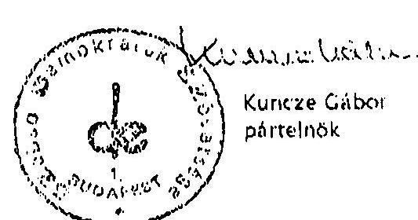

# JELENTÉS 

a 2002. évi országgyúlési választásra fordított pénzeszközök elszámolásának ellenőrzéséről a jelölő szervezeteknél és a független jelölteknél

---

# 3. Önkormányzati és Területi Ellenőrzési Igazgatóság 

3.1. Szabályszerüségi Ellenőrzési Főcsoport

Iktatószám: V-1008-039/2002-2003.
Témaszám: 611
Vizsgálat-azonosító szám: V0054

## Az ellenőrzést felügyelte:

Dr. Lóránt Zoltán
főigazgató

## Az ellenőrzés végrehajtásáért felelős:

Dr. Elek János
főigazgató helyettes
Az ellenőrzést vezette:
Dr. Szávai Tamás
osztályvezető főtanácsos
Az összefoglaló jelentést készítette:
Dr. Dotterweich Antal
tanácsadó
Az ellenőrzést végezték:
Dr. Dotterweich Antal
Hanácsadó

Horváth Balázs
számvevő tanácsos

## A témához kapcsolódó eddig készített számvevőszéki jelentések:

címe
Jelentés az 1998. évi országgyűlési választásra fordított 9916 pénzeszközök elszámolásának ellenőrzéséről a jelölő szervezeteknél és a független jelölteknél
Jelentés az 1999. októberi és a 2000. áprilisi időközi országgyűlési 039 választási kampányokra a jelölő szervezetek és független jelöltek által fordított pénzeszközök ellenőrzéséről
Jelentés a 2001. évi időközi országgyűlési választási kampányra a 0135 jelölő szervezetek által fordított pénzeszközök ellenőrzéséről

---

# TARTALOMJEGYZÉK 

BEVEZETÉS ..... 3
I. ÖSSZEGZŐ MEGÁLLAPÍTÁSOK, KÖVETKEZTETÉSEK, JAVASLATOK ..... 7
II. RÉSZLETES MEGÁLLAPÍTÁSOK ..... 9

1. A beszámolók közzététele és tartalma ..... 9
2. A választásokkal kapcsolatos speciális nyilvántartási és gazdálkodási teendők szabályozása, a választási bevételek és kiadások nyilvántartásban történő elkülönítése ..... 10
3. A választásra fordítható összeghatár betartása ..... 12
4. A beszámolókban közzétett adatok bizonylati alátámasztottsága, a párttörvény 4. § (2) és 3) bekezdésében rögzített korlátozó előírások betartása ..... 13

---

# MELLÉKLETEK 

1. számú
2. számú
3. számú
4. számú

A FIDESZ-MPP és az MDF által a 2002. évi országgyúlési választásra fordított pénzeszközök forrásai és felhasználása
Az MSZP 2002. évi országgyúlési képviselő-választás pénzügyi elszámolása
Az SZDSZ által a 2002. évi országgyúlési képviselő-választásra fordított pénzeszközök forrásai és felhasználása
Az SZDSZ által a 2002. évi országgyúlési képviselő-választásra fordított pénzeszközök forrásai és felhasználása módosított beszámoló

---

# JELENTÉS 

## a 2002. évi országgyúlési választásra fordított pénzeszközök elszámolásának ellenőrzéséről a jelölő szervezeteknél és a független jelölteknél

## BEVEZETÉS

A Ve. 92. § (3) bekezdésének előírása alapján: „A választásra fordított állami és más pénzeszközök felhasználását az Állami Számvevőszék a választás második fordulóját követő egy éven belül az országgyúlési képviselethez jutott jelölő szervezetek és független jelöltek tekintetében hivatalból, egyéb jelölő szervezetek és független jelöltek tekintetében más jelölt, jelölő szervezet kérelmére ellenőrzi".

A 2002. évi országgyúlési választás eredményeként négy párt jutott képviselethez. Egyéb jelölő szervezet és független jelölt nem jutott be az Országgyúlésbe. Egyéb jelölő szervezetek és független jelölt ellenőrzésére más jelölt vagy jelölő szervezet részéről a törvényes határidő lejártáig az ÁSZ-hoz kérelem nem érkezett.

Az ÁSZ a 2002. évi országgyúlési választásokra fordított pénzeszközök felhasználásának teljes körű helyszíni ellenőrzését a következő jelölő szervezeteknél hajtotta végre:

- FIDESZ Magyar Polgári Párt (a továbbiakban: FIDESZ-MPP)
- Magyar Szocialista Párt (a továbbiakban: MSZP)
- Szabad Demokraták Szövetsége (a továbbiakban: SZDSZ)

A FIDESZ-MPP és a Magyar Demokrata Fórum (a továbbiakban: MDF) közösen állított listát, a kampányszervezés és finanszírozás kérdéseiről ezt követően a két párt között létrejött kiegészítő megállapodás alapján a kampány szervezését és a kampány költségeinek nyilvántartását, továbbá a kampányelszámolás Magyar Közlönyben történő közzétételét a FIDESZ-MPP teljesítette. Az MDF feladata csak a megállapodás alapján vállalt 55886850 Ft költséghányad átutalása volt. Ennek következtében az MDF nem került a helyszíni ellenőrzésre kijelölt körbe.

---

A vizsgálatok feltételeiről és körülményeiről szükséges rögzíteni, hogy a választási eljárásról, valamint a pártok működéséről és gazdálkodásáról szóló törvények jelenleg nem biztosítják a választási kampánypénzek eredetének és felhasználásának teljes átláthatóságát, így az Állami Számvevőszék nem tudja teljes mértékben betölteni a választási eljárás átláthatóságával kapcsolatosan azt a szerepét, amelyet az alkotmányos szabályozás megkívánna.

A korábbi választási elszámolások ellenőrzéséről készített jelentéseink ${ }^{1}$ a pártok pénzügyei törvényessége és a választások elszámolásai ellenőrzésére kizárólag jogosult számvevőszéki ellenőrzés hatásköri korlátjait és a korrupciós kockázatok jelentős arányát is jelezték. Ezek a kockázatok elsősorban a magánszektor támogató szerepe korlátozott átláthatóságából, technikai-szabályozási hiányosságokból erednek. ${ }^{2}$

Az ezt megelőző választási kampányok ellenőrzéséről szóló jelentéseiben az Állami Számvevőszék javasolta a Kormánynak, hogy kezdeményezze az Országgyűlésnél a választási eljárásról szóló 1997. évi C. törvény helyett egy új, a kampány-finanszírozás átláthatóságát is biztosító átfogó törvény megalkotását, amely egyértelműen határozza meg, hogy:

- a választási költségek elszámolása szempontjából mely időszak, illetve tevékenység forrásait és ráfordításait kell figyelembe venni;
- a jelöltek száma alapján normatív módon juttatott állami támogatáson belül mi a dologi költségek fogalma, a felhasználás elszámolásának formája, tartalma és kifizetőhelye;
- a választási költségek forrásai körében az egyéb anyagi támogatások között milyen formában nyújtott és kiktől származó juttatásokat kell figyelembe venni (pl. térítés mentes, illetve kedvezményes hirdetés és egyéb szolgáltatás);
- milyen legyen az országgyűlési választásra fordított állami és más pénzeszközök, anyagi támogatások összegét, forrását és a felhasználás módját bemutató, a Magyar Közlönyben megjelentetett választási beszámoló formája és részletes tartalma;
- a választási beszámolók nyilvánosságra hozatali határideje a jelenlegi szűk 60 nap helyett 90 vagy 120 nap legyen, és fontolja meg szankció alkalmazását;
- hogyan történjen az egyéni jelöltek választási költségei és azok forrásai nyilvántartási kötelezettségének érvényesítése; kerüljön sor a kapott támogatások minősítésére, figyelemmel a személyi jövedelemadóról szóló 1995. évi

[^0]
[^0]:    ${ }^{1}$ Lásd a V-1010-82/1998-1999. sz., a V-1004-047/2000. sz. és a V-1016-026/2001. sz. ÁSZ jelentéseket
    ${ }^{2}$ A témakör részletes kifejtése megtalálható „A korrupció elleni küzdelem a számvevői közremüködés bemutatásain keresztül" c. 2002. októberi keltủ ÁSZ tanulmányban. A tanulmány olvasható az ÁSZ internetes honlapján. A tanulmányt az Országgyűlés és bizottságai részére is megküldtük.

---

CXVII. törvényben, és az adózás rendjéről szóló 1990. évi XCI. törvényben foglalt rendelkezésekre;

- közös jelöltállítás esetén a beszámolási kötelezettséget mely szervezetnek kell teljesítenie;
- a költségvetési támogatáson felüli egy jelöltre átlagosan fordítható kiadás reális nagyságát.

A választási eljárásról szóló törvény módosítására, illetve új, a kampányfinanszírozás átláthatóságát is biztosító törvény megalkotására a jelen vizsgálat befejezéséig nem került sor, ezért az ÁSZ által feltárt problémák továbbra is megoldásra várnak. Időközben az Országos Választási Bizottság (a továbbiakban OVB) részéről ÁSZ ellenőrzését tovább nehezítő állásfoglalás született.

Az OVB „A választási kampányra vonatkozó egyes jogszabályi rendelkezések tárgyában" meghozott 4/2002.(II.7.) állásfoglalása szűkíti az ÁSZ ellenőrzési lehetőségét, mivel: „A jelölő szervezet, a jelölt illetve a lista - az Országos Választási Bizottság álláspontja szerint - választási eljárásban való részvételét illetően e minőségét a Ve. 55. § szerinti nyilvántartásba vételtől nyeri. Ezért a választási kampány időszakában jelölő szervezet, jelölt illetve lista vonatkozásában végzett népszerüsitési cselekmények a Ve. 149. § o) pontjára figyelemmel attól az időponttól tekintendők kampánycselekménynek, amikor a jelölő szervezet, a jelölt illetve a lista nyilvántartásba vétele a Ve. hivatkozott szabályainak megfelelően megtörtént." Az állásfoglalás alapján egyes kampánycselekmények esetében a választás kitűzésének időpontját, más (népszerűsítési) cselekmények esetében pedig a jelölt nyilvántartásba vételét kell az ellenőrzésnek irányadóként figyelembe vennie. A gyakorlatban a „népszerűsítő" és az egyéb kampánycselekmények érdekében is merülnek fel költségek a jelölt nyilvántartásba vételének időpontja előtt. A hatályos jogszabályok nem írják elő, hogy a választás kitűzésének időpontja, illetve a jelölt nyilvántartásba vételének időpontja között felmerült költségekről vezessen a jelölő szervezet, illetve a jelölt olyan nyilvántartást, amelyből megállapítható, hogy pl. a megvásárolt szórólapot mely időpontban használta fel. Ennek hiányában nem állapítható meg az ellenőrzés részéről, hogy valamely kiadás kampány költségnek minősül-e.

Az Állami Számvevőszék ennek következtében - az 1998. évi általános választásokat és az 1999. és 2001. évi időközi választásokat követő ilyen tárgyú vizsgálataival azonosan - tudomásul vette, hogy csak az minősül kampányköltségnek, amit valamely jelölő szervezet annak minősít, és ami az elszámolási határidőig megjelent a számviteli nyilvántartásokban.

Az ellenőrzött időszak: a 2002. évi országgyűlési választási kampány volt.
Az ellenőrzés célja annak megállapítása volt, hogy:

- a 2002. évi áprilisi országgyűlési képviselőválasztásokon jelöltet indított párt betartotta-e a Ve. előírásait;
- a 92. § (2) bekezdése értelmében a választás második fordulóját követő 60 napon belül a Magyar Közlönyben nyilvánosságra hozták-e a választásra

---

fordított állami és más pénzeszközök, anyagi támogatások összegét, forrását és felhasználásának módját; valamint

- betartották-e a 92. § (1) bekezdésében meghatározott költséghatárt, amely szerint „A független jelöltek, illetőleg a jelölő szervezetek a választásra a 91. §-ban foglalt költségvetési támogatáson felül jelöltenként legfeljebb egymillió forintot fordíthatnak".

Az ellenőrzés módszere: a kijelölt pártok országos központjában rendelkezésre bocsátott iratok és a Magyar Közlönyben közzétett választási beszámolók tartalmi összevetése, valamint az alkalmazott eljárások és a jogszabályi követelmények egybevetése.

A törvény előírásai érvényesülésének ellenőrzése az 1998. évi általános, valamint az 1999. és 2001. évi időszakos országgyűlési választással összefüggésben valósult meg, tehát ilyen vizsgálat most negyedik alkalommal történt.

---

# I. ÖSSZEGZŐ MEGÁLLAPÍTÁSOK, KÖVETKEZTETÉSEK, JAVASLATOK 

Az 2002. évi országgyűlési választások lebonyolítására a választási eljárásról szóló törvény rendelkezéseit kellett alkalmazni. Az Állami Számvevőszék az 1998. évi általános választást követően elkészült, valamint az 1999-2000. évi időközi választás után kiadott, továbbá a 2001. évi időközi választást követően készített jelentéseiben jelezte a törvény azon hiányosságait, amelyek nehéz feladat elé állítják az ellenőrzést. A jelentések javaslatokat fogalmaztak meg a Kormánynak, hogy kezdeményezze a választási eljárásról szóló törvény helyett egy új, a kampányfinanszírozás átláthatóságát is biztosító átfogó törvény megalkotását az Országgyűlésnél. Az új törvény megalkotása, illetve a régi törvény módosítása még nem történt meg, ezért a 2002. évi választásokat a korábbi hiányos szabályozás alapján kellett végrehajtani. A törvény ma sem határozza meg a pénzügyi, számviteli elszámolások tekintetében a választási kampány fogalmát, a választási költség fogalomkörébe sorolható kiadásokat, a kampányidőszakot, továbbá a beszámoló közzétételével kapcsolatos szabályok is kiegészítésre, pontosításra szorulnak.

Az Állami Számvevőszék ennek következtében - az 1998. évi általános választásokat és az 1999. és 2001. évi időközi választásokat követő ilyen tárgyú vizsgálataival azonosan - tudomásul vette, hogy csak az minősül kampányköltségnek, amit valamely jelölő szervezet annak minősít, és ami az elszámolási határidőig megjelent a számviteli nyilvántartásokban.

A választási eljárásról szóló törvény az ÁSZ számára az országgyűlési képviselethez jutott pártok helyszíni ellenőrzését írta elő. Tekintettel arra, hogy a FIDESZ-MPP az MDF-fel közösen állított jelölteket és a két párt között létrejött megállapodás alapján a kampány szervezése és a beszámolási kötelezettség a FIDESZ-MPP feladata volt, így helyszíni ellenőrzésre három pártnál került sor. A helyszínen ellenőrzött három párt a beszámolási kötelezettségét határidőben teljesítette.

A FIDESZ-MPP a 2002. évi országgyűlési képviselőválasztásról szóló elszámolását az MDF-fel közösen a Magyar Közlöny 2002. évi 86., az MSZP a 2002. évi 84. számában, az SZDSZ pedig a 2002. évi 86. számában, a törvény által előírt határidőben hozta nyilvánosságra. A nyilvánosságra hozatali kötelezettség elmulasztását a törvény nem szankcionálja, így annak elmulasztása vagy késedelmes teljesítése esetén intézkedésre nincs lehetőség.

A választási eljárásról szóló törvény a jelölő szervezetek számára azt írta elő, hogy az egy jelöltre jutó kampányköltség - az állami támogatáson felül - nem haladhatja meg az 1 millió Ft-ot. A rendelkezésre bocsátott dokumentációk (nyilvántartások, bizonylatok és nyilatkozatok) alapján az ellenőrzött jelölőszervezetek nem lépték túl a szankció nélkül felhasználható keretösszeget.

---

A beszámolókban szereplő bevételi adatok főkönyvi elszámolásában a helyszíni ellenőrzések kisebb súlyú hiányosságokat állapítottak meg. Így például a választásra fordított pénzeszközök forrásainak jogcímeiről az ellenőrzött szervezetek nem vezettek teljes körűen elkülönített nyilvántartást, ennek következtében egyes bevételi jogcímek összegének meghatározása nem főkönyvi számlák adatai alapján, hanem számítással történt.

A jelölő szervezetek nyilvántartásai szerint a beszámolóban feltüntetett országgyűlési képviselő-választásra fordított összeg forrásai (választási célra kapott adományok, saját források) esetében betartották a pártok működéséről és gazdálkodásáról szóló, többször módosított 1989. évi XXXIII. törvényben (a továbbiakban: párttörvény) rögzített korlátozó előírásokat.

A nyilvántartott kampányköltségeket bizonylatokkal támasztották alá, ezek megfeleltek a számviteli törvényben meghatározott alaki és tartalmi követelményeknek.

A helyszínen ellenőrzött pártok külön belső szabályzatot készítettek a választásokkal kapcsolatos speciális nyilvántartási és gazdálkodási teendők ellátásához, amelyben a párton belül egységesen (az egyes pártok azonban egymástól eltérően) szabályozták a törvényben nem definiált fogalmakat (kampányköltség, kampányelszámolással kapcsolatos feladatok stb.). Az előírások a gyakorlatban hatályosultak.

Az ellenőrzött szervezetek közül a FIDESZ-MPP állított közös jelölteket az MDFfel, a két párt között a kampányfinanszírozásra és szervezésre vonatkozó megállapodásnak megfelelően a kampány szervezése, a költségek nyilvántartása és a beszámoló megjelentetése a FIDESZ-MPP feladata volt.

A helyszíni ellenőrzés megállapításainak hasznosítása mellett javasoljuk:

# a Kormánynak: 

Kezdeményezze a választási eljárásról szóló törvény kiegészítését - figyelemmel az Állami Számvevőszék korábbi jelentéseiben megfogalmazott javaslataira is - annak érdekében, hogy a választási kampány finanszírozása átlátható legyen.

---

# II. RÉSZLETES MEGÁLLAPÍTÁSOK 

## 1. A beSzámolók KözzÉtétele És Tartalma

A Ve. 92. § (2) bekezdése szerint „Minden jelölő szervezetnek és független jelöltnek a választás második fordulóját követő 60 napon belül a Magyar Közlönyben nyilvánosságra kell hoznia a választásra fordított állami és más pénzeszközök, anyagi támogatások összegét, forrását és felhasználásának módját."

Figyelemmel arra, hogy a Ve. a nyilvánosságra hozatal formájáról, részletezettségéről nem rendelkezett, az ÁSZ a Választási füzetek 1998. évi 44. számának függelékében ajánlásként közzétett egy elszámolási mintát.

A közzétett beszámolók szerkezete, tartalma összhangban van az ÁSZ ajánlásával, az MSZP a kiadásokat tovább is részletezte.

Az ellenőrzött jelölő szervezetek határidőben tettek eleget nyilvánosságra hozatali kötelezettségüknek:

- a FIDESZ-MPP a Magyar Közlöny 2002. június 20-i 86. számában,
- az MSZP a Magyar Közlöny 2002. június 14-i 84. számában,
- az SZDSZ a Magyar Közlöny 2002. június 20-i 86. számában
tette közzé kampányelszámolását (1-3. sz. mellékletek).
A közzétett bevételi adatok egy része számítások alapján került a közzétett beszámolókba, ezért különböző okokból nem egyeznek, illetve nem egyeztethetők a számviteli adatokkal:
- A FIDESZ-MPP a források között választási célra kapott adományként 92169 ezer forintot, „egyéb saját forrás" címen 203743 ezer forintot, hitel címen 90 millió forintot jelölt meg és jelezte, hogy az egyéb saját forrásból MDF által átvállalt kötelezettség 55887 ezer forint. A bizonylatok tanúsága szerint azonban az MDF a jelzett összeget július 7-én, tehát a kampány lezárultát és a beszámoló közzétételét követően utalta át. A FIDESZ-MPP megelőlegezte az MDF kampány kiadásait is. A beszámolóban a hitel- és az egyéb saját forrás jogcímen feltüntetett összeget számítás alapján határozták meg. A párt pénzforgalma egy bankszámlán bonyolódott, így nem lehetett megállapítani, hogy a felvett hitel összegéből mennyit fordítottak kampánycélokra és mekkora összeget múködésre. A teljes hitelösszeg magasabb volt a kampánycélú felhasználásnál, a felhasználási cél forgóeszköz finanszírozás, így az ebből kampánycélú felhasználást csak számítással lehetett meghatározni.

---

- Az MSZP összes bevételként 406127 ezer forintot közölt a beszámolóban. A források közt 247470 ezer forint összegben feltüntette a 2002. első negyedévben az állami költségvetésből származó alaptámogatást (a Ve. rendelkezése alapján jelöltarányosan kapott 13421 ezer forint feletti állami támogatást jelöli így a közzétett beszámoló) és 70 millió forint hitelt. Azonban ezek a tételek sem jogcímüket, sem tényleges felhasználásukat illetően nem minősíthetőek teljes egészében választási célú bevételnek, ugyanis múködési kiadásokat is fedeztek e forrásokból. A közölt összeg számításon alapult. A közölt bevételi főösszeg 6843 ezer Ft-tal meghaladta a beszámolóban összes kiadásként feltüntetett 399284 ezer Ft-ot.
- Az SZDSZ a források között a Ve. alapján kapott jelöltarányos költségvetési támogatás összegét 13353 ezer forintban közölte. Ez a jelöltarányos költségvetési támogatás terhére kimutatott kiadási összeggel egyezett meg. A bizonylatok alapján 13351680 forint a támogatás tényleges összege. Az egyéni jelöltek kampányelszámolásainak bevételi összegét sem a valóságnak megfelelően tartalmazta a beszámoló. A beszámoló nem tartalmazta a nyilvántartásokban kimutatott, nem központi forrásból származó kampánycélra fordított 461580 forint bevételt.

A kiadási adatok a FIDESZ-MPP és az MSZP esetében egyeztek a könyvvezetésben rögzített adatokkal, az SZDSZ-nél az egyéni jelöltek tényleges kampánykiadásai helyett az elszámolásra kiadott összegeket könyvelték kiadásként, így az összes kiadás beszámolóban közölt adata a nyilvántartások szerinti összegnél 461580 forinttal alacsonyabb. A helyszíni ellenőrzést követően, 2002. november 18-án a párt gondoskodott a módosított tartalmú, a bevételeket és a kiadásokat az ellenőrzés által megállapított összegben tartalmazó közleménynek a Magyar Közlönyben történő megjelentetéséről (4. sz. melléklet).

# 2. A VÁLASZTÁSOKKAL KAPCSOLATOS SPECIÁLIS NYILVÁNTARTÁSI ÉS GAZDÁLKODÁSI TEENDŐK SZABÁLYOZÁSA, A VÁLASZTÁSI BEVÉTELEK ÉS KIADÁSOK NYILVÁNTARTÁSBAN TÖRTÉNŐ ELKÜLÖNÍTÉSE 

Mindhárom helyszínen ellenőrzött jelölő szervezet a választási kampányt megelőzően gondoskodott az ezzel kapcsolatos nyilvántartási és gazdálkodási teendők szabályozásáról. A szabályozás egy vagy több dokumentumban történt, részletezettségük, mélységük eltérő, az adott párt sajátosságaihoz, kampány elképzeléseihez igazodott.

A kampányköltség meghatározásában nem követtek egységes gyakorlatot, a jelölő szervezetek közül az MSZP nem csak a közvetlen, a számlák alapján egyedileg a kampányhoz kapcsolódó költségeket tekintette idetartozónak, hanem az úgynevezett választási általános költségeket is. Ennek meghatározása oly módon történt, hogy a választásokon kívüli időszakhoz képest megemelkedett költségeket a költségnem számla adatának arányosításával külön az országgyűlési választási célra megnyitott részletező számlára átkönyvelték.

---

A választási kampánnyal kapcsolatos bevételek elkülönítésének szabályozása és a számviteli nyilvántartásokban elkülönített rögzítésük nem történt meg teljes körűen:

- a FIDESZ-MPP esetében a Párt 2002. év első félévére készített költségvetése megjelölte a kampánycélra tervezett összeget. A számviteli nyilvántartásokban azonban csak a Ve. alapján kapott költségvetési támogatásról és a választási célra kapott adományokról álltak rendelkezésre bizonylatok, illetve kimutatás. A hitel összege számított adat, az MDF által a beszámoló megjelenéséig át nem utalt 55887 ezer Ft nem lehetett saját forrás, ez az igénybevett hitelállományt növeli.
- az MSZP belső szabályozásában nem konkrét összeget, hanem a 2002. év első negyedévének összes bevételét (minden bevételi jogcímet felsorolva) jelölte meg választási kampányra fordítható bevételként. A jogi és magánszemélyek támogatásairól rendelkezésre álltak a bizonylatok, kimutatások. A kampányra fordított hitel és az állami költségvetésből származó alaptámogatás címekhez kapcsolt összegek számított adatok voltak.
- az SZDSZ belső szabályzata csak a választási célú pénzbeli és nem pénzbeli vagyoni hozzájárulásokról írta elő külön nyilvántartás készítését.

A hiányos belső szabályozásokra tekintettel a pártok számviteli nyilvántartásaiban szereplő bevételek esetében nem volt hozzárendelhető a beszámolóban közölt valamennyi jogcímhez bizonylatokkal alátámasztott összeg. Ennek következtében utólag - a beszámoló közzétételének céljából - szükségképpen történtek számítások. A kampányidőszakban követett gyakorlat szerint mindhárom helyszínen ellenőrzött jelölő szervezet banki bevételi és kiadási forgalma egyetlen pénzforgalmi bankszámlán bonyolódott, függetlenül a bevételek és kiadások jellegétől (pl. múködés, választási kampány).

A kampánykiadások esetében a belső előírások rögzítették az elszámolási határidőket, a kampány során vezetendő nyilvántartásokat, a több részletben történt finanszírozás esetén feltételként az előző összeggel történő elszámolást.

A kampánykiadások meghatározásánál az ellenőrzött jelölőszervezetek a hivatkozott 4/2002. (II. 7.) OVB állásfoglalás értelmezésétől eltérően a kampányidőszakban felmerült költségeket minősítették ide tartozónak, függetlenül attól, hogy a jelöltet mely időpontban vették nyilvántartásba. A választási kampányidőszakot a választások kitűzéséről szóló Köztársasági Elnöki határozat Magyar Közönyben történt közzétételétől kezdődően a második választási fordulót megelőző nappal bezárólag rögzítették.

A kampánykiadások számviteli elkülönítésének szabályozása mindhárom jelölő szervezet esetében megfelelő volt. Kódszámok alkalmazását és külön főkönyvi számlát jelöltek meg a belső előírások a kampánykiadások könyvviteli elszámolásához.

A számlakijelölés munkáját segítendő mindhárom szervezet előírta, hogy mely tartalmi és formai követelményeknek (pl. csak a párt nevére kiállított, a kampányfőnök által utalványozott számla) kell megfelelniük a kampánybizonylatoknak.

---

Az ellenőrzött szervezeteknél a kiadások elszámolásánál követett gyakorlat - az SZDSZ esetében az egyéni jelöltek kampány elszámolása kivételével - megfelelt a számvitelről szóló 2000. évi C. törvény (a továbbiakban számviteli törvény) követelményeinek. Az SZDSZ a helyszíni ÁSZ ellenőrzést követően intézkedett a hiba kijavítása érdekében.

# 3. A VÁLASZTÁSRA FORDÍTHATÓ ÖSSZEGHATÁr BETARTÁSA 

A Ve. 92. § (1) bekezdésének előírása szerint „A független jelöltek, illetőleg a jelölő szervezetek a választásra a 91. §-ban foglalt költségvetési támogatáson felül jelöltenként legfeljebb egymillió forintot fordíthatnak. A figyelembe vehető jelöltek számát a 91. § (2) bekezdése szerint kell megállapítani."

A jelölő szervezetek által állított jelöltek számát és az egyéb források (a jelöltarányos költségvetési támogatáson kívüli források) terhére történt, közölt pénzfelhasználást a következő kimutatás szemlélteti.

| Jelölő szervezet   neve | Jelöltek   száma | Egyéb források   terhére ktg. (ezer   Ft) |
| :-- | :--: | :--: |
| FIDESZ-Magyar MPP+MDF | 386 | 385912 |
| MSZP | 386 | 385861 |
| SZDSZ | 384 | 275293 |

A Ve. 49. § (2) bekezdése szerint „Ha több jelölő szervezet közösen állít jelöltet, a továbbiakban - a választás szempontjából - egy jelölő szervezetnek számítanak." Az idézett rendelkezés alapján a FIDESZ-MPP és az MDF együttesen fordíthatott 386 millió forintot kampánycélokra az állami költségvetési támogatáson felül.

A kimutatás alapján az állapítható meg, hogy a jelölő szervezetek számviteli nyilvántartásaik tanúsága szerint nem lépték túl a jelöltenként szankció nélkül választásra fordítható egymillió forint összeghatárt.

Az ÁSZ ellenőrzési jogosultsága csak a pártok kampány elszámolásainak ellenőrzésére terjed ki. A változatlanul hézagos jogi szabályozás következtében - az 1998. évi általános választásokat és az 1999. és 2001. évi időközi választásokat követő ilyen tárgyú vizsgálataival azonosan - az ÁSZ tudomásul vette, hogy csak az minősül kampányköltségnek, amelyet valamely jelölő szervezet annak minősít, és ami az elszámolási határidőig megjelent a számviteli nyilvántartásokban.

---

# 4. A beSzámolóKban közzétett adatok bizonylati alátámasztottsáGA, a PÁrttÖRVény 4. § (2) és 3) bekezdésében rögzített korlátozó elóírások betartása 

A beszámolót megalapozó főkönyvi könyvelés bevételi összegeit belső szabályozási hiányosságok és a Ve.-nek a beszámoló közzétételi időpontját szabályozó rövid határideje folytán, továbbá annak következtében, hogy a bevételek teljes körű elkülönített nyilvántartását nem írja elő, csak a saját forrásokat támasztják alá számviteli bizonylatok.

A kiadásoknál a helyszínen ellenőrzött bizonylatok esetében érvényesültek a számviteli törvényben és a jelölő szervezetek által a bizonylatokkal kapcsolatosan meghatározott alaki és tartalmi követelmények. Mindhárom ellenőrzött jelölő szervezetnél a könyvvezetésből a bizonylatok visszakereshetők voltak, tartalmuk szerint a könyvelt gazdasági eseményt támasztják alá.

A párttörvény 4. § (2) és (3) bekezdése értelemszerűen a választási kampányra vonatkozóan is korlátokat határoz meg a pártok részére a vagyoni hozzájárulások, adományok elfogadhatóságát illetően a következők szerint:
„(2) A párt részére - a 4. § (1) bekezdésében foglalt kivételektől eltekintve - költségvetési szerv, továbbá állami vállalat, állami részvétellel müködő gazdasági társaság, közvetlen költségvetési támogatásban vagy költségvetési szervi támogatásban részesülő alapítvány vagyoni hozzájárulást nem adhat, a párt költségvetési szervtől, továbbá állami vállalattól, állami részvétellel müködő gazdasági társaságtól, közvetlen költségvetési támogatásban vagy költségvetési szervi támogatásban részesülő alapítványtól vagyoni hozzájárulást nem fogadhat el.
(3) A párt vagyoni hozzájárulást más államtól nem fogadhat el. A párt névtelen adományt nem fogadhat el; az ilyen adományt be kell fizetni a 8. § (1) bekezdésében említett alapítvány céljaira."

A helyszínen ellenőrzött jelölő szervezetek idevonatkozó iratanyagainak (pl. számviteli nyilvántartások, bizonylatok, a jelöltek által a szervezeteknek adott nyilatkozatok, adományozási szerződések) áttanulmányozása alapján nem merült fel adat arra vonatkozóan, hogy a jelölőszervezetek figyelmen kívül hagyták volna a párttörvény hivatkozott előírásait.

Budapest, 2003. március
Melléklet: $\quad 4 \mathrm{db} \quad 4$ lap

Dr. Kovács Árpád
elnök

---

A FIDESZ - Magyar Polgári Párt és a Magyar Demokrata Fórum által a 2002. évi országgyúlési választásokra forditott pénzeszközök forrásai és felhasználása

1 A jelolo szervezetck neve: FIDESZ - Magyar Polgári Párt Magyar Demokrata Fórum
2. A jelolo szervczetck által állitott jelöltek száma: 386 fo

Ezer fonniban
3. Az országgyúlési képviselö-választásra forditott osszeg

399333
3.1. Forrásai összesen

399333
3.1.1. Állami költségvetési lámogatás

13421
3.1.2. Egyéb források

385912
ebbol:

- választási célra kapott adomány

92169
hitel
90000
egyéb saját forrás
ebbol: MDF által átvallalt kótelezettség
55887
3.2. Jogcímek szerinti felhasználás összesen
3.2.1. Állami költségvetési lámogatás terhére

13421
ebbol:

- anyagjellegú ráfordítás
13421
- egyéb ráfordítás
385912
3.2.2. Egyéb források terhére

385912
ebbol:

- anyagjellegú ráfordítás
385912
- egyéb ráfordítás

Várhegyi Attila s. k., pártigazgató

---

A Mugyar Szocialista Púrt 2002. évi országgyúlési képviselö-választás pénzügyi elszámolása
2. sz. melléklet a
V-1008-039/2002-2003.sz. jelentéshez
I. Állami költségvetési választási támogatás
II. Egyéb források

1. Állami költségvetésbơl származó alaptámogatás
2. Egyéb támogatások
2.1. Jogi személycklơl
2.1.1. Belfoldickıól
2.1.2. Külföldickıól
2.2. Jogi személyiségnck nem minơsüló gazdasági társaságtól
2.2.1. Belfoldickıól
2.2.2. Külföldickıól
2.3. Magánszemélyckıól
2.3.1. Belfoldickıól
2.3.2. Külföldickıól
3. Hliel

Osszes hevélel

Kiadások
I. Állami költségvetési választási lámogatás terhére

1. Dologi kiadások
1.1. Posta-, telefonkollség
1.2. Berleti díjak
1.3. Propagandaköliség
1.4. Egyéb anyagjellegủ szolgáltatások
II. Egyéb források terhére

1. Dologi kiadások
1.1. Anyagkollség
1.2. Posta-, telefonkollség
1.3. Közlekedés, szállitási kiadások
1.4. Berleti díjak
1.5. Propagandaköliség
1.6. Egyéb anyagjellegủ szolgáltatások
1.7. Egyéb nem anyagjellegủ szolgáltatások
2. Személyi jellegű kiadások
2.3. Egyéb személyi jellegủ ráfordítás

Osszes kiadás

13421
392706
247470
75236
1537
1
73699
73699
70000

406127

13423
13423
1225
110
12002
86
385861

385220
8606
12611
3006
47117
285671
28162
47
641

641

399284

---

# A Szabad Demokraták Szövetsége által a 2002. évi országgyưlési képviselö-választásra forditott pénzeszközök forrásai és felhasználása 

1. A jelölő szervezet neve: Szabad Demokraták Szövetsége
2. A jelölő szervezet által állított jelöltek száma: 384 fő

Ezer forintban
3. Az országgyưlési képviselö-választásra fordított osszeg
3.1. Forrásai összesen

288184
3.1.1. Állami költségvetési támogatás

13353
3.1.2. Egyéb források 274831
ebbol:

- választási célra kapott adományok 1353
- saját források 273478
3.2. Jogcímek szerinti felhasználás összesen

288184
3.2.1. Az állami költségvetési támogatás terhére

13353
3.2.2. Egyéb források terhére

274831
ebbol:

- anyagkollsség 195
- igénybe vett szolgáltatás költségei 264754
- rendezvény kiadásai 9882

Kuncze Gábor s. k., páncinok

---

# A. sz. melléklet a V-1008-033/2002-2003.sz. jelentéshez 

A Szabad Demokratiá: Szüvetsége által a 2002. évi országgyilóai kérelcetü-választásra forditott pónzeszközök forrásai és felhasználása módosítási beosztatást

| 1/. | Jelölő szervezet neve: | Szabad Demokratiá: Szüvetsége |
| :--: | :--: | :--: |
| 2/. | A jelölő szervezet által állított jelöltek száma: | 384 fő |
|  |  | ezer forint |
| 3./ | Az országgyilási kérelcetü-választásra fordított összeg |  |
| 3.1. | Forrásai összesen | 288645 |
| 3.1.1 | Állami költségvetési támogatás | 13352 |
| 3.1.2 | Lyyéh források | 275293 |
|  | (bből: |  |
|  | Választási célra kapott adományok: | 1815 |
|  | Saját források | 273478 |
| 3.2. | Jogcímel: szerinti felhasználás összege: | 288645 |
| 3.2.1 | Az állami költségvetési támogatás terhére: | 13352 |
| 3.2.2 | Az egyéb források terhére: | 275293 |
|  | (bből: |  |
|  | Anyagköltség | 195 |
|  | Igénybe vett szolgáltatás költségei | 265216 |
|  | Rendezvény kiadásai | 9882 |
|  | Budapest, 2002. november 18. |  |

