# JELENTÉS 

a Postabank és Takarékpénztár Rt. konszolidációjának ellenőrzéséről

---

2. Államháztartás Központi Szintjét Ellenőrző Igazgatóság
2.1. Teljesítmény Ellenőrzési Főcsoport
V-14-59/2002.
Témaszám: 604.
Vizsgálat-azonosító szám: V-0055

# Az ellenőrzést felügyelte: 

## Bihary Zsigmond

főigazgató
Az ellenőrzés végrehajtásáért felelős:
Kemény Emil
főcsoportfőnök
Az ellenőrzést vezette:
Makkai Mária
főcsoportfőnökhelyettes

Az ellenőrzést végezték:

| Biró Endre számvevő | Lőrinc Alajos főtanácsadó | Németh Béláné tanácsadó |
| :--: | :--: | :--: |
| Fekete Gábor számvevő tanácsos | Massányi Tibor számvevő gyakornok | Dr. Ocskovszky Jánosné osztályvezető főtanácsos |
| Hajagos Józsefné főtanácsadó | Matuk Károly számvevő | Tornai József számvevő tanácsos |
| Dr. Kemenczei Rezső számvevő | Nagy Ákos számvevő | Dr. Zsombor András számvevő |

A témához kapcsolódó eddig készített számvevőszéki jelentések:

Jelentés a Postabank és Takarékpénztár Rt. gazdálkodása, működése és a Magyar Fejlesztési Bank Rt. 1998. évi veszteségének ellenőrzéséről

Jelentés a Reorg-Apport Rt. tevékenységének ellenőrzéséről
0107

---

# TARTALOMJEGYZÉK 

BEVEZETÉS ..... 5
I. ÖSSZEGZŐ MEGÁLLAPÍTÁSOK, KÖVETKEZTETÉSEK, JAVASLATOK ..... 7
II. RÉSZLETES MEGÁLLAPÍTÁSOK ..... 12

1. A Bank szervezete, működésének szabályozottsága és belső kontrollrendszere ..... 12
1.1. Az alapszabály, a tulajdonosi szerkezet, az igazgatóság működése ..... 12
1.2. A Bank központi szervezete és irányítása ..... 14
1.3. A működés szabályozottsága ..... 16
1.4. A belső kontrollrendszer működése ..... 17
2. A Bank üzleti tevékenysége ..... 19
2.1. A hitelezési terület szabályozottsága ..... 19
2.2. A Bank hitelezési tevékenységének változása, összhangja a stratégiai célkitűzésekkel ..... 20
2.2.1. A stratégia és az üzleti tervek ..... 20
2.2.2. A hitelkoncentráció alakulása ..... 23
2.2.3. A banki portfoliók minőségének alakulása ..... 24
2.3. A befektetések alakulása ..... 26
2.3.1. A befektetések és értékpapírok állományának változása, összhangja a stratégiai és üzletpolitikai célkitűzésekkel ..... 26
2.3.2. A vállalkozásokban fennálló részesedések ..... 27
2.3.3. Az értékpapír állomány alakulása ..... 28
2.3.4. A befektetések kezelése, tulajdonosi jogok gyakorlása, a befektetések értékelése ..... 28
2.3.5. Hitel-tőke konverzió ..... 31
2.4. A kötelezettség-állomány alakulása, összhangja a stratégiával és az üzleti tervekkel ..... 32
2.5. Az eszköz- és forrásgazdálkodás, likviditás, kockázatok kezelése ..... 34
3. A Bank eredménye, gazdálkodása és vagyoni helyzete ..... 35
3.1. A Bank és a költségvetés közötti elszámolás ..... 35
3.2. A Bank eredményének alakulása ..... 36
4. A PB Workout Kft. tevékenysége ..... 40
4.1. A társaság szervezetének kialakítása, üzletpolitikája ..... 40
4.2. A vásárolt eszközök átvétele, kezelése, értékesítése ..... 42
4.3. A Workout Kft. gazdálkodása, vagyoni helyzete, ellenőrzése ..... 44

---

4.3.1. A Workout Kft. gazdálkodása ..... 44
4.3.2. A Workout Kft. vagyoni helyzetének alakulása ..... 46
4.3.3. Tulajdonosi ellenőrzés ..... 46
5. A Reorg-Apport Rt. tevékenysége ..... 47
5.1. Az utóellenőrzés előzményei ..... 47
5.2. A szerződéses kötelezettségek teljesítése ..... 47
5.2.1. A tulajdonosi kölcsönszerződés ..... 47
5.2.2. A vagyonkezelési szerződés és annak teljesítése ..... 48
5.3. A társaság működésének szabályozottsága, szervezeti keretei ..... 49
5.4. A bevételek és kiadások alakulása, az eszközök értékesítésének eredményessége ..... 50
5.5. A jogi útra terelt jelentősebb ügyletek helyzete ..... 51

# MELLÉKLETEK 

1. sz. A Bank Rt. konszolidációjához kapcsolódó állami hozzájárulás összetevői
2. sz. A Bank hitelállományának alakulása főbb termékenként
3. sz. A banki kockázatvállalás összetétele
4. sz. A Postabank közvetlen befektetéseinek alakulása 1998. december 31. - 2002. június 30. közötti időszakban
5. sz. A Postabank befektetéseinek minősítése 1998. december 31. - 2002. június 30. közötti időszakban
6. sz. A Bank kötelezettség állományának alakulása
7. sz. PB Workout Kft. eredménykimutatások éves részletezésben
8. sz. A Pénzügyminisztérium észrevétele
9. sz. A Pénzügyi Szervezetek Állami Felügyelete észrevétele
10. sz. Az Állami Privatizációs és Vagyonkezelő Rt. észrevétele
11. sz. A Postabank és Takarékpénztár Rt. észrevétele

11/a sz. A Postabank és Takarékpénztár Rt. észrevételére tett válasz
12. sz. A Reorg-Apport Pénzügyi Rt. észrevétele
13. sz. A PB Workout Kft. észrevétele
14. sz. A pénzügyminiszter észrevétele

---

# RÖVIDÍTÉSEK JEGYZÉKE 

| Hpt. | a hitelintézetekről és pénzügyi vállalkozásokról szóló 1996. évi CXII. törvény |
| :--: | :--: |
| Gt. | a gazdasági társaságokról szóló 1997. évi CXLIV. törvény |
| Szt. | a számvitelről szóló 2000. évi C. törvény |
| Épt. | az értékpapírok forgalombahozataláról, a befektetési szolgáltatásokról és az értékpapír-tőzsdéről szóló 1996. évi CXI. törvény; valamint a tőkepiacról szóló 2001. évi CXX. törvény |
| Bank | Postabank és Takarékpénztár Rt. |
| Felügyelet | Pénzügyi Szervezetek Állami Felügyelete (korábban: Állami Pénz- és Tőkepiaci Felügyelet) |
| MNB | Magyar Nemzeti Bank |
| PM | Pénzügyminisztérium |
| KöViM | Közlekedési, Hírközlési és Vízügyi Minisztérium |
| KEHI | Kormányzati Ellenőrzési Hivatal |
| Workout Kft. | PB Workout Vagyonkezelő Kft. |
| ÁPV Rt. | Állami Privatizációs és Vagyonkezelő Rt. |
| PK | Polgári Kereskedelmi Bank Rt. |
| PBÉB | Postabank Értékpapírforgalmazási és Befektetési Rt. |
| DHK | Diákhitel Központ Rt. |
| MVA | Magyar Vállalkozásfejlesztési Alapítvány |
| A.P.P. Kft. | A.P.P. Könyvvizsgáló Könyvvezető Gazdasági és Pénzügyi Kft. |
| FB | Felügyelő Bizottság |
| KHB | Központi Hitelezési Bizottság |
| SZMSZ | Szervezeti és Működési Szabályzat |

---

.

---

# JELENTÉS 

## a Postabank és Takarékpénztár Rt. konszolidációjának ellenőrzéséről

## BEVEZETÉS

A Bank konszolidációja 1998. december 30-án megtörtént. Ennek keretében a Magyar Állam 152 milliárd Ft-ot juttatott a Banknak tőkehelyzete rendezése érdekében, amelyből 20 milliárd Ft készpénz, 132 milliárd Ft pedig állampapír volt. Ezt követően a Reorg-Apport Rt. 41,3 milliárd Ft, a Workout Kft. 10,9 milliárd Ft nettó értékű minősített követelést és befektetést vásárolt meg a Banktól. 1999-ben az Állami Számvevőszék a Bank veszteségét előidéző legfontosabb okokat feltárta. ${ }^{1}$

Az 1155/1998. (XII. 9.) Korm. határozat 2002. november 7-éig hatályos 9. pontja előírta, hogy a KEHI köteles rendszeresen ellenőrizni a Banknál és a Reorg-Apport Rt.-nél az állami pénzeszközök felhasználását. Egyben felkérte az Állami Számvevőszéket is ugyanerre a feladatra. Az Állami Számvevőszék 2001. évben ellenőrizte a Reorg-Apport Rt. tevékenységét.

A Workout Kft.-t a Bank 1998-ban céltársaságként hozta létre a portfoliótisztítás végrehajtásának érdekében. A Workout Kft. tevékenységét az Állami Számvevőszék eddig nem vizsgálta.

A Bank és a Reorg-Apport Rt. működését a Hpt., a Workout Kft. működését pedig a Gt. szabályozza.

Mindhárom társaságnál a közvetlen, vagy közvetett állami tulajdon részaránya meghaladja a 95%-ot.

A Bank és a PM között 1998. december 30-án konszolidációs megállapodás jött létre, amelyben meghatározták a Bank kötelezettségeit a jövőbeni prudens (biztonságos) működés érdekében. A megállapodás keretében a PM kötelezte a Bankot új szabályzatok kiadására, a kockázati céltartalék állomány felülvizsgálatára a könyvvizsgálóval együttműködve, rendszeres jelentéstételre a PM felé, továbbá előírta, hogy a konszolidációban érintett eszközök céltartalék-

[^0]
[^0]:    ${ }^{1}$ A Postabank és Takarékpénztár Rt. gazdálkodása, működése és a Magyar Fejlesztési Bank Rt. 1998. évi veszteségeinek ellenőrzéséről szóló jelentés 7-13. oldal

---

nak felszabadításából származó nettó bevétel és a Workout Kft.-től származó osztalék 90%-át utalja vissza a Magyar Állam részére.

Az ellenőrzés célja annak értékelése volt, hogy a Bank működése megfelel-e a konszolidációs szerződésben foglaltaknak, a konszolidáció eredményes volt-e, ehhez kapcsolódóan a Bank szervezete, működési rendszere, személyi és tárgyi feltételei biztosítják-e a prudens működést; a Workout Kft. tevékenysége megfelelt-e a létrehozás céljának, a követelések és befektetések behajtása, értékesítése eredményes volt-e; a Reorg-Apport Rt.-nek a 2001. évre megmaradt eszközök értékesítéséből származó bevétele fedezetet nyújtott-e kötelezettségei rendezésére, működési költségeire; a számvevőszéki jelentésben tett javaslatok hogyan hasznosultak.

Az ellenőrzés jogalapja az Állami Számvevőszékről szóló 1989. évi XXXVIII. tv. 2. § (6) bekezdése.

Az átfogó ellenőrzés a Banknál és a Workout Kft.-nél az 1999-2001. évi, a Reorg-Apport Rt. utóellenőrzésénél a 2001. évi tevékenységre irányult, de szükség szerint a helyszíni ellenőrzés befejezéséig tartó időszak (2002. október) pénzügyi-gazdasági folyamataira is kiterjedt. A Reorg-Apport Rt. esetében - az egyeztetések során megküldött dokumentumok alapján - egyes megállapítások a 2002. december 16-án fennállt helyzetre vonatkoznak.

Az ellenőrzés az Állami Számvevőszék korábbi ellenőrzési tapasztalatain, a bekért, valamint a mintavételi eljárási szempontok alapján kiválasztott dokumentumokon alapult. A Bank gazdálkodói hiteleinél, a személyi hiteleknél és a lakossági hitelek 80%-nál a mintavételhez olyan statisztikai módszert alkalmaztunk, amely 95%-os bizonyossággal garantálja a megállapítások helytállóságát.

A jelentés tervezetét egyeztettük a PM közigazgatási államtitkárával, a Felügyelet elnökével, az ÁPV Rt. vezérigazgatójával, valamint a Bank, a ReorgApport Rt. és a Workout Kft. vezetőivel. (Leveleik másolatát a 8-13. sz. mellékletek tartalmazzák.)

A végleges jelentést az Állami Számvevőszékről szóló 1989. évi XXXVIII. törvény III. fejezet 25. § (1) bekezdésének megfelelően észrevételezésre megküldtük a pénzügyminiszternek, aki válaszában észrevételt nem tett. (14. sz. melléklet)

---

# I. ÖSSZEGZŐ MEGÁLLAPÍTÁSOK, KÖVETKEZTETÉSEK, JAVASLATOK 

A Magyar Államnak a Bank konszolidációjához kapcsolódóan 2002. december végéig 174,5 milliárd Ft kiadása volt, amelyből a Bank 150,6 milliárd Ft-tal, a Reorg-Apport Rt. 23,9 milliárd Ft-tal részesedett. Az állami hozzájárulás összetevőit az 1. sz. melléklet tartalmazza. A konszolidáció költségvetésre gyakorolt végső hatása ma sem határozható meg, mivel a Reorg-Apport Rt. a teljes eszközállományát még nem értékesítette. ${ }^{2}$

A Bank a két és fél év alatti tevékenységével a PM-mel kötött konszolidációs megállapodásban foglaltakat teljesítette, a konszolidáció eredményes volt, mivel a prudens működés helyreállt. Mindebben a belső intézkedések mellett döntő szerepe volt annak a konszolidációs technikának, hogy a többségében kétes és rossz minősítésű eszközök kezelése, értékesítése a Workout Kft. és a Reorg-Apport Rt. feladata lett. A Reorg-Apport Rt. vagyonkezelését külön szerződések ${ }^{3}$ szabályozták, a Workout Kft. esetében pedig az alapító okirat előírásai határozták meg azt.

A Bank és a PM közötti konszolidációs megállapodás lezárásához a Kormány hozzájárult, amelyet a PM tájékoztatása szerint 2003. I. félévében hajtanak végre.

A Bank tőkehelyzete az 1998. évi konszolidációval - a 152 milliárd Ft költségvetési juttatással, amelyből 132 milliárd Ft állampapír volt - rendeződött. Az állampapírok csak részben forgalomképesek és az azokból származó kamatbevétel alacsonyabb mint a hiteleké, ezért a Bank jövedelmezőségére kedvezőtlen hatással voltak/vannak.

A Bank a konszolidációt követő két évben tevékenységét együttesen 0,5 milliárd Ft mérleg szerinti nyereséggel zárta úgy, hogy közben eleget tett a PM-mel kötött megállapodásban foglaltaknak is, és a költségvetés javára 1,4 milliárd Ft ingyenes pénzátadást teljesített. 2001. évet a Bank 2,2 milliárd Ft mérleg szerinti veszteséggel zárta. A veszteséget alapvetően a befektetési portfolió értékvesztése és a mérlegen kívüli tételekre - ezen belül a peres ügyekre - képzett céltartalék növekedése okozta. Az eredmény úgy alakult ki, hogy a 2000. évi költség-

[^0]
[^0]:    ${ }^{2}$ A Postabank és Takarékpénztár Rt. gazdálkodása, működése és a Magyar Fejlesztési Bank Rt. 1998. évi veszteségeinek ellenőrzéséről szóló jelentés 55. oldal. A Magyar Köztársaság 1998. évi költségvetése végrehajtásának ellenőrzéséről szóló jelentés összegző megállapítások.
    ${ }^{3}$ A Reorg-Apport Rt. tevékenységének ellenőrzéséről szóló jelentés 14-18. oldala részletezi a szerződéseket, megállapodásokat.

---

vetés végrehajtásáról szóló törvény alapján a Bank mentesült 2,7 milliárd Ft befizetési kötelezettség alól. E nélkül a Bank 2001. évi vesztesége megközelítette
 volna az 5 milliárd Ft-ot.

A konszolidációs megállapodás rendelkezett a prudens működéshez szükséges szabályzatok elkészítéséről. A Bank a szabályzatokat megalkotta, azok valamennyi tevékenységét lefedik és megfelelnek a jogszabályokban rögzített követelményeknek, karbantartásuk folyamatos. A Bank mintegy 350 hatályos utasítással rendelkezik, ezek mennyisége azonban már a kezelhetőséget nehezíti.

A Bank szervezetének átalakításában két élesen elkülöníthető szakasz különböztethető meg. 1998 augusztusától 2001 áprilisáig tudatos szervezetfejlesztés, stabil vezetés volt. 1999. évben a munkafolyamatok felülvizsgálataként a szervezeti egységek, a vezetők és a hierarchikus szintek számát csökkentették. Az ezt követő mintegy másfél év alatt a szervezetet - különös tekintettel a központi irányítási területeken - a folyamatos változás jellemezte a vezetők gyakori cserélődésének függvényében. A változtatások csak részben kapcsolódtak a stratégiához, az üzleti tevékenység fejlődéséhez, azonban hatással voltak a Bank eredményességére és növelték a működésben rejlő kockázatot.

A Bank költségracionalizálási törekvései teljesültek a működési költségek célszerű és indokolt leszorításával. A Bank működési költségein belül - amely minden évben meghaladta a realizált kamatkülönbözetet - a személyi jellegű ráfordítások voltak a legmagasabbak, arányuk minden évben közel 40%-ot képviselt. A működési költségek másik meghatározó eleme a nem anyagjellegű ráfordítások voltak. Ezek aránya az 1998. évi 45%-ról 2001. évre fokozatosan 33%-ra csökkent. A csökkenést az idézte elő, hogy a Bank egyrészt visszafogott marketing tevékenységet folytatott, másrészt a konszolidációban érintett ügyletekhez kapcsolódó tanácsadói, jogi szakértői tevékenység igénybevételének szükségessége is mérséklődött és ez a megbízási díjak radikális visszaesését eredményezte.

A Bank kiépítette belső kontrollrendszerét - vezetői információs, kontroll-ing-, és belső ellenőrzési rendszer -, annak szabályozottsága és működése megfelelő. A külső adatszolgáltatásnak és az elvárt vezetői információs igényeknek a heterogén informatikai rendszerek miatt azonban esetenként csak manuális többletmunkával tudnak eleget tenni. Ez hátráltatja a vezetői információk időbeli rendelkezésre állását, nehezíti a döntéseket, továbbá növeli a hibalehetőséget. A konszolidációt megelőző időszakhoz képest szakmailag javult a függetlenített belső ellenőrzés tevékenysége, de munkáját csak 2000. évtől végezte munkaterv szerint, azt megelőzően döntően ad-hoc jellegű vizsgálatokat folytatott.

A Bank hitelezési tevékenysége (kockázatvállalása) a konszolidációt követően pozitív irányba változott mind szabályozottságát, mind szabályosságát tekintve. Mindez kedvezően befolyásolta, illetve elősegítette a Bankban a prudens működés feltételeinek megteremtésére irányuló törekvéseket. A Bank teljesítette azt a stratégiai és üzleti célkitűzést, hogy az ország második legnagyobb, alapvetően lakossági bankjává váljon, egy erős vállalati üzletág megtartása mellett. Megszűnt a Bankot korábban jellemző egyoldalú hitelezési tevékenység azzal, hogy a lakossági hitelek aránya a mérlegfőösszeg 1998. évi

---

1%-os mértékéről 10%-ra emelkedett. Így a lakossági ügyfélkapcsolat nem csak a forrásoldalra (betétek) koncentrálódott. Ez nem tudta ellensúlyozni a kockázat növekedését, amely abból adódott, hogy az éven túli lejáratú hitelek aránya megnőtt. A Bank a kockázat mérséklése érdekében olyan indokolt és célszerű kikötéseket, kvázi biztosítékokat épített be a kölcsönszerződésekbe, amelyek lehetőséget adnak azok nem teljesülése esetén a hitel rövidlejáratúvá tételére. Az ügyfelekkel szembeni kockázatvállaláson belül a kényszer (1999. január 1. előtti) portfolió arányát a Bank sikeresen megváltoztatta és az 1998. évi közel 50%-ról 2002. I. félév végére 6%-ra csökkentette.

A Bank konszolidációt megelőző veszteségét alapvetően az akkori befektetési politika, illetve a befektetési portfolió szerkezete és kedvezőtlen minősége okozta. A konszolidációt követően csak olyan befektetés maradt a Bank tulajdonában, amely üzleti tevékenységét és banküzemi működését támogatta.

Teljesült az az új befektetési politika, miszerint üzleti célú befektetési tevékenységet a Bank nem végez. Ennek ellenére a Bank befektetési portfoliójának minősége fokozatosan romlott, amelynek több összetevője volt: az egyes, banküzemi tevékenységet támogató befektetésekkel (PK, PBÉB) kapcsolatos kiforrott stratégia hiánya, ennek következtében az aktív tevékenység háttérbe szorulása és annak a társaságok üzletmenetére, jövedelmezőségére gyakorolt hatása; a Bank saját tulajdonú társaságának értékesített portfolió sikertelen kezelése, amely a Bank eredményére negatívan hatott; a Banknál maradt portfolión belül egy hitel-tőke konverzió végrehajtása. Ez utóbbi a befektetési portfolió minőségromlásához hozzájárult ugyan, az ügylet egésze mégis pozitív volt, mivel a hitel egy részét felváltó részvény és kötelezvény a legrosszabb esetben is kisebb veszteséget okoz a Banknak, mint amennyi az 1998. évi céltartalék volt.

A Bank átalakította forrásszerkezetét is, a megtakarítási lehetőségeket a korábbiaknál jóval kisebb marketing költséggel reklámozta, ennek ellenére az ügyfelek bizalmát visszanyerte a termékek fejlesztésével, a kedvező kondíciókkal. Az eszköz-forrásgazdálkodás eredményeként a Bankban likviditáshiány nem volt.

A Workout Kft. eddigi tevékenysége részben volt eredményes. 1998. december 31-én a Bank minősített eszközeiből a Workout Kft. 10,9 milliárd Ft vételáron követeléseket, üzletrészeket, részvényeket vásárolt annak érdekében, hogy azokat 2000. december 31-ig értékesítse és kezelje. Ezt a célt a Workout Kft. a meghatározott időpontig a követeléseknél teljes egészében, a befektetéseknél csak részben teljesítette. A Workout Kft. 2000. december 31-én 5 db eladatlan közvetlen befektetéssel rendelkezett, ezért a határozott idejű működést 2000. év végén határozatlan idejűre módosították. Az az alapítói elvárás, hogy tevékenységével a Bank korábbi veszteségeit csökkentse, nem teljesült. A három év alatt a Workout Kft. összesen 3,1 milliárd Ft veszteséget halmozott fel. A Workout Kft. törzstőkéjét már az alapítás évében - 1998-ban - elvesztette, az azt követő években tőkehelyzete tovább romlott, ezért a Bank 2000. évben 3,4 milliárd Ft-tal megemelte azt. A tőkehelyzet alakulásában meghatározó volt, hogy a Workout Kft.-t a Gt.-ben előírt minimális tőkével hozták létre, amely az értékesítés megkezdéséig a működési költségekre sem nyújtott fedezetet. A Workout Kft. 2000. év végi minősítése miatt a Banknak saját nyilvántartásában 2,8 milliárd Ft céltartalékot kellett képeznie. 2001-ben a Workout Kft. törzs-

---

tőkéjét 3,0 milliárd Ft-tal - 400 millió Ft-ra - leszállították. 2002-ben a Bank tájékoztatása alapján, az előzetes adatok szerint további veszteség már nem várható.

A Workout Kft.-nek a kötvény törlesztésére és a kamat megfizetésére (összesen 13 milliárd Ft) az értékesítésből származó bevétele nem volt elegendő, annak időben úgy tudott eleget tenni, hogy a tulajdonában lévő befektetésektől 7,4 milliárd Ft tőkét vont el. A befektetések ily módon való kiürítésével a Workout Kft. megakadályozta a társaságokban lévő likvid vagyon felélését és azzal megteremtette kötelezettségeinek forrását. A kiürített társaságok kétharmada aktív, bevételszerző tevékenységet nem folytat, gazdálkodásuk nem jövedelmező.

A Workout Kft. rendelkezik a tevékenységéhez szükséges szabályzatokkal, az értékesítéseket a szabályzatoknak megfelelően bonyolította le, és teljes tevékenységét a tulajdonos - Bank - ellenőrzése és jóváhagyása mellett végezte.

A céltársaságként létrehozott Reorg-Apport Rt. portfoliójában 2001. január 25-én 18 milliárd Ft nyilvántartási értékű eszközállomány maradt, amelyet a könyvvizsgáló 7,1 milliárd Ft-ra értékelt. ${ }^{4}$ Ezt az eszközállományt terhelte a Reorg-Apport Rt. által kezelt és végelszámolás alatt álló társaságoktól elvont 2,1 milliárd Ft végelszámolási előleg, így a társaság vagyona 5 milliárd Ft volt.

A Reorg-Apport Rt. az ÁPV Rt.-vel kötött vagyonkezelési szerződés előírásait betartotta, az eszközök értékesítéséhez kapcsolódó pályáztatási és az ÁPV Rt.-vel szembeni rendszeres beszámolási kötelezettségének eleget tett.

A Reorg-Apport Rt. a 2001. évi többletbevételéből 1,2 milliárd Ft-ot átutalt az ÁPV Rt.-nek, amely összhangban volt az Állami Számvevőszék 2001. évi vizsgálatának javaslatával. ${ }^{5}$ Továbbá az ÁPV Rt. döntése alapján a Reorg-Apport Rt. 600 millió Ft-ot fizetett a Banknak az 1998. évi konszolidációban szereplő vitatott kötelezettsége rendezéseként. ${ }^{6}$

A Reorg-Apport Rt.-t az ÁPV Rt.-vel kötött kölcsönszerződés módosítása alapján 4,4 milliárd Ft kötelezettség terhelte. Ennek teljesítéséhez a ReorgApport Rt. készpénz bevételei 2231 millió Ft-ig nyújtottak fedezetet. Az ÁPV Rt. 2002-ben két alkalommal üzletrészeket és részvényeket vásárolt, összességében - a különbözettel megegyező - 2169 millió Ft-os vételáron a Reorg-Apport

[^0]
[^0]:    ${ }^{4}$ A Reorg-Apport Rt. tevékenységének ellenőrzéséről szóló jelentés: Javaslat az ÁPV Rt. igazgatóságának. „Kötelezze a Reorg-Apport Rt.-t arra, hogy befektetéseinek reális értékű nyilvántartása és az elvárható megtérülési érték pontos meghatározása érdekében auditáltassa a 2001. január 25-én megmaradt portfolió elemeket."
    ${ }^{5}$ A Reorg-Apport Rt. tevékenységének ellenőrzéséről szóló jelentés: Javaslat az ÁPV Rt. igazgatóságának. „Biztosítsa, hogy a kölcsön visszafizetése és a működési költségek levonása után fennmaradó többletbevétel a központi költségvetés forrását növelje."
    ${ }^{6}$ A Reorg-Apport Rt. tevékenységének ellenőrzéséről szóló jelentés 6. oldal: „A Reorg-Apport Rt.-nek mintegy 0,6 milliárd Ft vitatott kötelezettsége maradt a Postabank Rt.-vel szemben."

---

Rt.-től. A Reorg-Apport Rt. a készpénzzel nem fedezett kölcsönhányadot az ÁPV Rt. vételárból keletkezett kötelezettségének beszámításával egyenlítette ki.

A Reorg-Apport Rt. bevételeiből fedezte a működési költségeket. A minimális szintű 2002. évi működési költségek mintegy egyötödét - a társasági működési forma miatt - a vezető tisztségviselők tiszteletdíja tette ki.

Az ÁPV Rt. 2001. év végén határozatban rendelkezett arról, hogy a tulajdonos Reorg Rt. kezdeményezze a Reorg-Apport Rt. jogutód nélküli megszűnését úgy, hogy az eljárás legkésőbb 2002. december 31-vel befejeződjék. A Reorg-Apport Rt. tulajdonában lévő eszközök értékesítése 2002-ben nem zárult le maradéktalanul, ezért az ÁPV Rt. igazgatósága 2002. november 28-án a Reorg Rt. kezdeményezésére új határozatot hozott, amelyben a végelszámolás megkezdését feltételekhez kötötte (peres ügyek, garanciális igények lezárása).

A Reorg-Apport Rt. a 4,4 milliárd Ft kölcsön visszafizetése után is rendelkezik eladatlan vagyonelemekkel. Erre tekintettel továbbra is indokolt, hogy a ReorgApport Rt.-nél maradt vagyonelemek értékesítéséből származó, a működési költségeken felüli többletbevétel - a konszolidációra fordított állami kiadások megtérüléseként - a központi költségvetés forrását növelje. A vagyonkezelési szerződés azonban nem rendelkezik a többletbevétel elvonásáról.

A követeléseket a Workout Kft. 100%-ban, a Reorg-Apport Rt. 93%-ban értékesítette. Az elért árbevétel meghaladta a vételárat. Az üzletrészek és a részvények eladása csak részeredménnyel zárult, a társaságok még ma is rendelkeznek befektetésekkel, amelyek jövőbeli értékesíthetősége a folyamatban lévő perek miatt aggályos. Mindez rámutat arra, hogy a befektetések a nagyobb kockázatot hordozó eszközök.

A helyszíni ellenőrzés megállapításainak hasznosítása mellett javasoljuk:

# a pénzügyminiszternek 

1. rendezze jogilag az ÁPV Rt. a Reorg-Apport Rt. eszközeinek értékesítéséből származó többletbevétel elvonásának módját.
2. mérje fel a Postabank és Takarékpénztár Rt. a közvetett, illetve közvetlen tulajdonában lévő, kiürített, aktív tevékenységet nem végző társaságok helyzetét és dolgozzon ki eljárást megszüntetésükre.

---

# II. RÉSZLETES MEGÁLLAPÍTÁSOK 

## 1. A BANK SZERVEZETE, MŰKÖDÉSÉNEK SZABÁLYOZOTTSÁGA ÉS BELSŐ KONTROLLRENDSZERE

### 1.1. Az alapszabály, a tulajdonosi szerkezet, az igazgatóság működése

A Bank működését, szervezeti rendjét meghatározó alapvető dokumentumokat - alapszabály, SZMSZ - az irányító testületek működési rendjeit, valamint a tevékenység és feladatellátás végrehajtását tartalmazó belső szabályzatokat az utóbbi két évben többször és folyamatosan korszerűsítették. Az alapszabályt három esetben, az SZMSZ-t 18 alkalommal módosították. Az igazgatóság, mint a közgyűlést követő legfontosabb vezető testület ügyrendjét szintén többször változtatták. Mindez részben a jogszabályi környezet változásával, részben a Bank tulajdonosi döntéseivel (privatizáció előtérbe kerülése, a Magyar Postával való szorosabb együttműködés), és a felső vezetők (vezérigazgató,
 vezérigazgató-helyettesek) gyakori cserélődésével függött össze.

Az alapszabály a Gt. és a Hpt. mindenkor hatályos rendelkezéseivel összhangban van. Az alapszabályt 1998. december 30-ai állapothoz képest a közgyűlés 3 ízben módosította a jogszabályi változások miatt (pl. a tevékenységi kör egyes részeinek pontosítása a Hpt. alapján, vagy az 1999. április 30-ai módosítás egyik eleme volt a hirdetési felhívás ellenére be nem nyújtott részvények érvénytelenné nyilvánításának megjelenítése az alapszabályban).

A tulajdonosi szerkezet az alábbiak szerint alakult az elmúlt időszakban:

| Tulajdonos | 1998. XII. 30. |  | 2002. I. 17. |  |
| :--: | :--: | :--: | :--: | :--: |
|  | részv. névérték | $\%$ | részv. névérték | $\%$ |
| Magyar Állam | 17368,43 | 86,75 | 10762,18 | 53,75 |
| Magyar Posta Rt. | 0,67 | 0,00 | 6606,92 | 33,00 |
| ÁPV Rt. | 2632,23 | 13,15 | 642,22 | 3,21 |
| KVI | - | - | 1990,00 | 9,94 |
| egyéb állami | 15,05 | 0,08 | 15,04 | 0,08 |
| Összes állami tulajdon | 20016,38 | 99,98 | 20016,38 | 99,98 |
| Egyéb belföldi | 2,46 | 0,01 | 2,46 | 0,01 |
| Külföldi tulajdon | 2,22 | 0,01 | 2,22 | 0,01 |
| Összes alaptőke | 20021,06 | 100,00 | 20021,06 | 100,00 |

---

A Bank tulajdonosi köre 1998. december 30. és 2002. január 17. között összesen négy alkalommal módosult. Ezt követően 2002. márciusában - két alkalommal - és áprilisában is változott a tulajdonosi szerkezet.
2002. április 17-én a Magyar Állam kivált, és a Magyar Posta Rt., valamint az ÁPV Rt. maradt meghatározó részvényesként. Tulajdoni arányuk 96,77, illetve 3,21%-ra módosult, ami együtt 99,98%-ot tett ki.

A Bank 1988. évi alapításakor a Magyar Posta Rt. tulajdoni részaránya 26,9%-os volt. A Bank alapításával a Magyar Állam célja az volt, hogy a banki szolgáltatások terén az OTP monopolhelyzetét oldja, teremtsen versenyhelyzetet, ezen keresztül folyamatosan emelje a szolgáltatások színvonalát a magyar lakosság modern pénzügyi szolgáltatásokkal való ellátása érdekében.

A Bank és a Magyar Posta Rt. üzleti kapcsolata szerződéses jogviszonyon alapult. Az általános feltételeket tartalmazó „Keretmegállapodás" mellett az egyes termékek értékesítési szabályait külön megállapodásokban rögzítették. A Bank a Magyar Postának a termékek forgalmazásáért díjat fizet.

A Bank számára fontos stratégiai elem a Magyar Posta Rt. egész országot lefedő, 3200 postahivatalból álló hálózata. A stratégiai együttműködés filozófiája: a két társaság piaci ismertségéből, társadalmi elfogadottságából származó előnyök kiaknázása, a partnerek piaci pozíciójának erősítése és jövedelemtermelő képességének fokozása. A stratégiai együttműködés lényege, hogy a Magyar Posta Rt. és a Bank a pénzügyi szolgáltatások fejlesztésének és bevezetésének területén fenntartja egymásnak az elsőbbséget. Ez azt jelenti, hogy fejlesztési elképzeléseiket egyeztetik és közös technológia kialakításával vezetik be az új termékeket.

A Magyar Állam nevében eljáró részvényesi jogok gyakorlója 1998-ban a pénzügyminiszter, azt követően a KöViM minisztere volt. 2002. április 17-e óta a tulajdonosi jogokat - tulajdoni hányaduk alapján - a Magyar Posta Rt. és az ÁPV Rt. gyakorolja. 2002. szeptember 30-tól a Magyar Posta Rt. felett a tulajdonosi jogokat - a PM-mel létrejött megállapodás alapján - az ÁPV Rt. gyakorolja.

Az igazgatóság működése a konszolidációt követően az új vezetés alatt rendszerezetté, áttekinthetővé, a dokumentáltság szempontjából megfelelővé vált.

Az igazgatóság tevékenységét meghatározó ügyrend mind a vonatkozó jogszabályi rendelkezésekkel, mind az alapszabállyal összhangban van. Az igazgatóság teljes körű hatásköre csak az ügyrendből azonban nem állapítható meg, mivel az igazgatósági jogosítványok a szabályozási rendszeren belül máshol is szerepelnek. Ilyenek az ügyrend I. 2/i pontjában felsorolt szabályzatok (belső hitelekről, vállalkozások adósminősítéséről, a vállalkozásokkal szembeni kockázatvállalási döntési értékhatárokról, a befektetésekről szóló stb. szabályzatok).

Az igazgatóság éves munkaterv alapján dolgozott, amelyben a megfogalmazott feladatok hatáskörébe tartoztak és a Bank működése szempontjából jelentősek voltak (pl. közgyűlések előkészítése, az éves beszámolóval összefüggő előterjesztések elfogadása, személyi döntések, FB felé írt jelentés megtárgyalása, a határozatok végrehajtásának áttekintése, egyes szakterületek beszámoltatása, szabályzatok jóváhagyása stb.). Az igazgatóság által ténylegesen elvégzett

---

munka az 1999-2001 közötti időszakban meghaladta a munkatervben rögzítetteket.

Az igazgatóság tevékenysége dokumentált, a jegyzőkönyvek tartalmi és formai szempontból megfeleltek az előírásoknak. A döntés folyamata, a tagok álláspontja jól követhető, a tömörített hozzászólások világosak. A határozatokat külön dokumentumban (határozatok könyve) megjelentetik. A „sürgősségi" határozathozatal írásos szavazással történt. A 2000. és 2001. évek sürgősségi határozatok meghozatalának módja megfeleltek az ügyrendi előírásnak.

Az igazgatóság üléseinek száma az alapszabályban rögzített évi minimum 6 alkalomhoz képest a gyakorlatban több volt. A 2000-ben megtartott ülések száma összesen 12, a sürgősségi szavazásoké 7 volt. 2001-ben 18 ülés és 8 sürgősségi határozathozatal volt. 2000-ben összesen 160, 2001-ben 187 határozat született. Az ülések és a sürgősségi ügyek (összesen 45) száma azt tükrözi, hogy egy-egy üléshez átlagosan 7-8 napirend tartozott. A határozathozatal mennyisége és az ügyek száma az igazgatóság magas leterheltségét mutatja, amely a Gt. előírásaihoz képest közel négyszeres volt. A prudens működés helyreállítása érdekében végzett tevékenység elfogadható magyarázatot ad az igazgatósági ülések számosságára. Kifogásolható azonban, hogy ezek közel 1/3-a sürgősségi szavazással történt olyan ügyekben is, mint pl. befektetések értékesítése, vagy a kockázatvállalások fedezetértékelési, adósminősítési, vagy a kintlévőség minősítési szabályzatok elfogadása.

Az igazgatóság működését végigkísérte a létszám instabilitása. 2001. december 31-ig tagjainak száma és összetétele öt ízben módosult. Ugyanezen időszak alatt a vezérigazgató személye 4, 2002-ben további 2 alkalommal változott.

A vezérigazgató-helyettesek esetében összesen 11 fő kapott kinevezést a szervezeti struktúra szerint - számát tekintve végig változatlan - 4 ilyen funkció betöltésére. A banki felső vezetésben a viszonylag rövid időszak alatt végrehajtott személycsere az irányítás szempontjából negatív hatású volt.

Az SZMSZ tartalmi és formai vonatkozásban megfelelő. Tartalmazza a vezetők feladatait, felelősségét és ellenőrzési kötelezettségét, valamint a banki működés szabályozási kereteit. Az SZMSZ 1999-2001 között végrehajtott módosításait írásos előterjesztések alapján tárgyalta meg az igazgatóság. Összesen 18 olyan határozat született, melyekben a SZMSZ valamilyen módosításának elfogadását rögzítették. Ezek közül egy vezérigazgató-helyettesi kinevezést tartalmazott, a többi a szervezeti felépítést vagy végrehajtandó szövegmódosítást érintő döntés volt. Az SZMSZ változtatásának jogát az alapszabály igazgatósági hatáskörbe utalta, így valamennyi módosítása szabályszerű volt.

# 1.2. A Bank központi szervezete és irányítása 

A konszolidációt követően 1999. március 10-én készült el a jelenleg is hatályos SZMSZ alapváltozata. A hálózattal kapcsolatos banki stratégia ekkor még nem alakult ki, ezért a régióbeosztások 1999. októberéig a régi struktúrát tükrözték és a hálózat tagozódását az SZMSZ nem tartalmazta. 1999. októberére készítették el a fiókok régiók szerinti besorolását, kategorizálását. Ekkor 7 régiót határoztak meg, a fiókok száma pedig 55 volt.

---

A konszolidációt követően a Bank új vezetése a központban nagyarányú átszervezést hajtott végre. Fő cél a szervezeti egységek, a vezetők és a hierarchikus szintek számának csökkentése volt. A korábbi 6-8 lépcsős hierarchiát 5 lépcsős tagozódás váltotta fel. Az osztályok, főosztályok jelentős részének összevonásával 1999-ben a Bank központjában meglévő 200 vezetői beosztást közel felére csökkentették. A korábbi állapothoz képest már egy egyszerűbb központi szervezettel rendelkezett a Bank.

A Bank központi szervezete a folyamatos változás állapotában volt, a szervezeti egységek száma 1999-2001. években 21 és 26 között mozgott. Ezek döntően igazgatóságok voltak, de más elnevezéseket is alkalmaztak (pl. titkársági iroda, főosztály stb.). Utóbbiak jellemzője az volt, hogy nem mindig kapcsolódott hozzájuk további tagozódás (osztályok). 2001. decemberében a Bank központi szervezetét 32 igazgatóság, vagy vele egy szintre helyezett más szervezet és 6 divízió, valamint 33 osztály (illetve olyan főosztály, amely nem tagozódott osztályokra) alkotta. A változások egy része az üzleti tevékenység (a termékfejlesztés) fejlődésével, a privatizáció előtérbe kerülésével, a tevékenység korszerűsödésével összefüggésben indokolt volt. A módosítások másik része következetlenséget mutatott és nem a feladatokból adódó szükséges lépés volt, hanem az egyes szakterületek időleges áthelyezését jelentette (pl. a működési kockázatkezelés, a szervezési terület, a személyügyi igazgatóság stb.).

A szervezeti felépítés sűrű módosulása 2001-ben alapvetően a vezérigazgató személyében bekövetkezett gyakori változásokból és a Magyar Posta Rt.-vel való együttműködés intenzívebbé válásából adódott. A banki működésben lévő kockázatokat jelentősen megnövelték a vezetőváltások, a szervezet és a legfontosabb belső működési szabályzat gyakori változtatása. Az SZMSZ nagyobb léptékű szövegmódosításainak elvégzése több hetet is igényelt, így a szervezeti felépítés mellett az ügyrendek sem voltak naprakészek. A banki szabályzatokban az egyes szervezeti egységekre való utalások elavultakká váltak, a változást a szakterület nem tudta időben követni. Ez a belső kontroll mechanizmusnak fontos eszközét képező szabályzatok alkalmazását, a szabályszerű működés biztosítását is hátrányosan érintette.

A szervezet átalakításánál kifogásolható, hogy nem tekintették át a döntések következményeit, így a Bank működésére, irányítására gyakorolt kedvezőtlen hatásokat nem szűrték ki. A szervezet és a vezetők személyének állandó változásai, cserélődése váltotta ki, hogy a Felügyelet, a 2001. június 18-ai határozatában a prudens működés személyi feltételeinek biztosítására szólította fel a Bankot. A határozatot a vizsgálati tapasztalatok alátámasztották.

Az irányító és a feladatokat végrehajtó szintek között indokolatlanul egyenlőtlen és kedvezőtlen arány alakult ki. Míg egyes szakterületeken nincs belső tagozódás, más szervezeteknél igen jelentős a specializálódás, sok alacsonyabb szintű szervezeti egységgel. Ez azt mutatja, hogy a szervezet fejlesztése terén nem érvényesült koncepció (2002. júliusára a banki szervezetet újból átalakították). 2002. júliusában a Bank központi szervezetét 31 igazgatóság és 5 divízió alkotta.

A Bank teljes munkaidőben foglalkoztatott létszáma 1998. december 31-én 2098 fő, 2001. december 31-én 2006 fő volt. A teljes munkaidőben foglalkoztatottak közel 43%-a 1998. végén a Bank központjában dolgozott. Ez az arány 2001. végére közel azonos maradt (41,2%), annak ellenére, hogy a hálózat bő-

---

vült, 2002-re már 70 fiókból és 40 kirendeltségből állt. A dolgozók több mint 50%-ának munkaviszonya az 1998 előtti időszakban keletkezett. Ez a stabilitás főként a vidéki régiók munkavállalóira, vagyis a hálózatra, az üzleti terület nagyobb részére jellemző.

Iskolai végzettség tekintetében a banki dolgozók összetétele korábban is és jelenleg is megfelelő. A 2002. évben alkalmazott munkatársak közül 750 fő rendelkezett felsőfokú, 350 fő középfokú iskolai és felsőfokú szakmai végzettséggel. A felsőfokú végzettségűek aránya 38% úgy, hogy a vezetők valamennyien ebbe a kategóriába tartoznak. Az oktatási rendszer folyamatosan és célszerűen funkcionált a konszolidációt követő időszakban.

# 1.3. A működés szabályozottsága 

A Bank működési rendjét meghatározó belső szabályok megalkotása rendszerezett eljárás keretében történik. Az irányítási tevékenységnek ez a területe 1998. december és 2002. első féléve között - a korábbi állapothoz képest - a szervezeti hovatartozást tekintve gyakori változásokon, a tevékenység tartalmát illetően fejlődésen ment keresztül.

A belső szabályozási rendszer
 működtetésének fontos eszköze a szabályozás rendjéről szóló vezérigazgatói utasítás. A szabályzat felépítése megfelelő, világos és tömör megfogalmazásokat tartalmaz. Fontos része a szabályzatnak az utasítások karbantartására utaló kötelezettség meghatározása. Az utasítások „naprakészen” tartása a gyakorlatban nem történt meg, mivel a korábban kiadott és viszonylag hosszabb ideig hatályos belső szabályzatok közel 40%-át a szervezeti egységekre való hivatkozások terén nem aktualizálták. Az egyes szabályzatok más belső szabályzatokra hivatkozó részei is felülvizsgálatra szorulnak.

A belső utasítások a banki tevékenység valamennyi részterületét lefedik, a Bank rendelkezik mindazokkal a szabályzatokkal, amelyek a prudens működés követelményeihez szükségesek. A szabályzatok száma igen nagy, már a kezelhetőséget, a felhasználást nehezíti. Az 1999–2002. augusztus közötti időszakban kiadott ügyrendi és vezérigazgatói utasítások száma 350–400 között mozog. 100 azoknak a szabályzatoknak a száma, melyeket 1999. előtt készítettek. A ténylegesen hatályos utasítások száma mintegy 350.

A Bank rendelkezik a Hpt.-ben, a 250/2000. (XII. 24.) Korm. rendeletben és a 14/2001. (III. 9.) PM rendeletben előírt szabályzatokkal, a szabályzatok megfelelnek a jogszabályokban rögzített követelményeknek.

A pénzmosás megelőzéséről és megakadályozásáról szóló banki szabályozás terén az 1994. évi XXIV. tv., az ezt módosító 2001. LXXXIII. tv., a 74/1994. (V. 10.) és a 299/2001. (XII. 27.) Korm. rendelet tartalmazott olyan rendelkezéseket, amelyek a banki szabályozást behatárolták. A Bank 2001. február 1-jén léptette hatályba e szabályzatát, melyet a 299/2001. (XII. 27.) Korm. rendelet alapján 2002. évben aktualizált.

---

A Bank a 2001. évet megelőző időszakban is elkészített egy önálló szabályzatot a pénzmosással összefüggő feladatokról, azt azonban titkosnak minősítette. Így az 1994. évi XXIV. törvény 6. § (2) bekezdésének előírását betartották, de annak kezelhetősége, gyakorlati használata kétséges volt. Az első szabályzatot 1994 augusztusában adták ki, amely a Felügyelet mintaszabályzata alapján készült el. Szerkezetét, tartalmát tekintve az akkori rendelkezésekkel összhangban volt. A „titkosan kezelendő” minősítés következtében a bankfiókok vezetői által végrehajtott oktatás nyújtott lehetőséget az érdemi ügyintézőknek, hogy feladataikat megismerhessék. A szabályozás ezért nem érte el a kitűzött célt, hiszen a pénzmosás gyanújára utaló bejelentések száma 1995–2000 között összesen 18 volt, míg az utasítás nyilvánossá tétele után ez ugrásszerűen megemelkedett. 2001-ben 40 volt, 2002 októberéig már meghaladta a 200-at.

# 1.4. A belső kontrollrendszer működése 

A Bankban a belső kontrollrendszer magába foglalja a vezetői információs rendszert, a kontrolling és számviteli tevékenységet, a belső ellenőrzési rendszert és a külső szervezetek (Felügyelet, MNB) részére történő adat- és információ szolgáltatást. A belső kontrollrendszer kiépített és működése megfelelő.

A vezetői információs rendszer a stratégiai és az operatív kontrolling tevékenységre épül, melyek a banki gyakorlatban élesen elkülönülnek egymástól.

A stratégiai kontrolling a Bank egészére vonatkozó hosszú távú fejlődési, strukturális és biztonsági kérdésekkel foglalkozik, az egész Bankot átfogó, komplex irányítási rendszer, amely sarok számokra (piaci részesedés, eszközarányos megtérülés, saját tőkearányos megtérülés) koncentrál.

Az operatív kontrolling a Bank egyes üzleti területeire irányul, a stratégiában megfogalmazott irányelvek számszerűsítése, lebontása időintervallumokra, termékekre, profitcentrumokra. Ezzel a módszerrel biztosított a terv- és tényadatok elemzése, az eltérések okozati szempontból végzett kiértékelése, és ennek alapján dönthet a menedzsment arról, hogy a tervcélok eléréséhez milyen intézkedésre van szükség.

A kontrolling tevékenység a szabályozásnak, a menedzsment ezen túlmenő elvárásainak is megfelelt. A szervezet célszerűen és indokoltan a pénzügyi vezérigazgató-helyettes felügyelete alá tartozik, így ezzel az üzleti terv megvalósulásának vizsgálatát nem a teljesítésért felelős végzi. A meglévő heterogén informatikai rendszerek között nincs megfelelő integráció. Emiatt jelentős manuális többletmunkával lehet a jogszabályoknak megfelelni, illetve a vezetői információkat időben biztosítani. A manuális többletmunka a hibalehetőséget növeli.

A kontrolling tevékenységet a Bank SZMSZ-e, valamint a Tervezési Kézikönyv szabályozza. A kontrolling ezen két szabályzat előírásai szerint biztosítja a szükséges információkat a vezetésnek.

Az üzleti tervek alakulását havonta – a főkönyvi zárást követően – kontrolling jelentésben foglalják össze. Elemzik a tervhez viszonyítva a hónap folyamán történt üzleti folyamatokat, az üzletágak eredményeinek alakulását, költségeit. A tervezés és a viszonyítás ugyanazon struktúrában történik. Az igazgatóság számára negyedévente készül összefoglaló.

---

A vezetői információs modellt 1998-ban hagyta jóvá a Bank. Ezen belül a jövedelmezőség megállapításához az adatokat egységes szerkezetben, egységes módszertan alapján rendezik, ez a modell folyamatos fejlesztés alatt áll.

A kontrolling tevékenység információs támogatottsága alapvetően a főkönyvi adatbázisra épül, annak szerkezetét használja, így a főkönyvi és a kontrolling adatok megfelelő kumuláltsági szinten konzisztensek és egyezőek. A jelenlegi főkönyvi tagolás azonban egyes elemzésekhez nem megfelelő és az alrendszerekből származó adatok felhasználására is szükség van.

A jövedelmezőség mérésénél a főkönyvi rendszerből átvett adatok teljes körűek és tételesen megegyeznek a számviteli szabályok alapján elszámolt havi banki eredménnyel.

A Bank számviteli politikája összességében megfelel az Szt. előírásainak. A Bank rendelkezik számlarenddel és számlatükörrel, azok aktualizálása szükség szerint megtörtént. A Felügyelet 2000. évi ellenőrzésekor a számviteli folyamatok teljes felülvizsgálatára kötelezte a Bankot, melyet végrehajtottak. A számviteli területet átszervezték és meghatározták a folyamatba épített ellenőrzési pontokat. Megszüntették a függővé teendő kamatok helytelen könyvelési gyakorlatát. Az év végi zárlati és a mérleget alátámasztó leltározási feladatok, előírás szerinti és teljes körű végrehajtására a szükséges ügyrendi utasításokat kiadták. Az önköltségszámítási szabályzatot kidolgozták és alkalmazzák.

Az FB tevékenysége szabályozott és megfelel a Gt.-ben és Hpt.-ben foglalt előírásoknak. A jogszabályok és a belső szabályzatok – alapszabály, felügyelő bizottsági ügyrend – koherensek. Az FB a tulajdonosi ellenőrzést a jogszabályoknak és belső szabályzatainak megfelelően gyakorolta.

A függetlenített belső ellenőrzés működését a Bank SZMSZ-e rögzíti, feladata az FB ellenőrző, a vezérigazgató irányítói, vezetői munkájának segítése.

A vezetői, a munkafolyamatba épített és a függetlenített belső ellenőrzés rendszere a Bankban szabályozott volt.

A vezetői ellenőrzés keretein belül alkalmazták az információrendszerre épülő, a beszámoltatáson alapuló, az aláírási jogon keresztül gyakorolt és a közvetlen helyszíni ellenőrzéseket.

A vezetői és a folyamatba épített ellenőrzés megvalósulását a hitelek és befektetések egyedi ellenőrzése alátámasztotta. Egy követelés értékesítésénél azonban a folyamatba épített ellenőrzés elmaradt, ezért a szerződés nem felelt meg az igazgatósági határozatnak.

Az értékesítésből a Banknak vesztesége keletkezett, amelynek mérséklése érdekében az igazgatóság határozatot hozott. E szerint a szerződésben ki kell kötni, hogy a követelés továbbértékesítésekor keletkező esetleges nyereséget 50–50%-ban osszák meg a Bank és a követelést továbbértékesítő társaság között. Azzal, hogy a rendelkezést a szerződés nem tartalmazta, elmaradt a veszteség esetleges mérséklésének lehetősége.

---

A függetlenített belső ellenőrzés tevékenysége a konszolidációt megelőző időszakhoz képest, mind szakmai, mind pedig vezetési szinten javult a három év alatt.

A belső ellenőrzési igazgatóság munkatársainak szakmai felkészültsége megfelelő (többségében pénzügyi és számviteli felsőfokú végzettségűek, közgazdászok). 1999-ben a végzett vizsgálatok 80%-a rendkívüli, a tervben nem szereplő ellenőrzés volt. 2000. évtől az ellenőrzések ad hoc jellege megszűnt. A munkatervben foglalt feladatok szakmailag megfelelőek és indokoltak voltak.
2000. évtől követelmény volt az ellenőrzések által feltárt hiányosságok megszüntetésére intézkedési tervek készítése. Azok végrehajtását a belső ellenőrzési igazgatóság ellenőrizte. 2001-ben már a felügyelő bizottság negyedévente is (nemcsak az éves összefoglalóban) megtárgyalta a belső ellenőrzés jelentéseit, melyről a Bank igazgatóságának elnökét is tájékoztatták.

A külső adatszolgáltatások teljesítésekor követendő eljárást vezérigazgatói utasítás szabályozza, meghatározza a jelentések elkészítésében közreműködő bankszervek feladatait és felelősségüket, a határidőt, az adatok forrását, az ellenőrzés módját.

A külső jelentésszolgálati tevékenységet számítástechnikai program támogatja. Az adatszolgáltatás egyes soraihoz hozzárendelték a főkönyvi számlaszámokat, aminek alapján a program automatikusan legyűjti a nyilvántartott állományokat. A rendszer a jelentésszolgálati feladatoknak csak egy részét végzi, a Banknak nincs centralizált jelentéskészítő rendszere. Így a Jelentésszolgálati Főosztályon a manuális feldolgozások az adatellenőrzési feladatok hátrányára történtek, melyekre például az MNB vizsgálata is rámutatott: „Kiemelkedő kockázati tényezőt képvisel, hogy a Bank nem rendelkezik komplex jelentésszolgálati rendszerrel, mert a változó és egyre bonyolultabbá váló jelentésszolgálati követelményeknek manuális adatszolgáltatással mind nehezebb eleget tenni.”

A Bank mindhárom évben a Felügyelet felé rendszeres és eseti jelentéstételi és adatszolgáltatási kötelezettségének rendre eleget tett.

# 2. A BANK ÜZLETI TEVÉKENYSÉGE 

### 2.1. A hitelezési terület szabályozottsága

A Bank a konszolidációs megállapodás alapján vállalta, hogy az 1998. december folyamán hatályos jogszabályi rendelkezéseknek megfelelő új adósminősítési, fedezetértékelési, kockázatvállalási, befektetési, követelésminősítési és céltartalékképzési, valamint a belső és kapcsolódó hitelekról szóló szabályzatokat készít és az új szabályzatokat legkésőbb 1999. január 15-ig a PM rendelkezésére bocsátja. Ezen szabályzatokat a Bank igazgatósága – megkésetten – 1999. február 11-ei ülésén fogadta el.

A Bank a megállapodásban vállalt kötelezettségnek megfelelően a szabályzatokat azok elfogadása előtt egyeztette a választott könyvvizsgálóval.

---

A szabályzatokat több alkalommal módosították, amelyeket a Bank igazgatósága megtárgyalt és elfogadott. A változásokat és új szabályzatok kibocsátását részben a jogszabályi környezet alakulása, részben a Felügyelet instrukciói indokolták.

A hitelezéshez kapcsolódó legfontosabb szabályzatok megfelelnek a Hpt., a 250/2000. (XII. 24.) Korm. rendelet és a 14/2001. (III. 9.) PM rendelet, valamint a szabályozás rendjéről szóló vezérigazgatói utasítás előírásainak.

A Felügyelet 2000. április–május hónapokban a Banknál átfogó helyszíni vizsgálatot végzett. Ennek tapasztalatai alapján határozatban kötelezte a Bankot a hitelezési kézikönyv, a nagykockázat-vállalási szabályzat, a hiteldossziék kötelező tartalmára vonatkozó szabályzat, az ágazati sajátosságokat figyelembe vevő adósminősítési szabályzat és a lakossági ügyfelekre vonatkozó adósminősítési szabályzat elkészítésére. A Bank a vizsgálati jelentésre részletes intézkedési tervet dolgozott ki és az abban foglaltakat teljesítette.

A hitelezési terület döntési szintjei: igazgatóság, KHB, mint központi állandó bizottság, és a hálózati egységek; Területi Hitelezési Bizottság, régióigazgató, fiókigazgató vagy az általa döntéshozatalra kijelölt alkalmazott.

1999 és 2001 között a döntési szinteket fokozatosan decentralizálták, növekedtek a régiókhoz rendelt értékhatárok. A KHB kockázatvállalásának alsó határa 10 millió forintról 60, majd 100 millió forintra növekedett. Ezzel párhuzamosan a Területi Hitelezési Bizottságok hatáskörébe utalt döntések felső értékhatára ugyanígy változott.

# 2.2. A Bank hitelezési tevékenységének változása, összhangja a stratégiai célkitűzésekkel 

### 2.2.1. A stratégia és az üzleti tervek

A Bank a konszolidációt követő három évben három stratégiát dolgozott ki. Ebben szerepe volt a tulajdonosi koncepció változásának, (tartós állami tulajdon, vagy privatizáció) de a gyakori vezetőváltás is hozzájárult a stratégiák módosításához.

A Bank mindhárom stratégiájában közös a dinamikus aktivitás, illetve hitel-állomány-növekedés tervezése és ezen belül kiemelkedő feladatként a lakossági hitelek finanszírozását jelölték meg, mivel a konszolidációt megelőzően a lakosság részére történt hitelkihelyezés mértéke a mérlegfőösszeg 1%-a alatt volt minden évben. Továbbá a PM-mel kötött konszolidációs megállapodás is rögzítette, hogy: „Az új vezetés elsődleges célja a stratégián belül egy olyan univerzális bankcsoport kialakítása, amelynek feladata elsősorban lakossági termékek és szolgáltatások értékesítése, de emellett a vállalati ügyfelek számára nyújtandó pénzügyi és kiegészítő szolgáltatásokkal is a piacon kíván maradni.” Az egymást követő stratégiák hitelezési tevékenységgel kapcsolatos célkitűzései megfeleltek a Bankkal szemben előírt elvárásoknak.

Az 1999–2001. évekre szóló üzleti stratégiában (1), a Bank legfontosabb feladatának a bizalom helyreállítását tekintette.
 Új üzleti filozófiájának közép-

---

pontjában a jövedelmezőség állt. A stratégián belül hosszú távon a hitelezési tevékenység fokozása, az aktivitás növelése szerepelt célkitűzésként.

Középtávú célként határozták meg a korábbi 10-12%-ról 6%-ra csökkent piaci részesedés megtartását. Mindehhez a termékkört rövidtávon szűkíteni (ekkor 13 rövid- és 19 hosszúlejáratú hiteltermék volt), hosszú távon pedig fejleszteni tervezték.

A lakossági és kisvállalkozói üzletágra vonatkozó stratégiai célként a Bank vezetése a piacon addig elért második hely megőrzését tűzte ki célul, amely rövidtávon a konszolidációt megelőző csökkenés megállítását, középtávon pedig annak a korábbi szintre való emelését jelentette.

Az 1998-ban készített stratégiát a Bank vezetése minimumprogramnak tekintette. 1999. év végén a Magyar Posta Rt. és a Bank együttműködési megállapodást kötött és fő területeiként az üzleti, az irányítási, a befektetési és az emberi erőforrás fejlesztési együttműködést határozták meg. A megállapodás összhangban volt a 2001. július 1-jéig hatályos 1046/1998. (IV. 8.) Korm. határozat előírásaival. Emiatt 1999. IV. negyedévében a stratégiát átdolgozták.

A 2000-2002. évekre szóló stratégiai tervben (2) fontos célként fogalmazták meg a piaci részesedés növelése mellett azt is, hogy a hitelnyújtáson túl a komplex szolgáltatások felé kell elmozdulniuk, amely többletdijbevétel elérését is lehetővé teszi. A stratégiai elképzelések a Bank tervezett privatizációját is tartalmazták.
1999. évre az ügyfelekkel szembeni követelések állományának radikális - 27%-kal történő - csökkentésével, majd 2000. év végére 75%-kal való emelkedésével, és ezzel az 1998. év végi állomány több mint 125%-ának elérésével számoltak. 2000. évtől kezdődően a növekedés ütemét évi 20-30%-ra tervezték.

A Bank igazgatósága által 2001. december 4-én jóváhagyott újabb stratégia (3) - 2002-2004. évekre - elsődleges célja a piaci térnyerés növelése volt. Ez a stratégia már nem számolt a Bank privatizációjával, hanem ebben a tervben a Magyar Posta Rt., mint tulajdonos szerepe volt a meghatározó, és így figyelembe vették, hogy annak országos hálózata széles ügyfélkör, az addig pénzintézeti szolgáltatásokkal el nem látott területek elérésére is lehetőséget adhat. Az új stratégia az előző stratégiai tervben rögzítettekhez hasonló ütemű hitelállomány növekedést tervezett.

Az egyes évekre kialakított üzleti tervek az elfogadott stratégiákban rögzített célok elérését szolgálták, a tervezett növekedés az aktuális stratégiákkal összhangban volt.

Az 1999. évi üzletpolitikában és üzleti tervben tudatos, a rövidtávú stratégiának megfelelő mérlegfőösszeg csökkenést terveztek, az üzleti aktivitás fokozását a második félévre ütemezték.
2000. évre a Bank, az igazgatóság által elfogadott, üzleti tervvel nem rendelkezett. A Bank az 1999-2001. évekre szóló - igazgatóság által elfogadott - stratégiai terv 2000. évre vonatkozó adatait tekintette az üzleti terv előírásainak. E szerint a lakossági hitelek állományát több mint négyszeresére - 3,4 milliárd Ft-ról 14,7 milliárd Ft-ra -, a vállalati hiteleket pedig 82,9 milliárd Ft-ról 127,8 milliárd Ft-ra - 54%-kal - tervezték növelni.

---

A 2001. évre szóló üzleti tervben a hitelállomány több mint 50 milliárd Ft-os növekedésével számoltak. A vállalati üzletágban a hangsúlyt a kis- és középvállalatoknak nyújtott hitelek arányának növelésére helyezték, a rövidlejáratú hitelek preferálása mellett (34 milliárd Ft). A lakossági üzletágban a Bank vezető termékeként a piaci és támogatott lakáshitelt és a jelzáloghitelt jelölte meg. Növekedést terveztek az áruhitelek és a személyi hitelek körében is. Ez utóbbinál 2001. év végére 6-7%-os piaci részesedést irányoztak elő.

A 2002. évre szóló üzleti terv azzal számolt, hogy a Bank helyzete stabilizálódik és megindulhat dinamikus fejlődése, a lakossági hitelek 74%-os, a vállalati hitelek 27%-os növekedését tervezték. A lakáshiteleknél - döntően a jelzálog alapú hiteleknél - közel 10 milliárd Ft-os emelkedést határoztak meg és arról is döntés született, hogy saját jelzálogbankot hoz létre a Bank.

A vállalati üzletágban a kockázat mérséklése érdekében a rövid és hosszú lejáratú hitelek arányát 60:40%-ra tervezték átalakítani.

A Bank az egyes évek üzleti terveit 85-90% között teljesítette, melyben szerepet játszott a bizalom helyreállításának időszükséglete, a konzervatív hitelezési politika szükségszerűsége, továbbá a privatizációval kapcsolatos bizonytalanság.
1999. évben tudatos mérlegfőösszeg csökkentést terveztek.

A hitelállomány 1999. III. negyedév közepéig folyamatosan csökkent, a mérlegfőösszeghez viszonyított aránya az év elejei 33,1%-ról 25%-ra esett vissza. A hitelállomány növekedése csak a harmadik negyedév végétől indult meg.

A Bank felmérése szerint a piaci részesedése a vállalati üzletágban a stratégiával összhangban az előző évi 10-12%-ról a felére csökkent.

A Bank 1999-ben a lakossági hiteltermékeket jelentősen fejlesztette, új személyi és lakáshitel konstrukciót vezetett be, megújította a lombard (értékpapír fedezet mellett nyújtott) hitelt és az áruhitelt is.

A Bank 1999. év végére a vállalkozói és a lakossági hitelek együttes állományát 119,4 milliárd Ft-ra tervezte, a tény 106,2 milliárd Ft lett, amely 89%-os teljesítésnek felelt meg. Ez összefüggésben volt azzal, hogy a Bankkal szembeni bizalmatlanság még nem szűnt meg, továbbá azzal is, hogy a Bank tudatosan nem kapcsolódott be a pénzintézeti piacon kialakult kamatversenybe. (A Bank hitelállományának évenkénti alakulását az 2. sz. melléklet tartalmazza.)
2000. évben a Bank üzleti tevékenysége erősödött, az ügyfelek bankkal szembeni fenntartása mérséklődött. A Bank mérlegfőösszege alig változott - 330 milliárd Ft-ról 331 milliárd Ft-ra növekedett -, a vállalkozói és a lakossági hitelek esetében az aktivitás fokozódott. A Bank piaci részesedése az év végén - kalkulációja szerint - több mint 3%-ot ért el.

A vállalkozói üzletágban a Bank több új terméket vezetett be, így a fiatal agrárvállalkozói kölcsönt, a MVA kisvállalati kölcsönt, a mezőgazdasági géphitel konstrukciót. Az utolsó negyedévben bekapcsolódtak továbbá a Kormány által nyújtott támogatásokkal összefüggő hitelek finanszírozásába.

A lakossági hitelek állományának, a mérlegfőösszeghez viszonyított aránya 1,6%-ról 5,5%-ra nőtt. A kedvezményes kamattámogatású hitelek terén a Bank

---

piaci részesedése, számításai szerint, az 1999. év végi 0,7%-ról 2000. év végére 4% fölé emelkedett.

A lakossági üzletágban is növelték a termékkínálatot, bevezették a kiegészítő kamattámogatású építési-, vásárlási és felújítási kölcsönöket (növekménye 4,1 milliárd Ft), a személyi hitelek (növekménye 3,2 milliárd Ft) között az áruvásárlási és utazási hiteleket, a lombard hitelt, a jelzáloghitelt (év végéig 2 milliárd Ft) és kidolgozták a praxis hitelcsomagot.
2001. évben a Bank az előző évek hitelezési stratégiáját követte, a meglévő állami érdekeltségű társaságok és önkormányzatok finanszírozásának megtartása mellett a kis- és közepes vállalkozások fokozott hitelezésére törekedett. A mérlegfőösszeg 32 milliárd Ft-tal nőtt (363 milliárd Ft-ra), ezen belül a vállalkozói és lakossági hitelek növekedése 26 milliárd Ft-ot képviselt. A gazdálkodók és a lakosság részére nyújtott hitelek állománya 124 milliárd Ft-ról 150 milliárd Ft-ra változott és elérte a mérlegfőösszeg 41%-át. A vállalkozói és lakossági hitelek együttes állománya az üzleti tervhez képest mintegy 86%-ban teljesült.

A vállalkozói hitelek bruttó állománya 12 milliárd Ft-tal (11,2%-kal) növekedett, amelyben meghatározó volt a beruházási hitelek (+5,4 milliárd Ft) és a devizahitelek (+5,5 milliárd Ft) növekedése. A Bank piaci részaránya az év végén 3,5% volt.

A lakossági hitelek több mint 78%-kal, csaknem 14 milliárd Ft-tal növekedtek, az év végi állomány 32 milliárd Ft volt. A növekedés elsősorban a lakáshiteleknél - 6 milliárd Ft - ezen belül is a kamattámogatásos hiteleknél (4,6 milliárd Ft) és a jelzáloghiteleknél (4 milliárd Ft) következett be, de emelkedett a személyi hitelek állománya is közel 1,6 milliárd Ft-tal és elérte a tervezett szintet.
2002. június 30-ra a Bank mérlegfőösszege 366 milliárd Ft lett, közel 2,5 milliárd Ft-tal magasabb a nyitó állománynál. Az ügyfelekkel szembeni hitelállomány az előző év végéhez képest 19 milliárd Ft-tal növekedett és elérte a mérlegfőösszeg 46,2%-át.

A Bank ügyfelekkel szembeni követeléseinek éven belüli és éven túli lejárat szerinti összetétele az 1999. évi 68:32%-os arányról 2002. június 30-ra 37:63%-ra módosult, eltérve a 2002. évi üzleti tervben kitűzött 60:40 aránytól. Ezzel a Bank kockázata emelkedett. A kockázatot mérsékli, hogy a hosszú lejáratú hiteleknél a Bank a szerződésekbe olyan, a követelés megtérülésének nagyobb esélyt adó kikötéseket, kvázi biztosítékokat épített be, amelyek lehetőséget adnak arra, hogy a társaság pénzügyi, gazdasági helyzetében bekövetkező változások függvényében a hitel azonnal rövid lejáratúvá tehető.

# 2.2.2. A hitelkoncentráció alakulása 

A Bank ügyfelekkel szembeni összes kockázatvállalásából (hitel+függő kötelezettség) a gazdálkodói állomány 1999. év végén 96%-os arányt képviselt. Az ezt követő években ez az arány ugyan csökkent, de a 80%-ot továbbra is meghaladta.

---

# A hitelkoncentráció magas, mivel 1999-2002 között a gazdálkodói kockázatvállalás 50%-a az ügyfelek 4,0; 2,8; 1,8; illetve 1,6%-val szemben áll fenn. 

Ennek kockázatát ugyanakkor mérsékli, hogy az ügyfélcsoportok közül több társaság részben állami tulajdonú. Továbbá ezen portfolió elemek körében a problémamentes állomány az egyes években jelentős hányadot képviselt (52,7; 76,1; 58,0 és 82,6%) és 2000. évtől kezdődően a hitelek közül egy sem kapott a külön figyelendő kategóriánál rosszabb minősítést, minimális céltartalék képzés mellett (2,5% és 0,1%).

### 2.2.3. A banki portfolió minőségének alakulása

A Bank a portfoliójában megkülönbözteti az úgynevezett

- „tiszta" portfoliót, amely az 1998. évi konszolidáció által nem érintett, és az azt követően keletkezett ügyleteket tartalmazza;
- a „kényszer" portfoliót, melybe a konszolidációkor a Banknál maradt állományból azokat az ügyleteket sorolták, amelyeket pl. az igényérvényesíthetőség, a folyamatban lévő perek miatt nem, vagy csak irreálisan alacsony áron lehetett volna értékesíteni. Ennek az állománynak a kezelése fokozott figyelmet igényelt.

A konszolidációt követő három év alatt a Bank teljes portfoliójában a tiszta és a kényszer portfolió aránya kedvezően változott (a banki kockázatvállalás összetételét a 3. sz. melléklet tartalmazza). 1998. december 31-én a tiszta portfolió 53,7%-ot képviselt, 2001. év végére fokozatosan 86,7%-ra emelkedett és ennek megfelelően a kényszer portfolió 13,3%-ra mérséklődött. 2002. június 30-ra ez az arány 88,5-11,5% lett. Minden évben a teljes kockázatvállaláson belül a kényszer portfolió legnagyobb hányadát egy csoporttal szembeni kockázatvállalás (követelés, hitel, részvény) képezte, melynek állománya az 1998. évi 54 milliárd Ft-ról 18,6 milliárd Ft-ra csökkent, ezen belül a követelésállomány már csak 4,1 milliárd Ft.

Az ügyfelekkel szembeni kockázatvállalás megoszlásának alakulása eredményezte a teljes portfolió minőségének kedvező változását. 1998. december 31-én az ügyfelekkel szembeni követelések közel fele-fele arányban voltak tiszta és kényszer állományok. 2001. december 31-re a tiszta hányad fokozatosan (74%, 93%) elérte a 96%-ot. 2002. június 30-án ez az arány 94% lett, egy kötvény átsorolása miatt.

A portfolión belüli arányok kedvező alakulását befolyásolta, hogy mindhárom évben az új kihelyezések révén, évről évre lényegesen, az 1998. évi 81,6 milliárd Ft-ról 2002. június 30-ig 204,6 milliárd Ft-ra növekedett a tiszta portfolió állománya, nőtt a banki ügyfelek száma.

A Bank portfoliója minőségének változását az értékvesztés/céltartalék állományának a kockázatvállalás összegéhez viszonyított aránya mutatja (továbbiakban céltartalék igény).

---

Az ügyfelekkel szembeni kockázatvállalás
 céltartalék igénye az 1999. évi 6,6%-ról 2001. év végén 3,4%-ra csökkent, de 2002. 1. félévében ismét emelkedett, melynek oka, hogy mind a lakossági, mind a vállalkozói állomány minősége romlott. A lakossági hiteltermékek esetében az adósok fizetési hajlandósága csökkent, növekedett a késedelmes törlesztések száma. Ezért a problémamentes követelések részaránya 1999. év végi 97%-ról, 2002. június 30-án 87%-ra mérséklődött.

A Bank a lakossági termékek minősítésénél - ahol az egyszerűsített minősítést alkalmazták és a minőségi kategóriát a késedelem időtartamához kötötten állapították meg - a külön figyelendő kategóriát csak 2002. június 30-át követően alkalmazta.

Az ügyfelekkel szembeni összes kockázat összegéhez kapcsolódó céltartalék állomány 1999-2001 között 10,1 milliárd Ft-ról 6,8 milliárd Ft-ra csökkent. 2002. első félévében a kockázatvállalás állománya 14,2 milliárd Ft-tal növekedett az értékvesztés összegének 4,6 milliárd Ft-os emelkedése mellett. A céltartalék, értékvesztés növekedésből 3,8 milliárd Ft a vállalkozókkal szembeni követeléseknél keletkezett. Az állomány és értékvesztés növekedés döntő többsége (6,1, illetve 4,0 milliárd Ft) egy cég kötelezvényének átsorolása miatt következett be és ez a kényszer portfoliót növelte.

Az ügyfelekhez kapcsolódó tiszta portfolió 2002. évi átlagos 2,2%-os fedezettségi igénye 2001. év végén 2,4% volt. A kényszer portfolióé 46,2%, az előző évi 38,8%-kal szemben.

A Bank az eszközök minősítését és a hozzá kapcsolódó kockázati céltartalék képzést/értékvesztés elszámolást a 2001. április 1-jéig hatályos 27/1998. (X. 21.) PM rendelet előírásaival összhangban elkészített hatályos utasításai szerint végezte el. A Bank szabályzata szerint a kötelezően előírt negyedéves minősítés helyett a követelések esetében havi gyakoriságot írt elő.

A Bank minősítési tevékenysége és céltartalék/értékvesztés képzése, elszámolása háromszoros ellenőrzés mellett történik:

- a konszolidációs megállapodás alapján a Bank negyedévente áttekinti és jelentést készít a céltartalékképzésre kötelezett eszközállomány és mérlegen kívüli tételek és a hozzájuk tartozó céltartalék állomány változásáról, melyet a könyvvizsgálóval ellenőriztetnie kell,
- a Felügyelet határozatának megfelelően a Bank belső ellenőrzése minden negyedévben rendszeresen megvizsgálja a minősítést és céltartalékképzést/értékvesztés elszámolást,
- a Bank könyvvizsgálója minden évben külön jelentést készített a Felügyelet részére az eszközértékelés szakmai helyességéről, a kockázati céltartalékképzésről.

A rendszeresen végzett ellenőrzések sem a hitelezési tevékenységgel, sem a minősítési gyakorlattal és céltartalék/értékvesztés számítással kapcsolatban elmarasztaló megállapítást nem tettek.

---

A Bank hitelezésre vonatkozó szabályzatai minden részterületre kiterjednek, egymással összhangban vannak, megfelelően rögzítik az elvégzendő feladatokat, azok a gyakorlatban alkalmazhatók.

A hitelkérelmek befogadásakor és a döntések előkészítésekor az előírásokat betartották. A hitelek biztosítékául szolgáló fedezeteket a szabályzatok szerint határozták meg. A hiteldöntéseket az arra jogosultsággal rendelkező testületek, illetve személyek hozták meg. A döntést követően a kölcsönszerződést az engedélyezés feltételeinek megfelelően kötötték meg. A hitelek paraméterei megegyeztek az aktuális kondíciós listában foglaltakkal. A kölcsönök folyósítása az azok feltételeként előírtak teljesítését követően történt.

A hitelcél megvalósulását és az adós pénzügyi helyzetét azoknál a hiteleknél, melyeknél a szabályzat azt előírta, ellenőrizték. A hitelek minősítését, a céltartalék/értékvesztés képzését, elszámolását - a jogszabályi előírásoktól eltérő, gyakoribb (negyedéves) minősítést előíró szabályzatnak megfelelően - elvégezték.

A hiteldossziék tartalma az előírásoknak megfelelt.

# 2.3. A befektetések alakulása 

A konszolidációs megállapodás tartalmazta, hogy a Bank befektetési szabályzatot készít, melyet 1998. december 31-én léptettek hatályba és megfelelt a Hpt.-nek, összhangban volt a 27/1998. (X. 21.) PM rendelet előírásaival is. A szabályzatot 2001-ben a jogszabályi módosulásnak megfelelően átdolgozták.

A Bankban az értékpapírok kezelése szabályozott, és a szabályzatban foglaltak megfelelnek a 98/1995. (VIII. 24.) Korm. rendelet előírásainak.

### 2.3.1. A befektetések és értékpapírok állományának változása, összhangja a stratégiai és üzletpolitikai célkitűzésekkel

A befektetési szabályzat rögzítette, hogy a portfolió kialakításánál figyelembe kell venni a stratégiai és az üzletpolitikai célkitűzésekben a befektetésre vonatkozó elképzeléseket. A Bank a stratégiai befektetések közé sorolta a hitelintézeteket, a befektetési vállalkozásokat, a speciális intézeteket, a biztosító társaságokat, a banküzemi és járulékos vállalkozásokat. Fő szabályként rögzítette, hogy a Bank üzleti célú befektetési tevékenységet nem folytat.

A 2000-2002. évre elfogadott stratégiának megfelelően a Bank a portfoliót úgy alakította ki, hogy csak olyan társaságokban lett tulajdonos, amelyek az üzleti tevékenységét támogatják, valamint a stratégia végrehajtásának eszközei voltak. További alapvetés volt, hogy a nem kamatozó, valamint nem tőkearányosan kamatozó eszközök mérlegfőösszegen belüli aránya fokozatosan csökkenjen.

A Bank az 1998. december 31-én meglévő portfolió elemeire vonatkozó stratégiát 1999-2001 között többször megváltoztatta. Némely esetben a piaci környezet változása miatt - ekkor a befektetéseket értékesítette (Providencia Biztosító

---

Rt., GIRO Bankkártya Rt., Lakáskassza Rt.) -, máskor belső döntések alapján (PK, PBÉB).

# Az értékpapír üzletágra vonatkozó célkitűzések megfeleltek a Bank stratégiájában megfogalmazottaknak. 

A Bank 1998-ban a tőkerendezés keretében összesen 132 milliárd Ft értékben kapott a konszolidációhoz állampapírt. A konszolidációs kötvényállományból 50 milliárd Ft értékű volt a korlátlanul piac-, illetve forgalomképes, amellyel a Bank a hitelnyújtáshoz tervezett forrást teremteni. A többi 9-10 éves futamidejű kötvénnyel a kereskedés korlátozott volt.

Az értékpapír üzletág területén a Bank fő célkitűzése az állampapírok dominanciájának megszüntetése és általa a mérlegszerkezet átalakítása volt.

### 2.3.2. A vállalkozásokban fennálló részesedések

A befektetésállomány 1999-ben 8,5 milliárd Ft-tal, 2001-ben 10 milliárd Ft-tal haladta meg a stratégiai tervekben, illetve az éves üzleti tervekben megfogalmazott előirányzatokat. A Bank közvetlen befektetéseinek alakulását 1998. december 31. és 2002. június 30. közötti időszakban a 4. sz. melléklet részletezi. 1998. év végén - a konszolidációs intézkedésként végrehajtott portfoliótisztítás után - a befektetések értéke 16812 millió Ft lett, amelynek 78%-a tartós (stratégiai) befektetés volt és a banki tevékenységet, a banküzem működését támogatta. A befektetések közül legnagyobb értékű (10 188 millió Ft) egy hitelintézet volt. A 3676 millió Ft értékű kereskedési célú befektetések 55,1%-át követelés ellenében vette át a Bank, veszteségeinek mérséklése céljából. A portfolió összetétele, valamint a mérlegfőösszeghez viszonyított 4,5%-os aránya megfelelt a stratégiában és a befektetési szabályzatban foglaltaknak.
1999. év végére mind a befektetések összértéke, mind a mérlegfőösszegen belüli súlya számottevően megnövekedett. Az előbbi vétel, meglévő társaság tőkeemelése, társaság alapítása, hitel-tőke konverzió és értékesítések eredőjeként 9332 millió Ft-tal, az utóbbi 3,4%-kal nőtt, a befektetések száma ugyanakkor 20-ról 19-re csökkent. A Bank a forgatási célú befektetéseit értékesítette úgy, hogy közvetett befektetései növekedtek, mivel 3472 millió Ft értékűt saját leánycége vásárolta meg.
2002. június 30-ra a befektetések állománya 19%-kal, 21189 millió Ft-ra, darabszáma 13-ra csökkent úgy, hogy a Bank már 2001. év végére egy korlátozottan értékesíthető részvénycsomag kivételével valamennyi forgatási célú befektetését eladta. A mérlegfőösszegen belüli súlya 5,8%-ra mérséklődött. A mintegy 5 milliárd Ft értékű változást növelő és csökkentő tranzakciók együttes hatása eredményezte.

A Bank 1998. december 31-én a portfolió tisztítást követően 107 db 14917 millió Ft nyilvántartási értékű közvetett befektetéssel rendelkezett. Meghatározó volt mind értékben (89%), mind darabszámban (72%) a Workout Kft.-nek értékesített portfolió. A 2002. június 30-i állapot szerint a Bank közvetett befektetéseinek száma 72%-kal, 30 darabra, értékük pedig mintegy egytizedére csökkent.

---

Sem a közvetlen sem a közvetett befektetéseknél nem valósult meg maradéktalanul az a célkitűzés, hogy a kereszttulajdonlásokat megszüntetik.

# 2.3.3. Az értékpapír állomány alakulása 

Az 1998. év végi 191,2 milliárd Ft értékű állomány 2001. december 31-ig összesen 63,9%-ra csökkent, értéke 122,2 milliárd Ft lett. Az állománycsökkenést a portfolió tisztításhoz kapcsolódó Reorg-Apport Rt. és a Workout Kft. által kibocsátott kötvények (41,5 illetve 11 milliárd Ft) törlesztésének, a konszolidáció keretében kapott államkötvényekkel való kereskedés és egy hitel átstrukturálása miatt vásárolt kötvény (25 millió USD), illetve 2002. évi átsorolásának együttes hatása eredményezte. Az átsorolást a Bank kötelezettségei közé egy MNB vizsgálat rendelte el.

Az értékpapír állományában minden évben az állampapírok domináltak, arányuk 1998-ban 72,1%, 2001-ben 94,1% volt. A stratégia azon célkitűzése, hogy a mérlegszerkezetben megszüntetik az állampapírok túlsúlyát, nem teljesült. Arányuk a mérlegfőösszeghez viszonyítva az 1998. évi állapotról (36,6%) 2002. június 30-ra 36,99%-ra nőtt. A stratégia a jövedelmezőség szempontjából megalapozott volt, annak végrehajthatóságát alapvetően meghatározza/meghatározta a mindenkori likviditási igény. Ezen túl alakulására hatással volt az a körülmény is, hogy a Bank elsődleges forgalmazó az állampapírpiacon és a szerződésből eredően jegyzési kötelezettsége volt.

### 2.3.4. A befektetések kezelése, tulajdonosi jogok gyakorlása, a befektetések értékelése

A befektetési szabályzat szerint az új befektetések és a hitel-tőke konverzió realizálásához igazgatósági döntés szükséges. Ezen előírásokat a Bank betartotta, ugyanakkor a tőkehelyzetet érintő változások is igazgatósági hatáskörbe tartoznak, ezt az előírást azonban négy esetben megszegte.

A befektetések kezelése több szervezeti egység feladata, egyszemélyi felelőse nincs a Bankban. Más és más szervezeti egység látta el a tulajdonosi, illetve a szakmai felügyeletet, a befektetések értékelését, a nyilvántartást, az alapdokumentumok gyűjtését, kezelését és megint más teljesítette a jelentéstételi kötelezettséget. A tulajdonosi jogokat 2001-től nem a kijelölt szervezeti egység gyakorolta, a nyilvántartások adatszolgáltatás hiányában nem naprakészek.

A Bank a 100%-os tulajdonában lévő vállalkozásokat alapítói határozatokon keresztül, illetve közvetlenül utasította. A határozatok kezelését az SZMSZ nem, az ügyrend is csak részben szabályozta. Az ügyrend a határozatok tartalmi és formai követelményeit nem szabályozta, csak azok tárolásáért felelős szervezeti egységet nevesítette. A tulajdonosi határozatok a kijelölt szervezetnél nem álltak rendelkezésre teljes körűen. Ezen túlmenően a határozatok számozása nem volt folyamatos, a hatálytalanítás, vagy megváltoztatás nem volt dokumentált (pl. DHK 9/2001. (XII. 3.), illetve 9/2001. (XII. 5.), PBÉB 3/2002.(III. 25.) és 8/2002.(IV. 15.) határozatok).

---

A Bank a befektetéseit egyedileg, a szabályzat, illetve az ügyrend előírásai alapján minősítette és a hatályos jogszabályi előírásoknak megfelelő kategóriába sorolta. A szükséges céltartalék, illetve értékvesztés megállapítását elvégezte, az adatokat karbantartotta. (Az egyes befektetésekre, illetve a portfolió egészére képzett céltartalékot a 4. sz., a minősítés szerinti kategorizálást a 5. sz. melléklet részletezi.) 1998-ban csak a kényszer portfolióba sorolt befektetések után képeztek összesen 6334 millió Ft értékben céltartalékot. 1999-ben a céltartalék közel 3 milliárd Ft-tal nőtt, amelyben meghatározó volt a PK és a hiteltőke konverzióból származó befektetések minősítése miatt képzett összeg (meghaladta a 9 milliárd Ft-ot).

A 2001. évre elszámolt értékvesztés 9540 millió Ft volt, amely mintegy 250 millió Ft-tal haladta meg az 1999. évben elszámolt céltartalékot. A növekedést egyrészről a PBÉB minősítésének további romlása (500 millió Ft), másrészről egy külföldi társaság részvényei deviza árfolyamának kedvező hatása és a tőzsdei átlagár romlás indokolta.

A befektetési portfolió minősége fokozatosan romlott. 1999-ben a fedezettségi mutató 35,51% volt, amely 2001-ben 42,89%-ra emelkedett, azaz az összbefektetések értéke mögé egyre magasabb összegű céltartalékot, értékvesztést kellett megállapítani. Ugyanezt a minőségromlást mutatja, hogy 1999-ben a befektetések 19,29%-a volt problémamentes, 2001-ben pedig mindössze 0,9%-a, miközben a befektetések száma 19-ről 12-re csökkent. 2001-ben egyetlen olyan befektetés sem volt problémamentes, amelyben a Bank befolyásoló, vagy azt meghaladó részesedéssel rendelkezett.
 Összességben a portfolióromlást részben a külső körülmények, részben a Bank vagyonkezelési tevékenységének eredménytelensége okozta.

A stratégia és az ehhez kapcsolódó vagyonkezelés végrehajtásának ellenőrzése a PK-t, a PBÉB-t és az Argenta csoportot érintette. A kiválasztás szempontjai voltak: 2002. június 30-án minősítettek legyenek, az elszámolt értékvesztés a szavatoló tőke 1%-át haladja meg és/vagy a legnagyobb hitelállománnyal rendelkezzenek. A három befektetés ezen szempontoknak megfelelt.

A PK a bankcsoport tagja. A Bank a 100%-os tulajdoni hányadot jelentő 6250 millió Ft össznévértékű részvénycsomaghoz 195,4%-os árfolyamon, 12215 millió Ft ellenében jutott. Az árfolyam mintegy 50%-kal volt magasabb, mint a PK saját tőke/jegyzett tőke aránya. A Bank egy 1997-ben kötött és 1998-ban lejáró vételi opciós szerződésből származott kötelezettség alapján vált 82,6%-os arányban a PK tulajdonosává, ezért azt kényszerbefektetésnek minősítette. A 17,39%-os tulajdoni hányadot a Bank 1999-ben vásárlással szerezte meg.

# A PK megszerzésekor a tulajdonosnak nem volt konkrét stratégiai célkitűzése a társasággal. Az üzleti hasznosításra vonatkozó tulajdonosi tervek 1998-tól napjainkig többször változtak és 2002. októberéig sem volt a PK-ra elfogadott stratégia. 

A PK sorsára, illetve a vele kapcsolatos döntésekre hatással volt egyrészről a Bank vezetésének többszöri változása, másrészről a privatizációs elképzelések módosulása.

---

A Bank és a PK közötti üzleti kapcsolatot az egyoldalúság jellemezte. Valamennyi tevékenységet és állományt a Bankba telepítettek át. A PK 2001. júniusától egy licencevel rendelkező kiürült bank, amely aktív tevékenységet már semmilyen formában nem végez.

A PK az egyes üzleti éveket veszteséggel zárta, így a saját tőkéje folyamatosan csökkent. A Banknak a több mint 4 milliárd Ft értékű befektetésből hozama (osztaléka) nem származott. A PK vagyona jelenleg 2,6 milliárd Ft értékű állampapír, 974 millió Ft nyilvántartási értékű ingatlan (székház) és 20 millió Ft értékű befektetés (Hitelgarancia Rt.).

A PBÉB a bankcsoport tagja, a Bank tulajdoni hányada 100%. A társaságot 1992-ben 100 millió Ft jegyzett tőkével alapították. 1998. december 31-én jegyzett tőkéje 1400 millió Ft volt.

A PBÉB 1999-ben megfogalmazott középtávú tervében főbb célkitűzés volt, hogy a Bank fiókhálózatán keresztül nagy volumenben forgalmazza pénz- és tőkepiaci termékeket a lakosság felé, továbbá a befektetőinek egyedi, testreszabott termékeket és szolgáltatásokat nyújtson.

A PBÉB célkitűzései nem teljesültek, a tőkehelyzete annyira megromlott, hogy 2001-ben a törvényi megfelelés érdekében a jegyzett tőkét 900 millió Ft-tal leszállították. A tőkeleszállítással együtt a társaság tevékenységi körét is megváltoztatták, mivel az Épt. szerint a befektetési szolgáltatónál a minimális jegyzett tőke mértéke 1 milliárd Ft. A továbbiakban a PBÉB nem befektetési társaságként működött, hanem értékpapír ügynöki tevékenységet végzett.

A stagnáló befektetési piac, az elmaradt vagy késői helyzetfelismerés miatt a PBÉB hónapról hónapra veszteséget termelt. A Bank igazgatósága csak 2001. október 25-i ülésén tűzte napirendre a PBÉB-nél kialakult helyzet értékelését és egy újabb - a helyzetet kezelő - stratégia kialakítását.

A Bank és a PBÉB közötti üzleti kapcsolat részben szolgáltatások nyújtásában, részben hitelezésben nyilvánult meg. A kapcsolatokat szerződésekben szabályozták. A Bank keretmegállapodás formájában 1999. év óta biztosított forrást a PBÉB tevékenységéhez. A hitelnyújtás a szabályzatoknak megfelelő volt.

A Bank a tulajdonosi jogokat tulajdonosi határozatokon keresztül gyakorolta, továbbá saját munkatársait delegálta az igazgatóságba és a Felügyelő Bizottságba. A PBÉB 2000. évtől egyre nagyobb veszteséggel zárta az üzleti éveket.

A Banknak befektetésből csak 2000-ben származott - 530 millió Ft összegben - hozama osztalék formájában, amit az eredménytartalékból fizetett a társaság.

Az Argenta cégcsoporttal a Bank 1991. év óta állt üzleti kapcsolatban és 1995 óta kizárólagos finanszírozója lett. A Bank 1999. októberében járulékos vállalkozásként létrehozta a PB Risk Befektetési és Szolgáltató Kft.-t 5 millió Ft törzstőkével. A társaság fő feladata az Argenta csoportba tartozó cégek megvásárlása, illetve vagyonkezelése volt, továbbá a lízingtevékenység kereteinek kialakítása.

---

2000. december 18-án részvényátruházási szerződés keretében a Bank és érdekeltsége, a PB Risk Kft. megvásárolta az Argenta Rt.-től a PB Leasing Rt.-t, 50-50% tulajdoni arányban, így a Bank közvetve 100%-os tulajdonosa lett a lízing társaságnak. A tulajdonos stratégiai célkitűzése egy, a Bank piaci részesedésének megfelelő, a lízingpiacon 5-7. helyen álló, korszerű termékekkel rendelkező cég kiépítése volt, egy éven belül. A dinamikus expanzió megvalósításának feltétele a lízingszerződések banki refinanszírozásának biztosítása volt.

A hitelkeretekről a szabályzatoknak megfelelően minden esetben a Bank igazgatósága döntött, a keret kitöltéséről pedig az igazgatóság által ezzel a joggal felruházott testület. A szakterület a minősítéseket havonta elvégezte és évente egy alkalommal a felülvizsgálatot az igazgatóság elé terjesztette.

# A Bank az Argenta cégcsoportban történt tulajdonszerzésével a kitűzött célokat elérte, a Bank egy jól prosperáló, ma már a lízingpiacon is előbbre lépő lízingcéget épített ki. 

### 2.3.5. Hitel-tőke konverzió

A befektetési szabályzat rögzíti a hitel-tőke konverzió lehetséges alapeseteit, az eljárási szabályokat. 1999-2002. szeptember 20. közötti időszakban egy hiteltőke konverzió volt. A Bank a kockázatos hitelét átstrukturálta, azaz kiváltotta egy kevésbé kockázatos, kisebb összegű hitellel és a kölcsön fennmaradó részét konvertálta alárendeltebb helyzetű vagyonelemekké.

Az átalakítás első lépése volt, hogy a Bank 11 milliárd Ft követelést értékesített az „A" társaság leányvállalatainak. Az ügyletből a Banknak vesztesége keletkezett.

A következő fázisban a Bank a megmaradt hitelt átalakította 1 éves futamidejű áthidaló kölcsönné, realizált készpénzt, továbbá vásárolt az anyavállalat által kibocsátott részvényeket és kötvényeket.

A Bank kockázata a hiteleknél csökkent, az értékpapíroknál nőtt. A Bank a kamatozó eszközöket részben nem kamatozóvá konvertálta, amit kamatozó forrásokból finanszírozott, illetve finanszíroz. A kötvények mögött nincs biztosíték, így visszafizetésük nem garantált.

A Bank a befektetésre megvételétől kezdve képzett céltartalékot, illetve számolt el értékvesztést. Mindkettőnél a piaci értéket a tőzsdei átlagár jelentette és azt vetették össze a bekerülési értékkel. A részvény ára a tőzsdén széles sávban mozgott 2001. évben, legmagasabb árfolyama 7,73 USD, a legalacsonyabb 2,65 USD volt. A részvények tőzsdei forgalma kicsi, a papírok nem likvidek. A részvényekhez értékesítési korlátozás és az „A" társaság elővételi joga is kapcsolódott, amelyek 2003-ban járnak le. Addig az értékesíthető mennyiség évente 25%-kal nő.

A kötvény (kötelezvény) lejárata 2007. március 31., forgalomképes, az adásvételi szerződésben eladási korlátozást nem kötöttek ki. A Bank a társaság piaci pozíciója alapján a kötvény után 2000. évtől értékvesztést számolt el. A köt-

---

vényhez kapcsolódik részvényutalvány (warrant) is, amely 2004-től adható el az „A" társaság hozzájárulásával. Nyilvántartási értéke 0.

A hitelcsomag kezelésének harmadik fázisa volt a 2000. április 13-án aláírt szindikált hitel, mellyel a Bank kockázata tovább csökkent, így a hitelek után képzett céltartalékot teljes egészében felszabadította.

A kötvények és részvények a szindikált hitelhez képest alárendelt pozícióba kerültek. Ez azt jelentette, hogy a Bank minden jogáról - felszólalási, perindítási, felszámolás-kezdeményezési - lemondott. Kockázata akkor lehet az ügyletnek, ha az „A" társaság fizetésképtelenné válik, és a szindikátus érvényesíti jogait, mert akkor a részvény és a kötvény értéke nulla lesz. Nem becsülhető meg, hogy a Bank az ügyletet milyen eredménnyel fogja lezárni, az az „A" piaci pozíciójának alakulásától függ. A megtett intézkedések a kockázatot csökkentették, de meg nem szüntették azt.

A feltárt kockázatok mellett a hitel-tőke konverzió végrehajtásával a nagykockázatot jelentő hitelt felváltotta egy, ma már problémamentes, kezelhető méretű kamatozó eszköz, valamint annál rosszabb minősítésű nem kamatozó eszköz.

# 2.4. A kötelezettség-állomány alakulása, összhangja a stratégiával és az üzleti tervekkel 

1998. december 31-én a kötelezettség-állomány - a mérleg szerinti eredmény (veszteség) és a konszolidáció hatásaként - 466548 millió Ft, a mérlegfőösszeg 123,67%-a, 1999. december 31-én 270313 millió Ft, a mérlegfőösszeg 81,95%-a volt. A három év alatt a kötelezettség-állomány a mérlegfőösszeg növekedését meghaladóan nőtt, aránya fokozatosan emelkedett 85,17, illetve 87,31%-ra. 2002. első félévére a mutató 86,98%-ra csökkent. (A kötelezettségek alakulását az 6. sz. melléklet részletezi.)

A kötelezettség-állományon belül a hitelintézetekkel szembeni kötelezettség részaránya 7,2% és 13,9% között mozgott. A bankközi felvétek tényleges alakulását a Bank mindenkori likviditási helyzete határozta meg. Ez függött a Bank adott aktivitása mellett a betétek alakulásától, a Reorg-Apport Rt. és a Workout Kft. kötvények törlesztésétől.

A betétgyűjtés évről évre nagyobb állományt eredményezett, az 1998. évi 258402 millió Ft-os záróállomány 1999. évi visszaesése - 223236 millió Ft-ra - után 2001. december 31-re 298946 millió Ft-ra emelkedett. 2002. első félévére az állomány 20 milliárd Ft-tal csökkent.

Az ügyfelekkel szembeni kötelezettségen belül a lakossági termékek domináltak, az 1999. évi 185006 millió Ft-os állomány 2001-ben 224043 millió Ft-ra nőtt. A vállalati körben 1999-ben az 1998. évi 47115 millió Ft-os állomány 38230 millió Ft-ra esett vissza, azonban az azt követő időszakban 65903 millió Ft-ra növekedett, a Bankkal szembeni bizalom erősödése és a kedvező kondíciók miatt.

---

A Bank stratégiáiban a lakossági folyószámlák számának emelését tűzte ki célul, az 1999. év elejei 360 ezer folyószámlás ügyfélszám helyett 2002. év végére 700 ezret tervezett elérni. 2000. év végén 523 ezer, 2001-ben 556 ezer lett a lakossági folyószámlák száma. A 2001. évben az emelkedést a diákhitel számlavezetés beindítása eredményezte, az egyéb lakossági ügyfélszám csökkent.

A bank nyilvántartása szerint a folyószámlák száma 1998. év végén 403 ezer volt, ami lassuló ütemben emelkedett, 1999-ben 480, 2000-ben 523 és 2001-ben 556 ezer lett. A diákhitel számlák kedvezményesek, a számlanyitás, a számlavezetés, a hozzá kapcsolódó bankkártya és havi egyszeri készpénzfelvétel díjmentes. A Bank ezen kedvezményes számlák hatását a jövedelmezőség alakulására külön nem figyelte, hanem azokat együtt kezelte a stratégiai terméknek minősített lakossági folyószámlákkal.

A látraszóló és a lekötött betétek esetében a Bank a stratégiájában az állományok dinamikus növekedésével számolt, a megtakarításokat e termékekhez kívánta átirányítani a papír alapú betéti formáktól. Az állományi érték nem emelkedett a stratégiai célkitűzéseknek megfelelően, mintegy 12%-kal alatta maradt mindhárom évben.

A Bank a stratégiai, illetve üzletpolitikai célkitűzéseinek megfelelően több terméket fokozatosan kivezetett a piacról (Postatakarékjegy, Polgári jegy, Takarékszelvény I. stb.), megszüntette a Postabankjegy, a Postatakarék levél, a Profitjegy, a Prémium betét értékesítését, címleteket szüntetett meg és újakat vezetett be és egy teljesen új termékkel - a Megújuló betéttel - lépett a piacra. Az értékpapír típusú betétek 1998. évi 137511 millió Ft nagyságú állománya 2002. június 30-ra megközelítőleg a felére, 79830 millió Ft-ra mérséklődött. A csökkenő tendencia mellett az egyes években az állomány hektikusan változott. Ezt csak részben magyarázta a korábbi lekötések hatása, szerepe volt abban a PK-tól átvett 2 milliárd Ft értékű Polgári Jegy betétnek, a termék árazásának, a kondíciók megváltoztatásának, valamint a postahivatalokban forgalmazott konkurens Kincstári takarékjegy - a Bankénál jobb - kondícióknak is.

A vállalati üzletági stratégiában a forint és deviza számlavezetés és betételfogadás mellett a szolgáltatások bővítése és
 ezek által az állományok növelése volt a cél, a számosság bővülése nélkül.

A forint betétállomány növekedése terén a stratégia célul tűzte ki 1999. év végére 35,5 milliárd Ft, 2000-ben 50 milliárd Ft, 2001-ben 60 milliárd Ft és 2002-ben 75 milliárd Ft elérését. A betétállomány 2002. év kivételével (58,3%) a célkitűzés körül alakult (94,4%, 102%). A teljesüléshez számosság növekedés is kapcsolódott valamennyi terméknél, legnagyobb növekmény a látra szóló forintszámláknál (27474 darabról 40971 darabra) volt.

A Bank nem függ/függött a nagy egyedi betétektől, mivel azok forrásai között nem domináltak. (Nagy egyedi betétnek minősül a szavatoló tőke 15%-át meghaladó betét.)

A betétkoncentráció a Bank konszolidálását követően 5,5-6,5% közötti volt. A koncentráció 1999. IV. negyedévétől (12,6%) 2000. III. negyedévig időszakról időszakra folyamatosan emelkedett (19,8%). Az emelkedés mögött az állt, hogy a Bank ezen időszakban a likviditási feszültségek enyhítésére bankközi felvételre szorult. A likviditási feszültségek csökkené-

---

sével a betéti koncentráció is fokozatosan mérséklődött, 2001. II. negyedévben már 14,3% volt. 2001. III. negyedévben volt a legnagyobb a koncentráció (21,7%), amelyet egyetlen 27 milliárdos Ft-os rövidlejáratú betét idézett elő. 2001. IV. negyedévben az előbbi betét kivonása után a koncentráció csak kis mértékben (20%) csökkent, amelyben szerepe volt egy devizahitel finanszírozásához felvett 3 éves futamidejű banki kölcsönnek.

# A Bank a forrásgyűjtés teljes körére rendelkezik szabályzattal. A szabályzatokat a jogszabályok változtatásakor aktualizálták. 

A Bank rendelkezik lakossági termékekre (bankszámla Ft és deviza, PK-tól átvett számlák, betétszámlakönyv, papír alapú betétek, bankkártya) vonatkozó egyedi szabályokon kívül betétági üzletszabályzattal, lakossági takarékszolgálati szabályzattal. A kondíciós listákat folyamatosan karbantartják.

A vállalati ügyfélkör termékeit (pénzforgalmi Ft számlavezetés, devizaszámlák, lekötött Ft és devizabetétek) is termékfajtánként szabályozták. Külön szabályzat foglalkozik a vállalati ügyfelek egyedi kondícióival. A vállalati termékek esetében a díjak és kamatok megállapítása csak részben normatív, amelyeket a vállalati hirdetményekben rögzítettek. Az 50 millió Ft feletti betéteknél az egyedi árazást alkalmazták a hatásköri szabályozás betartásával.

### 2.5. Az eszköz- és forrásgazdálkodás, likviditás, kockázatok kezelése

A Banknak az eszköz-forrásgazdálkodás területén az eltérő lejárati struktúrából likviditási, a különböző átárazódási periódusokból és kamatbázisokból kamatkockázata van. A Bank rendelkezik a kockázatok kezelésére vonatkozó szabályzatokkal. Külön utasítás szabályozza az operatív, a középtávú likviditáskezelés rendjét, valamint a Bank likviditási válságtervét, továbbá a kamatkockázatok kezelésének eljárásait.

A likviditás operatív kezelésének szervezeti egysége elsősorban a treasury, melynek feladata a likviditás biztosítása a szükséges eszközrendszer alkalmazásával, pénz- és tőkepiaci műveletekkel. Az eszközrendszert a treasury termékekről szóló vezérigazgatói utasítás szabályozza. Az operatív likviditáskezelés a devizában vezetett számlák, valamint az MNB-nél vezetett egyszámla egyenlegének - a kötelező tartalék biztosítása végett - menedzselése.

A Bank likviditási kockázata az eszközök és források eltérő lejárati struktúrájából származott. Az eszközök általában hosszú lejáratúak, a forrásoknál a rövidlejárat a domináns. A lejárati rések kimutatására havi rendszerességgel likviditási táblázatokat készítettek a megelőző hónap zárónapjára vonatkoztatva. Az egyes intervallumra meghatározott lejárati rés negatív előjele mutatta a likviditási hiányt.

A likviditási kockázatok számszerűsítéséhez limiteket határoztak meg, azok betartása, illetve a negatív rések és a limittúllépések elemzése a fizetésképtelenség kialakulásának megakadályozását szolgálta. A limitek megállapítása a Bank pótlólagos forrásbevonási képességének becslésén alapult.

---

A Banknál többször volt likviditási feszültség, illetve limittúllépés. A kialakult helyzetet és jövőbeli hatását elemezve a jogosult testület döntött a kezelés módjáról, ennek eredményeként minden esetben megszűntek a limittúllépések.

A likviditási feszültség, a forráshiány kialakulását több tényező együttes hatása idézte elő:

- eszköz oldalon a jelentős állományú hosszú lejáratú konszolidációs államkötvény és az „A" társaság értékpapírjai voltak, amelyeket ügyfelekkel (lakossággal) szembeni rövidlejáratú kötelezettség finanszírozott, illetve finanszíroz;
- a Bank jövedelmezőségének javítása érdekében a drága, papíralapú betétek visszaszorítását nem tudta ellensúlyozni a lakossági folyószámla felfutása;
- a hiteleknél a kihelyezett állomány eltolódott a hosszú lejárat felé.

A Bank likviditási válságtervvel is rendelkezik. A válságtervben részletezett, a kialakult helyzet felmérésére vonatkozó módszereket és intézkedési tervet akkor kell alkalmazni, amikor a likviditási pozíció olyan mértékben leromlott, hogy az veszélyezteti a további működőképességet. Ilyen helyzet a Bankban 1998. óta nem volt.

A kamatkockázat egyrészről a kamatozó eszközök és források átárazódási gyakoriságának eltéréséből, másrészről a kamatbázisának különbözőségéből, valamint a piaci kamatok mozgásából származott. A Bank mind az átárazási kockázatot, mind a báziskockázatot - vezérigazgatói utasítással szabályozott formában - kezelte.

# 3. A BANK EREDMÉNYE, GAZDÁLKODÁSA ÉS VAGYONI HELYZETE 

### 3.1. A Bank és a költségvetés közötti elszámolás

A konszolidációs megállapodásban meghatározták a konszolidációban érintett eszközök utáni céltartalékképzés és felszabadítás egyenlegének az állammal történő elszámolása rendjét, amely befolyásolta a Bank eredményének alakulását. A megállapodás teljesítése magában hordozta azt a lehetőséget, hogy a Bank eredménye csökken, mivel a számviteli előírásoktól eltérően a céltartalék képzés és felszabadítás egyenlegének egy részét a Magyar Állam elvonhatta a költségvetés konszolidációs ráfordításainak megtérülése érdekében. A megállapodás ugyanakkor azt is tartalmazta, hogy a visszaszolgáltatandó összegről a PM a Bank pénzügyi helyzetének megítélése után dönt.

A megállapodást háromszor módosították. Ezek lehetővé tették, hogy a Bank az 1999. év előtti üzleti eseményekkel kapcsolatos költségek és ráfordítások - az átutalandó összeg kiindulási alapjának 10%-át meghaladó - részét elszámolhassa. Ennek eredményeként a PM a költségek elismerésével a két év során 1857 millió Ft-ot hagyott a Banknál. Továbbá a visszafizetendő összeg mértékét (az eredetileg meghatározott %-ot) úgy csökkentették, hogy a 90%-os hányad terhére elszámolható költségek levonása utáni összeg 82%-át kellett befizetni (az ingyenes pénzátadást terhelő 18%-os társasági adó miatt). Az adó miatti csökkenés az államnak nem jelentett bevétel kiesést, csak a jogcíme változott. Hiányossága a megállapodásnak, hogy a 10% fölött elszámolható költségek maximális mértékét nem határozta meg. Az e címen szabályszerűen elszámolt

---

költségek (mintegy 1,2 milliárd Ft) megközelítették a konszolidációs áron visszafizetett összeget (mintegy 1,4 milliárd Ft-ot).
1999. és 2000. évben a Bank úgy realizált 282 millió Ft és 177 millió Ft nyereséget, hogy a költségvetés javára 931 millió Ft és 488 millió Ft ingyenes pénzátadást teljesített. A 2000. évi céltartalékképzés és felszabadítás egyenlegeként 2001. évben további 2720 millió Ft-ot kellett volna a Banknak befizetnie. A Magyar Köztársaság 2000. évi költségvetésének végrehajtásáról szóló 2001. évi LXXV. tv. 24. § (2) bekezdése ennek befizetését elengedte. A Bank konszolidációjára fordított állami hozzájárulás az elengedéssel nem növekedett ugyan, de a költségvetés ennyi bevételtől elesett. Ezzel a Bank 2001. évi vesztesége mérséklődött, mivel e nélkül az közel 5 milliárd Ft lett volna.

A Bank konszolidációját érintő közvetlen 152 milliárd Ft-os állami hozzájárulásból 1,4 milliárd Ft megtérült.

A Kormány 2187/2001. (VII. 10.) határozatával hozzájárult a konszolidációs megállapodás lezárásához, és elengedte a Bank fennálló kötelezettségeit azzal, hogy arról a zárszámadási törvényben kell rendelkezni. Ez utóbbi megtörtént. A megszüntetés érdekében konszenzus jött létre a PM és a Bank között.

A PM írásbeli tájékoztatása szerint a megállapodás végleges megszüntetését tekintettel a Bank privatizációjára - a 2002. évi beszámoló elkészülését követő időszakra tervezik.

# 3.2. A Bank eredményének alakulása 

A Bank mérleg szerinti eredménye a konszolidációt követően a következők szerint alakult.
millió Ft-ban

|  | Credmény kategóriák | 1999. | 2000. | 2001. |
| :--: | :--: | :--: | :--: | :--: |
| 1 | Kamatkülönbözetek | 16636 | 13320 | 15747 |
| 2 | Szokásos (üzleti) eredmény a kamatkülönbözetek, a céltartalékképzés és felszabadítás, valamint az értékvesztés és visszaírás nélkül | -32258 | -17780 | -16638 |
| 3 | Céltartalékképzés és felszabadítás, valamint értékvesztés és visszaírás hatása az eredményre | 16360 | 9211 | -270 |
| 4 | Szokásos vállalkozási eredmény | 738 | 4751 | -1161 |
| 5 | Rendkívüli eredmény | 176 | -4410 | -1101 |
| 6 | Adózás előtti eredmény | 914 | 341 | -2262 |
| 7 | Adófizetési kötelezettség | 600 | 145 | 0 |
| 8 | Adózott eredmény | 314 | 196 | 0 |
| 9 | Általános tartalék képzés (-) és felhasználás (+) | -32 | -19 | 51 |
|  | Mérleg szerinti eredmény | 282 | 177 | -2211 |

---

A kamatkülönbözetet meghatározta a kapott kamatok (1999. évi 93,7 milliárd Ft-ról, 2001-re 33,2 milliárd Ft-ra) visszaesése és a fizetett kamatok (77,1 milliárd Ft-ról 17,4 milliárd Ft-ra) csökkenése.

A kapott kamatok alakulásában 1999. és 2000. évben az értékpapírok kamatbevételei domináltak (több mint 70%), 2001-ben ez az arány mérséklődött (39,5%).

A 2001. évi csökkenés részben az értékpapírok állományán belül a Bank konszolidációjához kapcsolódó kötvények visszafizetése, részben pedig az állampapírok hozamának esése miatt következett be. Ez utóbbi hatás azáltal is érvényesült, hogy az állampapírok állományát a Bank növelte (+16,4 milliárd Ft).

Míg 1999-ben a hitelezési tevékenység eredményeként befolyt kamat az összes kamatbevétel 15,2%-a volt, 2001-ben ez az arány kedvezően, 47%-ra emelkedett. Ezt úgy érte el a Bank, hogy a bizalom fokozatos helyreállítása mellett növelni tudta kihelyezései állományát.

A Bank eszközein belül az alacsony jövedelmezőségű konszolidációs kötvények állománya 2001. évben is magas volt (1999-ben 86,7 milliárd Ft, 2001-ben 83,9 milliárd Ft), a papírok nem likvidek és folyamatos forrásigényük van. Emiatt a Bank a tervezett kamatszint feletti áron kényszerült forrásigényének függvényében esetenként forrásbevonásra, amely a kamatmarzs szűküléséhez vezetett. Ez utóbbihoz hozzájárult a nem kamatozó eszközök állományának növekedése is.
1999. évben a tervezett 5,2 százalékpont helyett a tényleges kamatmarzs (kamatkülönbözet) 4,7 százalékpont volt, 2000. évben tovább szűkült (3,9 százalékpont), amely a Bank kamatozó eszközeinek és forrásainak kedvezőtlen irányú elmozdulását mutatja. 2001-ben a marzsot kedvezően befolyásolta az úgynevezett üzleti jellegű eszközök és források súlyának növekedése elérte a tervezett 4,5 százalékpontot.

A céltartalékképzés és felszabadítás eredményre gyakorolt hatása pozitív volt, amelyet az állományváltozás és a hitel-tőke konverzió okozott. 2001. évben a hitelállomány növekedése, illetve a teljes portfolió minőségének romlása miatt ez a hatás negatív lett.

A negatív rendkívüli eredményt 2000. és 2001. évben is egy-egy ügylet okozta, de a hozzájuk kapcsolódó céltartalék felszabadítás miatt a mérleg szerinti eredményt nem befolyásolta. 2000. évben ez egy társaságának tőkeleszállítása, 2001. évben pedig egy külföldi bankkal kapcsolatos egyezség miatt történt, mellyel a konszolidációban is érintett külföldi bankkal szembeni követelés rendeződött.

A Bank működési költségeit a kamatkülönbözet egyik évben sem fedezte.
A költséggazdálkodás rendjéről, a Bank nem üzleti jellegű kötelezettségvállalásairól, azok döntési hatásköréről és a költséggazdák feladatairól vezérigazgatói utasítás rendelkezik. A Bank a tervezési folyamatot, az abban résztvevők feladatait, valamint a terv teljesítésének ellenőrzését a Tervezési Kézikönyvben rögzített szabályoknak megfelelően végezte.

---

A Bank működési költségeinek összefoglaló adatait a következő táblázat tartalmazza:

|  | 1998. | 1999. | 2000.
 | millió Ft-ban   2001. |
| :-- | --: | --: | --: | --: |
| Anyagjellegű ráfordítások | 2550,2 | 2580,5 | 2635,6 | 2937,9 |
| Személyi jellegű ráfordítások | 7327,3 | 6865,5 | 8004,6 | 8042,4 |
| Értékcsökkenési leírás | 1267,5 | 1856,7 | 2493,7 | 2706,5 |
| Nem anyagjellegű ráfordítások * | 9124,9 | 7841,3 | 6510,4 | 6157,6 |
| Egyéb költségek * | 75,9 | 36,3 | 31,7 | 49,0 |
| Költségek összesen | $\mathbf{20345,8}$ | $\mathbf{19180,3}$ | $\mathbf{19676,0}$ | $\mathbf{19893,4}$ |
| Index (1998. évi adat = 100\%) | $100,0 \%$ | $94,3 \%$ | $96,7 \%$ | $97,8 \%$ |
| Index (Előző évi adat = 100\%) | n.a. | $94,3 \%$ | $102,6 \%$ | $101,1 \%$ |

*A software javítás, karbantartás és felújítás költségeit, amelyek egyes kimutatásokban az „Egyéb költségek" között szerepelnek, ebben a táblázatban a gazdasági tartalomnak megfelelő „Nem anyagjellegű ráfordítások" tartalmazzák.

# A Bank összes működési költsége az 1998-at követő mindhárom évben nominálisan is a bázis év költségeinek értéke alatt maradt. 

1999. év az átszervezés, a szerkezet átalakítás, az üzleti állományok stabilizálásának és a költségcsökkentésnek az éve volt. Ez megfelelt a konszolidációs megállapodásban előírtaknak.

A Bank költségracionalizálási törekvései 2000. évben tovább folytatódtak. A működési költségek ebben az évben nominálértéken 2,9%-kal növekedtek, reálértéken ez 6,3%-os költségcsökkenést jelent. Az év folyamán a költségszerkezet módosult.

A működési költségek a 2001. üzleti évben nominál értéken 1%-kal növekedtek, ami reálértéken 8,0%-os költségcsökkenést jelent.

A működési költségeken belül az anyagjellegű ráfordítások összege 2001. évre az előző évhez képest mintegy 300 millió Ft-tal emelkedett. Ebben meghatározó (87%) volt, a fiókhálózat bővülése miatt, az ingatlan üzemeltetési és fenntartási költség (+78 millió Ft), a telefon és adatátviteli költség (+86 millió Ft) és az eszközpark bővülésével járó anyagköltség (+mintegy 100 millió Ft) emelkedése.

A hálózatfejlesztési koncepció keretében 1999-ben 4 új egységgel és 2000-ben 21 új banki egységgel bővült a hálózat, mely mintegy további $2000 \mathrm{~m}^{2}$ területnövekedést jelentett. A meglévő hálózati egységekből 1999-ben és 2000-ben mintegy 39 kisebb kirendeltség és 3 bankfiók szűnt meg, mely mintegy $1000 \mathrm{~m}^{2}$ területcsökkenést tett ki. Az üzemeltetett terület nagyságát 2001-től növelte a PK Lónyay utcai székháza üzemeltetési feladatainak átvétele.

Az elavult, gazdaságosan nem javítható banktechnikai eszközöket lecserélték. Ezen eszközök, például fénymásoló gépek voltak, melyek beszerzési ideje 1994-1996. év közé esett, ezért azok cseréje indokolt volt.

Az értékcsökkenés folyamatos emelkedését (1,3 milliárd Ft-ról 2,7 milliárd Ftra) az informatikai beruházások indokolták. 1999-ben a Bank vezetése olyan informatikai koncepciót alakított ki, amelyben a korábbi decentralizált, nem kompatibilis és csak részben kiépített hálózatot korszerűsíti és centralizálja.

---

1999-2000. években ennek megfelelően 2000 db személyi számítógépet cseréltek le. 2001. évben az értékcsökkenés 80%-a a számítástechnikai eszközökhöz kapcsolódott. Az informatikai eszközök beszerzése megfelelt a Bank erre vonatkozó szabályzatának. A számítástechnikai fejlesztés területén megtett intézkedések a folyamat kezdeti lépései voltak, azok folytatását tervbe vették.

A nem anyagjellegű ráfordítások meghatározó tényezői a megbízási díjak, a marketing költségek és az ingatlanok bérleti díja volt. Arányuk az egyes években összesen 59, 54 és 48% volt. A megbízási díjak költségei 62%-kal csökkentek. Ezt az informatikai és üzleti tanácsadás, továbbá a konszolidációhoz kapcsolódó jogi szakértés igénybevételének indokolt és célszerű mérséklése okozta. A marketing költségek 1998-ban 30%-ot tettek ki. A Bank marketing stratégiáját megváltoztatta. A korábbi erőltetett forrásgyűjtés helyett az ügyfeleket elsődlegesen érdeklő termékek és szolgáltatások bemutatását és népszerűsítését alkalmazta és ennek eredményeként e költségek aránya 11% lett. Ez a marketing koncepció alkalmas volt arra, hogy a bizalomvesztés után üzleti állományát fokozatosan növelje.

Az ingatlanok bérleti díja a három év alatt abszolút összegében csökkent - 1,9 milliárd Ft-ról 1,5 milliárd Ft-ra - annak ellenére, hogy a Bank fiókhálózatát bővítette. A Bank 2001-ben összesen 173 ingatlannal rendelkezett, melyből 130 bérelt helyiség és csak 43 volt saját tulajdon. A bérlemények magas száma indokolt, mivel egyrészt pl. a bevásárlóközpontokban üzemeltetett kirendeltségek helyisége csak bérleményként vehető igénybe, másrészt a konszolidációt követően a források szűkössége a beruházásokat csak korlátozottan tette lehetővé.

1998-ban a Bank központi szervezetei 12 épületben helyezkedtek el. Az 1999-ben végrehajtott szervezeti változások eredményeként megüresedett két nagy irodaház, valamint több kisebb iroda. Két ingatlannál a lízing konstrukcióinak megszüntetése több mint 900 millió Ft-os költségmegtakarítást eredményezett, mely kompenzálta nem csak az új irodaterületek bérleti költségét, hanem a hálózatfejlesztéssel járó bérleti díj növekedését is.

Egy ingatlanra 1996. december 9-én kötött a régi vezetés előnytelen feltételekkel és az átlagos díjszínvonalhoz képest magas bérleti díjakkal 2011. december 31-ig szóló határozott idejű szerződést (felmondás és albérletbeadás tiltása, minden költséget közvetlenül a Bank visel, még az ingatlanadót is). 2000-ben a szerződést 2006. december 31-es lejáratúra változtatták, törölték az inflációs kitételt és engedélyeztették az albérletbe adást. A Bank az általa bérelt terület 58%-át ennek alapján bérbe adta és ezzel a bérleti díj közel 1/3-át megtakarította.

A személyi jellegű ráfordítások aránya a működési költségeken belül az 1998-99. évi 36%-hoz viszonyítva 2000. és 2001. években 4 százalékponttal nőtt és összege a 3 év során 10%-kal haladta meg az 1998. évit.

Ugyanezen időszak alatt az átlagos állományi létszám 2189 főről, 1979 főre csökkent, amely 10%-os mérséklődésnek felel meg. A középvezetői besorolású dolgozók és a beosztott munkatársak létszáma csökkent (80 és 142 fővel) a felső vezetők létszáma pedig 12 fővel nőtt.

---

Az anyagi ösztönzési rendszer a Bankban nem szabályozott. Teljesítményértékelés csak egy esetben volt, a jutalmak és prémiumok mértékét a források, valamint a menedzsment ad hoc döntései határozták meg.

A Bank 1998-2001. évek között 25%-os átlagkereset növekedést valósított meg, amely meg sem közelíti a pénzügyi szférában realizált 74,7%-os bérfejlesztést.

A személyi jellegű kifizetéseket terhelte a létszámleépítésekhez kapcsolódó végkielégítések összege, valamint a távozó felső vezetők munkaszerződésében rögzített kifizetések. A létszám leépítésekhez kapcsolódó végkielégítéseket a Munka Törvénykönyve szerinti mértékben fizették ki, alapvetően munkatársi körben. A vezetőkkel határozatlan idejű szerződéseket kötöttek. A távozó felsővezetők, valamint egyes kiemelt munkatársak, tanácsadók esetében a munkaviszonyt közös megegyezéssel szüntették meg. Ezek egyéni megállapodások voltak a távozó vezető, valamint a munkáltatói jogkört gyakorló vezető között, amelyek megfeleltek a munkaszerződésekben foglaltaknak.

A Bank gazdálkodásának eredményeként a mérleg szerinti eredmény 1999. évben 282 millió Ft, 2000. évben 177 millió Ft nyereség, 2001. évben pedig 2211 millió Ft veszteség volt. Ennek következtében a saját tőke 40468 millió Ftról 38402 millió Ft-ra csökkent, a jegyzett tőke 20 milliárd Ft és a tőketartalék (20,1 milliárd Ft) változatlansága mellett. A saját tőke változását a mérleg szerinti eredmény befolyásolta.

A Hpt. számos mutató betartását írja elő a hitelintézetek számára a prudens működés érdekében, amelynek számítási alapja a szavatoló tőke. 1999. és 2001. év között a Bank a jogszabályban előírt mutatókat betartotta, egy-egy limittúllépés esetében a Felügyelet engedélyét megszerezte, a túllépéseket a szavatoló tőke fedezte.

A mérlegen kívüli tételek összege mindhárom évben a mérlegfőösszeg mintegy 20%-át tette ki. A változatlan arány mellett annak összetétele kedvezően módosult, a kevésbé kockázatos tételek felé tolódott el. A vállalt garanciák és kezességek állománya az 1999. évi 26,6 milliárd Ft-ról, 2001. évre 15,7 milliárd Ft-ra, a határidős ügyletek 12 milliárd Ft-ról 1,6 milliárd Ft-ra csökkentek, illetve a hitelezési tevékenység bővülésével összhangban a rendelkezésre tartott tételek állománya 21,8 milliárd Ft-ról, 47,1 milliárd Ft-ra növekedett.

A mérlegen kívüli tételeken belül a peres ügyek aránya 10% alatti volt, ugyanakkor darabszáma 16-ról 79-re növekedett. A peres ügyek értéke 6,3 milliárd Ft-ról 5 milliárd Ft-ra csökkent. A mérlegen kívüli tételekre képzett céltartalékon belül, ezek aránya azonban 4,4%-ról 82,3%-ra emelkedett. A Bank a peres ügyek kimenetele, elhúzódása, a menet közbeni ítéletek, illetve azok változásainak elemzése alapján kényszerült a magasabb céltartalék képzésére.

# 4. A PB Workout Kft. tevékenysége 

### 4.1. A társaság szervezetének kialakítása, üzletpolitikája

A Workout Kft.-t a Bank alapította 1998. október 16-án.

---

# A Workout Kft. működésének célja az alapító okirat szerint, hogy a Banktól megvásárolt, kockázatot jelentő portfoliót kezelje és értékesítse, majd az így befolyt összegekkel a Bank korábbi működése során felhalmozódott veszteségeit csökkentse. 

A Workout Kft. fő tevékenysége a vagyonkezelés. Elfogadva a Bank érvelését, miszerint a Kft. tevékenysége nem lesz üzletszerű - hiszen több követelést egyszerre, egy alkalommal vásárolt meg a Banktól -, a Felügyelet nem minősítette tevékenységét pénzügyi szolgáltatásnak.

A Bank a Workout Kft. alapításakor 100%-os tulajdonos volt. A megvásárolt portfolióval egyszemélyes társaságok is a Workout Kft. tulajdonába kerültek. A Gt. 4. § (4) bekezdése azonban nem teszi lehetővé, hogy egyszemélyes gazdasági társaság egyedüli tagja legyen egy másik társaságnak, ezért tulajdonostársként belépett a Kft.-be a vásárolt portfolióban szereplő Profit Invest Holding Rt.

A társaságot határozott időre alapították - 2000. december 31-ig -, de a 2000. december 18-ai taggyúlés úgy döntött, hogy a Kft., elsősorban az egyes társaságokat érintő peres ügyek elhúzódása miatt, határozatlan ideig fogja folytatni tevékenységét. A döntés a Bank konszolidációjának célja alapján indokolt volt.

A Bank igazgatósága alapítói határozataiban döntött arról, hogy a Workout Kft. a Banktól megvásárolandó portfolió ellenértékének megfizetésére zárt körben kötvényt bocsásson ki, melyet kizárólag a Bank jogosult lejegyezni. Az átadott portfolió összetételéről is igazgatósági döntés rendelkezett.

A kötvény kamatának mértéke változó volt, megállapítására félévenkénti időszakot írtak elő, a kamatmértékét hathónapos diszkont kincstárjegyek hozamához kötötték. A kötvény futamideje 2 év volt, 1998. december 31-től - 2000. december 30-ig. Az információs összeállítás szerint a kamatok - az utolsó kamatszámítási időszak kivételével - tőkésítésre kerülnek. 2000. március 6-án a két fél a megállapodást úgy módosította, 1999. évre visszamenőleg is, hogy az 1999. évi, már megvalósult törlesztéseket kamattörlesztésként veszik figyelembe. Ez mindkét fél érdekét szolgálta, a kamatfizetést gyakoribbá tette és nem ütközött jogszabályi előírásba. A Workout Kft. a kibocsátott kötvény 11 milliárd Ft-os értékéből fedezte az eszközállomány megvásárlását, amely a Bank tevékenységi körének letisztítását, a veszteségforrások közül a túl nagy eszközlekötéssel és alacsony jövedelmezőséggel rendelkező, nem banküzemi jellegű befektetések és kétes követelések likvidálását szolgálta. A Bank konszolidációja során értékesített eszközök vételára egyedi és összesen - egyenlő volt az adásvétel napján számított céltartalékkal csökkentett könyvszerinti auditált értékkel (Workout Kft. kötvény információs összeállítás). A vételárat az 1998. szeptember 30-ai minősítés és céltartalékállomány megállapítása alapján határozták meg.

A Workout Kft. eljárási alapszabályait a
 Társasági Szerződés, valamint a SZMSZ és a Versenyeztetési Szabályzat határozta meg. (1999. május 31-én, illetve 1999. június 1-jén léptek hatályba), így a portfolió értékesítése még a szabályzatok elfogadása előtt megkezdődött, (12 hitelkövetelést értékesítettek 1999. I. félévében).

Az ügyvezető igazgató saját hatáskörű döntési lehetőségét és kötelezettségvállalását meghatározták. Az azt meghaladó értékű ügyletekről - versenyeztetéssel és versenyeztetés nélkül - a taggyűlés döntött. Az értékesítés oly módon történt,

---

hogy a Bank Kockázatvállalási Szabályzata alapján illetékes bankszerv (KHB vagy igazgatóság) meghozta döntését, a szerződést megkötötték és ezt követően a Workout Kft. taggyűlése jóváhagyta.

Pályázat útján közvetlenül a Workout Kft. 2 db befektetést értékesített. További 2 db befektetést - amelyek időközben átkerültek a Workout Kft. 100%-os tulajdonában álló leánycéghez - ugyancsak pályázati úton értékesítettek. Egy cég esetében a Workout Kft. a meghirdetett pályázatot eredménytelennek minősítette, és egyedi tárgyalások után több mint tízszeres vételárat realizált a pályázat során megajánlott vételárhoz képest. További két befektetést értékesítettek egyedi tárgyalás útján, melyek közül az egyik nemcsak a befektetési portfolió része volt, hanem a Workout Kft. követelései között is szerepelt adósi minőségben. Itt önállóan pályáztatva, azaz külön-külön nem lehetett kezelni a befektetési és a követelési ügyleteket, ezért egyedi tárgyalásra és értékesítésre volt szükség.

Egy társaság a Workout Kft.-be történő beolvadással, egy társaság végelszámolással szűnt meg, vagyona a Workout Kft.-hez került.

Tőzsdei megbízást 2 befektetés ügyében adott a Workout Kft., amelyeket a megbízó teljesített. Ez törvénnyel szabályozott nyilvános vételi ajánlat volt. Egy banki részvénycsomag esetében a kibocsátó Bank által az összes kisrészvényesnek tett nyilvános vételi ajánlat került elfogadásra.

A 40 hitel és vételár követelésből 23-at pályázat útján értékesítettek. Egyedi tárgyalás alapján értékesített követelésekhez igazgatósági, vezérigazgatói, vagy KHB döntéssel rendelkeztek.

A tulajdonos a Workout Kft. részére üzletpolitikai célkitűzéseket nem fogalmazott meg, éves előirányzatot nem hagyott jóvá, annak ellenére, hogy az eszközök mihamarabbi értékesítését a veszteségcsökkentésen kívül az is determinálta, hogy a Felügyelet a Bank befektetési korlát túllépését csak meghatározott ideig (1999. december 31-ig) engedélyezte.

A Workout Kft.-nek 1999. évben klasszikus értelemben vett üzleti terve nem volt, az üzletpolitikai célkitűzések egyes elemei különféle dokumentumokban (információs összeállítás a kötvény kibocsátáshoz, belső előterjesztések) megtalálhatók.

# 4.2. A vásárolt eszközök átvétele, kezelése, értékesítése 

A Workout Kft. a Banktól 1998. december 31-én a követeléseket (hitel, vételár) engedményezési szerződéssel vásárolta meg, a befektetések (részvények, üzletrészek) vásárlásáról egyedi szerződéseket kötöttek. Kivételt képez egy Kft., melyet a Workout Kft. alapítói határozattal vásárolt meg a Banktól, majd értékesítette.
1998. december 31-én a Workout Kft. a Banktól összesen 29,5 milliárd Ft nyilvántartási értékű portfoliót vásárolt 18,6 milliárd Ft-os céltartalékkal csökkentett, 10,9 milliárd Ft vételáron. ${ }^{7}$ Ebből 35 céggel szembeni hitelkövetelés 1780

[^0]
[^0]:    ${ }^{7}$ A Postabank és Takarékpénztár Rt. gazdálkodása, működése és a Magyar Fejlesztési Bank Rt. 1998. évi veszteségeinek ellenőrzéséről szóló jelentés 5. pontja.

---

millió Ft, 3 céggel szembeni vételár követelés 941 millió Ft és 15 cégben az üzletrészek, részvények értéke 8176 millió Ft-ot tett ki.
1999. évben a portfolió a következő eszközökkel bővült:

- 436,8 millió Ft értékű eszköz megvásárlásával, melyet az indokolt, hogy a Bank különféle cégbírósági határozatok miatt nem tudta az adásvételhez szükséges dokumentumokat átadni a Reorg-Apport Rt.-nek;
- tulajdonosi határozattal és belső portfolió rendezéssel összesen 738,2 millió Ft-értékben;
- az MFB Rt. kétszeres konszolidációja miatti 1983 millió Ft-tal.

A Banktól megvásárolt egyik társaság tulajdonában álló banki részvényekre 100%-os céltartalékot képzett a Bank és az MFB Rt. is. Ezt a konszolidáció szempontjából mindkét társaságnál figyelembe vették. A kétszeres konszolidációt az Állami Számvevőszék 1999. évi vizsgálata tárta fel. A PM úgy döntött, hogy a kettős konszolidáció miatt az MFB a Workout Kft.-én és a Bankon keresztül az összeg 82%-át a Magyar Államkincstár számlájára utalja át.

Az eszköznövekmény hatásaként 14055 millió Ft könyvszerinti értékű portfolióból a befektetések 11140 millió Ft-ot, a vételár követelések 941 millió Ft-ot, a hitelek 1974 millió Ft-ot képviseltek.

A Workout Kft. értékesítési, bevételszerző tevékenysége a befektetések területén alapvetően a társaságok szabad pénzeszközeinek, likvid eszközeinek elvonásában nyilvánult meg. A befektetésekhez korábbi banki hitel- vagy ingatlan ügyletek kapcsolódtak, így a Workout Kft. a Bankkal egyetértésben a tőkekivonást kisebb kockázatúnak ítélte, mint a piaci értékesítést. A kötvénytörlesztési kötelezettség miatt a Workout Kft. eljárása elfogadható. A 9479 millió Ft-os bevételből 7337 millió Ft-ot tőkekivonással, 817 millió Ft-ot az üzletrészek és részvények értékesítésével, 1315 millió Ft-ot egy társaság Workout Kft.-be való beolvadásával valósították meg.

Az értékesítés és bevételszerzés további módszere a cégek tulajdonában álló ingatlanok értékesítése volt, melyet a Postabank Invest Rt. bonyolított. 38 db ingatlant értékesítettek 1392 millió Ft-ért, a megtérülési ráta 93%-os.

A Workout Kft. az értékesítések eredményeként 2001. december 31-én 537 millió Ft nyilvántartási értékű részesedéssel rendelkezett. Ez hét társaságot foglal magába, melyből egy felszámolás, egy végelszámolás alatt áll, két társaság végelszámolása várható, a további 3 társaság helyzete a peres illetve jogvitás ügyek lezárásától függ.

A Workout Kft. a vételár és a hitelköveteléseket értékesítette. A vételár követelések beszedése 55,2 millió Ft-tal, 5,8%-kal haladta meg a könyvszerinti értéket. Ez úgy alakult ki, hogy egy vételár követelést a könyvszerinti érték több mint négyszereséért adtak el, de három vételár követelést az alatt.

---

A hitelkövetelések értékesítése 690,8 millió Ft-tal haladta meg a könyvszerinti értéket. A 36 céggel szemben fennálló követelésből négyet a nyilvántartási érték feléért, a többit pedig a könyvszerinti értékét 50%-kal meghaladóan tudták értékesíteni.

Az értékesítések eredményeként a kötvény törlesztést a Workout Kft. 2000. december 31-re teljesítette. 1999. évben 6753 millió Ft-ot, 2000. évben pedig 4247 millió Ft-ot fordítottak e célra, 1995 millió Ft-os kamat megfizetése mellett.

# 4.3. A Workout Kft. gazdálkodása, vagyoni helyzete, ellenőrzése 

### 4.3.1. A Workout Kft. gazdálkodása

A Workout Kft. 1998. októbertől 2001. év végéig összesen 3116 millió Ft veszteséget mutatott ki mérlegében.
1998. évben az 57 millió Ft-os veszteség egy Kft. értékesítése után képzett céltartalékképzési kötelezettség (50,5 millió Ft) és a kötvény után fizetendő kamat (5,3 millió Ft) miatt alakult ki. Ezért a Workout Kft. 1998. évben jegyzett tőkéjét - 3 millió Ft - elvesztette, a tulajdonost az FB tőkepótlási kötelezettsége teljesítésére kérte fel.

A Bank konszolidációja során a Kft.-re már megképzett 60,5 millió Ft-on felül a vételár halasztott fizetése és a szerződésben található egyéb kikötések miatt a könyvvizsgáló szükségesnek tartotta a 100%-os céltartalékképzést.
1999. évben 3561 millió Ft vesztesége keletkezett a Workout Kft.-nek. Ebből 3332 millió Ft-ot a pénzügyi tevékenység negatív saldója okozott, a működési költségek 267 millió Ft-tal mérsékelték az eredményt, az egyéb bevétel és ráfordítás pozitív eredménnyel zárult (38 millió Ft), amely a hitelek és vételár követelések értékesítését, annak eredményességét mutatja.

A pénzügyi eredményt meghatározta a kötvény és kölcsön után fizetendő kamat (1651 millió Ft), a részesedések, értékpapírok 2547 millió Ft-os értékvesztése, és az egyéb pénzügyi ráfordítások 18 millió Ft-os értéke. A veszteséget enyhítette a (884 millió Ft-os) pénzügyi műveletek bevétele, amely a kapott kamat és osztalék (257 millió Ft), valamint egyéb bevételekből, az üzletrészek, részvények értékesítéséből tevődik össze (627 millió Ft). (7. sz. melléklet). Az 1999. évi veszteségben döntő szerepet játszott az, hogy alapvetően a befektetéseknél az értékesítés elhúzódott, mivel annak szabályszerű lebonyolítása időigényes volt. Ezen túl a Workout Kft.-nél is jellemző volt a Reorg-Apport Rt.-nél tapasztalt piaci magatartás, azaz a piac szereplőjének érdektelensége, illetve kivárása. A bevétel elmaradása miatt a kötvény törlesztés is időben elhúzódott és ennek kamatkihatása rontotta az eredményt. A veszteség másik meghatározó eleme a rossz befektetések után - az óvatosság számviteli elve alapján - elszámolt értékvesztés.

Az 1999. évi pénzügyi és rendkívüli tevékenység eredményének meghatározása nem felelt meg az Szt. bruttó elszámolási elvének. 1999. évben egy Kft.-nél a tőkekivonás és tőkeleszállítás gazdasági eseményt nem külön-külön könyvelték le, hanem a két eseményt összevezetve, a pénzügyi bevételek soron tüntették fel. Az

---

Szt. szerinti elszámolás esetében a Kft. 1999. évi kimutatott pénzügyi eredménye 171,4 millió Ft-tal csökken és rendkívüli bevétele 1124,6 millió Ft-tal nő, a rendkívüli ráfordítás pedig 953,2 millió Ft lenne. A Workout Kft. az 1999. évi beszámolójának eredménykimutatását - a számvevőszéki ellenőrzés eredményeként önellenőrzéssel és a Cégbírósághoz történő megküldéssel ismételt közzététellel helyesbíti.
2000. évben a Workout Kft. 572 millió Ft-os nyereséget ért el, majd a 2001. év 70,3 millió Ft-os veszteséggel zárult.

A 2000. évi nyereséget a rendkívüli eredmény 1244,2 millió Ft-os értéke határozta meg, mely a cégbírósági bejegyzés után a tőkeleszállítások, tőkekivonások nyilvántartásba vételét követő gazdasági események eredménye.

1379 millió Ft volt a pénzügyi műveletek vesztesége, ebből az értékvesztés elszámolása 972 millió Ft-ot tett ki és 407 millió Ft volt a negatív kamat különbözet. Az egyéb ráfordítás-bevétel egyenlege 751 millió Ft-tal növelte az eredményt, mivel a követelések értékesítése pozitív egyenleggel zárult. A működési költségek 44 millió Ft-ra csökkentek az előző évi 267 millió Ft-hoz képest, így azok már az eredményt nem befolyásolták jelentősen negatív irányba.

A három év alatt kialakult 3116 millió Ft veszteségből 2041 millió Ft a kamatfizetési kötelezettség, 339 millió Ft a működési költség és 736 millió Ft a vagyonkezelés vesztesége.

A működési költségek közül az anyagjellegű ráfordítások - 143 millió Ft - 32%-ot képviseltek, a személyi jellegű ráfordítások 64%-os, az értékcsökkenési leírás 4%-os részarányú volt.

Az anyagjellegű ráfordításokból a járulékokon (szakképzési, munkaadói) túl a szakértőknek kifizetett díj (3 millió Ft), a jogi szolgáltatás (10,7 millió Ft), a könyvvizsgálatra kifizetett díjazás (17 millió Ft), a hatósági díjak (6,2 millió Ft), a bérleti díj (14 millió Ft), az egyéb szolgáltatások kiadásai (20,6 millió Ft) voltak a meghatározó tételek. Mindezek felmerülését a működés indokolta.

A személyi jellegű ráfordításokra 1998-2001. évek között 281,8 millió Ft-ot fordítottak, ebből a bérköltségre 194,3 millió Ft-ot, a személyi jellegű egyéb kifizetésekre 10,2 millió Ft-ot, a bérjárulékokra 77,3 millió Ft-ot könyveltek el.

További 11,5 millió Ft-tal nőtt a személyi kifizetések összege, mivel az ügyvezető igazgató bérét 1999. január 1. - október 31-ig a Bank teljesítette, ezt 1999. november hóban átterhelte a Kft.-re, ahol az egyéb nem anyagjellegű szolgáltatásokra könyvelték.

A bérköltség 1999. évben volt a legmagasabb, akkor átlagosan 22,5 fő dolgozott a Workout Kft.-nél és 176,6 millió Ft-ot fizettek ki e címen. Az átlagos havi bérköltség 1 főre vetítve 670 ezer Ft volt. Az átlagkeresetet emelte a határozott időre kötött munkaszerződések - 2000. december 31-ig - 1999. november 30-ai közös megegyezéssel történő felmondása és az ennek alapján
 kifizetett bér, amely 6 főnek 28 millió Ft-ot jelentett.

A vagyonkezelés veszteségéből 355,8 millió Ft volt a rendkívüli ráfordítás. Ez abból származott, hogy egy - a Workout Kft. 100%-os közvetett tulajdonában álló - társaság fizetési kötelezettségének nem tudott eleget tenni,

---

ezért a kölcsönt elengedték. Ezen túl az értékesítés vesztesége 377,3 millió Ft volt.

A Workout Kft. az alapító okiratban és a társasági szerződésben megfogalmazott alapvető célokat csak részben teljesítette, és eddigi működése során a Bank korábbi veszteségeit nem csökkentette. A Workout Kft. vesztesége miatt a Banknak 2,8 milliárd Ft céltartalékot kellett képeznie, illetve elszámolnia a befektetés után, amely negatívan befolyásolta a Bank eredményét.

# 4.3.2. A Workout Kft. vagyoni helyzetének alakulása 

A Workout Kft. már az alapítás évében elvesztette törzstőkéjét, 1999. évben a tőkehelyzet tovább romlott, a saját tőke -3421 millió Ft lett. A Bank az FB és a könyvvizsgáló felszólításai ellenére csak 2000. évben rendezte a tőkehelyzetet. Ekkor a Workout Kft. törzstőkéjét 3425 millió Ft-tal megemelték, de ezzel együtt sem érte el a saját tőke a törzstőke felét, azaz nem felelt meg a Gt. 152. § (2) bekezdés előírásainak.

A 2001. évi 70,3 millió Ft-os veszteség a saját tőkét tovább csökkentette, így az újbóli tőkerendezés halaszthatatlanná vált. 2001. május 25-én a jegyzett tőke 400 millió Ft-ra történő leszállításáról döntött a tulajdonos, amelynek mértéke 3028 millió Ft volt. A jegyzett tőke csökkentésére a létesítő okiratot 2001. május 25-én benyújtották a Cégbíróságra, de a végzés 2002. február 12-től nyilvánítja hatályosnak a rendezést, ezért a számviteli nyilvántartásokban a 2002. évben szerepelhetett ez a gazdasági esemény.

A saját tőke 505,8 millió Ft-os értéke mellett a jegyzett tőke 400 millió Ft-os értéke már megfelelt a törvény követelményeinek.

### 4.3.3. Tulajdonosi ellenőrzés

A tulajdonosi ellenőrzést a Gt. szabályai szerint az FB gyakorolta, amely a Workout Kft. megalakulását követően 4 főből állt, majd 2000. december 31-től 3 főre csökkent.

Az FB megvizsgált minden olyan előterjesztést, valamennyi üzleti jelentést, amely a taggyűlés elé került, az éves beszámolók elfogadásához elkészítette jelentéseit, a készülő szabályzatokhoz is véleményt adott. Az FB a tulajdonosi ellenőrzést a Gt.-ben előírtak és a belső szabályzatok szerint gyakorolta, felhívta a figyelmet az aktuális problémákra.

A Bank saját FB-je felkérésére a Bank belső ellenőrzési igazgatósága a Workout Kft.-nél ellenőrzést folytatott le az 1999. évi I-VII. havi gazdálkodása témakörben. A Workout Kft.-nél az FB az ellenőrzés vizsgálati jelentését megtárgyalta és több feladatot határozott meg az ügyvezetőnek, többek között valamennyi ügyletre az 1999. november 20-ai állapot szerint jelentéstételi kötelezettséget írt elő.

---

A Workout Kft. FB-je felhívta a társaság tulajdonosainak figyelmét arra, hogy a társaság vagyonkezelési tevékenysége nem haladt kellő ütemben, 2001. évben a megmaradt portfolió felszámolása a szükségesnél lassabban valósult meg.

# 5. A ReORG-APPORT RT. TEVÉKENYSÉGE 

### 5.1. Az utóellenőrzés előzményei

A Reorg-Apport Rt. tulajdonosai a Reorg Rt., valamint a Reorg-Faktor Rt. A 20 millió Ft jegyzett tőkével létrehozott céltársaság kizárólagos feladata a Bank 1998 decemberében végrehajtott konszolidációja és profiltisztítása során 41,3 milliárd Ft vételáron megvásárolt minősített követelés és befektetés értékesítése.

A minősített eszközök megvásárlását a Reorg-Apport Rt. 2001. január 25-én lejáró 2 év és 25 napos futamidejű 41,5 milliárd Ft névértékű, a Bank által lejegyzett kamatozó kötvény kibocsátásával finanszírozta, melyre a Magyar Állam készfizető kezességet vállalt. A társaság feladata volt, hogy a megvásárolt eszközök hasznosításával, minél nagyobb megtérülést biztosítva, mérsékelje a költségvetés - kezességvállalás miatti - terheit.

A társaság a kötvénytörlesztés időpontjáig a megvásárolt portfolióból 23,5 milliárd Ft értékű követelést, részvényt és üzletrészt értékesített és mintegy 18 milliárd Ft vételáron nyilvántartott eszközállomány maradt tulajdonában. Kötelezettségei között pedig 2002. január 18-ai lejárati határidővel az ÁPV Rt. által nyújtott 5 milliárd Ft kamatmentes kölcsön szerepelt.

A 20 milliárd Ft támogatást és 5 milliárd Ft hitelt felhasználva a Reorg-Apport Rt. 2001. január 25-én teljesítette a Bank felé a több mint 28 milliárd Ft-os kötvény törlesztési kötelezettségét.

A közel egy éves futamidejű kamatmentes ÁPV Rt. kölcsön nyújtása azt eredményezte, hogy a Reorg-Apport Rt. portfolió értékesítési, vagyonkezelési tevékenysége egy évvel meghosszabbodott.

### 5.2. A szerződéses kötelezettségek teljesítése

### 5.2.1. A tulajdonosi kölcsönszerződés

A kötvénytörlesztés záró fázisában fennmaradt 600 millió Ft áthúzódó tétel rendezése érdekében 2001. június 29-én a Reorg-Apport Rt. és az ÁPV Rt. közötti szerződéseket módosították. E szerint az ÁPV Rt. a kamatmentes kölcsön összegét 600 millió Ft-tal 4,4 milliárd Ft-ra csökkentette. A 600 millió Ft-ot a Reorg-Apport Rt. - az ÁPV Rt. döntése alapján - a Banknak átutalta a konszolidációban vitatott kötelezettség rendezéseként. A kölcsönből 2002. szeptemberéig 3,2 milliárd Ft-ot a Reorg Apport Rt. törlesztett.

A Reorg-Apport Rt. pénzügyi helyzete és eredménye alapján 2001. december 20-án 1,2 milliárd Ft-ot visszautalt az ÁPV Rt. privatizációs tartalék számlájára. Ezáltal a banki kötvénytörlesztésre ténylegesen igénybe vett támogatás összege 19,4 milliárd Ft-ra módosult.

---

A kölcsönszerződés II. sz. módosításában a felek 2002. január 9-én állapodtak meg. A Reorg-Apport Rt. kezdeményezésére az ÁPV Rt. igazgatósága jóváhagyta a kölcsön törlesztésének átütemezését. A lejárati időpontot 2002. december 15-re módosították és hozzájárultak a 2002. január 18-án esedékes törlesztő résznél a cukorgyári portfolió és a Hungaroring részvények - 1624 millió Ft nyilvántartási értéken történő - beszámításához és átvételéhez. Ezzel a megoldással az ÁPV Rt. készpénz bevételhez nem jutott. A Reorg-Apport Rt. szempontjából az ügylet kedvező volt, mivel kötelezettsége mérséklődött és portfoliója csökkent.

Ezzel az ÁPV Rt.-n keresztül igénybe vett tőkeemelés és állami támogatás összege ezideig 23,9 milliárd Ft-ot tett ki és a társaságnak 2002. december 15-i lejárattal 1,2 milliárd Ft kölcsöntartozása állt fenn.

Az Állami Számvevőszék helyszíni vizsgálatának lezárását követően az ÁPV Rt. az 524/2002. (XI. 28.) számú igazgatósági határozata szerint megvásárolt a Reorg-Apport Rt.-től 6 db befektetést 545 millió Ft-os vételáron. Az ÁPV Rt.-nek a vételárból keletkezett kötelezettsége csökkentette a Reorg-Apport Rt. 1,2 milliárd Ft-os kölcsöntartozását. A 655 millió Ft különbözetet - az ÁPV Rt. tájékoztatása szerint - a Reorg-Apport Rt. készpénzben átutalta.

# A 4,4 milliárd Ft tulajdonosi kölcsönből az ÁPV Rt.-nek készpénzben 2231 millió Ft térült meg. A különbözetet a Reorg-Apport Rt. részvény, illetve üzletrész beszámítással törlesztette. Ennek következtében a postabanki konszolidációban érintett befektetésekből ma már az ÁPV Rt.-nél 10 db van. 

### 5.2.2. A vagyonkezelési szerződés és annak teljesítése

Az ÁPV Rt. 2001. február 28-án egy háromoldalú szerződést kötött a ReorgApport Rt.-vel és a Reorg Rt.-vel az eszközök vagyonkezelésére, melyben rögzítették a vagyonelemek kezelésének, az erről történő beszámolásnak, ellenőrzésnek az alapelveit.

A szerződésnek megfelelően a Reorg-Apport Rt. a tulajdonában maradt eszközök vagyonértékelését elvégeztette. A független könyvvizsgáló a 2001. március 31-én meglévő eszközök értékét 7,1 milliárd Ft-ban határozta meg, melyből a befektetések 3996 millió Ft, a követelések 3114 millió Ft értéket képviseltek. Ezzel szemben állt 2,1 milliárd Ft kötelezettség, így a Reorg-Apport Rt. vagyona 5 milliárd Ft volt. A kötelezettség két végelszámolás alatt lévő társaságtól az elvont végelszámolási előleg miatt keletkezett.

A szerződés értelmében a Reorg-Apport Rt. 19 társaságban lévő tulajdonosi részesedését, valamint 16 ügyféllel szemben fennálló követelését együttes, csomagban történő értékesítésre május hónapban meghirdette. Mindössze egy pályázat érkezett, feltételekhez kötött 300 millió Ft-os vételárral, melyet a bíráló bizottság érvénytelennek minősített.

Újabb pályázatot november 14-én írtak ki, mellyel 11 db - korábban már többször meghirdetett és részlegesen már behajtott - követelés csomagban történő értékesítését hirdették meg. Erre 80 millió Ft vételáron érvényes ajánlat érkezett.

---

Az értékesítési szerződést 2001. december 10-én kötötték meg. A vagyonelemek értékesítésének pályáztatási kötelezettségeit a társaság megfelelően teljesítette.

A vagyonkezelési szerződés az ellenőrzés alapjául havi és negyedéves beszámolási kötelezettséget írt elő. A társaság jelentési kötelezettségét teljes mértékben és hiánytalanul teljesítette.

Az ÁPV Rt. igazgatósága 2002. november 28-án hozott 524/2002. sz. határozatában egyetértett azzal, hogy a Reorg-Apport Rt. tulajdonosa (a Reorg Rt.) az előírt feltételek teljesülését követően végelszámolással szüntesse meg a társaságot.

Az ÁPV Rt. igazgatósága 2001. december 13-án hozott 533/2001. sz. határozatában elfogadta, hogy a Reorg Rt. kezdeményezze a Reorg-Apport Rt. jogutód nélküli megszüntetését, úgy, hogy az eljárás 2002. december 31-ével befejeződjön.

Az Állami Számvevőszék helyszíni vizsgálatának lezárását követően a tulajdonos Reorg Rt. vezérigazgatója 2002. november 11-én kérte a végelszámolásról szóló ÁPV Rt. határozat felülvizsgálatát. Ezt többek között azzal indokolta, hogy a Reorg-Apport Rt. jelentős vagyonelemekkel (12 db követelés és 11 befektetés) rendelkezik, melyek értékesítésére csak a bírósági eljárások lezárását követően van lehetőség.

Az ÁPV Rt. igazgatósága 2002. november 28-án hozott 524/2002. sz. határozatában törölte az 553/2001. (XII. 13.) sz. határozatából a végelszámolásra vonatkozó bekezdést. Ugyanakkor egyetértett azzal, hogy a Reorg Rt. kezdeményezze a Reorg-Apport Rt. jogutód nélküli megszüntetését abban az időszakban, amikor a társaság portfoliójában lévő vagyonelemek értékesítése, valamint egyéb jogügyletek, garanciális igények lezárása ezt lehetővé teszi.

# 5.3. A társaság működésének szabályozottsága, szervezeti keretei 

A korábbi ellenőrzések - a Felügyelet és az ÁSZ által 2001. I. n. évében befejezett ellenőrzés - megállapították, hogy a Reorg-Apport Rt.-nél a szervezet és működés általános feltételeit, a döntési hatáskörök telepítését, az üzleti tevékenység feltételeit, valamint a számviteli rendszert meghatározó szabályzatokat megfelelő tartalommal elkészítették és azok teljes körűek voltak.
2001. év előtt a Reorg-Apport Rt. 7 fő főállású és 1 fő szerződéses munkatársat foglalkoztatott, 5 fős igazgatósággal és 5 fős FB-vel működött.

Az értékesítendő eszközök állományának lecsökkenése miatt és a Reorg-Apport Rt. jelenleg 3 főállású alkalmazottal és két fő szerződéses munkatárssal működik.

Az Rt. vezérigazgatói munkaköre nincs betöltve, a vezérigazgató hatáskörét és döntési jogait a társaság igazgatóságának elnöke gyakorolja, aki korábban a társaság vezérigazgatója volt. Ezáltal biztosított a vagyonhasznosítási tevékenységek szakmai kezelésének folytonossága, az ügyekben felhalmozódott tapasztalatok hasznosulása.

---

A három főállású alkalmazott közül az általános igazgató látja el az operatív irányítási feladatokat és egy érdemi ügyintézővel végzi a befektetési portfolió, valamint a követelésállomány kezelését. Az általános igazgató tevékenységét egy titkársági munkatárs segíti.

A jogi és a belső ellenőri feladatokat szerződéses munkatársakkal látják el. A Hpt.-t módosító 2000. évi CXXIV. tv. 44. §-a a belső ellenőrzési rendszer kialakítását írta elő, ezért a társaság 2002. január 1-jétől szerződéses munkaviszonyban belső ellenőrt is foglalkoztat.

A döntési hatáskörök átcsoportosítása, valamint a belső ellenőrzési tevékenység szabályozása miatt a társaság 1999. október 1-jével hatályba léptetett SZMSZ-ét két alkalommal, 2001 februárban, valamint 2002. július hóban módosították, illetve kiegészítették.

A társaság igazgatósági és felügyelő bizottsági testülete a korábbi 5-5 főről 4-4 főre csökkent. Az FB kéthavonta ülésezett, a társaság helyzetével kapcsolatos lényegi kérdéseket rendszeresen megvitatta. Véleményezte az ÁPV Rt.-nek szolgáltatott negyedéves jelentéseket, az igazgatóság elnökét
 rendszeresen beszámoltatta a társaság gazdálkodási helyzetéről.

# 5.4. A bevételek és kiadások alakulása, az eszközök értékesítésének eredményessége 

A társaságnak 2001. január 26. és 2002. június 30-a között 21 db követelésből összesen 2526 millió Ft bevétele keletkezett. A 21 követelésből 11 db-ot a nyilvános pályáztatás sikertelensége után a Reorg Faktor Rt. vásárolt meg. Így a követelések változatlanul a Reorg Rt. érdekeltségében maradtak. A Reorg Faktor Rt. ajánlata meghaladta a korábbi árajánlatokat és az engedményezést a Reorg-Apport Rt. igazgatósága hagyta jóvá. A döntésben szerepet játszott az a szempont is, hogy a Reorg-Apport Rt. kötelezettségei teljesítéséhez időben bevételekhez jusson.

A társaság 11 befektetésből 3334 millió Ft bevételt realizált. Ennek közel felét a törlesztésbe beszámított cukorgyári portfolió tette ki. Így a tényleges bevétel 1,7 milliárd Ft volt. 2002 szeptemberében az értékesítéseket követően 12 db követelés és 11 db befektetés maradt a társaság portfoliójában.

A maradvány portfolióból a spanyol csomaggal kapcsolatos követelések és befektetések kezelése a jövőben is aktív tevékenységet igényel. Szükséges a jelenleg elindult ingatlanértékesítések folytatása és befejezése, a büntető és polgári peres eljárások továbbvitele. A spanyol csomaghoz tartozó ingatlanok értékesítéséből, valamint a spanyol, illetve angol viszonylatban kezdeményezett felszámolásból, csődeljárásból a Reorg-Apport Rt. számítása szerint bevétel várható a következő 1,5-2 éves időszakban. Ezek a bevételek a költségek levonása után a központi költségvetést illetik.

A működési kiadások fedezetére a társaságot a bevétel 6%-ának megfelelő díjalap illeti meg. Ezen felül az ún. nevesített kiadások számláit elszámolhatja a bevételek terhére (pl. szakértői-, hirdetési-, közjegyzői díjak, peres eljárások illetékei, díjai, adók stb.). A díjalappal (működési költséggel) és nevesített kiadá-

---

sokkal csökkentett bevételek összege szolgál a társaság ÁPV Rt. felé fennálló fizetési kötelezettségeinek teljesítésére.

A díjalap terhére elszámolható működési költség 2000. évben 510,5 millió Ft volt, 2001. évre ez lecsökkent 228,1 millió Ft-ra, 2002. június 30-ig 54,2 millió Ft volt. Ennek fedezetéül szolgáló és a bevételek százalékában képződő díjalap összesen 1342 millió Ft volt, melynek csak 59%-át vették igénybe.

A Reorg cégcsoporthoz tartozó társaságok közül a Reorg Rt. változatlanul ellátja az irodai szolgáltatásokat, az A.P.P. Kft. a társaság számviteli tevékenységét, valamint a Reorg-Faktor Rt. a portfolió kezelés mellett a társaság pénzügyeinek lebonyolítását is. A portfolió volumenének alakulása tükröződik a szolgáltatási költségek csökkenésében, melyhez a díjtételek mérséklése (pl. követeléskezelés) is hozzájárult. A 2000. évi adatokhoz viszonyítva 2001. évben a díjalap terhére kifizetett kiadások a korábbi költségeknek 44,7%-át képviselték, 2002-ben ez várhatóan 25% körül alakul. A működési költségek szerkezetében egyre nagyobb hányadot képvisel a társasági működési forma költségvonzata (FB és igazgatóság). Ezek a költségelemek 2001. évben az összes működési ráfordítás közel egynegyedét képviselték, 2002. évben ezek várhatóan az összes költség mintegy 20%-át eredményezhetik. A szervezet létszámcsökkentési lehetőségei kimerültek, a költségtakarékos gazdálkodás is korlátozott. A működési költségek fedezete biztosításának követelménye egyre nehezebben teljesíthető.

Az egyedileg megvizsgált tranzakciók a tárgyidőszak összes bevételének több mint 90%-át képviselik. A reprezentációt segítette, hogy a korábbi ÁSZ vizsgálat a jelentős súlyú követelések és befektetések állapotát már felmérte, így jelen ellenőrzés csak a portfolió elemek hasznosításának utóéletére irányult.

# Az eszközök értékesítése szabályszerű volt, a vizsgálat nem tárt fel jogszabályban, illetve a háromoldalú vagyonkezelési szerződésben rögzített kötelezettségeket sértő eseteket. 

A vagyonkezelési szerződésben az ÁPV Rt. tudomásul vette, hogy a Reorg Rt., valamint Reorg-Faktor Rt. - mint kapcsolt vállalkozások - intenzíven részt vesznek a Reorg-Apport Rt.-nek az eszközök hasznosítása érdekében végzett tevékenységében. A Reorg-Faktor Rt. közreműködése, teljesítményei jól követhetőek és számszerűsíthetőek. A portfolió minősége miatt az utóbbi időszakban sűrűsödtek azok az esetek, amikor a Reorg Faktor Rt. nyilvános felszámolói értékesítés nyerteseként a vagyonelemek birtokába került.

### 5.5. A jogi útra terelt jelentősebb ügyletek helyzete

A magyar bíróságoknál folyó számos per egyike egy külföldi cég ellen folytatott per, melyben két kft. 100%-os üzletrészeinek korábbi cseréje jogszerűségét vitatja a Reorg-Apport Rt.

A Reorg-Apport Rt. perrel kapcsolatos szerepét és anyagi érdekeltségét a hiteladósokkal 1999. július 15-én megkötött tartozásrendezési megállapodás rögzítette.

---

Az eredeti állapot visszaállítására irányuló keresetét a Reorg-Apport Rt. 1999. augusztus 5-én nyújtotta be a bíróságnál. A peres eljárás jogerős befejezése várhatóan további évet (éveket) vesz igénybe. Mind a peres ügy jogerős befejezésének időszükséglete, mind a bírósági döntés jelenleg nem becsülhető meg. A peres üggyel kapcsolatban ezideig közel 3,5 millió Ft költség merült fel.

Anyagi kihatásukban a legjelentősebb peres ügyek a spanyol portfolió csomag hasznosításával kapcsolatban keletkeztek és jelenleg is folyamatban vannak.

A korábbi ÁSZ vizsgálat a peres eseményeket 2000. év végéig követte, melyek alapján megállapította, hogy a Reorg-Apport Rt. a spanyol csomag hasznosítására az elvárható jogi lépéseket megtette, azonban a követelések jelentősebb érvényesítéséhez szükséges jogi frontáttörés körvonalai nem alakultak ki. Már ebben az időszakban is teljesültek a Reorg-Apport Rt. cégjogi eljárásokkal kapcsolatos célkitűzései, mivel peres úton kikényszerítette tulajdonosi jogainak bejegyeztetését.

2001-től a spanyol portfolió hasznosítását különböző mértékben és formában befolyásoló, de összességükben jelentősebb előrelépésnek tekinthető eredmények születtek.

Az ingatlan tulajdonosai elismerték a tulajdonukban lévő ingatlanok beszerzésével kapcsolatban keletkezett adósságukat. Ezáltal megteremtődött annak törvényes feltétele, hogy az ingatlanok vételárát a 41 millió USD devizahitel törlesztéseként a Reorg-Apport Rt. megkapja.

A spanyol portfolióhoz kapcsolódik egy külföldi társasággal szembeni 5 millió USD devizahitel-követelés érvényesítése. A külföldi cég, illetve annak egyszemélyi tulajdonosa ellen külföldön személyes csődeljárást kezdeményeztek, melyet a külföldi bíróság befogadott. Az elmúlt időszakban a kirendelt csődbiztos a cég tulajdonában lévő két ingatlanra már biztosítási intézkedést jegyeztetett be, és folyamatba lépett az eljárás a cégtulajdonos személyes vagyona ellen is.

# A Reorg-Apport Rt. igazgatósága rendszeresen tárgyalta a peres ügyek fejleményeit, döntött pervezetési stratégiai kérdésekben és újabb perek kezdeményezésében. 

A Reorg-Apport Rt. megbízott egy külföldi ügyvédi irodát, hogy egy spanyol társaság képviseletében indítson felszámolási eljárást egy másik spanyol társaság ellen. Az eljárás költségeit a Reorg-Apport Rt. megelőlegezte és a szükséges összeget (kb. 69 millió Pts.-t) ügyvédi letétbe helyezte.

Jelenleg perek és ellenperek sokasága van folyamatban, melyek kimenetelét nem lehet prognosztizálni. A Reorg-Apport Rt. tulajdonosi pozíciójának tisztázása és bejegyzése alapján ingatlan értékesítési eredményeket ért el. A közel 420 hektáros mezőgazdasági földingatlant 120 millió Pts. ellenében értékesítették. A 186 millió Ft vételár a Reorg-Apport Rt.-hez devizahitelkövetelés törlesztése címén befolyt.

---

A Reorg-Apport Rt. 100%-os tulajdonában álló 3 társasága értékesítette a spanyol portfolióba tartozó sörgyárat. A társaságoknak 172,8 millió Ft tagi kölcsön tartozásuk volt. Az értékesítésből 460,5 millió Ft bevételük keletkezett, mely fedezetet nyújtott volna a tagi kölcsön rendezésére. A Reorg-Apport Rt. a sörgyár értékesítéséből ezideig bevételt nem realizált. Az ellenőrzés alatt az ÁSZ kezdeményezte az árbevétel rendezését. A Reorg-Apport Rt. írásbeli tájékoztatása szerint a társaságok 2002 decemberében a sörgyári részvények bevételéből kötelezettségeiket teljesítették.

A Reorg-Apport Rt. az 1999. és 2002. I. félév közötti időszakban összesen 222 millió Ft-ot fordított a spanyol portfolióval kapcsolatos ügyvédi képviseleti és szolgáltatási díjakra, felszámolási költségekre, ügyvédi letétre. Ebből 48 millió Ft a külföldi és 85 millió Ft a belföldi ügyvédi, képviseleti és szolgáltatási díj és az ügyvédi letét összege 89 millió Ft volt.

Budapest, 2003. április " "

Dr. Kovács Árpád elnök

Melléklet: $\quad 14 \mathrm{db} \quad 8$ lap

---

# A Bank konszolidációjához kapcsolódó állami hozzájárulás összetevői 

| Megnevezés |  |  |  | millió Ft |
| :--: | :--: | :--: | :--: | :--: |
|  | Postabank Rt. |  | Reorg-Apport Rt. | Mindösszesen |
|  | készpénz | állampapír | készpénz |  |
| 1. Állami hozzájárulás   - 1998. december 30.   tőkeemelés 760%-os ázsióval   - 2000. október 13.   tőkeemelés az ÁPV Rt. által   - 2001. január   veszteség mérséklése az ÁPV Rt. által   - 2001. január   vissza nem fizetendő támogatás   az ÁPV Rt. által   - 2001. június   vissza nem fizetendő támogatás   az ÁPV Rt. által | $\begin{array}{r} 20000 \\ \hline 132000 \\ \hline 4491 \\ 7000 \\ 13000 \\ 600 \\ \hline \end{array}$ |  |  | $\begin{array}{r} 152000 \\ 4491 \\ 7000 \\ 13000 \\ 600 \\ \hline \end{array}$ |
| Állami hozzájárulás összesen: | 20000 | 132000 | 25091 | 177091 |
| 2. Megtérülések   1999-ben   2000-ben   2001-ben | $\begin{array}{r} 931 \\ 488 \\ \hline \end{array}$ |  |  | $\begin{array}{r} 931 \\ 488 \\ 1200 \\ \hline \end{array}$ |
| Összes állami hozzájárulás 2002. december 31-ig | 18581 | 132000 | 23891 | 174472 |

---

# A Bank hitelállományának alakulása főbb termékenként

|   |  |  |  |  |  | összegek: ezer forintban |   |
| --- | --- | --- | --- | --- | --- | --- | --- |
|   | 1999. dec. 31. | 2000. dec. 31. | változás % | 2001. dec. 31. | változás % | 2002. jún. 30. | változás %  |
|  Gazdálkodói HUF hitelek | 79699249 | 82341776 | 103,3 | 89060797 | 108,2 | 87259270 | 98,0  |
|  Éven belüli lejáratúak | 56734639 | 41227321 | 72,7 | 40810457 | 99,0 | 44982311 | 110,2  |
|  Normál hitelek | 52652856 | 34694407 | 65,9 | 35298948 | 101,7 | 39594830 | 112,2  |
|  Kamattámogatásos hitelek | 4081783 | 6532914 | 160,1 | 5511509 | 84,4 | 5387481 | 97,8  |
|  Éven túli lejáratúak | 17054312 | 35674726 | 209,2 | 43923339 | 123,1 | 38540260 | 87,7  |
|  Normál hitelek | 13633529 | 27210704 | 199,6 | 34665667 | 127,4 | 28918329 | 83,4  |
|  Kamattámogatásos hitelek | 3420783 | 8464022 | 247,4 | 9257672 | 109,4 | 9621931 | 103,9  |
|  Refinanszírozást tartalmazó hitelek | 5910298 | 5439729 | 92,0 | 4327001 | 79,5 | 3736699 | 86,4  |
|  Gazdálkodói deviza hitelek | 20939463 | 23226284 | 110,9 | 28711603 | 123,6 | 45562256 | 158,7  |
|  termékhez be nem sorolt | 194702 | 208886 |  | 205513 |  | 257641 |   |
|  Gazdálkodói hitelek összesen | 100833414 | 105776946 | 104,9 | 117977913 | 111,5 | 133079167 | 112,8  |
|  Lakossági hitelek | 5447442 | 17938341 | 329,3 | 31972204 | 178,2 | 36032442 | 112,7  |
|  HITELEK

 MINDÖSSZESEN | 106280856 | 123715287 | 116,4 | 149950117 | 121,2 | 169111609 | 112,8  |
|  MÉRLEGFÖSSZEG | 329821470 | 331115751 |  | 363243042 |  | 359335000 |   |
|  HITELEK ARÁNYA A MÉRLEGFÖSSZEGHEZ \% | 32,22 | 37,36 |  | 41,28 |  | 47,06 |   |

---

# A BANKI KOCKÁZATVÁLLALÁS ÖSSZETÉTELE 

adatok: milliárd Ft-ban

|  | TELJES KOCKÁZATVÁLLALÁS |  |  | ÜGYFELEKKEL SZEMBENI |  |  |
| :--: | :--: | :--: | :--: | :--: | :--: | :--: |
|  | TISZTA | KÉNYSZER | ÖSSZESEN | TISZTA | KÉNYSZER | ÖSSZESEN |
|  |  | PORTFOLIÓ |  |  | PORTFOLIÓ |  |
| 1998. dec. 31. |  |  |  |  |  |  |
| ÁLLOMÁNY | 114,1 | 98,2 | 212,4 | 81,6 | 68,5 | 150,1 |
| ARÁNY | 53,7 | 46,3 | 100,0 | 54,4 | 45,6 | 100,0 |
| EBBÖL PROBLÉMAMENTES | 83,0 | 11,1 | 94,1 | 50,6 | 0,0 | 50,6 |
| CÉLTARTALÉK | 3,3 | 42,1 | 45,4 | 3,2 | 32,9 | 36,1 |
| FEDEZETTSÉG | 2,9 | 42,9 | 21,4 | 3,9 | 48,0 | 24,1 |
| 1999. dec. 31. |  |  |  |  |  |  |
| ÁLLOMÁNY | 156,3 | 79,0 | 235,3 | 113,5 | 39,5 | 153,0 |
| ARÁNY | 66,4 | 33,6 | 100,0 | 74,2 | 25,8 | 100,0 |
| EBBÖL PROBLÉMAMENTES | 134,3 | 0,0 | 134,3 | 92,3 | 0,0 | 92,3 |
| CÉLTARTALÉK | 3,0 | 26,2 | 29,2 | 2,6 | 7,5 | 10,1 |
| FEDEZETTSÉG | 1,9 | 33,2 | 12,4 | 2,3 | 19,0 | 6,6 |
| 2000. dec. 31. |  |  |  |  |  |  |
| ÁLLOMÁNY | 186,9 | 42,3 | 229,2 | 157,2 | 12,3 | 169,5 |
| ARÁNY | 81,5 | 18,5 | 100,0 | 92,8 | 7,2 | 100,0 |
| EBBÖL PROBLÉMAMENTES | 156,9 | 0,0 | 156,9 | 132,1 | 0,0 | 132,1 |
| CÉLTARTALÉK | 4,0 | 16,4 | 20,4 | 3,5 | 3,6 | 7,1 |
| FEDEZETTSÉG | 2,1 | 38,8 | 8,9 | 2,2 | 29,3 | 4,2 |
| 2001. dec. 31. |  |  |  |  |  |  |
| ÁLLOMÁNY | 242,8 | 37,1 | 279,9 | 194,7 | 8,2 | 202,9 |
| ARÁNY | 86,7 | 13,3 | 100,0 | 96,0 | 4,0 | 100,0 |
| EBBÖL PROBLÉMAMENTES | 187,9 | 0,0 | 187,9 | 144,9 | 0,0 | 144,9 |
| CÉLTARTALÉK | 5,8 | 17,1 | 22,9 | 4,7 | 2,1 | 6,8 |
| FEDEZETTSÉG | 2,4 | 46,1 | 8,2 | 2,4 | 26,0 | 3,4 |
| 2002. jún. 30. |  |  |  |  |  |  |
| ÁLLOMÁNY | 254,1 | 33,2 | 287,3 | 204,6 | 12,6 | 217,2 |
| ARÁNY | 88,5 | 11,5 | 100,0 | 94,0 | 6,0 | 100,0 |
| EBBÖL PROBLÉMAMENTES | 225,3 | 0,0 | 225,3 | 181,0 | 0,0 | 181,0 |
| CÉLTARTALÉK | 6,7 | 15,5 | 22,2 | 5,6 | 5,7 | 11,3 |
| FEDEZETTSÉG | 2,6 | 46,7 | 7,7 | 2,7 | 45,2 | 5,2 |

---

A Postabank közvetlen befektetéseinek alakulása 1998. december 31. - 2002. június 30. közötti időszakban

|  Megnevezés | 1998. december 31. |  |  | 1999. december 31. |  |  | 2000. december 31. |  |  | 2001. december 31. |  |  | 2002. június 30. |  |   |
| --- | --- | --- | --- | --- | --- | --- | --- | --- | --- | --- | --- | --- | --- | --- | --- |
|   | beszerzési érték (eFt) | Céltartalék (eFt) | darabszám | beszerzési érték (eFt) | Céltartalék (eFt) | darabszám | beszerzési érték (eFt) | Céltartalék (eFt) | darabszám | beszerzési érték (eFt) | Értékveszt (eFt) | darabszám | beszerzési érték (eFt) | Értékveszt (eFt) | darabszám  |
|  forgatási célú befektetések | 3676482 | 3551482 | 4 | 2320945 | 1267140 | 2 | 2420705 | 1234410 | 1 | 4743510 | 2744121 |  | 4194250 | 2426350 |   |
|  - követelés ellenében | 2026762 | 1902762 | 2 | 2146420 | 1267140 |  | 2420205 | 1234410 |  | 4743510 | 2744121 |  | 4194250 | 2426350 |   |
|  - tovább értékesítésre szánt | 1649720 | 1648720 | 2 | 174525 |  | 2 | 500 |  | 1 |  |  |  |  |  |   |
|  saját részvények | 2486 |  |  | 1 |  |  | 1 |  |  |  |  |  |  |  |   |
|  tartós befektetések | 13133441 | 2782898 | 16 | 23823588 | 8016739 | 17 | 19455516 | 7197924 | 13 | 17494658 | 6794821 | 12 | 16995339 | 6443850 | 13  |
|  - hitelintézetekben | 10537527 | 2782898 | 3 | 12565229 | 4208789 | 3 | 4056914 | 241900 | 1 | 4056914 | 276900 | 1 | 4056914 | 224900 | 1  |
|  - egyéb vállalkozásokban | 2595914 |  | 13 | 11258359 | 3808000 | 13 | 15400000 | 4956000 | 11 | 13437744 | 6517921 | 10 | 12938425 | 6218950 | 11  |
|  - követelés ellenében |  |  |  | 6439260 | 3801450 | 1 | 7260615 | 3703220 | 1 | 4743510 | 2744121 | 1 | 4194250 | 2426350 | 1  |
|  Összesen | 16812409 | 6334380 | 20 | 26144534 | 9283879 | 19 | 21876222 | 8432334 | 14 | 22238168 | 9538942 | 12 | 21189589 | 8870200 | 13  |

---

5. sz. melléklet a V-14-59/2002-2003. sz. jelentéshez

A Postabank befektetéseinek minősítése 1998. december 31. - 2002. június 30. közötti időszakban

| Megnevezés | 1998. december 31. |  |  | 1999. december 31. |  |  | 2000. december 31. |  |  | 2001. december 31. |  |  | 2002. június 30. |  |  |
| :--: | :--: | :--: | :--: | :--: | :--: | :--: | :--: | :--: | :--: | :--: | :--: | :--: | :--: | :--: | :--: |
|  | beszerzési érték (eFt) | Céltartalék (eFt) | darabszám | beszerzési érték (eFt) | Céltartalék (eFt) | darabszám | beszerzési érték (eFt) | Céltartalék (eFt) | darabszám | beszerzési érték (eFt) | Értékveszt. (eFt) | darabszám | beszerzési érték (eFt) | Értékveszt. (eFt) | darabszám |
| Problémamentes | 2946914 |  | 14 | 4978725 |  | 13 | 209813 |  | 5 | 208059 |  | 4 | 258000 |  | 1 |
| Külön figyelem |  |  |  | 50000 | 5000 | 1 | 7106681 | 341204 | 4 | 7681181 | 382800 | 5 | 7681181 | 354800 | 5 |
| Átlag alatti | 10187527 | 2782898 | 1 | 12000 | 3600 | 1 | 1434008 | 340500 | 1 |  |  |  |  |  |  |
| Kétes | 203550 | 79550 | 1 | 21100909 | 9272379 | 3 | 9692820 | 4945630 | 2 | 10921028 | 6356142 | 2 | 9822508 | 5715400 | 2 |
| Rossz | 3471932 | 3471932 | 1 | 2900 | 2900 | 1 | 3432900 | 2805000 | 2 | 3427900 | 2800000 | 1 | 3427900 | 2800000 | 1 |
| Összesen | 16809923 | 6334380 | 19 | 26144534 | 9283879 | 19 | 21876222 | 8432334 | 14 | 22238168 | 9538942 | 12 | 21189589 | 8870200 | 13 |
| Fedezettség | 37,68\% |  |  | 35,51\% |  |  | 38,55\% |  |  | 42,89\% |  |  | 41,86\% |  |  |

---

# A Bank kötelezettség állományának alakulása 

az adatok millió Ft-ban

| Megnevezés | 1990. december 31 |  |  | 2000. december 31 |  |  | 2001. december 31 |  |  | 2002. június 30. |  |  | 1990.12.31 |  |
| :--: | :--: | :--: | :--: | :--: | :--: | :--: | :--: | :--: | :--: | :--: | :--: | :--: | :--: | :--: |
|  | stratégia | tervezett | tényleges | stratégia | tényleges | stratégia | tervezett | tényleges | stratégia | tervezett | tényleges |  | tény |  |
| Lakossági források | 194500 | 205400 | 185000 | 203500 | 181690 | 254500 | 214500 | 224043 | 203000 | 236143 | 220646 |  | 211267 |  |
| Forint | 164500 | 175400 | 152829 | 170500 | 142538 | 218000 | 166500 | 182775 | 243000 | 195092 | 186546 |  | 179815 |  |
| - Folyószámla | 42000 | 50000 | 44615 | 63000 | 59208 | 127000 | 71000 | 81775 | 160000 |  | 84006 |  | 23168 |  |
| > látraszóló | 22000 | 30000 | 19731 | 33000 | 23189 | 52000 | 26000 | 31371 | 65000 |

  | 29656 |  | 16779 |  |
| > lekölött | 20000 | 20000 | 24884 | 50000 | 36023 | 75000 | 45000 | 50404 | 95000 |  | 54347 |  | 6406 |  |
| rövid lejáratú |  |  | 24869 |  | 36007 |  |  | 50391 |  |  |  |  | 6387 |  |
| hosszú lejáratú |  |  | 19 |  | 22 |  |  |  | 12 |  |  |  | 16 |  |
| - Betétszámlakönyv | 17000 | 11000 | 17925 | 19500 | 19238 | 20000 | 20000 | 18488 | 21000 |  | 17392 |  | 19382 |  |
| - Értékpapírok | 100000 | 114400 | 89144 | 68000 | 64028 | 50000 | 75500 | 81860 | 30000 |  | 79830 |  | 137248 |  |
| - rövid lejáratú |  |  | 88548 |  | 63848 |  |  | 81778 |  |  |  |  | 135511 |  |
| - hosszú lejáratú |  |  | 596 |  | 179 |  |  | 81 |  |  |  |  | 1737 |  |
| - Egyéb betétek,(rövid lej.) | 5500 |  | 1145 |  | 86 | 21000 |  | 21 | 32000 |  | 5317 |  |  |  |
| - Letét |  |  |  |  |  |  |  | 630 |  |  |  |  |  |  |
| Deviza | 30000 | 30000 | 32177 | 33000 | 39132 | 36500 | 48000 | 41268 | 40000 | 41051 | 34301 |  | 31472 |  |
| - Deviza számla | 30000 | 30000 | 32177 | 33000 | 39132 | 36500 |  | 41177 | 40000 |  | 34301 |  | 31472 |  |
| > látraszóló | 3000 | 1300 | 4162 | 4000 | 4802 | 4500 |  | 5946 | 5000 |  | 4096 |  | 4251 |  |
| > lekölött | 27000 | 28700 | 27965 | 29000 | 34180 | 32000 |  | 35229 | 35000 |  | 29711 |  | 27221 |  |
| - rövid lejáratú |  |  | 27704 |  | 33898 |  |  | 34974 |  |  |  |  | 26829 |  |
| - hosszú lejáratú |  |  | 281 |  | 292 |  |  | 255 |  |  |  |  | 393 |  |
| - Letét |  |  |  |  |  |  |  | 91 |  |  |  |  |  |  |
| Vállalati források | 38500 | 42900 | 38236 | 53000 | 52365 | 63000 | 58000 | 65903 | 78000 | 56959 | 48589 |  | 47116 |  |
| Forint | 35500 | 40000 | 35525 | 50000 | 48180 | 60000 | 50000 | 61166 | 75000 | 53097 | 43757 |  | 43768 |  |
| - Folyószámla,elkül.szla | 35500 | 40000 | 35432 | 50000 | 47888 | 60000 | 50000 | 60835 | 75000 |  | 43757 |  | 43768 |  |
| > látraszóló | 26000 | 30000 | 27432 | 35000 | 29175 | 40000 | 32000 | 35267 | 50000 |  | 26531 |  | 33540 |  |
| > lekölött | 9500 | 10000 | 8000 | 15000 | 18611 | 20000 | 18000 | 25568 | 25000 |  | 17226 |  | 10226 |  |
| - rövid lejáratú |  |  | 7535 |  | 17724 |  |  | 24775 |  |  |  |  | 9917 |  |
| - hosszú lejáratú |  |  | 465 |  | 1087 |  |  | 798 |  |  |  |  | 309 |  |
| - Letét |  |  | 81 |  | 184 |  |  | 331 |  |  |  |  | 2 |  |
| Deviza | 3000 | 2900 | 2795 | 3000 | 4175 | 3000 | 8000 | 4731 | 3000 | 3862 | 4832 |  | 3347 |  |
| - Deviza számla | 3000 | 2900 | 2673 | 3000 | 4108 | 3000 | 8000 | 4677 | 3000 |  | 4832 |  | 3316 |  |
| > látraszóló | 2000 | 1800 | 1863 | 2000 | 3351 | 2000 |  | 3878 | 2000 |  | 3546 |  | 2436 |  |
| > lekölött | 1000 | 1100 | 790 | 1000 | 755 | 1000 |  | 798 | 1000 |  | 1284 |  | 880 |  |
| - rövid lejáratú |  |  | 789 |  | 724 |  |  | 798 |  |  |  |  | 860 |  |
| - hosszú lejáratú |  |  | 1 |  | 81 |  |  | 1 |  |  |  |  | 1 |  |
| - Letét |  |  | 32 |  | 67 |  |  | 60 |  |  |  |  |  | 31 |  |
| Betétek összesen | 233000 | 248300 | 223236 | 256500 | 234043 | 317500 | 272500 | 289940 | 301000 | 293102 | 269435 |  | 258402 |  |
| Refinanszírozási hitelek | 7600 | 7600 | 7136 | 7600 | 7717 | 7800 | 5200 | 4803 | 6300 | 6791 | 4400 |  | 10207 |  |
| Forint | 6000 | 6000 | 6016 | 6000 | 5490 | 6200 | 5000 | 4373 | 6700 |  | 3789 |  | 8520 |  |
| Deviza | 1600 | 1600 | 1122 | 1600 | 2227 | 1600 | 200 | 430 | 1600 |  | 708 |  | 1687 |  |
| Treasury |  | 6500 | 30440 | 6500 | 35040 | 6500 | 24100 | 18781 | 6500 | 31725 | 30880 |  | 24351 |  |
| Bankközi források | 25350 | 6500 | 19505 | 6000 | 28201 | 6000 | 14100 | 18105 | 6000 | 31725 | 28608 |  | 24351 |  |
| - Forint | 1850 | 1500 | 5996 | 1000 | 19906 | 1000 | 13100 | 765 | 1000 | 11725 | 7175 |  | 1605 |  |
| > látraszóló |  |  | 5998 |  | 19908 |  |  | 765 |  |  |  |  |  |  |
| > hosszú lejáratú |  |  |  |  |  |  |  |  |  |  |  |  |  |  |
| - Deviza | 23500 | 5000 | 13507 | 5000 | 9301 | 5000 | 1000 | 17340 | 5000 | 20000 | 21431 |  | 22751 |  |
| > látraszóló |  |  | 139 |  | 71 |  |  | 298 |  |  |  |  | 69 |  |
| > rövid lejáratú |  |  | 742 |  | 9230 |  |  | 8732 |  |  |  |  | 6256 |  |
| > hosszú lejáratú |  |  | 12626 |  |  |  |  | 8312 |  |  |  |  | 16427 |  |
| Altóv геро |  |  | 10935 |  | 5838 |  | 10000 | 676 |  |  | 2274 |  |  |  |
| Saját váltók |  |  | 1538 |  | 8 |  |  | 8 |  |  | 8 |  | 8 | 8 |
| Egyéb kötelezettségek | 19950 | 19100 | 6861 | 17300 | 5128 | 15100 | 13440 | 3532 | 15100 | 13244 | 13423 |  | 161249 |  |
| Külcserített kölcsöntöke | 0 | 0 | 1100 | 0 | 100 | 0 | 0 | 100 | 0 |  | 100 |  | 2336 |  |
| MINDÖSSZESÉN | 285900 | 281500 | 270313 | 287450 | 282825 | 346400 | 315248 | 317162 | 390400 | 344802 | 318333 |  | 406540 |  |

---

1. sz. melléklet PB Workout Kft. Eredménykimutatáso a V-14-59/2002-2003. sz. jelentéshez éves részletezésben

|  ssz. | Megnevezés / E Ft | 1998.év | 1999.év | 2000.év | 2001.év | összesen  |
| --- | --- | --- | --- | --- | --- | --- |
|  1. | Belföldi értékesítés nettó árbevétele | 20000 | 82075 | 584 | 1591 |

 104250  |
|  2. | Export értékesítés nettó árbevétele |  |  |  |  | 0  |
|  3. | Értékesítés nettó árbevétele | 20000 | 82075 | 584 | 1591 | 104250  |
|  4. | Anyagköltség | 0 | 3819 | 304 |  | 4123  |
|  5. | Igénybe vett szolgáltatások | 8435 | 69803 | 13513 | 17901 | 109652  |
|  6. | Egyéb szolgáltatások értéke | 4356 | 18444 | 5426 | 1280 | 29506  |
|  7. | Eladott áruk beszerzési értéke |  |  |  |  | 0  |
|  8. | Eladott (közvetített) szolgáltatások értéke |  |  |  |  | 0  |
|  9. | Anyagjellegű ráfordítások | 12791 | 92066 | 19243 | 19181 | 143281  |
|  10. | Bérköltség | 5686 | 176625 | 10932 | 1061 | 194304  |
|  11. | Személyi jellegű egyéb kifizetések | 87 | 5300 | 2908 | 1876 | 10171  |
|  12. | Bérjárulékok | 2618 | 68918 | 5043 | 784 | 77363  |
|  13. | Személyi jellegű ráfordítások | 8391 | 250843 | 18883 | 3721 | 281838  |
|  14. | Értékcsökkenési leírás | 2 | 6347 | 6254 | 5080 | 17683  |
|   | Nem a vagyonkezeléssel összefüggő bevételek - összes működési költség | $-1184$ | $-267181$ | $-43796$ | $-26391$ | $-338552$  |
|  20. |  |  |  |  |  |   |
|  21. | Egyéb bevételek |  | 3922990 | 760099 | 2616 | 4685705  |
|  22. | Egyéb ráfordítások | 50780 | 3884355 | 8995 | 3883 | 3948013  |
|  23. | Egyéb bevétel-egyéb ráfordítás | $-50780$ | 38635 | 751104 | $-1267$ | 737692  |
|  24. |  |  |  |  |  |   |
|  25. |  |  |  |  |  |   |
|  26. | Kapott kamatok és osztalék | 19 | 256899 | 98268 | 5513 | 360699  |
|  27. | Pénzügyi műveletek egyéb bevételei | 0 | 626906 | 10581 | 180017 | 817504  |
|  28. | Pénzügyi műveletek bevételei | 19 | 883805 | 108849 | 185530 | 1178203  |
|  29. | Befektetett pénzügyi eszköz árfolyamvesztesége |  |  |  |  |   |
|  30. | ebből kapcsolt vállalkozásnak adott |  |  |  |  |   |
|  31. | Fizetendő kamatok (kötvény, kölcsön) | 5298 | 1473840 | 514834 | 47334 | 2041306  |
|  32. | Egyéb fizetendő kamatok | 0 | 177423 | 925 | 777 | 179125  |
|  33. | Részesedések, épületek, bankbetétek értékvesztése | 0 | 2546685 | 972399 | 316242 | 3835326  |
|  34. | Pénzügyi műveletek egyéb ráfordításai | 0 | 17869 | 0 |  | 17869  |
|  35. | Pénzügyi műveletek ráfordításai | 5298 | 4215817 | 1488158 | 364353 | 6073626  |
|  36. | Pénzügyi műveletek eredménye | $-5279$ | $-3332012$ | $-1379309$ | $-178823$ | $-4895423$  |
|  37. | Szokásos vállalkozási eredmény | $-57243$ | $-3560558$ | $-672001$ | $-206481$ | $-4496283$  |
|  38. | Rendkívüli bevételek | 0 | 0 | 5720250 | 520783 | 6241033  |
|  39. | Rendkívüli ráfordítások | 0 | 21 | 4476025 | 384625 | 4860671  |
|  40. | Rendkívüli eredmény | 0 | $-21$ | 1244225 | 136158 | 1380362  |
|  41. | Mérleg szerinti eredmény | $-57243$ | $-3560579$ | 572224 | $-70323$ | $-3115921$  |

---

8. sz. melléklet
a V-14-59/2002-2003. sz. jelentéshez 577163.

H-1051 BUDAPEST V., JÓZSEF NÁDOR TÉR 2-4. POSTACÍM: 1369 BUDAPEST. POSTAFIOK 481.

TELEFON: 327-2107 FAX: 317-8389
E-MAIL: jozsef.thuma@pm.gov.hu
Közigazgatási államtitkár
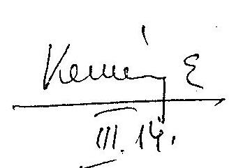

V-14-48/2002-2003.
$5283 / 1 / 2003$.
Ör: Bartal Róbert

# Bihary Zsigmond úr részére 

főigazgató
Állami Számvevőszék
Budapest
ÁLLAMI SZÁMVEVŐSZÉK
ATM-1304/03.
Érkezése: 2003. MÁRCIUS 14.
Iktatószám: $1-14-48-6 / 02-23$
Melléklet: $\qquad$
Tisztelt Főigazgató Úr!
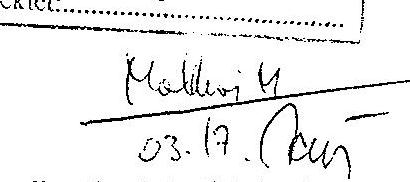

A Postabank és Takarékpénztár Rt. konszolidációjának ellenőrzéséről készített jelentéstervezetüket köszönettel megkaptam.
A jelentéstervezetben foglaltakra vonatkozóan észrevételt nem teszek, mivel a Pénzügyminisztérium által korábban tett észrevételeket az átdolgozott jelentéstervezet tartalmazza.

Budapest, 2003. március 14.
Tisztelettel,

Thuma József

---

# Bihary Zsigmond főigazgató 

Állami Számvevőszék

Budapest

## Tisztelt Főigazgató Úr!

A Postabank és Takarékpénztár Rt.-ről készített jelentéstervezetüket megkaptam.

Tekintettel korábban történt egyeztetésünkre, a Postabank Rt. konszolidációjának ellenőrzéséről készített jelentéshez a Pénzügyi Szervezetek Állami Felügyelete részéről észrevételt nem teszek, és tájékoztatom arról, hogy a vizsgálat alapján készített két javaslattal is egyetértek.

Budapest, 2003. február 14.

Tisztelettel:
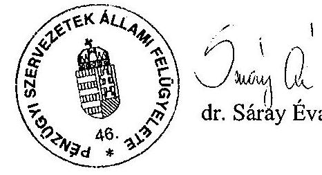

---

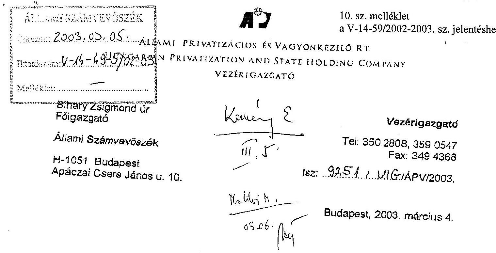

Tárgy: A Postabank és Takarékpénztár Rt. konszolidációjának ellenőrzése

Tisztelt Főigazgató Úr!

A "Jelentés a Postabank és Takarékpénztár Rt. konszolidációjának ellenőrzéséről" szóló Állami Számvevőszék által készített vizsgálati anyagot az ÁPV Rt. illetékes szakterületei korábban véleményezték. Az általunk tett észrevételek a végleges anyagba beépítésre, ahol szükséges volt, a módosítások átvezetésre kerültek.

Ennek megfelelően a végleges anyaghoz észrevételt nem teszünk.

Üdvözlettel:
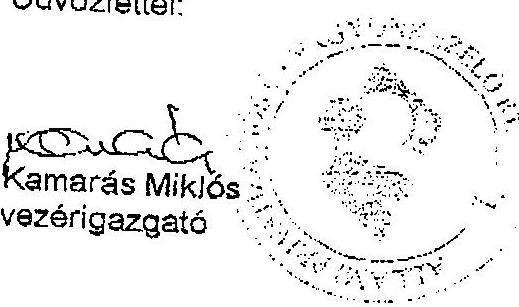

---

# 11. sz. melléklet 

a V-14-59/2002-2003. sz. jelentéshez
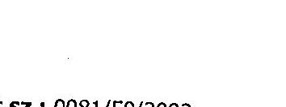

Állami Számvevőszék Bihary Zsigmond főigazgató

Tárgy: Nyilatkozat

## Tisztelt Főigazgató Úr!

Hivatkozással a V-14-51/2002-2003 sz. levelükre az alábbiak szerint nyilatkozunk.
A V-14-48/2002-2003 sz. levelükkel megküldött jelentést a Bank által tett és az Önök által végrehajtott szövegmódosítással elfogadjuk és nyilatkozunk arról, hogy bank- és üzleti titkot tartalmazó rendelkezéseket a mellékletként csatolt anyag nem tartalmaz, kivéve a jelentés 44. oldal 4.2 pont második bekezdését, amely véleményünk szerint üzleti titkot tartalmaz, mivel részletes adatok találhatók a Workout Kft.-vel 1998. december 31-én létrejött engedményezési szerződésről.

Amennyiben ezen információk már korábbi ÁSZ jelentésben szerepeltek, illetve nyilvánosságra kerültek, úgy észrevételünket tekintsék tárgytalannak.

Budapest, 2003. március 13.

Tisztelettel:
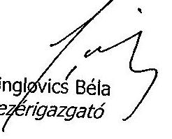

Palotainé Varga Béatrix
vezérigazgató-helyettes

---

# 11/a sz. melléklet 

## Állami Számvevőszék

Főcsoportfőnök

V-14-59/2002-2003.

## Singlovics Béla úr

vezérigazgató
Postabank és Takarékpénztár Rt.

## Budapest

## Tisztelt Vezérigazgató Úr!

A Postabank és Takarékpénztár Rt. konszolidációjának ellenőrzéséről szóló jelentéstervezethez kapcsolódó, üzleti titokra vonatkozó nyilatkozatukat tartalmazó levelükre hivatkozva a következőkről tájékoztatom.

A Workout Kft.-vel 1998. december 31-én kötött engedményezési szerződésben foglalt és a jelentéstervezetben szereplő adatokat a Postabank és Takarékpénztár Rt. gazdálkodása, működése és a Magyar Fejlesztési Bank Rt. 1998. évi veszteségének ellenőrzéséről 1999-ben készült nyilvános ÁSZ jelentés 5. pontja tartalmazza.

Budapest, 2003. március 14.

Tisztelettel:

---

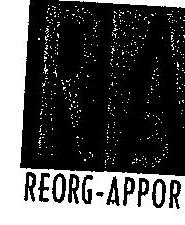
12. sz. melléklet
a V-14-59/2002-2003. sz. jelentéshez, $0 \times 103$
REORG-APPORI PÉNZÜGYI RT.
$RA-61 / 2003$

Kemény Emil úr
Főcsoportfőnök
Állami Számvevőszék
BUDAPEST

Tisztelt Főcsoportfőnök úr!

A Reorg-Appori Pénzügyi Rt. képviseletében a jelentéstervezetet 2003. február 20-án kézhez vettem. A jelentéstervezet Reorg-Appori Rt. tevékenységére vonatkozó szövegszerű változatát elfogadjuk.

A jelentéstervezet tartalmazza az ÁPV Rt. Igazgatóságának Reorg-Appori Pénzügyi Rt.-re vonatkozó határozatait, amelynek tekintetében a Reorg-Appori Pénzügyi Rt. nem illetékes a nyilatkozat megtételére.

A Reorg-Appori Pénzügyi Rt., mint titokgazda a titokvédelmi szabályzatának megfelelően nyilatkozik, hogy a Reorg-Appori Pénzügyi Rt. tevékenységére vonatkozó üzleti titok megjelenéséhez hozzájárul. E nyilatkozat kizárólag a megküldött és a társaságra vonatkozó jelentésrész szövegtervezetére vonatkozik.

Budapest, 2003. március 3.
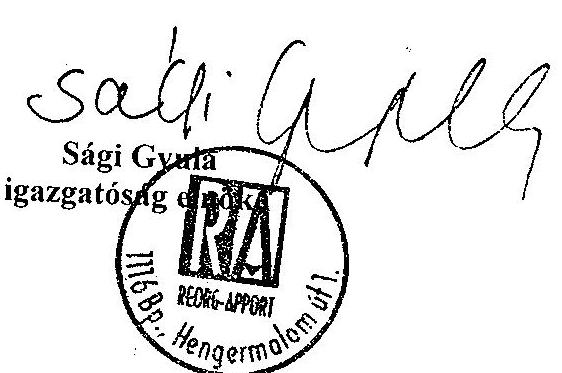

1116 Budapest, Hengermalom út 1. Postacím: 1509 Bp.Pf. 36. Telefon: 206-1500, 206-1525* Fax: 206-1505

---

# PB Workout Vagyonkezelő Kft. 1013 Budapest, Pauler utca 11. Telefon/fax: 202-6280; 202-6771 

Állami Számvevőszék
Kemény Emil úr
főcsoportfőnök

## Budapest,

Tisztelt Főcsoportfőnök Úr!
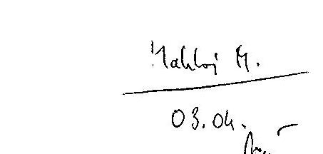

A Postabank és Takarékpénztár Rt. konszolidációjának ellenőrzéséről készített V-14-48/2002-2003. iktatószámú ÁSZ jelentés tervezetét (nem publikus munkaanyagként) köszönettel megkaptam.

Tekintettel a korábbi írásbeli észrevételeinkre és a munkatársaival folytatott személyes konzultációkra a PB Workout Kft. részéről további észrevételt nem teszünk.

Egyúttal nyilatkozom arról, hogy a jelentéstervezet üzleti titkot nem tartalmaz.
Amennyiben bármilyen okból mégis egyeztetési igény merülne fel Önök részéről, abban az esetben készséggel állok a továbbiakban is szíves rendelkezésükre.

Budapest, 2003. február 27.

---

H-1051 BUDAPEST. V. JÓZSEF NÁDOR TÉR 2-4. POSTACÍM: 1369 BUDAPEST. POSTAFIOK 481.

TELEFON: 327-2111 FAX: 318-0738
PÉNZÜGYMINISZTÉRIUM

Dr. Kovács Árpád úr részére elnök

Állami Számvevőszék Budapest

E-MAIL: csaba.faszlo@om.gov.hu
14. sz. melléklet
a V-14-59/2002-2003. sz. jelentéshez
V-14-56/2002-2003.
8212/1/2003.
Ör: Bartal Róbert

$$
\begin{aligned}
& \text { Átt: } 2434 / 03 \\
& \text { ÁLLAMI SZÁMVEVŐSZÉK } \\
& \text { Érkezése: 2003. 04. 08. } \\
& \text { Iktatószáma: V-14-58/02-03 } \\
& \text { Melléklet: }
\end{aligned}
$$

# Tisztelt Elnök Úr! 

A Postabank és Takarékpénztár Rt. konszolidációjának ellenőrzéséről készített jelentésüket köszönettel megkaptam.
A jelentésben foglaltakra vonatkozóan további észrevételt nem teszek. A Postabank és Takarékpénztár Rt. konszolidációja során a PB Workout Kft.-hez és a Reorg-Appori Rt.-hez került követelésekkel való gazdálkodásra vonatkozó megállapításokat a szükséges információk hiányában nem tudom értékelni.
Az ellenőrzés megállapításai alapján javasoltak végrehajtása érdekében tett intézkedésekről haladéktalanul tájékoztatni fogom Önt.

Budapest, 2003. április 14.

Tisztelettel,
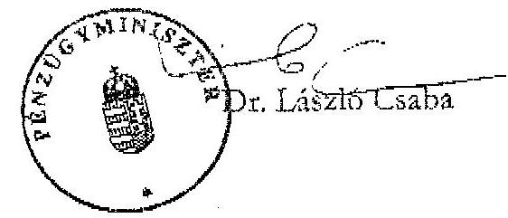

