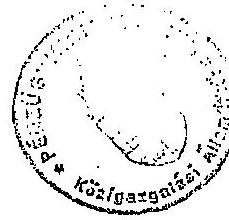
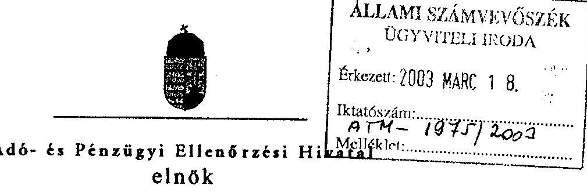
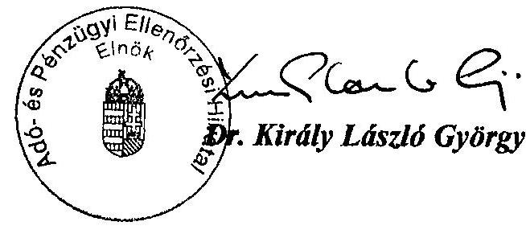
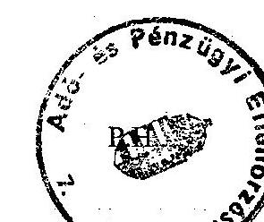
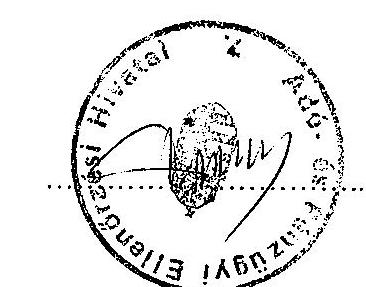
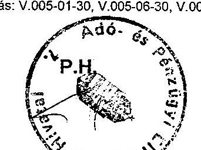
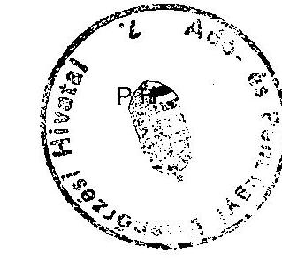
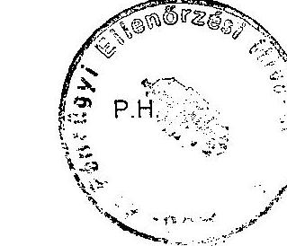
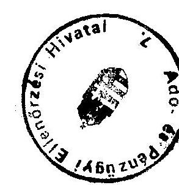
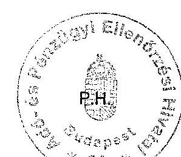

# JELENTÉS 

## az áfa visszaigénylési rendszerének ellenőrzéséről

---

# 2. Államháztartás Központi Szintjét Ellenőrző Igazgatóság 

2.1. Teljesítmény Ellenőrzési Főcsoport

Iktatószám: V-11-78/2002-2003.
Témaszám: 599
Vizsgálat-azonosító szám: V0042

## Az ellenőrzést felügyelte:

Bihary Zsigmond
főigazgató
Az ellenőrzés végrehajtásáért felelős:
Kemény Emil
főcsoportfőnök
Az ellenőrzést vezette:
Vörös Mária
osztályvezető főtanácsos
Az ellenőrzést végezték:

| Dr. Földvári Gábor | Kapronczai Gabriella | Selmeczi Hajnalka |
| :-- | :-- | :-- |
| számvevő gyakornok | számvevő tanácsos | számvevő |
| Temesváry Miklós | Uram Ferenc |  |
| számvevő | számvevő tanácsos |  |

## A témához kapcsolódó eddig készített számvevőszéki jelentések:

1. Az Adó- és Pénzügyi Ellenőrzési Hivatal működésének és gazdálkodásának ellenőrzése (1993)
2. A központi költségvetés adóbevételei, illetve a társadalombiztosítást illető adó és járulékbevételek realizálásának ellenőrzése (2000)

---

# TARTALOMJEGYZÉK 

BEVEZETÉS ..... 5
I. ÖSSZEGZŐ MEGÁLLAPÍTÁSOK, KÖVETKEZTETÉSEK, JAVASLATOK ..... 8
II. RÉSZLETES MEGÁLLAPÍTÁSOK ..... 12

1. Az áfa visszaigénylési rendszer eredményességét meghatározó főbb tényezők ..... 12
1.1. A szabályozottság értékelése az áfa visszaigénylési rendszer eredményessége szempontjából ..... 12
1.1.1. Az adóalanyi kör változása ..... 13
1.1.2. A bevallások számának és gyakoriságának alakulása ..... 14
1.1.3. Az áfa visszaigénylések alakulása ..... 14
1.1.4. A Hivatal által fizetett késedelmi kamatok alakulása ..... 15
1.1.5. Ellenőrzést támogató informatikai rendszerek ..... 16
1.1.5.1. Adatbiztonság - archiválás, jogosultság ..... 16
1.1.5.2. Felhasználói rendszerek ..... 17
1.2. Az ellenőrzések tervezése ..... 18
1.2.1. Az APEH ellenőrzési stratégiája ..... 18
1.2.2. A tervezés egyéb dokumentumai ..... 19
1.2.3. A tervezés megalapozottsága ..... 20
1.2.3.1. Az ellenőrzési típusok megoszlása (ellenőrzési portfolió) ..... 22
1.2.3.2. Külső, illetve a társszervek megkeresésére végzett ellenőrzések ..... 23
1.2.3.3. Erőforrás-felhasználás tervezése ..... 23
1.2.4. Ellenőrzöttségi szint alakulása ..... 24
1.3. Belső szakmai kontrolok és felülvizsgálatok ..... 25
1.4. Az APEH áfa-t érintő hatósági tevékenysége ..... 27
1.4.1. Fellebbezések ..... 27
1.4.2. Perek ..... 28
2. Az áfa ellenőrzések folyamatának értékelése ..... 28
2.1. Ellenőrzésre történő kiválasztás, ellenőrzési kockázatok ..... 29
2.1.1. Kockázatkezelés ..... 29
2.1.1.1. A tartósan visszaigénylő pozícióban lévő ágazatokban működő adóalanyok visszaigénylései ..... 30
2.1.1.2. Az induló vállalkozások ellenőrzési kockázatának kezelése ..... 30

---

2.1.1.3. Import alapján történő visszaigénylések kockázatának kezelése ..... 30
2.1.2. Az áfa kiutalás előtti ellenőrzés kiválasztási rendszere ..... 30
2.1.3. Az utólagos átfogó és adónem ellenőrzésre történő kiválasztás ..... 32
2.1.4. A véletlenszerűségen alapuló kiválasztás ..... 32
2.2. A törvényben előírt határidők alakulása ..... 32

---

# MELLÉKLETEK 

1/a-b. számú melléklet: Észrevételek
1/c. számú melléklet: Tanúsítványok

1. sz. táblázat: Feldolgozott áfa bevallások adatai/1
2. sz. táblázat: Feldolgozott áfa bevallások adatai/2
3. sz. táblázat: Előzetesen felszámított áfa megoszlása jogcímek szerint
4. sz. táblázat: Ellenőrzések számának vizsgálati típus szerinti alakulása
5. sz. táblázat: Kiutalás előtti áfa ellenőrzések adatai
6. sz. táblázat: Áfa-ra vonatkozó felülellenőrzések adatai
7. sz. táblázat: Az ellenőrzések megoszlása az adóalanyok típusa szerint
8. sz. táblázat: Az ellenőrzések megoszlása a bevallások gyakorisága szerint
9. sz. táblázat: Jogosulatlan áfa visszaigénylések száma és összege az adóalanyok típusa szerint
10. sz. táblázat: Jogosulatlan áfa visszaigénylések száma és összege a bevallások gyakorisága szerint
11. sz. táblázat: A Hivatal által fizetett áfa-hoz kapcsolódó késedelmi kamatok alakulása igazgatóságonként
12. sz. táblázat: Az APEH Bűnügyi Igazgatósága által vizsgált áfa visszaigényléssel kapcsolatos ügyek alakulása
13. sz. táblázat: Egyéb tájékoztató adatok az 1997-2001. években feldolgozott áfa bevallások adatai szerint
14. számú melléklet: Ellenőrzöttségi szintek alakulása adóalanyi körönként valamennyi befejezett ellenőrzést figyelembe véve, 1997-2001.
15. számú melléklet: Ellenőrzöttségi szint alakulása az utólagos helyszíni ellenőrzések alapján 1997-2001.
16. számú melléklet: Kimutatás a fellebbezések alakulásáról, 1997-2001.
17. számú melléklet: Kimutatás a perek alakulásáról, 1997-2001.
18. számú melléklet: A legnagyobb áfa visszaigénylők részesedése az összes áfa visszaigénylésből
19. számú melléklet: Összesítés a tíz legnagyobb áfa visszaigénylők közül azokról az adózókról, akiknél 1997-2001. között áfa-ra vonatkozóan befejezett revízió nem történt

---

# RÖVIDÍTÉSEK JEGYZÉKE 

APEH / Hivatal
Art.
áfa
áfa tv.
ÁSZ
KAIG
PM
SZMSZ

Adó- és Pénzügyi Ellenőrzési Hivatal
1990. évi XCI. törvény az adózás rendjéről
általános forgalmi adó
1992. évi LXXIV. törvény az általános forgalmi adóról

Állami Számvevőszék
APEH Pest megyei és Fővárosi Kiemelt Adózóinak Igazgatósága
Pénzügyminisztérium
Szervezeti és működési szabályzat

---

# JELENTÉS 

## az áfa visszaigénylési rendszer ellenőrzéséről

## BEVEZETÉS

Az általános forgalmi adót (továbbiakban: áfa/adó) az 1987. évi V. törvénnyel vezették be Magyarországon, jelenlegi alkalmazásáról a többször módosított 1992. évi LXXIV. törvény rendelkezik. Az áfa - jellegénél fogva - hozzáadott érték adó (másként: többletértékadó) ami azt jelenti, hogy az értékesítéskor beszedett adó csökkenthető a tevékenységhez szükséges beszerzések, szolgáltatások után megfizetett (előzetesen felszámított) áfa összegével. Néhány kivételtől eltekintve az adóteher továbbgörgetése az utolsó értékesítési pontig tart, amikor is a termék, illetve szolgáltatás a belföldi végső fogyasztóig jut. Az adó így végső soron a fogyasztót terheli.

Az adóalany által önadózás formájában megállapított és bevallott adót az Adó- és Pénzügyi Ellenőrzési Hivatal (továbbiakban: APEH, illetve Hivatal) szedi be, kivétel az import- és a dohánytermékek után fizetett áfa, amelyet a Vám- és Pénzügyőrség határozatban vet ki.

Az APEH tevékenységi körébe tartozik az áfa adónemmel kapcsolatos adóztatási feladatok ellátása, ezen belül - a törvényben meghatározott feltételek teljesülése esetén - az áfa kiutalása az adóalanyok részére. A kiutalás az adóalanyok visszaigénylése alapján történik, ha az adóalany erre jogosult. A Hivatal feladata tehát nemcsak az áfa minél teljesebb körű beszedése, hanem - ezzel egyidejűleg - az áfa visszaigénylési rendszer eredményes működtetésével a jogosulatlan visszaigénylések kiszűrése és megakadályozása, továbbá a késedelmes utalások és az utólag jogosulatlannak minősített visszatartások miatt a Hivatal által fizetett késedelmi kamatok minimalizálása.

Az APEH felett a szakmai és gazdálkodási felügyeletet a Pénzügyminisztérium látja el.

Az ellenőrzés az áfa visszaigénylési rendszer egyes elemeinek és a teljes rendszer működtetésének az eredményességre gyakorolt hatását értékelte a teljesítményellenőrzés módszerével, tehát nem vizsgálta átfogóan a teljes áfa rendszert (pl. adókulcsok alakulását, a Vám- és Pénzügyőrség szerepét), a gazdaságban végbemenő reálfolyamatokat és azok adózási vonzata közötti összefüggéseket, továbbá nem terjedt ki az EU-csatlakozást követően várható jogharmonizációs

---

változásokra. Az ellenőrzésünk nem foglalkozik a pénzügyi adatok értékelésével, így a jelentésben szereplő számszerű adatok tájékoztató jellegűek. ${ }^{1}$

Az ellenőrzés célja annak értékelése volt, hogy eredményes-e az APEH által kialakított és működtetett áfa visszaigénylési rendszer, ami akkor tekinthető eredményesnek, ha a Hivatal:

- ellátja a jogszabályokban és a felügyeleti szerv által meghatározott feladatokat;
- betartja a jogszabályokban meghatározott határidőket egyrészt az adóalanyok visszaigényléseinek elbírálására, másrészt az általa jogosnak minősített visszautalások teljesítésére;
- ellenőrzései során feltárja az adóalanyok által elkövetett hibákat, hiányosságokat, valamint a belső visszaéléseket, a jogorvoslat rendszerén keresztül érvényesíti az ehhez kapcsolódóan jelentkező adó- és büntetőjogi jogkövetkezményeket, illetve kezdeményezi azok érvényesítését az illetékes hatóságoknál.

Az eredményesség megítéléséhez értékeltük:

- az áfa visszaigénylések ellenőrzésére kialakított irányelveket és tervezési gyakorlatot;
- az APEH által kialakított ellenőrzési portfoliót;
- a Hivatal által kialakított szabályozókat;
- az ellenőrzésekre történő kiválasztás módszereit és annak végrehajtását, az ellenőrzések folyamatát, típusait, illetve a jogszabályi kötelezettségek betartását.

Az ellenőrzés az 1997. január 1. - 2001. december 31. közötti időszakra irányult, de figyelemmel kísérte a helyszíni ellenőrzés lezárásáig bekövetkezett változásokat.

A helyszíni ellenőrzésbe bevont szervezetek a Pénzügyminisztérium, az APEH központja, az APEH Bűnügyi Igazgatósága, az APEH-SZTADI voltak. A bekért tanúsítványok adatai alapján a vizsgálati programban meghatározott kockázati tényezők figyelembevételével 9 területi igazgatóságot választottunk ki helyszíni ellenőrzésre, amelyek a KAIG, Dél-budapesti Igazgatóság, Északbudapesti Igazgatóság, Kelet-budapesti Igazgatóság, Bács-Kiskun Megyei Igazgatóság, Borsod-Abaúj-Zemplén Megyei Igazgatóság, Hajdú-Bihar Megyei Igazgatóság, Pest Megyei Igazgatóság, Somogy Megyei Igazgatóság voltak.

[^0]
[^0]:    ${ }^{1}$ Az áfa bevételek a központi költségvetés bevételeinek mintegy $30 \%$-át képviselik. A 2000. évi 3685792 M Ft összegű költségvetési bevételből 1153749 M Ft (31,3 \%) volt a nettó áfa összege, míg 2001-ben a 4073890 M Ft költségvetési bevételből 1243899 M Ft (30,53 \%) realizálódott ezen a jogcímen. A fenti bevételek egyrészt az import termékek után a Vám- és Pénzügyőrség (VP) által kivetett és közvetlenül fizetett áfa, másrészt a belföldi fogyasztás után az adóalanyok részéről történő befizetésekből tevődik össze. Az áfa visszatérítések 2000. évben 1029440 M Ft, 2001. évben 1120904 M Ft-ot tettek ki, ezek az összegek mindkét évben a bruttó áfa bevételek mintegy $47 \%$-át jelentették.

---

Az ellenőrzésre az Állami Számvevőszékről szóló 1989. évi XXXVIII. tv. 2 § (4) bekezdése alapján került sor.

A jelentés tervezetét egyeztettük az APEH elnökével, a végleges jelentést megküldtük a pénzügyminiszternek. Leveleik másolatát mellékeljük (1/a, 1/b. számú mellékletek).

---

# I. ÖSSZEGZŐ MEGÁLLAPÍTÁSOK, KÖVETKEZTETÉSEK, JAVASLATOK 

Az APEH a belső szabályzatait (utasítások, útmutatók, irányelvek) az áfavisszaigénylésekre vonatkozó törvényi előírásokkal összhangban fogalmazta meg. Belső szabályzatai valamennyi eljárásra kiterjedtek és biztosították az ellenőrzési feladatok végrehajtását. Ezen belül a törvényi szabályozás lehetőséget biztosított a fizetési könnyítésben részesülő adóalanyok részére visszaigényelhető áfa kifizetésére. A Hivatal a fizetési könnyítésben részesített adózók számára teljesített kifizetések alakulásáról utóelemzéseket, értékeléseket nem készített, az ellenőrzések során ilyen adatokat nem használt fel.

A Hivatal a bevallások számítógépes feldolgozása során az adatok mentését és a mentett állományok megőrzését a biztonsági szempontok figyelembevételével szabályozta és hajtja végre. Ugyanakkor a rendszergazdák olyan adatkezelési jogosultságokkal is rendelkeznek, amelyek az ellenőrzés területét érintik. Ilyenek többek között a szűrőfeltételek állítása, revizori javítás, revízió elengedése, felülvizsgálatra átadás, revizori elengedés visszaszedésének lehetősége. A felhasználói programok által készített naplózási adatokat a rendszer bevezetése óta tárolják, azonban az igazgatóságok azokat nem ellenőrizték. A naplózási adatok szúrópróbaszerű ellenőrzését 2002. január 1.-től a Biztonsági Főosztály látja el.

Az APEH nem rendelkezik az ellenőrzések főbb célkitűzéseit rögzítő közép-, illetve hosszú távú stratégiával, annak ellenére, hogy elkészítését a pénzügyminiszter többször kérte. Az ellenőrzés fő irányvonalát az APEH az éves feladattervében rögzíti. Erre épül az évenként kiadásra kerülő „ellenőrzési irányelv", amelyet a Pénzügyminisztérium is jóváhagy. Az általános szakmai tevékenységet érintő különböző feladatok meghatározását és azok igazgatóságok általi teljesítésének - objektív mérőszámokon, ún. teljesítmény-mutatókon alapuló - értékelését az APEH érdekeltségi rendszere tartalmazza. A feladattervben és az ellenőrzési irányelvben megfogalmazott célkitűzések, prioritások és feladatok nincsenek összhangban az érdekeltségi rendszerrel. Az irányelvekben változó prioritással tűzték ki célként a bevételek, valamint a kiutalás előtti ellenőrzéseknél a visszatartások növelését és az ellenőrzöttségi szint fokozását. Az érdekeltségi rendszerben azonban az ellenőrzöttségi szint növelésére nem határoztak meg feladatokat, az igazgatóságok értékelésének alapját a növekvő bevételek, illetve a visszatartott kifizetések terén elért eredmények jelentették.

Az APEH az áfa bevételi és -visszatartási kötelezettségét az előző évi teljesítésük alapján osztja le az igazgatóságokra. A Hivatal a tervezésnél figyelembe veszi az igazgatóságok illetékességi körébe tartozó adóalanyi kör ún. adóteljesítményét és annak változásait, azonban ettől eltérő tervszámokat ír elő, ha az adott igazgatóság rendelkezésére álló erőforráskorlát, illetve szakmai színvonala ezt indokolttá teszi.
2001. évben az adóellenőrzési megállapításokra befolyt áfa és a jogerős áfa visszatartások együttes összege kb. 50 Mrd Ft , ami az éves áfa bevételeknek

---

(1244 Mrd Ft) mindössze $4 \%$-a volt. Az ellenőrzési megállapításból, behajtásból, szankciókból befolyt bevételek, valamint a kiutalás előtti jogerős visszatartás együttes összege
 (217,9 Mrd Ft) az APEH által beszedett adó és járulék (4735,8 Mrd Ft) 4,6 \%-át tette ki. Az ellenőrzések hatékonyságának növelése az erőforráskorlátok miatt a fenti arányoknak csak kis mértékű emelését teszi lehetővé. Az ellenőrzöttségi szint növelésével az adózási fegyelem javulása, ezáltal az önadózásból származó befizetésekkel a költségvetés tényleges bevételeinek növekedése érhető el.

A Hivatal az emberi erőforrások felhasználását az érdekeltségi rendszere alapján végzi: az igazgatóságok kötelezettségeikhez rendelik hozzá erőforrás szükségletüket. Ez a gyakorlat nem teszi lehetővé az elrendelésekre, a társszervek megkeresésére, valamint a véletlenszerűségen alapuló kiválasztásra történő ellenőrzések kapacitásigényének tervezését. Az ellenőrzések tervezéséhez sem a Hivatal, sem az igazgatóságok nem végeztek olyan elemzéseket, hogy a meglévő erőforrások különböző elosztásával - figyelembe véve az Art. által előírt kötelezettségeket is - milyen mértékű bevétel- és ellenőrzöttségi szint növekedés lenne egyidejűleg elérhető.

Az ellenőrzések végrehajtásánál elsődleges szempontként jelöli meg, hogy kapacitásait főként azokra az adózókra fordítsa, amelyeknél legnagyobb a valószínűsége az adóeltitkolásnak. Azon adóalanyokat választják ki elsősorban ellenőrzésre, amelyeknél egy kisebb jelentőségű hiba is nagyobb összegű adókülönbözetet eredményez. Az éves irányelvekben megfogalmazott célkitűzések alapján az ellenőrök végeznek összefüggéseket kereső és elemző ellenőrzéseket, de az érdekeltségi rendszer hatására ezek helyett a gyors és összegszerű megállapítást eredményező ellenőrzéseket részesítik előnyben. Az összetett és szövevényes vizsgálatok rontanák a Hivatal teljesítmény-mutatóinak értékét.

A vizsgálatokat központilag kidolgozott módszertani útmutatók segítik, biztosítva elvi szinten az egységes eljárást. A gyakorlatban a végrehajtás igazgatóságonként eltérő: a központi számítógépes kiválasztási rendszert különböző paraméterekkel működtetik, illetve saját fejlesztésű rendszereket alkalmaznak a kiválasztások további szűréséhez. A gyakorlat következménye, hogy az igazgatóságok egységesen nem ellenőrizték például az általuk nyilvántartott tíz legnagyobb visszaigénylő adóalanyt. A helyszíni ellenőrzésbe bevont igazgatóságoknál 2001-ben a visszaigényelt összes áfának átlagosan a $36 \%$-át, azaz 216,7 Mrd Ft-ot ezen adóalanyoknak utalták ki. Ezek között voltak olyanok, amelyeknél 5 év alatt nem végeztek kifejezetten áfa adónem-ellenőrzést.

Az áfa bevallások feldolgozását és ellenőrzésre kiválasztását segítő számítógépes rendszer csak részben járult hozzá a kiválasztások eredményes végrehajtásához. Az utólagos ellenőrzésre kiválasztást egyáltalán nem segíti központi számítógépes rendszer. A kiutalás előtti ellenőrzéseknél az igazgatóságok a kiválasztáskor a szűrés első fázisaként többségében csak a rendszerbe beépített kötelező paramétereket használják, amellyel a bevallások mintegy 10-15 \%-át szűrik ki. A fennmaradó $85-90 \%$-ból a vezető szakmai ismeretei és szubjektív megítélése alapján választják ki azokat, amelyeknél ellenőrzést rendelnek el. A kialakított kiválasztási rendszer lehetővé teszi az ellenőrzések eredményességének javulását, azonban annak gyakorlati végrehajtása ezt a lehetőséget korlátozza. Elemzések és értékelések hiányában nem állapítható meg, hogy a számí-

---

tógépes rendszerbe beépített paraméterek szélesebb körű használatával, az eljárás egységes alkalmazásával, ezáltal az objektivitás növelésével az eredményesség terén milyen mértékű további javulást lehetne elérni.

A rendszer a visszaigénylő pozíciójú áfa bevallások közül választ ki ellenőrzésre. A befizető pozíciót mutató bevallások (az áfa levonások összege nem haladja meg az áfa-befizetések összegét) esetében a visszaigénylés jogszerűségének ellenőrzésére - függetlenül attól, hogy mekkora a levonásba helyezett áfa - egyéb vizsgálatok keretében kerülhet sor. Az adott adóalany ellenőrzésre történő kiválasztásának valószínűsége ebben az esetben azonban jóval kisebb, mint a kiutalás előtti ellenőrzéseknél.

Az APEH - az ellenőrzések során tett - megállapításait adókülönbözetként tartja nyilván. Az így nyilvántartott összes adókülönbözetnek csak 24-27 \%-a jelent ténylegesen bevételt a költségvetés számára. A Hivatal a visszatartott áfa-t is adókülönbözetként mutatja ki, ami nem jelenik meg bevételként a letéti számlán. APEH kimutatás hiányában pontosan nem állapítható meg, hogy ebből mennyi jelent végleges visszatartást.

Az APEH által fizetett késedelmi kamatok összege az 1998. évi 683973 eM Ft-ról 2001. évre 425460 eM Ft-ra, azaz $62 \%$-ra csökkent. Ennek oka a szakmai színvonal javulása mellett egyrészt az a törvénymódosítás, ami a kiutalás előtti ellenőrzésekre rendelkezésre álló időt 500 eFt fölötti visszaigénylés esetében 30 napról 45 napra változtatta, másrészt a jegybanki alapkamat mérséklődése 22,5 \%-ról 10,25 \%-ra. A bírósági perek alapján fizetett késedelmi kamatok összege egyik évben sem haladta meg az összesen fizetett késedelmi kamat 3,6 \%-át.

A különleges ellenőrzési feladatokat ellátó főosztályok az ellenőrzéseikről nyilvántartást vezetnek, de vizsgálataik eredményéről nem készül hivatali szintű összesített értékelés. A főosztályok és az igazgatóságok közötti együttműködés nem teljes körű, ellenőrzéseik hasznosításáról nincs visszacsatolás. A főosztályok által végzett ellenőrzések eredményességét csökkentik a kivizsgálásra megkapott ügyek dokumentáltságának hiányosságai.

A jelentésben megfogalmazott javaslataink az 1997-től 2001-ig terjedő időszak adatainak elemzésén alapulnak, de a 2002. évi működést értékelve is helytállóak.

A helyszíni ellenőrzés megállapításainak hasznosítása mellett javasoljuk:

# a pénzügyminiszternek 

1.  Dolgoztassa ki az APEH adó- és járulékbeszedési tevékenysége fejlesztésének közép- és hosszú távú koncepcióját, figyelembe véve az ÁSZ korábbi javaslatait.
2.  Vizsgálja felül az APEH ellenőrzési tevékenységéből származó bevételek tervezési gyakorlatát az ellenőrzésből származó (önkéntes befizetésen kívüli) bevételek és az ellenőrzöttségi szint összhangjának megteremtése érdekében.
3.  Kérje fel az APEH elnökét

---

- a visszatérítések és a fizetési könnyítésben részesített adóalanyok befizetései alakulásának elemzésére, az áfa visszatérítések feltételeinek belső szabályozására;
- a rendszergazdák adathozzáférési jogosultságainak felülvizsgálatára és módosítására annak érdekében, hogy csak a munkakörükhöz közvetlenül kapcsolódó feladatok ellátására legyenek jogosultak;
- az APEH közép- és hosszú távú ellenőrzési stratégiájának kidolgozására;
- az áfa visszaigénylési rendszert érintő különleges ellenőrzési feladatokat ellátó szervezeti egységek ellenőrzési eredményeinek hasznosítására;
- a kiutalás előtti ellenőrzésre történő kiválasztási rendszer felülvizsgálatára és módosítására az egységes végrehajtás és a kiválasztás objektivitásának növelése érdekében;
- az utólagos ellenőrzésre történő kiválasztást támogató egységes számítógépes rendszer kialakítására, figyelemmel az ellenőrzés kockázati tényezőire és az objektivitás követelményeire.

4.  Kísérje figyelemmel, és rendszeresen számoltassa be az APEH elnökét a számára megfogalmazott feladatok végrehajtásáról.

---

# II. RÉSZLETES MEGÁLLAPÍTÁSOK 

## 1. Az áfa visszaigénylési rendszer eredményességét meghatározó főbb tényezők

Az áfa visszaigénylési rendszert meghatározó főbb tényezők alakulását a gazdaságban végbemenő reálfolyamatok és a jogszabályi változások alakították.

### 1.1. A szabályozottság értékelése az áfa visszaigénylési rendszer eredményessége szempontjából

A vizsgált időszak valamennyi adóévében változott az APEH által kialakított áfa visszaigénylési rendszer a területet érintő törvényi előírások módosításai következtében. E törvényi változások célja az infláció okozta reálértékcsökkenés ellentételezése, továbbá a visszaigénylési feltételek szigorítása. A visszaigénylési rendszerben végbement változások többsége az 1999-2000. adóévekben történt.

Az APEH a belső szabályzatait (utasítások, útmutatók, irányelvek) az áfa visszaigénylésekre vonatkozó törvényi előírásokkal összhangban fogalmazta meg. Belső szabályzatai valamennyi eljárásra kiterjedtek és biztosították az ellenőrzési feladatok végrehajtását.

Az APEH az adóalanyokat is érintő belső szabályzatokat önálló hatáskörben a törvényi jogállásnak megfelelően - adta ki. A törvény végrehajtásának elősegítésére a PM és az APEH eseti döntéseket, iránymutatásokat és állásfoglalásokat, a Hivatal ezen felül belső szabályzatokat is adott ki. A PM és az APEH által kiadott eseti döntések olyan témakörökre vonatkoztak, amelyek - egyediségük miatt - nem kerültek megfogalmazásra a törvényi előírásokban.

Pl.: közhasznú foglalkoztatásért kapott, költségtérítésből végzett szolgáltatáshoz kapcsolódó áfa visszaigénylése; kizárólag gazdasági tevékenységhez használt lakóingatlan beszerzésével kapcsolatos áfa levonhatósága; közműberuházáshoz kapcsolódó levonási jog.

Az eseti döntések és az APEH belső szabályzatai csak az APEH belső eljárásaiban kötelező érvényűek, azok az adóalanyok számára nem fogalmazhatnak meg kötelezettséget - tekintettel arra, hogy nem jogszabályok. Ebből fakad, hogy a bírósági gyakorlatban a vonatkozó törvényi rendelkezések értelmezése az APEH belső szabályozásától és közzétett iránymutatásaitól, állásfoglalásaitól eltérhet. Különösen az áfa levonása tárgyában születtek olyan legfelsőbb bírósági döntések, amelyek az APEH első-, vagy másodfokú eljárási döntését megváltoztatták.

Az áfa gyakorított elszámolására az Art. és az áfa tv. különböző eljárási szabályokat írt elő az egyes bevallás típusoknál.

---

Az 1999. évtől kezdődően az éves bevallók az áfa törvény 47.§.(2) bek. alapján kizárólag évente egyszer, bevallásukhoz csatolt nyilatkozat útján érvényesíthették e jogukat.

A havi és a negyedéves bevallásra kötelezettek az áfa tv. 47. § (1) bek., valamint az Art. 2. sz. mellékletében foglaltak szerint az adóhatósághoz benyújtott kérelem alapján élhettek e jogukkal.

Az Art. 2003. január 1.-től érvénybe lépő módosítása úgy oldotta fel e kettősséget, hogy egységes feltételrendszert ír elő a különböző bevallástípusok esetére.

Az áfa visszaigénylési rendszer törvényi szabályozása (Art, áfa tv.) lehetőséget biztosított a fizetési könnyítésben részesülő adóalanyok részére visszaigényelhető áfa kifizetésére. Az APEH 1051/B/2001. sz. utasításában rendelkezett az Adósminősítő Információs Rendszer (AMIR) használatáról, ennek keretében előzetes kockázatfelmérést készítenek a könnyítésben részesítendő adóalanyok fizetőképességéről, fizetőkészségéről, vagyoni helyzetéről, stb.

A vizsgált időszakban a fizetési könnyítésben részesült adóalanyoknak jóváírt áfa összege $74 \%$-kal, míg az ezen adóalanyok részére történt áfa kiutalások összege 4,5-szeresére növekedett (1. sz. melléklet/13. sz. tanúsítvány).

A törvényi keretek lehetőséget biztosítanak arra, hogy a fizetési könnyítésben részesült adóalany áfa visszaigénylése kiutalásra kerüljön. Amennyiben ezt követően az érintett adóalany nem fizeti meg a határozatban rögzített kötelezettségeit, úgy végrehajtási, majd felszámolási eljárás indul ellene.

**Az APEH a fizetési könnyítésben részesített adóalanyok számára teljesített kifizetések alakulásáról utóelemzéseket, értékeléseket nem készített, az ellenőrzései során ilyen adatokat nem használt fel.**

### 1.1.1. Az adóalanyi kör változása

Az adóalanyi kör (ide értve a gazdasági szervezeteken kívül az egyéni vállalkozókat is) összetétele a vizsgált években stabilizálódott, létszáma $12 \%$-kal emelkedett. A jogi személyiségű társaságok száma az 1997-2001. évek között $21 \%$-kal emelkedett. 1997-ben 149 852, 2001-ben 182 136 jogi személyiségű adóalanyt regisztráltak. A 2000-2001. években 20-21 ezer társaság alakult, és 25 ezer szűnt meg.

A jogi személyiség nélküli gazdasági társaságok száma a vizsgált években több mint egyharmaddal nőtt. 1997-ben 169 437, 2001-ben 230 945 adóalanyt tartottak nyilván ebben a csoportban. Az új bejegyzésű és a megszűnt adóalanyok száma 2001-ben az előző évi változás közel felére esett vissza (24 ezer új belépő mellett 11 ezer szervezetet szüntettek meg), azaz a működő jogi személyiség nélküli társaságok gyarapodása kétszerese volt a jogi személyiségű gazdálkodó egységekének.

Az egyéni vállalkozók száma a vizsgált években stabilizálódott, kisebb pozitív és negatív irányú változások mellett az időszak végére mindössze $2 \%$-kal emelkedett, volumenében mégis az összes adóalanyi kört tekintve ez a meghatározó. 2001-ben 479 556 egyéni vállalkozót tartottak nyilván, amely nemzet-

---

gazdasági szinten a keresők mintegy 14 \%-a. (Németországban, Ausztriában, Franciaországban, Nagy-Britanniában ez az érték 10-11 \%). Az egyéni vállalkozók fluktuációja a vizsgált időszakban minden évben $10 \%$ körül ingadozott.

Az áfa körbe bejelentkezett adóalanyok száma a vizsgált években $10 \%$-kal nőtt, az APEH által nyilvántartott összes adóalany mintegy felét tette ki. Az ide tartozó adóalanyi csoportok közül az egyéni vállalkozók számában $10 \%$-os csökkenés, a társaságok vonatkozásában $24 \%$-os növekedés volt megfigyelhető.

A vállalkozások koncentrációja a fővárosban és Pest megyében kiemelkedően magas, ebben a régióban tartják nyilván a vállalkozások $40 \%$-át. Egy-egy vidéki igazgatósághoz a vállalkozások 3-4 \%-a tartozik.

### 1.1.2. A bevallások számának és gyakoriságának alakulása 

## Az áfa bevallások száma
 a vizsgált időszakban, évről évre egyenletesen, összesen $13 \%$-kal csökkent.

Az 1997-2001. években a bevallások száma a jogi személyiségű adózók esetében $20 \%$-kal nőtt, a többi kategóriában csökkent, ezen belül a legnagyobb mértékben az egyéni vállalkozóknál ( $50 \%$-kal).

A bevallások szerkezete folyamatosan változott. 1997-ben az összes bevallás $23 \%$-a (532 ezer db) volt havi gyakoriságú; 2001-re ez az arány $42 \%$-ra (829 ezer db) emelkedett annak ellenére, hogy az Art. módosításának egyik fő célja a mikro- és kisvállalkozások adminisztrációjának csökkentése volt.

A növekményt elsősorban a negyedéves bevallások átstrukturálódása eredményezte: a negyedéves bevallások száma az 1997-2001. évek közötti 1,5 M db-ról (az összes bevallás $68 \%$-a) kevesebb, mint $40 \%$-ra, 601 ezer db-ra esett vissza, ami az összes bevallás $30 \%$-a.

Az éves bevallások száma az 1999. évi 7 ezer db-ról 2001-re 309 ezer db-ra nőtt. Az adóalanyoknak 58,3 \%-a adott be ilyen gyakoriságú bevallást.

A visszaigénylő pozícióban lévő bevallásokon belül a havi bevallások száma 1997-1999. évek között 34 ezer darabbal ( $21 \%$-kal) nőtt, 1999-2001 évek között viszont 72 ezer darabbal ( $48 \%$-kal) csökkent. Ez részben a visszaigénylés feltételeinek szigorításával, részben pedig a visszaigénylő pozícióban lévő adózók ellenőrzésének növekvő valószínűségével magyarázható (1. sz. melléklet/1, 2. sz. tanúsítvány).

### 1.1.3. Az áfa visszaigénylések alakulása

Az egyes kedvezményezett áfa visszaigénylési jogcímek visszaigénylési küszöbértéke duplájára növekedett, fogalmi meghatározásuk szigorodott, ugyanakkor körük az „export-import célú teherközlekedés" szolgáltatással bővült.

Az áfa visszaigénylés feltételeként szolgáló árbevételi küszöbértéket a vizsgált időszakban két alkalommal - 1997-ben és 2000-ben - emelték.

---

A KSH adatai szerint az 1997. és 2000. év közötti időszak inflációs rátája $63 \%$ volt, az 1997. évben kialakított 2 M Ft-os küszöbérték 1999-re már $49 \%$-ra inflálódott, bővítve a visszaigénylők körét. A 2000-ben bevezetett 4 M Ft-os árbevételi küszöbérték napjainkig érvényben van.

A 2000. évben általános szigorító feltételként vezették be a pénzügyileg nem rendezett beszerzésekre jutó áfa visszaigénylés tilalmát.

1999-2001. évek között megfigyelhető az a tendencia, hogy a visszaigénylő pozícióban lévő bevallások száma (155 ezerrel) és aránya az összes bevalláson belül $25 \%$-ról $18 \%$-ra csökkent, míg a következő időszakra átvihető követelést tartalmazó bevallások száma (190 ezerrel) és aránya $12 \%$-ról $22 \%$-ra emelkedett. A jelenséget elsősorban a visszaigénylési feltételek szigorodása eredményezte.

Öt év alatt a befizetendő adó összege 354 Mrd Ft-tal ( $45 \%$-kal), a visszaigényelhető adó összege 527 Mrd Ft-tal ( $76 \%$-kal), a kiutalások összege pedig 292 Mrd Ft-tal ( $82 \%$-kal) emelkedett. A növekedés 1998-ban érte el a legnagyobb ütemet ( $16 \%, 25 \%$, illetve $26 \%$ ). A visszaigényelhető adó emelkedésének üteme mindegyik évben meghaladta a befizetendő adó növekedésének ütemét (1. sz. melléklet/1. sz. tanúsítvány).

A befizetendő adó összege 1997-1999. évek között még meghaladta a visszaigényelhető adó összegét, de a különbség évről évre csökkent (78 Mrd Ft-ról 14 Mrd Ft-ra), 2000-2001. években pedig a visszaigényelhető adó magasabb összegű volt, mint a befizetendő adó (34 Mrd Ft-tal illetve 93 Mrd Ft-tal). Az egy bevallásra jutó befizetendő adó összege $63 \%$-kal emelkedett öt év alatt, a visszaigényelhető adó összege ugyanakkor a kétszeresére nőtt.

# 1.1.4. A Hivatal által fizetett késedelmi kamatok alakulása 

Az áfa visszaigénylések során a Hivatal által fizetett késedelmi kamatok összege az 1998. évi 683973 M Ft-ról 2001. évre 425460 M Ft-ra, azaz $62 \%$-ra csökkent.

Törvénymódosítás következtében a kiutalás előtti ellenőrzésekre rendelkezésre álló idő - az Art. 27.§ (4) pontja 2001. január 1.-től a visszaigényelt áfa kiutalásának határidejét 500 E Ft fölött 30 napról 45 napra változtatta - 15 nappal meghosszabbodott. További szigorítást jelentett az a 2000. évtől bevezetett változás, amely szerint a ki nem egyenlített beszerzések áfa tartalmával csökkenteni kell a visszaigényelhető adó összegét, valamint a havi bevallók az alap-visszaigénylési jogcím esetén is csak akkor kérhetik adójuk kiutalását, ha a tárgyéven belül két egymást követő időszakban volt negatív elszámolható adójuk. A visszaigénylést tartalmazó bevallások szükségszerűen tartalmazzák az előző időszak csökkentő tételeit is.

Belső intézkedésként a Hivatal a törvényi határidők betartását az igazgatóságok érdekeltségi rendszerén keresztül érvényesítette. Az érdekeltségi rendszer hibaponttal sújtja a késedelmi kamat felmerülését. Az igazgatóságok inkább felvállalják a késedelmi kamat fizetését, mint hogy a kockázatosnak ítélt visszaigényléseket a megfelelő dokumentumok hiányában ellenőrzés nélkül teljesítsék.

---

Az igazgatóságok folyamatosan vizsgálták a felmerült késedelmi kamat alakulását, feltárták az okokat és megtették a szükséges intézkedéseket. A helyszíni ellenőrzésbe bevont igazgatóságokon a munkatársak mulasztása miatt nem merült fel késedelmi kamat fizetési kötelezettség.

Ellentétes irányú hatást gyakorolt a késedelmi kamatok alakulására a bevallások számának csökkenése, valamint a bevallásban visszaigényelt adó összegének növekedése.

A kiutalt áfa összege az 1997. évi 356502 M Ft-ról 2001-ben 648706 M Ft-ra, $82 \%$-kal nőtt, miközben a befizetendő adó összege csak $46 \%$-kal emelkedett (1. sz. melléklet/1. sz. tanúsítvány).

# Az APEH által fizetendő késedelmi kamat összegének csökkenését eredményezte a jegybanki alapkamat $22,5 \%$-ról $10,25 \%$-ra való mérséklődése is. 

A késedelmes utalások után az APEH az általa kiszabott késedelmi pótlékkal azonos mértékű kamatot, a mindenkori jegybanki alapkamat kétszeresét fizeti az adóalanyok részére.

### 1.1.5. Ellenőrzést támogató informatikai rendszerek

Az APEH központja és a központi utasítások alapján az igazgatóságok elkészítették az áfa visszaigényléseket támogató informatikai rendszer működtetésével kapcsolatos utasításokat. Ennek keretében az APEH szabályozta a rendszer adatainak hozzáféréséhez kapcsolódó jogosultsági köröket, meghatározta a rendszer működtetésére vonatkozó helyi üzemeltetési szabályzatokat. A Hivatal az adatok mentését és a mentett állományok megőrzését a biztonsági szempontok figyelembe vételével szabályozta és hajtja végre.

### 1.1.5.1. Adatbiztonság - archiválás, jogosultság

## Az adatok mentése és biztonságos tárolása szabályozott, a végrehajtás a szabályzatok betartásának megfelelően történik.

AZ APEH elnöki utasításban szabályozta a mentések és archiválások rendjét, amelyeket az igazgatóságok külön lebontottak a saját szervezetükre. Az igazgatóságoknál a szabályozás igazgatói szinten történt. Az adatállományokat naponta mentették. A heti mentések valamennyi vizsgált igazgatóságnál 5 generációig álltak rendelkezésre. Ezekből 4 generációt a számítógépteremtől elkülönítetten más épületben, páncélszekrényben tároltak. Azoknál az igazgatóságoknál, amelyek külön épülettel nem rendelkeznek, a helyileg legközelebb eső bank széfjében tárolták az adatokat.

A jogosultságok kiadása és karbantartása az elnöki, valamint az ennek alapján kiadott igazgatói utasításoknak megfelelően, az egyes munkakörökhöz tartozó feladatok figyelembe vételével történt.

A vizsgált igazgatóságoknál a jogosultságokat az igazgató határozza meg. A jogosultságok karbantartásáért általában a rendszergazda a felelős. Ez alól kivétel az Észak-Budapesti és a Dél-Budapesti Igazgatóság, ahol - a teljes adatbiztonságra törekvés érdekében - külön adatvédelmi felelős működött.

---

# A rendszergazdák olyan adathozzáférési jogosultságokkal is rendelkeznek, amelyek az ellenőrzés területét érintik. 

A rendszergazdák jogosultságai között szerepelnek olyan adathozzáférési és karbantartási lehetőségek, amelyek a revízióért felelős vezetők munkaköréhez tartoznak, s a rendszerek üzemeltetéséhez nem szükségesek. Ilyenek többek között a szűrőfeltételek állítása, revizori javítás, revízió elengedése, felülvizsgálatra átadás, revizori elengedés visszaszedésének lehetősége.

### 1.1.5.2. Felhasználói rendszerek

## A felhasználói programok szoftvervédelme biztosított, azokban ellenőrizhetetlenül módosítások nem hajthatók végre.

A felhasználói rendszer logikai védelméhez tartozik, hogy a számítógépes alapszoftver valamennyi programozási beavatkozásról gépi nyomkövetést végez. Ennek függvényében nyomon követhető, ha valaki nem a számára meghatározott feladatot látja el, vagy az adatokat illegálisan meg kívánja változtatni. Ez a naplózási módszer utólagos ellenőrzésre ad lehetőséget.

Az áfa bevallások feldolgozásához használt informatikai rendszer biztosítja valamennyi tranzakció naplózásával, hogy az adatokon végrehajtott valamennyi művelet nyomon követhető. A helyszíni ellenőrzésbe bevont igazgatóságok a naplózási adatokat a rendszer bevezetése óta tárolják, ugyanakkor - a Bács-Kiskun Megyei Igazgatóság kivételével - nem ellenőrizték. A naplózások adatait az igazgatóságok heti rendszerességgel megküldik az APEH Biztonsági Főosztálya számára.

Az APEH által kifejlesztett számítógépes rendszer több, egymásra épülő és egymást kiegészítő modulokra épülő informatikai rendszert foglal magában.

Az ellenőrzések adminisztrációs feladatainak egységesítését segíti a „Revíziót követő információs rendszer" („R"-rendszer). Célja az ellenőrzések nyilvántartásba vétele a megbízólevél előállításától, az ellenőrzés eredményeinek, illetve a kapcsolódó adóigazgatási eljárás szakaszainak a feldolgozására a II. fokú adóhatósági eljárásig bezárólag.

A „Véletlenszerűségen alapuló ellenőrzésre történő kiválasztás" rendszere - céljának megfelelően - biztosítja a kiutalás előtti és az utóellenőrzésekre történő kiválasztások objektivitását. A így kiválasztott bevallások, illetve adóalanyok ellenőrzése az igazgatóságok számára kötelező. Az APEH központi rendszerében működő automatizmus (ún. véletlenszám-generátor) jelöli ki az ellenőrzésre kiválasztott adóalanyokat. Utólagos ellenőrzés esetében egy másik automatizmus határozza meg a vizsgálandó adónemet és időszakot.

A kiutalás előtti ellenőrzésre történő kiválasztás segítésére közel 70, részben kötelező, részben szabadon választható paraméter beállítására van lehetőség. Kötelező paraméterként szerepel - például - a köztartozások figyelése. A kötelező paramétereket az igazgatóságok nem állíthatják, azok megváltoztatására nincs lehetőségük. A szabadon választható paramétereket az igazgatóságok maguk állíthatják be, vagy kapcsolhatják ki a kiválasz-

---

tási szempontok közül. A szabadon választható paraméterek állítása általában az adóbevallások egyes rovatainak minimum/maximum értékének beállítására szolgál.

Az APEH nem rendelkezik az „utólagos ellenőrzésre történő kiválasztás" központi számítógépes rendszerével. A rendszer kifejlesztése folyamatban van.

A Bűnügyi Igazgatóság a nyomozásokat segítő, s azok adatait tartalmazó feldolgozó és információs rendszerrel nem rendelkezett.

# 1.2. Az ellenőrzések tervezése 

### 1.2.1. Az APEH ellenőrzési stratégiája

Az APEH nem rendelkezik belső utasításban szabályozott közép-, illetve hosszú távú szervezeti stratégiával, illetve ellenőrzési stratégiával.

A közép- és hosszú távú ellenőrzési stratégia egyes kiemelt szempontjait 1989-ben, az 1989 évi szelektív vizsgálatszervezés lehetőségeiről és módszereiről szóló 3/1989 (AEÉ 2.) APEH utasításban rögzítették, amelyet a 16/1991 (AEÉ 9.) APEH utasítás hatályon kívül helyezett. A fenti időponttól az APEH átfogó jellegűen és nyilvánosan hozzáférhetően az ellenőrzési feladatait nem szabályozta.

Az APEH- tájékoztató levele szerint - 1048/B/2002 számon az elnök 2002. december 3-án az ellenőrzéssel kapcsolatos szabályozási hiányosság kiküszöbölése érdekében utasítást adott ki.

A szabályozás szükségességét parlamenti interpellációkban a képviselők több alkalommal jelezték.

Legutolsó, a témát érintő interpellációra adott válaszban (2000. 6. 13. ülésnap, 147. felszólalás) a Pénzügyminisztérium államtitkára utalt arra, hogy a „pénzügyminiszter 2000. január 1-től elrendelte az APEH ellenőrzési tevékenységének áttekintését és a vizsgálat eredményeként határozza meg az ellenőrzés jövőbeni stratégiáját".

A pénzügyminiszter a vizsgált időszakban több alkalommal kérte az APEH elnökét, hogy dolgozzon ki javaslatot egyrészt az adó- és járulékbeszedési tevékenység közép- és hosszú távú koncepciójára, másrészt a Hivatal ellenőrzési stratégiájára, azonban az APEH a helyszíni ellenőrzés befejezésének időpontjáig a fent említett PM által jóváhagyott dokumentumokkal nem rendelkezett.${ }^{2}$

[^0]
[^0]:    ${ }^{2}$ Az Állami Számvevőszék 1999. évi ellenőrzése (Témaszám: 497) során tett javaslataiban a pénzügyminiszternek címezve megfogalmazta az adó- és járulékbeszedési tevékenység fejlesztés közép- és hosszú távú koncepciójának szükségességét. A fenti koncepció ugyan nem tekinthető ellenőrzési stratégiának, azonban az adó- és járulék-beszedés közvetve kötődik
 az ellenőrzési tevékenységhez.

---

A pénzügyminiszter 2000. március 29-én a 4167/2000. számú levelében kérte az APEH elnökét, hogy 90 napon belül számoljon be az ellenőrzésre vonatkozó stratégiai elképzeléseiről, amelynek követelményeit (a célállapotot) egyidejűleg konkrétan meghatározta. Így pl.: 2002-re az egyéni vállalkozók ellenőrzöttségi szintje érje el a $10 \%$-ot (jelenleg $4,8 \%$ ), a jogi személyiség nélküli alacsony jegyzett tőkéjű társas vállalkozások ellenőrzöttségi szintjét az 1999. évihez képest háromszorozza meg, vagyis haladja meg a $8 \%$-ot, (jelenleg $2,1 \%$ ) továbbá ellenőrizze az említett adózói csoportok költségelszámolásait és dolgozzon ki jövedelmeződési mutatókat a jövőbeni „vagyongyarapodási" ellenőrzések bevezetéséhez stb.

Az APEH elnöke a pénzügyminiszter által elrendelt feladatnak nem tett eleget, nem számolt be az ellenőrzési stratégiájára vonatkozó elképzeléseiről és stratégiai tervet sem készített. Az APEH a feladat végrehajtásának elmaradását azzal indokolta, hogy erőforrás hiányában a konkrét elvárásoknak nem tud eleget tenni. Erről szóban tájékoztatta a pénzügyminisztert.

A pénzügyminiszter 2001. február 13-án kelt 2486/4/2001. számú levelében kérte az APEH elnökét, hogy olyan stratégiai tervet készítsen, amelyhez ütemezve forrás rendelhető, továbbá előírta, az ellenőrzöttségi szint növelését. Az APEH elnöke, 2001. március 30-án megküldte javaslatát, amely azonban továbbra sem tartalmazott a pénzügyminiszter által kért szempontok szerinti feladatokat, erőforrás-szükségleteket, követelményeket, mutatókat.

Stratégia helyett a Hivatal olyan, szabályozásnak nem minősülő oktatási segédanyagokat, publikációkat készített, amelyekben az APEH az ellenőrzési stratégiájának alapelveit a következőképpen jelöli meg: „az ellenőrzés a költségvetési előirányzatok maradéktalan teljesítésének elősegítése mellett az önkéntes jogkövetés adózók körében történő általánossá válására, végső soron az adómorál javítására irányul. Az ellenőrzési stratégiában kitűzött fenti célokat a Hivatal nem elsősorban a feltáráskor megállapított szankciók mértékének fokozásával, hanem az adózók mind szélesebb körére kiterjedő ellenőrzések végzésével, az ellenőrzöttségi szint jelentős emelésével, a kiválasztási rendszer hatékonyabb működtetésével kívánja elérni".

# 1.2.2. A tervezés egyéb dokumentumai 

A vizsgált időszakban az ellenőrzés fő irányvonalát - stratégia hiányában - az APEH éves feladatterve szabta meg. Erre épül az évenként kiadásra kerülő „ellenőrzési irányelv", melyet a Pénzügyminisztérium is jóváhagy. Az általános szakmai tevékenységet érintő különböző feladatok meghatározását és azok igazgatóságok általi teljesítésének - objektív mérőszámokon, ún. teljesítmény-mutatókon alapuló - értékelését az APEH értékelési és ösztönzési rendszere (továbbiakban: érdekeltségi rendszer) tartalmazza. Az Art. 2003. január 1-én hatályba lépett módosítása szerint a jövőben a pénzügyminiszter határozza meg az állami adóhatóság teljesítményének követelményeit, amelyben - a jelenlegi bevétel központú érdekeltségi rendszerrel szemben - a bevételi előírásokon kívül egyéb követelmények is szerepelhetnek.

Az éves ellenőrzési irányelv, mint az ellenőrzés tervezésének legmagasabb szintjét jelentő okmány, stratégiai elemeket nem tartalmaz, éves jellegénél fog-

---

va operativitásra törekszik, így évenként más-más adóalanyi körök ellenőrzésére határoz meg feladatokat. (Pl.: az azonos tevékenységet végző vállalkozások egyidejű revíziója, az utólagos általános forgalmi adó ellenőrzések számának növelése, a különbözőfajta operatív ellenőrzések elvégzése, stb.) Az irányelv nem nyilvános, ellentétben a pénzügyminiszter 2000. március 29-i keltezésű 4167/2000. sz. levelében foglaltakkal.

2003-tól kezdődően az irányelv összeállítása során kötelezően alkalmazandó tartalmi követelményekre és annak nyilvános közzétételére az APEH elnökét az Art. 55. § (1) bek. kötelezi.

A Pénzügyminisztérium az éves ellenőrzési irányelvek kidolgozásához nem írásban, hanem megbeszélések során fogalmazta meg elvárásait, amelyeket az APEH a dokumentumok összeállításánál figyelembe vett és megküldte tájékoztatásul a PM-nek.

Az Art. 2002. évi módosítása alapján 2003-tól kezdődően a pénzügyminiszternek az APEH irányításával kapcsolatos jogköre kiszélesedett, így többek között kiegészült azzal, hogy meghatározza az APEH feladatai teljesítésének éves követelményeit.

# 1.2.3. A tervezés megalapozottsága 

Az ellenőrzési irányelvek meghatározásánál - a bekért kérdőívek tanúsága szerint - figyelembe vették az igazgatóságok javaslatait.

A tervek összeállítása során az igazgatóságok osztályszintre lebontva állapították meg az egyes ellenőrzési típusokra fordítható ellenőrzések számát, az egy vizsgálatra fordítható normatív napokat, valamint az így felhasználható ellenőri napok számát. Szintén osztályszintű továbbbontásra került az ellenőrzésből befolyó, illetve visszatartott összeg, valamint a szankcionálásból származó bevétel összege.

A helyszíni ellenőrzésbe bevont igazgatóságok fenti gyakorlatától csak a Dél-Budapesti Igazgatóságon tértek el, ahol az elnöki átiratban szereplő tervszámokat nem bontották tovább fő-, illetve osztályszintre.

Az igazgatóságok közel fele az éves tervükben kitűzött feladatokat év közben többször módosítani kényszerült.

12 igazgatóság jelezte, hogy nem kellett változtatnia az ellenőrzési terven, a többi igazgatóság a jogszabályi változásokat, központi utasítást, illetve az adóalanyok számának, jellemzőinek változását jelölte meg legfőbb indokként.

## A vizsgált évek irányelveiben változó prioritással jelentkezett a bevételek, valamint a kiutalás előtti ellenőrzéseknél a visszatartások növelése, illetve az ellenőrzöttségi szint fokozása.

Pl.: Az 1997. évi feladatok meghatározásánál célkitűzésként fogalmazták meg a letéti számlára történő befizetés mértékét ( $14,5 \mathrm{Mrd} \mathrm{Ft}$ ) és a kiutalás előtti ellenőrzésekből származó visszatartott összeget ( $18,4 \mathrm{MrdFt}$ ). Az 1999. évi feladatok meghatározásánál kiemelt szempontként határozták meg az adómorál javítását,

---

amelyet elsősorban a mikro- és középvállalkozások, valamint magánszemélyek ellenőrzésének érdemi növelésével tervezték végrehajtani.

2001-ig a feladattervben az APEH központ előírta az igazgatóságok részére az ellenőrzésből (bevétel, illetve visszatartás formájában) realizálandó összegeket és az ellenőrzési irányelvekben meghatározta vizsgálattípusonként az ellenőrzési darabszámot. Az ellenőrzöttségi szint fokozására nem fogalmaztak meg feladatokat sem az érdekeltségi rendszerben, sem a feladattervben.

Pl. utólagos ellenőrzések eredményeként a feladattervekben 1998-ban 16,1 Mrd Ft-ot, 1999-ben 21,2 Mrd Ft-ot, 2000-ben 30 Mrd Ft-ot írtak elő, kiutalás előtti ellenőrzésből származó visszatartást 1998-ban 20,1 Mrd Ft, 1999-ben 24 Mrd Ft, 2000-ben 27 Mrd Ft összegben határoztak meg. Az 1997. évi ellenőrzési irányelvben 66 ezer, 1998-ban 67,5 ezer kiutalás előtti ellenőrzést írtak elő.

Fenti tervezési gyakorlattal 2001-től szakítottak, ezt követően a tervezési dokumentumokban csak ellenőrzési prioritásokat rögzítettek.

A vizsgált időszakban sem a feladattervben, sem az ellenőrzési irányelvben megfogalmazott célkitűzések, prioritások és feladatok nem tükröződtek az érdekeltségi rendszerben, így azok érvényesülése korlátozott volt a gyakorlatban.

Az irányelvekben megfogalmazott változó célkitűzések ellenére az 1999-2001. években mind a feladattervekben, mind az érdekeltségi rendszerben az igazgatóságok értékelésének alapját továbbra is a növekvő bevételek, illetve a visszatartott kifizetések terén elért eredmények jelentették, az ellenőrzöttségi szint növelésére - a felügyeleti szerv elvárásait figyelmen kívül hagyva - nem határoztak meg feladatokat az igazgatóságok számára. Az éves értékeléseket az érdekeltségi rendszerben meghatározott teljesítmény-mutatók alapján végezték el. Megállapítható, hogy a bevételek realizálását az APEH eredményesen valósította meg.

Az APEH készített egy elemzést, ez azonban arra irányult, hogy az ellenőrzöttségi szint célzott növeléséhez mekkora erőforrás-többletre (létszámnövekedésre) lenne szüksége a Hivatalnak. Számos elemzést (kockázat-elemzés, valószínűség számítás stb.) végez a Hivatal a hatékonyság növelése céljából, de a kidolgozott mutatók döntően a bevételek, illetve a jogosulatlan visszaigénylések miatti visszatartások növekedését mérik.

A hatályos érdekeltségi rendszerében az APEH elnöke közvetlenül meghatározza - többek közt - az önkéntes befizetéseken kívüli előirányzatokat, ezen belül a szankciók nettó bevételi előirányzatát, illetve a kiutalás előtti ellenőrzések során jogerősen visszatartott, valamint az utólagos ellenőrzésekből várhatóan befolyó összegek előirányzatait.

Az érdekeltségi rendszerhez kapcsolódik az egyetlen olyan tervezési dokumentum, amelyben az elnök meghatározza az igazgatóságok részére az egyes bevételi előirányzataikat.

---

Az éves tervszámok alapja az adott év költségvetési törvénye, amely adónemenként, illetve egyéb bevételként késedelmi pótlék, illetve bírság címen a szankciókból származó bevételeket is előírja. A tervezés során az APEH központja a megyékre a bázisalapú elosztás elvét alkalmazza, amelyet korrekciós tételekkel pontosítanak. Ilyen korrekciós tétel, pl.: a jelentős adóalany mozgás, az előző évi kiemelkedő felderítések eredménye, stb.

A bázis szemlélet és a költségvetési bevételi kényszer problémáját jól mutatja, hogy a helyszíni ellenőrzésbe bevont Dél-Budapesti Igazgatóság részére a szankcióból származó bevételek összegének előirányzatát 2001-ben az előző évi 2500 M Ft-ról 2600 M Ft-ra emelték annak ellenére, hogy 2000-ben is a teljesítés $75,9 \%$-a volt az előirányzatnak. (2001-ben is ennek megfelelően a megemelt előirányzat $83,3 \%$-át teljesítette az igazgatóság.)

Az APEH az áfa bevételi és -visszatartási kötelezettségét az előző évi teljesítésük alapján osztja le az igazgatóságokra. A Hivatal a tervezésnél figyelembe veszi az igazgatóságok illetékességi körébe tartozó adóalanyi kör ún. adóteljesítményét és annak változásait, azonban ettől eltérő tervszámokat ír elő, ha az adott igazgatóság rendelkezésére álló erőforráskorlát, illetve szakmai színvonala ezt indokolttá teszi. A tervszámok betartása „taktikázáshoz" vezet, mivel annak túlteljesítését az érdekeltségi rendszer preferálja ugyan, de a következő évi tervszámok jóváhagyásakor figyelembe vételre kerül. Ennek teljesíthetőségét azonban az igazgatóságok már aggályosnak tartják. Az érdekeltségi rendszer pedig a tervszámoktól való elmaradást jobban bünteti, mint amivel a többletbevételt jutalmazza.

Pl. a szankcióból származó bevétel alakulása mutatónál maximális pontot kap az előírást időarányosan $100 \%$-ra teljesítő igazgatóság. Az időarányostól elmaradók $10 \%$-onként 1 pontot veszítenek. A túlteljesítők $5 \%$-onként 1-1 pontot kapnak, de maximum 2 pontot (1006/B/1999 APEH utasítás 6. pont.).

Az érdekeltségi rendszer arra ösztönzi az igazgatóságokat, hogy olyan adóalanyokat válasszanak ki ellenőrzésre, amelyek esetében a megállapítások (adóhiány, stb.) realizálásához (behajtás) biztosított a megfelelő anyagi háttér.

# 1.2.3.1. Az ellenőrzési típusok megoszlása (ellenőrzési portfolió) 

Az áfa-t érintő ellenőrzési típusok: kiutalás előtti ellenőrzés, utólagos helyszíni átfogó- és adónem ellenőrzés, pénzforgalmi ellenőrzés, operatív ellenőrzés. Az ellenőrzési típusok megoszlását az irányelvekben meghatározott célkitűzések alapján tervezik. Mindezeket kiegészítik a külső, illetve a társszervek megkeresésére végzett ellenőrzések. Az ellenőrzések általában bizonylatellenőrzéssel kezdődnek, majd szükség esetén a fenti típusok valamelyikével folytatódnak.

A jogosulatlan visszaigénylések szempontjából a meghatározó a kiutalást megelőzően folytatott, illetve az utólagos átfogó és adónem ellenőrzés.

A vizsgált időszakban a kiutalás előtti ellenőrzések száma csökkent, aránya az összes lefolytatott ellenőrzésen belül az 1997-ben $20 \%$-ot, 2001-ben $16 \%$-ot tett ki. Az ellenőrzések hatékonysága javult: visszatartások összege 1997-ben

---

(16 Mrd Ft), 2001-ben (32,9 Mrd Ft) volt (1. sz. melléklet/4, 5. sz. tanúsítványok).

A jogosulatlanság feltárásával 1997-ben megállapításonként átlagosan 2023 E Ft, 2001-ben 3413 E Ft kiutalását tartották vissza. 2001-ben a visszaigénylések 17,8 \%-át ellenőrizték (1. sz. mellélet/5, 10. sz. tanúsítványok).

Az utólagos átfogó és adónem ellenőrzések száma 1997-ről 2001-re 40 \%-kal emelkedett, amelyet a revizorok átcsoportosításával, illetve létszámának növelésével hajtottak végre. Ezzel az ellenőrzéssel 1997-ben 36,7 Mrd Ft, 2001-ben 67,6 Mrd Ft nettó adóhiányt tártak fel, ami 2001-ben az összes adóhiány több mint felét jelentette.

# 1.2.3.2. Külső, illetve a társszervek megkeresésére végzett ellenőrzések 

A külső, illetve a társszervek megkeresésére végzett ellenőrzések igazgatóságonként különböző mértékben - kedvezőtlenül befolyásolták a tervszerűséget, illetve az ellenőrzések folyamatosságát. A megkeresések és bejelentések alapján végzett ellenőrzések kapacitásigényét az igazgatóságok az ellenőrzési statisztikában nem tartják nyilván, de a megkérdezettek szerint 40-50 \%-át teszik ki az összes ellenőrzésnek.

A Hivatal ellenőrzési statisztikája szerint 2001-ben külső megkeresésekben kért ellenőrzések száma 17017 db volt, társigazgatósági kérésére további 3853 db vizsgálatot folytattak le, amelyekre 24966 revizori munkanapot fordítottak.

### 1.2.3.3. Erőforrás-felhasználás tervezése

## Az erőforrások felhasználását a Hivatal nem tervezi.

A Hivatal az ellenőrzési irányelveiben, illetve az éves feladatterveiben két fő célt tűzött ki: a bevételek és visszatartások összegének növelését, valamint az adóalanyok ellenőrzöttségi szintjének emelését.

## Az emberi erőforrások felhasználását a Hivatal nem tervezi, elosztását elsősorban az érdekeltségi rendszere alapján végzi: az áfa bevételi és visszatartási kötelezettségeit leosztja az igazgatóságokra, amelyek ehhez rendelik erőforrás szükségletüket.

Az ellenőrzések tervezéséhez sem a Hivatal, sem az igazgatóságok nem végeztek olyan elemzéseket, hogy a meglévő erőforrások különböző elosztásával - figyelembe véve az Art. által előírt kötelezettségeket is - milyen mértékű bevétel és ellenőrzöttségi szint növekedés lenne egyidejűleg elérhető.

Az erőforrások felhasználását az APEH évente felülvizsgálta. Az ellenőrzési szakterület létszáma 1998-ban az összlétszám 34,9 \%-át, 1999-ben 32,4 \%-át, 2000-ben pedig $34,3 \%$-át tette ki.

A kérdőívre adott válaszukban a területi igazgatóságok a rendelkezésükre álló erőforrásokat összességében megfelelőnek minősítették annak ellenére, hogy a társszervek megkeresése és az elrendelések alapján végzett ellenőrzések erőforrás szükségletét nem mérték fel.

---

Az informatikai fejlesztéseket stratégiai tervek alapján valósítják meg. A területi igazgatóságok az informatikai támogatottságot a kiválasztás és a végrehajtása terén jónak, a tervezés támogatottságát közepesnek ítélték. Folyamatban van az „Ellenőrzés kiválasztás támogató" (ELKIT) projekt idei, továbbá az ellenőrzési folyamatok információs rendszerének újjászervezésére alapított ERINFO projekt beindítása.

Az „Erőforrás-tervezés" során a területi igazgatóságok a revizori napoknak csupán „bevétel-termelőképességét" kísérik figyelemmel, költséghatékonyságát nem.

A kérdőíves felmérés költséghatékonyságra adott válaszainak szórása 12 E Ft-tól 300 E Ft-ig terjedő, ami egyrészt az igazgatóságok eltérő sajátosságaira, másrészt a mérés egységes módjának hiányára utal.

# 1.2.4. Ellenőrzöttségi szint alakulása 

A 2001. évben az adóellenőrzési megállapításokra befolyt áfa és a jogerős áfa visszatartások együttes összege kb. 50 Mrd Ft , azaz az éves áfa bevételeknek ( 1244 Mrd Ft ) mindössze $4 \%$-a volt. Az ellenőrzési megállapításból, behajtásból, szankciókból befolyt bevételek, valamint a kiutalás előtti jogerős visszatartás együttes összege ( 217,9 Mrd Ft) az APEH által beszedett adó és járulék ( 4735,8 Mrd Ft) 4,6 \%-át tette ki. Az ellenőrzések hatékonyságának növelése az erőforráskorlátok miatt a fenti arányoknak csak kis mértékű emelését teszi lehetővé.

Az ellenőrzöttségi szint növelésével az adózási fegyelem javulása, ezáltal az önadózásból származó befizetésekkel a költségvetés tényleges bevételeinek növekedése érhető el.

Az adóalanyok ellenőrzöttségi szintje évenként és területenként eltérően alakult, de összességében folyamatosan javult, ezzel együtt elmaradt a PM által elvárt szinttől. A Hivatal a javulást elsősorban a személyi jövedelemadó terén végzett egyszerűsített ellenőrzések számának jelentős növelésével érte el. A rendelkezésre álló ellenőri kapacitásai elosztása során az adóalanyok eltérő kockázati valószínűségeit nem vette minden esetben kellő súllyal figyelembe.

Az egyszerűsített ellenőrzés az önadózási kötelezettség teljesítésének és az adóhatóság rendelkezésére álló adatainak egybevetésével valósul meg.

Az átlagos ellenőrzöttségi szint adóalanyi körönként eltérően alakult (2. sz. melléklet)

A 2001. évi adatok alapján megállapítható, hogy az APEH az utólagos helyszíni ellenőrzésekkel átlagosan 35 évente jut el minden egyes működő áfa adóalanyhoz (ez az átlag 1997-ben 43,3 évet jelentett): ezen belül jogi személyiségű gazdasági szervezetekhez 16,3 évenként, jogi személyiség nélküli gazdasági társaságokhoz 46,3 évente, költségvetési szervezetekhez 11 évente, egyéni vállalkozókhoz 58 évente (3. sz. melléklet).

Az összes ellenőrzési típust figyelembe véve 2001-ben a fővárosban a jogi személyiségű áfa adóalanyok 47,6 \%-át, Fejér megyében 102,2 \%-át ellenőrizte a Hiva-

---

tal. A nem jogi személyiségű adózók vonatkozásában a főváros $18,3 \%$-os ellenőrzöttségi szintet ért el, míg a többi igazgatóság átlaga ebben a körben a fővárosinak mintegy kétszerese. Szolnok és Szabolcs-Szatmár-Bereg megyében az ebbe a kategóriába tartozó adóalanyoknak mintegy felét ellenőrizték.

A 23 igazgatóság közül 1998-ban 12-nél, 1999-ben 5-nél, 2000-ben 3-nál csökkent az ellenőrzöttségi szint az előző évhez képest.

# 1.3. Belső szakmai kontrolok és felülvizsgálatok 

Az áfa visszaigénylési rendszer eredményességének megítélése szempontjából az APEH speciális ellenőrzési feladatokat ellátó (ellenőrzések, illetve ellenőrök ellenőrzése) szervezeti egységeit vizsgáltuk. Ezek az APEH Bűnügyi Igazgatósága, a Különleges Ügyek Főosztálya, a Biztonsági Főosztály és a Felülellenőrzési Főosztály. Eseti ellenőrzést végzett elnöki utasítás alapján az APEH Belső Ellenőrzési Önálló Osztálya.

Az APEH Bűnügyi Igazgatóságát az államháztartás bevételeit veszélyeztető bűncselekmények büntetőjogi eszközökkel történő eredményesebb visszaszorítása, a rejtett gazdaság és a szervezett bűnözés elleni harc hatékonyabbá tétele érdekében hozták 1999-ben létre. Feladata az APEH igazgatóságai, illetve külső szervezetek (Vám- és Pénzügyőrség, ügyészségek, rendőrség, stb.) megkeresései alapján az utólagos nyomozások elvégzése. A Bűnügyi Igazgatóság a nyomozásokat segítő, s azok adatait tartalmazó feldolgozó és információs rendszerrel nem rendelkezett. Kimutatásai a bűnügyi statisztikai rendszeren alapultak, amely nem tette lehetővé a visszaélések adónemenkénti kimutatását.
1999. és 2001. között összesen 10632 feljelentést iktattak, ebből 1546 db (14,5 \%) tartalmazta áfa csalás gyanúját. A feljelentések $68 \%$-a vádjavaslattal zárult, ezek értéke 6,7 Mrd Ft. A fennmaradó $22 \%$-ban megszüntették, $9,8 \%$-ban megtagadták a nyomozást (1. sz. melléklet/12. sz. tanúsítvány).

A főosztályok az ellenőrzéseikről nyilvántartást vezetnek, de vizsgálataik eredményéről nem készül hivatali szintű összesített értékelés. A főosztályok és az igazgatóságok közötti együttműködés nem teljes körű, ellenőrzéseik hasznosításáról nincs visszacsatolás. Azok eredményességét csökkentik a kivizsgálásra megkapott ügyek dokumentáltságának hiányosságai.

A Különleges Ügyek Főosztályát 1996. szeptemberében hozták létre a szervezett, gazdasági jellegű bűnözés elleni hatékonyabb fellépés érdekében.

A Főosztály pontos feladatkörét csak két és fél év elteltével határozták meg. Létszámát a megalakulásakori 4 főről, folyamatosan a jelenlegi 14 főre emelték.

A vizsgált időszak során a Főosztályhoz érkező beadványok száma 1997-ben 59, 2001-ben 115 volt. A 368 vizsgálat közül 55-ben (15 \%) bizonyult a bejelentés részben vagy egészben megalapozottnak. 11 esetben a bejelentések megalapozottsága téves kiutalásra, hiányos jegyzőkönyvre, eljárási hibákra, nem megfelelő módon végzett becslésre, illetve az adózó tájékoztatásának elmulasztására volt visszavezethető.

---

Az áfa adónemmel kapcsolatban a Főosztály 34 db vizsgálatot végzett. Ezek közül 4 esetben illetékesség hiányában az ügyet átadta a Biztonsági Főosztálynak, vagy az illetékes igazgatóságnak, 14 esetben a bejelentést alaptalannak, 8 esetben a bejelentést részben megalapozottnak, 3 esetben a bejelentést megalapozottnak találta, 2 esetben az APEH dolgozóinak visszaélésére több jel mutatott, de nem tudták bizonyítani, 3 vizsgálat egy-egy téma átfogó elemzését tartalmazta.

A visszaélések felderítését és a felelősségre vonást több esetben megnehezítette, hogy az érintett munkatársak a vizsgálat lefolytatásának időpontjában már nem álltak az APEH alkalmazásában.

Az egyik igazgatóságnál 1995-1996. években nagy számban előfordult jogosulatlan áfa visszatérítések kapcsán 2000-ben elvégzett vizsgálat egyértelműen alátámasztotta a revizori közreműködést. A visszaéléseket az igazgatóság közép- illetve felsőszintű vezetőinek tudtával, irányításával követték el. A jogosulatlan áfa visszaigénylések értéke 169,5 M Ft-ot tett ki. Az ügyben a Hivatal büntetőeljárást indított, ítélet a helyszíni ellenőrzés lezárásáig még nem született.

A vizsgálatok célja az ismétlődően előforduló, jellegzetes hibák felderítése és javaslatok megfogalmazása. A Főosztály 2000-ben az áfa-t érintően vizsgálta az ellenőrzésre történő kiválasztás szabályozottságát.

A vizsgálat eredményeként megállapították, hogy a revizori „elengedések" nem kellő dokumentáltsága megnehezítik a visszaélések felderítését és az alapos gyanúbizonyítását.

A Felülellenőrzési Főosztály 1999. és 2001. között 150 db jegyzőkönyvvel zárult felülellenőrzést végzett, ezek közül 118 db vonatkozott áfa adónemre. 89 db felülellenőrzés utólagos ellenőrzést, 29 db pedig kiutalás előtti ellenőrzést érintett.

# A kiutalás előtti ellenőrzéseket érintő 29 felülellenőrzés közül 25-ben a Felülellenőrzési Főosztály a korábbi ellenőrzés megállapításaitól eltérő határozatot hozott. 

A kiutalás előtti ellenőrzéseket érintő 29 felülellenőrzésből 11-et a pénzügyminiszter, 18 -at az APEH elnökének utasítására végeztek. Az elrendelésre 8 esetben az adózó által késve, ellenőrzéssel lezárt időszakra benyújtott önellenőrzés adott okot, 21 esetben pedig jogosulatlan visszaigénylés, fiktív számlázás gyanúja alapján rendelték el a felülellenőrzést. A Főosztály a felülellenőrzések során a véletlenszerű kiválasztás lehetőségével nem élt.

A kiutalás előtti áfa ellenőrzéseket érintő felülellenőrzések során az adózók terhére 377,6 M Ft adókülönbözetet állapítottak meg, ebből 130,3 M Ft (34,35 \%) jelentett a költségvetés számára tényleges megtakarítást.

A kiutalás előtti ellenőrzéseket érintő felülellenőrzések eredményeként 13 esetben tettek büntető feljelentést; ezeknél az adóhiány behajtása csak polgári jogi igényként lehetséges (pl. megszűnt cégek esetében), ennek eredményessége azonban bizonytalan.

## A feltárt, jogosulatlan áfa kiutalást lehetővé tevő vezetői döntést nem minden esetben követte felelősségre vonás.

---

A felülellenőrzések két esetben állapították meg az ellenőrök szakmai alkalmatlanságát, illetve felelősségét. Az egyik esetben több belső vizsgálatot kezdeményeztek az érintett igazgatóságon. Az ellenőrök szakmai alkalmatlanságát, illetve felelősségét a belső vizsgálatok elismerték, azonban fegyelmi felelősségre vonásra okot adó körülményt nem tártak fel.

Az utólagos ellenőrzéseket érintő felülellenőrzések során 1999-2001. között 788,6 M Ft adókülönbözetet állapítottak meg az adózók terhére, ebből 126,5 M Ft-ot (16 \%) rendeztek pénzügyileg.

A Biztonsági Főosztály meghatározott feladatai az APEH vagyonának és javainak védelme, az adatvédelmi és adatbiztonsági tevékenység irányítása. 19992001. között 28 korrupcióval kapcsolatos bejelentés érkezett, ebből 13 volt megalapozott, amelyeket fegyelmi vagy büntetőeljárás követett.

Az APEH Belső Ellenőrzési Önálló Osztálya elnöki utasításra 2001. évben egy esetben végzett az áfa kiutalás előtti ellenőrzésre történő kiválasztás rendszerére vonatkozó témaellenőrzést 4 igazgatóságon. A vizsgálat megállapította, hogy a feltárt hiányosságok jellemzően az elnöki utasítások nem egységes értelmezésből adódtak.

A vizsgált igazgatóságoknál a végrehajtási szintek különbözőek voltak, több helyen hiányoztak a munkaköri leírások, vagy nem követték az SZMSZ-ben szereplő pontos szervezeti egység megnevezéseket. A feladatok pontos meghatározásának hiánya nem biztosította a végrehajtás ellenőrizhetőségét. A vizsgált igazgatóságok intézkedési tervet készítettek a feltárt hiányosságok megszüntetésére.

Az utóellenőrzést az érintett igazgatóságok belső ellenőrzése a helyszíni vizsgálat ideje alatt folytatta le.

# 1.4. Az APEH áfa-t érintő hatósági tevékenysége 

A Hivatal a hatósági ügyeket nem adónemek szerint tartja nyilván, az áfa-t érintő ügyekre vonatkozó külön kimutatásokat nem tudtak az ellenőrzés részére átadni. A helyszíni ellenőrzés az összes esetre vonatkozó adatokat használta fel.

Az APEH hatósági tevékenysége a vizsgált időszak során törvényességi szempontból megalapozottabbá vált. Az APEH másodfokú hatósági tevékenysége és a perképviselet a Hatósági főosztály feladatai közé tartozik.

### 1.4.1. Fellebbezések

Az elsőfokú határozatok szakmai megalapozottságának javulását tükrözi a másodfokon helybenhagyott elsőfokú határozatok arányának emelkedése. A beadott fellebbezések száma az 1997. évi 24315 -ről 2001-re 8781 db-ra csökkent. 1997-ben a fellebbezett határozatok $63 \%$-át, 2001-ben $80 \%$-át hagyta helyben a másodfokú adóhatóság (4. sz. melléklet).

---

# 1.4.2. Perek 

Az APEH sikeresen képviselte álláspontját a peres ügyekben annak ellenére, hogy bizonyos áfa visszaigénylési jogosultság (pl.: értékesítési láncok megítélése) esetében a bíróság az adózók álláspontját fogadta el.

A Fővárosi Bíróság 2002-ben kelt ítéleteiben hatályon kívül helyezte az APEH 2001-ben hozott azon határozatait, amelyek nem a felperes és a közvetlen beszállító, hanem az értékesítési láncban mögöttük álló szereplőkkel kapcsolatos szabálytalanságok miatt jogosulatlannak minősítettek áfa visszaigényléseket. A bírósági ítélet alapja, hogy az áfa törvény rendelkezései csak a gazdasági esemény két szereplőjére szűkítik az értékelendő adóalanyok körét.

A tárgyévben indult peres ügyek száma 1997-ben volt a legmagasabb (12 191 db), ennek oka a befektetések utáni jövedelemadó-kedvezményt igénybevevők által indított perek nagy száma. Ezt követően folyamatosan csökkent, 2000-ben 1296 db, 2001-ben pedig már csak 1177 db új per indult.

A tárgyidőszakban befejeződött perek 17%-át vesztette el az APEH 1997-ben, ugyanez az arány 2001-ben 13%. A vizsgált öt év során a megnyert perek értéke az elvesztett perek értékének 4,3-szeresét tette ki (5. sz. melléklet).

## 2. AZ ÁFA ELLENŐRZÉSEK FOLYAMATÁNAK ÉRTÉKELÉSE

Az ellenőrzések végrehajtásánál elsődleges szempontként jelöli meg, hogy kapacitásait főként azokra az adózókra fordítsa, amelyeknél legnagyobb a valószínűsége az adóeltitkolásnak. Eredményességük növelése céljából az igazgatóságok maguk alakítják ki ellenőrzési portfoliójukat, azaz maguk döntik el, hogy melyik adóalanynál milyen típusú ellenőrzést hajtanak végre. Kivételt képez a megkeresés, az elrendelés és a véletlenszerű kiválasztásra végzett ellenőrzés. Azon adóalanyok esetében nagyobb a valószínűsége az ellenőrzésre történő kiválasztásnak, amelyeknél egy kisebb jelentőségű hiba is nagyobb összegű adókülönbözetet eredményez.

Az éves irányelvekben megfogalmazott célkitűzések alapján az ellenőrök végeznek összefüggéseket kereső és elemző ellenőrzéseket, de az érdekeltségi rendszer hatására ezek helyett a gyors és összegszerű megállapítást eredményező ellenőrzéseket részesítik előnyben. Az összetett és szövevényes vizsgálatok (a számlagyárak felderítése, kapcsolt és rokoni vállalkozások feltárása, bizonylat nélküli szolgáltatások bizonyítása, bevétel-becslés, vagyongyarapodási vizsgálatok, stb.) rontanák a Hivatal teljesítmény-mutatóinak értékét.

Az áfa ellenőrzéseket központilag kidolgozott módszertani útmutatók segítik, biztosítva elvi szinten az egységes eljárást. A gyakorlatban azonban nincs szakmai kontroll, akár az ellenőrök, ellenőr-párok, vagy ellenőrzési osztályok, de igazgatóságok ellenőrzési munkájának minőségét illetőleg sem. Az APEH az általa számított teljesítmény-mutatók pozitív irányú változásával igazolja a Hivatal teljesítményének (eredményességének) javulását.

Az APEH az ellenőrzések során tett megállapításait adókülönbözetként tartja nyilván. Az így nyilvántartott összes adókülönbözetnek csak 24-27%-a jelent

---

ténylegesen bevételt a költségvetés számára. A Hivatal a visszatartott áfa-t is adókülönbözetként mutatja, ami nem jelenik meg bevételként a letéti számlán. APEH kimutatás hiányában pontosan nem állapítható meg, hogy ebből mennyi jelent végleges visszatartást.

Az áfa kiutalás előtti ellenőrzések által feltárt adókülönbözet egy része abból adódott, hogy a visszaigénylések törvényi feltétele nem az adott, hanem a következő időszakban teljesült.

Az utólagos ellenőrzésekkel megállapított adóhiány behajtásának valószínűsége alacsony (pl. a felszámolásoknál 1-2%).

Költségvetési többletbevételt nem jelent a megállapított adókülönbözet, ha az egyik adóalanynál ugyanakkora adókülönbözetet állapítanak meg, míg a másik adóalanynál ugyanezen összeg adótöbbletként jelentkezik (pl.: vámszabadterületi társaságok szállítói áfás számlái alapján történő visszaigénylés, önkormányzatok adómentes tevékenységével kapcsolatos beruházások utáni áfa visszaigénylés).

# 2.1. Ellenőrzésre történő kiválasztás, ellenőrzési kockázatok

### 2.1.1. Kockázatkezelés

Az APEH az adózók ellenőrzésre történő kiválasztását jogi normák szerint részben kötelező jelleggel, részben a célszerűség és a költséghatékonyság szempontok alapján végzi. Ennek érdekében a Hivatal 2001-ben kockázatelemzési osztályt hozott létre.

A kockázatkezelést a Hivatal az ellenőrzésre történő kiválasztási rendszer működtetésével valósítja meg. A rendszer a felhasználók igénye alapján kialakított kiválasztási szempontokat használja, amelyek paraméterezhetőek és amelyekhez adóalanyi körönként eltérő értékhatár rendelhető. Az igazgatóságok hatáskörébe tartozik annak eldöntése, hogy egy-egy áfa adóalanyi kör ellenőrzésénél melyek a kiválasztási szempontok és ezekhez milyen paraméterértékeket rendelnek. A kiválasztási folyamathoz több, különálló adatbázist használtak fel.

Ilyen pl.: a kifogásolható magatartást tanúsítók adatállománya, az adósminősítő információs rendszer, a gyorsított áfa kiutalási rendszerbe soroltak állománya (GYÁK1,2).

Az Art. 2003. január 1-től hatályos módosítása már részletes szabályokat tartalmaz a kiválasztásra és a kötelezően lefolytatandó ellenőrzések körére, határidejére (Art. 55. §).

A különböző kockázati tényezőket (export, import, belföldi értékesítés, ágazati sajátosságok, induló vállalkozások, stb.) a kiutalás előtti ellenőrzéseknél a szűrő paraméterek beállításával veszik figyelembe. Az utólagos ellenőrzésre történő kiválasztás kockázatelemzését a központi számítógépes rendszer nem támogatja. Kidolgozásra 2002. április hónapban ELKIT néven projektet írt ki a Hivatal. A projekt több szakaszra osztja a feladatot, amelynek egyes elemei (pl. véletlen kiválasztás) a vizsgálat időpontjában már működtek.

---

# 2.1.1.1. A tartósan visszaigénylő pozícióban lévő ágazatokban működő adóalanyok visszaigénylései

A vizsgált időszak valamennyi ellenőrzési irányelvében szerepelt néhány tartósan visszaigénylő pozícióban lévő ágazatban működő adóalanyok utólagos ellenőrzése egységes vizsgálati szempontok alapján.

A vizsgált időszak ellenőrzési irányelvei többek között a következő tartósan visszaigénylő pozícióban lévő ágazatokat jelölték ki: kereskedelem és vendéglátóipar (1997), élelmiszer- és hűtőipar (2000), malomipar (2001).

A törvényi változások 1999-ben kedvezőbb adókulcsba soroltak át néhány terméket, szolgáltatást. A kiutalás előtti ellenőrzések egyik kiemelt szempontja az új besorolási rend alkalmazása terén jelentkező problémák kiszűrése.

A helyszíni ellenőrzésbe bevont igazgatóságoknál a kockázatkezeléssel megbízott egységek folyamatosan készítettek elemzéseket a tartósan visszaigénylő pozíciójú ágazatok ellenőrzési kockázatának alakulásáról. Mivel az utólagos ellenőrzéseknél nem működik egységes, központi (számítógépes) kiválasztási eljárás, így nem volt megállapítható, ezekben az esetekben figyelembe vették-e az elemzések adatait.

### 2.1.1.2. Az induló vállalkozások ellenőrzési kockázatának kezelése

Az ellenőrzési irányelvekben a vizsgált időszak utolsó három évében folyamatosan a kiemelt feladatok közé sorolták az induló vállalkozások preventív jellegű ellenőrzését. Ezekben az esetekben elsősorban a bizonylatokat - és a nyilvántartásokat - ellenőrizték abból a célból, hogy elkerüljék egy ellenőrzéssel lezárt időszak keletkeztetését.

A helyszíni ellenőrzésbe bevont igazgatóságok a kiutalás előtti ellenőrzések esetében ezt a tényezőt kötelezően használandó kiválasztási paraméterként alkalmazták.

### 2.1.1.3. Import alapján történő visszaigénylések kockázatának kezelése

Import esetén az adóbevallás tartalmazza mind az import beszerzés értékét, mind annak visszaigényelhető áfa hányadát. Az importőr abban az esetben jogosult visszaigényelni az import utáni áfa-t, ha azt a Vám- és Pénzügyőrségnek már megfizette. A Hivatalnak nincs jogosultsága betekinteni a VP adatállományába.

A Vám- és Pénzügyőrséggel szemben fennálló import áfa tartozás kötelező kiválasztási paraméter a kiutalás előtti ellenőrzésre kiválasztási rendszerében, az import beszerzés összege a szabadon választható kiválasztási paraméterek között szerepel. A Hivatal nem ellenőrzi rendszeresen a paraméter használatát.

### 2.1.2. Az áfa kiutalás előtti ellenőrzés kiválasztási rendszere

Az áfa bevallások feldolgozását és ellenőrzésre történő kiválasztását segítő, modulokra épülő számítógépes rendszer csak részben segítette az ellenőrzésre történő kiválasztás eredményes végrehajtását. Az

---

igazgatóságok nem használták ki az informatikai rendszer által kínált lehetőségeket, hanem a kiválasztás során döntően a hagyományos, manuális módszerekkel éltek. A kiválasztáskor a szűrés első fázisaként többségében csak a rendszerbe beépített kötelező paramétereket (köztartozások, kifogásolható magatartást tanúsító adóalanyok köre, stb.) használják. A kialakított kiválasztási rendszer lehetővé teszi az ellenőrzések eredményességének javulását, azonban annak gyakorlati végrehajtása ezt a lehetőséget korlátozza. Elemzések és értékelések hiányában nem állapítható meg, hogy a számítógépes rendszerbe beépített paraméterek szélesebb körű használatával, az eljárás egységes alkalmazásával, ezáltal az objektivitás növelésével az eredményesség terén milyen mértékű további javulást lehetne elérni.

A központilag kialakított rendszer csak részben elégítette ki az igazgatóságoknak kiválasztással kapcsolatos igényeit annak ellenére, hogy a rendszer közel 70 paraméter beállítását teszi lehetővé. A helyi sajátosságok hangsúlyosabb figyelemvétele és az objektivitás növelése érdekében 5 igazgatóságnál saját programot fejlesztettek ki a bevallások további szűrésére.

A kiválasztási rendszer csak akkor alkalmas arra, hogy a bevalláson belüli összefüggéseket vizsgálja, a bevallási időszakokat összehasonlítsa, valamint a leválogatott adóalanyokról a rendszeren belül is több információ legyen elérhető, ha ezek vizsgálatát külön-külön, mint választható paramétert, beállítják. A kiválasztási rendszer további hiányossága, hogy nem használja a Cégnyilvántartás és a Céginformációs rendszer adatbázisát, valamint nincs mód arra, hogy a Cégbíróságnál letétbe helyezett éves beszámolók adatait egyeztessék az adóbevallásban szereplő adatokkal (pl. apportra vonatkozó részletesebb információ, cég kapcsolatai). A lehetőséget a Hivatal tanulmányozta, de a kapcsolatot az adatvédelmi törvény előírásai nem teszik lehetővé.

A kiválasztás kétlépcsős folyamat. Először a kötelező paraméterekkel kiszűrik a kiutalást kérő bevallások 10-15%-át, majd a fennmaradt 85-90%-ból a vezető szakmai ismeretei, illetve szubjektív megítélése alapján választják ki azt a 9-10%-ot, amely adóalanyoknál ellenőrzést rendelnek el.

A 2001-ben visszaigényelt 1.220 Mrd Ft-ból első szűrésként 983 Mrd Ft összegű visszaigénylést választottak ki ellenőrzésre. A benyújtott visszaigénylési kérelmek 42%-át jelentő, de összegében mindössze 20%-át kitevő adóalanyi kör ellenőrzését engedték el. Végül 50 858 db visszaigénylés ellenőrzését végezték el, amely a visszaigényelt összeg egynegyedrészét (304,2 Mrd Ft) jelentette (1. sz. melléklet/5. sz. tanúsítvány).

A rendszer a visszaigénylő pozíciójú áfa bevallások közül választ ki ellenőrzésre. A befizető pozíciót mutató bevallások esetében (az áfa levonások összege nem haladja meg az áfa-befizetések összegét) a visszaigénylés jogszerűségének ellenőrzésére - függetlenül attól, hogy mekkora a levonásba helyezett áfa - egyéb vizsgálatok keretében kerülhet sor. Az adott adóalany ellenőrzésre történő kiválasztásának valószínűsége ebben az esetben azonban jóval kisebb, mint a kiutalás előtti ellenőrzéseknél.

A legnagyobb visszaigénylők áfa kiutalásból való részesedése, összegében és arányában is növekvő tendenciát mutat (1997-ben 28%, 1998-ban 26%,

---

1999-ben 28%, 2000-ben 32%, 2001-ben 36%). A helyszíni ellenőrzésbe bevont igazgatóságoknál 2001-ben a visszaigényelt áfának átlagosan a 36%-át, azaz 216,7 Mrd Ft-ot az ott nyilvántartott tíz legnagyobb visszaigénylő adóalanynak utalták ki. Ezen adóalanyok között voltak olyanok, amelyeknél 5 év alatt nem végeztek kifejezetten áfa adónemellenőrzést (6. sz. melléklet).

1997-ben 19 (12 858 M Ft), 1998-ban 15 (14 765 M Ft), 1999-ben 12 (17 372 M Ft), 2000-ben 10 (11 773 M Ft), 2001-ben 11 (23 977 M Ft) adóalanynál nem volt áfa-ra vonatkozóan befejezett revízió (7. sz. melléklet).

A KAIG volt az egyetlen igazgatóság, amely a vizsgált évek mindegyikében ellenőrizte a 10 legnagyobb visszaigénylést benyújtó adóalanyt.

# 2.1.3. Az utólagos átfogó és adónem ellenőrzésre történő kiválasztás

Az utólagos ellenőrzésre a kiválasztást nem segíti központi számítógépes rendszer és nem alkalmaznak egységes módszert sem. Az igazgatóságok a kiválasztást saját fejlesztésű és/vagy a Borsod-Abaúj-Zemplén megyei Igazgatóságon kifejlesztett rendszer alkalmazásával végzik.

Számítógépes kiválasztási rendszer hiányában csak utólagos ellenőrzések során tárható fel, ha a befizető pozícióban levő adóalany jogosulatlanul vont le áfa-t a bevallásában. Annak valószínűsége azonban, hogy az ilyen típusú csalásokat az ellenőrzések során felderítik, jóval kisebb, mint a kiutalás előtti ellenőrzéseknél.

### 2.1.4. A véletlenszerűségen alapuló kiválasztás

Az e módszerrel kiválasztott adóalanyok ellenőrzése kevésbé hatékony a célirányos kiválasztással kijelölt adóalanyoknál lefolytatott ellenőrzésekhez képest. A kiválasztási módszer célja nem a hatékonyság növelése, hanem az ellenőrzéseknél az emberi tényező szerepének kizárása. Ezen ellenőrzések esetében ugyanannyi erőforrás ráfordítás mellett az ellenőrzés eredményeként feltárható átlagos adókülönbözet alacsonyabb.

2001-ben az e módszerrel kiválasztott adóalanyok közel 50%-a zárult megállapítással, míg a célirányos kiválasztásnál ez átlagosan 88% körül alakult.

### 2.2. A törvényben előírt határidők alakulása

Az ellenőrzésre ki nem választott adóalanyok esetében az igazgatóságok intézkednek a visszaigényelt összeg kiutalásáról. Az APEH-SZTADI a kiutalásokat számítógépes program segítségével általában a határidő lejárta előtt 2 nappal teljesíti, figyelembe véve a Magyar Államkincstár által megadott napi pénzforgalmi limitet.

Áfa bevallás benyújtásától számított, törvényben előírt határidőt követő kiutalások száma az 1997. évi 9772 db-ról 2001-ben 3563 db-ra, azaz közel egyharmadára csökkent. Ennek eredményeként az APEH által fizetett késedelmi kamat összege 1997-hez képest 2001-re 683973 E Ft-ról 425460 E Ft-ra, azaz

---

38 \%-kal mérséklődött. Az egy esetre jutó késedelmi kamat összege az 1998. évi 70 E Ft-ról 1999-ben 60 E Ft-ra, 2000-ben 54 E Ft-ra mérséklődött, majd 2001-ben 119 E Ft-ra emelkedett.

A késedelmi kamatok fent megadott éves összegei magukban foglalják a bírósági ítéletek alapján fizetett késedelmi kamatok összegét is, ami 1998-ban 4183 E Ft, 1999-ben 7861 E Ft, 2000-ben 911 E Ft, 2001-ben pedig 15277 E Ft volt (1. sz. melléklet/11. sz. tanúsítvány).

A Hivatal által évenként fizetett késedelmi kamatok összegein belül a bírósági ítélet alapján megítélt késedelmi kamatok egyik évben sem haladták meg a $3,6 \%$-ot.

Budapest, 2003. április

Dr. Kovács Árpád elnök

Melléklet: $\quad 42 \mathrm{db} \quad 22$ lap

---

# 1/a-b. SZÁMÚ MELLÉKLET 

(észrevételek)
a V-11-78/2002-2003. sz. jelentéshez

---

H-1051 BUDAPEST, V., JÓZSEF NÁDOR TÉR 2-4. POSTACÍM: 1369 BUDAPEST. POSTAFIÓK 481.

TELEFON: 327-2111 FAX: 318-0738

PÉNZÜGYMINISZTER

dr. Kovács Árpád úr
elnök

Állami Számvevőszék
Budapest

Tárgy: áfa-visszaigénylési rendszer

E-MAIL: csaba.laszlo@pm.gov.hu

Iktatószám
8340/ 3/2003.
Ügyintéző:
Pénzély Márta

Tisztelt Elnök Úr!

Az áfa-visszaigénylési rendszer ellenőrzéséről készült jelentésüket köszönettel megkaptam. Az abban foglaltakhoz észrevételt nem teszek. A jelzett hibák, hiányosságok felszámolására tett javaslataik alapján a szükséges intézkedéseket megteszem, melyről 30 napon belül tájékoztatást adok.

Budapest, 2003. április

Tisztelettel:

dr. László Csaba

WWW.PENZUGYMINISZTERIUM.HU

---

1226487673/2003.

# Bihary Zsigmond úr főigazgató 

## Állami Számvevőszék

1052., Budapest Apáczai Csere János u. 7.

## Tisztelt Főigazgató Úr !

Az ÁFA visszaigénylési rendszer ellenőrzéséről szóló ÁSZ jelentés 2003. március 17-i változatát a mai napon Öntől megkaptam, amelynek tartalmát rövid idő alatt ismételten áttekintettük.

A jelentéssel kapcsolatosan az APEH vezetőjeként arról tudok Önnek beszámolni, hogy az abban foglalt megállapítások többségét - korábbiakban már több ízben észrevételezett megszorításokkal - elfogadom s egyúttal megköszönöm a jelen vizsgálatban közreműködő ÁSZ munkatársak szakmai tevékenységét.

Az ÁSZ által feltárt hiányosságok alapján ugyanakkor tájékoztatom arról, hogy a vizsgálat folyamán már különböző intézkedéseket hoztam, melynek eredményeképpen várhatóan még ez évben az alábbi változások realizálódnak az adóhivatal tevékenységében:

- 2003. év folyamán - a Pénzügyminiszter Úrral történt egyeztetésünknek megfelelően - kidolgozásra kerül az adóhivatal hosszabb távra vonatkozó szervezeti stratégiája;
- 2003. évtől kezdődően az ellenőrzési erőforrások felhasználásának éves operatív tervezése keretében külön elnöki utasítás szabályai szerint folyik a szakmai munka;

---

- 2002. év végétől az ellenőrzés kiválasztási tevékenységét átfogóan egy egységes keret utasítás szabályozza, amelyben az utólagos ellenőrzés kiválasztási rendszer informatikai támogatásának megvalósítását ez év végére irányoztuk elő.
- 2003. év elejétől a végleges, illetve az ideiglenes jellegű ÁFA adóvisszatartás összegének elkülönítésére már bevezettük az úgynevezett „R+ rendszer"-t.

A fentieken kívül természetesen a kevésbé általános jelentőségű ügyekben az ÁSZ vizsgálatot lezáróan a közeljövőben különböző operatív jellegű intézkedéseket vezetek be (pl.: a rendszergazdák adatkezelési jogosultság korlátozása, a fizetési könnyítésben részesült adózók kifizetéseinek elemzése, a kiutalás előtti vizsgálatok esetében a rendszerbe beépített paraméterek szélesebb körű hasznosítása, stb.)

A vizsgálat eredményeinek hasznosítása reményeink szerint hozzájárulhat ahhoz, hogy tovább javulhat az adóhivatali tevékenység mind a kormányzati, mind ügyfél szempontú megítélése.

Bízunk abban, hogy a két állami szervezet közötti eddigi kölcsönös együttműködés jövőben is sikeres lesz. Továbbiakban is várjuk az ÁSZ konstruktív jellegű - többek között az APEH stratégia alkotó munkáját is segítő - értékelését, véleményét, illetve jelzéseit.

Budapest, 2003. március „18."

Tisztelettel:

---

# 1/c. SZÁMÚ MELLÉKLET (tanúsítványok) 

a V-11-78/2002-2003. sz. jelentéshez

---

# FELDOLGOZOTT ÁFA BEVALLÁSOK ADATAI

A bevallások eredeti beérkezésének dátuma szerint

## ORSZÁGOS ÖSSZESEN

|  APEH ÖSSZESÍTETT ADATOK | 1. oldal | 1997 | 1998 | 1999 | 2000 | 2001  |
| --- | --- | --- | --- | --- | --- | --- |
|  1 Összes Áfa bevallás száma | (ezer db) | 2275 | 2380 | 1945 | 1789 | 1986  |
|  Havi bevallások | (ezer db) | 532 | 607 | 679 | 740 | 829  |
|  Negyedéves bevallások | (ezer db) | 1542 | 1564 | 1066 | 635 | 601  |
|  Éves bevallások | (ezer db) | 0 | 0 | 7 | 193 | 309  |
|  Egyéb* | (ezer db) | 201 | 209 | 193 | 222 | 248  |
|  2 Befizető pozícióban lévő bevallások száma | (ezer db) | 1168 | 1215 | 1086 | 958 | 1048  |
|  Havi bevallások | (ezer db) | 324 | 375 | 428 | 453 | 507  |
|  Negyedéves bevallások | (ezer db) | 748 | 739 | 560 | 316 | 273  |
|  Éves bevallások | (ezer db) | 0 | 0 | 2 | 98 | 174  |
|  Egyéb* | (ezer db) | 96 | 102 | 97 | 92 | 93  |

---

# FELDOLGOZOTT ÁFA BEVALLÁSOK ADATAI

A bevallások eredeti beérkezésének dátuma szerint

## ORSZÁGOS ÖSSZESEN

|  APEH ÖSSZESÍTETT ADATOK | 2. oldal | 1997 | 1998 | 1999 | 2000 | 2001  |
| --- | --- | --- | --- | --- | --- | --- |
|  3 Befizetendő adó összege | (millió Ft) | 772144 | 898404 | 998085 | 1057910 | 1126446  |
|  Havi bevallások | (millió Ft) | 612478 | 724607 | 830359 | 877249 | 920318  |
|  Negyedéves bevallások | (millió Ft) | 122419 | 126734 | 126228 | 106369 | 96188  |
|  Éves bevallások | (millió Ft) | 0 | 0 | 237 | 27153 | 55074  |
|  Egyéb* | (millió Ft) | 37247 | 47063 | 41262 | 47140 | 54865  |
|  4 Visszaigénylő pozícióban lévő bevallások száma | (ezer db) | 487 | 497 | 499 | 372 | 345  |
|  Havi bevallások | (ezer db) | 159 | 179 | 193 | 128 | 121  |
|  Negyedéves bevallások | (ezer db) | 251 | 241 | 233 | 151 | 126  |
|  Éves bevallások | (ezer db) | 0 | 0 | 2 | 19 | 24  |
|  Egyéb* | (ezer db) | 77 | 76 | 72 | 75 | 74  |

---

1/2. számú táblázat a V-11-78/2002-2003. sz. jelentéshez

Tanúsítvány-1

# FELDOLGOZOTT ÁFA BEVALLÁSOK ADATAI

A bevallások eredeti beérkezésének dátuma szerint

## ORSZÁGOS ÖSSZESEN

|  APEH ÖSSZESÍTETT ADATOK | 3. oldal | 1997 | 1998 | 1999 | 2000 | 2001  |
| --- | --- | --- | --- | --- | --- | --- |
|  5 Visszaigényelhető adó összege | (millió Ft) | 693 327 | 871 683 | 984 120 | 1 092 369 | 1 220 281  |
|  Havi bevallások | (millió Ft) | 515 526 | 651 350 | 755 920 | 850 592 | 934 009  |
|  Ebből átvezetni kért összeg | (millió Ft) | 177 681 | 81 340 | 70 574 | 151 640 | 162 880  |
|  kiutalást nem kértek | (millió Ft) | 56 047 | 58 411 | 64 348 | 61 097 | 67 934  |
|  Negyedéves bevallások | (millió Ft) | 129 490 | 161 308 | 168 743 | 156 667 | 196 098  |
|  Ebből átvezetni kért összeg | (millió Ft) | 16 531 | 8 734 | 6 710 | 11 465 | 15 179  |
|  kiutalást nem kértek | (millió Ft) | 17 022 | 17 919 | 18 023 | 22 677 | 22 419  |
|  Éves bevallások | (millió Ft) | 0 | 0 | 411 | 21 414 | 21 006  |
|  Ebből átvezetni kért összeg | (millió Ft) | 0 | 0 | 27 | 784 | 955  |
|  kiutalást nem kértek | (millió Ft) | 0 | 0 | 180 | 3 033 | 2 714  |
|  Egyéb* | (millió Ft) | 48 311 | 59 025 | 59 046 | 63 696 | 69 167  |
|  Ebből átvezetni kért összeg | (millió Ft) | 4 286 | 3 738 | 2 225 | 3 476 | 3 635  |
|  kiutalást nem kértek | (millió Ft) | 25 458 | 32 230 | 33 067 | 35 034 | 41 653  |

---

1/3. számú táblázat a V-11-78/2002-2003. sz. jelentéshez

Tanúsítvány-1

# FELDOLGOZOTT ÁFA BEVALLÁSOK ADATAI

A bevallások eredeti beérkezésének dátuma szerint

## ORSZÁGOS ÖSSZESEN

|  APEH ÖSSZESÍTETT ADATOK | 4. oldal | 1997 | 1998 | 1999 | 2000 | 2001  |
| --- | --- | --- | --- | --- | --- | --- |
|  6 Kiutalást kérő bevallások száma | (ezer db) | 189 | 181 | 171 | 135 | 129  |
|  Havi bevallások | (ezer db) | 56 | 60 | 61 | 51 | 48  |
|  Negyedéves bevallások | (ezer db) | 121 | 109 | 98 | 66 | 58  |
|  Éves bevallások | (ezer db) | 0 | 0 | 1 | 8 | 11  |
|  Egyéb* | (ezer db) | 13 | 12 | 11 | 11 | 11  |
|  7 Kiutalások összege | (millió Ft) | 356 502 | 448 194 | 488 173 | 596 850 | 648 706  |
|  Havi bevallások | (millió Ft) | 252 458 | 322 485 | 361 216 | 455 697 | 473 531  |
|  Negyedéves bevallások | (millió Ft) | 89 202 | 109 413 | 113 890 | 107 506 | 139 591  |
|  Éves bevallások | (millió Ft) | 0 | 0 | 140 | 13 766 | 14 066  |
|  Egyéb* | (millió Ft) | 14 842 | 16 297 | 12 927 | 19 880 | 21 518  |

---

# FELDOLGOZOTT ÁFA BEVALLÁSOK ADATAI

A bevallások eredeti beérkezésének dátuma szerint

## ORSZÁGOS ÖSSZESEN

|  APEH ÖSSZESÍTETT ADATOK | 5. oldal | 1997 | 1998 | 1999 | 2000 | 2001  |
| --- | --- | --- | --- | --- | --- | --- | | --- |
|  8 Következő időszakra átvihető követelés | (ezer db) | 449 | 461 | 250 | 330 | 440  |
|  Havi bevallások | (ezer db) | 30 | 32 | 38 | 137 | 178  |
|  Negyedéves bevallások | (ezer db) | 396 | 403 | 192 | 118 | 149  |
|  Éves bevallások | (ezer db) | 0 | 0 | < | 45 | 64  |
|  Egyéb* | (ezer db) | 24 | 26 | 19 | 31 | 50  |
|  9 Következő időszakra átvihető követelés | (millió Ft) | 50873 | 60340 | 42014 | 321809 | 479932  |
|  Havi bevallások | (millió Ft) | 14053 | 15872 | 14856 | 262330 | 369025  |
|  Negyedéves bevallások | (millió Ft) | 36375 | 43608 | 26308 | 44343 | 87125  |
|  Éves bevallások | (millió Ft) | 0 | 0 | 56 | 7720 | 14816  |
|  Egyéb* | (millió Ft) | 445 | 860 | 794 | 7416 | 8966  |

---

# FELDOLGOZOTT ÁFA BEVALLÁSOK ADATAI

A bevallások eredeti beérkezésének dátuma szerint

## ORSZÁGOS ÖSSZESEN

|  APEH ÖSSZESÍTETT ADATOK | 6. oldal | 1997 | 1998 | 1999 | 2000 | 2001  |
| --- | --- | --- | --- | --- | --- | --- |
|  10 Nullás bevallások száma** | (ezer db) | 169 | 206 | 109 | 129 | 154  |
|  Havi bevallások | (ezer db) | 19 | 20 | 21 | 22 | 23  |
|  Negyedéves bevallások | (ezer db) | 147 | 182 | 81 | 51 | 53  |
|  Éves bevallások | (ezer db) | 0 | 0 | 2 | 32 | 47  |
|  Egyéb* | (ezer db) | 4 | 4 | 5 | 24 | 31  |

< 1/2 millió Ft-nál kisebb összeg illetve 500 db-nál kevesebb db

- Pótló és önellenőrzési, illetve könyvtári ÁFA visszaigénylést lebonyolító bizonylatok ** A bevalláson a levezetés után sem befizetendő, sem visszaigényelhető adó nem keletkezett.

Fenti adatok hitelességét igazolom.

Budapest, 2002. ..................................................................................................................................................................................................................................................................................................................................................................................................................................................................................................................................................................................................................................................................................................................................................................................................................................................................................................................................................................................................................................................................................................................................................................................................................................................................................................................................................................................................................................................................................................................................................................................................................................................................................................................................................................................................................................................................................................................................................................................................................................................................................................................................................................................................................................................................................................................................................................................................................................................................................................................................................................................................................................................................................................................................................................................................................................................................................................................................................................................................................................................................................................................................................................................................................................................................................................................................

---

# FELDOLGOZOTT ÁFA BEVALLÁSOK ADATAI

A bevallások eredeti beérkezésének dátuma szerint

## ORSZÁGOS ÖSSZESEN

|  APEH ÖSSZESÍTETT ADATOK | 1. oldal | 1997 | 1998 | 1999 | 2000 | 2001  |
| --- | --- | --- | --- | --- | --- | --- |
|  1 Összes Áfa bevallás száma | (ezer db) | 2275 | 2380 | 1945 | 1789 | 1986  |
|  Jogi személyiségű adózók | (ezer db) | 827 | 945 | 880 | 906 | 1001  |
|  Jogi személyiség nélküli adózók | (ezer db) | 520 | 570 | 455 | 424 | 491  |
|  Költségvetési rend szerint gazdálkodók | (ezer db) | 39 | 40 | 37 | 33 | 35  |
|  Adószámos magánszemély | (ezer db) | 27 | 27 | 15 | 14 | 19  |
|  Egyéni vállalkozók | (ezer db) | 862 | 799 | 558 | 412 | 441  |
|  2 Befizető pozícióban lévő bevallások száma | (ezer db) | 1168 | 1215 | 1086 | 958 | 1048  |
|  Jogi személyiségű adózók | (ezer db) | 415 | 471 | 487 | 477 | 508  |
|  Jogi személyiség nélküli adózók | (ezer db) | 262 | 285 | 254 | 224 | 261  |
|  Költségvetési rend szerint gazdálkodók | (ezer db) | 23 | 23 | 23 | 20 | 21  |
|  Adószámos magánszemély | (ezer db) | 8 | 7 | 4 | 4 | 5  |
|  Egyéni vállalkozók | (ezer db) | 461 | 430 | 319 | 233 | 253  |

---

# FELDOLGOZOTT ÁFA BEVALLÁSOK ADATAI

A bevallások eredeti beérkezésének dátuma szerint

## ORSZÁGOS ÖSSZESEN

|  APEH ÖSSZESÍTETT ADATOK | 2. oldal | 1997 | 1998 | 1999 | 2000 | 2001  |
| --- | --- | --- | --- | --- | --- | --- |
|  3 Befizetendő adó összege | (millió Ft) | 772144 | 898404 | 998085 | 1057910 | 1126446  |
|  Jogi személyiségű adózók | (millió Ft) | 652516 | 772291 | 862508 | 899390 | 954095  |
|  Jogi személyiség nélküli adózók | (millió Ft) | 60812 | 66166 | 69898 | 73940 | 85802  |
|  Költségvetési rend szerint gazdálkodók | (millió Ft) | 17511 | 16534 | 24844 | 43209 | 30744  |
|  Adószámos magánszemély | (millió Ft) | 611 | 567 | 653 | 947 | 1425  |
|  Egyéni vállalkozók | (millió Ft) | 40694 | 42845 | 40181 | 40424 | 54380  |
|  4 Visszaigénylő pozícióban lévő bevallások száma | (ezer db) | 487 | 497 | 499 | 372 | 345  |
|  Jogi személyiségű adózók | (ezer db) | 236 | 259 | 266 | 203 | 192  |
|  Jogi személyiség nélküli adózók | (ezer db) | 94 | 95 | 97 | 73 | 67  |
|  Költségvetési rend szerint gazdálkodók | (ezer db) | 10 | 11 | 10 | 8 | 9  |
|  Adószámos magánszemély | (ezer db) | 3 | 3 | 3 | 3 | 3  |
|  Egyéni vállalkozók | (ezer db) | 145 | 128 | 123 | 86 | 74  |

---

# FELDOLGOZOTT ÁFA BEVALLÁSOK ADATAI

A bevallások eredeti beérkezésének dátuma szerint

## ORSZÁGOS ÖSSZESEN

|  APEH ÖSSZESÍTETT ADATOK | 3. oldal | 1997 | 1998 | 1999 | 2000 | 2001  |
| --- | --- | --- | --- | --- | --- | --- |
|  5 Visszaigényelhető adó összege |  | (millió Ft) | 693327 | 871683 | 984120 | 1092369  |
|  Jogi személyiségű adózók |  | (millió Ft) | 611437 | 773343 | 881724 | 989193  |
|  Ebből átvezetni kért összeg |  | (millió Ft) | 190151 | 89350 | 75891 | 161027  |
|   | kiutalást nem kértek | (millió Ft) | 80122 | 88500 | 98113 | 99556  |
|  Jogi személyiség nélküli adózók |  | (millió Ft) | 40298 | 44235 | 50423 | 46971  |
|  Ebből átvezetni kért összeg |  | (millió Ft) | 4971 | 2445 | 2040 | 3371  |
|   | kiutalást nem kértek | (millió Ft) | 10238 | 10569 | 9487 | 8908  |
|  Költségvetési rend szerint gazdálkodók |  | (millió Ft) | 13345 | 21068 | 18499 | 24873  |
|  Ebből átvezetni kért összeg |  | (millió Ft) | 178 | 126 | 113 | 253  |
|   | kiutalást nem kértek | (millió Ft) | 1334 | 1869 | 1107 | 6657  |
|  Adószámos magánszemély |  | (millió Ft) | 628 | 1151 | 1486 | 1668  |
|  Ebből átvezetni kért összeg |  | (millió Ft) | 19 | 9 | 4 | 12  |
|   | kiutalást nem kértek | (millió Ft) | 52 | 68 | 184 | 74  |
|  Egyéni vállalkozók |  | (millió Ft) | 27619 | 31886 | 31988 | 29665  |
|  Ebből átvezetni kért összeg |  | (millió Ft) | 3179 | 1881 | 1489 | 2703  |
|   | kiutalást nem kértek | (millió Ft) | 6781 | 7556 | 6726 | 6646  |

---

# FELDOLGOZOTT ÁFA BEVALLÁSOK ADATAI

A bevallások eredeti beérkezésének dátuma szerint

## ORSZÁGOS ÖSSZESEN

|  APEH ÖSSZESÍTETT ADATOK | 4. oldal | 1997 | 1998 | 1999 | 2000 | 2001  |
| --- | --- | --- | --- | --- | --- | --- |
|  6 Kiutalást kérő bevallások száma | (ezer db) | 189 | 181 | 171 | 135 | 129  |
|  Jogi személyiségű adózók | (ezer db) | 84 | 89 | 86 | 71 | 69  |
|  Jogi személyiség nélküli adózók | (ezer db) | 33 | 31 | 30 | 23 | 22  |
|  Költségvetési rend szerint gazdálkodók | (ezer db) | 8 | 9 | 9 | 6 | 6  |
|  Adószámos magánszemély | (ezer db) | 2 | 2 | 3 | 3 | 3  |
|  Egyéni vállalkozók | (ezer db) | 62 | 51 | 43 | 31 | 28  |
|  7 Kiutalások összege | (millió Ft) | 356502 | 448194 | 488173 | 596850 | 648706  |
|  Jogi személyiségű adózók | (millió Ft) | 305960 | 387430 | 422379 | 532093 | 571366  |
|  Jogi személyiség nélküli adózók | (millió Ft) | 22483 | 23435 | 30393 | 29488 | 33024  |
|  Költségvetési rend szerint gazdálkodók | (millió Ft) | 11412 | 18717 | 16877 | 16969 | 21157  |
|  Adószámos magánszemély | (millió Ft) | 517 | 1023 | 1239 | 1509 | 2592  |
|  Egyéni vállalkozók | (millió Ft) | 16128 | 17588 | 17285 | 16791 | 20568  |

---

# FELDOLGOZOTT ÁFA BEVALLÁSOK ADATAI

A bevallások eredeti beérkezésének dátuma szerint

## ORSZÁGOS ÖSSZESEN

|  APEH ÖSSZESÍTETT ADATOK | 5. oldal | 1997 | 1998 | 1999 | 2000 | 2001  |
| --- | --- | --- | --- | --- | --- | --- |
|  8 Következő időszakra átvihető követelés | (ezer db) | 449 | 461 | 250 | 330 | 440 |
| Jogi személyiségű adózók | (ezer db) | 115 | 133 | 81 | 173 | 239 |
| Jogi személyiség nélküli adózók | (ezer db) | 112 | 123 | 70 | 82 | 105 |
| Költségvetési rend szerint gazdálkodók | (ezer db) | 4 | 4 | 3 | 3 | 4 |
| Adószámos magánszemély | (ezer db) | 10 | 11 | 5 | 4 | 6 |
| Egyéni vállalkozók | (ezer db) | 208 | 190 | 92 | 67 | 86 |
| 9 Következő időszakra átvihető követelés | (millió Ft) | 50873 | 60340 | 42014 | 321809 | 479932 |
| Jogi személyiségű adózók | (millió Ft) | 30479 | 36478 | 26996 | 276407 | 422876 |
| Jogi személyiség nélküli adózók | (millió Ft) | 8037 | 9886 | 6884 | 31532 | 34750 |
| Költségvetési rend szerint gazdálkodók | (millió Ft) | 684 | 740 | 695 | 3083 | 4634 |
| Adószámos magánszemély | (millió Ft) | 647 | 873 | 489 | 561 | 1164 |
| Egyéni vállalkozók | (millió Ft) | 11028 | 12362 | 6950 | 10226 | 16507 |

---

# FELDOLGOZOTT ÁFA BEVALLÁSOK ADATAI

A bevallások eredeti beérkezésének dátuma szerint

## ORSZÁGOS ÖSSZESEN

| APEH ÖSSZESÍTETT ADATOK | 6. oldal | 1997 | 1998 | 1999 | 2000 | 2001 |
| --- | --- | --- | --- | --- | --- | --- |
| 10 Nullás bevallások száma* | (ezer db) | 169 | 206 | 109 | 129 | 154 |
| Jogi személyiségű adózók | (ezer db) | 62 | 81 | 45 | 53 | 62 |
| Jogi személyiség nélküli adózók | (ezer db) | 51 | 66 | 35 | 46 | 58 |
| Költségvetési rend szerint gazdálkodók | (ezer db) | 1 | 1 | 1 | 1 | 1 |
| Adószámos magánszemély | (ezer db) | 6 | 7 | 2 | 3 | 4 |
| Egyéni vállalkozók | (ezer db) | 49 | 51 | 25 | 27 | 29 |

- A bevalláson a levezetés után sem befizetendő, sem visszaigényelhető adó nem keletkezett.

Fenti adatok hitelességét igazolom.

Budapest, 2002. 8.8. 8.9.

(MW) (felelős)

---

# Előzetesen felszámított ÁFA megoszlása jogcímek szerint

A bevallások eredeti beérkezésének dátuma szerint
ORSZÁGOS ÖSSZESEN

| APEH ÖSSZESÍTETT ADATOK | | 1997 | 1998 | 1999 | 2000 | 2001 |
| :--: | :--: | :--: | :--: | :--: | :--: | :--: |
| 1 Belföldön beszerzett termék vagy igénybevett szolgáltatás után (mFt) | | 2674401 | 3264714 | 3617098 | 4299030 | 4992070 |
| 2 Importált termék után | (mFt) | 582968 | 784010 | 868100 | 1171869 | 1286087 |
| 3 Mezőgazdasági kompenzációs felár (mFt) | | 21844 | 21133 | 22423 | 26983 | 27396 |
| 4 Saját vállalkozáson belül végzett beruházás után (mFt) | | 24254 | 17854 | 16844 | 18109 | 22214 |
| 5 Külföldi utasnak visszatérített adó (mFt) | | 4558 | 5008 | 5231 | 12996 | 16994 |
| 6 Egyéb (mFt) | | 9563 | 9911 | 14584 | 14631 | 18460 |
| 7 Összesen (mFt) | | 3317587 | 4102630 | 4544279 | 5543619 | 6363220 |
| 8 Méltányossági alapon adóhivatali határozattal visszautalt ÁFA (mFt) | | 6366 | 5302 | 5998 | 9062 | 7517 |

Fenti adatok hitelességét igazolom.
Budapest, 2002.

---

Az ellenőrzések számának vizsgálati típus szerinti alakulása

4. számú táblázat a V-11-78/2002-2003. sz. jelentéshez 4. sz. tanúsítvány

Országos összesen

| vizsgálati típus | 1997 (db) | nettó adó- különbözet (eFt) | 1998 (db) | nettó adó- különbözet (eFt) | 1999 (db) | nettó adó- különbözet (eFt) | 2000 (db) | nettó adó- különbözet (eFt) | 2001 (db) | nettó adó- különbözet (eFt) |
| --- | --- | --- | --- | --- | --- | --- | --- | --- | --- | --- |
| 1. Utólagos átfogó és önálló adónem | 24 066 | 36 658 889 | 28 307 | 44 392 970 | 23 052 | 51 648 226 | 32 346 | 68 424 685 | 33 574 | 67 589 509 |
| 2. Kiutalás előtti ellenőrzés | 28 676 | 19 548 428 | 29 233 | 25 205 027 | 18 664 | 37 659 166 | 17 064 | 39 536 408 | 17 199 | 39 872 071 |
| Ebből: | | | | | | | | | | |
| ÁFA bevallások kiutalás előtti ellenőr.* | 18 774 | 18 695 190 | 18 011 | 21 768 810 | 11 165 | 33 201 391 | 11 395 | 37 131 998 | 10 827 | 37 202 820 |
| 53-as bevallás kiutalás előtti ellenőr.** | 2 417 | 162 979 | 1 891 | 391 231 | 2 242 | 304 721 | 3 184 | 286 513 | 4 598 | 272 409 |
| Egyéb*** | 7 485 | 690 259 | 9 331 | 3 044 986 | 5 257 | 4 153 054 | 2 485 | 2 117 897 | 1 774 | 2 396 842 |
| 3. Záró ellenőrzés | 37 888 | 2 462 930 | 30 379 | 4 460 370 | 25 016 | 4 133 000 | 20 302 | 12 172 122 | 26 570 | 15 335 240 |
| 4. Egyszerűsített ellenőrzés | 676 | 15 857 | 7 843 | 93 677 | 8 820 | 242 342 | 24 841 | 192 765 | 89 615 | 111 072 |
| 5. Meghiúsult adóellenőrzés | 633 | 0 | 1 402 | 0 | 914 | 0 | 3 978 | 276 317 | 6 665 | 277 751 |
| 6. Összes adóellenőrzés | 91 939 | 58 686 104 | 97 164 | 74 152 044 | 76 466 | 93 682 734 | 98 531 | 120 602 297 | 173 623 | 123 185 643 |
| 7. Bizonylatok és nyilvántartások vizsgálat | 74 565 | | 79 645 | | 79 184 | | 74 825 | | 77 640 | |
| 8. Magánnyugdípénztárak ellenőrzése | 0 | | 0 | | 0 | | 35 | | 27 | |
| 9. Egyéb célellenőrzés | 43 812 | | 46 152 | | 47 973 | | 17 675 | | 23 773 | |
| 10. Önálló pénzforgalmi és operatív ellenőr | 74 707 | | 83 513 | | 103 172 | | 160 934 | | 155 556 | |
| 11. Meghiúsult célellenőrzés | 1 635 | | 1 627 | | 1 826 | | 2 419 | | 4 041 | |
| 12. Összes célellenőrzés | 194 719 | | 210 937 | | 232 157 | | 255 888 | | 261 037 | |
| 13. Ellenőrzések összesen | 286 658 | 58 686 104 | 308 101 | 74 152 044 | 308 623 | 93 682 734 | 354 419 | 120 602 297 | 434 660 | 123 185 643 |
| 14. Ellenőrzésre fordított revizori nap.sz. | 359 307 | | 414 568 | | 410 134 | | 472128.6 | | 515 294 | |

- A 310-es, ÁFA önrevíziós bevallások kiutalás előtti ellenőrzéseivel együtt. ** Az adott évben kizárólag az előző évről beadott szja bevallás ***1997.-ben az igénylőlapon (amely nem minősült bevallásnak) feltüntetett összegek nélkül forrás: V.001-00-30-tól V.006-00-30-ig, V.010-00-30

Fenti adatok hitelességét igazolom.

Budapest, 2002. szeptember 2002.

---

# Kiutalás előtti ÁFA ellenőrzések adatai igazgatóságonként

A bevallások eredeti beérkezésének dátuma szerint

## ORSZÁGOS ÖSSESEN

| APEH ÖSSZESÍTETT ADATOK | | 1997 | 1998 | 1999 | 2000 | 2001 |
| --- | --- | --- | --- | --- | --- | --- |
| 1 Feldolgozott ÁFA bevallások száma | (db) | 2 274 589 | 2 379 946 | 1 944 933 | 1 789 236 | 1 986 434 |
| 2a Visszaigénylést tartalmazó bevallások száma | (db) | 487 496 | 496 839 | 499 291 | 372 479 | 344 672 |
| 2b Visszaigényelhető adó összege | (eFt) | 693 327 329 | 871 682 825 | 984 120 066 | 1 092 369 053 | 1 220 280 699 |
| 3a Ellenőrzésre kiválasztott bevallások száma | (db) | 239 287 | 240 273 | 232 087 | 208 679 | 202 387 |
| 3b Ellenőrzésre kiválasztott bevallásokban szereplő adó összege | (eFt) | 580 580 292 | 721 411 674 | 839 006 547 | 861 245 234 | 983 829 922 |
| 3c Ellenőrzésre kiválasztott bevallásokban szereplő adó összege | (eFt) | 610 844 931 | 728 804 295 | 801 879 493 | 874 603 459 | 988 731 322 |
| 4a Ellenőrzésre kiválasztott, de nem ellenőrzött bevallások száma | (db) | 177 095 | 174 528 | 173 048 | 155 996 | 151 | 529  |
| 4b Ellenőrzésre kiválasztott, de nem ellenőrzött bevallásokban szereplő adó összege | (eFt) | 378 100 971 | 436 399 157 | 463 605 628 | 549 111 184 | 679 571 787 |

Fenti adatok hitelességét igazolom.

Budapest, 2002.

(Felelős)

---

## KIUTALÁS ELŐTTI ÁFA ELLENŐRZÉSEK ADATAI

5/1. számú táblázat a V-11-78/2002-2003. sz. jelentéshez

5. sz. tanúsítvány

| APEH összesített adatok | | | 1992. | 1998. | 1999. | 2000. | 2003. |
| --- | --- | --- | --- | --- | --- | --- | --- |
| 1 | Feldolgozott Áfa bevallások száma | (db) | | | | | |
| 2a | Visszaigénylést tartalmazó bevallások | (db) | | | | | |
| 2b | Visszaigényelhető adó összege | (e Ft) | | | | | |
| 3a | Ellenőrzésre kiválasztott bevallások száma | (db) | | | | | |
| 3b | Ellenőrzésre kiválasztott bevallásokban szereplő adó összege | (e Ft) | | | | | |
| 3c | Ellenőrzésre kiválasztott bevallásokban szereplő adó összege adóügyi javítások után | (e Ft) | | | | | |
| 4a | Ellenőrzésre kiválasztott, de nem ellenőrzött bevallások száma | (db) | | | | | |
| 4b | Ellenőrzésre kiválasztott, de nem ellenőrzött bevallások összege | (e Ft) | | | | | |
| 5a | Befejezett ellenőrzések száma* | (db) | 78467 | 82710 | 71121 | 66345 | 61609 |
| 5b | Az adóvizsgálatok eredménye, nettó adókülönbözet | (e Ft) | 18695189 | 21768810 | 33201391 | 37131998 | 37202820 |
| 5c | Ebből: ellenőrzés során megállapított visszatartás | (e Ft) | 16028421 | 17258571 | 27798847 | 32994537 | 32885118 |
| | ezen felüli nettó adókülönbözet | | 2666768 | 4510239 | 5402544 | 4137461 | 4317702 |
| 5d | Az ellenőrzésre fordított revizori napok száma* | (db) | 93595 | 100991 | 86130 | 85311.8 | 84184.8 |
| 6a | Meghiúsult ellenőrzések száma | (db) | 440 | 233 | 137 | 166 | 135 |
| 6b | Meghiúsult ellenőrzések összege | (e Ft) | 615122 | 239984 | 227627 | 172626 | 147374 |
| | *adó- és célvizsgálatok összesen | | forrás: V.005-01-30, V.005-06-30, V.006-00-30. | | | | |

Fenti adatok hitelességét igazolom.

Budapest, 2002. szeptember "A"

---

6. számú táblázat a V-11-78/2002-2003. sz. jelentéshez

# ÁFÁ-RA VONATKOZÓ FELÜLELLENŐRZÉSEK ADATAI

Tanúsítvány-6

| APEH ÖSSZESÍTETT ADATOK 1. Oldal | | | 1997 | 1998 | 1999 | 2000 | 2001 | e Ft.- |
| --- | --- | --- | --- | --- | --- | --- | --- | --- |
| 1 | Felülellenőrzések száma | (db) | | | 27 | 46 | 45 | 118 db |
| 2 | Kiutalás előtti ÁFA ellenőrzéseket érintő felül-
ellenőrzések száma | (db) | | | 12*, ** | 12* | 5* | 29 db |
| 3 | Felülellenőrzéssel érintett ÁFA visszaigénylések
összege | (millió
Ft) | | | 202 662
befiz. -31 788 | 92 747
1 004 873 | 126 478
4 651 275 | |
| 4 | Kiutalás előtti ÁFA ellenőrzést érintő felülellenőrzé-
sek által az adózó terhére megállapított
adókülönbözet | (millió
Ft) | | | 247 709 | 26 567 | 103 313 | 377 580 |
| 5 | 4. sor összegeiből pénzügyileg rendezett összeg | (millió
Ft) | | | fszla 3 981
nem utalt 7 290 | fszla 877
nem utalt 47 496 | fszla 8 303
nem utalt 62 444 | 130 391 |
| 6 | Kiutalás előtti ÁFA ellenőrzést érintő felülellenőrzé-
sek során kiszabott bírság | (millió
Ft) | | | 88 062 | 1 053 | 32 084 | 121 199 |
| 7 | 6. sor összegeiből pénzügyileg rendezett összeg | (millió
Ft) | | | 0 | 172 | 830 | 1 002 |
| 8 | Kiutalás előtti ÁFA ellenőrzést érintő felülellenőrzé-
sek által az adózó javára megállapított adókülönbö-
zet | (millió
Ft) | | | 0 | 11 471 | 0 | 11 471 |

- Büntető Büntető Büntető

* R11-es jkv. joger.hat.nem változott

34.63%

---

6/1. számú táblázat a V-11-78/2002-2003. sz. jelentéshez

# ÁFA-RA VONATKOZÓ FELÜLELLENŐRZÉSEK ADATAI

## APEH Felülellenőrzési Főosztály

| ABEN ÖSSZESÍTETT ADATOK 2. oldal | | | 1997 | 1998 | 1999 | 2000 | 2001 | e Ft.- |
| --- | --- | --- | --- | --- | --- | --- | --- | --- |
| 9 | Utólagos ellenőrzéseket érintő felülellenőrzések száma | (db) | | | 15 * | 34 * | 40 * | 89 db |
| 10 | Utólagos ellenőrzéseket érintő felülellenőrzések által az adózó terhére megállapított adókülönbözet | (millió Ft) | | | 116 946 | 152 655 | 518 965 | 788 566 |
| 11 | 10. sor összegéből pénzügyileg rendezett összeg | (millió Ft) | | | 13 108 | 112 334 | 1 084 | 126 526 |
| 12 | Utólagos ellenőrzéseket érintő felülellenőrzések által az adózó javára megállapított adókülönbözet | (millió Ft) | | | 15 322 | 47 218 | 258 417 | 320 957 |

Fenti adatok hitelességét igazolom.

Budapest, 2002. 10. 28.

* R11-es jkv. joger.hat.nem módosult

* R11-es jkv. joger.hat.nem módosult

* R11-es jkv. joger.hat.nem módosult

Büntető Meghiúsult vizsg. Meghiúsult vizsg. Büntető Meghiúsult vizsg.

Joger.hat.nem módosult

Joger.hat.nem módosult

Büntető Meghiúsult vizsg.

Büntető Meghiúsult vizsg.

AFA-ban nem tett megállapítást

---

Az ellenőrzések megoszlása az adóalanyok típusa szerint

# Országos összesen

| adóalanyok típusa | kiutalás előtti áfa ellenőrzések (db) * | | | | | utólagos átfogó és önálló adónem ellenőrzések (db) | | | | |
| :--: | :--: | :--: | :--: | :--: | :--: | :--: | :--: | :--: | :--: | :--: |
| | 1997 | 1998 | 1999 | 2000 | 2001 | 1997 | 1998 | 1999 | 2000 | 2001 |
| jogi személyiségű | 41.632 | 46.086 | 42.405 | 38.455 | 35.414 | 9843 | 11097 | 8909 | 11236 | 11170 |
| jogi szem. nélkül | 14.460 | 14.746 | 11.797 | 12.017 | 10.431 | 3332 | 4010 | 3310 | 5339 | 4984 |
| költségvetési rend sz. | 1.182 | 1.880 | 1.642 | 1.611 | 1.649 | 360 | 651 | 576 | 1101 | 1015 |
| egyéni vállalkozók | 19.535 | 16.401 | 11.301 | 10.165 | 12.319 | 4622 | 5909 | 4951 | 8310 | 8263 |
| magánszemélyek | 1.658 | 3.597 | 3.976 | 4.097 | 1.796 | 5909 | 6640 | 5306 | 6360 | 8142 |
| összesen | 78.467 | 82.710 | 71.121 | 66.345 | 61.609 | 24066 | 28307 | 23052 | 32346 | 33574 |

* bizonylatok és nyilvántartások ellenőrzésével együtt
forrás: V.002-00-31, V.005-06-31, V.005-01-31

Fenti adatok hitelességét igazolom.

Budapest, 2002. augusztus " $\mathcal{N}$ "

---

8. számú táblázat

| | ÁREN | | | | | |
| --- | --- | --- | --- | --- | --- | --- |
| | ÖSSZESTETT | | | | | |
| | ADATÓK | 1997 | 1998 | 1999 | 2000 | 2001 |
| 1 | Havi bevallások | 28 380 | 29 055 | 28 600 | 26 169 | 21 866 |
| 2 | Negyedéves bevallások | 50 087 | 53 655 | 42 038 | 31 241 | 39 743 |
| 3 | Éves bevallások | 0 | 0 | 483 | 8 935 | 10 179 |
| 4 | Összesen | 78 467 | 82 710 | 71 121 | 66 345 | 61 609 |

Fenti adatok hitelességét igazolom.

Budapest, 2002. 08. 29.

Országos összesen

---

Jogosulatlan áfa visszaigénylések száma és összege az adóalanyok típusa szerint*

9. számú táblázat a V-11-78/2002-2003. sz. jelentéshez 9. sz. tanúsítvány

# Országos összesen

| adóalanyok típusa | 1997 | 1997 | 1998 | 1998 | 1999 | 1999 | 2000 | 2000 | 2001 | 2001 |
| --- | --- | --- | --- | --- | --- | --- | --- | --- | --- | --- |
| | db | visszatartás eFt | db | visszatartás eFt | db | visszatartás eFt | db | visszatartás eFt | db | visszatartás eFt |
| jogi személyiségű | 4107 | 13.275 .041 | 5.114 | 13.585 .579 | 5.045 | 23.421 .390 | 5.652 | 26.975 .716 | 5.430 | 24.033 .684 |
| jogi szem. nélkül | 1.422 | 1.614 .331 | 1.775 | 1.764 .644 | 1.603 | 2.073 .721 | 1.858 | 3.578 .232 | 1.814 | 4.620 .008 |
| költségvetési rend sz. | 177 | 271.723 | 225 | 611.168 | 279 | 869.825 | 296 | 1.155 .635 | 318 | 2.368 .629 |
| egyéni vállalkozók | 2.037 | 785.496 . | 1.976 | 975.787 | 1.464 | 971.995 | 1.287 | 817.072 | 1.848 | 1.684 .949 |
| magánszemélyek | 178 | 81.831 | 498 | 321.393 | 553 | 461.916 | | 610 | 467.882 | 225 | 177.849 |
| összesen | 7.921 | 16.028 .422 | 9.588 | 17.258 .571 | 8.944 | 27.798 .847 | 9.703 | 32.994 .537 | 9.635 | 32.885 .119 |

- megállapítással zárult vizsgálatok forrás:V.005-06-31, V.005-01-31

Fenti adatok hitelességét igazolom.

Budapest, 2002. augusztus " $77^{\prime \prime}$

---

10. számú táblázat a V-11-78/2002-2003. sz. jelentéshez Tanúsítvány-10

# JOGOSULATLAN ÁFA VISSZAIGÉNYLÉSEK SZÁMA ÉS ÖSSZEGE A BEVALLÁSOK GYAKORISÁGA SZERINT

| | APEH
ÖSSZESÍTETT
ADATOK | | 1997 | | 1998 | | 1999 | | 2000 | | 2001 | |
| --- | --- | --- | --- | --- | --- | --- | --- | --- | --- | --- | --- | --- |
| | Jogosulatlan
ÁFA
visszaigénylések | db | E Ft | db | E Ft | db | E Ft | db | E Ft | db | E Ft | |
| 1 | Havi bevallások | 2 753 | 6 342 454 | 3 288 | 6 741 950 | 3 591 | 12 369 082 | 3 809 | 12 906 154 | 4 054 | 14 106 046 | |
| 2 | Negyedéves
bevallások | 5 168 | 9 685 968 | 6 300 | 10 516 622 | 5 294 | 15 295 342 | 4 593 | 15 363 664 | 3 982 | 13 480 102 | |
| 3 | Éves bevallások | 0 | 0 | 0 | 0 | 59 | 134 423 | 1 300 | 4 724 718 | 1 599 | 5 298 969 | |
| 4 | Összesen | 7 921 | 16 028 422 | 9 588 | 17 258 572 | 8 944 | 27 798 847 | 9 703 | 32 994 537 | 9 635 | 32 885 118 | |

Fenti adatok hitelességét igazolom.

Budapest, 2002. 08.29.

Országos összesen

---

# A Hivatal által fizetett ÁFÁ-hoz KAPCSOLÓDÓ KÉSEDELMI KAMATOK ALAKULÁSA IGAZGATÓSÁGONKÉNT

ORSZÁGOS ÖSSZESEN

| APEH   ÖSSZESÍTETT   ADATOK | 1998 | | 1999 | | 2000 | | 2001 | |
| :--: | :--: | :--: | :--: | :--: | :--: | :--: | :--: | :--: |
| | Esetek száma (db) | Összeg (ezer Ft) | Esetek száma (db) | Összeg (ezer Ft) | Esetek száma (db) | Összeg (ezer Ft) | Esetek száma (db) | Összeg (ezer Ft) |
| 1 Birósági ítélet alapján | 27 | 4183 | 28 | 7861 | 10 | 911 | 7 | 15277 |
| 2 Egyéb okok miatt | 9772 | 679790 | 7395 | 441164 | 6542 | 354580 | 3563 | 410183 |
| 3 Összesen | 9799 | 683973 | 7423 | 449025 | 6552 | 355491 | 3570 | 425460 |

Fenti adatok hitelességét igazolom.
Budapest, 2002. ..2.8. ..2.8.

P.H.
(felelós)

---

Adó- és Pénzügyi Ellenőrzési Hivatal Bűnügyi Igazgatósága a V-11-78/2002-2003. sz. jelentéshez

| döntés megnevezése | döntések megoszlása ügyfajta szerint, feljelentés eredete szerint, lezárás módja szerint | 1999. évben | 2000. évben | 2001. évben |
| --- | --- | --- | --- | --- |
| | | száma (darab) | érték (ezer forint) | száma (darab) |
| feljelentés iktatása | összesen | 2 784 | 3 781 | 4 067 |
| | (ÁFA) csalás gyanúja miatt | 555 | 543 | 448 |
| | más APEH szervtől érkezett | összesen | 851 | 919 |
| | (ÁFA) csalás gyanúja miatt | (ÁFA) csalás gyanúja miatt | 300 | 267 |
| (ÁFA) csalással jellemezhető bűnügyek lezárása | nyomozás befejezésével (vádjavaslat) | 114 | 2 668 045 | 222 |
| | nyomozás megszüntetésével | 26 | 93 | 82 |
| | nyomozás megtagadásával | 32 | 34 | 24 |

Megjegyzés:

"ÁFA VISSZAIGÉNYLÉSSEL KAPCSOLATOS ÜGYEK" címen nem gyűjtünk adatokat. A Be 16. § (5) bekezdése szerint értelmezett csalás bűncselekményeket, illetve az ilyen fajta bűnügyeket értjük alatta és rögzítjük a bűnügyi statisztikában.

Fenti adatok hitelességét igazolom.

Budapest, 2002. szeptember 6-án PH

Fasnik Gyalta főosztályvezető felelős

Forrás: Bűnügyi Statisztika

Készítette: Értékelő-Elemző, Tájékoztató és Integrációs Főosztály 2002.08.06.11

---

1. számú táblázat a V-11-78/2002-2003. sz. jelentéshez

Tanúsítvány-13

# Egyéb tájékoztató adatok az 1997-2001. években feldolgozott ÁFA bevallások adatai szerint

| APEH összesített adatok | 1997 | 1998 | 1999 | 2000 | 2001 |
| --- | --- | --- | --- | --- | --- |
| Fizetési könnyítésben részesülő adóalanyok számára teljesített ÁFA kiutalások és átvezetések | 18.225 | 24.816 | 38.025 | 34.214 | 31.798 |
| Fizetési könnyítésben részesülő adóalanyok számára teljesített ÁFA kiutalások | 3.194 | 5.312 | 13.947 | 11.604 | 14.495 |
| Fizetési könnyítésben részesülő adóalanyok számára teljesített ÁFA átvezetések | 15.031 | 19.504 | 24.078 | 22.610 | 17.303 |

Fenti adatok hitelességét igazolom.

Budapest, 2002. 2010.2.28. 2011.

---

Ellenőrzöttségi szintek alakulása adóalanyi körönként valamennyi befejezett ellenőrzést figyelembe véve - 1997-2001.

| Igazgatóság | Egyéni vállalkozók | | | | | Magánszemélyek** | | | | | Mindösszesen | | | | | Igazgatóság |
| :--: | :--: | :--: | :--: | :--: | :--: | :--: | :--: | :--: | :--: | :--: | :--: | :--: | :--: | :--: | :--: | :--: |
| | 1997. | 1998. | 1999. | 2000. | 2001. | 1997. | 1998. | 1999. | 2000. | 2001. | 1997. | 1998. | 1999. | 2000. | 2001. | |
| Észak Bp. | 3,0 | 4,0 | 6,0 | 8,3 | 12,2 | 2,2 | 4,1 | 3,1 | 3,5 | 7,7 | 7,1 | 10,1 | 9,9 | 11,2 | 15,7 | Észak Bp. |
| Kelet Bp | 4,6 | 4,2 | 6,6 | 8,1 | 8,6 | 1,4 | 2,2 | 3,2 | 3,1 | 5,6 | 8,9 | 9,7 | 11,9 | 11,2 | 12,1 | Kelet Bp |
| Dél Bp. | 3,9 | 4,2 | 7,4 | 9,9 | 14,3 | 2,2 | 3,7 | 5,0 | 5,1 | 7,7 | 7,1 | 9,1 | 10,9 | 12,6 | 14,2 | Dél Bp. |
| KAIG | | | | | | | | | | | $-626,4$ | 412,2 | 246,7 | 241,6 | 262,0 | KAIG |
| Főváros | 3,9 | 4,1 | 6,7 | 8,8 | 11,7 | 1,9 | 3,4 | 3,8 | 3,9 | 7,1 | 7,9 | 9,8 | 11,0 | 11,8 | 14,2 | Főváros |
| Baranya | 5,6 | 7,4 | 8,9 | 20,8 | 23,1 | 2,2 | 2,5 | 3,1 | 5,1 | 7,4 | 7,3 | 8,2 | 10,2 | 15,4 | 15,9 | Baranya |
| Bács | 8,9 | 7,1 | 9,2 | 12,8 | 18,7 | 2,3 | 2,5 | 4,6 | 7,8 | 8,8 | 8,6 | 7,6 | 9,7 | 14,5 | 15,2 | Bács |
| Békés | 15,4 | 10,8 | 14,3 | 19,0 | 23,0 | 3,9 | 2,7 | 3,0 | 5,7 | 10,7 | 9,3 | 7,4 | 8,8 | 12,1 | 15,8 | Békés |
| Borsod | 6,4 | 6,7 | 7,2 | 13,9 | 20,1 | 2,6 | 2,9 | 4,0 | 4,8 | 6,7 | 6,3 | 7,0 | 7,8 | 11,5 | 13,7 | Borsod |
| Csongrád | 10,4 | 6,1 | 26,1 | 15,6 | 21,2 | 3,0 | 7,6 | 4,3 | 6,3 | 8,3 | 8,1 | 9,8 | 12,3 | 15,0 | 15,8 | Csongrád |
| Fejér | 16,7 | 10,3 | 11,6 | 13,5 | 21,0 | 2,7 | 3,5 | 2,3 | 4,8 | 7,9 | 10,7 | 9,3 | 8,7 | 12,5 | 16,8 | Fejér |
| Győr | 9,6 | 9,0 | 11,7 | 12,4 | 17,1 | 1,5 | 2,2 | 3,0 | 4,1 | 8,1 | 8,2 | 7,9 | 9,1 | 11,1 | 14,0 | Győr |
| Hajdú | 24,3 | 9,5 | 14,5 | 12,7 | 14,7 | 2,7 | 5,5 | 4,9 | 5,3 | 6,4 | 12,2 | 10,2 | 11,3 | 11,7 | 12,2 | Hajdú |
| Heves | 15,8 | 9,3 | 12,5 | 16,3 | 21,5 | 2,7 | 4,3 | 3,4 | 4,7 | 9,1 | 9,5 | 8,5 | 9,4 | 11,5 | 15,4 | Heves |
| Komárom | 10,2 | 7,7 | 13,1 | 13,8 | 20,6 | 2,3 | 4,3 | 4,2 | 5,1 | 7,9 | 8,7 | 8,2 | 9,9 | 12,0 | 13,9 | Komárom |
| Nógrád | 8,7 | 7,5 | 12,9 | 12,7 | 21,1 | 2,9 | 2,4 | 2,9 | 4,0 | 7,6 | 7,3 | 6,5 | 8,7 | 9,1 | 13,1 | Nógrád |
| Pest | 13,2 | 8,5 | 7,9 | 10,1 | 17,9 | 2,8 | 4,2 | 3,1 | 3,2 | 5,8 | 10,7 | 9,7 | 9,3 | 10,1 | 13,4 | Pest |
| Somogy | 7,6 | 8,2 | 12,3 | 12,8 | 19,8 | 2,5 | 3,4 | 3,4 | 6,6 | 11,5 | 7,0 | 7,4 | 9,3 | 12,4 | 17,1 | Somogy |
| Szabolcs | 21,4 | 6,9 | 9,4 | 11,1 | 20,0 | 2,6 | 2,5 | 3,2 | 2,9 | 7,0 | 12,5 | 7,7 | 8,8 | 9,9 | 15,3 | Szabolcs |
| Szolnok | 10,1 | 7,7 | 11,7 | 17,2 | 23,2 | 1,9 | 3,0 | 3,5 | 7,1 | 10,8 | 7,3 | 7,0 | 8,4 | 12,3 | 16,3 | Szolnok | | 7,9 | 8,3 | 8,3 | 10,1 | 14,2 | 15,0 | Szolnok |
| Tolna | 10,5 | 8,6 | 19,4 | 29,5 | 32,6 | 2,7 | 4,1 | 4,1 | 6,4 | 8,0 | 9,1 | 9,2 | 12,5 | 15,9 | 17,2 | Tolna |
| Vas | 8,0 | 8,2 | 16,3 | 11,5 | 22,6 | 1,7 | 3,8 | 3,8 | 5,7 | 7,4 | 6,7 | 8,4 | 10,4 | 10,3 | 13,9 | Vas |
| Veszprém | 10,8 | 6,9 | 7,8 | 11,7 | 16,3 | 2,4 | 2,8 | 2,9 | 3,2 | 6,6 | 7,6 | 6,7 | 7,5 | 8,4 | 11,5 | Veszprém |
| Zala | 7,1 | 9,6 | 13,4 | 14,7 | 23,7 | 2,0 | 5,4 | 3,9 | 3,4 | 7,0 | 7,8 | 11,2 | 11,0 | 11,1 | 15,3 | Zala |
| Megyei | 11,8 | 8,1 | 12,0 | 14,1 | 20,2 | 2,5 | 3,7 | 3,6 | 5,0 | 7,7 | 8,9 | 8,4 | 9,6 | 12,0 | 14,6 | Megyei |
| Országos | 9,7 | 7,0 | 10,5 | 12,7 | 18,2 | 2,4 | 3,6 | 3,6 | 4,7 | 7,6 | 8,7 | 8,8 | 10,0 | 11,9 | 14,5 | Országos |

Adóalanyok száma: - Adóalany-nyilvántartó osztály nyilvántartása müködők, felszámolás, végelszámolás és csődeljárás alatt, technikai megszűntek
**- 53-as bevallásból számított (beadott bevallás mínusz egyéni váll.-ói kivét, mínusz egyéni váll. átalány adósok száma)
Befejezett ellenőrzések száma : Revíziós Információs Rendszer V.001-00-31/32 1. számoszlopa - V.006-00-31/32 1. számoszlopa
1997-1999. években járulék ellenőrzés nélküli adatok
2000-2001.- években járulék ellenőrzéssel együtt

---

Ellenőrzöttségi szintek alakulása adóalanyi körönként valamennyi befejezett ellenőrzést figyelembe véve - 1997-2001.

| Igazgatóság | Jogi személyiségű adóalanyok összesen |  |  |  |  | Nem jogi személyiségű adózók |  |  |  |  | Költségvetési szervek* |  |  |  |  | Igazgatóság |
| :--: | :--: | :--: | :--: | :--: | :--: | :--: | :--: | :--: | :--: | :--: | :--: | :--: | :--: | :--: | :--: | :--: |
|  | 1997. | 1998. | 1999. | 2000. | 2001. | 1997. | 1998. | 1999. | 2000. | 2001. | 1997. | 1998. | 1999. | 2000. | 2001. |  |
| Észak Bp. | 42,0 | 55,4 | 49,4 | 49,4 | 54,9 | 16,2 | 18,5 | 14,7 | 15,7 | 20,0 | 1,2 | 4,4 | 4,4 | 7,7 | 9,6 | Észak Bp. |
| Kelet Bp | 60,8 | 65,1 | 59,4 | 47,7 | 42,0 | 29,0 | 19,9 | 20,0 | 16,5 | 14,1 | 1,0 | 7,3 | 5,5 | 5,7 | 12,9 | Kelet Bp |
| Dél Bp. | 48,7 | 57,9 | 47,9 | 47,7 | 41,7 | 20,9 | 19,1 | 19,0 | 23,9 | 21,3 | 1,5 | 4,6 | 4,7 | 6,6 | 9,5 | Dél Bp. |
| KAIG | 526,4 | 421,6 | 249,4 | 244,1 | 262,8 |  |  |  |  |  |  | 37,5 |  |  |  | KAIG |
| Főváros | 52,1 | 60,9 | 53,4 | 49,5 | 47,6 | 22,0 | 19,2 | 17,8 | 18,6 | 18,3 | 1,2 | 5,4 | 4,9 | 6,6 | 10,6 | Főváros |
| Baranya | 76,5 | 71,6 | 75,0 | 86,2 | 73,9 | 26,8 | 26,1 | 29,4 | 37,4 | 33,1 | 4,2 | 4,2 | 7,2 | 10,1 | 11,6 | Baranya |
| Bács | 91,1 | 71,9 | 64,8 | 75,5 | 69,1 | 22,9 | 24,0 | 22,9 | 36,3 | 27,4 | 2,5 | 2,3 | 3,2 | 8,1 | 5,3 | Bács |
| Békés | 81,2 | 75,3 | 80,5 | 82,6 | 79,6 | 37,7 | 35,1 | 36,1 | 40,0 | 38,1 | 3,0 | 3,6 | 4,4 | 8,8 | 7,1 | Békés |
| Borsod | 62,0 | 64,8 | 55,9 | 72,4 | 80,6 | 22,9 | 24,3 | 20,1 | 30,2 | 29,8 | 3,7 | 6,6 | 4,6 | 8,3 | 9,9 | Borsod |
| Csongrád | 68,1 | 69,2 | 49,4 | 71,0 | 76,6 | 17,8 | 16,9 | 18,1 | 52,4 | 39,0 | 2,2 | 7,8 | 6,0 | 18,5 | 13,2 | Csongrád |
| Fejér | 86,7 | 74,9 | 68,3 | 87,6 | 102,2 | 31,9 | 31,3 | 29,4 | 41,8 | 43,6 | 4,8 | 11,4 | 5,9 | 9,1 | 18,5 | Fejér |
| Győr | 88,8 | 71,7 | 68,8 | 80,5 | 72,7 | 35,1 | 29,2 | 26,6 | 26,2 | 24,3 | 4,0 | 5,0 | 5,8 | 9,1 | 11,5 | Győr |
| Hajdú | 83,1 | 83,8 | 82,3 | 85,5 | 74,2 | 28,7 | 28,4 | 29,1 | 30,5 | 28,2 | 2,0 | 2,7 | 3,7 | 6,1 | 8,2 | Hajdú |
| Heves | 83,1 | 80,1 | 82,5 | 82,7 | 79,0 | 30,8 | 27,0 | 27,8 | 32,1 | 34,8 | 8,2 | 4,0 | 5,0 | 7,4 | 10,8 | Heves |
| Komárom | 70,7 | 55,4 | 50,3 | 63,8 | 52,4 | 36,3 | 22,8 | 22,0 | 30,8 | 27,4 | 1,6 | 3,4 | 4,3 | 5,6 | 5,0 | Komárom |
| Nógrád | 72,6 | 62,2 | 66,3 | 60,9 | 65,8 | 30,4 | 29,5 | 33,1 | 27,5 | 29,7 | 3,7 | 3,3 | 5,2 | 6,2 | 8,1 | Nógrád |
| Pest | 71,8 | 62,0 | 58,5 | 54,0 | 52,5 | 31,5 | 28,5 | 22,3 | 22,3 | 23,9 | 6,4 | 6,2 | 6,2 | 4,5 | 8,1 | Pest |
| Somogy | 68,5 | 56,4 | 59,1 | 59,7 | 67,7 | 20,0 | 19,0 | 26,7 | 37,0 | 36,4 | 3,4 | 3,1 | 5,7 | 10,2 | 10,7 | Somogy |
| Szabolcs | 86,9 | 79,7 | 75,6 | 76,2 | 89,0 | 40,0 | 38,5 | 32,2 | 39,3 | 47,1 | 4,3 | 4,2 | 5,1 | 6,5 | 9,9 | Szabolcs |
| Szolnok | 113,3 | 101,4 | 92,0 | 85,2 | 78,4 | 33,0 | 40,2 | 47,1 | 53,5 | 47,7 | 6,0 | 4,8 | 6,5 | 9,9 | 8,6 | Szolnok |
| Tolna | 100,9 | 98,2 | 99,0 | 88,4 | 95,2 | 41,3 | 34,5 | 36,8 | 36,0 | 33,9 | 2,8 | 3,5 | 4,5 | 5,5 | 9,3 | Tolna |
| Vas | 77,6 | 81,5 | 71,1 | 62,0 | 70,3 | 25,1 | 25,7 | 25,6 | 26,0 | 31,1 | 3,3 | 3,6 | 4,7 | 5,3 | 6,4 | Vas |
| Veszprém | 61,1 | 60,4 | 62,6 | 64,7 | 59,1 | 23,5 | 21,9 | 22,8 | 20,1 | 21,4 | 1,9 | 4,0 | 3,4 | 5,5 | 9,7 | Veszprém |
| Zala | 88,1 | 97,3 | 89,1 | 86,6 | 85,8 | 41,8 | 39,6 | 34,0 | 31,7 | 35,8 | 3,2 | 5,0 | 5,1 | 7,5 | 9,0 | Zala |
| Megyei | 79,0 | 72,2 | 67,9 | 72,7 | 71,8 | 29,2 | 27,5 | 26,5 | 33,5 | 32,0 | 3,7 | 4,7 | 5,0 | 7,8 | 9,5 | Megyei |
| Országos | 67,1 | 67,3 | 61,5 | 62,5 | 60,9 | 26,5 | 24,2 | 23,1 | 27,6 | 26,5 | 2,9 | 4,9 | 5,0 | 7,5 | 9,8 | Országos |

Adóalanyok száma: - Adóalany-nyilvántartó osztály nyilvántartása müködők, felszámolás, végelszámolás és csődeljárás alatt, technikai megszűntek

* Egyéb szervezetekkel együtt

Befejezett ellenőrzések száma : Revíziós Információs Rendszer V.001-00-31/32 1. számoszlopa - V.006-00-31/32 1. számoszlopa
1997-1999. években járulék ellenőrzés nélküli adatok
2000-2001.- években járulék ellenőrzéssel együtt

---

Ellenőrzöltségi szint alakulása az utólagos helyszíni ellenőrzések alapján 1997-2001 a V-11-78/2002-2003. sz. jelentéshez

|  Adóalanyok száma | ellenőrzés db/év | ell. valószínűsége (évben) | adóalanyok száma | ellenőrzés db/év | ell. valószínűsége (évben) | adóalanyok száma | ellenőrzés db/év | ell. valószínűsége (évben)  |
| --- | --- | --- | --- | --- | --- | --- | --- | --- |
|  Jogi személyiség igazgatásában | 149852 | 9843 | 15,2 | 161326 | 11097 | 14,8 | 166307 | 11954  |
|  Jogi személyiség igazgatásában az alázásában | 169437 | 3332 | 50,9 | 187210 | 4010 | 46,1 | 196466 | 5613  |
|  Fegeszereléskézen vezeték | 14641 | 360 | 40,7 | 14422 | 651 | 22,2 | 14211 | 997  |
|  Egyébszép vezeték | 66860 | 0 | 0 | 68501 | 0 | 0 | 69913 | 0  |
|  Egyébszépzszerűsége | 469523 | 4622 | 101,6 | 463612 | 5909 | 78,5 | 470370 | 6124  |
|  Örjükközönkészségi eljáratot |  |  |  |  |  |  |  |   |
|  Húgagszerelés | 170857 | 5909 | 28,9 | 172441 | 6640 | 26,0 | 185784 | 5673  |
|  Összesenjűlegállalási feladatát | 1041170 | 24066 | 43,3 | 1067512 | 28307 | 37,1 | 1105051 | 30361  |

|  Adóalanyok száma | ellenőrzés db/év | ell. valószínűsége (évben) | adóalanyok száma | ellenőrzés db/év | ell. valószínűsége (évben)  |
| --- | --- | --- | --- | --- | --- |
|  Jogi személyiség igazgatásában | 174767 | 11278 | 15,5 | 182135 | 11170  |
|  Jogi személyiség igazgatásában az alázásában | 218445 | 5370 | 40,7 | 230945 | 4984 |
| Különnyelvisségigazgatásában | 13795 | 1108 | 12,5 | 11130 | 1015 |
| Egyébszép vezeték | 68762 | 0 | 0 | 69098 | 0 |
| Egyébszépszerűsége | 479873 | 8362 | 57,4 | 479556 | 8263 |
| Örjükközönkészségi eljáratot | | | | | |
| Húgagszerelés | 202599 | 6395 | 31,7 | 213893 | 8142 |
| Összesenjűlegállalási feladatát | 1158241 | 32513 | 35,6 | 1186757 | 33574 |

Forrás: APEH adatszolgáltatás

---

# 1997. január-december

| Megyék | Előző időszakban elintézetlen fellebbezések | A tárgyidő-szakban beérkezett fellebbezések | Összes elintézemlő fellebbezés | Határozatok | Egyéb módon elintézett fellebbezések | Tárgyidő-szakban elintézett fellebbezések összesen | Elintézetlen fellebbezések | Elintézetlenekből felfüggesztettek | Módosítás saját hatáskörben |
| --- | --- | --- | --- | --- | --- | --- | --- | --- | --- |
| | | | | Helybenhagyás | Megváltoztatás | Megsemmisítés | Összesen | | |
| Főváros | 2905. | 7178. | 10083. | 5477. | 3227. | 1016. | 9720. | 90. | 9810. |
| D-bp.ig.* | 0. | 546. | 0. | 304. | 161. | 70. | 535. | 8. | 543. |
| E-bp.ig.* | 0. | 1037. | 0. | 837. | 242. | 82. | 1161. | 10. | 1171. |
| K-bp.ig.* | 0. | 751. | 0. | 699. | 155. | 54. | 908. | 19. | 927. |
| KAIG* | 0. | 27. | 0. | 11. | 14. | 2. | 27. | 1. | 28. |
| Baranya | 46. | 419. | 465. | 334. | 39. | 53. | 426. | 18. | 444. |
| Bács | 584. | 1220. | 1804. | 792. | 185. | 96. | 1073. | 152. | 1225. |
| Békés | 377. | 2566. | 2943. | 1937. | 83. | 36. | 2056. | 14. | 2070. |
| Borzod | 183. | 927. | 1110. | 835. | 132. | 19. | 986. | 88. | 1074. |
| Csongrád | 94. | 2284. | 2378. | 2039. | 66. | 141. | 2246. | 17. | 2263. |
| Fejér | 172. | 1090. | 1262. | 924. | 106. | 30. | 1060. | 82. | 1142. |
| Győr | 50. | 603. | 653. | 488. | 24. | 41. | 553. | 22. | 575. |
| Hajdú | 29. | 773. | 802. | 567. | 87. | 33. | 687. | 93. | 780. |
| Heves | 37. | 948. | 985. | 838. | 86. | 27. | 951. | 14. | 965. |
| Komárom | 41. | 403. | 444. | 302. | 95. | 16. | 413. | 14. | 427. |
| Nógrád | 23. | 274. | 297. | 208. | 18. | 40. | 266. | 8. | 274. |
| Pest | 484. | 1189. | 1673. | 960. | 381. | 91. | 1432. | 49. | 1481. |
| Somogy | 39. | 485. | 524. | 374. | 71. | 43. | 488. | 22. | 510. |
| Szabokos | 103. | 610. | 713. | 540. | 80. | 31. | 651. | 18. | 669. |
| Szolnok | 166. | 582. | 748. | 412. | 53. | 15. | 480. | 31. | 511. |
| Tolna | 613. | 388. | 1001. | 758. | 178. | 46. | 982. | 13. | 995. |
| Vas | 30. | 316. | 346. | 191. | 114. | 33. | 338. | 4. | 342. |
| Veszprém | 199. | 1613. | 1812. | 913. | 225. | 20. | 1158. | 43. | 1201. |
| Zala | 55. | 447. | 502. | 411. | 25. | 10. | 446. | 42. | 488. |
| Összesen | 6230. | 24315. | 30545. | 19300. | 5275. | 1837. | 26412. | 834. | 27246. |
| * Az adatok 1997. júliusától érvényesek. | | | | | | | | | |

---

| 1998,1-XII. | | | | | | | | | | | | | | | | | | | | | | | | | | | | | | | | | | | | | | | | | | | | | | | | | | | | | | | | | | | | | | | | | | | | | | | | | | | | | | | | | | | | | | | | | | | | | | | | | | | | | |

---

Fellebbezések Tipus szerint összesítve

1999. január-december

4/2. számú melléklet a V-11-78/2002-2003. sz. jelentéshez

| Fellebbezések és határozatok száma (db) | | | | | | | | | | | | | | | | |
| --- | --- | --- | --- | --- | --- | --- | --- | --- | --- | --- | --- | --- | --- | --- | --- | --- |
| Tipus | Az előző évről áthúzódó feltebbezések | A tárgyidőszakban érkezett feltebbezések | A tárgyidőszakban elintézenclő összesen | Helybenhagyás | Megváltoztatás | Megsemmisítés | Megsemm. új eljárás | Összes határozat | A tárgyidőszak végén elintézetlen feltebbezések | Elintézetlenből felhüg. gesztett | Módosítás saját hatáskörben | Törölt adókülön. bőzet javára | Törölt adóhiány | Törölt adóbírság | Törölt késedelmi pólék | Törölt mulasztási bírság |
| Ellenőrzés | 1011 | 4882 | 5893 | 3543 | 944 | 194 | 513 | 5194 | 699 | 99 | 116 | 8746363 | 242651 | 6144638 | 3568438 | 3797364 |
| Adóeljárás | 40 | 3309 | 3349 | 2776 | 177 | 40 | 30 | 3023 | 326 | 0 | 18 | ********** | ********** | ********** | ********** | 1221 |
| Operatív | 264 | 2691 | 2955 | 2404 | 229 | 36 | 32 | 2701 | 254 | 1 | 19 | ********** | ********** | ********** | ********** | 10107 |
| Összesen: | 1315 | 10882 | 12197 | 8723 | 1350 | 270 | 575 | 10918 | 1279 | 100 | 153 | 8746363 | 242651 | 6144638 | 3568438 | 3798585 |

---

Fellebbezések Tipus szerint összesítve 2000. január- december

| 2000. I-XII. | | | | | | | | | | | | | | | | | | |
| --- | --- | --- | --- | --- | --- | --- | --- | --- | --- | --- | --- | --- | --- | --- | --- | --- | --- | --- |
| Fellebbezések és határozatok száma (db) | | | | | | | | | | | | A másodfokú határozatokkal töröl összegek (eFt) | | | | | | |
| Tipus | Az előző évról áthúzódó fellebbezések | A tárgyidőszakban érkezett fellebbezések | A tárgy- időszakban elinté- zendő összesen | Helyben- hagyás | Megváltoztatás | Megsem- mislés | Megsemm- új eljárás | Összes határozat | A tárgyidő- szak végén elinté-zetlen fellebbezések | Elintézet- lenből felfüg- gesztett | Módosítás saját hatás- körben | Törölt adókülön- bözet
lerhére elöírtböl | Törölt adókülön- bözet javára elöírtböl | Törölt adóhiány | Törölt adóbírság | Törölt késedelmi pólék | Törölt mulasz- tási bírság | |
| Ellenőrzés | 699 | 4237 | 4936 | 3114 | 710 | 130 | 546 | 4500 | 436 | 7 | 159 | 7845097 | 251215 | 5539721 | 3308462 | 3636207 | 16392 | |
| Ellenőrzésből járulékot is érintő | | 19 | 19 | 4 | 6 | 1 | 4 | 16 | 4 | 0 | 0 | 22767 | 0 | 21770 | 9949 | 5842 | 400 | |
| Adóeljárás | 326 | 3235 | 3561 | 3138 | 100 | 20 | 23 | 3281 | 280 | 1 | 27 | | | | | | 4703 | 137308 |
| Operatív | 254 | 2387 | 2641 | 2338 | 105 | 22 | 18 | 2483 | 158 | 1 | 2 |  |  |  |  |  |  | 5343 |
| Összesen: | 1279 | 9859 | 11138 | 8590 | 915 | 172 | 587 | 10264 | 874 | 9 | 188 | 7845097 | 251215 | 5539721 | 3308462 | 3640910 | 159043 | |

---

Fellebbezések Típus szerint összesítve 2001. január- december

| | | | | | | | | | | | | | | | | | | | | | | | | | | | | | | | | | | | | | | | | | | | | | | | | | | | | | | | | | | | | | | | | | | | | | | | | | | | | | | | | | | | | | | | | | | | | | | | | | | | | | | | | | | | | | | | | | | | | | | | | | | | | | | | | | | | | | | | | | | | | | | | | | | | | | | | |

---

Halósági főosztály

1. számú melléklet

Perek a V-11-78/2002-2003. sz. jelentéshez

1997. január-december

| Megye | Előző időszak végén folyamatban lévő perek | A tárgyidőszakban induló perek | Perek összesen | Jogerősen befejeződött perek | Egyéb módon befejezett perek | A tárgyidőszakban befejeződött perek összesen | A tárgyidőszakban befejeződött perek |
| --- | --- | --- | --- | --- | --- | --- | --- |
| | | | | Helybenhagyás | Hatályon kívül helyezés | Megváltoztatás | Permegszüntetés |
| Főváros | 527 | 3787 | 4314 | 113 | 21 | 40 | 250 |
| Baranya | 353 | 164 | 517 | 22 | 22 | 0 | 26 |
| Bács | 210 | 489 | 699 | 30 | 14 | 5 | 19 |
| Békés | 255 | 642 | 897 | 12 | 13 | 17 | 8 |
| Borsod | 388 | 918 | 1306 | 53 | 20 | 4 | 41 |
| Csongrád | 255 | 1113 | 1368 | 37 | 23 | 4 | 23 |
| Fejér | 228 | 804 | 1032 | 30 | 10 | 5 | 17 |
| Győr | 154 | 453 | 607 | 53 | 15 | 7 | 80 |
| Hajdú | 220 | 631 | 851 | 44 | 10 | 24 | 61 |
| Heves | 338 | 497 | 835 | 24 | 1 | 5 | 19 |
| Komárom | 117 | 256 | 373 | 15 | 3 | 7 | 8 |
| Nógrád | 137 | 123 | 260 | 26 | 4 | 1 | 26 |
| Pest | 1328 | 136 | 1464 | 214 | 9 | 2 | 51 |
| Somogy | 142 | 140 | 282 | 31 | 8 | 2 | 7 |
| Szabolcs | 273 | 367 | 640 | 36 | 5 | 6 | 37 |
| Szolnok | 282 | 160 | 442 | 39 | 13 | 6 | 15 |
| Tolna | 133 | 593 | 726 | 57 | 4 | 1 | 13 |
| Vas | 260 | 136 | 396 | 19 | 1 | 5 | 18 |
| Veszprém | 294 | 499 | 793 | 36 | 7 | 2 | 3 |
| Zala | 295 | 283 | 578 | 18 | 8 | 16 | 20 |
| Összesen | 6189 | 12191 | 18380 | 889 | 211 | 159 | 742 |

---

Halósági főosztály

1998. január-december

5/1. számú melléklet a V-11-78/2002-2003. sz. jelentéshez

| 1998.I-XII. | Perek száma (db) | | | | | | | | | | | | | |
| --- | --- | --- | --- | --- | --- | --- | --- | --- | --- | --- | --- | --- | --- | --- |
| Megye | Előző
időszak
végén folyamatban lévő
perek | A tárgyidő-
szakban
induló perek | Perek
összesen | Jogerősen befejeződött perek | | | | | | Permeg-
szüntetés | Összesen | Egyéb
módon
befejeződött
perek | Tárgyidő-
szakban
befejeződött
perek | A tárgyidő-
szak végén
folyamatban
lévő perek |
| | | | | Helyben-
hagyás | Hatályon
kívül hely. | Hatályon
kívül hely. dí
eljárás | Megvál-
toztatás | Összesen | | | | | | |
| Főváros | 3877 | 3659 | 7536 | 121 | 11 | 11 | 27 | 170 | 1984 | 2154 | 42 | 2196 | 6367 | |
| D-bp.lg. | 1535 | 1303 | 2838 | 26 | 3 | 2 | 13 | 44 | 681 | 725 | 5 | 730 | 2108 | |
| E-bp.lg. | 1081 | 1241 | 2322 | 20 | 1 | 3 | 1 | 25 | 608 | 633 | 3 | 636 | 1686 | |
| K-bp.lg. | 1120 | 1039 | 2159 | 23 | 5 | 3 | 6 | 37 | 666 | 703 | 1 | 704 | 1455 | |
| Baranya | 443 | 58 | 501 | 39 | 8 | 83 | 9 | 139 | 207 | 348 | 0 | 346 | 165 | |
| Bács | 631 | 354 | 985 | 21 | 5 | 12 | 2 | 40 | 50 | 90 | 2 | 92 | 803 | |
| Békés | 839 | 1005 | 1844 | 20 | 15 | 8 | 17 | 50 | 224 | 284 | 1 | 285 | 1559 | |
| Borsod | 1182 | 71 | 1253 | 45 | 2 | 19 | 0 | 66 | 434 | 500 | 3 | 503 | 750 | |
| Csongrád | 1255 | 175 | 1430 | 19 | 5 | 30 | 4 | 58 | 458 | 516 | 104 | 620 | 810 | |
| Fejér | 956 | 194 | 1150 | 31 | 2 | 15 | 10 | 58 | 298 | 356 | 13 | 369 | 781 | |
| Győr | 451 | 264 | 715 | 33 | 2 | 3 | 1 | 39 | 211 | 260 | 0 | 250 | 465 | |
| Hajdú | 710 | 66 | 776 | 23 | 5 | 43 | 3 | 74 | 468 | 542 | 4 | 546 | 230 | |
| Heves | 786 | 83 | 869 | 32 | 4 | 2 | 4 | 42 | 279 | 321 | 8 | 329 | 540 | |
| Komárom | 339 | 27 | 366 | 19 | 9 | 1 | 8 | 37 | 124 | 161 | 3 | 164 | 202 | |
| Nógrád | 199 | 29 | 228 | 36 | 2 | 3 | 6 | 47 | 109 | 156 | 2 | 158 | 70 | |
| Pest | 1187 | 212 | 1399 | 49 | 2 | 18 | 6 | 77 | 569 | 646 | 6 | 652 | 747 | |
| Somogy | 234 | 28 | 262 | 23 | 8 | 6 | 0 | 37 | 77 | 114 | 14 | 128 | 134 | |
| Szabolcs | 514 | 116 | 630 | 86 | 2 | 6 | 4 | 98 | 165 | 263 | 1 | 264 | 396 | |
| Szolnok | 366 | 171 | 537 | 27 | 7 | 5 | 5 | 44 | 163 | 207 | 5 | 212 | 325 |  |
|  Tolna | 670 | 191 | 881 | 18 | 6 | 0 | 1 | 29 | 106 | 131 | 0 | 131 | 730 |   |
|  Vas | 353 | 19 | 372 | 14 | 1 | 1 | 3 | 19 | 220 | 239 | 0 | 239 | 133 |   |
|  Veszprém | 737 | 491 | 1228 | 27 | 0 | 6 | 1 | 34 | 277 | 311 | 11 | 322 | 936 |   |
|  Zala | 516 | 31 | 547 | 28 | 2 | 1 | 8 | 39 | 199 | 238 | 0 | 238 | 309 |   |
|  Összesen: | 16245 | 7244 | 23469 | 711 | 98 | 273 | 121 | 1203 | 6622 | 7826 | 219 | 8044 | 15472 |   |

---

# 1999. január-december

|  Perek száma (db) |  |  |  |  |  |  |  |  |  |  |  | A perek pertárgyértéke és perköltsége (eFt) |  |  |  |  |   |
| --- | --- | --- | --- | --- | --- | --- | --- | --- | --- | --- | --- | --- | --- | --- | --- | --- | --- |
|  Típus | Az előző
évről áthú-
zódó
perek | A tárgyidő-
szakban
induló
perek | Összes per |  | Jogérős ítéletek |  |  | Ítéletek
össze-
sen | Permeg-
szün-
tetés | Befeje-
ződött
perek
összesen | Perek a
tárgy-
időszak
végén | A tárgy-
időszakban
induló perek
pertárgy-értéke | Nyert per | Vesztett per | Megváltoztatás |  | Perköltség |   |
|  1999. I-XII. | ******** | ******** | ******** | Helyben-
hagyás | Megvál-
toztatás | Hatályon
kívül
helyezés | Hatályon
kívül
helyezés
új eljárás | ***** | ***** | ******** | ******** | ******** | ****** | ****** | törölt érték | helyben-
hagyott érték | a Hivatal
terhére | a Hivatal
javára  |
|  Ellenőrzés | 15415 | 1644 | 17059 | 1049 | 54 | 61 | 146 | 1310 | 10236 | 11546 | 5513 | 13671853 | 3365573 | 1359180 | 105879 | 215997 | 20515 | 30639  |
|  Adóeljárás | 10 | 144 | 154 | 23 | 3 | 2 | 3 | 31 | 17 | 48 | 106 | 228227 | 25488 | 6225 | 1307 | 69 | 57 | 135  |
|  Operatív | 57 | 90 | 147 | 46 | 3 | 5 | 1 | 55 | 26 | 81 | 66 | 363951 | 4205 | 330 | 65 | 110 | 12 | 189  |
|  Összesen: | 15482 | 1878 | 17360 | 1118 | 60 | 68 | 150 | 1396 | 10279 | 11675 | 5685 | 14264031 | 3395266 | 1365735 | 107251 | 216176 | 20584 | 30957  |

---

5/3. számú melléklet

Perek a V-11-78/2002-2003. sz. jelentéshez

Típus szerint összesített

2000. január-december

|  Perek száma (db) | Az előző évről áthúzódó perek | A tárgy- időszak-ban induló perek | Összes per | Jogerős ítéletek |  |  |  | Ítéletek összesen | Per-meg szünté | Befejeződött perek összesen | Perek a tárgy- időszakban induló perek | A tárgy- időszakban induló perek pertárgyértéke | Nyert per | Vesztett per | Megváltoztatás |  | Perköltség  |
| --- | --- | --- | --- | --- | --- | --- | --- | --- | --- | --- | --- | --- | --- | --- | --- | --- | --- |
|  2000. I-XII. |  |  |  | Helybenhagyás | Megváltoztatás | Hatályon kívül helyezés | Hatályon kívül helyezés új eljárás |  |  |  |  |  |  |  |  |  |   |
|  Ellenőrzés | 5513 | 1092 | 6605 | 480 | 34 | 48 | 130 | 692 | 3478 | 4170 | 2435 | 19340979 | 3309533 | 2373551 | 1074083 | 133690 | 25398  |
|  Adóeljárás | 108 | 89 | 196 | 26 | 5 | 4 | 5 | 40 | 36 | 76 | 119 | 496454 | 518022 | 49719 | 20 | 21 | 207  |
|  Operatív | 66 | 103 | 169 | 26 | 0 | 3 | 0 | 29 | 16 | 45 | 124 | 32241 | 5037 | 75 | 0 | 0 | 6  |
|  Adóperek összesen: | 5685 | 1284 | 6969 | 532 | 39 | 55 | 135 | 761 | 3530 | 4291 | 2678 | 19869674 | 3832592 | 2423345 | 1074103 | 133711 | 25611  |

|  Jánókkügyek | 376 | 12 | 388 | 41 | 3 | 17 | 10 | 71 | 70 | 141 | 247 | 303883 | 264645 | 86098 | 157 | 154 | 867  |
| --- | --- | --- | --- | --- | --- | --- | --- | --- | --- | --- | --- | --- | --- | --- | --- | --- | --- |
|  Mindösszesen: | 6061 | 1296 | 7357 | 573 | 42 | 72 | 145 | 832 | 3600 | 4432 | 2925 | 20173557 | 4097237 | 2509443 | 1074260 | 133865 | 26478  |

---

5/4. számú melléklet

a V-11-78/2002-2003. sz. jelentéshez

## Perek

### Tipus szerint összesített

2001. január- december

|  Perek száma (db) | Az előző évről áthúzódó perek | A tárgy- időszakban induló perek | Összes per | Jogerős ítéletek | Ítéletek összesen | Per-meg/ szün- tetés | Befeje- ződött perek összesen | Perek a tárgy- időszak végén | A tárgy- időszakban induló perek pertárgy- értéke | Nyert per | Vesztett per | Megváltoztatás | Perköltség  |
| --- | --- | --- | --- | --- | --- | --- | --- | --- | --- | --- | --- | --- | --- |
|  2001. I-XII. |  |  |  |  |  |  |  |  |  |  |  |  |   |
|  Ellenőrzés | 2435 | 1030 | 3465 | 718 | 56 | 42 | 128 | 944 | 1102 | 2046 | 1419 | 9533197 | 9727641  |
|  Adóeljárás | 119 | 76 | 195 | 52 | 5 | 4 | 2 | 63 | 45 | 108 | 87 | 1024160 | 253318  |
|  Operatív | 124 | 68 | 192 | 54 | 9 | 5 | 32 | 100 | 40 | 140 | 52 | 11281 | 28239  |
|  Adóperek összesen: | 2678 | 1174 | 3852 | 824 | 70 | 51 | 162 | 1107 | 1187 | 2294 | 1558 | 10568638 | 10009198  |

|  Jándékügyek | 247 | 3 | 250 | 33 | 2 | 10 | 5 | 50 | 49 | 99 | 151 | 874 | 694963 | 6704  |
| --- | --- | --- | --- | --- | --- | --- | --- | --- | --- | --- | --- | --- | --- | --- |
|  Mindösszesen: | 2925 | 1177 | 4102 | 857 | 72 | 61 | 167 | 1157 | 1236 | 2393 | 1709 | 10569512 | 10704161 | 2340034  |

---

6. számú melléklet

a V-11-78/2002-2003. sz. jelentéshez

A legnagyobb áfa visszaigénylők részesedése az összes áfa visszaigénylésből

|  Igazgatóság megnevezése | 1997 | 1998 | 1999 | 2000 | 2001  |
| --- | --- | --- | --- | --- | --- |
|   | 16. legnagyobb
16. legnagyobb
16. legnagyobb
16. legnagyobb
16. legnagyobb
16. legnagyobb
16. jogbagyobb
16. jogbagyobb
16. jogbagyobb
16. jogbagyobb
16. jogbagyobb
16. jogbagyobb
16. jogbagyobb
16. jogbagyobb
16. jogbagyobb
16. jogbagyobb
16. jogbagyobb
16. jogbagyobb
16. jogbagyobb
16. jogbagyobb
16. jogbagyobb
16. jogbagyobb
16. jogbagyobb
16. jogbagyobb
16. jogbagyobb
16. jogbagyobb
16. jogbagyobb
16. jogbagyobb
16. jogbagyobb
16. jogbagyobb
16. jogbagyobb
16. jogbagyobb
16. jogbagyobb
16. jogbagyobb
16. jogbagyobb
16. jogbagyobb
16. jogbagyobb
16.

---

7. számú melléklet a V-11-78/2002-2003. sz. jelentéshez

Összesítés a tíz legnagyobb ÁFA visszaigénylők közül azokról az adózókról, akiknél 1997-2001. között ÁFA-ra vonatkozóan befejezett revízió nem történt

|  |   |   |   |   |   |   |   |   |   |   |
| --- | --- | --- | --- | --- | --- | --- | --- | --- | --- | --- |
|   |  |  | 1997 |  | 1998 |  | 1999 |  | 2000 |   |
|   | Igazgatóság megnevezése |  |  |  |  |  |  |  |  |   |
|   |  |  |  |  |  |  |  |  | 2001 |   |
|   |  |  |  |  |  |  |  |  |  |   |
|   |  |  | Visszaigényelt | Visszaigényelt | Visszaigényelt | Visszaigényelt | Visszaigényelt | Visszaigényelt | Visszaigényelt | Visszaigényelt  |
|   |  |  | áfa összege | áfa összege | áfa összege | áfa összege | áfa összege | áfa összege | áfa összege | áfa összege  |
|   |  |  |  |  |  |  |  |  |  | 11  |
|  1 | Bács - Kiskun megye | 1 167 016 | 4 | - | 0 | 856 521 | 2 | - | 0 | -  |
|  2 | Borsod - Abaúj Zemplén megye | 1 491 930 | 2 | 3 019 269 | 3 | 462 660 | 1 | - 1 437 952 | 2 | 1 170 130  |
|  3 | Pest - megye | 522 935 | 1 | 420 318 | 1 | 939 370 | 1 | 1 960 169 | 2 | 2 964 424  |
|  4 | Hajdú - Bihar megye | - | 0 | 674 125 | 1 | - | 0 | - | 0 | -  |
|  5 | Szabolcs - Szatmár megye | 210 625 | 1 | - | 0 | 427 287 | 1 | - | 0 | -  |
|  6 | Somogy - megye | 614 434 | 2 | 794 552 | 2 | 152 538 | 1 | 332 904 | 1 | 162 892  |
|  7 | Észak - Budapest | 5 735 173 | 5 | 4 103 993 | 3 | 6 643 874 | 3 | 6 878 949 | 3 | 14 824 240  |
|  8 | Kelet - Budapest | 1 682 205 | 2 | 2 009 837 | 2 | 6 628 905 | 1 | 1 163 142 | 2 | 3 529 717  |
|  9 | Dél - Budapest | 1 433 457 | 2 | 3 542 996 | 3 | 1 261 539 | 2 | - | 0 | 1 325 051  |
|  10 | Káró | - | 0 | - | 0 | - | 0 | - | 0 | -  |
|   |  |  |  |  |  |  |  |  |  | 0  |
|   | Összesen: | 12 857 775 | 19 | 14 765 050 | 15 | 17 372 634 | 12 | 11 773 116 | 10 | 23 977 354  |