# JELENTÉS 

## a felsőoktatási intézményhálózat integrációjának ellenőrzéséről

---

# 2. Államháztartás Központi Szintjét Ellenőrző Igazgatóság 

2.1. Teljesítmény Ellenőrzési Főcsoport

Iktatószám: V-12-125/2002-2003.
Témaszám: 600
Vizsgálat-azonosító szám: V0044
Az ellenőrzést felügyelte:
Bihary Zsigmond
főigazgató
Az ellenőrzés végrehajtásáért felelős:
Kemény Emil
főcsoportfőnök
Az ellenőrzést vezette:
Bittó Zoltán
osztályvezető főtanácsos
Az ellenőrzést végezték:

| Belovai Sándorné | Deák Tamásné | Varga Szabolcs |
| :-- | :-- | :-- |
| főtanácsadó | tanácsadó | számvevő tanácsos |
| Dr. Halmné Harsányi | Dr. Novák Zsuzsanna | Samu István |
| Zsuzsa | Csilla | számvevő gyakornok |
| számvevő | számvevő |  |
| Korsósné Vígh Andrea | Nagy Attila | Keszthelyi Zoltán |
| számvevő | számvevő | számvevő |
| Dr. Klapcsik László | Horváth Mária | Harsányi Imréné |
| irodavezető | számvevő | számvevő |
| Törökné Dióssy Anikó | Kökény László |  |
| külső szakértő | számvevő tanácsos |  |

A témához kapcsolódó eddig készített számvevőszéki jelentések:

---

1. Jelentés a magyar egyetemi felsőoktatás ellenőrzéséről (1994. augusztus) (218)

Jelentés a főiskolák és az egyetemek főiskolai karai állami támogatásának ellenőrzéséről (1996. szeptember) (318)
Jelentés az esztergomi Vitéz János Római Katolikus Tanítóképző Főiskola, a
3. Zsámbéki Katolikus Tanítóképző Főiskola, valamint a debreceni Kölcsey Ferenc Református Tanítóképző Főiskola költségvetési támogatásának, illetve ezen főiskolák gazdálkodásának ellenőrzéséről (1998. október) (439)
Jelentés az Oktatási Minisztérium fejezet múködésének ellenőrzéséről (2000. június) (0016)
4. Jelentés a Pázmány Péter Katolikus Egyetem, a Károli Gáspár Református Egyetem és a Budapesti Evangélikus Gimnázium (Fasor) ellenőrzéséről (2000. október) (0036)
5. Jelentés a Budapesti Közgazdaságtudományi és Államigazgatási Egyetem múködésének ellenőrzéséről (2001. szeptember) (0132)
6.

---

# TARTALOMJEGYZÉK 

BEVEZETÉS ..... 9
I. ÖSSZEGZŐ MEGÁLLAPÍTÁSOK, KÖVETKEZTETÉSEK, JAVASLATOK ..... 12
II. RÉSZLETES MEGÁLLAPÍTÁSOK ..... 23

1. Az integrációs szervezeti célok végrehajtása, a szervezeti erőforrások egyesítése ..... 23
1.1. Az integrációs célokat előirányzó jogi- és a belső intézményi szabályozás összhangja, az átalakítás szabályszerű végrehajtása ..... 23
1.1.1. A szabályozás érvényesülése ..... 23
1.1.2. Regionális oktatási és kutatási központ szerep betöltése ..... 26
1.1.3. Az integráció intézményi szintű értékelése ..... 28
1.2. A szervezeti egységek átalakítása ..... 30
1.2.1. Az oktatási szervezeti erőforrások átalakítása, egyesítése ..... 30
1.2.2. A kutatás-fejlesztési szervezeti egységek átalakítása, a kutatási kapacitások egyesítése ..... 34
1.2.3. Az intézmény működését biztosító szervezeti egységek összevonása, átalakítása ..... 36
1.3. Az intézményi belső szabályozásnak megfelelő egységes intézményi rendszer ..... 37
1.3.1. Egységes vezetési-irányítási rendszer kialakítása ..... 37
1.3.2. Az integrált, közös gazdálkodás irányítási rendszer ..... 38
1.3.3. A tanulmányi és oktatási irányítás egységesítési folyamata ..... 39
1.3.4. Szabályozott, egységes intézményi arculat ..... 40
2. Az emberi erőforrások egyesítése és hasznosítása ..... 40
2.1. A hallgatókkal összefüggő változások ..... 40
2.1.1. A képzési kínálat és a hallgatói létszám alakulása ..... 40
2.1.2. A hallgatói mobilitás változása ..... 44
2.1.3. A hallgatói juttatások szerkezete és a kollégiumi ellátottság ..... 45
2.1.4. A hallgatók véleménye az integrációról ..... 46
2.2. Az oktatói tevékenység alakulása, változásai ..... 47
2.2.1. Az oktatói létszám és az oktatói kar összetétele ..... 47
2.2.2. A főfoglalkozású oktatók óraterhelésének alakulása ..... 48
2.2.3. Az oktatói mobilitás változása ..... 50
2.2.4. Az oktatói hatékonysági mutatók alakulása ..... 50
2.3. A kutatói létszám alakulása, a kutatások eredményessége ..... 51
2.4. A nem oktatók létszámának, foglalkoztatásának alakulása ..... 53

---

3. Az anyagi erőforrások egyesítése és hasznosítása ..... 54
3.1. A vagyoni elemek intézményi egyesítése, a tárgyi eszközök hasznosítása ..... 54
3.2. Az egységes gazdálkodás és a pénzügyi eszközök felhasználásának alakulása ..... 56
3.3. Az integrációs célú pénzeszközök alakulása ..... 62
3.3.1. A működési célú integrációs pénzeszközök hasznosítása ..... 62
3.3.2. Az integrációs célú beruházási források hasznosítása ..... 64

---

# MELLÉKLETEK 

1. melléklet: Beérkezett észrevételek
2. melléklet: Az integrálódott felsőoktatási intézmények felsorolása és jogelőd intézményi szerkezete
3. melléklet: A vizsgált felsőoktatási intézmények integráció előtti és integráció utáni kari szerkezete
4. melléklet: A vizsgált intézmények és tudományterületeik
5. melléklet: Összegzett hallgatói vélemény az integrációról
6. melléklet: TÁBLÁZATOK
7. táblázat: Összegzett hallgatói létszámadatok
8. táblázat: Összegzett oktatói és alkalmazotti létszámadatok
9. táblázat: Összegzett hatékonysági mutatók
10. táblázat: Összegzett kutatás-fejlesztési adatok és mutatók
11. táblázat: Hallgatói létszámadatok intézményenként
12. táblázat: Hallgatói létszámadatok képzési szintek szerint intézményenként
13. táblázat: Államilag finanszírozott hallgatói létszámadatok képzési szintek szerint intézményenként
14. táblázat: Költségtérítéses hallgatói létszámadatok képzési szintek szerint intézményenként
15. táblázat: Hallgatói létszámadatok képzési formák szerint intézményenként
16. táblázat: Államilag finanszírozott hallgatói létszámadatok képzési formák szerint intézményenként
17. táblázat: Költségtérítéses hallgatói létszámadatok képzési formák szerint intézményenként
18. táblázat: A hallgatói keretszám és a jelentkezett, felvett hallgatók száma intézményenként

---

| 13. táblázat: | A hallgatói keretszám és a jelentkezett, felvett hallgatók aránya intézményenként |
| :--: | :--: |
| 14. táblázat: | Főfoglalkozású oktatói létszám oktató fokozatok szerint intézményenként |
| 15. táblázat: | Főfoglalkozású oktatói létszám tudományos fokozatok szerint intézményenként |
| 16. táblázat: | Oktatói létszám alakulása intézményenként |
| 17. táblázat: | Oktatók és intézményi alkalmazottak állományi létszámadatai |
| 18. táblázat: | Főfoglalkozású oktatók tantervi heti óraterhelése |
| 19. táblázat: | Oktatói hatékonysági mutatók |
| 20. táblázat: | Eszközök és források alakulása összintézményi szinten |
| 21. táblázat: | Összesített költségvetési bevételek (tényleges teljesítés) |
| 22. táblázat: | Összesített költségvetési kiadások (tényleges teljesítés) |
| 23. táblázat: | Hatékonysági mutatók intézményenként (OEP finanszírozás nélkül) |
| 24. táblázat: | Oktatási és kollégiumi területek intézményenként |
| 25. táblázat: | Kutatás-fejlesztés forrásai intézményenként |
| 26. táblázat: | Felsőoktatási intézmények karainak egy hallgatóra jutó bevételei és kiadásai tudományterületenként (OEP finanszírozás nélkül) |
| 27. táblázat: | Hallgatói létszámadatok tudományterületenként |
| 28. táblázat: | Az integrálódott intézmények által felhasznált beruházási és integrációs célú múködtetési kiadások alakulása |
| 7. melléklet: | DIAGRAMOK |
| 1. diagram: | Egy integrálódott felsőoktatási intézményre jutó oktatók, alkalmazottak és hallgatók száma |
| 2. diagram: | Hallgatói létszám az integrálódott intézményeknél |
| 3. diagram: | Az összes hallgatói létszám képzési formák szerint, 1999. |
| 4. diagram: | Az összes hallgatói létszám képzési formák szerint, 2001. |

---

| 5. diagram: | A költségtérítéses hallgatók aránya az integrálódott intézményeknél |
| :--: | :--: |
| 6. diagram: | Főfoglalkozású egyetemi oktatók létszáma oktatói fokozatok szerint |
| 7. diagram: | Főfoglalkozású főiskolai oktatók létszáma oktatói fokozatok szerint |
| 8. diagram: | Közalkalmazotti állományi létszám alakulása |
| 9. diagram: | Költségvetési bevételek és kiadások alakulása 1999. és 2001. évben |
| 10. diagram: | Egy intézményre jutó költségvetési bevételek és kiadások 1999. és 2001. évben |
| 11. diagram: | Eszközök és források alakulása 1999. és 2001. évben |
| 12. diagram: | Egy intézményre jutó eszközök és források 1999. és 2001. évben |

---

# FÜGGELÉK 

## A helyszíni ellenőrzésbe bevont 12 felsőoktatási intézményről készített számvevői jelentések kivonatai

1. függelék: Budapesti Közgazdaságtudományi és Államigazgatási Egyetem
2. függelék: Debreceni Egyetem
3. függelék: Eötvös Loránd Tudományegyetem
4. függelék: Miskolci Egyetem
5. függelék: Pécsi Tudományegyetem
6. függelék: Semmelweis Egyetem
7. függelék: Szegedi Tudományegyetem
8. függelék: Szent István Egyetem
9. függelék: Veszprémi Egyetem
10. függelék: Zrínyi Miklós Nemzetvédelmi Egyetem
11. függelék: Budapesti Gazdasági Főiskola
12. függelék: Nyíregyházi Főiskola

---

# RÖVIDÍTÉSEK JEGYZÉKE 

| Állami szervezetek |  |
| :--: | :--: |
| ÁSZ | Állami Számvevőszék |
| EÜM | Egészségügyi Minisztérium |
| ESzCsM | Egészségügyi, Szociális és Családügyi Minisztérium |
| HM | Honvédelmi Minisztérium |
| KVI | Kincstári Vagyoni Igazgatóság |
| MKM | Művelődési és Közoktatási Minisztérium |
| OGY | Országgyülés |
| OM | Oktatási Minisztérium |
| Oktatási intézmények |  |
| ÁIF | Államigazgatási Főiskola |
| BKÁE | Budapesti Közgazdaságtudományi és Államigazgatási Egyetem |
| BKE | Budapesti Közgazdaságtudományi Egyetem |
| BME | Budapesti Műszaki és Gazdaságtudományi Egyetem |
| DE | Debreceni Egyetem |
| ELTE | Eötvös Loránd Tudományegyetem |
| GATE | Gödöllői Agrártudományi Egyetem |
| HIETE | Haynal Imre Egészségtudományi Egyetem |
| KE | Kaposvári Egyetem |
| ME | Miskolci Egyetem |
| NYME | Nyugat-Magyarországi Egyetem |
| PTE | Pécsi Tudományegyetem |
| POTE | Pécsi Orvostudományi Egyetem |
| SE | Semmelweis Egyetem |
| SOTE | Semmelweis Orvostudományi Egyetem |
| SZTE | Szegedi Tudományegyetem |
| SZIE | Szent István Egyetem |
| VE | Veszprémi Egyetem |
| ZMNE | Zrínyi Miklós Nemzetvédelmi Egyetem |
| BGF | Budapesti Gazdasági Főiskola |
| BMF | Budapesti Múszaki Főiskola |
| KF | Kecskeméti Főiskola |
| NYF | Nyíregyházi Főiskola |
| TSF | Tessedik Sámuel Főiskola |
| TF | Testnevelési Főiskola |
| Egyetemi, főiskolai karok |  |
| ÁJK | Állam- és Jogtudományi Kar |
| ÁOK | Általános Orvostudományi Kar |
| BTK | Bölcsészettudományi Kar |
| CTFK | Comenius Tanítóképző Főiskolai Kar |
| EFK | Egészségügyi Főiskolai Kar |

---

| ETK | Egészségtudományi Kar |
| :--: | :--: |
| GEO | Geoinformatikai Kar |
| GMFK | Gazdálkodási és Mezőgazdasági Főiskolai Kar |
| GMK | Georgikon Mezőgazdaságtudományi Kar |
| JFK | Jászberényi Főiskolai Kar |
| MFK | Mezőgazdasági Főiskolai Kar |
| OETC | Orvos- és Egészségtudományi Centrum |
| TF | Testnevelési és Sporttudományi Kar |
| Jogszabályok |  |
| Áht. | Az államháztartásról szóló 1992. évi XXXVIII. törvény (módosításaival) |
| Átv. | A felsőoktatási intézményhálózat átalakításáról szóló 1999. évi LII. törvény |
| Ftv. | A felsőoktatásról szóló 1993. évi LXXX. törvény (módosításaival) |
| Kjt. | A közalkalmazottak jogállásáról szóló 1992. évi XXXIII. törvény (módosításaival) |
| Egyéb rövidítések |  |
| AIFSZ | Akkreditált iskolarendszerű felsőfokú szakképzés |
| ECO-MED | Gazdasági informatikai rendszer (DE) |
| EFT | Európai Felsőoktatási Térség |
| EGR | Egységes gazdálkodási rendszer |
| ET | Egyetemi Tanács |
| ETR | Egységes tanulmányi rendszer |
| EHÖK, FHÖK | Egyetemi, Főiskolai HÖK |
| EU | Európai Unió |
| FTT | Felsőoktatási és Tudományos Tanács |
| FEFA | Felsőoktatás Fejlesztési Alapprogram |
| GEB | Gazdasági Előkészítő Bizottság |
| HÖK | Hallgatói Önkormányzat |
| IFT | Intézményfejlesztési Terv |
| IIT | Ideiglenes Intézményi Tanács |
| KVKMOD | Kincstári Vagyonkataszter Modul |
| $\mathrm{K}+\mathrm{F}$ | Kutatás+Fejlesztés |
| Kht. | Közhasznú Társaság |
| MAB | Magyar Akkreditációs Bizottság |
| MJ város | Megyei jogú város |
| OEP | Országos Egészségbiztosítási Pénztár |
| OFI | Országos Felsőoktatási Felvételi Iroda |
| TÚSZ | Teljeskörű Ügyviteli Szolgáltató és Információs Rendszer |
| e | Ezer |
| M | Millió |
| Mrd | Milliárd |

---

# JELENTÉS 

## a felsőoktatási intézményhálózat integrációjának ellenőrzéséről

## BEVEZETÉS

A XXI. század tudásalapú társadalmának és gazdaságának egyik meghatározó stratégiai ágazata a felsőoktatás. A nemzetközi gazdasági versenyképességhez szükséges kiművelt emberfők képzése csak korszerű, egységes felsőoktatási rendszerrel biztosítható.

A magyar felsőoktatási intézményhálózat átalakítására, a széttagoltság csökkentésére és az erőforrások egyesítésére irányuló törekvések az 1980-as évektől jelentkeztek a magyar oktatáspolitikában. A felsőoktatásról szóló 1993. évi LXXX. törvény (Ftv.), majd annak 1996. évi módosítása lehetőséget biztosított társulás, illetve felsőoktatási szövetség létrehozására. Az Országgyűlés az 1999. évi LII. törvényben (Átv.) rendelkezett a magyar felsőoktatási intézményhálózat átalakításáról, kötelező jogszabályi előírást teremtve az intézmények egyesítésére.

A törvényalkotók az átalakítás alapvető céljaként és indokaként a szellemi erőforrások egyesítését, a nemzetközileg is elismert versenyképes munkaerő képzését, a felsőoktatási kutatás és oktatás fejlesztését, a regionális kapcsolatok erősítését határozták meg. Az intézményi rendszer átalakításának törvényi céljai az Európai Unió országai felsőoktatási intézményi rendszeréhez való igazodást mutatnak. Magyarország ugyanis 1999. júniusában csatlakozott az Európai Felsőoktatási Térség létrehozásáról szóló Bolognai Nyilatkozathoz, mely 2010-ig egységes európai felsőoktatási intézményrendszer megteremtését irányozza elő.
2000. január 1-jei hatállyal az állami felsőoktatásban az átalakítási törvény nyomán a korábbi 55 felsőoktatási intézmény helyett 30 intézmény (17 egyetem és 13 főiskola) folytatta múködését. Az Oktatási Minisztérium (OM) felügyelete alá tartozó állami felsőoktatásban végbement intézményi integráció elveiről az 1157/1998. (XII.9.) Kormányhatározat, a katonai felsőoktatási intézmények integrációjával kapcsolatos feladatokról a 42/1999. (HK.16.) HM utasítás rendelkezett. A törvény értelmében az 1999. év a szervezet-átalakítás előkészítésének éve volt. A jogutód felsőoktatási intézmények 2000. évben átmeneti jellegű törvényi szabályozás szerint működtek. Az átmeneti szabályozás után a 2001. év volt az összevont intézmények átalakulás utáni, első múködési éve.

---

Az Állami Számvevőszék ellenőrzése 43 intézmény ${ }^{1}$ egyesítésével létrejött 17 jogutód felsőoktatási intézményre terjedt ki, amelyek közül 16 az OM, 1 a HM felügyelete alá tartozik. A különvált Dunaújvárosi Főiskolára a vizsgálat nem terjedt ki. Az ellenőrzés teljesítményellenőrzési módszerek alkalmazásával történt, melyet eddig a felsőoktatás ellenőrzése során nem alkalmaztunk. Ezek körébe tartozott az adatkérésen alapuló elemzés, kérdőíves felmérés, fókuszcsoportok szervezése, helyszíni interjúk készítése. Helyszíni ellenőrzés 12 intézménynél történt.

A vizsgált 17 új, összevont felsőoktatási intézmény 2000. évi tényleges, oktatási célú állami támogatása - az állami felsőoktatás támogatásának $77 \%$-a 93,7 Mrd Ft volt. Az integrálódott felsőoktatási intézmények 2000. évben 199,8 Mrd Ft bevétellel gazdálkodtak, költségvetési kiadásaik 185,1 Mrd Ft-ot tettek ki. Hallgatóik létszáma 237351 fő volt a 2001/2002. tanévben, az állami felsőoktatás hallgatói létszámának $79 \%$-a. Az arányszámok alapján az egyesített intézményi körre vonatkozó ellenőrzési megállapítások a magyar állami felsőoktatás egészét jellemzik.

Az ellenőrzés jogalapja az Állami Számvevőszékről szóló - többször módosított - 1989. évi XXXVIII. törvény 2. §. (5) bekezdése.

Az ellenőrzés célja annak megítélése volt, hogy

- a felsőoktatási intézményhálózat integrációjának végrehajtási rendje, a szervezetkorszerűsítés folyamata összhangban áll-e a felsőoktatási intézményhálózat átalakításáról szóló törvényben, továbbá a felsőoktatási intézmények autonóm belső szabályozásában foglaltakkal;
- az integrálódott felsőoktatási intézmények személyi és tárgyi feltételei milyen oktatási, kutatási teljesítmények elérését tették lehetővé a vizsgált időszakban;
- az átalakított felsőoktatási intézmények célszerűen és eredményesen használták-e fel a rendelkezésükre álló forrásokat, kiemelten a költségvetési támogatásokat.

Az ellenőrzés - az integráció végrehajtására fókuszáló teljesítményellenőrzési jellegénél fogva - nem terjedt ki az Átv. előkészítésének, a felügyeleti szervek irányító tevékenységének, az integrálódott intézmények gazdálkodásának, finanszírozásának vizsgálatára, ezeknek csak integrációs összefüggésével foglalkozott. Az OM-nél, HM-nél és a Magyar Akkreditációs Bizottságnál (MAB) információ kérésekre és konzultációkra került sor.

Az ellenőrzés az 1999-2001. évekre irányult, de a helyszíni ellenőrzés befejezéséig tartó időszak (2002. október) folyamataira is kiterjedt. Így az ellenőrzés a hosszabb távú integrációs folyamat kezdeti szakaszának változásait rögzítette. A vizsgálati bázisadatok az egyesített, jogutód felsőoktatási intézmények korrigált, jogelőd intézményi szerkezetéből képzett

[^0]
[^0]:    ${ }^{1}$ Egyetem, egyetemi kar, főiskola, főiskolai kar.

---

1999. évi adatok. A jelentés adatai az intézmények által az ellenőrzés számára szolgáltatott, intézményvezetői aláírással hitelesített adatok.

Ellenőrzésünk során támaszkodtunk a magyar egyetemi felsőoktatás ellenőrzéséről készített 1994. évi, valamint a főiskolák és az egyetemek főiskolai karai állami támogatásának ellenőrzéséről szóló 1996. évi jelentésünkre és azok integrációra vonatkozó utalásaira. ${ }^{2}$

A jelentés-tervezetet észrevételezésre megküldtük az ellenőrzésben érintett valamennyi felsőoktatási intézmény vezetőjének. Véleményező levelüket a jelentéshez mellékeljük ( $1 / \mathrm{c}-1 / \mathrm{v}$. melléklet).

A végleges jelentést megküldtük észrevételezésre az oktatási miniszternek és a honvédelmi miniszternek, akik válaszleveleikben elfogadták a jelentésben foglaltakat (1/a-1/b. melléklet).

[^0]
[^0]:    ${ }^{2}$ Jelentés a magyar egyetemi felsőoktatásról (1994. augusztus) 6., 7., 11. oldal és Jelentés a főiskolák és az egyetemek főiskolai karai állami támogatásának ellenőrzéséről (1996. szeptember) 8. és 12. oldal.

---

# I. ÖSSZEGZŐ MEGÁLLAPÍTÁSOK, KÖVETKEZTETÉSEK, JAVASLATOK 

A magyar állami felsőoktatás 1999. évtől 2002. október végéig tartó időszakát egyrészt az intézményhálózat átalakítása, másrészt a hallgatói létszám emelkedése jellemezte.

A felsőoktatási intézményhálózat átalakításáról szóló törvény 17 új egyesített intézmény kialakítását írta elő. A törvény a szervezeti változások meghatározásával eszközként szolgált a felsőoktatás tartalmi változásaihoz, melyek a törvény - bevezetőben ismertetett - alapvető, stratégiai céljait képezték. Az átalakítási törvény csak az átmeneti, 2000. évre tartalmazott az egyesített intézmények múködési feltételeire vonatkozó jogi- és gazdálkodási változásokat. Az átalakítás végrehajtásához a törvény nem rendelkezett külön pénzügyi források biztosításáról. A törvény előkészítését az intézményi vezetők bevonásával végzett egyeztetési folyamat előzte meg.

A szervezeti átalakítást (az intézmények közötti integrációt) minden érintett intézményben az Átv.-ben előírtaknak megfelelően végrehajtották, határidőre létrejött a 17 integrálódott intézmény. Az előírások végrehajtása alól kivételt képez a vagyonmegosztások lezárása és ezzel összefüggésben a vagyonkezelési szerződések megkötése. Ennek oka, hogy az intézmények, az OM és a KVI által vezetett vagyonnyilvántartások adatai nem egyeznek, alapvetően a költségvetési intézmények általános nyilvántartási és egyeztetési hiányosságai miatt.

A törvényi szabályozással kialakított intézmények - az integrációs előzmények, egyeztetések és felsőoktatás-politikai döntések alapján - nem egységes, hanem heterogén modellt tükröznek a képzési szerkezet és a regionális szempontok szerint. Az új intézmények eltérő felsőoktatási kultúrával és hagyománnyal rendelkező intézményekből jöttek létre. A képzési tradíciók, a helyi képzési adottságok az egyesített múködésben eddig meghatározóak voltak. A szervezetek összevonása a korábbi jogelőd intézmények és karok egymás mellé rendelését, szervezését jelentette. Az intézményen belüli belső integráció, tartalmi kohézió csak a gazdálkodásban valósult meg.

Az integrálódott intézmények elkészítették minőségbiztosítási szabályzatukat és kialakították minőségbiztosítási rendszerüket, amely az Európai Felsőoktatási Térséggel való harmonizálás fontos láncszeme. Hiányzik a felsőoktatás minőségpolitikai követelményrendszerének kormányzati meghatározása, szabályozása.

Az intézmények a jogi szabályozással összhangban elkészítették intézményi fejlesztési terveiket és belső átalakítási szabályozásukat. A feladatok előirányzása konkrét határidők és felelősök megjelölésével valósult meg, s főként a belső szervezeti egységek átalakítására, egységesítésére irányult. Érdemi integrációs viták a kari- és az intézményi tanácsokban, valamint a hallgatói önkormányzati és érdekképviseleti testületek szintjén zajlottak. A

---

célok elérését segítő és hátráltató tényezőket az intézmények csak részlegesen mérték fel.

A belső szervezeti egységek átalakítása a tervekhez képest lassú, az előrehaladás részlegesen történt meg. Teljes körűen csak a gazdasági szervezeti egységeket vonták össze.

Az oktatás-képzési szervezetek területén a kari szerkezet az intézmények felénél változatlan maradt. Három intézmény szüntetett meg, illetve öt intézmény alapított új kart. A karok közötti együttműködést nem szabályozták minden intézménynél; a karok, oktatási szervezetek egymás mellett működnek, szervezett és tartalmi együttmúködés kevés helyen alakult még ki.

A tanszéki struktúrában tizenegy intézmény még nem kezdte meg a szerkezeti átalakításokat, a párhuzamosságok felszámolását. Mindössze két intézmény vonta össze az azonos tudományterületen működő valamennyi tanszékét. Egyes intézményeknél részleges, néhány tanszéket érintő átszervezés zajlott, más intézményeknél a tanszékek fenntartása mellett azok koordinációs központokba, szakmai műhelyekbe integrálásával történt előrelépés. Az új, intézményi szintű integrált oktatási szervezetek, intézetek létrehozásának folyamata az intézmények többségénél elindult, a többnyire változatlan tanszéki struktúra mellett.

A vizsgált időszakban felerősödött a székhelyen kívüli képzés. 2002-ben a vizsgált intézmények gyakran több helyen egymással régiós átfedésben folytatnak azonos képzést. E képzéseket elsősorban a bevételi szempontok alapján szervezik és a képzés minőségi szempontjai gyakran háttérbe szorulnak.

Az oktatás-képzési egységek szervezeti átalakítása, a párhuzamosságok megszüntetése nehézkesen, érdekellentétekkel terhelten halad. A helyszíni ellenőrzésbe vont tizenkét intézménynél még nőtt is az oktatási szervezeti egységek száma.

A szervezeti átalakítások végrehajtását követően a felsőoktatási szakmai, tartalmi változások a kitűzött hosszabb távú stratégiai célok teljesítésében részleges és kezdeti időarányos eredményeket mutattak 2001. évben, a teljes körű integrációs működés első évében.

A szellemi erőforrások egyesítése a végrehajtott intézményi összevonásoknak megfelelően végbement és a belső szervezeti átalakításoknak megfelelő képet mutatja. A megnövekedett és minőségében is változó képzési alapfeladatokat közel azonos oktatói-kutatói létszámmal látták el az intézmények. Az oktatói hatékonyság növekedését az egy oktatóra jutó hallgatói létszámemelkedés tükrözi, amely nem integrációs hatásként értékelhető. A gyakorlati képzés erősödését jelzi a főiskolai oktatók számának átlagot meghaladó növekedése. Megfelelő mértékű a minősített egyetemi oktatók, de viszonylag alacsony a minősített főiskolai oktatók aránya. Az oktatás minősége ellen hat, és nem a jogszabálynak megfelelő az a gyakorlat, hogy a tanárokat több intézménybe is kinevezték.

---

A főfoglalkozású egyetemi és főiskolai oktatók óraterhelése nőtt a hallgatói létszám emelkedése következtében szinte minden oktatói fokozatban. A fajlagos óraterhelések eltérő értékeket mutatnak. Ez a tantárgyi-tananyagi különbözőségek mellett az autonóm intézményi szabályozás egységesítési hiányosságaira utal.

Az integráció az igazgatási, szervezési, gazdálkodási és infrastrukturális területeken a párhuzamos tevékenységek és a nem oktatói létszám kisebb mértékű leépítését eredményezte. A nem oktatói létszám aránya 2001. év végére két százalékkal csökkent, az oktatói-kutatói létszámarány egy százalékkal nőtt.

A versenyképes munkaerőképzést szolgálják az inter- és multidiszciplináris, azaz a több tudományágat magában foglaló szakok indítása. Ez a vizsgált intézményekben az oktatott szakok tizenkét százalékát tette ki az integrációt követően. Ezzel szemben a hallgatói létszám képzési szintek szerinti aránya - az Európai Felsőoktatási Térség képzési rendszeréhez képest - nem volt megfelelő. Ezen az integráció eddig eltelt időszakában csak kismértékben sikerült változtatni. Az egymás mellett létező főiskolai alapképzési létszám 2001-ben is csak $30 \%$-kal haladta meg az egyetemi képzés létszámát. A főiskolai képzési szint alatt működő akkreditált iskolarendszerű felsőfokú szakképzés kettősséget mutat. A felsőfokú szakképzésben résztvevők több mint fele különböző szakközépiskolák tanulója, s csak $40 \%$-uk felsőoktatási intézmény hallgatója.

A vizsgált felsőoktatási intézmények háromnegyede nem követi nyomon diplomás hallgatói elhelyezkedését, így nincs megbízható képe hallgatói versenyképességéről. Az OM és a BKÁE által 2001-ben végzett felmérés szerint az 1999-ben nappali tagozaton végzett, fiatal diplomások $82 \%$-a tudott elhelyezkedni.

A hallgatói vélemények - az EHÖK-ök és az FHÖK-ök válaszai alapján - nem voltak egyértelműen pozitívak az integrációs folyamatról. Az intézményi integrációs elképzeléseket a tanulmányi lehetőségek várt bővülése miatt általában támogatták, részt vettek az előkészítésben. A folyamat haladását lassúnak, de megfelelőnek tartották. A többségi vélemény szerint az oktatásképzés és az infrastruktúra tekintetében - a tanulmányi lehetőségek kivételével - az integráció nem hozott változást, de az intézmények által adott diploma versenyképesebbé vált.

Az oktatás minősége - a versenyképes munkaerő szempontjából - ellentétes tendenciákat tükrözött. Három tényezője közül - oktatói minőség, hallgatói minőség és az oktatás infrastrukturális feltételei - az ún. oktatói minőség javult. 1999-től 2001-re nőtt a minősített oktatók aránya az oktatói létszámon belül ${ }^{3}$. A hallgatói létszámnövekedés nyomán javult (emelkedett) az oktató-

[^0]
[^0]:    ${ }^{3}$ A tudományos fokozattal rendelkező egyetemi oktatók aránya 1993/1994. tanévben 29,9 \% volt, az egyetemi felsőoktatásról szóló 1994. évi ÁSZ jelentésben. 2001/2002. tanévben ez az arány $50 \%$ volt.

---

hallgató arány és az oktatói óraterhelés. A főiskolai oktatói-hallgatói arány már „középiskolai léptékűnek" felelt meg ${ }^{4}$.

A hallgatói minőség javulás mérése, vizsgálata a felsőoktatásban nem megoldott. Az integrációtól független eredmény a sikeres záróvizsgát tett hallgatók számának mennyiségi növekedése. A hallgatók elhelyezkedéséről szóló információszolgáltatás kialakulatlan volt annak ellenére, hogy ez 2002-től az intézmény minőségbiztosítási rendszerének részét képezi. Az oktatás infrastrukturális feltételei a vizsgált időszakban - az elindított strukturális fejlesztések ellenére - nem javultak. Az egy hallgatóra jutó oktatási terület csökkent a hallgatói létszámemelkedés következtében. A kisebb mértékű kollégiumi területbővülés nem ellensúlyozta az egy kollégiumi ellátottra jutó átlagos kollégiumi terület csökkenését. Romlott a kollégiumi ellátottság mértéke is, 2001. évben az igényjogosult hallgatók kevesebb, mint fele jutott kollégiumi elhelyezéshez.

Az oktatás-képzés terén az integrálódott intézmények megtartották korábbi képzési szerkezetüket, a szakok széles választékát, az intézményekben közel 400 szakot oktattak. Változatlanul megmaradtak a kis hallgatói létszámú, a piacképesség szempontjából is kérdéses és ráfizetéses szakok is. Ezzel párhuzamosan szinte minden vizsgált intézménynél szélesítették a képzési kínálatot a piaci igényekhez igazodva, új szakok indításával. A képzési kínálat ellentmondásos alakulásában, bővítésében - a társadalmi igényekhez való igazodás mellett - a hallgatókért folytatott verseny meghatározó szerepet játszott.

A képzési szerkezet átalakításában meghatározó alapképzések karok közötti, közös oktatási programját és a nyelvoktatás egységesítését kevés intézménynél vezették be. Az átoktatás rendjét tizennégy intézmény, az áthallgatás rendjét egy kivételével - valamennyi intézmény szabályozta. Az átoktatás gyakorlati alkalmazását gátolta, hogy a karok nem tudtak megegyezni a decentralizált pénzügyi keretek egymás közötti megosztásában.

Az intézmények a hallgatói átjárást biztosító kreditszabályzatukat jogszabályi határidőre elkészítették. A kreditrendszer intézményi bevezetése - a számítástechnikai feltételek megteremtésére haladékot adó kormányrendelet halasztó hatálya miatt - részlegesen kezdődött meg.

Az intézményi átalakítás a kutatás-fejlesztési tevékenységet érintette a legkevésbé. Az intézmények $70 \%$-ában nem történt meg a kutatási-szervezeti egységek átalakítása, viszont a tudományszervezői egységek kialakítása lezajlott. A kutatási eredmények oktatásban való alkalmazását csak az intézmények fele kísérte figyelemmel. Az integrálódott felsőoktatási intézmények K+F tevékenységét változatlan teljesítménymutatók jellemezték az ellenőrzött időszak alatt. Ez alól a kutatási aktivitás növekedése képez kivételt,

[^0]
[^0]:    ${ }^{4}$ Az egy egyetemi oktatóra jutó hallgató az 1993/1994. tanévben 5,41 fő volt, az egy főiskolai oktatóra jutó hallgató az 1995/1996-os tanévben 16,5 fő volt - a korábbi ÁSZ jelentések szerint. A 2001/2002. tanévben ugyanezen mutatók 10,5 főre, illetve 32,6 före alakultak.

---

amely a pályázati forráslehetőségek bővülésével hozható összefüggésbe, s nem magával az integrációval. Más hazai és külföldi szervezettel az intézmények többsége az integrációt követően is tartott fenn kutatási együttműködést, de ezek a korábbi kapcsolatokra épültek. Az intézményi K + F bevételek 1999-ben a költségvetési bevételek 4,1 \%-át (6,9 Mrd Ft), 2001. évben 5,2 \%-át (11,9 Mrd Ft) tették ki.

Az integrációval az intézmények regionális kapcsolatai erősödtek. Az új képzési profilok kialakulásakor új szempontként jelentek meg a regionális igények. Az intézmények többsége figyelembe vette képzése bővítésekor a régiós igényeket. A kialakított regionális kutatási együttműködések folytatódtak és kismértékben bővültek.

A törvényi szabályozás végrehajtásával, a vidéki felsőoktatási intézmények esetében - mind az egy városban működő, mind a több telephelyű intézményeknél - kialakult a regionális tudásközponttá válás lehetősége, s folyik annak megteremtése. Budapesten az intézményi integráció a képzésben nem szüntette meg az intézmények tudományterületei közötti átfedést, továbbá a duális - főiskolai, egyetemi - képzések az intézményrendszerben intézményesen is elkülönültek egymástól (műszaki, közgazdasági képzés).

Az Átv. előírásai nyomán végrehajtott integrációt az MKM által 1997-ben készített középtávú felsőoktatás fejlesztési stratégia alapozta meg, melynek középpontjában az intézmény átalakítás jelent meg. A stratégiai célok között szerepelt - 2005-ig való kitekintéssel - a többszintű, átjárható képzési rendszer kialakítása, a korosztályos hallgatói létszám $30 \%$-ra emelésével. A stratégia az államilag finanszírozott hallgatói létszám szinten tartása mellett az egy hallgatóra jutó állami támogatás mérséklődésével, az intézmények gazdasági önállóságának bővülésével és saját bevételeik részaránya növekedésével számolt. A stratégia 10-12 nagyobb integrált egyetemet és néhány kisebb regionális felsőoktatási képzési központot irányzott elő széles képzési programkínálattal. A feladatok és fejlesztések időrendi ütemezését nem tartalmazta, ugyanakkor a felsőoktatás fejlesztésére szánt világbanki kölcsön alátámasztását szolgálta. Kormányhatározat nem született a stratégiáról.

A stratégia megvalósítása, törvényi elfogadtatása - figyelemmel az 1998. évi kormányváltásra - 2000. január 1-jével, közel két éves késéssel következett be. A felügyeleti szervi stratégiai célkitűzések általános költséghatékonyság javulást is előirányoztak. Az 1999-2000. évi jogi előírásokban gazdasági szempontok már nem szerepeltek.

A stratégiában megjelenített célokkal szemben az Átv. 17 egyesített állami intézmény kialakítását írta elő és további 13 önálló állami egyetem, főiskola folytatta Ftv. szerinti múködését.

A tartalmi célok végrehajtásának eddigi szakaszában csak megalapozó lépések történtek a jelenlegi elkülönült egyetemi, főiskolai képzési rendszerről az EFT által előirányzott, egymásra épülő, átjárható képzési rendszerre való áttérésre. A változást megalapozó szakmai viták, műhelymunkák indultak el.

---

A hallgatói létszám emelését a felsőoktatás fejlesztésének irányelveit tartalmazó országgyúlési határozatok is rögzítették 1995. és 2001. években. Ez utóbbi a felsőoktatás fejlesztésének kiemelt céljai között határozott az egyes korosztályok $50 \%$-os felsőfokú képzési lehetőségéről, és arról, hogy a magyar felsőoktatás elismert szereplője legyen az EFT-nek, megfelelő kormányzati támogatással, kormányzati cselekvési terv kidolgozásával és központi pénzforrások biztosításával. Az OGY a kiemelt fejlesztési irányelvek, célok mellett - az Ftv-ben foglaltak ellenére - nem fogadott el a felsőoktatás fejlesztésére vonatkozó tervet. Az államilag finanszírozott hallgatói létszámot a vizsgált időszakban kormányrendeletek határozták meg.
2001. évben a korosztályos létszám $36,7 \%$-a volt a magyar felsőoktatás hallgatója. Ezen belül a vizsgált időszakban az integrálódott intézmények átlagos hallgatói létszáma két és félszeresére növekedett (2001. október 15: 13962 fő), megközelítve a fejlesztési stratégiában előirányzott 14639 fős létszámot. Összegezetten $14 \%$-kal nőtt a felvett hallgatók száma. A képzési kínálat alapvetően nem változott a vizsgált időszakban, nagyobb részt, de nem teljes mértékben találkozott a hallgatói igényekkel. A csökkenő tendenciájú túljelentkezés mellett a felvételi keretszám minden ötödik helye kihasználatlanul maradt, de a keretszámokat a felügyeleti szerv átcsoportosította más intézményekbe. A keretszámokat kormányzati munkaerő prognózisok nem támasztották alá.

Az államilag finanszírozott hallgatói létszám közel változatlan maradt 1999-2001. között a stratégiai előirányzatnak megfelelően. A hallgatói létszámbővülés döntő része költségtérítéses képzés volt 2001-ben már $41 \%$-os részaránnyal (1999: 75102 fő; 2001: 97609 fő, azaz $130 \%$ ). Számottevően nőtt - az intézményi autonóm hatáskörben meghatározható - költségtérítéses nappali tagozatos hallgatók száma (1999: 12227 fő; 2001: 16799 fő, azaz $137 \%$ ). A fizetőképes kereslet csökkenése miatt az egy költségtérítéses hallgatóra jutó bevételek (2001: 161 e Ft) jelentősen alatta maradtak az egy hallgatóra jutó múködési kiadásoknak (2001: 533 e Ft), s azon belül a személyi juttatási kiadásoknak is (2001: 283 e Ft).

A pénzügyi-gazdálkodási célkitúzések időarányos végrehajtásának tendenciái nem egyeznek meg az 1997. évi középtávú stratégiában előirányzottakkal. A vizsgált 1999-2001. közötti időszakban az integrálódott intézmények bevételi szerkezetében nem következett be a saját bevételek részarányának növekedése (1999: 15,4 \%; 2001: 13,8 \%), a szakmailag autonóm felsőoktatási intézmények gazdasági önállóságának bővülése. Az intézményi bevételekben változatlan, meghatározó részarányt képviselt az állami támogatás ( $77,5 \%$; 1999: 130,2 Mrd Ft; 2001: 177,7 Mrd Ft), ezen belül az oktatási célú állami támogatás (1999-ben $56 \%$-át, 2001-ben $57 \%$-át tette ki az intézményi bevételeknek). Ennek növekedési üteme háromszorosa volt ( $37 \%$ ) a hallgatói létszám bővülésének (12 \%), így az egy hallgatóra jutó állami támogatás nem mérséklődött, hanem növekedett (1999: 686 e Ft; 2001: 941 e Ft). Ebben a felhalmozási célú állami támogatások növekedése is kifejezésre jut.

A saját bevételek alakulásában szerepet játszott a tandíj eltörlésére vonatkozó és a kollégiumi díjak felső határának meghatározására vonatkozó időközi

---

kormányzati intézkedés. Ezek mellett a saját bevételek dinamikusabb növelését gátolta a költségvetési vagyongazdálkodás, a megfelelő intézményi érdekeltség és menedzserszemlélet hiánya, valamint a költségtérítéses oktatás fizetőképes keresletének alakulása, az új struktúrák kiépítésének lassúbb ütemű megvalósítása.

A költségvetési kiadások a bevételekkel azonos mértékben 37 \%-kal növekedtek (1999. évi kiadások: 156,5 Mrd Ft; 2001. évi kiadások: 214,2 Mrd Ft). Az intézményhálózat átalakítása előtt a működési kiadások $88 \%$-os, a felhalmozási kiadások $12 \%$-os részarányt képeztek. 2001. évben az integrációt követően a fejlesztési ráfordítások részaránya 16 \%-ra nőtt az összes kiadásokon belül. A felhalmozási kiadások 18,2 Mrd Ft-ról, 34 Mrd Ft-ra emelkedtek.

Az integrálódott intézményeknél kialakult az egységes gazdálkodásirányítási rendszer. A jogelőd intézmények, karok adósságállományukat bevitték az integrált intézménybe, mely folyamatos nehézséget jelentett a gazdálkodásban. Az integrációt követően változatlanul fennálló adósságállomány nagy részét a gyógyító ellátó tevékenységet végző orvosegyetemi karok adják. Az egységes múködésen és gazdálkodási rendszeren belül kialakultak szakmailag önálló centrumok, melyek egyben részjogkörű gazdálkodási jogosultságokkal rendelkeztek.

A felsőoktatási integráció fejlesztési céljainak megalapozását és megvalósítását az 1997. évi stratégia - az 1998-2004. közötti időszakra - világbanki hitel segítségével és állami forrás kiegészítéssel, akkori árszínvonalon 30,5 Mrd Ft-os összeggel és az építési-beruházásokat kiegészítő, $40 \%$-os állami támogatással irányozta elő. A fejlesztési források igénybevételét intézményfejlesztési tervek kimunkálásával támasztották alá az intézmények. Több ok együttes fennállása miatt (beruházások előkészítetlensége, fejlesztési tervek késedelmes elbírálása, világbanki kamat- és jutalékterhek stb.) integrációs fejlesztési célú világbanki hitel felhasználására nem került sor. A felmondott világbanki hitelforrásokat a kormányzati koncepcióváltás felsőoktatás fejlesztési programmal részben pótolta és a fejlesztés első szakaszához a pénzügyi feltételeket biztosította. Ennek nyomán a vizsgált három és fél éves időszakban az integrálódott intézmények 15 Mrd Ft-os összeghez jutottak, amelyből maguk 7,8 Mrd Ft-ot minősítettek integrációs célú beruházásnak. A központi forrásból 2000. évtől 9 integrálódott intézmény részesült támogatásban elfogadott intézményfejlesztési terve alapján. Mindezek alapján a felsőoktatás nem jutott olyan mértékben és ütemben beruházási forrásokhoz, mint ahogy azt kormányzati szinten tervezték. Időközben az intézmény-fejlesztési tervek részlegesen aktualitásukat vesztették.

Az intézmények a rendelkezésükre álló, integrációs célokra kapott pénzügyi forrásokat, az állami támogatást feladataik ellátására célszerűen hasznosították. Mind a múködés, mind a fejlesztések terén - alapvetően a megnövekedett hallgatói létszámmal összefüggő feladatellátás miatt - fokozott igény jelentkezett az állami források iránt. Ugyanakkor az intézményi fejlesztésekre a tervezettnél alacsonyabb fejlesztési összeg állt rendelkezésre, egyenlőtlen intézményi megosztásban és késedelmesen. A 2000-2001. évi integrációs célú beruházások részlegesen fejeződtek be, hatásuk később fog

---

jelentkezni. Az intézmény átalakításhoz, annak szerkezeti-múködési feltételei biztosításához az intézmények saját forrásokat is igénybe vettek. Különösen hiányzott az integráció alapját képező informatikai fejlesztések egységes támogatása, valamint nem voltak elégségesek a belső integrációt támogató múködési pénzforrások sem.

Az anyagi erőforrások hasznosítása területén a vagyoni elemek egyesítése formális volt, az intézményi múködtetésben lényegi változásokat, megtakarításokat nem eredményezett. Az oktatási és kutatási célú eszközök összevont kezelése és gazdaságos hasznosítása érdekében hatékony előrelépés az intézmények többségénél nem történt. Az előadótermek, tantermek kihasználtsága a hallgatói létszám dinamikus növekedése miatt javult, amely egyúttal az egy hallgatóra jutó oktatási terület csökkenését is maga után vonta. Ezt nem ellensúlyozta az időközben megvalósított oktatási célú beruházások hatása, melyek az integrációs beruházások döntő hányadát adták.

Az integráció a vizsgált időszakban összességében és intézményenként sem hozott költségcsökkenést. Ezt támasztja alá az integráció előtti és utáni - egy hallgatóra eső - fajlagos kiadási mutatók növekedése. Az intézmények a gazdasági-műszaki, továbbá a fizikai-kisegítő alkalmazottak viszonylag alacsony arányú létszámcsökkentéséből származó költségmegtakarítást bérszínvonal- és minimálbér emelésére használták fel. A stratégiailag megcélozott és az integráció jelen szakaszában még nem elért gazdaságosság és költséghatékonyság javulás alapvetően az új központi szervezeti egységek létrehozásával, az intézményi oktatási szervezeti egységek számának emelkedésével, az állományi létszámok változatlanságával és a képzésimúködési helyek növekedésével, változatlan tagoltságával indokolható. Az oktatói hatékonyság mutatóinak javulása nem az integrációval, hanem a hallgatói létszám emelkedésével hozható összefüggésbe. Az intézményi szervezetek egyesítésével még nem jöttek létre azok a szinergikus hatások, amelyek a korábbi elkülönült szervezeti és tevékenységi hatásokhoz képest a végrehajtott és folyamatban lévő beruházások nyomán kedvezőbb feltételeket és eredményeket biztosítottak volna. A gazdaságosság és hatékonyság tartalékai alapvetően a képzési rendszerben vannak.

Az integrálódott intézmények múködtetése során egy-egy korábbi intézmény feladatai, költségvetése, alkalmazotti és hallgatói létszáma, szervezeti egységeinek és telephelyeinek száma, a múködés infrastruktúrája többszörösére nőtt. Az egységes intézményi irányításban kettősségként jelentkezett az egyszemélyes felelős rektori vezetés és a testületi döntési rendszer. A vezetési jogosultságok, a hatáskörök és a felelősség megoszlott, de ez utóbbi nehezen érvényesíthető, különösen a múködtetésben és a gazdálkodásban. A törvény által meghatározott kari szerkezet és az intézményi tanácsban biztosított kari szavazati arányok alapvetően a kari érdekek érvényesítési lehetőségét biztosították az új, egységes intézményekben.

Az intézmények legalább felénél az együttmúködés és bizalom kialakulása volt a jellemző az integrációt követően. Több intézménynél eltérő mértékű feszültségek és konfliktusok jelentkeztek, melyek leginkább az intézményi és kari ellentétekre vezethetők vissza. Ennek okai közé tartozik, hogy a korábban

---

önálló intézmények autonómiája megszűnt, a gazdálkodás egységesítésével csökkent a gazdasági önállóság, a több képzési hellyel rendelkező intézménynél a földrajzi távolság miatt kapcsolattartási és információáramlási nehézségek keletkeztek. Továbbá hiányzott az irányítási szintek közötti összehangoltság és a menedzser szemléletű vezetés.

A katonai felsőoktatás integrációját a törvényi előírásoknak megfelelően szabályszerűen hajtották végre, figyelemmel a haderőreform szempontjaira is. Itt az oktatási struktúrában alapvető változás nem történt. Több oktatási területen még fennállnak belső párhuzamosságok. Tervbe vették a lineáris képzés kialakítását és a kreditrendszer teljessé tételét. A katonai egyetemen nem megoldott a szakterületenkénti képzési költségek kimutatása.

# A helyszíni ellenőrzés megállapításainak hasznosítása mellett javasoljuk: 

## a Kormánynak

1. Rendelje el a felsőoktatás 2010-ig szóló középtávú fejlesztési feladatainak meghatározására és azok ütemezésére vonatkozó felsőoktatási fejlesztési terv kidolgozását - a felsőoktatás fejlesztésének kiemelt céljairól szóló 101/2001. (XII.21.) OGY határozatban foglaltakra figyelemmel -, és a tervben rögzítse a felsőoktatás számára biztosítandó állami fejlesztési forrásokat.
2. Kezdeményezze a felsőoktatási törvény módosítását az Európai Felsőoktatási Térségben való eredményes részvételünk céljából, az integrálódott intézmények egységesebb és hatékonyabb müködése, a felsőoktatási képzési szerkezet és annak intézményen belüli szervezeti egységei átalakíthatósága érdekében.
3. Határozza meg a felsőoktatás minőségpolitikai követelményrendszerét.
4. Dolgoztassa ki az egyes tudományterületekhez kapcsolódó, társadalmi szükségleten alapuló felsőoktatási intézménybe felvehető létszám megalapozását szolgáló munkaerő prognózisokat.

## az oktatási miniszternek

1. Végezze el a felsőoktatás stratégiai jellegű fejlesztési terve kidolgozását a magyar felsőoktatásban működő hivatalos testületek és a felsőoktatási szakemberek széles körű bevonásával.
2. Dolgozza ki az integrációs tapasztalatok ismeretében a felsőoktatási törvény megváltoztatására irányuló javaslatokat
a) az intézményi tapasztalatok függvényében az irányítás-vezetés, testületi-döntési rendszer, intézményi, kari és hallgatói képviseleti, szavazati jogosultságokra, valamint a képzési rendszer korszerűsítésére;
b) a közalkalmazotti és a felsőoktatási törvény együttes alkalmazásából adódó foglalkoztatási problémák megoldására.
3. Tekintse át az állami felsőoktatás - integráció utáni - intézményhálózatát a feltárt problémák és az Európai Felsőoktatási Térség követelményei függvényében és a

---

szükséges korrekciókra való javaslattétel után stabil, egységes integrálódott intézményi hálózatot működtessen.
4. Segítse elő iránymutatással és központi pénzügyi források biztosításával az intézmények egységes tanulmányi, gazdálkodási és vezetésirányítási rendszerének kialakítását, informatikai hátterének biztosítását.
5. Alakítsa ki a korszerű kari struktúra és működés, valamint a kari belső oktatási szervezeti egységek átalakításának, a párhuzamosságok megszüntetésének, az oktatási szervezeti egységek (intézetek, tanszékek) intézményi szintre emelésének koncepcióját, dolgozza ki iránymutatását az óraterhelések egységesebb intézményi szabályozásához.
6. Készítse elő a felsőoktatási szakemberek közreműködésével, a képzési szerkezet jelenlegi elkülönült rendszerének (főiskolai, egyetemi) a helyébe lépő, az Európai Felsőoktatási Térséghez illeszkedő több ciklusú, lineáris rendszerének kialakítását. Értékelje a képzési szakok és indításuk jelenlegi helyzetét, törekedjen a gazdaságosabb, korszerű alapképzés szak-, szakcsoporti rendszerének bevezetésére.
7. Vizsgálja felül az intézményfejlesztési tervek alapján kötött intézményi megállapodások helyzetét és a pénzügyi források hiánya miatt kezdeményezze a megállapodások módosítását, a fejlesztések pénzforrásokhoz igazodó ütemezését.
8. Alapozza munkaerő prognózisokra az egyes tudományterületekhez kapcsolódó karokra felvehető, államilag finanszírozott hallgatói létszám meghatározását. A felsőoktatási intézményekre bízott költségtérítéses felvételi létszám felügyeleti egyeztetésekor legyen meghatározó szempont, hogy az oktatás személyi és tárgyi feltételei intézményen belül rendelkezésre álljanak.
9. Tekintse át és ennek ismeretében szabályozza az intézmények költségtérítéses szolgáltatásként végzett oktatási tevékenységét, különös tekintettel a felmerülő kiadások fedezetére, valamint az intézményi és regionális munkaerőpiaci igények összhangjának megteremtésére.
10. Dolgozzon ki programot a kollégiumi ellátottsági szint növelésére.

# a honvédelmi miniszternek 

1. Tekintse át a katonai felsőoktatás területén folytatott képzéseket, figyelembe véve a haderőreform szempontjait. Segítse elő a lineáris képzés kialakítását, a kreditrendszer teljessé tételét, valamint a hatékony át- és továbbképzési formák kialakítását a katonai felsőoktatásban.
2. Intézkedjék, hogy a Zrínyi Miklós Nemzetvédelmi Egyetem tegye alkalmassá az intézményi számviteli rendszerét a katonai felsőoktatási képzési költségeinek szakterületenként (szakonkénti) kimutatására és a képzési költségeknek a polgári képzés azonos szakterületi képzésével való összehasonlítására.

---

# az oktatási és honvédelmi miniszternek 

1. Kérjék fel a felügyeletük alá tartozó felsőoktatási intézmények vezetőit, hogy:

- készítsenek aktualizált cselekvési tervet az intézményen belüli tartalmi integráció megvalósítására;
- törekedjenek az oktatás-képzésben és az oktatási szervezeti egységek területén a meglevő párhuzamosságok megszüntetésére;
- alakítsák ki a karok közötti átoktatás szabályozását és pénzügyi rendjét;
- tekintsék át, értékeljék és a jelenlegi helyzetnek megfelelően módosítsák az intézményfejlesztési terveket;
- készítsenek intézményi szintű kutatási tervet ott, ahol ennek gyakorlatát nem alakították ki;
- fordítsanak gondot a vezetői információs rendszer és a hiányzó kari adatszolgáltatás kiépítésére, az intézményi szintű szabályzatok és a kari szabályzatok teljes körű meglétére, összhangjára;
- kísérjék figyelemmel a minőségbiztosítási előírásoknak megfelelően a diplomások elhelyezkedését - a képzési szaknak megfelelő pályán maradással - karonként, tudományterületenként. Az igényekhez igazodó képzésről alakítsanak ki közvetlen munkakapcsolatokat a régió munkaadói szervezeteivel;
- szorgalmazzák a lezáratlan vagyonmegosztási és vagyonkezelési kérdések rendezését;
- az adósságállománnyal rendelkező orvosegyetemi karok folytassanak felelős gazdálkodást, számviteli nyilvántartásukban - gyakorlatban is alkalmazható módon - különítsék el az oktató- és gyógyító-ellátó tevékenységet, ezzel párhuzamosan vegyenek részt az ESzCsM konszolidációs programjában.

2. Kísérjék figyelemmel az ellenőrzés megállapításainak, javaslatainak hasznosítását a felsőoktatási intézményekben.

---

# II. RÉSZLETES MEGÁLLAPÍTÁSOK 

## 1. Az integrációs szERVEZeti CÉlok VÉGREHAJTÁSA, A SZERVEZETI ERŐFORRÁSOK EGYESÍTÉSE

### 1.1. Az integrációs célokat előirányzó jogi- és a belső intézményi szabályozás összhangja, az átalakítás szabályszerű végrehajtása

### 1.1.1. A szabályozás érvényesülése

Az Országgyűlés 1999. június 4-én fogadta el a felsőoktatási intézményhálózat átalakításáról szóló 1999. évi LII. törvényt (Átv.). A törvény általános jellegű felsőoktatási integrációs célokat fogalmazott meg. Költséghatékonysági célt, valamint az integrációt elősegítő jogszabályi és pénzügyi feltételeket - az átmeneti időszak szabályozásának kivételével - nem tartalmazott.

Az Átv. - jogelőd-jogutód nevesítéssel - felsorolta azokat az egyetemeket és főiskolákat, amelyek integrált intézményként működnek 2000. január 1-től. (2. melléklet)

E jogszabály rendelkezett a szervezeti összevonás feladatairól, az intézményi átalakítás végrehajtásához szükséges testületek létrehozásáról, e testületek feladatairól és a határidőkről.

Ez utóbbiak rendkívül szoros időzítésűek voltak. A feladatok határidőben történő elvégzése összehangolt együttműködést kívánt meg, mivel az intézmények mindegyike ugyanezen időben vizsgáztatott, záróvizsgáztatott, felvételiztetett, tanévet zárt, illetve tanévet készített elő és indított.

Az ellenőrzés - helyszínen és a bekért kérdőívek alapján - megállapította, hogy az integrációba vont valamennyi intézmény megfelelő előkészítés után szabályszerűen, a határidőket betartva létrehozta az Előkészítő Testületet, a Gazdálkodási Előkészítő Bizottságot, az Ideiglenes Intézményi Tanácsot, végül pedig az új Intézményi Tanácsot.

Az átmeneti szervezetek a törvényben meghatározott feladatokat szabályszerűen ellátták.

Így elkészítették a jogutód intézmény Alapító Okiratát, Szervezeti és Múködési Szabályzatát, Gazdálkodási Szabályzatát; elkészültek a különváló felsőoktatási intézmények vagyonmegosztási javaslatai; elkészítették a jogutód intézmény 2000. évi költségvetési javaslatát; a rektori, gazdasági főigazgatói pályázatok kiírását, a jogutód intézmény kari tagozódásának módosítási javaslatát, valamint a javaslatot a jogutód intézmény felvételi tájékoztatójára. Úgyszintén elkészültek a Választási Szabályzatok, amelyek alapján megválasztották az Ideiglenes Intézményi Tanácsot; elkészítették a vagyonátvevő jelentéseket és

---

döntöttek a jogutód intézmény vezetőjének, gazdasági főigazgatójának személyéről.

A vagyonmegosztási ügyekben problémát jelentett a folyamat elhúzódása. Határidőre egyetlen döntés sem született, az egyeztetések a helyszíni ellenőrzés ideje alatt is folytak. Ennek elsődleges oka az, hogy az intézmények, az Oktatási Minisztérium, a Kincstári Vagyoni Igazgatóság által vezetett nyilvántartások nem egyeznek és az ezzel kapcsolatos tisztázások, pontosítások az elvárhatótól lassabban haladnak. Ugyanakkor az is hátráltatja a lezárást, hogy az intézmények nem tudnak egymással megegyezni.

A VE és a KE között a vagyonmegosztási javaslat egyeztetés alatt áll. Ugyanis a mindkét egyetemnek jogelőd intézménye (Pannon Agrártudományi Egyetem, Keszthely) szervezetébe tartozott kutató intézetekre (Iregszemcsei Kutató Intézet és Műszaki Kémiai Kutató Intézet Veszprém) mindkét egyetem igényt tart.

A vagyonkezelési szerződések megkötésében is jelentős elmaradást állapított meg az ellenőrzés.

A Kincstári Vagyoni Igazgatóság a 17 intézmény közül határidőre (2000. január 1.): két intézménnyel (PTE, ZMNE), további néggyel: 2000. augusztus (ELTE), 2001. július (BKÁE, BGF) és 2002. április (SE) hónapokban kötötte meg a szerződést.

A további tizenegy intézménynél az elmaradás legfőbb oka az, hogy a nyilvántartások (intézmény, OM, KVI) nem egyeztek és az ebből eredő tisztázások időben elhúzódtak. Ugyanakkor a lezáratlan vagyonmegosztási ügyek is gátolják a szerződések megkötését.

A vagyonmegosztási javaslatok jóváhagyása és a vagyonkezelési szerződések megkötése terén tapasztalt elmaradások ellenére - amelyek nem minden esetben róhatók fel az intézményeknek - megállapította az ellenőrzés, hogy az intézményhálózat átalakítása szabályszerűen, a jogszabályi előírások betartásával történt. A jogutód intézmények teljes mértékben átvették a jogokat és kötelezettségeket, a jogelőd intézmények alkalmazottainak munkaviszonya és hallgatóinak hallgatói jogviszonya változatlan feltételekkel folyamatos maradt.

A MAB valamennyi jogelőd intézményben az akkreditációs eljárást az integráció előtt lefolytatta, kivéve az ELTE és ZMNE, amelyeknek akkreditációja 2000-ben zárult. Az integráció előtt kezdődött és az átalakulás után 2000-ben (ekkor már SE) zárult az akkreditációs eljárás a SOTE és a HIETE esetében. A SOTE teljes körű akkreditációt kapott, ugyanakkor a HIETE képzési tevékenységét egyetemi szintű graduális képzés hiányában a MAB nem akkreditálta. A MAB határozata szerint a BKÁE nem felel meg a hatályos felsőoktatási törvénynek, bár két tudományterületen (társadalom- és műszaki tudományok) folytat alapképzést, de a műszaki tudományterületen egyetlen alapképzési szakja van (rendszerinformatika), továbbá doktori képzés csak egy tudományterületen folyik.

Az Ftv. 2000. évi módosítása a minőségbiztosítási rendszer kialakításával kapcsolatban feladatot határozott meg az intézmények és a Kormány számára is. A Kormány felsőoktatással kapcsolatos feladatai körébe iktatta be a

---

minőségpolitikai követelményrendszer meghatározását (Ftv. 72. §. o) pont). A felsőoktatási intézmény a minőségpolitikai követelményrendszernek megfelelően meghatározza minőségbiztosítási rendszerét, amelyet 2001. december 31-ig kellett bevezetni (Ftv. 51. §. (2) bek.).

Az ellenőrzés nem talált a minőségpolitikai követelményrendszer meghatározásáról szóló szabályozást.

Az OM 2001. október 31-én ajánlásként kiadott Útmutatóban fogalmazta meg a felsőoktatási minőségpolitikát. Ezzel segítséget kívánt nyújtani a felsőoktatási intézményeknek a minőségbiztosítási rendszerük kiépítéséhez. Az Útmutatóban szereplő iránymutatás nem volt kötelező érvényű a felsőoktatási intézmények számára, azt az intézmények elhatározásuk szerint bővíthették, átalakíthatták.

Az ellenőrzésbe vont 17 intézmény közül 16 elkészítette a Minőségbiztosítási Szabályzatot, amelyben meghatározták a rendszer kialakításával kapcsolatos feladatokat.

A PTE csak tervezet szintjén kidolgozott szabályozással rendelkezik.
Intézményi és kari szinten létrehozták azokat a bizottságokat, amelyek évente rendszeresen értékelik az intézmény eredményeit, erről éves jelentést készítenek, és jóváhagyás után megküldik a MAB-nak.

A helyszíni ellenőrzés és a kérdőívek összesítése alapján megállapítható, hogy a minőségbiztosítási rendszer kialakítása és bevezetése 17 intézmény közül az ELTE-n nem történt meg. A BMF minőségirányítási rendszerét kialakította, s megkezdte a rendszer múködtetését, tanúsítását.

A magyar felsőoktatás csatlakozása az Európai Felsőoktatási Térséghez a minőségbiztosítás eljárásainak egyeztetésén keresztül valósul majd meg. Ezért az elkövetkező időszak fontos feladata lesz a minőségbiztosítási rendszer teljes vertikumának kiépítése, a rendszer harmonizációjának megteremtése az EU-s szabályozással.

Az integrált intézmények a törvényi szabályozással összhangban elkészítették az integrációs célokat is megjelenítő alapdokumentumot, az intézmény-fejlesztési tervet (IFT). Ebben egyrészt általános stratégiai célokat, másrészt konkrét feladatokat határoztak meg a szervezet átalakítás végrehajtására és a szervezeti erőforrások egyesítésére.

Az általános stratégiai célok között szerepelt az intézményen belül új karok létrehozása, a karokon belüli és karok közötti integráció, az irányítási, igazgatási szervezetek egyesítése, a gazdasági, műszaki szervezetek összevonása.

Az intézmények a konkrét feladatokat határidők és felelősök hozzárendelésével jellemzően az IFT szerves részét képező megvalósítási/cselekvési tervben határozták meg, illetve intézmény tanácsi határozatokban döntöttek a feladatokról.

Az ELTE például 3 új egyetemi kar: Informatikai Kar, Társadalomtudományi Kar, Pedagógiai és Pszichológiai Kar létrehozását tervezte 2001. szeptember 1-jei,

---

illetve 2002. szeptember 1-jei határidővel. A karok alapítása és akkreditációja a helyszíni ellenőrzés alatt nem zárult le. A DE hat új kar alapítását tervezte, melyből a Közgazdaságtudományi Kar indítását 1999-ben, az Agrárgazdasági és Vidékfejlesztési Kar létesítését 2002-től engedélyezte a Kormány. Karok közötti integrációt valósított meg a BKÁE a Posztgraduális Kar megszüntetésével oly módon, hogy az egyes posztgraduális szakokat a megfelelő karokhoz csatolták.

Az integráció céljait és az integráció utáni intézményi szervezeti átalakítás terveit az intézmények igyekeztek megismertetni a dolgozókkal és a hallgatókkal. Ugyanakkor érdemi vitára alapvetően intézményi és kari tanácsi, illetőleg hallgatói önkormányzati és érdekképviseleti testületek szintjén került sor. Ebben a folyamatban jelentős szerepük volt az intézményi és kari tanácsoknak, illetve a hallgatói önkormányzatoknak és az érdekképviseleteknek.

A célok elérését elősegítő, illetve hátráltató tényezőket az intézmények csak részlegesen mérték fel. Több intézménynél, pl.: PTE, ELTE, BGF komplexen SWOT analízist végeztek, a DE, a SE, a NYF pedig az átalakítást igénylő demográfiai, szociológiai tényezőket, egyúttal az átalakítás várható akadályait is vizsgálta.

Az intézményen belüli szervezeti átalakítást és erőforrás egyesítést akadályozó tényezők esetében nem mérték fel reálisan a tényleges egyéni és szervezeti érdekviszonyokat, továbbá azt, hogy a döntési hierarchiában a testületek összetételénél túlsúlyos az alsóbb szervezeti szintek érdekérvényesítési lehetősége, valamint az egyszemélyi vezető felelősségének és a tényleges irányítási, döntési lehetőségének aszinkronitása.

# 1.1.2. Regionális oktatási és kutatási központ szerep betöltése 

Az intézményfejlesztési tervek alapvetően megteremtették az integrált intézmények regionális (fővárosi) tudásközponttá válásának lehetőségét.

A vidéki integrált felsőoktatási intézmények többsége az adott városban működő összes állami felsőoktatási intézmény összevonásával jött létre (kivéve NYF, KE). Ugyanakkor a szűkebb térséghez kapcsolódó több telephelyű integrált intézmények is létrejöttek (például TSF Szarvas, Békéscsaba, Mezőtúr telephellyel, NYME Sopron, Győr, Mosonmagyaróvár telephellyel).

Nem minden ily módon integrálódott intézményhez kapcsolódott az adott térség összes felsőoktatási intézménye. Néhányan megőrizték önállóságukat, melyben az is közrejátszott, hogy az Átv. hatálya nem terjedt ki rájuk (Berzsenyi Dániel Főiskola Szombathely, Eötvös József Főiskola Baja, Eszterházy Károly Főiskola Eger).

A vidéki integrált intézmények az adott régió tradicionális szakértelmiségi szükségletét biztosítják alapvetően. A térségi képzésben a hiányzó értelmiségi szakmák egy részére, illetve az új szakmák iránti igény kielégítésére új szakokat indítottak.

A VE-n környezettudományi szak, DE-n informatikus agrármérnök szak, fizikus informatikus szak, KE-n vizuális kommunikáció szak, ME-n programozó matematikus szak indult.

---

Budapesten a felsőoktatási intézmények integrációja alapvetően tudományterületenként valósult meg, így például a BMF a műszaki tudományterületen, a BGF a gazdaság tudományterületen múködő főiskolák integrációjával jött létre. Az integráció az adott intézményen belül megszüntette az oktatási profilok (szakok) közötti átfedést, ugyanakkor csak részben szüntette meg az egyes tudományterületek közötti átfedést. E problémának a megoldását csak az egymásra épülő két ciklusú képzés általánossá válása jelentheti.

A budapesti intézmények egyes szakokon a főváros, mint régió igényét elégítik ki, például ELTE-n tanítóképzés, más szakokon több régió számára is képeznek szakértelmiséget (SE-n orvos-fogorvos-gyógyszerész képzés) és végül vannak olyan szakok, ahol az adott intézmény országos szinten biztosítja a szakember utánpótlását (SZIE-n állatorvos képzés, ZMNE-n haditechnikai menedzserképzés).

A fővárosban - a jelenlegi intézményi felállás szerint - az azonos képzési szintű intézmények integrációja a műszaki és a gazdasági tudományterületen fékezőleg hat a kétszintű képzés megvalósítására, mivel ezeken a tudományterületeken a duális (főiskolai és egyetemi) képzés intézményesen is (BME és BMF, illetve BKÁE és BGF) elkülönül egymástól. (A BMF arról adott tájékoztatást, hogy a BMF és a BME azonos karai 2002-ben megkezdték a kétszintű mérnök képzés tanterveinek kidolgozását, a követelmények meghatározását.)

Az Országos Területfejlesztési Koncepcióról szóló 35/1998. (III.20.) OGY határozat az Európai Unió regionális politikájához való illeszkedés elősegítése érdekében 7 tervezési statisztikai régiót hozott létre. Az Átv. alapján kialakított 17 integrálódott felsőoktatási intézményből 4 - a jogelődöket, illetve a karokat tekintve - két vagy három régió területén helyezkedik el. Ezekben az esetekben az intézményi régió és a területi régió nem fedi egymást.

A gödöllői SZIE három régiót érint: a Közép-Magyarországi (budapesti és gödöllői karok), az Észak-Magyarországi (gyöngyösi GMFK) és az Észak-Alföldi régiót (JFK). A VE a Közép-Dunántúli (veszprémi karok) és a Nyugat-Dunántúli (keszthelyi GMK) régióban helyezkedik el. A TSF a Dél-Alföldi (szarvasi és békéscsabai karok) és az Észak-Alföldi régiót (mezőtúri MFK) érinti. A NYME-n a székesfehérvári GEO a Közép-Dunántúli régióban, az egyetem többi kara a Nyugat-Dunántúli régióban található. Utóbbi esetben a két régióban való elhelyezkedés nem az integráció következménye, az új intézmény a jogelőd Soproni Egyetem kari szerkezetét vette át.

Az integrált intézmények és régiója közötti kapcsolat egyenetlenséget mutat. Vidéken az intézmények nagyobb hatékonysággal és eredményességgel vesznek részt a Regionális Fejlesztési Tanácsok munkájában és a fejlesztési programokban is.

A budapesti intézmények és a főváros kapcsolata esetleges, együttmúködés a régióval nem alakult ki (ELTE, SE, BGF, BKÁE, ZMNE) a Regionális Fejlesztési Tanács munkájában nem vesznek részt. Az SZIE és a régió kapcsolata a 2000. év előtti időszakból származik a Regionális Fejlesztési Tanáccsal való kapcsolata megmaradt az intézménynek.

---

Az intézmények a hazai regionális fejlesztési programokban esetlegesen és nem a régióban betöltött szerepüknek és súlyuknak megfelelően vesznek részt. Integrált felsőoktatási intézményeink túlnyomó többsége részese az Európai Uniós regionális pályázatoknak (például: Phare, Tempus, Sokrates), és ily módon pénzügyi támogatásokhoz is jutottak.

Az integrált intézmények támogatják a határainkon túli magyar nyelvű oktatás kiszélesítését. Egy-egy intézmény kihelyezett tagozat keretében folytatja képzési-oktatási tevékenységét.

Például: ME CTFK tanító képzés Kassán; SZIE kertészmérnök képzés Zentán, Beregszászon, Nyárádszeredán; BKÁE közgazdász képzés Révkomáromban.

# 1.1.3. Az integráció intézményi szintű értékelése 

Az integráció, egyúttal az IFT gyakorlati megvalósulását folyamatosan értékelik a VE-n, a DE-n, a NYF-n, átfogóan és összegezve értékelték az SZTE-n, a BKÁE-n, a SZIE-n és a ZMNE-n. Az integráció értékelését csak egy-egy konkrét feladattal összefüggésben végezték el az ELTE-n (a kari szerkezet átalakításánál), a ME-n (a beruházások megvalósulásánál), a SE-n (a pénzügyi válság megoldásánál). A BGF vezetése az integráció intézményi szintű értékelésére 2002. június hónapban készített előterjesztést intézményi tanácsülésre.

Az integráció intézményi szintű helyzetértékelését az intézményi tanács, a kari tanácsok, valamint a társadalmi tanács sem végezte el a Pécsi Tudományegyetemen. Az IFT-ben megfogalmazott feladatok végrehajtását ez év végéig kívánják áttekinteni.

Az ellenőrzés helyszíni tapasztalatok alapján megállapította, hogy az intézmény és a karok közötti összhang több helyen (SZIE, SE, PTE, SZTE) nem valósult meg. Ezt több tényező idézte elő: az integráció, ami a korábban önálló intézmények autonómiáját csökkentette, a gazdasági egységek intézményi szintű összevonása - ami mérsékelte a korábbi gazdálkodási önállóságot -, az információ áramlás elégtelensége. A különböző irányítási szintek között a szubszidiaritás elve a gyakorlatban nem érvényesül, a szervezeti átalakulással szükségszerűen együtt járó konfliktusokat az intézmény vezetése nem vagy nehézkesen tudja megoldani.

Az intézmények döntő többségében a meglévő problémák ellenére nem kezdeményezték az új struktúra felülvizsgálatát. Változás csak a SE szervezetében történt.

A SE integrációja sajátosan jött létre, mivel az egyik jogelőd - HIETE - úgy integrálódott, hogy egyetemi szintű graduális képzést nem folytatott, emiatt a MAB nem akkreditálta, így normatív hallgatói támogatásban sem részesült. Az integráció időszakában született az a jogszabály is, amely az orvos továbbképzést az orvosképző intézményekhez telepítette, így a feladat és az ezzel járó állami támogatás sem maradt az ETK-nál.

---

Mindezek következtében - az ÁOK és ETK kari tanácsának együttes javaslatára 2001. október hónapban az egyetemi tanács a kar megszüntetését kezdeményezte, a javaslatot a kormány 2001. december 31-i hatállyal elfogadta.

A Magyar Testnevelési Egyetem mielőtt a SE kara lett, az integrációval kapcsolatban állásfoglalást alakított ki. Ez a következőket tartalmazza: „Amennyiben a megvalósult integrációban a kari szervezet müködése ellehetetlenülne, akkor a Tanács kezdeményezni fogja az integráció felülvizsgálatát."

A TF, jóllehet kritikusan értékelte az integrációs tapasztalatokat, szervezeti felülvizsgálatot nem kezdeményezett.

A BKÁE Államigazgatási Főiskolai Kara kari tanács keretében tárgyalt különválási szándékról, melynek oka jellemzően gazdasági jellegű volt.

Az ÁIF, mint elődintézmény úgy értékelte az integráció pénzügyi-gazdasági helyzetét, hogy a jól és a rosszul gazdálkodók kerültek egy intézménybe. Az ÁIF gazdálkodása stabil, likviditása kiegyensúlyozott volt, a BKE gazdálkodását belső és külső hiányok, napi likviditási problémák jellemezték. Az Egyetem új vezetése törekedett a nézeteltérések, az ellentétek konszenzussal történő feloldására.

A SZIE az ellenőrzés során bekért kérdőíven integrációval kapcsolatos különválási szándékot nem jelzett. Közlésük szerint az egyetemi fórumok ilyet nem tárgyaltak és a minisztériumnak sem jeleztek ilyen szándékot. A helyszíni ellenőrzés végére (2002. október) az Egyetem öt budapesti kara (Állatorvostudományi, Kertészettudományi, Élelmiszertudományi, Tájépítészetivédelmi és fejlesztési, Ybl Miklós Műszaki Főiskolai Kar) új egyetem (Corvinus) létrehozásának javaslatát, szándékát jelezte a kari tanács és az OM felé, ugyanakkor az intézményi tanács ezt a szándékot az ellenőrzés lezárásáig nem tárgyalta. Úgyszintén önállósulási törekvése van az egyetemen belül a gyöngyösi GMFK-nak.

A kiválási szándék okai a karok megítélése szerint, hogy a földrajzi távolság következtében az áthallgatás terén érdemi előrelépés nem valósítható meg, - ez a hallgatók szak-, illetve tantárgyválasztás lehetőségeit nem javítja - az átoktatás terén az integrációt követően az erősödés helyett gyengültek a korábbi kapcsolatok a kialakult belső feszültségek következtében, valamint a kari keretet terhelő költségek miatt. Az integráció hatására megsokszorozódott az egyetemre és a karokra háruló adminisztrációs teher. A gazdálkodás központosításának kezdeti nehézségei, valamint a karok gazdálkodásában rejlő egyenetlenségek további gondot okoztak. Egyre csökkentek a felújítási és fejlesztési lehetőségek.

A helyszíni ellenőrzés megállapította, hogy az SZIE-n belüli problémák fennállnak. A kiválási szándék okainak tisztázása elsődlegesen az egyetemi autonómia hatáskörébe tartozik, azonban az intézmény fejlesztéséről, fejlesztési tervének elfogadásáról és az ehhez szükséges fedezet biztosításairól a kiválási szándékok mérlegelésével együtt - stratégiai jellegű kormányzati döntés szükséges.

Fentiekkel ellentétes irányú a Berzsenyi Dániel Főiskola (Szombathely) és a NYME (Sopron) 2002. júniusában az oktatási miniszternek tett közös, integrációs szándéknyilatkozata.

---

# 1.2. A szervezeti egységek átalakítása 

### 1.2.1. Az oktatási szervezeti erőforrások átalakítása, egyesítése

Az oktatás-képzés területén az intézmények többségében megtervezték, és el is kezdték a szervezeti erőforrások szabályszerű és célszerű átalakítását, egyesítését. Ez az egyesítési folyamat ellentmondásokat hordoz. A fejlesztési stratégiában tervezett $10 \%$-os szervezeti egységcsökkenés helyett a helyszíni ellenőrzésbe vont 12 intézménynél az oktatási egységek száma 2001. év végére 1429-ről 1436-ra, a karok száma 69-ről 74-re nőtt az új karok alapítása miatt.

A jogelőd intézmények kari struktúráját az integrációba bevont 17 intézmény közül 9, azaz az intézmények $53 \%$-a érintetlenül hagyta. Az integráció előtti és utáni kari szerkezetet a 3. melléklet, a karokhoz kapcsolódó tudományterületeket a 4. melléklet tartalmazza.

Az integrációs célokhoz és a képzési igényekhez igazodva új karokat alapítottak a vizsgált intézmények közül ötben. Az alapítások következtében 2001. év végén az integrálódott intézményekben öttel több kar, azaz 94 kar és 6 kari szintű egység múködött.

A NYF a két jogelőd intézmény tanszékeiből hozta létre a Gazdaság és Társadalomtudományi Főiskolai Kart. Ugyanitt a Bessenyei György Tanárképző Főiskola nem kari struktúrában múködött, át kellett alakítani. A DE 2 új kart hozott létre: a Közgazdaságtudományi, valamint az Agrárgazdasági és Vidékfejlesztési Kart. A BMF a Keleti Károly Gazdasági Főiskolai Karral és a Neumann János Informatikai Főiskolai Karral gazdagodott. A TSF Szarvason Pedagógiai Főiskolai Kart a soproni NYME pedig a Gazdálkodási Intézetből Közgazdaságtudományi Kart alapított.

Karok és intézetek megszüntetésére, más karok szervezetébe való beolvasztására három intézménynél került sor, racionális szempontok alapján.

A SE-n az Egészségtudományi Kar megszüntetése a fennálló párhuzamosság kiküszöbölését jelentette. A SZIE a Kompolti Kutatóintézetet a gyöngyösi Gazdasági és Mezőgazdasági Főiskolai Kar, a Környezetgazdálkodási Intézetet pedig a Mezőgazdasági és Környezettudományi Kar szervezetébe integrálta. Nem az integráció eredménye a Posztgraduális Kar megszüntetése BKÁE-n: az egyes szakokat a megfelelő karokhoz csatolták. Megszűnt a BKE Vezetőképző Intézet önállósága is: a Gazdálkodástudományi Karhoz csatolták.

A képzési szerkezet korszerűsítését, a piaci igényekhez való alkalmazkodást tükrözi két kar átalakítása a ME-n.

A Bányamérnöki Kart Műszaki Földtudományi-, a Kohómérnöki Kart Anyag és Kohómérnöki Karrá alakították át.

A vizsgált intézmények $71 \%$-a szabályozta a karok közötti együttműködést. A szabályozás hiányát tárta fel az ellenőrzés 4 egyetemen és 1 főiskolán.

A helyszíni ellenőrzés nem csupán a szabályozás hiányát tárta fel, hanem megállapította, hogy a karok közötti együttműködés helyett a forrásokért való versengés a jellemző. Az ellenőrzések általános tapasztalata, hogy a

---

jogszabályi rendelkezéssel egymás mellé helyezett karok, szervezetek egymás mellett múködnek, szervezeti együttmúködés, kohézió nem minden esetben alakult ki közöttük.

Az azonos tudományterületen múködő valamennyi tanszéket összevonta két főiskola (NYF és a BMF). Részleges, csupán néhány tanszéket érintő átszervezés történt két egyetemen.

A ZMNE a Hadászati Tanszék és a Biztonság- és Védelempolitikai Tanszék egyesítésével hozta létre a Biztonsági és Stratégiai Tanulmányok Tanszékét. A SZIE-n 3 tanszék szűnt meg létszám- és költségmegtakarítás érdekében.

A párhuzamos tanszéki struktúrákat érintetlenül hagyta, azok fokozatos, több lépcsőben történő felszámolását két intézmény kezdte meg.

A BGF az azonos tudományterületen múködő tanszékek tevékenységét szakmai műhelyekben fogja össze. A műhelyek megkezdték a tantárgyak egységesítését, közös tantervek, egységes jegyzetek kidolgozását.

Nem változott meg a tanszéki struktúra a DE-n, a párhuzamosan működő tanszékek közül csak az idegen nyelvek oktatásában valósult meg integráció. Az azonos területen működő oktatási egységeket koordinációs központokba integrálták, de a szervezeti egységeket még nem vonták össze.

A többi 10 intézmény nem kezdte meg az Intézményfejlesztési Tervében elhatározott szerkezeti átalakításokat a párhuzamosságok felszámolására.

A VE-n a tanszékek közötti átfedéseket még nem tárták fel teljes mértékben, maradtak párhuzamosságok, melyek egy része a földrajzi távolság miatt nem is szüntethető meg egészen. A SZTE-n létrehozták a párhuzamosságokat feltáró bizottságot, de átalakítás nem történt, változatlan a tanszéki szerkezet az egyes karokon belül. A PTE-n sem szüntették meg a párhuzamos tanszékeket: 5 helyen oktatnak informatikát, karonként elkülönülve folyik a műveltségi tárgyak elsajátítása és a nyelvi képzés. A SE-n is a jogelőd intézményi struktúra maradt fent.

Az eltérő képzési szintek miatt három integrált intézménynél nem volt oktatásképzési párhuzamosság az oktatási szervezeti egységek között.

A BKÁE jogelődjeinek képzési szerkezete eltérő volt. Itt mindössze a testnevelési tanszékeket vonták össze Testnevelési és Sportközponttá.

Nem voltak párhuzamosságok a beolvadó Comenius Tanítóképző Főiskolai Kar és a ME képzési profiljában sem, de a 80 km távolság egyébként sem tenné lehetővé az összevonást.

Az ELTÉ-nél eltérő képzési profilú intézmények integrációja valósult meg. Ugyanakkor a valamennyi képzésben megjelenő közös képzési részek párhuzamosságának felszámolása konkrétan nem jelent meg az Intézményfejlesztési Tervben.

Új, intézményi szintű integrált oktatási szervezeteket, intézeteket, központokat 5 kivétellel valamennyi átalakult intézményben létrehoztak.

---

A DE új, integrált egységei: Élettudományi, Informatikai és Matematikai, Kémiai, Pszichológiai, Gazdaságtani, Számviteli és Pénzügyi, Testnevelési, Környezettudományi, Környezetmérnöki Koordinációs Központok. A NYF egységes Matematika és Informatika, Idegennyelvi, Képzési és Továbbképzési Intézetet, Európai Tanulmányok Központot, Testnevelés és Sporttudományi Tanszéket hozott létre. A SZIE, a VE egységes szervezetbe integrálta a nyelvi képzést és a testnevelést. Nem hozott létre eddig intézményi szintű, egységes oktatási szervezetet a SE, ME, PTE, SZTE, ZMNE.

Az oktatás-képzési rendszer alapját jelentő szakok és képzési helyek alakulása is az integrációs céloktól eltérő helyzetképet mutat 2001. végén az integrációs változások nyomán. A társadalmi igények változása új szakok és képzési helyek létrehozását motiválta, de az egyes képzési területeken jelentkező igénycsökkenések mellett változatlanul megmaradtak a korábbi szakok és képzési helyek a felsőoktatás gazdaságosságát és hatékonyságát mérséklő tényezőként. A 17 integrálódott intézmény képzési helyeinek száma 58 -ra nőtt. (A MAB adatai szerint a magyar felsőoktatás 42 települést magában foglaló székhelyén kívül, több településen, 2520 épületben folyik felsőoktatás.) A magyar felsőoktatásban engedélyezett 437 szakból 356 szakkal az integrálódott intézmények rendelkeznek, mely alapján 2001-ben összesen ezret meghaladó szakpárt hirdettek meg felvételre. A helyszíni ellenőrzésbe vont 12 intézménynél a szakok száma 2001. végére 771-ről 850-re nőtt (halmozott adat) a korábbi szakok megtartása mellett.

Az integrációt követően a karok együttmúködésével új alap- és továbbképzési szakok, köztük inter- és multidiszciplináris szakok is indultak, a felügyeleti szervi stratégiai elképzeléseknek és az intézményfejlesztési terveknek megfelelően. Az ellenőrzés megállapította, hogy a 17 integrált intézménynél oktatott 356 szakból 2001. végén $12 \%$ (46 szak) ölel fel több tudományági képzést.

Így a SZTE-en a klinikai kémikus és a környezetvédelem szak. A DE-n új, interdiszciplináris egyetemi alapképzési szakok indultak, 15 szakirányú továbbképzési szakot pedig több kar együttmúködésével hirdettek meg. A NYF-n is indítottak a karok együttmúködésével inter- és multidiszciplináris szakokat: csillagászat, környezetvédelem, biokémia. A BKÁE-n megkezdték a képzést a gazdaságinformatika szakon. Ugyanitt az Államigazgatási Főiskolai Kar és az érintett egyetemi karok együtt dolgozták ki az egyetemi közigazgatász szak alapításának feltételeit.

A DE-n többszintű, egymásra épülő és átjárható képzési szerkezet kialakítására törekednek. A főiskolai karok karközi együttműködéssel egyetemi szintű szakok indítását tervezik, az egyetemi karok ugyanakkor lefelé, a főiskolai szint felé terveznek nyitást, például agrártudományi területen.

A SZIE-n indított új szakok: környezetmérnök, településmérnök, műszaki menedzser, közgazdász. A ZMNE-n az integrációt követően egyes szakokat a karok között átcsoportosítottak. Így a gazdálkodási és pénzügyi szak a főiskolai képzésből a Vezetés és Szervezéstudományi Karra, míg az építőmérnöki, a villamos- és gépészmérnöki szak a főiskolai karra került.

Az ELTE és a VE Intézményfejlesztési Tervében irányozta elő a képzési szerkezet átalakítását. Előbbi a távoktatás és az akkreditált iskolarendszerű felsőfokú szakképzés bevezetését, utóbbi közös szakok indítását tervezi.

---

A PTE-n nem sikerült megvalósítani az IFT-ben eltervezett tantárgykonszolidációs pilot projektet. A korábbi karközi együttmúködéseket több esetben sikerült elmélyíteni, erre jó példa a beindult gyógyszerészképzés. A képzési kínálatot a PTE is jelentősen bővítette, több karon indult AIFSZ képzés (pl. jogi asszisztens), jelentősen bővült a szakirányú továbbképzések kínálata (pl. szakokleveles munkajogász) és néhány új alapképzés is beindulhatott (pl. romológia szak), illetve számos karközi együttmúködésen alapuló szakindítási tervet nyújtottak be a MAB-hoz (pl. műszaki informatika).

A kérdőíves felmérés szerint a vizsgált 17 intézmény közül 16-ban szélesítették a kínálatot a piaci igényekhez igazodva, közülük 14 egyetem, illetve főiskola a régió igényeit figyelembe véve bővítette a képzését. Mindössze egy intézmény nyilatkozott úgy, hogy nem befolyásolták a piaci, megrendelői igények. A helyszíni ellenőrzések ezzel szemben megállapították, hogy nem mérte fel sem a piac, sem a szűkebb régió igényeit 2 egyetem, ezért a képzési szerkezet sem tükrözi ezeket az igényeket.

A PTE-n az ellenőrzés megállapítása szerint a képzési kínálat átalakítása megkezdődött (pl. spanyol szak, új szintek megjelenítése a képzési portfólióban), de még nem illeszkedett a jövőbeli megváltozott igényekhez. Az ELTE-n elhangzott vélemények szerint ott a hallgatói és a társadalmi igények eltérnek egymástól, a tanár- és a tanítóképzésben túlképzés tapasztalható.

A piac feltérképezésével, a piaci igényeken belül elsősorban a régió elvárásait figyelembe véve a legkeresettebb képzési területeken alakítottak ki új képzéseket a DE-n, és a NYF-n.

A DE a társadalomtudományok, élettudományok, egészségfejlesztés, területfejlesztés terén, a NYF a megyei fejlesztési koncepciónak megfelelően alakította át képzési kínálatát. A ME jellemzően a továbbképzések, a posztgraduális képzések révén alkalmazkodik a piaci igényekhez.

Sajátos a ZMNE helyzete, a képzési szerkezet átalakításakor a HM, a Magyar Honvédség és a Határőrség megrendelői igényeihez alkalmazkodik.

Új továbbképzéseket a felsőfokú szakképzésben és a szakirányú továbbképzésben indítottak.

Az áthallgatás rendjét az ELTE kivételével valamennyi intézmény szabályozta, igénybevételének feltételeit a kreditrendszer általánossá váló bevezetése teremti majd meg. Az átoktatás rendjét a vizsgált intézmények $82 \%$-a szabályozta.

Nem rendelkezik átoktatásra vonatkozó szabályozással az ELTE, a KE és a ME. Ennek ellenére a ME-n már az integrációt megelőzően bevett gyakorlat volt az átoktatás. A Matematikai Intézet, az Idegennyelvi Oktatási Központ, a Testnevelési Tanszék és az ÁJK egyaránt több karnak oktat.

A SZIE-n viszont megszűnt az integráció előtt még múködő átoktatás a finanszírozás miatti ellenérdekeltség okán.

Az intézményhálózat átalakításával egyidejűleg, de attól függetlenül zajlott le az intézményi doktori programokból integrálódó doktori iskolák kialakítása. A vizsgálatba bevont 10 egyetem közül 8 valamennyi általa művelt

---

tudományterületen múködtet doktori iskolát, $70 \%$-uk multidiszciplináris tudományterületen is.

A DE-n 20 doktori iskolát akkreditált a MAB, ezzel az országban egyedülálló, legszélesebb spektrumú tudományos képzést valósítja meg. Az ELTE 17 doktori iskolát múködtet, ahol az integrálódott intézmények doktoranduszainak egyharmada részesül képzésben. A PTE-n 3 tudományterületen, 10 tudományágban, illetve 1 múvészeti területen, 1 múvészeti ágban, 15 doktori iskolában folyik doktori képzés. A SZIE 10 doktori iskolát múködtet.

# 1.2.2. A kutatás-fejlesztési szervezeti egységek átalakítása, a kutatási kapacitások egyesítése 

Az intézmény átalakítás a kutatás- fejlesztés területét érintette a legkevésbé. Az intézmények $70 \%$-ában nem történt meg a kutatási szervezeti egységek tervszerű átalakítása. Szervezetten nem egyesítették a jogelőd intézmények kutatási kapacitásait. Részleges kapacitás egyesítés 3 egyetemen és 1 főiskolán történt.

A PTE-n 3 kar oktatói együtt vesznek részt a Dél-Dunántúli Kooperációs és Kutatási Központ munkájában. A SZIE-n 8 tudományos műhelyt hoztak létre az önállóságukat megtartó, korábbi kutatási profiljukat is megőrző tanszékek együttműködésével. Ezekben a műhelyekben az oktatók $75 \%$-a vesz részt. Választott elnökük, tanácsuk és menedzsmentjük van, közös pályázatokat, képzéseket alakítottak ki. Koordinációs központokat a DE, szakmai műhelyeket a BGF hozott létre.

A legtöbb intézménynél a kutatók az integráció előtt már kialakult formákban múködnek együtt, a kutatók közös kutatásokban mind a 17 intézményben részt vesznek. Az intézmények $88 \%$-a jelezte azt is, hogy a jogelődök kutatási egységei indítottak közös kutatási projekteket.

Nem az integráció eredménye a közös kutatási tevékenység a BKÁE-n, az ELTE-n, a SE-n. A ME már a szervezeti átalakítást megelőzően törekedett a kutatási kapacitások egyesítésére, az Innovációs és Technológiai Transzfer Centrum szolgálja ezt a célt.

Azonos profilú kutatási szervezeti egységek összeolvadása 2 esetben, a vizsgált intézmények $12 \%$-ában történt meg.

Bár az integráció lényeges változást a kutatási területen nem jelentett, az intézmények $71 \%$ - a szerint az elmozdulás kedvező irányú volt.

Az ME esetében például az integrálódott főiskolai kar kutatási lehetőségei az átalakulás után bővültek, az egyetem kapcsolatai a főiskola kutatóinak szélesebb lehetőségeket kínálnak.

Más hazai és külföldi intézménnyel a vizsgálatba bevont 17 intézmény közül 14 alakított ki szervezett kutatási együttmüködést az integrációt követően, de már azelőtt meglévőkre építettek.

A DE közös kutatási szervezetet tart fenn az MTA Atommagkutató Intézetével, a National Instruments Europe Kft-vel. Debrecen MJ Várossal, bel- és külföldi

---

cégekkel együtt tagja egy konzorciumnak is, mely kutatási eredményeit hasznosítja.

A PTE Dél-Dunántúli Kooperációs és Kutatási Központot az egyetem mellett hazai és külföldi kutatóintézetek és 21 vállalkozás múködteti, kutatási tevékenységüket a biomechanika, a molekuláris biológia és az informatika terén fejtik ki.

A NYF az MTA Debreceni Akadémiai Bizottságával, a Szabolcs-Szatmár megyei Tudományos Alapítvánnyal, Nyíregyháza MJ Város Tudományos Alapítványával, valamint számos külföldi egyetemmel és kutatóintézettel ápol kapcsolatot.

Már az integrációt megelőző időszak óta széleskörű együttműködést tart fenn más intézményekkel a ZMNE. Az átalakítást követően polgári szervezetekkel bővült az együttműködő partnerek köre.

Nem az integráció eredménye a VE által több más szervezettel közösen létrehozott Kooperációs Kutatási Központ sem, már azt megelőzően létrehozták. Célja ipari bázisokra támaszkodó oktatási-kutatási központ a vegyipari $\mathrm{K}+\mathrm{F}$ területén, a kutatások megalapozására, a doktori iskolák fejlesztésére.

A SZIE tudományos tevékenységében is általános volt a más intézményekkel szervezett kutatási együttmúködés.

Az ellenőrzött intézmények fele rendelkezik csak intézményi szintű kutatási tervvel, a többi intézménynél kari szinten léteznek kutatási tervek.

Az összintézményi tudományszervezési feladatok végrehajtására az intézmények $88 \%$-ában létrehoztak tudományszervezői egységeket, melyek koordinálják a kutatási pályázatokat.

A DE-n egyetemi szinten koordinálja a kutatási pályázatokat a Rektori Hivatalon belül múködő Tudományos Ügyek csoportja. Az EU pályázatokat a Nemzetközi Pályázatok osztálya készíti elő, a tanszékek és az intézetek között pedig koordinációs központok múködnek. A NYF Fejlesztési és Kutatási Központot, azon belül Pályázati Irodát alakított ki.

A ZMNE-n is történt előrelépés az egységesítés irányában: a tudományos tevékenység egységes tervezése, egységes pénzügyi rendszer kialakítása valósult meg. A kutatási feladatok és az intézményi K+F terv összhangját az Egyetemi Tudományos Bizottság teremti meg, rendelkeznek kutatási stratégiával és egységes kutatási fejlesztési tervvel is. A BKÁE-n is összehangolják, jóváhagyják a kutatási terveket az intézményen belül.

Nem valósít meg tudományszervezési és kutatási integrációt a szervezeti keretek létrejötte ellenére sem 3 egyetem.

A SE-n folytatódik az integráció előtt már jellemző közös kutatási tevékenység, de az összegyetemi szinten létrehozott Kutatáskoordinációs és Nyilvántartási Központ rövid, nem teljes körű működés után megszűnt. A PTE egységes Pályázati és Kutatási Irodája elsősorban gazdasági téren koordinál, kutatási integrációt nem valósít meg. Az ELTE-n Központi Pályázati Irodát alakítottak ki a koordinálásra, a kutatási tervek viszont csak kari szintűek, összehangolásuk intézményi szinten nem történik meg. A SZTE-n kutatás-szervezési egységet nem alakítottak ki, de megkezdték a közös tudományos stratégiák kialakítását, és

---

egységes kutatás nyilvántartó rendszert vezettek be. Kutatói vélemények szerint csak egy motivált regionális szervezet felállítása hozhatna minőségi változást.

Az intézményi szintű, egységes kutatási tevékenység informatikai rendszerének kialakításában elért eredmények még nem kielégítőek. Ez csupán három intézménynél alakult ki (BGF, SZTE, ZMNE).

A kutatási eredmények oktatásban való alkalmazását az intézmények 59 \%-a kíséri figyelemmel, az intézményen kívüli hasznosítást $65 \%$-uk értékeli.

# 1.2.3. Az intézmény múködését biztosító szervezeti egységek összevonása, átalakítása 

A gazdasági területen működő szervezeti egységek átalakítása - a terveknek megfelelően - minden intézményben megtörtént, az egységes központi gazdasági szervezetet kialakították. A helyszíni ellenőrzések azonban indokolatlan párhuzamosságok, mellérendelt szervezetek múködését is feltárták.

A PTE-n az ÁOK-n külön Beruházási osztály működik az ÁOK gazdasági főigazgató helyettesének vezetésével. Szükségességét az orvosi oktatás és betegellátás eltérő voltával indokolták. Hasonlóképpen párhuzamosan múködik a SZTE-n az ÁOK Gazdasági Hivatala.

Az ME sárospataki főiskolai karán a Gazdasági osztály fennmaradását az ellenőrzés során célszerűséggel indokolták, a Gazdasági Főigazgatóság számára adatokat szolgáltat. Ugyanitt a múködtetés, karbantartás összevonása sem történhetett meg a földrajzi távolság miatt. A SZIE-n a központosított gazdasági szervezeti egységeket 2 területi iroda, a Budai Campus Területi Iroda és a Gödöllői Területi Iroda létrehozásával oldották meg, utóbbit 2002. októberében megszüntették.

Sajátos körülmények is ösztönözték a ZMNE-n a Gazdasági Főigazgatóság átalakítását, mely egybeesett a haderőreform megkövetelte létszámcsökkentéssel. Összesen 22 osztály szűnt meg, a centralizált szervezet a gazdálkodási folyamatokat szervezettebbé tette.

Intézményi szintű összevont adminisztratív irányítást végző szervezeti egységeket - az SE és a TSF kivételével - 14 egyetem és főiskola, kari szintűeket 3 intézmény alakított ki.

Tanulmányi és oktatásszervezési területen 4 kivétellel (24 \%), valamennyi intézmény az egységesítés irányába ható szervezeti változásokat valósított meg.

Részleges megoldás született a BKÁE-n. Létrejött ugyan az oktatásszervezési feladatok koordinálására az Oktatási Igazgatóság, azonban csak az egyetemi karok felvételi, tanulmányi folyamatait koordinálja, mert a főiskolai kar külön szervezetben látja el ezeket a feladatokat. A SE és a TSF nem hozott létre egységes tanulmányi és oktatási szervezeti egységet.

Az infrastruktúra, ezen belül az informatika területén az intézmények $76 \%$-a létrehozta az egységes múködést biztosító szervezeteit.

---

A ME-n az informatikai egységesítést hátráltatja, hogy forráshiány miatt késik az optikai kábel összeköttetés megvalósítása. A SZIE-n sem teljes körű az összeköttetés, műszaki okokból nincs bekapcsolva az egyetem informatikai rendszerébe egy-egy kari egység. A kérdőíves felmérés szerint a KE-n sem hoztak létre egységes múködést biztosító informatikai szervezetet.

A könyvtárak közös szervezetben való egységesítésére az intézmények $82 \%$-a alakított ki megoldásokat. Az egységes szervezet megteremtésétől az informatikai összeköttetés kiépítésének tervéig rajzolódtak ki a megvalósítás különböző mértékű fokozatai.

A DE, a SZTE, a NYF kialakította a közös szervezetet. A BKÁE-n az állománygyarapítási koncepciót hangolják össze, a beszerzéseknél, pályázatoknál a párhuzamosságok elkerülésére törekednek. A SZIE-n csak megkezdődött a könyvtárak egyesítésének folyamata, a továbblépés jelentős beruházási igényeket támaszt. A karok elkülönült elhelyezkedése miatt csak az egységes informatikai elérést tűzhette ki célul a BGF.

A hallgatókat segítő tanácsadó szervezeteket az intézmények 41 \%-ában már a jogelődök is múködtettek, $35 \%$-uk az integrációt követően hozott létre ilyen központokat, irodákat. Az ellenőrzés időpontjában nincs hallgatókat segítő szervezet több intézményben (pl.: SE, NYME, BMF-en kari szinten).

# 1.3. Az intézményi belső szabályozásnak megfelelő egységes intézményi rendszer 

### 1.3.1. Egységes vezetési-irányítási rendszer kialakítása

Az integrálódott felsőoktatási intézmények egyszemélyes felelős vezetője a rektor az Ftv. 52. §-a és az Áht. 97. §-a szerint, az érdemi döntéseket viszont testület, az Intézményi Tanács hozza az Ftv. 53. § (3) bekezdése alapján.

Az egységes intézményi vezetés a testületi döntés-előkészítés megalapozottsága érdekében az egyetemek, illetve főiskolák $82 \%$-a új szervezeti megoldást alkalmazott.

A BKÁE-n bevezetett új testületi forma a Vezetői Operatív Megbeszélés, melynek célja konzultáció, a döntések előkészítése. Ugyanitt új irányítási formaként jelent meg a 6 funkcionális igazgatóság, melyek az oktatás, az adminisztratív ügyek, a humánpolitika, az informatika a kommunikáció és a nemzetközi kapcsolatok területén fejtik ki koordináló, szolgáltató és fejlesztő tevékenységüket.

A ZMNE-n az egységes igazgatási rendszer kialakításának fontos eleme volt a katonai rektor-helyettesi munkakör létrehozása, mellyel a jogelőd karok katonai vezetői tevékenysége egységes irányítás alá került.

Az ellenőrzés azt állapította meg, hogy a kari szabályzatok az intézmények jóváhagyott Szervezeti és Működési Szabályzatával, Gazdálkodási Szabályzatával összhangban vannak.

Kivételként kell megemlíteni a SE-t, ahol csak a TF-nek van Gazdálkodási Szabályzata, azonban nem hatályos, mert a gazdasági főigazgató nem hagyta jóvá.

---

Az egységes új intézmények tevékenységének elveit, stratégiai céljait az Intézményi Tanácsok az elfogadott Intézményfejlesztési Tervekben az ellenőrzések tapasztalata szerint mindenütt meghatározták.

A NYF-n már az integráció előkészítésébe is bevonták a kari tanácsokat és a kari főigazgatók mellett múködő operatív bizottságokat.

# 1.3.2. Az integrált, közös gazdálkodás irányítási rendszer 

Az intézmények teljes körűen, az integrációs terveknek megfelelően kialakították az egységes gazdasági irányítás és adatfeldolgozás rendszerét. A legtöbb intézmény ( $76 \%$ ) a Teljeskörű Ugyviteli Szolgáltató és Információs Rendszert (TÜSZ), illetve az Egységes Gazdálkodási Rendszert (EGR) használja. A SZIE az EGR sikertelen bevezetési kísérletét követően döntött a TÜSZ mellett. Az ELTE saját fejlesztésű pénzügyi informatikai rendszert múködtet.

Egyedül a ME-n nincsen egységes számítógépes rendszer, mert a fejlesztéshez nem álltak rendelkezésre a szükséges források.

A DE az integráció előtt már működő ECO-MED rendszert tette teljessé. A SE az EGR alkalmazására benyújtott pályázata elutasítását követően a jogelőd SOTE gazdasági informatikai rendszerét vezette be egységesen. A ZNME az integrációt követően is a HM alárendeltségébe tartozó szervezeteknél alkalmazott HM Költségvetési Gazdálkodási Információs Rendszert használja.

Az ellenőrzés során több intézmény jelezte, hogy a TÜSZ nem szolgáltat adatokat a vezetői információs rendszer támogatására, ami megnehezíti a naprakész informáltságot. A karok nem kapják meg a decentralizált keretgazdálkodásukhoz szükséges információkat (VE, ME, SZIE, BKÁE).

Folyamatos és teljes körú kontrolling rendszerrel rendelkezett 5 intézmény (DE, SZTE, VE, TSF, KF).

Az OM ellenőrzési tapasztalatai szerint az SZTE a jogszabály által meghatározott kötelezettségvállalási nyilvántartással nem rendelkezik.

Megkezdte a kontrolling kiépítését, illetve részlegesen múködtette 5 intézmény (BGF, BKÁE, NYME, SE, PTE).

Nem vezettek be kontrolling rendszert az egyetemek és főiskolák $41 \%$-ában (ELTE, ME, ZMNE, NYF, KE, BMF).

A helyszíni interjúk során elhangzott vélemények szerint a TÜSZ a kontrolling tevékenységet sem támogatja hatékonyan, az e célra létrehozott szervezetek, illetve az elemző munkatársak is alapadatokból dolgoznak.

Az intézmények $76 \%$-ában nem jöttek létre új, a gazdálkodást segítő társulási formák, szerveződések, ilyenek alapítását az integráció nem ösztönözte. Ellenőrzésünk nem irányult e szervezetek múködésének vizsgálatára.

---

Az intézmény átalakítás óta a helyszíni ellenőrzés lezárásáig a DE-n jöttek létre gazdálkodást segítő társulások: Campus Kht., Debreceni Nyári Egyetem Kht. Alapítványokat hoztak létre a TSF-n, illetve a KF-n.

# 1.3.3. A tanulmányi és oktatási irányítás egységesítési folyamata 

Az integrált intézményekben a tanulmányi és oktatási területen elkezdődött az egységesítési folyamat, mely a tervekhez képest időarányosan lassabban halad.

Kilenc intézményben - pl.: ZMNE, ME, BKÁE, SZTE - kialakították és bevezették az egységes hallgatói tanulmányi nyilvántartási rendszert.

A VE-n - a GMK Keszthely kivételével - múködik a rendszer, ez év végére tervezik a bevezetését a SZIE-n és az ELTE-n.

A PTE-n - mint referencia intézményben - 2001. májusában indult az Egységes Tanulmányi Rendszer (ETR) bevezetése. Ezzel megindult a célszerű, feladatokkal összhangban álló egységesítési folyamat.

Az ETR bevezetését több probléma nehezíti. A karokon eltérő a rendszer fogadása (a karok ragaszkodnak a saját adminisztrációjukhoz), különböző színvonalú a működéshez szükséges adatfeltöltés és eltérő a számítógépes háttérbázis. A bevezetést és múködtetést több intézménynél pénzügyi forráshiány is gátolja.

Elkezdődött az oktatási rend átalakítása és az oktatási programok összehangolása, de ennek kiteljesítése hosszabb távú folyamatot igényel. Az alaptantárgyak közös oktatása négy intézményben (BMF, BGF, VE, PTE) és részlegesen egy intézményben (NYF) indult be. Ennek legfőbb akadálya a jelenlegi normatív finanszírozási rendszer.

Az ELTE-n az egyetemi szintű természettudományi tanárképzésben lehetőség lett volna az alaptantárgyak főiskolai karral közös oktatására, de ebben az esetben a képzés első három évében alacsonyabb, főiskolai normatívát kapott volna az intézmény.

Az integrált intézmények közül 12 elkészítette az egységes intézményi felvételi szabályzatot, 16 intézményben pedig befejeződött a tanulmányi és vizsgaszabályzat intézményi egységesítése.

Az intézményi kreditrendszer kialakítása a 200/2000. (XI.29.) Kormányrendelet előírásainak megfelelően elkezdődött. A rendelet előírja, hogy 2002. szeptember 1-jével a képzést valamennyi felsőoktatási intézményben tanulmányi pontrendszerben (kreditrendszerben) kell meghirdetni. Mind a 17 intézmény elkészítette a 2002. március 31-i jogszabályi határidőre a kreditszabályzatot. 13 intézmény egységes kreditrendszert alakított ki és a bevezetése is elkezdődött (ME, BGF, BMF, NYF, PTE), a BKÁE, a DE, a VE csak részlegesen vezette be. Időközben a 186/2002. (VIII.29.) Kormányrendelet 1. §. (5) bekezdés módosította a bevezetés időpontját.
„Azokban a felsőoktatási intézményekben, amelyekben az elöirt követelmények és a kreditrendszerü képzés bevezetésének technikai, szervezeti, számítógépes feltételei 2002.

---

július 1-jéig nem teljesültek. 2003. szeptember 1-jétől kell megkezdeni felmenő jelleggel a kreditrendszerú képzést."

Az intézmények közül (pl. SZIE, ELTE, SE) éltek a módosított jogszabály adta lehetőséggel és a kreditrendszer bevezetését - a szabályozás megléte ellenére elhalasztották 2003. szeptember 1-jére. Az elhalasztás oka a technikai, szervezeti, számítógépes feltételek nem teljesülése, illetve forráshiány.

# 1.3.4. Szabályozott, egységes intézményi arculat 

Az egységes intézményi arculat kialakítását az integrált intézmények fontosnak tartották. Ennek megvalósítása érdekében intézmény tanácsi határozatok születtek, PR irodát, csoportot múködtetnek (pl. BMF, ME), Arculati Kézikönyvet adtak ki (pl. PTE), egységes levélpapírt, névjegykártyát készítettek.

Az intézmények elfogadták és elkészítették a közös intézményi jelképet (pl. címer, zászló).

Mindezek megléte mellett még nem mondható, hogy valamennyi intézmény megjelenése egységessé vált.

A jogelődök döntő többsége az integrált intézménybe tovább vitte korábbi elnevezését (így az ELTE - Bárczi Gusztáv Gyógypedagógiai Főiskolai Kar, NYME - Apáczai Csere János Tanítóképző Főiskolai Kar, BMF - Bánki Donát Gépészmérnöki Főiskolai Kar).

A jogelőd intézmények az integrációt követően is megőrizték hagyományaikat, ugyanakkor törekednek közös hagyományok kialakítására is (pl. közös gólyatábor, gólyabál).

## 2. AZ EMBERI ERŐFORRÁSOK EGYESÍTÉSE ÉS HASZNOSÍTÁSA

### 2.1. A hallgatókkal összefüggő változások

### 2.1.1. A képzési kínálat és a hallgatói létszám alakulása

A felsőoktatási intézményhálózat átalakításának eredményeként a 17 integrálódott egyetemet és főiskolát tekintve az egy intézményre jutó hallgatók száma 4940 fő́ről 13962 főre ${ }^{5}$ emelkedett (1. diagram). Ez a két szám közel azonos az OM 14639 fős integráció utáni tervszámával.

A felsőoktatási intézmények közül 5 hallgatói létszáma 20 ezer fő felett (ELTE, SZIE, PTE, SZTE, DE), 10 hallgatói létszáma 5 és 20 ezer fő között (BGF, ME, BKÁE, NYME, BMF, SE, VE, NYF, TSF, KF) és 2 intézmény hallgatóinak száma 5 ezer fő alatt van (KE, ZMNE). Az alsó és a felső szélsőérték között 11-szeres a különbség.

[^0]
[^0]:    ${ }^{5}$ A hallgatói létszámadatok 1999. és 2001. október 15-re vonatkoznak.

---

Az intézményhálózat átalakítása alatt bekövetkezett hallgatói létszámbővülés nem az integráció következménye, hanem a felsőoktatás fejlesztési céljai megvalósításának, ezen belül a költségtérítéses képzés előtérbe kerülésének az eredménye.

Összintézményi szinten 1999 és 2001 között a jelentkezett hallgatók száma $4 \%$-kal nőtt, amelynél nagyobb mértékben - $14 \%$-kal - emelkedett a felvett hallgatók száma, ami a hallgatói igények magasabb kielégítettségét mutatja.

A képzés kínálata nagyobb részt, de nem teljes mértékben találkozott a hallgatók igényeivel. A csökkenő tendenciájú két és félszeres túljelentkezés mellett a keretszám majd minden ötödik helye kihasználatlanul maradt.

Az OM a pótfelvételeknél más intézményekhez történő keretszám átcsoportosítást hajtott végre ilyen esetekben.

Az államilag finanszírozott alapképzésben ez a helyzet kedvezőbb volt, a négyszeres túljelentkezés mellett a keretszám minden huszadik helye nem került betöltésre.

A felsőoktatás egészét tekintve a vizsgált két időpont között a hallgatók száma $14 \%$-kal nőtt, az állami felsőoktatást tekintve pedig $13 \%$-kal emelkedett. Az integrációban érintett intézmények az állami felsőoktatás hallgatói létszámának 79, a felsőoktatás egészének $68 \%$-át tették ki 2001-ben.

Az integrálódott felsőoktatási intézményekben tanuló összes hallgatói létszám az integráció előtti 212402 fơről 237351 főre, $12 \%$-kal emelkedett. A létszámbővülés döntő részét, $90 \%$-át ( 22.507 főt) a költségtérítéses hallgatók számának emelkedése idézte elő. Ennek következtében az összes hallgatón belüli arányuk 35 -ről $41 \%$-ra nőtt.

2001-ben a költségtérítéses hallgatók aránya a vizsgált intézmények közül a gödöllői SZIE-n volt a legmagasabb ( $65 \%$ ), a VE-n a legalacsonyabb ( $18 \%$ ). A karokat tekintve a SZIE gyöngyösi Mezőgazdaság- és Környezettudományi Karán volt a legmagasabb arány $85 \%$, a legalacsonyabb érték pedig a ZMNE Hadtudományi Karán $3 \%$ volt.

Az összes, ezen belül a költségtérítéses hallgatói létszám emelkedett a képzés minden formájában. Az összes hallgató több mint felét alkotó nappali tagozatosok száma $8 \%$-kal nőtt, de arányuk kis mértékben - $60 \%$-ról $58 \%$-ra csökkent (9., 10., 11. táblázat).

A képzési szintek közül a legnagyobb hányadot alkotó főiskolai és egyetemi szintű alapképzésben a hallgatók száma $10 \%$-kal nőtt. Ezen belül az államilag finanszírozott képzés $96 \%$-át magába foglaló alapképzés hallgatói létszáma 134606 főre, mindösszesen fél százalékkal, 693 fővel emelkedett. A jelentéktelen mértékű növekedés a főiskolai alapképzés $2 \%$-os csökkenéséből és az egyetemi szintű alapképzés $3 \%$-os növekedéséből tevődött össze. Az alapképzésben és a doktori képzésben résztvevők létszámnövekedése az átlagos növekedés alatt maradt. Az AIFSZ-ben és a szakirányú továbbképzésben a résztvevők létszámában és arányában is

---

növekedést mutatnak a számadatok. Az ellenőrzés megállapította, hogy a felsőfokú szakképzési rendszer nem egységes. A felsőoktatási intézményekben folyó felsőfokú szakképzés mellett szakközépiskolákban is folyik ilyen jellegű képzés, ott tanulói és nem hallgatói jogviszony keretében. Az ott folyó képzésre a MAB-nak nincsen rálátása.

Az AIFSZ indításának lehetőségét az Ftv. 1996. évi módosítása, valamint a 45/1997. (III.12.) Kormányrendelet biztosította. 2001-ben tíz felsőoktatási intézményben 3689 fő részesült AIFSZ képzésben. Az Ftv. 124/E § b/ pontja, illetve a Kormányrendelet 9. §. (1) bekezdése szerint AIFSZ szakközépiskolákban is folytatható a felsőoktatási intézménnyel kötött megállapodás alapján, a felsőoktatási intézmény Intézményi Tanácsának felügyelete mellett. 2001-ben 95 szakközépiskolában több mint 5 ezer hallgató részesült felsőfokú szakképzésben, ami azt jelenti, hogy a hallgatói létszámot tekintve a képzés nagyobb részét szakközépiskolák látják el.

A képzési szintek szerinti hallgatói létszámadatokból megállapítható, hogy a Bolognai Nyilatkozattal elfogadott egymásra épülő képzéssel szemben az integrálódott felsőoktatási intézmények jelenlegi képzési szerkezete az integrációt követően továbbra is duális jellegü. Az ellenőrzés megállapította, hogy a felvételi keretszámok meghatározását nem támasztják alá munkaerőpiaci prognózisok.

A felsőoktatás fejlesztésének irányelveiről szóló 107/1995. (XI.4.) OGY határozat végrehajtását szolgáló feladattervről és jogalkotási programról szóló 1049/1996. (V.22.) Kormányhatározat mellékletének 1/b pontja szerint a tanévenként meghatározott hallgatói létszámnövekedés szakterületenkénti és képzési szintenkénti - a munkaerő-piaci elemzésen és prognózison alapuló - differenciált lebontásra vonatkozó javaslatot kell készítenie a művelődési és közoktatási miniszternek és a munkaügyi miniszternek az érintett tanévet megelőző év június 30-ig.

Az évente felvehető államilag finanszírozott hallgatói keretszám nagyságáról az OM és a PM javaslata alapján a Kormány határozatban hoz döntést.

A magyar felsőoktatásban az államilag finanszírozott, évente felvehető hallgatói létszámot - a katonai és rendészeti felsőoktatás kivételével - 1999-ben 51000 főben határozta meg a Kormány.

Az integrálódott intézmények hallgatói keretszáma 2001. évben 98179 I. évfolyamos hallgatói létszám volt, amely $18 \%$-kal volt magasabb az 1999. évi keretszámnál. Az I. évfolyamra jelentkezett összes hallgatói létszám $4 \%$-kal nőtt, így a keretszám bővülésének aránya meghaladta a jelentkezett hallgatók számának növekedését. Ennek következtében a keretszámhoz viszonyított átlagos túljelentkezés mértéke 2,7-ról 2,4-szeresére csökkent.

A túljelentkezési arány (a jelentkezők és a keretszám aránya) minden esetben az összes jelentkezést - ami a többes jelentkezés miatt az első, második, stb. helyen történő jelentkezések - tartalmazza.

A teljes keretszámon belül az államilag finanszírozott keretszám 41170 főre, $3 \%$-kal nőtt. Az I. évfolyamra jelentkezett hallgatók száma alig több mint fél

---

százalékkal nőtt, amelynek eredményeként a túljelentkezés csökkent, de még mindig meghaladta a négyszeres értéket.

A költségtérítéses felvételi keretszám 57009 főre, $30 \%$-kal bővült. A jelentkezettek száma $14 \%$-kal emelkedett, így a túljelentkezés mértéke 1,2-re csökkent.

Az Ftv. 7. §-a biztosítja a felsőoktatási intézmények számára a költségtérítéses szolgáltatásként végzendő felsőfokú szakemberképzést, államilag finanszírozott alapfeladatán túl. A 9/G. §. szerint a költségtérítéses alaptevékenység bevételének fedeznie kell az e tevékenységet terhelő összes kiadást.

Képzési formák szerint a hallgatói igények a nappali tagozaton voltak a legnagyobbak, amely a vizsgált két év alatt csökkent. 1999-ben 143657 hallgató jelentkezett a 42089 helyre, amelynek következtében 3,4szeres volt a túljelentkezés mértéke, ez az arány 2001-ben alacsonyabb volt, 3,1-szeres.

Esti tagozaton a hallgatói keretszámhoz viszonyított túljelentkezés mértéke kétszeresről másfélszeresre csökkent annak ellenére, hogy a felvett hallgatók létszáma emelkedett. Levelező tagozaton ez az arány ugyancsak mérséklődött, de kisebb mértékben. Összességében megállapítható, hogy a képzés minden formájában csökkent az átlagos túljelentkezés mértéke.

A túljelentkezés mértéke a főiskolai és egyetemi szintű alapképzésben 2,8szorosáról 2,5-szeresére mérséklődött a szakirányú továbbképzésben, a doktori képzésben és az akkreditált iskolarendszerű felsőfokú szakképzésben változatlan maradt.

Az államilag finanszírozott egyetemi és főiskolai szintű alapképzésben a keretszám egy százalékkal nőtt. A jelentkezett hallgatók száma, így a túljelentkezés mértéke is csökkent, de még mindig négyszeres volt 2001-ben a bázisévhez képest.

A felvett hallgatók száma 80719 főre, $14 \%$-kal nőtt azonos időszak alatt, melynek következtében a korosztályos létszám aránya 2001. évben 36,7 \%-ra emelkedett. Ugyanakkor a felvett hallgatók keretszámhoz viszonyított aránya romlott, ami azt jelentette, hogy a keretszám $18 \%$-a, 17460 hely nem került betöltésre.

Az államilag finanszírozott alapképzésben a keretszám $5 \%$-a, 1740 hely maradt üresen.

Az integrálódott intézmények a vizsgált két év egyikében sem töltötték fel a keretszámot teljes mértékben. A keretszámok fel nem töltése és a túljelentkezés közötti ellentmondás oka, hogy egyrészt a túljelentkezések az egyes karokon és szakokon eltérőek, másrészt meghatározzák adott esetben azokat a ponthatárokat, amely alatt nem vesznek fel hallgatókat. Ehhez járul hozzá egyes orvosi oktatási területeken a képzés magas költsége. Így a kari átlagok nem érik el a teljes feltöltöttséget.

---

A sikeres záróvizsgát tett hallgatók száma összesen 2001-ben elérte a 42352 föt, amely $15 \%$-kal haladta meg az integráció előtti létszámot. Az intézmények többségében, 13 helyen nőtt a sikeresen záróvizsgázók száma, a legnagyobb arányú $89 \%$-os növekedés a BGF-n volt. A hallgatói létszámbővülés mellett három helyen stagnált és a PTE-n $20 \%$-kal csökkent a végzett és záróvizsgát tett hallgatói létszám.

A jelentés-tervezet készítése során az OM rendelkezésre bocsátotta az Országos Felsőoktatási Felvételi Iroda (OFI) felvételi létszámadatait, ami eltérést mutat az ellenőrzés során bekért, az intézményvezetők által hitelesített adatokkal. Az eltérés nagysága 17 integrálódott intézménynél a jelentkezett hallgatók számát tekintve 1999-ben 1310 fő, 2001-ben 5564; a felvett hallgatók adatainál 1999ben 7560, 2001-ben 401 fő volt.

Az összegzett adatok intézményi bontásáról és az integrálódott felsőoktatási intézmények keretszámáról az OM, illetve az OFI nem közölt adatokat. A fenti adateltérések adatszolgáltatási és adategyeztetési problémákat jeleznek.

# 2.1.2. A hallgatói mobilitás változása 

A hallgatói mobilitás területén az integráció nem hozott változást. Az intézményi kérdőívekben megjelölt válaszok alapján a részképzés és az ösztöndíjas képzés lehetősége ugyan nőtt, de a külföldi szakmai gyakorlatok száma általában változatlan maradt. Az integráció hatására a hallgatók átjárási-áthallgatási aránya az intézmények kétharmadánál nem változott. A mobilitást a kreditrendszer bevezetésének elhalasztása mellett az átmeneti, normatív finanszírozásból eredő problémák is akadályozták. A decentralizált kari pénzügyi keretek megfelelő, feladatarányos megosztásának elve és gyakorlata legtöbb intézménynél még nem alakult ki.

Az egyetemek és főiskolák háromnegyede a diplomások elhelyezkedéséről nyilvántartást nem vezet, jóllehet ez kialakított minőségbiztosítási rendszerük részét képezi. Így nem alkotható megbízható és pontos kép a piaci igényeknek való megfelelésről és a hallgatók versenyképességéről. Emellett az egyes képzések finanszírozása az oktatott hallgatói létszám függvénye, ezért az intézmény elsősorban a tanulni vágyók igényeinek kielégítésében érdekelt, s csak másodsorban a munkaerőpiac elvárásainak történő megfelelésben.

Speciális a helyzet a katonai felsőoktatásban, ahol a végzős hallgatók un. beosztásba-helyezési parancs alapján kerülnek meghatározott munkakörbe. A munkaügyi szervezetek által vezetett anyaggyűjtők az aktív állomány teljes időszakának adatait tartalmazzák az ösztöndíjszerződéstől kezdődően.

A diplomások elhelyezkedéséről országos szinten sem állnak rendelkezésre részletes adatok. Az intézmények tapasztalata alapján azonban a hallgatói igények és a társadalom részéről jelentkező piaci igények egyes esetekben eltérnek egymástól.

Például a biológus-képzés iránt hallgatói oldalról nagyobb az igény, mint a munkaerőpiac felvevőképessége, a tanár- és tanítóképzésben is túlképzés jelentkezik, de ezekkel a diplomákkal más humán műveltséget igénylő pályákon el tudnak helyezkedni a végzett hallgatók.

---

Az OM a BKÁE Emberi Erőforrás Tanszékével 2001-ben folytatott vizsgálatot az 1999-ben nappali tagozaton végzett fiatal diplomások életpálya követéséről (FIDÉV) a felsőoktatás egészét tekintve. A vizsgálat többek között megállapította, hogy a végzett hallgatók $82 \%$-a el tudott helyezkedni, $6 \%$-uk munkanélküli volt, $9 \%$-uk továbbra is nappali tagozaton tanult és $3 \%$-uk egyéb inaktív volt.

A vizsgált időszakban országos szakmai vita bontakozott ki a hallgatói létszám növekedése és a munkaerő-piaci megfelelés viszonyáról.

# 2.1.3. A hallgatói juttatások szerkezete és a kollégiumi ellátottság 

A hallgatói juttatások belső szerkezete, a hallgatói normatíva elosztási gyakorlata a jogutód intézményeknél általában nem változott, illetve változás esetén annak mértéke nem volt jelentős.

Például az ELTE-n a két integrált főiskolai karon a hallgatói normatíva belső felosztásának arányai az integráció következtében jelentősen nem változtak, bár eltérőek voltak. A Tanító- és Övőképző Főiskolai Karon tanulmányi ösztöndíjra továbbra is a keret $58 \%$-át fordították. A szociális támogatás aránya egy százalékkal csökkent $25 \%$-ra. A Bárczi Gusztáv Gyógypedagógiai Főiskolai Karon az integráció után a tanulmányi ösztöndíj $76 \%$-ról $70 \%$-ra csökkent, a szociális támogatás továbbra is $20 \%$ maradt. A tudományos, közéleti és sport ösztöndíj arányait mindkét karon az ELTE szabályzatnak megfelelően alakították ki.

A vizsgált két évben a kollégiumi ellátottság romlott, 1999. évben a jogosultak $50 \%$-a, 2001. évben csak $47 \%$-a jutott kollégiumi elhelyezéshez. A kollégiumokba bejutott kérelmezők aránya $65 \%$-ról $62 \%$-ra csökkent.

1999-ben a 68369 kollégiumi ellátásra jogosult hallgató $77 \%$-a kérte az ellátás biztosítását. A kérelmezők $65 \%$-a kapott kollégiumi elhelyezést. A kollégiumi férőhelyek száma 35216 volt, így a férőhelyek kihasználtsága $97 \%$-os volt a bázis évben.

2001-ben a bázis időszakhoz képest $13 \%$-kal több hallgató vált jogosulttá kollégiumi elhelyezésre. Az ellátást kérelmezők száma közel azonos mértékben, $12 \%$-kal nőtt. A férőhelyek száma ugyanezen időszak alatt mindössze $4 \%$-kal bővült, így a kérelmezőknek csak a $62 \%$-a jutott be valamelyik kollégiumba. A férőhelyek kihasználtsága 2001-ben 99,5 \%-os volt. A nem teljes kihasználtság oka, hogy az intézmények feladata az időszakonként változó létszámú külföldi diákok szállásolása.

A kollégiumokba bejutott hallgató arány csökkenésével párhuzamosan, számottevően, $43 \%$-kal emelkedett a lakhatási támogatásban részesülők száma. Ugyanakkor a lakhatási támogatásra kifizetett abszolút összeg csak $28 \%$-kal nőtt, így az egy főre vetített lakhatási támogatás 40 e Ft-ról 36 e Ft-ra csökkent.

---

# 2.1.4. A hallgatók véleménye az integrációról 

Az EHÖK, FHÖK többsége - 14 hallgatói szervezet - úgy értékelte, hogy a felsőoktatási intézményhálózat átalakítása lassan, de megfelelően halad. A pozitív értékeléseket intézményenként eltérő indokok jellemezték és a hasonló helyzetek is eltérő megítélés alá estek. Például az eredményességben szerepet játszott, hogy az integrálódott kari HÖK-ök jól beágyazódtak az EHÖK vagy FHÖK szervezetébe és jó együttmúködést építettek ki egymással. Emellett az indokok között megjelent az áthallgatás, a tanulmányi lehetőségek bővülése is.

Három intézmény, a KE, a SE és a SZIE Hallgatói Önkormányzata ítélte meg úgy, hogy náluk az integráció nem halad eredményesen. Az integráció hatásával kapcsolatban megfogalmazták, hogy az integrációs célok végrehajtása nem halad megfelelően és a képzési és ellátási területen pozitív változásokat nem tapasztaltak.

A HÖK-k az adott intézményre vonatkozó integrációs elképzeléseket támogatták. Ugyanakkor más intézményekkel végrehajtott integrációt is támogattak volna.

Például az ELTE EHÖK üdvözölte volna a BKE-vel és az ÁIF-vel való integrációt is, ezzel ugyanis az eddig hiányzó társadalom-tudományág is megjelent volna az egyetemen. A hallgatók részéről jelentős igény van a gazdasági végzettség megszerzésére, főleg a jogi karon (jogász-közgazdász végzettség), de más karokon is.

A hallgatói képviselők a felsőoktatási intézményhálózat átalakításáról szóló törvény előírásainak megfelelő arányban vettek részt az Előkészítő Testületek munkájában.

Az Egyetemi- és Főiskolai Hallgatói Önkormányzatok többségének véleménye szerint a felsőoktatási intézmények oktatási, képzési és infrastrukturális helyzetében a tanulmányi lehetőségek bővülését kivéve az integráció nem hozott változást. A kollégiumi elhelyezés, a számítógépes ellátottság, a könyvtári hozzáférés és az intézmények infrastrukturális színvonalát általában változatlannak ítélték.

Az új intézmények által adott diplomát a hallgatói önkormányzatok kétharmada versenyképesebbnek ítélte a korábbinál. A nemleges válaszok többsége a budapesti intézményeknél fordult elő.

Az integrációval egy időben, de attól függetlenül került bevezetésre a Bursa Hungarica Felsőoktatási Önkormányzati Ösztöndíjrendszer a szociálisan hátrányos helyzetű hallgatók részére. Az ösztöndíj két egyenlő részből, a helyi önkormányzatok támogatásából és az intézményi hallgatói normatívából kerül kifizetésre. A hallgatói önkormányzatok több mint fele, 9 érdekképviseleti szervezet nem ítélte megfelelőnek a támogatást, a sok adminisztráció, az igénylés hosszú folyamata, a kifizetésre kerülő alacsony összeg miatt. Emellett problémát jelentett az is, hogy az új ösztöndíjhoz kapcsolódva a jogszabály által költségvetési támogatási forrásként meghatározott részét a rendelkezésre álló hallgatói normatíva keretből kellett finanszírozni, amelyre 2003-tól külön forrást biztosít a költségvetés.

---

# 2.2. Az oktatói tevékenység alakulása, változásai 

### 2.2.1. Az oktatói létszám és az oktatói kar összetétele

Az oktatói létszám és összetétel intézményi feladatokkal való összhangja egyértelmúen nem állapítható meg. Egyrészt, mert az intézmények állományában lévő főfoglalkozású oktatók más felsőoktatási intézményben történő foglalkoztatásáról az egyetemek-főiskolák nem rendelkeznek adatokkal, másrészt a részmunkaidőben foglalkoztatott oktatók száma 7 intézménynél jelentősen 11-153 \%-os mértékben emelkedett. Az integrációt követően a részmunkaidőben foglalkoztatott egyetemi oktatók száma $16 \%$-kal, 228 főre, a főiskolai oktatók száma - a képzési igények alapján - $17 \%$-kal, 111 főre emelkedett.

Az intézmények teljes körűen elkészítették az oktatói-kutatói követelményrendszer szabályozását. Az alkalmazás, előmenetel és a folyamatos alkalmasság követelményeit az integrált intézmények oktatóira az egységesítés figyelembevételével alakították ki.

A vizsgált intézményi körben az oktatók tényleges létszáma összességében 13166 fơről 13541 főre, 2,8 \%-kal növekedett. A tényleges oktatói létszám mindkét évben több mint $2 \%$-kal meghaladta az engedélyezett létszámot. Az oktatói létszám emelkedése döntő mértékben a hallgatói létszám növekedéséből adódó többletfeladatok miatt következett be.

A létszámnövekedés mellett a ZMNE-nél $22 \%$-kal csökkent a tényleges oktatói létszám. A létszámcsökkenést nem az integráció, hanem a Magyar Honvédség hosszú távú átalakításáról szóló OGY határozat és HM utasítás alapján hajtották végre.

A létszámváltozás intézményi összehasonlításban jelentős szóródást mutat.
A főfoglalkozású oktatók oktatói fokozatonként összesített száma 12519 főre, 2,6 \%-kal emelkedett, ezen belül az egyetemi oktatók (8 736 fő) száma $1 \%$-kal, a főiskolai oktatók száma ( 3470 fő) $6 \%$-kal nőtt a hallgatói létszám és a képzési szerkezet változásai nyomán.

Az oktatói létszámváltozás az egyes intézményeknél jelentős mértékben eltérő volt.

A főfoglalkozású oktatók létszáma az egyetemi oktatóknál az átlagos $1 \%$ os növekedés mellett 3-6 \%-kal csökkent az adjunktusok és egyéb oktatók, 3$12 \%$-kal nőtt a többi oktatói kategóriába sorolt oktatók száma. A főiskolai oktatóknál az átlagos $6 \%$-os növekedésen belül az adjunktusoknál $2 \%$-kal, a többi oktatói fokozatban 8-12 \%-kal nőtt az oktatói létszám.

Tudományos fokozattal a vizsgált intézményeknél 2001-ben az egyetemi oktatók közül 4448 fő, a főiskolai oktatók közül 569 fő rendelkezett. A tudományos fokozattal rendelkező oktatók száma a vizsgált két évben az egyetemi oktatóknál átlagosan 3,4 \%-kal, a főiskolai oktatóknál 13,6 \%-kal emelkedett. Egyes tudományos fokozatoknál csökkenés (MTA rendes tag $16 \%$, kandidátus $9 \%$, illetve $6 \%$ ), a többi fokozatban növekedés

---

(MTA levelező tag $16 \%$, PhD $28 \%$, illetve $40 \%$ ) következett be. A tudományok doktora kategóriában a főiskolai oktatóknál $17 \%$-os volt a növekedés, az egyetemi oktatóknál nem történt változás.

A főiskoláknál pozitív jelenség, hogy minden főiskolai karon emelkedett a tudományos fokozattal rendelkező oktatók száma.

A tudományos fokozattal rendelkező oktatók közül az egyetemi oktatók $50 \%$-os aránya megfelelő, a főiskolai oktatók $15 \%$-os aránya alacsony, a képzés színvonalának javítása érdekében hosszú távon indokolt a növelése. ${ }^{6}$

# 2.2.2. A főfoglalkozású oktatók óraterhelésének alakulása 

Az oktatói óraterhelést az intézmények közül 1999-ben 7 helyen szabályozták, ami 2001-re 14 intézményre növekedett. A szabályozásban előírtakat az intézmények $60 \%$-ában nem ellenőrizték.

Az intézményeknél a főfoglalkozású oktatók tantervi heti óraterhelése az egyetemi karokon $8 \%$-kal ( 9,44 óráról 10,15 órára), a főiskolai karokon $2 \%$-kal ( 11,81 óráról 12,02 órára) nőtt.

Az óraterhelés-növekedést alapvetően a főfoglalkozású oktatók 2,6 \%-os létszámnövekedését jelentősen meghaladó $12 \%$-os hallgatói létszámnövekedés eredményezte.

Az óraterhelés egyetemi és főiskolai szinten egyaránt minden oktatói kategóriában növekedett, az oktatói szintek közül az egyetemi oktatóknál 6$9 \%$ - közötti, a főiskolai oktatóknál 1-4 \% közötti mértékű volt.

Az egyetemi oktatóknál az óraterhelés a tanároknál és tanársegédeknél volt a legmagasabb $109 \%$, a docenseknél $6 \%$-kal, az adjunktusoknál $7 \%$-kal emelkedett. A főiskolai oktatóknál a docenseknél, adjunktusoknál, tanársegédeknél 1,2 , illetve $3 \%$-os, tanároknál $4 \%$-os volt a növekedés.

Az óraterhelés az egyes oktatói kategóriákban intézményi szinten jelentős szóródást mutat.

Az oktatóknál az átlagosan kismértékű óraterhelés változások az oktatás színvonalát érdemben nem befolyásolták. Problémát jelent azonban az alacsonyabb oktatói fokozatú, nagyobb létszámú kategóriákban bekövetkezett, esetenkénti irreális mértékú óraterhelés változás ( $-60 \%,+66 \%$ ), ami a korrekció elmaradása esetén az oktatás színvonalát hátrányosan befolyásolhatja.

[^0]
[^0]:    ${ }^{6}$ A tudományos fokozattal rendelkező egyetemi oktatók aránya 1993/1994. tanévben 29,9 \% volt, az egyetemi felsőoktatásról szóló 1994. évi ÁSZ jelentésben.

---

Az átlagos, egyetemi szinten 10,2 órás terhelésnél az oktatók 5 intézményben, főiskolai szinten 12,0 órás terhelésnél 8 intézményben magasabb óraszámot teljesítettek.

Az egyéb főfoglalkozású oktatók létszáma összességében 1283 főről 1255 főre, $2 \%$-kal csökkent. Az óraterhelés átlagosan 14 óra volt, a nyelv- és testnevelő tanárok óraterhelése 6,7 óra volt, nem változott.

Néhány intézménynél (SZTE, BMF) a csökkenő létszám mellett csökkenő óraterhelést értek el, más intézményeknél (ZMNE, DE) a növekvő (20-61 \%-os) óraterhelés összefüggésbe hozható a jelentős (35-40 \%-os) létszámcsökkenéssel.

Az oktatói fokozatok szerinti fajlagos óraterhelés az intézményeknél és kari szinten egyaránt nem mutat egyenletes terhelést. Az intézmények oktatói követelményrendszere az integrálódást követően különböző időpontokban került kialakításra, az óraterhelés egyenletesebbé tételére nem történtek intézkedések.

Az oktatók óraszáma a hallgatói létszámbővülés miatt az intézmények egyetemi vagy főiskolai karain 15 intézménynél, az integrálódással összefüggésben 5 intézménynél növekedett. Az oktatói óraszám növekedését egyaránt előidézte a hallgatói létszám emelkedése, valamint az integrálódással is összefüggésbe hozható oktatási feladatok bővülése, új alap- és továbbképzések indítása, tantárgyak, tanórák számának növekedése.

Egyes tudományterületeken az oktatói óraterhelés jelentősen eltérő, amelyet esetenként az oktatott tantárgyak száma, a tananyag mennyisége és a gyakorlati oktatás eltérő időigénye egyaránt befolyásol.

A hallgatói és oktatói létszámnövekedés eltérő mértéke nagyobb óraterhelést feltételez. Ez azért nem következett be, mert a hallgatói létszámon belül főleg a levelező és esti oktatásban résztvevő hallgatók száma emelkedett és azok óraszáma az átlagosnál alacsonyabb.

Az oktatói-kutatói munkaköröknél a közalkalmazottak jogállásáról szóló 1992. évi XXXIII. törvény felsőoktatásban való végrehajtásáról szóló 33/2000. (XII.26.) OM rendelet előírja, hogy az oktatói-kutatói követelményrendszerben a munkakörök óraszámát szabályozni kell, ugyanakkor az oktatói óraterhelés mennyiségi és teljesítmény adatainak kialakítása intézményi hatáskörben történik. Ezt nem minden intézmény tette meg. Ezen túl az óraterhelés összetevőinek meghatározását az intézmények nem egységes normák szerint végzik, ennek alapján nem lehetséges az adatok egyértelmú összehasonlítása.

Az óraterhelés adatait torzítja az, hogy az oktatói-kutatói követelményrendszer szerint a vezetői feladatokat ellátó oktatók órakedvezményben részesülnek.

Az órakedvezmény mértéke pl. a ZMNE-nél 20-60 \% közötti, amelyben az összes oktatói állomány 40-60 \%-a részesül.

---

# 2.2.3. Az oktatói mobilitás változása 

A vizsgált körben intézményi szinten az integráció hatására az oktatói mobilitás változása minimális mértékben mutatható ki.

Az egyetemeknél az integrációt megelőzően is volt karok közötti átoktatás (ELTE, SE, SZTE, SZIE, ZMNE) 1999-ben 14, 2001-ben 16 intézménynél végeztek karok közötti átoktatást.

Az átoktatás alkalmazási és pénzügyi feltételeinek szabályozását 11 intézménynél alakították ki.

Az átoktatás minőségét a decentralizált keretgazdálkodási érdekellentét esetenként hátrányosan befolyásolta (pl. a SZIE-nél), mivel az állományban lévő kvalifikált oktató óradíja magasabb, mint a fokozat nélküli külső óraadói díj.

Az oktatók más felsőoktatási intézményben történő foglalkoztatásáról az intézmények nem rendelkeznek nyilvántartással.

Az ellenőrzés az oktatók, mint közalkalmazottak foglalkoztatása terén több jogalkalmazási rendellenességet is feltárt, annak ellenére, hogy a 33/2000. (XII.26.) OM rendelet 3. §-a rendezi e kérdések szabályozását. A gyakorlatban előfordult és meglévő többszörös oktatói közalkalmazotti jogviszony mind a tanári kinevezések terén, mind ugyanazon felsőoktatási intézményben létesített más közalkalmazotti jogviszony esetén jogszabállyal ellentétes és az oktatás színvonala ellen ható tényező.

A MAB adatközlése szerint 36 egyetemi tanár kinevezése történt meg az Ftv. hatályba lépése óta legalább két egyetemre, ebből 26 főt a vizsgált 1999. évet követően neveztek ki. A kinevezési gyakorlat a hivatkozott OM rendelet megjelenése után is folytatódott. Az Ftv. csak a tanári kinevezés tényéről rendelkezik, de a Munka Törvénykönyve szabályozása alapján összeférhetetlen helyzetet eredményez a közalkalmazott munkáltatójával azonos tevékenységet folytató munkáltatónál történő munkavégzés. Az ELTE-n tárta fel az ellenőrzés szintén az oktatók esetében, hogy a főmunkaviszony mellett esetenként egy vagy két szerződést is kötöttek ugyanazon személlyel, főmunkaviszony melletti közalkalmazotti jogviszony létesítésére egyetemen belül. Az egyetem 2002. szeptember 1-jével megszüntette ezt a gyakorlatot.

Külföldön végzett vendégoktatási tevékenységben minden intézmény oktatói részt vesznek. Jellemző, hogy a vendégoktatást követően hazatérnek. A vendégoktatás szabályozási rendjét több intézmény (pl. ELTE, SE, SZTE) kialakította.

### 2.2.4. Az oktatói hatékonysági mutatók alakulása

A vizsgált intézményeknél összességében az oktatói hatékonyság mutatói jellemzően pozitív, kismértékben negatív irányba változtak.

Az egy oktatóra jutó hallgatók száma intézményi szinten átlagosan 17,6 fơről 19,2 főre, $9 \%$-kal emelkedett. Az intézmények $65 \%$-ánál (ebből $35 \%$-ánál az átlagot meghaladó mértékben) nőtt az egy oktatóra jutó hallgatók aránya.

---

Az oktatói hatékonysági mutatók jelentős mértékben szóródtak. Az átlagot meghaladó (20-32 \%-os) hatékonyság növekedés a BKÁE, SZIE, BMF, TSF-nél, 1$6 \%$-os mértékű hatékonyság csökkenés a KE, PTE, KF, NYF-nél következett be.

Legmagasabb, 24-35 fő közötti az egy oktatóra jutó hallgatók száma a BKÁE, SZIE, KF, TSF-nél, legkisebb létszámú, 6-17 fő közötti a DE, ELTE, KE, SE-nél.

Nem változott az egy oktatóra jutó hallgatói arány a SE-nél.
Az eltérő - 2,8 \%-os oktatói, illetve $12 \%$-os hallgatói - létszámnövekedés jelentős hatékonyságnövekedést eredményezett. Az oktatói hatékonyság növekedését döntő mértékben a hallgatói létszámemelkedés eredményezte. Egyes intézményeknél valószínűsíthetők integrációs hatások, de közvetlen, mérhető eredmény az intézményeknél nem mutatható ki.

Az egy oktatóra jutó államilag finanszírozott hallgatók száma intézményi szinten átlagosan 11,4 föről 11,3 före, $\mathbf{1 \%}$-kal csökkent. Ennek oka, hogy az intézmények $65 \%$-ánál (ebből $35 \%$-ánál az átlagot meghaladó mértékben) csökkent az egy oktatóra jutó államilag finanszírozott hallgatók aránya.

Az egy oktatóra jutó költségtérítéses hallgatók száma összintézményi szinten jelentősen (6,2 főről 7,9 főre), $27 \%$-kal emelkedett. Az intézmények $94 \%$-ánál (a KE kivételével) növekedett az oktatói hatékonyság ezen indexe.

Az átlagosnál magasabb mértékű hatékonyságnövekedést alapvetően a jelentős költségtérítéses hallgatói létszámnövekedés eredményezte, az intézmények integrációja kimutathatóan nem befolyásolta.

A ZMNE-nél az oktatói tevékenység hatékonysági mutatói jelentős mértékben alacsonyabbak az intézményi átlagnál. A mutatók alakulása egyrészt a magas ( $22 \%$-os) oktatói létszámcsökkenéssel, másrészt az egyetem tevékenységéből fakadó speciális jellemzőkkel (kis létszámú csoportképzés, a képzés speciális területei, veszélyes jellege stb.) hozható összefüggésbe.

A képzési szintek szerinti oktató/hallgató arány vizsgálatakor az ellenőrzés megállapította, hogy az egy egyetemi oktatóra jutó egyetemi hallgató 9,8 föről 10,5 före, az egy főiskolai oktatóra jutó főiskolai hallgató $6 \%$-kal, 30,8 föről 32,6 főre nőtt 2001. év végére. ${ }^{7}$

# 2.3. A kutatói létszám alakulása, a kutatások eredményessége 

Az integrálódott felsőoktatási intézmények kutatás-fejlesztési tevékenységét változatlan teljesítménymutatók jellemezték az ellenőrzött időszak alatt. Kivételt képez ez alól a kutatási aktivitás területe, ugyanakkor ebben az esetben a számadatok javulása nincs közvetlen összefüggésben az intézményhálózat átalakításával.

[^0]
[^0]:    ${ }^{7}$ Az egy egyetemi oktatóra jutó hallgató az 1993/1994. tanévben 5,41 fő volt, az egy főiskolai oktatóra jutó hallgató az 1995/1996-os tanévben 16,5 fő volt - a korábbi ÁSZ jelentések szerint.

---

Ezt támasztja alá, hogy az egyetemek és főiskolák az integrációs változások szempontjából a gazdálkodás, szervezeti struktúra, intézményi irányítás, anyagi és emberi erőforrások, az oktatás és a kutatás területei közül a K+F területet sorolták az utolsó helyre.

A kutatás-fejlesztésre elnyert támogatások és a mutatók javulása döntően az állami pályázati források bővülésével függ össze.

A 2001-2002. évi költségvetés tervezésénél kormányzati prioritásként 2001. évben 17,5 Mrd Ft és 2002. évben 19,5 Mrd Ft többletforrást irányoztak elő a költségvetésben. Az OM költségvetésében a Nemzeti kutatásfejlesztési programra 2001-ben 5,8 Mrd Ft-ot, 2002-ben 10 Mrd Ft-ot biztosítottak.

A K+F helyek száma 1999 és 2001 között 1519-ről 1611-re, 6 \%-kal, a K+F létszám ugyanezen időszak alatt összesen 5 \%-kal növekedett. A kutatói státusban alkalmazottak száma emelkedett a legnagyobb arányban $9 \%$-kal. Emellett az oktatók és a K+F segédszemélyzet létszáma is nőtt, de kisebb arányban. Mindezek hatására az egy K+F helyre jutó oktatók és kutatók száma nem változott és mind a két vizsgált évben 8 fő volt.

A 17 integrálódott intézmény kutatási aktivitása emelkedett. Növekedés tapasztalható a folyamatban lévő $\mathrm{K}+\mathrm{F}$ témák számánál, ahol a változás $10 \%$-os volt. Ennél kisebb $6 \%$-os arányban nőtt az adott évben indított $\mathrm{K}+\mathrm{F}$ témák száma. A benyújtott $\mathrm{K}+\mathrm{F}$ pályázatok száma mintegy $5 \%$-kal, a támogatott témák száma $2 \%$-kal emelkedett, amiből következően támogatottsági arány csökkent.

A benyújtott pályázatok száma 14 intézmény adatait tartalmazza, mivel a BKÁE, a PTE és az SE nem tudott adatot szolgáltatni a nyilvántartás hiányosságai miatt.

Az 1999. évben 100 fő oktatóra és kutatóra 21 benyújtott pályázat jutott, amelyből átlagosan 16-ot nyertek el, míg 2001. évben ugyannyi benyújtott pályázatból átlagosan 15 volt a sikeres. Viszont az egy K+F helyre jutó pályázatok száma elég alacsony (benyújtott pályázati szám: 1,7/kutatóhely) és nem változott az integrációt követően sem, annak ellenére, hogy az intézmények és az oktatók alapfeladatát képezi a kutatás az Ftv. 7. §-a szerint.

A megpályázott támogatás 2001-ben 15402 M Ft volt, amely több mint kétszerese a bázis időszak összegének. A növekedés döntő többségét a hazai pályázatok tették ki, miközben a benyújtott hazai pályázatok darabszáma csak minimális mértékben nőtt. Ez egyúttal azt is jelentette, hogy az 1 hazai $\mathrm{K}+\mathrm{F}$ témára megpályázott összeg több mint kétszeresére, 5706 e Ft-ra emelkedett.

Az elnyert pályázati támogatás abszolút összege 6716 M Ft-ra, 67 \%-kal nőtt. Romlott az elnyert támogatási arány a benyújtott támogatási összegekhez képest. Míg 1999. évben a benyújtott támogatási igény $55 \%$-át, addig 2001-ben csak a $44 \%$-át sikerült elnyerniük a megpályázott összegnek.

A 2001. évben elnyert támogatás $77 \%$-át, 5.178 Mrd Ft-ot használtak fel az intézmények adott évben.

---

A K+F tevékenységből származó összes bevétel $71 \%$-kal, 4926 M Ft-tal nőtt a bázis időszakhoz képest, 2001-ben 11882 M Ft-ot tett ki. Ezen belül az államháztartásból származó bevételek a meghatározóak, részarányuk az összes kutatási-fejlesztési tevékenységre juttatott bevételekhez képest mindkét évben $79 \%$ volt. Ennek eredményeként a $\mathrm{K}+\mathrm{F}$ bevételek aránya az integrálódott felsőoktatási intézmények összes bevételén belül 4,1 \%-ról, 5,2 \%-ra emelkedett

Az intézmények az átalakításra fordított felhalmozási forrásaikból kutatási célra nem használtak fel összeget. (4. és 25 . táblázat)

# 2.4. A nem oktatók létszámának, foglalkoztatásának alakulása 

Az integrációt követően az igazgatási, szervezési, gazdálkodási tevékenységben és az egyéb infrastruktúrát múködtető egységekben eltérő mértékű, esetenként jelentős változások történtek, a párhuzamos tevékenységeket részlegesen megszüntették.

Az egységes és központosított gazdálkodás-irányítási rend kialakításával összefüggésben 11 intézménynél csökkent, 4 esetében változatlan maradt, 2 intézménynél nőtt a gazdasági szakterületen foglalkoztatottak száma.

Az integráció hatására az intézményeknél a gazdasági szakterületen foglalkoztatottak tényleges létszáma az 1999. évben 9971-ről 2001. évben 9700-ra, $3 \%$-kal csökkent.

A létszámváltozás az egyes intézményeknél eltérő mértékű volt.
A fizikai és kisegítő dolgozók tényleges létszáma nagyobb mértékben, 9324-ről, 8762-re, $6 \%$-kal csökkent az integrációt követően.

Az orvostudományi kart is múködtető és gyógyító ellátást végző egyetemeknél (DE, PTE, SE, SZTE) az egészségügyi szakdolgozók tényleges létszáma jelentős mértékben, $12 \%$-kal emelkedett. Részarányuk növekvő, az összes dolgozó $23 \%$-át, illetve $26 \%$-át tette ki.

Az integrálódást követően a feladatok változásával összefüggésben a nem oktatók (ügyintézők, adminisztratív, fizikai és kisegítő alkalmazottak) tényleges létszáma összességében 19295 fơről 18462 főre, 4,3 \%-kal (ezen belül a fizikai és kisegítő alkalmazottaknál $6 \%$-kal) csökkent.

A létszámcsökkenés okai az egyes intézményeknél különbözőek. A BKÁE-nél az integrációval és a gazdasági stabilizációs programmal, az ELTE-nél elsősorban az alacsony bérek miatti elvándorlással, a SE-n szervezeti összevonással és létszám racionalizálással hozható összefüggésbe. A ZMNE-nél a létszámcsökkenés a haderőreform stratégiai elképzeléseinek megfelelően következett be. A SZIE-n bekövetkezett létszámnövekedés a vizsgált időszakban végrehajtott folyamatos átrendezések miatt történt.

A nem oktatók összes foglalkoztatottan belüli aránya $44 \%$-ról $42 \%$ ra, $2 \%$-kal csökkent. 14 intézménynél 1-6 \%-kal csökkent, 3 esetében változatlan arányú maradt, a NYF-n $3 \%$-os növekedés következett be.

---

Az orvoskarokat is működtető egyetemek közül a PTE-nél és az SZTE-nél a létszámarány jelentős ( $5 \%$-os, illetve $9 \%$-os) növekedését az egészségügyi szakdolgozók 281 fős, illetve 767 fős létszámnövekedése eredményezte.

A nem oktatók létszámának csökkenése az igazgatási, a gazdasági és műszaki szervezeti egységek feladatváltozásaival hozható összefüggésbe, amelyet jellemzően az intézmények integrációja eredményezett. Az intézményeknél az összes létszámon belül a tényleges oktató-kutató arány $32 \%$-ról $33 \%$ ra emelkedett. Az átlagot, $33 \%$-ot (a NYF-nél maximum $59 \%$-kal) 12 intézménynél haladta meg, 5 intézménynél (a SE-nél minimális, $15 \%$-os aránnyal) az átlag alatt maradt.

A 17 intézményben az integráció miatt végrehajtott szervezeti átalakítások a közalkalmazotti jogviszony fenntartását nem befolyásolták, az alkalmazotti jogviszonyban nem történt változás. (Az összegezett oktatói és alkalmazotti létszámadatokat a 2. táblázat, a részletes oktatói és alkalmazotti létszámadatokat a 14-19. táblázatok mutatják.)

# 3. AZ ANYAGI ERŐFORRÁSOK EGYESÍTÉSE ÉS HASZNOSÍTÁSA 

### 3.1. A vagyoni elemek intézményi egyesítése, a tárgyi eszközök hasznosítása

A vagyoni elemek egyesítése jellemzően a jogelőd intézmények (illetve azok egységei) vagyonmegosztás szerinti eszközeinek és forrásainak összegezésével ment végbe. Az eszközök formális egyesítése az intézményi múködtetés területén jelentős változásokat, megtakarításokat nem eredményezett. Ennek okait alapvetően a szervezeti egységek tagolt területi elhelyezkedése, szervezeti elkülönülése és a karok közötti megfelelő együttműködés hiánya képezi.

A vagyoni elemek egyesítésének folyamata - az 1.1.1 pontban tárgyalt, Átv. által előírt - vagyonmegosztási jóváhagyás és vagyonkezelési szerződés hiányában 11 intézménynél nem történt meg az ellenőrzés lezárásának időpontjáig. A szerződéskötés az említett valamennyi intézménynél a KVI kérésére végrehajtott többszöri, olykor bürokratikus folyamat és felülvizsgálat miatt nem valósult meg. Egyes egyeztetési folyamatokból kiderült, hogy az integrációt megelőzően az intézmények és a KVI között nem volt folyamatos adategyeztetés, amelynek elhúzódásához a KVI KVKMOD program hibája is hozzájárult, de közrejátszott az intézményi nyilvántartások és az ingatlannyilvántartó lapok pontatlansága is.

Az oktatási és kutatási célú tárgyi eszközök karok közötti összevont kezelése és gazdaságos hasznosítása érdekében hatékony előrelépés az intézmények többségében nem valósult meg. Két intézményben szabályozással kezdték meg a folyamatot (NYF, SE).

Az oktatás alapvető feltételeinél, az előadók és tantermek közös hasznosítása sem volt jellemző (kivéve BMF), de bizonyos első kezdeményezések már jelentkeztek (DE, ZMNE, NYF). Erre az időszakra esik az

---

ELTE-n megvalósult közös hasznosítás, de ez nem az integráció közvetlen hatása, hanem a Lágymányosi Egyetemi tömb átadásának és több kar belső közös elhelyezésének volt köszönhető.

A DE a helyszíni ellenőrzés idején még nem összevont hasznosításban múködtette a tantermeket, előadótermeket, egyéb oktatási, kutatási helyiségeket stb., de a tervezett nagyberuházások megvalósulásánál már számba vették a közös hasznosítás előnyeit.

A ZMNE-n az integrációt követően összevont hasznosításban múködtetik a tantermeket, egyéb oktatási helyiségeket, a diákjóléti és szociális helyiségeket. Nem került sor azonban az oktatási célú eszközök intézményen belül összevont használatára.

Az integrálódott intézmények egy részénél a földrajzi távolság és a szétszórtan fekvő képzési helyek, telephelyek száma is akadályozza az eszközök gazdaságosabb hasznosítását, közös használatát (ME, SE, SZIE, VE, ELTE).

Az ELTE-nek 53, az SE-nek 46 telephelye és 186 épülete van a fővárosban és környékén.

Az ellenőrzés tapasztalatai alapján az integrációt követően a tárgyi eszközök múködtetésében nem következett be lényegi változás. A karok közötti közös eszközhasználatra csak kezdeményezések fordultak elő (PTE, SE, SZIE, BMF).

A PTE-n szerzett tapasztalatok alapján a közös eszközhasználatra csak kezdeményezések voltak (pl. aula, sportlétesítmény, személygépkocsi park közös használata), de általában az autonómia következtében a karok nem közösködtek.

A SE-n az oktatási és kutatási célú tárgyi eszközök összevont kezelése kismértékben valósult meg, ezért a gépek, berendezések, felszerelések gazdaságos hasznosítása (eszközkihasználás hatékonysága) nem nőtt.

A SZIE-n az eszközök egységesítéséből származó eredményt részben az intézményi gazdálkodásban megvalósított egységes informatikai rendszer, valamint az ellenőrzés ideje alatt tesztelés alatt lévő egységes tanulmányi rendszer jelentette.

A diákjóléti, a szociális épületek és helyiségek közös múködtetésének megvalósításában az intézmények közül az ELTE, SE, NYF, VE, BMF, ZMNE ért el eredményeket, ugyanakkor a közös hasznosítás irányába az intézmények többségénél egyáltalán nem történt előrelépés.

Az előadótermek, tantermek kihasználtsága a hallgatói létszám dinamikus növekedése következtében - és nem az integráció hatására - az intézmények többségében - 12 intézménynél (BKÁE, DE, KE, ME, NYME, SZE, SZIE, VE, BGF, BMF, KF, TSF) - javult, amely egyben az 1 hallgatóra jutó fajlagos oktatási terület csökkenését ( $2,8 \mathrm{~m}^{2}$-ről $2,7 \mathrm{~m}^{2}$-re) is maga után vonta. Az egyes intézményeknél ez a „javulás" megkérdőjelezhető, mert a csökkenő fajlagos oktatási terület olyan zsúfoltságot okoz, amely már kedvezőtlennek mondható.

---

A BKÁE-n az 1 hallgatóra jutó oktatási terület $1 \mathrm{~m}^{2}$-ről $0,9 \mathrm{~m}^{2}$-re, a BGF-en $1,1 \mathrm{~m}^{2}$-ről $0,9 \mathrm{~m}^{2}$-re, a SZTE-en $2 \mathrm{~m}^{2}$-ről $1,8 \mathrm{~m}^{2}$-re csökkent. A PTE-n ugyan emelkedett a fajlagos mutató értéke, de ez még így is csak $0,8 \mathrm{~m}^{2}$-ről $1 \mathrm{~m}^{2}$-re történő emelkedést jelentett.

Az integrációt követően a tartósan ki nem használt tárgyi eszközöket értékesítésből származó bevétel elérése és a további elhelyezési lehetőségek biztosítása céljából - több egyetemen felmérték (ELTE, ME, PTE, SE, ZMNE), de értékesítések nem történtek.

Az intézményi és kari szintű eszköz- és területellátottság fajlagos mutatóinak - az integrációval összefüggő - változását az intézmények jellemzően nem vizsgálták, nem elemezték. Egyes esetekben a fejlesztési terv elkészítéséhez - alapvetően az ingatlanokat érintően - történtek ilyen felmérések (Pl: DE, SZIE). A feladatellátásnak megfelelően alakították ki az integrációban érintett intézmények az irányítási-gazdasági apparátus elhelyezését.

Az integrálódott felsőoktatási intézmények eszközeinek és forrásainak nettó állományi értéke az 1999. évi 123 Mrd Ft-ról 165 Mrd Ft-ra emelkedett (20. táblázat).

A 17 intézmény által használt immateriális és tárgyi eszközök bruttó értéke 215 Mrd Ft-ot tett ki 2001. év végén, amely az 1999. évi záró értéket 66 Mrd Fttal haladta meg. Ezen belül - főként a lágymányosi beruházások eredményeként - a legnagyobb mértékű emelkedés az ingatlan vagyoncsoportban következett be.

A feltüntetett értéknövekedés az intézmények eszközeinek állapotában kisebb előrelépéshez volt elegendő, amely az ingatlan beruházások (ELTE, $\mathrm{KF}, \mathrm{DE})$ vizsgált időszakra esett növekedésének a következménye.

Mindezek hatására az intézmények immateriális javainak és tárgyi eszközeinek átlagos használhatósági mutatója az 1999. évi $56 \%$-ról 2001. évre $62 \%$-ra javult.

Az ingatlanok használhatósági mutatója (nettó érték/bruttó érték) $76 \%$-ról $82,2 \%$-ra nőtt, a gépek, berendezések és felszerelések mutatója nem változott (29 \%), a jármúveké $32 \%$-ról mindössze $33 \%$-ra emelkedett. A legnagyobb mértékú javulás az immateriális javak állományánál - szoftver beszerzések eredményeként - $16 \%$-ról $28 \%$-ra, amely ennek ellenére is alacsonynak minősíthető.

# 3.2. Az egységes gazdálkodás és a pénzügyi eszközök felhasználásának alakulása 

Az egységes gazdálkodásirányítási rendszert különböző módon, de minden intézményben bevezették, ezzel az intézmények gazdasági integrációja megvalósult. Ebben nagy szerepe volt annak, hogy az intézményhálózat átalakításáról szóló 1999. évi LII. törvényben

---

meghatározottaknak megfelelően az érintett intézmények, karok alszámlái - a centrumok kivételével - megszűntek, és az intézményi egyszámla érvényesül.

Az integráció előkészítő szakaszában a felügyeletet gyakorló OM egy egységes gazdálkodási informatikai rendszert kívánt bevezetni a felsőoktatásban, amely különféle okok miatt nem valósult meg. Az okok között alapvető szerepet játszott az egységes központi pénzforrás hiánya. Így az integrálódott intézményeket az átalakulást követően különféle gazdálkodási informatikai rendszerek (EGR, TÚSZ, stb.) segítik, amelyek kiválasztási szempontjait és bevezetésének időpontját döntő mértékben az anyagi források biztosításának lehetősége is meghatározta. A 101/2001. (XII.21.) OGY határozat is előírta a Kormány számára a Felsőoktatás Fejlesztési Program keretében a megkezdett beruházási és informatikai programok támogatását.

A karok és az intézmény viszonyában a karok önállósága általában nagy. Az intézmény és a karok közötti erőviszonyok megléte megmutatkozik az egy egyetemen belüli gazdálkodási formákban és sokszor a karok és a központi egységek közötti forráselosztás mértékeiben. Az integrálódott intézmények közül összesen 6 egyetemnél és főiskolánál (BKÁE, KE, ME, VE, ZMNE, NYF) centralizált, az intézmények többségénél - 11-nél - decentralizált gazdálkodás folyik.

Az intézményirányításban létrejött központosítások végrehajtásához az Átv. állami támogatást nem biztosított. Az így kialakított központok finanszírozásánál többségében azt a megoldást választották a felsőoktatási intézmények, amely szerint a karok decentralizált gazdálkodásához rendelkezésre álló normatív finanszírozási kereteket többségében azonos mértékben csökkentik. Emellett a központi egységek és kiadások finanszírozására a karok által realizált saját bevételeket is - különböző mértékben - centralizálják. Olyan intézmény is van, ahol teljes egészében a karoknál hagyják az általuk elért teljes bevételt. Ez érdekeltté teszi és ösztönzi a karokat a nagyobb bevétel elérésére, azonban tovább növeli a karok közötti elszigeteltséget és erősíti a kari érdekeket.

Az ELTE-n az integráció első, ún. inkubációs 2000. évében a két beolvadt főiskolai kartól egységesen $4 \%$-ot vontak el. A 2001. évtől egységes elosztási elv érvényesült, amelynek értelmében a fenntartási kiadásokat közösen, a képzési és fenntartási normatíva összegéből azonos mértékben viselik a karok. Ezen felül a hiányt kimutató karoknál konszolidációt alkalmaznak a többlet-normatívát realizáló karok juttatásának terhére. A Gazdálkodási Szabályzat szerint minden kar saját bevételi forrásainak $20 \%$-át központosítják, ugyanakkor az összes kar közüzemi számláit a központosított forrásból fizetik ki.

A SZIE, a BGF és a NYME egységesen $10 \%$-ot központosít a képzési és fenntartási normatívából, amelyből az integráció következtében létrehozott központi egységeket finanszírozzák. Emellett teljes egészében a karoknál hagyják az általuk elért bevételeket. A KF-án $10 \%$-ot vonnak el a normatívából, de emellett a saját bevételekből is központosítanak $4 \%$-ot. Amennyiben a gazdálkodás megkívánja, további összegeket is elvonnak a karoktól és átcsoportosítják. A SE-n nagy a karok önállósága, központi feladatokra az Egyetemi Tanács mindössze $5 \%$-os központosítást hagyott jóvá.

---

Az infrastruktúrát kiszolgáló javítási, karbantartási, felújítási kapacitások egyesítése a kérdőívek tanúsága szerint 8 intézménynél (BKÁE, PTE, SZTE, VE, ZMNE, NYF, BGF, BMF), az SE-nél pedig csak részlegesen történtek összevonások. Az ELTE esetében a felújítási munkák és azok kifizetései kerültek központosításra.

# A jogelőd intézmények, karok fennálló adósságállományukat 

bevitték előirás szerint az integrált új intézménybe. Ez folyamatosan nehézséget jelentett az egységes intézményi gazdálkodásban. Az integrálódott intézmények több mint 8 Mrd Ft-os kötelezettségállománnyal kezdték közös gazdálkodásukat, melyből 6,7 Mrd Ft-ot rövid lejáratú kötelezettség tett ki. Ennek $70 \%$-ával a gyógyellátást végző orvosi egyetemek rendelkeztek. 2001. év végére ezen integrálódott intézményeknél az adósságállomány nagysága és mértéke lényegesen nem változott.

Feszültséget okozott az is, hogy az integrációval összefüggő tárcák közötti feladatmegosztásokról, az agrár- és egészségügyi megoldásokról a vizsgált időszakban csak az agrár képzést érintő megállapodás született meg.

Az orvos- és egészségtudományi karokkal rendelkező integrált intézményeknek 1999. júliustól az Ftv. 116. §-a lehetőséget adott arra, hogy a karok és az oktató munkában is részt vevő klinikák, kutatóintézetek meghatározott közös feladatok ellátása érdekében - a kari tanácsok javaslata és az egyetemi tanács döntése alapján - szakmailag autonóm egészségtudományi centrumot alkossanak. Ugyanez a centrumalakítási lehetőség nyílott az agrár felsőoktatási intézmények számára.

Az OM által felügyelt egyetemi klinikák betegellátási tevékenységét az EÜM koordinálja. A centrumokra vonatkozó szabályozás túl szűkszavú, nem tisztázza kellő mélységben a Központ egyetemen belüli helyzetét, az egyetem és a centrumok, a karok és a centrumok közötti kapcsolatrendszert, valamint a kari tanács és a centrum tanácsa közötti viszonyt.

Az egészségügyi felsőoktatási intézményeket magában foglaló 4 ilyen típusú, újonnan létrejött felsőoktatási intézményből 3 egyetem (DE, PTE, SZTE) élt ezzel a lehetőséggel, az SE nem. A létrejött centrumok közül azonban csak a DE Orvos- és Egészségtudományi Centrumának létrehozása bizonyult célszerű és hatékony lépésnek az eddigi eredmények és tapasztalatok alapján, ahol a kialakított megfelelő személyi és tárgyi feltételek mellett érdekeltségi rendszer múködtetése is biztosítja a centrum gazdaságos múködését. A debreceni központ eredményes múködésének alapfeltétele volt azonban az is, hogy az integráció előtt nem volt felhalmozott adósságállománya. Az ellenőrzés ugyanakkor megállapította, hogy a DE OETC gazdálkodása túllépte az Ftv. 116. §-ának előírásait, mert nemcsak a törvény biztosította egészségügyi, hanem oktatás-képzési keretekkel is gazdálkodott.

A DE-n létrehozott centrum - a másik két egyetemével szembeni legfontosabb előnye, hogy a gazdálkodása stabil, kiegyensúlyozott, nem veszélyezteti az egyetemi szintű likviditást. A centrum az alkotó karok és intézetek szakterületein tevékenykedő részjogkörű költségvetési egység. Az alkalmazott keretgazdálkodási rendszer nyomon követi a felhasználásokat, vezetői és kontrolling rendszer

---

támogatja a kétirányú információáramlást, ezáltal lehetővé teszi az időben történő beavatkozást.

A DE OETC-n két egymástól elkülönített informatikai rendszer múködik. A gazdálkodással kapcsolatos döntéshozatalt a pénzügyi-gazdálkodási információs rendszerből naprakészen lekérdezhető adatok segítik. A teljes körű információs rendszer kiépítését a centrumon belül a közeljövőben tervezik.

A több éve pénzügyi nehézségekkel küzdő orvosegyetemi klinikák helyzete (SE, SZTE ÁOK, PTE ÁOK), az integrációt követően sem javult. A kialakult és halmozódott - főleg likviditási - problémákat az intézmény átalakítás nem oldotta meg.

Probléma az egyetemi klinikák esetében az is, hogy a bevételeik és ráfordításaik nyilvántartásában az oktatási és a gyógyító célok elkülönítése még nem megoldott, ami akadályozza a veszteséges tevékenységek (oktatás, gyógyítás, kutatás) területén a tisztánlátást. Mindenképpen indokolt az oktatás és gyógyellátás tevékenység számviteli elkülönítése és a debreceni gazdálkodási tapasztalatok hasznosítása. Az adósságállománnyal rendelkező ezen felsőoktatási intézmények részt vesznek az EÜM 2002. év második felében indított konszolidációs programjában.

A 17 szervezeti átalakításban résztvevő felsőoktatási intézmény összes költségvetési bevételei az 1999. évi 167,8 Mrd Ft-ról 2001. évre 36,7 \%-kal, 229,5 Mrd Ft-ra emelkedtek (21. táblázat).

A bevételi szerkezeten belül az összes bevételeket alig meghaladó mértékben-37,1 \%-kal - emelkedtek a támogatások, kiegészítések és átvett pénzeszközök, de lényegében változatlan arányt képviselnek (mindkét évben $80 \%$-ot). A bevételek dinamikájánál kisebb mértékben emelkedtek az intézményi saját (működési és felhalmozási) bevételek 25,9 Mrd Ft-ról 31,6 Mrd Ft-ra, így részarányuk 15,4 \%-ról 13,8 \%-ra mérséklődött az összes bevételeken belül. A saját bevételek mérséklődésében kifejezésre jutnak a költségvetési gazdálkodás, azon belül a vagyongazdálkodás kötöttségei, a költségtérítéses oktatásban a fizetőképes kereslet korlátai, az intézményi és kari decentralizált gazdálkodás érdekellentétei, valamint egyes intézményeknél a menedzserszemlélet hiánya.

A szerkezetváltozás érezhető a hatékonysági mutatók alakulásánál is. Az 1 hallgatóra jutó - OEP támogatás nélküli - költségvetési bevételek a kidásoknál $1 \%$-kal kisebb mértékben 621 e Ft-ról 772 e Ft-ra, átlagosan $24 \%$-kal nőttek az intézményi integrációt követő 2001. évben. A fajlagos mutatók ( $-7 \%$-tól $+59 \%$-ig) szóródtak az intézmények között.

Az emelkedést - csökkenő sorrendben ME, NYF, SE, ELTE, ZMNE, KE, PTE - a felügyeleti szervtől kapott támogatások két év alatti növekménye eredményezte. A SZIE felügyeleti szervtől kapott támogatásának $2 \%$-os csökkenése és a hallgatói létszámnövekményének együttes hatásaként az 1 hallgatóra jutó költségvetési bevételek 532 e Ft-ról 493 e Ft-ra, 7 \%-kal csökkentek.

Az összes hallgatói létszámon belül az államilag finanszírozott hallgatói létszám bővülése mindössze $2 \%$-os volt a vizsgált időszakban, amely a

---

hallgatói létszámnövekedés $12 \%$-os mértékéhez képest alacsonyabb volt. Ebből adódóan az 1 államilag finanszírozott, nappali hallgatóra átszámított állami támogatás mértéke 686 e Ft-ról 941 e Ft-ra, 37 \%-kal emelkedett. Ezen belül az 1 államilag finanszírozott, nappali hallgatóra átszámított múködési célú támogatás - a felhalmozási kiadások nagyobb mértékű emelkedése miatt kisebb mértékben, $34 \%$-kal nőtt.

Az 1 hallgatóra jutó bevételek egyik évben sem fedezték a kiadásokat a DE Műszaki Főiskolai Karán és a Konzervatórium kari szintű egységnél, az ELTE Bölcsészettudományi és Természettudományi Karán valamint a NYME Benedek Elek Pedagógiai Főiskolai karán. Az első két esetben a hiány 2001-re növekedett, az utóbbi három karnál csökkent, de a hiány továbbra is megmaradt. 1999-ben összesen kilenc kar volt veszteséges, 2001-re ez a szám tizenötre nőtt.

A felsőoktatási intézmények karainak tudományterületenkénti létszám, bevételi és kiadási adatait a 26-27. táblázat tartalmazza. A 17 integrálódott egyetem és főiskola 94 kara közül 1999-re 32, 2001-re 25 kar nem tudott adatot szolgáltatni a kari bevételekről és kiadásokról a megfelelő nyilvántartások hiánya és az egységes informatikai hálózat kiépítetlensége miatt. Az adatszolgáltatás és a centralizált gazdálkodás miatt a tudományterületi adatok elemzése nem volt lehetséges.

Az integrálódott intézmények 1 hallgatóra jutó saját bevétele a vizsgált két évben 122 e Ft-ról 133 e Ft-ra 9\%-kal, a költségvetési bevételek növekedési mértékénél jóval szerényebb mértékben változott. A saját bevételek növekményének szóródását nagymértékben befolyásolja a felsőoktatási intézményben múködtetett költségtérítéses oktatás bevétele, melyet a piaci kereslet-kínálati viszonyok alapvetően befolyásolnak. A költségtérítéses képzések meghirdetett éves térítési díjai 20 e Ft és 2,2 M Ft között mozognak. A magas szélsőértékek az orvosi gyógyszerészeti szakokat képviselik. A tényleges fajlagos költségtérítési bevételek azt tükrözik, hogy azok lényegesen alatta maradnak az egy hallgatóra jutó költségvetési és múködési kiadásoknak. A költségtérítéses bevételek csak egy részét fedezik a kiadásoknak. Különösen nagy arányú e „veszteségtermelés" a nappali tagozatos költségtérítéses hallgatóknál (2001. év: 16.799 fő). Az Ftv. 9/G. §-a előírja, hogy a költségtérítéses alaptevékenység bevételének a felmerülő összes kiadásokat fedezni kell. A beruházási ráfordítások nélkül az 1 hallgatóra jutó múködési kiadások 2001. év végén 533 e Ft-ot tettek ki, melynek átlagosan $53 \%$-át képviselték a személyi juttatások és járulékai ( 283 e Ft), mely önmagában $76 \%$-kal magasabb 2001. év végén a 161 e Ft-os 1 költségtérítéses hallgatóra jutó költségtérítéses bevételnél.

Az intézményeknek juttatott teljes körű oktatási és gyógyító-megelőző ellátási állami támogatás (felügyeleti szervtől kapott és államháztartáson belülről átvett pénzeszközök) ténylegesen felhasznált összege az integráció előtt 130,2 Mrd Ft, az intézményhálózat átalakulását követő 2001. évben 177,7 Mrd Ft volt, amely a költségvetési bevételeken belül változatlan 77,5 \%-os részarányt képviselt. Az oktatási célú állami támogatás 1999. évben a költségvetési bevételek $56 \%$-át, 2001. évben $57 \%$-át tette ki.

A költségvetési összkiadások lényegében a bevételekkel azonos mértékben, az integrációt megelőző 1999. évi 156,5 Mrd Ft-ról 214,2 Mrd Ft-

---

ra emelkedtek, így a bevételek 93, illetve 94 \%-ában teljesültek. A kiadásokon belüli szerkezet a 2001. integráció utáni évre megváltozott a felhalmozási kiadások javára. Az intézményhálózat átalakítása előtt a múködési kiadások 88 \%-ot és a felhalmozási kiadások 12 \%-ot képviseltek, az integrációt követően 2001. évben ugyanez az arány 84-16 \%-os lett (22. táblázat).

Az integrált intézmények működésén belül kimutatott kiadási szerkezetben nem történt lényeges változás. A működési kiadások legnagyobb részét (integráció előtt 52 \%-át és 2001. évben 53 \%-át) a kifizetett személyi juttatások és járulékai alkotják. A dologi kiadásokra fordítható pénzforrások a személyi juttatásoknál kisebb mértékben, 29,8 \%-kal, 54,9 Mrd Ft-ról 71,3 Mrd Ft-ra bővültek. Mindkét évben a dologi kiadások a működési kiadások $40 \%$-át alkották.

A felhalmozási kiadások 18,2 Mrd Ft-ról 34 Mrd Ft-ra emelkedtek, amely az OM, az EÜM támogatások és a saját beruházások együttes következménye. Negatív tendencia tapasztalható azonban a felhalmozási kiadásokon belül a felújításokra fordított összegeknél, amely 5,2 Mrd Ftról 4 Mrd Ft-ra, 22,4 \%-kal esett vissza.

A 17 intézmény összesített adatai szerint a felhalmozási kiadásokon belül a beruházásra fordított összegek 10,9 Mrd Ft-ról több mint kétszeresére, 25,1 Mrd Ft-ra emelkedtek, ezen belül is az egyéb központi beruházások a legjobban, 3,6 Mrd Ft-ról 13,3 Mrd Ft-ra.

Az előzőek szerinti, integrációt követő intézményi költségvetési gazdálkodáson belül - a feladatokhoz rendelten - nem múködtetnek erőforrás allokációs rendszert. A normatív és a jelenleg működő un. átmeneti finanszírozás elemeinek továbbvitele történik a karok felé intézményi szinten, melynek középpontjában továbbra is a kari hallgatói arányok szerinti finanszírozás és érdekeltség múködik. A saját bevételek biztosításának elvei és gyakorlata kimunkálatlanok.

A DE-n a kari és intézményi érdekek ellentmondásait érdekeltségi rendszer kialakításával, belső szabályozással enyhítették.

Az Áht. sem igazán teszi lehetővé vagyongazdálkodási kérdésekben az intézmények tulajdonosi viselkedését, vagyonkezelői joggal rendelkeznek. Gazdálkodási kérdésekben is közös gondként jelentkezik az intézményeknél a döntés, vezetés és a felelősség kérdése. Az Áht. 97. §-a szerint a költségvetési szerv vezetője, a rektor felelős a vagyon igénybe vételéért, a költségvetési szerv gazdálkodásában a szakmai hatékonyság és a gazdaságosság követelményeinek érvényesítéséért. Az intézmények gazdasági főigazgatói többségükben - nem választott tagjai az intézményi tanácsoknak. Az Ftv. 53. §. (3) bekezdése szerinti gazdasági kérdésekben is az intézményi vezetők mellett kari vezetők, oktatók és hallgatók hozzák a testületi döntéseket. Az intézményi tanácsban a hallgatók törvény szerinti képviseleti és belső szabályozás szerinti döntés jogosultsági aránya minimum egynegyed, maximum egyharmad.

---

# 3.3. Az integrációs célú pénzeszközök alakulása 

Az intézményhálózat átalakítását a felsőoktatás fejlesztésének végrehajtásával együtt irányozta elő a kormányzat 1997. évtől kezdődően. A tervekben fejlesztési pénzügyi forrásként világbanki hitel és központi költségvetési támogatás ( $30,5 \mathrm{Mrd}$ Ft világbanki hitel, amelyből 20,1 Mrd Ft építési beruházás és az ehhez kapcsolódó $40 \%$-os hazai forrás $13,4 \mathrm{Mrd}$ Ft), összesen 43,9 Mrd Ft szerepelt. A középtávú stratégiában megfogalmazott elképzeléseket a kormányzat az intézmények által készített IFT-kel támasztotta alá. Az ellenőrzés megállapította, hogy az OM által elfogadott intézményfejlesztési programok megvalósítása a finanszírozási körülmények változása miatt késedelmet szenvedett.

A felsőoktatási intézményhálózat átalakításához az integrációt előkészítő 1999. évben 1145,7 M Ft saját és külső forrás felhasználást mutattak ki az intézmények a kitöltött tanúsítványok szerint, amely a 17 intézmény összes költségvetési kiadásainak mindössze $0,7 \%$-át jelentette.

Az integrációs célokra felhasznált pénzügyi források 2001. évre több mint négyszeresére, 4643,7 M Ft-ra emelkedtek, így arányuk a teljes költségvetési kiadásokon belül 4,6 \%-ra emelkedett.

A vizsgált 1999. január 1. - 2002. június 30. között eltelt 3 és fél éves időszakban összesen 9903,1 M Ft volt az átalakulásban résztvevő intézmények az integrációt közvetlenül segítő múködési és felhalmozási célokra felhasznált pénzeszközeinek értéke, amely az intézményi átalakuláshoz felmért és igényelt reális támogatási igényekhez képest nem nyújtott elegendő forrást.

A kiadásból 1355 M Ft-ot - a forrás 13,7 \%-át - múködési célokra, míg a nagyobb részét 8548,1 M Ft-ot - 86,3 \%-át - beruházási célokra használták fel az egyetemek és főiskolák. A teljes integrációt segítő kiadások döntő hányada 92,1 \%-a állami támogatás, míg szerény 7,9 \%-os része saját bevétel volt.

Sem múködési, sem beruházási integrációs célokra államháztartáson kívülről eredő támogatást az integrálódott intézmények nem kaptak.

A beruházások strukturális céljainak megfelelő csoportosítás szerint az összeg 86,7 \%-át oktatási célú immateriális javak és tárgyi eszközök létesítésére és bővítésére, a felhasznált összeg 9,2 \%-át diákjóléti és szociális, $4,1 \%$-át egyéb beruházási célokra fordították az intézmények, az előirányzott céloknak megfelelően.

### 3.3.1. A múködési célú integrációs pénzeszközök hasznosítása

A felsőoktatási intézményhálózat átalakítása során az integrációban résztvevő főiskolák és egyetemek alig több mint a fele - 9 intézmény - számszerűsítette, 2 intézmény (ELTE és a BMF) nem, 6 pedig csak részben számszerűsítette az átalakítással kapcsolatos várható költségeket. A számszerűsítést többségében 3-5 éves időtartamra végezték el.

---

A kérdőívek, interjúk és a helyszíni ellenőrzések tapasztalatai szerint a rendelkezésre álló központi és saját működési források az intézmények döntő többségénél nem biztosították megfelelő időben és mértékben az integrációs célok megvalósításának kellő támogatását, ezért - 14 egyetemnél és főiskolánál - pénzügyi feszültséget okozott az integrációs kiadások finanszírozása. 3 intézménynél (ZMNE, TSF, NYF ) nem volt feszültségkeltő hatása az átalakítással kapcsolatos pénzügyi kiadásoknak.

Az átalakított intézmények az 1999-2002. I. féléve között eltelt időszakban integrációs múködési kiadásként - a TSF kivételével - 1355 M Ft-ot számoltak el. A felhasznált források főleg - 95,5 \%-ban - 1293,6 M Ft-os állami támogatásból származtak és csak kisebb részben ( $4,5 \%$ ) mintegy 61,4 M Ft-tal egészítette ki három intézmény az átalakítási célú működési költségeket saját bevételeiből.

A BKÁE 3,5 M Ft saját forrást fordított az összesen 5,2 M Ft-os integrációt segítő költségvetési támogatás mellett, míg a SE $9,8 \mathrm{M} \mathrm{Ft}$ összegben fedezte saját forrásból az egyetemen létrehozott Integrációs Programiroda kiadásait. A PTE kimutatása szerint integrációval összefüggő működési kiadásként $48,1 \mathrm{M}$ Ft merült fel a fenti időszakban.

A költségvetési támogatásból célzottan integrációs múködési célokra rendelkezésre álló központi források csekély összeget képviseltek. Az OM-nél „Felsőoktatási programfinanszírozás" és „Az intézményi átalakítás és az integráció előkészítése" című részprogramokra mindössze 70 M Ft-ot különítettek el, amelyből az állami intézmények számára 66,5 M Ft-ot osztottak fel, a további múködési támogatásokat különféle forrásokból adták.

Jellemzően az intézmények több mint felének odaítélt - a 17 intézményből 9 intézmény - integrációs célokat szolgáló költségvetési támogatása 10 M Ft alatti összeg volt, mértékük az 1,4 M Ft-tól 9 M Ft-ig terjedt. További 4 intézménynek nyújtott múködési célú támogatásának összege $11,8 \mathrm{M}$ Ft és 29,1 M Ft között szóródott, s 3 intézmény (DE, ZMNE, BMF) mutatott ki ennél nagyobb összegű, az intézmény-átalakítást segítő működési célú felhasználást. Előfordult olyan intézmény is, ahol a képzési és létesítmény-fenntartási előirányzat egy részét - néhol számottevő részét - integrációs célú kiadások fedezetére használták fel.

A DE esetében az integrációra biztosított központi források nem nyújtottak fedezetet a többletköltségek fedezetére, ezért az egyetem összesen 702 M Ft-ot az intézmény képzési és létesítmény-fenntartási normatívájából átcsoportosított az átalakítással kapcsolatos múködési kiadásokra. További 30 M Ft-os támogatást biztosított az OM az EGR bevezethetőségének a vizsgálatára, valamint 6,1 M Ft-ot vagyonmegosztási javaslat, szabályzatok, pecsétek készítése stb. feladatokra.

A ZMNE az OM-től csak 2,4 M Ft-ot, de a felügyeletet ellátó és finanszírozó HMtől további 237 M Ft-ot dologi költségekre kapott.

A BMF kimutatása szerint integrációt segítő működési kiadásokra az eltelt időszakban összesen 130,9 M Ft-ot költöttek, amelyet a Rektori Hivatal, az integrált Gazdasági Műszaki Főigazgatóság és a két új kar apparátusának elhelyezésére fordítottak.

---

Az ellenőrzési tapasztalatok szerint a múködési célra nyújtott és felhasznált pénzösszegeket összességében a céloknak megfelelően, célszerűen használták fel az intézmények.

Az átalakulásban érintett intézmények nem számszerűsítették és ennek következtében nem is elemezték a megvalósult szervezeti változások költségkihatásait. A gazdasági, műszaki és egyéb alkalmazotti létszámban költségmegtakarítást eredményezhető átszervezések következtében sem történt tényleges költségmegtakarítás (VE, BKÁE). Az itt fellelhető okok között szerepelt az integrálódott intézmények, karok dolgozói bérszínvonalának felzárkóztatása, a minimálbérek lényeges emelkedése, a közalkalmazotti bérszínvonal rendezése.

A VE-hez integrálódott GMK-n az integrációt követően a gazdálkodási területről 10 fő távozott, ugyanakkor a veszprémi munkahelyek számát megnövelték 4 fővel a feladatok átcsoportosítása miatt. Eltért a veszprémi és a keszthelyi dolgozók bérszínvonala, így a felszabadult létszámból eredő megtakarítást a bérszínvonal különbözet rendezésére fordították.

A PTE-n sem eredményezett költségcsökkenést az integráció utáni egyesített működés. A POTE TÜSZ továbbfejlesztett változatának bevezetése létszámnövelést igényelt.

Bár az intézmények többsége nem számszerűsítette az integráció során ténylegesen megvalósult szervezeti strukturális változások hatását, a bekövetkezett egyesített múködés nem eredményezett költségcsökkentéseket. Ezt a tényt támasztja alá az integráció előtti és utáni fajlagos kiadási mutatók alakulása is.

Az 1 hallgatóra jutó költségvetési kiadások - OEP pénzeszközök nélkül - összege az integráció előtti évben átlagosan 543 e Ft volt, amelynek értéke 2001. évre $25 \%$-kal, 677 e Ft-ra nőtt. Az emelkedés oka abból adódott, hogy az intézmény-átalakításban résztvevő intézmények összes költségvetési kiadásainak $37 \%$-os dinamikája meghaladta a hallgatói létszám $12 \%$-os emelkedését. A kiadás növekedése magában foglalja az államilag finanszírozott hallgatók után járó képzési- és fenntartási támogatás emelkedését, az időközben bekövetkezett oktatói béremeléseket és a beruházási ráfordítások emelkedését.

Az 1 hallgatóra jutó költségvetési kiadások növekménye 5-60 \%-ig terjedő szóródást mutat az egyes intézmények között (23. táblázat).

Egy intézménynél (BMF) ez a mutató $1 \%$-kal csökkent, mert a hallgatói létszám növekedés dinamikája meghaladta a múködési kiadások emelkedésének mértékét.

# 3.3.2. Az integrációs célú beruházási források hasznosítása 

Az ellenőrzés megállapította, hogy a felsőoktatási intézményhálózat átalakításában résztvevő intézmények az OM fejezet költségvetéséből juttatott és ténylegesen felhasznált (központi, törvényi és egyéb, valamint felsőoktatás fejlesztési programból juttatott) beruházási támogatásainak

---

összege az 1999-2002. október hó közötti időszakban összesen 45 Mrd Ft-ot jelentett.

Az OM által kiutalt 45 Mrd Ft-ból összesen 8 intézmény, egyenként 2-19 Mrd Ft közötti, de jórészt nem az integrációval közvetlenül összefüggő beruházási támogatásban részesült.

Az Ftv. 9/F pontja 1998. január 1-től tartalmazza a felsőoktatás fejlesztését, a „Felsőoktatás Fejlesztési Alapprogramok" címén, amely a felsőoktatási intézmények beruházási, felújítási, infrastruktúrafejlesztési kiadásaihoz, új felsőoktatási intézmények illetve karok létesítésére biztosított támogatást. Egyéb központi forrás hiányában ez tette lehetővé - évenként különböző fejezeti kezelésű program elnevezéssel - a felsőoktatási integrációban érintett intézmények fejlesztéseinek finanszírozását, elfogadott Intézményfejlesztési és Intézményi Beruházási Tervük alapján. Az OM beruházási megállapodást csak e két dokumentum jóváhagyását követően kötött, első ízben 2000-ben, mivel addig az intézmények nem rendelkeztek elfogadott tervekkel. Ez alól kivételt képzett a Győri Széchenyi István Egyetem, akinek szintén ebből a forrásból juttatott a minisztérium.

Ebből a „Felsőoktatási Fejlesztési Programból" juttatott és ténylegesen felhasznált forrás a teljes összeg mintegy harmada, 15 Mrd Ft volt, amelyből az intézmények 7,8 Mrd Ft-ot mutattak ki közvetlen integrációs célokra felhasznált beruházási forrásként. A további 30 Mrd Ft-ot pedig egyéb beruházási célokra kapták és fordították az intézmények.

Az ELTE - ugyan kifejezetten integrációs célú támogatásként mindössze 3,6 M Ft költségvetési juttatásban részesült - a vizsgált időszakban összesen 19,2 Mrd Ft beruházási támogatást kapott az OM-től, amelyből 16,3 Mrd Ft-ot a Lágymányosi egyetemek beruházására, 2,2 Mrd Ft-ot a Trefort-kerti, és a fennmaradó részt egyéb rekonstrukciókra kapták.

A BKÁE az integrációra fordított 5,8 M Ft mellett egyéb beruházási támogatás címen 2,5 Mrd Ft-ot használt fel, amelyből 1,8 Mrd Ft-ot a Fővám téri épületek rekonstrukciójára, 568 M Ft-ot ingatlan vásárlásra és egyéb rekonstrukcióra kapott.

A SE mintegy 1,6 Mrd Ft-os egyéb beruházási támogatásából pl. a Vas utcai épület rekonstrukciójához 0,7 Mrd Ft-ot használt fel, emellett a Felsőoktatási Fejlesztési Programból is részesült ugyanehhez a rekonstrukcióhoz.

A SZIE az egyéb beruházási támogatásból 1,2 Mrd Ft-ot kapott, amelyből oktató nagyállat klinikát, 300 fős többcélú oktatási épületet finanszírozott többek között.

A ME is minimális - 4 M Ft-os - közvetlen integrációs támogatás felhasználását mutatta ki, de a minisztérium Felsőoktatás Fejlesztési Program előirányzatából további 5,2 Mrd Ft-ban részesült, amelyet az egyetem teljes informatikai rendszerének megújítására, 13 központi számítógépes oktatóterem létrehozására, 30 tanszéki laboratórium fejlesztésére, az Egészségtudományi Intézet, a Továbbképző és Távoktatási Központ valamint 1 tanulmányi épületszárny felújítására, kollégiumi épület emeletráépítésére és teljes belső rekonstrukciójára használta fel.

---

A DE 3,7 Mrd Ft-os támogatást kapott, amelyből 0,4 Mrd Ft-ot egyéb beruházási célra (1. sz. sebészeti klinika rekonstrukcióra, gép beszerzésre, Hallgatói Kulturális Központ) 3,3 Mrd Ft-ot ugyancsak a Felsőoktatási Fejlesztési Programból, használtak fel. Ebből megvalósult a Jog- és Államtudományi Intézet épületének rekonstrukciója és az integrációs célokat szolgáló Táj- és Vidékfejlesztési Központ, Társadalomtudományi és Egészségtudományi Oktatási Központ, Élettudományi épület és Könyvtár központok létrehozása.

A NYF 2,3 Mrd Ft-ot szintén a Felsőoktatási Fejlesztési Programból kapott. Kimutatásai szerint a felhasznált beruházási forrásából az intézmény-átalakítást 1,4 Mrd Ft szolgálta. Elkészült a főiskola új számítástechnikai központja, a meglévő épületek teljes informatikai és telefon-kommunikációs rekonstrukciója, valamint telepítésre került egy integrált könyvtári adatbázis-kezelő szoftver.

Az integrációs fejlesztési célokat segítő felsőoktatás fejlesztési programokból az átalakulásban résztvevő intézmények közül 2000. évben 5 intézmény - DE, ME, SZTE, KF, NYF - , a 2001. évben 9 intézmény - DE, KE, ME, SE, SZTE, SZIE, BMF, KF, NYF -, 2002. október 31-ig szintén ugyanaz a 9 részesült támogatásban.

Az integrációs célokra 1999. január 1. - 2002. június 30. között felhasznált 7,8 Mrd Ft-os beruházási állami támogatások közül a legmagasabb 2,7 Mrd Ft-os összeget a PTE kapta. Ez az összeg az OM-től kapott mintegy 2 Mrd Ft-os támogatáson felül OEP és az EüM által juttatott forrásokat is tartalmazza. A DE 2 Mrd Ft, a KF 1,3 Mrd Ft és az NYF 1,4 Mrd Ft integrációt segítő beruházási támogatásban részesült. Nagyságrenddel alacsonyabb támogatást kapott a ZMNE - 156,0 M Ft-ot - , a SZIE 100,4 M Ft-ot és a TSF 80,3 M Ft-ot. A fennmaradó 10 intézmény - az összes intézmény $59 \%$-a - mindössze egyenként 1,1 M Ft-tól 40,4 M Ft-os integrációs célú beruházási támogatást használt fel, amelyek összértéke $93,4 \mathrm{M}$ Ft volt.

Az intézmények összességét tekintve az oktatási terület 602 ezer $\mathbf{m}^{2}$-ről 651 ezer $\mathbf{m}^{2}$-re ( $8 \%$ ) növekedett a rendelkezésre álló beruházási források eredményeként, amely nem volt elegendő az 1 hallgatóra jutó oktatási terület szinten tartására. A dinamikus hallgatói létszámnövekedés következtében a fajlagos mutató értéke $3 \%$-kal - 2,8 m²-ről 2,7 m²-re csökkent.

Az átlagon belül az oktatási terület egy intézménynél, a BGF-nél csökkent (a Rektorátus és az integrált gazdasági-pénzügyi-számviteli terület átmeneti elhelyezése miatt), hat intézménynél változatlan, négy esetben a növekedés $10 \%$ alatti volt. Mindössze az intézmények $35 \%$-ánál - hat felsőoktatási intézménynél - következett be (ELTE, PTE, SE, VE, ZMNE, BMF) 10-40 \% közötti területnövekedés.

Ebből $28 \%$-os mértékű oktatási területnövekedés a SE EFK-nak Vas u-i beruházás részleges átadásának következménye, $40 \%$-os az ELTE esetében valósult meg. Az utóbbi a lágymányosi beruházás eredménye, amely nem hozható közvetlen kapcsolatba az integrációs célokkal, miután az egy korábbi, hosszú távú beruházási folyamat eredménye. A BMF terület növekedését a hallgatói létszám emelkedése miatti oktatási helyiségek bérlése okozta.

A csekély beruházási lehetőségek következtében a kollégiumi terület változása csupán $4 \%$-os mértéket tett ki, amely 21 ezer $\mathbf{m}^{2}$ ( 486 ezer $\mathrm{m}^{2}$-ről 507 ezer $\mathrm{m}^{2}$-re) növekménynek felel meg. A kollégiumi férőhelyek száma 1.564 hellyel, $4 \%$-kal növekedett. Ez összességében az 1 kollégiumi

---

# ellátottra jutó átlagos kollégiumi terület vonatkozásában szintén 

3 \%-os csökkenést jelentett ( $14,2 \mathrm{~m}^{2}$-ről $13,9 \mathrm{~m}^{2}$-re), amely mögött azonban elég nagy a szórás az egyes intézmények között (24. táblázat).

Az átlagosnál jobb a SE, ZMNE és a BKÁE $20 \mathrm{~m}^{2} / f o ̋$, de még az NYME $18 \mathrm{~m}^{2} / f o ̋$, a KF $17 \mathrm{~m}^{2} /$ fő és a KE, a SZIE $16 \mathrm{~m}^{2} / f o ̋$ és az ELTE $15 \mathrm{~m}^{2} / f 0$ fajlagos mutatója.

Átlagon aluli, rendkívül alacsony a ME és a BMF ellátottsága, ahol 1 ellátottra mindössze $6 \mathrm{~m}^{2}$, illetve $7 \mathrm{~m}^{2}$ jut.

A 17 intézmény közül mindössze 5 intézménynél történt 2-32 \% közötti területnövekedés (VE, PTE, NYME, ZMNE, KF) az 1999. évi állapothoz viszonyítva, amely $316 \mathrm{~m}^{2}$-től $4.277 \mathrm{~m}^{2}$-nek megfelelő növekményt tartalmaz.

Az OM Felsőoktatás Fejlesztési Programjában kiemelt helyet foglal el a felsőoktatási intézmények saját intézmény-fejlesztési terveinek elkészítése. Az első intézmény-fejlesztési terveket 1998. évben hagyta jóvá az OM, amelyet az integrációt segítő, felsőoktatási világbanki program igénybevételi lehetősége hívott életre. Az integráció előtti időszakban 9 jogelőd felsőoktatási intézmény fejlesztési tervét fogadta el az OM.

Az oktatási tárca 2000. évtől egy komplex fejlesztési koncepció, valamint egy teljes körű erőforrásokkal való gazdálkodási terv kidolgozását fogalmazta meg igényként az intézmények számára.

Az intézményfejlesztési tervekben megfogalmazott beruházások többségében még nem valósultak meg, mivel a minisztérium azok átdolgozását kérte (ELTE, SZIE, NYME). Ez késleltette az Intézményi Beruházási tervek elkészülését is, amely feltétele az OM és az intézmények közötti beruházási megállapodásoknak. Az új előirásoknak megfelelő, a II. főfejezetet is magában foglaló IFT-vel 4 intézmény, az integrációban résztvevő intézmények $24 \%$-a rendelkezett (KE, VE, PTE, BKÁE).

Az intézmények $41 \%$-ánál volt kimutatható konkrét oktatási, diákjóléti épületfejlesztés, felújítás, rekonstrukció (DE, ELTE, ME, NYF, PTE, SZTE, ZMNE).

Kutatás-fejlesztésre irányuló beruházás az ellenőrzött időszakban nem történt. (Kivétel: NYF, ahol saját forrásból pályázati irodát hoztak létre a kutatási tevékenység koordinálása és nyilvántartása érdekében; BMF, ahol saját forrásból Pályázati, Vállalkozási és Fejlesztési Irodát létesítettek a főiskolai szintű pályázatok, a hallgatói és oktatói mobilitást segítő szervezetek pályázati koordinálása, a nemzetközi kapcsolatok fejlesztése érdekében.

A Felsőoktatás Fejlesztési Program előzménye az volt, hogy múvelődési és közoktatási miniszter a Magyar Köztársaság nevében 1998. március hóban a Nemzetközi Fejlesztési és Újjáépítési Bankkal (továbbiakban Világbank) 2004. június 30-ig szóló, 263,6 M DEM értékű (1998. évi folyóáron számítva, mintegy 30,5 Mrd Ft-os) kölcsönegyezményt kötött egy olyan felsőoktatási rendszer létrehozására, amely képes reagálni a kölcsönfelvevő megváltozott és folyamatosan változó társadalmi és gazdasági igényeire, hatékonyan múködik, nagyobb mértékben képes mobilizálni a magánforrásokat, és igazságosabban osztja fel az oktatási költségeket.

---

A hitel a felsőoktatási beruházások, a felsőoktatási reformok előkészítését, a vezetési és információs rendszer, a menedzsment képzés fejlesztését, a hallgatói hitelprogram valamint Világbanki Programiroda múködését célozta. Ebben a kölcsönegyezményben meghatározott beruházásokra megkötött összegből tényleges pénzügyi lehívásra egyáltalán nem került sor.

A nem beruházási programokra 2001. június 30-ig (audit-jelentés szerint) ténylegesen a hitelből mindössze 3,2 M DEM-t (6,3 Mrd Ft-ot) használt fel az OM, amelyhez kötődő $40 \%$-os hazai forrást $2,5 \mathrm{Mrd}$ Ft nagy részét ennek ellenére a felsőoktatási intézmények beruházásaira fordították.

A hitel felvétele több okból is kedvezőtlenné vált. A hitelszerződés időpontjában a beruházások előkészítetlensége és a forrás költségvetés szerinti rendelkezésre állása között nem volt meg a kellő összhang. Az előirányzat első részét 1,5 Mrd Ft-ot - az OGY jóváhagyta már az 1998. évi költségvetésben, a PM által meghatározott fejezeti támogatási keretszámon belül.

A kölcsön összegét 4 M USD-vel nyitották meg, amely után már kamatokat és a le nem hívott összeg után pedig magas rendelkezésre tartási jutalékot kellett fizetni az államnak. Az igénybevétel hiányában 2001. szeptemberében a Kormány felmondta a kölcsönt.

Ezek figyelembevételével az ellenőrzés megállapította, hogy a felsőoktatás nem jutott olyan ütemben és mértékben beruházási forrásokhoz, mint ahogy azt az integráció segítésére eredetileg eltervezték.

A felsőoktatás fejlesztése érdekében az intézmények közül mindössze a DE és a KF részesült 1999. és 2002. június 30 -a között világbanki programként indult beruházási forrásból, összesen 2.086,4 M Ft összegben.

A DE teljes - közel 7,5 Mrd forint beruházási keretösszegéből, - miután a Világbanki kölcsönegyezmény megszűnt - 750 M Ft előirányzatot hagytak jóvá, amelynek $99 \%$-át felhasználta a Jog- és Államtudományi Intézet épületének rekonstrukciójára, a Táj- és Vidékfejlesztési Központ, valamint a Társadalomtudományi és Egészségtudományi Oktatási Központ létesítésére.

A KF a vizsgált időszak alatt ugyancsak a világbanki beruházási kölcsönforrásnak indult, összesen 1.342,7 M Ft-ot használt fel a vizsgált időszak alatt, amelyből egy kollégiumot, egy informatikai központot és a Kertészeti Főiskolai Kar Környezetvédelmi Intézet elhelyezésére alkalmas emeletráépítést végzett el.

Az intézményhálózat átalakítását támogató más fejezeti vagy más hazai, regionális fejlesztési, illetve egyéb államháztartáson kívüli beruházási forrásokhoz az integrálódott intézmények nem jutottak hozzá.

Integrációs célokra saját bevételi forrásokkal az intézmények általában nem rendelkeztek.

---

Mindössze 3 intézmény (PTE: 676,2 M Ft, DE: 37,9 M Ft és ELTE: 4,6 M Ft) az integrációs célú beruházási költségvetési források 9,1 \%-ának megfelelő saját bevétellel egészítette ki az ilyen célú költségvetési támogatásokat.

Budapest, 2003. április

Dr. Kovács Árpád
elnök

| Melléklet: | 7 db | 87 lap |
| :-- | --: | --: |
| Függelék: | 12 db | 49 lap |

---

# MELLÉKLETEK 

a felsőoktatási intézményhálózat integrációjának ellenőrzéséről készített V-12-130/2002-2003. számú jelentéshez

---

1. melléklet
a V-12-130/2002-2003. sz-hoz

# BEÉRKEZETT ÉSZREVÉTELEK

---

# Dr. Kovács Árpád elnök úr részére 

Állami Számvevőszék

Budapest

## Tisztelt Elnök Úr!

A felsőoktatási intézményhálózat integrációjának ellenőrzéséről készített jelentésüket a minisztérium érintett szakértőinck közremüködésével áttekintettük. Megállapítottuk, hogy a témakörben tartott korábbi egyeztetéseken általunk felvetett javaslatok és észrevételek túlnyomó többségében hasznosultak, amit megnyugvással konstatáltunk.
A jelentés összegző megállapításait, valamint a részletes jelentésben megfogalmazottakat elfogadjuk és a tárcát érintő intézkedésekről a megadott határidőn belül tájékoztatni fogjuk Elnök urat.
Végezetül köszönöm az ellenőrzésben részt vett munkatársai segitő szándékú és tárgyszerủ munkáját.

Budapest, 2003. április „9."
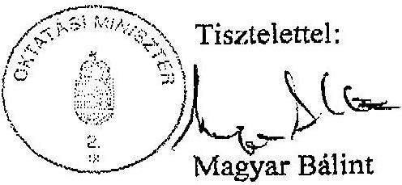

---

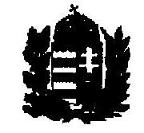

MAGYAR KÖZTÁRSASÁG HONVÉDELMI MINISZTERE

Nyt. szám: 6/97/2003.
Hiv. szám: V-12-127/2002-2003.

7811
1/b. sz. melléklet
a V-12-130/2002-2003. sz. jelentéshez

1. számú példány 04.10.

ÁLLAMI SZÁMVEVÖSZÉK
ÜGYVITELI IRODA

ATTY 24.18/03
Erkész: 2003 04 -9

Iktatószáme
Melléklet:

Dr. Kovács Árpád úr
Állami Számvevőszék
elnök

Budapest
1364. Pf. 54.

Tárgy: ÁSZ ellenőrzési jelentés
véleményezése

Tisztelt Elnök Úr!

A felsőoktatási intézményhálózat integrációjának ellenőrzéséről szóló fenti
hivatkozási számon megküldött jelentést köszönettel megkaptam, azzal kapcsolatban
észrevételt nem kívánok tenni.

A jelentés katonai felsőoktatás helyzetét értékelő megállapításait és az abban
tett javaslatokat hasznosítani fogjuk.

A tárcánkat érintően szükséges intézkedések megtételéről Elnök Urat az előírt
határidőn belül tájékoztatom.

Budapest, 2003. április "07"- n

Tisztelettel:

(óshász Ferenc)

H-1885 BUDAPEST, Pf.: 25 • TEL.: (36-1) 474-1104 • FAX: (36-1) 474-1285

---

Budapesti
Közgazdaságtudományi és Allamigazgatási Egyetem

1/6. sz. melléklet
a V-12-130/2002-2003. sz. jelentéshez

Rektor

Bihary Zsigmond úr
föigazgató
Állami Számvevőszék

Budapest

Tisztelt Föigazgató Úrl

1093
1093
a V-12-130/2002-2003. sz. jelentéshez

ÁLLAMI SZÁMVEVŐSZÉK
ÜGYVITELI IRODA

Érkezett: 2003. Mart 05.
Iktatószám: V-12-111 02-03
A. 74 - 1664/2003

R-52/1/2003.

111 8. 8. 8. 06. 06.

111 8. 8. 8. 06.

1/2002

Hivatkozással V-12-103/2002-2003. ügyiratszámú levelére ezennel tájékoztatom,
hogy a felsőoktatási intézményhálózat integrációjának ellenőrzéséről készített
jelentés-tervezet átdolgozott változatában tett megállapításokkal - amint a jelentés-
tervezet első változatával is - egyetértek.

Szíves üdvözlettel:

Budapest, 2003. március 3.

Chikán Attila

---

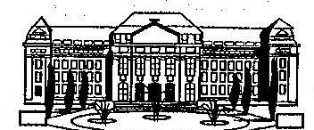

Rector Universitatis Debreceniensis

Ikt. sz.: 476-V.73/2003. etsz

# Bihary Zsigmond 

föigazgató
Állami Számvevőszék 1364 Budapest 4. Pf.: 54
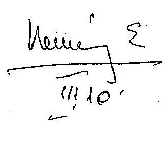

ÁLLAMI SZÁMVEVŐSZÉK
ÜGYVITELI IRODA
Érkszer: 2003 MARC 1.0
Iktatószám: 1-12-11 6/2003
ATM-17911-2005

Tisztelt Föigazgató Úr!
A felsőoktatási intézményhálózat integrációjának ellenőrzéséről készített jelentéstervezetük átdolgozott változatát köszönettel megkaptuk.

A jelentés-tervezetben foglaltakkal egyet értünk, ahhoz további észrevételeket nem kívánunk tenni.

Debrecen, 2003. március 6.

Tisztelettel:

## 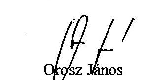

Grosz János
gazdasági főigazgató
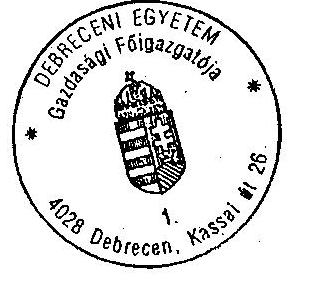

## hmm hduk

Dr. Nagy János
egyetemi tanár, rektor $h$
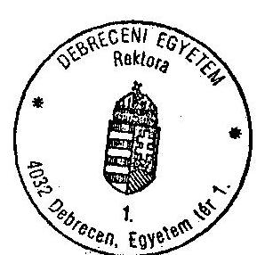

---

# EÖTVÖS LORÁND TUDOMÁNYEGYETEM REKTOR 

1053 Budapest, Egyetem tér 1-3,
Tel.: 266-3119 Fax: 266-9786

Bihari Zsigmond
föigazgató
Állami Számvevőszék
Budapest 4
Pf.: 54
1364

Tisztelt Föigazgató Úr!
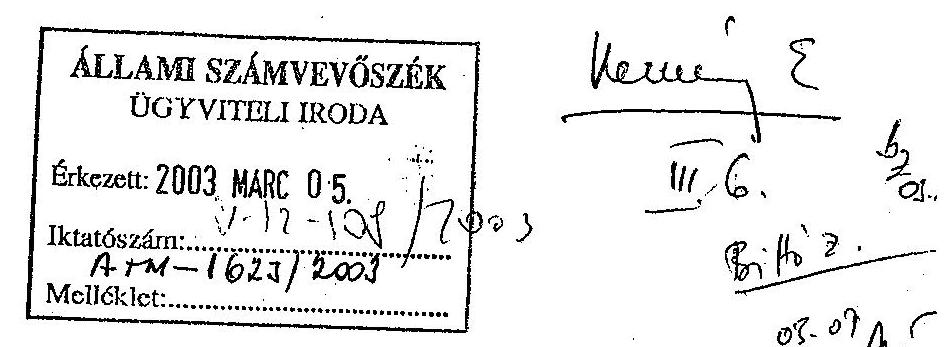

Köszönettel megkaptuk a felsőoktatási intézményhálózat integrációjának ellenőrzéséről készített jelentés-tervezetet, amelyhez az alábbi pontosító észrevételeket tesszük:

- 1.2.1. ponthoz (29. oldal): a párhuzamosságok felszámolásának szükségességét azért nem fogalmaztuk meg az Intézményfejlesztési Tervben, mert az ELTÉ-nél eltérő képzési szintű intézmények integrációja valósult meg. (Az ELTÉ-re vonatkozó mondatot egy bekezdéssel lejjebb javasoljuk leími.)
- 1.3.2. pont első bekezdését javasoljuk kiegészíteni: „Az ELTE saját fejlesztésű pénzügyi informatikai rendszert müködtet."
- A 3.3.1. pont első bekezdése (60. oldal) és az ötödik bekezdése (61. oldal) között ellentmondást vélünk: a BMF nem számszerüsítette az átalakítás költségeit, - a másik oldalon meg kimutatja, hogy $130,9 \mathrm{mFt}$-ot költött!?

A többi észrevétellel egyetértünk, a véleményezés lehetőségét köszönjük.

Budapest, 2003. március 3.

Tisztelettel:
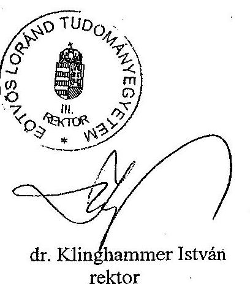
dr. Klinghammer István rektor

---

# Dr. Klinghammer István úr rektor 

## Eötvös Loránd Tudományegyetem

Budapest

Tisztelt Rektor Úr!

A felsőoktatási intézményhálózat integrációjának ellenőrzéséről készített jelentéstervezetünkre küldött levelét köszönettel megkaptam.

Pontosító észrevételei közül az első kettőt elfogadtuk. A harmadik észrevételében jelzett ellentmondás nem áll fenn, mivel a jelentés-tervezetünk 3.3.1 pont első bekezdése a várható átalakítási költségekre, a hivatkozott másik bekezdés a tényleges helyzetre vonatkozik.

Budapest, 2003. március „II.„,

Tisztelettel:

---

# KAPOSVÁRI EGYETEM REKTOR 

7400 Kaposvár, Guba Sándor u. 40. Pf.: 16.

ÁlJ AMI SZÁMVEVÖSZÉK
HHIARY ZSIGMOND ár
föigazgató
hiv.sz.: V-12-103/2002-2003.
ikt.sz.: R-50/2003.

## R E D A P E S T

V., Apáczai Csere János u. 10.
1052

## Tisztelt Fïligazgató Úr!

A felsőoklatási intézményhálózat integrációjának ellenőrzéséről készített jelentés tervezet megállapításaival és értékelésével egy megjegyzés kivételével - egyetérték.

A megjegyzés a jelentés 22. oldalán a vagyonmegosztáshoz füzőtt megállapításra vonatkozik.
A vizsgálati anyagból úgy tűnik, mintha a PATE szervezetébe tartozott két kutatóintézet a Veszprémigyetem része lenne, amelyekre „a Kaposvári Egyetem is igényt tart".

A valósáq ennek ellenkezője. A két kutatóintézet intézeti tanácsai 1999-ben egyértelműen a Kaposvári Egyetemhez való csatlakozás mellett döntöttck, és 2000. január 1-jétől a Kaposvári ligyetem részei.

Iól a lényt az Oktatási Minisztérium az Alapító Okiratban, a Szervezeti és Müködési Szabályzatban, az egyéb szabályzatokban és az éveakénti költségvetésben is elismerte.

Reten a véglegesítésnél a fentieknek megfelelő módosítási szíveskedjék átvezetni.

Kaposvár, 2003. március 3.

---

# Dr. Horn Péter úr rektor 

## Kaposvári Egyetem

## Kaposvár

## Tisztelt Rektor Úr!

A felsőoktatási intézményhálózat integrációjának ellenőrzéséről készített jelentéstervezetünkre küldött levelét köszönettel megkaptam.

Észrevétele alapján a jelentés-tervezeten módosítást hajtottunk végre.
Budapest, 2003. március „H.,,

Tisztelettel:

---

ad. 622-R/2003. BB.

Bihary Zsigmond árnak
főigazgató

Állami Számvevőszék

1393 Budapest
Pf. 432.

ÁLLAMI SZÁMVEVÓSZÉK
ÜGYVITELI IRODA
Erkezeit: 2003 MARC 1.0
Iktatószám: U-12-11512003
ATM-1792/2003
Melleklet:

Hosmer
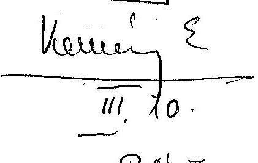

Tisztelt Főigazgató Úr!

A felsőoktatási intézményhálózat integrációjának ellenőrzéséről készített jelentés-tervezet átdolgozott változatát köszönettel megkaptam.

Alapos és gondos felmérésről, helyzetelemzésről tanúskodik az anyag.

Az általános értékelés működési hatékonyságot növelő, ill. a Miskolci Egyetem vonatkozásában megfogalmazott megállapításokra az intézményi konszolidációs terv készítésekor külön figyelmet fordítunk.

Miskolc, 2003. március 3.

Tisztelettel

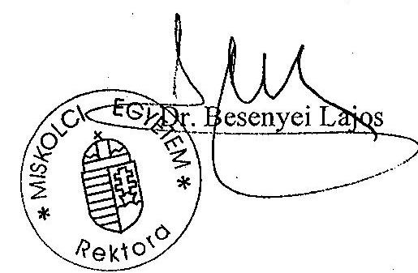

MISKOLCI EGYETEM
3515 Miskolc-Egyetemváros, Pf.: 1
Tel.: (46) 565-010 Fax: (46) 565-014, 563-429
E-mail: stbes@gold.uni-miskolc.hu, http://www.uni-miskolc.hu

---

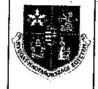

NYUGAT-MAGYARORSZÁGI EGYETEM Rektora
9401 Sopron Pf.: 132.
Tel.: (99)312-240 Fax: (99)312-240
E-mail: rectorc@nyme.hu

UNIVERSITY OF WEST HUNGARY
Westungarische Universität
Rector
H-9401 SOPRON, Bajcsy-Zs.u.4. Pf:132.
Tel: +36 (99) 312-240 Fax: +36 (99) 312-240

Iktatószám: R-249-4/2003.

Állami Számvevőszék

Bihary Zsigmond
főigazgató úr

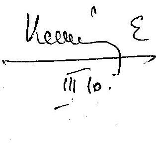

ÁLLAMI SZÁMVEVÓSZÉK
ÜGYVITLLI IRODA

Érkezett: 2003. MARC 1 0
Iktatószám: 4-12-17/2003
At: 4-12-12003
Melléklet: 790/2003

Tisztelt Főigazgató Úr!

Hivatkozva a V-12-103/2002-2003 számú levelére tájékoztatom, hogy a felsőoktatási intézményhálózat ellenőrzéséről készített jelentés tervezettel változatlanul egyetértünk. Egyúttal köszönöm, hogy a korábban tett pontosító észrevételünket figyelembe vették.

A további jó együttműködés reményében,

üdvözlettel:

Sopron, 2003. március 7.

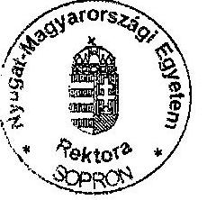

Prof. dr. Faragó Sándor
mb. rektor

---

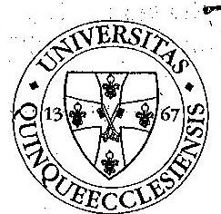

Állami Számvevőszék
Bihary Zsigmond föigazgató

## BUDAPEST

Tisztelt Föigazgató Úr!
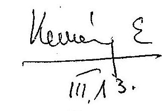

Ikt.szám: 103-1-3/2003-R
Hiv.szám: V-12-103/2002-2003.
Tárgy: Jelentés a felsőoktatási intézményhálózat integrációs ellenőrzéséről.

ÁLLAMI SZÁMVEVÔSZÉK
ÜGYVITELI IRODA
Érkezett: 2003 MARC 13
Iktatószám: $1-12-12012003$
ATM-1866/2003
Melléklet:

Fenti tárgyú és számú levelükre válaszolva kijelentem, az anyagban szereplő tények a valóságnak megfelelnek, így az azokból levont következtetésekkel vitatkozni nem áll módunkban.

Mindezekre tekintettel a jelentést elfogadjuk.

Pécs, 2003. 03. 03.
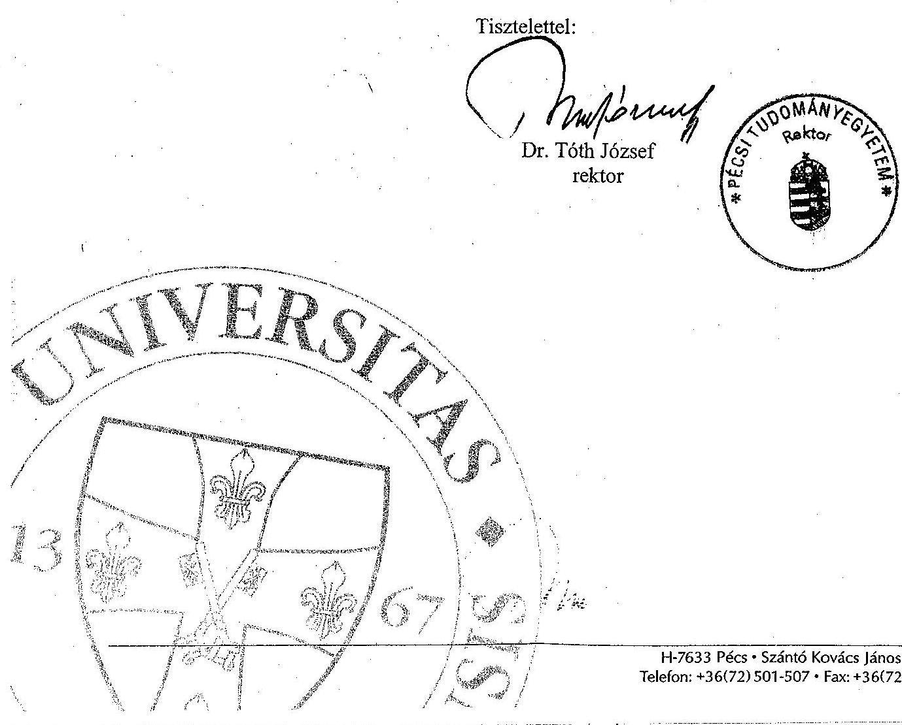

---

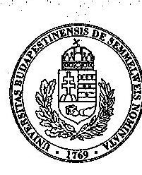

1/1. sz. melléklet
a V-12-130/2002-2003. sz. jelentéshez

SEMMELWEIS EGYETEM
Egyetemi fötitkár

1085 Budapest, VIII. Üllői út 26.
Tel.: 266-04-43, Fax.: 266-04-43

F/39/2003.

Kemény Emil
főcsoportfőnök

Állami Számvevőszék

Budapest,
Apáczai Csere János u. 10.
1051

ÁLLAMI SZÁMVEVŐSZÉK
ÜGYVITELI IRODA

Érkezett: 2003. MARÇ 12-2003
Iktatószám: 1/198/2003
A:74-1937/2003
Melléklet: 8

Bittió 7.

03.11 (An)

Tisztelt Főcsoportfőnök Úr!

A hozzánk ismételten eljuttatott, „A felsőoktatási intézményhálózat
integrációjának ellenőrzéséről” készített jelentés végső tervezetéhez érdemi
észrevételt nem kívánunk tenni.

2003. március 07.

Tisztelettel:

Dr. Hári Miklós

---

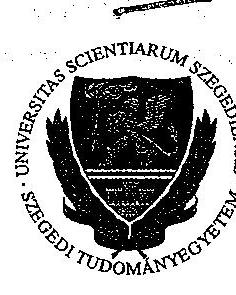

# SZEGEDI TUDOMÁNYEGYETEM REKTOR

6720 Szeged
Dugonics tér 13.
sz 6701 Szeged
Pf.: 674.

Telefon: (62) 544-001
(62) 425-998
Fax: (62) 420-412
E-mail: rektor@u-szeged.hu

Bihary Zsigmond
Főigazgató úrnak

Állami Számvevőszék
BUDAPEST,
Apáczai Csere János u. 10.
1052

ÁLLAMI SZÁMVEVŐSZÉK
ÜGYVITELI IRODA

Érkezett: 2003. MARC 06.
V-12-103/01.
Iktatószám: 4/2
Aria: (tost 200)
Melléklet: 00

Vezu!

Tisztelt Főigazgató Úr!

Vezi 2.

Bib 2.

05.06.1994

A V-12-103/2002–2003. iktatószámú „A felsőoktatási intézményhálózat integrációjának ellenőrzéséről” szóló jelentés megállapításai korrektek, az anyaghoz írásbeli észrevételt nem kívánok fűzni.

Szeged, 2003. március 03.

Tisztelettel:

Dr. Mészáros Rezső

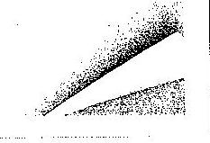

---

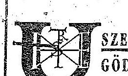

# SZENT ISTVÁN EGYETEM GÖDÖLLŐ

2103 GÖDÖLLŐ, PÉTER KÁRCZT U. 1. TEL: (28) 410 971 FAX: (28) 522 008 E-MAIL: rector@szie.hu

2103 GÖDÖLLŐ, PÉTER KÁRCZT U. 1. TEL: (28) 410 971 FAX: (28) 522 008 E-MAIL: rector@szie.hu

R-83/2003

ÁLLAMI SZÁMVEVŐSZÉK
ÜGYVITELI IRODA

Érkezett: 2003 MARC 05.
Iktatószám: U-12-110 101-0
Ártt: 1019/2003

Ügyintéző: Dr. Guth/Dr. Takács

Bihary Zsigmond
Főigazgató
Állami Számvevőszék

Tárgy: Felsőoktatási intézményhálózat integrációjának ellenőrzése

Tisztelt Főigazgató Úr!

Hivatkozva a V-12-103/2002-2003. számú levelére tájékoztatom, hogy a jelentéstervezettel kapcsolatban tartalmi észrevételünk nincs. A jelentéstervezet Szent István Egyetemmel kapcsolatos adatközlései illetve megállapításai tényszerűek.

Gödöllő, 2003. március 3.

Tisztelettel:

Dr. Szendrő Péter

---

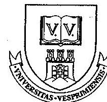

# VESZPRÉMI EGYETEM REKTOR 

Állami Számvevőszék Bihary Zsigmond úr föigazgató

Budapest

Tisztelt Föigazgató Úr!

Ikt. szám: 67-2/2003.
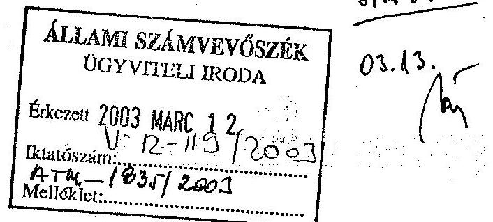

Tájékoztatom, hogy a felsőoktatási intézményhálózat integrációjának ellenőrzéséről készített jelentés-tervezettel kapcsolatosan észrevételünk nincs.

A késedelemért szíves elnézését kérem.

Veszprém, 2003. március 7.

Tisztelettel:
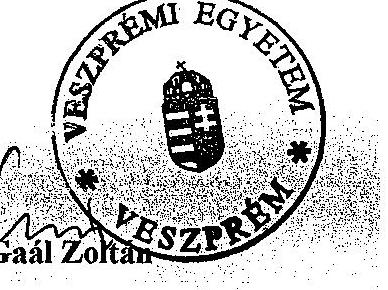

---

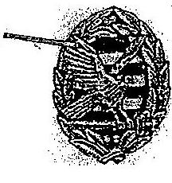

# ZRÍNYI MIKLÓS NEMZETVÉDELMI EGYETEM REKTOR

Budapest 146 PE 15. H-1581
Telefon: (36 1) 432-90-60
Telefax: (36-1) 432-90-12
E-mail:mszabo@zmne.hu

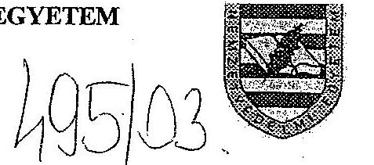

## Bihari Zsigmond úr

Állami Számvevőszék főigazgató

ÁLLAMI SZÁMVEVŐSZÉK
ÖGYVITELI IROIDA

Érkezett 2003. MARC 05.

Iktatószám: V-12-112402-03
Át: 1-1666/2001

Melléklet: ..................................................................................................................................................................................................................................................................................................................................................................................................................................................................................................................................................................................................................................................................................................................................................................................................................................................................................................................................................................................................................................................................................................................................................................................................................................................................................................................................................................................................................................................................................................................................................................................................................................................................................................................................................................................................................................................................................................................................................................................................................................................................................................................................................................................................................................................................................................................................................................................................................................................................................................................................................................................................................................................................................................................................................................................................................................................................................................................................................................................................................................................................................................................................................................................................................................................................................................................................................

---

# BUDAPESTI GAZDASAGI FÖISKOLA 

a V-12-130/2002-2003, sz. jelentéshez

## BUDAPEST BUSINESS SCHOOL

főiskolai rektor

BGF-151/2003

ÁLLAMI: :ÁMVEVÓSZÉK
ÜGY VITLLI IRODA
Érkezett: 2003 MARC 06
Iktatószám: $\qquad$ $1-12-114 / 2003$
A. $14-1707 / 2003$

Melléklet: $\qquad$
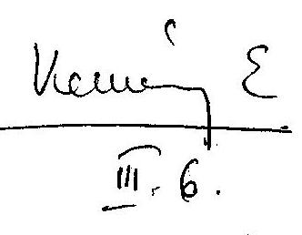

## Bihary Zsigmond Úrnak,   föigazgató   Állami Számvevőszék

Budapest

Tisztelt Bihary Úr!

A felsőoktatási intézményhálózat integrációjának ellenőrzéséről készített JELENTÉS tervezetük összességében tárgyszerü, korrekt, sok tekintetben figyelmet érdemlő megállapítást tartalmaz. Javaslataik (mind a felsőoktatási intézmények, mind a központi szervezetek - Kormány, minisztériumok számára) időszerűek és konstruktívak, elósegíthetik az intégráció eddigi vajmi kevés eredményének kiteljesedését, a felsőoktatási tevékenység minőségének és hatékonyságának szükségszerủ növelését.

Az objektivitás lényegében teljes körüen érvényesül a Budapesti Gazdasági Főiskola (továbbiakban BGF) tekintetében is a JELENTÉS-ben (a BGF-ről példaszerüen a $24,25,26,29,32,34,35,36,37,38,41,53,55$. oldalakon jelzett kinyilvánítások valósághüek). Mindössze két - kisebb jelentőségü szövegkorrekció átvezetését kérem.

1. A közgazdász-tanárképzést (30. oldal 4. bekezdés közepén) nem tudtuk a KVIFK és a PSZFK együttdolgozásával elindítani, mert csak valamelyik egyetemmel konzorciumban engedélyezi az Oktatatási Minisztérium (a kifogásolt szöveg elhagyását ajánlom).
2. Az oktatási terület a BGF-nél valóban csökkent (64. oldal 4. bekezdés), amely összefügg azzal is, hogy a Rektorátust az integrált gazdasági-pénzügyi-számviteli apparátus egy részét a PSZFK néhány tantermének igénybevételével - átalakításával - lehetett átmenetileg elhelyezni (az indokolt - legalább zárójelben - lenne jelezni).

---

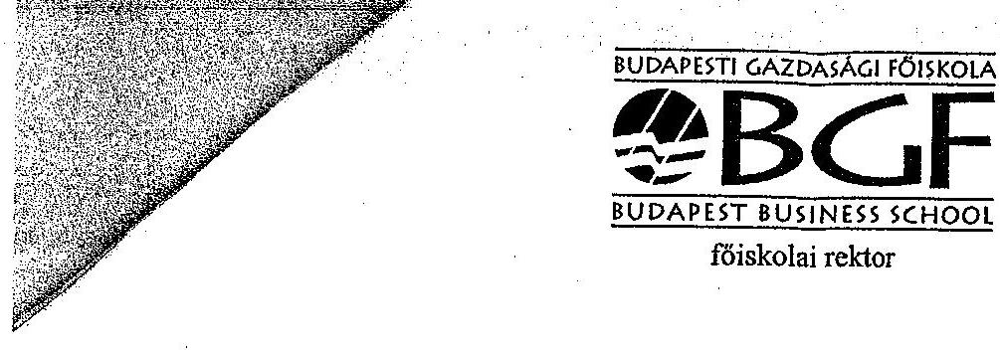

Célszerűnek tartanám ellenőrizni a 2.sz. táblázat 32-33. sorában jelzett adatokat (összhangban a 15. sz. táblázattal és a 45. oldal alján leírtakkal).

Ezúton is köszönjük értékes, lényeglátó és láttató, konstruktív ellenőrzési tevékenységüket.

Budapest, 2003. február 28.

Üdvözlettel:
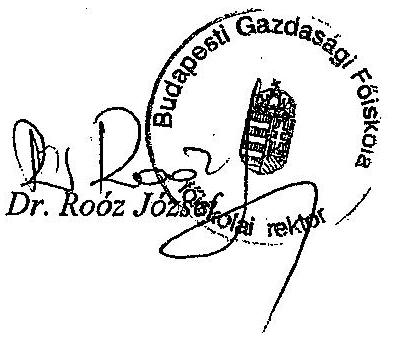

---

# Állami Számvevőszék 

Föigazgató

Dr. Roóz József úr rektor

Budapesti Gazdasági Főiskola

Budapest

Tisztelt Rektor Úr!

A felsőoktatási intézményhálózat integrációjának ellenőrzéséről készített jelentéstervezetünkre küldött levelét köszönettel megkaptam.

Pontositó észrevételeit elfogadtuk, a jelentés-tervezeten átvezettük.

Budapest, 2003. március „II,„,

Tisztelettel:

---

# BMF 

## BUDAPESTI MÚSZAKI FÖISKOLA

## FÖTITKÁR

1/s. sz. melléklet
a V-12-130/2002-2003. sz. jelentéshez

Állami Számvevőszék
Kemény Emil
főcsoportfőnök úr részére
Budapest, Pf. 54.
1364

ÁLLAMI SZÁMVEVÖSZÉK
ÜGYVITELI IRODA BMF-RH-31/2/03
Érkezeit: 2003 MARC 05
$1-12-108 / 2002$
Iktatószám: $\qquad$
A $r x-1622 / 2003$
Melléklet: $\qquad$

Budapest, 2003. március 3.
Tárgy: ÁSZ jelentés-tervezethez észrevétel

## Tisztelt Főcsoportfőnök Úr !

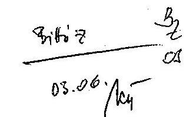

Köszönettel megkaptuk a felsőoktatási intézményhálózati integráció ellenőrzéséről készített jelentés tervezet átdolgozott változatát.

A 2003. január 20-i dátummal megküldött levelünkben javasolt kiegészítések közül nem került az anyagba a

- „25. oldal harmadik bekezdés intézményünk véleménye szerint - melyet nemzetközi tapasztalatok is megerősítenek - a két 'szintü képzés megvalósítását nem akadályozza, hogy a müszaki és gazdasági tudományterületen a föiskolai és egyetemi képzés intézményei (BMF és a BME) elkülönülnek. A Budapesti Müszaki Fölskola és a Budapesti Müszaki és Gazdaságtudományi Egyetem azonos karai 2002-ben megkezdték a kétszintü mérnök képzés tanterveinek kidolgozását, a követelmények meghatározását."

Fenti észrevételünket jelen levelünkkel megerősítjük és kérjük annak a jelentésben való rögzítését.
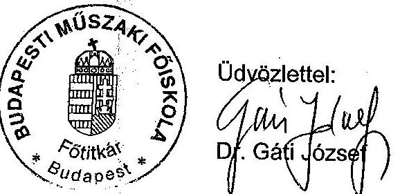

---

# Állami Számvevőszék 

Föigazgató

V-12-104/2002-2003.

Dr. Erdélyi József úr
rektor

Budapesti Müszaki Főiskola

Budapest

Tisztelt Rektor Úr!

A felsőoktatási intézményhálózat integrációjának ellenőrzéséről készített jelentéstervezetünkre küldött levelüket köszönettel megkaptam.

Pontositó észrevételüket elfogadtuk, a jelentés-tervezetbe beépítettük.

Budapest, 2003. március „H.„,

Tisztelettel:

---

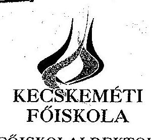

1/t. sz. melléklet
a V-12-130/2002-2003. sz. jelentéshez

1/2-12-103/2002-2003.
ATM-1605/2003
70 JUYN 2002 HARAPY

VŒOHI FELLIAAÓG
MÁZSÓANAWYZS BAVTTY

1055/03.

Állami Számvevőszék

Bihary Zsigmond
főigazgató

Budapest

Kecskemét, 2003. február 27.
EH. 186/2001/2003

Tisztelt Főigazgató Úr!

Hivatkozással a V-12-103/2002-2003. számú, a felsőoktatási intézményhálózat integrációjának ellenőrzéséről készített és észrevetélezésre megküldött jelentés-tervezetre tájékoztatom, hogy a Kecskeméti Főiskola részéről egyet értünk az anyagban foglaltakkal és tudomásul vesszük az abban szerepelo megállapításokat, azokkal kapcsolatban sem kérdésünk, sem észrevétélünk nincs.

Tisztelettel:

Dr. Sztachl-Pekary István
Főiskolai rektor
SKEM

H.6001 Kecskemét, Legledi út 2., Bt. 2003. Tel.: (36) 76/501-960. Fax: (36) 76/501-979. E-mail: keto@keto.hu Internet: http://www.keto.hu

---

# NYÍREGYHÁZI FÖISKOLA 

H-4400 Nyíregyháza, Sóstól u. 31/b.

## Fax

Kinele Bittó Zoltán
Fax: 476-3829
Telefon:
Kitöl: Dr. Balogh Árpád
Oldalak: 1
Dátum: 2003. máreins 7.
Fax: (42) 404092
Telefon: (42) 599-444

Tisztelt Osztályvezető Úr!

A Nyíregyházi Fölskola módosítási változtatást nem javasol, a munkaanyag tervezetet a megküldött tartalmában elfogadja.
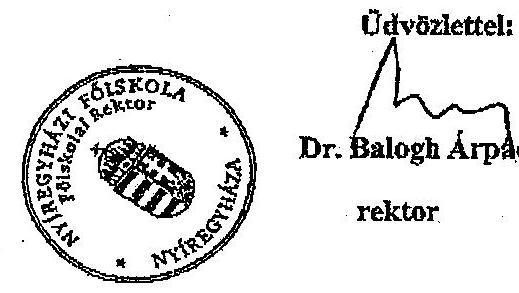

---

# TESSEDIK SÁMUEL FÖISKOLA REKTORA 

Dr. Patay István
egyetemi tanár, föiskolai rektor

Tel.: (66) 216-583
E-mail: patay@szv.tsf.hu

Állami Számvevőszék
Bihary Zsigmond
föigazgató
Budapest
Apáczai Csere János u. 10.
1052

Tisztelt Föigazgató Úr!
Ikt.sz.: I.48/1-4/4/2003.

ÁLLAMI SZÁMVEVŐSZÉK ÜGYVITELI IRODA

Érkezett: 2003 MARC 10
Iktatószám: $\qquad$
$V-12-122 / 200$
Melléklet: $\qquad$

## 3. 4. 3

Az V-12-103/2002-2003.ikt.sz. levelére választolva az Állami Számvevőszék által készített, a felsőoktatási intézményhálózat integrációjának ellenőrzéséről szóló jelentésben foglaltakkal kapcsolatban a Tessedik Sámuel Főiskola részéről egyetértésemet fejezem ki.

Szarvas, 2003.március 3.

Üdvözlettel
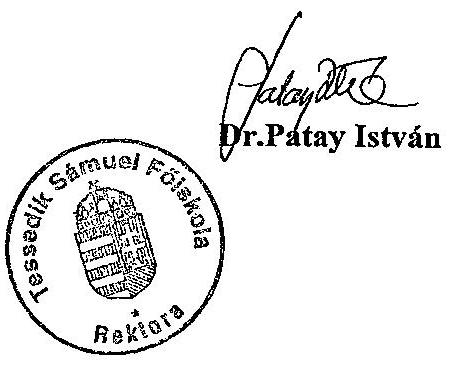

## REKTORI HIVATAL

5540 Szarvas, Szabadság út 2. 5541 Szarvas, Pf. 37. Tel./Fax: (66) 216-581, (66) 216-582 E-mail: tsf.ri@szv.tsf.hu

---

# Az integrálódott felsőoktatási intézmények felsorolása és jogelőd intézményi szerkezete

|  Sorsz. | Intézmény megnevezése  |
| --- | --- |
|  1. | Budapesti Közgazdaságtudományi Egyetem  |
|  2. | Allamigazgatási Főiskola  |
|  I. | BUDAPESTI KÖZGAZDASAGTUDOMANYI ES ALLAMIGAZGATASI EGYETEM  |
|  3. | Kossuth Lajos Tudományegyetem, Debrecen  |
|  4. | Debreceni Orvostudományi Egyetem  |
|  5. | Debreceni Agrártudományi Egyetem (kivéve a hódmezővásárhelyi Mezőgazdasági Főiskolai Kart és a szarvasi Mezőgazdasági Viz- és Környezetgazdálkodási Főiskolai Kart)  |
|  6. | Hajdüböszörményi Wargha István Pedagógiai Főiskola  |
|  II. | DEBRECENI EGYETEM  |
|  7. | Eötvös Loránd Tudományegyetem  |
|  8. | Bárczi Gusztáv Gyógypedagógiai Főiskola  |
|  9. | Budapesti Tanítóképző Főiskola  |
|  III. | EÖTVÖS LORAND TUDOMANYEGYETEM  |
|  10. | Pannon Agrártudományi Egyetem, Allattenyésztési Kar, Kaposvár  |
|  11. | Csokonai Vitéz Mihály Tanítóképző Főiskola, Kaposvár  |
|  IV. | KAPOSVARI EGYETEM  |
|  12. | Miskolci Egyetem (kivéve a Dunaújvárosi Főiskolai Kar)  |
|  13. | Comenius Tanítóképző Főiskola, Sárospatak  |
|  V. | MISKOLCI EGYETEM  |
|  10. | Pannon Agrártudományi Egyetem, Mosonmagyaróvári Mezőgazdasági Kar  |
|  14. | Soproni Egyetem  |
|  15. | Benedek Élek Pedagógiai Főiskola, Sopron  |
|  16. | Apáczai Csere János Tanítóképző Főiskola, Győr  |
|  VI. | NYUGAT-MAGYARORSZAGI EGYETEM, SOPRON  |
|  17. | Janus Pannonius Tudományegyetem, Pécs  |
|  18. | Pécsi Orvostudományi Egyetem  |
|  19. | Illyés Gyula Pedagógiai Főiskola, Szekszárd  |
|  44. | Liszt Ferenc Zeneművészeti Főiskola Pécsi Tagozata  |
|  VII. | PECSI TUDOMANYEGYETEM  |
|  20. | Semmelweis Orvostudományi Egyetem  |
|  21. | Haynal Imre Egészségtudományi Egyetem  |
|  22. | Magyar Testnevelési Egyetem  |
|  VIII. | SEMMELWEIS EGYETEM  |
|  23. | Szegedi József Attila Tudományegyetem  |
|  24. | Szent-Györgyi Albert Orvostudományi Egyetem  |
|  25. | Juhász Gyula Tanárképző Főiskola  |
|  3. | Debreceni Agrártudományi Egyetem, Mezőgazdasági Főiskolai Kar, Hódmezővásárhely  |
|  IX. | SZEGEDI TUDOMANYEGYETEM  |
|  26. | Gödöllői Agrártudományi Egyetem (kivéve a mezőtúri Mezőgazdasági Főiskolai Kart és a nyíregyházi Mezőgazdasági Főiskolai Kart)  |
|  27. | Kertészeti és Elelmiszeripari Egyetem, Budapest (kivéve a kecskeméti Kertészeti Főiskolai Kart)  |
|  28. | Állatorvostudományi Egyetem, Budapest  |
|  29. | Ybl Miklós Műszaki Főiskola, Budapest  |
|  30. | Jászberényi Tanítóképző Főiskola  |
|  X. | SZENT ISTVÁN EGYETEM, GÖDÖLLO  |

---

| Sorsz. | Intézmény megnevezése |
| :--: | :--: |
| 31. | Veszprémi Egyetem |
| 10. | Pannon Agrártudományi Egyetem, Keszthely (kivéve a kaposvári Állattenyésztési Kart és a mosonmagyaróvári Mezőgazdaságtudományi Kart) |
| XI. | VESZPREMI EGYETEM |
| 32. | Zrínyi Miklós Nemzetvédelmi Egyetem |
| 33. | Bolyai János Katonai Műszaki Főiskola |
| XII. | ZRINYI MIKLÓS NEMZETVÉDELMI EGYETEM |
| 34. | Kereskedelmi, Vendéglátóipair és Idegenforgalmi Főiskola |
| 35. | Külkereskedelmi Főiskola |
| 36. | Pénzügyi és Számviteli Főiskola |
| XIII. | BUDAPESTI GAZDASAGI FÖISKOLA |
| 37. | Bánki Donát Müszaki Főiskola |
| 38. | Kandó Kálmán Müszaki Főiskola |
| 39. | Könnyűipari Müszaki Főiskola |
| XIV. | BUDAPESTI MÚSZAKI FÖISKOLA |
| 27. | Kertészeti és Élelmiszeripari Egyetem, Kecskeméti Főiskolai Kar |
| 40. | Gépipari és Automatizálási Müszaki Főiskola |
| 41. | Kecskeméti Tanítóképző Főiskola |
| XV. | KECSKEMÉTI FÖISKOLA |
| 42. | Bessenyei György Tanárképző Főiskola |
| 26. | Gödöllői Agrártudományi Egyetem, Mezőgazdasági Főiskolai Kar, Nyíregyháza |
| XVI. | NYIREGYHAZI FÖISKOLA |
| 5. | Debreceni Agrártudományi Egyetem, Mezőgazdasági Víz- és Környezetgazdálkodási Főiskolai Kar, Szarvas |
| 26. | Gödöllői Agrártudományi Egyetem, Mezőgazdasági Főiskolai Kar, Mezőtúr |
| 43. | Körös Főiskola, Békéscsaba |
| XVII. | TESSEDIK SAMUEL FÖISKOLA |

---

# A vizsgált felsőoktatási intézmények integráció előtti és integráció utáni 

kari szerkezete

| Sorsz. | Integráció előtt (1999. év) | Integráció után (2001. év) |
| :--: | :--: | :--: |
| I. | Budapesti Közgazdaságtudományi Egyetem   - Posztgraduális Kar (megszűnt)   - Gazdálkodási Kar   - Közgazdasági Kar   - Általános Társadalomtudományi Kar   Államigazgatási Főiskola | Budapesti Közgazdaságtudományi és Államigazgatási Egyetem, Budapest   - Gazdálkodástudományi Kar   - Közgazdaságtudományi Kar   - Társadalomtudományi Kar   - Államigazgatási Főiskolai Kar |
| II. | Kossuth Lajos Tudományegyetem   - Bölcsészettduományi Kar   - Természettudományi Kar   - Műszaki Főiskolai Kar   - Jog- és Államtudományi Intézet   Debreceni Agrártudományi Egyetem   - Mezőgazdaságtudományi Kar   Debreceni Orvostudományi Egyetem   - Orvostudományi Kar   - Egészségügyi Főiskolai Kar   - Egészségügyi Főiskolai Kar, Miskolci képzési hely (székhelyen kívüli képzési hely)   Hajdúböszörményi Wargha István Pedagógiai   Főiskola   - Debreceni Konzervatórium | Debreceni Egyetem, Debrecen   - Bölcsészettudományi Kar   - Természettudományi Kar   - Műszaki Főiskolai Kar   - Közgazdaságtudományi Kar (új) (A Közgazdasági és Üzleti Tudományok Intézetéből)   - Jogi- és Államtudományi Intézet (kari szintű egység)   - Mezőgazdaságtudományi Kar   - Általános Orvostudományi Kar   - Egészségügyi Főiskolai Kar (Nyíregyháza)   - Egészségügyi Főiskolai Kar, Miskolci képzési hely (székhelyen kívüli képzési hely)   - Hajdúböszörményi Wargha István Pedagógiai Főiskolai kar (Hajdúböszörményi)   - Debreceni Konzervatórium (kari szintű egység) |
| III. | Eötvös Loránd Tudományegyetem   - Állam- és Jogtudományi Kar   - Állam- és Jogtudományi Kar, Győri képzési hely   - székhelyen kívüli képzési hely)   - Bölcsészettudományi Kar   - Természettudományi Kar   - Tanárképző Főiskolai Kar   Budapesti Tanítóképző Főiskola   Bárczi Gusztáv Gyógypedagógiai Főiskola | Eötvös Loránd Tudományegyetem, Budapest   - Állam- és Jogtudományi Kar   - Állam- és Jogtudományi Kar, Győri képzési hely (székhelyen kívüli képzési hely)   - Bölcsészettudományi Kar   - Természettudományi Kar   - Tanárképző Főiskolai Kar   - Tanító- és Övöképző Főiskolai Kar   - Bárczi Gusztáv Gyógypedagógiai Tanárkép, Főisk. Kar |
| IV. | Pannon Agrártudományi Egyetem   - Állattenyésztési Kar   Csokonai Vitéz Mihály Tanítóképző Főiskola | Kaposvári Egyetem, Kaposvár   - Állattudományi Kar   - Csokonai Vitéz Mihály Pedagógiai Főiskolai Kar |
| V. | Miskolci Egyetem   - Állam- és Jogtudományi Kar   - Bányamérnöki Kar   - Kohómérnöki Kar   - Bölcsészettudományi Kar   - Gazdaságtudományi Kar   - Gépészmérnöki Kar   - Dunaújvárosi Főiskolai Kar (kivált)   - Bartók Béla Zeneművészeti Intézet   Comenius Tanítóképző Főiskola, Sárospatak | Miskolci Egyetem, Miskolc   - Állam- és Jogtudományi Kar   - Műszaki Földtudományi Kar   - Anyag- és Kohómérnöki Kar   - Bölcsészettudományi Kar   - Gazdaságtudományi Kar   - Gépészmérnöki Kar   - Bartók Béla Zeneművészeti Intézet (kari szintű képzés)   - Comenius Tanítóképző Főiskolai Kar (Sárospatak) |
| VI. | Soproni Egyetem, Sopron   - Erdőmérnöki Kar   - Faipari Mérnöki Kar   - Földmérési és Földrendezői Főiskolai Kar   Pannon Agrártudományi Egyetem   - Mezőgazdaságtudományi Kar, Mosonmagyaróvár   Benedek Elek Pedagógiai Főiskola, Sopron   Apáczai Csere János Tanítóképző Főiskola, Győr | Nyugat-Magyarországi Egyetem, Sopron   - Erdőmérnöki Kar   - Faipari Mérnöki Kar   - Geoinformatikai Főiskolai Kar, Székesfehérvár   - Közgazdaságtudományi Kar (új) (A Gazd. Int.-ből)   - Mezőgazdaság és Élelmiszertudományi Kar, Mosonm.   - Benedek Elek Pedagógiai Főiskolai Kar   - Apáczai Csere János Tanítóképző Főiskolai Kar, Győr |

---

| Sorsz. | Integráció előtt (1999. év) | Integráció után (2001. év) |
| :--: | :--: | :--: |
| VII. | Janus Pannonius Tudományegyetem   - Állam- és Jogtudományi kar   - Állam- és Jogtudományi Kar, Kaposvári képzési hely (székhelyen kívüli képzési hely)   - Bölcsészettudományi Kar   - Közgazdaságtudományi Kar   - Művészeti Kar   - Természettudományi Kar   - Pollack Mihály Műszaki Főiskolai Kar   - Tanárképző Intézet   Pécsi Orvostudományi Egyetem   - Orvostudományi Kar   - Egészségügyi Főiskolai Kar   - Egészségügyi Főiskolai Kar, Kaposvári képzési hely (székhelyen kívüli képzési hely)   - Egészségügyi Főiskolai Kar, Szombathelyi képzési hely (székhelyen kívüli képzési hely)   - Egészségügyi Főiskolai Kar, Zalaegerszegi képzési hely (székhelyen kívüli képzési hely)   - Felnőttképzési és Emberi Erőforrás Fejlesztési Intézet (kari szintű képzés)   Illyés Gyula Pedagógiai Főiskola, Szekszárd | Pécsi Tudományegyetem, Pécs   - Állam- és Jogtudományi Kar   - Állam- és Jogtudományi Kar, Kaposvári képzési hely (székhelyen kívüli képzési hely)   - Bölcsészettudományi Kar   - Közgazdaságtudományi Kar   - Müvészeti Kar   - Természettudományi Kar   - Pollack Mihály Müszaki Főiskolai Kar   - Tanárképző Intézet (kari szintű képzés)   - Általános Orvostudományi Kar   - Egészségügyi Főiskolai Kar   - Egészségügyi Főiskolai Kar, Kaposvári képzési hely (székhelyen kívüli képzési hely)   - Egészségügyi Főiskolai Kar, Szombathelyi képzési hely (székhelyen kívüli képzési hely)   - Egészségügyi Főiskolai Kar, Zalaegerszegi képzési hely (székhelyen kívüli képzési hely)   - Felnőttképzési és Emberi Erőforrás Fejlesztési Intézet (kari szintű képzés)   - Illyés Gyula Pedagógiai Főiskolai Kar, Szekszárd |
| VIII. | Semmelweis Orvostudományi Egyetem   - Általános Orvostudományi Kar   - Fogorvostudományi Kar   - Gyógyszerésztudományi Kar   Haynal Imre Egészségtudományi Egyetem   - Orvostovábbképző Kar   - Egészségügyi Főiskolai Kar   Magyar Testnevelési Egyetem | Semmelweis Egyetem, Budapest   - Általános Orvostudományi Kar   - Fogorvostudományi Kar   - Gyógyszerésztudományi Kar   - Egészségtudományi Kar   - Egészségügyi Főiskolai Kar   - Testnevelési és Sporttudományi Kar |
| IX. | Szegedi József Attila Tudományegyetem   - Állam- és Jogtudományi Kar   - Bölcsészettudományi Kar   - Természettudományi Kar   - Szegedi Élelmiszeripari Főiskolai Kar   - Gazdaságtudományi Kar   Szent-Györgyi Albert Orvostudományi Egyetem   - Általános Orvostudományi Kar   - Gyógyszerésztudományi Kar   - Főiskolai Kar   Debreceni Agrártudományi Egyetem   - Mezőgazdasági Főiskolai Kar   Juhász Gyula Tanárképző Főiskola   - Szegedi Konzervatórium | Szegedi Tudományegyetem, Szeged   - Állam- és Jogtudományi Kar   - Bölcsészettudományi Kar   - Természettudományi Kar   - Szegedi Élelmiszeripari Főiskolai Kar   - Gazdaságtudományi Kar   - Általános Orvostudományi Kar   - Gyógyszerésztudományi Kar   - Egészségügyi Főiskolai Kar   - Mezőgazdasági Főiskolai Kar, Hódmezővásárhely   - Juhász Gyula Tanárképző Főiskolai Kar   - Szegedi Konzervatórium (kari szintű egység) |
| X. | Gödöllői Agrártudományi Egyetem   - Mezőgazdaságtudományi Kar   - Mezőgazdasági Gépészmérnöki Kar   - Gazdaság- és Társadalomtudományi Kar   - Mezőgazdasági Főiskolai Kar, Gyöngyös   Állatorvostudományi Egyetem, Budapest   Kertészeti és Élelmiszeripari Egyetem   - Élelmiszeripari Kar   - Kertészeti Kar   - Tájépítészeti, -védelmi és -fejlesztési Kar   Ybl Miklós Müszaki Főiskola, Budapest   Jászberényi Tanítóképző Főiskola | Szent István Egyetem, Gödöllő   - Mezőgazdaság- és Környezettudományi Kar   - Gépészmérnöki Kar   - Gazdasági- és Társadalomtudományi Kar   - Gazdálkodási és Mezőgazdasági Főisk. Kar, Gyöngyös   - Állatorvostudományi Kar, Budapest   - Élelmiszertudományi Kar, Budapest   - Kertészettudományi Kar, Budapest   - Tájépítészeti, -védelmi és -fejlesztési Kar, Budapest   - Ybl Miklós Müszaki Főiskolai Kar, Budapest   - Jászberényi Főiskolai Kar, Jászberény |
| XI. | Veszprémi Egyetem   - Mérnöki Kar   - Tanárképző Kar   Pannon Agrártudományi Egyetem   - Georgikon Mezőgazdaságtudományi Kar | Veszprémi Egyetem, Veszprém   - Mérnöki Kar   - Tanárképző Kar   - Georgikon Mezőgazdaságtudományi Kar, Keszthely |

---

| Sorsz. | Integráció előtt (1999. év) | Integráció után (2001. év) |
| :--: | :--: | :--: |
| XII. | Zrínyi Miklós Nemzetvédelmi Egyetem   - Hadtudományi Kar   - Vezetés- és Szervezéstudományi Kar   Bolyai János Katonai Műszaki Főiskola | Zrínyi Miklós Nemzetvédelmi Egyetem   - Hadtudományi Kar   - Vezetés- és Szervezéstudományi Kar   - Bolyai János Katonai Müszaki Főiskolai Kar |
| XIII. | Kereskedelmi, Vendéglátóipari és Idegenforgalmi Főiskola   Külkereskedelmi Főiskola   Pénzügyi és Számviteli Főiskola   - Pénzügyi és Számviteli Főiskola, Salgótarjáni képzési hely (székhelyen kívüli képzési hely)   - Pénzügyi és Számviteli Főiskola, Zalaegerszegi képzési hely (székhelyen kívüli képzési hely) | Budapesti Gazdasági Főiskola, Budapest   - Kereskedelmi, Vendéglátóipari és Idegenforgalmi Főiskolai Kar   - Külkereskedelmi Főiskolai Kar   - Pénzügyi és Számviteli Főiskolai Kar   - Pénzügyi és Számviteli Főiskolai Kar, Salgótarjáni képzési hely (székhelyen kívüli képzési hely)   - Pénzügyi és Számviteli Főiskolai Kar, Zalaegerszegi képzési hely (székhelyen kívüli képzési hely) |
| XIV. | Bánki Donát Müszaki Főiskola   Kandó Kálmán Müszaki Főiskola   Könnyűipari Müszaki Főiskola | Budapesti Müszaki Főiskola, Budapest   - Bánki Donát Gépészmérnöki Főiskolai Kar   - Keleti Károly Gazdasági Főiskolai kar (új)   - Kandó Kálmán Villamosmérnöki Főiskolai Kar   - Neumann János Informatikai Főiskolai Kar (új)   - Rejtő Sándor Könnyűipari Mérnöki Főiskolai Kar |
| XV. | Kertészeti és Élelmiszeripari Egyetem   - Kertészeti Kar   Gépipari és Automatizálási Müszaki Főiskola Kecskeméti Tanítóképző Főiskola | Kecskeméti Főiskola, Kecskemét   - Kertészeti Főiskolai Kar   - Müszaki Főiskolai Kar   - Tanítóképző Főiskolai Kar |
| XVI. | Bessenyei György Tanárképző Főiskola   Gödöllői Agrártudományi Egyetem   - Mezőgazdasági Főiskolai Kar, Nyíregyháza | Nyíregyházi Főiskola, Nyíregyháza   - Bölcsészettudományi és Művészeti Főiskolai Kar   - Müszaki és Mezőgazdasági Főiskolai Kar   - Gazdasági- és Társadalomtudományi Főiskolai Kar   - Természettudományi Főiskolai Kar |
| XVII. | Debreceni Agrártudományi Egyetem   - Mezőgazdasági Viz- és Környezetgazdálkodási Főiskolai Kar   Gödöllői Agrártudományi Egyetem   - Mezőgazdasági Főiskolai Kar, Mezőtúr   Körös Főiskola, Békéscsaba | Tessedik Sámuel Főiskola, Szarvas   - Mezőgazdasági Viz- és Környezetgazdálkodási Főiskolai Kar   - Mezőgazdasági Főiskolai Kar, Mezőtúr   - Pedagógiai Főiskolai Kar, Szarvas   - Gazdasági Főiskolai Kar, Békéscsaba |

---

# A VIZSGÁLT INTÉZMÉNYEK ÉS TUDOMÁNYTERÜLETEIK 

I. Budapesti Közgazdaságtudományi és Államigazgatási Egyetem (1):
II. Debreceni Egyetem (7): társadalomtudományok
bölcsészettudományok társadalomtudományok
agrártudományok orvostudományok
műszaki tudományok
természettudományok
művészetek
III. Eötvös Loránd Tudományegyetem (3):
társadalomtudományok természettudományok
műszaki tudományok
IV. Kaposvári Egyetem (2):
bölcsészettudományok
agrártudományok
V. Miskolci Egyetem (5):
bölcsészettudományok
társadalomtudományok
műszaki tudományok
természettudományok
művészetek
VI. Nyugat-Magyarországi Egyetem, Sopron (5):
bölcsészettudományok
társadalomtudományok
agrártudományok
műszaki tudományok
természettudományok
VII. Pécsi Tudományegyetem (6):
bölcsészettudományok
társadalomtudományok
orvostudományok
műszaki tudományok
természettudományok
művészetek
VIII. Semmelweis Egyetem (2):
orvostudományok
természettudományok

---

IX. Szegedi Tudományegyetem (6):
X. Szent István Egyetem, Gödöllő (5):
XI. Veszprémi Egyetem (4):
XII. Zrínyi Miklós Nemzetvédelmi Egyetem (2):
XIII. Budapesti Gazdasági Főiskola (1):
XIV. Budapesti Műszaki Főiskola (2):
XV. Kecskeméti Főiskola (4):
XVI. Nyíregyházi Főiskola (5):
XVII. Tessedik Sámuel Főiskola, Szarvas (4):
társadalomtudományok
bölcsészettudományok
agrártudományok
orvostudományok
természettudományok
művészetek
bölcsészettudományok
agrártudományok
társadalomtudományok
orvostudományok
műszaki tudományok
bölcsészettudományok
agrártudományok
társadalomtudományok
orvostudományok
természettudományok
művészetek
bölcsészettudományok
agrártudományok
műszaki tudományok
természettudományok
bölcsészettudományok
társadalomtudományok
műszaki tudományok
természettudományok
művészetek
bölcsészettudományok
társadalomtudományok
agrártudományok
műszaki tudományok

---

# ÖSSZEGZETT HALLGATÓI VÉLEMÉNY AZ INTEGRÁCIÓRÓL

|  Sorszám | Kérdések | Nem
válaszolt | Igen | Nem | Részben  |
| --- | --- | --- | --- | --- | --- |
|  1. | A HÖK megítélése szerint eredményesen halad-e az integrációs célok végrehajtása? | 0 | 14 | 3 | 0  |
|  2. | Hozott-e változást a hallgatók életében az integráció? | 0 |  |  |   |
|   | - igen, előnyős volt a változás |  | 9 |  |   |
|   | - igen, hátrányos volt a változás |  | 2 |  |   |
|   | - nem hozott változást |  | 6 |  |   |
|  3. | Mikor értesültek a hallgatók az integráció céljairól? | 0 |  |  |   |
|   | - a törvényi döntés előtt |  | 14 |  |   |
|   | - a törvény elfogadását követően |  | 2 |  |   |
|   | - csak az átalakulás feladatainak ismertetésével egy időben |  | 1 |  |   |
|  4. | Volt-e alkalmuk a hallgatóknak véleményt nyilvánítani az integrációról? | 0 |  |  |   |
|   | - igen, a törvény előkészítése során |  | 8 |  |   |
|   | - igen, a törvény elfogadását követően |  | 3 |  |   |
|   | - igen, a végrehajtás során |  | 6 |  |   |
|   | - nem |  | 0 |  |   |
|  5. | A HÖK véleménye szerint mi volt a célja az integrációnak? |  |  |  |   |
|  6. | Megvalósultak-e ezek a célok? |  |  |  |   |
|  7. | Támogatta-e a HÖK a konkrét, intézményre vonatkozó integrációs elképzeléseket? | 0 | 16 | 1 | 0  |
|  8. | Az intézményhálózat átalakításáról szóló 1999. évi LII tv. előírásainak megfelelő számban vettek részt az Előkészítő Testületben? | 1 | 16 | 0 | 0  |
|  9. | Az integráció hatására bővültek-e a tanulmányi lehetőségek? | 0 | 10 | 7 | 0  |
|  10. | Az integráció hatására a kollégiumi elhelyezés:* | 0 | 3 | 14 | 0  |

---

|  Sorszám | Kérdések | Nem
válaszolt | Igen | Nem | Részben  |
| --- | --- | --- | --- | --- | --- |
|  11. | Az integráció hatására az intézmény képzési színvonala:* | 0 | 2 | 15 | 0  |
|  12. | Biztosítva van az áthallgatás lehetősége a karok és más intézmények között? | 0 | 7 | 4 | 6  |
|  13. | Az integráció hatására az intézmény infrastrukturális színvonala:* | 0 | 5 | 11 | 1  |
|  14. | Az integráció hatására a számítógép ellátottság:* | 0 | 6 | 9 | 2  |
|  15. | Az integráció hatására a könyvtári hozzáférés:* | 0 | 5 | 12 | 0  |
|  16. | Az intézményi belső szabályozás alapján az ösztöndíj összege:** | 0 | 3 | 13 | 1  |
|  17. | Részesülnek-e hallgatók a Bursa Hungarica Közalapítvány ösztöndíjban? | 0 | 16 | 1 | 0  |
|  18. | Ha igen, milyen hatásúnak ítélik ezt a támogatást? | 1 |  |  | 0  |
|   | - megfelelő |  | 7 |  |   |
|   | - nem megfelelő |  | 9 |  |   |
|  19. | Múködik már a kreditrendszer a felsőoktatási intézményben? | 0 |  |  |   |
|   | - igen |  | 0 |  |   |
|   | - igen, egyes karokon |  | 11 |  |   |
|   | - nem |  | 6 |  |   |
|  20. | Kreditrendszer kínálta lehetőségek egybeesnek-e a hallgatói elképzelésekkel? | 2 | 13 | 2 | 0  |
|  21. | A jogutód intézmény HÖK elnökét: | 0 |  |  | 0  |
|   | - választják |  | 16 |  |   |
|   | - rotációs rendszerben a jogelőd intézmények adják |  | 1 |  |   |
|  22. | Versenyképesebbnek ítélik az új intézmény által adott diplomát? | 0 | 11 | 6 | 0  |
|  23. | Az integrálódott karok, intézmények HÖK-jei szerveznek-e közös rendezvényeket? | 0 |  |  |   |
|   | - igen, évente egyszer |  | 3 |  |   |
|   | - igen, évente többször |  | 13 |  |   |
|   | - nem |  | 1 |  |   |
|  24. | A HÖK törekszik-e a jogelőd intézmény(ek) diák- és HÖKhagyományainak megőrzésére, folytatására? | 0 | 16 | 1 | 0  |

---

|  Sorszám | Kérdések | Nem
válaszolt | Igen | Nem | Részben  |
| --- | --- | --- | --- | --- | --- |
|  25. | Ha igen, annak megvalósítási formája: | 1 |  |  |   |
|   | - kari szintű folytatás |  | 9 |  |   |
|   | - más karoknak történő átadás |  | 1 |  |   |
|   | - intézményi kiterjesztés |  | 6 |  |   |

*javult, nem változott, romlott* *emelkedett, nem változott, csökkent

---

# Összegzett hallgatói létszámadatok 

| Sorszám | Megnevezés | Integ-   ráció előtt | Integ-   ráció után | Index |
| :--: | :--: | :--: | :--: | :--: |
|  |  | 1999.   október   15. | 2001.   október   15. | $\begin{gathered} 2001 / \\ 1999 \end{gathered}$ |
| 1. | Hallgatói létszám képzési formák szerint | 212402 | 237351 | $112 \%$ |
| 2. | nappali tagozat | 126659 | 136919 | $108 \%$ |
| 3. | esti tagozat | 8243 | 10165 | $123 \%$ |
| 4. | levelező tagozat | 64893 | 74377 | $115 \%$ |
| 5. | távoktatás | 12607 | 15890 | $126 \%$ |
| 6. | Hallgatói létszám képzési szintek szerint | 212402 | 237351 | $112 \%$ |
| 7. | akkreditált iskolarendszerű felsőfokú szakképzés | 1790 | 3689 | 206\% |
| 8. | főiskolai alapképzés | 106944 | 120461 | $113 \%$ |
| 9. | ebből nappali | 54271 | 58254 | $107 \%$ |
| 10. | esti | 3170 | 5078 | $160 \%$ |
| 11. | levelező* | 49503 | 57129 | $115 \%$ |
| 12. | egyetemi alapképzés | 86001 | 92639 | $108 \%$ |
| 13. | ebből nappali | 68755 | 73219 | $106 \%$ |
| 14. | esti | 1346 | 1997 | $148 \%$ |
| 15. | levelező | 15900 | 17423 | $110 \%$ |
| 16. | doktori képzés | 5200 | 5766 | $111 \%$ |
| 17. | szakirányú továbbképzés | 12467 | 14796 | $119 \%$ |
| 18. | Államilag finanszírozott hallgatói létszám képzési formák szerint | 137300 | 139742 | $102 \%$ |
| 19. | nappali tagozat | 114432 | 120120 | $105 \%$ |
| 20. | esti tagozat | 1947 | 1550 | $80 \%$ |
| 21. | levelező tagozat | 19746 | 17975 | $91 \%$ |
| 22. | távoktatás | 1175 | 97 | $8 \%$ |
| 23. | Költségtérítéses hallgatói létszám képzési formák szerint | 75102 | 97609 | $130 \%$ |
| 24. | nappali tagozat | 12227 | 16799 | $137 \%$ |
| 25. | esti tagozat | 6296 | 8615 | $137 \%$ |
| 26. | levelező tagozat | 45147 | 56402 | $125 \%$ |
| 27. | távoktatás | 11432 | 15793 | $138 \%$ |
| 28. | Költségtérítéses/összes hallgató aránya | $35 \%$ | $41 \%$ | $116 \%$ |
| 29. | Államilag finanszírozott/összes hallgató aránya | $65 \%$ | $59 \%$ | $91 \%$ |
| 30. | Felvételi keretszám | 83543 | 98179 | $118 \%$ |
| 31. | nappali tagozat | 42089 | 47985 | $114 \%$ |
| 32. | levelező tagozat | 30055 | 36034 | $120 \%$ |
| 33. | főiskolai alapképzés | 46836 | 54648 | $117 \%$ |
| 34. | egyetemi alapképzés | 27785 | 31545 | $114 \%$ |

---

# Összegzett hallgatói létszámadatok 

| Sorszám | Megnevezés | Integ-   ráció előtt | Integ-   ráció után | Index |
| :--: | :--: | :--: | :--: | :--: |
|  |  | 1999.   október   15. | 2001.   október   15. | $\begin{gathered} 2001 / \\ 1999 \end{gathered}$ |
| 35. | Jelentkezett hallgatók száma | 221485 | 230772 | 104\% |
| 36. | nappali tagozat | 143657 | 149919 | 104\% |
| 37. | levelező tagozat | 60495 | 63861 | 106\% |
| 38. | föiskolai alapképzés | 121399 | 127220 | 105\% |
| 39. | egyetemi alapképzés | 87258 | 86755 | 99\% |
| 40. | Felvett hallgatók száma | 70807 | 80719 | 114\% |
| 41. | nappali tagozat | 36230 | 39754 | 110\% |
| 42. | levelező tagozat | 26667 | 32037 | 120\% |
| 43. | föiskolai alapképzés | 36973 | 42637 | 115\% |
| 44. | egyetemi alapképzés | 23847 | 25084 | 105\% |
| 45. | Sikeres záróvizsgát tett hallgatók száma | 36699 | 42352 | 115\% |
| 46. | Jelentkezett/keretszám aránya | 2,7 | 2,4 | 89\% |
| 47. | felvett hallgatók száma/keretszám | 0,85 | 0,82 | 97\% |

*távoktatással együtt

---

# Összegzett oktatói és alkalmazotti létszámadatok 

adatok: fő, óra

| Sorszám | Megnevezés | Integ-   ráció   előtt | Integ-   ráció   után | Index |
| :--: | :--: | :--: | :--: | :--: |
|  |  | 1999.   október   15. | 2001.   október   15. | $\begin{gathered} 2001 / \\ 1999 \end{gathered}$ |
| 1. | Főfoglalkozású oktatók száma | 12206 | 12519 | 103\% |
| 2. | Egyetemi képzés oktatói létszáma | 8736 | 8824 | 101\% |
| 3. | tanár | 1273 | 1314 | $103 \%$ |
| 4. | docens | 2092 | 2225 | $106 \%$ |
| 5. | adjunktus | 2486 | 2401 | $97 \%$ |
| 6. | tanársegéd | 2003 | 2054 | $103 \%$ |
| 7. | egyéb oktató | 883 | 830 | $94 \%$ |
| 8. | Főiskolai képzés oktatói létszáma | 3470 | 3695 | 106\% |
| 9. | tanár | 418 | 452 | $108 \%$ |
| 10. | docens | 1118 | 1214 | $109 \%$ |
| 11. | adjunktus | 1091 | 1108 | $102 \%$ |
| 12. | tanársegéd | 443 | 496 | $112 \%$ |
| 13. | egyéb oktató | 400 | 425 | $106 \%$ |
| 14. | Egyetemi képzés oktatói heti óraterhelése (óra/fő) | 9,44 | 10,15 | 108\% |
| 15. | tanár | 8,23 | 8,98 | $109 \%$ |
| 16. | docens | 10,22 | 10,85 | $106 \%$ |
| 17. | adjunktus | 9,84 | 10,51 | $107 \%$ |
| 18. | tanársegéd | 8,89 | 9,73 | $109 \%$ |
| 19. | Főiskolai képzés oktatói heti óraterhelése (óra/fő) | 11,81 | 12,02 | 102\% |
| 20. | tanár | 8,45 | 8,78 | $104 \%$ |
| 21. | docens | 11,96 | 12,04 | $101 \%$ |
| 22. | adjunktus | 13,34 | 13,59 | $102 \%$ |
| 23. | tanársegéd | 14,17 | 14,54 | $103 \%$ |
| 24. | Egyéb főfoglalkozású oktatók | 14,39 | 14,10 | $98 \%$ |
| 25. | Nyelv- és testnevelő tanárok | 6,72 | 6,74 | $100 \%$ |
| 26. | Minősített oktatók száma | 4326 | 4478 | 104\% |
| 27. | MTA rendes tag | 55 | 46 | $84 \%$ |
| 28. | MTA levelező tag | 38 | 44 | $116 \%$ |
| 29. | Tudományok doktora | 687 | 690 | $100 \%$ |
| 30. | Kandidátus | 2284 | 2081 | $91 \%$ |
| 31. | PHD, DLA | 1262 | 1617 | $128 \%$ |
| 32. | Minősített oktatók aránya az egyetemi oktatókon belül | $49 \%$ | $50 \%$ | $102 \%$ |
| 33. | Minősített oktatók aránya a főiskolai oktatókon belül | $14 \%$ | $15 \%$ | $107 \%$ |

---

# Összegzett oktatói és alkalmazotti létszámadatok 

| Sorszám | Megnevezés | Integ-   ráció előtt | Integ-   ráció után | Index |
| :--: | :--: | :--: | :--: | :--: |
|  |  | 1999.   október   15. | 2001.   október   15. | $\begin{gathered} 2001 / \\ 1999 \end{gathered}$ |
| 34. | Közalkalmazotti állományi létszám (dec. 31-i adatok) | 43370 | 44224 | $102 \%$ |
| 35. | Oktatói létszám | 13166 | 13541 | $103 \%$ |
| 36. | Kutatói létszám | 853 | 909 | $107 \%$ |
| 37. | Gazdasági, múszaki, adminisztratív alkalmazottak | 9971 | 9700 | $97 \%$ |
| 38. | Fizikai, kisegítő alkalmazottak | 9324 | 8762 | $94 \%$ |
| 39. | Egyéb létszám (egészségügyi szakdolgozók) | 10056 | 11312 | $112 \%$ |
| 40. | Oktató + kutató aránya az összes létszámon belül | $32 \%$ | $33 \%$ | $101 \%$ |

---

# Összegzett hatékonysági mutatók 

adatok: fö, e Ft, m2

| $\underset{\text { Sorszám }}{ }$ | Megnevezés | Integ-   ráció előtt 1999. október 15. | Integ-   ráció után 2001. október 15. | Index   2001 /   1999 |
| :--: | :--: | :--: | :--: | :--: |
| 1. | Pénzügyi-gazdálkodási hatékonyság (e Ft / fő) |  |  |  |
| 2. | 1 hallgatóra jutó költségvetési bevételek | 621 | 772 | $124 \%$ |
| 3. | 1 hallgatóra jutó költségvetési kiadások | 543 | 677 | $125 \%$ |
| 4. | 1 államilag finanszírozott, nappalira átszámított hallgatóra jutó állami támogatás | 686 | 941 | $137 \%$ |
| 5. | 1 államilag finanszírozott, nappalira átszámított hallgatóra jutó múködési célú állami támogatás | 544 | 726 | $134 \%$ |
| 6. | 1 hallgatóra jutó saját bevétel | 122 | 133 | $109 \%$ |
| 7. | 1 költségtérítéses hallgatóra jutó költségtérítéses oktatás bevétele | 114 | 161 | $141 \%$ |
| 8. | 1 hallgatóra jutó múködési kiadás | 457 | 533 | $117 \%$ |
| 9. | Oktató/hallgató arány (fő) |  |  |  |
| 10. | 1 oktatóra jutó összes hallgató | 17,6 | 19,2 | $109 \%$ |
| 11. | 1 oktatóra jutó államilag finanszírozott hallgató | 11,4 | 11,3 | $99 \%$ |
| 12. | 1 oktatóra jutó költségtérítéses hallgató | 6,2 | 7,9 | $127 \%$ |
| 13. | Egy oktatóra jutó nappali tagozatos hallgató | 10,4 | 10,9 | $105 \%$ |
| 14. | Egy egyetemi oktatóra jutó egyetemi hallgató | 9,8 | 10,5 | $107 \%$ |
| 15. | Egy főiskolai oktatóra jutó főiskolai hallgató | 30,8 | 32,6 | $106 \%$ |
| 16. | 1 oktatóra jutó alkalmazott | 2,4 | 2,3 | $95 \%$ |
| 17. | Területi mutatók (m2/fö) |  |  |  |
| 18. | 1 hallgatóra jutó oktatási terület | 2,8 | 2,7 | $97 \%$ |
| 19. | 1 nappali tagozatos hallgatóra jutó oktatási terület | 4,8 | 4,8 | $100 \%$ |
| 20. | 1 kollégiumi ellátottra jutó kollégiumi terület | 14,2 | 13,9 | $97 \%$ |
| 21. | Tárgyi eszköz mutatók |  |  |  |
| 22. | Tárgyi eszköz elhasználódási szintje | $44 \%$ | $38 \%$ | $87 \%$ |
| 23. | Tárgyi eszköz használhatósági szintje | $56 \%$ | $62 \%$ | $110 \%$ |
| 24. | Kollégiumi adatok (fő, e Ft/fő) |  |  |  |
| 25. | Kollégiumi ellátásra jogosultak száma | 68369 | 77220 | $113 \%$ |
| 26. | Az ellátást kérelmezők száma | 52433 | 58714 | $112 \%$ |
| 27. | Ellátást kérelmezők / ellátásra jogosultak | $77 \%$ | $76 \%$ | $99 \%$ |
| 28. | Kollégiumba bejutottak, ellátottak száma | 34135 | 36608 | $107 \%$ |
| 29. | Ellátottak / ellátást kérelmezők | $65 \%$ | $62 \%$ | $96 \%$ |
| 30. | Ellátottak / ellátásra jogosultak száma | $50 \%$ | $47 \%$ | $95 \%$ |
| 31. | Kollégiumi férőhelyek száma | 35216 | 36780 | $104 \%$ |

---

# Összegzett hatékonysági mutatók 

adatok: fö, e Ft, m2

| Sorszám | Megnevezés | Integ-   ráció   előtt | Integ-   ráció   után | Index |
| :--: | :--: | :--: | :--: | :--: |
|  |  | 1999.   október   15. | 2001.   október   15. | 2001 /   1999 |
| 32. | Ellátottak száma/férőhely | $97 \%$ | $100 \%$ | $103 \%$ |
| 33. | Lakhatási támogatásban részesülők száma | 25711 | 36742 | $143 \%$ |
| 34. | Lakhatási támogatásra kifizetett összeg (e Ft) | 1032828 | 1320382 | $128 \%$ |
| 35. | 1 fóre jutó lakhatási támogatás összege (e Ft/fő) | 40171 | 35937 | $89 \%$ |

---

# Összegzett kutatás-fejlesztési adatok és mutatók 

adatok: fö, db, e Ft

| Sorszám | Megnevezés | Integ-   ráció   előtt | Integ-   ráció   után | Index |
| :--: | :--: | :--: | :--: | :--: |
|  |  | 1999.   október   15. | 2001.   október   15. | $\begin{gathered} 2001 / \\ 1999 \end{gathered}$ |
| 1. | K+F helyek száma és létszáma (fő) |  |  |  |
| 2. | K+F helyek száma (db) | 1519 | 1611 | $106 \%$ |
| 3. | K+F létszám (fő) | 16375 | 17173 | $105 \%$ |
| 4. | Ebből oktatók száma | 11132 | 11723 | $105 \%$ |
| 5. | Ebből kutatók száma | 904 | 981 | $109 \%$ |
| 6. | Ebből K+F segédszemélyzet | 4339 | 4469 | $103 \%$ |
| 7. | Egy K+F helyre jutó kutatók+oktatók száma | 8 | 8 | $100 \%$ |
| 8. | K+F aktivitás (db) |  |  |  |
| 9. | Folyamatban lévő K+F témák száma (db) | 5724 | 6295 | $110 \%$ |
| 10. | Adott évben indított K+F témák száma | 1865 | 1979 | $106 \%$ |
| 11. | 100 fő oktató+kutatóra jutó folyamatban lévő K+F témák száma | 48 | 50 | $104 \%$ |
| 12. | 100 fő oktató+kutatóra jutó adott évben indított K+F témák száma | 15 | 16 | $101 \%$ |
| 13. | Benyújtott K+F pályázatok száma* | 2527 | 2664 | $105 \%$ |
| 14. | ebből hazai | 2306 | 2452 | $106 \%$ |
| 15. | ebből külföldi | 221 | 212 | $96 \%$ |
| 16. | Támogatott K+F pályázatok száma* | 1906 | 1941 | $102 \%$ |
| 17. | ebből hazai | 1779 | 1817 | $102 \%$ |
| 18. | ebből külföldi | 127 | 124 | $98 \%$ |
| 19. | 100 fő oktató+kutatóra jutó benyújtott pályázat | 21 | 21 | $100 \%$ |
| 20. | 100 fő oktató+kutatóra jutó támogatott pályázat | 16 | 15 | $96 \%$ |
| 21. | Pályázati támogatás (e Ft) |  |  |  |
| 22. | Megpályázott támogatási összeg (e Ft) | 7362768 | 15402263 | $209 \%$ |
| 23. | ebből hazai | 6038405 | 13991989 | $232 \%$ |
| 24. | ebből külföldi | 1324363 | 1410273 | $106 \%$ |
| 25. | Elnyert pályázati támogatás összege | 4033028 | 6716408 | $167 \%$ |
| 26. | ebből hazai | 3269014 | 5918892 | $181 \%$ |
| 27. | ebből külföldi | 764014 | 797516 | $104 \%$ |
| 28. | Elnyert pályázati támogatás/megpályázott   támogatás | $55 \%$ | $44 \%$ | $80 \%$ |
| 29. | ebből hazai | $54 \%$ | $42 \%$ | $78 \%$ |
| 30. | ebből külföldi | $58 \%$ | $57 \%$ | $98 \%$ |
| 31. | Adott évben felhasznált pályázati támogatás összege | 3116397 | 5178369 | $166 \%$ |

---

# Összegzett kutatás-fejlesztési adatok és mutatók 

| Sorszám | Megnevezés | Integ-   ráció előtt | Integ-   ráció után | Index |
| :--: | :--: | :--: | :--: | :--: |
|  |  | 1999.   október   15. | 2001.   október   15. | $\begin{gathered} 2001 / \\ 1999 \end{gathered}$ |
| 32. | ebből hazai | 2520844 | 4571439 | $181 \%$ |
| 33. | ebből külföldi | 595554 | 606930 | $102 \%$ |
| 34. | Adott évben felhasznált/elnyert pályázati támogatás | $77 \%$ | $77 \%$ | $100 \%$ |
| 35. | ebből hazai | $77 \%$ | $77 \%$ | $100 \%$ |
| 36. | ebből külföldi | $78 \%$ | $76 \%$ | $98 \%$ |
| 37. | 1 K+F témára megpályázott összeg | 2914 | 5782 | $198 \%$ |
| 38. | ebből 1 hazai témára elnyert összeg | 2619 | 5706 | $218 \%$ |
| 39. | ebből 1 külföldi témára elnyert összeg | 5993 | 6652 | $111 \%$ |
| 40. | 1 támogatott K+F témára elnyert összeg | 2116 | 3460 | $164 \%$ |
| 41. | ebből 1 hazai témára elnyert összeg | 1838 | 3258 | $177 \%$ |
| 42. | ebből 1 külföldi témára elnyert összeg | 6016 | 6432 | $107 \%$ |
| 43. | Egy K+F helyre jutó benyújtott pályázat (db) | 1,7 | 1,7 | $100 \%$ |
| 44. | Egy K+F helyre jutó támogatot pályázat (db) | 1,2 | 1,2 | $100 \%$ |

*A pályázatok száma 14 intézmény adatait tartalmazza, a BKÅE, a PTE és az SE nem tudott adatot szolgáltatni.

---

# Hallgatói létszámadatok intézményenként

|  Sorszám | Intézmény | Államilag finanszírozott |  | Költségtérítéses hallgató |  | Összesen |  | Költségtérítéses hallgató / összes hallgató |   |
| --- | --- | --- | --- | --- | --- | --- | --- | --- | --- |
|   |  |  |  | X. 15.-i adatok |  |  |  |  |   |
|   |  | 1999 | 2001 | 1999 | 2001 | 1999 | 2001 | 1999 | 2001  |
|  1. | BKÁE | 5916 | 5833 | 4450 | 5517 | 10366 | 11350 | $43 \%$ | $49 \%$  |
|  2. | DE | 14330 | 15066 | 5846 | 7996 | 20176 | 23062 | $29 \%$ | $35 \%$  |
|  3. | ELTE | 18170 | 19143 | 9252 | 10651 | 27422 | 29794 | $34 \%$ | $36 \%$  |
|  4. | KE | 2074 | 2278 | 716 | 793 | 2790 | 3071 | $26 \%$ | $26 \%$  |
|  5. | ME | 7513 | 7653 | 5110 | 5684 | 12623 | 13337 | $40 \%$ | $43 \%$  |
|  6. | NYME | 6674 | 6911 | 1774 | 3581 | 8448 | 10492 | $21 \%$ | $34 \%$  |
|  7. | PTE | 13548 | 13536 | 11679 | 13477 | 25227 | 27013 | $46 \%$ | $50 \%$  |
|  8. | SE | 5512 | 5443 | 2923 | 3040 | 8435 | 8483 | $35 \%$ | $36 \%$  |
|  9. | SZTE | 16030 | 15231 | 8122 | 11186 | 24152 | 26417 | $34 \%$ | $42 \%$  |
|  10. | SZIE | 11044 | 9752 | 12905 | 17789 | 23949 | 27541 | $54 \%$ | $65 \%$  |
|  11. | VE | 5946 | 6218 | 666 | 1382 | 6612 | 7600 | $10 \%$ | $18 \%$  |
|  12. | ZMNE | 2075 | 1842 | 259 | 716 | 2334 | 2558 | $11 \%$ | $28 \%$  |
|  13. | BGF | 10322 | 10584 | 6711 | 8032 | 17033 | 18616 | $39 \%$ | $43 \%$  |
|  14. | BMF | 5837 | 7095 | 1473 | 2664 | 7310 | 9759 | $20 \%$ | $27 \%$  |
|  15. | KF | 3310 | 3607 | 1475 | 1656 | 4785 | 5263 | $31 \%$ | $31 \%$  |
|  16. | NYF | 4742 | 4949 | 1058 | 1661 | 5800 | 6610 | $18 \%$ | $25 \%$  |
|  17. | TSF | 4257 | 4601 | 683 | 1784 | 4940 | 6385 | $14 \%$ | $28 \%$  |
|  18. | Összesen | 137300 | 139742 | 75102 | 97609 | 212402 | 237351 | $35 \%$ | $41 \%$  |

---

# Hallgatói létszámadatok képzési szintek szerint intézményenként

|  Sorszám | Intézmény | AIFSZ |  | Főiskolai szintü alapképzésben |  |  | Egyetemi
képzésben |  | PHD, DLA képzésben |  | Szakirányú továbbképzésben |  | Összesen |   |
| --- | --- | --- | --- | --- | --- | --- | --- | --- | --- | --- | --- | --- | --- | --- |
|   |  |  |  |  |  |  | résztvevő hallgatók száma |  |  |  |  |  |  |   |
|   |  | 1999 | 2001 | 1999 | 2001 | 1999 | 2001 | 1999 | 2001 | 1999 | 2001 | 1999 | 2001 |   |
|  1. | BKÁE | 0 | 0 | 3056 | 3350 | 4999 | 5715 | 201 | 198 | 2110 | 2087 | 10366 | 11350 |   |
|  2. | DE | 0 | 151 | 6517 | 7470 | 11863 | 13022 | 567 | 726 | 1229 | 1693 | 20176 | 23062 |   |
|  3. | ELTE | 0 | 0 | 8266 | 8200 | 16155 | 18537 | 1726 | 1681 | 1275 | 1376 | 27422 | 29794 |   |
|  4. | KE | 0 | 0 | 1869 | 2308 | 745 | 657 | 50 | 50 | 126 | 56 | 2790 | 3071 |   |
|  5. | ME | 0 | 0 | 3995 | 4037 | 7819 | 8035 | 279 | 394 | 530 | 871 | 12623 | 13337 |   |
|  6. | NYME | 0 | 0 | 5389 | 6488 | 2762 | 3046 | 79 | 124 | 218 | 834 | 8448 | 10492 |   |
|  7. | PTE | 0 | 308 | 10320 | 10177 | 12492 | 13740 | 801 | 911 | 1614 | 1877 | 25227 | 27013 |   |
|  8. | SE | 17 | 20 | 2522 | 2655 | 5206 | 5089 | 319 | 331 | 371 | 388 | 8435 | 8483 |   |
|  9. | SZTE | 0 | 23 | 9734 | 11255 | 13071 | 13509 | 446 | 497 | 901 | 1133 | 24152 | 26417 |   |
|  10. | SZIE | 0 | 276 | 17213 | 19884 | 5922 | 6269 | 364 | 412 | 450 | 700 | 23949 | 27541 |   |
|  11. | VE | 60 | 182 | 1996 | 2416 | 4312 | 4435 | 175 | 237 | 69 | 330 | 6612 | 7600 |   |
|  12. | ZMNE | 0 | 0 | 1486 | 1768 | 655 | 559 | 193 | 205 | 0 | 26 | 2334 | 2558 |   |
|  13. | BGF | 1513 | 2286 | 12602 | 13790 | 0 | 0 | 0 | 0 | 2918 | 2540 | 17033 | 18616 |   |
|  14. | BMF | 168 | 337 | 6951 | 9191 | 0 | 0 | 0 | 0 | 191 | 231 | 7310 | 9759 |   |
|  15. | KF | 0 | 28 | 4529 | 4893 | 0 | 0 | 0 | 0 | 256 | 342 | 4785 | 5263 |   |
|  16. | NYF | 0 | 0 | 5591 | 6272 | 0 | 26 | 0 | 0 | 209 | 312 | 5800 | 6610 |   |
|  17. | TSF | 32 | 78 | 4908 | 6307 | 0 | 0 | 0 | 0 | 0 | 0 | 4940 | 6385 |   |
|  18. | Összesen | 1790 | 3689 | 106944 | 120461 | 86001 | 92639 | 5200 | 5766 | 12467 | 14796 | 212402 | 237351 |   |

---

# Államilag finanszírozott hallgatói létszámadatok képzési szintek szerint intézményenként

|  Sorszám | Intézmény | AIFSZ |  | Főiskolai szintú alapképzésben |  | Egyetemi |  | PHD, DLA képzésben |  | Szakirányú továbbképzésben |  | Összesen |   |
| --- | --- | --- | --- | --- | --- | --- | --- | --- | --- | --- | --- | --- | --- |
|   |  |  |  |  |  |  |  |  |  |  |  |  |   |
|   |  |  |  |  |  | résztvevő hallgatók száma |  |  |  |  |  |  |   |
|   |  | 1999 | 2001 | 1999 | 2001 | 1999 | 2001 | 1999 | 2001 | 1999 | 2001 | 1999 | 2001  |
|  1. | BKÁE | 0 | 0 | 1543 | 965 | 4254 | 4753 | 119 | 115 | 0 | 0 | 5916 | 5833  |
|  2. | DE | 0 | 151 | 5095 | 4925 | 8952 | 9647 | 283 | 343 | 0 | 0 | 14330 | 15066  |
|  3. | ELTE | 0 | 0 | 4841 | 4375 | 12841 | 14284 | 488 | 484 | 0 | 0 | 18170 | 19143  |
|  4. | KE | 0 | 0 | 1355 | 1659 | 698 | 597 | 21 | 22 | 0 | 0 | 2074 | 2278  |
|  5. | ME | 0 | 0 | 1849 | 1854 | 5543 | 5653 | 121 | 122 | 0 | 24 | 7513 | 7653  |
|  6. | NYME | 0 | 0 | 4266 | 4609 | 2366 | 2255 | 42 | 47 | 0 | 0 | 6674 | 6911  |
|  7. | PTE | 0 | 201 | 6033 | 5669 | 7366 | 7499 | 149 | 167 | 0 | 0 | 13548 | 13536  |
|  8. | SE | 17 | 20 | 1992 | 1978 | 3348 | 3259 | 155 | 186 | 0 | 0 | 5512 | 5443  |
|  9. | SZTE | 0 | 23 | 6468 | 5681 | 9289 | 9237 | 273 | 290 | 0 | 0 | 16030 | 15231  |
|  10. | SZIE | 0 | 169 | 6361 | 5142 | 4536 | 4258 | 147 | 183 | 0 | 0 | 11044 | 9752  |
|  11. | VE | 60 | 181 | 1883 | 1960 | 3930 | 3982 | 73 | 95 | 0 | 0 | 5946 | 6218  |
|  12. | ZMNE | 0 | 0 | 1254 | 1125 | 647 | 540 | 174 | 177 | 0 | 0 | 2075 | 1842  |
|  13. | BGF | 1014 | 1638 | 9136 | 8772 | 0 | 0 | 0 | 0 | 172 | 174 | 10322 | 10584  |
|  14. | BMF | 47 | 218 | 5790 | 6877 | 0 | 0 | 0 | 0 | 0 | 0 | 5837 | 7095  |
|  15. | KF | 0 | 28 | 3310 | 3579 | 0 | 0 | 0 | 0 | 0 | 0 | 3310 | 3607  |
|  16. | NYF | 0 | 0 | 4742 | 4928 | 0 | 21 | 0 | 0 | 0 | 0 | 4742 | 4949  |
|  17. | TSF | 32 | 78 | 4225 | 4523 | 0 | 0 | 0 | 0 | 0 | 0 | 4257 | 4601  |
|  18. | Összesen | 1170 | 2707 | 70143 | 68621 | 63770 | 65985 | 2045 | 2231 | 172 | 198 | 137300 | 139742  |
|  19. | Államilag finanszírozottak aránya | $65 \%$ | $73 \%$ | $66 \%$ | $57 \%$ | $74 \%$ | $71 \%$ | $39 \%$ | $39 \%$ | $1 \%$ | $1 \%$ | $65 \%$ | $59 \%$  |

---

# Költségtérítéses hallgatói létszámadatok képzési szintek szerint intézményenként

|  Sorszám | Intézmény | AIFSZ |  | Főiskolai szintú alapképzésben |  |  | Egyetemi képzésben |  | PHD, DLA képzésben |  | Szakirányú továbbképzésbe |  | Összesen |   |
| --- | --- | --- | --- | --- | --- | --- | --- | --- | --- | --- | --- | --- | --- | --- |
|   |  |  |  |  |  |  | résztvevő hallgatók száma |  |  |  |  |  |  |   |
|   |  | 1999 | 2001 | 1999 | 2001 | 1999 | 2001 | 1999 | 2001 | 1999 | 2001 | 1999 | 2001 |   |
|  1. | BKÁE | 0 | 0 | 1513 | 2385 | 745 | 962 | 82 | 83 | 2110 | 2087 | 4450 | 5517 |   |
|  2. | DE | 0 | 0 | 1422 | 2545 | 2911 | 3375 | 284 | 383 | 1229 | 1693 | 5846 | 7996 |   |
|  3. | ELTE | 0 | 0 | 3425 | 3825 | 3314 | 4253 | 1238 | 1197 | 1275 | 1376 | 9252 | 10651 |   |
|  4. | KE | 0 | 0 | 514 | 649 | 47 | 60 | 29 | 28 | 126 | 56 | 716 | 793 |   |
|  5. | ME | 0 | 0 | 2146 | 2183 | 2276 | 2382 | 158 | 272 | 530 | 847 | 5110 | 5684 |   |
|  6. | NYME | 0 | 0 | 1123 | 1879 | 396 | 791 | 37 | 77 | 218 | 834 | 1774 | 3581 |   |
|  7. | PTE | 0 | 107 | 4287 | 4508 | 5126 | 6241 | 652 | 744 | 1614 | 1877 | 11679 | 13477 |   |
|  8. | SE | 0 | 0 | 530 | 677 | 1858 | 1830 | 164 | 145 | 371 | 388 | 2923 | 3040 |   |
|  9. | SZTE | 0 | 0 | 3266 | 5574 | 3782 | 4272 | 173 | 207 | 901 | 1133 | 8122 | 11186 |   |
|  10. | SZIE | 0 | 107 | 10852 | 14742 | 1386 | 2011 | 217 | 229 | 450 | 700 | 12905 | 17789 |   |
|  11. | VE | 0 | 1 | 113 | 456 | 382 | 453 | 102 | 142 | 69 | 330 | 666 | 1382 |   |
|  12. | ZMNE | 0 | 0 | 232 | 643 | 8 | 19 | 19 | 28 | 0 | 26 | 259 | 716 |   |
|  13. | BGF | 499 | 648 | 3466 | 5018 | 0 | 0 | 0 | 0 | 2746 | 2366 | 6711 | 8032 |   |
|  14. | BMF | 121 | 119 | 1161 | 2314 | 0 | 0 | 0 | 0 | 191 | 231 | 1473 | 2664 |   |
|  15. | KF | 0 | 0 | 1219 | 1314 | 0 | 0 | 0 | 0 | 256 | 342 | 1475 | 1656 |   |
|  16. | NYF | 0 | 0 | 849 | 1344 | 0 | 5 | 0 | 0 | 209 | 312 | 1058 | 1661 |   |
|  17. | TSF | 0 | 0 | 683 | 1784 | 0 | 0 | 0 | 0 | 0 | 0 | 683 | 1784 |   |
|  18. | Összesen | 620 | 982 | 36801 | 51840 | 22231 | 26654 | 3155 | 3535 | 12295 | 14598 | 75102 | 97609 |   |
|  19. | Költségtérítéses hallgatók aránya | $35 \%$ | $27 \%$ | $34 \%$ | $43 \%$ | $26 \%$ | $29 \%$ | $61 \%$ | $61 \%$ | $99 \%$ | $99 \%$ | $35 \%$ | $41 \%$ |   |

---

# Hallgatói létszámadatok képzési formák szerint intézményenként

|  Sor-
szám | Intézmény | Nappali |  | Esti |  | Levelező |  | Távoktatás |  | Összesen |   |
| --- | --- | --- | --- | --- | --- | --- | --- | --- | --- | --- | --- |
|   |  | Tagozat |  |  |  |  |  |  |  |  |   |
|   |  | X. 15.-i adatok |  |  |  |  |  |  |  |  |   |
|   |  | 1999 | 2001 | 1999 | 2001 | 1999 | 2001 | 1999 | 2001 | 1999 | 2001  |
|  1. | BKÁE | 5561 | 6577 | 1653 | 1789 | 3152 | 2984 | 0 | 0 | 10366 | 11350  |
|  2. | DE | 13480 | 14522 | 58 | 211 | 6638 | 8250 | 0 | 79 | 20176 | 23062  |
|  3. | ELTE | 20124 | 21215 | 4225 | 5638 | 3073 | 2941 | 0 | 0 | 27422 | 29794  |
|  4. | KE | 1690 | 1722 | 50 | 110 | 1050 | 1239 | 0 | 0 | 2790 | 3071  |
|  5. | ME | 7640 | 7827 | 72 | 93 | 4911 | 5417 | 0 | 0 | 12623 | 13337  |
|  6. | NYME | 4075 | 4283 | 118 | 376 | 4120 | 5787 | 135 | 46 | 8448 | 10492  |
|  7. | PTE | 12983 | 14385 | 0 | 122 | 11974 | 12261 | 270 | 245 | 25227 | 27013  |
|  8. | SE | 5847 | 5813 | 0 | 36 | 2588 | 2634 | 0 | 0 | 8435 | 8483  |
|  9. | SZTE | 15019 | 15503 | 377 | 354 | 8422 | 9955 | 334 | 605 | 24152 | 26417  |
|  10. | SZIE | 8651 | 9412 | 125 | 166 | 5275 | 6883 | 9898 | 11080 | 23949 | 27541  |
|  11. | VE | 6025 | 6656 | 0 | 0 | 587 | 944 | 0 | 0 | 6612 | 7600  |
|  12. | ZMNE | 1407 | 1223 | 0 | 0 | 927 | 1335 | 0 | 0 | 2334 | 2558  |
|  13. | BGF | 9441 | 10921 | 1135 | 915 | 5333 | 4447 | 1124 | 2333 | 17033 | 18616  |
|  14. | BMF | 5507 | 7038 | 430 | 355 | 1043 | 1360 | 330 | 1006 | 7310 | 9759  |
|  15. | KF | 2880 | 3104 | 0 | 0 | 1389 | 1663 | 516 | 496 | 4785 | 5263  |
|  16. | NYF | 3639 | 3908 | 0 | 0 | 2161 | 2702 | 0 | 0 | 5800 | 6610  |
|  17. | TSF | 2690 | 2810 | 0 | 0 | 2250 | 3575 | 0 | 0 | 4940 | 6385  |
|  18. | Összesen | 126659 | 136919 | 8243 | 10165 | 64893 | 74377 | 12607 | 15890 | 212402 | 237351  |

---

# Államilag finanszírozott hallgatói létszámadatok képzési formák szerint intézményenként

|  Sorszám | Intézmény | Nappali |  | Esti |  | Levelezö |  | Távoktatás |  | Összesen |   |
| --- | --- | --- | --- | --- | --- | --- | --- | --- | --- | --- | --- |
|   |  | Togozat |  |  |  |  |  |  |  |  |   |
|   |  | X. 15.-i adatok |  |  |  |  |  |  |  |  |   |
|   |  | 1999 | 2001 | 1999 | 2001 | 1999 | 2001 | 1999 | 2001 | 1999 | 2001  |
|  1. | BKÁE | 5044 | 5650 | 299 | 18 | 573 | 165 | 0 | 0 | 5916 | 5833  |
|  2. | DE | 12520 | 13289 | 0 | 0 | 1810 | 1777 | 0 | 0 | 14330 | 15066  |
|  3. | ELTE | 17187 | 18180 | 921 | 963 | 62 | 0 | 0 | 0 | 18170 | 19143  |
|  4. | KE | 1657 | 1664 | 46 | 94 | 371 | 520 | 0 | 0 | 2074 | 2278  |
|  5. | ME | 7098 | 7249 | 0 | 0 | 415 | 404 | 0 | 0 | 7513 | 7653  |
|  6. | NYME | 3867 | 3925 | 83 | 154 | 2617 | 2832 | 107 | 0 | 6674 | 6911  |
|  7. | PTE | 11895 | 12226 | 0 | 0 | 1653 | 1310 | 0 | 0 | 13548 | 13536  |
|  8. | SE | 4468 | 4425 | 0 | 0 | 1044 | 1018 | 0 | 0 | 5512 | 5443  |
|  9. | SZTE | 13637 | 13558 | 0 | 0 | 2393 | 1673 | 0 | 0 | 16030 | 15231  |
|  10. | SZIE | 7632 | 7638 | 0 | 0 | 2344 | 2017 | 1068 | 97 | 11044 | 9752  |
|  11. | VE | 5834 | 6053 | 0 | 0 | 112 | 165 | 0 | 0 | 5946 | 6218  |
|  12. | ZMNE | 1404 | 1209 | 0 | 0 | 671 | 633 | 0 | 0 | 2075 | 1842  |
|  13. | BGF | 8565 | 9832 | 315 | 156 | 1442 | 596 | 0 | 0 | 10322 | 10584  |
|  14. | BMF | 4906 | 6226 | 283 | 165 | 648 | 704 | 0 | 0 | 5837 | 7095  |
|  15. | KF | 2662 | 2909 | 0 | 0 | 648 | 698 | 0 | 0 | 3310 | 3607  |
|  16. | NYF | 3495 | 3460 | 0 | 0 | 1247 | 1489 | 0 | 0 | 4742 | 4949  |
|  17. | TSF | 2561 | 2627 | 0 | 0 | 1696 | 1974 | 0 | 0 | 4257 | 4601  |
|  18. | Összesen | 114432 | 120120 | 1947 | 1550 | 19746 | 17975 | 1175 | 97 | 137300 | 139742  |
|  19. | Államilag finanszírozottak aránya | $90 \%$ | $88 \%$ | $24 \%$ | $15 \%$ | $30 \%$ | $24 \%$ | $9 \%$ | $1 \%$ | $65 \%$ | $59 \%$  |

---

# Költségtérítéses hallgatói létszámadatok képzési formák szerint intézményenként

|  Sorszám | Intézmény | Nappali |  | Esti |  | Levelezö |  | Távoktatás |  | Összesen |   |
| --- | --- | --- | --- | --- | --- | --- | --- | --- | --- | --- | --- |
|   |  | Togozat |  |  |  |  |  |  |  |  |   |
|   |  | X. 15.-i adatok |  |  |  |  |  |  |  |  |   |
|   |  | 1999 | 2001 | 1999 | 2001 | 1999 | 2001 | 1999 | 2001 | 1999 | 2001  |
|  1. | BKÁE | 517 | 927 | 1354 | 1771 | 2579 | 2819 | 0 | 0 | 4450 | 5517  |
|  2. | DE | 960 | 1233 | 58 | 211 | 4828 | 6473 | 0 | 79 | 5846 | 7996  |
|  3. | ELTE | 2937 | 3035 | 3304 | 4675 | 3011 | 2941 | 0 | 0 | 9252 | 10651  |
|  4. | KE | 33 | 58 | 4 | 16 | 679 | 719 | 0 | 0 | 716 | 793  |
|  5. | ME | 542 | 578 | 72 | 93 | 4496 | 5013 | 0 | 0 | 5110 | 5684  |
|  6. | NYME | 208 | 358 | 35 | 222 | 1503 | 2955 | 28 | 46 | 1774 | 3581  |
|  7. | PTE | 1088 | 2159 | 0 | 122 | 10321 | 10951 | 270 | 245 | 11679 | 13477  |
|  8. | SE | 1379 | 1388 | 0 | 36 | 1544 | 1616 | 0 | 0 | 2923 | 3040  |
|  9. | SZTE | 1382 | 1945 | 377 | 354 | 6029 | 8282 | 334 | 605 | 8122 | 11186  |
|  10. | SZIE | 1019 | 1774 | 125 | 166 | 2931 | 4866 | 8830 | 10983 | 12905 | 17789  |
|  11. | VE | 191 | 603 | 0 | 0 | 475 | 779 | 0 | 0 | 666 | 1382  |
|  12. | ZMNE | 3 | 14 | 0 | 0 | 256 | 702 | 0 | 0 | 259 | 716  |
|  13. | BGF | 876 | 1089 | 820 | 759 | 3891 | 3851 | 1124 | 2333 | 6711 | 8032  |
|  14. | BMF | 601 | 812 | 147 | 190 | 395 | 656 | 330 | 1006 | 1473 | 2664  |
|  15. | KF | 218 | 195 | 0 | 0 | 741 | 965 | 516 | 496 | 1475 | 1656  |
|  16. | NYF | 144 | 448 | 0 | 0 | 914 | 1213 | 0 | 0 | 1058 | 1661  |
|  17. | TSF | 129 | 183 | 0 | 0 | 554 | 1601 | 0 | 0 | 683 | 1784  |
|  18. | Összesen | 12227 | 16799 | 6296 | 8615 | 45147 | 56402 | 11432 | 15793 | 75102 | 97609  |
|  19. | Költségtérítéses hallgatók aránya | $10 \%$ | $12 \%$ | $76 \%$ | $85 \%$ | $70 \%$ | $76 \%$ | $91 \%$ | $99 \%$ | $35 \%$ | $41 \%$  |

---

# A hallgatói keretszám és a jelentkezett, felvett hallgatók száma intézményenként

|  Sorszám | Intézmény | Hallgatói keretszám |  |  | Jelentkezett hallgatók száma |  |  | Felvett hallgatók száma |  |   |
| --- | --- | --- | --- | --- | --- | --- | --- | --- | --- | --- |
|   |  | X. 15.-i adatok |  |  |  |  |  |  |  |   |
|   |  | 1999 | 2001 | $\begin{gathered} 2001 / \ 1999 \end{gathered}$ | 1999 | 2001 | $\begin{gathered} 2001 / \ 1999 \end{gathered}$ | 1999 | 2001 | $\begin{gathered} 2001 / \ 1999 \end{gathered}$  |
|  1. | BKÁE | 3651 | 4424 | 121\% | 12670 | 11311 | 89\% | 3273 | 3612 | 110\%  |
|  2. | DE | 7567 | 8654 | 114\% | 21381 | 21989 | 103\% | 6419 | 7295 | 114\%  |
|  3. | ELTE | 10029 | 10702 | 107\% | 29876 | 32506 | 109\% | 8889 | 9775 | 110\%  |
|  4. | KE | 1041 | 1407 | 135\% | 2340 | 3056 | 131\% | 1016 | 1245 | 123\%  |
|  5. | ME | 4229 | 4588 | 108\% | 12141 | 11585 | 95\% | 3944 | 4235 | 107\%  |
|  6. | NYME | 3752 | 4186 | 112\% | 7880 | 8487 | 108\% | 2975 | 3617 | 122\%  |
|  7. | PTE | 9005 | 11738 | 130\% | 22023 | 21613 | 98\% | 7597 | 8466 | 111\%  |
|  8. | SE | 2650 | 2594 | 98\% | 7636 | 6564 | 86\% | 2339 | 2259 | 97\%  |
|  9. | SZTE | 8725 | 10234 | 117\% | 25306 | 24256 | 96\% | 7704 | 8348 | 108\%  |
|  10. | SZIE | 9287 | 12407 | 134\% | 22965 | 23381 | 102\% | 7504 | 7908 | 105\%  |
|  11. | VE | 2478 | 2893 | 117\% | 5686 | 5942 | 105\% | 1892 | 2226 | 118\%  |
|  12. | ZMNE | 1077 | 1191 | 111\% | 1978 | 1241 | 63\% | 924 | 732 | 79\%  |
|  13. | BGF | 7690 | 8953 | 116\% | 20856 | 26460 | 127\% | 6942 | 8850 | 127\%  |
|  14. | BMF | 4347 | 4967 | 114\% | 8650 | 9595 | 111\% | 3372 | 3714 | 110\%  |
|  15. | KF | 2799 | 2892 | 103\% | 4696 | 3721 | 79\% | 1660 | 1783 | 107\%  |
|  16. | NYF | 2660 | 3260 | 123\% | 9011 | 10274 | 114\% | 2218 | 3702 | 167\%  |
|  17. | TSF | 2556 | 3089 | 121\% | 6390 | 8791 | 138\% | 2139 | 2952 | 138\%  |
|  18. | Összesen | 83543 | 98179 | 118\% | 221485 | 230772 | 104\% | 70807 | 80719 | 114\%  |

---

# A hallgatói keretszám és a jelentkezett, felvett hallgatók aránya intézményenként

|  Sor-
szám | Intézmény | Jelentkezett hallgatók száma/keretszám |  |  | Felvett hallgatók száma/keretszám |  |  | Jelentkezett/felvett hallgatók száma |  |   |
| --- | --- | --- | --- | --- | --- | --- | --- | --- | --- | --- |
|   |  | 1999 | 2001 | 2001 /
1999 | 1999 | 2001 | 2001 /
1999 | 1999 | 2001 | 2001 /
1999  |
|  1. | BKÁE | 3,5 | 2,6 | 74\% | 0,90 | 0,82 | 91\% | 3,9 | 3,1 | 81\%  |
|  2. | DE | 2,8 | 2,5 | 90\% | 0,85 | 0,84 | 99\% | 3,3 | 3,0 | 90\%  |
|  3. | ELTE | 3,0 | 3,0 | 102\% | 0,89 | 0,91 | 103\% | 3,4 | 3,3 | 99\%  |
|  4. | KE | 2,2 | 2,2 | 97\% | 0,98 | 0,88 | 91\% | 2,3 | 2,5 | 107\%  |
|  5. | ME | 2,9 | 2,5 | 88\% | 0,93 | 0,92 | 99\% | 3,1 | 2,7 | 89\%  |
|  6. | NYME | 2,1 | 2,0 | 97\% | 0,79 | 0,86 | 109\% | 2,6 | 2,3 | 89\%  |
|  7. | PTE | 2,4 | 1,8 | 75\% | 0,84 | 0,72 | 85\% | 2,9 | 2,6 | 88\%  |
|  8. | SE | 2,9 | 2,5 | 88\% | 0,88 | 0,87 | 99\% | 3,3 | 2,9 | 89\%  |
|  9. | SZTE | 2,9 | 2,4 | 82\% | 0,88 | 0,82 | 92\% | 3,3 | 2,9 | 88\%  |
|  10. | SZIE | 2,5 | 1,9 | 76\% | 0,81 | 0,64 | 79\% | 3,1 | 3,0 | 97\%  |
|  11. | VE | 2,3 | 2,1 | 90\% | 0,76 | 0,77 | 101\% | 3,0 | 2,7 | 89\%  |
|  12. | ZMNE | 1,8 | 1,0 | 57\% | 0,86 | 0,61 | 72\% | 2,1 | 1,7 | 79\%  |
|  13. | BGF | 2,7 | 3,0 | 109\% | 0,90 | 0,99 | 110\% | 3,0 | 3,0 | 100\%  |
|  14. | BMF | 2,0 | 1,9 | 97\% | 0,78 | 0,75 | 96\% | 2,6 | 2,6 | 101\%  |
|  15. | KF | 1,7 | 1,3 | 77\% | 0,59 | 0,62 | 104\% | 2,8 | 2,1 | 74\%  |
|  16. | NYF | 3,4 | 3,2 | 93\% | 0,83 | 1,14 | 136\% | 4,1 | 2,8 | 68\%  |
|  17. | TSF | 2,5 | 2,8 | 114\% | 0,84 | 0,96 | 114\% | 3,0 | 3,0 | 100\%  |
|  18. | Összesen | 2,7 | 2,4 | 89\% | 0,85 | 0,82 | 97\% | 3,1 | 2,9 | 91\%  |

---

Főfoglalkozású oktatói létszám oktató fokozatok szerint intézményenként adatok: fő

| Intézmény | | Tanár | | Docens | | Adjunktus | | Tanársegéd | | Egyéb oktató | | Összesen | | Index | | :--: | :--: | :--: | :--: | :--: | :--: | :--: | :--: | :--: | :--: | :--: | :--: | :--: | :--: | :--: | :--: | :--: | | | | 1999. | 2001. | 1999. | 2001. | 1999. | 2001. | 1999. | 2001. | 1999. | 2001. | 1999. | 2001. | 1999. | 2001. | 2001. | 1999 | | a | | b | | c | | d | | e | | f | | g=b+c+d+e+f | | h=g | | BKÁE | egyetemi | 66 | 69 | 148 | 128 | 156 | 116 | 56 | 43 | 22 | 35 | 447 | 391 | 87\% | | | | főiskolai | 19 | 15 | 16 | 15 | 15 | 14 | 6 | 6 | 9 | 8 | 65 | 58 | 89\% | | DE | egyetemi | 147 | 165 | 271 | 291 | 300 | 309 | 323 | 355 | 88 | 98 | 1129 | 1218 | 108\% | | | | főiskolai | 22 | 22 | 70 | 71 | 61 | 67 | 31 | 52 | 57 | 56 | 241 | 268 | 111\% | | ELTE | egyetemi | 197 | 194 | 439 | 452 | 296 | 296 | 197 | 161 | 117 | 128 | 1246 | 1231 | 99\% | | | | főiskolai | 47 | 49 | 131 | 134 | 126 | 114 | 60 | 53 | 20 | 17 | 384 | 367 | 96\% | | | KE | egyetemi | 15 | 15 | 12 | 19 | 25 | 27 | 10 | 11 | 6 | 6 | 68 | 78 | 115\% | | | | főiskolai | 11 | 8 | 32 | 39 | 28 | 36 | 10 | 12 | 5 | 3 | 86 | 98 | 114\% | | | ME | egyetemi | 66 | 60 | 182 | 206 | 183 | 174 | 116 | 125 | 36 | 23 | 583 | 588 | 101\% | | | | főiskolai | 6 | 5 | 47 | 65 | 16 | 13 | 4 | 12 | 0 | 0 | 73 | 95 | 130\% | | NYME | egyetemi | 57 | 65 | 69 | 83 | 57 | 70 | 37 | 49 | 25 | 25 | 245 | 292 | 119\% | | | | főiskolai | 13 | 12 | 42 | 42 | 46 | 43 | 11 | 19 | 11 | 12 | 123 | 128 | 104\% | | PTE | egyetemi | 141 | 143 | 198 | 240 | 313 | 313 | 266 | 320 | 200 | 210 | 1118 | 1226 | 110\% | | | | főiskolai | 24 | 35 | 59 | 64 | 82 | 81 | 32 | 39 | 41 | 38 | 238 | 257 | 108\% | | SE | egyetemi | 175 | 181 | 189 | 198 | 376 | 365 | 406 | 399 | 52 | 35 | 1198 | 1178 | 98\% | | | | főiskolai | 7 | 7 | 20 | 23 | 42 | 35 | 13 | 16 | 0 | 26 | 82 | 107 | 130\% | | SZTE | egyetemi | 178 | 182 | 255 | 264 | 301 | 293 | 335 | 350 | 50 | 55 | 1119 | 1144 | 102\% | | | | főiskolai | 48 | 53 | 104 | 105 | 109 | 122 | 80 | 94 | 44 | 37 | 385 | 411 | 107\% | | SZIE | egyetemi | 129 | 125 | 161 | 171 | 207 | 205 | 126 | 131 | 99 | 85 | 722 | 717 | 99\% | | | | főiskolai | 20 | 20 | 50 | 57 | 45 | 52 | 15 | 14 | 16 | 11 | 146 | 154 | 105\% | | VE | egyetemi | 49 | 58 | 100 | 115 | 131 | 125 | 72 | 78 | 40 | 39 | 392 | 415 | 106\% | | | | főiskolai | 0 | 0 | 0 | 0 | 0 | 0 | 0 | 0 | 0 | 0 | 0 | 0 | 0 | 0\% | | ZMNE | egyetemi | 29 | 29 | 63 | 56 | 141 | 108 | 59 | 32 | 148 | 91 | 440 | 316 | 72\% | | | | főiskolai | 11 | 9 | 59 | 58 | 41 | 32 | 10 | 5 | 21 | 34 | 142 | 138 | 97\% | | BGF | egyetemi | 4 | 3 | 0 | 0 | 0 | 0 | 0 | 0 | 0 | 0 | 4 | 3 | 75\% | | | | főiskolai | 39 | 43 | 169 | 185 | 151 | 192 | 75 | 67 | 40 | 26 | 474 | 513 | 108\% | | BMF | egyetemi | 4 | 5 | 0 | 0 | 0 | 0 | 0 | 0 | 0 | 0 | 4 | 5 | 125\% | | | | főiskolai | 38 | 45 | 128 | 166 | 135 | 105 | 30 | 38 | 52 | 54 | 383 | 408 | 107\% | | KF | egyetemi | 1 | 1 | 2 | 0 | 0 | 0 | 0 | 0 | 0 | 0 | 3 | 1 | 33\% | | | | főiskolai | 14 | 22 | 45 | 50 | 66 | 69 | 23 | 19 | 22 | 26 | 170 | 186 | 109\% | | NYF | egyetemi | 8 | 12 | 0 | 0 | 0 | 0 | 0 | 0 | 0 | 0 | 8 | 12 | 150\% | | | | főiskolai | 73 | 79 | 105 | 96 | 77 | 81 | 33 | 31 | 34 | 46 | 322 | 333 | 103\% | | TSF | egyetemi | 7 | 7 | 3 | 2 | 0 | 0 | 0 | 0 | 0 | 0 | 10 | 9 | 90\% | | | | főiskolai | 26 | 28 | 41 | 44 | 51 | 52 | 10 | 19 | 28 | 31 | 156 | 174 | 112\% | | Összesen | egyetemi | 1273 | 1314 | 2092 | 2225 | 2486 | 2401 | 2003 | 2054 | 883 | 830 | 8736 | 8824 | 101\% | | | | főiskolai | 418 | 452 | 1118 | 1214 | 1091 | 1108 | 443 | 496 | 400 | 425 | 3470 | 3695 | 106\% |

---

# Főfoglalkozású oktatói létszám tudományos fokozatok szerint intézményenként

|  Intézmény |  | MTA rendes tag |  | MTA lev. tag |  | Tudományok doktora |  | Kandidátus |  | PHD, DLA |  | Tudományos fokozattal rendelkezők összesen |  | Főfoglalkozású oktatói létszám összesen |  | Minősített oktatók aránya |   |
| --- | --- | --- | --- | --- | --- | --- | --- | --- | --- | --- | --- | --- | --- | --- | --- | --- | --- |
|   |  | 1999.
X. 15. | $\begin{gathered} 2001 . \ \text { X. } 15 . \end{gathered}$ | $\begin{gathered} 1999 . \ \text { X. } 15 . \end{gathered}$ | $\begin{gathered} 2001 . \ \text { X. } 15 . \end{gathered}$ | $\begin{gathered} 1999 . \ \text { X. } 15 . \end{gathered}$ | $\begin{gathered} 2001 . \ \text { X. } 15 . \end{gathered}$ | $\begin{gathered} 1999 . \ \text { X. } 15 . \end{gathered}$ | $\begin{gathered} 2001 . \ \text { X. } 15 . \end{gathered}$ | $\begin{gathered} 1999 . \ \text { X. } 15 . \end{gathered}$ | $\begin{gathered} 2001 . \ \text { X. } 15 . \end{gathered}$ | $\begin{gathered} 1999 . \ \text { X. } 15 . \end{gathered}$ | $\begin{gathered} 2001 . \ \text { X. } 15 . \end{gathered}$ | $\begin{gathered} 1999 . \ \text { X. } 15 . \end{gathered}$ | $\begin{gathered} 2001 . \ \text { X. } 15 . \end{gathered}$ | $\begin{gathered} 1999 . \ \text { X. } 15 . \end{gathered}$ | $\begin{gathered} 2001 . \ \text { X. } 15 . \end{gathered}$ | $\begin{gathered} 1999 . \ \text { X. } 15 . \end{gathered}$  |
|  a |  | b |  | c |  | d |  | e |  | f |  | g+b+c+d+e+f |  | h |  | i+g:h |   |
|  BKÁE | egyetemi | 3 | 3 | 2 | 2 | 20 | 20 | 134 | 129 | 36 | 34 | 196 | 188 | 447 | 391 | 44\% | 48\%  |
|   | főiskolai | 0 | 0 | 0 | 0 | 2 | 2 | 14 | 12 | 3 | 1 | 19 | 15 | 65 | 58 | 29\% | 26\%  |
|  DE | egyetemi | 8 | 7 | 3 | 6 | 103 | 119 | 327 | 271 | 169 | 279 | 610 | 682 | 1129 | 1218 | 54\% | 56\%  |
|   | főiskolai | 0 | 0 | 0 | 0 | 1 | 1 | 8 | 10 | 10 | 9 | 19 | 20 | 241 | 268 | 8\% | 7\%  |
|  ELTE | egyetemi | 15 | 15 | 21 | 13 | 135 | 126 | 423 | 396 | 196 | 228 | 790 | 778 | 1246 | 1231 | 63\% | 63\%  |
|   | főiskolai | 0 | 0 | 0 | 0 | 0 | 0 | 47 | 42 | 17 | 28 | 64 | 70 | 384 | 367 | 17\% | 19\%  |
|  KE | egyetemi | 1 | 1 | 0 | 0 | 4 | 5 | 20 | 20 | 5 | 17 | 30 | 43 | 68 | 78 | 44\% | 55\%  |
|   | főiskolai | 0 | 0 | 0 | 0 | 0 | 1 | 0 | 0 | 12 | 18 | 12 | 19 | 86 | 98 | 14\% | 19\%  |
|  ME | egyetemi | 3 | 2 | 1 | 0 | 29 | 23 | 134 | 137 | 109 | 125 | 276 | 287 | 583 | 588 | 47\% | 49\%  |
|   | főiskolai | 0 | 0 | 0 | 0 | 0 | 0 | 2 | 10 | 3 | 2 | 5 | 12 | 73 | 95 | 7\% | 13\%  |
|  NYME | egyetemi | 0 | 0 | 0 | 1 | 17 | 18 | 91 | 100 | 20 | 35 | 128 | 154 | 245 | 292 | 52\% | 53\%  |
|   | főiskolai | 0 | 0 | 0 | 0 | 0 | 0 | 6 | 6 | 2 | 4 | 8 | 10 | 123 | 128 | 7\% | 8\%  |
|  PTE | egyetemi | 4 | 2 | 1 | 3 | 67 | 65 | 227 | 183 | 140 | 230 | 439 | 483 | 1118 | 1226 | 39\% | 39\%  |
|   | főiskolai | 0 | 0 | 0 | 0 | 0 | 0 | 18 | 11 | 11 | 20 | 29 | 31 | 238 | 257 | 12\% | 12\%  |
|  SE | egyetemi | 4 | 4 | 4 | 4 | 100 | 108 | 193 | 168 | 198 | 197 | 499 | 481 | 1198 | 1178 | 42\% | 41\%  |
|   | főiskolai | 0 | 0 | 0 | 0 | 21 | 25 | 0 | 0 | 0 | 7 | 21 | 32 | 82 | 107 | 26\% | 30\%  |
|  SZTE | egyetemi | 12 | 6 | 3 | 10 | 120 | 106 | 345 | 270 | 171 | 257 | 651 | 649 | 1119 | 1144 | 58\% | 57\%  |
|   | főiskolai | 0 | 0 | 0 | 0 | 1 | 1 | 40 | 30 | 43 | 57 | 84 | 88 | 385 | 411 | 22\% | 21\%  |
|  SZIE | egyetemi | 3 | 4 | 2 | 3 | 43 | 46 | 195 | 213 | 75 | 108 | 318 | 374 | 722 | 717 | 44\% | 52\%  |
|   | főiskolai | 0 | 0 | 0 | 0 | 1 | 1 | 7 | 8 | 10 | 11 | 18 | 20 | 146 | 154 | 12\% | 13\%  |
|  VE | egyetemi | 2 | 2 | 1 | 1 | 28 | 36 | 103 | 107 | 98 | 56 | 232 | 202 | 392 | 415 | 59\% | 49\%  |
|   | főiskolai | 0 | 0 | 0 | 0 | 0 | 0 | 0 | 0 | 0 | 0 | 0 | 0 | 0 | 0 | 0\% | 0\%  |
|  ZMNE | egyetemi | 0 | 0 | 0 | 1 | 9 | 8 | 60 | 52 | 33 | 35 | 102 | 96 | 440 | 316 | 23\% | 30\%  |
|   | főiskolai | 0 | 0 | 0 | 0 | 0 | 0 | 6 | 5 | 5 | 8 | 11 | 13 | 142 | 138 | 8\% | 9\%  |
|  BGF | egyetemi | 0 | 0 | 0 | 0 | 1 | 0 | 4 | 3 | 0 | 1 | 5 | 4 | 4 | 3 | 125\% | 133\%  |
|   | főiskolai | 0 | 0 | 0 | 0 | 1 | 1 | 25 | 29 | 15 | 21 | 41 | 51 | 474 | 513 | 9\% | 10\%  |
|  BMF | egyetemi | 0 | 0 | 0 | 0 | 2 | 2 | 1 | 1 | 1 | 2 | 4 | 5 | 4 | 5 | 100\% | 100\%  |
|   | főiskolai | 0 | 0 | 0 | 0 | 1 | 1 | 21 | 20 | 17 | 22 | 39 | 43 | 383 | 408 | 10\% | 11\%  |
|  KF | egyetemi | 0 | 0 | 0 | 0 | 0 | 0 | 0 | 1 | 2 | 0 | 2 | 1 | 3 | 1 | 67\% | 100\%  |
|   | főiskolai | 0 | 0 | 0 | 0 | 1 | 1 | 14 | 12 | 12 | 16 | 27 | 29 | 170 | 186 | 16\% | 16\%  |
|  NYF | egyetemi | 0 | 0 | 0 | 0 | 6 | 6 | 2 | 6 | 0 | 0 | 8 | 12 | 8 | 12 | 100\% | 100\%  |
|   | főiskolai | 0 | 0 | 0 | 0 | 1 | 1 | 49 | 46 | 28 | 39 | 78 | 86 | 322 | 333 | 24\% | 26\%  |
|  TSF | egyetemi | 0 | 0 | 0 | 0 | 3 | 2 | 8 | 7 | 0 | 0 | 11 | 9 | 10 | 9 | 110\% | 100\%  |
|   | főiskolai | 0 | 0 | 0 | 0 | 0 | 0 | 17 | 17 | 9 | 13 | 26 | 30 | 156 | 174 | 17\% | 17\%  |
|  Összesen | egyetemi | 55 | 46 | 38 | 44 | 687 | 690 | 2267 | 2064 | 1253 | 1604 | 4301 | 4448 | 8736 | 8824 | 49\% | 50\%  |
|   | főiskolai | 0 | 0 | 0 | 0 | 30 | 35 | 274 | 258 | 197 | 276 | 501 | 569 | 3470 | 3695 | 14\% | 15\%  |

---

# Oktatói létszám alakulása

intézményenként adatok: fő

|  Intézmény |  | Teljes munkaidőben föfoglalkozású |  | Részmunkaidőben föfoglalkozású |  | Föfoglalkozásúak összesen |  | Föfoglalkozásúak máshol részmunkaidős |  | Másod- és mellékfogl. oktatók |  | Összesen |   |
| --- | --- | --- | --- | --- | --- | --- | --- | --- | --- | --- | --- | --- | --- |
|   |  | 1999. X. | 2001. X. | 1999. X. | 2001. X. | 1999. X. | 2001. X. | 1999. X. | 2001. X. | 1999. X. | 2001. X. | 1999. X. | 2001. X.  |
|   |  | 15. | 15. | 15. | 15. | 15. | 15. | 15. | 15. | 15. | 15. | 15. | 15.  |
|  a. |  | b. |  | c. |  | d= b+c |  | e. |  | f. |  | g= d+f |   |
|  BKÁE | egyetemi | 399 | 345 | 48 | 46 | 447 | 391 | 0 | 0 | 32 | 22 | 479 | 413  |
|   | főiskolai | 65 | 58 | 0 | 0 | 65 | 58 | 0 | 0 | 0 | 0 | 65 | 58  |
|  DE | egyetemi | 1117 | 1204 | 12 | 14 | 1129 | 1218 | 4 | 16 | 53 | 39 | 1182 | 1257  |
|   | főiskolai | 229 | 262 | 12 | 6 | 241 | 268 | 0 | 0 | 15 | 19 | 256 | 287  |
|  ELTE | egyetemi | 1210 | 1199 | 36 | 32 | 1246 | 1231 | 0 | 0 | 17 | 10 | 1263 | 1241  |
|   | főiskolai | 376 | 365 | 8 | 2 | 384 | 367 | 0 | 0 | 9 | 9 | 393 | 376  |
|  KE | egyetemi | 66 | 76 | 2 | 2 | 68 | 78 | 0 | 0 | 3 | 4 | 71 | 82  |
|   | főiskolai | 84 | 94 | 2 | 4 | 86 | 98 | 0 | 0 | 6 | 8 | 92 | 106  |
|  ME | egyetemi | 578 | 583 | 5 | 5 | 583 | 588 | 0 | 0 | 37 | 31 | 620 | 619  |
|   | főiskolai | 73 | 94 | 0 | 1 | 73 | 95 | 0 | 0 | 7 | 16 | 80 | 111  |
|  NYME | egyetemi | 235 | 283 | 10 | 9 | 245 | 292 | 0 | 0 | 7 | 23 | 252 | 315  |
|   | főiskolai | 121 | 126 | 2 | 2 | 123 | 128 | 0 | 0 | 3 | 4 | 126 | 132  |
|  PTE | egyetemi | 1103 | 1191 | 15 | 35 | 1118 | 1226 | n.a. | n.a. | 42 | 50 | 1160 | 1276  |
|   | főiskolai | 238 | 254 | 0 | 3 | 238 | 257 | n.a. | n.a. | 47 | 22 | 285 | 279  |
|  SE | egyetemi | 1182 | 1161 | 16 | 17 | 1198 | 1178 | 0 | 0 | 0 | 0 | 1198 | 1178  |
|   | főiskolai | 82 | 106 | 0 | 1 | 82 | 107 | 0 | 0 | 0 | 0 | 82 | 107  |
|  SZTE | egyetemi | 1098 | 1109 | 21 | 35 | 1119 | 1144 | 0 | 0 | 36 | 31 | 1155 | 1175  |
|   | főiskolai | 379 | 403 | 6 | 8 | 385 | 411 | 0 | 0 | 11 | 8 | 396 | 419  |
|  SZIE | egyetemi | 731 | 691 | 28 | 26 | 722 | 717 | 0 | 0 | 0 | 4 | 722 | 721  |
|   | főiskolai | 127 | 139 | 19 | 15 | 146 | 154 | 0 | 0 | 2 | 3 | 148 | 157  |
|  VE | egyetemi | 388 | 409 | 4 | 6 | 392 | 415 | 0 | 0 | 6 | 3 | 398 | 418  |
|   | főiskolai | 0 | 0 | 0 | 0 | 0 | 0 | 0 | 0 | 0 | 0 | 0 | 0  |
|  ZMNE | egyetemi | 440 | 316 | 0 | 0 | 440 | 316 | 0 | 0 | 0 | 0 | 440 | 316  |
|   | főiskolai | 142 | 138 | 0 | 0 | 142 | 138 | 0 | 0 | 0 | 0 | 142 | 138  |
|  BGF | egyetemi | 4 | 3 | 0 | 0 | 4 | 3 | 0 | 0 | 0 | 0 | 4 | 3  |
|   | főiskolai | 448 | 473 | 26 | 40 | 474 | 513 | 0 | 0 | 25 | 22 | 499 | 535  |
|  BMF | egyetemi | 4 | 4 | 0 | 1 | 4 | 5 | 7 | 9 | 0 | 0 | 4 | 5  |
|   | főiskolai | 369 | 386 | 14 | 22 | 383 | 408 | 1 | 0 | 43 | 102 | 426 | 510  |
|  KF | egyetemi | 3 | 1 | 0 | 0 | 3 | 1 | 0 | 0 | 0 | 0 | 3 | 1  |
|   | főiskolai | 168 | 184 | 2 | 2 | 170 | 186 | 0 | 0 | 0 | 0 | 170 | 186  |
|  NYF | egyetemi | 8 | 12 | 0 | 0 | 8 | 12 | 0 | 0 | 0 | 0 | 8 | 12  |
|   | főiskolai | 318 | 328 | 4 | 5 | 322 | 333 | 0 | 0 | 4 | 5 | 326 | 338  |
|  TSF | egyetemi | 10 | 9 | 0 | 0 | 10 | 9 | 0 | 0 | 0 | 0 | 10 | 9  |
|   | főiskolai | 156 | 174 | 0 | 0 | 156 | 174 | 0 | 0 | 10 | 0 | 166 | 174  |
|  Összesen | egyetemi | 8576 | 8596 | 197 | 228 | 8736 | 8824 | 11 | 25 | 234 | 217 | 8970 | 9041  |
|   | főiskolai | 3375 | 3584 | 95 | 111 | 3470 | 3695 | 1 | 0 | 183 | 218 | 3653 | 3913  |

---

# **Oktatók és intézményi alkalmazottak állományi létszámadatai**

|  Intézmény |  | Oktatók |  | Kutatók |  | Gazdasági,
műszaki,
adminisztratív |  | Fizikai, kisegítők |  | Egyéb (eü-i
szakdolgozók) |  | Összesen |  | Oktató+kutató
aránya összes
létszámon belül |  | Index  |
| --- | --- | --- | --- | --- | --- | --- | --- | --- | --- | --- | --- | --- | --- | --- | --- | --- |
|   |  | 1999.
XII. 31. | 2001.
XII. 31. | 1999.
XII. 31. | 2001.
XII. 31. | 1999.
XII. 31. | 2001.
XII. 31. | 1999.
XII. 31. | 2001.
XII. 31. | 1999.
XII. 31. | 2001.
XII. 31. | 1999.
XII. 31. | 2001.
XII. 31. | 1999.
XII. 31. | 2001.
XII. 31. | 2001.
XII. 31. | 2001./
1999  |
|  a. |  | b. |  | c. |  | d. |  | e. |  | f. |  | g=b+c+d+e+f |  | h=b+c:g |  | i=g  |
|  BŔÁE | engedélyezett | n.a. | n.a. | n.a. | n.a. | n.a. | n.a. | n.a. | n.a. | 0 | 0 | 1 188 | 1 014 | 0% | 0% | 85%  |
|   | tényleges | 518 | 465 | 19 | 24 | 339 | 373 | 197 | 114 | 0 | 0 | 1 073 | 976 | 50% | 50% | 91%  |
|  DE | engedélyezett | 1 575 | 1 709 | 230 | 225 | 1 172 | 1 374 | 1 525 | 1 529 | 1 762 | 1 988 | 6 264 | 6 825 | 29% | 28% | 109%  |
|   | tényleges | 1 560 | 1 707 | 226 | 212 | 1 103 | 1 205 | 1 485 | 1 493 | 1 759 | 1 826 | 6 133 | 6 443 | 29% | 30% | 105%  |
|  ELTE | engedélyezett | 2 054 | 2 055 | 78 | 82 | 1 020 | 1 009 | 716 | 601 | 0 | 0 | 3 869 | 3 748 | 55% | 57% | 97%  |
|   | tényleges | 2 056 | 2 044 | 107 | 105 | 994 | 972 | 564 | 577 | 0 | 0 | 3 721 | 3 698 | 58% | 58% | 99%  |
|  KE | engedélyezett | 168 | 186 | 66 | 57 | 416 | 445 | 299 | 279 | 0 | 0 | 949 | 967 | 25% | 25% | 102%  |
|   | tényleges | 158 | 186 | 53 | 50 | 392 | 445 | 258 | 279 | 0 | 0 | 861 | 960 | 25% | 25% | 111%  |
|  ME | engedélyezett | 650 | 680 | 15 | 12 | 553 | 577 | 405 | 414 | 0 | 0 | 1 623 | 1 683 | 41% | 41% | 104%  |
|   | tényleges | 658 | 681 | 15 | 12 | 562 | 567 | 410 | 409 | 0 | 0 | 1 645 | 1 669 | 41% | 42% | 101%  |
|  NYME | engedélyezett | 388 | 453 | 13 | 10 | 301 | 332 | 0 | 0 | 0 | 0 | 702 | 795 | 57% | 58% | 113%  |
|   | tényleges | 394 | 454 | 13 | 10 | 349 | 376 | 0 | 0 | 0 | 0 | 756 | 840 | 54% | 55% | 111%  |
|  PTE | engedélyezett | 1 379 | 1 636 | 14 | 68 | 1 068 | 961 | 1 044 | 1 086 | 1 454 | 1 770 | 4 959 | 5 521 | 28% | 31% | 111%  |
|   | tényleges | 1 356 | 1 636 | 14 | 68 | 1 072 | 974 | 996 | 1 086 | 1 638 | 1 919 | 5 076 | 5 683 | 27% | 30% | 112%  |
|  SE | engedélyezett | 1 393 | 1 435 | 95 | 112 | 1 428 | 1 269 | 2 066 | 1 817 | 4 581 | 4 587 | 9 563 | 9 220 | 16% | 17% | 96%  |
|   | tényleges | 1 280 | 1 285 | 83 | 106 | 1 343 | 1 260 | 1 953 | 1 801 | 4 410 | 4 551 | 9 069 | 9 003 | 15% | 15% | 99%  |
|  SZTE | engedélyezett | 1 669 | 1 669 | 126 | 126 | 783 | 783 | 816 | 816 | 2 993 | 3 173 | 6 387 | 6 567 | 28% | 27% | 103%  |
|   | tényleges | 1 574 | 1 609 | 137 | 126 | 1 064 | 928 | 1 279 | 970 | 2 249 | 3 016 | 6 303 | 6 649 | 27% | 26% | 105%  |
|  SZIE | engedélyezett | 759 | 708 | 114 | 148 | 637 | 598 | 757 | 913 | 0 | 0 | 2 267 | 2 367 | 39% | 36% | 104%  |
|   | tényleges | 905 | 787 | 129 | 158 | 722 | 670 | 797 | 887 | 0 | 0 | 2 553 | 2 502 | 41% | 38% | 98%  |
|  VE | engedélyezett | 398 | 420 | 29 | 30 | 432 | 451 | 277 | 307 | 0 | 0 | 1 136 | 1 208 | 38% | 37% | 106%  |
|   | tényleges | 404 | 420 | 43 | 35 | 478 | 489 | 300 | 252 | 0 | 0 | 1 225 | 1 196 | 36% | 38% | 98%  |
|  ZMNE | engedélyezett | 652 | 482 | 15 | 2 | 603 | 362 | 298 | 96 | 0 | 0 | 1 568 | 942 | 43% | 51% | 60%  |
|   | tényleges | 582 | 454 | 13 | 2 | 542 | 352 | 266 | 90 | 0 | 0 | 1 403 | 898 | 42% | 51% | 64%  |
|  BGF | engedélyezett | 492 | 538 | 0 | 0 | 334 | 377 | 185 | 202 | 0 | 0 | 1 011 | 1 117 | 49% | 48% | 110%  |
|   | tényleges | 478 | 516 | 0 | 0 | 328 | 363 | 190 | 169 | 0 | 0 | 996 | 1 048 | 48% | 49% | 105%  |
|  BMF | engedélyezett | 408 | 411 | 0 | 0 | 271 | 294 | 155 | 141 | 0 | 0 | 834 | 846 | 49% | 49% | 101%  |
|   | tényleges | 391 | 405 | 0 | 0 | 277 | 293 | 157 | 150 | 0 | 0 | 825 | 848 | 47% | 48% | 103%  |
|  KF | engedélyezett | 177 | 189 | 0 | 0 | 93 | 94 | 143 | 147 | 0 | 0 | 413 | 430 | 43% | 44% | 104%  |
|   | tényleges | 177 | 189 | 0 | 0 | 93 | 94 | 147 | 158 | 0 | 0 | 417 | 441 | 42% | 43% | 106%  |
|  NYF | engedélyezett | 463 | 474 | 0 | 0 | 155 | 164 | 200 | 200 | 0 | 0 | 818 | 838 | 57% | 57% | 102%  |
|   | tényleges | 480 | 496 | 0 | 0 | 161 | 157 | 186 | 193 | 0 | 0 | 827 | 846 | 58% | 59% | 102%  |
|  TSF | engedélyezett | 201 | 212 | 1 | 1 | 153 | 177 | 140 | 137 | 0 | 0 | 495 | 527 | 41% | 40% | 106%  |
|   | tényleges | 195 | 207 | 1 | 1 | 152 | 182 | 139 | 134 | 0 | 0 | 487 | 524 | 40% | 40% | 108%  |
|  Összesen | engedélyezett | 12 826 | 13 257 | 796 | 873 | 9 419 | 9 267 | 9 026 | 8 685 | 10 790 | 11 518 | 44 046 | 44 789 | 31% | 32% | 102%  |
|   | tényleges | 13 166 | 13 541 | 853 | 909 | 9 971 | 9 700 | 9 324 | 8 762 | 10 056 | 11 312 | 43 370 | 44 224 | 32% | 33% | 102%  |

- A BŔÁE az engedélyezett létszámadatot nem tudta megbontani

---

# Főfoglalkozású oktatók tantervi heti óraterhelése

|  Intézmény |  | Egy oktatóra jutó óraterhelés |  |  |  |  |  |  |  |  |  |  |  |  |  |   |
| --- | --- | --- | --- | --- | --- | --- | --- | --- | --- | --- | --- | --- | --- | --- | --- | --- |
|   |  | Tanár |  | Docens |  | Adjunktus |  | Tanársegéd |  | Összesen |  | Index | Nyelv- és testnevelő | Index | Egyéb főfoglalkozású oktató | Index  |
|   |  | 1999 / 2000 | 2001 / 2002 | 1999 / 2000 | 2001 / 2002 | 1999 / 2000 | 2001 / 2002 | 1999 / 2000 | 2001 / 2002 | 1999 / 2000 | 2001 / 2002 | 2001 / 1999 | 1999 / 2000 | 2001 / 2002 | 2001 / 1999 | 1999 / 2000 | 2001 / 2002  |
|  a. |  | b. |  | c. |  | d. |  | e. |  | f=b+c+d+e |  | g=f | h. |  | i=h |   |
|  BKÁE | egyetemi | 5,87 | 4,36 | 5,02 | 5,73 | 5,94 | 5,81 | 3,61 | 3,46 | 5,30 | 5,22 | 98\% | 4,59 | 8,91 | 194\% | 0,00  |
|   | filiskolai | 4,38 | 5,20 | 7,59 | 7,55 | 4,72 | 7,82 | 11,92 | 4,77 | 6,19 | 6,59 | 106\% |  |  |  |   |
|  DE | egyetemi | 8,79 | 9,85 | 10,54 | 11,50 | 11,15 | 12,05 | 11,65 | 11,85 | 10,81 | 11,52 | 107\% | 17,91 | 16,65 | 93\% | 10,79  |
|   | filiskolai | 12,25 | 12,94 | 13,42 | 14,76 | 17,77 | 20,05 | 17,11 | 20,39 | 15,27 | 17,62 | 115\% |  |  |  |   |
|  ELTE | egyetemi | 8,81 | 8,97 | 9,42 | 9,16 | 9,53 | 9,69 | 6,90 | 10,22 | 8,90 | 9,42 | 106\% | 10,63 | 9,66 | 91\% | 11,31  |
|   | filiskolai | 9,11 | 8,97 | 11,84 | 11,40 | 11,83 | 11,17 | 12,22 | 13,00 | 11,55 | 11,22 | 97\% |  |  |  |   |
|  KE | egyetemi | 3,06 | 4,46 | 8,01 | 6,76 | 12,26 | 11,98 | 12,29 | 9,91 | 9,70 | 8,72 | 90\% | 16,20 | 16,61 | 102\% | 11,31  |
|   | filiskolai | 6,47 | 11,08 | 15,03 | 12,94 | 16,06 | 15,51 | 18,42 | 15,44 | 14,64 | 14,07 | 96\% |  |  |  |   |
|  ME | egyetemi | 9,18 | 9,61 | 11,35 | 11,64 | 10,35 | 11,53 | 12,97 | 13,41 | 11,10 | 11,78 | 106\% | 15,37 | 16,52 | 107\% | 9,56  |
|   | filiskolai | 8,78 | 10,40 | 16,79 | 12,70 | 15,70 | 14,58 | 14,13 | 16,50 | 15,75 | 13,30 | 84\% |  |  |  |   |
|  NYME | egyetemi | 18,25 | 15,37 | 16,69 | 18,06 | 19,73 | 18,59 | 22,86 | 20,86 | 18,92 | 18,06 | 95\% | 22,29 | 25,75 | 116\% | 12,37  |
|   | filiskolai | 10,23 | 8,50 | 12,45 | 12,17 | 14,52 | 13,77 | 8,82 | 13,74 | 0,00 | 0,00 | 0\% |  |  |  |   |
|  PTE | egyetemi | 5,19 | 5,47 | 9,26 | 8,72 | 7,41 | 7,77 | 7,59 | 7,27 | 7,52 | 7,52 | 100\% | 15,65 | 13,90 | 89\% | 3,53  |
|   | filiskolai | 9,72 | 9,70 | 13,58 | 13,88 | 14,41 | 14,13 | 17,11 | 13,16 | 14,03 | 13,18 | 94\% |  |  |  |   |
|  SE | egyetemi | 6,63 | 7,27 | 7,16 | 7,28 | 6,46 | 7,80 | 6,53 | 7,13 | 6,62 | 7,39 | 112\% | 11,99 | 13,89 | 116\% | 2,98  |
|   | filiskolai | 6,28 | 6,19 | 8,10 | 7,81 | 8,72 | 8,81 | 11,48 | 11,84 | 8,80 | 8,90 | 101\% |  |  |  |   |
|  SZTE | egyetemi | 10,07 | 13,75 | 15,52 | 17,71 | 13,38 | 13,34 | 8,95 | 10,18 | 12,01 | 13,45 | 112\% | 25,04 | 15,99 | 64\% | 12,94  |
|   | filiskolai | 8,53 | 8,22 | 12,34 | 12,51 | 15,63 | 15,10 | 15,43 | 15,98 | 13,53 | 13,53 | 100\% |  |  |  |   |
|  SZIE | egyetemi | 6,83 | 8,50 | 8,62 | 9,29 | 9,75 | 10,21 | 7,17 | 8,21 | 8,33 | 9,21 | 111\% | 11,39 | 19,90 | 175\% | 3,56  |
|   | filiskolai | 10,76 | 13,40 | 16,29 | 15,47 | 16,87 | 14,79 | 20,27 | 20,79 | 16,07 | 15,44 | 96\% |  |  |  |   |
|  VE | egyetemi | 7,94 | 7,66 | 11,68 | 12,26 | 16,75 | 17,36 | 12,78 | 14,68 | 13,27 | 13,75 | 104\% | 13,98 | 15,00 | 107\% | 0,00  |
|   | filiskolai | 0,00 | 0,00 | 0,00 | 0,00 | 0,00 | 0,00 | 0,00 | 0,00 | 0,00 | 0,00 | 0\% |  |  |  |   |
|  ZMNE | egyetemi | 3,91 | 3,35 | 5,47 | 9,36 | 7,51 | 7,89 | 7,35 | 5,57 | 6,84 | 7,19 | 105\% | 10,22 | 10,31 | 101\% | 4,39  |
|   | filiskolai | 5,87 | 5,96 | 10,31 | 8,69 | 10,90 | 7,08 | 18,18 | 6,76 | 10,83 | 7,73 | 71\% |  |  |  |   |
|  BGF | egyetemi | 12,53 | 6,52 | 0,00 | 0,00 | 0,00 | 0,00 | 0,00 | 0,00 | 12,53 | 6,52 | 52\% | 11,23 | 12,36 | 110\% | 20,79  |
|   | filiskolai | 7,59 | 6,70 | 10,02 | 10,35 | 11,45 | 12,19 | 12,40 | 13,11 | 10,69 | 11,03 | 103\% |  |  |  |   |
|  BMF | egyetemi | 6,79 | 4,71 | 0,00 | 0,00 | 0,00 | 0,00 | 0,00 | 0,00 | 6,79 | 4,71 | 69\% | 17,95 | 16,26 | 91\% | 14,22  |
|   | filiskolai | 8,86 | 8,90 | 12,27 | 12,74 | 13,87 | 14,42 | 16,54 | 14,79 | 12,77 | 12,98 | 102\% |  |  |  |   |
|  KF | egyetemi | 7,30 | 7,00 | 8,27 | 0,00 | 0,00 | 0,00 | 0,00 | 0,00 | 7,94 | 7,00 | 88\% | 10,57 | 9,90 | 94\% | 2,53  |
|   | filiskolai | 7,80 | 7,97 | 13,43 | 13,27 | 15,00 | 16,23 | 13,27 | 15,13 | 13,58 | 14,05 | 104\% |  |  |  |   |
|  NYF | egyetemi | 8,57 | 7,63 | 0,00 | 0,00 | 0,00 | 0,00 | 0,00 | 0,00 | 8,57 | 7,63 | 89\% | 0,00 | 15,07 | 0\% | 3,68  |
|   | filiskolai | 8,76 | 9,57 | 10,89 | 12,37 | 13,33 | 13,52 | 10,82 | 11,22 | 11,00 | 11,83 | 108\% |  |  |  |   |
|  TSF | egyetemi | 3,23 | 3,97 | 7,20 | 7,77 | 0,00 | 0,00 | 0,00 | 0,00 | 4,41 | 4,81 | 109\% | 12,87 | 13,17 | 102\% | 3,93  |
|   | filiskolai | 5,50 | 5,63 | 6,50 | 8,57 | 9,43 | 11,00 | 9,80 | 11,57 | 7,78 | 9,27 | 119\% |  |  |  |   |
|  Összesen | egyetemi | 8,23 | 8,98 | 10,22 | 10,85 | 9,84 | 10,51 | 8,89 | 9,73 | 9,44 | 10,15 | 108\% | 14,39 | 14,10 | 98\% | 6,72  |
|   | filiskolai | 8,45 | 8,78 | 11,96 | 12,04 | 13,34 | 13,59 | 14,17 | 14,54 | 11,81 | 12,02 | 102\% |  |  |  |   |

---

# Oktatói hatékonysági mutatók

|  Sorszám | Intézmény | 1 oktatóra jutó |  |  |  |  |  |  |  |  |  |   |
| --- | --- | --- | --- | --- | --- | --- | --- | --- | --- | --- | --- | --- |
|   |  | összes hallgató |  |  | államilag finanszírozott hallgató |  |  | költségtérítéses hallgató |  |  | alkalmazott |   |
|   |  | 1999 | 2001 | $\begin{gathered} 2001 / \ 1999 \end{gathered}$ | 1999 | 2001 | $\begin{gathered} 2001 / \ 1999 \end{gathered}$ | 1999 | 2001 | $\begin{gathered} 2001 / \ 1999 \end{gathered}$ | 1999 | 2001  |
|  a | b | c |  |  | d |  |  | e |  |  | f |   |
|  1. | BKÁE | 20,0 | 24,4 | 122\% | 11,4 | 12,5 | 110\% | 8,6 | 11,9 | 138\% | 1,0 | 1,0  |
|  2. | DE | 14,7 | 15,5 | 105\% | 10,5 | 10,1 | 97\% | 4,3 | 5,4 | 126\% | 4,6 | 4,5  |
|  3. | ELTE | 13,0 | 14,6 | 112\% | 8,6 | 9,4 | 109\% | 4,4 | 5,2 | 119\% | 1,8 | 1,8  |
|  4. | KE | 17,6 | 16,5 | 94\% | 13,1 | 12,2 | 93\% | 4,5 | 4,3 | 96\% | 4,1 | 3,9  |
|  5. | ME | 19,2 | 19,6 | 102\% | 11,0 | 10,8 | 99\% | 7,8 | 8,4 | 107\% | 1,5 | 1,4  |
|  6. | NYME | 21,3 | 22,9 | 108\% | 16,9 | 15,2 | 90\% | 4,4 | 7,7 | 176\% | 3,2 | 2,9  |
|  7. | PTE | 18,6 | 18,2 | 98\% | 10,0 | 9,1 | 91\% | 8,6 | 9,1 | 106\% | 2,7 | 2,7  |
|  8. | SE | 6,4 | 6,4 | 100\% | 3,7 | 3,6 | 99\% | 2,3 | 2,4 | 104\% | 7,1 | 7,0  |
|  9. | SZTE | 16,1 | 17,0 | 106\% | 9,5 | 9,0 | 95\% | 5,4 | 7,2 | 133\% | 4,2 | 4,3  |
|  10. | SZIE | 26,5 | 35,0 | 132\% | 9,0 | 10,0 | 111\% | 14,3 | 22,6 | 159\% | 1,7 | 2,0  |
|  11. | VE | 16,9 | 18,3 | 108\% | 15,2 | 15,0 | 99\% | 1,7 | 3,3 | 194\% | 0,8 | 0,6  |
|  12. | ZMNE | 2,1 | 7,0 | 337\% | 3,0 | 5,1 | 167\% | 0,4 | 2,0 | 516\% | 2,1 | 2,5  |
|  13. | BGF | 22,1 | 21,7 | 98\% | 10,1 | 13,8 | 137\% | 33,9 | 35,6 | 105\% | 1,2 | 1,2  |
|  14. | BMF | 19,0 | 24,0 | 126\% | 15,0 | 18,0 | 120\% | 3,8 | 6,6 | 174\% | 1,1 | 1,1  |
|  15. | KF | 29,0 | 28,8 | 99\% | 20,1 | 19,7 | 98\% | 8,9 | 9,1 | 102\% | 1,4 | 1,4  |
|  16. | NYF | 17,8 | 17,3 | 97\% | 14,6 | 13,5 | 92\% | 3,3 | 3,8 | 115\% | 2,5 | 2,4  |
|  17. | TSF | 25,0 | 30,0 | 120\% | 22,0 | 22,0 | 100\% | 3,5 | 8,6 | 246\% | 1,5 | 1,5  |
|  18. | Összesen | 17,6 | 19,2 | 109\% | 11,4 | 11,3 | 99\% | 6,2 | 7,9 | 127\% | 2,4 | 2,3  |

---

# Eszközök és források alakulása összintézményi szinten

|  Intézmények | Sor-
szám | Megnevezés | 1999. december 31. | 2001. december 31.  |
| --- | --- | --- | --- | --- |
|   | I. | Immateriális javak | 330496 | 896455  |
|   | II. | Tárgyi eszközök összesen | 104765149 | 142405968  |
|   |  | ebből | 21598881 | 10425671  |
|   |  |  | 77492 | 172085  |
|   | III. | Befektetett pénzügyi eszközök | 715321 | 518432  |
|   | IV. | Üzemeltetésre, kezelésre, konc. adott eszközök | 56301 | 56131  |
|   | A. | BEFEKTETETT ESZKÖZÖK ÖSSZESEN | 105867267 | 143876986  |
|   | B. | FORGÓESZKÖZÖK ÖSSZESEN | 547428 | 933118  |
|   |  | ebből | II. Követelések összesen | 971600  |
|   |  | ESZKÖZÖK ÖSSZESEN | 122778936 | 165037124  |
|   | 1. | Induló tőke | 59473882 | 97898973  |
|   | 2 | Tőkeváltozások | 46294386 | 43444324  |
|   | D. | SAJÁT TÖKE | 102768268 | 141343297  |
|   | E. | TARTALÉKOK ÖSSZESEN | 10319004 | 15168385  |
|   | F. | KÖTELEZETTSÉGEK ÖSSZESEN | 6691664 | 8525442  |
|   |  | ebből | I. Hosszúlejáratú kötelezettségek | 143653  |
|   |  | ebből | II. Rövidlejáratú kötelezettségek | 4305461  |
|   |  | Ebből: kötelező áruszállításból és szolgáltatásból | 4130134 | 5758607  |
|   |  | FORRÁSOK ÖSSZESEN | 122778936 | 165037124  |

---

# Összesített költségvetési bevételek (tényleges teljesítés)

|  Sorszám | Megnevezés | Intézmények összesen |  | Index | Részarány |   |
| --- | --- | --- | --- | --- | --- | --- |
|   |  | 1999 | 2001 |  | 1999 | 2001  |
|  a | b | c |  |  | d |   |
|  1. | Intézményi múködési bevételek | 25945528 | 31588102 | $122 \%$ | $15 \%$ | $14 \%$  |
|  2. | ebből: költségtérítéses oktatási bevétel | 8560771 | 15724614 | $184 \%$ | $5 \%$ | $7 \%$  |
|  3. | Költségtérítéses bevétel/Intézményi múködési bevétel | $33 \%$ | $50 \%$ |  |  |   |
|  4. | Felhalmozási és tőkejellegú bevételek | 223429 | 186725 | $84 \%$ | $0 \%$ | $0 \%$  |
|  5. | Felügyeleti szervtől kapott támogatás | 80555243 | 106623017 | $132 \%$ | $48 \%$ | $46 \%$  |
|  6. | ebből: múködési költségvetési támogatás | 68359817 | 87738029 | $128 \%$ | $41 \%$ | $38 \%$  |
|  7. | Múködési támogatás/felügyeleti szervtől kapott (6:5) | $85 \%$ | $82 \%$ |  |  |   |
|  8. | Központi költségvetéstől kapott támogatás | 0 | 0 | $0 \%$ | $0 \%$ | $0 \%$  |
|  9. | Múködési célú pénzeszközátvétel államháztartáson kívülről | 3368260 | 4595499 | $136 \%$ | $2 \%$ | $2 \%$  |
|  10. | Múködési célú pénzeszközátvétel államháztartáson belülről | 42261414 | 59954966 | $142 \%$ | $25 \%$ | $26 \%$  |
|  11. | ebből: OEP | 35995544 | 46176227 | $128 \%$ | $21 \%$ | $20 \%$  |
|  12. | Felhalmozási célú pénzeszközátvétel államháztartáson kívülről | 287363 | 1231902 | $429 \%$ | $0 \%$ | $1 \%$  |
|  13. | Felhalmozási célú pénzeszközátvétel államháztartáson belülről | 7372634 | 11100465 | $151 \%$ | $4 \%$ | $5 \%$  |
|  14. | Támogatások, kiegészítések és átvett pénzeszközök | 133887658 | 183583656 | $137 \%$ | $80 \%$ | $80 \%$  |
|  15. | Költségvetési bevételek összesen | 167799052 | 229453531 | $137 \%$ | 100 | 100  |
|  16. | Múködési bevétel/költségvetési bevétel | $15 \%$ | $14 \%$ |  |  |   |
|  17. | Kutatási bevétel/költségvetési bevétel | $4,15 \%$ | $5,18 \%$ |  |  |   |

---

# Összesített költségvetési kiadások (tényleges teljesítés)

|  Sorszám | Megnevezés | Intézmények összesen |  | Index | Részarány \% |   |
| --- | --- | --- | --- | --- | --- | --- |
|   |  | 1999 | 2001 |  | 1999 | 2001  |
|  a | b | c |  |  | e |   |
|  1. | Müködési kiadások összesen | 138118067 | 180076974 | $130 \%$ | 88\% | 84\%  |
|  2. | Személyi juttatások | 52214027 | 70944343 | $136 \%$ | $33 \%$ | $33 \%$  |
|  3. | ebből: oktatóknak fizetett megbízási díj | 2309885 | 2926204 | $127 \%$ | $1 \%$ | $1 \%$  |
|  4. | Dologi kiadások és egyéb folyó kiadások | 54923858 | 71302300 | $130 \%$ | $35 \%$ | $33 \%$  |
|  5. | ebből: számlával foglalkoztatott oktatók díjazása | 1816045 | 3137814 | $173 \%$ | $1 \%$ | $1 \%$  |
|  6. | Ellátottak pénzbeli juttatásai | 10523683 | 12130907 | $115 \%$ | $7 \%$ | $6 \%$  |
|  7. | Oktatóknak fizetett megbízási díj/személyi juttatások (3:2) | $4 \%$ | $4 \%$ |  |  |   |
|  8. | Számlával foglalkoztatott/személyi juttatásai 5/2 | $3 \%$ | $4 \%$ |  |  |   |
|  9. | Felhalmozási kiadások összesen | 18239360 | 34036776 | $187 \%$ | $12 \%$ | $16 \%$  |
|  10. | Felújítás | 5220181 | 4048766 | $78 \%$ | $3 \%$ | $2 \%$  |
|  11. | Intézmény beruházási kiadásai | 7295240 | 11764530 | $161 \%$ | $5 \%$ | $5 \%$  |
|  12. | Egyéb, központi beruházások | 3597347 | 13316332 | $370 \%$ | $2 \%$ | $6 \%$  |
|  13. | Beruházási célprogramok | 0 | 0 | $0 \%$ | $0 \%$ | $0 \%$  |
|  14. | Kiemelt jelentőségű beruházások | 0 | 0 | $0 \%$ | $0 \%$ | $0 \%$  |
|  15. | Költségvetési kiadások összesen | 156485800 | 214242976 | $137 \%$ | 100 | 100  |

---

# Hatékonysági mutatók intézményenként (OEP finanszírozás nélkül)

|  Sorszám | Intézmény | 1 hallgatóra jutó |  |  |  |  |  |  |  |  |  |  |  |  |  |  |  |  |  |  |   |
| --- | --- | --- | --- | --- | --- | --- | --- | --- | --- | --- | --- | --- | --- | --- | --- | --- | --- | --- | --- | --- | --- |
|   |  | költségvetési bevétel |  |  |  |  | (államilag finanszírozott, nappalira átszámított hallgatóra jutó) állami támogatás |  |  |  | (államilag finanszírozott, nappalira átszámított hallgatóra jutó) működési célú állami támogatás |  | saját bevétel |  |  | (költségtérítéses hallgatóra jutó) költségtérítéses oktatás bevétele |  |  | működési kiadás |   |
|   |  | 1999 | 2001 | 2001 /
1999 | 1999 | 2001 | 2001 /
1999 | 1999 | 2001 | 2001 /
1999 | 1999 | 2001 | 2001 /
1999 | 1999 | 2001 | 2001 /
1999 | 1999 | 2001 | 2001 /
1999 | 1999 | 2001  |
|  a | b | c |  |  | d |  |  | e |  |  | f |  |  | g |  |  | h |  |  | i |   |
|  1. | BKAÉ | 695 | 706 | 102\% | 454 | 626 | 138\% | 682 | 579 | 85\% | 465 | 525 | 113\% | 149 | 176 | 118\% | 114 | 262 | 230\% | 393 | 457  |
|  2. | DE | 885 | 998 | 113\% | 737 | 797 | 108\% | 1011 | 1178 | 116\% | 703 | 919 | 131\% | 149 | 164 | 110\% | 219 | 146 | 67\% | 535 | 611  |
|  3. | ELTE | 545 | 783 | 144\% | 527 | 757 | 144\% | 644 | 1011 | 157\% | 583 | 683 | 117\% | 84 | 97 | 116\% | 87 | 129 | 148\% | 448 | 505  |
|  4. | KE | 970 | 1352 | 139\% | 942 | 1350 | 143\% | 1083 | 1736 | 160\% | 824 | 1181 | 143\% | 256 | 230 | 90\% | 95 | 95 | 101\% | 766 | 955  |
|  5. | ME | 465 | 738 | 159\% | 446 | 713 | 160\% | 582 | 1065 | 183\% | 542 | 677 | 125\% | 94 | 111 | 119\% | 112 | 133 | 119\% | 418 | 494  |
|  6. | NYME | 451 | 547 | 121\% | 443 | 543 | 123\% | 613 | 962 | 157\% | 562 | 795 | 141\% | 85 | 88 | 104\% | 192 | 103 | 53\% | 406 | 450  |
|  7. | PTE | 510 | 671 | 132\% | 474 | 590 | 124\% | 737 | 1008 | 137\% | 588 | 819 | 139\% | 109 | 129 | 118\% | 35 | 159 | 455\% | 392 | 474  |
|  8. | SE | 1586 | 2351 | 148\% | 1243 | 1787 | 144\% | 1985 | 3062 | 154\% | 1427 | 2362 | 166\% | 424 | 492 | 116\% | 594 | 809 | 136\% | 955 | 1305  |
|  9. | SZTE | 620 | 803 | 130\% | 495 | 607 | 123\% | 767 | 1008 | 131\% | 634 | 878 | 138\% | 102 | 118 | 115\% | 125 | 197 | 158\% | 435 | 519  |
|  10. | SZIE | 532 | 493 | 93\% | 449 | 471 | 105\% | 1048 | 1110 | 106\% | 874 | 1013 | 116\% | 149 | 137 | 92\% | 72 | 138 | 192\% | 379 | 424  |
|  11. | VE | 732 | 809 | 111\% | 661 | 723 | 109\% | 628 | 724 | 115\% | 539 | 643 | 119\% | 113 | 116 | 103\% | 71 | 54 | 76\% | 575 | 634  |
|  12. | ZMNE | 2503 | 3568 | 143\% | 2497 | 3406 | 136\% | 3472 | 6168 | 178\% | 3223 | 5621 | 174\% | 144 | 67 | 47\% | 380 | 175 | 46\% | 2286 | 3016  |
|  13. | BGF | 296 | 345 | 117\% | 278 | 293 | 105\% | 320 | 389 | 121\% | 264 | 330 | 125\% | 95 | 108 | 114\% | 98 | 75 | 77\% | 245 | 274  |
|  14. | BMF | 461 | 509 | 110\% | 422 | 445 | 105\% | 456 | 551 | 121\% | 418 | 449 | 107\% | 154 | 136 | 88\% | 51 | 74 | 145\% | 385 | 383  |
|  15. | KF | 430 | 521 | 121\% | 412 | 516 | 125\% | 602 | 741 | 123\% | 438 | 515 | 118\% | 59 | 70 | 119\% | 28 | 36 | 130\% | 320 | 376  |
|  16. | NYF | 423 | 660 | 156\% | 416 | 620 | 149\% | 529 | 945 | 179\% | 495 | 720 | 146\% | 67 | 87 | 131\% | 0 | 166 | 0\% | 389 | 484  |
|  17. | TSF | 376 | 399 | 106\% | 363 | 384 | 106\% | 451 | 583 | 129\% | 398 | 521 | 131\% | 68 | 71 | 105\% | 87 | 73 | 83\% | 323 | 349  |
|  18. | Összesen | 621 | 772 | 124\% | 543 | 677 | 125\% | 686 | 941 | 137\% | 544 | 726 | 134\% | 122 | 133 | 109\% | 114 | 161 | 141\% | 457 | 533  |

---

24. táblázat a V-12-130/2002-2003. sz-hoz

# Oktatási és kollégiumi területek intézményenként

|  Sorszám | Intézmény | Oktatási terület |  |  | 1 hallgatóra jutó oktatási terület |  |  | Kollégiumi terület |  |  | 1 kollégiumi ellátottra jutó kollégiumi terület |  |   |
| --- | --- | --- | --- | --- | --- | --- | --- | --- | --- | --- | --- | --- | --- |
|   |  | 1999 | 2001 | 2001 /
1999 | 1999 | 2001 | 2001 /
1999 | 1999 | 2001 | 2001 /
1999 | 1999 | 2001 | 2001 /
1999  |
|  a | b | c |  |  | c |  |  | c |  |  | c |  |   |
|  1. | BKÁE | 10335 | 10442 | 101\% | 1,0 | 0,9 | 92\% | 28300 | 28330 | 100\% | 20 | 20 | 99\%  |
|  2. | DE | 79301 | 80512 | 102\% | 3,9 | 3,5 | 89\% | 51376 | 51376 | 100\% | 15 | 14 | 95\%  |
|  3. | ELTE | 67232 | 94391 | 140\% | 2,5 | 3,2 | 129\% | 52714 | 52714 | 100\% | 16 | 15 | 93\%  |
|  4. | KE | 6479 | 6479 | 100\% | 2,3 | 2,1 | 91\% | 12125 | 12125 | 100\% | 17 | 16 | 96\%  |
|  5. | ME | 55043 | 55512 | 101\% | 4,4 | 4,2 | 95\% | 14007 | 14007 | 100\% | 6 | 6 | 100\%  |
|  6. | NYME | 59418 | 61820 | 104\% | 7,0 | 5,9 | 84\% | 30389 | 35636 | 117\% | 17 | 18 | 102\%  |
|  7. | PTE | 21408 | 25827 | 121\% | 0,8 | 1,0 | 113\% | 52333 | 56018 | 107\% | 13 | 12 | 98\%  |
|  8. | SE | 28138 | 36051 | 128\% | 3,3 | 4,2 | 127\% | 29071 | 29071 | 100\% | 18 | 20 | 109\%  |
|  9. | SZTE | 47203 | 47203 | 100\% | 2,0 | 1,8 | 91\% | 48376 | 48376 | 100\% | 14 | 13 | 91\%  |
|  10. | SZIE | 70898 | 70898 | 100\% | 3,0 | 2,6 | 87\% | 42615 | 42615 | 100\% | 17 | 16 | 95\%  |
|  11. | VE | 20316 | 22328 | 110\% | 3,1 | 2,9 | 96\% | 16275 | 16591 | 102\% | 12 | 11 | 86\%  |
|  12. | ZMNE | 25701 | 28524 | 111\% | 11,0 | 11,2 | 101\% | 29150 | 36863 | 126\% | 19 | 20 | 103\%  |
|  13. | BGF | 18392 | 17234 | 94\% | 1,1 | 0,9 | 86\% | 21751 | 21751 | 100\% | 13 | 13 | 99\%  |
|  14. | BMF | 16835 | 18435 | 110\% | 2,3 | 1,9 | 82\% | 11628 | 11628 | 100\% | 8 | 7 | 86\%  |
|  15. | KF | 31399 | 31399 | 100\% | 6,6 | 6,0 | 91\% | 13226 | 17503 | 132\% | 15 | 17 | 115\%  |
|  16. | NYF | 18647 | 18647 | 100\% | 3,2 | 2,8 | 88\% | 14904 | 14904 | 100\% | 10 | 10 | 100\%  |
|  17. | TSF | 25713 | 25713 | 100\% | 5,2 | 4,0 | 77\% | 18145 | 18145 | 100\% | 13 | 13 | 93\%  |
|  18. | Összesen | 602458 | 651415 | 108\% | 2,8 | 2,7 | 97\% | 486385 | 507653 | 104\% | 14,2 | 13,9 | 97\%  |

---

# Kutatás-fejlesztés forrásai intézményenként

|  Sorszám | Intézmények | Államháztartásból származó bevételek |  | Index | Államháztartáson kívülről származó bevételek |  | Index | Összesen |  | Index  |
| --- | --- | --- | --- | --- | --- | --- | --- | --- | --- | --- |
|   |  | 1999 | 2001 | $\begin{gathered} 2001 / \ 1999 \end{gathered}$ | 1999 | 2001 | $\begin{gathered} 2001 / \ 1999 \end{gathered}$ | 1999 | 2001 | $\begin{gathered} 2001 / \ 1999 \end{gathered}$  |
|  1. | BKÁE | 100240 | 282904 | 282\% | 68561 | 58724 | 86\% | 168801 | 341628 | 202\%  |
|  2. | DE | 1275541 | 2254228 | 177\% | 124561 | 3233 | 3\% | 1400102 | 2257461 | 161\%  |
|  3. | ELTE | 784179 | 1288143 | 164\% | 55675 | 121735 | 219\% | 839854 | 1409878 | 168\%  |
|  4. | KE | 67002 | 105062 | 157\% | 139439 | 199117 | 143\% | 206441 | 304179 | 147\%  |
|  5. | ME | 267058 | 509047 | 191\% | 104120 | 82367 | 79\% | 371178 | 591414 | 159\%  |
|  6. | NYME | 181594 | 403080 | 0\% | 31333 | 33366 | 0\% | 212927 | 436446 | 0\%  |
|  7. | PTE | 410471 | 468771 | 114\% | 6816 | 567976 | 0\% | 417287 | 1036747 | 248\%  |
|  8. | SE | 521127 | 1097719 | 211\% | 92900 | 158260 | 170\% | 614027 | 1255979 | 205\%  |
|  9. | SZTE | 680111 | 1114421 | 164\% | 507572 | 683397 | 135\% | 1187683 | 1797818 | 151\%  |
|  10. | SZIE | 775987 | 951675 | 123\% | 93839 | 182847 | 195\% | 869826 | 1134522 | 130\%  |
|  11. | VE | 301706 | 523048 | 173\% | 157162 | 277180 | 176\% | 458868 | 800228 | 174\%  |
|  12. | ZMNE | 23500 | 85700 | 0\% | 0 | 0 | 0\% | 23500 | 85700 | 0\%  |
|  13. | BGF | 30037 | 66169 | 220\% | 29456 | 76118 | 258\% | 59493 | 142287 | 239\%  |
|  14. | BMF | 22304 | 33039 | 148\% | 0 | 0 | 0\% | 22304 | 33039 | 148\%  |
|  15. | KF | 22491 | 25321 | 113\% | 1 | 2 | 440\% | 22991 | 27521 | 120\%  |
|  16. | NYF | 14756 | 58736 | 0\% | 4354 | 0 | 0\% | 19110 | 58736 | 0\%  |
|  17. | TSF | 54739 | 141068 | 258\% | 7393 | 26996 | 365\% | 62132 | 168064 | 270\%  |
|  18. | Összesen | 5532843 | 9408131 | 170\% | 1423182 | 2471318 | 174\% | 6956524 | 11881647 | 171\%  |

---

# Felsőoktatási intézmények karainak egy hallgatóra jutó bevételei és kiadásai tudományterületenként (OEP finanszírozás nélkül)

## AGRÁRTUDOMÁNYOK

|  Sor-
szám | Intézmény/Kar | 1 hallgatóra jutó összes bevétel |  | Index | 1 hallgatóra jutó összes kiadás |  | Index  |
| --- | --- | --- | --- | --- | --- | --- | --- |
|   |  | 1999 | 2001 | $\begin{gathered} 2001 / \ 1999 \end{gathered}$ | 1999 | 2001 | $\begin{gathered} 2001 / \ 1999 \end{gathered}$  |
|  DE | Debreceni Egyetem, Debrecen |  |  |  |  |  |   |
|  1 | Mezőgazdaságtudományi Kar | 876 | 935 | $107 \%$ | 856 | 893 | $104 \%$  |
|  KE | Kaposvári Egyetem, Kaposvár |  |  |  |  |  |   |
|  2 | Állattudományi Kar | 1790 | 3067 | $171 \%$ | 1763 | 3033 | $172 \%$  |
|  NYME | Nyugat-Magyarországi Egyetem, Sopron |  |  |  |  |  |   |
|  3 | Erdőmérnöki Kar | n.a. | 691 |  | n.a. | 673 |   |
|  4 | Mezőgazdaságtudományi Kar | 891 | 1075 | $121 \%$ | 884 | 1042 | $118 \%$  |
|  SZE | Szegedi Tudományegyetem, Szeged |  |  |  |  |  |   |
|  5 | Mezőgazdasági Főiskolai Kar | 515 | 805 | $156 \%$ | 504 | 492 | $98 \%$  |
|  SZIE | Szent István Egyetem, Gödöllő |  |  |  |  |  |   |
|  6 | Mezőgazdaság- és Környezettudományi Kar* | n.a. | n.a. |  | n.a. | n.a. |   |
|  7 | Gazdálkodási és Mezőgazdasági Főiskolai Kar (Gyöngyös) | 113 | 159 | $141 \%$ | 99 | 139 | $140 \%$  |
|  8 | Állatorvostudományi Kar | 2382 | 2419 | $102 \%$ | 2042 | 2570 | $126 \%$  |
|  9 | Kertészettudományi Kar | n.a. | n.a. |  | n.a. | n.a. |   |
|  10 | Tájépítészeti, -védelmi és -fejlesztési Kar | n.a. | n.a. |  | n.a. | n.a. |   |
|  VE | Veszprémi Egyetem, Veszprém |  |  |  |  |  |   |
|  11 | Georgikon Mezőgazdaságtudományi Kar | 792 | 787 | $99 \%$ | 787 | 778 | $99 \%$  |
|  KF | Kecskeméti Főiskola, Kecskemét |  |  |  |  |  |   |
|  12 | Kertészeti Főiskolai Kar | 258 | 311 | $121 \%$ | 254 | 385 | $152 \%$  |
|  NYF | Nyíregyházi Főiskola, Nyíregyháza |  |  |  |  |  |   |
|  13 | Müszaki és Mezőgazdasági Főiskolai Kar* | n.a. | 299 |  | n.a. | 299 |   |
|  TSF | Tessedik Sámuel Főiskola, Szarvas |  |  |  |  |  |   |
|  14 | Mezőgazdasági Főiskolai Kar | 537 | 523 | $97 \%$ | 534 | 485 | $91 \%$  |
|  15 | Mezőgazdasági Víz- és
Környezetgazdálkodási Főiskolai Kar | 244 | 232 | $95 \%$ | 238 | 221 | $93 \%$  |
|   | Főiskolai Kari átlag: | 200 | 252 | $126 \%$ | 186 | 238 | $128 \%$  |
|   | Egyetemi Kari átlag: | 1203 | 1346 | $112 \%$ | 1145 | 1334 | $117 \%$  |
|   | átlag: | 505 | 579 | $115 \%$ | 477 | 566 | $119 \%$  |

[^0] [^0]: * 1999-re 1 főiskolai és 4 egyetemi kar, 2001-re 3 egyetemi kar nem adott adatot

---

# BÖLCSÉSZETTUDOMÁNYOK

|  Sor-
szám | Intézmény/Kar | 1 hallgatóra
jutó összes
bevétel |  | Index | 1 hallgatóra
jutó összes
kiadás |  | Index  |
| --- | --- | --- | --- | --- | --- | --- | --- |
|   |  | 1999 | 2001 | 2001/
1999 | 1999 | 2001 | 2001/
1999  |
|  DE | Debreceni Egyetem, Debrecen |  |  |  |  |  |   |
|  1 | Bölcsészettudományi Kar | 521 | 557 | 107\% | 499 | 540 | 108\%  |
|  2 | Hajdúböszörményi Wargha István
Pedagógiai Főiskolai Kar | 264 | 486 | 184\% | 252 | 419 | 166\%  |
|  ELTE | Eötvös Loránd Tudományegyetem, Budapest |  |  |  |  |  |   |
|  3 | Bölcsészettudományi Kar | 329 | 381 | 116\% | 403 | 385 | 96\%  |
|  4 | Tanárképző Főiskolai Kar | 221 | 264 | 119\% | 225 | 252 | 112\%  |
|  5 | Tanító- és Óvóképző Főiskolai Kar | 245 | 270 | 110\% | 225 | 259 | 115\%  |
|  6 | Bárczi Gusztáv Gyógypedagógiai
Tanárképző Főiskolai Kar | 684 | 450 | 66\% | 492 | 363 | 74\%  |
|  KE | Kaposvári Egyetem, Kaposvár |  |  |  |  |  |   |
|  7 | Csokonai Vitéz Mihály Pedagógiai
Főiskolai Kar | 839 | 1114 | 133\% | 798 | 1127 | 141\%  |
|  ME | Miskolci Egyetem |  |  |  |  |  |   |
|  8 | Bölcsészettudományi Kar* | n.a. | n.a. |  | n.a. | n.a. |   |
|  9 | Comenius Tanítóképző Főiskolai Kar* | n.a. | n.a. |  | n.a. | n.a. |   |
|  NYME | Nyugat-Magyarországi Egyetem, Sopron |  |  |  |  |  |   |
|  10 | Benedek Elek Pedagógiai Főiskolai Kar | 303 | 270 | 89\% | 316 | 273 | 86\%  |
|  11 | Ápáczai Csere János Tanítóképző
Főiskolai Kar (Győr) | 259 | 284 | 110\% | 251 | 248 | 99\%  |
|  PE | Pécsi Tudományegyetem, Pécs |  |  |  |  |  |   |
|  12 | Bölcsészettudományi Kar | 158 | 284 | 180\% | 164 | 202 | 123\%  |
|  13 | Tanárképző Intézet | 309 | 398 | 129\% | 292 | 472 | 162\%  |
|  14 | Illyés Gyula Pedagógiai Főiskolai Kar | 292 | 246 | 84\% | 293 | 229 | 78\%  |
|  SOTE | Semmelweis Egyetem, Budapest |  |  |  |  |  |   |
|  15 | Testnevelési és Sporttudományi Kar | 486 | 482 | 99\% | 485 | 482 | 99\%  |
|  SZE | Szegedi Tudományegyetem, Szeged |  |  |  |  |  |   |
|  16 | Bölcsészettudományi Kar | 452 | 393 | 87\% | 355 | 299 | 84\%  |
|  17 | Juhász Gyula Tanárképző Főiskolai Kar | 358 | 350 | 98\% | 334 | 301 | 90\%  |
|  SZIE | Szent István Egyetem, Gödöllő |  |  |  |  |  |   |
|  18 | Jászberényi Főiskolai Kar (Jászberény) | 370 | 431 | 116\% | 366 | 431 | 118\%  |
|  VE | Veszprémi Egyetem, Veszprém |  |  |  |  |  |   |
|  19 | Tanárképző Kar | 270 | 321 | 119\% | 245 | 323 | 132\%  |
|  KF | Kecskeméti Főiskola, Kecskemét |  |  |  |  |  |   |
|  20 | Tanítóképző Főiskolai Kar | 684 | 503 | 74\% | 627 | 533 | 85\%  |
|  NYF | Nyíregyházi Főiskola, Nyíregyháza |  |  |  |  |  |   |
|  21 | Bölcsészettudományi és Művészeti
Főiskolai Kar* | n.a. | 312 | 0\% | n.a. | 312 | 0\%  |
|  TSF | Tessedik Sámuel Főiskola, Szarvas |  |  |  |  |  |   |
|  22 | Körös Főiskolai Kar | 583 | 529 | 91\% | 539 | 481 | 89\%  |
|   | (13) Főiskolai Kari átlag: | 330 | 335 | 102\% | 308 | 311 | 101\%  |
|   | (7) Egyetemi Kari átlag: | 369 | 401 | 109\% | 374 | 369 | 99\%  |
|   | átlag: | 349 | 366 | 105\% | 340 | 339 | 100\%  |

- 1999-re 2 főiskolai és 1 egyetemi kar, 2001-re 1 főiskolai és 1 egyetemi kar nem adott adatot

---

# MÜSZAKI TUDOMÁNYOK 

| Sorszám | Intézmény/Kar | 1 hallgatóra jutó összes |  | Index | 1 hallgatóra jutó összes |  | Index |
| :--: | :--: | :--: | :--: | :--: | :--: | :--: | :--: |
|  |  | 1999 | 2001 | 2001/ | 1999 | 2001 | 2001/ |
| DE | Debreceni Egyetem, Debrecen |  |  |  |  |  |  |
| 1 | Müszaki Főiskolai Kar | 653 | 670 | 103\% | 685 | 712 | 104\% |
| ME | Miskolci Egyetem, Miskolc |  |  |  |  |  |  |
| 2 | Anyag- és Kohómérnöki Kar* | n.a. | n.a. |  | n.a. | n.a. |  |
| 3 | Gépészmérnöki Kar* | n.a. | n.a. |  | n.a. | n.a. |  |
| NYME | Nyugat-Magyarországi Egyetem, Sopron |  |  |  |  |  |  |
| 4 | Faipari Mérnöki Kar* | n.a. | 602 |  | n.a. | 530 |  |
| 5 | Geoinformatikai Főiskolai Kar * | n.a. | 600 |  | n.a. | 520 |  |
| PE | Pécsi Tudományegyetem, Pécs |  |  |  |  |  |  |
| 6 | Pollack Mihály Müszaki Főiskolai Kar | 172 | 330 | 192\% | 156 | 258 | 165\% |
| SZE | Szegedi Tudományegyetem, Szeged |  |  |  |  |  |  |
| 7 | Szegedi Élelmiszeripari Főiskolai Kar | 325 | 405 | 125\% | 309 | 336 | 109\% |
| SZIE | Szent István Egyetem, Gödöllő |  |  |  |  |  |  |
| 8 | Gépészmérnöki Kar* | n.a. | n.a. |  | n.a. | n.a. |  |
| 9 | Élelmiszertudományi Kar (Budapest)* | n.a. | n.a. |  | n.a. | n.a. |  |
| 10 | Ybl Miklós Müszaki Főiskolai Kar | 512 | 521 | 102\% | 440 | 503 | 114\% |
| VE | Veszprémi Egyetem, Veszprém |  |  |  |  |  |  |
| 11 | Mérnöki Kar | 219 | 290 | 132\% | 202 | 264 | 130\% |
| ZMNE | Zrínyi Miklós Nemzetvédelmi Egyetem |  |  |  |  |  |  |
| 12 | Bolyai János Katonai Müszaki Főiskolai Kar* | n.a. | n.a. |  | n.a. | n.a. |  |
| BMF | Budapesti Müszaki Főiskola, Budapest |  |  |  |  |  |  |
| 13 | Bánki Donát Gépészmérnöki Főiskolai Kar* | n.a. | n.a. |  | n.a. | n.a. |  |
| 14 | Kandó Kálmán Villamosmérnöki Főiskolai Kar* | n.a. | n.a. |  | n.a. | n.a. |  |
| 15 | Neumann János Informatikai Főiskolai Kar* | n.a. | n.a. |  | n.a. | n.a. |  |
| 16 | Rejtő Sándor Könnyűipari Mérnöki Főiskolai Kar* | n.a. | n.a. |  | n.a. | n.a. |  |
| KF | Kecskeméti Főiskola, Kecskemét |  |  |  |  |  |  |
| 17 | Müszaki Főiskolai Kar | 401 | 502 | 125\% | 397 | 593 | 149\% |
|  | Főiskolai Kari átlag: | 365 | 451 | 124\% | 352 | 437 | 124\% |
|  | Egyetemi Kari átlag: | 219 | 337 | 154\% | 202 | 304 | 150\% |
|  | átlag: | 324 | 414 | 128\% | 309 | 395 | 128\% |

* 1999-re 6 főiskolai és 5 egyetemi kar, 2001-re 5 főiskolai és 4 egyetemi kar nem adott adatot

---

MŰVÉSZETEK

| Sor-   szám | Intézmény/Kar | 1 hallgatóra   jutó összes   bevétel |  | Index | 1 hallgatóra   jutó összes   kiadás |  | Index |
| :--: | :--: | :--: | :--: | :--: | :--: | :--: | :--: |
|  |  | 1999 | 2001 | 2001/   1999 | 1999 | 2001 | 2001/   1999 |
| DE | Debreceni Egyetem, Debrecen |  |  |  |  |  |  |
| 1 | Debreceni Konzervatórium | 1874 | 2269 | 121\% | 2090 | 2567 | 123\% |
| ME | Miskolci Egyetem, Miskolc |  |  |  |  |  |  |
| 2 | Bartók Béla Zenemúvészeti Intézet* | n.a. | n.a. |  | n.a. | n.a. |  |
| PE | Pécsi Tudományegyetem, Pécs |  |  |  |  |  |  |
| 3 | Múvészeti Kar | 356 | 661 | 186\% | 416 | 499 | 119\% |
| SZE | Szegedi Tudományegyetem, Szeged |  |  |  |  |  |  |
| 4 | Szegedi Konzervatórium | 720 | 1066 | 148\% | 655 | 1005 | 153\% |
|  | átlag (3-föiskolai): | 905 | 1103 | 122\% | 969 | 1064 | 110\% |

* 1 múvészeti intézmény nem adott adatot

---

# ORVOSTUDOMÁNYOK 

| Sorszám | Intézmény/Kar | 1 hallgatóra jutó összes bevétel |  | Index | 1 hallgatóra jutó összes kiadás |  | Index |
| :--: | :--: | :--: | :--: | :--: | :--: | :--: | :--: |
|  |  | 1999 | 2001 | $\begin{gathered} 2001 / \\ 1999 \end{gathered}$ | 1999 | 2001 | $\begin{gathered} 2001 / \\ 1999 \end{gathered}$ |
| DE | Debreceni Egyetem, Debrecen |  |  |  |  |  |  |
| 1 | Általános Orvostudományi Kar | 3183 | 3994 | 125\% | 2603 | 3433 | 132\% |
| 2 | Egészségügyi Főiskolai Kar (Nyíregyháza) | 278 | 317 | $114 \%$ | 234 | 270 | $115 \%$ |
| ME | Miskolci Egyetem, Miskolc |  |  |  |  |  |  |
| 3 | Egészségtudományi Intézet* | n.a. | n.a. |  | n.a. | n.a. |  |
| PE | Pécsi Tudományegyetem, Pécs |  |  |  |  |  |  |
| 4 | Általános Orvostudományi Kar | 1930 | 1869 | 97\% | 1901 | 1920 | 101\% |
| 5 | Egészségügyi Főiskolai Kar | 327 | 398 | 122\% | 327 | 352 | 108\% |
|  | Eü-i Főiskolai Kar, Kaposvári képzési hely* | n.a. | n.a. |  | n.a. | n.a. |  |
|  | Eü-i Főiskolai Kar, Szombarthelyi képzési hely | n.a. | n.a. |  | n.a. | n.a. |  |
|  | Eü-i Főiskolai Kar Zalaegerszegi képzési hely* | n.a. | n.a. |  | n.a. | n.a. |  |
| SOTE | Semmelweis Egyetem, Budapest |  |  |  |  |  |  |
| 6 | Általános Orvostudományi Kar | 5439 | 6912 | 127\% | 5416 | 6979 | 129\% |
| 7 | Fogorvostudományi Kar | 2326 | 3409 | 147\% | 2316 | 3006 | 130\% |
| 8 | Gyógyszerésztudományi Kar | 2256 | 2934 | 130\% | 2246 | 2274 | 101\% |
| 9 | Egészségtudományi Kar* | n.a. | n.a. |  | n.a. | n.a. |  |
| 10 | Egészségügyi Főiskolai Kar | 274 | 517 | 189\% | 269 | 446 | 166\% |
| SZE | Szegedi Tudományegyetem, Szeged |  |  |  |  |  |  |
| 11 | Általános Orvostudományi Kar | 2924 | 5619 | 192\% | 2951 | 4527 | 153\% |
| 12 | Gyógyszerésztudományi Kar | 1029 | 2297 | 223\% | 842 | 1558 | 185\% |
| 13 | Egészségügyi Főiskolai Kar | 427 | 538 | 126\% | 307 | 434 | 141\% |
|  | Főiskolai Kari átlag: | 315 | 425 | 135\% | 287 | 364 | 127\% |
|  | Egyetemi Kari átlag: | 3943 | 5043 | 128\% | 3792 | 4875 | 129\% |
|  | átlag: | 2218 | 2819 | 127\% | 2126 | 2703 | 127\% |

* 1999 és 2001-re 2 egyetemi kar nem adott adatot

---

TÁRSADALOMTUDOMÁNYOK

| $\underset{\text { Sorszám }}{ }$ | Intézmény/Kar | 1 hallgatóra jutó összes bevétel |  | Index | 1 hallgatóra jutó összes kiadás |  | Index |
| :--: | :--: | :--: | :--: | :--: | :--: | :--: | :--: |
|  |  | 1999 | 2001 | $\begin{gathered} 2001 / \\ 1999 \end{gathered}$ | 1999 | 2001 | $\begin{gathered} 2001 / \\ 1999 \end{gathered}$ |
| BKÁE | Budapesti Közgazdaságtudományi és Államigazgatási Egyetem, Budapest |  |  |  |  |  |  |
| 1 | Gazdálkodástudományi Kar* | 880 | 898 | 102\% | 546 | 788 | $144 \%$ |
| 2 | Közgazdaságtudományi Kar |  |  |  |  |  |  |
| 3 | Társadalomtudományi Kar |  |  |  |  |  |  |
| 4 | Államigazgatási Főiskolai Kar | 256 | 237 | $93 \%$ | 238 | 230 | $97 \%$ |
| DE | Debreceni Egyetem, Debrecen |  |  |  |  |  |  |
| 5 | Közgazdaságtudományi Kar | 528 | 476 | $90 \%$ | 427 | 390 | $91 \%$ |
| 6 | Jog és Államtudományi Intézet | 594 | 470 | $79 \%$ | 518 | 415 | $80 \%$ |
| ELTE | Eötvös Loránd Tudományegyetem, Budapest |  |  |  |  |  |  |
| 7 | Állam- és Jogtudományi Kar | 287 | 304 | $106 \%$ | 265 | 267 | $101 \%$ |
|  | Állam- és Jogtudományi Kar Győri képzés** | n.a. | n.a. |  | n.a. | n.a. |  |
| ME | Miskolci Egyetem, Miskolc |  |  |  |  |  |  |
| 8 | Állam- és Jogtudományi Kar** | n.a. | n.a. |  | n.a. | n.a. |  |
| 9 | Gazdaságtudományi Kar** | n.a. | n.a. |  | n.a. | n.a. |  |
| NYME | Nyugat-Magyarországi Egyetem, Sopron |  |  |  |  |  |  |
| 10 | Közgazdaságtudományi Kar** | n.a. | n.a. |  | n.a. | n.a. |  |
| PE | Pécsi Tudományegyetem, Pécs |  |  |  |  |  |  |
| 11 | Állam- és Jogtudományi Kar | 141 | 188 | $133 \%$ | 136 | 127 | $93 \%$ |
|  | Állam- és Jogtudományi Kar Kaposvári képzés** | n.a. | n.a. |  | n.a. | n.a. |  |
| 12 | Közgazdaságtudományi Kar | 221 | 302 | $137 \%$ | 181 | 210 | $116 \%$ |
| 13 | Felnőttképzés és emberi Erőforrás Fejl.** | n.a. | n.a. |  | n.a. | n.a. |  |
| SZE | Szegedi Tudományegyetem, Szeged |  |  |  |  |  |  |
| 14 | Állam- és Jogtudományi Kar | 156 | 314 | $201 \%$ | 123 | 167 | $136 \%$ |
| 15 | Gazdaságtudományi Kar (új) | 331 | 303 | $92 \%$ | 260 | 181 | $70 \%$ |
| SZIE | Szent István Egyetem, Gödöllő |  |  |  |  |  |  |
| 16 | Gazdaság- és Társadalomtudományi Kar** | n.a. | n.a. |  | n.a. | n.a. |  |
| ZMNE | Zrínyi Miklós Nemzetvédelmi Egyetem |  |  |  |  |  |  |
| 17 | Hadtudományi Kar** | n.a. | n.a. |  | n.a. | n.a. |  |
| 18 | Vezetés- és Szervezéstudományi Kar** | n.a. | n.a. |  | n.a. | n.a. |  |
| BGF | Budapesti Gazdasági Főiskola |  |  |  |  |  |  |
| 19 | Kereskedelmi, Vendéglátóipari és Idegenforgalmi Főiskolai Kar | 377 | 724 | $192 \%$ | 357 | 628 | $176 \%$ |
| 20 | Külkereskedelmi Főiskolai Kar | 240 | 310 | $129 \%$ | 223 | 267 | $120 \%$ |
| 21 | Pénzügyi és Számviteli Főiskolai Kar | 491 | 447 | $91 \%$ | 462 | 399 | $86 \%$ |
|  | PSZF Salgótarjáni képzési hely** | n.a. | n.a. |  | n.a. | n.a. |  |
|  | PSZF Zalaegerszegi képzési hely** | n.a. | n.a. |  | n.a. | n.a. |  |
| BMF | Budapesti Müszaki Főiskola, Budapest |  |  |  |  |  |  |

---

TÁRSADALOMTUDOMÁNYOK

| Sorszám | Intézmény/Kar | 1 hallgatóra jutó összes bevétel |  | Index | 1 hallgatóra jutó összes kiadás |  | Index |
| :--: | :--: | :--: | :--: | :--: | :--: | :--: | :--: |
|  |  | 1999 | 2001 | $\begin{aligned} & 2001 / \\ & 1999 \end{aligned}$ | 1999 | 2001 | $\begin{aligned} & 2001 / \\ & 1999 \end{aligned}$ |
| 22 | Keleti Károly Gazdasági Főiskolai Kar (új)** | n.a. | n.a. |  | n.a. | n.a. |  |
| NYF | Nyíregyházi Főiskola, Nyíregyháza |  |  |  |  |  |  |
| 23 | Gazdasági- és Társadalomtudományi Főiskolai Kar** | n.a. | 146 | $0 \%$ | n.a. | 146 | $0 \%$ |
|  | (5) Főiskolai Kari átlag: | 290 | 292 | 101\% | 272 | 261 | 96\% |
|  | (10) Egyetemi Kari átlag: | 427 | 465 | 109\% | 305 | 376 | 123\% |
|  | átlag: | 366 | 386 | 106\% | 290 | 323 | 111\% |

* (a három egyetemi kar adata egyben van)
** 1999-re 2 főiskolai és 6 egyetemi kar, 2001-re 1 főiskolai és 6 egyetemi kar nem adott adatot

---

TERMÉSZETTUDOMÁNYOK

| Sorszám | Intézmény/Kar | 1 hallgatóra jutó összes bevétel |  | Index | 1 hallgatóra jutó összes kiadás |  | Index |
| :--: | :--: | :--: | :--: | :--: | :--: | :--: | :--: |
|  |  | 1999 | 2001 | $\begin{aligned} & 2001 / \\ & 1999 \end{aligned}$ | 1999 | 2001 | $\begin{aligned} & 2001 / \\ & 1999 \end{aligned}$ |
| DE | Debreceni Egyetem, Debrecen |  |  |  |  |  |  |
| 1 | Természettudományi Kar | 785 | 811 | 103\% | 739 | 774 | 105\% |
| ELTE | Eötvös Loránd Tudományegyetem, Budapest |  |  |  |  |  |  |
| 2 | Természettudományi Kar | 491 | 538 | 110\% | 570 | 539 | 95\% |
| ME | Miskolci Egyetem, Miskolc |  |  |  |  |  |  |
| 3 | Műszaki Földtudományi Kar* | n.a. | n.a. |  | n.a. | n.a. |  |
| PE | Pécsi Tudományegyetem, Pécs |  |  |  |  |  |  |
| 4 | Természettudományi Kar | 203 | 295 | 145\% | 187 | 221 | 118\% |
| SZE | Szegedi Tudományegyetem, Szeged |  |  |  |  |  |  |
| 5 | Természettudományi Kar | 1163 | 1091 | 94\% | 914 | 770 | 84\% |
| NYF | Nyíregyházi Főiskola, Nyíregyháza |  |  |  |  |  |  |
| 6 | Természettudományi Főiskolai Kar* | n.a. | 222 | 0\% | n.a. | 222 | 0\% |
|  | (1) Főiskolai Kari átlag: | n.a. | 222 | 0\% | n.a. | 222 | 0\% |
|  | (4) Egyetemi Kari átlag: | 572 | 633 | 111\% | 537 | 546 | 102\% |
|  | átlag: | 572 | 596 | 104\% | 537 | 517 | 96\% |

* 1999-re 1 főiskolai és 1 egyetemi kar, 2001-re 1 egyetemi kar nem adott adatot

---

27. táblázat a V-12-130/2002-2003. sz-hoz

# Hallgatói létszámadatok tudományterületenként

|  Sorszám | Tudományterületek | Államilag finanszírozott |  |  | Költségtérítéses |  |  | Összes |  |   |
| --- | --- | --- | --- | --- | --- | --- | --- | --- | --- | --- |
|   |  | hallgató létszám |  |  |  |  |  |  |  |   |
|   |  | X. 15.-i adatok |  |  |  |  |  |  |  |   |
|   |  | 1999 | 2001 | 2001 /
1999 | 1999 | 2001 | 2001 /
1999 | 1999 | 2001 | 2001 /
1999  |
|  a | b | c |  |  | d |  |  | e |  |   |
|  1. | Agrártudományok karai | 15422 | 14089 | $91 \%$ | 12833 | 16823 | $131 \%$ | 28255 | 30912 | $109 \%$  |
|  2. | Egyetemi | 8081 | 8253 | $102 \%$ | 2789 | 3868 | $139 \%$ | 10870 | 12121 | $112 \%$  |
|  3. | Főiskolai | 7341 | 5836 | $79 \%$ | 10044 | 12955 | $129 \%$ | 17385 | 18791 | $108 \%$  |
|  4. | Bölcsészettudományok | 43752 | 41986 | $96 \%$ | 18965 | 23938 | $126 \%$ | 62717 | 65924 | $105 \%$  |
|  5. | Egyetemi | 20296 | 20617 | $102 \%$ | 8987 | 11352 | $126 \%$ | 29283 | 31969 | $109 \%$  |
|  6. | Főiskolai | 23456 | 21369 | $91 \%$ | 9978 | 12586 | $126 \%$ | 33434 | 33955 | $102 \%$  |
|  7. | Műszaki tudományok karai | 20789 | 21450 | $103 \%$ | 6874 | 11081 | $161 \%$ | 27663 | 32531 | $118 \%$  |
|  8. | Egyetemi | 8035 | 8198 | $102 \%$ | 2475 | 3845 | $155 \%$ | 10510 | 12043 | $115 \%$  |
|  9. | Főiskolai | 12754 | 13252 | $104 \%$ | 4399 | 7236 | $164 \%$ | 17153 | 20488 | $119 \%$  |
|  10. | Orvostudományok karai | 13941 | 13939 | $100 \%$ | 4111 | 4875 | $119 \%$ | 18052 | 18814 | $104 \%$  |
|  11. | Egyetemi | 6900 | 6920 | $100 \%$ | 2823 | 2914 | $103 \%$ | 9723 | 9834 | $101 \%$  |
|  12. | Főiskolai | 7041 | 7019 | $100 \%$ | 1288 | 1961 | $152 \%$ | 8329 | 8980 | $108 \%$  |
|  13. | Társadalomtudományok karai | 30919 | 33187 | $107 \%$ | 25112 | 33350 | $133 \%$ | 56031 | 66537 | $119 \%$  |
|  14. | Egyetemi | 18313 | 18927 | $103 \%$ | 16569 | 21559 | $130 \%$ | 34882 | 40486 | $116 \%$  |
|  15. | Főiskolai | 12606 | 14260 | $113 \%$ | 8543 | 11791 | $138 \%$ | 21149 | 26051 | $123 \%$  |
|  16. | Természettudományok karai | 11726 | 14222 | $121 \%$ | 6973 | 7147 | $102 \%$ | 18699 | 21369 | $114 \%$  |
|  17. | Egyetemi | 11726 | 12653 | $108 \%$ | 6973 | 6855 | $98 \%$ | 18699 | 19508 | $104 \%$  |
|  18. | Főiskolai | 0 | 1569 | $0 \%$ | 0 | 292 | $0 \%$ | 0 | 1861 | $0 \%$  |
|  19. | Művészeti intézmények | 751 | 869 | $116 \%$ | 234 | 395 | $169 \%$ | 985 | 1264 | $128 \%$  |
|  20. | Összesen | 137300 | 139742 | $102 \%$ | 75102 | 97609 | $130 \%$ | 212402 | 237351 | $112 \%$  |

---

28. táblázat a V-12-130/2002-2003. sz-hoz

# Az integrálódott intézmények által felhasznált beruházási és integrációs célú múködési kiadások alakulása

|  Intézmények | OM fejezettől kapott és felhasznált beruházási támogatások |  |  |  |  | Integrációs célokkal összefüggő kiadások (1999-2002.VI.30.) össz. |  |   |
| --- | --- | --- | --- | --- | --- | --- | --- | --- |
|   | 1999 | 2000 | 2001 | 2002. X. 31-
ig | Összesen
b+c+d+e | Beruházási
célú | Múködési
célú | Összesen
h+i  |
|  a | b | c | d | e | f | h | i | j  |
|  BKÁE | 332,8 | 293,6 | 1615,2 | 301,6 | 2543,2 | 5,8 | 8,7 | 14,5  |
|  DE | 437,6 | 127,7 | 662,1 | 2463,9 | 3691,3 | 2007,7 | 804,6 | 2812,3  |
|  ELTE | 3760,7 | 8257,8 | 5483,8 | 1675,7 | 19178,0 | 8,2 | 3,6 | 11,8  |
|  KE | 202,2 | 152,5 | 756,9 | 187,9 | 1299,5 | 1,1 | 1,4 | 2,5  |
|  ME | 59,9 | 5 | 2600 | 2516 | 5180,9 | 4 | 4,2 | 8,2  |
|  NYME | 20 | 122,3 | 233,1 | 11,3 | 386,7 | 3,2 | 8,5 | 11,7  |
|  PTE | 540 | 3 | 390,8 | 1038,1 | 1971,9 | 3372,4 | 77,2 | 3449,6  |
|  SE | 224,7 | 251,9 | 1057,8 | 440 | 1974,4 | 6,8 | 21,6 | 28,4  |
|  SZTE | 40 | 2 | 266,2 | 538,9 | 847,1 | 40,4 | 12,2 | 52,6  |
|  SZIE | 700,5 | 358,9 | 209,2 | 113,4 | 1382 | 100,4 | 7,5 | 107,9  |
|  VE | 230 | 243,9 | 0 | 0 | 473,9 | 6,8 | 7,3 | 14,1  |
|  ZMNE | 0 | 0 | 0 | 0 | 0 | 156 | 239,4 | 395,4  |
|  BGF | 318,4 | 855,7 | 21 | 22,9 | 1218 | 11 | 3,7 | 14,7  |
|  BMF | 0 | 0 | 365,3 | 36,7 | 402 | 10,7 | 130,9 | 141,6  |
|  KF | 266 | 132,7 | 566,1 | 1182,7 | 2147,5 | 1342,7 | 9 | 1351,7  |
|  NYF | 0 | 10,9 | 708,8 | 1589,8 | 2309,5 | 1390,6 | 15,2 | 1405,8  |
|  TSF | 0 | 0 | 0 | 0 | 0 | 80,3 | 0 | 80,3  |
|  ÖSSZESEN | 7132,8 | 10817,9 | 14936,3 | 12118,9 | 45005,9 | 8548,1 | 1355 | 9903,1  |

---

# Egy integrálódott felsőoktatási intézményre jutó oktatók, alkalmazottak és hallgatók száma

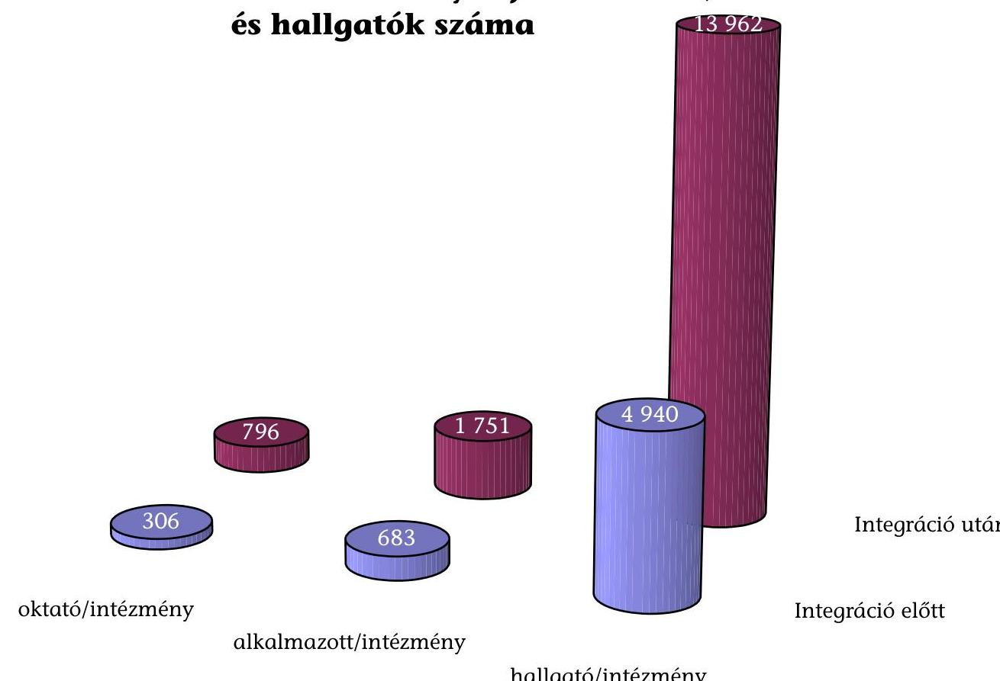

---

2. diagram a V-12-130/2002-2003. sz-hoz

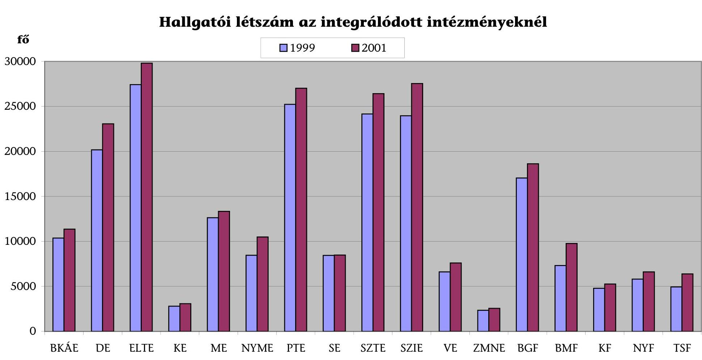

---

# Az összes hallgatói létszám képzési formák szerint, 1999. 

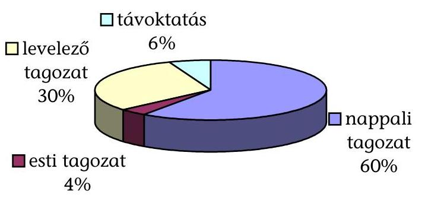
4. diagram
a V-12-130/2002-2003. sz-hoz

## Az összes hallgatói létszám képzési formák szerint, 2001.

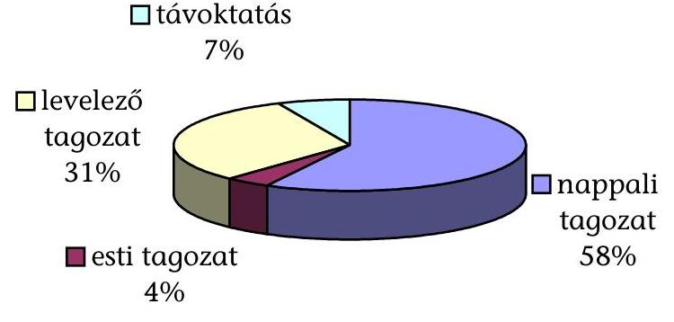

---

5. diagram a V-12-130/2002-2003. sz-hoz

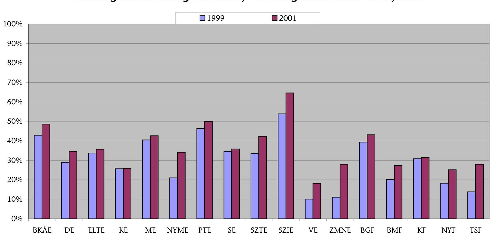

---

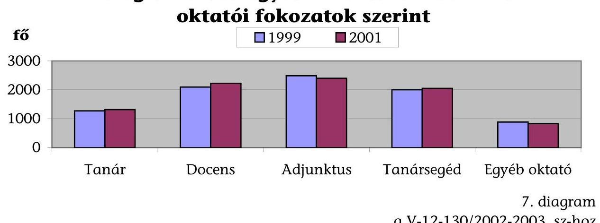

Főfoglalkozású főiskolai oktatók létszáma oktatói fokozatok szerint
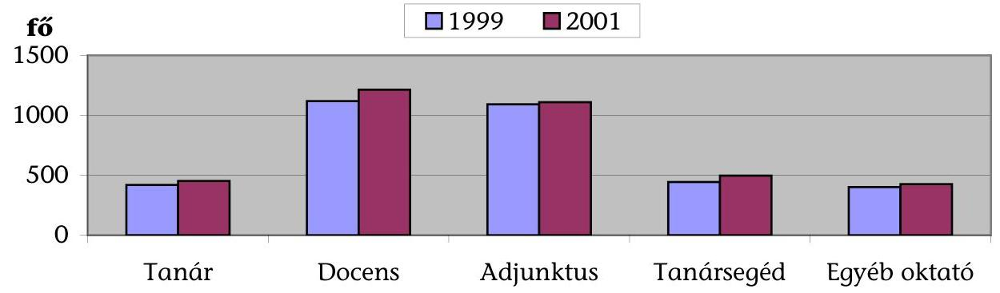
8. diagram
a V-12-130/2002-2003. sz-hoz
fő

# Közalkamazotti állománvi létszám alakulása 

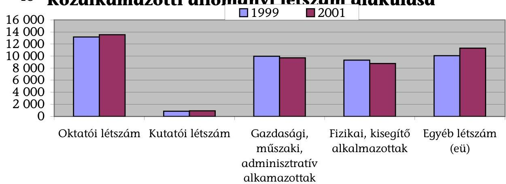

---

# Költségvetési bevételek és kiadások alakulása 1999. és 2001. évben 

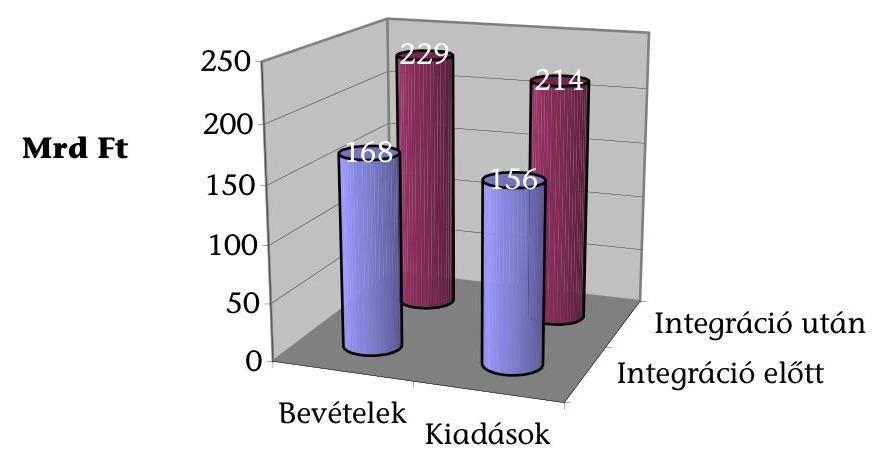
10. diagram
a V-12-130/2002-2003. sz-hoz

## Egy intézményre jutó költségvetési bevételek és kiadások 1999. és 2001. évben

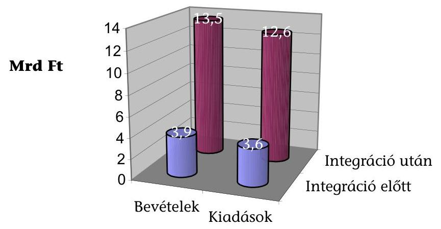

---

# Eszközök és források alakulása 

1999. és 2001. évben
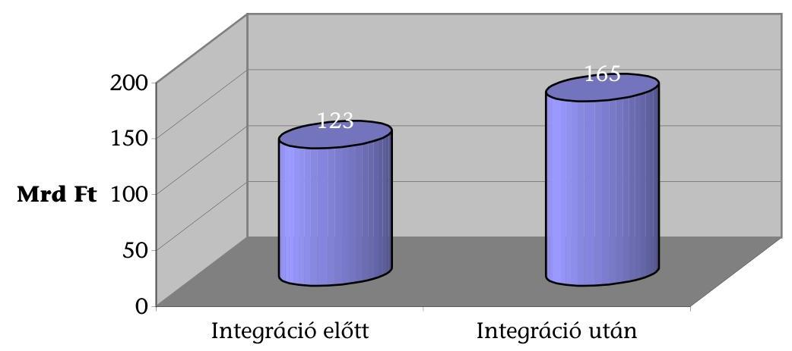
12. diagram
a V-12-130/2002-2003. sz-hoz

## Egy intézményre jutó eszközök és források 1999. és 2001. évben

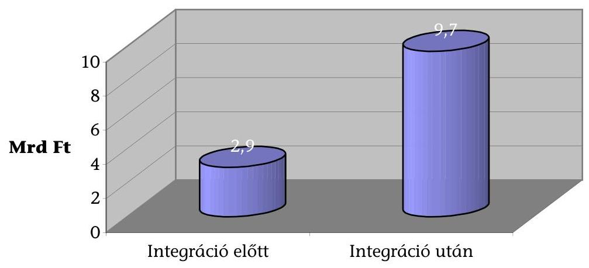

---

# FÜGGELÉK 

a V-12-130/2002-2003. sz. jelentéshez
a felsőoktatási intézményhálózat integrációjának ellenőrzése során a helyszíni ellenőrzésbe
vont 12 felsőoktatás intézményről készített számvevői jelentések kivonatai

---

# BUDAPESTI KÖZGAZDASÁGTUDOMÁNYI ÉS ÁLLAMIGAZGATÁSI EGYETEM 

A Budapesti Közgazdaságtudományi és Államigazgatási Egyetem (BKÁE) 2000. január 1-jén a Budapesti Közgazdaságtudományi Egyetem (BKE) és az Államigazgatási Főiskola (ÁF) integrációjával jött létre.

Az integrálódott egyetem nevét Budapesti Közgazdaságtudományi és Államigazgatási Egyetem, valamint a jogutód intézmény kari struktúráját, a jogelőd intézmények egyetértése fogadta. Az új intézmény három egyetemi- és egy főiskolai karral kezdte meg múködését (Gazdálkodástudományi-, Közgazdaságtu-dományi- és Társadalomtudományi Kar, Államigazgatási Főiskolai Kar).

Az Államigazgatási Főiskolai Kar a BKÁE érintett karaival közösen kidolgozta az egyetemi szintű „Közigazgatász" szak alapításának és indításának feltételeit. A képzést a 2003/2004 tanévtől vezetik be. A képzésben jelentős szerephez jutnak a fakultatív, az idegen nyelvű tantárgyak, az EU ismeretek.

Az eltérő képzési szint (egyetemi-főiskolai) miatt nem volt jellemző a párhuzamosság, ezért az oktatási szervezeti egységek összevonásában, átalakításában az integráció hatása kevésbé érvényesült. A MAB megállapítása szerint az Egyetem mind az alapképzésben (egyetemi, főiskolai szintű szakokon), a szakirányú képzésben, mind a tudományos képzésben magas színvonalú képzést folytat.

A BKÁE akkreditációjának határideje 2002. június 30. volt. A MAB állásfoglalása alapján nem felel meg a hatályos felsőoktatási törvény 3. §-ának, ugyanis bár két tudományterületen (társadalom- és múszaki tudományok) folytat alapképzést, de a múszaki tudományterületen egyetlen alapképzési szakja van (rendszerinformatika), továbbá doktori képzés csak egy tudományterületen folyik. (Az egyetem szakmai fejlesztési tervei szerint az oktatott tudományágak bővítését egy Környezettudományi Kar és középtávon az Informatikai Kar létrehozásával kívánják elérni, de keresik a megoldás további lehetőségeit is.)

Az Államigazgatási Főiskola és a Budapesti Közgazdaságtudományi Egyetem integrációjának előkészítése, végrehajtása a felsőoktatási intézményhálózat átalakításáról szóló törvényben meghatározott intézményi feladatok és határidők tekintetében szabályszerűen és határidőre megtörtént.

A BKE elődintézményt jelentős mértékű külső tartozás és belső hiány terhelte. Az adósságállomány kezelésére, felszámolására, a likviditás helyreállítására, az oktatási feltételek biztosítása érdekében 2000. márciusában konszolidációs programot készítettek. A program következetes végrehajtásával sikerült a külső eladósodást felszámolni, a pénzügyi likviditást stabillá tenni.

A képzési struktúra fejlesztésével, átalakításával létrehoztak, illetve átalakítottak számos szervezeti egységet. A tervezett, illetve végrehajtott szervezeti, tan

---

tervi átalakítások, az integrációval csak kisebb részben hozhatók összefüggésbe, de az elindult folyamatok realizálását felgyorsították.

A tantervi struktúra teljes átalakítását hosszabb távú folyamatként tervezik. A folyamat első szakasza a 2002/2003 tanévtől az új tantervi struktúra bevezetése, amely egységes elvekre épül a képzési irányokat az eddiginél ugyan jobban figyelembe vevő, de változatlanul elkülönülő közgazdasági és társadalomtudományi alapképzés keretében valósul meg.

Az integráció után szabályozták a karok közötti együttműködést, a tanszéki együttműködés szervezett formáinak kialakítása folyamatban van. Az azonos profilú kutatási szervezeti egységek összeolvadása nem történt meg. Az integráció nyomán nem alakult ki más intézményekkel szervezett kutatási együttmúködés. A kutatási témákban a jogelőd intézmények közösen is részt vesznek, indítottak közös kutatási-fejlesztési projekteket.

Létrejöttek hallgatókat segítő szervezetek. Működik a Karrier Iroda. Az iroda segítséget nyújt a hallgatóknak az álláslehetőségek felkutatásában, a sikeres életpályán való elindulásban, felkészíti őket a munkaerőpiacon való megjelenésre.

Az egyetem menedzsmentjének professzionalizálódása érdekében új irányítási formát vezettek be. A két eddig is működő főigazgató mellett hat ún. funkcionális igazgatóságot hoztak létre az oktatás az adminisztratív ügyek, a humánpolitika, az informatika, a kommunikáció, a nemzetközi kapcsolatok területén, melyet sajátos mátrix szervezetet alkotnak a karok vezetésével.

Az egyetem egységes főigazgatói irányítású gazdasági szervezettel, Gazdasági és Műszaki Főigazgatóság rendelkezik. A decentralizált gazdálkodást részletesen szabályozták, meghatározták a gazdálkodási egységeket.

A BKE elődintézményben az 1996/1997-es tanévben került bevezetésre a kredit rendszerú képzés. A főiskolai karon a jogszabály módosítás adta lehetőséggel élve a kredit rendszer bevezetését a 2003/2004 tanévre halasztották.

A hallgatók áthallgatása a főiskolai kar és az egyetemi kar között, az eltérő rendszer (az egyetemi karokon ún. idősávokban, míg a főiskolai karon a hagyományos óra szerint oktatnak) miatt még nem megoldott. A közös szakok indításával, a kredit rendszer egységessé válásával lesz megvalósítható a hallgatók szabadabb tantárgyi választása.

A hallgatói létszám összetétel változás a vizsgált időszakban kis mértékű volt és a változás nem hozható összefüggésbe az integrációval. A költségtérítéses képzésben részt vevő hallgatók száma emelkedett, a hallgatói létszámnövekedés meghatározó mértékben a főiskolai karon jelentkezett. Nőtt a sikeres záróvizsgát tett hallgatók létszáma. A hallgatói mobilitás a főiskolai és az egyetemi karok között nem kimutatható, az egyetemi karok között nőtt. A hallgatói külföldi szakmai gyakorlatok száma változatlan, nőtt a részvételi lehetőség a részképzésben, az ösztöndíjas képzésben.

---

A hallgatók értesültek a törvényi döntés előtt az integrációról, de véleményt hivatalosan csak a végrehajtás során volt alkalmuk nyilvánítani. A hallgatók indokoltnak tartják az integráció felgyorsítását, a tanulmányi integrációt, bővítenék az egyetemi szintű, speciális ismereteket nyújtó részképzést, szeretnének szabadabb tantárgyválasztást és áthallgatást, fontosnak tartják az informatikai fejlesztést, a számítógép-park minőségi cseréjét, javítanák a kollégiumi ellátottságot.

Az egyetemi feladatoknak megfelelően változott az oktatói létszám, a létszám összetétele. Változott az óraadók, számlaadók, megbízásos jogviszonyban foglalkoztatott oktatók aránya. Az oktatói óraterhelés belső szabályozását az egységes oktatói, kutatói követelményrendszerről szóló szabályzat tartalmazza. Az oktatók óraszáma a hallgatói létszámbővülés miatt nőtt, az óraszám növekedés nem függ össze az integrációval.

A karok kidolgozták a kutatásfejlesztési tervet, aminek összehangolása és jóváhagyása intézményi szinten megtörtént. Az integráció nyomán nem alakult ki más intézményekkel szervezett kutatási együttmúködés. A Pályázati Iroda segíti a kutatási programok hazai és nemzetközi pályázatainak elnyerését.

A központosított gazdálkodás-irányítási rend kialakításának hatására csökkent a gazdasági területen foglalkoztatottak száma. A vizsgálat időszakában az egyetem létszáma 97 fővel, ebből oktatói/kutatói létszám 48 fővel, a nem oktatói létszám 49 fővel csökkent. Az oktatói/kutatói és a nem oktatói arány lényegében nem változott. A létszámcsökkentések az integrációval és a gazdasági stabilizációs programmal hozhatók összefüggésbe.

Az oktatási és kutatási célú tárgyi eszközök karok közötti összevont kezelésére és hasznosítására az integráció folyamatában terv szinten sem került sor. Az együttműködés egyes szervezeti egységek között meghatározott témákban, projektekben való közös részvétel esetén, nem szabályozottan, de megtalálható. Az oktatási, a diákjóléti és szociális helyiségeket nem múködtetik közösen, de a szabad kapacitások kihasználására a hasznosításukat, eseti és tartós bérbeadásukat egységes elvek és szabályok alapján végzik.

Az Intézményi Beruházási Tervet a helyszíni ellenőrzés ideje alatt készítették. A beruházási terveik fókuszában az egyházi ingatlanok átadása miatt elveszített területek visszapótlása, valamint azzal összhangban az ingatlanállomány racionalizálása áll.

A beruházások, a fejlesztések megvalósítása csak központi források bevonásával realizálható. A felsőoktatás fejlesztését szolgáló világbanki hitelből, vagy más, az intézményhálózat átalakítását támogató beruházási forrásokból az egyetem nem részesült.

Az integrációval kapcsolatban nem mutatható ki jelentős változás az anyagi és személyi feltételek javulásában. Az egyházi ingatlanok visszaadása miatt romlottak az oktatás tárgyi feltételei.

---

# Fontosabb intézményi adatok

|  Megnevezés | Integráció előtti adatok 1999. október 15. | Integráció utáni adatok 2001. október 15. | $\begin{gathered} \text { Index } \ 2001 / 1999 . \ \text { év } \ \text { (\%-ban) } \end{gathered}$  |
| --- | --- | --- | --- |
|  I. Szervezeti adatok |  |  |   |
|  1.) Karok száma | 5 | 4 | 80  |
|  ebből: főiskolai | 1 | 1 | 100  |
|  egyetemi | 4 | 3 | 75  |
|  2.) Oktatott szakok száma | 44 | 48 | 109  |
|  3.) Oktatási szervezeti egységek száma (tanszékek, intézetek, stb.) | 62 | 58 | 94  |
|  II. Emberi erőforrások (fő) |  |  |   |
|  1.) Főfoglalkozású oktatók száma | 512 | 449 | 88  |
|  ebből: tanár | 85 | 84 | 99  |
|  docens | 164 | 143 | 87  |
|  adjunktus | 171 | 130 | 76  |
|  tanársegéd | 62 | 49 | 79  |
|  egyéb oktató | 31 | 43 | 139  |
|  2.) Minősített oktatók száma | 215 | 203 | 95  |
|  3.) Minősített oktatók aránya (2:1) (\%) | 42 | 45 | 108  |
|  4.) Intézményi alkalmazottak száma (dec. 31-i adat) | 1073 | 976 | 91  |
|  5.) Összes hallgatói létszám | 10366 | 11350 | 109  |
|  ebből: államilag finanszírozott hallgató | 5916 | 5833 | 99  |
|  költségtérítéses hallgató | 4450 | 5517 | 124  |
|  6.) Hallgatói létszámadatok képzési szintek szerint |  |  |   |
|  a.) akkreditált felsőfokú szakképzés |  |  |   |
|  b.) főiskolai alapképzés | 3056 | 3350 | 110  |
|  ebből: nappali | 1083 | 1259 | 116  |
|  esti | 445 | 544 | 122  |
|  levelező | 1528 | 1547 | 101  |
|  c.) egyetemi alapképzés | 4999 | 5715 | 114  |
|  ebből: nappali | 4277 | 5120 | 120  |
|  esti | 722 | 575 | 80  |
|  levelező |  | 20 | 0  |
|  d.) doktorandusz képzés | 201 | 198 | 99  |
|  e.) szakirányú továbbképzés | 2110 | 2087 | 99  |
|  7.) Összes felvett hallgató (I. évfolyam) | 3273 | 3612 | 110  |
|  8.) Sikeres záróvizsgát tett hallgató | 2045 | 2423 | 118  |
|  9.) Doktori programok, iskolák száma | 4 | 5 |   |
|  III. Anyagi erőforrások (éves adatok, eFt-ban) |  |  |   |
|  1.) Költségvetési bevételek összesen | 7208246 | 8013471 | 129  |
|  ebből: |  |  |   |
|  a.) intézményi múködési bevételek | 1541206 | 1992850 | 129  |
|  ezen belül: költségtérítéses oktatás bevételei | 507441 | 1444366 | 285  |
|  b.) állami támogatás | 3605538 | 3300784 | 92  |
|  ezen belül: OEP-től átvett pénzeszközök |  |  |   |
|  2.) Költségvetési kiadások összesen | 4710505 | 7106178 | 151  |
|  ebből: múködési kiadások | 4071327 | 5191246 | 128  |
|  ezen belül: gyógyító-megelőző ellátás költségei |  |  |   |
|  3.) Intézményi eszközök összesen | 4522485 | 4878020 | 108  |

[^0] [^0]: * A szakindítási engedéllyel rendelkező szakirányú továbbképzési szakokat is tartalmazzák

---

# DEBRECENI EGYETEM 

Debrecenben a '80-as években, az országos kormányprogramot megelőzve, megindultak az egyeztetések a széttagolt felsőoktatás újraegyesítéséről. Az egységes Debreceni Egyetem megalakulását előkészítő folyamat szakaszai:

- (1991-96) a Debreceni Universitas Egyesülés (DUE)
- (1996-98) intézményközi operatív bizottság létrehozása, amely elkészíti az integrálódó intézmények közös Intézmény Fejlesztési Tervét és Beruházási Programját
- (1998-2000) Debreceni Egyetemi Szövetség (DESZ).

A felsőoktatási intézményhálózat átalakításáról rendelkező 1999. évi LII. törvény végrehajtásának eredményeként Debrecenben négy jogelőd intézmény (a Debreceni Orvostudományi Egyetem, a Debreceni Agrártudományi Egyetem kivéve az attól különváló hódmezővásárhelyi Mezőgazdasági Főiskolai Kart és a szarvasi Mezőgazdasági Víz- és Környezetgazdálkodási Főiskolai Kart - a Kossuth Lajos Tudományegyetem valamint a Hajdúböszörményi Wargha István Pedagógiai Főiskola) integrálódásával létrejött a Debreceni Egyetem. Az új intézmény Hajdú-Bihar Megye valamennyi állami felsőoktatási intézményét magába foglalva, öt egyetemi és három főiskolai karral kezdte meg múködését. A korábban DUE és DESZ tag két egyházi fenntartású debreceni felsőoktatási intézmény az integrálódott egyetem együttmúködő partnere maradt.

Az egyetemen az integrációs szervezeti célok végrehajtása, a szervezeti erőforrások egyesítése az integrációs célokat megfogalmazó jogi és belső intézményi szabályozással összhangban halad.

A szervezeti egységek átalakítása, egyesítése célszerűen és szabályszerűen történt a vizsgált időszakban, eredményességük azonban - területenként - eltérő.

- Legdinamikusabban az intézményi múködést biztosító gazdasági-, tanul-mányi- és oktatásszervezési, valamint az infrastrukturális szervezeti egységek összevonása, átalakítása történt meg. Gyors - az egyetemi integrációt megelőző - tempóban haladt a Hallgatói Önkormányzatok és szervezeteik, programjaik egyesítése.
- Az oktatás-képzés területén is intézkedések történtek az integráció irányába, de itt a folyamat még nem befejezett az infrastrukturális feltételek hiánya miatt (pl. az alaptárgyak közös oktatása területén).
- Leglassabban a K+F szervezeti egységek átalakulása (létrehozása) halad, de itt is vannak az egyesítés felé mutató változások.

Az intézményi feladatoknak és a belső szabályozásnak megfelelően kialakult az egységes intézményi múködési rendszer.

---

- A tanulmányi és oktatási területen bevezették az egységes hallgatói tanulmányi rendszert, elkészült az egységes tanulmányi- és vizsgaszabályzat és az egyetem felkészült a kredit szabályozás bevezetésére (két kar kivételével a rendszer a 2002/2003. tanév kezdetétől múködik). Az oktatási programok összehangolása és a felvételi szabályzat egységesítése még nem valósult meg.
- Számos lépést tett az egyetem az egységes intézményi arculat megteremtése érdekében, de az intézmény megjelenése még nem nevezhető egységesnek.

Az intézményi és kari szintű képzés kínálata és színvonala találkozik a társadalom és hallgatók igényével.

- A képzés szerkezete és a hallgatói létszám változása a korszerű, a társadalom igényeit kiszolgáló és versenyképes tudományágak és képzési területek felé tolódott el.
- A hallgatói létszám (felvételi irányszám) minden évben és minden tudományterületen alatta maradt a hallgatók igényéhez képest (a 2001. évi 4szeres jelentkezési arány 2002-ben 4,6-szeresre nőtt az emelt irányszámok mellett).
- A hallgatói létszám változásának ütemét nem követte arányosan az oktatást kiszolgáló infrastruktúra bővülése, az ebből adódó zsúfoltság rontja a képzés színvonalát.

Az integrációt követően nőtt a hallgatói mobilitás, a képzés kielégíti a piaci igényeket. Az integráció hatására javultak a költségvetési pénzeszközök felhasználásával összefüggő intézményi és kari szintű hallgatói hatékonysági mutatók.

Az integrációt követően változott a hallgatói juttatások intézményi szabályozása, szerkezete, melynek eredményeként a hallgatói juttatások 2001/1999. évek viszonylatában több mint nyolcszorosára emelkedtek. A kollégiumi ellátottság területén javulás volt tapasztalható.

Az oktatói kar létszáma és összetétele az intézmény feladataival összhangban változott:

- A 2000. január 1-je után kialakított oktatói követelményrendszer megfelelően tükrözi az egységesítés oktatókra vonatkozó követelményeit; az oktatók minősítésük szerint megfelelnek a követelményeknek.
- Az oktatói kar létszámának növekedése (8 \%) alatta marad a hallgatói létszám bővülésének (12 \%), így az oktatói hatékonysági mutatók emelkedtek az integrációt követően (egy oktatóra jutó hallgatók száma, oktatói óraterhelés).
- Az oktatói kar összetétele minőségi javulást mutat, nőtt a minősített oktatók száma és aránya.

Az intézményi kutatás-fejlesztési tevékenység átalakítása - az integráció egyéb területeihez viszonyítva - lassabban halad.

---

- Az átalakított intézményben a kutató-fejlesztő helyek száma és a kutatói létszám egyaránt növekedett.
- Az azonos profilú kutatási szervezeti egységek összeolvadása, a kutatási kapacitások egyesítése (a tanszékeken, intézetekben) még nem történt meg az integráció óta eltelt időszakban. Az erőszakos központi beavatkozások helyett az egyetem igyekezett érdekeltté tenni az érintett egységeit a szorosabb együttmúködésben, a tartalmi integrációs folyamatok erősítésében. Ezen elv alapján a kutatási erőforrások egyesítésének folyamata elindult, szervezeti kereteit jelenleg a koordinációs központok jelentik.
- A kutatási tervek intézményen belüli célszerű összehangolása megtörtént, a jogelőd intézmények kutatói közös kutatásokban is részt vesznek.
- A tudományos- kutatási pályáztok egyetemi szintű koordinálása következményeként javult a hazai és a nemzetközi kutatási projektekben való részvételi arány, a kutatások hatékonysága; nőtt a pályázott és elnyert támogatások összege.

Az intézményben a vagyoni elemek egyesítési folyamata lezárult. Az intézményi eszközök és források változásában legjelentősebb a beruházási program célkitűzéseinek realizálódása, melyek az integráció tartalmi megvalósulásának infrastrukturális feltételrendszerét teremtik meg.

Az egyetem nem múködteti összevont hasznosításban az oktatási, kutatási és diákjóléti, szociális tárgyi eszközöket. Kimutatható a tantermek, előadótermek kihasználtságának növekedése összintézményi szinten, de ez nem az integráció, hanem a dinamikusan emelkedő hallgatói létszám eredménye.

Az egységes intézmény múködésével összefüggésben:

- A rendelkezésre álló múködési célú források nem biztosították az integrációs feladatok céloknak megfelelő, időbeni és teljes körű megvalósulását. Ezért az integráció finanszírozása jelentős feszültségeket okoz(ott) az intézmény gazdálkodásában. Az integráció következtében az egyesített múködés költségcsökkentő hatása a vizsgált időszakban még nem volt tetten érhető, sőt - az átalakítás költségei miatt - a fajlagos költségmutatók nőttek.
- Az intézmény rendelkezésére álló integrációs célú beruházási és egyéb források a strukturális céloknak megfelelően hasznosultak. A képzési kínálat változását megalapozó oktatási infrastrukturális fejlesztések azok felé a tudományágak és képzési területek felé irányulnak, melyek a társadalom (piacimegrendelői, regionális) igényeinek felelnek meg. A beruházások csak részben valósultak meg, ezért ezek hatékonyság javító hatása még nem számszerűsíthető.

A Debreceni Egyetem a felsőoktatási intézményhálózat átalakításáról szóló (1999. évi LII.) törvényben kitűzött hosszú távú célok elérése felé időarányosan halad, azok teljes körű megvalósítása az intézmény beruházási programjában tervezett valamennyi létesítmény átadását (várhatóan 2005.) követő egy-két éven belül várható.

---

# Fontosabb intézményi adatok

|  Megnevezés | Integráció
előtti adatok
1999. október
15. | Integráció
utáni adatok
2001. október
15. | Index
2001/1999.
év
(\%-ban)  |
| --- | --- | --- | --- |
|  I. Szervezeti adatok |  |  |   |
|  1.) Karok száma | 7 | 8 | 114  |
|  ebből: főiskolai | 3 | 3 | 100  |
|  egyetemi | 4 | 5 | 125  |
|  2.) Oktatott szakok száma | 149 | 168 | 113  |
|  3.) Oktatási szervezeti egységek száma (tanszékek, intézetek, |  |  |   |
|  stb.) | 187 | 230 | 123  |
|  II. Emberi erőforrások (fő) |  |  |   |
|  1.) Főfoglalkozású oktatók száma | 1370 | 1486 | 108  |
|  ebből: tanár | 169 | 187 | 111  |
|  docens | 341 | 362 | 106  |
|  adjunktus | 361 | 376 | 104  |
|  tanársegéd | 354 | 407 | 115  |
|  egyéb oktató | 145 | 154 | 106  |
|  2.) Minősített oktatók száma | 629 | 702 | 112  |
|  3.) Minősített oktatók aránya (2:1) (\%) | 46 | 47 | 102  |
|  4.) Intézményi alkalmazottak száma (dec. 31-i adat) | 6133 | 6443 | 105  |
|  5.) Összes hallgatói létszám | 20176 | 23062 | 114  |
|  ebből: államilag finanszírozott hallgató | 14330 | 15066 | 105  |
|  költségtérítéses hallgató | 5846 | 7996 | 137  |
|  6.) Hallgatói létszámadatok képzési szintek szerint |  |  |   |
|  a.) akkreditált felsőfokú szakképzés | 0 | 151 |   |
|  b.) főiskolai alapképzés | 6517 | 7470 | 115  |
|  ebből: nappali | 3434 | 3513 | 102  |
|  esti | 58 | 211 | 364  |
|  levelező | 3025 | 3746 | 124  |
|  c.) egyetemi alapképzés | 11863 | 13022 | 110  |
|  ebből: nappali | 9717 | 10499 | 108  |
|  esti | 0 | 0 |   |
|  levelező | 2146 | 2523 | 118  |
|  d.) doktorandusz képzés | 567 | 726 | 128  |
|  e.) szakirányú továbbképzés | 1229 | 1693 | 138  |
|  7.) Összes felvett hallgató (I. évfolyam) | 6419 | 7295 | 114  |
|  8.) Sikeres záróvizsgát tett hallgató | 3105 | 3778 | 122  |
|  9.) Doktori programok, iskolák száma | 30 | 20 |   |
|  III. Anyagi erőforrások (éves adatok, eFt-ban) |  |  |   |
|  1.) Költségvetési bevételek összesen | 27098085 | 34735063 | 128  |
|  ebből: |  |  |   |
|  a.) intézményi működési bevételek | 3006236 | 3779830 | 126  |
|  ezen belül: költségtérítéses oktatás bevételei | 1279382 | 1170786 | 92  |
|  b.) állami támogatás | 22365906 | 27907520 | 125  |
|  ezen belül: OEP-től átvett pénzeszközök | 9247265 | 11730613 | 127  |
|  2.) Költségvetési kiadások összesen | 25479107 | 32882872 | 129  |
|  ebből: müködési kiadások | 21401009 | 28586227 | 134  |
|  ezen belül: gyógyító-megelőző ellátás költségei | 10603854 | 14495730 | 137  |
|  3.) Intézményi eszközök összesen: | 16452287 | 22096741 | 134  |

---

# EÖTVÖS LORÁND TUDOMÁNYEGYETEM 

A felsőoktatási intézményhálózat átalakításról szóló 1999. évi LII tv. előírása szerint 2000. január 1-jén az Eötvös Loránd Tudományegyetemből, a Bárczi Gusztáv Gyógypedagógiai Tanárképző Főiskolából és a Budapesti Tanítóképző Főiskolából alakult meg a jogutód Eötvös Loránd Tudományegyetem. A két főiskola karként olvadt be az ELTE szervezetébe, amelynek így három egyetemi és három főiskolai kara lett. Az integrációval a pedagógusképzés teljes spektruma megjelent az egyetemen az óvóképzéstől a doktori képzésig. Ez egyben azt is jelentette, hogy új tudományág nem jelent meg az intézményben.

Konfliktust okozott az egyetem vezetése és a Bárczi Gusztáv Gyógypedagógia Főiskolai Kar között a kar intézeti formában történő további múködésének terve, amely a kari struktúra átalakításának a része volt. Az Egyetemi Tanács ezt a tervet nem támogatta, így a kar önállósága megmaradt.

Az intézményhálózat átalakításáról szóló törvény előírásait az egyetem betartotta. Az átmeneti szervezetek megalakultak és feladataikat szabályszerűen ellátták. Az ELTE a felsőoktatási törvény előírásainak eleget tett a minőségbiztosítási rendszer kialakításán kívül.

Az oktatás-képzés területén az intézményhálózat átalakítása - azon túl, hogy a két főiskolai kar hivatalosan az egyetemhez tartozik - lényegében semmi változást nem hozott. Az integráció után az oktatás-képzés területén inter- és multidiszciplináris szakok nem indultak. Az alaptantárgyak közös oktatása nem valósult meg és a tanszéki struktúrában sem történt változás. Az integráció tényét és hatását az egyetem vezető testületei az elmúlt két évben nem értékelték, az Egyetemi- és Kari Tanácsi üléséken kiválásról nem tárgyaltak.

Az ELTE elkészítette Intézményfejlesztési Tervét, amelyre az Oktatási Minisztérium feltételes „A" minősítést adott. Ebben megfogalmazták az intézmény középtávú elképzeléseivel együtt a belső integráció céljait is. A kari struktúra átalakítása után 6 egyetemi és 2 főiskola kar lesz a jövőben az egyetemen. A 2001/2002. tanévben az Egyetemi Tanács már döntött az Informatikai kar, a Társadalomtudományi Kar és a Pedagógiai és Pszichológiai Kar létrehozásáról és a Tanárképző Főiskolai Kar megszüntetéséről. A kari szerkezet átalakítási folyamata még nem zárult le.

A szervezeti struktúra átalakításában érezhető változás a gazdasági területen volt tapasztalható, amelynek során 6-6 fő átcsoportosításával 2001. évtől a teljes pénzügyi és számviteli adatfeldolgozás központosításra került.

Az egyetemen tanuló összes hallgatók létszáma az integráció előtti 27.422 főről 29.794 főre, 8,6 \%-kal és 2.372 hallgatóval emelkedett. A jelentkezett hallgatók számának növekedése meghaladta a keretszám bővülését. Képzési formák szerint megállapítható, hogy a nappali és a levelező képzésben nőtt a túljelentkezés mértéke, viszont az esti tagozaton csökkent. A hallgatói hatékonysági mu

---

tatók intézményi szinten javultak, de ez nem az integráció következménye, hanem a felsőoktatás fejlesztés céljainak és a költségtérítéses képzés előtérbe kerülésének az eredménye. A fajlagos mutatók megítélése alapján a Bárczi Gusztáv Gyógypedagógiai Főiskolai Kar (GYFK) mutatói lényegesen lecsökkentek az integrációt követően, így ők hátrányosabb helyzetbe kerültek a beolvadás következtében.

Az intézmény-átalakítás az áthallgatás területén nem hozott változást, a hallgatói juttatások szerkezete sem változott. Bár az integrációval kapcsolatos hallgatói elképzelések még nem valósultak meg, az Egyetemi Hallgatói Önkormányzat véleménye szerint az integráció eredményesen halad.

A vizsgált két évben a kollégiumi elhelyezés romlott, mert amíg 1999. évben a kérelmezők $83 \%$-a, addig 2001. évben csak $75 \%$-a tudott kollégiumi elhelyezéshez jutni. Ezzel párhuzamosan számottevően, $77 \%$-kal emelkedett a lakhatási támogatásban részesülők száma, viszont az egy főre vetített lakhatási támogatás 59 ezer forintról 36 ezer forintra csökkent. Az integráció eredménye, hogy a Tanító- és Óvóképző Főiskolai Kar (TÓFK) hallgatói az intézményhálózat átalakítását követően kollégiumi elhelyezéshez juthattak, mert korábban a főiskolának nem volt kollégiuma.

Az oktatói tevékenység hatékonysága az integráció következtében nem változott. A főfoglalkozású oktatók száma jelentéktelen mértékben csökkent, az átoktatás területén nem mutatható ki változás. Az ELTE az oktatói béremelések előkészítése során szüntette meg azt a helytelen gyakorlatot, amely szerint a főmunkaviszony mellett egy vagy két kinevezést is kötöttek „főmunkaviszony melletti közalkalmazotti jogviszony" létesítésére az egyetemen belül. Ezeket a további munkavégzésekre irányuló többletfeladatokra fenti időponttól „Többletfeladat teljesítésének elrendelése" címen kötik a szerződést a munkavállalóval és az érte járó juttatás kereset-kiegészítésnek minősül.

Az 1 átlagos főfoglalkozású oktatóra eső heti órák száma minimálisan, 9,6 óráról 9,9 órára, mindössze 2,4 \%-kal emelkedett. Jelentős volt az eltérés azonban a karok közötti óraterhelések között.

A kutatás-fejlesztés területén az integráció nem hozott változást. A K+F létszám kismértékben csökkent, a kutatóhelyek száma és hálózata nem változott. Egyedül a kutatási aktivitás területén következett be jelentős változás, de ezt az állami pályázati források bővülése eredményezte és nem az integráció. Intézményi szintű kutatási terv az egyetemen nem készült.

A nem oktatói létszám csökkent az elmúlt két évben, az oktatók és nem oktatók aránya lényegében nem változott.

Az egyetem eszközeiben és forrásaiban 2001. évre számottevő változás következett be az 1999. évi decemberi adatokhoz képest. Erre az időszakra esik ugyanis a lágymányosi egyetemi beruházások lényeges hányadának megjelenése, és aktiválása a számviteli nyilvántartásokban. Ennek hatására az oktatási területek, a könyvtári területek igen kedvezően alakultak, a kollégiumok területe ellenben változatlan maradt. Megállapítható, hogy az eszközök és a források bővülése az integrációtól független tényező. Az eszközök bruttó értéke - a lágy

---

mányosi egyetemfejlesztés következtében - 25 Mrd Ft-ról 40 Mrd Ft-ra nőtt. Az emelkedés döntően az ingatlanok változásából adódott. Mindennek következménye, hogy az eszközök elhasználódási szintje és a tárgyi eszközök használhatósági szintje is $20 \%$-os mértékben javult.

Az egyetem az integráció működési és felhalmozási kiadásaira mindössze 7,2 M Ft támogatást kapott a felügyeleti szervtől, amelyet alapvetően szabályszerűen, a célnak megfelelően használt fel és 4,6 M Ft-ot saját forrásból biztosított beruházásra. A felsőoktatási integrációs célok megvalósítását támogató világbanki hitelből az ELTE nem részesült, ugyanakkor a több éve elhúzódott lágymányosi campus beruházása és átadása az integráció óta eltelt időszakra esett.

A két integrálódott főiskolai kar hátrányként élte meg az ELTE minden karára egységesen vonatkozó szabályok alkalmazását, így a $20 \%$-os központi bevételi elvonást, a képzési és fenntartási normatíva egységes alapokon történő felosztását és a karok közötti konszolidációt.

Az oktatási és kutatási célú tárgyi eszközök karok közötti összevont kezelése és így gazdaságosabb hasznosítása (p. párhuzamos tanszékek megszüntetése) az integráció következtében nem valósult meg az intézménynél, de bizonyos közös (egyetemi könyvtári, kollégiumi, sportlétesítményi stb.) hasznosítások történtek.

Egységes informatikai rendszer a tanulmányi nyilvántartást nem segíti. Egységes gazdálkodási informatikai rendszert az ELTE az integrációtól függetlenül, a kari decentralizált gazdálkodás figyelemmel kisérése érdekében alakított ki, amelyet bővített, és a két integrálódott kart bekapcsolta a rendszerbe.

Az ellenőrzés megállapította, hogy az intézményhálózat átalakítása az ELTE és a két főiskola egyesítése esetében nem az intézményi integráció elveiről szóló kormányhatározat szerinti modell volt, mert a beolvadt oktatási profilokkal korábban nem rendelkezett az egyetem. A törvényi változás a már korábban megindult belső szerkezeti változásokat indította el, illetve gyorsította fel az egyetemen belül. Az erőforrások egyesítése a törvényben meghatározott módon, szabályszerűen történt, de hatékony erőforrás egyesítés lényegében csak a pénzügyi-gazdasági területen valósult meg. Sem az oktatás, sem a kutatás területén változásokat nem hozott az integráció.

---

# Felsőoktatási intézmény: Eötvös Loránd Tudományegyetem

## Fontosabb intézményi adatok

|  Megnevezés | Integráció
előtti adatok
1999. október
15. | Integráció
utáni adatok
2001. október
15. | Index
2001/1999.
év
(\%-ban)  |
| --- | --- | --- | --- |
|  I. Szervezeti adatok |  |  |   |
|  1.) Karok száma | 6 | 6 | 100  |
|  ebből: főiskolai | 3 | 3 | 100  |
|  egyetemi | 3 | 3 | 100  |
|  2.) Oktatott szakok száma | 122 | 124 | 102  |
|  3.) Oktatási szervezeti egységek száma (tanszékek, intézetek, |  |  |   |
|  stb.) | 222 | 224 | 101  |
|  II. Emberi erőforrások (fő) |  |  |   |
|  1.) Főfoglalkozású oktatók száma | 1630 | 1598 | 98  |
|  ebből: tanár | 244 | 243 | 100  |
|  docens | 570 | 586 | 103  |
|  adjunktus | 422 | 410 | 97  |
|  tanársegéd | 257 | 214 | 83  |
|  egyéb oktató | 137 | 145 | 106  |
|  2.) Minősített oktatók száma | 854 | 848 | 99  |
|  3.) Minősített oktatók aránya (2:1) (\%) | 52 | 53 | 102  |
|  4.) Intézményi alkalmazottak száma (dec. 31-i adat) | 3721 | 3698 | 99  |
|  5.) Összes hallgatói létszám | 27422 | 29794 | 109  |
|  ebből: államilag finanszírozott hallgató | 18170 | 19143 | 105  |
|  költségtérítéses hallgató | 9252 | 10651 | 115  |
|  6.) Hallgatói létszámadatok képzési szintek szerint |  |  |   |
|  a.) akkreditált felsőfokú szakképzés | 0 | 0 |   |
|  b.) főiskolai alapképzés | 8266 | 8200 | 99  |
|  ebből: nappali | 5239 | 3817 | 73  |
|  esti | 1943 | 3339 | 172  |
|  levelező | 1084 | 1044 | 96  |
|  c.) egyetemi alapképzés | 16155 | 18537 | 115  |
|  ebből: nappali | 14338 | 15717 | 110  |
|  esti | 624 | 1422 | 228  |
|  levelező | 1193 | 1398 | 117  |
|  d.) doktorandusz képzés | 1726 | 1681 | 97  |
|  e.) szakirányú továbbképzés | 1275 | 1376 | 108  |
|  7.) Összes felvett hallgató (I. évfolyam) | 8889 | 9775 | 110  |
|  8.) Sikeres záróvizsgát tett hallgató | 4829 | 5386 | 112  |
|  9.) Doktori programok, iskolák száma | 17 | 17 |   |
|  III. Anyagi erőforrások (éves adatok, eFt-ban) |  |  |   |
|  1.) Költségvetési bevételek összesen | 14955030 | 23328861 | 156  |
|  ebből: |  |  |   |
|  a.) intézményi múködési bevételek | 2291946 | 2884403 | 126  |
|  ezen belül: költségtérítéses oktatás bevételei | 806503 | 1378302 | 171  |
|  b.) állami támogatás | 11281052 | 18711870 | 166  |
|  ezen belül: OEP-től átvett pénzeszközök |  |  |   |
|  2.) Költségvetési kiadások összesen | 14441835 | 22544720 | 156  |
|  ebből: múködési kiadások | 12296355 | 15035517 | 122  |
|  ezen belül: gyógyító-megelőző ellátás költségei |  |  |   |
|  3.) Intézményi eszközök összesen: | 25009765 | 40094221 | 160  |

---

# MISKOLCI EGYETEM 

Az egyetem Nehézipari Műszaki Egyetemként Bánya-, Kohó-, és Gépészmérnöki Karral múködött több mint három évtizedig.

A mai kor követelményeinek megfelelően átalakuló műszaki fakultások mellett az elmúlt két évtizedben megjelentek a társadalomtudományok is.

A felsőoktatási intézményhálózat átalakításáról szóló 1999. évi LII. törvényben rögzítettek szerint 2000. évtől az egyetem részévé vált a sárospataki Comenius Tanítóképző Főiskola (CTFK) 830 hallgatóval, ugyanakkor kivált a Dunaújvárosi Főiskola.

A Miskolci Egyetem (ME) az alapképzés keretében egyetemi szinten bölcsész, jogász, közgazdász és műszaki szakemberek, főiskolai szinten bölcsész, közgazdász, műszaki szakemberek, általános iskolai tanítók, óvodapedagógusok, zenepedagógusok, valamint zenekari tagok képzését biztosítja. A költségtérítéses képzésben résztvevők aránya meghatározó az egyetemen, mértéke 2001. évben $43 \%$ volt az 1999. évi $40 \%$-kal szemben.

Miskolc városában a korábbi évek során megvalósult az állami felsőoktatási intézmények teljes körű integrációja, majd az integrációs törvény hatályba lépését követően a regionális integráció is. Az integráció szabályszerűen ment végbe a határidők betartásával, 2000. január 1-jei hatállyal. Az új egyesített intézmény megfelelt a felsőoktatási akkreditációs és minőségbiztosítási előírásoknak. Az egyetemen 2001. évben bevezették a minőségbiztosítási rendszert.

Az oktatás-képzés területén szervezeti átrendeződés a sárospataki kar integrálódásán túl nem volt, a karokon belül a tanszéki struktúra nem alakult át. Ennek oka, hogy a sárospataki főiskolai kar képzési profilja különbözik az egyetem képzési profiljától, ezen kívül több mint 80 kilométeres távolság is elválasztja a két helyszínt. Az integráció nyomán az egyetem képzési kínálata szélesedett, új alapképzési szakok - óvodapedagógus, tanítóképzés - jelentek meg. A doktori iskolák képzéseire az integráció nem volt hatással.

A régió és az egyetem között szoros és megfelelő együttműködés alakult ki, így az egyetem már a régió tudásközpontja. Az egyetem részt vesz a Regionális Fejlesztési Tanács munkájában, a regionális fejlesztési tervek, stratégiák elkészítésében, EU-harmonizációs feladatok ellátásában. A kutatások terén jelentős lépés volt a miskolci székhelyű Alkalmazott Kémiai Kutató Intézet integrálása. Az Intézet az egyetem leválasztott finanszírozású, piacorientált egységeként végezte kutatási feladatait, oktatási célokra is hasznosítva azokat. Az egyetemen belül múködik még a Mechatronikai és Anyagtudományi Kooperációs Kutatási Központ, mely az egyetem és 36 társaság anyagi hozzájárulásával jött létre kutatások közös végzésére, finanszírozására.

---

A regionális fejlesztési programokban az egyetem aktívan részt vesz. Az EU Phare Regionális Kísérleti Alapból 2000. év folyamán 85 M Ft-os összeget nyertek el a tanszékek távoktatási hálózatának fejlesztésére, posztgraduális képzések indítására, az oktatás infrastrukturális feltételeinek fejlesztésére.

A Miskolci Egyetem rendelkezik aktualizált Intézményfejlesztési Tervvel és ezzel összhangban elkészített Beruházási Tervvel, amely a szükséges épületberuházásokat, eszköz- és infrastruktúra-fejlesztéseket foglalja össze, részletes megvalósítási tanulmányokkal is alátámasztva a beruházások szükségességét. A Beruházási Tervet az Oktatási Minisztérium által létrehozott bírálóbizottság 1999-ben elfogadta és a feladatok megvalósítására 2000. március 2-án megkötött szerződésben 6,76 Mrd Ft összeget hagyott jóvá.

Az intézmény múködését biztosító szervezeti egységek összevonása, átalakítása, ahol ez célszerű volt megtörtént. A működtetést, karbantartást végzők összevonására a jelentős távolság miatt nem került sor. Az integráció következtében az egyetem működési rendszerében alapvető változás nem következett be, új szervezeti megoldásokat nem vezettek be. A kari szabályzatok összhangját megteremtették az egyetem Szervezeti és Működési, valamint Gazdálkodási Szabályzatával. Az egységes hallgatói tanulmányi nyilvántartási rendszer kialakításra került, a CTFK az egyetem által használt nyilvántartási rendszert vette át. Az oktatási rend átalakítására és az oktatási programok összehangolására nem volt szükség, mert mindkét helyen más jellegű képzések folynak. Az oktatási követelményrendszer és a vizsgarendszer egységessé vált, a Tanulmányi és vizsgaszabályzat az egyetem minden hallgatójának tanulmányi és vizsgarendjét, valamint a kreditrendszerű képzést egységesen szabályozza.

Az átoktatás működő gyakorlat az egyetemen. Ennek karok közötti szabályozása nem történt meg. Az áthallgatás rendjét kialakították és szabályozták. Több százan élnek már azzal a lehetőséggel, hogy az egyetemen belül, két diplomát szerezzenek. A párhuzamos képzés folytatásának feltételeiről a befogadó kar felvételi bizottsága dönt. A párhuzamos képzés csak költségtérítéses formában végezhető.

Az egyetemen Hallgatói Információs Tanácsadó és Karrier Központ múködik. Ez segíti a hallgatókat egyetemi tevékenységeikben és életútjuk elkezdésében.

Az intézmények integrálódása az emberi erőforrások egyesítésében a jelentős távolság miatt kevés változást eredményezett. Az oktatók óraterhelése ennek következtében nem változott. Utaztatásukra (6 fő) a két helyszín között van példa, de ez a gyakorlat az összeolvadást megelőzően is létezett. Az egy hallgatóra jutó oktató, illetve alkalmazott arányában változás nem történt. A hallgatói mobilitás, az áthallgatás lehetősége növekedett, Sárospatak integrálódásával lehetőség nyílt arra, hogy az egyetem keretein belül tanári és tanítói diplomát is lehessen szerezni. A kollégiumi ellátottság, valamint a hallgatói juttatások változatlanok maradtak az integráció hatására.

A CTFK kutatás-fejlesztési tevékenysége az egyeteméhez viszonyítva nem jelentős, az egyesülés következtében a kutató-fejlesztő helyek számában változás nem következett be. A ME számára a tanítóképző integrálása a kutatás terüle

---

tén változást nem hozott. A gazdálkodás és irányítás területén létszám megtakarítás nem történt, csak feladat átcsoportosítás.

A vagyoni elemek egyesítésének folyamata végbement, lezáratlan vagyonegyesítési kérdések nem maradtak. A meglévő épületállomány egységes rekonstrukciójának ütemtervét kidolgozták, jelentős beruházások folytak és folynak mindkét helyszínen. Sárospatakon átadásra került a felújított Oktatási Központ, megtörtént az új könyvtár épületének műszaki átadása, folyamatban van a tornaterem felújítása. Miskolcon felújításra került az Egészségtudományi Intézet épülete, az Egyetemváros területén egy tanulmányi épületszárny, egy kollégium, bővítésre és felújításra került a Továbbképzési és Távoktatási Központ. Átadásra került 2 db 300 fős előadóterem, 2 db 152 fős és 1 db 72 fős előadóterem, valamint a felújított aula előtér és főbejárat.

Az oktatási és kutatási célú tárgyi eszközök állományában nem történt változás az integráció következtében. Hasonló módon a diákjóléti és szociális épületek, helyiségek közös múködtetése sem kivitelezhető. A tantermek, előadótermek kihasználtsága az összeolvadás következtében nem változott. Az integrációt követően mindkét helyszínen egységes informatikai rendszerek múködnek, így a gazdálkodás területein is. A rendszerek egységesítésére kapott 4 millió forint felhasználása a részprogram engedélyezési okiratban meghatározott célokra történt.

Az irányítási-gazdasági apparátus elhelyezése megoldott, az egyetem a Gazdasági Főigazgatóság, a CTFK 9 fős Gazdasági Osztály útján látja el a centralizált, illetve decentralizált gazdálkodási feladatokat. Az integráció következtében az egyesített múködés nem eredményezett költségmegtakarítást, költségcsökkentést. Eszközök, épületek munkaerő nem szabadult fel, az egy hallgatóra jutó múködési költségek intézményi és kari szinten az egyesülés következményeként nem változtak. Az alkalmazotti létszám változatlan maradt, a gazdaságipénzügyi apparátus Sárospatakon továbbra is megmaradt, azonban munkájukban feladat átrendeződés történt.

Az ellenőrzés megállapította, hogy az egyetem a felsőoktatási intézményhálózat átalakításáról szóló 1999. évi LII. törvény végrehajtásával kapcsolatos intézményi feladatokat végrehajtotta a jogszabályban foglalt határidők figyelembevételével. A Sárospataki Tanítóképző Főiskola integrálódása az egyetem szervezetébe nem járt együtt a múködési költségek csökkenésével, az egyesülés hatására nem javult a kapacitáskihasználás az egyes intézményekben, nem lett gazdaságosabb az adminisztratív tevékenység és nem volt kihatása a K+F tevékenységre. Az átalakulási törvényben megfogalmazott célok - az intézményszerkezet átalakítását alapvetően a regionális kapcsolatok erősítése, a szellemi és anyagi erőforrások egyesítése, a felsőoktatási kutatás és oktatás fejlesztése, a versenyképes munkaerő képzése - a Miskolci Egyetemen megvalósultak, az átalakulási törvénytől függetlenül. Egy belső önfejlődési folyamat eredményeként az integrációs törvény nélkül is nagymértékű profilbővítést eredményeztek a korábbi integrációs lépések.

---

# Felsőoktatási intézmény: Miskolci Egyetem 

## Fontosabb intézményi adatok

| Megnevezés | Integráció   előtti adatok   1999. X. 15. | Integráció   utáni adatok   2001. X. 15. | Index   2001/1999. év   (\%-ban) |
| :--: | :--: | :--: | :--: |
| I. Szervezeti adatok |  |  |  |
| 1.) Karok száma | 8 | 7 | 88 |
| ebből: főiskolai | 2 | 1 | 50 |
| egyetemi | 6 | 6 | 100 |
| 2.) Oktatott szakok száma | 46 | 50 | 109 |
| 3.) Oktatási szervezeti egységek száma (tanszékek,   intézetek, stb.) | 99 | 106 | 107 |
| II. Emberi erőforrások (fő) |  |  |  |
| 1.) Főfoglalkozású oktatók száma | 656 | 683 | 104 |
| ebből: tanár | 72 | 65 | 90 |
| docens | 229 | 271 | 118 |
| adjunktus | 199 | 187 | 94 |
| tanársegéd | 120 | 137 | 114 |
| egyéb oktató | 36 | 23 | 64 |
| 2.) Minősített oktatók száma | 281 | 299 | 106 |
| 3.) Minősített oktatók aránya (2:1) (\%) | 43 | 44 | 102 |
| 4.) Intézményi alkalmazottak száma (dec. 31-i adat) | 1645 | 1669 | 101 |
| 5.) Összes hallgatói létszám | 12623 | 13337 | 106 |
| ebből: államilag finanszírozott hallgató | 7513 | 7653 | 102 |
| költségtérítéses hallgató | 5110 | 5684 | 111 |
| 6.) Hallgatói létszámadatok képzési szintek szerint |  |  |  |
| a.) akkreditált felsőfokú szakképzés | 0 | 0 |  |
| b.) főiskolai alapképzés | 3995 | 4037 | 101 |
| ebből: nappali | 1975 | 2003 | 101 |
| esti | 72 | 93 | 129 |
| levelező | 1948 | 1941 | 100 |
| c.) egyetemi alapképzés | 7819 | 8035 | 103 |
| ebből: nappali | 5665 | 5824 | 103 |
| esti | 0 | 0 |  |
| levelező | 2154 | 2211 | 103 |
| d.) doktorandusz képzés | 279 | 394 | 141 |
| e.) szukirányú továbbképzés | 530 | 871 | 164 |
| 7.) Összes felvett hallgató (l. évfolyam) | 3944 | 4235 | 107 |
| 8.) Sikeres záróvizsgát tett hallgató | 1963 | 2310 | 118 |
| 9.) Doktori programok, iskolák száma | 9 | 8 |  |
| III. Anyagi erőforrások (éves adatok eFt-ban) |  |  |  |
| 1.) Költségvetési bevételek összesen | 5868274 | 9839736 | 132 |
| ebből: |  |  |  |
| a.) intézményi múködési bevételek | 1181752 | 1484504 | 126 |
| ezen belül: költségtérítéses oktatás bevételei | 573029 | 757206 | 132 |
| b.) állami támogatás | 4189103 | 7825540 | 187 |
| ezen belül: OEP-től átvett pénzeszközök | 0 | 0 |  |
| 2.) Költségvetési kiadások összesen | 5634858 | 9507415 | 169 |
| ebből: múködési kiadások | 5279002 | 6589388 | 125 |
| ezen belül: gyógyító-megelőző ellátás költségei | 0 | 0 |  |
| 3.) Intézményi eszközök összesen | 2353017 | 5186067 | 220 |

---

# PÉCSI TUDOMÁNYEGYETEM 

A felsőoktatási intézményhálózat átalakításról szóló 1999. évi LII. törvényben (továbbiakban: Átv.) 1. § h) pontja 2000. január 1-jei hatállyal, az Illyés Gyula Pedagógiai Főiskola (Szekszárd), a Janus Pannonius Tudományegyetem (Pécs) és a Pécsi Orvostudományi Egyetem (Pécs) integrációját írta elő. A jogutód intézmény neve: Pécsi Tudományegyetem (PTE), székhelye: Pécs. Az átalakulást követően 9 kar: az Állam-és Jogtudományi Kar (ÁJK), az Általános Orvostudományi Kar (ÁOK), a Bölcsésztudományi Kar (BTK), az Egészségügyi Főiskolai Kar (EFK), az Illyés Gyula Főiskolai Kar (IGYFK), a Közgazdaságtudományi Kar (KTK), a Művészeti Kar (MK), a Pollack Mihály Műszaki Főiskolai Kar (PMMFK), a Természettudományi Kar (TTK), illetve 2 kari szintű képzési egység: a Tanárképző intézet (TKI), a Felnőttképzési és Emberi Erőforrás Fejlesztési Intézet (FEEFI) jött létre.

Az integrációval a PTE a régió legjelentősebb egyetemévé (Baranya, Somogy és Tolna megye) vált. A képzési helyek Pécsen kívül Kaposváron (két képzési hely), Szekszárdon, Szombathelyen, Zalaegerszegen találhatók. A PTE ingatlanainak száma: 94 db . A PTE képzési tevékenységi köre a bekövetkezett integráció következtében - az agrárágazat kivételével - lefedi a tudományterületek összességét.

A PTE integrációs célokat megjelenítő alapdokumentuma az Intézményfejlesztési Terv (IFT). Az Egyetem az IFT I. főfejezetében a törvényi szabályozással összhangban határozta meg a szervezet átalakítására vonatkozó pontos, konkrét célokat, a II. főfejezetben pedig az erőforrások egyesítését. Az IFT-hez kapcsolódva elkészültek a Kari Fejlesztési és Megvalósítási Tervek, melyek elfogadása megtörtént.

A PTE-en az intézményhálózat átalakítása során betartották a jogszabályi előírásokat. A jogutód intézmény 2001. január 1-jei hatállyal, szabályszerűen hajtotta végre az átalakulást. Az intézmény múködését biztosító gazdasági-, ta-nulmányi- és oktatás-szervezési-, valamint az infrastrukturális szervezeti egységek összevonása (jogi és szervezeti) értelemben megvalósult. Ez alól kivételt az ÁOK-n belül múködő külön beruházási szervezeti egység. Az intézmény szabályozottsága megfelelő szintű, de nem teljes körű.

Az integráció során az intézményben a belső kohéziós folyamatok nem alakultak ki. A „szolgáltató típusú" egyetem nem jött létre. Az integráció a szervezetben lévő párhuzamos feladatellátások (beruházás, felújítás, kollégiumi múködtetés) miatt célszerűségi szempontból sem teljes körű. Jelentős pénzügyi nehézséget képez a múködtetésben az orvosi karhoz kapcsolódó betegellátás.

Az oktatás-képzés területével kapcsolatos célkitűzéseket, és az elvégzendő feladatokat az IFT-ben megtervezték, azonban a PTE-en nem indultak meg a tan-tárgy-konszolidációs folyamatok. A karokon belül nem alakult át a tanszéki struktúra, nem szűntek meg a párhuzamos tanszékek, szervezeti egységek (pl.:

---

informatikaoktatás 5 helyen folyik). A karközi átoktatás „barter-rendszerü", az elszámolása bilaterális. A karok inkább a forrásokért versengenek, semmint együttmúködjenek, integrálódjanak. A piacképes szakok finanszírozták a piacképtelen szakokat. A szakportfolió nem tükrözi a piaci igényeket, a képzési kínálat nem illeszkedik a megváltozott igényekhez.

A kutatások egyetemi szintű gazdasági jellegű koordinációja Pályázati és Kutatási Iroda létrejöttével megvalósult, azonban általános kutatási integrációról nem beszélhetünk. A karok között ezen a területen is gyakran tapasztalható a pályázati forrásokért történő versengés. Az egyetem multidiszciplináris jellegében rejlő kutatási lehetőségek részben kiaknázottak. Ilyen területnek számit a fizika, a kémia, a biológia tudományok terén létrejött természettudományos együttműködések. A K+F tevékenység integrálására az alkalmazott kutatásfejlesztésben példaértékű, 2000. decemberében megalakított Dél-Dunántúli Kooperációs Kutatási Központ (továbbiakban: DD-KKK).

A PTE-en a vezetői döntések megalapozását kívánják elősegíteni a kialakított központi gazdasági információs rendszerrel (Teljes körű Ügyviteli Szoftver, TÜSZ). Legnagyobb hiányossága azonban a TÜSZ rendszernek, hogy még nem szolgáltat a Vezető Információs Rendszerekre (VIR) jellemző, az alapadatokból különböző szintű szintetizált adatokat. A már említett hiányosság miatt a kontrolling rendszer múködése sem hatékony, mert a TÜSZ nem támogatja a szintetizáló és különböző fejlesztéseket segítő „elemző jellegű" kontrollingot.
2001. májusában a PTE minden karán, mint referencia intézményben megindult az Egységes Tanulmányi Rendszer (továbbiakban: ETR) bevezetése, mely még nem múködik a kari igényeknek megfelelően.

Az integrációt követően a képzés kínálata - az oktatott szakok 71-ről 86-ra történő növekedésével - bővült. Az államilag finanszírozott hallgatói létszám stagnálása mellett $7 \%$-os volt a hallgatói létszámnövekedés. A növekedés elsősorban az egyetemi, doktori, valamint a szakirányú továbbképzésen következett be. A hatékonyság javulás a sikeres záróvizsgát tett hallgatók esetében nem érvényesült (1999: 5.662 fő, 2001: 4.510 fő). A kollégiumi férőhelyek száma 4.185 fơről 4.556 főre növekedett egyetemi szinten, a férőhely kihasználtság $100 \%$-os, de azokat a karokat hátrányosan érinti a férőhely ellátottság, melyeknél jelentősen megnőtt a hallgatói létszám.

Az integráció folyamán $10 \%$-kal nőtt a minősített oktatók száma, de arányuk az összoktatói létszámhoz képest nem változott.

Az 1999-ben működő 25A és 20B doktori programból a Magyar Akkreditációs Bizottság 2001. év során 15 doktori iskola akkreditációját fogadta el (az egyetemen 3 tudományterületen, 10 tudományágban, illetve 1 múvészeti területen, 1 művészeti ágban folyik doktori képzés). Az oktatók óraleterheltsége egyetemi szinten csökkent, vannak azonban karok (pl.: BTK, MK) ahol ez az érték növekedett.

A vagyoni elemek egyesítésének folyamata jogi és szabályozási értelemben lezáródott, ennek folyamán lezáratlan vagyoni egyesítési kérdések nem maradtak.

---

Az oktatási és kutatási célú tárgyi eszközök karok közötti összevont kezelése és gazdaságos hasznosítása nem valósult meg. Ezek közös kihasználását a karok önálló gazdálkodása nem segíti. Az egyesülés előtti eszközpark változatlan elhelyezkedése, valamint a tárgyi eszközök elhasználódási szintjének növekedése és használhatósági szintjének csökkenése nem biztosítják megfelelően az oktatási és kutatási feladatok ellátását.

A tantermek, előadótermek és egyéb oktatási helyiségek közös - karok közötti hasznosítását sem szabályozták, a jobb kihasználásra való törekvések az egyes karok között esetlegesek. A gazdálkodás területein az eszköz- és területellátottság fajlagos mutatóinak alakulását nem elemezték. Az oktatási területellátottság is az egyes karok épületadottságaitól függően eltérő mértékűek. A jobb te-rület-ellátottságú karok nem mondanak le a rosszabb ellátottságú karok számára, a kari elkülönülés itt is fennáll.

A rendelkezésre álló központi és saját működési források nem biztosították megfelelő időben és mértékben az integrációs célok megvalósítását. Ez feszültségeket okozott az Egyetem gazdálkodásában is. Az ÁOK 2002. októberi hiánya 1.081 M Ft. Az integráció hatására nem javultak a vizsgált időszakban (2001. december 31.) az 1999. évi bázishoz képest a fajlagos (egy hallgatóra jutó) múködési költségek egyetemi szinten. (682,09 e Ft/főről - 831,91 e Ft/főre növekedett). Azonban a bevételek növekedése (39,62 \%) követte a kiadások növekedését $(39,87 \%)$.

Az IFT-ben foglaltak alapján a PTE az állami költségvetésben nevesített, a felsőoktatás fejlesztését szolgáló világbanki hitelből nem részesült. Továbbá a PTE az intézményhálózat átalakítását támogató más fejezeti vagy más hazai, regionális fejlesztési beruházási forrásokhoz sem jutott hozzá. Ez alól kivételt képez a Phare-tükörprogram keretében kapott támogatás.

A PTE vezetése az IFT-ben foglaltak végrehajtásához, az intézményi bevételeken belül az OM által finanszírozott központi beruházási forrásokhoz minden esetben megfelelő összegű saját beruházási forrásokat rendelt. 1999-2002. október között a felhasznált központi támogatás összege: 2.696 M Ft , a saját erő: 676 M Ft.

Egyetemi szinten a kiemelt strukturális célú beruházások, melyek többségében több oktatási és egy diákjóléti ellátással kapcsolatos épület-felújításban, rekonstrukciókban realizálódott, a terveknek és az előirányzatok szerint valósult meg.

Az ellenőrzés megállapította, hogy a törvényalkotók Átv-ben megfogalmazott szándéka, mely szerint az integráció, az átalakítás alapvető céljaként és indokaként a szellemi erőforrások egyesítése, a nemzetközileg is elismert versenyképes munkaerő képzése, a felsőoktatási kutatás és oktatás fejlesztése, a regionális kapcsolatok erősödése a PTE-n nem következett be a helyszíni ellenőrzés lezárásáig. Azonban a PTE kialakított szervezeti rendszere megfelelő alap az Európai Unió országai felsőoktatási intézményi rendszeréhez való igazodáshoz. Ehhez következetes, tervszerű végrehajtás szükséges a PTE vezetése részéről.

---

# Felsőoktatási intézmény: Pécsi Tudományegyetem 

## Fontosabb intézményi adatok

| Megnevezés | Integráció előtti adatok 1999. október 15. | Integráció utáni adatok 2001. október 15. | $\begin{gathered} \text { Index } \\ 2001 / 1999 . \\ \text { év } \\ (\% \text {-ban) } \end{gathered}$ |
| :--: | :--: | :--: | :--: |
| I. Szervezeti adatok |  |  |  |
| 1.) Karok száma | 9 | 9 | 100 |
| ebből: főiskolai | 3 | 3 | 100 |
| egyetemi | 6 | 6 | 100 |
| 2.) Oktatott szakok száma | 71 | 86 | 121 |
| 3.) Oktatási szervezeti egységek száma (tanszékek, intézetek, stb.) | 158 | 123 | 78 |
| II. Emberi erőforrások (fő) |  |  |  |
| 1.) Főfoglalkozású oktatók száma | 1356 | 1483 | 109 |
| ebből: tanár | 165 | 178 | 108 |
| docens | 257 | 304 | 118 |
| adjunktus | 395 | 394 | 100 |
| tanársegéd | 298 | 359 | 120 |
| egyéb oktató | 241 | 248 | 103 |
| 2.) Minősített oktatók száma | 468 | 514 | 110 |
| 3.) Minősített oktatók aránya (2:1) (\%) | 35 | 35 | 100 |
| 4.) Intézményi alkalmazottak száma (dec. 31-i adat) | 5076 | 5683 | 112 |
| 5.) Összes hallgatói létszám | 25227 | 27013 | 107 |
| ebből: államilag finanszírozott hallgató | 13548 | 13536 | 100 |
| költségtérítéses hallgató | 11679 | 13477 | 115 |
| 6.) Hallgatói létszámadatok képzési szintek szerint |  |  |  |
| a.) akkreditált felsőfokú szakképzés | 0 | 308 | - |
| b.) főiskolai alapképzés | 10320 | 10177 | 99 |
| ebből: nappali | 4958 | 5022 | 101 |
| esti | 0 | 97 | - |
| levelező | 5362 | 5058 | 94 |
| c.) egyetemi alapképzés | 12492 | 13740 | 110 |
| ebből: nappali | 8091 | 8986 | 111 |
| esti | 0 | 0 | - |
| levelező | 4401 | 4754 | 108 |
| d.) doktorandusz képzés | 801 | 911 | 114 |
| e.) szakirányú továbbképzés | 1614 | 1877 | 116 |
| 7.) Összes felvett hallgató (I. évfolyam) | 7597 | 8466 | 111 |
| 8.) Sikeres záróvizsgát tett hallgató | 5662 | 4510 | 80 |
| 9.) Doktori programok, iskolák száma | * | 15 |  |
| III. Anyagi erőforrások (éves adatok, eft-ban) |  |  |  |
| 1.) Költségvetési bevételek összesen | 19069771 | 26625193 | 140 |
| ebből: |  |  |  |
| a.) intézményi múködési bevételek | 2752311 | 3490109 | 127 |
| ezen belül: költségtérítéses oktatás bevételei | 408187 | 2142629 | 525 |
| b.) állami támogatás | 15280517 | 21146217 | 138 |
| ezen belül: OEP-től átvett pénzeszközök | 6207999 | 8491413 | 137 |
| 2.) Költségvetési kiadások összesen | 18300504 | 25597320 | 140 |
| ebből: múködési kiadások | 16226059 | 22454472 | 138 |
| ezen belül: gyógyító-megelőző ellátás költségei | 6331855 | 9656161 | 153 |
| 3.) Az intézményi eszközök összesen | 15164603 | 17616760 | 116 |

[^0]
[^0]:    * Megjegyzés: 1999-ben a doktori programok száma $25 \mathrm{~A}, 20 \mathrm{~B}$

---

# SEMMELWEIS EGYETEM 

A Semmelweis Egyetem az 1999. évi LII. törvény alapján a Haynal Imre Egészségtudományi Egyetem, a Magyar Testnevelési Egyetem és a Semmelweis Orvostudományi Egyetem integrációjával 2000. január 1-jén jött létre.

Az egyetemet alkotó intézmények nagy múltú, nemzetközileg is elismert oktatási, kutatási és gyógyító tevékenységet folytattak már az integráció előtt is. Az intézmények minőségi szempontból igen, de a felsőoktatásról szóló törvény 3. §-ában megfogalmazott - az egyetem múködésére vonatkozó - követelményeknek nem feleltek meg (HIETE).

A Semmelweis Egyetem létrehozásával annak oktatási-képzési és kutatási funkciója kibővült. Az Egyetem integráció utáni helyzetét alapvetően befolyásolta az örökölt adósságállomány kezelése, egyúttal a csőd elkerülése.

Az egyetemet alkotó három intézmény közösen elkészítette és benyújtotta az Intézményfejlesztési Tervet, amelyet az Oktatási Minisztérium 2000. júniusban elfogadott. Az Intézményfejlesztési Terv meghatározta az Egyetem fő stratégiai célkitűzéseit:

- új, lineáris képzés az alapképzéstől a szakképzésen át a továbbképzésig,
- modulrendszerú képzés, kreditrendszerú számonkérés,
- szervezeti vonatkozásban a karok belső integrációját, képzésben az átjárhatóság biztosítását, kutatás terén az interdiszciplináris és az alkalmazott kutatások súlyának növelését,
- gazdálkodás területén az egyetemi szintű egységes gazdálkodást.

A jogutód intézményben - a gazdálkodási területet kivéve - szervezeti átalakulás oktatásban és kutatásban nem történt. A párhuzamosság megszüntetése sem kari, sem tanszéki szinten nem valósult meg.

Az integrált intézményben a jogelőd intézményi struktúra élt tovább.
Azonos tudományterületen párhuzamosan múködő karok, tanszékek összeolvadása, megszűnése csak az Egészségtudományi Kar vonatkozásában történt meg, annak 2001. év végi megszűnésével.

A Semmelweis Egyetem a törvénynek megfelelően végrehajtotta az integrációt, ugyanakkor a belső szabályozásban meghatározott változtatásokból nagyon keveset valósított meg.

A vizsgált időszakban az egyetemre jelentkezők számában mind összegyetemi, mind kari szinten csökkenés mutatkozik.

---

Az államilag finanszírozott hallgatói keretszámot a Kormány évek óta azonos számban állapítja meg.

A költségtérítéses hallgatói létszám az összes hallgatói létszám 35-36 \%-a. Az 1 hallgatóra jutó költségvetési bevételek nagyobb mértékben nőttek, mint a kiadások. Ezen belül az államilag finanszírozott nappali hallgatóra jutó állami támogatás is nőtt, miközben az 1 hallgatóra jutó saját bevétel csökkent. A költségtérítéses oktatásból származó saját bevétel összege jelentősen ( $71 \%$-kal) nőtt.

Az egyetemi HÖK megítélése szerint az integrációs célok végrehajtása nem halad eredményesen, mivel képzési és ellátási területen pozitív változásokat nem tapasztaltak a hallgatók.

Az egyetemi oktatók szakmai minősítésük szerint megfelelnek az oktatói követelményeknek. Az oktatói fokozatok szerinti összetétel az egyetemi oktatásban kiegyensúlyozott, főiskolai oktatásban a docens, adjunktus, tanársegéd létszám alacsony. A minősített oktatók aránya egyetemi oktatásban: 41-42 \%, főiskolai oktatásban: 26-30 \%. Intézményi és kari szinten nőtt az oktatók fajlagos óraszáma. A karok közül a FOK és a GYTK oktatói fajlagos óraterhelése a legalacsonyabb. Intézményi szinten az integráció előtti és utáni 1 oktatóra jutó összes hallgatói létszám azonos maradt: 6,40 fő. A karok közül az EFK-n és a TF-en az optimálisnál ( 12 fő) lényegesen magasabb az 1 oktatóra jutó hallgatói létszám. $\mathrm{EFK}=19,57$ fő, $\mathrm{TF}=19,77$ fő. Legalacsonyabb az ÁOK-n: 3,68.

Oktatói vélemény szerint az integráció szakmailag, pénzügyileg és szervezetileg sem volt előkészítve. Megítélésük szerint a tartalmi, belső integráció alacsonyfokú, melynek objektív és szubjektív, intézményen belüli és kívüli okai egyaránt vannak.

Az anyagi erőforrások egyesítése és hasznosítása terén az oktatási-kutatási célú tárgyi eszközök összevont kezelése kismértékben valósult meg, így az eszközkihasználás hatékonysága nem nőtt, az továbbra is alacsony maradt.

Az oktatási és kutatási célú eszközök állományában bekövetkezett változások nem biztosítják az oktatási és kutatási feladatok ellátását, amit jelez:

- egyrészt az immateriális javak és tárgyi eszközök értékének 18 \%-os csökkenése,
- másrészt ezzel kölcsönhatásban a tárgyi eszközök elhasználódási szintjének növekedése, egyúttal használhatósági szintjének a csökkenése.
A tantermek, előadótermek és egyéb oktatási helyiségek közös hasznosítása az egyetem területi tagoltsága, több telephelyen való múködése miatt nem valósult meg.

Az egyesített múködés nem eredményezett költségcsökkenést, ellenkezőleg költségnövekedéssel járt.

Az egyetem a központi költségvetésből az igényelt összeg töredékét kapta múködési célú integrációs feladatok megvalósítására. Saját bevételből minimális összeget tudott integrációs feladatokra fordítani.

---

Az egyetem integrációs cél megvalósítására világbanki hitelt nem kapott.
Az egyetem költségvetési támogatásból valósítja meg a Budapest, VIII. kerület Vas utcai intézményi beruházást, amely az EFK oktatási-képzési helyzetén segít.

Az egyetem saját bevételeiből integrációs fejlesztésekre nem tud forrást biztosítani. Erre csak akkor lesz lehetősége, ha a KVI engedélyezi az egyetem felesleges ingatlanjai eladását, egyúttal azt is, hogy az ebből keletkező bevételt az egyetem integrációs fejlesztésekre használja.

Az ellenőrzés összegzően megállapította, hogy a Semmelweis Egyetem a vonatkozó törvénynek megfelelően jött létre. Múködését rendkívül nehéz gazdálkodási körülmények között, jelentős örökölt adósságállománnyal kezdte meg.

Az egyetem helyzetét tovább súlyosbította az a körülmény, hogy az integrált Egészségtudományi Kar graduális képzést nem folytatott, így hallgatói normatív finanszírozásban sem részesült, valamint az orvos továbbképzésre korábban hozzájuk utalt állami támogatást az EüM diverzifikálta az ország négy orvosképző intézménye között.

Mindezek hozzájárultak ahhoz, hogy az egyetem vezetése elsődlegesen nem az integrációs célok megvalósítására, hanem az elmélyülő pénzügyi válság kezelésére fordította tevékenysége jelentős részét.

A többszintű irányítási rendszerben nem történt változás, a menedzseri, a gazdasági, a gazdálkodási racionalitás másodlagos. A testületi döntésekben (személyi összetételük következtében) a kari érdekek dominálnak. Mindezek az Egyetem szervezeti integrációját akadályozzák.

A Semmelweis Egyetem 2001-ben az Egészségtudományi Karral kapcsolatban a dezintegráció folyamatát is átélte. A döntésnek elsődlegesen pénzügyi okai voltak (ETK adósságállománya, nincs hallgatói normatív finanszírozás, jelentősen csökkent az orvos továbbképzés állami támogatása), de szakmai racionalitás is indokolta. Ezekre tekintettel az Egyetemi Tanács javasolta a kar megszüntetését a Kormánynak 2001. december 31-ei hatállyal. A 315/2001. (XII.28.) Korm. rendelet 2002. január 1-jétől ötkarúvá tette az egyetemet.

Az Intézményfejlesztési Tervben, valamint a Beruházási Tervben foglaltak megvalósítását a felhalmozódott adósságállomány nagymértékben akadályozza. Az adósságállomány kezelését az egyetem saját erőből megoldani nem tudja, ezért pályázott az EÜM kórház-klinikai konszolidációs programjában való részvételre.

Az ellenőrzés egyetemen belül megoldandó feladatként javasolta: az Intézményfejlesztési Terv és a Beruházási Terv aktualizálását, a belső tartalmi integráció megvalósítását, az egyetem belső átszervezésére, gazdasági konszolidációjára és gazdasági stabilitásának megteremtésére vonatkozó egyetemi tanácsi határozat feladatainak ütemezését, végrehajtásának tartalmi ellenőrzését, a gazdálkodásban a szolgáltató egyetem funkciójának erősítését, az egyetemi vezetés tevékenységében a tervszerűség javítását.

---

# Fontosabb intézményi adatok 

| Megnevezés | Integráció előtti adatok 1999. október 15. | Integráció utáni adatok 2001. október 15. | $\begin{gathered} \text { Index } \\ 2001 / 1999 . \\ \text { év } \\ (\% \text {-ban) } \end{gathered}$ |
| :--: | :--: | :--: | :--: |
| I. Szervezeti adatok |  |  |  |
| 1.) Karok száma | 6 | 6 | 100 |
| ebből: főiskolai | 1 | 1 | 100 |
| egyetemi | 5 | 5 | 100 |
| 2.) Oktatott szakok száma | 28 | 30 | 107 |
| 3.) Oktatási szervezeti egységek száma (tanszékek, intézetek, stb.) | 130 | 128 | 98 |
| II. Emberi erőforrások (fő) |  |  |  |
| 1.) Főfoglalkozású oktatók száma | 1280 | 1285 | 100 |
| ebből: tanár | 182 | 188 | 103 |
| docens | 209 | 221 | 106 |
| adjunktus | 418 | 400 | 96 |
| tanársegéd | 419 | 415 | 99 |
| egyéb oktató | 52 | 61 | 117 |
| 2.) Minősített oktatók száma | 520 | 513 | 98 |
| 3.) Minősített oktatók aránya (2:1) (\%) | 40 | 39 | 97 |
| 4.) Intézményi alkalmazottak száma (dec. 31-i adat) | 9069 | 9003 | 99 |
| 5.) Összes hallgatói létszám | 8435 | 8483 | 101 |
| ebből: államilag finanszírozott hallgató | 5512 | 5443 | 99 |
| költségtérítéses hallgató | 2923 | 3040 | 104 |
| 6.) Hallgatói létszámadatok képzési szintek szerint |  |  |  |
| a.) akkreditált felsőfokú szakképzés | 17 | 20 | 118 |
| b.) főiskolai alapképzés | 2522 | 2655 | 105 |
| ebből: nappali | 1040 | 1074 | 103 |
| esti | 0 | 36 |  |
| levelező | 1482 | 1545 | 104 |
| c.) egyetemi alapképzés | 5206 | 5089 | 98 |
| ebből: nappali | 4652 | 4553 | 98 |
| esti |  |  |  |
| levelező | 554 | 536 | 96 |
| d.) doktorandusz képzés | 319 | 331 | 104 |
| e.) szakirányú továbbképzés | 371 | 388 | 105 |
| 7.) Összes felvett hallgató (I. évfolyam) | 2339 | 2259 | 97 |
| 8.) Sikeres záróvizsgát tett hallgató | 1681 | 1652 | 98 |
| 9.) Doktori programok, iskolák száma | 2 | 8 |  |
| III. Anyagi erőforrások (éves adatok, eft-ban) |  |  |  |
| 1.) Költségvetési bevételek összesen | 27514442 | 37706661 | 137 |
| ebből: |  |  |  |
| a.) intézményi múködési bevételek | 3574734 | 4169420 | 117 |
| ezen belül: költségtérítéses oktatás bevételei | 1735750 | 2458922 | 142 |
| b.) állami támogatás | 23523056 | 32091830 | 136 |
| ezen belül: OEP-től átvett pénzeszközök | 14136457 | 17765468 | 126 |
| 2.) Költségvetési kiadások összesen | 27078591 | 35551769 | 131 |
| ebből: múködési kiadások | 24642752 | 31469314 | 128 |
| ezen belül: gyógyító-megelőző ellátás költségei | 16590716 | 20396402 | 123 |
| 3.) Intézményi eszközök összesen | 17563578 | 21666744 | 123 |

---

# SZEGEDI TUDOMÁNYEGYETEM 

A Szegedi Tudományegyetem alapító intézményei a József Attila Tudományegyetem Karai, a Szent-Györgyi Albert Orvostudományi Egyetem és Karai, a Juhász Gyula Tanárképző Főiskola, a Kertészeti és Élelmiszeripari Egyetem Élelmiszeripari Főiskolai Kara, a Liszt Ferenc Zeneművészeti Főiskola Szegedi Konzervatóriuma, a Debreceni Agrártudományi Egyetem Mezőgazdasági Főiskolai Kara Hódmezővásárhely. Ezen intézmények a felsőoktatási reform keretében 1998. március 4-én megalapították a Szegedi Felsőoktatási Szövetséget, majd megalkották a 2000. január 1-jén induló új Szegedi Tudományegyetemet.

Az SZTE az egyesítés után nem csupán regionális felsőoktatási intézmény, hiszen több mint 26000 hallgatójával az ország negyedik, a vidék második legnagyobb felsőoktatási intézménye. A hallgatók fele a régióból, fele pedig az ország távoli részéből származik.

Az intézmény a szervezeti átalakításra, erőforrás egyesítésre a törvényi szabályozással összhangban, az intézményi tanács határozatai alapján pontos, konkrét célokat és feladatokat tartalmazó intézményfejlesztési tervet készített, a szervezeti egységek átalakítására és az erőforrás egyesítésére vonatkozóan. Az integrációs célok és feladatok végrehajtására felelősök megjelölésével határidőket tűztek ki. Az intézményhálózat átalakítása során betartották a jogszabályi előírásokat, a jogutód intézmények 2000 január 1-i hatállyal szabályszerűen hajtották végre az integrációt, a jogokat és kötelezettségeket teljes mértékben átvették. Az integrálódó felsőoktatási intézmények az előírt határidőre elkészítették a vagyonmegosztási javaslataikat.

Az intézményi tanács, a kari tanács és a társadalmi tanács megtárgyalta az intézmény-átalakítás helyzetét, eredményeit, problémáit. Az elvégzett egyetemi önértékelés, valamint a vizsgálat keretében lefolytatott interjúk alapján megállapítható, hogy a struktúra átalakulóban van, erősen hagyományokhoz kötődő, ellentétes törekvések által is meghatározott. A karok önállósága jellemző, helyenként azonban rosszul értelmezett önállóság rontja a hatékonyságot. Az integrációt követően a kialakult szervezeti felépítés egy konszenzus eredménye.

A Szegedi Tudományegyetemen a vonatkozó jogszabályi előírások betartásával megalakult az egészségtudományi és agrárcentrum. A gazdasági területen az átalakítás csak részlegesen, nem teljesen a belső szabályozásnak megfelelően ment végbe. A főigazgatóság végleges kialakításának folyamata még nem zárult le, bár a munka lényegi részén a szervezeti egység már túljutott.

Intézményi szinten a vizsgálat időpontjáig nem történt átalakítás a tanszéki struktúrában, a karokon belül is megmaradt a tanszéki struktúra. Az integrációval összefüggésben nem került sor a kari, tanszéki együttmúködési formák szabályozására. Egyetemi szinten a piaci, megrendelői igények felmérésére, elemzésére nem került sor, mely a képzési kínálat módosításához indokolt lett volna.

---

A karok és szakok közötti áthallgatás és átoktatás rendjének kialakítására megtették a szükséges intézkedéseket. Az intézményi kreditszabályzatban megjelenítették a képzési szintek között, az intézményen belüli és az intézmények közötti kreditátvitel rendszerének lehetőségeit.

Az azonos profilú kutatási szervezeti egységek összeolvadására még nem került sor, a tanszékeken, intézetekben sem történt meg a kutatási kapacitások egyesítése.

A vizsgált időszakban kialakításra került az egységes gazdasági irányítás és adatfeldolgozás rendszere. Megtették a szükséges intézkedéseket az egységes gazdálkodás végrehajtása érdekében, aminek eredményeként zökkenőmentesen múködik a kari keretgazdálkodás.

Az egységes hallgatói tanulmányi nyilvántartási rendszer kialakításra került. Az oktatási rendet átalakították, elvégezték az oktatási programok összehangolását. Beindult az alaptárgyak közös oktatása, a nyelvoktatás és a vizsgarendszer egységessé vált, az oktatási követelményrendszert, a szabályozást egységesítették.

A tanulmányi és oktatási rendszer egységesítési folyamatát visszatükrözi a tanulmányi és vizsgaszabályzat, a felvételi szabályozás átalakítása, a kreditszabályozás, az elhelyezkedést segítő „karrier-irodák" létrehozása.

A jelentkezők száma a kialakított képzési szerkezet alapján meghatározott felvételi irányszámokhoz nem igazodott. Egyetemi szinten a felvételi keretszám 17,3 \%-kal növekedett a vizsgált időszakban, ugyanakkor a felvételre jelentkezők száma 4,1 \%-kal csökkent. A jelentkezők száma $137 \%$-kal haladta meg 2001. évben az egyetemi szintű keretszámot.

Megállapítható, hogy a vizsgált időszakban a hallgatók 9,4 \%-os növekedése a költségtérítéses hallgatók számának dinamikus emelkedéséből adódik, ugyanis az állami finanszírozásba részesülő hallgatók száma ezen időszakban 5 \%-kal csökkent.

Az oktatók minősítésük szerint megfelelnek a követelményeknek. A minősített oktatók aránya a vizsgált időszakban 49 \%-ról, 47 \%-ra csökkent. Az oktatók szakmai színvonala magas, közülük 16-an tagjai a Magyar Tudományos Akadémiának, ezen kívül 106-an a tudomány (vagy az MTA) doktorai, és 607 oktató rendelkezik PhD, vagy kandidátusi fokozattal. Az oktatói tevékenység és a képzési feladatok összhangja biztosított.

Az átalakított intézményben a felsőoktatási kutatás-fejlesztési tevékenység érdekében növekedett a kutató-fejlesztő helyek száma, a kutatói létszám kismértékű változása mellett. A kutatási tervek összehangolására az intézményben nem került sor, ennek ellenére a jogelőd intézmények kutatói több kutatási témában is közösen vesznek részt. Az integráció hatása nem mutatható ki a kutatási aktivitás növekedése, a hazai és külföldi pályázatokon való részvétel terén.

---

Az oktatási és kutatási célú eszközök állományában bekövetkezett változások, valamint a tárgyi eszközök elhasználódási és használhatósági szintjének változásai biztosították az oktatási, kutatási feladatok ellátását. Az oktatást, képzést, valamint a kutatást szolgáló eszközök közös kezelésére intézményi szinten nem készültek tervek. Az intézményi kutatási tervek, programok nem vették számba a közös hasznosítás előnyeit.

A vizsgált időszakban a hallgatókra jutó fajlagos területellátottság romlott, ugyanis 1999. évben egy hallgatóra 1,95 2001. évben 1,79 m² oktatási terület jutott, ami 8,6 \%-os csökkenést jelent. Kedvezőtlenül alakult az egy hallgatóra jutó könyvtári terület is, hiszen 1999. évben 0,29 2001. évben $0,27 \mathrm{~m}^{2}$, azaz a csökkenés mértéke $8,6 \%$. E fajlagos mutatók kedvezőtlen változása a hallgatói létszám dinamikus növekedése miatt következett be.

Az emberi erőforrások hatékonyabb felhasználását jelenti, hogy az integrációt követően az egy hallgatóra jutó oktatók száma 5,5, az egy hallgatóra jutó alkalmazottak száma 3,6 \%-kal csökkent. Az egyetem a szervezeti korszerűsítésből adódó költségmegtakarításokat nem számszerűsítette, nem elemezte.

A Szegedi Tudományegyetem az intézményfejlesztési tervben foglaltaknak megfelelően nem részesült az állami költségvetésben nevesített, a felsőoktatás fejlesztését szolgáló világbanki hitelből.

Az egyetem intézményfejlesztési tervében integrációs fejlesztésre nem irányozott elő saját forrás igénybevételét. Az integrációs folyamatban a vizsgálat időpontjáig saját forrásból ténylegesen sem vett igénybe pénzeszközt az integrációs fejlesztési célok megvalósítására.

Az ellenőrzés összegzően megállapította, hogy az egyetemen a felsőoktatási intézményhálózat integrációjának végrehajtási rendje, a szervezetkorszerúsítés folyamata összhangban áll a felsőoktatási intézményhálózat átalakításáról szóló törvényben, továbbá a felsőoktatási intézmények autonóm belső szabályozásában foglaltakkal.

Az integrált Szegedi Tudományegyetem intézményi részegységeinek, a Karoknak a belső életében, mindennapi oktatási és kutatási tevékenységében alig észrevehető változásokkal járt az integráció. Ennek feltétlenül pozitív oldala, hogy egyetlen pillanatra sem volt zavar vagy zökkenő az intézményi alaptevékenységek ellátásában. Akár az oktatásban, akár a kutatásban inkább csak eseti jelleggel lehet elmélyültebb kooperációról beszélni, ezek többsége erősen személyfüggő, s nagyrészt régebbi hagyományokon alapul s az intézményi integrációtól független a létezésük. Egészében az új szervezeti keretekben roppant lassú az egy intézményhez tartozásból eredő, közös és kölcsönös érdekeken nyugvó kooperatív együttműködések megformálódása.

---

# Fontosabb intézményi adatok

|  Megnevezés | Integráció előtti adatok 1999. október 15. | Integráció utáni adatok 2001. október 15. | $\begin{gathered} \text { Index } \ 2001 / 1999 . \ \text { év } \ \text { (\%-ban) } \end{gathered}$  |
| --- | --- | --- | --- |
|  I. Szervezeti adatok |  |  |   |
|  1.) Karok száma | 10 | 10 | 100  |
|  ebből: főiskolai | 4 | 4 | 100  |
|  egyetemi | 6 | 6 | 100  |
|  2.) Oktatott szakok száma | 187 | 208 | 111  |
|  3.) Oktatási szervezeti egységek száma (tanszékek, intézetek, stb.) | 194 | 203 | 105  |
|  II. Emberi erőforrások (fő) |  |  |   |
|  1.) Főfoglalkozású oktatók száma | 1504 | 1555 | 103  |
|  ebből: tanár | 226 | 235 | 104  |
|  docens | 359 | 369 | 103  |
|  adjunktus | 410 | 415 | 101  |
|  tanársegéd | 415 | 444 | 107  |
|  egyéb oktató | 94 | 92 | 98  |
|  2.) Minősített oktatók száma | 735 | 737 | 100  |
|  3.) Minősített oktatók aránya (2:1) (\%) | 49 | 47 | 96  |
|  4.) Intézményi alkalmazottak száma (dec. 31-i adat) | 6303 | 6649 | 105  |
|  5.) Összes hallgatói létszám | 24152 | 26417 | 109  |
|  ebből: államilag finanszírozott hallgató | 16030 | 15231 | 95  |
|  költségtérítéses hallgató | 8122 | 11186 | 138  |
|  6.) Hallgatói létszámadatok képzési szintek szerint |  |  |   |
|  a.) akkreditált felsőfokú szakképzés | 0 | 23 |   |
|  b.) főiskolai alapképzés | 9734 | 11255 | 116  |
|  ebből: nappali | 4571 | 4562 | 100  |
|  esti | 51 | 45 | 88  |
|  levelező | 5112 | 6648 | 130  |
|  c.) egyetemi alapképzés | 13071 | 13509 | 103  |
|  ebből: nappali | 10002 | 10444 | 104  |
|  esti |  |  |   |
|  levelező | 3069 | 3065 | 100  |
|  d.) doktorandusz képzés | 446 | 497 | 111  |
|  e.) szakirányú továbbképzés | 901 | 1133 | 126  |
|  7.) Összes felvett hallgató (I. évfolyam) | 7704 | 8348 | 108  |
|  8.) Sikeres záróvizsgát tett hallgató | 4404 | 4787 | 109  |
|  9.) Doktori programok, iskolák száma | 15 | 16 |   |
|  III. Anyagi erőforrások (éves adatok, eft-ban) |  |  |   |
|  1.) Költségvetési bevételek összesen | 20962937 | 28857270 | 138  |
|  ebből: |  |  |   |
|  a.) intézményi működési bevételek | 2472570 | 3104148 | 126  |
|  ezen belül: költségtérítéses oktatás bevételei | 1012864 | 2206571 | 218  |
|  b.) állami támogatás | 16915096 | 21736196 | 129  |
|  ezen belül: OEP-től átvett pénzeszközök | 5989764 | 7643845 | 128  |
|  2.) Költségvetési kiadások összesen | 19095009 | 24412021 | 128  |
|  ebből: múködési kiadások | 17643831 | 22072779 | 125  |
|  ezen belül: gyógyító-megelőző ellátás költségei | 7136207 | 8374347 | 117  |
|  3.) Intézményi eszközök összesen | 11404507 | 15253873 | 134  |

---

# SZENT ISTVÁN EGYETEM 

A felsőoktatási intézményhálózat átalakításáról szóló 1999. évi LII. törvény értelmében 2000. január 1-től létrejött a Szent István Egyetem, amely a Gödöllői Agrártudományi Egyetem (a mezőtúri és a nyíregyházi Mezőgazdasági Főiskolai Kar kivételével - a budapesti Állatorvosi Egyetem, a budapesti Kertészeti és Élelmiszeripari Egyetem, az Ybl Miklós Műszaki és a Jászberényi Tanítóképző Főiskola egyesítéséve - jött létre. A nevezett intézmények alkotják a Szent István Egyetem Karait.

Az egyetem szakmailag az integrációt megelőző időszakban kialakult oktatási profilok és tudományterületek szerint múködik a korábbival megegyező helyszíneken. Ebből következően 1999-ben a jogelőd intézményeket tekintve 7 egyetemi és 3 főiskolai szintű oktatás folyt, amely 2001-ben sem változott, az Egyetem 7 egyetemi és 3 főiskolai karral rendelkezett. Korábban 36, 2001-ben 40 szakon oktatták a hallgatókat. A növekedést az integrációt követően akkreditált szakok eredményezték.

Az egyetem jogelődeinek költségvetési kiadása 1999. évben 10.752,4 M Ft volt. Az Szent István Egyetem 2001. évben 12.973,5 M Ft-ból gazdálkodott. A növekedést alapvetően a hallgatók létszámnövekedésével összefüggő normatív támogatás eredményezte. Az integráció végrehajtásához az Egyetem rendkívül kevés állami támogatásban - 12,7 M Ft múködési és 69,1 M Ft beruházási - részesült 1999-2001. években.

Az egyetem az 1999. évi LII. törvényben meghatározott átalakítási feladatoknak rögzített határidőkre (1999. július 12. és november 30. között) eleget tett. Az új, egyesített intézmény oktatási és kutatási tevékenységét a Magyar Akkreditációs Bizottság (MAB) akkreditálta.

Elkészítették az intézményfejlesztési tervet, amelyet a 89/2001. ET határozattal 2002. május 22-én az Egyetemi Tanács elfogadott a célok meghatározásával és ütemezésével. A terv egy Gödöllőn kialakított egyetemi városrészt, valamint az egyes kampuszok feladatarányos fejlesztését tartalmazza. A Szent István Egyetem központját az egyetemfejlesztés érdekében és a karok törekvésének megfelelően olyan összegyetemi funkciók ellátására kívánják kiépíteni, amelyek valamennyi kar, szak és kampusz közös céljait szolgálják. Az infrastrukturális középtávú intézményfejlesztést 2010-ig rögzítették.

A törvényben előirányzott erőforrások egyesítésére a szakmai területen csekély elmozdulás történt. Az oktatásban létrehozott központi egységek (Nyelvi Intézet, Kutató Műhelyek Sportközpont) a koordináló tevékenységgel elindított ugyan egy egységesítési folyamatot, azonban tényleges integrálódást nem jelentett. Ezek az intézkedések gazdaságossági szempontból racionalitást (szervezeti egység vagy létszámcsökkenés), gazdasági előnyt nem hoztak.

---

Szakmai integráció hiányában nem került sor a rokon szakok közös alapképzésére, a tanszéki struktúra konszolidációjára. Az integrációtól várt előnyök - az átoktatás, áthallgatás, az oktatók és hallgatók mobilitási feltételeinek javítása, a múködési hatékonyság fokozása, a költségek csökkentése - az eltelt időszak alatt nem valósultak meg.

Az intézményi és kari szintű képzés kínálata az évek során folyamatosan változott - az integrációt követően is indultak új szakok -, amelyek a társadalom és a hallgatók igényeihez igazodik. Ezt igazolja, hogy a sikeres záróvizsgát tett hallgatók létszáma valamennyi tudományterületen évről-évre nőtt.

Az integráció hatására a költségvetési pénzeszközök felhasználásával összefüggő intézményi és kari szintű hallgatói hatékonysági mutatók terén javulás nem mutatható ki.

A HÖK támogatta az egyetemre vonatkozó integrációs elképzeléseket. Véleményük szerint változatlan a könyvtári hozzáférés, a kollégiumi elhelyezés, de az integráció hatására javult a számítógép ellátottság. Az integrációs célok végrehajtása a hallgatók életében nem hozott jelentős változást. A hallgatók szerint az integráció költségcsökkentő és infrastrukturális fejlesztő célja nem, az oktatási színvonal emelése részben valósult meg.

Az egyetem elkészítette az oktatási követelményrendszert, amelyet az egységesítés figyelembe vételével alakítottak ki. Az oktatók szakmai minősítésük szerint megfelelnek a követelményeknek.

Az oktatói hatékonyságot vizsgálva a rendelkezésre álló adatok alapján megállapítható, hogy az egy oktatóra jutó összes hallgatói létszám az 1999. évi 26,5 fôről 2001. évben 35 fôre növekedett. Ezen belül az államilag finanszírozott létszám 9 fôről 10 fôre, míg a költségtérítéses hallgatói létszám 14,3 fôről 22,6 fôre emelkedett. Mindez azonban a hallgatói létszámnövekedéssel van összefüggésben, az integráció létrejötte nem volt befolyásoló tényező.

Az egységes tanulmányi rendszer kialakításához a „NEPTUN" elnevezésű programot alkalmazták, amelynek a tesztelése a helyszíni ellenőrzés ideje alatt volt folyamatban.

Az egységes és központosított gazdálkodás-irányítási rend kialakításával összefüggésben a gazdasági szakterületen foglalkoztatottak száma az eltelt időszakban végrehajtott folyamatos átrendeződések következtében többször változott; végül is az 1999. évi 1.519 fôről 2001. év végére 1.557 fôre ( 38 fốvel) emelkedett. Az integrációt követően a mutatók nem tükröznek hatékonyságot, mivel az összes foglalkoztatottakon belül a nem oktatói létszám aránya 1999-ben 59,4 \%-ot, 2001-ben 70,2 \%-ot tett ki.

Az anyagi erőforrások koncentrációját szolgáló vagyoni elemek egységesítésének folyamata sem az előírt határidőig (2000. január 1.), sem a helyszíni ellenőrzés végéig nem zárult le a vagyonkezelői szerződés hiányában. A Kincstári Vagyoni Igazgatóság (KVI) által adateltérések miatt felülvizsgálatra visszaküldött adatok és az önellenőrzési pontatlanságok kijavítása következtében a szerződéskötés elhúzódott.

---

Az intézményben 2000. évben még nem, de 2001-től javult az eszközök kihasználtsága, amelyet a hallgatói létszámnövekedés is elősegített. A tantermeket, előadótermeket és egyéb oktatási helyiségeket összevont hasznosításban múködtetik. Nem történt előrelépés az oktatási és kutatási célú tárgyi eszközök karok közötti összevont kezelése és gazdaságos hasznosítása érdekében.

A kollégiumokra kapott fejlesztési támogatás nem elegendő a kollégiumi férőhely bővítési és felújítási igényekhez. Az intézmény fejlesztési terv kollégiumi falu létrehozását tartalmazza, amelyhez a szükséges forrásokkal nem rendelkezik az egyetem.

A közös, centralizált gazdálkodás -irányítási, feldolgozási rendszer létrejött ugyan, de a területi széttagoltság miatt az integrációból származó költségcsökkentési lehetőségeket az Egyetem nem tudta kihasználni. Ez a központosítás az intézmény karainak a korábbi, jogelődként való gazdálkodásához viszonyítva a lehetőségeket - a költségvetési normatív támogatásból a központi feladatokra elkülönített rész (10 \%) összegével - csökkentette.

Az egységes gazdasági rendszer - napjainkig folyamatos korrekciókkal - megvalósult ugyan, de költségcsökkenést nem eredményezett. Az Egyetem oktatói és nem oktatói alkalmazotti létszámára vonatkozóan folyamatosan jelen volt a formálódás (növekedés, csökkenés) a különböző szervezeti egységekbe. Ugyanakkor ezek intézményi szinten csökkenést a létszámban nem eredményeztek változást.

A Szent István Egyetem esetében lassította és nehezítette a tényleges integráció megvalósulását a területi széttagoltság, nem volt elegendő idő a felkészülésre és az új intézmény kialakításához a szükséges költségvetési támogatás nem állt rendelkezésre.

A jogelőd intézmények a korábbi időszakból nem rendelkeztek olyan forrásokkal, amelyek egy ilyen, több telephellyel rendelkező intézménynél a jelentős területi széttagoltságot informatikai fejlesztésekkel áthidalják. Mindezek mellett nem történt meg időben a szervezeti egységek (kari szintű) gazdasági helyzetének feltárása, bemutatása, szükséges esetben annak konszenzuson alapuló kezelése, megoldása.

Ezek a hiányosságok belső ellentéteket hoztak létre és még azokat az együttműködési formákat is megszűntették (pl: karok közötti átoktatás), amelyek az integrációt megelőző időszakban a jogelőd intézmények karai között múködtek. Mindezek elvezettek a kiválási szándékok kialakulásához.

A kiválási szándékok okainak tisztázása az egyetemi autonómia hatáskörébe tartozik, azonban az intézmény fejlesztéséről, a fejlesztési tervének elfogadásáról és az ehhez szükséges fedezet biztosításáról - a kiválási szándékok mérlegelésével együtt - stratégiai jellegű kormányzati döntés szükséges.

---

# Fontosabb intézményi adatok 

| Megnevezés | Integráció előtti adatok 1999. október 15. | Integráció utáni adatok 2001. október 15. | $\begin{gathered} \text { Index } \\ 2001 / 1999 . \\ \text { év } \\ (\% \text {-ban) } \end{gathered}$ |
| :--: | :--: | :--: | :--: |
| I. Szervezeti adatok |  |  |  |
| 1.) Karok száma | 10 | 10 | 100 |
| ebből: főiskolai | 3 | 3 | 100 |
| egyetemi | 7 | 7 | 100 |
| 2.) Oktatott szakok száma | 36 | 40 | 111 |
| 3.) Oktatási szervezeti egységek száma (tanszékek, intézetek, stb.) | 167 | 166 | 99 |
| II. Emberi erőforrások (fő) |  |  |  |
| 1.) Főfoglalkozású oktatók száma | 867 | 871 | 100 |
| ebből: tanár | 149 | 145 | 97 |
| docens | 211 | 228 | 108 |
| adjunktus | 252 | 257 | 102 |
| tanársegéd | 141 | 145 | 103 |
| egyéb oktató | 114 | 96 | 84 |
| 2.) Minősített oktatók száma | 336 | 394 | 117 |
| 3.) Minősített oktatók aránya (2:1) (\%) | 39 | 45 | 115 |
| 4.) Intézményi alkalmazottak száma (dec. 31-i adat) | 2553 | 2502 | 98 |
| 5.) Összes hallgatói létszám | 23949 | 27541 | 115 |
| ebből: államilag finanszírozott hallgató | 11044 | 9752 | 88 |
| költségtérítéses hallgató | 12905 | 17789 | 138 |
| 6.) Hallgatói létszámadatok képzési szintek szerint |  |  |  |
| a.) akkreditált felsőfokú szakképzés | 0 | 276 |  |
| b.) főiskolai alapképzés | 17213 | 19884 | 116 |
| ebből: nappali | 3290 | 4135 | 126 |
| esti | 125 | 166 | 133 |
| levelező | 13798 | 15583 | 113 |
| c.) egyetemi alapképzés | 5922 | 6269 | 106 |
| ebből: nappali | 5003 | 4827 | 96 |
| esti |  |  |  |
| levelező | 919 | 1442 | 157 |
| d.) doktorandusz képzés | 364 | 412 | 113 |
| e.) szakirányú továbbképzés | 450 | 700 | 156 |
| 7.) Összes felvett hallgató (I. évfolyam) | 7504 | 7908 | 105 |
| 8.) Sikeres záróvizsgát tett hallgató | 2498 | 3048 | 122 |
| 9.) Doktori programok, iskolák száma | 26 | 10 |  |
| III. Anyagi erőforrások (éves adatok, eft-ban) |  |  |  |
| 1.) Költségvetési bevételek összesen | 12730668 | 13574229 | 107 |
| ebből: |  |  |  |
| a.) intézményi múködési bevételek | 3556674 | 3771247 | 106 |
| ezen belül: költségtérítéses oktatás bevételei | 924512 | 2453108 | 265 |
| b.) állami támogatás | 8487916 | 8703101 | 103 |
| ezen belül: OEP-től átvett pénzeszközök |  |  |  |
| 2.) Költségvetési kiadások összesen | 10752429 | 12973515 | 121 |
| ebből: múködési kiadások | 9064860 | 11690079 | 129 |
| ezen belül: gyógyító-megelőző ellátás költségei |  |  |  |
| 3.) Intézményi eszközök összesen | 8184447 | 7907305 | 97 |

---

# VESZPRÉMI EGYETEM 

Az egyetem a Pannon Agrártudományi Egyetem keszthelyi Georgikon Mező-gazdaság-tudományi Kara és a korábbi Veszprémi Egyetem integrációja nyomán jött létre.

A Veszprémi Egyetem profiljába korábban az élettelen,(műszaki, kémiai, stb.) és a társadalomtudományi ágak tartoztak, az integrációt követően ez a profil bővült az élő (agrár) tudományággal is.

Az integráció mindkét korábbi jogelőd intézmény érdekét és további fejlődősét szolgálta. Az oktatási és kutatási profilokban megtalálható eltérések miatt e területeken nem jellemző a párhuzamosság. Ugyanakkor közös oktatási és kutatási területeken már a korábbi időszakban is volt együttműködés.

Az intézmény az integrációt követően több tudományterületen folytat képzést. A Veszprémi Egyetem, mint a régió legnagyobb felsőoktatási intézménye mindig nagy szerepet játszott a szakmai szervezetek munkájában, s meghatározó szellemi tőkét jelentett a Regionális Fejlesztési Tervek készítésekor. Az integrációt megelőzően is vezető szerepet játszott a Veszprémi Egyetem az ipari célú kutatásokban. A regionális szerep azáltal, hogy a Georgikon Mezőgazdaságtudományi Kar földrajzilag is más településen van, mint az egyetem másik két kara, tovább erősödött.

A korábbi együttműködés az integrált egyetemen megalapozta új szakok indításának lehetőségét, s az egyetem tervei között szerepel például a gazdasági informatikus szak indítása, amely az integrálódott Georgikon Mezőgazdaságtudományi Karral közös szakként jelenik meg az Intézmény Fejlesztési Tervben. A két intézmény között meglévő 80 km -es távolság az oktatók mozgatását megnehezíti, ezért a közös szakok esetében más megoldást választott az egyetem. Az agrárkémikusi szak, amely az integrációt megelőzően indított közös szak, (sajnos ez 2000-ben érdeklődés hiánya miatt nem indult) úgy szerveződött, hogy a hallgatók az első tanulmányi évet Veszprémben teljesítették, majd tanulmányaikat Keszthelyen folytatták, s ott is szereztek diplomát. Közös szak a környezettudományi szak is, melynek keretében két félévet Keszthelyen, a továbbiakat Veszprémben teljesítik a hallgatók. A Veszprémi Egyetem a főiskolai környezetmérnöki programját a beiskolázási gondok csökkentése érdekében Keszthelyre helyezte. Az oktatás -képzés integrációja ebben a formában valósult meg az egyetemen.

A szervezeti átalakítások, az egyetemi szabályzatok átdolgozása, összehangolása folyamatosan megtörtént 2000. és 2001. években. Valamennyi szabályzat már az integrációs folyamattal párhuzamosan, annak részeként került felülvizsgálatra és elfogadásra. Az integrált egyetem alapító okirata 2001. júniusában aláírásra került.

---

Az intézményhálózat átalakítása során a vagyonmegosztási javaslat kivételével valamennyi jogszabályi határidőt betartották. A vagyonmegosztási javaslat nem készült el határidőre, mivel a mai napig egyeztetés alatt áll a jogelőd intézményhez tartozó kutatóintézetek hovatartozása az integrációt követően. Emiatt a felügyeleti szerv sem hagyta jóvá eddig a vagyonmegosztást.

A hallgatói ügyek intézésére (beiratkozás, órarend, juttatások, stb.), ezek egyetemi szintű kezelésére létrehozták az Oktatásszervezési és Információs Központot. A Georgikon Mezőgazdaság-tudományi Kar kivételével az Oktatásszervezési és Információs Központban intéznek valamennyi a hallgatókkal kapcsolatos tennivalót a NEPTUN számítógépes rendszer bázisán. A Keszthelyi Georgikon Mezőgazdaság-tudományi Karon a NEPTUN rendszer a 2002/2003-as tanévben kerül bevezetésre, telepítése már megtörtént.

A belső szervezeti struktúra átalakításával megteremtődött a feltétel rendszer a tudományos és pályázati tevékenység egységes kiszolgálására, nyilvántartására. Ennek céljára hozták létre a Tudományos Osztályt, amelynek feladata elősegíteni a tudományos tevékenységek és a doktori képzés fejlesztését.

Az egyetemen létrehozták a Nemzetközi és Projektszervezési Osztályt, amely egyetemi szinten kezeli a pályázatokkal kapcsolatos kérdéseket, gondozza, nyilvántartja a pályázatokat.

Ugyancsak az integrációt követően alakult ki az egyetemi szintű Idegennyelvi Oktatási Központ és a Testnevelési és Sport Intézet. Ezeknek a központi oktatási egységeknek a szerepe az órarendek kialakításában, és a szakmai munka, módszertani szemlélet és elvek megfogalmazásában és összehangolásában van.

Az integrált egyetem karai között a kutatás terén korábban is volt együttmúködés konkrét témakörökben (környezetvédelem, mikrobiológia, növényvédelem). Az integráció nyomán még nem növekedett számottevően a közös kutatások száma, ugyanakkor a korábban megkezdett munkák folytatódtak.

A gazdasági területen valósult meg legnagyobb mértékben az integráció. A 2000. évi átmeneti év után 2001. évtől egy egységes gazdasági irányítás és szervezet valósult meg az egyetemen, kialakult az egységes, folyamatos controlling rendszer. A múködő TÚSZ rendszer lehetőséget nyújt a kari decentralizált gazdálkodásra, amellett, hogy az egyetem egyes keretek vonatkozásában központosított gazdálkodást folytat.

Létrejöttek a hallgatókat segítő szervezetek. Működik a Karrier Iroda, úgy Veszprémben, mint Keszthelyen. A Hallgatói Önkormányzatok múködnek kari intézeti és egyetemi szinten, megtörtént az integrált egyetemen a hallgatói önkormányzatok választása.

Az intézmény belső szabályozása megteremtette az alapot az egységes múködéshez, azonban még ez nem teljes körűen valósult meg. Az integráció hatása az egységes vezetői rendszerben kimutatható. Különösen igaz ez a gazdasági irányító apparátus munkaterületén.

---

Létrejött az egységes gazdasági irányítás és adatfeldolgozás. Megállapítható, hogy gazdasági területen végbement a teljes körű integráció.

A tanulmányi és oktatási területen is megindult az egységesítési folyamat, azonban a Georgikon Mezőgazdaság-tudományi Kar még nem kapcsolódott teljes körűen az Oktatásszervezési és Információs Központ információs rendszeréhez.

A földrajzi távolság miatt a tárgyi eszközök összevonására az integráció folyamatában nem került sor.

Az Egyetem az integráció során az információs rendszerek kialakítását az egyik legfontosabb feladatának tartotta. Ezért az integráció céljára kapott OM fejezeti kezelési pénzeszközt 2001-ben az informatikai hálózat bővítésére, programfejlesztésre fordította.

Az egyesített múködés mérhető költségmegtakarítást nem eredményezett.
Az intézmény az OM által „A" minősítéssel ellátott Intézmény Fejlesztési Tervvel rendelkezik. Az Intézményi Beruházási Terv elkészült.

Integrációs beruházási forrásokból még nem jutott az intézmény pénzeszközökhöz a kutatások fejlesztésére.

Az intézményben az integráció végrehajtási rendje a felsőoktatási intézményhálózat átalakításáról szóló törvényben foglaltaknak megfelelt, a vagyonmegosztási javaslat elfogadásán kívül valamennyi törvényi határidő betartásra került.

A szervezetkorszerűsítés részlegesen megvalósult, az intézményben adottak a szervezeti feltételek az integrált vezetési rendszer múködtetésére

Az ellenőrzés megállapította, hogy az integráció következtében a Veszprémi Egyetemen az erőforrások egyesítése meghatározott területeken megtörtént.

Az informatikai kapcsolatrendszer további fejlesztését és folyamatos szinten tartását az integráció elengedhetetlen feltételének tarjuk. A földrajzi távolság ellenére, az oktatók, kutatók, hallgatók, az egyetem dolgozói között már meglévő személyes kapcsolattartás erősítése kedvező hatással lehet az egységes szemléleti rendszer és az egységes arculat mielőbbi kialakítására.

---

# Fontosabb intézményi adatok

|  Megnevezés | Integráció előtti adatok 1999. október 15. | Integráció utáni adatok 2001. október 15. | $\begin{gathered} \text { Index } \ 2001 / 1999 . \ \text { év } \ \text { (\%-ban) } \end{gathered}$  |
| --- | --- | --- | --- |
|  I. Szervezeti adatok |  |  |   |
|  1.) Karok száma | 3 | 3 | 100  |
|  ebből: főiskolai |  |  |   |
|  egyetemi | 3 | 3 | 100  |
|  2.) Oktatott szakok száma | 23 | 31 | 135  |
|  3.) Oktatási szervezeti egységek száma (tanszékek, intézetek, stb.) | 57 | 44 | 77  |
|  II. Emberi erőforrások (fő) |  |  |   |
|  1.) Főfoglalkozású oktatók száma | 392 | 415 | 106  |
|  ebből: tanár | 49 | 58 | 118  |
|  docens | 100 | 115 | 115  |
|  adjunktus | 131 | 125 | 95  |
|  tanársegéd | 72 | 78 | 108  |
|  egyéb oktató | 40 | 39 | 98  |
|  2.) Minősített oktatók száma | 232 | 202 | 87  |
|  3.) Minősített oktatók aránya (2:1) (\%) | 59 | 49 | 83  |
|  4.) Intézményi alkalmazottak száma (dec. 31-i adat) | 1225 | 1196 | 98  |
|  5.) Összes hallgatói létszám | 6612 | 7600 | 115  |
|  ebből: államilag finanszírozott hallgató | 5946 | 6218 | 105  |
|  költségtérítéses hallgató | 666 | 1382 | 208  |
|  6.) Hallgatói létszámadatok képzési szintek szerint |  |  |   |
|  a.) akkreditált felsőfokú szakképzés | 60 | 182 | 303  |
|  b.) főiskolai alapképzés | 1996 | 2416 | 121  |
|  ebből: nappali | 1869 | 2167 | 116  |
|  esti |  |  |   |
|  levelező | 127 | 249 | 196  |
|  c.) egyetemi alapképzés | 4312 | 4435 | 103  |
|  ebből: nappali | 3995 | 4176 | 105  |
|  esti |  |  |   |
|  levelező | 317 | 259 | 82  |
|  d.) doktorandusz képzés | 175 | 237 | 135  |
|  e.) szakirányú továbbképzés | 69 | 330 | 478  |
|  7.) Összes felvett hallgató (I. évfolyam) | 1892 | 2226 | 118  |
|  8.) Sikeres záróvizsgát tett hallgató | 1796 | 1116 | 62  |
|  9.) Doktori programok, iskolák száma | A típusú 7(*) | 9 |   |
|  III. Anyagi erőforrások (éves adatok, eFt-ban) |  |  |   |
|  1.) Költségvetési bevételek összesen | 4842257 | 6151569 | 127  |
|  ebből: |  |  |   |
|  a.) intézményi múködési bevételek | 744231 | 880316 | 118  |
|  ezen belül: költségtérítéses oktatás bevételei | 47525 | 74752 | 157  |
|  b.) állami támogatás | 3684181 | 4410402 | 120  |
|  ezen belül: OEP-től átvett pénzeszközök |  |  |   |
|  2.) Költségvetési kiadások összesen | 4372761 | 5492838 | 126  |
|  ebből: múködési kiadások | 3802761 | 4821133 | 127  |
|  ezen belül: gyógyító-megelőző ellátás költségei |  |  |   |
|  3.) Intézményi eszközök összesen: | 3648024 | 4481756 | 123  |

(*) ebből B típusú is 6

---

# ZRÍNYI MIKLÓS NEMZETVÉDELMI EGYETEM 

Az egyetem a Zrínyi Miklós Nemzetvédelmi Egyetem (ZMNE) és a Bolyai János Katonai Műszaki Főiskola (BJKMF) integrációjával jött létre.

Alapfeladata a Honvédelmi Minisztérium (HM) és háttérintézményei, a Magyar Honvédség (MH) csapatai, központi szervei, a Belügyminisztérium, a Határőrség, a nemzetbiztonsági és rendvédelmi szerveik tisztjeinek, köztisztviselőinek szakirányú felkészítése, továbbá a posztgraduális, az át- és továbbképzés, valamint a tudományos kutatás, a doktori (PhD) képzés kutatóhely szintű tervezése, szervezése.

Az egyetem az országban a hadtudomány egyetlen oktatási és kutatási bázisa. A képzési szakok jelentős részénél Magyarországon kizárólagosan végeznek felsőfokú oktatást. Ezeken a területeken a kutatások nagy része olyan, amelyekben az egyetem országos viszonylatban is kutatási bázisként szolgál.

A ZMNE és a BJKMF integrációjának előkészítése az átalakítási törvény, a felsőoktatási intézményhálózat átalakításának támogatásáról szóló 23/1999. OM rendelet, valamint a katonai felsőoktatási intézmények integrációjával kapcsolatos feladatokról szóló 42/1999. HM utasítás alapján történt.

Az integráció intézményi szintű végrehajtásával összefüggésben megállapítható, hogy azt az egyetemen „magas szintű szervezettséggel", a jogszabályi határidők betartásával hajtották végre. Az egyetemen a végrehajtott intézményi, kari és tanszéki struktúra változtatásai megfeleltek az integrációs céloknak.

Az integrációt követően az intézményi SZMSZ-ben nem került sor teljes körűen a karok közötti együttműködés szabályozására, a kari SZMSZ-ek közül csak a HTK-on szabályozták a tanszékek közötti együttműködést. A képzési szerkezetben végrehajtott változtatásokat alapvetően a Honvédelmi Minisztérium, a Magyar Honvédség és a Határőrség igényeinek figyelembevételével hajtották végre.

Az oktatási programok összehangolását az integrációt követően több területen is elvégezték. Az egyetem széles körben alakított ki más intézményekkel közös oktatási-kutatási tevékenységet. Az egyetem kutatási stratégiával és éves kuta-tás-fejlesztési tervvel rendelkezik.

Az intézmény új vezetési-irányítási rendszerét az új szervezeti felépítésnek megfelelően alakították ki, új irányítási formákat nem vezettek be. Az integrált gazdálkodási-irányítási rendszert (HM Költségvetési Gazdálkodási Információs Rendszer: HM KGIR) a Honvédelmi Minisztérium alárendeltségébe tartozó szervezeteknél 1998. óta alkalmazzák. Az egyetemen az intézményi SZMSZ-el összhangban hozták létre a Gazdálkodási Szabályzatot, amely meghatározza az egységes, központosított gazdálkodás feltételeit.

---

Az egyetem költségvetésének sajátossága, hogy nem a polgári felsőoktatási intézményekre jellemző normatív finanszírozáson, hanem az egyes intézményi telephelyek költségvetési adatain alapul. A költségvetés nem tartalmazza az ún. logisztikai ellátást magában foglaló területeket (pl. a teljes ellátás biztosítása), ezek a költségek az ellátó szervezeteknél kerülnek felszámításra.

Az egyetemen - ahol képzést csak nappali és levelező tagozaton végeznek - az összes hallgatók létszáma 1999-ben 2.334 fő, 2001-ben 2.558 fő volt. A sikeres záróvizsgát tett hallgatók száma 467 -ről 488 -ra emelkedett.

A nappali tagozaton közel 100 \%-os az államilag finanszírozott hallgatók aránya. A levelező tagozaton az államilag finanszírozott és költségtérítéses képzésben résztvevő hallgatók egymáshoz viszonyított aránya a két évben 72:28 $\%$, illetve $47: 53 \%$ volt.

Az intézmény feladatrendszerét alapvetően meghatározzák a fenntartó HM igényei. A fenntartó minden évben meghatározza az adott tanévben állami finanszírozású képzésben indítható szakokat, az azokra felvehető létszámot, illetve a posztgraduális és tanfolyami képzés paramétereit.

A vizsgált időszakban a működési kiadások 5.336,2 M Ft-ról 44,6 \%-kal 7.714,5 M Ft-ra emelkedtek. A kiadásokon belül az egyetemi és főiskolai oktatási kiadások aránya az 1999. évi 73-27 \%-ról 2001-ben 59-41 \%-ra módosult.

Az intézményben a hallgatói képzés költségei az integrációt követően növekedtek, azonban az alkalmazott elszámolási rendszer miatt az összehasonlítást nem teszik lehetővé.

A hallgatói önkormányzat véleménye alapján a változatlan képzési színvonal mellett bővültek a tanulmányi lehetőségek, javult a kollégiumi elhelyezés, részben biztosítottá vált az áthallgatás lehetősége a karok és más intézmények között.

Az oktatók közül a minősített oktatók aránya a vizsgált időszakban 19 \%-ról 24 \%-ra növekedett. Az egy oktatóra jutó összes hallgató száma intézményi szinten 1999-ben 3,4-ről 2001-ben 7-re emelkedett.

Az oktatók tényleges létszáma az 1999. és 2001. október 15-i állapot szerint 582 fơről 454 főre, $22 \%$-kal, az előadások és gyakorlatok óraszáma a két tanévben ennél nagyobb mértékben, $26 \%$-kal csökkent. Az integrált intézménynél 40-ről 35-re csökkent a tanszékek száma.

Az átalakított intézményben a vizsgált időszakban csökkent a K+F helyek száma és a K+F létszám. A kutatási tervek intézményen belül összehangolásra kerültek. A megpályázott és elnyert kutatási támogatások összege növekedett.

Az integrációt követően az igazgatási, szervezési, gazdálkodási tevékenységben és az egyéb infrastruktúrát múködtető egységekben eltérő mértékű, esetenként jelentős változások történtek. A párhuzamos tevékenységet nagy részben megszüntették. Az egységes és központosított gazdálkodás-irányítási rend kialakítá

---

sával a gazdasági szakterületen foglalkoztatottak tényleges létszáma jelentősen csökkent.

Az integrálást követően a nem oktatók (ügyintézők, adminisztratív és fizikai alkalmazottak) tényleges létszáma 808 -ról 442 -re $45 \%$-kal (ezen belül a fizikai alkalmazottak tényleges létszáma $67 \%$-kal) csökkent.

A vagyoni elemek egyesítésének folyamata 1999. december 31-ig lezárult. A vagyoni elemek egyesítése az intézményi feladatok gazdasági hátterének biztosítását nem befolyásolta. Az egyetemen megvalósították az oktatási célú eszközök karok közötti használatát.

Egységes informatikai rendszert alkalmaznak a tanulmányi nyilvántartás, a kutatási tevékenység és az intézményi gazdálkodás területein. Hiányzik az egységes informatikai rendszer a vezetői irányítás támogatására.

Az egyetem az OM fejezeti kezelésű előirányzatából is részesült és saját forrásból is biztosított pénzeszközt az integrációs feladatok ellátására. Az integráció végrehajtásához szükséges állami forrást részükre biztosították, ami a saját forrásokkal együtt lehetővé tette a működési célú integrációs feladatok megvalósítását. Az integrációs átalakítás finanszírozása az intézményi gazdálkodásban nem okozott feszültséget.

Az integrációval összefüggésben végrehajtott egyesített múködés következtében a költségek szinten maradtak, megtakarítás nem mutatható ki.

Az egyetem intézményfejlesztési terve megfelel az integrációs törvény céljainak és az OM Felsőoktatási fejlesztési programjában meghatározott elképzeléseknek.

Az intézményfejlesztési tervben meghatározottakból az egyetem a megvalósítás kezdeti szakaszában a saját ráfordításokkal finanszírozható fejlesztéseket végzi el. A nagyobb forrásokat igénylő projekteket, beszerzéseket a fenntartó intézményfejlesztési támogatásból a fejlesztés későbbi szakaszában tervezik megvalósítani.

A vizsgálat alapján megállapítható, hogy a haderőreform stratégiai elképzelései érdekében hozott intézkedések egyes elemei hozzájárultak az integrációs folyamat eredményes végrehajtásához, elsősorban a szervezeti struktúra, a központosított gazdálkodás, továbbá az oktatásszervezés és az adminisztráció területén.

Az integrációs célkitűzések megvalósítása az oktatás-kutatási tevékenységek területén hosszabb időt igényel. Eredményességét jelentősen befolyásolhatják a haderőreform megvalósítására tervezett további intézkedések.

---

# Felsőoktatási intézmény: Zrínyi Miklós Nemzetvédelmi Egyetem 

## Fontosabb intézményi adatok

| Megnevezés | Integráció előtti adatok 1999. október 15. | Integráció utáni adatok 2001. október 15. | $\begin{gathered} \text { Index } \\ 2001 / 1999 . \\ \text { év } \\ (\% \text {-ban) } \end{gathered}$ |
| :--: | :--: | :--: | :--: |
| I. Szervezeti adatok |  |  |  |
| 1.) Karok száma | 3 | 3 | 100 |
| ebből: főiskolai | 1 | 1 | 100 |
| egyetemi | 2 | 2 | 100 |
| 2.) Oktatott szakok száma | 16 | 15 | 94 |
| 3.) Oktatási szervezeti egységek száma (tanszékek, intézetek, atb.) | 40 | 35 | 88 |
| II. Emberi erőforrások (fő) |  |  |  |
| 1.) Főfoglalkozású oktatók száma | 582 | 454 | 78 |
| ebből: tanár | 40 | 38 | 95 |
| docens | 122 | 114 | 93 |
| adjunktus | 182 | 140 | 77 |
| tanársegéd | 69 | 37 | 54 |
| egyéb oktató | 169 | 125 | 74 |
| 2.) Minősített oktatók száma | 113 | 109 | 96 |
| 3.) Minősített oktatók aránya (2:1) (\%) | 19 | 24 | 126 |
| 4.) Intézményi alkalmazottak száma (dec. 31-i adat) | 1403 | 898 | 64 |
| 5.) Összes hallgatói létszám | 2334 | 2558 | 110 |
| ebből: államilag finanszírozott hallgató | 2075 | 1842 | 89 |
| költségtérítéses hallgató | 259 | 716 | 276 |
| 6.) Hallgatói létszámadatok képzési szintek szerint |  |  |  |
| a.) akkreditált felsőfokú szakképzés |  |  |  |
| b.) főiskolai alapképzés | 1486 | 1768 | 119 |
| ebből: nappali | 1072 | 956 | 89 |
| esti |  |  |  |
| levelező | 414 | 812 | 196 |
| c.) egyetemi alapképzés | 655 | 559 | 85 |
| ebből: nappali | 298 | 219 | 73 |
| esti |  |  |  |
| levelező | 357 | 340 | 95 |
| d.) doktorandusz képzés | 193 | 205 | 106 |
| e.) szakirányú továbbképzés | 0 | 26 |  |
| 7.) Összes felvett hallgató (l. évfolyam) | 924 | 732 | 79 |
| 8.) Sikeres záróvizsgát tett hallgató | 467 | 488 | 104 |
| 9.) Doktori programok, iskolák száma | 2 | 2 |  |
| III. Anyagi erőforrások (éves adatok, eFt-ban) |  |  |  |
| 1.) Költségvetési bevételek összesen | 5842109 | 9128198 | 156 |
| ebből: |  |  |  |
| a.) intézményi múködési bevételek | 332056 | 171190 | 52 |
| ezen belül: költségtérítéses oktatás bevételei | 98435 | 125111 | 127 |
| b.) állami támogatás | 5336586 | 8443835 | 158 |
| ezen belül: OEP-től átvett pénzeszközök |  |  |  |
| 2.) Költségvetési kiadások összesen | 5828018 | 8713226 | 150 |
| ebből: múködési kiadások | 5336157 | 7714450 | 145 |
| ezen belül: gyógyító-megelőző ellátás költségei |  |  |  |
| 3.) Intézményi eszközök összesen | 3189293 | 4604297 | 144 |

---

# BUDAPESTI GAZDASÁGI FŐISKOLA 

A Budapesti Gazdasági Főiskola (BGF) három jogelőd intézmény: a Kereskedelmi, Vendéglátóipari és Idegenforgalmi Főiskola, a Külkereskedelmi Főiskola, valamint a Pénzügyi és Számviteli Főiskola összevonásával jött létre.

A jogelőd intézmények az integrációt követően főiskolai karokként folytatják múködésüket. A BGF célkitűzése, hogy az ország, valamint a kelet-középeurópai térség egyik vezető gazdasági főiskolája legyen, szakfőiskolai jellegét erősítse, és a gazdasági felsőoktatás főiskolai szintű centrumává váljon. Az oktatás regionális jellege a salgótarjáni és a zalaegerszegi területi intézetek tevékenységén túl a távoktatás kiterjesztésében, az akkreditált iskolarendszerű felsőfokú szakképzés országos szakközépiskolai hálózatának kiépítésében nyilvánul majd meg. A BGF kiterjedt nemzetközi kapcsolatai, az angol, holland, német, francia spanyol főiskolákkal, egyetemekkel kialakított közös képzések és kutatások, és azok fejlesztése alapozzák meg az európai oktatási rendszerhez történő igazodást. Az új intézmény az ország legnagyobb gazdasági szakfőiskolája lett.

A törvényi szabályozás által meghatározott integráció intézményi céljait a BGF Intézményfejlesztési Terve (IDP) tartalmazza. Meghatározza az új intézmény küldetését, részletesen kifejti a stratégiai célokat: a szerkezetátalakítást, a képzési kínálat bővítését, az oktatói kar fejlesztését.

Az intézmény átalakítása a jogszabályokban előírt határidőkre, szabályszerűen ment végbe. A BGF 2000. január 1-jén a jogelőd intézmények vagyonátadásában szerepeltetett teljes körű vagyonelemekkel kezdte meg múködését, s a jogelőd intézmények jogait és kötelezettségeit teljes mértékben átvette.

Az alapozó, illetve a szakmai tantárgyakat egyesítő intézetek kialakítása megkezdődött. A kari struktúrák változatlanul hagyása mellett, úgynevezett szakmai műhelyeket hoztak létre.

A képzési szerkezet átalakítását a piaci és a hallgatói igények prognosztizált változásainak megfelelően tervezték meg. A főiskolai szintű alapképzésben mérsékelt, az akkreditált iskolarendszerú felsőfokú szakképzés és a távoktatás területén lényeges növekedést terveztek. A karok és a szakok közötti áthallgatás lehetőségét megteremtették.

A kutatás terén integrálódásra utaló jelek a tananyagfejlesztés területén tapasztalhatók a szakmai műhelyek tevékenységén belül. A hazai és a külföldi intézményekkel kialakított, közös kutatásra is módot adó együttműködések az integrációtól függetlenül folynak.

A BGF múködését biztosító szervezeti egységek összevonása, illetve központi egységek kialakítása megtörtént. A Főiskolai Tanács döntése alapján létrejött a Főiskolai Rektori Hivatal, a Gazdasági Műszaki Főigazgatóság. A karok és a te

---

rületi intézetek decentralizált gazdálkodási feladataikat a karokon, illetve a területi intézeteknél múködő gazdasági egységek útján látják el. Infrastrukturális egységek összevonását az intézményhez tartozó ingatlanok szétszórtsága és a földrajzi távolság miatt csak két esetben sikerült megvalósítani. Összevonták két kar akkreditált iskolarendszerű felsőfokú szakképzéseit, a PSZFK éttermét pedig a KVIFK tanműhelyévé alakították.

A BGF kialakította egységes intézményi vezetési-irányítási rendszerét. Az integrált főiskolán bevezetésre került az egységes gazdálkodási információs rendszer, a TÜSZ, amely a pénzügyi, a számviteli, a bér- és munkaügyi nyilvántartásokat fogalja magába, és kapcsolódik a hallgatói rendszerhez. A folyamatos és teljes körű kontrolling rendszer kiépítését megkezdték, bevezetését 2003-ra tervezik. Az egységes hallgatói tanulmányi nyilvántartási rendszerek közül a NEPTUN ETR-t választotta a BGF. Az egységes kredit rendszer bevezetésére 2002. szeptemberében került sor. A felvételi vizsgák szabályozását összehangolták, ugyanez vonatkozik a tanulmányi és vizsgaszabályzatra is. Az integrációt követően kialakították és mára teljes körben használják is a jogutód főiskola egységes intézményi arculatát megjelenítő logót. A karok megtartották korábbi elnevezésüket, kari hagyományaikat ápolják.

A jelentkezési igények és a felvett hallgatók számának összehasonlítása képzési szintek szerint az egyes karokon eltérő képet mutat. A főiskolai alapképzésben a KVIFK-n és a KKFK-n a jelentkezők száma nagyobb arányban nőtt, mint a felvettek száma, a PSZFK-n ennek a fordítottja tapasztalható. A képzési formák szerinti bontásban a nappali képzésben intézményi szinten a jelentkezési igények nagyobb arányban nőttek, mint a felvettek száma. A levelező képzésre jelentkezők igénynövekedése meghaladta a felvettek számának növekedését. A távoktatási formában a felvettek számának a növekedése meghaladta a jelentkezőkét.

A hallgatói létszámnövekedés nem az államilag finanszírozott nappali tagozatú alapképzésen alapul, hanem a költségtérítéses képzésen. A költségtérítéses hallgatók számának növekedése felülmúlja az államilag finanszírozott képzésben résztvevőkét. A költségtérítéses hallgatók aránya az összes hallgatói létszámon belül 2001-ben intézményi szinten a távoktatásban $100 \%$, a levelező oktatásban $87,64 \%$, az esti képzésben $83,55 \%$, a nappali alapképzésben $10 \%$ volt.

A költségvetési pénzeszközök felhasználásával összefüggő hallgatói hatékonysági mutatók többsége sem intézményi, sem kari szinten nem javult. Az 1 hallgatóra jutó oktatók és az 1 hallgatóra jutó alkalmazottak száma, valamint az 1 oktatóra jutó államilag finanszírozott hallgatók, és az 1 oktatóra jutó alkalmazottak száma csökkent. A hallgatói juttatások belső szerkezete nem változott. A kollégiumi férőhelyek száma alig emelkedett, az ellátásban részesülők aránya csökkent. A lakhatási támogatásban részesülők száma $83 \%$-kal nőtt.

Az engedélyezett és a tényleges oktatói létszám intézményi és kari szinteken egyaránt nőtt. A minősített oktatók száma és aránya is emelkedett. Az oktatók fajlagos óraszáma az integrálódást követő időszakban intézményi és kari szinten is nőtt. Az oktatók karok közötti átoktatása megkezdődött, az alkalmazási feltételeinek kidolgozása még tart. Az oktatói hatékonyság mutatói javultak: a

---

főiskola szintjén nőtt az 1 oktatóra jutó összes hallgató, és az 1 oktatóra jutó költségtérítéses hallgatói létszám. Az 1 oktatóra jutó államilag finanszírozott hallgatói létszám azonban csökkenést mutat. A kutató - fejlesztő helyek száma, a kutatói létszám növekedett. A folyamatban lévő és az integrációt követő időszakban indított kutatási témák száma csökkenést mutat.

Az igazgatási, szervezési, gazdálkodási területeken megkezdődött a párhuzamos tevékenységek felszámolása. A központi igazgatási és gazdasági egységeket létrehozták, de a karok és az intézetek elkülönült elhelyezkedése miatt a párhuzamosságokat nem lehetett teljesen kiküszöbölni. A nem oktató foglalkoztatottak létszáma, és az összes foglalkoztatottakon belüli aránya is nőtt a vizsgált időszakban. A hatékonyság további növelésének akadályát a széttagolt elhelyezésben és a megfelelő színvonalú rendelkezésre álló munkaerő hiányában látják a megkérdezettek.

A vagyoni elemek egyesítése megtörtént. Az intézményi feladatellátás megfelelő gazdasági hátterének a biztosításához az intézmény-átalakítás nem járult hozzá, mivel a BGF nem részesült az integráció kapcsán költségvetési beruházási támogatásban, a múködési és a felújítási költségvetési források növekedése nem érte el az infláció mértékét. A tantermek, előadótermek és egyéb oktatási helyiségek közös hasznosítására a szűkös kapacitások és a széttagoltság miatt nincs további lehetőség. Az intézményi feladatbővülést nem követte a fajlagos terület- és eszközellátottság javulása, az oktatási terület csökkent (a Rektorátus és az integrált gazdasági-pénzügyi-számviteli terület átmeneti elhelyezése miatt), ugyanez tapasztalható az 1 főre jutó kollégiumi és könyvtári terület esetében is.

Az integrációs feladatok végrehajtásához a BGF nem részesült megfelelő szintű állami támogatásban. Csak a „Felsőoktatási intézményi átalakítás és a felsőoktatási integráció előkészítése" című OM fejezeti kezelésű költségvetési támogatásból kapott 3,55 M Ft-ot 1999-ben, amit 6,3 M Ft beruházási célú költségvetési támogatás követett, ezt a központosított illetmény-számfejtési rendszer bevezetésre fordíthatták. A BGF nem részesült az állami költségvetésben nevesített, a felsőoktatás fejlesztését szolgáló világbanki hitelből, és egyéb integrációt segítő költségvetési támogatásból, regionális fejlesztési forrásból sem. Fokozott takarékossággal, ésszerű gazdálkodással és a saját bevételek egy részének az alaptevékenységgel összefüggő feladatokra való visszaforgatásával sikerült az integrációs átalakításokat finanszírozni. A BGF rendelkezik elfogadott, az integrációs törvény céljaival összhangban álló beruházási tervvel, de az intézményi bevételeken belül nem álltak rendelkezésre megfelelő összegű beruházási források, melyek a vizsgált időszakban alkalmasak lettek volna az intézményfejlesztési tervben foglaltak végrehajtására.

Az integráció következtében költségcsökkenés nem mutatható ki. A fajlagos múködési költségek intézményi és kari szinten egyaránt emelkedtek.

---

# Felsőoktatási intézmény: Budapesti Gazdasági Főiskola 

## Fontosabb intézményi adatok

| Megnevezés | Integráció előtti adatok 1999. október 15. | Integráció utáni adatok 2001. október 15. | $\begin{gathered} \text { Index } \\ 2001 / 1999 . \\ \text { év } \\ (\% \text {-ban) } \end{gathered}$ |
| :--: | :--: | :--: | :--: |
| I. Szervezeti adatok |  |  |  |
| 1.) Karok száma | 3 | 3 | 100 |
| ebből: főiskolai | 3 | 3 | 100 |
| egyetemi |  |  |  |
| 2.) Oktatott szakok száma | 13 | 15 | 115 |
| 3.) Oktatási szervezeti egységek száma (tanszékek, intézetek, stb.) | 58 | 61 | 105 |
| II. Emberi erőforrások (fő) |  |  |  |
| 1.) Főfoglalkozású oktatók száma | 478 | 516 | 108 |
| ebből: tanár | 43 | 46 | 107 |
| docens | 169 | 185 | 109 |
| adjunktus | 151 | 192 | 127 |
| tanársegéd | 75 | 67 | 89 |
| egyéb oktató | 40 | 26 | 65 |
| 2.) Minősített oktatók száma | 46 | 55 | 120 |
| 3.) Minősített oktatók aránya (2:1) (\%) | 10 | 11 | 110 |
| 4.) Intézményi alkalmazottak száma (dec. 31-i adat) | 996 | 1048 | 105 |
| 5.) Összes hallgatói létszám | 17033 | 18616 | 109 |
| ebből: államilag finanszírozott hallgató | 10322 | 10584 | 103 |
| költségtérítéses hallgató | 6711 | 8032 | 120 |
| 6.) Hallgatói létszámadatok képzési szintek szerint |  |  |  |
| a.) akkreditált felsőfokú szakképzés | 1513 | 2286 | 151 |
| b.) főiskolai alapképzés | 12602 | 13790 | 109 |
| ebből: nappali | 8569 | 10480 | 122 |
| esti |  |  |  |
| levelező | 4033 | 3310 | 82 |
| c.) egyetemi alapképzés |  |  |  |
| ebből: nappali |  |  |  |
| esti |  |  |  |
| levelező |  |  |  |
| d.) doktorandusz képzés |  |  |  |
| e.) szakirányú továbbképzés | 2918 | 2540 | 87 |
| 7.) Összes felvett hallgató (I. évfolyam) | 6942 | 8850 | 127 |
| 8.) Sikeres záróvizsgát tett hallgató | 2572 | 4855 | 189 |
| 9.) Doktori programok, iskolák száma |  |  |  |
| III. Anyagi erőforrások (éves adatok, eft-ban) |  |  |  |
| 1.) Költségvetési bevételek összesen | 5038725 | 6431695 | 128 |
| ebből: |  |  |  |
| a.) intézményi múködési bevételek | 1610044 | 2013255 | 125 |
| ezen belül: költségtérítéses oktatás bevételei | 657177 | 604273 | 92 |
| b.) állami támogatás | 2914551 | 3843799 | 132 |
| ezen belül: OEP-től átvett pénzeszközök |  |  |  |
| 2.) Költségvetési kiadások összesen | 4743166 | 5457237 | 115 |
| ebből: múködési kiadások | 4176912 | 5109314 | 122 |
| ezen belül: gyógyító-megelőző ellátás költségei |  |  |  |
| 3.) Intézményi eszközök összesen | 5761556 | 7020050 | 122 |

---

# NYÍREGYHÁZI FŐISKOLA 

A Nyíregyházi Főiskola az integráció eredményeként 2000. január 1-jén két jogelőd intézmény összeolvasztásával jött létre.

Az egyik jogelőd a Bessenyei György Tanárképző Főiskola (Nyíregyháza) a másik jogelőd intézmény a Gödöllői Agrártudományi Egyetem Nyíregyházi Mezőgazdasági Főiskolai Kara.

Az integráció létrejöttével egy új főiskola kiépítése kezdődött meg, amely négy főiskolai karral, és az oktatást segítő háttérintézményekkel kezdte meg múködését.

Az intézmény - az 1999. évi LII. törvény és a belső szabályozásban foglaltaknak megfelelően - az integrációt szabályszerűen végrehajtotta.

A célok és az abból adódó feladatok végrehajtására felelősöket és határidőt határoztak meg.

A célokhoz rendelten végeztek hatásvizsgálatokat, így környezettanulmányt, munkaerő-piaci tanulmányt, hogy felmérjék milyen szintű, milyen összetételű és mennyiségű képzési igénynek van realitása az elkövetkezendő 10 évben.

A Nyíregyházi Főiskola a megyei fejlesztési koncepció célkitűzései alapján állította össze struktúra és szakfejlesztési terveit. A főiskola intézményfejlesztési terve összhangban állt a megyei fejlesztési elképzelésekkel.

Az átalakítás során az átmeneti időszak szervezetei a törvényben meghatározott időben megalakultak és a feladataikat a jogszabálynak megfelelően látták el, az előírt szabályzatokat elkészítették.

Az új jogutód intézményben a tervek szerint átalakultak a szervezeti egységek. Az átalakítás, a négy kar kialakítása: Bölcsészettudományi és Művészeti Főiskolai Kar, Gazdaság- és Társadalomtudományi Főiskolai Kar, Műszaki és Mezőgazdasági Főiskolai Kar, Természettudományi Főiskolai Kar és a karok közötti munkamegosztás tanszéki struktúra megváltoztatásával járt. Ésszerű összeolvadásra kerültek az azonos tudományterületek és több tanszékből, illetve a jogelődök tanszékeiből új tanszékek és intézetek alakultak. A párhuzamosságok így felszámolásra kerültek, és múködik az átoktatás és áthallgatás kidolgozott rendszere is.

A Kreditrendszerú Tanulmányi és Vizsgaszabályzatot a 2002/2003-as tanévtől alkalmazzák.

A Főiskola oktatói számos országos és regionális szakmai szervezetben tevékenykednek. Az iskolának sok európai és egy-két Európán kívüli felsőoktatási intézménnyel van hivatalos együttmúködési szerződése. Saját szervezetén belül

---

Nemzetközi Kapcsolatok Irodája koordinálja a nemzetközi pályázatokat és kapcsolatokat. A Fejlesztési és Kutatási Központ egységeként Pályázati Iroda múködik.

A képzési szerkezetben új, közös oktatási programok kerültek kidolgozásra felelősök megjelölésével. Új alapszakokat határoztak meg, szakirányú továbbképzéséket szerveznek, akkreditált iskolarendszerú felsőfokú szakképzéseket indítanak.

A gazdasági-műszaki területeken az azonos feladatok összevonása megtörtént, a dolgozók egy szakmai irányítás alatt látják el feladatukat. Tanulmányi és oktatásszervezési területeken a racionalizálás egységes tanulmányi rendszer kialakításával ment végbe.

Az intézményi és kari adminisztratív irányítást végző területek szintén centralizáltan látják el feladataikat, a karok létrehozásával nem alakultak dékáni hivatalok.

Az infrastruktúra területén is kialakultak az egységes múködést biztosító szervezetek, így létrejöttek a Számítástechnikai Informatikai és Audiovizuális Központ költség-hatékony eszközökkel biztosítva a tevékenység feltételeit, valamint a Központi Könyvtár és Szakirodalmi Információs Központ melynek intranet és Internet hálózata a legkorszerűbb adatátvitelre képes.

Az integráció után létrejött intézmények múködési rendszere egységessé vált. Egységes, új intézményi vezetéssel, egymással összhangban múködő intézményi és kari szabályozással. A vezetői döntéseket azonban egységes vezetői információs rendszer nem segíti és az erőforrások hatékony felhasználását segítő folyamatos és teljes körű kontrolling rendszer nem került kialakításra.

A jogelődök eszközei és forrásai változatlan mennyiségben és értékben kerültek átvételre, az analitikus és főkönyvi nyilvántartások alapján. A rendelkezésre álló befektetett eszközök megfelelően biztosították az oktatási-kutatási feladatok ellátását.

Tartósan ki nem használt eszközökkel a főiskola nem rendelkezik.
Megszervezték az oktatást-képzést szolgáló eszközök közös használatát. Közös kutatások, Speciál Kollégiumokban való közös munka jellemzi az intézetet. A tantermek, előadótermek és oktatási helyiségek közös hasznosítását szabályozták. Az 1999/2000-es tanévről a 2002/2203-as tanévre hallgatói létszám 184 \%-os növekedése a rendelkezésre álló kapacitások maximális kihasználását eredményezi.

Az integrációt követően 2001 évben a főfoglalkozású oktatók száma 4,5 \%-os növekedése volt tapasztalható az összes hallgatói létszám $14 \%$-os emelkedésével szemben. A minősített oktatók arányának emelkedése az oktatás-kutatás színvonalának emelkedését eredményezte.

A hallgatói létszámadatok képzési szintek szerinti alakulása alapján a képzési struktúra megváltozása, a kitűzött cél megvalósulása látható. A rövidebb idejű

---

képzések szervezésének erősödésére utal a szakirányú továbbképzések 49 \%-os emelkedése. A képzési kínálat kiterjedését jelzi $25 \%$-os növekedésével a levelező képzés fokozása.

Az államilag finanszírozott hallgatói létszám $4 \%$-os növekedése mellett a költségtérítéses hallgatók aránya közel $57 \%$-kal nőtt, ami az intézmény likviditása és feladatainak saját forrásokkal való megerősítése szempontjából jelentős.

Az informatika rekonstrukciója 2001. évben megvalósult, új korszerű számítástechnikai hálózat és telefonhálózat, valamint a centralizált adminisztrációt támogató informatikai rendszerek (tanulmányi ügyek, könyvtári szolgáltatások) kerültek telepítésre.

Az intézmény a célnak megfelelően, eredményesen, ellenőrizhető módon használta fel a múködési célú integrációs pénzforrásokat, melyről az 1999. és 2000. évi költségvetési beszámoló kiegészítő mellékletében beszámolt.

A strukturális céloknak megfelelően hasznosította az intézmény az eddig rendelkezésre álló beruházási forrásokat. Hatékonysága a beruházás átadását követően - amelynek várható befejezési időpontja 2004. június 30. - lesz elemezhető.

Hatékonyság javulás az informatika és integrált könyvtári adatbázis-kezelés területén, valamint a kommunikációban volt kimutatható.

A Nyíregyházi Főiskola Intézményfejlesztési Terve és az azzal összhangban lévő és megvalósuló Beruházási Terv biztosítja, hogy a megfogalmazott integrációs célok teljes körűen megvalósuljanak.

Az ellenőrzés megállapította, hogy a Nyíregyházi Főiskola integrációja eredményes volt, mivel a kitűzött célok az időbeni ütemezés szerint megvalósultak.

A vizsgált 1999. évről 2001. évre pozitív tendenciát mutató változások megjelentek, melyet a hallgatói létszám és összetételének változásai már jeleznek. A centralizálási folyamatok, párhuzamosságok megszüntetése, képzési struktúra átalakítása, korszerűbb eszközök múködtetése a 2001. évi adatokban még nem hozott számszerűsíthető hatást, de középtávon már a hatékonyság irányába mutat.

---

# Felsőoktatási intézmény: Nyíregyházi Főiskola

## Fontosabb intézményi adatok

|  Megnevezés | Integráció
előtti adatok
1999. október
15. | Integráció
utáni adatok
2001. október
15. | Index
2001/1999.
év
(\%-ban)  |
| --- | --- | --- | --- |
|  I. Szervezeti adatok |  |  |   |
|  1.) Karok száma | 2 | 4 | 200  |
|  ebből: főiskolai | 2 | 4 | 200  |
|  egyetemi |  |  |   |
|  2.) Oktatott szakok száma | 36 | 36 | 100  |
|  3.) Oktatási szervezeti egységek száma (tanszékek, intézetek, |  |  |   |
|  stb.) | 55 | 58 | 105  |
|  II. Emberi erőforrások (fő) |  |  |   |
|  1.) Főfoglalkozású oktatók száma | 330 | 345 | 105  |
|  ebből: tanár | 81 | 91 | 112  |
|  docens | 105 | 96 | 91  |
|  adjunktus | 77 | 81 | 105  |
|  tanársegéd | 33 | 31 | 94  |
|  egyéb oktató | 34 | 46 | 135  |
|  2.) Minősített oktatók száma | 86 | 98 | 114  |
|  3.) Minősített oktatók aránya (2:1) (\%) | 26 | 28 | 108  |
|  4.) Intézményi alkalmazottak száma (dec. 31-i adat) | 827 | 846 | 102  |
|  5.) Összes hallgatói létszám | 5800 | 6610 | 114  |
|  ebből: államilag finanszírozott hallgató | 4742 | 4949 | 104  |
|  költségtérítéses hallgató | 1058 | 1661 | 157  |
|  6.) Hallgatói létszámadatok képzési szintek szerint |  |  |   |
|  a.) akkreditált felsőfokú szakképzés |  |  |   |
|  b.) főiskolai alapképzés | 5591 | 6272 | 112  |
|  ebből: nappali | 3430 | 3570 | 104  |
|  esti |  |  |   |
|  levelező | 2161 | 2702 | 125  |
|  c.) egyetemi alapképzés |  | 26 |   |
|  ebből: nappali |  | 26 |   |
|  esti |  |  |   |
|  levelező |  |  |   |
|  d.) doktorandusz képzés |  |  |   |
|  e.) szakirányú továbbképzés | 209 | 312 | 149  |
|  7.) Összes felvett hallgató (I. évfolyam) | 2218 | 3702 | 167  |
|  8.) Sikeres záróvizsgát tett hallgató | 1292 | 1504 | 116  |
|  9.) Doktori programok, iskolák száma |  |  |   |
|  III. Anyagi erőforrások (éves adatok, eFt-ban) |  |  |   |
|  1.) Költségvetési bevételek összesen | 2455856 | 4360425 | 178  |
|  ebből: |  |  |   |
|  a.) intézményi működési bevételek | 386558 | 577129 | 149  |
|  ezen belül: költségtérítéses oktatás bevételei |  | 275731 |   |
|  b.) állami támogatás | 2015003 | 3527441 | 175  |
|  ezen belül: OEP-től átvett pénzeszközök |  |  |   |
|  2.) Költségvetési kiadások összesen | 2415626 | 4095372 | 170  |
|  ebből: múködési kiadások | 2255026 | 3198395 | 142  |
|  ezen belül: gyógyító-megelőző ellátás költségei |  |  |   |
|  3.) Intézményi eszközök összesen | 965269 | 2102265 | 218  |