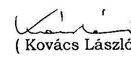

# JELENTÉS 

## a Külügyminisztérium fejezet működésének ellenőrzéséről

---

# 2. Államháztartás Központi Szintjét Ellenőrző Igazgatóság 

2.3. Átfogó Ellenőrzési Főcsoport

Iktatószám: V-18-45/2002-2003.
Témaszám: 613.
Vizsgálat-azonosító szám: V0038

## Az ellenőrzést felügyelte:

## Bihary Zsigmond

főigazgató
Az ellenőrzés végrehajtásáért felelős:
Hegedűsné dr. Müllern Veronika
főcsoportfőnök

## Az ellenőrzést vezette:

## dr. Horváth Margit

osztályvezető főtanácsos

## Az ellenőrzést végezték:

| dr. Burján Margit | Séra Andrásné |
| :-- | :-- |
| számvevő tanácsos, | számvevő tanácsos, |
| főtanácsadó | főtanácsadó |
| Krüzselyi Attila | Kocsis Ferencné |
| számvevő | számvevő |
| Zsombori Beáta | számvevő |
| számvevő gyakornok |  |

György Mária Terézia számvevő

Szilas István számvevő

## Magyar Köztársaság Nagykövetsége

## Berlin

## Hegedűsné dr. Müllern Veronika főcsoportfőnök

## dr. Horváth Margit osztályvezető főtanácsos

## dr. Burján Margit

számvevő tanácsos, főtanácsadó

## Lisszabon

## Nagy Ákosné

főigazgató-helyettes

## Holé Sándorné dr.

számvevő igazgatóhelyettes

## Séra Andrásné

számvevő tanácsos, főtanácsadó

---

# Magyar Köztársaság Nagykövetsége, Párizs Magyar Köztársaság Állandó Képviselete az OECD mellett, Párizs Magyar Köztársaság Állandó UNESCO Képviselete, Párizs 

Simon Ákosné főcsoportfőnök dr. Horváth Sándor főcsoportfőnök-helyettes Hámoriné Maróti Györgyi számvevő főtanácsos

## A témához kapcsolódó eddig készített számvevőszéki jelentések:

## címe

sorszáma
A költségvetési fejezetek jóléti célú kiadásainak és jóléti 268
intézményei működésének pénzügyi-gazdasági ellenőrzése 1995.
A Külügyminisztérium fejezet működésének pénzügyi-gazdasági 9827 ellenőrzése 1998.
A költségvetési fejezetek jóléti célú kiadásainak és jóléti 9925
intézményei működésének pénzügyi-gazdasági utóellenőrzése 1999.
A központi költségvetés területén működő belső kontroll 0115
mechanizmusok ellenőrzése 2001.
Vélemény a Magyar Köztársaság 1999. évi költségvetéséről 9839
Vélemény a Magyar Köztársaság 2000. évi költségvetéséről 9932
Jelentés a Magyar Köztársaság 1999. évi költségvetése 0024
végrehajtásának ellenőrzéséről
Vélemény a Magyar Köztársaság 2001. és 2002. évi költségvetési 0034
törvényjavaslatáról
Jelentés a Magyar Köztársaság 2000. évi költségvetése 0126
végrehajtásának ellenőrzéséről
Vélemény a Magyar Köztársaság 2003. évi költségvetési 0241
törvényjavaslatáról

---

# TARTALOMJEGYZÉK 

BEVEZETÉS ..... 5
I. ÖSSZEGZŐ MEGÁLLAPÍTÁSOK, KÖVETKEZTETÉSEK, JAVASLATOK ..... 7
II. RÉSZLETES MEGÁLLAPÍTÁSOK ..... 12
1 A fejezet szakmai feladatainak, szervezeti rendszerének, működésének összhangja ..... 12
1.1 Az Igazgatás feladatainak, szervezetének alakulása ..... 15
1.2 A külképviseletek működésének, gazdálkodásának szabályozottsága ..... 17
1.3 A fejezeti kezelésű előirányzatok felhasználásának szabályozottsága ..... 18
1.4 A belső kontroll mechanizmusok kiépítése és működése ..... 19
1.4.1 A belső ellenőrzés rendszere ..... 23
1.4.2 A felügyeleti ellenőrzés ..... 26
1.4.3 A működés informatikai támogatottsága ..... 27
2 A költségvetés tervezése, fejezeti szintű végrehajtása ..... 29
2.1 A fejezet tervezést irányító szerepének érvényesülése ..... 29
2.2 A fejezet bevételeinek és kiadásainak tervezése ..... 32
3 A költségvetés fejezeti szintű végrehajtása ..... 34
3.1 A személyi juttatásokkal és a létszámmal való gazdálkodás ..... 36
3.1.1. A személyi juttatásokkal való gazdálkodás ..... 36
3.1.2. Az átlagbérek, átlagilletmények alakulása ..... 41
3.1.3. A létszámmal való gazdálkodás ..... 41
3.2 A dologi kiadások alakulása ..... 45
3.3 A kiküldetési kiadások alakulása ..... 47
3.4 Az eszköz- és készletgazdálkodás ..... 48
3.4.1. Beruházási és felújítási kiadások alakulása ..... 52
4 A Fejezeti kezelésű előirányzatok felhasználása ..... 57
4.1 Egyes fejezeti kezelésű előirányzatok felhasználása ..... 58
4.1.1 A Nemzetközi tagdíjak kiadásainak alakulása ..... 58
4.1.2 Az Állami Protokoll kiadásainak alakulása ..... 58
4.1.3 A Magyarság Hírnevéért Díj kiadásainak alakulása ..... 59
4.1.4 Az Alapítványok támogatása ..... 59
4.1.5 A Kereskedelemfejlesztési Célelőirányzat kiadásainak alakulása ..... 60
4.2 Programfinanszírozás körébe vont fejezeti kezelésű előirányzatok felhasználása ..... 62

---

4.2.1 Az EU-hoz való csatlakozás külügyi Nemzeti Programja kiadásainak alakulása ..... 62
4.2.2 A PHARE támogatások alakulása ..... 63
4.3 A HTMH költségvetésébe átcsoportosított fejezeti kezelésű előirányzatok felhasználása ..... 64
4.3.1 Kisebbségi Koordinációs keret felhasználása ..... 64
4.3.2 A Horvátországi újjáépítési keret felhasználása alcím kiadásainak alakulása ..... 65
4.3.3 A Kárpátaljai Segélykeret felhasználása ..... 66
4.3.4 A Határon túli magyar felsőoktatás fejlesztése alcím kiadásainak alakulása ..... 67
4.3.5 A Szomszédos államokban élő magyarok támogatása alcím kiadásainak alakulása ..... 68
4.4 A fejezeti tartalék alakulása ..... 68
5 Az előző vizsgálataink javaslatai alapján megtett intézkedések ..... 69
5.1 Az éves költségvetések zárszámadása és a belső kontroll mechanizmusok ellenőrzése ..... 69
5.2 A fejezet működésének 1998. évi átfogó pénzügyi-gazdasági ellenőrzése ..... 69
MELLÉKLETEK

1. számú a Külügyminiszter észrevétele
2. számú 1-3. sz. Táblázat (5 lap)

# FÜGGELÉKEK 

1. számú A külképviseletek gazdálkodása helyszíni ellenőrzésének tapasztalatai
2. számú A Magyar Köztársaság Nagykövetsége, Berlin beruházásának ellenőrzési megállapításai

---

# RÖVIDÍTÉSEK JEGYZÉKE 

| Áht. | az államháztartásról szóló, többször módosított 1992. évi XXXVIII. törvény |
| :--: | :--: |
| Ámr. | az államháztartás működési rendjéről szóló, többször módosított 217/1998 (XII. 30.) Korm. rendelet |
| BM | Belügyminisztérium |
| EFO | Ellenőrzési Főosztály |
| GFO | Gazdálkodási Főosztály |
| GM | Gazdasági Minisztérium |
| HTMH | Határon Túli Magyarok Hivatala |
| Igazgatás | Külügyminisztérium igazgatása cím |
| IKIM | Ipari, Kereskedelmi és Idegenforgalmi Minisztérium |
| ITDH | Magyar Befektetési és Kereskedelemfejlesztési Rt./Kht. |
| Kbt. | a közbeszerzésekről szóló, többször módosított, 1995. évi XL. törvény |
| KEHI | Kormányzati Ellenőrzési Hivatal |
| KFC | Kereskedelemfejlesztési Célelőirányzat |
| KIR/CIS | Konzuli Információs Rendszer/Consular Information System |
| KJI | Külügyminisztérium Jóléti Intézményei cím |
| KSZ | ITDH Kereskedelmi Szolgálat |
| Ktv. | a köztisztviselők jogállásáról szóló, többször módosított 1992. évi XXIII. törvény |
| KüM | Külügyminisztérium |
| KVI | Kincstári Vagyoni Igazgatóság |
| MK | Magyar Köztársaság |
| MEH | Miniszterelnöki Hivatal |
| Mt. | a Munka Törvénykönyvéről szóló, többször módosított 1992. évi XXII. törvény |
| NKÖM | Nemzeti Kulturális Örökség Minisztériuma |
| OGY | Országgyűlés |
| PMH | párizsi Magyar Ház |
| PM | Pénzügyminisztérium |
| Szátv. | a szomszédos államokban élő magyarokról szóló 2001.   évi LXII. törvény |
| SZFO | Személyügyi Főosztály |
| SzMSz | Szervezeti és Működési Szabályzat |
| Szt. | a számvitelről szóló 1991. évi XVIII., illetve a 2000. évi C. törvény |
| TÁSZ | Távközlési és Számítástechnikai Főosztály |

---

.

---

# JELENTÉS 

## a Külügyminisztérium fejezet működésének ellenőrzéséről

## BEVEZETÉS

A Külügyminisztérium költségvetési fejezet az ország külpolitikájának megvalósítására irányuló összetett feladatok végrehajtásához biztosította a szükséges forrásokat a minisztériumi igazgatás, a külképviseletek, a Jóléti intézmények, a Határon Túli Magyarok Hivatala és a fejezeti kezelésű előirányzatok címein keresztül.

A fejezet részletes feladatait a külügyminiszter feladat- és hatásköréről szóló, többször módosított 152/1994. (XI. 17.) Korm. rendelet határozza meg. A rendelet előírásai szerint a külügyminiszter képviseli a Magyar Köztársaság külpolitikáját más államokkal és a nemzetközi szervezetekkel fenntartott kapcsolatokban. Koordinálja Magyarország és az Európai Unió közötti kapcsolatokat, a csatlakozási folyamat egészét, az integrációs politika érvényesülését. Irányítja a külképviseleteket és gondoskodik az ország, annak állampolgárai és szervezetei jogai és érdekei védelméről külföldön. Közreműködik a határon túli magyarokra vonatkozó kormányzati feladatok végrehajtásában. Szervezi és irányítja a gazdaságdiplomáciai tevékenységet.

A fejezet feladatrendszere - és ennek megfelelően címrendje - a vizsgált időszakban, 1998 óta folyamatosan bővült. A fejezethez csoportosították át a Miniszterelnökség fejezettől 1999-ben a határon túli magyarokhoz kapcsolódó állami feladatot, a kapcsolódó előirányzatokkal és a Határon Túli Magyarok Hivatalával együtt. További feladatnövekedést jelentett a Gazdasági Minisztérium fejezettől történt feladatátvétel 2000-ben, amely a Külügyminisztérium fejezet gazdaságdiplomáciai és gazdaságpolitikai szerepének növekedését, egyúttal a kereskedelmi kirendeltségek bevonásával az integrált külképviseleti rendszer kialakítását eredményezte.

A Magyar Köztársaság 2001. és 2002. évi költségvetéséről szóló 2000. évi CXXXIII. törvény a Külügyminisztérium fejezet 2002. évi kiadási előirányzatát 42 640,9 M Ft-ban, bevételi előirányzatát 6770,5 M Ft-ban, támogatási előirányzatát 35 870,4 M Ft-ban határozta meg. Fejezeti sajátosságnak tekinthető, hogy a kiadások nagy részét devizában teljesítik. A fejezet jellegzetessége továbbá, hogy az összes előirányzat közel kétharmadát a vizsgált időszak alatt a folyamatosan bővülő számú külképviselet (2002. év végén 106) kiadásaira fordították, ezzel összefüggésben a kiadások hasonló arányban devizában teljesültek. Ez a nagyságrend önmagában indokolja, hogy jelentésünkben a külképviseletek működésére és gazdálkodására nagyobb figyelmet fordítottunk.

---

A fejezeti kezelésű előirányzatok összege a kiadások között 1998-ban még az 1%-ot sem érte el, míg 2002-ben már 73%-ot jelentett. A fejezet engedélyezett létszáma 1998. és 2002. között 1678 főről 1898 főre növekedett. Az összes létszám - a KüM költségvetési létszámában nem szereplő helyi alkalmazottakat is figyelembe véve - több mint 60%-át a külképviseleteken foglalkoztatottak tették ki.

Az Állami Számvevőszék a Külügyminisztérium fejezetnél az államháztartás forrásait és azok felhasználását, valamint a vagyonnal való gazdálkodást az államháztartásról szóló 1992. évi XXXVIII. törvény 121. § (1) bekezdése alapján ellenőrizte. Az előző, 1998. évi átfogó ellenőrzés óta végzett számvevőszéki ellenőrzések az éves költségvetések tervezését, zárszámadását, valamint a belső kontroll mechanizmusok működését érintették.

Az ellenőrzés végrehajtására az Állami Számvevőszékről szóló 1989. évi XXXVIII. törvény 2. § (3) és 17. § (3) bekezdésében foglaltak alapján került sor.

Az ellenőrzésünk célja annak értékelése volt, hogy a Külügyminisztérium fejezetnél:

- a fejezet szervezeti, irányítási és működési mechanizmusa, költségvetési előirányzatai összhangban voltak-e a jogszabályokban meghatározott szakmai feladatokkal;
- a költségvetés tervezési, végrehajtási és beszámolási információs rendszere biztosította-e a különböző jogcímeken rendelkezésre álló közpénzek szabályszerű és a fejezeti gazdálkodás sajátosságainak megfelelő, célszerű felhasználását;
- a fejezeti kezelésű előirányzatok, illetve az alapítványi támogatások felhasználásánál a törvényességi, célszerűségi szempontokat érvényesítették-e;
- a korábbi számvevőszéki ellenőrzések megállapításait, ajánlásait figyelembe vették-e, a fejezet intézkedési tervei megfelelően hasznosultak-e.

Az átfogó ellenőrzés a fejezet és címei 1998-2002. I. félévi gazdálkodási folyamataira, a helyszíni ellenőrzés a Külügyminisztérium igazgatása címre, a külképviseletek, a Határon Túli Magyarok Hivatala, a Jóléti Intézmények és a fejezeti kezelésű előirányzatok címekre, illetve a kijelölt 3 állomáshely (Berlin, Lisszabon, Párizs) külképviseleteire terjedt ki. Az ellenőrzés következtetéseinél hangsúlyosabban vettük figyelembe a 2001-2002. év gazdasági-pénzügyi folyamatainak alakulását. Ez utóbbi keretében a 2002. év zárszámadása ellenőrzésének előkészítéseként elvégeztük a fejezet 2002. I. félévi kiadási és bevételi forgalmi adataiból kiválasztott tételek szabályszerűségi ellenőrzését is.

A jelentés tervezetét egyeztettük a tárca közigazgatási államtitkárával. Levelének másolatát az 1. sz. melléklet tartalmazza.

---

# I. ÖSSZEGZŐ MEGÁLLAPÍTÁSOK, KÖVETKEZTETÉSEK, JAVASLATOK 

A Külügyminisztérium fejezet szakmai feladatai a vizsgált időszakban kibővültek, előtérbe kerültek az euro-atlanti integrációs feladatok, a kormányváltással hangsúlyosabbá vált a határon túli magyarokról történő gondoskodás, befejeződött az integrált külképviseleti rendszer létrehozása, amelynek három fő eleme volt, a gazdaság-diplomáciai feladatok átcsoportosítása a diplomáciai és konzuli képviseleti rendszerhez, a külgazdaság-politika és az állami külgazdasági tevékenység irányításának Külügyminisztériumhoz telepítése, végül a kereskedelefejlesztési tevékenység átvétele.

Nem szolgálta a költségvetési források tervezésének és felhasználásának átláthatóságát a külképviseletek cím mesterséges megtartása, a külképviseletek deviza-alcím létrehozása, illetve a fejezet költségvetési gazdálkodásába a külképviseletek beillesztésének 2002-ig meglévő szabályozási bizonytalansága.

A Külügyminisztérium szervezeti felépítése folyamatosan változott, szervezeti egységek jöttek létre, szűntek meg, változott a feladatuk, megnevezésük. Jól elhatárolt feladatellátással működött az Európai Unióhoz történő csatlakozással összefüggő tárcaközi koordinációs feladatokra létrehozott Integrációs Államtitkárság, államtitkári besorolású vezetővel. A külképviseletek rendkívül tagolt szakmai felügyelete a köztisztviselői törvény 2001. évi módosítása miatt - a nagykövetek osztályvezetői kinevezésével további osztály szintű tagolódást eredményezett. A Külügyminisztérium főosztályi szintű szervezeti egységeinek száma 39-ről a vizsgált időszak végére 47-re emelkedett.

A gazdálkodási feladatokat ellátó főosztály feladatköre többször változott, ugyanakkor
 a vizsgált időszakban jellemző volt, hogy a főosztály nemcsak a két fejezeti cím (Igazgatás, Külképviseletek), hanem a fejezet felügyeletét ellátó szerv gazdálkodási feladatait is végezte, így a fejezeti, illetve a címek feletti döntések a felelősség és hatáskörök szempontjából nem különültek el egyértelműen. Az előző átfogó ellenőrzésünknél is kifogásoltuk, hogy a fejezetnél nincs olyan, a fejezet felügyeletét ellátó szerv, amely csak a fejezet költségvetési gazdálkodási, tervezési, előirányzat-módosítási, ellenőrzési, beszámoló készítési tevékenységét végzi. A Gazdálkodási Főosztály tevékenységének, munkaterhének nagyobb részét a külképviseletekhez kapcsolódó feladatok ellátása tette ki. 2001-től többlet munkát jelentett az új gazdálkodási szabályzatok elkészítése, azok bevezetése. A főosztálynak a Szervezeti és Működési Szabályzatban meghatározott feladatai, a nem mindig aktualizált vezetői munkaköri leírások, illetve a ténylegesen ellátott feladatok nem teljesen fedték egymást.

A fejezet kiépített és működő belső kontroll mechanizmusa a vizsgált időszak második felére jól érzékelhető javulást mutatott. Ezt megelőzően -

---

2001. előtt - az ÁSZ által következetesen, ám eredménytelenül kifogásolt belső szabályozottsági hiányosságok voltak jellemzőek (alapító okiratok, költségvetési alapokmányok, gazdálkodási szabályzatok hiánya, aktualizálásuk elmaradása), 2001-2002-re a belső szabályozottság jelentősen javult. Kiemelten alapos szabályozást biztosít a külképviseletek működésére és gazdálkodására vonatkozó miniszteri utasítás, amelynek kiadásával tartalmilag eleget tettek a korábbi átfogó ellenőrzésünk vonatkozó javaslatának is.

Az intézmények belső kontroll mechanizmusának változatlanul gyenge pontja maradt az ellenőrzés. A függetlenített belső ellenőrzés egyáltalán nem működött a fejezet két intézményénél (Határon Túli Magyarok Hivatala, Külügyminisztérium Jóléti Intézményei), a minisztériumban pedig - főleg kapacitáshiány miatt - csak részben tudta betölteni a szerepét. A külképviseletek gazdálkodásával kapcsolatban ugyanakkor rendszerszerűen, de nem elég hatékonyan működött a munkafolyamatba épített ellenőrzés, erre utalnak a nagykövetségek helyszíni ellenőrzése során feltárt számviteli, leltározási szabálytalanságok. A fejezet intézményeinek gazdálkodását átfogó felügyeleti ellenőrzés a vizsgált időszakban nem kontrollálta. A működésgazdálkodás informatikai támogatottsága javult, e téren kiemelendő a konzuli tevékenységet segítő egységes, számítógépes alapú ügyintézést biztosító információs rendszer bevezetése 2001-től.

A feladatváltozásokkal is összefüggően a fejezet költségvetési forrásai az ellenőrzött időszakban emelkedtek, összhangban voltak a jogszabályokban meghatározott szakmai feladatokkal. Az eredeti kiadási és támogatási előirányzat 1998-ról 2002-re egyaránt megduplázódott. A támogatási előirányzatok emelkedése, valamint a bérleti díjakból és a más tárcáktól átvett pénzeszközök növekedése kompenzálta a saját bevételek kisebb arányú emelkedését, így különösen 1999-től a megalapozatlanul megemelt konzuli és vízumdíj-bevételi tervek teljesítésének elmaradását.

A fejezetet érintő változások, a fejezeti kezelésű előirányzatok átcsoportosítása, az előző évi előirányzat maradványok felhasználása az intézményeknél indokolt előirányzat módosítással jártak. A megemelt előirányzatok biztosították a fejezet intézményei zavartalan működését, lehetőséget adtak a prioritások érvényesítésére, a megnövekedett feladatok ellátására.

A fejezet intézményeinél a létszámmal és a személyi juttatásokkal való gazdálkodás a jogszabályi előírásoknak és a fejezet sajátosságait tükröző belső szabályozásnak megfelelően történt, kisebb szabálytalanságok a megbízási szerződéseknél fordultak elő (ellenjegyzés hiánya, pontatlan feladatmeghatározás). A külügyi munka sajátosságai következtében folyamatosan élénk munkaerőmozgás jellemezte a Külképviseletek és az Igazgatás cím létszámgazdálkodását (a be- és kilépők aránya 1998-ban, illetve 2000-ben meghaladta a 40%-ot, elsősorban a két cím között a külszolgálati feladatokkal összefüggő mozgások miatt). Ez a munkakörváltás a vezető beosztású dolgozókat egyes területeken (pl. gazdálkodás) hasonló arányban érintette, megnehezítette az eseményeket folyamatában figyelemmel kísérő munkavégzést és ellenőrzést, amit a helyszíni nagykövetségi ellenőrzések tapasztalatai is igazoltak. A személyi juttatások között egyre növekvő arányt

---

képviselt a külső személyi juttatások összege (a vizsgált időszakban 4,5 Mrd Ft-ot fizettek ki), amelynek 2/3-át a külképviseleteken foglalkoztatott, ún. helyi alkalmazottak részére kifizetett munkabérek és egyéb juttatások, 1/3-át a megbízási díjak tették ki.

A dologi kiadások másfélszeresre történt növekedéséhez a feladatbővülés, a fejezeti kezelésű előirányzatok közül átcsoportosított előirányzatok és felhasználások emelkedése, a bérleti, közüzemi, üzemanyagdíjak, továbbá a kiküldetési, reprezentációs, reklám- és propagandaköltségek növekedése is hozzájárult.

A fejezet ingatlanokkal kapcsolatos tevékenysége jelentős fejlesztéseket eredményezett (Bem téri épületegyüttes, illetve a Határon Túli Magyarok Hivatala részére a Bérc utcai ingatlan rekonstrukciója), melyek hatására az ingatlanvagyon háromszorosára emelkedett.

Ugyanakkor a korábbi átfogó ellenőrzésünkben az ingatlangazdálkodással kapcsolatban megfogalmazott javaslatunknak a kormány nem tett eleget, így az ellenőrzött időszakra is jellemző maradt, hogy a külképviseletek és a külföldön állami feladatot ellátó szervezetek, intézmények ingatlan-állománya kezelésénél - az érintett tárcák részéről tapasztalt együttműködési készség hiánya miatt - nem érvényesítettek egységes szempontokat, nyilvántartási és eljárási rendet, ezáltal nem sikerült kihasználni az esetleges közös üzemeltetések előnyeit. A KüM fejezetnél a külképviseletekkel kapcsolatos ingatlangazdálkodásban a megvalósított külképviseleti beruházásokra, ingatlanvásárlásokra vonatkozó döntésekben - esetenként - a szakmai-pénzügyi szempontok háttérbe szorultak. A nem kellően átgondolt döntésekre példa a párizsi magyar ingatlanok helyzete, valamint a berlini nagykövetségi rezidencia megvétele (földrajzi széttagoltság, korlátozott kihasználhatóság, funkcionális problémák).

A fejezet ingatlan-állományának legnagyobb részét kitevő, a külképviseletek által használt, illetve bérelt ingatlanok (2002. végén 218 ingatlan, ebből a Magyar Állam tulajdona 87, melyek negyedének állapota, használhatósága nem megfelelő, értékesítésük, cseréjük indokolt) helyzetének átfogó rendezése szükséges, melyhez elkészült a KüM külképviseleti ingatlangazdálkodásának középtávú programja. Ennek megvalósításához a költségvetési forrásigény a tervezett ingatlan-értékesítésből származó bevétel (közel 4 Mrd Ft) figyelembevételével 13 Mrd Ft. A koncepciót a kormány 2002 októberében azzal fogadta el, hogy ahhoz központi forrást biztosítani nem tud. Ennek hiányában a program költségvetési realitása kétséges, azonban az kiindulási alapul szolgálhat a normatív ingatlangazdálkodási szabályozáshoz és gyakorlathoz.

A Külügyminisztérium - kormánydöntés alapján - sajátos konstrukció szerint (a magyar tulajdonú berlini telek 2/3-ának felépítményi jogáért cserébe az 1/3-on nagykövetségi épület fővállalkozásban történő felépítése és berendezése, kiegészítő szolgáltatásokkal, pl. lakás- és rezidencia vásárlása), értékarányosan megvalósította a Berlini Nagykövetség - jelenleg 80%-ban kihasznált épületkomplexumát eredményező beruházást számos, főképp számviteli (utólag) helyesbíthető hibával. A helyszíni ellenőrzés befejezéséig nem született

---

döntés a beruházás pénzügyi teljesítése során képződött maradványok sorsáról (1,5 Mrd Ft-nak megfelelő összeg).

A fejezeti kezelésű előirányzatok pénzeszközeinek felhasználásánál a módosított előirányzathoz viszonyítva 40%-os lemaradás mutatkozott késedelmes szabályozás (pályáztatás, kötelezettségvállalás), a fejezeti kezelésű bevételi előirányzatok tervezetthez képest elmaradt teljesítése, továbbá feladatelmaradás miatt (a Magyarság Hírnevéért Díjra biztosított 6,4 M Ft-ot elvonásra felajánlották). Az előirányzatok felhasználását, célszerűségét, eredményességét kedvezőtlenül befolyásolták szabályozási hiányosságok (támogatási szerződések és/vagy elszámolási, ellenőrzési előírások hiánya), a rendre elmaradó konkrét ellenőrzések. A programfinanszírozási rendszer működése sem volt zökkenőmentes a fejezetnél. A szakmai programok tervszerűtlen ütemezése miatt a pénzügyi teljesítés itt is elmaradt a lehetőségektől (a PHARE támogatásoknál a teljesítés 1999-ben 15%-os volt). A Kereskedelemfejlesztési Célelóirányzat felhasználásának szabályozása megfelelő volt, pályáztatási rendszere célszerűen működött.

A fejezetet érintő korábbi ellenőrzéseink megállapításainak, javaslatainak hasznosítására készült részletes intézkedési tervben foglaltakat - különös tekintettel a fajsúlyosabb javaslatokra (külképviseletek működésének, gazdálkodásának átfogó szabályozása, belső szabályozás, a címek feladatainak elhatárolása) lényegében az ellenőrzött időszak második felére teljesítették. Ugyanakkor a kormánynak tett javaslataink közül nem teljesült a külföldön lévő állami tulajdonú ingatlanvagyon egységes nyilvántartásával és kezelésével, valamint azok célszerű és hatékony hasznosításával kapcsolatban megfogalmazott javaslatunk. Nem került sor a felügyeleti ellenőrzés szervezeti kereteinek kialakítására sem, a belső ellenőrzést nem működtették elég hatékonyan.

A Külügyminisztériumtól kapott tájékoztatás szerint a helyszíni ellenőrzést követően - a megállapításainkat elfogadva és hasznosítva - intézkedtek a szabálytalanságok megszüntetésére a leltározással (felelősségvállalási nyilatkozatok, kiértékelések), a számvitellel (új pénztárnapló a külképviseleteken, illetve egységes pénzügyi számítógépes nyilvántartó program), a pénzügyi jogkörök gyakorlásával (szerződések ellenjegyzése) kapcsolatban. A Miniszterelnökség fejezethez 2002-ben átcsoportosított Határon Túli Magyarok Hivatala pedig 2003. február 1-jétől foglalkoztat főfoglalkozású belső ellenőrt.

A helyszíni ellenőrzés megállapításainak hasznosítása mellett javasoljuk:

# a kormánynak: 

1. gondoskodjon a külföldön lévő állami tulajdonú ingatlanvagyon megbízható és egységes nyilvántartásáról és kezeléséről;
2. intézkedjen a külföldön állami feladatot ellátó szervezetek, intézmények célszerű, hatékony elhelyezéséről.

---

# a fejezet felügyeletét ellátó szerv vezetőjének: 

1. készítse el a külképviseletek normatív ingatlangazdálkodására vonatkozó szabályozását;
2. intézkedjen a 2003-tól egyintézményes fejezetnél a belső kontroll mechanizmusok kockázatainak csökkentése érdekében, különös tekintettel az ellenőrzési kapacitás növelésére, továbbá - elsősorban a külképviseleteknél - az ellenőrzési munka hatékonyságának növelésére;
3. intézkedjen a fejezeti kezelésű előirányzatok pénzeszközei hatékonyabb felhasználása érdekében, pótolja a szabályozási és ellenőrzési hiányosságokat;
4. készítsen előterjesztést a kormány részére a jelenleg csak kb. 80%-ban kihasznált berlini nagykövetségi épületkomplexum teljes körű hasznosítására, valamint a beruházás pénzügyi teljesítése során képződött maradványok felhasználására.

---

# II. RÉSZLETES MEGÁLLAPÍTÁSOK 

## 1 A FEJEZET SZAKMAI FELADATAINAK, SZERVEZETI RENDSZERÉNEK, MŰKÖDÉSÉNEK ÖSSZHANGJA

A Külügyminisztérium (KüM) fejezet feladatrendszere - és ennek megfelelően címrendje - a vizsgált időszakban, 1998. óta folyamatosan bővült.

Az euró-atlanti integrációs feladatok Magyarország 1999-ben bekövetkezett NATO tagságával, valamint az Európai Unióhoz (EU) történő csatlakozás közeledtével megváltoztak, intenzívebbé váltak (konzuli intézményfejlesztés, tagállamként való működés programja). A szomszédos államokban élő magyarokról szóló 2001. évi LXII. törvény (Szátv.) rendelkezései alapján a fejezetnél hangsúlyosabb feladatként jelent meg a határon túli magyarokról történő gondoskodás. Befejeződött az integrált külképviseleti rendszer létrehozása, ezzel a fejezethez került a klasszikus diplomáciai és állami protokoll feladatok mellé a gazdaságdiplomáciai tevékenység a kereskedelemfejlesztéssel együtt.

A fejezet címrendje az ellenőrzött időszakban jelentősen megváltozott: a korábbi négy cím, 1. KüM igazgatása (Igazgatás), 2. Külképviseletek, 3. KüM Jóléti Intézményei (KJI) és 4. Fejezeti tartalék mellett részint a feladatbővülés miatt jelentek meg új (al)címek, részint önállóvá váltak a korábban e címeken - elsősorban a Külképviseletek címen - belül található kiemelt előirányzatok. A KJI cím feladatai az időszak során egyre inkább csökkentek, a külügyminiszter 2003. I. 1-jei hatállyal - határozatban - jogutód nélkül megszüntette e költségvetési szervet.

A fejezet feladatbővülésének megfelelően épült be az 1998-2001. évi költségvetésbe a fejezeti kezelésű előirányzatok közé a PHARE segélyprogramok alcím; a Határon Túli Magyarok Hivatala (HTMH), a szakmailag kapcsolódó előirányzatok 1999-től kerültek a fejezet költségvetésébe. A külgazdasági feladatok KüM fejezethez történő telepítése miatt 2001-ben két új cím, illetve alcím is megjelent: a Magyar Köztársaság (MK) Kereskedelmi Képviselete, Moszkva és a Kereskedelemfejlesztési Célelóirányzat (KFC).

A külgazdaság irányításával kapcsolatos feladatokat az Ipari, Kereskedelmi és Idegenforgalmi Minisztériumtól (IKIM), illetve jogutódjától a Gazdasági Minisztériumtól (GM) a KüM 1997. és 2000. között három lépcsőben, kormányhatározatok előírásai szerint vette át.

A külföldön működő magyar kereskedelmi képviseletek tevékenységének egy részét, a gazdaságdiplomáciai feladatokat a diplomáciai és konzuli képviseleti rendszerbe integrálták (a külföldön működő magyar kereskedelmi képviseleteknek a diplomáciai és konzuli képviseleti rendszerbe történő integrálásáról szóló 2086/1997. (IV. 3.) Korm. határozat), ezáltal a külgazdaság képviseleti rendszerében elválasztották a kereskedelemfejlesztési,

---

befektetésösztönzési - állami rásegítést igénylő - feladatoktól, amelyek maradtak az IKIM-nél.

A gazdaságdiplomáciai feladatokat az IKIM-hez tartozó kereskedelmi irodahálózat (80 helyen 340 fő) megszüntetésével 48 állomáshelyen a külképviseletekbe integrálódó, de az IKIM szakmai irányítása alatt álló külgazdasági attasék és a kapcsolódó adminisztratív állomány (90 fő) látták el a szükséges előirányzatok fejezetek közötti
 átcsoportosítása mellett; a kereskedelemfejlesztési és befektetésösztönzési feladatokat a Magyar Befektetési és Kereskedelemfejlesztési (ITDH) Rt. - 1998. IV. 30. után Kht. - keretében 40 országban, 46 állomáshelyen mintegy 120 fővel felállt Kereskedelmi Szolgálat (KSZ) irodái végezték.

A kormány 2000-ben a külgazdaság-politika és az állami külgazdasági tevékenység irányítását is a KüM-höz telepítette.

Ennek megfelelően a külgazdaság-politika irányításáról és a külgazdasági tevékenység irányításával kapcsolatos egyes feladatok ellátásáról szóló 1008/2000. (I. 18.) Korm. határozatában a GM állományából a KüM állományába átcsoportosította a külgazdasággal foglalkozó részlegeket (105 fő) és 2000. II. 1-jei hatállyal a külügyminiszter irányítása alá kerültek a WTO és az OECD mellé akkreditált Állandó Képviseletek (15 fő). Az előirányzatok rendezése a külgazdaság-politika és a külgazdasági tevékenység irányításával összefüggő feladatátcsoportosításhoz szükséges pénzügyi előirányzatok rendezéséről szóló 2057/2000. (III. 24.) Korm. határozat előírásainak megfelelően megtörtént.

A kereskedelemfejlesztési tevékenység átadásáról az exportfejlesztés és befektetésösztönzés hazai és külpiaci intézményrendszere továbbfejlesztéséről és az MK Moszkvai Kereskedelmi Képviselete helyzetének rendezéséről szóló 2322/2000. (XII. 21.) Korm. határozat döntött.

Ennek megfelelően a GM állományából az ezzel a tevékenységgel foglalkozó 5 fő (a megfelelő előirányzatokkal) a KüM állományába került. A határozat alapján az MK Kereskedelmi Képviselete, Moszkva alapítói jogosítványait a KüM vette át és 2001-től a képviselet költségvetését is a KüM fejezet költségvetésében tervezték meg.

A Moszkvai kereskedelmi képviselet, mint részben önálló gazdálkodási jogkörrel rendelkező központi költségvetési szerv önfenntartó volt, saját vállalkozási tevékenységének bevételeiből finanszírozta kiadásait. A szolgáltatási tevékenységgel kapcsolatos kereslet azonban 1997. óta fokozatosan szűkült, ezért - miniszteri döntés alapján - 2003-tól, mint külképviselet működik tovább.

Az átvett KSZ irodák ingatlanjainak helyzetét a külgazdaság-politika és a külgazdasági tevékenység irányításával összefüggő feladatátcsoportosításhoz szükséges pénzügyi előirányzatok rendezéséről szóló 2057/2000. (III. 24.) Korm. határozat és az exportfejlesztés és befektetésösztönzés hazai és külpiaci intézményrendszere továbbfejlesztéséről és a 2322/2000. (XII. 21.) Korm. határozat alapján rendezték.

Az ITDH külföldi irodái (KSZ) sajátos helyzetben maradtak: egyrészt a polgári törvénykönyvről szóló 1959. évi IV. törvény és a gazdasági társaságokról szóló 1997. évi CXLIV. törvény hatálya alá tartozó szervezet külföldi telephelyeiként működtek, másrészt az iroda vezetőjének, munkatársainak és a hivatali

---

helyiségeinek jogállására - feltéve, hogy ezt a fogadó állam elfogadja - ugyanazok a nemzetközi szerződések vagy kétoldalú egyezmények vonatkoznak, mint az MK külképviseleteire (például útlevél, mentességek, diplomáciai rangadományozás stb.). A KSZ irodákra, vezetőire, alkalmazottaira vonatkozó kérdésekben a két minisztérium közösen döntött. A működtetés kérdéseit a KüM, a GM és az ITDH által a 2002. II. 4-én kötött megállapodásban rendezték.

A 6/2002. miniszteri utasításban szabályozták a külgazdasági attasék és a KSZ irodák együttműködését. A szabályozás lényege, hogy azokban a viszonylatokban, ahol csak az egyik működik, - a felmerült költségek megtérítése mellett - ellátják a másik feladatát is.

Nem szabályozták viszont az ITDH által - a 2322/2000. (XII. 21.) Korm. határozat 1. b) pontjával összhangban - ellátott idegenforgalmi tevékenységre vonatkozóan az együttműködést a Magyar Turizmus Rt-vel, illetve a fölötte tulajdonosi jogokat gyakorló minisztériumokkal (GM, 2002. évi kormányváltást követően Miniszterelnöki Hivatal).

A fejezeti kezelésű előirányzatok alcímei közül több csak egy-egy (legfeljebb két) év költségvetésében jelent meg, ezek kormányhatározatokban meghatározott feladatok végrehajtását szolgálták. A Külképviseletek címen belül kiemelten kezelték 1998-ban azt a 12 előirányzatot, amelyek - az Igazgatáson belül kezelt Állami Protokollal együtt - 1999-től a fejezeti kezelésű előirányzatok között az ÁSZ javaslatai alapján külön alcímek/jogcímcsoport lettek, mint például a Turistakölcsönök, a Nemzetközi tagdíjak.

A külképviseletek jogi helyzete, helye a fejezet szervezetrendszerében a vizsgált időszakban többször - esetleg egymással ellentétesen - változott, miközben a működtetésére szolgáló Külképviseletek cím megtartásához a fejezet annak ellenére ragaszkodott, hogy ennek nem volt szabályozási alapja, mivel a külképviseletek szervezeti szempontból nem tartoztak össze, ezért címet sem alkothattak (az államháztartásról szóló 1992. évi XXXVIII. törvény (Áht.) 20. § (1) bekezdés).

A KüM Szervezeti és Működési Szabályzatai (SzMSz) 1998-2000. között a külképviseleteket, mint a „Külügyminisztérium sajátos szervezetei egységei"-t határozták meg (2. (2) pont), ugyanakkor az ÁSZ vizsgálatok által következetesen észrevételezett hiányosság pótlásaként elkészült (2001. II. 6-án) Külképviseletek alapító okiratában ezzel szemben részben önálló, teljes jogkörrel rendelkező központi költségvetési szerv telephelyeiként határozták meg.

A Külképviseletek cím mesterséges megtartására utal az Igazgatás és a Külképviseletek cím között - az államháztartás működési rendjéről szóló 217/1998. (XII. 30.) Korm. rendelet (Ámr.) 14. § (5)-(6) bekezdéseinek megfelelően - 2001 májusában megkötött megállapodás is a Külképviseletek cím részére a személyügyi, munkaügyi, bérgazdálkodási, pénzügyi, gazdasági és jogi feladatok teljes felelősséggel történő ellátására. A megállapodást a Gazdálkodási Főosztály (GFO) vezetője az egyik osztályvezetőjével kötötte, formailag sem különítve el a két cím képviseletét. Nem tartották be a megállapodás azon pontját, amely szerint a Külképviselet cím az Igazgatás részére feladatai ellátásához előirányzatot, létszámot nem ad át és nem biztosít. A Külképviseletek címről 2002 februárjában a KüM igazgatás címre 73,6 MFt-ot adott át, elsősorban dologi kiadásokra.

---

A külképviseleteknek a fejezet költségvetési gazdálkodásába történő beillesztésének szabályozási bizonytalanságai jogszabályi szinten és egyértelműen rendeződtek a tartós külszolgálatról szóló 31/2002. (III. 1.) Korm. rendelet kiadásával.

A kormány a jogszabály kiadásával - hat éves késéssel - az Áht. 124. § (2) bekezdés d) pontjában előírt kötelezettségének is eleget tett.

A tartós külszolgálatról szóló 31/2002. (III. 1.) Korm. rendelet 7. § (1) bekezdése kimondja, hogy a „külképviseletek a Külügyminisztérium külföldön működő szervezeti egységei, a Külügyminisztérium hivatali szervezetének részei. A külképviseletek a KüM SzMSz-ének hatálya alá tartoznak."

A KüM a külképviseletek gazdálkodásával, finanszírozásával kapcsolatos problémákat a 2003. évi költségvetésében oldotta meg. Egyetlen cím (KüM) került kialakításra, amelynek két alcíme a KüM Központi igazgatása és Külképviseletek igazgatása. Utóbbi alcím - megnevezésével ellentétben - a külképviseletek működtetése érdekében a külképviseleteken felhasznált/keletkezett előirányzatokat tartalmazza.

# 1.1 Az Igazgatás feladatainak, szervezetének alakulása 

A Minisztérium (Igazgatás) szervezeti felépítése folyamatosan változott. Új szervezeti egységek jöttek létre (esetleg szűntek meg), alakultak át, változott a megnevezésük és/vagy feladatuk a végig jellemző helyettes államtitkári irányítási szintek között és alatt.

A szakmai főosztályok 1998-ban három, 2002-ben négy helyettes államtitkár alá tartoztak, ugyancsak helyettes államtitkár felügyelte a gazdálkodási-üzemeltetési területet. A GM-től 2000-ben átvett külgazdasági részlegek 4 főosztályba szervezve egy újonnan kinevezett (külgazdasági) helyettes államtitkár felügyelete alatt tagozódtak be a KüM szervezetébe.

A külgazdasági főosztályok 2002. végén egészében az Integrációs és Külgazdasági Államtitkárság vezetőjének külgazdasági ügyekért felelős helyettese alá tartoztak, míg a korábban az Integrációs Államtitkársághoz (IÁT) tartozó főosztályok egy része - más megnevezéssel, más feladattal - kikerült onnan a 4 szakmai helyettes államtitkár valamelyikének felügyelete alá.

A KüM feladatai közé tartozott PHARE programokkal kapcsolatos tevékenységet 1998-2001. között a PHARE Programiroda látta el.

Sajátos helyet foglalt el a szervezetben az IÁT, amelyet a KüM integrációs Államtitkárságának létrehozásával összefüggő kormányzati intézkedésekről szóló 1041/1996. (V. 3.) Korm. határozat hozott létre, a csatlakozással összefüggő tárcaközi koordinációs feladatok ellátására az EU-hoz történő csatlakozás előkészítő folyamatában. Vezetője államtitkári besorolású; két helyettes államtitkári besorolású helyettese alá tartoztak az euro-atlanti integráció politikai és humán, illetve a gazdasági és jogi ügyeiben illetékes főosztályok.

A külképviseletek rendkívül tagolt szakmai felügyelete (illetékes területi főosztályok, Nemzetközi Szervezetek Főosztály, Emberi és Kisebbségi Jogi

---

Főosztály, NATO-NYEU Főosztály, Konzuli Főosztály) a köztisztviselők jogállásáról szóló 1992. évi XXIII. törvény (Ktv.) 2001. évi módosítása miatt a külképviseletek irányításával és felügyeletével kapcsolatos általános feladatokat ellátó főosztályokon belüli osztályok létrehozásával tovább tagolódott (a kinevezett nagykövet akkreditálási helye szerint jött létre például a Szentszék és a Szuverén Máltai Lovagrend Osztály, Thaiföld, Brunei Darussalam és a Myanmari Államszövetség Osztály).

A 18 főkonzulátus szakmai felügyeletét a Konzuli Főosztály látta el, a diplomáciai-politikai tevékenység szempontjából pedig az illetékes területi főosztályhoz tartoztak (pl. a müncheni és a stuttgarti főkonzulátusok a Németország Osztályhoz), nem egyértelmű nagyköveti vezetői jogkörrel.

A KüM vezetésének döntése alapján a 2003. IV. 1-je után kinevezett főkonzulok státusza a nagykövetekével azonosan alakul, osztályvezetői kinevezést kapnak.

A külképviseleteken a képviseletvezető irányítása mellett működő, de szakmailag nem a KüM-höz tartozó 26 szakattaséra (szakdiplomata) vonatkozóan a munkájukat szakmailag irányító minisztériummal - a Belügyminisztérium (BM) kivételével - a kapcsolat szabályozott volt.

A fejezeti szintű feladatellátás szabályozási hátterét a külügyminiszter feladatai és hatásköréről szóló, a feladatváltozásokkal összhangban módosított 152/1994. (XI. 17.) Korm. rendelettel, továbbá az ellenőrzött időszak közepére a 6/2000. miniszteri utasításként - 2000. V. 2-ai hatállyal - kiadott SzMSz-szel teremtették meg.

Az Igazgatás és a Külképviseletek cím gazdálkodási feladatait (pl. az Igazgatás külföldi napidíjai és kiküldetési költségei a Külképviseletek címen kerültek elszámolásra) nem határolták el, jóllehet az ÁSZ erre vonatkozóan javaslatot tett. A GFO feladatköre a vizsgált időszakban többször változott, ugyanakkor a főosztály egyes osztályai vagy egyes dolgozói látták el mind az Igazgatás, illetve a Külképviseletek cím gazdálkodásával kapcsolatos tevékenységet, mind az Ámr. 13. § (1) bekezdésében meghatározott, a központi költségvetési szervek felügyeletét ellátó szerv gazdálkodási feladatait is.

A GFO feladatait az SzMSz-ben (legutóbb a 2/2002. sz. közigazgatási államtitkári ügyviteli szabályzat határozta meg 2002. I. 25-ei hatállyal), a közbeszerzésekkel kapcsolatos tevékenységet a közigazgatási államtitkár ügyviteli rendelkezéseiben szabályozták. Az SzMSz-ben a GFO osztályai részére meghatározott feladatok és a - nem mindig aktualizált - vezetői munkaköri leírások, illetve az adott osztály által ténylegesen ellátott feladatok nem teljesen fedték egymást.

A Külképviseleti Osztály részére előírt húsz feladatból az osztály vezetőjének munkaköri leírása szerint nyolc nem az ő - hanem a GFO más osztályának a feladata. Ugyanakkor például a Költségvetési és Pénzügyi Osztály feladatai között nem oda tartozó feladat is szerepel, de több hiányzik is (a tartós külszolgálatra kiküldöttek személyes ingóságaival kapcsolatos teendők ellátása nem, de a külső szervekkel való kapcsolattartás az osztály feladatai közé tartozik).

---

A főosztály ügyrenddel rendelkezett, azt azonban 1996 novembere óta nem módosították. A 2001-ben elkészült tervezet nem került kiadásra. Így a munkatársak munkaköri leírásai mutatják a tényleges feladat- és jogköröket.

A GFO 1998. év eleji létszámának (137 fő) felét a később más szervezeti egységhez (véglegesen 2001-től a főosztályi szintű Üzemeltetési és Szolgáltatási Igazgatóságon) került üzemeltetési terület (beleértve a takarítókat, gépkocsivezetőket és az ajándékraktárban foglalkoztatottakat is) létszáma tette ki. A főosztály feladatait és létszámát 2001-ben növelte az Ingatlankezelő és Építési Osztály beépülése, valamint létrejött a Vagyongazdálkodási és Közbeszerzési Osztály, amellyel a KüM szintjén a GFO szervezetileg is megalapozott felelőse lett a vagyongazdálkodásnak és a közbeszerzések koordinálásának.

A GFO engedélyezett létszáma - amely a főosztályvezető megítélése szerint elegendő a feladatok elvégzéséhez - 2002. XI. 30-án 71 fő, a feltöltöttség több mint 90%-os volt. A GFO tevékenységének, munkaterhének nagyobb részét a külképviseletekhez kapcsolódó feladatok ellátása tette ki. A vizsgált időszak második felében - 2001-től
 - többletmunkát jelentett az új szabályzatok előkészítése, illetve az azok bevezetésével kapcsolatos teendők.

A GFO az ellenőrzött időszak második felében szakmailag megfelelő színvonalon biztosította a KüM fejezettel kapcsolatos feladatai ellátását.

# 1.2 A külképviseletek működésének, gazdálkodásának szabályozottsága 

A külképviseletek a KüM külföldön működő osztályszintű szervezeti egységei, közvetlenül a KüM SzMSz-ének hatálya alá tartoztak. A gazdálkodási, pénzügyi tevékenységet, valuta- és devizagazdálkodásukat a KüM GFO irányította és felügyelte.

A külképviseletek gazdálkodási rendjét a vizsgált időszak első részében az 1/1992. KüM utasítás szabályozta, amely 2001. XII. 31-től volt hatályban. A szabályzat aktualizálását már az 1998. évi ÁSZ vizsgálat alkalmával is javasoltuk.

A gazdálkodásra vonatkozó minisztériumi utasításokat 2000. évtől kezdődően - egyre intenzívebb ütemben - folyamatosan felülvizsgálták és aktualizálták. Ennek során adták ki a külképviseletek gazdálkodásáról szóló - 2002. I. 1-jétől hatályos - 22/2001. KüM utasítást, amely részletesen (96 pontban), a külképviseleten dolgozók munkáját segítve, szinte minden feladatra, gazdálkodási területre kiterjedően határozta meg a gazdálkodással kapcsolatos előírásokat, eljárási rendeket.

A külképviseletek működésére vonatkozó KüM szabályozási alapelvnek megfelelően a nagykövet hatáskörébe tartozott a követség munkarendjével, a munkavégzéssel, a pénzügyi jogkörök egyes elemeinek gyakorlására jogosultak körének meghatározásával (kötelezettségvállalás, utalványozás, érvényesítés), valamint a készpénzkezeléssel kapcsolatos, utasítás formájában történő szabályozás.

---

A külképviseletek gazdálkodásáról szóló 22/2001. miniszteri utasítás szerint a külképviselet vezetője határozza meg az adott külképviseleten a kötelezettségvállalásra (57. (2) pont) és az utalványozásra (62. (2) pont) vonatkozó részletes szabályokat. Az utasítás 95. (1) pontja szerint a szabályzatokat 2002. III. 31-ig kellett jóváhagyásra a GFO-hoz felterjeszteni.

A szabályozást a külképviseletek késve és nem megfelelő színvonalon végezték el. A GFO a szabályzatok 60%-át adta vissza a külképviseleteknek átdolgozásra. Néhány szabályozási terület kivételével (munkarend, pénz- és értékkezelés) a szabályzatokat elkészítették, de például a Lisszaboni Nagykövetségen nem szabályozták a munkarendet.

A külképviseleteken a konzuli tevékenységgel kapcsolatos gazdasági tevékenység (szigorú elszámolású nyomtatványok kezelése, a vízumdíjakkal való elszámolás rendje) szabályozása a Konzuli Főosztály által kiadott Konzuli Kézikönyvben - a vízumdíjak beszedéséhez kapcsolódó számlaadási kötelezettséget kivéve - megfelelően rendezett volt (3/1997. sz. Konzuli utasítás, és a módosítására a GFO-val közösen kiadott 2/2002. sz. közös utasítás).

A Konzuli Információs Rendszer/Consular Information System (KIR/CIS) 2002-ben bevezetett, továbbfejlesztett verziója már automatikusan előállítja a kapcsolódó bizonylatot, így a helytelen gyakorlat megszűnt.

# 1.3 A fejezeti kezelésű előirányzatok felhasználásának szabályozottsága 

A feladatok végrehajtásával kapcsolatos hatás-, jog- és felelősségi köröket az Áht. 24. §. (4)-(7) bekezdés, a 49. §. o./ pontja előírásainak megfelelően - a költségvetési törvényben meghatározott célra tekintettel, a rendelkezési jogosultságokat és az egyéb eljárási rendet - a külügyminiszter a pénzügyminisztériummal egyeztetve - utasításokban szabályozta.

Az utasítások évente az Áht.-ban előírt határidőn túli (1-5 hónapos késéssel) kiadása hátráltatta a rendelkezésre álló előirányzatok ütemezett felhasználását. A fejezeti kezelésű előirányzatok felhasználásának szabályairól szóló 8/2000. KüM utasítás nem biztosította többek között a források költségvetési törvényben meghatározott célú felhasználását, kezelési költségeit, az előirányzat-maradványok jóváhagyását és következő évi felhasználását, az éven túli kötelezettségvállalást.

Az éves költségvetési törvényekben jóváhagyott egyes fejezeti kezelésű előirányzatok felhasználásának szabályairól és az eljárás rendjéről szóló 5/1999. KüM utasítást március 29-én, a 8/2000. KüM utasítást májusban, a 7/2001. KüM utasítást április hónapban (dátum nélkül), és a 12/2002. KüM utasítást március 21-én adták ki.

A Pénzügyminisztérium (PM) 2000. júniusában a KüM utasítással kapcsolatos levelében egyetértett a szabályzattal, de a féléves késés miatt kétségesnek tartotta az utasítás érvényesülését.

A Határon túli magyar felsőoktatás fejlesztése alcímre vonatkozó felhasználási szabályzatot a 7/2001. KüM. utasítás 37. 5./ pontja szerint elkészítették, azt a 3/2000. számú elnöki utasításként adták ki.

---

A KüM fejezet (5. címen) tervezett fejezeti kezelésű előirányzatok rendeltetését, felhasználási mechanizmusát, a pénzellátás módját, valamint a szakmai és pénzügyi ellenőrzés módját 2001. évtől, alcímenként költségvetési alapokmányban rögzítették, melyet az Ámr. 10. § (5) bekezdése szerint készítettek el.

A fejezeti kezelésű előirányzatok alcím 1998-2000. években nem rendelkezett költségvetési alapokmánnyal.

A fejezeti kezelésű előirányzatok cím számviteli szabályozását a sajátosságainak és a hatályos jogszabályi előírásoknak megfelelően alakították ki. A közigazgatási államtitkár által jóváhagyott számviteli politikát, számlarendet 2001. I. 1-jétől alkalmazták.

A fejezeti kezelésű előirányzatok számviteli politikáját, a számlarendjét és a számlatükröt a számvitelről szóló 2000. évi C. törvény (Szt.) és az államháztartás szervezetei beszámolási és könyvvezetési sajátosságairól szóló 249/2000. (XII. 24.) Korm. rendelet előírásaival összhangban alakították ki.

A fejezeti kezelésű előirányzatok gazdálkodásáról készített beszámolók felülvizsgálatát - a központi, a társadalombiztosítási és a köztestületi költségvetési szervek kormányzati, felügyeleti, valamint belső költségvetési ellenőrzéséről szóló 15/1999. (II. 5.) Korm. rendelet (Er.) 6. §. (1) bekezdés b) 9. pontja szerint - nem végezték el egyik évben sem.

A Ellenőrzési Főosztály (EFO) a 7/2001. KüM utasítás 7. pontja szerinti előírásnak nem tett eleget, a fejezeti kezelésű előirányzatok felhasználását egy alcímet kivéve - nem ellenőrizte.

A fejezeti kezelésű előirányzatok közül az Állami Protokoll alcím kiadásainak elszámolását 1999-ben ellenőrizte a főosztály. Az ellenőrzés során - a jogszabályi előírások betartására tett javaslataikat - hasznosították.

Az ellenőrzések során nem került sor az Ámr. 149. § (3) bekezdés a) pontjában előírt, a költségvetési előirányzattal összefüggően jóváhagyott alaptevékenységbe tartozó - feladatok szakmai teljesítésének áttekintésére.

# 1.4 A belső kontroll mechanizmusok kiépítése és működése 

A fejezet intézményeinek belső kontroll mechanizmusát az ÁSZ a 2000. évre vonatkozóan értékelte. A beszámolók megbízhatósága szempontjából egyaránt közepes kockázatúnak minősült az Igazgatás, a HTMH, a KJI kontroll mechanizmusának kiépítettsége és működtetése.

A kérdőíves felmérés a Külképviseletek címre a sajátosságok (külön gazdálkodó, belső ellenőrző szervezet hiánya) miatt nem volt értékelhető.

A változások a vizsgált időszakban azonban nem minden esetben jelentették a fejezeti költségvetés átláthatóságának, a különböző feladatok végrehajtására előirányzott költségvetési források felhasználásának nyomon követhetőségét vagy a gazdálkodás ésszerűsítését.

---

Több fejezeti kezelésű alcím teljes előirányzatát 1999-ben és 2000-ben - az Áht. 24. § (7) bekezdése alapján szabályosan - év elején a KüM más címekhez átcsoportosította „a feladatok szakmai és pénzügyi teljesítése érdekében”. Többek között a Bős-Nagymaros nemzetközi bírósági eljárás, és a Nemzetközi tagdíjak előirányzatokat - vitatható indokoltsággal - a Külképviseletek címre csoportosították át.

A Külképviseletek-Deviza alcím létrehozása megnehezítette a gazdálkodás áttekinthetőségét, a mindennapi pénzügyi munkát, illetve a költségvetési tervezés folyamatát is (pl. a devizában beszerzett tárgyi eszközök az intézményi háttérrel nem rendelkező alcímen jelentek meg vagyonként). A kiadások és bevételek szétválasztása a két (al)cím között (átvezetési, nyilvántartási, elszámolási, tervezési) problémát jelentett. Az alcímet a Külképviseletek cím megbontásával előirányzat-módosítás nélkül túlteljesíthetőként - hozták létre a 2001-2002. évi fejezeti költségvetésekben azzal az indokolással, hogy kiküszöböljék a 2000. évben az USD árfolyamok emelkedéséből a külképviseletek részére meghatározott állami támogatás jelentős mértékű leértékelődését anélkül, hogy ennek 2000. évi mértékéről a fejezet számvetést készített volna. A devizában teljesítendő kiadásoknál nem tervezhető, árfolyamváltozásból adódó többletkiadások kompenzálásának lehetőségével nem tudott élni a fejezet.

A KüM fejezet intézményei működésének egyik súlyos - a számvevőszéki vizsgálatok által 2001-ig folyamatosan észrevételezett - hiányossága a belső szabályozottsághoz kapcsolódott.

Az Ámr. 10. § (5) bekezdésében előírt költségvetési alapokmányokkal a fejezet intézményei/címei csak 2001-2002. évekre vonatkozóan rendelkeztek.

A fejezet intézményei korábban nem rendelkeztek alapító okirattal, illetve azok aktualizálása elmaradt.

A KüM Alapító Okirata 2001. XII. 19-én került kiadásra, amelyben az alaptevékenysége közé sorolták a külképviseletek működtetését. A KüM ezt megelőzően, 2001. II. 6-ai dátummal megalkotta az Igazgatás, illetve a Külképviseletek alapító okiratát, amelyek a PM álláspontjával összhangban az új alapító okirat kiadásával érvényüket vesztették.

A KJI - mint intézmény - hatályos alapító okirattal és SzMSz-szel a vizsgált időszak második felében nem rendelkezett. A KJI tényleges működését 1992. I. 1-jén kezdte meg. 1999-ben megszövegezték az intézmény alapító okiratát és SzMSz-ét, továbbá ezen dokumentum tervezetek tárcán belüli egyeztetése is megtörtént. A feladatok és a szervezeti felépítés 2000-ben történt megváltozása miatt az elkészített dokumentumok elavultak.

A HTMH az Ámr. 10. §-ában foglaltaknak megfelelő alapító okirattal és a 17. § (4) bekezdésében előírt ügyrenddel nem rendelkezett. A helyszíni ellenőrzés időpontjában a MEH-et vezető miniszter aláírta az alapító okiratot.

Az MK Kereskedelmi Képviselete, Moszkva Alapító Okiratát nem aktualizálták a képviselet jövőbeli szerepét, szervezeti helyét illető folyamatos bizonytalanságok miatt.

A fejezet intézményei közül a minisztériumban és a HTMH-nál jellemző volt a szervezeti változás. Az HTMH a vezetői státuszok és szervezeti egységek számát

---

a Hivatal a létszámhoz és a feladatokhoz viszonyítva célszerűtlenül megnövelte.

A KüM-ben szinte folyamatos szervezeti- és feladatváltozásokat - kevés kivétellel - időben átvezették az SzMSz-ben is. A vizsgált időszakban háromszor történt meg az SzMSz átfogó (újra)szabályozása: az 1/1998., az 1/1999. és a 6/2000. miniszteri utasításokkal.

A HTMH feladatai a Szátv.-ben foglaltakkal bővültek, ez új szakmai szervezeti egységek létrehozását tette szükségessé. A tervezett struktúrát megjelenítő SzMSz 2002. II. 1-jén lépett hatályba, a tényleges állapotnak azonban csak részben felel meg.

A gazdálkodás egyes területei egyáltalán nem kerültek átfogóan szabályozásra (például leltározás, pénzkezelés); más területeken az elavult szabályozások aktualizálását ténylegesen új szabályzatok kiadásával lehetett volna biztosítani (például a külképviseletek gazdálkodása); a hatályos külső- és belső előírások, szabályozások betartatása, számonkérése nem volt következetes (például a gazdasági felelősök beszámoltatása). Mindhárom vonatkozásban pozitív változások történtek. A fejezet intézményeinek belső szabályozási tevékenysége 2000-től felerősödött, ugyanakkor hiányosságok a jelen ellenőrzés során is tapasztalhatóak voltak.

A KüM-ben a leltározásra vonatkozó szabályozást kiterjesztették (a közigazgatási államtitkár 2/2001. ügyviteli rendelkezése a Központra vonatkozóan), az elavult szabályzat helyett újat vezettek be; egyúttal kiadták a közigazgatási államtitkár ügyviteli rendelkezéseiként az Igazgatás (4/2001.) és a külképviseletek (5/2001.) selejtezési szabályzatait; továbbá miniszteri utasításként 2000-ben a házipénztárkezelési szabályzatot; 2002-ben a külképviseletek által üzemeltetett gépkocsik működtetésének és beszerzésének szabályait; valamint a technikai fejlődés miatt szükséges szabályozásokat is: a mobiltelefonok használatát a külképviseleteken és a Központban 2001-ben, a hordozható számítógépek kölcsönzési rendjét 2000-ben határozták meg.

A fejezet költségvetési szerveire vonatkozó teljesítményértékelési rendszer kialakítása és bevezetése több éves késéssel és részben történt meg. A külügyminiszter belső szabályozás keretében - a fejezet tevékenységének jellegzetességeihez igazodva - adott ki normatívákat. E körbe tartozik a külképviseleteken üzemeltethető gépjárművekre, valamint a mobiltelefon használatra vonatkozó normatíva és szabályozás.

A külügyminiszter 6/2002. sz. utasítása a külképviseletek által üzemeltetett gépkocsik működtetésének és beszerzésének szabályairól, a 24/2001. KüM utasítása a külképviseleteken levő mobiltelefonok használatának rendjéről, a 14/1992. KüM utasítás és a 2001. júniusától hatályos 11/2001. KüM utasítás rendelkezett az Igazgatáson a hivatali gépkocsik használatáról. Az utasítások előírásait betartották, a szükséges nyilvántartásokat vezették.

A szabályzatok ismeretéhez hozzájárult, hogy a KüM Belső Honlapja-Intranet 2002-től a KüM minden munkaállomásáról elérhető volt. Itt megtalálhatóak - 2000-től, évenkénti csoportosításban - a KüM vezetése által kiadott utasítások, rendelkezések, szabályzatok mellett az egyes főosztályok saját hatáskörű utasításai (részben) is. Ugyanakkor a
 szabályzatokon a módosítások nincsenek átvezetve; a közzététel gyakorlata sincs szabályozásban megjelenítve.

---

A fejezet költségvetési gazdálkodásának jellemzője volt, hogy a források felétháromnegyedét a KüM-ben gazdálkodási keretekre osztották fel. A minisztérium gazdálkodó egységei (31-35 főosztály, illetve esetenként azokon belül további 2-4 osztály) a számukra jóváhagyott keretekkel önállóan gazdálkodtak. Ezért a kötelezettségvállalások, az utalványozás és a pénzügyi ellenjegyzés rendszerének szabályozottsága, annak betartása különösen jelentős volt.

A kötelezettségvállalással, utalványozással és pénzügyi ellenjegyzéssel kapcsolatos feladatokról 2000-ig a GFO vezetője intézkedett az adott évre vonatkozó költségvetési előirányzatokról és gazdálkodási szabályokról kiadott körlevelében, ami nem biztosította az egységes nyilvántartási, eljárási rendet.

A KüM költségvetésének terhére megvalósuló kötelezettségvállalások és utalványozás rendjéről szóló 13/2000. miniszteri utasítás 2001. I. 1-jével lépett életbe, míg a pénzügyi ellenjegyzési jog gyakorlásáról a gazdasági és igazgatási helyettes államtitkár 2001. II. 1-jei hatállyal adta ki 1/2001. ügyviteli rendelkezését. 2001-ig sem a KüM SzMSz-ei, sem a gazdálkodó egységek vezetőinek munkaköri leírásai nem tartalmaztak az előirányzatok gazdálkodásával és a kötelezettségvállalások naprakész nyilvántartásával kapcsolatos feladatot.

A KüM nem tett eleget a Ktv. 2001. évi módosításával a 106. § (6) bekezdésben előírtaknak, 2001. október végéig nem készítették el a közszolgálati szabályzatot. A szabályzat munkapéldányát a helyszíni ellenőrzés idején bemutatták.

A HTMH-nak nem volt egységes gazdálkodási szabályzata, a szükséges részterületekre vonatkozó szabályokat is hiányosan készítették el. Nem rendelkeztek közbeszerzési és közszolgálati szabályzattal, nem a hatályos jogszabályok szerint módosították a számviteli politikát és a pénzkezelési szabályzatot, hiányos volt a kötelezettségvállalás részletes szabályairól szóló utasításuk (nem szabályozta a teljesítés igazolás módját, formáját).

A KJI 1998-tól rendelkezett a jogszabályokban előírt belső szabályzatok közül a számviteli politikával, számlatükörrel, számlarenddel, értékelési, valamint a leltározási szabályzattal, a többi szabályzatot csak a vizsgált időszak második felében készítették el, egyben a meglévő szabályzatokat is aktualizálták.

A pénz- és értékkezelési szabályzatot, az intézmény önköltség számításának szabályzatát, az étterem üzemeltetési szabályzatát és elszámolási rendjét, a KJI bizonylati szabályzatát 2001-ben elkészítették. A KJI-nél a számlarendben nem történt meg a számlaösszefüggések kijelölése, vázlatosan tartalmazta a főkönyvi számla és az analitikus nyilvántartás kapcsolatát, valamint a zárlati teendőket. A KJI-nél az analitikus nyilvántartások vezetésének szabályai nem voltak meghatározva.

A külképviseletek gazdálkodásának színvonala összességében javult a szabályozottságban, a kihelyezett gazdasági felelősök felkészültségében és a beszámoltatás következetességében bekövetkezett kedvező változások eredményeként, ugyanakkor a bizonylati rend és az okmányfegyelem területén előfordultak szabálytalanságok, amelyeket a három kijelölt állomáshely külképviseleteinek helyszíni ellenőrzése is alátámasztott (1. sz. függelék).

---

A fejezet intézményei illetmény- és létszámgazdálkodását meghatározó jogszabályok előírásait alapvetően betartották, néhány terület szabályozása azonban elmaradt, illetve nem volt egyértelmű.

A fejezet intézményei illetmény- és létszámgazdálkodásának előírásait a Ktv., a közalkalmazottak jogállásáról szóló 1992. évi XXXIII. törvény (Kjt.), a Munka Törvénykönyvéről szóló 1992. évi XXII. törvény (Mt.), a tartósan külföldön foglalkoztatott köztisztviselők, ügykezelők és fizikai alkalmazottak közszolgálati jogviszonyáról szóló 22/1997. (II. 13.) Korm. rendelet és az azt felváltó, a tartós külszolgálatról szóló 31/2002. (III. 1.) Korm. rendelet határozta meg.

A külképviseleteken nem kihelyezett okirattal foglalkoztatottakkal kapcsolatos létszám és előirányzat gazdálkodás eljárási rendjéről szóló 2/2003. közigazgatási államtitkári ügyviteli szabályzat csak a helyszíni ellenőrzés befejezése után (2003. II. 1.) Korm. rendelet került kiadásra.

A külképviseletek gazdálkodásáról szóló 22/2001. KüM utasításban (2002. I. 1-jétől hatályos) a minisztérium az érvényesítőre vonatkozó iskolai végzettség, képesítés alóli felmentés rendjét (Ámr. 135. § (2) bekezdés és a 168. §) nem teljes körűen szabályozta, a felmentés kritériumai nem voltak egyértelműek.

Nem határozták meg pontosan, mi tekinthető megfelelő szakismeretnek a gazdasági felelős részére.

A külképviseletek gazdálkodásáról szóló 22/2001. KüM utasítás 13. pont (2) bekezdésének azon előírását, hogy csak államilag elismert felsőfokú gazdasági, illetve pénzügyi végzettséggel rendelkező gazdasági felelősök dolgozhatnak meghatározott külképviseleteken (Berlin, Bécs bilaterális nagykövetség, Bukarest, Brüsszel EU misszió, London, Moszkva, New York, Párizs bilaterális nagykövetség, Róma, Washington) nem minden esetben tartották be.

A Berlini Nagykövetségen 2001. VIII. 7-től 2002. IX. 15-ig a gazdasági vezető csak középfokú szakiskolai végzettséggel, illetőleg a KüM által előírt szaktanfolyam elvégzését igazoló okmánnyal rendelkezett.

# 1.4.1 A belső ellenőrzés rendszere 

A fejezet intézményeinél a belső kontroll mechanizmusokon belül a vizsgált időszakban a leginkább kockázatos terület a függetlenített belső ellenőrzés volt, amely a KüM-ben nem teljes körűen, a HTMH-nál és a KJI-nél egyáltalán nem működött.

A KüM-ben a függetlenített belső ellenőrzési feladatokat, a közigazgatási államtitkár felügyelete alatt működő EFO látta el. A főosztály ügyrendje 1998. I. 1-jei hatállyal lépett életbe.

A KüM az Er. 5. és 42. § (3) bekezdése szerint az SzMSz-t nem módosította, a belső ellenőrzésre vonatkozó szabályzatot határidőre nem készítette el, a KüM felügyeleti és függetlenített belső ellenőrzésének ügyrendjét a közigazgatási államtitkár 2001. XII. 22-én hagyta jóvá. A KüM függetlenített belső ellenőrzéséről a 2/1997. külügyminiszteri utasítás rendelkezett.

---

Az SzMSz-ben a vonatkozó jogszabálynak megfelelően meghatározták a belső ellenőrzés három formájának jellemzőit, alkalmazásuk mikéntjét, hiányzik viszont, hogy milyen gyakorisággal kívánják az egyébként részletesen felsorolt ellenőrzési feladatokat elvégezni. Ügyrendben - az Er. fontosabb előírásait megismételve, a KüM sajátos viszonyaira adaptálva - határozták meg a függetlenített belső ellenőrzés szabályait.

Az EFO ellenőrzést végző munkatársai rendelkeztek a jogszabályban előírt képzettséggel és külszolgálati gyakorlattal. A létszám (1999-ben 4 fő, 2000. I. félévében pedig 2 fő, az ellenőrzés időszakában 6 fő) nem volt elégséges az előírt és szükséges feladatok elvégzésére. Az ellenőrzött időszakban nem végeztek átfogó ellenőrzéseket a fejezet intézményeinél és az utóellenőrzések nem voltak rendszeresek.

A féléves ellenőrzési terveket a szervezeti egységek javaslatai figyelembevételével állították össze, 2000-től a jóváhagyott féléves tervekben meghatározott ellenőrzéseket végezték el.

A tervektől való eltérést egyrészt a soron kívüli ellenőrzések okozták, másrészt a kapacitáshiány, ezért nem került sor a PHARE-programok pénzforrásai hasznosulásának vizsgálatára 1999-ben, a HTMH átfogó vizsgálatára 2001-ben, ezért húzódott át például az Algíri Nagykövetség utóellenőrzése 2001. első félévéről 2002. első félévére.

A KüM szervezeteinél évente 3-5 ellenőrzésre került sor: általában téma-, esetleg átfogó-, de 2002-től már utóellenőrzések is voltak. Az ellenőrzések lebonyolítása ellenőrzési programok alapján, a megbízólevéllel felhatalmazott személyek által történt, az évente több alkalommal, szóbeli utasításra elrendelt, soron kívüli ellenőrzések esetében is.

Az éves ellenőrzési tevékenységről készült beszámolókat - a jogszabályban előírt határidőt betartva - megtárgyalták és elfogadták.

Az ellenőrzési terv jóváhagyása és az ellenőrzési beszámoló elfogadása 2000-ig a Miniszteri értekezlet, azt követően pedig a Közigazgatási Államtitkári Tanácskozás által történt. A változtatást az indokolta, hogy a Miniszteri értekezlet - a külügyminiszter gyakori külföldi útjai miatt - ritkábban és kevésbé kiszámítható időközök szerint ült össze.

Az ellenőrzések során az ellenőrzött tevékenység, szervezet feladatellátását, annak hatékonyságát befolyásoló tényezőket (túlmunka, biztonsági feltételek, elhelyezési feltételek, munkakör, feladatellátás személyi feltételei) egyaránt értékelték. Az ellenőrzések jellege miatt a 2001. és 2002. évre vonatkozóan a függetlenített belső ellenőrzés csak korlátozottan tudott hozzájárulni a költségvetési beszámolók valódiságának minősítéséhez.

Az EFO feladatellátását, az ellenőrzési tevékenység hatékonyságát a kapacitáshiány mellett nem segítette elő, hogy az EFO vezetője nem volt állandó meghívott a KüM felső szintű döntési- és informálódást biztosító Miniszteri Értekezlet és Közigazgatási Államtitkári Tanácskozás ülésein. Nem volt egyértelműen szabályozva, hogy milyen, a KüM-öt érintő fontosabb tervezeteket kell hivatalból véleményezniük, hogy érvényesíthessék a szakmai szempontjaikat (például az adott előírás ellenőrizhetősége).

---

Az ellenőrzési jegyzőkönyveket a közigazgatási államtitkár minden esetben elfogadta ugyan, de az ellenőrzött szerv részéről tett intézkedési tervekről az EFO részére - a szabályozással ellentétes gyakorlatként - csak esetleges volt a visszacsatolás, ezért az ellenőrzések megállapításainak és javaslatainak hasznosulása, azok intézményesített figyelemmel kísérése nem volt megoldott.

A HTMH-nál a belső ellenőrzési rendszer gyenge pontja volt a függetlenített belső ellenőrzés. Nem mérték fel e feladatok intézményre szabott igényét, függetlenített belső ellenőrt nem foglalkoztattak, 2000 óta nem éltek külső szakértő igénybevételével sem, holott az intézményi költségvetés és a kapcsolódó előirányzatok nagyságrendje és bonyolultsága - az Er. előírásain túl - indokolta a függetlenített belső ellenőrzés folyamatos működtetését, amelynek 2003. II. 1-jétől főfoglalkoztatású belső ellenőr alkalmazásával eleget tettek.

A KJI függetlenített belső ellenőrt nem foglalkoztatott, belső ellenőrzési szabályzattal nem rendelkezett, szabályzataiban feladatként csak a munkafolyamatba épített ellenőrzés és a vezetői ellenőrzés különböző formáit nevesítette.

A fejezet intézményeinél a vezetői ellenőrzés funkcióit részint miniszteri, közigazgatási államtitkári, hivatalvezetői, igazgatói értekezleteken történt operatív beszámoltatásokon, részint a gazdálkodással összefüggő pénzügyi jogkörökön keresztül gyakorolták.

A munkafolyamatba épített ellenőrzés rendszerszerűen működött a KüMben a külképviseletek gazdálkodásával kapcsolatban.

A GFO Külképviseleti Osztályán 2002-ben 10 szakirányú felsőfokú végzettséggel rendelkező külképviseleti gazdálkodási referens (közülük 9 rendelkezik külszolgálaton szerzett gyakorlattal) végezte a közvetlen gazdasági és pénzügyi ellenőrzést. A gazdasági felelősök a külképviseletek felterjesztett féléves beszámolója kapcsán személyesen is beszámoltak a külképviseletek tevékenységéről. Ennek alapján a GFO értékelte a munkájukat, az egyes beszámolókból általánosítható feladatokat határozott meg.

Így például a 2002. IX. 6-ai körtávirat felhívta a gazdasági felelősök figyelmét a fizetési kötelezettségek pontos vezetésére, az év végi fedezetigény felmérésére, minden pénzeszköz pénztárnaplóban való előírt időben történő rögzítésére, valamint arra, hogy a hó végi konzuli elszámolás bizonylatát - a KIR/CIS zárási összesítőjét - is csatolni kell a pénztárnaplóhoz.

A munkafolyamatba épített ellenőrzés alapja a külképviseletek pénztárnaplója volt. A (futár)postával eljuttatandó, a gazdasági felelős, a pénztárellenőr és a külképviselet-vezető által aláírt, a csatolt könyvelési bizonylatokkal felszerelt eredeti pénztárnapló felterjesztése előtt, már tárgyhó 5-éig elektronikus úton el kellett azt juttatni a GFO-ra.

A felterjesztett pénztárnaplókat a GFO Számviteli Osztálya és a referens párhuzamosan kapta meg. A Számviteli Osztály végezte el a pénztárnaplóban egyes kiadási tételek (pl. beruházások, felújítások) kontírozását. Az észlelt hibákat javították. A könyvelt tételek felülvizsgálatát (szúrópróbaszerű

---

ellenőrzés) a referens végezte, a hibákat, eltéréseket rendezte a külképviselettel. A pénztárnaplók főkönyvi könyvelésére a referens aláirását követően került sor. A pénztárnapló tételeinek főkönyvi számlák szerinti összesítéseit kézzel rögzítették a program azon moduljába, amely a havi zárás idején érvényes árfolyamokon forintra átszámítja azokat. Az összes külképviselet adott hónapra vonatkozó pénztárnaplójának feldolgozása után történik a főkönyvi számlaszámok szerint, forintban rendelkezésre álló tételek főkönyvi feladása.

A külképviseleteken történő előirányzat felhasználásának könyvelése év közben a tárgyhónaphoz képest 2-5 havi késéssel történt a pénztárnaplók határidőn túli beérkezése, a hibák kijavításának időigénye, illetve a kétszeri (manuális) rögzítés átlag kétheti többlet időigénye miatt. Az ellenőrzés indokoltnak tartja, hogy - a munkafolyamatba épített ellenőrzési lehetőségeket megtartva - mielőbb létrejöjjön a pénztárnapló adatainak közvetlenül elektronikus úton történő főkönyvi feladása.

A helyszíni ellenőrzéseink tapasztalata szerint a pénztárnaplók kombinált szakmai- és pénzügyi ellenőrzésének rendszere nem működött folyamatosan és hatékonyan. A nagykövetségek kifizetéseinél tapasztalt és jelzett hibák, hiányosságok és szabálytalanságok ismételten előfordultak.

A Berlini Nagykövetségen nem alakították ki a rendszeresített vezetői beszámoltatás rendjét, amelyet a nagy létszámú nagykövetség gazdálkodásának lényeges kérdéseivel kapcsolatban nem pótolt
 a vezetők közötti napi operatív kapcsolat. A munkafolyamatba épített ellenőrzéshez sem alakították ki, illetve nem alkalmazták azokat az ellenőrzési pontokat, amelyek alkalmasak a gazdálkodási feszültségek kiszűrésére (pénztárellenőri funkció gyakorlása, a kötelezettségvállalás átruházásának kockázata, a kötelezettségvállalások nyilvántartásának preventív szerepe).

Az isztambuli főkonzulátuson a 2002. IX. 6-ai váratlan pénztárellenőrzés során 4000 USD hiányt állapítottak meg. A gazdasági felelős azonnal elismerte, hogy átmeneti pénzügyi nehézségei miatt - elmondása szerint - rövid időre (egy hét), ő vette el a pénzt. A KüM fegyelmi tanácsa a körülmények mérlegelése után az előmeneteli rendszerben egy fizetési fokozattal történő visszavetés fegyelmi büntetést szabta ki, amely ellen a másik fél jogorvoslattal nem élt. Ugyanakkor a Központ a kiküldetés lejárta előtt több évvel hazarendelte egyúttal nem pénzügyi jellegű munkakörbe helyezte a volt gazdasági felelőst.

A KüM gazdálkodó egységei decentralizált kötelezettségvállalásnyilvántartásait a GFO alapvetően számszakilag ellenőrizte, az előirányzatok terhére a kötelezettségvállalásokról, az előirányzatok felhasználásáról naprakész nyilvántartás vezetését és negyedévente szöveges és számszaki beszámoló készítését a gazdálkodó egységek végezték. A tényleges pénzügyi teljesítés a GFO Számviteli Osztálya által havi rendszerességgel megküldött adatszolgáltatással egyeztetésre került. A 2003. I. 1-jétől bevezetett számítástechnikai program alkalmazásáig nem, illetve csak az eseti vezetői igényekre történt meg a kötelezettségvállalások címenkénti és fejezeti szintű nyilvántartása.

# 1.4.2 A felügyeleti ellenőrzés 

A felügyeleti ellenőrzés a KüM 2000. V. 2-áig hatályos SzMSz-e szerint a GFO feladata volt. Ezen belül kétévente átfogó ellenőrzést kellett végeznie az

---

intézményeknél, az önálló költségvetéssel gazdálkodó szervezeti egységeket évente egy alkalommal kellett ellenőrizni. Ennek az előírásnak a GFO sem tartalmilag, sem technikailag nem tudott megfelelni. A felügyeleti ellenőrzések elmaradásából származó kockázatokat részben csökkentették az egyéb téma- és célellenőrzések, valamint - a fejezeti szintű gazdálkodási feladatokat ellátó GFO munkafolyamatba épített ellenőrzése.

Az SzMSz-módosítás szerint a GFO javaslatot tesz ellenőrzési feladatokra, és részt vesz azok végrehajtásában. Ellátja a jogszabályokban előírt ellenőrzési kötelezettségeket. A konkrét feladatok részletezése nem történt meg.

Az SzMSz nem sorolja az EFO feladatai közé a fejezeti költségvetési ellenőrzést, a fejezeti előirányzatok felhasználását az ügyrend azonban mind a felügyeleti-, mind a függetlenített belső ellenőrzést szabályozza, az Er. fontosabb előírásait megismételve, a KüM sajátos viszonyaira adaptálva.

Az EFO nem végzett átfogó felügyeleti költségvetési ellenőrzést a fejezet intézményeinél a vizsgált időszakban. Ugyanakkor minden intézménynél történt a felügyeleti jellegű ellenőrzés egyes részterületeire nézve ellenőrzés.

Az EFO 2001. végén cél- és szabályszerűségi ellenőrzést végzett a Moszkvai Kereskedelmi Kirendeltségnél. Több vizsgálat érintette a HTMH működésének egy-egy területét (1999-ben és 2001-ben a kötelezettségvállalással terhelt maradványelszámolás és a házipénztár 1999-ben).

A GFO is végzett felügyeleti szervi hatáskörében ellenőrzést a HTMH-nál 1999-ben, az intézmény felkészültségéről a KüM adatszolgáltatási rendszeréhez történő csatlakozása kapcsán. A GFO 2002-ben ellenőrizte a Teleki Alapítványnál a támogatás felhasználását és a 2003. évi költségvetési tervezést.

A KJI-nél megalakulása (1993.) óta nem végeztek felügyeleti ellenőrzést, ugyanakkor a közbeszerzési szabályok érvényesülését vizsgálták 1999-ben, 2000-ben és 2002-ben is.

Az EFO ellenőrzési kapacitása évente 11-18 külképviseleti ellenőrzést biztosított. Általában átfogó-, esetleg cél-, de 2001-től már utóellenőrzésekre is sor került.

A külképviseletek közül - 2002. évvel bezárólag - 16 állomáshelyen még nem volt ellenőrzés. Ezek alapvetően Közel-, Közép- és Távol-Keleten találhatók és/vagy újonnan nyitottak, mint például Hong Kong (1999.), Abuja (2000.) vagy Szabadka (2001.). A Párizsban lévő három külképviseleten sem volt az EFO részéről ellenőrzés.

# 1.4.3 A működés informatikai támogatottsága 

A KüM középtávú informatikai stratégiai tervét a Miniszteri értekezlet 2002. februári ülésén fogadta el. Külső szakértőkkel részletesen felmérették a KüM aktuális informatikai helyzetét, elemeztették a KüM Informatikai Bizottsága által az 1999-2000. évekre készített terv alapján elkezdett informatikai projektek megvalósulását. Meghatároztak 43 stratégiai

---

programot, 4 prioritási csoportba sorolva, a szükséges erőforrásigényekkel és a végrehajtásért felelős megnevezésével.

A helyzetfelmérés egyik fontos megállapítása volt - amit a jelen vizsgálat tapasztalatai is megerősítettek -, hogy a vezetői döntéseket nem támogatja egy vezetői szintű információs rendszer, a szükséges információkat minden esetben igényelni kell az illetékes főosztályokról, ahol sokszor manuális munkával állítják elő azokat. Ennek oka - többek között -, hogy a KüM-ben használt programok (a helyzetfelmérés során 18 alkalmazást vettek számba, köztük voltak saját fejlesztésűek, külső fejlesztésűek - akár programcsomagként, akár egyedi fejlesztésűek) általában nincsenek összekapcsolva, „szigetekként" működnek.

Az informatikai felhasználói, biztonsági és üzemeltetési szabályzatok tervezeteit az Igazgatásra kidolgozták, a külképviseletekre még nem. A szabályzatok késedelmes - és még mindig nem teljes körű - kidolgozását részben magyarázza, hogy a feladatot eddig ellátó szervezet kapacitásainak nagy részét az üzemeltetési feladatok kötötték le.

Az informatikai feladatokat ellátó Távközlési és Számítástechnikai Főosztály (TÁSZ) állományába 1998-ban 64 fő tartozott, 2002. végén pedig már csak 53 fő, jóllehet a KüM-ben az aktív munkaállomások száma 1998. és 2002. között (decemberi adatok) majdnem kétszeresére (540 és 1020), a szerverek száma pedig négyszeresére (14 és 55) nőtt. Ehhez még az is hozzájárult, hogy a külképviseleteken az informatikai fejlesztések - többek között a KIR/CIS kiépítése - jelentős kapacitásokat kötött le. (Az engedélyezett létszám munkaidejének 2002-ben közel 10\%-át tették ki a külképviseleteken végzett munkák, amelynek legalább egyharmada egyszerű hibaelhárítás.

A KüM SzMSz-éről szóló 13/2002. miniszteri utasítással bevezették az informatikai fejlesztési vezetői státuszt, majd 2002. szeptemberében létrejött - bár az SzMSz-ben még nem szerepel - az Informatikai Főosztály. Az új szervezeti egység feladata az informatikai stratégia folyamatos aktualizálása, az alkalmazások bevezetésének, használatának szabályozása, a meglévő alkalmazások felülvizsgálata és a további használatra alkalmas, de „szigetként" működő programok közötti kapcsolatok kiépítése, a belső működést támogató rendszerek integrációja.

Az informatikai biztonsági vezetői státusz nem volt betöltve, ezért az informatikai szabályozásnak, az üzemeltetés biztonságának nem volt külön felelőse a KüM-ben.

A közigazgatási államtitkár 3/2002. sz. ügyviteli szabályzata 2002. I. 1-jei hatállyal elrendelte a számítógépes iktatási és iratnyilvántartási rendszer alkalmazását a KüM-ben a nem minősített, de nem nyilvános iratokra vonatkozóan. A rendszer képes kezelni a táviratforgalmat is.

A HTMH Informatikai Főosztálya az SzMSz szerinti rutin feladatait - a szűkös személyi feltételekhez képest - megfelelően látta el. A napi feladatok elvégzésén túl, a szomszédos államokban élő magyar nemzeti kisebbség tagjainak és intézményeinek nyújtott támogatások nyilvántartására képes rendszer kiépítése a helyszíni ellenőrzés befejezésekor folyamatban volt, a jogtiszta működtető és fejlesztő szoftver és hardver rendelkezésre állt. Adatot már képesek voltak fogadni, de ténylegesen még nem működött a rendszer, jóllehet

---

2002. VI. 1-jétől kellett volna a Nyilvántartási Rendszer részére adatot szolgáltatni a közhasznú szervezeteknek. Az információs irodák számítástechnikai rendszerének kiépítését és az irodák külképviseletekhez történő informatikai csatlakozását - mely a magyar igazolvány iránti kérelmek továbbítására szolgál - 90\%-ban, a törvényi határidőhöz képest (2002. I. 1.) csaknem kéthavi késéssel oldották meg.

A KüM a vízumkiadással kapcsolatos schengeni előírások bevezetésével is megnövekedett konzuli tevékenységét egységes, számítógépes alapú intézést biztosító információs rendszerrel segítette, létrehozta a KIR/CIS-t.

A magyar állampolgárokkal kapcsolatos klasszikus konzuli cselekmények száma 1998-ban 126261 volt, míg 2001-ben 143 895. Az idegen állampolgárok vízumügyeinek száma 153 397-ről 258 578-ra nőtt.

A KIR/CIS-re közbeszerzéssel kiírt pályázatot a Központi Fizikai Kutató Intézet és egy - hasonló jellegű feladat megoldásában nemzetközi referenciával rendelkező - nemzetközi vállalkozás (magyar leányvállalatai) nyerték el. A KIR/CIS program tesztelésére - bevonva 4 külképviselet, valamint a Központot és a BM Bevándorlási és Állampolgársági Hivatalát (BÁH) - 2000. év első felében 540 ezer ecu PHARE támogatás állt rendelkezésre. A KIR/CIS 1.0-s verzió a rövid pilot-program után 2000. közepétől 2001-re gyakorlatilag teljes körűen kiépítésre került.

A működés tapasztalatainak hasznosítása és a külföldiek beutazásáról és tartózkodásáról szóló 2001. évi XXXIX. törvény előírásai (például a központi idegenrendészeti adatbázis kiépítése, a schengeni-típusú nyomtatható vízumbélyeg, az ún. „D" típusú vízumokkal kapcsolatban a BÁH kibővült jogosítványai) miatt szükségessé vált a program továbbfejlesztése. A rendelkezésre álló rövid idő ellenére 2002. áprilisától megkezdődött a KIR/CIS 2.0 verzió telepítése. Az előző verzióra épülő program 2002. végére 38 külképviseleten működött (ezeken a helyeken történt a konzuli ügyek közel kétharmada), a központi adatbázis pedig már közel félmillió ügyet tárolt.

A KIR/CIS2 képes - a jelenlegi schengeni kritériumokat is meghaladóan - fényképek tárolására, nyomtatására, továbbítására.

Rendkívüli eseményre, a rendszer működésével kapcsolatos problémák kezelésére is felkészültek az egyébként párhuzamosan vezetett manuális nyilvántartásokra támaszkodva.

A KIR/CIS rendszer első verziója is jelentősen növelte a konzuli tevékenységhez kapcsolódó gazdasági tevékenységek nyilvántartásának, ellenőrzésének és ellenőrizhetőségének színvonalát, a második verzió pedig zárt rendszert teremtett.

# 2 A KÖLTSÉGVETÉS TERVEZÉSE, FEJEZETI SZINTŰ VÉGREHAJTÁSA 

### 2.1 A fejezet tervezést irányító szerepének érvényesülése

A fejezet eredeti kiadásai előirányzata 1998-ról 2002-re 22 831,9 M Ft-ról 42 640,9 M Ft-ra, 87\%-kal emelkedett (1. sz. tábla). A teljesítés - a

---

feladatbővítés, új címek átvétele, forintleértékelés stb. hatására - az 1998. évi 23 585,1 M Ft-ról 2001-re 48 357,9 M Ft-ra növekedett. A fejezeti kezelésű előirányzatok 1998. évi eredeti kiadási előirányzata 198 M Ft, 2002. évi 31041,8 M Ft volt, aránya az összes eredeti kiadási előirányzaton belül 1\%-ról 73\%-ra emelkedett.

A prioritásokat évente a jogszabályokon alapuló feladatbővülések, a határon túli magyarokkal kapcsolatos feladatok, a nemzetközi elvárásoknak megfelelő ingatlanállomány biztosítása, a biztonsági követelmények érvényesítése, a számítástechnikai hálózat fejlesztése jelentette.

1998-ban prioritást élvezett az euro-atlanti integrációs folyamat feladatainak ellátása, ehhez a költségvetési források biztosítása, a KüM székház folyamatos felújítása, bővítése, a párizsi Magyar Ház felújítása.

1999-ben a NATO tagságból adódó feladatok, a délszláv válság megoldásában való részvétel, a határon túli magyarság támogatása, a külképviseleti hálózat korszerűsítése, a Bérc utcai ingatlan rekonstrukciója, a KüM épület rekonstrukciójának folytatása, a számítógépes hálózat fejlesztése igényelt többlet költségvetési forrásokat.

2000-ben a külgazdasági integráció többletfeladatainak, a konzuli hálózat fejlesztésének, a határon túli magyar felsőoktatás fejlesztésének, a KüM Nagy Imre téri épületének bővítési és felújítási munkálatainak kiemelt feladatai kaptak prioritást.

2001-2002-ben továbbra is kiemelt fontosságú volt a konzuli hálózat fejlesztése, a határon túli magyar felsőoktatás fejlesztése, a Nagy Imre téri ingatlan bővítése, felújítása. Új feladatként jelentkezett a Szátv. végrehajtásához a költségvetési források biztosítása.

A fejezeti előirányzatok kialakulása minden évben több fordulós alkufolyamat eredménye volt mind a PM-mel, mind a fejezeten belül.

A PM-nek a 2000. évi támogatási előirányzatra vonatkozó javaslata mindössze 97\%-a volt a KüM fejezet 1999. évi eredeti előirányzatának. Nem vették figyelembe az 1999. évben kifutó PHARE segélyek összegét (5358,2 M Ft). Az egyeztető tárgyalások után a kormány döntésével megemelte a fejezet támogatási előirányzatát.

A 2001-2002. évi tervezés során is több változattal számoltak. Az egyeztető tárgyalásokat lezáró kormányülés után a kiadási főösszeg a PM által eredetileg javasolt 34,1 Mrd Ft helyett 2001-re 40,9 Mrd Ft-ra emelkedett.

A fejezet tervezést irányító szerepe döntően az Igazgatás, a Külképviseletek, a KJI
 és a Fejezeti kezelésű előirányzatok címeknél érvényesült. A HTMH alapvetően teljes önállóságot élvezett, számukra a PM Tervezési köriratának megküldésére, a kiemelt előirányzatok kialakításának ellenőrzésére szorítkozott a fejezet, érdemben nem befolyásolta az intézmény tervezését.

A PM által tervezett általános létszám- és ellátottsági mutatókat a KüM-re és a HTMH-ra dolgoztak ki. A fejezet állásfoglalása szerint a feladat- és teljesítménymutatók, a normatívák kidolgozása elfogadható, de a KüM címei annyira eltérő feladatokat látnak el, hogy ezek összevetése - a megadott elvek

---

alapján - irreális eredményekre vezethet. Kifogásolható azonban, hogy a fejezet sajátosságait figyelembevevő teljesítmény-mérési módszerek kialakítására nem is törekedtek.

A fejezet véleménye szerint a vezető-beosztott arány javítására vagy az egy személygépkocsira jutó alkalmazottak létszámának növelésére a gyakran alacsony létszámú külképviseleteknél nincs mód.

A kormány állami feladat- és intézményrendszer szűkítési szándéka - a KJI-nek az üdülők központosításával való feladatcsökkentését kivéve - nem érintette a fejezetet.

A fejezeten belül a külképviseletek működésével kapcsolatos kiadásokra az ellenőrzött időszakban a Külképviseletek címen (beleértve a Külképviseletek deviza alcímet is) - évente növekvő mértékben - összesen 138 728,9 M Ft előirányzatot biztosítottak, amely a fejezet előirányzatainak 85%-át tette ki.

A fejezeten belül a Külképviseletek címen összesen 90 005,9 M Ft (1998-ban 20 652,5 M Ft; 1999-ben 26 208,3 M Ft; 2000-ben 28 884,5 M Ft; 2001-ben 7853,6 M Ft; 2002-ben 6407 M Ft) előirányzattal, a Külképviselet-deviza alcímen 48 723 M Ft (2001-ben 24 373,8 M Ft, 2002-ben 24 349,2 M Ft) előirányzattal rendelkeztek.

A külképviseletek tervezése - és beszámolója - főkönyvi számla bontásban mutatja be a kiadásokat, a bevételi előirányzatot és teljesítést is. Az éves költségvetési előirányzataik tervezése és végrehajtása során az ellenőrzött időszakban a minisztérium költségvetési irányelveit érvényesítették.

Az összesített előirányzat és annak teljesítése nem mutatott valós képet a külképviseletek működtetésére ténylegesen fordított kiadásokról, mivel sem a tervezésnél, sem a teljesítésnél nem különültek el az Igazgatáson, illetve a Külképviseletek címen felmerült költségek, így például a külföldi kiküldetési költségek, a megbízási díjak, a szakmai-, illetve a költségvetési irányítás-, valamint a kiküldöttek felkészítésének személyi költségei. A Külképviseletek címnél kerültek elszámolásra egyes ide átcsoportosított fejezeti kezelésű előirányzatok (Nemzetközi tagdíjak, Turistakölcsönök, segélyek stb.).

A Külképviseletek-deviza alcím a 106 külképviselet devizában felmerülő kiadásaira biztosított fedezetet.

Az alcímen eredetileg tervezett 2001. évi 20 922 Ft előirányzatot évközben 24 373,8 M Ft-ra módosították, melynek 88,1%-át, 21 473 M Ft-ot használtak fel. 2002. I. félévben a tényleges felhasználás 10 588,5 M Ft volt, mely a módosított előirányzat időarányos teljesítését (43,5%) jelentette.

Az alcímen a támogatással finanszírozott teljesített kiadások egyenlege 2001. XII. 31-én 10 973,3 M Ft (38 133,7 E USD) volt, mely a 16 999,6 M Ft módosított előirányzat 65%-át jelentette. A deviza-árfolyam változás hatásaként - 2001. IX. 30-áig - 719,8 M Ft többletigényt nyújtottak be, melyet a Pénzügyminisztérium nem támogatott. Az árfolyameltérésből adódó reál veszteség 2001. évben összesen 886,2 M Ft, a 2002. IX. 30-i főkönyvi nyilvántartás alapján 254,9 M Ft volt. A támogatással finanszírozott kiadások ténylegesen 5827,9 M Ft-ban

---

teljesültek (tervezett 264,52 Ft/USD árfolyammal számolva, 5573 M Ft-tal szemben).

# 2.2 A fejezet bevételeinek és kiadásainak tervezése 

A tervezés előkészítésekor ismert, várható feladatváltozások, jogszabálymódosítások költségvetési kihatásait a fejezet figyelembe vette.

A minisztérium érintett szervezeti egységei már az előzetes igényfelméréskor jelezték a feladatváltozásokat, azok költségkihatásait. A költségkalkulációkat több területen segítették a rendelkezésre álló tapasztalati adatok, pl. követségek, konzulátusok bezárásának, nyitásának személyi juttatás, dologi kiadás előirányzatai vagy más fejezettől átvett feladatok, pl. kereskedelmi képviseletek és külképviseletek összevonásának költségigénye.

1998-ra a Külképviseletek cím költségvetésében jelentős szerkezeti változást és feladatbővítést jelentette a megvalósult külképviseleti integráció, a külgazdasági attasé hálózat kialakítása és szervezeti beillesztése a külképviseleti hálózatba. A feladat 90 fő magyar és 36 fő helyi alkalmazott átvételét jelentette az IKIM fejezettől, a kiadási előirányzat 1,9 Mrd Ft-tal növekedett, amelyet részletes számításokkal támasztottak alá.

A HTMH működési költségvetése, a működéshez kapcsolódó alapítványok előirányzata 1879,5 M Ft-tal növelte a fejezet költségvetését 1999-ben.

A szöveges ismertetők ugyancsak részletesen ismertették címenként az előirányzattöbbletek kialakulását, a feladatbővítés elrendelését, jogszabályi hátterét, a tervezett összeget, a címrend változásának indokait.

A fejezet költségvetése a forintleértékelés várható hatása miatt 1999-re pl. 1,1 Mrd Ft-tal, a külszolgálatra kirendelt dolgozók valutaellátmányának bruttósítása miatt 1,7 Mrd Ft-tal emelkedett. A három új külképviselet 2002. évi megnyitásának, működtetésének előirányzata - 330 M Ft - részletesen tartalmazta a kiemelt előirányzatok összegét is. A nemzetközi tagdíjak fizetéséhez kapcsolódó többletkiadások tervezett összege 673 M Ft volt. A PHARE programok előirányzatainak beépítése a fejezet költségvetésébe 5400 M Ft előirányzat többletet jelentett.

1999-ben szerkezeti és címrendi változást jelentett, hogy - az ÁSZ fejezeti szintű átfogó ellenőrzésének javaslatai alapján - az intézményi költségvetésektől elkülönítetten tervezték meg a fejezet működésétől, gazdálkodási tevékenységétől független speciális feladatokat, így pl. a NATO Békepartnerség, NATO Kommunikációs Stratégia, külügyi segélyezés, turistakölcsönök, stb.

A legtöbb feszültség a dologi kiadások előirányzatainak kialakításánál, betartásánál mutatkozott. A központi költségvetési elvonások, az inflációnál alacsonyabb mértékű automatizmusok, a forintleértékelések hatása kedvezőtlenül érintették a fejezet gazdálkodását.

Az új épületberuházások, új követségi épületek vásárlása, bérlése jelentősen emelték minden évben az üzemeltetési kiadásokat is. Az üzemanyag kiadásokat növelte - az üzemanyagárak gyors növekedése mellett - a gépkocsiállomány 26%-os bővülése is.

---

A dologi kiadások összege 1999-ben 9106,2 M Ft, 2001-ben 13 971,5 M Ft volt, 52,7%-kal emelkedett.

Kedvezőtlenül alakult - csökkent - a felújításokra tervezett előirányzat (1999-ben 863 M Ft, 2002-re 846 M Ft volt.)

A beruházásokra tervezett eredeti előirányzat 1999-ben 1442,0 M Ft, 2001-ben 2096,5 M Ft, 2002-re 2078,5 M Ft volt. Csökkent a központi beruházási előirányzata az 1999. évi 451,0 M Ft-ról 2002-re 330,0 M Ft-ra.

A KJI kiadási, bevételi és támogatási előirányzatait - a központi közigazgatás integrált üdülési rendszerének létrehozásáról szóló 2210/1999. (VIII. 25.) számú Korm. határozat alapján - jelentősen csökkentette az üdülőknek a központi közigazgatási üdülési rendszer részére történő átadása. A kiadási előirányzat a 2000. évi 107,4 M Ft-ról 2001-re 78,9 M Ft-ra mérséklődött.

A fejezeti kezelésű előirányzatok tervezése bázisadatok, a PM körirat előírásai, új jogcímcsoportok esetében jogszabályok, kormánydöntések alapján történt. Önálló címként, évente növekvő mértékben, a szakmai feladatok bővülésével összhangban összesen 77 502,8 M Ft fejezeti kezelésű előirányzatot hagyott jóvá az OGY az éves költségvetési törvényekben.

A cím előirányzatai 2000-ben a határon túli magyar felsőoktatás fejlesztésére 2 Mrd Ft-ot, 2001-ben a GM-től átvett KFC címen 1,5 Mrd Ft-ot tartalmaztak.

Az éves előirányzatok kiemelt előirányzatokon belüli, továbbá gazdálkodó egységek, nagykövetségek, konzulátusok közötti elosztását a GFO előzetes javaslatai, egyeztetése után vezetői értekezlet hagyta jóvá.

Az előterjesztés 1998-1999-2000-ben tartalmazta a gazdálkodó egységek előző évi jóváhagyott, módosított kereteit, a teljesítést, majd a tárgyévi igényelt és a javasolt előirányzatot. Megnehezítette az összehasonlítást, hogy 2001-re a Külképviseletek cím költségvetési terv már nem tartalmazta az előző évi bázisadatokat, a tárgyévi forint értéket, a legtöbb külképviseletnél más valutanemben készült, mint az előző éveké.

A fejezet eredeti kiadási előirányzata 1998-ról 2002-re 22 831,9 M Ft-ról 42 640,9 M Ft-ra, 87%-kal emelkedett (2. sz. tábla). A saját bevételek ennél kisebb arányú (51%) emelkedése miatt a támogatási előirányzat közel megkétszereződött (95%), 18 331,9 M Ft-ról 37 832,9 M Ft-ra emelkedett. A támogatás aránya a tervezett kiadásokon belül 1998-ban 80%, 2002-ben 84% volt (3. sz. tábla).

Fejezeti szinten az intézményi működési bevételek 1998. évi eredeti előirányzata 4211,0 M Ft, a 2002. évi 6614,0 M Ft volt, 57%-kal emelkedtek. A konzuli és vízumdíj-bevételek 1998. évi eredeti előirányzata 2989 M Ft, 2002-re 4423,6 M Ft volt, 48%-kal növekedett.

A fejezet támogatási igényét alapvetően befolyásolta, hogy az intézményi működési bevételek meghatározó részét képező konzuli és vízumdíj-bevételek összege alig volt növelhető, ugyanis a magyar díjtételek európai viszonylatban magasak voltak. A beutazók, vízumkérők számát pl. több politikai esemény is korlátozta, csökkentette.

---

A konzuli és vízumdíj-bevételi tervek 1998-ban teljesültek; 1999-2001-ben azonban a megemelt bevételi előirányzat nem volt megalapozott, ugyanis a díjtételeket nem emelték.

A konzuli díjakról az illetékekről szóló 1990. évi XCIII. törvény 67. § (2) bekezdésében kapott felhatalmazás alapján a pénzügyminiszterrel egyetértésben kiadott 1/1991. (IV. 9.) KüM rendelet rendelkezett, majd a díjak összegét módosították az 1/1995. (II. 25.) és a 24/2001 (VII. 27.) KüM rendeletek.

Költségkimélés miatt a befolyt összeget a külképviseletek nem utalták a minisztérium számlájára, a bevételek felhasználására viszont csak a GFO engedélyével, a likviditási tervben feltüntetett módon kerülhetett sor.

A fejezet saját bevételei számottevő mértékben a konzuli tevékenység kapcsán képződtek. A klasszikus konzuli cselekmények (501,8 M Ft) és a vízumügyek (2106,6 M Ft) együttesen a saját bevételek 34,8%-át tették ki 1998-ban.

A konzuli- és vízumdíj-bevételek elmaradását némileg kompenzálta a bérleti díjakból, a más tárcák térítéseiből származó átvett pénzeszközök növekedése. (1998-ban 950,3 M Ft, 2001-ben 2275,0 M Ft). A külképviseleteknél jelentkező egyéb bevételek - pl. selejtezési, alkalmazottak térítési díja, kamatbevételek, stb. - szintén a KüM központosított bevételeit képezik, megállapításukat, beszedésüket, elszámolásukat, felhasználásukat belső szabályzatok, utasítások írják elő. A helyszínen ellenőrzött külképviseleteknél e szabályzatok előírásait betartották.

# 3 A KÖLTSÉGVETÉS FEJEZETI SZINTŰ VÉGREHAJTÁSA 

Az előirányzatok módosítása 2000. évben volt kiemelkedően (45%) magas. (1998-ban 19%, 2002-ben 30%-kal haladta meg a módosított előirányzat az eredeti előirányzatot.) 1998-2000-ben a kormányhatáskörű módosítás összege, aránya volt kisebb, a felügyeleti szervi és saját hatáskörű módosítás összege magasabb, 2001-ben csökkent a különbség, majd 2002-ben megfordult a tendencia, a kormányhatáskörű módosítás kiemelkedően magas összegű volt (7277,4 M Ft, ami az összes előirányzat-módosítás 63%-át jelentette).

Az előirányzat-módosítások a fejezeti kezelésű előirányzatok átcsoportosításából, az előző évi előirányzat maradványok felhasználásából adódtak és az év közben jelentkező többletfeladatok finanszírozását szolgálták.

Kormányhatáskörű módosítás az ellenőrzött időszakban összesen 13 967,7 M Ft volt. A felügyeleti szervi hatáskörű módosítás 2000-ben 7726,7 M Ft, 2002-ben 2674,9 M Ft, saját hatáskörű módosítás 2000-ben 4314,8 M Ft, 2002-ben 1648,5 M Ft volt.

A megemelt előirányzatok biztosították a fejezet zavartalan működését, lehetőséget adtak a prioritások érvényesítésére, a megnövekedett feladatok ellátására.

---

A Külképviseletek címen teljesített kiadások összege 1998-2002. I. félévben 112 761,2 M Ft volt, mely a rendelkezésre álló előirányzat 81,2%-át jelentette.

A Külképviseletek címen összesen 77 688,9 M Ft-ot (1998-ban 19 652,5 M Ft; 1999-ben 24 710,8 M Ft; 2000-ben 26 696,2 M Ft; 2001-ben 6629,4 M Ft, 2002. I. félévében 3118,9 M Ft-ot), a Külképviseletek deviza alcímen 35 072,3 M Ft-ot (2001-ben 23 750 M Ft, 2002. I. félévében 11 322,3 M Ft-ot) használtak fel.

A kiadások 38%-át személyi juttatásokra, ennek vonzataiként a munkaadókat terhelő járulékkiadásokra 33%-át, beruházásokra 7%-át, felújításra 2,3%-át fordították.

A Külképviseletek a KüM
 javára befolyt bevételekből származó készpénzt a belső szabályozásnak megfelelően működési kiadásaik fedezetére használták fel. A várható bevételek és kiadások különbségeként mutatkozó keretösszeget a külképviselet igénylése alapján - a likviditásának biztosítására deviza-ellátmányként utalta a Központ.

A fejezet zárszámadásának ellenőrzésekor az ÁSZ megállapította, hogy a külképviseletek címnél mutatkozó magas összegű függő, kiegyenlítő kiadások képződésének oka az év végi, még fel nem használt ellátmányok, előlegek és letéti díjak záró állományának összege.

A pénztárnapló adatainak feldolgozási határidejét belső szabályzatokban nem rögzítették. A helyszíni ellenőrzésbe bevont Berlini Nagykövetségnél a 2002. júniusi pénztárnapló adatait a GFO Számviteli Osztálya még 2002. X. 31-én sem könyvelte le. Ez azt jelenti, hogy sem a gazdálkodásról készült I. félévi, sem a III. negyedévi zárási adatok nem tartalmazták e pénztári (bankszámla) forgalmat.

A pénztárnaplóban - az Szt. 66. § (2)-(3) bekezdéseivel ellentétesen - 2002. végéig nem különült el a készpénz, illetve a bankszámla forgalma.

A jelenleg is alkalmazott pénztárnapló program és a korábbi KüM szabályozás lehetővé tette, hogy a készpénz- és bankszámlabevételek és kiadások egy bizonylaton kerüljenek rögzítésre (pl. térítések, adóvisszatérítések). 2002. júliusától a készpénz és bankszámlabevételek és kiadások a külképviseletek gazdálkodásáról szóló 22/2001. KüM utasítás szerint elkülönítve, külön pénztári bizonylaton kerültek rögzítésre.

A külképviseleteken 1995-től használják a saját fejlesztésű PnWin pénztárnapló programot, amely azóta 13 verziókövető módosításon ment át. A külképviseletek teljes körűen 2001. I. 1-jétől készítik a programmal a pénztárnaplót. A program által nyújtott szolgáltatások az idők folyamán bővültek, bár alapvető feladata a külképviseletek részére biztosított keretek felhasználásának nyomon követése, elszámolása.

A program a gazdasági események idősoros rögzítésén túlmenően képes a költségvetési előirányzatok nyilvántartására, az előirányzat-módosítások követésére, időbeni összesítések készítésére. A program külön gyűjtötte a külképviselet számára biztosított keretek terhére történő kifizetéseket, a Központ terhére lekönyvelt tételeket, valamint a leltárköteles tételeket. A program rendelkezik bankszámla és készpénzegyeztető funkcióval is.

---

Az 1.3.4. verzió 2003. I. 1-jétől került bevezetésre, amellyel nemcsak az idősorosan rögzített gazdasági eseményeket lehet követni, hanem a külképviselet által használt pénznemenként (ezek száma általában 2-3) külön lehet kezelni a készpénzes és a folyószámlán történő mozgásokat. Beépítettek egy határidőnaplón alapuló figyelmeztető rendszert, amely a program megnyitásakor a képernyőn jelzi az esedékes feladatokat (adatszolgáltatás elkészítése, ellátmány igénylése, zárás stb.).

A banki terhelések könyvelése - az Szt. 165. § (3) bekezdésében foglaltakkal ellentétben - időbeli csúszással, már a csekk felhasználásakor megtörtént. Ennek következtében a havi záráskor eltérés mutatkozott a képviselet által vezetett nyilvántartás, illetve a bankszámlaegyenleg között. Az eltérést a gazdasági felelősök az elszámoláskor tételesen indokolták.

A törvényi előírásokkal ellentétes gyakorlatot - a helyszíni ellenőrzés során tett javaslatunk alapján - 2003-ban megszüntették.

A KIR/CIS2 biztosítja a konzuli bevételek zártkörű elszámolásának lehetőségét, ezzel a korábbi pénzkezelési szabálytalanságok lehetőségét is megszüntetve. A gazdasági felelősök a konzuli nyilvántartások bejegyzésének tételes, illetve szúrópróbaszerű ellenőrzését elvégezték.

Az euróra történő átállással kapcsolatban a KüM 2002. I. 8-án körtáviratban intézkedett. Az euró-övezetben az új pénznemre történő átálláskor a bankszámlaegyenleget külön soron - technikai valutaváltás megnevezéssel - vezették át euróra. A bankszámlán lévő pénz nyilvántartása ezután euróban történt. A készpénzkészletet bankszámlára befizetéssel váltották át, a könyvelés a hivatalos banki bizonylat alapján került lekönyvelésre.

# 3.1 A személyi juttatásokkal és a létszámmal való gazdálkodás 

A fejezet intézményeinél a létszámmal és a személyi juttatásokkal való gazdálkodást a jogszabályi előírásoknak és a fejezet sajátosságait tükröző belső szabályozásnak megfelelően végezték. Kisebb szabálytalanságok a megbízási szerződéseknél fordultak elő.

### 3.1.1. A személyi juttatásokkal való gazdálkodás

Az év közbeni előirányzat-módosítások összesen 6168,1 M Ft-tal emelték a személyi juttatásokra fordítható előirányzatot (1998-ban 552,4 M Ft, 2002-ben 2639,3 M Ft). A kormányszintű előirányzat-módosítások feladatváltozásokhoz kapcsolódtak, a felügyeleti és saját hatáskörű emelések alapja az előirányzatmaradvány, illetve a többletbevétel volt.

Az előirányzat-módosítások 50%-a, 3024,7 M Ft az Igazgatást, 31%-a 1908 M Ft a külképviseleteket érintette.

Az intézmények személyi juttatásokra összesen 52 099,6 M Ft-ot fordítottak 1998-2001. között. A tényleges kiadás 84%-kal emelkedett (az 1998. évi 9307,4 M Ft-ról 2001-ben 17 139,1 M Ft-ra). A nagyarányú növekedést az

---

illetményalap változása mellett a létszám 17%-os növekedése és a létszámstruktúra változása (nagykövetek osztályvezetői besorolása, a III. és IV. fizetési osztályban lévő köztisztviselők Mt. hatálya alá sorolása) eredményezte.

A személyi juttatások kiadásai 17%-át, 8732,4 M Ft-ot az Igazgatásnál, 81%-át, 42 287,7 M Ft-ot a külképviseleteknél, 1%-át, 544,8 M Ft-ot a HTMH-nál, és 301,9 M Ft-ot a KJI-nél használták fel.

A külképviseletek cím személyi juttatások kiadásaira összesen 42 287,6 M Ft-ot fordítottak. A kiadások 1998-2001. között 78,7%-kal, 752,8 M Ft-ról 13 438,8 M Ft-ra emelkedtek (1998-ban 7520,8 M Ft, 1999-ben 9787,7 M Ft, 2000-ben 11 540,4 M Ft, 2001-ben 13 438,7 M Ft).

A rendszeres személyi juttatások a fejezetnél 1998-2001. között több mint kétszeresére, 2152,2 M Ft-ról 4460,9 M Ft-ra (207%-ra) emelkedtek. Differenciált alapilletmény-emelésben 1998-ban 351 fő, 1999-ben 376 fő, 2000-ben 507 fő, 2001-ben 72 fő, 2002-ben 134 fő részesült. A jelentős emelkedést döntően a Ktv. 2001. évi módosítása, a létszám 22%-os növekedése, a létszámstruktúra és a címadományozás okozták.

Az Igazgatásnál a rendszeres személyi juttatások 1071,2 M Ft-ról 2141,7 M Ft-ra (200%-ra) emelkedtek, a személyi juttatásokon belüli aránya 61%-ról 71%-ra nőtt.

A külképviseleteken a rendszeres személyi juttatások 1064,7 M Ft-ról 2097,0 M Ft-ra (197%-ra) emelkedtek, a személyi juttatásokon belüli aránya 14%-ról 16%-ra növekedett, mely a devizaellátmányok és ellátmánypótlékok összegének az állományba tartozók nem rendszeres egyéb juttatásai közötti elszámolásának következménye.

A HTMH-nál a rendszeres személyi juttatásokra teljesített kiadások 88,2 M Ft-ról 163,8 M Ft-ra (186%) emelkedtek, a személyi juttatásokon belüli részaránya az 1999. évi 64%-ról 2001. évre 70%-ra növekedett.

A KJI-nél a rendszeres személyi juttatásokra teljesített kiadások 16,3 M Ft-ról 14,8 M Ft-ra (91%) csökkentek.

Az illetménypótlékok (vezetői, nyelvtudási) megállapítása és kifizetése a jogszabályi előírásokon alapult, összegük 1998-2001. között 368,1 M Ft-ról 614,9 M Ft-ra (167,1%) növekedett.

Az 1998-2002. I. félévében jutalom címén kifizetett 2239,4 M Ft forrása bérmegtakarítás, illetve többletbevétel volt.

A kifizetett jutalmak 95%-a (2099,7 M Ft) az Igazgatáson, 2%-a (39,5 M Ft) a külképviseletek címnél, 3%-a (80,5 M Ft) a HTMH-nál és 1,9 M Ft a KJI-nél jelentkezett.

Az Igazgatásnál az egy fő átlaglétszámra kifizetett jutalom összege 1998-ban 665,4 E Ft, 1999-ben 640,9 E Ft, 2000-ben 520,6 E Ft, 2001-ben 630,8 E Ft, 2002. I. félévében 242,8 E Ft volt.

---

A külképviseletek címnél az egy fő átlaglétszámra kifizetett jutalom összege 1998-ban 13,5 E Ft, 1999-ben 15,9 E Ft, 2000-ben 6,1 E Ft, 2001-ben 4,4 E Ft, 2002. I. félévében 2,0 E Ft volt.

A HTMH-nál az egy fő átlaglétszámra kifizetett jutalom összege 1999-ben 453,2 E Ft, 2000-ben 477,6 E Ft, 2001-ben 212,2 E Ft, 2002. I. félévében 218,4 E Ft volt.

A KJI-nél 1998-ban az éves alapilletmény 34%-ának megfelelő összeget fizették ki jutalomként, 1999-ben 42%-át, 2000-ben 31%-át, míg 2001-ben 23%-át.

A fejezetnél végkielégítésre 1998-2002. I. féléve között összesen 14,4 M Ft-ot fizettek ki. A kifizetések jogszerűek voltak.

A kormányváltást követően 1998-ban két főt (egy címzetes államtitkárt és egy helyettes államtitkárt), az 1999. évi költségvetésről szóló 1998. évi XC. törvény 48. § (1) bekezdésében elrendelt 3%-os létszámcsökkentésre hivatkozva 5 főt, a 2002. évi kormányváltást követően 3 főt (a közigazgatási államtitkárt, 1 szakmai tanácsadót és 1 főtisztviselőt) mentettek fel és fizettek nekik végkielégítést.

Jubileumi jutalomra az Igazgatás és külképviseletek címeken együttesen a vizsgált időszakban 814 fő részére összesen kifizetett összeg 381 M Ft volt. A kifizetések időpontja és összege jogszerű volt.

A vizsgált időszakban az Igazgatáson a továbbtanulók támogatására szerződések alapján összesen 34,0 M Ft-ot fizettek ki. A tanulmányi támogatások rendszerét nem szabályozták, esetleges a tandíj támogatás mértéke, az iskola elvégzését követően vállalandó köztisztviselői jogviszony fenntartásának ideje. A tanulmányi szerződések kötésének, a szerződésbontások rendjének szabályozatlansága nem biztosította a követelések kimutatását, a 2000-2001. évi beszámolóban nem is mutatták ki a tartozást.

A minisztérium szerződésszegés esetén csak a kifizetett tandíjtámogatás összegét fizetteti vissza, nem írja elő a képzéshez biztosított munkaidő-kedvezmény és tanulmányi szabadság idejére folyósított illetmény összegének megtérítését.

A tanulmányi szerződésekről a Személyügyi Főosztályon (SZFO) nem vezettek egységes, teljes körű nyilvántartást, a szerződéseket a támogatottak dossziéjában őrizték. A kötelezettségekről és azok pénzügyi teljesítéséről 2001-től vezettek nyilvántartást, mely alapján a kifizetett összegeket egyeztették a Számviteli Osztállyal. A helyszíni ellenőrzés végéig az SZFO nem fejezte be a tanulmányi támogatások rendszerének felülvizsgálatát, azok átlátható, normatív alapú rendezésének szabályozását, a szerződések nyilvántartási rendjének kialakítását.

A szerződési feltételeket 1998-2002. években 2 dolgozó nem teljesítette, a 300 E Ft visszafizetési kötelezettséget velük szemben érvényesítették. Nem mutatták ki a visszatérítési kötelezettségből keletkezett követelést, ezzel megsértették a teljesség számviteli alapelvére vonatkozóan a Szt. 15. § (2) bekezdésében és a végrehajtásáról rendelkező 249/2000. (XII. 24.) Korm. rendelet 9. § (2) bekezdésében előírtakat.

Az egyik esetben a támogatott új munkáltatója átvállalta a tandíjtámogatást és azt megtérítette. A másik esetben a támogatott abbahagyta a tanulmányait, ezért 2000. januárban előírták a visszafizetési kötelezettséget, amelynek utolsó

---

részletét - az SZFO többszöri felszólítására - a támogatott csak 2002. III. 14-én utalta, a mérlegben azonban a követelést a Számviteli Osztály egyik évben sem mutatta ki.

Költségtérítéseket (ruházati, étkezési, utaztatási, üdülési, éleslátást biztosító szemüveg) a jogszabályi előírások, illetve az azokkal összhangban kialakított belső szabályzatok alapján állapították meg és fizették ki.

Az állományba tartozók nem rendszeres juttatásai tartalmazzák a külképviseletekre kirendeltek deviza-ellátmányát, ellátmánypótlékát. A kiadások 76%-kal növekedtek, az 1998. évi 5314,9 M Ft-ról 2001. évi 9338,6 M Ft-ra, amelyben szerepe volt a jogszabályi változások mellett a forint árfolyamváltozásának, a külképviseleteken gyakori személycseréknek (évente 20-35%), a kihelyezettek munkaköri szorzószám meghatározásának (-tól-ig-os szabályozás). Az elszámolás rendszere megfelelt a jogszabályi előírásoknak.

A kirendelt dolgozók részére kifizetett devizaellátmányokat, ellátmánypótlékokat és egyéb juttatásokat szabályosan, az állományba tartozók nem rendszeres juttatásai között számolták el. 1998-2001. között összesen 24 727,3 M Ft-ot (1998-ban 4225,1 M Ft-ot, 1999-ben 6010,4 M Ft-ot, 2000-ben 6932,3 M Ft-ot, és 2001-ben 7559,5 M Ft-ot) fizettek ki, a növekedés mértéke 79%-os volt.

A havi ellátmány összegét az alapellátmányról, a valuta-költségtérítésről és egyes állomáshelyekhez kapcsolódó további ellátmánypótlékról szóló 5/1997. (XII. 29.) KüM rendelet mellékletében az adott állomáshelyre megállapított alapellátmány és a kihelyezettre meghatározott munkaköri szorzószám szorzata határozza meg. Az ellátmánypótlék a vele tartósan együtt élő családtagok (jövedelemmel nem rendelkező házastárs és belföldön családi pótlékra egyébként jogosult gyermek) után illeti meg a kihelyezettet.

Az ellátmánypótlékokra kifizetett összeg az 1998. évi 923,7 M Ft-ról 1605,9 M Ft-ra, 74%-kal (1998-ban 923,7 M Ft, 1999-ben 1246,4 M Ft, 2000-ben 1483,3 M Ft,
 Ft, 2001-ben 1605,9 M Ft) növekedett.

A kihelyezett kérelmére a külszolgálat megkezdésekor kamatmentes ellátmányelőleget nyújt a kihelyező közigazgatási szerv és ezen felül gépkocsivásárlás céljára kamatmentes ellátmányelőleg nyújtható. Az ellátmányelőlegekről az analitikát a külképviseleteken vezetik.

A kihelyezettek részére nyújtott ellátmányelőleget és gépkocsi-vásárlási előleget nem az államháztartás szervezetei beszámolási és könyvvezetési kötelezettségének sajátosságairól szóló 249/2000. (XII. 24.) Korm. rendelet 19. § (4) bekezdés előírásainak megfelelően az államháztartáson kívülre nyújtott hosszúlejáratú kölcsönök között, hanem a 393 munkavállalókkal kapcsolatos kiegyenlítő kiadások között tartották nyilván, ugyanakkor a számviteli törvénytől és a hivatkozott kormányrendelettől eltérő elszámolási módot nem rögzítették a számviteli politikában. Az ellátmányelőleg visszatérítésének ideje 14 hónap (4+10), a gépkocsi-vásárlásé 24 hónap (4+20), azaz mindkét esetben a futamidő meghaladja az egy évet, ezért a befektetett pénzügyi eszközök között kell kimutatni a mérleg fordulónapján ellátmányelőlegből, illetve gépkocsivásárlási előlegből fennálló követelést.

A kiválasztott tételeknél az ellátmányelőlegek, gépkocsi-vásárlási előlegek folyósítása, az előlegek visszatérítése megfelelt az előírásoknak.

---

Az ellátmányelőlegekből és gépkocsi-vásárlási előlegekből fennálló követelés összesen 1998. XII. 31-én 285,0 M Ft, 1999. XII. 31-én 350,1 M Ft, 2000. XII. 31-én 366,4 M Ft, 2001. XII. 31-én 445,1 M Ft volt.

A Külképviseletek címen és a Fejezeti kezelésű előirányzatok Külképviselet-deviza alcímen az ellátmányelőlegekből és gépkocsi-vásárlási előlegekből fennálló követelés összesen 1998. XII. 31-én 285,0 M Ft, 1999. XII. 31-én 350,1 M Ft, 2000. XII. 31-én 366,4 M Ft, 2001. XII. 31-én 445,1 M Ft volt.

A külső személyi juttatások összege a személyi juttatások között egyre növekvő összeget képviselt, a vizsgált négy évben összesen 4464,0 M Ft-ot (1998-ban 771,3 M Ft, 2001-ben 1505,5 M Ft) fizettek ki ezen a jogcímen.

Az állományba nem tartozók juttatásai között számolták el a helyi alkalmazottak munkabérét és egyéb juttatásait, melynek növekedése 61%-os volt. Az összes kifizetés 2929,3 M Ft (1998-ban 555,2 M Ft, 2001-ben 891,1 M Ft) volt, mely tartalmazza a helyi alkalmazottak munkabére mellett a helyi előírások szerinti adókat, társadalombiztosítási járulékokat is.

A fejezetnél az elfogadott költségvetési törvényben a címen és alcímeken belül megállapított személyi juttatások és munkaadókat terhelő járulékok sarokszámait figyelembe véve a kereteket az egyes gazdálkodó szervezetek részére szétosztották. A megbízási szerződések elszámolása ennek alapján arra a címre vagy alcímre történt, amelyen a szervezeti egység szabad kerettel rendelkezett, függetlenül a szerződés tartalmától.

Az Igazgatáson a külső személyi juttatásokra összesen 103,9 M Ft-ot (1998-ban 33,0 M Ft, 1999-ben 26,1 M Ft, 2000-ben 16,2 M Ft, 2001-ben 28,6 M Ft), a Külképviseleteken a vizsgált négy évben összesen 4307,4 M Ft-ot, (1998-ban 737,9 M Ft, 1999-ben 878,6 M Ft, 2000-ben 1238,5 M Ft, 2001-ben 1452,4 M Ft). számoltak el.

A megbízási díjakra évente dinamikusan növekvő mértékben, összesen 1427,8 M Ft-ot fizettek ki (1998-ban 173,3 M Ft, 2001-ben 614,3 M Ft).

A megbízásokkal részben a hiányzó létszámot pótolták, időszakos foglalkoztatással helyettesítést oldottak meg. A megbízási díjak általában a havi besorolási illetményeknek feleltek meg.

Előfordult, hogy a megbízási szerződéseket a feladat elvégzése után utólag, - az Ámr. 134. § (2) bekezdés előírásával ellentétben - pénzügyi ellenjegyzés nélkül készítették.

Az Igazgatásnál és a Külképviseletnél ellenőrzött 188 eseti megbízási szerződésből (2000. évi szerződések 11%-a, 2001. évi szerződések 9%-a, 2002. I. félévi szerződések 16%-a) 37-et a foglalkoztatási megbízás megkezdésének időpontja után kötöttek. A szerződések ellenjegyzése általában nem történt meg. A szakértői anyagok, elemzések, tanulmányok készítésére vonatkozó szerződések közül véletlenszerűen kiválasztott hétnél az elkészült dokumentumok rendelkezésre álltak.

Öt szerződés esetében nem állapítható meg egyértelműen a megbízási díj javított összege, két megbízásnál a szóbeli megrendelésre hivatkoztak a feladat meghatározásánál.

---

Egy szerződés esetében budapesti székhelyű betéti társaságnak a szerződésben rögzített forint összeg helyett euróban teljesítették a kifizetést. A megbízás teljesítését a Zágrábi Nagykövetség igazolta, de a kifizetés a központi keretet terhelte.

Munkaadókat terhelő járulékok címen a külképviseletek címnél összesen 6250,3 M Ft-ot, (1998-ban 1271,8 M Ft, 1999-ben 1927,5 M Ft, 2000-ben 2219,2 M Ft, 2001-ben 831,8 M Ft) teljesítettek.

# 3.1.2. Az átlagbérek, átlagilletmények alakulása 

A teljes munkaidőben foglalkoztatottak átlagilletménye - az 1998. évi 107,4 E Ft/hóról az évenkénti illetményalap emelés és az illetménykiegészítés, illetménypótlék növekedés együttes hatására 183,5 E Ft/hóra (71%-kal), emelkedett. A köztisztviselőké az 1998. évi 107,4 E Ft/hóról 2001-re 189,2 E Ft/hóra (76%-kal) - állománycsoportonként eltérő mértékben növekedett. A köztisztviselőknél a nem rendszeres juttatásokkal együtt számított átlagjövedelem növekedése 57%-os volt, 432,9 E Ft/hóról 679,5 E Ft/hóra.

Az egyes állománycsoportok átlagilletménye 34-100% között növekedett, a legnagyobb arányban, 100%-kal (241,1 E Ft/hóról 483,1 E Ft/hóra) a helyettes államtitkároké.

Az átlagjövedelem minden állománycsoportban az átlagilletménynél kisebb mértékben (28 és 97% között) emelkedett.

Az Igazgatáson a teljes munkaidőben foglalkoztatottak átlagilletménye az 1998. évi 123,2 E Ft/hóról 196,9 E Ft/hóra (60%-kal) a havi átlagjövedelem 211,7 E Ft/hóról 299,5 E Ft/hóra (42%-kal) emelkedett.

A Külképviseletek címen a teljes munkaidőben foglalkoztatottak átlagilletménye az 1998. évi 95,1 E Ft/hóról 2001-re 170,2 E Ft/hóra (79%-kal), az átlagjövedelem pedig 603,3 E Ft/hóról 1068,4 E Ft/hóra (77%-kal) emelkedett.

A HTMH-nál a köztisztviselők havi átlagilletménye az 1999. évi 151 E Ft-ról 2002-re 265,7 E Ft-ra (76%-kal), a havi átlagjövedelem az 1999. évi 215,8 E Ft-tól 2002-re 321,4 E Ft-ra (49%-kal) növekedett a költségvetési előirányzatok módosítása és a személyi juttatatás terhére, jutalom címén kifizetett összegek együttes hatására.

### 3.1.3. A létszámmal való gazdálkodás

A fejezet gazdálkodásában - feladataiból adódóan - meghatározó szerepe volt a létszámgazdálkodásnak. A KüM létszáma az 1998. évi 1661 főről 2002. évre 2029 főre, 22%-kal emelkedett.

A költségvetési törvényekben előírt létszámcsökkentés (1999. évi 3%-os, 2001-2002. évi 2-2%-os) a fejezetet is érintette.

A fejezetnél a feladatot jellemzően a tervezett, illetve engedélyezett létszámmal látták el. Létszámtúllépés időszakosan fordult elő, melynek oka a külső foglalkoztatottak létszámának tervezettől eltérő alakulása és a külszolgálati

---

munkakörök átadás-átvétele miatt jelentkező együttes foglalkoztatás változó időtartama volt.

A fejezetnél az engedélyezett státuszhoz viszonyítva 1998. XII. 31-én a létszámtúllépés 25 fő volt, 2001. XII. 31-én a létszámtúllépés 2 fő, 2002. VI. 30-án 121 fő (ebből 98 külsős foglalkoztatott), a betöltetlen álláshelyek száma 1999. XII. 31-én 19, 2000. XII. 31-én 21 volt.

A fejezeten belül az Igazgatás átlagos statisztikai létszáma 1998-ról 2001-re 23%-kal (702-ről 863 főre) emelkedett, a Külképviseletek címnél 13%-os volt (912-ről 1027 főre) a létszámbővülés. A HTMH címnél az átlagos állományi létszám az 1999. évi 48 főről, 2002. I. félévre 87 főre (181%-ra) emelkedett. A KJI átlagos statisztikai létszáma az 1998-ban 32 főről 2002. I. félévben 16 főre (50%-kal) csökkent.

Az élénk munkaerőmozgás, fluktuáció a vizsgált időszakban folyamatosan jellemezte az Igazgatás és a Külképviseletek címeket, évente az állományok közel negyede kicserélődött a külügyi munka sajátosságai miatt.

A tartós külszolgálatra történő kirendeléseket, illetve berendeléseket az Igazgatás és a Külképviselet címnél szabályosan, ki- illetve belépésnek minősítették. Ritkán fordult elő, hogy egy munkatárs 3-4 évnél hosszabb időt töltött azonos beosztásban. A munkakörváltás nemcsak a beosztottakat érintette, hanem a vezetőket is (6-8% közötti a vezető beosztásúak esetén a kibelépések aránya), ami megnehezítette az eseményeket folyamatában figyelemmel kísérő munkavégzést.

Az Igazgatásnál a belépők-kilépők aránya 1998-ban 45% és 25%, 1999-ben 31% és 36%, 2000-ben 46% és 33%, 2001-ben 23% és 22%, 2002-ben 20% és 11% volt.

A fejezet dolgozói közül - a jogszabályi előírásoknak megfelelően - 2002. I. félév végén 1686 fő volt köztisztviselő, 17 fő közalkalmazott és 269 fő munkaszerződéses. A külsős foglalkoztatottak száma 141 fő volt.

Az Igazgatás, a Külképviseletek, a HTMH és a Moszkvai Kereskedelmi Képviselet dolgozói a Ktv. és az Mt., a KJI dolgozói pedig a Kjt. hatálya alá tartoztak.

Az ellenőrzött időszakban az államtitkárok állományi létszáma 2 fővel (hatról nyolcra) emelkedett, a helyettes államtitkári besorolású vezetők költségvetési állományi létszáma nem változott. A főosztályvezetők száma 38-ról 59-re (55%-kal), a főosztályvezető-helyetteseké 49-ről 56-ra (14%-kal az osztályvezetőké pedig 25-ről 122-re (388%-kal) emelkedett, ennek 2/3-át a nagykövetek osztályvezetői kinevezése tette ki. Az osztályvezetői kinevezéshez szükséges felsőfokú iskolai végzettséggel mindegyik nagykövet rendelkezett.

A fejezetnél a főtisztviselői állománynak 2002. VI. 30-án 35 fő tagja volt, ebből 3 fő (az Igazgatáson 2 fő, a HTMH-nál 1 fő) államtitkári besorolású, 1 fő (az Igazgatáson) helyettes államtitkári besorolású, 9 fő (az Igazgatáson 6 fő, a HTMH-nál 3 fő) főosztályvezetői besorolású, 22 fő (az Igazgatáson 6 fő, a Külképviseletek címnél 16 fő) egyéb köztisztviselő volt.

A fejezetnél az I. besorolási osztályhoz tartozó érdemi ügyintézők száma 801-ről 1007 főre, 126%-ra emelkedett. A köztisztviselői létszámon belüli 48%-os arányuk nem változott, az osztályvezetővé átsorolt nagyköveti létszámmal

---

korrigálva a záró létszámt, a növekedés az 1998. évihez viszonyítva 51% volt, amely lehetőséget teremtett a magasabb képzettséget igénylő feladatok megfelelő szintű elvégzésére.

A III. és IV. besorolású ügykezelői és a fizikai munkakörben foglalkoztatottak 1998. évi záró létszáma 353 fő volt, a Mt. hatálya alá 2002. I. félév végén 269 fő tartozott (76%).

A Ktv. 2001. VII. 1-jével hatályba lépett módosításával összhangban az ügykezelők és fizikai alkalmazottak közszolgálati jogviszonyának munkaviszonnyá alakítása összesen 271 főt érintett (Igazgatás 108 fő, Külképviseletek cím 163 fő). Az érintettek számára határidőre kiadták a munkaszerződéseket, átlagosan 16%-os béremelést biztosítva saját költségvetési előirányzatból.

A tárcánál a külsős foglalkoztatottak száma 2000-ben 39 fő, 2002-ben 141 fő volt. A nagyarányú létszámnövekedés oka, hogy a megbízással történő foglalkoztatás rugalmasabb létszám- és bérgazdálkodásra ad lehetőséget.

A Külképviseletek címnél 12,6%-os volt a létszámbővítés, az 1998. évi 912 főről 2002. I. félévére 1027 főre növekedett a létszám. A létszámalakulást a külképviseletek számának és az egyes külképviseletek feladatainak bővülése indokolta. Külsős munkaerőt (megbízásos szerződéses) 1998-ban nem, 2002-ben 53 főt foglalkoztattak.

A Külképviseleteknél a nyitó létszámhoz viszonyított belépők-kilépők aránya 1998-ban 13%, 11%, 1999-ben 19% és 16%, 2000-ben 15% és 16%, 2001-ben 11% és 9% volt.

Az új állomáshelyek megnyitása nem vonta maga után automatikusan a státuszok és a szükséges személyi juttatások növekedését, több esetben (Ramallah, Kassa) azokat saját költségvetési források átcsoportosításával kellett biztosítani. Az integrált külképviseleti rendszer kialakításának részeként 2000. évben a GM-től átvett 18 fő a külképviseletek állományát növelte, a Szátv. végrehajtására 8 főt engedélyeztek.

A Külképviseleteken diplomata rangban dolgozók száma 14 fővel növekedett, az összes kirendelthez viszonyított aránya 47-50% között alakult. A diplomaták száma 1998-ban 425 fő, 1999-ben 470 fő, 2000-ben 473 fő, 2001-ben 485 fő és 2002-ben 493 fő volt. Ez az arány a helyi alkalmazottak létszámát is figyelembe véve közelíti a nemzetközi
 gyakorlatra jellemző „egy diplomata beosztású, két kisegítő" arányt.

Az 1998–2002. I. félévben kihelyezetteknek a mintavétel alapján vizsgált kirendelő okirata a jogszabályi előírások szerint készült, minden lényeges kérdést tartalmazott.

Az új munkakörnek megfelelő besorolás és a nyilvántartáson történő átvezetés nem minden esetben történt a kirendelő határozat elkészítésével egyidejűleg, előfordultak 5–6 hónapos késések is.

Az Isztambuli Nagykövetségen a 2001. VIII. 1-jével megbízott főkonzul esetében a Ktv. szerinti új besorolásnak megfelelő havi illetmény megállapítására 2002. I.

---

15-én került sor. Az új havi illetmény késői megállapítása miatt 2001. VIII. 1. és 2001. XII. 31-e között a jogcím nélküli többlet kifizetés összege 984,7 E Ft volt, melyet a dolgozó visszafizetett.

A Sao Paulói külképviselet főkonzuljának 2001. VIII. 1-jei kirendelésekor az új beosztás- és illetmény átvezetésére a nyilvántartásban 2002. II. 15-ével került sor, ezért a dolgozó 466,7 E Ft jogcím nélküli többletkifizetésben részesült, melynek visszafizetése megtörtént.

A külképviseletek gazdasági felelősei közül 33 fő csak ezzel a tevékenységgel foglalkozott, a miniszteri utasítás 13. pont (2) bekezdésében meghatározott 10 külképviseleten szakirányú felsőfokú végzettséggel, a kisebb helyeken megosztott munkakörben (általában rejtjelző, gondnok, titkárnő) látták el a feladatot.

A közigazgatási államtitkár 1/2002. ügyviteli szabályzata rendelkezett a gazdasági felelősök képzéséről. Gazdasági felelős beosztásba csak az kerülhetett, aki sikeres vizsgát tett. A korábbi gyakorlathoz képest átgondoltabb, alaposabb tematika alapján megtartott első tanfolyam 2002. II. 1-jével indult. A vizsgakövetelményeknek a jelentkezett 30 fő tett eleget (volt, aki csak többszöri próbálkozás után).

A pénztárellenőri feladatot ellátó – általában diplomata beosztású – személyek szakmai felkészítése – eltérően a gazdasági felelősökétől – nem tanfolyami rendszerben történt. Tekintve, hogy a pénztárellenőrt a külképviselet vezetője bízza meg (írásban), gyakran csak a kihelyezés helyén derült ki az adott diplomata számára, hogy ilyen jellegű feladatot is el kell látnia.

A GFO 2002. VII. 31-ével a pénztárellenőri feladatok ellátásával kapcsolatban kiadott egy segédletet, amely a külképviseletek gazdálkodásáról szóló 22/2001. KüM utasítással együtt már megfelelő alapot nyújt a szükséges ismeretek megszerzéséhez.

A helyi alkalmazotti létszámot a külképviseletek alapításakor kormányhatározattal állapították meg. A helyi alkalmazottak 1998. évi költségvetésben engedélyezett kerete 346 fő volt, ami 2002-ig 360 főre emelkedett.

A helyi alkalmazottak esetében a munkáltatói jogokat a nagykövet gyakorolta.
Az ellenőrzés időszakában a GFO-on a 414 db munkaszerződésből 301 db (73%) idegen- és magyar nyelven, 20 db idegen nyelven és 12 db magyar nyelven állt rendelkezésre, 81 db szerződés nem állt rendelkezésre.

A magyar nyelvű szerződések állomáshelyenként a helyi sajátosságokat figyelembe vevő formaszerződések alapján készültek, de például a Lisszaboni Nagykövetség esetében nem rögzítették a helyi adóhatósággal való kapcsolattartás, illetve az adó, nyugdíjárulék fizetésének tényét, összegét, határidejét, a fizetésre kötelezettet.

---

# 3.2 A dologi kiadások alakulása 

A dologi kiadások – takarékossági intézkedések bevezetése mellett – biztosították a fejezet bővülő feladatai miatt jelentkező többlet utazási költségeket, a megnövekedett épület- és gépkocsiállomány működtetési kiadásait.

A fejezetnél a beszámolók adatai szerint a dologi kiadások 1998-ról 2001-re 56,3%-kal emelkedtek (8938,5 M Ft-ról 13 971,5 M Ft-ra), a 2002. I. félévi kiadás 5260,4 M Ft volt.

A kiadások növekedéséhez a KüM fejezeti kezelésű előirányzatából átcsoportosított dologi előirányzatok és felhasználások emelkedése is hozzájárult.

A fejezet szintjén az összes kiadáson belül a dologi kiadások aránya 2000-ig folyamatosan növekedett, azt követően csökkent (1998-ban 32,9%, 1999-ben 38,2%, 2000-ben 43,4%, 2001-ben 28,9%, 2002. I. félévben 21,2% volt).

Az Igazgatásnál a vizsgált időszakban a dologi kiadások (egyéb folyó kiadásokkal együtt) aránya az összes kiadáson belül 18%-ról 25%-ra nőtt (1998-ban 706 M Ft, 1999-ben 643,6 M Ft, 2000-ben 825,7 M Ft, 2001-ben 1551,0 M Ft).

A Külképviseletek címen a dologi kiadások teljesítése (egyéb folyó kiadásokkal együtt) 27%-kal emelkedett (1998-ban 7727,4 M Ft, 1999-ben 8533,9 M Ft, 2000-ben 10 557,7 M Ft, 2001-ben 9814,9 M Ft). Az összes kiadáson belüli részaránya 40%-ról 35%-ra csökkent.

A HTMH-nál a dologi és egyéb folyó kiadások kiemelt eredeti előirányzata – több mint kétszeresére – (476,9 M Ft-ról 1015,5 M Ft-ra) emelkedett, melynek 66%-át (667,9 M Ft-ot) használták fel. Az intézmény dologi kiadásai az 1999. évi 92,1 M Ft-ról 2001. évre – közel háromszorosára – 259,3 M Ft-ra, évente növekvő ütemben emelkedtek.

A fejezet reprezentációs-, reklám- és propaganda kiadásai a vizsgált időszakban közel másfélszeresére, az 1998. évi 477,3 M Ft-ról 2001-re 745,8 M Ft-ra növekedtek, 2002. I. félévben a teljesítés 272,7 M Ft volt, a dologi kiadásokon belüli aránya az ellenőrzött időszakban 4% és 7% között alakult.

Az Igazgatáson reprezentációra évente növekvő mértékben, 1998–2001 között összesen 261,6 M Ft-ot (1998-ban 27,9 M Ft, 1999-ben 50,1 M Ft, 2000-ben 48,9 M Ft, 2001-ben 134,7 M Ft) fordítottak.

A vizsgált időszakban a fejezetnél kommunikációs szolgáltatásokra összesen 3439,0 M Ft-ot (1998-ban 669,0 M Ft, 2001-ben 843,2 M Ft, 2002. I. félévben 339,0 M Ft) teljesítettek, a növekedés 1998-ról 2001-re 26%-os volt. Nem különültek el az Igazgatás és a Külképviseletek cím kommunikációs szolgáltatásainak kiadásai, a külföldi telefonbeszélgetések költségét az ellenőrzött időszakban – a Magyarországról kezdeményezett hívások esetében is – a Külképviseletek címre tervezték és számolták el.

A TÁSZ által a belföldről kezdeményezett telefonbeszélgetésekről – mobiltelefon használat, illetve hálózaton kezdeményezett belföldi beszélgetések és nemzetközi hívások bontásban – készített összesítések szerint a mobiltelefon használat évről-

---

évre növekedett, míg a hálózaton külföldre kezdeményezett hívások költsége 1999-től minden évben csökkent. A TÁSZ adatai szerint a mobilhasználat költsége az Igazgatásnál 1998-ban 9,0 M Ft, 1999-ben 14,3 M Ft, 2000-ben 31,9 M Ft és 2001-ben 35,6 M Ft volt. A hálózaton kezdeményezett belföldi beszélgetések költsége 1998-ban 55,3 M Ft, 1999-ben 93,0 M Ft, 2000-ben 80,0 M Ft és 2001-ben 87,3 M Ft volt. A nemzetközi hívások költsége 1998-ban 59,6 M Ft, 1999-ben 67,7 M Ft, 2000-ben 45,2 M Ft és 2001-ben 34,4 M Ft volt.

A külképviseleteken lévő mobiltelefonok használatáról szóló 24/2001. számú utasítás előírja, hogy a külképviseleteknél az összes készülékre vonatkozó összevont telefonszámla nem alkalmazható, azaz készülékenként kell a szolgáltatóktól kérni a forgalmi díjakat tartalmazó számlákat. Az ellenőrzés során a külképviseleti munkatársak mobiltelefon használatával kapcsolatban az utasítás hatálybalépésétől eltelt időszak rövidségére hivatkozva – sem a GFO, sem a TÁSZ nem bocsátott rendelkezésünkre adatokat a külképviseleteken üzemeltetett mobiltelefonok használatáról, így a tervezett elemzéseket nem lehetett elvégezni.

A vizsgált időszakban a fejezetnél a hajtó- és kenőanyagok felhasználásának költsége évente egyenletesen emelkedett, összesen 619,3 M Ft-ot fordítottak e célra. A kiadások növekedési üteme 1998–2001. között 88%-os volt az árak, az árfolyamok változásának, valamint a gépjármű állomány növekedésének együttes hatására.

A külképviseletek vezetőinek személyi használatú gépkocsiján kívül a további gépkocsik szolgálati, illetve szolgáltató gépkocsinak minősültek. Azon külképviseletek esetében, ahol a főkiküldöttek (diplomaták és adminisztratív munkatársak) száma a négy főt elérte, illetve meghaladta, legalább egy szolgáltató gépkocsit kellett biztosítani. Ennél kisebb létszámú külképviseletek esetén – egyedi döntés alapján – szolgálati vagy szolgáltató gépkocsi volt biztosítható. A fentiek alapján adható szolgáltató gépkocsin kívül további szolgálati gépkocsik biztosíthatók a diplomaták létszámának függvényében.

Amennyiben a diplomaták létszáma a külképviseleten 6–10 fő, további, legfeljebb 1 db gépkocsi, 11–15 fő, további legfeljebb 2 db gépkocsi, 16–20 fő, további legfeljebb 3 db gépkocsi, 20 fő felett további 1 db gépkocsi volt üzemeltethető.

Az ellenőrzés során a külképviseleteken üzemeltetett gépkocsik esetében megvizsgáltuk a diplomaták létszámával összefüggésben kialakított normatíva teljesülését, továbbá annak hatását a külképviseleteken levő hivatali gépjárművek üzemeltetési költségeire.

Tételesen ellenőriztük és elemeztük a külképviseletek által a KüM részére 1998. és 2001. között megküldött gépkocsi jelentéseket.

A kialakított normatíva alkalmasnak tekinthető funkciója betöltésére. A külképviseletek több mint fele norma szerinti számú, illetve a normánál kevesebb gépkocsit használt a vizsgált időszakban. A normát meghaladó számú gépkocsit üzemeltető külképviseletek azonosak voltak a vizsgált időszak során. A KüM nem vizsgálta külképviseletenként a norma túllépésének konkrét okait és nem határozták meg a norma túllépése esetén követendő eljárási rendet.

---

A külképviseletektől nem követelték meg következetesen a gépkocsi jelentések (határidőre) történő megküldését. A GFO-ra megküldött gépkocsi jelentések adatainak elemzését nem végezték el, illetve az iratanyag kezelése nem volt szabályszerű.

A KüM tájékoztatása szerint a GFO-n belül 2003-ban gépkocsi előadót alkalmaztak, akinek feladatai közé tartozik a gépkocsi jelentések adatainak elemzése és szabályszerű kezelése.

A gépjárművek üzemeltetési költségeit dollárra átszámítva vizsgáltuk, mivel ezek a költségek a külképviseleteken devizában merültek fel. Megállapítottuk, hogy mind a féléves adatokat, mind az éves adatokat tekintve az egy gépkocsira eső dollárban számított átlagos költség is csökkent a vizsgált időszak során. A csökkenés mértéke 1998. I. féléve és 2002. I. féléve között az egy gépkocsira eső átlagos költséget tekintve 13,5%, míg az 1998. és 2001. közötti időszakban az egy gépkocsira eső átlagos költség csökkenése 23,5% volt. Ugyanakkor egy km futásteljesítményre eső átlagos költség csökkenése az éves adatokat vizsgálva 8,7%, míg a féléves adatokat tekintve növekedést tapasztalunk (36,8%-kal). A vizsgált időszak értékeit elemezve hullámzó költséghatékonyságot állapítottunk meg, amelynek oka a nem egyenletes igénybevétel, a fenntartási- és járulékos kiadások jellemzően második félévi magasabb összege.

# 3.3 A kiküldetési kiadások alakulása 

Az ellenőrzött időszakban kiküldetésre összesen 5255,0 M Ft-ot fordítottak, ebből belföldi kiküldetésre 11,2 M Ft-ot, külföldi kiküldetésre 5243,8 M Ft-ot számoltak el. A teljesített kiadásoknál a növekedés 82,1%-os (az 1998. évi 807,9 M Ft-ról 2001. évi 1471,2 M Ft-ra) volt, 2002. I. félévben 648,4 M Ft-ot teljesítettek.

A kiküldetések bizonylatokkal való alátámasztása a jogszabályoknak és a belső szabályozásnak csak részben felelt meg, nem tartották be a 8 napos elszámolási határidőt. Az Igazgatáson dolgozók külföldi kiküldetéseinek költségeit nem az Igazgatásnál tervezték és számolták el, hanem részben a Külképviseletek címen, részben a Fejezeti kezelésű előirányzatok Állami Protokoll kiadásai alcímen.

Belföldi kiküldetésre az Igazgatáson az ellenőrzött időszakban összesen 2,2 M Ft (1998-ban 0,1 M Ft, 1999-ben 0,3 M Ft, 2000-ben 0,4 M Ft, 2001-ben 0,9 M Ft, 2002. I. félévben 0,5 M Ft) kiadást teljesítettek.

A Külképviseleteken 1998–2001. között a belföldi kiküldetések költsége összesen 1,5 M Ft (1998-ban 0,1 M Ft, 0,8 M Ft, 2000-ben 0,4 M Ft, 2001-ben 0,2 M Ft) volt.

A szúrópróbaszerűen kiválasztott külföldi kiküldetések mindegyikénél készült útijelentés, illetve azzal egyenértékű feljegyzés vagy jegyzőkönyv. Az elszámolások minden alkalommal nyolc napon túl történtek meg, azok alakulását nem követték folyamatosan nyomon, általában havonta ellenőrizték.

---

A külföldi kiküldetésekre az Igazgatáson és a Külképviseleteken 1998–2001. között összesen 3296,7 M Ft-ot (1998-ban 807,8 M Ft, 1999-ben 876,1 M Ft, 2000-ben 918,1 M Ft, 2001-ben 694,7 M Ft) számoltak el.

A külföldi és belföldi napidíjra a fejezetnél – miniszteri
 utasítás alapján - a vizsgált időszakban összesen 1078,4 M Ft-ot, (1998-ban 172,5 M Ft, 2001-ben 277,7 M Ft, 2002. I. félévben 159,5 M Ft) fizettek ki. A kiadások 96%-át (1039,6 M Ft-ot) a Külképviseletek címnél számoltak el.

A véletlenszerűen kiválasztott 152 külföldi kiküldetés (a 2000-2002. I. félév 6%-a) ellenőrzése alapján megállapítható, hogy az engedélyezés, az előlegek elszámolása, a napidíjak összege, a közlekedési és szállásköltségek, dologi kiadások elszámolása, a teljesítésigazolás, az útijelentés készítés általában megfelelt a szabályozásnak.

Vizsgálatunk ideje alatt a 2002. VI. 30. előtti ezer kiküldetés közül hetet még november végén sem zártak le, az el nem számolt felvett előleg összege 2,7 M Ft volt.

A belföldön kezdeményezett kiküldetések kiküldetési rendelvényének kiállítására és azok nyilvántartására 2002. II. 1-jétől új számítógépes programot alkalmaztak. A program a lezáratlan kiküldetések listáján kívül név szerinti kimutatást készít, de a különféle elemzésekhez szükséges kimutatásokat továbbra is csak kézi kigyűjtéssel tudják összeállítani.

Az utaztatók szűkös kapacitása miatt a késedelmesen elszámolók felszólítása nem folyamatosan, hanem 6-8 hetente történt telefonon. A felszólító levelek kiküldése rendszerint az év végi zárási teendők feladata maradt.

Napidíjra a Külképviseletek címen a vizsgált időszakban összesen 1039,6 M Ft-ot (a fejezeti ráfordítás 96%-át) számoltak el, amely magába foglalta az Igazgatás állományába tartozók külföldi kiküldetésével kapcsolatos napidíjakat is. A vizsgált külképviseleteken a kiküldetési rendelvényen megállapított napidíjak elszámolása szabályosan történt.

# 3.4 Az eszköz- és készletgazdálkodás 

A fejezet tárgyi eszköz és immateriális javak bruttó állománya az 1998. évi nyitó 17 357,9 M Ft-ról 2002-re 39 394,1 M Ft-ra (127%-kal) emelkedett. Az állománynövekedés valamennyi eszközcsoportnál - az immateriális javak kivételével - több mint másfélszeres volt. A nettó érték 13 568,4 M Ft-ról 30 214,9 M Ft-ra, 123%-kal növekedett, csökkent az eszközök avultsága (1998-ban a nettó érték a záró bruttó érték százalékában: 67, 2002-ben 77 volt). Kedvezőtlen tendencia azonban, hogy néhány eszközcsoportnál - immateriális javak, gépek, berendezések, felszerelések - nőtt a teljesen (0-ra) leírt eszközök állománya (1998-ban a tárgyi eszközök 4%-a, 2002-ben már 10,9%-a teljesen amortizálódott.)

Az intézmények tárgyi eszköz ellátottsága összességében megfelelőnek minősíthető. A HTMH cím áthelyezése a fejezethez 1999-ben 9,0 M Ft-tal, az MK Kereskedelmi Külképviselete, Moszkva 2001-ben 1868,1 M Ft-tal növelte a fejezet eszközállományát.

---

Az ingatlanok állománya az 1998. I. 1-jei 10 064,0 M Ft-ról 2001. XII. 31-ére 26691,5 M Ft-ra (162%-kal) nőtt, a bruttó értéke 10181,5 M Ft-ról 29 302,8 M Ft-ra (288%-ra) emelkedett. A bruttó érték növekedéséből a vásárlás 4203,1 M Ft, a felújítás 2616,7 M Ft, a térítésmentes átvétel 691,4 M Ft, az egyéb állománynövekedés 17127,9 M Ft volt. Az állományváltozásból az értékesítés 191,4 M Ft-tal, a térítésmentes eszközátadás 263,6 M Ft-tal csökkentette a bruttó értéket.

A fejezetnél a gépek, berendezések és egyéb felszerelések 1998. évi 1296,1 M Ft-os nyitó állománya 2001-re 1632,2 M Ft-tal (126%-kal) növekedett.

A beszerzések 4219,7 M Ft-tal, a felújítások 89,5 M Ft-tal, a térítésmentes átvételek 1036,6 M Ft-tal növelték, az értékesítések 30,8 M Ft-tal, a selejtezések 355 M Ft-tal, a térítésmentes átadások 1887,8 M Ft-tal csökkentették az eszközcsoport bruttó értékét.

A vizsgált időszakban a fejezet gépjárműparkjának bruttó értéke több mint kétszeresére, 291,1 M Ft-ról 612,0 M Ft-ra emelkedett. A gépkocsi állomány, mintegy egyharmadával, 296 db-ról 393-ra növekedett, melyet a létszám és a feladatok növekedése indokolt. 2002. I. félév végén a személygépkocsik száma 318 db, a tehergépkocsiké 4 db, az autóbuszoké 1 db és az egyéb gépkocsiké 70 db volt.

A vizsgált időszakban 257 db gépjárművet (1329,0 M Ft értékben) szereztek be, és 161 db-ot értékesítettek.

Készletgazdálkodást több főosztály is folytatott. Az egyes készletféleségek különálló raktárakban voltak elhelyezve és analitikus nyilvántartásuk külön-külön történt.

A Igazgatás és a Külképviseletek cím helyszínen vizsgált raktáraira vonatkozóan (ajándékraktár, irodaszer raktár, számítástechnikai raktár) a belső szabályozásban foglaltakkal ellentétesen leltározási ütemtervvel nem rendelkeztek, a leltározási záró jegyzőkönyvek közül csak néhány volt megtalálható.

Az Igazgatás eszközök és források leltározási és leltárkészítési szabályozásáról szóló 2/2001. számú közigazgatási államtitkári ügyviteli rendelkezés 12. pontjában és a Külképviseletek eszközök és források leltározási és leltárkészítési szabályozásáról szóló 3/2001. számú közigazgatási államtitkári ügyviteli rendelkezés 15. pontjában részletesen meghatározták a leltár felvételezés módját, a leltározási utasítás tartalmi kellékeit.

A raktárak használati rendjéről utasításban nem rendelkeztek, a készletek nagyságrendjét nem szabályozták, a raktárosoktól raktári felelősségvállalási nyilatkozatot nem kértek. (A raktári felelősségvállalási nyilatkozatokat a vizsgálat ideje alatt beszerezték.) A központi irodaszerraktárban - ahol több raktáros dolgozott - nem neveztek ki raktárvezetőt.

A vizsgált időszakban a GFO körlevél formájában kiadott zárlati utasításban minden évben a készletekkel rendelkező szervezeti egységeknek előírta a

---

leltárkészítést, az általunk helyszínen ellenőrzött raktárakban a mérleget alátámasztó leltárt részletező analitikus nyilvántartásokkal helyettesítették.

A TÁSZ kezelésében levő raktáraknál a raktáros személyének változásakor egy esetben nem vettek fel átadás-átvételi jegyzőkönyvet.

Az irodaszer raktárban, az ajándék raktárban a vizsgált időszakban nem rendelkeztek teljes körűen hitelesített leltárfelvételi jegyzőkönyvvel.

Az Igazgatásnál a személyi használatra kiadott eszközöket nem leltárazták, és nem került sor hiteles, a leltári tárgyak kezelőivel aláíratott szobaleltárak felvételére.

A GFO minden évben előírta - a leltározási szabályzatnak megfelelően - a külképviseletek gazdasági felelősének a vagyonfelmérő leltár készítésének kötelezettségét. A leltárak kiértékelése azonban rendszeresen a beszámoló készítését követően fejeződött be, ezért a mérleget alátámasztó leltárt - bár erről a leltározási szabályzatban nem rendelkeztek, - az analitikus nyilvántartásból készített összesítő kimutatással helyettesítették. Az analitikus nyilvántartások vezetésének teljeskörűségét nem ellenőrizték rendszeresen az állomáshelyeken.

Az évenkénti leltározási tevékenység esetenként, például a Lisszaboni Nagykövetségnél - az előírások ellenére - nem terjedt ki a bérelt berendezésekre, felszerelési tárgyakra, annak kiértékelése késedelmesen történt vagy elmaradt. (Erre tekintettel a KüM - tájékoztatásuk szerint - a bérelt berendezési és felszerelési tárgyak leltározásával kapcsolatban a helyszíni ellenőrzés befejezését követően a külképviseletek részére kiadott körlevélben intézkedett.)

A vizsgált időszakban az Igazgatáson a korszerűtlen vagy a rendeltetésszerű használatra már alkalmatlan eszközök selejtezése nem történt meg.

A műtárgyak nyilvántartása és leltára 2001 áprilisa előtt nem volt teljes körű. A művészeti alkotások nyilvántartása során az eszközök azonosítását garantáló korszerű feltételeket nem biztosították.

Az eszközöket 2001-ig nem látták el teljes körűen egyedi, nem változtatható leltári számmal. A műkincsvagyon azonosítókkal való megjelölése és - a saját hatáskörben 2002-ben elrendelt - digitális fényképeken történő rögzítése a helyszíni ellenőrzés befejezéséig nem zárult le.

A monori műalkotásraktár kezelésével kapcsolatban 2000 októberétől 2001 áprilisáig senki sem rendelkezett leltári felelősségvállalási nyilatkozattal. A műtárgyak leltározása 2001 áprilisában megtörtént.

Az EFO a fejezet 1999. évi költségvetésének ellenőrzése során megállapította: „A több évtizedes beszerzési értéken nyilvántartott művészeti alkotások leltárhiánya 1999 februárjában 3,6 M Ft volt, de mivel senkitől sem kértek felelősségvállalási nyilatkozatot, a leltárhiányért kártérítési felelősségre senki sem vonható!"

A helyszíni ellenőrzést követően a KüM-től kapott tájékoztatás szerint javaslatainkkal összhangban - a KüM kezelésében levő műkincsvagyon pontos adminisztrációja, illetve vagyonvédelme, szakszerű gondozása és gyarapítása, valamint gazdaságos és célszerű felhasználása érdekében a műalkotások nem

---

Monoron, hanem a KüM egyik központi épületében kerültek elhelyezésre. A képző- és iparművészeti alkotások gyarapításának, beszerzésének és kezelésének szabályozásáról szóló 2/2003. miniszteri utasítás 2003. II. 1-jével lépett hatályba.

Az ajándék raktár (amely ellátja az állami protokollal kapcsolatos feladatokat is) kiadási forgalma 1998-tól 2001-ig 147%-kal emelkedett a feladat növekedésével összhangban.

Az ajándék raktár kiadási forgalma 1998-ban 19,7 M Ft volt, 1999-ben 29,5 M Ft, 2000-ben 33,2 M Ft, míg 2001-ben 48,6 M Ft volt.

Az irodaszer raktár forgalma 1998. és 2002. között 66%-kal nőtt. Az irodaszerek iránti igények kielégítését nem korlátozták, felhasználási normákat nem határoztak meg.

Az irodaszer raktár kiadási forgalma 1998-ban 49,2 M Ft volt, 1999-ben 53,3 M Ft, 2000-ben 67,9 M Ft, míg 2001-ben 81,7 M Ft volt.

A Külképviseletek címen a tárgyi eszközök és immateriális javak bruttó értéke az 1998. évi 10334,5 M Ft-ról 2002. I. félévére 28494,5 M Ft-ra, közel háromszorosára növekedett. Ezen belül legdinamikusabban, 314%-kal az ingatlanok bruttó értéke nőtt, 7159,3 M Ft-ról 22 463,0 M Ft-ra. 2000-ben az ingatlanállomány bruttó értéke az előző évi 11 846,8 M Ft-ról 22 591,6 M Ft-ra módosult.

A fejezet ingatlangazdálkodással kapcsolatos tevékenysége a vizsgált időszakban jelentős fejlesztéseket eredményezett.

A külképviseletek 2002. végén 218 ingatlannal rendelkeztek, amelyekből csak 87 volt a Magyar Állam tulajdonában. A KüM vagyonkezelésében 12 db belföldi ingatlan van.

A magyar tulajdonú ingatlanok negyedének állapota, használhatósága nem megfelelő, ezért értékesítésük vagy cseréjük indokolt. Az épületek felújítására 2002-ben 762 millió Ft forrás állt rendelkezésre, a szükségesnek kevesebb, mint fele.

Három állomáshely (Madrid, Párizs, Pozsony) esetében javasolnak ingatlancserét a KüM szakemberei, azaz új ingatlan vásárlását és a meglévő értékesítését, amelynek költsége - az értékesítéséből befolyó bevételt számításba véve - 4410 millió Ft.

Vagyontárgyak értékesítéséből összesen 981,6 M Ft (1998-ban 781,1 M Ft, 1999-ben 4,8 M Ft, 2000-ben 128,7 M Ft, 2001-ben 3,5 M Ft, 2002-ben 63,5 M Ft) bevételt mutattak ki a gazdálkodásról készült beszámoló jelentésben.

A külképviseletek járműállományának bruttó értéke az 1998. évi 842,1 M Ft-ról 2002. I. félévére 1493,4 M Ft-ra, 177,3%-ra, 248 db-ról 315 db-ra növekedett. Az ellenőrzött időszakban összesen 315,9 M Ft bruttó, 63,0 M Ft nettó értékű gépjárművet értékesítettek 396,8 M Ft-ért.

---

# 3.4.1. Beruházási és felújítási kiadások alakulása 

Az ellenőrzött időszakban a fejezetnél beruházásra összesen 12 095,1 M Ft-ot fordítottak.

A Bem téri épületegyüttes 1992-ben elkezdett rekonstrukciója 1998-ban fejeződött be, a korábban három épületből álló épületegyüttest egységes épületté alakították át. A beruházás összértéke - a 2001. évi aktiválásig - 3258 M Ft volt.

A Határon Túli Magyarok Hivatala részére megvalósult a Bérc utcai ingatlan rekonstrukciója 1999-ben 422,6 M Ft értékben.

A kormány a Külügyminisztérium Budapest II., Nagy Imre tér 4. szám alatti épületének központi beruházásként megvalósuló bővítéséről és felújításáról (összkiadás 2,7 milliárd Ft) szóló 2091/2001. (IV. 30.) határozatában egyetértett azzal, hogy a KüM központi beruházásként valósítsa meg a nevezett ingatlan két szárnnyal történő bővítését és a meglévő épület felújítását a 2001-2003. években. Éves ütemezésben jóváhagyta a beruházás költségeit is, amelyek megjelentek a 2001-2002. költségvetési törvényben. A PM álláspontja szerint tekintve, hogy a határozatban felelősként csak a külügyminiszter került megnevezésre - a 2003. évben megállapított 874 M Ft összeget alapvetően a fejezetnek saját támogatása terhére kell biztosítania.

A Nagy Imre téri épület rekonstrukciós programjára vonatkozó tervezési munkák 1998-ban megkezdődtek. A Budapesti Történeti Múzeum - a KüM-mel kötött szerződés alapján - előzetes régészeti kutatást végzett az építési területen, amely következményeként bizonyos áttervezési munka vált szükségessé. A program kiadásai 2002. végéig elérték az 1430 M Ft-ot.

A KüM ingatlanállományának legnagyobb részét a külképviseletek által használt
 - bérelt vagy a Magyar Állam tulajdonában, a KüM kezelésében lévő ingatlanok teszik ki. Erre tekintettel a KüM elkészítette a Magyar Köztársaság (MK) külképviseleti ingatlangazdálkodásának külügyminisztériumi ágazati programjáról szóló előterjesztését, amelyet a kormány 2002. X. 11. ülésén jóváhagyólag tudomásul vett, azzal, hogy - a PM javaslatára a program költségvetési forrásigényét a központi költségvetés nem biztosítja, azt a költségvetés aktuális teherbíró képessége határozza meg.

A Külképviseletek címnél beruházásra fordított kiadások összege az ellenőrzött időszakban 8012,7 M Ft volt (1998-ban 1730,8 M Ft; 1999-ben 2453,5 M Ft; 2000-ben 1490,2 M Ft, 2001-ben 1919,4 M Ft, 2002. I. félévben 418,8 M Ft).

A Külképviseletek címnél felújításokra az ellenőrzött időszakban 2587,2 M Ft-ot (1998-ban 283,9 M Ft, 1999-ben 1083,4 M Ft, 2000-ben 836,4 M Ft, 2001-ben 370,0 M Ft, 2002. I. félévben 13,5 M Ft) teljesítettek.

A kiemelt előirányzatok közül a Külképviseletek címnél a felhalmozási kiadásoknál túllépték a módosított előirányzatot. A módosított előirányzat 1949,3 M Ft, a teljesítés 2347,9 M Ft volt. Az előirányzat-módosítás elmaradása a beruházási feladatokkal kapcsolatos elszámolási feladatok

---

szabályozatlanságából, azok késedelmes végrehajtásából adódott (az ankarai ingatlan elhúzódó birtokbavétele, a berlini ingatlanvásárlás).

A vizsgált időszakban a fejezet legjelentősebb beruházása a sajátos konstrukcióban megvalósult berlini nagykövetségi épületkomplexum volt (2. sz. függelék).

A KüM-nek a kormány által 2002 októberében elfogadott külképviseleti ingatlan gazdálkodási koncepciójában a Berlini Nagykövetség épületkomplexumával kapcsolatban intézkedést nem terveztek.

A berlini külképviselet építésével kapcsolatos tervekről és a hasznosítási lehetőségekről a kormány 1997. V. 8-ai ülésén jóváhagyólag tudomásul vette a KüM és az IKIM által - a külképviseleti hálózatok racionalizálásával kapcsolatos feladatokról szóló 2044/1996. (II. 29.) Korm. határozat alapján készített közös előterjesztést.

A kormánydöntést követően a KüM-nek - ingatlangazdálkodási koncepció hiányában is - sürgősen döntenie kellett a Bonnból Berlinbe költöző nagykövetség elhelyezési, működési feltételeinek kialakításáról. Az épületkomplexum megtervezésénél fontos szempont volt a rendelkezésre álló pénzügyi keret kihasználása, ugyanakkor kevésbé sikerült realizálni a tervezésnél figyelembe vett optimális helykihasználást.

A nagykövetségi ingatlan hasznosítására nyílt előminősítési eljárásra pályázatot írtak ki (1997. XI. 1.), majd az előminősítés feltételeinek megfelelt ajánlattevőktől nyílt eljárásban ajánlatot kértek. A pályázat eredménytelennek nyilvánítása után a KüM tárgyalásos eljárást írt ki (1998. II. 25.).

Eszerint a berlini telekingatlan 2/3 részét tartós használatra átengedi egy olyan befektetőnek, aki cserébe vállalja a meglévő épület lebontását, az új nagykövetség épületének (bruttó $9500 \mathrm{~m}^{2}$) létrehozását (beleértve az előkészítés, tervezés, bonyolítás, stb. járulékos költségeit), berendezését - informatikai- és távközlési-, valamint biztonsági hálózatokkal és berendezésekkel együtt - és felszerelését; továbbá kiegészítő tevékenységként 25 magyar tulajdonba kerülő lakás és az $500 \mathrm{~m}^{2}$ alapterületű nagyköveti rezidencia vásárlását és bebútorozását, valamint az építkezés befejezéséig (1999. XI. 15.) a nagykövetség Berlini Hivatala és a munkatársak ideiglenes elhelyezését.

A pályázatok közül a KüM egy német vállalkozás és egy német nagybank erre a feladatra létrehozott cégének (EP) ajánlatát fogadta el. A felülépítményi jogot alapító befektetési és vállalkozási szerződést (Szerződés) 1999. II. 2-án a külügyminiszter nevében és meghatalmazása alapján írták alá a KüM munkatársai és az EP képviselői.

A Szerződés értékarányos volt - eltérés a KüM javára történt. A telekingatlan 2/3 részét kapta meg az EP tartós használatra, szerezte meg a (felülépítményi) jogot, miszerint ott - a nagykövetség érdekeit nem sértve - saját tulajdonába kerülő építményt emelhet és használhat 60104462 DEM (azaz 7,6 milliárd Ft 1999-es árfolyamon számolva) megtérítése mellett. A telekingatlan értékét 1998. IV. 21-én a KüM - két független értékbecslés adataira támaszkodva - 85 M DEM-ben (9807300 E Ft) határozta meg, amelynek kétharmada 56666667 DEM.

---

A Szerződés szerint az EP által biztosított szolgáltatások ellenértékét (60 104462 DEM) a KüM a vagyoni értékű jog biztosításával ellentételezi. Az EP által nyújtott szolgáltatások egy részét (fővállalkozóként a régi követségi épület lebontása és az új nagykövetségi épületkomplexum kulcsrakész felépítése 35 254642 DEM + áfa rögzített átalányáron) illetően a felek tényleges pénzmozgás nélküli beszámítást alkalmaznak. Az EP előre meghatározott havi ütemezésben számlákat állít ki, a KüM pedig ugyanolyan összegben a felülépítményi jog dijának részfizetésére vonatkozóan fizetési felhívásokat bocsát ki az EP számára. Az EP egyéb szolgáltatásait (az épületkomplexum számítás-, távközlés- és biztonságtechnikai felszerelése 3,8 M DEM, rezidencia és lakások megvásárlása, bebútorozása 16050 E DEM értékben) a KüM részére átadott pénzeszközökkel teljesíti a KüM által kibocsátott fizetési felhívások alapján. A beruházással kapcsolatos előkészítési munkák költségeit az EP ugyancsak a KüM számára ténylegesen rendelkezésre bocsátott pénzeszközökkel (5 M DEM) teljesíti. Végül pedig az új nagykövetség elkészültéig a nagykövetség és a munkatársak ideiglenes elhelyezését természetben biztosítja.

A beruházás megvalósítása során a Szerződésben meghatározott 60104462 DEM keret a túllépések és megtakarítások egyenlegeként 50845168 DEM-re teljesült.

A kiegészítő teljesítéseknél a lakásvásárlás 10400 E DEM kerete egyáltalán nem került felhasználásra, a rezidenciafejlesztésre tervezett 4250 E DEM keret 6907 E DEM-re teljesült, miközben a rezidencia és a lakások bútorozására előirányzott keretnél (1400 E DEM) csak 147,5 E DEM megtakarítás jelentkezett. A lakásvásárlások elmaradását alapvetően az indokolta, hogy a KüM a német államhatalmi szervek Berlinbe költözése miatt keletkező megnövekedett kereslet következtében felhajtott árakkal működő ingatlanpiacon - helyesen célszerűbbnek tartotta a bérlést addig, amíg az ingatlanárak visszaállnak a korábbi „normális" színvonalra.

Bevonásra kerültek költségvetési források is. A rezidencia céljára szolgáló villa megvásárlása - mivel az EP által az adásvétel időpontjáig rendelkezésre bocsátott pénzeszközök nem fedezték a vételárat - a KüM saját költségvetéséből, a külképviseletekhez kapcsolódó feladatai terhére utalt át 1754 E DEM-t (több mint 221 M Ft), valamint a HM a katonai attasé hivatal kialakításával kapcsolatos költségekre 2001 októberben a KüM részére 43,6 E DEM (5,7 M Ft) adott át.

A beruházás lebonyolítására a KüM sem szervezetileg, sem külön szabályozással nem készült fel - jóllehet nem rendelkezett hasznosítható tapasztalatokkal - és a személyi feltételek is csak szükségszerűen voltak megfelelőek.

A KüM a kormány által meghatározott beruházási feladatot végrehajtotta. Elkészült az új, korszerű nagykövetségi épületkomplexum (2 szint földfelszín alatti és 7 szint földfelszín feletti épület $7338 \mathrm{~m}^{2}$ alapterületen), amelyben a nagykövetségen kívül a katonai attasé hivatala és az ITDH berlini kirendeltsége is elhelyezést nyert.

---

Az épületkomplexumnak a nem kellő kihasználtságból eredő többletköltségei csökkentésére törekedtek, amelyet a helyszíni ellenőrzés tapasztalatai is alátámasztottak. Kihasználva a központi elhelyezkedést, a meglévő technikai feltételeket, rendezvényeket, konferenciákat, kiállításokat, szakmai bemutatókat szerveztek. A KüM-től kapott tájékoztatás szerint 2003. III. 1-től biztonsági szempontból releváns, a helyi szabványokat alkalmazni képes helyi céget bíztak meg - pályázat alapján - a magas szintű technológiai berendezések működtetésével.

A nagyköveti rezidencia céljára szolgáló épület kiválasztására az akkori bonni magyar nagykövet is javaslatot tett (telefax a közigazgatási államtitkárhoz 1999. V. 27-én).

A gazdasági ügyekért felelős helyettes államtitkár - az építési- és gazdasági szakfőosztályok véleménye alapján - ennek ellenére sem javasolta az ingatlan megvásárlását, mert funkcionálisan sem felelt meg a követelményeknek (például csak egyetlen bejárata van, ami megnehezíti a reprezentációs- és magánhasználat elválasztását), az 5462 E DEM összegű vételár (az ügynöki jutalékkal együtt) meghaladta az erre a célra rendelkezésre álló 4,3 M DEM keretet és az épület várhatóan 1-2 éven belül felújításra szorul.

A közigazgatási államtitkár 1999. VI. 6-án úgy döntött, hogy a nagykövet által javasolt villa kerüljön megvásárlásra azzal a feltétellel, hogy „az épület jelenlegi állapotához képest átépítésre, felújításra, jelentős összeggel járó karbantartásra 2 évig nem kerülhet sor" és „rendelkezésre álljon a befektetői pénzügyi keret." A közigazgatási államtitkár által meghatározott feltételek közül egyik sem teljesült.

Az ellenőrzés által megismert tények alapján a rezidencia célját szolgáló villa megvétele elsietettnek, kellően át nem gondoltnak minősíthető.

A rezidencia 1999. augusztusi megvásárlását követően azonnal megkezdődtek a külső és belső felújítási munkák, amelyek folyamatosan 2001-ig tartottak. A rezidenciával kapcsolatos költségek a tervezett 4,7 M DEM helyett meghaladták a 6,9 M DEM-t, de a rezidencia általános műszaki elavultsága és a rendelkezésre nem álló - más keretek terhére időről-időre, egy-egy konkrét feladat felmerülésekor átcsoportosított - pénzeszközök miatt a fontos felújítások egy része elmaradt (utólagos (hő)szigetelés, csatornahálózat), vagy csak részben történt meg (gépészeti rendszer, fűtés-, hideg-, melegvízhálózat). Ezért időről-időre problémák jelentkeztek (pl. 2002 augusztusban a csatornahálózat hiányossága miatt a közcsatornából visszatorlódó szennyvíz elöntötte a rezidencia alagsorát) és vélelmezhetően a jövőben is szükség lesz előre nem kalkulálható munkák elvégzésére, de a KüM külképviseleti ingatlangazdálkodási koncepciója csak 2016-ban számol felújítással.

A fejezeti beszámolók adatai alapján a felújítások területén folyamatos csökkenés volt tapasztalható (1999-ben 1110,9 M Ft, 2000-ben 859,8 M Ft, 2001-ben 454,8 M Ft).

A párizsi magyar tulajdonú ingatlan állomány (5 db a KüM, 1 db, a Magyar Intézet pedig a Nemzeti Kulturális Örökség Minisztériuma (NKÖM) kezelésében) hosszabb idő alatt, egységes koncepció nélkül, eseti döntések alapján alakult ki. Ennek következtében - a földrajzi széttagoltság, a

---

korlátozott kihasználtság, valamint a funkcionális problémák miatt - a bennük elhelyezett intézmények feladatellátása nem volt hatékony.

A KüM kezelésében lévő épületek: a régi nagykövetség hivatali épülete, amelyben 2002-ben a nagyköveti rezidencia található; a volt nagyköveti rezidencia épülete, amely 2002-ben szolgálati lakásként működött; a párizsi Magyar Ház, amelyben 2002-ben a nagykövetség működött; az OECD székház; a volt kereskedelmi iroda. A Magyar Intézetben működött a 80-as évek óta a nagykövetség konzuli részlege, amely - elsősorban biztonsági okokból - nem jelenthet tartós megoldást.

A KüM a „Magyarország-2000" tanácskozásról szóló 2284/1997. (IX. 18.) Korm. határozat 4. pontjában előírt feladata alapján megvizsgálta, majd 1998-1999-ben teljesen felújította a kezelésében lévő párizsi Magyar Házat (PMH) (költsége 216,2 M Ft).

Ennek során figyelembe vették a NKÖM elképzeléseit, (például színháztermet, vendégházat létesítettek), mivel a párizsi Magyar Ház kezelői jogát a felújítást követően - a kormány döntésének megfelelően - át kívánták adni az NKÖM-nek. A KüM és a NKÖM a vizsgált időszak alatt és a helyszíni ellenőrzés lezárásáig nem kötött megállapodást a kezelői jog átadására és a felújítással kapcsolatos költségek megosztására vonatkozóan.

A PMH felújítási munkálataira tekintettel a KüM döntött a bilaterális nagykövetség 1999. évi felújításáról is, amelynek befejezéséig a nagykövetség elhelyezéséről a felújított PMH-ban gondoskodtak.

A felújítás közben az új nagykövet javaslatára, a közigazgatási államtitkár 2000. II. 18-ai döntése értelmében koncepcióváltás történt, amelynek a lényege, hogy a volt hivatali épület reprezentatív, protokolláris feladatok ellátására alkalmas rezidenciává alakuljon (az épületben 4 szolgálati lakás és 2 vendéglakosztály is kialakításra került). A hivatali épület felújításának költsége 579,8 M Ft volt.

A helyszíni ellenőrzés ideje alatt rezidenciaként működött, jóllehet a nagyköveti lakrész többgyerekes család elhelyezésére alkalmatlan, funkcionálisan nem teljesen átgondoltan kialakított és berendezése, bútorzata
 kényelmetlen.

A KüM kezelésében lévő további párizsi épületekkel kapcsolatban felújítást, beruházást nem terveztek, nem hajtottak végre, tervezték ugyanakkor az 1991-ben vásárolt régi rezidencia eladását, ezt sem realizálták, mivel - az elvégzett értékbecslések alapján - jelentős értékvesztéssel (közel 50%) lehetett számolni.

A KüM a 2002. októberi ágazati koncepciójában a párizsi magyar ingatlanok helyzetének megoldását kiemelt feladatnak tekintette, már 2003-ra intézkedéseket tervezett, amelyeknél figyelembe vette az összes ingatlant. A tervezett intézkedés szerint értékesíteni kívánták a volt rezidencia és a kereskedelmi iroda épületét (1140 M Ft értékben) és vásárolni kívántak új hivatali épületet (3400 M Ft), amelyben a nagykövetség mellett elhelyezésre kerül a konzuli részleg és a kereskedelmi iroda is. A KüM fejezet 2003. évi elfogadott költségvetésében erre fedezet nem áll rendelkezésre.

---

# 4 A Fejezeti kezelésű előirányzatok felhasználása 

A rendelkezésre álló előirányzatokat az éves költségvetési törvényekben meghatározott feladatokra, az Áht. 24. §. (4) bekezdés előírásaival összhangban használták fel.

A fejezeti kezelésű előirányzatokra vonatkozóan az Ámr. előírásait figyelembe véve került az előirányzat-felhasználási terv benyújtásra a Kincstárhoz, a negyedévet megelőző hónap 10-éig. Az időarányos havi ütemezéstől való eltérés minden esetben a Kincstárhoz benyújtott írásbeli indoklás alapján történt.

A fejezeti kezelésű előirányzatokhoz kapcsolódó forrásokat jellemzően a kiadások felmerüléséhez igazodóan vették igénybe, illetve a kormány döntésének megfelelő ütemezésben, egy összegben utalták át. Az előirányzatok időarányostól eltérő lekérésére az alapítványok támogatása átutalásánál került sor.

Az ellenőrzött időszakban az 5. címen rendelkezésre álló 91379,4 M Ft módosított előirányzat 60%-át, 55 309,5 M Ft-ot használták fel (1998-ban 442,5 M Ft-ot; 2001-ben 30522 M Ft-ot; 2002. I. félévében 14 206,9 M Ft-ot). Az évenkénti teljesítés elmaradt a pénzügyi lehetőségektől.

A jelentős összegű - a módosított előirányzathoz viszonyított 40%-os lemaradáshoz hozzájárult egyrészt a miniszteri utasítás késői kiadása, így a pályáztatások, a kötelezettségvállalások időbeli elhúzódása, a fejezeti kezelésű bevételi előirányzatok tervezettől eltérő teljesítése (10 523,7 M Ft összegű bevételi lemaradás), továbbá a kormányhatározatok tárgyév III.-IV. negyedévében határoztak meg feladatokat, illetve biztosítottak pótelőirányzatot a fejezet költségvetésében.

A szakmai feladatok végrehajtásában a KüM szervezeti egységei mellett a HTMH is részt vett. Az intézmény költségvetésébe a fejezeti kezelésű előirányzatok 17%-át csoportosították át.

A HTMH-nál a fejezeti kezelésű előirányzatok felhasználásakor a feladatok szakmai teljesítése igazolásáról jegyzőkönyvet nem készítettek. Az előirányzatok terhére kötött megállapodásokban nem rögzítették konkrétan a teljesítés igazolás bizonylati feltételeit. A támogatási szerződések megkötése ügyvédi ellenjegyzéssel ugyan, de a kötelezettségvállalás érvényességéhez - az Áht. 98. § (2) bekezdés szerint - szükséges gazdasági vezetői ellenjegyzés nélkül történtek. Nem tartották be az Szt. bruttó elszámolás elvét (Horvátországi újjáépítési segélykeret), a segélykeret felhasználásáról az elszámolás nem volt teljes körű (Kárpátalja segélykeret).

A KüM a fejezeti kezelésű előirányzatok szakmai teljesítését az éves beszámoló jelentés szöveges indokolásában nem kellő részletezettséggel indokolta, továbbá az előirányzatok felhasználásának ellenőrzése nem volt teljes körű.

Az alapítványok támogatásánál nem kellő részletezettséggel és tartalommal ismertették a költségvetési év során bekövetkezett változásokat, eseményeket,

---

amelyek a szakmai feladatok pénzügyi helyzetére, az előirányzat változtatásának okaira indokul szolgáltak (az Ámr. 2000. I. 1-jétől hatályos 149. § (6) bekezdés).

A helyszíni ellenőrzés keretében a fejezeti kezelésű előirányzatok 60%-át vizsgáltuk meg. A helyszíni ellenőrzés a programfinanszírozásba vont előirányzatokra (PHARE segélyek, EU integrációs kiadások), a kiadások 8%-át kitevő alapítványok támogatására, valamint a HTMH-hoz átcsoportosított 9,6 M Ft előirányzatból a segélykeretek felhasználására és a 4600 M Ft összeget kitevő felsőoktatás fejlesztésére terjedt ki.

# 4.1 Egyes fejezeti kezelésű előirányzatok felhasználása 

### 4.1.1 A Nemzetközi tagdíjak kiadásainak alakulása

A Magyar Köztársaság 2001. és 2002. évi költségvetéséről szóló 2000. évi CXXXIII. törvény 47. § p. pontja alapján, a Nemzetközi tagdíjak fejezeti kezelésű előirányzat előirányzat-módosítási kötelezettség nélkül teljesülő előirányzatnak minősült a 117. § szerint. Az 1999. szeptember és 2000. szeptember közötti HUF/USD átlagárfolyamhoz képest adódó többlet kiadásokat a központi költségvetés viseli.

Az alcím előirányzatainak felhasználásáról szóló belső utasítás szerint a KüM 9 főosztálya (Nemzetközi Jogi-, Fegyverzetellenőrzési és Biztonságpolitikai-, Emberi és Kisebbségi Jogi-, EU politikai Kapcsolatok-, EU-NYEU-, NATO-NYEU-, Nemzetközi Szervezetek-, Regionális Együttműködési és a Multilaterális Kereskedelempolitikai Főosztály) rendelkezett a nemzetközi tagdíjak kötelezettségvállalásairól.

Az évenkénti kiadások között az EBESZ és ENSZ tagdíjak képviselték a legmagasabb arányt (2001-ben 1065 E euro, illetve 1388 E USD-t).

Az alcímen összesen 7809,9 M Ft kiadást teljesítettek (1999-ben 1284 M Ft-ot, 2000-ben 1549,8 M Ft-ot, 2001-ben 1858,7 M Ft-ot). A KüM Magyarország nemzetközi tagdíj fizetési kötelezettségét maradéktalanul teljesítette az ellenőrzött időszakban.

A felhasználás során betartották a külügyminiszteri utasításban foglaltakat. A nemzetközi tagdíjak utalása nem mindig Magyarországról történt. A tényleges pénzügyi teljesítést a felhatalmazott missziók vagy nagykövetségek hajtották végre.

### 4.1.2 Az Állami Protokoll kiadásainak alakulása

A külügyminiszter utasítása szerint, az Állami Protokoll alcím kiadásai az állam- és kormányfői, a tárca nélküli miniszteri külföldi programok lebonyolítására és a hazánkba látogató magas rangú külföldi delegációkkal kapcsolatos kiadásokra - 2250,1 M Ft-ot - az eredeti előirányzat két és félszeresét - használták fel (1999-ben 375,4 M Ft, 2000-ben 727,5 M Ft, 2001-ben 795 M Ft, 2002. I. félévben 352,2 M Ft).

---

A tervezett összeget meghaladó kifizetésekhez a kormány a költségvetés általános tartalékából biztosított fedezetet. A kormány - az általános tartalék terhére - az Állami Protokoll kiadási előirányzatának emeléséről szóló 2144/2000. (VI. 30.) Korm. határozattal 200 M Ft, a 2246/2000. (X. 13.) Korm. határozattal 400 M Ft, a 2001. évi általános tartalék felhasználásáról szóló 2378/2001.(XII. 18.) Korm. határozattal 500 M Ft kiadási és támogatási előirányzatot biztosított az Állami Protokoll alcím többlet kiadásaira.

A rendezvények előzetes költség kalkulációját és a felhasználásokról az analitikus nyilvántartást - az Állami Protokoll kiadási előirányzata felhasználásának szabályairól szóló 2258/2000. (X. 31.) Korm. határozat szerinti - köztársasági elnöki és miniszterelnöki bontásban vezették.

A külföldi delegációk költségtervét, valamint az előirányzat terhére történő utaztatási célú kötelezettségvállalásokat a Köztársasági Elnöki Hivatal, a Miniszterelnöki Kabinet, illetve a tárca nélküli miniszter kezdeményezésére, a KüM gazdasági és igazgatási helyettes államtitkár hagyta jóvá. Az utasítás előírásait betartották.

# 4.1.3 A Magyarság Hírnevéért Díj kiadásainak alakulása 

A 11. célelőirányzatok, 3. jogcímcsoportszámon évenként tervezett 6,3-6,4 M Ft előirányzat felhasználására nem került sor, ezért feladatelmaradás címén az évenkénti előirányzat maradvány elszámoláskor - a jogszabályi előírásoknak megfelelően - elvonásra felajánlották.

A Magyarság Hírnevéért Díjról a 183/1997. (X. 17.) Korm. rendelet, a díj adományozás szabályairól az 1109/1997. (X. 17.) Korm. határozat rendelkezett. A díj adományozására az ellenőrzött időszakban nem került sor.

### 4.1.4 Az Alapítványok támogatása

Az éves költségvetési törvényekben az alcímen eredetileg tervezett 6779,8 M Ft előirányzatot kormányhatáskörben növelték 6968,3 M Ft-ra.

A rendelkezésre álló előirányzatból 1999. és 2002. I. félévben az Új Kézfogás Közalapítvány 1417,3 M Ft; az Illyés Közalapítvány 4102,3 M Ft; a Teleki László Alapítvány 277,5 M Ft; a Pro Hungaris Kulturális Értékközvetítő Alapítvány 41,3 M Ft; az „Esély a stabilitásra" Közalapítvány 700 M Ft támogatásban részesült.

A támogatás pénzügyi teljesítését a GFO havonta időarányosan - az Ámr. 109. §-ában foglaltak figyelembevételével - teljesítette, kivéve az Illyés Közalapítvány támogatását, melynél a havi ütemezéstől eltérő, előrehozott finanszírozást kértek.

A tervezett támogatás, havi 85,1 M Ft ütemezésétől eltérő előrehozást az Illyés Közalapítvány - a támogatott pályázatok számának és támogatási összegének fizetési kötelezettségei miatt - kérte.

A GFO 2001-ben 3 havi (május-július) támogatást egy összegben utalta át. Az alapítvány 2001. IX. 24-én újból 3 havi (szeptember-november) támogatás

---

előrehozását kérte. Az előrehozott támogatások utalásait a politikai államtitkár engedélyezte.

Az Illyés Közalapítvány részére így 2002. V. 31-éig, a rendelkezésre álló 1021 M Ft előirányzat 58,3%-át - az időarányos keret 175%-át - utalták át.

Az „Esély a stabilitásra" közalapítvány részére a 1015/2000. (II. 26.) Korm. határozat alapján megállapított 350 M Ft és az 1017/2001. (III. 6.) Korm. határozat szerinti 200 M Ft támogatást az alapítvány részére 2001. I. negyedévében biztosították.

A Szeged Megyei jogú város Önkormányzatának Képviselőtestülete által létrehozott és 2000. I. 31-én bejegyzett közalapítvány célja, hogy a Jugoszláviában lezajlott háború okozta károkat, veszteségeket enyhítse, a háború sújtotta övezetek újjáépítésében való bekapcsolódással Szeged és a délmagyarországi régió gazdasági fejlődését előmozdítsa. A közalapítvány céljainak megvalósításához nyújtott a kormány 550 M Ft támogatást.

A támogatásban részesült alapítványokkal - a KüM utasításban foglaltakkal ellentétben - támogatási szerződést 2001-ig nem kötöttek. Az Áht. szerinti elszámolási, helyszíni ellenőrzési kötelezettséget nem írták elő.

A Teleki László Alapítvánnyal - a 2002. évi költségvetésben tervezett 95,7 M Ft támogatási összeg felhasználásáról, elszámolásáról és ellenőrzéséről - Támogatási Szerződést kötöttek 2002. októberében (dátum nélkül) a Koordinációs és Jogi, valamint a Gazdálkodási Főosztály ellenjegyzésével. Az Alapítványnak folyósított költségvetési támogatások és azok felhasználásáról 2002. IX. 13-án, ellenőrzési jelentést készített a KüM pénzügyi ellenőre és jogi referense. A jelentés szerint az Alapítvány a vizsgálat idejéig, az 1999-2001. évekre vonatkozó beszámolóit átadta a KüM részére.

Az ellenőrzött időszakban nem tartották be az Ámr. - 2000. I. 1-jétől hatályos 149. § (6) bekezdése előírását, mert a fejezeti kezelésű előirányzat kezelőjének legkésőbb VI. 30-ig értékelni kell, hogy a közalapítványok működése hogyan befolyásolja a támogatási szükségletet, a részükre nyújtott támogatás hogyan hatott a szervezetek által végzett tevékenység ellátásának színvonalára, gazdaságosságára, a vagyon változására.

# 4.1.5 A Kereskedelemfejlesztési Célelőirányzat kiadásainak alakulása 

A KFC előirányzata 2001-ben 1500 M Ft, 2002-ben 2000 M Ft volt, felosztásáról a külügyminiszter utasításban döntött.

A 2001. évben beadott pályázatokra - bár az év végi volumen miatt 98 esetben az odaítélés áthúzódott 2002. januárjára - 337 támogatást ítéltek meg, 377,8 M Ft értékben. Forráshiány miatt egyetlen pályázatot sem utasítottak el. Összességében, az előirányzat kötelezettségvállalással le nem kötött maradványa 36,4 M Ft volt.

A pályázati eljárási díjból az előirányzatnak 2001-ben 7,7 M Ft bevétele származott, a közreműködő bank részére 3,7 M Ft került átutalásra. A működési költség 14,4 M Ft volt. A 2002-re vonatkozó előzetes adatok szerint a

---

KEF (Külgazdasági Elemző Főosztály) által közvetlenül kezelt 670 M Ft keretből a 2002-ben beadott 598 pályázatból 396 elbírált pályázatra 417 M Ft került megítélésre.

Egyik évben sem történt felhasználás a délkelet-európai projektek kamattámogatására elkülönített 300 M Ft-os keretből.

A támogatások 64%-a a marketingeszközök elkészítését segítette elő, 32%-a a kiállítási részvételt támogatta, további 4%-a a külföldön létesített vállalati képviseleti iroda bérleti díjához nyújtott támogatást.

A KFC előirányzatainak csak egy része került felhasználásra a KüM által közvetlenül lebonyolított pályázatokon keresztül. Az ITDH éves üzleti tervében szereplő kereskedelemfejlesztési projektek végrehajtására, a KFC-ből 2001-ben 800 M Ft, 2002-ben 900 M Ft - keretszerződés alapján - az ITDH által került felhasználásra.

Az ITDH által 2001-ben a tervezett 272 kereskedelemfejlesztési projektből 226 valósult meg
 680 M Ft értékben. (A 2002. évre vonatkozó teljesítési adatok: 240 projektre 840 M Ft.)

A KFC felhasználásának és kezelésének részletes szabályairól szóló 7/2001. (IV. 5.) KüM rendelet megjelenése előtt, III. 26-án kiadásra került a végrehajtásáról rendelkező 5/2001. sz. külügyminiszteri utasítás. A rendeletben meghatározott Kereskedelemfejlesztési Tárcaközi Bizottság (TB) - titkársági feladatait a KEF látja el - 2001. IV. 25-én elkészítette ügyrendjét.

A TB-ben - középvezetői szinten - képviseltette magát a KüM, a GM, a PM, az FVM, a Magyar Kereskedelmi és Iparkamara és 2002. közepe óta a BM is, mivel a lakáspolitikával, az építő- és építőanyag-iparral kapcsolatos tevékenység irányítása a BM-be került.

A jogszabályban megjelölt közreműködőként eljáró bank a 2001. VII. 12-én kötött Ideiglenes Megbízási Szerződés alapján végezte a szerződéskötéssel kapcsolatos teendőket a támogatási összegre vetített 1,5 % + áfa, valamint a teljesítést igazoló dokumentumok pénzügyi ellenőrzését 3 % + áfa megbízási díj ellenében.

A KEF, mint az előirányzat kezelője évente kidolgozta a - PM Támogatásokat Vizsgáló Irodájával egyeztetett, EU-konform - pályázati feltételeket.

A KFC-ből 2001-ben - „a külgazdasági stratégiai célokkal összhangban" - csak feldolgozóipari és építőipari vállalkozások számára volt lehetőség pályázni.

A pályázati feltételeket a gazdasági-szakmai sajtóban (Külkereskedelmi Tájékoztató, Napi Világgazdaság, Világgazdaság), Népszabadság, Forrás Expressz, az ITDH és a KüM honlapján (ahonnan a pályázati adatlapok is letölthetők) tették közzé.

A pályáztatási rendszer jól kialakított, beépített ellenőrzéssel, utófinanszírozással működött. A beérkezett pályázatokat - a szükséges hiánypótlás után - elküldik a KüM-ön belül 6 szakmai területre véleményezésre, majd a vélemények összegezve a TB elé kerülnek. A TB

---

javaslatai alapján - gyakorlatilag kivétel nélkül annak javaslatait jóváhagyva - a felügyelő helyettes államtitkár döntött.

A közreműködő bank ez alapján megkötötte a szerződést a pályázatot elnyert vállalkozással. A támogatott megküldte a pályázatban megjelölt feladat teljesítését igazoló dokumentációt a KEF-hez, ahol azok elbírálása után engedélyezték a bank részére a megítélt támogatási összeg - részbeni vagy teljes - átutalását a támogatott vállalkozás részére, feltéve, hogy a bank a bizonylatokat - pénzügyi szempontból megvizsgálva - rendben lévőnek találta.

A GFO az 5/2001. KüM utasítás 2.2. pontjában meghatározott nyilvántartási, ellenőrzési, könyvelési és beszámolási kötelezettségeinek eleget tett. Az előirányzattal kapcsolatos feladatokra egy kft. által 1995-ben erre a célra kifejlesztett - és folyamatosan bővített - programot használtak. A KüM két illetékes szervezeti egysége, a KEF és a GFO között az együttműködés zökkenőmentesen működött.

# 4.2 Programfinanszírozás körébe vont fejezeti kezelésű előirányzatok felhasználása 

A fejezetnél az 1999-től bevezetett programfinanszírozási rendszer működése nem volt zökkenőmentes. Az évenkénti pénzügyi teljesítés a programfinanszírozott feladatoknál elmaradt a lehetőségektől. A kedvezőtlen folyamatok a szakmai programok tervszerűtlen ütemezésére vezethetők vissza.

Az EU kommunikációval kapcsolatos fejezeti előirányzatot kezelő főosztály, a helyszíni ellenőrzés időpontjában a rendelkezésre álló előirányzatból (az 1998. évi kötelezettségvállalásokból) elvonást javasolt, mivel a megkötött szerződésekben foglaltak nem teljesültek.

A programismertetők és részprogram-okmányok az előírt tartalommal készültek el. A pénzügyi teljesítés adatait a Kincstár időben biztosította.

### 4.2.1 Az EU-hoz való csatlakozás külügyi Nemzeti Programja kiadásainak alakulása

Az EU kommunikációs stratégia előirányzat-csoport fedezetet biztosított az EU-val kapcsolatos kiadványok, rendezvények, konferenciák, valamint a televízióban és a rádióban sugárzott EU tárgyú műsorok támogatására, valamint a Telefonos Információs Szolgálat és a Központi Egység működtetésére.

Az alcímhez 4 kiemelt előirányzat csoport, az EU kommunikációs stratégia, az EU integrációs képzés, az EU belső piaci integráció és az EU csatlakozáshoz kapcsolódó külső PR tartozott, amelyeket az EU Politikai Kapcsolatok Főosztálya és az EU Harmonizációs Főosztálya kezelt.

Az EU-hoz való csatlakozás külügyi Nemzeti Programja (2 alcím) kiadásaira az ellenőrzött időszakban 962 M Ft-ot használtak fel (1999-ben 107,6 M Ft-ot; 2000-ben 229,4 M Ft-ot; 2001-ben 375,1 M Ft-ot; 2002. I. félévben 249,9 M Ft-ot).

---

Az Ámr. 73. § (5) bekezdése értelmében a Kincstár által jóváhagyott és visszaigazolt programfinanszírozási okmányok tárgyévi költségvetési előirányzatai a fejezetnél kötelezettségvállalással lekötött előirányzatnak minősültek.

Az alcím kiadásait 1999-2000-ben programfinanszírozás keretében teljesítették. A magyar társadalom EU integrációra való felkészítéséről a Programismertetőt a Kincstár 1999. II. 22-én 214 M Ft-tal, negyedévente 53,5 M Ft ütemezéssel fogadta el.

A tervezett ütemezéstől eltérően, év végéig a pénzügyi teljesítés (a rendelkezésre álló előirányzat 38%-a), 81 M Ft volt, ebből személyi juttatásokra 4 M Ft-ot, dologi kiadásokra 33 M Ft-ot, egyéb kiadásokra 44 M Ft-ot fordítottak.

2001-ben az eredeti előirányzatot - az előző évihez képest 395,9 M Ft-tal magasabb összegben - 609,9 M Ft-ban állapították meg. A pénzügyi teljesítés a rendelkezésre álló előirányzat 30%-a, 230,5 M Ft volt.

Európa Napok rendezvényeire a tervezett 50 M Ft-tal szemben, a kifizetés 36,5 M Ft volt. Kiállításokra, EU konferenciák szervezésére, megrendezésére 66 M Ft-ot fordítottak. Európai Információs Pontok országos hálózat fejlesztésére - melyek a közvélemény felkészítését megyei szintű feladatait látták el - 2001-ben a tervezett 85 M Ft-ból 18,9 M Ft kiadást teljesítettek.

A külügyminiszter a Kommunikációs stratégia előirányzat felhasználásával kapcsolatos feladatok ellátására létrehozta a Belső Közvélemény Felkészítési Munkabizottságot (17/2001. KüM utasítás).

Az EU csatlakozás előtti kommunikációs stratégiát a kormány a 2002. XI. 19-ei ülésén fogadta el. A kommunikációs stratégia feladata a társadalom tájékoztatása, a tagságra való felkészítés és a népszavazáson meghozandó döntés elősegítése.

EU integrációs képzésre évente növekvő mértékben (1999-ben 5,3 M Ft-ot, 2000-ben 14,6 M Ft-ot, 2001-ben 14,4 M Ft-ot, 2002. I. félévben 16,1 M Ft-ot) összesen 60,4 M Ft-ot fordítottak a köztisztviselők képzéséhez. 2001-ben a képzésben résztvevő 120 fő közül 96 fő sikeres vizsgát tett.

# 4.2.2 A PHARE támogatások alakulása 

A PHARE támogatásoknál a pénzügyi teljesítés a módosított előirányzathoz viszonyítva 1998-ban 22%-os (451 M Ft), 1999-ben 15%-os (979,7 M Ft), 2000-ben 51%-os (3024 M Ft) volt. Az előirányzatoktól való jelentős eltérések oka, hogy a beszámolókban a kiadások függő kiadásként jelentek meg.

A PHARE segélyprogramok előirányzatainak felhasználása az IÁT vezetője által engedélyezett „Programismertető" és részprogram-okmány alapján az Ámr. előírásaival összhangban történt. A kiadások az MK uniós tagságának előkészítésére, a csatlakozást elősegítő konferenciák, rendezvények megtartására, kiadványok megjelentetésére és az integrációhoz kapcsolódó intézményfejlesztéshez nyújtottak fedezetet.

---

A PHARE programok terhére euróban teljesített kifizetések esetében sem a Kincstár, sem az MNB nem adott ki olyan bizonylatot, mellyel a Ft-ban megjelenő terhelések azonosíthatóak lettek volna. Így például a 2000. évi beszámoló jelentésben azonosítatlan kiadásként 1883,9 M Ft függő kiadást mutattak ki.

A Kincstár részeként megalakult Központi Pénzügyi és Szerződéskötő Egység 1999-ben átvette a HU9514 („Rugalmas technikai segítségnyújtás (Flex-TAF) és HU9703 (Általános segítségnyújtás az intézmény fejlesztéshez) programok pénzügyi intézését. A HU9602 sz. (Európai integráció) program átadás-átvételi jegyzőkönyvének aláírására 2001. februárjában került sor. A megkötött szerződések szerint a kifizetési határidő 2000. XII. 31-e volt.

A részprogram-okmányt a Kincstár a PHARE segélyprogramoknál nem fogadta be 2001. decemberében. A visszautasítás a HU9703 programnál fordult elő, melynek oka, hogy nem csökkentették a szerződés összegét a nem teljesült részösszegekkel, így a Kincstár nem tudta végrehajtani az előirányzatmódosítást. A Kincstár év végi zárása miatt az okmányok újbóli benyújtására nem kerülhetett sor.

A függő kiadások rendezésére 2002-ben sor került.

# 4.3 A HTMH költségvetésébe átcsoportosított fejezeti kezelésű előirányzatok felhasználása 

### 4.3.1 Kisebbségi Koordinációs keret felhasználása

A Kisebbségi Koordinációs keret - vissza nem térítendő támogatás formájában - a határon túli magyarsággal kapcsolatban megfogalmazott kormányzati célok megvalósítására szolgált, ilyen jogcímen más költségvetési forrásból támogatásban nem részesült természetes és jogi személyek részére, oktatási, kulturális rendezvényekre biztosítottak fedezetet. A keret felhasználásának szabályairól a KüM politikai államtitkára és a HTMH elnöke 1999. márciusában kötött megállapodást. Ebben a keret feletti rendelkezési jogokat 50-50%-ban megosztották. Az előirányzat felhasználásáról 2000. évtől a KüM utasításban foglaltaknak megfelelően a HTMH elnökéhez benyújtott kérelem alapján döntöttek.

Az ellenőrzött időszakban 533,8 M Ft-ot - a rendelkezésre álló előirányzat 80%-át - használtak fel.

A Hivatalhoz 2000-ben 203 támogatási igény érkezett, 110 esetben 32,7 M Ft összegben a Hivatal elnöke, 51 esetben 30,8 M Ft összegben a KüM politikai államtitkára és együttes döntés 22 esetben 16,5 M Ft összegben történt. A támogatások 33%-át romániai, 11%-át szlovákiai, 9%-át jugoszláviai szervezetek nyerték el.

2001-ben a rendelkezésre álló keret összege - az előző évihez képest - 161 M Ft-tal növekedett. A ténylegesen kifizetett 245 M Ft támogatás 27%-áról (66,4 M Ft) a Hivatal elnöke, 29%-áról (70 M Ft) a politikai államtitkár, 108 M Ft összegű támogatásról pedig közös döntés született.

---

A HTMH a felügyeleti szerv részére évente megküldött keret felhasználásáról szóló tájékoztatókban sem az elszámolásokról, sem azok ellenőrzéséről nem számolt be.

# 4.3.2 A Horvátországi újjáépítési keret felhasználása alcím kiadásainak alakulása 

A horvátországi magyar települések újjáépítésének támogatására az 1027/1999. (III. 3.) Korm. határozat - a költségvetés általános tartaléka terhére - 200 M Ft előirányzatot biztosított.

A keret terhére 174,7 M Ft kiadást teljesítettek 1999-ben, a 27,4 M Ft előirányzat maradványból, 2000-ben 26,5 M Ft-ot használtak fel a külügyminiszter 7/1999. KüM utasítása alapján.

A segélykeret terhére kötött megállapodás mellékletei és a kifizetésekhez csatolt dokumentumok, számlák nem magyar nyelvűek, azok tartalmáról (a lényeges adatokról, az elvégzett munkákról, szolgáltatásokról) nem csatoltak be magyar nyelvű másolatot, hiteles kivonatot.

A 408/28/99. számú V. 27-én aláírt Megállapodás mellékleteként a kedvezményezett tulajdoni jogát igazoló hiteles tulajdoni lap másolata, a kiviteli szerződés nem magyar nyelvű, a jogerős építési engedélyt sem csatolták.

Az írásbeli kötelezettségvállalások - az Ámr. és a kötelezettségvállalásról szóló elnöki utasítással ellentétben - a gazdasági vezető ellenjegyezése nélkül történtek. (pl. a 404/125/99. számú, 1999. XII. 7-én aláírt Megállapodás közérdekű kötelezettségvállalásról.)

A segélykeret felhasználásáról 2001. I. 5-én készült tájékoztató szerint a támogatásból megvalósult építési munkákra a horvát kormány - a magyar kormányzati szervek kérésére - 2000-ben forgalmi adó és vámmentességet biztosított és kötelezettséget vállalt 32 M Ft forgalmi adó visszatérítésre.

A HTMH számviteli nyilvántartásaiban és beszámolójában nem jelent meg a 32 M Ft bevételként, ezzel megsértették a számvitelről szóló törvény bruttó elszámolás és a valódiság elvét.

Az írásbeli tájékoztató szerint a forgalmi adónak megfelelő összeget a Horvát Köztársaság Pénzügyminisztériuma 2000. szeptember és december hónapban, a pénzügyi lebonyolítást végző Horvátországi Magyarok Demokratikus Közössége számlájára átutalta. A HTMH gazdasági elnökhelyettese 2000. XI. 14-én kelt adományozó levelében rögzítette, hogy a visszautalt áfa összege változatlanul a magyar kormánysegély részét képezi, melyet magyarlakta települések közösségi épületeinek helyreállítására kívántak fordítani. A visszatérített forgalmi adó felhasználásának módját a HTMH elnöke által 2000. VI. 20-án az érintettekkel Eszéken kötött - jogi és gazdasági ellenjegyzés nélküli - megállapodás rögzítette.

A 314/2002. számú engedményezési szerződés 1. pontja szerint „a Horvát kormány a Horvát Köztársaság Pénzügyminisztériumának 30. sz.
 Végrehajtási utasítása szerint a magyar kormánysegélyből kifizetett vám és áfa költségeket visszatérítette".

---

# 4.3.3 A Kárpátaljai Segélykeret felhasználása 

Az árvízkárosult kárpátaljai magyar települések újjáépítésének segélykeretére az 1054/1999. (V. 21.) Korm. határozatban 85 M Ft többlettámogatást biztosítottak, amelynek felhasználásával kapcsolatban a HTMH elnöke a Mocsáry Lajos Alapítvánnyal kötött Együttműködési Megállapodást.

A támogatásban részesített intézmények (kárpátaljai magyar társadalmi szervezetek) bankszámlával nem rendelkeztek. A támogatás első részletét 1999. X. 12-én 13 M Ft-ot - megállapodás alapján - az alapítvány számlájára átutalták.

A megállapodást ügyvédi ellenjegyzéssel, de a gazdasági vezető ellenjegyzése nélkül írták alá.

A segélykeret felhasználásának ellenőrzéséről - 2000. V. 28-án kelt, a 12/24/2000. üi. szám alatt és 2000. IX. 17-én, a 160/21/2000. üi. szám alatt készült feljegyzések szerint, az Eszenyi Középiskola és a Feketeardói egészségház részére biztosított $1,7 \mathrm{M}$ Ft támogatások felhasználása és ellenőrzése nem volt teljes körű.

A segélykeret felhasználásáról a pénzügyi beszámolót 2001. IV. 4-én megküldték a GFO-ra. A jelentés a kiutalt támogatások összegét tartalmazta, de a támogatások határidőre történő elszámolásáról, annak ellenőrzéséről nem számoltak be.

Az árvízkárok helyreállítása érdekében a Hivatal elnöke 1999. X. 22-én a Magyar Ökumenikus Szeretetszolgálattal kötött megállapodás alapján, az intézmények és lakóházak újjáépítésének támogatására 111119 USD támogatást biztosított.

Az összeg 42%-át, a megállapodást követő 3 napon belül, 55%-át 5 egyenlő részletben, négy naponta utalta át a Hivatal a másik fél számlájára. A megállapodás szerint a program befejezésének határideje 1999. XII. 30. volt. Az alcímen 1999. évvégén 19,2 M Ft előirányzat-maradvány mutatkozott.

A segélykeret felhasználásáról - a Hivatal által - készített pénzügyi beszámoló a támogatott beszámolási és elszámolási kötelezettségeinek teljesítését nem tartalmazta.

A Hivatal főtitkárának megkeresésére az MNB 1999. VI. 8-án - a devizáról szóló, többször módosított 1995. évi XCV. törvény 75. § (6) bekezdése alapján - engedélyezte a konvertibilis fizetőeszköz vásárlását az engedély mellékletében ismertetett feltételek betartásával.

Az MNB olyan nyilvántartási kötelezettséget írt elő, melyből megállapítható a rendelkezésre bocsátott deviza, valuta rendeltetésszerű felhasználása, az elszámolás határideje és időpontja. Az elszámoltatás rendjét a Hivatalnak saját hatáskörben kellett megállapítania, ennek nem tettek eleget, a Hivatal belső szabályzatai nem tartalmazták az elszámoltatás módját.

---

# 4.3.4 A Határon túli magyar felsőoktatás fejlesztése alcím kiadásainak alakulása 

A KüM fejezetben (15 alcímen) 2000 M Ft előirányzatot biztosítottak a magyar magán egyetem létrehozására és működtetésére. Az előirányzat felhasználásáról a HTMH elnöke a Sapientia Alapítvánnyal 2000. V. 17-én kötött Együttműködési Megállapodást.

Az alapítvány elszámolási kötelezettségeit és azoknak a HTMH részéről történő ellenőrzését a megállapodás 2. sz. melléklete tartalmazta. A Részletező Kiegészítő Megállapodás 4-8. pontjában 2000. X. 7-én rögzítették, hogy a HTMH jóváhagyja, felügyeli és ellenőrzi az alapítványnak - a program megvalósítása során - a szakmai, pénzügyi, műszaki, eszköz-beszerzési és a fejlesztéshez kapcsolódó tevékenységét.

Az alcímen a felhasználás 2000. évben rendelkezésre álló 1957,7 M Ft 39%-át, (768,6 M Ft-ot), 2001-ben - az előző évi maradvánnyal együtt - rendelkezésre álló 3147,1 M Ft 83%-át (2619,2 M Ft-ot), 2002. I. félévben a rendelkezésre álló 2458 M Ft 59%-át (1460 M Ft-ot) tette ki. A felhasználás mindösszesen 4847,8 M Ft volt.

Az alapítvány nem teljesítette határidőre és maradéktalanul a megállapodásokban foglaltakat. A HTMH nem követte az alapítvány kötelezettségvállalásainak alakulását, mivel az alapítvány a munkaszerződések, megbízási és vállalkozási szerződések eredeti vagy másolati példányát - a HTMH többszöri felszólítása ellenére - sem nyújtotta be megállapodás 3. pontjával ellentétesen.

Az alapítvány a szabályzatait 2000. XII. 31-éig (megállapodás 5. pontja), és azt követően sem mutatta be jóváhagyásra a Hivatalnak.

A helyszíni ellenőrzéskor átadott tanúsítvány szerint 2001-2002. években összesen 41544 USD kamatbevételt ért el az alapítvány.

Az alapítvány nem tartotta be az előirányzatok felhasználásának szabályáról szóló 3/2000. sz. elnöki utasítás 3. számú melléklet 6. pontjában foglaltakat, nem készítettek bizonylatolt elszámolást a képződött kamatokról és nem mellékelték a pénzintézet által kiállított értesítés (avizo) másolatát. Ezzel szemben a Fejlesztési és Támogatási Főosztály által az alapítvány átvilágításáról készült - 2002. IX. 9-ei - írásbeli dokumentum szerint a tanúsítványban kimutatottnál magasabb összegű kamatbevétel képződött az alapítványnál.

Az alapítvány tulajdonát képező gépkocsik magán célú használatát, az alkalmazottak mobiltelefon használatát nem szabályozták, számviteli politikával nem rendelkeztek.

Az alapítvány szerződéseinek ügyvédi ellenjegyzése nem volt dokumentálva. Az Alapítványi Irodával szerződéses viszonyban álló, illetve megbízott jogász feladatai között részleges, ám jelentős átfedés volt kimutatható.

Az alapítvány kolozsvári központjában a HTMH Fejlesztési és Támogatási Főosztálya által 2002. VIII. 12-15-én végzett ellenőrzés során megállapították,

---

hogy a támogatások felhasználásából származó árfolyam nyereség, 2001. évre vonatkozóan 40837 USD, 2002. évre vonatkozóan 140387 USD volt.

A gazdálkodásról készült beszámoló, mérleg, főkönyvi kivonat, számlarend román nyelven készült, nincs magyar nyelvű fordításuk, így azok ellenőrzése nem megoldott, illetve körülményes.

Az ellenőrzés szabályainak és rendszerének pontosítását a HTMH nem végezte el annak ellenére, hogy a gazdasági elnökhelyettes 2001. V. 21-én kelt jegyzőkönyvben ezt javasolta.

Az Alapítvány a működésére és az Erdélyi Magán Tudomány Egyetem szervezésének előkészítésére kapott 2000. évi támogatás felhasználásáról összevont pénzügyi és szakmai beszámolót a HTMH részére nem nyújtott be.

# 4.3.5 A Szomszédos államokban élő magyarok támogatása alcím kiadásainak alakulása 

A Szátv.-ben meghatározott támogatási feladatok végrehajtásáról szóló 2012/2002. (I. 25.) Korm. határozat - I. n. évi ütemezéssel - 1200 M Ft előirányzatot biztosított a KüM fejezeti kezelésű célelőirányzatként a 21. alcímen. A célelőirányzat felhasználásáról szóló 11/2002. KüM utasítás szerint a felhasználásáért a HTMH elnöke a felelős.

A HTMH elnöke 2002. III. 27-én (449/2002. sz.) Megállapodást kötött az Illyés Kózalapítvány elnökével a támogatásokra benyújtott pályázatokkal kapcsolatos feladatok ellátására.

A HTMH 2002. IV. 9-én, az 1200 M Ft-ot - a megállapodásban foglaltak szerint - egy összegben, működési célú pénzeszköz átadás címén átutalta az alapítvány számlájára.

A célelőirányzat felhasználásáról szóló KüM utasításban foglaltakat részben teljesítették. A HTMH nem dolgozta ki a támogatások felhasználásának ellenőrzési rendszerét, amelyet az utasítás 6/e. pontja írt elő. A Hivatal a Szátv. 26. §. (1) bekezdésében meghatározott központi nyilvántartási rendszert nem működteti (utasítás 6/e.-g. pont). Az Alapítvány által elkészített ellenőrzési tervet a HTMH nem hagyta jóvá (utasítás 7.5. pont).

### 4.4 A fejezeti tartalék alakulása

Tartalékra évente 103 M Ft - saját bevétellel fedezett - kiadási előirányzatot terveztek. Mivel a saját bevételi előirányzat nem teljesült, nem volt felosztható tartalék.

A bevételi előirányzatnál az elmaradást az okozta, hogy a Harareban, Zimbabwe fővárosában az ingatlanokat a helyi adminisztratív korlátok miatt az eltelt 4 év alatt nem értékesítették. Az ingatlanforgalmi értékbecslést a KüM 2001. VII. 2-án megkapta. A Kincstári Vagyoni Igazgatóság az értékesítéshez 2001. IX. 24-én adatszolgáltatást (adatlap, tulajdoni lap, értékbecslés, illetve annak magyar nyelvű fordítását, valamint a bevétel felhasználását alátámasztó gazdaságossági számítást) adott.

---

# 5 Az előző VIZSGÁLATAINK JAVASLATAI ALAPJÁN MEGTETT INTÉZKEDÉSEK 

A Külügyminisztérium fejezet részére az előző fejezeti pénzügyi-gazdasági ellenőrzés során, valamint az elmúlt időszakban az éves költségvetések megalapozottsága és a költségvetés zárszámadásának ellenőrzése, valamint a központi költségvetés területén működő belső kontroll mechanizmusok vizsgálata keretében a megállapításaink mellett és annak alapján több javaslatot tettünk a feltárt hiányosságok megszüntetésére.

Az utóellenőrzés keretében áttekintettük a korábbi javaslataink hasznosulását.

### 5.1 Az éves költségvetések zárszámadása és a belső kontroll mechanizmusok ellenőrzése

Az éves költségvetések zárszámadása és a belső kontroll mechanizmusok ellenőrzése keretében a belső szabályozottság hiányával kapcsolatban tettünk javaslatot. A szabályzatokat 2001. évtől folyamatosan elkészítették.

### 5.2 A fejezet működésének 1998. évi átfogó pénzügyi-gazdasági ellenőrzése

A fejezet működésének 1998. évi pénzügyi-gazdasági ellenőrzését követően elfogadva az ÁSZ javaslatait - 1998. IX. 11-én - a külügyminiszter által jóváhagyott intézkedési tervet készítettek, határidő és felelős megjelöléssel, amelyet megküldtek az ÁSZ elnökének. Az intézkedési tervben foglaltakat azonban több éves késéssel teljesítették.

A kormánynak a külképviseletekkel kapcsolatban két témakörben, a külügyminiszternek - a gazdálkodás irányításával, szabályozásával, ellenőrzésével kapcsolatban - 11 pontban fogalmaztuk meg javaslatainkat.

A külképviseletek költségvetési tervezésének, pénzellátásának, előirányzat felhasználásának, kincstári gazdálkodásának és nyilvántartásának a területi sajátosságait figyelembevevő - az Áht. 124. § (2) bekezdés szerinti szabályozási javaslatunkra a GFO, valamint a Közigazgatási és Koordinációs Főosztály az előterjesztést nem a 1998. XII. 31-ei határidőre, hanem jóval később, 2002. év elején készítette el. Az annak alapján készült, a tartós külszolgálatról szóló 31/2002. (III. 1.) Korm. rendelet tartalmilag megfelel az általunk 1998-ban javasolt szabályozásnak, bár formailag nem az Áht., hanem a Ktv. felhatalmazásán alapult.

Javasoltuk, hogy a Magyar Állam tulajdonában lévő külföldi ingatlanok hatékony és célirányos hasznosítása érdekében gondoskodjon a kormány a külföldön lévő állami tulajdonú ingatlanvagyon egységes nyilvántartásáról és kezeléséről, valamint vizsgálja felül az ingatlanállomány jelenlegi hasznosítását, a célszerűség, hatékonyság követelményét szem előtt tartva döntsön a külföldön állami feladatot ellátó szervezetek elhelyezéséről. Az

---

intézkedési tervben meghatározott 1999. III. 1-jei határidőre a nyilvántartást és a felmérést - a felelősként kijelölt KüM Építési Osztály, GFO és a Közigazgatási és Koordinációs Főosztály - kormány-előterjesztés formájában elkészítette, de az az államigazgatási egyeztetések során egyes minisztériumok részéről felmerült véleménykülönbségek miatt nem került a kormány elé, ennek pótlása továbbra is szükséges.

A KüM saját hatáskörben alakította ki a külképviseletek ingatlangazdálkodásának koncepcióját. „A Külügyminisztérium Külképviseletek ingatlangazdálkodási ágazati programjáról" szóló előterjesztést a kormány 2002. X. 11-én jóváhagyólag tudomásul vette.

Az ingatlangazdálkodási koncepció a megfelelőnek nem minősíthető ingatlanok gazdaságos kiváltásával, a megszűnt képviseletek miatt használaton kívüli, feleslegessé vált ingatlanok értékesítésével foglalkozik. Nem terjed ki a NATO képviselet végleges elhelyezésére, nem elemzi a közeledő EU csatlakozás kapcsán várható brüsszeli létszámfejlesztéssel járó ingatlan igény lehetőségét.

Az ingatlanállomány változásainak figyelemmel kísérésére szolgáló eljárási rendet az Építési Főosztály az intézkedési terv szerinti 1999. I. 31-ei határidőre nem készítette el. A miniszteri utasítástervezet 2001. évben készült el, szakmai egyeztetése a helyszíni ellenőrzés idején folyamatban volt.

Javasoltuk a külügyminiszternek, hogy a fejezetnél a feladatok, a szervezeti rend és a költségvetési gazdálkodás összhangjának megteremtése érdekében határozza meg - az Áht. végrehajtására kiadott kormányrendeleteknek megfelelően - az intézmények feladatait, gazdálkodásuk megszervezésének módját, az előirányzatok feletti rendelkezési jogosultságot. Az intézkedési tervben meghatározott szabályzatokat az 1998. XI. 1-jei határidőhöz képest több éves késéssel elkészítették.

A külügyminiszter a KüM Igazgatás és a Külképviseletek alapító okiratait 2001. II. 6-ai keltezéssel hagyta jóvá. Költségvetési alapokmányokkal az intézmények 2001. évtől rendelkeztek. A gazdálkodással kapcsolatos szabályzatokat 2000-ben és 2001. évben adták ki.

Javasoltuk, hogy a költségvetési gazdálkodásra vonatkozó belső szabályozás teljessé tételével (a hiányzó szabályzatok pótlásával és a meglévők aktualizálásával) teremtsék meg a jogszabályokhoz igazodó gazdálkodás, valamint a számviteli és a bizonylati rend, a vagyonvédelmi követelmények érvényesítését. Az intézkedési tervben meghatározott 1999. III. 31-ei határidőn túl - 2000-2001 években - adták ki a belső szabályzatokat.

A KJI eszközállományának, valamint a használatukban lévő eszközök intézményi vagyonnyilvántartásba vételéről
 javaslatunknak megfelelően 1998. év végén gondoskodtak 2,5 M Ft bruttó értékben.

Az Igazgatás és a Külképviseletek cím gazdálkodási feladatainak elhatárolására vonatkozó javaslatunkra a végleges megoldás csak a 2003. évi költségvetési tervezés során valósult meg, a fejezet egyintézményessé vált (1 cím, 2 alcím).

---

A költségvetési gazdálkodási feladatok ellátásának megfelelő személyi feltételekről a GFO-n - javaslatunkhoz képest - az ellenőrzött időszak második felére gondoskodtak, a számviteli osztály vezetőjét 2003. február 1-jével nevezték ki. Az ellenőrzött időszak utolsó két évében a képzettségre vonatkozó előírásokat az új felvételeknél érvényesítették.

A főosztály létszáma az ellenőrzött időszakban - a növekvő feladatok ellenére 17 fővel csökkent. Az 1998. évi nyitó létszám 87 fő, 2002. XI. 30-án 71 fő volt. A főosztályon megnehezítette a gazdasági események folyamatában történő figyelemmel kísérését, a folyamatos munkavégzést a jelentős fluktuáció (1998-ban 45%, 1999-ben 27%, 2000-ben 32%, 2001-ben 27%).

A minisztérium belső keretgazdálkodásában a kötelezettség-vállalások naprakész nyilvántartását, az egységek felhasználásának pénzforgalmi adatokkal való folyamatos egyeztetését, a felhasználások évközi értékelését javaslatunknak megfelelően - miniszteri utasításokban és államtitkári ügyviteli rendelkezésekben meghatározták.

A miniszteri rendelkezési keret képzését javaslatunkkal összhangban megszüntették.

Az eszköz- és készletgazdálkodás hatékonysága érdekében az egyes tevékenységek (anyagbeszerzés, eszközjavítás, nyomdai kiadványok készítése) központosított elvégzését írták elő a KüM szervezeti egységei által kezdeményezett közbeszerzési eljárásokról szóló 1/2001. és 1/2002. számú közigazgatási államtitkári ügyviteli rendelkezésekben, javaslatunkhoz képest több éves késéssel. A fejezetnél 2001-ben és 2002-ben már általános gyakorlat volt az eszközbeszerzés és a szolgáltatás-vásárlás területén a közbeszerzés, amit központilag koordináltan, az egyes szervezeti egységek bevonásával hajtottak végre.

A fejezet működésétől, gazdálkodási tevékenységétől független, speciális feladatok (állami protokoll, nemzetközi tagdíjak, turista kölcsönök, külügyi segélyezés) célirányos finanszírozásáról, az intézményi költségvetéstől elkülönített, fejezeti előirányzatként történő tervezéséről - javaslatunkhoz képest két éves késéssel - 2000. évtől gondoskodtak.

A belső ellenőrzési rendszer működtetésén keresztül a korszerűsített belső szabályzatok maradéktalan betartását - a gazdálkodás kritikus területeit jelentő számviteli, bizonylati, vagyonvédelmi tevékenységek hézagmentes kontrolljára tekintettel - részben teljesítették. A kiépített kontrollpontok működtetésé során továbbra is hiányosságok állapíthatók meg, pl. a vagyonvédelem területén, a bérelt ingatlanok leltározásánál, a leltárak kiértékelésénél. A személyi használatra kiadott eszközöket nem leltározták, az irodaszer és ajándék raktárban az ellenőrzött 4 és fél év közül mindössze 1 évben (2000. év) rendelkeztek hiteles leltárfelvételi jegyzőkönyvvel.

A felügyeleti jellegű költségvetési ellenőrzési feladatok szervezeti kereteinek kialakítására vonatkozó javaslatunkat nem teljesítették.

---

Budapest, 2003. május 25.

Dr. Kovács Árpád

| Melléklet: | 2 db | 3 lap |
| :-- | :-- | :-- |
| Függelék: | 2 db | 7 lap |

---

# Dr. Kovács Árpád úr   elnök 

## Állami Számvevőszék

## Budapest

## Tisztelt Elnök Úr!

A Külügyminisztérium fejezet működésének ellenőrzéséről készült Állami Számvevőszéki jelentést köszönettel megkaptam.

Az ellenőrzési jelentésben foglaltakat tudomásul vesszük, ahhoz a közigazgatási államtitkár levelében foglaltakkal összhangban észrevételt nem kívánunk tenni. Egyúttal tájékoztatom, hogy a már megküldött Intézkedési tervben szereplő feladatokon túlmenően további lépéseket nem kívánunk tenni.

Budapest, 2003. május 15.

Üdvözlettel:

---

# A KIADÁSI ÉS A BEVÉTELI ELŐIRÁNYZATOK MÓDOSÍTÁSA

|  Megnevezés | 1998. év | 1999. év | 2000. év | 2001. év | 2002. I. félév | 2002. év  |
| --- | --- | --- | --- | --- | --- | --- |
|  Eredeti kiadási előirányzat | 22831900 | 35667800 | 32832500 | 42090900 | 42640900 | 38406500  |
|  Módosítás összesen | 4377129 | 5285077 | 14656457 | 14814765 | 11576186 | 17846996  |
|  Hatáskörök szerint: |  |  |  |  |  |   |
|  OGY |  |  | 900000 |  |  |   |
|  Kormány | 673257 | -29725 | 1715000 | 4332091 | 7277426 | 6524847  |
|  Felügyeleti szervi | 3556032 | 1985941 | 7726689 | 5693097 | 2650218 | 10983467  |
|  Saját | 147840 | 3328861 | 4314768 | 4789577 | 1648542 | 3386682  |
|  Módosított kiad. előir. | 27209029 | 40952877 | 47488957 | 56905665 | 54217086 | 56253496  |
|  Eredeti bevételi előirányzat | 22831900 | 35667800 | 32832500 | 42090900 | 42640900 | 38406500  |
|  Módosítás összesen | 4377129 | 5285077 | 14656457 | 14814765 | 11576186 | 17846996  |
|  Ebből: saját bevétel átvett pénzeszköz költségvetési tám. pénzforgalom nélküli bev. | 132359 | 107854 | 1709090 | 2467432 | 1540000 | 1728328  |
|   | 2508385 | 2340441 | 5855036 | 2567217 | 952134 | 1816810  |
|   | 624407 | -29725 | 2665126 | 3502091 | 6477426 | 5758556  |
|   | 1111978 | 2866507 | 4427205 | 6278025 | 2606626 | 8543302  |
|  Módosított bevételi előir. | 27209029 | 40952877 | 47488957 | 56905665 | 54217086 | 56253496  |

*A jelentésben az ellenőrzött időszak - 1998. I. 1-től 2002. VI. 30-ig - számadatait szerepeltetjük! Budapest, 2003. május

---

# A KIADÁSOK ALAKULÁSA KIEMELT ELŐIRÁNYZATONKÉNT

|  Megnevezés | 1998. év |  |  | 1999. év |  |  | 2000. év |  |   |
| --- | --- | --- | --- | --- | --- | --- | --- | --- | --- |
|   | Eredeti | Mód. | Teljesítés | Eredeti | Mód. | Teljesítés | Eredeti | Mód. | Teljesítés  |
|   | előirányzat |  |  | előirányzat |  |  | előirányzat |  |   |
|  Személyi juttatások | 9558900 | 10111322 | 9307412 | 12174600 | 12918790 | 11837237 | 12915400 | 13975323 | 13908545  |
|  Munkaadókat terhelő járulékok | 2215000 | 2482142 | 2042048 | 3285800 | 3610981 | 2693740 | 3506900 | 3461484 | 3076749  |
|  Dologi kiadások | 7999639 | 9752797 | 7688512 | 14160259 | 14392417 | 9106165 | 8362006 | 15636108 | 12497977  |
|  Egyéb folyó kiadások | 393761 | 1389512 | 1249962 | 1329241 | 1416654 | 1365247 | 1468594 | 2201487 | 2111228  |
|  Múk. és felhalm. célú peszk átad | 317500 | 806461 | 639522 | 1867600 | 4787036 | 3417347 | 3840600 | 6094177 | 4198257  |
|  Felújítás | 707100 | 594302 | 309711 | 863000 | 1147591 | 1110852 | 863000 | 1087410 | 859755  |
|  Beruházási kiadások | 1442000 | 1949293 | 2347862 | 1884300 | 2568408 | 1993693 | 1765000 | 4918444 | 2341178  |
|  Pénzügyi befektetések |  |  |  |  |  |  |  |  |   |
|  Kölcsönök nyújtása és törlesztése |  |  |  |  | 8000 | 7550 | 8000 | 11524 | 7100  |
|  Pénzforgalom nélküli kiadások | 198000 | 123200 |  | 103000 | 103000 |  | 103000 | 103000 |   |
|  Költségvetési kiadások össze | 22831900 | 27209029 | 23585029 | 35667800 | 40952877 | 31531831 | 32832500 | 47488957 | 39000789  |
|  Függő, átfutó, kiegyenlítő kiadások |  |  | 526002 |  |  | 124024 |  |  | 2056235  |

Budapest, 2003. május

---

2/b. sz. tábla

# A KIADÁSOK ALAKULÁSA KIEMELT ELŐIRÁNYZATONKÉNT

adatok: E Ft-ban

|  Megnevezés | 2001. év |  |  | 2002. év |  |  |  |   |
| --- | --- | --- | --- | --- | --- | --- | --- | --- |
|   | Eredeti előirányzat | Mód. | Teljesítés | Eredeti előirányzat | Mód. előirányzat |  | Teljesítés |   |
|   |  |  |  |  | I. féléves | éves | I. féléves | éves  |
|  Személyi juttatások | 16789100 | 17788654 | 17139149 | 17060800 | 19911751 | 19226407 | 8800877 | 17636847  |
|  Munkaadókat terhelő járulékok | 3825300 | 3925390 | 3743362 | 3381900 | 4130213 | 4145229 | 1863393 | 3801137  |
|  Dologi kiadások | 10509450 | 15084070 | 13971498 | 10696455 | 12611941 | 13761291 | 5260425 | 12898143  |
|  Egyéb folyó kiadások | 2861450 | 3763443 | 2961581 | 2899645 | 2911199 | 3267822 | 1307205 | 2821556  |
|  Múk. és felhalm. célú pénzeszköz átad | 5155100 | 9968518 | 7157022 | 1480800 | 10757377 | 5330437 | 6222449 | 3821699  |
|  Felújítás | 846000 | 1207847 | 454850 | 846000 | 957900 | 1748402 | 53744 | 970469  |
|  Beruházási kiadások | 2096500 | 5156219 | 2919006 | 2032900 | 2921705 | 8742908 | 1382426 | 3738745  |
|  Pénzügyi befektetések |  |  |  |  |  |  |  |   |
|  Kölcsönök nyújtása és törlesztése | 8000 | 11524 | 11420 | 8000 | 15000 | 31000 | 15700 | 18150  |
|  Pénzforgalom nélküli kiadások |  |  |  |  |  |  |  |   |
|  Költségvetési kiadások összesen | 42090900 | 56905665 | 48357888 | 38406500 | 54217086 | 56253496 | 24906219 | 45706746  |
|  Függő, átfutó, kiegyenlítő kiadások |  |  | 1111849 |  |  |  |  | -768093  |

Budapest, 2003. május

---

# A BEVÉTELEK ALAKULÁSA KIEMELT ELŐIRÁNYZATONKÉNT

|  Megnevezés | 1998. év |  |  | 1999. év |  |  | 2000. év |  |   |
| --- | --- | --- | --- | --- | --- | --- | --- | --- | --- |
|   | Eredeti | Mód. | Teljesítés | Eredeti | Mód. | Teljesítés | Eredeti | Mód. | Teljesítés  |
|   | előirányzat |  |  | előirányzat |

 |  | előirányzat |  |   |
|  1. Intézményi működési bevételek | 4211000 | 4342070 | 4392277 | 4711700 | 4772690 | 6459275 | 4724800 | 6269127 | 6902113  |
|  2. Felhalmozási és tőke jellegű bevételek | 289000 | 280024 | 1023755 | 154700 | 201564 | 133093 | 128100 | 289339 | 185490  |
|  3. Felügyeleti szervtől kapott támogatás | 18331900 | 18956307 | 18956307 | 25435200 | 25405475 | 25405475 | 27971600 | 30636726 | 30636726  |
|  - működésre
- felhalmozásra | 18331900 | 18956307 | 18956307 | 22739600 | 22272055 | 22272055 | 25368700 | 25660870 | 25660870  |
|   |  |  |  | 2695600 | 3133420 | 3133420 | 2602900 | 4975856 | 4975856  |
|  4. Átvett pénzeszközök |  | 2508385 | 950294 | 5358200 | 7698641 | 2197988 | 0 | 5855036 | 3094180  |
|  - működésre
- felhalmozásra |  | 2483193 | 925021 | 5358200 | 5995358 | 1892341 |  | 4820798 | 3075647  |
|   |  | 25192 | 25273 |  | 1703283 | 305647 |  | 1034238 | 18533  |
|  5. Kölcsönök igénybevétele és visszatérülése |  | 10265 | 8564 | 8000 | 8000 | 7550 | 8000 | 11524 | 7100  |
|  6. Pénzforgalom nélküli bevétel (előir.maradv.igénybevétele) |  | 1111978 | 1111978 |  | 2866507 | 2866507 |  | 4427205 | 4427205  |
|  Költségvetési bevételek összesen | 22831900 | 27209029 | 26443175 | 35667800 | 40952877 | 37069888 | 32832500 | 47488957 | 45252814  |
|  Függő, átfutó, kiegyenlítő bevételek |  |  | -54854 |  |  | 110002 |  |  | 1703793  |

Budapest, 2003. május

---

# A BEVÉTELEK ALAKULÁSA KIEMELT ELŐIRÁNYZATONKÉNT

|  Megnevezés | 2001. év |  |  | 2002. év |  |  |   |
| --- | --- | --- | --- | --- | --- | --- | --- |
|   | Eredeti előirányzat | Mód. | Teljesítés | Eredeti előirányzat | Mód. előirányzat |  | Teljesítés  |
|   |  |  |  |  | I. féléves | éves | I. féléves  |
|  1. Intézményi működési bevételek | 6620400 | 8977573 | 9842442 | 6613500 | 8147000 | 8265552 | 3621143  |
|  2. Felhalmozási és tőke jellegű bevételek | 139100 | 245835 | 145557 | 148500 | 157500 | 218776 | 43015  |
|  3. Felügyeleti szervtől kapott támogatás - működésre - felhalmozásra | 35323400 | 38825491 | 38825491 | 31636500 | 42954746 | 37395056 | 23817676  |
|   | 30682000 | 32698051 | 32698051 | 28803100 | 37832926 | 34768756 | 22675945  |
|   | 4641400 | 6127440 | 6127440 | 2833400 | 4514900 | 2626300 | 1141731  |
|  4. Átvett pénzeszközök - működésre - felhalmozásra |  | 2567217 | 3443639 | 0 | 950134 | 1816810 | 313835  |
|   |  | 1800095 | 2274999 |  |  | 176443 | 49756  |
|   |  | 767122 | 1168640 |  | 950134 | 1640367 | 264079  |
|  5. Kölcsönök igénybevétele és vissza | 8000 | 11524 | 11420 | 8000 | 8000 | 14000 | 8700  |
|  6. Pénzforgalom nélküli bevétel (előir.maradv.igénybevétele) |  | 6278025 | 5374024 |  |  | 8543302 | 1323889  |
|  Költségvetési bevételek összesen | 42090900 | 56905665 | 57642573 | 38406500 | 54217086 | 56253496 | 29128258  |
|  Alap és vállalkozói tevékenység közötti elszámolások |  |  | 152748 |  |  |  |   |
|  Függő, átfutó, kiegyenlítő bevételek |  |  | -1664296 |  |  |  |   |

Budapest, 2003. május

---

# A külképviseletek gazdálkodása helyszíni ellenőrzésének tapasztalatai 

A fejezet működésének átfogó számvevőszéki ellenőrzése keretében a helyszínen megvizsgáltunk egy nagy létszámú külképviseletet (az eredetileg tervezett Bécs helyett - a Külügyminisztérium, illetve a berlini nagykövet kérésére - Berlin: 2002-ben 43 főkiküldött; 261,7 M Ft eredetileg jóváhagyott keret), egy átlagos nagyságút (Lisszabon: 9 főkiküldött és 3 helyi alkalmazott; 67 M Ft ), valamint egy olyan állomáshelyet, ahol több képviselet is található (Párizs - a nagykövetség mellett a Magyar Köztársaság OECD Állandó Képviselete és UNESCO Állandó Képviselete: sorrendben 23 főkiküldött és 1 helyi alkalmazott, 166,4 M Ft; 8 főkiküldött, 89,2 M Ft; illetve 4 főkiküldött és 1 helyi alkalmazott, 32,8 M Ft).

A magyar érdekek érvényesítése szempontjából Németország hazánk stratégiai jelentőségű partnere és szövetségese. A Németországgal lebonyolított külkereskedelem 2001-ben 21,5 Mrd eurót ért el, a német piacra irányuló kivitel 2001-ben a magyar összes exportban 35,6%-ot tett ki.

A magyar-francia kapcsolatok folyamatos fejlődésen mentek keresztül. A gazdasági kapcsolatok fejlődése, a kereskedelmi forgalom növekedése jelentősen meghaladta az EU átlagot, átlépte a 3 Mrd USD-t.

Az MK 1948-tól teljes jogú tagja az ENSZ szakosított (oktatás, kultúra, tudomány, stb.) szervezetének, az UNESCO-nak. Az Állandó Képviselet feladata a Magyar Köztársaság képviselete a Szervezetben.

A magyar-portugál diplomáciai kapcsolatok közel három évtizedes szünet után 1974. VII. 1-jén álltak helyre. A külügyminisztériumok közötti együttműködési jegyzőkönyvet és a kettős adóztatás elkerüléséről szóló megállapodást 1995. V. 16-án írta alá a külügyminiszter. Az árucsere forgalom az elmúlt években gyors növekedésnek indult, bár abszolút számai ma még alacsonyak a két ország teljesítőképességéhez viszonyítva. Az árucsere forgalmunk 2001-ben 344,4 M escudo értékben rekordszintet ért el.

A helyszínen ellenőrzött külképviseletek tevékenységének egyik meghatározó eleme volt az ott dolgozók, de különösen a vezetők változása.

A vizsgált időszakban mindhárom nagykövetségen kétszer változott a nagykövet személye, a gazdasági felelősöké Berlinben és Lisszabonban háromszor. A munkakörök átadás-átvételei dokumentáltak voltak.

A kiküldetéssel kapcsolatos okmányokat rendben találtuk. A munkaköri leírások általában elkészültek vagy aktualizálásuk folyamatban volt.

---

A vizsgált években a rendelkezésre álló eredeti költségvetési keretek összhangban voltak a szakmai feladatokkal, fedezetet nyújtottak a kötelezettségek teljesítésére, teljesítetlen kötelezettségek, likviditási gondok Berlinben és Párizsban fordultak elő.

A Berlini Nagykövetségnél 2001-ben előirányzat-módosítás nélkül történt felhasználás, ezzel az engedélyezett kiadási keret összegét túllépték.

A Berlini Nagykövetség 2002-ig rendszeresen túllépte a globális dologi előirányzatát, amelynek következtében 1998-ban és 2001-ben a teljesített adatok meghaladták a kiadási összes előirányzatot. A 2001. évi előirányzat túllépés összefüggött azzal, hogy az év utolsó négy hónapjában a kiadások és bevételek könyvelését a feladat ellátására kötelezett gazdasági felelős elmulasztotta, pótelőirányzatot nem kért. Ennek ellenére a havi ellátmányt a GFO-tól megkapta a nagykövetség. A 22/2001. Külügyminisztérium utasítás hatályba lépése előtt az ellátmány utalásának rendszere is lehetővé tette a túlköltést, mivel a nagykövetség a kiadásai finanszírozásához szükséges ellátmányösszeget havonta érdemi felülvizsgálat nélkül az általa igényelt nagyságrendben megkapta.

A gazdasági felelős a munkaköri kötelezettségébe tartozó könyvelési feladatokat, pénzkezelési szabályokat - részben a beruházással, az új követségi épületbe történő költözéssel összefüggő többletfeladatok miatt - megsértette, felelősségét elismerte. A kialakult helyzetet befolyásolta, hogy mindössze egy fő, a gazdasági felelős végezte a gazdasági tevékenységet, akit az épület 2001. IX. 11-ei átadását megelőző hónaptól alkalmaztak. A helyzet megoldására a Külügyminisztérium megerősítette a gazdálkodási feladatokat ellátó személyzetet (2002. IX. 15-ével) új gazdasági igazgatót és üzemeltetési vezetőt nevezett ki, egyúttal a volt gazdasági felelőst fegyelmi eljárás nélkül, egyetértésével alacsonyabb besorolásba (pénztáros) helyezték.

Az évközi előirányzat-módosítások megalapozottak, a tényleges igényekkel összhangban voltak.

Az MK UNESCO Állandó Képviselete (Párizs) költségvetési igényét 1998-ban csak részben teljesítette a fejezet. A globális kereten biztosított előirányzat nem nyújtott fedezetet a szükséges kifizetésekre, ezért már április hónapban pótkeretet kellett igényelni. November és december hónapokra újabb pótkeret igénylésével tudták csak a működést biztosítani.

A Párizsi Nagykövetségnél 2001. évben a magyar kulturális év miatt többletigény jelentkezett a napidíj rovaton, amelyre év közben pótelőirányzatot igényeltek. A szeptember hónapban felterjesztett igénylés túlzott volt, így a módosított előirányzat 78%-át használták fel.

A külképviseleteken realizált bevételek elszámolása és befizetése szabályosan, ellenőrizhető módon történt. A teljesített bevételek a bizonylatokkal és az ügyiratokkal teljes összhangban voltak, az analitikus nyilvántartásokat előírás szerűen vezették.

A havi ellátmányok kiutalása - kivéve az OECD Állandó Képviselet (Párizs) 2002. szeptember havi ellátmányát - pontosan, határidőre történt.

Az OECD Állandó Képviselet 2002. szeptember havi pénzellátás átutalása - az október havi ellátmánnyal együtt - X. 2-án érkezett a Képviselet számlájára. Ezért a 2002. szeptember havi bankszámla-egyenleg negatív volt. Likviditási

---

zavar azért nem lépett fel, mert a bank a kötelezettségek teljesítését kamatfizetés ellenében meghitelezte.

A pénzeszközök tárolása - a Párizsi Nagykövetséget kivéve - a vagyonvédelmi és biztonsági követelményeknek megfelelt, de az ellenőrzésünk tapasztalatai alapján a Központ újra felhívta a külképviseletek figyelmét a vagyonvédelmi és biztonsági követelmények fokozott betartására és a szükséges intézkedések megtételére.

A Párizsi Nagykövetségen a pénz tárolására szolgáló páncélszekrényhez csak egy kulccsal rendelkeztek, az átadás-átvételi jegyzőkönyvben ezt rögzítették is. További problémát okozott, hogy a Nagykövetség és az UNESCO Állandó Képviselet készpénz készletét együtt tárolták annak ellenére, hogy a két képviselet önálló költségvetéssel és beszámolóval rendelkezik.

A helyszínen áttekintett pénztárnaplók zárását - a belső utasításnak megfelelően - a nagykövet és a pénztárellenőr is hitelesítette. A belső szabályzatban előírt évenkénti két pénztárellenőrzés nem vált gyakorlattá (Berlin, Párizs).

A bizonylati rend és okmányfegyelem területén hiányosságokat is állapítottunk meg.

A kiadási bizonylathoz nem minden esetben csatoltak magyar nyelvű alapbizonylatot, pl. a közüzemi számlákról, számlavezető bankkal kötött folyószámla szerződésről, a rezidenciára kötött biztosítási szerződésről. A bankszámla kivonat tartalmáról nem készítettek belső bizonylatot.

A nagykövet, mint adott esetben kizárólagos utalványozó aláírása az ellenőrzött belső bizonylatoknál (2002. január-május, szeptember, október) a portugál alkalmazottak bérjellegű havi járandóságánál (alapbér, utazási hozzájárulás, tb járulék) rendszeresen, a reprezentációs kifizetéseknél esetenként hiányzott.

A gazdasági felelős aláírása hiányzott, pl. Lisszaboni Nagykövetségen a PN 1036/1999; 6/2002; 136/2002; 200/2002 tételszámok esetében.

A Berlini Nagykövetségnél a készpénz kifizetés esetén a pénz felvételére jogosult személy meghatalmazása nélkül harmadik személy részére történt kifizetés.

A tárgyi eszköz beszerzések esetén a bizonylatról a Lisszaboni Nagykövetségen (PN 3/2002, 36/2002.) hiányzott a leltári szám, melyet a Külképviseleti Osztály írásos jelzésére
 utólag pótoltak. A Párizsi Nagykövetségnél az 1447/2002. PN. sz. alatt tételnél nem derült ki egyértelműen, hogy a feltüntetett leltári szám melyik eszközhöz tartozik.

A bankszámlához kapcsolódó kifizetés nem minden esetben számlák alapján történt az OECD Állandó képviseletnél (2002. augusztusi pénztárnaplóban az 563. és 672. sz. pénztárbizonylathoz nem csatoltak számlát, bizonylatként a banki kivonat másolata szolgált).

A helyszínen ellenőrzött 3 nagykövetségnél a pénzváltást, a készpénzfelvételt a pénztárnaplóban egy soron rögzítették, pl. a PN 907/1998; 1167/2000; 1122/2000; 1150/2000; 1151/2001; 1153/2000; 1143/2001; 4/2002; 224/2002.

---

tételszámok esetében. Ezt a helytelen gyakorlatot követték a GFO 10/132/2001. sz. táviratában foglalt figyelemfelhívás ellenére.

A telefonköltségeket a Berlini Nagykövetségnél nem telefonszámlánként, hanem összevontan, főkönyvi számla szerinti csoportosításban könyvelték, a dolgozótól a levonás hó végén, az ellátmányjegyzékben történt; nem a teljes rezsiköltséget számolták el kiadásként, hanem csak a dolgozói térítésekkel csökkentett összeget.

Az ÁSZ előző vizsgálata javaslatainak megfelelően a nagykövetségeken elektronikusan vezetett pénztárnaplóhoz 1999-től rendszeresített sorszámozású kiadási és bevételi bizonylatokat alkalmaztak.

A külképviseletek használatában lévő vagyoni értékeket és tárgyakat a gazdasági felelősök kezelték, gondoskodtak azok javításáról. A tárgyi eszközökről a nyilvántartást Excel programban tartják nyilván, melyet az Egységes Külképviseleti leltártábla alapján vezettek.

A külképviseleteknél rendszerbeli hiányosságként állapítottuk meg, hogy a minden évben elvégzett leltározási tevékenység - a belső szabályzat ellenére - nem terjedt ki a bérelt ingatlanok (rezidencia, lakások) berendezési, felszerelési tárgyaira, vagy a leltár kiértékelése elmaradt.

A Párizsi Nagykövetség 2000. és 2001. évi, az OECD Állandó Képviselet 2001. évi leltárának kiértékelése csak a helyszíni ellenőrzés befejezése után történt meg.

A Lisszaboni Nagykövetség 1997-1998. évi leltárkiértékelése 1999. VI. 9-én történt meg. A nagykövetség 1998. évi tárgyi eszköz állomány összesítője 63,7 M Ft értékben épületállományt tartalmazott, annak ellenére, hogy a Lisszaboni Nagykövetség bérelt ingatlanban van elhelyezve. Az ingatlan nyilvántartásba vétele alapbizonylat nélkül történt.

A Lisszaboni Nagykövetségnél végzett leltározási tevékenység nem terjedt ki a bérelt ingatlanok berendezési, felszerelési tárgyaira, holott - a bérleti szerződés szerint - a bérlő köteles kártalanítani a tulajdonost, ha a szerződés bármely oknál fogva történő megszűnésekor a nem rendeltetésszerű használatból származó károkat és hiányokat tapasztalnak a nyilvántartott bútoroknál, felszereléseknél. A rezidencia elhelyezésére szolgáló ingatlant az MK 1975. VIII. 1. óta - a bérleti szerződés mellékletében felsorolt - nyilvántartott bútorokkal és a hozzá tartozó felszerelésekkel, edényekkel, étkészletekkel, festményekkel, rézkarcokkal és képekkel együttesen bérelte.

A Lisszaboni Nagykövetségnél a gazdasági felelős munkakörének átadás-átvételekor (1999. VII. 14-én) a tulajdonos leltári tárgyaiból 60 db jegyzőkönyvben rögzített tétel hiányzott. A Központ javasolta ugyan az ügy kivizsgálását, de a rendelkezésre álló dokumentumok alapján az ügy lezárására vonatkozó érdemi intézkedés a helyszínen nem történt. A 2002. július 11-én felvett jegyzőkönyv is rögzítette a hiány tényét, de a Központ által korábban meghatározott feladatot a külképviseleten a helyszíni ellenőrzés időpontjáig nem hajtották végre. A tulajdonosi leltárhiányról a GFO a bérlet lejártával kíván egyeztetést kezdeményezni a bérbeadóval.

A helyszínen ellenőrzött külképviseleteknél a reprezentációs kiadások, a központból kiküldött anyagok elszámolása előírás szerint, illetve kisebb hiányosságokkal történt. Ugyanez mondható el az italok és az ajándéktárgyak nyilvántartásáról, kezeléséről.

Felügyeleti ellenőrzés a Berlini Nagykövetséget (jogelődjét) utoljára 1992-ben vizsgálta, 2002-ben egy külön témavizsgálat keretében a kerettúllépések okait tekintette át. A tapasztalt rendellenességek alapján indokoltnak tartották a gazdálkodás soron kívüli helyszíni átvilágítását, amely a jelen ellenőrzés előtt megtörtént. Összességében megállapították, hogy a nagykövetségen bizonylati, ügyviteli-adminisztrációs, szervezési, ellenőrzési hiányosságok voltak tapasztalhatók, de anyagi visszaélésre utaló jeleket nem találtak. A GFO megállapításait a jelen vizsgálat keretében végzett helyszíni ellenőrzésünk tapasztalatai is alátámasztották.

Az EFO 1999. évben a Lisszaboni Nagykövetségen átfogó ellenőrzést tartott. A gazdálkodási tevékenységgel kapcsolatban szabályszerűséget és rendezettséget állapított meg.

Budapest, 2003. május

---

# 2. sz. függelék 

a V-18-45/2002-2003. sz. Jelentéshez

## A Magyar Köztársaság Nagykövetsége, Berlin beruházásának ellenőrzési megállapításai

A KüM, valamint az IKIM - eleget téve a külképviseleti hálózatok racionalizálásával kapcsolatos feladatokról szóló 2044/1996. (II. 29.) Korm. határozat előírásának - közös előterjesztést készített a kormány részére a berlini külképviselet építésével kapcsolatos tervekről és a hasznosítási lehetőségekről, amelyet a kormány 1997. V. 8-ai ülésén jóváhagyólag tudomásul vett.

A kormánydöntést követően a KüM-nek - ingatlangazdálkodási koncepció hiányában is - sürgősen döntenie kellett a Bonnból Berlinbe költöző nagykövetség elhelyezési, működési feltételeinek kialakításáról. Az épületkomplexum megtervezésénél fontos szempont volt a rendelkezésre álló pénzügyi keret kihasználása, ugyanakkor kevésbé sikerült realizálni a tervezésnél figyelembe vett optimális helykihasználást.

Az előterjesztés főbb megállapításai szerint a Magyar Állam tulajdonában álló, Berlin belvárosának szívében található $4089 \mathrm{~m}^{2}$-es telekingatlanon álló épületben (beépített hasznos alapterülete $8967 \mathrm{~m}^{2}$ ) a diplomáciai és a kereskedelmi képviselet irodái és lakásai találhatók. Az épület a nagykövetségi funkcióknak - alaprajzilag, műszakilag, külső megjelenésében - nem felelt meg és túlméretezett, mivel a tárcák, (KüM, IKIM, Honvédelmi Minisztérium (HM) igénye szerint - az idegenforgalmi képviselet elhelyezésével együtt nagyságrendileg hat és fél ezer $\mathrm{m}^{2}$ szükséges (beleértve 13 lakást is).

Az épület rekonstrukciójának költségigénye (45 M DEM) másfélszer nagyobb, mint egy új, korszerű épület építésének beruházási költsége, ugyanakkor a telekingatlan értéke 80-100 M DEM, ezért a telekingatlan egy részének (felének) értékesítéséből/tartós bérletbe adásából fedezhető az új épület beruházásának költsége. A cél, hogy - tekintettel a német kormányhivatalok átköltözésére 1999. IX. 1-jére adó-, vám-, illeték- és egyéb mentességek biztosítása mellett elkészüljön az új követségi épületkomplexum.

Az előterjesztésben meghatározott határidő - 16 hónap alatt megszervezni egy ilyen komplex feladatra vonatkozó közbeszerzési eljárás(oka)t és megvalósítani magát a beruházást - irreális volt. Az új követségi épület műszaki átadására csak 2001. VI. 15-én került sor. Ugyanakkor a feladat az előterjesztésben meghatározottakhoz képest kedvezőbb feltételek mellett valósult meg.

A külföldön működő magyar kereskedelmi képviseleteknek a diplomáciai és konzuli képviseleti rendszerbe történő integrálásáról szóló 2086/1997. (IV. 3.) Korm. határozatból következően 1997. VII. 1-je után a KüM vált a nagykövetségi beruházás megvalósításának kizárólagos felelősévé.

---

A nagykövetségi ingatlan hasznosítására nyílt előminősítési eljárásra pályázatot írtak ki (1997. XI. 1.), majd az előminősítés feltételeinek megfelelt ajánlattevőktől nyílt eljárásban ajánlatot kértek. A pályázat eredménytelennek nyilvánítása után a KüM tárgyalásos eljárást írt ki (1998. II. 25.).

Eszerint a berlini telekingatlan 2/3 részét tartós használatra átengedi egy olyan befektetőnek, aki cserébe vállalja a meglévő épület lebontását, az új nagykövetség épületének (bruttó $9500 \mathrm{~m}^{2}$ ) létrehozását (beleértve az előkészítés, tervezés, bonyolítás, stb. járulékos költségeit), berendezését - informatikai- és távközlési-, valamint biztonsági hálózatokkal és berendezésekkel együtt - és felszerelését; továbbá kiegészítő tevékenységként 25 magyar tulajdonba kerülő lakás és az $500 \mathrm{~m}^{2}$ alapterületű nagyköveti rezidencia vásárlását és bebútorozását, valamint az építkezés befejezéséig (1999. XI. 15.) a nagykövetség Berlini Hivatala és a munkatársak ideiglenes elhelyezését. A nyertes ajánlattevővel 1998. VI. 15-éig kívántak szerződést kötni.

A KüM a tárgyalásos eljárás menetében 7 ajánlatot kért be, majd a feladat bonyolultsága és a kormányváltás miatt a pályázatok elbírálását 1998. VIII. 18-áig meghosszabbították.

A pályázatok közül a KüM zsürije minden szempontot mérlegelve egy német vállalkozás és egy német nagybank erre a feladatra létrehozott cégének (EP) ajánlatát fogadta el.

A KüM Nemzetközi Jogi Főosztályának szakértelmén kívül nemcsak a pályázatok értékelésénél, hanem a szerződés előkészítő munkáiban is igénybe vettek egy magyar ügyvédi irodát és egy - közbeszerzési pályázat által kiválasztott - német vállalkozást a beruházás lebonyolítói teendőinek ellátására, amely műszaki, jogi és pénzügyi szempontból a KüM-nek a beruházóval szemben támasztott követelményei érvényesítését szolgálta. A lebonyolítói tevékenységet végző cég mind az előkészítő, mind a tényleges beruházási munkák alatt - a szerződéses előírásoknak eleget téve - részt vett a tárgyalásokon, konzultációkon, nyilvántartásokat vezetett, szakmai tanácsadást végzett stb. Részére összesen 407 E DEM került kifizetésre - az ügyvédi iroda díjazásához hasonlóan - az előfinanszírozási keret terhére.

# A felépítményi jogot alapító befektetési és vállalkozási szerződést 

(Szerződés) 1999. II. 2-án a külügyminiszter nevében és meghatalmazása alapján írták alá a KüM munkatársai és az EP képviselői.

A Szerződés alapelve szerint a beruházást végző EP szolgáltatásait a megbízó KüM a telekingatlan egy részére vonatkozó határozott idejű használati jog átengedésével egyenlíti ki. A Szerződés - és mellékletei - részletesen meghatározták a feladatot, a felek jogait és kötelezettségeit, amelyek lényegében az EP által benyújtott pályázat főbb vállalásain alapultak.

A Szerződés értékarányos volt - eltérés a KüM javára történt. A telekingatlan 2/3 részét kapta meg az EP tartós használatra, szerezte meg a (felépítményi) jogot, miszerint ott - a nagykövetség érdekeit nem sértve - saját tulajdonába kerülő építményt emelhet és használhat 60104462 DEM (azaz 7,6 milliárd Ft 1999-es árfolyamon számolva) megtérítése mellett. A telekingatlan értékét 1998. IV. 21-én a KüM - két független értékbecslés adataira támaszkodva - 85 M DEM-ben (8807300 E Ft) határozta meg, amelynek kétharmada 56666667 DEM.

---

A Szerződés szerint az EP által biztosított szolgáltatások ellenértékét (60 104462 DEM) a KüM a vagyoni értékű jog biztosításával ellentételezi. Az EP által nyújtott szolgáltatások egy részét (fővállalkozóként a régi követségi épület lebontása és az új nagykövetségi épületkomplexum kulcsrakész felépítése 35254642 DEM + áfa rögzített átalányáron) illetően a felek tényleges pénzmozgás nélküli beszámítást alkalmaznak. Az EP előre meghatározott havi ütemezésben számlákat állít ki, a KüM pedig ugyanolyan összegben a felépítményi jog díjának részfizetésére vonatkozóan fizetési felhívásokat bocsát ki az EP számára. Az EP egyéb szolgáltatásait (az épületkomplexum számítás-, távközlés- és biztonságtechnikai felszerelése 3,8 M DEM, rezidencia és lakások megvásárlása, bebútorozása 16050 E DEM értékben) a KüM részére átadott pénzeszközökkel teljesíti a KüM által kibocsátott fizetési felhívások alapján. A beruházással kapcsolatos előkészítési munkák költségeit az EP ugyancsak a KüM számára ténylegesen rendelkezésre bocsátott pénzeszközökkel (5 M DEM) teljesíti. Végül pedig az új nagykövetség elkészültéig a nagykövetség és a munkatársak ideiglenes elhelyezését természetben biztosítja.

A Szerződés végrehajtása során az euró bevezetéséig - 2002. január - a költségek német márkában, illetve forintban merültek fel, kerültek kiegyenlítésre. Az összehasonlíthatóság érdekében a KüM a különböző kimutatásaiban, elszámolásaiban a törvényes fizetőeszközök (euró és forint) mellett német márkára is átszámította az összegeket.

A Szerződés a felek jogait és kötelezettségeit tekintve összességében kiegyensúlyozott volt - kisebb előnnyel az EP javára.

A Szerződés alapján a felépítményi jog 2001. I. 1-jéig, 100 évre szól, ellentétben a KVI - a KüM kérésére, a PM-mel és a MEH-hel egyeztetett - 1998. VIII. 31-ei állásfoglalásával, amely szerint a berlini nagykövetségi épület felépítésére a telekingatlan kétharmadának legfeljebb 99 évre történő bérbeadásával ellentételezve kerülhet sor.

A Szerződés a felépítményi jog megszűnésekor az ott megvalósított építmény tulajdonjogának a Magyar Államra történő átszállása miatt a forgalmi értéket alapul vevő kártalanítást ír elő az akkori
 tulajdonos javára. Ez a polgári jog alapján ésszerű, ugyanakkor ellentétes a PM - a KVI állásfoglalásában idézett kikötésével, mely szerint a szerződés lejártakor „a telekrészen emelt épület tulajdonjoga tehermentesen kell, hogy szálljon a Magyar Államra."

A Magyar Köztársaság és a Németországi Szövetségi Köztársaság kormányai által 1996-ban kötött megállapodáskor a német fél nem közölte, hogy az ingatlant Berlin tartomány városfejlesztési hozzájárulással megterhelte és a bejegyzéssel terhelt tulajdoni lapot is csak 1998. VI. 22-én bocsátotta rendelkezésre. A helyzet tisztázására a berlini magyar nagykövetség 1998 novemberében jegyzékben, majd miniszteri levélben fordult a német külügyminisztériumhoz, amelyre nem érkezett válasz. Az EP a Szerződésben a felülépítményi joggal terhelt ingatlanrész tehermentességét kötötte ki, ezért - az építés mielőbbi megkezdése érdekében - a KüM a beruházói telek tehermentesítése fejében magánjogi vállalásként elismerte közteherfizetési kötelezettségét a tartománnyal szemben a teljes telekre vonatkozóan, 1,5 M DEM értékben. Az összeg megfizetése 2003. végén válik esedékessé.

A Szerződés meghatározta, hogy a nagykövetséghez kapcsolódó tervezési-bontási-építési munkákban az EP 20%-os magyar részesedést biztosít. A beruházásban valóban rész vettek magyar vállalkozások is, de az általuk végzett munka értékére vonatkozóan nem készült átfogó felmérés.

A beruházás teljesülésének időpontját a munkagödörre vonatkozó építési engedély kiadásától számított 23 hónapon belül határozták meg, amelynek napra pontosan eleget tettek, a műszaki átadás-átvétel 2001. VI. 15-én megtörtént, így kötbér érvényesítésére nem került sor.

A beruházás megvalósítása során a Szerződésben meghatározott 60104462 DEM keret a túllépések és megtakarítások egyenlegeként 50845168 DEM-re teljesült.

Az előfinanszírozás 5 M DEM-es kerete a KüM kimutatása szerint 5218662 DEM-re teljesült.

A nagykövetségi épülettel kapcsolatos 35254462 DEM keret négy további költségcsoportra tagozódott. A továbbtervezési költség (2 893 896 DEM) az eredeti előirányzatnak megfelelően alakult, az épületbontás költségénél a túllépést az okozta, hogy a munkagödör kialakítása során azbesztet tártak fel, amelyet a Szerződés szavatossági előírásai miatt a magyar fél költségére (15 714 DEM) távolítottak el.

Az építési költség előirányzatánál (29 033 066 DEM) a KüM kimutatása szerint 1087025 DEM - magyar felet terhelő - többletkiadás jelentkezett, amelynek teljes körű levezetése azonban pontosítást igényel.

A számítás-, távközlés- és biztonságtechnikai-, valamint a bútorozási keretnél a beszerzések az eredeti Szerződés szerint az EP által rendelkezésre bocsátott pénzeszközök terhére közvetlenül a KüM által történnek. A közbeszerzésekre vonatkozó korlátozások miatt a Szerződés 2001. januári, illetve áprilisi kiegészítése szerint a két keret bizonyos részét az EP használja fel a KüM által kiválasztott bútorok, eszközök beszerzésére, alvállalkozók kifizetésére. A bútorozásnál a magyar fél által közvetlenül felhasznált keretnél (1 420 581 DEM) 734651 DEM megtakarítás jelentkezett.

Összességében a hivatali épület fejlesztésének kerete 368088 DEM túllépést mutatott.

A technikai eszközök 3,8 M DEM kereténél a - Szerződés kiegészítése értelmében a magyar fél által közvetlenül felhasználásra kerülő keretből (2444 E DEM) 1955 E DEM megtakarítás jelentkezett.

A kiegészítő teljesítéseknél a lakásvásárlás 10400 E DEM kerete egyáltalán nem került felhasználásra, a rezidenciafejlesztésre tervezett 4250 E DEM keret 6907 E DEM-re teljesült, miközben a rezidencia és a lakások bútorozására előirányzott keretnél (1400 E DEM) csak 147,5 E DEM megtakarítás jelentkezett. A lakásvásárlások elmaradását alapvetően az indokolta, hogy a KüM a német államhatalmi szervek Berlinbe költözése miatt keletkező megnövekedett kereslet következtében felhajtott árakkal működő ingatlanpiacon - helyesen - célszerűbbnek tartotta a bérlést addig, amíg az ingatlanárak visszaállnak a korábbi „normális" színvonalra.

A pénzügyi elszámolások során az EP az előkészítési/előfinanszírozási keretet, azaz a felülépítményi jog ellenértékének ezzel azonos nagyságú részletét a Szerződés pénzügyi ütemterve szerint, a KüM fizetési felhívására 1999-ben átutalta a berlini nagykövetség külön a beruházással összefüggésben megnyitott bankszámlájára. A keret felhasználása alapvetően közvetlenül a KüM-ben, illetve a berlini - és egy konkrét beszerzés esetében a bécsi nagykövetségen keresztül történt (a beruházással kapcsolatban 1997-2002. években felmerült egyes költségek, így az ügyvédi-, tervezési- és engedélyeztetési díjak, nyomdai-, utazási- és telefonköltségek) ezért a teljes összeget - nem egészen indokolható késéssel - 2000 márciusában átutalták a KüM-be.

Az előfinanszírozási keretet is beleszámítva az EP 1999-2001. között mindösszesen 24916 E DEM-t utalt át a KüM részére a berlini beruházási bankszámlára. (A fenti összegen kívül az EP által a KüM részére a munkatársak ideiglenes elhelyezésére bérelt 13 lakás 26 havi bérleti díját 513,6 E DEM értékben az EP havonta közvetlenül utalta a berlini nagykövetség számlájára.)

A nagykövetségi épülettel kapcsolatos 26 darab - forgalmi adóval terhelt részszámlát az EP 1999 márciusától nyújtotta be havonta a KüM felé, a felülépítményi jog ellenértékének a nettó összeggel azonos nagyságú havi részletére vonatkozó fizetési felhívásokat is ekkortól állította ki a KüM. A KüM a részszámlák kiegyenlítésénél az EP számára ténylegesen csak a forgalmi adónak megfelelő összeget utalta át, amelyet azután a diplomáciai képviseletekre vonatkozó szabályozás szerint visszaigényelt a német hatóságoktól.

A rendelkezésre álló pénzeszközöket egyéb tételek is növelték, így a beruházási bankszámlán (folyószámla) kezelt- és a 2000 júniusában megnyitott elkülönített bankszámlán lekötött összegek után 1999-2002. között keletkezett 717 E DEM kamatbevétel.

Bevonásra kerültek költségvetési források is. A rezidencia céljára szolgáló villa megvásárlása - mivel az EP által az adásvétel időpontjáig rendelkezésre bocsátott pénzeszközök nem fedezték a vételárat - a KüM saját költségvetéséből, a külképviseletekhez kapcsolódó feladatai terhére utalt át 1754 E DEM-t (több mint 221 M Ft), valamint a HM a katonai attasé hivatal kialakításával kapcsolatos költségekre 2001 októberben a KüM részére 43,6 E DEM (5,7 M Ft) adott át.

A beruházás lebonyolítására a KüM sem szervezetileg, sem külön szabályozással nem készült fel - jóllehet nem rendelkezett hasznosítható tapasztalatokkal - és a személyi feltételek is csak szükségszerűen voltak megfelelőek.

A beruházással kapcsolatban nem készült külön szabályozás, bár volt tervezet például a beruházási bankszámla kezelésére vonatkozóan. Figyelembe véve, hogy a KüM-ben a szabályozási tevékenység 2001. előtt meglehetősen sok hiányosságot mutatott, a külön szabályozás elmaradása nem könnyítette meg a projektben részt vevők számára a jog- és felelősségi körök egyértelműen világos elhatárolását.

A munkafolyamatba épített-, sőt esetenként a vezetői ellenőrzést is megnehezítette, hogy nemcsak a dokumentumok, hanem alapvetően a szerződések nyelve is német volt, amelyekről nem mindig készült (hiteles) magyar fordítás.

A KüM miniszteri értekezlete 1997. IX. 22-én megtárgyalta a berlini projekttel kapcsolatos kérdéseket és engedélyezte a beruházás lebonyolítására egy építési attasé kiküldetését Berlinbe. A feladattal kapcsolatos belső koordinációra a közigazgatási államtitkár vezetésével munkacsoportot hozott létre a munka időszaki áttekintésére és a szükséges korrekciók, valamint az ütemterv végrehajtásának folyamatos ellenőrzésére.

Az építési attasé feladata a berlini beruházással kapcsolatban rendkívül komplex és átfogó volt, magában foglalta a megvalósítási ütemterv és a Szerződésben meghatározott keretek figyelemmel kísérését, a beruházás szakmai ellenőrzését, a számlák kollaudálását.

A munkacsoport a pályázati szakaszban tartott üléseket, véleményezte a pályázatokat, javaslatokat tett. A szerződés aláírása után nem működött tovább, így nem volt a feladat tényleges végrehajtása során egy tárcaszintű koordináló-irányító testület, amely összefogta volna a KüM különböző szervezeti egységeinek a beruházással kapcsolatos feladatai megvalósítását.

A beruházással kapcsolatos feladatok végrehajtása alapvetően a nagykövetség által biztosított személyi- és tárgyi feltételek mellett történt. A projekttel kapcsolatos, Berlinben megjelenő pénzmozgásokat rögzítő beruházási pénztárnapló vezetése a nagykövetség gazdasági felelősének volt a feladata.

A keretek felhasználásának nyilvántartása a lebonyolításért felelős német cég által negyedévente készített részletes (számla mélységű) kimutatás alapján történt, amelyet kiegészítettek a nem Berlinben történt felhasználásokkal. Az utolsó kimutatás 2001. IX. 25-ei állapotnak megfelelően készült, amelyet a 2002. XII. 31-ei állapotnak megfelelően aktualizáltak, de az erre vonatkozó levezetést, a számba vett bizonylatok jogcímek (keretek) szerinti tételes felsorolását a KüM az ellenőrzés számára nem tudta bemutatni.

A számvitel részére a könyvelési bizonylatokat a beruházási pénztárnaplók, a nagykövetségi pénztárnaplók és - az előfinanszírozási keret terhére történő magyarországi felhasználásokat illetően a KüM illetékes szervezeti egységének vezetője által utalványozott számlák, továbbá a kiértékelt leltárok alapján készített vegyes könyvelési feladások jelentették, a beruházáshoz kapcsolódóan saját analitikus nyilvántartásokat nem vezettek.

A számvitel több - utólag helyesbíthető - hibát követett el, így a befejezetlen beruházások között a főkönyvi számlán belül sem különítették el a nagykövetségi épületet, a rezidenciát, valamint a lakásokat; a KüM gyakorlatával egyezően a beruházáshoz kapcsolódó aktiválások bruttó értéken történtek, jóllehet ebben az esetben a forgalmi adó teljes egészében, követhető módon visszatérítésre került, a KüM számára költségként nem jelentkezett.

# A KüM a kormány által meghatározott beruházási feladatot végrehajtotta. Elkészült az új, korszerű nagykövetségi épületkomplexum (2 szint földfelszín alatti és 7 szint földfelszín feletti épület $7338 \mathrm{~m}^{2}$ alapterületen), amelyben a nagykövetségen kívül a katonai attasé hivatala és az ITDH berlini kirendeltsége is elhelyezést nyert.

Az EP a nagykövetség létrehozása, számítás-, távközlés- és biztonságtechnikai felszerelése során természetben 35188357 DEM (4244 M Ft) értékben nyújtott szolgáltatást, míg a szerződéses összeg fennmaradó részét (24 916 104 DEM, azaz 3005 M Ft) pénzeszközök átadásával teljesítette. (Az 1 DEM eltérést a kerekítések okozzák.)

A KüM a rendelkezésére bocsátott pénzeszközök terhére végezte a nagykövetség és rezidencia további bútorozását, technikai felszerelését, valamint a rezidencia megvételét, összesen 10438149 DEM (1259 M Ft) értékben. Ugyancsak ebből fedezték a beruházás előkészítése és lebonyolítása során felmerült általános költségeket is.

A beruházással összefüggésben külföldön kifizetett 6757432 DEM (815 M Ft) értékű forgalmi adó időben, hiánytalanul visszaigénylésre került.

A beruházással összefüggésben, annak lezárása után a KüM rendelkezésére állt (2002. XII. 31.) 1434665507 Ft-nak megfelelő pénzeszköz. Ebből 10,4 M DEM-nek megfelelő összeg (a maradvány több mint 90%-a) elmaradt feladatból (lakásvásárlás) származik.

Mivel a rezidencia vásárlására a KüM költségvetéséből átutalt 1753920 DEM-nek megfelelő összeg költségvetésbe történő „visszaforgatása" a helyszíni ellenőrzés befejezéséig nem történt meg, ezért tényszerűen pontosításra szorul a KüM által a berlini integrált magyar diplomáciai külképviselet megvalósításáról a kormány számára 2002 januárban készített tájékoztató azon állítása, hogy „költségvetési forrás igénybe vétele nélkül" sikerült a feladatot megvalósítani.

Az épületkomplexumnak a nem kellő kihasználtságból eredő többletköltségei csökkentésére törekedtek, amelyet a helyszíni ellenőrzés tapasztalatai is alátámasztottak. Kihasználva a központi elhelyezkedést, a meglévő technikai feltételeket, rendezvényeket, konferenciákat, kiállításokat, szakmai bemutatókat szerveztek. A KüM-től kapott tájékoztatás szerint 2003. III. 1-jétől biztonsági szempontból releváns, a helyi szabványokat alkalmazni képes helyi céget bíztak meg - pályázat alapján - a magas szintű technológiai berendezések működtetésével.

A KüM-nek a kormány által 2002 októberében elfogadott külképviseleti ingatlangazdálkodási koncepciójában a fejezet a berlini nagykövetségi épületkomplexummal kapcsolatban intézkedést nem tervezett.

A nagyköveti rezidencia céljára szolgáló épület kiválasztására az akkori bonni - magyar nagykövet is javaslatot tett (telefax a közigazgatási államtitkárhoz 1999. V. 27-én).

Eszerint a reprezentatív környezetben lévő villa (becsült forgalmi értéke 5,1 M DEM) alkalmas nagyköveti rezidencia célját szolgáló feladatok ellátására és állapota
 alapján nem kell jelentős beruházást fordítani az ingatlanra az elkövetkező években. A gazdasági ügyekért felelős helyettes államtitkár - az építési- és gazdasági szakfőosztályok véleménye alapján - ennek ellenére sem javasolta az ingatlan megvásárlását, mert funkcionálisan sem felelt meg a követelményeknek (például csak egyetlen bejárata van, ami megnehezíti a reprezentációs- és magánhasználat elválasztását), az 5462 E DEM összegű vételár (az ügynöki jutalékkal együtt) meghaladta az erre a célra rendelkezésre álló 4,3 M DEM keretet és az épület várhatóan 1-2 éven belül felújításra szorul. Javaslata szerint egyelőre bérelni kellene, majd később - minden szempontot mérlegelve - lehetne vásárolni.

A közigazgatási államtitkár 1999. VI. 6-án úgy döntött, hogy a nagykövet által javasolt villa kerüljön megvásárlásra azzal a feltétellel, hogy „az épület jelenlegi állapotához képest átépítésre, felújításra, jelentős összeggel járó karbantartásra 2 évig nem kerülhet sor" és „rendelkezésre álljon a befektetői pénzügyi keret." A közigazgatási államtitkár által meghatározott feltételek közül egyik sem teljesült.

Az ellenőrzés által megismert tények alapján a rezidencia célját szolgáló villa megvétele elsietettnek, kellően át nem gondoltnak minősíthető.

A rezidencia 1999. augusztusi megvásárlását követően azonnal megkezdődtek a külső és belső felújítási munkák, amelyek folyamatosan 2001-ig tartottak. A rezidenciával kapcsolatos költségek a tervezett 4,7 M DEM helyett meghaladták a 6,9 M DEM-t, de a rezidencia általános műszaki elavultsága és a rendelkezésre nem álló - más keretek terhére időről időre, egy-egy konkrét feladat felmerülésekor átcsoportosított - pénzeszközök miatt a fontos felújítások egy része elmaradt (utólagos (hő)szigetelés, csatornahálózat), vagy csak részben történt meg (gépészeti rendszer, fűtés-, hideg-, melegvízhálózat). Ezért időről időre problémák jelentkeztek (pl. 2002. augusztusban a csatornahálózat hiányossága miatt a közcsatornából visszatorlódó szennyvíz elöntötte a rezidencia alagsorát) és vélelmezhetően a jövőben is szükség lesz előre nem kalkulálható munkák elvégzésére, de a KüM külképviseleti ingatlangazdálkodási koncepciója csak 2016-ban számol felújítással.

Budapest, 2003. május
