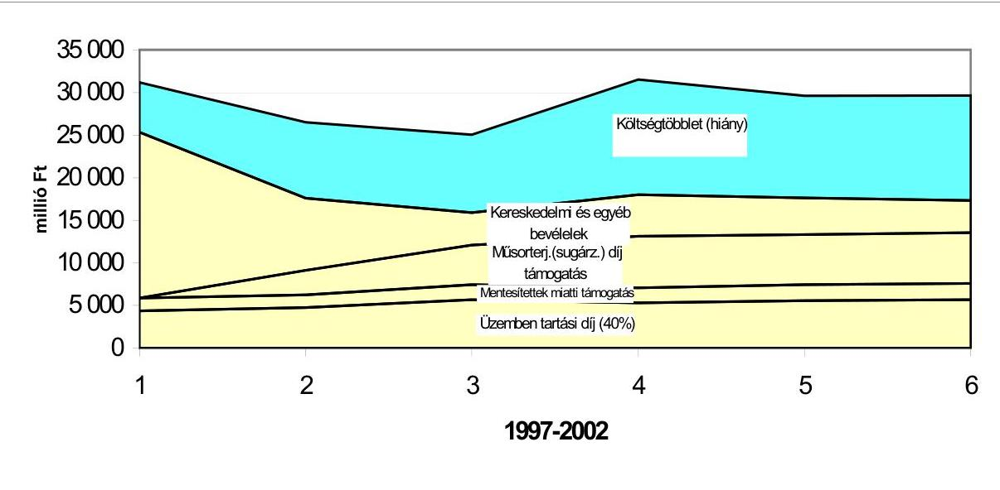
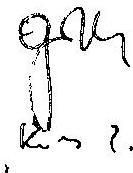
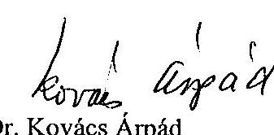
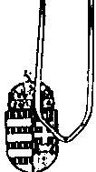
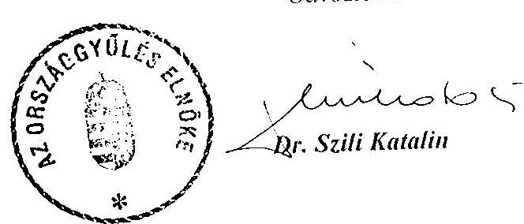
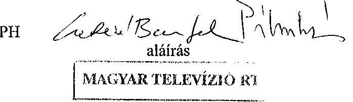
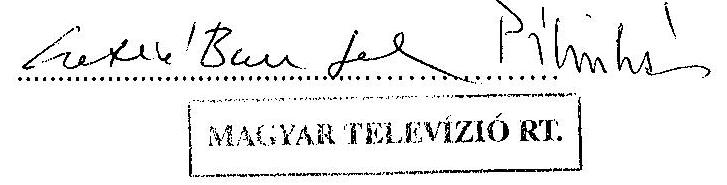
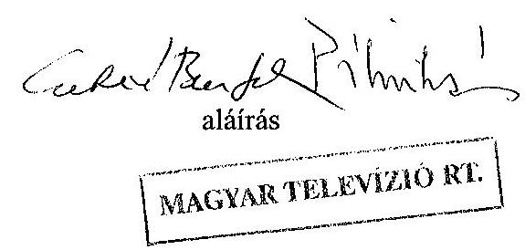

# JELENTÉS 

a Magyar Televízió Közalapítvány és az MTV Rt. működésének ellenőrzéséről

---

# 2. Államháztartás Központi Szintjét Ellenőrző 

2.3. Átfogó Ellenőrzési Főcsoport
V-19-101/2002-2003.
Témaszám: 614
Vizsgálatazonosító szám: V0056

## Az ellenőrzést felügyelte:

Bihary Zsigmond
főigazgató

## Az ellenőrzés végrehajtásáért felelős:

Hegedűsné dr. Müllern Veronika
főcsoportfőnök

## Az ellenőrzést vezette:

dr. Podonyi László
igazgatóhelyettes

A számvevői jelentések feldolgozásában és a jelentés összeállításában közreműködtek:

## Rideg Margit

főtanácsadó

## Biró Endre

számvevő

## Az ellenőrzést végezték:

| Bátory Béláné   tanácsadó | Biró Endre   számvevő | Koós Lászlóné   tanácsadó |
| :-- | :-- | :-- |
| dr. Majoros Sándor   tanácsadó | dr. Németh Klára   tanácsos | Rideg Margit   főtanácsadó |
| Szíjártó Károly   tanácsadó | Tóthné Nagy Éva   számvevő | Uglár László   főtanácsadó |
| Vati László   tanácsos | Verő Tünde   számvevő |  |

Jelentéseink az Országgyűlés számítógépes hálózatán és az Interneten a www.asz.hu címen is olvashatók.

---

# A témához kapcsolódó eddig készített számvevőszéki jelentések: 

címe
sorszáma
Jelentés a Magyar Televízió pénzügyi-gazdasági ellenőrzéséről (1991)

Jelentés a Magyar Televízió pénzügyi-gazdasági utóellenőrzéséről (1993)

Jelentés a médiatörvény végrehajtásának pénzügyi-gazdasági 396 ellenőrzéséről (1997)

Jelentés a Magyar Televízió Közalapítvány és kapcsolódó ellenőrzés 9812 keretében a Magyar Televízió Rt. működésének és gazdálkodásának ellenőrzéséről

Vélemény a Magyar Televízió Részvénytársaság 2003. évi 0244
költségvetési támogatási igényének megalapozottságáról, indokoltságáról

---

# TARTALOMJEGYZÉK 

BEVEZETÉS ..... 9
I. ÖSSZEGZŐ MEGÁLLAPÍTÁSOK, KÖVETKEZTETÉSEK, JAVASLATOK ..... 12
II. RÉSZLETES MEGÁLLAPÍTÁSOK ..... 20
A/ AZ MTV KÖZALAPÍTVÁNY MŰKÖDÉSE, GAZDÁLKODÁSA, TULAJDONOSI TEVÉKENYSÉGE ..... 20

1. A közalapítvány működésének szabályozottsága, szervezeti rendszere ..... 20
1.1. A közalapítvány jogállása, szervezeti és működési rendje ..... 20
1.2. A közalapítvány gazdálkodási ügyvitelének szabályozottsága ..... 23
2. A közalapítvány gazdálkodása ..... 24
2.1. A gazdálkodási szabályok érvényesülése ..... 24
2.2. A közalapítvány működési költségei ..... 26
2.3. A közalapítvány vagyonának változása ..... 28
3. A közalapítvány közgyűlési jogainak gyakorlása ..... 29
3.1. A Kuratórium és a Kuratórium elnökségének működése ..... 30
3.2. A testületi döntések megalapozottsága ..... 31
3.3. Az MTV Rt. gazdálkodása ellenőrzésének megszervezése ..... 32
3.4. Az MTV-elnökök pályázati célkitűzései megvalósításának értékelése ..... 33
4. A közalapítványnál végzett ellenőrzések ..... 34
4.1. Az Ellenőrző Testület ellenőrzési tevékenysége ..... 34
4.2. Az 1997-1998. évi számvevőszéki ellenőrzés során feltárt hiányosságok megszüntetésére tett intézkedések ..... 35
B/ AZ MTV RT. MŰKÖDÉSE ÉS GAZDÁLKODÁSA ..... 36
5. A részvénytársaság működésének szabályozottsága, törvényessége ..... 36
1.1. Az MTV Közalapítvány és az MTV Rt. kapcsolata ..... 36
1.2. Az MTV Közalapítvány, az MTV Rt. és az MTV Rt. Felügyelő Bizottsága kapcsolati rendjének szabályozottsága ..... 37
1.3. Az MTV Rt. belső szabályzatai és a jogszabályok összhangja ..... 37
1.4. A számviteli és bizonylati rend szabályozottsága ..... 40
6. Az MTV Rt. gazdálkodása ..... 42
2.1. A bevételek összetétele, szabályozása, alakulása, tervezése ..... 42
2.2. A költségek (ráfordítások) összetétele, alakulása, tervezése ..... 45
2.3. Az MTV Rt. állami támogatása és az Európai Unió országainak támogatási gyakorlata ..... 47
2.4. A gazdálkodás tervezése ..... 48

---

2.5. A tényleges bevételek és költségek (ráfordítások) alakulása ..... 50
2.5.1. A bevételek változása, összetételének alakulása ..... 50
2.5.2. A költségek és ráfordítások változása, összetételének alakulása, szakértői, tanácsadói díjak ..... 50
2.5.3. A gazdálkodás eredményessége, a saját tőke alakulása ..... 52
2.5.4. A likviditás, a kintlévőségek és a kötelezettségek változása ..... 53
3. A gazdálkodás főbb elemei ..... 54
3.1. A társaság eszköz- és vagyongazdálkodása ..... 54
3.1.1. A rendelkezésre álló tárgyieszköz-állomány hasznosítása ..... 54
3.1.2. Beruházások, felújítások ..... 58
3.1.3. A befektetések értéke és hozama ..... 59
3.1.4. Anyag- és készletgazdálkodás ..... 59
3.1.5. A műsorkészítés elszámolásának rendje ..... 61
3.1.6. A saját és külső gyártású, valamint a vásárolt műsorok aránya a műsoridőn belül ..... 64
3.1.7. Az egyes műsorfajták fajlagos bekerülési értékének összhangja a tervezett értékekkel ..... 65
3.1.8. A jogdíjak kifizetésének rendje ..... 67
3.2. A létszám- és bérgazdálkodás ..... 70
3.2.1. A létszám és összetételének alakulása, létszámleépítés ..... 70
3.2.2. A bér- és kereseti viszonyok alakulása ..... 71
3.2.3. Az állományi bérek felhasználása, a külső foglalkoztatottak ..... 72
3.2.4. A külső és belső megbízások ..... 73
3.2.5. A létszámleépítésre kapott költségvetési támogatások felhasználása ..... 74
3.3. Egyéb működési célú költségek ..... 76
3.3.1. Belföldi és külföldi kiküldetések elszámolása ..... 76
3.3.2. Az MTV Rt. gépjármű-állománya, saját gépkocsik, taxik igénybevétele ..... 77
4. Az MTV Rt.-nél végzett ellenőrzések ..... 80
4.1. A belső ellenőrzés működése ..... 80
4.2. A Felügyelő Bizottság ellenőrző tevékenysége ..... 81
4.3. A Kuratórium elnökségének ellenőrzési tevékenysége ..... 82
4.4. Az ÁSZ 1997-1998. évi ajánlásainak hasznosulása ..... 82

---

# MELLÉKLETEK 

1. A jelentéstervezetre tett észrevételek
2. A Magyar Televízió Közalapítvány bevételei az üzemben tartási díjból

A Magyar Televízió Közalapítvány gazdálkodásának főbb adatai
3. A Kuratórium elnöksége által MTV Rt.-nek átszámlázott tárgyieszközbeszerzések és szolgáltatások
4. A közalapítvánnyal munkaviszonyban, illetve munkavégzésre irányuló megbízási jogviszonyban álló dolgozók részéről igénybe vett juttatások
5. A Magyar Televízió Közalapítvány tőkeváltozása a 2001. évi mérlegadatai alapján
6. Az MTV Rt. gazdálkodásának terv-és tényadatai
7. Az MTV Rt. bevételeinek alakulása
8. Az MTV Rt. költségeinek és ráfordításainak alakulása
9. A gazdálkodás eredményessége

A saját tőke alakulása
10. A likviditás, a kintlévőségek és a kötelezettségek változása
11. Értékesített ingatlanok

Az értékesített ingatlanok becsült értéke és az eladási ára
12. Az MTV Rt. bérleti jogai társasággá alakulásakor
13. A tárgyi eszközök nettó és bruttó értékének, belső összetételének változása
14. A stúdiók és a közvetítőkocsik kihasználtsága
15. A beruházások tárgyévi növekménye az MTV Rt.-nél
16. Az évenkénti létszámleépítések

A teljes munkaidőben foglalkoztatottak 1 főre jutó keresetének főbb bérelemenkénti változása 1997. évhez viszonyítva
17. Az Állami Számvevőszéknek az MTV Közalapítványnál és az MTV Rt.-nél végzett korábbi ellenőrzései alapján tett ajánlásai és az Országgyűlés intézkedései

---

# FÜGGELÉKEK 

1. Az MTV KA elnöksége szerződésekkel kapcsolatos előzetes felhatalmazási, illetve jóváhagyási jogköreinek gyakorlása az MTV Rt.-nél
2. Az MTV Rt. elnökei a részvénytársasággá alakulástól napjainkig
3. A Magyar Televízió Rt. Közszolgálati Műsorszolgáltatási Szabályzatának értékelése az Alkotmányban biztosított alapjogok érvényesülése alapján
4. A meghatározó szerződéses feltételek
5. Költségracionalizálási intézkedések
6. A szakértői, tanácsadói szerződések teljesítése, az elvégzett munkák eddigi hasznosulása
7. Az MTV Rt. által értékesített ingatlanok
8. Az MTV Rt. befektetései
9. A nézettségi mutatók alakulásának szerepe az MTV Rt. gazdálkodásában
10. Műsorköltségek, műsorkészítési költségek alakulásának tervszerűsége

---

# TANÚSÍTVÁNYOK 

1. A társaság vagyoni helyzetének alakulása (eszközök)
2. A társaság vagyoni helyzetének alakulása (források)
3. Bevételek alakulása
4. A társaságnak juttatott költségvetési támogatások
5. Költségek és ráfordítások alakulása
6. A társaság költségeinek összetétele
7. Eredmény alakulása
8. Költségvetési befizetési kötelezettségek (adók, járulékok)
9. Költségvetési támogatások alakulása 1997-2002
10. Az állományi létszám alakulása
11. Az alaptevékenységet jellemző naturális és fajlagos közvetlen önköltségszintű mutatók alakulása
12. Az egy főre jutó átlagjövedelem alakulása

---

.

---

# RÖVIDÍTÉSEK JEGYZÉKE 

| ÁFA | általános forgalmi adó |
| :--: | :--: |
| APEH | Adó- és Pénzügyi Ellenőrzési Hivatal |
| ÁPV Rt. | Állami Privatizációs és Vagyonkezelő Részvénytársaság |
| ÁSZ | Állami Számvevőszék |
| BH | Bírósági Határozat |
| ET | Ellenőrző Testület |
| FB | Felügyelő Bizottság |
| Gt. | 1997. évi CXLIV. törvény a gazdasági társaságokról |
| Kbt. | 1995. évi XL. törvény a közbeszerzésekről |
| KMSZ | Közszolgálati Műsorszolgáltatási Szabályzat |
| KSZ | Kollektív Szerződés |
| médiatörvény | 1996. évi I. törvény a rádiózásról és a televíziózásról |
| Mt. | Munka Törvénykönyve |
| MTV KA | Magyar Televízió Közalapítvány |
| MTV Rt. | Magyar Televízió Részvénytársaság |
| MTV 2 | Magyar Televízió 2-es csatorna |
| OGY | Országgyűlés |
| ORTT | Országos Rádió és Televízió Testület |
| Ptk. | 1959. évi. IV. törvény a Polgári Törvénykönyvről |
| Ptké. | 1960. évi 11. törvényerejű rendelet a Polgári Törvénykönyv hatálybalépéséről és végrehajtásáról |
| Szjt. | 1999. évi LXXVI. törvény a szerzői jogról |
| SZMSZ | Szervezeti és Működési Szabályzat |
| Sztv. | 2000. évi. C. törvény a számvitelről |
| Ügyrend | MTV KA Kuratóriuma Ellenőrző Testületének Ügyrendje |

---

# 8

---

# JELENTÉS 

## a Magyar Televízió Közalapítvány és a Magyar Televízió Rt. működésének ellenőrzéséről

## BEVEZETÉS

A Magyar Televízió Közalapítványt (MTV KA) a rádiózásról és televíziózásról szóló 1996. évi I. törvény (médiatörvény) alapján a 18/1996. (III. 8.) OGY határozatával az Országgyűlés hozta létre televíziós közszolgálati műsorszolgáltatás biztosítására, függetlenségének védelmére. Az Alapító Okirat szerint az MTV KA (továbbiakban: közalapítvány) alapvető feladata, hogy - a Magyar Televízió Részvénytársaság (MTV Rt.) tulajdonosaként - gondoskodjék a közszolgálati műsorszolgáltatás médiatörvényben meghatározott követelményei érvényesüléséről.

A közalapítvány induló vagyona 15 millió Ft volt. A médiatörvényben jóváhagyott mértékű működési célú támogatást az Országos Rádió és Televízió Testület (ORTT) a Műsorszolgáltatási Alapból folyósítja az alapítvány részére.

Az MTV Rt. alapításkori saját vagyona 18,96 milliárd Ft volt. A társaság az alapítást követően rendszeres (sugárzási díj, üzemben tartási díj, az üzemben tartási díj fizetése alól mentesítettek állam által átvállalt átalánya, illetve kiegészítése) és eseti (létszámcsökkentéssel kapcsolatos egyszeri személyi kifizetések, köztartozások elengedése, adósságtörlesztés, tőketartalék-juttatás) támogatásban részesült a központi költségvetésből, illetve a Műsorszolgáltatási Alapból. A támogatás célját, mértékét, módját a médiatörvény, illetve az éves költségvetési törvények határozták meg. 1997-2002-ben a fenti címeken az MTV Rt. összesen 104 milliárd Ft támogatást kapott, ebből 86,5 milliárd Ft a bevételeit, 17,5 milliárd Ft közvetlenül a saját tőkéjét növelte. A társaság összes költsége és ráfordítása ugyanezen időszak alatt 190,4 milliárd Ft volt. A társaság saját tőkéje a minden évben veszteséges üzleti tevékenység következtében az 1997. évi 18,5 milliárd Ft-ról 2002-re 1,7 milliárd Ft-ra csökkent. A saját tőkén belül a jegyzett tőke értéke 1997-ben 16,1 milliárd, 2002-ben 1,2 milliárd Ft volt.

A közalapítvány gazdálkodásának törvényességét és célszerűségét a Ptk. 74/G § (8) bekezdése, illetve a médiatörvény 60. § (5) bekezdése szerint az Állami Számvevőszék ellenőrzi.

Az Állami Számvevőszék az 1989. évi XXXVIII. törvényben meghatározott hatáskörében és feladatai alapján - mint az Országgyűlés pénzügyi-gazdasági ellenőrző szerve - ellenőrzi az államháztartás gazdálkodását, ennek keretében - többek között - a felhasználások törvényességét, szükségességét és célszerűségét (2. § (1) bekezdés), ellenőrzi az állami költségvetésből juttatott támogatás felhasználását - többek között - az ún. egyéb szervezeteknél (2. § (5) bekezdés), így az MTV Rt.-nél.

---

A közalapítvány törzsvagyonnal való gazdálkodásának törvényességi és célszerűségi szempontok szerinti ellenőrzése részben közvetlenül a közalapítvány Kuratóriumának és a Kuratórium elnökségének helyszíni ellenőrzése keretében, részben - kapcsolódó ellenőrzésként - a vagyont működtető egyszemélyes részvénytársaságnál történt. Az 1989. évi XXXVIII. törvény fent idézett 2. § (5) bekezdése, illetve a 21. § (3) bekezdése alapján - ha egyes vizsgálati megállapítások kiegészítése szükségessé válik - az Állami Számvevőszék ellenőre jogosult az összefüggő tényeket más szervnél is vizsgálni.

A közalapítvány és a részvénytársaság működését, gazdálkodását átfogóan legutóbb 1997-1998-ban ellenőrizte az Állami Számvevőszék, az Országgyűlés 89/2002. (XI. 13.) OGY határozata alapján pedig 2002 végén célvizsgálat keretében az MTV Rt. 2003. évi költségvetési támogatási igényének megalapozottságát és indokoltságát értékelte.

A jelenlegi ellenőrzés célja annak értékelése volt
a Magyar Televízió Közalapítványnál, hogy

- a szervezeti és működési
 rendje biztosította-e a feladatok hatékony ellátását, gazdálkodása törvényes és célszerű volt-e;
- a Kuratóriuma és a Kuratórium elnöksége törvényesen és célszerűen gyakorolta-e részvényesi jogait az MTV Rt. működése, gazdálkodása körében;
- az Ellenőrző Testületének ellenőrzései és ezek alapján tett intézkedések milyen hatást gyakoroltak a közalapítvány gazdasági-pénzügyi tevékenységére;
a Magyar Televízió Rt.-nél, hogy
- az Alapító Okiratában foglaltaknak, illetve a közalapítvány Kuratóriuma és a Kuratórium elnöksége döntéseinek megfelelően, törvényesen, célszerűen és eredményesen gazdálkodott-e a rendelkezésére bocsátott vagyonnal és a központi költségvetési támogatással, mi eredményezte a törzsvagyon jelentős mértékű elvesztését;
- közszolgálati feladatai és működésének személyi, tárgyi és pénzügyi feltételei összhangban vannak-e, illetve stratégiája alkalmas-e közszolgálati feladatai ellátásának és rentábilis működésének együttes biztosítására;
- a Felügyelő Bizottság ellenőrzései és az ezek alapján tett intézkedések milyen hatást gyakoroltak gazdasági-pénzügyi tevékenységére;
- az 1997-1998. évi számvevőszéki ellenőrzés megállapításai és javaslatai alapján kidolgozott intézkedési terv végrehajtása milyen eredményekkel járt.

Az ellenőrzés az 1998-2002. évekre terjedt ki, de az ellenőrzés lezárásáig figyelemmel kísérte a gazdasági-pénzügyi folyamatokat.

A jelentés részletes megállapításaihoz kiegészítő információkat tartalmaznak a kapcsolódó függelékek.

---

A jelentést a Kuratórium elnökével, a jelentés tervezetét a társaság ügyvezető alelnökével egyeztettük, levelük másolatát az 1. számú melléklet tartalmazza.

---

# I. ÖSSZEGZŐ MEGÁLLAPÍTÁSOK, KÖVETKEZTETÉSEK, JAVASLATOK 

A Magyar Televízió Rt.-nél és jogelődjénél végzett korábbi és jelenlegi számvevőszéki ellenőrzések tapasztalatai egyaránt arra hívják fel a figyelmet, hogy a feltárt ismétlődő szabályozási és gazdálkodási hiányosságok megszüntetése sürgető feladat ${ }^{1}$. Az ellenőrzés megítélése szerint a Közalapítvány és az Rt. elmúlt hat évi működése megkérdőjelezi a médiatörvény által kialakított tulajdonosi, működtetési, finanszírozási és gazdálkodási rend célszerűségét. Az Rt. működési költségei és ráfordításai 1997-2002-ben - miközben nézettségi mutatói általában igen alacsony és hullámzó teljesítményt jeleztek - mindösszesen meghaladták a 190 milliárd Ft-ot, szemben a 155 milliárd Ft bevétellel, amelyből 86,5 milliárd Ft bevételt növelő állami támogatás volt. Ezen felül a társaság két alkalommal összesen 17,5 milliárd Ft tőketámogatásban is részesült, de 2002 végére így is elvesztette saját induló vagyonának 90%-át, az évet -11,8 milliárd Ft mérleg szerinti veszteséggel zárta. Az Rt.-nek megalakulása óta megbízással, kinevezéssel összesen hét vezetője volt. Folyamatosan intézkedési tervek, részintézkedések születtek működésének és gazdálkodásának konszolidálására - eddig minden eredmény nélkül. Mindez kétségessé teszi, hogy a jelenlegi szabályozási keretek között tartósan megteremthetőek-e a kiegyensúlyozott működés és gazdálkodás feltételei, miután a veszteséges, célszerűtlen gazdálkodást a jelenlegi szabályozás nem szankcionálja, sőt deklarálja, hogy az MTV Rt. nem számolható fel.

A közalapítvány szabályozása és működésének körülményei a vizsgált időszakban folyamatosan változtak. A közalapítvány Kuratóriumának elnöksége az SZMSZ-ben nem jelenítette meg a Gt. vezető tisztségviselőkre és a gazdasági társaság ügyvezetésére vonatkozó előírását, amely az ilyen személyektől fokozott gondosságot és a gazdasági társaság érdekeinek elődlegessége alapján való feladatellátási kötelezettséget ír elő. Nem jelenítette meg továbbá az alapítványi vagyon kezeléséről a harmadik személyekkel szemben és a hatóság előtti képviseletről, cégjegyzésről szóló részletes szabályokat. A közalapítvánnyal szerződésben állók jogviszonya esetenként szabályozatlan és ellentmondásos volt. A közalapítvány SZMSZ-e szerint a kuratóriumi titkárság feladata a Kuratórium és elnöksége zavartalan működéséhez szükséges tárgyi, anyagi és személyi feltételek biztosítása. A közalapítvány minden felmerült költséget megtérített, függetlenül attól, hogy a költségtérítési átalányon kívül nem állapítható meg, hogy az egyes tisztségviselők részére milyen elvek alapján biztosítanak eszközöket. A közalapítvány elhelyezéséről az MTV Rt.-nek kell gondoskodni. Az MTV Rt. térítésmentesen biztosítja a munkahelyek működtetéséhez szükséges szolgáltatásokat és berendezéseket.

[^0]
[^0]:    ${ }^{1}$ Lásd a 17. számú mellékletet az Állami Számvevőszéknek az MTV Közalapítványnál és az MTV Rt.-nél végzett korábbi ellenőrzései alapján tett ajánlásairól és az Országgyűlés intézkedéseiről

---

A közalapítvány gazdálkodási tervezésével kapcsolatos gyakorlata megalapozatlan, az elkészített éves tervek jóváhagyása utólagos, illetve hiányos volt.

A közalapítvány Kuratóriumának elnöksége és Ellenőrző Testülete a megalakulástól napjainkig a folyamatos változás és bizonytalanság időszakát élte át, ami egyes időszakokban nem tette lehetővé az MTV Rt. feletti alapítói és közgyűlési jogok gyakorlását, a közalapítvány működésének ellenőrzését, egy hosszú távú - az MTV Rt.-t irányító és ellenőrző - tulajdonosi koncepció megalkotását. Mindez rontotta a tulajdonosi jogok gyakorlásának hatékonyságát.

A részvénytársaság megalakítása óta a társaság egyik elnöke sem töltötte ki a négy éves periódust. A leghosszabb időszak egy év öt hónap volt. Az eltelt hat év alatt három pályázat útján megválasztott elnöke és négy ügyvezető alelnöke volt az MTV Rt.-nek. Az elnökök folyamatos cseréje is akadályozta a tulajdonosi stratégia megalkotását. Az elnökök pályázati célkitűzéseinek megvalósítása, a részletes ütemterv elkészítése nem szerepelt végrehajtandó és számon kérhető konkrét feladatként sem az elnökökkel kötött megbízási szerződésekben, sem az elnökök számára megfogalmazott célfeladatok között.

A közalapítvány Kuratóriuma és elnöksége a folyamatosan fennálló gazdálkodási gondok ellenére nem mérte fel és mutatta be, hogy a médiatörvény szabályozási keretei között elérhető kereskedelmi piaci bevételek, valamint a költségvetés által biztosított támogatások alapján milyen közszolgálati műsorszerkezet, műsoridő finanszírozható, és ehhez hány sugárzási csatornát célszerű fenntartani.

Az MTV Rt.-nek a vállalatirányítási rendszer működtetéséhez aktuális szervezeti és működési szabályzata a vizsgált időszakban nem volt. A szervezet többször megváltozott, a feladatkörök szabályozása viszont elmaradt. A Közszolgálati Műsorszolgáltatási Szabályzatának műsorszolgáltatásra és az MTV Rt. független működésének biztosítékaira vonatkozó fejezeteiben az alkotmányos alapjogok nem érvényesülnek. A szabályzatban nincs megfogalmazva a befolyás és a befolyásmentesség fogalma, továbbá a közérdekűség kritériuma. Ennek hiányában a megfogalmazott követelmények kívánalmak maradnak. Nem határozta meg a médiatörvény közszolgálati műsorszolgáltatásként megfogalmazott fogalomkörét.

Az MTV Rt. gazdálkodásának eredménytelensége, a vagyont elfogyasztó veszteség részben a bevételek hiányából, részben a pazarló gazdálkodásból, működésből ered. A részvénytársasággá alakulásától kezdve megoldatlan volt a bevételek és költségek egyensúlyban tartása.

A médiatörvény új helyzetet teremtett a közszolgálati televízió számára. 1998-tól a korábban a közszolgálati televízióhoz érkező reklámbevételek nagyobb része a kereskedelmi televízióknál jelent meg. A közszolgálati televíziónál a kieső reklámbevételeket sem állami támogatás, sem egyéb kereskedelmi bevétel nem pótolta, a közszolgálati televíziós szolgáltatás összes költségei és ráfordításai viszont láthatóan - nominális értéken - nem csökkentek. A költségvetési szervezeti, működési és gazdálkodási tapasztalatokkal gazdasági társasággá alakult

---

közszolgálati televízió egyedül nem volt képes alkalmazkodni a piaci viszonyokhoz, bár a műsorszolgáltatás fajlagos költségeit csökkentették.

1997-2002-ben a társaság folyamatos működésből származó bevételeihez képest nagyobb összeget fordított a folyó költségekre és ráfordításokra, az üzemi üzleti tevékenység minden évben veszteséges volt. 1998-2002-ben a társaság összesen 34,1 milliárd Ft mérleg szerinti veszteséget halmozott fel, amely azzal együtt keletkezett, hogy a társaság költségvetési támogatásokban részesült, és ingatlanjainak értékesítéséből is voltak bevételei. Az MTV Rt.-nek 1997 végén még 18,5 milliárd Ft saját tőkéje volt, amely azonban a 34,1 milliárd Ft mérleg szerinti veszteséget önmagában nem fedezte. 2002 végére negatív saját tőkéje lett volna a társaságnak, ha a központi költségvetésből nem kap 17,5 milliárd Ft tőketartalékot.

Az MTV Rt. bevételei a médiatörvény, illetve az éves költségvetési törvények által meghatározottak. A társaság a reklámpiac visszaszerzése érdekében 2000-tól a reklámidő értékesítését két alkalommal külső cégre bízta. A szerződések megkötését nem előzte meg közbeszerzési eljárás, annak ellenére, hogy az ügyletek a közbeszerzési törvény hatálya alá estek. A közbeszerzési törvényt megkerülő eljárást a Kuratórium elnöksége nem akadályozta meg. A szerződések az MTV Rt. számára hátrányosak és eredménytelenek voltak. A szerződések nem tartalmaztak érvényesíthető garanciát a tervezett bevételekre. Nem tették lehetővé a jutalék elszámolásának alapjául szolgáló teljesítmények ellenőrzését. Nem biztosították a bevételek határidős beszedését és a késedelmes teljesítések szankcionálását. A reklámértékesítésre kiválasztott cégek gyakorlatilag az MTV Rt. és a hirdető cégek közötti közvetítői jutalékot szedték be az MTV Rt. piaci kapcsolatainak és ismereteinek felhasználásával.

A kereskedelmi bevételek csökkenését az MTV Rt. a működési költségek csökkentésével nem ellensúlyozta. A költségek csökkentését az éves tervekben csak célkitűzésként fogalmazták meg, de az elérendő megtakarításokat és azok teljesítésének időpontját nem határozták meg. A tervekben a műsoridő csökkentésének lehetősége nem szerepelt. A fix stúdiókból teljesített közszolgáltatás sugárzási díját központi költségvetési támogatás fedezte, ezért az MTV Rt. gazdálkodásában a sugárzási díjak nem képeztek megtakarítási lehetőséget, így csökkentésükben sem volt érdekelt a társaság.

Az MTV Rt.-nél a bevételek és ráfordítások egyensúlyban tartása nem volt tervezési szempont. Az egyes tervek elfogadásának gyakorlata a reálisan tervezhető saját bevételeken és támogatáson nyugvó költségtervezés mellőzését mutatta. A Kuratórium elnöksége asszisztált a vagyonfeléléshez a tervek utólagos jóváhagyásával.

Az MTV Rt. működésének állami támogatása következetlen, ellentmondásos és rövid távú koncepció alapján valósult meg. A támogatási rendszer átalakításának szükségességét az üzemben tartási díj Kormány általi átvállalása is indokolja. Az MTV Rt. kereskedelmi bevételei 1997-hez képest harmadára estek vissza, egyidejűleg a költségvetési törvények a médiatörvényben foglaltakhoz képest 10%-kal csökkentették az üzemben tartási díjból való részesedését. A létszámleépítések támogatása és felhasználása átgondolatlan és szabálytalan

---

volt. A támogatás részaránya az összes bevételből az 1997. évi 18%-ról 2001-re 53%-ra nőtt. Ezt az arányt az üzemben tartási díj tovább növelte.

Az MTV Rt. 1997-2001-ben jogi személyeknek összesen 724 millió Ft díjat fizetett ki jogi, üzletviteli és gazdasági tanácsadásért, egyéb szakértői munkáért. A tanácsadók, szakértők munkája - mindenekelőtt az első számú vezető gyakori cseréje miatt - korlátozottan hasznosult.

Az MTV Rt. a vizsgált években folyamatosan fizetési nehézségekkel küzdött. A likviditási helyzetről 2001 májusától heti jelentéseket készített az MTV Közalapítvány Kuratóriumának elnöksége részére, de nem készített havi bontású éves likviditási mérlegeket a várható bevételekről, kiadásokról. A szállítói számlák kifizetésének nem volt következetesen betartott rendje, a napi átutalások egyedi döntések alapján születtek. A szállítók finanszírozó szerepet töltöttek be az MTV Rt. működésében.

Az MTV Rt. a vizsgált időszakban értékesítette ingatlanai 95%-át. A korábbi elképzelés szerint az ingatlanokból befolyó bevételt az új székház felépítésére fordították volna, a kritikus gazdasági helyzetben a társaság a bevételeket a működés finanszírozására fordította. A nyilvántartási értékhez képest a társaság nyereséget realizált az értékesítésből. A működéshez szükséges ingatlanokat a társaság visszabérli. A bérleti szerződéseket az adás-vétellel egyidejűleg kötötték meg, a feltételek az MTV részére kedvezőtlenek. Az ingatlanok állami tulajdonba kerülésével kialakult helyzet nem tartalmaz garanciákat az Alkotmányban és a médiatörvényben kinyilvánított közszolgálati műsorszolgáltatás függetlenségi elvének betartásához. Az MTV Rt. eszközparkja elavult, azokra a társaság az amortizáció értékének töredékét fordította.

A filmen és videokazettán őrzött anyagok felújítására csak esetlegesen került sor, ezért a gyűjtemény elöregedett.

A Kuratórium tárgyi eszközei részben az MTV Rt. tulajdonában állnak. A tulajdonosi szerepkörét betöltő alapítványnak az általa felügyelt Rt.-től saját maga által létrehozott gazdasági függősége tisztázatlan érdekviszonyokat hozott létre.

Az MTV Rt. gyártási szerződései nem egységesek. A szerződéseket nem a társaság jogi osztálya készíti, hanem a szerződő partner. Egy több évre vonatkozó
 műsor esetében az előzetes jóváhagyás során nem vizsgálta a szerződés társaságra vonatkozó előnyös vagy hátrányos gazdasági kihatásait, sem a hosszú távú szerződéskötés indokait. A Kuratórium elnöksége a jóváhagyó döntését az előzetes szakértői vélemény ellenére hozta meg olyan cég esetében is, amely a hatályos cégnyilvántartásban nem szerepelt.

Az MTV Rt. nem rendelkezik gyártási normatívákkal. Az önköltségszámításon alapuló, a közvetett és közvetlen költségeket figyelembe vevő gyártási normák hiányában elkészített gyártási tervek megalapozatlanok. Az elő- és utókalkuláció nem azonos elveken épül fel. A fajlagos gyártási költségek a kialakult gyakorlat alapján nem tartalmazzák az általános költségek teljes körét. A gyártást megelőző döntési folyamatokban nem volt szempont a fajlagos műsorgyártási költség összege.

---

A műsorszerkezethez kapcsolódó bázisalapú költségtervezés, a cash-, a barter- és a belsőkapacitás-felhasználás eltérő értékelése és számítási módja, valamint a gyártáshoz kapcsolódó - de közvetlenül a produkcióra nem terhelhető - költségek és a szerződési feltételek pontatlan meghatározása miatt fajlagos mutatókat nem vesznek figyelembe sem a produkciók, sem a szervezeti egységek éves tervének összeállításakor.

Az archiválásra leadott külső produkciók dokumentációja hiányos, ami akadályozza a jogvédelem érvényesülését és a számviteli törvény betartását. A társaság nem rendelkezik a különféle szerzői jogokra vonatkozó központi nyilvántartással. Az archívum nyilvántartása nem zárt, és hiányzik a folyamatos ellenőrzés lehetősége. Az archívum használata után fizetendő jogdíj önköltségszámítással nincs alátámasztva. Az archiválási hiányosságok következtében az évenként elkészített mérlegek nem felelnek meg a teljesség és az egyedi értékelés számviteli alapelveknek. A társaság könyvvizsgálója az óvatosság számviteli alapelv figyelembevételével nem tartotta indokoltnak a hivatkozott archívum beszámolóban történő szerepeltetését a per befejezéséig.

Az MTV Rt. létszámgazdálkodása az ellenőrzött időszakban minden koncepciót nélkülözött. A létszámleépítés gazdálkodásra gyakorolt hatása nem érte el a kitűzött célt. Az MTV Rt. 1997-től négy alkalommal kapott a központi költségvetésből támogatást a racionálisabb gazdálkodás elősegítéséhez. Az egyes években biztosított támogatás a pillanatnyi likviditási gondok leküzdésén kívül a jogosulatlanul juttatott jövedelmek növelésére volt alkalmas a társaság gazdálkodásának javítása helyett. A kormányhatározatokban rejlő lehetőséget a költségtakarékos, hatékony gazdálkodás megvalósítására az MTV Rt. egyik vezetője sem tudta a társaság javára fordítani. A követelmény nem mindig pontos meghatározása pedig megnehezítette a folyósított költségvetési támogatás hatékony felhasználását. Az egymással össze nem hasonlítható tartalmú adatok közlése, továbbá a monitoring-rendszer hiányossága akadályozta a támogatás célszerűségének és hatékonyságának teljes körű ellenőrzését.

A részvénytársaság megalakulása óta a belső ellenőrzéssel kapcsolatos szabályzatok nem készültek el. Az Rt.-nél az ellenőrzés szerepe nem volt meghatározó. A korábbi számvevőszéki ellenőrzések javaslatait ${ }^{2}$ a Kuratórium és a társaság nem hasznosította sem a szabályozás, sem a gazdálkodás területén.

A részletes megállapítások hasznosításán túl - az MTV Rt. működésének és gazdálkodásának átláthatósága, ellenőrizhetősége, minél nagyobb hatékonysága érdekében - javasoltuk az MTV Rt. ügyvezető alelnökének, hogy gondoskodjon

- a társaság Szervezeti és Működési Szabályzatának megalkotásáról,
- a hatályos Számlatükörhöz tartozó Számlarendnek mielőbbi kiadásáról és az Önköltség-számítási Szabályzat alkalmazhatóságáról;

[^0]
[^0]:    ${ }^{2}$ Lásd a 17. számú melléklet A, B, C pontjait.

---

- a szervezeti és működési rend változtatásait követhetően a belső szabályzatok, munkaköri leírások azonnali aktualizálásáról;
- a szerződéskötési utasítások rendelkezéseinek következetes betartásáról és a szerződés-nyilvántartási rendszer céljának megfelelő tökéletesítéséről;
- a tanácsadók, szakértők által elvégzett munkák szakszerű dokumentálásáról;
- a likviditás növelését célzó utasítások következetes alkalmazásáról;
- intézkedjen a visszafoglalkoztatást nyomon követő monitoring elkészítéséről, és az alapján állapíttassa meg az 1997-től jogosulatlanul alkalmazottak névsorát;
- módosítsa a társaság számviteli politikájának megfelelően az állományi létszámot és az átlaglétszámot az éves beszámolókban;
- állítsa be az archívumfejlesztés tervébe az egyszeri felhasználást lehetővé tevő másolatok készítésének technikai feltételeit;
- írja elő a műsorok gyártásában és értékesítésében érdekelt szervezeti egységek részére a költségtakarékos műsorgyártás érdekében a bevételek tervezését is;
- dolgozza ki a saját gépkocsi hivatali célú használatáért kifizetett költségátalány elszámolásának egységes szabályait az ellenőrizhetőség érdekében;
- vizsgálja felül és hangolja össze egy szabályzatban az utalványozással kapcsolatos feladatokat és jogosultságokat;
- adja ki egységes szerkezetben a tartalmilag egymáshoz kapcsolódó utasításokat és körleveleket a változások követhetősége, betartásuk ellenőrizhetősége érdekében.
- fogalmazza újra a Közszolgálati Műsorszolgáltatási Szabályzat műsorszolgáltatásra és az MTV Rt. független működésének biztosítékaira vonatkozó fejezetei kifogásolt pontjait az alkotmányos alapjogok érvényesülése és érvényesíthetősége érdekében;
- határozza meg az MTV Rt. elsődleges társasági érdekeit a követendő stratégiai és üzletpolitikai célok kijelölésével és a fokozott gondossági mértéknek megfelelő felelősségi rendszer kiépítésével.

A munkabérek járulékainak meg nem fizetésével, a szerződéskötési gyakorlattal kapcsolatban büntető eljárások vannak folyamatban. Ezért a jelenlegi ellenőrzés alapján az Állami Számvevőszék csak a jogosulatlan gazdasági előny megszerzése bűncselekmény miatt a céljelleggel nyújtott támogatás jogcímétől eltérő felhasználás (visszafoglalkoztatás) ügyében kezdeményezett büntető eljárást ismeretlen tettes ellen. E témában - az ÁSZ ismeretei szerint - más szervezet büntető eljárást nem kezdeményezett.

---

A helyszíni ellenőrzés megállapításainak hasznosítása mellett javasoljuk:

# az Országgyűlésnek, 

1. fontolja meg - a közalapítvány és az Rt. alapítása óta eltelt időszak rendkívül kedvezőtlen működési, gazdálkodási tapasztalataira figyelemmel - a közszolgálati média átfogó újraszabályozását;
2. kérje fel a Kormányt, hogy a közszolgálati média átfogó újraszabályozásának megvalósulásáig tartó időszakra mielőbb tegyen javaslatot az MTV Rt. kiszámítható bevételekre épülő, független, veszteségmentes gazdálkodásának megoldására.

## az Országgyűlésnek, mint a Magyar Televízió Közalapítvány alapítójának,

1. kérje fel a közalapítványt a rendelkezésére álló eszközök alkalmazására - ide értve a műsoridő módosítását is - annak érdekében, hogy az Rt. kiadásai a forrásaihoz igazodjanak;
2. módosítsa a Közalapítvány Alapító Okiratának 12.2. pontjában a „...költségtérítésre tarthatnak igényt", illetve a „Költségtérítés... megilleti." szövegrészt úgy, hogy abból alapvetően derüljön ki az alapítói szándék: az érintettek a közalapítvány tevékenységével összefüggésben felmerült, igazolt költségeik megtérítését igényelhetik, és/vagy a költségek igazolása nélkül, adóköteles költségtérítésben részesíthetők;
3. egészítse ki az Alapító Okiratot a költségtérítéssel kapcsolatban választott megoldás függvényében: az elszámolható költségek körét, mértékét, a költségek igazolásának módját a közalapítvány Szervezeti és Működési Szabályzatában kell megállapítani, vagy a költségtérítés összegét határozza meg, illetve e jogkörrel hatalmazza fel a Kuratóriumot;
4. törölje az Alapító Okirat 1. sz. melléklete 5. pontját - miszerint a közalapítvány bevételei között megjelenő, az MTV Rt.-t megillető összegekre az utalási intézkedések meghozatala az elnökség feladata -, mivel az alapító okirat 1. sz. mellékletének 3. pontja konkrétan tartalmazza az MTV Rt.-t megillető bevételeket és az átutalás határidejét is. A feladat teljesítését az elnökség nem mérlegelheti, így végrehajtása nem igényel testületi döntést;
5. foglaljon állást a közalapítvány működési feltételeihez térítésmentesen igénybe vehető, az MTV Rt. által nyújtandó szolgáltatások és eszközök köréről.

## a Magyar Televízió Közalapítvány Kuratóriumának,

1. módosítsa Szervezeti és Működési Szabályzatát és ennek keretében

- az alapítványi célokhoz igazodó - saját nevében vállalható - alcélok rendszerét;

---

- a közfeladat-ellátó és társaságirányító tulajdonosi tevékenységet a hozzá tartozó felelősségi rendszerrel együtt;
- az alapítványi vagyon kezeléséről, a harmadik személyekkel szemben és a hatóságok előtti képviseletről, cégjegyzésről szóló részletes szabályokat;

2. határozza meg a közalapítvány Szervezeti és Működési Szabályzatában az éves gazdálkodási terv készítésének módját, a feladatok és jogkörök megfelelő elhatárolásával az évközi módosítások tartalmi és formai követelményeit;
3. állapítsa meg az alapító döntése szerint a Szervezeti és Működési Szabályzatban az elszámolható költségtérítések és juttatások körét, mértékét és a költségek igazolásának, elszámolásának rendjét, valamint a társaság által biztosítandó eszközök igénybevételét;
4. határozza meg a közalapítvány Kuratóriuma elnökének jogait és hatáskörét a közalapítvány gazdálkodása tekintetében;
5. tegyen határozott intézkedéseket a közalapítvány törvényes és szabályozott működése érdekében a közalapítvány korábban elfogadott szabályzatainak aktualizálására, illetve határozza meg a szükséges szabályzatok körét;
6. éljen az Alapító Okiratában biztosított szabályozási lehetőségekkel az MTV Rt. feletti tulajdonosi jogok következetesebb, hatékonyabb gyakorlása érdekében;
7. segítse az MTV Rt. hatékonyabb működését döntései megalapozottságának növelésével;
8. vizsgálja meg a személyes felelősségre vonás szükségességét a jelentésben kifogásolt, a részvénytársaság számára előnytelen szerződések ügyében.

# a Magyar Televízió Közalapítvány Kuratóriuma elnökségének, 

1. helyezze előtérbe az elnökség és az elnök ellenőrzési feladatainak meghatározása és végrehajtása során a hatékony és célravezető módszereket;
2. intézkedjék a közalapítvány szabályzataiban és gazdálkodásában feltárt hiányosságok felszámolására;
3. dolgozza ki az MTV Rt. gazdálkodása általános ellenőrzésének rendszerét, valamint az MTV Rt. szerződéskötéseivel összefüggő jogosítványai gyakorlásának eljárási rendjét tulajdonosi feladatai hatékonyabb ellátása érdekében;
4. fogalmazza meg pontosan elvárásait az MTV Rt. elnöke kiválasztására kiírt pályázati felhívásban, és következetesen kérje számon azok megvalósítását.

## az MTV Rt. Felügyelő Bizottságának,

igazítsa az MTV Rt. elsődleges érdekei követelményéhez az ellenőrzés szabályait a testület Ügyrendjében és a tagi felelősség szabályozásában.

---

# II. RÉSZLETES MEGÁLLAPÍTÁSOK 

## A/ AZ MTV KÖZALAPÍTVÁNY MŰKÖDÉSE, GAZDÁLKODÁSA, TULAJDONOSI TEVÉKENYSÉGE

## 1. A KÖZALAPÍTVÁNY MŰKÖDÉSÉNEK SZABÁLYOZOTTSÁGA, SZERVEZETI RENDSZERE

### 1.1. A közalapítvány jogállása, szervezeti és működési rendje

A Magyar Televízió Közalapítvány (MTV KA) szervezeti működési rendjét szabályozó anyagi, jogi és eljárási szabályok a vizsgált időszakban folyamatos átalakuláson mentek át, hatásuk a gyakorlatban ellentmondásokkal terhelt volt, mivel az alapítványok alapvető mögöttes joganyaga csak a vizsgált időszak végére zárult le.

A közalapítványt - a rádiózásról és televíziózásról szóló 1996. évi I. törvény (médiatörvény) 53. § (1) bekezdésével - a közszolgálati műsorszolgáltatás biztosítására, függetlenségének védelmére hozta létre az Országgyűlés.

A Ptk. rendelkezései értelmében az alapítványt tartós, közérdekű célra kell alapítani. A cél konkrét megfogalmazása nem előírt, de a bíróság az alapítvány nyilvántartásba vételekor (Ptk. 74/A §), a törvényességi felügyeletet gyakorló ügyészség pedig az alapítvány működése során vizsgálni köteles.

A közalapítvány célját a 18/1996. (III. 8.) OGY határozat mellékletét képező Alapító Okirat 3. pontja határozta meg az Alkotmány 61. §-ával és a médiatörvénnyel összhangban: a szabad és független televíziózás, a véleménynyilvánítás szabadsága, a tájékoztatás függetlensége, kiegyensúlyozottsága és tárgyilagossága, a tájékozódás szabadsága, valamint az egyetemes és nemzeti kultúra támogatása, a vélemények és a kultúra sokszínűségének érvényre juttatása érdekében a Magyar Televízió, mint közszolgálati televízió függetlenségének, ezzel egyidejűleg társadalmi felügyeletének biztosítása.

A közalapítvány nem lép az állam helyébe, a fenti közfeladat ellátásának biztosítását az állam érdekében, de a saját nevében szervezi. A célmeghatározás azt a közfeladatot mutatja be, amely az Országgyűlést az Alkotmány értelmében terheli. A Legfelsőbb Bíróság KK 38. számú állásfoglalása értelmében az MTV KA alapítója a jogszabályok alapján őt terhelő közfeladat alól a közalapítvány létesítésével nem mentesülhet, a közalapítvány az alapító teljes feladat- és hatáskörét nem veheti át, a közfeladat ellátásában csak közreműködhet.

Az MTV KA Szervezeti és Működési Szabályzata (SZMSZ) megismétli a célmeghatározást, valamint a médiatörvény és az OGY határozat kapcsolódó rendelkezéseit. Nem fogalmaz meg az alapító közfeladatával összhangban az alapító érdekében saját nevében vállalható elkülönített célokat.

---

A BH 1999. 428. számú állásfoglalás értelmében a Ptk. 74/B §, 74/G §-a alapján a közalapítvány alapító okiratában sem módosítható és egészíthető ki az alapítvány eredeti célja. Nincs azonban akadálya annak, hogy az eredeti
 cél módosítása és kiegészítése nélkül a közalapítvány az eredeti célok alrendszerét kialakítva, a saját nevében vállalható célok együttesét építse be az SZMSZ-be. Ebben az esetben rendelkezni kell arról is, hogy milyen aktusok minősíthetők az alapítványi célok veszélyeztetésének, mert a veszélyeztetés megvalósulása esetén az alapító új kezelőszervet (kuratóriumot) jelölhet ki. (BH 2000. 375. Ptk. 74./C §). Az ismertetett rendelkezéseknek megfelelő szabályozást az MTV KA Szervezeti és Működési Szabályzata nem tartalmaz.

A közalapítvány célja érdekében végzett alapvető feladata kettős rendeltetésű: egyrészt az MTV Rt. tulajdonosaként gondoskodnia kell a médiatörvényben meghatározott közszolgálati műsorszolgáltatásnak az MTV-ben előírt követelményei érvényesüléséről; másrészt az MTV Rt. alapítói részvényesi jogokat gyakorló legfőbb szerveként kell eljárnia.

Az első feladata közfeladat, a második tulajdonosi, melyre elsősorban a Ptk., a médiatörvény és a gazdasági társaságokról szóló törvény (Gt.) rendelkezései irányadók.

A gazdasági társaságokról szóló 1997. évi CXLIV. törvény (új Gt.) előírásai elsősorban a részvényesi jogokat gyakorló alapítóra, az MTV Rt. ügyvezetését ellátó elnökre és a Felügyelő Bizottságra rónak megvalósítandó kötelezettségeket. A vezető tisztségviselők az új Gt. 29. §-a értelmében a gazdasági társaság ügyvezetését az ilyen személyektől elvárható fokozott gondossággal, a gazdasági társaság érdekeinek elsődlegessége alapján kötelesek ellátni. Ez azzal a kötelezettséggel jár, hogy a médiatörvény és az alapító okirat keretei között meg kell határozni az MTV Rt. társasági érdekeit, az érdekek elsődlegességének kritériumait, az elsődleges érdekek szerinti működés és stratégia feltételeit és követelményeit, illetőleg az ennek megfelelő üzletpolitika alkalmazását. A fokozott gondossági mértéknek a társasági működés egész területén érvényes felelősségi szabályok útján kell megvalósulniuk.

Az ismertetett feladat meghatározása után választhatók szét az MTV Rt. közfeladat-ellátása és társasági működése oly módon, hogy az MTV Rt. elnökétől, illetőleg alelnökeitől számon kérhető legyen. Az MTV Rt. SZMSZ-ének az előzőek szerinti szabályozást koherensen szintén tartalmaznia kell. Ezzel megvalósítható a közalapítvány társadalmi kuratóriumainak és elnökségének a törvények keretei közötti működése, szervezettségének javítása és a felelősségi szabályok következetes érvényesítése.

A közalapítvány elnöksége a fentiekben bemutatott elveknek megfelelő követelmények szerinti szabályozást a közalapítvány SZMSZ-ében nem jelenítette meg. Az alapító okiratban az elnököt és az FB-t csak az általában elvárható gondossági mérték köti.

A Ptk. 74/C § (5) bekezdése szerint az alapítvány kezelő szerve - a Kuratórium - vagy annak tisztségviselője által a feladatkörének ellátása során harmadik személynek okozott kárért az alapítvány felelős. A tisztségviselő az általa e minőségben az alapítványnak okozott kárért a polgári jog általános szabályai szerint felel. A kezelő szerv az alapítvány általános ügydöntő, ügyvezető és képviselő szerve.

Az MTV KA SZMSZ-ébe feladatainak részletszabályait a hozzájuk kapcsolódó felelősségi és összeférhetetlenségi szabályokkal kell beépíteni. A közalapítvány e tekintetben is jobbára ismétli a törvényi rendelkezéseket, az alapítvány vagyonának, a célnak megfelelő kezeléséről harmadik személyekkel szemben és a hatóságok előtti képviseletet részletszabályairól az SZMSZ nem rendelkezik. Hiányoznak továbbá a kuratóriumi tagok feladatvállaló nyilatkozataival kapcsolatos előírások tartalmi elemei is. Az MTV KA képviseletéről szóló SZMSZ-fejezetben nincsenek elhatárolva az általános képviseleti jog és a cégjegyzési jog szabályai a jogosultságok tartalmi különbözőségei szerint. A képviselettel és cégjegyzéssel járó felelősségi szabályok és jogkövetkezmények szintén hiányoznak a fejezet rendelkezései közül.

A nemzeti közszolgálati televízió feladatainak ellátására a médiatörvény előírásai szerint az MTV KA 1996. október 1-jén megalapította a Magyar Televízió Részvénytársaságot (MTV Rt.). Az MTV KA feladata, hogy az MTV Rt. tulajdonosaként gondoskodjék a közszolgálati műsorszolgáltatásnak a médiatörvényben meghatározott követelményei érvényesüléséről. Az MTV Rt. vonatkozásában az alapítói, részvényesi jogokat - a gazdasági társaságokról szóló törvény, illetve a médiatörvény előírásai alapján - gyakorolja.

Nem jogosult azonban az MTV Rt. alapvető tevékenységi körét megváltoztatni, az Rt.-t megszüntetni, egyesíteni, szétválasztani, vagy más szervezeti formába átalakítani, az Rt. részvényeit elidegeníteni, az Rt.-től vagyont vagy nyereséget (osztalékot) elvonni. Nem jogosult továbbá a Magyar Televízió műsorszerkezetét, műsorainak, illetve műsorszámainak tartalmát meghatározni, az Rt. elnökének az általa gyakorolt munkáltatói jogkörökre nézve utasítást adni, olyan kérdésekben dönteni, amely a médiatörvény alapján más szerv vagy az MTV Rt. elnökének hatáskörébe tartozik.

Az MTV KA kezelő szerve a Kuratórium, amely az Országgyűlés által négy évre választott tagokból (parlamenti pártok delegálják) alakult elnökségből, illetve a médiatörvényben meghatározott szervezetek által egy évre delegált tagokból (civil kurátorok) áll. A médiatörvény és az alapító okirat rögzíti a Kuratórium és az elnökség feladat- és jogkörét, működésének, szervezetének szabályait is. A közalapítvány működését részletesen az általa készített szervezeti és működési szabályzat határozza meg. Az SZMSZ meghatározza a Kuratórium elnökének felelősségét és feladatát, de a közalapítvány vagyonával történő gazdálkodási feladatok ellátása tekintetében nincs szabályozva az elnök jogköre és hatásköre. A közalapítvány ellenőrző szervezete az Ellenőrző Testület, amely a Kuratórium tevékenységét ellenőrzi. A háromtagú testület tagjait és elnökét az Országgyűlés választja, megbízatásuk ideje négy év.

Feladatai ellátásához a közalapítvány induló vagyonát az Országgyűlés 15 millió Ft-ban állapította meg. Az 1996. évi működési kiadásaira a költségvetés általános tartalékából biztosított forrást, 1997. évtől kezdődően pedig az Országos Rádió és Televízió Testület (ORTT) a Műsorszolgáltatási Alapból folyósítja a médiatörvényben jóváhagyott mértékű működési célú támogatást.

Az MTV KA Szervezeti és Működési Szabályzata szerint a Titkárság feladata biztosítani a Kuratórium és az elnökség zavartalan működéséhez szükséges tárgyi,

anyagi és személyi feltételeket. Jelenleg nincs szabályozva, hogy a Kuratórium, az elnökség és az Ellenőrző Testület tagjainak - figyelembe véve a költségtérítési általányt - milyen eszközöket és juttatásokat szükséges biztosítani. Nincs szabályozva továbbá a személyi használatra kiadott eszközök nyilvántartási, elszámolási és leltározási rendszere sem.

# 1.2. A közalapítvány gazdálkodási ügyvitelének szabályozottsága 

A közalapítvány működésére vonatkozó sajátos és meghatározó szabályzatként csak az SZMSZ elkészítését teszi kötelezővé a médiatörvény és a 18/1996. (III. 8.) Országgyűlési határozat (OGy határozat). Ennek a kötelezettségének a közalapítvány eleget tett. A szabályzat 1996. december 10-től változatlan formában és tartalommal van érvényben.

Az 1997-1998. évi számvevőszéki vizsgálat az SZMSZ-szel kapcsolatosan kifogásolta, hogy „az SZMSZ alapján a gazdálkodással kapcsolatos feladat- és jogkörök nem határolhatók el egyértelműen", nem határozza meg az „elszámolható költségek körét, mértékét és a költségek elszámolásának, igazolásának rendjét". ${ }^{3}$ E téren az elmúlt időszakban nem történt változás, az SZMSZ az 1996. évi jóváhagyása óta változatlan tartalommal van érvényben.

A 2002. augusztus 27-i kuratóriumi ülés 5. napirendi pontként az SZMSZ módosítását tárgyalta volna, de az ülés fontosabb aktuális dolgokra hivatkozva nem szavazta meg e napirendi pont tárgyalását.
Az SZMSZ mellékletét képezik a működés rendjét meghatározó szabályzatok, belső dokumentumok (a Házipénztár Kezelési Szabályzat, a Számlarend, a Bizonylati Szabályzat, a Leltározási Szabályzat, az Iratkezelési Szabályzat), amelyeket a Kuratórium 1997. februárban jóváhagyott, és jelenleg is érvényesek.

A számvitelről szóló 2000. évi C. törvény (számviteli törvény) alapján a közalapítvány elkészítette az új számviteli politikáját, és azt a törvény hatályba lépésétől kezdődően használja, de a Kuratórium csak 2001. szeptember 6-án fogadta el. Kifogásolható a nyolc hónapos csúszás az érvényesség tekintetében. A számviteli törvénnyel összhangban kidolgozták a Házipénztár Kezelési Szabályzat módosítását is. A Kuratórium a számvevőszéki ellenőrzésig nem tárgyalta a módosított szabályzat elfogadását. 2002. november végén is a nem hatályos szabályzat alapján dolgoztak.

A Kuratórium nem tett eleget annak a kötelezettségének, hogy a Számvevőszék által e témában megállapított hiányosságokat felszámolja.

Az Alapító Okirat 11. pontja a közalapítvány képviseletével kapcsolatosan arról rendelkezik, hogy „...a közalapítványt a Kuratórium elnöke vagy elnökhelyettese önállóan képviseli. A képviseletre, az aláirási jogosultságra és a banki aláírási jog

[^0]
[^0]:    ${ }^{3}$ Lásd a 9812. számú jelentést a Magyar Televízió Közalapítvány és kapcsolódó ellenőrzés keretében a Magyar Televízió Rt. működésének és gazdálkodásának ellenőrzéséről

gyakorlására vonatkozó szabályokat a szervezeti és működési szabályzatban kell megállapítani." A fenti kötelezettségének az alapítvány eleget tett.

Az Alapító Okirat és a médiatörvény a Kuratórium ügyintéző, ügykezelő és ügyviteli teendőit a Titkárság feladatává teszi. A Titkárság szervezetét és működését érintő feladatokat a közalapítvány SZMSZ-ének VIII. pontja tartalmazza. A Titkárság a feladatait ennek alapján látja el. Ennek értelmében a különböző - de a közalapítvány és az MTV Rt. működését érintő témával kapcsolatos dokumentumokat (folyószámlahitel-szerződéseket és az ehhez kapcsolódó döntést segítő előterjesztéseket, közjegyzői okiratokat, engedményezési szerződéseket stb.) kezeli és tartja nyilván. A Kuratórium üléseire a napirendi pontokhoz kapcsolódó előterjesztéseket elkészíti, és gondoskodik az ülések összehívásáról. A szabályzatban rögzített koordináló feladatának a Titkárság eleget tett.

A közalapítvány áttekinthető és naprakész nyilvántartással rendelkezik az érvényes és érvénytelen banki aláírás bejelentő kartonokról.

# 2. A KÖZALAPÍTVÁNY GAZDÁLKODÁSA 

### 2.1. A gazdálkodási szabályok érvényesülése

A MTV KA gazdálkodására vonatkozó előírásokat a 18/1996. (III. 8.) OGY határozat mellékletében szereplő Alapító Okirat 1. számú melléklete tartalmazza.

A médiatörvény 60. § (3) bekezdése szerint az MTV KA üzletszerű gazdasági tevékenységet nem végezhet, az MTV Rt.-n kívül más gazdasági társaságot, vagy közhasznú társaságot nem alapíthat, más működő gazdasági társaságban részesedést nem szerezhet, alapítvány létrehozására nem jogosult. Az MTV KA tevékenysége a vizsgált időszakban a fenti előírásnak megfelelt.

Az MTV KA működési költségeinek fedezete az üzemben tartási díjnak a médiatörvény 84. § (2) és (3) bekezdéseiben meghatározott százaléka. Ez a fedezeti összeg 1998-2001-ben 83 és 113 millió Ft között változott. (2. sz. melléklet)

A közalapítvány a működési költségek előirányzatának átmenetileg szabad pénzeszközeit a vizsgált időszakban kizárólag állam által garantált megtakarítási formákban kamatoztatta. Az üzemben tartási díjból származó éves megtakarítását a médiatörvény előírásának megfelelően az MTV Rt. támogatására fordította. (2. sz. melléklet)

A közalapítvány bevételei között megjelenő - az ORTT által biztosított - üzemben tartási díj MTV Rt.-re eső összege, valamint az MTV 2 műsorszolgáltatási jogosultságáért járó műsorszolgáltatási díj bevételének átutalása az Alapító Okirat 1. sz. mellékletében leírtak szerint valósult meg. A pénzátutalás automatikusan, a lehető leggyorsabban történt. Ellenőrzési vagy mérlegelési kötelezettséget sem a médiatörvény, sem a közalapítvány alapító okirata nem írt elő. Az MTV Rt.-t megillető támogatás átutalásának előírt útja növeli az átutalás időtartamát.

Az MTV KA évenként költségtervet készít, amely kizárólag számszaki bontásban határozza meg a működési, a bér- és bérjellegű költségek, a tiszteletdíjak, a költségtérítések és a szakértői díjak várható összegét. A terv- és tényszámok közötti összhangot befolyásolta, hogy az MTV KA Kuratóriuma elnökségének megbízatása (médiatörvény 61. § (6) szerint) 1998. június 6-án megszűnt, illetve az Országgyűlés 30 napon belül nem választott új elnökséget. Az új elnökség 1999. február 9-ét követően csak négy - a kormánypártok által jelölt - taggal folytatta munkáját. A Kuratórium Ellenőrző Testületének négy éves mandátuma 2000. február 29-én lejárt, az új testületet az Országgyűlés 2002. május 21-én választotta meg. A testületi tagokkal kapcsolatos tiszteletdíjak és költségtérítések összegét a fenti okok miatt
 nem lehetett jól tervezni. Az 1998., 1999. és 2000. évekre vonatkozó költségtervek és az év végi elszámolás során kialakult tényadatok között 25-50%-os eltérések mutatkoztak. A 2001-ben a Kuratórium gazdálkodása tervszerűnek tekinthető.

A Kuratórium a közalapítvány 1998-2001. évekre vonatkozó éves költségvetéseit - kivéve az 1999. II. félévet - rendre elfogadta. A 2002. évi módosított költségtervét viszont a helyszíni vizsgálat befejezéséig még nem tárgyalta.

Az éves tervekkel kapcsolatban megállapítható, hogy

- a tervkészítés megkezdésekor a közalapítvány a várható bevételi forrásokról nem kért hivatalos információt az ORTT-től;
- a kiadások egyes tételeinél (juttatások mértéke, egyéb bérjellegű költségek megalapozottsága, eszközszükséglet mértéke) a kiadásokat determináló igények jogossága, indokoltsága a szabályozást tartalmazó dokumentum hiánya miatt nem ítélhető meg;
- a több variációban elkészített tervek jóváhagyása időben elhúzódott, illetve az 1999. és a 2002. évben a második félévi gazdálkodásra vonatkozó elfogadott terv nem volt a közalapítványnak.

A költségterv összeállításakor az előző év tényleges adatait, valamint az előre kiszámítható költségelemeket vették elsősorban figyelembe. A folyamatos változások azonban kihatottak a gazdálkodásra mind az összegszerűséget, mind az elveket illetően is. A Kuratórium elnökének tájékoztatása szerint az SZMSZ-ben meghatározzák az éves gazdálkodási terv készítésének módját, a jogkörök és feladatok megfelelő elhatárolásával az évközi módosítások tartalmi és formai követelményeit.

A közalapítvány SZMSZ-ét a Kuratórium 1996. decemberben elfogadta, mellékletei 1997. februárjában készültek el. A közalapítvány számlarendjét a számvitelről szóló 2000. évi C. törvényben (számviteli törvény) meghatározottak alapján, valamint a közalapítvány sajátosságainak figyelembe vételével 2001. január 1-jétől módosították. A további négy szabályzat teljes körű aktualizálásának elkészítése és azoknak a közalapítvány Kuratóriuma részéről történő elfogadása a helyszíni vizsgálat befejezéséig nem történt meg.

A Házipénztár Kezelési Szabályzat előírásaitól eltérően a házipénztár ellenőrzése nem volt biztosítva. Az Ellenőrző Testület nem működött. A házipénztár kezelésére kialakított helyiség biztonsági rendszere - figyelembe véve a napi 1 millió Ft-ot meghaladó pénzkészletet - nem felel meg a vonatkozó biztonságtechnikai előírásoknak.

---

A közalapítvány éves gazdálkodásáról egyszerűsített éves beszámolót készített, melyet könyvvizsgáló auditált. A könyvvizsgáló az éves beszámolókról készített záradékokban megállapította, hogy a közalapítvány az éves beszámolóját a számviteli törvényben és a közalapítvány saját számviteli politikájában meghatározott elvek szerint állította össze. Az éves beszámolók a közalapítvány vagyoni, pénzügyi és jövedelmi helyzetéről megbízható és valós képet adtak. Az MTV KA 1998. és 1999. évekről szóló éves beszámolóit és egyszerűsített mérlegeit az Ellenőrző Testület is véleményezte. A közalapítvány Kuratóriuma 1998-2001. évekre vonatkozó éves mérlegeket, szöveges beszámolókat határozataiban elfogadta.

# 2.2. A közalapítvány működési költségei 

A médiatörvény 63. §-a, illetve az Alapító Okirat 12.2. pontja meghatározza az elnökség, az Ellenőrző Testület díjazásának mértékét és a költségtérítések igénybevételi lehetőségét. Az MTV KA Kuratóriumi elnöksége határozataiban elfogadta - az országgyűlési képviselők alapdíjáról és költségtérítéséről szóló rendelkezésekkel összhangban - a havi tiszteletdíjak és költségtérítések mértékét, a jogosultak körét.

A vizsgált időszakban sem eseti határozattal, sem szabályzattal nem volt körülhatárolva, hogy az általános költségtérítési általányon kívül mely tisztségviselő milyen kiadása után kap tételes költségtérítést (utazási költség, parkolási díj, tanulmányi költségek stb.). Az MTV Rt.-vel kötött megállapodás alapján nem állapítható meg, hogy a tisztségviselők részére milyen elvek alapján biztosítják a munkájukhoz szükséges eszközöket (személygépkocsi, hordozható személyi számítógép, televízió, kamera, mobiltelefon stb.), illetve az eszközhasználattal járó költségek (üzemanyagköltség, szervízdíjak, mobiltelefon-költség) közalapítványt terhelő elszámolását. Ezért a Kuratórium szerint is szükség van egy újabb részletes megállapodás megkötésére az MTV Rt.-vel, amely tételesen tartalmazza az eszközök megnevezését, a közalapítványt terhelő költségeket, illetve azok a költségeket és kiadásokat, melyek az MTV Rt.-t terhelik.

A titkárságvezető részére a munkaszerződésében megállapított egyösszegű költségtérítés szükségessége és indokoltsága nem volt dokumentálva.

Az MTV Rt. Alapító Okiratának 14.2. pontja szerint az MTV Rt. kötelezettsége a közalapítvány elhelyezése és működési feltételeinek biztosítása. Az MTV KA Kuratóriuma elnökségének és a MTV Rt. képviselőinek 1996. októberi szóbeli megállapodása alapján a Kuratórium elnöksége meghatározta azon szolgáltatások körét és mértékét, amelyeket a MTV Rt. térítésmentesen biztosít a közalapítvány részére. A biztosítandó szolgáltatások köréről szóló megállapodást 2000. január 20-án írásba foglalták.

Az MTV KA elhelyezéséről az MTV Rt. gondoskodik az Ó utca 14. szám alatti épületben. Az MTV Rt. térítésmentesen biztosítja a Kuratórium igényeinek megfelelően felújított és berendezett munkahelyek működtetéséhez mindazon szolgáltatásokat (Internet-csatlakozás, sajtótermékek, személygépkocsik, közüzemi szolgáltatások, takarítás, biztonsági őrzés, postaszolgálat, vezetékes telefon), amelyek a folyamatos munkavégzéshez szükségesek.

---

Az MTV Rt. a közalapítvány részére átadta, vagy számlák alapján megtérítette azokat az eszközöket, berendezéseket (számítástechnikai eszközök, televízió- és videókészülék, fénymásoló, telefax, telefonrendszer, bútor, szőnyeg), melyeket a közalapítvány az 1996. március 1-jei megalakulása óta használ, megvásárolt és megvásárolt.

A Kuratórium elnöksége 2002. december 31-ig összesen 67,8 millió Ft értékben számlázott át tárgyieszköz-beszerzéseket és szolgáltatásokat az MTV Rt.-nek. (3. sz. melléklet)

Az MTV Rt. olyan szolgáltatásokat is nyújtott a közalapítványnak, a kuratóriumi és az elnökségi tagoknak, amelyeknek térítés nélküli igénybevételére sem a médiatörvény, sem az MTV Rt. Alapító Okirata nem ad jogalapot.

A fent említett megállapodás szerint a Kuratórium elnöksége hivatalos külföldi útjainak szervezésében az MTV Rt. Nemzetközi Igazgatósága közreműködik, eseti megállapodás szerint viseli annak költségeit. A MTV KA az elnökségének a 2001-2002. évi külföldi kiküldetéseivel összefüggő költségeit 4,3 millió Ft értékben eseti megállapodás nélkül számlázta át az MTV Rt. részére. A 2000. évi pénzügyi elszámolás kivételével nincs külön megállapodás a két szervezet között az MTV Rt. által szervezett és a közalapítvány által finanszírozott, majd az MTV Rt. részére átszámlázott rendezvények („A közszolgálat értékei a globalizálódó világban" c. rendezvény, az Európai Közszolgálati Rádiók és Televíziók Szövetségének (EBU) közgyűlése) elszámolására, az MTV Rt. Híradó c. műsorával összefüggésben készített és egyéb gazdasági elemzések költségtérítéseire, továbbá a közalapítvány éves beszámolóinak nyomdaköltség-elszámolására sem.

A tulajdonosi szerepköröket betöltő közalapítványnak az általa felügyelt Rt.-hez fűződő gazdasági kapcsolata látszólagossá teszi a közalapítvány Alapító Okiratának 1. számú melléklete 2. pontjában foglalt előírás betartását - amely szerint a működési előirányzatából elért megtakarítást a MTV Rt. támogatására köteles fordítani -, mert gazdálkodási költségeivel részben az MTV Rt.-t terheli. A rendelkezésre álló adatok szerint 1999-2001-ben az MTV Rt. Kuratóriumra fordított költségei összesen 101 millió Ft-ot, a Kuratórium által a működési előirányzatából megtakarított és az MTV Rt.-nek átutalt összegek pedig 113,2 millió Ft-ot tettek ki. 2002-ben az előző évben megtakarított és átutalt 33,5 millió Ft-tal szemben 67,2 millió Ft volt a Kuratórium működésének MTV Rt. által finanszírozott része.

A közalapítvány létszám- és bérgazdálkodása, a szakértők és külső munkavállalók foglalkoztatása terén az ellenőrzés idején is voltak hiányosságok.

A közalapítvány Titkársága jelenleg 4 fő főállású munkavállalóból és 2 fő munkavégzésre irányuló megbízási jogviszonyban foglalkoztatott dolgozóból áll, mely megfelel az MTV KA Alapító Okiratának 9. pontjában foglaltaknak.

A közalapítvánnyal munkaviszonyban, illetve munkavégzésre irányuló megbízási jogviszonyban álló dolgozók részéről igénybe vehető juttatások köre (utazásiköltség-térítés, bérlet-hozzájárulás, tanulmányiköltség-térítés, ebédhozzájárulás, ruhapénz stb.) nincs szabályozva. (A vizsgált időszakban kifizetett juttatások összegét a 4. sz. melléklet tartalmazza.)

---

Az MTA KA által bérelt személygépkocsi üzemeltetési költségének elszámolása - eseti felmentés hiányában - nem felel meg a Titkárságvezetővel kötött megállapodás 3. pont (3) bekezdésben foglaltaknak. A korlátozástól mentes, személyi használatra kiadott személygépkocsi futásteljesítményéről részletes útnyilvántartás nem készült, így nem állapítható meg a magáncélú használat valós értéke.

A személyi jövedelemadóról szóló 1995. évi CXVII. törvény 70. § (1) bekezdése értelmében természetbeni juttatásnak minősül a kifizető belföldi forgalmi engedéllyel és rendszámmal ellátott személygépkocsijának magáncélú használatára tekintettel keletkező jövedelem. Az igénybe vevő szervezetnek ilyen típusú használat után a hivatkozott törvény 70. § (3) bekezdése értelmében úgynevezett cégautó utáni adót kell a használat időtartama alatt fizetnie. A titkárságvezetői munkakörben indokolatlan a hivatkozott személygépkocsi 2002. év január hónapban 3563 km, februárban 5240 km, márciusban pedig 6172 km mértékű futásteljesítménye.
Megbízási szerződéssel foglalkoztatott munkavállalók és szakértők kiválasztásának elveiről, a szerződéses feltételrendszerükről, az általuk igénybe vehető juttatások formáiról, a tevékenységük teljesítés igazolására egységes szabályozás nem készült. A közalapítvány által kifizetett szakértői díjak a vizsgált időszakban éves szinten egyik évben sem haladták meg a 10 millió Ft-ot.

# 2.3. A közalapítvány vagyonának változása 

Az MTV KA induló vagyona - az Alapító Okirat 4. pontja szerint - 15 millió Ft volt, melynek pénzügyi teljesítése a Kuratórium 1998. évi gazdálkodásának eredményéből valósult meg.

A közalapítvány pozitív eredménnyel zárta az éves tevékenységét a vizsgált időszakban, melynek oka, hogy a Kuratórium elnöksége nem vagy nem teljes létszámmal működött, és ez költségmegtakarítást eredményezett.

A közalapítvány vagyonát a vizsgált időszakban alapítványi befizetések nem növelték.

Az MTV KA 2001. évi mérlegadatai alapján a közalapítvány saját tőkéje az alábbiak szerint változott:
ezer Ft

|  | Megnevezés | Érték |
| :-- | :-- | --: |
| I. | Induló tőke | 15000 |
| II. | Tőkeváltozás* | 1206056 |
| V. | Tárgyévi eredmény alaptevékenységből | 32743 |
| VI. | Tárgyévi eredmény vállalkozási tev.-ből | 726 |
| D. | Saját tőke | 1254525 |

(A „Tőkeváltozás"-t az 5. számú melléklet mutatja be részletesen.)

---

Az 1999. évi adatok szerint a közalapítvány működéséhez az MTV Rt. által biztosított tárgyi eszközök bruttó értéke 7,6 millió Ft volt, nettó értéke nem érte el az 1 millió Ft-ot, használhatósági foka átlagosan 0,13 értékű volt. 2000. évben 10 millió Ft-ot meghaladó tárgyieszköz-beszerzés történt, mely alapvetően számítástechnikai fejlesztést jelentett a Kuratórium részére. 2001. évben további, közel 7 millió Ft fejlesztésre került sor, mely irodatechnikai berendezéseket, televízió- és videókészülékeket tartalmazott, a számítástechnikai berendezések bővítése mellett. 2001 végére a tárgyi eszközök bruttó értéke 23,1 millió Ft-ra, nettó értéke 13 millió Ft-ra, használhatósági foka 0,56-ra emelkedett. A 2002. évi további 13 millió Ft-ot meghaladó fejlesztés történt.

# 3. A KÖZALAPÍTVÁNY KÖZGYŰLÉSI JOGAINAK GYAKORLÁSA 

A közalapítvány elnöksége és Ellenőrző Testülete a megalakulástól 2002. november végéig a folyamatos változás és bizonytalanság időszakát élte át, ami egyes időszakokban nem tette lehetővé az MTV Rt. feletti alapítói és közgyűlési jogok gyakorlását, a közalapítvány működésének ellenőrzését és egy hosszú távú - az MTV Rt.-t irányító és ellenőrző - tulajdonosi koncepció megalkotását.

A közalapítvány első Kuratóriuma 8 elnökségi tagból és 21 civil kurátorból állt.

A Kuratórium első elnökségének megbízatása a 13/1996. (III. 1.) OGY határozattal kezdődött, és a médiatörvény 61. § (6) bekezdése értelmében, 2 év 4 hónapos működés után, 1998. június 6-án éjfélkor szűnt meg, mert az elnökség a pályázat beadási határidejétől számított harminc napon belül nem tudott az összes tag kétharmados többségével javaslatot tenni az MTV Rt. elnökének személyére, és ugyanilyen szavazati aránnyal új pályázat kiírásáról sem tudott dönteni. A médiatörvény 61. § (6) bekezdése szerint ebben az
 esetben az Országgyűlés egy hónapon belül új elnökséget választ. Erre azonban a törvényes határidőn belül nem, csak hét hónapos késéssel került sor. Az új elnökség megválasztásának elhúzódása miatt a közalapítvány működésében válsághelyzet alakult ki, amelynek kezelésére a hatályos törvények nem adtak kellő eligazítást. Mivel a Kuratórium üléseit az elnök/alelnök, aki egyben az elnökség elnöke/alelnöke, hívja össze akkor is, ha az közgyűlési ügyekben kíván dönteni, elnök/alelnök hiányában a Kuratórium nyolc hónapig törvényesen nem működhetett. Ez alatt az idő alatt az MTV Rt.-nél a tulajdonosi és részvényesi jogok gyakorlására sem volt mód.

A második kuratóriumi elnökséget - amely csak a kormánypártok által jelölt elnökből és három tagból állt - az Országgyűlés a 2/1999. (II. 11.) OGY határozattal választotta meg. A második négytagú „csonka Kuratórium" megalakulását az ellenzéki pártok képviselői törvénysértőnek tartották és különböző szervezetekhez, illetve ezeken keresztül többek között az Alkotmánybírósághoz fordultak.

A második elnökség megalakulását követő egy hónapon belül az Ellenőrző Testület észrevétele alapján derült ki, hogy az Országgyűlés Titkársága nem tájékoztatta a Fővárosi Bíróságot a Kuratórium elnökségében bekövetkezett személyi változásokról. A személyi változást a Fővárosi Bíróság 1999. április 14-én jegyezte be. A megválasztás és bejegyzés közötti időszakban hozott határozatait az elnökség megsemmisítette, többek között az MTV Rt. elnöki pályázati kiírására vonatkozót is. Az elnökség 1999. április 22-i ülésén a mindennapi működést biztosító korábbi határozatait érvényben lévőnek tekintette.

Az elnökség a saját legitimációjával összefüggő ellenzéki és Ellenőrző Testületi törvényességi aggályokat az Alkotmánybíróság 1999. június 29-én hozott döntése alapján megszűntnek tekintette. E véleményében megerősítette a Legfelsőbb Bíróság 1999. október 28-i döntése. Az Alkotmánybíróság szerint nem alkotmányellenes az, ha a médiatörvény lehetővé teszi a médiakuratóriumi elnökség megalakulását a parlament kormányzati vagy ellenzéki oldala valamelyikének jelöltállítása nélkül is.

A harmadik kuratóriumi elnökség létszámát a 23/2002. (V. 22.) és a 26/2002. (VI. 5.) OGY határozatok a törvényi előírásnak megfelelően kiegészítették. A 26/2002. (VI. 5.) OGY határozattal a Kuratórium elnökségének létszáma 9 fő lett.

A közalapítvány első Ellenőrző Testületének megbízatása 2000. március 1-jén lejárt. Ezt követően több mint két évig, 2002. május 22-ig, nem volt Ellenőrző Testülete a közalapítványnak. A 21/2000. (III. 24.) OGY határozattal megválasztott, kormánypártok által delegált egy fő 2001. március 20-án, a további tagok megválasztásának hiányában, lemondott tisztségéről. A második Ellenőrző Testületet a 23/2002. (V. 22.) és a 26/2002. (VI. 5.) OGY határozatok a törvényi előírásnak megfelelően kiegészítették.

Az MTV Rt. alapító okirata szerint a részvénytársaságnál igazgatóság nem működik, a részvénytársaság ügyvezetését az elnök látja el. Az elnök gyakorolja mindazon hatásköröket, amelyeket a Gt. a részvénytársaság igazgatóságának hatáskörébe utal. Az elnököt pályázat alapján a Kuratórium választja négy évre. Az MTV Rt. 1996. október 1-jei megalapítása óta eltelt hat év alatt az MTV Rt.-nek három pályázat útján megválasztott elnöke és négy ügyvezető alelnöke volt. (Ez utóbbiak közül kettő később elnök lett.) A társaság egyetlen elnöke sem töltötte le négyéves megbízását. A megbízásból letöltött leghosszabb idő mindössze 1 év 5 hónap volt. Az elnökök permanens cserélődése is akadálya volt a tulajdonosi stratégia megalkotásának.

# 3.1. A Kuratórium és a Kuratórium elnökségének működése 

A testületek a közalapítvány SZMSZ-ében foglaltaknak megfelelő rendszerességnél nagyobb számban üléseztek. Az ülésekről a szabályozás szerint hangszalagok, jegyzőkönyvek, emlékeztetők készültek, amelyeket a meghívókkal és előterjesztésekkel együtt időrendi sorrendben irattároztak. A közalapítvány Kuratóriumának és elnökségének működése a nagyszámú határozat, az irattározás bevezetett rendje, az SZMSZ alapvető szabályozási hiányosságai miatt nehezen áttekinthető. A közgyűlési jogok gyakorlásához szükséges - feladat szerinti - határozatkeresés nehézkes, a határozatok e szempontok szerinti teljes körű kigyűjtése nem garantálható.

A közalapítvány Kuratóriumai a megalakulástól 2002. október 29-ig 53 ülést tartottak, az üléseken 383 határozatot hoztak, amelyből 247 az MTV Rt.-vel volt kapcsolatban.

---

A közalapítvány elnökségei a megalakulástól 2002. október 29-ig 192 ülést tartottak, 473 határozatot hoztak, ebből 215 volt kapcsolatos az MTV Rt.-vel.

A közalapítvány SZMSZ-e szabályozza mind a Kuratórium, mind az elnökség rendes és rendkívüli üléseinek gyakoriságát, összehívásának módját, az ülésekről készült jegyzőkönyvek, emlékeztetők készítésének határidejét, a hitelesítés módját stb. Az SZMSZ alapvető hiányossága, hogy nem írja elő a határozatok megszövegezésének alapvető kritériumait, az MTV Rt. könyvvizsgálójával és Felügyelő Bizottságával az együttműködés és kapcsolattartás rendjét, a Kuratórium és az elnökség közgyűlési jogai gyakorlásának eljárási rendjét.

A szabályozás hiánya miatt voltak olyan határozatok, amelyeknek szövegéből nem derült ki, hogy miről is döntöttek a testületek. A határozatok pontatlan megfogalmazása nehezítette az évente cserélődő civil kurátorok, a négyévente vagy gyakrabban cserélődő elnökségi tagok, Ellenőrző Testületi tagok bekapcsolódását a közalapítvány Kuratóriuma és elnöksége működési folyamatába, mert az aktuális ismereteket csak több ezer előterjesztési oldal elolvasása után lehet megszerezni. Ezen a gyakorlaton az elnökség 2002. évi kiegészítése után sem változtattak.

Az Alapító Okirat biztosította lehetőségek ellenére nem szabályozták a Kuratórium feladatkörének ellátásához szolgáltatandó adatok és tájékoztatás tartalmát, formáját és gyakoriságát, továbbá a társaság, illetve a társaság elnöke által az elnökség feladatkörének ellátásához szolgáltatandó adatok és tájékoztatás tartalmát, formáját és gyakoriságát. Mindezeket az aktuálisan felmerült kérdések alapján a Kuratórium és az elnökség határozatokkal alakította. A szabályozási lehetőségek elmulasztásával közalapítvány testületei egyrészt korlátozták saját döntéseik megalapozottságát, másrészt alapítói és közgyűlési jogaik folyamatos, kiszámítható gyakorlása tekintetében kevesebb döntési/beavatkozási lehetőséget biztosítottak maguknak, mint amennyire módjuk lett volna.

# 3.2. A testületi döntések megalapozottsága 

Az MTV KA Alapító Okirata szerint a Kuratórium feladat- és jogköre javaslatot tenni az ORTT-nek az üzemben tartási díjbevétel növelése érdekében. A vizsgált időszakban az MTA KA Kuratóriuma két alkalommal tett javaslatot az üzemben tartási díj összegének emelésére. Mindkét esetben a javasolt díj összegének meghatározása az infláció mértéke szerinti emelésre terjedt. Ezeket a javaslatokat az MTV Rt. közszolgálati tevékenységének finanszírozhatóság szempontú átvilágítása nem előzte meg. Az Országgyűlés a javasoltaknál alacsonyabb összegben határozta meg az üzemben tartási díj mértékét.

A Kuratórium feladat- és jogkörébe tartozik javaslatot tenni az OGY illetékes bizottságának az állami költségvetési és céltámogatás kezdeményezésére. Megalapozott javaslatok kidolgozásához a vizsgált időszakban sem a Kuratórium, sem az elnökség nem rendelte meg az MTV Rt. közszolgálati tevékenységének és gazdálkodásának átvilágítását a közszolgálati televízió folyamatos működtetéséhez szükséges bevétel megállapítása érdekében.

E feladat- és jogkör megfogalmazásakor az Alapító Okirat többek között a médiatörvény 59. § (l) bekezdés d) pontjára hivatkozik, amelyet azonban a Magyar

---

Köztársaság 1998. évi költségvetéséről szóló 1997. évi CXLVI. törvény 88. § (1) f) pontja 1998. január 1-jétől hatályon kívül helyezett. Így a hatályos törvényi szabályozás szerint a Kuratórium nem jogosult javaslatot tenni az állami költségvetési és céltámogatások kezdeményezésére az Országgyűlés illetékes bizottságánál.

2002 augusztusában a Kuratórium felhatalmazása alapján a Kuratórium elnöke levélben fordult az Országgyűlés Elnökéhez, amelyben hangsúlyozta, hogy haladéktalanul szükséges az MTV Rt. tőkéjének pótlása, továbbá a közszolgálati televíziózás tartós finanszírozhatóságát biztosító törvényi feltételek megteremtése. A Kuratórium összehívása a könyvvizsgáló kezdeményezése alapján történt. A könyvvizsgáló szerint a veszteség következtében a feltételrendszer megváltoztatása nélkül 2002 végére az MTV Rt. saját tőkéje több mint 3 milliárd Ft negatív összeg lenne. Az Országgyűlés elnöke 2002. októberi válaszlevelében arról tájékoztatta a Kuratórium elnökét, hogy a levelét a miniszterelnök és a pénzügyminiszter részére megküldte.

A Kuratórium által gyakorolt jogkörbe tartozik az éves gazdálkodási és pénzügyi terv elveinek és fő összegeinek jóváhagyása, a döntés a társaság, illetve a társaság elnöke által a Kuratórium feladatkörének ellátásához szolgáltatandó adatok és tájékoztatás tartalmáról, formájáról és gyakoriságáról. A Kuratórium e döntési jogai gyakorlásának módját nem szabályozta. Nem szabályozta a társaság éves gazdálkodási és pénzügyi terveinek a megalapozott döntés meghozatalához szükséges általános elveit, a prioritásokat, a metodikát, a fő összegek meghatározhatósága érdekében szükséges kötelező táblázatok és elemzések körét, a tervkészítési határidőket, az éves terv módosítására vonatkozó szabályokat. Az éves tervek jóváhagyásának döntési folyamatát a gyakorlat, illetve az MTV Rt. mindenkori elnöke alakította. A kialakult gyakorlat szerint az éves terveket a Kuratórium általában utólag, vagy egyáltalán nem hagyta jóvá. 2001-től éves tervek helyett féléves tervek készültek, a jóváhagyott tervek negatív mérleg szerinti eredményt prognosztizáltak. Például a 2001. II. félévi terv módosítását a következő év elején terjesztette az MTV Rt. elnöke a Kuratórium elé. Az eredetileg éves, majd féléves terveket mind a könyvvizsgáló, mind az FB véleményezte. A Kuratórium a döntést ezek ismeretében hozta meg.

# 3.3. Az MTV Rt. gazdálkodása ellenőrzésének megszervezése 

Az Alapító Okirat kizárólagos jogokat biztosít a Kuratórium elnökségének az MTV Rt. gazdálkodásának ellenőrzésére, továbbá az egymilliárd forintnál, vagy a tervezett éves forgalom tíz százalékánál magasabb értékű szerződésekhez előzetes tárgyalási felhatalmazás megadására; a hitelfelvétel, illetve háromszázmillió forintnál, vagy a tervezett éves forgalom három százalékánál nagyobb értékű szerződések előzetes jóváhagyására; az ingatlan-elidegenítés, illetve százmillió forint feletti vagyoni értékű jog elidegenítésének engedélyezésére.

Az MTV Rt. gazdálkodásának ellenőrzése megalakulásától kezdve - a permanens gazdálkodási problémákhoz kapcsolódó - kézi vezérlésű és esetleges volt. A Kuratórium egyetlen elnöksége sem szabályozta, hogy az MTV Rt. gazdálkodásának általános ellenőrzését hogyan szervezi meg. Nem határozta meg a gazdálkodás ellenőrzésével szemben támasztott követelményeket, az ellenőrzés prioritásait, az ellenőrzés formáit, gyakoriságát és területeit. Nem szabályozta, hogy a társasági törvényből fakadó tulajdonosi ellenőrzési lehetőségeket (felügyelő bizottság és könyvvizsgáló működése) hogyan építi be ellenőrzési rendszerébe.

Egyetlen elnökség sem szabályozta, hogy a szerződéskötéssel összefüggő előzetes tárgyalási felhatalmazást, előzetes jóváhagyást és engedélyezést milyen feltételrendszer keretei között gyakorolja. Az MTV Rt. elnökétől sem várták el, hogy a részvénytársaság belső szabályozó rendszerébe olyan garanciális elemeket építsen be, amelyek megléte esetén biztosított a Kuratórium elnöksége e jogainak gyakorlása, és az MTV Rt. elnökeinek ne legyen lehetősége saját hatáskörben olyan szerződések megkötésére, amelyekhez a Kuratórium elnökségének előzetes felhatalmazása, jóváhagyása vagy engedélyezése szükséges. Szabályozást az elnökségek azt követően sem vezettek be, hogy többek között a hatáskörükbe tartozó szerződések engedélyeztetésének elmaradása miatt az MTV Rt. első választott elnökét a Kuratórium visszahívta, második választott elnöke esetében hasonló okokból a Kuratórium egyes tagjai felvetették az elnök visszahívásának lehetőségét. (A fenti jogkörök gyakorlásának részletes példáit az 1. számú függelék tartalmazza.)

# 3.4. Az MTV-elnökök pályázati célkitűzései megvalósításának értékelése 

A Kuratórium elnökségének kizárólagos jogköre az MTV Rt. elnöke pályázatában foglalt célkitűzések megvalósításának folyamatos ellenőrzése, éves értékelésének előkészítése, a részvénytársaság elnöki tisztségére nyilvános pályázati felhívás kiírása, elbírálása, az elnök megbízási szerződése tartalmának megállapítása.

A pályázati felhívások tartalma a vizsgált időszakban lényegében nem változott. Ezekben a Kuratórium elnöksége előírta, hogy a pályázó fejtse ki, hogy hogyan kívánja gyökeresen átalakítani, hatékonyan és a közszolgálati követelményeknek megfelelően működtetni az MTV Rt.-t, de nem tért ki
 arra, hogy az MTV Rt. gyökeres megváltoztatása, a hatékony működtetés célja és eredménye mi legyen. Előírta továbbá, hogy a pályázó elnökké jelölését követő két hónapon belül a pályázati célkitűzéseinek megvalósítására vonatkozó részletes ütemtervet adjon át az elnökségnek, amelynek alapján munkájának évenkénti értékelését elvégzik. Az elnökké jelölést követő két hónapon belül egyik megválasztott elnök sem készített pályázati célkitűzései megvalósítására vonatkozó részletes ütemtervet. A Kuratórium elnökének tájékoztatása szerint a megválasztott elnökök az Rt. esedékes üzleti tervét vagy válságtervét készítették el, amelyet a Kuratórium elnöksége ütemterv helyett fogadott el.

A Kuratórium a részvénytársaság elnöke pályázatában foglalt célkitűzések évenkénti értékelését nem a részletes ütemterv, hanem az elnökök pályázatában foglaltak alapján végezte el. Az értékelést a közalapítvány Kuratóriumának tevékenységéről az Országgyűlés számára készült éves beszámolók tartalmazzák.

A pályázati célkitűzések megvalósítása, a részletes ütemterv elkészítése nem vált végrehajtandó és számon kérhető konkrét feladattá sem az elnökökkel kötött megbízási szerződésekben, sem az elnökök számára megfogalmazott célfeladatokban. Ez lehetővé tette az MTV Rt. elnökeinek a tulajdonosi akaratot figyelmen kívül hagyó tevékenységét. (Az MTV Rt. elnökei tevékenységének rövid összefoglalóját a 2. sz. függelék tartalmazza.)

# 4. A KÖZALAPÍTVÁNYNÁL VÉGZETT ELLENŐRZÉSEK 

A közalapítványnál belső ellenőrzési rendszer nincs kialakítva. Az eseti ellenőrzési funkciót a Kuratórium elnöke gyakorolja. A Titkárság feladatainak végrehajtását a titkárságvezető ellenőrzi.

Az Állami Számvevőszék 1998. évben készült jelentésében ${ }^{4}$ a közalapítványnál feltárt hiányosságok megszüntetésére a vizsgált időszak alatt intézkedési terv nem készült.

### 4.1. Az Ellenőrző Testület ellenőrzési tevékenysége

Az MTV KA tevékenységét az Országgyűlés által választott két tagból és elnökből álló Ellenőrző Testület (ET) hivatott ellenőrizni. Feladatát a médiatörvény, az MTV KA-t létrehozó alapító okirat, az MTV KA Szervezeti és Működési Szabályzata, illetve saját ügyrendje alapján látja el.

Az ET 1996-2000. éves tevékenységét az MTV KA Kuratóriumának évenkénti beszámolójához csatolt, a törvényben előírt véleményezései dokumentálják. A közalapítvány 2000. évi gazdálkodásról szóló beszámoló az ET mandátumának lejártáig - 2000. február 29-ig - nem készült el, így azt nem véleményezte.

Az ET a működése alatt megállapította, hogy az elnökségi és a kuratóriumi határozatok csak elvétve jelölték meg a felelőst és a határidőket, továbbá a határozatok végrehajtásának ellenőrzése vagy nem történik meg vagy nem dokumentált.

Az első ET vizsgálati programjai célszerűségi ellenőrzést nem tartalmaztak, a szabályok betartását ellenőrizték. 2000. március 1-je és 2002. június 12-e között a közalapítványnál Ellenőrző Testület nem működött.

Az Országgyűlés 23/2002. (V. 22.) OGY határozatával megválasztotta az ET elnökét és egy másik tagját, továbbá a 26/2002. (VI. 5.) OGY határozatával megválasztotta harmadik tagját is. Az új ET 2002. június 17-én elfogadta ügyrendjét és a tárgyévre szóló munkatervét. A közalapítvány 2001. évi országgyűlési beszámolójához érdemi véleményt az új ET nem adott, mivel a beszámolóban érintett gazdálkodás időszakában még nem választották meg.

Az ET az MTA KA tevékenységének aktuális kérdéseiről 2002 szeptemberében állásfoglalást készített, melyben véleményezi a közalapítvány törvényi keretek közötti működését, és javaslatokat tett a felvetett problémák megoldására.

[^0]
[^0]:    ${ }^{4}$ Lásd a 9812. számú jelentést a Magyar Televízió Közalapítvány és kapcsolódó ellenőrzés keretében a Magyar Televízió Rt. működésének és gazdálkodásának ellenőrzéséről

---

# 4.2. Az 1997-1998. évi számvevőszéki ellenőrzés során feltárt hiányosságok megszüntetésére tett intézkedések 

Az Állami Számvevőszék 1998. évi jelentésében a közalapítvány Kuratóriumának javasolta a testületi működés és tulajdonosi jog érvényesítése stratégiájának kialakítását. Javasolta a kuratóriumi és elnökségi feladatok pontos meghatározását, a végrehajtásukhoz szükséges eszköz-, feltétel- és követelményrendszer, valamint a hatékony vezetési és döntési módszerek kialakítását. Az elnökségnek azt javasolta, hogy döntései a stratégiai feladatok végrehajtására irányuljanak. A javaslatokat nem tudták megvalósítani, a közalapítvány tulajdonosi szerepe csak az MTV Rt. működésének fenntartására korlátozódott.

A közalapítvány gazdálkodásának javítását célzó ÁSZ-javaslatok ${ }^{5}$ - amelyek az Országgyűlésnek (mint az MTV KA alapítójának), az MTV KA Kuratóriumának és elnökségének szóltak - szintén nem valósultak meg. A közalapítvány nem határozta meg saját SZMSZ-ében az éves gazdálkodási terv készítésének módját, a feladat- és jogkörök megfelelő elhatárolásával az évközi módosítások tartalmi és formai követelményeit. A vizsgált időszak alatt nem született sem alapítói, sem kuratóriumi döntés a közalapítványnál elszámolható költségek köréről, mértékéről, a költségek igazolásának és elszámolásának rendjéről.

[^0]
[^0]:    ${ }^{5}$ Lásd a 17. számú mellékletet

---

# B/ AZ MTV RT. MŰKÖDÉSE ÉS GAZDÁLKODÁSA 

## 1. A RÉSZVÉNYTÁRSASÁG MŰKÖDÉSÉNEK SZABÁLYOZOTTSÁGA, TÖRVÉNYESSÉGE

### 1.1. Az MTV Közalapítvány és az MTV Rt. kapcsolata

Az MTV Rt. egyszemélyes társaság, de a tulajdonosi jogosítványokat a közalapítvány Kuratóriuma, illetve elnöksége gyakorolja a médiatörvény, valamint a Gt. vonatkozó előírásai szerint. A társaság ügyvezetését nem igazgatóság, hanem egy személy, az elnök látja el. A társaságot nemcsak gazdasági, hanem közszolgálati célra is alapították. A Gt. szabályaihoz képest a médiatörvény több jogosítványt a közgyűlési jogokat gyakorló Kuratórium, illetőleg elnökség hatáskörébe von. A háromszemélyes FB-nek ügydöntő befolyása van az MTV Rt. elnökének tevékenységére.

Az MTV Rt.-t költségvetési intézményből alakították át a Gt.-től eltérő sajátos részvénytársasággá. Megalakulását követően piaci gyakorlat nélkül nyomban versenyhelyzetbe került több más tőkeerős médiapiaci szereplővel.

Az MTV Közalapítvány az intézményi forma jogi hátterének teljes kiépítése előtt kezdte meg működését. Az alapítványi működés jogi biztosítékait tartalmazó szabályozás (nyilvántartásba vétel, vagyoni jogosítványok, képviselet, működés, ellenőrzés stb.) csak a vizsgált időszak alatt épült be - alkotmánybírósági határozat nyomán - a Ptk.-ba, Ptké.-ba és a végrehajtásról szóló miniszteri rendeletekbe. Egyes szabályok csak a 2001-2002. években hatályba lépve alapozták meg a jogbiztonság elvének megfelelő működési feltételeket.

Az ORTT kizárólag a törvényeknek alárendelt működése a médiaegyensúly, államigazgatási, hatósági, intézményi biztosítékaival, az erre épülő perek tapasztalataival még nem nyújt elégséges alapot a műsorszolgáltatás fogalmi és tárgyi meghatározottságán nyugvó egységes magatartásformáknak. A még folyamatban lévő perek, a támadott ORTT állásfoglalások és elnöki utasítások jogi sorsának alakulása és költségvonzata bizonytalan.

Az alapítványi működés alapvetően célhoz kötött, cél által meghatározott és összehangolt tevékenységet feltételez. A Közalapítvány célja nem megfelelően körülírt, ezért tevékenysége nem elég markáns és határozott. Az ügymenet elemzésének tanúsága szerint a közalapítvány Kuratóriuma és elnöksége az MTV Rt. ügyvezetésével:

- a célok együttesében nem fogalmazta meg a részvénytársaság elsődleges érdekeit;
- a közösen meghatározott érdekeknek megfelelő egységes érdekérvényesítés következetes vállalása nem volt tapasztalható a vizsgált időszakban;

---

- nem mérték fel, hogy magatartásuk következményei a részvénytársaság gazdaságos működését veszélyeztetik, mivel minden kifogásolható döntésük, mulasztásuk által a részvénytársaság válik kötelezetté, ezáltal harmadik személyekkel szemben hátrányos helyzetbe kerül (a harmadik személy alatt ebben a vonatkozásban az Országgyűlés, a Kormány, az ORTT, az üzleti partnerek és versenytársak, valamint a nézők értendők, civil mozgalmaikkal és szerveződéseikkel);
- a vezető tisztségviselők pusztán az Országgyűléstől és a Kormánytól várták az MTV Rt. anyagi függetlenségének garantálását, banki, biztosítási háttérről csak adósságrendezés érdekében cselekedtek, európai forrásokat nem vettek vagy nem tudtak igénybe venni.

Az objektív és szubjektív okokból származó hátrányok és működési zavarok alá támasztják, hogy az alapítványi és speciális társasági szabályozás nem egyedüli és kizárólagos oka a társaság tartósan veszteséges működésének. A tulajdonos jogállása, szervezeti formája vagy képviseleti rendje tehát önmagában nem feltétele vagy akadálya a tulajdonában álló társaság gazdaságos működésének. A társaság saját neve alatt tevékenykedő önálló jogi személy a vezető tisztségviselők felelősségvállalásával.

# 1.2. Az MTV Közalapítvány, az MTV Rt. és az MTV Rt. Felügyelő Bizottsága kapcsolati rendjének szabályozottsága 

Az MTV Rt. Felügyelő Bizottságának létesítésére, szervezetére és működésére a médiatörvény, az MTV KA alapításáról szóló 18/1996. (III. 8.) OGY határozat, valamint az MTV Rt. alapító okirata tartalmaz rendelkezéseket, egyebekben pedig a gazdasági társaságokról szóló törvény előírásai irányadóak.

Az FB a közalapítványnál a közgyűlés részvényesi jogait gyakorló Kuratórium részére végzi feladatát (az ügyvezetés ellenőrzését, teljes ellenőrzési jogkörrel). A feladatát tagjai egyetemleges felelősségével végzi, az általa okozott károkért azonban nem a Kuratóriumnak, hanem a részvénytársaságnak felel. Az FB ellenőrzési tevékenységének célját tehát a társaságnak a gazdasági, üzletszerű tevékenysége során megvalósítható, illetőleg megvalósuló érdeke határolja, szabja meg.

Az FB a médiatörvényben, illetőleg a Gt.-ben biztosított teljes körű ellenőrzési jogosultságát folyamatos kötelezettségként úgy értelmezi, hogy azt bármikor végeztetheti a Kuratórium vagy a saját elhatározásából az MTV Rt. belső ellenőrzésének felhasználásával. Ennek során nem jelentenek korlátot számára az MTV Rt.-nek így okozott költségek. A jelenleg 3 taggal működő FB erre csak szakértőkkel képes, amelynek költségei az MTV Rt.-t egyoldalúan terhelik. A Gt. 29. §-ában megfogalmazott felelősségnek megfelelő ellenőrzési kötelezettséget az FB ügyrendje nem tartalmaz.

### 1.3. Az MTV Rt. belső szabályzatai és a jogszabályok összhangja

A társaság működés rendjét meghatározó belső szabályzatok két csoportra oszthatók: utasítások és körlevelek. Az utasítások egy bizonyos szabályt, eljárá

---

si rendet tartalmaznak, a körlevelek tájékoztatásra, közlemények kiadására szolgálnak. A szabályzatokat elnöki, alelnöki, főigazgatói és igazgatói szinteken adták ki. Az MTV Rt. számítógépes nyilvántartással rendelkezik a belső szabályzatokról, utasításokról, amely tartalmazza az érvényes és a már hatályon kívül helyezett rendelkezéseket is. Az MTV Rt. jelenleg 369 érvényes belső szabályzatot tart nyilván adatbázisában. A szabályzatok módosítása nem mindig naprakész. A belső szabályozás nem rendszer- és folyamatszemléletű, hanem egyes részterületek vagy feladatok működési rendjét alakították ki (pl. 1/2001. számú elnöki körlevél a ruházati költségtérítés kifizetéséről), vagy az éppen időszerű szabályozási feladatokat oldották meg (pl. 5/2000. MTV Rt. számú elnöki utasítás a szervezeti átalakuláshoz kapcsolódó további feladatokról).

A részvénytársaság működését meghatározó utasítások, szabályzatok a vonatkozó törvények és határozatok (médiatörvény, Gt, számviteli törvény, OGY határozatok) figyelembevételével készültek el. Az MTV Rt. tevékenységét meghatározó alapvető szabályzatok - a Közszolgálati Műsorszolgáltatási Szabályzat, az SZMSZ és az Archiválási Szabályzat - jóváhagyása (a Közszolgálati Műsorszolgáltatási Szabályzat kivételével) a vizsgálati időszak alatt nem történt meg.

Az MTV KA alapító okirata szerint:

- a Kuratórium hatáskörébe tartozik a közszolgálati műsorszolgáltatási szabályzat jóváhagyása, a Művelődési Közlönyben történő közzététele, a szabályzat követelményeinek érvényre juttatása, továbbá az archiválás rendjéről szóló szabályzat jóváhagyása;
- a Kuratórium elnökségének hatáskörébe tartozik a részvénytársaság szervezeti és működési szabályzatának az Rt. elnökével történő egyeztetése.

A médiatörvény szerint az a műsorszolgáltató minősül közszolgálatinak, amely közszolgálati műsorszolgáltatási szabályzat alapján működik. A szabályozás célja a műsorszolgáltatás teljes rendszerével, a műsorszolgáltatás szakmai-etikai alapú ellenőrzésével kapcsolatos előírások, normák rögzítése.

A szabályzat elkészítésének határideje a médiatörvény szerint a társaság alapításától számított kilenc hónap. A Kuratórium hosszas egyeztetések után csak 1999. június 17-én fogadta el az MTV Rt. Közszolgálati Műsorszolgáltatási Szabályzatát, és a médiatörvény értelmében ellenjegyzésre megküldte az ORTT-nek. A Testület 2000 novemberében értesítette a Kuratóriumot, hogy a szabályzat átdolgozását tartja indokoltnak, de irányelveit nem közölte. A Kuratórium az „ellenőrzési rendszer" további finomításában látta az átdolgozás lehetőségét.

Az MTV KA az átdolgozott
 Közszolgálati Műsorszolgáltatási Szabályzatot a Művelődési Közlöny 14. számában (2002. VIII. 9.) közzétette. Ezzel megszűnt az évek óta tartó - a szabályzattal kapcsolatos - jogellenes állapot. (A Közszolgálati Műsorszolgáltatási Szabályzat értékelését az Alkotmányban biztosított alapjogok érvényesülése alapján a 3. sz. függelék tartalmazza.)

A médiatörvény 27. § (2) bekezdése értelmében az archiválás szabályait és feltételeit a Kuratóriumnak az ORTT-vel egyetértésben külön szabályzatban

---

kell kidolgoznia. A szabályzat célja, hogy meghatározza azokat az elveket, főbb feladatokat, kötelességeket és jogokat, amelyek lehetővé teszik és biztosítják az MTV Rt. tulajdonába került mozgóképi vagy más eszközzel rögzített művészeti, szellemi alkotások gyűjtését, rendszerezését, megőrzését, felhasználását.

A médiatörvény nem rendelkezik arról, hogy az archiválási szabályzatot mikorra kell elkészíteni és hatályba helyezni. Az MTV Rt. 1998. augusztus 15-re irányozta elő a szabályzattervezet elkészítését. A Kuratórium elküldte egyeztetésre a tervezetet az ORTT-nek, amely 2000. júniusában azért nem adta egyetértését a szabályzatra, mert „a közszolgálati intézmények archiválási szabályzatait egységes irányelvek mentén kívánja megfogalmazni." Azóta nem történt ebben a témában előrelépés. Jelenleg a társaságnak nincs érvényes archiválási szabályzata.

A médiatörvény 71. §-a szerint a részvénytársaság elnöke megállapítja a szervezeti és működési szabályzatot. A 14/1998. MTV Rt. számú elnöki utasítás egységes szerkezetben meghatározta a társaság hatályos működési rendszerét, tevékenységének kereteit, szervezeti felépítésének fő vonásait. Az SZMSZ részeként megjelentek a vezetői és alkalmazotti munkaköri leírások mintái.

Az utasítás melléklete a szervezeti struktúra, mely az utasítás szövege szerint: "alapja a hosszú távú stratégiai terveknek megfelelő SZMSZ kialakításának."

A társaság Alapító Okiratának 9.2.2. c) pontja szerint a Kuratórium elnökségének az Rt. elnökével előzetesen egyeztetni kell a társaság szervezeti és működési szabályzatát. Az 1999 decemberében a Kuratórium Ellenőrző Testülete úgy határozott, hogy ezt a pontot törölni kell az Alapító Okiratból. Ez a módosítás azonban nem történt meg.
1998. februártól 2002. októberig az SZMSZ-t 7 elnöki utasítás módosította, de jelenleg egységes szerkezetbe foglalt szöveges SZMSZ-e nincs a társaságnak. A vizsgált időszakban a társaság alapfeladataiban nem következett be változás, szervezete viszont jelentős változásokon ment keresztül, amely a szabályzat gyakori módosításában visszatükröződik.

A számviteli törvényhez és a gazdasági társaságokról szóló törvényhez kapcsolódó kiegészítő szabályzatok rendelkezésre álltak. A 14/1997. MTV Rt. számú elnöki utasítás hatályba helyezte a számviteli politikához kapcsolódó kötelező szabályzatokat: a Számviteli Politikát, a Számlarendet, a kapcsolódó Számlatükröt, a módosított Pénz- és Értékkezelési Szabályzatot, az Eszközök és Források Értékelési Szabályzatát, az Eszközök és Források Leltározási és Leltárkészítési Szabályzatát és az Önköltség-számítási Szabályzatot. A szabályzatok kidolgozottsága, tartalma megfelelt a hatályos törvényi rendelkezéseknek. Kifogásolható, hogy nincs számlarendi magyarázat a Számlarendhez és a Számlatükör módosítása sem történt meg a számviteli törvénynek megfelelően.

Az MTV Rt. elkészítette a jogszabályok által kötelezően elő nem írt, de az egységes működéshez, a tevékenység szabályszerű végzéséhez szükséges egyéb belső szabályzatokat is. Ezek a biztonságra, a gazdálkodásra és egyéb speciális tevékenységre terjednek ki (Az államtitok és szolgálati titok védelmének eljárási szabályzata, Rendészeti Szabályzat, Reklám- és hirdetési tevékenység szabályozása stb.).

---

# 1.4. A számviteli és bizonylati rend szabályozottsága 

Az MTV Rt. a számviteli politikáját a mindenkor hatályos számviteli törvényben rögzített alapelvek alapján alakította ki.

A számlatükörben felsorolt főkönyvi számlákhoz tartozó számlarend az 1991. évi XVIII. törvénnyel szabályozott időszakra elkészült. A 2000. évi C. törvény hatályba lépésével az MTV Rt. hiányosan készítette el számlatükrét - a 0-s számlaosztály főkönyvi számláit nem aktualizálta - és nem készített számlarendet. A számlatükrök változásait nem követték dokumentált számlarendi változások. Számlarend hiányában a gazdasági események könyvelésének szabályossága nem ellenőrizhető. A vizsgált időszakban a 0-s nyilvántartási számlákat nem vezették. A számlarend egyeztetése elkezdődött, de a helyszíni ellenőrzés végéig nem fejeződött be.

A 2000. évi C. törvény a számlarend kötelező tartalmaként külön kiemeli a számlarendben foglaltakat alátámasztó bizonylati rend elkészítését. Az MTV Rt. önálló bizonylati szabályzat keretében nem szabályozta a bizonylati renddel és a bizonylati fegyelemmel kapcsolatos előírásokat. Az MTV Rt. belső szabályzataiban (pl. leltározási szabályzat) hivatkozik a számlarendben előírt szabályok szerint történő eljárásra, valamint azok betartására. Számlarend hiányában azonban a szabályzatok betarthatósága nem teljes körű.

Az MTV Rt. a vizsgált időszakban a mindenkor hatályos számviteli törvény előírásainak megfelelően a számviteli politika részeként kötelezően előírt belső számviteli szabályzatokkal rendelkezett.

A törvényi előírásokat kielégítő módon alakította ki pénz- és értékkezelési szabályzatát.

Az Eszközök és források értékelési szabályzata tartalmaz minden, az MTV Rt. mérlegében megjelenő eszköz és forrás értékelésére vonatkozó és alkalmazandó számvitel politikai döntést, valamint azok gyakorlati végrehajtásának szabályait.

A 14/1997. MTV Rt. számú elnöki utasítás részeként elkészült önköltségszámítási szabályzat, valamint a 2000. évi C. törvény alapján készített számviteli politika részét képező önköltség-számítási szabályzat tartalmilag megegyezik. Az MTV Rt. azon törekvése, hogy az anyagfelhasználás közvetlenül elszámolható legyen költséghelyekre, 2001. decemberétől valósult meg egy új számítógépes program alkalmazásával, mely a készletmozgásokhoz felhasználói kódokat (osztálykód) rendelt. A névre szólóan kiadott (felhasználói kódokhoz rendelhető) tárgyi eszközök értékcsökkenési leírásának közvetlen költséghelyre történő elszámolását ugyancsak a 2001. decemberétől bevezetett számítógépes program alkalmazása tette lehetővé. Az analitikus elszámolás rendjében bekövetkezett változást - az anyagköltségek és az értékcsökkenési leírás közvetlen elszámolhatóságát - az önköltség-számítási szabályzaton a helyszíni ellenőrzés végéig nem vezették át.

Az Eszközök és források leltározási és leltárkészítési szabályzata szerint a mennyiségben és értékben nyilvántartott eszközökről és követelésekről

---

folyamatos leltározással, tényleges mennyiségi felvétellel kell ellenőrizni az analitikus nyilvántartások adatainak helyességét a leltározási utasítás szerint. Az MTV Rt. anyagait, eszközeit és készleteit hat raktárban kezeli és tartja nyilván. Az idegen helyen tárolt eszközök és készletek leltározásának szabályozása és megszervezése nem teljes körű.

A 2001. évre vonatkozó leltározási utasítás szerint a műszaki raktárban és a gazdasági raktárban végeztek nyilvántartásoktól független tételes leltározást. Mindkét raktárban nyilvántartanak idegen helyen tárolt eszközöket is. A leltározási ütemtervben külön leltározási körzetként jelölték meg a Nyomda (idegen helyen tárolt készlet), a MOKÉP (idegen helyen tárolt saját előállítású árukészlet), valamint az MTV Közalapítvány Kuratóriuma (idegen helyre kiadott tárgyi eszközök). Egy Főiskola részére 1998. februárban, egy Rt. részére 1998. decemberben, egy Könyvtár részére 2000. novemberben, egy Kft. részére 2000. évben, egy Stúdió részére 2001. májusban átadott idegen helyen tárolt eszközök leltározására a leltározási ütemterv nem tért ki.
A belső ellenőrzés 2000-ben vizsgálta a Televideo Kiadó készleteiben és a bizományosoknál lévő készletekben feltárt nagy értékű leltárhiány okait. A belső ellenőrzés jelentése a televíziós vagyonvédelem hiányosságaira, az adminisztratív elszámolások közötti összhang hiányára, vezetői intézkedések elmaradására világít rá. A belső ellenőrzés vizsgálatát követően a Televideo Kiadó vezetőjét és dolgozóit felmentették, a készletet felleltározták, a megállapított hiányt az MTV Rt. leírta. A felleltározott készletet szerződés alapján a MOKÉP kapta meg bizományosi értékesítésre.

Az idegen tulajdonban lévő (bérelt vagy használatra átvett) eszközökről a műszaki raktárban van analitikus nyilvántartás.

Az MTV Rt.-nél 2000. június 30-ig nem volt egységes belső szabályozás érvényben a kötelezettségvállalás, kiadmányozás és utalványozás feladatainak ellátására. Nevezett jogkörök átfogó egységes szabályozása a kötelezettségvállalás, az érvényesítés, az utalványozások és teljesítésigazolás rendjéről szóló 18/2000. MTV Rt. számú elnöki utasítás kiadásával valósult meg.

A kiválasztott szerződések előírás szerint aláírt ellenjegyzési ívvel rendelkeztek. A szerződésekhez tartozó számlákon a teljesítést aláírással igazolták. Készletbeszerzés esetén a raktári bevételezést igazoló jelzés szerepelt a számlákon.

# A közbeszerzés keretében megvalósult beruházások, beszerzések és 

szolgáltatások szerződései az MTV Rt. szerződés-nyilvántartó rendszerében vannak nyilvántartva. A közbeszerzésekről szóló 1995. évi XL. törvény 7. számú melléklete szerinti tartalommal az MTV Rt. éves összegezést készít a közbeszerzési eljárással megvalósított beszerzéseiről.

A 18/2000. MTV Rt. számú elnöki utasításnak megfelelően 2000. évtől a Beruházási és Vagyongazdálkodási Igazgatóság minden közbeszerzési eljárás keretében megvalósult beruházásról, beszerzésről teljes körű információval rendelkezik.

Az MTV Rt. közbeszerzéseire jelenleg is az 5/1996. MTV számú elnöki utasítással közzétett Ideiglenes Közbeszerzési Szabályzat van érvényben.

---

Az MTV Rt. beruházásait és beszerzéseit közbeszerzési eljárás keretében valósította meg olyan esetekben is, amikor a beruházás, beszerzés vagy szolgáltatás értéke a törvény 2. § (1) bekezdés szerinti értékhatárt nem érte el, ugyanakkor közbeszerzési eljárás alkalmazása nélkül kötött reklámszerződést 2000-ben és 2001-ben két társasággal, amelyek viszont a közbeszerzési törvény hatálya alá tartoztak volna.

A 2000-2002. években közbeszerzés keretében ténylegesen megvalósult beruházások és szolgáltatások pályázati anyaga dokumentáltság szempontjából megfelel a közbeszerzésekről szóló törvény előírásainak.

Az MTV Ideiglenes Közbeszerzési Szabályzata - a Kbt. 32. § (2) bekezdésével összhangban - előírja, hogy közbeszerzési eljárást a felhatalmazott szervezetek csak abban az esetben indíthatnak, „ha a teljesítéshez szükséges fedezettel a részükre biztosított gazdálkodási kereten belül rendelkeznek, vagy a gazdasági főigazgató írásbeli ígérvényt ad a szükséges fedezet későbbi biztosítására". A tíz megvizsgált dokumentációból nyolc tartalmazta a pénzügyi főigazgató fedezet biztosításra vonatkozó ígérvényét. Az MTV Rt. anyagi nehézségei miatt 2002-ben három szerződés esetében a teljesítés elhúzódik a következő részszállítás átütemezésével, két szerződés esetén pedig a lehívások szünetelnek.

# 2. Az MTV Rt. GAZDÁLKODÁSA 

### 2.1. A bevételek összetétele, szabályozása, alakulása, tervezése

Az MTV Rt. bevételei a kereskedelmi tevékenységből és az üzemben tartási (előfizetési) díjból eredő saját bevételekből, a közszolgálati műsorellátás biztosítására rendelt állami támogatásokból, a működés fenntartása érdekében nyújtott egyedi és rendkívüli támogatásokból, valamint a társaság saját vagyonának értékesítéséből származtak.

A bevételi források sajátossága, hogy részben vagy egészében a médiatörvény, illetve az éves költségvetési törvények által szabályozottak. Az MTV Rt.-nek mint közszolgálati műsorszolgáltatónak - az export és az egyéb belföldi kereskedelmi tevékenység kivételével - a kereskedelmi és a szolgáltatói tevékenységéből származó bevételei sem függetlenek a törvényi szabályozástól.

Az MTV Rt. alaptevékenységét finanszírozó - a saját kereskedelmi tevékenységéből és a normatív jellegű támogatásokból származó - bevételei az 1997. évi 25,3 milliárd Ft-ról 2001-ben 17,6 milliárd Ft-ra csökkentek, és 2002. évben sem várható növekedésük. A csökkenés fő oka a reklám- és szponzorbevételek visszaesése volt. Az üzemben tartási díj és a normatív jellegű támogatások szerény mértékű emelkedése a bevételkiesést nem pótolta, a hiányt a rendkívüli támogatás, a tőkepótlás és a vagyon értékesítéséből származó bevételek részben ellensúlyozták. (A terv- és tényadatokat a 5. sz. melléklet mutatja be.)

A reklám- és szponzorbevételek a kereskedelmi televíziós társaságok piaci megjelenését követően 1998-ban az előző évhez viszonyítva 17,6 milliárd Ft-ról 6,6 milliárd Ft-ra csökkentek, 2001-ben és 2002-ben is csak 1,9 milliárd Ft-ot értek el ezek a bevételek együttesen. Tekintettel arra, hogy a médiatörvény a kereskedelmi reklám- és szponzori tevékenységet tartalmában, időbeni terjedelmében és szolgáltatásának módjában is szabályozta, azaz korlátozta, a tervezés számolt a bevételek visszaesésével, de nem ilyen mértékben.

Az MTV Rt. a reklámpiaci pozíciójának visszaszerzése érdekében a 2000. évtől új megoldásokat és módszereket alkalmazott. A reklámidő értékesítését két alkalommal külső cégre bízta, és bevezette a kihasználatlan
 reklámsugárzási idő bartermegállapodás keretében való értékesítését. A reklámszolgáltatás értékesítését 2000-ben egy müncheni székhelyű cég, 2001. májusától 2002. augusztusáig egy magyar társaság végezte, kizárólagos joggal. Az MTV Rt. egyidejűleg leépítette saját értékesítési szervezetét, és szakembereinek egy részét az a külső (müncheni székhelyű) cég vette át.

A szerződések megkötését közbeszerzési eljárás nem előzte meg, holott - a Kbt. 2. § (1) és a 9. § (1) bekezdése értelmében - a szerződéskötések a Kbt. hatálya alá estek. A partnerek kiválasztására másféle versenyeztetés sem volt. A Kuratórium elnöksége a szerződéseket mindkét esetben utólagosan hagyta jóvá.

A reklámidő értékesítésének külső cégekre bízása eredménytelen és hátrányos volt. A szerződéses feltételek az MTV Rt. számára előnytelenek voltak. Nem nyújtottak érvényesíthető garanciát a tervezett bevételekre. Nem biztosították a jutalék elszámolásának alapjául szolgáló teljesítmények ellenőrzését. Nem tartalmaztak biztosítékot a bevételek határidőben történő befolyására, és nem szankcionálták a késedelmes teljesítésüket. A szerződések keretében realizált készpénzes reklámbevételek 2001. évben minden korábbi szintnél alacsonyabbra - 824 millió Ft-ra - csökkentek. A kizárólagos joggal felruházott cégek gyakorlatilag nem tettek mást, mint az MTV Rt. és a médiaügynökségek, illetve a közvetlenül hirdető cégek közé ékelődtek a közvetítői jutalék megszerzése érdekében, miközben az MTV Rt. a piaci kapcsolatait és ismereteit is rendelkezésükre bocsátotta. A sávosan, illetve a bruttó nézettségi szinthez kötötten meghatározott jutalékrendszer szerint a közvetítők átlagosan 12-15% jutalékot számolhattak fel. A külső cégek bevonásának megalapozatlanságát mutatta, hogy 2001. első félévében, amikor az értékesítést 5 hónapon át ismét az MTV Rt. szervezete végezte, a bevételek meghaladták a második félévben megbízott magyar Kft. azonos időtartam alatt elért bevételeit. (A meghatározó szerződéses feltételeket a 4. sz. függelék tartalmazza.)

Az MTV Rt. Felügyelő Bizottsága az első céggel kötött szerződés megszűnését követően ellenezte újabb kizárólagos szerződés létrehozását a második kft.-vel, és közbeszerzési eljárást javasolt. A szerződést ennek ellenére megkötötték. Az FB 2002. januárjában a szerződés sürgős felülvizsgálatát, majd márciusban a szerződés felbontása mellett foglalt állást. A szerződés felbontására csak 2002. augusztusában került sor, szeptember 30-ai hatállyal.

A reklámszolgáltatás bartermegállapodások keretében való értékesítése - az eredménytelen értékesítési szerződések tükrében - utólagosan célszerűnek látszik, valójában azonban nem eredményezett hatékony megoldást. A barterbevételek részaránya 2000-től 50%-os volt, a készpénzes reklámbevétel az 1997. évi 16,4 milliárd Ft-ról 2002-re 0,8 milliárd Ft-ra csökkent. A médiatörvény által már erősen korlátozott reklámsugárzási időt fele részben sem használták ki.

---

Az export és az egyéb belföldi kereskedelmi, szolgáltatási tevékenység bevételei az 1997. évi 1,6 milliárd Ft-ról 2001. évre 0,7 milliárd Ft-ra, 2002-ben 0,6 milliárd Ft-ra csökkentek. Az exportbevételek folyamatosan, a belföldi és kereskedelmi szolgáltatások bevételei váltakozó mértékben csökkentek. Mértékük a piaci igényektől, a felajánlható műsoroktól és szolgáltatásoktól, az MTV Rt. marketingmunkájától és az értékesítendő gyártási kapacitások műszaki-technikai színvonalától függött. Tervezésük bizonytalan volt. Az éves beszámolók rögzítették, hogy az export visszaesésének oka, hogy nem készültek piacképes filmek, kevesebb volt a nemzetközi érdeklődésre számot tartó esemény és a nemzetközi közszolgálati reklám iránti igény. A kihasználatlan kapacitások bérbeadásából eredő bevételek is csökkentek. A szabad kapacitások értékesítését két egymástól független szervezeti egység is végezte, de tevékenységük összehangolását nem támogatta hatékony tervezési és lebonyolítási rendszer. Az egyéb bevételek volumene és részaránya nem jelentős. Bevételi szintjük az évek során nem változott. A tervezés adatainak eltérései az összetétel évenkénti változásából erednek. 2001. évtől például itt tervezték az éves koncessziódij-bevétel felhasználását is.

Az egyedi műsortámogatások és a pályázatok útján műsorkészítésre elnyert összegek jelentéktelenek voltak, az ebből származó összes éves bevétel 1998-2001-ben 18-38 millió Ft között mozgott. Az alacsony bevétel oka, hogy az MTV Rt. köztartozásai miatt nem is vehetett részt az államilag támogatott pályázatokon. Hasonló okból az EBU (Európai Műsorszóró Únió) által meghirdetett pályázatok támogatásai sem vehetők igénybe. Az MTV Rt. megközelítőleg 1 milliárd Ft tagságidíj-hátralékot halmozott fel.

Az üzemben tartási (előfizetői) díjból származó bevétel az 1997. évi 4,4 milliárd Ft-ról 5,6 milliárd Ft-ra emelkedett 2001. évre, nagysága 2002-ben 5,7 milliárdra változott. A bevétel alakulását három tényező befolyásolta. Az üzemben tartók által fizetendő havi díjtétel 530 Ft-ról 740 Ft-ra emelkedett a vizsgált időszakban. Egyidejűleg az éves költségvetési törvények az MTV Rt. részesedését a médiatörvényben meghatározott 50%-ról 40%-ra csökkentették. Az évenkénti tényleges bevételek az üzemben tartók fizetési hajlandóságától és a beszedés hatékonyságától is függtek, és átlagosan 5-10%-kal elmaradtak az előirányzattól. A bevételek tervezése a 2000. évtől már nem a ténylegesen realizálható, hanem a költségvetési előirányzat szintjén folyt. A tervek így nem reális - 5-12%-kal magasabb - bevételt prognosztizáltak.

A koncessziódij-bevétel a korábbi MTV2 frekvenciájának értékesítéséből az MTV Rt.-t megillető részesedés. Az ebből származó bevételt 1997-1999. években nem tervezték. A 3 évre egy összegben megkapott díjat a közalapítvány rendelkezése alapján lekötötték az új székház megépítésének finanszírozására. A lekötésből a közalapítvány hozzájárulása alapján részösszegeket szabadítottak fel eszközberuházásokra, illetve a működési költségek folyó finanszírozására. 2001-ben a 2002-2006. évekre járó 5,1 milliárd Ft összegű díjbevételt 3,6 milliárd Ft értékben faktorálták a hiányok fedezésére. Mindezek következtében az új székház építésére előirányzott tartalék elfogyott, és 2006-ig a koncessziós díjból származó bevételre az MTV Rt. már nem számíthat, az öt évre szóló koncessziódíj-járandóságát a társaság előre felélte.

---

Az üzemben tartási díj fizetése alól mentesítettek miatti támogatás 1997-2001 között 26%-kal - 1,5 milliárd Ft-ról 1,9 milliárd Ft-ra -, a műsorterjesztési költség támogatása több mint duplájára - 2,8 milliárd Ft-ról 5,9 milliárd Ft-ra - emelkedett. Ez utóbbi nagymértékű növekedés alapvetően az Antenna Hungária Rt. szolgáltatási díjtételeinek emeléséből, kisebb részben a műsoridő megnöveléséből eredt. A tervezésük költségvetési előirányzatokon alapult, a tényleges bevételek elmaradtak, vagy magasabbak voltak a tervezettnél. A műsorterjesztési (sugárzási) díjtámogatás sajátossága, hogy nem része a folyó pénzügyi gazdálkodásnak, miután azt közvetlenül az Antenna Hungária Rt.-nek folyósítja a Magyar Államkincstár.

A létszámcsökkentési támogatások célja a gazdálkodás racionalizálása, a működési költségek csökkentése volt, tekintettel arra, hogy a közszolgálati MTV Rt. a reklámpiacon elérhető bevételekért folyó versenyben a kereskedelmi televíziós társaságokhoz viszonyítva hátrányt szenvedett a törvényi szabályozásból eredően. Figyelembevételük az éves tervben rendszertelen, tényleges mértékük változó volt. 1998-2001-ben az ezen a címen kapott összeg összesen 3,96 milliárd Ft-ot tett ki.

A közalapítvány pénzmaradványai nem képviseltek jelentős finanszírozási forrást, 1998-2001-ben együttes összegük 114 millió Ft volt.

Rendkívüli költségvetési támogatásként az MTV Rt. 1997-ben az előző évi sugárzási díjtartozásának kiegyenlítésére 3,7 milliárd Ft, majd 2001. évben köztartozásainak fedezésére 10,5 milliárd Ft rendkívüli támogatást kapott az éves költségvetési, illetve a zárszámadási törvény szerint. Ez utóbbi támogatást az éves tervében is előirányozta.

Az MTV Rt. saját bevételei és a támogatások a rendkívüli támogatásokkal együtt sem voltak elegendőek folyó költségeinek finanszírozására. A társaság működésének fenntartásához további belső és külső források bevonására is szükség volt. 1999-2002-ben összesen 14,6 milliárd Ft összegben értékesítette piacképes ingatlanvagyonát, illetve teljes egészében felélte az alapításkor kapott saját tőkéjét. Ezen túlmenően a hiány pótlására a központi költségvetés terhére 2001-ben 12,5 milliárd Ft tőkepótlást kapott.

# 2.2. A költségek (ráfordítások) összetétele, alakulása, tervezése 

Az MTV Rt. alaptevékenységének - a közszolgálati műsorszolgáltatásnak - költségei és ráfordításai összetételét tekintve az anyag- és nem anyagjellegű műsorgyártási, üzemi költségek, valamint a személyi jellegű ráfordítások a meghatározóak. (A terv- és tényadatok alakulását az 6. számú melléklet mutatja be.)

A személyi jellegű ráfordítások összege az 1997. évi szinthez viszonyítva 23,3%-kal csökkent, 48%-os létszámleépítés mellett. Az éves terveiket alultervezettség jellemezte. Ezen belül a bérek és honoráriumok összege 1997-ben 5,9 milliárd Ft, 2001-ben 4,5 milliárd Ft volt, és 2002-ben is várhatóan azonos szinten alakulnak. A személyi jellegű egyéb kifizetések és járulékok mértéke alig változott: 1997-ben 2,8 milliárd Ft-ot, 2001-ben 2,3 milliárd Ft-ot tett ki.

---

Az anyag- és nem anyagjellegű műsorgyártási, üzemi költségek és szolgáltatások költségszintje gyakorlatilag változatlannak tekinthető. 1997-ben 13,5 milliárd Ft, 2001-ben 12,9 milliárd Ft volt. A tervezés 1998-1999-ben az 1997. évhez mérten még jelentős - 50%-os, majd 30%-os - csökkentést irányzott elő. A tervek nem teljesültek, és a további években már nem is terveztek csökkenést.

A műsorterjesztési (sugárzási) díj az időközbeni díjtételemelések és a sugárzási idő növekedése miatt az 1997. évi 3,7 milliárd Ft-ról 2001. évre 5,3 milliárd Ft-ra emelkedett. A 2002. évi várható adatok hasonló nagyságrendet jeleztek. A terveiket - az egész időszakot tekintve - a felültervezés jellemezte.

Az anyagköltségek 1997-ről 2001-re a felére estek, az értékcsökkenési leírás mértéke 25%-kal csökkent.

A társaság likviditási gondjai miatt az alaptevékenységhez nem kapcsolható költségek és ráfordítások közül a bírságok, kártérítések, kötbérek és késedelmi kamatok összege növekedett.

A kereskedelmi bevételeinek beszűkülését az MTV Rt. a működési költségek csökkentésével, a gazdálkodás kiadási oldalának visszafogásával nem ellensúlyozta.

A költségek csökkentésére az éves tervekben költségcsökkentő konszolidációs, reorganizációs és válságmenedzselési elképzeléseket fogalmaztak meg, amelyek egységesek voltak a költségkímélő gazdálkodás érdekében bevezetendő intézkedéseket illetően. A létszámleépítést, a szervezeti struktúra racionalizálását, egyszerűsítését és áttekinthetőségét, a műsorstruktúra átalakítását, a belső kapacitások jobb kihasználását, a szerződéskötések rendjének és célszerűségének javítását, a szerződéskötések szigorúbb ellenőrzését, a működési költségek lecsökkentését, a szervezeti egységek költségkeret-gazdálkodásának megvalósítását célozták. A célkitűzések azonban a célszerű teendők felsorolásán túlmenően az elérendő megtakarítások összegét és a teljesítési időpontját nem határozták meg. Az éves tervek jellemzően csak az intézkedések és célkitűzések hosszabb távon történő megvalósulását hangsúlyozták.

Az egyes célkitűzések tartós költségcsökkentési eredménye külön-külön nem mérhető, a számszerűsített megtakarítások nem, vagy az előirányzottnál alacsonyabb szinten teljesültek. 1997-től - 6 év alatt - például a személyi jellegű ráfordításokban elért költségcsökkenés összesen 2,3 milliárd Ft volt, miközben a létszámleépítésre adott támogatás 3,9 milliárd Ft-ot tett ki. Számszerűsített elérendő költségcsökkentést - az előző évhez viszonyítva - csak az 1999. évi terv Operatív Programja határozott meg, 1,5 milliárd Ft-ban. A célkitűzés 977 millió Ft értékben teljesült. Ezen belül a tételesen rögzített takarékossági intézkedések eredménye 524 millió Ft volt. Az FB az éves gazdálkodás I-III. negyedévének véleményezésekor megállapította, hogy az előirányzott költségmegtakarítás elmaradt, és a létszámgazdálkodásban aránytalanságok mutatkoznak. Az 1999-ről készített éves beszámoló véleményezésekor pedig rögzítette, hogy az államilag támogatott létszámleépítés késett.

---

Az 1998-2002. évekre terjedő költségcsökkentési elképzelésekre jellemző, hogy nem szerepelt bennük az 1997-ben még költségkímélő eszközként megfogalmazott műsoridő-csökkentés lehetősége. A műsoridő (óra/hét) mutatóval kifejezett mértéke az 1997. évi 220-ról 2001-ben 301 óra/hét értékre növekedett. A műsoridő növekedésével együtt jár a sugárzási költség megemelkedése is. 1997-ben ez 3,7 milliárd Ft, míg 2001-ben 5,3 milliárd Ft volt. A sugárzási költség növekedése azonban nem tisztán a műsoridő-növekedés következménye: időközben változott a sugárzási díj is.
 az MTV 2 csatorna műholdas sugárzása pedig technikai-kereskedelmi okokból 24 órás lett. Az MTV Rt. a médiatörvény előírását követve két csatornán sugároz, de nem vizsgálta a csatornák önálló költségkihatását, a csatornaszám megváltozása esetén a műsorgyártási és sugárzási költségekben elérhető megtakarítást. Tekintettel arra, hogy a fix stúdiókból teljesített közszolgáltatás sugárzási díját központi költségvetési támogatás fedezi, az MTV Rt. gazdálkodásában ezen sugárzási díjak nem képeznek megtakarítási lehetőséget, így csökkentésükben sem érdekelt a társaság.

# 2.3. Az MTV Rt. állami támogatása és az Európai Unió országainak támogatási gyakorlata 

Az MTV Rt. működésének állami támogatása következetlen, ellentmondásos és nem hosszabb távra átgondolt koncepció alapján valósult meg. A támogatási rendszer áttekintésének szükségessége továbbra is fennáll, különös tekintettel arra, hogy a Kormány az 1110/2002. (VI. 20.) Korm. határozat szerint átvállalta az üzembentartási díj megfizetését.

Az MTV Rt. éves reklám- és szponzorbevételei, valamint egyéb kereskedelmi bevételei 1998-ban 42%-ra, 2001-ben pedig már 14%-ra estek vissza az 1997. évi bevételhez képest. Ezzel a folyamattal egyidejűleg a költségvetési törvények a médiatörvényben foglaltakhoz képest 10%-kal csökkentették az üzembentartási díjból való részesedés, valamint az üzembentartási díj fizetése alól mentesítettek miatti költségvetési támogatás mértékét is.

A műsorszolgáltatás sugárzási költségének támogatási feltételeit - mértékét is három alkalommal megváltoztatták, bizonytalanná téve ezzel tervezhetőségét. A költségvetés 1997-ben átvállalta ugyan a sugárzás korábbi időszakban felhalmozódott díjtartozását 3,7 milliárd Ft összegben, ugyanakkor a hasonló nagyságrendű folyó évi költségeit már nem támogatta. 1998-ban a törvény maximalizálta a támogatható műsoridőt. 1999-ben a támogatás műsoridőtől függetlenül a közvetítési rendszerek fajtájához kötötten lett meghatározva.

A gazdálkodás veszteségének költségoldali csökkentése céljából a létszámleépítés támogatása nem átfogóan kidolgozott - az elvárt eredményt is tartalmazó program szerint, hanem éves igények és elszámolások alapján történt.

A köztartozások kifizetésének átvállalása és a tőkepótlás - azokban az években, amikor a hiány már a működés fenntartását veszélyeztette - egyértelműen jelzi az átgondolt támogatási rendszer hiányát. A támogatás része lett a rendkívüli támogatás.

A támogatások részaránya a társasági szintű összes bevételben a kereskedelmi bevételek visszaesése és a rendkívüli támogatások következtében jelentő

---

sen megváltozott, az 1997. évi 18%-ról 2001. évben 53%-ra növekedett. Az üzembentartási díj megfizetésének Kormány általi átvállalásával az MTV Rt. működtetésének finanszírozása csaknem teljes egészében állami támogatásból fog megvalósulni.

Az Európai Unióban és az Unión kívüli országokban az üzembentartási díj alkalmazása és részaránya a közszolgálati televíziós társaságok finanszírozásban nem egységes. Hollandiában, Portugáliában és Spanyolországban nem szednek díjat. Svédországban, Finnországban, Angliában és Németországban a legmagasabb - 75-80% - a díj részaránya a bevételeken belül. Európa többi országában a részesedés 27-65% között változik. A támogatás gyakorlata is különböző, mértéke 0-65% között váltakozik.

# 2.4. A gazdálkodás tervezése 

Az MTV Rt. tervezési filozófiája a műsorszolgáltatás és a műsorstruktúra elsődlegességén alapszik. Az éves tervekben 1997 óta veszteséget terveztek. A tényleges veszteség minden esetben meghaladta a tervezett veszteség mértékét. A bevételek és a ráfordítások egyensúlyban tartása a társaságnál nem volt tervezési szempont. A kereskedelmi bevételek beszűkülését az MTV Rt. a műsorgyártási és működési költségek csökkentésével, a gazdálkodás kiadási oldalának visszafogásával nem ellensúlyozta.

A pótlólagos költségvetési forrás elnyerésére irányuló tervezést mutatta, hogy az üzembentartási díjból származó bevétel tervezése a 2000. évtől a díjfizetési hajlandóságot figyelmen kívül hagyva már nem a szokásosan elérhető, hanem a költségvetési előirányzatok szintjén történt. A tervek így a realizálhatónál 5-12%-kal magasabb bevételt prognosztizáltak.

Az éves tervek elfogadásának gyakorlata is a reálisan tervezhető saját bevételeken és támogatáson nyugvó költségtervezés mellőzését mutatta. A Kuratórium a terveket vagy utólag, vagy egyáltalán nem fogadta el.

Az 1997. évi tervet a Kuratórium elnöksége májusban elutasította, majd júniusban a "működőképesség" érdekében elfogadta. 1998-ban csak az üzleti terv sarokpontjait hagyták jóvá. A 2000. évi terv elfogadását többször elhalasztották, a sarokpontokon kívül nem született véglegesített üzleti terv. A 2001. és 2002. években a tervezett veszteségek olyan mértékűek voltak, hogy a féléves tervezés gyakorlatát vezették be. A 2001. évi tervet a Kuratórium a következő évben, 2002. januárban hagyta jóvá. 2002-ben a II. féléves terv jóváhagyása december hónapig még nem történt meg. Az MTV Rt. FB-je kifogásolta a féléves tervezést, végezetül azonban javasolta a tervek elfogadását, a 2002. II. féléves terv kivételével.
A veszteségre való tervezés „eredményét" mutatja az alábbi ábra, amely az alaptevékenység költségei (ráfordításai) és az alaptevékenységhez kapcsolható kereskedelmi bevételek, illetve támogatások között mindenkor fennálló különbséget ábrázolja.

---

Az éves tervezés megalapozatlanságát az ÁSZ az MTV Rt. működésének és gazdálkodásának ellenőrzéséről szóló 1998. évi jelentésében ${ }^{6}$, majd az MTV Rt. 2003. évi költségvetési támogatási igényének megalapozottságáról - 2002 decemberében - kiadott véleményében ${ }^{7}$ ismételten megállapította. Mindkét ellenőrzés hiányolta, hogy a költségek tervezésénél anyag-, bér- és rezsi-, valamint gyártási normákat nem alkalmaztak. Megfelelően átlátható önköltségszámítás és utókalkuláció sem támogatta a tervezést.

Az MTV Rt.-nek a közszolgáltatás vitelére és finanszírozására hosszabb távú stratégiai terve és cselekvési programja nincs. A stratégiai terv kidolgozásának szükségességét az MTV Rt. 1996. évi társasággá alakulását követően több tényező is indokolta, mint például a korábbi monopolhelyzetet felváltó új feltételekhez való alkalmazkodás, az elérhető források, bevételek és a közszolgálati műsorszolgáltatás terjedelme közötti összhang biztosítása, az elnöki pályázatok érdemi elbírálhatósága, a megválasztott elnökök munkájának támogatása, tevékenységük ellenőrzése, számon kérhetősége stb.

Az Állami Számvevőszék már az 1998. évi jelentésében javasolta, hogy a Közalapítvány Kuratóriuma elnökségének döntései a stratégiai feladatok végrehajtására irányuljanak, és tárják fel az MTV Rt. menedzsmentjével egyeztetett formában - részleteiben és megalapozottan - a médiatörvény hiányosságait, ellentmondásait.
${ }^{6}$ Lásd a 9812. számú jelentést a Magyar Televízió Közalapítvány és kapcsolódó ellenőrzés keretében a Magyar Televízió Rt. működésének és gazdálkodásának ellenőrzéséről
${ }^{7}$ Lásd a 0244. számú véleményt a Magyar Televízió Részvénytársaság 2003. évi költségvetési támogatási igényének megalapozottságáról, indokoltságáról

---

A Közalapítvány Kuratóriuma és a Kuratórium elnöksége - bár kinyilvánította a stratégia szükségességét - az MTV Rt. elnökeivel megkötött munkaszerződésekben a stratégiai tervezést nem írták elő. Az elnökök saját kezdeményezéssel stratégiai tervet és cselekvési programot nem készítettek, de - figyelembe véve, hogy másfél évnél hosszabb időtartammal nem működtek - erre nem is volt alkalmuk. A Közalapítvány Kuratóriuma és annak elnöksége az MTV Rt. folyamatosan fennálló gazdálkodási gondjai ellenére nem mérte fel és mutatta be, hogy a médiatörvény keretei között elérhető piaci bevételek, valamint a költségvetés által biztosított támogatások alapján milyen közszolgálati műsorszerkezet, műsoridő finanszírozható, és ehhez hány sugárzási csatornát célszerű fenntartani.

# 2.5. A tényleges bevételek és költségek (ráfordítások) alakulása 

Az MTV Rt. bevételeinek és költségeinek (ráfordításainak) egyensúlyban tartása részvénytársasággá alakulásától napjainkig megoldatlan. A rendelkezésére álló források már 1997-ben sem biztosították a kiegyensúlyozott működést. 1998-tól a korábban a közszolgálati televízióhoz érkező reklámbevételek nagyobb része a kereskedelmi televízióknál jelent meg. A kieső reklámbevételeket sem egyéb kereskedelmi bevétel, sem állami támogatás nem pótolta, a közszolgálati televíziós szolgáltatás összköltségei és ráfordításai viszont nem csökkentek hasonló mértékben, gyakorlatilag változatlanok maradtak.

### 2.5.1. A bevételek változása, összetételének alakulása

A társaság folyó gazdálkodást szolgáló bevételei 1997-2001-ben - öt év alatt összesen 131,7 milliárd Ft-ot tettek ki. Ennek 28,1%-a volt a társaság saját bevétele (értékesítés nettó árbevétele), 52,8%-a az állami költségvetésből származott, 11,2%-ához ingatlanjainak értékesítésével jutott.

A társaság saját bevétele - és ezen belül reklámbevétele - évről évre csökkent. A saját bevételeinek átlagosan 86,9%-a reklámbevétel volt. A folyamatos csökkenés következtében 2001-ben a társaság saját bevételei az 1997. évinek 13,8%-át tették ki, a reklámbevételei pedig 10,9%-át.

A saját bevételek növelésére tett intézkedések (a szabad kapacitások értékesítése, díjfizetés az archívum használatáért, külső társaság megbízása a reklámidő értékesítésével) nem változtatták meg annak csökkenő tendenciáját. Egyedül az 1999-2000-2001. évi ingatlanértékesítésből elért bevételek számvitelileg a rendkívüli, illetve egyéb bevételek között vannak nyilvántartva. (A bevételek alakulását részletesen a 7. számú melléklet mutatja be.)

### 2.5.2. A költségek és ráfordítások változása, összetételének alakulása, szakértői, tanácsadói díjak

Az MTV Rt.-nél az aktivált saját teljesítmények költségei nélkül, az értékesített ingatlanok könyvszerinti értékének és a létszámleépítésre felhasznált állami támogatás levonásával számított társasági összes költségek és ráfordítások nominális értéke - az 1998. évi csökkenés után 1999-ben volt a legalacsonyabb, 26 milliárd Ft. 2000-ben viszont mintegy 5 milliárd Ft-os növekedéssel visszaállt

---

az 1997. évi összegre, azóta stagnál. Ugyanakkor a műsorszolgáltatás fajlagos költsége (millió Ft/műsoróra) csökkent. A 150,8%-os inflációt is figyelembe véve 2001-ben egy műsorórára eső módosított összes költség és ráfordítás reálértéken mindössze 45,2%-a volt az 1997. évinek.

Ennek ellenére nem állítható, hogy ezen a szolgáltatási színvonalon nincsenek tartalékok a társaság költségeiben, ráfordításaiban. A költségszintet növeli pl. a társaságot terhelő le nem vonható ÁFA, amely gyakorlatilag csaknem teljes mértékben a tárgyi áfa-mentes körbe sorolt közszolgálati jellegű televíziós műsorszolgáltatásból adódik. Ez esetben a jogszabályi háttér az utóbbi hat évben 9 milliárd Ft-tal növelte a költségeket. Az adózási tevékenység, a finanszírozási problémák kezelésének nem megfelelő módját jelzik a társaság által az elmúlt hat évben összesen fizetett több, mint 5 milliárd Ft különféle bírság, kötbér, késedelmi kamat, önrevíziós és késedelmi pótlék stb. A társaság által kifizetett tanácsadói, szakértői díjakért - bár nagyságrendjük az összes költségen és ráfordításon belül nem számottevő - teljesített munkák kellő hasznosítása növelhette volna a vizsgált időszakban a társaságnál végzett munkák áttekinthetőségét, szervezettségét, hatékonyságát, amely a költségek, ráfordítások megtakaríthatóságának jelentős forrása. (A részletes adatokat a 8. számú melléklet tartalmazza.)

Az MTV Rt. elnökei az 1998-2000. években évente több, költségtakarékosságot célzó utasítást adtak ki. Az intézkedések összhatását a fajlagos műsorszolgáltatási költségek alakulása tükrözi. (A költségtakarékosságot célzó utasítások tartalmát az 5. sz. függelék részletezi.)

1998-2000-ben a nem anyagjellegű szolgáltatások (egyéb költségek) között összesen 587 millió Ft, 2001-ben és 2002. december végéig az egyéb igénybe vett szolgáltatások között összesen 336 millió Ft jogi személyeknek kifizetett szakértői díjat (jogi tevékenység díja, üzletviteli és gazdasági tanácsadás díja, egyéb szakértői díjak) számolt el a társaság. Jogi személyeken kívül azonban szakértőként rendszeresen foglalkoztatott magánszemélyeknek is fizetett szakértői, tanácsadói díjakat az MTV Rt. A részükre kifizetett megbízási díjakat az állományon kívüliek béreként (megbízási díj) a bérjellegű kifizetések között könyvelték. A társaság kimutatása szerint ilyen címen évente átlagosan 20 millió Ft-ot fizettek ki.

2000-ben, a 2001-ben és a 2002. szeptember 30-ig üzletviteli és gazdasági tanácsadásért, illetve egyéb szakértésért jogi személyeknek kifizetett és lekönyvelt díjak közül véletlenszerűen kiválasztott 36 kifizetés közül négyet nem alapozott meg nyilvántartásba vett szerződés (a 17/2000. MTV Rt. számú elnöki utasítás VI./ 4. pontja szerint kizárólag a Jogi és Igazgatósági Főosztályon nyilvántartásba vett szerződés alapján történhet teljesítés elfogadása), egynél pedig a könyvelési alapbizonylatok
 közül hiányzott a kifizetés alapjául szolgáló számla. Ez utóbbit még a helyszíni ellenőrzés során a Pénzügyi Főosztályon bemutatták. A teljesítés igazolása egy esetben sem hiányzott.

A társaságnál a szerződéskötések rendje, a szerződések nyilvántartási rendszere az ellenőrzött időszakban szabályozott volt. 2000. januárjától a számítógépes szerződés-nyilvántartás rendszere megújult. A szerződéskötések rendjéről szóló 17/2000. MTV Rt. számú elnöki utasítás szerint a megújult számítógépes nyilvántartás kifejezett célja, hogy lehetőséget adjon a vezetői döntéseket, tervezést és ellenőrzést segítő kimutatások többféle módozatának igénybevételére. A fenti utasítás melléklete a szerződéskötést kezdeményező szervezeti egység által kötelezően kitöltendő szerződés-nyilvántartó adatlap, amelynek adatai a számítógépes nyilvántartás alapját jelentik. A szerződések nyilvántartásba vétele a Jogi és Igazgatási Főosztály feladata.

A szerződés-nyilvántartás célzott használhatóságát a tanácsadói, szakértői szerződések tekintetében rendszerbeli, kezelési hiányosságok nehezítik. Szerződések témák szerinti teljes körű kigyűjtése az adatbázisból nem lehetséges, mert a szerződés tárgyának meghatározása nem egyértelmű. A listákról az ellenszolgáltatás adatai több esetben hiányoztak. A következő évekre vonatkozó pénzügyi adatok feltöltésének lemaradása, illetve részben módszertani probléma miatt a nyilvántartás nem teszi lehetővé az érdekeltek tájékoztatását a szerződéses kötelezettségek évenként várható összesített, témák szerint részletezett pénzügyi kihatásáról.

A szerződések teljesítése, vagy az elvégzett munkák hasznosulása a vizsgált esetek többségében - mindenekelőtt az első számú vezető gyakori cseréje miatt - korlátozott volt. (A szakértői, tanácsadói munkák hasznosításának tapasztalatait részletesen a 6. sz. függelék tartalmazza.)

# 2.5.3. A gazdálkodás eredményessége, a saját tőke alakulása 

1997-2002-ben a folyamatos működésből származó bevételek nem nyújtottak fedezetet a folyó költségekre és ráfordításokra, az üzemi (üzleti tevékenység) minden évben veszteséges volt. A 2001. évet kivéve a társaság gazdálkodásának eredményességét - a mérleg szerinti eredmény nagyságát - alapvetően az üzemi (üzleti) tevékenység veszteségei határozták meg. Az MTV Rt. mérleg szerinti vesztesége 1997-2002-ben - 6 év alatt - összesen 35,1 milliárd Ft volt.

Az MTV Rt. 1997 végén még 18,5 milliárd Ft saját tőkével rendelkezett. A társaság gazdálkodási veszteségei 1999 novemberében és 2000 novemberében a jegyzett tőke leszállítását indokolták. A társaság saját tőkéje 2000 végére elfogyott, működését a ki nem fizetett kötelezettségek finanszírozták.

1998-2002-ben - 5 év alatt - a társaság összesen 34,1 milliárd Ft mérleg szerinti veszteséget „termelt", amely veszteség azzal együtt keletkezett, hogy a társaság a bevételekben részletezett költségvetési támogatásokban részesült, illetve ingatlanjainak értékesítéséből is jelentős bevételei voltak. A 34,1 milliárd Ft mérleg szerinti veszteséget önmagában a saját tőke nem fedezte. 2002 végére 15,6 milliárd Ft negatív saját tőkéje lett volna a társaságnak, ha a központi költségvetésből tőketartalékként nem kap 17,5 milliárd Ft-ot. A kettő különbsége a 2002. évi mérlegben szereplő 1,7 milliárd Ft saját tőke (a 0,2 milliárd Ft eltérést az eredménytartalék terhére 1998-ban elszámolt, előző évek eredményét érintő tételek okozzák). (A részletes adatokat a 9. számú melléklet tartalmazza.)

# 2.5.4. A likviditás, a kintlévőségek és a kötelezettségek változása 

Az MTV Rt. a vizsgált években folyamatosan fizetési nehézségekkel küzdött. Évenként születő újabb és újabb utasítások költségtakarékossággal, költségkeret-gazdálkodással, illetve a kötelezettségvállalások szabályozásával próbáltak ezen segíteni. A vizsgált időszakban a Pénzügyi Főosztályon nem készítettek havi bontású éves likviditási mérlegeket a várható bevételekről, kiadásokról. A Kontrolling Osztály által készített likviditási mérlegek az üzleti tervek mechanikusan lebontott adatait tartalmazták. A 2002. II. félévi üzleti terv az eddigi gyakorlattól már eltér: azok a bevételek és kiadások, amelyek összege havonta jelentős mértékben változhat, havonta változó összeggel szerepelnek a likviditási mérlegben. Az MTV Rt. likviditási helyzetének változásáról 2001. májusától heti jelentéseket készít a társaság az MTV Közalapítvány Kuratóriuma elnökségének részére.

A társaság követelése vevőitől - a társaság saját bevételeinek csökkenésével párhuzamosan - folyamatosan csökkent. A 2002. november 14-20-i hétről készült jelentés szerint a társaság összes követelése vevőitől 928 millió Ft volt. Ebből kétes követelés 376 millió Ft, lejárt követelés 243 millió Ft. A határidőn túl 180 nappal sem fizetők tartozása általában nem éri el az összes lejárt követelés 15%-át. A követelések behajtásának írott belső szabályai nincsenek. Általában a határidő lejárta után egy hónappal küldik el az első felszólító levelet, újabb egy hónap múlva küldenek még egy felszólító levelet. Utána ügyvédhez kerül a behajtás feladata.

A társaság rövid lejáratú fizetési kötelezettségeinek alakulására jellemző, hogy a szállítói tartozások összege magas szinten stabilizálódott, az egyéb rövid lejáratú kötelezettségek (amelyek a különféle köztartozási kötelezettségeket is tartalmazzák) viszont nem halmozódtak fel újra. Az egyéb rövid lejáratú kötelezettségek 2002. december 31-i értéke 2798 millió Ft volt.

A költségkeret-gazdálkodásra épülő kötelezettségvállalások rendje, a szállítói számlák nyilvántartásának, a teljesítésigazolás folyamatának, a számlakifizetés feltételének rendje a társaságnál szabályozott volt, amelyet számítástechnikai program is támogatott. A rend betartása azonban az ellenőrzött időszakban nem volt problémamentes. Még 2001-ben is szükség volt arra, hogy külön elnöki körlevél nyomatékosítsa, hogy pénzügyi teljesítést igénylő kötelezettségvállalást csak írásban lehet tenni, és azt nyilvántartásba kell venni. E szabálytól eltérő esetekben szankcionálásra nem volt példa.

A szállítói számlák kifizetésének - minden jogosító feltétel fennállása esetén - a vizsgált időszakban nem volt következetesen betartott rendje. A szállítók finanszírozó szerepet töltöttek be a közszolgálati televízió működésében, a napi átutalások egyedi döntések alapján születtek. Például a 2002. nov. 28-i átutalások között ezért szerepelhetett olyan milliós nagyságrendű tétel, amelynek a fizetési határideje december első felére esik, de olyan tízmilliós nagyságrendű is, amelyeknek a fizetési határideje már 2002 áprilisában-májusában lejárt, az MTV Rt. mégis csak felét utalta át. (A társaság pénzügyi helyzetének változását jellemző főbb adatokat a 10. számú melléklet tartalmazza.)

# 3. A GAZDÁLKODÁS FŐBB ELEMEI 

### 3.1. A társaság eszköz- és vagyongazdálkodása

### 3.1.1. A rendelkezésre álló tárgyieszköz-állomány hasznosítása

Az ÁSZ 1998. évi jelentése ${ }^{8}$ az eszközgazdálkodás javítását célzó javaslatokat is tartalmazott. A javaslatokkal kapcsolatban az MTV Rt. ügyvezető elnöke intézkedési programot készített. Az intézkedési terv 5. pontja több tervezett intézkedést és felülvizsgálatot rögzít, a felelősök és határidők megnevezésével. Az intézkedések dokumentumai azonban az MTV Rt.-nél nem voltak fellelhetők.

Az eszközgazdálkodás szervezeti keretei a vizsgált időszakban többször is változtak az MTV Rt.-nél. Az eszköz- és ingatlangazdálkodás, a létesítményfenntartás és a beruházások lebonyolítása, az anyagbeszerzés és raktározás több igazgatóság és főosztály feladatkörében is megjelent 2000. január 1. előtt. 2000. január 1-jétől a feladatok egy helyre kerültek, a Beruházási és Vagyongazdálkodási Igazgatósághoz. Szervezetmódosítást követően a feladatkört 2002. szeptember 1. óta a Vagyongazdálkodási Főosztály látja el.

Az MTV Rt. az ingatlanvagyonának 95%-át a vizsgált időszak alatt felélte, az ingatlanokat értékesítették. Az ingatlanok könyv szerinti bruttó értéke az 1998. január 1-jei 8,5 milliárd Ft-ról 2001. december 31-re 0,6 milliárd Ft-ra csökkent.

Az eredeti elképzelés szerint az ingatlanokból befolyó bevételeket az MTV új székházának építésére fordították volna, a kialakult gazdasági helyzetben azonban a társaság a befolyt ellenértéket részben köztartozások kifizetésére, részben szállítói tartozások kiegyenlítésére, illetve egyéb folyó kiadásaira fordította.

Az MTV Rt. - annak ellenére, hogy saját bevételei, illetve eredményessége részvénytársasággá alakulása óta nem adtak reális alapot arra, hogy nagyobb beruházásba fogjon - 2000 augusztusában tervezési szerződést kötött a Finta és társai építész stúdióval egy - versenykiírásban meghatározott műszaki tartalommal rendelkező - székház és televíziós gyártóbázis tervezésére, összesen 255 millió Ft + ÁFA összegben. A szerződés megkötéséhez, illetve a Postabankkal történő, a megépítés finanszírozási lehetőségeivel kapcsolatos tárgyalások folytatásához a Kuratórium jóváhagyását adta. A székházépítés ügye már akkor évtizedes múltra tekintett vissza. Szakmai szükségessége nyilvánvaló volt. A tervezőt zártkörű, meghívásos pályázat alapján választották ki. A székház a Bojtár-Kunigunda utcai telephelyen épült volna fel, amelyet - az MTV Rt. és az ÁPV Rt. között 2001. augusztusban létrejött megállapodás szerint az MTV Rt. új székházának megépítése céljából alapított - egy kft. megvásárolt, és amelyet az MTV Rt. jelenleg is visszabérel. A tervezési dijból az MTV Rt. összesen 9 millió Ft-ot fizetett ki, 68437 500.-

[^0]
[^0]:    ${ }^{8}$ Lásd a 9812. számú jelentést a Magyar Televízió Közalapítvány és kapcsolódó ellenőrzés keretében a Magyar Televízió Rt. működésének és gazdálkodásának ellenőrzéséről

Ft értékben benyújtott számlákra. A telephelyet megvásárló kft. a tervezési szerződést átvette és háromoldalú megállapodás keretében kötelezettséget vállalt a fennálló adósság kifizetésére is. A tervezés már a Kft. - mint megrendelő - bonyolításában fejeződött be.
Az aktuális könyv szerinti értékekhez képest az MTV Rt. nyereséget realizált az ingatlanok értékesítésén. Az értékesítések időpontjában - 1999-2000 között - az MTV Rt. valamennyi ingatlanát az APEH végrehajtási joga terhelte. Az ingatlanok becsült értéke és az eladási ára azt bizonyítják, hogy az ingatlanokért kapott ellenérték reális. (A részletes adatokat a 11. számú melléklet tartalmazza.)

Az ingatlanokat az MTV Rt. a Kormány döntései és tulajdonosi döntések alapján értékesítette, szabad pályáztatásuk nem volt. Az ingatlanok vevője - egy ingatlant kivéve - a Magyar Állam nevében eljáró ÁPV Rt. vagy 100%-os tulajdonában álló Millenniumi Média Kft. volt. Az ÁPV Rt. ingatlanvásárlásai jogszabályon vagy kormányhatározaton alapultak. Ezek az alábbiak voltak:

- a Magyar Köztársaság 1999. évi költségvetéséről szóló az 1998. évi XC. tv. 6. § (13) bekezdés, valamint a 2362/1999. (XII. 23.) Korm. határozat, amelyek szerint az ÁPV Rt. a Budapest V. ker., Szabadság tér 17. szám alatti ingatlant nettó 6000 millió Ft-ért megvásárolhatja;
- a 2317/2000. (XII. 20.) Korm. határozat, amely későbbi összegszerűség és ingatlanjegyzéki pontosítás lehetőségének biztosítása mellett engedélyt adott nettó 1308 millió Ft-ért 17 db MTV Rt. ingatlan megvásárlásához;
- a 2118/2001. (V. 18.) Korm. határozat az ÁPV Rt. 100%-os tulajdonában álló Kft. tőkeemelését 2100 millió Ft értékben, majd még egyszer 2100 millió Ft tulajdonosi kölcsön rendelkezésre bocsátását tette lehetővé abból a célból, hogy a kft. az MTV Rt. Bojtár utca-Kunigunda utcai telephelyét megvásárolja. Így ez utóbbi rendelkezés már nem közvetlen állami tulajdonba vételt jelentett, hanem egy állami tulajdonú kft. lett az ingatlanok új tulajdonosa.

A működéshez elengedhetetlenül szükséges ingatlanokat az MTV Rt. az ÁPV Rt.-től és az ÁPV Rt. tulajdonában lévő Kft-től visszabérli. A bérleti szerződések feltételeinek elfogadása tekintetében a társaságnak nem volt szabad választása egyéb alkalmas elhelyezkedési lehetőség híján.

Az ingatlanok ÁPV Rt.-nél közvetlen és az ÁPV Rt. tulajdonában lévő Kft-n keresztüli közvetett állami tulajdonba vétele a gazdasági ellehetetlenülés szélén álló társaságtól az adott pillanatban az MTV „megmentését" jelentette, működésének folytatását biztosította. Ugyanakkor nem csak pozitívan értékelhető, mert az ingatlanok állami tulajdonba kerülésével kialakult többoldalú, az elhelyezkedést is érintő függő helyzet nem tartalmazott és nem tartalmaz garanciákat az Alkotmány 61. §-ában és a médiatörvény 53. §-ában kinyilvánított közszolgálati műsorszolgáltatás függetlenségi elvének betartásához. A bérleti feltételek világossá teszik az MTV
 Rt. függő helyzetét. Az, hogy a társaság a bérleti díjait tudja-e fizetni, a költségvetési juttatások függvénye. Az Állam másik – közvetett, ingatlan-bérbeadói – szerepkörében eljárva nemcsak bármikor telephely, székház, illetve gyártóbázis nélkül hagyhatja a közszolgálati televíziót, hanem a bérleti feltételek szerint gyártóeszközeitől (kamerák stb.) is bármikor megfoszthatja a kikötött zálogjog alapján.

---

A bérleti díjak változó mértékűek. Az ingatlanok után fizetett bérleti díj várhatóan 6-25 év alatt (az infláció és a betéti kamatok mértékétől is függően) éri el a kifizetett vételárat.

A 2002. évi bérleti díjak és a bérleti szerződésekben a díjfizetésen felül előírt kötelezettségekből származó nettó terhek meghaladják a 900 millió Ft-ot. A helyszíni vizsgálatunk ideje alatt folyó 2003. évi tervezés szerint a 2003. évi összes bérleti díj 50-60 millió Ft-tal magasabbra várható, mint a 2002. évi. (Az egyes ingatlanok értékesítéséről és a 2002. évi bérleti díjakról a 7. sz. függelék tartalmaz részletesebb információt.)

Az MTV Rt. társasággá alakulásakor a bérleti jogainak vagyoni értékét hivatásos vagyonértékelő cég határozta meg, és azokat a jegyzett tőke fedezeteként apportálták a társaságba. Ezek a bérleti jogok azonban mára – néhány kivételt leszámítva – elvesztek.

Bérleti jogot összesen két esetben sikerült értékesíteni, négy bérleti jog pedig még a társaság tulajdonában van. A többit önkormányzatoknak vagy önkormányzati tulajdonú ingatlankezelőnek, illetve egy esetben állami vagyonkezelőnek térítés nélkül leadták. A bérleti jogokkal való gazdálkodás nem került a Kuratórium elé, a bérleményekkel kapcsolatos döntéseket az MTV Rt. vezetése hozta meg. Az Alapító Okirat 9.2.2. ec) pontja értelmében a 100 millió Ft feletti vagyoni értékű jog elidegenítésének engedélyezése a Kuratórium hatáskörébe tartozik. A bérleti jogok egyenként nem érték el ezt az összeghatárt. (Az MTV társasággá alakulásakor a 12. sz. mellékletben felsorolt bérleti jogokkal rendelkezett.)

Az MTV Rt. 1990-ig Európában jó közepes színvonalhoz tartozott technikai felszereltsége tekintetében. 1990-ben épült fel a Bojtár utcai telephely, amely a világon az első ilyen komplex gyártóbázis volt. A technikai-műszaki színvonal évről évre romlott. A tárgyi eszközök nettó és bruttó értékének, összetételének változásában legnagyobb szerepe az ingatlanállomány csökkenésének volt. Az ingatlanokon túl a műsorkészítő tevékenységét és az ügyviteli működést támogató eszközpark is csökkent (természetben és értékben is), elavult, azokra az MTV Rt. az amortizáció értékének megfelelő összeget sem fordította. A növekvő értékű immateriális javak elsősorban az archivált műsorok értékével gyarapodtak. (Az eszközök értékének, összetételének változását 13. számú melléklet mutatja be részletesen.)

A televíziózás technikai alapjait nyújtó eszközök egyike az adáslebonyolító rendszer, amely az MTV2-es csatorna tekintetében 1988-ban volt utoljára felújítva. Még ma is SECAM rendszerű, így a stúdiókban előállított műsorjelek csak többszöri átalakítás után juthatnak el az adókhoz. Az 1. programlebonyolító felújítása 1995-ben történt, videó- és hangrendszere pedig az 1998-ban – az Atlétikai Európa Bajnokság közvetítése érdekében megvásárolt eszközök segítségével – oldódott meg. A vizsgált időszakban ekkor volt közvetítőkocsi-felújítás is. Több közvetítőkocsit leállítottak tönkremenetel miatt, az eredeti 12-ből még hat működik. Ezek között van olyan, amely már 18 éves és SECAM rendszerű. A stúdiókat (1-11-ig) részben szintén leállították (5. stúdió), vagy oktató stúdióként működnek (6. stúdió). A többi állapota is kívánnivalót hagy maga után. A legkorszerűbbek a Bojtár utcai bázison megépített (8-11) stúdiók, de ezek életkora is meghaladta már a 10 évet. A közvetlenül műsorkészítéshez szükséges eszközök nettó értéke 1997 végén 5 milliárd, 2002. szeptember 30-án 953 millió Ft volt.

---

A Kuratórium által használt tárgyi eszközök részben az MTV Rt. tulajdonában állnak. A Kuratórium használatában, de az MTV Rt. állományában szereplő eszközök 2001. december 31-i bruttó értéke 23,1 millió Ft, nettó értéke 13,0 millió Ft volt.

A rendszerszemléletű, összehangolt gazdálkodást – ezen belül az eszköz- és vagyongazdálkodást – elősegítő számítógépes hálózat és irányítási, információs rendszer jelenti a társasági működés legfőbb segítségét, biztosítja a különböző egységek összehangolt munkáját és az átláthatóságot.

Az MTV Rt. az 1998-tól 2001-ig terjedő időszakban, illetve a helyszíni ellenőrzés lezárásáig nem rendelkezett olyan átfogó vállalatirányítási rendszerrel, amely az egész társaság működését felölelte volna. A mintegy 800 db személyi számítógépből 150 db a műsorkészítést segíti. A fennmaradó állomány nem a legkorszerűbb, 650 db-ból 100 db Pentium, a többi 486-os és 386-os gép. 200 db számítógép működik hálózatban, pontosabban hálózati csoportokban. Ezek a rendszerek szigetszerű megoldásokat alkotnak, a közöttük lévő integráció csak részben megoldott. Ilyen szigetszerű működés jellemző pl. a közös adatbázist használó pénzügyi, számviteli és kontrolling területre. A társaság egyéb, más adatbázisokon alapuló nyilvántartásai között az információt fájltranszferként vagy manuálisan továbbítják. A műsorkészítési és technológiai folyamatok nem illeszkednek szervesen egymáshoz, a belső kapcsolataik rendezetlenek, a különböző szervezeti egységek feladatkörében átfedések vannak.

Az egységes információs rendszer kiépítésének, az információs rendszer minőségi megváltoztatásának igényét már az 1998-as számvevőszéki jelentés is megállapította. A jelentésben az szerepel, hogy az Rt. vezetőinek közlése szerint 1998. január 1-je után új, egységes számítógépes informatikai rendszert vezetnek be. Ez jelenlegi vizsgálatunk lezártáig nem teljesült.

Az irodai számítógépek és a rajtuk futó szoftverek a számítástechnikai főosztály feladat-, illetve felelősségi körébe tartoznak. A műsorkészítéssel összefüggő ún. stúdióinformatikai rendszer kialakítása és működtetése a műszaki igazgató feladata. Ugyanakkor a számítógép-hálózat – mint integrált informatikai rendszer – kialakítását és működtetését mindkét szervezeti egység a maga feladatának vallja.

Vállalatirányítási rendszer működtetéséhez elengedhetetlen az aktuális szervezeti és működési szabályzat, de ilyen a vizsgálati időszakunkban nem létezett. Az utolsó SZMSZ kiadása óta a szervezet többször megváltozott, a feladatkörök igazítása viszont nem történt meg a szabályzatban.

Az MTV Rt. ingatlanjainak vagy bérleteinek további bérbeadással történő hasznosítása nem jellemző, de előfordult néhány esetben. A bérletek a Bojtár utcai bázis területén fordulnak elő (autómosó, akkutöltő, parkoló stb.).

A Bojtár utcai telephelyet kombinált – szolgáltatásokkal együtt nyújtott – bérlet formájában is hasznosítják. A bérleti és szolgáltatási szerződés számos hiányosságot mutat. Nem tartozik hozzá bankgarancia, és a bérleteknél szokásos kauciót sem kötötték ki, annak ellenére, hogy a bérbevevő cég alaptőkéje a bérleti díj összegét jóval alulmúlja. Nem szokásos – és a bérleti jogosultságot gyakorlatilag határozatlan idejűvé teszi – az a körülmény sem, hogy bérlő a stúdióbérleti szerződést két alkalommal, változatlan feltételek mellett, írásbeli nyilatkozatával meghosszabbíthatja, amennyiben írásban bejelenti szándékát legalább 30 nappal a bérleti szerződés lejárta előtt.

A bérlő egy kft. A bérlő – 10 millió Ft alaptőkével rendelkező társaság – nyilvánvalóan továbbítja a bérelt terület és a 8. stúdió hasznosítási jogát, mert itt készül az RTL Klub „Való világ” elnevezésű produkciója. Még az MTV Rt. jelenlegi anyagi helyzetét figyelembe véve is szükséges lett volna indokolni, hogy milyen üzleti megfontolások alapoztak meg egy ilyen szerződést, amely az MTV konkurenciáját szolgálja. A bérlő használja a 8-as stúdiót és technikai helyiségeit hétfőtől szombatig 16 és 22 óra között. A 8-as stúdió az egyetlen korszerűnek nevezhető, tv-játék készítésére is alkalmas stúdió jelenleg az MTV Rt.-nél.

A terület és a stúdió hasznosításával – a tulajdonos kft. hozzájárulásával – 2002. december 20-ig rendelkezik a bérbeadó MTV Rt. A december végéig szóló bérleti díjat, szerződés szerinti kétszer 65 millió Ft + ÁFA összeget, a bérlő kft. a szerződés szerinti fizetési határidő előtt átutalta.
A stúdiók és a közvetítőkocsik kihasználtságát tekintve tendencia a tervezett kapacitás (óraszám) csökkenése, ami a saját gyártású műsorok csökkenésével kapcsolható össze. Bérbeadásuk növekvő tendenciájú, de a konkurencia megerősödése miatt nem éri el az elméletileg lehetséges szintet. Arra nem készültek számítások, hogy mi felelne meg jobban a racionális gazdálkodási követelményeknek: a meglévő kapacitások fenntartása és esetleges – önköltségi ár alatti – bérbe adása, vagy a kapacitások leépítése az igénybevételnek megfelelő szintre. (A stúdiók és a közvetítőkocsik kihasználtságát bemutató táblázatot a 14. sz. melléklet tartalmazza.)

# 3.1.2. Beruházások, felújítások 

Az MTV Rt. egyetlen vizsgált évben sem tudott annyit fordítani eszközeire, amennyi azok értékcsökkenése volt. 1998-ban 1537 millió Ft volt az elszámolt értékcsökkenés, a beruházásra fordított összeg pedig 1299 millió Ft. 2001-ben az éves beruházás már az elszámolt értékcsökkenés (1360 millió Ft) 10%-át sem érte el. (A beruházások tárgyévi növekményét részletesen a 15. sz. melléklet mutatja be.)

A társaság utolsó nagyberuházása 1998-ban volt, az atlétikai EB közvetítése érdekében beszerzett berendezések mai napig az MTV legkorszerűbb berendezései közé tartoznak. A beruházás forrása a kereskedelmi televíziók által fizetett koncessziós díj volt.

2000-ben az Olimpia közvetítése érdekében szükség volt mintegy 300 millió Ft értékben technikai eszközök beszerzésére. A beruházást – határidő problémákra hivatkozással – műsorszolgáltatási tevékenységként rendelték meg, tekintettel arra, hogy így lehetőség nyílt a közbeszerzési eljárás elkerülésére (Kbt. 9. § (2) bekezdés e) pont). A ténylegesen el nem végzett műsorszolgáltatás ellenértéke, illetve a leszállított eszközök – amelyek a televíziónál ma is működnek, több helyre beépítve – tulajdonjogának tisztázása tárgyában peres eljárás van folyamatban.

---

A tárgyi eszközök nettó és bruttó értékeinek aránya az 1997. évi nyitó állományt illetően 97,9% volt, ami 2001-re 32,6%-ra csökkent. Az avulás tehát – a mutató szerint – igen gyors ütemű volt. A magas nettóérték-arány mögött nem teljesen új tárgyi eszközök álltak, hanem a felértékelt ingatlanok.

A tárgyi eszközök gyors ütemű avulását intenzív, tervszerű felújítási tevékenységgel nem ellensúlyozták. Az elmúlt négy évben felújításra mindössze 40,6 millió Ft-ot számoltak el, épületfelújítás címén. Gépek, berendezések, felszerelések felújítására költségelszámolás nem történt.

A felújítási tervjavaslatok évről évre készültek ugyan, de megvalósításuk a társaság pénzügyi helyzete miatt nagyrészt elmaradt. A felújítások elmaradása súlyos működési zavarokat okozhat.

# 3.1.3. A befektetések értéke és hozama 

Az MTV Rt. a vizsgált időszak alatt értékben növekvő befektetéseiből csökkenő hozamot realizált. 1998-ban az MTV Rt.-nek hat vállalkozásban volt érdekeltsége. Befektetéseinek könyv szerinti értéke 51,3 millió Ft-ot tett ki, melyre 13,4 millió Ft osztalék-jövedelmet realizált. 2001-ben befektetéseinek könyv szerinti értéke 91,5 millió Ft volt, hozamot nem biztosított. 2002-re két vállalkozásban maradt érdekeltsége 90,8 millió Ft könyv szerinti értéken, melyre 4,7 millió Ft osztalékot kapott. (A befektetések és hozamaik részletes ismertetését a 8. számú függelék tartalmazza.)

### 3.1.4. Anyag- és készletgazdálkodás

A társaság – profiljából adódóan – nem tartozik az anyagigényes vállalkozások közé. Az anyagköltségek az összes költségnek mindössze 2,5%-át tették ki az ellenőrzött időszakban.

A társaság készleteinek alakulását erős hullámzás jellemezte a vizsgált időszakban.

Az 1997. évi zárómérleg 1386 millió Ft készletértéket mutat, ami 1998-ban 25,8%-kal emelkedett, majd 1999-ben 2,8%-kal, 2000-ben 18%-kal csökkent, 2001-ben pedig 104%-kal – 2827 millió Ft-ra – nőtt az előző évihez mérten.
Az összes készletnek átlagosan kb. 10-12%-a az anyagkészlet, ami a bázisévi 272 millió Ft-ról 2001-re folyamatosan 191 millió Ft-ra csökkent.

Az összes készleten
 belül sajátos készletelemek a televízió-műsorok, amelyek adásba kerülésükig a számviteli elszámolásokban befejezetlen termékként szerepelnek. Ezek értéke az összes készleten belül az ellenőrzött időszakban rendszerint meghaladta a teljes készérték 80%-át, sőt 2001-ben 2621 millió Ft-os értékkel 90% fölé emelkedett. A befejezetlen termékek értéke 1997 és 2000 között 1033-1435 millió Ft között ingadozott. A 2001. év viszont 2621 millió Ft értékkel zárult. Az éves növekmény 1471 millió Ft volt. A nagymértékű állománynövekedés főleg a sportműsorokkal és a filmjogokkal kapcsolatos. Ezeknél a jogok megszerzése az esetek kétharmadánál évekkel megelőzte a műsorba kerülést. A 2002. évi sportközvetítések költségeinek kétharmadát már 2001-ben ki kellett fizetni. Ilyenek voltak pl.: a labdarúgó VB, a Bundesliga-mérkőzések, a téli

---

olimpia, amelyek közvetítésének jogdíjai együttesen meghaladták 1100 millió Ft-ot.

A műsorok adás után - amennyiben archiválandónak minősülnek - archívumba kerülnek, nyilvántartásuk a továbbiakban szellemi termékként történik. Ezen a címen a társaság 2001. évi mérlegében 5413 millió Ft szerepel.

A médiatörvény által meghatározott archiválási feladatok végrehajtása érdekében az MTV Rt. elkészítette archiválási szabályzatát, amit az MTV Közalapítvány Kuratóriuma jóváhagyott. Ezt követően 1998 májusában a szabályzatot az ORTT elé terjesztették, amit a testület 1999-ben azzal utasítot el, hogy a műsorszolgáltatók által benyújtott tervezetek alapján egységes szabályzatot kell kidolgozni. Az egységes szabályzat kidolgozásával kapcsolatos munkálatokról további ismeretekkel az archívum nem rendelkezik. Az archiválási tevékenységet a Kuratórium által jóváhagyott szabályzat alapján végzik.

Az archiválási tevékenységet a társaság szervezeti rendszerén belül az Archívum Főosztály irányítja, illetve végzi. A szervezet főbb feladatai: az archív műsorszámok dokumentálása, a programokba kerülő anyagok gondozása, a belső és külső felhasználók kiszolgálása, értékmegóvás, felújítás.

Az MTV indulását követően (1957-től) előbb csak a híradók archiválása kezdődött meg, más adásokból csak egyes filmeket őriztek meg. Folyamatos, szervezett archiválás 1960 óta folyik. Évtizedek alatt elsősorban a politikai és aktuális műsorokból jöttek létre gyűjtemények az egyes szerkesztőségeknél. Ezekből 1998-ra már 22 különböző technológián alapuló, illetve különböző feldolgozottságú gyűjtemény volt. Ekkor kezdődött meg ezek egységesítése, és a feldolgozás koordinálása.

A filmen és videokazettán megőrzött anyagok felújítására pénz hiányában csak esetlegesen került sor, ezért a gyűjtemény nagy része elöregedett. A műszaki háttér megteremtését követően 1999 második felétől üzemel a műszakilag zárt rendszerű megtekintés és kiírás. Az igénybevétel igen intenzív, 2000-ben 6945 óra, 2001-ben 6610 óra kiírása történt meg. A zártrendszerű feldolgozás bevezetése az értékmegőrzést, a tulajdon védelmét, az igények magasabb színvonalú kielégítését, és az egyes produkciókhoz kötődő jogok védelmét egyaránt szolgálja. A műszakilag zárt rendszer szabályai szerint eredeti filmek, eredeti kazetták nem adhatók ki, csak az ezekről készült másolatok. Ezzel megszűnt a kazetták és a filmek sérülésének és esetleges eltulajdonításának veszélye. A jogvédelem érvényesülését korlátozza, hogy az archiválásra leadott műsorok dokumentációja hiányos, nem tartalmazza a produkcióhoz fűződő jogokra vonatkozó dokumentumokat.

Az MTV Rt. kritikus gazdasági helyzete az archívum működtetésében és fejlesztésében egyaránt éreztette hatását. A működést többek között anyaghiány (kazetta) és a létszámleépítés egyaránt zavarta. Az archívum létszáma az 1998. évi 50 főről 2001-re 69 főre emelkedett. A saját létszáma mellett 1998-ban és 1999-ben 64 fő állományba nem tartozó létszámot is foglalkoztattak. Leépítésük kapacitás-kihasználatlansággal járt. A beruházási források is szűkösek voltak. Jelentősebb beruházások 1998-ban és 1999-ben voltak (műsorarchiváló és kiíró berendezések stb.). Az archívum területileg a TV-székházban működik, eléggé

---

mostoha körülmények között. Korábban bérelt raktárakat is igénybe vettek. A helyiségek többsége nem felel meg a műszaki előírásoknak (hőmérséklet, páratartalom stb.). A kedvezőtlen körülményekből adódóan a tárolt értékekben károk (penészedés, kiszáradás, stb.) is keletkeztek. Az MTV Rt. új székházának elkészült tervdokumentációjában az archívum nem szerepel.

Az archívum tevékenységéhez kapcsolódóan - a Vállalkozási Főosztály adatai szerint - az MTV Rt.-nek 2000-ben 176,6 millió Ft, 2001-ben pedig 203,9 millió Ft bevétele volt. A bevételeknek 51-52%-át a szolgáltatások ellenértéke, 48-49%-át pedig a jogdíjak tették ki.

# 3.1.5. A műsorkészítés elszámolásának rendje 

A műsorgyártás tervezése a hatályos belső rendelkezések és utasítások alapján illeszkedik az MTV Rt. éves tervezéséhez, de az éves vagy féléves tervek jóváhagyásának csúszása és ez idő alatti módosításai miatt gyakorlatilag ellenőrizhetetlen és nem kérhető számon. Az MTV Rt. üzleti tervei 1999-től veszteséget mutatnak, ezért teljes körűen nem tartható be az az utasítás, miszerint csak a pénzügyi fedezettel rendelkező és műsortervbe beállított produkció gyártása kezdődhet meg. A gyártást nem költségérzékeny kalkuláció vezérli, és a gyártás-előkészítés a bevételek tervezésével nem foglalkozik. A külső gyártásban megvalósuló produkciók finanszírozásához kapcsolódó reklámidő és mecenatúra ellenértéke a gyártási szerződések megkötésekor nem értékelhető.

A társaság szerint a műsorgyártás tervezésének közvetlenül azért nem része a bevételek tervezése, mert a médiatörvényben biztosított reklámidő értékesítése egy elkülönült szervezet, a Kereskedelmi Igazgatóság feladata. Az újonnan létrejövő műsoros megállapodásokban, szerződésekben már követelmény a műsor nézőszámának, nézettségi arányának figyelembevétele, ami előnyösen változtatta meg az egységnyi reklámidő piaci értékét.

A vizsgált időszakban a műsorgyártás tervezési folyamatának összhangja nem volt biztosítva. A 13/1993. és a 32/1999. MTV Rt. számú elnöki utasítás rendelkezett a gyártási kapacitások elosztásáról, a gyártástervezésről és a diszponálás rendjéről. A kapacitásgazdálkodás értelmében a műsorszerkesztőségeknek - a jóváhagyott éves műsorstruktúrának megfelelően - az előző év augusztus 31-ig kell kidolgozniuk éves tervjavaslataikat, amelyeknek tartalmazni kell a pénzügyi terveket is. Ezzel ellentétes az 5/2001. MTV Rt. Pénzügyi Főigazgatói utasítás rendelkezése, amely szerint a Pénzügyi Főigazgatóság október 15-ig köteles kiküldeni a tervezési táblákat az igazgatóságok részére.

A 32/1999. MTV Rt. számú elnöki utasítás 2.3. pontja szerint a szerkesztőségek csak olyan műsorok sugárzását kezdeményezhetik, amelyeknek gyártási fedezete biztosított. Nem állíthatók sugárzási tervbe olyan műsorok, amelyek készültségi foka nem megfelelő, vagy a gyártási tervezésben előírtaknak nem tettek eleget. Az utasításokban foglaltak ellenére az üzleti tervet meghaladó költségvonzat esetén is elkezdődhet a produkció gyártása. A kialakult gyakorlat és a hatályban lévő utasítások nem teszik lehetővé ilyen esetben a felelősségre vonást, az előforduló kerettúllépést nem szankcionálják.

Tervezési zavarokra utal például, hogy a Produkciós Igazgatóság 2001. március 27-ig - az első féléves terv jóváhagyásának időpontjáig - már 110 millió Ft-ot el

---

költött, annak ellenére, hogy az első félévi jóváhagyott kerete csak 90,7 millió Ft volt. Az igazgatóság műsorkészítéshez kapcsolódó ütemezése az első félévben 143,4 millió Ft kötelezettségvállalást tartalmaz. A belső levelezés szerint az igazgatóság a 110 millió Ft keretből a pénzügyi főigazgató ellenjegyzése nélkül költött el 102 millió Ft-ot.

A szerkesztőségek a következő évi műsortervet - az adott határidőig - az előző évi költségadatokra alapozva készítik el, mert a tervezés időpontjában nem állnak rendelkezésre a következő év gazdálkodását meghatározó pénzügyi keretszámok. Az MTV Rt. éves tervének jóváhagyása a Kuratórium hatáskörébe tartozik, a jóváhagyás elhúzódása miatt a 32/1999. MTV Rt. elnöki utasítás 2.3. pontjának rendelkezését nem lehet betartani. Az MTV Rt. veszteséges gazdálkodása következtében minden évben jelentős költségvetési támogatást kapott.

A műsorgyártás engedélyezéséről a 3/1999. MTV Rt. számú elnöki utasítás rendelkezett. Az utasítás - a műsorgyártás produkciós, gazdálkodási, illetve pénzügyi tervezésének és elszámolásának összehangolása, továbbá a kontrollingfunkciók megvalósítása érdekében - a műsorgyártáshoz kötelező nyomtatványok alkalmazását írja elő. A nyomtatványok pontos kitöltése esetén egy produkció megvalósítása végig követhető. A vizsgálat során ellenőrzött műsorgyártási nyomtatványok kitöltése minden produkció esetében hiányos volt. Azokban az esetekben, ahol például hiányzik az aláírás, vagy nincs dátum, a nyomtatvány nem szolgálhat a belső elszámolás alapjául, hiányos kitöltés esetén pedig nem tölti be funkcióját, és sérül az adatszolgáltatás megbízhatósága.

A műsorgyártási szerződések aláírása a 18/2000. MTV Rt. számú elnöki utasítás értelmében 20 millió Ft értékhatár felett a mindenkori elnök, 3 és 20 millió Ft értékhatár között a műsorokért felelős alelnök és a szakmai „igazgató” hatáskörébe tartozik. A műsorokért felelős alelnök pozíciójának betöltetlensége és helyettesítéséről gondoskodó intézkedés hiánya miatt a 3/1999. MTV Rt. és a 18/2000. MTV Rt. számú elnöki utasítások ellentmondásosak. A szerződések aláírásának feltétele az „Ellenjegyzési ív” megléte. Az „Ellenjegyzési ív” az ellenőrzött szerződések 15%-nál volt. Ez ellentmond a 17/2000. MTV Rt. számú elnöki utasításban IV/4. pontjában foglaltaknak. „Az ellenjegyzési eljárás a szerződésnek a partnerek által történő aláírását megelőző eljárás, célja a szerződés MTV Rt. részéről történő vállalhatóságának ellenőrzése.”

Bonyolult, pontatlan és ellenőrizhetetlen a szerződésekben különféle jogcímen biztosított gyártói vagy vállalkozói jogosultságok nyilvántartása és számszerűsítése, amelyek előnytelen feltéteket tartalmaznak az MTV Rt. számára. A produkció tervezése során a megvalósítás költségét tekintve alárendelt szerepe van az MTV Rt.-t terhelő költségek csökkentését célzó megállapodásnak. Mivel a műsorgyártáshoz kapcsolódó várható bevételek tervezése nem része a tervezési és engedélyezési folyamatnak, a gyártók által nyújtott szolgáltatások elfogadásának feltételrendszere, a szolgáltatások teljesítése, az elszámolások módja a gyártási szerződésekben elnagyolt és ezért nem számszerűsíthető, megsértve ezáltal a 17/2000. MTV Rt. számú elnöki utasítás III/3. pontjának előírásait.

A 17/2000. MTV Rt. számú elnöki utasítás III/3. és az 5/2001. MTV Rt. számú pénzügyi főigazgatói utasítás I. fejezetének rendelkezéseivel több ponton is ellen

---

tétes a 893/2002 szerződés. A vállalkozási szerződéshez nem készült előkalkuláció, mivel a szerződésben foglalt - vállalkozót, illetve megrendelőt terhelő - kötelezettségek számszerű ellenértékének előzetes megállapítása nem lehetséges. Nem lehet meghatározni a szerződésben foglaltak gazdaságosságát, mivel nem ismert az MTV Rt.-t terhelő szerzői jogdíj, sugárzási díj és ingyenes archív szolgáltatások önköltség alapú ellenértéke. Nem határozták meg a szerződésben foglalt sugárzási idő alatt felhasználható reklámidő mennyiségét, de ettől függetlenül is behatárolt a reklámidő értékesítésből származó bevételek MTV Rt.-t illető nagysága. A szerződésben foglalt sugárzási idő alatti nézettségnövekedés nem eredményez gazdasági előnyt az MTV Rt. számára, mivel „ha a reklámbevétel éves viszonylatban felülmúlja a műsornak a magyar adón elért eredményét, akkor azt a vállalkozó köteles az MTV Rt.-nek írásban jelezni”. A megfogalmazás több szempontból is pontatlan. A jelzés nem egyenértékű az elszámolással. Nem állapítható meg, hogy a 2,94 millió Ft feletti reklámbevétel kit illet. A szerződés 2. sz. mellékletében közölt nyilatkozat nincs összhangban a szerződéssel, mivel a szerződés nem rendelkezik a reklám értékesítési jutalékáról. Nem egyértelmű, hogy a „reklámbevétel” nettó vagy bruttó értéke az elszámolás alapja. Nincs rögzítve a szerződésben, hogy a vállalkozó 4 évi archív anyagának MTV Rt. általi felhasználása, valamint az MTV Rt. teljes archív anyagának vállalkozó általi felhasználása (2.5. és 2.12. pontok) milyen értéken történik. A társaság tájékoztatása szerint a szerződésmódosítás folyamatban van a szolgáltatás és ellenszolgáltatás értéke, a fizetés módja, a műsoridő környezetében eladható reklámidő percmértéke, a felek közötti elszámolás gyakorisága és módja, a kihelyezett archívum használatának szabályozása és díjának megállapítása, valamint az archívum őrzésének elszámolása tárgyában.
A műsorkészítés és az elszámolás
 rendelkezésére vonatkozó közös megállapítás, hogy az ellenőrzött szerződéseket nem a MTV Rt. jogi osztálya készítette, hanem a szerződő partner, ezért a műsorgyártási szerződések nem egységesek. A szerződések 20%-a az alaki és formai előírásoknak nem felel meg, mivel nincs aláírva, vagy nem szerepel rajta dátum, vagy nincs feltüntetve lejárati határidő. A barter-igénybevételt is tartalmazó szerződésekben aránytalanul több, nehezen áttekinthető és betartható kötelezettséget vállalt fel az MTV Rt., mint a jogot átengedő fél. Olyan szerződés is van a vizsgált szerződések között, amelyben a szerződő partner nem rendelkezik az adott tevékenységre vonatkozó jogosultsággal. Mindez ellentétes a 17/2000. MTV Rt. számú elnöki utasítás III-IV.V. fejezetében foglaltakkal.

A 920/2002 lajstromszámú megállapodás 5. ab) pontja nem létező hivatkozást is tartalmaz. A megállapodásban a szerződő partner kötelezettségvállalása nem határidőhöz kötött, nem tartalmaz felmondásra vonatkozó kitételt és határidőt. Az 1/37211/ számon nyilvántartott - de lajstromszám nélküli - sugárzási szerződést sem a programigazgatóság, sem a pénzügyi igazgatóság képviselője nem írta alá. A sugárzási jog ellenértékének kifizetése a kötelezettségvállalás, az érvényesítés, az utalványozások és a teljesítésigazolás rendjéről szóló 18/2000. MTV Rt. számú elnöki utasítás ellenére történt.

Az ellenőrzött szerződések között olyan szerződés is volt, amely az önköltségszámítási szabályzatban rögzített gazdálkodási elveknek nem felelt meg („...a gazdálkodás költségcentrikus, azaz a költséggazdálkodás az elsődleges a tevékenységében". „Az előkalkuláció keretén belül ... egy finomított költségvetés elfogadása után, gyártási engedély alapján elkezdődhet a műsorgyártás.") A műsorstruktúra és az erre épülő műsorterv kialakítása elsősorban a médiatörvényben meghatározott főbb paraméterek alapján történt. A műsortervben és a gyártásban szereplő produkciók kiválasztásának gazdasági szempontjaira az ellenőrzés ideje alatt nem kaptunk érdemi választ. Az MTV Rt. nem rendelkezett egyes műsortípusok költség- és kapacitásigényét meghatározó gyártási normatívákkal, még az olyan rendszeresen adásba kerülő, folyamatos tervezést lehetővé tevő műsoroknál sem, mint pl. a TV Híradó vagy a HÉT. Önköltségszámításon alapuló, a közvetett és közvetlen költségeket is figyelembe vevő fajlagos gyártási mutatók hiányában készített gyártási tervek nem megalapozottak, a felmerült költségek a tervezett értékkel nem hasonlíthatók össze egzakt módon, ezért a gyártásra kijelölt produkció gazdasági megítélése nem lehetséges.

Pl. a Borsodi Liga futballmérkőzések közvetítésére kötött megállapodást sem előzte meg gazdaságossági számítás, sem előkalkuláció. A szerződéshez nincs mellékelve ellenjegyzési ív, és az aláírás időpontjában érvényes üzleti tervben nem szerepelt a sugárzásért járó jogdíj. A megállapodás szerint egy perc közvetítési költsége 81558 Ft, míg a hasonló témájú magasabb nézettségű Bajnokok Ligája (Európa-bajnoki kupameccsek) mérkőzések közvetítése 23336 Ft/perc. A két fajlagos mutató közötti eltérés alapvetően a Profi Liga Kft. részére kifizetett jogdíj nagyságából adódik, mivel a jogdíj nélküli közvetítési költség mindössze 11494 Ft/perc. A bekért nézettségi adatok nem indokolják a mérkőzések közvetítésére kifizetett jogdíj nagyságát, mivel a Borsodi Liga mérkőzéseinek átlagos nézettsége 6-7%, szemben a Bajnokok Ligája futballmérkőzéseinek 10%-os nézettségével. Az MTV Rt. számára egyértelműen előnytelen szerződést az ellenőrzés idején felmondták.
Nem teljesült a gyakorlatban a 17/2000. MTV Rt. számú elnöki utasítás előlegfizetésre vonatkozó előírása sem, miszerint az MTV Rt. csak az aktuális teljesítéssel arányban álló részkifizetést teljesíthet, előlegfizetést nem. A vizsgált szerződések között volt egy szerződés, amely a kétszeri határidő-módosítás ellenére sem készült el, de az MTV Rt. a szerződéses kötelezettségét - ami a gyártási költségek pénzügyi teljesítésére vonatkozik - teljesítette.

# 3.1.6. A saját és külső gyártású, valamint a vásárolt műsorok aránya a műsoridőn belül 

Az MTV Rt. sugárzási ideje 1997-2001 között folyamatosan emelkedett, a 2002. évi várható sugárzási idő (14 413 óra) az 1998. évivel azonos. Az elkészített műsoridő az 1997. évi 8142 óráról 2001-re 13085 órára emelkedett, 2002-ben viszont a sugárzási idővel arányosan csökkent.

A műsorszerkezeti követelményekről a médiatörvény rendelkezik. A törvényben előírt követelmények teljesítését 1999-től folyamatosan ellenőrizték, és az éves beszámolókban értékelték. A médiatörvény egyes követelményei nem teljesültek.

A médiatörvény 28. § (1) d) pontja szerint a reklám és sportközvetítés nélkül számított évi műsoridő legalább 10%-át nem saját, de hazai gyártású műsorokkal kell kitölteni. Ez a kötelezettség 2001-ben csak 5,1%-ra teljesült, mert a hazai filmgyártás teljes mennyisége sem tette lehetővé ennek a kvótának a teljesítését. Gyártás hiányában ugyancsak lehetetlen külső, független produkciós cégektől előírás szerinti műsoridejű gyerekműsort vásárolni.
Az elkészített műsoridőn belül az 1997. évi 72%-ról 2001-re 82%-ra emelkedett a belső gyártású műsorok aránya. A vásárolt műsorok részaránya a vizsgált időszakban azonos szinten alakult, eltérés ezen belül csak a belföldi, illetve külföldi származási hely szerinti beszerzés arányaiban tapasztalható a belföldi beszerzésű vásárolt műsorok javára.

Az 1999-től rendelkezésre álló teljes körű adatszolgáltatás alapján jelentős eltérés mutatkozik a beszerzésre fordított összegekben. 1999-ben 383 millió Ft-ot költöttek filmbeszerzésre, 2001-ben 677 millió Ft volt a műsorvásárlásra fordított összeg. 2002-ben várhatóan 881 millió Ft-ot fordítanak műsorvásárlásra. A belső gyártású műsorok készítésére 1999-ben 2266 millió Ft-ot, 2001-ben 4962 millió Ft-ot költöttek. 2002-ben a belső gyártású műsorkészítés tervezett értéke 4120 millió Ft. (Növelte a gyártási költségeket az 1999-ben elbocsátott dolgozók egy részének visszafoglalkoztatása, mivel olyan szakembereket is elküldtek, akik nélkül a gyártást nem lehet megvalósítani (operatőrök, vágók stb.). Az elbocsátás következtében előállt szakemberhiány pótlására visszafoglalkoztatott dolgozók a munkabérük többszöröséért vállalták a munkát.) A költségnövekedés nem járt együtt a nézettségi mutatók javulásával.
Eltérő a műsoridő gyártási forma szerinti megoszlása a két csatornán. 2001-ben az m1 csatornán 48,1%, az m2 csatornán 19,6% volt a belső gyártású műsorok aránya. (A nézettségi mutatók alakulásának hatásával az MTV Rt. gazdálkodásában a 9. sz. függelék foglalkozik részletesen.)

# 3.1.7. Az egyes műsorfajták fajlagos bekerülési értékének összhangja a tervezett értékekkel 

Az MTV Rt. a műsorszerkezet összeállításánál elsődleges szempontnak a médiatörvény előírásait tekinti. A műsorszerkezethez igazodó műsorszolgáltatás, ezen belül a műsorkészítés tervezése nem költségszemléletű, amelyet már a korábbi ÁSZ-ellenőrzés is kifogásolt.

A műsorszerkezethez kapcsolódó bázisalapú költségtervezés, a cash-, a barter- és a belsőkapacitás-felhasználás eltérő értékelése és számítási módja, valamint a gyártáshoz kapcsolódó - de közvetlenül a produkcióra nem terhelhető - költségek és a szerződési feltételek pontatlan meghatározása miatt a fajlagos mutatókat nem veszik figyelembe sem a produkciók, sem a szervezeti egységek éves tervének összeállításakor.

A műsorkészítést megelőző döntési folyamatban a gyártási törzslapon csak a műsor várható költsége szerepel, a műsor típusára vonatkozó limitérték vagy fajlagos költség nincs feltüntetve sem a törzslapon, sem a gyártási engedélyen. Erre vezethető vissza a vizsgált 27 produkció gyártási költségeinek összehasonlítása során a fajlagos gyártási költségek közötti 55-szörös mértékű eltérés. Hasonló az eltérés mértéke az azonos típusú vagy az adott produkció gyártási környezetében készülő más produkciók költségei között is. Az előző ÁSZ-ellenőrzés megállapításaira tett intézkedések között pedig szerepelt, hogy „...a gyártási normatívák alkalmazását bizonyos produkciókra szűkítve megoldottuk.". A gyártási folyamatban gyártási normatívát, illetve műsortípushoz kapcsolódó limitköltséget nem alkalmaznak, de minden műsor gyártásához készült költségterv.

Nem teljesült az ÁSZ-ellenőrzést követő intézkedésben megjelölt alapvető cél „azonos tartalomra épüljön az elő- és utókalkuláció", valamint „az adatok megbízhatóságának javítása" - sem.

A fajlagos gyártási költségek egzakt meghatározása az analitikus nyilvántartás részét képező költséganalitikán alapul, amely produkciómélységben gyűjti a felmerült költségeket és ráfordításokat. Viszont a szerződésekben foglalt és nem számszerűsített támogatások, kedvezményes szolgáltatások, szponzorbevételek és kapcsolódó reklámidő-átengedések, barter-megállapodások ezen kimutatásokban nem jelennek meg. A 11. számú tanúsítványban a közvetlen költség szintjén kimutatott önköltség fajlagos mutatói nem tartalmazzák a közvetett költségeket, így minden adat csak az évek közötti összehasonlításra alkalmas, de nem mutatja be a produkció reális bekerülési költségét.

Fajlagos költségmutatókkal csak 1999-től rendelkezik az MTV Rt. Az utókalkuláció alapján készített fajlagos gyártási költségek között jelentős az eltérés aszerint, hogy belső vagy külső gyártásban készített, illetve vásárolt műsorról van-e szó. A belső gyártású műsorok műsorórára jutó közvetlen költsége az 1999. évi 259816 Ft-ról folyamatos emelkedés mellett 472615 Ft-ra változott, ami 81%-os növekedést jelent. A külső gyártású műsorok közvetlen költségének emelkedése mindössze 8% volt az elmúlt négy évben, viszont értékben még így is 3,6-szerese a belső gyártású műsorok költségének. (1999: 1592496 Ft/óra, 2002. várható 1719749 Ft/óra).
Nem hasonlíthatók össze a tárgyévben felmerült költségekből utókalkulációval kiszámított egy műsorórára jutó közvetlen költség mutatói és a szervezeti egységenként kimutatott fajlagos mutatók, mivel a kiszámításuk alapjául szolgáló sugárzott műsoridő nem egyezik meg az átadott kimutatásokban.

Például a Hírigazgatóságon bevezetett új arculat és műsorstruktúra kialakítását sem előzte meg limitköltségvetés. A rendezőelv érvényesülése, hogy „az új nem lehet drágább, mint a régi", az önköltségszámítás hiánya miatt nem ellenőrizhető. Az arculatváltással kapcsolatban felmerült egyszeri költségek fedezete forrás oldalról nem állt rendelkezésre. Az igazgatósághoz tartozó kiemelt műsorok fajlagos költségére értékelhető adat nem állt rendelkezésre a vizsgálat időtartama alatt. Az új műsorstruktúra kialakításával kapcsolatban felmerült költségek elszámolását bemutató levélben a költségek és megtakarítások a 2002. évi üzleti tervvel nem állnak összhangban. Az a megállapítás, hogy „A műsorindítás egyszeri ráfordításai (díszlet, berendezés, kellék) a tervezés szintjén elérték az 50000000 Ft-ot." költségvetéssel nincs alátámasztva.
A 2002. II. félévi üzleti elképzelésekben racionális költséggazdálkodásra való törekvés figyelhető meg. Műsorköltségekre pl. 4,31 milliárd Ft-ot terveztek, ebből a VII-X. hónapra 2,88 milliárd Ft-ot irányoztak elő, és 2,81 milliárd Ft-ot használtak fel. A műsorgyártó szervezetek többségében költségmegtakarítás volt. Költségtúllépés 7 szerkesztőségnél jelentkezett. Az utóbbiak közül a Sportfőszerkesztőség 474,5 millió Ft-tal (85,4%-kal) lépte túl a tervezett költséget. (A műsorköltségben az anyagköltséget, az igénybevett szolgáltatások, egyéb szolgáltatások, honoráriumok, személyi jellegű egyéb kifizetések, bérjárulékok költségeit mutatják ki.)

A műsorkészítés összes költségében a saját kapacitás igénybevételét is kimutatják. Az így tervezett összes műsorkészítési költség 4,96 milliárd Ft, a tényleges költségfelhasználás 3,66 milliárd Ft volt 2002. VII-X. hónapokban. A rendelkezésre álló, betervezett saját kapacitásból 1,23 milliárd Ft-ot megtakarítottak, nagy valószínűséggel a 2,72 milliárd Ft értékű igénybe vett idegen szolgáltatásokkal szemben.

A műsorkészítési költség alakulását tekintve a Sportfőszerkesztőség üzleti elképzelése és a megvalósítás között 2002. VII-X. hónapokban különösen nagy eltérés mutatkozott. A tervezettnél 10,1%-kal kevesebb műsorpercre (17 148 helyett 15 417-re) 14,5%-kal több műsorkészítési költség (1019 millió Ft helyett 1167 millió Ft) jutott. A saját gyártási kapacitásból a tervezetthez képest több mint 70%-ot megtakarítottak, ugyanakkor a tervezett műsorköltséget 85,4%-kal túllépték. A gazdálkodás 2002. évi alakulása nem egyedi eset a Sportfőszerkesztőségnél. Az MTV Rt. Belső Ellenőrzési Osztálya 2002-ben megvizsgálta a főszerkesztőség 2001. évi működését és gazdálkodását. Megállapította, hogy az egy műsorpercre jutó költségfelhasználás az engedélyezetthez képest éves szinten 2001-ben 146,4% volt. A főszerkesztőség az MTV Rt. belső kapacitásait 56,4%-ban vette igénybe. Az általános létszámleépítés következtében a Sportfőszerkesztőség 2001-ben műsorfeladatait csak folyamatosan
 foglalkoztatott külsősökkel tudta megoldani.

A külsős alkotókkal kötött szerződéseknél alapvető szerződési feltételeket és elnöki utasításokat nem tartottak be. A szerződések munkavégzésre vonatkozó részei egymásnak ellentmondó pontokat és az MTV Rt. számára hátrányos feltételeket tartalmaztak.
(A műsorköltségek, műsorkészítési költségek alakulásának tervszerűségéről részletesen a 10. sz. függelék szól.)

# 3.1.8. A jogdíjak kifizetésének rendje 

Az MTV Rt.-nél a szerzői jogdíjak kifizetésének rendjét az 1/1989. MTV számú utasítás és ennek pontosítására kiadott körlevelek szabályozták. Az utasítás nem felelt meg a szerzői jogról szóló 1999. évi LXXVI. tv. (Szjt.) előírásainak, ezért 2002. november 1-jétől az 5/2002. MTV Rt. számú alelnöki utasítás lépett érvénybe.

Az MTV gazdasági társasággá történő átalakulásáig gyakorlatilag monopolhelyzetet élvezett, ezért a szerzői jogdíjak kifizetési rendjének szabályozására az 1/1989. számú utasítás megfelelő keretet biztosított. A kereskedelmi televíziók megjelenésével hangsúlyt kapott a szerzői jogok védelme, melyet a szerzői jogokat kezelő szervezetet - a Szerzői Jogvédő Hivatalt - felváltó szakmai egyesületek törvénybe foglalt megalakulása is jelez. A megváltozott jogi környezet ellenére az MTV Rt. belső szabályozása 2002. novemberig nem követte a változásokat.

Az SZjt. 66. § (3) bekezdés értelmében a filmalkotás felhasználására fizetendő jogdíj megfizetésére az előállító köteles. Az MTV Rt. nem rendelkezik a különféle szerzői jogokra vonatkozó központi nyilvántartással. Nyilvántartás hiányában nem vagy csak részlegesen ellenőrizhető a különféle szerzői jogok aktuális értéke, kivétel ez alól az előadóművészeknek fizetett jogdíj. Nem állapítható meg egyértelműen a produkciókban főállású munkaviszonyban közreműködő, szerzői jogdíjra jogosultak köre. Különösen igaz ez az 1997 előtt az MTV gyártásában készült filmek vonatkozásában, ugyanis az SZjt. 65. § (5) bekezdés értelmében a filmalkotásokra nem alkalmazhatók a munkaviszonyból folyó kötelesség teljesítéseként megalkotott művekre vonatkozó általános szabályok.

A Filmszerzők és Előállítók Szerzői Jogvédő Egyesülete - a FILMJUS - képviselői szerint ők többször felhívták az MTV Rt. vezetőinek figyelmét egy régi filmekkel foglalkozó rt.-vel kötött szerződés alapján vetített filmek utáni jogdíjfizetési kötelezettségre, de érdemi változás 2002. decemberig nem történt.

Az MTV Rt. Felügyelő Bizottsága feljelentést tett az Rt.-vel kötött szerződéssel kapcsolatban.

---

Sem az Archívum, sem a külső igénybevételt nyilvántartó és számlázó szervezeti egység nem rendelkezett az MTV Rt. és az Rt. között létrejött, valamint az azt megszüntető szerződéssel. Az érintett szervezeti egységeknek nincs lehetősége a jogszerű felhasználás ellenőrzésére, mivel a szerződés lejárati határideje nem állapítható meg, és vitatott a szerződés felmondásának és a szolgáltatás megszüntetésének határideje.

A tényleges felhasználás és a pénzügyi teljesítés összhangja nincs biztosítva, mivel a kiépített nyilvántartási rendszerben az érintett szervezeti egységek egymás adatbázisát nem használhatják, így a Vállalkozási Főosztály közvetlenül nem rendelkezik a pénzügyi teljesítésekre vonatkozó információkkal, valamint hiányzik az igénybevételt ellenőrző monitoring-egység is.

A vizsgált időszakban az MTV Rt. ún. „kisjogos" és „nagyjogos" szerzői díjakat különböztetett meg. A „kisjogos" szerzői díjak nyilvántartása - belső felhasználási célra vagy közös produkció előállításához - az Archívum feladata volt. Amennyiben külső megrendelés alapján értékesítették az alkotást, úgy azt a Vállalkozási Igazgatóságon keresztül lehetett megrendelni, ahol kiállították a számlát is. A számlázás alapjául szolgáló szerződésekkel egyes esetekben a Vállalkozási Igazgatóság nem rendelkezett, az archívumhasználati díj megállapítása az illetékes szerkesztőségek feljegyzései szerint történt.

Az Archívum nyilvántartása nem teljes körű, nem zárt rendszerű és hiányzik a folyamatos ellenőrzés lehetősége. Az igénybevételt csak konkrét műre lehet a nyilvántartásból visszakeresni. Nincs meg a ellenőrzés lehetősége a több produkcióban közreműködő gyártók tényleges archívumhasználatának megállapítására, mivel a gyártók szerinti nyilvántartás hiányában csak a leszámlázott adatokból összesíthető az archívumhasználat. A kópiát előállító Archívum, és a számlázást végző Vállalkozási Igazgatóság nyilvántartása nincs összevezetve, ezért körülményes a tételes, egy adott időszakra, vagy adott partnerre vonatkozó kedvezményes, illetve tarifaáras szolgáltatás időtartamának a visszakeresése.

A vizsgált időszakban hatályban volt 1/1989. számú MTV utasítás és az 5/2002. MTV Rt. számú alelnöki utasítás egyaránt kifogásolható, mert egyik sem rendelkezett a kedvezményes archívumhasználatot engedélyezők személyéről, jogosultságáról és a jogosultak köréről.

Az archívumhasználat után fizetendő jogdíj önköltségszámítással nincs alátámasztva, és a kedvezmény mértéke vitatható. A kontrollmechanizmus nélküli archívumhasználatból nem ellenőrizhető az igénybevétel konkrét időtartama, a többszörözés száma. A zárt rendszer hiánya miatt olyan külső jogi személy is igénybe veheti az archívumot, amelynek a korábbi igénybevételből jogdíjfizetési kötelezettsége van. A rendszer nem alkalmas a kedvezményesen elvitt anyagok felhasználásának ellenőrzésére. Az 5/2002-es utasítás sem rendelkezik a másolt példány felhasználásának ellenőrzéséről, és a felhasználást követő megsemmisítésről. A törlési nyilatkozatban foglaltak betartásának ellenőrzésére sem az MTV Rt.-nek, sem a szerzői jogdíjakat kezelő szervezeteknek nincs monitoring-rendszere. Ezért a törlési nyilatkozat nem elégséges az archívumból származó filmek egyszeri felhasználását követő tényleges megsemmisítés betartatására és újbóli felhasználásának megakadályozására.

---

Az MTV Rt. és jogelődje - az MTV - sugárzásában ment egy korábbi műsor. A műsor megszüntetését követően a gyártó nem adta át a nála lévő archív anyagokat, ezért a gyártó és a megrendelő között peres eljárás kezdődött a 8 év archív anyagának átadása érdekében. A műsor 2002. októberi újraindítását megelőzően kötött szerződésben az MTV Rt. megszüntette a peres eljárást „gazdasági érdekekre" hivatkozva.

A per megszüntetésével kapcsolatos „Megállapodás"-ban foglalt archivált műsorok az MTV Rt. Pénz- és értékkezelési szabályzatának 2.1. pontja és 1. számú. mellékletében foglaltak szerint besorolásuktól függő értéket képviselnek, ami a szabályzat szerint 1000-3000 Ft/műsorperc. A „Megállapodás"-sal összhangban nem készült tételes átadás-átvételi jegyzőkönyv, az archív anyagok nyilvántartását tartalmazó digitális adathordozó pedig a működtető szoftver hiányában nem volt olvasható, ezért a vizsgálat lezárásának időpontjáig nem lehetett megállapítani az archív anyagok könyv szerinti értékét. Az archív anyagokról a számviteli politika 5.2. pontjának értelmében tételes, egyedi nyilvántartást kell vezetni, amely folyamatosan rögzíti a mennyiségi és értékváltozásokat. A műsorokat nem mutatták ki az éves mérlegekben bekerülési értéken, és archiválásukra a helyszíni vizsgálat lezárásának időpontjáig nem került sor, ezért az évenként elkészített mérlegek nem felelnek meg a teljesség és egyedi értékelés számviteli alapelveinek. A társaság könyvvizsgálója az óvatosság számviteli alapelv figyelembe vételével nem tartotta indokoltnak a hivatkozott archívum beszámolóban történő szerepeltetését a per megszüntetéséig.

A műsor újraindításával kapcsolatos vállalkozási szerződést (893/2002) - függetlenül az értékhatártól (sem a szerződésben, sem a megállapodásban nem szerepel a szolgáltatások ellenértéke) - az MTV Rt. Kuratóriuma elnökségének tudomásával és jóváhagyásával kötötték meg. A Kuratórium elnöksége a jóváhagyás során nem vizsgálta a szerződések gazdasági kihatásait, sem a hosszú távú szerződéskötés indokait. Az elnökség annak ellenére hozott jóváhagyó döntést a szerződésről, hogy az előzetes szakértői vélemény nem javasolta megkötését. A MTV KA Kuratóriumának elnöksége határozatában nem a szerződést kötő Kft.-vel kötendő szerződésre adott felhatalmazást az MTV Rt. ügyvezető elnökének, mivel a határozatban megjelölt cég a szerződő cég jogelődje. A határozat meghozatalakor a Kuratórium elnöksége és elnöke nem járt el megfelelő körültekintéssel, mivel nem vizsgálta meg előzetesen a szerződéskötés körülményeit.

Az előterjesztés készítői nem tartották be az MTV Rt. szerződéskötések rendjéről szóló hatályos utasítás több pontját. Nem a Jogi és Igazgatási Főosztály készítette a szerződéseket. Nem biztosította a szerződés minél kisebb mértékű gazdasági hátrány bekövetkeztével történő módosításának lehetőségét. Nem tartalmazta a szerződés a konkrét szerződéses árat, a rendelkezésre bocsátott reklámidőt, annak egységárát stb. annak ellenére, hogy „nem köthető szerződés olyan általános megfogalmazással, amelyből a szolgáltatás, illetve az elvégzendő munka mennyisége, ...egységára, az ellenszolgáltatás... nem azonosítható, illetve nem ellenőrizhető". Nem rendelkezett a szerződés melléklete a gyártó által készített tételes költségvetéssel, és nem mellékelték a szerződéskötéshez előírt aláírási címpéldányt, valamint a 3 hónapnál nem régebbi cégkivonatot.

Az adatok hiánya miatt a helyszíni ellenőrzés lezárásáig az MTV Rt.-nél nem érvényesült a számviteli törvény 15. § (2) bekezdésében foglalt teljesség elve. 2003. április 30-ig a vizsgálat rendelkezésére bocsátott kimutatások szerint a hivatkozott műsor 1990-1998. évi archív anyagai az MTV Rt.-nek átadott digitális adathordozó és szoftver segítségével visszakereshetők. A 2002. évi beszámolóban már szerepel a műsor archív anyagának értéke.

---

Az MTV Rt.-nek megalakulása óta nincs az archívum használatára vonatkozó érvényes, aláírt szerződése a Duna Televízió Rt.-vel, viszont a helyszíni ellenőrzés lezárását követően elkészült az együttműködési megállapodás tervezete.

# 3.2. A létszám- és bérgazdálkodás 

### 3.2.1. A létszám és összetételének alakulása, létszámleépítés

A Magyar Televízió Rt. megalakulásakor megválasztott elnök pályázatában az MTV Rt. szervezeti struktúrájának radikális átalakítását irányozta elő. Megfogalmazott elképzelése az volt, hogy megszünteti a szervezet szétaprózottságát, csökkenti a vezetői munkakörök számát, a társaságot lényegesen kevesebb létszámmal, a munkamegosztást jól kifejező szervezettel működteti.

Az Állami Számvevőszék 1997-1998. évi ellenőrzése ${ }^{9}$ során tett megállapításokkal az Rt. elnöke egyetértett. A hiányosságok megszüntetésére intézkedési tervet dolgozott ki. Indoklása szerint a társaság által végzett műveletek rendkívül sok feladatsort foglalnak magukban, amelyek sok ellentmondást és érdekellentétet generálnak. E tevékenységek nagy része felesleges. Egyes működési funkciók és feladatsorok több mint $50 \%$-át meg kell szüntetni, illetve át kell csoportosítani. A megszüntetés, átcsoportosítás jelentős technikai és technológiai, valamint üzemszervezési korszerűsítést igényel. A folyamat időigényét a társaság elnöke 2 évben határozta meg. Ennyi idő alatt vélte elérni azt a működési rendszert, amely optimális vagyonszerkezetben, valamint technológiai és produkciós gyártási rendben képes kb. 800 fővel működtetni a társaságot, a két közszolgálati csatornával.

A megfogalmazott távlati tervvel szemben a 10. számú tanúsítvány szerint az állományi létszám 1997-ben 2655 fő, 2001-ben 1442 fő volt, az átlaglétszám pedig 3062-ről 1564-re változott. Ezzel szemben az 1998. évi ÁSZ-ellenőrzés során 1997. december 31-i állományi létszámmal 2959 főben adták meg, amelyben a felmentési idejüket töltők is benne foglaltattak. A különbség 304 fő. Az 1998. évi üzleti terv szerint 1997. évben 193 fő volt a felmentési idejüket töltő személyek száma. Az 1999. évi éves beszámoló kiegészítő mellékletének szöveges részében az átlaglétszám 2530 fő volt, ugyanakkor a táblázatos részben már csak 2406 fő szerepel.

Az évenkénti munkaügyi statisztikai jelentésekben közölt átlaglétszámok nem egyeznek meg az éves beszámolók kiegészítő mellékletében közölt adatokkal.

2002 januárjában a pénzügyminiszternek írt levélben - amelyben a Társaság elnöke elszámol a létszámleépítésre kapott állami támogatással - a közölt létszámadatok sem az átlaglétszámmal, sem az állományi létszámmal, sem az éves beszámolókban közölt adatokkal nem egyeznek.

[^0]
[^0]:    ${ }^{9}$ Lásd a 9812. számú jelentést a Magyar Televízió Közalapítvány és kapcsolódó ellenőrzés keretében a Magyar Televízió Rt. működésének és gazdálkodásának ellenőrzéséről

---

Mivel az egyes létszámkimutatásokban a munkajogi állományi létszám keveredik a statisztikai állományi létszámmal, nem lehet megállapítani, hogy a közölt adatsorok valójában milyen adatot tartalmaznak. Emiatt bármilyen bázisadathoz történő viszonyítás nem ad pontos képet a létszámadatokra vonatkozóan. Az MTV Rt. Ellenőrzési Főosztályának 1998. évi vizsgálata felhívta a figyelmet a munkaügyi fogalmak egységes értelmezésének hiányára és az
 ebből fakadó létszámeltérésre. Ennek ellenére az adatokat nem helyesbítették.

A jelenlegi ÁSZ-ellenőrzéshez átadott létszámadatokból megállapítható, hogy a végkielégítéssel, a csoportos létszámleépítés során elbocsátottak egy része még évek múlva is szerepel az aktív dolgozók létszám-nyilvántartásában.

Tényadatok igazolják, hogy az MTV Rt. létszámgazdálkodása az ellenőrzött időszakban nehezen áttekinthető és koncepció nélküli volt. Nem szolgálta a kitűzött feladatok megvalósítását. A létszámleépítés gazdálkodásra gyakorolt hatása nem érte el a kitűzött célt.

Négy év alatt mindösszesen 1492 fő távozott a szervezettől. Ha az 1998. évi nyitó állományból kiindulva vizsgáljuk az állományi létszámot, akkor kiderül, hogy 279 fő lépett be a vizsgált időszakban, így a 2001. év végi állomány 1442 fő. (Az évenkénti létszámleépítést és a leépítés módját a 16. sz. melléklet mutatja be.)

A foglalkoztatási csoportok közül a szerkesztőknél, a bemondóknál, a megtekintőknél, az operatőröknél, az adásrendezőknél, a gazdasági ügyintézőknél nem volt átgondolt a létszámleépítés. A szerkesztőknél pl. az 1997. évi 261 főt csökkentették 1999-ben 161 főre, majd egy év múlva 10 fővel növelték a létszámukat. (10. számú tanúsítvány)

A létszámváltozás elszámolása, a visszafoglalkoztatottak kimutatása nem a Pénzügyminisztériummal kötött megállapodás alapján történt. Az elbocsátások kampányszerűen, előkészítetlenül történtek. A visszafoglalkoztatás megakadályozása céljából elnöki utasítás előírta ugyan olyan nyilvántartás vezetését, amelyben a természetes és jogi személyeket megjelölik az elbocsátott dolgozók nevének és adatainak feltüntetésével, de teljes körű kimutatást az ellenőrzésnek nem tudtak bemutatni.

A társaságtól kapott tájékoztatás szerint a monitoring-rendszer bővítésével, a megfelelő azonosító adatok (TAJ-szám, adóazonosító-szám) megkérésével, ellenőrzésével, regisztrálásával felkészültek a visszafoglalkoztatás teljes körű ellenőrzésére, a természetes személyeken túl az egyéni és társas vállalkozások átvilágítására a közvetett visszafoglalkoztatás kiszűrése érdekében.

# 3.2.2. A bér- és kereseti viszonyok alakulása 

A bérköltség tartalmát az 1996. január 1-jétől a KSH által kiadott Munkaügyi Statisztikai Fogalmak Módszertani Segédlete részletezi. Ez alapján állították össze a számlatükröt. A megfelelő tagolás alapján az alszámlákról jól megállapítható lenne az egyes foglalkoztatási csoportok részére kifizetett bér- és bérjellegű juttatás. De nem az 1998-2000. években hatályban lévő számlatükörnek megfelelően könyvelték a bérköltségeket.

---

A teljes munkaidőben foglalkoztatottak átlaglétszámának 1 főjére jutó alapkeresete az 1997. évi 677 ezer Ft-ról 2001-re 1506 ezer Ft-ra emelkedett. A bérelemek közül a prémium és jutalom aránya jelentősen lecsökkent. Ezt a bérelemcsökkenést viszont beépítették a bérpótlékba és a túlóraként kifizetett járandóságba. Általános volt 1998-tól kezdődően a bérpótlékemelés, valamint a kampányszerű elbocsátás következtében a túlóraként kifizetett bér emelése. Az 1997. évi 1 főre jutó 73 ezer Ft bérpótlék és 245 ezer Ft túlóraként kifizetett járandóság 2001-re 355 ezer Ft-ra, illetve 510 ezer Ft-ra emelkedett. A túlórákra kifizetett járandóság alakulása is alátámasztja, hogy egyes foglalkoztatási csoportokban átgondolatlan volt az elbocsátás - kampányszerű - kivitelezése. (A teljes munkaidőben foglalkoztatottaknál az 1 főre jutó kereset főbb bérelemenkénti alakulását az 1997. évihez viszonyítva a 16. sz. melléklet mutatja be.)

# 3.2.3. Az állományi bérek felhasználása, a külső foglalkoztatottak 

A médiatörvény 143. § (1) bekezdése határozza meg, hogy az MTV Rt.-nél alkalmazottak közalkalmazotti jogviszonya munkaviszonnyá alakul át. A közalkalmazotti jogviszonyban töltött időt úgy kell tekinteni, mintha azt a részvénytársaságnál töltötték volna el.

A társaság vezetése az átalakulás után a bérezési rendszerben változásokat hajtott végre. A teljesítménykövetelmények újrafogalmazásával együtt új, magasabb alapbéreket állapítottak meg, amelyet különféle pótlékok egészítettek ki. A munkaszerződéseket módosították, és az új besorolás szerinti szerződést a dolgozók megkapták.

A helyszíni ellenőrzési mintába került személy besorolásánál és jövedelmének meghatározásánál az alábbiakat állapítottuk meg:

XY-t 1998. február 1-jétől munkaszerződés-módosítással megbízta az Rt. elnöke az egyik igazgatóság igazgatóhelyettesi feladatainak ellátásával. Személyi alapbérét 250 ezer Ft-ban, vezetői pótlékát szintén 250 ezer Ft-ban határozta meg. 1999. november 1-jén közös megegyezéssel módosítják a munkaszerződést. Ahol igazgatóhelyettesi munkakört tölt be az 1998. február 1-jei módosítással, oda helyezi át a munkavállalót, és kinevezi igazgatónak. Alapbérét 600 ezer Ft-ban, vezetői pótlékát 200 ezer Ft-ban határozza meg. Majd 2000. december 1-jén ismét módosul a munkaszerződés. Igazgatói címhasználattal műszaki-fejlesztési tanácsadóvá nevezi ki az elnök. Személyi alapbére, vezetői pótléka változatlan maradt. 2001. április 9-én közlik a munkavállalóval, hogy a csoportos létszámleépítésre vonatkozó szabályok szerint munkaviszonyát megszüntetik. A végkielégítése és egyéb járandóságai elszámolása után nevezett dolgozó 21220 ezer Ft-tal lépett ki az MTV Rt.-től.

E példa is érzékelteti a munkaszerződések és foglalkoztatások körüli áttekinthetetlen állapotokat és a létszámleépítés előre tervezésének hiányosságait.
A belső Ellenőrzési Főosztály megállapítása szerint a szervezeti egységek vezetői a külföldiek munkavállalásáról szóló utasítást folyamatosan figyelmen kívül hagyták, továbbá nem gyakorolták kötelező vezetői ellenőrzési tevékenységüket. A bérszámfejtések, pénzügyi utalványozás területén is mulasztásokat követtek el. Felelősségre vonást nem alkalmaztak.

A külső foglalkoztatottak ellenőrzése során a Fővárosi Munkaügyi Központ súlyos szabálytalanságokat állapított meg. Ezért visszamenőlegesen 1991-ig vizsgálta a

---

külföldi állampolgárok munkavégzését. Ellenőrzésének kiterjesztése során megállapította, hogy 1991-től több száz esetben jogtalanul foglalkoztattak külföldieket. Ezért a Munkaügyi Központ 1998. december 4-én 94 millió Ft bírságot szabott ki.

Az állományban lévők munkavégzésének ellenőrzése során a belső ellenőrzés megállapította, hogy egy megrendelő szerkesztőség nem a rendeltetésének megfelelően működött. Feladata az lett volna, hogy műsorokat gyártasson a szerkesztőségek munkatársaival, amelyért külön díjazást nem kaphatnak. Négy műsor gyártásában vehettek részt a szerkesztőségek. 1997. évben közel 11 millió Ft-ot, 1998-ban pedig 1,6 millió Ft-ot fizettek ki a Kulturális Alelnökség szerkesztőségeiben dolgozóknak forgatókönyv írásáért. Ezeknek a szerkesztőknek a munkaköri feladatuk arra irányul, hogy a készítendő műsorokhoz a legmegfelelőbb forgatókönyvírót, rendezőt válasszák ki (nem pedig önmagukat).

A munkáltatói jogkört az SZMSZ szerint az MTV Rt. elnöke gyakorolja, melynek keretében a létszámfelvétel engedélyezése és a bérmegállapítás is kizárólagosan az elnök jogköre.

# 3.2.4. A külső és belső megbízások 

A teljes munkaidőben foglalkoztatottak megbízási díja az 1998. évi 15,1 millió Ft-ról 2001-re 3,7 millió Ft-ra csökkent. Az összes bérköltséghez viszonyított aránya évenként 0,1-0,3% között ingadozott.

Az állományon kívüliek megbízási díja is jelentősen csökkent, az 1998. évi 448,2 millió Ft-ról 321,6 millió Ft-ra. Az összes bérköltséghez viszonyított aránya évenként 6,8-8,2% között volt.

Az állományon kívüliek bérköltségéhez könyvelik a külsősöknek kifizetett szerzői jogdíjakat és előadóművészi díjakat is. Ezáltal az összes bérköltségként kimutatott érték 1998-tól évenként 89 millió Ft és 145 millió Ft közötti értékkel több a valóságosnál, mivel a szerzői jogdíj nem minősül bérköltségnek a számviteli törvény szerint.

Az 1997. évi csoportos létszámcsökkentés keretében elbocsátott dolgozók közül szabálytalanul alkalmaznak munkaviszony keretében 20 főt, külsős foglalkoztatás keretében pedig 87 főt. Nem tartják be a 33/2000. MTV Rt. sz. elnöki utasítást, amely szabályozza az állandó szerződéses jogviszony létrehozását, megszüntetését és nyilvántartását. Az utasítás előírja, hogy az általános szerződési szabályokban foglaltakon túlmenően rögzíteni kell, hogy a megbízási és vállalkozási szerződésekben a megbízott, egyéni vállalkozó esetén pedig a vállalkozó a szolgáltatást személyesen köteles nyújtani. Gazdasági társaság esetén pedig meg kell jelölni név és TAJ-szám feltüntetésével a szolgáltatást nyújtókat. Az MTV Rt. részére csak ezek a személyek nyújthatnak szolgáltatást, amennyiben nem a csoportos létszámleépítés keretében kerültek elbocsátásra.

---

# 3.2.5. A létszámleépítésre kapott költségvetési támogatások felhasználása 

Az MTV Rt. 1997-től négy alkalommal kapott a központi költségvetésből támogatást a racionálisabb gazdálkodás elősegítéséhez. Az egyes években biztosított támogatás a pillanatnyi likviditási gondok leküzdésén kívül a jogosulatlanul juttatott jövedelmek növelésére volt alkalmas a társaság gazdálkodásának javítása helyett. A kormányhatározatokban rejlő lehetőséget a költségtakarékos, hatékony gazdálkodás megvalósítására nem tudta a társaság javára fordítani az MTV Rt. egyik vezetője sem. Az egymással össze nem hasonlítható tartalmú adatok közlése, továbbá a monitoring-rendszer hiányossága akadályozza a támogatás célszerűségének és hatékonyságának teljes körű ellenőrzését.

Az MTV Rt. 1997., 1999., 2000. és 2001. években az éves költségvetési törvények adta keretek között megállapodást kötött a pénzügyminiszterrel a csoportos létszámleépítésekkel kapcsolatos egyszeri kifizetésekhez igényelt költségvetési támogatások folyósításának feltételeiről.
1997. évre: az 1996. évi CXXIV. tv-nek az 1997. évi CXI. törvénnyel módosított 6. §-a (1) és (3), valamint a 43. §-ának (2) bekezdése alapján a 2424/1997. Korm. határozattal 548 fő csoportos elbocsátása után 637,6 millió Ft-ot igényelt. Ezzel szemben 490 főt bocsátott el, erre 575,7 millió Ft-ot számolhatott el az igényelt támogatásból. A fennmaradó 61,9 millió Ft-ot nem fizette vissza a költségvetésnek. A Kormányzati Ellenőrzési Iroda 1998. április 6-án megállapította a visszafizetési kötelezettség elmulasztását. Az 1999. évi csoportos létszámleépítés végrehajtásának egyik feltétele volt az 1997. évi jogtalanul igénybe vett 61,9 millió Ft támogatás visszafizetése a Magyar Államkincstár részére. Ennek a kötelezettségének a társaság csak formálisan tett eleget, mivel azt nem saját pénzeszközéből, hanem a 2304/1999. (XI. 29) Korm. határozattal juttatott újabb támogatásból fizette vissza. Az összeg szabálytalan visszafizetésében a Magyar Televízió Közalapítvány Kuratóriuma is részt vett. A végleges és szabályos visszautalás csak 2000. február 21-én történt meg.
1999. évre: az 1998. évi XC. törvény 5. § (2) bekezdés felhatalmazása alapján a 2304/1999. (XI. 29.) Korm. határozattal 933 fő csoportos elbocsátása után 2451 millió Ft támogatást igényelt a társaság, majd 2433,1 millió Ft-ot a Magyar Államkincstár 1999. november 29-én a Magyar Televízió Közalapítvány számlájára átutalt. A fel nem használt 186,6 millió Ft visszafizetésére a Kormányzati Ellenőrzési Hivatal 2000. június 23-án felszólította a társaság vezetését. Mivel az MTV Rt. likviditási gondjai miatt az összeget nem tudta visszafizetni, ezért a 2139/2000. (VI. 22.) Korm. határozattal elengedték a fenti összeg visszafizetését.
2000. évre: a 2139/2000. (VI. 22.) és a 2208/2000. (IX. 13.) Kormányhatározatokkal, a létszámcsökkentéssel kapcsolatos egyszeri személyi kifizetésekre 518,2 millió Ft támogatást kapott a társaság. A csoportos létszámleépítés keretében 194 fő munkaviszonyát szüntették meg.
2001. évre: a 2000. évi CXXXIII. törvény 5. § (2) bekezdése felhatalmazása alapján a 2131/2001. (VI. 1.), valamint a 2364/2001. (XII. 10.) Korm. határozatokkal 244 fő csoportos elbocsátásával kapcsolatban 942,4 millió Ft támogatást

---

igényelhetett az Rt. A tervezett elbocsátásokkal szemben csak 189 fővel csökkentette létszámát a támogatás terhére. Emiatt 250,5 millió Ft céltámogatást vissza kellett fizetni a társaságnak. A mértékében és arányában magas felhasználatlan támogatás nem kellően megalapozott igénylésre utal.

A csoportos létszámleépítésekkel kapcsolatosan az Rt. elnöke minden alkalommal külön megállapodást kötött a pénzügyminiszterrel a támogatás végrehajtásának rendjéről.
1997. december 12-én az MTV Rt. elnöke „Nyilatkozat”-ban vállalt kötelezettséget arra, hogy a támogatásnál figyelembe vett személyeket a jogviszonyuk megszűnését követő öt éven belül a részvénytársaság csak olyan mértékben foglalkoztatja, hogy az ebből származó jövedelmük egyetlen évben sem haladja meg az Rt., vagy annak jogelődje alkalmazásában töltött utolsó 12 hónapban az attól származó jövedelmük 10%-át. E foglalkoztatási tilalomba beleértendő a társaság javára végzett bármilyen munka, vagy szolgáltatás, ide értve a vállalkozóként, vállalkozó alkalmazottjaként, vagy a részvénytársaság tulajdonát képező vállalkozásnál végzett tevékenységet. Az
 elnök nyilatkozattétele idején már hatályban volt a 13/1997. MTV Rt. számú elnöki utasítás, amelyben a továbbfoglalkoztatás feltételeként 50%-os jövedelemkorlát szerepelt. Tehát a nyilatkozatban vállalt kötelezettség már nem teljesülhetett. Ezt az utasítást csak a következő elnök módosította 1998. január 30-án.

A pénzügyminiszterrel kötött, 1999. évre vonatkozó „Megállapodás" kiegészült az 1997. évi nyilatkozatban tett kötelezettségvállaláson túl azzal, hogy a foglalkoztatási tilalom vonatkozik azokra a vállalkozásokkal kötött szolgáltatásokra, vagy munkavégzésre irányuló szerződésekre is, amelyekben az MTV Rt.-től csoportos létszámleépítés keretében elbocsátott személyek tulajdonosok, vagy a vállalkozás tevékenységében személyesen közreműködnek. Ennek megfelelően olyan figyelőrendszert kellett volna kialakítani és működtetni, amely naprakészen mutatja a Magyar Rádió Rt.-től, illetve az MTV Rt.-től elbocsátott dolgozók tulajdoni részesedését, vagy munkajogi viszonyát az MTV Rt.-nek szolgáltatást végző vállalkozásokban. A monitoring nem készült el. Ennek következtében fordult elő, hogy sorozatosan megsértették a támogatásra vonatkozó megállapodásokat. A helyszíni vizsgálat idején olyan újonnan felvett dolgozók is voltak a társaságnál alkalmazásban, akiknek a szervezeti egységéből korábban támogatással bocsátottak el munkavállalókat. Ezen túl a társaság 2000. decemberi felmérése szerint több száz főt jogellenesen foglalkoztattak vissza az 1997-től elbocsátottak közül.

A Kormányzati Ellenőrzési Hivatal a támogatások felülvizsgálata során két esetben javasolta az MTV elnökének a megfelelő intézményes megfigyelőrendszer működtetését. Az MTV Rt. 1997-2000 között közel 1500 fővel csökkentette létszámát a támogatási rendszerben. Ennek ellenére nem működtették a megállapodásokban vállalt figyelőrendszert.

A társaság elnöke 2002 májusában megállapodást kötött a pénzügyminiszterrel az öt éves visszafoglalkoztatási tilalom ellenére 24 fő teljes munkaidőben, 87 fő külsős munkatársként történő alkalmazása miatt jogosulatlanul felvett 182,5 millió Ft visszafizetésére. A megállapodással a társaság elnöke legalizálta

---

volna a jogosulatlanul igényelt költségvetési támogatás felhasználását. Elhallgatta viszont a figyelőrendszer hiányossága miatti, vállalkozások által foglalkoztatott, korábban támogatással elbocsátott több száz dolgozó utáni jogosulatlan támogatás következményeit.

A független könyvvizsgáló a társaság 2000. évi éves beszámolójának vizsgálatáról szóló jelentésében megállapította, hogy a létszámleépítés törvényszerű „mellékhatásaként" kisebb zavarok támadtak egyes területeken, amelyek elhárítására a vezetés intézkedett. Az ellenőrzés idején 20 főt főállásban, 87 főt pedig külsősként foglalkoztattak. A visszafoglalkoztatás miatti támogatásvisszafizetési kötelezettségét a társaság nem teljesítette. A támogatás visszafizetésének elengedésére a pénzügyminiszternek kérelmet nyújtott be.

A támogatás-felhasználási megállapodások sorozatos megsértése miatt senkit nem vontak felelősségre.

# 3.3. Egyéb működési célú költségek 

### 3.3.1. Belföldi és külföldi kiküldetések elszámolása

A belföldi kiküldetések elszámolása terén az 1997-1998. évi számvevőszéki ellenőrzés ${ }^{10}$ hiányosságként állapította meg, hogy a kifizetett napidíjnak a belföldi hivatalos kiküldetést teljesítő dolgozó élelmezési költségtérítéséről szóló 23/1989. (III. 12.) többször módosított MT rendelet által előírt minimum összeg feletti részét nem kezelték a dolgozó összevonandó jövedelmeként - a magánszemélyek jövedelemadójáról szóló többször módosított 1995. évi CXVII. törvény rendelkezése alapján. A 7/1998. számú gazdasági főigazgatói utasítás rendelkezik 1998. január 1-jétől kezdődő hatállyal az MTV Rt. állományába tartozó belföldi kiküldetést teljesítő munkavállalók élelmezési költségtérítéséről, valamint a számla bemutatásának kötelezettsége nélkül elszámolható napidíj összegéről és az elszámolás módjáról. Az MTV Rt. Kollektív Szerződése a napidíj összegét a mindenkori minimálbér 6%-ában állapította meg, amely a hat órát meghaladó kiküldetésben eltöltött időre számolható el. Az utasítás az 1997. évben megállapított hiányosságot pótolta, a vonatkozó hatályos törvényi előírásoknak megfelelően rendelkezik a napidíjat terhelő személyi jövedelemadó és járulékkötelezettségek elszámolásáról és az elszámolás során készítendő bizonylatokról.

A belföldi kiküldetések dokumentáltsága, utalványozása, elszámolása a belső utasításnak megfelelően történt. Az utasítást rendszeresen aktualizálták.

A vizsgált időszakban a belföldi kiküldetésre fordított költségek nem csökkentek jelentősen. 1998-2001-ben napidíjakra és dologi kiadásokra együtt éves átlag

[^0]
[^0]:    ${ }^{10}$ Lásd a 9812. számú jelentést a Magyar Televízió Közalapítvány és kapcsolódó ellenőrzés keretében a Magyar Televízió Rt. működésének és gazdálkodásának ellenőrzéséről

---

ban 47 millió Ft-ot költött a társaság. Az elszámolt költségek műsorkészítéssel kapcsolatban merültek fel.

Az ideiglenes külföldi kiküldetés költségei a vizsgált időszakban a belföldiekéhez hasonlóan nem csökkentek jelentősen. 1998-2001-ben napidíjra, szállásra, dologi kiadásokra együtt éves átlagban 145 millió Ft-ot fordított a társaság.

Kiugróan magas költséget (207 millió Ft-ot) számolt el külföldi kiküldetésre 2000-ben az MTV Rt. A Pénzügyi Főosztály külföldi kiküldetésekről vezetett analitikus nyilvántartása alapján a magas költségekben jelentős része volt a Sydney-i olimpiának és a labdarúgó Európa Bajnokságnak. Jelentős költségtényező volt a Panoráma és az Esőerdő produkciók forgatása is. 2000-ben a kiutazások száma 119-cel volt több az előző évinél, és 145-tel több a 2001. évinél.

A külföldi kiküldetések bizonylatait az utasításban foglaltaknak megfelelően, az utalványozás és engedélyezés szabályainak betartásával állították ki.

Rendszeresen használták a kiutazási rendelvényeket, a gazdasági főigazgató ellenjegyezte azokat, műsor készítő út esetén készült árkalkuláció a kiutazási rendelvény mellékleteként, a költségelszámolásokat elkészítették, ellenőrizték, érvényesítették és utalványozták.

Az 1998. január 1-től érvényes gazdasági főigazgatói utasítás elrendelte az úti jelentéskészítési kötelezettséget, az úti jelentések elkészültek, de többségükben formálisak, egy-öt soros beszámolók, így nem szolgálhattak alapul az utazások eredményességének, indokoltságának megállapításához.

# 3.3.2. Az MTV Rt. gépjármű-állománya, saját gépkocsik, taxik igénybevétele 

A vizsgált időszakban az MTV Rt. gépjármű-állománya, az állomány összetétele jelentősen megváltozott.

1998-ban az MTV Rt. tulajdonában 222 db személyszállításra használt gépjármű volt, 2001-re már csak $40 \mathrm{db}, 2002$-re pedig teljesen felszámolták a saját tulajdonban lévő személyszállítást szolgáló gépkocsi parkot. 2000-től három évre szóló tartós bérletre szóló szerződés alapján vesz igénybe az MTV Rt. személygépjárműveket (2000-ben 63 db , 2002-ben 86 db bérelt személygépjármű van az MTV Rt. használatában).

A személyszállításra szolgáló gépkocsik igénybevételük szerint lehetnek: személyi használatra kiadott, területre kihelyezett (mely állomány magában foglalja az osztályra, szervezeti egységre kihelyezett, taxirendszerben üzemelő, vezetői tartalékként szolgáló, műsorkészítéshez tartósan rendelkezésre adott személygépjárműveket) és központilag diszponálható gépkocsik.

A területre kihelyezett és a központilag diszponálható állomány teljesített kilométerei nem különíthetők el egymástól, mivel az év folyamán egy-egy gépkocsi lehet területre kihelyezett és központilag diszponálható állományban is. A menetlevelek alapján nem különíthető el a használat jellege, nem állapítható

---

meg, hogy az egyes felhasználási módok hogyan befolyásolták a személyszállításra szolgáló gépjárműpark kihasználtságát.

A bérelt gépkocsik bérleti díjára, szerviz és egyéb költségeire 2001-ben 121 millió forintot, 2002-ben 135 millió forintot fizetett ki az MTV Rt. Az egyedi bérleti szerződések alapján a bérbevevő MTV Rt. mintegy 22 hónap alatt kifizeti az autók teljes vételárát.

A bérbeadó (lízing rt.) bérleti díj számláján a teljesítés időpontja egy hónappal korábbi, mint a számla kiállításának napja. Az egyedi bérleti szerződésekben 30 napos fizetési határidő van kikötve, és a szerződés fizetési feltételek pontja nem köti ki a teljesítés előtti számlázást. A jelenlegi gyakorlat szerint az MTV Rt.-nek a teljesítés bekövetkeztének napjára a bérbeadó számlájára kell utalnia a számla ellenértékét. Figyelembe véve a részvénytársaság likviditási gondjait, ilyen számlák elfogadása az MTV Rt. számára hátrányos.
A tehergépkocsik számát is jelentősen csökkentették, az 1998. évi 96 db-ról (ebből 55 db műszeres és 41 db áruszállító és egyéb) 2002-re 54 db-ra (ebből 29 db műszeres és 25 db áruszállító, egyéb). A tehergépjárművek 1998. évi és 2001. évi darabszáma és átlagos éves futásteljesítménye alapján megállapítható, hogy a tehergépjármű-állomány átlagos futásteljesítménye (kihasználtsága) 44%-kal nőtt.

A gépkocsik számának csökkenésével a gépjárművezetők (1998-ban 91 fő, 2002-ben 48 fő) és a garázsmesterek (1998-ban 10 fő, 2002-ben 5 fő) létszáma is lecsökkent.

A Szállítási Főosztály tájékoztatása alapján a vizsgált évek alatt a hivatásos gépjárművezetők létszáma határolta be a kielégíthető szállítási igényeket. A 15/2000. MTV Rt. sz. elnöki utasítás 2.3. pontja lehetővé teszi eseti megbízással külsős hivatásos gépjárművezetők alkalmazását. Az eseti megbízási szerződéssel foglalkoztatott külsős hivatásos gépjárművezetők által teljesített napok alapján megállapítható, hogy éves szinten átlagosan három fő munkaidejét váltja ki hat fő eseti megbízással foglalkoztatott gépjárművezető.
Nehézséget okoz a kapacitások elosztása és jobb kihasználtsága terén, hogy a vizsgált időszakban hatályos belső utasítások alapján a gépjárművek diszponálását három szervezeti egységre szabályozottan határozzák meg.

A személyes használatra kiadott személygépkocsik száma december 31-i nyilvántartás szerint 1998-ban 34 fő, 1999-ben 28 fő, 2000-ben 40 fő, 2001-ben 33 fő, míg 2002-ben 19 fő részére biztosított az MTV Rt. munkakörhöz kötötten, szerződés, illetve engedély alapján gépkocsihasználatot.

A vizsgált időszakban hatályos belső utasítások részszabályozásokon keresztül, az aktuális hiányosságokra vonatkozó módosításokkal szabályozták a személyes használatra kiadott személygépkocsik igénybevételét. Az 1999. június 15-től 2001. július 1-jéig hatályos 14/1999. MTV Rt. számú elnöki utasítás az MTV Rt. személygépkocsi-parkjának racionalizálása jegyében a szerződés szerinti személygépkocsik számát maximum 18 darabban határozta meg. Az utasításban foglalt igénybevétel-korlátozást nem tartották be.

A belső ellenőrzés az utasítás betartását vizsgálva több szabálytalanságot állapított meg. Két munkavállalót nevesít a jelentés, akik az utasításban foglaltakkal ellentétben jutottak személyi használatú gépkocsihoz, engedéllyel nem rendelkeztek, beosztásuk alapján nem sorolhatók az egyéb vezetői kategóriába. Több eset

---

ben hiányzott az elnöki engedélyezés. Az utasítás értelmében a gépkocsi használatért az MTV Rt.-nek járó térítéseket (engedélyezett km feletti üzemanyag, gépjárműadó) belső számlázás alapján kellett volna a dolgozóknak megfizetni. A számlázások elmaradása miatt a költségek megtérítése nem történt meg.
A személygépkocsik személyi használatának rendjét a 8/2001. MTV Rt. számú elnöki utasítás 2001. július 1-jével kezdődő hatállyal újraszabályozta. Az utasítás nem tartalmaz mennyiségi korlátozást a személyi használatra kiadott gépkocsikra vonatkozóan. A használat továbbra is külön elnöki vagy elnöki hatáskörben eljáró vezető engedélyéhez kötött. A havi engedélyezett futásteljesítmény feletti üzemanyagköltséget, valamint a cégautó adót a dolgozó hozzájáruló nyilatkozata alapján munkabérből történő levonás útján téríti meg a gépjármű használója. A belső ellenőrzés 2000-2001-re vonatkozó vizsgálata párhuzamos juttatásnak minősíthető szabálytalanságot is feltárt. Két dolgozó esetében állapította meg, hogy személyi használatra kirendelt gépkocsit is használt, és ezzel párhuzamosan saját gépjármű használatáért átalánytérítésben is részesült. A jogtalanul felvett térítéseket a dolgozók bérükből történő levonás útján megtérítették.

A saját tulajdonú gépjármű hivatalos célra és munkába járásra történő használatát az 1/1997. számú gazdasági főigazgatói utasítással módosított 6/1994. számú gazdasági igazgatói utasítás szabályozta. Az utasítás értelmében saját gépjármű használata engedélyezhető munkába járásra és hivatali célú igénybevételre. Az utóbbi lehet esetenként helyközi igénybevételre (kiküldetési rendelvénnyel), átalány-km megállapításával (útnyilvántartás vezetése mellett azon dolgozók részére, akiknek feladataik ellátásához a saját gépjármű hivatali célú használata nélkülözhetetlen) és munkakörhöz kötötten (munkaszerződés alapján).

Saját gépjármű munkába járásra és hivatali célú használatának engedélyezésére az MTV Rt elnöke, az alelnökök és az igazgatók jogosultak. Az igazgatók kötelesek meghatározni azokat a munkaköröket, amelyekben a havi átalánykm megállapítása és engedélyezése indokolt. Az engedélyek kiadása egyedi kérelmek egyedi elbírálása alapján történik, szabályozás híján nem tekinthető egységesnek az MTV Rt. egészére.

Munkába járás címén 75 fő kapott költségtérítést 1998 első félévében. Ez a juttatás 1998 második félévétől megszűnt, majd 1999-ben új engedélyek alapján újra adható volt. 1999-ben 72 fő, 2000-ben 46 fő,
 2001-ben és 2002-ben 51-51 fő kapott ezen a címen térítést.

Saját gépjármű hivatali célú használata címén eseti jelleggel költségtérítésben részesült dolgozók száma és az elszámolt költség évről-évre csökkent. 1998-ban 144 fő, 1999-ben 16 fő, 2000-ben 32 fő, 2001-ben 28 fő részesült saját gépjármű használat címén eseti költségtérítésben. A kiküldetési rendelvényeket szabályszerűen, a vonatkozó belső szabályozás szerint állították ki, engedélyezték, utalványozták és számolták el.

Átalány-km megállapításával saját tulajdonú gépjárművet hivatali célra 1998-ban két fő, 1999-ben 6 fő, 2000-ben 11 fő, 2001-ben 5 fő, 2002-ben szeptember 30-ig 7 fő vett igénybe. A Pénzügyi Főosztály adatszolgáltatása alapján 2002-ben további két fő részesült elnöki engedély alapján gépkocsi átalányban. A

---

nyilvántartás nem a vonatkozó utasítás betartása mellett történik, a kifizetéseket a Pénzügyi Főosztály megkerülésével számolják el.

A taxi szolgáltatás igénybevételét és elszámolásának módját a vizsgált időszakban a 12/1998. számú és a 3/1998. számú gazdasági főigazgatói utasításokkal módosított 5/1995. számú gazdasági főigazgatói utasítás szabályozta. Az utasítások az éjszakai szállításon kívül lehetővé tették a nappali igénybevételt is, amennyiben az igénybevétel jogosságát a munkabeosztást végző vezető aláírásával igazolta.

A vizsgált években a költségek csökkentését előirányzó intézkedések ellenére a taxi igénybevételére fordított költségek alig csökkentek. Az elszámolt taxiköltségek 1998-ban 91,4 millió, 1999-ben 92,9 millió, 2000-ben 86,9 millió, 2001-ben 85,8 Ft-ot tettek ki. A 2002-ben várható taxiköltség 50 millió Ft.

Az elszámolásra vonatkozó utasításokat nem tartották be hiánytalanul. Az elszámolás alapbizonylata (nyugta) nem felel meg a számviteli törvény 165. § (2) bekezdésében meghatározott „szabályszerű bizonylat” feltételeinek, továbbá nem elégíti ki a 24/1995. (XI. 22.) PM rendelet 7. § (3) bekezdésében foglalt feltételeket sem a taxameter által adott nyugta kiegészítéséről oly módon, hogy az egyszerűsített számlaként elfogadható legyen. Nincs a nyugtán feltüntetve a vevő neve, címe, nincs rajta a szolgáltatást igénybe vevő dolgozó neve, beosztása, munkahelye. Az „utalvány a taxiszámla elszámolásához” nyomtatványt minden esetben csatolták az elszámoláshoz, a vizsgált esetek kétharmadában csak egy aláírás szerepel rajta az aláíró beosztásának megjelölése nélkül. A pénztári kifizetés bizonylata, az utalványozó, pénztáros és ellenőr aláírásával minden vizsgált esetben el van látva.

A taxiszolgáltatás igénybevételének egységessé tételét, ellenőrizhetőségét tette lehetővé az MTV Rt. egészére a közbeszerzési eljárás eredményeként a egy kft.-vel megkötött szolgáltatási szerződés. A szerződés feltételeivel összhangban megjelent a 4/2002. MTV Rt. számú elnöki utasítás az MTV Rt. költségviselésével történő taxi-szolgáltatás igénybevételének szabályairól. Az utasítás a személyszállítási szolgáltatás igénybevételét egységes rend szerint, a szabályzatban rögzített szigorú igénybevételi és elszámolási rend betartása mellett engedélyezi.

# 4. Az MTV Rt.-nél VÉGZETT Ellenőrzések 

### 4.1. A belső ellenőrzés működése

A Gt. nem rendelkezik a társaság belső ellenőrzéséről és annak szükséges alkalmazásáról. A vállalatirányítás természetes eszközének tekinti. A médiatörvény az FB szakmai irányítása alá helyezte az MTV Rt. belső ellenőrzési szervezetét, az MTV Rt. elnöke csak munkáltatói jogokat kapott. Ez szűkíti az ügyvezetést megtestesítő elnöki jogkört, és csökkenti felelősségét a társaság gazdaságos működésében, és nem utolsó sorban növeli a költségeket.

Az MTV-nél a belső ellenőrzés feladatát a 26/1993. számú elnöki utasítás alapján határozták meg. Az MTV részvénytársasággá alakulását követően továbbra is ez az utasítás vonatkozik a belső ellenőrzésre. A társaság külön utasításban nem szabályozta a belső ellenőrzés rendszerét, aminek magában kellett volna foglalnia a vezetői, a munkafolyamatba épített, továbbá a függetlenített belső ellenőrzést. Az ellenőrzés három klasszikus eleme közül jelenleg továbbra is a függetlenített belső ellenőrzést lehet nyomon követni. A vezetői ellenőrzés bizonyos elemei működnek, melyek a heti és havi vezetői beszámolókban nyomon követhetők. A részvénytársaság megalakulása óta az ellenőrzéssel kapcsolatos elvárások nem voltak belső szabályzatban megfogalmazva, az Rt. vezetése nem fordított kellő figyelmet a társaság belső ellenőrzési rendszerének kiépítésére.

A függetlenített belső ellenőrzés a munkáját féléves bontásban készült és az FB elnöke által utólag jóváhagyott ellenőrzési terv alapján végezte. Az ellenőrzési terv elkészítésére és jóváhagyására nincs időpont meghatározva az elnöki utasításban. 1998 és 2002 között 101 vizsgálatot végzett el, melyek a belső szabályzatoknak való megfelelésre, a törvényességre és a működés biztonságra irányultak. A téma-, cél- és utóvizsgálatokon kívül ún. egyéb vizsgálatokat is végeztek, melyek a névtelen bejelentéseken túl egyes speciális területekre is kiterjedtek. A vizsgálati jelentések szakszerűek. A hibák és hiányosságok felszámolására körültekintően megfogalmazott javaslati részt tartalmaznak. A javaslatokra, megállapításokra az érintett területekről írásbeli visszajelzés nem érkezett. A jelentéseket minden esetben az FB elnöke fogadta el. Az MTV Rt. elnökéhez csak a saját kérésére végzett vizsgálati jelentések kerültek.

# 4.2. A Felügyelő Bizottság ellenőrző tevékenysége 

Az MTV Rt. 1999 júliusában újjáválasztott Felügyelő Bizottsága 2001. októberben kidolgozta ügyrendjét. Az ügyrendben meghatározott legfontosabb feladatok megfelelnek a Gt. vonatkozó előírásainak. A Gt. alapján az FB ügyrendjét a gazdasági társaság legfőbb szerve hagyja jóvá. Az FB elnöke 2001 decemberében benyújtotta jóváhagyásra az ügyrendet a Kuratórium elnökségének, de a jóváhagyás az ÁSZ helyszíni ellenőrzése végéig nem érkezett meg.

Az MTV Rt. Alapító Okirata az FB üléseivel kapcsolatban rögzíti, hogy annak elnöke szükség szerint, de legalább havonta köteles a bizottságot összehívni. A három főből álló FB 1999. július 19. és 2002. november 26. között 45 alkalommal ülésezett. Az FB féléves munkaterv alapján végzi tevékenységét, a Kuratórium működéséhez igazodva. Az FB elnöke a Kuratórium ülésein meghívás szerint vesz részt.

Az FB az ellenőrzési feladatainak a vizsgált időszakban eleget tett, véleményezési kötelezettsége teljesítésénél megállapításait írásba foglalta. 1999-2002 között 43 vizsgálatot irányzott elő. Ténylegesen 49 vizsgálatot végzett el, melyek között meghatározó volt az MTV Rt. éves és féléves üzleti terveinek, éves és féléves mérlegeinek és eredménykimutatásainak véleményezése, továbbá saját hatáskörben az MTV Rt. szerződéskötési gyakorlatának vizsgálata. A függetlenített belső ellenőrzés szakmai irányítása keretében - az éves munkaterv jóváhagyásakor, az egyes ellenőrzési programpontok tartalmának kialakításakor gondoskodott arról, hogy a függetlenített belső ellenőrök vizsgálják a vezetői és a munkafolyamatba épített ellenőrzés működését.

---

# 4.3. A Kuratórium elnökségének ellenőrzési tevékenysége 

A MTV KA Kuratóriuma 1998 júniusában feloszlatta magát, az Országgyűlés csak 1999. februárban delegált tagokat a Kuratórium elnökségébe.

Az 1999. február 9-én hivatalba lépett új kuratóriumi elnökség 1999. februárban felszólította az MTV Rt. Felügyelő Bizottságát, hogy az elnökség soron következő ülésén adjon tájékoztatást arról, hogy 1998. június 6. és 1999. február 9. között - amíg a Kuratóriumnak nem volt elnöksége - az FB mennyiben látta el tevékenységét, és milyen intézkedéseket foganatosított az MTV Rt. gazdasági helyzetének stabilizálására. A beszámoló szerint az FB az ellenőrzési jogkörét megtartva, szigorúan a jogszabályi keretek között maradva, minden illetékes szerv (Cégbíróság, Országgyűlés) felé jelezte a társaság „katasztrofális” anyagi helyzetét. A beszámolót az elnökség elfogadta.

A Kuratórium elnöksége naprakész információval rendelkezett a társaság működéséről. Ennek érdekében az alábbi intézkedéseket tette:

- A könyvvizsgáló és az FB véleményét mellékelve éves és féléves mérleg- és eredménykimutatást készíttetett.
- A Kuratórium havonként összehívott üléseire - amikor azt az elnökség szükségesnek látta - a havi gazdálkodás eredményeiről üzleti jelentést készíttetett a társasággal. Általában azonban szóbeli tájékoztatást kapott az MTV Rt. vezetésétől a gazdasági helyzetről.
- Az elnökség hetenkénti üléseire pedig tájékoztató készült a társaság pillanatnyi likviditásról (szállítói állomány alakulása, követelések alakulása, köztartozások állománya).

### 4.4. Az ÁSZ 1997-1998. évi ajánlásainak hasznosulása

A MTV Rt. elnöke 1998. júliusban értesítette az Állami Számvevőszék elnökét, hogy kidolgozta intézkedési tervét az 1997-1998. évi ellenőrzés megállapításaira. Az intézkedési terv a Számvevőszék jelentésében megfogalmazott ajánlások alapján készült, határidők és felelősök megjelölésével. Az elnök ezt követően a SZMSZ-szel kapcsolatban több utasítást adott ki a megfelelő szervezeti struktúra kialakításához. Külön elnöki körlevél intézkedett a belső információs rendszer részleges átszervezéséről. Az elnökváltást követően az intézkedési tervben foglaltak végrehajtását nem ellenőrizték. A társaságnak tett ajánlásokat $^{11}$ összességében nem hasznosították, azok hasznosítása ma is aktuális a szabályozás (SZMSZ, KMSZ, Archiválási Szabályzat), a gazdasági társaság vezető szerveivel való együttműködés, a szervezetátalakítás, a vagyongazdálkodás, a költségracionalizálás, a számítógépes információs rendszer kialakítása, a tervezés, az ellenőrzések megállapításainak hasznosítása területén. A részletes megállapítások az egyes témaköröknél találhatók.

Budapest, 2003. június

[^0]
[^0]:    $^{11}$ Lásd a 17. számú melléklet B pontját

---

|  |  | Dr. Kovács Árpád   elnök |
| :-- | :-- | :-- |
| Melléklet: | 17 db | 22 lap |
| Függelék: | 10 db | 25 lap |
| Tanúsítványok | 12 db | 7 lap |

---

# V-19-101/2002-2003. 

## Mellékletek jegyzéke

1. A jelentéstervezetre tett észrevételek
2. A Magyar Televízió Közalapítvány bevételei az üzemben tartási díjból

A Magyar Televízió Közalapítvány gazdálkodásának főbb adatai
3. A Kuratórium elnöksége által MTV Rt.-nek átszámlázott tárgyieszközbeszerzések és szolgáltatások
4. A közalapítvánnyal munkaviszonyban, illetve munkavégzésre irányuló megbízási jogviszonyban álló dolgozók részéről igénybe vett juttatások
5. A Magyar Televízió Közalapítvány tőkeváltozása a 2001. évi mérlegadatai alapján
6. Az MTV Rt. gazdálkodásának terv-és tényadatai
7. Az MTV Rt. bevételeinek alakulása
8. Az MTV Rt. költségeinek és ráfordításainak alakulása
9. A gazdálkodás eredményessége

A saját tőke alakulása
10. A likviditás, a kintlévőségek és a kötelezettségek változása
11. Értékesített ingatlanok

Az értékesített ingatlanok becsült értéke és az eladási ára
12. Az MTV Rt. bérleti jogai társasággá alakulásakor
13. A tárgyi eszközök nettó és bruttó értékének, belső összetételének változása
14. A stúdiók és a közvetítőkocsik kihasználtsága
15. A beruházások tárgyévi növekménye az MTV Rt.-nél
16. Az évenkénti létszámleépítések

A teljes munkaidőben foglalkoztatottak 1 főre jutó keresetének főbb bérelemenkénti változása az 1997. évihez viszonyítva
17. Az Állami Számvevőszéknek az MTV Közalapítványnál és az MTV Rt.-nél végzett korábbi ellenőrzései alapján tett ajánlásai és az Országgyűlés intézkedései

---

## Eierlikör (1)

Menge: 1 Drink

2 Zentiliter Zitronensaft
2 Zentiliter Zuckersirup
1 Zentiliter Zuckersirup
etwas Zuckersirup
etwas Zuckersirup
etwas Zuckersirup
etwas Zuckersirup
etwas Zuckersirup
etwas Zuckersirup
etwas Zuckersirup
etwas Zuckersirup
etwas Zuckersirup
etwas Zuckersirup
etwas Zuckersirup
etwas Zuckersirup
etwas Zuckersirup
etwas Zuckersirup
etwas Zuckersirup
etwas Zuckersirup
etwas Zuckersirup
etwas Zuckersirup
etwas Zuckersirup
etwas Zuckersirup
etwas Zuckersirup
etwas Zuckersirup
etwas Zuckersirup
etwas Zuckersirup
etwas Zuckersirup
etwas Zuckersirup
etwas Zuckersirup
etwas Zuckersirup
etwas Zuckersirup
etwas Zuckersirup
etwas Zuckersirup
et

---

# A Magyar Televízió Közalapítvány bevételei az üzemben tartási díjból 

A vizsgált időszakban - figyelembe véve az Országgyűlés vonatkozó határozatait* - a közalapítvány működési költségeinek elszámolására az üzemben tartási díj alábbiakban meghatározott százalékos mértéke adott lehetőséget.

| Évek | Alaptámogatás   (az üzemben tar-   tási díj %-a) | Kiegészítő támogatás (az üzemben tartási díj %-a) | Összes támogatás (az üzemben tartási díj %-a) | Összes támogatás ezer Ft |
| :--: | :--: | :--: | :--: | :--: |
| 1998 | 0,333 | 0,50 | 0,833 | 83386 |
| 1999 | 0,333 | 0,60 | 0,933 | 112282 |
| 2000 | 0,333 | 0,39 | 0,693 | 106450 |
| 2001 | 0,333 | 0,39 | 0,693 | 111612 |
| 2002 | 0,333 | 0,60 | 0,933 | 114851 |

*
 85/1998. (XII. 26.) ; 52/1999. (VI. 3.) ; 108/1999. (XII. 26.) ; 75/2002. (X. 31.) OGY határozatok
**2002. dec. 31-ig elszámolt

## A Magyar Televízió Közalapítvány gazdálkodásának főbb adatai

ezer Ft

|  | 1998 | 1999 | 2000 | 2001 | 2002 |
| :-- | --: | --: | --: | --: | --: |
| Alaptevékenység eredménye | 38000 | 49912 | 43830 | 32743 | 1582 |
| Kamatbevétel | 824 | $2958^{*}$ | $2620^{*}$ | 726 | 74 |
| Közalapítvány eredménye | $\mathbf{38824}$ | $\mathbf{52870}$ | $\mathbf{46450}$ | $\mathbf{33469}$ | $\mathbf{1656}$ |
| Veszteségrendezés,   céltartalékképzés | 7510 | - | 11304 | - | - |
| Alapítói tőke pénzügyi rendezése | 12000 |  |  |  |  |
| MTV Rt. támogatása | $\mathbf{19531}$ | $\mathbf{49912}$ | $\mathbf{43831}$ | $\mathbf{33468}$ | $\mathbf{1656}$ |

* saját tőke növekményre visszatartva

---

# A Kuratórium elnöksége által MTV Rt.-nek átszámlázott tárgyieszköz-beszerzések és szolgáltatások 

|  |  |  |  |  |  |
| :-- | --: | --: | --: | --: | --: |
| Megnevezés | 1998 | 1999 | 2000 | 2001 | 2002 |
| Tárgyieszköz-beszerzések, számítógép-szoftverek, szervizek | 71 | - | 10872 | 6697 | 13584 |
| Külföldi kiküldetés | - | - | 2286 | 2446 | - |
| Rendezvényszervezés | - | - | 433 | 12702 | 3933 |
| Gazdasági elemzések | - | - |  | 2984 | 1374 |
| Nyomdaköltség | - | - | 795 | 1134 | 1012 |
| Épületbérleti díj | - | - | 3375 | - | - |
| Egyéb | - | - | 375 | 900 | 2212 |
| Összesen: | 71 | - | 18136 | 26863 | 22115 |

---

# A közalapítvánnyal munkaviszonyban, illetve munkavégzésre irányuló megbízási jogviszonyban álló dolgozók részéről igénybe vett juttatások 

|  |  |  |  |  |  |
| :-- | --: | --: | --: | --: | --: |
| Megnevezés | 1998 | 1999 | 2000 | 2001 | 2002 |
| Bérlet-hozzájárulás | 118 | 166 | 185 | 215 | 215 |
| Ruhapénz | 149 | 168 | 480 | 540 | 540 |
| Étkezési utalványok | 84 | 92 | 101 | 101 | 98 |
| Autópálya-matrica | - | - | 110 | 117 | 120 |
| Üzemanyag-elszámolás | - | - | - | 596 | 531 |
| Üzemanyagköltség-   visszatérítés | - | - | - | $(64)$ | $(92)$ |
| Oktatás | - | - | 1005 | 2533 | 1507 |
| Megbízási díjak | 1138 | 2127 | 3785 | 5905 | 6457 |
| Ajándékutalvány | - | - | - | 450 | 243 |

---

# A Magyar Televízió Közalapítvány tőkeváltozása a 2001. évi mérleg adatai alapján 

ezer Ft-ban
MTV Rt. törzsrészvény alapításkori értéke ..... 16056099
MTV Rt. törzsrészvény 1999. évi leértékelése ..... $-8056099$
MTV Rt. törzsrészvény 2000. évi leértékelése ..... $-6800000$
MTV Rt. törzsrészvény 2001. 12. 31-ei értéke ..... 1200000
MTV KA tevékenysége miatt tőkeváltozás (1996) ..... $-6763$
MTV KA tevékenysége miatt tőkeváltozás (1997) ..... $-747$
MTV KA tevékenysége miatt tőkeváltozás (1998) ..... 38824
MTV KA tevékenysége miatt tőkeváltozás (1999) ..... 52870
MTV KA tevékenysége miatt tőkeváltozás (2000) ..... 46450
Összesen: ..... 130634
MTV Rt.-nek átadott megtakarítás (1999) ..... $-19531$
MTV Rt.-nek átadott megtakarítás (2000) ..... $-49912$
MTV Rt.-nek átadott megtakarítás (2001) ..... $-43831$
MTV Rt.-nek leszámlázott és a tárgyévben ki nem fizetett eszk. ..... $-11304$
Összesen: ..... 6056
Tőkeváltozás mindösszesen: ..... 1206056

---

Az MTV Rt. gazdálkodásának terv-és tényadatai

|  millió Ft | 1997 | 1997 | 1998 | 1998 | 1999 | 1999 | 2000 | 2000 | 2001 | 2001 | 2002 | 2002  |
| --- | --- | --- | --- | --- | --- | --- | --- | --- | --- | --- | --- | --- |
|  Bevételek | Terv | Tény | Terv | Tény | Terv | Tény | Terv | Tény | Terv | Tény | Terv | tény  |
|  Reklámbevételek összesen | 13100 | 16427 | 9000 | 5876 | 3400 | 2552 | 3600 | 2485 | 2641 | 1676 | 1620 | 1854  |
|  készpénz szerződéses reklám bevételek | 13100 | 16427 | 9000 | 5876 | 3400 | 2552 | nincs adat | 1418 | 1306 | 824 | 904 |   |
|  barter reklám bevételek | 0 | 0 | 0 | 0 | 0 | 0 | nincs adat | 1067 | 1335 | 853 | 716 |   |
|  Szponzorbevételek | 1100 | 1220 | 1000 | 713 | 600 | 436 | 700 | 552 | 543 | 242 | 159 | 160  |
|  Egyéb kereskedelmi bevételek összesen | 1407 | 1587 | 862 | 1470 | 830 | 630 | 299 | 401 | 305 | 745 | 353 | 635  |
|  belföldi értékesítés és kapacitás bérbeadás | 1030 | 752 | 662 | 1167 | 656 | 471 | 169 | 274 | 237 | 604 | 328 | 520  |
|  export értékesítés | 377 | 835 | 200 | 303 | 174 | 159 | 130 | 127 | 68 | 141 | 25 | 115  |
|  Üzemben tartási dij (40\%) | 4400 | 4369 | 4359 | 4739 | 5640 | 5690 | 5640 | 5332 | 6369 | 5573 | 5692 | 5741  |
|  Koncessziós dij bevétel felhasználás | 0 | 0 |  | 314 |  | 58 | 630 | 1313 |  | 1414 |  | 939  |
|  Egyedi műsor támogatás és pályázatok | 0 | 77 |  | 18 | 26 | 29 | 70 | 14 | 733 | 35 | 316 | 67  |
|  Egyéb bevétel (tervben a koncessziós dij felhasználás is) normatív támogatások | 13 | 131 |  | 84 | 41 | 120 | 37 | 98 | 1948 | 181 | 1606 | 41  |
|  Mentesítettek miatti támogatás | 1520 | 1520 | 1520 | 1520 | 1840 | 1755 | 1832 | 1738 | 1890 | 1890 | 1915 | 1915  |
|  Müsorterj.(sugárz.) dij támogatás | 783 | 1 | 3788 | 2875 | 4902 | 4647 | 5106 | 6084 | 5910 | 5870 | 5955 | 6195  |
|  Alaptevékenység bevételei | 22323 | 25332 | 20529 | 17609 | 17279 | 15917 | 17914 | 18017 | 20339 | 17626 | 17616 | 17764  |
|  egyedi támogatás |  |  |  |  |  |  |  |  |  |  |  |   |
|  Létszámcsökkentési támogatás | 400 | 575 |  | 0 | 1360 | 236 | 700 | 2317 |  | 564 |  | 414  |
|  MTV KA pénzmaradvány | 1 | 0 |  | 0 |  | 20 |  | 50 |  | 44 |  | 33  |
|  rendkívüli támogatás |  |  |  |  |  |  |  |  |  |  |  |   |
|  Köz- és sugárzási dij tartartozás támogatás | 0 | 3697 |  | 0 |  | 0 |  | 0 |  | 0 |  |   |
|  Köztartozás elengedés (APEH) | 0 | 0 |  | 0 |  | 0 |  | 0 | 9304 | 10542 |  |   |
|  egyéb rendkívüli bevétel |  |  |  |  |  |  |  |  |  |  |  |   |
|  Ingatlan értékesítés | 0 | 0 |  | 0 | 915 | 9100 | 6000 | 1308 | 4200 | 4200 |  |   |
|  Egyéb (rendkívüli, pénzügyi bevételek, céltartalék,saját aktiv.teij.) | 1350 | 2352 | 667 | 1846 | 1081 | 1235 | 717 | 988 | 424 | 2733 | $-240$ | 820  |
|  Bevételek összesen | 24074 | 31956 | 21196 | 19455 | 20635 | 26508 | 25331 | 22680 | 34267 | 35709 | 17376 | 19031  |
|  Táblán kívüli tételek (elhatárolás, tőkepótlás) |  |  |  |  |  |  |  |  |  |  |  |   |
|  koncessziós dij 3 évre (1997-99) |  | 1856 |  |  |  |  |  |  |  |  |  |   |
|  koncessziós dij faktorálás 5 évre (2002-06) |  |  |  |  |  |  |  |  |  | 3576 |  |   |
|  tőkepótlás |  |  |  |  |  |  |  |  |  | 12500 |  | 4960  |

---

# Az MTV Rt. bevételeinek alakulása 

millió Ft

|  | 1997 | 1998 | 1999 | 2000 | 2001 | 2002 | 6 év össz. |
| :--: | :--: | :--: | :--: | :--: | :--: | :--: | :--: |
| 1. Értékesítés nettó árbevétele | 19235 | 8059 | 3618 | 3439 | | |

 | 2663 | 2649 | 39663 |
| Ebből: reklámbevétel | 17647 | 6590 | 2988 | 3037 | 1918 | 1854 | 34034 |
| 2. Egyéb bevételek | 10976 | 9970 | 12872 | 16898 | 20053 | 15709 | 86478 |
| Ebből: ingatlanértékesítés bevétele | - | - | - | - | 4351 | - | 4351 |
| Különféle költségvetési támogatás* | 10193 | 9134 | 12348 | 15521 | 13941 | 14299 | 75436 |
| 3. Üzemi (üzleti) bevételek összesen (1+2) | 30211 | 18029 | 16490 | 20337 | 22716 | 18358 | 126141 |
| 4. Pénzügyi műveletek bevételei | 207 | 301 | 133 | 147 | 162 | 724 | 1674 |
| 5. Rendkívüli bevételek | 134 | 320 | 9500 | 2125 | 10889 | 165 | 23133 |
| Ebből: ingatlanértékesítés bevétele | - | - | 9100 | 1308 | - | - | 10408 |
| Elszámolt koncessziódij-bevétel* | - | 315 | 58 | 314 | 135 | 165 | 987 |
| Köztartozás költségvetési átvállalása* | - | - | - | - | 10542 | - | 10542 |
| ÖSSZES (mérleg szerinti eredményre ható) BEVÉTEL $(3+4+5)$ | 30552 | 18650 | 26123 | 22609 | 33767 | 19247 | 150945 |

Megjegyzés: A táblázatban szereplő adatok közül a 2001. és a 2002. évi adatok a 2001. évi számviteli szabályoknak megfelelő tartalmúak, ezért a korábbi évek adataival korlátozottan hasonlíthatók össze. Az új számviteli törvény szerint 2001-től az ingatlanértékesítéssel kapcsolatos adatok az egyéb bevételekbe és az egyéb ráfordításokba tartoznak, tehát az üzemi eredményt alakítják.
"Különféle költségvetési támogatás: üzemben tartási díj, üzemben tartási díj fizetése alól mentesítettek miatti támogatás, sugárzási díjtámogatás, létszámleépítés támogatása, MTV Közalapítvány előző évi pénzmaradványa.
"Elszámolt koncessziódij-bevétel: az MTV Rt. az MTV2-es műsorszolgáltatási csatorna földi frekvenciájának elvesztése miatt a 2006-ig részesül a koncessziós díjból.
"Köztartozás költségvetési átvállalása: a Magyar Köztársaság 2001. és 2002. évi költségvetéséről szóló 2000. évi CXXXIII. tv. 122. § (1) bekezdése, valamint a Magyar Köztársaság 2000. évi költségvetésének végrehajtásáról szóló 2001. évi LXXV. tv. 24. (4) bekezdése szerint.

---

# Az MTV Rt. költségeinek és ráfordításainak alakulása 

|  | 1997 | 1998 | 1999 | 2000 | 2001 | 2002 | 6 év összesen |
| :--: | :--: | :--: | :--: | :--: | :--: | :--: | :--: |
| Üzleti (üzemi) tevékenység költségei, ráfordításai (az aktivált saját teljesítmények költségei nélkül) | 30945 | 26248 | 25159 | 31485 | 31624 | 30288 | 175749 |
| Pénzügyi műveletek ráfordításai | 0 | 46 | 85 | 76 | 331 | 426 | 964 |
| Rendkívüli ráfordítások | 566 | 473 | 5485 | 2434 | 33 | 73 | 9064 |
| A társaság összes (mérleg szerinti eredményre ható) költsége és ráfordítása | 31511 | 26767 | 30729 | 33995 | 31988 | 30787 | 185777 |
| Ebből: társaságot terhelő le nem vonható áfa | 710 | 1119 | 1393 | 2230 | 1686 | 1897 | 9035 |
| bírságok, kártérítések, kötbérek, késedelmi kamatok, önrevíziós és késedelmi pótlékok stb. | 515 | 773 | 1170 | 1921 | 1407 | 583 | 5381 |
| jogi személyeknek kifizetett szakértői tanácsadói díjak | 131 | 137 | 173 | 146 | 137 | 199 | 923 |
| értékesített ingatlanok könyv szerinti értéke | - | - | 4542 | 695 | 2298 | - | 7535 |
| létszámleépítésre fordított támogatás | 576 | - | 236 | 2317 | 564 | 414 | 4107 |
| A társaság módosított összes költsége és ráfordítása ** | 30935 | 26767 | 25951 | 30983 | 29126 | 30373 | 174135 |
| Összes músoróra (párhuzamos sugárzással együtt) | 11981 | 14047 | 13844 | 16204 | 16520 | 16357 | 88953 |
| 1 músorórára eső összes költség és ráfordítás (millió Ft) | 2,63 | 1,91 | 2,22 | 2,10 | 1,94 | 1,88 | 2,08 |
| 1 músorórára eső módosított összes költség és ráfordítás (millió Ft) | 2,58 | 1,91 | 1,87 | 1,91 | 1,76 | 1,85 | 1,95 |
| 1 músorórára eső módosított összes költség és ráfordítás változása (1997. $\mathrm{ev}=100 \%)$ | 100,0 | 74,0 | 72,5 | 74,0 | 68,2 | 71,0 | 75,0 |
| Infláció (\%) | 118,3 | 114,3 | 110,0 | 109,8 | 109,2 |  |  |
| Infláció ( $1997=100 \%)$ | 100,0 | 114,3 | 125,7 | 138,1 | 150,8 |  |  |

- Szeptember 30-ig
* Az ingatlanértékesítés ráfordításai és a létszámleépítésre felhasznált állami támogatás nélkül

---

# A gazdálkodás eredményessége 

|  |  |  |  |  |  |  |
| :-- | --: | --: | --: | --: | --: | --: |
|  | 1997 | 1998 | 1999 | 2000 | 2001 | 2002 |
| Üzemi (üzleti) tevékenység   eredménye | -734 | -8219 | -8669 | -11148 | -8909 | -12146 |
| Pénzügyi műveletek eredménye | 207 | 255 | 47 | 70 | -169 | 298 |
| Rendkívüli eredmény | -432 | -153 | 4015 | -308 | 10857 | 92 |
| Mérleg szerinti eredmény | -959 | -8117 | -4607 | -11386 | 1779 | -11756 |

Megjegyzés: A táblázatban szereplő adatok közül a 2001. és a 2002. évi adatok a 2001. évi számviteli szabályoknak megfelelő tartalmúak, ezért a korábbi évek adataival korlátozottan hasonlíthatók össze. Az új számviteli törvény szerint 2001-től az ingatlanértékesítéssel kapcsolatos adatok nem a rendkívüli, hanem az egyéb bevételekbe és az egyéb ráfordításokba tartoznak, tehát az üzemi eredményt alakítják.

## A saját tőke alakulása

|  | 1997 | 1998 | 1999 | 2000 | 2001 | 2002 |
| :--: | :--: | :--: | :--: | :--: | :--: | :--: |
| Jegyzett tőke | 16056 | 16056 | 8000 | 1200 | 1200 | 1200 |
| Tóketartalék | 1564 | 1564 | 1564 | 0 | *12500 | *17460 |
| Eredménytartalék | 1827 | 682 | 621 | 4378 | -7008 | -5229 |
| Mérleg szerinti   eredmény | -959 | -8117 | -4607 | -11386 | 1779 | -11756 |
| Saját tőke | 18488 | 10185 | 5578 | -5808 | 8471 | 1675 |

*Saját tőke közvetlen költségvetési támogatása: a Magyar Köztársaság 2000. évi költségvetésének végrehajtásáról szóló 2001. évi LXXV. tv. 31. (1) bekezdés a) pontja szerint 2001-ben az MTV Rt. 12500 millió Ft támogatást kapott; a Magyar Köztársaság 2003. évi költségvetéséről szóló 2002. évi LXII. tv. 101. § (11) bekezdés a) pontja szerint 2002-ben az MTV Rt. 4960 millió Ft támogatást kapott.

---

# A likviditás, a kintlévőségek és a kötelezettségek változása 

|  | 1997 | 1998 | 1999 | 2000 | 2001 | 2002 |
| :--: | :--: | :--: | :--: | :--: | :--: | :--: |
| Követelések + rövid lejáratú értékpapírok + pénzeszközök | 5994 | 2559 | 8186 | 1597 | 12214 | 6860 |
| Ebből: vevők | 3379 | 1659 | 2118 | 760 | 579 | 688 |
| Rövid lejáratú kötelezettségek | 4320 | 10277 | 14612 | 18957 | 11210 | 10571 |
| Ebből: szállítók | 2893 | 5621 | 6569 | 6923 | 6738 | 6197 |
| rövid lejáratú hitelek | - | 409 | 497 | 821 | 914 | 1576 |
| egyéb rövid lejáratú kötelezettségek | 1365 | 3632 | 7543 | 10873 | 3558 | 2798 |
| Likviditási mutató I. (arányszám)* | 1,39 | 0,25 | 0,56 | 0,08 | 1,09 | 0,64 |
| Hosszú lejáratú kötelezettségek | 240 | 210 | - | - | 2867 | 2300 |

Likviditási mutató I.: követelések + rövid lejáratú értékpapírok + pénzeszközök /rövid lejáratú kötelezettségek

---

# Értékesített ingatlanok 

| Időpont | Megnevezés | Nettó értékesítési ár | Könyv szerinti érték az ért. időpontjában |  |
| :--: | :--: | :--: | :--: | :--: |
|  |  |  | bruttó | Nettó |
| 1999. XII. 15. | V. ker., Szabadság tér 5-6. | 3100 | 2018 | 1679 |
| 1999. XII. 22. | V. ker., Szabadság tér 17. | 6000 | 3134 | 2967 |
| 2000. XII. 20. | 17 db ingatlan | 1308 | 782 | 735 |
| 2001. II. 19. | III. ker., Bojtár u. 41-47. | 2100 | 1642 | 1519 |
| 2001. V. 9. | III. ker., Bojtár u. 49-59. | 2100 | 678 | 636 |
| Összesen |  | 14608 | 8254 | 7536 |

## Az értékesített ingatlanok becsült értéke és eladási ára

| Ingatlan címe | Értékelés   kelte | Értékbecslés   szerinti ár | Eladási ár   (áfa nélkül) |
| :-- | :--: | :--: | :--: |
| Bp. V. ker., Szabadság tér 17. | 1999. 08. 09. | 5200 | 6000 |
|  | 1999. 01. 31. | 4650 |  |
| Bp. V. ker., Szabadság tér 5-6. | 1999. 01. | 2800 | 3100 |
| Bp. III. ker., Bojtár u. 41-47. | 1999. 11. 30. | 2162 | 2100 |
| Bp. III. ker., Bojtár u. 49-59. | 1999. 11. 30. | 1499 | 2100 |
| 17 ingatlan | 1999. 01-11. | 1141 | 1308 |

---

# Az MTV Rt. bérleti jogai társasággá alakulásakor 

| MTV Rt. határozatlan idős bérleményei |  |  |  |  |  |  |
| :--: | :--: | :--: | :--: | :--: | :--: | :--: |
|  | Ingatlan címe: | Funkció: | Bérleti jog értéke e Ft | Eladás, leadás éve | Eladási ár: (nettó) | Vevő neve: |
| 1 | Bp., III. Zab u. 4-6-8. | raktár | 2250 | 1998 | - | Leadva: III. Önkorm. |
| 2 | Bp., III. Apát u. 4-6-8. | raktár | 4680 | 1998 | - | Leadva: III. Önkorm. |
| 3 | Bp., III. Harang
 u. 16. | raktár | 3040 | 1998 | - | Leadva: III. Önkorm. |
| 4 | Bp., V. Aulich u. 8. | irat + raktár | 550 | 1999 | - | Leadva: V. Önkorm. |
| 5 | Bp., V. Szent István krt. 1. | sportkör | 3500 | 1998 | - | Leadva: V. Önkorm. |
| 6 | Bp., V. Széchenyi u. 3. | raktár | 1850 | 2002 | - | Leadva: V. Önkorm. |
| 7 | Bp., V. Vértanuk tere 1. | üzemi konyha | 17214 | 2000 | - | Leadva: V. Önkorm. |
| 8 | Bp., V. Ferenciek tere 2. | iroda | 27000 | 1998 | - | Leadva: V. Önkorm. |
| 9 | Bp., V. Nádor u. 6. | iroda | 7100 | 1999 | - | Leadva: V. Önkorm. |
| 10 | Bp., V. Nádor u. 18. | iroda | 22000 | - | - | - |
| 11 | Bp., V. Nádor u. 26. | raktár | 6400 | - | - | - |
| 12 | Bp., V. Nádor u. 36. 2720 m | iroda | 135000 | $\begin{gathered} 50 \mathrm{~m}^{2} \\ 1998 \end{gathered}$ | - | Leadva: V. Önkorm. |
| 13 | Bp., V. Nádor u. 36. 296 m | iroda (KVI) | - | $\begin{gathered} 170 \mathrm{~m}^{2} \\ 1998 \\ 126 \mathrm{~m}^{2} \\ 2002 \end{gathered}$ | - | Leadva: KVI |
| 14 | Bp., V. Arany János u. 9. | iroda | 13000 | 1998 | - | Leadva: V. Önkorm |
| 15 | Bp., V. Vigyázó F. u. 7. | iroda | 4400 | 1999 | - | Leadva: Láng Kiadó |
| 16 | Bp., V. Október 6. u. 9. | TELEVIDEO üzlet | 5000 | - | - | - |
| 17 | Bp., V. Zrínyi u. 16. | raktár | 360 | 1998 | - | Leadva: V. Önkorm. |
| 18 | Bp., VI. Eötvös u. 19. | raktár | 7000 | $\begin{gathered} 139 \mathrm{~m}^{2} \\ 1998 \end{gathered}$ | - | Leadva: VI. Önkorm. |
| 19 | Bp., VI. Ó u. 26. | raktár | 1000 | 1998 | - | Leadva: VI. Önkorm. |

---

| 20 | Bp., VIII. Erzsébet krt. 30. | TELEVIDEO   üzlet | 11500 | 1998 | - | Tulajdonjog vásárlás! |
| :--: | :--: | :--: | :--: | :--: | :--: | :--: |
| 21 | Bp., VIII. Szentkirályi u. 3335. | raktár | 550 | 1998 | - | Leadva: VIII. Önkorm. |
| 22 | Bp., VIII. Bezerédi u. 4. | raktár | 2000 | 1998 | - | Leadva: VIII. Önkorm. |
| 23 | Bp., VIII. Bezerédi u. 6/a. | raktár | 1900 | 1998 | - | Leadva: VIII. Önkorm. |
| 24 | Bp., VIII. Bezerédi u. 6/b. | raktár | 400 | 1998 | - | Leadva: VIII. Önkorm. |
| 25 | Bp., VIII. Csokonai u. 8.   I/1. | iroda | 1800 | 1998 | 1200 | Eladás: KOPINT-   DATORG |
| 26 | Bp., VIII. Csokonai u. 8.   fszt. 1. | könyvtár | 500 | 1998 | - | Eladás: KOPINT-   DATORG |
| 27 | Bp., VIII. Csokonai u. 12. | raktár | 1000 | 1998 | - | Leadva: VIII. Önkorm. |
| 28 | Bp., XXII. Magasház u. 1. | raktár | 180 | 1998 | - | Leadva: XXII. Önkorm. |
| 29 | Pécs, Endrész u. 7/b. | garázs | 138 | 1998 | - | Leadva: Pécsi Önkormányzatnak |
| 30 | Miskolc, Korvin Ottó u. 11.   fszt. | iroda | 474 | 1999 | - | Leadva: Miskolci   Önkorm. |
| 31 | Miskolc, Korvin Ottó u. 11. | garázs | 146 | 2002 | - | Leadva: Miskolci   Önkorm. |
| 32 | Szolnok, Ságvári krt. 27.   fszt. 3. | iroda | 478 | - | - | - |
| 33 | Debrecen, Darabos u. 4. | raktár | 120 | 2002 | - | Leadva: Debreceni   Önkorm. |
| 34 | Zalaegerszeg, Ady E. u. 32. | iroda + lakás | 2700 | 1999 | - | Leadva: LÉSZ Kft. |
| 35 | Zalaegerszeg, Ady E. u. 32. | garázs | 100 | 1999 | - | Leadva: LÉSZ Kft. |

---

# A tárgyi eszközök nettó és bruttó értékének, belső összetételének változása 

nettó, millió Ft

|  | 1998 | 1998 | 1999 | 2000 | 2001 | 2002 |
| :-- | --: | --: | --: | --: | --: | --: |
|  | nyitó | záró | záró | záró | záró | záró |
| Ingatlanok | 8037 | 7999 | 3248 | 2599 | 466 | 446 |
| Gépek, berendezések | 6004 | 5752 | 4901 | $3824^{*}$ | 2634 | 1516 |
| Járművek | 454 | 325 | 184 | 71 | 8 | 0 |
| Összesen | $\mathbf{1 4} \mathbf{4 9 5}$ | $\mathbf{1 4} \mathbf{0 7 6}$ | $\mathbf{8 3 3 3}$ | $\mathbf{6 4 9 4}$ | $\mathbf{3 1 0 8}$ | $\mathbf{1 9 6 2}$ |
| Immateriális javak | 4021 | 4317 | 4703 | 5042 | 5416 | 5860 |
| Mindösszesen | $\mathbf{1 8 5 1 6}$ | $\mathbf{1 8 3 9 3}$ | $\mathbf{1 3 0 3 7}$ | $\mathbf{1 1 5 3 7}$ | $\mathbf{8 5 2 4}$ | $\mathbf{7 8 2 2}$ |

bruttó, millió Ft

|  | 1998 | 1998 | 1999 | 2000 | 2001 | 2002 |
| :-- | --: | --: | --: | --: | --: | --: |
|  | nyitó | záró | záró | záró | záró | záró |
| Ingatlanok | 8440 | 8549 | 3432 | 2791 | 607 | 612 |
| Gépek, berendezések | 7345 | 8230 | 8563 | 8677 | 8662 | 8729 |
| Járművek | 587 | 565 | 490 | 392 | 275 | 179 |
| Összesen | $\mathbf{1 6 3 7 2}$ | $\mathbf{1 7 3 4 4}$ | $\mathbf{1 2 4 8 5}$ | $\mathbf{1 1 8 5 9}$ | $\mathbf{9 5 4 4}$ | $\mathbf{9 5 2 0}$ |

---

# A stúdiók kihasználtságát bemutató táblázat 

Stúdiók kapacitás kihasználtsága órában

| 1. Stúdió | 1998 | 1999.01-10. | 2000 | 2001 | 2002.01-09. |
| :--: | :--: | :--: | :--: | :--: | :--: |
| Tervezett felvételi idő | nincs adat |  |  | 5040 | 3780 |
| Tényleges felvételi idő | *nincs adat |  | 4311 | 3836 | 2441 |
| Építés-bontás |  |  | 980 | 305 | 449 |
| 3. Stúdió |  |  |  |  |  |
| Tervezett felvételi idő | nincs adat |  |  | 5760 | 4320 |
| Tényleges felvételi idő | *nincs adat |  | 4436 | 5969 | 4394 |
| Építés-bontás |  |  | 32 | 9 | 0 |
| 4. Stúdió |  |  |  |  |  |
| Tervezett felvételi idő | nincs adat |  |  | 5280 | 3780 |
| Tényleges felvételi idő | *nincs adat |  | 3808 | 3889 | 2645 |
| Építés-bontás |  |  | 931 | 37 | 114 |
| 5. Stúdió |  |  |  |  |  |
| Tervezett felvételi idő | nincs adat |  | leállítva |  |  |
| Tényleges felvételi idő | 610 | 579 |  |  |  |
| Építés-bontás | 337 | 55 |  |  |  |
| 6. Stúdió |  |  |  |  |  |
| Tervezett | nincs adat |  |  | leállítva |  |
| Tényleges | *nincs adat |  | 1302 | 867 | 15 |
| 7. Stúdió |  |  |  |  |  |
| Tervezett | nincs adat |  |  | 1920 | leállítva |
| Tényleges | *nincs adat |  | 2085 | 1577 |  |
| 8. Stúdió |  |  |  |  |  |
| Tervezett felvételi idő | nincs adat |  |  | 1920 | 1530 |
| Tényleges felvételi idő | 2289 | 1630 | 2658 | 1966 | 690 |
| Építés-bontás | 1565 | 411 | 1507 | 1416 | 517 |
| 9. Stúdió |  |  |  |  |  |
| Tervezett felvételi idő | nincs adat |  |  | 2040 | 1530 |
| Tényleges felvételi idő | 5816 | 1703 | 3171 | 2761 | 833 |
| Építés-bontás | 184 | 126 | 454 | 278 | 482 |

[^0]
[^0]:    * a Szabadság téri számítógépes program meghibásodása miatt nincs adat
    2000. áprilisig TVH, utána oktatás céljára használva

---

# A közvetítőkocsik kihasználtságát bemutató táblázat 

|  |  | 1998 | 1999.01-10. | 2000 | 2001 | 2002.01-12. |
| :--: | :--: | :--: | :--: | :--: | :--: | :--: |
| KK 5 | Tervezett | nincs adat |  | 1999. év végén selejtezve |  |  |
|  | Tényleges | 26 | 19 |  |  |  |
| KK 6 | Tervezett | nincs adat |  | 1999. év végén selejtezve |  |

 |
|  | Tényleges | 1656 | 1718 |  |  |  |
| KK 7 | Tervezett | nincs adat |  |  | 1320 | 1716 |
|  | Tényleges | 1700 | 1506 | 1452 | 1554 | 1142 |
| KK 8 | Tervezett | nincs adat |  |  | 1824 | 1716 |
|  | Tényleges | 1511 | 1503 | 1607 | 1473 | 1093 |
| KK 10 | Tervezett | nincs adat |  |  | 1824 | 1716 |
|  | Tényleges | 1497 | 1514 | 1199 | 1440 | 1550 |
| KK 11 | Tervezett | nincs adat |  |  | 1824 | 1716 |
|  | Tényleges | 1783 | 1556 | 1583 | 1819 | 1818 |
| KK 12 | Tervezett | nincs adat |  |  | 1824 | 1716 |
|  | Tényleges | 1884 | 1756 | 1623 | 1348 | 1390 |

---

# A beruházások tárgyévi növekménye az MTV Rt.-nél 

|  |  |  |  |  | millió Ft |
| :-- | --: | --: | --: | --: | --: |
|  | 1998 | 1999 | 2000 | 2001 | 2002 |
| Ingatlanok | 108 | 23 | 219 | 0 | 9 |
| Gépek, berendezések | 1148 | 112 | 230 | 86 | 165 |
| Járművek | 0 | 0 | 0 | 0 | 7 |
| Kis értékű eszközök | 43 | 25 | 7 | 7 | 18 |
| Beruházás összesen | $\mathbf{1 299}$ | $\mathbf{160}$ | $\mathbf{456}$ | $\mathbf{97}$ | $\mathbf{199}$ |
| Tárgyévi értékcsökkenési leírás | 1537 | 1584 | 1466 | 1360 | 1334 |

---

# Az évenkénti létszámleépítések 

|  |  |  |  |  |  |
| :-- | --: | --: | --: | --: | --: |
| Leépítés módja | 1998 | 1999 | 2000 | 2001 | 2002 |
| Közös megegyezéssel | 98 | 27 | 6 | 31 | 60 |
| Munkáltató mondott fel | 32 | 831 | 177 | 190 | 4 |
| Dolgozó mondott fel | 39 | - | - | 15 | 4 |
| Egyéb ok miatt | 18 | 7 | 10 | 11 | 19 |
| Összesen | 187 | 865 | 193 | 247 | 87 |

A teljes munkaidőben foglalkoztatottak 1 főre jutó keresetének főbb bérelemenkénti változása az 1997. évihez viszonyítva

| Kifizetési jogcím | 1998 | 1999 | 2000 | 2001 | 2002 |
| :-- | --: | --: | --: | --: | --: |
| Alapbér | 143,8 | 169,2 | 203,4 | 222,5 | 238,5 |
| Bérpótlék | 294,5 | 369,4 | 490,0 | 486,3 | 476,7 |
| Prémium | 30,1 | 1,4 | 9,5 | 9,5 | 6,4 |
| Műsorprémium | 39,5 | - | - | - | - |
| Jutalom (jubileumi) | 51,8 | 27,4 | 21,6 | 24,1 | 54,9 |
| Túlóra | 123,7 | 137,5 | 164,9 | 208,2 | 205,5 |

---

# Az Állami Számvevőszéknek az MTV Közalapítványnál és az MTV Rt.-nél végzett korábbi ellenőrzései alapján tett ajánlásai és az Országgyűlés intézkedései 

A/ Javaslatok a médiatörvény végrehajtásának pénzügyi-gazdasági ellenőrzéséről szóló jelentésből

B/ Javaslatok a Magyar Televízió Közalapítvány és kapcsolódó ellenőrzés keretében a Magyar Televízió Rt. működésének és gazdálkodásának ellenőrzéséről szóló jelentésből

C/ Javaslatok a Magyar Televízió Részvénytársaság 2003. évi költségvetési támogatási igényének megalapozottságáról, indokoltságáról szóló véleményből

D/ 67/1997. (VII. 1.) OGY határozat az Országos Rádió és Televízió Testület 1996. évi tevékenységéről szóló beszámolóról és az abból adódó feladatokról

E/ ÁSZ elnökének levele az OGY elnökének
F/ OGY elnökének válaszlevele az ÁSZ elnökének
G/ Az Országgyűlés Kulturális és sajtó bizottságának 1/2002-2006. tájékoztatója az Állami Számvevőszék J/1659. számú és a J/1660. számú véleményével kapcsolatos állásfoglalásáról

---

# Javaslatok a médiatörvény végrehajtásának pénzügyi-gazdasági ellenőrzéséről szóló jelentésből 

## A Kormánynak

A közszolgálati műsorszolgáltatók, valamint az Antenna Hungária Rt. likviditása érdekében tegyen javaslatot az Országgyűlésnek, hogy a közalapítványok tulajdonában lévő közszolgálati műsorszolgáltató részvénytársaságokat terhelő műsorterjesztési költségek teljes fedezete már 1997. évben és ezt követően folyamatosan a központi költségvetésből - a média törvény 75. § (1) bekezdésének megfelelően - rendelkezésre álljon.

## Az ORTT elnökének

1. Gyorsítsa fel az ORTT hivatali szervezetének kiépítését, megfelelően képzett szakemberek felvételével.
2. Intézkedjen, hogy az intézmény 1998. évi költségvetése reális megalapozó számításokkal alátámasztva, a költségvetési szervekre előírt formában és tartalommal kerüljön benyújtásra az Országgyűlés költségvetési ügyekben hatáskörrel rendelkező bizottságának.
3. A Műsorszolgáltatási Alap kezelésének részletes szabályait haladéktalanul határozza meg, intézkedjen az Alap és az ORTT kiadásainak szétválasztására, illetve pótlólagos rendezésére.
4. A jelentés megállapításai alapján szüntesse meg az utalványozás, ellenjegyzés, érvényesítés végrehajtásában feltárt hiányosságokat.
5. Az SZMSZ-ben szabályozza a belső ellenőrzés helyét, szerepét, gondoskodjon a vezetői és a munkafolyamatba épített ellenőrzés megfelelő funkcionálásáról.
6. Dolgozza ki az üzemben tartási díj beszedését végző gazdasági társaság szerződés szerinti teljesítése ellenőrzésének módszereit, ez alapján a hivatali szervezet rendszeresen végezze el az ellenőrzést.

## Az MR KA kuratóriumának és elnökségének

1. A jelentés megállapításai alapján intézkedjen a nyitó mérleg pontosításáról, az MR Rt. - könyvvizsgálói záradékkal ellátott - vagyonának átvezetéséről, illetve a vagyonérték szükséges korrekciójáról.
2. Intézkedjen az átvett ingatlanok tulajdoni bejegyzésének átvezetéséről.

---

3. Hagyja jóvá, illetve pontosítsa a KA és a munkaszervezet működéséhez szükséges - a jelentésben felsorolt - szabályzatokat.
4. Tekintse át a kuratórium illetve az elnökség testületi munkáját és a feltárt hiányosságokat szervezési intézkedésekkel szüntesse meg.

# Az MTV KA kuratóriumának és elnökségének 

1. Pontosítsa a KA és a munkaszervezet - a jelentésben felsorolt - szabályzatait.
2. Tekintse át a kuratórium, illetve az elnökség testületi munkáját, és a feltárt hiányosságokat szervezési intézkedésekkel szüntesse meg.

---

# Javaslatok a Magyar Televízió Közalapítvány és kapcsolódó ellenőrzés keretében a Magyar Televízió Rt. működésének és gazdálkodásának ellenőrzéséről szóló jelentésből 

## Az Országgyűlésnek, mint a Magyar Televízió Közalapítvány alapítójának

A Magyar Televízió Közalapítvány okiratának módosításakor

1. Az alapító okirat 12.2 pontjában a „..... költségtérítésre tarthatnak igényt", illetve a „költségtérítés .... megilleti „ szövegrészt úgy módosítsa, hogy abból alapvetően derüljön ki az alapítói szándék:
2. az érintettek a Közalapítvány tevékenységével összefüggésben felmerült, igazolt költségeik megtérítését igényelhetik, vagy/és
3. a költségek igazolása nélkül, adóköteles költségtérítésben részesíthetők.
4. Az alapító okiratot a költségtérítéssel kapcsolatban választott megoldás függvényében egészítse ki:
5. az elszámolható költségek körét, mértékét, a költségek igazolásának módját a Szervezeti és Működési Szabályzatban kell megállapítani, vagy
6. a költségtérítés összegét határozza meg, illetve e jogkörrel hatalmazza fel a kuratóriumot.
7. Az alapító okirat 1. sz. melléklete 5. pontját - mely szerint a Közalapítvány bevételei között megjelenő, az MTV Rt-t megillető összegekre az átutalási intézkedések meghozatala az elnökség feladata - törölje, mivel az alapító okirat 3. pontja konkrétan tartalmazza az MTV Rt-t megillető bevételeket és az átutalás határidejét is, e feladat teljesítését az elnökség nem mérlegelheti, így a végrehajtása nem igényel testületi döntést.
8. Alapítói szervi állásfoglalást igényel a Közalapítvány működési feltételeihez igénybe vett MTV Rt. részéről nyújtott térítésmentes szolgáltatások elbírálása a médiatörvény (vagy annak módosulása) figyelembevételével.

## A Magyar Televízió Közalapítvány Kuratóriumának

1. A Közalapítvány saját Szervezeti és Működési Szabályzatában határozza meg az éves gazdálkodási terv készítésének módját, a feladat és jogkörök megfelelő elhatárolásával az évközi módosítások tartalmi és formai követelményeit.

---

2. Az alapító döntése szerint a Szervezeti és Működési Szabályzatban állapítsa meg az elszámolható költségek körét, mértékét és a költségek igazolásának, elszámolásának rendjét.
3. A Magyar Televízió Rt. törvényes és szabályozott működése érdekében az Rt. új elnökének megválasztása után - azzal együttműködve - tegyen határozott intézkedéseket az MTV Rt. hiányzó, ill. el nem fogadott szabályzatainak elkészítésére és elfogadására.
4. Mielőbb tűzze napirendre az MTV Rt. 1998. évi gazdálkodási és pénzügyi (üzleti) terve elveinek és fő összegeinek jóváhagyását, különös tekintettel az Rt. pénzügyi egyensúlyát veszélyeztető körülményekre.
5. A médiatörvényben előírt célok és feladatok alapján ki kell alakítani a testületi működés és tulajdonosi jog érvényesítés stratégiáját. Megoldandó a kuratóriumi és elnökségi feladatok pontos meghatározása, azok végrehajtásához szükséges eszköz-, feltétel és követelményrendszer, valamint a hatékony vezetési és döntési módszerek kialakítása.
6. Az MTV KA testületei - az MTV Rt. menedzsmentjével egyeztetett formában részleteiben és megalapozottan tárják fel a médiatörvény - MTV Rt. működtetésével összefüggő - gyakorlati problémákat.

# A Magyar Televízió Közalapítvány Kuratóriuma elnökségének 

1. Az MTV Rt. működtetése érdekében egységes jogértelmezési és jogalkalmazási gyakorlatot szükséges kialakítani az Rt. elnökével, menedzsmentjével. A tulajdonosi jogok gyakorlásához szükséges Rt. előterjesztések és információk kötelező érvényű rendelkezésre bocsátását - a médiatörvény és a kuratóriumi stratégia keretei között - Rt. elnöki ügyrendben is szabályozni kell.
2. A testületi feladatok stratégiai jellegű számbavétele és végrehajtása során továbbra is kiemelt figyelmet kell fordítani a tulajdonosi jogok gyakorlására, különös tekintettel a tervezett gazdasági társaságok létrehozására.
3. Az elnökség ellenőrzési feladatainak meghatározása és végrehajtása során a hatékony, célravezető módszereket kell előtérbe helyezni (mint pl. az FBvel közösen folytatott célellenőrzések, a könyvvizsgálati feladatok keretében végzendő helyszíni célvizsgálatok gyakoriságának növelése, az elnökség irányításával folytatott szakértői ellenőrzések).
4. Az elnökség által hozott nagyszámú határozat végre nem hajtásából adódó tanulságokat mind az elnökségi működés terén, mind az Rt. elnöke irányában le kell vonni. Az elnökségnek a stratégiai feladatok végrehajtására irányuljanak a döntései.
5. Kezdeményezze a közbeszerzésekről szóló 1995. évi XL. törvény módosítását annak érdekében, hogy a közszolgáltató műsorszolgáltatásra vonatkozó törvényi hatályon belül megszűnjön a „műsorszolgáltató részéről program

---

anyag fejlesztése, gyártása, közös gyártása" tevékenységek kivételezett jellege, törvényi hatály alól való kivonása (a közbeszerzési törvény 9. §. 1. bekezdés e/ pontjának törlése).
6. A testületi feladatok végrehajtásához a közalapítvány hivatali szervezetének SZMSZ-szel összhangban történő átalakításával és állandó szakértők foglalkoztatásával biztosítani kell a megfelelő szakmai színvonalú közgazdasági-, jogi- és médiaszakértői hátteret.
7. A jelentés részletes megállapításai alapján intézkedjék a Közalapítvány szabályzataiban és gazdálkodásában feltárt hiányosságok felszámolására.

# A Magyar Televízió Rt. elnökének 

1. A Magyar Televízió Rt. törvényes és szabályozott működésének helyreállítása érdekében haladéktalanul intézkedjék a működés rendjét meghatározó Szervezeti és Működési Szabályzat megállapításáról, jóváhagyásáról és kiadásáról.
2. Gondoskodjon a Közszolgálati Műsorszolgáltatási Szabályzat és az Archiválási Szabályzat jóváhagyásra alkalmas végleges tervezetének elkészítéséről és előterjesztéséről, a hatálybalépést követően a szabályzatok következetes, a médiatörvény előírásainak megfelelő végrehajtásáról.
3. Érdemi,
 a médiatörvény és egyéb jogszabályok betartását hatékonyan segítő együttműködést kell kialakítani a Kuratórium (elnökség) és az Rt. ügyvezetése között. Belső szabályozásban biztosítsa a Kuratórium (elnökség) és az Rt. ügyvezetése közötti információ-áramlás kialakítását.
4. A szervezeti struktúra átalakításának még fennálló, vitatott és újbóli átgondolást igénylő területeit indokolt felülvizsgálni és a végleges döntést meghozni.
5. Az MTV Rt. ügyvezetésének határozottabb intézkedéseket kell tennie a társaság vagyongazdálkodásának megvalósítására, a felesleges vagyonelemek értékesítésére, bérleti jogainak rendezésére.
6. A költségérzékeny gazdálkodásra való áttérés érdekében a gazdálkodási tevékenységben alapvető követelményként kell érvényesíteni a költségek figyelését, csökkentését, produkciókra terhelését, valamennyi költségelem figyelembevételét a gyártás, a szolgáltatások elő- és utókalkulációjánál, a gyártási normatívák alkalmazását.
7. Meg kell gyorsítani az Rt. pénzügyi-gazdasági folyamatainak áttekinthetővé tételét, ehhez kapcsolódva egységes, integrált számítógépes információs rendszer kialakítását.
8. Az óbudai gyártóbázis működéséről a Kuratórium elvi állásfoglalásának megfelelően ki kell alakítani az Rt. konkrét átszervezési elképzeléseit és a

---

megvalósítás lebonyolítását. A gyártóbázis az MTV Rt. 100%-os tulajdona maradjon, az új szervezeti formában is biztosítsák annak gazdaságos működését és az MTV Rt. igényeinek teljesítését.
9. Az Rt. bevételeit és kiadásait üzleti tervében úgy tervezze meg és teljesítse, hogy pénzügyi kötelezettségeinek határidőre eleget tudjon tenni. Az Rt. likviditásának biztosítása érdekében valamennyi kötelezettségvállalás egy helyen történő kimutatásával zártkörű nyilvántartási rendszert alakítsanak ki.
10. Olyan teljesítmény-követelményrendszerre van szükség, amely biztosítja az állományba tartozók teljes foglalkoztatását, külső munkatársak igénybevételének lehető minimálisra csökkentésével.
11. Az Rt. vezetése döntéseiben hasznosítsa az FB és a belső ellenőrzés tapasztalatait és javaslatait.
12. Az Rt. vezetése tekintse át az ÁSZ korábbi ellenőrzései alapján ajánlott javaslatokat és a ma is aktuálisak teljesítésére olyan intézkedéseket tegyen, amelyek tényleges megvalósítást eredményeznek.

---

# Javaslatok a Magyar Televízió Részvénytársaság 2003. évi költségvetési támogatási igényének megalapozottságáról, indokoltságáról szóló véleményből 

## Az Országgyűlés részére

1. Kérje fel a Kormányt, hogy soron kívül bocsásson az Rt. rendelkezésére a folyószámlahitel-keret kiváltására 990 M Ft-ot, valamint a saját tőke negatív előjelének megszüntetése érdekében 4392 M Ft-ot.
2. Kérje fel a Kormányt, - a konszolidációs terv elfogadását követően, - hogy részesítse az MTV Rt.-t 800 M Ft összegű tőkejuttatásban annak érdekében, hogy saját tőkéje elérje a jegyzett tőke kétharmadát.
3. Határozzon - a konszolidációs terv elfogadását követően - az MTV Rt. működési struktúrájáról és annak finanszírozásáról.
4. Számoltassa be az MTV KA Kuratóriumát a törvényi előírásoknak (Média tv., Számviteli tv. stb.) megfelelő belső szabályozás elkészítéséről, a belső elszámolások rendszerének szabályozásáról.

## A Magyar Televízió Közalapítvány részére

Kérje fel a Magyar Televízió Rt.-t, hogy dolgozzon ki egy megfelelően dokumentált, számszakilag alátámasztott, felelősökkel és határidőkkel rögzített feladatokat tartalmazó, - beleértve a meglévő infrastruktúra strukturális átalakítását - konszolidációs tervet.

---

# 67/1997. (VII. 1.) OGY határozat 

## az Országos Rádió és Televízió Testület 1996. évi tevékenységéről szóló beszámolóról és az abból adódó feladatokról

1. Az Országgyűlés elfogadja az Országos Rádió és Televízió Testület 1996. évi beszámolóját azzal, hogy a rádiózásról és televíziózásról szóló 1996. évi I. törvény 41. §-ának (1) bekezdésében, valamint a 43. § (1) bekezdésében foglaltaknak megfelelően az ORTT 1997. június 30-ig pótlólag benyújtja az Országgyűlésnek az 1996. évtől szóló pénzügyi-gazdasági beszámolóját.
2. Az Országgyűlés felkéri a Kormányt, hogy az országos televízió és rádió pályázatok eredményes lebonyolítása, valamint a rádiózásról és televíziózásról szóló 1996. évi I. törvényben (a továbbiakban: Rtv.) foglalt valamennyi egyéb feladat végrehajtása érdekében a törvény által előírt, még nem teljesített kötelezettségeinek maradéktalanul tegyen eleget. Gondoskodjék a sugárzási díjak megnyugtató rendezéséről, és a műsorszolgáltatás megfelelő finanszírozásának érdekében 1997. július 31-ig alkossa meg az üzemben tartási díjak beszedésének részletes szabályait.
3. Az Országgyűlés szükségesnek tartja, hogy az Országos Rádió és Televízió Testület az Rtv. 41. §-ának (1) bekezdésében meghatározott feladatai teljesítésére fordítson fokozott figyelmet.

---

# Dr. Szili Katalin úrhölgy 

a Magyar Köztársaság Országgyülésének elnöke

## Budapest

## Tisztelt Elnök Asszony!

Amint arról a közelmúltban - találkozásaink alkalmával - többször is gondolatot cseréltünk, az Állami Számvevőszék törvényi kötelezettségeinek teljesítése során mindent megtesz annak érdekében, hogy megállapításaival, következtetéseivel és javaslataival hozzájáruljon az Országgyűlés felelősségteljes munkájához. Ezúton is ismételten megköszönöm Tisztelt Elnök Asszony támogatását, amely e törekvésünk valóra váltásához járult hozzá azzal, hogy az Országgyülés és az Állami Számvevőszék főtitkárai együttműködési megállapodást kötöttek.

Ezekben a napokban alapozzuk meg annak a jelentésünknek a mondanivalóját - s annak részeként kiemelten javaslataink megvalósulására, a befolyásoló tényezőkre is súlyt fektető átfogó értékelésünket -, amelyben éves tevékenységünkről és ellenőrzéseink általánosítható, esetenként rendszerméretű tapasztalatairól adunk számot. Ehhez a miniszterektől és más illetékes vezetőktől kérünk konkrét, részletekbe menő tájékoztatást.

Javaslatainkat, lehetőség szerint, a pénzügyi kormányzatnak, a tematikailag érintett kormányzati szerveknek, minisztériumoknak, illetve a vizsgált szervezeteknek ajánljuk megvalósításra. Lehetnek azonban esetek, amikor javaslataink valóra váltásának előmozdítását - a hatályos jogrend vonatkozó előírásához igazodva - az Országgyűlés figyelmébe kell ajánlanunk. Erre példa két legutóbbi jelentésünk, melyeket december első hetében adtunk át.

A várhatóan márciusban elkészülő beszámolónkban szeretnénk képet adni arról is, milyen kezdeményezések, intézkedések bontakoznak ki javaslataink nyomán. Ennek jegyében kérem Tisztelt Elnök Asszonyt, hogy a Magyar Televízió Rt., illetve a Duna Televízió Rt. költségvetési támogatásával kapcsolatos javaslataink hasznosítását szíveskedjék támogatni azzal, hogy azok az illetékes bizottságok, s lehetőség szerint a plenáris ülés napirendjére kerüljenek.

Budapest, 2002. december „. 16 ."
Melléklet

Tisztelettel

---

A MAGYAR ORSZÁGGYÚLÉS
ELNÖKE

Dr. Kovács Árpád úrnak
az Állami Számvevőszék elnökének

Budapest

# Tisztelt Elnök Úr! 

Az A-108-002/2002. számú levelében foglaltakat kivizsgáltattam és sajnálattal állapítottam meg, hogy a témában illetékes bizottságoknak a 2003. évi költségvetési törvényjavaslat vitája során nem volt módjuk foglalkozni a Magyar Televízió Rt. és a Duna Televízió Rt. 2003. évi költségvetési támogatási igényének megalapozottságáról, indokoltságáról szóló állami számvevőszéki véleményekkel (J/1659 és J/1660 szám).

Köszönettel veszem, hogy felhívta figyelmemet a nevezett vizsgálati dokumentumokban foglalt azon javaslatokra, amelyek az Országgyűlés számára is feladatokat fogalmaznak meg.

Tekintettel arra, hogy ezek nem vesztették aktualitásukat, felkértem az Országgyűlés Költségvetési és pénzügyi, valamint Kulturális és sajtó bizottságát, hogy a hivatkozott számvevőszéki véleményeket tűzzék a bizottsági ülések napirendjére.

Budapest, 2003. február 17.

---

# Az Országgyűlés   Kulturális és sajtó bizottsága 

Az Országgyűlés Kulturális és sajtó bizottságának
1/2002-2006. (2003. március 18.)
tájékoztatója
az Állami Számvevőszék J/1659. számú és a J/1660. számú véleményével kapcsolatos
állásfoglalásáról

A Kulturális és sajtó bizottság 2003. március 18-i ülésén a következő állásfoglalást alakította ki:

Az Állami Számvevőszék a Kulturális és sajtó bizottság kezdeményezése nyomán, az Országgyűlés felkérésére véleményt nyújtott be az Országgyűlésnek J/1659. számon a Magyar Televízió Részvénytársaság, és J/1660. számon a Duna Televízió Részvénytársaság 2003. évi költségvetési támogatási igényének megalapozottságáról, indokoltságáról. Az Országgyűlés elnökének felkérése alapján a Kulturális és sajtó bizottság 2003. március 18-ai ülésén megvitatta a beadványokat. A vitában figyelembe vette a Költségvetési és pénzügyi bizottság 2003. március 05-i ülésén az azonos tárgykörben lefolytatott vita jegyzőkönyvet, amelyet a bizottság elnöke megküldött, jelezve, hogy a bizottság ülésén nem született külön állásfoglalás.

Mindezek alapján a Kulturális és sajtó bizottság a következő állásfoglalást alakította ki:

1. rész
2. A bizottság megköszöni az Állami Számvevőszék korrekt munkáját, amelynek eredményeként a rendelkezésükre álló igen rövid idő alatt sok hasznos észrevételt és javaslatot fogalmaztak meg.
3. Az Országgyűlés az Állami Számvevőszék J/1659. és J/1660. számú véleményeinek benyújtása után elfogadta a Magyar Köztársaság 2003. évi költségvetéséről szóló 2002. évi LXII. számú törvényt, és abban előirányozta a közszolgálati műsorszolgáltatók műsorterjesztési költségeinek fedezetét, felhatalmazta a Kormányt, hogy a 2003. évre esedékes üzemben tartási díj összegének megfizetését átvállalja, meghatározta e kötelezettség mértékét és kiszámításának módját, valamint célelőirányzatot hagyott jóvá a közszolgálati média részvénytársaságok alaptőkéjének felemelésére. Ezzel meghatározta a Magyar Televízió Részvénytársaság és a Duna Televízió Részvénytársaság működésének költségvetési kereteit. A költségvetési törvény 54. § (1) bekezdésében foglalt feladatokon kívül - amelyről az Állásfoglalás II. részében szólunk - az Országgyűlésnek nincs közvetlen teendője a közmédiumok pénzügyi támogatásával kapcsolatban.

---

3. Az Állami Számvevőszék vizsgálata alapján megállapítható, hogy a Magyar Televízió Részvénytársaságnál nem vált normává az a részvénytársaságokra jellemző gazdálkodási gyakorlat, hogy a kiadásokat a várható bevételekhez igazítják. A vizsgálat egyértelműen bizonyítja, hogy az MTV Rt. üzleti terveiben „a költségeket nem a forrásokhoz igazodóan határozták meg ... az MTV KA Kuratórium rendre minden évben veszteséggel számított üzleti tervet fogadott el, a veszteség rendezésére pedig nem tett érdemi lépéseket .... A Média tv. betartásával egyidejűleg nem valósult meg a racionális szervezeti átalakítás a forrásokhoz igazodó költségtakarékos gazdálkodás..."
A bizottság elvárja a Magyar Televízió Közalapítvány kuratóriumától, hogy ne folytatódjék az eddigi gyakorlat, amely évente több 10 milliárd forint fedezetlen kiadást eredményezett.
4. Az Állami Számvevőszék vizsgálata egyértelművé teszi, hogy az MTV gazdálkodása áttekinthetetlen. „Az átláthatatlan önköltségszámítás nem teszi lehetővé a megalapozott költségtervezést ... az anyag-, bér- és rezsi-, valamint gyártási normák kidolgozása nélkül az egyes műsortípusok költség-, illetve kapacitásigénye objektív módon a következő időszakban sem határozható meg."
Ezért a bizottság - megerősítve korábbi véleményét - úgy látja, csak akkor használható fel a folyó évi költségvetés 54. § (1) bekezdésében előírt céltámogatás meghatározandó része, ha a Magyar Televízió Részvénytársaság gazdálkodása, a műsorköltségek kalkulálása áttekinthetővé válik, az éves pénzügyi terv a kiszámítható bevételekhez igazodik.

# I. rész 

A Magyar Köztársaság 2003. évi költségvetéséről szóló törvény. 54 §-ának (1) bekezdése rendelkezik az I. Országgyűlés fejezet 13. címen a három közszolgálati médium alaptőkéjének emelésére szolgáló 7,2 milliárd forintos célelőirányzat felhasználásáról. Az összeg felosztásáról az Országgyűlésnek határozatban kell döntenie. Az Országgyűlés döntésének előkészítéseként szükséges, hogy a közmédiumok kuratóriumainak elnökségei számításokkal alátámasztott indokolással nyújtsák be igényüket a célszerű felhasználásra.

Budapest, 2003. március 18.

---

# Függelékek jegyzéke 

1. Az MTV KA elnöksége szerződésekkel kapcsolatos előzetes felhatalmazási, illetve jóváhagyási jogköreinek gyakorlása az MTV Rt.-nél
2. Az MTV Rt. elnökei a részvénytársasággá alakulástól napjainkig
3. A Magyar Televízió Rt. Közszolgálati Műsorszolgáltatási Szabályzatának értékelése az Alkotmányban biztosított alapjogok érvényesülése alapján
4. A meghatározó szerződéses feltételek
5. Költségracionalizálási intézkedések
6. A szakértői, tanácsadói szerződések teljesítése, az elvégzett munkák eddigi hasznosulása
7. Az MTV Rt. által értékesített ingatlanok
8. Az MTV Rt. befektetései
9. A nézettségi mutatók alakulásának szerepe az MTV Rt. gazdálkodásában
10. Műsorköltségek, műsorkészítési költségek alakulásának tervszerűsége

---

# 2

---

# Az MTV KA elnöksége szerződésekkel kapcsolatos előzetes felhatalmazási, illetve jóváhagyási jogköreinek gyakorlása az MTV Rt.-nél 

Az elnökség a hatáskörébe tartozó szerződések tartalmi elemeivel kapcsolatban két határozatot hozott.

A 40/1997. sz. határozat szerint az elnökség tudomásul vette az MTV Rt. Felügyelő Bizottságának álláspontját, amely szerint az ugyanazon céggel egy napon megkötött szerződések a médiatörvény rendelkezései szerint összeghatár tekintetében egy szerződésnek minősülnek. A 454/1997. határozat szerint az MTV Rt. elnökének feltett kérdésére válaszolva az elnökség úgy foglalt állást, hogy a 300 millió Ft-on felüli szerződések ÁFA
 nélkül értendők, az MTV Rt. egyes produkciókhoz nyújtott szolgáltatásait be kell számítani a szerződés értékébe, továbbá a testület az egybeszámítási kötelezettséggel kapcsolatban az MTV Közalapítvány alapító okiratában kíván rendelkezni. Az Alapító Okirat módosítására nem került sor.

Az elnökségek nem pontosították az éves forgalom 10%-a kitételt, amit a számviteli törvény eltérő fogalomhasználata, továbbá a „tervezett forgalom” évenként eltérő összege indokolt volna. Nem pontosították, hogy a határozott idejű, több évre szóló szerződések összeghatár tekintetében egy szerződésnek minősülnek-e, ha az egy évre osztott szerződéses érték az értékhatár alatt van ugyan, de a határozott idejű szerződés teljes összege miatt a szerződés megkötése meghaladja az MTV Rt. elnökének hatáskörét. Nem határozták meg, hogy e szerződések módosításának, felmondásának esetei az elnökség hatáskörébe tartoznak-e? Nem fogalmazták meg azt az igényt, hogy az általuk engedélyezett szerződések eredményét utólag értékeljék.

Nem szabályozták az elnökség hatáskörébe tartozó szerződések esetében azt, hogy a megalapozott döntéshez milyen mélységű elemzés, szakértői, felügyelő bizottsági vélemény/ellenjegyzés szükséges. Nem kötötték ki, hogy az MTV Rt. szerződéskötési rendjét szabályozó 17/2000. MTV Rt. számú elnöki utasítás szabályai, az ellenjegyzések megléte ezekre a szerződésekre is vonatkozzanak.

Az MTV Rt. hatályos szerződéseiből a szerződéskötési értékhatárok figyelembevételével, számítástechnikai módszerrel véletlenszerűen kiválasztott - az elnökség hatáskörébe tartozó - öt szerződés közül csak egy esetében (a MTV 2 utáni díj engedményezése, 2001. augusztus 14-én) érkezett a Kuratórium elnökségéhez előterjesztés, és született határozat. A szerződés értéke 3,6 milliárd Ft volt. A szerződést az elnökség engedélyezte, a Felügyelő Bizottság nem véleményezte.

---

Az elnökség elé nem kerülő szerződések:

- A 1334/2001 (módosítva: 1335/2001). sz. 2000. augusztus 18-án műsorgyártásra kötött szerződés. A nyilvántartás szerinti összeg 310,5 millió Ft. A szerződés ÁFA nélküli értéke 248,4 millió Ft, így nem tartozott az engedélyezés (előzetes jóváhagyás) az elnökség hatáskörébe.
- 613/2001 sz. műsorgyártásra kötött szerződés nyilvántartás szerinti összege 322,8 millió Ft. ÁFA nélküli értéke 300 millió Ft alatt van. Az engedélyezésre (előzetes jóváhagyásra) nem volt szükség. (A szerződésen dátum nem szerepel.)
- 457/2000 sz. 1999. decemberben műsorgyártásra kötött szerződés nyilvántartási értéke 355,8 millió Ft. ÁFA nélküli értéke a nyilvántartás szerint 317,7 millió Ft. A szerződés engedélyezése (előzetes jóváhagyása) az elnökség hatásköre. A szerződést két évre kötötték.
- 850/2002 sz. 2002. július 1-jén műholdas műsorszórásra kötött szerződés nyilvántartási értéke 1,2 milliárd Ft. A szerződés engedélyezése (előzetes tárgyalási felhatalmazás, előzetes jóváhagyás) az elnökség hatásköre.

Az öt szerződés közül kettőnél az FB büntető feljelentést tett, a másik hárommal testületi felkérés hiányában saját hatáskörében sem foglalkozott.

Az FB saját hatáskörében elkezdte több nagy értékű műsorgyártási szerződés ellenőrzését két részletben. Az ellenőrzés eredményeiről 2000. december 4-én és 2001. március 22-én elkészült jelentést a Kuratórium 2001. március 27-én tárgyalta, javasolva az elnökségnek, hogy az MTV Rt. szerződési gyakorlata során tapasztalható hanyag kezelés alapos gyanúja tárgyában tegyen feljelentést a Fővárosi Ügyészségen ismeretlen tettes ellen, annak érdekében, hogy a hatáskörrel és illetékességgel rendelkező szervek a tényállást az alapos gyanú fennállása esetén felderítsék és minősítsék. A büntető feljelentést végül az FB tette meg 2001. májusában 12 szerződés alapján, de nemcsak ezekre a szerződésekre vonatkozóan, hanem általában az MTV Rt. szerződéskötési gyakorlatával kapcsolatos hanyag, illetve hűtlen kezelés alapos gyanúja miatt. A vizsgálatot a rendőrség még nem zárta le.

A vizsgált időszakban - az MTV Rt. kimutatása szerint - két bankkal hitelkeret szerződést kötött a társaság. A hitelszerződéseket az elnökség előzetesen jóváhagyta, az FB véleményét nem kérte ki.

A vizsgált időszakban - az MTV Rt. kimutatása szerint - öt szerződéses ügylettel 21 ingatlant értékesített. Az ingatlanok értékesítését a közalapítvány elnöksége engedélyezte. Az árak meghatározása vagyonértékelésen alapult.

Az MTV Rt. elnöke nem készített előterjesztést az elnökség számára az ingatlanokhoz kapcsolódó vagyonértékű jogok (határozatlan idejű helyiségbérleti szerződések) értékesítéséről. Az 1997. január 1-jén 278,2 millió Ft nettó értékű, ingatlanokhoz kapcsolódó 33 vagyonértékű jog 1998-ban 11-re, 2002. szeptember végéig 8-ra csökkent. 2002-ben a megmaradt 8 ingatlanhoz kapcsolódó vagyonértékű jogok könyv szerinti nettó értéke 75,3 millió Ft volt.

---

# Az MTV Rt. elnökei a részvénytársasággá alakulástól 

Az MTV Rt. 1996. október 1-jei megalapítása óta a társaság egyetlen elnöke sem töltötte ki négyéves megbízását. A megbízásból letöltött leghosszabb idő mindössze 1 év 5 hónap volt.

Az első pályázat alapján megbízott elnöke volt az MTV Rt.-nek (1996. augusztus 6-tól 1998. január 7-ig). Egyebek közt (pl. hatásköri túllépés az elnökség hatáskörébe tartozó szerződéseknél) a célkitűzések megvalósításának elmaradása miatt a Kuratórium visszahívta.

A következő, ún. ügyvezető alelnök, teljes elnöki jogkörrel (1998. január 7-től 1999. május 13-ig) „Egy héten belül ún. Gyors Reagálási Tervet tett le az elnökség asztalára”. A Kuratórium 1998. március 24-én elfogadta az MTV Rt. 1998. évi rövidített gazdálkodási tervének elveit és sarokszámait. Ezt követően 1998. június 6-ától 8 hónapig nem volt elnökség, az alapítói és részvényesi jogok gyakorlása ellehetetlenült. Az MTV Rt. az első félévet 4 milliárd Ft-os veszteséggel zárta. A vagyoncsökkenés mértéke a veszteség miatt az év végére több volt az alaptőke összegének a felénél, a saját tőke összege a jegyzett tőke összege alá esett. Az ügyvezető alelnök az új elnökségtől ügyvezető alelnöki megbízása visszavonását kérte 1999. március 22-én. A megbízás 1999. május 13-án szűnt meg.

A második pályázat alapján választott elnök először ügyvezető alelnök volt (1999. május 13-tól 1999. július 8-ig), majd 1999. július 8-án a Kuratórium az MTV Rt. elnökévé választotta. 1999-es pályázata célként fogalmazta meg a szervezet és a gazdálkodás új alapokra helyezését, a likviditás helyreállítását, a létszám ésszerű csökkentését, a technika fejlesztését. A Kuratórium 1999. május 27-én fogadta el az MTV Rt. 1999. évi üzleti tervét, amelyben az előző évi mérleg szerinti veszteséget az Rt. felére kívánta csökkenteni. 1999. július 8-ai döntésével, a könyvvizsgáló javaslatára, az MTV Rt. alaptőkéjét a Kuratórium a felére, 8 milliárd Ft-ra csökkentette, és engedélyezte két nagy értékű ingatlan értékesítését. Az éves beszámoló értékelésekor a könyvvizsgáló további vagyonvesztést, esetleg a saját tőke elvesztését prognosztizálta 1999 végére. A prognózist az MTV Rt. 2000. évi terve és a mérleg fordulónapja utáni gazdálkodásról szerzett információkra alapozta. A megfelelő tulajdonosi döntések meghozatala érdekében évközi mérleg elkészítését javasolta 2000. június 30. fordulónappal.
2000. január 20-án a Kuratórium elfogadta az MTV Rt. 2000. évi üzleti tervét, amelyben a mérleg szerinti eredményt 61 millió Ft veszteségre tervezték. Az évközi mérleget a Kuratórium elkészíttette. Az elnök pályázati vállalásai ellenére 2000-ben a gazdálkodás mutatói nem javultak, sőt bizonyos kedvezőtlen tendenciák érvényesültek. A lényegében változatlan szervezeti keretek között az Rt.

---

vagyonvesztése felgyorsult. Az MTV Rt. vesztesége miatt 2000. szeptember 21-én a Kuratórium a jegyzett tőke további leszállítására (1,2 milliárd Ft-ra) kényszerült. Az Rt. elnöke késve vagy egyáltalán nem tájékoztatta az elnökséget az elnökség hatáskörébe tartozó tervezett vagy meghozott elsősorban szerződéskötési intézkedéseiről.

Az Rt. elnökének gyakorlata miatt az FB egyes nagy értékű szerződések felülvizsgálatát kezdte meg. A felülvizsgálat eredményei alapján a Kuratórium egyes tagjai felvetették az elnök visszahívásának szükségességét. Az FB javaslata alapján a Kuratórium 2000. október 9-én nem fogadta el az Rt. 2000. évi üzleti tervének módosító javaslatát. Az elnökség az MTV Rt. 2001. évi tervének három változatát sem fogadta el, átdolgozásra javasolta úgy, hogy a „mérleg szerinti eredmény csökkenjen a nulla felé”. Ugyancsak az FB javaslata alapján a Kuratórium 2001. január 25-én felhatalmazta elnökét, hogy az Rt. gazdálkodásának vizsgálatát kezdeményezze az ÁSZ elnökénél és az illetékes parlamenti bizottságoknál. A kezdeményezés megtörtént. Mindezek ellenére a Kuratórium az MTV Rt. elnökét nem hívta vissza. A 2003. július 8-ig tartó határozott idejű Rt. elnöki megbízási szerződést - az Elnökség 2001. február 27-i tájékoztatása mellett - a Kuratórium elnöke és az Rt. elnöke 2001. február 26-án közös megegyezéssel 2001. február 28-i hatállyal megszüntették.

A harmadik pályázat alapján választott elnök 2001. március 1-től általános alelnökként, március 27-től július 11-ig a Kuratórium jóváhagyásával ügyvezető alelnökként látta el az elnöki feladatokat. 2001. július 11-én a Kuratórium megválasztotta az MTV Rt. elnökévé. A leendő elnök pályázatában stratégiai célként az MTV Rt. gazdasági és pénzügyi válságkezelését, a likviditás helyreállítását, magas színvonalú közszolgálati tevékenységet és a nézők visszahódítását fogalmazta meg. Az MTV Rt. 2000-ben jegyzett tőkéjét elvesztette, saját tőkéje $\sim 5,8$ milliárd Ft volt, a 2,3 milliárd Ft létszám leépítési támogatás és 1,3 milliárd Ft ingatlanértékesítési bevétel mellett is. Az adóhatóság a mérlegkészítés fordulónapja után a köztartozások nagy részét, 8,1 milliárd Ft-ot elengedte, de a könyvvizsgáló véleménye szerint a jövőbeni működés feltételei ennek ellenére sem biztosítottak. A könyvvizsgáló felhívta a figyelmet arra, hogy mivel az MTV Rt., a Kuratórium által 2001. március 27-én elfogadott, 2001. I. félévi terve üzemi szinten veszteséget kalkulált, így a vagyonvesztés tovább folytatódik és a hatályos jogszabályi feltételeket meghaladó támogatás, a feltételrendszer lényeges átalakítása nélkül a tőke és likviditási helyzet tarhatatlansága törvényszerűen ismétlődni fog. A könyvvizsgáló 2001. június 30. fordulónapra is évközi mérleg készítését javasolta, kiegészítve azzal a véleményével, hogy a mérleg eredményeinek ismeretében a tulajdonos hozza meg a szükséges döntést.

A 2001. II. félévi üzleti tervet a Kuratórium kellő időben nem, csak 2002. január 17-én tárgyalta, arról az elnökség sem hozott határozatot, mert az elnökség és az FB javaslatára elutasította az Rt. előterjesztését. A közalapítvány Kuratóriuma 2001. szeptember 27-i döntése értelmében a közalapítvány alapító okiratának 6. pont d) alpontjára hivatkozva javaslatot terjeszt elő az Országgyúlés illetékes szerve elé költségvetési támogatás, illetve céltámogatás kezdeményezése iránt. A szükséges intézkedés megtételével a kuratórium elnökét bízta meg. Az elnök levélben fordult az OGY elnökéhez.

---

2001-ben az Rt. jelentős költségvetési támogatást kapott (adó- és járuléktartozás elengedése 10,5 milliárd Ft, sajáttőke-emelés 12,5 milliárd Ft) és az ingatlanértékesítésből is jelentős mértékű (4,2 milliárd Ft) bevételhez jutott. Alapvetően ezeknek volt köszönhető, hogy a mérleg szerinti eredmény 1,8 milliárd Ft nyereség, a saját tőke értéke 8,5 milliárd Ft volt. A könyvvizsgáló véleménye szerint a pozitív fordulónapi eredmények ellenére a tevékenység folytatásának hosszú távú feltételei továbbra sem biztosítottak, a saját tőke legfeljebb egyévi veszteségnek felel meg.

A közalapítvány Kuratóriuma 2002. január 31-én elfogadta az MTV Rt. 2002. I. félévi üzleti tervét 5,6 milliárd Ft-os veszteséggel és annak ismeretében, hogy a saját tőke összege a jegyzett tőke értéke alá esik. Az elnökség az FB javaslatára két alkalommal (2002. április 30-tól és 2002. május 31-től) egy-egy hónapos filmvásárlási moratórium bevezetését javasolta az Rt. vezetésének. 2002. július 16-án a 2005. július 12-ig
 tartó határozott idejű elnöki megbízási szerződés lejárati idejét a Kuratórium elnöke és az Rt. elnöke közös megegyezéssel 2002. július 16-ra módosította.

Ezt követően ismét alelnök (pénzügyi főigazgató) látta el az elnöki feladatokat. A Kuratórium elnöksége 2002. július 16-án úgy döntött, hogy az ügyvezető alelnök kijelöléséről a Kuratóriumnak nem szükséges dönteni. Az elnökség döntése miatt az MTV Rt. FB-je 2002. július 19-én kérelemmel fordult a Fővárosi Főügyészséghez, aki a törvényességi kérelmet a Legfőbb Ügyészséghez továbbította. Időközben az MTV Rt. 2002. július 22-én a cégbírósághoz fordult, amelyben egyebek mellett az előző elnök cégjegyzési jogának törlését és az elnöki feladat- és jogkörben eljáró ügyvezető alelnök cégjegyzési jogának bejegyzését kérte.

A bejegyzés megtörtént, a cégbíróság a kérelemnek helyt adott. A Legfőbb Ügyészség véleménye szerint azonban a cégjegyzékbe történt bejegyzés törvénysértő volt, ezért a változást bejegyző végzés ellen, annak hatályon kívül helyezése iránt keresetet nyújtott be a Fővárosi Bírósághoz. A Legfőbb Ügyészség szerint a korábbi elnök szóban történő lemondása a lemondás időpontjában nem, hanem csak az azt követő 60. napon vált hatályossá. Az elnöki jogviszony 2002. július 16-án azért sem szűnhetett meg, mert a megbízási szerződés határidejének módosítására a Kuratórium elnökének nem volt felhatalmazása.

---

# 8

---

# A Magyar Televízió Rt. Közszolgálati Műsorszolgáltatási Szabályzatának értékelése az Alkotmányban biztosított alapjogok érvényesülése alapján 

A Közszolgálati Műsorszolgáltatási Szabályzat (KSzM) Preambuluma
A KSzM bevezetésében előzetesen megállapítja, hogy a médiatörvény elfogadásával létrejöttek a szabad, független és duális televíziózás jogi feltételei, megvalósulhat a véleménynyilvánítás és tájékozódás szabadsága.

Ezt követően szándékai és célja felsorolásával - melyekben szétválasztás és logikai sorrend, továbbá valódi prioritások nélkül keverednek etikai, politikai elvek, szabadságjogok, európai és etnikai értékek, hazai televíziós hagyományok, szakmai elvárások - ismételten sorra veszi az MTV Rt. működését átfogó szabályozás tartalmi elemeit.

Ennek során utal a médiatörvényben, az MTV Közalapítvány és az MTV Rt. Alapító Okiratában, Szervezeti és Működési Szabályzatában foglaltakra és magára a KSzM-re, elnöki pályázatra, megbízási szerződésre, elnöki és egyéb utasításokra, az azokban megvalósuló alapítási szándékokra, az információközlés tartalmi irányaira, a műsorszolgáltatás módjára és rendjére - a teljes rendszerbefoglalás igényével.

Feleslegesen utal arra, hogy a KSzM-ben nem ismétli meg a médiatörvény idevágó rendelkezéseit.

A bizonytalanságot tükröző cél- és követelmény-meghatározás hatása a KSzM többi szerkezeti részében és tartalmi elemeiben is nyomon követhető.

A műsorszolgáltatás fejezete további alpontjai követik a médiatörvény példálódzó felsorolásait, de nem teremtenek közöttük összefüggést.

## A közszolgálati műsorszolgáltatás feladatai

A nemzeti közszolgálati televízió a társadalom megkülönböztetett hatású információtermelő és továbbító eszközének vallja magát. Állítása szerint „az egyének, csoportok saját tapasztalati körét meghaladóan felfogja, bemutatja és értelmezi a társadalom egészének jelen és múltbeli folyamatait, az egyes személyek, csoportok, helyi közösségek, rétegek jellegzetességeit.

A nemzet, a társadalom számára közvetített szellemi és morális értékek stb. révén elősegíti a társadalom integratív erőinek kibontakozását. Ezáltal nevelő, személyiség- és közösségalakító feladatot is ellát, miközben színvonalasan műsorokat sugároz. Törekszik a sokoldalú, hiteles és kiegyensúlyozott tájékoztatásra és eközben védi a televízió függetlenségét pártok, mozgalmak, érdekcsoportok kizárólagos befolyásával szemben.

Eközben tiszteletben tartja az Alkotmányt, az Európai Emberjogi Egyezményt, az ENSZ-egyezményt a gyermekek jogairól.

Ezért műsorai nem sérthetik a lelkiismereti szabadságot, a becsületet, emberi méltóságot és tiltja a személyek hátrányos megkülönböztetését.

A közvetítés eszközeiben rejlő „óriási" ható- és nevelő erő folytán nagy felelősséget ró a műsorkészítésre és szereplőire.

A bemutatott szövegrészletek egyértelműen bizonyítják, hogy a KSzM nem a közszolgálat feladatait, hanem a közszolgálati televíziózás alkotmányos eszmeiségének alapjait, illetve eszmeiségének kívánt hatását fogalmazta meg követelményként. Nem határozta meg, és nem töltötte ki valóságos tartalommal a médiatörvény közszolgálati műsorszolgáltatásként megfogalmazott fogalomkörét.

# A társadalomintegráció fő témái 

A felsorolásból a)-tól p) pontig nem derül ki, hogy mi a feladat az adott célok gyakorlati megjelenítésével a műsorszolgáltatásban, továbbá az sem, hogy a célok, követelmények megjelenítése az idevágó műsorokban mitől integratív erejű, és ezt hogyan állapítják meg, és milyen alapon mérik, teszik közzé és ismertetik hatását.

## A határon túli magyarok számára végzett műsorszolgáltatás

A szabályzat szövegében kiemeli, hogy a műsorszerkesztés és sugárzás során figyelemmel kell lenni a határon túli magyar nézők érdekeire, szükségleteire, szokásaira, elvárásaira. Nem merült fel a szabályzatot alkotókban, hogy az említett igények figyelembevétele a hazai néző alapvető igénye is. A követelmény megfogalmazásának elsődlegesen a szabályzat bevezetőjében és az eddig elemzett pontok szövegébe kellett volna beépülnie, mivel ott nem szerepel a közszolgálati műsorszolgáltatás alapja - a néző igényének számbavétele és teljesítése. A hazai nézőnek mércéül maradt az MTV Rt. integratív hatóerejű oktató-nevelő közintézményként történt meghatározása, valódi igényeinek figyelembevétele nélkül, vagy annak tudatában, de valóságos mellőzésével.

A további 4-10. pontokban a főbb médiaterületek elvgyűjteményei kaptak helyet; az elvek megvalósításának módja és rendje a műsorkészítésben és szolgáltatásban jobbára felszólító, tiltó, figyelmeztető jelleggel vannak beépítve a szabályzat további pontjaiba. Például:

## A társadalmi, kulturális, világnézeti és tudományos sokszinűség megjelenítése

E fejezet g) pontjában a tudományos kérdések objektív, részrehajlástól mentes, elfogulatlan bemutatásának igénye kapcsán kijelenti a szabályzat:

---

„Ez nem jelenti a tudományos közélet mértékadó többsége által elutasított áltudományos, okkult, esetenként szenzációhajhász nézetek népszerűsítését."

Az idézett szakasz értelmezéséhez olyan előfeltételek ismerete szükséges, amelyeket a Szabályzatnak kellene tartalmaznia. Ezek: a műsorkészítés és közműsorszólgáltatás során

- a tudományos kérdések bemutatásában mit jelent a mértékadó többség és annak véleménye (ha pártpolitikai nézet is egyben, hogyan kell megjeleníteni),
- mit jelent a mértékadó többség véleménye a kizárólagosság viszonylatában,
- mit jelent a műsorszolgáltatáson belül a népszerűsítés fogalma és gyakorlata, és milyen szolgáltatás minősül szenzációhajhásznak.

# A Nemzeti és Etnikai kisebbségnek szóló műsorszolgáltatás rendjében (7. pont) a g) pontban kiemeli a szabályzat 

„A kisebbségek államalkotó tényezők, ezért az őket érintő műsorokban hangsúlyozni kell, hogy a kisebbségek kultúrája része a magyarországi kultúrának..."

Az államalkotó tényezők ugyanakkor az a) pont tanúsága szerint szervezeteik útján közölt javaslatukat kizárólag az MTV Rt. elnökéhez kell megküldeniük, mert javaslatuk nem érintheti a műsorszám tartalmát és a műsorszerkesztést, és nem róhat kötelezettséget a Magyar Televízióra.

A nemzeti és etnikai kisebbségek részére biztosított műsorszolgáltatás egyes nevesített eljárási elvei nem ütközhetnek a kisebbségek jogait védő más a szabályzatban említett elvekkel.

A többség mint államalkotó tényező nincs megszólítva, hogyan és miként kell tiszteletben tartania a műsorszerkesztést, illetve egyes műsorok tartalmát.

A szabályozás tehát nélkülözi a kiegyensúlyozottságot, és nem illeszkedik a szabályzat egyéb kiemelt elveihez.

## Az MTV Rt. független működésének biztosítékai

E fejezetben a szabályzat készítői nem fogalmazták meg a befolyás és a befolyásmentesség fogalmát, továbbá a közérdekűség kritériumait. Ennek hiányában az a)-j) pontban felsorolt követelmények kívánalmak maradnak.

Hozzátartozik a fejezetben megfogalmazott védelem igényéhez, hogy az MTV Rt. mint szolgáltató a nézőt - akinek részére szolgáltat és akitől védi érdekeit - három aspektusból lássa:

- a nézőt mint személyt személyiségi jogokkal és kötelezettségekkel,
- mint állampolgárt állampolgári és szabadságjogokkal,
- mint fogyasztót fogyasztóvédelmi és versenyjogi jogosítványokkal.

---

A nézők szervezetei és vállalkozásai pedig az egyesülési, társulási és vállalkozás szabadság alapján a három hatalmi ág egyensúlyának alkotmányos berendezkedésben megvalósuló jogállami keretei között tevékenykednek.

A velük való kapcsolat (szóvivők, tudósítók stb.) és a tőlük való függetlenség biztosítékainak megfelelően a KSzM előírásainak tükrözniük kell az alkotmányos berendezkedésnek megfelelő szervezeti, működési és szakmai magatartásformákat, a nézőkkel és szervezeteikkel, valamint az utóbbiak képviselőivel való kapcsolattartás normáit, feladatait.

A KSzM-ben ez elnagyoltan szerepel, csak pártok, kormányzati és önkormányzati szervek, politikai és egyéb mozgalmak stb. felsorolását tartalmazza jogállami súlyuk, szerepük rendje nélkül.

A harmadik hatalmi ággal - a bírósági szervezettel - való kapcsolattartás pedig teljesen kimaradt a fejezet megszövegezéséből.

Az ORTT feladatai közé tartozik a fogyasztóvédelemmel és a tisztességtelen piaci magatartás tilalmával kapcsolatos eljárások kezdeményezése.

A KSzM-nek az ilyen típusú eljárások megelőzésére tartalmaznia kell a fogyasztóvédelem és a versenyjog piaci szemléletű média jogi szabályait is.

Az a)-j) pontok jobbára szakmai előírások és nem biztosítékok. Az utóbbi kritériumokhoz hozzátartozik az igényérvényesítési rendjének felépítése azért, hogy láthatóvá váljék, mi lehet igény az MTV Rt. műsorszolgáltatásával szemben, továbbá hogy az igény érvényesítése és a szolgáltatás befolyásolása között hol húzódik a határ.

A médiatörvény hiányosságaira hivatkozásnak - mivel a szabályozott körben részleges vagy példálódzó kitekintést ad - azért nincs helye, mivel az Alkotmány a médiatörvény felett is áll.

A műsorszerkesztés szakmai követelményeit az ismertetett kifogások és kritikai észrevételek itt nem érintik.

---

# A meghatározó szerződéses feltételek 

## Az MTV Rt. média értékesítési szerződése egy müncheni székhelyű céggel

1. Az MTV Rt. közbeszerzési eljárás lefolytatása vagy más versenyeztetés nélkül 1999. december 31-én szerződést kötött egy müncheni székhelyű céggel az MTV Rt. által szolgáltatott „Televíziós Műsor" reklámblokk értékesítési tevékenységének és a műsorszámokkal kapcsolatos támogatási (szponzori) tevékenység ellátására.
2. A szerződés típusa tartalmát tekintve: bizományosi szerződés kizárólagos értékesítési joggal, ideértve a szerződés szerinti tevékenység harmadik félnek való átruházási lehetőségét is, az MTV Rt. külön jóváhagyása alapján. A szponzori tevékenységet a szerződő felek közösen végzik egymásközti egyeztetés alapján. Az ún. barter-, kompenzációs ügyletek és a társadalmi célú reklámok szervezésére az MTV Rt. közvetlenül jogosult.
3. A szerződés hatálya: 2000. január 1. - 2000. december 31., további 3 éves meghosszabbítási lehetőséggel a felek kölcsönös megállapodása alapján. A szerződést nem újították meg.
4. A céget a tevékenység ellátásáért jutalék illeti, amelynek mértéke az éves nettó árbevétel nagyságához kötötten sávosan 12-14% között változik. A jutalékon felül a céget 7,5% külön jutalék illeti, amennyiben a reklám értékesítése közvetlenül - reklámügynökség bevonása nélkül - valósul meg. Az elszámolás havi számlázás alapján történik.
5. A cég szerződésben vállalt kötelezettségeihez az alábbi teljesítményhez kötött fizetésikockázat-megosztási rendszer kapcsolódott:

- A teljesítés elszámolása a cég kimutatásán alapul. Az MTV Rt.-nek betekintési joga van a kimutatások ellenőrzésére annak kikötésével, hogy a betekintés időpontja előzetesen egyeztetendő. (A cég által megkötött értékesítési szerződése bemutatása, átadása nem volt szerződéses kötelezettség).
- A cég az MTV Rt.-t megillető értékesítési bevétel tényleges befolyásától függetlenül jogosult a részére megállapított jutalékra. Az MTV Rt.-t megillető bevétel fizetési kötelezettségének késedelmes teljesítése esetére pönáléfizetési kötelezettség és annak mértéke külön nem került rögzítésre.
- A cég a meghatározott közönségarányhoz és nézettségi szinthez kötötten vállalt degresszív garanciát az üzleti tervben előirányzott

---

éves nettó árbevétel teljesítésére. (A garancia az alacsony nézettségi szint miatt nem volt érvényesíthető.)

- A cég 35 millió Ft előleget nyújtott az MTV Rt. részére.

# Az MTV Rt. média értékesítési szerződése a magyar Kft.-vel 

1. Az MTV Rt. közbeszerzési eljárás vagy más versenyeztetés lefolytatása nélkül 2001. május 18-án - június 16-i hatályba lépéssel - szerződést kötött a magyar céggel az MTV Rt. által szolgáltatott „Televíziós Műsor" reklámblokk értékesítési tevékenységének ellátására.
2. A szerződés elnevezése szerint „Haszonbérleti szerződés", tartalmát tekintve azonban bizományosi szerződés kizárólagos értékesítési joggal. Az
 ún. barter-, kompenzációs ügyletek, a társadalmi célú reklámok és a műsorszámokkal kapcsolatos támogatási (szponzori) tevékenység szervezése nem tárgya a szerződésnek. Ezek végzésére az MTV Rt. közvetlenül jogosult, amelyhez a cég - az MTV Rt. igénye - szerint a fő műsoridő reklámidejének legalább 10%-át köteles biztosítani.
3. A szerződés hatálya: 2001. május 18-tól határozatlan időtartamra, rendes felmondási jog kizárásával. (A megállapodást 2002. augusztusban szeptember 30-i hatállyal kölcsönös akarattal felmondták.)
4. Az MTV Rt. különleges kötelezettsége:

- Az MTV Rt. átadja a cégnek a szerződést megelőzően megkötött megállapodásait, éves keretszerződéseit, amelyek teljesítményei a cég éves vállalási összegébe beletartoznak.

5. A céget a tevékenység ellátásáért a szerződés részét képező „a bruttó nézettségi elérésen alapuló GRP listaár" 45%-a illeti meg mint haszonbér. Az MTV Rt. által már megkötött és átadott keretszerződéses értékesítési megbízások után a céget a listaárhoz viszonyított, de nem kevesebb, mint 10% árrés illeti meg. A teljesítés kifizetése a cég által készített elszámolása alapján történik.
6. A cég szerződésben vállalt kötelezettségeihez az alábbi teljesítményhez kötött fizetésikockázat-megosztási rendszer kapcsolódott:

- A teljesítés elszámolása a cég kimutatásán alapul. (A cég által megkötött értékesítési szerződése bemutatása, átadása nem szerződéses kötelezettség)
- Az MTV Rt.-t megillető bevétel késedelmes teljesítésére vonatkozóan pönáléfizetési kötelezettségről és annak mértékéről a szerződéses feltételek külön nem rendelkeztek.
- Amennyiben a cég esedékes, de nem teljesített kötelezettségei elérik a 280 millió Ft értéket, a szerződés hatályát veszti. (Ezen szerződéses feltételt a megállapodás későbbi módosítása során törölték.)

---

# Költségracionalizálási intézkedések 

Az MTV Rt. elnökei 1998-2000. években évente több költségtakarékosságot célzó utasítást adtak ki. Az utasítások között mindig volt egy átfogó utasítás, amelyhez további részletező vagy módosító utasítások, körlevelek, gazdasági főigazgatói utasítások kapcsolódtak.
1998. szeptember 28-án jelent meg a 21/1998. MTV Rt. számú elnöki utasítás az MTV Rt. működését stabilizáló intézkedésekről. Ez 8 pontban sorolja fel az azonnal bevezetendő költségcsökkentő intézkedéseket (alapbér befagyasztása, prémium, jutalom, mozgó bér, honorárium kifizetésének leállítása, saját személygépkocsi használatát kompenzáló költségtérítés megszüntetése, folyamatban lévő, ill. már aláírt szerződések felülvizsgálata, szerződéskötések befagyasztása, személygépkocsi-használat módosítása stb.)
1999. május 21-én adta ki az MTV elnöke a 11/1999. számú utasítást az 1999. évi üzleti terv alapelveinek teljesülését, főbb sarokszámainak megtartását, a költségek csökkentését és a veszteség mérséklését célzó Operatív Intézkedési Program bevezetéséről. Az utasítás 2. pontja 17 alpontba foglalta az azonnali intézkedéseket, ill. a határidős tennivalókat (prémium, honorárium, jutalom, állományon kívüliek részére juttatott jövedelem további biztosításának megszüntetése, a változatlan munkakört betöltő főállásúak bérének befagyasztása az operatív intézkedések befejezéséig, 1000 fő létszámcsökkentés december végéig, egységesíteni és szigorítani kell a szerződéskötési gyakorlatot, ki kell dolgozni a belső gyártás előkalkulációját - a közvetetten felmerülő ráfordítások is részét kell, hogy képezzék a műsorgyártás költségeinek stb.). 1999. június 15-ével négy - költségcsökkentést célzó - elnöki utasítás jelent meg (bel- és külföldi sajtótermékek beszerzéséről, személygépkocsi-használatról, telefonhasználatról, anyagok és eszközök beszerzéséről).
A 2000. év első félévének gazdálkodási tényei októberben a költségek csökkentését és a veszteségek mérséklését célzó újabb - az ún. Egyensúly Javító Intézkedési Programot tartalmazó - elnöki utasítás kiadását tették szükségessé (31/2000. sz.). Ez az utasítás 11 pontban foglalta össze a tennivalókat (létszám- és bérstop bevezetése, az ösztönzési rendszer felülvizsgálata, mobiltelefonhasználat mérséklése, vezetékes telefon költségeinek csökkentése, taxiköltségek racionalizálása, külsősök foglalkoztatásának felülvizsgálata, egyedi műsorköltségek csökkentése stb.).
A 31/2000. MTV Rt. számú elnöki utasítást 2001 közepétől követték a végrehajtást szolgáló elnöki utasítások, elnöki körlevelek (taxiköltségek racionalizálása, gépjárművek hivatalos célú használatának újraszabályozása, reprezentációs költségek visszafogása, munkaszerződések felülvizsgálata, kötelezettségvállalás, utalványozás, teljesítésigazolás rendjének fokozott érvényesítése stb.).

---

2002 februárjában a szervezet egyszerűsítése és átláthatósága céljából - a közszolgálati alaptevékenység minőségének és működőképességének javítása, valamint a gazdálkodás hatékonysága érdekében - az MTV Rt. szervezeti felépítéséről jelent meg a 2/2002. MTV Rt. számú elnöki utasítás. (Az utasítás szerint az egyes szervezeti egységek feladat- és hatásköreit a külön elnöki utasítással kiadandó SzMSz fogja tartalmazni. Ez 2002 decemberében még csak előkészületi fázisban volt.)

---

# A szakértői, tanácsadói szerződések teljesítése, az elvégzett munkák hasznosulása 

A 012852/00 iktatószámú könyvelési tétel nettó 1200000 Ft-ról szól, amely összeg 3 havi igazolt teljesítés ellenértéke. Az 1999. június 15-én kelt 368/1999. sz. határozatlan időtartamú megbízási szerződést az MTV Rt. elnöke kezdeményezte. Szerződés szerinti feladatok voltak a nem formalizált konzultációkon túl - többek között - az írásban leadandó heti rendszeres elemzések, a közösen kialakított tématerv szerinti célvizsgálatok. Az Elnöki Titkárságon ezek közül egyet sem tudtak bemutatni. A szerződés 2002 októberében még hatályban volt.

A 014602/00. iktatószámú könyvelési tétel esetében a teljesítés - műsorvezetőkre vonatkozó kutatás - március 8-i határidővel 2000. febr. 15-én kelt megrendelő levél alapján történt. Lajstromozott szerződés nincs. A munka értéke nettó 1320000 Ft. Az elkészült tanulmányt bemutatták.

A 026328/00 iktatószámú könyvelési tétel nettó értéke 1575000 Ft. A 2000. február 10-én aláírt 196/2000. sz. szerződést az MTV Rt. elnöke kezdeményezte. A szerződés öt hónapra szólt (2000. március 1-július 30.), havonta 1575000 Ft nettó összegért. A szerződéses feladat egy működésfejlesztési tanulmány elkészítése, valamint annak megvalósítását támogató tanácsadás volt. Az MTV Rt.-nél teljesítésként alá nem írt, de a készítő cég céges papírján írt tanulmány-részeket be tudtak mutatni, viszont nem tudták bemutatni a teljesítési jegyzőkönyvet. Készült elnöki utasítástervezet is 2000 végén Működés Fejlesztési Bizottság létrehozásáról, amelynek sorsáról ma már csak annyit tudnak, hogy a tervezett szereplők többsége már nem az MTV Rt. munkatársa.

A 001428/01. iktatószámú könyvelési tétel esetében lajstromozott megbízási szerződés nem került elő. Az igazolt munkavégzés - 2000 decemberében a Hírigazgatóságon végzett tanácsadás - ellenértéke nettó 150000 Ft volt.

A 008901/01 iktatószámú könyvelési tétel nettó értéke 300000 Ft. A 635/2001. sz. keretszerződés alapján végzett egy havi teljesítést igazoló teljesítményívet bemutatták.

A 016104/01 iktatószámú könyvelési tétel 600000 Ft nettó összegről szól, amely összeg az adózási tevékenység ellenőrzésének és az adószakértői tevékenységnek egy havi díja. A 413/2000. sz. szerződés - amely az 1997. november 17-én aláírt eredeti szerződés módosítása a díj tekintetében - szerinti írásbeli jelentések a végzett munkáról elkészültek. A szerződést 2002. augusztusában az MTV Rt. felmondta, mert az APEH az 1999-2001. évek adózását ellenőrizve első fokon többféle jogcímen közel 1 milliárd Ft megfizetésére kötelezte az MTV Rt.-t.

---

A 025964/01 iktatószámú könyvelési tétel nettó 400000 Ft kifizetéséről szól, amely összeg 2001. jún. 27-i teljesítés ellenértéke. A 2001. jún. 8-án elnöki kezdeményezésre kötött, határozatlan időre szóló szerződést 2001. nov. 7-én vették nyilvántartásba. Eredeti szerződés nincs a nyilvántartásban, mert a szerződés csak két eredeti példányban készült, annak ellenére, hogy a 2000. július 3-án életbe lépett elnöki utasítás szerint a szerződéseket négy eredeti példányban kell elkészíteni. 1339/2001. sz. szerződés szerint feladat volt többek között a háromhavonta készítendő kétféle elemző, javaslattevő tanulmány az MTV Rt. műsorstruktúrájának kialakításához. Ezért a szerződés szerint a fenti átalánydíj jár. A tanulmányokból az Elnöki Titkárságon egyet sem tudtak bemutatni. A szerződés 2002 szeptemberében még hatályban volt.

A 028470/01 iktatószámú könyvelési tétel az MTV Közalapítvány által átszámlázott 8 db számla, amelyeknek együttes értéke 11752095 Ft. A nyolc számla áfa-tartalma 2300098 Ft, amelyet az MTV Rt. nem jogosult visszaigényelni még arányosítással sem, mert az átszámlázó MTV Közalapítvány nem tartozik az áfa-körbe. A számlák között egyetlen egy sincs, amelynek kifizetését a könyvelési bizonylatként csatolt - az MTV Rt. és a Közalapítvány által 2000. január 20-án kötött - „Megállapodás a Magyar Televízió Rt. által az MTV Közalapítvány Kuratóriuma részére biztosítandó szolgáltatások köréről" igazolna. A számlák átszámlázásának jogosságát az MTV Rt. és az MTV Közalapítvány közötti más megállapodások, szerződések sem támasztják alá.

A 028471/01 iktatószámú könyvelési tétel az előzőhöz hasonlóan az MTV Közalapítvány átszámlázása. 5 db számlát összegez 2983750 Ft értékben, amelynek az MTV által részben sem visszaigényelhető áfa-tartalma 596750 Ft. A gazdasági tranzakció indoklása az előzőhöz hasonlóan nem fogadható el.

A 042768/01 iktatószámú könyvelési tétel nettó értéke 1800000 Ft, a 2001. okt. 10-én kötött, 1340/2001. sz. szerződés szerinti feladat teljesítésének első részszámlája alapján. A szerződés szerinti feladat - az MTV Rt. Szervezeti és Működési Szabályzata tervezetének elkészítése - részhatáridők szerinti teljesítéseit igazoló jegyzőkönyvek megvannak.

A 002877/02 iktatószámú könyvelési tételben a nettó összeg az előbbi 1340/2001. sz. szerződés második részszámlája alapján 2100000 Ft. Az MTV Rt. elnöke 2002. január 1-jével kívánta életbe léptetni az új SzMSz-t, de erre nem került sor. Egy 2002. nov. 26-i keltezésű belső levél szerint az ügyvezető alelnök megbízásából elnöki tanácsadó készíti az SzMSz írásos anyagát. Ehhez gyűjti az egyes szervezeti területekhez tartozó külső és belső kapcsolatrendszerek leírását.

A 024565/02 iktatószámú könyvelt tétel nettó értéke 4350000 Ft. A könyvelési bizonylatok közül a számla hiányzott, helyette egy belső feljegyzés tartalmazta a könyvelési utasítást. Az eredeti számlát még a helyszíni ellenőrzés idején a Pénzügyi Főosztályon bemutatták, adatai megegyeztek a belső feljegyzés adataival. A 2002. augusztus 1-jén kötött 794/2002. sz. szerződést az ügyvezető alelnök kezdeményezte és írta alá. A szerződés az aláírásától számított 30 napra szólt, és a megbízási díjat az MTV Rt. nem a megbízás teljesítésétől, hanem „a hatályos adó- és számviteli szabályoknak megfelelően kiállított számla kézhezvételét követő" 30 napon belül volt köteles átutalni. A szerződés

---

szerint a feladat tanácsadói tevékenység, ezen belül követelések, kötelezettségek értékelésének, a leértékelésnek, az értékvesztés elszámolásának, a lejárt, kétesnek minősített követelések behajtásának előkészítése, tanácsadás a kötelezettségek folyamatos változását előrejelző metodika kialakítására. Az egyes, konkrétan ellátandó feladatokat írásban kiadott heti diszpozíciók határozták volna meg. Írásban kiadott diszpozíciókat az elvégzendő feladatokra nem tudtak bemutatni. A kötelezettségekről készített - később bemutatott és a megbízott által aláírt - öt oldalnyi leírás-értékelés általános információkat tartalmazott. A helyszíni ellenőrzés végéig a társaságnak nem volt a kötelezettségek folyamatos változását előrejelző metodikája, és nem volt írásos nyoma a rá vonatkozó tanácsnak sem. A megbízott 2002. augusztus 5-én nyújtotta be számláját. A számla szerint a teljesítés ideje 2002. augusztus, a fizetési határidő 2002. szeptember 5. A teljesítést 2002. augusztus 5-én igazolták, az átutalás 2002. augusztus 18-án megtörtént.

A 063696/02 iktatószámú könyvelési tétel nettó 36000000 Ft kifizetéséről szól. Az Elnökség kezdeményezésére 2001. július 23-án aláírt, határidő tekintetében kétszer módosított 1101/2001. sz. szerződés esetében a teljesítési jegyzőkönyv elkészült. A megbízott 2002. január 17-én 3 példányban átadta az MTV Rt. elnökének a Magyar Televízió Rt. 1999. I. 1-2001. VI. 30. közötti tevékenységének pénzügyi-gazdasági átvilágításáról készített tanulmányát. Vezetői értekezleten még nem került napirendre megvitatása, semmiféle írásos nyoma nincs annak, hogy foglalkoztak volna vele.

---

# 20.1.2.2.2.2.3.
 Integrals 

## 1. Integrals

Integrals are functions of the same type as the functions of the other functions of the same type. The functions of the other functions of the same type are called the functions of the same type of functions. The functions of the other functions of the same type are called the functions of the other functions of the same type. The functions of the other functions of the same type are called the functions of the other functions of the same type. The functions of the other functions of the same type are called the functions of the other functions of the same type. The functions of the other functions of the same type are called the functions of the other functions of the same type.

---

# Az MTV Rt. által értékesített ingatlanok 

A Budapest V. ker., Szabadság tér 5-6. szám alatti ingatlan vagyonértékelését egy vagyonértékelő és tanácsadó cég végezte el 1999. augusztusban piaci értékeléssel. Az értékelés a létrejött adásvételi szerződés melléklete. A vevő egy lízing rt. volt. Az ingatlan 1995. október 31-től műemlék. Értékesítése ellen a műemlékvédelmi hatóság nem emelt kifogást, és a Kuratórium is hozzájárult. A vételár a földterület tekintetében 465 millió Ft, a felépítményre 2635 millió Ft + ÁFA volt. A bevételt részben az APEH végrehajtói letéti számlájára (1000 millió Ft), részben pedig az eladó elkülönített számlájára (2100 millió Ft) utalták.

A Budapest V. ker., Szabadság tér 17. szám alatti székház 1999. december 22-i adásvételi szerződése szerint a vételár a földterület 900 millió Ft-os és a felépítmény 5100 millió Ft-os árából tevődik össze. Az ügylethez a Kuratórium 1999. december 20-án járult hozzá. A vételárból 2400 millió Ft-ot az APEH számlájára, 3600 millió Ft-ot az MTV Rt. bankszámlájára - a számlatükör szerint lakásépítési alap - számlájára utaltak. Bankszámlakivonatok tanúsága szerint ez az alszámla az MTV Rt. létszámcsökkentési alszámlája, amelyről a létszámcsökkentéssel kapcsolatos kiadásokat finanszírozták.

A Szabadság téri Tőzsdepalotának állami tulajdonba visszavásárlása arra tekintettel pozitívan értékelhető, hogy több, állami reprezentatív funkció is elképzelhető benne, különösen Uniós csatlakozásunk küszöbén. Ugyanakkor az adásvételi szerződés 9. pontja szerint „...amennyiben az ÁPV Rt. az ingatlant annak tovább értékesítésekor a jelen megállapodásban rögzített vételárat meghaladó bevételre tesz szert, úgy Felek a bevétel különbözet és a költségek elszámolásának érdekében jogszabály kiadását kezdeményezik". Ennek alapján az ÁPV Rt.-nek az épülettel kapcsolatban privatizációs elképzelései vannak. Az épületet senki nem méltatta eddig védelemre, a homlokzati megjelenéstől eltekintve sem állami, sem önkormányzati védettsége nincs.

Az adásvételi szerződés 3. pontja szerint az MTV Rt. azonnal visszabérli az ingatlant, 20 millió Ft/hó + ÁFA bérleti díjért. A szerződés szerint az MTV Rt.-t terhelik az egyébként bérbeadót terhelő kiadások az épülettel kapcsolatban a bérleti jogviszony időtartama alatt (állagmegóvás, karbantartás stb.) Ezeknek az MTV Rt. által elvégeztetett és kifizetett beruházás jellegű munkáknak a költsége bruttó 104,2 millió Ft, az épületfenntartás 9,1 millió Ft volt a helyszíni ellenőrzés végéig eltelt bérleti időszak alatt.

A 17 db ingatlan egy csomagban történt adásvételével kapcsolatos részleteket a 2000. december 20-i „Megállapodás" szabályozza az ÁPV Rt. és az MTV Rt. között. Az adásvétel ugyancsak kormányhatározat alapján jött létre. Felek a 17 db. ingatlanra összesen 1308120000 Ft + 147768250 Ft ÁFA vételárelőleget határoztak meg. Az ÁPV Rt. továbbértékesítési céllal vásárolta meg az ingatlanokat.

A „Megállapodás" 7. pontja szerint a tulajdonjog a teljes vételárelőleg kifizetése előtt, a szerződés aláírásával egyidejűleg a Magyar Államra, a kezelői jog az ÁPV Rt.-re száll.

A „Megállapodás" 2. b) pontja szerint a vevő versenyeztetve értékesíti az ingatlanokat. „Az árverésen vevő a vételárelőlegnél alacsonyabb áron ingatlant nem értékesíthet", illetve csak többszöri sikertelen pályáztatást követően. A vételárcsökkentés módját a szerződésben rögzítették. Az esetleges negatív eltérést az eladó további ingatlanok átadásával rendezi.

A 3. a) pont szerint az eladó a vételár egy részét másra engedményezte. Az engedményezési szerződést - amely az adásvételi szerződés elválaszthatatlan részét képezi - az MTV Rt. az ügyben érintett osztályai (ingatlangazdálkodás, számvitel és a minden szerződés gyűjtésére kötelezett jogügy) nem tudták bemutatni. A végezetül bemutatott szerződésekből fény derült arra, hogy a kötelezettség eredetileg az Antenna Hungária Rt.-vel szemben állt fenn, az adásvételi szerződésben azonban az összeget egy rt.-re engedményezte az MTV Rt. Rendelkeznek egy okirattal, amelyben az Antenna Hungária Rt. - az indokok meghatározása nélkül - követelését az rt.-re engedményezte, azzal a kötelezettséggel, hogy engedményes a befolyt összeget engedményező vezetett számlájára továbutalja. A vételár megfizetésénél felek különböző egyéb szerződésekből származó kötelezettségek beszámításával is éltek.

A keretjellegű „Megállapodás" mellett az ingatlanokra egyenként megkötötték az adásvételi szerződést. Az egyedi, ingatlanonként megkötött szerződések 2. pontja szerint „amennyiben a Vevő a vételárelőleget a megjelölt határidőben hiánytalanul nem fizeti meg, az eladó jogosult a szerződéstől elállni." Dokumentációs hiány miatt ennek a feltételnek a megléte sem állapítható meg.

Az adásvételi dokumentumok tartalmazzák az Országos Műemlékvédelmi Hivatal hozzájárulását a 17 ingatlan egyikének - a Pécs, Majorossy I. u. 6. szám alattinak - értékesítéséhez. Az épület városképi jelentőségű építmény, műemlék (bevédve: 34967/2/1994. 03. 24. határozat). A Műemlékvédelmi Hivatal az értékesítéssel szemben nem emelt kifogást. Ez az egyike a 17-ből még el nem adott ingatlanoknak. A szerződés kelte 2000. december 20., a visszabérlés kelte ugyanaz. A bérleti díj $2569200 \mathrm{Ft}+$ ÁFA /hó, 24 hóra előre fizetendő, 10\% diszkonttal. A szerződés szerint az épületre vagyonbiztosítás kötendő, és a bérlőt terheli minden egyéb költség is, ami egyébként a bérbeadó kötelezettsége, így az állagmegóvás is.

A Budapest VI. ker., Ó utca 14. az MTV Közalapítvány Kuratóriuma elhelyezését szolgáló épület. Az ÁPV Rt.-MTV Rt. adásvételi szerződés kelte 2000. december 20, összege:

| $412 \mathrm{~m}^{2}$ földterület: | 28840000 Ft |
| :-- | --: |
| $1336 \mathrm{~m}^{2}$ felépítmény: | 129800000 Ft |
| ÁFA: | 32450000 Ft |

---

Az egyidejű bérleti megállapodás határozott idejű, 2001. december 31-jei lejárattal. Bérleti díj 1586400 Ft + ÁFA /hó, 12 hóra előre fizetendő, 10\% diszkonttal. A szerződés lejárt, az ÁPV Rt. újat nem kötött, a lejárat óta a bérleti díjnak megfelelő összegű használati díjat fizetnek.

A bérleti szerződésekben az is feltétel, hogy a bérlő az ingatlanokra vagyonbiztosítást köt. Ennek éves díja a pécsi stúdió, a Kuratórium elhelyezését szolgáló Budapest, VI. Ó utca és a Szabadság téri székházra évente összesen 3,2 millió Ft.

A Budapest XII. ker., Csíz u. 15. szám alatti ingatlan egy $8894 \mathrm{~m}^{2}$-es kert, amelynek vételára 266880000 Ft volt.

A 17 ingatlan között XI. és XII. kerületi budapesti öröklakások is szerepelnek, amelyek 2001. évi értékesítésével kapcsolatos adatokat a következő táblázat tartalmazza.

| Cím | Alapterület   $\mathrm{m}^{2}$ | Vételárelőleg   millió Ft | Tényleges vételár   millió Ft |
| :-- | --: | --: | --: |
| Agancs u. 30-32. | 56 | 7,40 | 10,8 |
| Csíki hegyek u.1., I./1. | 66 | 6,27 | 8,1 |
| Csíki hegyek u.1., I./2. | 53 | 5,30 | 5,3 |
| Csíki hegyek u.1., I./3. | 74 | 7,77 | 7,9 |
| Csíki hegyek u.1., I./4. | 39 | 4,00 | 6,4 |

A Gárdony, Pisztráng u. 19. szám alatti ingatlan (1 ha $2364 \mathrm{~m}^{2}$ telken fekvő $2438 \mathrm{~m}^{2}$ területű épület) 117950000 Ft bruttó értékkel szerepel az adásvételi szerződésben.

A Budapest III. ker., Bojtár u. 41-47. szám alatti ingatlan az MTV Rt. óbudai gyártóbázisának egyik fele. Ezen a gyártóbázison működik az MTV Rt. legkorszerűbb, tv-játékok forgatására is alkalmas stúdiója. A bázis vevője az ÁPV Rt. tulajdonában lévő kft. volt. Az adásvételi szerződést 2001. február 19-én kötötték, a Kuratórium elnökségének előzetes hozzájárulásával.

Az ingatlan és az adásvétel jellemző adatai:
Telek: $\quad 81767 \mathrm{~m}^{2} \quad 1240000000 \mathrm{Ft}$
Építmények: $\quad 29826 \mathrm{~m}^{2} \quad 860000000 \mathrm{Ft}$
Összesen: $\quad 2100000000 \mathrm{Ft}$
ÁFA: $\quad 215000000 \mathrm{Ft}$
Az adásvétellel egyidejűleg az MTV Rt. az ingatlant visszabérelte. 4 havi bérleti díjat, 140 millió Ft-ot, a vételárból a szerződés szerint visszatartottak, valamint a kft.-vel lebonyolított ügyletben az MTV Rt.-nek az ÁPV Rt.-vel szemben fennálló 250 millió Ft-os kötelezettségét is beszámították. A kötelezettségnek az ÁPV Rt.-ről a kft.-re történt engedményezésével kapcsolatos dokumentumok az MTV Rt.-nél nem találhatók meg, a beszámítást úgy hajtották végre, hogy az engedményezés dokumentumait az MTV Rt. nem igényelte. Az átadott dokumentumokból kideríthetetlen, hogy a 250 millió Ft követelés milyen szerződéses kapcsolatból származik.

Az adásvétellel egyidejűleg megkötött bérleti szerződés összesen $29826 \mathrm{~m}^{2}$ ingatlanra vonatkozik. Feltételei szerint, ha a bérlő két alkalommal egymás után elmulasztja a bérleti díj maradéktalan megfizetését, úgy a bérbeadót zálogjog illeti meg bérlő ingóságain. Az elmaradt díj másfélszeresét kitevő ingóságot a bérbeadó választja ki a könyv szerinti érték alapulvételével, és azt kézizálogként magánál tartja. Ha bérlő az elmaradt bérleti díjat 30 napon belül nem egyenlíti ki, bérbeadó jogosult a zálogtárgyakat értékesíteni. Ha a bérbeadó tulajdonába került zálogtárgy a bérlő működéséhez szükséges, azt a bérbeadó a bérlőnek bérbe adja.

A bérleti szerződés szerint bérlő kötelessége, hogy az ingatlan állagmegóvásáról gondoskodjon (karbantartás, kisjavítás, kárelhárítás). Felújítási munkákat a bérbeadó végez a beszedett bérleti díj minimum 25, maximum 50%-áig. Hivatkozással arra, hogy az MTV Rt. a bérleti díjjal folyamatosan hátralékban van, a kft. sem teljesíti felújítási kötelezettségét (már a 2001-ben kifizetett bérleti díj után sem teljesítette), így az ingatlan műszaki állapota fokozatosan romlik.

Rendkívüli felmondás a következő feltételek esetén közölhető: „Bérbeadó abban az esetben, ha Bérlő egy naptári féléven belül legalább két alkalommal kéthavi bérleti díjjal hátralékba kerül, a zálogjoga érvényesítése helyett választhatja a rendkívüli felmondás jogát. A rendkívüli felmondás azonnali hatályú." A feltétel alapján a kft. szinte bármikor élhetne a rendkívüli felmondás jogával.

A Budapest III. ker., Bojtár u. 49-59. szám alatti ingatlan az MTV Rt. óbudai gyártóbázisának másik fele. Vevője szintén a korábban hivatkozott kft. volt. Az adásvételi szerződést 2001. május 9-én kötötték, a Kuratórium elnökségének előzetes hozzájárulásával.

A szerződés alapadatai:
Telek: $\quad 96324 \mathrm{~m}^{2} \quad 1640000000 \mathrm{Ft}$
Építmények: $\quad 27572 \mathrm{~m}^{2} \quad 460000000 \mathrm{Ft}^{*}$
Összesen: $\quad 2100000000 \mathrm{Ft}$
ÁFA:
$115000000 \mathrm{Ft}$
*Az ingatlanon található felépítmények 30%-os műszaki állapotban voltak.
A fizetendő ellenértéket szintén négyhavi bérleti díja levonásával, a másik Bojtár utcai ingatlan 1 havi - hátralékos - bérleti díjának levonásával, valamint nettó 160 ezer Ft ÁPV Rt.-vel szemben fennálló kötelezettség beszámításával alakították ki. Ezek összesen 306844090 Ft levonást eredményeznek, amelyet vevő az ÁPV Rt.-vel külön szerződés szerint rendez. A beszámítást itt is úgy hajtották végre, hogy az engedményezés dokumentumait az MTV
 Rt. nem igényelte, a tárgyban - az ÁPV Rt. és a Kft. között - létrejött megállapodás az MTV Rt.-nél nem található meg. A bérleti szerződés megkötésének időpontja 2001. május 8. Ekkor az ingatlan még az MTV Rt. tulajdonában állt. Feltételei azonosak a másik Bojtár utcai ingatlanra megkötött szerződéssel.

---

A 2002. évi bérleti díjak és a bérleti szerződésekben a díjfizetésen felül előírt kötelezettségek
millió Ft

| Megnevezés | Bérleti díj | Egyéb költség | Összesen |
| :--: | :--: | :--: | :--: |
| Bp. III. ker., Bojtár u. 41-47. | 458,64 |  | 458,64 |
| Bp. III. ker., Bojtár u. 49-59. | 115,07 |  | 115,07 |
| Bp. V. ker., Nádor u. 18. | 1,02 | 0,33 | 1,35 |
| Bp. V. ker., Nádor u. 26. | 1,48 | 0,22 | 1,70 |
| Bp. V. ker., Nádor u. 36. ( $8 \mathrm{~m}^{2}$ ) | 0,05 | 0,01 | 0,07 |
| Bp. V. ker., Nádor u. 36. ( $2662 \mathrm{~m}^{2}$ ) | 6,39 | 1,36 | 7,75 |
| Bp. V. ker., Október 6. u. 9. | 0,26 | 0,05 | 0,31 |
| Pécs, Majorossy I. u. 6. | 30,83 |  | 30,83 |
| Szeged, Dorozsmai u. 75. | 0,71 |  | 0,71 |
| Bp. V. ker., Szabadság tér 17. | 262,08 |  | 262,08 |
| Bp. VI. ker., Ó u. 14. | 19,04 |  | 19,04 |
| Szolnok, Ságvári krt. 27. | 0,98 |  | 0,98 |
| Miskolc, Rákóczi u. 12. | 4,23 |  | 4,23 |
| Bp. I. ker., Mészáros u. 14. | 0,60 | 0,01 | 0,61 |
| Összesen: | 901,38 | 1,98 | 903,36 |

---

# 26

---

# Az MTV Rt. befektetései 

A Monitoring Szolgáltató Kft.-ben 5,1 millió Ft bekerülési értékű 51%-os többségi részesedést képviselő üzletrésszel rendelkezik az MTV Rt. Az MTV KA Kuratóriumának elnöksége 1998. júniusában döntött a Monitoring Kft. végelszámolása mellett. A Monitoring Kft. a végelszámolás költségeit sem tudta fedezni. Az MTV Rt. 1999-ben az üzletrészre 100%-os értékvesztést számolt el. A Kft. végelszámolása 2000-ben felszámolásba fordult, a vizsgálat végéig nem zárult le.

A Felesport Szolgáltató Kft.-t az MTV Rt. 1997-ben alapította egyszemélyes Kft.-ként 10 millió Ft törzstőkével. A Kft. már első éves működését is jelentős veszteséggel zárta, tőkéjét elveszítette, saját tőkéje negatív lett. Az MTV Rt. ügyvezető elnöke 1998-ban a Felesport Kft. végelszámolása mellett döntött. 1998-ban 100%-os értékvesztést számolt el az alapító MTV Rt. A Felesport Kft. végelszámolása 2000-ben befejeződött, a társaságot a cégbíróság törölte nyilvántartásából.

Az Új Képújság Kft. Magyarország első elektronikus napilapja. A Kft. fő tevékenysége a napilap számítógépes szerkesztése, TV műsorjelre ültetve valamint elektronikus úton történő terjesztése.

Az Új Képújság Kft.-ben az MTV Rt. 1998-ban 40,5 millió Ft névértékű, 59,56%-os többségi részesedést jelentő üzletrésszel rendelkezett, mely után 17,3 millió Ft osztalékot kapott 1999-ben. 1998-ban az Új Képújság Kft.-ben lévő részesedésének könyv szerinti értéke 45 millió Ft volt. 1999-ben a befektetés értéke és a részesedés aránya nem változott, az 1999. évi eredmény után 2000-ben realizált osztalék 7,6 millió Ft volt.

2000-ben az MTV Rt. kivásárolta a társtulajdonosok tőkerészét - a Magyar Rádió részesedése kivételével -, továbbá az Új Képújság Kft. taggyűlési határozat alapján jegyzett tőkeemelést hajtott végre meglévő eredménytartaléka terhére. A lezárt 2000. gazdasági évben az MTV Rt. az Új Képújság Kft.-ben 78,9 millió Ft névértékű üzletrésszel rendelkezett, mely 91,18% tulajdoni hányadot képviselt. Részesedésének könyv szerinti értéke 2000-ben 88 millió Ft. A Kft. az üzleti évet veszteséggel zárta, osztalékfizetés nem volt. Az Új Képújság Kft. székhelye 2000-ben még az MTV Rt. székházában volt, erre az időszakra sem bérleti díjat, sem üzemeltetési költséget nem fizetett.

2001-ben realizálódott teljes körűen a társtulajdonosok tőkerészének kivásárlása (1,2 millió Ft névértékű üzletrész 2,4 millió Ft vásárlási értéken), ennek következtében az MTV Rt. Új Képújság Kft.-ben lévő üzletrészének könyv szerinti értéke 90,8 millió Ft, mely 80,1 millió Ft törzstőke tulajdon alapján 93,14% tu

---

lajdonosi részarányt képviselt. A 2001. évi eredmény után az MTV Rt. 4,7 millió Ft osztalékot kapott.

Az MTV Rt. egy banktól 750 ezer Ft értékű részvénycsomaggal rendelkezett az 1998-2001. években. Ezen időszak alatt a részvényekre jövedelmet nem realizált, a részvénycsomagot 2002-ben eladta.

1998-ban a Nemzeti Távoktató Tanács törzstőkéjében 500 ezer Ft részesedése volt az MTV Rt.-nek, mely után osztalékot nem kapott. 1999-ben a Nemzeti Távoktató Tanácsot felszámolták, az 500 ezer Ft törzstőkét az MTV Rt.-nek visszautalták.

Egy kábeltévé 100 ezer Ft értékű befektetése nem szerepelt az MTV Rt. 1998. évi főkönyvében, azt az 1999. évi leltározás során tárták fel. A részesedés 1998-ban 632 ezer Ft, 1999-ben 345 ezer Ft osztalékot eredményezett. 2000-ben a részesedést értékesítették, az ügyleten 3,2 millió Ft pénzügyi eredmény realizálódott.

---

# A nézettségi mutatók alakulásának szerepe az MTV Rt. gazdálkodásában 

Az MTV Rt. sugárzási ideje 1997-2001 között folyamatosan emelkedett, a 2002. évi sugárzási idő (14 413 óra) az 1998. évi szinten várható. A sugárzási idő emelkedésével fordított tendenciát mutatott a nézettségi mutatók alakulása, ami egy nyereségérdekelt gazdálkodó szervezet esetében irracionális.
A 2001. év tavaszán kialakított, majd 2002. őszén módosított arculat és műsorstruktúra kialakításának elsődleges célja a nézettségi mutatók és a műsorstatisztika javítása volt. A változtatás hatására 2001. évben megállt a nézettségcsökkenés. 2002-ben is javulás volt tapasztalható, annak ellenére, hogy növekedett a közszolgálati műsorok összes sugárzáson belüli aránya (1997: 52%, 2001: 76%), ezen belül is a közszolgálati jelleget képviselő művészeti, tudományos, kulturális műsorok aránya. Ki kell emelni a nézettségi adatok összehasonlításánál a műsortípusok szerinti mutatók jelentőségét, amelyek műsortípusra lebontva mutatják meg, hogy a nézők által a különböző típusú műsorok nézettségére fordított idő hogyan oszlik meg az egyes - kereskedelmi és közszolgálati - csatornák között. Eszerint a nézők igényei a könnyebb - elsősorban a szórakoztató - műfajok felé tolódtak el, szemben az MTV Rt. közszolgálati tevékenységével összefüggő oktatási, művészeti, tudományos, kulturális, vallási és sportműsorokkal. A nézettségi mutatókkal összefüggő reklámbevételek javítása céljából az új arculat és műsorstruktúra kiemelt célnak tekinti a kereskedelmi televíziókkal hasonló tartalmú műsortípusok - hír- és szórakoztató műsorok nézettségének javítását. Ennek érdekében növelték az ilyen jellegű műsorok gyártására, beszerzésére fordított összegeket. Ha a gyártási költségek finanszírozásának meghatározásakor feltételként szerepelt volna a kereskedelmi adókkal összehasonlítható műsorok esetében az ott elvárt nézettségi mutatók elérése, akkor a gyártási költségek növekedése indokolható lenne. A mintavétellel vizsgált műsorgyártási szerződések 22%-ában volt nézettségi szintre vonatkozó kitétel. A nézettségre vonatkozó meghatározások, feltételek pontatlanok, ezért nem felelnek meg a nézettségi szint korrekt, vita nélküli ellenőrzési szempontjainak, vagy olyan kitételt tartalmaznak, amely a gyártóra nézve nem ró kötelezettséget, felelősséget.
Például: az MTV „...akarata és szándéka csak és kellő népszerűségű vagy nézettségű, MTV közszolgálati jellegének és magas szakmai színvonalának megfelelő műsorszámok átvételére irányul."; „...ha az utolsó 8 naptári héten át sugárzott műsorszámok elektronikus nézettség mérési adatok alapján megállapított átlagos közönségaránya (shr%) nem éri el az adott idősávnak megfelelő átlagos mértéket..."; „...tárgybeli műsorsorozat első három sugárzott adásának nézettségi adatai alapján megállapított átlagos közönségaránya (shr%) nem éri el a jelen szerződés aláírásakor, az adott műsorsávra jellemző átlagos nézettség mértékének 120%-át, úgy közösen megvizsgálják a műsor hiányosságait, elhelyezésének és promóciójának körülményeit." (405/2000) stb.
Mivel nincs kidolgozott eljárási rend a gyártási szerződésekben rögzített feltételek teljesítésének ellenőrzésére, igazolására, a vizsgált szerződésekben vállalt nézettségi mutatók teljesülésének ellenőrzése - a bekért információk alapján - egyetlen esetben sem állapítható meg.

---

# 30

---

# Műsorköltségek, műsorkészítési költségek alakulásának tervszerűsége 

A helyszíni vizsgálat ideje alatt figyelemmel kísértük a költségek alakulását.
2002. II. félévre vonatkozó érvényes üzleti tervvel a társaság nem rendelkezett, mivel az MTV KA Kuratóriuma nem hagyta jóvá a 2002. augusztusában összeállított üzleti elképzeléseket.

A 2002. október 31-i közbenső mérlegkimutatás szerinti eredmény 9846338 ezer Ft veszteséget mutatott. Ebből a veszteségből 3701594 ezer Ft a VII-X. hónapokban keletkezett.

A II. félévi üzleti elképzelésben a racionális költséggazdálkodásra való törekvés figyelhető meg.

Műsorköltségekre a II. félévre 4313346 ezer Ft-ot terveztek. Ebből a VII-X. hónapra 2875564 ezer Ft-ot irányoztak elő, és 2808438 ezer Ft-ot használtak fel. Az előirányzott összegből 2,3%, azaz 67,1 millió Ft volt a megtakarítás. A műsorgyártó szervezetek többségében megtakarítás, míg 7 szerkesztőségnél valamilyen mértékű túllépés jelentkezett. Az utóbbiak közül a Sportfőszerkesztőségen 474,5 millió Ft (85,4%), jelentős mértékű túllépés keletkezett. (Műsorköltség alatt az anyagköltség, igénybe vett szolgáltatások, egyéb szolgáltatások, honoráriumok, személyi jellegű egyéb kifizetések, bérjárulékok költségeit mutatják ki.)

A műsorkészítés összes költségében a saját kapacitás igénybevételét is kimutatják. Az így tervezett összes műsorkészítési költség 4956893 ezer Ft volt a VII-X. hónapokra. A tényleges költségfelhasználás 3659245 ezer Ft volt, amelyet úgy sikerült teljesíteni, hogy a rendelkezésre álló, betervezett saját kapacitásból 1230522 ezer Ft-ot megtakarítottak.

A műsorkészítési költség alakulása néhány szerkesztőségnél (2002. VII.-X. hónapokban)
ezer Ft

| Szerkesztőség | Műsorperc |  | Műsorkészítési költség |  |
| :-- | :--: | :--: | :--: | :--: |
|  | terv | tény | terv | tény |
| Híradó Önálló Szerkesztőség | 22939 | 11639 | 389285 | 249344 |
| Filmfőszerkesztőség | - | 26750 | 522013 | 494801 |
| Szórakoztató Szerkesztőség | 13459 | 7460 | 857941 | 651633 |
| Sportfőszerkesztőség | 17148 | 15417 | 1019254 | 1167408 |

---

Különösen nagy eltérés mutatkozik a Sportfőszerkesztőség üzleti elképzelése és a megvalósítás között. A 10,1%-kal kevesebb műsorpercre 14,5%-kal több műsorkészítési költség jut. Ha figyelembe vesszük azt a tényt, hogy a saját gyártási kapacitásból a tervhez viszonyítva több mint 70%-ot megtakarítottak, ugyanakkor a műsorköltség-felhasználásnál 85,4%-os túllépést produkáltak, akkor indokolt e Szerkesztőség gazdálkodásának behatóbb elemzése.

Az összes műsoridőből 2002. január 1. és október 31. közötti időszakban a sportműsorok aránya 10,1%-ot képviselt. Ezért az itt keletkezett költségszinttúllépés jelentős veszteségnövekedést produkál társasági szinten is.

A 2002. évi kiugróan rossz gazdálkodási színvonal nem egyedi eset a Sportfőszerkesztőségnél. Az MTV Rt. Belső Ellenőrzési Osztálya 2002-ben vizsgálta a 2001. évi működését és gazdálkodását. Az ellenőrzés megállapította, hogy a költségfelhasználás 125%-os túllépést mutatott az engedélyezetthez képest a II. félévben, ami éves szinten 163%-os túllépést jelentett. Az egy műsorpercre jutó túllépés 2001-ben éves szinten 146,4% volt. A helyzet megítélését tovább rontja az a tény is, hogy az MTV Rt. belső kapacitásait 56,4%-ban vette igénybe. Az általános létszámleépítés következtében a főszerkesztőség 2001-ben műsorfeladatait csak folyamatosan foglalkoztatott külsősökkel tudta megoldani, aminek sokkal
 magasabb a költsége, mintha saját munkavállalóival végeztette volna el a feladatait.

A külsős alkotókkal kötött szerződéseknél alapvető szerződési feltételeket és elnöki utasításokat sem tartottak be. Például:

1. A 411/2001 lajstromszámú megbízási szerződés, amelyet az MTV Rt. elnöke kötött 2000. november 1-jén, nem tartalmazza a megbízást végző személy társadalombiztosítási azonosító jelét (TAJ), amelyet a 33/2000. MTV Rt. számú elnöki utasítás 2000. október 24-én rendelt el.
2. A 633/2000 lajstromszámú vállalkozási szerződés „adóazonosító jelet” tüntet fel adószám helyett a szerződésben. A 7. pontban a megbízott betéti társaság tudomásul veszi, hogy betegállományt, illetve betegszabadságot nem kap. (Betéti társaság erre nem is jogosult.) A szerződés szintén nem felel meg a 33/2000. MTV Rt. számú elnöki utasítás 3. pontjának.
3. A 425/2002, valamint a 85/2002 lajstromszámú megállapodás, illetve felhasználási szerződés nem felel meg a 33/2000. MTV Rt. számú elnöki utasításnak, mivel nincs feltüntetve az okmányokon a szolgáltatást nyújtók TAJ-száma.

Az ÁSZ-vizsgálat ideje alatt a fent említett hiányosságok, valamint az MTV Rt. Belső Ellenőrzési Osztálya által a 120/26-4/2002. számú jelentésében tett megállapítások továbbra is fennálltak.

---

# Tanúsítványok jegyzéke 

1. A társaság vagyoni helyzetének alakulása (eszközök)
2. A társaság vagyoni helyzetének alakulása (források)
3. Bevételek alakulása
4. A társaságnak juttatott költségvetési támogatások
5. Költségek és ráfordítások alakulása
6. A társaság költségeinek összetétele
7. Eredmény alakulása
8. Költségvetési befizetési kötelezettségek (adók, járulékok)
9. Költségvetési támogatások alakulása 1997-2002
10. Az állományi létszám alakulása
11. Az alaptevékenységet jellemző naturális és fajlagos közvetlen önköltségszintű mutatók alakulása
12. Az egy főre jutó átlagjövedelem alakulása

---

# A társaság vagyoni helyzetének alakulása

(ESZKÖZÖK) millió Ft-ban

|  Megnevezés | 1997 | 1998 | 1999 | 2000 | 2001 | 2002  |
| --- | --- | --- | --- | --- | --- | --- |
|  Befektetett eszközök | 18.779 | 18.857 | 13.198 | 11.847 | 8.735 | 8.060  |
|  ebből: Immateriális javak | 4.021 | 4.317 | 4.703 | 5.042 | 5.415 | 5.860  |
|  tárgyi eszközök | 14.589 | 14.381 | 8.348 | 6.623 | 3.119 | 1.996  |
|  befektetett | 169 | 159 | 147 | 182 | 201 | 204  |
|  Forgóeszközök | 7.380 | 4.302 | 9.881 | 2.983 | 15.041 | 8.962  |
|  ebből: készletek | 1.386 | 1.744 | 1.695 | 1.386 | 2.827 | 2.102  |
|  követelések | 3.464 | 1.754 | 3.329 | 859 | 1.081 | 1.316  |
|  értékpapírok | 2.013 | 715 | 724 | 550 | 1.876 | 529  |
|  pénzeszközök | 517 | 89 | 4.133 | 188 | 9.256 | 5.014  |
|  Aktív időbeli elhatárolások | 536 | 298 | 2.310 | 1.316 | 1.205 | 514  |
|  ESZKÖZÖK ÖSSZESEN | 26.695 | 23.457 | 25.389 | 16.146 | 24.981 | 17.535  |

Adatforrás: az éves beszámolók Tanúsítom, hogy az adatok a nyilvántartásban szereplőkkel megegyezőek! Budapest, 2003. 04. 24.

---

MTV Rt. Budapest

A társaság vagyoni helyzetének alakulása (FORRÁSOK) 2. Tanúsítvány

|  Megnevezés | 1997 | 1998 | 1999 | 2000 | 2001 | 2002  |
| --- | --- | --- | --- | --- | --- | --- |
|  Saját tőke | 18.489 | 10.185 | 5.579 | -5.808 | 8.471 | 1.675  |
|  ebből: jegyzett tőke | 16.056 | 16.056 | 8.000 | 1.200 | 1.200 | 1.200  |
|  tőketartalék | 1.565 | 1.565 | 1.565 | 0 | 12.500 | 17.460  |
|  eredménytartalék | 1.827 | 681 | 621 | 4.378 | -7.008 | -5.229  |
|  mérleg sz.eredmény | -959 | -8.117 | -4.607 | -11.386 | 1.779 | -11.756  |
|  Céltartalék | 734 | 372 | 261 | 417 | 417 | 639  |
|  Kötelezettségek | 4.560 | 10.487 | 14.612 | 18.957 | 14.078 | 12.870  |
|  Passzív időbeli elhatárolások | 2.912 | 2.413 | 4.937 | 2.580 | 2.015 | 2.351  |
|  FORRÁSOK ÖSSZESEN | 26.695 | 23.457 | 25.389 | 16.146 | 24.981 | 17.535  |

Adatforrás: az éves beszámolók Tanúsítom, hogy az adatok a nyilvántartásban szereplőkkel megegyezőek! Budapest, 2003. 04. 24.

---

# Bevételek alakulása

|  Megnevezés | 1997 | 1998 | 1999 | 2000 | 2001 | 2002  |
| --- | --- | --- | --- | --- | --- | --- |
|  Belföldi értékesítés nettó árbevétele | 18.400 | 7.755 | 3.459 | 3.312 | 2.522 | 2.354  |
|  ebből: reklámbevétel | 17.647 | 6.590 | 2.988 | 3.037 | 1.918 | 1.854  |
|  Export értékesítés nettó árbevétele | 835 | 303 | 159 | 127 | 141 | 115  |
|  Egyéb bevételek | 10.976 | 9.970 | 12.871 | 16.898 | 20.053 | 15.709  |
|  Aktivált saját teljesítmények értéke | 1.405 | 805 | 387 | 73 | 1.942 | -216  |
|  Pénzügyi műveletek bevételei | 207 | 301 | 133 | 147 | 162 | 724  |
|  Rendkívüli bevételek | 134 | 320 | 9.500 | 2.125 | 10.889 | 165  |
|  BEVÉTELEK ÖSSZESEN | 31.957 | 19.454 | 26.509 | 22.682 | 35.709 | 19.031  |

Adatforrás: az éves beszámolók Tanúsítom, hogy az adatok a nyilvántartásban szereplőkkel megegyezőek! Budapest, 2003. 04. 24.

---

# A társaságnak juttatott költségvetési támogatások

|   | 1997 | 1998 | 1999 | 2000 | 2001 | 2002  |
| --- | --- | --- | --- | --- | --- | --- |
|  Egyéb bevételek összesen | 10.976 | 9.970 | 12.871 | 16.898 | 20.053 | 15.709  |
|  Ebből: üzemben tartási díj | 4.370 | 4.739 | 5.690 | 5.332 | 5.573 | 5.741  |
|  mentesítettek miatti támogatás | 1.520 | 1.520 | 1.755 | 1.738 | 1.890 | 1.915  |
|  sugárzásidíj-támogatás | 0 | 2.875 | 4.647 | 6.084 | 5.870 | 6.195  |
|  létszámleépítés támogatása | 576 | 0 | 236 | 2.317 | 564 | 414  |
|  MTV KA előző évi pénzmaradványa | 30 | 0 | 20 | 50 | 44 | 33  |
|  adósság törlesztésére felhasznált | 3.697 | 0 | 0 | 0 | 0 | 0  |

## Megjegyzések :

- 1997-ben 544 MFt az ÁPV Rt. részére adósság törlesztésére átutalt összeg (rendkívüli bevétel),
- 2001-ben APEH köztartozás rendezésére 10.542 MFt (rendkívüli bevétel),
- 2001-ben Tőketartalék emelése 12.500 MFt (tőkeágon rendezve).

Adatforrás: az éves beszámolók Tanúsítom, hogy az adatok a nyilvántartásban szereplőkkel megegyezőek! Budapest, 2003. 04. 24.

---

MTV Rt. 5. Tanúsítvány Budapest

Költségek és ráfordítások alakulása

|  Megnevezés | 1997 | 1998 | 1999 | 2000 | 2001 | 2002  |
| --- | --- | --- | --- | --- | --- | --- |
|  Anyagjellegű ráfordítások | 9.371 | 7.783 | 7.150 | 8.099 | 18.876 | 18.916  |
|  Személyi jellegű ráfordítások | 8.749 | 7.919 | 7.059 | 8.188 | 6.803 | 6.856  |
|  Értékcsökkenési leírás | 1.713 | 1.537 | 1.584 | 1.466 | 1.360 | 1.334  |
|  Egyéb költségek és ráfordítások | 12.517 | 9.813 | 9.753 | 13.805 | 6.527 | 3.182  |
|  Pénzügyi műv. ráfordításai | 0 | 46 | 85 | 76 | 331 | 426  |
|  Rendkívüli ráfordítások | 566 | 473 | 5.485 | 2.434 | 33 | 73  |
|  KÖLTS. ÉS RÁFORDÍT. ÖSSZESEN | 32.916 | 27.571 | 31.116 | 34.068 | 33.930 | 30.787  |

- Megjegyzés: az Üzleti Tervben az anyagjellegű ráfordítások között - külön soron - egy összegben szerepel a műsorkészítési költségek összege

Adatforrás: az éves beszámolók, analitikus nyilvántartások Tanúsítom, hogy az adatok a nyilvántartásban szereplőkkel megegyezőek! Budapest, 2003. 04. 24.

PH alárás MAGYAR TELEVÍZIÓ RT.

---

# A társaság költségeinek összetétele

|   | 1997 | 1998 | 1999 | 2000 | 2001 | 2002  |
| --- | --- | --- | --- | --- | --- | --- |
|  Músorgyártás költségei | 15.691 | 13.057 | 12.686 | 16.194 | 20.991 | 18.385,1  |
|  ebből: anyagköltség | 181 | 93 | 108 | 125 | 101 | 128,6  |
|  igénybevett szolgáltatások értéke | 13.092 | 11.556 | 10.925 | 13.530 | 16.115 | 15.172,6  |
|  egyéb szolgáltatások értéke | 6 | 4 | 60 | 77 | 2 | 5,1  |
|  személyi jellegű ráfordítások | 3.847 | 2.190 | 1.981 | 2.529 | 2.740 | 2.845,9  |
|  értékcsökkenési leírás | 0 | 0 | -1 | 0 | 0 | 232,9  |
|  belső átterhelés |  |  |  |  | 2.033 |   |
|  archivált és beflen műsorok átvezetése | -1.436 |  |  |  |  |   |
|  Üzemeltetés költségei | 11.827 | 11.933 | 11.328 | 14.159 | 6.048 | 8.721,0  |
|  ebből: anyagköltség | 1.056 | 922 | 545 | 531 | 517 | 516,7  |
|  igénybe vett szolgáltatások értéke | 4.014 | 3.360 | 2.446 | 4.011 | 1.861 | 2.578,1  |
|  egyéb szolgáltatások értéke | 105 | 402 | 279 | 265 | 247 | 515,0  |
|  személyi jellegű ráfordítások | 4.902 | 5.730 | 5.079 | 5.658 | 4.063 | 4.010,0  |
|  értékcsökkenési leírás | 3.002 | 1.537 | 1.585 | 1.466 | 1.360 | 1.101,2  |
|  belső átterhelés |  |  |  |  | -2.033 |   |
|  MOKÉP saját előáll. készlet |  |  |  |  | -32 |   |
|  Músorgyárt. és üzemelt. költs. összesen | 27.518 | 25.000 |

 24.409 | 30.459 | 27.007 | 27.106,1  |

[^0] [^0]: * Megjegyzés : az Üzleti Tervben az anyagjellegű ráfordítások között - külön soron - egy összegben szerepel a műsorkészítési költségek összege

---

Adatforrás: az éves beszámolók, analitikus nyilvántartások
Tanúsítom, hogy az adatok a nyilvántartásban szereplőkkel megegyezőek! Budapest, 2003. 04. 24.

---

MTV Rt. Budapest

# Eredmény alakulása

|  Megnevezés | 1997 | 1998 | 1999 | 2000 | 2001 | 2002  |
| --- | --- | --- | --- | --- | --- | --- |
|  1. Üzemi (üzleti) tevékenység eredménye | - 734 | - 8.219 | - 8.669 | - 11.148 | - 8.909 | - 12.146  |
|  2. Pénzügyi műveletek eredménye | 207 | 255 | 47 | 70 | - 169 | 298  |
|  3. Szokásos vállalkozási eredmény (1+2) | -527 | - 7.964 | - 8.622 | - 11.078 | - 9.078 | - 11.848  |
|  4. Rendkívüli eredmény | -432 | - 153 | 4.015 | - 308 | 10.857 | 92  |
|  5. Adózás előtti eredmény (3+4) | -959 | - 8.117 | - 4.607 | - 11.386 | 1.779 | - 11.756  |

Adatforrás: az éves beszámolók Tanúsítom, hogy az adatok a nyilvántartásban szereplőkkel megegyezőek! Budapest, 2003. 04. 24.

---

# Költségvetési befizetési kötelezettségek

(adók, járulékok) millió Ft

|  Megnevezés | 1997 | 1998 | 1999 | 2000 | 2001 | 2002  |
| --- | --- | --- | --- | --- | --- | --- |
|  Személyi jövedelemadó | - 23 | 310 | 1.686 | 2.439 | 710 | 178  |
|  Általános forgalmi adó | 45 | 729 | 1.597 | 972 | 165 | 568  |
|  Munkáltatói járulék | 0 | 30 | 102 | 162 | 59 | 6  |
|  Munkavállalói járulék | - 1 | 11 | 34 | 73 | 24 | 34  |
|  Társadalombiztosítási járulék | 340 | 1.646 | 2.291 | 3.226 | 642 | 376  |
|  Szakképzési hozzájárulás | 24 | 39 | 84 | 159 | 33 | 36  |
|  Rehabilitációs hozzájárulás | 0 | 2 | 3 | 4 | 1 | 1  |
|  Egészségügyi hozzájárulás | 0 | 0 | 102 | 209 | 35 | 24  |
|  Nemzeti kulturális járulék | 51 | 28 | 33 | 71 | 4 | 5  |
|  Önellenőrzési pótlék | 63 | 60 | 7 | 13 | 24 | 6  |
|  Késedelmi pótlék | 0 | 0 | 356 | 1.667 | 4 | 146  |
|  ÖSSZESEN | 499 | 2.855 | 6.295 | 8.023 | 1.701 | 1.380  |

Megjegyzések : - 1997. évben az adók és járulékok összegben van 24 MFt szakképzési hozzájárulás, - 2000. évben az adók és járulékok összegben van 159 MFt szakképzési hozzájárulás.

Adatforrás: az adóbevallások, az éves beszámolók, analitikus nyilvántartások Tanúsítom, hogy az adatok a nyilvántartásban szereplőkkel megegyezőek! Budapest, 2003. 04. 24. PH. aláírás

---

MTV Rt. Budapest

Költségvetési támogatások alakulása 1997-2002 millió Ft

|  Megnevezés | 1997 | 1998 | 1999 | 2000 | 2001 | 2002  |
| --- | --- | --- | --- | --- | --- | --- |
|  Eredményt növelő támogatások |  |  |  |  |  |   |
|  Üzembentartási díj |  |  |  |  |  | 2.882  |
|  Mentesítettek miatt kapott támogatás | 1.520 | 1.520 | 1.755 | 1.738 | 1.890 | 1.915  |
|  Sugárzási díj | 0 | 2.875 | 4.647 | 6.084 | 5.870 | 6.195  |
|  Létszámleépítés | 576 | 0 | 236 | 2.317 | 564 | 414  |
|  Adósság törlesztésére kapott támogatás | 3.697 | 0 | 0 | 0 | 10.542 | 0  |
|  MTV KA pénzmaradvány | 30 | 0 | 20 | 50 | 44 | 33  |
|  ÖSSZESEN | 5.823 | 4.395 | 6.658 | 10.189 | 18.910 | 11.439  |
|  Saját tőkét növelő támogatások |  |  |  |  |  |   |
|  Tőketartalék | 0 | 0 | 0 | 0 | 12.500 | 4.960  |
|  ÖSSZESEN | 0 | 0 | 0 | 0 | 12.500 | 0  |
|  Egyéb támogatások |  |  |  |  |  |   |
|  |   |   |   |   |   |   |
|  |   |   |   |   |   |   |
|  ÖSSZESEN | 0 | 0 | 0 | 0 | 0 | 0  |
|  MINDÖSSZESEN | 5.823 | 4.395 | 6.658 | 10.189 | 31.410 | 16.399  |

Tanúsítom, hogy az adatok a nyilvántartásban szereplőkkel megegyezőek! Budapest, 2003. 04. 24.

---

# Az állományi létszám alakulása 

Adatok fó

| Megnevezés | 2001 | 2002.12.31. átl. állományi létsz. |
| :--: | :--: | :--: |
| Vezetők (gazd. alelnök) | 0 | 1 |
| Vezetők (főig.,főig.) | 1 | 0 |
| Középvezetők | 14 | 14 |
| Főszerkesztők és h. | 28 | 24 |
| Szerkesztők | 170 | 207 |
| Bemondók | 5 | 4 |
| Egyéb vezetők | 107 | 87 |
| Operatőrök | 25 | 26 |
| Kameramanok | 3 | 3 |
| Adásrendezők | 31 | 31 |
| Szcenika, egyéb | 90 | 77 |
| Műszaki m. társak | 151 | 163 |
| Stúdió műsz mtársak. | 206 | 207 |
| Gyártási m. társak | 131 | 130 |
| Gazd. ügyintézők | 25 | 20 |
| Gazd. ügy. mtársak (gyártásvezetők, felvételvez. is) | 407 | 446 |
| Kisegítő m. társak | 48 | 44 |
| Összesen: | 1.442 | 1.484 |
| Ebből: |  |  |
| - teljes m. időben fogl | 1.417 | 1.445 |
| - részmunkaidős | 9 | 11 |
| - nyugdíjas | 16 | 28 |

Budapest, 2003. 04. 24.

---

# Budapest 

## Az alaptevékenységet jellemző naturális és fajlagos

közvetlen önköltségszintű mutatók alakulása

| Megnevezés | 1997 | 1998 | 1999 | 2000 | 2001 | 2002 |
| :--: | :--: | :--: | :--: | :--: | :--: | :--: |
| 1/1. Sugárzási idő (óra) | 12.114 | 14.132 | 13.927 | 16.263 | 16.570 | 16.381 |
| - ebből párhuzamos sugárzás (óra) | 527 | 497 | 698 | 846 | 853 | 798 |
| 1/2. Adásidő (óra) | 11.587 | 13.635 | 13.229 | 15.417 | 15.717 | 15.583 |
| 2. Műsoridő (óra) | 11.981 | 14.047 | 13.844 | 16.204 | 16.520 | 16.357 |
| 3., Elkészített műsoridő (óra) | 8.142 | 10.308 | 9.996 | 12.121 | 13.085 | 12.073 |
| a., Belső gyártású műsorok (óra) | 5.921 | 8.356 | 8.722 | 9.977 | 10.793 | 9.404 |
| - ebből hírműsorok (óra) |  |  | 2.183 | 2.494 | 2.398 | 2.845 |
| b., Megrendelésre, külső gyártásban készült műsorok (óra) | 2.221 | 1.952 | 1.274 | 2.144 | 2.292 | 2.669 |
| 3/2. Vásárolt műsorok (óra) | 3.553 | 3.492 | 3.433 | 3.815 | 3.232 | 3.946 |
| c. Belföldi forgalmazótól (óra) |  |  | 225 | 543 | 638 | 670 |
| d. Külföldi forgalmazótól (óra) |  |  | 3.208 | 3.272 | 2.594 | 3.276 |
| 3/3. Reklám | 286 | 247 | 415 | 268 | 203 | 338 |
| Fajlagos közvetlen költségszintű mutatók |  |  |  |  |  |  |
| Belső gyártású műsorórára jutó közvetlen költség (Ft / óra) |  |  | 259.816 | 263.308 | 459.757 | 555.311 |
| Külső gyártású műsorórára jutó közvetlen költség (Ft / óra) |  |  | 1.592.496 | 1.659.328 | 1.701.467 | 1.096.235 |
| Vásárolt műsorórára jutó közvetlen költség (Ft / óra) |  |  | 111.542 | 159.438 | 209.597 | 369.552 |

Megjegyzések :

- a műsoridő tartalmazza a legyártott párhuzamos sugárzású műsorokat és reklámot, de nem tartalmazza a nem műsort (monoszkóp, óra, műszaki hiba, stb.),
- a belső gyártású műsorokból csak a hírműsorok leválogathatók. Az AGB műsorkategorizálás nem a rendszeres és egyedi műsorokat különbözteti meg,
- a műsorperc AGB-rendszerű számítógépes feldolgozása 1999-től áll rendelkezésre, korábbi adatokkal nem szolgálhatunk.

Budapest, 2003. 04. 24.
PH.

---

# Az egy főre jutó átlagjövedelem alakulása 

$\mathrm{Ft} / \mathrm{hó} / \mathrm{fő}$

| Megnevezés | 2001 | 2002 12.31.átlagjövedelem |
| :--: | :--: | :--: |
| Vezetők (gazd.alelnők) |  | 1.199.789 |
| Vezetők (főig.,főig.) | 1.016.413 | 0 |
| Középvezetők | 679.852 | 744.300 |
| Főszerkesztők és h. | 497.694 | 550.780 |
| Szerkesztők | 282.323 | 340.560 |
| Bemondók | 266.913 | 362.368 |
| Egyéb vezetők | 336.226 | 377.662 |
| Operatőrök | 232.177 | 247.414 |
| Kameramanok | 149.027 | 203.685 |
| Adásrendezők | 208.772 | 233.314 |
| Szcenika, egyéb | 122.968 | 153.260 |
| Műszaki m. társak | 193.747 | 195.557 |
| Stúdió műsz mtársak. | 165.685 | 189.128 |
| Gyártási m. társak | 158.266 | 175.751 |
| Gazd. ügyintézők | 71.126 | 76.983 |
| Gazd. ügy. mtársak | 161.269 | 192.795 |
| Kisegítő m. társak | 82.213 | 120.539 |

Budapest, 2003. 04. 24.

