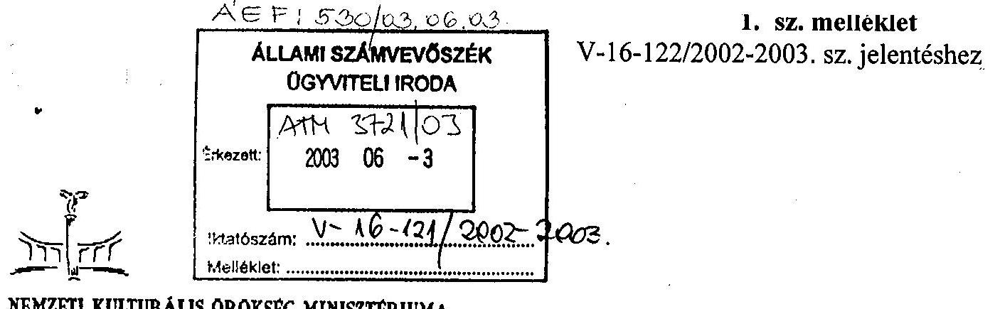
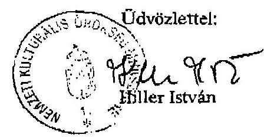
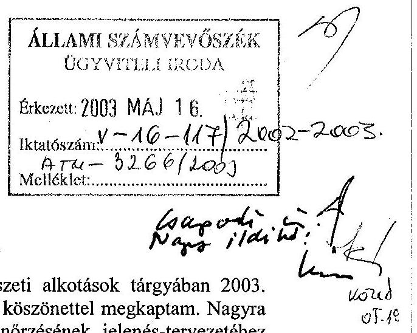
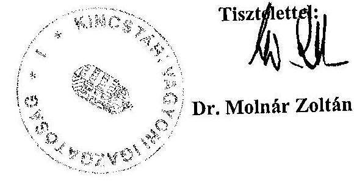
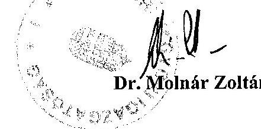
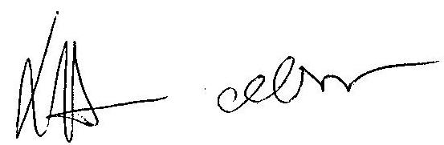
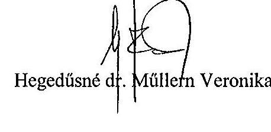
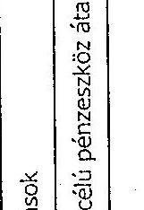

# JELENTÉS 

## a Nemzeti Kulturális Örökség Minisztériuma fejezet múködésének ellenőrzéséről

---

2. Államháztartás Központi Szintjét Ellenőrző Igazgatóság
2.3. Átfogó Ellenőrzési Főcsoport

Iktatószám: V-16-122/2002-2003.
Témaszám: 608
Vizsgálat-azonosító szám: V0039

# Az ellenőrzés felügyelte: 

Bihary Zsigmond
föigazgató
Az ellenőrzés végrehajtásáért felelős:
Hegedűsné dr. Müllern Veronika
főcsoportfőnök
Az ellenőrzést vezette:
Matusek István
főcsoportfőnök-helyettes
Az ellenőrzést végezték:

| dr. Fónyad Erzsébet | dr. Szöllősi Géza | Zagyi Judit |
| :-- | :-- | :-- |
| számvevő tanácsos | számvevő tanácsos | számvevő |
| Maklári Ferencné | Jankó Géza | Vértényi Gábor |
| számvevő főtanácsadó | számvevő | számvevő gyakornok |
| dr. Mihály Sándor | Záhonyiné |  |
| számvevő főtanácsadó | Horváth Ildikó |  |
|  | számvevő |  |

Az ÁSZ által a témában eddig készített jelentések: címe
sorszáma
Jelentés a Magyar Köztársaság 2000. évi költségvetés 0126
végrehajtásának ellenőrzéséről
Jelentés a Magyar Köztársaság 2001. évi költségvetés 0232
végrehajtásának ellenőrzéséről
Jelentés a központi költségvetés területén működő belső kontroll 0115 mechanizmusok ellenőrzéséről

---

# TARTALOMJEGYZÉK 

BEVEZETÉS ..... 5
I. ÖSSZEGZŐ MEGÁLLAPÍTÁSOK, KÖVETKEZTETÉSEK, JAVASLATOK ..... 7
II. RÉSZLETES MEGÁLLAPÍTÁSOK ..... 18

1. A minisztérium fejezet-irányító tevékenysége ..... 18
1.1. A feladatrendszer, a szervezeti struktúra és a múködési feltételek összhangjának értékelése ..... 18
1.1.1. A minisztérium feladatai, szervezeti felépítése, intézményi struktúrája ..... 18
1.1.2. A kultúrpolitika főbb törekvéseinek és pénzügyi feltételeinek alakulása, a kiemelt feladatok megvalósulása ..... 22
1.1.3. Az EU csatlakozással kapcsolatos ágazati feladatok szabályozása és végrehajtása ..... 25
1.2. A fejezeti kontroll mechanizmusok múködése, eredményessége ..... 27
1.2.1. A belső kontroll mechanizmusok kockázati elemeinek alakulása ..... 27
1.2.2. A számviteli politika, a számviteli rend kialakítása, érvényesülése ..... 27
1.2.3. A felügyeleti ellenőrzés rendszere, szabályozottsága, múködése ..... 28
1.2.4. A belső ellenőrzési rendszer múködésének feltételei, egyes elemeinek érvényesülése ..... 30
1.3. Az információs rendszer fejezeti irányítása és múködése ..... 32
1.3.1. A fejezet informatikai stratégiája, az informatikai terület szabályozása ..... 32
1.3.2. Az intézményi informatikai beruházások megvalósítása és alkalmazása ..... 35
1.3.3. Az információk nyilvános elérhetőségének biztosítása ..... 37
1.3.4. A fejezeti informatikai beruházások megalapozottsága ..... 38
2. A költségvetés tervezése és végrehajtása ..... 41
2.1. A költségvetés tervezési rendszere ..... 41
2.2. A költségvetési előirányzatok teljesítése ..... 43
2.2.1. Az előirányzat-módosítások szabályszerűsége, indokoltsága ..... 43
2.2.2. A bevételeket és kiadásokat befolyásoló tényezők, likviditási helyzet ..... 43
2.2.3. A költségvetési és a tényleges létszámok alakulása ..... 45
2.2.4. A személyi juttatások alakulása ..... 46
2.2.5. A dologi kiadások alakulása ..... 49

---

2.2.6. A központi beruházások és felújítások lebonyolítási rendje ..... 52
2.2.7. A közbeszerzési tevékenység értékelése ..... 54
2.2.8. Az előirányzat-felhasználási keretek ütemezésének és igénybevételének összhangja ..... 55
2.2.9. Egyes intézmények közhasznú társasággá alakítása ..... 56
3. A fejezeti kezelésű előirányzatokkal való gazdálkodás ..... 58
3.1. A fejezeti kezelésű előirányzatok szakmai megalapozottsága, tervezésük szabályszerűsége, a pénzügyi források ütemezése ..... 58
3.2. A fejezeti kezelésű előirányzatok ellenőrzése, a megállapítások hasznosítása ..... 60
3.2.1. Egyéb millenniumi beruházások ..... 62
3.2.2. A közművelődési és könyvtári hálózat újjáépítése ..... 62
3.2.3. Az egyházak kulturális örökség értékeinek rekonstrukciója és egyéb beruházások ..... 63
3.2.4. A Páva utcai Zsinagóga átalakítása Holocaust Emlékgyűjteménnyé és Dokumentációs Központtá ..... 64
3.2.5. Az épített örökség megóvása, fejlesztése ..... 64
3.3. A fejezeti tartalék felhasználása ..... 66
4. A korábbi ÁSZ ellenőrzés alapján kezdeményezett javaslatok megvalósulása ..... 67

# MELLÉKLETEK 

1. NKÖM miniszter észrevétele a jelentésre
2. A KVI vezérigazgatójának észrevételei a jelentés-tervezetre
3. A KVI vezérigazgatójának észrevételeire adott számvevőszéki válaszok
4. Tanúsítvány (1-13. sz.)
5. Táblázat (14. sz. )

## FÜGGELÉK

1. A kulturális örökség részét képező műemlékek védelmének ellenőrzése
2. Képzőművészeti alkotások visszaszolgáltatása

---

| ÁSZ | Állami Számvevőszék |
| :-- | :-- |
| GBF | NKÖM Hivatal |
|  | Gazdálkodási és Biztonságszervezési Főosztálya |
| IF | NKÖM Hivatal Informatikai Főosztálya |
| IS | NKÖM Informatikai Stratégiája |
| IStAR | Informatikai Statisztikai Adatgyűjtő Rendszer |
| ISZ | NKÖM Hivatal Informatikai Szabályzata |
| ITB | Informatikai Tárcaközi Bizottság |
| KEHI | Kormányzati Ellenőrzési Hivatal |
| KII | Kulturális Intézetek Igazgatósága |
| KÖH | Kulturális Örökségvédelmi Hivatal |
| KÖI | Kulturális Örökség Igazgatósága |
| KPKK | Károlyi Palota Kulturális Központ |
| KSH | Központi Statisztikai Hivatal |
| KTK | Kincstári Tranzakciós Kód |
| KVI | Kincstári Vagyoni Igazgatóság |
| MÜFI | Műemlékfelügyeleti Igazgatóság |
| NKÖM | Nemzeti Kulturális Örökség Minisztériuma |
| OM | Oktatási Minisztérium |
| OMvH | Országos Múemlékvédelmi Hivatal |
| PIM | Petőfi Irodalmi Múzeum |
| PIR | Pénzügyi Információs Rendszer |
| PM | Pénzügyminisztérium |
| SZMSZ | Szervezeti és Múködési Szabályzat |
| TÁH | Területi Államháztartási Hivatal |

---

.

---

# JELENTÉS   a Nemzeti Kulturális Örökség Minisztériuma fejezet múködésének ellenőrzéséről 

## BEVEZETÉS

A Nemzeti Kulturális Örökség Minisztériuma (továbbiakban: NKÖM) a Magyar Köztársaság minisztériumainak felsorolásáról szóló 1998. évi XXXVI. törvény, illetve az ezt módosító 2002. évi XI. törvény alapján jött létre és múködik. A nemzeti kulturális örökség miniszterének feladat- és hatáskörét a 152/2002. (VII. 22.) Korm. rendelettel módosított 161/1998. (IX. 30.) Korm. rendelet állapítja meg. A NKÖM 1999-ben a központi költségvetés szerkezeti rendjében új fejezetként jelent meg. A jogelőd fejezet a Művelődési és Közoktatási Minisztérium volt, amelynek múködését az Állami Számvevőszék (ÁSZ) 1992-ben ellenőrizte.

A NKÖM a művészeti élet szabadsága, a lelkiismereti és vallásszabadság biztosítása, a nemzeti kultúra fejlesztése és terjesztése, a kulturális örökség és múemlékek védelme érdekében a kulturális ágazat tevékenységét irányító központi közigazgatási szerv, amely hatósági felügyeleti tevékenységet végez, alapító és felügyeleti jogkört gyakorol, irányítja az ágazati szakigazgatási tevékenységet, valamint ágazati hatáskörben jogalkotói tevékenységet lát el.

A Magyar Köztársaság 2001-2002. évi költségvetéséről szóló 2000. évi CXXXIII. törvény a fejezet 2002. évi kiadási előirányzatát 87600,0 millió Ft-ban, támogatási előirányzatát 77600,0 millió Ft-ban, saját bevételi előirányzatát 9 800,0 millió Ft-ban állapította meg.

Az 1998. évi 58 -ról 2002-ben 75 -re növekedett az intézmények, szervezetek száma (önálló költségvetési intézmények, részben önálló költségvetési intézmények, külföldi kulturális intézetek, kht-k). A 2001. évről szóló beszámoló a fejezet által teljes munkaidőben foglalkoztatottak átlaglétszámát 4939 főben jelölte meg.

Az ellenőrzés célja annak értékelése volt, hogy a Nemzeti Kulturális Örökség Minisztériuma fejezetnél:

- a szervezeti, irányítási és múködési rendszer összhangban volt-e a jogszabályokban meghatározott feladatokkal;
- a költségvetési gazdálkodás irányítását, felügyeletét a kialakított költségvetés tervezési, végrehajtási és beszámolási információs rendszer megfelelően

---

biztosította-e. Az informatikai rendszert a kormányzati informatikai fejlesztési koncepcióhoz igazodóan alakították-e ki;

- a fejezeti kezelésű előirányzatok felhasználásánál a kiemelt kulturális beruházások, felújítások lebonyolításánál és megvalósításánál a törvényességi, célszerűségi szempontokat érvényesítették-e. Ezen belül a kulturális örökség (emlékhelyek) fenntartására, gondozására előirányzott támogatásokat célszerűen használták-e fel;
- a korábbi számvevőszéki ellenőrzések megállapításait, ajánlásait figyelembe vették-e, a vonatkozó intézkedési tervek megvalósultak-e.

Az Állami Számvevőszék az államháztartásról szóló 1992. évi XXXVIII. tv. (Áht.) alapján ellenőrizte az államháztartás forrásait, azok felhasználását és a vagyonnal való gazdálkodást. Az ellenőrzés végrehajtására az Állami Számvevőszékről szóló 1989. évi XXXVIII. tv. 2. § (3) és 17. § (3) bekezdésében foglaltak adnak jogszabályi alapot.

Az átfogó ellenőrzés a fejezeti irányítás, az Igazgatási cím (Gazdálkodó Szervezet) és az ellenőrzési programban kijelölt intézmények 1999-2002. évi - ezen belül hangsúlyozottan az utóbbi két év - feladatellátásának, gazdálkodási folyamatainak ellenőrzésére, értékelésére irányult.

A 2002. év zárszámadása ellenőrzésének előkészítéseként elvégeztük a fejezet 2002. I. félévi kiadási és bevételi forgalmi adataiból kiválasztott tételek szabályszerűségi ellenőrzését is. Ezzel kapcsolatos megállapításainkat a költségvetés végrehajtásának ellenőrzéséről készült jelentésünk fogja tartalmazni.

Az izraeli és a magyar számvevőszék együttműködése keretében párhuzamosan, de egymástól függetlenül ellenőriztük néhány kulturális emlékhely állapotát, gondozottságát, a költségvetésből juttatott támogatások felhasználásának célszerűségét. Programunk tervezett tartalmáról kölcsönösen tájékoztattuk egymást. Az ellenőrzések lezárását követően megállapításainkat is megismertetjük egymással. A párhuzamos ellenőrzés keretében megvizsgált kulturális emlékhelyek állapotának megóvása érdekében juttatott állami támogatások felhasználásáról az 1. sz. függelékben adunk részletesebb tájékoztatást. Ennek az ellenőrzésnek a keretében vizsgáltuk meg a Károlyi Palota felújítását is. Az ellenőrzés vizsgálat tárgyává tette a létesítmény megvalósulósának tervszerűségét, a felújított objektum szolgáltatásainak minőségi változásait, a fajlagos költségek alakulását.

A helyszíni ellenőrzés lezárását követő időszakban kerültek birtokunkba olyan iratok, amelyekből az volt megállapítható, hogy miniszteri rendelkezés alapján a Magyar Nemzeti Galéria törzsleltárából 4 db Munkácsy Mihály képet töröltek és azokat a néhai tulajdonos örököseinek átadtak. Ezzel kapcsolatos - jogi szempontokat értékelő - megállapításainkat a 2. sz. függelék tartalmazza. (Az értékelés érintette a KVI tevékenységét is. A KVI vezérigazgatójának észrevételeit és az azokra adott válaszaink másolatát a 2., 3. sz. mellékletek tartalmazzák.)

A jelentést egyeztettük a tárca miniszterével (észrevételét az 1. sz. melléklet tartalmazza).

---

# I. ÖSSZEGZŐ MEGÁLLAPÍTÁSOK, KÖVETKEZTETÉSEK, JAVASLATOK 

A Nemzeti Kulturális Örökség Minisztériuma 1998. július 8-i hatállyal jött létre, a feladatait korábban ellátó Művelődési és Közoktatási Minisztérium egyidejű megszűnésekor. A létesítés jogforrása a Magyar Köztársaság minisztériumainak felsorolásáról szóló törvény. Az újonnan alakult minisztériumi szervezet vezetőjének feladat- és hatáskörét kormányrendelet állapította meg, 2003. évtől kezdődően a minisztériumtól az egyházi kapcsolatok a Miniszterelnöki Hivatal hatáskörébe kerültek át és további belső szervezeti intézkedésekre került sor.

Az új minisztériumi szervezet kialakítása sokrétű szervezési, szabályozási feladat megoldását igényelte. A NKÖM és az Oktatási Minisztérium (OM) között a fejezeti és minisztériumi szintű feladatok átadására - átvételére megfelelő hatáskörrel rendelkező állami vezetők által aláírt kellő részletezettségű megállapodások szerint szabályszerűen és zavarmentesen került sor.

Az 1998. évet érintően a beszerzéseket, a pénzügyi és számviteli feladatokat az OM látta el a költségvetési beszámolót a két minisztérium között megosztott adatokkal, a pénzmaradvány kimutatását egyeztetetten és a két fejezetre bontva nyújtotta be jóváhagyásra. A kötelezettségvállalással terhelt összegeket az OM 1999. I. 1-je után a NKÖM-nek átutalta, a le nem kötött összegeket a költségvetésbe befizette.

A következő évben, 1999-ben fokozatosan létrejöttek az önálló múködés személyi és tárgyi feltételei. A NKÖM állományába került 120 köztisztviselői munkakör a szükséges személyi juttatásokkal, a külföldön működő kulturális intézetek összesen 90 fő létszámmal és 1165,4 millió Ft kiadási előirányzattal.

A miniszter utasítására végzett célvizsgálat megállapítása szerint a minisztérium a gazdálkodásra vonatkozóan teljes körűen elkészítette mindazokat a szabályzatokat, amelyeket a jogszabályok előírtak. A szabályzatok összhangban vannak a hatályos jogszabályokkal, megfelelően tükrözik a minisztérium sajátosságait. A szabályozásra támaszkodva a minisztérium tevékenysége szervezhető, követhető. Ellenőrzésünk ezt a megállapítást megerősíti.

Jelentősége miatt kiemelést érdemel a fejezeti kezelésű előirányzatok gazdálkodási szabályzata, amelyet a pénzügyminiszter egyetértésével bocsátott ki a miniszter. A szabályzat részletesen rögzíti a minisztériumnak a fejezeti kezelésű előirányzatokkal kapcsolatos feladatait, és részletesen megállapítja a rendelkezési jogköröket. A szabályzat rendelkezéseinek módosítása nélkül az 1/2002. sz. miniszteri körlevél a 0,1 millió Ft egyedi értékhatár feletti pénzügyi kihatással járó döntést a gazdasági helyettes államtitkár előzetes ellenjegyzéséhez kötötte. A gazdasági döntés ilyen mértékű centralizációja lassítja az ügymenetet, de garanciája lehet a hibák megelőzésének.

A NKÖM létrejöttével az ágazathoz tartozó intézményi kör is rendezésre várt. Az OM-mel kötött megállapodásnak megfelelően a NKÖM-höz átadásra került

---

58 kulturális intézmény, amelyből 10 kht. volt. A kht.-kra vonatkozóan a Kincstári Vagyoni Igazgatósággal (KVI) pótlólagosan vagyonkezelési szerződéseket kellett kötni, továbbá 8 intézmény alapító okiratát is el kellett készíteni.

A vizsgált időszakban (1998-2002 között) az intézmények száma 58-ról 75-re növekedett. Ez idő alatt 18 új intézményt hoztak létre, 6-ot megszüntettek és 10et átalakítottak, illetve összevontak. Az intézményi kör változásainál a tárca figyelembe vette a kulturális örökség védelméről szóló törvényben foglaltakat és a közigazgatás továbbfejlesztésére vonatkozó kormányhatározatot.

Egyes feladatok - a magasabb szintű jogszabályok rendelkezései szerint alapítványok, társadalmi szervek hatáskörébe kerültek, a NKÖM feladatai pedig kibővültek a múemlékvédelem feladataival és szervezetével. A szervezeti átalakítás, a feladatok és hatáskörök áttelepítése megvalósításának eredményességi felülvizsgálatát a tárca tervbe vette, azonban, erre eddig nem került sor.

A helyszíni ellenőrzésbe bevont intézmények belső szabályozottsága elmarad a minisztériumétól. Az intézményeknél több szabályzat hiányzik (SzMSz, ügyrend, egyéb gazdálkodási szabályzat) a helyszíni ellenőrzés befejezésekor nem voltak jóváhagyva, átdolgozás alatt álltak. Nem vezették át a számviteli törvény előírásainak változásait, elavultak a munkaköri leírások.

A hiányosságok azt jelzik, hogy a kulturális intézmények nem fordítanak jelentőségének megfelelő figyelmet a gazdasági folyamatok szabályszerűségi feltételeire, a rendszeres felügyeleti ellenőrzés megállapításai ellenére az intézmények nem tesznek érdemi intézkedéseket az ellenőrzés által feltárt hibák megszüntetésére. Mindezek következtében az intézmények múködésében a kockázati elemek súlya nem csökkent.

A tárca kultúrpolitikai céljait az 1998-2002-es kormányprogram, a kulturális örökség védelméről 2001-ben megjelent törvény és egyéb, kapcsolódó jogszabályok határozták meg.

Kiemelt súllyal jelent meg a célok között - a millenniumi ünnepségek megszervezésén keresztül - a történelmi és kulturális örökségünk bemutatása a világnak, a határon túli magyarság kulturális értékeinek megóvása és megismertetése, az egyházak közfeladatainak állami támogatása, a hazai kisebbségek kultúrájának segítése, identitásuk erősítése, az audiovizuális stratégia kialakítása, az erőszak megjelenítésének kizárása. A kormányhatározatokban beszámolási kötelezettséggel külön feladatokat jelölt meg a Kormány a tárca részére és biztosította a törvényi kötelezettségek végrehajtásához szükséges anyagi erőforrásokat és személyi feltételeket. A kiemelt célokhoz a Kormány további jelentős forrásokat rendelt.

A kulturális fejlesztési tervek megvalósítására a központi költségvetésből kapott forrásokból az 1999-2002. évek kiadásai mintegy 90600,0 millió Ft-ot tesznek ki. A kiadások harmada az épített kulturális örökség fejlesztésére jutott, a múzeumi rekonstrukciókra, régészeti feltárásokra, valamint közmúvelődési, kulturális rendezvényekre ugyancsak egyharmad-egyharmad részt fordítottak.

---

A kulturális turizmus fejlesztésére a NKÖM és a Gazdasági Minisztérium 2000-től közös pályázatokat írt ki, amelyek az EU csatlakozás előkészítéséhez kapcsolódó programok (kastélyok turizmus-hasznosítására, várak rekonstrukciójára, vallási emlékhelyek turisztikai fogadóképességének fejlesztése).

A Nemzeti Fejlesztési Terv ugyancsak előtérbe helyezi a kulturális turizmus fejlesztését (múemlékvédelem, kastélyprogram, múzeumfejlesztés, régészeti leletmentés, kulturális és közművelődési rendezvények), az információs társadalom fejlesztését külön alprogram keretében.

# Az EU-ban a kultúra területén átfogó közösségi szabályozás nincs. Az 

EU csatlakozással összefüggő jogharmonizációs feladatai a NKÖM-nek a kulturális javak exportjára, illegális kereskedelmének megakadályozására, a szellemi tulajdonjogra, az adó- és vámszabályokra, valamint a filmszolgáltatásokat és a televíziós műsorszolgáltatásokat magába foglaló audiovizuális politikára vonatkoznak. A részterületeket érintő magyar jogszabályok elkészültek, hatályba léptek.

A magyar médiatörvény módosításának késedelme miatt az EU bizottság nem járult hozzá a MEDIA Plusz programban való részvételünkhöz. A részvételre Magyarország csatlakozásától lesz lehetőség. A program végrehajtására új szervezeti egység jön létre. A program költségvetési igénye 140 millió Ft. A „Kultúra 2000" keretprogramban a csatlakozó országok 2001-től vehetnek részt. Az irányító testületben szavazati jog nélkül képviselteti magát Magyarország.

A minisztérium pénzügyi-gazdasági feltételei a 2000. év költségvetési tervének elkészítéséhez először álltak megfelelően rendelkezésre. A NKÖM szakapparátusa feltöltődött, és viszonylagosan stabilizálódott a gazdasági szervezeteknél a szakirányú képesítéssel rendelkezők létszáma, és létrejöttek az informatikai rendszer múködésének feltételei.

A minisztériumon belül az Igazgatási címhez két önálló költségvetési szerv tartozik: a NKÖM Hivatala (továbbiakban: Hivatal) és a NKÖM Gazdasági Főigazgatósága, ez utóbbi látja el az üzemeltetést.

A 2001-2003. évek költségvetési tervezési körirata előírta, hogy a fejezetek a szakmai célkitűzéseiket rangsorolják, hasznosítsák jobban a rendelkezésükre álló kapacitásokat, takarékoskodjanak a forrásokkal, hajtsanak végre létszámcsökkentést, foganatosítsanak szervezeti intézkedéseket, vizsgálják felül az ellátandó feladataikat. A költségvetési törvényjavaslat a korábbiaknál nagyobb hangsúllyal írta elő az intézményrendszer felülvizsgálatát, az intézmények koncentrációját, az azonos feladatot ellátó homogén intézménycsoportoknál alkalmazandó normák, normatívák megállapítását.

A tárca a 2001-2003. évek költségvetési számainak kialakításához kiadott PM tervezési körirat iránymutatásait részben figyelembe vette, miszerint meghatározta a prioritásokat, elvégezte az intézményi és feladat felülvizsgálatokat, a létszámcsökkentést betervezte. A NKÖM írásban jelezte, hogy az idő rövidsége miatt a feladatnak nem tud mindenben eleget tenni, mert olyan mérvű átfogó közgazdasági elemzések elvégzésére volna szükség, amelyekbe elkerülhetetlen

---

az intézmények bevonása. Az elemzésre azóta sem került sor, normatívákat nem képeztek.

A 2001. évi fejezeti kiadási előirányzat 70300,0 millió Ft-tal került jóváhagyásra. A módosításokat követően 2001-ben 111 200,0 millió Ft-ra növekedett a kiadási előirányzat. A teljesítés 94300,0 millió Ft (az elmaradás a beruházási kiadásoknál $40 \%$ volt). A 2002. évi eredeti kiadási előirányzat 64300,0 millió Ft, a módosított előirányzat 92700,0 millió Ft, amelynek I. félévi felhasználása $62,4 \%$-os mértékű volt. (Ebben döntő szerepe volt a működési és felhalmozási célú pénzeszköz átadásoknak.)

A költségvetés tervezésének eddigi rendszere társadalmilag nem tekinthető nyitottnak. A tervezés bázis alapon történik, központi irányítással és elgondolással, arra a civil szervezeteknek (kuratóriumok, szövetségek) nincs ráhatásuk. A civil szféra, a non-profit szervezetek támogatása az állami szervek mérlegelésén alapul. Azok jutnak hozzá a támogatáshoz, akik jól ismerik a pályáztatás rendszerét, vagy olyan tulajdonuk van, amelyre támogatás igényelhető. (A KSH 1994. évi adatai szerint a non-profit szervezetek kevesebb mint 10\%-a használta fel a központi költségvetési támogatások több mint $90 \%$-át.)

A tárca rendelkezett a feladataihoz szükséges forrásokkal, többlettámogatásban is részesült, a felhasználásnál azonban több esetben hiányzott a körültekintő előkészítés, az ütemes megvalósítás.

A fejezet költségvetési eredeti létszáma az 1999. évi 5849 fơről 2002-ben 5696 fôre csökkent. A tényleges átlaglétszám mindenkor kevesebb volt, mint a költségvetésben engedélyezett, a hiányzó létszámot a minisztériumban és az intézményekben általánosan alkalmazott megoldásként tartós munkavégzésre irányuló megbízási vagy vállalkozási jogviszonyban állóval helyettesítették, gyakran határidő nélkül, több évre szóló szerződéssel, vagy vállalkozási szerződéssel, ügydöntő, köztisztviselői munkakörökben is.

A személyi juttatásokból a rendszeres személyi juttatások rendre alatta maradtak az előirányzatnak, a nem rendszeres személyi juttatások pedig rendre meghaladták azt. A vizsgált időszakban a fejezet különböző bérpolitikai intézkedések többletkiadásaihoz kapott többlettámogatást (minimálbér felemelése, köztisztviselők új bérrendszere, közszféra egyszeri bérkiegészítése, létszámcsökkentés, közgyűjteményi, közművelődési és művészeti tevékenység fedezése).

A dologi kiadásoknál tapasztalható volt, hogy a kiadási tételek egy része a módosított előirányzat alatt maradt, más kiadások (bérleti- és lízing díjak, könyv, folyóirat, készletbeszerzés, kiküldetés, reprezentáció) rendszeresen meghaladták azt.

A fejezet tárgyi feltételei is jelentősen javultak: az 1999. évi 19 900,0 millió Ft-ról 2002. évre 51300,0 millió Ft-ra növekedett a tárgyi eszközök bruttó értéke, nettó értékének 76,4\%-át ingatlanok teszik ki. A tárgyi feltételek jelentősen hozzájárultak a tárca működési feltételeinek a javulásához (10/a, b sz. tanúsítványok).

---

A 2002. évi költségvetési zárszámadás vizsgálatának előkészítéseként ellenőrzésre kerültek az I. félévi pénzforgalmi adatok. Az ellenőrzésre kiválasztott tételek alapján általánosítható tapasztalatok a jelentés megfelelő fejezeteibe kerültek. Az előző évi (2001) rendszeres munkavégzéshez kapcsolódó személyi juttatások megtakarításából származó maradvány kötelezettségvállalással terheltként való kimutatását ellenőrzésünk kifogásolta. A minisztérium a 2001. évi előirányzat-maradvány jutalomként való felhasználásáról, illetve kifizetéséről a PM jóváhagyását megelőzően, saját hatáskörben döntött. Az NKÖM illetékes vezetői az államháztartási törvény és az annak végrehajtását szabályozó kormányrendelet vonatkozó szakaszainak többféle jogértelmezésével magyarázták az általuk választott eljárást.

Átmeneti likviditási gondok mutatkoztak a Magyar Állami Operaháznál, a Hagyományok Házánál és a Szabadtéri Néprajzi Múzeumnál. Az engedélyezett előirányzat-felhasználási keret előrehozás visszapótlása még az adott éven belül megtörtént. Forrásbőség volt tapasztalható a NKÖM Hivatalnál (1000,0 millió Ft) és a Kulturális Örökségvédelmi Hivatalnál, ami a nem megalapozott tervezésre, illetve a megvalósítás nem megfelelő előkészítésére vezethető vissza.

A fejezet és az Államháztartási Hivatal, valamint a Kincstár közötti kapcsolatok jók, az eltérések rendezése mindenkor rendben megtörtént, azok dokumentáltak.

A fejezeti kezelésú előirányzatok súlya, aránya a fejezet költségvetésében növekvő mértékű volt, a módosított előirányzatok 1999-2002. között nominális értéken 128\%-ra emelkedtek. Az előirányzat teljesítési aránya 150\%-ra emelkedett a 4 éves időszakban, ennek ellenére jelentősen elmaradt a rendelkezésre álló forrásoktól, az éves maradvány 14-28\%-os arányú volt. A módosított előirányzatok nagyobb része évenként kötelezettségvállalással terhelt volt, a teljesítések áthúzódtak a következő évre.

A programfinanszírozás, illetve a feladatfinanszírozás keretében a finanszírozás a Kincstáron keresztül, a nem programfinanszírozott, illetve nem feladatfinanszírozási körbe tartozó előirányzat terhére a kifizetés a számlaigazolás alapján utalással történt.

A támogatások egy részéről (pl. a millenniumi beruházások) a benyújtott kérelmek alapján a minisztériumban vezetői szinten született döntés. A közművelődési célelóirányzat felhasználása a tárgyév második felében indult, emiatt a teljesítés több hónappal áthúzódott a következő évre. Az egyházi kulturális örökség rekonstrukció 30\%-a tervezési hiba, szakhatósági engedély, közbeszerzési eljárás elhúzódása miatt nem teljesült határidőre. A Páva utcai Zsinagóga átalakítására tervezett három éves kivitelezési időből az első két év teljesítés nélkül telt el. A kulturális örökség rekonstrukciójára hosszú távú tervet, stratégiát nem készítettek, a múemlékekről nem áll rendelkezésre hiteles nyilvántartás.

A támogatások eredményeként megvalósult létesítmények egy részének tulajdoni rendezése a számvitelben nem megoldott. A támogatások felhasználásáról a kedvezményezettek szakmai és pénzügyi beszámolót készítettek. A szak-

---

mai főosztályok helyszíni ellenőrzést eltérő (5-30\%-os) mértékben végeztek, az értékelésnél gyakran hagyatkoztak a beküldött beszámolókra.

Az ellenőrzött intézmények költségvetési gazdálkodására jellemző, hogy az eredeti előirányzatok összege a tényleges szükségletek szintje körül alakult. Az évközi módosítások egy részét a feladatváltozások, a jogszabályok pénzügyi kihatásai, a belső források, kiadások jogszerűen indokolttá tették. Egyes intézményeknél azonban az előirányzatok központi emelése indokolatlan volt, mert felhasználásuknak az adott évben nem voltak meg a feltételei (KÖH, Kulturális Intézetek Igazgatósága, Károlyi Palota Kulturális Központ).

A fejezet év végi előirányzat maradványa minden évben tetemes összeget tett ki, évenként: 13700,0 millió Ft; 17500,0 millió Ft; 16900,0 millió Ft; 10000,0 millió Ft volt, igaz nagyobbrészt kötelezettségvállalással terhelten. Az igen nagy összegű előirányzat-maradványok a beruházási, pályázati feladatok késedelmes jóváhagyásával, elhúzódásával és a helyenként nem megalapozott tervezéssel magyarázhatók.

A beruházási és vagyonkezelési feladatok ellátására alakult főosztály felügyeli a tárca költségvetésből finanszírozott beruházásait, de közvetlenül is lebonyolít beruházásokat. Kezeli a minisztérium és a hozzá tartozó gazdasági társaságok kezelésébe adott kincstári vagyont, összesen 269 db épületet és építményt, melyek bruttó értéke 21800,0 millió Ft.

Részletesebben értékeltük a Károlyi Palota felújításának lebonyolítását. Azt állapítottuk meg, hogy a felújítás az előzetes ütemtervnek megfelelően, késedelem nélkül valósult meg a műemléki jelleg szigorú figyelembevételével. A fajlagos költségek - összehasonlítva más könyvtárakéval - kedvezőek voltak (1. sz. függelék).

Négy darab Munkácsy Mihály kép 1944. március 19-ét megelőzően került a Szépművészeti Múzeumhoz, majd 1950-től annak törzskönyvi leltárába, 1957től a Nemzeti Galéria állományába. A képeket a volt tulajdonos örökösei többször - eredménytelenül - próbálták visszaszerezni. Újabb ügyvédi kezdeményezés és vélemény alapján, a Kincstári Vagyoni Igazgatóság javaslatára a NKÖM minisztere engedélyt adott a képeknek a törzskönyvi leltárból való törlésére. A miniszter saját hatáskörben hozott döntését a Magyar Nemzeti Galériának végre kellett hajtania.

Az ilyen, és hasonló helyzetek során követendő államigazgatási eljárási rend jelenleg nincs szabályozva. Az esetlegesnek tűnő gyakorlati megoldások során elsikkadnak az államot jogosan megillető költségtérítések, amelyek a műalkotás birtokban tartásával, esetleg restaurálásával, illetve a műalkotás értékét növelő beruházásokkal kapcsolatosak. Nincs szabályozva a döntés meghozatalát követő, a műtárgy átadás/átvétele során követendő eljárás sem, továbbá tisztázatlanok azok a feltételek, amelyek szükségesek ahhoz, hogy az örökösök által benyújtott igény peren kívüli teljesítése során az állami szervek a lehető legnagyobb gondossággal járhassanak el.

A közbeszerzési eljárás új, aktualizált szabályzata elkészült, de a helyszíni ellenőrzés befejezéséig nem volt jóváhagyva. A fejezet intézményeinek közbe-

---

szerzési eljárásra kötelezett beszerzéséinél a helyszíni ellenőrzés során vizsgált körben szabálytalanságokat nem állapítottunk meg (minisztériumi dolgozók utaztatása, PIR rendszer, Szent István Bazilika rekonstrukciója). Az értékelő bizottságokban a minisztérium általában 50\%-os arányban képviselteti magát. Ezzel kézben tartja az értékelés folyamatát és a kiválasztást is, vállalva ezzel a döntés felelősségét (Sándor Palota, Holocaust Múzeum).

Az ellenőrzésben érintett intézményeknél főképpen informatikai berendezések beszerzésére került sor, a szabályok betartásával. Külföldi beruházásai a Kulturális Intézetek Igazgatóságának voltak, ezeket a minisztérium központi apparátusa készítette elő és közreműködött a megvalósításban is, szakmai igazolásaik alapján engedélyezte a kifizetést az Igazgatóság.

A közbeszerzési eljárásra előkészített programoknál (Sándor Palota; Holocaust Múzeum), nem vették figyelembe a már megvalósult hasonló létesítmények bekerülési költségeit. A számítások megítéléséhez az átadott dokumentációk nem tartalmaztak elegendő információt.

A legnagyobb nemzeti kulturális értékekkel bíró műemlékek megóvása, helyreállítása nélkülözi a kellő tervszerűséget. Nem áll rendelkezésre az aktuális állapot felmérésén alapuló középtávú és koncepcionális célokat meghatározó hoszszabb távú terv, amelyre a központi költségvetés lehetőségeire alapozó éves, operatív tervezés kiindulhatna.

A műemléki létesítmények felújításának valós költségei sok esetben szinte megállapíthatatlanok, mivel a tulajdonosok, a megrendelők, beruházó intézmények ugyanarra a munkára több, egymástól független döntést hozó intézményhez (NKÖM, GM, KÖH) nyújtanak be pályázatokat. Egységes országos nyilvántartás hiányában csak becsülni lehet a sikeres pályázatokat, illetve a jóváhagyott, felhasznált pénzösszegeket.

A kulturális célú ingatlanok állapotára nézve kedvezőtlen az a körülmény, hogy felújításuk a műemléki szempontok érvényesítése miatt költségesebb, mint a más ingatlanoké és normatív alapú kedvezményben a tulajdonosok nem részesülnek.

A nemzeti kulturális örökség részét képező műemlékek védelmének ellenőrzése során készített értékelést részletesen az 1. sz. függelékben ismertetjük.

# A központi államigazgatási szervek informatikai koordinációját 

kormányhatározat írja elő, amely szerint az Informatikai Tárcaközi Bizottság (ITB) ajánlásait 1993 óta az informatikai rendszerek és információtechnológiai fejlesztéseknél figyelembe kell venni.

A NKÖM Hivatala csak részben vette figyelembe az ITB ajánlásokat. A legjelentősebb elmaradások az informatikai adatvédelem területén vannak, amelyek fokozott kockázatot jelentenek, mert a minisztériumban és a fejezet intézményeinél jelentős informatikai fejlesztések történtek.

A fejezet Informatikai Stratégiája 2002. októberében készült el, amelyben tételesen meghatározták a célokat, megoldási alternatívákat dolgoztak ki, megbe-

---

csülték a szükséges ráfordításokat, és negyedéves pontossággal állapították meg a határidőket.

A felső vezetői szinten döntést igénylő informatikai kérdéseket nem tárgyalták teljes körűen, a vezetői beszámoltatás is elmaradt, emiatt fontos feladatok (pl. az elektronikus iratkezelési rendszer, lapnyilvántartó rendszer, pénzügyi információs rendszer) nem teljesültek határidőre. Informatikai tárgykörben belső ellenőrzés eddig nem volt.

A Hivatal az informatikai biztonság kockázatelemzését részben elvégezte, folytatása azonban pénzügyi források hiányában elmaradt. Nem határozták meg a védelmet igénylő eszközök és adatok körét, a fenyegetettség mértékét, a sérülésekből eredő károk nagyságát. Nem készült el - az ITB által ajánlott - biztonsági politika, informatikai biztonsági szabályzat és a helyi hálózat katasztrófa terve. A Hivatalban nem jelölték ki az informatikai biztonságért felelős személyeket (adatvédelmi biztos, adatvédelmi felelős).

Az informatikai beruházások a fejezet egészét, a minisztérium igazgatását, az intézményeket tekintve jelentősek, az irodaautomatizálás, és adatbázis alapú tranzakciós rendszerek (pl.: integrált pénzügyi információs rendszer) bevezetését tűzték célul. Az informatikai fejlesztéseket az intézmények alapvetően egyedül végzik. Ettől eltér - az egész fejezetet érintő fejlesztéseken kívül - az irodai szoftverbeszerzés, ahol a nagy tétel miatt kedvezményekhez jutottak. Az üzembe helyezett informatikai eszközök elősegítik az alaptevékenység ellátását.

A fejezet kulturális statisztikai adatszolgáltatási kötelezettségének 2002-től már elektronikus alapú rendszer segítségével tesz eleget. A NKÖM fejezethez tartozó intézményeknél és többségi tulajdonú közhasznú társaságoknál 2002. január 2-ától kezdve fokozatosan éles üzembe állításra került a fejezet gazdálkodását támogató integrált pénzügyi információs rendszer (PIR).

Az állampolgárok tájékoztatására a fejezet intézményeinek döntő többsége az Interneten folyamatosan friss és pontos információkat szolgáltat. A honlapokon a szervezet és tevékenysége bemutatásán túl tematikus napi hírek, különböző helyi készítésű adatbázisok és kapcsolódó oldalak gyűjteménye is rendelkezésre állnak. A minisztérium honlapja nem naprakész, információtartalma kevés. Tartalmi és formai megújításának tervezése folyamatban van.

A minisztérium KultúrPont Irodájának honlapjáról letölthetők az Európai Unió „Kultúra 2000" program pályázati űrlapjai, tájékoztatói, valamint ingyenes regisztrációjú adatbázisával segíti a program nemzetközi partnereinek egymásra találását.

A NKÖM belső kontroll mechanizmusai kiépítettségét, múködését az Állami Számvevőszék 2000. és 2002. években megvizsgálta. A 2000. évben végzett felmérés 7 témakörben a fejezethez tartozó valamennyi (30) intézményre kiterjedt.

Az azonos tesztek alapján végzett felmérések alapján megállapítást nyert, hogy a szabályozási, múködési feltételek hatásában nem történt változás. A pénz-ügyi-gazdasági folyamatok ellenőrizhetőségére, megbízhatóságára nézve koc-

---

kázati tényezőt jelent az intézményi függetlenített belső ellenőrzés személyi feltételeinek hiánya, elégtelensége, a vezetői intézkedések elmaradása vagy nem kellő eredményessége. A minisztérium vezetése nem fordított kellő figyelmet a belső ellenőrzési feladatok ellátására, az elvégzett vizsgálatok kisebb jelentőségű területekre irányultak és három év alatt csak 9 belső ellenőrzésre került sor.

Magas kockázati tényezőnek bizonyult az informatikai szervezet szabályozottságának elégtelensége, a személyi felelősségi körök tisztázatlansága, saját fejlesztésű szellemi bázis hiánya, a biztonsági rendszerek kiépítetlensége, az egymástól eltérő fejlesztési koncepciók létezése.

A felügyeleti ellenőrzés központi szervezeti egysége a közigazgatási államtitkár felügyelete alatt álló - és így független - önálló szervezeti egységként múködő Ellenőrzési Főosztály. A Főosztály rendelkezik Ellenőrzési Szabályzattal, amely a kormányrendelet előírásainak megfelelően szabályozza a felügyeleti ellenőrzés rendszerét. A személyi feltételeket éveken keresztül nem biztosították. Érdemben négy fő revizor dolgozik a Főosztályon, és e létszám magában nem elegendő a feladatok ellátására. A tárgyi feltételek megfelelőek (elhelyezés, számítógéppel való ellátottság).

Az Ellenőrzési Főosztály maradéktalanul eleget tett a minisztérium felügyelete alá tartozó intézmények háromévenkénti kötelezően előírt felügyeleti ellenőrzésének, teljesítéséhez hozzájárultak a szerződéses külső szakértők is, akik három év alatt 25 átfogó felügyeleti ellenőrzésben vettek részt. Az ellenőrzések megállapításai, javaslatai zömmel realizálódtak, azonban az intézményeknél tipikus szabálytalanságok, hiányosságok ismételten jelentkeztek.

Az intézmények átfogó ellenőrzésénél, a megállapítások realizálásának folyamatában a szakmai főosztályok, a felügyeletüket ellátó helyettes államtitkárok rendszeresen megtették a szükséges intézkedéseket, ezzel segítették az intézmények szakmai tevékenységének javulását. A tárcát vezető miniszter tájékoztató jelleggel minden egyes ellenőrzési jelentést megkapott.

Az 1999-2002. években a fejezet költségvetési gazdálkodásáról végzett ÁSZ ellenőrzések által javasolt intézkedések többsége megvalósult, vagy megvalósítása folyamatban van. Nem történt meg az érdemi változás a függetlenített belső ellenőrzés funkciójának és személyi feltételeinek alakulásában, az ügyrendek elkészítésében.

A helyszíni ellenőrzés megállapításainak hasznosítása mellett javasoljuk:

# a Kormánynak: 

1. Tekintse át a műalkotások, gyűjtemények tulajdonlásával, kezelésével kapcsolatos jelenlegi szabályozást, eljárási rendet, az alkalmazott gyakorlatot. Ennek alapján alakítson ki olyan szabályozást és eljárási rendet, amely alkalmas valamennyi műalkotás, gyűjtemény tulajdonlását és kezelését egyértelművé és átláthatóvá tenni, figyelemmel az állami kezelésbevétel, a letét elhelyezés körülményeire is. Egyértelművé kell tenni azt is, hogy az eljárás során mely szervek, milyen jogosultsággal rendelkezhetnek a döntések meghozatalánál.

---

# a miniszternek: 

1. Rendeljen el célvizsgálatot - korábbi döntésének érvényt szerezve - a megalakulás óta végbement szervezeti változások célszerűségének, eredményességének és a hatáskörök megosztásának felülvizsgálatára.
2. Intézkedjen a feladat- és szervezeti változások figyelembevételével a hiányzó ügyrendek kidolgozásáról, a hiányzó intézményi szabályzatok kiadásáról, az elavult szabályzatok korszerűsítéséről.
3. Tegyen intézkedéseket a humán erőforrás fejlesztési terv elkészíttetésére, a szükséges köztisztviselői, közalkalmazotti létszám üres álláshelyeinek színvonalas betöltésére:
a) vizsgáltassa felül a tartós munkavégzésre irányuló megbízási és vállalkozási jogviszonyokat, alakítsák át azokat köztisztviselői jogviszonnyá. Az ehhez szükséges létszám engedélyezése érdekében megalapozott javaslattal forduljon a Kormányhoz;
b) rendelje el, hogy a megbízási és vállalkozási szerződéssel csak eseti feladatokra alkalmazzanak külső munkatársakat, és jogszabályban előírt pályáztatással válaszszák ki az érintett vezetői munkakörök betöltésére alkalmas személyeket;
c) intézkedjék annak érdekében, hogy a minisztériumi belső ellenőrzés személyi feltételeinek régóta húzódó rendezése megvalósuljon.
4. Hozza meg azokat a döntéseket, amelyek a fejezet, a minisztérium és az intézmények információs rendszereinek továbbfejlesztéséhez szükségesek:
a) tekintse át az informatika fejezeti szintű helyzetét, és hozza meg a szükséges döntéseket, különös tekintettel az informatikai biztonság vonatkozásában;
b) nevezze ki az informatikai biztonság szervezeti felelőseit, a minisztérium adatvédelmi biztosát és adatvédelmi felelősét, egyben vizsgálja meg az elmaradt intézkedés okát és intézkedjen a felelősségre vonás érdekében;
c) határozza meg a védelmet igénylő számítástechnikai eszközök és adatok körét, amelyeket a biztonsági politika részeként el kell rendelni.
5. Fordítson nagyobb gondot a fejezet a civil szféra kulturális szerveződéseivel való jobb együttműködésre, a költségvetési tervezés során megalapozott észrevételeik figyelembe vételére, szervezettebb tájékoztatásukra.
6. Rendelje el egy nagyobb időtartamot átfogó, a kulturális örökség megóvását, helyreállítását megalapozó terv készítését a pénzeszközök tervszerűbb elosztása és felhasználása érdekében:
a) biztosítsa, hogy a módosított SZMSZ-nek megfelelő szervezet mind a kiemelt előirányzatok, mind a pályázatok keretében kiosztható pénzösszegek szakmailag megfelelően előkészített, pénzügyileg helyesen megbecsült munkákra kerüljenek felhasználásra;

---

b) dolgoztasson ki javaslatokat arra nézve, hogy a múemlékek tulajdonosai érdekeltek legyenek a múemléképületek állagának megóvásában, helyreállításában.
7. Kezdeményezze a költségvetési előirányzat-maradványok elszámolásánál és azok felhasználásánál a jogszabályok módosítását, kiegészítését, a bizonylatolás és a kötelezettség vállalás pontosítására vonatkozóan.

---

# II. RÉSZLETES MEGÁLLAPÍTÁSOK 

## 1. A MINISZTÉRIUM FEJEZET-IRÁNYÍTÓ TEVÉKENYSÉGE

### 1.1. A feladatrendszer, a szervezeti struktúra és a múködési feltételek összhangjának értékelése

### 1.1.1. A minisztérium feladatai, szervezeti felépítése, intézményi struktúrája

A Nemzeti Kulturális Örökség Minisztériuma (NKÖM) a Művelődési és Közoktatási Minisztérium megszüntetése után jött létre 1998. július 8-i hatállyal, a Magyar Köztársaság minisztériumainak felsorolásáról szóló 1998. évi XXXVI. tv. alapján. A nemzeti kulturális örökség miniszterének feladat- és hatáskörét a 161/1998. (IX. 30.) Korm. rendelet, illetve az e rendeletet módosító 152/2002. (VII. 2.) Korm. rendelet szabályozza.

A módosított rendelet meghatározott elvek mentén részletezi a kulturális ágazat egyes területeire vonatkozóan a nemzeti kulturális örökség miniszterének feladatát és hatáskörét (a nemzeti és egyetemes kulturális örökség megóvása, a művészeti alkotó munka és előadói tevékenység állami támogatása, országos jelentőségű művelődési intézmények irányítása, a nemzeti és etnikai kisebbségek kultúrájának ápolása, központi irányítása, az egyházak vonatkozásában az ágazati feladatok ellátása, nemzetközi kulturális kapcsolatok, a magyar kultúra külföldi terjesztése stb.).

A minisztérium Alapító Okiratát 1998. szeptember 14-én adta ki a NKÖM minisztere. A minisztérium eredeti szervezeti felépítését az 1999. május 26-i, a miniszter által jóváhagyott szervezeti és múködési szabályzat tartalmazta.

A minisztérium szervezete megalakulásától kezdve állandó változásban, átalakulásban van. Ezt a folyamatot nagymértékben befolyásolták a mindenkori kormányok államigazgatási, szervezeti koncepciói. A minisztérium vezetése igyekezett a minisztérium szervezetét a változó elvárások és feladatok ellátására alkalmassá tenni.

Megszüntették 2002-ben a Millenniumi Titkárságot (mivel feladatát teljesítette), s a miniszteri biztost közvetlenül a miniszter alá rendelték. A közgyűjteményi és közművelődési helyettes államtitkár hatásköréből kivették a Műemléki Főosztályt, melyet közvetlenül a közigazgatási államtitkár felügyelete alá helyeztek.

A Miniszterelnöki Hivatalról szóló 148/2002. (VII. 1.) és a nemzeti kulturális örökség miniszterének feladat- és hatáskörét módosító 152/2002. (VII. 2.) Korm. rendeletek alapján az egyházi kapcsolatok helyettes államtitkárának felügyeleti területe 2002. július 5-től kikerült a NKÖM szervezetéből és a Miniszterelnöki Hivatal szervezetébe épült be.

A szervezeti átalakítás, a feladatok és hatáskörök áttelepítésének megvalósítását, az átszervezéssel járó feladatok végrehajtásának átfogó felülvizsgálatát,

---

eredményességének vizsgálatát a tárca tervbe vette, azonban a folyamatos átszervezések miatt elmaradt.

Az 1998. évi XXXVI. tv. alapján az OM és a NKÖM között a feladatok át-adás-átvétele a minisztériumi vezetők által aláírt megállapodás végrehajtásával történt meg.

A megállapodásban rögzítették a legfontosabb adatokat (az átadásra kerülő intézmények 1998. évi eredeti költségvetési előirányzatait kiemelt előirányzati bontásban, illetve a létszámadatok köztisztviselői és közalkalmazotti megoszlását; továbbá ezen intézmények 1998. január 1. és szeptember 30. közötti időszak kiadási és bevételi előirányzatainak és teljesítésének tényadatait). Az igazgatási és fejezeti kezelésű előirányzatok ténylegesen 1999. január 1-jétől kerültek átadásra, és ezen előirányzatokhoz kapcsolódó 1998. évi pénzügyi-gazdasági feladatokat az OM látta el az előirányzatok tényleges megosztása nélkül. Így az OM 1998. évi költségvetési beszámolója tartalmazta a NKÖM igazgatási cím és az átadásra kerülő fejezeti kezelésű előirányzatokat és teljesítésüket.

A NKÖM állományába került 120 köztisztviselői munkakör a szükséges személyi juttatásokkal együtt, összesen 213,6 millió Ft összegben éves szinten és a külkapcsolatok címszó alatt 1999. január 1-jétől a külföldi magyar kulturális intézetek 90 fős létszáma összesen 1165,4 millió Ft kiadási előirányzattal.

A szétválásból eredő feladatokat együttműködési szerződésekkel, egyeztetésekkel oldották meg.

Megállapodtak a NKÖM-nek átmenetileg az OM székházban történő elhelyezéséből fakadó helyiséghasználatáról, a telefon és egyéb szolgáltatások biztosításáról.

További szerződésekben rendezték a NKÖM részére biztosított igazgatási előirányzat felhasználásának elszámolásával kapcsolatos, a különböző berendezések, eszközök, szoftverek, gépkocsik átadására vonatkozó, valamint a NKÖM-höz átkerülő ingatlanok kezelői jogának, a közhasznú társaságok, közalapítványok, alapítványok vagyonának átadásával kapcsolatos kérdéseket. Elhúzódott az Oktatási Minisztérium nyilvántartásaiban szereplő műtárgyaknak a megosztása a két minisztérium között, ezt a 2000. május 29-i megállapodásban rendezték.

A NKÖM a 2231/1998. (X. 30.) Korm. határozat alapján végleges elhelyezés céljából megkapta a Bp., VII. ker. Wesselényi u. 20-22. sz. alatti épületet. A minisztérium apparátusa 1999. november végén átköltözött az új épületbe, s alapvető elhelyezési problémái megoldódtak.

A NKÖM önállóságának kialakításához 1998. évben juttatott 192 millió Ft felhasználása - technikai okok következtében - az OM Gazdálkodási Főosztálya által lebonyolított beszerzések útján történt meg, az eszközök nyilvántartásba vételével együtt. Ezeknek az eszközöknek térítés nélküli átadását szabályszerűen végrehajtották. A NKÖM az állományba vételt visszaigazolta.

A kötelezettségvállalással terhelt összegeket az OM 1999. január 1. után a NKÖM tárcához átutalta, a le nem kötött összegeket a költségvetésbe befizette. A maradvány-elszámolást a két fejezetre szétbontva nyújtották be jóváhagyásra a Pénzügyminisztériumhoz.

---

Az ingatlanok vagyonkezelői jogának átadása NKÖM-höz tartozó feladatellátásból következően az egyértelmű esetekben (Budavári Palota, Vasarely Múzeum, Egri Várfal stb.) térítés nélküli átadással rendeződött. Szociális jellegű intézmények nem kerültek átadásra, mert rossz állapotuk miatt a NKÖM nem tartott rájuk igényt. Átadásra került 9 db személygépkocsi tartozékaival együtt. Az átadott nagyobb értékű eszközök 3,2 millió Ft-ot, a kis értékű eszközöké 1,8 millió Ft-ot tettek ki.

Az ágazathoz tartozó intézményi kör jogilag rendezett múködésére a KVI és a NKÖM vagyonkezelési szerződéseket kötött.

A NKÖM intézményeinek száma 1998-2002 között évről-évre változott. Az 1998-2002-es időszakban 58 -ról 75 -re növekedett az intézmények, szervezetek száma (önálló költségvetési intézmények, részben önálló költségvetési intézmények, külföldi kulturális intézetek, kht-k). Ez idő alatt 18 új intézményt, szervezetet hoztak létre, 6-ot megszűntettek és 10-et átalakítottak, illetve összevontak.

Az ellenőrzött időszakban jelentős feladatot ellátó költségvetési intézmények jöttek létre (Kulturális Intézetek Igazgatósága, New York-i Kulturális Központ, Bécsi Magyar Levéltári Kirendeltség, Kulturális Örökség Igazgatósága, illetve Kulturális Örökségvédelmi Hivatal, Károlyi Palota Kulturális Központ, NKÖM Gazdasági Igazgatósága).

A tárcának több szervezete jött létre kht-k megalakításával (Játékszín, Teréz körúti Színház, Ernst Múzeum, Új Nemzeti Színház Megvalósító Iroda, Uránia Magyar Nemzeti Filmszínház), művészeti intézmények ingatlanfejlesztő, üzemeltető, szervező kft.-k létrehozásával (Nemzeti Filharmónia, Hagyományok Háza, Duna Múzeum).

Az intézmények átalakítása részben a felügyeleti irányítás módosításához (Állami Műemlék Helyreállítási és Restaurációs Központ, Műemlékek Állami Gondnoksága a Kulturális Örökségvédelmi Hivatal felügyelete alá került), részben névváltozáshoz (Magyar Állami Népi Együttes - Hagyományok Háza), illetve meglévő intézmény kht.-vé alakításához kapcsolódik (Táncfórum Kht. - Nemzeti Táncszínház Kht., Magyar Cirkusz és Varieté Kht., Magyar Nemzeti Filharmonikus Zenekar, Énekkar és Kottatár Kht., Budapesti Kamaraszínház Kht., Játékszín, Teréz körúti Színház Kht.).

Megszűnt intézmény feladatát átvette a jogutód (Budapest Táncegyüttes-ét a Magyar Állami Népi Együttes; az OMvH-ét és a KÖl-ét a KÖH).
2002. december 31-én a NKÖM-nek 21 saját alapítású kht-ja volt (12/b sz. tanusítvány), ezen belül 15 kht. 100\%-os minisztériumi tulajdont képezett. Ezekben a társaságokban összesen 1305 millió Ft vagyon testesült meg.

A KEHI 2000. évben vizsgálta többek között a NKÖM által alapított közhasznú társaságok alapítása célszerűségének, megszűnésének esetén a vagyonnal történő elszámolás és a részükre nyújtott költségvetési támogatások felhasználásának szabályszerűségét. A minisztérium intézkedési tervet dolgozott ki a hiányosságok felszámolására (SZMSZ módosítása, alapítói okiratok felülvizsgálata, módosítása, állami vagyon naprakész nyilvántartása, beszámoltatás módjának kialakítása).

---

A vizsgálatot követően elkészítették a kht-k és a minisztérium között megkötendő általános alapszerződést, mely tartalmazza a kht-k alaptevékenységét, díjazását (támogatás összegét), a beszámolás és ellenőrzés módját, valamint a szerződésszegés konzekvenciáit. A szerződésben nagy hangsúlyt helyeztek a közhasznú szervezetekről szóló 1997. évi CLVI. törvényben foglalt előírásokra, a beszámolási kötelezettség határidőben történő teljesítésére szakmai és pénzügyi téren egyaránt.

A változások a tárca múködésének első 2,5 évében új intézmények, hazai és külföldi kulturális intézetek, és a minisztérium feladataihoz jobban igazodó belső szervezeti átalakításokra irányultak. A 2001-2002-es időszakban az intézményi kört érintő módosításoknál figyelembe vették a közigazgatás továbbfejlesztéséről szóló 1057/2001. (VI. 21.) Korm. határozat alapján a kulturális ágazatra háruló kötelezettségeket, a kulturális örökség védelméről szóló 2001. évi LXIV. törvényt és az annak végrehajtására kiadott alsóbb szintű jogszabályokat. A felső szintű döntések, jogszabályok hatására az intézmények egy részének múködése - a feladatok bővítésével és átrendezésével - tartalmilag módosult.

Az átszervezések eredményeként korábban a tárca által ellátott feladatok egy része alapítványok, társadalmi szervezetek hatáskörébe került. A Gazdasági Igazgatóság feladatkörét kibővítették, ezért létrehozták a pályázatokkal kapcsolatos operatív feladatok lebonyolítására a Pályázati Igazgatóságot. A háttérintézmények feladatainak áttekintése alapján a Magyar Művelődési Intézet múködési rendjét - a Hagyományok Háza létrehozásával összefüggésben - újra szabályozták.

A NKÖM feladatköre bővült a múemlékvédelem környezetvédelmi tárcától való átkerülésével. Az Országos Műemlékvédelmi Hivatal (OMvH) és a Kulturális Örökség Igazgatósága (KÖI) feladat-, és hatáskörét az örökségvédelmi törvénynek megfelelően létrehozott, a tárca szervezetétől elkülönülten múködő Kulturális Örökségvédelmi Hivatalhoz telepítették.

A minisztérium 1999. évi szervezeti és múködési szabályzatát (SZMSZ) 2002. májusban módosították. A törvények, illetve kormányrendeletek (1992. évi XXXVIII. tv. az Államháztartásról, a 217/1998. (XII. 30.) Korm. rendelet az Államháztartás múködési rendjéről, a 2000. évi C. tv. a számvitelről stb.) kötelező előírásai alapján a tárcánál elkészültek a gazdálkodással, a számviteli renddel, a múködéssel kapcsolatos, az SZMSZ mellékletét képező egyéb belső szabályzatok.

A NKÖM Ellenőrzési Főosztálya 2002. június 5-ei célvizsgálati jelentésében megállapította, hogy „A NKÖM a gazdálkodására vonatkozóan teljes körűen elkészítette mindazon szabályzatokat, amelyeket a jogszabályok kötelezően előírtak. Az egyes szabályzatok összhangban vannak a hatályos jogszabályokkal, megfelelően tükrözik a minisztérium sajátosságait. A szabályozás meghatározza a gazdálkodás vertikális folyamatainak (kötelezettségvállalás, ellenjegyzés, érvényesítés, utalványozás), valamint horizontális folyamatainak (munkaerővel, személyi juttatásokkal való gazdálkodás, eszközgazdálkodás) teendőit, rendjét, a feladatok végrehajtásának módját, számviteli és információs rendszerét."

---

A miniszteri utasítások, miniszteri és államtitkári körlevelek egységes, teljes körű, naprakész nyilvántartásának rendjére, valamint a jogszabályi és szervezeti változások elkészítése időtartamának csökkentésére vonatkozó javaslatokat a minisztérium vezetése figyelembe vette és az Államtitkári Hivatal az Intézkedési Tervet elkészítette.

A minisztérium szervezeti egységeinek többsége nem rendelkezik ügyrenddel, kivételt képez az Ellenőrzési Főosztály és a Gazdálkodási és Biztonságszervezési Főosztály.

Az államháztartásról szóló többször módosított 1992. évi XXXVIII. tv. (Áht.) 49. § o) pontja alapján A Magyar Köztársaság 2001. és 2002. évi költségvetéséről szóló 2000. évi CXXXIII. tv-ben a XXII-es fejezet részére 2002. évre jóváhagyott fejezeti kezelésű előirányzatok felhasználására, kezelésére vonatkozóan adta ki a NKÖM minisztere a 4/2002-es számú utasítását a „Nemzeti Kulturális Örökség Minisztériuma fejezeti kezelésű előirányzatainak gazdálkodási, kötelezettségvállalási és utalványozási szabályzata, valamint egyéb előírások" cím alatt. Ennek az utasításnak a tartalma megfelel a többször módosított 217/1998. (XII. 30.) Korm. rendeletnek, mely az államháztartás múködési rendjéről szól. A szabályzatot a pénzügyminiszter egyetértő aláírásával adták ki.

A NKÖM fejezeti és a minisztérium gazdálkodása egyensúlyának megőrzése érdekében a miniszter 2002. június 13 -án kiadta az $1 / 2002$. számú Miniszteri Körlevelet, amely a kötelezettségvállalási jogosultságot korlátozta, a vonatkozó szabályzatok módosítása nélkül.

A körlevél szerint „Valamennyi, 0,1 millió Ft egyedi értékhatár feletti pénzügyi kihatással bíró döntés, pénzügyi kötelezettségvállalás - a tárca hosszú távú gazdálkodási stratégiájának való megfelelőségét biztosítandó - a gazdasági helyettes államtitkár előzetes ellenjegyzésével érvényes."

# 1.1.2. A kultúrpolitika főbb törekvéseinek és pénzügyi feltételeinek alakulása, a kiemelt feladatok megvalósulása 

A tárca kultúrpolitikai törekvései az 1998-2002-es kormányprogram megvalósítására, a kulturális örökség védelméről szóló 2001. évi LXIV. törvény és egyéb jogszabályok betartására irányultak.

A kormányprogram stratégiai kérdésnek tekintette a kultúrpolitikát, a nemzeti kultúra helyzetének javítását, a múlt és a jelen kulturális javainak, értékeinek megőrzését és megbecsülését. A megvalósítás kettős célra irányult: egyfelől a kulturális javak iránti igény felkeltésére, másfelől a kulturális igények magas színvonalú kielégítésére. A NKÖM létrehozásával a szellemi és anyagi kulturális javak védelmét, új alkotások megszületésének elősegítését, a múemlékvédelem koncentrált megvalósítását kívánta elérni.

A kormányprogramban kiemelt súllyal, prioritásként jelent meg a millenniumi ünnepségeken keresztül a történelmi és kulturális örökségünk bemutatása a világnak; a határon túli magyarság kulturális értékének bemutatása; az egyházak közfeladatai ellátásának állami támogatása, tulajdonrendezés, az egyházi intézmények rekonstrukciójához, felújításához való hozzájárulás; a hazai kisebbségek, nemzeti, etnikai csoportok kultúrájának segítése, identitásuk erősítése; kultu-

---

rális örökségünk megismertetése külfölddel, főként Európa országaival; egységes audiovizuális stratégia kialakítása, az erőszak megjelenésének kizárása.

A tárca az örökség védelmével, a kulturális javak megóvásával, a műemlékvédelemmel és a hatósági eljárásokkal, szabályozási kötelezettségekkel kapcsolatos feladatai egységesen a kulturális örökség védelemről szóló 2001. évi LXIV. törvényben jelentek meg. Új eleme a törvényi szabályozásnak, hogy a múemlékvédelem kérdéseit a NKÖM feladat- és hatáskörébe beemelte.

A Kormány a NKÖM hatáskörébe tartozó ügyek fontosságára tekintettel az előkészítésnek és a megvalósításnak nyomatékot adva külön határozatokat hozott és azokra beszámolási kötelezettséget írt elő. A határozatokban előírt feladatok teljesítéséről készített tárca-beszámolók egyrészt a megvalósításról, másrészt a végrehajtás elhúzódásáról és annak okairól adtak számot. Erre vonatkozóan néhány kiemelt példa jelzésértékűnek tekinthető.

A központi közigazgatási szervek továbbfejlesztési programjához kapcsolódóan szabályozták az új szervezeti egységek múködését, hatáskörét (a műemlékvédelem szervezetét (OMvH) áthelyezték a Környezetvédelmi és Területfejlesztési Minisztériumtól, létrehozták a Kulturális Örökség Igazgatóságát). Több intézményt hoztak létre, illetve kht-vé alakították át.

Az egyházi kulturális örökség értékeinek rekonstrukciója támogatásának felosztásáról megkötötték a megállapodásokat. Intézkedés történt az egyházak javára az ingatlanok 2011-ig történő rendezésére.

Az ezeréves államiságunk megünnepléséhez kapcsolódóan a budavári Szent György tér, a Honvédelmi Minisztérium volt épülete, a Várbazár helyreállításának előkészítése megkezdődött. A rekonstrukciós terület régészeti feltárására új koncepció kidolgozásáról döntöttek. A Várbazár hasznosítását a vállalkozói tőke bevonásával kapcsolatos tárgyalások elhúzódása késlelteti. A nemzeti intézmények rekonstrukciója a több éves program szerint folytatódott.

Elindították a kistemplomok rekonstrukcióját 47 településen. A Károlyi Palota és a Nagytétényi Kastélymúzeum helyreállítása befejeződött. A királyi városok (Esztergom, Visegrád, Székesfehérvár) rekonstrukciója jól haladt, de jelentős támogatás szükséges a teljes helyreállításhoz.

A fertődi Eszterházy kastély helyreállítása és hasznosítása érdekében a szükséges állagvédelmi munkákat felmérték, a program teljesítéséhez pályázatok készültek, indításáról azonban nem született döntés. A hasznosításra a kastélyprogram keretében új koncepció készül, külső tőke bevonására építve.

A NKÖM vezető testületeire (államtitkári és miniszteri értekezlet) a tárca múködési, szervezeti rendjének kialakítása, a hatáskörébe tartozó ágazati, szakmai feladatok és a pénzügyi források összehangolása érdekében igen sok intézkedés hárult. 1998-99-ben főként a szervezeti változásokkal, szabályozásokkal kapcsolatos ügyekben, 2000-2001-ben döntően a folyamatban lévő és a millenniumhoz kapcsolódó beruházások, rekonstrukciók helyzetével, megvalósításával összefüggően születtek döntések.

Jóváhagyásra kerültek a Magyar Millennium megünneplésének irányelvei; a kht-k helyzetének rendezésére készült előterjesztés; a NKÖM Gazdasági Igazgatósága Alapító Okiratának módosítása (a Pályázati Igazgatósággal Főigazgatóság-

---

gá bővült). A Műcsarnokról leválasztva újra alapították az Ernst Múzeumot. Elfogadták a Budapesti Kamaraszínház Kht. és a Játékszín Teréz körúti Színház Kht. Alapító Okiratát. Döntés született a Párizsi Magyar Intézet Collegium Hungaricummá való átalakításáról; a Kulturális Intézetek Igazgatósága létrehozásáról az intézetek egységes irányítására; a külföldi kulturális intézetek szabályozási hiányosságainak megszüntetésére.

Áttekintették a múzeumok rekonstrukcióját, engedélyokiratok alapján döntöttek a támogatási keretek felhasználásáról.

Az egyházak kulturális örökség értékeinek rekonstrukciójára előirányzott támogatás felosztásáról az egyházak javaslata alapján döntöttek. Döntés született a Magyar Katolikus Egyház számára átadásra javasolt ingatlanokról és költségvetési támogatásáról, a Millenniumi Vallási Alap műemléki ingatlanok védettségére való felosztásáról. Szabályozás készült a kulturális örökség védetté nyilvánításának eljárásáról.

# A tárca törvényi kötelezettségei végrehajtásához a szükséges anyagi 

források és személyi feltételek rendelkezésre álltak. A Kormány a kiemelt célnak minősített feladatok teljesítéséhez - év közben - további jelentős forrásokat biztosított a költségvetési előirányzatok módosításával.

A kulturális fejlesztési tervek megvalósítására a központi költségvetésből a tárca 1999-2002. között jelentős összegű források felhasználására kapott lehetőséget. Az 1999. évben fejlesztésekre fordított kiadások 17 866,0 millió Ft öszszege 2002-ben 29 285,0 millió Ft-ra növekedett. A kulturális fejlesztési terv 1999-2002. évi kiadásai 90631,0 millió Ft-ot tesznek ki. A központi kiadások előirányzatai a kulturális ágazat négy területére eltérő arányban, de növekvő összegben oszlottak meg az 1999-2002. közötti időszakban.

A kiadások nagyobb része az épített kulturális örökség fejlesztésére jutott (évenként 9000,0 -13 000,0 millió Ft); a múzeumi rekonstrukciókra, régészeti feltárásokra kisebb, de többnyire növekvő összeg (2700,0 - 4000,0 millió Ft); a kulturális, közművelődési rendezvényekre ugyancsak kisebb, de évenként növekvő öszszeg (2900,0 -4000,0 millió Ft). A központi beruházások, új létesítmények kiadásai 1999-2001 között igen mérsékelten alakultak, jelentős emelkedés 2002-ben következett be (10 000,0 millió Ft).

A kulturális örökség értékeinek védelme szempontjából jelentős szerepe van a kulturális turizmus fejlesztésének. A gazdasági szféra és a kulturális örökség területe a turizmuson keresztül összekapcsolódik, s ebből mindkét terület lehetőségei bővülnek. A NKÖM és a Gazdasági Minisztérium 2000-től közös fejlesztésekre megállapodás alapján pályázatokat írtak ki, amelyek az EU csatlakozás előkészítéséhez kapcsolódó programok megvalósítását és a finanszírozási lehetőségek összehangolását segítik.

A 2000-ben kiírt pályázatokra a két tárca 150,0 - 150,0 millió Ft-ot különített el célelőirányzataiból. A múzeumok marketing tevékenységének, látogatóbarát környezete megteremtésének meghívásos pályázatára 140,0 millió Ft-ot, pályázaton kívül a Mementó Park kialakítására, bővítésére, az állami tulajdonú kastélyok megvalósíthatósági tanulmányaira, a Londoni Kulturális Központ kulturális programjaira összesen 160,0 millió Ft-ot fordítottak.

---

A 2001-ben indított Széchenyi-terv turizmus fejlesztési programjában külön kiemelést kapott a kulturális szakterület. A tárcák együttműködésével a közös fejlesztési programok bővültek, a felhasználható források nagyságrendileg megnőttek.

Az együttműködés keretében közös pályázatokat (világörökség, vallási turizmus, kulturális örökségi emlékek, múzeumok fejlesztése, stb.) indítottak és a nemzetközi rendezvényeket (Párizs, Róma, London, Jeruzsálem) együttesen támogatták.

A kulturális örökség turisztikai hasznosításának súlyát növeli, hogy a Nemzeti Fejlesztési Terv eddig elkészült tervezete az EU strukturális alapok igénybevételével, felhasználásával a turizmus fejlesztését prioritásnak tekinti. A turizmus segíti a fejletlen régiók felzárkóztatását, a természeti kincsek és a kulturális javak megőrzését, hasznosítását (gyógyvizek, kulturális örökség, természeti adottságok).

A kormányprogramban, az éves költségvetésekben meghatározott prioritásokhoz kapcsolódó előirányzatokból kiemelt tételek többségénél a kiadások teljesítése igazodott az eredeti, illetve a módosított előirányzathoz. Néhány, az alábbiakban kiemelt nagyobb összegű feladat teljesítése azonban késedelmesen indult, a tervezett időre nem valósult meg, jelentős lemaradással átkerült a következő évekre.

Az 1999. évi beruházási célprogramokra (millenniumi beruházások, egyházi múemlékek), valamint egyéb célokra (közgyűjteményi, egyházi kulturális örökség, az új Nemzeti Színház fejlesztésére) szánt, összesen 10 657,0 millió Ft kiadási előirányzatból 4130,0 millió Ft (39\%) volt a maradvány.

A 2000. évi célprogramok (millenniumi beruházások, Szent István Bazilika, nemzeti örökség programja) teljesítése sem utal érdemi változásra, a 9202,0 millió Ft kiadási előirányzatból 4816,0 millió Ft-ot (53\%-ot) nem használtak fel. A 2001. évi kiemelt célok előirányzata teljesítésénél hasonló eltérések, elmaradások voltak.

A teljesítés elmaradását, több hónapos csúszását a nem megfelelő előkészítés, a pályáztatás, a közbeszerzési eljárás, a kormányhatározatok kiadásának elhúzódása okozta. Ezek az okok jelentősen hátráltatták a kiemelt projektek, beruházások időarányos teljesítését, a pénzeszközök hatékony felhasználását.

# 1.1.3. Az EU csatlakozással kapcsolatos ágazati feladatok szabályozása és végrehajtása 

A NKÖM feladata a nemzetközi kapcsolatokban kulturális örökségünk és kortárs értékeink bemutatásával az EU csatlakozás elősegítése, beilleszkedés az európai integrációs folyamatba, a két és többoldalú kapcsolatok eredményes múködtetése és fejlesztése. A magyar államiság ezredik évfordulójához (millenniumhoz) kapcsolódó rendezvények a világ számos országában jó lehetőséget teremtettek kulturális, művészeti értékeink megismertetésére és hozzájárultak az Európai Unióhoz való csatlakozásunk előkészítéséhez, annak elismertetéséhez, hogy hazánk kulturális öröksége, kortárs művészete gazdagítja Európa kultúráját.

---

A rendezvények közül kiemelkedett 2001-ben a franciaországi MagyarART kulturális évad, a németországi Passauban rendezett kiállítás, az olaszországi biennálén való részvétel, a Londoni Magyar Kulturális Hét. Hasonló jellegű rendezvényeket szerveztek Európa többi országában is, magyar együttesek, művészeti csoportok közreműködésével.

A NKÖM EU csatlakozással kapcsolatos feladatai a Kormány jogharmonizációs programja és az Acquis (EU Közösségi Vívmányai) átvételének Nemzeti Programja (ANP), „Kultúra és audiovizuális politika" című fejezetének feldolgozása területén voltak.

A kultúra területén átfogó közösségi szabályozás nem létezik. A jogharmonizációs feladat a kulturális javak exportjára, illegális kereskedelmére, visszaszolgáltatására, a szellemi tulajdonjogra, az adó- és vámszabályokra, a filmszolgáltatások szabályozására terjed ki. A részterületekre vonatkozó magyar jogszabályok elkészültek, kiadásra kerültek.

Az audiovizuális politika területén fontos jogharmonizációs feladatot jelentett a rádiózásról és a televíziózásról szóló 1996. évi I. törvény (médiatörvény) módosítása. A médiatörvény módosítását a teljes jogharmonizációt biztosító kérdéskörökben végrehajtották (a filmszínházi alkotások televízióban történő bemutatásának korlátozása, a reklám és szponzorálási szabályok, a kizárólagos közvetítési jogok szabályozása, kiskorúak védelme). A módosítást azonban a rádió és televízió kuratóriumok összetételére vonatkozó konszenzus hiánya miatt 2001-ig az Országgyúlés nem fogadta el. Emiatt az EU Bizottság nem járult hozzá Magyarországnak az audiovizuális szektort támogató MEDIA Plus programban való részvételéhez. A médiatörvény jogharmonizációs módosítását az Országgyűlés végül 2002. július 9-én elfogadta, ezzel lezárult a „Kultúra és az audiovizuális politika" fejezet és lehetővé vált a MEDIA Plus programban való részvételünk.

A program végrehajtására MEDIA Desk néven új szervezeti egységet hoztak létre. A program részvételi díja 0,8 millió euró, ebből az adminisztrációs költség 0,02 millió euró, a költségvetési befizetés 0,07 millió euró. A fennmaradó össze 30\%-a, 0,2 millió euró Phare támogatás. A program költségvetési igénye 140,0 millió Ft.

A 2000-ben elindított „Kultúra 2000" keretprogramban a csatlakozásra váró országok 2001-től vehetnek részt. A programnyitástól a csatlakozásig Magyarország a program irányító testületében szavazati jog nélkül képviselteti magát. A program az európai dimenziójú kulturális együttműködést támogatja az elő-adó-, képző- és iparművészet, kulturális örökség megőrzése, irodalmi alkotások, műfordítások terén. A programban való részvétel célja az európai gyakorlat meghonosítása révén Magyarország integrációjának elősegítése. Az együttmúködés súlypontja az intézmények kapcsolataira helyeződik, az állami szervekre koordináló szerep hárul. Az együttműködésnek ez a módja különösen jellemző és eredményes a Franciaországgal, Hollandiával, Nagy-Britanniával kialakított kapcsolatokban.

A „Kultúra 2000" programban való részvételhez a NKÖM a pénzügyi, intézményi feltételt megteremtette, már 2000-ben létrehozta a KulturPont Irodát, a pályázati lehetőségek ismertetésére, információ-szolgáltatásra, partnerkeresésre, de csak 2001-ben nyílt lehetőség a pályázatok elnyerésével a részvételre. Magyar intézmények 19 nyertes pályázatnál 1 esetben főszervezőként, 18 esetben társszerve-

---

zőként szerepeltek. A kulturális örökség megőrzéséhez 7 projekt, a művelődési, irodalmi területhez 8 projekt kapcsolódott.

A program részvételi díja éves szinten 0,5 millió euró-t tett ki 2001-2002-ben, ebből az iroda adminisztrációs költségeit és a fennmaradó összeg 50\%-át a központi költségvetésből, további 50\%-át Phare támogatásból fedezték.

A közösségi program 2001. évi 186,9 millió Ft költségéhez a költségvetés 133,0 millió Ft-tal, az EU Phare keretből 53,9 millió Ft-tal járult hozzá. A 2002. évi költségekhez a költségvetés 237,0 millió Ft támogatást nyújtott, az EU támogatása 134,5 millió Ft-ot tett ki a Phare keretből. A költségek kisebbik részét jogharmonizációra és intézményfejlesztésre, nagyobb részét pályázati támogatásokra fordították.

# 1.2. A fejezeti kontroll mechanizmusok múködése, eredményessége 

### 1.2.1. A belső kontroll mechanizmusok kockázati elemeinek alakulása

A Nemzeti Kulturális Örökség Minisztériuma fejezetnél a belső kontroll mechanizmusok működését felmérő tesztek alapján az ÁSZ ellenőrzés megállapította, hogy a minisztérium mint költségvetési intézmény 2000. évi tevékenysége, szabályozottsága közepes, az intézmény függetlenített belső ellenőrzésének múködése közepes, a számviteli rendszer szabályozottsága alacsony kockázati értékű volt.

A 2002. szeptember hóban az intézményeknél végzett felmérés alapján 2002. évi tevékenység szabályozottsága, a függetlenített belső ellenőrzés múködése és a számviteli rendszer kockázati minősítése a 2000. évi állapothoz képest nem változott.

A Kulturális Örökségvédelmi Hivatal (KÖH) belső kontroll mechanizmusának kiépítettsége, múködése alapján magas kockázati minősítést eredményeztek. Hiányos az intézmény múködésének, számviteli rendszerének, informatikai környezetének szabályozottsága, a számítógépes rendszer a kontroll lehetőségét nem biztosítja.

A Kulturális Intézetek Igazgatóságánál (KII) végzett felmérés szerint a kontroll mechanizmusok kockázata - a pontszámok csökkenése ellenére - még mindig magas értékű volt. A kincstári kapcsolatok, valamint a számviteli rendszer informatikai támogatottságának kockázata növekedett, a belső ellenőrzésé csökkent, a többi terület változatlanul magas kockázatú volt.

### 1.2.2. A számviteli politika, a számviteli rend kialakítása, érvényesülése

A számviteli politika, a számviteli rend területén a vizsgált intézményeknél alapvető szabályozási hiányosságok, mulasztások fordultak elő. A meglévő szabályzatok nem teljes körűek, nem aktualizáltak, több szabályzat el sem készült.

---

A Károlyi Palota Kulturális Központnál (KPKK) a számviteli politika nem tartalmazza a jellemző módszereket, amelyek a számvitel elszámolások tekintetében lényegesnek és jelentősnek, illetve nem lényegesnek és nem jelentősnek tekinthetők a megbízható és valós összkép kialakításában. A számlarendben nem rögzítették kielégítően a főkönyvi és az analitikus nyilvántartás kapcsolatát; nem teljes körűek a beszámoló elkészítésével kapcsolatos könyvviteli és zárlati teendők. A számlakeret nem tartalmaz minden főkönyvi számlát, amelyet az intézmény használ.

A Múcsarnoknál a kapcsolódó szabályzatok többségét elkészítették, azonban egy részét nem aktualizálták.

A KÖH-nél számviteli és egyéb belső szabályzatokat nem aktualizálták a számviteli rendelkezéseknek megfelelően (a számviteli politika 1999-ben, a gazdálkodási szabályzat 2001-ben, a selejtezési szabályzat 1996-ben, a pénzkezelési szabályzat 2000-ben készült).

A KII a 2000. évi megalakulását követően nem készítette el számviteli politikáját, számlarendjét és a számlatükröt. Ennek hiányában a NKÖM Hivatala vonatkozó szabályzatait, nyomtatványait vette át és alkalmazásukhoz utasításokban adott szempontokat a sajátosságokra. Az intézmény gazdálkodásánál tapasztalható anomáliák (vagyontárgyak egységes nyilvántartásának hiánya, a nyilvántartások közötti eltérések; bizonylatok, szerződések hiánya, hiányos kitöltése; rendezvényszervező vállalkozások megbízási szerződésen túli támogatása) szabályozási hiányosságokra is visszavezethetők.

Fenti hiányosságok növelték a kockázatot az intézmények múködésében és ellentétesek a számvitelről szóló többször módosított 2000. évi C. törvény 14. § (8) bekezdésével, amely úgy rendelkezik, hogy törvénymódosítás esetén a változásokat a hatályba lépést követő 90 napon belül a számviteli politikán keresztül kell vezetni. A számviteli politika főbb irányainak meghatározásánál és elkészítésénél a 249/2000. (XII. 24.) Korm. rendelet 8. § (10) bekezdésének megfelelő változásokat sem vezették át.

# 1.2.3. A felügyeleti ellenőrzés rendszere, szabályozottsága, múködése 

A felügyeleti ellenőrzés központi szervezeti egysége a közigazgatási államtitkár felügyelete alatt működő Ellenőrzési Főosztály. A közigazgatási államtitkári felügyelettel múködtetett felügyeleti ellenőrzés megfelel a 15/1999. (II. 5.) Korm. rendelet 2. § (3) bek. foglaltaknak, mely szerint a miniszter döntése alapján a hatáskör átadható a közigazgatási államtitkárnak, mert így is biztosítva van a Főosztály függetlensége.

A Főosztály a Miniszteri Értekezlet által jóváhagyott Ellenőrzési Szabályzat és éves ellenőrzési munkaprogram figyelembevételével kialakított, a közigazgatási államtitkár által jóváhagyott féléves ütemterv alapján végzi munkáját.

Az Ellenőrzési Szabályzat 1999-2002. évig az éves ellenőrzési tervben rögzített vizsgálatokat a tárgyév augusztus 1-jétől a következő év július 31-ig tartó időszakra határozta meg. Az 1999-től eltelt három év gyakorlati tapasztalatai és az ÁSZ ellenőrzés észrevételei alapján 2002-től az éves ellenőrzési feladatokat a költségvetési évhez igazodóan határozzák meg.

---

A felügyeleti átfogó ellenőrzések programjai, jelentései tartalmilag és formailag megfelelnek a kormányrendelet előírásainak (6. § (1) bek. b) pontban és a 2223. §-ban foglaltaknak). Az Ellenőrzési Főosztály az évenkénti beszámoló jelentést elkészítette, a miniszteri értekezlet megtárgyalta és kiegészítéssekkel együtt elfogadta.

Az első ellenőrzési szabályzatot 1999. januárjában készítették el. A 15/1999. (II. 5.) Korm. rendelet 42. § (3) bek. alapján a módosítást az előírt 1999. március 31. helyett 1999. augusztus 15 -ére hajtották végre. 2001. évben további átdolgozásokat hajtottak végre a szabályzaton, s a jelenlegi, a miniszteri értekezlet által jóváhagyott ellenőrzési szabályzatot 2002. februárjában adták ki.

Az Ellenőrzési Főosztály feladatkörében végzi a minisztérium felügyelete alá tartozó intézmények háromévenkénti átfogó költségvetési ellenőrzését, továbbá cél-, téma- vagy utóellenőrzést, valamint a minisztérium által létrehozott alapítványok múködésének cél- és/vagy témavizsgálatát. Vizsgálja a minisztérium által alapított és támogatott kht-k tevékenységét és múködését, valamint a költségvetésből megítélt támogatások felhasználását. A kulturális intézményeknél átfogó költségvetési ellenőrzést az illetékes szakmai és funkcionális főosztályok bevonásával végez.

A Főosztály 1998. X. 1-jétől kezdte meg múködését, s engedélyezett állományi létszáma 1998-2000. I. félévig 7 fő volt, amely 6 főre csökkent.

A Főosztály múködési ideje alatt folyamatosan létszámhiánnyal küszködött, egyrészt a megadott keretet nem töltötték fel, másrészt egy fő 1,5 évi betegállomány után 2002. augusztusában rokkant nyugdíjas lett, továbbá 1 főnek 2002. április 12-én köztisztviselői munkaviszonya megszűnt. A létszámot 2 fő felvételével 2002. októberében sikerült kiegészíteni 6 főre.

A személyi feltételek (a képzettség és a gyakorlati idő alapján) megfelelnek a szakmai követelményeknek.

A Főosztály elhelyezése a nyugodt és önálló munkavégzés szempontjából megfelelő. A Főosztály 9 db számítógéppel rendelkezik, s azokat az ellenőrzési munkában használják. A Főosztály munkatársai rendszeres szakmai továbbképzéseken vesznek részt. 2002. év végéig feszített munkaterv alapján dolgoztak, mert eleget kívántak tenni a 15/1999. (II. 5.) Korm. rendelet 3. § (2) bekezdésében előírt, 3 évenkénti felügyeleti ellenőrzés végrehajtásának.

A minisztérium 2000-2002. években eleget tett a kormányrendeletben előírt felügyeleti ellenőrzési kötelezettségének. Az eredményes munkához hozzájárultak a szerződéses külső szakértők is. Alkalmazásuk során a minisztérium szabályszerűen járt el, díjazásukra 2000. évben 7,5 millió Ft-ot, 2001. évben 10,0 millió Ft-ot és 2002. évben 10,4 millió Ft-ot fordított. A szerződésekre kifizetett összegek szabályszerűek és reálisak voltak. A felügyeleti ellenőrzésekben aktívan részt vettek a szakfőosztályok munkatársai is.

Az éves ellenőrzési programokat elkészítették és a Miniszteri Értekezleten jóváhagyták.

---

A Főosztály által végzett 2001-2002. évi ellenőrzési anyagok tételes vizsgálata során megállapítható, hogy az ellenőrzött szervek a megállapítások és javaslatok alapján intézkedéseket kezdeményeztek. A közigazgatási államtitkár aláírásával ellátva adták ki a realizáló levelet az ellenőrzött intézmény részére, felszólítva az ellenőrzött szerv vezetőit 30 napon belül intézkedési terv készítésére és megküldésére. A megtett intézkedéseket egy esetben utóellenőrizték.

Az intézmények elkészítették az intézkedési terveiket, melyeket az Ellenőrzési Főosztály, illetve az illetékes szakmai főosztályok véleményeztek (esetleg kiegészítést kértek), jóváhagytak, majd az intézkedési terv végrehajtásáról írásbeli beszámolót kértek meghatározott időtartam eltelte után.

A feltárt problémák zöme kijavításra került, azonban egyes tipikus szabálytalanságok, hiányosságok ismételten jelentkeztek.

A szabályzatok aktualizálásának elmaradása, számlák formai-tartalmi hiányossága, kötelezettségvállalások nyilvántartása nem teljes körű (Iparművészeti Múzeum, Magyar Állami Operaház, Országos Színháztörténeti Múzeum és Intézet).

# 1.2.4. A belső ellenőrzési rendszer múködésének feltételei, egyes elemeinek érvényesülése 

A minisztériumban a vezetői ellenőrzést az intézmények átfogó felügyeleti ellenőrzésével, a beosztott vezetők és dolgozók rendszeres és eseti beszámoltatása útján gyakorolták a feladatok teljesítéséről, az intézkedések végrehajtásáról.

Az értekezleteken készült írásos emlékeztetőkben a feladatokat és a végrehajtásért felelős személyeket határidővel kijelölték, azonban a tett intézkedésekről és a beszámoltatásról nem készült emlékeztető, így nem értékelhető a teljesítés végrehajtása. A 2002-ben bevezetésre került köztisztviselői munkateljesítmény évenkénti írásbeli értékelése rendszeres elemévé vált a vezetői ellenőrzésnek.

Az 1057/2001. (VI. 21.) Korm. határozat alapján a köztisztviselői teljesítmény értékelési rendszert 2002. elején be kellett vezetni. A minisztérium 2002 májusára elkészítette, s miniszteri, illetve közigazgatási államtitkári aláírással kiadta az „Ágazati célokat", márciusban a közigazgatási államtitkár aláírásával „A teljesítmény menedzsment" rendszer leírását. A dolgozók 2002. április hóban megkapták a személyre szóló, egyéni célkitűzéseket, melynek tartalma alapján 2002 decemberében a dolgozók teljesítményét értékelni kellett.

A gazdasági területek vezetőire vonatkozó „Egyéni célkitűzések" között szerepel az ÁSZ és a KEHI, továbbá a belső ellenőrzés megállapításainak realizálásával kapcsolatos feladatok végrehajtása, a teljesítménymutatók alkalmazása (Beruházási és Vagyonkezelési Főosztály, Gazdasági Helyettes Államtitkárság, Költségvetési Főosztály, Gazdálkodási és Biztonságszervezési Főosztály).

A teljesítményértékelésre vonatkozó szabályokat a helyettes államtitkárokra, politikai tanácsadókra tévesen alkalmazták. Az ÁSZ ellenőrzés felhívta a figyelmet a tévedésre, melynek nyomán azonnal megszüntették a helytelen gyakorlatot, ugyanis „A Ktv. 3. §-ának (1) bekezdésére tekintettel a teljesítményértékelésre vonatkozó szabályokat nem lehet alkalmazni a közigazgatási állam-

---

titkárok, a helyettes államtitkárok, a politikai főtanácsadók és a politikai tanácsadók tekintetében".

Az ellenőrzött intézményeknél a munkafolyamatba épített ellenőrzés a gazdálkodás valamennyi szakaszára kiterjedt. A gazdálkodási szabályzatok, a munkaköri leírások tartalmazzák a munkafolyamatba épített ellenőrzés kötelezettségét, eljárási módját.

A minisztériumban a függetlenített belső ellenőrzés rendszerét a Szervezeti és Múködési Szabályzatban és az Ellenőrzési Szabályzatban szabályozták.

A 15/1999. (II. 5.) Korm. rendelet különválasztja a felügyeleti ellenőrzést végzőket a belső ellenőrzést végzőktől. Azt nem zárja ki, hogy a belső ellenőrzést végzők szervezetileg a felügyeleti ellenőrzést végző főosztály keretébe tartozzanak.

A tárca SZMSZ-e szerint a Főosztály ellátja a minisztérium függetlenített belső ellenőrzését is, de nem utal arra, hogy ezt a tevékenységet külön csak ezzel a feladattal megbízott revizor végezheti.

A 15/1999. (II. 5.) Korm. rendelet 6. § (1) bekezdése 16 pontban sorolja fel, hogy a felügyeleti és a belső ellenőrzés során mely területeket kell vizsgálni. A három év alatt lefolytatott 9 db belső ellenőrzés bizonysága szerint 8 területet érintettek az ellenőrzések és 8 területet egyáltalán nem vizsgáltak. A 2002. II. félévi ütemtervben tervezték a fejezet átfogó ellenőrzését. Az ÁSZ átfogó ellenőrzése végrehajtásának elősegítése érdekében a vizsgálatot átütemezték 2003. I. félévére. Az intézményeknél a belső ellenőrzés működése több hiányosságot mutat.

A Műcsarnoknál a függetlenített belső ellenőrzés 1999 óta vállalkozási formában múködik. Az ellenőrzési munkatervet és az éves beszámolót elkészítették. Az éves munkatervben a kijelölt 9 vizsgálandó téma közül csak 3-4-et végeztek el. A vizsgálatok alacsony száma arra enged következtetni, hogy a vezetés nem igényelte és nem használta fel a belső ellenőrzés tevékenységét.

A KPKK-nál a függetlenített belső ellenőrzésnek ügyrendje és munkaterve nem készült. Az intézménynél belső ellenőrzési feladatokat nem végeztek.

A KÖH-nél a belső ellenőrzés feladatait a belső ellenőrzési szabályzat tartalmazza. Függetlenített belső ellenőr hiányában könyvvizsgálói kft-t bíztak meg vizsgálattal, főként nagy összegű szerződések, számlák felülvizsgálatára kiterjedően.

A KII-nek 2000-ben belső ellenőrzési szabályzata nem volt, belső ellenőre sem volt, az Igazgatóságnál és a külföldi kulturális intézeteknél ellenőrzést nem végeztek. A belső ellenőrzési szabályzat 2000 júliusában lépett hatályba. A minisztérium külföldön lévő intézeteinél lefolytatott felügyeleti ellenőrzés javaslatai alapján intézkedések történtek, ezekről visszajelzés is volt, kivéve a KII hatáskörében tett intézkedéseket.

---

# 1.3. Az információs rendszer fejezeti irányítása és múködése 

### 1.3.1. A fejezet informatikai stratégiája, az informatikai terület szabályozása

A NKÖM fejezet és a Hivatala informatikai elvi irányítási, stratégiai tervezési és megvalósítási, szabályozási és szervezési feladatait az Informatikai Főosztály (IF) látja el, mely közvetlenül a közigazgatási államtitkár felügyelete alá tartozik, az államigazgatási informatika koordinációjának továbbfejlesztéséről szóló 1066/1999. (VI. 11.) Korm. határozat 2. pontjának megfelelően.

Az IF elfogadott ügyrenddel nem rendelkezik; ennek hiánya megnehezíti a munkamegosztást, és akadályozza a számonkérést. A munkaköri leírásokban a munkakörök megnevezése és azok tartalma nem feleltethető meg egyértelműen az Informatikai Szabályzat (ISZ) 4.3.-4.4. pontjaiban szereplő feladatköröknek.

A munkaköri leírásokban meghatározták a betöltendő munkakör megnevezését, a feladat-, hatás- és jogkört és a helyettesítés rendjét, azonban a felelősségi körök átfednek (pl.: tüzfalakkal ${ }^{1}$ kapcsolatos feladatok), nem egyértelműen rögzítettek (pl.: informatikai referens). Nem derül ki a munkaköri leírásokból, hogy ki látja el az informatikai biztonsági feladatokat (pl.: biztonsági adatmentéseket).

Az informatikai feladatot ellátók létszáma - az ellátandó feladatok mennyiségét követve - három év alatt a kétszeresére, 7-ről 13 főre emelkedett. Szükséges azonban újabb státuszok létesítése a megbízási munkaviszonnyal folyamatosan alkalmazásban levők „kiváltásához", az üres álláshelyek betöltéséhez.

A 2002. november 18-i kimutatások szerint a Hivatal számítógép ellátottsága teljes ( 536 db ), az állományban levő gépek 20\%-át a fejezet intézményeinek, gazdasági társaságainak adta át üzemeltetésre.

A Hivatalban az informatikai feladatok képviselete a felső vezetői döntéshozó szinten szabályozását tekintve megoldott, azonban a gyakorlatban ez nem valósul meg kellően.

A miniszteri és államtitkári értekezletek - az emlékeztetők alapján - érdemben kizárólag az informatikai szabályzat (4 alkalommal) és az internetes megjelenés (2 alkalommal) témaköreit tárgyalták, az elektronikus iratkezelési rendszert érintőlegesen, a lapnyilvántartó rendszert és az egész fejezetet érintő Pénzügyi Információs Rendszert (PIR) nem.

A központi államigazgatási szervek informatikai fejlesztéseinek koordinálásáról szóló 1039/1993. (V. 21.) Korm. határozat 8. pontja előírja, hogy az Informatikai Tárcaközi Bizottság (ITB) közzétett ajánlásait az 1993-ban induló in-

[^0]
[^0]:    ${ }^{1}$ A tűzfal program feladata, hogy egy középső összekötő részt alkosson a külső hálózat (pl.: Internet), és a belső hálózat (intranet) között, valamint e két hálózat között csak a meghatározott szabályoknak eleget tevő kommunikációt engedélyezze. A belső hálózaton levő gépek - például betörések elleni - védelmét látja el.

---

formációrendszer és információtechnológiai fejlesztéseknél figyelembe kell venni. A Hivatal csak részben vette figyelembe az ITB ajánlásait. A legjelentősebb elmaradás az informatikai adatvédelem területén van, amely azért fontos, mert az NKÖM Hivatalban és a fejezet intézményeinél jelentős informatikai fejlesztéseket hajtottak végre.

A NKÖM fejezet 2002-2005. évekre szóló Informatikai Stratégiáját (IS) - melynek 5.4.-5.9. pontjai tartalmazzák a Hivatal Informatikai Stratégiáját is - a közigazgatási államtitkár 2002. október 10-én hagyta jóvá.

A stratégia összesen 18 értéket definiál, melyek közül a legfontosabbak: a biztonságos múködés, a telematikai közműszolgáltatások hatékonyságának és egységes működésének elősegítése, a felhasználói hozzáférés javítása, a minőségi alkalmazások használata, a hatékony szervezeti múködés, és a nemzetközi szakmai kapcsolatok informatikai támogatása.

Az informatikát teljes körűen lefedő terv strukturáltan és prioritásokkal ellátva 55 célt tartalmaz, melyek súlypontjai: az ágazati ajánlások és szabványok kidolgozása, az ágazati fejlesztések projektszemléletű bonyolítása, a biztonság fokozása, valamint a statisztikai tevékenység fejlesztése.

A legnagyobb költségkihatással járó célok: a PIR, a Nemzeti Audiovizuális Archívum, a Könyvtári rendszerek, a Múzeumi nyilvántartás, a Digitális levéltár, valamint a WAN (wide area network ${ }^{1}$ ), LAN (local area network ${ }^{2}$ ) fejlesztések.

Az IS-ben tételesen azonosították a célokat, értékelték fontosságukat, meghatározták a jelenlegi és célállapotokat, megoldási alternatívákat dolgoztak ki, megbecsülték a szükséges ráfordításokat, és negyedéves pontossággal meghatározták a határidőket.

A vizsgált intézményekben informatikai szabályzatot nem készítettek, pótlásuk részben folyamatban van. A Hivatal Informatikai Szabályzattal rendelkezik, azonban az Informatikai Biztonsági Szabályzat, a Biztonsági Politika, a Katasztrófa Terv nem készült el.

Az Informatikai Szabályzat keret jellegű, nem tartalmaz a Hivatalra jellemző specifikus utasításokat, jellemzőket (pl. hardverek, szoftverek). A minőségbiztosítási rendszer támogatási tevékenységének leírása nem pontos; a hordozható számítógépek használatát és a számítógépek otthoni használatát nem szabályozza; nem kellően részletezi a jogokat és kötelezettségeket, a feladatköröket és a felelősök meghatározásánál ellentmondásos az erőforrások jogosult-ság-igénylésének szabályozása. Ezek a hiányosságok fokozott kockázatot okoznak az informatikai rendszer múködésében.

A Hivatal nem határozta meg a védelmet igénylő eszközök és adatok körét, az ezek sérüléséből vagy nyilvánosságra kerüléséből eredő károkat, valamint a fe-

[^0]
[^0]:    ${ }^{1}$ Legalább egy régióra vagy országra kiterjedő számítógépes hálózat.
    ${ }^{2}$ Egy épületre kiterjedő számítógépes hálózat.

---

nyegetettség mértékét, melyet az ITB 12. számú ajánlása 8.2.2. pontja a minimálisan érvényesítendő általános intézkedések közé sorol.

A Hivatalban az elektronikus adathordozón tárolt adatok védelmi kockázata kockázatelemzés hiányában nem becsülhető meg. Az informatikai rendszerek működése, szabályozottsága nem kellően részletes és pontos (részben a kockázatelemzés hiányára visszavezethető okból), ami akadályozza a szabályszerű működést és megnehezíti a felelősség tisztázását, valamint a szabályzat megfogalmazása nem alkalmazkodik a felhasználók felkészültségéhez, ami megnehezíti az előírások betartását.

A minisztérium Hivatala elektronikus adathordozón nem tárol minősített adatot. Személyes adatokat kezel a Humán-közszolgálati Főosztály a köztisztviselők jogállásáról szóló 1992. évi XXIII. törvény 61. § (1) bekezdése által előírt közszolgálati alapnyilvántartásban.

A Hivatal Közszolgálati Adatvédelmi Szabályzatát - három évvel a megalakulás után, 2001. december 20-án, a közszolgálati nyilvántartás egyes kérdéseiről szóló 16/1993. (XII. 14.) BM rendelet által megadott formában és tartalommal elkészítették, azonban nem aktualizálták a 7/2002. (III. 12.) BM rendelet előírásai szerint. A közszolgálati nyilvántartásban a személyes adatok fizikai és logikai védelme megoldott.

A Hivatal hálózatába kapcsolt gépek kockázatelemzését informatikai biztonság szempontjából részben elvégezték, azonban a további vizsgálatok és fejlesztések pénzügyi források hiányában elmaradtak.

Az informatikai biztonság kialakításának és felügyeletének feladatai és szervezeti felelősei nincsenek meghatározva az SZMSZ-ben. Ezek hiányában a minisztérium adatvédelmének megszervezése és múködtetése (feladatok és felelősök kijelölése) nem teljes, kár esetén a felelősség megállapítása és a felelősségre vonás nem hajtható végre.

A számítógépek egyedi biztonsági minősítését nem készítették el. Az adatvédelmi biztos és adatvédelmi felelős munkakör betöltetlen, feladat- és hatáskörüket csak formalitásként kezelik.

A Hivatalban és a vizsgált intézményekben a számítógépes vírusok elleni védelem megoldott.

A számítástechnikai eszközök (nyomtató, számítógép, monitor, billentyűzet, egér) - az Informatikai Főosztály javaslata ellenére - nem személyi, hanem szobaleltárban vannak, ez csökkenti a felhasználók személyes felelősségérzetét, és kár esetén megnehezíti a felelősségre vonást. Hasonló a gyakorlat a fejezet egyes, vizsgált intézményeinél is (KÖH, KPKK).

A vásárolt és használatban levő szoftverekről az IF folyamatos, licencszám szerinti nyilvántartást vezet. A biztonsági mentéseket tartalmazó kazettákat tűzbiztos páncélszekrényben tárolják, a mentések megtörténtét a szervernaplókban rögzítik.

---

# 1.3.2. Az intézményi informatikai beruházások megvalósítása és alkalmazása 

A Hivatal intézményi informatikai beruházásainak célja az irodaautomatizálás, egységes alapú és egymással összeköttetésben álló iktatási és nyilvántartási rendszerek létrehozása, melyekből az adatok nyilvánosságra hozatala is megoldható. A fejlesztések célszerúek, tervezésüket összehangolják, figyelembe veszik a meglevő infrastruktúrát, azonban nem mérik fel, vagy nem mérik fel helyesen az emberi erőforrások (felhasználói felkészültség) elégségességét. A beszerzéshez szükséges követelmény specifikációkat elkészítették.

## Az informatikai fejlesztéseket az intézmények alapvetően saját ha-

táskörben végzik. Ettől eltér az egész fejezetet érintő fejlesztéseken kívül az irodai szoftverbeszerzés, amelynél a nagy tételszámra való tekintettel kedvezményhez jutottak.

Kifogásolható, hogy a NKÖM fejezetnél egyes esetekben figyelmen kívül hagyták az ITB azon előírásait, melyek szerint a fejlesztői és üzemeltetői szerepkörök el kell különüljenek, valamint hogy külső személy - fejlesztés, karbantartás, javítás során - a kezelt adatokat ne ismerhesse meg, mert így az adatbiztonság sérülésének veszélye fokozódik. Azonban ezen ITB ajánlások betartása jelentős többlet erőforrásokat (idő és pénz) igényelnek.

A vizsgálat idején a minisztérium iratkezelése teljesen papír alapú, osztott/decentralizált, alszámos rendszerben történt. Az érkeztetési jog, az információvédelem és megbízható múködésvédelem nem kellően szabályozott.

Az Iratkezelési Szabályzat II. fejezet 3.4. pontja a NKÖM Hivatala számítógéppel támogatott iratkezelési rendszerének előkészítését az Informatikai Főosztály feladatául írta elő.

A szabadkézi vétellel beszerzett iratkezelési rendszer szerződés szerinti teljes beruházási értéke 9,8 millió Ft. Az ütemezés szerint 4 tételből (bemutató, próbaüzemi változat, oktatás, élesre állítás) az első kettő - az IF igazolása szerint teljesítésre került 2000. október 31-én. A 6,3 millió Ft ellenérték kifizetése megtörtént. A beruházás értékét 2000. november 6-án tévesen a PIR-re aktiválták.

Az elektronikus iratkezelési rendszer jelentősen pontosabbá, átláthatóbbá, a keresés szempontjából gyorsabbá tenné a minisztériumi iratkezelést, mely a betanulási fázist követően feltehetően egyszerúsödne is. Egyelőre azonban a rendszer inkább többletfeladatot ró az alkalmazottakra. Az iratkezelő program az elektronikus aláírás bevezetésére alkalmas, a kormányzati elektronikus aláírási rendszer kiépítése után várható a papírhasználat és az adminisztrációs feladatok csökkenése.

A közigazgatás központi elektronikus aláírási infrastruktúrájának kialakítását az informatikai kormánybiztos koordinálta, azonban az informatikai és hírközlési miniszter feladat- és hatásköréről szóló 141/2002. (VI. 28.) Korm. rendelet 10. §-a az informatikai kormánybiztosi státuszt megszüntette, és az ebbéli feladatkör ellátásáról nem rendelkezett.

---

Az ellenőrzés kifogásolja, hogy - szerződés szerint - a felhasználói kézikönyvet csak az élesre állított változathoz kell a vállalkozónak elkészítenie. Így a próbaüzemeléshez a felhasználói kézikönyv nem állt rendelkezésre.

Az IF az elektronikus iratkezelési rendszert elkészültnek tekinti. A fejlesztést lezáró tesztelésre és az élesre állított rendszer átvételére a vizsgálat lezárásáig nem került sor.

Az Államtitkári Hivatal által a Hivatal szervezeti egységeinél végzett iratkezelés ellenőrzés tapasztalatairól, 2002 decemberében készített jelentés megállapításai alapján - az ellenőrzés véleménye szerint - a szervezet adminisztrációja nem kellően felkészült az elektronikus iktatás bevezetésére. További nehézséget okoz, hogy a központi érkeztetés bevezetése nem célszerű az intézmény széttagoltsága miatt, és a Hivatalban a központi érkeztető kialakítására nem áll rendelkezésre helyiség. A felsővezetői döntés (felelősök, feladatok és határidők meghatározása) és beszámoltatás hiányára vezethető vissza a beruházás elhúzódása.

A NKÖM sajtóigazgatási és hatósági feladatai részeként ellátja az időszaki lapok nyilvántartásának vezetését. A szabadkézi vétellel beszerzett, 1,3 millió Ft értékű Lapnyilvántartó rendszerről a szerződést 2000. augusztus 8 -án kötötte meg az IF a kivitelezővel. A teljesítést az IF 2000. szeptember 12-én - szabálytalanul - igazolta, mert - az átadás/átvételi jegyzőkönyv alapján - a vállalkozó által adott ajánlatban szereplő felhasználói kézikönyv nem került átadásra. Az állományba vétel szeptember 28 -án megtörtént. A szoftver végleges verzióját és a felhasználói kézikönyvet - átadás/átvételi jegyzőkönyv szerint az IF 2000. december 6-án vette át. Utána a fejlesztővel többször egyeztettek. A jelzett hibák túlnyomó része a számítástechnikai ismeret hiányára volt visszavezethető, az érdemi változtatási kérelmeket átvezették.

Az új informatikai rendszer lehetőséget ad a teljes ügymenet iktatására, határozatok generálására, a tárolt adatokban való keresésre, azonban lekérdezésre és statisztikák készítésére nem. Hiányosság, hogy alapvető integrált adatok nem kérdezhetőek le (hány regisztrált lap van, hány kérelem érkezett).

A Lapnyilvántartó rendszert nem használják üzemszerúen, mert véleményük szerint a rendszer továbbra sem megfelelő. A nyilvántartást papír alapon, szövegszerkesztővel végzik, emellett időnként az elektronikus rendszert is feltöltik adatokkal, így kétszeres nyilvántartást vezetnek. A vizsgálat kifogásolja, hogy a felmerült problémákról az IF-et csak az ellenőrzés ideje alatt értesítették.

A kultúra területén adományozható állami és szakmai kitüntetések, díjak ügyintézését segíti elő a Kitüntetés-nyilvántartás, biztosítva az előterjesztések megalapozottságát és az azokban található adatok pontosságát. A rendszer lehetőséget ad a teljes ügymenet iktatására, felterjesztések generálására, a tárolt adatokban való keresésre.

Az ellenőrzés kifogásolja, hogy a személyes adatok védelméről és a közérdekú adatok nyilvánosságáról szóló 1992. évi LXIII. törvény 3. § (1) a) pontja által előírt, a nyilvántartásba vételhez való írásbeli hozzájárulást az érintettektől nem kérik meg.

---

A NKÖM Sajtóiroda 2002 júliusában felmérette a hivatali Sajtószemle előállítás kiadásait, majd árajánlatot kért be több cégtől Elektronikus sajtófigyelő rendszer kialakítására és múködtetésére. Számításaik alapján a 10,0 millió Ft értékű beruházás egy év alatt megtérül. A korábban beszerzett hardver értéke 4,0 millió Ft. A szabadkézi vételű eljárás keretében eredményt hirdettek, a szoftverbeszerzés szerződés szerinti értéke 5,7 millió Ft. A rendszert 2003. január 6-án tervezik használatba venni.

# 1.3.3. Az információk nyilvános elérhetőségének biztosítása 

A fejezet intézményeinél az Interneten való megjelenés jelenlegi célja az állandó, friss és pontos információszolgáltatás az állampolgárok részére a fejezetet érintő kérdésekben, és eligazodási pont nyújtása a tematikus oldalakhoz. Későbbiekben az elektronikus ügyintézés lehetséges színtere lesz.

A közigazgatás továbbfejlesztésének 2001-2002. évekre szóló kormányzati feladattervéről szóló 1057/2001. (VI. 21.) Korm. határozat II/8. pontja előírja, hogy a tárcáknak gondoskodni kell a saját szervezetük és irányításuk, felügyeletük alatt működő szervek feladat- és hatásköri jegyzékének összeállításáról, folyamatos karbantartásáról és elektronikus vagy papíralapú időszakos közzétételéről.

A fejezethez tartozó 29 költségvetési szerv közül 26 jelenik meg az Interneten. A honlapok tervezését és karbantartását részben vállalkozókkal, részben saját erőforrásokkal valósítják meg.

A honlapokon korszerű technikákat alkalmaznak. A jelentős mennyiségű kép és animáció miatt szükséges volna, hogy elérhető legyen a honlapok kisebb méretű - szűk sávszélességű hozzáféréssel rendelkezők számára is elfogadható sebességgel megjelenő - változata is (Kulturális Intézetek Igazgatósága, Műcsarnok).

A honlapok fele angol és/vagy német nyelven is olvasható. Az elektronikus levélbeli elérhetőség minden esetben biztosított.

A fejezet többségi tulajdonában álló gazdasági társaságok - feladatellátástól függően - rendelkeznek honlappal, melyek tartalmukat és formájukat tekintve az intézményekhez hasonlóak.

Az adatbázisok közül a könyvtárak on-line keresői és a Neumann János Digitális Könyvtár és Multimédia Központ Kht. adatbázisai a legjelentősebbek. Ilyen például a WebKat.hu, az Interneten elérhető - a magyar kulturális örökség körébe tartozó - dokumentumok katalógusa, a Digitális Irodalmi Akadémia, melyben 61 kortársszerző 25000 műve található meg és a Bibliotheca Hungarica Internetiana, melyben klasszikus magyar irodalmi műveket tesznek közzé.

A minisztériumi honlap megtervezésére, elkészítésére, valamint fizikai és tartalmi fenntartására 1999. április 14-én kötöttek keretszerződést külső vállalkozóval. A szerződést költségvetési évre kötötték, majd többször megújították, végül 2002. január 3-án, határozatlan időre kötötték meg. A központi költségvetési szervek szabadkézi vétellel történő beszerzéseinek szabályairól szóló 126/1996. (VII. 24.) Korm. rendelet 3. § (1) bekezdése által előírt 3 árajánlatot nem kérték be, pedig a beszerzés értéke minden évben meghaladta az előírt értékhatárt (2001. április 4-e előtt nettó 0,5 millió Ft, aztán nettó 0,7 millió Ft).

---

A minisztériumi honlap látogatottsága 1999 áprilisától kezdve kisebb hullámzással emelkedett 2002 januárjáig (13 500 érdeklődő), azóta csökken. A januári csúcs a pályázatok megjelenésével, amit igazol az is, hogy az ezzel kapcsolatos oldalak a leglátogatottabbak. A vizsgálat időtartama idején csak a fontosabb híreket helyezték el a honlapon. A Sajtóiroda egy háromnyelvű Magyar Kulturális Portált szándékozik kialakítani, melynek tartalmi vázlatát már 2002. I. félévben elkészítette. Ebben kiemelt téma lesz az EU integráció, valamint a magyar kulturális örökség és élet bemutatása.

# 1.3.4. A fejezeti informatikai beruházások megalapozottsága 

A fejezeti informatikai beruházásokat az IF koordinálja külső szakértők bevonásával. Az informatikai beruházások célja a fejezet irányítása alá tartozó intézmények számára hálózatba kapcsolt, adatbázis alapú nyilvántartási rendszerek kialakítása, melyek közül kiemelkedik az egységes fejezeti szintű tervezést, gazdálkodást és elemzést is lehetővé tevő PIR. A NKÖM fejezete informatikai beruházási célra PHARE támogatást nem vett igénybe.

A muzeális intézményekről, a nyilvános könyvtári ellátásról és a közművelődésről szóló 1997. évi CXL. törvény 42. § (2) bekezdése a múzeumok számára előírja a kulturális javak nyilvántartását.

Az egységes számítógépes múzeumi nyilvántartás szoftverének beszerzésére tervezett kiadás a költségterv szerint 277,5 millió Ft volt. A szabályszerűen lefolytatott nyílt közbeszerzési eljárás 2002. május 16-án eredménytelenül zárult le. Ezt követően tárgyalásos, gyorsított eljárást kezdeményeztek május 24én, ezt azonban el sem indították, így a beszerzés is elmaradt. Időközben a nyilvántartás adatmodelljét elkészítették, amellyel a beszerzés értéke és a bevezetési idő is csökkenthető.

Az eszköznyilvántartó karton szerint a múzeumi nyilvántartási rendszer bruttó értéke 26,6 millió Ft volt 2002. június 30-án, amely az aktivált szakértői díjak összege. Az ellenőrzés véleménye szerint ezzel megsértették az államháztartás szervezetei beszámolási és könyvvezetési kötelezettségének sajátosságairól szóló 249/2000. (XII. 24.) Korm. rendelet 9. § (10) bekezdésében előírt és a számvitelről szóló 2000. évi C. törvény 15. § (3) bekezdésében definiált valódiság elvét, mert a múzeumi nyilvántartási rendszer még nem létezik, ezért nem is lehet a 249/2000. (XII. 24.) Korm. rendelet 15. § (1) bekezdése értelmében vett eszközként kimutatni. Ebből következően a projekt soron felmerülő szakértői díjakat immateriális javak folyamatban lévő beruházásaként kellett volna a főkönyvi könyvelésben rögzíteni.

Az új Informatikai Statisztikai Adatgyüjtö Rendszer (IStAR) az egyedi adatok elektronikus alapú gyűjtését teszi lehetővé, ezzel gyorsabb és egyszerűbb az adatfelvitel és az összesítésektől eltérő statisztikák készítése is lehetővé válik. Egyúttal az integrált adatok nyilvános, Interneten keresztüli elérhetőségét is biztosítani szándékoznak.

A több mint 9000 adatszolgáltatásra kötelezett az adatait vagy közvetlenül, web felületen keresztül viszi be a rendszerbe, vagy papír alapú adatszolgáltatási lapon küldi el a megyei központoknak, melyek azt rögzítik.

---

Az ellenőrzés véleménye szerint a felmerült szakértői díjaknak 2001. május 4én az IStAR-ra történt aktiválásával (3792-es sz. eszköz) megsértették az államháztartás szervezetei beszámolási és könyvvezetési kötelezettségének sajátosságairól szóló 249/2000. (XII. 24.) Korm. rendelet 9. § (10) bekezdésében előírt és a számvitelről szóló 2000. évi C. törvény 15. § (3) bekezdésében definiált valódiság elvét, mert az IStAR 2001. május 4-én még nem létezett, ezért nem is lehetett volna a 249/2000. (XII. 24.) Korm. rendelet 15. § (1) bekezdése értelmében vett eszközként kimutatni. A 2001-ben felmerült szakértői díjak az IStAR tervezése, fejlesztése során váltak szükségessé, ezért immateriális javak folyamatban lévő beruházásaként kellett volna a főkönyvi könyvelésben könyvelni.

A 2001. évi adatok gyűjtését már az IStAR adatgyűjtő és adatbázis-kezelő szoftverek segítségével végezték. A kiadvány-generátor programot 2002. februárjától használják, mely lehetőséget ad paraméterezett lekérdezésre, kiadványok készítésére, a lekérdezések exportálására vagy a honlapon való publikálására.

Az IStAR szoftvereit 2002. január 30-án az előzőleg aktiválttól külön eszközként vették állományba, amivel az ellenőrzés véleménye szerint megsértették a számvitelről szóló 2000. évi C. törvény 15. § (3) bekezdésében definiált valódiság elvét.

A 3792-es sz. eszközön előbb aktiválták a tervezési és a szakértői, majd az oktatási költségeket, a 4553-es sz. eszközre pedig az adatgyűjtő és az adatbázis-kezelő szoftvert.

Az ellenőrzés szerint kétséges, hogy az IStAR kialakítása keretében végzett, a szerződésben külön tételként szereplő, egyedileg számlázott, 1,9 millió Ft összegű oktatási tevékenység ellenértéke intézményi beruházási keretből kifizethető és szellemi termékek vásárlásaként könyvelhető. A számvitelről szóló 2000. évi C. törvény 47. § (1) bekezdése szerint ez a költség nem értelmezhető az eszköz bekerülési értékének részeként, mert az üzembe helyezést követően (2002. feb-ruár-márciusában) merült fel. Az IStAR múködtetésére, karbantartására 2001. novemberétől 2002. I. félévéig 26,4 millió Ft-ot költöttek.

A NKÖM fejezethez tartozó intézmények és többségi tulajdonú közhasznú társaságok gazdálkodását támogató integrált Pénzügyi Információs Rendszer (PIR) került bevezetésre 2002. január 2-ával.

A PIR szoftver angol fejlesztésű, vállalkozói, nemzetközi pénzügyi és számviteli programcsomag (SunSystems) magyar nyelvű változata. A programcsomag moduljait (költségvetési tervezés, kötelezettségvállalás, főkönyv, értékesítés, készletnyilvántartás, tárgyi eszköznyilvántartás).

A rendszerben a résztvevők egységes számlatükör és számlarend alapján, egységesített gazdálkodási folyamatok mentén dolgoznak a központi szerverre. A rendszer az eredeti szerződés szerint 44, a vizsgálat idején érvényes megállapodás alapján 63 helyszínt érint.

A központi szervert a hazai intézmények a Nemzeti Információs Infrastruktúra Fejlesztési (NIIF) Program hálózatán belül virtuális privát hálózatként (VPN) kialakított WAN hálózaton érik el. A külföldi kulturális intézetek az AT\&T kapcsolt hálózatán keresztül kapcsolódnak a hálózathoz.

---

A NKÖM 2000 májusában az integrált informatikai rendszer kialakítására közbeszerzési eljárás hatály alá tartozó - pályázatot írt ki.

A pályázatra kilenc ajánlat érkezett. Az ajánlatok szakmai elbírálására szakértőket kértek fel, a bíráló bizottságban a szakértők nem vettek részt. A miniszter a bíráló bizottság javaslatát jóváhagyta, melyet a közigazgatási államtitkár támogatott és amellyel a politikai államtitkár egyetértett. A szerződéses megállapodás megkötésére 2000. szeptember 4-én került sor, a szerződés teljesítésének határideje 2005. december 31.

A szerződéses ár: 711,4 millió $\mathrm{Ft}+\mathrm{ÁFA}$, amely a felek megállapodása alapján eltér az ajánlati ártól ( 814,7 millió $\mathrm{Ft}+\mathrm{ÁFA}$ ). A vállalkozó által teljesítésre benyújtott számlát a rendelkezésre állási próba után átvételi jegyzőkönyv alapján kell kiegyenlíteni. A szerződés megkötésére 2000. szeptember 4-én került sor a közigazgatási államtitkár és a vállalkozás ügyvezető igazgatója aláírásával.

A szerződéses megállapodáson pénzügyi ellenjegyzés nem szerepel. A vizsgálat megállapítása szerint a pénzügyi ellenjegyzés hiánya ellentétes az államháztartásról szóló 1992. évi XXXVIII. törvény 98. § (2) bekezdésével. Elmaradt az oldalak kézjeggyel való ellátása is.

A 2000-ben kifizetett költségek tételes ellenőrzésre kerültek. Az utalványrendeletekhez csatolták az előirányzat-egyeztetőt, a számítástechnikai eszközök állományba vételezését, a számlát, a teljesítésigazolási jegyzőkönyvet, az átadásátvételi jegyzőkönyvet és a készre jelentési nyilatkozatot. Hibaként fordult elő, hogy az átadás-átvétel tárgya és a teljesítésigazolás nem felelt meg egymásnak. Egy esetben az állományba vételezés volt hiányos. A jegyzőkönyvekben határidők teljesítését nem rögzítették.

A PIR szerződésből adódó kötelezettségek szakmai kontrollja és a számlák számítógépes rögzítése ugyan megtörténik, azonban az informatika fejlesztésére teljesített kifizetések nem különülnek el.

A NKÖM a fejezet egészét érintő szoftver (PIR) beruházást részben központi beruházási, részben intézményi beruházási előirányzatból finanszírozta, finanszírozza. A PIR bruttó értéke 2002. június 30 -án az eszköznyilvántartás szerint 1145,6 millió Ft. Az összes kiadás ( 1160,5 millió Ft) 98,7\%-a került aktiválásra.

A PIR költségeinek az eszköznyilvántartásban való elszámolásakor több alkalommal megsértették a számvitelről szóló 2000. évi C. törvény 47. § (1) bekezdését, mert az PIR aktiválása után arra a karbantartási és üzemeltetési költségeket is aktiválták. Ezek a költségek nem értelmezhetőek az eszköz bekerülési értékének részeként, mert az üzembe helyezést követően merültek fel.

A PIR-projekthez kapcsolódó specifikus oktatást piramis elv alapján szándékoztak megoldani (kétszintű oktatás), azaz minden munkahelyen kulcsfelhasználókat képeztek volna ki, hogy a továbbiakban ők lássák el a szakmai oktatási és segítségnyújtási feladatok nagy részét. Azonban nem sikerült ilyen kulcsfelhasználókat kiválasztani, ezért a tervezett oktatási és ügyfél támogatási keretet jelentősen túllépték ( 28,0 millió Ft helyett 136,0 millió Ft). A tervezett oktatási költségek növekedését okozta az is, hogy a beruházás nem 44, hanem 63 helyszínt érint.

---

A PIR-t fokozatosan vezették be úgy, hogy először 5 intézmény és 4 kht. tesztelte. Az ellenőrzés befejezéséig a költségvetési tervezés, a főkönyvi és a kötelezettségvállalási modult helyezték üzembe az intézményeknél és a kht-éknál is. Ezen túl a kht-éknál üzembe helyezték a tárgyi eszköz analitika és a készlet analitika modult is.

Az igazgatás számviteli rendjét is a 2002. évben bevezetett új informatikai rendszer (a PIR) támasztotta alá. A rendszer előnye, hogy naprakész, folyamatos könyvelést tesz lehetővé, amely megkönnyíti a mérlegbeszámoló elkészítését.

Hiányossága, hogy nem biztosítja az analitikus és főkönyvi modulok automatikus összekapcsolását, ugyanakkor ez a megoldás jobban támogatja, egyszerűbbé teszi az ellenőrzést és a javítást. Az egyeztetést és ellenőrzést támogató lekérdezések pontosítása szükséges.

A felhasználók véleményét is figyelembe véve megállapítottuk, hogy

- a programban használt elnevezések néhol nem egyértelműek/érthetőek, vagy kifejezetten hibásak. (A szállítói analitika listáiban szereplő „Fizetés dátum" a fizetési határidő elnevezése, a „Hivatkozás" a kötelezettség-vállalás vagy a számla száma; a kötelezettségvállalás rögzítésekor a „Partner címe" rovatban az adószám szerepel).
- A menürendszer használatához az egyes feladatokhoz tartozó lépéseket a rendszer nem ajánlja fel, azokat a felhasználónak külön-külön kell kérnie.
- A rendszer nem képes külső személy számára is egyértelmű számlatükör előállítására, mert a részletező számlák megnevezéseit csak rövidítetten (30 karakterben) tartalmazza. A hiányosság megszüntetése a vizsgálat idején folyamatban volt.
- A program még nem minden indokolt esetben végez automatikus ellenőrzéseket: a mérleg eszköz és forrás oldala eltérhet, a technikai számláknak lehet egyenlege, a funkcionális könyvelés elvégzésére nem hívja fel a figyelmet.

# 2. A KÖLTSÉGVEtÉS TERVEZÉSE És VÉGREHAJTÁSA 

### 2.1. A költségvetés tervezési rendszere

A Kormány, az Országgyűlés által 1999-ben (a Magyar Köztársaság 2000-2002. évi költségvetési irányelveiről szóló 68/1999. (VI. 25.) OGY határozat) elfogadott, 3 éves költségvetési irányelvekben rögzített főbb mutatószámok figyelembe vétele mellett olyan feladatokat szabott meg, amelyeket az éves költségvetési javaslatok kidolgozása során a fejezeteknek már érvényesíteniük kellett.

A kormányhatározat alapján a PM által 2000. májusában kiadott tervezési körirat - mely a 2001-2003. évi költségvetési tervezőmunka feladatairól intézkedik - a fejezetek részére követelményként fogalmazta meg a feladatok prioritásának megfelelő rangsorolást, a kapacitásokkal, forrásokkal való szigorúbb, takarékosabb gazdálkodás megvalósítását. Ennek eszközeként a létszámcsökkentést, szervezeti és szervezési intézkedéseket, jogi- és intézményi szabályozási

---

eszközöket, az ellátott feladatok felülvizsgálatát emelte ki a tervezési körirat, melyek eredménye, illetve eredményessége az előirányzat változásokban jelenik meg.

A 2001. évi törvényjavaslatnak, valamint a PM tervezési köriratban foglaltaknak - időhiányra hivatkozva - nem mindenben tett eleget a tárca, amit előre jelzett a PM-nek. Nem állapított meg feladat- és teljesítménymutatókat, alkalmazandó normákat, normatívákat az azonos feladatokat ellátó homogén intézménycsoportokra vonatkozóan.

A fejezet a 2002. évi tervszámokat csak a PM tervezési köriratában kötelezően előírt előirányzatokra készítette el (létszámcsökkentés, bérszínvonal növelés, Ktv. módosításának hatása).

2001-re vonatkozóan 8,75\% bérszínvonal növekedéssel számoltak a PM levélben meghatározottak szerint, 2002-re 7,75\% növelést terveztek a megnövelt 2001. évi bázishoz képest.

A személyi juttatások kiadási összegének meghatározásához kiszámították a minimálbér emeléséből és a köztisztviselői törvény tervezett módosításából adódó többleteket is (2000 júniusában készült a számítás 2001-2002-re).

A fejezet 1999. évi eredeti kiadási előirányzata 59 914,0 millió Ft-ról 2002-ben 64346,0 millió Ft-ra emelkedett (117\%), módosított előirányzata 64283,0 millió Ft-ról 92 724,0 millió Ft-ra (144\%).

A 2001-2003. évekre történt tervezés időszakában a NKÖM közigazgatási államtitkára levelet küldött a PM közigazgatási államtitkárához a megállapított tervszámokhoz képest jelentkező többletigényekről, majd 2000. augusztusában levélben kért támogatást a minisztérium vezetése a pénzügyminisztertől, illetve a miniszterelnök úrtól. Mindkét levél tartalmilag és végösszegét tekintve is azonos (13 800,0 millió Ft).

A központi beruházások - mint a fejezet által ellátandó prioritást élvező feladatok - többletigénye ugyanakkor két változatban készült el, de azonos végöszszeggel (20 280,0 millió Ft). Mind a 13 800,0, mind a 20300,0 millió Ft összegű többletigényt a tárca szakmailag alátámasztotta.

A tárca által elfogadásra javasolt kiemelkedő fontosságú tételek az egyházi alapintézmények működésének szja rendelkezése és kiegészítése; a volt egyházi ingatlanok tulajdoni helyzetének rendezése; közművelődési és közgyűjteményi dolgozók 40\%-os béremelése; Magyar Művészeti Akadémia létrehozása stb.

A felsorolt feladatok teljesítését több esetben kormányhatározat írta elő; a többlettámogatás elmaradása - a tárca véleménye szerint - az akkor folyamatban lévő beruházások leállítását, évek óta indokolt fejlesztések további elhúzódását eredményezte volna költségvetési többlettámogatás nélkül.

A tárca érvényes SZMSZ-e szerint a költségvetési javaslatot a Költségvetési Főosztály állítja össze a Kormány irányelvei, a Pénzügyminisztérium (PM) körirata és a szakmai főosztályok véleménye figyelembevételével, melyhez a személyi és informatikai háttér biztosított. Fentiek alapján és az intézmények igényeinek

---

lehetőség szerinti figyelembevételével (alulról induló tervezés) a fejezet tervszámainak összeállítása nyitott.

Nem mondható el ugyanez a nyitottság a civil társadalom fejlesztési programjáról, melynek fedezete fejezeti kezelésű előirányzat (10/5/2), erre a költségvetés 2001-2003. évekre egyaránt 15,0 millió Ft-ot biztosított.

A civil programok kidolgozásának és végrehajtásának teljesítéséhez rendelkezésre álló keret nagyságát a fejezet állapítja meg (részanyagok a tervezéshez nem állnak rendelkezésre).

# 2.2. A költségvetési előirányzatok teljesítése 

### 2.2.1. Az előirányzat-módosítások szabályszerűsége, indokoltsága

A fejezet számára 2001-re jóváhagyott kiadási előirányzat 70277,2 millió Ft és 2002-re 81364,9 millió Ft, illetve 64346,0 millió Ft volt, mely adatok a kormányzati rendkívüli kiadásokat nem tartalmazták.

A támogatási előirányzat 2001-ben a kiadások 94,9\%-át, 2002-ben 95,4\%-át fedezte (abszolút összegben is növekedett). Az előirányzat-módosítások következtében 111 188,5 millió Ft-ra emelkedett a 2001. évi kiadási és bevételi előirányzat, 2002-re az I. félévben 105 158,4 millió Ft-ra, a II. félévben 92724,0 millió Ft-ra esett vissza (1. sz. tanúsítvány).

Az intézményi szintet érintő, a felügyeleti szerv előirányzat-módosítási jogkörét a miniszter egyedi intézkedéssel átruházta a közigazgatási államtitkárra, illetve a gazdasági helyettes államtitkárra.

Az intézmények igényét pénzügyileg felülvizsgálták, döntésre előkészítették, szükség esetén szakmai véleményt is kértek.

A minisztérium döntésével végrehajtott előirányzat-módosítások a hatályos jogszabályok alapján történtek: egyrészt az intézményi feladatbővülések, a fejezeti kezelésű előirányzatokon belüli kiemelt előirányzat-módosítások; másrészt az intézmények feladatváltozása, a kiemelt előirányzatok közötti átcsoportosítások, valamint a többletbevételek tervbevétele miatt.

A fejezeti kezelésű előirányzatok terhére - beleértve a fejezeti tartalékot is - történt kötelezettségvállalásokhoz kapcsolódó előirányzat-módosítások szabályait a „Gazdálkodási Szabályzat" miniszteri utasításként rögzítette, amelyet a végrehajtás során betartottak.

Az ellenőrzésbe bevont intézményeknél az előirányzat-módosítások megfeleltek a jogszabályoknak.

### 2.2.2. A bevételeket és kiadásokat befolyásoló tényezők, likviditási helyzet

A bevételek alakulásában a felügyeleti szervtől kapott támogatás volt a jelentős; a támogatás módosított előirányzatának teljesítése az 1999. évi 50 700,0

---

millió Ft-ról 2002-ben 68 200,0 millió Ft-ra emelkedett (3/a, b sz. tanúsítványok).

A bevételekben a költségvetési támogatás aránya átlagban 80\%-ot tett ki, az előirányzatok összege viszont évenként a kormányzati döntések alapján eltérően alakult. 1999-ben a támogatás összege 1276,0 millió Ft-tal csökkent; 2000ben 1200,0 millió Ft volt a növekedés; 2001-ben a támogatás eredeti előirányzata kormányhatározatok alapján 18000,0 millió Ft-tal, 2002-ben 7600,0 millió Ft-tal növekedett (3a, b sz. tanúsítványok).

A fejezet módosított saját bevétele 1999-2000-ben 7200,0 millió Ft-ról 3900,0 millió Ft-ra, a teljesítés 6600,0 millió Ft-ról 3700,0 millió Ft-ra; az átvett pénzeszközök módosításával a teljesítés 5300,0 millió Ft-ról 4900,0 millió Ft-ra csökkent.

A fejezet 1999. évi teljesített kiadása 50623,0 millió Ft-ról 2002-ben 82 729,0 millió Ft-ra (163\%) emelkedett. A költségvetésben jóváhagyott és a módosított előirányzatok közötti eltérés, valamint az előző évihez képest nagy arányú növekedés a feladatok bővülésével, illetve a kormányzati döntésekkel függött öszsze ( $1 ; 2 / a, b$ sz. tanúsítványok).

A fejezet kiadási fóösszege 2001-ben 16000,0 millió Ft-tal, 2002-ben 7100,0 millió Ft-tal volt kevesebb, mint a bevétele, így fejezeti szinten, valamint az ellenőrzésekbe bevont intézményeknél (NKÖM Hivatal, KII, KÖH, Műcsarnok, Károlyi Palota) likviditási problémák nem voltak.

Az előirányzat-maradványok minden évben tetemes összeget tettek ki, 13 700,0 millió Ft (1999); 17 200,0 millió Ft (2000); 17 600,0 millió Ft (2001), 10 000,0 millió Ft (2002).

Az előirányzat-maradványok 80\%-a a fejezeti kezelésű előirányzatoknál keletkezett. A maradványok nagyobb része a költségvetésben kötelezettség vállalással terhelt volt. A tárgyévi felhasználást több tényező kedvezőtlenül befolyásolta, illetve akadályozta. Ezek közé tartozott a beruházások, felújítások, célprogramok késedelmes előkészítése, tervezése, a hatósági, szakhatósági engedélyek időbeni hiánya; a pályázatok késői kiírása, az elbírálások elhúzódása. Mindezek következtében a felhasználás, a megvalósítás több hónapos késéssel történő indítása miatt a feladat a tervezett határidőn túl teljesült. ${ }^{1}$

Különösen a NKÖM Hivatala és a KÖH költségvetési, illetve azok módosított előirányzatai haladták meg jelentősen a tényleges felhasználást, ezért a két intézménynél az év végi előirányzat-maradványok is nagyok voltak.

A NKÖM Hivatalának a 2000. évi 4808,4 millió Ft módosított előirányzatából 264,1 millió Ft, 2001-ben 6342,4 millió Ft módosított bevételi előirányzatából 728,3 millió Ft maradvány volt, amelyeket kötelezettségvállalások terheltek.

A KÖH a 2001. évet 767,0 millió Ft maradvánnyal zárta, a 2002. első félévi időarányos kiadási teljesítés $34,6 \%$-os.

[^0]
[^0]:    ${ }^{1}$ Ez a jelenség nem egyedi, nemcsak a kulturális szakterületre jellemző. Az ÁSZ hasonló megállapításokat tett a zárszámadások és több fejezet átfogó ellenőrzése kapcsán.

---

A Károlyi Palota kiadási előirányzata 2001-ben 80\%-ig teljesült, mintegy 110,0 millió Ft nem került felhasználásra.

Az év végi előirányzat-maradvány elszámolásának, illetve jóváhagyásának rendje is közrejátszott a nagy összegű maradványok keletkezésében, mivel a PM késve, többnyire a tárgyévet követő év II. félévében - ezen belül a III. negyedévben - hagyta jóvá a maradvány-elszámolásokat. Ezért nehezen követhető, hogy az előző évi módosított előirányzatok a valós igényeket tükrözték-e, vagy túlfinanszírozták az érintett intézményeket. (2002. év végi maradványt a 11/b. tanúsítvány tartalmazza.)

A minisztérium a 2001. évi előirányzat-maradványának egy 22,1 millió Ft öszszegű tételét kötelezettségvállalással terhelt maradványként mutatta ki. Az ÁSZ 2001. évi kötelezettségvállalás bizonylatának a jutalmazás jóváhagyásáról szóló 2002. márciusban kelt levelet nem fogadta el, mert álláspontja szerint a megtakarítást kötelezettségvállalással nem terheltként kellett volna kimutatni. A személyi juttatások maradványának felhasználása tekintetében irányadó szabályozást az államháztartásról szóló 1992. évi XXXVIII. törvény 93. § (5) bekezdése, az államháztartás működési rendjéről szóló 217/1998. (XII. 30.) Korm. rendelet 59. § (2) és (7) bekezdése, 66. § (10) bekezdés b) pontja, (11) bekezdése adja. A jutalmazásra fordítható maradvány felhasználására véleményünk szerint csak a PM jóváhagyását követően kerülhetett volna sor.

Az NKÖM véleménye szerint a hivatkozott jogszabályok a maradvány bizonylatolását és a kötelezettségvállalás szempontjából történő megítélését egyik jogszabályhely sem szabályozza.

# 2.2.3. A költségvetési és a tényleges létszámok alakulása 

A minisztérium munkaügyi és bérszámfejtési feladatait a Humán Közszolgálati Főosztály végzi. A Főosztály feladatainak ellátásáról ügyrend nem készült, nincs humán erőforrás fejlesztési tervük, és nem készítettek éves munkatervet sem. A vezetői feladatokat főosztályvezető-helyettes látja el, jóváhagyott létszámuk 13 fő, melyből 2 álláshely betöltetlen. A Főosztályon 4 főt megbízási szerződéssel foglalkoztatnak, ez szabálytalan, a feladat ellátására kizárólag közszolgálati jogviszony létesíthető (Ktv. 1. § (8) bekezdés).

A NKÖM felügyeleti hatáskörébe tartozó intézményekkel kapcsolatos felügyeleti szakmai irányítást a főosztály egyik referense végzi, aki közvetlen kapcsolatot tart a közalkalmazottakat foglalkoztató intézmények vezetőivel és a humán terület dolgozóival.

A fejezet valós létszámhelyzetét sem az illetékes főosztály nem tudta megbízhatóan dokumentálni, sem a tárca különböző célokra összeállított beszámolóiból, előterjesztéseiből nem lehetett ellentmondás mentesen megállapítani, a bekért tanúsítványok összesített adatai sem voltak egyértelműek. A létszámhelyzet alakulásának főbb jellemzői ennek ellenére megállapíthatóak.

A fejezet költségvetési létszáma 1999-ben 5849 fő volt, a tényleges létszám 5637 fő. A 2000. évi 5512 fős költségvetési létszámot 110 fővel csökkentették és a többletfeladatok miatt 432 fővel növelték. A 2001. évi költségvetési létszámot 5767 főben határozták meg, a tényleges átlaglétszám 5449 fő volt. A 2002. évi

---

költségvetési létszám 5696 fő, a tényleges átlaglétszám 5322 fő volt (5/a, b; 6/a, b sz. tanúsítványok).

A 2001. évről szóló beszámoló létszámadatai a fejezet által teljes munkaidőben foglalkoztatottak átlaglétszámát 5118 főben, a részmunkaidősökét 376 főben, összesen 5503 főben jelölték meg, amelyek magukban foglalják a köztisztviselői és közalkalmazotti besorolású dolgozók létszámát.

A NKÖM fejezet teljes munkaidőben foglalkoztatott köztisztviselőinek költségvetési eredeti, jóváhagyott létszáma 2001-ben 589 fó, a tényleges költségvetési átlaglétszám 518 fő volt. A 2001. évi tényleges költségvetési átlaglétszám 518 fő volt. A 2002-es 631 fős eredeti létszám 634 főre növekedett.

A tárca felügyelete alá tartozó intézmények engedélyezett létszáma 2001-ben az előző évhez képest 149 fővel csökkent, az évközi feladatváltozások (beruházásokból belépett intézmények múködtetése, örökségvédelmi törvénnyel kapcsolatos többletfeladatok) következtében pedig 87 fővel növekedett. A köztisztviselői törvény változása miatt 34 fő került ki a köztisztviselői körből, ugyanakkor a 2358/2001. (XII. 10.) és a 2381/2001. (XII. 20.) Korm. határozatok a feladatbővülésekre 44 fő létszámbővítést engedélyeztek.

A NKÖM Hivatalának létszámkerete 2000-2002 között 260, teljesítése 250 fő körül mozgott. A főosztályvezetők létszámkerete 1999-2002 között 50\%-kal megemelkedett (26-ról 39 főre), melynek indoka, hogy a szervezeti forma 1999ben még nem alakult ki.

Mivel a 2242/2002. (VIII. 12.) Korm. határozat a minisztériumban foglalkoztatható köztisztviselői létszámot 250 főben maximálta, a feladatok megoldásához a ténylegesen szükséges létszámot - az addig is követett gyakorlattal egyezően - megbízási és vállalkozói szerződéses külső munkaerőkkel biztosították. Eltérések voltak az intézményeknél a költségvetési és a tényleges létszámadatok között is.

A kulturális intézetek költségvetési létszáma 1999-2001. között 91 fơről 130 főre emelkedett, a tényleges átlagos létszám ezzel szemben 98-100 fő között alakult, ezért az álláshelyek mintegy negyede folyamatosan betöltetlen volt.

A KÖH költségvetési létszáma 252 fő volt, amelyet a felügyeleti szerv a múemléki törvény végrehajtásával kapcsolatos feladatbővülés miatt 80 fővel megemelt. Az engedélyezett létszám soha nem volt feltöltve teljesen, amelyet külső megbízásokkal váltottak ki.

A Múcsarnok létszám feltöltöttsége átlagosan 85\%-os volt a teljes munkaidőben foglalkoztatottaknál.

A Károlyi Palota Kulturális Központnál 2001-ben, az első teljes évben az engedélyezett teljes munkaidős létszám 60\%-ig volt feltöltve. Állományon kívül 90 főt foglalkoztatottak.

# 2.2.4. A személyi juttatások alakulása 

A fejezeti személyi juttatások felhasználásának az a jellemzője, hogy a rendszeres személyi juttatások teljesítése általában elmarad a módosított előirányzat-

---

tól (6-7\%-kal), még akkor is, amikor az eredeti előirányzathoz képest a módosított előirányzat csökkent (2000-2001-ben). (4/a, b sz. tanúsítványok)

A személyi kifizetésekből 63,3\% volt 2001-ben a rendszeres személyi kifizetések aránya. A 13. havi illetmény nem érte el az alapilletmény 1 havi összegét, ennek ellenére $65 \%$-kal túlteljesült a módosított előirányzat, ami nem megfelelő tervezésre utal.

2001-ben személyi juttatások címen fizettek ki 10801,9 millió Ft-ot, amiből 6839,4 millió Ft rendszeres, 2537,7 millió Ft nem rendszeres személyi juttatás (23,5\%). A fennmaradó 1424,8 millió Ft külső személyi juttatás (13,2\%), amely az állományba nem tartozó, megbízási szerződéssel foglalkoztatott dolgozók munkadíjának a fedezete volt.

A fejezet 2001-ben nem rendszeres személyi juttatásokra 121,0 millió Fttal többet használt fel, mint azt a módosított előirányzat lehetővé tette volna (5\% a túllépés). Ugyanez több kifizetési jogcímnél bekövetkezett, a jutalomnál $2,9 \%$, túlóra, helyettesítés címén történt díjazásnál 5,7\%, étkezési hozzájárulás esetében $9,0 \%$, ruházati költségtérítés többlete $2,6 \%$.
2002. I. félévében az összes személyi juttatás $67,7 \%$-át (éves szinten $62,7 \%$-át) fizették rendszeres személyi juttatásra (pótlékokra, 13. havi illetményre). A nem rendszeres személyi juttatások éves módosított előirányzatának 63,1\%-a került kifizetésre az I. félévben. Időarányoson túli kifizetést eszközöltek a ruházati költségtérítés $(77,2 \%)$ és az étkezési hozzájárulás ( $52,5 \%$ ) igénybevételekor.

A különböző bérpolitikai intézkedésekből (a minimálbér felemeléséből, a köztisztviselők új bérrendszerének bevezetéséből, a közszféra egyszeri bérkiegészítéséből, a létszámcsökkentések támogatásából) adódó többletkiadások fedezetére 378,0 millió Ft többlettámogatást kapott a tárca. (Ezen belül a köztisztviselői törvény módosítása miatt 265,9 millió Ft-ot, melynek indokoltsága teljes körű felmérésre alapozott).

A minimálbér kiegészítés a közalkalmazottaknál 813 fôt érintett 2001-ben, egyéb besorolásúaknál 27 fôt (bérkihatása 59,4 millió Ft), 2002-ben 1232 közalkalmazottat és 29 egyéb besorolású dolgozót ( 115,0 millió Ft). A 14. havi illetmény $1 / 2$ havi összege 37,7 millió Ft, 597 köztisztviselőre vonatkozóan. Ugyanitt a nyelvpótlék emelés bérkihatása 9,9 millió Ft ( 90 fő) és a ruházati költségtérítés emelése 1,6 millió Ft többlet igényú.

A 2000. évi CXXXIII. törvény - a 17. számú melléklet 7. pontban foglaltak végrehajtására - a NKÖM-nek a helyi és központi közgyűjteményi, közmúvelődési és művészeti tevékenység bérpolitikai keret címen 750,0 millió Ft-ot biztosított a közalkalmazotti szakmai szorzó felemeléséhez.

A minisztérium többnyire késedelmesen tudja az szja-val, illetve a járulékokkal kapcsolatos kötelezettségeket teljesíteni. Az illetményszámfejtésnél a 172/2000. (X. 18.) Korm. rendelet alapján a FTÁH által alkalmazott régi TÁH informatikai rendszer számos korláttal, hiányossággal alkalmazható. A nyilvántartásból naprakészen nem állapítható meg a dolgozók részére kifizetett éves juttatások összege.

---

A megbízási szerződéssel foglalkoztatottak száma változatlanul magas a Hivatalnál, 2001-ben az előző évhez képest megkétszereződött, 2002-ben az előző évi szinten maradt.

A NKÖM Hivatalnál 2001-ben 177 fővel 261 megbízási szerződést kötöttek ugyanarra a feladatra. Kiemelkedően magas a Sajtóiroda által kötött szerződések száma.

A folyamatos megbízási szerződések egész évre szóló, gyakran határidő nélküli, munkaviszony jellegű szerződések. Általában két évre kötötték (1999. december 1-jétől 2001. december 31-ig), de van 2,5 évre szóló ( 2 db ) szerződés is. A külső munkavállalókkal kötött szerződésekben rögzítették, hogy a szerződés alapján kifizetett összeg a megbízással kapcsolatban felmerülő valamennyi költséget tartalmazza. Ennek ellenére általában a köztisztviselőkhöz hasonló juttatásban is részesültek (étkezési hozzájárulásban, utazási költségtérítésben). Ez az eljárás a szerződéssel ellentétes és többletköltséggel járt.

A megbízási szerződések teljesítését igazoló személyek neve és aláírás szignója nem minden esetben található meg az aláírásra jogosultak névsorában, melyet folyamatosan aktualizáltak. Az is előfordult, hogy igazolóként nem név, hanem csak a beosztás szerepel. Megbízási szerződéssel alkalmazott személyt teljesítés igazolóként is elfogadtak. 1999-ben 23 db határozatlan idejű megbízási szerződést kötöttek.

A vállalkozási szerződéssel megbízottakról nem tudott a Gazdálkodási és Biztonságszervezési Főosztály (GBF) teljes körű kimutatást adni. Utólagos kigyűjtéssel készült az ellenőrzés részére átadott lista. A szerződések megkötéséért és nyilvántartásáért a szakmai főosztályok és az előirányzat kezelők tartoznak felelősséggel. A GBF-en található vállalkozási szerződések nyilvántartásából nem volt megállapítható, hogy melyik szerződés munkaviszony jellegű és melyik kapcsolódik valóban vállalkozási tevékenységhez.

Az ellenőrzés céljára összeállított kimutatásban 42 vállalkozóval megkötött 95 szerződést tüntettek fel, ezek közül 34 vállalkozóval több évre szólóak a szerződések, amelyeket évente megújítottak. Három szerződés határozatlan időre jött létre, amelyet az ellenőrzés során módosítottak határozott idejűvé.

A szerződések többsége éves időtartamú, ennek ellenére a vállalkozók havonta benyújtott számláit rendszeresen kiegyenlítették. Ez a gyakorlat ellentmond a többször módosított 1959. évi IV. tv. 397. § (1) bekezdésében foglaltaknak és a 217/1998. Korm. rendelet 59. § (8) bekezdésének.

A vállalkozási szerződések egy része szakértői tevékenységre, drámaírásra, tanulmány készítésre, pályázatok elbírálásra jött létre, amelyek megfelelnek a vállalkozási szerződések céljának.

Az ellenőrzött években a foglalkoztatott szakértők száma elhanyagolható, kivéve a 2001. évet, amikor 41 szakértőt foglalkoztatott a Hivatal. A tiszteletdijban részesülők száma 1999-től évenként 141-176-175 fő és 2002. I. félévben 77 fő volt. A szerződéseket a megbízási szerződésekhez kialakított formanyomtatvány alapján kötötték meg.

---

A 217/1998. (XII. 30.) Korm. rendelet 59. § (10) bekezdése alapján a NKÖM 7/2002. (K. K. 14. sz.) utasításában szabályozta a szakmai alapfeladat keretében szellemi tevékenység szolgáltatási szerződéssel történő igénybevételét. Az utasítás 2002. június 30 -án hatályba lépett, de a kedvezményeket a korábbi gyakorlatnak megfelelően biztosították, a 2002. II. félévben a szerződések felülvizsgálata az ellenőrzés ideje alatt sem kezdődött el.

Az ellenőrzésben érintett intézményeknél - a KPKK kivételével - az a jellemző, hogy a külsős megbízási szerződéssel, illetve vállalkozói szerződéssel foglalkoztatottak részére kifizetett összegek elsősorban a be nem töltött álláshelyek munkaerőpótlását voltak hivatottak kiváltani. A vállalkozási szerződéssel alkalmazottak is munkaerőpótlási okokból kerülnek kapcsolatba az intézményekkel.

A Kulturális Örökségvédelmi Hivatalnál - a feladatváltozások miatt - a személyi juttatások módosított előirányzata mintegy 70\%-kal volt magasabb az eredeti előirányzatnál. A külsős személyi juttatások aránya 9\%-ra csökkent.

A végrehajtás során a külsősök személyi juttatásainak 2001. évi módosított előirányzatát közel 30\%-kal túllépték, amelynek oka az, hogy a KÖI állományába tartozók részére elkülönített keretével nem emelték meg az előirányzatot.

Hibaként állapítottuk meg, hogy az állományba nem tartozók részére a szerződések alapján kifizetett díjakról készített analitikus nyilvántartás hiányos, nem tartalmazza a foglalkoztatottak nevét, az elvégzett tevékenység megjelölését, díjazását. A megbízási és szakértői szerződések esetében a kifizetett összegek külön nyilvántartása nem megoldott.

A Múcsarnoknál a személyi juttatások pénzügyi teljesesítése az évek sorrendjében 95-89-44\% volt, minden esetben a módosított előirányzat alatt maradt.

A külsősöknek kifizetett személyi juttatások viszont 2001-ben 143\%-ra teljesültek és 2002 I. félévében elérték az éves előirányzat $83 \%$-át.

Jutalom kifizetésére 2001-ben 2 alkalommal került sor, a rendszeres személyi juttatások $14 \%$-át elérő mértékkel.

A Károlyi Palota Kulturális Központ esetében a személyi juttatások 30\%át rendszeres, $11 \%$-át nem rendszeres és $59 \%$-t külsős személyi juttatásra tervezték. Ez utóbbi összegét 100,0 millió Ft-ot meghaladó összeggel csökkentették és a dologi kiadásokét megemelték, ugyanis a külsős munkatársak járandóságaikat számla ellenében vették fel, a dologi előirányzatok terhére.

Az intézménynél 2002. évi előirányzatából a rendszeres személyi juttatásra I. félévben kifizetett összeg az időarányos alatt maradt (43\%), a nem rendszeres juttatásé $17 \%$, a külsősöknek kifizetett összeg az éves előirányzat 6\%-a.

# 2.2.5. A dologi kiadások alakulása 

Dologi kiadások fedezésére a fejezetnél 2001-ben 11 183,3 millió Ft állt rendelkezésre, melyet $90,6 \%$-ra teljesítettek, ami a fejezeti költségvetési kiadás 10,7\%a.

---

2002-ben 8943,0 millió Ft (az összes költségvetési kiadás módosított előirányzatának 8,5\%-a) állt rendelkezésre, amiből az I. félévben 4982,4 millió Ft-ot (55,7\%-ot) használtak el. A II. félévben a módosított előirányzat 11001,0 millió Ft-ra emelkedett, ezzel szemben a teljesítés 10 143,0 millió Ft volt.

A szolgáltatási kiadások 2001-ben felhasznált összegén belül több tételnél túllépték a módosított előirányzatot (bérleti és lízing díjak, könyv, folyóirat és egyéb információhordozó beszerzése stb.). Hasonló túllépés volt a kiküldetés, reprezentáció, reklámkiadásoknál, ahol 20,1\%-os a túllépés 2001-ben. Az eltérések a nem megalapozott tervezésre vezethetők vissza. A reprezentációs kiadásokat reklám- és propaganda költségként számolták el, a valóban reklám költségeket a dologi kiadások között tüntették fel. Fejezeti szinten a dologi kiadások 4\%-át külföldi kiküldetésre fordították (411,3 millió Ft-ot).

Szervezeti átalakulás miatt a külföldi kiküldetések előirányzata az Igazgatási címnél sokszorosára növekedett (1999-ben 3,6 millió Ft-ról 2001-re 102,5 millió Ft-ra). Korábban a Külkapcsolatok alcím alatt jelent meg a Nemzetközi Pénzügyi és Számviteli Osztályhoz tartozó kiadás. A Kulturális Intézetek Igazgatósága 2000. évben alakult meg, a nemzetközi kapcsolattartással összefüggő feladatok az Igazgatóság címhez kerültek.

A külföldi kiküldetések lebonyolítását a Kulturális Intézetek Igazgatósága, az Európai Ügyek és Nemzetközi Kapcsolatok Főosztály és a GBF együttesen végzik. A feladatok ilyen megosztása áttekinthetetlenné teszi a lebonyolítást, az elszámolások ellenőrzését, szabálytalanság esetén a felelősség megállapítását.

A hivatalos külföldi kiküldetést a NKÖM 1/2001. számú utasítása szabályozza, megelőzően a 15/1999-es utasítás volt hatályban. A szabályzat megfelel a hatályos jogszabályoknak, azonban nem tartják be.

A Hivatal a vállalkozások képviseletében eljáró személyeket bízott meg, külföldi feladatok ellátására, azonban velük szerződéseket nem kötöttek. A Hivatalnál a kezdeményező vezető felelős a kiküldött felkészítéséért, beszámoltatásáért, aminek nincs írásos nyoma. Nincs szabályozva, hogy a Magyarországra érkező külföldi vendégek közül ki és milyen feladatra kaphat napidíjat és annak az összegét semmi nem határozza meg. Az elszámolásokon a napidíjak átvételének nincs nyoma, csak egy nemzetközi szerződés számra hivatkoznak, mely a bekért szerződések alapján nem volt azonosítható.

A kiküldetési utasítások és költségelszámolások nyomtatvány kitöltése gyakran hiányos (nincs rajta az engedélyezés, a feladat teljesítésének igazolása, az utólagos eltérés engedélyezése, a visszafizetési rovat üres, a bizonylatokat a kiküldöttek saját nevükre kérik).

A kétoldalú nemzetközi egyezmény, együttműködési munkaterv keretében az utazások száma 2000-ről 2001-re 29\%-al növekedett, míg a munkaterven kívüli és elkülönített szakmai pénzeszközökből finanszírozott külföldi utazások aránya 2000-ről 2001-re 33\%-al csökkent, de így is 70\%-al több volt a munkaterven kívüli utazások aránya 2001-ben, mint a kétoldalú nemzetközi egyezmény alapján történt külföldi kiküldetések.

Reprezentációs kiadásokra 1999-2001 között éves szinten változó összeget (18,9-32,7-31,2 millió Ft-ot) költöttek. A felhasználás a fenti években a módosí-

---

tott előirányzatot nem érte el. A NKÖM Hivatalának reprezentációs keretét a közigazgatási államtitkár 1999. január 1-jétől szabályzatban rögzítette. A belföldi vendéglátáshoz kapcsolódó reprezentációs elszámolások nem felelnek meg a szabályzatnak. A KÖH-nél több számlán nem az értekezlethez kapcsolódó tétel szerepelt, a számlák magánjellegű fogyasztásra utaltak (kávé, cukor, tea, üdítőital stb.).

Az ajándékozási célból, 0,2 millió Ft értékben vásárolt kép nincs raktárra vételezve és az ajándékozásról sincs bizonylat. Ez ellentétes a számviteli előírásokkal.

Esztergomban a vármúzeumi 400 fős fogadás költségeire 2001-ben 2,0 millió Ft előleget utaltak át, amit az Áht. 102. § (8) bekezdése nem engedélyez.

A dologi kiadások 2002. I. félévi pénzforgalmi adatainak ellenőrzése során megvizsgáltuk a CD Hungary Rt-nek bérleti díj címén kifizetett 16,3 millió Ft, illetve 23,7 millió Ft indokoltságát, mivel a bérleti szerződést 2001. május 1-től 2010. október 31-ig terjedő időszakra kötötték meg, ellenben 2001. október 11. napján a szerződést felmondták. 2001. áprilisi szerződésben rögzítették, hogy a bérlemény 2001. évi díját a következő év során egyenlő részletekben a NKÖM megfizeti, azonban a bérlemények igénybevételére nem került sor.

A Budapest XIV. Cházár András u. 9. és Budapest V. Képíró u. 9. szám alatti ingatlanokra vonatkozó bérleti szerződések megkötésére egy, a berlini Collegium Hungariucum ( CH ) megépítését célzó konstrukció kidolgozásának keretében került sor. Ezen konstrukció révén egyfelől a CH vállalkozói tőke bevonásával történő, állami ráfordítást nem igénylő megépítése valósult volna meg, másfelől - állami porfólió csere útján - a NKÖM és egyes intézményei számára szükséges ingatlanok kezelői jogának pénzbeli ráfordítást nem igénylő megszerzésére is sor került volna. A konstrukció megvalósításában a NKÖM partnereként és egyben megbízottjaként közremúködő CD Hungary Rt. privatizációja következtében az eredeti cél ellehetetlenült, ezért a bérleti szerződések felmondásra kerültek, s a CDH Rt. részére a Berlini CH megépítésével kapcsolatos tárgyalások képviseletére vonatkozó megbízás is visszavonásra került.

A CDH Rt. az eredeti megállapodás értelmében 2002. januárjában számlát nyújtott be a minisztériumnak 16,3 millió Ft értékben, amely a bérleti időre (6 hónap) és a felmondási időre (2 hónap) vonatkozott.

A 2001. április 17-ei szerződéskötés után, szeptember 7-én a CDH Rt-t privatizálták. Ezt követően állami érdekkörben már nem valósulhatott meg a portfolió csere, a CDH Rt-nek pedig nem állt érdekében a beruházás lebonyolítása, illetőleg a minisztériumnak a bérleti szerződés fenntartása, valamint az Rt-nek a bérleti díj megfizetésére vonatkozó halasztás megadása. A minisztérium a privatizációt követően október 11. napján mondta fel a bérleti szerződést.

A Miniszterelnöki Hivatal Kormányzati Referatúrák vezetője 2001. május 22-én kelt levelében jelezte a minisztériumnak, hogy a portfolió csere megvalósulása még nem teljesen tisztázott. A NKÖM nyilatkozata szerint nem tudott a privatizáció előrehaladtáról, de szeptember 7-e után értesült erről a tényről.

---

A Képíró utca 9. szám alatti ingatlanok bérlése a CD Hungary Rt.-től és a bérlemények 23,7 millió Ft összegű bérleti díjának kifizetése a Cházár utcai ingatlan szerződésével azonos körülmények között történt, a bérleményt ebben az esetben sem vette igénybe a minisztérium. Így a két bérleti szerződés alapján 39,9 millió Ft összegű bérleti díj került kifizetésre. A NKÖM a konstrukció keretében átmeneti megoldásnak szánta a bérleti szerződéseket.

Megállapítható, hogy a konstrukció megvalósításában részt vevő központi költségvetési szervek között (NKÖM, Miniszterelnöki Hivatal) a kommunikáció nem volt megfelelő. A szükséges információk a NKÖM nyilatkozata szerint nem kellő időben és nem kellő részletességgel álltak rendelkezésre ahhoz, hogy a konstrukció a CD Hungary Rt. privatizációját megelőzően teljes egészében megvalósítható legyen.

# 2.2.6. A központi beruházások és felújítások lebonyolítási rendje 

A fejezet feladatellátásához a tárgyi feltételek jelentősen javultak az ellenőrzött időszakban. A tárgyi eszközök, immateriális javak 1999. évi bruttó értéke 19 884,0 millió Ft-ról 2002-ben 51 293,0 millió Ft-ra (258\%) növekedett, a nettó érték aránya pedig 74,6\%-ról 88,6\%-ra nőtt. A nettó értéknek közel 84\%-át az ingatlanok tették ki. A tárgyi eszközök két év alatti nagy arányú növekedése jelentősen hozzájárult a tárca múködési feltételeinek javításához.

A minisztérium beruházásainak tervezését, előkészítését, jóváhagyását a 217/1998. sz. (XII. 27.) Korm. rendelet 7. fejezete, illetve a teljes megvalósítást szabályozó 3/2000. (II. 23.) számú miniszteri utasítás alapján végezte.

A hivatkozott miniszteri utasítás szerint - értékhatártól függően - miniszteri, illetve államtitkári értekezlet dönt a központi költségvetésben, központi beruházási kiadásként megtervezett programok főbb paramétereinek jóváhagyásáról.

A gyakorlat szerint egy-egy átfogó koncepció kialakítását követően dolgoztatja ki a tárca szakemberekkel, külső szervezetekkel a beruházási programot, vagy beruházási tervet. A tervben vázolt koncepcióhoz csatlakoznak az intézmények szakmai programokkal.

Így indult a 80-as évek közepén a „Múzeumi rekonstrukciós" program, de így kezdődött a „Millenniumi beruházások" program is.

Egy másik lehetőség, hogy az intézmények, vagy a minisztérium valamelyik szakfőosztálya, az előkészítő fázis elején koncepcionális vázlatot készít. A koncepcionális anyagot benyújtják a szakmai helyettes államtitkárságokra, vagy közvetlenül a Beruházási és Vagyonkezelési Főosztályra. A koncepciót az érintett szakmai főosztályok véleményezik, majd szakmai szervezetek, lebonyolítók, tervezők elkészítik a költségelőirányzatot, megvalósítási ütemezést tartalmazó „Beruházási Programot". Ez a program kerül előterjesztésre, és jóváhagyásra az előzőekben bemutatott rend szerint. Az értékhatár alatti programok, egyedi igények a szakmai egyeztetéseket követően, az alapokmányokkal együtt kerülnek jóváhagyásra.

---

Az előterjesztések tartalmaznak vezetői szintű döntések meghozatalához szükséges beruházási költségbecsléseket, de nem tartalmaznak alternatív megoldásokat, gazdaságossági számításokat is magukba foglaló tanulmányterveket.

A versenyeztetésre előkészített programok becsült összegeit a megvalósítás számos esetben nem igazolta. A vizsgált esetekben (Sándor Palota, Holocaust Múzeum) a költségprognózisokat műszaki tervező szervezetek készítették, de nem került sor a már megvalósult hasonló létesítmények bekerülési költségeinek elemzésére.

A Holocaust Emlékgyűjtemény esetében az építészeti tervpályázat nyertesének 2000. november 8-i költségbecslése 996,0 millió Ft volt. A közbenső módosítások ismertetésétől eltekintve, a miniszteri értekezlet 2002. szeptember 4-én 1700,0 millió Ft-ot hagyott jóvá a felújítási-beruházási munkák elkészítésére, de az alapkőletétel napján 2002. december 16-án a szerződéses állomány már túllépte az 1800,0 millió Ft-ot.

A számítások megalapozottságának ellenőrzésére az átadott dokumentációk nem tartalmaztak elegendő információt. A nem kellően megalapozott előzetes költségbecslés mellett, az egyeztetési, ellenőrzési, illetve hatósági engedélyezési eljárások elhúzódása, valamint a műszaki tartalmak és funkcióváltozások is hozzájárultak a tervezett költségek túllépéséhez.

A helyszíni ellenőrzés során a budavári Szent György tér környezetének rendezése, a Szépművészeti Múzeum, a Sárospataki Rákóczi Múzeum, a Szentendrei Skanzen bővítésének egy-egy üteme, illetve a Holocaust Emlékgyűjtemény és Dokumentációs Központ átalakítási, felújítási munkáinak programjait tartalmazó előterjesztések vizsgálata szerepelt. A kiinduló számításokhoz ezek az információk sem adtak kellő alapot.

A létesítményekbe telepíteni kívánt funkciók részletes leírását tartalmazó érdemi tervezési program - az ellenőrzésre kijelölt 5 létesítmény közül - kettőnél (Sándor Palotánál és a Holocaust Múzeumnál) készült.

Felújításokra 1999-2002 között a tárca 2279,0millió Ft-ot fordított, beruházásokra ugyanezen időszakban 47 853,0 millió Ft-ot.

A beruházási és felújítási előirányzatok teljesítése elmaradásának oka, hogy a jóváhagyási, engedélyezési eljárás, a többször ismételt egyeztetési tevékenység miatt rendkívül lassú, valamint a KÖH hatósági engedélyezési munkája hoszszadalmas és emiatt a kivitelezési, helyreállítási munkákat a tervezett időben nem tudták indítani.

A 2001-ben a rendelkezésre álló előirányzat közel 83\%-át kötötték le szerződéssel (1 240,0 millió Ft-ot), év végéig a pénzügyi teljesítés összege 882,5 millió Ft volt, a következő évre átvitt maradvány 610,9 millió Ft. 2002-ben központi beruházásokra rendelkezésre álló összeg az előző évi maradvánnyal együtt 1695,0 millió Ft, amiből az első félévben 27,0 millió Ft-ot (1,6\%-ot) használtak fel. A lemaradás oka összetett (2001-ben benyújtott évközi módosítások engedélyezésére csak decemberben került sor; a beruházási alapokmányokat 2001-ben csak júniusban kapták vissza a NKÖM-től; közbeszerzési törvény előírásainak betartása is több esetben is késleltette a munkák megkezdését).

---

A fejezet a műemlékvédelmi előirányzat keretében biztosított fedezetet a Budapest, I. Táncsics Mihály u. 1. (a Kulturális Örökségvédelmi Hivatal székházának) felújítására. A KÖH az engedélyezett 100,0 millió Ft beruházási keret mintegy $90 \%$-át a Budapest, I. Szentháromság tér 6. alatti múemlék épület felújítására használja fel.

A Hivatal beruházási és felújítási munkáinak lebonyolítói tevékenységét a Főmérnökség Beruházási Osztálya látja el. Évenként beruházási címjegyzéket állítanak össze, melyet jóváhagyásra felterjesztenek a NKÖM-be. Az éves tevékenységről beszámoló jelentés készül. A műemléki tevékenység tíz részprogram csomagra terjed ki, melyek között a felújításra fordított összeg évenként eltérő. Az előkészítési feladatokra 2001-ben 5\%-ot terveztek.

A Múcsarnok 2001. évi költségvetésében az eredeti előirányzatot a PIR bevezetéséhez kapcsolódóan 5,9 millió Ft-tal, egyéb műszaki berendezések vásárlásához további 1,7 millió Ft-tal emelték meg. Pályázat alapján 1,2 millió Ft-ot nyertek el mozgáskorlátozottak közlekedését segítő munkálatok elvégzéséhez.

2001-ben a Velencei Biennálé megrendezésével kapcsolatban 8,1 millió Ft-tal szintén megemelték az eredeti előirányzatot.

A Károlyi Palota Kulturális Központ gazdálkodó szervezete a Miniszterelnöki Hivatal Informatikai Kormánybizottsága által meghirdetett pályázaton 30,0 millió Ft vissza nem térítendő támogatást nyert informatikai belső hálózat kialakítására.

A Kulturális Intézetek Igazgatóságának évenkénti beruházási előirányzatát a módosított előirányzat összege, az 1999-2000. időszakban évről-évre többszörösen meghaladta (1999-ben 5,3-szorosan, 2000-ben 4,6-szeresen, 2001ben 3,8 -szorosan). A növekedéstől a teljesítés lényegesen elmaradt, átlagban $50 \%$-ot ért el. A felújításokra növekvő, de kevesebb forrás állt rendelkezésre, a felhasználás azonban kedvezőbben alakult a beruházásokénál.

# 2.2.7. A közbeszerzési tevékenység értékelése 

A NKÖM Hivatalának közbeszerzéseit az 5/2000. (IV. 18.) számú miniszteri utasítás szabályozza. A szabályzat módosítása a vizsgálat idején még csak tervezett formájában állt rendelkezésre.

A tárca közigazgatási államtitkárának 2003. április 12-én kelt levele szerint a szabályzatot időközben módosították.

A pénzügyi integrált rendszer kiépítésére, a Szent István Bazilika rekonstrukciójára, valamint a minisztériumi dolgozók utaztatására vonatkozó közbeszerzési eljárásokat részletesen vizsgálta az ellenőrzés. Megállapítást nyert, hogy a közbeszerzési eljárások lefolytatása megfelelt az 1995. évi XL. törvény által előírt követelményeknek. A közbeszerzési eljárások nyílt, illetve tárgyalásos rendszerben folytak.

Az ellenőrzésben érintett intézményeknél főképpen informatikai berendezések beszerzésére került sor, a szabályok betartásával. Az épület-felújítási, beruházási munkák vállalkozóinak ajánlatait értékelő bizottságokban a minisztérium

---

általában 50\%-os arányban képviselteti magát. Ezzel kézben tartja az értékelés folyamatát és a kiválasztást is, vállalva ezzel a döntés felelősségét (Sándor Palota, Holocaust Múzeum).

A Kulturális Intézetek Igazgatósága előirányzataiból központosított eljárás keretében a dologi és a felhalmozási célú hazai beszerzéseket bonyolították le. A beszerzéseket a minisztérium központi szervezetei végezték (Informatikai Főosztály, Gazdasági Főigazgatóság, Európai Ügyek és Nemzetközi Kapcsolatok Főosztálya).

A Kulturális Örökségvédelmi Hivatalnál készletbeszerzésre mindkét vizsgált évben a dologi kiadásokból azonos arányú volt a felhasználás ( 9,9 , illetve 9,4\%), 2001-ben 65,0 millió Ft, 2002. I. félévében 39,0 millió Ft. A kommunikációs szolgáltatásokra fordított kiadások 2002. féléves mértéke ( 51,8 millió Ft) alig maradt el a 2001. évi teljesítés mögött ( 62,9 millió Ft). (A bérleti és lízingdíjak, valamint az egyéb üzemeltetési és fenntartási szolgáltatások lényeges növekedése várható).

Az informatikai eszközbeszerzések, a Táncsics M. utcai és a Szentháromság téri irodák kommunikációs rendszerének összekötése a közbeszerzésekről szóló 1995. évi XL. tv. előírásainak megfelelően történtek.

Az áru- és készletbeszerzések, szolgáltatások esetében a Gazdasági-műszaki Főosztály Üzemeltetési-üzemviteli Osztályának vezetője szerint a beszerzéseket a törvényi előírások szerint folytatták le, de ezt az állítását dokumentumokkal alátámasztani nem tudta.

A Táncsics M. u. 1. szám alatti épület vagyonvédelmének bekerülési összege 60,0 millió Ft volt, ebből 24,0 millió Ft a kamerák és 36,0 millió Ft a beléptető rendszer kiépítése. A meghívásos pályázaton négy cég vett részt és egymás alvállalkozásaiként végezték el a munkát. Egy éven keresztül havi 15,0 millió Ftot számláztak üzemeltetésre, 2002. október 1-jétől a magas üzemeltetési díj miatt nem hosszabbították meg a szerződéseket.

A Károlyi Palota Kulturális Központnál az árubeszerzéseknél, szolgáltatásoknál és az építési beruházásoknál a közbeszerzésekről szóló 1995. évi XL tv. előírásai szerint jártak el. A beruházásokkal kapcsolatos pályáztatást külső kft. és szakértő bevonásával végezték el.

# 2.2.8. Az előirányzat-felhasználási keretek ütemezésének és igénybevételének összhangja 

A fejezet előirányzat-felhasználási tervét mindkét évben az időarányos finanszírozási igények és keretek figyelembevételével készítette el. Indokolt esetben a minisztérium keret-előrehozással segítette az intézményeket.

Három intézménynél merültek fel 2001-ben évközi likviditási gondok (Magyar Állami Operaház, Hagyományok Háza, Szabadtéri Néprajzi Múzeum), melyek enyhítésére az előirányzat-felhasználási keretből előrehozást kezdeményeztek. A visszapótlásokat a 217/1998. (XII. 30.) Korm. rendelet 109. § (6) bekezdésében rögzített 3 hónapot meghaladóan, de még az éven belül ütemezték.

---

A 2001-ről készített kincstári beszámoló és az elemi beszámolók eltéréseit a Költségvetési Főosztály levélben indokolta. Az eltérés mértéke törvény szerinti kiadási soron $2 \%$, bevételi soron $3,5 \%$. Néhány intézmény esetében az eltérés speciális okokra volt visszavezethető, pl. KÖI megszűnése.

Az NKÖM Hivatal együttműködése a Magyar Államkincstárral (Kincstár) jónak mondható. Az 1999-2001. közötti időszakban eltérések voltak a Hivatal és a Kincstár adatai között, melyek a szokásos okokra vezethetők vissza (KTK kód, egyeztetés január 31. rövid határideje stb.).

A KII és a Kincstár kapcsolattartására a korrektség, a segítőkészség volt a jellemző. A felhasználás és az elszámolás kellő indokolása mellett a Kincstár a havi ellátmány előrehozott kiutalásával segítette az intézeteket. Az év végi előirányzat módosítási határidőre az intézetek elszámolásai rendszerint nem érkeztek be. A beadott módosítási kérelmek 50-60\%-ánál hiányzott a megfelelő indoklás és kiegészítésre visszaküldték. Gondot okozott az is, hogy a deviza ellátmányok külföldi felhasználása jelentős időbeni késéssel volt követhető az elszámolások elhúzódó beérkezése miatt.

Szükségtelenül nagy összegű a költségvetési pénzeszközök lekötése a KÖH-nél (a maradvány összege 2001-ben 767,0 millió Ft volt, 2002. I-III. negyedévben a módosított előirányzat 53\%-ban teljesült). A pályázattal elnyerhető pénzek nagyságrendje gyakran év közepén válik ismertté, illetve a beruházásokra, felújításokra rendelkezésre álló összegeket közbeszerzési eljárás során lehet csak szabályosan felhasználni.

2002-ben V. 17-én 280,6 millió Ft-ot kapott az intézmény előirányzatmódosítással az árvíz sújtotta múemlékek helyreállítására, július hónapban pedig 234,2 millió Ft-ot, ugyancsak a fejezettől.

Az ÁHH és az intézmény között a 2001. évi egyeztetés során két lényeges eltérés volt, mindkettő a KÖI beolvadásához kapcsolódott (előirányzat-maradvány eltérő összege, illetve könyvelése).

A támogatást a Magyar Államkincstár havi ütemezésben a Múcsarnok rendelkezésére bocsátotta. Az Államkincstár és az intézmény közötti kapcsolat jó. Az Államkincstár a kifizetéseknél olyan ellenőrző pontokat épített be rendszerébe, amely segítségével a szabálytalan kifizetések teljesítését lényegében kiiktatták.

# 2.2.9. Egyes intézmények közhasznú társasággá alakítása 

A minisztérium 2002-ben összesen 38 gazdasági társaságban volt érdekelt. 1998-ban a Művelődési és Közoktatási Minisztérium vagyonából 17 kft. került a minisztérium tulajdonába, melyek közül 9 az ellenőrzés befejezésekor felszámolás, illetve végelszámolás alatt állt. A társaságok egy részében a minisztérium tulajdona csak néhány \%-ot tesz ki. A kft-k múködése révén osztalékból a minisztérium bevétele 1999-ben 2,5 millió Ft, 2000-ben 1,4 millió Ft, 2001-ben 1,7 millió Ft volt.

A minisztérium 21 közhasznú társaságot alapított, melyből 15 teljes mértékben a minisztérium tulajdonát képezi 1278,0 millió Ft vagyoni értékben. A köz-

---

hasznú társaságok üzleti terv alapján évente megkötött közhasznúsági szerződés útján jutnak költségvetési támogatáshoz. A minisztérium a kht-k múködésének jogi kereteit megteremtette. A könyvvizsgálóval ellenőriztetett éves beszámoltatás megtörtént.

Finanszírozási szempontból részben eltérő igények és gondok mutatkoznak a Kht-vé alakított intézményeknél a költségvetési rend szerint gazdálkodó szervezetekhez képest.

Az az elvárás, hogy a kht-k bizonyos idő elteltével önfenntartóvá váljanak, vagy legalább múködési költségeiknek nagyobb hányadát saját tevékenységükből származó bevételből fedezzék, nem vált valóra. A kht-k támogatására szánt költségvetési kiadások évről-évre változó mértékben, de növekvő tendenciát mutatnak (14. sz. táblázat).

A támogatás összegét általában - a költségvetési gyakorlatnak megfelelően 12 havi egyenlő ütemezésben bocsátja a minisztérium a kht-k rendelkezésére. Ettől eltérően azoknál a kht-knél, amelyek múködésére szezonalitás jellemző (pl. színház), a támogatás összegét összevontan, koncentráltan biztosítja.

A támogatások összegének megítélése az üzleti terv alapján, de erőteljes bázis szemlélettel valósult meg. Miután a közhasznú szerződések megkötésére, a támogatási összegek véglegesítésére az év első negyedévében kerül sor, úgynevezett áthidaló támogatást nyújt a minisztérium az előző év havi támogatási öszszegének megfelelő mértékig.

2000-ben 2288,0 millió Ft, 2001-ben 1635,0 millió Ft, 2002-ben 4001,0 millió Ft költségvetési támogatás jutott a kht-knak. A 2000. évi támogatás összegét növelte a Millenáris Kht-nek kormányhatározat alapján egyszeri alkalommal juttatott 1000,0 millió Ft támogatás, a 2002. évi nagy mértékű növekedés a Magyar Nemzeti Filharmónia költségvetési intézmény kht-vé történő átalakítása miatt következett be, mely intézmény éves költségvetése (1500,0 millió Ft) így kht támogatás címen került elszámolásra.

A minisztérium esetenként, vagy rendszeresen támogatást nyújt olyan kht.-nak is, melyben nincs részesedése, de a kht. feladatellátása a minisztérium tevékenységi köréhez illeszkedik. (pl. INTERART Fesztivál Központ Kht., Artpool Kht.)

A közhasznú társaságnál a Ptk. rendelkezése alapján felügyelő bizottság létrehozása és könyvvizsgáló választása kötelező. A felügyelő bizottság létszáma 3 fő, ideális esetben jogi, szakmai és gazdasági szakemberekből áll. A minisztérium néhány kht-jánál a felügyelő bizottságok létszáma nem teljes, ezért fontos döntések meghozatala halasztódik.

---

# 3. A FEJEZETI KEZELÉSŰ ELŐIRÁNYZATOKKAL VALÓ GAZDÁLKODÁS 

### 3.1. A fejezeti kezelésú előirányzatok szakmai megalapozottsága, tervezésük szabályszerűsége, a pénzügyi források ütemezése

A fejezeti kezelésű előirányzatok súlya, aránya a fejezet költségvetésében növekvő mértékű volt az ellenőrzött időszakban: az 1999. évi 62,6\%-ról 2002-ben 67,8\%-ra emelkedett. A fejezeti kezelésű költségvetési előirányzatok törvényi sorainak javasolt kialakításánál a szakterületek javaslatait vették alapul. Figyelembe vették az előző évek teljesítéseit, az előirányzatok növelésének lehetőségeit, a kiemelt prioritásokat. A törvényi soron jóváhagyott előirányzatok közül a nagyobb súlyúak a négy éves időszakra általában jellemzőek (millenniumi beruházások, múzeumi rekonstrukciók, szja rendezése és kiegészítése, átadásra nem került egyházi ingatlanok utáni járulék).

A civil társadalom fejlesztési programja megvalósítására évenként 15,0-15,0 millió Ft állt rendelkezésre a tárca költségvetésében. Az előirányzat a kulturális tárca feladataihoz kapcsolódó civil programok kidolgozásának és végrehajtásának finanszírozására szolgál (iskolarendszerủ képzések, kulturális civilszervezetek, egyesületek, egyéb társadalmi szervezetek, magán és közalapítványok közhasznú szervezetek, intézmények, önkormányzatok, egyházak, nemzeti kulturális örökség megőrzését segítő programok támogatása). A fejlesztési program előirányzata a vizsgált időszakban nem változott, reálértéke csökkent. A támogatások széles körű felhasználási célok megvalósításához nem nyújtanak elegendő fedezetet.

A civil szervezetek körét tágabban értelmezve az ilyen célú feladatokra a tárcánál jelentősebb (évenként 495,0 millió Ft) támogatást juttattak a fejezeti kezelésű előirányzatokból (nemzeti, etnikai kisebbségi, kulturális feladatok, határon túli kulturális örökségi értékek, cigány információs és művelődési központ támogatása).

A támogatások odaítéléséhez a szakmai javaslattevő a minisztérium Nemzeti és Etnikai Kisebbségek Főosztálya, kötelezettségvállaló a területileg illetékes művészeti és nemzetközi helyettes államtitkár.

A civil társadalom szervezetei a támogatások előirányzatainak kialakításában nem vesznek részt. A fejezeti kezelésű előirányzatokból a támogatásokhoz a fejezeti kezelésű előirányzatok felhasználásának szabályzata alapján részesülnek.

A non-profit szervezetek állami támogatásával kapcsolatban hiányoznak a pályázati, összeférhetetlenségi és az elszámoltatási jogszabályok.

A NKÖM fejezetnél nem mutatható ki egy összegben, hogy mennyi támogatást kaptak civil és non-profit szervezetek.

1994-es statisztikai adatok szerint a non-profit szervezetek kevesebb mint 10\%-a használta fel a központi költségvetési támogatások több mint $90 \%$-át.

---

A 2000. évben ${ }^{1}$ Magyarországon az önálló jogi személyként működő 47144 nonprofit szervezet közül 19700 (41,8\%) alapítvány és közalapítvány volt. Az összes non-profit szervezet nettó értékű tárgyi eszközeinek és aktíváinak 442300,0 millió Ft összegéből az alapítványok és közalapítványok tulajdonában 280600,0 millió Ft (63,4\%) volt. Az alapítványok és közalapítványok vagyonát 19800,0 millió Ft hitel- és egyéb tartozás terhelte.

A non-profit szervezetek 2000. évi ${ }^{1} 495$ 500,0 millió Ft összes bevételén belül a központi költségvetéstől és a központi alapoktól összesen 105 900,0 millió Ft (21,4\%) támogatást kaptak, az alapítványok és a közalapítványok pedig a 187 700,0 millió Ft összes bevételen belül 53700,0 millió Ft-ot (28,6\%).

Az előirányzatok teljesítése több mint duplájára emelkedett a hároméves időszakban (210,7\%), azonban a teljesítés mindhárom évben jelentősen elmaradt a rendelkezésre álló forrástól, az előző évi maradványnyal növelt módosított előirányzattól (1999-ben 19\%, 2000-ben 29\%, 2001-ben 18\%-kal). A módosított előirányzatok döntő része kötelezettségvállalással terhelt volt, de a teljesítések egy része szerződés szerinti határidőre nem valósult meg, áthúzódott a következő évre. (A fejezeti kezelésű előirányzatok 1999-2002. évi kiadásairól a 9/a, b, c, d sz. tanúsítványok adnak tájékoztatást.)

Az éves költségvetési törvények elfogadása után a NKÖM minisztere a pénzügyminiszter egyetértésével évenként szabályozta a fejezeti kezelésű előirányzatok gazdálkodási, kötelezettségvállalási és utalványozási előírásait. A szabályzat kiadásának elhúzódása (pl. 2001-2002. évi május hónapban került kiadásra) hátráltatta az előirányzat felhasználásának időbeni előkészítését és tárgyévi lehetséges teljesülését.

A NKÖM minisztere 4/2002. számú utasításával módosított 4/2000. számú utasítás 33. §-a a 2002. évi fejezeti kezelésű előirányzatok gazdálkodási, kötelezettségvállalási és utalványozási szabályzatáról előírja, hogy a költségvetési törvény hatálybalépését követően a szabályzat megfelelő tartalommal történő módosításáig

- a tárgyévet megelőző évben is tervezett előirányzat felhasználására az előző évi utasítás alkalmazandó;
- a tárgyévet megelőző évben nem tervezett, új előirányzat terhére kizárólag haladéktalanul szükséges kötelezettség vállalható, amelyre az érintett szakmai főosztály javaslatára, pénzügyi ellenjegyzés mellett a közigazgatási államtitkár jogosult.

A folyamatosság biztosítása érdekében ez a rendelkezés indokolt volt.
A szabályzat részletesen tartalmazza a jóváhagyott előirányzatok felhasználására vonatkozó ügymenet szempontjait, az előkészítésben és a lebonyolításban résztvevők jogait és kötelezettségeit, az előirányzatok felhasználásához kapcsolódó ügyiratok, dokumentumok tartalmát; meghatározza a feladatfinanszírozásba és a feladat finanszírozásba nem tartozó előirányzatok körét és az ennek

[^0]
[^0]:    ${ }^{1}$ Központi Statisztikai Hivatal: Non-profit szervezetek Magyarországon, 2000.

---

megfelelő eljárási és finanszírozási módokat. Az ügyiratok áttekintése alapján a fejezeti kezelésú előirányzatok felhasználásáról készített dokumentumokat (kötelezettségvállalás nyilvántartásba vétele, finanszírozási engedélyokirat, feladat-, és beruházási ismertető, megállapodások, szerződések) az aláírásra jogosultak (kötelezettségvállaló, szakmai javaslattevő, támogató, pénzügyi ellenjegyző) aláírásukkal hitelesítették.

A kötelezettségvállalással terhelt előirányzatok alcímenkénti nyilvántartása (támogatás összege, maradvány, ellenjegyzés alatt álló, szerződés szerint érvényes összeg) aktuális helyzetet tükröz az egyedi támogatásokról és a még felhasználható keretekről. A nyilvántartás alapján folyamatosan figyelemmel kísérik a keretek alakulását annak érdekében, hogy túllépés ne történjék, a kiemelt előirányzatok felhasználása a kötelezettségvállalásban jóváhagyott felosztásnak megfelelően alakuljon. A felszabadított maradvány alcímenkénti és azon belüli alábontásáról és a célfeladatonkénti támogatásról évenként az öszszesített kimutatás elkészült. Az előirányzatok, a kötelezettségvállalások és a felszabadított maradvány nyilvántartására külön-külön számítógépes programot használnak, emiatt az előirányzatok és a maradványok egységes nyilvántartása jelenleg nem megoldott.

A pénzügyi források a teljesítéshez igazodtak, forráshiány nem akadályozta a teljesítések kifizetését. Az évenkénti jelentős összegű maradvány (1999-ben 10 893,0 millió Ft, 2000-ben 14 929,0 millió Ft, 2001-ben 13 363,0 millió Ft, 2002-ben 7629,0 millió Ft) arra utal, hogy teljesítések ütemezése elmaradt a módosítással megemelt előirányzatok tárgyévi felhasználási lehetőségétől. Az éven túli kötelezettségvállalások összege 1999-ben 4,0 millió Ft, 2000-ben 21,0 millió Ft, 2001-ben 356,3 millió Ft, 2002-ben 344,5 millió Ft volt.

A programfinanszírozás, 2001-től a feladatfinanszírozás keretében a támogatott igazolásával a kifizetés a Kincstáron keresztül valósult meg. A nem programfinanszírozási, nem feladatfinanszírozási körbe tartozó előirányzatok terhére történő kifizetés számlabenyújtás, a teljesítés igazolás alapján közvetlen utalással történt.

A pályázattal elnyert fejezeti kezelésű támogatásoknál (közművelődési, nemzeti örökségi program) a pályázati kiírásokkal együtt a kötelezettségvállalás elindítása is megkezdődött. A részprogramokra kötött megállapodások a pályázattal elnyert egyedi támogatásokra a kuratóriumok javaslatai, illetve a miniszter jóváhagyása alapján készültek el. A pályázati támogatások finanszírozása a teljesítések szakmai helyszíni ellenőrzése, valamint a számlák alaki, tartalmi felülvizsgálata után történt. 2001-ben a támogatásokról az elszámolások a szerződés szerinti határidőre elkészültek, egy esetben küldtek felszólító levelet a határidőre be nem érkezett elszámolás pótlására.

# 3.2. A fejezeti kezelésű előirányzatok ellenőrzése, a megállapítások hasznosítása 

A fejezeti kezelésű előirányzatok gazdálkodási szabályzata előírja, hogy a támogatások éves felhasználásáról és a megállapodásban, szerződésben megha-

---

tározott feladat teljesítéséről, befejezéséről pénzügyi és szakmai beszámolót kell készíteni.

Az intézmények, a kedvezményezettek az éves pénzügyi és szakmai jelentést a zárszámadás összeállításához elkészítették és benyújtották a tárcához. A felülvizsgálatot pénzügyi szempontból a Költségvetési Főosztály (pályázatok esetén a Pályázati Igazgatóság), szakmai szempontból a szakfőosztályok végezték el. A beruházási, felújítási feladatok teljesítésének elhúzódása miatt a beszámolási határidőt gyakran módosították, több esetben egy évvel meghosszabbították. A szakmai javaslattevő főosztályok a támogatások felhasználását eltérő mértékben (5-30\%-os arányban) ellenőrizték a helyszínen. A szakmai teljesítés, a számlák felülvizsgálata által feltárt hiba, hiányosság esetén megfelelő intézkedés történt (visszafizetés elrendelése, teljesítéstől eltérő kifizetés megtagadása).

Az egyéb millenniumi beruházások teljesítéséről érdemben nem győződtek meg, menet közbeni helyszíni ellenőrzést egy-egy jelentősebb volumenű beruházásnál végeztek (pl. Bajót községben 74,0 millió Ft-os költséggel relikviák, könyvek elhelyezésére szolgáló épület kivitelezésénél). A folyamatban lévő nagyszámú létesítmény ellenőrzését a beruházási szakterület adott létszámmal nem tudta megoldani. A 2001-2002-es teljesítésekről még nem készült el a beszámoló, a befejezés elhúzódása miatt a végső elszámolás határideje 2003. február 28-ra módosult.

A 2001. évi közművelődési nyertes pályázatok szakmai felügyeleti ellenőrzése befejeződött. A 2002. évi pályázatok ellenőrzését várhatóan év végére befejezik. A könyvtári támogatások felhasználását a helyszínen nem ellenőrizték, az éves beszámoló alapján minősítik a szakmai, pénzügyi teljesítést.

Az egyházi kulturális örökség értékének rekonstrukciójának mintegy 30\%-ára terjedt ki a szakmai ellenőrzés. A 2001. évi támogatások teljesítéséről még több beszámoló nem érkezett be a tárcához, a 2002. évi 278 támogatásról 47 intézmény küldte be a beszámolót.

Az épített örökség program célelőirányzat felhasználását, a műemlékek helyreállítását, a szakmai teljesítést a referensek ellenőrizték, a szakmai teljesítés értékelésénél minőségi eltérés esetén a számla szerinti kifizetést nem engedélyezték.

A költségvetésben jóváhagyott fejezeti kezelésű előirányzatokból a miniszter, az államtitkárok és a helyettes államtitkárok felhasználási jogkörébe tartozóan elkülönített pénzügyi kereteket képeztek, amelyekből egyedi kérelmek és egyedi elbírálás alapján finanszíroztak meg különböző célokat, pénzeszközátadással. Az e körben hozott döntések egyszemélyi hatáskörben történtek, a szakmai referensek ajánlásai alapján.

A pénzeszközátadáshoz kapcsolódó megállapodási szerződés a gazdálkodási szabályzat melléklete szerinti formanyomtatvány, amelyben a pénzt átvevő kötelezettségét nem kellően részletezik.

A minisztérium a szerződés szerinti összegek átutalását formailag teljesítésként igazolja, az elvégzendő feladatok és a teljesítés elfogadásának feltételei nincsenek szerződésszerűen megállapítva, ennek ellenére valamennyi vizsgált és teljesített szerződés esetében sor került a pénzügyi és szakmai elszámolás benyújtására és elfogadására.

---

A fejezeti kezelésű előirányzatok közül néhány feladat pénzügyi megvalósulásáról és a pénzfelhasználás célszerűségéről a következőket állapítottuk meg.

# 3.2.1. Egyéb millenniumi beruházások 

A programfinanszírozási körbe tartozó egyéb millenniumi beruházások 2001. évi 2000,0 millió Ft előirányzatát az 1000 éves államiság megünnepléséhez kapcsolódó fejlesztésekre, a 2002. évi 500,0 millió Ft előirányzatot a befejező beruházásokra fordították. Az ellenőrzés 2001-re vonatkozóan 6, 2002-ben 3 kiválasztott beruházáshoz igényelt és kapott támogatás dokumentumait tekintette át és vont le következtetéseket az előkészítés, a felhasználásra vonatkozóan.

2001-ben 6 intézmény 103,0 millió Ft-ot igényelt és 50,0 millió Ft támogatásban részesült. 2002-ben 3 intézmény az igényelt 531,0 millió Ft-tal szemben 527,0 millió Ft támogatást kapott.

A támogatásokért a települések polgármesterei, az intézmények vezetői kérelemmel fordultak a minisztérium vezetőihez, akik hatáskörükben döntöttek a támogatásról. A támogatások általában önrészhez, illetve befejeződő munkákhoz kapcsolódtak. A rendelkezésre álló keret elosztásánál valamennyi beérkezett igény kielégítésére törekedtek; az elaprózást is vállalták annak érdekében, hogy minden település részesüljön valamilyen mértékű támogatásban.

Az előkészítés, a döntéshozatal 2001-ben a kiválasztott 6 beruházásnál az év közepére elhúzódott, a megállapodásban, a szerződésben rögzített határidő nem volt tartható, a következő év végére, illetve 2003. február 28-ára módosult, ezért a teljesítésről a beszámoló, az elszámolások a megállapodás szerinti határidőre nem készültek el. Kedvezőbbek a tapasztalatok a 2002-ben kiválasztott 3 beruházás megvalósításánál.

A Terror Háza Közalapítvány elszámolása, a kifizetés engedélyezése a teljesítés igazolásával történt; a benyújtott számla 616,0 millió Ft összegét nem fogadták el és csak a szerződés szerinti 500,0 millió Ft kifizetéséhez járultak hozzá. A Farkas István Emlékház 1. részprogram teljesítését 0,9 millió Ft-tal, a 2. részprogram teljesítését 1,2 millió Ft-tal igazolták és engedélyezték a Kincstárnál átutalásra. A noszvaji De la Motte kastély felújítására kötött megállapodást nem módosították, a befejezés szerződés szerinti határideje 2002. december 31., a pénzügyi elszámolásé 2003. február 28.

A támogatásokkal létrejött új, illetve meglévő objektumok tulajdoni viszonyai számviteli szempontból jelenleg rendezetlenek, ugyanis jogszabály hiányában a tulajdonosoknak (kezelő önkormányzatok, egyházak, alapítványok, stb.), illetve azoknak a szervezeteknek, amelyek nem tartoznak a kincstári körbe, nem kerülhetett átadásra a támogatási rész, az a fejezeti főkönyvben befejezetlen beruházásként van nyilvántartva.

### 3.2.2. A közmúvelődési és könyvtári hálózat újjáépítése

Erre a célra rendelkezésre álló, pályázatok útján felosztásra kerülő előirányzat 2000-2002-ben 200,0-200,0 millió Ft volt. Ebből a közművelődési intézményekre 120,0 millió Ft, a könyvtári hálózatra 80,0 millió Ft jutott évenként.

---

A közművelődési intézményi pályázat kiírására 2001-ben 219 pályázat érkezett, ebből a nyertesek száma 84 volt; 2002-ben 374 pályázatból 76 volt a nyertes.

Az előirányzatok felhasználása a kialakult gyakorlat szerint az év második felében, augusztusban indult. Emiatt a pályázatok 10-15\%-ának a teljesítése a megállapodásokban rögzített befejezési határidőhöz képest több hónappal elhúzódott. A pályázatok megvalósítását, elszámolását pénzügyi szempontból a Pályázati Igazgatóság, a szakmai teljesítést a Közművelődési Főosztály ellenőrizte. Ennek alapján 2 intézményt a támogatásból visszafizetésre kötelezték.

Az alsóörsi közművelődési intézménynek nyújtott támogatás felhasználásának szakértői ellenőrzése és a benyújtott számla közötti eltérés miatt 2000-ben 0,7 millió Ft-ot emeltek le a támogatott számlájáról. A petneházi közművelődési céltámogatásból 2001-ben a megállapodástól eltérően felújítás helyett 1,0 millió Ftot eszközbeszerzésre, 1,0 millió Ft-ot határidőn túli számlák kifizetésére fordítottak, s ezért 2,0 millió Ft visszafizetésére kötelezték a támogatott intézményt.

A könyvtárfejlesztésre 2001-ben benyújtott 327 pályázatból 271 volt nyertes. Az igényelt támogatás összege az összes pályázatra 477,0 millió Ft, a jóváhagyott pályázatokra 8,0 millió Ft volt. 2002-ben 280 pályázatból 236 -ot fogadtak el. Az igényelt összeg az összes pályázatra 393,0 millió Ft, az elfogadott pályázatok támogatására 80,0 millió Ft volt.

A teljesítésről beérkezett pénzügyi, szakmai beszámolók ellenőrzése alapján a pályázati támogatások a célnak megfeleltek, attól eltérő felhasználás nem volt. Az értékelések a beérkezett beszámolókra alapultak, a szakfelügyeleti rendszer a támogatások felhasználását nem ellenőrizte.

# 3.2.3. Az egyházak kulturális örökség értékeinek rekonstrukciója és egyéb beruházások 

A költségvetési törvényben 2001-re 2000,0 millió Ft, 2002-ben 3000,0 millió Ft volt az egyházak kulturális örökség értékeinek rekonstrukciójára jóváhagyott programfinanszírozási előirányzat. A 2001. évi előirányzatot 20 egyház 187 örökségi értékének rekonstrukciójára fordították az egyházakkal egyeztetetten, a kormány jóváhagyásával. Az előirányzatból a tárgyévi maradvány jelentős összegű volt (775,4 millió Ft), amely a jóváhagyást tartalmazó 1054/2001. (VI. 15.) Korm. határozat késői kiadásával függ össze. A 2002. évi előirányzat 14 egyház 278 egyházi örökségi érték rekonstrukciójára került felosztásra.

A rekonstrukciós előirányzat felosztása az egyházak javaslatainak figyelembevételével, a velük való egyeztetés alapján történt. Az előirányzatból a négy történelmi egyház részesedése $96 \%$-os volt, ezen belül a köztük kialakult konszenzus alapján a Magyar Katolikus Egyházé 64\%, a Magyarországi Református Egyházé 18\%, a Maqyarországi Evangélikus Egyházi 9\%, a Magyarországi Zsidó Hitközségek Szövetségéé 4\%. A kis egyházak összes részesedése a támogatásból $4 \%$ volt.

A kormány és az egyházak között a kormányhatározat megjelenését megelőzően többszöri egyeztetés történt a felosztásról. A kiadott kormányhatározat utal arra, hogy a keretösszeg felosztását a kormány az egyházakkal egyeztetetten hagyta

---

jóvá. A támogatások odaítélésénél szempont volt, hogy a határon túli magyar egyházak és a kisegyházak is részesüljenek a felhasználható előirányzatból; a támogatottak saját erőforrással rendelkezzenek; a támogatások folyamatban lévő beruházáshoz kapcsolódjanak; a hátrányos területek is részesüljenek a támogatásból.

A NKÖM a támogatottakkal egyedi megállapodást kötött az előirányzat felhasználására, az elszámolás módjára és a teljesítésről szóló beszámoló következő év január 31-ei megküldésére.

A rekonstrukciók mintegy 30\%-a a tervezés csúszása, a szakhatósági engedélyek hiánya, a közbeszerzési eljárások elhúzódása és a fagykárok miatt határidőre nem teljesült. Időközben több módosítási igényt jelentettek be későbbi befejezésre, elszámolásra.

A 2001. évi támogatások elszámolásáról 40 esetben nem készült el év végére a beszámoló, a kedvezményezettek később, 2002. december 31-re kérték a beszámoló beküldési határidejét elfogadni. A 2002. évi 278 támogatásról november 30-ig 47 kedvezményezett beszámolója érkezett be a tárcához. A tárca 10 esetben felszólító levelet küldött a határidőn túli beszámolók megküldésére.

Az előirányzat terhére a kulturális örökség értékeinek rekonstrukciója mellett egyéb beruházásokat is finanszíroztak. A felhasználási célok összevonásával új beruházásokra is jelentős összeg került felhasználásra az előirányzatból. Ez nem ellentétes az előirányzati cél tartalmával, azonban nem a meglévő értékek megvédésére irányult, hanem új beruházások megvalósítására.

A Hajdúdorogi Görög Katolikus Általános Iskola tornaterem építésére 40,2 millió Ft-ot, a budapesti Szent-Ferenc Kórház konyhaüzem építésére 54,0 millió Ft-ot, a Pázmány Péter Katolikus Egyetem Információs Technológiai Kar új épületének megépítésére 288,0 millió Ft-ot fordítottak a rekonstrukciós keretből.

# 3.2.4. A Páva utcai Zsinagóga átalakítása Holocaust Emlékgyüjteménnyé és Dokumentációs Központtá 

A beruházás megvalósítására 2001-ben 400,0 millió Ft, 2002-ben 100,0 millió Ft volt a költségvetési előirányzat. 2001-ben az előirányzatból 2001. december 17-én 72,7 millió Ft felhasználására kötelezettségvállalás készült. A beruházás finanszírozási alapokmány szerinti befejezési határideje 2003. december 31. A beruházás előkészítése jelenleg tervezési stádiumban tart. Eddig a 2001-es előirányzat kötelezettségvállalással terhelt összegét nem használták fel. A 2002-es előirányzat felhasználására kötelezettségvállalás nem készült. A beruházás időbeni előkészítéséhez, megkezdéséhez a költségvetési előirányzatok rendelkezésre álltak, a tervezési, beruházási, kivitelezési munkák időbeni beindításához vezetői szinten, illetékes hatáskörben hiányzott a döntés meghozatala.

### 3.2.5. Az épített örökség megóvása, fejlesztése

A múemlékek építési helyreállítására, restaurálására 2001-ben 300,0 millió Ftot, 2002-ben 200,0 millió Ft előirányzatot tartalmazott a fejezeti kezelésű gazdálkodási szabályzat alábontása. Az előirányzatból pályázatonként legfeljebb 10,0 millió Ft támogatást nyújtottak, amelyhez legalább 50\%-os saját erőt kellett biztosítani.

---

Az előirányzat felosztására pályázati rendszert alkalmaztak.
A 2001. évi pályázati kiírásra beérkezett 297 pályázatból a szakmai ellenőrzés alapján 82 db alaki hibás, 18 db építési engedély nélküli és 197 db bírálatra bocsátható volt. Ebből 87 volt a nyertes.

A nyertes pályázók 44\%-a résztámogatást kapott; prioritásnak az ingatlan életveszélyes állagát, a befejezési munkák szükségességét, az előkészítettség állapotát tekintették. 100,0 millió Ft-ot múemléki helyreállításokhoz kapcsolódó kutatásokra, régészeti feltárásokra és azok állagmegóvására javasoltak fordítani. A javaslatokat a miniszter jóváhagyta.

A 2002. évi pályázati kiírásra 183 db pályázat érkezett be a tárcához, ebből 32 db alaki hibás, 3 db építési engedély nélküli, 4 db saját erő nélküli, 3 db határidőn túl érkezett, s így 141 db volt a bírálatra bocsáthatók száma.

A bíráló bizottság 79 pályázatot tartott alkalmasnak elfogadásra és támogatásra. A javasolt pályázatokat a támogatási összegekkel együtt a miniszter jóváhagyta. A 79 pályázattal érintett beruházás teljes költsége 795,0 millió Ft-ra tehető, ebből a saját forrás 270,0 millió Ft-ot, az önkormányzatok támogatása 26,0 millió Ft-ot, az egyéb forrás 42,0 millió Ft-ot tett ki. Az összeg egy részét ( 86,0 millió Ft-ot) az előző évihez hasonló célok támogatására fordították. A nyertes pályázók $62 \%$-a résztámogatást kapott.

# A két év összehasonlítása alapján az épített örökség előirányzatai abszolút értékben csökkentek, azonban az egy pályázatra jutó támogatás összege a 2001. évi 2,3 millió Ft-ról 2002-ben 2,5 millió Ft-ra növekedett. Új eleme a források bővülésének, hogy az önkormányzatok támogatásából és egyéb forrásból 68,0 millió Ft többlet állt rendelkezésre a 79 pályázattal érintett beruházás, felújítás megvalósítására. ${ }^{1} \mathrm{~A}$ források $50 \%$-a a múemlékekből 1/3-nyi részarányt kitevő egyházi múemlékek rekonstrukciójára jutott. 

A szakmai teljesítést a referensek ellenőrizték, észrevételeiket az építési naplóban rögzítették. A teljesítés ellenőrzése alapján történt a kifizetés engedélyezése. Egy esetben fordult elő 2001-ben, hogy a Mándok-Forgách Kastély elnyert pályázati összegét, 8,4 millió Ft-ot teljesítés elmaradása miatt nem fizették ki. A megállapodások módosítására viszonylag ritkán, mintegy 5\%-os arányban került sor.

A kulturális örökség rekonstrukciójára eddig hosszú távú tervet, stratégiát nem dolgoztak ki, nem fogadtak el. A jelentős részarányt kitevő egyházi múemlékekről nincs hiteles jegyzék, kimutatás. A regionális és a megyei fejlesztési ta-

[^0]
[^0]:    ${ }^{1}$ Az ÁSZ vizsgálataiban érintette a múemlékvédelem helyzetét. Így pl. a helyi önkormányzatok tartós szociális ellátási feladatainak az idősek otthonainál végzett ellenőrzéséről készült jelentés megállapította, hogy a szociális intézetek $22 \%$-a a műemlékké nyilvánított kastélyokban múködik, azonban az ellátás múködési, tárgyi feltételei nem megfelelőek, a szükséges felújításokra az önkormányzatok forrásai csak részben elégségesek, ehhez jelentős központi támogatás is szükséges. Javasoltuk, hogy a Kormány ösztönözze az oktatási és egészségügyi intézmények felszabaduló épületeinek átadásával a műemléki kastélyok kiváltását.

---

nácsok tervében a kulturális örökség sora nem jelenik meg. A Műemléki Főosztályon a hosszabb távú elképzelések körvonalazódtak, leírásra kerültek, de ezek belső használatra készültek, nem lépték túl a főosztályi kereteket, háttéranyagként hasznosulnak.

# 3.3. A fejezeti tartalék felhasználása 

A fejezeti tartalék a tárca, az intézmények, a többségi tulajdonú kht-k múködése során felmerülő, előre nem tervezhető, rendkívüli feladatok megoldására, felújítási célokra (életveszély elhárítására), és a pénzügyi feszültségek enyhítésére nyújt fedezetet. A fejezeti tartalék tervezésénél az előző évek megosztott keretek szerinti teljesítéséből indultak ki. A 2001-2002. irányszámokat a kétéves költségvetés bizonytalansága miatt növelték.

A 2001. évi fejezeti tartalék eredeti előirányzata a költségvetési törvény szerint az előző évi 531,0 millió Ft-ról 1054,2 millió Ft-ra, 2002. évben pedig 2112,0 millió Ft-ra emelkedett. A fejezeti gazdálkodás szabályzatában a tartalék összegét négy feladatra (intézmény-üzemeltetés, beruházásból belépő létesítmények, felújítás, általános célú keret) osztották fel.

A fejezeti tartalék 2001. évi eredeti előirányzata a módosítással 1154,9 millió Ft-ra növekedett, az átfutó tételek 100,7 millió Ft összegével. Ez a növekedés az intézményi dologi kiadás előirányzat-módosítása (Néprajzi Múzeum), intézmény átadás (Várszínház), a felhasználási cél változása (GBF kifizetések) miatt történt. A rendelkezésre álló módosított tartalék-keret összességében felhasználásra került. A 2001. évi fejezeti tartalékból 53 célra nyújtottak támogatást.

Az intézményi üzemeltetési keretből a PIR miatti előirányzat-módosítás volt jelentős összegű ( 24,9 millió Ft), és a Gazdasági Főigazgatóságnál a jutalom, munkaruha, üdültetés, étkezési hozzájárulás ( 22,6 millió Ft). A beruházásból belépő létesítmény múködtetési keretből a Magyar Természettudományi Múzeum kapott támogatást a Ludovika épület átvételével ( 10,5 millió Ft). Felújítási támogatásból egyedül az Operaház részesült ( 15,0 millió Ft). Az általános célú keretből 29 intézmény, illetve feladat részesült támogatásban, ebből nagyobb összeget kapott a Miskolci Operafesztivál Kht. (80,0 millió Ft), a Hagyományok Háza (240,5 millió Ft) és az Operaház (112,4 millió Ft).

A 2002. évi fejezeti tartalékból a Kulturális Örökségvédelmi Hivatal kapott jelentősebb támogatást átszervezés, feladatbővülés miatt intézményi üzemeltetési feladatra ( 55,9 millió Ft) és felújítási célra ( 45,5 millió Ft). Az általános célú keretből 35 intézmény, illetve feladat részesült. Jelentős támogatást kapott, illetve kaptak a Magyar Alkotómúvészeti Közalapítvány (120,0 millió Ft), a minisztériumhoz tartozó közhasznú társaságok ( 585,8 millió Ft), a Terror Háza (100,0 millió Ft) és a filmprodukciók ( 90,0 millió Ft).

A fejezeti tartalék 2002. évi eredeti előirányzata 2112,0 millió Ft-ról a módosítással 2212,0 millió Ft-ra emelkedett. Az átrendeződéssel járó, átfutó tételek 1636,9 millió Ft összegével 3848,9 millió Ft-ra növekedett, főként feladatváltozás (Honvéd Együttes), feladatátrendezés (Várszínház), megszüntetés, átalakítás (Filharmónia) hatására. A négy keretre eső eredeti előirányzat az intézményi üzemeltetésnél nem változott ( 259,3 millió Ft); a beruházásból belépőknél

---

15,1 millió Ft-ról 67,5 millió Ft-ra növekedett az előre nem várt üzembe helyezések miatt; a felújítási keret 89,0 millió Ft-tal csökkent az általános célú igények növekvő kielégítésére, emellett az általános célú keretet megemelte a Terror Házától 100,0 millió Ft támogatás visszavonása.

A módosított fejezeti tartalékkeretből 2002. XI. 13-i állapot szerint még 223,4 millió Ft a fel nem használt, illetve kötelezettségvállalással le nem terhelt előirányzat. Ebből 167,8 millió Ft az intézmény-üzemeltetési feladatoknál, 45,5 millió Ft a felújítási célnál jelentkezik.

A fejezeti tartalék felhasználásánál, átcsoportosításánál, az átfutó tételek átvezetésénél a szabályzat előírásai szerint jártak el. A kötelezettségvállaló a támogatásoknál a közigazgatási államtitkár volt. A kötelezettségvállalási nyilvántartó lapot, a könyvelési bizonylatot, az adatlapot a költségvetési előirányzatok módosításához kitöltötték.

# 4. A KORÁBBI ÁSZ ELLENŐRZÉS ALAPJÁN KEZDEMÉNYEZETT JAVASLATOK MEGVALÓSULÁSA 

A 2000. évi ÁSZ ellenőrzés a Nemzeti Kulturális Örökség Minisztériuma fejezetnél működő belső kontroll mechanizmusok ellenőrzéséről a kontroll mechanizmusok működését felmérő tesztek alapján megállapította, hogy az intézmény 2000. évi tevékenysége, szabályozottsága közepes, a függetlenített belső ellenőrzés működése közepes, a számviteli rendszer vonatkozó szabályozottsága alacsony kockázati értékű volt.

A KÖH-nél hiányos az intézmény működésének, számviteli rendszerének, informatikai környezetének szabályozottsága, a számítógépes rendszer a kontroll lehetőségét nem biztosítja.

A KII-nél a kincstári kapcsolatok, valamint a számviteli rendszer informatikai támogatottság kockázata növekedett, a belső ellenőrzésé csökkent, a többi terület változatlanul magas kockázatú volt.

A korábbi ÁSZ ellenőrzések alapján kezdeményezett javaslatok egy része megvalósult, másik része nem teljesült.

A tárcánál pótolták a hiányzó munkaköri leírásokat. A zárszámadás ellenőrzése alapján kezdeményezett javaslatnak megfelelően az Ellenőrzési Főosztály ellenőrizte a programfinanszírozás körébe vont fejezeti kezelésű előirányzatokra kötött támogatási szerződések megvalósulását.

---

A 2001. évi állami költségvetés zárszámadásának az ÁSZ által lefolytatott financiál audit típusú ellenőrzése alapján tett javaslatnak megfelelően a számviteli, gazdálkodási, és pénzkezelési szabályzatok aktualizálását és a minisztériumi sajátosságoknak megfelelő kiegészítését a számviteli törvényben meghatározott 90 napon belül miniszteri utasítás formájában rögzítették.

Továbbra is kifogásolható, hogy az Ellenőrzési Főosztály által ellátott függetlenített belső ellenőrzés nem megfelelően funkcionál. A minisztérium szervezeti egységei közül csak az Ellenőrzési Főosztály és a Gazdálkodási és Biztonságszervezési Főosztály rendelkezik jóváhagyott ügyrenddel.

Budapest, 2003. június "
dr. Kovács Árpád

| Melléklet | 3 db | 10 lap |
| :-- | --: | --: |
| Tanúsítvány | 13 db | 22 lap |
| Táblázat | 1 db | 2 lap |
| Függelék: | 2 db | 11 lap |

---

# A KULTURÁLIS ÖRÖKSÉG RÉSZÉT KÉPEZŐ MŰEMLÉKEK VÉDELMÉNEK ELLENŐRZÉSE 

## 1. A múemléki értékek, objektumok VÉdetté nyilvánításÁNAK, NYILVÁNTARTÁSBA VÉTELÉNEK, DOKUMENTÁLÁSÁNAK ÁLLAMIGAZGATÁSI RENDJE, GYAKORLATA

A múemlékvédelem alapvető célja egy ország gazdasági-társadalmi és kulturális fejlődését bizonyító kiemelkedő jelentőségű építészeti, történeti, régészeti, képzőművészeti, iparművészeti, vagy néprajzi vonatkozású tárgyi emlékeinek, értékeinek megőrzése és bemutatása.

A magyar múemlékvédelem korábban négy fokozatot ismert: műemléket, műemlék jellegű építményeket és egyéb alkotásokat, városképi jelentőségű, illetve műemléki jelentőségű építményeket és területeket. Ma műemléki és helyiönkormányzati védettség létezik, előfordul, hogy mindkét listákra felkerülnek ugyanazok a létesítmények.

Lényeges különbség a két nyilvántartás között, hogy az önkormányzat saját hatáskörben bármikor törölheti a saját listájára felvett létesítményeket, szemben az országos listára felvett értékekkel.

A nyilvántartásba vételi eljárás időtartamára bevezetésre került az ideiglenes védelem és listás (elő)védelem. Az első esetben az időtartam 1 év, de meghoszszabbítható még egy évvel, a második esetben egy-egy védendő érték elővédelem céljából kerül listára, majd innen felvételre kerülhet a műemlékjegyzékbe.

Magyarország első hivatalos műemlékjegyzéke 1960. évben jelent meg (1646 műemléket tartalmazott), jelenleg a 2001. évi LXIV. törvény szabályozza az eljárások rendjét. A jogszabály előírásainak megfelelően, a nyilvántartásba vétel

- ingatlanok esetében, a Nemzeti Kulturális Örökség Minisztériuma (NKÖM) miniszteri rendeletével történik, fellebbezésre nincs mód,
- ingóságok esetében, a Kulturális Örökségvédelmi Hivatal (KÖH) határozatával, ebben az esetben jogorvoslatra is van lehetőség.

A védettséget jelentő nyilvántartásba vételre bárki tehet javaslatot, a javaslattétel tehát állampolgári jog, de hivatalból is indítható eljárás, pl. árverezési listából, vagy egy-egy átfogó tanulmányból.

Magyarország épületeinek, épületállományának számát, mintegy 4 millióra becsülik, ebből 13000 körüli a múemlékileg védettséget igénylő épület. Ez a

---

mennyiség nem mondható még közepesnek sem, akár az épített örökségünk számosságát, akár a nemzetközi összehasonlítást tekintjük. Jelenleg 10500 létesítményt tartalmaz „Magyarország múemlékjegyzéke", 2500 objektum van javaslati listán.

1996-ban született meg az a javaslati lista amely az 1945-1970 közötti években épült védendő épületeit tartalmazza. Ezzel együtt országszerte, de a Műemlé-ki/Örökségvédelmi Hivatalon belül is egyre erősödött annak az igénye, hogy több ipari létesítmény is méltó lenne a műemléki védelemre. Ezen a területen jelenleg folyik a téglagyárak felmérése.

A listára, a „különleges tulajdonba" kerüléshez az egyértelmú azonosíthatósághoz adatok - tulajdoni lap, helyrajzi szám, fényképfelvételek, stb.- valamint művészettörténeti szakvélemény szükségesek, továbbá fel kell tüntetni a védelem célját, nevezetesen a történelmi, kulturális, építészeti, vagy népi hagyomány értékeinek megőrzését, valamint a fenntarthatósági költségeire is rákérdez a Minisztérium.

A védetté nyilvánítás előkészítése során értesítendő személyeket és szervezeteket a fent hivatkozott Tv. (29. §) írja elő.

Alapvetően pénzhiány miatt azonban a NKÖM a védetté nyilvánítást követően, azonnal érdemi lépéseket a megóvás, helyreállítás érdekében csak kivételes esetekben tud tenni.

# 2. AZ ÉVES KÖLTSÉGVETÉSEK TERVEZÉSÉNEK MENETE, A TÁMOGATÁSOK ELOSZTÁSÁNÁL ALKALMAZOTT ELVEK, PRIORITÁSOK, ILLETVE AZ ESETLEGES VÁLTOZÁSOK 

Az éves költségvetés múemlékvédelemre fordítható keretösszege január hó második felében lesz ismert a KÖH-ben, ekkor kezdődhetnek meg a „házon belüli" egyeztetések, a folyamat vége az illetékes államtitkári és miniszteri jóváhagyó aláírás. Ezt követően történnek az engedélyokirat kitöltések, majd ismételten az ellenőrzési, jóváhagyási, aláírási folyamat a következő sorrendben, KÖH, NKÖM, Államkincstár illetékesei. A gyakorlatban az I. félév végén érkeznek vissza a Hivatalba az okiratok, ezután kezdődhetnek a kötelezettség vállalások.

Figyelemmel a speciális rekonstrukciós-restaurálási technológiákra, illetve ezen munkák kedvező hőmérséklet mellett történő végezhetőségére - az adott költségvetési éven belül a helyreállítás - néhány hónapra szűkül le.

A KÖH Előkészítő (Szervezési) Csoportja a folyamatos munkavégzés során:

- összegyűjti és nyilvántartja a múemlékvédelmi feladatokra vonatkozó információkat,
- szervezi és irányítja a múemlékvédelmi adatfelvételeket, a beérkezett adatlapokat feldolgozza,
- döntés-előkészítő javaslatokat dolgoz ki hosszú távú programokra, illetve

---

- a konkrét helyreállításokra,
- javaslatot készít a soron kívül beavatkozást igénylő feladatokra.

Az azonosságokat, sajátosságokat figyelembe véve a KÖH munkatársai 10 program-csoportra osztották fel a védett értékeket, az alábbiak szerint,

1. Árpád-kori + egyházi létesítmények,
2. Romok, városfalak,
3. Várak, várkastélyok,
4. Kastélyok, paloták, kúriák,
5. Polgári lakóépületek,
6. Népi lakóépületek,
7. Középületek,
8. Ipari, mezőgazdasági emlékek,
9. Parkok, közterek, temetők,
10. Önálló restaurálások.

Az Előkészítő Csoport, figyelemmel a várható éves pénzügyi keretre is, a fenti csoportosításban előterjeszti a tervjavaslatot a döntéshozó Elnöki Értekezlet elé.
„Gördülő" költségvetési tervezés folyik, tehát az előző évek költségvetési összegének inflációval növelt összege általában nem változik. Ez a módszer tipikusan bázis alapú tervezés. A KÖH munkatársai által elkészített, elkészíttetett alapos diagnosztikára, felmérésekre támaszkodó kalkulációk szerint meghatározott - költségigények évről-évre rendszeresen meghaladják az éves keretöszszeget.

Esetenként az előzőekben ismertetett eljárástól eltérően hagytak jóvá bizonyos összegeket. 2001. évben például 1748 millió Ft támogatásból csak 1493 millió Ft felhasználása felett rendelkeztek, 255 millió Ft mindössze virtuálisan jelent meg a KÖH-nél, valójában a Budapest, Deák-téri evangélikus templom és a Miskolci Evangélikus Iskola a Hivatal tárgyévi tervének elkészítésétől függetlenül kapta meg az összeget.

A műemlékvédelmi feladatok megvalósításához szükséges további műszaki és jogi feltételeket a Koordinációs Osztály biztosítja.

# 3. A MŰEMLÉKEK VÉDELMÉRE ÉVENKÉNT (1999-2002. KÖZÖTT) A FEJEZET RENDELKEZÉSRE ÁLLÓ FORRÁSOK ALAKULÁSA, EZEN BELÜL AZ ÁLLAMI TÁMOGATÁSOK MÉRTÉKE, ARÁNYA 

A műemlékek védelmére előirányzott források összegezésére hivatalos előírás nincs. A NKÖM fejezeti előirányzatait önmagukban vizsgálva is rendkívül körülményes az összegezés. A 2002. év áttekintése alapján az alábbiak állapíthatók meg.

---

1/1. Millenniumi beruházások:
A keretösszegből 500 millió Ft egyéb befejező munkák, 450 millió Ft tartalék, tehát ezekből nem lehet a valós tartalmát megállapítani.
1/2. Múzeumi rekonstrukció:
A keretből jelentős összegeket fordítanak a funkcióhoz, használathoz kapcsolódó fejlesztésekre, például rak-tár-kapacitás bővítésre, vagy informatikai, vagyonvédelmi hálózat kiépítésére amelyek elsődlegesen nem múemlékvédelmi céllal készülnek.
1/3. Budapesti Szent István Bazilika:
1/11. Kulturális tevékenység beruházásai; itt jelenik meg a KÖH 1060 millió Ft éves kerete, továbbá az Uránia mozi, a Páva utcai zsinagóga és az Ernst Múzeum programjaira előirányzott összeg, 750 millió Ft. A további 2080 millió Ft-ból mintegy 500 millió Ft a múemlék helyreállításra fordítható összeg.
1/12. Visegrádi Palota:
2/15. Mútárgyvédelem, restaurálás, tulajdonosok támogatása:
2/25. Hollókő:
2/28. Egyházi kulturális alap:
3/2. Egyházi kulturális örökség értékeinek rekonstrukciója, „az összes egyházi múemlék és nem múemlék ingatlanok állagmegóvási, felújítási, valamint az egyházi fenntartású... intézmények beruházási feladatai..."

3650 millió Ft

1000 millió Ft

3890 millió Ft

20 millió Ft
15 millió Ft

3000 millió Ft

---

7/1. Nemzeti Örökségi Program;
Legkedvezőbb megyék támogatása:

Épített örökség megóvása:

7/2. Ingatlan örökségvédelmi feladatok felhalmozási kiadásai;
megelőző kutatások:
kényszer-helyreállítások:

290 millió Ft
200 millió Ft

50 millió Ft
40 millió Ft

A KÖH Főmérnöksége által kidolgozott - előzőekben ismertetett csoportosítás szerint - a közel 58000 millió Ft összegű, 2002. évi fejezeti kezelésű előirányzat tételei az alábbiak szerint került felhasználásra a múemlékek védelmére:
(millió Ft)
Közvetlen További összesen
KÖH keret NKÖM fejezet
Árpád-kori + egyházi létesítmények,
Romok, városfalak, 122
Várak, várkastélyok, 15200
Kastélyok, paloták, kúriák, 402
Polgári lakóépületek, 12
Népi lakóépületek, 6220
Középületek, 1123320
Ipari, mezőgazdasági em- 10 lékek
Parkok, közterek, temetők, 0
Önálló restaurálások 14
Információ hiányában 1400 nem
Csoportosítható
Összesen: 10608040

---

Hozzávetőlegesen 9100 millió Ft-ra, tehát mintegy 16\%-ra tehető a műemlékvédelemre fordítható forrás.

Ezek a fejezeti kezelésű összegek egészülhetnek ki,

- a Kincstári Vagyoni Igazgatóság bevételeiből visszaforgatott összeggel,
- a Gazdasági Minisztérium forrásaiból, például a Széchenyi Terv pályázati összegeivel,
- a Parlament, valamint az Oktatási, Igazságügyi és más Minisztériumok, műemléki épületeire fordított összegekkel,
- az utóbbi években ismétlődően jelentkező árvizek okozta károk helyreállítására elkülönített katasztrófavédelmi keretből
(2001. évben például 246 millió Ft)
- a kedvezményezett egyházaknak közvetlenül átadott, egyházi tulajdonú múemlékek helyreállítását szolgáló összegekkel,
- alapítványi, versenyszféra, esetenként külföldi támogatásokkal.

Nyilvános, mindenki által hozzáférhető pályázat útján nyújtott támogatást a NKÖM „Nemzeti Örökség Program" címen (az előző felsorolás 7/1. pontja). Ez a támogatási forma számos létesítmény megmentését, felújítását segítette. A 2003. évi terv ezt a pályázati formát átalakítja, nevezetesen a „Területfejlesztési Tanács" rendelkezik a továbbiakban a keretösszeg mintegy 80\%-ával, és csak 20\% marad a Tárcánál. Ezzel az intézkedéssel még egy „gazdája" lesz az eddigiekben is szinte kezelhetetlenül elaprózódott összegeknek, az ésszerű elosztásra tehát még kevesebb az esély.

# 4. A KULTURÁLIS ÖRÖKSÉGVÉDELMI HATÓSÁG ÉS A KULTURÁLIS EMLÉKHELYEK TULAJDONOSAI (KEZELŐI) KÖZÖTTI KAPCSOLAT, EGYÜTTMŰKÖDÉS 

A 10500 db műemlék jelentős része, az egyházak (mintegy 40\%) és az önkormányzatok tulajdonában van.

Az elmúlt időkben elsősorban igazgatási kapcsolatról beszélhettünk, most viszont a Hivatal arra törekszik, hogy megelőző legyen a kapcsolat, segítse a tulajdonosokat elsősorban szaktudással, pl. pályázatok összeállításánál.

Az együttműködés keretében mind a területek felügyelői, referensei, mind a szakértők megkeresik a tulajdonosokat, ellátják őket tanácsokkal, a szükséges szakmai ismeretekkel. A KÖH állományi létszámának hiánya miatt a helyszíneket folyamatosan látogatják szerződéssel foglalkoztatott szakértő munkatársak (10-15 fő).

A Kulturális Örökségvédelmi Hivatal folyamatosan köt „Együttmúködési megállapodásokat" a tulajdonosokkal, ennek eredményeképpen egyrészt jogosult az ingatlanokba történő belépésre és előzetesen egyeztetett feladatok - felmérések, feltárások - elvégzésére. Másrészt a megállapodások be nem tartása esetén

---

szankciókkal élhet. Az adatfelvételi munkák során a Hivatal munkatársai több esetben azt tapasztalták, hogy egy-egy épület helyreállítási munkái már elkezdődtek, más forrásokból, számos esetben pályázati pénzekből.

Az állami tulajdonban lévő műemlékek gondozására „vagyonkezelés keretében történő helyreállítására, állagmegóvására, eszmei értékükkel összhangban történő hasznosítására, üzemeltetésére" 1992-ben megalapították a Műemlékek Állami Gondokságát. Alapítója és felügyeleti szerve a NKÖM, de középirányító szerve a KÖH.

A megkezdett rekonstrukciók az előzőek szerinti szűkös források ellenére általában befejeződnek, de a nem állami tulajdonban lévő létesítmények esetében hivatalos visszajelzési kötelezettség nincs. Egyes épületek felújítása több évig eltart. A vizsgált műemlékek közül az 1994-95. években elkezdődött Rózsák terei Szent Erzsébet Egyházközség Plébániatemploma befejezésének időpontja például a legkedvezőbb esetben is még 5-6 év.

A Hivatal területi felügyelői, akik „gazdái" a területüknek folyamatosan jelzik a műemléki értékek állapotát, a jelzéseik alapján összeállított szakmai programokból évről-évre 4000-5000 millió Ft összegű költségtervek fogalmazódnak meg. Egy derogációs, szűrési folyamat után csökkentik le az igényeket 1000 millió forintra. Az elmúlt 4 évben átlagosan 1000 - 1000 millió Ft nagyságrendű összeg állt a KÖH rendelkezésére, ezt az összeget azonban jelentősen meghaladták az előzőekben ismertetett, műemlékek felújítására, valamint a rendeltetésszerű használatra, üzemeltetésre előirányzott egyéb források.

A különböző forrásokból származó összegekről, pályázatokon elnyert támogatásokról azonban nincs érdeminek tekinthető összesítés.

# 5. ÖT LÉTESÍTMÉNY FELÚJÍTÁSÁNAK VIZSGÁLATA 

### 5.1. Budavári Szent György tér rendezése, Sándor Palota felújítása

A lebonyolító kiválasztására vonatkozó ajánlati felhívás a Közbeszerzési Értesítő 2000. II. 9-i számában jelent meg. Az ajánlati dokumentációt 6 ajánlattevő vásárolta meg és mind a 6 pályázó be is nyújtotta ajánlatát.

Az ajánlatok benyújtása, értékelése majd az eredmény kihirdetése a jogszabályi előírásoknak megfelelően történt.

A megbízási szerződés aláírására 2000. április 14-én került sor, a nyertes FÖBER Rt.-vel (alvállalkozó a MÜBER - INVEST Kft.) bruttó 32,8 millió Ft összeggel.

A megállapodáshoz egy kiegészítést csatoltak, amelyben a szerződéses határidőt rögzítették. A Felek aláírásai, illetve szignói minden oldalon szerepelnek, a megállapodásra azonban nem jegyezték rá a kiegészítő megállapodás létezését.

A megállapodás II. pontja részletezi a „Megbízott feladatait", a felsorolásnak azonban számszerűsített pénzügyi bontása nincs, így a teljesítések igazolásánál

---

szubjektív tényezők is szerepet játszhatnak. Megjelenik a feladatok között az „osztályon felüli minőség" megkövetelése, ennek azonban jogi értelmezhetősége nincs.

A IV. pont „Jogi képviselet"-re, nevezetesen „szerződés teljesítésével kapcsolatban ügyintézésre és képviseletre" hatalmazza fel a két szervezet vezetőit, nem nevezi meg ugyanakkor a teljesítések, a számlák igazolására jogosult személyt.

Az egyik tervező vállalat 1955. év óta dolgozik a Palota helyreállítási, illetve különböző funkciókra (Kormányvendégház, Építészeti Múzeum, Köztársasági Elnöki Hivatal) történő kialakításának tervezési munkáin.

A több évtizedes folyamatos munkára, illetve az ennek kapcsán megszerzett ismeretekre támaszkodva ez a vállalkozás nyerte meg „a Sándor Palota műemléki helyreállítása a Miniszterelnök és Kabinetje elhelyezésére..." című tárgyalásos közbeszerzési eljárást. Az 1999. december 18-i tárgyalásra a Budai Várgondnokság Közhasznú Társaság egyedül a ezt a vállalkozást hívta meg. A tárgyalás végén sor került a szerződés aláírására, 93,3 millió Ft összeggel. A szerződés tárgya az engedélyezési és a tenderterv-dokumentációk elkészítése.

A kivitelező kiválasztásához szükséges előminősítésre való felhívás a közbeszerzési értesítő 2000. március 8-i számában jelent meg, 11 jelentkező nyújtotta be a pályázati anyagát.

Az értékelési jkv. 2000. április 30-án készült, ezt követően 2000. május 11-én postázta a Kht. az ajánlatok benyújtására vonatkozó felhívást 9 kivitelező szervezetnek.

Nem teljesült a jogszabályi előírás építési engedély vonatkozásában (Kbt. 32. §, illetve 1/1996. (II. 7.) KTM rendelet), melyek szerint az eljárás csak a szerződés megkötéséhez szükséges összes engedély megléte esetén indítható. Az engedélyt tartalmazó határozatot 2000. május 29-én adta ki az Országos Műemlékvédelmi Hivatal - jogerőre értelemszerűen ezt követően emelkedett - míg a felhívásokat, az előzőek szerint már május 11-én elküldték az érdekelteknek.

A Kbt. 43. §-ában foglaltaknak megfelelően az Ajánlatkérő bekérte azon alvállalkozók listáját, akikkel - a közbeszerzés egy részére - a speciális műemléki munkákra kívánt az ajánlattevő generál vállalkozó szerződni. Ugyanakkor az ajánlati felhívás nem írta elő a közbeszerzés 10\%-át meghaladó mértékben bevonni kívánt alvállalkozók ismertetését. Ezt a törvényi előírást (43. § b) nem tartotta be a nyertes Ajánlattevő, az elektromos szerelési munkákat egy Kft.-vel végeztette el, a munkák volumene $15,8 \%$-a volt a generál vállalási összegnek. A Minisztérium saját szabályzata alapján a beszerzés összértékének 10\%-a alatti mértékű teljesítések vállalkozóit is meg kell nevezni az ajánlatban, ezt a szabályzati előírást úgyszintén nem tartották be.

Az ajánlati felhívás 11. pontjában bekért „speciális műemléki szakmunkák" alvállalkozói listája 27 nevet tartalmaz, ebből az előzetesen megadott névsorból mindössze öten szerepelnek a befejezéskor összeállított listán, a műszaki át-adás-átvételi jegyzőkönyv „III. Minőségi dokumentáció iratanyagok tartalomjegyzékén".

---

Az ajánlati felhívás hibája, hogy nem rendszerezetten tartalmazza a benyújtandó anyagok, dokumentumok felsorolását, emiatt a nyertes vállalkozó kiválasztása elhúzódik.

A teljes ajánlatkérő dokumentáció ellentmondásos. Egyrészt nem került kötelezően előírásra az igényes belsőépítészeti munkák árainak tételes közlése - kiviteli tervek hiányában ezek meghatározásához még nem is volt meg a kellő szakmai információ, másrészt egyes anyagok, berendezések márka-nevei, gyártmányai megnevezésre kerültek, kizárva ezzel más gyártmányokat a versenyből. (Kbt. 40. §, BERKER elektromos szerelvények, UNIFORM MOOD bútor rendszer)

A generálkivitelezői szerződés a Középületépítő Rt.-vel 2000. szeptember 16-án jött létre, bruttó 2235,0 millió Ft összeggel.

A szerződés tárgya, mennyisége és műszaki tartalma meghatározásánál a tiszta, világos értelmezést az 1.d. pontban foglaltak tartalmazzák. Az ezt meghaladó leírások csak bizonytalanná teszik az érthetőséget. (pl. „Az organizációs terveknek ki kell térni...., és a többi, itt pontosan az nem került meghatározásra, hogy kinek a feladata az organizációs tervek elkészítése!)

Értelmetlen a megrendelők, lebonyolítók „rutin" mondatát (3. pont, „A gene-rál-kivitelező fenti áron felül többletköltséget semmilyen címen nem érvényesíthet...") olyan esetekben szerződésbe foglalni, amikor a kiviteli tervek készítése éppen csak elkezdődött.

A lebonyolítói szerződéssel megegyezően itt is szerepel az „osztályon felüli minőségben" meghatározás, ugyanakkor itt sem nevezik meg a teljesítések, a számlák igazolására jogosult személyeket.

A helyreállítás alapelve az épület térstruktúrájának mind teljesebb, hitelesebb rekonstrukciója. A szerkezetek helyreállítása az építés korának megfelelő formákkal, de ma használatos anyagokkal (téglafalak, vasbeton födémek) történtek. A külső homlokzatok vonatkozásában szintén a korai állapot hiteles visszaállítására került sor. Az enteriőrök, a fal, a padlóburkolatok és a teljes bútorzat tekintetében a régészeti, művészettörténeti, illetve használati szempontok összhangjának megteremtése volt az elsődleges cél.

A program teljesítette az akadálymentes közlekedésre vonatkozó jogszabályi előírást, a függőleges közlekedés a személyfelvonóval megoldott, a vízszintes továbbhaladás akadálymentes, a szociális blokk úgyszintén megfelelő.

# 5.2. Holocaust Emlékgyűjtemény és Dokumentációs Központ felújítása 

A Magyar Állam képviselője 1998. évben New Yorkban deklarálta egy Holocaust Emlékhely létrehozásának szándékát. Ezt követően a NKÖM a lehetséges helyszínek közül a IX. ker. Páva utcában egy használaton kívüli zsinagógát választott ki, amelynek tulajdonosa a Budapesti Zsidó Hitközség (BZSH).

---

A Minisztérium és a Hitközség megállapodása értelmében - a tulajdonjog megtartása mellett - az ingatlanon megvalósul a Holocaust Emlékgyűjtemény és Dokumentációs Központ.

A templom a műemléki igényű rekonstrukciót követően egy állandó kiállításnak ad otthont, míg egy új épületegyüttesben kap helyet a dokumentációs központ, illetve más egyéb funkcionális igények is. A jelenleg helyi védettség kategóriába tartozó zsinagóga a program befejezésével felkerülhet az országos Múemlékjegyzékbe.

A beruházás megvalósítására 2001-ben 400 millió Ft, 2002-ben 100 millió Ft volt a költségvetési előirányzat. A 2001. évi az előirányzatból 2001. december 17-én 72,7 millió Ft felhasználására kötelezettségvállalás készült. Eddig a 2001es előirányzat kötelezettségvállalással terhelt összegét nem használták fel. A 2002-es előirányzat felhasználására kötelezettségvállalás 2002. október 31-ig nem történt. A beruházás finanszírozás alapokmány szerinti befejezési határideje 2003. december 31. Az ellenőrzés időszakában nem történt előrehaladás a kivitelezés megvalósításában, a létesítmény alapkövét 2002. december hóban helyezték el.

A miniszteri értekezlet 2002. szeptember 14-én egy módosított „együtemű" programot hagyott jóvá, az következők szerint.

A tervezett beruházás keretén belül a meglévő épület (a mintegy $1200 \mathrm{~m}^{2}$ alapterületű zsinagóga) mellett $3500 \mathrm{~m}^{2}$ összes alapterületű új építmény készül, az előzetes árbecslés alapján 1700,0 millió Ft összköltséggel.

Az I. ütem (tervezett összes költség 600 millió Ft) megvalósításának lebonyolítói feladataira „szabadkézi vétel" szerint választottak ki szakcéget. 4 meghívott közül 3 szervezet nyújtott be ajánlatot, a nyertest 3 fős értékelő Bizottság választotta ki, az értékelők közül ketten a NKÖM Beruházási és Vagyonkezelési Főosztályának dolgozói, a harmadik tag az Auschwitz Alapítvány Elnöke.

A 7800 ezer Ft összegű szerződést - közigazgatási és gazdasági helyettes államtitkári jóváhagyással - 2002. március 14-én írták alá, a NKÖM és a lebonyolító KREATÍV 2000 Kft. illetékesei. A szerződés tárgya nem egyértelmű, az „Előzmény" szerint a kiviteli tervdokumentáció már elkészült, míg a „II. 1.1 és 1.5 pontok" szerint a Lebonyolító feladata a készülő kiviteli terv-dokumentáció figyelemmel kísérése, véleményezése. Valójában a kiviteli dokumentáció felülvizsgálata, az I., II. ütemű megvalósítás egyeztetése, valamint az egy ütemben történő kivitelezési változat organizációs javaslatának elkészítése volt a 2001. augusztusban leszállított kiviteli tervdokumentációval kapcsolatos lebonyolítói feladat. A szerződés összes oldalát csak az egyik fél, a megbízott szignálta.

A minisztérium Beruházási és Vagyonkezelési Főosztálya 2002. november 13án a Kbt. 70. §.-ra hivatkozva hirdetmény közzététele nélkül tárgyalásos eljárást kezdeményezett. Ennek során a már szerződéses jogviszonyban lévő partnertől kértek ajánlatot a II. ütemmel kibővült teljes program lebonyolítói teendőinek ellátására. Egyidejűleg a Közbeszerzési Döntőbizottságot is tájékoztatták.

---

Meghívásos tervpályázat keretében történt a tervező kiválasztása, 5 tervező szervezet részvételével.

A vonatkozó 16/1998. (VI. 3.) KTM rendelet 3. §-a szerint, „Meghívásos tervpályázatot akkor lehet kiírni, ha a feladat eredményes megoldására meghatározott résztvevők alkalmasak." Ehhez a paragrafushoz kiegészítést fúz a 24/2000. (V. 26.) FVM rendelet 2. §-a, mely szerint kamarai vélemény kell a meghívásos tervpályázat indításához. A tervpályázati felhívást a Minisztérium mind a Budapesti Építész Kamara, mind a Magyar Építőművész Szövetség részére előzetesen megküldte, külön véleményt azonban egyik testület sem adott. A zsúriben a Minisztérium 2 fővel, az Auschwitz Alapítvány, a BZSH, a Budapesti Építész Kamara, a Magyar Építőművész Szövetség és az OMvH 1-1 fővel képviseltette magát. A pályaművek elbírálásának szempontjai között a tervezési díj összege nem szerepelt.

A 2000. novemberben tartott értékelés a titkosított pályázatok közül a 3. sorszámú munka tervezőivel javasolta a szerződés megkötését, a szerződés összege 55,0 millió Ft, aláírásának dátuma 2000. november 8-a. Az összeg és a határidők (2001. február 15. és március 31.) az építési engedélyezési, illetve a kiviteli dokumentáció elkészítésére vonatkoztak. A szerződés módosítására a 2001. február 6-án felvett jegyzőkönyv alapján, 2001. áprilisban 15-én került sor. A módosítás alapvető indoka, az I. fokú építési hatóság által előírt - a telken megoldandó - parkolási kapacitás igény, valamint az Auschwitz Alapítvány által összeállított kiállítási program többlet terület igénye.

A vizsgálat a szerződés és a szerződés módosítás ellenőrzése során az alábbiakat állapította meg.

- A tervezői alapszerződés (2000. november 8.) díja a beruházás megvalósításának költségbecslésével összhangban, díjszázalék számítással került meghatározásra. A szerződés nem részletezi a tervdokumentációk tartalmát, a 15 és 40 millió Ft-ok „egy-egy soron" történő közlése nem elégséges.
- A 2001. április 15-i szerződés-módosítás nem tartalmazza sem az alapszerződés dátumát, sem a határidejét, sem az összegét, az azonosíthatóságot mindössze a szerződés első lapján közölt tervezői munkaszámból lehet következtetni. A módosítás $4689 \mathrm{~m}^{2}$ összes bruttó területtel számol (az alapszerződés $3271 \mathrm{~m}^{2}$, a tervpályázati kiírás mintegy $2900 \mathrm{~m}^{2}$ ) a kiinduláshoz képest tehát $62 \%$ a növekedés. A módosítás indoka „a kiállítási területek és gyűjteményi raktár alapterületének növekedése, valamint az építési hatósági követelményként a gépkocsi parkolónak a telken belül, az adottságok folytán, zárt pinceszinten történő kialakítása". A szerződés-módosítás mellékletében levezetett kivitelezői költségnövekedéssel összevetve arányosan nőtt a tervezés díja ( 75,0 millió Ft) ismét díjszázalékos számítással.
- A 2001. április 15-én kelt szerződésmódosításra az alapszerződés véghatáridejének lejárta után került sor, a tervező azonban még az újabb megállapodás szerinti határidőt sem tartotta be, a kiviteli terveket csak 2001. augusztus 28 -án szállította le, késedelmi kötbért azonban a Minisztérium nem érvényesített.

---

- A 2002. május 17-i jegyzőkönyvben foglalt újabb 20,0 + 1,5 millió Ft díjemelés „indokait" a tervező 2002. május 15-i levelében foglalta össze. Az indoklás lényege, hogy a BZSH a telken múködő konyhaüzem kiváltását és felszámolását 2002. júliusban megoldotta, ezzel lehetőség nyílt a beruházás egy ütemben történő kivitelezésére. A hivatkozott levélben leírt indokok nem következnek sem a tervpályázati kiírásban, sem a szerződésben, sem a szer-ződés-módosításban foglaltakból. Ezekben az utóbb felsorolt dokumentumokban nincs olyan megállapodás, amelynek értelmében a tervezőnek két ütemre bontott kivitelezést kellett volna a tervezési munka során megoldania.

A kivitelező kiválasztására vonatkozó előminősítési részvételi felhívás 2002. május 15 -én jelent meg. A 9 jelentkező közül a pályázatok áttekintését követően 6 kivitelezőt kértek fel ajánlattételre. A 7 fős értékelő Bizottság - 3 fő a Minisztérium, 1-1 fő a KÖH, a Lebonyolító, és a BZSH képviseletében, valamint 1 fő jogi szakértő - egy építőipari Rt. ajánlatát tartotta a legjobbnak.

A generálkivitelezői szerződést a NKÖM illetékese az előzőeknek megfelelően az Rt-vel írta alá bruttó 1687,5 millió Ft összeggel, 2002. szeptember hónapban. A nap közlése kimaradt a dátumból.

A szerződés I. fejezete, a „Részletes szerződési feltételek hatályosulása" önmagában is értelmetlen, de a szerződés további pontjainak is ellentmond. Nem pontos, illetve hiányos a VII. fejezet, a lényeg maradt ki az 1. pontból és a 3. pontból, nevezetesen, hogy hol, milyen módon kell közölni a műszaki ellenőr nevét, illetve ki jogosult a számlák ellenőrzésére, igazolására. A IX. fejezetben megjelenik a „Fővállalkozó" elnevezés, ettől kezdve a szerződésben váltakozva szerepel a „Vállalkozó" és a „Fővállalkozó" kifejezés. Ugyancsak a IX. fejezetben hiányos az „e" pontban leírt kötelezettség, a kivitelezés megkezdése előtt elhelyezendő táblán ugyanis fel kell tűntetni a 134/2001. (VII. 20.) Korm. rendelet $8 /$ c. számú mellékletében előírt adatokat, az állami támogatás forrását és mértékét is.

A tulajdonos, a BZSH megváltozott döntését követően (konyhaüzem kiürítése, a lakók kiköltöztetése) végül megteremtődött a lehetősége, hogy egy ütemben valósuljon meg a beruházás kivitelezése. A kivitelezésre indított közbeszerzési eljárás eredményeként a nyertes vállalkozó vállalási határideje az eredeti teljesítési határidőt tartalmazza. Az egy éves kivitelezési időtartam igen feszített, öszszehangolt munkát igényel. A beruházóra a helyszíni ellenőrzéssel fokozott felelősség hárul annak érdekében, hogy időben felhívja a kivitelező figyelmét a jegyzőkönyvben rögzített megállapításokra, az esetleges hibák, hiányosságok megszüntetésére, kijavítására.

A kutatási, feltárási tevékenység jó állapotokat talált a zsinagóga épületben. A tervpályázatot Értékelő Bizottság a galériákkal kialakított térszerkezetet nem engedte megbontani, így az az eredeti állapotában megmaradt, az ablakok üvegezése is épségben megmaradt, az egyetlen eldöntendő kérdés, hogy a több rétegú falfestések közül melyik réteg kerüljön restaurálásra.

---

# 5.3. Árpád-házi Szent Erzsébet Egyházközség Plébániatemploma 

Az 1800-as évek végén - a mai Erzsébetváros területén fejlődő városrészben - a katolikus hívők számára Steindl Imre tervei alapján épült a korai francia gótika stílusjegyeit bemutató templom, amely 2560 fő befogadására alkalmas, alapterülete $1800 \mathrm{~m}^{2}$. A II. világháború súlyos károkat okozott az épületben, a front elvonultával megkezdődött a romeltakarítás majd a helyreállítás.

Jelentősebb rekonstrukció csak 1994-95. évben kezdődött a tető és a toronysüvegek felújításával, szerény pénzügyi kerettel.

A 1054/2001. (VI. 15.) Kormány határozat 70,0 millió Ft vissza nem térítendő támogatásban részesítette az Egyházi szervezetet. Ebből az összegből kezdődtek meg a belső felújítások, a szentély a csatlakozó sekrestye-területtel és kápolnával. Az ajánlati felhívást nyílt közbeszerzési eljárás megindítására a lebonyolítói tevékenységgel megbízott Kft. állította össze. A 2001. 10. 31-én megjelent felhívásra azonban mindössze egyetlen ajánlat érkezett. A 3 fős értékelő bizottság (az Alapítvány, a Lebonyolító, és az Egyház jogi képviselője) az ajánlatot elfogadta, a versenyt érvényesnek nyilvánította, majd a szerződést a Kbt. 60. §ra is figyelemmel az értékelők javaslata alapján a Szent Erzsébet Plébániáért alapítvány 71,6 millió Ft összeggel egy Kft-vel megkötötte.

A múszaki átadás-átvételre 2002. november 15-én került sor.
A helyreállítás alapelve: az elmúlt évtizedekben történt - az építés korától idegen - pótlások, helyreállítások eltávolításával az eredeti, építéskori állapotok visszaállítása, az építésügyi hatóság előírásainak minden tekintetben történő betartásával.

### 5.4. Református Zsinati Iroda felújítása

A 1054/2001. (VI. 15.) Kormány határozat 16,0 millió Ft vissza nem térítendő támogatásban részesítette az egyházi szervezetet. Ebből az összegből kezdődtek meg a felújítási munkák.

A munkák jellege - részleges födémcsere, erős és gyengeáramú hálózatok munkái, WC csoport felújítások - is bizonyítja, hogy a teljes épületre vonatkozó diagnosztika, illetve felújítási program nélkül kezdődtek el a munkák. Nyilvánvalóan a legszükségesebbnek ítélt feladatokat készíttették el, valószínűsíthetően nem a technológiai, szakmai sorrendnek megfelelően. Az összeg hatékony felhasználása ilyen módon nem volt lehetséges.

A vállalkozók kiválasztására sem a közbeszerzés, sem a szabadkézi vétel szabályait nem alkalmazták, csak egy-egy meghívottól kértek ajánlatot.

Az Iroda 2001. évben nem használta fel az összeget, kérésükre a közigazgatási államtitkár az 1,4 millió Ft maradványösszeg felhasználásának határidejét

---

2002. augusztus 31-re módosította. Az összeg felhasználására a vizsgálat idejéig nem került sor. Érdemi rekonstrukciós munkákat a fenti költségkeretből nem végeztek.

# 5.5. Károlyi Palota felújítása 

Az ellenőrzés célja: egyrészt az eredményesség vizsgálata, nevezetesen annak meghatározása, hogy a beruházási programban megfogalmazott célkitúzések milyen mértékben teljesültek, másrészt a gazdaságosság, azaz a felújítás költségeinek vizsgálata.

Az ellenőrzés módszere az eredményesség tekintetében; a beruházási folyamat dokumentumainak áttekintése, majd a már üzemelő épületben a használatra vonatkozó kérdésekre adott válaszok értékelése. A gazdaságosság megállapítása más hasonló beruházás költségeivel történő összehasonlítással történt, a vizsgálat nem tért ki vállalkozói számlák ellenőrzésére.
11. A beruházás célja: a Honfoglalás 1100. éves évfordulójának ünnepségsorozatába illesztve a Kormány méltó módon kívánt hozzájárulni a magyar irodalmi élet fellendítéséhez. Ezért a 1010/1996. (II. 14.) Korm. határozat 1. pontjában kimondta, hogy létre kell hozni a Magyar Irodalom Házát a Károlyi Palotában, amely klasszicista múemlék épület Budapesten, az V. ker. Károlyi Mihály utca 16. sz. alatt.

A kormányhatározat alapján a Múvelődési és Közoktatási Minisztérium az érintett intézmények és szervezetek bevonásával megkezdte a beruházás előkészítését és 1997 nyarán elfogadta a beruházási programot. A 2374/1997. (XI. 20.) Korm. határozat 1. f) pontjában megerősítette a Magyar Irodalom Háza létrehozására vonatkozó szándékát és meghatározta a 2000. évi befejezéssel tervezett beruházás költségigényét 1899,4 millió Ft összeggel, az alábbi évenkénti bontásban:

|  |  |  |  |  |  | millió Ft |
| :-- | :--: | :--: | :--: | :--: | :--: | :--: |
| évek | 1996. | 1997. | 1998. | 1999. | 2000. | $1996-2000$. |
| összegek | 154,4 | 180,0 | 665,0 | 600,0 | 300,0 | 1899,4 |

A Károlyi Palotában a már ott múködött a Petőfi Irodalmi Múzeum mellett kívánt a Kormány otthont adni a magyar irodalom legfontosabb szervezeteinek, az irodalom-kutatás kibővítésének, továbbá rendezvényekkel, kiállításokkal népszerűsíteni a kultúra ezen ágát.

A múszaki terveket készítő König és Wágner Kft. a szabványokban rögzített normatívák és egyéb előírások alapján két alaprajzi változatot dolgozott ki és készített egy előzetes költségszámítást is, $\mathrm{m}^{2}$-árakra vonatkozó becsléssel.

Nem készültek előzetes számítások ugyanakkor az épület üzemeltetésére, (pl. bérköltségek, a közmú díjak, a vagyonvédelem költségei, bevételek).

---

Az MKM megbízásából a beruházói teendőket ellátó Petőfi Irodalmi Múzeum és a lebonyolító Kft. az előzőek szerinti két vázlatterv közül kiválasztotta a funkcionálisan kedvezőbbet, ezt követően elkészültek az engedélyezési tervek.

Az építésügyi hatóság észrevételeit is figyelembe véve alakult ki a funkcionális elrendezés tervezete a következők szerint:

Kutató, feldolgozó és gyűjtő-tároló funkciók ellátására könyvtár-olvasóterem. Egy időben mintegy 12 fő kutató, olvasó kutathat, továbbá 10 fő alkalmazotti létszámot terveztek. kb. 10 fő. Az olvasóteremben mintegy 10000 könyvtári egységet kell elhelyezni, és ésszerűen az olvasóterem közelében kell működnie a kata-lógus-szobának.

500000 könyvtári egység részére könyvraktár, a jelenlegi állomány 300000 egység, ez a mennyiség évente átlagosan 10000 darabbal nő (a raktár kapacitását mintegy 15 évre kell méretezni).

Kulturális központ (helyiség csoport) kerüljön kialakításra, amely magában foglal: hangtárat, kutató szobákkal, stúdióval, valamint tároló helyiséggel magnószalagok, kazetták, videoszalagok és CD-k számára, továbbá művészeti tárat egyszemélyes kutató szobákkal (az itt végzett tevékenységek szorosan kapcsolódnak a fotó műteremhez, illetve laborhoz), valamint kézi-irattárat, a kutatásra, feldolgozásra váró anyagok tárolására (a helyigény mintegy 1000 polcfolyóméter) számítógépes munkahelyekkel.

A kiállító és rendezvénytermekkel szemben támasztott követelmény a gépészeti és elektromos installáció olyan módon történő kialakítása, hogy a kiállításoktól függő berendezések, vitrinek, paravánok más egyéb bútorok többféle elrendezésére legyen lehetőség, klímatizálás, valamint padlóba süllyesztett elektromos dugaszoló hálózat készüljön. Színházi hangosítás hangtechnikai követelményrendszerének megfelelő hangosítási rendszer és szinkrontolmács berendezés telepítése szükséges.

A beruházási program részét képezte továbbá, hogy üzemeljen egy „irodalmi" kávéház, ahol irodalmi esteket is rendeznek, amely az épület egyéb részeitől függetlenül is múködtethető legyen.

Az engedélyezett tervek alapján elkészült az ajánlati terv és ajánlati felhívás. A helyreállítási-restaurálási munkák kivitelezésére nyílt közbeszerzési eljárás keretében 8 -an jelentkeztek, az előminősítést követően a II. fordulóra 5 vállalkozót hívtak meg, az ajánlatot mind az öten beadták.

A lebonyolító Kft. objektív értékelési szempontok alapján a kivitelezői teendők elvégzésre egy Rt-vel történő szerződéskötést javasolta.

A kivitelezés folyamatát a megrendelő, a lebonyolító és a kivitelező részvételével rendszeresen értékelték, esetenként kisebb terv-módosításokat hagytak jóvá. A módosítások közül a legjelentősebb az északi szárnyépület tetőterében történt, vendégszobák helyett szellőző gépházat alakítottak ki.

A felújítási munkák kivitelezését az Rt. 1998. novemberében 20 hónapos határidővel, 1229,0 millió Ft értékben vállalta. A munkákat a betervezett minőségű anyagokkal és szerkezetekkel a szerződött költségkerettel, határidőre befejezte.

---

Becslésen alapuló számítások szerint egy olvasóhely felújításának költsége a Károlyi palotában 1,1 millió forint, az Eötvös Lóránd Tudományegyetem Jogi Karán felújított könyvtárában (hasonló időszakban) az egy olvasóhelyre jutó költség 1,6 millió forint.

A helyreállítás során a Palota tereit, térsorait az eredeti állapotukban őrizték meg. A könyvtári dolgozószobák közül az ún. Haynau dolgozószobát eredeti állapotában állították vissza, ugyanakkor nem bontották ki a Károlyi lakáshoz felvezető lépcső lefalazott orsóterét. A külső-belső felületképzéseket (festések, tapéták) leírások és fényképek alapján eredeti állapotukban rekonstruálták. A kutató-feltáró munka során előkerült festési maradványokat, képzőmúvészeti alkotásokat megőrizték és helyreállították.

Az elmúlt két év üzemeltetési tapasztalatai szerint ugyanakkor huzamosabb ideig tartó téli hideg esetén nem elegendő a kazánok kapacitása, továbbá hibásan kerültek meghatározásra az erős és gyengeáramú csatlakozási pontok, elsősorban a dugaszoló aljzatok helye. Komoly gondot okoz időnként a kiállítási anyagok épületbe történő beszállítása, a szállító kamionokból kisebb járművekbe kell átpakolni a bemutató rendezvények anyagait, mert az épület megközelítése csak kisteherautókkal lehetséges.

A felújítás időtartama alatt módosultak a palotában működő szervezetekre vonatkozó kormányzati elgondolások. A beruházás befejezését követően ugyan az eredeti funkciónak megfelelő, de a korábban tervezettől eltérő szervezetek vették birtokba a felújított épületet. A Károlyi Palotában két önálló költségvetési intézmény működik, a Károlyi Palota Kulturális Központ, továbbá a Petőfi Irodalmi Múzeum. A Károlyi Palota a Magyar Állam tulajdonában van és 2000. július 20-a óta a Károlyi Palota Kulturális Központ az üzemeltetője és vagyonkezelője. A Kulturális Központ keretein belül hozták létre a Hamvas Béla Kultúrakutató Intézetet.

Az épület a megváltozott „beköltözőkkel" is az eredeti céloknak megfelelően, a magyar irodalmi életet szolgálva üzemel, alkalmas az eredetileg tervezett egyes funkciók továbbfejlesztésére (pl. a könyvraktár jövőbeni bővítésére), és teret ad más kulturális rendezvényeknek is. Az ellenőrzés időtartama alatt volt a nagy érdeklődést kiváltó „Örmény kultúra kincsei"-t bemutató kiállítás, amelynek több mint 50 ezer látogatója volt.

A Kulturális Központ 2001. évben az eredeti költségvetési tervben szereplő felügyeleti támogatást, 439 millió Ft-ot 100\%-ban megkapta, saját bevételeit bázis adatok hiányában - 7,2 millió Ft-ra tervezte. A bérleti díjak és a rendezvények bevételei jelentős mértékben meghaladták a tervezettet, a teljesítés 45 millió Ft-ban realizálódott.
2002. évben az eredeti saját bevételi terven ( 7,2 millió Ft) nem módosítottak, a teljesítés november 30-ig 34 millió Ft-ot tett ki. A felügyelettől 461 millió Ft támogatást kapott a Központ, összességében a bevételek 2002. I. félévében időarányosan $64 \%$-on teljesültek.

A kiadások tervezésére a bizonytalanság a jellemző. Az engedélyezett létszámkeretet $60 \%$-ban töltötték fel. A tervezésnél a létszámkereten egyik évben sem

---

módosítottak, így a személyi kiadások előirányzatát 50\%-os mértékben dologi kiadásokra csoportosították át. A dologi kiadások előirányzatát alátervezték, elsősorban az üzemeltetés költségeit nem mérték fel kellően.

A többszöri előirányzat-módosítás ellenére 2001-ben 110 millió Ft kiadási előirányzat nem került felhasználásra, ami mindenképpen a tervezés hiányosságát mutatja. A kiadási előirányzat nem került elvonásra, mert kötelezettséggel terhelt volt.

Az előirányzott létszámkeret feltöltésének elmaradását azzal indokolták, hogy az újonnan létrehozott intézmény optimális létszámigénye a tervezés időszakában nehezen volt meghatározható. A jelenleg állományban levő 29 főállású munkatárssal az alapvető, folyamatos feladatokat ellátják, alkalomszerűen pedig pl. nagyobb rendezvény, kiállítás szervezésére, lebonyolítására számlaképes külsős embereket alkalmaznak.

Mindenképpen indokolt az állományi létszám felmérése a költségvetés tervezése érdekében. A feladatok ellátásához valószínűleg nem szükséges az eredetileg tervezett létszámkeret teljes mértékű feltöltése, azonban bizonyos feladatok ellátásánál a számonkérés és felelősség kérdése előtérbe kerülhet.

A beruházás megvalósítására alaposan átgondolt, körültekintő program összeállítását követően került sor. A könyvtári, kiállítási és egyéb más funkciók megfogalmazását követően azonban már nem kerültek az anyagba az üzemeltetésre (a létszám, bér, közüzemi díjakra) vonatkozó előzetesen megbecsült adatok. A minisztérium beruházási szabályzata erre vonatkozó feladatot nem ír elő.

Ugyancsak nem tartalmazza a beruházási szabályzat a műszaki tervdokumentációk jóváhagyásának rendjét.

Budapest, 2003. június

---

# 2. sz. függelék 

a V-16-122/2002-03. számú jelentéshez

## KÉPZŐMŰVÉSZETI ALKOTÁSOK VISSZASZOLGÁLTATÁSA

A helyszíni ellenőrzés lezárását követő időszakban birtokunkba kerültek olyan iratok, amelyekből az volt megállapítható, hogy a Kincstári Vagyoni Igazgatóság (továbbiakban: KVI) tulajdonosi nyilatkozata alapján hozott NKÖM miniszteri rendelkezés folytán a Magyar Nemzeti Galéria (továbbiakban: MNG) törzsleltárából 4 db Munkácsy Mihály képet töröltek és azokat az örökösöknek átadták.

A szóban forgó Munkácsy képek 1943-ban kiállítás céljából kerültek a Szépművészeti Múzeumhoz, majd a kialakult politikai helyzetre tekintettel a tulajdonos megőrzésre a múzeumban hagyta azokat. A műalkotásokat - miután a múzeum akkori igazgatója nem adta át a német megszállóknak - a háború végéig különböző helyeken rejtegették és csak ezután kerültek vissza Budapestre.

A képek 1950-től kezdődően előbb a Szépművészeti Múzeum, 1957-től pedig a Magyar Nemzeti Galéria (MNG) törzskönyvi leltárában szerepeltek.

A Pénzintézeti Központ az 1950. április 24-én felvett jegyzőkönyv tanúsága szerint a festményeket az ország területéről engedély nélkül távozott személyek bejelentése és visszahagyott vagyonuk kezeléséről szóló 1310/1949. sz. Korm. rendeletre való hivatkozással az Országos Szépművészeti Múzeumnak ajándékozta, majd azok 1957-ben átkerültek a megalakult MNG-hez. Ettől kezdve 2002. novemberéig a múzeum sajátjaként birtokolta a festményeket.

A képek tekintetében a korábbi tulajdonos leszármazottai 1994-ben jelezték tulajdoni igényüket, de kérelmüket a kellő dokumentáltság hiánya miatt az MNG elutasította. Az ügyben 1999. óta folytak további, intenzív tárgyalások.

A NKÖM miniszter 1999. április 13-i válaszlevélben jelezte az örökösök képviselőjének, hogy a képek kikérését megalapozottnak tartja. Ígéretet tett arra, hogy a vizsgálat lefolytatása után egy szakértői csoport a bizonytalan eredetű képek származását átvizsgálja és ennek alapján javaslatot alakítanak ki a rendezésre.
2002. március 26-án a NKÖM miniszter levelében jelezte, hogy a képekhez való öröklés címen szerzett tulajdonjogot nem kívánják vitatni, de a minisztérium határozott szándéka, hogy a képeket megvásárolja és azokat közgyűjteményben tartsa. 2002. május 21-én levélben kérte fel a múzeum főigazgatóját, hogy „készítse elő" a képek kiadását és egyidejűleg ismételten kinyilvánította, hogy a képeket meg kívánják venni.

Az előző levelek nem tekinthetők államigazgatási határozatnak, csupán ígéretnek. Államigazgatási határozatot az ügyben csak a jelenlegi NKÖM miniszter hozott 2002. november 15-én, amelyben engedélyezte a képek törzskönyvi nyilvántartásból való törlését és az örökösök részére történő kiadásukat.

---

A KVI vezérigazgatója 2002. január 16-án kelt levelében olyan javaslatot tett a NKÖM-nek, hogy a festményeket „ megfelelő módon szolgáltassák vissza, valamint a közgyűjteményi nyilvántartás és a vagyonkezelési szerződés kerüljön módosításra".

Később a KVI vezérigazgatója 2002. július 30-án kelt levelében - álláspontját egy ügyvédi magánszakvéleményre alapítva - nyilatkozott arról, hogy a képek nem kerültek kincstári vagyonba és azok az örökösök igazolt képviselőjének kiadhatóak. Ezen tulajdonosi nyilatkozat birtokában az MNG 2002. augusztus 9én törlési engedély iránti kérelemmel fordult a NKÖM miniszterhez, amelynek alapján a képek a törzskönyvi nyilvántartásból törölhetőek.

A visszaszolgáltatással kapcsolatban két ellentétes jogi álláspont alakult ki, amelyek ismeretében a NKÖM minisztere 2002. november 15-én kelt határozatában engedélyezte a képeknek az MNG törzskönyvi nyilvántartásából való törlését és az örökösök részére történő visszaszolgáltatását.

A képek kiadása mellett két magánvélemény érvelt (a KVI által felkért ügyvéd 2001. december 17-ei keltezésű magánszakvéleménye és a NKÖM miniszter részére 2002. november 7-i keltezéssel készült jogi tanácsadói magánszakvélemény), míg az állami tulajdonszerzés nagyobb valószínűsége mellett foglalt állást az IM 2002. szeptember 18-i és 2002. október 21-i átiratában, valamint a NKÖM Jogi Főosztálya 2002. szeptember 20-án.

Az államigazgatási szervek eltérő jogi állásfoglalásai ismeretében - véleményünk szerint - a miniszter az adott ügyben eljárási szempontból kifogásolható módon járt el. A bizonytalan jogi helyzetre tekintettel ugyanis a miniszternek a képekkel kapcsolatban alapvetően a kincstári vagyon védelmének szem előtt tartásával kellett volna eljárnia. Ez irányú kötelezettségét erősíti az is, hogy kulturális miniszterként a feladat- és hatásköréről szóló 161/1998. (IX. 30.) Korm. rendelet 2.§ (1) bekezdésének rendelkezése alapján elsődleges kötelessége ellátni a nemzeti kulturális örökségvédelemmel kapcsolatos feladatokat.

Az államháztartásról szóló 1992. évi XXXVIII. tv. (továbbiakban: Áht.) 109/B.§ c.) pontja alapján a képek, mint az állam tulajdonában lévő, nemzeti kincsnek minősülő alkotások kincstári vagyonkörbe tartoznak, mellyel, mint az államháztartási vagyonba tartozó vagyonnal az Áht. 104.§ (2) és (3) bekezdései alapján felelősen kell gazdálkodni.

Egyes jogi vélemények szerint nem volt kizárható az elbirtoklás lehetősége. Erre is figyelemmel célszerű lett volna, ha a miniszter törlési engedélye alapján a képeket kivezetik ugyan a törzskönyvi nyilvántartásból, de az MNG egyéb nyilvántartásába kerülnek és onnan csak az igazolt tulajdonosoknak adják ki azokat. Ebben az esetben a tulajdoni igényüket érvényesítő örökösök polgári peres úton kérhették volna a képek kiadását, és így bírósági eljárás útján tisztázni lehetett volna a képek tulajdonjogi helyzetét, még akkor is, ha az esetleg kedvezőtlen visszhangot vált ki. Ezzel a megoldással biztosítható lett volna a magánszemélyek tulajdonosi érdekeinek védelme mellett az állam hasonló érdekeinek figyelembe vétele is, ami az alkalmazott eljárásban nem érvényesült.

Ezzel szemben a miniszter nem kizárólag szakmai szempontok alapján hozta meg döntését, amint az a közigazgatási államtitkár 2003. április 11-én kelt leveléből kiderül. Elegendőnek tartotta, hogy az örökösök képviseletében eljáró ügy-

---

véd bemutatta az öröklési bizonyítványt, amelyhez hagyatéki leltár nem volt csatolva, így a konkrét, képekre vonatkozó tulajdonjog nem lett igazolva, (a tárca az öröklési bizonyítvány hiteles másolatát az iratokhoz nem csatolta, annak nem hitelesített másolatát küldte meg 2003. április 11-én a NKÖM közigazgatási államtitkára az Állami Számvevőszéknek).

A miniszter törlési engedélye államigazgatási határozatnak minősül, melyre az államigazgatási eljárás általános szabályairól szóló 1957. évi IV. tv. előírásai vonatkoznak. Eszerint az MNG-nek a törlésről szóló határozatot végre kellett hajtania. Megjegyezzük, hogy a miniszteri határozat formai szempontból sem felelt meg az államigazgatási határozatokra vonatozó szabályoknak (pl. nem tartalmazott jogorvoslati záradékot).

A KVI - miközben nyilatkozhatott arról, hogy a szóban forgó festmények szerinte nem képeznek állami tulajdont -, akkor járt volna el helyesen, ha a tulajdonos személyéről nem nyilatkozik, hisz ez már nem tartozik a hatáskörébe.

A rendelkezésünkre álló dokumentumok szerint nem állapítható meg, hogy a KVI vezérigazgatója az ügy fejleményeiről tájékoztatta-e a felügyeletét ellátó minisztert (2002. V. 27-ig a Miniszterelnöki Hivatalt vezető minisztert, majd ezt követően a pénzügyminisztert).

Az előzőek szerinti eljárás, intézkedés-sorozat vitathatósága abból fakad, hogy a hasonló ügyek rendezésére a hatályos jogi szabályozás tükrében - a bírósági eljárás mellett illetve ahelyett - nincs megfelelően kialakított eljárási rend. Nincs részletes jogi szabályozás arra nézve, hogy mely szervek, milyen eljárásban, milyen adatok és dokumentumok alapján jogosultak és egyben kötelesek az ilyen ügyekben eljárni és döntést hozni. A jelenlegi szabályozás diszkrecionális jogkört biztosít a KVI-nek arra nézve, hogy mely vagyontárgyakat tekint kincstári vagyoni körbe tartozónak és melyeket nem. Ez az intézményi kontrollt nélkülöző döntési lehetőség az állami vagyon védelme szempontjából nem megnyugtató megoldás.

Budapest, 2003. június

---

1. sz. melléklet

a V-16-122/2002-2003. sz. jelentéshez

# Nemzeti Kulturális Örökség Minisztériuma 

miniszterének észrevétele a jelentésre

---

# NEMZETI KULTURÁLIS ÖRÖKSÉG MINISZTÉRIUMA 

## 1. sz. melléklet

V-16-122/2002-2003. sz. jelentéshez

Dr. Kovács Árpád úrnak, elnök
Állami Számvevőszék
Hiv.szám: V-16-115/2003.

Budapest

## Tisztelt Elnök Úr!

Az Állami Számvevőszék által készített - a Nemzeti Kulturális Örökség Minisztériuma fejezet müködésének ellenőrzéséről készült - Jelentés utolsó változatára észrevételt nem teszek, az abban foglaltakat elfogadom.

Budapest, 2003. június „ 3 „

---

# 2. sz. melléklet   a V-16-122/2002-2003. sz. jelentéshez 

## A KVI vezérigazgatójának észrevételei a jelentés-tervezetre

---

# Állami Számvevőszék 

Dr. Csapodi Pál
fötitkár úr
Budapest

## Tisztelt Fötitkár Úr!

A Vida-örökösök részére kiadásra került képzőművészeti alkotások tárgyában 2003. április 28.-án írott, A-118-21/2003. iktatószám levelét köszönettel megkaptam. Nagyra értékelem szíves figyelmét, amellyel az NKÖM ellenőrzésének jelenés-tervezetéhez

füzött észrevételeimre válaszolt.

Az Állami Számvevőszék szándékát és véleményét tiszteletben tartom, de mivel a KVI-t illetően továbbra is alapvetően negatív vélemény fogalmazódott meg, észrevételeimet nem mulaszthatom el időben megtenni.

1. A jelentés-tervezettel kapcsolatban megelőzőleg két ízben előterjesztett észrevételekben kifejtett álláspontot változatlanul fenntartva levelének csak azon megállapításaira térek vissza, amelyek a jelentés eddigi tervezeteiben nem szerepeltek vagy nézetem szerint feltétlenül jogi, illetve ténybeli felülvizsgálatot érdemelnének.
a) Indokolása a követendő eljárás tekintetében hivatkozik a muzeális intézmények nyilvántartási szabályzatáról szóló 20/2002. (X.4.) NKÖM rendeletre.

E jogszabály 23. §-ának (1) bekezdése szerint 2003. január 1.-ével lépett hatályba. A festmények kiadása idején tehát az e rendelet 3. § (2) bekezdésével hatályon kívül helyezett 153/1966. (M.K. 14.) MM utasítás volt érvényben.

E normák bármelyét is vesszük azonban figyelembe, az állami tulajdont rögzítő törzsleltárból / alapleltárból - a miniszter és a KVI engedélyével - törölt javakat az idegen tulajdon kezelésére hivatott letéti leltárkönyvben /naplóban kell nyilvántartani. A közgyűjtemények az ilyen jogcímen tárolt művek kiadását a jogutódlás igazolása esetén nem tagadhatják meg.
b) Helyzetértékelése szerint „, a KVI jelen esetben az ügyfél jogállásában szerepelt a törlési engedély iránti eljárásban."

Az a) pontban említett miniszteri utasítás a jogalkotásról szóló 1987. évi XI. törvény 1 § (1) bekezdés d) pont szerint jogszabálynak nem minősül, és a 49. § (1) bekezdése értelmében csak a közvetlen irányítás alá tartozó szervek tevékenységét szabályozhatta.

---

Ezért nem állapíthatott meg hatáskört az NKÖM számára olyan államigazgatási eljárás lefolytatására, amelyben az 1957. évi IV. tv. (Áe.) szabályai szerint hozott határozata a KVI mint ügyfél jogait, vagy akár feladatkörét érinti.
Ezzel a szemléletmóddal elengedhetetlenül és elsősorban az a magánszemély volna ügyfél, aki a leltárból törlendő tárgyra tulajdoni igényt formál.

A tulajdoni követelés elbírálása azonban az Áe. 3 §. (3) bekezdésének fogalma szerint nem államigazgatási ügy. Bírósági hatáskörbe tartozó polgári peres eljárásra viszont a Pp. 3§ (1) bekezdése szerint csak jogvita felmerülése esetén, az érdekelt fél által előterjesztett kérelemre kerül sor.

Megjegyzem, hogy az NKÖM Jogi Főosztályának 2002. augusztus 6.-iki és szeptember 20.-iki feljegyzései sem hívták fel a figyelmet a törlési határozat szükségességére, annak tartalmi és formai követelményeire.
c) Az ügyre vonatkozó iratok teljes ismeretében nem tartom megalapozottan fenntarthatónak, azt a meglátást, miszerint „az állami szervek csak a másik fél érdekeit tartották szem elôtt."

A történeti dokumentumok szerint Vida Jenő tulajdonába tartozott 21 kép tekintetében a KVI a kiadási igényt elutasította. A Magyar Nemzeti Galériának 2002. július 30.-án küldött levelében felhívta továbbá a figyelmet arra, hogy ezek közül két - addig letétként nyilvántartott - festmény állami tulajdont képez, és ezért azt a vagyonkezelőnek kincstári vagyonként kell törzsleltárba vennie. Úgy vélem ezek az intézkedések egyértelműen mutatják a KVI szakmai objektivitását, az állam kulturális érdekeinek védelmére irányuló szándékát.
d) Az április 12.-ére kitűzött képzöművészeti aukciót és lehetséges következményeit amelynek veszélyeire Fötitkár Úr levele felhívja figyelmünket - a KVI már a március 4.-iki, a jelentés-tervezetre tett első észrevételeiben részletesen kifejtve jelezte.

Az időben megtett figyelemfelhívás eredményében és érveink elfogadásában bízva - az aukció meghiúsulásával felmerülő károkozás elkerülése érdekében természetesen nem jelentettünk be nyilvánosan követelést. Felügyeleti hatóságunkat észrevételeinkről természetesen tájékoztattuk.

Az ÁSZ-nak küldött magyarázatunk elutasításáról az 1989. évi XXXVIII. törvény 23. §-ában meghatározott 15 napos határidőn belül nem értesültünk. A módosított javaslat-tervezet kézhezvétele után - Kovács Árpád elnök úr megkeresése mellett az aukcióval kapcsolatos javaslatunk jóváhagyását kértük a Pénzügyminisztériumtól.

Megítélésem szerint akkor jártunk volna el kifogásolható módon, ha ekkor nem teszünk semmiféle intézkedést.
2. Időközben elérkezett hozzám Hegedüsné dr. Müllern Veronika föcsoportfőnök asszony értesítése is, amelyben a képzöművészeti alkotások visszaszolgáltatásáról szóló 2 . sz. függelék módosításáról tájékoztat.

---

Ebben a KVI vezérigazgatójának személyes felelőségét nem szerepeltetik, de rögzítik, hogy az ügyben érintettek kifogásolható módon, célszerütlenül jártak el.

A függelék a 3. oldalán három helyen tartalmaz a KVI-re vonatkozó megjegyzéseket, melyek felülvizsgálatát kérem.
a) A harmadik bekezdés nyilatkozattételi jogunkat elismerte, de a Jelentés szerint akkor jártunk volna el helyesen, ha a tulajdonos személyéről nem nyilatkozunk.

A megállapítással kifogásolt, az MNG-nek küldött levelünk szó szerint azt tartalmazza, hogy a mütárgyak „a Vida örökösök igazolt képviselőjének" adhatók ki. Ez a pusztán közelítő utalás konkrét személyek nevesítése hiányában semmiféle jogszabályt nem sért és senkinek jogi hátrányt nem okozhat, tehát hatásköri túllépést sem valósít meg.
A Vida Jenő tulajdonába tartozott tárgyakra való jogosultság megítéléséhez közjegyzői hagyatékátadó végzés és póthagyatéki eljárásbeli határozat került elő a levéltári dokumentumok közül, amelyek közokiratként nyilvánvalóvá teszik a végintézkedés nélkül elhalt örökhagyó jogutódait. Körükön kívül pedig senki más tulajdonosi igénye nem merült fel mindmáig.
A hagyatéki eljárás óta eltelt hosszú idő alatt azonban a nevezett leszármazók meghalhattak, és így kieshettek az öröklésből. Ezért a fent is idézett kifejezéssel az iratok között lévő, 2002. évi keltezésű öröklési bizonyítvány és a képviseleti meghatalmazások tartalmi és formai értékelésének követelményére hívtuk fel az ebben a körben önálló felelősséggel intézkedni tartozó letéteményes figyelmét.
Nézetünk szerint eljárásunkat kifogás nem érheti ebben a tekintetben sem.
b) A függelék következő bekezdése kijelenti, hogy a rendelkezésükre álló dokumentumok szerint nem állapítható meg, hogy a KVI vezérigazgatója az ügy fejleményeiről tájékoztatta-e a felügyeletét ellátó minisztert.

Az ügyben 2002. január 16.-án adott állásfoglalásunkkal szemben az NKÖM nem élt kifogással, hanem a kiadás és egyes művek megvásárlásának szándékáról sajtóközleményt adott ki. A Miniszterelnöki Hivatal részére egyedi ügyekben nem voltunk beszámolásra kötelezettek, ezt a fejleményt külön is jelenteni nem tünt indokoltnak.
Nézetünkkel ellenkező véleményről csak jóval később értesültünk, arra részletes válaszunkat megadtuk. Ezt követően az IM és NKÖM részére 2002. október 29.-én - tehát az ÁSZ vizsgálattal érintett művek kiadása előtt - írott levelünkben jeleztük, hogy egyetértésük hiányában felügyeleti hatóságunk, a Pénzügyminisztérium döntése szerint kívánunk eljárni. Választ erre egyik szervtől sem kaptunk.
A kiadás iránt az NKÖM sajtónyilvánosság mellett - a KVI előzetes tájékoztatása nélkül - intézkedett, ezért a PM utólagos értesítését már valóban nem tartottam szükségesnek.

Megemlítem továbbá azt is, hogy nagy jelentőségű és sürgős esetben Miniszterelnök Úr múlt év novemberi, New Yorkba történt utazása okán - a kabinetet vezető dr. Draskovics Tibor államtitkár urat közvetlenül tájékoztattuk a külföldi találkozókon esetleg felmerülhető aktuális kérdésekről, így a Herzog-per mellett a Vida-ügy állásáról is.

---

Az ÁSZ vizsgálat fejleményeiről a Pénzügyminisztériumot a fenti 1. d) pontban foglaltak szerint értesítettük.

Álláspontom szerint a felügyeleti hatósággal való kapcsolattartás terén függelemsértés részünkről nem történt.
c) A 2. sz. függelék utolsó előtti bekezdésében foglalt, általános megállapítás arról szól, hogy a hasonló ügyek rendezésére nincs megfelelő jogi szabályozás útján kialakított eljárási rendszer. A Jelentés úgy látja, hogy a jelenlegi szabályozás a KVI részére diszkrecionális jogkört biztosít a kincstári vagyonkörbe tartozás megítélése tekintetében.

Véleményem szerint a KVI az állami tulajdon létének vagy hiányának megállapítására törvényi hatáskörében a jogszabályok figyelembevételével, önálló alkalmazásával és maradéktalan betartásával köteles eljárni. Gyakorlatunk ebben az ügyben - csakúgy mint a többi restitúciós igény és per tárgyában is - ezt a felfogást tükrözi.
Az állam nevében elfoglalandó álláspontot a KVI-n belül is több lépcsőben felülvizsgáltuk, az NKÖM-nek tett javaslatunkat megindokoltuk, a társszervek véleményét kikértük, megismert érveiket figyelembe vettük és megvitattuk.
Nézetem szerint az állam törvényes képviseleti jogával élő KVI magatartása jelen esetben sem értékelhető úgy, hogy a szó jogtudományi értelmében véve diszkrecionális jogot gyakorolt volna.

Főtitkár Úr szíves elnézését kérem azért, hogy az üggyel ilyen terjedelemben és mélységben vagyok kénytelen foglalkoztatni.

A jövőre nézve azonban az aggálytalan eljárást és a rendeltetésszerủ joggyakorlást csak a kérdés teljes átvilágítása, a hatáskörök tisztázása és félreértések eloszlatása biztosíthatja.

Budapest, 2003. május JG „.

---

# 1054 Budapest, Zoltán u. 16. * Tel.: (36-1) 331-71-48, 311-74-67 * Fax: 312-18-28 * Levélcím: Budapest, 1392 Pf.: 282. 

Állami Számvevőszék
Hegedűsné dr. Müllern Veronika
főcsoportfőnök

Budapest

## Tisztelt Főcsoportfőnök Asszony!

Az április 29.-én kelt és május 6.-án kézhezvett V-16-105/2003. számú levelében tájékoztatott arról, hogy az NKÖM vizsgálatáról szóló jelentés-tervezet 2. számú függelékében a KVI vezérigazgatójának személyes felelőségét nem szerepeltetik, de rögzítik, hogy az ügyben érintettek kifogásolható módon, célszerütlenül jártak el.

A függelék a 3. oldalán három helyen tartalmaz a KVI-re vonatkozó megjegyzéseket,
a) A harmadik bekezdés nyilatkozattételi jogunkat elismerte, de a Jelentés szerint akkor jártunk volna el helyesen, ha a tulajdonos személyéről nem nyilatkozunk.

A megállapítással kifogásolt, az MNG-nek küldött levelünk szó szerint azt tartalmazza, hogy a mütárgyak „a Vida örökösök igazolt képviselőjének" adhatók ki. Ez a lehetséges jogosultakra utaló meghatározás konkrét személyek nevesítése hiányában semmiféle jogszabályt nem sért és senkinek jogi hátrányt nem okozhat, tehát hatásköri túllépést sem valósít meg.

A Vida Jenő tulajdonába tartozott tárgyakra való jogosultság megítéléséhez közjegyzői hagyatékátadó végzés és póthagyatéki eljárásbeli határozat került elő a levéltári dokumentumok közül, amelyek - közokiratként - nyilvánvalóvá teszik a végintézkedés nélkül elhalt örökhagyó jogutódait. Körükön kívül pedig senki más igénye az elmúlt közel egy év alatt nem merült fel.

A hagyatéki eljárás óta eltelt hosszú idő alatt azonban a nevezett leszármazók meghalhattak, és így kieshettek az öröklésből. Ezért a fent is idézett kifejezéssel az iratok között lévő, 2002. évi keltezésű öröklési bizonyítvány és a képviseleti meghatalmazások tartalmi és formai értékelésének követelményére hívtuk fel az ebben a körben önálló felelősséggel intézkedni tartozó letéteményes figyelmét. Nézetünk szerint eljárásunkat nem érheti kifogás ebben a tekintetben sem.
b) A függelék következő bekezdése kijelenti, hogy a rendelkezésükre álló dokumentumok szerint nem állapítható meg, hogy a KVI vezérigazgatója az ügy fejleményeiről tájékoztatta-e a felügyeletét ellátó minisztert.

---

Az ügyben 2002. január 16.-án adott állásfoglalásunkkal szemben az NKÖM nem élt kifogással, hanem a kiadás és egyes művek megvásárlásának szándékáról sajtóközleményt adott ki. A Miniszterelnöki Hivatal részére egyedi ügyekben nem voltunk beszámolásra kötelezettek, ezt a fejleményt külön is jelenteni nem tünt indokoltnak.

Nézetünkkel ellenkező véleményről csak jóval később értesültünk, arra részletes válaszunkat megadtuk. Ezt követően az IM és NKÖM részére 2002. október 29.én - tehát az ÁSZ vizsgálattal érintett művek kiadása előtt - írott levelünkben jeleztük, hogy egyetértésük hiányában felügyeleti hatóságunk, a Pénzügyminisztérium döntése szerint kívánunk eljárni. Választ erre egyik szervtől sem kaptunk.

A kiadás iránt az NKÖM sajtónyilvánosság mellett - a KVI előzetes tájékoztatása nélkül - intézkedett, ezért a PM utólagos értesítését már valóban nem tartottam szükségesnek.

Megemlítem továbbá azt is, hogy nagy jelentőségủ és sürgős esetben Miniszterelnök Úr múlt év novemberi, New Yorkba történt utazása okán - a kabinetet vezető dr. Draskovics Tibor államtitkár urat közvetlenül tájékoztattuk a külföldi találkozókon esetleg felmerülhető aktuális kérdésekről, így a Herzog-per mellett a Vida-ügy állásáról is.

Álláspontom szerint a felügyeleti hatósággal való kapcsolattartás terén függelemsértés részünkről nem történt.

Meg kívánom jegyezni, hogy Draskovics úrnak írt levelünk dátuma 2002. október 28., felügyeleti szervünk a Pénzügyminisztérium részére a fent jelzetteken kívül megküldött tájékoztatásaink időpontjai: 2003. április 3., és 2003. május 9.
c) A függelék utolsó előtti bekezdésében foglalt általános megállapítás arról szól, hogy a hasonló ügyek rendezésére nincs megfelelő jogi szabályozás útján kialakított eljárási rendszer. A Jelentés úgy látja, hogy a jelenlegi szabályozás a KVI részére diszkrecionális jogkört biztosít a kincstári vagyonkörbe tartozás megítélése tekintetében.

Véleményem szerint a KVI az állami tulajdon létének vagy hiányának megállapítására törvényi hatáskörében a jogszabályok figyelembevételével, önálló alkalmazásával és maradéktalan betartásával köteles eljárni. Gyakorlatunk ebben az ügyben - csakúgy mint a többi restitúciós igény és per tárgyában is - ezt a felfogást tükrözi.

Az állam nevében elfoglalandó álláspontot a KVI-n belül is több lépcsőben felülvizsgáltuk, az NKÖM-nek tett javaslatunkat megindokoltuk, a társszervek véleményét kikértük, megismert érveiket figyelembe vettük és megvitattuk.

Nézetem szerint az állam törvényes képviseleti jogával élő KVI magatartása jelen esetben sem értékelhető úgy, hogy a szó jogtudományi értelmében véve diszkrecionális jogot gyakorolt volna.

---

Az ÁSZ jelentés-tervezetének a KVI cselekedeteire vonatkozó fenti kitételei negatív értékitéletet hordoznak még akkor is, ha a személyes felelösséget formálisan nem állapítják meg.

Mindezekre tekintettel kérem Főcsoportfőnök Asszonyt, hogy a szóvá tett kérdésekben a KVI tevékenységének elmarasztaló minősitését felülvizsgálni és a végleges jelentésben mellőzni szíveskedjék.

Budapest, 2003. május „K „.

Tisztelettel:

---

# 3. sz. melléklet   a V-16-122/2002-2003. sz. jelentéshez 

## A KVI vezérigazgatójának észrevételeire adott számvevőszéki válaszok

---

# Dr. Molnár Zoltán   vezérigazgató úr 

## Kincstári Vagyoni Igazgatóság Budapest   Zoltán u. 16.   1054

## Tisztelt Vezérigazgató Úr!

Fenti számon kelt, a Vida-örökösök részére kiadásra került képzőművészeti alkotásokkal kapcsolatban a Kincstári Vagyoni Igazgatóság eljárására vonatkozó levelét köszönettel megkaptuk. Az Állami Számvevőszék ellenőrzési megállapításaihoz füzött észrevételeit, valamint az ezzel kapcsolatos módosítási igényt áttanulmányoztuk, melyre vonatkozóan az alábbi szíves tájékoztatást adjuk.

A Nemzeti Kulturális Örökség Minisztériuma fejezet müködésének ellenőrzését elvégző igazgatóságunkkal folytatott konzultáció alapján megerősítésre került, hogy az Állami Számvevőszék e tárgyban tett vizsgálati megállapitásain nem kiván változtatni. Mivel a jogi vélemény kialakításának alapját a vizsgálati megállapítások képezik, azt a fentiek következtében nem áll módunkban módosítani.
Előző, e tárgyban íródott leveleink jogi természetű megállapításaira tett észrevételeivel kapcsolatban álláspontunk a következőkben foglalható össze:

## Ad 1/a.:

Levelünkben a követendő eljárást taglalva általános jelleggel utaltunk az irányadó jogszabályra, így a ma hatályos norma került megnevezésre. Természetesen a jogszabályok időbeli hatályával tisztában vagyunk, ez azonban az ügy érdemét tekintve nem hordoz különösebb jelentőséget, hiszen - ahogy azt Ön is levelében kifejtette - mindkét norma úgy rendelkezik, hogy „a törzsleltárból/alapleltárból - a miniszter és a KVI engedélyével - törölt javakat az idegen tulajdon kezelésére hivatott letéti leltárkönyvben/naplóban kell nyilvántartani".

## Ad 1/b.:

A nyilvántartásból való törlés és az ehhez kapcsolódó engedélyezési eljárás, mint államigazgatási ügy jellegét tekintve fenntartjuk előző levelünkben kifejtett álláspontunkat. Az államigazgatási eljárásról szóló 1957. évi IV. tv. (továbbiakban: Áe.) 3. § (3) bekezdése értelmében az Áe. alkalmazása szempontjából államigazgatási ügy minden olyan ügy, amelyben a közigazgatási szerv az ügyfelet érintő jogot vagy kötelességet állapít meg, adatot igazol, nyilvántartást vezet, vagy hatósági ellenőrzést végez.

---

Az államigazgatási ügyek végtelen számára és fajtájára tekintettel az Áe. csupán egy általános fogalmat határoz meg, és nem bocsátkozik az ilyen ügyek tételes meghatározásába, de még azt sem írja elő, hogy milyen normaszintủ szabályozáshoz kapcsolódva fordulhatnak elő. Államigazgatási üggyé a törlési engedély iránti eljárást a fenti kritériumnak megfelelő jellege teszi, nem pedig a norma jogalkotási rendszerben betöltött helye.

Mindemellett szeretnénk hangsúlyozni, hogy a kérdést nem lehet úgy közelíteni, mintha jelen esetben a „tulajdoni követelés elbírálása" történne, hiszen a miniszter a törlés során ilyen tárgyban hatáskör hiányában nem dönthet. Itt csupán a nyilvántartási jelleget kell figyelembe venni. Megjegyezzük, hogy az ügy államigazgatási jellegét a kulturális tárca részéről nem vitatták.

# Ad 1/c.: 

Az Állami Számvevőszék azon véleménye, miszerint „az állami szervek csak a másik fél érdekeit tartották szem elött", természetesen nem vonatkoznak általánosságban véve a Kincstári Vagyoni Igazgatóság ilyen irányú tevékenységére. A megállapítás csak a szóban forgó 4 Munkácsy kép tekintetében került kialakításra, a számvevőszéki ellenőrzés során rendelkezésünkre bocsátott dokumentumok alapján.

## Ad 2.:

A jelentésben és függelékeiben a Kincstári Vagyoni Igazgatóság tekintetében személyes felelősség felvetésére nem került sor. Mindemellett az Állanfi Számvevőszék fenntartja azon álláspontját, hogy az adott helyzetben alkalmazott eljárás, az ügyvédi magánszakvéleményre alapozott álláspont kialakítása nem tekinthető teljes mértékben megnyugtató, célszerű és az állami érdekek védelmének szempontjából kielégítő megoldásnak. A fent kifejtettek alapján a jelentésben és függelékeiben kialakított jogi véleményünkön nem kívánunk változtatni.

Mindebben természetesen -ahogy arra a jelentés rávilágít - szerepe van annak is, hogy a hasonló ügyek rendezésére nincs megfelelő jogi háttér-szabályozás kialakítva. Messzemenőkig egyetértünk azzal, hogy „a jövőre nézve ... az aggálytalan eljárást és a rendeltetésszerű joggyakorlást csak a kérdés teljes átvilágítása, a hatáskörök tisztázása ... biztosíthatja". E tekintetben egyébként az Igazságügyi Miniszter úr és az Állami Számvevőszék álláspontja is megegyezik.

Budapest, 2003. május „ $U$,.

Tisztelettel,

(Dr. Csapodi Pál)

---

# Hiv.szám: 20000-1912-13/2003. 

## Dr. Molnár Zoltán úr   vezérigazgató

Kincstári Vagyoni Igazgatóság

## Budapest

## Tisztelt Vezérigazgató Úr!

Fenti számon kelt, a Vida örökösök részére kiadásra került képzömüvészeti alkotásokkal kapcsolatban a Kincstári Vagyoni Igazgatóság eljárására vonatkozó további észrevételeit köszönettel megkaptam. Az Ön levelében foglaltak az Állami Számvevőszék ellenőrzési megállapításait - az Ön felügyeleti hatóságát érintő tájékoztatás kivételével - nem érintik. Meg kell jegyeznem, hogy megállapításainkról a pénzügyminiszter urat is tájékoztattuk, aki azokkal szemben kifogással nem élt.

Mindezek alapján az Állami Számvevőszék e tárgyban tett ellenőrzési megállapításain nem kíván változtatni, a jogi vonatkozású álláspontját pedig Dr. Csapodi Pál fötitkár úr 2003. május 21 -én Önhöz címzett levelében részletesen megvilágította.

Budapest, 2003. május " 30."

Tisztelettel:

---

4. sz. melléklet
a V-16-122/2002-2003. sz. jelentéshez

# TANUSÍTVÁNY 

(1 - 13. sz.)

---

# A KIADÁSI ÉS A BEVÉTELI ELŐIRÁNYZATOK MÓDOSÍTÁSA

|  Megnevezés | 1999. év | 2000. év | 2001. év | 2002. I. félév | 2002. év  |
| --- | --- | --- | --- | --- | --- |
|  Eredeti kiadási előirányzat | 59 913 600 | 67 236 400 | 70 277 200 | 81 364 900 | 64 346 100  |
|  Módosítás összesen | 4 369 811 | 19 655 526 | 40 911 276 | 23 793 487 | 28 378 544  |
|  Hatáskörök szerint ebből: |  |  |  |  |   |
|  - OGY | - | - | - | - | -  |
|  - Kormány | -1 210 747 | 1 361 409 | 17 957 169 | 4 776 626 | 7 833 548  |
|  Felügyeleti szervi | 3 580 308 | 14 002 219 | 20 824 125 | 16 474 786 | 17 367 081  |
|  - Saját | 2 000 250 | 4 291 898 | 2 129 982 | 2 542 075 | 3 177 915  |
|  - Előir. maradványból | 975 683 | 2 610 371 | 2 129 982 | 2 542 075 | -  |
|  - többletbevételből | 1 024 567 | 1 681 527 | - | - | -  |
|  - egyéb forrásból | - | - | - | - | -  |
|  Módosított kiad. előirányzat | 64 283 411 | 86 891 926 | 111 188 476 | 105 158 387 | 92 724 644  |
|  Eredeti bevételi előirányzat | 59 913 600 | 67 236 400 | 70 277 200 | 81 364 900 | 64 346 100  |
|  Módosítás összesen | 4 369 811 | 19 655 526 | 40 911 276 | 23 793 487 | 28 378 544  |
|  Ebből: |  |  |  |  |   |
|  - Saját bevétel | 419 956 | 815 987 | 956 623 | 64 220 | 618 774  |
|  - Átvett pénzeszköz | 3 424 557 | 3 928 145 | 4 907 732 | 2 866 347 | 4 723 678  |
|  - Költségvetési támogatás | -1 275 992 | 1 185 728 | 18 080 947 | 7 276 768 | 7 615 600  |
|  - Pénzforgalom nélküli bevétel | 1 801 290 | 13 725 666 | 16 965 974 | 13 586 152 | 15 420 492  |
|  Módosított bevételi előirányzat | 64 283 411 | 86 891 926 | 111 188 476 | 105 158 387 | 92 724 644  |
|  Megjegyzés: a tanúsítványt fejezeti szinten, igazgatási címen és kijelölt intézményenként kérjük kitölteni! 45024768. 45024768. 45024768. 45024768. 45024768. 45024768. 45024768. 45024768. 45024768. 45024768. 45024768. 45024768. 45024768. 45024768. 45024768. 45024768. 45024768. 45024768. 45024768. 45024768. 45024768. 45024768. 45024768. 45024768. 45024768. 45024768. 45024768. 45024768. 45024768. 45024768. 45024768. 45024768. 45024768. 45024768. 45024768. 45024768. 45024768. 45024768. 45024768. 45024768. 45024768. 45024768. 45024768. 45024768. 45024768. 45024768. 45024768. 45024768. 45024768. 45024768. 45024768. 45024768. 45024768. 45024768. 45024768. 45024768. 45024768. 45024768. 45024768. 45024768. 45024768. 45024768. 45024768. 45024768. 45024768. 45024768. 45024768. 45024768. 45024768. 45024768. 45024768. 45024768. 45024768. 45024768. 45024768. 45024768. 45024768. 45024768. 45024768. 45024768. 45024768. 45024768. 45024768. 45024768. 45024768. 45024768. 45024768. 45024768. 45024768. 45024768. 45024768. 45024768. 45024768. 45024768. 45024768. 45024768. 45024768. 45024768. 45024768. 45024768. 45024768. 45024768. 45024768. 45024768. 45024768. 45024768. 45024768. 45024768. 45024768. 45024768. 45024768. 45024768. 45024768. 45024768. 45024768. 45024768. 45024768. 45024768. 45024768. 45024768. 45024768. 45024768. 45024768. 45024768. 45024768. 45024768. 45024768. 45024768. 45024768. 45024768. 45024768. 45024768. 45024768. 45024768. 45024768. 45024768. 45024768. 45024768. 45024768. 45024768. 45024768. 45024768. 45024768. 45024768. 45024768. 45024768. 45024768. 45024768. 45024768. 45024768. 45024768. 45024768. 45024768. 45024768. 45024768. 45024768. 45024768. 45024768. 45024768. 45024768. 45024768. 45024768. 45024768. 45024768. 45024768. 45024768. 45024768. 45024768. 45024768. 45024768. 45024768. 45024768. 45024768. 45024768. 45024768. 45024768. 45024768. 45024768. 45024768. 45024768. 45024768. 45024768. 45024768. 45024768. 45024768. 45024768. 45024768. 45024768. 45024768. 45024768. 45024768. 45024768. 45024768. 45024768. 45024768. 45024768. 45024768. 45024768. 45024768. 45024768. 45024768. 45024768. 45024768. 45024768. 45024768. 45024768. 45024768. 45024768. 45024768. 45024768. 45024768. 45024768. 45024768. 45024768. 45024768. 45024768. 45024768. 45024768. 45024768. 45024768. 45024768. 45024768. 45024768. 45024768. 45024768. 45024768. 45024768. 45024768. 45024768. 45024768. 45024768. 45024768. 45024768. 45024768. 45024768. 45024768. 45024768. 45024768. 45024768. 45024768. 45024768. 45024768. 45024768. 45024768. 45024768. 45024768. 45024768. 45024768. 45024768. 45024768. 45024768. 45024768. 45024768. 45024768. 45024768. 45024768. 45024768. 45024768. 45024768. 45024768. 45024768. 45024768. 45024768. 45024768. 45024768. 45024768. 45024768. 45024768. 45024768. 45024768. 45024768. 45024768. 45024768. 45024768. 45024768. 45024768. 45024768. 45024768. 45024768. 45024768. 45024768. 45024768. 45024768. 45024768. 45024768. 45024768. 45024768. 45024768. 45024768. 45024768. 45024768. 45024768. 45024768. 45024768. 45024768. 45024768. 45024768. 45024768. 45024768. 45024768. 45024768. 45024768. 45024768. 45024768. 45024768. 45024768. 45024768. 45024768. 45024768. 45024768. 45024768. 45024768. 45024768. 45024768. 45024768. 45024768. 45024768. 45024768. 45024768. 45024768. 45024768. 45024768. 45024768. 45024768. 45024768. 45024768. 45024768. 45024768. 45024768. 45024768. 45024768. 45024768. 45024768. 45024768. 45024768. 45024768. 45024768. 45024768. 45024768. 45024768. 45024768. 45024768. 45024768. 45024768. 45024768. 45024768. 45024768. 45024768. 45024768. 45024768. 45024768. 45024768. 45024768. 45024768. 45024768. 45024768. 45024768. 45024768. 45024768. 45024768. 45024768. 45024768. 45024768. 45024768. 45024768. 45024768. 45024768. 45024768. 45024768. 45024768. 45024768. 45024768. 45024768. 45024768. 45024768. 45024768. 45024768. 45024768. 45024768. 45024768. 45024768. 45024768. 45024768. 45024768. 45024768. 45024768. 45024768. 45024768. 45024768. 45024768. 45024768. 45024768. 45024768. 45024768. 45024768. 45024768. 45024768. 45024768. 45024768. 45024768. 45024768. 45024768. 45024768. 45024768. 45024768. 45024768. 45024768. 45024768. 45024768. 45024768. 45024768. 45024768. 45024768. 45024768. 45024768. 45024768. 45024768. 45024768. 45024768. 45024768. 45024768. 45024768. 45024768. 45024768. 45024768. 45024768. 45024768. 45024768. 45024768. 45024768. 45024768. 45024768. 45024768. 45024768. 45024768. 45024768. 45024768. 45024768. 45024768. 45024768. 45024768. 45024768. 45024768. 45024768. 45024768. 45024768. 45024768. 45024768. 45024768. 45024768. 45024768. 45024768. 45024768. 45024768. 45024768. 45024768. 45024768. 45024768. 45024768. 45024768. 45024768. 45024768. 45024768. 45024768. 45024768. 45024768. 45024768. 45024768. 45024768. 45024768. 45024768. 45024768. 45024768. 45024768. 45024768. 45024768. 45024768. 45024768. 45024768. 45024768. 45024768. 45024768. 45024768. 45024768. 45024768. 45024768. 45024768. 45024768. 45024768. 45024768. 45024768. 45024768. 45024768. 45024768. 45024768. 45024768. 45024768. 45024768. 45024768. 45024768. 45024768. 45024768. 45024768. 45024768. 45024768. 45024768. 45024768. 45024768. 45024768. 45024768. 45024768. 45024768. 45024768. 45024768. 45024768. 45024768. 45024768. 45024768. 45024768. 45024768. 45024768. 45024768. 45024768. 45024768. 45024768. 45024768. 45024768. 45024768. 45024768. 45024768. 45024768. 45024768. 45024768. 45024768. 45024768. 45024768. 45024768. 45024768. 45024768. 45024768. 45024768. 45024768. 45024768. 45024768. 45024768. 45024768. 45024768. 45024768. 45024768. 45024768. 45024768. 45024768. 45024768. 45024768. 45024768. 45024768. 45024768. 45024768. 45024768. 45024768. 45024768. 45024768. 45024768. 45024768. 45024768. 45024768. 45024768. 45024768. 45024768. 45024768. 45024768. 45024768. 45024768. 45024768. 45024768. 45024768. 45024768. 45024768. 45024768. 45024768. 45024768. 45024768. 45024768. 45024768. 45024768. 45024768. 45024768. 45024768. 45024768. 45024768. 45024768. 45024768. 45024768. 45024768. 45024768. 45024768. 45024768. 45024768. 45024768. 45024768. 45024768. 45024768. 45024768. 45024768. 45024768. 45024768. 45024768. 45024768. 45024768. 45024768. 45024768. 45024768. 45024768. 45024768. 45024768. 45024768. 45024768. 45024768. 45024768. 45024768. 45024768. 45024768. 45024768. 45024768. 45024768. 45024768. 45024768. 45024768. 45024768. 45024768. 45024768. 45024768. 45024768. 45024768. 45024768. 45024768. 45024768. 45024768. 45024768. 45024768. 45024768. 45024768. 45024768. 45024768. 45024768. 45024768. 45024768. 45024768. 45024768. 45024768. 45024768. 45024768. 45024768. 45024768. 45024768. 45024768. 45024768. 45024768. 45024768. 45024768. 45024768. 45024768. 45024768. 45024768. 45024768. 45024768. 45024768. 45024768. 45024768. 45024768. 45024768. 45024768. 45024768. 45024768. 45024768. 45024768. 45024768. 45024768. 45024768. 45024768. 45024768. 45024768. 45024768. 45024768. 45024768. 45024768. 45024768. 45024768. 45024768. 45024768. 45024768. 45024768. 45024768. 45024768. 45024768. 45024768. 45024768. 45024768. 45024768. 45024768. 45024768. 45024768. 45024768. 45024768. 45024768. 45024768. 45024768. 45024768. 45024768. 45024768. 45024768. 45024768. 45024768. 45024768. 45024768. 45024768. 45024768. 45024768. 45024768. 45024768. 45024768. 45024768. 45024768. 45024768. 45024768. 45024768. 45024768. 45024768. 45024768. 45024768. 45024768. 45024768. 45024768. 45024768. 45024768. 45024768. 45024768. 45024768. 45024768. 45024768. 45024768. 45024768. 45024768. 45024768. 45024768. 45024768. 45024768. 45024768. 45024768. 45024768. 45024768. 45024768. 45024768. 45024768. 45024768. 45024768. 45024768. 45024768. 45024768. 45024768. 45024768. 45024768. 45024768. 45024768. 45024768. 45024768. 45024768. 45024768. 45024768. 45024768. 45024768. 45024768. 45024768. 45024768. 45024768. 45024768. 45024768. 45024768. 45024768. 45024768. 45024768. 45024768. 45024768. 45024768. 45024768. 45024768. 45024768. 45024768. 45024768. 45024768. 45024768. 45024768. 45024768. 45024768. 45024768. 45024768. 45024768. 45024768. 45024768. 45024768. 45024768. 45024768. 45024768. 45024768. 45024768. 45024768. 45024768. 45024768. 45024768. 45024768. 45024768. 45024768. 45024768. 45024768. 45024768. 45024768. 45024768. 45024768. 45024768. 45024768. 45024768. 45024768. 45024768. 45024768. 45024768. 45024768. 45024768. 45024768. 45024768. 45024768. 45024768. 45024768. 45024768. 45024768. 45024768. 45024768. 45024768. 45024768. 45024768. 45024768. 45024768. 45024768. 45024768. 45024768. 45024768. 45024768. 45024768. 45024768. 45024768. 45024768. 45024768. 45024768. 45024768. 45024768. 45024768. 45024768. 45024768. 45024768. 45024768. 45024768. 45024768. 45024768. 45024768. 45024768. 45024768. 45024768. 45024768. 45024768. 45024768. 45024768. 45024768. 45024768. 45024768. 45024768. 45024768. 45024768. 45024768. 45024768. 45024768. 45024768. 45024768. 45024768. 45024768. 45024768. 45024768. 45024768. 45024768. 45024768. 45024768. 45024768. 45024768. 45024768. 45024768. 45024768. 45024768. 45024768. 45024768. 45024768. 45024768. 45024768. 45024768. 45024768. 45024768. 45024768. 45024768. 45024768. 45024768. 45024768. 45024768. 45024768. 45024768. 45024768. 45024768. 45024768. 45024768. 45024768. 45024768. 45024768. 45024768. 45024768. 45024768. 45024768. 45024768. 45024768. 45024768. 45024768. 45024768. 45024768. 45024768. 45024768. 45024768. 45024768. 45024768. 45024768. 45024768. 45024768. 45024768. 45024768. 45024768. 45024768. 45024768. 45024768. 45024768. 45024768. 45024768. 45024768. 45024768. 45024768. 45024768. 45024768. 45024768. 45024768. 45024768. 45024768. 45024768. 45024768. 45024768. 45024768. 45024768. 45024768. 45024768. 45024768. 45024768. 45024768. 45024768. 45024768. 45024768. 45024768. 45024768. 45024768. 45024768. 45024768. 45024768. 45024768. 45024768. 45024768. 45024768. 45024768. 45024768. 45024768. 45024768. 45024768. 45024768. 45024768. 45024768. 45024768. 45024768. 45024768. 45024768. 45024768. 45024768. 45024768. 45024768. 45024768. 45024768. 45024768. 45024768. 45024768. 45024768. 45024768. 45024768. 45024768. 45024768. 45024768. 45024768. 45024768. 45024768. 45024768. 45024768. 45024768. 45024768. 45024768. 45024768. 45024768. 45024768. 45024768. 45024768. 45024768. 45024768. 45024768. 45024768. 45024768. 45024768. 45024768. 45024768. 45024768. 45024768. 45024768. 45024768. 45024768. 45024768. 45024768. 45024768. 45024768. 45024768. 45024768. 45024768. 45024768. 45024768. 45024768. 45024768. 45024768. 45024768. 45024768. 45024768. 45024768. 45024768. 45024768. 45024768. 45024768. 45024768. 45024768. 45024768. 45024768. 45024768. 45024768. 45024768. 45024768. 45024768. 45024768. 45024768. 45024768. 45024768. 45024768. 45024768. 45024768. 45024768. 45024768. 45024768. 45024768. 45024768. 45024768. 45024768. 45024768. 45024768. 45024768. 45024768. 45024768. 45024768. 45024768. 45024768. 45024768. 45024768. 45024768. 45024768. 45024768. 45024768. 45024768. 45024768. 45024768. 45024768. 45024768. 45024768. 45024768. 45024768. 45024768. 45024768. 45024768. 45024768. 45024768. 45024768. 45024768. 45024768. 45024768. 45024768. 45024768. 45024768. 45024768. 45024768. 45024768. 45024768. 45024768. 45024768. 45024768. 45024768. 45024768. 45024768. 45024768. 45024768. 45024768. 45024768. 45024768. 45024768. 45024768. 45024768. 45024768. 45024768. 45024768. 45024768. 45024768. 45024768. 45024768. 45024768. 45024768. 45024768. 45024768. 45024768. 45024768. 45024768. 45024768. 45024768. 45024768. 45024768. 45024768. 45024768. 45024768. 45024768. 45024768. 45024768. 45024768. 45024768. 45024768. 45024768. 45024768. 45024768. 45024768. 45024768. 45024768. 45024768. 45024768. 45024768. 45024768. 45024768. 45024768. 45024768. 45024768. 45024768. 45024768. 45024768. 45024768. 45024768. 45024768. 45024768. 45024768. 45024768. 45024768. 45024768. 45024768. 45024768. 45024768. 45024768. 45024768. 45024768. 45024768. 45024768. 45024768. 45024768. 45024768. 45024768. 45024768. 45024768. 45024768. 45024768. 45024768. 45024768. 45024768. 45024768. 45024768. 45024768. 45024768. 45024768. 45024768. 45024768. 45024768. 45024768. 45024768. 45024768. 45024768. 45024768. 45024768. 45024768. 45024768. 45024768. 45024768. 45024768. 45024768. 45024768

---

2/a tanúsítvány a V-16-122/2002-2003. sz. jelentéshez

# A KIADÁSOK ALAKULÁSA KIEMELT ELŐÍRÁNYZATONKÉNT

|  Megnevezés | 1999. év |  | 2000. év |  | 2001. év |   |
| --- | --- | --- | --- | --- | --- | --- |
|   | Eredeti | Mód. | Teljesítés | Eredeti | Mód. | Teljesítés  |
|   | előirányzat |  |  | előirányzat |  |   |
|  Személyi juttatások | 7 281 100 | 7 920 322 | 7 595 416 | 8 311 100 | 9 496 289 | 8 859 647  |
|  Munkaidőkat terhelő járulékok | 2 840 100 | 2 967 146 | 2 760 636 | 3 098 000 | 3 369 120 | 3 106 000  |
|  Dologi kiadások | 7 419 524 | 7 917 326 | 6 703 904 | 8 348 100 | 10 464 518 | 8 935 927  |
|  Egyéb folyó kiadások | 110 076 | 257 564 | 243 669 | 102 800 | 311 770 | 317 262  |
|  Műk. és jernalm. célú pénzeszköz átadás | 29 387 900 | 31 212 445 | 23 915 335 | 31 988 300 | 43 459 977 | 35 723 515  |
|  Felújítás | 594 300 | 575 000 | 472 031 | 415 000 | 727 890 | 490 878  |
|  Beruházási kiadások | 11 421 300 | 13 417 674 | 8 926 602 | 14 442 100 | 19 028 882 | 11 926 628  |
|  Pénzügyi befektetések | 0 | 0 | 0 | 0 | 0 | 0  |
|  Köksönék múltása és törlesztése | 0 | 5 934 | 5 784 | 0 | 33 480 | 32 770  |
|  Pénzforgalom nélküli kiadások | 859 300 | 0 | 0 | 531 000 | 0 | 4 255  |
|  Kötségvetési kiadások összesen | 59 913 600 | 64 283 411 | 50 623 377 | 67 236 400 | 86 891 926 | 69 396 882  |
|  Függő, útutó, kiegyenlítő kiadások | 0 | 0 | 34 252 | 0 | 0 | -48 966  |

Megjegyzés: a tanúsítványt fejezeti szinten, igazgatási címen és kijelölt intézményenként kérjük kitölteni!

Tanúsítván, hogy az adatok a fejezet, igazgatási cím intézmény számátal nyújtott adatokkal megegyeznek!

Budapest, 2002. alapvetés 21. év

---

3/a tanúsítvány a V-16-122/2002-2003. sz. jelentéshez

# A BEVÉTELEK ALAKULÁSA

|  Megnevezés | 1999. év |  |  | 2000. év |  |  | 2001. év |  |   |
| --- | --- | --- | --- | --- | --- | --- | --- | --- | --- |
|   | Eredeti | Mód. | Teljesítés | Eredeti | Mód. | Teljesítés | Eredeti | Mód. | Teljesítés  |
|   | előirányzat |  |  | előirányzat |  |  | előirányzat |  |   |
|  1. Intézményi működési bevételek | 6 830 707 | 7 233 306 | 6 539 637 | 6 924 200 | 7 708 799 | 7 536 211 | 2 850 205 | 3 766 204 | 3 728 437  |
|  2. Felhalmozási és tőke jellegű bevételek | 14 421 | 25 914 | 33 215 | 9 000 | 29 908 | 49 084 | 9 600 | 44 654 | 149 396  |
|  - működésre | 34 280 158 | 34 528 699 | 27 463 732 | 37 260 200 | 39 329 437 | 41 163 277 | 46 945 400 | 48 552 208 | 49 693 614  |
|  - felhalmozásra | 17 663 142 | 16 138 609 | 23 203 076 | 21 799 200 | 20 915 691 | 19 081 851 | 19 740 200 | 36 214 339 | 35 839 728  |
|  - működésre | 1 110 193 | 4 441 916 | 4 054 595 | 1 210 800 | 4 579 934 | 4 413 251 | 700 795 | 4 203 791 | 3 970 365  |
|  - felhalmozásra | 14 579 | 107 413 | 1 249 836 | 33 000 | 592 011 | 572 000 | 31 000 | 1 435 736 | 1 335 948  |
|  5. Kölcsönök igénybevétele és visszatérülése | 400 | 6 264 | 5 714 | 0 | 10 480 | 9 770 | 0 | 5 570 | 6 066  |
|  6. Pénzforgalom nélküli bevétel (előir. ráprázvány igénybevétele) | 0 | 1 801 290 | 1 720 347 | 0 | 13 725 666 | 13 565 316 | 0 | 16 965 974 | 15 628 570  |
|  Kölcsönyítésű bevételek összesen | 59 913 600 | 64 283 411 | 64 270 152 | 67 236 400 | 86 891 926 | 86 390 760 | 70 277 200 | 111 188 476 | 110 352 124  |
|  Függő, átfutó, kiegyenlítő bevételek | 0 | 0 | -56 822 | 0 | 0 | -35 032 | 0 | 0 | -1 889  |

Megjegyzés: a tanúsítványt fejezeti szinten, igazgatási címen és kijelölt intézményenként kérjük kitölteni.

Tanúsított, hogy az adatok a fejezet/jogazgatási cím/intézmény számátalá az ártakolásában szereplő adatokkal megegyeznek!

Budapest 2002. augusztus 21.

---

3/b tanúsítvány a V-16-122/2002-2003. sz. jelentéshez

# A BEVÉTELEK ALAKULÁSA

|  adatok: E Ft-ban |  |  |  |  |  |   |
| --- | --- | --- | --- | --- | --- | --- |
|  adatok: E Ft-ban |  |  |  |  |  |   |
|  Megnevezés | 2002. I. félév |  |  | 2002. év |  |   |
|   | Mód. előirányzat | Teljesítés | Eredeti előirányzat | Mód. előirányzat | Teljesítés |   |
|  1. Intézményi működési bevételek + KANAT BEVÉTELÍDEVIZÁL | 3 140 200 | 3 075 980 | 1 675 448 | 3 140 200 | 3 758 974 | 3 718 940  |
|  2. Telhalmozási és tőke jellegű bevételek + OSZTÁLEK | 9 000 | 9 000 | 14 807 | 9 000 | 191 017 | 188 482  |
|  3. Felügyeleti szervtől kapott támogatás működésre | 77 602 800 | 83 390 295 | 49 226 886 | 60 584 000 | 68 199 600 | 68 199 600  |
|  4. Átvett pénzeszközök működésre + ELK. KIL. PALAP | 51 252 500 | 54 711 433 | 34 023 351 |  |  |   |
|  5. Külcsönök igénybevétele és visszatérülése | 612 900 | 3 479 246 | 2 530 069 | 612 900 | 5 139 211 | 4 876 587  |
|  6. Pénzforgalom nélküli bevétel (előir. maradvány igénybevétele) |  | 15 203 866 | 8 997 838 |  | 15 420 492 | 12 728 570  |
|  7. Köllségvetési bevételek összesen | 81 364 900 | 105 158 387 | 62 445 348 | 64 346 100 | 92 724 644 | 89 835 146  |
|  8. Függő, átfutó, kiegyenlítő bevételek |  |  | 106 960 |  |  | 121 459  |
|  Megjegyzés: a tanúsítványt fejezeti szinten, igazgatási címen és kijelölt intézményenként kérjük kitölteni. |  |  |  |  |  |   |
|  Tanúsítom, hogy az adatok a fejezet / igazgatási cím, intézményi számviteli nyilvántartásában szereplő adatokkal megegyeznek! |  |  |  |  |  |   |
|  Budapest, 2003. 03. 31. 30. |  |  |  |  |  |   |

---

# A SZEMÉLYI JUTTATÁSOK ALAKULÁSA

|   |  |  |  |  |  |  |  |  |  |  |  |  |  |  |  |  |  |  |  |  |  |  |  |  |  |  |  |  |  |   |
| --- | --- | --- | --- | --- | --- | --- | --- | --- | --- | --- | --- | --- | --- | --- | --- | --- | --- | --- | --- | --- | --- | --- | --- | --- | --- | --- | --- | --- | --- | --- |
|   |  |  |  |  |  |  |  |  |  |  |  |  |  |  |  |  |  |  |  |  |  |  |  |  |  |  |  |  |  |   |
|  Megnevezés |  |  |  |  |  |  |  |  |  |  |  |  |  |  |  |  |  |  |  |  |  |  |  |  |  |  |  |  |   |
|   |  |  |  |  |  |  |  |  |  |  |  |  |  |  |  |  |  |  |  |  |  |  |  |  |  |  |  |  |   |
|   |  |  |  |  |  |  |  |  |  |  |  |  |  |  |  |  |  |  |  |  |  |  |  |  |  |  |  |  |   |
|  1. |  |  |  |  |  |  |  |  |  |  |  |  |  |  |  |  |  |  |  |  |  |  |  |  |  |  |  |  |   |
|   |  |  |  |  |  |  |  |  |  |  |  |  |  |  |  |  |  |  |  |  |  |  |  |  |  |  |  |  |   |
|  2. |  |  |  |  |  |  |  |  |  |  |  |  |  |  |  |  |  |  |  |  |  |  |  |  |  |  |  |  |   |
|   |  |  |  |  |  |  |  |  |  |  |  |  |  |  |  |  |  |  |  |  |  |  |  |  |  |  |  |  |   |
|  3. |  |  |  |  |  |  |  |  |  |  |  |  |  |  |  |  |  |  |  |  |  |  |  |  |  |  |  |  |   |
|   |  |  |  |  |  |  |  |  |  |  |  |  |  |  |  |  |  |  |  |  |  |  |  |  |  |  |  |  |   |
|  4. |  |  |  |  |  |  |  |  |  |  |  |  |  |  |  |  |  |  |  |  |  |  |  |  |  |  |  |  |   |
|   |  |  |  |  |  |  |  |  |  |  |  |  |  |  |  |  |  |  |  |  |  |  |  |  |  |  |  |  |   |
|  5. |  |  |  |  |  |  |  |  |  |  |  |  |  |  |  |  |  |  |  |  |  |  |  |  |  |  |  |  |   |
|   |  |  |  |  |  |  |  |  |  |  |  |  |  |  |  |  |  |  |  |  |  |  |  |  |  |  |  |  |   |
|  6. |  |  |  |  |  |  |  |  |  |  |  |  |  |  |  |  |  |  |  |  |  |  |  |  |  |  |  |  |   |
|   |  |  |  |  |  |  |  |  |  |  |  |  |  |  |  |  |  |  |  |  |  |  |  |  |  |  |  |  |   |
|  7. |  |  |  |  |  |  |  |  |  |  |  |  |  |  |  |  |  |  |  |  |  |  |  |  |  |  |  |  |   |
|   |  |  |  |  |  |  |  |  |  |  |  |  |  |  |  |  |  |  |  |  |  |  |  |  |  |  |  |  |   |
|  8. |  |  |  |  |  |  |  |  |  |  |  |  |  |  |  |  |  |  |  |  |  |  |  |  |  |  |  |  |   |
|   |  |  |  |  |  |  |  |  |  |  |  |  |  |  |  |  |  |  |  |  |  |  |  |  |  |  |  |  |   |
|  9. |  |  |  |  |  |  |  |  |  |  |  |  |  |  |  |  |  |  |  |  |  |  |  |  |  |  |  |  |   |
|   |  |  |  |  |  |  |  |  |  |  |  |  |  |  |  |  |  |  |  |  |  |  |  |  |  |  |  |  |   |
|  10. |  |  |  |  |  |  |  |  |  |  |  |  |  |  |  |  |  |  |  |  |  |  |  |  |  |  |  |  |   |
|  11. |  |  |  |  |  |  |  |  |  |  |  |  |  |  |  |  |  |  |  |  |  |  |  |  |  |  |  |  |   |
|  12. |  |  |  |  |  |  |  |  |  |  |  |  |  |  |  |  |  |  |  |  |  |  |  |  |  |  |  |  |   |
|  13. |  |  |  |  |  |  |  |  |  |  |  |  |  |  |  |  |  |  |  |  |  |  |  |  |  |  |  |  |   |
|  14. |  |  |  |  |  |  |  |  |  |  |  |  |  |  |  |  |  |  |  |  |  |  |  |  |  |  |  |  |   |
|  15. |  |  |  |  |  |  |  |  |  |  |  |  |  |  |  |  |  |  |  |  |  |  |  |  |  |  |  |  |   |
|  16. |  |  |  |  |  |  |  |  |  |  |  |  |  |  |  |  |  |  |  |  |  |  |  |  |  |  |  |  |   |
|  17. |  |  |  |  |  |  |  |  |  |  |  |  |  |  |  |  |  |  |  |  |  |  |  |  |  |  |  |  |   |
|  18. |  |  |  |  |  |  |  |  |  |  |  |  |  |  |  |  |  |  |  |  |  |  |  |  |  |  |  |  |   |
|  19. |  |  |  |  |  |  |  |  |  |  |  |  |  |  |  |  |  |  |  |  |  |  |  |  |  |  |  |  |   |
|  20. |  |  |  |  |  |  |  |  |  |  |  |  |  |  |  |  |  |  |  |  |  |  |  |  |  |  |  |  |   |
|  21. |  |  |  |  |  |  |  |  |  |  |  |  |  |  |  |  |  |  |  |  |  |  |  |  |  |  |  |  |   |
|  22. |  |  |  |  |  |  |  |  |  |  |  |  |  |  |  |  |  |  |  |  |  |  |  |  |  |  |  |  |   |
|  23. |  |  |  |  |  |  |  |  |  |  |  |  |  |  |  |  |  |  |  |  |  |  |  |  |  |  |  |  |   |
|  24. |  |  |  |  |  |  |  |  |  |  |  |  |  |  |  |  |  |  |  |  |  |  |  |  |  |  |  |  |   |
|  25. |  |  |  |  |  |  |  |  |  |  |  |  |  |  |  |  |  |  |  |  |  |  |  |  |  |  |  |  |   |
|  26. |  |  |  |  |  |  |  |  |  |  |  |  |  |  |  |  |  |  |  |  |  |  |  |  |  |  |  |  |   |
|  27. |  |  |  |  |  |  |  |  |  |  |  |  |  |  |  |  |  |  |  |  |  |  |  |  |  |  |  |  |   |
|  28. |  |  |  |  |  |  |  |  |  |  |  |  |  |  |  |  |  |  |  |  |  |  |  |  |  |  |  |  |   |
|  29. |  |  |  |  |  |  |  |  |  |  |  |  |  |  |  |  |  |  |  |  |  |  |  |  |  |  |  |  |   |
|  30. |  |  |  |  |  |  |  |  |  |  |  |  |  |  |  |  |  |  |  |  |  |  |  |  |  |  |  |  |   |
|  31. |  |  |  |  |  |  |  |  |  |  |  |  |  |  |  |  |  |  |  |  |  |  |  |  |  |  |  |  |   |
|  32. |  |  |  |  |  |  |  |  |  |  |  |  |  |  |  |  |  |  |  |  |  |  |  |  |  |  |  |  |   |
|  33. |  |  |  |  |  |  |  |  |  |  |  |  |  |  |  |  |  |  |  |  |  |  |  |  |  |  |  |  |   |
|  34. |  |  |  |  |  |  |  |  |  |  |  |  |  |  |  |  |  |  |  |  |  |  |  |  |  |  |  |  |   |
|  35. |  |  |  |  |  |  |  |  |  |  |  |  |  |  |  |  |  |  |  |  |  |  |  |  |  |  |  |  |   |
|  36. |  |  |  |  |  |  |  |  |  |  |  |  |  |  |  |  |  |  |  |  |  |  |  |  |  |  |  |  |   |
|  37. |  |  |  |  |  |  |  |  |  |  |  |  |  |  |  |  |  |  |  |  |  |  |  |  |  |  |  |  |   |
|  38. |  |  |  |  |  |  |  |  |  |  |  |  |  |  |  |  |  |  |  |  |  |  |  |  |  |  |  |  |   |
|  39. |  |  |  |  |  |  |  |  |  |  |  |  |  |  |  |  |  |  |  |  |  |  |  |  |  |  |  |  |   |
|  40. |  |  |  |  |  |  |  |  |  |  |  |  |  |  |  |  |  |  |  |  |  |  |  |  |  |  |  |  |   |
|  41. |  |  |  |  |  |  |  |  |  |  |  |  |  |  |  |  |  |  |  |  |  |  |  |  |  |  |  |  |   |
|  42. |  |  |  |  |  |  |  |  |  |  |  |  |  |  |  |  |  |  |  |  |  |  |  |  |  |  |  |  |   |
|  43. |  |  |  |  |  |  |  |  |  |  |  |  |  |  |  |  |  |  |  |  |  |  |  |  |  |  |  |  |   |
|  44. |  |  |  |  |  |  |  |  |  |  |  |  |  |  |  |  |  |  |  |  |  |  |  |  |  |  |  |  |   |
|  45. |  |  |  |  |  |  |  |  |  |  |  |  |  |  |  |  |  |  |  |  |  |  |  |  |  |  |  |  |   |
|  46. |  |  |  |  |  |  |  |  |  |  |  |  |  |  |  |  |  |  |  |  |  |  |  |  |  |  |  |  |   |
|  47. |  |  |  |  |  |  |  |  |  |  |  |  |  |  |  |  |  |  |  |  |  |  |  |  |  |  |  |  |   |
|  48. |  |  |  |  |  |  |  |  |  |  |  |  |  |  |  |  |  |  |  |  |  |  |  |  |  |  |  |  |   |
|  49. |  |  |  |  |  |  |  |  |  |  |  |  |  |  |  |  |  |  |  |  |  |  |  |  |  |  |  |  |   |
|  50. |  |  |  |  |  |  |  |  |  |  |  |  |  |  |  |  |  |  |  |  |  |  |  |  |  |  |  |  |   |
|  51. |  |  |  |  |  |  |  |  |  |  |  |  |  |  |  |  |  |  |  |  |  |  |  |  |  |  |  |  |   |
|  52. |  |  |  |  |  |  |  |  |  |  |  |  |  |  |  |  |  |  |  |  |  |  |  |  |  |  |  |  |   |
|  53. |  |  |  |  |  |  |  |  |  |  |  |  |  |  |  |  |  |  |  |  |  |  |  |  |  |  |  |  |   |
|  54. |  |  |  |  |  |  |  |  |  |  |  |  |  |  |  |  |  |  |  |  |  |  |  |  |  |  |  |  |   |
|  55. |  |  |  |  |  |  |  |  |  |  |  |  |  |  |  |  |  |  |  |  |  |  |  |  |  |  |  |  |   |
|  56. |  |  |  |  |  |  |  |  |  |  |  |  |  |  |  |  |  |  |  |  |  |  |  |  |  |  |  |  |   |
|  57. |  |  |  |  |  |  |  |  |  |  |  |  |  |  |  |  |  |  |  |  |  |  |  |  |  |  |  |  |   |
|  58. |  |  |  |  |  |  |  |  |  |  |  |  |  |  |  |  |  |  |  |  |  |  |  |  |  |  |  |  |   |
|  59. |  |  |  |  |  |  |  |  |  |  |  |  |  |  |  |  |  |  |  |  |  |  |  |  |  |  |  |  |   |
|  60. |  |  |  |  |  |  |  |  |  |  |  |  |  |  |  |  |  |  |  |  |  |  |  |  |  |  |  |  |   |
|  61. |  |  |  |  |  |  |  |  |  |  |  |  |  |  |  |  |  |  |  |  |  |  |  |  |  |  |  |  |   |
|  62. |  |  |  |  |  |  |  |  |  |  |  |  |  |  |  |  |  |  |  |  |  |  |  |  |  |  |  |  |   |
|  63. |  |  |  |  |  |  |  |  |  |  |  |  |  |  |  |  |  |  |  |  |  |  |  |  |  |  |  |  |   |
|  64. |  |  |  |  |  |  |  |  |  |  |  |  |  |  |  |  |  |  |  |  |  |  |  |  |  |  |  |  |   |
|  65. |  |  |  |  |  |  |  |  |  |  |  |  |  |  |  |  |  |  |  |  |  |  |  |  |  |  |  |  |   |
|  66. |  |  |  |  |  |  |  |  |  |  |  |  |  |  |  |  |  |  |  |  |  |  |  |  |  |  |  |  |   |
|  67. |  |  |  |  |  |  |  |  |  |  |  |  |  |  |  |  |  |  |  |  |  |  |  |  |  |  |  |  |   |
|  68. |  |  |  |  |  |  |  |  |  |  |  |  |  |  |  |  |  |  |  |  |  |  |  |  |  |  |  |  |   |
|  69. |  |  |  |  |  |  |  |  |  |  |  |  |  |  |  |  |  |  |  |  |  |  |  |  |  |  |  |  |   |
|  70. |  |  |  |  |  |  |  |  |  |  |  |  |  |  |  |  |  |  |  |  |  |  |  |  |  |  |  |  |   |
|  71. |  |  |  |  |  |  |  |  |  |  |  |  |  |  |  |  |  |  |  |  |  |  |  |  |  |  |  |  |   |
|  72. |  |  |  |  |  |  |  |  |  |  |  |  |  |  |  |  |  |  |  |  |  |  |  |  |  |  |  |  |   |
|  73. |  |  |  |  |  |  |  |  |  |  |  |  |  |  |  |  |  |  |  |  |  |  |  |  |  |  |  |  |   |
|  74. |  |  |  |  |  |  |  |  |  |  |  |  |  |  |  |  |  |  |  |  |  |  |  |  |  |  |  |  |   |
|  75. |  |  |  |  |  |  |  |  |  |  |  |  |  |  |  |  |  |  |  |  |  |  |  |  |  |  |  |  |   |
|  76. |  |  |  |  |  |  |  |  |  |  |  |  |  |  |  |  |  |  |  |  |  |  |  |  |  |  |  |  |   |
|  77. |  |  |  |  |  |  |  |  |  |  |  |  |  |  |  |  |  |  |  |  |  |  |  |  |  |  |  |  |   |
|  78. |  |  |  |  |  |  |  |  |  |  |  |  |  |  |  |  |  |  |  |  |  |  |  |  |  |  |  |  |   |
|  79. |  |  |  |  |  |  |  |  |  |  |  |  |  |  |  |  |  |  |  |  |  |  |  |  |  |  |  |  |   |
|  80. |  |  |  |  |  |  |  |  |  |  |  |  |  |  |  |  |  |  |  |  |  |  |  |  |  |  |  |  |   |
|  81. |  |  |  |  |  |  |  |  |  |  |  |  |  |  |  |  |  |  |  |  |  |  |  |  |  |  |  |  |   |
|  82. |  |  |  |  |  |  |  |  |  |  |  |  |  |  |  |  |  |  |  |  |  |  |  |  |  |  |  |  |   |
|  83. |  |  |  |  |  |  |  |  |  |  |  |  |  |  |  |  |  |  |  |  |  |  |  |  |  |  |  |  |   |
|  84. |  |  |  |  |  |  |  |  |  |  |  |  |  |  |  |  |  |  |  |  |  |  |  |  |  |  |  |  |   |
|  85. |  |  |  |  |  |  |  |  |  |  |  |  |  |  |  |  |  |  |  |  |  |  |  |  |  |  |  |  |   |
|  86. |  |  |  |  |  |  |  |  |  |  |  |  |  |  |  |  |  |  |  |  |  |  |  |  |  |  |  |  |   |
|  87. |  |  |  |  |  |  |  |  |  |  |  |  |  |  |  |  |  |  |  |  |  |  |  |  |  |  |  |  |   |
|  88. |  |  |  |  |  |  |  |  |  |  |  |  |  |  |  |  |  |  |  |  |  |  |  |  |  |  |  |  |   |
|  89. |  |  |  |  |  |  |  |  |  |  |  |  |  |  |  |  |  |  |  |  |  |  |  |  |  |  |  |  |   |
|  90. |  |  |  |  |  |  |  |  |  |  |  |  |  |  |  |  |  |  |  |  |  |  |  |  |  |  |  |  |   |
|  91. |  |  |  |  |  |  |  |  |  |  |  |  |  |  |  |  |  |  |  |  |  |  |  |  |  |  |  |  |  |   |
|  92. |  |  |  |  |  |  |  |  |  |  |  |  |  |  |  |  |  |  |  |  |  |  |  |  |  |  |  |  |  |   |
|  93. |  |  |  |  |  |  |  |  |  |  |  |  |  |  |  |  |  |  |  |  |  |  |  |  |  |  |  |  |  |  |   |
|  94. |  |  |  |  |  |  |  |  |  |  |  |  |  |  |  |  |  |  |  |  |  |  |  |  |  |  |  |  |  |  |   |
|  95. |  |  |  |  |  |  |  |  |  |  |  |  |  |  |  |  |  |  |  |  |  |  |  |  |  |  |  |  |  |  |   |
|  96. |  |  |  |  |  |  |  |  |  |  |  |  |  |  |  |  |  |  |  |  |  |  |  |  |  |  |  |  |  |  |   |
|  97. |  |  |  |  |  |  |  |  |  |  |  |  |  |  |  |  |  |  |  |  |  |  |  |  |  |  |  |  |  |  |  |   |
|  98. |  |  |  |  |  |  |  |  |  |  |  |  |  |  |  |  |  |  |  |  |  |  |  |  |  |  |  |  |  |  |  |   |
|  99. |  |  |  |  |  |  |  |  |  |  |  |  |  |  |  |  |  |  |  |  |  |  |  |  |  |  |  |  |  |  |  |   |
|  100. |  |  |  |  |  |  |  |  |  |  |  |  |  |  |  |  |  |  |  |  |  |  |  |  |  |  |  |  |  |  |  |   |
|  101. |  |  |  |  |  |  |  |  |  |  |  |  |  |  |  |  |  |  |  |  |  |  |  |  |  |  |  |  |  |  |  |  |   |
|  102. |  |  |  |  |  |  |  |  |  |  |  |  |  |  |  |  |  |  |  |  |  |  |  |  |  |  |  |  |  |  |  |  |  |   |
|  103. |  |  |  |  |  |  |  |  |  |  |  |  |  |  |  |  |  |  |  |  |  |  |  |  |  |  |  |  |  |  |  |  |  |   |
|  104. |  |  |  |  |  |  |  |  |  |  |  |  |  |  |  |  |  |  |  |  |  |  |  |  |  |  |  |  |  |  |  |  |  |  |   |
|  105. |  |  |  |  |  |  |  |  |  |  |  |  |  |  |  |  |  |  |  |  |  |  |  |  |  |  |  |  |  |  |  |  |  |  |   |
|  106. |  |  |  |  |  |  |  |  |  |  |  |  |  |  |  |  |  |  |  |  |  |  |  |  |  |  |  |  |  |  |  |  |  |  |   |
|  107. |  |  |  |  |  |  |  |  |  |  |  |  |  |  |  |  |  |  |  |  |  |  |  |  |  |  |  |  |  |  |  |  |  |  |  |   |
|  108. |  |  |  |  |  |  |  |  |  |  |  |  |  |  |  |  |  |  |  |  |  |  |  |  |  |  |  |  |  |  |  |  |  |  |  |   |
|  109. |  |  |  |  |  |  |  |  |  |  |  |  |  |  |  |  |  |  |  |  |  |  |  |  |  |  |  |  |  |  |  |  |  |  |  |  |   |
|  110. |  |  |  |  |  |  |  |  |  |  |  |  |  |  |  |  |  |  |  |  |  |  |  |  |  |  |  |  |  |  |  |  |  |  |  |  |   |
|  111. |  |  |  |  |  |  |  |  |  |  |  |  |  |  |  |  |  |  |  |  |  |  |  |  |  |  |  |  |  |  |  |  |  |  |  |  |   |
|  112. |  |  |  |  |  |  |  |  |  |  |  |  |  |  |  |  |  |  |  |  |  |  |  |  |  |  |  |  |  |  |  |  |  |  |  |  |  |   |
|  113. |  |  |  |  |  |  |  |  |  |  |  |  |  |  |  |  |  |  |  |  |  |  |  |  |  |  |  |  |  |  |  |  |  |  |  |  |  |   |
|  114. |  |  |  |  |  |  |  |  |  |  |  |  |  |  |  |  |  |  |  |  |  |  |  |  |  |  |  |  |  |  |  |  |  |  |  |  |  |  |   |
|  115. |  |  |  |  |  |  |  |  |  |  |  |  |  |  |  |  |  |  |  |  |  |  |  |  |  |  |  |  |  |  |  |  |  |  |  |  |  |  |  |   |
|  116. |  |  |  |  |  |  |  |  |  |  |  |  |  |  |  |  |  |  |  |  |  |  |  |  |  |  |  |  |  |  |  |  |  |  |  |  |  |  |  |  |   |
|  117. |  |  |  |  |  |  |  |  |  |  |  |  |  |  |  |  |  |  |  |  |  |  |  |  |  |  |  |  |  |  |  |  |  |  |  |  |  |  |  |  |  |  |   |
|  118. |  |  |  |  |  |  |  |  |  |  |  |  |  |  |  |  |  |  |  |  |  |  |  |  |  |  |  |  |  |  |  |  |  |  |  |  |  |  |  |  |  |   |
|  119. |  |  |  |  |  |  |  |  |  |  |  |  |  |  |  |  |  |  |  |  |  |  |  |  |  |  |  |  |  |  |  |  |  |  |  |  |  |  |  |  |  |  |   |
|  120. |  |  |  |  |  |  |  |  |  |  |  |  |  |  |  |  |  |  |  |  |  |  |  |  |  |  |  |  |  |  |  |  |  |  |  |  |  |  |  |  |  |  |  |  |   |
|  121. |  |  |  |  |  |  |  |  |  |  |  |  |  |  |  |  |  |  |  |  |  |  |  |  |  |  |  |  |  |  |  |  |  |  |  |  |  |  |  |  |  |  |  |  |  |   |
|  122. |  |  |  |  |  |  |  |  |  |  |  |  |  |  |  |  |  |  |  |  |  |  |  |  |  |  |  |  |  |  |  |  |  |  |  |  |  |  |  |  |  |  |  |  |  |  |   |
|  123. |  |  |  |  |  |  |  |  |  |  |  |  |  |  |  |  |  |  |  |  |  |  |  |  |  |  |  |  |  |  |  |  |  |  |  |  |  |  |  |  |  |  |  |  |  |  |   |
|  124. |  |  |  |  |  |  |  |  |  |  |  |  |  |  |  |  |  |  |  |  |  |  |  |  |  |  |  |  |  |  |  |  |  |  |  |  |  |  |  |  |  |  |  |  |  |  |  |   |
|  125. |  |  |  |  |  |  |  |  |  |  |  |  |  |  |  |  |  |  |  |  |  |  |  |  |  |  |  |  |  |  |  |  |  |  |  |  |  |  |  |  |  |  |  |  |  |  |  |  |  |   |
|  126. |  |  |  |  |  |  |  |  |  |  |  |  |  |  |  |  |  |  |  |  |  |  |  |  |  |  |  |  |  |  |  |  |  |  |  |  |  |  |  |  |  |  |  |  |  |  |  |  |   |
|  127. |  |  |  |  |  |  |  |  |  |  |  |  |  |  |  |  |  |  |  |  |  |  |  |  |  |  |  |  |  |  |  |  |  |  |  |  |  |  |  |  |  |  |  |  |  |   |
|  128. |  |  |  |  |  |  |  |  |  |  |  |  |  |  |  |  |  |  |  |  |  |  |  |  |  |  |  |  |  |  |  |  |  |  |  |  |  |  |  |  |  |  |   |
|  129. |  |  |  |  |  |  |  |  |  |  |  |  |  |  |  |  |  |  |  |  |  |  |  |  |  |  |  |  |  |  |  |  |  |  |  |  |  |   |
|  130. |  |  |  |  |  |  |  |  |  |  |  |  |  |  |  |  |  |  |  |  |  |  |  |  |  |  |  |  |  |  |  |  |  |  |  |  |  |  |   |
|  131. |  |  |  |  |  |  |  |  |  |  |  |  |  |  |  |  |  |  |  |  |  |  |  |  |  |  |  |  |  |  |  |  |  |  |  |  |   |
|  132. |  |  |  |  |  |  |  |  |  |  |  |  |  |  |  |  |  |  |  |  |  |  |  |  |  |  |  |  |  |  |  |  |  |  |  |  |  |   |
|  133. |  |  |  |  |  |  |  |  |  |  |  |  |  |  |  |  |  |  |  |  |  |  |  |  |  |  |  |  |  |  |  |  |  |  |  |  |   |
|  134. |  |  |  |  |  |  |  |  |  |  |  |  |  |  |  |  |  |  |  |  |  |  |  |  |  |  |  |  |  |  |  |  |  |  |  |   |
|  135. |  |  |  |  |  |  |  |  |  |  |  |  |  |  |  |  |  |  |  |  |  |  |  |  |  |  |  |  |  |  |  |  |  |  |   |
|  136. |  |  |  |  |  |  |  |  |  |  |  |  |  |  |  |  |  |  |  |  |  |  |  |  |  |  |  |  |  |  |  |  |  |   |
|  137. |  |  |  |  |  |  |  |  |  |  |  |  |  |  |  |  |  |  |  |  |  |  |  |  |  |  |  |  |  |  |  |   |
|  138. |  |  |  |  |  |  |  |  |  |  |  |  |  |  |  |  |  |  |  |  |  |  |  |  |  |  |  |  |  |  |  |  |  |  |  |   |
|  139. |  |  |  |  |  |  |  |  |  |  |  |  |  |  |  |  |  |  |  |  |  |  |  |  |  |  |  |  |  |  |  |  |   |
|  140. |  |  |  |  |  |  |  |  |  |  |  |  |  |  |  |  |  |  |  |  |  |  |  |  |  |  |  |  |  |  |  |  |  |  |   |
|  141. |  |  |  |  |  |  |  |  |  |  |  |  |  |  |  |  |  |  |  |  |  |  |  |  |  |  |  |  |  |  |  |  |  |  |  |  |  |   |
|  142. |  |  |  |  |  |  |  |  |  |  |  |  |  |  |  |  |  |  |  |  |  |  |  |  |  |  |  |  |  |  |  |  |  |  |   |
|  143. |  |  |  |  |  |  |  |  |  |  |  |  |  |  |  |  |  |  |  |  |  |  |  |  |  |  |  |  |  |  |  |  |  |  |  |  |  |  |  |   |
|  143. |  |  |  |  |  |  |  |  |  |  |  |  |  |  |  |  |  |  |  |  |  |  |  |  |  |  |  |  |  |  |  |  |  |  |  |  |  |  |  |  |  |  |  |  |  |  |   |
|  144. |  |  |  |  |  |  |  |  |  |  |  |  |  |  |  |  |  |  |  |  |  |  |  |  |  |  |  |  |  |  |  |  |  |  |  |  |  |  |  |  |  |   |
|  145. |  |  |  |  |  |  |  |  |  |  |  |  |  |  |  |  |  |  |  |  |  |  |  |  |  |  |  |  |  |  |  |  |  |  |  |  |  |  |  |  |  |  |  |  |   |
|  146. |  |  |  |  |  |  |  |  |  |  |  |  |  |  |  |  |  |  |  |  |  |  |  |  |  |  |  |  |  |  |  |  |  |  |  |  |  |  |  |  |  |  |  |  |  |  |  |  |  |  |  |  |  |  |  |  |  |  |  |  |  |  |  |  |  |  |  |  |  |  |  |  |  |  |  |  |  |  |  |  |  |  |  |  |  |  |  |  |  |  |  |  |  |  |  |  |  |  |  |  | 

---

4/b tanúsítvány a V-16-122/2002-2003. sz. jelentéshez

# A SZEMÉLYI JUTTATÁSOK ALAKULÁSA

|  A SZEMÉLYI JUTTATÁSOK ALAKULÁSA |  |  |  |  |  |   |
| --- | --- | --- | --- | --- | --- | --- |
|  adatok: E Ft-ban |  |  |  |  |  |   |
|  Megnevezés | 2002. I. félév |  |  | 2002. év |  |   |
|   | Mód. |  | Tej. | Eredeti  | Mód. | Tej.  |
|   | előirányzat |  |  | előirányzat |  |   |
|  1. Rendszeres személyi juttatások | 7 876 324 | 9 208 283 | 4 063 174 | 7 876 324 | 9 147 508 | 8 789 805  |
|  2. Ebből: - alapilletmény | 6 181 074 | 7 532 684 | 3 204 243 | 6 181 074 | 7 428 739 | 7 050 621  |
|  - illetmény kiegészítés | 260 073 | 338 573 | 149 455 | 260 073 | 255 760 | 310 103  |
|  - pótlékok | 1 173 202 | 1 053 208 | 550 739 | 1 173 202 | 1 145 004 | 1 067 453  |
|  - 13. havi illetmény | 262 925 | 378 720 | 266 355 | 154 029 | 246 836 | 269 518  |
|  2. Nem rendszeres személyi juttatások | 1 397 995 | 2 038 246 | 1 286 115 | 1 397 995 | 3 554 806 | 3 682 660  |
|  3. Ebből: - jutalom | 113 971 | 236 134 | 258 605 | 113 971 | 986 773 | 1 058 596  |
|  - túlóra, helyettesítés | 112 470 | 209 429 | 109 425 | 112 470 | 223 106 | 230 375  |
|  - végkielégítés | 3 300 | 162 673 | 9 857 | 3 300 | 45 056 | 40 907  |
|  - jubileumi jutalom | 99 947 | 100 355 | 47 927 | 99 947 | 114 095 | 124 838  |
|  - napidíj | 68 844 | 82 185 | 21 817 | 68 844 | 60 146 | 62 102  |
|  - ruházati költségtérítés | 38 149 | 48 229 | 37 209 | 38 149 | 65 561 | 64 499  |
|  - étkezési hozzájárulás | 92 519 | 108 269 | 56 881 | 92 519 | 107 270 | 108 588  |
|  - részmunkaidős fog. jutt. | 37 810 | 53 093 | 27 043 | 37 810 | 70 522 | 92 334  |
|  - áll-ba tart. nem rendez. jutt. | 70 624 | 75 458 | 63 992 | 70 624 | 144 265 | 114 366  |
|  5. Külső személyi juttatások | 3 936 481 | 2 118 982 | 650 171 | 3 936 481 | 2 116 462 | 1 535 478  |
|  6. Ebből: - nyugdíjas fog. juttatási | 83 257 | 115 959 | 126 294 | 17 464 | 23 778 | 49 434  |
|  - állományba nem tart. jutt. | 3 934 311 | 2 116 812 | 648 652 | 3 934 311 | 2 114 259 | 1 532 311  |
|  4. Személyi juttatások összesen | 13 210 800 | 13 365 511 | 5 999 460 | 13 210 800 | 14 818 776 | 14 007 943  |

Megjegyzés: a tanúsítványt fejezeti szinten, igazgatási cimen és kijelölt intézményenként kérjük kitölteni!

Tanúsítom, hogy az adatok a fejezet/igazgatási cimenményenként kérjük kitölteni!

---

# A KÖLTSÉGVETÉSI ÉS A TÉNYLEGES ÁTLAGLÉTSZÁM ALAKULÁSA

(köztisztviselők)

|  Állománycsoport | 1999. év |  |  | 2000. év |  |  | 2001. I. félév |  |   |
| --- | --- | --- | --- | --- | --- | --- | --- | --- | --- |
|  megnevezése | Ktgv-i
eredeti | Mód. | Tényl.
átl. | Ktgv-i
eredeti | Mód. | Tényl.
átl. | Ktgv-i
eredeti |  | Tényl.
átl.  |
|  Miniszter és államtitkárok | 3 |  | 4 | 6 |  | 5 | 5 |  | 5  |
|  Helyettes államtitkárok és ennek minősülő vezetők | 5 |  | 5 | 6 |  | 6 | 6 |  | 6  |
|  Főosztályvezető | 31 |  | 21 | 34 |  | 30 | 35 |  | 34  |
|  Főosztályvezető h. | 22 |  | 20 | 20 |  | 16 | 22 |  | 21  |
|  Osztályvezető | 25 |  | 46 | 33 |  | 47 | 44 |  | 45  |
|  Ügykezelő oszt. vez. | 4 |  | 4 | 5 |  | 4 | 4 |  | 4  |
|  Fizikai csop. vez. | 1 |  | 1 | 1 |  | 1 | 1 |  | 1  |
|  I. bes. oszt. össz. | 276 |  | 239 | 294 |  | 228 | 282 |  | 268  |
|  II. bes. oszt. össz. | 115 |  | 130 | 145 |  | 155 | 151 |  | 123  |
|  III. bes. oszt. össz. | 32 |  | 29 | 31 |  | 30 | 30 |  | 51  |
|  IV. bes. oszt. össz. | 16 |  | 15 | 21 |  | 10 | 9 |  | 2  |
|  Teljes munkaidőben foglalkoztatottak | 530 |  | 514 | 596 |  | 532 | 589 |  | 560  |
|  Részmunkaidőben foglalkoztatottak | 12 |  | 18 |  |  | 3 | 15 |  | 1  |
|  Nyugdíjasok (részmunkaidőben fogl.) | 13 |  | 12 |  |  | 2 |  |  |   |
|  Köztisztviselők összesen | 555 |  | 544 | 596 |  | 537 | 604 |  | 561  |
|  Külsős foglalkoztatottak |  |  |  |  |  |  |  |  |   |
|  *Intézményi összesen | 576 | 286 | 544 | 596 |  | 563 | 644 |  |   |

Megjegyzés: a tanúsítványt fejezeti szinten és igazgatási címen kérjük kitölteni! A külsős foglalkoztatottak létszámadatait a költségvetési beszámoló összeállítására vonatkozó tájékoztató szerint kell feltüntetni. Tanúsítom, hogy az adatok a fejezet/igazgatási cím/intézmény nyilvántartásában-szereplő adatokkal megegyeznek!

---

# A KÖLTSÉGVETÉSI ÉS A TÉNYLEGES ÁTLAGLÉTSZÁM ALAKULÁSA

(köztisztviselők) adatok: főben

|  Állománycsoport | 2001. II. félév |  |  | 2002. I. félév |  |  | 2002. év |  |   |
| --- | --- | --- | --- | --- | --- | --- | --- | --- | --- |
|  megnevezése | Ktgv-i
eredeti | Mód. | Tényl.
átl. | Ktgv-i
eredeti |  | Tényl.
átl. | Ktgv-i
eredeti | Mód. | Tényl.
átl.  |
|  Miniszter és államtitkárok | 5 |  | 5 | 5 |  |  | 5 |  | 3  |
|  Helyettes államtitkárok és ennek minősülő vezetők | 6 |  | 6 | 6 |  |  | 6 |  | 6  |
|  Főosztályvezető | 35 |  | 32 | 29 |  |  | 29 |  | 24  |
|  Főosztályvezető h. | 22 |  | 27 | 37 |  |  | 37 |  | 40  |
|  Osztályvezető | 44 |  | 44 | 26 |  |  | 26 |  | 33  |
|  Ügykezelő oszt. vez. X | 4 |  | 0 | 50 |  |  | 50 |  |   |
|  Fizikai csop. vez. | 1 |  | 0 | 14 |  |  | 14 |  |   |
|  I. bes. oszt. össz. | 282 |  | 273 | 321 |  |  | 321 |  | 302  |
|  II. bes. oszt. össz. | 151 |  | 131 | 143 |  |  | 143 |  | 125  |
|  III. bes. oszt. össz. X | 30 |  | 0 |  |  |  |  |  |   |
|  IV. bes. oszt. össz. X | 9 |  | 0 |  |  |  |  |  |   |
|  Mt. hatálya alá tartozó foglalkoztatottak |  |  | 54 |  |  |  |  |  | 101  |
|  Teljes munkaidőben foglalkoztatottak | 589 |  | 518 | 631 |  |  | 631 |  | 634  |
|  Részmunkaidőben foglalkoztatottak | 15 |  | 12 | 13 |  |  | 13 |  | 13  |
|  Nyugdíjasok (részmunkaidőben fogl.) |  |  |  |  |  |  |  |  |   |
|  Köztisztviselők összesen | 604 |  | 530 | 644 |  |  | 644 |  | 647  |
|  Külsős foglalkoztatottak |  |  |  |  |  |  |  |  |   |
|  Áll.titk. bes. főtisztviselők |  |  |  |  |  |  |  |  | 1  |
|  H. áll.titk. bes. főtisztviselők |  |  |  |  |  |  |  |  | 1  |
|  Főosztv. bes. főtisztviselők |  |  |  |  |  |  |  |  | 2  |
|  Főtisztviselők |  |  |  |  |  |  |  |  | 2  |
|  Intézményi összesen | 644 |  |  | 644 |  | 640 | 644 | 714 | 653  |

Megjegyzés: a tanúsítványt fejezeti szinten és igazgatási címen kérjük kitölteni! A külsős foglalkoztatottak létszámadatait a költségvetési beszámoló összeállítására vonatkozó tájékoztató szerint kell feltüntetni. X 2001. július 1-jétől az ebbe a kategóriákba tartozó köztisztviselőket kiszervezés miatt az Mt. hatálya alá tartozó munkaszerződéssel foglalkoztatják tovább. Tanúsítom, hogy az adatok a fejezet/igazgatási cím/intézmény nyilvántartásában szereplő adatokkal megegyeznek! Budapest, 2000. ólpmitio. 10. ómecn'ica tivazsodéga'tan P.II.

- Az "Intézmény összesen" sor 2001. II. félévi kv. terv adata tartalmazza az egyéb bérrendszer alá tartozók adatait ( 40 fő) és a tényleges ( 54 fő) is, igy biztosított az egyezőség a beszámoló adataival.

---

# A KÖLTSÉGVETÉSI ÉS A TÉNYLEGES ÁTLAGLÉTSZÁM ALAKULÁSA

(közalkalmazottak)

|  Állománycsoport | 1999. év |  |  | 2000. év |  |  | 2001. év |  |   |
| --- | --- | --- | --- | --- | --- | --- | --- | --- | --- |
|  megnevezése | Ktgv-i
eredeti | Mód. | Tényl.
átl. | Ktgv-i
eredeti | Mód. | Tényl.
átl. | Ktgv-i
eredeti | Mód. | Tényl.
átl.  |
|  Igazgató (föig.) és helyettese | 79 |  | 78 | 77 |  | 83 | 80 |  | 85  |
|  Főosztályvezető | 80 |  | 80 | 80 |  | 87 | 80 |  | 78  |
|  Főosztályvezető hely. | 41 |  | 43 | 42 |  | 38 | 40 |  | 39  |
|  Osztályvezető és h. | 127 |  | 132 | 126 |  | 123 | 129 |  | 126  |
|  Egyéb | 396 |  | 396 | 394 |  | 375 | 390 |  | 425  |
|  "A" fizetési oszt. össz. | 522 |  | 450 | 390 |  | 439 | 570 |  | 459  |
|  "B1" fizetési oszt. össz. | 497 |  | 455 | 406 |  | 423 | 414 |  | 364  |
|  "B2" fizetési oszt. össz. |  |  |  |  |  |  |  |  |   |
|  "C" fizetési oszt. össz. | 727 |  | 648 | 630 |  | 664 | 633 |  | 685  |
|  "D" fizetési oszt. össz. | 805 |  | 781 | 788 |  | 811 | 826 |  | 804  |
|  "E" fizetési oszt. össz. | 162 |  | 150 | 167 |  | 181 | 196 |  | 193  |
|  "F" fizetési oszt. össz. | 339 |  | 338 | 334 |  | 306 | 308 |  | 321  |
|  "G" fizetési oszt. össz. | 62 |  | 58 | 57 |  | 58 | 61 |  | 64  |
|  "H" fizetési oszt. össz. | 633 |  | 615 | 624 |  | 655 | 725 |  | 696  |
|  "I" fizetési oszt. össz. | 203 |  | 205 | 208 |  | 190 | 185 |  | 155  |
|  "J" fizetési oszt. össz. | 57 |  | 56 | 61 |  | 57 | 58 |  | 45  |
|  Teljes m. időben fogl. | 4730 |  | 4485 | 4384 |  | 4490 | 4695 |  | 4539  |
|  Részm. időben fogl. | 129 |  | 235 | 194 |  | 200 | 295 |  | 365  |
|  Nyugdíjas foglalk.
(részmunkaidőben) | 378 |  | 373 | 317 |  | 382 |  |  |   |
|  Közalk. összesen | 5237 |  | 5093 | 4895 |  | 5072 | 4490 |  | 4904  |
|  Külsős foglalkozt. | 36 |  |  | 21 |  | 19 | 133 |  |   |
|  *Intézményi összesen | 5273 | 3587 | 5093 | 4916 | 4049 | 5091 | 5123 |  |   |

Megjegyzés: a tanúsítványt fejezeti szinten és igazgatási címen kérjük kitölteni! A külsős foglalkoztatottak létszámadatait a költségvetési beszámoló összeállítására vonatkozó tájékoztató szerint kell feltüntetni. Tanúsítom, hogy az adatok a fejezetfigazgatási cim/intézmény nyilvóntartásában-szereplő adatokkal megegyeznek!

Bulapest, 2002.

---

# A KÖLTSÉGVETÉSI ÉS A TÉNYLEGES ÁTLAGLÉTSZÁM ALAKULÁSA

(közalkalmazottak)

|  Állománycsoport | 2002. 1. félév |  |  | 2002. év |  |   |
| --- | --- | --- | --- | --- | --- | --- |
|  megnevezése | Ktgv-i
eredeti |  | Tényl.
átl. | Ktgv-i
eredeti | Mód. | Tényl.
átl.  |
|  Igazgató (föig.) és helyettese | 85 |  |  | 85 |  | 83  |
|  Főosztályvezető | 81 |  |  | 81 |  | 81  |
|  Főosztályvezető hely. | 42 |  |  | 42 |  | 39  |
|  Osztályvezető és h. | 127 |  |  | 127 |  | 139  |
|  Egyéb | 417 |  |  | 417 |  | 419  |
|  "A" fizetési oszt. össz. | 517 |  |  | 517 |  | 433  |
|  "B1" fizetési oszt. össz. | 379 |  |  | 379 |  | 352  |
|  "B2" fizetési oszt. össz. |  |  |  |  |  |   |
|  "C" fizetési oszt. össz. | 535 |  |  | 535 |  | 486  |
|  "D" fizetési oszt. össz. | 791 |  |  | 791 |  | 738  |
|  "E" fizetési oszt. össz. | 196 |  |  | 196 |  | 217  |
|  "F" fizetési oszt. össz. | 324 |  |  | 324 |  | 333  |
|  "G" fizetési oszt. össz. | 57 |  |  | 57 |  | 51  |
|  "H" fizetési oszt. össz. | 749 |  |  | 749 |  | 713  |
|  "I" fizetési oszt. össz. | 155 |  |  | 155 |  | 162  |
|  "J" fizetési oszt. össz. | 48 |  |  | 48 |  | 59  |
|  Teljes m. időben fogl. | 4503 |  |  | 4503 |  | 4305  |
|  Részm. időben fogl. | 358 |  |  | 358 |  | 347  |
|  Nyugdíjas foglalk.
(részmunkaidőben) |  |  |  |  |  |   |
|  Közalk. összesen | 4861 |  |  | 4861 |  | 4652  |
|  Külsős foglalkozt. | 191 |  |  | 191 |  | 17  |
|  Intézményi összesen | 5052 | 4858 | 4633 | 5052 | 4807 | 4669  |

Megjegyzés: a tanúsítványt fejezeti szinten és igazgatási címen kérjük kitölteni! A külsős foglalkoztatottak létszámadatait a költségvetési beszámoló összeállítására vonatkozó tájékoztató szerint kell feltüntetni. Tanúsítom, hogy az adatok a fejezet/igazgatási cím/intézmény nyilvántartásában szereplő adatokkal megegyeznek!

Budapest, 2002. 1. félév 2002. év P.H.

---

Igazgatási cím intézmény

# A RENDSZERES SZEMÉLYI JUTTATÁSOK ÉS JUTALOM (köztisztviselők)

adatok: E Ft-ban

|  Állománycsoport megnevezése | 1999. év |  |  | 2000. év |  |   |
| --- | --- | --- | --- | --- | --- | --- |
|   | Rendszeres szem. jutt. | Jutalom | Össz. | Rendszeres szem. jutt. | Jutalom | Össz.  |
|  *Miniszter és államtitkárok | 21 530 |  | 21 530 | 25 806 |  | 25 806  |
|  Helyettes államtitkárok és ennek minősülő vezetők | 22 072 |  | 22 072 | 22 450 |  | 22 450  |
|  Főosztályvezető | 56 365 |  | 56 365 | 91 163 |  | 91 163  |
|  Főosztályvezető h. | 33 960 |  | 33 960 | 37 738 |  | 37 738  |
|  Ügykezelő oszt. vez. X | 4 170 |  | 4 170 | 5 013 |  | 5 013  |
|  Fizikai csop. vez. | 894 |  | 894 | 968 |  | 968  |
|  I. bes. oszt. össz. | 318 622 |  | 318 622 | 335 375 |  | 335 375  |
|  II. bes. oszt. össz. | 110 712 |  | 110 712 | 151 619 |  | 151 619  |
|  III. bes. oszt. össz. X | 21 741 |  | 21 741 | 24 127 |  | 24 127  |
|  IV. bes. oszt. össz. X | 14 468 |  | 14 468 | 3 563 |  | 3 563  |
|  IV. bes. oszt. össz. |  |  | 0 |  |  | 0  |
|  Teljes munkaidőben foglalkoztatottak | 678 942 |  | 678 942 | 775 042 |  | 775 042  |
|  Részmunkaidőben foglalkoztatottak |  |  | 0 |  |  | 0  |
|  Nyugdíjasok (részm. időben fogl.) |  |  | 0 |  |  | 0  |
|  **Köztisztviselők összesen | 678 942 | 197 466 | 950 816 | 798 218 | 216 721 | 1 014 939  |

Megjegyzés: a tanúsítvány fejezeti szinten és igazgatási címen kérjük kitölteni!

Tanúsítom, hogy az adatok a fejezet/igazgatási cím/intézmény számviteli nyilvántartásában szereplő adatokkal megegyeznek!

Budapest, 2002. *Köztisztviselők*

18.

*A "Miniszter és államtitkárok" sor tartalmazza az "A" műszámlálását vezetők adatait is, így biztosított az egyezőség a beszámoló adataival.

**A "Köztisztviselők összesen" sor tartalmazza az osztályvezetők és az egyéb bérrendszer alá tartozók adatait is, így biztosított az egyezőség a beszámoló adataival.

|  Összesen | 74 408 | 74 408 | 77 220 | 77 220  |
| --- | --- | --- | --- | --- |
|  Egyéb bérrendszer alá tart. |  |  | 23 176 | 23 176  |

---

# A RENDSZERES SZEMÉLYI JUTTATÁSOK ÉS JUTALOM (köztisztviselők)

adatok: E Ft-ban

|  Állománycsoport megnevezése | 2001. I. félév |  |  | 2001. II. félév |  |   |
| --- | --- | --- | --- | --- | --- | --- |
|   | Rendszeres szem. jutt. | Jutalom | Össz. | Rendszeres szem. jutt. | Jutalom | Össz.  |
|  Miniszter és államtitkárok | 11647 |  | 11647 | 17705 |  | 17705  |
|  Helyettes államtitkárok és ennek minősülő vezetők | 13333 |  | 13333 | 17808 |  | 17808  |
|  Főosztályvezető | 54377 |  | 54377 | 79126 |  | 79126  |
|  Főosztályvezető h. | 31585 |  | 31585 | 55154 |  | 55154  |
|  Ügykezelő oszt. vez. X | 2839 |  | 2839 |  |  | 0  |
|  Fizikai csop. vez. | 572 |  | 572 |  |  | 0  |
|  I. bes. oszt. össz. | 229543 |  | 229543 | 298913 |  | 298913  |
|  II. bes. oszt. össz. | 68527 |  | 68527 | 93113 |  | 93113  |
|  III. bes. oszt. össz. X | 21756 |  | 21756 |  |  | 0  |
|  IV. bes. oszt. össz. X | 941 |  | 941 |  |  | 0  |
|  IV. bes. oszt. össz. |  |  | 0 |  |  | 0  |
|  Mt. hatálya alá tartozó foglalkoztatottak |  |  | 0 | 18856 |  | 18856  |
|  Teljes munkaidőben foglalkoztatottak | 479919 |  | 479919 | 631157 |  | 631157  |
|  *Részmunkaidőben foglalkoztatottak | 6483 |  | 6483 | 5555 |  | 5555  |
|  Nyugdíjasok (részm. időben fogl.) |  |  | 0 |  |  | 0  |
|  Áll.titk. bes. fötisztviselők |  |  | 0 |  |  | 0  |
|  H. áll.titk. bes. fötisztviselők |  |  | 0 |  |  | 0  |
|  Főosztv. bes. fötisztviselők |  |  | 0 |  |  | 0  |
|  Főtisztviselők |  |  | 0 |  |  | 0  |
|  **Közlisztviselők összesen | 486402 | 67207 | 553609 | 655568 | 170571 | 826139  |

Megjegyzés: a tanúsítvány fejezeti szinten és igazgatási címen kérjük kitölteni! X 2001. július 1-jétől az ebbe a kategóriába tartozó köztisztviselőket kiszervezés miatt az Mt. hatálya alá tartozó munkaszerződéssel foglalkoztatják tovább. Tanúsítom, hogy az adatok a fejezetigazgatási címintézmény számviteli nyilvántartásában szereplő adatokkal megegyeznek! Budapest, 2002. .tárpatartár 18. P.H. 2002. 18. 18. 18. 18. 18. 18. 18. 18. 18. 18. 18. 18. 18. 18. 18. 18. 18. 18. 18. 18. 18. 18. 18. 18. 18. 18. 18. 18. 18. 18. 18. 18. 18. 18. 18. 18. 18. 18. 18. 18. 18. 18. 18. 18. 18. 18. 18. 18. 18. 18.

---

# A RENDSZERES SZEMÉLYI JUTTATÁSOK ÉS JUTALOM (köztisztviselők)

adatok: E Ft-ban

|  Állománycsoport megnevezése | 2002. év |  |   |
| --- | --- | --- | --- |
|   | Rendszeres szem. jutt. | Jutalom | Össz.  |
|  Miniszter és államtitkárok | 19036 | 3504 | 22540  |
|  Helyettes államtitkárok és ennek minősülő vezetők | 28729 | 6962 | 35691  |
|  Főosztályvezető | 118362 | 29607 | 147969  |
|  Főosztályvezető h. | 170115 | 51938 | 222053  |
|  Osztályvezető és h. | 125608 | 34522 | 160130  |
|  Ügykezelő oszt. vez. X | 0 | 0 | 0  |
|  Fizikai csop. vez. | 0 | 0 | 0  |
|  I. bes. oszt. össz. | 760939 | 172886 | 933825  |
|  II. bes. oszt. össz. | 197800 | 48141 | 245941  |
|  III. bes. oszt. össz. X | 0 | 0 | 0  |
|  IV. bes. oszt. össz. X | 0 | 0 | 0  |
|  Teljes munkaidőben foglalkoztatottak | 1420589 | 347560 | 1768149  |
|  Részmunkaidőben foglalkoztatottak | 10611 | 670 | 11281  |
|  Nyugdíjasok (részm. időben fogl.) | 0 | 0 | 0  |
|  Állititk. bes. fötisztviselők | 3530 | 1287 | 4817  |
|  H. áll. titk. bes. fötisztviselők | 9907 | 4719 | 14626  |
|  Főosztv. bes. fötisztviselők | 13232 | 3290 | 16522  |
|  Főtisztviselők | 8720 | 1492 | 10212  |
|  Köztisztviselők összesen | 1466589 | 359018 | 1825607  |

Megjegyzés: a tanúsítvány fejezeti szinten és igazgatási címen kérjük kitölteni!

X 2001. július 1-jétől az ebbe a kategóriába tartozó köztisztviselőket kiszervezés miatt az Mt. hatálya alá tartozó munkaszerződéssel foglalkoztatják tovább.

Tanúsítom, hogy az adatok a fejezet/gazgatási cím/intézmény számviteli nyilvántartásában szereplő adatokkal megegyeznek! *az indszelígy adatokolgáltatásban* Budapest, 2002. április 10.

P.H.

*R. J. J. J.*

Mt. hatálya alá tartozók: 119483 13626 133109

---

# 8/a tanúsítvány a V-16-122/2002-2003. sz. jelentéshez

**NKÖM fejezet**

**Igazgatási cím intézmény**

## A RENDSZERES SZEMÉLYI JUTTATÁSOK ÉS JUTALOM (közalkalmazottak)

|  Állománycsoport megnevezése | 1999. év |  |  | 2000. év |  |   |
| --- | --- | --- | --- | --- | --- | --- |
|   | Rendszeres szem. jutt. | Jutalom | Össz. | Rendszeres szem. jutt. | Jutalom | Össz.  |
|  Felsővezetők (főig., főigh., főov.) | 341 884 |  | 341 884 | 394 502 |  | 394 502  |
|  Középvezetők (főovh., ov.) | 246 279 |  | 246 279 | 237 675 |  | 237 675  |
|  Egyéb | 404 233 |  | 404 233 | 421 203 |  | 421 203  |
|  "A" fizetési oszt. össz. | 187 202 |  | 187 202 | 220 592 |  | 220 592  |
|  "B1" fizetési oszt. össz. | 299 141 |  | 299 141 | 294 240 |  | 294 240  |
|  "B2" fizetési oszt. össz. |  |  | 0 |  |  | 0  |
|  "C" fizetési oszt. össz. | 411 779 |  | 411 779 | 503 289 |  | 503 289  |
|  "D" fizetési oszt. össz. | 568 097 |  | 568 097 | 726 958 |  | 726 958  |
|  "E" fizetési oszt. össz. | 138 230 |  | 138 230 | 161 559 |  | 161 559  |
|  "F" fizetési oszt. össz. | 303 254 |  | 303 254 | 314 750 |  | 314 750  |
|  "G" fizetési oszt. össz. | 54 641 |  | 54 641 | 55 344 |  | 55 344  |
|  "H" fizetési oszt. össz. | 589 709 |  | 589 709 | 751 118 |  | 751 118  |
|  "I" fizetési oszt. össz. | 218 720 |  | 218 720 | 221 480 |  | 221 480  |
|  "J" fizetési oszt. össz. | 65 356 |  | 65 356 | 73 079 |  | 73 079  |
|  Teljes munkaidőben fogl. alkalmazottak | 3 828 525 |  | 3 828 525 | 4 375 789 |  | 4 375 789  |
|  Részm. időb. fogl. alk. |  |  | 0 |  |  | 0  |
|  Közalkalmazottak össz. | 3 828 525 | 244 286 | 4 072 811 | 4 375 789 | 262 835 | 4 638 624  |

**Megjegyzés:** a tanúsítványt fejezeti szinten, igazgatási címen és kijelölt intézményenként kérjük kitölteni! Tanúsítom, hogy az adatok a fejezet/igazgatási cím/intézmény számviteli nyilvántartásában szereplő adatokkal megegyeznek! Összesen teszalmodulálom. Budapest, 2002. *Megjegyzés:* 13.

---

# A RENDSZERES SZEMÉLYI JUTTATÁSOK ÉS JUTALOM (közalkalmazottak)

|  Állománycsoport megnevezése | 2001. év |  |  | 2002. I. félév |  |   |
| --- | --- | --- | --- | --- | --- | --- |
|   | Rendszeres szem. jutt. | Jutalom | Össz. | Rendszeres szem. jutt. | Jutalom | Össz.  |
|  Felsővezetők (főig., főigh., főov.) | 461566 |  | 461566 |  |  |   |
|  Középvezetők (főovh., ov.) | 304416 |  | 304416 |  |  |   |
|  Egyéb | 553781 |  | 553781 |  |  |   |
|  "A" fizetési oszt. össz. | 298700 |  | 298700 |  |  |   |
|  "B1" fizetési oszt. össz. | 334298 |  | 334298 |  |  |   |
|  "B2" fizetési oszt. össz. |  |  | 0 |  |  |   |
|  "C" fizetési oszt. össz. | 557412 |  | 557412 |  |  |   |
|  "D" fizetési oszt. össz. | 964090 |  | 964090 |  |  |   |
|  "E" fizetési oszt. össz. | 213592 |  | 213592 |  |  |   |
|  "F" fizetési oszt. össz. | 357328 |  | 357328 |  |  |   |
|  "G" fizetési oszt. össz. | 67583 |  | 67583 |  |  |   |
|  "H" fizetési oszt. össz. | 1051871 |  | 1051871 |  |  |   |
|  "I" fizetési oszt. össz. | 202556 |  | 202556 |  |  |   |
|  *"J" fizetési oszt. össz. | 65528 |  | 65528 |  |  |   |
|  Teljes munkaidőben fogl. alkalmazottak | 5435744 |  | 5435744 |  |  |   |
|  **Részm. időb. fogl. alk. | 261711 |  | 261711 |  |  |   |
|  Közalkalmazottak össz. | 5697455 | 324848 | 6022303 | 3390724 | 109239 | 3499963  |

Megjegyzés: a tanúsítványt fejezeti szinten, igazgatási címen és kijelölt intézményenként kérjük kitölteni! Tanúsítom, hogy az adatok a fejezetigazgatási címintézmény ezámviteli nyilvántartásában ezereplő adatokkal megegyeznek! Budapest, 2002. *separator* 13.

*A ""J" fizetési oszt. össz." sor 2001. évi adata tartalmazza a Kutató, felsőokt. adatait (1.337 e Ft, I. félév, 3.023 e Ft, II. félév) is, így biztosított az egyezőség a beszámoló adataival.

**A "Részmunkaidőben foglalkoztatottak" sor 2001. évi adata tartalmazza a fát: hatálya alá tartozó fog: adatait (131738 e Ft I. félév, 128.636 e Ft II. félév) is, így biztosított az egyezőség a beszámoló adataival.

---

# A RENDSZERES SZEMÉLYI JUTTATÁSOK ÉS JUTALOM (közalkalmazottak)

adatok: E Ft-ban

|  Állománycsoport megnevezése | 2002. év |  |   |
| --- | --- | --- | --- |
|   | Rendszeres szem. jutt. | Jutalom | Össz.  |
|  Felsővezetők (főig., főigh., főov.) | 564473 | 91145 | 655618  |
|  Középvezetők (főovh., ov.) | 420993 | 49477 | 470470  |
|  Egyéb | 676140 | 41306 | 717446  |
|  "A" fizetési oszt. össz. | 344753 | 22459 | 367212  |
|  "B1" fizetési oszt. össz. | 291935 | 45071 | 337006  |
|  "B2" fizetési oszt. össz. | 110388 | 6673 | 117061  |
|  "C" fizetési oszt. össz. | 514002 | 47531 | 561533  |
|  "D" fizetési oszt. össz. | 1029475 | 120006 | 1149481  |
|  "E" fizetési oszt. össz. | 328230 | 40234 | 368464  |
|  "F" fizetési oszt. össz. | 569843 | 60326 | 630169  |
|  "G" fizetési oszt. össz. | 76468 | 8666 | 85134  |
|  "H" fizetési oszt. össz. | 1407513 | 116494 | 1524007  |
|  "I" fizetési oszt. össz. | 315886 | 11554 | 327440  |
|  "J" fizetési oszt. össz. | 115235 | 3014 | 118249  |
|  Teljes munkaidőben fogl. alkalmazottak | 6765334 | 663956 | 7429290  |
|  Részm. idők. fogl. alk. | 350714 | 16671 | 367385  |
|  Közalkalmazottak össz. | 7116048 | 680627 | 7796675  |

Megjegyzés: a tanúsítványt fejezeti szinten, igazgatási címen és kijelölt intézményenként kérjük kitölteni! Tanúsítom, hogy az adatok a fejezet/igazgatási cím/intézmény számviteli nyilvántartásában szereplő adatokkal megegyeznek! *az intézménye adatokolgáltatásban* Budapest, 2002. évpontok.... to. P.H.

*Jays Fereccei*

A tanúsítvány a Magyar Nemzeti Filharmonikus Zenekar, Énekkar és Kottatár adatait nem tartalmazza, ezért tér el az összesített fejezeti beszámoló adataitól.

---

NKÖM fejezet kezelő

A FEJEZETI KEZELÉSŰ ELŐIRÁNYZATOK KIADÁSAI 1999. év adatok: E Ft-ban

|  Megnevezés | Cím/alcím/jogcím szám | Eredeti előir. | Mód. előir. | Teljesítés  |
| --- | --- | --- | --- | --- |
|  Prográmfinanszírozott előirányzatok |  |  |  |   |
|  Királyi városok rekonstrukcióira | 10/1/4/1 | 700 000 | 911 988 | 618 963  |
|  Millenniumi beruházások | 10/1/4/2 | 1 550 000 | 1 550 000 | 255 122  |
|  Mázeumi rekonstrukció | 10/1/4/3 | 2 300 000 | 2 319 154 | 2 308 588  |
|  Budapesti Szent István Bazilika rekonstrukciója | 10/1/4/4 | 900 000 | 900 000 | 885 931  |
|  Egyházi műemlékek rekonstrukciója | 10/1/4/5 | 1 100 000 | 1 195 000 | 855 673  |
|  Buda vár, Szent Gy. tér környezetének rendezése | 10/1/4/6 | 0 | 440 327 | 169 807  |
|  Kulturális célfeladatok | 10/2/1 | 591 000 | 671 598 | 305 279  |
|  Közművelődési hálózat reorganizációja célelőirányzat | 10/2/9 | 100 000 | 36 667 | 0  |
|  Millenniumi filmprodukciók támogatása | 10/2/10 | 700 000 | 700 000 | 559 910  |
|  Ezeréves államiságunk megünneplése | 10/2/12 | 1 790 000 | 1 637 672 | 271 782  |
|  Europatia Hungária rendezvénysorozat | 10/2/13 | 400 000 | 199 248 | 50 235  |
|  Az 1848-49-es forrás szab.harc. 150 éves évfordulója | 10/2/14 | 100 000 | 131 931 | 66 269  |
|  Kulturális szaktörvényből adódó feladatok | 10/2/15 | 1 283 000 | 1 099 269 | 305 112  |
|  Közgyűjteményi és közműv.telematikai fejlesztés | 10/2/16 | 846 000 | 896 653 | 302 861  |
|  Nemzeti művészeti intézm.modernizációja, átalakítása | 10/2/17 | 100 000 | 150 291 | 51 300  |
|  Frankfurt Könyvvásár költségvetési támogatás | 10/2/18 | 0 | 37 382 | 30 852  |
|  Nemzeti évfordulós megemlékezések | 10/2/22 | 0 | 28 439 | 20 919  |
|  Egyház. kult. öröks. ért.rekonstrukciója és egyéb beruházások | 10/3/2 | 1 710 000 | 1 771 600 | 1 446 007  |
|  Szakszeiv. és Munkshelyi Műv.Int.Egyesülete Önig. Szakmai Szerv.műk.tám. | 10/4/2 | 380 000 | 380 000 | 380 000  |
|  ITT intézmények támogatása | 10/4/6 | 80 000 | 80 000 | 80 000  |
|  Magyar Nyelv és Kultúra Nemzetközi Társasága támogatása | 10/4/7 | 38 000 | 38 000 | 38 000  |

---

|  Megnevezés | Cím/alcím/jogcím szám | Eredeti előir. | Mód. előir. | Teljesítés  |
| --- | --- | --- | --- | --- |
|  Magyar Nepfoiskolai mozgalom céljaira | 10/4/8 | 28 000 | 32 000 | 32 000  |
|  A.s. Európai Unióhoz való csatlakozás Nemzeti Programja | 10/5/1 | 83 000 | 83 000 | 15 286  |
|  Civil társadalom fejlesztési program | 10/5/2 | 15 000 | 19 000 | 13 780  |
|  Magyarországon az alig nemz. etnik, kisebbs. kulturális feladatok támogatása | 10/5/4 | 100 000 | 159 212 | 96 143  |
|  Kommunizmus történeti kutatás | 10/5/9 | 117 000 | 117 000 | 117 000  |
|  Grassaikovich Kastély Közalapítvány támogatása | 10/6/1 | 240 000 | 787 | 0  |
|  Magyar Mozgókép Közalapítvány | 10/6/2 | 1 100 000 | 1 100 000 | 1 100 000  |
|  Magyar Alkotóművészeti Közalapítvány | 10/6/3 | 630 000 | 630 000 | 630 000  |
|  Magyar Könyv Alapítvány | 10/6/4 | 80 000 | 111 167 | 56 618  |
|  Magyar Történelmi Film Alapítvány | 10/6/5 | 150 000 | 150 000 | 100 775  |
|  Az 1956-os Magyar Forr. Történelmi Dokumentációs és Kutatóint. Közalapítván. | 10/6/7 | 6 000 | 6 000 | 6 000  |
|  Nemzeti örökség Program célelóirányzat | 10/7/1 | 3 146 700 | 2 362 322 | 100 378  |
|  Egyszerűsített részprogramú előirányzat |  |  |  |   |
|  Országos közműv. és művészeti szöv. társ. és egyesülések támogatása | 10/4/1 | 175 000 | 181 850 | 181 350  |
|  Nem programfinanszírozott előirányzatok |  |  |  |   |
|  Működési költségvetés | 10/1/1 | 300 000 | 0 | 0  |
|  Felhalmozási költségvetés | 10/1/2 | 541 000 | 668 130 | 164 927  |
|  Művészeti ösztöndíjak, miniszteri díjak és kitüntetések | 10/2/2 | 87 000 | 0 | 0  |
|  Közhalomú társaságok közhasznú feladatai | 10/2/8 | 893 000 | 1 536 941 | 1 294 805  |
|  Művészeti díjak | 10/2/11 | 21 300 | 0 | 0  |
|  Pannonhalmi Főapátság rekonstr. hiteltörténem. hozzájárulás | 10/2/20 | 100 000 | 100 000 | 100 000  |
|  Egyházi közgyűjtemények támogatása | 10/3/1 | 390 000 | 390 000 | 390 000  |
|  Egyházi nemzetközi rendezvények támogatása | 10/3/3 | 50 000 | 50 000 | 50 000  |
|  Hittánektatás támogatása | 10/3/4 | 1 707 000 | 1 707 000 | 1 706 282  |
|  Egyházi alapintézm. műk. rendelkezése és kiegészítése | 10/3/5 | 3 346 700 | 3 346 700 | 3 344 399  |
|  Átallásra nem kerülő ingatlanok utáni járadék | 10/3/6 | 3 642 500 | 3 540 945 | 3 540 945  |
|  Külön megállapodásokra | 10/3/7 | 1 356 800 | 1 481 782 | 1 481 782  |
|  Központi egyházi feladatokhoz ingatlanjuttatás | 10/3/8 | 150 000 | 150 000 | 130 000  |
|  Határozat téli magyar színházak támogatása | 10/5/3 | 70 000 | 71 900 | 71 193  |

---

|  Megnevezés | Cím/alcím/jogcím szám | Eredeti előír. | Mód. előír. | Teljesítés  |
| --- | --- | --- | --- | --- |
|  Határoz túli magyarok kulturális támogatása | 10/5/5 | 130 000 | 130 299 | 125 461  |
|  Vagyon-munka tűzvédelem, energia ráz és polgárvédelmi feladatok | 10/5/6 | 30 000 | 1 160 | 1 160  |
|  Beruházásból belépő létesítmények | 10/5/7 | 270 000 | 0 | 0  |
|  Finangiór Világkongresszus tagdíja | 10/5/8 | 2 500 | 0 | 0  |
|  Új Nemzeti Színház | 10/11 | 1 500 000 | 1 081 068 | 186 731  |
|  Nemzeti kulturális alapprogram | 10/12 | 4 628 000 | 4 628 000 | 4 090 635  |
|  Fejezeti tartalék | 10/13 | 859 300 | 0 | 0  |
|  |   |   |   |   |
|  |   |   |   |   |
|  |   |   |   |   |
|  |   |   |   |   |
|  |   |   |   |   |
|  |   |   |   |   |
|  |   |   |   |   |
|  |   |   |   |   |
|  |   |   |   |   |
|  |   |   |   |   |
|  |   |   |   |   |
|  |   |   |   |   |
|  |   |   |   |   |
|  |   |   |   |   |
|  |   |   |   |   |
|  |   |   |   |   |
|  |   |   |   |   |
|  |   |   |   |   |
|  |   |   |   |   |
|  |   |   |   |   |
|  |   |   |   |   |
|  |   |   |   |   |
|  |   |   |   |   |
|  |   |   |   |   |
|  |   |   |   |   |
|  |   |   |   |   |
|  |   |   |   |   |
|  |   |   |   |   |
|  |   |   |   |   |
|  |   |   |   |   |
|  |   |   |   |   |

---

9/b tanúsítvány a V-16-122/2002-2003. sz. jelentéshez

|  2000. év |  |  |  | adatok: E Ft-ban  |
| --- | --- | --- | --- | --- |
|  Megnevezés | Cím/alcím/jogcím szám | Eredeti előír. | Mód. előír. | Teljesítés  |
|  Programfinanszírozott előirányzatok |  |  |  |   |
|  Millenniumi beruházások | 10/1/1 | 4 149 000 | 5 312 215 | 1 759 082  |
|  Múzeumok rekonstrukció | 10/1/2 | 3 500 000 | 13 671 | 10 516  |
|  Budapesti Szent István Bazilika rekonstrukciója | 10/1/3 | 1 000 000 | 1 016 069 | 959 107  |
|  Királyi Városok rekonstrukciója | 10/1/5 | 790 000 | 528 010 | 391 313  |
|  Új Nemzeti Színház | 10/1/6 | 1 500 000 | 2 094 317 | 671 714  |
|  Kulturális tevékenység beruházásai | 10/1/11 | 2 821 000 | 997 214 | 258 012  |
|  Kulturális célfeladatok | 10/2/1 | 761 000 | 1 030 076 | 700 668  |
|  Millenniumi filmprodukciók támogatása | 10/2/10 | 1 050 000 | 1 190 090 | 986 521  |
|  Exzéves államiságunk megünneplése | 10/2/12 | 1 500 000 | 3 501 151 | 2 234 182  |
|  Europális Hungária rendezvénysorozat | 10/2/13 | 0 | 71 902 | 71 902  |
|  1848-49-es forrás szab.harc.150 éves évfordulója | 10/2/14 | 0 | 66 312 | 38 633  |
|  Kulturális szaktörvényből adódó feladatok | 10/2/15 | 1 183 000 | 1 826 652 | 866 134  |
|  Közgyűjteményi és közműv.telematikai fejlesztés | 10/2/16 | 381 100 | 806 815 | 586 235  |
|  Nemzeti kulturális intézm.modernizációja, átalakítása | 10/2/17 | 15 000 | 104 016 | 91 534  |
|  Frankfurt könyvvásár | 10/2/18 | 0 | 6 530 | 0  |
|  Nemzeti évfordulós megemlékezések | 10/2/22 | 0 | 7 520 | 865  |
|  Millenniumi közgyűjteményi és közművelődési feladatok | 10/2/24 | 640 000 | 500 577 | 220 645  |
|  Egyben kult.öröks.ért.rekonstrukciója és egyéb beruházások | 10/3/2 | 4 007 400 | 4 332 993 | 3 106 446  |
|  Az Európai Unióhoz való csatlakozás Nemzeti Programja | 10/5/1 | 83 000 | 139 181 | 65 310  |
|  Grassaikovich Kastély Közalapítvány támogatása | 10/6/1 | 0 | 787 | 0  |
|  Magyar Mozgókép Közalapítvány programja | 10/6/2/1 | 1 012 000 | 1 012 000 | 945 906  |
|  Magyar Könyv Alapítvány | 10/6/4 | 0 | 54 549 | 35 631  |
|  Magyar Könyv Alapítvány programja | 10/6/4/1 | 74 000 | 74 000 | 26 377  |

---

|  Megnevezés | Cím/alcím/jogcím szám | Eredeti előír. | Mód. előír. | Teljesítés  |
| --- | --- | --- | --- | --- |
|  Magyar Történelmi Film Alapítvány | 10/6/5 | 0 | 49 225 | 47 922  |
|  Magyar Történelmi Film Alapítvány programja | 10/6/5/1 | 150 000 | 150 000 | 133 495  |
|  Közép és Kelet Európai Történelmi Készlet | 10/6/15/1 | 175 000 | 175 000 | 137 350  |
|  Nemzeti Örökség Program | 10/7/1 | 2 656 700 | 4 493 717 | 2 405 069  |
|  Nem programfinanszírozott előirányzatok |  |  |  |   |
|  Egyházi műemlékek rekonstrukciója | 10/1/4/5 | 0 | 339 326 | 317 697  |
|  Budai Vár Szent Győterkönye rendészése | 10/1/4/6 | 0 | 270 519 | 197 717  |
|  Közhasznú társaságok közhasznú feladatai | 10/2/8 | 1 271 300 | 2 529 599 | 2 510 019  |
|  Közművelődési hálózat újjáépítése és újjászervezése | 10/2/9 | 200 000 | 236 669 | 236 667  |
|  Művészeti díjak | 10/2/11 | 24 300 | 0 | 0  |
|  Pánkóbalmi Főapátság rekonstr. hiteltőri hozzájárulás | 10/2/20 | 100 000 | 100 000 | 100 000  |
|  Miniszteri díjak és kitüntetések | 10/2/23 | 42 000 | 0 | 0  |
|  Hőfőkö Világőrökség megóvása | 10/2/25 | 20 000 | 20 000 | 20 000  |
|  Egyházi közgyűjtemények támogatása | 10/3/1 | 418 400 | 418 400 | 418 400  |
|  Egyházak nemzetközi tevékenységének támogatása | 10/3/3 | 60 000 | 60 000 | 60 000  |
|  Hitturoktatás támogatása | 10/3/4 | 1 809 400 | 1 810 465 | 1 809 400  |
|  Egyházi alapintézm. műk. szp. rendelkezésre és kiegészítése | 10/3/5 | 3 615 000 | 3 617 301 | 3 607 103  |
|  Átadásra nem került ingatlanok utáni járadék | 10/3/6 | 5 417 800 | 5 417 800 | 5 022 385  |
|  Közcélú egyházi feladatokhoz ingatlanjuttatás | 10/3/8 | 50 000 | 70 000 | 70 000  |
|  Országos kult. szöv. társ. és egyesületek tám. | 10/4/1 | 230 000 | 230 500 | 229 800  |
|  Szakszerv. és Munkahelyi Műv. Int. Egyesülete Önig. Szakmai Szerv. műk. tám. | 10/4/2 | 380 000 | 380 000 | 380 000  |
|  Tímjajézmények támogatása | 10/4/6 | 85 000 | 85 000 | 85 000  |
|  Magyar Nyelv. és Kultúra Nemzetközi Társasága támogatása | 10/4/7 | 40 000 | 40 000 | 40 000  |
|  Magyar Népföiskolai mozgalom céljaira | 10/4/8 | 35 000 | 35 000 | 35 000  |
|  Át-Bárópai Folklór Központ működése | 10/4/9 | 10 000 | 10 000 | 10 000  |
|  Úrva társadalom fejlesztési program | 10/5/2 | 15 000 | 29 920 | 26 289  |
|  Határon túli magyar színházak támogatása | 10/5/3 | 70 000 | 75 002 | 74 999  |
|  Magyarország nemz. etn. kisebbs. kulturális feladatok támogatása | 10/5/4 | 100 000 | 174 582 | 162 629  |
|  Határon túli magyarok kulturális támogatása | 10/5/5 | 380 000 | 380 046 | 354 622  |
|  Vagyon-munka tűzvédelem, energiarac. és polgári védelmi feladatok | 10/5/6 | 30 000 | 1 070 | 1 070  |

---

|  Megnevezés | Cím/alcím/jogcím szám | Eredeti előír. | Mód. előír. | Teljesítés  |
| --- | --- | --- | --- | --- |
|  Bítistakásból belépő létesítmények | 10/5/7 | 201 900 | 0 | 0  |
|  Pásdíszer Világkongresszus tagdíja | 10/5/8 | 2 500 | 0 | 0  |
|  Hőtrményt üzemeltetési feladatok előirányzata | 10/5/12 | 270 900 | 496 | 0  |
|  Országos Cigány Információs és Művelődési Központ Kht. működtetése | 10/5/13 | 35 000 | 35 000 | 35 000  |
|  Évközben felmerült jelentős feladatok | 10/5/14 | 0 | 273 500 | 230 000  |
|  Magyar Mozgókép Közalapítvány működése | 10/6/2/2 | 88 000 | 88 000 | 88 000  |
|  Magyar Alkotómüvészeti Közalapítvány | 10/6/3 | 720 000 | 720 000 | 720 000  |
|  Magyar Könyv Alapítvány működése | 10/6/4/2 | 6 000 | 6 000 | 6 000  |
|  Magyar Történelmi Film Alapítvány működése | 10/6/5/2 | 30 000 | 30 000 | 30 000  |
|  Magyarországí Zsidó Örökség Közalapítvány | 10/6/10 | 30 000 | 30 000 | 30 000  |
|  Közgyű́s Kelet Európai Történ.és Társ.Kut.Kőzalapítvány működése | 10/6/15/2 | 25 000 | 25 000 | 25 000  |
|  Hálási Csinke Alapítvány | 10/6/16 | 0 | 10 000 | 10 000  |
|  Nemzeti Színház Rt támogatása Új Nemzeti Szính.felépítéséhez | 10/8 | 0 | 200 000 | 200 000  |
|  Nemzeti kulturális alapprogram | 10/12 | 4 628 000 | 5 391 476 | 3 912 204  |
|  Érnek évi maradvány rendezése | 10/17 | 0 | 77 284 | 73 934  |
|  Feljlesztési célú egyéb támogatások | 10/18 | 0 | 122 800 | 87 141  |
|  Megszínt intézmények feladatai | 10/19 | 0 | 3 465 | 3 465  |
|  Fejezeti tartalék | 10/20 | 531 000 | 0 | 0  |
|  Fejezeti tartalék |  |  |  |   |
|  Összesen: |  | 48 419 700 | 52 898 809 | 37 970 112  |

Megjegyzés: a Tanúsítványt évenként kérjük kitölteni, külön részletezve előbb a program/feladat - ezen belül az egyszerűsített -, ezt követően a nem programfinanszírozás körébe tartóul előirányzatokat!

Tanúsítom, hogy az adatok a fejezet számviteli nyilvántartásában szereplő adatokkal megegyeznek!

Budapest, 2002. *Szeptember 13.*

---

9/c tanúsítvány a V-16-122/2002-2003. sz. jelentéshez

kezelő

A FEJEZETI KEZELÉSŰ ELŐIRÁNYZATOK KIADÁSAI

|  2001. év | Megnevezés | Cím/alcím/jogcím szám | Eredeti előir. | Mód. előir. | Teljesítés  |
| --- | --- | --- | --- | --- | --- |
|  Programfinanszírozott előirányzatok |  |  |  |  |   |
|  Műfesziumi beruházások |  | 10/1/1 | 5 462 000 | 8 787 440 | 4 226 236  |
|  Műzésomi rekonstrukció |  | 10/1/2 | 3 010 000 | 284 179 | 3 105  |
|  Budapesti Szent István Bazilika rekonstrukciója |  | 10/1/3 | 50 000 | 106 963 | 62 065  |
|  Királyi/Városok rekonstrukciója |  | 10/1/5 | 328 000 | 364 596 | 145 612  |
|  Új Nemzeti Színház |  | 10/1/6 | 490 000 | 946 133 | 435 442  |
|  Kulturális tevékenység beruházásai |  | 10/1/11 | 2 852 000 | 2 726 926 | 1 108 937  |
|  Vitegrádi Palota rekonstrukciója |  | 10/1/12 | 200 000 | 180 100 | 0  |
|  Millenniumi filmprodukciók támogatása |  | 10/2/10 | 750 000 | 953 568 | 914 414  |
|  1848-49-es forradalom és és szabadságharc 150 éves évfordulója |  | 10/2/14 | 0 | 27 679 | 19 494  |
|  Nemzeti kulturális intézm.modernizációja, átalakítása |  | 10/2/17 | 0 | 12 482 | 0  |
|  Frankfurt könyvvásár |  | 10/2/18 | 0 | 6 530 | 0  |
|  Nemzeti évfordulós megemlékezések |  | 10/2/22 | 0 | 6 655 | 0  |
|  Millenniumi közgyűjteményi és közművelődési feladatok |  | 10/2/24 | 100 000 | 351 026 | 201 370  |
|  Egytási kult.öröks.ért.rekonstrukciója és egyéb beruházások |  | 10/3/2 | 2 000 000 | 3 226 547 | 2 288 444  |
|  Nem programfinanszírozott előirányzatok |  |  |  |  |   |
|  Egytási műemlékekrekonstrukciója |  | 10/1/4/5 | 0 | 21 628 | 6 929  |
|  Biztéi Vár Szent Gy. tér körny.rendezése |  | 10/1/4/6 | 0 | 72 802 | 61 205  |
|  Kulturális célfeladatok |  | 10/2/1 | 479 000 | 1 100 207 | 966 954  |
|  K+F Tevékenység működési célú támogatása |  | 10/2/2 | 43 000 | 12 971 | 12 971  |
|  Helyi és központi közgyűjt., közműv. és művészeti tev.bérpol.kerete |  | 10/2/3 | 750 000 | 91 381 | 32 601  |
|  Közhasznú társaságok közhasznú feladatai |  | 10/2/8 | 1 581 300 | 1 656 880 | 1 655 299  |

---

|  Megnevezés | Cím/alcím/jogcím szám | Eredeti előir. | Mód. előir. | Teljesítés  |
| --- | --- | --- | --- | --- |
|  Közművelődési és könyvtári hálózat újjáép. és újjászerv, célelőirányzat | 10/2/9 | 200 000 | 200 002 | 197 999  |
|  Szerüves államiságunk megünneplése | 10/2/12 | 1 000 000 | 1 878 317 | 1 654 750  |
|  Kulturális szaktörvényből adódó feladatok | 10/2/15/1 | 543 000 | 1 365 257 | 1 318 555  |
|  Kulturális szaktörvényű kötelezettségek teljesítése | 10/2/15/2 | 347 000 | 200 000 | 200 000  |
|  Közgyűjteményi és közműv.telematikai fejlesztés | 10/2/16 | 380 800 | 394 289 | 385 139  |
|  Höllődő Világőrökség megóvása | 10/2/25 | 20 000 | 20 000 | 20 000  |
|  Millenniumi Vallási Alap | 10/2/27 | 2 000 000 | 2 790 000 | 2 057 600  |
|  Egyházi Közgyűjtemények, levéltárak egyszeri bérkiegészítése | 10/2/29 | 0 | 9 235 | 7 688  |
|  Egyházi közgyűjtemények támogatása | 10/3/1 | 447 700 | 447 700 | 447 700  |
|  Egyházak nemzetközi tevékenységének támogatása | 10/3/3 | 62 000 | 62 000 | 62 000  |
|  Hitamoktatás támogatása | 10/3/4 | 2 171 300 | 2 172 423 | 2 171 589  |
|  Egyházi alapintézm.mük.szja rendelkezése és kiegészítése | 10/3/5 | 4 193 000 | 4 203 198 | 3 986 393  |
|  Átadásra nem kerülő ingatlanok utáni járadék | 10/3/6 | 5 490 500 | 5 885 915 | 6 652 711  |
|  Közzétű egyházi feladatokhoz ingatlanjuttatás | 10/3/8 | 50 000 | 50 000 | 0  |
|  Országos kulturális szöv.társ. és egyesülések tám. | 10/4/1 | 317 000 | 327 613 | 327 295  |
|  Szakszerv és Munkahelyi Műv.Int.Egyesülete Önig.Szakmai Szerv.mük.tám. | 10/4/2 | 390 000 | 400 000 | 400 000  |
|  TIT. üzeménévévévévévévévévévévévévévévévévévévévévévévévévévévévévévévévévévévévévévévévévévévévévévévévévévévévévévévévévévévévévévévévévévévévévévévévévévévévévévévévévévévévévévévévévévévévévévévévévévévévévévévévévévévévévévévévévévévévévévévévévévévévévévévévévévévévévévévévévévévévévévévévévévévévévévévévévévévévévévévévévévévévévévévévévévévévévévévévévévévévévévévévévévévévévévévévévévévévévévévévév

---

|  Megnevezés | Cím/alcím/jogcím szám | Eredeti előír. | Mód. előír. | Teljesítés  |
| --- | --- | --- | --- | --- |
|  Magyar Alkotóművészeti Közalapítvány | 10/6/3 | 800 000 | 800 000 | 800 000  |
|  Magyar Könyv Alapítvány programja | 10/6/4/1 | 84 000 | 150 541 | 150 541  |
|  Magyar Könyv Alapítvány működése | 10/6/4/2 | 6 000 | 6 000 | 6 000  |
|  Magyar Történelmi Film Alapítvány programja | 10/6/5/1 | 155 000 | 172 809 | 172 809  |
|  Magyar Történelmi Film Alapítvány működése | 10/6/5/2 | 30 000 | 30 000 | 30 000  |
|  Magyarországis Zsidó Örökség Közalapítvány | 10/6/10 | 30 000 | 30 000 | 30 000  |
|  Közén és Kelet Európai Tört.és Társ.Kut.Közalapítvány programja | 10/6/15/1 | 275 000 | 312 650 | 312 650  |
|  Közén és Kelet Európai Tört.és Társ.Kut.Közalapítvány működése | 10/6/15/2 | 25 000 | 25 000 | 25 000  |
|  Magyar Auschwitz Alapítvány működése | 10/6/16 | 0 | 5 000 | 5 000  |
|  Magyar Televízió Közalapítvány támogatása | 10/6/171 | 0 | 12 500 000 | 12 500 000  |
|  Magyar Rádió Közalapítvány támogatása | 10/6/181 | 0 | 1 500 000 | 0  |
|  Bródló Magyarságért Alapítvány | 10/6/19 | 0 | 30 000 | 0  |
|  Nemzeti örökség program célelőirányzat | 10/7/1 | 1 496 000 | 5 075 034 | 3 786 485  |
|  Műaimcél törvényi kötelezettségek | 10/7/2 | 211 000 | 43 080 | 30 090  |
|  Nemzeti Színház Rt támogatása Új Nemzeti Szính.felépítéséhez | 10/8 | 0 | 1 542 120 | 1 542 120  |
|  Nemzeti kulturális alapprogram | 10/12 | 5 610 000 | 6 568 477 | 5 392 301  |
|  Élőző évi maradvány rendezése | 10/17 | 0 | 47 905 | 47 904  |
|  Felfeszítés célú egyéb támogatások | 10/18 | 0 | 33 659 | 33 659  |
|  Fejezeti tartalék | 10/20 | 1 053 500 | 0 | 0  |
|  |   |   |   |   |
|  Üsszezen: |  | 47 504 100 | 72 372 341 | 59 009 399  |
|  |   |   |   |   |
|  Megjegyzés: a Tanúsítványt évenként kérjük kitölteni, külön részletezve előbb a program/feladat - ezen belül az egyszerűsített -, ezt követően a nem programfinanszírozás körébe tartozó előirányzatokat! |  |  |  |   |
|  Tanúsítom, hogy az adatok a fejezet számviteli nyilvántartásában szereplő adatokkal megegyeznek! |  |  |  |   |
|  |   |   |   |   |
|  BORGAN, 2002. |  |  |  |   |
|  |   |   |   |   |
|  |   |   |   |   |
|  |   |   |   |   |
|  |   |   |   |   |
|  |   |   |   |   |
|  |   |   |   |   |
|  |   |   |   |   |
|  |   |   |   |   |
|  |   |   |   |   |
|  |   |   |   |   |
|  |   |   |   |   |
|  |   |   |   |   |
|  |   |   |   |   |
|  |   |   |   |   |
|  |   |   |   |   |
|  |   |   |   |   |
|  |   |   |   |   |
|  |   |   |   |   |
|  |   |   |   |   |
|  |   |   |   |   |
|  |   |   |   |   |
|  |   |   |   |   |
|  |   |   |   |   |
|  |   |   |   |   |
|  |   |   |   |   |
|  |   |   |   |   |
|  |   |   |   |   |
|  |   |   |   |   |
|  |   |   |   |   |
|  |   |   |   |   |
|  |   |   |   |   |

---

9/d tanúsítvány a V-16-122/2002-2003. sz. jelentéshez

# A FEJEZETI KEZELÉSŐ ELŐÍRÁNYZATOK KIADÁSAI

|  Megnevezés | Cím/alcím/jogcím szám | Eredeti elöir. | Mód. elöir. | Teljesítés  |
| --- | --- | --- | --- | --- |
|  Millenniumi beruházások | 10010100 | 1300000 | 5771041 | 3488222  |
|  Müzeumi rekonstrukció | 10010200 | 3650000 | 1198213 | 255021  |
|  Budapesti Szent István Bazilika r. | 10010300 | 1000000 | 1044898 | 887043  |
|  Egyházi műemlékek rekonstrukciója | 10010400 |  | 14699 | 12297  |
|  Királyi városok rekonstrukciója | 10010500 |  | 218984 | 131248  |
|  Új Nemzeti Színház | 10010600 |  | 510691 | 441174  |
|  Kulturális tevékenység beruházásai | 10011100 | 3890000 | 3767132 | 2626794  |
|  Visegrádi palota rekonstrukciója | 10011200 | 200000 | 294661 | 180100  |
|  KTM-től átvett Budai vár, Szt. Gy. t | 10011300 |  | 11597 | 11250  |
|  10/1 Beruházás |  | 10040000 | 12851916 | 8033149  |
|  Kulturális célfeladatok | 10020100 | 979000 | 1591138 | 1497098  |
|  K+F tevékenység műk. célú tám. | 10020200 | 43000 | 17415 | 16776  |
|  Helyi és központi közgy. közm.m.t. | 10020300 | 2250000 | 107557 | 107557  |
|  Közhasznú társaságok közhasznú f. | 10020800 | 1581300 | 4001622 | 4001621  |
|  Közművelődési és könyvtári h. új. c. | 10020900 | 200000 | 205294 | 205290  |
|  Millenniumi filmprodukció tám. | 10021000 |  | 42094 | 33686  |
|  Ezeréves államiságunk megünnepl. | 10021200 |  | 223566 | 189001  |
|  1848-49-es forr. és szab. 150 éves év | 10021400 |  | 7884 | 1952  |
|  Kulturális szakktörvényből adódó f. | 10021501 | 643000 | 602731 | 581332  |
|  Kulturális szakktörvényi kötelezetts. t | 10021502 | 347000 | 250000 | 250000  |
|  Közgyűjt. és közműv. telematikai fejl | 10021600 | 380800 | 184401 | 184076  |
|  Nemzeti kult. intézm. modernizációja | 10021700 |  | 12482 | 6685  |
|  Frankfurt könyvvásár | 10021800 |  | 6530 |   |
|  Millenniumi közgyűjt. Közm. feladat | 10022400 |  | 149656 | 111362  |
|  Hollókő Világörökség megóvása | 10022500 | 20000 | 20000 |   |
|  10/2 Kulturális feladatfinanszírozás |  | 6444100 | 7422370 | 7186436  |

---

|  Megnevezés | Cím/alcím/jogcím szám | Eredeti előír. | Mód. előír. | Teljesítés  |
| --- | --- | --- | --- | --- |
|  Országos kult.szövetségek egy.tám. | 10 04 01 00 | 257 000 | 260 501 | 260 479  |
|  Területi! Műv. Intézm. Egy.műk.tám. | 10 04 02 00 | 390 000 | 471 617 | 471 617  |
|  TIT intézmények támogatása | 10 04 06 00 | 95 000 | 95 000 | 95 000  |
|  Magyar Nyelv és Kult.Nemz. Társ.t. | 10 04 07 00 | 43 000 | 43 000 | 43 000  |
|  Magyar népfőiskolai mozg. Céljaira | 10 04 08 00 | 40 000 | 52 200 | 52 200  |
|  Európai Folklór Intézet működése | 10 04 09 00 | 10 000 | 12 000 | 12 000  |
|  10/4 Társadalmi szervezetek tám. |  | 835 000 | 934 313 | 934 296  |
|  Európai Unióhoz való csatl.kult.n.p. | 10 05 01 01 | 54 000 | 32 872 | 15 459  |
|  Európai Unióhoz való csatl.kult.n.p. | 10 05 01 02 | 79 000 | 68 856 | 66 845  |
|  Civil társadalom fejlesztési program | 10 05 02 00 | 15 000 | 15 623 | 15 622  |
|  Határon túli magyar színházak tám. | 10 05 03 00 | 80 000 | 82 635 | 82 635  |
|  Mo-i, nemzeti, etnikai kisebbs.f.tám. | 10 05 04 00 | 120 000 | 125 050 | 124 585  |
|  Határon túli magyarok kult.tám. | 10 05 05 00 | 250 000 | 288 632 | 278 602  |
|  Országos Cigány Inf.Műv.kp. Kht.m. | 10 05 13 00 | 35 000 | 35 000 | 35 000  |
|  Határon túli csángó magyarok kult.tám. | 10 05 14 00 | 100 000 | 109 400 | 94 583  |
|  10/5 Egyéb feladatfinanszírozás |  | 733 000 | 758 068 | 713 331  |
|  Magyar Mozgókép Közalapítv.pr. | 10 06 02 01 | 1 012 000 | 1 812 000 | 1 812 000  |
|  Magyar Mozgókép Közalapítv.műk. | 10 06 02 02 | 88 000 | 88 000 | 88 000  |
|  Magyar Alkotóművészeti Köza. | 10 06 03 00 | 800 000 | 990 000 | 990 000  |
|  Magyar Könyv Alapítvány progr. | 10 06 04 01 | 84 000 | 84 000 | 84 000  |
|  Magyar Könyv Alapítvány műk. | 10 06 04 02 | 6 000 | 6 000 | 6 000  |
|  Magyar Történelmi Film Al.progr. | 10 06 05 01 | 155 000 | 155 000 | 155 000  |
|  Magyar Történelmi Film Al.műk. | 10 06 05 02 | 30 000 | 30 000 | 30 000  |
|  Demokrácia Kut. Magyar közp.Al. | 10 06 09 00 |  | 11 000 |   |
|  Mo-i, Zsidó Örökség Közal.tám. | 10 06 10 00 | 30 000 | 30 000 | 30 000  |
|  Közép–Kelet európai közal.progr. | 10 06 15 01 | 307 000 | 512 246 | 512 246  |
|  Közép–Kelet európai közal.műk. | 10 06 15 02 | 25 000 | 25 000 | 25 000  |
|  Holocaust Dokumentációs Központ | 10 06 16 00 |  | 60 000 | 60 000  |
|  Magyar Rádió Közalapítv.tám. | 10 06 18 01 |  | 1 500 000 | 1 500 000  |
|  Atlanti kutató és kiadó közalapítv. | 10 06 20 00 |  | 50 000 | 50 000  |
|  10/6 Alapítványok támogatása |  | 2 537 000 | 5 353 246 | 5 342 246  |

---

|  Megnevezés | Cím/alcím/jogcím szám | Eredeti előír. | Mód. előír. | Teljesítés  |
| --- | --- | --- | --- | --- |
|  Nemzeti Öőrkeég Program célelőír. | 10 07 01 00 | 1 885 200 | 3 301 035 | 2 451 177  |
|  Műemléki törvényi kötelezettségek | 10 07 02 00 | 211 000 | 89 166 | 46 195  |
|  10/7 Nemzeti Öőrkeég Program |  | 2 096 200 | 3 390 201 | 2 497 372  |
|  Nemzeti Színház Rt. támogatása | 10 08 00 00 | 10 000 000 | 12 278 000 | 12 278 000  |
|  10/8 Nemzeti Színház Rt. |  | 10 000 000 | 12 278 000 | 12 278 000  |
|  Nemzeti kulturális alapprogram | 10 12 00 00 | 6 115 000 | 7 276 107 | 5 630 879  |
|  10/12 Nemzeti kult. alapprogram |  | 6 115 000 | 7 276 107 | 5 630 879  |
|  Előző évi maradvány rendezése | 10 17 00 00 |  | 280 | 280  |
|  10/17 Előző évi maradványok rend. |  |  | 280 | 280  |
|  Fejezeti tartalék | 10 20 00 00 | 2 112 000 |  |   |
|  10/20 Fejezeti tartalék |  | 2 112 000 |  |   |
|  mindösszesen |  | 40 912 300 | 50 244 506 | 42 615 999  |

Megjegyzés: a Tanúsítványt évenként kérjük kitölteni, külön részletezve előbb a program/feladat - ezen belül az egyszerűsített -, ezt követően a nem programfinanszírozás körébe tartozó előirányzatokat! a fejezet számviteli nyilvántartásában szereplő adatokkal megegyeznek!

Budapest, 2003. 04. 10. 2020.

P.H.

Sihh Katali

---

# A TÁRGYI ESZKÖZÖKRE ÉS AZ IMMATERIALIS JAVAKRA VONATKOZÓ ADATOK

|  Megnevezés | Bruttó érték nyitó | Összes növekedés | Összes csökkenés | Bruttó érték záró | Érték csökk. záró | Nettó érték | Nettó érték záró bruttó ért. \%-ában | Teljesen (0-ra) leírt állóeszk.  |
| --- | --- | --- | --- | --- | --- | --- | --- | --- |
|  1999. év |  |  |  |  |  |  |  |   |
|  Immateriális javak | 215759 | 77849 | 29221 | 264387 | 157097 | 107290 | 40,58 | 78945  |
|  Ingatlanok | 16580110 | 13082611 | 7527576 | 22135145 | 4077562 | 18057583 | 81,58 | 11110  |
|  Cépek, berendezések, felsz. | 2867368 | 699300 | 239660 | 3327008 | 2206982 | 1120026 | 33,66 | 1248755  |
|  Járművek | 204372 | 195466 | 49625 | 350213 | 177606 | 172607 | 49,29 | 85180  |
|  Üzemeltetésre, kezelésre átvett, átadó | 16863 | 2898 | 64 | 19697 | 17741 | 1956 | 9,93 | 15862  |
|  Összesen | 19884472 | 14058124 | 7846146 | 26096450 | 6636988 | 19459462 | 74,57 | 1439852  |
|  2000. év |  |  |  |  |  |  |  |   |
|  Immateriális javak | 264387 | 349127 | 48995 | 564519 | 303196 | 261323 | 46,29 | 82333  |
|  Ingatlanok | 22135145 | 10609861 | 3945064 | 28799942 | 4548903 | 24251039 | 84,21 | 13582  |
|  Cépek, berendezések, felsz. | 3318508 | 1528861 | 237084 | 4610285 | 2802022 | 1808263 | 39,22 | 940700  |
|  Járművek | 350213 | 305746 | 48758 | 607201 | 282349 | 324852 | 53,5 | 93081  |
|  Üzemeltetésre, kezelésre átvett, átadó | 19697 | 81021 | 293 | 100425 | 45417 | 55008 | 54,78 | 16506  |
|  Összesen | 26087950 | 12874616 | 4280194 | 34682372 | 7981887 | 26700485 | 7699 | 1146202  |

Megjegyzés: a tanúsítványt fejezeti szinten, igazgatási címen és kijelölt intézményenként kérjük kitölteni. Tanúsítom, hogy a fejezeti összesítő az intézmények által kitöltve megküldött táblázatok adatainak összegzése Budapest, 2002. P.H.

---

10/b tanúsítvány a V-16-122/2002-2003. sz. jelentéshez

A TÁRGYI ESZKÖZÖKRE ÉS AZ IMMATERIÁLIS JAVAKRA VONATKOZÓ ADATOK

adatok: E Ft-ban

|  Megnevezés | Bruttó érték nyitó | Összes növekedés | Összes csök-kenés | Bruttó érték záró | Érték-csökk. záró | Nettó érték | Nettó érték záró bruttó ért. %-ában | Teljesen (0-ra) leírt állóeszk.  |
| --- | --- | --- | --- | --- | --- | --- | --- | --- |
|  2001. év |  |  |  |  |  |  |  |   |
|  Immateriális javak | 564 519 | 793 928 | 71 331 | 1 287 116 | 569 698 | 717 418 | 55,73 | 135 854  |
|  Ingatlanok | 28 799 313 | 10 727 535 | 3 699 439 | 35 827 409 | 5 456 212 | 30 371 197 | 84,77 | 15 951  |
|  Gégek, berendezések, felsz. | 4 608 054 | 2 386 685 | 570 027 | 6 424 712 | 3 629 041 | 2 795 671 | 43,51 | 1 704 678  |
|  Járművek | 607 201 | 305 776 | 158 858 | 754 119 | 346 592 | 407 527 | 54,04 | 85 883  |
|  Üzemeltetésre, kezelésre átvett, átadott | 100 425 | 224 214 | 2 493 | 322 146 | 130 999 | 191 147 | 99,34 | 16 399  |
|  Összesen | 34 679 512 | 14 438 138 | 4 502 148 | 44 615 502 | 10 132 542 | 34 482 960 | 77,29 | 1 958 765  |
|  2002. év |  |  |  |  |  |  |  |   |
|  Immateriális javak | 1 272 040 | 1 072 881 | 435 010 | 1 909 911 | 1 012 228 | 897 683 | 70,6 | 193 367  |
|  Ingatlanok | 35 827 409 | 16 989 704 | 13 608 161 | 39 208 952 | 6 098 671 | 33 110 281 | 92,5 | 16 122  |
|  Gégek, berendezések, felsz. | 6 411 124 | 3 685 540 | 1 062 744 | 9 033 920 | 4 113 447 | 4 920 473 | 76,8 | 1 951 374  |
|  Járművek | 743 753 | 189 129 | 76 834 | 856 048 | 446 437 | 409 611 | 55,1 | 79 109  |
|  Üzemeltetésre, kezelésre átvett, átadott | 322 146 | 62 624 | 98 771 | 285 999 | 154 043 | 131 956 | 41,0 | 28 554  |
|  Összesen | 44 576 472 | 22 000 832 | 15 281 520 | 51 292 784 | 11 824 874 | 39 470 910 | 88,6 | 2 268 526  |

Mégjegyzés: a tanúsítványt fejezeti szinten, insegatási címen és kijelölt intézményenként kérjük kitölteni.

Tanúsítom, hogy az adatok a fejezet/igazgatási cím/ intézmény-számviteli-nyilvántartásában szereplő adatokkal megegyeznek!

Bűdapest, 200 8. 04. 24.

24. Katalan

---

igazgatási cím intézmény

# ELŐIRÁNYZAT-MARADVÁNY ALAKULÁSA

|  Megnevezés | 1999. év | 2000. ủév | 2001. ủév  |
| --- | --- | --- | --- |
|  Előző évek előir. maradványa | 90992 | 177054 | 1541315  |
|  Tárgyévben képződött előir. maradvány | 13642520 | 16992831 | 16029223  |
|  Ebből:
- kiadási megtakarítás
- bevételi többlet
Vállalkozási tev. eredményéből felhasznált | 13659472
-16952 | 17491654
-498823 | 16856687
-827464  |
|  Jóváhagyandó előirányzat maradvány | 13733512 | 17169885 | 17570538  |
|  Elvonásra felajánlott előir. maradvány | 49306 | 463366 | 21518  |
|  Felhasználásra javasolt előir. maradvány | 13684206 | 16706519 | 17549020  |
|  Felülvizsgálat alapján előir. maradvány elvonás | 109202 | 17247 |   |
|  Beszámolási időszakban felhasznált előirányzat maradvány összesen: | 13575004 | 16689272 |   |
|  Ebből:
- jutalmazás
- egyéb személyi juttatás
- munkaadókat terhelő járulékok
- dologi kiadások
- egyéb, mük. célú támogatások, kiadások
- intézményi beruházási kiadások
- felújítás
- egyéb felhalm. célút |  |  |   |

Megjegyzés: a tanúsítványt fejezeti szinten, igazgatási címen és kijelölt intézményenként kérjük kitölteni! Tanúsítom, hogy az adatok a fejezet/igazgatási-cím/kijelölt-intézmény számviteli nyilvántartásában szereplő adatokkal megegyeznek!

Budapest, 2002. 21. 2002. 2003. 2004. 2005. 2006. 2007. 2008. 2009. 2010. 2011. 2012. 2013. 2014. 2015. 2016. 2017. 2018. 2019. 2020. 2021. 2022. 2023. 2024. 2025. 2026. 2027. 2028. 2029. 2030. 2031. 2032. 2033. 2034. 2035. 2036. 2037. 2038. 2039. 2040. 2041. 2042. 2043. 2044. 2045. 2046. 2047. 2048. 2049. 2050. 2051. 2052. 2053. 2054. 2055. 2056. 2057. 2058. 2059. 2060. 2061. 2062. 2063. 2064. 2065. 2066. 2067. 2068. 2069. 2070. 2071. 2072. 2073. 2074. 2075. 2076. 2077. 2078. 2079. 2080. 2081. 2082. 2083. 2084. 2085. 2086. 2087. 2088. 2089. 2090. 2091. 2092. 2093. 2094. 2095. 2096. 2097. 2098. 2099. 2010. 2011. 2012. 2013. 2014. 2015. 2016. 2017. 2018. 2019. 2020. 2021. 2022. 2023. 2024. 2025. 2026. 2027. 2028. 2029. 2030. 2031. 2032. 2033. 2034. 2035. 2036. 2037. 2038. 2039. 2040. 2041. 2042. 2043. 2044. 2045. 2046. 2047. 2048. 2049. 2050. 2051. 2052. 2053. 2054. 2055. 2056. 2057. 2058. 2059. 2060. 2061. 2062. 2063. 2064. 2065. 2066. 2067. 2068. 2069. 2070. 2071. 2072. 2073. 2074. 2075. 2076. 2077. 2078. 2079. 2080. 2081. 2082. 2083. 2084. 2085. 2086. 2087. 2088. 2089. 2090. 2091. 2092. 2093. 2094. 2095. 2096. 2097. 2098. 2099. 2010. 2011. 2012. 2013. 2014. 2015. 2016. 2017. 2018. 2019. 2020. 2021. 2022. 2023. 2024. 2025. 2026. 2027. 2028. 2029. 2030. 2031. 2032. 2033. 2034. 2035. 2036. 2037. 2038. 2039. 2040. 2041. 2042. 2043. 2044. 2045. 2046. 2047. 2048. 2049. 2050. 2051. 2052. 2053. 2054. 2055. 2056. 2057. 2058. 2059. 2060. 2061. 2062. 2063. 2064. 2065. 2066. 2067. 2068. 2069. 2070. 2071. 2072. 2073. 2074. 2075. 2076. 2077. 2078. 2079. 2080. 2081. 2082. 2083. 2084. 2085. 2086. 2087. 2088. 2089. 2090. 2091. 2092. 2093. 2094. 2095. 2096. 2097. 2098. 2099. 2010. 2011. 2012. 2013. 2014. 2015. 2016. 2017. 2018. 2019. 2020. 2021. 2022. 2023. 2024. 2025. 2026. 2027. 2028. 2029. 2030. 2031. 2032. 2033. 2034. 2035. 2036. 2037. 2038. 2039. 2040. 2041. 2042. 2043. 2044. 2045. 2046. 2047. 2048. 2049. 2050. 2051. 2052. 2053. 2054. 2055. 2056. 2057. 2058. 2059. 2060. 2061. 2062. 2063. 2064. 2065. 2066. 2067. 2068. 2069. 2070. 2071. 2072. 2073. 2074. 2075. 2076. 2077. 2078. 2079. 2080. 2081. 2082. 2083. 2084. 2085. 2086. 2087. 2088. 2089. 2090. 2091. 2092. 2093. 2094. 2095. 2096. 2097. 2098. 2099. 2010. 2011. 2012. 2013. 2014. 2015. 2016. 2017. 2018. 2019. 2020. 2021. 2022. 2023. 2024. 2025. 2026. 2027. 2028. 2029. 2030. 2031. 2032. 2033. 2034. 2035. 2036. 2037. 2038. 2039. 2040. 2041. 2042. 2043. 2044. 2045. 2046. 2047. 2048. 2049. 2050. 2051. 2052. 2053. 2054. 2055. 2056. 2057. 2058. 2059. 2060. 2061. 2062. 2063. 2064. 2065. 2066. 2067. 2068. 2069. 2070. 2071. 2072. 2073. 2074. 2075. 2076. 2077. 2078. 2079. 2080. 2081. 2082. 2083. 2084. 2085. 2086. 2087. 2088. 2089. 2090. 2091. 2092. 2093. 2094. 2095. 2096. 2097. 2098. 2099. 2010. 2011. 2012. 2013. 2014. 2015. 2016. 2017. 2018. 2019. 2020. 2021. 2022. 2023. 2024. 2025. 2026. 2027. 2028. 2029. 2030. 2031. 2032. 2033. 2034. 2035. 2036. 2037. 2038. 2039. 2040. 2041. 2042. 2043. 2044. 2045. 2046. 2047. 2048. 2049. 2050. 2051. 2052. 2053. 2054. 2055. 2056. 2057. 2058. 2059. 2060. 2061. 2062. 2063. 2064. 2065. 2066. 2067. 2068. 2069. 2070. 2071. 2072. 2073. 2074. 2075. 2076. 2077. 2078. 2079. 2080. 2081. 2082. 2083. 2084. 2085. 2086. 2087. 2088. 2089. 2090. 2091. 2092. 2093. 2094. 2095. 2096. 2097. 2098. 2099. 2010. 2011. 2012. 2013. 2014. 2015. 2016. 2017. 2018. 2019. 2020. 2021. 2022. 2023. 2024. 2025. 2026. 2027. 2028. 2029. 2030. 2031. 2032. 2033. 2034. 2035. 2036. 2037. 2038. 2039. 2040. 2041. 2042. 2043. 2044. 2045. 2046. 2047. 2048. 2049. 2050. 2051. 2052. 2053. 2054. 2055. 2056. 2057. 2058. 2059. 2060. 2061. 2062. 2063. 2064. 2065. 2066. 2067. 2068. 2069. 2070. 2071. 2072. 2073. 2074. 2075. 2076. 2077. 2078. 2079. 2080. 2081. 2082. 2083. 2084. 2085. 2086. 2087. 2088. 2089. 2090. 2091. 2092. 2093. 2094. 2095. 2096. 2097. 2098. 2099. 2010. 2011. 2012. 2013. 2014. 2015. 2016. 2017. 2018. 2019. 2020. 2021. 2022. 2023. 2024. 2025. 2026. 2027. 2028. 2029. 2030. 2031. 2032. 2033. 2034. 2035. 2036. 2037. 2038. 2039. 2040. 2041. 2042. 2043. 2044. 2045. 2046. 2047. 2048. 2049. 2050. 2051. 2052. 2053. 2054. 2055. 2056. 2057. 2058. 2059. 2060. 2061. 2062. 2063. 2064. 2065. 2066. 2067. 2068. 2069. 2070. 2071. 2072. 2073. 2074. 2075. 2076. 2077. 2078. 2079. 2080. 2081. 2082. 2083. 2084. 2085. 2086. 2087. 2088. 2089. 2090. 2091. 2092. 2093. 2094. 2095. 2096. 2097. 2098. 2099. 2010. 2011. 2012. 2013. 2014. 2015. 2016. 2017. 2018. 2019. 2020. 2021. 2022. 2023. 2024. 2025. 2026. 2027. 2028. 2029. 2030. 2031. 2032. 2033. 2034. 2035. 2036. 2037. 2038. 2039. 2040. 2041. 2042. 2043. 2044. 2045. 2046. 2047. 2048. 2049. 2050. 2051. 2052. 2053. 2054. 2055. 2056. 2057. 2058. 2059. 2060. 2061. 2062. 2063. 2064. 2065. 2066. 2067. 2068. 2069. 2070. 2071. 2072. 2073. 2074. 2075. 2076. 2077. 2078. 2079. 2080. 2081. 2082. 2083. 2084. 2085. 2086. 2087. 2088. 2089. 2090. 2091. 2092. 2093. 2094. 2095. 2096. 2097. 2098. 2099. 2010. 2011. 2012. 2013. 2014. 2015. 2016. 2017. 2018. 2019. 2020. 2021. 2022. 2023. 2024. 2025. 2026. 2027. 2028. 2029. 2030. 2031. 2032. 2033. 2034. 2035. 2036. 2037. 2038. 2039. 2040. 2041. 2042. 2043. 2044. 2045. 2046. 2047. 2048. 2049. 2050. 2051. 2052. 2053. 2054. 2055. 2056. 2057. 2058. 2059. 2060. 2061. 2062. 2063. 2064. 2065. 2066. 2067. 2068. 2069. 2070. 2071. 2072. 2073. 2074. 2075. 2076. 2077. 2078. 2079. 2080. 2081. 2082. 2083. 2084. 2085. 2086. 2087. 2088. 2089. 2090. 2091. 2092. 2093. 2094. 2095. 2096. 2097. 2098. 2099. 2010. 2011. 2012. 2013. 2014. 2015. 2016. 2017. 2018. 2019. 2020. 2021. 2022. 2023. 2024. 2025. 2026. 2027. 2028. 2029. 2030. 2031. 2032. 2033. 2034. 2035. 2036. 2037. 2038. 2039. 2040. 2041. 2042. 2043. 2044. 2045. 2046. 2047. 2048. 2049. 2050. 2051. 2052. 2053. 2054. 2055. 2056. 2057. 2058. 2059. 2060. 2061. 2062. 2063. 2064. 2065. 2066. 2067. 2068. 2069. 2070. 2071. 2072. 2073. 2074. 2075. 2076. 2077. 2078. 2079. 2080. 2081. 2082. 2083. 2084. 2085. 2086. 2087. 2088. 2089. 2090. 2091. 2092. 2093. 2094. 2095. 2096. 2097. 2098. 2099. 2010. 2011. 2012. 2013. 2014. 2015. 2016. 2017. 2018. 2019. 2020. 2021. 2022. 2023. 2024. 2025. 2026. 2027. 2028. 2029. 2030. 2031. 2032. 2033. 2034. 2035. 2036. 2037. 2038. 2039. 2040. 2041. 2042. 2043. 2044. 2045. 2046. 2047. 2048. 2049. 2050. 2051. 2052. 2053. 2054. 2055. 2056. 2057. 2058. 2059. 2060. 2061. 2062. 2063. 2064. 2065. 2066. 2067. 2068. 2069. 2070. 2071. 2072. 2073. 2074. 2075. 2076. 2077. 2078. 2079. 2080. 2081. 2082. 2083. 2084. 2085. 2086. 2087. 2088. 2089. 2090. 2091. 2092. 2093. 2094. 2095. 2096. 2097. 2098. 2099. 2010. 2011. 2012. 2013. 2014. 2015. 2016. 2017. 2018. 2019. 2020. 2021. 2022. 2023. 2024. 2025. 2026. 2027. 2028. 2029. 2030. 2031. 2032. 2033. 2034. 2035. 2036. 2037. 2038. 2039. 2030. 2031. 2032. 2033. 2034. 2035. 2036. 2037. 2038. 2039. 2030. 2031. 2032. 2033. 2034. 2035. 2036. 2037. 2038. 2039. 2030. 2031. 2032. 2033. 2034. 2035. 2036. 2037. 2038. 2039. 2030. 2031. 2032. 2033. 2034. 2035. 2036. 2037. 2038. 2039. 2030. 2031. 2032. 2033. 2034. 2035. 2036. 2037. 2038. 2039. 2030. 2031. 2032. 2033. 2034. 2035. 2036. 2037. 2038. 2039. 2030. 2031. 2032. 2033. 2034. 2035. 2036. 2037. 2038. 2039. 2030. 2031. 2032. 2033. 2034. 2035. 2036. 2037. 2038. 2039. 2030. 2031. 2032. 2033. 2034. 2035. 2036. 2037. 2038. 2039. 2030. 2031. 2032. 2033. 2034. 2035. 2036. 2037. 2038. 2039. 2030. 2031. 2032. 2033. 2034. 2035. 2036. 2037. 2038. 2039. 2030. 2031. 2032. 2033. 2034. 2035. 2036. 2037. 2038. 2039. 2030. 2031. 2032. 2033. 2034. 2035. 2036. 2037. 2038. 2039. 2030. 2031. 2032. 2033. 2034. 2035. 2036. 2037. 2038. 2039. 2030. 2031. 2032. 2033. 2034. 2035. 2036. 2037. 2038. 2039. 2030. 2031. 2032. 2033. 2034. 2035. 2036. 2037. 2038. 2039. 2030. 2031. 2032. 2033. 2034. 2035. 2036. 2037. 2038. 2039. 2030. 2031. 2032. 2033. 2034. 2035. 2036. 2037. 2038. 2039. 2030. 2031. 2032. 2033. 2034. 2035. 2036. 2037. 2038. 2039. 2030. 2031. 2032. 2033. 2034. 2035. 2036. 2037. 2038. 2039. 2030. 2031. 2032. 2033. 2034. 2035. 2036. 2037. 2038. 2039. 2030. 2031. 2032. 2033. 2034. 2035. 2036. 2037. 2038. 2039. 2030. 2031. 2032. 2033. 2034. 2035. 2036. 2037. 2038. 2039. 2030. 2031. 2032. 2033. 2034. 2035. 2036. 2037. 2038. 2039. 2030. 2031. 2032. 2033. 2034. 2035. 2036. 2037. 2038. 2039. 2030. 2031. 2032. 2033. 2034. 2035. 2036. 2037. 2038. 2039. 2030. 2031. 2032. 2033. 2034. 2035. 2036. 2037. 2038. 2039. 2030. 2031. 2032. 2033. 2034. 2035. 2036. 2037. 2038. 2039. 2030. 2031. 2032. 2033. 2034. 2035. 2036. 2037. 2038. 2039. 2030. 2031. 2032. 2033. 2034. 2035. 2036. 2037. 2038. 2039. 2030. 2031. 2032. 2033. 2034. 2035. 2036. 2037. 2038. 2039. 2030. 2031. 2032. 2033. 2034. 2035. 2036. 2037. 2038. 2039. 2030. 2031. 2032. 2033. 2034. 2035. 2036. 2037. 2038. 2039. 2030. 2031. 2032. 2033. 2034. 2035. 2036. 2037. 2038. 2039. 2030. 2031. 2032. 2033. 2034. 2035. 2036. 2037. 2038. 2039. 2030. 2031. 2032. 2033. 2034. 2035. 2036. 2037. 2038. 2039. 2030. 2031. 2032. 2033. 2034. 2035. 2036. 2037. 2038. 2039. 2030. 2031. 2032. 2033. 2034. 2035. 2036. 2037. 2038. 2039. 2030. 2031. 2032. 2033. 2034. 2035. 2036. 2037. 2038. 2039. 2030. 2031. 2032. 2033. 2034. 2035. 2036. 2037. 2038. 2039. 2030. 2031. 2032. 2033. 2034. 2035. 2036. 2037. 2038. 2039. 2030. 2031. 2032. 2034. 2035. 2036. 2037. 2038. 2039. 2030. 2031. 2032. 2034. 2035. 2036. 2037. 2038. 2039. 2030. 2031. 2032. 2034. 2035. 2036. 2037. 2038. 2039. 2030. 2031. 2032. 2034. 2035. 2036. 2037. 2038. 2039. 2030. 2031. 2032. 2034. 2035. 2036. 2037. 2038. 2039. 2030. 2031. 2032. 2034. 2035. 2036. 2037. 2038. 2039. 2030. 2031. 2032. 2034. 2035. 2036. 2037. 2038. 2038. 2039. 2030. 2038. 2039. 2030. 2031. 2034. 2035. 2036. 2037. 2038. 2039. 2030. 2031. 2034. 2035. 2036. 2037. 2038. 2039. 2030. 2031. 2032. 2034. 2035. 2036. 2037. 2038. 2039. 2030. 2031. 2032. 2034. 2035. 2036. 2037. 2038. 2039. 2030. 2034. 2035. 2036. 2037. 2038. 2038. 2030. 2034. 2035. 2036. 2037. 2038. 2030. 2031. 2034. 2035. 2036. 2037. 2038. 2039. 2030. 2038. 2030. 2031. 2034. 2035. 2036. 2037. 2038. 2039. 2030. 2038. 2030. 2030. 2030. 2030. 2030. 2030. 2034. 2035. 2037. 2038. 2030. 2030. 2030. 2030. 2030. 2030. 2030. 2030. 2030. 2030. 2030. 2030. 2030. 2030. 2030. 2030. 2030. 2030. 2030. 2030. 2030. 2030. 2030. 2030. 2030. 2030. 2030. 2030. 2030. 2030. 2030. 2030. 2030. 2030. 2030. 2030. 2030. 2030. 2030. 2030. 2030. 2030. 2030. 2030. 2030. 2030. 2030. 2030. 2030. 2030. 2030. 2030. 2030. 2030. 2030. 2030. 2030. 2030. 2030. 2030. 2030. 2030. 2030. 2030. 2030. 2030. 2030. 2030. 2030. 2030. 2030. 2030. 2030. 2030. 2030. 2030. 2030. 2030. 2030. 2030. 2030. 2030. 2030. 2030. 2030. 2030. 2030. 2030. 2030. 2030. 2030. 2030. 2030. 2030. 2030. 2030. 2030. 2030. 2030. 2030. 2030. 2030. 2030. 2030. 2030. 2030. 2030. 2030. 2030. 2030. 2030. 2030. 2030. 2030. 2030. 2030. 2030. 2030. 2030. 2030. 2030. 2030. 2030. 2030. 2030. 2030. 2030. 2030. 2030. 2030. 2030. 2030. 2030. 2030. 2030. 2030. 2030. 2030. 2030. 2030. 2030. 2030. 2030. 2030. 2030. 2030. 2030. 2030. 2030. 2030. 2030. 2030. 2030. 2030. 2030. 2030. 2030. 2030. 2030. 2030. 2030. 2030. 2030. 2030. 2030. 2030. 2030. 2030. 2030. 2030. 2030. 2030. 2030. 2030. 2030. 2030. 2030. 2030. 2030. 2030. 2030. 2030. 2030. 2030. 2030. 2030. 2030. 2030. 2030. 2030. 2030. 2030. 2030. 2030. 2030. 2030. 2030. 2030. 2030. 2030. 2030. 2030. 2030. 2030. 2030. 2030. 2030. 2030. 2030. 2030. 2030. 2030. 2030. 2030. 2030. 2030. 2030. 2030. 2030. 2030. 2030. 2030. 2030. 2030. 2030. 2030. 2030. 2030. 2030. 2030. 2030. 2030. 2030. 2030. 2030. 2030. 2030. 2030. 2030. 2030. 2030. 2030. 2030. 2030. 2030. 2030. 2030. 2030. 2030. 2030. 2030. 2030. 2030. 2030. 2030. 2030. 2030. 2030. 2030. 2030. 2030. 2030. 2030. 2030. 2030. 2030. 2030. 2030. 2030. 2030. 2030. 2030. 2030. 2030. 2030. 2030. 2030. 2030. 2030. 2030. 2030. 2030. 2030. 2030. 2030. 2030. 2030. 2030. 2030. 2030. 2030. 2030. 2030. 2030. 2030. 2030. 2030. 2030. 2030. 2030. 2030. 2030. 2030. 2030. 2030. 2030. 2030. 2030. 2030. 2030. 2030. 2030. 2030. 2030. 2030. 2030. 2030. 2030. 2030. 2030. 2030. 2030. 2030. 2030. 2030. 2030. 2030. 2030. 2030. 2030. 2030. 2030. 2030. 2030. 2030. 2030. 2030. 2030. 2030. 2030. 2030. 2030. 2030. 2030. 2030. 2030. 2030. 2030. 2030. 2030. 2030. 2030. 2030. 2030. 2030. 2030. 2030. 2030. 2030. 2030. 2030. 2030. 2030. 2030. 2030. 2030. 2030. 2030. 2030. 2030. 2030. 2030. 2030. 2030. 2030. 2030. 2030. 2030. 2030. 2030. 2030. 2030. 2030. 2030. 2030. 2030. 2030. 2030. 2030. 2030. 2030. 2030. 2030. 2030. 2030. 2030. 2030. 2030. 2030. 2030. 2030. 2030. 2030. 2030. 2030. 2030. 2030. 2030. 2030. 2030. 2030. 2030. 2030. 2030. 2030. 2030. 2030. 2030. 2030. 2030. 2030. 2030. 2030. 2030. 2030. 2030. 2030. 2030. 2030. 2030. 2030. 2030. 2030. 2030. 2030. 2030. 2030. 2030. 2030. 2030. 2030. 2030. 2030. 2030. 2030. 2030. 2030. 2030. 2030

---

igazgatási cím intézmény

# ELŐIRÁNYZAT-MARADVÁNY ALAKULÁSA

adatok: E Ft-ban

|  Megnevezés | 2002.  |
| --- | --- |
|   | év  |
|  Előző évek előir. maradványa | 2 902 076  |
|  Tárgyéveben képződött előir. maradvány | 7 102 525  |
|  Ebből: |   |
|  - kiadási megtakarítás | 9 985 894  |
|  - bevételi többlet | -2 883 369  |
|  Vállalkozási tev. eredményéből felhasznált |   |
|  Jóváhagyandó előirányzat maradvány | 10 004 601  |
|  Elvonásra felajánlott előir. maradvány | 55 133  |
|  Felhasználásra javasolt előir. maradvány | 9 949 468  |
|  Felülvizsgálat alapján előir. maradvány elvonás | 220 355  |
|  Beszámolási időszakban felhasznált előirányzat maradvány összesen: |   |
|  Ebből: |   |
|  - jutalmazás |   |
|  - egyéb személyi juttatás |   |
|  - munkaadókat terhelő járulékok |   |
|  - dologi kiadások |   |
|  - egyéb. mük. célú támogatások, kiadások |   |
|  - intézményi beruházási kiadások |   |
|  - felújítás |   |
|  - egyéb felhalm. célút |   |

Megjegyzés: a tanúsítványt fejezeti szinten, igazgatási címen és kijelölt intézményenként kérjük kitölteni! Tanúsítom, hogy az adatok a fejezet/igazgatási-cím/kijelölt-intézmény-számviteli-nyilvántartásában bezzalkozójá! szereplő adatokkal megegyeznek!

Budapest, 2002. 02. 34. P.H.

---

12/a tanúsítvány a V-16-122/2002-2003. sz. jelentéshez

|  Sorszám | Társaság
neve | Alapítói
engedély
száma,
alapítás éve | Alaptőke
(törzstőke) | Intézményi tulajdon | Intézményi tulajdonú társaságok részvétele más társaságokban  |
| --- | --- | --- | --- | --- | --- |
|   |  |  |  | Pénzbetét | Nem
pénzbeni
betét  |
|  1 | OMvH Soproni Kft. | 3340/92 Korm.r. | 15000 | 4504 | 10496  |
|  2 | OMvH Szombathely Kft. (f.a.) | 3340/92 Korm.r. | 5900 | 1770 | 4130  |
|  3 | OMvH Sz.fehérvár Kft. (f.a.) | 3340/92 Korm.r. | 10500 | 3186 | 7314  |
|  4 | OMvH Visegrád Kft. (f.a.) | 3340/92 Korm.r. | 7100 | 2138 | 4962  |
|  5 | OMvH Egri Kft. (f.a.) | 3340/92 Korm.r. | 8100 | 2455 | 5645  |
|  6 | OMvH Miskolci Kft. (f.a.) | 3340/92 Korm.r. | 19300 | 5856 | 13444  |
|  7 | OMvH Szakm. Koord. Egy.(v.a.) | 3340/92 Korm.r. | 0 | 0 | 0  |
|  8 | Pannon Kastély Rt. (f.a.) | 1989 | 25000 | 9000 | 0  |
|  9 | Réglő Városép.és Műeml. Terv | 1989 | 3000 | 200 | 0  |
|  10 | Majki Műeml. Egy. Kft. (V.a.) | 1989 | 1800 | 100 | 0  |
|  11 | Ráckevei Kastély Kft. | 1989 | 1400 | 100 | 0  |
|  12 | Hotel Kalocsa Kft. | 1989 | 66400 | 5000 | 0  |
|  13 | Alföldi Műemléki Kft. | 1999 | 4200 | 4000 | 0  |
|  14 | Depo Log. Központ Kft.NM | C913-09-068691/0 | 359420 | 0 | 4520  |
|  15 | Szenzus Kht.SzM | 01-14-000022/95 | 3000 | 2000 | 1000  |
|  16 | Depo Log. Központ Kft.OSzK | 1976 | 309420 | 0 | 3650  |
|  17 | Infrastruktúra Kft. | 1987 | 115000 | 2500 | 0  |
|   | összesen |  | 954540 | 42809 | 55161  |
|  NKOM | 4 Kft+1 Rt+20 Kht |  | 4686400 | 2233395 | 219885  |
|  25 db | mindösszesen (42 gazd.társ.) |  | 5640940 | 2276204 | 275046  |

---

Megjegyzés: a tanúsítványt fejezeti szinten, igazgatási címen és kijelölt intézményenként kérjük kitölteni!
Megjegyzés: A társaságok alatt kérjük felsorolni azon társaságok adatait, amelyekben az 1999-2002. évek között az NKÖM szervezetek részesedéssel rendelkeztek (azokat is, ahol időközben megszűnt az érdekeltség).
Tánúsítom, hogy a fejezeti összesítő az intézmények által kitöltve megküldött táblázatok adatainak összessége.
Budapest, 2002. október 5.
P.H.

---

# 12/b tanúsítvány

a V-16-122/2002-2003. sz. jelentéshez

## ÉRDEKELTSÉG A GAZDASÁGI TÁRSASÁGOKBAN

|  Sorszám |  |  |  |  |  |  |  |  |  |  |  |  |  |  |  |  |  |  |  |  |  |   |
| --- | --- | --- | --- | --- | --- | --- | --- | --- | --- | --- | --- | --- | --- | --- | --- | --- | --- | --- | --- | --- | --- | --- |
|   |  |  |  |  |  |  |  |  |  |  |  |  |  |  |  |  |  |  |  |  |  |   |
|   |  |  |  |  |  |  |  |  |  |  |  |  |  |  |  |  |  |  |  |  |  |   |
|   |  |  |  |  |  |  |  |  |  |  |  |  |  |  |  |  |  |  |  |  |  |   |
|   |  |  |  |  |  |  |  |  |  |  |  |  |  |  |  |  |  |  |  |  |  |   |
|   |  |  |  |  |  |  |  |  |  |  |  |  |  |  |  |  |  |  |  |  |  |   |
|   |  |  |  |  |  |  |  |  |  |  |  |  |  |  |  |  |  |  |  |  |  |   |
|   |  |  |  |  |  |  |  |  |  |  |  |  |  |  |  |  |  |  |  |  |  |   |
|   |  |  |  |  |  |  |  |  |  |  |  |  |  |  |  |  |  |  |  |  |  |   |
|   |  |  |  |  |  |  |  |  |  |  |  |  |  |  |  |  |  |  |  |  |  |   |
|   |  |  |  |  |  |  |  |  |  |  |  |  |  |  |  |  |  |  |  |  |  |   |
|   |  |  |  |  |  |  |  |  |  |  |  |  |  |  |  |  |  |  |  |  |  |   |
|   |  |  |  |  |  |  |  |  |  |  |  |  |  |  |  |  |  |  |  |  |  |   |
|   |  |  |  |  |  |  |  |  |  |  |  |  |  |  |  |  |  |  |  |  |  |   |
|   |  |  |  |  |  |  |  |  |  |  |  |  |  |  |  |  |  |  |  |  |  |   |
|   |  |  |  |  |  |  |  |  |  |  |  |  |  |  |  |  |  |  |  |  |  |   |
|   |  |  |  |  |  |  |  |  |  |  |  |  |  |  |  |  |  |  |  |  |  |   |
|   |  |  |  |  |  |  |  |  |  |  |  |  |  |  |  |  |  |  |  |  |  |   |
|   |  |  |  |  |  |  |  |  |  |  |  |  |  |  |  |  |  |  |  |  |  |   |
|   |  |  |  |  |  |  |  |  |  |  |  |  |  |  |  |  |  |  |  |  |  |   |
|   |  |  |  |  |  |  |  |  |  |  |  |  |  |  |  |  |  |  |  |  |  |   |
|   |  |  |  |  |  |  |  |  |  |  |  |  |  |  |  |  |  |  |  |  |  |   |
|   |  |  |  |  |  |  |  |  |  |  |  |  |  |  |  |  |  |  |  |  |  |   |
|   |  |  |  |  |  |  |  |  |  |  |  |  |  |  |  |  |  |  |  |  |  |   |
|   |  |  |  |  |  |  |  |  |  |  |  |  |  |  |  |  |  |  |  |  |  |   |
|   |  |  |  |  |  |  |  |  |  |  |  |  |  |  |  |  |  |  |  |  |  |   |
|   |  |  |  |  |  |  |  |  |  |  |  |  |  |  |  |  |  |  |  |  |  |   |
|   |  |  |  |  |  |  |  |  |  |  |  |  |  |  |  |  |  |  |  |  |  |   |
|   |  |  |  |  |  |  |  |  |  |  |  |  |  |  |  |  |  |  |  |  |  |   |
|   |  |  |  |  |  |  |  |  |  |  |  |  |  |  |  |  |  |  |  |  |  |   |
|   |  |  |  |  |  |  |  |  |  |  |  |  |  |  |  |  |  |  |  |  |  |   |
|   |  |  |  |  |  |  |  |  |  |  |  |  |  |  |  |  |  |  |  |  |  |   |
|   |

---

12/b tanúsítvány a V-16-122/2002-2003. sz. jelentéshez

# ÉRDEKELTSÉG A GAZDASÁGI TÁRSASÁGOKBAN

|  2002. év |  |  |  |  |  |  |  |  |   |
| --- | --- | --- | --- | --- | --- | --- | --- | --- | --- |
|  |   |   |   |   |   |   |   |   |   |
|  |   |   |   |   |   |   |   |   |   |
|  |   |   |   |   |   |   |   |   |   |
|  |   |   |   |   |   |   |   |   |   |
|  |   |   |   |   |   |   |   |   |   |
|  Sorszám | Társaság | Alapítói | Alaptőke | Intézményi tulajdon | Intézményi tulajdon | Intézményi tulajdon | Intézményi tulajdon | Intézményi tulajdon |   |
|   | neve | engedély | (törzstöke) |  | pénzbeni |  | pénzbeni | pénzbeni |   |
|   |  | szám | alaptás éve |  | betét | betét | betét | betét | Alaptőkén
belüli
részarány  |
|  17 | Magyar Nemzeti Filharmonikus | 2001 | 10 000 | 10 000 | 0 | 100,00% | 0 | 0 | 0  |
|  18 | Monostori Erőd Kht. | 1999 | 23 400 | 15 300 | 0 | 65,39% | 0 | 0 | 0  |
|  19 | Nemzeti Filharmónia | 2001 | 10 000 | 10 000 | 0 | 0,0043% | 0 | 0 | 0  |
|  20 | Ingatlanfejlesztő Kft. | 2000 | 12 220 000 | 1 160 000 | 0 | 1,00% | 0 | 0 | 0  |
|  21 | Nemzeti Tánoszínház Kht. | 2001 | 3 000 | 3 000 | 0 | 100,00% | 0 | 0 | 0  |
|  22 | Nemzeti Filmszínház Kht. | 2002 | 15 000 | 15 000 | 0 | 100,00% | 0 | 0 | 0  |
|  23 | Nemzeti Filharmónia Kht. | 2002 | 10 000 | 10 000 | 0 | 100,00% | 0 | 0 | 0  |
|  24 | Neumann Könyvtár Kht. | 1997 | 5 000 | 5 000 | 0 | 100,00% | 0 | 0 | 0  |
|  25 | NKÖ Vagyonvédelmi Kht. | 2001 | 3 000 | 3 000 | 0 | 100,00% | 0 | 0 | 0  |
|  26 | Öpusztaszeri Emlékpark Kht. | 1996 | 30 200 | 500 | 0 | 2,00% | 0 | 0 | 0  |
|  27 | DEPO Logisztikai Kft. | 1976 | 0 | 0 | 3 496 | 113,00% | 0 | 0 | 0,00%  |
|  28 | KF Infrastruktúra Kft. | 1987 | 0 | 110 | 0 | 10,00% | 0 | 0 | 0,00%  |
|  29 | DEPO Logisztikai Központ Kft. | C913-09-068691/06 | 359 420 | 0 | 4 520 | 1,13% | 0 | 0 | 0  |
|  30 | SZENZUS KHT | 1995 CG01-14-000022/24 | 3 000 | 2 000 | 1 000 | 100,00% | 0 | 0 | 0  |
|  31 | OMvH Soproni | 3340/92 Korm.rend. | 15 000 | 4 504 | 10 496 | 100,00% | 0 | 0 | 0  |
|  32 | Műemlékehelyreállító Kft. | 1992 | 0 | 0 | 0 | 0 | 0 | 0 | 0  |
|  33 | OMvH Visegrádi | 3340/92 Korm.rend. | 7 100 | 2 138 | 4 962 | 100,00% | 0 | 0 | 0  |
|  34 | Műemlékehelyreállító Kft. | 1993 | 0 | 0 | 0 | 0 | 0 | 0 | 0  |

---

12/b tanúsítvány a V-16-122/2002-2003. sz. jelentéshez

# ÉRDEKELTSÉG A GAZDASÁGI TÁRSASÁGOKBAN

|  Sorszám |  |  |  |  |  | Adatok: E Ft-ban |  |   |
| --- | --- | --- | --- | --- | --- | --- | --- | --- |
|   |  | Alapítói
engedély
száma,
alapítás éve | Alaptőke
(törzstőke) | Intézményi tulajdon |  | Intézményi tulajdonú társaságok
részvétele más társaságokban |  |   |
|   |  |  |  | Pénzbetét | Nem
pénzbeni
betét | Alaptőkén
belüli
részarány | Pénzbetét | Nem
pénzbeni
betét  |
|  33 | OMvH Miskolci
Műemlékhelyreállító Kft. | 3340/92 Korm.rend.
1994 | 19 300 | 5 856 | 13 444 | 100,00% |  |   |
|  34 | OMvH Egri Műemlékhelyreállító
Kft. | 3340/92 Korm.rend.
1995 | 8 100 | 2 455 | 5 645 | 100,00% |  |   |
|  35 | Majki Műemlékegyüttes Kft.
(Ca.) | 1989 | 1 800 | 100 |  | 5,56% |  |   |
|  36 | RÉGIÓ Kft. | 1989 | 2 450 | 200 |  | 8,16% |  |   |
|  37 | Bickevei Kastély Kft. | 1989 | 1 400 | 100 |  | 7,14% |  |   |
|  38 | Alföldi Műemlékhelyreállító Kft. | 1999 | 4 200 | 4 000 |  | 95,24% |  |   |
|  39 | Összesen |  | 15 092 670 | 2 267 858 | 263 448 |  | 2 200 |   |
|   | Megjegyzés: a tanúsítványt fejezeti szinten, igazgatási címen és kijelölt intézményenként kérjük kitölteni! |  |  |  |  |  |  |   |

Megjegyzés: A társaságok alatt kérjük felsorolni azon társaságok adatait, amelyekben az 1999-2002. évek között az NKÖM szervezetek részesedéssel rendelkeztek (azokat is, ahol időközben megszűnt az érdekeltség).

Tanúsítom, hogy az adatok a fejezetigazgatási cím-kijelölt intézmény társaság nyílvántartásában szereplő adatokkal megegyeznek!

Budapest 2002. áginkai 10. P.H.

---

# 13. tanúsítvány

a V-16-122/2002-2003. sz. jelentéshez igazgatási cím intézmény

## A GAZDASÁGI TÁRSASÁGOK EREDMÉNYESSÉGE

|  Gazdálkodó szervezetek megnevezése | 1999. év |  |  | 2000. év |  |  | 2001. év |  |  | 2002. év |  |   |
| --- | --- | --- | --- | --- | --- | --- | --- | --- | --- | --- | --- | --- |
|   | Eredmény |  |  | Eredmény |  |  | Eredmény |  |  | Eredmény |  |   |
|   | Adó- | Adózott |  | Adó- | Adózott |  | Adó- | Adózott |  | Adó- | Adózott |   |
|  OMVH Pécsi Kft. | 1998. április 30. óta felszámolás alatt |  |  |  |  |  |  |  |  |  |  |   |
|  OMVH Soproni Kft. | 3 967 | 3 248 | 1 624 | -1 598 | -1 598 | 0 | -2 156 | -2 156 | 0 |  |  |   |
|  OMVH Szombathelyi Kft. | 1997. július 17. óta felszámolás alatt |  |  |  |  |  |  |  |  |  |  |   |
|  OMVH Szfehérvári Kft. | 1997. március 12. óta felszámolás alatt |  |  |  |  |  |  |  |  |  |  |   |
|  OMVH Visegrádi Kft. | 238 | 172 | 86 | -11 525 | -11 525 | 0 | 2 654 | 2 654 | 0 |  |  |   |
|  OMVH Egri Kft. | 1996. nov. 6. óta felszámolás alatt |  |  |  |  |  |  |  |  |  |  |   |
|  OMVH Miskolci Kft. | 1997. október 28. óta felszámolás alatt |  |  |  |  |  |  |  |  |  |  |   |
|  OMVH Szegedi Kft. | 1996. május 9. óta felszámolás alatt |  |  |  |  |  |  |  |  |  |  |   |
|  OMVH Szakm.Koord.Egy. | 1996. július 2-től felszámolás alatt |  |  |  |  |  |  |  |  |  |  |   |
|  Pánnon Kastély Rt. | 1996. július 2-től felszámolás alatt |  |  |  |  |  |  |  |  |  |  |   |
|  Régió Városép.Műsml.Kft. | 2 495 | 2 032 | 0 | 4 319 | 3 541 | 0 |  |  |  |  |  |   |
|  Malki Műsml.Egy.Kft. | -1 017 | -1 017 | 0 | 1999. július 15-től végelszámolás alatt |  |  |  |  |  |  |  |   |
|  Káckevei Kastély Kft. | 2 783 | 2 517 | 0 | 2 548 | 2 091 | 0 | 3 981 | 3 264 | 0 |  |  |   |
|  Hotel Kalocsa Kft. |  |  |  | 152 | 152 | 0 | -15 382 | -15 382 | 0 |  |  |   |
|  Alföldi Műsmléki Kft. | 1 792 | 1 478 | 0 | 1 555 | 1 275 | 638 | 1 568 | 1 353 | 0 |  |  |   |
|  Depo Log. Közp. Kft.NM | 55 891 | 45 831 | 560 | 54 521 | 41 064 | 236 | 156 974 | 130 426 | 508 |  |  |   |
|  Szenzus Kht.SzM | 7 | 6 | 0 | -549 | -549 | 0 | 506 | 415 | 0 |  |  |   |
|  Depo Log. Közp. Kft.OSZK | 55 891 | 45 831 | 236 | 54 521 | 41 064 | 485 | 156 974 | 130 426 | 1 180 |  |  |   |
|  Infrastr. Kft. OSZK | 34 307 | 28 143 | 0 | 31 609 | 25 945 | 0 | -117 389 | 12 490 | 0 |  |  |   |

---

# 13. tanúsítvány

a V-16-122/2002-2003. sz. jelentéshez

## A GAZDASÁGI TÁRSASÁGOK EREDMÉNYESSÉGE

|   | 1999. év |  |  | 2000. év |  |  | 2001. év |  |  | 2002. év |  |   |
| --- | --- | --- | --- | --- | --- | --- | --- | --- | --- | --- | --- | --- |
|  Gazdálkodó szervezetek megnevezése | Eredmény |  |  | Eredmény |  |  | Eredmény |  |  | Eredmény |  |   |
|   | Adó- | Adózott |  | Adó- | Adózott |  | Adó- | Adózott |  | Adó- | Adózott |   |
|   | zatlan |  |  | zatlan |  |  | zatlan |  |  | zatlan |  |   |
|  NKÖM összesen | 84 921 | 69 606 | 0 | 267 229 | 224 739 | 0 | -89 113 | -126 938 | 0 | -98 445 | -100 748 | 0  |
|  Mindösszesen | 241 275 | 197 847 | 2 506 | 402 782 | 326 199 | 1 359 | 98 617 | 136 552 | 1 688 | -98 445 | -100 748 | 0  |

Megjegyzés: a tanúsítványt fejezeti szinten, igazgatási címen és kijelölt intézményenként kérjük kitölteni!

Megjegyzés: A társaságok alatt kérjük felsorolni azon társaságok adatait is, amelyekben kitöltőben megszűnt az érdekeltség.

Kérjük mellékelni az intézményt illető esztalékkal összefüggő tulajdonosi döntést.

Kérjük mellékelni az intézmény gazdasági társaságait megillető esztalékkal összefüggő igazgatótanázsi döntést.

Tanúsítom, hogy az adatok a fejezet/jogazgatási cím/kijelölt intézmény/társaság számvissá mytvántartásában szereplő adatokkal megegyeznek!

Budapest, 2002. április 26.

P.H.

P. H. Fennel

---

1. táblázat a V-16-122/2002-2003. sz. jelentéshez

# Kimutatás a Nemzeti Kulturális Örökség Minisztériuma által támogatott közhasznú társaságokról

|  Sorszám | Megnevezés | Alapítva | 2001.december 31. | Támogatás összege eft |  |   |
| --- | --- | --- | --- | --- | --- | --- |
|   |  |  | Tulajdon % | Részesedés eft | 2000.év | 2001.év  |
|  1./ | Budai Várgondnokság | 1997. | 85 | 23.910 | 130.500 | 149.141  |
|  2./ | Budapesti Kamaraszínház | 1999. | 100 | 10.000 | 230.841 | 255.413  |
|  3./ | Ernst Múzeum | 1999. | 100 | 3.000 | 56.000 | 102.000  |
|  4./ | Filharmónia Budapest | 1997. | 100 | 5.210 | 71.500 | 73.800  |
|  5./ | Esterházy Kastélyműze-um | 1998. | 24 | 9.803 | 0 | 0  |
|  6./ | Filharmónia D-Dunántúl | 1997. | 100 | 3.030 | 17.509 | 19.000  |
|  7./ | Filharmónia K-Magyaro. | 1997. | 100 | 3.150 | 45.163 | 45.000  |
|  8./ | Gödöllői Kastély | 1994. | 47 | 944.000 | 120.000 | 0  |
|  9./ | Helikon Kastélyműzeum | 1996. | 100 | 32.000 | 57.500 | 58.386  |
|  10./ | Hungarofest/Frakfurt 99. | 2000. | 100 | 3.000 | 64.500 | 150.000  |
|  11./ | Játékszín | 1999. | 100 | 8.900 | 93.000 | 99.500  |
|  12./ | Könyvtárellátó | 1994. | 100 | 189.800 | 0 | 0  |

---

|  13./ | MACIVA | 2000. | 100 | 15.000 | 130.8000.8000 | 143.713 | 171.141  |
| --- | --- | --- | --- | --- | --- | --- | --- |
|  14./ | Magyar Fotográfusok Háza | 1998. | 9 | 270 | 1.000 | 3.000 | 9.000  |
|  15./ | Monostori Erőd | 1999. | 65 | 15.300 | 32.300 | 25.000 | 31.275  |
|  16./ | NKÖM.Vagyonvédelem | 2001. | 100 | 3.000 | 0 | 255.997 | 565.502  |
|  17./ | Neumann-ház | 1997 | 100 | 5.000 | 68.750 | 100.000 | 119.324  |
|  18./ | Ópusztaszeri Emlékpark | 1996. | 2 | 500 | 0 | 0 | 0  |
|  19./ | Nemzeti Táncszínűs | 2001. | 100 | 3.000 | 35.000 | 114.355 | 296.827  |
|  20./ | Új Nemzeti-átalakult Rtvé | 1999 | - | - | 46.000 | 0 | 0  |
|   | Összesen |  |  | 1.280.070 |  |  |   |
|  21./ | Uránia | 2002. | 100 | 15.000 | 0 | 0 | 119.592  |
|  22./ | Magyar Nemzeti Filharm. | 2002 | 100 | 10.000 | 0 | 0 | 1.514.007  |
|   | Artpool |  |  |  | 7.000 | 7.000 | 8.000  |
|   | Belügyi Általános |  |  |  | 0 | 20.000 | 30.000  |
|   | Zánka |  |  |  | 0 | 4.000 | 4.500  |
|   | Sziget |  |  |  | 0 | 10.000 | 10.000  |
|   | Bárka |  |  |  | 26.600 | 0 | 0  |
|   | Millenáris |  |  |  | 1.000.000 | 0 | 0  |
|   | INTERART |  |  |  | 33.500 | 0 | 0  |
|   | Összesen |  |  | 1.302.073 | 2.267.463 | 1.635.305 | 4.010.612  |

---

5. sz. melléklet
a V-16-122/2002-2003. sz. jelentéshez

# TÁBLÁZAT 

(14. sz.)

---

# 14. táblázat

a V-16-122/2002-2003. sz. jelentéshez

## Kimutatás a Nemzeti Kulturális Örökség Minisztériuma által támogatott közhasznú társaságokról

|  Sorszám | Megnevezés | Alapítva | 2001.december 31. |  | Támogatás összege eft |  |   |
| --- | --- | --- | --- | --- | --- | --- | --- |
|   |  |  | Tulajdon \% | Részesedés | eft | 2000.év | 2001.év  |
|  1./ | Budai Várgondnokság | 1997. | 85 | 23.910 |  | 130.500 | 149.141  |
|  2./ | Budapesti Kamaraszínház | 1999. | 100 | 10.000 |  | 230.841 | 255.413  |
|  3./ | Ernst Múzeum | 1999. | 100 | 3.000 |  | 56.000 | 102.000  |
|  4./ | Filharmónia Budapest | 1997. | 100 | 5.210 |  | 71.500 | 73.800  |
|  5./ | Esterházy Kastélymúzeum | 1998. | 24 | 9.803 |  | 0 | 0  |
|  6./ | Filharmónia D-Dunántúl | 1997. | 100 | 3.030 |  | 17.509 | 19.000  |
|  7./ | Filharmónia K-Magyaro. | 1997. | 100 | 3.150 |  | 45.163 | 45.000  |
|  8./ | Gödöllől Kastély | 1994. | 47 | 944.000 |  | 120.000 | 0  |
|  9./ | Helikon Kastélymúzeum | 1996. | 100 | 32.000 |  | 57.500 | 58.386  |
|  10./ | Hungarofest/Frakfurt 99. | 2000. | 100 | 3.000 |  | 64.500 | 150.000  |
|  11./ | Játékszín | 1999. | 100 | 8.900 |  | 93.000 | 99.500  |
|  12./ | Könyvtárellátó | 1994. | 100 | 189.800 |  | 0 | 0  |

---

|  13./ | MACIVA | 2000. | 100 | 15.000 | 130.8000.8000 | 143.713 | 171.141  |
| --- | --- | --- | --- | --- | --- | --- | --- |
|  14./ | Magyar Fotográfusok
Háza | 1998. | 9 | 270 | 1.000 | 3.000 | 9.000  |
|  15./ | Monostori Erőd | 1999. | 65 | 15.300 | 32.300 | 25.000 | 31.275  |
|  16./ | NKÖM.Vagyonvédelem | 2001. | 100 | 3.000 | 0 | 255.997 | 565.502  |
|  17./ | Neumann-ház | 1997 | 100 | 5.000 | 68.750 | 100.000 | 119.324  |
|  18./ | Ópusztaszeri Emlékpark | 1996. | 2 | 500 | 0 | 0 | 0  |
|  19./ | Nemzeti Táncszínház | 2001. | 100 | 3.000 | 35.000 | 114.355 | 296.827  |
|  20./ | Új Nemzeti- átalakult Rt-
vé | 1999 | - | - | 46.000 | 0 | 0  |
|   | Összesen |  |  | 1.280 .070 |  |  |   |
|  21./ | Uránia | 2002. | 100 | 15.000 | 0 | 0 | 119.592  |
|  22./ | Magyar Nemzeti
Filharm. | 2002 | 100 | 10.000 | 0 | 0 | 1.514 .007  |
|   | Artpool |  |  |  | 7.000 | 7.000 | 8.000  |
|   | Belügyi Általános |  |  |  | 0 | 20.000 | 30.000  |
|   | Zánka |  |  |  | 0 | 4.000 | 4.500  |
|   | Sziget |  |  |  | 0 | 10.000 | 10.000  |
|   | Bárka |  |  |  | 26.600 | 0 | 0  |
|   | Millenáris |  |  |  | 1.000 .000 | 0 | 0  |
|   | INTERART |  |  |  | 33.500 | 0 | 0  |
|   | Összesen |  |  | 1.302 .073 | 2.267 .463 | 1.635 .305 | 4.010 .612  |