# JELENTÉS 

a helyi önkormányzatok tartós szociális ellátási feladatainak ellenőrzéséről az idősek otthonainál

---

# 3. Önkormányzati és Területi Ellenőrzési Igazgatóság 

32. Pénzügyi-szabályszerüségi és Teljesítmény-ellenőrzési Főcsoport Iktatószám: V-1010-43/2003.
Témaszám: 615
Vizsgálat-azonosító szám: V-0048

## Az ellenőrzést felügyelte:

Dr. Lóránt Zoltán
föigazgató
Az ellenőrzés végrehajtásáért felelős:
Németh Péterné
főcsoportfőnök

## Az ellenőrzést vezette:

Dr. Sallai Antal
osztályvezető főtanácsos
A számvevői jelentések feldolgozásában és a jelentés összeállításában közremüködtek:

## Berényi Magdolna

főtanácsadó

## Huberné Kuncsik Zsuzsa

tanácsadó

## Valu Tibor

tanácsadó

## Az ellenőrzést végezték:

Kéri Péter
számvevő tanácsos
Baranya megye
Kerezsi Pál
számvevő tanácsos
Borsod-Abaúj-Zemplén megye

## Huszár Sándorné

számvevő tanácsos
Nógrád megye
Körös István
számvevő tanácsos
Főváros

## Papp József

számvevő
Jász-Nagykun Szolnok megye

## Baloghné Dakó Eszter

számvevő
Bács-Kiskun megye
dr.Boda Sándor
számvevő tanácsos
Csongrád megye
Pálfi András
számvevő tanácsos
Hajdú-Bihar megye
Benczik Lászlóné
számvevő tanácsos
Pest megye
Valu Tibor
tanácsadó
Szabolcs-Szatmár-Bereg megye

## Hirka Mihály

irodavezető
Békés megye
Huberné Kuncsik
Zsuzsa
tanácsadó
Fejér megye
Nagy Sándorné
számvevő tanácsos
Heves megye
Tománé Ivánfi Irén
számvevő tanácsos
Somogy megye
Berényi Magdolna
főtanácsadó
Győr-Moson-Sopron megye

---

| Kántor Ilona | Komlósiné Bogár Éva | Koltainé Szepesi |
| :-- | :-- | :-- |
| tanácsadó | számvevő tanácsos | Zsuzsa |
| Vas megye | Veszprém megye | irodavezető |
|  |  | Komárom-Esztergom |
|  |  | megye |

Kopaczné Horváth Zsuzsanna számvevő tanácsos Tolna megye

# A témához kapcsolódó eddig készített számvevőszéki jelentések: 

## címe

Az önkormányzatok felnőtt szociális alapellátási tevékenysége
A tartós szociális ellátást nyújtó intézmények helyzetének és 363/96 finanszírozásának vizsgálati tapasztalatai
A helyi önkormányzatok által nyújtott pénzbeli és szociális 9913/98 ellátások helyzete
A települési önkormányzatok szociális és gyermekjóléti 0015/99 szolgáltatási helyzetének vizsgálata

---

# TARTALOMJEGYZÉK 

BEVEZETÉS ..... 3
I. ÖSSZEGZŐ MEGÁLLAPÍTÁSOK, KÖVETKEZTETÉSEK, JAVASLATOK ..... 7
II. RÉSZLETES MEGÁLLAPÍTÁSOK ..... 14

1. A tartós bentlakásos szociális ellátásokat nyújtó intézményrendszer irányítási rendszere és annak változása ..... 14
1.1. A tartós bentlakásos intézményi ellátásokkal kapcsolatos minisztériumi irányítás szervezete, a szociális ellátások fejlesztésének távlati célkitűzései ..... 14
1.2. A tartós bentlakásos intézményi ellátások jogi szabályozása ..... 16
1.3. A szolgáltatástervezési koncepció szerepe a szociális ellátások területi koordinációjában ..... 21
1.4. A módszertani intézmények tevékenységének koordinálása, a szakmai együttműködés keretei ..... 24
1.5. A szakmai feladatellátás ellenőrzési rendszerének kiépítése és működése, a fenntartói feladatok ellátása ..... 26
1.6. A szociális intézményi ellátások információs rendszere ..... 29
2. Tartós szociális intézményi ellátás helyzete ..... 30
2.1. Az intézmények működése, az ellátottság jellemzői ..... 30
2.2. Az intézményi ellátások feltételei ..... 34
2.2.1. Tárgyi feltételek alakulása ..... 35
2.2.2. Személyi feltételek alakulása ..... 42
2.3. Az intézményi ellátási szolgáltatások színvonala ..... 46
3. A feladatellátás finanszírozása és az információszolgáltatás helyzete ..... 49
3.1. Az időseket ellátó intézmények bevételeinek alakulása ..... 49
3.2. Időseket ellátó intézmények kiadásainak alakulása ..... 57

---

# MELLÉKLETEK 

1. Szociális alapellátások fajlagos mutatói (1 oldal)
2. A tartós szociális intézményekben ellátottak számának alakulása (1 oldal)
3. 10 ezer lakosra és 10 ezer 60 éven felülire jutó tartós bentlakásos intézményben ellátottak száma 2001. évben (1 oldal)
4. A 60 éven felüli lakónépesség időskorúak otthonában történő ellátásának megoszlása (1 oldal)
5. 10 ezer 60 éven felülire jutó idősek otthona férőhelyeinek száma (1 oldal)
6. Időskorúak ápoló-gondozó otthoni férőhelyeinek száma fenntartók szerint 1993. és 2001. években ( 1 oldal)
7. Időskorúak ápoló-gondozó otthoni férőhelyeinek aránya fenntartók szerint 2001. évben (1 oldal)
8. A vizsgált idősek ápolását-gondozását ellátó intézmények pénzügyi forrásainak alakulása 1999-2001. években ( 1 oldal)
9. A vizsgált idősek ápolását-gondozását ellátó intézmények kiadásainak alakulása 1999-2001. években (1 oldal)
10. A vizsgált idősek ápolását-gondozását ellátó intézmények létszám-béradatai 1999-2001. években (1 oldal)
11. A vizsgált intézmények 2001 évi ellátási tevékenységét kifejező mutatók (1 oldal)

## FÜGGELÉK

1. A szociális törvényben meghatározott ellátások rendszere (1 oldal)
2. Vizsgált önkormányzatok, intézmények (3 oldal)

---

# JELENTÉS 

## a helyi önkormányzatok tartós szociális ellátási feladatainak ellenőrzéséről az idősek otthonainál

## BEVEZETÉS

A társadalomban lezajló gazdasági, demográfiai változások tükrében minden rászorult védelmét és létbiztonságát jelentő szociális háló jelentősége az elmúlt évtizedben felértékelődött. Magyarországon a lakosság szociális biztonságának főbb elemeit a foglalkoztatási lehetőségek, a munkanélküliek ellátása, a társadalombiztosítás és az önállósult szociálpolitika képezik. A szociális szolgáltatások lehetséges alanyai a kedvezőtlen szociális körülmények között élők közül kerülnek ki, közülük is elsősorban az idősek, betegek és fogyatékosok.

A népmozgalmi adatok felhívják a figyelmet arra, hogy a nyugati társadalmakhoz hasonlóan nálunk is csökken a születések száma, növekszik a születéskor várható élettartam, ezáltal a gyermekkorúak aránya fokozatosan csökken, az idős (60 éven felüli) korosztályé emelkedik.

A társadalomban elindult elöregedési folyamat következtében a demográfusok szerint 2020-ra az öregedéssel összefüggő súlyos társadalmi probléma várható Magyarországon. A 60 éven felüliek aránya 1993-ban 19,3\% volt, 2001-ben már elérte $21 \%$-ot.

A lakosság korösszetétele, öregedése, az aktív népesség társadalmon belüli csökkenő aránya, jövedelmi viszonyai meghatározzák a szociális szolgáltatások keresletét, ezen belül a tartós bentlakásos elhelyezés iránti igényeket. A tartós bentlakásos intézményi elhelyezésre várók száma 1993. évi 5373 főhöz képest a statisztikailag feldolgozott legutolsó - 2000. évre több mint duplájára 11787 főre növekedett és az egy éven túli várakozók száma megötszöröződött. A tartós bentlakásos és átmeneti elhelyezést nyújtó szociális intézmények fenntartása 2001. évben összességében 65,5 milliárd Ft-ba került. Az egyes társadalmi rétegek megélhetési nehézségei, a szociális problémák, esetenként az alapellátási szolgáltatások kiépítetlensége, a megfelelő családi háttér hiánya, illetve a méltányosságból megállapított kis összegű ápolási díj azt eredményezi, hogy a gondozásra szoruló (idős) emberek szakszerű ellátása általában bentlakásos intézményekben valósítható meg.

A szociális igények kielégítésére szolgáló ellátásokat a szociális igazgatásról és a szociális ellátásokról rendelkező többször módosított 1993. évi III. törvény (továbbiakban: Szoc. tv.) határozza meg. Egységes rendszerbe foglalja a támogatások, a segítségnyújtás rendszerét, részletesen szabályozza azok elemeit, az igénybevételre vonatkozó szabályokat, az intézményi ellátások feltételeit. A

---

Szoc. tv. a szociális ellátások, ezen belül a tartós bentlakásos intézményi elhelyezés biztosítását a fővárosi, megyei önkormányzatok kötelező feladataként fogalmazza meg.

A bentlakásos intézmények férőhelyeinek 87\%-a tartós elhelyezést biztosít. A differenciált ellátásokat nyújtó intézmények (pszichiátriai-, szenvedélybetegek, fogyatékosok, hajléktalanok otthonai) férőhelyeinek száma az idősek ápológondozó otthonaihoz képest lassan változik. A tartós elhelyezést biztosító intézmények közül az idősek ápoló, gondozó otthonainak múködő férőhelyei 1993 és 2001 között 11 778-al növekedtek, miközben az egyéb tartós bentlakásos intézményeké mindössze 3275-tel.

A tartós bentlakást nyújtó intézményekben biztosított férőhelyek túlnyomó többsége ( $60 \%$-a) az időskorúak ellátását biztosítja. Az időskorúak ápoló-gondozó otthonainak kihasználtsága maximális, ennek ellenére magas a várakozók száma.

A terület meghatározó súlya, valamint a pénzügyi és statisztikai adatok összehasonlíthatósága érdekében a vizsgálatot az idősek tartós bentlakásos otthonaira szükítettük.

Az állami intézmények mellett az egyházi, illetve a nem állami fenntartású intézmények száma folyamatosan emelkedik. ${ }^{1}$ Az egyházi, illetve nem állami fenntartók leginkább az idősek ápolásából, gondozásából vállalnak át feladatot. Az idősek otthona férőhelyeinek 29\%-át egyházi, illetve nem állami fenntartók múködtették 2001-ben, míg 1993-ban csak 15\%-át üzemeltették.

# Az ellenőrzés célja annak feltárása volt, hogy: 

- megfelelő intézkedéseket tettek-e az idősek otthonaiban biztosított ellátások fejlesztése, minőségének biztosítása, javítása érdekében, az irányítás minden szintjén megfogalmazódtak-e az elérendő célok, az elérésük érdekében végrehajtandó feladatok, kialakult-e a szakmai irányítás és koordináció, a szakmai munka értékelésének és ellenőrzésének rendszere;
- az idősek tartós bentlakásos intézményi ellátásának feltételrendszerében (az intézmények működésére vonatkozó jogszabályok, költségvetési források) bekövetkezett változások elősegítették-e az idősek otthonaiban a szakmai munka és az intézményi ellátás feltételeinek javítását;
- az Állami Számvevőszék 1997. évi, a tartós ellátást nyújtó szociális intézmények helyzetének és finanszírozásának vizsgálati tapasztalatairól szóló jelen

[^0]
[^0]:    ${ }^{1}$ állami fenntartású intézmény: az államigazgatási szerv, a helyi önkormányzat, a helyi kisebbségi önkormányzat és az egyéb állami szerv által fenntartott intézmény,
    nem állami fenntartású intézmény: a természetes személy, az egyesület, az alapítvány, a közalapítvány, a gazdasági társaság, a közhasznú társaság által fenntartott intézmény,
    egyházi fenntartású intézmény: az egyházi jogi személy és egyéb egyházi szervezet által fenntartott intézmény,

---

tésének hatására kidolgozott, a szociális intézmények hosszú távú rekonstrukciós programja és annak eddigi megvalósulása kedvező hatást gyakorol-tak-e az intézmények tárgyi feltételeire, az ellátások minőségére;

- a vizsgált években az idősek otthonai fejlesztésére és a szakmai munka feltételeinek javítására rendelkezésre álló többletforrások hozzájárultak-e az ellátás minőségét szolgáló szakmai feltételek kialakulásához.

Az ápolást, gondozást nyújtó intézmények közül a vizsgálatba azokat az idősek otthonait választottuk ki, amelyekben más ellátotti kör nem jelenik meg. Az egyprofilú, időskorúak ellátását végző intézmények - megyei módszertani intézmények által fenntartónként megadott, többször pontatlanság és hiányos beszámoló adatok miatt megváltoztatott - listája alapján 144 állami fenntartású intézmény közül 103 önállóan gazdálkodó adatait tudtuk felhasználni az országos adatbázishoz. Tekintettel arra, hogy az egyházi és a nem állami fenntartású intézmények az állami intézményekkel azonos szakmai előírások alapján, költségvetési támogatással végzik tevékenységüket ebből a körből az ellátásra vonatkozóan információs lapon kértünk be adatokat. A módszertani intézmények által megjelölt egyprofilú 221 intézményből 168 válaszolt pontosan, így az állami fenntartású idősek otthonainak adataival együtt országosan 271 intézmény adataiból képeztünk az idősek ellátására vonatkozóan országos adatbázist.

A helyszíni vizsgálat az 1999-2002. éveket érintően az Egészségügyi Szociális és Családügyi Minisztériumra, a fővárosi és 18 megyei-, 7 települési önkormányzatra, valamint 5 egyházi, 7 nem állami intézményfenntartóra és összesen 38 intézményre terjedt ki.

# Az ellenőrzés jogalapja az Állami Számvevőszékről szóló 1989. XXXVIII. tv. 2. § (5) bekezdése.

---

# 6

---

# I. ÖSSZEGZŐ MEGÁLLAPÍTÁSOK, KÖVETKEZTETÉSEK, JAVASLATOK 

A szociális igények kielégítésére szolgáló ellátásokat a szociális igazgatásról és a szociális ellátásokról rendelkező törvény határozza meg. Egységes rendszerbe foglalja a támogatások, a segítségnyújtás rendszerét. A szociális ellátórendszer és ezen belül az intézményi ellátások fejlesztési irányait magában foglaló hosszú távú koncepció, azt megalapozó hatástanulmány nem készült. Nincs információ, felmérés, számítás arra vonatkozóan, hogy mi lenne az ellátások kívánatos szintje és ez milyen eszközökkel, intézkedésekkel forrásokkal valósítható meg. Nem készültek számítások az ellátottság különböző szintjeinek eléréséhez szükséges anyagi erőforrásokra, azok elérésének alternatíváira.

A szociális ellátórendszer és ezen belül a tartós bentlakást biztosító intézmények fejlesztését a tárca közép- és rövid távú szakmapolitikai irányelvei határozzák meg, melyek hosszú távú koncepció és kimunkált, számításokkal alátámasztott elérendő paraméterek hiányában erősen függnek az aktuális társadalmi prioritásoktól. Nem áll a tárca rendelkezésére naprakész információ a szociális ellátásokban részesülőkről, a potenciális igénylőkről, azok szociális körülményeiről, egészségi állapotáról, jövedelmi helyzetéről. Nincs megbízható adat a szociális intézményrendszer épületeinek állapotáról, működésük tárgyi-, személyi feltételeiről. A statisztikai adatszolgáltatás jelenlegi rendszere nem biztosítja az irányítás szintjén szükséges információkat.

A Szoc. tv. előírásai, a tárca szakmapolitikai irányelvei és a költségvetési támogatások hatására a tartós bentlakásos intézmények engedélyezett férőhelyei 1993 -ról 2001 -re 15092 -vel nőttek. Ezen belül az idősek ápoló gondozó otthonaiban 11437 -tel lett több a férőhelyek száma. A helyi önkormányzatok mellett az intézmények múködtetésében a civil szféra aránya fokozatosan emelkedik. Az egyházi, illetve nem állami fenntartású tartós bentlakásos intézményi férőhelyek száma nagyobb mértékben (9153) emelkedett, mint az állami (5939) fenntartásúaké. Az idősek otthonainál még nagyobb a különbség.

A szociális ellátások közül a legnagyobb fejlesztési és működtetési ráfordítást a bentlakásos intézmények igényelnek. Ezen belül is a tartós elhelyezés olyan ellátási forma, melyből - az ellátottak szűk körénél - a sikeres rehabilitációt kivéve nincs visszaút. A társadalom és az egyén szempontjából is fontos, hogy erre csak végső esetben, az egyéb ellátások minden elemének kimerítése után kerüljön sor. Ennek jelenleg még nem múködő feltétele, hogy a szociális ellátórendszer elemei egységes rendszert képezzenek és az egyes ellátások egymásra épüljenek. A szociális ellátórendszer egyes elemeinek összefüggéseit, az azokat befolyásoló tényezők hatásait (ellátást igénylők jövedelmi viszonyai, önkormányzatok pénzügyi helyzete, normatív támogatások alakulása) bemutató elemzés, hatásvizsgálat nem készült. Az alapellátások (étkeztetés, házi segítségnyújtás), melyek szükségszerűen

---

a szociális ellátások első lépcsőjét jelentik, leépültek, ezeket költségigényesebb ellátásokkal helyettesítik. Így az ellátásban egyszerre van jelen a pazarlás és a hiány. Szociális étkeztetésben 1993-ban minden tízezer lakosból 108-an részesültek, számuk 2001-re 97 főre csökkent. Házi segítségnyújtást 1993-ban tízezer lakosonként 50 fő kapott, míg 2001-ben már csak 41 fő.

A bentlakásos intézmények tárgyi- és személyi feltételeinek javítása érdekében szükséges feladatokat kormányhatározatok határozták meg, az előírt tárgyi feltételek biztosítása érdekében kilencéves (2001-2009 évek között) rekonstrukciós programot dolgoztak ki. A program végrehajtásának feltétele a hároméves ütemezéssel tervezett források biztosítása, amely a mindenkori költségvetések pénzügyi kondícióinak függvénye.
1998. évben indult el a létszámfejlesztési program megvalósítása, mely az állami, önkormányzati fenntartású bentlakásos intézményekben meglévő $30 \%$ os létszámhiány felszámolását segítette. Az ezzel kapcsolatos feladatokat, a finanszírozás módját kormányhatározat tartalmazta. A program következtében a jogszabályi előírások szerinti létszámellátottság jelentősen javult (2604 fő felvételére került sor). A minisztérium az eredményekre tekintettel 2000. évtől a létszámprogram folytatását tervezte, ezt azonban a kormányzat forráshiányra hivatkozva nem támogatta.

Az önkormányzatok ellátási kötelezettségének mértéke nincs egyértelmúen meghatározva. Nem lehet megállapítani, hogy milyen kritériumoknak (férőhelyek száma), feltételeknek történő megfelelés esetén tesz eleget a fővárosi és a megyei önkormányzat a feladatellátási kötelezettségének. A helyi önkormányzatok számára a rászorultak szakosított ellátáshoz való hozzájutásának biztosítása, az erről való gondoskodás előírása többféleképpen szűken és tágan - értelmezhető.

A nem állami fenntartók az intézményt tulajdon vagy haszonélvezeti jog hiányában csak a helyi önkormányzattal kötött ellátási szerződés keretében múködtethetik. Ellátási szerződést viszont csak a működtetett férőhelyek töredékére kötnek.

A működési engedélyekkel kapcsolatosan a közigazgatási hivatalok eljárása sem egységes. A már működő intézményeknél az aktuális jogszabályi feltételeknek történő megfelelés hiánya a közigazgatási hivatalok ellenőrzéseit követően nem jelenti minden esetben a fenntartói intézkedések előírását, illetve szükség esetén a határozatlan idejű működési engedélyek visszavonását.

A Szoc. tv. alapján a fővárosi, megyei önkormányzatok számára kötelező a területükön lévő szakosított szociális ellátások összehangolása, melynek az ehhez szükséges hatáskör, jogosultság és információk hiányában azonban e kötelezettségüknek nem tudtak eleget tenni. Emiatt a szolgáltatástervezési koncepció módosított határidőre (2003. december 31.) történő elkészítése és ellátásszervezési hatása is bizonytalan. A szolgáltatástervezési koncepció kidolgozása időigényes és magas szintű szakmai ismereteket igényel. A benne megfogalmazandó fejlesztési irányok, célok, azok időbeli ütemezése és nem utolsó sorban megvalósulásuk számos tényező (igények, pénzügyi lehetőségek, önkormányzati prioritások) függvénye.

---

A Szoc. tv. rendelkezése szerint a fővárosi és megyei önkormányzatok felelősek a területi módszertani feladatok ellátásáért, a módszertani intézmények kijelöléséért. A módszertani munka erősítése érdekében a tárca kiemelt szerepet szán a módszertani intézményeknek, amelyek közül még a határozatlan idejű működési engedéllyel rendelkezők sem felelnek meg maradéktalanul a miniszteri rendeletben előírt feltételeknek. A módszertani intézetek feladatköre sokrétű, a szerteágazó tevékenységet (jogszabályok előkészítésében való részvétel, továbbképzések szervezése, modellkísérletek), a személyi- és tárgyi feltételek hiánya miatt nem tudják maradéktalanul ellátni.

Az önkormányzati fenntartású intézményeket kétévente, az egyházi illetve nem állami intézményeket évente ellenőrzi a közigazgatási hivatal. A közigazgatási hivatalok hatósági ellenőrzése mellett a szakmai munkát módszertani intézmények vizsgálják. Az intézményi ellátásokkal kapcsolatos adminisztrációt a vizsgált időszakban hatályba lépett SZCSM rendelet részletesen szabályozza.

A jelenlegi jogi szabályozás nem egységes a fenntartók ellenőrzési feladataival kapcsolatosan, annak ellenére, hogy az intézmények működésére szektor semlegesen azonos előírások vonatkoznak. Az állami intézményfenntartók számára kötelező az intézmények működésének évenkénti ellenőrzése és értékelése. Az önkormányzatok hivatalaiban nem áll rendelkezésre megfelelő létszámú és szakképzettségű apparátus a szakmai ellenőrzések lefolytatására.

Az állami fenntartású idő́korú otthonok ellátási területe általában szorosan kapcsolódik az intézmény földrajzi elhelyezkedéséhez - az adott megyéhez, illetve településhez -, ugyanakkor az egyházi és a nem állami fenntartású intézményeknél ez nem jellemző, az egész ország területéről fogadják a gondozottjaikat. Ennek következtében utóbbiaknál nincs összefüggés az adott területen jelentkező igények és azok kielégítése között. A jelenlegi jogszabályi előírások szerint az engedélyező hatóságok csak az előírt követelményeknek való megfelelést vizsgálják az új intézmények létrehozásakor, arra nincs ráhatásuk, hogy azt földrajzilag hol kívánják majd (átlagon felül, vagy alul ellátott térségben) múködtetni és az ápoltakat honnan vehetik fel. Ebből következik, hogy a férőhelyek területi eloszlása nem tud igazodni a valós igényekhez.

Az idő́korú otthonok gondozottjainak létszámösszetétele a kor, az egészségi és mentális állapotuk szerint rendkívül heterogén, ez különösen a kötelező feladatot ellátó megyei, fővárosi intézményekben jelent gondot. Ezekben az intézményekben speciális problémával küzdő személyek (szenvedélybetegek) is élnek, akik rendszeresen megsértik a házirendet, zavarják a többiek nyugalmát, megfelelő elkülönített gondozásuk feltételei nem adottak és áthelyezésük sem oldható meg az ellátási típusoknak megfelelő intézményrendszer kiépítetlensége miatt.

Az egészségügyi reform részeként végrehajtott ágyszám-csökkentések hatása legerőteljesebben az idő́korú otthonoknál jelentkezik. A gondozottak többsége valamilyen krónikus betegségben szenved, egyre nő azoknak a száma, akik ágyban fekvők, állandó, folyamatos ápolástgondozást igényelnek. A nem állami fenntartásban működő otthonokban jobb

---

a helyzet, az ott élők nagyobb számban képesek önmagukról gondoskodni, a konkrét ápolási feladatok jobban háttérbe szorulnak emiatt.

A tartós szociális ellátást nyújtó intézményekben biztosítandó személyi és tárgyi feltételeket szakmai jogszabályok határozzák meg, ennek fő célja, hogy valamennyi szolgáltatást nyújtó hasonló körülmények mellett végezze tevékenységét. A követelményeknek a már több éve múködő intézmények nem felelnek meg, a lassú javulás ellenére az előírt létszámnormák, a speciális tárgyi feltételek még nem teljesülnek. Az intézmények tárgyi feltételei eltérőek, az állami fenntartású intézményekben még mindig jellemzőek a kedvezőtlen adottságú, felújításra váró otthonok, ugyanakkor a nem állami fenntartású intézmények esetenként luxus körülményeket is tudnak biztosítani gondozottjaiknak.

A tartós bentlakásos intézmények múködési feltételeinek javítását több kormányprogram is segítette. Az elavult, rossz műszaki állapotú bentlakásos szociális intézményekre vonatkozó kilenc éves rekonstrukciós program 2001. évben elindult, de nagyon lassan halad, a forráslehetőségek 2003. évben beszűkültek, amely a program tervszerű teljesítését is veszélyezteti. Hasonló a helyzet a kastélykiváltásokra irányuló program terén is, emiatt várhatóan még több évig kénytelenek lesznek intézmények feladatellátásra alkalmatlan körülmények között múködni.

A szakmai létszámok elégtelenségét egyrészt fedezet, másrészt elegendő szakember, illetve a meghirdetett állásokra jelentkezők hiánya okozza. A folyamatos munkarend, az erős pszichikai terhelés, az otthonok földrajzi elhelyezkedése (gyakran kisebb falvakban, városoktól távol találhatók) nem vonzó az álláskeresők számára, a dolgozók jövedelmi helyzete is csak az utóbbi időszakban javult számottevően.

A létszámbővítést célzó intézkedések végrehajtása megtorpant, annak ellenére, hogy a minisztérium a program folytatását tervezte.

A szakemberek képzését segítették a központi képzési programok, a kötelező továbbképzések előírása pozitívan hatott a szakmai munkavégzésre, javította az ellátási színvonalat. Az ehhez kapcsolódó múködési nyilvántartások vezetésének kötelezettsége ugyanakkor nem terjed ki az egyházi intézmények dolgozóira, amely hátrányosan érinti azok szakdolgozói állományát, nem biztosított részükre a korszerű szakmai ismeretek elsajátítása.

Az időskorúakat ellátó intézmények gondozottjaik részére biztosítják a teljes körű ellátást. Az egészségügyi ellátás szervezésének különösen hangsúlyos szerepe van ezekben az otthonokban, ugyanakkor a gyógyszerellátásra vonatkozó előírások bonyolultak, a hozzájuk kapcsolódó nyilvántartások vezetése, az alkalmazott finanszírozási rend betartása többletterheket okoz a dolgozók részére.

Az időskorúak tartós bentlakásos intézményeinek múködési és fejlesztési kiadásaihoz az állam hozzájárul. A finanszírozás feltételei tekintetében a szabályozás szektorsemleges. Ennek következtében az állami, egyházi, illetve a nem állami szervezetek számára (a társas vállalkozásokat kivéve) mú

---

ködésükhöz azonos összegű fajlagos hozzájárulást folyósítottak. Az egyházi fenntartók ezen felül, évenként változó összegű kiegészítő támogatásban is részesültek.

Az intézményi bevételek szerkezetében a normatívákon túlmenően a térítési díjak a meghatározóak. Időskorúak intézményeinél a saját bevétel azért jelentős, mert rendszerint alacsony mértékű a fenntartó önkormányzat egyéb támogatása (előfordult, hogy a normatívát sem folyósította az intézményének). A normatív hozzájárulás a személyi juttatások és járulékok fedezetét sem biztosítja.

A fenntartói támogatások a főváros és a nagyközségek által fenntartott intézményekben számottevőek. A múködési bevételek ugyanakkor egyetlen állami fenntartású intézményben sem érik el az átlagos szintet. Kiugró értékek a nem állami otthonoknál vannak, ezen belül is a közhasznú társaságoknál, valamint a magánvállalkozásban müködtetett intézményekben.

A nem állami otthonok fenntartói a forrásaikat több csatornát is igénybe véve jobban tudják növelni, mint az önkormányzatok, mégis az alacsony jövedelmű, rosszabb körülmények között élők tömegesen jelentkező ellátási igényeit az állami fenntartásban múködő otthonoknak kell kielégíteni. A jelenlegi finanszírozási rendszer, nem veszi figyelembe sem az ellátottak valós gondozási igényeit (kor, egészségi állapot), sem pedig azok jövedelmi helyzetét, nincs tekintettel az intézmények (fenntartóik) egyéb forrásnövelési lehetőségeire. A feladatot önként vállalók többnyire válogathatnak a felvételre várók közül, a kötelező feladatot ellátók ezt nem tehetik meg, ugyanakkor ebben a körben a legszúkösebbek a rendelkezésre álló források. Ez azt eredményezi, hogy azoknak romlanak a színvonalas, korszerű feltételeknek megfelelő gondozásra az esélyei, akiknek a jövedelmi helyzete nem teszi lehetővé más intézmények igénybevételét.

Ez a több éve differenciálatlan pénzügyi rendszer az állami fenntartók számára hátrányos. A különböző fejlesztési forrásokból is egyformán részesülhettek az egyházi és a nem állami fenntartók.

A szaktárca évenként különböző szakmai pályázatokon keresztül többletforrásokkal segítette a szociális ellátórendszer fejlesztését, a szakmai, tárgyi feltételek javítását. Az időskorú otthonokat érintően elsősorban a kisebb létszámú intézmények fejlesztésére volt lehetőség. A kötelező feladatot ellátó önkormányzati otthonoknál nem ritka a 200 férőhely feletti intézmény sem, ezért a célok megfogalmazása esetenként a pályázati részvételüket is gátolta.

A szakfeladat-rend azonos szakfeladatot ír elő az ápoló-gondozó otthoni és a rehabilitációs intézmények számára, így ezek szakfeladaton elszámolt kiadásai országosan együtt jelennek meg, nem választhatók szét.

A tartós bentlakásos intézményi ellátások helyzetével foglalkozó 1997. évi számvevőszéki ellenőrzés tapasztalatai alapján több javaslatot fogalmaztunk meg a Kormány, a szakminisztérium és az önkormány

---

zatok számára. Javaslataink egy része kedvező fogadtatásra talált, hatása az eltelt időszak intézkedéseiben megmutatkozott.

A szakmai feladatellátás feltételeinek megteremtése érdekében felmérés készült a szociális intézmények tárgyi feltételeiről, illetve a szükséges beruházási, rekonstrukciós és kastélykiváltási igényekről. A miniszteri rendeletben előírt létszámfeltételek teljesítéséhez több éves program keretében kaptak az állami intézmények és fenntartóik segítséget.

A különböző intézményfenntartók ellenőrzési feladatainak jogi szabályozása nem egységes annak ellenére, hogy szektorsemleges előírások vonatkoznak a működésre. Csak az állami intézményfenntartók számára kötelező az intézményeik rendszeres ellenőrzése. Jelen vizsgálatunk során az érintett intézményekben nem találtunk gazdálkodással kapcsolatosan súlyosabb szabálytalanságot.

A minisztérium számos szakmai tájékoztatót, módszertani segédletet jelentetett meg, melyek segítséget nyújtanak az egységesebb, hatékonyabb szakmai feladatellátásban. Pontosításra kerültek az intézeti élelmezés, gyógyszer-, és textília ellátás szakmai szabályai. A szociális rászorultság elvének érvényesítése érdekében a Szoc. tv-t módosították és az alkalmazás konkrét módját meghatározó jogszabály tervezete elkészült.

A kedvező változások mellett néhány területen azonban nem következett be pozitív elmozdulás. Az intézményhálózat korszerűsítéséhez szükséges pénzügyi forrásokat nem sikerült biztosítani. A tartós intézményi ellátáshoz kapcsolódó normatív állami hozzájárulás értékének felülvizsgálata és a reális szükségletekhez igazítása elmaradt. A megyei önkormányzatok koordinációs feladatainak ellátásához a megfelelő hatáskörök telepítése nem történt meg. Nem került kidolgozásra a megalapozott döntésekhez elengedhetetlen szakmai és pénzügyi információs rendszer.

A helyszíni ellenőrzések tapasztalatai alapján több javaslatot fogalmaztunk meg a tartós szociális ellátási feladatot ellátó intézmények fenntartói, illetve vezetői felé, így:

- az intézmények szervezettségét, szabályozottságát biztosító helyi szintű szabályzatok felülvizsgálata, kiegészítése, pontosítása, továbbá a hiányzó szabályzatok pótlása;
- a szakmai jogszabályban előírt létszámnorma betartása, a szakképzettségi szint biztosítása;
- a gondozottak érték- és vagyontárgyainak kezelésére vonatkozó előírásoknak a pénzkezelési szabályzatban történő rögzítése, s azok betartása;
- az otthonok tárgyi feltételeinek javítása;
- az önkormányzati fenntartók helyi rendeleteinek felülvizsgálata és a mindenkori jogszabályoknak megfelelő aktualizálása;
- az intézmények alapító okiratainak felülvizsgálata és szükségszerű módosítása;

---

- a szolgáltatástervezési koncepciók elkészítésével kapcsolatos feladatok ütemezése, a végrehajtás feltételeinek megteremtése;
- az intézmények működtetésével, finanszírozásával kapcsolatos feladatok teljesítésének prioritása, az ehhez szükséges feltételek biztosítása;
- az állami fenntartók szakmai ellenőrzéseinek fokozása, a feladatellátás értékelése, $s$ annak eredményeként a szükségszerű intézkedések megtétele.

A helyszíni ellenőrzés megállapításának hasznosítása mellett javasoljuk:

# a Kormánynak: 

Ösztönözze a kastélyépületek kiváltását a felszabaduló egészségügyi, oktatási intézmények szociális célra történő hasznosításával. ${ }^{2}$

## az egészségügyi, szociális és családügyi miniszternek:

1. Készítsen a szociális ellátórendszer egészére vonatkozó hosszú távú koncepciót és határozza meg, valamint hatástanulmányokkal támassza alá a céloknak megfelelően elérendő állapot konkrét paramétereit.
2. Készítsen a hosszú távú koncepció alapján - a szakmapolitikai irányelvekben megfogalmazott célok éves megvalósítási ütemeire vonatkozóan - részletes pénzügyi adatokkal is alátámasztott tervet.
3. Fogalmazza meg a prioritásokat és a szakmai pályázati programokat a szociális szolgáltatások feladatellátásának arányában.
4. Módosítsa a statisztikai beszámolási rendszert a szociális törvényhez kapcsolódó ellátási típusoknak megfelelően.
5. Kezdeményezze a szociális intézmények informatikai ellátottságának fejlesztését, melynek alapján naprakész adatok nyerhetők a szociális ellátórendszer tervezéséhez.
6. Tegyen javaslatot a megyei önkormányzatok koordináló feladatainak ellátásához szükséges jogkör és információk biztosítására.
[^0]
[^0]:    ${ }^{2}$ A Nemzeti Kulturális Örökség Minisztériuma fejezet ellenőrzése során is javasoltuk.

---

# II. RÉSZLETES MEGÁLLAPÍTÁSOK 

## 1. A TARTÓs BENTLAKÁSOS SZOCIÁLIS ELLÁTÁSOKAT NYÚJTÓ INTÉZMÉNYRENDSZER IRÁNYÍTÁSI RENDSZERE ÉS ANNAK VÁLTOZÁSA

### 1.1. A tartós bentlakásos intézményi ellátásokkal kapcsolatos minisztériumi irányítás szervezete, a szociális ellátások fejlesztésének távlati célkitúzései

A szociálpolitika legfőbb irányító szerve az ágazatot irányító minisztérium. A 2002. évi kormányváltást követően a korábban önálló minisztériumként működő Szociális és Családügyi Minisztérium (a továbbiakban: SZCSM) megszűnt és az egészségügyi tárcával összevonva Egészségügyi, Szociális és Családügyi Minisztérium elnevezéssel (2002. július 1-jétől) új minisztérium jött létre. (a továbbiakban: ESZCSM).

A tartós bentlakásos szociális ellátásokat - ennek részeként az idősgondozást nyújtó intézményrendszer irányítása, a feltételrendszer és a fejlesztési elképzelések kidolgozása, a kapcsolódó felső szintű szakmai tevékenységek ellátása a Szociális Szolgáltatási Főosztály feladatát képezi. Emellett Nyugdíjbiztosítási és Idősügyi Főosztály elnevezéssel új szervezeti egységet hoztak létre, melynek feladatai között kiemelten szerepel a részvétel a Kormány idősügyi politikájának és cselekvési programjának kidolgozásában, a kapcsolódó feladatok minisztériumon belüli koordinálása, továbbá a Miniszterelnöki Hivatal mellett múködő Idősügyi Tanács múködésének segítése.

Az idősekről való gondoskodás, így igény szerinti tartós ellátásuk, gondozásuk szervezése és biztosítása is része az idősügyi feladatoknak, a két főosztály közötti rendszeres koordináció és együttműködés módját ugyanakkor sem az SZMSZ, sem pedig a Szociális Szolgáltatási Főosztály ügyrendje nem tartalmazza. A főosztályok együttműködése jelenleg konkrét programokhoz kötődik, melynek során alakítják ki az együttműködés, az esetleges munkamegosztás módját.

A miniszter a szociális és családpolitikai feladatok részeként meghatározta a szociális intézményi ellátások és szolgáltatások rendszerét, illetve az azokra vonatkozó fejlesztési irányokat, feladatokat. A szociális ellátórendszer és ezen belül az intézményi ellátások fejlesztési irányait magában foglaló hosszú távú koncepció, azt megalapozó hatástanulmány nem készült. Nincs információ, felmérés, számítás arra vonatkozóan, hogy mi lenne az ellátások kívánatos szintje és ez milyen eszközökkel, intézkedésekkel forrásokkal valósítható meg. Hiányzik a hosszabb távra szóló cél és az eléréséhez szükséges az eddigi rövid távú feladatok konkrét meghatározásának további bővítése. A tárca intézkedései hosszú távú koncepció és mozgásteret biztosító alternatívák hiányában kényszerpályán mozognak.

A szociális ellátórendszer elemei nem épülnek egymásra, nem képeznek egységes rendszert. A megyei önkormányzatok által fenntartott intézményi

---

ellátás iránti igények nagysága nagymértékben függ a települési önkormányzatok által nyújtott szolgáltatásoktól, az alapellátások körétől.

A szociális ellátásokra vonatkozó, a tárca által a Szoc. tv 1999. évi módosításának időszakában megfogalmazott szakmapolitikai irányelvek meghatározzák a szociális szolgáltatások fejlesztési irányait, melyek között első helyen szerepel a saját környezetben való gondozás, az alapellátás erősítése. Emellett fontos az ellátások bővülése mennyiségben és minőségben egyaránt, valamint a működő intézmények személyi -, tárgyi feltételeinek javítása.

A szociális ellátások színvonalának javítására irányuló 1999-2002. évekre vonatkozó fejlesztések közül a tartós bentlakásos intézmények tekintetében kiemelendő célkitúzés volt, hogy a fenntartó önkormányzatok bevonásával a négy éves program során legalább a kis létszámú ( 20 férőhelyes) és az átlagos létszámú intézmények tárgyi feltételei feleljenek meg a jogszabályi előírásoknak. Az időskorúakat ellátó otthonok tárgyi feltételeinek javítása már 1998-ban elkezdődött, ami 1999-ben tovább folytatódott, kiegészítve a pszichiátriai betegek és fogyatékosok otthonaival.

A fejlesztési célkitűzések rangsorolása a tárca évenkénti költségvetésében biztosított fejezeti kezelésű pénzeszközök igénybevételével kapcsolatos szakmai pályázati kiírásokban jelenik meg. A programok (egy-két kivételtől eltekintve) szektorsemlegesek, így az önkormányzatok mellett a nem állami intézményfenntartók is azonos eséllyel pályázhatnak.

A Szoc. tv. és végrehajtási rendeletei, a tárca szakmapolitikai irányelvei alapján biztosított támogatások hatására a tartós bentlakásos intézmények engedélyezett férőhelyeinek száma 1993. és 2001. között összességében 29,3\%-kal növekedett. Az idősek otthonaiban ugyanezen időszak alatt 39,8\%-kal lett több a férőhelyek száma. Ezen belül is meghatározó az egyházi, illetve a nem állami intézmények férőhely-növekedése (174,6\%).

Az intézményi férő̉helyek tekintetében az ellátottság országosan nem egyenletes. Az egyes megyék között az ellátottságot mutató tízezer 60 éven felülire jutó férőhelyek számában jelentős eltérések vannak.

2001-ben Békés megyében tízezer hatvan éven felülire 296 férőhely jutott, ugyanakkor Vas megyében csupán 119,1. 1993-hoz képest Békés megyében az országos átlagot meghaladóan növekedett az ellátottság, ugyanakkor a legrosszabbul ellátott Vas megyében 8,6\%-kal. A férőhelyek száma 1993-hoz képest Szabolcs-Szatmár-Bereg megyében megduplázódott, így a 60 éven felüliek számának növekedése ellenére az egyik legrosszabb ellátottsággal $(113,7)$ rendelkező megye 2001-ben már a legjobbak közé $(211,0)$ tartozik.

Az eltérések, különbségek elemzését a rendelkezésre álló összesített adatok nem teszik lehetővé, így az intézmények területi elhelyezkedése (fővárosban, illetve a megyékben), ellátási területe nem ismert.

A vizsgált 38 intézmény közül 2 nem lakott területen helyezkedik el. A főváros által fenntartott 16 intézmény közül 6 az ország különböző településein van.

---

A Szoc. tv-ből következően a szociális ellátások első szintjét a lakóhely (tartózkodási hely) szerinti település által nyújtott szociális szolgáltatások (alap és egyes szakosított ellátások) jelentik és amennyiben ezen ellátások már nem elegendőek, akkor kerüljön sor a tartós intézményi elhelyezésre. A statisztikai adatok alapján a települési önkormányzatok alapellátási szolgáltatásai csökkennek ami összefügg a bentlakásos intézményi elhelyezési igények növekedésével.

A lakosságon belül egyre nagyobb arányt képeznek az időskorúak, az alapellátásban részesülők száma viszont csökkent. Míg 1993-ban 110671 fő részesült étkeztetésben és 49206 fő házi segítségnyújtásban, addig 2001. évben 100370 fő kapott napi egyszeri meleg ételt és 41275 fő jutott otthonában segítséghez. Felnőtt hozzátartozó ápolásáért nem jár alanyi jogon ápolási díj, a támogatás megállapítása a képviselőtestület döntésétől függ. Összege nem lehet kevesebb, mint az öregségi nyugdíj mindenkori legkisebb összegének $80 \%$-a, vagyis jelenleg 17440 Ft .

Ennek következtében a szakmapolitikai célok között továbbra is meghatározó az időskorúak ellátásának strukturális átalakítása, ezen belül az alapellátás fejlesztése, bővítése, a szociális szolgáltatások integrált szervezeti formában történő megoldásainak ösztönzése. (Alap- és nappali ellátások, gondozási központok kialakítása és múködtetése.)

A vizsgált időszak végén 2002. októberében kidolgozták az idősek ellátásához kapcsolódó fejlesztési irányokat. A szakmai anyag megállapítja, hogy a meglévő intézményrendszer korszerűsítése a szabályozás szintjén módosításokat igényel, ezzel összhangban módszertani irányelvek és útmutatók készítésére is szükség van.

A tartós bentlakást nyújtó ápoló-gondozó otthonokban a differenciált ellátás biztosítását, a szükségleteknek jobban megfelelő hiányzó ellátások kialakítását, továbbá a tárgyi feltételek javítását célzó hosszú távú rekonstrukciós program következetes végrehajtását határozták meg.

# 1.2. A tartós bentlakásos intézményi ellátások jogi szabályozása 

A Szoc. tv. célja, hogy meghatározza az állam által biztosított szociális ellátások formáit, szervezetét, a szociális ellátásokra való jogosultság feltételeit. A Szoc. tv. kidolgozását reális helyzetelemzés, az intézmények helyzetének, körülményeinek felmérése nem előzte meg. Így az elvárások és megvalósításuk határidejének megállapításával egyidejúleg nem került sor a végrehajtásukhoz szükséges anyagi erőforrások biztosítására, illetve a későbbi évekre vonatkozó költségvetési garanciák meghatározására.

A Szoc. tv szerint a szociális ellátások pénzbeli és természetben nyújtott szociális ellátásokat, valamint szociális szolgáltatásokat foglalnak magukban. A szociális szolgáltatások közé a személyes gondoskodást nyújtó alapellátások (étkeztetés, házi segítségnyújtás, családsegítés) és a szakosított ellátási formák (tartós és átmeneti ellátások) tartoznak.

---

Bár a Szoc. tv. 66. § (1) bekezdése kimondja, „Ha az életkoruk, egészségi állapotuk, valamint szociális helyzetük miatt a rászorult személyekről az alapellátás keretében nem lehet gondoskodni, a rászorultakat állapotuknak és helyzetüknek megfelelő szakosított ellátási formában kell gondozni", a szakosított szociális ellátásokra jogosan igényt tartó lehetséges ellátottakról, számuk várható változásáról nincs információ. A társadalomban elindult folyamatok, (előregedés, az eltartottak számának növekedése, foglalkoztatottság csökkenése, infláció, az önkormányzatok pénzügyi helyzetének változása, a költségvetés mindenkori pozíciója, a normatív támogatások változása stb.) mind hatással lehet a szociális igényekre, melyekre vonatkozó hatástanulmány nem készült.

Az ország öregedési indexe ${ }^{3}$ az 1999. évi 64,5\%-ról 2001-re 91,2\%-ra nőtt. A foglalkoztatottak aránya 1990-ben 43,6\%, 2001-ben 36,2\% volt. A fogyasztói árindex tíz év alatt meghaladta a nominál keresetek növekedését. (1990. évhez képest 2000-re a fogyasztói árindex változása $625,3 \%$, míg az egy keresőre jutó nettó nominál átlagkereseté $556,2 \%$.) Növekvő tendenciát mutat az egyedül élők száma is, 1990. és 2000. évek között 67916 fővel lettek többen.

A szakosított ellátások a nappali ellátást, átmeneti elhelyezést és a tartós bentlakást biztosító intézmények szolgáltatásait jelentik. A tartós bentlakásos intézmények közé az ápolást, gondozást nyújtó otthonok és a rehabilitációs intézmények tartoznak.

Az ápolást, gondozást nyújtó intézmény az idősek otthona, pszichiátriai betegek otthona, szenvedélybetegek otthona, fogyatékosok otthona, valamint a hajléktalanok otthona.

Az idősek otthonában elsősorban azoknak a nyugdíjkorhatárt betöltött személyeknek ápolását, gondozását végzik, akiknek egészségi állapota rendszeres gyógyintézeti kezelést nem igényel, de felvehető az a 18. életévét betöltött személy is, aki betegsége miatt önmagáról nem tud gondoskodni.

A szociális ellátások biztosítása az állam központi szervei és a helyi önkormányzatok feladatkörébe tartozik. A törvényi szabályozás szerint a szakosított ellátásnak minősülő tartós ápolás, gondozás megszervezésére és biztosítására a fővárosi és megyei önkormányzatok kötelesek.

Mivel az ellátásra kötelezett önkormányzatok a jelentkező igények teljes kielégítésére nem voltak (ma sem) képesek, a szolgáltatások bővítése érdekében a nem állami szervezetek számára is lehetővé vált a bekapcsolódás a szociális ellátásokba. A szektorsemleges finanszírozás (mind a fejlesztések, mind a múködés támogatása során) a feladatellátásra kötelezett önkormányzatok viszonylagos háttérbe szorulását eredményezte.

Az egyházi, valamint nem állami fenntartók a tartós bentlakásos intézményi férőhelyek 12,9\%-át működtették 1993-ban, 2001-re arányuk közel megduplázódott, $23,6 \%$ lett.

[^0]
[^0]:    ${ }^{3}$ Az öregedési index: az idős népesség a gyermek népesség arányában.

---

Az ellátási kötelezettségből adódóan a felvételeknél az önkormányzatok a jogszabályban meghatározottakat kötelesek figyelembe venni, nem mérlegelhetnek. Ugyanakkor a nem állami intézmények - a törvényi szabályozás jelenleg érvényes formája mellett - saját szabályaik alapján kiválaszthatják, megszűrhetik az ellátandó személyeket. Ennek következtében az önkormányzati intézményekbe kerülnek a kevésbé tehetős, esetleg zsebpénzre, gyógyszertámogatásra is jogosult személyek és a felvétel korlátját a szabad férőhelyek jelentik. Ezzel szemben a nem állami intézményekbe azok nyernek felvételt, akik (vagy családtagjaik) vállalják az egyszeri igénybevételi díj, a magasabb intézményi térítési díj megfizetését, a költőpénz biztosítását.

Lényegében ennek a felvételeknél megmutatkozó megkülönböztetési lehetőségnek a visszaszorítását célozta a Szoc. tv. 66. § (3) bekezdésében megfogalmazott szociális rászorultság fogalmának a bevezetése, amit a tartós bentlakásos elhelyezést nyújtó intézmények igénybevétele során 2002. január 1-jétől, külön jogszabályban - amely a helyszíni vizsgálat befejezéséig nem jelent meg - foglaltak alapján, új felvételek esetében kell vizsgálni.

Az idősek otthonának igénybevételekor a szociális rászorultság jövedelmi feltételének és az önellátási képesség hiányának együttesen kell fennállnia.

A Szoc. tv-ben, hatálybalépésétől kezdve nem egyértelmúen meghatározott az önkormányzatok ellátási kötelezettségének tartalma, mértéke.

A települések kihasználva a jogszabályi lehetőséget az intézmények fenntartásával kapcsolatos finanszírozási nehézségek miatt intézményeik múködtetését átadják a megyei önkormányzatoknak. Ez a tendencia a vizsgált otthonoknál is igazolódott.

A Békés városban található Hajnal István Idősek Otthonának múködtetését a Békés Megyei Önkormányzat 2000. január 1-jétől vette át Békés várostól. Az átadás-átvételkor a használt ingatlanok is átadásra kerültek, de úgy, hogy a tulajdonjogot annak kötelezettségeivel együtt Békés város megtartotta.

Szerencs Város Önkormányzata és a Borsod-Abaúj-Zemplén Megyei Önkormányzat között 1999. december 27-én megkötött megállapodás alapján a Szerencsi Idősek Otthonában ellátott idő́korúak ápolási, gondozási feladatai 2000. január 1-jétől a megyei önkormányzathoz átadásra kerültek. Az intézmény 220 férőhelyes, az ellátottak elhelyezése két épületben történik, közülük az egyik különösen kedvezőtlen adottságú, magasabb szintű ellátás biztosítására nincs mód.

A már korábban is működő szakosított szociális ellátást biztosító intézmények működési engedélyeivel kapcsolatosan a 188/1999. (XII. 16.) Korm. rendelet előírásai a vizsgált időszakban eltérőek voltak abban a tekintetben, hogy az intézmény a jogszabály hatálybalépésekor ideiglenes, vagy határozatlan idejű működési engedéllyel rendelkezett. A közigazgatási hivatalok jogértelmezése sem volt egységes.

---

Az ideiglenes múködési engedélyeket 2000. 06. 30-ig felül kellett vizsgálni. Amennyiben a felülvizsgálat időpontjában a működési engedély kiadásához szükséges feltételeknek az intézmény nem felel meg, de a székhelye, telephelye szerint illetékes (fő)jegyző nyilatkozata szerint ellátási érdekből indokolt, a múködési engedély további három évre ideiglenesen kiadható. Ebben az esetben az ideiglenes múködési engedély éves bontásban tartalmazza azokat a feltételeket, amelyeket a fenntartónak teljesítenie kell.

A rendelet hatálybalépésének időpontjában határozatlan idejű működési engedéllyel rendelkező szociális intézményekre vonatkozóan eltérő a szabályozás. Ha a múködést engedélyező szerv a szociális intézmény múködésével kapcsolatosan hiányosságot észlel, legfeljebb 120 nap időtartamú határidő megjelölésével felszólítja az intézmény fenntartóját a hiányosság megszüntetésére. Indokolt esetben - kérelemre - a határidő egyszer újabb hatvan nappal meghosszabbítható. Ha az intézményfenntartó a megadott határidőn belül nem intézkedett a szabályszerű múködés megteremtése érdekében, a múködési engedélyt visszavonja és amennyiben ellátási érdekből indokolt, úgy a feltételek előirása mellett ideiglenes múködési engedélyt ad ki, vagy az engedély módosításával csökkenti az intézmény férőhelyszámát, vagy a múködési engedélyt visszavonja és a múködést betiltja.

Határozatlan időre szóló múködési engedély esetén az intézményeknek minden előírt feltételnek meg kell felelniük. A vizsgált intézmények közül 13-nál az ellátási feltételek nem feleltek meg maradéktalanul a jogszabályi előírásoknak, ennek ellenére határozatlan idejű múködési engedéllyel rendelkeznek.

A Vas megyei Gergye Szociális Szolgáltató Kht. nem rendelkezik szakmai programmal, ennek ellenére 1997. július 1-jétől határozatlan idejű múködési engedélyt kapott.

A balatonfüredi Ezüst Otthon Alapítvány Idősek Otthona a közigazgatási hivatal felülvizsgálata alapján határozatlan idejű múködési engedélyt kapott 1998. január 24-én. Az engedélyben két telephely szerepel, pedig már csak egy helyen múködik. Elavultak a szabályzatai, nem biztosított az intézmény gazdálkodásának törvényessége stb. A közigazgatási hivatal a vizsgált időszakban két alkalommal végzett ellenőrzést a módszertani intézmény bevonásával, de a múködési engedélyen nem változtatott.

A Borsod-Abaúj-Zemplén Megyei Önkormányzat fenntartásában múködő 15 intézmény határozatlan idejű múködési engedélyt kapott a Megyei Közigazgatási Hivataltól. Az engedélyek határozati részében az engedélyező felhívta a figyelmet a tárgyi feltételek (egy ellátottra $6 \mathrm{~m}^{2}$, akadálymentes közlekedés biztosítása, egy lakószobában 4 fő elhelyezése, épület festése) 2002. december 31-ig történő biztosítására.

Az 1/2000 (I. 7.) SZCSM rendelet 43. §-a meghatározza azokat az elhelyezési körülményeket, amelyek az átlagot jóval meghaladónak, emelt színtűnek minősülnek. Ezek alapvetően olyan önálló egy- vagy kétszemélyes lakrészek (lakószobák), amelyekhez különálló fürdőszoba tartozik és egy ellátottra legalább $10 \mathrm{~m}^{2}$ nagyságú lakóterület jut. A múködési engedélyben ezeket a férőhelyeket külön kell megjelölni, mert csak ebben az esetben jogosult az intézmény az Szoc. tv-ben szabályozott egyszeri nagyobb összegű belépési díj beszedésére.

Az emeltszintú ellátások biztosítása során értelmezési problémákat állapítottunk meg. A hatályos jogszabályokból nem egyértelmű, hogy milyen

---

tevékenységekért, szolgáltatásokért kérhetnek költségtérítést az intézmények, továbbá nem tisztázott, hogy mely esetekben vonatkoztathatók az ellátásokkal kapcsolatos szolgáltatásokat tartalmazó szerződésekre a Ptk. szabályai. A helyzet ellentmondásosságát jelzi, hogy egy konkrét esetben az eljáró közigazgatási hivatal is felülbírálta korábbi határozatát, és ellenkezően ítélte meg egy későbbi időpontban az adott tevékenységet.

Az ellátásra vonatkozó előszerződésre hivatkozva a fővárosban otthonokat múködtető Arany Alkony Kht. előleget szedett be az intézménybe későbbi időpontban beköltöző személyektől. A múködést felülvizsgáló közigazgatási hivatal korábban törvényellenesnek tekintette ezt, majd jelen számvevőszéki vizsgálat során a Ptk-ra hivatkozva szabályosnak minősítette az alkalmazott gyakorlatot.

Nem konkrétan meghatározott az ellátási szerződés keretében történő múködtetés fogalma a nem állami fenntartású intézmények esetében, ha a fenntartó nem rendelkezik az épület tulajdonjogával.

A múködési engedélyezésről szóló többször módosított 188/1999. (XII. 16.) Korm. rendelet 3. §-a előírja, hogy nem állami fenntartású bentlakásos intézmény esetén a fenntartónak arra az épületre, épületrészre - amelyben az intézmény múködni fog - vonatkozó, kizárólagos tulajdonjogát vagy haszonélvezeti jogát igazoló - egy hónapnál nem régebbi - tulajdoni lap másolatát, az elvi múködési engedélykérelemhez csatolni kell. Nem kell a tulajdoni lap másolata, ha a fenntartó az intézményt a helyi önkormányzattal kötött - kérelemhez mellékelt - ellátási szerződés keretében fogja múködtetni.

A nem állami intézmények az önkormányzatok által fenntartottakkal ellentétben egy-két kivételtől eltekintve országos ellátási területtel múködnek. Így a helyi önkormányzattal kötött ellátási szerződés nem tekinthető valóságos feladatátvállalásnak, érdemi együttműködésnek.

A vizsgált hét nem állami fenntartású intézményből négy nem saját tulajdonú épületben múködik, melyek közül három fenntartója (két kht, egy alapítvány) ellátási szerződést kötött a helyi önkormányzattal. Mindegyik intézmény ellátási területe országos.

Budapest Főváros Önkormányzata az Arany Alkony Kht-val közszolgáltatói megállapodást írt alá 1999. évben 51 időskorú szociális ellátására. Az 1999ben beköltözött 51 önkormányzati beutaltból 26 fő jelenleg is az otthon lakója. A Kht. öt időskorúak ellátását biztosító otthont múködtet összesen 1075 férőhellyel.

A balatonfüredi Ezüst Otthon Alapítvány az 1995. november 20-án aláírt megállapodás szerint az időskorúakat ellátó szociális intézmény céljára szolgáló ingatlanok használati jogát 99 évre 100 Ft-ért vásárolta meg egy vállalkozástól. A helyi önkormányzattal ellátási szerződést nem kötött, múködési engedélye határozatlan időre szól.

Az Szoc. tv. 1999. évtől lehetővé tette a szabad intézményválasztást, továbbá előírta a differenciált gondozás megvalósítása érdekében új intézményi formák létesítését (lakóotthonok, hajléktalanok otthonai, gondozási központ).

A szabad intézményválasztás következtében a települési önkormányzatok nem rendelkeznek információval az intézményi elhelyezést kérőkről. Az intézmény csak akkor értesíti a jogosult tartózkodási helye

---

szerint illetékes jegyzőt, ha az a kiértesítést követően nem költözik be a bentlakásos intézménybe.

A kötelezően teljesítendő személyi- és tárgyi feltételek előírása mellett a miniszteri rendelet az intézeti ellátással, gondozással kapcsolatos tevékenységek, feladatok dokumentálására is nagy súlyt fektet. A korábbi rendelethez képest az adminisztráció (ápolási terv, gondozási terv illetve a benne foglaltak felülvizsgálata, értékelése, egyéni gyógyszer-felhasználási nyilvántartó lap vezetése, havonta személyenként a térítésköteles gyógyszerekért fizetendő összeg kimunkálása stb.) rendkívüli mértékben megnövekedett. Az egyes tevékenységek, munkafolyamatok dokumentálása alapvetően az ellenőrzést segíti.

# 1.3. A szolgáltatástervezési koncepció szerepe a szociális ellátások területi koordinációjában 

A Szoc. tv. 1999. évi módosítása (1999. évi LXXIII. tv.) átfogóan meghatározta a fenntartói feladatokat, szabályozva a fenntartó fogalmát, valamint az intézményekkel kapcsolatos felelősségét és teendőit. A törvény a fenntartók három csoportját különböztette meg, (állami, nem állami és egyházi) de a személyes gondoskodás megszervezésére - részletesen szabályozott módon - továbbra is az önkormányzatokat, mint állami fenntartókat kötelezte. Ezzel összhangban a 2001. évi törvénymódosítás (2001. évi LXXIX. tv. 35. §-a) 2000 lakos felett és legalább két ellátási forma megszervezése esetén az önkormányzatok számára szolgáltatástervezési koncepció készítését írta elő, melynek fő célját, alapvető tartalmát, egyeztetési kötelezettségét, annak folyamatát is meghatározták.

A szolgáltatástervezési koncepció elkészítési határidejét a Szoc. tv. megyei, fővárosi önkormányzatok esetében 2002. december 31-ben, a települési önkormányzatra vonatkoztatva 2003. december 31-ben jelölte meg.

A szakminisztérium feladatai bővültek a megyei és megyei jogú városi önkormányzatok szolgáltatástervezési koncepcióinak véleményezési jogkörével.

A szolgáltatástervezési koncepció elkészítése újszerú feladat, amelynek kidolgozása egyrészt időigényes, másrészt magas szintü szakmai ismereteket igényel. Alapvető funkciója, hogy a település (a megye) szociális szolgáltatásainak távlati fejlesztését megalapozott felmérésekkel, elemzésekkel alátámasztottan határozza meg, hozzárendelve az elérendő célhoz, a fejlesztési programok kidolgozásához szükséges irányelveket, prognosztizált költségeket, a megvalósítás tervezett folyamatát, figyelemmel a jogszabályi előírásokból adódó ellátási kötelezettségek teljesítésére is.

A törvény egyeztetési kötelezettséget ír elő, melynek célja, hogy az ellátások megszervezésében közvetlenül érintettek is részt vehessenek a szakmai előkészítés és kidolgozás folyamatában, véleményük és tapasztalataik beépülhessenek a kidolgozandó koncepciókba.

A szakminisztérium a szolgáltatástervezési koncepció kidolgozásához módszertani útmutatót készített, ami az önkormányzatok ez irányú feladatellátását segíti. Ugyanakkor a rendelkezésre álló információk szerint a megyei, fövárosi

---

# önkormányzatok számára biztosított egy év kevésnek bizonyult a koncepciók elkészítésére, a szükséges egyeztetések lefolytatására. 

Az 1993-ban megjelent Szoc. tv. kötelezővé tette a megyei önkormányzatok számára területükön a szakosított szociális ellátások összehangolását, amelyhez a szükséges információk nem állnak rendelkezésére. Az ágazati statisztikai adatgyűjtés rendszerében a megyei önkormányzatok az adatszolgáltatás címzettjeként nem szerepelnek. Így egyes adatokhoz - csak a különféle statisztikai évkönyvekből - utólag jutnak, illetve több-kevesebb sikerrel - mivel az adatokat csak kérhetik - eseti adatgyűjtésekhez folyamodhatnak.

A Bács-Kiskun Megyei Önkormányzat valamennyi települési önkormányzathoz eljuttatta a szolgáltatástervezési koncepció előkészítését segítő kérdőívet, melyet 119-ből 94 küldött vissza. A kérdőívet az SZCSM által kiadott útmutató alapján állították össze. A feldolgozott adatok a megye lakosságának 76,5\%-át reprezentálják.

A Nógrád Megyei Közgyűlés megyei szociális térkép készítését kezdeményezte. Az adatgyűjtéshez kiküldött kérdőíveket a települési önkormányzatok 60\%-a nem küldte vissza, az ismételt felhívásra nem válaszolt.

A megyei önkormányzatok esetenként más szervezeteket bíztak meg a felméréssel.

A Baranya Megyei Önkormányzat megrendelésére a Dél-Dunántúli Szociális Fejlesztésért Konzorcium készített tanulmányt.

Csongrád megyében a Magyar Tudományos Akadémia Alföldi Intézete által a területfejlesztési anyagokhoz készített prognózisokat használták fel.

A megyei önkormányzatoknak a szakosított szociális ellátások területi összehangolására, a szükséges információk összegyüjtésére vonatkozó kötelezettségük ellátása a különböző érdekeltségű, eltérő gazdasági erővel rendelkező egyházi és nem állami fenntartókkal tárgyalásos alapokon nyugszik.

A vizsgált körben alig van példa (3) a különböző intézményi fenntartók közötti együttműködési megállapodásra, vagy az erre irányuló tervre.

A szakosított szociális ellátásokat végző intézményekkel és fenntartóikkal történő együttmúködés összehangolására 2001. évben a Somogy Megyei Önkormányzat szociális koncepciója részeként tervet készített. Javaslatként fogalmazták meg a kistérségi együttmúködésnek a szociálpolitika területére történő kiterjesztését.

A Csongrád Megyei Önkormányzat a tartós bentlakásos intézményi ellátás összehangolására, az igények kielégítésének biztosítására együttmúködési megállapodás megkötését javasolta a települési önkormányzatok számára. A megállapodás tervezetét a településekkel véleményeztették. Az észrevételek alapján pontosították és 52 önkormányzattal, valamint a Szeged-Csanádi Püspökséggel megkötötték az együttmúködési megállapodást.

A megyei önkormányzatok közül mindössze két önkormányzatnál készült el az eredeti határidőre a szolgáltatástervezési koncepció. Néhány megyében a ter

---

vezete (3), illetve egyes részanyagok (1) már elkészültek, de többségénél még el sem kezdték (6), illetve a munkálatok folyamatban vannak (7).

A Heves és Jász-Nagykun-Szolnok Megyei Önkormányzatok elkészítették a megyei szolgáltatástervezési koncepciót, mely tartalmilag megfelel a jogszabályi előírásoknak.

Budapest Főváros Önkormányzata elkészítette a szolgáltatástervezési koncepciót, de jóváhagyásra még nem került.

A Komárom-Esztergom Megyei Önkormányzat és a Bács-Kiskun Megyei Önkormányzat már elkészítette a szolgáltatástervezési koncepció tervezetét.

A Szoc. tv. 2003. évi módosítása a szolgáltatástervezési koncepció kidolgozásának határidőit egy évvel meghosszabbította, továbbá új, intézményes keretek között működő szakmai érdekegyeztető fórum - Szociálpolitikai Tanács - létrehozásáról is rendelkezett.

A törvénymódosítást kidolgozó szaktárca a szolgáltatástervezési koncepció kidolgozására kötelezett önkormányzatok részére helyi szociálpolitikai kerekasztal létrehozását is előírta, melynek feladata lesz a koncepcióban előírtak megvalósulásának, végrehajtásának folyamatos figyelemmel kísérése.

# A módosított törvény kötelezi a helyi önkormányzatokat az általuk készített koncepció kölcsönös véleményeztetésére. 

A fővárosi, megyei önkormányzatok szolgáltatástervezési koncepciója a települési önkormányzatokéhoz képest több elemet tartalmaz, átfogóbb. A fôvárosi, megyei önkormányzatok szolgáltatástervezési koncepciójában meghatározandó fejlesztési irányok, stratégiai célkitűzések, azok időbeli ütemezése számos tényező függvénye. Az egészségügyi statisztikai jelentések, a háziorvosok nyilvántartásainak adatai, a munkahelyek munkaügyi és bérügyi statisztikai jelentései, a munkaügyi központok nyilvántartásai, a nyugdíjban részesülők száma stb. - a fővárosi, megyei önkormányzatok számára az egyes települések szociális szolgáltatásai, pénzbeli, természetbeni ellátásaira vonatkozó adatok - viszont nem állnak a szolgáltatástervezési koncepciót készítők rendelkezésére.

A megyei önkormányzati intézményi ellátások iránti igényt befolyásolja a települési önkormányzatok által biztosított, illetve tervezett szociális alap- és szakosított ellátások köre, nagysága, valamint az igénylők anyagi, jövedelmi helyzete, a működő, illetve az újonnan belépő nem állami intézmények szolgáltatásainak árai, ellátási területük stb.

A szolgáltatástervezési koncepció elkészítéséhez elengedhetetlen a szakosított szociális ellátások területi összehangolása, amelynek a megyei önkormányzatok nem tudnak eleget tenni.

A megyei önkormányzatok szervezett módon nem kapnak tájékoztatást a működést engedélyező hatóságtól, hogy a területükön hány újabb intézmény kezdte meg múködését (engedélyezett férőhelyek száma, azok változása stb.) Ugyanakkor a 188/1999. (XII. 16.) Korm. rendelet 17. § (1) bekezdése szerint,

---

ha a nem állami valamint egyházi fenntartású bentlakásos intézmény működési engedélyét visszavonják, a területileg illetékes főjegyző intézkedik a gondozottak - ha bekerülésüket megelőzően az ország más megyéjében éltek is - ellátásának megszervezéséről.

A fejlesztések, a kitüzött célok megvalósításához szükséges pénzeszközöket az önkormányzatok saját forrásból nem tudják biztosítani. A költségvetési források, fejezeti kezelésű pénzeszközök hosszabb távon előre nem tervezhetők.

A Szoc. tv. szerint a fővárosi, megyei önkormányzatok által elkészített szolgáltatástervezési koncepciókhoz kell illeszkedniük a települési önkormányzatok szolgáltatástervezési koncepcióinak, holott a személyes gondoskodások egymásra épülése miatt (alap-, nappali-, átmeneti- és tartós ellátások) azok képezhetik alapját a kötelezö feladatot ellátó önkormányzatok fejlesztési célkitüzéseinek.

# 1.4. A módszertani intézmények tevékenységének koordinálása, a szakmai együttmúködés keretei 

Az Szoc. tv. 1999. évi módosítása kapcsán a szaktárca szakmai irányító tevékenységének, valamint a szolgáltatást nyújtó intézmények feladatellátásának segítése céljából szabályozták a módszertani intézmények kijelölésének rendjét.

A törvény területi jelleggel a megyei, fôvárosi önkormányzatokat kötelezte a módszertani feladatok ellátására. A megyei, fővárosi módszertani intézmények feladata főként a területükön működő különböző fenntartású szociális intézmények szakmai munkájának segítése, szakmai ellenőrzésükben való részvétel.

Az Szoc. tv. 88. § (5) bekezdésének rendelkezése szerint az egyházi fenntartó is jelölhet ki módszertani intézményt. Jelenleg két egyházi módszertani intézmény van országos viszonylatban, amely segíti az egyházi fenntartású különböző szociális tevékenységet ellátó otthonok szakmai feladatellátását.

A vizsgált időszakban 2000. május 1-jével alapította az SZCSM a Nemzeti Család- és Szociálpolitikai Intézetet, amely a továbbképzések, tudományos kutatások, nemzetközi kapcsolatok szervezése és bonyolítása mellett egyéb speciális feladatokat és szolgáltatásokat is ellát.

Valamennyi módszertani intézmény számára előírt feladat a minőségfejlesztési stratégiák és standardok kidolgozásában való részvétel, ajánlások készítése a személyes gondoskodás feltételeinek fejlesztésére, hatékonyabb gondozási módszerek alkalmazására. Elvárás, hogy kísérjék figyelemmel a kapcsolódó tudományos kutatómunka eredményeit, segítsék azok terjesztését és gyakorlati alkalmazását, kezdeményezzék a szociális területen dolgozók tapasztalatcseréjét és továbbképzését.

A megyei, fôvárosi módszertani intézmények kijelölése megtörtént, ezek az otthonok valamennyien az adott megyei (fôvárosi) önkor

---

mányzat fenntartásában múködnek, 70\%-uk időskorúakat lát el. (Hat megyében a módszertani tevékenységet más bentlakásos ellátást nyújtó pl. fogyatékos, pszichiátriai, rehabilitációs - intézmény végzi.) A módszertani feladatok ellátásánál a fenntartó megyei önkormányzatok saját intézményeiket helyezték előtérbe, és a kiválasztást az esetek harmadánál nem előzte meg a figyelembe vehető intézmények szakmai munkájának értékelése. A vizsgált módszertani intézmények 55\%-a rendelkezik határozatlan idejü múködési engedéllyel, de ezek sem felelnek meg hiánytalanul az 1/2000. (I. 7.) SZCSM rendeletben előírt feltételeknek.

A vizsgált időszakban a megyei, fővárosi módszertani intézmények segítették a szaktárca által kitüzött szakmapolitikai célok megvalósítását. Tevékenységükben kiemelten súlyos a jogszabályok előkészítésében való részvétel, képzések, továbbképzések szervezésében, bonyolításában való szerepvállalás, a különböző szakmai programokban, modellkísérletekben való részvétel, az azok kidolgozásában történő közremúködés.

Elkészültek az adott megyékben (fővárosban) a területükön működő szociális intézményeket bemutató kiadványok, folyamatban van azok aktualizálása. A szociális intézmények részére a Szoc. tv. 96/A. § (2) bekezdése előírja, hogy a módszertani intézet kiadványához szükséges adatokat, illetve az azokban bekövetkezett változásokat közöljék. A törvényi előírás ellenére a szociális intézmények ennek a kötelezettségnek nem tesznek maradéktalanul eleget, így a módszertani intézmények ismeretei a területükön működő intézményekkel kapcsolatosan (ellátások, szolgáltatások) nem pontosak.

A Baranya Megyei Önkormányzat Módszertani Otthona és a Déldunántúli Regionális Forrásközpont Szolgáltató Kht. együttmúködésével és az SZCSM, valamint a megyei önkormányzat támogatásával 2000. márciusában adták ki a megyei szociális ellátásokkal kapcsolatos információkat tartalmazó „Szociális Adattár"-at.

Győr-Moson-Sopron megyében a módszertani intézet 2001. évben készítette el a szociális Intézményi Tájékoztatót.

Jász-Nagykun-Szolnok megyében a megyei önkormányzat közreműködésével és az SZCSM pályázati úton elnyert támogatásával először 1999-ben készült el a megyei tájékoztató füzet, amelyet 2001-ben bővített tartalommal, színvonalasabb kiadvánnyal váltották fel, ennek aktualizálása azóta elmaradt, így az új intézmények adatait nem tartalmazza.

A szakminisztérium a szociális ellátásokat érintő jogszabályi változásokat előkészítő szakmai tanulmányok elkészítésébe, véleménycserébe is bevonta a módszertani intézményeket, ezirányú tevékenységüket éves munkaterv alapján közvetlenül is ellenőrizte.

A végrehajtott ellenőrzéseknél kialakított szempontrendszer szerint értékelték a kijelölési feltételek teljesülését, a módszertani tevékenység ellátásának tárgyi, személyi, finanszírozási feltételeinek biztosítását, a feladatellátás színvonalát.

Az eddig eltelt rövid időszak alatt ilyen típusú ellenőrzést valamennyi intézménynél még nem végeztek (2001-2002. évben 8 módszertani intézmény ellenőrzése történt meg), ezért azok általánosítható eredményei sem ismertek.

---

A Vas Megyei Szakosított Intézet vizsgálatára 2001. évben került sor. A jelentés összegzésként megállapította, hogy az intézet tárgyi, személyi feltételei nem megfelelőek, a fenntartó működésükhöz még a költségvetési törvényben e célra biztosított normatív állami hozzájárulást sem biztosította. A megyében múködő szociális intézményekkel a kapcsolatrendszer esetleges, a kommunikáció és információáramlás nem szervezett.

A Komárom-Esztergom Megyei Módszertani Intézmény tevékenységét 2002. évben vizsgálták, a feladatellátás szakmai színvonalát jónak értékelték, ugyanakkor az elhelyezési feltételeket, a kapcsolatrendszer kiépítését és múködését ennél az intézménynél is javítani szükséges.

A szaktárca a Szoc. tv-ben előírt feladatok teljesítéséről oly módon is tájékozódott, hogy egyes felmérések elkészítésére (külön források biztosításával) egy-egy módszertani intézményt konkrétan is felkért.

Ezek a felmérések, tanulmányok rendszerint szűk körre korlátozódhattak, ezért azok tapasztalatai csak részben általánosíthatóak, de az esetleges gondokra, problémákra ráirányították a figyelmet. A statisztikai adatok hiánya miatt több ilyen felmérésre van szükség.

A tartós ellátást nyújtó intézményekbe történő beutalási rend megváltozásával kapcsolatos tevékenység vizsgálatára az SZCSM a Szabolcs-Szatmár-Bereg Megyei Önkormányzat módszertani osztályát kérte fel (9/1999. (VIII. 04.) SZCSM rendelet végrehajtásának vizsgálata). A megyében múködő intézményekhez eljuttatott kérdőíves felmérés alapján készített összegzés szerint az előgondozási feladatokat az intézmények többsége ( $75 \%$-a) nem megfelelő színvonalon végezte. Nem érvényesültek a jogszabályalkotók eredeti célkitűzései sem, a munka mérhetővé tétele, és a hatékonyság elemzése céljából előírt adminisztrációs feladatot többletteherként értékelték.

# 1.5. A szakmai feladatellátás ellenőrzési rendszerének kiépítése és múködése, a fenntartói feladatok ellátása 

A Szoc. tv. a vizsgált időszakot megelőzően a szociális szolgáltatásokat nyújtó intézmények szakmai ellenőrzéséről nem rendelkezett. A tapasztalatok azt igazolták - erre az 1997. évi azonos témában lefolytatott számvevőszéki vizsgálat is rámutatott -, hogy e téren súlyos hiányosságok voltak, mely a korábbi szabályozatlanságból is adódott. A feladatellátásra kötelezett állami fenntartók kiemelten az önkormányzatok - az intézményekben zajló pénzügyi folyamatokat, a gazdálkodást ellenőrizték, ugyanakkor a szakmai feladatellátás átfogó, komplex és értékelő jellegű kontrolljára nem került sor. A Szoc. tv. 1999. évi módosítása és a végrehajtásra megalkotott jogszabályok a személyes gondoskodást nyújtó intézmények fenntartói feladataként eltérő tartalmú ellenőrzési kötelezettséget írtak elő.

Az intézmény állami fenntartójának 1999. október 1-jétől ellenőriznie kell a múködés törvényességét és a szakmai feladatellátást, évente egy alkalommal a lefolytatott ellenőrzések tapasztalatai alapján értékelni a szakmai munka eredményességét. A szociális intézmény egyházi, illetve nem állami fenntartójának nem előírt kötelessége az intézmény múködésének ellenőrzése.

---

A vizsgált fővárosi, megyei és települési önkormányzatok esetében a fenntartói ellenőrzésekkel kapcsolatosan kevés a pozitív változás. A megnövekedett, sokrétű feladatokhoz képest a hivatali apparátuson belül (81\%-ban) 1-2 fő foglakozik az intézményekkel kapcsolatos feladatok ellátásával.

A Nógrád Megyei Önkormányzatnál a szociális feladatellátás szakmai irányítását a hivatal Humán-szolgáltatási Főosztálya látja el. A Főosztály keretében a szakosított szociális ellátásokkal kapcsolatos feladatok egy munkatárshoz tartoznak.

A Fejér Megyei Önkormányzatnál a Humán Főosztály két munkatársa látja el a szociális szakellátó intézményekkel kapcsolatos feladatokat.

Idő és sokoldalú képzettséggel rendelkező munkatársak hiányában a fenntartói ellenőrzés az intézmények önértékelő beszámoltatására redukálódik, holott a vonatkozó jogszabályok szerint az állami fenntartó évenkénti értékelése magában foglalja - többek között - az intézményi szakmai program megvalósulását, a múködés személyi-, tárgyi- és szakmai feltételeit, valamint a gondozási tervek hatékonyságát, eredményességét, összhangban az intézményekben folyó ápolási munkával.

A vizsgált intézményfenntartó önkormányzatok 20\%-a tett csak eleget a Szoc. tv. 92/B.d pontjában meghatározott ellenőrzési feladatainak.

Három megyei önkormányzatnál a kétévenkénti felügyeleti ellenőrzés keretében a szakapparátus munkatársának részvételével ellenőrzik a szociális intézmények szakmai munkáját. Két esetben előfordult, hogy a módszertani intézmény munkatársait kérték fel a szakmai ellenőrzés lebonyolítására, illetve a hatósági ellenőrzést végző közigazgatási hivatal ellenőrzési jegyzőkönyvét fogadták el.

Komárom Esztergom megyében a megyei módszertani intézmény módszertani osztályának bevonásával ellenőrzi a megyei közgyűlés az intézmények működésének törvényességét, a szakmai munka eredményességét. A módszertani osztály a pénzügyi ellenőrzésekhez kapcsolódóan az 1999-2002. években évente 2-4 intézményben végzett szakmai ellenőrzést.

Tiszaug Község Önkormányzata szakember hiányában, fenntartói ellenőrzés helyett 2001. évben a Bács-Kiskun Megyei Közigazgatási Hivatal ellenőrzési jegyzőkönyvét fogadta el.

A jelenlegi szabályozás szerint az intézmények szakmai feladatellátására irányuló ellenőrzési kötelezettség meghatározása nem egységes, holott a normatív állami hozzájárulásban részesülő valamennyi intézmény működése során az állami intézményekre vonatkozó jogszabályi előírásokat kell betartani. A Szoc. tv. a fenntartók közül csak az állami fenntartók ellenőrzési feladatait rögzíti.

A működést engedélyező szerv - a megyei (fővárosi) közigazgatási hivatal által - a tartós szociális ellátások kapcsán végzett hatósági ellenőrzésre vonatkozó szabályokat tartalmazó 188/1999. (XII. 16.) Korm. rendelet - a gyakoriság kivételével - a fenntartótól függetlenül, alapvetően egységes elvárást fogalmaz meg.

---

A nem állami, egyházi fenntartású szociális intézmény esetében a közigazgatási hivatalok évente legalább egyszer, az állami fenntartásban működőknél legalább kétévente ellenőrzik, hogy a fenntartó a múködési engedélyben valamint a szakmai jogszabályokban elóírtak szerint müködteti-e az intézményt.

A közigazgatási hivatalok a hatósági ellenőrzéseket a megyei, fővárosi és egyházi módszertani intézmények bevonásával végzi. A hatósági ellenőrzések - az állami fenntartói ellenőrzésektől eltérően - nem terjednek ki a gondozási tervek hatékonyságának, eredményességének értékelésére, nem értékelik az intézmények szerepét a helyi szociális ellátórendszerben.

A szakmai követelmények betartásának ellenőrzése széles körű ismereteket, gyakorlati tapasztalatokat, és komoly időráfordítást igénylő feladat. Ennek keretében többek között a gondozási-, ápolási tervek, gyógyszerellátás, élelmezés dokumentumait, az intézmény belső életére vonatkozó szabályokat és azok gyakorlati alkalmazását, az érdekvédelem múködését kell minősíteni. A módszertani intézményekben egy-egy intézménytípussal kapcsolatos feladatok egy munkatárshoz tartoznak. (A vizsgált nyolc módszertani feladatokat is ellátó idősek otthona 348 db ellenőrzést végzett az érintett időszakban).

A jelenlegi szabályozásból következik, hogy az állami fenntartók esetében a fenntartói és hatósági ellenőrzési kötelezettség tartalmát illetően párhuzamosságokat is tartalmaz.

A szociális intézmények szakmai vizsgálatához a Szociális és Családügyi Minisztérium és a Nemzeti Család- és Szociálpolitikai Intézet módszertani útmutatót adott ki 2000. évben. A kiadvány célja, hogy a szakmai és törvényességi ellenőrzések szempontjai egyértelmúek és összehasonlíthatóak legyenek, továbbá elhatárolhatóvá váljanak a fenntartó és a müködést engedélyező hatóság ellenőrzési feladatai, szervezési rendszere, annak lebonyolítási folyamata.

A minisztérium a közigazgatási hivatalok vizsgálatairól összefoglaló értékelést nem készített.

A módszertani intézmények évenkénti beszámolási kötelezettségük teljesítése során információt szolgáltatnak a szakminisztériumnak a szakmai tevékenység ellátásáról, a szakértői ellenőrzések tapasztalatairól. Ezek a beszámolók a szaktárcánál megtalálhatók, ugyanakkor azokat nem dolgozták fel.

A 188/1999. (XII. 16.) Korm. rendelet 7. § (2) bekezdése rendelkezik arról, hogy 2001. évtől a müködést engedélyező szervek évente december 1-ig tájékoztatja a Nemzeti Család- és Szociálpolitikai Intézetet a bentlakásos szociális intézmények részére a tárgyévben kiadott múködési engedélyek számáról, jellegéről, az intézmények tevékenységi körének és típusának feltüntetésével.

Nincs összehangolva az egyes szervezetekhez beérkező információk feldolgozása, azok hasznosítása érdekében a koordináció és együttmüködés rendje.

A nem állami és egyházi fenntartású szociális intézmények normatív állami támogatásához kapcsolódó feladatokat (igénylés, utalás, a felhasználás elle

---

nőrzése) a vizsgált időszak kezdetén a közigazgatási hivatalok bonyolították, majd 2001. év májusától, átszervezést követően a Területi Államháztartási Hivatalok vették át. A finanszírozási rend változásával összefüggésben a jogszabály kölcsönös információszolgáltatási kötelezettségeket írt elő a működést engedélyező szervek és a TÁH-ok részére.

Az intézményeknek törvényes működésükhöz meghatározott szabályzatokkal, és szakmai programmal kell rendelkezniük. A szakmai programok, melyek az intézmények szakmai munkáját alapozzák meg, a vizsgált intézmények $92 \%$-ában álltak rendelkezésre és ezeknek mintegy háromnegyede felelt csak meg a 188/1999. (XII. 16.) Korm. rendeletben megfogalmazott főbb tartalmi követelményeknek.

A Pécsi Egyházmegyei Hatóság elkészítette az általa múködtetett Skóciai Szent Margit Gondozóotthon szakmai programját, amely nem tartalmazza az alapellátáson túl nyújtott szolgáltatások körét, valamint a szolgáltatások igénybevételének feltételeit és az ellátottaknak juttatott költőpénz mértékét.

A Veszprém megyei Ezüst Otthon Alapítvány Idősek Otthona szabályzatai elavultak, szakmai programot nem készített.

# 1.6. A szociális intézményi ellátások információs rendszere 

## A statisztikai adatszolgáltatás jelenlegi rendszere nem biztosítja a szükséges információkat.

A minisztérium nem rendelkezik naprakész információval a szociális ellátásokban részesülőkről, azok szociális körülményeiről, egészségi állapotukról stb. Ugyancsak nincs megbízható adat valamennyi szociális intézmény épületeinek állapotáról, a személyi és tárgyi feltételek helyzetéről.

A feladatellátáshoz kapcsolódó szakmai statisztikai adatokat évente az 1202 számú KSH kérdőíven gyűjtik. A bekért adatok nem elegendőek a távlati szakmapolitikai célkitűzések meghatározásához, a feladatellátás irányításához, ezért a hiányzó információkra vonatkozóan rendszeresen betétlapokat helyeztek el az éves statisztikai jelentésekben.
1999. évre vonatkozóan a tartós bentlakásos és átmeneti elhelyezést nyújtó intézmények működési engedélyezésének tárgyi feltételeiről kértek külön információkat. Többek között a lakószobák számát, fürdőhelyiségeket, közösen használt helyiségek adatait, a házirendben rögzített szolgáltatásokat mérték fel.
2000. XII. 31-i időpontban a tartós bentlakásos és átmeneti elhelyezést nyújtó szociális intézményekbe elhelyezést kérők és elhelyezésre várók adatait mérték fel. Információt kértek a várakozókról, az átlagos várakozási időtartamról, a nyilvántartásokról, az emeltszintű ellátások egyszeri hozzájárulás dijáról stb.
2001. XII. 31-én a tartós bentlakásos szociális intézményekben ellátottak egyes demográfiai és egészségügyi adatait mérték fel. Adatokat gyűjtöttek az ellátottak nem, életkor szerinti összetételéről, az ellátottak egészségi, fizikai állapotáról, látogatottságáról.

---

Az évente változó tartalmú, lényeges többletinformációt tartalmazó betétlapokat azonban nem dolgozták fel, így országos szintű összesítések nem állnak rendelkezésre a különböző elemzések elvégzéséhez.

A tartós bentlakásos és átmeneti elhelyezést nyújtó szociális intézményekbe elhelyezést kérőkről, illetve az elhelyezésre várókról gyűjt adatokat az 1205 nyilvántartási számú kimutatás. Az adatszolgáltatók a korábbi években a települési önkormányzatok, míg 2002. évre vonatkozóan a helyi önkormányzatok. A Szoc. tv. módosításával a beutalás rendje 2001. január 1-jétől megváltozott, nem a lakóhely szerinti települési önkormányzat beutaló határozatával indul az intézményi elhelyezésre irányuló folyamat.

Az állami fenntartású intézményeknél a felvétel kérelemre és az intézményfenntartó önkormányzat döntése alapján beutalással, vagy intézményvezetői hatáskörű döntéssel történik. Ezt követően az önkormányzatoknak csak az általuk fenntartott intézmények vonatkozásában van közvetlenül információjuk - ha a beutalói jogosítványt megtartották, vagy intézményeiktől erre vonatkozó adatokat kérnek - a várakozók számáról.

Ennek következtében a települési önkormányzatok 2001. évre vonatkozó adatszolgáltatási kötelezettségüket nem tudták teljesíteni.

A 2002. évre vonatkozóan 1205 nyilvántartási számú kimutatást csak az intézményt fenntartó önkormányzatoknak kell kitölteni, így továbbra sincs információ a nem állami, egyházi intézménybe felvételre várókról, továbbá a központi költségvetési szervek által múködtetett intézményekbe beadott, de még nem teljesített kérelmekről sem.

Az összesített statisztikai adatokból nem állapítható meg, hogy egy adott területen (megyében, fövárosban) milyen a kizárólag területi ellátást biztosító férőhelyek fenntartók szerinti megoszlása. Így az sem deríthető ki, hogy a feladatellátásra kötelezett önkormányzatok a férőhelyekből mennyit tartanak fenn saját intézményi keretek között, és mennyit biztosítanak ellátási szerződéssel.

# 2. TARTÓs SZOCIÁLIS INTÉZMÉNYI ELLÁTÁs HELYZETE 

### 2.1. Az intézmények múködése, az ellátottság jellemzői

Az idősek otthonainak fenntartói megoszlását tekintve a vizsgált körbe bevont intézmények jellemző mutatói (férőhelyek megoszlása) közel azonosak az országos adatokkal.

A vizsgálatba bevont idősek otthonai (38) közül 68\% működik állami fenntartásban, 13\%-os részarányt képviselnek az egyházi intézmények, a fennmaradó 7 intézményt különböző nem állami szervezetek hozták létre és működtetik (2 közhasznú társaság, 3 alapítvány, 1-1 közalapítvány, illetve magánvállalkozás).

Az állami fenntartók közül a feladatellátást önként vállalta hét település önkormányzata. Mindössze az otthonok 50\%-ában nyújtják a szolgáltatást a

---

fenntartó megyei, fővárosi önkormányzatok törvényi kötelezettsége alapján. Az intézmények 18\%-a több telephelyen látja el a tevékenységét.

Az intézmények 95\%-a lakott településen található, mindössze két otthon helyezkedik el külterületen, de ezek tömegközlekedési eszközzel történő megközelítése is elfogadható. A fővárosi önkormányzat fenntartásában működő otthonok egy része a fővárostól távol, vidéki településeken biztosítja a szociális ellátást, így az ott gondozottak eredeti lakóhelyüktől lényeges távolságba kerültek.

Az idősek otthonainak ellátási területe az állami fenntartású otthonok esetében az adott település, illetve a megye, főváros területe, ugyanakkor az egyházi és egyéb más formában fenntartott intézmények jellemzően az egész ország területéről fogadják a gondozottakat földrajzi elhelyezkedésüktől függetlenül.

A települési önkormányzatok, amennyiben idősek otthonait múködtetnek, gyakran felvállalják a szomszédos falvak lakóinak ellátását is, de többnyire csak akkor, ha erre szabad kapacitása van az intézménynek (a vizsgált körben 2 település).

Nyírtelek Nagyközségi Önkormányzat az Idősek Otthonát 1992. január 1-jétől múködteti a korábbi iskolából átalakított épületben. A település a feladatellátást önként vállalta, a 36 férőhelyes otthonban elsősorban saját lakosait látja el, de nem kizárt a szabályozás szerint más település rászorulóinak befogadása sem. A 2002. szeptember 30-i adatok szerint a 34 főből $71 \%$ volt helybeli, 6 személy más település lakosa volt a bekerüléskor. Intézménnyel nem rendelkező önkormányzattal ellátási szerződést nem kötöttek, így többletforrásokhoz sem jutottak.

A Bács-Kiskun megyében található mintegy 1000 fős Tiszaug község 30 férőhelyes otthont tart fenn. Az intézmény vegyes profilú, egyéb szociális ellátást is nyújt (alapellátások, idősek klubja). Más településsel szerződést nem kötöttek, alapvetően a saját település lakóit látják el, de a szabad kapacitás esetén a környező települések által beutaltakat is elhelyezik (1999. évben négy fő, 2001. évben 1 fő).

A vizsgált időskorúakat ellátó intézmények engedélyezett férőhelyeinek száma 2002. szeptember 30-i állapot szerint 6310 fő volt, 1999. évhez viszonyítva mindössze 4,5\%-kal emelkedett. Az időközben megvalósult férőhelyfejlesztés (275 fő) 36\%-a jelentkezett a kötelező feladatot ellátó megyei (fővárosi) önkormányzatok intézményeinél, esetenként szervezési intézkedés és nem valós fejlesztés következményeként.

A Baranya megyei Módszertani Otthon (Görcsöny) férőhelyei 2001. január 1-jétől 70 fővel bővültek, de ez nem valóságos fejlesztésből adódik, hanem szervezési intézkedés következménye. Egy másik ugyanilyen jelleggel múködtetett otthont a fenntartó integrált az intézménybe, így a korábbi 100 férőhely 170 férőhelyre módosult.

A balatonfüredi Ezüst Otthon alapítványi intézmény 1995. évben kezdte meg a múködését két épületben, engedélye 40 férőhelyre szól. Időközben az egyik épületet kivonták a feladatellátásból, ugyanakkor a másik területén új lakrészeket építettek. A változások eredményeként valójában 17 fő ellátását tudják biztosítani.

---

A fővárosi önkormányzat vidéki városokban múködő otthonainál a zsúfoltság enyhítése érdekében férőhelycsökkentésre is sor került.

A Fővárosi Önkormányzat fenntartásában, Gyula városban múködő otthon engedélyezett férőhelyeinek száma 445 volt, melyet a fenntartó 2000. május 11-én 425 főre csökkentett. Az intézkedés a zsúfoltság enyhítését célozta, ezzel összefüggésben került sor a múködési engedély módosítására 2002. októberében.

Az idősek ellátását önkéntesen felvállaló egyházak és a civil szféra a növekvő igényekkel összhangban bővítette a szolgáltatásait, melynek pénzügyi fedezetét túlnyomó részben a magasabb színvonalú ellátáshoz kapcsolódó egyszeri hozzájárulások befizetései tették lehetővé.

A vizsgált intézmények közül 17 otthonban, a működő férőhelyek 14\%-án biztosított az emelt szintű ellátás, a 891 férőhely $4 \%$-a múködik csupán a megyei (fővárosi) önkormányzatok intézményeiben. A települési önkormányzatok és az egyetlen közalapítványi formában múködtetett otthon ilyen ellátást nem nyújt gondozottjainak, ugyanakkor a két közhasznú társaság intézményeinek férőhelyei $90 \%$-ban biztosítják ezeket a feltételeket.

Az emelt szintű ellátási körülményeket nyújtó férőhelyek 30\%-a egyházi, 52\%a alapítványi fenntartású, a magánvállalkozásban múködő otthon a gondozottak mintegy felének tudja biztosítani a magasabb szintű szolgáltatást. (A 40 férőhelyből 22 alkalmas e célra.)

Az emelt szintű férőhelyek 82\%-a önálló lakrészt jelent, ezekhez kisebb konyha is tartozik, ahol egyszerűbb ételek elkészítésére is van lehetőség. A fennmaradó férőhelyeken csak önálló (egy- és kétszemélyes) lakószoba és fürdőszoba biztosított a gondozott részére.

A vizsgált intézmények kihasználtsága az engedélyezett férőhelyekhez viszonyítva maximális (98\%), látszólagos szabad kapacitás az alapítványok által működtetett otthonoknál jelentkezik, melynek az oka, hogy a gondozott kérésére a fenntartó esetenként engedélyezi, hogy a kétszemélyes lakrészben egyedül éljen, ha vállalja a többletköltségeket.

A vizsgált otthonok egy részében nehézséget jelentett, hogy a gondozottak között sok a szenvedélybeteg, akik zavarják a többiek nyugalmát, szakszerű ellátásuk feltételei nem adottak, áthelyezésükre sincs mód a befogadó otthonok hiányában. Ezek a problémák alapvetően az önkormányzati fenntartású intézményekben jelentkeznek, ahol a fenntartó ellátási kötelezettsége miatt a leépült, elesett személyek felvételét sem tagadhatják meg. Az előgondozás bevezetésével az utóbbi időszakban javult a helyzet, az elutasított kérelmek jelentős része ilyen esetekből adódott. A tapasztalatok szerint a nem állami fenntartók alkoholbetegeket nem fogadnak be, az előzetes orvosi vizsgálatok során ezeket a személyeket kiszűrik.

A szakosított ellátást nyújtó ápoló-gondozó otthonok speciális gondozást biztosító intézményei - így különösen a szenvedélybetegek és a hajléktalanok otthonai - még nem állnak rendelkezésre a kívánt mennyiségben.

---

A Fejér Megyei Önkormányzat fenntartásában Sárosdon múködő 136 férőhelyes intézményben három gondozási egység van, (női, férfi és betegek) ezek kialakítása nem elégíti ki teljes mértékben az elvárható szakmai követelményeket. A lakók 40-50\%-a szenvedélybeteg, a gondozottak mintegy egyharmada időskori demenciában (szellemi leépülésben) szenved. Az otthon adottságai nem teszik lehetővé elkülönült speciális, illetve intenzív részleg kialakítását. A probléma kezelésére a hasonló gondokkal küzdő személyeket lehetőleg együtt helyezik el, hogy ebből kifolyólag az esetleges konfliktusok megelőzhetők legyenek, és az ápoló személyzet ezekre a gondozottakra fokozottabban tudjon odafigyelni.

A Hajdú-Bihar Megyei Önkormányzat Hajdúszoboszlón múködő otthonában a vizsgált időszakban az ellátottak 22\%-a pszichiátriai és szenvedélybetegnek minősült, más típusú gondozást igényelne. Azok a személyek, akik erősen alkoholizálnak, zavarják a többiek nyugalmát, rendszeresen megsértik a házirendet, de megfelelő speciális intézmények hiányában áthelyezésükre nincs mód, intézményi jogviszonyuk sem szüntethető meg.

A gondozottak életkor szerinti összetétele a vizsgált körben is igazolta azt, hogy az időskorú otthonokban számos 60 évnél fiatalabb személyt gondoznak, arányuk 13\% az összlétszámon belül. Az ellátottak fele 60-70 év közötti, viszonylag magas, $36 \%$-os a 80 év felettiek aránya.

A különböző fenntartású intézményekben gondozottak korösszetételét tekintve megállapítható, hogy a nem állami intézményekben arányaiban nem jelentős (3,5\%) a 60 éven aluliak száma (42 fő), akiket főként egyházi intézményekben látnak el, ugyanakkor ebben a körben átlagot meghaladó az idős, 80 év felettiek gondozása. Az önkormányzati fenntartású intézményekben is növekvő az átlagéletkor, az új kérelmek az idősebbeket érintik, akik rendszerint már a felvételük időszakában valamilyen krónikus betegségben szenvednek, nem ritka az állandó ápolásra szoruló kérelmező sem.

A szakmai előírásoknak megfelelő ápolási-gondozási besorolás szerint a gondozottak mindössze $1 \%$-a egészséges, $21 \%$-os azok aránya, akik valamilyen kisebb egészségi problémával küzdenek. Az ápolás szakszerűségének igénye egyre súlyosabb amiatt, hogy az időskorú gondozottak 53\%-a tartós beteg, 18\%-uk emellett egyéb fogyatékosságban is szenved. (Jellemzően mozgásszervi problémák fordulnak elő, de a látás-, halláskárosodás is egyre szélesebb gondozási réteget érint.)

Az otthonok lakóinak mindössze egyharmada önellátó, a többiek erre csak segítséggel képesek, vagy állandó, folyamatos ápolást igényelnek. (A fekvőbetegek aránya átlagosan 30\%-os.) Az időskorú otthonok fogadják be azokat a személyeket, akiket a kórházi ágyszám-csökkentés miatt az egészségügyben tartósan ápolni nem tudnak és saját otthonukban ellátásuk szakszerűen nem oldható meg.

Az alapítványi és magánvállalkozásban üzemeltetett intézményekben a folyamatos ápolást igénylők száma lényegesen kevesebb, a fenntartók előnyben részesítették az önmagukat ellátni képes időskorúak befogadását. Ezek az otthonok jellegükben lényegében nyugdíjasházak, ez meghatározza az ellátandó feladatokat is.

---

A vizsgált intézményekben a gondozottak 29\%-a szenvedett időskori és egyéb szellemi leépülésben (demencia kórkép) elkülönített gondozásuk feltételei az intézmények 55\%-ában még részlegesen sem biztosítottak. A Szoc. tv. 68. § (4) bekezdése előírja, hogy speciális gondozásuk feltételeit 2003. január 1-jétől valamennyi intézményben meg kell oldani.

Az intézményekben gondnokság alatt álló személyek is élnek, arányuk 6 \%, főként az önkormányzati otthonokban nyújtanak számukra ellátást.

A vizsgált intézményekbe egyre többen kérték felvételüket, 2002. szeptember 30-án a várakozók száma már 12\%-kal meghaladta az előző évit (elérte a férőhelyek számának $42 \%$-át). Az egy éven túli sorban állók aránya - a felvételre váróknak szintén $42 \%$-a - is növekedett.

Az intézményekbe évente 1500-1600 személy nyert felvételt, a megüresedett férőhelyeket a legrövidebb időn belül betöltötték, erre főként az elhalálozások miatt kerülhetett sor.

Több magas férőhelyszámú intézményben az évenkénti elhalálozási esetek száma száz feletti, a lakók közel harmada emiatt cserélődik ki évente (Nógrád megye Ezüstfenyő, Miskolc MJV intézménye, Fővárosi Önkormányzat Pesti úti otthona).

# 2.2. Az intézményi ellátások feltételei 

Az intézményi elhelyezés körülményeire vonatkozó egységes követelmények, az ellátások, szolgáltatások tartalmának pontos megfogalmazása az ellátottak érdekében különösen a tartós bentlakásos intézményekben fontos, ahol - az eredményes rehabilitációt kivéve - nincs visszaút.

Az intézmények szakmai feladatait és múködésük feltételeit meghatározó 1994. évben kiadott miniszteri rendelet (2/1994. (I. 30.) NM rendelet) a már működő intézményeknél az elhelyezési körülményekre vonatkozóan nem határozott meg feltételeket. A miniszteri rendeletet 2000. év elején új (1/2000. (I. 7.) SZCSM) váltotta fel, amely már a múködő intézményekre is határozott meg teljesítendő feltételeket. A rendelet megjelenésének időszakában ismert volt az a tény a korábbi erre irányuló felmérések eredményeként, hogy az intézmények jelentős része sem a tárgyi, sem a szakmai előírásoknak nem tud megfelelni, s a hiányosságok felszámolása különösen az önkormányzati fenntartású intézményekben csak hosszabb időszak alatt lehetséges.

Az intézményhálózat új, differenciált ellátást biztosító intézményekkel történő fejlesztésére, illetve a hiányzó személyi, tárgyi feltételek teljesítésére nem volt megfelelő pénzügyi fedezet, emiatt a megvalósításra előírt határidők több alkalommal módosultak.

Az új ellátási formák létrehozására az első határidő 1997. december 31. volt, majd 1999. december 31. Ezt követően az egyes ellátásokra, illetve a már működő intézmények tárgyi, személyi feltételeinek biztosítására eltérő időpontok vonatkoztak. Az önkormányzatok számára előírt határidők utolsó alkalommal a 2003. évi IV. törvényben módosultak. E szerint az előírt személyi és szakképzett

---

ségi feltételeket legkésőbb 2005. december 31-ig, a tárgyi feltételeket legkésőbb 2008. december 31-ig kell teljesíteni.

A határozatlan idejű működési engedély kiadásának egyik lényeges feltétele, hogy az ellátást nyújtó intézményben betartsák a múködés szakmai, tárgyi követelményeit meghatározó 1/2000. (I. 7.) SZCSM rendelet előírásait.

A határozott idejű működési engedélyek kiadásának leggyakoribb oka, hogy az intézmény nem felel meg a tárgyi, személyi feltételeknek, a múködés egyéb területén kevesebb a szabálytalanság.

# 2.2.1. Tárgyi feltételek alakulása 

A bentlakásos intézménynek tömegközlekedési eszközzel jól megközelíthetőnek kell lennie és az akadálymentes közlekedés feltételeinek meg kell felelnie, továbbá bútorzatának, berendezési tárgyainak a gondozottak életviteléhez, életkori sajátosságaihoz kell igazodnia.

A gondozási feltételeknek akkor felelnek meg az intézmények, ha a lakószobákban legalább $6 \mathrm{~m}^{2}$ lakóterület jut egy gondozottra, legalább 10 személyre jut nemenként egy fürdőkád (zuhanyzó), WC, biztosított a folyamatos fűtés- és melegvíz-szolgáltatás. A zsúfoltság elkerülése érdekében lakószobánként maximum 4 fő helyezhető el, továbbá az egyes otthonokban biztosítani kell a házaspárok együttes, elkülönült elhelyezését is.

Az emelt szintű ellátás átlagot meghaladó elhelyezési körülményeket jelent és többletbevétel beszedésére jogosítja fel az intézményt. (Egyszeri belépési díj, térítési díj-pótlék.)

A vizsgált intézmények tárgyi feltételei eltérőek, vannak kedvezőtlen adottságú, felújításra váró otthonok, az intézmények 22\%-a kastélyépületben múködik, de különösen a nem állami fenntartók otthonai esetenként minden igényt kielégítenek.

Az intézmények 87\%-a nem felelt meg valamilyen tárgyi feltételnek, leggyakoribb ezek között az egy ellátottra jutó lakótér normától való elmaradása, továbbá hiányoztak a közösségi együttlétre alkalmas helyiségek, előfordult, hogy nem volt orvosi rendelő, betegszoba az otthonban.

A kastélyépületekben múködő intézmények műszaki adottságai nem teszik lehetővé a tárgyi feltételek teljesítését a férőhelyek számának drasztikus csökkentése, az ellátás fajlagos költségeinek radikális emelkedése nélkül. A tárgyi feltételek javításához a fenntartók saját pénzeszközei nem elegendőek, ahhoz jelentős központi többletforrások bevonása is szükséges.

A múemléki védelem alatt álló kastélyépületekben a szobánkénti 4 ellátott elhelyezése, az akadálymentes megközelítés biztosítása nem megoldható. A kastély nagy termeinek átalakítását, belső falak építését a Múemlékvédelmi Felügyelőség nem engedélyezi. Hasonló a helyzet a lift beépítésével, holott az feltétlenül szükséges egy időseket ellátó többszintes épületben.

---

Ezek a hiányosságok főként a kötelező feladatot ellátó megyei önkormányzatok fenntartásában működő otthonokat érintették (10), melyek többnyire régi kastélyépületekben működnek, átalakításukra múemléki jellegük miatt nincs mód, kiváltásukhoz pedig a fenntartók nem rendelkeznek elegendő forrással. Ezekben az intézményekben a legrosszabb a helyzet, kedvezőtlenek a lakószobák építészeti adottságai (belmagasság, átjárhatóság, kicsi ablakok, stb.), jellemző a zsúfoltság, az épületek állaga is felújításra szorul.

Az intézmények közül nyolc kastélyépületben múködik, közülük egy van egyházi fenntartásban, a többi a kötelező feladatot ellátó megyei és fóvárosi otthon.

A Fejér Megyei Önkormányzat intézménye a megyeszékhelytől 30 km-re lévő Sárosd községben 1949. óta múködik, a mintegy 250 éves épület-együtteshez (múemlék jellegű, volt Esterházy kastély) 4 hektáros terület tartozik. A szobák többsége csak a másik lakószobán keresztül közelíthető meg, ez a gondozottak szempontjából zavaró tényező. A lakószobák száma jelenleg 26 db , ezeknek mintegy fele ( 14 db ) 1-4 ágyas, a többi 5-11 személyes. Átlagosan $4,1 \mathrm{~m}^{2}$ lakótér biztosított gondozottanként. Az intézményben nincsenek a látogatók fogadására, az egyedüllétre, a vallásgyakorlás céljára szolgáló egyéb helyiségek, nincs könyvtár és foglalkoztató-terem. Nyilvános telefon az otthon területén nincs.

A Tolna Megyei Önkormányzat Módszertani Otthona Gyönk nagyközség központjában, egy 10 hektáros parkban található, 1949-ben kezdte el múködését, mint szociális intézmény az egykori Slukovszky kastélyban 40 férőhellyel. A más célra használt épületek átalakításával, kisebb mértékben építéssel jött létre a mai 225 férőhelyes intézmény. Az idősek ellátása hét lakóépületben folyik, melyek eltérő adottságúak, ennek következtében nagyok az ellátási színvonalbeli különbségek. 1996. évtől 20 férőhelyen emelt színtű gondozás is megvalósul.

A Pécsi Egyházmegye Skócia Szent Margit Gondozóotthona Vásárosdombó község határában található. A kastélyépület és a hozzátartozó park valamikor Esterházy herceg tulajdonában volt. Sásd Város Önkormányzata 1998. évben átadta a Pécsi egyházmegyének, ezt követően az egyház jelentős ráfordítással felújította (rácsatlakoztak az ivóvízhálózatra, megoldották a szennyvízelvezetést és a fütést). A felújítást követően a lakók három épületben vannak elhelyezve. Az elhelyezési körülmények a régi épületben rosszak, a 100 férőhelyes intézményből itt 58 ember él.

A kötelező feladatot ellátó megyei fenntartású otthonok 63\%-ának, a települések által múködtetett otthonok 57\%-ának tárgyi feltételei hiányosak, ugyanakkor a nem állami fenntartású intézményekben ilyen jellegű hiányosság alig tapasztalható. Ennek fő oka az, hogy ezek az intézmények csak néhány éve jöttek létre, amikor már a jogszabályok szerint csak akkor kezdhették meg a szociális szolgáltatás nyújtását, ha mindenben megfeleltek az előírásoknak, ellenkező esetben a hatóságok nem is engedélyezhették tevékenységüket.

Az időskorúakat ellátó otthonok 53\%-ában nincs megoldva teljes körűen az akadálymentes közlekedés. A feladatellátásra az intézmények fele csak részlegesen alkalmas, nem rendelkezik a kötelezően előírt helyiségekkel. A jogszabályban meghatározott lakóterület 17 intézményben nem biztosított, nyolc otthonban a tisztálkodásra előírt mutatók sem teljesülnek (nemenkénti illemhely, fürdőkád, zuhanyzó). A mosdók, zuhanyzók műszaki állapota négy

---

intézménynél rossz. Az intézményekben ugyanakkor mindenütt megoldott a folyamatos fűtés, melegvíz-szolgáltatás.

Házaspárok elhelyezésére az otthonok 80\%-a alkalmas, a helyi adottságok miatt erre nincs mód 20\%-uknál. (Közülük csak egy működik egyházi fenntartásban, a többi önkormányzati.)

A Fejér megyei Otthon (Sárosd) épületének adottságai valamint a nemenkénti gondozási egységek kialakítása nem teszi lehetővé házaspárok (élettársak) együttes elhelyezését, továbbá az átlagot jóval meghaladó (emelt szintű) ellátás biztosítását sem.(Az intézményben jelenleg is él egy házaspár, de külön-külön vannak elhelyezve, a gondozást ilyen feltételekkel is vállalták.)

A Heves Megyei Önkormányzat a Parádfürdői Idősek Otthonának 1992. január 1-jétől múködtetője, fenntartója, majd az ingatlan 1996. évben történt megvásárlásával tulajdonosa. A mintegy 130 éve épült volt Károlyi kastély 1949től 1988. augusztusig gyermeküdülőként üzemelt, múemlék jellegű, 120 férőhelyen nyújt szolgáltatást. Az épület adottságai miatt házaspárok együttes elhelyezésére nincs mód, emelt szintű gondozás feltételei sem adottak.

A lakószobák komfortossága a lehetőségekhez mérten biztosított, az intézmények lehetővé teszik a berendezési tárgyak bevitelét azokba az otthonokba, ahol ennek a feltételei adottak (63\%). A rendkívül jó elhelyezési körülményeket biztosító nem állami intézmények egy része leendő gondozottjait arra ösztönzi, hogy a birtokba vett lakrészt saját bútoraival rendezze be. Ez a megoldás megfelelő az idős embernek is, mert megszokott tárgyaitól nem kell megválnia, de a fenntartónak is jelentős megtakarítást okoz, mivel nem kell a berendezésről gondoskodnia.

Az intézményekben található lakószobák 8\%-ánál az alapvető berendezési tárgyak (ágyak, asztal, szekrény) kifejezetten rossz állapotúak. Ezekben az önkormányzatok által fenntartott otthonokban a források szűkössége miatt nincs mód a berendezések cseréjére, az elhelyezési körülményekből adódó zsúfoltság pedig nem teszi lehetővé a komfortérzet növelését. (Egyéb tárgyak nem férnek el.)

Az intézmények egy részében hiányoznak egyes kiszolgáló helyiségek (konyha 6, mosoda 7 helyen), melyeket szerződéses formában igyekeznek pótolni. A több évtizede múködő otthonok önellátásra rendezkedtek be, gyakori volt a gazdálkodás, növénytermesztés, állattenyésztés az intézmény területén. Az élelmiszer-minőségi előírások szigorodtak a közétkeztetésben, emiatt a helyi gazdaságokat felszámolták, amely együtt járt a költségek növekedésével, másrészt a korábbi foglalkoztatási lehetőségeket is szűkítette.

A Fejér megyei sárosdi intézményben állattartás is folyik (sertés, birkatartás), a megtermelt húst saját élelmezési üzemükben dolgozzák és használják fel. A sertéstartást 2001. évben felszámolták, mert a saját vágóhíd üzemeltetését az ÁNTSZ betiltotta. A „saját termelés" tényét a fenntartó a rendkívül alacsony nyersanyagnormák meghatározásával (2002. évben 239,5 Ft/fő/nap) veszi figyelembe, amelynek betartása a színvonalas és változatos étkeztetés biztosítási igénye mellett nagyon nehéz.

---

Győr-Moson-Sopron megyében az Egyesített Szociális Intézmény a megyei önkormányzat fenntartásában múködik, Soprontól mintegy 20 km -re Nagylózson. Az intézményt 1999. december 31-ig Sopron Megyei Jogú Város múködtette, ezt követően átadták a megyei önkormányzatnak. Nagylózson a gondozás négy épületben folyik, köztük az egyik 1881. évben épült Viczai kastély. Az egyik épület korábban lóistálló volt, 27 férfit helyeztek el itt az átalakítást követően. A sajátosságokhoz igazodóan kiterjedt gazdálkodást is folytattak. Az intézményben állattenyésztést, szántóföldi növénytermesztést és kertészeti tevékenységet végeztek, amelyet 2000. évben megszüntettek.

Az Állami Számvevőszék 1997. évi vizsgálatának javaslatai alapján a Szoc. tv-ben és végrehajtási rendeleteiben meghatározott feltételeknek megfelelő intézményhálózat kialakítása céljából reprezentatív felmérés készült a személyes gondoskodást nyújtó szociális intézmények tárgyi feltételeire, illetve a szükséges beruházási, rekonstrukciós kiváltási igények áttekintésére. A felmérés tapasztalatai alapján a Kormány részére készített előterjesztés részletesen bemutatta a szociális intézmények felújításával kapcsolatos helyzetet, összefoglalta a rossz állapotban lévő épületek állagának és a szolgáltatás színvonalának javításához szükséges stratégiai célokat Az 1106/1999. (X. 8.) Korm. határozat fogalmazta meg a tartós bentlakásos intézmények múködési feltételeinek javítását célzó feladatokat. Ennek részeként határoztak az elavult, rossz műszaki állapotú bentlakásos szociális intézményekre vonatkozó hosszú távú rekonstrtukciós program kidolgozásáról (2001-2009. év között), melynek pénzügyi forrásait 3-3 éves ütemezésekben tervezték biztosítani a költségvetés általános kondícióinak figyelembe vételével. A határozat azt is előírta, hogy ennek megalapozására készüljön külön felmérés a megyei, megyei jogú városi önkormányzatok szociális intézményeinek építészeti-műszaki állapotáról.

Az 1106/1999. (X. 8.) Korm. határozatot megalapozó felmérés az országban múködő önkormányzati intézmények 58\%-ára (összes önkormányzati férőhely $80 \%$-a) és a minisztérium fenntartásában múködő intézményekre terjedt ki. ( 245 bentlakásos intézmény, 350 telephelyen, 41500 fő ellátott.)

# A kastélyépületek rekonstrukciós igénye a kiváltással együtt 35,4 milliárd Ft, melyből a saját erő 13 milliárd Ft. 

A felmérés során az akadálymentes közlekedés biztosításával kapcsolatos információkat is bekérte a szaktárca. A 245 intézmény közül csupán 61-ben biztosított az akadálymentes közlekedés. Az akadálymentes közlekedés megoldható 107 intézményben teljes körűen, míg 60 intézményben csak egy-egy részlegen, összesen 1,27 milliárd Ft-os költséggel.

A rekonstrukciós program 2001. évben kezdődött el, melynek során az önkormányzati fenntartású intézmények mellett az egyházi intézmények rekonstrukcióját is támogatták.

A szociális intézmények rekonstrukciójára 2001. évben 350 millió Ft-ot fizettek ki, melyből 200 millió Ft volt az egyházi intézmények támogatása. 2002. november 30 -ig az egyházi intézmények rekonstrukciójára 199,9 millió Ft lekötött összegből 133 millió Ft-ot utaltak ki. Az önkormányzati intézmények esetében

---

a szerződésekkel lekötött 406 millió Ft-ból teljesítés hiányában még utalás nem történt.

A meghatározóan fejlesztési célkitűzések megvalósítását segítő címzett, egyéb központi, valamint az ágazati cél-előirányzati keretekből folyósított szociális szakmai programokhoz nyújtott támogatások kötött felhasználásúak és elszámolási kötelezettség is kapcsolódik hozzájuk. Saját forrásból az idősek bentlakásos intézményi fejlesztésére a fenntartók lényegesen kevesebbet és részarányát tekintve is csökkenő mértékű összeget fordítottak. A fejlesztések elsősorban a működőképesség fenntartását szolgálták.

A vizsgált időszakon belül 1999. évben az ellenőrzött intézmények megvalósított fejlesztési kiadásai 951,7 millió Ft-ot, míg 2001-ben 417,2 millió Ft-ot értek el, amelynek következtében az intézményi ellátás kiadásain belül a fejlesztés az 1999. évi 18,8\%-ról 2001-re 6,7\%-ra csökkent.
2001. évtől helyi önkormányzatok címzett- és céltámogatási rendszeréről szóló 1992. évi LXXXIX. tv. alapján a nem önkormányzati fenntartásban működő szociális intézmények is részesültek fejlesztési forrásokba.

A nem állami fenntartók címzett támogatása a szociális igazgatásról és szociális ellátásokról szóló 1993. évi III. tv. 57. § (2) bekezdésében megjelölt szakosított ellátást nyújtó intézmények 200 millió Ft összeg feletti megvalósítási költségigényű meg nem kezdett beruházásaihoz, illetve rekonstrukcióihoz biztosít pályázati lehetőséget. A szociális törvény 129. §-a értelmében a címzett támogatás férőhely bővítést szolgál. A szektorsemlegesség két lépcsőben valósult meg ebben a támogatási formában, mivel 2001-től az egyházak, majd 2003. évtől a nem állami fenntartók is pályázhattak támogatásra. A támogatás odaítélésének nem feltétele a kötelező önkormányzati feladat átvállalása. Az SZCSM a beruházási koncepció szakmai tartalmát a nem állami fenntartók esetében is a fenntartó által kidolgozott szakmai programon alapuló megvalósíthatósági tanulmányhoz köti, melynek tartalmi követelményeit a minisztérium részletesen meghatározta.

A vizsgált időszakon belül évente 3-4, illetve 2000-ben 6 szociális intézményi beruházás indult, melyből évi 1-3 időskorú otthon rekonstrukciójához kapcsolódott címzett támogatás.

- 1999. évben: Nagyszénás Békés megye, teljes rekonstrukció és új épület kialakítása, Vámosmikola Budapest Főváros teljes rekonstrukció az időskorúak ápoló- gondozó otthonában (összes támogatás: 837, 5 millió Ft).
- 2000. évben: Encs Borsod-Abaúj-Zemplén megye, új intézményként 120 férőhelyes dementált időskorúakat ellátó otthon, Szarvas Békés megye, teljes rekonstrukció az időskorúak ápoló-gondozó otthonában (összes támogatás: 1291 millió Ft).
- 2001. évben: Dombóvár Tolna megye, teljes rekonstrukció, PilismarótBasaharc, Komárom-Esztergom megye teljes rekonstrukció, Tokaj Borsod-Abaúj-Zemplén megye, kiváltással új épület kialakítása (összes támogatás: 1483 millió Ft).

---

- 2002. évben: Acsád, Vas megye teljes rekonstrukció (összes támogatás: 652,8 millió Ft ).

A Kormány 2002. novemberében határozatot hozott a 2003. évi új címzett támogatások döntés-előkészítéséről (1187/2002. (XI. 7.) Korm. hat.). A határozatban felhívta az ESZCSM minisztert, hogy a nem állami fenntartók címzett támogatásának fedezetéről a 2003. évi fejezeti költségvetéséből gondoskodjon.

A 2003. évi címzett támogatásra javasolt pályázatokból az önkormányzatok esetében 7 pályázatot támogattak (ebből négy az időskorú otthonokat érintette), a nem állami fenntartók 2 pályázata számíthat kedvező döntésre (egy időskorú otthon egyházi fenntartásban, egy fogyatékosokat ellátó Kht. múködtetésben).

A szociális témakörben elutasított pályázatok száma 23 volt (önkormányzati 15, nem állami 8), a pályázatok $65 \%$-a idősek tartós ellátásához kapcsolódott.

A szociális intézmények fejlesztését (felújítások, beruházások) - a Földmúvelésügyi és Vidékfejlesztési Minisztérium Országos Területfejlesztési Központjának adatai szerint - a megyei területfejlesztési tanácsok is segítették a különböző céljellegú támogatások odaítélésével. A vizsgált időszakban e célra a Területi Kiegyenlítést Szolgáló Fejlesztési Célú Támogatási keretből (TEKI) 464 millió Ft támogatásban részesültek a fenntartók. A Céljellegú Decentralizált Támogatásból (CÉDE) a szociális ellátások fejlesztésére 1999. és 2002. évek között 626 millió Ft-ot fordítottak. A Területfejlesztési Céltámogatás (TFC) minimális összeggel szintén hozzájárult az intézményfejlesztések megvalósításához ( 16 millió Ft). A megítélt támogatások ágazati szintű nyilvántartása miatt nem mutatható ki konkrétan, hogy a pótlólagos állami források milyen mértékben járultak hozzá az időskorú otthonok fejlesztéséhez.

# Az idősek otthonainak létesítését a Széchenyi Terv is támogatta. 

A pályázat útján elnyert támogatással létrehozott idősek otthonára 20 évig elidegenítési és terhelési tilalmat kellett bejegyezni.

A támogatás nyújtásáról Tárcaközi Bizottság javaslata alapján a gazdasági miniszter döntött, a 2002. évi kormányváltást követően ez a feladat átkerült a Belügyminisztériumhoz.

Az idősek otthona létesítésénél be kell tartani a szociális igazgatásról és szociális ellátásról szóló 1993. évi III. törvény, illetve a személyes gondoskodást nyújtó szociális intézmények szakmai feladatairól és múködésének feltételeiről szóló I/2000. (I. 7.) SZCSM rendelet előírásait. Az idősek otthona pályázati programjának elkészítéséhez a Szociális és Családügyi Minisztérium - az önkormányzatok szociális beruházásainak 2002. évi címzett támogatási igény bejelentéséhez előírt szakmai program tartalmi követelményeire vonatkozó - közleményét is figyelembe kellett venni.

Az idősek otthona létesítéséhez benyújtott pályázatokról a gazdasági miniszter (2002 júliusától a belügyminiszter) a Szociális és Családügyi Minisztérium megvalósíthatósági tanulmányról alkotott véleményének figyelembevételével döntött.

---

A pályázatok eredményeként 2001. évben az idősek otthonai 755 férőhellyel bővültek, a program beindítása óta eltelt időszakban 1894 férőhely növekedést eredményezett a Széchenyi Terv Lakásprogramja. Az év végéig megítélt támogatás összege 4602 millió Ft volt, ebből az önkormányzatok 1761 millió Ft-tal, (295 db) az egyházak 2841 millió Ft-tal ( 460 db ) részesültek.

# Az idősek otthonok létrehozásának költségét a támogatás átlagosan 70\%-ban fedezte. 

A szociális létesítményre nem a szakmai irányítást ellátó az SZCSMnél, hanem a bérlakásokkal együtt a Gazdasági Minisztériumnál lehetett pályázni.

A Széchenyi Terv keretében múködtetett pályázati rendszer nem tartalmaz konkrét garanciákat a minisztériumi szakvélemény figyelembevételére.

A szociális intézményi ellátás fejlesztésének forrásai közé tartozik a központi költségvetésben a minisztérium rendelkezésére álló, meghatározott célokra felhasználható pénzkeret. Ezek a pályázati célokra elkülönített pénzeszközök az idősek otthonai esetében a már működő intézmények tárgyi és személyi feltételeinek javítását, a módszertani intézmények tárgyi feltételeinek, módszerbeli szakmai programok támogatását szolgáltak.

Az 1999. évben megfogalmazott fejlesztési irányok szerint - a fenntartó önkormányzatok bevonásával - kívánta a szaktárca biztosítani, hogy legalább a kis létszámú ( 20 férőhelyes) és az átlagos létszámú intézmények ( 100 fő) tárgyi feltételei feleljenek meg a jogszabályi előírásoknak. A programok pályázati feltételei szektorsemlegesek voltak, bármelyik fenntartó, vagy intézménye igényelhetett pályázati pénzeszközöket. A pályázati kiírás szerint 2000-ben a kis létszámú intézmények már nem tartoztak a támogattak közé, ugyanakkor a támogatott célok bővültek az akadálymentes közlekedés feltételeinek biztosításával. 2001-ben az előző évivel azonos pályázati célokat fogalmaztak meg. Elsősorban a személyi tisztálkodást szolgáló helyiségek, konyhahigiéné, épületgépészeti munkálatok, illetve az akadálymentes közlekedés megteremtésére lehetett pályázni.
2002. évben az időskorúak ápoló-gondozó otthonait nem támogatták a szociális ellátórendszer fejlesztésére kiírt pályázati rendszer keretében.

A pályázati pénzeszközökkel kapcsolatos nyilvántartásban nem különülnek el az idősek ápoló- gondozó otthonaival összefüggő támogatások. A már múködő, javarészt időskorúakat ápoló-gondozó otthonok tárgyi feltételeinek javítására, akadálymentesítésre a minisztérium tájékoztatása szerint 1999-2001. évek között 800 millió Ft-ot folyósítottak.

1999-ben 89 pályázat 319 millió Ft, 2000-ben 119 pályázat 348,5 millió Ft, 2001ben 65 pályázat 132 millió Ft támogatást nyert el.

A szaktárca rendelkezésre álló információi alapján a pályázatokban bemutatandó adatok nem kontrollálhatók. Nincs a szakellátásokról az intézmények területi elhelyezkedését bemutató ellátási térkép, nincsenek

---

összesített szakmai adatok a támogatások eredményéről, hatékonyságáról. Ezen ismeretek hiányában az egyes évek szakellátási pályázati támogatásainak eredménye, hatékonysága nem vizsgálható.

# 2.2.2. Személyi feltételek alakulása 

A bentlakásos szociális intézményekben 2002. december 31-ig a szakmai létszám legalább 80\%-ának az 1/2000. (I. 7.) SZCSM rend. 6. §-a alapján szakképzettnek kell lennie. A rendelet részletesen meghatározza a szakmai létszámnormákat, ugyanakkor a gazdasági, ügyviteli feladatok ellátására csak ajánlásként fogalmaz meg emberi erőforrás szükségletet.

A létszámnormák alapvetően a férőhelyek számához igazodnak (50, 100, 200 férőhely feletti kategóriák). Valamennyi otthonban kell alkalmazni intézményvezetőt, rész- vagy főfoglalkozású orvost, vezető ápolót (az ellátottakkal közvetlenül foglalkozó ápoló-gondozók száma 100 férőhelyre vetítetten 24 fő). Az idősek otthonaiban biztosítani kell rész- vagy főfoglalkozású gyógytomászt, dietetikust, a mentális gondozás feltételeinek részeként képzett szakembereket (foglalkoztatás szervező, szociális munkás, mentálhigiénés asszisztens). A jogszabály 100 férőhely felett önálló csoport kialakítását írja elő, mely kinevezett vezető irányításával végzi tevékenységét.

A szociális intézmények a korábbi időszakban is feszítő létszámgondokkal küszködtek. Az új dolgozók alkalmazásának az is gátja volt, hogy különösen az önkormányzatok annak pénzügyi fedezetét nem tudták biztosítani.

A minisztérium felismerve a problémát 1998. évben indította el a létszámfejlesztési programot, mely az állami, önkormányzati fenntartású bentlakásos intézményekben meglévő több mint 30\%-os létszámhiány felszámolását célozta.

## A program a szociális intézmények teljes körét érintő felméréssel in-

dult. A létszámot az akkor hatályos, a személyes gondoskodást nyújtó szociális intézmények szakmai feladatairól és múködésük feltételeiről szóló módosított 2/1994. (I. 30.) NM rendelet alapján vették figyelembe.

Az ágazati célkeretek az első évben 100, a második évben 80, a harmadik évben $60 \%$-os fedezetet biztosítottak a bérekre és járulékos költségekre, a negyedik évtől a program keretében felvett dolgozók bérfedezetét teljes egészében a normatív támogatásból kellett biztosítani a fenntartóknak.

A fejezeti kezelésű előirányzatok között a szaktárca költségvetésében 1999. évben 2000,0 millió Ft, 2000-ben 399,4 millió Ft és 2001-ben 845,8 millió Ft keretet terveztek a szociális intézetek létszámnormatívájára.

A minisztérium a létszámprogram továbbfejlesztését tervezte, de az 2000. évtől forráshiány miatt meghiúsult.

## A vizsgált önkormányzati fenntartásban múködő intézményeknél az országos program eredményeként lényegesen javult a létszámhely-

zet, de még jelenleg is vannak hiányosságok több területen.

A vizsgált önkormányzati intézmények szakmai létszáma 1999. évről 2000. évre 81 fővel emelkedett, ezen belül kiemelkedik az ápoló-gondozókat érintő lét

---

számnövekedés ( 74 fő). Az egyéb speciális szakterületen minimális volt a változás, ami az akkor még jellemzően alacsony bérekre, és a kellően képzett szakemberek hiányára is visszavezethető. Egyes munkaköröket jelenleg is nehéz betölteni, egyrészt ez az otthonok földrajzi elhelyezkedésével is összefügg, másrészt e téren még a bérfejlesztések ellenére sem vonzó a jövedelmi helyzet, nem elegendő a képzésben résztvevők száma (mentálhigiénés szakemberek, diétás nővérek, vezető ápolók).

Baranya megyében a megyei önkormányzat fenntartásában múködő négy időskorú otthon összesen 17 fővel bővíthette szakdolgozói állományát, a támogatási szerződések alapján 13,8 millió Ft-ban részesültek. A vizsgált módszertani feladatot is ellátó Görcsöny községben található intézmény ebből 5 fővel részesült, melyhez 5,6 millió Ft támogatás társult.

Békés megyében ugyancsak négy intézmény látja el az időskorúak gondozását a megyei önkormányzat fenntartásában, a személyi feltételek biztosításához a vizsgált időszakban 55,7 millió Ft-ot kaptak az SZCSM-től, melyből 31 fővel bővítették a szakmai létszámot. A Békés városban múködő otthon 10,5 millió Ft támogatással, 7 fővel növelhette szakdolgozói létszámát.

A vizsgált intézmények szakmai létszáma 1999. és 2001. évek között 8,4\%-kal nőtt, ezen belül alapvetően a gondozók száma bővült (146 fő). A hiányszakmákban is lassú elmozdulás tapasztalható - kiemelten a mentálhigiénés területeken -, de az orvosok, diétás nővérek vonatkozásában alig mutatkozik változás (1-1 fő).

Az intézmények jelentős részében a létszámfeltételek nem teljesültek, ez egyrészt a fenntartóknak róható fel, - nem biztosították az ehhez szükséges forrásokat - másrészt a létrehozott álláshelyeket jelentkezők hiányában nem tudták betölteni.

Az intézmények fele (19) kisebb községekben múködik - jellemzően az önkormányzati fenntartásúak -, nehéz képzett szakembert találni. Erőteljes a fluktuáció a pszichés terhelés miatt, a korábbi időszakban a rendkívül kedvezőtlen bérhelyzet sem volt vonzó az álláskeresők körében.

A vizsgált otthonok 68\%-a 2002. szeptemberi állapot szerint nem rendelkezett az előírt szakmai létszámmal. A legnagyobb lemaradás az ápoló-gondozók számában volt, de jellemzően hiány mutatkozott a mentálhigiénés, a foglal-koztatás-szervező az osztályvezető ápoló munkakörökben, továbbá a mozgásterapeuta alkalmazását sem tudták megoldani az intézmények.

A Fejér megyei Sárosdon elmaradás van az álláshelyek biztosításában (7 fő), ugyanakkor jellemző probléma az is, hogy az állások egy részét a megtett erőfeszítések ellenére sem tudja betölteni az intézmény. (Pl. gyógytomász, mentálhigiénés csoportvezető). A helyszíni vizsgálat időszakában betöltetlen volt az egyik osztályvezető ápolói állás, (a korábbi vezetői megbízást szakmai képesítés hiányában 2002. júliusától visszavonták) a diétás nővér GYES-en van több mint egy éve és nem is várható egyhamar a visszatérése, 2 fő szakápoló hosszabb ideje kiesik a munkából, helyettesítésük nem megoldott.

A Győr-Moson-Sopron megyei Nagylózson a vizsgálat időpontjában 16 üres álláshely volt, a létszámot erőfeszítés ellenére sem sikerül betölteni megfelelően

---

képzett személyekkel. A községben és a környékén a munkaerő-kínálat meglehetősen korlátozott. A bejárás a közeli Sopronból nem vonzó az alacsony jövedelmek, a kedvezőtlen munkabeosztás, a pszichikai terhelés miatt. Ez utóbbiak következtében magas a fluktuáció. (A be-kilépők száma évente 18-20 fő.) A feszítő foglalkoztatási gondok enyhítésére külföldről is alkalmaznak dolgozókat (Szlovákia), de a szükséges engedélyek megszerzése hosszadalmas. Az állandó létszámhiány miatt a dolgozók szabadságát nem tudják kiadni, ami az elégedetlenséget növeli.

Az intézményekben gyakori, hogy az ajánlott gazdasági létszámmal sem rendelkeznek. A feladatok bővülése nem járt együtt a gazdasági létszám növekedésével, az otthonok többsége több éve változatlan létszámmal kénytelen az ezirányú feladatokat megoldani. Az otthonok 55\%-ánál az ajánlott szintet nem éri el az ügyintézők, a konyhai dolgozók, a mosó-, vasalónők száma, ugyanakkor előfordult, hogy a takarítók azt jóval meghaladták.(Ezt az épületek technikai, építészeti adottságai indokolták.)

A Békés megyei Hajnal István Idősek Otthonában az ajánlott gazdasági létszámhoz viszonyítva 7 fő az eltérés. Hiányzik 4 gazdasági ügyintéző, 3 mosónő, 3 varrónő, 5 szakács és konyhalány, ugyanakkor a takarítónők száma a duplája az ajánlottnak.

Az intézmények egy részénél (3) dolgozóknak az éves szabadságot létszámhiány miatt a tárgyévben nem adták ki. Az otthonok a visszatérő problémákat közmunkások, polgári szolgálatosok alkalmazásával oldották meg.

A balatonfüredi Ezüst Otthon Intézmény az időskorúak folyamatos ellátását csak úgy tudja biztosítani, hogy a szakképzett ápolónők mellett minden évben 4 fő polgári szolgálatos segédápolót is foglalkoztat.

A Kaposvár Megyei Jogú Város Önkormányzata által fenntartott Liget Időskorúak Otthonában a létszámhiányt közcélúak foglalkoztatásával pótolják. A szakellátást segítő 4 fő ápolón, az 1 fő mentálhigiénés dolgozón kívül két konyhai dolgozót, 3 takarítót és négy portást is alkalmaznak ennek keretében.

A szociális intézményekkel szemben támasztott szakmai követelményekre vonatkozó 1997-1998. években elvégzett felmérések a szakképzettség hiányát is jelezték. Ennek következtében az SZCSM szakmai prioritásként jelölte meg a szakképzések szervezését és támogatását, a létszámfejlesztési program beindulásával egyidejúleg. A több év alatt megvalósítható képzési program (mintegy 4000 fő részére) prognosztizált költsége 632 millió Ft volt. A képzési rendszert központilag múködtették, melynek 2000. évre számított legszúkebb költségigénye 100-120 millió Ft volt.

A szociális, valamint gyermekjóléti- és védelmi ágazatban 2001. januárjától került bevezetésre a továbbképzési és szakvizsga rendszer, valamint az ehhez kapcsolódó múködési nyilvántartás.

Bevezetésének fő célja az volt, hogy a pedagógus és az egészségügyi továbbképzési rendszerhez hasonlóan a szociális és gyermekvédelmi szférában dolgozó szakembereknél is megvalósuljon a szakmai ismeretek folyamatos bővítése, az alapképzésben megszerzett tudásanyag és készségek új elvárásokhoz, módszerekhez történő igazítása.

---

A leglényegesebb előrelépés a továbbképzési kötelezettséget teljesítő személyek anyagi elismerésének, valamint a szakvizsgázott munkatársak fizetési fokozat szerinti átsorolásának a kötelező előírása volt. Emellett a törvény szankcionálási lehetőséget is biztosít a munkáltatónak, mely szerint megszüntethető a munkaviszonya annak, aki a továbbképzési kötelezettségét nem teljesíti. Ezen rendelkezések 2003. január 1-jétől léptek hatályba. A jogszabály a fentieken túlmenően meghatározta a továbbképzés és szakvizsga szervezeti, intézményi kereteit.

A múködési nyilvántartás célja a személyes gondoskodást végző személyek képesítési követelményének, a továbbképzési kötelezettségnek, valamint a szakvizsgáztatás teljesítésének a figyelemmel kísérése. A személyes gondoskodást végző szakemberek adatainak nyilvántartásba vétele a továbbképzés beindulásával egy időben, 2001. január 1-jén kezdődött.

# A szociális ellátásokat jellemző szektorsemleges szabályozás ellenére 

nem egységes a személyes gondoskodást végző, továbbképzésre kötelezett személyek adatainak nyilvántartása. A személyes gondoskodást végző személy Szoc. tv-ben meghatározott adatait az egyházi fenntartású intézmények kivételével - a Nemzeti Család- és Szociálpolitikai Intézet által vezetett, egységesen kezelt - múködési nyilvántartásba kell venni.

A továbbképzések támogatása - 2001-ben és 2002-ben összesen 117 millió Ft - a minisztérium költségvetésében az e célra betervezett fejezeti kezelésű előirányzatból valósult meg, az így biztosított támogatás átlagosan a részvételi díjak $50 \%$-át fedezte.

A továbbképzés és a szakvizsga finanszírozási rendszere 2003-tól megváltozik. A pedagógus továbbképzéshez hasonlóan a szociális területen is megvalósul a fenntartók által igénybe vehető kötött felhasználású normatív támogatás, amely a továbbképzésen való részvétel költségei mellett tartalmazza a továbbképzést sikeresen befejezők egyszeri jutalmazását is.

A központilag finanszírozott képzési programok ellenére, melybe a vizsgált intézmények is bekapcsolódtak, alacsony a szakképzettségi arány, az otthonok $26 \%$-a nem felelt meg ennek a feltételnek.

A továbbképzések többnyire 2002. évtől indultak be, főként a módszertani otthonok szervezésében és azok a szakmai feladatellátás széles területét fogják át.

Komárom-Esztergom megyében a megyei önkormányzat folyamatosan biztosította a szakképzettség megszerzésének lehetőségét. Az intézmények költségvetésében konkrét összeg szerepel e célra, melyet a költségvetési tárgyalások során név szerinti kimutatással is alátámasztanak. A szakképzettség javítására 2000. évben a Munkaügyi Központ finanszírozási támogatásával a mentális foglalkoztatás területén 60 fő felsőfokú végzettségű szakembert képeztek, a megyében más fenntartásban múködő többi szociális szolgáltató is bekapcsolódott a programba. 2001. szeptemberétől 45 fő részvételével az ápolási-gondozási szakterületre indítottak két tardolyamot, amelyek 2003. áprilisában fejeződtek be. (Egy fő képzése 300-350 ezer Ft, melynek 90\%-át a Munkaügyi Központ megtéríti, a 10\%-os önrészt a fenntartó finanszírozza.)

---

# 2.3. Az intézményi ellátási szolgáltatások színvonala 

Az időseket ellátó intézmények a gondozottjaik részére teljes körű ellátást biztosítanak. Ennek részeként kiemelt feladat az étkeztetés előírásszerű megszervezése, a szükség szerinti ruházattal, textíliával való ellátás, valamint a mentális- és egészségügyi gondozás a lakhatás egyidejú biztosítása mellett.

A tartós bentlakásos intézményi ellátásban részesülő személyek részére gondozási tervet és az egészségügyi állapottól függően ápolási tervet is kell készíteni a szakmai előírások értelmében. A gondozási dokumentációkat a rendelet hatályba lépésekor már működő intézményeknek férőhelyszámaiktól függően legkésőbb 2001. május 31-ig kellett elkészíteni, az új belépőknél erre egy hónap áll rendelkezésre. A feladat ellátását a szakminisztérium módszertani útmutató kiadásával segítette, melyben az ajánlott nyomtatványgarnitúrát is közreadták.

Az egyéni gondozási terveket szakmai munkacsoportok készítik az érintett személy bevonásával, amely tartalmazza a gondozott fizikai, mentális állapotfelmérését, a segítségnyújtás elemeit, indokolt esetben az állapot javítására irányuló feladatokat. A dokumentumok alapján kell az elért eredményeket értékelni, és a szükséges módosításokat elvégezni.

A szakmai feltételeknek az intézmények eleget tettek, kisebb hiányosságok azok 17\%-ánál jelentkeztek. (Szakszerűtlenül elkészített, hiányos dokumentumok, az értékelések és a gondozott bevonásának elmaradása.)

A vizsgálati tapasztalatok szerint az ellátottak egy része egészségi állapotából adódóan már a bekerüléskor állandó ápolásra szorul, jelentős javulása nem is várható, a gondozási tervet viszont mindenki számára el kell készíteni.

A vizsgált intézmények az élelmezés megszervezésére, az előírások betartására kiemelt figyelmet fordítottak.

Az intézményeknek 2003. január 1-jétől meg kell felelniük a közétkeztetésben előírt szigorú minőségbiztosítási követelményeknek (HACCP), ennek ellenére ezeknek a követelményeknek a saját fenntartású konyhák még néhány kivételtől eltekintve nem tesznek eleget. Emiatt vagy jelentős fejlesztéseket kell e téren végrehajtani, vagy a vállalkozásoktól kell megrendelni az élelmezési szolgáltatást.

A Jász-Nagykun-Szolnok Megyei Önkormányzat Közgyűlése megtárgyalta és elfogadta a HACCP minőségbiztosítási rendszer alkalmazását saját fenntartású intézményeiben. A jászapáti otthonban a bevezetést 2002. július 15 -től rendelték el, de független szakértői felülvizsgálat megállapította, hogy a konyha nem felel meg az étkeztetéssel kapcsolatos közegészségügyi szabályokról szóló 9/1985. (X. 23.) EüM-BkM együttes rendelet előírásainak (nincs húselőkészítő). A konyha további múködtetése csak jelentős átépítéssel biztosítható, amelynek munkálatai a fenntartó finanszírozásában az ellenőrzés idején kezdődtek meg.

A gondozottak saját ruházatukat használják valamennyi intézményben, minimális azoknak a száma, akiknek azt az otthon biztosítja. A ruházati

---

eszközök beszerzésére az intézmények saját forrásaikból rendszerint nem költenek, adományokból kapnak felsőruhát, cipőt azok a személyek, akik erre rászorulnak. A ruházat tisztításáról, javításáról mindenhol a házirendnek megfelelően gondoskodtak.

A díjazás ellenében igénybe vehető szolgáltatások többnyire a fodrászat, manikűr, pedikűr, gyógymasszázs, míg a hajvágás, borotválás ingyenesen nyújtott szolgáltatás az intézményekben.

A bentlakásos intézményekben élők egészségügyi ellátásának szabályait szakminisztériumi rendelet részletesen rögzíti és előírja a kötelezően vezetendő dokumentumokat is. A kötelezően előírt egészségügyi ellátást a vizsgált körben az idősek otthonainak mindegyike biztosította gondozottjaiknak.

A jogszabályban meghatározott alap-gyógyszerkészletet négy otthon kivételével az intézmény orvosa határozta meg, az egyéni gyógyszerigényeket is kielégítették egyedi vényre történő felírás formájában. A hatályos jogszabály szerint az alaplistán felüli gyógyszerek költségét az ellátott viseli, amennyiben ezt jövedelmi helyzete - beleértve a tartásra köteles hozzátartozót is - lehetővé teszi.

A kapcsolódó eljárás és a költségelszámolás rendkívül bonyolult és nehézkes, a jogszabály betartásának kontrollálását segítő dokumentáltság erőteljesen növeli az adminisztrációs terheket. Ebben könnyebbséget jelenthet a számítógépes háttér megteremtése és a speciálisan e célra kifejlesztett számítógépes program alkalmazása, melyet négy otthonban már sikerrel teszteltek.

A Fővárosi Önkormányzat által Szombathely városban múködtetett intézményben a gyógyszerek beszerzése, felhasználása számítógépes program segítségével történik. A gyógyszernyilvántartó program követi a felírást, a felhasználást, a zárlatot.

A Nógrád Megyei Önkormányzat Bátonyterenyén található Ezüstfenyő Idősek Otthona az egyéni gyógyszerfelhasználást szintén számítógépes program segítségével tartja nyilván. A program tartalmazza a nevet, a gyógyszer megnevezését és kiszerelését, alaplistás illetve listán kívüli besorolását, kimutatja a lakót terhelő gyógyszerköltséget is. Ez utóbbiról számlát állítanak ki, amely a befizetés alapját képezi

Alaplistán felüli egyéni gyógyszerszükséglete a 2002. szeptember 30-án ellátottak 91\%-ának volt. Az érintett gondozottak 54\%-ának teljes egészében, 23\%ának részben az otthon fedezte az ezzel kapcsolatos költségeket, a többiek saját maguk fizették a gyógyszerek árát. Négy intézmény a nem állami körből nem vizsgálta a lakók jövedelmi helyzetét, a felmerült költségeket teljes egészében átvállalta.

Az idősek otthonai a gondozottak mentálhigiénés ellátásáról az 1/2000. (I. 7.) SZCSM rendelet 54. §-ában meghatározottak alapján gondoskodtak. Ez a széleskörű tevékenység elsősorban azt célozza, hogy minél jobban elősegítsék az intézményi életformához való alkalmazkodást, a családi, társadalmi és társas kapcsolatok kialakulását és fenntartását, a személyre szabott bánásmódot.

---

A szabad idő hasznos eltöltését tervezetten szervezik az intézmények, ennek érdekében önálló szakmai csoportokat múködtetnek. Ezen a téren az intézmények létszámhiánnyal küzdenek, nincs elegendő szakember, ennek ellenére valamennyi otthonban kiemelten kezelték ezeket a feladatokat. A fizikai aktivitást segítő tevékenységek mellett rendszeresen szerveztek előadásokat, kultúrprogramokat - színház-, mozi-, múzeumlátogatások - közös kirándulásokat. Jellemző, hogy a névnapokat, születésnapokat együtt ünneplik, vetélkedőket szerveznek, a hangulatos otthonbeli eseményeket naplóban, fényképalbumokban megörökítik.

Munkavégzési célú foglalkoztatást az intézmények 15\%-a nem tudott biztosítani - esetenként erre nem is volt igény. Az elvégzett munkát jutalommal, egyéb kedvezményekkel honorálták. A havi jutalom minimális összege nem lehet kevesebb a nyugdíjminimum húsz százalékánál, ennek ellenére hat intézményben előfordult, hogy annál jóval kisebb összeget kaptak a gondozottak.

# Az intézményekben élő gondozottak személyes értékeinek, vagyonának megőrzéséről, készpénzkezeléséről az esetleges visszaélések megakadályozása céljából különböző belső szabályzatokban rendelkeztek. Az otthonok erről gondoskodtak, kiemelt figyelmet fordítottak azok betartására. 

A tárgyi letétek száma nem jelentős, a gondozottak általában maguknál tartják értékeiket, még akkor is, ha ez nem biztonságos. A vagyonvédelmi előírások részeként a náluk maradó készpénz maximális összegét meghatározzák a házirendben, de nem kényszeríthetik ki az e feletti összeg letétbe vagy takarékkönyvbe helyezését, ha azt a gondozott nem akarja.

Az idősek otthonaiban a sajátosságokból adódóan gyakoriak a halálesetek, ezért nagy jelentősége van az elhunytakkal kapcsolatos teendők megszervezésének és bonyolításának. A vizsgált intézmények az ellenőrzött esetekben szabályszerűen jártak el, a hagyatéki dokumentációk rendelkezésre álltak (jegyzőkönyv az elhunyt értékeiről, átadás-átvételek bizonylatai).

Az egyik intézményben hosszabb ideje is őriznek hagyatékból származó értékeket, az ingóságokat felhasználták.

Hajdú-Bihar megyében, a módszertani otthonban a hagyatéki eljárás szabályait megsértették, több vagyontárgyat a haláleseteket követően is az otthonban őriztek, nem adták át az illetékes polgármesteri hivatal ügyintézőjének. Az intézményben 64 db betétkönyv maradt az elhunyt gondozottak után, közülük a legrégebbi ötöt 1991. év előtt vették nyilvántartásba. A tárgyi letétek száma ugyanebben a körben 17 db , ezek is több éve rendezetlenek, őrzésükről gondoskodtak.

A gondozottak érdekképviseletének szabályozása a fenntartó feladata, az érdekképviseleti fórumok megalakítása és szabályszerű működése a garanciája annak, hogy az esetleges sérelmeket minél előbb orvosolják, a személyiségi jogokat is maradéktalanul betartsák.

---

A gyakorlati tapasztalatok alapján ezeknek a fórumoknak múködése formális, a jogszabályi rendelkezések nem biztosítják azok érdemi múködését, összehívásuk nem rendszeres és kevés kivételtől eltekintve nem kellően dokumentált.

# 3. A feladATELLÁTÁs FINANSZírozása és az informÁcióSZOLGÁltATÁs HELYZETE 

### 3.1. Az időseket ellátó intézmények bevételeinek alakulása

A bentlakásos személyes gondoskodás múködési és fejlesztési költségeihez az állam a feladatmutatóhoz kötött normatív állami hozzájárulással (szociális intézményi normatíva) és kötött felhasználású támogatásokkal járul hozzá.

A finanszírozási szabályrendszerből megállapítható, hogy a szociális intézmények fenntartói - függetlenül attól, hogy kötelezettek-e a feladatellátásra vagy nem - a személyes gondoskodás körébe tartozó szociális ellátások múködési költségeihez szektorsemlegesen azonos összegú normatív állami hozzájárulást vehetnek igénybe.

A szabályozás mind a szakmai elvárások megfogalmazásában, mind a finanszírozás feltételei tekintetében évenként változó, de tendenciájában az önkormányzati rendszerhez közelítő, - néhány kivétellel - szektorsemleges.

Az egyházi fenntartók kiegészítő támogatásban is részesülnek, melynek mértékét az adott év normatív támogatásának \%-ában rögzíti a költségvetési törvény. (A kiegészítő normatíva mértéke 1999-ben 29,1\%, 2001-ben 36,0\%, 2002-ben $36,3 \%$, 2003-ban $47,7 \%$.)

A nem állami szervezetek közül a közhasznú szervezetek, alapítványok, közalapítványok az önkormányzatokkal azonos normatív támogatásban részesülnek, ugyanakkor a 1996. évi LXXXI. tv hatálya alá tartozó társas vállalkozások, gazdálkodó szervezetek a támogatásnak a 30\%-át vehetik igénybe. A 2003tól a tárgyévi költségvetési törvényt meghatározó 2002. évi LXII. tv. 28. § (1) bek. g/pontja alapján a személyi jövedelemadó hatálya alá eső egyéni vállalkozók is csak a normatíva 30\%-át igényelhetik az ellátás után.

Az egyéni vállalkozókat hátrányosan érintő szabályozás következtében 2003. évtől az ebben a formában múködő vállalkozások, - amelyek 2001-ben 797 férőhelyen biztosították idősek szociális ellátását - más szervezeti formába történő átalakulása várható.

A szociális intézményi normatíva a múködési költségek fedezéséhez járul hozzá, ami az engedélyezett férőhely számon belül, a ténylegesen ellátottak átlaglétszáma alapján vehető igénybe. Az állami fenntartóknak felhasználási kötöttség nélkül folyósítják, a nem állami és egyházi fenntartók esetében viszont a törvény előírja, hogy annak teljes összegét át kell adniuk a feladatot ellátó intézmény részére. (Ez a rendelkezés nem vonatkozik az éves költségvetési törvényekben meghatározott egyházi kiegészítő támogatásra.)

---

Az idősek otthonainál a bentlakásos és az átmeneti intézményi ellátásra azonos összegű normatívát határoztak meg:

| Megnevezés | Fajlagos támogatás (Ft/ellátott) |  |  |  |  |
| :-- | :--: | :--: | :--: | :--: | :--: |
|  | $\mathbf{1 9 9 9}$. év | $\mathbf{2 0 0 0}$. év | $\mathbf{2 0 0 1}$. év | $\mathbf{2 0 0 2}$. év | $\mathbf{2 0 0 3}$. év |
| Bentlakásos és átmeneti   elhelyezést nyújtó intéz-   ményi ellátás | 323.200 | 388.000 | 455.700 | 539.200 | 725.000 |
| Növekedés üteme (\%) |  | 20,0 | 17,4 | 18,0 | 34,4 |

A tartós bentlakásos intézményi normatívák évenkénti emelkedése alapvetően a központi bérintézkedések, valamint az 1998. és 1999. években központi program alapján megvalósított önkormányzati intézményi létszámfejlesztés hatásaként jelentkezett és dologi automatizmust nem tartalmazott.

Az önkormányzati szociális intézmények 1998-1999. években megvalósított létszámfejlesztésének fedezete az első évben 100\%-ban fejezeti kezelésű volt, ezt követően három éven keresztül lépcsőzetes automatizmussal épült be a szociális intézmények normatívájába. Ehhez kapcsolódóan az intézményi normatívák összege országosan - az éves költségvetési törvények szerint - 2001. évben 1015,5 millió Ft-tal, 2002. évben 963,5 millió Ft-tal nőtt.

Az idősek otthonaiban ellátottak után igényelhető normatív állami hozzájárulás évenként meghatározott összegéhez a szaktárca előzetesen több alkalommal végzett (végeztetett) elemzéseket, a nyert adatok nem megbízhatók a jelenlegi pénzügyi információs rendszer tartalmi felépítéséből adódóan.

A költségvetési szerveknél - ezek vannak túlsúlyban - a feladatellátáshoz kapcsolódó bevételeket és kiadásokat tartalmazó szakfeladatrend nincs összhangban a szakmai jogszabályokban meghatározott ellátási típusokkal.

Az ápoló-gondozó otthoni és rehabilitációs ellátás szakfeladaton (853170) kell elszámolni az átmeneti és tartós gondozással kapcsolatos bevételeket és kiadásokat több ellátási típust érintően is. (Időskorúak, pszichiátriai és szenvedélybetegek) Emiatt egy-egy ellátási típusra vonatkoztatva országos szinten nem lehet elemzéseket végezni a bevételek és kiadások alakulásáról, fajlagos mutatóiról.

A Szociális és Családügyi Minisztérium a Borsod-Abaúj-Zemplén Megyei Önkormányzat Idősek Otthona és Módszertani Intézetét bízta meg 2001. évben az azonos profilú bentlakásos intézménycsoportok bevételi és kiadási szerkezetének vizsgálatával.

A vizsgálat célja az volt, hogy megállapítsa az azonos profilú intézménycsoportok bevételeinek és kiadásainak szerkezetét, az eltéréseket, azok okait. A jelenlegi információs rendszerből nyerhető adatok alapján azonban ezek az elemzések nem végezhetők el.

---

Nem lehet megállapítani azt sem, hogy az egyes ellátások tényleges múködési költségeit milyen mértékben fedezi az intézményi normatíva, nem elemezhetők az ellátásoknál jelentkező különbségek, azok okai, amelyek a finanszírozási rendszer átalakítását - így a normatívák évenkénti mértékének meghatározását - is megalapoznák.

A normatív állami támogatások változtatásához, az egyes szociális ellátások kiadásainak elemzéséhez szükséges lenne, hogy a tárca pontos, naprakész információval rendelkezzen.

A tevékenységhez kapcsoltan a szakmai statisztika (1202. jelű) kitöltésére és továbbítására szektorsemlegesen minden intézmény kötelezett, de az minimális körre szűkíti a pénzügyi adatok gyűjtését (Térítési díjak, múködési költség).

Az információszolgáltatás mai rendszerében az egyes ellátásokra (idősek otthona) vonatkozó elkülönített adatok nem állíthatók elő, a szakmai statisztikák feldolgozása is közel két éves késedelemmel készült el.

Az elemzések, információk rendelkezésre állásához elengedhetetlen, hogy a bevételek teljes mértékben tükröződjenek az adott szakfeladaton - az elemzéseket segítő részletezésben -, valamint a kiadások költségszerkezete is a speciális igényekhez igazodjon (21. űrlap dologi kiadásainak részletes megbontása).

A fenti problémákat hasonló témában már többször jeleztük a pénzügyminisztérium és a szakminisztérium felé. A költségvetési beszámolók űrlapjai, azok részletes tartalmi felépítése több területen is módosult időközben, de a szakfeladatrend, a bevételeket és kiadásokat részletező kimutatások, az elemzésekhez kevésbé használható feladatmutatókat rögzítő űrlapok (37. űrlap) tartalma lényegesen nem változott.

A pénzügyi információk hiánya még erőteljesebben jelentkezik a nem állami, egyházi fenntartásban működtetett intézmények feladatellátása vonatkozásában.

A számviteli nyilvántartások vezetésére a beszámolásra vonatkozó szabályozás más- és más az egyes szervezeteknél (alapítvány, közalapítvány, Kht., egyesület, egyház, magánvállalkozás) így az információk tartalma sem azonos.

A feladatellátást irányító minisztérium nem rendelkezik szakmai szempontból is elemezhető pénzügyi információval, így a szektorsemleges finanszírozási rend esetleges átalakítását megalapozó számítások sem végezhetők. (Összehasonlító elemzések fenntartók szerinti csoportosításban a bevételek, kiadások nagyságrendjéről, összetevőiről, fajlagos adatairól, stb.)

A szakminisztérium a finanszírozási rendszer átalakítását megalapozó elemzésre 2002. évben a Nógrád Megyei Területi Államháztartási Hivatalt kérte fel.

A szociális- és gyermekjóléti feladatellátás bevételeinek és kiadásainak részletes feldolgozására két megye (Nógrád és Vas) vonatkozásában került sor. A 2002. márciusában elkészült összefoglaló elemzés végkövetkeztetései más hasonló témájú szakanyagok megállapításaival azonosak. Ennek alapján is megfogalma

---

zódik a finanszírozási rendszer módosításának igénye, mely maga után vonja a jelenlegi pénzügyi információs rendszer átalakítását, a szakmai igényekhez jobban igazodó adatok gyüjtését. (Szakfeladat rend, költségvetési beszámolók űrlapjainak átdolgozása, stb.)

A szaktárcánál jelenleg van folyamatban a gondozási-ápolási teljesítményen alapuló finanszírozási rendszer kialakításához szükséges felmérések elvégzését segítő adatlapok kidolgozása.

Az állami fenntartású tiszta profilú (csak tartós időskorú ellátást nyújtó) intézmények bevételei országos szinten 1999-2001. évek között 27,1\%-kal emelkedtek, miközben az ellátottak száma mindössze 1\%-kal nőtt. A bevételi forrásokon belül az ellátásért fizetendő térítési díjak növekedése az összbevételekével közel azonos, $25,4 \%$-os.

A feladatellátást segítő forrásoknak 2001. évben 32\%-a származott saját bevételekből, ezen belül a térítési díjak $88 \%$-ot képviseltek. A felügyeleti támogatás, melynek része a központi költségvetésből juttatott normatív állami hozzájárulás és egyéb évközi pótelőirányzatként kiutalt többletforrás (pótlékemelés ellentételezése, egyszeri kiegészítés a szociális ágazatban), $61 \%$-kal részesedik. Az egyéb források arányaiban nem jelentősek (7\%), ezek között jelennek meg a felhalmozási célú bevételek, az intézmények pénzmaradványa, a költségvetésen kívüli pénzeszközök is.

A nem állami fenntartásban múködő otthonok bevételei országosan ugyanebben az időszakban erőteljesebben emelkedtek ( $57 \%$-kal), ebben a körben az ellátottak száma is $23 \%$-kal nőtt a végrehajtott férőhelyfejlesztések következtében. Ezeknél az intézményeknél kiemelkedően magas a központi költségvetésből juttatott források volumenének növekedése, 2001. évben közel duplája volt az 1999. évinek. (A különböző központi költségvetésből finanszírozott pályázatokon elnyert támogatások összege is $60 \%$-kal emelkedett.)

A források arányait tekintve 2001. évben a normatív állami hozzájárulás részesedése $44 \%$-os volt, a bevételek $12 \%$-a származott egyéb állami támogatásból. Az intézmények saját forrásainak $60 \%$-át alkották a térítési díjak, azok $24 \%$-a az ellátottak egyszeri hozzájárulása, amelyet az átlag feletti ellátás esetén kell megfizetni. (A költségvetési intézmények beszámolóiban ez az adat elkülönítve nem szerepel, emiatt az állami szférában ez nem elemezhető.) Az egyéb források között a vállalkozási, pénzügyi műveletek bevételei, adományok, külső szervezetek támogatásai jelennek meg.

Az időközi létszámváltozások hatását figyelmen kívül hagyva országosan, az egy ellátottra jutó források alakulása alapján megállapítható, hogy a nem állami intézmények kedvezőbb helyzetben vannak, mint az önkormányzati otthonok. Az egy ellátottra jutó térítési díjak az állami fenntartású intézményeknél $24 \%$-kal emelkedtek a három év alatt ( 229 ezer Ft/fő-ről 284 ezer Ft/fő-re), ugyanakkor a nem állami intézményeknél 39\%-kal ( 239 ezer Ft/fő-ről 334 ezer Ft/fő-re). Ebből is látszik, hogy utóbbiaknál főként a jobb jövedelmi helyzetű személyekről gondoskodnak, akik képesek a költségek növekedésével arányban emelkedő térítési díja

---

kat is megfizetni, míg az önkormányzati otthonokban nem ritka a részösszegű díj fizetése sem. (Gyakori a tényleges önköltséget meg sem közelítő intézményi térítési díj megállapítása a fenntartó részéről, mely főként az ellátottak jövedelmi helyzetével van összefüggésben. Az intézményi ellátásért fizetendő személyi térítési díj a szociális törvény alapján nem haladhatja meg a jogosult havi jövedelmének $80 \%$-át.)

Tura Város Idő́ek Otthonában a részösszegű térítési díjat fizetők száma 1999-ről 2001-re 22,7\%-kal nőtt, a teljes összeget fizetők száma 9\%-kal csökkent.

A Veszprém megyei Berhida-Peremarton-Gyártelepen lévő Idő́ek Otthonában az ellátottak 30-35\%-a nem rendelkezik olyan jövedelemmel, amelyből fedezni tudná a teljes összegű intézményi térítési díjat.

Országosan az állami fenntartásban múködő intézményekben, 2001. évben az egy ellátottra jutó bevétel 1014 ezer Ft, a múködési bevétel 322 ezer Ft, ezen belül a térítési díj 284 ezer Ft volt. A nem állami szférában az összbevétel 1167 ezer Ft, a múködési bevétel 558 ezer Ft, a térítési díj 334 ezer Ft. Az adatokból látható, hogy a múködési bevételeknél 73\%-kal, a térítési díjaknál 18\%-kal magasabb az egyes bevételek fajlagos adata a nem állami szektorban.

# A nem állami fenntartásban múködő intézményeken belül a fajlagos 

bevételek átlagot meghaladóak a közhasznú társaságok által üzemeltetett intézményekben, az alapítványok és egyházak fenntartásában múködőknél az átlaghoz közeli értékek adódtak.

A vizsgált intézményeknél (38) a források 29,3\%-kal emelkedtek 1999-2001. évek között, az ellátotti létszám 6,1\%-kal haladta meg 2001. évben az 1999. évi szintet. A térítési díjak 36,5\%-kal emelkedtek átlagosan, ezen belül az országos adatokhoz hasonlóan az önkormányzati intézményekben alacsonyabb mértékben, mint a nem állami szférában ( $29 \%$-os, illetve $60 \%$-os növekedés). A térítési díjak emelkedése összefügg az ellátotti létszámok alakulásával is, az állami szférában ez minimális volt ( $3 \%$-os), a nem állami intézményekben viszont $18 \%$-kal ( 225 fővel) több személyt gondoztak 2001 évben.
A vizsgált intézmények bevételeinek 2001. évben 35\%-a volt saját forrás, ennek $81 \%$-át a térítési díjak képezték. A bevételek túlnyomó részét (58,5\%) a felügyeleti támogatások adták, egyéb címen ezek az otthonok jelentéktelen mértékben részesültek többletforrásokban. Az egyes fenntartói csoportokon belül az arányok változók, az egyházi és egyéb nem állami intézményeknél a saját források aránya jelentősebb, míg a felügyeleti támogatásoké alacsonyabb, mint az önkormányzati intézményekben.

---

Az egy ellátottra jutó bevételek alakulása a vizsgált intézményeknél 2001. évben
ezer Ft/fő

| Megnevezés | Bevételi források |  |  |  |
| :--: | :--: | :--: | :--: | :--: |
|  | összes bevétel | müködési bevétel | ebből:   térítési díj | támogatás (állami, fennt.) |
| Fenntartói csoportok |  |  |  |  |
| Községi önkormányzat | 899 | 311 | 281 | 578 |
| Nagyközségi önkormányzat | 1338 | 373 | 323 | 965 |
| Városi önkormányzat | 861 | 333 | 267 | 528 |
| Megyei Jogú városok | 893 | 311 | 283 | 561 |
| Települések összesen | 913 | 316 | 284 | 580 |
| Fővárosi önkormányzat | 1348 | 310 | 267 | 823 |
| Megyei önkormányzatok | 917 | 318 | 264 | 578 |
| Állami fenntartók összesen | 1010 | 316 | 267 | 632 |
| Egyházak | 778 | 427 | 350 | 361 |
| Kht. | 1135 | 513 | 325 | 447 |
| Alapítványok | 951 | 466 | 312 | 464 |
| Magánvállalkozók | 1100 | 640 | 353 | 556 |
| Nem állami összesen | 944 | 470 | 336 | 410 |
| Mindösszesen | 995 | 350 | 283 | 582 |

A vizsgált intézmények közül az önkormányzati otthonokban a térítési díj és a támogatás egy főre jutó összege mintegy $6 \%$-kal alacsonyabb, mint az országos átlag ( 284 ezer Ft/fő, 671 ezer Ft/fő), ugyanakkor a nem állami szférában ez az elmaradás más bevételi forrásoknál mutatkozik, de jóval jelentősebb mértékben. Az összes bevételnél ( 1167 ezer Ft/fő) 19\%-os, a működési bevételeknél ( 558 ezer Ft/fő) 16\%-os, a támogatásoknál ( 654 ezer Ft/fő), azonban ezt is meghaladó $37 \%$-os.)

Az egyes fenntartói csoportokat elemezve megállapítható, hogy az egy főre jutó összes bevétel a megyei önkormányzatok intézményeiben az átlagot sem éri el (annak 92\%-a) egyéb állami fenntartású intézményekben (Nyírtelek nagyközség, fővárosi önkormányzat otthonai) viszont az átlagot 35\%-kal meghaladja. Ezek az önkormányzatok jelentős többletforrásokkal segítették a feladatok ellátását, míg ez a kötelező feladatot ellátó megyei önkormányzatoknál nem mondható el.

Békés Megyei Önkormányzat Hajnal István Idősek Otthonában az önkormányzati hozzájárulás fokozatos csökkenés után 2001. évre teljesen megszűnt.

Fejér Megyei Önkormányzat sárosdi Ápoló-Gondozó Otthona 1999. évben a normatív állami hozzájárulás $97 \%$-át, 2000-2001. évre pedig $86 \%$-át kapta meg a fenntartótól.

A nem állami intézményeknél átlagot meghaladóak a bevételek a közhasznú társaságok (kettő), valamint a magánvállalkozásban fenntartott otthon esetében.

---

A térítési díjak tekintetében a megyei és fővárosi önkormányzati intézményekben egy főre kevesebb bevétel jutott, mint átlagosan, az egyházi és a magánvállalkozásban múködő intézményekben viszont ez az érték az átlag felett van (23-25\%-kal meghaladja azt).

A térítési díjak megállapításának részletes szabályait a 29/1993. (II. 7.) Korm. rendelet rögzíti. A szabályozástól eltérően járt el a vizsgált intézmények 18\%-a (7), a leggyakoribb hiba a térítési díj megállapításának alapjául szolgáló egy ellátottra jutó önköltség kimunkálásának elmaradása volt.

A Heves Megyei Önkormányzat és Poroszló Községi Önkormányzat intézményi térítési díjakat tartalmazó rendelete az egy ellátottra jutó önköltséget nem rögzíti, míg Mezőszemere Község Önkormányzat rendelete csak a napi térítési díjat állapította meg.

A térítési díj megállapítására vonatkozó szabályozást egy alapítvány súlyosan megsértette.

Az Ezüst Otthon Alapítvány Idősek Otthonában 1999-ben nem határozták meg az intézményi térítési díjat. 2000-2001-2002. években viszont az egy főre jutó önköltséget meghaladó mértékű díjat állapítottak meg. 2000. évben például az egyhavi önköltség 63,9 ezer Ft volt, a megállapított intézményi térítési díj viszont 97,7 ezer Ft.

A vizsgált intézményekben fizetendő térítési díjak szóródnak. Az önkormányzati intézményekben általában alacsonyabb a térítési díj, a nyújtott szolgáltatások, és alapvetően az ellátottak anyagi helyzete miatt.

A Bács-Kiskun Megyei Önkormányzat által vizsgált intézményre megállapított térítési díj 29,7 ezer Ft 2002. évben. Nyírtelek község önkormányzata 2002. évre 24 ezer Ft intézményi térítési díjat állapított meg. Poroszló község intézményében 33 ezer Ft, míg a magyarországi Református Egyház HajdúBihar megyei Szeretetotthonában 77,2 ezer Ft.

A megyei fenntartású intézményekben az intézményi térítési díjak az önköltség felét sem érik el.

Fejér megyében a 2002. évre megállapított a vizsgált megyei fenntartású intézményre vonatkozó térítési díj 29 ezer Ft, az önköltség 63,9 ezer Ft. A Veszprém Megyei Önkormányzat intézményében a térítési díj 27,1 ezer Ft, az önköltség 65,4 ezer Ft. A Békés Megyei Önkormányzatnál az intézményi térítési díj 28,8 ezer Ft, az önköltség 77,7 ezer Ft.

A jogszabály lehetővé teszi egy éven belül a térítési díjak kétszeri megállapítását. A vizsgált intézményfenntartók 90\%-a azonban csak egyszer állapította meg az intézményi térítési díjat.

Az ellátott személy amennyiben rendszeres havi jövedelméből nem képes az intézményi térítési díjjal azonos összegű személyi térítési díjat megfizetni, és ingatlanvagyonnal rendelkezik, az ellátásért fizetendő térítési díj összegével az ingatlan jelzálogjoggal terhelhető.

---

A jelzálog érvényesítése nehéz, az ellátott elhalálozása esetén is csak abban az esetben várható a tartozás megtérülése, ha az örökös az ingatlant értékesíti. A kintlévőség az intézmények számviteli regisztrációjában hosszú évekig szerepel, a megtérülés ideje bizonytalan, a bevételkiesés emiatt állandósul.

A vizsgált intézmények közül 13 önkormányzati fenntartású otthon élt a jelzálogjog bejegyzés lehetőségével ( 58 fő részére állapítottak meg ilyen kötelezettséget a vizsgált időszakban). A nem állami fenntartású intézményeknél egyetlen esetben sem fordult elő jelzálogjog bejegyzés, ez is bizonyítja, hogy ezekben az otthonokban a térítési díjat az ellátottak vagy hozzátartozóik képesek megfizetni. A 13 intézmény közül mindössze hat esetben sikerült a jelzálogjog követelésnek érvényt szerezni.

Fejér megyében a sárosdi otthonban 2002. szeptember 30-i állapot szerint 7 főnek volt jelzálogjog bejegyezve ingatlanukra, összesen 6148 ezer Ft értékben. A vizsgált időszakban 4 főt érintően történt - a közgyűlés elnöke által kiadott határozat alapján - jelzálogjog bejegyzés, a másik három esetben az intézkedésre 1999. évet megelőzően került sor (2002. 10. 31-én az érintett gondozottak jelzáloggal terhelt adósságállománya 1931 ezer Ft volt.). A jelzálogjog érvényesítésére három alkalommal került sor, ebből 169 ezer Ft bevétel származott.

A Hajdú-Bihar Megyei Önkormányzat Hajdúszoboszlón található intézményében 20 főt érintően tartottak nyilván ingatlanra terhelt jelzálogjogot, ebből 9 esetben az ellátott jogviszonya a helyszíni vizsgálat idején is fennállt, 11 gondozott időközben elhalálozott. A hagyatéki eljárásban a tartozást jelezték, annak érvényesíthetőségével kapcsolatban semmilyen visszajelzést nem kaptak. A 11 ingatlan közül egy 1997- óta, egy 1998- óta, négy 1999-óta nem rendeződött, amennyiben azokat nem értékesítik a tartozás behajtására nincs lehetőség.

A Jász-Nagykun-Szolnok Megyei Önkormányzat Fehér Akác Módszertani Otthonában 2002. szeptember 30-án 777,8 ezer Ft térítési díjhátralékot tartottak nyilván, ebből a jelzálogjog alapján keletkezett összeg 255,1 ezer Ft volt. A kinnlevőség rendezésének időpontja bizonytalan.

Az átlagot jóval meghaladó elhelyezési körülményeket és szolgáltatásokat biztosító intézményben az 1/2000. (I. 7.) SZCSM rendelet alapján személyi térítési díj mellett egyszeri hozzájárulás vagy személyi térítési díjpótlék is meghatározható. (Az egyszeri hozzájárulás összege az éves intézményi térítési díj tízszeresét, a személyi térítési díj a havi térítési díj kétszeresét nem haladhatta meg a vizsgált időszakban.)

A vizsgált intézmények 42\%-ában állapítottak meg egyszeri hozzájárulást, melynek összege a vizsgált időszakban 500 ezer Ft és 4950 ezer Ft között szóródott.

Az Arany Alkony Kht. Idősek otthonaiban a lakrész méretétől függően 1999-ben 1260 ezer Ft és 4950 ezer Ft között állapították meg.

A Szabolcs-Szatmár-Bereg Megyei Önkormányzat Tiborszállás Idősek Otthonában az emeltszintú ellátás igénybevétele esetén 500 ezer Ft egyszeri hozzájárulást állapított meg 2002. évben.

---

A Református Egyház Zsinata a Református Szeretetotthon Debrecen intézménynél az átlagot meghaladó körülményeket biztosító gondozásért 4000 ezer Ft egyszeri hozzájárulást állapított meg 2001. évben.

A Szoc. tv. szerint az egyszeri hozzájárulások összegének 10\%-át a fenntartó köteles elkülönítetten kezelni, az intézményi gondozás 10 éven belüli megszủnésekor keletkező visszafizetési kötelezettség teljesítésére. Ez a törvényi előírás minden intézményfenntartóra egyaránt vonatkozik.

A szabályozástól eltérően 4 megyei önkormányzatnál (Baranya, Hajdú-Bihar, Heves és Somogy megyék) nem a fenntartó, hanem az intézmények kezelik az egyszeri hozzájárulás elkülönített részét. Két megyei önkormányzatnál (Csongrád és Veszprém megye) nem elkülönített számlán, hanem céltartalékként mutatták ki az egyszeri hozzájárulások összegének 10\%-át.

A jogszabályi kötelezettséget megsértve nem kezeli külön számlán az egyszeri hozzájárulás előírt mértékű részét a Hitel az Egészséges Életért Alapítvány sem.

Az egyszeri hozzájárulás időarányos részének visszafizetési kötelezettsége a gondozott elhalálozása esetén nem terheli a fenntartót, ugyanakkor új felvétel esetén az egyszeri hozzájárulás ismételten beszedésre kerül. A vizsgált intézményi adatok szerint az ellátottaknak évente 25\%-a távozik az intézményekből, az esetek 80-84\%-ában halálozás miatt.

Hajdú-Bihar megyei Önkormányzat Idősek Otthona Hajdúszoboszló intézményből a 240 fő ellátottból 2002. szeptember 30-i állapot szerint 57 fő távozott, a távozottak $71,9 \%$-a ( 41 fő) halálozás miatt.

Bács-Kiskun Megyei Önkormányzat Lajosmizse Idősek Otthonából 2002. szeptember 30-ig 27 fő távozott, a gondozott létszám 19,3\%-a, a távozás az esetek $78,8 \%$-ában haláleset miatt következett be.

A Szoc. tv. azon előírása szerint az egyszeri hozzájárulás elkülönített összegének legalább 30\%-át szociális intézményfejlesztésre, múködtetésre, valamint a tárgyi és személyi feltételek javítására kell fordítani. Mivel a jogszabály széleskörű felhasználási lehetőséget ad, és ezt az adott intézményhez sem köti, az előírás teljesítésének ellenőrzése szinte megoldhatatlan a több intézménnyel rendelkező fenntartók esetében.

A nem állami fenntartóknak elkülönítetten kell kezelniük az intézmény működőképességének biztosítására a Szoc. tv. 92/C. § (2) szerint a normatív hozzájárulás $10 \%$-át. A vizsgált egyházi intézmények fenntartói ezen elkülönítési kötelezettség alól a jogszabályban meghatározottak alapján mentesültek, a nem állami intézményfenntartók mindegyike eleget tett a törvényben előírtaknak.

# 3.2. Időseket ellátó intézmények kiadásainak alakulása 

Az időskorúak tartós bentlakásos intézményeinek kiadásai országosan 41\%kal nőttek 1999-2001. évek között. A kiadások meghatározó része, 87\%-a múködési célokat szolgált 2001. évben, amelynek folyamatosan növekvő hánya

---

dát, 2001-ben 60,4\%-át a személyi jellegű juttatások és a munkaadót terhelő járulékok teszik ki, alapvetően a központi létszám és bérintézkedések hatására.

A központi költségvetés a múködési kiadásokhoz biztosít normatív hozzájárulást. A normatíva összegének növekedése és ezzel párhozamosan a fenntartói támogatás csökkenése miatt az intézményi múködési kiadások növekvő hányadát fedezi a normatív hozzájárulás. A vizsgált időszakban a feladatmutatóhoz kötött normatív támogatások aránya országos szinten az intézmények múködési kiadásaihoz 50,5\%-ról 52,8\%-ra emelkedett. Az állami fenntartóknál a normatív támogatás múködési kiadásokhoz viszonyított aránya $44,8 \%$ és $48,3 \%$ között van évente (legalacsonyabb a fővárosi önkormányzatnál, nagyközségi önkormányzatok intézményeinél, legmagasabb a községi önkormányzatoknál). Nem állami intézményfenntartóknál 69,8\%-62,6\% között van ez az arány a vizsgált években. A nem állami fenntartású intézményeknél a csökkenő arány ellenére még mindig 14,3\%-kal magasabb a normatív állami hozzájárulás aránya a múködési kiadásokhoz, mint az állami fenntartásúaknál.

A vizsgált intézményeknél a kiadások 23,3\%-kal emelkedtek 1999-2001. között. A kiadásokon belül a meghatározó múködési kiadások aránya 19992001. között $81,8 \%$-ról $93 \%$-ra nőtt. A múködési kiadások ebben az intézményi körben $41,4 \%$-kal emelkedtek, az ellátottak számának $6,1 \%$-os növekedése mellett.

A normatív állami hozzájárulás aránya a múködési kiadásokon belül összességében nőtt ( $48,8 \%$-ról $51,6 \%$-ra) ezen belül a nem állami fenntartóknál az arány $53,2 \%$-ról $52,6 \%$-ra csökkent. Ez azt jelenti, hogy az önkormányzati intézményeknél egyre magasabb arányban az állami hozzájárulás fedezi a múködési kiadásokat, mivel az intézményfenntartók forráshiányra hivatkozva folyamatosan csökkentik a múködési kiadásokhoz nyújtott támogatások összegét. A vizsgált időszakon belül a normatíva $41 \%$-os növekedésével szemben a megyei intézményeknél a kiadások csak 27,8\%-kal emelkedtek.

# Az intézmények ellátási színvonalát alapvetően meghatározza a múködési kiadásokra fordított pénzeszközök nagysága. 

Az egy ellátottra jutó múködési kiadások a vizsgált időszakban országosan $31,9 \%$-kal emelkedtek, ezen belül az állami intézményeknél a növekedés $(29,1 \%)$ nem érte el, míg a nem állami fenntartású intézményeknél (44,1\%) meghaladta az országos átlagot.

A vizsgálatba bevont intézményi körben az egy főre eső múködési kiadások két év alatt 33,2\%-kal nőttek. Az országos átlagot meghaladóan 42,5\%-kal nőtt a nem állami fenntartású intézményekben az egy főre eső múködési kiadás, az állami fenntartású intézmények esetében az országos átlagnál 2,1\%-kal alacsonyabb a növekedés üteme. A vizsgált körben az egy főre jutó múködési kiadás 883,1 ezer Ft (2001. évi adat), mindössze 13,4 ezer Ft-tal alacsonyabb az országos adatnál.

---

A kötelező feladatot ellátó fővárosi és megyei önkormányzati fenntartású intézmények közül az utóbbiak még az állami fenntartású intézmények átlagát sem érik el.

A kétféle fenntartói kör között az egy ellátottra eső kiadás átlagos különbsége 1999-hez képest - a nem állami fenntartású intézmények működési kiadásainak 11,2\%-kal magasabb mértékű növekedése miatt - 2001. évre 22,5 ezer Ft-ra csökkent.

Az egy főre jutó múködési kiadás a vizsgált körben a legalacsonyabb 700,3 ezer Ft 2001. évben Sárosdon a Fejér Megyei Önkormányzat Ápoló-Gondozó Otthonában volt. A legmagasabb egy főre jutó kiadást a Nyírtelek Nagyközségi Önkormányzat Idősek Otthonánál tapasztaltuk 1309,0 ezer Ft, ahol a fenntartó a legmagasabb egy főre jutó összeggel, 480,3 ezer Ft-tal járult hozzá a kiadásokhoz. A Fejér Megyei Ápoló-Gondozó Otthon fenntartója az intézményt megillető normatív támogatást sem biztosította teljes egészében.

Egy ellátottra jutó intézményi múködési kiadások alakulása a vizsgált intézményeknél fenntartónként, településcsoportonként
ezer Ft-ban

| Megnevezés | 1999 | 2000 | 2001 | 2001/1999\% |
| :--: | :--: | :--: | :--: | :--: |
| Állami fenntartók |  |  |  |  |
| Ebből: Főváros | 688,7 | 819,5 | 972,2 | 141,2 |
| Megyei önkormányzat | 674,1 | 766,8 | 861,4 | 127,8 |
| Megyei jogú városok önk. | 679,5 | 792,8 | 861,2 | 126,8 |
| Városi önkormányzat | 665,5 | 822,3 | 851,6 | 128,0 |
| Nagyközségi önkormányzat | 662,9 | 997,1 | 1308,7 | 197,4 |
| Községi önkorm. | 603,6 | 718,6 | 820,8 | 136,0 |
| Állami összesen | 676,6 | 783,0 | 888,1 | 131,3 |
| Nem állami fenntartók |  |  |  |  |
| Ebből: Egyházi | 673,1 | 802,9 | 944,4 | 140,3 |
| Kht. | 503,4 | 639,5 | 762,8 | 151,5 |
| Alapítványok | 776,8 | 870,8 | 912,9 | 117,5 |
| Magánvállalkozók | 609,0 | 644,4 | 771,4 | 126,7 |
| Nem állami összesen | 607,3 | 737,5 | 865,6 | 142,5 |
| Mindösszesen | 662,8 | 773,3 | 883,1 | 133,2 |

A múködési kiadásokon belül meghatározó szerepe van a személyi juttatásnak és járulékainak a vizsgált intézményeknél, a múködési kiadások 54,2-56,8\%-át tették ki.

A bentlakásos intézményekben az ellátottak összetétele rendkívül heterogén, más-más jellegű gondoskodást igényel az önellátó, egészséges ellátott, mint a részleges vagy teljes körű ápolásra szoruló. Ebből is következik, hogy az egyes gondozottak eltérő módon terhelik meg az adott intézmény szakmai, tárgyi és anyagi kapacitását.

A bentlakásos intézményekben élő emberek - így az időskorúak is - ápolásigondozási szükségletei meghatározzák a nyújtott szolgáltatások mennyiségét és

---

minőségét, társadalmi-gazdasági szociális helyzetük pedig összefügg az ellátásuk költségeihez való hozzájárulásuk mértékével.

A vizsgált intézmények kiadásainak elemzéséhez elvégeztük az önellátásra részben vagy teljesen képtelenek arányának, az egy foglalkoztatottra jutó ellátottak számának és az egy ellátottra jutó múködési kiadásnak az összehasonlítását. A tárgyi feltételeket egyformának véve, ahol az önellátásra részben vagy teljesen képtelenek aránya megközelíti vagy eléri a 100\%-ot, ott kellene az egy foglalkoztatottra jutó ellátottak számának a legalacsonyabbnak és a szociális ellátás bérigényessége miatt a múködési kiadásoknak a legmagasabbnak lennie.

A vizsgálat tapasztalatai alapján azonban az ellátottak egészségi állapota, önellátási képessége és az egy ellátottra jutó múködési kiadás alakulása között egyértelmú összefüggést nem találtunk, mivel az ellátottak egészségügyi állapota által igényelt ápoló létszám és forrás szükséglet nem feltétlenül állt az egyes intézményeknél a feladatokkal arányosan rendelkezésre.

Az Arany Alkony Kht. Idősek Otthonában az ellátottak 100\%-a részben vagy teljesen önellátásra képtelen, ennek ellenére az egy foglalkoztatottra jutó ellátottak száma ( 3,83 fő) a vizsgált körben egyike a legmagasabbaknak, az egy főre jutó múködési kiadás éves szinten viszont mindössze 57,3 ezer Ft-tal haladja meg a legalacsonyabb értéket.

A Csongrád megyei Arany Sziget Otthonban az önellátásra részben képesek vagy képtelenek aránya lényegesen jobb ( $41,1 \%$ ), ennek ellenére az egy foglalkoztatottra jutó ellátottak száma az egyik legkedvezőbb 1,64 fő, ugyanakkor az egy főre jutó működési kiadás is magas ( 1219,5 ezer Ft). Hasonló helyzetet tapasztaltunk Nyírtelek Önkormányzat Idősek Otthonánál, ahol minden második ellátott képes csak önellátásra, egy foglalkoztatottra 1,52 fő ellátott jut és az egy főre jutó kiadások a legmagasabbak, 1309 ezer Ft.

Fejlesztésre a kiadások közel tizedrészét, országosan 8,9 és 9,7\% között költöttek az intézmények. Ezen belül az alapítványok ( $26,1 \%$ ) és a magánvállalkozások( $10,6 \%$ ) fejlesztettek legtöbbet 2001. évben. A vizsgált intézmények fejlesztési kiadásainak aránya csökkenő tendenciát mutat (1999-ben 18,8\%, 2000-ben 12,2\%, 2001-ben 6,7\%). Legnagyobb arányú a fővárosi önkormányzat fenntartásában lévő időskorú otthonoknál, legkisebb arányú a megyei jogú városok intézményeinél. Az önkormányzati fenntartású intézmények fejlesztési kiadásainak aránya jelentősen alatta marad a nem állami fenntartású intézményekének (1999-ben az állami intézmények fejlesztési kiadásainak aránya 3,9\%, a nem állami intézményeké 52,0\%). A fenntartó önkormányzatok szükös anyagi erőforrásai következtében az intézményi fejlesztések visszaszorultak. Jelentősebb felhalmozásra csak külső források igénybevételével került sor.

A kaposvári Liget Időskorúak Otthonában fejlesztésekre, felújításokra a kiadások 6\%-át fordították, melynek fedezetét pályázati pénzeszközök, a fenntartó önkormányzat támogatása és alapítványi források tették lehetővé. Az EüM és SZCSM pályázati támogatásából, önkormányzati segítséggel kádliftet, zuhany

---

tálcát szereztek be, megoldották a konyha teljes felújítását. Alapítványi támogatással az akadálymentes közlekedés biztosítására útfelújítást végeztek.

A Veszprém megyei Berhida-Peremarton-Gyártelepen múködő Idősek Otthonában minimális volt a fejlesztési célú kiadások összege, 1999-ben 0,4\%, 2000-ben $0,6 \%, 2001$-ben $0,5 \%$-ot tett ki az összkiadásokon belül. A fenntartó önkormányzat biztosította a kiadások fedezetét, melyből az orvosi rendelő felújítása, az ablakok szigetelése, vizesblokk felújítása valósult meg.

Jászapátiban a Fehér Akác Idősek Otthonában 1999-2001. években csak kisebb fejlesztési munkák elvégzésére és eszközbeszerzésre került sor. Mentőbeálló megépítése, beázott tetőszerkezet felújítása, garázs átalakítása, számítástechnikai eszközök beszerzése, mosodai eszközök cseréje. A fejlesztési pénzeszközök aránya az összkiadásokon belül 2,7-4,1\% közötti.

A vizsgált intézmények felénél az elvégzett felmérésünk alapján az eddigieknél lényegesen nagyobb fejlesztésre van szükség saját forrásokon túlmenően, külső források bevonásával, hogy az intézmények az 1/2000. (I. 7.) SZCSM rendeletben előírt tárgyi feltételekkel rendelkezzenek, alkalmasak legyenek a gondozási feladatok teljes körű ellátására, megoldott legyen az akadálymentes közlekedés és a helyiségek múszaki állapota is megfelelő legyen.

Budapest, 2002. június " "

Dr. Kovács Árpád

| Melléklet: | 11 db | 11 lap |
| :-- | --: | --: |
| Függelék: | 2 db | 4 lap |

---

# Szociális alapellátások fajlagos mutatói (országos adatok)

(fi)

|  Terület | 10000 lakosra jutó idősek klubjában ellátottak száma |  | 1000060 éven felülire jutó idősek klubjában ellátottak száma |  | 10000 lakosra jutó étkeztetésben részesültek száma |  | 1000060 éven felülire jutó étkeztetésben részesültek száma |  | 100000000000000000000000000000000000000000000000000000000000000000000000000000000000000000000000000000000000000000000000000000000000000000000000000000000000000000000000000000000000000000000000000000000

---

# Tartós szociális intézményekben ellátottak számának alakulása (országos adatok) 

| Föváros, megyék | 1993 | 2001 | változás | index   \% |
| :--: | :--: | :--: | :--: | :--: |
|  | fő |  |  |  |
| Budapest | 8237 | 10519 | 2282 | 127,7 |
| Bács-Kiskun | 3017 | 3775 | 758 | 125,1 |
| Baranya | 2876 | 3453 | 577 | 120,1 |
| Borsod-Abaúj-Zemplén | 3551 | 4150 | 599 | 116,9 |
| Békés | 2701 | 3856 | 1155 | 142,8 |
| Csongrád | 2664 | 3286 | 622 | 123,3 |
| Fejér | 1760 | 2160 | 400 | 122,7 |
| Győr-Moson-Sopron | 1875 | 2356 | 481 | 125,7 |
| Hajdú-Bihar | 2598 | 3227 | 629 | 124,2 |
| Heves | 1654 | 2084 | 430 | 126,0 |
| Jász-Nagykun-Szolnok | 2538 | 3187 | 649 | 125,6 |
| Komárom | 1478 | 1896 | 418 | 128,3 |
| Nógrád | 1289 | 1593 | 304 | 123,6 |
| Pest | 4073 | 6094 | 2021 | 149,6 |
| Somogy | 1565 | 2132 | 567 | 136,2 |
| Szabolcs-Szatmár-Bereg | 2408 | 3839 | 1431 | 159,4 |
| Tolna | 1668 | 1894 | 226 | 113,5 |
| Vas | 1086 | 1419 | 333 | 130,7 |
| Veszprém | 1524 | 2012 | 488 | 132,0 |
| Zala | 1532 | 1789 | 257 | 116,8 |
| Összesen | 50094 | 64721 | 14627 | 129,2 |
| Megyék | 41857 | 54202 | 12345 | 129,5 |

---

### **Tízezer lakosra és tízezer 60 éven felülire jutó tartós bentlakásos intézményben ellátottak száma 2001. évben**

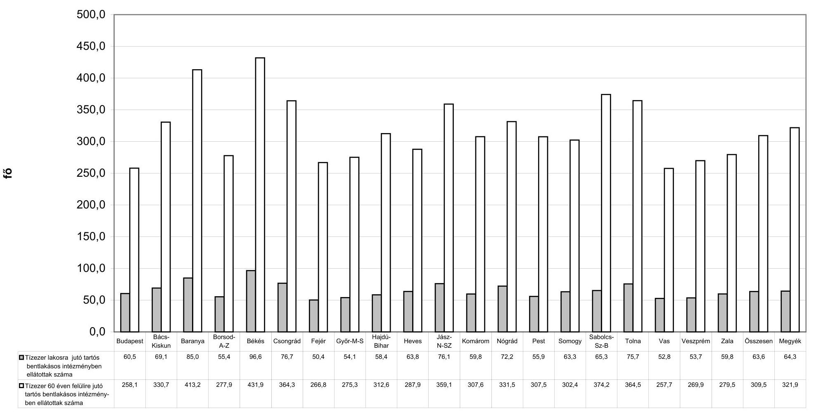

---

# A 60 éven felüli lakónépesség és az idősek otthonában ellátottak számának megoszlása

|  Terület | 1993 |  |  |  | 2001 |  |  |   |
| --- | --- | --- | --- | --- | --- | --- | --- | --- |
|   | lakosság megoszlása | 60 éven felüli lakónépesség megoszlása | Időskorúak otthonában ellátottak számának megoszlása | 60 éven felüllek ellátásának $\%$-a | lakosság megoszlása | 60 éven felüli lakónépesség megoszlása | Időskorúak otthonában ellátottak számának megoszlása | 60 éven felüllek ellátásának $\%$-a  |
|  Budapest | 19,4 | 21,6 | 17,5 | 1,2 | 17,1 | 19,5 | 17,1 | 1,6  |
|  Bács-Kiskun | 5,2 | 5,4 | 6,8 | 1,8 | 5,4 | 5,5 | 5,8 | 2,0  |
|  Baranya | 4,1 | 3,9 | 6,5 | 2,4 | 4,0 | 4,0 | 6,0 | 2,8  |
|  Borsod-Abaúj-Zemplén | 7,2 | 6,9 | 6,9 | 1,4 | 7,4 | 7,1 | 6,1 | 1,6  |
|  Békés | 3,9 | 4,3 | 6,1 | 2,0 | 3,9 | 4,3 | 6,9 | 3,0  |
|  Csongrád | 4,2 | 4,4 | 5,6 | 1,8 | 4,2 | 4,3 | 5,5 | 2,4  |
|  Fejér | 4,1 | 3,6 | 3,1 | 1,3 | 4,2 | 3,8 | 3,1 | 1,4  |
|  Győr-Moson-Sopron | 4,2 | 4,1 | 4,1 | 1,4 | 4,3 | 4,1 | 3,7 | 1,7  |
|  Hajdú-Bihar | 5,3 | 4,8 | 4,0 | 1,2 | 5,4 | 4,9 | 4,1 | 1,6  |
|  Heves | 3,2 | 3,5 | 3,1 | 1,2 | 3,2 | 3,5 | 3,2 | 1,7  |
|  Jász-Nagykun-Szolnok | 4,1 | 4,2 | 5,4 | 1,9 | 4,1 | 4,2 | 5,2 | 2,3  |
|  Komárom | 3,0 | 2,7 | 3,2 | 1,7 | 3,1 | 2,9 | 3,2 | 2,0  |
|  Nógrád | 2,2 | 2,2 | 1,9 | 1,2 | 2,2 | 2,3 | 1,8 | 1,5  |
|  Pest | 9,4 | 8,6 | 7,0 | 1,2 | 10,7 | 9,5 | 8,8 | 1,7  |
|  Somogy | 3,3 | 3,4 | 3,4 | 1,4 | 3,3 | 3,4 | 3,3 | 1,9  |
|  Szabolcs-Szatmár-Bereg | 5,5 | 4,8 | 3,7 | 1,1 | 5,8 | 4,9 | 5,6 | 2,1  |
|  Tolna | 2,4 | 2,4 | 3,3 | 1,9 | 2,5 | 2,5 | 2,8 | 2,1  |
|  Vas | 2,7 | 2,7 | 2,1 | 1,1 | 2,6 | 2,6 | 1,7 | 1,2  |
|  Veszprém | 3,7 | 3,4 | 3,3 | 1,4 | 3,7 | 3,6 | 3,3 | 1,8  |
|  Zala | 2,9 | 3,1 | 3,0 | 1,4 | 2,9 | 3,1 | 2,8 | 1,7  |
|  Összesen | 100,0 | 100,0 | 100,0 | 1,4 | 100,0 | 100,0 | 100,0 | 1,9  |
|  Megyék | 80,6 | 78,4 | 82,5 | 1,5 | 82,9 | 80,5 | 82,9 | 1,9  |

---

# Tízezer 60 éven felülire jutó idősek otthona engedélyezett férőhelyeinek száma (országos adatok)

|  Főváros, megyék | 1993 |  |  | 2001 |  |  | index
$\%$  |
| --- | --- | --- | --- | --- | --- | --- | --- |
|   | 60 éven felüliek száma | idősek otthona férőhelyeinek száma | 10 ezer 60 éven felülire jutó férőhelyek száma | 60 éven felüliek száma | idősek otthona férőhelyeinek száma | 10 ezer 60 éven felülire jutó férőhelyek száma |   |
|   | fő | db | db | fő | db | db |   |
|  Budapest | 428623 | 5224 | 121,9 | 407502 | 6967 | 171,0 | 140,3  |
|  Bács-Kiskun | 107007 | 1919 | 179,3 | 114162 | 2265 | 198,4 | 110,6  |
|  Baranya | 77737 | 1858 | 239,0 | 83574 | 2403 | 287,5 | 120,3  |
|  Borsod-Abaúj-Zemplén | 136361 | 1978 | 145,1 | 149361 | 2599 | 174,0 | 120,0  |
|  Békés | 85647 | 1743 | 203,5 | 89270 | 2642 | 296,0 | 145,4  |
|  Csongrád | 87797 | 1641 | 186,9 | 90193 | 2132 | 236,4 | 126,5  |
|  Fejér | 70754 | 881 | 124,5 | 80947 | 1177 | 145,4 | 116,8  |
|  Győr-Moson-Sopron | 79628 | 1173 | 147,3 | 85591 | 1523 | 177,9 | 120,8  |
|  Hajdú-Bihar | 96183 | 1137 | 118,2 | 103236 | 1620 | 156,9 | 132,7  |
|  Heves | 69138 | 840 | 121,5 | 72388 | 1243 | 171,7 | 141,3  |
|  Jász-Nagykun-Szolnok | 82592 | 1593 | 192,9 | 88755 | 2079 | 234,2 | 121,4  |
|  Komárom | 53682 | 883 | 164,5 | 61629 | 1267 | 205,6 | 125,0  |
|  Nógrád | 44590 | 547 | 122,7 | 48053 | 702 | 146,1 | 119,1  |
|  Pest | 170080 | 2024 | 119,0 | 198148 | 3951 | 199,4 | 167,6  |
|  Somogy | 68309 | 889 | 130,1 | 70504 | 1305 | 185,1 | 142,2  |
|  Szabolcs-Szatmár-Bereg | 96224 | 1094 | 113,7 | 102590 | 2165 | 211,0 | 185,6  |
|  Tolna | 48533 | 910 | 187,5 | 51955 | 1065 | 205,0 | 109,3  |
|  Vas | 54068 | 593 | 109,7 | 55074 | 656 | 119,1 | 108,6  |
|  Veszprém | 67089 | 967 | 144,1 | 74539 | 1310 | 175,7 | 121,9  |
|  Zala | 61568 | 848 | 137,7 | 64005 | 1108 | 173,1 | 125,7  |
|  Összesen | 1985610 | 28742 | 144,8 | 2091476 | 40179 | 192,1 | 132,7  |
|  Megyék | 1556987 | 23518 | 151,0 | 1683974 | 33212 | 197,2 | 130,6  |

---

6. számú melléklet

a V-1010-43/2002-2003. számú ÁSZ jelentéshez

**Idősek ápoló-gondozó otthoni engedélyezett férőhelyeinek száma fenntartók szerint
1993. és 2001. években**

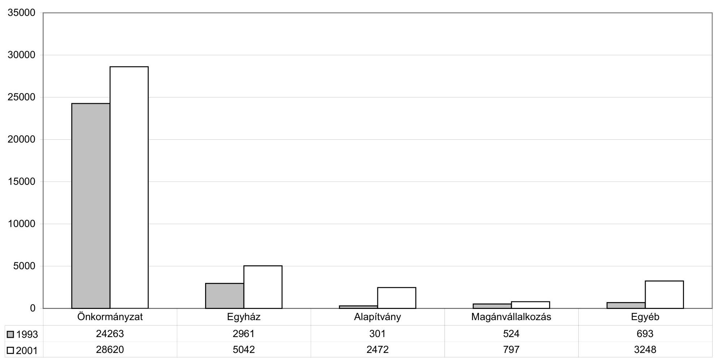

---

# Idősek ápoló-gondozó otthoni engedélyezett férőhelyeinek aránya fenntartók szerint 2001. évben 

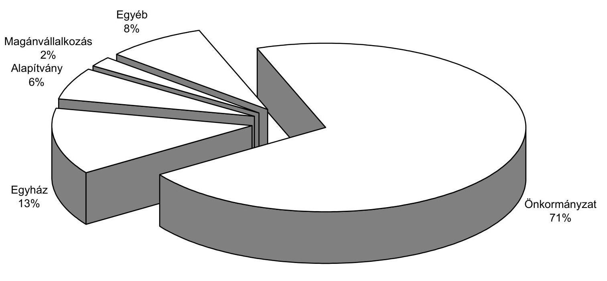

---

# A vizsgált idősek ápolását-gondozását ellátó intézmények pénzügyi forrásainak alakulása 1999-2001. években

|  Sorszám | Megnevezés | 1999 | 2000 | 2001 | index \% |  |   |
| --- | --- | --- | --- | --- | --- | --- | --- |
|   |  |  |  |  | 2000/1999 | 2001/2000 | 2001/1999  |
|  1 | Intézményi müködési bevétel | 2190622 | 2052063 | 2298219 | 93,7 | 112,0 | 104,9  |
|  2 | Ebből: Alaptevékenység bevételei: | 1396442 | 1646181 | 1906770 | 117,9 | 115,8 | 136,5  |
|  3 | Ebből: Intézményi ellátási díjak | 1358542 | 1603806 | 1855076 | 118,1 | 115,7 | 136,5  |
|  4 | Alkalmazottak térítése | 37900 | 42375 | 51694 | 111,8 | 122,0 | 136,4  |
|  5 | Egyéb bevételek | 716241 | 257174 | 250958 | 35,9 | 97,6 | 35,0  |
|  6 | Intézmények egyéb sajátos bevételei | 48303 | 111362 | 93284 | 230,5 | 83,8 | 193,1  |
|  7 | Vállalakozási bevételek | 1865 | 2983 | 5379 | 159,9 | 180,3 | 288,4  |
|  8 | Kamatbevételek | 20063 | 16979 | 14044 | 84,6 | 82,7 | 70,0  |
|  9 | Felhalmozási és tőke jellegű bevétel | 2984 | 7587 | 4025 | 254,3 | 53,1 | 134,9  |
|  10 | Ebből: Tárgyi eszközök, immateriális javak értékesítése | 2984 | 7587 | 4025 | 254,3 | 53,1 | 134,9  |
|  11 | Pénzügyi befektetések | 0 | 0 | 0 | 0,0 | 0,0 | 0,0  |
|  12 | Támogatás, kiegészítés, átvett pénzeszközök | 2646469 | 3223167 | 3821332 | 121,8 | 118,6 | 144,4  |
|  13 | Ebből: Felügyeleti szervtől kapott támogatás | 2560995 | 3168713 | 3648855 | 123,7 | 115,2 | 142,5  |
|  14 | Ebből: müködésre kapott | 2508676 | 3083416 | 3507603 | 122,9 | 113,8 | 139,8  |
|  15 | Államháztartáson kívülről átvett | 85248 | 53296 | 54905 | 62,5 | 103,0 | 64,4  |
|  16 | Ebből müködésre átvett | 15081 | 21264 | 22211 | 141,0 | 104,5 | 147,3  |
|  17 | fejlesztésre átvett | 70167 | 32032 | 32694 | 45,7 | 102,1 | 46,6  |
|  18 | Pénzforgalom nélküli bevétel | 125018 | 191297 | 352436 | 153,0 | 184,2 | 281,9  |
|  19 | Ebből előző évi pénzmaradvány igénybevétele | 124565 | 191015 | 352165 | 153,3 | 184,4 | 282,7  |
|  20 | előző évi vállalk.eredmény igénybevétele | 453 | 282 | 271 | 62,3 | 96,1 | 59,8  |
|  21 | Bevétel összesen: 1+9+12+15+18 | 5050341 | 5527410 | 6530917 | 109,4 | 118,2 | 129,3  |
|  22 | Ellátottak száma (fő) | 6182 | 6464 | 6561 | 104,6 | 101,5 | 106,1  |

---

# A vizsgált idősek ápolását-gondozását ellátó intézmények kiadásainak alakulása 1999-2001. években

|  Megnevezés | 1999 | 2000 | 2001 | index \% |  |   |
| --- | --- | --- | --- | --- | --- | --- |
|   |  |  |  | 2000/1999 | 2001/2000 | 2001/1999  |
|  Tartós, bentlakásos szoc.intézmények kiadásai összesen | 5053233 | 5720485 | 6228593 | 113,2 | 108,9 | 123,3  |
|  Ebből: Működési kiadások összesen | 4097266 | 4998557 | 5793905 | 122,0 | 115,9 | 141,4  |
|  Ebből: személyi jellegű juttatások | 1571622 | 2002321 | 2376488 | 127,4 | 118,7 | 151,2  |
|  munkaadót terhelő járulék | 650544 | 808898 | 908350 | 124,3 | 112,3 | 139,6  |
|  dologi kiadások | 1875100 | 2187338 | 2509047 | 116,7 | 114,7 | 133,8  |
|  támogatás, elvonás, pénzeszköz átadás | 3902 | 20054 | 16599 | 513,9 | 82,8 | 425,4  |
|  Fejlesztési kiadások összesen | 951704 | 700302 | 417165 | 73,6 | 59,6 | 43,8  |
|  Ebből: felújítás | 159164 | 114228 | 141369 | 71,8 | 123,8 | 88,8  |
|  beruházás | 739923 | 515261 | 204516 | 69,6 | 39,7 | 27,6  |
|  Ellátottak száma (fő) | 6182 | 6464 | 6561 | 104,6 | 101,5 | 106,1  |

---

# A vizsgált idősek ápolását-gondozását ellátó intézmények létszám-béradatai 1999-2001. években

|  Megnevezés | 1999 |  |  | 2000 |  |  | 2001 |  |   |
| --- | --- | --- | --- | --- | --- | --- | --- | --- | --- |
|   | Létszám | Bér | 1 före jutó bér | Létszám | Bér | 1 före jutó bér | Létszám | Bér | 1 före jutó bér  |
|   | fő | E Ft | Ft/hó | fő | E Ft | Ft/hó | fő | E Ft | Ft/hó  |
|  Teljes munkaidőben foglalkoztatottak összesen | 2267 | 1133084 | 41651 | 2348 | 1392841 | 49434 | 2457 | 1660203 | 56309  |
|  Ebből: Ápolást-gondozást végzők | 1206 | 616059 | 42569 | 1280 | 758104 | 49356 | 1352 | 959836 | 59161  |
|  Ebből: orvos | 10 | 6851 | 57092 | 9 | 6982 | 64648 | 11 | 10816 | 81939  |
|  vezető ápoló | 66 | 46284 | 58439 | 71 | 61523 | 72210 | 71 | 73975 | 86825  |
|  ápoló-gondozó | 1026 | 512023 | 41587 | 1084 | 619922 | 47657 | 1141 | 778855 | 56884  |
|  diétás nővér | 4 | 1560 | 32500 | 5 | 2304 | 38400 | 5 | 3634 | 60567  |
|  mentálhigiénés szakember | 73 | 37579 | 42898 | 80 | 49622 | 51690 | 85 | 66350 | 65049  |
|  foglalkoztatásszervező | 18 | 9784 | 45296 | 21 | 12735 | 50536 | 25 | 18926 | 63087  |
|  Részmunkaidőben foglalkozatottak | 26 | 7828 | 25090 | 32 | 12562 | 32714 | 51 | 25750 | 42075  |
|  Ebből: ápolást-gondozást végzők | 11 | 2253 | 17068 | 17 | 7053 | 34574 | 25 | 14122 | 47073  |
|  Nyugdíjas foglalkoztatottak | 30 | 8893 | 24703 | 34 | 12756 | 31265 | 27 | 12806 | 39525  |
|  Ebből: ápolást-gondozást végzők | 9 | 2429 | 22491 | 10 | 4884 | 40700 | 9 | 6138 | 56833  |

---

# A vizsgált intézmények 2001. évi ellátási tevékenységét kifejező mutatók

|  Intézmény megnevezés | Önellátásra nem képesek aránya* | Egy foglalkoztatottra jutó ellátott | Egy ellátottra jutó müködési kiadás  |
| --- | --- | --- | --- |
|   | \% | fő | E Ft/fő  |
|  Bács-Kiskun Megyei Önk.Nefelejcs Ház Idősek Otthona | 62,3 | 2,7 | 712,8  |
|  Tiszaug Község Önkormányzat Idősek Otthona | 100,0 | 2,5 | 797,2  |
|  Békés Megyei Önkormányzat Hajnal István Idősek Otthona | 70,5 | 2,2 | 863,6  |
|  Fővárosi Önkormányzat Idősek Otthona Gyula | 67,8 | 2,6 | 914,5  |
|  Baranya Megyei Önkormányzat Idősek Otth. Görcsöny | 69,0 | 1,9 | 911,5  |
|  Pécsi Egyházm. Skóciai Szent Margit Gondozó Otthon | 57,9 | 2,6 | 870,0  |
|  B.A.Z. Megyei Önkormányzat Idősek Otthona Szerencs | 51,8 | 1,8 | 855,2  |
|  Miskolc Megyei Jogu Város Idősek Otthona | 38,6 | 2,0 | 841,1  |
|  Csongrád Megyei Önkormányzat Aranysziget Otthon | 41,1 | 1,6 | 1219,5  |
|  Szegedi Egyházmegye Krízishelyzetmegoldó Szeretetotthon | 100,0 | 2,6 | 1073,2  |
|  Fejér Megyei Önkorm. Ápoló-Gondozó Otthon | 65,9 | 2,4 | 700,3  |
|  H.B.M. Megyei Önkormányzat Módszertani Otthona | 51,3 | 2,1 | 820,3  |
|  Református Egyház Szeretetotthon Debrecen | 72,5 | 3,3 | 908,6  |
|  Heves Megyei Önkormányzat Idősek Otthona | 64,6 | 1,8 | 918,4  |
|  Mezőszemere Községi Önkorm. Idősek Otthona | 26,9 | 2,2 | 851,6  |
|  Poroszló Község Önkormányzat Idősek Otthona | 19,0 | 1,9 | 921,1  |
|  Fővárosi Önkormányzat Idősek Otthona XVII.ker | 77,9 | 2,6 | 995,2  |
|  Arany Alkony Kht. Idősek Otthona Bp. Bánkút út | 100,0 | 3,8 | 757,6  |
|  Győr-M-S Megyei Önkorm. Egyesített Szociális Intézmény | 54,8 | 2,6 | 851,6  |
|  Jász-N-Sz Megyei Önkorm. Jászapáti Idősek Otthona | 86,4 | 1,7 | 929,8  |
|  Római Kat. Egyház Szeretetotthon Jászberény | 91,2 | 3,3 | 948,6  |
|  Komárom-Esztergom Megyei Önkorm. Idősek Otthona | 84,4 | 1,8 | 1002,7  |
|  Oltalom Idősek Otthona Lábatlan | 41,0 | 2,5 | 771,4  |
|  Időskurúak Garzonháza Szügy | 50,0 | 2,0 | 973,6  |
|  Nógrád Megyei Önkormányzat Idősek Otthona | 69,1 | 2,1 | 842,9  |
|  Pest Megyei Önkormányzat Idősek Otthona | 64,8 | 2,7 | 741,4  |
|  Tura Város Önkormányzat Idősek Otthona | 70,4 | 2,1 | 851,6  |
|  Kaposvár Megyei Jogú Város Idősek Otthona | 48,4 | 1,9 | 1037,4  |
|  Református Egyház Idősek Otthona Mosdós | 28,1 | 2,8 | 938,9  |
|  Tolna Megyei Önkormányzat Módszertani Otthon | 43,6 | 2,1 | 853,2  |
|  Platán Alapítvány Idősek Otthona Hőgyész | 55,9 | 3,5 | 914,8  |
|  Sz.Sz.Bereg M. Önkormányzat Idősek Otthona Tiborszállás | 62,5 | 2,4 | 828,2  |
|  Nyírtelek Nagyközségi Önkorm. Idősek Otthona | 50,0 | 1,5 | 1309,0  |
|  Oudenhoven Alapítvány Idősek Kertje Mátészalka | 17,5 | 1,5 | 845,1  |
|  Szent Miklós Idősek Otthona Vasegerszeg | 36,4 | 3,6 | 831,1  |
|  Fővárosi Önkormányzat Idősek Otthona Szombathely | 45,7 | 2,4 | 1059,2  |
|  Veszprém Megyei Önkormányzat Idősek Otthona | 76,0 | 2,3 | 769,7  |
|  Ezüst Otthon Alapítvány Idősek Otthona Bfiired | 23,5 | 4,3 | 1026,4  |
|  A vizsgált intézmények átlaga | 66,9 | 2,7 | 883,1  |

[^0] [^0]: * 2002. szeptember 30-i adat

---

# A szociális törvényben meghatározott ellátások rendszere 

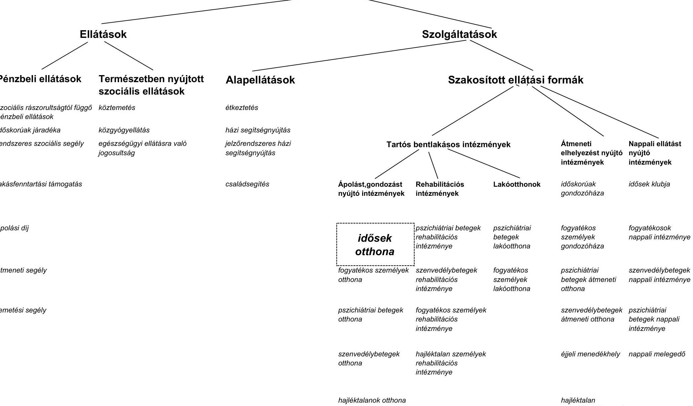

---

# Vizsgált önkormányzatok, intézmények 

## Baranya megye:

Baranya Megyei Önkormányzat
Görcsöny „Kastélypark" Módszertani Otthon
Pécsi Egyházmegyei Hatóság
Skóciai Szent Margit Gondozóotthon Vásárosdombó

## Bács-Kiskun megye:

Bács-Kiskun Megyei Önkormányzat
Tiszaug Község Önkormányzata
Bács-Kiskun Megyei Önkormányzat Nefelejcs Ház Idősek Otthona
Tiszaug Község Önkormányzat Idősek Otthona

## Békés megye:

Békés Megyei Önkormányzat
Hajnal István Idősek Otthona Békés
Fővárosi Önkorm. Idősek Otthona Gyula

## Borsod-Abaúj-Zemplén megye:

Borsod-Abaúj-Zemplén Megyei Önkormányzat
Miskolc Megyei Jogú Város Önkormányzata
Szerencs Idősek Otthona
Miskolc Öszi Napsugár Otthon

## Csongrád megye:

Csongrád Megyei Önkormányzat
Csongrád Aranysziget Otthon
Szeged-Csanádi Egyházmegyei Krízismegoldó Szeretetotthon
Szeged-Csanádi Egyházmegye

## Fejér megye:

Fejér Megyei Önkormányzat
Sárosd Ápoló-Gondozó Otthon

## Győr-Moson-Sopron megye:

Győr-Moson-Sopron Megyei Önkormányzat
Nagylózs Egyesített Szociális Intézmény

---

# Hajdú-Bihar megye: 

Hajdú-Bihar Megyei Önkormányzat
Hajdú-Bihar Megyei Módszertani Központ
Debrecen Református Szeretetotthon
Magyarországi Református Egyház Zsinata Debrecen

## Heves megye:

Heves Megyei Önkormányzat
Poroszló Község Önkormányzata
Mezőszemere Község Önkormányzata
Poroszló Község Idősek Otthona
Mezőszemere Község Önkormányzat Időskorúak Szociális Otthona
Parádfürdő Idősek Otthona

## Jász-Nagykun-Szolnok megye:

Jász-Nagykun-Szolnok Megyei Önkormányzat
Fehér Akác Idősek Otthona és Módszertani Intézménye
Római Katolikus Egyház Szeretetszolgálat Otthona Jászberény

## Komárom-Esztergom megye:

Komárom-Esztergom Megyei Önkormányzat
Oltalom Idősek Otthona Lábatlan
Tata Időskorúak Otthona

## Nógrád megye:

Nógrád Megyei Önkormányzat
Dunakeszi Hittel az Egészséges Életért Alapítvány
Bátonyterenye Ezüstfenyő Idősek otthona
Szügy Idősek Garzonháza

## Pest megye:

Pest Megyei Önkormányzat
Tura Város Önkormányzata
Tura Idősek Otthona
Pécel Idősek Otthona

## Somogy megye:

Somogy Megyei Önkormányzat
Kaposvár Megyei Jogú Város Önkormányzata
Kaposvár Liget Időskorúak Otthona
Mosdós Öszi Napfény Idősek Otthona

## Szabolcs-Szatmár-Bereg megye:

Szabolcs-Szatmár-Bereg Megyei Önkormányzat
Nyírtelek Nagyközség Önkormányzata
Nyírtelek Nagyközség Önkormányzata Idősek Otthona
Tiborszállás Idősek Otthona
Idősek Kertje Oudenhoven Mátészalka

---

# Tolna megye: 

Tolna Megyei Önkormányzat
Tolna Megyei Önkormányzat Módszertani Otthona
Hőgyészi Platán Szociális Alapítvány
Hőgyészi Platán Szociális Alapítvány Idősek Otthona

## Vas megye:

Vas Megyei Önkormányzat
Gergye Szent Miklós Idősek Otthona
Fővárosi Önkormányzat Idősek Otthona Szombathely

## Veszprém megye:

Veszprém Megyei Önkormányzat
Veszprém Megyei Önkormányzat Idősek Otthona Berhida-Peremarton Gyártelep Balatonfüred Ezüst otthon Alapítvány Idősek Otthona

## Főváros:

Budapest Fővárosi Önkormányzat
Budapest Fővárosi Önkormányzat Idősek Otthona XVII. ker.
Arany Alkony Kht. Idősek Otthona

---

H: 1051 BUDAPEST. V., JOZSEF NADOR TÉR 2-4. POSTACIM: 1369 BUDAPEST. POSTAFIOK 481.
TELEFON: 327-2111 FAX: 318-0738
E-MAIL: csaba.laszlo@ipm.gov.hu

PÉNZÜGYMINISZTER
Dr. Kovács Árpád elnök úr részére

Állami Számvevőszék

Budapest

Tisztelt Elnök Úr!
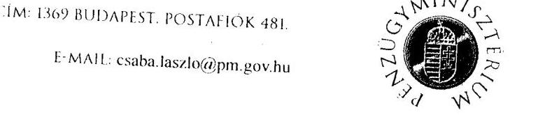

Iktatószám:
$12228 / 1 / 2003$.

Köszönettel vettem a helyi önkormányzatok tartós szociális ellátási feladatainak az idősek otthonainál történő ellátására vonatkozó ellenőrzésről készült ÁSZ jelentés tervezetét. Az anyag föbb megállapításaival egyetértek.

A jelentés-tervezet közvetlenül a pénzügyminiszter számára nem fogalmaz meg ajánlásokat, néhány megállapításához azonban a következőkben teszek észrevételt.

A jelentés-tervezet megállapítja, hogy a jelenlegi finanszírozási rendszer nem veszi figyelembe az ellátottak valós gondozási igényeit, jövedelmi helyzetét, és az intézményfenntartók forrásbiztosítási lehetőségeit. Ez valóban így van az ellátottak gondozási igényeit, jövedelmi helyzetét illetően. Az önkormányzati szabályozás ugyanis a normatív hozzájárulások rendszerére épül, és nem feladat-finanszírozás. Ebből következik egyrészt, hogy az átlagos költségekhez - és nem a felső határköltségekhez - járul hozzá a költségvetés, másrészt további szempontok bevonása a normatívák kialakításába egy túl részletezett támogatási jogcímrendszert eredményezne, amely ellen az Állami Számvevőszék is nemegyszer szót emelt.
Véleményem szerint nem teljesen helytálló az a megállapítás, hogy a finanszírozási rendszer nincs tekintettel az intézményfenntartók forrásbevonási lehetőségeire, hiszen pl. az egyházi fenntartók részére biztosított kiegészítő támogatás éppen olyan forrásokat - helyi adók, illetékek, stb., - kíván pótolni, amelyekkel az egyházak nem, vagy csak kisebb mértékben rendelkeznek.

A jelentés-tervezet említést tesz a szakfeladat-rend meglévő hiányosságairól. Ezzel kapcsolatban jelzem, hogy a Pénzügyminisztériumban elindul a szakfeladat-rend felülvizsgálata és a TEÁOR-ral összhangban történő átdolgozása, amelynek révén korszerűbb és a döntéseket jobban megalapozó szakmai- pénzügyi információs rendszer jön létre.

Budapest, 2003. május 26.
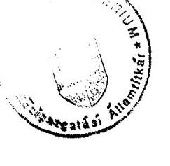

Üdvözlettel:
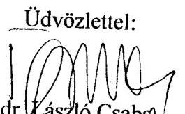

---

# EGÉSZSÉGÜGYI, SZOCIÁLIS ÉS CSALÁDÜGYI MINISZTÉRIUM MINISZTER 

Iktatószám: 28226- //2003-0011ELF

## Dr. Kovács Árpád úr   elnök   Állami Számvevőszék

Budapest

## Tisztelt Elnök Úrl

A helyi önkormányzatok tartós szociális ellátási feladatainak ellenőrzéséről az idösek otthonainál készített jelentésüket köszönettel megkaptam. Az abban foglaltakkal döntően egyetértek, de néhány pontjához az alábbi észrevételt teszem:

1. A 9. oldal utolsó bekezdése, mely, az egészségügyi reform részeként végrehajtott krónikus ágyszám-csökkentés" hatásáról szól, a megállapítást nem tudjuk értelmezni, mert krónikus ágyszám-csökkentés nem történt. A fóosztály törekvése éppen ellenkező, nem krónikus ágyszám-csökkentést, hanem az idősellátás javára ágyszám-bövitést támogatunk.

Meghatároztuk a prioritásokat, melyeket a szerkezet-átalakítási program keretében, a progresszivitás, a szubszidiaritás, és a területi kiegyenlités elvei szerint történt. Megállapítottuk, hogy aktív ágyak átalakításával létrehozhatók geriátriai, krónikus, ápolási és readaptációs osztályok, ezt az elképzelést a korábbi és jelenlegi Nemzeti Fejlesztési Terv is tartalmazza.

- A 32/1997. (X.28.) NM rendelet szakmai kódjegyzékében megjelent A9 kódszám alatt a geriátria, mely lehetővé tesz ilyen osztályok létesítését.
- A 11/1998. (XII. 11.) EüM rendelet lehetővé tette, hogy belgyógyász, illetve pszichiáter szakképesítéssel rendelkező orvosok „geriáter szakorvos" szakvizsgát tehessenek. Így a 2000. évtől elindult a geriátriai szakvizsgáztatás és eddig kb. 80 szakvizsgával rendelkező orvos van.
- A geriátriai szakápolás szakmai szakképesités megszerzése jogszabályi szinten biztosított. A szakmai vizsgakövetelmények a 7/1998. (XII.2.) EüM rendeletben kerültek meghatározásra. A geriátriai szakápoló szakképesités Országos Képzési Jegyzékben szereplő azonosító száma: 54501203.

---

Ezzel a néhány tónnyel szeretnék rávilágítani arra, hogy az ellátórendszer milyen eszközökkel igyekezett eddig is könnyiteni az egészségügyi ellátásban az idösellátás fejlesztését.
2. A 13. oldalon az egészségügyi, szociális és családügyi miniszternek tett javaslatok közül az 1. pont lényegében megvalósult. A hosszú távú koncepciót a Gyógyító és Ápolási Főosztály elkészítette, mely vezetői döntés-előkészítés alatt áll.

A 3. pont teljesült, mely szerint az idösellátásban meghatároztuk prioritásukat.
Az egészségügyi kormányzat célul tűzte ki az egészségügyi és szociális ellátás olyan szintü közelítését, hogy azok teljes mértékben átláthatók legyenek, ilyen kísérleti modellként most mutatták be az ISZER nevű modellkísérleti programot.

Mindezek alapján úgy gondolom, hogy az egészségügyi ágazat nem került többlet feladatként a szociális ellátásba, sőt az egészségügyi geriátriai ellátás fejlesztésével megteremtette a szociális intézményi idösellátás egészségügyi szakmai hátterét is.

Kérem Elnök Urat, hogy észrevételeimet a jelzett témában a jelentés véglegesítésénél figyelembe venni szíveskedjék.

Budapest, 2003. május 9 .
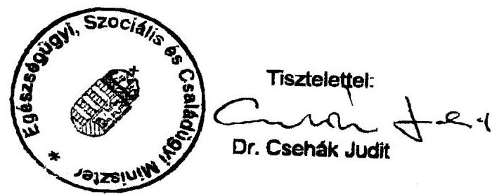

---

# Dr. Csehák Judit úrhölgy, 

miniszter
Egészségügyi, Szociális és
Családügyi Minisztérium

## Budapest

## Tisztelt Miniszter Asszony!

A helyi önkormányzatok tartós szociális ellátási feladatainak ellenőrzéséről az idősek otthonainál készített jelentésünket előzetesen helyettes államtitkári szinten egyeztettük és a tárca észrevételeit figyelembe vettük.

A krónikus ágyakkal kapcsolatosan tett észrevételükre jelzem, hogy az ágyszám a GYÓGYINFOK statisztikája szerint az általunk vizsgált időszakban - 1999-2001 évek között - a minisztérium törekvései ellenére, több mint $25 \%$-kal csökkent. Észrevételüket a jelentés véglegesítésénél ennek figyelembevételével átvezettük.

Budapest, 2003. június "17"

Tisztelettel:
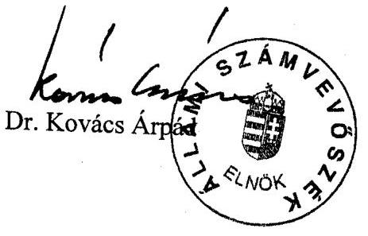

---

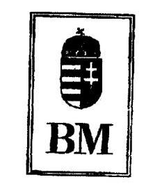

Iktatószám: 1-a-2/20/2003.

Dr. Kovács Árpád úrnak
elnök

# Állami Számvevőszék 

## Budapest

## Tisztelt Elnök Úr!

Megköszönöm az Önök által készített „A helyi önkormányzatok tartós szociális ellátási feladatainak ellenörzéséről az idösek otthonainál" címü jelentést, melynek elöremutató, hasznos megállapításait munkánk során hasznosíthatjuk.

Budapest, 2003. június „ $\mu$."

Üdvözlettel:
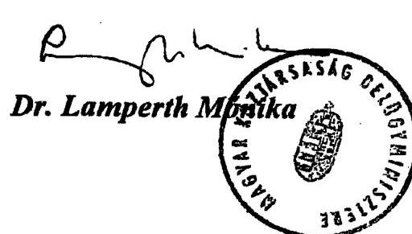