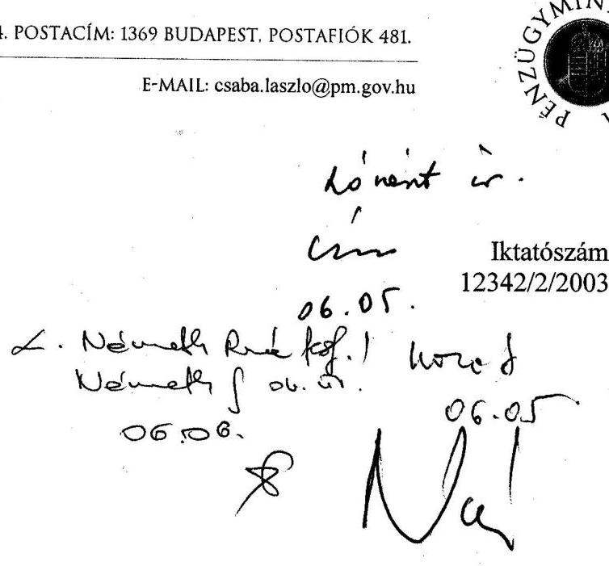
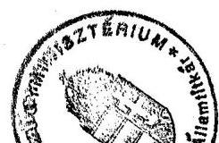
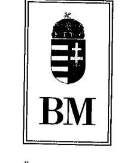
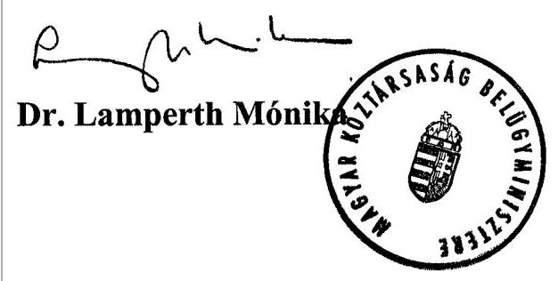

# JELENTÉS 

a helyi önkormányzatok egyes pénzügyi befektetésekkel történő gazdálkodásának ellenőrzéséről

---

# 3. Önkormányzati és Területi Ellenőrzési Igazgatóság 

3.3. Átfogó Ellenőrzések Főcsoport

Iktatószám: V-1009-44/2002-2003.
Témaszám: 612
Vizsgálat-azonosító szám: V0046

## Az ellenőrzést felügyelte:

Dr. Lóránt Zoltán
föigazgató
Az ellenőrzés végrehajtásáért felelős:
Németh Péterné
főcsoportfőnök
Az ellenőrzést vezette:
Németh Gábor
osztályvezető
A számvevői jelentések feldolgozásában és a jelentés összeállításában közremüködtek:

Kozma Gábor
számvevő
Varga József
számvevő tanácsos
Az ellenőrzést végezték:

Castro Hurtadoné Juhász Erika
számvevő
dr. Csapó Anna
tanácsadó
dr. Csikai Zsolt
számvevő tanácsos
Csiszárné dr. Kosik Mária
számvevő tanácsos
Dér Lívia
számvevő tanácsos
Ébner Vilmosné
számvevő tanácsos
Hadházy Sándor
számvevő tanácsos
dr. Körös István
számvevő tanácsos
dr. Lacó Bálintné
főtanácsadó
Maróti Sándor
számvevő tanácsos
Nagy Ervin
számvevő
Pappné dr. Szamosi Éva
számvevő
Preller Zsuzsanna
számvevő tanácsos
dr. Szikszai Bertalan
számvevő tanácsos

---

## Harsányi Imréné

számvevő
Kenéz Sándor
számvevő tanácsos
Kozma Gábor
számvevő

## Kóródi József

főtanácsadó

## Varga József

számvevő tanácsos
Vida László
számvevő tanácsos
Vojcsekné Szabó Ágnes
számvevő tanácsos

# A témához kapcsolódó eddig készített számvevőszéki jelentések: 

## címe

Az önkrományzatok tulajdonába került vagyontárgyak megszerzésével, nyilvántartásával és gazdálkodásával kapcsolatos feladatokról
A helyi önkormányzatok nem közszolgáltatási célú társasági 9814
befektetésekkel, valamint értékpapírokkal történő gazdálkodásának ellenőrzéséről
A helyi önkormányzatok vagyonszerkezetének, vagyonhasznosítási 0008 és nyilvántartási tevékenységének vizsgálatáról
Az önkormányzati korlátozottan forgalomképes törzsvagyon- 0108 gazdálkodás vizsgálatáról

---

# TARTALOMJEGYZÉK 

BEVEZETÉS ..... 5
I. ÖSSZEGZŐ MEGÁLLAPÍTÁSOK, KÖVETKEZTETÉSEK, JAVASLATOK ..... 7
II. RÉSZLETES MEGÁLLAPÍTÁSOK ..... 11

1. A pénzügyi befektetésekkel való gazdálkodás tervezése, szabályozása ..... 11
1.1. A gazdálkodás tervezése ..... 11
1.2. A vagyongazdálkodási elképzelések megvalósítása ..... 14
1.3. A vagyongazdálkodás szabályozása ..... 15
1.4. A tulajdonosi képviselet gyakorlása ..... 16
2. A pénzügyi befektetések számviteli nyilvántartása ..... 16
2.1. Számlarend ..... 16
2.2. A bekerülési érték meghatározása ..... 17
2.3. Az értékpapírok számviteli besorolása ..... 18
2.4. A befektetési szolgáltatók adatszolgáltatása ..... 19
2.5. Az értékvesztés elszámolása ..... 20
3. A pénzügyi befektetések szerkezete és annak változása ..... 21
4. Az önkormányzatok üzleti kapcsolata a befektetési szolgáltatókkal ..... 24
4.1. Eseti megbízások ..... 24
4.2. A vagyonkezelésre vonatkozó megállapodások ..... 25
4.3. Elkülönített letétkezelési tevékenység igénybevétele ..... 27
4.4. A befektetési szolgáltatók díjazása ..... 28
5. Az önkormányzatok befektetési eszközeinek hozamai ..... 30
5.1. Részesedések, tőzsdén jegyzett részvények ..... 30
5.2. Hitelviszonyt megtestesítő értékpapírok, állampapírok ..... 31
5.3. Adott kölcsönök ..... 31
6. Az önkormányzatok egyidejűleg fennálló pénzügyi befektetései és hitelei ..... 32

---

# MELLÉKLETEK 

1. számú melléklet A befektetett pénzügyi eszközök állomány összetétele és változása 1998-tól 2001-ig az ellenőrzött önkormányzatoknál (1 oldal)
2. számú melléklet A forgóeszközök között kimutatott értékpapírok állomány összetétele és változása 1998-tól 2001-ig az ellenőrzött önkormányzatoknál (1 oldal)
3. számú melléklet A befektetett pénzügyi eszközök és a forgóeszközök között kimutatott értékpapírok hozamai eszközcsoportonként 1998-2001-ig az ellenőrzött önkormányzatoknál (1 oldal)
4. számú melléklet A pénzügyi befektetések és a forgóeszközök között kimutatott értékpapírok kezeléséhez kapcsolódó díjak, jutalékok, költségek 1998-2001-ig az ellenőrzött önkormányzatoknál (1 oldal)

## FÜGGELÉKEK

1. számú függelék Az ellenőrzésbe bevont helyi önkormányzatok (1 oldal)

---

# RÖVIDÍTÉSEK JEGYZÉKE 

| Kbt. | A közbeszerzésekről szóló 1995. évi XL. törvény |
| :-- | :-- |
| Ötv. | A helyi önkormányzatokról szóló 1990. évi LXV. törvény |
| Tpt. | A tőkepiacról szóló 2001. évi CXX. törvény |
| rt | részvénytársaság |
| kft | korlátolt felelősségű társaság |

---

.

---

# JELENTÉS 

## a helyi önkormányzatok egyes pénzügyi befektetésekkel történő gazdálkodásának ellenőrzéséről

## BEVEZETÉS

A helyi önkormányzatok 2001. évi mérlegükben a befektetett eszközök között 586,3 milliárd Ft értékű befektetett pénzügyi eszközt, a forgóeszközök között 95,1 milliárd Ft értékű értékpapírt tartottak nyilván. Ez együttesen a helyi önkormányzatok eszközeinek 19,4\%-a.

A helyi önkormányzatok 2002. évben a 48/2001. (III. 27.) Korm. rendeletben előírt ingatlankataszter felülvizsgálatot elvégezték és az ott hivatkozott módszer szerint a korábban érték nélkül nyilvántartott ingatlanok értékelését elvégezték. A helyi önkormányzatok eszközeinek értéke ennek következtében a 2001. év végi 3505 milliárd forintról 6423 milliárdra növekedett. Ezt azonban túlnyomórészt az ingatlanok nyilvántartás szerinti értéknövekedése eredményezte, a befektetett pénzügyi eszközök értéke 2002. december 31-ig 564,7 milliárd forintra, a forgóeszközök között nyilvántartott értékpapíroké pedig 84,2 milliárd forintra csökkent. A csökkenés az önkormányzatok mobilizálható eszközeit érintette.

Az ellenőrzés e vagyoni körnek arra a részére vonatkozott, amely nem közvetlenül szolgálja a kötelező önkormányzati feladatok ellátását. A vizsgálat keretében a közüzemi gazdasági társasági részesedéseken kívüli befektetett pénzügyi eszközökkel és a forgóeszközök között nyilvántartott értékpapírokkal folytatott gazdálkodást ellenőriztük. Nem ellenőriztük az önkormányzatok által alapított közüzemi feladatot ellátó gazdasági társaságokban tulajdonjogot jelentő részesedésekkel való gazdálkodást.

Az ellenőrzési körbe vont egyes pénzügyi befektetésekben lévő vagyon hasznosításáról a helyi önkormányzatok tág lehetőségek között dönthetnek. A korábbi vizsgálat ${ }^{1}$ tapasztalata szerint a pénzügyi befektetés, mint gazdálkodási lehetőség a helyi önkormányzatok részére olyan feladatot jelentett, amelyhez nem rendelkeztek alapos szakmai ismeretekkel. Az önkormányzatok átmenetileg szabad pénzeszközeinek nem kellően körültekintő befektetése a vagyon jelentős részének elvesztését eredményezheti, veszélyeztetve ezzel a tervezett önkor

[^0]
[^0]:    ${ }^{1}$ A helyi önkormányzatok nem közszolgáltatási célú társasági befektetésekkel, valamint értékpapírokkal történő gazdálkodásának ellenőrzése (1998.)

---

mányzati fejlesztések megvalósíthatóságát. ${ }^{2}$ A pénzügyi befektetések előzetes hozamszámításának elmulasztása, a letétkezelés szabálytalansága, a döntési folyamatok szabályozásának és az ellenőrzésnek a hiányossága egyben korrupciós kockázatot jelent. ${ }^{3}$ Ezért az e vagyonnal való gazdálkodás szabályszerűségének és célszerűségének ellenőrzése a vagyon értékmegőrzése szempontjából kiemelt fontosságú.

Az Állami Számvevőszék a helyi önkormányzatokról szóló 1990. évi LXV. törvény 92. § (1) bekezdése alapján jogosult ellenőrizni a helyi önkormányzatok gazdálkodását.

Az ellenőrzés célja annak megállapítása volt, hogy

- a helyi önkormányzatok a tulajdonukban lévő egyes pénzügyi befektetésekkel az önkormányzati célok megvalósítását szolgáló módon gazdálkodtak-e;
- a gazdálkodást szabályszerűen, felelős módon, rendeltetésszerűen és eredményesen végezték-e.

Az ellenőrzött időszak: 1998. január 1. - 2002. szeptember 1.
Az ellenőrzés a Fővárosi Önkormányzatra, két megyei önkormányzatra, egy fővárosi kerületi, 12 megyei jogú városi és 16 városi önkormányzatra terjedt ki (1. számú függelék).

Az ellenőrzött 32 önkormányzat 2001. évben a helyi önkormányzatok tulajdonában lévő befektetett pénzügyi eszközök 77\%-ával, a forgóeszközök között nyilvántartott értékpapírok 64\%-ával rendelkezett.

Az önkormányzatok kiválasztása rétegzett mintavétel alapján történt, így a megállapítások általánosíthatók a pénzügyi befektetésekkel rendelkező önkormányzatokra. A mintában szerepel a pénzügyi befektetések 56,3\%-ával rendelkező Fővárosi Önkormányzat, három 10 és 20, tizenhét 1 és 10 , hét 0,5 és 1 , valamint négy 0,5 milliárd forint alatti nyilvántartási értékű pénzügyi befektetést tulajdonló helyi önkormányzat.

[^0]
[^0]:    ${ }^{2}$ Sopron Globex ügy - az önkormányzat még hat év elteltével sem jutott hozzá a vagyonkezelésbe adott portfóliója eddig meghatározatlan veszteséggel csökkentett értékéhez.
    ${ }^{3}$ Az 1998. évi vizsgálat megállapításai alapján két önkormányzat esetében tettünk büntető feljelentést értékpapír gazdálkodással kapcsolatos hanyag kezelés miatt. A Rendőrség azonban nem tekintette bűncselekménynek az önkormányzatok számára veszteséget okozó befektetési döntéseket. A nyomozás megtagadása miatt az Úgyészségnél panaszt tettünk, eredménytelenül, az Úgyészség a Rendőrséggel értett egyet.

---

# I. ÖSSZEGZŐ MEGÁLLAPÍTÁSOK, KÖVETKEZTETÉSEK, JAVASLATOK 

A helyi önkormányzatok pénzügyi befektetéseinek számviteli nyilvántartás szerinti értéke - a befektetett pénzügyi eszközök és a forgóeszközök között nyilvántartott értékpapírok együttes értéke - az 1998. és 2001. közötti négy év alatt 13,7\%-al növekedett és 2001. évben 681,3 milliárd forint volt. A részesedések számviteli nyilvántartás szerinti értéke mindössze 4,2\%-kal, míg a hitelviszonyt megtestesítő értékpapír állományé 49,8\%-kal növekedett az országosan összesített mérlegadatok szerint. A részesedések értéke 2002. évben még kisebb mértékben - már csak 1\%-kal - növekedett, az értékpapíroké viszont a korábbi növekedéssel szemben $30 \%$-kal csökkent.

Az államháztartási törvény előírása szerint az önkormányzatoknak e jelentős vagyonnal is felelős módon kell gazdálkodniuk. A felelős gazdálkodást az önkormányzatoknak a helyi önkormányzatokról szóló törvényben előírt gazdasági program alapján kell végezniük. Gazdasági programját azonban az ellenőrzött önkormányzatok 56\%-a nem határozta meg, a gazdasági programot készítő önkormányzatok fele pedig nem fogalmazta meg a pénzügyi befektetésekkel kapcsolatos terveit. A gazdasági program készítésének elmulasztása összefügg azzal, hogy annak tartalmáról, készítésének határidejéről jogszabály nem rendelkezik és a forrásszabályozás évenkénti módosulása korlátozza a hosszabb távú tervezés megalapozottságát. Gazdasági program hiányában, illetve a gazdasági program figyelmen kívül hagyásával a gazdasági döntések a pillanatnyi szükségletek és lehetőségek hatására tervszerűtlenül történtek.

Az önkormányzatok egy-egy feladat ellátására készített fejlesztési tervben, a költségvetési koncepciójukban, illetve költségvetésükben határoztak a pénzügyi befektetéseikről, ezek hozamát felhalmozási célra tervezték fordítani. Ezt azonban csak a vizsgált időszak első két évében tudták megvalósítani, 2000. és 2001. években az önkormányzatok 15\%-a már a működtetés finanszírozására is igénybe vette a pénzügyi befektetésekből származó forrásait, az önkormányzatok - más vizsgálatok esetében is jelzett - vagyonfelélése folytatódott.

A vagyongazdálkodás szabályait minden ellenőrzött önkormányzat rendeletben határozta meg. A rendeletek egy tizede azonban nem vonatkozott minden vagyonelemre, illetve hiányos volt a hatáskörök szabályozása. Nem pontosan határozták meg az egyes gazdasági társaságokban tulajdonosi képviseletet ellátók feladatait, a felhatalmazás tartalmát, illetve a feladat ellátásáról való beszámoltatás rendszerességét.

Az önkormányzatok hiányosan gondoskodtak arról, hogy döntéseik megalapozásához kellő tájékoztatást kapjanak az érdekeltségi körükbe tartozó gazdasági társaságok múködéséről.

---

A pénzügyi befektetésekkel kapcsolatos adatok rögzítését szabályozó önkormányzati számlarendek módosítását a jogszabályi változásokat követően az előírt határidőre nem végezték el, illetve azok nem teljes körüek.

A pénzügyi befektetések bekerülési értékét - néhány kivételtől eltekintve - a jogszabályi előírásoknak megfelelően határozták meg az önkormányzatok.

Az értékvesztés elszámolásához - élve a jogszabály adta lehetőséggel - a jelentős összeget nagyon tág határok között határozták meg. Az ilyen érték megállapítási lehetőség - céljával ellentétesen - a mérlegben kimutatott vagyon értékadatának megbízhatóságát korlátozza. Az értékvesztés elszámolása és annak nyilvántartása az önkormányzatok $31 \%$-a esetében szabálytalan. A forgóeszközök között nyilvántartott, hitelviszonyt megtestesítő értékpapírok értékvesztéséről a költségvetési beszámolók ürlapján közölt adatok teljesen megalapozatlanok.

Az önkormányzatokra a kockázatkerülő magatartás volt jellemző. Törekedtek a tőzsdei, vezető részvények vásárlására és megtartására, a nem jövedelmező, várospolitikai célokat nem szolgáló befektetéseik felszámolására.

Növekedett az önkormányzatok pénzügyi befektetései között az állampapírok aránya, éven belüli befektetéseiket is jellemzően állampapírokban tartották. A biztonságos állampapír állomány mellett - lényegesen kisebb arányban - ismert, alacsony kockázatú befektetési jegyeket is vásároltak.

A befektetési szolgáltatók és a befektetési eszközök kiválasztásában megjelentek és tendenciaszerűen érvényesültek észszerű, a pénzügyi befektetés biztonságát és jövedelmezőségét növelő megoldások, így a pályáztatás nem intézményesített formái, illetve a zárt körben végrehajtott ajánlatkérések.

Az önkormányzatok üzleti kapcsolatai a befektetési szolgáltatókkal egy természetes piaci kiválasztási folyamatot követően megszilárdultak. Jellemzően az ismert, ún. elsődleges forgalmazóként működő, hitelintézetként vagy annak társaságaként alapított befektetési szolgáltatók alkotják azt a kört, amellyel az önkormányzatok üzletet kötnek.

Az önkormányzatok kétharmada a kedvezményes kamatozású fejlesztési hitelek felvétele mellett folyamatosan fenntartotta pénzügyi befektetéseit, illetve a kedvezményes kamatozású hitelállományt piaci kamatozású hitelekkel egészítette ki. Értékpapír befektetéseiket a piaci hitelek fedezeteként, az állami támogatások szükséges saját részeként használták, működési bevételük fedezetet nyújtott az adósságszolgálat (kamat- és tőketörlesztések) teljesítésére. A pénzügyi befektetésekkel történő gazdálkodás ezekben az esetekben célszerűnek, az önkormányzati feladatellátással összhangban lévőnek bizonyult.

A kialakult kedvező folyamatokkal együtt jelentkeztek a befektetési szolgáltatók és az önkormányzatok együttmúködéséből, az üzleti kapcsolatrendszer fejlődéséből adódó problémák.

---

A tőkepiacról szóló törvény a befektetési szolgáltatók vagyonkezelési szerződéseivel kapcsolatban kötelező tartalmi elemek alkalmazását írta elő 2002. január 1-i hatállyal. Tekintettel arra, hogy a tizenkettő vagyonkezelési szerződéssel rendelkező önkormányzat közül tizenegy esetében a határozott idejű megállapodások az ellenőrzött időszakban nem jártak le, a törvénymódosításban foglalt kötelező tartalmi elemek figyelembe vételével a szerződések módosítása még nem történt meg.

A befektetési szolgáltatók kiválasztása során az ajánlatkérésekkel kapcsolatos adminisztráció hiánya, illetve részleges kialakítása volt jellemző az ellenőrzött önkormányzatokra. Ilyen módon a felelős gazdálkodási döntések szükséges dokumentációs háttere hiányzott.

Az önkormányzatok kétharmada a pénzügyi befektetési döntések előkészítését hivatalával végeztette el. Ezekben az esetekben a polgármesteri hivatal a befektetési szolgáltatókkal eseti jellegű kapcsolatot hozott létre és egyedi ügylet végrehajtására adott megbízást. Az eseti megbízások döntés előkészítési folyamatát, ezen belül az ajánlatkérések, illetve az ajánlatok értékeléséhez szükséges hozam számítások dokumentációs rendjét nem szabályozták.

A megállapított szabálytalanságok mellett - az előző ellenőrzéssel szemben hanyag kezelést és hozzá kapcsolódó károkozást nem észleltünk.

A gáz-közművagyonnal összefüggően készpénzben és államkötvényben kapott vagyonjuttatást általában nem fordították a múködési célú hitelek kiváltására, a működési célú hitelállomány növekedési üteme nem tört meg. Két olyan ellenőrzött önkormányzat kapott 2002. évben önhibájukon kívül hátrányos helyzetben lévő helyi önkormányzatok jogcímú támogatást, amely - a hatályos jogszabályoknak megfelelően - az előző évben jelentős vagyonjuttatásban részesült.

Kedvezőtlen tendencia érvényesült az önkormányzatok harmadánál. A múködési hiányuk áthidalására rugalmas folyószámla hitelkeretet biztosított a számlavezető bank. A folyószámla hitelkeret éves visszatörlesztése azonban elmaradt és a múködési hitelállomány tartós (éven túli) fennállása, a hitelkeret folyamatos megújítása és igénybevétele, illetve kedvezőtlenebb esetben halmozódása volt megfigyelhető. A likvid hitelek folyamatos megújításának és éven túli igénybevételének kedvezőtlen tendenciája logikai kapcsolatba hozható a vonatkozó jogszabályi rendelkezés értelmezési problémáival. A helyi önkormányzatokról szóló törvény a likvid hiteleket kivette az önkormányzatok kötelezettségvállalási korlátjának számításából. Ezáltal a felhalmozódó, illetve éven túli folyószámlahitelek nem terhelték (szűkítették) a törvény szerinti adósságot keletkeztető kötelezettség vállalás lehetséges mértékét, az önkormányzatok ilyen típusú eladósodása nem ütközött a jogszabályi korlátba.

Az ellenőrzött önkormányzatok megsértették az Ötv., a Számviteli törvény, valamint a 249/2000. (XII. 24.) Korm. rendelet előírásait. Az általánosan jelentkező hiányosságok, a nem egyértelmú követelmények miatt és figyelembe véve, hogy a jogszabályok megsértéséből adódóan vagyoni kár nem volt megállapítható, személyes felelősség felvetésére nem került sor.

---

Az ellenőrzött önkormányzatoknak a törvényes rend helyreállítása céljából javasoltuk, hogy

- készítsék el az Ötv. 91. § (1) bekezdésében előírt gazdasági programjukat;
- végezzék el számlarendjük aktualizálását;
- a tartós hitelviszonyt megtestesítő értékpapírok bekerülési értékét a számvitelről szóló 2000. évi C. törvény 49. §-ában foglaltaknak megfelelően állapítsák meg;
- a részesedéseket és a hitelviszonyt megtestesítő értékpapírokat a számvitelről szóló 2000. évi C. törvény 27. és 30. §-ai, továbbá a 249/2000. (XII. 24.) Korm. rendelet 19. és 21. §-aiban előírtak szerint minősítsék;
- számviteli politikájukban határozzák meg a 249/2000. (XII. 24.) Korm. rendelet 8. § (5) bekezdés h) pontjának előírása szerint, hogy a befektetett eszközök piaci értéken történő értékelése esetén az eszközök piaci értéke és könyv szerinti értéke különbözeténél mit kell figyelembe venni jelentős összegként;
- gondoskodjanak a 249/2000. (XII. 24.) Korm. rendelet 40. § (8) bekezdésének előírása alapján a könyvviteli mérlegben kimutatott részesedések tulajdoni hányad szerinti bemutatásáról a kiegészítő melléklet szöveges értékelésében;
- az értékvesztés elszámolását a számvitelről szóló 2000. évi C. törvény 54. §-a és a 249/2000. (XII. 24.) Korm. rendelet 31. §-a követelményeinek megfelelően végezzék el.

A helyszíni ellenőrzés megállapításainak hasznosítása mellett javasoljuk:

# a belügyminiszternek 

1. kezdeményezze a helyi önkormányzatokról szóló 1990. évi LXV. törvény 91. § (1) bekezdésében előírt gazdasági program tartalmi követelményeinek és elkészítési határidejének jogszabályi meghatározását;
2. Kezdeményezze a helyi önkormányzatokról szóló 1990. évi LXV. törvény 88. § (7) bekezdésének módosítását, amely alapján a folyamatosan megújított (éven belül visszafizetett és újra felvett) hitelek ne tartozzanak a hivatkozott bekezdésben meghatározott likvid hitelek körébe, ezáltal a 88. § (2) és (3) bekezdésében foglalt korlátozás (hitelfelvételi korlát) vonatkozzon a folyamatosan megújított hitelállományokra is;

## a pénzügyminiszternek

kezdeményezze a 249/2000. (XII. 24.) Korm. rendelet módosítását az értékvesztés elszámolás szempontjából jelentős összeg meghatározási elvének előírásával.

---

# II. RÉSZLETES MEGÁLLAPÍTÁSOK 

## 1. A PÉNZÜGYI BEFEKTETÉSEKKEL VALÓ GAZDÁLKODÁS TERVEZÉSE, SZABÁLYOZÁSA

### 1.1. A gazdálkodás tervezése

A vizsgálatban részt vevő 32 önkormányzat közül mindössze 14 tett eleget az Ötv. 91. § (1) bekezdésben rögzített előírásnak, amely szerint „az önkormányzat meghatározza gazdasági programját..." Ez azt jelenti, hogy a vizsgált önkormányzatok 56\%-a - megsértette az Ötv. hivatkozott előírását - nem készítette el a gazdasági programját. Két önkormányzat annak ellenére tette ezt, hogy - a törvényi előírás szellemében - ezt a kötelezettséget maga is rögzítette belső szabályzataiban.

Tiszaújváros Város Önkormányzata a vagyonrendeletben rögzítette a gazdasági program készítésének kötelezettségét. Keszthely Város Önkormányzata 2001 januárjában írta elő annak elkészítését és elfogadását, de a helyszíni vizsgálat lezárásáig arra nem került sor.

A gazdasági programot készítő önkormányzatok sem határozták meg a feladatok ellátásához felhasználható forrásokat. Nem tervezték az átmenetileg szabaddá váló pénzeszközök befektetését. Mindössze 7 önkormányzat gazdasági programjában szerepelt a pénzügyi befektetések hozamával, vagy további befektetéssel kapcsolatos elképzelés.

A gazdasági programot nem készítő önkormányzatok közül hat a feladatok teljesítésére vonatkozó részprogramban, vagy más néven elfogadott dokumentumban összefoglalta a több évre szóló elképzelések egy-egy részterületét.

A Fővárosi Önkormányzat több feladat ellátására készített különkülön fejlesztési tervet és ezekben a dokumentumokban foglalta össze a hosszabb távra szóló elképzeléseit. Ezek a programok minden esetben felmérték a feladatok forrásigényét és ezen belül a pénzügyi befektetések felhasználásának lehetőségeit.

Gyula Város Önkormányzata és Szeged Megyei Jogú Város Önkormányzata városfejlesztési koncepciót készített és fogadott el, de azokban a pénzügyi befektetésekkel kapcsolatos elképzelések nem kerültek rögzítésre.

Baja Város Önkormányzata hasonlóképpen kihagyta ágazati programjaiból a pénzügyi befektetésekkel kapcsolatos terveit.

Gyöngyös Város Önkormányzata felhalmozási programot készített és fogadott el, ez tartalmazott olyan elemeket, amelyek egy gazdasági program részét alkothatnák, de a pénzügyi befektetésekről nem esik szó a programban.

---

Székesfehérvár Megyei Jogú Város Önkormányzata a 2000-ben elfogadott középtávú fejlesztési tervben nem rögzítette pénzügyi befektetésekkel kapcsolatos elképzeléseket.

Debrecen és Zalaegerszeg Megyei Jogú városok önkormányzatai vagyongazdálkodási koncepciót készítettek, amelyben a pénzügyi befektetésekkel kapcsolatos terveket is rögzítették.

Öt önkormányzat (Csongrád Megyei Önkormányzat, Győr, Mosonmagyaróvár, Pápa és Siófok városok) tervei között konkrétan megfogalmazta, hogy megfelelő piaci ár elérése esetén értékesíti azokat a részesedéseit, amelyek érdemi befolyást nem biztosítanak az alacsony tulajdoni hányad miatt. E céloknak megfelelően változott a részesedések összetétele a vizsgált időszakban ezen önkormányzatoknál.

Hasonló változást a vizsgálat azoknál az önkormányzatoknál is megállapított, amelyek ezt programszerúen nem fogalmazták meg, vagy gazdasági programjukban nem rögzítették.

A kis tulajdoni hányadot képviselő részesedések hasznosításának módjáról a hozamokat ismerve lehet megalapozottan dönteni. Az ellenőrzött önkormányzatok közül azonban csak 15-nél (46,9\%) rögzítették az értékpapírok hozamát a befektetések egyedi nyilvántartó lapjain.

Azok az önkormányzatok, amelyek nem készítettek gazdasági programot és más formában megfogalmazott hosszú távú programokkal sem rendelkeztek, eseti jellegú döntéseket hoztak a pénzügyi befektetésekkel kapcsolatban. Az ilyen esetekben külső megkeresés alapján született döntés. Az önkormányzatok az ajánlatok megvitatása után egyedi határozatokban rögzítették a befektetéssel kapcsolatos döntést. Ezek a határozatok csak néhány kivételes esetben (Várpalota, Pécs) rögzítették, hogy az értékesítésből származó bevételt milyen célokra kívánja fordítani az önkormányzat. A többi - egyedi döntéseket hozó - önkormányzat nem tartotta fontosnak a határozatban rögzíteni, hogy a gazdasági eseményből származó forrást milyen célra kívánják fordítani.

Mindebből az következik, hogy az ellenőrzött önkormányzatok kevesebb mint fele határozta meg több évre előre, hogy milyen szerepet szánnak a pénzügyi befektetéseknek az önkormányzati gazdálkodáson belül.

Az éves költségvetési koncepciókat a vizsgált önkormányzatok teljes körűen elkészítették, azokat csak a pénzügyi befektetésekkel összefüggésben vizsgáltuk és megállapításaink is csak azokra vonatkoznak.

A befektetésekkel való felelős gazdálkodás részbeni hiányát jelzi, hogy az éves költségvetési koncepcióban sem fogalmazott meg a pénzügyi befektetésekkel kapcsolatos elképzeléseket 7 önkormányzat (a vizsgálattal érintettek 21,9\%-a). Négy önkormányzat csak általánosságban említette pénzügyi befektetéseit a koncepcióban, de konkrét elképzelést nem rögzített velük kapcsolatosan.

---

Kilenc önkormányzatnál a koncepcióban a gazdasági programmal összhangban fogalmazták meg a pénzügyi befektetésekkel kapcsolatos előírásokat. Ez a vizsgált önkormányzatok számához viszonyítva mindössze 28,1\%.

Az önkormányzati vagyon szerves részét képezik a pénzügyi befektetések, ezért az önkormányzati vagyonnal való felelős gazdálkodás megköveteli, hogy a hosszú távú elképzeléseket rögzítsék, majd az éves tervezés során ismételten áttekintsék azokat. Az előbbi adatok szerint ennek a követelményeknek csak részben tettek eleget a vizsgált önkormányzatok.

Mosonmagyaróvár Város Önkormányzata megfelelően elkészített gazdasági programja tartalmazta a pénzügyi befektetésekkel kapcsolatos elképzeléseket is, de az éves tervezések során azokat figyelmen kívül hagyták.

Az osztalékból származó bevétel tervezése sem volt megalapozott. A tervezési hiba ismétlődően is előfordult.

Győr Megyei Jogú Város Önkormányzata által elfogadott költségvetésekben 2001-ig jelentősen alultervezték az osztalékból származó bevételeket. A koncepcióban foglaltaknak átlagosan a tízszeresét számolták el teljesített bevételként. Az eltérés 2000. évben 734 millió forint volt.

A vizsgált önkormányzatoknak mindössze 21,8\%-a (hét önkormányzat) határozta meg gazdasági programjában, hogy felhalmozási célra, vagy múködési célú kiadásokra kívánja fordítani a pénzügyi befektetésekből származó bevételét.

Az éves tervezés során már nagyobb szerepet kaptak a pénzügyi befektetések, így az ellenőrzött 32 önkormányzat közül 21 (65,6\%) számolt az elérhető hozamokkal, illetve a finanszírozásban betöltött szerepükkel. A felhasználási elképzeléseket azonban még a koncepciókban sem rögzítették néhány önkormányzatnál (Debrecen, Eger, Gyöngyös, Gyula, Hajdúszoboszló, Mátészalka, Nyíregyháza). A költségvetésekben már 22 önkormányzat számolt a pénzügyi befektetéseiből származó hozamokkal.

Miskolc Megyei Jogú Város Önkormányzata tervezi azoknak a közszolgáltatást végző gazdasági társaságok részesedéseinek értékesítését, amelyekbe korábban törvénysértő módon apportálták az önkormányzati törzsvagyonhoz tartozó közüzemi eszközeiket. A közüzemi gazdasági társaságok részesedései ugyan nem tartoznak ennek az ellenőrzésnek a tárgykörébe, de mivel e gazdasági társaságok tulajdonába a közművek törvénysértő módon kerültek és az önkormányzati törzsvagyon e gazdasági társaságok részesedései értékesítése révén visszavonhatatlanul önkormányzati körön kívülre kerül, a jogszabálysértésre ismételten fel kívánjuk hívni a figyelmet.

A helyi önkormányzatok közüzemi szolgáltatást végző gazdasági társaságbeli részesedésének eladása gyakorlatilag lehetetlenné teszi a törvényes rend helyreállítását. Az értékpapírok eladása után nem lesz lehetőség arra, hogy az Ötv. és az Alkotmánybíróság határozatai szellemében, a törzsvagyonhoz tartozó közmúvek kivonásra kerüljenek a gazdasági társaságokból.

---

# 1.2. A vagyongazdálkodási elképzelések megvalósítása 

Az önkormányzatok csak általánosan fogalmazták meg a pénzügyi befektetések hozamából származó források felhasználásának fő irányait. A jelentős befektetési összeggel rendelkezők ( 1 milliárd forintot meghaladó) azt rögzítették, hogy a befektetésekből származó hozamokat a vagyon gyarapítására, felhalmozásra kell fordítani.

A gyakorlati végrehajtás tapasztalatai szerint ezt a jelentős forrásokkal rendelkező önkormányzatoknak sikerült megvalósítani (Főváros, XIII. kerület, Győr, Székesfehérvár, Csongrád megye). Hasonló törekvést fogalmazott meg több város önkormányzata is, de anyagi helyzetük, illetve intézményeik múködési költségigénye miatt nem tudták elérni a kitűzött célt.

Pécsett a felhalmozási célú bevételekből átlagosan 5\%-ot múködésre fordítottak. Baján a vizsgált években a múködési célú kiadások folyamatosan meghaladták a múködési bevételeket, de mivel a pénzügyi befektetések felhasználását nem tervezték feladatra, így nem állapítható meg, hogy a pénzügyi befektetések hozamát, vagy más felhalmozási bevételt költöttek a múködés finanszírozására. Kecskeméten - 2001-ben - a felhalmozási célú bevételekből közel 500 millió forintot fordítottak múködésre. 2002-től Gyöngyösön és Szolnokon is a múködést finanszírozták a pénzügyi befektetésekből származó bevételek. Az utóbbi két évben Százhalombatta Város Önkormányzata sem tudta teljesíteni a vagyongazdálkodásra vonatkozó szabályozását, amely szerint múködésre csak múködési célú bevételeket fordítanak.

Hat önkormányzat (Debrecen, Hajdúszoboszló, Keszthely, Mátészalka, Nyírbátor, Nyíregyháza) bevételei között olyan alacsony a pénzügyi befektetésekből származó hozam, hogy emiatt nem tartották indokoltnak rögzíteni, hogy felhalmozási, vagy múködési célra kívánják fordítani. Az elképzelések végrehajtását így nem vizsgálhatta az ellenőrzés.

A vizsgált önkormányzatokra jellemző, hogy a pénzügyi befektetések értékesítése nem tervszerúen, hanem egy-egy feladat finanszírozásával összefüggésben valósult meg, ami szoros összefüggésben van azzal, hogy az önkormányzatok beruházásai sem tervszerűen valósulnak meg, hanem még mindig a központi költségvetési források elérhetőségétől függően.

Tizennyolc önkormányzat tulajdonában volt nehezen értékesíthető, osztalékot nem fizető, várospolitikai/stratégiai célokat sem szolgáló részesedés, amelyek értékesítésére az ellenőrzött önkormányzatok közül tizenhét tett kísérletet.

A XIII. Kerületi Önkormányzat az osztalékbevételt nem biztosító részesedések hasznosítására intézkedéseket hozott az ellenőrzött időszakban. A nem jövedelmező cégeket eladták, illetve felszámolással rendezték helyzetüket.

Jelentős erőfeszítéseket tett a részesedés állomány racionalizálására Debrecen Megyei Jogú Város Önkormányzata és Pécs Megyei Jogú Város Önkormányzata. Mindkét településen az önkormányzati testület határozott a gazdasági társaságok átvilágításáról. A feladattal megbízott szakcégek álláspontja alapján a testületek határozatban rendelkeztek az értékesítési szándékról, melyek az ellenőrzés időpontjáig részlegesen realizálódtak.

---

Győr Megyei Jogú Város Önkormányzata a részesedések értékesítésére versenyfelhívást adott ki, amelyben limitárakat határozott meg. Az értékesítést megelőzően árajánlatokat kértek a befektetőktől. Az értékesítési folyamat szervezettsége következtében kedvező áron tudták az adásvételi ügyleteket lebonyolítani.

# 1.3. A vagyongazdálkodás szabályozása 

A felelős önkormányzati vagyongazdálkodás sokrétű feladat, eredményes megoldása igényli a kapcsolatos felelősség és hatáskör egyértelmű rögzítését. A vizsgált önkormányzatok ennek úgy tettek eleget (100\%-ban), hogy erre vonatkozóan valamennyien önálló rendeletet alkottak.

A vagyongazdálkodási rendeletek ellenőrzése e témavizsgálat során csak a pénzügyi befektetésekkel kapcsolatos szabályok rögzítésének felülvizsgálatára terjedt ki. A felülvizsgált vagyongazdálkodási rendeletek közül 23-ban (71,9\%) szabályozták a pénzügyi befektetésekkel kapcsolatos eljárási rendet is. Három önkormányzat vagyongazdálkodási rendelete nem nevesítette a vagyonelemek között a pénzügyi befektetéseket, csupán általánosságban határozta meg a vagyonnal kapcsolatos, értékhatárhoz kötött döntési szinteket. Ezek a rendeletek vagyontípusonként nem tettek különbséget a tulajdonosi jogok átruházása során.

A vagyongazdálkodási rendeletek azonban számos hiányosságot tartalmaztak:

- két önkormányzatnál (Mohács, Várpalota) lehetőséget adtak az Ötv. 9. § (4) bekezdésében foglalt előírások megsértésére, mert megengedték önkormányzati vállalat létrehozását, amire a törvény előírása szerint 1993. december 31-e után - jogszerű keretek között - nincs lehetőség. Az önkormányzatok azonban nem éltek a szabálytalan felhatalmazással;
- előfordult, hogy az önkormányzat SZMSZ-e és a vagyongazdálkodási rendelete egymásnak ellentmondó rendelkezéseket tartalmazott.

Mohács Város Önkormányzata a vagyongazdálkodási rendeletében értékhatártól függetlenül úgy rendelkezik, hogy a képviselő-testület kizárólagos döntési jogot gyakorol az ingatlan, a vagyoni értékű jogok és befektetett pénzügyi eszközök közül a részesedések, mint vagyonelemek vonatkozásában. Az SZMSZ 2. sz. mellékletének IV. fejezete viszont azt tartalmazza, hogy a polgármester átruházott hatáskörben értékhatárra tekintet nélkül dönt az önkormányzati tulajdonú értékpapírok értékesítéséről, hasznosításáról, a Gazdasági és Településfejlesztési Bizottság felé való azonnali beszámolási kötelezettséggel. A részesedésekre - a tulajdonviszonyt megtestesítő értékpapírokra - a két rendelkezés másnak biztosítja a tulajdonosi jogok gyakorlását.

A vagyongazdálkodási rendeletek több önkormányzat esetében lehetővé tették, hogy a vagyont önálló vagyonkezelők hasznosítsák. Három önkormányzat (Dunaújváros, Főváros, Mohács) önálló vagyonkezelő szervezetet (rt-t, illetve kft-t) hozott létre.

A Fővárosi Önkormányzat saját vagyonkezelő részvénytársaságával részletes szerződésben rögzítette a felelősségi és döntési jogköröket. A vagyon értékesítésére az önkormányzat közgyűlésének, vagy tulajdonosi bizottságának döntése szerint

---

kerülhetett sor. A portfólió feljavítását ugyancsak önkormányzati döntés alapján lehetett végrehajtani.

# 1.4. A tulajdonosi képviselet gyakorlása 

Az önkormányzati vagyonnal való gazdálkodás szerves részét képezi a részben vagy egészben tulajdonukban lévő gazdasági társaság vezetésének és múködésének ellenőrzése. Ehhez az önkormányzat megfelelő képviselete a gazdasági társaság vezetésében és ellenőrző szervezetében elengedhetetlen. A vizsgálat ezért kiterjedt arra, hogy az önkormányzatok az érdekeltségi körükbe tartozó társaságoknál szabályozták-e az önkormányzat megfelelő képviseletét, valamint azt, hogy a gyakorlatban milyen módon valósult meg a képviselet.

A képviselet biztosításának módját az önkormányzatok 65,6\%-a rögzítette valamilyen formában. Azt azonban, hogy a megbízottnak hogyan kell képviselnie az önkormányzatot, szükséges-e előzetes állásfoglalást kérnie ahhoz, hogy melyik előterjesztést támogathatja vagy ellenezheti, mindössze 10 önkormányzatnál írták elő.

A 32-ből kilenc önkormányzatnál (28,1\%) írták elő, hogy a képviseletet ellátó személy köteles tájékoztatást adni a képviselő-testület vagy az illetékes bizottság részére a meghozott döntésekről, a vállalkozás múködésének tapasztalatairól.

A képviselet ellátásának értékelése már mindössze 3 önkormányzatnál (9,4\%) vált gyakorlattá. Azoknál az önkormányzatoknál, ahol a polgármester vett részt a társaságok vezető testületeinek ülésén, ott a két képviselő-testületi ülés közötti tevékenységről készült tájékoztatásnak részét képezte a társasági ülésen történt eseményekről szóló beszámoló is.

Az önkormányzatok nem szabályozták, hogy a képviseletet ellátó személyek a társaságoknál átvett dokumentumokat milyen módon adják át az önkormányzatnak, illetve a részesedések nyilvántartásával foglalkozó önkormányzati szervezeti egységnek. Az információ átadás szabályozatlansága miatt nem biztosított, hogy a részesedések nyilvántartását és év végi értékelését végző dolgozók rendelkezzenek a feladatok ellátásához szükséges dokumentumokkal.

## 2. A PÉNZÜGYI BEFEKTETÉSEK SZÁMVITELI NYILVÁNTARTÁSA

### 2.1. Számlarend

Két helyi önkormányzat a számvitelről szóló 2000. évi C. törvény 2001. január 1-i hatálybalépését követően a törvény 161. § (5) bekezdésében előírt határidőig nem módosította a számlarendjét (Szeged megyei jogú város és Várpalota város), illetve a módosított számlarendek 35\%-a nem felel meg a törvény 161. § (2) bekezdés és az államháztartás szervezetei beszámolási és könyvvezetési sajátosságairól szóló 249/2000. (XII. 24.) Korm. rendelet 49. §-a előírásainak.

Az ellenőrzött önkormányzatok 15,6\%-ának számlarendje értékpapírokkal kapcsolatos analitikus nyilvántartásra vonatkozóan nem

---

tartalmaz előírást (Somogy Megyei Önkormányzat, Nyíregyháza és Pécs megyei jogú városok, Keszthely és Várpalota városok). Zalaegerszeg Megyei Jogú Város Önkormányzata számlarendjéből hiányoznak az egyedi értékeléshez szükséges adatok, valamint a hozamok rögzítésének előírásai. Somogy Megyei Önkormányzat számlarendje hiányosan teszi lehetővé az értékpapírok csoportos nyilvántartását, nem biztosítja az egyedi értékeléshez szükséges adatok rögzítését.

Az értékpapírok év végi értékeléséhez szükséges adatok bekérését, az információ útját és az analitikában történő rögzítését 7 ellenőrzött önkormányzat (22,6\%) nem szabályozta. Az értékpapírok hozamnyilvántartását hiányosan szabályozták, a társaságok döntéshozó testületei által már elfogadott, de átutalásra még nem került osztalék rögzítését nem írták elő. Ennek hiányában a várható osztalékbevétellel nem számolhattak az önkormányzatok képviselő-testületei.

Az analitikus nyilvántartás vezetéséért felelős kijelölését 11 önkormányzat (34\%) szabályzata nem tartalmazta. Az éves beszámoló elkészítését megelőző értékelés határidejét és felelősét 9 önkormányzat (29\%) nem rögzítette szabályzataiban.

Az adott kölcsönökről vezetett analitikus nyilvántartások 18,8\%-ának előírásai csak részben feleltek meg a számviteli jogszabályok előírásainak. Az önkormányzatok szabályzatai szerint a részletes analitikus nyilvántartást a kölcsönt folyósító hitelintézet vezeti. Ez a gyakorlat sérti a számviteli törvényben rögzített egyedi értékelés elvét, mivel nem biztosítja az annak elvégzéséhez szükséges információkat:

- a kölcsönök esetében az önkormányzatoknál a folyósításról hozott határozatot, a kölcsönadós azonosításához szükséges adatokat, a tartozás elismerését rögzítő okmányokat, a lejáratot, a kamat mértékét, a kamat és a törlesztő részlet fizetésének határidejét, annak betartását. Ezen adatok nélkül a követelés mérleg szerinti értéke nem határozható meg;
- hosszú lejáratú követelés esetében a következő évben esedékes törlesztő részlet összegét ahhoz, hogy a mérlegben átsorolható legyen a rövid lejáratú követelések közé. [249/2000. (XII.24.) Korm. rend. 26. § (3)].

Az analitikus nyilvántartásokra vonatkozó hiányos előírásokat sem teljeskörűen tartották be. A hozamok rögzítését 24 önkormányzat (75\%) írta elő, de csak 15 (46,9\%) teljesítette. Az elszámolt értékvesztések analitikus nyilvántartásban történő rögzítése 8 önkormányzatnál (25\%) elmaradt.

# 2.2. A bekerülési érték meghatározása 

A helyi önkormányzatok a gazdasági társaságokban lévő részesedések értékét a nyilvántartásba vételkor a hatályos jogszabályi előírásoknak megfelelően határozták meg.

A követelések ellenében átvett értékpapírokat - helyesen - a kiváltott követeléssel egyező értéken vették nyilvántartásba az önkormányzatok.

---

Hagyatékként 1 önkormányzat (Orosháza) jutott pénzügyi befektetéshez. Az így kapott OTP törzsrészvényeket a jogszabályi előírásoknak megfelelően piaci értéken vették nyilvántartásba.

Fellelt értékpapír állományba vételére két önkormányzatnál (Pápa, Várpalota) került sor. A pápai önkormányzatnál két esetben is ugyanannak a társaságnak az értékpapírjait vételezték be. Az illetékes vagyonátadó bizottság által átadott tanácsi vállalatot részvénytársasággá alakították, de annak részvényei nem kerültek be az önkormányzat nyilvántartásába. Az 1998. évben fellelt részesedéseket piaci értéken vették állományba az elkészített jegyzőkönyv alapján. Ugyanabban az évben az állományba vétellel megegyező árfolyamon értékesítette is az önkormányzat a fellelt értékpapírokat. 2000. évben azonban ismét ennek, az időközben kft-vé alakult társaságnak az értékpapírjait lelték fel. A bekerülési értéket a felvett jegyzőkönyv szerint ekkor is a piaci érték szerint állapították meg 1355 ezer forintban. Ennek ellenére ennek az értékpapírnak a 2000. évben történt értékesítése 2156 ezer forint bevételt eredményezett. Az, hogy ugyanannak a társaságnak tulajdoni viszonyt megtestesítő értékpapírjait két alkalommal is fellelt értékpapírként vették nyilvántartásba azt igazolja, hogy az önkormányzat nem járt el kellő gondossággal az értékpapírok nyilvántartása során.

Várpalota Város Önkormányzata a fellelt értékpapír állományba vételekor nem a számviteli törvény előírásai szerint járt el, hanem a részvény névértékét tekintette bekerülési értéknek.

Az egyéb, tartósan adott kölcsönök állományba vétele egy önkormányzat (Szolnok) kivételével megfelelt a jogszabályok előírásainak. A kifogásolt önkormányzati gyakorlat esetében az önkormányzati lakások megvásárlásához nyújtott kölcsönök állományát egy kft kezelésébe adták, a kft-vel szembeni követelést pedig rövid lejáratú követelésként szerepeltették a nyilvántartásban, valamint az önkormányzat mérlegében. A többi önkormányzat esetében a szerződésben szereplő összeggel történt meg az állományba vétel.

Tartós hitelviszonyt megtestesítő értékpapírokat - köztük a gázközműért kapott államkötvényeket - több önkormányzat szabálytalanul - a 249/2000. (XII. 24.) Korm. rendelet 29. § (2) bekezdés előírását figyelmen kívül hagyva -vette nyilvántartásba: Szeged Megyei Jogú Város Önkormányzata a felhalmozott kamattal növelt értéken, Pécs Megyei Jogú Város Önkormányzata pedig névértéken, annak ellenére, hogy 99\%-os árfolyamon kapta meg azokat. Százhalombatta Város Önkormányzata minden értékpapírt kamattal növelt értéken vett nyilvántartásba. A jogszabályi előírás szerint a bekerülési érték nem tartalmazhatja a vételárban megfizetett vagy kibocsátási okiratban meghatározott kamat összegét.

# 2.3. Az értékpapírok számviteli besorolása 

Az értékpapírokat - a velük kapcsolatos hasznosítási szándék szerint - a befektetett eszközök vagy a forgóeszközök között mutathatják ki az önkormányzatok, amit szabályzataikban rögzítenek.

---

A vizsgált önkormányzatok 84,4\%-a (27 önkormányzati hivatal) készítette el a hatályos jogszabályoknak megfelelő belső szabályozást. A pénzügyi eszközök besorolásáról nem rendelkezett négy önkormányzat (Siófok, Szeged, Várpalota és Zalaegerszeg).

A szabályozást elkészítő önkormányzatok rögzítették, hogy mely pénzügyi eszközöket kell befektetett pénzügyi eszközként és melyeket forgatási célú értékpapírként nyilvántartani és kimutatni. A befektetésekkel kapcsolatos önkormányzati célok megváltozása, vagy az értékpapír következő évi lejárata esetén mindössze öt önkormányzatnál kötelező elvégezni szabályzatuk szerint az átsorolást, hét önkormányzat szabályozása csak lehetőségként rögzíti a forgatási célú értékpapírok közé történő átsorolást, annak ellenére, hogy az államháztartás szervezetei beszámolási és könyvvezetési kötelezettségeinek sajátosságairól szóló 249/2000. (XII. 24.) Korm. rendelet 19. és 21. §-ai a besorolásra kötelező előírást tartalmaznak.

Az átsorolással kapcsolatos feladatokat, a döntéshozó megnevezését és a számviteli nyilvántartás módosításához szükséges információs rendet 14 önkormányzat $(43,8 \%)$ szabályozta.

A következő évi értékesítési szándék - mérlegben is megjeleníthető módon jellemzően a költségvetési koncepcióban, a költségvetésben és a mérleg elkészítése előtt meghozott egyedi határozatban fogalmazódhat meg. A költségvetési koncepciókban hat, a költségvetésekben két önkormányzat rögzítette, hogy egyes értékpapírjait értékesíteni szeretné. Átsorolás azonban csak négy önkormányzatnál (Baja, Hajdúszoboszló, Keszthely, Somogy Megye) történt meg. Közülük Somogy Megye Önkormányzata nem alkalmazott egységes gyakorlatot az átsorolásoknál.

# 2.4. A befektetési szolgáltatók adatszolgáltatása 

A vizsgált önkormányzatok közül 11 (34,5\%) kötött szerződést befektetési szolgáltatóval. A megkötött szerződések tartalmazták az adatszolgáltatásra vonatkozó megállapodást. Egy esetben (Mátészalka) fordult elő, hogy a befektetési szolgáltató nem tett eleget a szerződésben vállalt kötelezettségének. Négy önkormányzatnál úgy kaptak rendszeresen információt a szolgáltatótól, hogy az a szerződésben nem volt rögzítve.

Befektetési szolgáltató bevonásával közvetített értékpapír műveletről az önkormányzat munkatársai kevesebb közvetlen információval rendelkeznek. Ezért kiemelt jelentősége van annak, hogy a bizonylatok útját megfelelően szabályozzák, az egyes munkaköri leírások pontosan rögzítsék a feladatokat, a belső ellenőrzés során megfelelő súlyt kapjanak a pénzügyi befektetések.

A rendelkezésre bocsátott információk alapján azonban csak hét önkormányzat (információval ellátottak fele) vezette analitikus nyilvántartásait a számviteli jogszabályokban foglalt előírásoknak megfelelően. A többi esetben egyáltalán nem, vagy nem megfelelően használták az adatokat.

Százhalombatta Város Önkormányzata a befektetéseket kamattal növelt értéken vette nyilvántartásba, értékesítés esetén viszont csak a befektetés tőke részét ve

---

zette ki, így jelentős nagyságú (több mint 2 milliárd Ft) különbözet keletkezett a vagyonkezelőnél és az önkormányzatnál nyilvántartott befektetések értéke között.

# 2.5. Az értékvesztés elszámolása 

Az értékvesztés elszámolási kötelezettségét 24 önkormányzat teljesítette (75\%), egy önkormányzat azt szabálytalanul végezte, hét pedig ezt elmulasztva megsértette a számvitelről szóló 2000. évi C. törvény 54. § előírásait.

Az értékvesztés szempontjából jelentős összeg meghatározását - amit a 249/2000. (XII. 24.) Korm. rend. 8. § (5) bekezdése ír elő - az önkormányzatok nagyon tág határok között állapították meg. Százhalombatta és Pápa városok önkormányzatánál már az ezer forintot elérő értékvesztést is el kell számolni. Hajdúszoboszlón az 50 ezer, Egerben a 80 ezer, Baján az 500 ezer Ft-ot tekintik jelentős összegnek. Budapest XIII. Kerület Önkormányzata úgy rendelkezett, hogy akkor jelentős az értékvesztés, „ha a befektetés könyv szerinti értéke és piaci értéke között 15\%-ot meghaladó mértékű az eltérés". A megfogalmazásból nem egyértelmű, hogy melyik értéket kell viszonyítási alapnak tekinteni. Pécs Megyei Jogú Város Önkormányzatánál csak 50\%-os eltérés esetén kell az értékvesztést elszámolni. Mátészalka és Siófok városokban a mérleg föösszeghez viszonyítva határozták meg a lényeges eltérést. A Fővárosi Önkormányzat a könyv szerinti érték 2\%-ában illetve 500 millió forintban határozta meg az értékvesztés szempontjából jelentős összeget.

Az értékvesztés szempontjából jelentős összeg szélsőséges meghatározása célszerűtlen, mert nem veszi figyelembe a lényegesség követelményét.

Mohács és Orosháza városok önkormányzata szabálytalanul számolt el értékvesztést, mert helyi szabályozással nem rendelkeztek. Helyi szabályozás hiányában nem határozható meg az értékvesztés elszámolásának indokoltsága.

A helyi szabályozás megléte ellenére nem számolt el értékvesztést Szeged Megyei Jogú Város, Mosonmagyaróvár és Várpalota Város önkormányzata.

A Fővárosi Önkormányzat költségvetési beszámolója sem 2000. sem 2001. évben nem tartalmaz elszámolt értékvesztést, az értékvesztés elszámolását ugyanis szabálytalanul végezték el és a számviteli nyilvántartásuk annak részletes adatait nem tartalmazza. Az értékvesztés elszámolására a Fővárosi Önkormányzat vagyonkezelője tett javaslatot és azt a Fővárosi Önkormányzat állományváltozásként számolta el. A javaslat 2001. év előtt elszámolt értékvesztés visszaírást is tartalmazott 2001. évben, noha a 249/2000. (XII. 24.) Korm. rendelet 53. §-a szerint elszámolt értékvesztést csökkentő visszaírást csak a 2001. január 1. után elszámolt értékvesztésekre szabad alkalmazni.

A tőzsdén nem jegyzett értékpapírok esetében több önkormányzatnál (Gyöngyös, Mosonmagyaróvár, Pápa, Szolnok) nem a számvitelről szóló 2000. évi C. törvény 54. § (2) bekezdés c) pontja szerint határozták meg a befektetés piaci értékét. Figyelmen kívül hagyták a befektetés könyv szerinti értéke és névértéke arányát, csak a gazdasági társaság saját tőkéje és jegyzett tőkéje arányát vizsgálták.

---

Az ismertetett szabálytalanságok mellett az ellenőrzött önkormányzatok költségvetési beszámolói 606336 ezer forint elszámolt értékvesztést tartalmaznak 2001. évre vonatkozóan. (A korábbi években a költségvetési beszámolóban ilyen adatot nem kellett rögzíteni.) Az elszámolt értékvesztés $87 \%$-a a befektetett pénzügyi eszközök között nyilvántartott egyéb tartós részesedések értékét csökkentette. Az értékvesztés aránya $0,13 \%$ volt ennél az eszközcsoportnál. Az elszámolt értékvesztés további 12,5\%-a a tartós hitelviszonyt megtestesítő értékpapírokat érintette, az értékvesztés aránya ott $0,22 \%$ volt.

A forgóeszközök között nyilvántartott értékpapírok esetében az ellenőrzött önkormányzatok az összes önkormányzat által elszámolt értékvesztésből csak 3796 ezer forinttal részesedtek, pedig az ilyen értékpapírok 65,7\%-val rendelkeztek 2001. évben. Az ellenőrzött önkormányzatok esetében a forgóeszközök között nyilvántartott értékpapírok 49,7\%-a államkötvény, 37,8\%-a diszkont kincstárjegy volt, ez indokolja a kis összegű értékvesztést.

Az önkormányzati költségvetési beszámolók 57. sz. űrlapjának összesített adatai szerint a forgóeszközök között nyilvántartott értékpapírok esetében az összes elszámolt értékvesztés azonban 1561652 ezer forint volt. Az 50000 ezer forintot meghaladó értékvesztést elszámoló önkormányzatoktól bekért tájékoztatás szerint mindegyik esetben téves az űrlapon szereplő adat.

Balatonalmádi és Tiszavasvári városok, valamint Herceghalom, Jánossomorja és Oszlár község önkormányzata a tulajdonukban lévő forgatási célú hitelviszonyt megtestesítő értékpapírok 2001. évi nyitóállományát, Maglód Nagyközség önkormányzata az értékpapírok 2001. évi állományváltozásának értékét, a Főváros III. kerület önkormányzata az egyéb részesedések értékvesztését tüntette fel ott, összesen 1162336 ezer forint értékben.

# 3. A PÉNZÜGYI BEFEKTETÉSEK SZERKEZETE ÉS ANNAK VÁlTOZÁSA 

Az összes helyi önkormányzat pénzügyi befektetéseinek értéke - a befektetett pénzügyi eszközök és forgóeszközök között nyilvántartott értékpapírok együttes értéke - a következőképpen változott:

|  | Pénzügyi befektetések   millió forint | Változás az előző   évhez viszonyítva \% |
| :-- | :--: | :--: |
| 1998. XII.31. | 599107 | $-2,2$ |
| 1999. XII.31. | 628005 | 4,8 |
| 2000. XII.31. | 646973 | 3,0 |
| 2001. XII.31. | 681338 | 5,3 |
| 2002. XII. 31. | 648895 | $-4,8$ |

---

A pénzügyi befektetések összetételének és megoszlási arányának változása:

|  | 1998. XII. 31. |  | 2002. XII. 31. |  | 2002/1998 |
| :-- | --: | --: | --: | --: | --: |
|  | millió Ft | $\%$ | millió Ft | $\%$ | $\%$ |
| Befektetett pénzügyi   eszközök | 526806 | 87,9 | 564662 | 87,0 | 107,2 |
| Ebből:   Egyéb tartós   részesedések | 464787 | 77,6 | 486183 | 74,9 | 104,6 |
| Tartós értékpapírok | 29411 | 4,9 | 26575 | 4,1 | 90,4 |
| Egyéb tartósan   adott kölcsön | 32336 | 5,4 | 51005 | 7,9 | 157,7 |
| Hosszú lejáratú   bankbetétek | 272 | 0,0 | 860 | 0,1 | 316,2 |
| Forgóeszközök között   nyilvántartott érték-   papírok | 72301 | 12,1 | 84233 | 13,0 | 116,5 |
| Összes pénzügyi   befektetés | 599107 | 100 | 648895 | 100 | 108,3 |

Az ellenőrzésre kiválasztott 32 helyi önkormányzat 2001. évben az összes pénzügyi befektetés $75,2 \%$-val rendelkezett, 512466 millió forint értékben. A Fővárosi Önkormányzat 383504 millió forint nyilvántartási értékű pénzügyi befektetése az összesennek az 56,3\%-át, az ellenőrzöttnek pedig a 74,8\%-át jelenti. A Fővárosi Önkormányzat pénzügyi befektetései négy év alatt csak 7,4\%kal növekedtek az összes helyi önkormányzat 13,7\%-os növekedésével szemben. Ennek következtében részesedése 3,3 százalékponttal csökkent ez idő alatt.

Az ellenőrzött önkormányzatok befektetett pénzügyi eszközeinek állományát és összetétel változását a vizsgált időszakban az 1. sz. melléklet mutatja be.

Az ellenőrzött önkormányzatok 2001. évi pénzügyi befektetéseinek 78,9\%-át, 404527 millió forintot gazdasági társaságbeli részesedések képezték, ezek értéke négy év alatt csupán 2,7\%-kal növekedett. A részesedések 4\%-át képezik a tőzsdére bevezetett részvények ( 16228 millió Ft). Ezek értéke 4 év alatt $20 \%$-kal növekedett.
adatok: millió Ft-ban

|  | 1998. XII.31. | 1999. XII.31. | 2000. XII.31. | 2001. XII.31. |
| :-- | --: | --: | --: | --: |
| A 32 önkormányzat   tőzsdei részvényei | 13522,9 | 14312,7 | 16301,0 | 16228,0 |
| Ebből a Fővárosi   Önkormányzat   állománya | 8201,2 | 9999,6 | 11553,7 | 11633,2 |

---

A Fővárosi Önkormányzat részesedése a tőzsdei részvényekből 60,6\%-ról négy év alatt $71,7 \%$-ra emelkedett úgy, hogy annak értéke 3432 millió forinttal növekedett, miközben a másik 31 önkormányzaté 726,9 millió forinttal csökkent. Ez a változás a Fővárosi Önkormányzat portfólió átalakítási célkitűzéseinek érvényesülését tükrözi.

A tőzsdén jegyzett részvények nem közüzemi szolgáltatást végző gazdasági társaságokbeli részesedések voltak. Az ellenőrzés tárgyát képező nem közüzemi szolgáltatást végző gazdasági társaságokban tulajdonolt részesedésekről elkülönített nyilvántartást a helyi önkormányzatok nem vezetnek, így azok aránya csak a vizsgálat során - az ellenőrzött önkormányzatok adatszolgáltatása alapján - volt megbecsülhető. A Fővárosi Önkormányzat 310787 millió forint nyilvántartási értékű egyéb tartós részesedéséből 2001. év végén 291661 millió forint értékű ( $93,7 \%$ ) volt közszolgáltatást - döntően közüzemi szolgáltatást - végző gazdasági társaságban. Az ellenőrzött önkormányzatok részesedések között nyilvántartott eszközeinek 9,5-10\%-a volt az, ami nem közüzemi szolgáltatást végző gazdasági társaságban volt és amivel saját döntései szerint szabadon gazdálkodhatott. A közüzemi szolgáltatást végző gazdasági társaságbeli részesedések mennyisége az ellenőrzött időszakban sem alapítás, sem adás-vétel következtében nem változott.

A helyi önkormányzatok 40,6\%-a tett eleget a 249/2000. (XII. 24.) Korm. rendelet 40. § (8) bekezdésbeli kötelezettségének, ezek a költségvetési beszámoló kiegészítő mellékletében az előírásoknak megfelelő csoportosításban bemutatták a 2001. december 31-én tulajdonukban lévő részesedéseket.

A kimutatással rendelkező, illetve azt az ellenőrzés során felhívásunkra elkészítő 21 ellenőrzött önkormányzat adatai alapján tulajdoni hányad szerint a következőképpen oszlottak meg a részesedések:

|  | Az önkormányzat tulajdoni hányada |  |  |  |  | Összesen |
| :-- | :--: | :--: | :--: | :--: | :--: | :--: |
|  | $100 \%$ | $75 \%$ felett | $50 \%$ felett | $25 \%$ felett | $25 \%$ alatt |  |
| Részesedések nyil-   vántartás szerinti   értéke (millió forint) | 215710 | 58189 | 68549 | 5283 | 4411 | 352142 |
| Megoszlási aránya   \% | 61,3 | 16,5 | 19,5 | 1,5 | 1,2 | 100 |
| Gazdasági társaság-   gok száma | 107 | 19 | 36 | 48 | 183 | 393 |
| Megoszlási aránya   \% | 27,3 | 4,8 | 9,2 | 12,2 | 46,5 | 100 |

Az adatok azt mutatják, hogy az önkormányzatok szándéka ellenére még mindig jelentős számú gazdasági társaságban van olyan kis tulajdoni arányuk, ami nem biztosít részükre befolyásolási lehetőséget. E kis tulajdoni hányadot képviselő részesedéseket szabályszerűen a forgóeszközök között tarthatják nyilván az önkormányzatok annak ellenére, hogy értékesítésükre na

---

gyon korlátozott a lehetőségük. A belterületi föld értéke után kapott, még meglévő, osztalékbevételt nem biztosító és nem értékesíthető részesedések forgóeszközök közötti nyilvántartási lehetősége az önkormányzatok likviditási mutatóit indokolatlanul javítja.

Az önkormányzatok tulajdonában lévő, a befektetett pénzügyi eszközök és a forgóeszközök között nyilvántartott értékpapírok együttes értéke a vizsgált időszakban a következőképpen alakult:
adatok: millió forintban

|  | 1998. XII.31. | 1999. XII.31. | 2000. XII.31. | 2001. XII.31. |
| :-- | --: | --: | --: | --: |
| Önkormányzatok   összesen | 101712 | 129457 | 141178 | 149258 |
| 32 ellenőrzött   önkormányzat | 76108 | 105500 | 110227 | 94794 |
| Fővárosi   Önkormányzat | 51119 | 80120 | 81667 | 70491 |

Az összes önkormányzat ilyen eszközeinek értéke a vizsgált időszakban évről évre növekedett, az ellenőrzött időszak alatt 46,7\%-kal. A 2001. évi növekedés azonban csak 8,1 milliárd Ft volt annak ellenére, hogy abban az évben a gázközmű vagyonnal kapcsolatosan 30,3 milliárd forint névértékű államkötvényt kaptak az önkormányzatok a közel 40 milliárd forint átutalása mellett. A befektetett pénzügyi eszközök és a forgóeszközök között nyilvántartott értékpapírok együttes nyilvántartási értéke azonban csak 34,4 milliárd forinttal növekedett. Mindez azt jelenti, hogy az önkormányzatok még 2001. évben felhasználták az egyszeri nagy összegű vagyonjuttatás közel 50\%-át.

Az ellenőrzött önkormányzatok forgóeszközök között kimutatott értékpapír állományának összetételét és annak változását a 2. sz. melléklet mutatja be.

A 32 ellenőrzött önkormányzatnál a hitelviszonyt megtestesítő értékpapírok és a forgóeszközök között nyilvántartott értékpapírok összértéke az addigi növekedés után 2001. évben az előző évinek a 86\%-ra csökkent. Ebben közrehatott, hogy az ellenőrzött önkormányzatok között szereplő Fővárosi Önkormányzat és a XIII. kerületi önkormányzat nem volt jogosult gázközmű-vagyonnal kapcsolatos vagyonjuttatásra.

# 4. AZ ÖNKORMÁNYZATOK ÜZLETI KAPCSOLATA A BEFEKTETÉSI SZOLGÁLTATÓKKAL 

### 4.1. Eseti megbízások

A vizsgált települések közül a Főváros és további húsz önkormányzat a pénzügyi befektetési döntések előkészítését hivatalával végeztette el. (A Főváros szerteágazó befektetési tevékenységét hivatalával és vagyonkezelő szervezetével párhuzamosan látta el.) Ezekben az esetekben a hivatal a befektetési szolgáltatókkal eseti jellegű kapcsolatot hozott létre és egyedi ügylet végrehajtására

---

adott megbízást. A megbízásokat állampapírokra vonatkozó tranzakciók esetében adásvételi szerződésekben, részvényekre vonatkozó értékesítések és vásárlások esetében bizományosi szerződésekben rögzítették.

# Az eseti megbízások döntés előkészítési folyamatát, ezen belül az ajánlatkérések, illetve az ajánlatok értékeléséhez szükséges hozamszámítások dokumentációs rendjét az ellenőrzött önkormányzatok egyike sem szabályozta. 

A befektetési szolgáltatók kiválasztása során az ajánlatkérésekkel kapcsolatos adminisztráció hiánya, illetve részleges kialakítása volt jellemző az ellenőrzött önkormányzatokra. Ilyen módon a felelős gazdálkodási döntések szükséges dokumentációs háttere hiányzott.

A Fővárosi Önkormányzat értékpapír adásvételi ügyleteit a Főpolgármesteri Hivatalhoz tartozó szervezeti egység készítette elő. A Fővárosi Önkormányzat mindenkori költségvetési rendeletének hatálya alatt végrehajtott pénzügyi befektetési tevékenység alacsony kockázatú állampapírokra, illetve mérsékelt kockázatú kötvény típusokra vonatkozott. A megnevezett értékpapír típusokra vonatkozó befektetési döntések előkészítésének részletes eljárási rendjét a Főpolgármesteri Hivatalban nem szabályozták.

Az ellenőrzött harminckét önkormányzatból a Főváros és további tizenhat település adott eseti jellegű megbízást befektetési szolgáltatónak részvények bizományos adásvételére. Az értékpapírok forgalomba hozataláról, a befektetési szolgáltatásokról és az értékpapír tőzsdéről szóló 1996. évi CXI. törvény 75. §ában, 2002. január 1-től a Tpt. 121. § (4) bekezdésében foglalt előírások szerint a bizományosi szerződést a befektetési szolgáltató kizárólag a megbízó önkormányzat hozzájárulásával teljesíthette saját számlás ügyletként, más megbízásokkal összevontan, az adott megbízást megbontva. Ilyen típusú ügyletekhez az ellenőrzött önkormányzatok nem járultak hozzá.

### 4.2. A vagyonkezelésre vonatkozó megállapodások

A vizsgált települések közül a Főváros és további tizenegy önkormányzat a pénzügyi befektetéseit megbízási szerződéssel egyszemélyes gazdasági társaságára, vagyonkezelési szerződéssel befektetési szolgáltatókra bízta. A Fővárosi Önkormányzat országosan kiemelkedő nagyságú részvény vagyonát különálló portfoliókba rendezte, megkülönböztette az üzleti célú, hosszú távon megtartandó részvényeket, az üzleti célú értékesítendő részesedéseket, illetve elkülönített részvény csomagot tartott fenn a Dél-Budai Metróberuházás megvalósításának finanszírozására. A Fővárosi Önkormányzat befektetési tanácsadásra is kötött megbízási szerződést részvényvagyonának egy meghatározott részére vonatkozóan. A vagyonkezelési szerződések és a befektetési tanácsadásra vonatkozó szerződés megkötését pályáztatás előzte meg az érintett tizenkét önkormányzatból hat település esetében. Öt önkormányzat a vagyonkezelési szerződés megkötését megelőzően, pályázat meghirdetése nélkül ajánlatokat kért be, egy önkormányzat ajánlatkérés nélkül kötött szerződést. Ez utóbbi esetben az önkormányzat kötvénykibocsátásához kapcsolódóan a közreműködő hitelintézet követelte meg a portfolió letétbe helyezését.

---

A Fővárosi Önkormányzat részvényvagyonának egy elkülönített részét egyszemélyes önkormányzati társaságának adta át kezelésre. A részvénytársaságot az akkor hatályos 1991. évi XXIV. törvény 29. §-a alapján hozták létre. A részvényvagyont a Fővárosi Önkormányzat vagyongazdálkodási rendeletében rögzített elvek szerint portfoliókba rendezték, a vagyonkezeléssel megbízott társasággal az egyes portfoliókra megbízási és vállalkozási szerződéseket kötöttek az adott portfolió célrendszerének megfelelő tartalommal. A vagyonkezelésre létrehozott társaság befektetési szolgáltatóknak adott eseti jellegű megbízásokat a szerződéses rendszer és a Fővárosi Önkormányzat vagyongazdálkodási rendeletében meghatározott keretek között. Hasonló gyakorlatot követett az ellenőrzött időszakban Zalaegerszeg megyei jogú város és Mohács város önkormányzata. A vizsgált időszak végéig ez utóbbi két önkormányzat a hasonló tartalmú szerződéseket felmondta, illetve a vagyonkezeléssel megbízott önkormányzati társaságokat megszüntette.

Mohács Város Önkormányzata a szerződést 1998. év folyamán szüntette meg, ezt követően a pénzügyi befektetési döntéseket a polgármesteri hivatal egyedi ajánlatok alapján, befektetési szolgáltató közreműködésével készítette elő. Zalaegerszeg Megyei Jogú Város Önkormányzata a szerződést és az önkormányzati társaságot 2002. év folyamán mondta fel, illetve szüntette meg.

A Fővárosi Önkormányzat egy további, elkülönített tőzsdei portfolió értékesítésének támogatására tanácsadói keretszerződéseket kötött befektetési szolgáltatókkal. A tanácsadók kiválasztására a Főváros vagyongazdálkodási rendelete alapján, pályáztatással került sor. A pályáztatást a rendelet előírásainak megfelelően bonyolították le. A szerződések megkötését a Fővárosi Közgyűlés hagyta jóvá 1998. évben.

A vagyonkezeléssel megbízott befektetési szolgáltatót pályáztatással választotta Miskolc Megyei Jogú Város, Szeged megyei jogú város, Keszthely város és Százhalombatta város önkormányzata. Zalaegerszeg megyei jogú város a vagyongazdálkodással megbízott gazdasági társasága mellett befektetési szolgáltatóval is kötött vagyonkezelési szerződést. Keszthely Város Önkormányzata a pályázat kiírása során nem határozott meg egységes szempontrendszert. Ezáltal a beérkezett ajánlatok eltérő kérdéskörökre terjedtek ki, amelyek az egységes elvek szerint történő összehasonlításukat nem tették lehetővé. A pályázat alapján kiválasztott befektetési szolgáltató portfolió kezelési szerződésében és annak módosításában az értékesített értékpapírok újra befektetési feltételeit, a befektetési eszközök arányait nem határozták meg.

A vagyonkezeléssel megbízott befektetési szolgáltatótól közvetlenül kért ajánlatot Baja, Hajdúszoboszló, Mátészalka, Tiszaújváros és Somogy Megye önkormányzata. Ezekben az esetekben az önkormányzatok az ajánlatok részletes, összehasonlító értékelése során fokozott jelentőséget tulajdonítottak a befektetési szolgáltató ismertségének, referenciáinak és a korábbi időszakban egyéb megbízások alapján kialakult üzleti kapcsolatnak.

Baja Város Önkormányzata esetében a szolgáltató kiválasztásának alapvető szempontja a megajánlott hozam és az állampapír alapú portfolió kialakítása volt. Figyelembe vették azonban az ajánlat kérésnél a befektetési szolgáltató ismertségét, illetve a kiválasztott befektetési szolgáltatónál a több évre visszanyúló üzleti kapcsolatot.

---

Mátészalka Város Önkormányzata a gázközmű vagyon ellentételezéséként kapott államkötvény állomány vagyonkezelésére ajánlatokat a Települési Önkormányzatok Szövetségének közremúködésével gyűjtött. Az ajánlatok értékelését a szövetség végezte el és javaslatot tett az önkormányzat részére, amely alkalmas volt a döntés előkészítésére és meghozatalára.

Somogy Megye Önkormányzata három ismert befektetési szolgáltatótól kért ajánlatot portfolio kezelésére. Az ajánlatok értékelését körültekintően végezték el, például likviditási szempontokat is értékeltek a portfolio kezelésével összefüggésben.

Gyöngyös Város Önkormányzata a portfolió vagyon kezelésére annak következtében bízott meg befektetési szolgáltatót, hogy a fejlesztési célú kötvény kibocsátási programját bankgaranciával ellátó hitelintézet feltételként szabta meg az értékpapírok letétbe helyezését. A képviselő-testület 2001. év elején határozott a város fejlesztését célzó, öt éves futamidejű kötvény kibocsátásáról.

A Tpt. 125-137. § a törvény mellékleteiben felsorolt tartalmi elemek kötelező alkalmazását írta elő a megkötendő vagyonkezelési szerződésekben 2002. január 1-i hatállyal. A törvénynek a befektetési irányelvek rögzítésére, a díjazásra, a teljesítménymérés és a tájékoztatás szabályaira vonatkozó szakmai jellegű előírásai növelik a befektető önkormányzatok biztonságát. Tekintettel arra, hogy a tizenkettő vagyonkezelési szerződéssel rendelkező önkormányzat közül tizenegy esetében a határozott idejű megállapodások az ellenőrzött időszakban nem jártak le, a törvénymódosításban foglalt kötelező tartalmi elemek az ellenőrzött önkormányzatok szerződéseiben nem érvényesülhettek. Mátészalka önkormányzat esetében került sor a módosított törvény hatályba lépését követően a portfoliókezelési szerződés megkötésére, azonban a portfolió kezelő teljesítmény elszámolásaira vonatkozó szerződéses kikötések a gyakorlatban nem érvényesültek. Négy önkormányzat esetében a törvény hatályba lépése előtt megkötött szerződések részlegesen már tartalmazták a módosítások által megkövetelt tartalmi elemeket, további hat önkormányzat szerződése - az ismertetett ok miatt - nem volt megfeleltethető a módosult követelményekkel.

# 4.3. Elkülönített letétkezelési tevékenység igénybevétele 

Az önkormányzatok önálló letétkezelési megbízást a fennálló vagyonkezelési szerződésük mellett nem adtak a befektetési szolgáltatók részére. A vizsgált harminckét önkormányzatból a tizenkét vagyonkezelési társasággal, illetve vagyonkezelési szerződéssel rendelkező település mindegyikében a vagyonkezelési tevékenység lefedte a teljes letétkezelési tevékenységet is. Az önkormányzatokkal a Tpt. 81. § (1) bekezdés c) pontja szerint kötött portfoliókezelési szerződések esetében a Tpt. 137. § (1) bekezdése az elkülönült letétkezelő alkalmazását nem tette kötelezővé.

Százhalombatta Város Önkormányzata, országos összehasonlításban jelentős a mérleg főösszegéhez viszonyítva 30\%-os - nagyságrendű vagyonkezelésbe adott vegyes értékpapír portfolióval rendelkezett. Az önkormányzat vagyonkezelőit többször változtatta a vizsgált időszakban. Emiatt célszerű lett volna külön letétkezelőt megbízni az önkormányzat befektetési kockázatainak mérséklése érdekében.

---

A vagyonkezelési szerződéssel rendelkező további tizenegy önkormányzat esetében az ellenőrzés nem tárt fel olyan okot, ami miatt célszerű és indokolt lenne a vagyonkezelési tevékenység fokozott, külső (befektetési szolgáltató által végzett) kontrolljának bevezetése. A vagyonkezelést végző befektetési szolgáltatókkal az érintett önkormányzatok rendezett, körültekintően kialakított kapcsolattal rendelkeztek, továbbá sem az állományok nagyságrendje, sem azok kockázati összetétele nem tette szükségessé külön letétkezelő alkalmazását.

A Somogy Megyei Önkormányzat a 2001. évben adott vagyonkezelési megbízásban a szerződő hitelintézetet a vagyonkezelési tevékenységgel kapcsolatos összes jogügylet (pl. ügyfél számla, értékpapír számla, értékpapír nyilvántartási számla vezetése, azok feletti rendelkezés) lebonyolításával megbízta. A letéti igazolásokat is a vagyonkezelő bank adta ki. A portfolio államilag garantált értékpapírokat tartalmazott. Hasonló tartalmú szerződéses kapcsolatot alakított ki a többi érintett önkormányzat is.

Hajdúszoboszló Város Önkormányzata 1999. évben hozott határozatában megállapította a szabad pénzeszközöknek a vagyonhasznosítási stratégia szerinti felhasználása érdekében a pénzügyi befektetések kockázati összetételének kötelező arányát. A határozatot megelőzően kizárólag államilag garantált értékpapírok vásárlására hatalmazták fel az operatív döntéseket hozó polgármestert. A határozat lehetővé tette vegyes portfolio kialakítását, amelyben maximálták a részvények és befektetési jegyek arányát. A körültekintő szabályozás és a vizsgált időszakban kialakított portfolio mérete nem tette indokolttá letétkezelő alkalmazását.

# 4.4. A befektetési szolgáltatók díjazása 

A helyszíni ellenőrzés során gyűjtött főkönyvi, illetve analitikus adatok segítségével meghatározható volt a befektetési szolgáltatók díjazásában a közvetlenül a befektetési ügylethez kötődő jutalékok összege, illetve a közvetetten, a vagyonkezelési és letétkezelési szolgáltatásokért átalány jelleggel felszámított díjazás mértéke.

A részesedések bizományosi forgalmazásához kapcsolódó, a befektetési szolgáltatók által felszámított díjak a következő módon alakultak a vizsgált harminckét önkormányzatnál:

| Megnevezés | adatok: millió forintban |  |  |  |
| :-- | :--: | :--: | :--: | :--: |
|  | 1998. | $\mathbf{1 9 9 9 .}$ | $\mathbf{2 0 0 0 .}$ | $\mathbf{2 0 0 1 .}$ |
| Részesedések vásárlása és eladása   összesen (bruttó forgalom) | 6944,2 | 10436,8 | 19321,8 | 5666,0 |
| Részesedések forgalmazásának   összesített bizományosi díjai | 51,4 | 91,1 | 122,0 | 130,2 |
| Forgalomarányos díj százalékban | $0,7 \%$ | $0,9 \%$ | $0,6 \%$ | $2,2 \%$ |

A részesedések forgalma 2000. évben az 1998. év közel háromszorosára növekedett, 2001. évben jelentősen, az 1998. év nagyságrendjére esett vissza. A forgalom növekedésében meghatározó szerepe volt a Fővárosi Önkormányzat részvényértékesítési tevékenységének. A bizományosi díjak abszolút értéke az

---

ellenőrzött időszakban fokozatosan növekedett, emiatt a forgalomarányos díj mértéke 2001. évben (a forgalom jelentős visszaesése és a díj további növekedése miatt) nagyságrenddel növekedett meg.

A pénzügyi befektetések vagyon- és letéti kezeléséhez kapcsolódó, a befektetési szolgáltatók által felszámított közvetett, átalány jellegű díjak a következőképpen alakultak a vizsgált önkormányzatoknál:
adatok: millió forintban

| Megnevezés | $\mathbf{1 9 9 8 .}$ | $\mathbf{1 9 9 9 .}$ | $\mathbf{2 0 0 0 .}$ | $\mathbf{2 0 0 1 .}$ |
| :-- | --: | --: | --: | --: |
| Vagyonkezelési díjak | 78,5 | 51,7 | 41,5 | 46,0 |
| Letétkezelési díjak | 10,6 | 9,2 | 13,2 | 23,1 |
| Összesen | 89,1 | 60,9 | 54,7 | 69,1 |

Az átalány jellegű díjazás a befektetési szolgáltatók által kezelt, éves szinten megállapított átlagállományok segítségével lenne értékelhető. Ilyen típusú adatok a befektetési szolgáltatók - a korábbi megállapításokban részletezett hiányos adatközlései miatt nem álltak a számvevőszéki vizsgálat rendelkezésére.

A vagyonkezelési díjak 2000. évig csökkenő tendenciája mellett a letétkezelési díjak növekedése figyelhető meg. Ebben több tényező hatott együttesen: a letétkezelési szolgáltatások igénybevétele (ezen belül különösen az értékpapír számla vezetése) általánossá vált, nem csak a vagyonkezelési szerződéssel rendelkező önkormányzatok részéről, hanem valamennyi, befektetési szolgáltatóval üzleti kapcsolatot létesítő település részéről is. Az értékpapírszámla-nyitás a dematerializált értékpapírok miatt nem megkerülhető technikai feltételt jelentett az önkormányzatok és a befektetési szolgáltatók kapcsolatában. A gázközmű vagyon ellentételezéseként kapott államkötvény juttatás a letétkezeléssel kapcsolatos díjakat megnövelte 2001. évben. Az önkormányzatok részvény befektetéseiket fokozatosan felszámolták 1999. és 2000. években, az értékesítések egy része csökkentette, illetve átalakította a vagyonkezelésbe adott állományokat. Az átalány díjak olyan „rezsi" jellegű kiadást jelentettek az önkormányzatok számára, amelyek az éven belüli értékpapír forgatás (meghatározóan állampapír eladás és vásárlás) lebonyolításához is szükségesek voltak, de nem függtek a forgalom nagyságrendjétől.

---

# 5. Az önkORMÁNYZATOK BEFEKTETÉSI ESZKÖZEINEK HOZAMAI 

### 5.1. Részesedések, tőzsdén jegyzett részvények

A részesedés-állományok után elszámolt osztalékbevételt és a pénzügyileg nem realizált árfolyam eredményt a részesedés-állományok megbontását követően értékelte a számvevőszéki vizsgálat. A helyszíni ellenőrzés során készített tanúsítványok a vizsgált időszak mérleg-beszámolóinak egyes adatsorait az önkormányzatok főkönyvi és analitikus nyilvántartásai alapján bővebb részletezettséggel tartalmazták. A tanúsítványok összegzésével nyert adatokat a 1-4. számú mellékletek tartalmazzák.

Az üzleti célúnak minősített tőzsdei részvények pénzügyi befektetési célokat szolgáltak az önkormányzatok gazdálkodásában. A nem realizált árfolyamnyereségük összehasonlítható és értékelhető volt a hivatalos tőzsdei index alapján.

A Fővárosi Önkormányzat a vagyonkezelő társaságára bízott ún. üzleti megtartandó portfolió összetételét fokozatosan a vezető tőzsdei részvények arányaihoz igazította az ellenőrzött időszakban. A portfolió nem realizált árfolyamnyeresége fokozatosan a hivatalos részvényindex változásait követte. Az önkormányzatok tulajdonában lévő, üzletinek minősített tőzsdei részvényekből a Fővárosi Önkormányzat portfolioja - átalakításával párhuzamosan - egyre jelentősebb részt képviselt (1998-ban 30,4\% 1999-ben 54,6\%, 2000-ben 64,5\%, 2001-ben 65,9\%). A többi négy, jelentősebb tőzsdei részvényállománnyal rendelkező önkormányzat szintén vezető részvényekkel rendelkezett.

A tőzsdén kívüli, nem üzletinek minősített részvények és a nem üzletinek minősített további társasági formák tartalmazták az önkormányzatok saját alapítású, közfeladatok ellátására létrehozott társaságait. Ez a befektetés meghatározó nagyságrendű volt a részesedés mérlegsoron, illetve a befektetett pénzügyi eszközökön belül (76,5-80,6\%). A részesedések után származó osztalékbevételek jelentős hányada ebből a körből származott.

A Fővárosi Önkormányzat esetében az ún. stratégiai portfolióba sorolt társaságok közül két energiaszolgáltató gazdasági társasági részesedés után fizetett osztalékbevétel adta a Főváros teljes osztalékbevételének meghatározó részét (2000-ben $83 \%, 2001$-ben $87 \%$ ).

A részesedésekre fizetett osztalékbevételek alakulása az ellenőrzött önkormányzatoknál:
adatok: millió forintban

| Megnevezés | $\mathbf{1 9 9 8 .}$ | $\mathbf{1 9 9 9 .}$ | $\mathbf{2 0 0 0 .}$ | $\mathbf{2 0 0 1 .}$ |
| :-- | :--: | :--: | :--: | :--: |
| Osztalékbevételek | 1977,9 | 3586,5 | 4381,5 | 3802,3 |
| Ebből a Főváros | 1041,1 | 1887,2 | 2514,3 | 2610,7 |

---

# 5.2. Hitelviszonyt megtestesítő értékpapírok, állampapírok 

A hitelviszonyt megtestesítő értékpapírok összetételében meghatározó részt képviseltek a különféle sorozatú államkötvények (1998-ban 71\%, 1999-ben $77 \%$, 2000-ben $88 \%$, 2001-ben $91 \%$ ).

A befektetett pénzügyi eszközök között nyilvántartott értékpapírok kamatjövedelme a következő módon alakult az ellenőrzött önkormányzatoknál:
adatok: millió forintban

| Megnevezés | $\mathbf{1 9 9 8 .}$ | $\mathbf{1 9 9 9 .}$ | $\mathbf{2 0 0 0 .}$ | $\mathbf{2 0 0 1 .}$ |
| :-- | :--: | :--: | :--: | :--: |
| Kamat | 6435,9 | 4579,6 | 4631,2 | 3789,3 |
| Ebből a Főváros | 4570,0 | 4343,5 | 4467,9 | 3483,1 |

A forgóeszközök között nyilvántartott értékpapírok esetében a kamatjövedelmek összege magasabb volt:
adatok: millió forintban

| Megnevezés | $\mathbf{1 9 9 8 .}$ | $\mathbf{1 9 9 9 .}$ | $\mathbf{2 0 0 0 .}$ | $\mathbf{2 0 0 1 .}$ |
| :-- | :--: | :--: | :--: | :--: |
| Kamat | 10780,7 | 13152,5 | 13134,8 | 9954,4 |
| Ebből a Főváros | 7265,9 | 9490,4 | 10046,6 | 6800,3 |

A kamatjövedelmek ilyen módon való számbavétele téves következtetéseket eredményezhet. A két eszközcsoport között az önkormányzati döntésnek megfelelően ugyanis az értékpapírok - kevés kivétellel - szabadon átcsoportosíthatók.

### 5.3. Adott kölcsönök

Az önkormányzatok által nyújtott kölcsönök meghatározó része kamatmentes, illetve a piacinál lényegesen kedvezőbb feltételrendszerú állomány. Mindegyik önkormányzat adott köztisztviselői, közalkalmazottai és a lakossága részére kedvezményes lakáscélú kölcsönt. Hét önkormányzat rendelkezett egyéb, szociális célokat szolgáló kölcsönállománnyal is.

A vizsgált harminckettőből összesen négy önkormányzat biztosított kamatmentes kölcsönt intézményei számára. Ezek likviditási kölcsönök voltak, két esetben kórházak, két esetben oktatási intézmények számára nyújtották azokat.

Gazdasági társaságaik számára hét önkormányzat biztosított tulajdonosi kölcsönt. A cél meghatározóan a gazdálkodás helyreállítása, a likviditási feszültségek enyhítése volt. Négy önkormányzat kamatmentesen nyújtotta ezeket a kölcsönöket, három önkormányzat összesen hat esetben piaci kamatozású kölcsönt adott. Egy esetben a kamat mértéke a piaci kamatszintet meghaladta (1999. januárban 1,9\% ponttal, 2001. októberben 1,1\% ponttal). Az érintett önkormányzati társaság a húsz év futamidejú hitelt négy éven belül előtörlesztéssel rendezte.

---

A kölcsönállományok összegzett értéke és az elszámolt kamat a következőképpen alakult:
adatok: millió forintban

| Megnevezés | $\mathbf{1 9 9 8 .}$ | $\mathbf{1 9 9 9 .}$ | $\mathbf{2 0 0 0 .}$ | $\mathbf{2 0 0 1 .}$ |
| :-- | --: | --: | --: | --: |
| Kölcsönállományok | 10375,2 | 11061,2 | 11227,3 | 12594,9 |
| Ebből a Főváros | 531,2 | 2230,0 | 2155,8 | 2225,8 |
| Kamatbevételek | 68,8 | 58,6 | 5,5 | 2,1 |
| Ebből a Főváros | 0 | 0 | 0 | 0,3 |

# 6. Az önkORMÁNYZATOK EGYIDEJÜLEG FENNÁLló PÉNZÜGYI BEFEKTETÉSEI ÉS HITELEI 

A vizsgált harminckét önkormányzatból három nem rendelkezett fejlesztési és/vagy múködési hitelállománnyal. Tizenkilenc önkormányzat a kedvezményes hitelállományt piaci kamatozású hitelekkel egészítette ki, értékpapír befektetéseit a piaci hitelek fedezeteként, az állami támogatások szükséges saját részeként hasznosította, múködési bevétele fedezetet nyújtott az adósságszolgálat (kamat- és tőketörlesztések) teljesítésére.

Kedvezőtlen tendencia érvényesült tíz önkormányzatnál. A múködési hiányuk áthidalására rugalmas folyószámla hitelkeretet biztosított a számlavezető bank. A folyószámla hitelkeret éves visszatörlesztése azonban elmaradt és a múködési hitelállomány tartós (éven túli) fennállása, a hitelkeret folyamatos megújítása és igénybevétele, illetve kedvezőtlenebb esetben halmozódása volt megfigyelhető.

Nyírbátor Város Önkormányzata gazdálkodását az ellenőrzött időszak első három évében jellemezte a múködési hitelállomány folyamatos igénybevétele, a gázközmú vagyonjuttatást követően az önkormányzat a fennálló múködési hiteltartozását kiegyenlítette. Baja Város Önkormányzata a 2001. évről a 2002. évre áthúzódóan rendelkezett éven túli folyószámlahitel állománnyal, azonban 2002. év második felében jelentősen (nagyságrenddel) mérsékelték a keret igénybevételét. Kecskemét Megyei Jogú Város és Szeged Megyei Jogú Város önkormányzatai esetében hasonlóan, a 2001. évről 2002. évre áthúzódóan állt fenn igénybe vett százmilliós nagyságrendú folyószámlahitel állomány, azonban ezek nem mérséklődtek a 2002. év ismert adatai szerint. Somogy Megye Önkormányzata a pénzügyi egyensúly fenntartását hitelfelvétellel biztosította, a múködési célú, igénybe vett folyószámlahitel állomány a vizsgált időszakban folyamatosan százmilliós nagyságrendú volt. A pénzügyi befektetésekből lehetőség nyílt volna a hitelállomány megszüntetésére, de ezt ellentétesnek ítélték a ciklusprogram és a költségvetési koncepciók céljaival a törlesztés vagyonra gyakorolt kedvezőtlen hatása miatt.

Dunaújváros Megyei Jogú Város a 2001. évet százmilliós nagyságrendú múködési hitel állománnyal zárta. A számlavezető bankváltást követően az új számlavezető hitelintézet a fennálló múködési hitelállományt átvállalta és

---

2002. év folyamán a százmilliós nagyságrendű hitelkeretet milliárdos nagyságrendűre bővítette.

Három önkormányzat esetében (Gyula, Szolnok, Nyíregyháza) a folyamatosan megújított folyószámlahitel halmozódása figyelhető meg az ellenőrzött időszakban. Gyula Város Önkormányzata 1998-2000-ig a tízmilliós nagyságrendű működési hitel keretét százmilliós nagyságrendűre növelte, 2001-ben a hitelfelvétel mérséklődött de a hitelkeret nagyságrendje változatlan maradt. Szolnok Megyei Jogú Város a 2000. év folyamán igénybe vett milliárdos nagyságrendű működési hitelének visszafizetését átütemeztette a 2002. évre. Nyíregyháza Város Önkormányzata esetében az 1998-2001-ig terjedő időszakban a rulirozó hitelkerete tízmilliós nagyságrendről százmilliósra, 2001. évről a 2002. évre vonatkozóan százmilliósról milliárdos nagyságrendűre növekedett.

A gázközmű vagyonnal összefüggően a helyi önkormányzatoknak készpénzben és államkötvényben adott 70 milliárd forintnyi értékú vagyonjuttatást általában nem fordították a múködési hitelek kiváltására, a múködési hitelállomány növekedési üteme nem tört meg.

#### Abstract

Szeged megyei jogú város egy gazdasági társaságának nyújtandó tagi kölcsönhöz 300 millió forintnyi forrásra volt szüksége. Erre a célra a gázközmű vagyonért kapott közel 400 millió forint névértékủ államkötvényt használta fel célszerűtlen módon. Nem élt azzal a lehetőséggel, hogy az Államadósság Kezelő Központ Rt. visszavásárlási akciója keretében 99\%-os nettó árfolyamon értékesítse az államkötvényeket, hanem $80-88 \%$-os bruttó árfolyamon repó szerződést kötött egy pénzintézettel. A folyamatosan végzett repózás révén az önkormányzat elkerülhető anyagi kötelezettségvállalással jutott forráshoz. Az önkormányzat döntését olyan előterjesztésre alapozva hozta meg a közgyűlés, amelynek alapja egy pénzintézet ajánlata volt. Az ajánlat az önkormányzat számára hátrányos megoldást úgy prezentálta, mint az önkormányzat részére biztosított kivételesen jó lehetőséget. Az önkormányzat pedig kellő mérlegelés és alternatív lehetőségek megvizsgálása nélkül az ajánlatot elfogadta.

Az ellenőrzött önkormányzatok eladósodási adatait, annak arányait az országos adatok is megerősítik, illetve visszaigazolják. A 2001. évben már a helyi önkormányzatok $41,3 \%$-a kapott a központi költségvetésből támogatást működési forráshiánya mérséklésére. A költségvetési támogatás ellenére a helyi önkormányzatok múködési hitelének összege jelentős mértékben növekedett. Az 1997. és 2001. évek közötti időszakban megháromszorozódott, 2001. év végén 17,2 milliárd forint volt, 2002. évben 53,5\%-kal növekedett és 26,4 milliárd forintot tett ki.

A likvid hitelek folyamatos megújításának és éven túli igénybevételének kedvezőtlen tendenciája logikai kapcsolatba hozható a vonatkozó jogszabályi rendelkezés értelmezési problémáival.

---

Az Ötv. 88. §-a kivette a likvid hiteleket az önkormányzatok adósságot keletkeztető kötelezettségvállalási korlátjának számításából. Ezáltal a felhalmozódó, illetve éven túli folyószámlahitelek nem terhelték (szűkítették) a kötelezettségvállalás törvény szerinti adósságot keletkeztető lehetséges mértékét, az önkormányzatok ilyen típusú eladósodása nem ütközött a jogszabályi korlátba.

Budapest, 2003. június " „
dr. Kovács Árpád

| Melléklet: | 4 db | 4 lap |
| :-- | :-- | :-- |
| Függelék: | 1 db | 1 lap |

---

# A befektetett pénzügyi eszközök állomány összetétele és változása 1998-tól 2001-ig az ellenőrzött önkormányzatoknál

|   | Megnevezés | Év végi záróállományok |  |  |  |  |  |  |  |  | Változás \%-ban 1998. évhez |  |   |
| --- | --- | --- | --- | --- | --- | --- | --- | --- | --- | --- | --- | --- | --- |
|   |  | 1998. | Megoszlás
(\%) | 1999. | Megoszlás
(\%) | 2000. | Megoszlás
(\%) | 2001. | Megoszlás
(\%) | 1999. | 2000. | 2001. |   |
|  1. |  | Részesedések (hiv. 2001. évi 01.úrlap 13.) | 393666980 | 92,31 | 392397890 | 93,65 | 395513506 | 92,04 | 404255602 | 89,60 | 99,68 | 100,47 | 102,69  |
|   | e. | Üzleti célú részesedések összesen ${ }^{1}$ | 21722995 | 5,09 | 20673700 | 4,93 | 19143923 | 4,46 | 19172848 | 4,25 | 95,17 | 88,13 | 88,26  |
|   | aa) | Tőzsdén jegyzett részvények (üzleti céllal) | 5928864 | 1,39 | 6587791 | 1,57 | 7992270 | 1,86 | 7939337 | 1,76 | 111,11 | 134,80 | 133,91  |
|   | bb) | Tőzsdén nem jegyzett részvények (üzleti céllal) | 9087488 | 2,13 | 6640342 | 1,58 | 5039953 | 1,17 | 4961157 | 1,10 | 73,07 | 55,46 | 54,59  |
|   | ac) | Kft. üzletrész (üzleti céllal) | 6643470 | 1,56 | 6933712 | 1,65 | 6017051 | 1,40 | 6096557 | 1,35 | 104,37 | 90,57 | 91,77  |
|   | ad) | Egyéb társaság forma, üzletrész (üzleti céllal) | 63173 | 0,01 | 511855 | 0,12 | 94649 | 0,02 | 175797 | 0,04 | 810,24 | 149,83 | 278,28  |
|   | b. | Nem üzleti célú részesedések összesen | 371943985 | 87,21 | 371724190 | 88,71 | 376369583 | 87,59 | 385082754 | 85,35 | 99,94 | 101,19 | 103,53  |
|   | ba) | Tőzsdén jegyzett részvények (nem üzleti céllal) | 7593955 | 1,78 | 7724857 | 1,84 | 8308670 | 1,93 | 8288670 | 1,84 | 101,72 | 109,41 | 109,15  |
|   | bb) | Tőzsdén nem jegyzett részvények (nem üzleti céllal) | 342123985 | 80,22 | 342990313 | 81,86 | 348303490 | 81,06 | 349938940 | 77,56 | 100,25 | 101,81 | 102,28  |
|   | bc) | Kft. üzletrész (nem üzleti céllal) | 21391117 | 5,02 | 20111064 | 4,80 | 18471448 | 4,30 | 21677656 | 4,80 | 94,02 | 86,35 | 101,34  |
|   | bd) | Egyéb társaság forma, üzletrész (nem üzleti céllal) | 834928 | 0,20 | 897956 | 0,21 | 1285979 | 0,30 | 5177488 | 1,15 | 107,55 | 154,02 | 620,11  |
|  2. |  | Tartós hitehviszonyt megtestesítő értékpapír
befektetések összesen (hiv. 2001. évi 01. úrlap 14.) | 22426414 | 5,26 | 15260558 | 3,64 | 22679273 | 5,28 | 33675020 | 7,46 | 68,05 | 101,13 | 150,16  |
|   | 2.1. | Állampapírok összesen | 15824352 | 3,71 | 11686296 | 2,79 | 20062278 | 4,67 | 30539984 | 6,77 | 73,85 | 126,78 | 192,99  |
|   | a. | Államkötvények | 15721873 | 3,69 | 11638386 | 2,78 | 19953491 | 4,64 | 30323833 | 6,72 | 74,03 | 126,92 | 192,88  |
|   | b. | Kamatozó kincstárjegyek | 0 | 0,00 | 0 | 0,00 | 63981 | 0,01 | 0 | 0,00 | - | - | -  |
|   | c. | Díszkont kincstárjegyek | 12 | 0,00 | 3225 | 0,00 | 0 | 0,00 | 0 | 0,00 | - | 0,00 | 0,00  |
|   | d. | Kárpótlási jegyek | 102465 | 0,02 | 44685 | 0,01 | 44806 | 0,01 | 44287 | 0,01 | 43,61 | 43,73 | 43,22  |
|   | e. | Egyéb állampapírok | 2 | 0,00 | 0 | 0,00 | 0 | 0,00 | 171864 | 0,04 | 0,00 | 0,00 | -  |
|   | 2.2. | Nem állampapírok összesen | 6602062 | 1,55 | 3574262 | 0,85 | 2616995 | 0,61 | 3135036 | 0,69 | 54,14 | 39,64 | 47,49  |
|   | a. | Vállalati kötvények | 20013 | 0,00 | 20000 | 0,00 | 20000 | 0,00 | 0 | 0,00 | 99,94 | 99,94 | 0,00  |
|   | b. | Befektetési jegyek | 6080841 | 1,43 | 2045786 | 0,49 | 2081244 | 0,48 | 2064044 | 0,46 | 33,64 | 34,23 | 33,94  |
|   | c. | Egyéb befektetési kondrukciók | 501208 | 0,12 | 1508476 | 0,36 | 515751 | 0,12 | 1070992 | 0,24 | 300,97 | 102,90 | 213,68  |
|  3. |  | Egyéb tartósan adott kölcsönök (hiv. 2001. évi 01.úrlap 15.) | 10375247 | 2,43 | 11061228 | 2,64 | 11227318 | 2,61 | 12594895 | 2,79 | 106,61 | 108,21 | 121,39  |
|  4. |  | Hosszúlejáratú bankbetétek (hiv. 2001. évi 01. úrlap 16.) | 4183 | 0,00 | 293750 | 0,07 | 278250 | 0,06 | 675250 | 0,15 | 7022,47 | 6651,92 | 16142,72  |
|  5. |  | Befektetett pénzügyi eszközök összesen (hiv. 2001. évi 01. úrlap 17. sor) | 426472824 | 100,00 | 419013426 | 100,00 | 429698347 | 100,00 | 451200767 | 100,00 | 98,25 | 100,76 | 105,80  |

1 Nem közszolgáltatást ellátó, nem település-stratégiai jellegű célokat szolgáló, üzleti megfontolásból, árfolyamnyereség és osztalékbevétel céljából vásárolt II. megtartott

---

# A forgóeszközök között kimutatott értékpapírok állomány összetétele és változása 1998-tól 2001-ig az ellenőrzött önkormányzatoknál

|   | Megnevezés |  |  |  |  |  |  |  |  |  | Változás |  |   |
| --- | --- | --- | --- | --- | --- | --- | --- | --- | --- | --- | --- | --- | --- |
|   |  |  | 1998. | Megoszlás
(\%) | 1999. | Megoszlás
(\%) | 2000. | Megoszlás
(\%) | 2001. | Megoszlás
(\%) | 1999. | 2000. | 2001.  |
|  1. |  | Egyéb részesedések (hiv. 2001. évi 01.ürlap 34.) | 621016 | 0,90 | 39860 | 0,04 | 22683 | 0,03 | 150945 | 0,25 | 6,42 | 3,65 | 24,31  |
|   | a. | Tőzsdén jegyzett részvények | 139453 | 0,20 | 0 | 0,00 | 0 | 0,00 | 128548 | 0,21 | 0,00 | 0,00 | 92,18  |
|   | b. | Tőzsdén nem jegyzett részvények | 461104 | 0,67 | 19401 | 0,02 | 2286 | 0,00 | 2000 | 0,00 | 4,21 | 0,50 | 0,43  |
|   | c. | Kft.üzletrész | 20459 | 0,03 | 20459 | 0,02 | 20397 | 0,02 | 20397 | 0,03 | 100,00 | 99,70 | 99,70  |
|   | d. | Egyéb társasági üzletrész | 0 | 0,00 | 0 | 0,00 | 0 | 0,00 | 0 | 0,00 | - | - | -  |
|  2. |  | Forgatási célú hitelviszonyt megtestesítő értékpapírok (hiv. 2001. évi 01. ürlap 35.) | 68258946 | 99,10 | 90219925 | 99,96 | 87543762 | 99,97 | 60453533 | 99,75 | 132,17 | 128,25 | 88,56  |
|   | 2.1. | Állampapírok összesen | 61078070 | 88,67 | 81828111 | 90,66 | 78792238 | 89,98 | 54615938 | 90,12 | 133,97 | 129,00 | 89,42  |
|   | a. | Államkötvények | 27638657 | 40,13 | 45029752 | 49,89 | 37006862 | 42,26 | 30119679 | 49,70 | 162,92 | 133,90 | 108,98  |
|   | b. | Kamatozó kincstárjegyek | 74266 | 0,11 | 48749 | 0,05 | 0 | 0,00 | 0 | 0,00 | 65,64 | 0,00 | 0,00  |
|   | c. | Díszkont kincstárjegyek | 33334567 | 48,40 | 36740706 | 40,71 | 41774945 | 47,71 | 22893786 | 37,78 | 110,22 | 125,32 | 68,68  |
|   | d. | Kárpótlási jegyek | 6002 | 0,01 | 8904 | 0,01 | 10431 | 0,01 | 28938 | 0,05 | 148,35 | 173,79 | 482,14  |
|   | e. | Egyéb állampapírok | 24578 | 0,04 | 0 | 0,00 | 0 | 0,00 | 1573535 | 2,60 | 0,00 | 0,00 | 6402,21  |
|   | 2.2. | Nem állampapírok összesen | 7180876 | 10,43 | 8391814 | 9,30 | 8751524 | 9,99 | 5837595 | 9,63 | 116,86 | 121,87 | 81,29  |
|   | a. | Vállalati kötvények | 0 | 0,00 | 0 | 0,00 | 0 | 0,00 | 0 | 0,00 | - | - | -  |
|   | b. | Befektetési jegyek | 1034956 | 1,50 | 3113167 | 3,45 | 3208005 | 3,66 | 2064816 | 3,41 | 300,80 | 309,97 | 199,51  |
|   | c. | Egyéb befektetési konstrukciók | 6145920 | 8,92 | 5278647 | 5,85 | 5543519 | 6,33 | 3772779 | 6,23 | 85,89 | 90,20 | 61,39  |
|  3. |  | Értékpapírok összesen | 68879962 | 100,00 | 90259785 | 100,00 | 87566445 | 100,00 | 60604478 | 100,00 | 131,04 | 127,13 | 87,99  |

---

# A befektetett pénzügyi eszközök és a forgóeszközök között kimutatott értékpapírok hozamai eszközcsoportonként 1998-tól 2001-ig az ellenőrzött önkormányzatoknál

adatok: ezer Ft-ban

|   |  | Megnevezés | 1998. | 1999. | 2000. | 2001.  |
| --- | --- | --- | --- | --- | --- | --- |
|  A. |  | Befektetett pénzügyi eszközök |  |  |  |   |
|   | 1. | Egyéb tartós részesedések |  |  |  |   |
|   | a | Évközi osztalékbevételek összesen | 1977907 | 3586521 | 4381454 | 3802307  |
|   | b | Évközi értékesítéseken elért árfolyamnyereség/veszteség összesített értéke | 290025 | 1410185 | 5204101 | 1400608  |
|   | c | Az év végi záróállomány nyilvántartási értékének és piaci értékének különbözete | $-37956$ | $-39739$ | 11388 | 144889  |
|   | 2. | Tartós hitelviszonyt megtestesítő értékpapírok |  |  |  |   |
|   | a | Évközi kamatfizetések összesen | 6435887 | 4579577 | 4631176 | 3789336  |
|   | b | Évközi értékesítéseken elért árfolyamnyereség/veszteség összesített értéke | 198 | $-8933$ | 0 | 2639  |
|   | c | Az év végi záróállomány nyilvántartási értékének és piaci értékének különbözete | 12501 | 35050 | $-474$ | 1882  |
|   | 3. | Egyéb tartósan adott kölcsönök |  |  |  |   |
|   | a | Évközi kamatbevételek összesen (előtörlesztések, lejáratok, kamattörlesztések) | 68837 | 70436 | 57785 | 16436  |
|   | b | Az év végi záróállomány alapján számított kamatkövetelés összesen | 1084 | 1091 | 817 | 534  |
|   | 4. | Hosszú lejáratú bankbetétek |  |  |  |   |
|   | a | Évközi kamatbevételek összesen (feltörések, lejáratok) | 0 | 0 | 0 | 0  |
|   | b | Az év végi záróállomány alapján a pénzügyi szolgáltató által előírt kamat összesen | 0 | 0 | 0 | 9968  |
|  B. |  | Forgóeszközök között kimutatott értékpapírok |  |  |  |   |
|   | 1. | Egyéb részesedések |  |  |  |   |
|   | a | Évközi osztalékbevételek összesen | 67660 | 58567 | 5469 | 2144  |
|   | b | Évközi értékesítéseken elért árfolyamnyereség/veszteség összesített értéke | 95690 | 1708 | 0 | $-2145$  |
|   | c | Az év végi záróállomány nyivántartási értékének és piaci értékének különbözete | 0 | 0 | 0 | 0  |
|   | 2. | Forgatási célú hitelviszonyt megtestesítő értékpapírok |  |  |  |   |
|   | a | Évközi kamatbevételek összesen | 10780653 | 13152526 | 13134838 | 9954405  |
|   | b | Évközi értékesítéseken elért árfolyamnyereség/veszteség összesített értéke | 506875 | 281536 | 428732 | 233847  |

---

# A pénzügyi befektetések és a forgóeszközök között kimutatott értékpapírok kezeléséhez kapcsolódó díjak, jutalékok, költségek 1998-tól 2001-ig az ellenőrzött önkormányzatoknál

|   |  |  | adatok: ezer Ft-ban |   |
| --- | --- | --- | --- | --- |
|  Megnevezés | 1998. | 1999. | 2000. | 2001.  |
|  A pénzügyi befektetések vásárlásához és értékesítéséhez közvetlenül kapcsolódó: |  |  |  |   |
|  Részesedésekhez kapcsolódó: |  |  |  |   |
|  Díj / Jutalék | 49969 | 86670 | 115650 | 124460  |
|  Sikerdíj | 143 | 4069 | 6115 | 400  |
|  Egyéb címen felszámított díj/költség | 1301 | 270 | 226 | 5335  |
|  Hitelviszonyt megtestesítő értékpapírokhoz kapcsolódó: |  |  |  |   |
|  Díj / Jutalék | 132380 | 2108 | 55840 | 29665  |
|  Sikerdíj | 438 | 0 | 0 | 2687  |
|  Egyéb címen felszámított díj/költség | 347 | 148 | 244 | 2868  |
|  A pénzügyi eszközök letéti kezeléséhez kapcsolódó: |  |  |  |   |
|  Értékpapír számlavezetési díj | 5379 | 4981 | 7040 | 16320  |
|  Letéti őrzési/szolgáltatási díj | 4257 | 4113 | 4442 | 6088  |
|  Egyéb letétkezelési díj | 913 | 78 | 1838 | 709  |
|  Vagyonkezeléshez kapcsolódó közvetett jellegü* díjak |  |  |  |   |
|  Átalány összegek összesen | 77330 | 50794 | 40790 | 44201  |
|  Teljesítményarányos díj (átalányáron felül fizetett összegek) | 170725 | 6331 | 8206 | 22953  |
|  Költségtérítések | 0 | 0 | 0 | 1610  |
|  Egyéb címen felszámított közvetett jellegű díjak | 1240 | 860 | 730 | 160  |

[^0] [^0]: *Nem konkrét ügylet végrehajtásáért, hanem a vagyon (portfólió) kezelésért, bizonyos hozam és egyéb feltételek teljesítésért fizetett díj/jutalék és kapcsolódó költségtérítés

---

4. számú melléklet a V-1009-44/2002-2003. sz. jelentéshez

---

# Az ellenőrzésbe bevont helyi önkormányzatok 

Budapest Főváros Fővárosi Önkormányzat
XIII. kerület

Baranya megye Pécs
Mohács
Bács-Kiskun megye Baja
Kecskemét
Békés megye Gyula
Orosháza
Borsod-Abaúj-Zemplén megye Miskolc
Tiszaújváros
Csongrád megye Megyei Önkormányzat Szeged
Fejér megye Dunaújváros
Székesfehérvár
Győr-Moson-Sopron megye Győr
Mosonmagyaróvár
Hajdú-Bihar megye Debrecen
Hajdúszoboszló
Heves megye Eger
Gyöngyös
Jász-Nagykun-Szolnok megye Jászberény
Szolnok
Pest megye Százhalombatta
Somogy megye Megyei Önkormányzat Siófok

Szabolcs-Szatmár-Bereg megye Mátészalka
Nyírbátor
Nyíregyháza
Veszprém megye Pápa
Várpalota
Zala megye Keszthely
Zalaegerszeg
Összesen:

---

H-1051 BUDAPEST. V., JÓZSEF NÁDOR TÉR 2-4. POSTACÍM: 1369 BUDAPEST. POSTAFIÓK 481.
TELEFON: 327-2111 FAX: 318-0738
PÉNZÜGYMINISZTER

Dr. Kovács Árpád úr részére elnök
Állami Számvevőszék
Budapest

Tisztelt Elnök Úr!

Köszönettel megkaptam a helyi önkormányzatok egyes pénzügyi befektetésekkel történő gazdálkodásának ellenőrzéséről készült jelentést. Az anyag átfogóan, a teljes igényével tartalmazza a szabályozás és a gyakorlati alkalmazás értékelését. Megállapításaival alapvetően egyetértek. Ezzel együtt két problémakör még a jövőben mindenképpen továbbgondolást igényel.

- Az Állami Számvevőszék álláspontja szerint a számviteli törvényben meghatározott „jelentős összegű hiba" képezhetné az alapját annak, hogy az önkormányzatok mit tekintsenek vagyontárgyaik értékelése szempontjából jelentősnek. Kifogásolja a jelentés, hogy az államháztartás szervezetei beszámolási és könyvvezetési kötelezettségeiről szóló kormányrendelet szerint a számviteli törvény jelentős összegű hibára vonatkozó előírását az államháztartás szervezetei nem alkalmazzák. Így a helyi önkormányzatok gazdálkodásában ennek határa - ami iránymutatást adhatna az értékvesztés szempontjából jelentős összeg meghatározásához - sincs rögzítve.

Látni kell, hogy a számviteli törvény értelmező rendelkezései között e fogalom a gazdálkodó szervezetek beszámoló mérlegének, eredmény-kimutatásának tartalmára, valamint a közzétételre vonatkozó törvényi elöírások alkalmazásához került definiálásra. Ez más, mint az értékvesztés elszámolásának tematikája, e két fogalom között tartalmilag nincs közvetlen összefüggés. Véleményem szerint a számviteli törvényben és az említett kormányrendeletben az értékvesztés elszámolására vonatkozó előírások alapján „a jelentős összeg" helyben jól meghatározható, ha az önkormányzatok e területen jogkövető magatartást folytatnak, azaz számviteli politikájukban ezt rendezik. Ezzel együtt ezt a problémakört a közeljövőben ismét áttekintjük.

- A helyi önkormányzatok hitelfelvételi korlátjának olyan pontosítását javasolja a jelentés, aminek értelmében a likvid hitelek figyelembevételi kötelezettségével szigorodna a szabályozás. A javaslat ugyan az önkormányzati törvényt gondozó belügyminiszternek szól, de ez, az önkormányzatok gazdálkodását, pénzügyi helyzetét mélyen érintő téma.

---

Ismereteink szerint a bérkifizetési köteleżettségekhez kapcsolódó rövid lejáratú folyószámlahitelek jelentős része az állami támogatások folyósitásakor rendszeresen kiegyenlítésre kerül. Az önkormányzatoknak ezt a mozgásterét nem lehet célunk szükíteni. Ugyanakkor valóban létezik egy tendencia, miszerint rulírozó hitel formájában gyakorlatilag folyamatosan rendelkezik az önkormányzatok egy része „likvid hitellel". Itt véleményem szerint is finomítani lehet a szabályozást, ha erre a Parlamentben megfelelő készség mutatkozik.

Kérem Elnök urat, hogy észrevételeimet elfogadni szíveskedjék.

Budapest, 2003. május 28.

Tisztelettel:

---

Iktatószám: 1-a-2/19/03.

## Dr. Kovács Árpád úrnak   elnök   Állami Számvevőszék

## Budapest

## Tisztelt Elnök Úr!

Az Állami Számvevőszék által készített és a helyi önkormányzatok egyes pénzügyi befektetésekkel történő gazdálkodásának ellenőrzéséről szóló Jelentést köszönettel vettem.

A vizsgálati jelentés alapján megfogalmazódott, az önkormányzatok vagyongazdálkodását érintő javaslatok ésszerủen szolgálhatják hatékonyabb költségvetési politikájuk kialakítását. Egyetérték a vagyongazdálkodás feltételeinek továbbfejlesztését szolgáló igényekkel, intézkedésekkel.

Az önkormányzatok gazdasági programja tartalmi követelményeinek és elkészítési határidejének jogszabályi meghatározását azonban változatlanul nem tartom időszerűnek. A Jelentés-tervezet egyeztetésekor tett észrevételeinken túl ez azzal indokolható, hogy a közigazgatás korszerűsítés programjában a vagyongazdálkodás szabályozásának megújítása kiemelt feladat, ezért nem szerencsés azt megelőzően állást foglalni az önkormányzatok gazdasági programjának tartalmával kapcsolatban.

Bizonyára Elnök Úr előtt is ismert, hogy a Kormányzat az EU támogatások minél hatékonyabb fogadási feltételeinek megteremtése érdekében foglalkozik az Átfogó Fejlesztési Terv kidolgozásával kapcsolatos egyes kérdésekkel, azon belül a tervezési funkcióval és intézményi feltételeivel. Ebben a - még le nem zárt - döntés-előkészítési folyamatban érintettek a helyi önkormányzatok is.

---

Mindezek alapján megállapítható, hogy jelenleg még nem adottak a helyi önkormányzatok gazdasági programja tartalmának jogszabályi meghatározásához szükséges feltételek. Ezért fenntartva korábbi véleményünket - a közigazgatási reform keretében - jogi iránymutatás kiadását tartom célszerűnek.

Budapest, 2003. június „ $1 \varnothing$ "

# Üdvözlettel: 

