# JELENTÉS 

a helyi és a helyi kisebbségi önkormányzatok gazdálkodásának átfogó ellenőrzéséről

---

# 3. Önkormányzati és Területi Ellenőrzési Igazgatóság 

3.3 Átfogó Ellenőrzések Főcsoport

Iktatószám: V-1018-34/2001.
Témaszám: 585
Vizsgálat-azonosító szám: V0045

## Az ellenőrzést felügyelte:

Dr. Lóránt Zoltán
főigazgató
Az ellenőrzés végrehajtásáért felelős:
Németh Péterné
főcsoportfőnök
Az ellenőrzést vezette:
Csecserits Imréné
főcsoportfőnök-helyettes
A számvevői jelentések feldolgozásában és a jelentés összeállításában
közreműködtek:
Cséffai János
számvevő tanácsos
Kántor Ilona
tanácsadó
Koltayné Szepesi Zsuzsanna
számvevő tanácsos
Köcse Istvánné
számvevő tanácsos
Az ellenőrzést végezték:

| Alexovics Ágota   számvevő tanácsos | Ambrus Lajos   tanácsadó | Balogné Dakó Eszter   számvevő |
| :-- | :-- | :-- |
| Bauer Lajosné   számvevő tanácsos | Benczik Lászlóné   számvevő tanácsos | Benkéné Dr. Lavner   Klára   számvevő tanácsos |
| Benn Imréné   számvevő tanácsos | Berényi Magdolna   főtanácsadó | Bialkó Zsolt Gyula   számvevő |
| Bocsi Sándor   főtanácsadó | Dr. Boda Sándor   számvevő tanácsos | Borbély Zsuzsanna   számvevő tanácsos |
| Boros Attila   számvevő gyakornok | Dr. Botta Tibor   számvevő tanácsos | Böröcz Imre   tanácsadó |
| Buczkó András   számvevő tanácsos | Castro Hurtadoné   Juhász Erika   számvevő | Czifra Erzsébet   tanácsadó |

Jelentéseink az Országgyűlés számítógépes hálózatán és az Interneten a www.asz.hu címen is olvashatók.

---

| Dr. Csapó Anna tanácsadó | Cséffai János számvevő tanácsos | Csepreginé Tancsik Erzsébet számvevő |
| :--: | :--: | :--: |
| Dr. Csikai Zsolt számvevő tanácsos | Csiszárné Dr. Kosik Mária számvevő tanácsos | Csomán Mihály számvevő tanácsos |
| Csuti Lajos számvevő tanácsos | Dér Géza számvevő | Dér Lívia számvevő tanácsos |
| Domján Jenő számvevő tanácsos | Ébner Vilmosné számvevő tanácsos | Endrődy Péterné számvevő |
| Dr. Ernst László főtanácsadó | Fátrainé Zsebedics Katalin tanácsadó | Fercsik Gyula számvevő tanácsos |
| Fodor Tivadarné számvevő tanácsos | Fórián Erika számvevő tanácsos | Dr. Fülöp László számvevő tanácsos |
| Groholy Andrásné Hanyyál Márta számvevő | György Árpád számvevő tanácsos | Gyuk József főtanácsadó |
| Hadházy Sándor György számvevő tanácsos | Harsányi Imréné számvevő | Dr. Hegedűs György számvevő tanácsos |
| Hirka Mihály számvevő tanácsos | Horváth Mária számvevő | Huberné Kuncsik Zsuzsanna tanácsadó |
| Humli Tamásné számvevő | Huszár Sándorné számvevő tanácsos | Hütter Erzsébet számvevő |
| Jakubcsák Jenő számvevő | Kalmár István számvevő tanácsos | Kántor Ilona tanácsadó |
| Dr. Karáné Kőszegi   Zsuzsanna számvevő tanácsos | Kenéz Sándor számvevő tanácsos | Kerezsi Pál számvevő tanácsos |
| Kéri Péter számvevő | Kersmájer Ágota számvevő tanácsos | Keszthelyi Zoltán számvevő |
| Kispálné Wiedemann Györgyi tanácsadó | Dr. Kiss Károly számvevő tanácsos | Dr. Klapcsik László számvevő tanácsos |
| Klinga László számvevő tanácsos | Kollár Lászlóné számvevő tanácsos | Koltay Zsoltné számvevő tanácsos |
| Koltayné Szepesi   Zsuzsanna számvevő tanácsos | Komlósiné Bogár Éva számvevő tanácsos | Kopaczné Horváth   Zsuzsanna   számvevő tanácsos |

---

| Kóródi József főtanácsadó | Koronczai Sándorné számvevő tanácsos | Korsósné Vihg Andrea számvevő tanácsos |
| :--: | :--: | :--: |
| Kozák György számvevő tanácsos | Kozma Gábor számvevő | Köcse Istvánné számvevő tanácsos |
| Dr. Körös István számvevő tanácsos | Dr. Lacó Bálintné főtanácsadó | Laki Dóra számvevő tanácsos |
| Maczekó Károly számvevő tanácsos | Major Lászlóné számvevő tanácsos | Marosi Gyöngyi számvevő tanácsos |
| Maróti Sándor számvevő tanácsos | Dr. Mezei Imréné főtanácsadó | Molnár Gyula Mihály számvevő |
| Nagy Attila számvevő | Nagy Ervin Barnabás számvevő | Nagy Istvánné dr. számvevő |
| Nagy János számvevő tanácsos | Nagy Sándorné számvevő tanácsos | Nyikon Zsigmondné számvevő |
| Dr. Pál Lehelné számvevő tanácsos | Pálfi András számvevő tanácsos | Papp József számvevő |
| Pappné Dr. Szamosi   Éva   számvevő | Péntek László számvevő tanácsos | Preller Zsuzsanna számvevő tanácsos |
| Puchy Márta számvevő tanácsos | Reichert Margit számvevő | Remeczki László számvevő tanácsos |
| Renkó Zsuzsanna számvevő | Ritecz Tibor számvevő | Somodiné Fehér Julianna számvevő |
| Szabó Tamás számvevő tanácsos | Szabó Zoltán számvevő tanácsos | Szalontai Miklós számvevő |
| Szihalminé Kovács   Zsuzsanna számvevő | Dr. Szikszai Bertalan számvevő tanácsos | Szikszainé Király Mária számvevő tanácsos |
| Dr. Szücs Zoltán számvevő tanácsos | Dr. Takács András számvevő tanácsos | Dr. Telkes Imre számvevő tanácsos |
| Tormáné Ivánfi Irén számvevő tanácsos | Dr. Tóth András számvevő tanácsos | Tóth Pál számvevő tanácsos |
| Tóthné Salamon Ildikó számvevő tanácsos | Ujvári Józsefné számvevő | Valu Tibor tanácsadó |
| Varga József számvevő tanácsos | Dr. Vasváriné Dr.   Rózsa Anikó   számvevő tanácsos | Vécsey László számvevő tanácsos |

---

Vida László
számvevő tanácsos
Vojcsekné Szabó
Ágnes
számvevő tanácsos

## Zeke József

számvevő tanácsos

# A témához kapcsolódó eddig készített számvevőszéki jelentések: 

## címe

Jelentés 29 települési és 18 helyi kisebbségi önkormányzat 9819 pénzügyi-gazdasági tevékenységének 1997. évi ellenőrzéséről
Jelentés az egyes települési és helyi kisebbségi önkormányzatok 9908 pénzügyi-gazdasági tevékenységének 1998. évi ellenőrzési tapasztalatairól
Jelentés a helyi és a helyi kisebbségi önkormányzatok pénzügyi- 0010 gazdasági tevékenységének 1999. évi ellenőrzési tapasztalatairól
Jelentés a helyi és a helyi kisebbségi önkormányzatok átfogó 0113 ellenőrzéséről
Jelentés a helyi és a helyi kisebbségi önkormányzatok 0220
gazdálkodásának átfogó ellenőrzéséről

---

# TARTALOMJEGYZÉK 

BEVEZETÉS ..... 5
I. ÖSSZEGZŐ MEGÁLLAPÍTÁSOK, KÖVETKEZTETÉSEK, JAVASLATOK ..... 7
II. RÉSZLETES MEGÁLLAPÍTÁSOK ..... 14

1. A költségvetés tervezésének, végrehajtásának szabályszerűsége ..... 14
1.1. A költségvetés tervezésének, a költségvetési rendeletek megalkotásának, elfogadásának szabályszerűsége ..... 14
1.2. A költségvetési előirányzatok módosításának szabályszerűsége ..... 17
1.3. A gazdálkodás szabályozottsága, szabályszerűsége ..... 19
1.4. Közbeszerzési eljárások szabályszerűsége ..... 25
1.5. A könyvviteli mérlegben kimutatott vagyon alakulása ..... 29
1.6. A zárszámadási kötelezettség teljesítésének szabályszerűsége ..... 32
1.7. A pénzmaradvány és eredmény kimutatás szabályszerűsége ..... 34
1.8. Informatikai felkészültség a pénzügyi-számviteli feladatellátás területén ..... 35
2. A feladatok és azokhoz rendelkezésre álló források összhangja ..... 37
2.1. A feladatok meghatározása és szervezeti keretei ..... 37
2.2. A működési és felhalmozási bevételek-kiadások alakulása, a költségvetések egyensúlyának helyzete ..... 41
2.3. A naturális mutatókkal mérhető kötelező feladatok kiadásai ..... 48
2.4. A jelentős ráfordítást igénylő önként vállalt feladatok ellátása ..... 55
3. Irányítást segítő ellenőrzési rendszerek működése és eredményessége ..... 56
3.1. A helyi ellenőrzési rendszer kialakítása ..... 56
3.2. A felügyeleti jellegű ellenőrzés ..... 57
3.3. A belső ellenőrzés ..... 59
3.4. A képviselő-testületek és a pénzügyi bizottságok ellenőrzési tevékenysége ..... 60
3.5. A könyvvizsgálati kötelezettség teljesítése ..... 61
3.6. Korábbi ÁSZ ellenőrzések javaslatainak hasznosulása ..... 62
4. A helyi kisebbségi önkormányzatok gazdálkodása ..... 63

---

# MELLÉKLETEK 

1. számú Ellenőrzött önkormányzatok jegyzéke (8 oldal)
2. számú Ellenőrzött helyi kisebbségi önkormányzatok jegyzéke (4 oldal)
3. számú A vizsgált önkormányzatok településtípus és lakosságszám szerinti bontásban (1 oldal)
4. számú A helyszíni ellenőrzési jelentésekben az önkormányzatok szabályszerű és célszerű működése érdekében tett javaslatok (6 oldal)
5. számú Tájékoztató a helyi önkormányzatok eszközeiről és azok forrásairól (országosan összesített adatok) (1 oldal)
6. számú Tájékoztató a vizsgált helyi önkormányzatok eszközeiről és azok forrásairól (1 oldal)
7. számú Tájékoztató a helyi önkormányzatok eszközeinek összetételéről (1 oldal)
8. számú Tájékoztató az önkormányzati vagyon növekedésének összetevőiről (1 oldal)
9. számú 2001. évi bruttó bevételi és kiadási előirányzatok és a teljesítés alakulása önkormányzati típusonként (ellenőrzött önkormányzatok) (1 oldal)
10. számú A vizsgált helyi önkormányzatok 2001. évi kiadásai (1 oldal)
11. számú Dr. Lamperth Mónika belügyminiszter észrevétele (1 oldal)
12. számú Dr. László Csaba pénzügyminiszter észrevétele (2 oldal)
13. számú Dr. László Csaba pénzügyminiszter észrevételére adott válaszlevél (1 oldal)

---

# RÖVIDÍTÉSEK JEGYZÉKE 

Ötv.
Áht.
Ámr.
Kbt.
Számv. tv.
Htv.

Nek. tv.
Vhr.

Szoc. törvény
Ltv.

Gyvt.
a helyi önkormányzatokról szóló 1990. évi LXV. törvény az államháztartásról szóló 1992. évi XXXVIII. törvény az államháztartás működési rendjéről szóló 217/1998. (XII. 30.) Korm. rendelet
a közbeszerzésekről szóló 1995. évi XL. törvény
a számvitelről szóló 2000. évi C. törvény
a helyi önkormányzatok és szerveik, a köztársasági megbízottak, valamint egyes centrális alárendeltségű szervek feladat- és hatásköreiről szóló 1991. évi XX. törvény
a nemzeti és etnikai kisebbségek jogairól szóló 1993. évi LXXVII. törvény
az államháztartás szervezetei beszámolási és könyvvezetési kötelezettségének sajátosságairól szóló 249/2000. (XII. 24.) Korm. rendelet
a szociális igazgatásról és szociális ellátásokról szóló 1993. évi III. törvény
a lakások és helyiségek bérletére, valamint az elidegenítésükre vonatkozó egyes szabályokról szóló 1993. évi LXXVIII. törvény
a gyermekek védelméről és a gyámügyi igazgatásról szóló 1997. évi XXXI. törvény

---

.

---

# JELENTÉS 

## a helyi és a helyi kisebbségi önkormányzatok gazdálkodásának átfogó ellenőrzéséről

## BEVEZETÉS

Az államháztartás önkormányzati alrendszerét 2001-2002. évben 3176 helyi önkormányzat és 1318 helyi kisebbségi önkormányzat alkotta. A helyi önkormányzatok a számviteli nyilvántartásuk szerint 2001. évben 3504, majd - döntően a korábban érték nélkül nyilvántartott ingatlanok pótlólagos értékmegállapítása következtében - 2002. évben 6423 milliárd Ft értékűre emelkedett saját vagyonnal rendelkeztek ${ }^{1}$. Évente mintegy 1900-2200 milliárd Ft költségvetési kiadással látták el államigazgatási, közigazgatási és közszolgáltatási feladataikat, 47 ezer fő köztisztviselő és 435 ezer fő közalkalmazott közreműködésével. Az önkormányzatok feladataikat polgármesteri hivatalok, illetve körjegyzőségek és mintegy 13000 költségvetési intézmény működtetésével, valamint államháztartáson kívüli, nem önkormányzati szervek, gazdasági társaságok, vállalkozók, civil szervezetek feladatellátásba történő bevonásával oldották meg.

Az Állami Számvevőszék a helyi önkormányzatok gazdálkodását átfogó jelleggel a helyi önkormányzatokról szóló 1990. évi LXV. törvény 92. § (1) bekezdése alapján ellenőrzi. Ezen ellenőrzési típusra fordítja az Önkormányzati és Területi Ellenőrzési Igazgatóság helyszíni ellenőrzésekhez rendelkezésre álló éves kapacitásának mintegy 50%-át, ezen belül kiemelt hangsúlyt helyezve a mintegy 300 jelentős költségvetési kapcsolattal bíró önkormányzat (megyei, megyei jogú városi, fővárosi kerületi, városi) gazdálkodására.

Az ellenőrzések hatékonyságának elősegítése érdekében az Állami Számvevőszék az utóbbi években arra vállalkozott, hogy a helyi önkormányzatok gazdálkodásának súlyponti kérdéseit a korábbinál szélesebb körben tekintse át és a képviselő-testületeknek, valamint az Országgyűlésnek képet adjon az önkormányzati feladatellátás szervezésének, tervezésének és végrehajtásának törvényességéről, szabályszerűségéről is. Az ellenőrzés feladatát a kialakított gazdálkodási rendszer minősítésének elsődlegessége mellett, a rendelkezésre álló pénzügyi források felhasználásának vizsgálatával, a pénzügyi egyensúlyt veszélyeztető tényezők feltárásával, a belső kontrollok értékelésével fokozatosan kiegészítettük.

[^0]
[^0]:    ${ }^{1}$ Forrás: Államháztartási Hivatal Költségvetési Nyilvántartási és Adatfeldolgozási Főosztály éves költségvetési beszámoló 1. számú úrlap (2002. év).

---

# Az ellenőrzés célja annak megállapítása volt, hogy 

- az önkormányzati gazdálkodás törvényessége, szabályszerűsége biztosított-e; a tervezés, az operatív gazdálkodás, a számviteli bizonylati rend és a beszámolási kötelezettség teljesítése során érvényesültek-e a jogszabályokban és a belső szabályzatokban megfogalmazott követelmények;
- az önkormányzat által ellátandó feladatok és az azokhoz rendelkezésre álló pénzforrások összhangja biztosított volt-e;
- a gazdálkodás és a feladatellátás érdekében kialakított irányítási kontrollrendszerek megfelelően segítették-e azok végrehajtását;
- a helyi kisebbségi önkormányzatok gazdálkodása során érvényesültek-e az Áht. és a vonatkozó kormányrendeletek előírásai.

Az Állami Számvevőszék 2002. évben 418 helyi önkormányzat (az összes önkormányzat 13,2\%-a) és 136 helyi kisebbségi önkormányzat (az összes
 helyi kisebbségi önkormányzat 10,3%-a) pénzügyi-gazdasági tevékenységének átfogó ellenőrzését végezte el. Az ellenőrzött önkormányzatok rendelkeztek az országosan működő valamennyi önkormányzat vagyonának 15,4%-ával, a teljesített költségvetési bevételének 16,5%-ával 2001. évben.

Az önkormányzat típusonként rétegezett mintavétel alapján 5 megyei, 6 megyei jogú városi, 6 fővárosi kerületi, 56 városi, 15 nagyközségi és 330 községi önkormányzat gazdálkodását ellenőriztük. A mintavételnél továbbra is kiemelten kezeltük a megyei, megyei jogú városi, városi önkormányzatokat, amelyek bevételi és kiadási előirányzataik, valamint vagyonuk nagysága miatt kiemelt jelentőséggel bírnak. A községi önkormányzatok 12%-át, a többi önkormányzat esetében típusonként a 25%-ot ellenőriztük.

Az ellenőrzött helyi és helyi kisebbségi önkormányzatok jegyzékét és a helyi önkormányzatok településtípus, valamint lakosságszám szerinti bontását az 1., 2. és 3. számú mellékletek tartalmazzák.

A rétegzett mintavétel módszere keretében eleget tettünk vizsgálati felkéréseknek is, (pl. az ombudsmanoktól érkezetteknek) de ezek a vállalások nem torzították a tervezett minta összetételét, ezért az ellenőrzés megállapításai az egész önkormányzati alrendszerre vonatkoztathatóak.

Az ellenőrzésnél alapvetően a 2001. évi gazdálkodásra koncentráltunk, de a helyszíni vizsgálat befejezéséig figyelemmel kísértük a pénzügyi-gazdasági folyamatokat és egyes gazdasági tendenciák megítélésénél hosszabb időtáv adatait is értékeltük. A helyszíni ellenőrzést 2002. január 8. és december 23. közötti időszakban végeztük, amelyhez részletes módszertani útmutató készült.

Az önkormányzatok gazdálkodásáról készített jelentéseinkben foglaltakat az érintett testületek megtárgyalták és az önkormányzatok mintegy fele intézkedési tervet fogadott el az általunk tett javaslatok megvalósítása érdekében.

---

# I. ÖSSZEGZŐ MEGÁLLAPÍTÁSOK, KÖVETKEZTETÉSEK, JAVASLATOK 

A helyi önkormányzatok a feladataik és a rendelkezésükre álló eszközök alapján az államháztartás rendszerében és a helyi közügyek megoldásában meghatározó jelentőséggel bírnak.

Az ellenőrzött helyi önkormányzatok vagyona 2001. évben az előző évhez viszonyítva 94,7 milliárd Ft-tal, átlagosan 21,4%-kal bővült. Kedvező irányú változást jelez, hogy a vagyon növekedésében a 2000. évi 29%-ról 2001. évben 40,9%-ra emelkedett az aktivált beruházások aránya. Részben a beruházások következményeként 2001. évben, az előző évi 37,8² milliárd Ft-tal szemben, 55 milliárd Ft volt az önkormányzatokat terhelő kötelezettség-állomány. A kötelezettségek mérlegfőösszeghez viszonyított aránya a 2000. évi 8,5%-ról 2001. évben 10,2%-ra változott, amely 19 helyi önkormányzatnál meghaladta a 30%-ot, további 137 önkormányzatnál a 10%-ot. Mindezek azt mutatják, hogy 2001. évben a helyi önkormányzatok csak külső források bevonásával tudták közszolgálati feladataikat ellátni, eladósodottságuk növekedett.

Az önkormányzatok 17,5%-a nem mutatta ki könyvviteli mérlegében valamennyi rendelkezésére álló eszközét és forrását, ugyanakkor 58,4%-a alátámasztotta könyvviteli mérlegét megfelelően végrehajtott és dokumentált leltározással. A legtöbb problémát az üzemeltetésre, kezelésre átadott eszközök nyilvántartásával és leltározásával összefüggésben tártuk fel, elsősorban a községeknél, de a könyvvizsgálatra kötelezett megyei, megyei jogú városi, kerületi, városi önkormányzatok 16%-a sem tett eleget elfogadható módon a leltározási, 22%-a pedig az értékelési kötelezettségének.

Az ellenőrzött önkormányzatok feladataik ellátására 2001. évi költségvetésükben bruttó 322,3 milliárd Ft bevételt és kiadást terveztek. Költségvetésükben a működési kiadások aránya 71,5%-ot, a felhalmozásoké 17,2%-ot képviselt. A folyamatos működtetés és a felhalmozás célkitűzéseinek megvalósítására a halmozódások nélküli tényleges felhasználás 336,7 milliárd Ft volt.

Az önkormányzatok 74%-a - ezen belül a megyei, megyei jogú városok több mint egyharmada, a fővárosi kerületek és városok több mint fele, a községek 78%-a - nem rendelkezett a feladatokat hosszabb távon kijelölő gazdasági programmal. A mulasztásban szerepet játszott, hogy a gazdasági program formájára, tartalmára, részletezettségére vonatkozóan nincs kötelező előírás, módszertani ajánlás sem. Az éves költségvetési koncepció kialakításánál elsősorban a központi költségvetési prognózisokra és azok őket érintő hatásaira

[^0]
[^0]:    ${ }^{2}$ Forrás: Államháztartási Hivatal Költségvetési Nyilvántartási és Adatfeldolgozási Főosztály éves költségvetési beszámoló 1. számú űrlap (2002. év).

---

alapoztak, figyelembe vették a helyben képződő tárgyévi bevételeket és kötelezettségeket. A költségvetési rendelettervezetek az önkormányzatok többségénél a koncepcióban meghatározottakat érvényesítették és a források elosztásánál a működés elsődlegességét biztosították.

Az elfogadott költségvetések - a testület tájékoztatását szolgáló mérlegek és kimutatások, a végrehajtás szabályainak kivételével - az előző évinél magasabb arányban (77%) feleltek meg a szerkezetre, tartalomra vonatkozó jogszabályi előírásoknak. A több éves kihatással járó kötelezettségek évenkénti előirányzatának bemutatása és a költségvetés végrehajtásával kapcsolatos részletes szabályok megalkotása az önkormányzatok mintegy harmadánál - elsősorban a községeknél - elmaradt.

Év közben az önkormányzatok az eredeti előirányzat szerinti kiadási-bevételi főösszeget közel negyedével módosították, ezen belül legjelentősebb arányban az előző évi pénzmaradvány összegét korrigálták. A szükséges évközi módosításokat az önkormányzatok felénél nem a jogszabály szerinti határidőben és nem teljes körűen végezték el. A szabálytalan előirányzat-felhasználások okait nem vizsgálták, emiatt felelősségre vonást egyetlen esetben sem kezdeményeztek.

Az önkormányzatok gazdasági tevékenységének szabályozottsága az előző években tapasztaltakhoz viszonyítva javult. A szükséges szabályzatokkal általában rendelkeztek, azonban a vásárolt, a jogszabályok által lehetővé tett több döntési variációt is tartalmazó dokumentumok hatályba helyezése és helyi adottságokhoz igazítása az önkormányzatok mintegy negyedénél elmaradt.

Az önkormányzatok mintegy felénél állapítottuk meg az operatív gazdálkodási-ellenőrzési jogosultságok szabályszerű elvégzését. A többieknél - minden önkormányzati típust egyaránt érintve - a hibás gyakorlat abban nyilvánult meg, hogy elmaradt, vagy nem az arra jogosultak végezték a kötelezettségvállalást, utalványozást, ellenjegyzést, teljesítésigazolást, érvényesítést. Kis létszámú hivatalokban, illetve a jegyző részmunkaidős alkalmazása esetén változatlanul problémát jelentett a gazdálkodási jogosítványok jogszabályoknak megfelelő gyakorlása, átruházása. A korábbi évekhez hasonlóan találkoztunk többek között előirányzat és pénzügyi fedezet nélküli kifizetésekkel, a vonatkozó jogszabályok tudatos megsértésével. A gazdálkodási-ellenőrzési jogosítványok gyakorlásának hibáin túl gyakran fordultak elő a gazdálkodásban egyéb szabálytalanságok is. Az önkormányzatok kétharmadánál állapítottunk meg különböző súlyú hiányosságokat a számviteli nyilvántartások vezetésénél, a bizonylati fegyelem betartásánál, a saját szabályzatokban előírtak megsértésénél. A gazdálkodási fegyelem sorozatos megsértése miatt 11 települési és kettő kisebbségi önkormányzatnál, összesen 24 fő felelősségét vetettük fel, bűncselekmény alapos gyanúja miatt öt esetben tájékoztattuk az illetékes hatóságot.

Az önkormányzatok 26%-a folytatott le közbeszerzési eljárást árubeszerzés, építési beruházás és szolgáltatás-vásárlás céljából. Az eljárások lefolytatása során, 69%-uk betartotta a Kbt. és a helyi közbeszerzési rendelet előírásait. Hiányosságként az eljárás fedezet nélküli megindítása, az előírt határidők be

---

nem tartása, a döntési szabályok megsértése fordult elő. A Közbeszerzési Döntőbizottság a közbeszerzést lefolytató önkormányzatok 7%-át marasztalta el a jogszabályok megsértése miatt. Az éves költségvetési törvényben előírt értékhatárt meghaladó - az ellenőrzés időpontjában az intézkedési lehetőség szempontjából már elévült - beszerzés ellenére 17 önkormányzat nem folytatott le közbeszerzési eljárást, de emiatt - bejelentés hiányában - a Közbeszerzési Döntőbizottságtól elmarasztalásban nem részesült.

Az önkormányzatok informatikai rendszerével összefüggő szabályozásnál nagyok a különbségek. A szabályozottság azonban mindenütt jobb volt, mint annak gyakorlati érvényesítése. A hivatalok hardver, szoftver ellátottsága a pénzügyi gazdálkodási folyamatok rendszerszerű működését különböző mértékben, de mindenütt támogatta. Általában rendelkeztek az alapvető felhasználói személyi feltételekkel. Az alkalmazott eszközök és programok sokfélék, nem alakult ki sem önkormányzaton belül, sem az önkormányzatok között a szükséges kommunikáció. A pénzügyi-számviteli területen hiányoztak az integrált szoftverek és főként az információs rendszerszervezési eljárások.

A helyi önkormányzatok tevékenységében a meghatározó súlyt a különböző törvényekben kötelezően előírt szolgáltatások nyújtása képezte. Emellett az Ötv-ben foglalt felhatalmazás, illetve a helyi igények és adottságok alapján vállaltak más feladatokat is. Az önkormányzatok a helyben biztosított közszolgáltatások számbavételét, a kötelező, illetve önként vállalt feladatok elhatárolását nem végezték el, nem rögzítették. Hiányzott az olyan jogi szabályozás, amely az önkormányzatok kötelező feladatainak teljes körét tartalmazza. A képviselő-testületek tájékoztatásához, a feladatstruktúrát érintő döntések megalapozásához a számvitelből nyerhető adatok meghatározó jelentőségűek. Ugyanakkor a kötelező és önként vállalt feladatok megfelelő elkülönítése, nyilvántartása, a hatályos előírások szerint nem követelmény. A bevételek és kiadások előzőek szerinti elkülönítését maguk az önkormányzatok sem igényelték, nem oldották meg.

Az ellenőrzött önkormányzatok 29%-a módosította a vizsgált időszakban a feladatellátás szervezeti megoldását. Ebből a költségvetési szerveket 17,7% érintette, amelynek keretében önállóan és részben önállóan gazdálkodó intézmények létrehozása, valamint intézmények összevonása fordult elő. Ezen túlmenően az önkormányzatok a feladatellátást társulások, vállalkozások, civil szervezetek, egyházak közreműködésével biztosították.

A feladatok és a teljesítésükhöz szükséges pénzügyi feltételek közötti összhang az önkormányzatok 47,6%-nál nem volt biztosított, amely az előző évihez hasonlóan magas arányú volt³. A forráshiány kezelésére az érintett önkormányzatok költségvetésükben külső forrás bevonását, döntően pénzintézeti hitel igénybevételét tervezték, majd pályázatot nyújtottak be a működésképtelenné vált helyi önkormányzatok támogatására. A kapott támogatások és az év közben megtett helyi intézkedések hatására a tervezett pénzintézeti hitelek döntő többségét központi, illetve helyi forrással kiváltották. A működési költségvetés egyensúlyának felbomlása, illetve hiánya egy-egy önkormányzatnál is több tényező együttes következménye. A kialakulását előidéző okok között szerepelt a település kedvezőtlen adottsága, az ellátott feladatok jellege, a szétszórt és tagolt intézményhálózat, valamint a működtetés korszerűtlen feltételei. Egyensúlyt rontó tényezőt jelentett az önként vállalt feladatok jelentős ráfordítása, a kellően nem megalapozott tervezés, illetve a racionalizálási intézkedések elmulasztása, elhúzódása is.

A költségvetés egyensúlyi helyzetében - az előző évben ellenőrzött önkormányzatoknál megállapítottakhoz hasonlóan - nem tapasztalható jelentős mértékű javulás. A 2002. évi adatok alapján a forráshiánnyal küzdő önkormányzatok száma tovább növekedett.

Az Állami Számvevőszék által a helyi önkormányzatok feladatellátásával foglalkozó jelentésekben évek óta visszatérően jelzett probléma⁴, hogy az önkormányzatoknál a feladatok ellátásának egységnyi kiadásaira közvetlen információk nem állnak rendelkezésre. A szakfeladat-rendre alapozott, összevont elszámolás nem teszi lehetővé az egyes feladatok kiadásainak pontos kimunkálását. Az önkormányzatok saját hatáskörben sem alakították ki ennek megfelelő nyilvántartási rendszerüket. A helyszíni ellenőrzés során végzett kigyűjtések alapján néhány feladatra vonatkozóan kimutatott fajlagos kiadások között jelentős szóródás volt, amelyben az összetett szakmai követelmények mellett az önkormányzati ellátórendszer struktúrájának, a feladatot végző intézmények számának, területi elhelyezkedésének hatása egyértelműen megmutatkozott.

Az önkormányzatok 67%-ánál felelt meg a zárszámadás a jogszabályokban előírt szerkezeti követelményeknek. Ennél kedvezőtlenebb, hogy csak az önkormányzatok 20%-a csatolta ehhez az Áht-ban kötelezően előírt mérlegeket. A mérlegek tartalmi követelményeit a törvényi felhatalmazás ellenére sem a Kormány, sem az önkormányzatok nem határozták meg. Az előző évi pénzmaradványt a zárszámadás jóváhagyásakor az önkormányzatok jelentős része (79%) szabályszerűen állapította meg. A testületek által jóváhagyott pénzmaradványok összege az önkormányzatok mintegy 10%-ánál - elsősorban az egyéb aktív és passzív pénzügyi elszámolások megbízhatatlansága miatt - hibás volt. Vállalkozási tevékenységet az ellenőrzött önkormányzatok 6,5%-a végzett, melynek eredményét - egy-két kivételtől eltekintve - rendben mutatták ki és használták fel.

Az önkormányzatok az ellenőrzési kötelezettséget az előző évhez hasonlóan⁵ alacsony színvonalon teljesítették, nem kezelték súlyának megfelelően. A képviselő-testületek nem határozták meg a költségvetési szerveik ellenőrzésének gyakoriságát, a dokumentálás, realizálás helyi követelményeit. A fel

[^0]
[^0]:    ${ }^{3}$ Jelentés a helyi és a helyi kisebbségi önkormányzatok gazdálkodásának átfogó ellenőrzéséről I. fejezet (készült 2002. évben).

[^0]
[^0]:    ${ }^{4}$

 Legutóbb: jelentés az általános iskolai oktatás minőségének javítását szolgáló intézkedések ellenőrzésének tapasztalatairól (készült 2002. évben).
    ${ }^{5}$ Jelentés a helyi és a helyi kisebbségi önkormányzatok gazdálkodásának átfogó ellenőrzéséről I. fejezet (készült 2002. évben).

---

ügyeleti jellegű ellenőrzési rendszer kialakításának elmaradása, a hivatali belső ellenőrzés működésének hiánya, hiányosságai változatlanul és ismételten kifogásolható területei voltak az önkormányzati gazdálkodásnak. Az önkormányzati testületek mintegy fele vette napirendjére az ellenőrzési tapasztalatok megvitatását. (Az ellenőrzéssel foglalkozók csak ritkán kaptak megbízást átfogó jellegű ellenőrzésre, munkájuk leginkább egy-egy, a képviselő-testület, vagy pénzügyi bizottság által valamilyen okból jelentősnek ítélt témára irányult.) A városi, nagyközségi és községi önkormányzatoknál a felügyeleti jellegű és a belső ellenőrzés dokumentáltsága is hiányos volt, az elvégzett ellenőrzésekről jelentések nem, csak feljegyzések, emlékeztetők készültek, elmaradt a megállapítások összegzése, a javaslatok megfogalmazása, a realizálás és az utóellenőrzés. A munkafolyamatba épített ellenőrzés gyakori elmulasztásához hozzájárult, hogy a munkaköri leírásokban nem rögzítették az ezzel kapcsolatos konkrét feladatokat, felelősséget.

Felügyeleti jellegű ellenőrzési kötelezettségének az érintett önkormányzatok 47,6 %-a tett eleget rendszeresen és elfogadható színvonalon. A felügyeleti jellegű, átfogó ellenőrzések száma alacsony, a vizsgálati dokumentumok szakmai színvonala sokszor nem volt megfelelő.

A könyvvizsgálók az önkormányzati beszámolók 97%-át korlátozás nélküli hitelesítő záradékkal látták el, mindössze négy önkormányzatnál adtak a megállapított hiányosságok miatt korlátozó záradékot.

A kisebbségi önkormányzatok feladatainak vállalásában és ellátásában az önigazgatásra való törekvés és a gazdálkodási jogkörök gyakorlásánál a bizonytalanság együttes jelenlétét tapasztaltuk. Szervezetük és működésük, valamint az ellátandó feladataik meghatározása, szabályozása nem történt meg maradéktalanul. A követelmények elsajátítását és a gyakorlatban való alkalmazását nehezítette, hogy a helyi kisebbségi önkormányzatok feladataira, működésére, gazdálkodására a törvények és kormányrendeletek csak a települési önkormányzatoktól eltérő, alapvető gazdálkodási sajátosságaikat határozták meg.

A települési és a helyi kisebbségi önkormányzatok az együttműködési megállapodásokat teljes körűen nem kötötték meg, illetve azokat csak formális kötelezettségnek tekintették. A települési önkormányzatokkal a költségvetési tervezés, az operatív gazdálkodás, a beszámolás és a zárszámadás területén szükséges munkamegosztás teljes körűen nem alakult ki. A hivatalok tevékenysége, a szükséges koordináció hiányában, nem segítette kellően a feladatok jogszabályoknak megfelelő ellátását. Az együttműködés hiányosságai kedvezőtlenül befolyásolták a kisebbségi önkormányzatok működését. Olyan feladatokat (pl. szociális segélyezés) is végeztek és finanszíroztak, amelyekre az Ötv-ben rögzített előírások szerint nem voltak jogosultak, illetve azok a kisebbségi önkormányzatok részére meghatározott feladatokhoz nem kapcsolódtak. A költségvetés összeállításánál, elfogadásánál, az operatív gazdálkodás folyamatában, illetve az éves gazdálkodásról szóló beszámoló és zárszámadás feladatainak ellátásánál a jogszabályi előírásokat nem érvényesítették maradéktalanul.

---

A helyszíni ellenőrzések kapcsán a számvevői jelentésekben megállapított hiányosságok megszüntetésére összesen 6625, átlagosan 12 szabályszerűségi és 4 célszerűségi javaslatot tettünk a helyi önkormányzatoknak.

A javaslatok 78%-a a gazdálkodás során a vonatkozó törvények, kormányrendeletek és a helyi önkormányzatok rendeleteiben, szabályzataiban előírtak betartására hívta fel a közgyűlési elnökök, a polgármesterek és a jegyzők figyelmét. A javaslatok többi része az önkormányzati feladatok hatékonyabb ellátásának elősegítése, az intézményrendszer és a polgármesteri hivatali munka célszerűbb megszervezése, szabályozása, javítása érdekében születtek.

A kisebbségi önkormányzatok részére javasoltuk az együttműködési megállapodás megkötését, tartalmi kibővítését, betartását, a szervezeti és működési szabályzat elkészítését, a készpénzforgalommal kapcsolatos előírások figyelembevételét, a bizonylati rend és fegyelem érvényesítését.

A helyi és a helyi kisebbségi önkormányzatok szabályszerű és célszerű működése érdekében a számvevői jelentésekben tett javaslatokról a 4. számú melléklet nyújt részletes tájékoztatást. Az ellenőrzések során tett javaslatokat a helyi és a helyi kisebbségi önkormányzatok elfogadták.

A helyszíni ellenőrzés megállapításainak hasznosítása mellett javasoljuk:

# a belügyminiszternek: 

1. kezdeményezze az önkormányzati törvény felülvizsgálata kapcsán az önkormányzatok kötelező feladatainak egyértelmű meghatározását;
2. koordinálja és segítse a közigazgatás tervezett informatikai korszerűsítése keretében az önkormányzatok pénzügyi-számviteli feladatainak ellátásához szükséges hardver-szoftver ellátottság fejlesztését, a szakmai követelmények egységesítését, rendszerszervezési eljárások elvégzését és ennek alapján az integrált adatnyilvántartások, feldolgozások elterjesztését;
3. kezdeményezze az önkormányzatok részére a kötelezően elkészítendő gazdasági program tartalmának és elkészítési határidejének meghatározását;

## a pénzügyminiszternek:

1. kezdeményezze a helyi önkormányzatok feladat- és hatásköri rendszerének felülvizsgálatához kapcsolódó önkormányzati finanszírozási rendszer korszerűsítése keretében - az üvegzseb programmal összhangban - a hatályos szakfeladat-rend átgondolását, szükséges mértékű módosítását, annak érdekében, hogy a főbb alapellátási formák kiadásai-bevételei, feladatmutatói, a különböző szintű tervezéshez, a költségarányos finanszírozási rend és a teljesítmény-követelmények kialakításához, valamint ezek teljesítésének ellenőrzéséhez megállapíthatók legyenek;

---

2. határozza meg
a) az Ötv. 1. § (4) bekezdés szerint a közszolgáltatási kötelezettség veszélyeztetése nélkül önként vállalható feladatok, valamint
b) az Ötv. 1. § (5) bekezdése alapján a kötelező önkormányzati feladatokhoz biztosítandó költségvetési források
mértékének meghatározásához és a közpénzek felhasználásának átláthatóbbá tételéhez szükséges információk érdekében a helyi önkormányzatok kötelező feladatainak kiadásairól, bevételeiről vezetendő nyilvántartási rendszer követelményeit;
3. kezdeményezze, hogy az államháztartás pénzügyi ellenőrzési rendszerének továbbfejlesztésével kapcsolatos jogalkotási folyamatban az önkormányzati költségvetési szervek felügyeleti ellenőrzésének gyakorisága, az ellenőrzések jellege, módszere, dokumentálási és realizálási rendszere meghatározásra kerüljön;
4. kezdeményezze, hogy az Áht. 124. § (2) bekezdés b) pontjában foglaltak alapján a Kormány határozza meg az Áht. 116. § (6) bekezdésében előírt a költségvetés és a zárszámadás előterjesztésekor kötelezően bemutatandó mérlegek tartalmi követelményeit;
5. kezdeményezze, hogy a helyi kisebbségi önkormányzatok szabályszerű működésének elősegítése érdekében jelenjen meg a kisebbségi önkormányzatok gazdálkodásának sajátos rendjét összefoglaló kézikönyv.

---

# II. RÉSZLETES MEGÁLLAPÍTÁSOK 

## 1. A KÖLTSÉGVETÉS TERVEZÉSÉNEK, VÉGREHAJTÁSÁNAK SZABÁLYSZERŰSÉGE

### 1.1. A költségvetés tervezésének, a költségvetési rendeletek megalkotásának, elfogadásának szabályszerűsége

Az ellenőrzött önkormányzatok 26%-a tett eleget a gazdasági programkészítés törvényi kötelezettségének. Nincs elfogadott gazdasági programja a megyei, megyei jogú városi önkormányzatok több mint 1/3-ának, a városi önkormányzatok több mint felének.

A gazdasági program készítési kötelezettség teljesítését szemlélteti - településtípusonként - a következő grafikon:
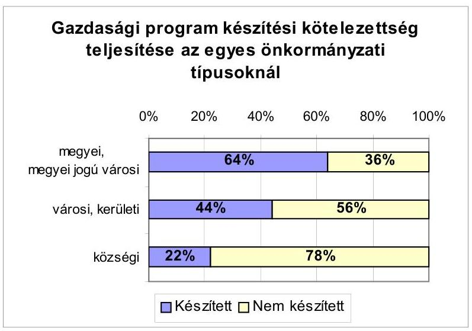

A mulasztásban szerepet játszott, hogy a gazdasági program formájára, tartalmára, részletezettségére vonatkozóan nincs kötelező előírás, módszertani ajánlás sem.

Gazdasági program hiányában az önkormányzatok 74%-ánál a polgármester és a képviselők választási programjaiban megfogalmazott célkitűzések összehangolása, rangsorba állítása nem történt meg, hiányzott az éves költségvetéseket hosszabb távon meghatározó feladatok kijelölése, így azok teljesítésének számonkérési lehetősége.

Az önkormányzatok döntő többsége (81%-a) betartotta az Áht. 70. §-ában rögzítetteket és határidőre elkészítette költségvetési koncepcióját.

---

A vizsgált önkormányzatok 5%-a nem tett eleget a költségvetési koncepció készítésére vonatkozó törvényi kötelezettségének, 14%-a pedig nem a törvényes határidőn belül fogadta el költségvetési koncepcióját.

Az önkormányzatok 75%-ánál a költségvetési koncepcióra vonatkozó előterjesztések részletes tájékoztatást adtak a központi szabályozás főbb jellemzőiről, változásairól és azok önkormányzatot érintő hatásait számszerűsített formában mutatták be a testületnek. Számba vették a központi támogatásokon túl a helyben képződő bevételeket és az ismert kötelezettségeket is.

A képviselő-testületek meghatározták a koncepció számszerű adataiból kiindulva a költségvetés elkészítése során elvégzendő további feladatokat. Elrendelték többek között a számított bevételek és kiadások felülvizsgálatát, a további bevételi források feltárását, a beruházási és felújítási igények lehetőségekhez igazított rangsorolását, az intézményeket érintően a működési kiadások csökkentési lehetőségeinek feltárását.

Az önkormányzatok 25%-ánál az elfogadott költségvetési koncepció hiányossága volt, hogy:

- csak szövegesen tartalmazták a költségvetés fő céljait és feladatait, vagy csak a központi költségvetési prognózisok adataira terjedtek ki. Számszakilag nem mutatták be az önkormányzatok várható bevételi-kiadási keretszámait, a tárgyévi költségvetés előzetes mérlegét, valamint az azokat megalapozó helyi intézkedéseket,
- nem csatolták a helyi kisebbségi önkormányzatok és a pénzügyi bizottságok koncepció-tervezetről alkotott véleményét,
- a koncepció megtárgyalását követően a képviselő-testületek nem hoztak határozatot a költségvetés készítés további munkálatairól, valamint
- a testületek teljes körűen nem döntöttek azokban a kérdésekben, amelyek a költségvetés összeállítását megalapozzák.

A költségvetési rendelet-tervezetek az önkormányzatok többségénél (75%) a koncepciókban meghatározott elveket érvényesítették és a rendelkezésre álló források elosztásánál a működés elsődlegességét biztosították.

A polgármesterek az érintett önkormányzatok 90%-ánál a bizottságok által megtárgyalt, a pénzügyi bizottságok által véleményezett, az intézmények vezetőivel egyeztetett költségvetési javaslatot terjesztették a testületek elé, amelyhez az Ámr. 29. § (9) bekezdésében foglaltaknak megfelelően, az Ötv. 92/A §-ban előírt esetekben ${ }^{6}$ a könyvvizsgáló írásos jelentését csatolták.

[^0]
[^0]:    ${ }^{6}$ Az Ötv. szerint ide tartoznak a megyei, a megyei jogú városi, a fővárosi és a fővárosi kerületi önkormányzatok, valamint azon helyi önkormányzatok, amelyek előző évben teljesített kiadásainak összege meghaladta a 100 millió Ft-ot és hitelállománnyal rendelkeztek, vagy hitelt vettek fel.

---

A bizottságok véleményét 40 önkormányzatnál írásban nem dokumentálták, nem csatolták az előterjesztéshez. A költségvetési rendelet-tervezet intézményvezetőkkel történt előzetes egyeztetésének írásbeli dokumentálása az intézménnyel rendelkező önkormányzatok 64%-ánál - az Ámr. 29. § (4) bekezdésben foglalt előírások ellenére - elmaradt.

Az önkormányzatok 20%-ánál a költségvetési rendelet-tervezetet a polgármester nem az Áht. 71. § (1) bekezdésében meghatározott határidőre nyújtotta be a képviselő-testületnek megtárgyalásra.

A testületek a költségvetési rendeletalkotási kötelezettségüknek maradéktalanul eleget tettek.

A költségvetési előterjesztések, elfogadott rendeletek - a testület tájékoztatását szolgáló mérlegek, kimutatások és a költségvetés végrehajtási szabályainak kivételével - az előző éveknél ${ }^{7}$ magasabb arányban (77%) feleltek meg a költségvetés szerkezetére, tartalmára vonatkozó jogszabályi előírásoknak, a hiányos előterjesztések elsősorban a községi önkormányzatoknál fordultak elő. Az önkormányzatok a költségvetési előterjesztések szerkezetére, tartalmára, részletezettségére az Ámr. 29. §-ában rögzített előírásokat egy, vagy több pontban a

# következők miatt sértették meg: 

- elmaradt a hivatal költségvetésének feladatonkénti, valamint ezen belül külön tételben az általános és céltartalékok előirányzatainak bemutatása (23%-nál),
- hiányzott a felújítási előirányzatok célonkénti és a felhalmozási kiadások feladatonkénti meghatározása (24, illetve 19%-nál),
- nem mutatták be az éves létszámkeretet önállóan és részben önállóan gazdálkodó költségvetési szervenként (20%-nál),
- nem, vagy nem teljes körűen részletezték kiemelt előirányzatonként az önálló és részben önálló költségvetési szerveik kiadásait, vagy azok önkormányzati szintű összegzése maradt el (15%-nál),
- elmaradt az önkormányzat és költségvetési szervei bevételeinek legalább az Ötv. 81-84. §-ai ${ }^{8}$ szerinti részletezettségű bemutatása (5%-nál).

Elsősorban a testület tájékoztatását szolgáló, az Áht. 118. §-aiban előírt mérlegek, kimutatások, valamint az Áht. 75. §-ában rögzített, a költségvetés végrehajtásával kapcsolatos szabályok meghatározásánál mutatkoztak - a korábbi évekhez hasonló - hiányosságok:

[^0]
[^0]:    ${ }^{7}$ Legutóbb: jelentés a helyi és a helyi kisebbségi önkormányzatok gazdálkodásának átfogó ellenőrzéséről II. fejezet (készült 2002. évben).
    ${ }^{8}$ Az Ötv. előírásai szerint: saját bevételek, átengedett központi adók, más gazdálkodó szervektől átvett bevételek, központi költségvetési normatív hozzájárulások és támogatások jogcímek szerint részletezve.

---

- nem mutatta be a többéves kihatással járó feladatok előirányzatait éves bontásban az önkormányzatok közel fele,
- nem mutatták be a működési és felhalmozási bevételeket és kiadásokat mérlegszerűen, egymástól elkülönítetten - a finanszírozási műveleteket is figyelembe véve - együttesen egyensúlyban sem (24%-nál),
- a költségvetés végrehajtásával kapcsolatos szabályokat nem, vagy nem teljes körűen rögzítették az önkormányzati rendeletek 30%-ában. Nem szabályozták az előirányzatok évközi módosításának rendjét, az intézményi többletbevételek feletti rendelkezési jogosultságokat, az intézményfinanszírozás rendjét, az évközi szabad pénzeszközök pénzintézetnél történő

 lekötésével kapcsolatos eljárást, az év közben keletkező hiány finanszírozásával összefüggő hatásköröket, a pénzmaradvány, a vállalkozási eredmény elszámolására, felhasználására vonatkozó előírásokat.

Eseti jelleggel ugyan, de előfordult, hogy az önkormányzat költségvetési rendeletének bevételi és kiadási főösszegei nem tartalmazták a körjegyzőségnek, mint önállóan gazdálkodó költségvetési szervnek a bevételeit és kiadásait (Tornyiszentmiklós és Felsőszentmárton községek).

Az önkormányzatok jóváhagyott költségvetési rendelete alapján az intézmények és a hivatalok elkészítették az elemi költségvetési dokumentációikat, és az Ámr. 43. § (3) bekezdésében előírtaknak megfelelően, adatfeldolgozásra továbbították a Területi Államháztartási Hivatalok részére.

Egyes önkormányzatoknál előfordult, hogy nem volt biztosított az éves költségvetésről szóló adatszolgáltatás és a testület által elfogadott költségvetési rendelet közötti számszaki egyezőség.

Budapest Főváros XXI. Kerület Önkormányzata költségvetési rendelete és az önkormányzati szintű elemi költségvetési dokumentáció főösszege 1337,9 millió Ft-tal eltért egymástól. Az eltérés oka, hogy a költségvetési rendeletben az előző évi pénzmaradvány és a vállalkozási eredmény összegét szerepeltették, ugyanakkor az elemi költségvetési dokumentációban e tételek bemutatása elmaradt.

Budapest Főváros VII. Kerületi Önkormányzatánál a költségvetési rendelet és az önkormányzati szintű elemi költségvetési dokumentáció főösszegei megegyeztek, de a kiemelt kiadási előirányzatok eltérőek voltak. A polgármesteri hivatal költségvetésében a személyi juttatások előirányzata 61,7 millió Ft-tal, a munkaadói járulék előirányzata 21 millió Ft-tal, a felújítások előirányzata 114,6 millió Ft-tal több, a céltartalék előirányzata 197,3 millió Ft-tal kevesebb volt mint a költségvetési rendeletben jóváhagyott.

# 1.2. A költségvetési előirányzatok módosításának szabályszerűsége 

Az előirányzatok évközi módosítását főként a központosított előirányzatok, a normatív kötött felhasználású támogatások, a céljellegű decentralizált támogatások, a céltámogatások, az OEP-től átvett pénzeszközök, a saját bevételi többletek, a pályázati úton nyert, átvett pénzeszközök, valamint az előző évi pénzmaradvány igénybevétele tették szükségessé.

---

Az ellenőrzött önkormányzatok a költségvetés bevételi és kiadási előirányzataikat összesen 73,5 milliárd Ft-tal, az eredeti előirányzat 22,8%-ával módosították.

A módosított bevételi előirányzatokon belül az önkormányzati saját bevételek 13,6%-kal, az önkormányzatok költségvetési támogatása 27%-kal, a finanszírozási bevételek (hitelek, értékpapírok bevételei) 41,7%-kal emelkedtek. A tervezéskor az önkormányzatok az előző évi pénzmaradvány várható összegét nem mérték fel reálisan, ezért módosított előirányzatként a pénzmaradvány összege több mint háromszorosára (220%-kal) emelkedett.
A költségvetési előirányzatok módosításának szabályszerűsége terén - az előző évekhez $^{9}$ hasonlóan - kedvezőtlenek a tapasztalatok. A szükséges módosításokat nem a jogszabályi előírásoknak megfelelően és nem teljes körűen végezték el az önkormányzatok felénél (az előző évben 55% volt ez az arány).
Az előirányzatok módosítására vonatkozó jogszabályi előírásokat a legnagyobb arányban (57%-ban) a községi önkormányzatok hagyták figyelmen kívül.

A 2001. évi költségvetések módosításának jogszabályi előírásokkal való összhangját - településtípusonként - a következő grafikon szemlélteti:
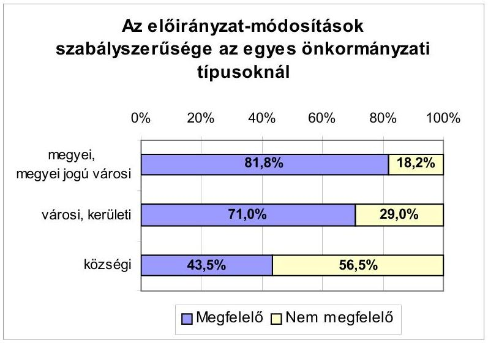

Az előirányzatok módosítására vonatkozó jogszabályi előírásokat a következők miatt sértették meg az önkormányzatok:

- nem tettek eleget 48%-nál azon kötelezettségnek, hogy legkésőbb a zárszámadási rendelet-tervezet képviselő-testület elé terjesztését közvetlenül megelőző testületi ülésen dönteni kell az előirányzatok módosításáról, így tudomásul véve az előirányzat-módosításokat, a zárszámadási rendelet elfogadásának napján módosították költségvetésüket,

[^0]
[^0]:    $^{9}$ Legutóbb: jelentés a helyi és a helyi kisebbségi önkormányzatok gazdálkodásának átfogó ellenőrzéséről II. fejezet (készült 2002. évben).

---

- az előterjesztett rendelet-tervezetek 29%-a nem a költségvetés szerkezetének megfelelően tartalmazta a módosítási javaslatokat, ezáltal nem biztosították az összehasonlíthatóságot,
- az előirányzat-módosításokat nem dokumentálta, az előirányzatokról és azok változásairól pontos, naprakész nyilvántartást nem vezetett az ellenőrzött önkormányzatok 28%-a és számlarendjében annak tartalmát 48% nem határozta meg, ezáltal az előirányzat-módosítások ellenőrizhetősége sem volt maradéktalanul biztosított,
- a zárszámadási rendeletben szereplő eredeti előirányzatok fő- és részösszegei az ellenőrzött önkormányzatok 20%-ánál nem egyeztek meg a költségvetési rendelet vonatkozó adataival,
- költségvetési rendeletüket - annak indokoltsága ellenére - 12%-uk egyetlen alkalommal sem módosította, ilyen tartalmú előterjesztést nem készített.

Az önkormányzatok a módosított előirányzatokhoz viszonyítva költségvetési bevételeiket 12,2%-kal túlteljesítették, kiadási előirányzataikat 6,7%-kal lépték túl. (A pénzforgalmi előirányzatokat és azok teljesítését településtípusonként a 9. számú melléklet tartalmazza.)

Az évközi előirányzat-módosítások, -átcsoportosítások elmaradása, az elő-irányzat-módosítások helyi szabályozásának, a nyilvántartások vezetésének hiányosságai is hozzájárultak ahhoz, hogy a csak testületi hatáskörben módosítható (kiemelt) előirányzatokat az önkormányzatok 40,1%-ánál a költségvetési szervek túllépték. Az ellenőrzött 418 önkormányzat közül 171-nél a költségvetési szervek nem a jóváhagyott előirányzataikon belül gazdálkodtak. Az intézményi szintű túllépések 87 önkormányzat esetében önkormányzati szintű túllépést is eredményeztek, amelyek az ellenőrzések hatékonyabb működésével megelőzhetőek lettek volna. Az önkormányzatok a szabálytalan előirányzatfelhasználások okait nem vizsgálták, emiatt felelősségre vonást egyetlen esetben sem kezdeményeztek.

# 1.3. A gazdálkodás szabályozottsága, szabályszerűsége $^{10}$ 

Az ellenőrzött önkormányzati hivatalok 40,2%-a nem rendelkezett Szervezeti és Működési Szabályzattal (a továbbiakban: SzMSz), 42,7%-ánál nem készítették el a gazdasági szervezet feladatait tartalmazó ügyrendet.

[^0]
[^0]:    $^{10}$ E témával foglalkozott a helyi és a helyi kisebbségi önkormányzatok gazdálkodásának átfogó ellenőrzéséről készült 2002. évi jelentés.

---

A gazdálkodás szabályozottságát a következő grafikon szemlélteti:
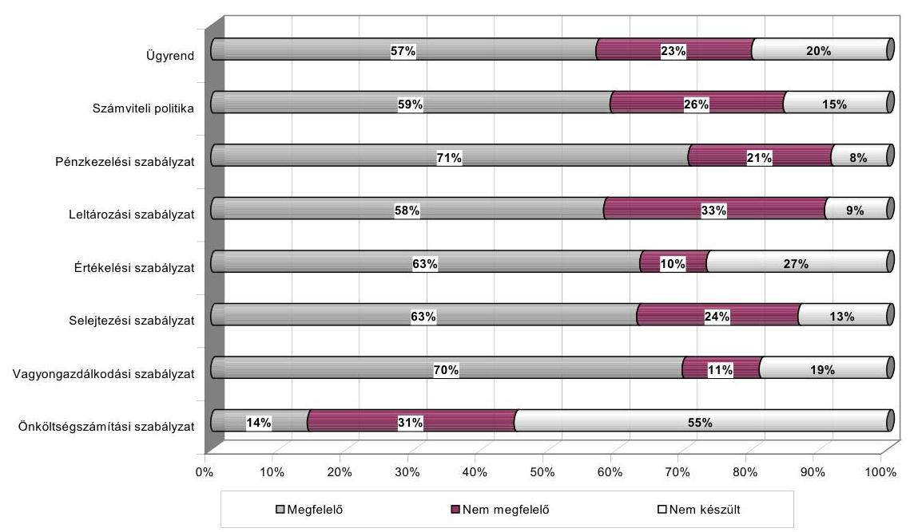

A tartalmilag nem megfelelő ügyrendek tipikus hibája, hogy az önálló és részben önálló költségvetési szervek közötti kapcsolatrendszer, a belső szervezetek együttműködésének szabályozása elmaradt, a gazdálkodási feladatok felsorolása keretjellegű volt. A vezetők és dolgozók feladat- és hatáskörét az önkormányzatok közel felénél nem határolták el. Nem szabályozták a belső kapcsolatok rendjét, a feladatok megosztását, a felelősséget, az információáramlás útját, módját, az átruházott jogosítványokat. A szabályozás rendszerint nem követte a változásokat, eltért a helyi sajátosságoktól.

A jegyzők a számviteli politikát és a hozzá kapcsolódó szabályzatokat a polgármesteri hivatalok 84,7%-ánál biztosították, ezek negyedénél azonban a vásárolt formaszabályzatokat a helyi sajátosságoknak megfelelően nem adaptálták. Még akkor sem végezték el a megfelelő alternatíva kiválasztását, amikor a jogszabályok választási lehetőséget adtak és e lehetőségeket, előírásokat a kapott dokumentumok bemutatták, ezért nem voltak alkalmasak arra, hogy a pénzügyi-gazdasági folyamatokat szabályozzák. A szabályzatok további hiányossága, hogy a hivatalokhoz kapcsolt, részben önállóan gazdálkodó költségvetési szervek gazdálkodásával összefüggő rendelkezéseket nem tartalmazták.

A számviteli politikával rendelkező önkormányzatok 71,2%-a rögzítette a mérlegkészítés időpontját, 69,2%-a határozta meg, hogy az elszámolás, az értékelés szempontjából mit tekint lényegesnek, valamint 60,5%-a, hogy mit tekint jelentősnek. A megbízható és valós összkép kialakítását befolyásoló lényeges információk tekintetében a számviteli politikával rendelkező önkormányzatok 90,7% végezte el a kis értékű tárgyi eszközök, 69,2%-a a vagyoni értékű jogok, 70,9% pedig a szellemi termékek minősítését.

---

Teljes körűnek, jónak minősíthető, a helyi körülményekhez adaptált, a jogkövető gyakorlat megvalósítását támogató szabályozás a nagyobb - megyei, megyei jogú városi, kerületi, városi - önkormányzatokra volt jellemző (kivétel: Lengyeltóti, Mezőtúr, Letenye városok).

A számviteli politikához kapcsolódó és egyéb, a gazdálkodás feltételeit meghatározó szabályozások alábbi hiányosságai a végrehajtást negatívan befolyásolták:

- a számlarendekből hiányzott: a számlák más számlákkal való kapcsolatának meghatározása; az analitikus nyilvántartások adataiból készítendő kimutatások, feladások elkészítésének határideje; az 50 ezer Ft alatti szóbeli kötelezettségvállalások nyilvántartásának rendje; az alkalmazandó bizonylatok köre; az analitikus nyilvántartások formája, tartalma, a főkönyvi könyveléssel való egyeztetésének módja. Nem szabályozták teljes körűen a zárlati teendők rendszerét, a vállalkozási tevékenység szabályait, valamint a hivatalhoz kapcsolódó részben önállóan gazdálkodó költségvetési szervek könyvvezetését;
- az eszközök és források értékelési szabályzata nem tartalmazta a kis értékű tárgyi eszközök elszámolásának, a szoftverek mennyiségi nyilvántartásának szabályait;
- a leltározási szabályzatban nem volt meghatározott a leltározás vezetője, a leltározási körzetek kijelölése, a leltározást helyettesítő nyilvántartások alapján készítendő összesítő kimutatás tartalma, formája, kellékei, a mérlegben nem szereplő készletek leltározásával kapcsolatos feladatok, az üzemeltetésre átadott vagyonelemek kezelése, az éves leltározási kötelezettség végrehajtási folyamat;
- a felesleges vagyontárgyak hasznosításának, selejtezésének szabályzata nem tért ki a selejtezési bizottság tagjainak kijelölésére, feladatuk meghatározására, az ármegállapítás szabályaira, az e tevékenységben közreműködők jogaira és kötelezettségeire, a selejtezett eszközök további hasznosításának szabályaira, vagy a szabályozás nem volt összhangban a hatályos vagyonrendelettel;
- a házipénztári pénzkezelési szabályzatok nem tartalmazták:
- a megnyitandó bankszámlák körét (26,2%), rendeltetését (32,8%),
- a rendelkezni jogosultak körét (33,8%),
- a bankszámlák és a pénztár kapcsolatrendszerét (27,9%),
- a készpénzfelvételek rendjét (10,3%),
- a házipénztár keretösszegét (7,7%),
- a pénz szállításának, őrzésének rendjét (3,8%),
- a pénztári ellenőrzés módját és konkrét feladatait (7,7-7,5%),
- az ellenőrzésért felelős személyek megnevezését (21,2%),
- a pénztári helyettesítés és az átadás-átvétel szabályait (20,4-13,9%),

---

- a pénzkezelési szabályzat és a központi jogszabályok összhangját az önkormányzatok 73,1%-ánál rögzítettük, de ezen szabályzatok 36,7%-a az önkormányzati belső szabályzatokkal nem állt összhangban;
- a házipénztárból kiadott előlegek, utólagos elszámolásra átadott összegek nyilvántartása, elszámolása az önkormányzatok 87%-ánál volt megfelelően szabályozott.

A legkevésbé szabályozott terület a házipénztáron kívüli pénzkezelés, illetve a részben önálló intézmények készpénzellátásának rendje, amelyet a szabályozásra kötelezetteknek csupán 59,4, illetve 59,1%-a határozott meg.
A pénztári zárlat gyakoriságának, teendőinek szabályozottsági színvonala magas (92%), ám a végrehajtást illetően szerzett tapasztalataink kedvezőtlenek voltak.

Az önkormányzatoknál a gazdálkodással kapcsolatos feladatköröket változatosan és különféle szabályzatokban rögzítették. A döntési, felelősségi szintek meghatározása a célszerűségi szempontok és a helyi sajátosságok figyelembevételével történt, ugyanakkor a hatályos szabályoknak való megfeleltetése nem volt hiánytalan.

A sokféle szabályzatban megtalálható hatáskörök, feladatok összehangolása - elsősorban a községekre jellemzően - nem vált az önkormányzatok gyakorlatává. A pénzgazdálkodással összefüggő szabályozások teljes körűen nem fedték le a pénzügyi, gazdasági folyamatokat, elmaradt az egymásra épülő ellenőrzési pontok, a beszámolás módjának meghatározása, előfordult a feladatok túlzott megosztása, a pénzgazdálkodási jogkörök egymásnak ellentmondó rögzítése is.

A szabályozásokhoz rendszerint nem kapcsolódott olyan nyilvántartási rendszer, amelyből nyomon követhető lenne, hogy ki, mire, mi alapján vállalt kötelezettséget, arra az előirányzat fedezetet nyújtott-e, a feladat elvégzését ki igazolta, történt-e előirányzat-túllépés, valamint mennyi a még felhasználható előirányzat.

A pénzgazdálkodási jogkörök gyakorlásának rendjét az önkormányzatok 10,8%-ánál nem alakították ki, a kötelezettségvállalás, utalványozás, ellenjegyzés és érvényesítés feladatait nem rögzítették. A kötelezettségvállalás szabályozása elmaradt az önkormányzatok 13,2%-ánál.

A kötelezettségvállalás ellenjegyzése szabályozásának hiányát állapítottuk meg az önkormányzatok 15,1%-ánál, nem történt meg az utalványozásra, valamint az utalvány ellenjegyzésére jogosultak kijelölése 10,8, illetve 13%-nál.

A kötelezettségvállalás hiányosságait rögzítettük az önkormányzatok 29,8%-ánál a pénztári és 27,3%-ánál a banki tevékenységhez kapcsolódóan. A kötelezettségvállalás teljes hiányát, szabályoktól eltérő elvégzését az önkormányzatok 7,1%-ánál, illetve 5,2%-ánál állapítottuk meg. A pénztárforgalomhoz kapcsolódó hibák rendszerint a nem egyértelmű helyi szabályozásra, a rossz helyi szabályozás szerinti hatáskörgyakorlásra voltak visszavezethetők. Például a jegyzők gyakran rendelkeztek egyidejűleg, ugyanazon típusú gazda

---

sági eseményekre vonatkozóan kötelezettségvállalási, utalványozási és ellenjegyzési jogosítványokkal is. A banki pénzforgalomhoz kapcsolódó tevékenységet jellemző hiányosság volt, hogy a polgármesteri hivatalok a kötelezettségvállalás jogszerűségének megítéléséhez szükséges, az Ámr. 134. § (1) bekezdésében előírt előirányzat-felhasználási tervet, az Ámr. 139. §-a szerinti likviditási tervet, valamint az Áht. 103. § (2) bekezdésében rögzített kötelezettségvállalási nyilvántartást nem vezették.

A kötelezettségvállalás ellenjegyzése a pénztári bizonylatok esetében az önkormányzati hivatalok 40,6%-ánál hiányosan, illetve 18,9%-ánál egyáltalán nem történt meg, a banki bizonylatoknál ugyanezen arány 39%, illetve 16% volt.

Az utalványozás során a pénztári bizonylatoknál a polgármesteri
 hivatalok 33,8%-a, a banki bizonylatoknál 33%-a nem tartotta be a központi és helyi szabályozásban foglaltakat, 5%-nál, illetve 7,8%-nál a bizonylatok utalványozása teljes körűen elmaradt. Ezekben az esetekben a bevételek beszedését, illetve a kiadások teljesítését vezetői engedély nélkül, nem a szabályoknak megfelelően végezték.

Az utalvány ellenjegyzésekor a jogosultak 39,1%-a a pénztári és 38,5%-a a banki tevékenységhez kapcsolódóan nem látta el szabályosan feladatát. Az önkormányzati hivatalok 15,3%-ánál, illetve 13%-ánál az utalványozás ellenjegyzése rendszeresen elmaradt, nem ellenőrizték kifizetés előtt, hogy a költségvetésben biztosított-e a fedezet, ténylegesen megtörtént-e a teljesítés szakmai igazolása és az okmány érvényesítése.

Az ellenőrzött önkormányzatok 72,8%-ánál tartották be az érvényesítést végzőre vonatkozó szakmai előírásokat (írásbeli megbízás, iskolai végzettség, szakképesítés). A többi önkormányzatnál az előírásoknak megfelelő szakmai képesítés, vagy a feladatra vonatkozó írásbeli megbízás hiányzott. Az érvényesítői feladatokkal felruházottak írásbeli megbízása a vizsgált önkormányzatok 15,8%-ánál maradt el.

Az érvényesítés ellenőrzési feladatainak elvégzését az önkormányzatok 41,9%-a a pénztári és 34,5%-a a banki bizonylatok esetében nem biztosította. A hivatalok 24,3%-ánál, illetve 17,7%-ánál az érvényesítési feladat ellátása során a bizonylatok teljes körének érvényesítése szabálytalanul történt. A hiányosságok között tapasztalható volt az érvényesítés elmaradása, a nem megfelelő szakképesítéssel rendelkező személy általi érvényesítés, az összeférhetetlenség követelményeinek figyelmen kívül hagyása, az érvényesítő személy írásbeli megbízásának hiánya.

A szabályok értelmében az érvényesítésnek a teljesítés szakmai igazolásán kell alapulnia. Ennek módjáról és az azt végző személyek kijelöléséről a helyi adottságok figyelembevételével a jegyzőknek kellett rendelkezniük, amely azonban a hivatalok közel 90%-ánál elmaradt.

A gyakorlatban az ellenőrzött önkormányzatok 48,6%-ánál tapasztaltuk a pénztári és 50,4%-ánál a banki kifizetések előtt a teljesítés igazolásának teljes, illetve részleges elmaradását. A hibás gyakorlat egyik oka, hogy a teljesítés

---

szakmai igazolására a jegyzők nem alakítottak ki egységes rendszert, nem határozták meg az igazolásra jogosultak személyét, a tevékenység végrehajtásának szakmai követelményeit. A szakmai teljesítés igazolásának elmaradása esetén fokozott a kockázata annak, hogy a nem, vagy a megrendeléstől eltérő módon történő teljesítés esetén is kifizetésre kerül a számla szerinti teljes összeg.

Az ellenjegyzés átruházása a kisebb létszámú apparátussal dolgozó községek esetében a szakmai szempontoknak nem tudott megfelelni:

- az e tevékenységet átruházott hatáskörben ellátó személyek nem rendelkeztek az ellátáshoz szükséges ismerettel;
- nem volt elég információ annak eldöntéséhez, hogy a jóváhagyott költségvetés fel nem használt, illetve le nem kötött kiadási előirányzata biztosította-e a kellő mértékű fedezetet;
- a kiadás teljesítésére az önkormányzati feladatok ellátása érdekében szükség volt-e;
- a tranzakció nem sértett-e gazdálkodásra vonatkozó szabályokat;
- a kifizetési kötelezettség valóban az önkormányzatot terhelte-e;
- a pénzügyi fedezet rendelkezésre állt-e;
- az érvényesítés a teljesítés szakmai igazolásán alapult-e.

Az önkormányzatok 80,1%-a az összeférhetetlenségi követelményeket betartotta. A helytelenül szabályozóknál teljes mértékben, vagy részlegesen, tisztázatlan maradt a hatáskörök címzettjének távolléte, akadályoztatása esetén eljáró személy, a saját, vagy hozzátartozó részére történő kifizetések esetén az eljárás módja.

Az önkormányzatok 87%-ánál szabályozott a pénztári előlegek kezelésének rendje. A végrehajtás a szabályozottságnál kedvezőtlenebb, mivel a vizsgált bizonylati mintában előforduló előlegek nyilvántartása, elszámolása 71,2%-ban felelt meg az előírásoknak. Az előlegeket nem előírás szerint kezelő önkormányzatoknál gyakori, hogy az elszámolásra kiadott összeg kifizetésének engedélyezése írásban nem történt meg, az előlegek kifizetése bizonylat nélküli történt, a kifizetett összeg nyilvántartásba vétele elmaradt, határidőn túli volt az elszámoltatás, a korábban kiadott előleggel történt elszámolás nélkül, újabb előleget fizettek ki, az előlegek számviteli elszámolása szabálytalan volt.

A gazdálkodási-ellenőrzési jogosítványok gyakorlásának hibáin túl az önkormányzatok 2/3-ánál tártunk fel a gazdálkodásban további szabálytalanságokat. Ezek:

- folyó kiadásként számoltak el kis értékű tárgyi eszközöket; a pénztári kifizetéseknél az összeg átvételét az átvevővel nem igazoltatták;
- pénztári kifizetések teljesítettek nem jogosultak számára; a pénztári záró pénzkészlet a szabályozásban rögzített mértéket többszörösen meghaladta;

---

- a kiadásokat téves szakfeladaton számolták el; nem az önkormányzat nevére szóló számla alapján is kifizetést teljesítettek;
- az alapbizonylatokat szabálytalanul javították; alapbizonylatban foglaltól eltérő összegű kifizetést teljesítettek; a munkába járást nem a szabályok szerinti összegben fizették ki;
- a pénztárbizonylatok kiállítása és a számlák csatolása maradt el.

Ezen hiányosságok miatt 11 önkormányzatnál kezdeményeztük a felelősség megállapítását.

A helyi önkormányzatok 78,7%-ánál a bizonylatok alakilag és tartalmilag megfelelőek voltak. E körben a bizonylatok kezelése zárt rendszerben, az ellenőrzés számára, áttekinthető módon történt, azokhoz a kapcsolódó alapbizonylatokat csatolták, illetve hivatkoztak azok fellelhetőségére.

A szigorú számadású nyomtatványok kezelési rendjét az önkormányzatok szabályzataikban meghatározták, a gyakorlat azonban ettől eltért. Tipikus hiba volt az összesítő nyilvántartások hiányos vezetése, a nyomtatvány beszerzések, kiadások, a visszavételezések nyilvántartásba vételének elmaradása.

# 1.4. Közbeszerzési eljárások szabályszerűsége ${ }^{11}$ 

Az ellenőrzött önkormányzatok közül 69 élt a Kbt-ben kapott azon felhatalmazással, hogy rendeletben szabályozza az általa alapított költségvetési szervek vonatkozásában a közbeszerzési eljárás kiírásával és elbírálásával kapcsolatos tevékenységre és az abban eljáró személyekre vonatkozó - a törvényben nem szabályozott - kérdéseket. A jelentősebb anyagi erőforrásokkal és intézményhálózattal rendelkezők közül 21 városi önkormányzat nem alkotott helyi rendeletet a közbeszerzésekről.

Az elfogadott helyi rendeletek 88%-a megfelelt a Kbt. előírásainak, összhangban volt az egyéb helyi rendeletekkel és szabályzatokkal. Nyolc rendelet tartalma nem felelt meg a Kbt. 96. § (2) bekezdés előírásainak. Jellemző hiányosság volt, hogy a rendeletek a Kbt-ben is szabályozott kérdésekkel foglalkoztak, nem határozták meg a közbeszerzési eljárást lezáró határozatot meghozó személyt, nem tartalmaztak a közbeszerzési eljárásban közreműködők feladataival, felelősségével összefüggő előírásokat, az eljárás kiírásával és elbírálásával kapcsolatos tevékenységre vonatkozó rendelkezéseket. Három önkormányzat nem végezte el a helyi rendelet - jogszabály-változás miatt szükségessé vált - módosítását.

A Kbt. 2. § (1) bekezdésének előírását 17 helyi önkormányzat (Nagykanizsa megyei jogú város, Budapest főváros XIV. és XVII. kerület, Pomáz, Körmend, Kőszeg, Tamási, Ercsi, Enying, Téglás, Balatonfűzfő, Fertőd, Sárospatak városok, Solymár, Tokod, Verpelét nagyközségek, Ballószög község) sértette meg. Összesen 20 árubeszerzés, építési beruházás, illetve szolgáltatás megrendelése esetében nem folytattak le közbeszerzési eljárást annak ellenére, hogy azok értéke meghaladta az éves költségvetési törvényben előírt értékhatárt, azonban emiatt a Közbeszerzési Döntőbizottságtól elmarasztalásban nem részesültek.

A leggyakrabban a felújítások esetében történt mulasztás, 15 értékhatár feletti felújítás esetében nem folytattak le az önkormányzatok közbeszerzési eljárást. Ebben szerepet játszott, hogy a Kbt. 9. § (1) bekezdése a szolgáltatás fogalmát közvetett módon határozta meg, miszerint a törvény alkalmazása szempontjából szolgáltatás az árubeszerzésnek és az építési beruházásnak nem minősülő visszterhes szerződés alapján végzett tevékenység. A gyakorlatban a helyi önkormányzatok az építőipari jellegű felújításoknál az építési beruházásra vonatkozó magasabb értékhatárt vették figyelembe. Összesen három önkormányzatnál fordult elő, hogy helytelenül értelmezték a Kbt. 5. § (2) bekezdését, amely előírta, hogy a közbeszerzési eljárás elindításáról szóló döntés meghozatalakor irányadó becsült érték kiszámítása során egybe kell számítani mindazon árubeszerzések, beruházások és szolgáltatások értékét, amelyek beszerzésére egy költségvetési évben kerül sor, s arra egy ajánlattevővel lehetne szerződést kötni (Budapest főváros XIV. kerület, Körmend, Enying városok).

Értékhatár feletti árubeszerzés és építési beruházás lebonyolításakor öt önkormányzat mulasztotta egy-egy alkalommal el a közbeszerzési eljárás elvégzését.

Két önkormányzat (Budapest főváros XIV. és XVII. kerület) a tulajdonában álló gazdasági társaságot bízta meg a felújítások lebonyolításával, de ezek a kivitelezők kiválasztásakor nem folytattak le közbeszerzési eljárást.

A jelentős intézményhálózattal rendelkező megyei önkormányzatok kivétel nélkül, a megyei jogú városok fele, a fővárosi kerületek kétharmada, a városok 15%-a, összesen 23 önkormányzat vizsgálta az önkormányzati szintű, központosított árubeszerzés, illetve szolgáltatásvásárlás lehetőségét. Ezek közül nyolc önkormányzat biztosította önkormányzati szintű közbeszerzési eljárás lebonyolításával a beszerzést, informatikai eszközök, bútorok vásárlását és a közintézmények felújítását intézményei részére.

Az ellenőrzött helyi önkormányzatok közül 86 folytatott le közbeszerzési eljárást árubeszerzés, építési beruházás és szolgáltatásvásárlás céljából. Ebből 69 a közbeszerzési eljárás teljes folyamatában a Kbt. és a helyi rendelet előírásai szerint járt el, 17 önkormányzatnál állapítottuk meg, hogy nem tartották be a Kbt., illetve az önkormányzati rendelet előírásait.

# A Közbeszerzési Döntőbizottság a közbeszerzési eljárást lefolytató helyi önkormányzatok 7%-át marasztalta el a Kbt-ben rögzített előírások megsértéséért (Budapest főváros XII. kerület, Sárospatak, Kistelek, Mezőtúr, Balassagyarmat, Kunszentmárton városok önkormányzatai), közülük négyet bírságolt meg, a mulasztás súlyát figyelembe véve egy és három millió Ft közötti összegben. 

A közbeszerzési eljárások lebonyolításakor az ellenőrzött önkormányzatok a Kbt. több előírását megsértették:

---

Az ajánlatkérő az ajánlati felhívást, illetőleg az előminősítési eljárással összefüggő hirdetményt a Kbt. 32. § (2) bekezdését megsértve nem akkor tette közzé, amikor rendelkezett a szerződés teljesítését biztosító anyagi fedezettel, vagy az arra vonatkozó biztosítékkal, hogy a teljesítés időpontjában az anyagi fedezet rendelkezésre áll.

Boldogkőváralja Község Önkormányzata a Gazdasági Minisztérium által a Széchenyi terv keretében meghirdetett lehetőséget kihasználva, pályázatot nyújtott be a „Boldogkői" vár rekonstrukciós munkáira. A beruházáshoz a minisztérium a költségek 60%-át kitevő vissza nem térítendő támogatást hagyott jóvá, a költségek 20%-át a Kincstári Vagyon Igazgatóság fedezte. A fennmaradó 20%-nak megfelelő összeg biztosítását az önkormányzat vállalta. Az önrész rendelkezésre állását - a pályázat kiíróját megtévesztve - a költségvetési elszámolási számla 2001. december 22-i egyenlege alapján igazolták. A banki igazolás kiadását megelőző napon összesen 29 millió Ft érkezett a költségvetési számlára, amely nem a beruházás céljait szolgálta. Gazdasági vállalkozásoktól, más önkormányzattól és a körjegyzőségtől összesen 17,9 millió Ft-ot kölcsön kaptak, amelyet 2001. december 27-én visszautaltak. Az önkormányzat a beruházásra a 2002. évi költségvetésében nem biztosított előirányzatot.

Kétegyháza Nagyközség Önkormányzata a 233 millió Ft-os szennyvízcsatorna beruházás esetében nem biztosította az önrész fedezetét.

Az ajánlatok elbírálásának a Kbt. 55. § (6) bekezdésében foglalt előírásait két önkormányzat nem tartotta be.

Mezőtúr Város Önkormányzata az újvárosi szennyvízcsatorna hálózat kiépítésére indított közbeszerzési eljárást 558 millió Ft értékben. A beérkezett ajánlatok értékelésekor nem az ajánlati felhívásban közzé tett súlypontozás szerint jártak el.

Zirc Város Önkormányzatánál a városi hőellátó rendszer korszerűsítésére kiírt közbeszerzési eljárás esetében a pályázatok értékelését megelőzően döntöttek a nyertes pályázatról.

Budaörs Város Önkormányzata a Kbt. 59. § (1) bekezdésében leírtakkal ellentétben, a 60 férőhelyes óvoda-építésre indított közbeszerzési eljárás lezárásakor nem az ajánlati felhívásban közzétett értékelési szempontok alapján legtöbb pontot kapott ajánlattevőt minősítette nyertesnek.

Az ajánlatkérő nevében eljáró személyekkel, illetve az eljárás alapelveivel összefüggő szabályok betartása (Kbt. 31. és 24. §) három helyi önkormányzatnál sérült.

Budapest főváros XXIII. kerület és Kunszentmárton város önkormányzatai a közbeszerzési eljárás előkészítésével és lebonyolításával külső szakcéget bíztak meg, azonban a Kbt. 31. § (4) bekezdése szerinti írásos nyilatkozatot, amely szerint a gazdálkodó szervezet az eljárásban nem vesz részt ajánlattevőként, vagy alvállalkozóként, elmulasztották beszerezni.

Zirc Város Önkormányzatánál az ajánlatkérő nevében eljáró személy az eredményhirdetést, illetve a döntéshozatalt megelőzően külön tárgyalt az
 egyik pályázóval, ezzel megsértette a Kbt. 24. § (2) bekezdésének esélyegyenlőségre vonatkozó előírásait.

---

Az ellenőrzött önkormányzatok közül hat megsértette azt az előírást, hogy a közbeszerzési eljárást lezáró határozatot a Kbt. 31. § (3) bekezdése alapján az ajánlatkérő nevében eljáró személynek kell meghoznia ${ }^{12}$.

Szentendre, Ercsi, Zirc városok és Boldogkőváralja község önkormányzatai esetében a közbeszerzési eljárást lezáró határozatot a képviselő-testület hozta meg.

Baranya Megye Önkormányzata a Gazdasági Bizottságára, Kőszeg Város Önkormányzata a Közbeszerzési Bizottságára bízta a pályázat nyertesére vonatkozó döntés meghozatalát.

Az eredmény-hirdetés, illetve a szerződéskötés időpontjára vonatkozó, a Kbt. 55. § (1), illetve 62. § (2) bekezdéseiben előírt határidőket Kistelek és Zirc városok önkormányzatai nem tartották be.

A közbeszerzési eljárás eredményének kihirdetésére és közzétételére vonatkozó, a Kbt. 61. §-ban rögzített törvényi előírásoknak hat helyi önkormányzat nem tett eleget.

Balassagyarmat és Sárospatak városok önkormányzatai nem, Budapest Főváros XII. kerület Önkormányzata nem megfelelő tartalommal készítette el az ajánlatok elbírálásának befejezésekor az írásbeli összegzést, megsértve a Kbt. 61. § (1) bekezdésben leírtakat.

Zirc Város Önkormányzata nem tette közzé a Kbt. 61. § (5) bekezdésében előírt, a közbeszerzési eljárás eredményéről szóló tájékoztatót.

Budapest főváros VII. és XXI. kerületi önkormányzatai teljes körűen nem szerepeltették a Kbt. 61. § (9) bekezdésében előírt és a Közbeszerzések Tanácsának megküldött éves összegzésben az általuk lebonyolított közbeszerzési eljárások adatait. Zirc Város Önkormányzata nem készített éves összegzést.

A közbeszerzési eljárás eredményeként létrejött szerződések megkötésénél és módosításánál a Kbt-ben rögzített szabályokat négy helyi önkormányzat sértette meg.

Nagykáta Város Önkormányzata az eredményhirdetést megelőző dátummal írta alá a kivitelezési szerződést annak ellenére, hogy a Kbt. 62. § (2) bekezdése szerint a szerződéskötés időpontja nem határozható meg az eredményhirdetést követő nyolc napnál korábbi időpontban.

Zirc Város Önkormányzata megsértve a Kbt. 62. § (1) bekezdésében előírtakat, olyan szerződést kötött, amely árban, műszaki tartalomban és a teljesítési határidőkben is eltért az ajánlati felhívásban közöltektől. Szabálytalan volt a későbbi szerződés-módosítás is, mert arra nem a Kbt. 73. §-a szerinti, a szerződéskötést követően beállt körülmény miatt volt szükség.
${ }^{12}$ Ezt a követelményt az Alkotmánybíróság a 21/2003. (IV. 18.) AB határozatában megerősítette.

---

Kétegyháza és Nyírtelek nagyközségek önkormányzatai a beruházás során felmerült pótmunkák miatt módosították a szerződést, azonban a pótlólag elvégzendő feladatok műszaki tartalmát a módosított kivitelezési szerződésekben nem rögzítették.

Budapest főváros VII. kerület, Komárom, Budaörs és Nagykanizsa városok önkormányzatainál az eljárásban közreműködők a helyi közbeszerzési rendeletben rögzített előírásokat nem tartották be.

# 1.5. A könyvviteli mérlegben kimutatott vagyon alakulása 

Országosan a helyi önkormányzatok mérlegben kimutatott vagyona az előző évihez viszonyítva 2001. évben 415 milliárd Ft-tal (13,4\%-kal), 2002-ben 2918 milliárd Ft-tal (83,3\%-kal) nőtt. A növekedés mértékét az ingatlankataszteri nyilvántartások felülvizsgálatával összefüggően elvégzett értékelések befolyásolták. Az értékelés során az önkormányzatok a korábban érték nélkül nyilvántartott eszközök értékét állapították meg, valamint értékhelyesbítést végeztek. A helyi önkormányzatok eszközeiről és azok forrásairól az országosan összesített adatokat az 5. számú melléklet tartalmazza.

Az ellenőrzött helyi önkormányzatok vagyona az előző évhez viszonyítva 94,7 milliárd Ft-tal (21,4\%-kal) nőtt 2001. évben. A vizsgált helyi önkormányzatok eszközeiről és azok forrásairól a 6. számú, az eszközök összetételéről a 7. számú, azok növekedésének összetevőiről a 8. számú melléklet nyújt tájékoztatást. Az átlagos növekedésnél nagyobb arányban nőtt a vagyon a megyei jogú városoknál (39,5\%) és a községeknél (28\%), kisebb mértékben a megyei önkormányzatoknál (10,1\%) és a fővárosi kerületeknél (9,6\%). Az összes növekedésből 86 milliárd Ft-ot a befektetett eszközök, 8,7 milliárd Ft-ot a forgóeszközök állományváltozása eredményezett. A befektetett eszközökön belül a tárgyi eszközök könyvviteli mérlegben kimutatott értéke 68,2 milliárd Ft-tal, a befektetett pénzügyi eszközök értéke 9,8 milliárd Ft-tal növekedett.

A tárgyi eszközök állományváltozásához a tárgyévi beruházások, felújítások aktivált értéke 25,9\%-ban, az előző évek beruházásainak, felújításainak aktiválása 15\%-ban, a térítésmentes átvétel 6,5\%-ban, az egyéb növekedés 52,6\%-ban járult hozzá. Az egyéb növekedés tartalmát tekintve döntően a korábban érték nélkül nyilvántartott eszközök értékének megállapításával és számviteli nyilvántartásba vételével összefüggő vagyongyarapodást tükrözi.

A forgóeszközök közül a pénzeszközök állománya 5,6 milliárd Ft-tal (26,6\%-kal) nőtt, ugyanakkor az értékpapírok állománya 1,3 milliárd Ft-tal (7,7\%-kal) csökkent. Kedvezőtlen, hogy a követelések a 2000. évi 1,7 milliárd Ft-os csökkenés után 2001. évben 3,1 milliárd Ft-tal, 13,2\%-kal növekedtek.

Az önkormányzatok forrásai közül 2001. évben a saját tőke 72,3 milliárd Ft-tal (18,5\%), a tartalékok 5,3 milliárd Ft-tal nőttek. A kötelezettségek - az önkormányzatok eladósodásának - növekedési üteme az előző évi 12,6\%-kal szemben 2001. évben 45,5\%-os volt, a 17,2 milliárd Ft növekedéssel összege elérte az 55 milliárd Ft-ot. A kötelezettségek mérlegfőösszeghez viszonyított aránya 2001. évben 10,2\% volt, szemben az előző évi 8,5\%-kal. (Ez az arány a fővárosi kerületeknél volt a legalacsonyabb 3,8\%, ami óvatos gazdálkodásra utal.) Nagyobb arányú kötelezettség terhelte a községeket (15,2\%) és a megyei önkormányzatokat (13,9\%). Az átlagszámok jelentős eltéréseket takartak. A kötelezettségek mérlegfőösszeghez viszonyított aránya 19 önkormányzatnál meghaladta a 30\%-ot, 118-nál 10-30\%, 142-nél 5-10\% között volt, 139 önkormányzatnál nem érte el az 5\%-ot. Ezek a számok azt mutatják, hogy 2001. évben a helyi önkormányzatok csak külső források bevonásával tudták közszolgálati feladataikat ellátni, eladósodottságuk növekedett.

Az ellenőrzött önkormányzatok pénzügyi helyzetének rosszabbodását jelzi, hogy a pénzeszközök és a rövid lejáratú kötelezettségek arányát kifejező likviditási mutató értéke az 1999. évi 1,6-ról ${ }^{13} 2000$. évben 1,4-re, 2001. évben 0,9-re csökkent, vagyis a pénzeszközök már nem nyújtottak fedezetet a rövid lejáratú kötelezettségek teljesítésére. Ugyanezt a tendenciát jelzi a követelések, az értékpapírok és a pénzeszközök együttes figyelembevételével képzett mutatószám is, melynek értéke 4,4-ről 4-re, majd 2001-ben 2,4-re csökkent.

Az ellenőrzött helyi önkormányzatok közül 47-nél, összesen 422 millió Ft-tal csökkent 2001. évben a könyvviteli mérlegben kimutatott vagyon. A csökkenés a 2000. évi könyvviteli mérlegben kimutatott eszközértékhez viszonyítva átlagosan 1,6\%-os, ezen belül a városoknál 0,5\%-os, a községeknél 4\%-os volt. A vagyonvesztést jellemzően az okozta, hogy az eszközök elszámolt értékcsökkenését - források hiányában - nem tudták ellensúlyozni beruházással, illetve felújítással az önkormányzatok.

Az önkormányzatok 81,1\%-a rendelkezett vagyongazdálkodási rendelettel. Megtörtént a vagyonelemek kategorizálása, azok elidegenítésének, hasznosításának, megterhelésének szabályozása. A vagyongazdálkodási rendelettel rendelkező önkormányzatok 92,7\%-a határozta meg az önkormányzat vagyonának hasznosítására jogosultak körét, 85,9\%-a pedig az önkormányzati vagyonnal való rendelkezési korlátokat. Elsősorban a községekre jellemző, hogy a vagyongazdálkodás feltételeit nem szabályozták. A vagyongazdálkodási rendeletek előírásai nem követték a jogszabályok változásait.

A vagyongazdálkodással kapcsolatos döntéseknél jellemzően (92,5\%-ban) a központi és helyi rendeletekben előírtakat betartották. A vagyongazdálkodás törvényben foglalt előírásainak megsértését öt önkormányzatnál állapítottuk meg:

Kiskunhalas Város Önkormányzata 2001. decemberében értékesítette a szennyvíztisztító telepet. Az ingatlan az önkormányzat korlátozottan forgalomképes törzsvagyonába tartozott. Ezzel megsértették az Ötv. 79. § (2) bekezdés b) pontja, az egyes állami tulajdonban lévő vagyontárgyak önkormányzatok tulajdonba adásáról szóló 1991. évi XXXIII. törvény 20. §-ának és a vízgazdálkodásról

[^0]
[^0]:    ${ }^{13}$ Forrás: Államháztartási Hivatal Költségvetési Nyilvántartási és Adatfeldolgozási Főosztály éves költségvetési beszámoló 1. számú űrlap (2000. év).

---

szóló 1995. évi LVII. törvény 6. §-ának előírásait, amely szerint a törzsvagyonhoz tartozó víziközmű nem értékesíthető ${ }^{14}$.

Budapest Főváros XIV. Kerület Önkormányzata a hivatkozott jogszabályhelyek előírásait megsértve 1999-2001. között 117 millió Ft értékű víziközmű tulajdonjogát adta át a szolgáltató gazdasági társaságnak.

Demecser Város Önkormányzatának képviselő-testülete határozatban döntött arról, hogy eladja a polgármesternek az $5330 \mathrm{~m}^{2}$ árok és út besorolású földterületet, amely az Ötv. 79. § (2) bekezdés a) pontja alapján forgalomképtelen törzsvagyonnak minősül.

Sopron Város és Sand község önkormányzatai az Áht. 108. § (2) bekezdésének előírását sértették meg, amely szerint az államháztartás alrendszereihez kapcsolódó vagyon tulajdonjogát ingyenesen átruházni, továbbá követelésről lemondani csak törvényben, illetve a helyi önkormányzati rendeletben meghatározott módon és esetekben lehet. Sopronban a 2001. évi könyvviteli záráskor 63 millió Ft behajthatatlannak minősített vevő követelést töröltek képviselő-testületi döntés és rendeleti szabályozás nélkül. Sand községben szintén képviselő-testületi döntés nélkül, térítésmentesen került át a korszerűsített közvilágítási berendezések tulajdonjoga a szolgáltatóhoz.

A vagyoni helyzet alakulásáról hiányosan adott számot az önkormányzatok 18\%-a. A tulajdonukban lévő eszközök közül 27 önkormányzatnál az üzemeltetésre, kezelésre átadott eszközök, 25 önkormányzatnál a gazdasági társaságokban meglévő tulajdonrészt kifejező részesedések, 24 önkormányzatnál a követelések és a kötelezettségek maradtak ki a mérlegből.

Három önkormányzatnál (Sormás, Zalaszentgyörgy, Nemespátró községek) halmozottan jelentkezett a probléma, több eszköz- és forrás értékét nem tartalmazta a mérleg.

A mérleget az előző évi 54\%-kal szemben 2001. évben az önkormányzatok 58,4\%-a támasztotta alá a helyi szabályzat szerinti ütemezésben végzett leltározással, vagy a különböző számviteli nyilvántartások egyeztetése alapján készült leltározást helyettesítő összesítő kimutatással. A polgármesterek, illetve a jegyzők hét önkormányzat kivételével nem tettek teljes mértékben eleget az összesítő kimutatással kapcsolatos szabályozási feladataiknak, a Vhr. 37. § (4) bekezdésben foglaltak ellenére nem szerezték be a felügyeleti szerv - a képviselő-testület - egyetértését, illetve nem készítettek a részletező nyilvántartásokból összesítő kimutatást. A könyvvizsgálatra kötelezett megyei, megyei jogú városi, fővárosi kerületi és a városi önkormányzatok esetében ez az arány 84\% volt, 12 önkormányzat nem tett eleget elfogadható módon a leltározási kötelezettségnek.

Nemespátró és Várfölde községeknél az önkormányzat megalakulása óta nem végeztek minden vagyonelemre kiterjedő leltározást.

[^0]
[^0]:    ${ }^{14}$ Az Alkotmánybíróság 10/2002. (III. 20.) és 11/2002. (III. 20.) számú határozataiban ezen típusú gazdasági esemény szabálytalanná minősítésének indokait részletesen tartalmazza.

---

A legtöbb problémát az üzemeltetésre, kezelésre átadott eszközök nyilvántartásával és leltározásával összefüggésben tártuk fel. Összesen 204 önkormányzat mutatott ki ilyen eszközt a mérlegében, de csak 117 támasztotta alá leltárral és 105 rendelkezett ezen eszközökről analitikus nyilvántartással. Az üzemeltetésre, kezelésre átadott eszközök leltározását mindössze 17 önkormányzat végezte el az üzemeltető bevonásával, 25 esetben az üzemeltető, 75 esetben a polgármesteri hivatal önállóan leltározott.

Az önkormányzatok 66\%-a tartotta be a Vhr. 27-36. §-ban rögzített, a mérlegtételek értékelésére vonatkozó szabályokat. A megyei, megyei jogú városi, fővárosi kerületi és a városi önkormányzatok közül 16 (22\%) nem a jogszabályi előírásoknak megfelelően értékelte a mérlegben kimutatott eszközeit és forrásait. A legtöbb hiányosság az értékcsökkenés elszámolását jellemezte, amivel megsértették a Vhr. 30. §-ának előírásait, így a mérlegben kimutatott eszközök nettó értéke nem az előírások szerinti információt nyújtotta.

Négy önkormányzatnál egyáltalán nem, hatnál pedig erdő, telek, nem aktivált beruházás, műalkotás után is számoltak el értékcsökkenést.

Az önkormányzatok közül 28-nál nem negyedévente, 13-nál nem a Vhr. 30. §-ában előírt leírási kulcsok figyelembevételével történt meg az elszámolás.

40 önkormányzatnál a számviteli törvény 16. § (1) bekezdésében rögzített, egyedi értékelés számviteli alapelvvel ellentétben az elszámolandó értékcsökkenés mértékét az ingatlanoknál és az
 üzemeltetésre, kezelésre átadott eszközöknél összevontan, a főkönyvi könyvelés adatai alapján állapították meg.

# 1.6. A zárszámadási kötelezettség teljesítésének szabályszerűsége 

A zárszámadás készítési kötelezettségének az önkormányzatok döntő többsége ( $90 \%$-a) eleget tett, a költségvetés teljesítéséről szóló beszámolót határidőre elkészítették, a zárszámadási rendelet-tervezeteket a polgármesterek az előírt határidőben benyújtották, s arról a képviselő-testületek rendeletet alkottak.

Az önkormányzatok zárszámadási előterjesztései, elfogadott rendeletei - a testületi tájékoztatást szolgáló mérlegek és kimutatások kivételével - a költségvetési rendeletekhez hasonlóan, az előző évinél ${ }^{15}$ magasabb arányban feleltek meg a rendeletek szerkezetére vonatkozó jogszabályi előírásoknak. (Az előző évi 40\%-kal szemben 67\% volt az arány.)

A zárszámadási előterjesztések, rendeletek szerkezetére, tartalmára vonatkozó kötelező előírásokat egy vagy több pontban megsértő önkormányzatoknál az ismétlődő hibákat tártunk fel.

[^0]
[^0]:    ${ }^{15}$ Jelentés a helyi és a helyi kisebbségi önkormányzatok gazdálkodásának átfogó ellenőrzéséről II. fejezet (készült 2002. évben).

---

Az önkormányzatok zárszámadásainak

- 21\%-a nem a költségvetési rendelettel összehasonlítható módon készült, szerkezetében, tartalmában az egyezőség nem volt biztosított, ezen belül az előterjesztések egy része az eredeti és módosított előirányzatokat nem tartalmazta,
- 10\%-a nem tartalmazta teljes körűen a működési és fenntartási előirányzatok teljesítését, a kiemelt előirányzatokat, a tényleges létszámok költségvetési szervenkénti és önkormányzati szintű bemutatását,
- 25\%-a a működési és fenntartási előirányzatok teljesítését, ezen belül a kiemelt előirányzatokat, nem intézményenként, hanem szakfeladatonként tartalmazta,
- mintegy 20\% nem részletezte a hivatalok kiadásainak teljesítését feladatonként, a felújítási előirányzatok teljesítését célonként és a felhalmozási kiadásokat feladatonként,
- 33\%-a nem mutatta be a működési és felhalmozási célú bevételeket és kiadásokat mérlegszerűen.

Az önkormányzatok - a korábbi évekhez hasonlóan ${ }^{16}$ - a zárszámadáshoz nem csatolták az Áht. 118. §-a szerinti valamennyi mérleget és kimutatást. Nem határozták meg helyi rendeletben az Áht. 116. § 4. 6. 8. 9. 10. pontja szerinti mérlegek tartalmi követelményeit. A mérlegek tartalmát az Áht. 124. § (2) bekezdés b) pontjában előírtak ellenére a Kormány sem szabályozta. Az önkormányzatok a zárszámadás előterjesztésekor

- elmulasztották bemutatni a hitelek állományát lejárat, hitelezők, eszközök szerinti bontásban (62\%-nál), az összevont mérleget (25\%-nál), a vagyonkimutatást (67\%-nál), a közvetett támogatásokat tartalmazó kimutatást a szöveges indokolással együtt ( $80 \%$-nál),
- nem számszerűsítették a több éves kihatással járó döntéseket évenkénti bontásban, összesítve, szöveges indokolással ellátva (70\%-nál).

A központi és helyi szabályozás hiányában az önkormányzatok nem fordítottak kellő figyelmet a képviselő-testületek megfelelő informálását szolgáló, tájékoztató jelleggel bemutatandó mérlegek elkészítésére és benyújtására. A tartalmilag nem megfelelő, vagy hiányzó mérlegek és kimutatások a községi önkormányzatoknál voltak túlsúlyban (63\%).

[^0]
[^0]:    ${ }^{16}$ Legutóbb: jelentés a helyi és a helyi kisebbségi önkormányzatok gazdálkodásának átfogó ellenőrzéséről II. fejezet (készült 2002. évben).

---

# 1.7. A pénzmaradvány és eredmény kimutatás szabályszerűsége 

Az önkormányzatok 79\%-a a TÁH-nak benyújtott költségvetési beszámolóban kimutatott adatok alapján - az előző évhez hasonlóan - szabályszerűen állapította meg önkormányzati szintű pénzmaradványát.

A 2001. évi pénzmaradvány megállapításának és jóváhagyásának ellenőrzése során megállapított jellemző hiányosságok a következők voltak:

- az önkormányzatok mintegy 10\%-ánál a pénzmaradvány megállapításakor a központi költségvetéssel kapcsolatos elszámolásokat figyelmen kívül hagyták, az aktív és passzív elszámolásokat - különösen községi önkormányzati körben - megfelelő analitikával nem támasztották alá, ami a pénzmaradvány összegének valódiságát kérdőjelezte meg,
- az önkormányzatok mintegy 5\%-a a zárszámadási rendeletével egyidejűleg nem hagyta jóvá költségvetési szervei pénzmaradványát,
- további 5\%-nál a testület csak az önállóan gazdálkodó intézmények pénzmaradványáról döntött, a részben önállóan gazdálkodó intézmények pénzmaradványáról nem, a pénzmaradvány helyett a záró pénzkészleteket hagyta jóvá.

A pénzmaradványok szabályszerűségének ellenőrzése során kiugróan nagy összegű eltérés két önkormányzatnál volt.

Nagykanizsa megyei jogú városnál az önkormányzat pénzmaradványának jóváhagyása a zárszámadás keretében megtörtént. Összegét a központi információs rendszerbe szolgáltatott adatoktól eltérően határozták meg.
A pénzmaradvány elszámolására készített előterjesztésben a polgármesteri hivatal pénzmaradványának meghatározása a Vhr. 38. § (1) bekezdésében előírtakkal nem volt összhangban. A pénzmaradvány megállapításakor az intézmények alulfinanszírozása miatti kiutalatlan támogatásokkal, továbbá az állami hozzájárulás elszámolásából adódó befizetési kötelezettségekkel nem számoltak. Ezáltal a ténylegesen keletkezett -96,7 millió Ft-tal szemben 257,1 millió Ft pénzmaradványról adtak számot.

Veszprém Megye Önkormányzatánál a költségvetési végleges kiadásokat és bevételeket aktív és passzív tételként számolták el, amely azt eredményezte, hogy az önkormányzat pénzforgalmi jelentésének kiadási teljesítési adata 177,0 millió Ft-tal, bevételi teljesítési adata pedig 10,5 millió Ft-tal eltért a valós kiadási és bevételi adatoktól. Ennek megfelelően az önkormányzat elemi költségvetési beszámolójában kimutatott 1079,2 millió Ft helyett 912,8 millió Ft volt a tárgyévi helyesbített pénzmaradvány. Ez a közgyűlés által jóváhagyott tárgyévi helyesbített pénzmaradványnál 175,8 millió Ft-tal kevesebb. Az előző évi tartalék maradványa 9,3 millió Ft, amelynek ismételt jóváhagyása indokolatlan volt.

A számviteli elszámolási hibák a következő költségvetési év elszámolt bevételeire és kiadásaira is hatással vannak, hiszen következő évi kiadást, illetve bevételt jelentettek. A hivatal az alkalmazott gyakorlattal megsértette az összemérés számviteli alapelvet.

---

Az önkormányzatok 6,5\%-nál végeztek vállalkozási tevékenységet. Az érintett polgármesteri hivatalok és intézmények - néhány kivételtől eltekintve - a vállalkozási tevékenység eredményének megállapításánál és felhasználásánál szabályszerűen jártak el.

Hunya, Bodrogkeresztúr és Penc községi önkormányzatok polgármesteri hivatalai folytattak vállalkozási tevékenységet, de eredmény-kimutatást nem készítettek.

Az eredmény-kimutatások a mérleg megfelelő sorával, a főkönyvi könyvelés adataival megegyezők voltak. A vállalkozási tevékenység eredményét az önkormányzatok visszaforgatták alaptevékenységükre, így befizetési kötelezettségük nem keletkezett.

Az Ámr. 149. § (5) bekezdése szerint a felügyeleti szerv a költségvetési szervet éves számszaki beszámolójának és működésének elbírálásáról és jóváhagyásáról írásban értesíti. Az intézmények írásbeli kiértesítése beszámolójuk elfogadásáról, jóváhagyásáról az önkormányzatok 57\%-ánál maradt el.

# 1.8. Informatikai felkészültség a pénzügyi-számviteli feladatellátás területén ${ }^{17}$ 

A pénzügyi-számviteli feladatokhoz kapcsolódó informatikai eszközök, szoftverek működtetésének szabályozási környezetét az önkormányzatok gazdálkodásának átfogó ellenőrzése keretében ez évben vizsgáltuk első alkalommal a nagyközségi, városi, megyei önkormányzatoknál. A szabályozottság terén jelentős különbségek voltak, s az önkormányzat típusától függően a megyeitől a községek felé haladva a stratégiai „gondolkodás" egyre kevésbé volt jellemző.

Informatikai stratégiával a megyei önkormányzatok $80 \%$-a, a megyei jogú városok $17 \%$-a, a városok $17 \%$-a, a nagyközségek $7 \%$-a, átlagosan az önkormányzatok $15 \%$-a rendelkezett. Hasonló volt a helyzet a "biztonságra törekvés" szempontjából a megyék és megyei jogú városok esetében, ahol az előzővel azonos arányban rendelkeztek számítástechnikai, informatikai katasztrófa tervvel. A városi önkormányzatok 13\%-a rendelkezett ilyen tervvel, azonban a nagyközségek közül egy sem, annak ellenére, hogy minden önkormányzat működőképessége érdekében egyformán fontos az adatok visszaállíthatósága a rendszer összeomlása esetén.

A számítógépes - fizikai és adatszintű - hozzáférési jogosultságok kialakítása már egységesebben történt az önkormányzati hivataloknál. Szabályozott hozzáférési jogosultsági rendszerek kialakítása a megyei önkormányzatok 80\%-ánál, a megyei jogú városok 100\%-ánál, a többi város 65\%-ánál, a nagyközségek $26 \%$-ánál valósult meg. A megyei önkormányzatok és városok átlag 40-$50 \%$-ánál készítettek dokumentációt a számítógépet felhasználók köréről, a fe

[^0]
[^0]:    ${ }^{17}$ E témával foglalkozott a helyi önkormányzatok pénzügyi információs rendszere működésének ellenőrzéséről 1997. évben készült jelentés.

---

lelősökről, a programokhoz való hozzáférési jogosultságokról. A nagyközségeknél azonban már csak 10\% volt ez az arány. A számítógépes jogosultsági rendszert kialakító önkormányzatok negyedénél ez csak a hozzáférés differenciálásának (jelszavas beléptetés) szabályozásra terjedt ki. Az adatok biztonsága, az illetéktelen hozzáférés elleni teljes körű védelem azonban megköveteli az ügyviteli folyamatok leírását, a felelősségi körök rögzítését, a program felhasználói szintű leírását is.

Az adatvédelem szabályozottsága a legtöbb esetben nem volt teljes körű, az önkormányzatok átlagosan 40\%-a még a minimális adatbiztonság követelményét (a hozzáférés szabályozását) sem teljesítette. Az adatvédelmi és jogosultsági szabályzatokat elkészítő önkormányzatok 40\%-ánál hiányzott az üzemeltetési dokumentáció is. Az informatikai rendszer üzemeltetési leírásával csupán az önkormányzatok 29\%-a rendelkezett.

Az informatikai eszközökről és számítógépes programokról a polgármesteri hivatalok 79\%-a önálló nyilvántartási rendszert alakított ki, azonban ennek mennyiségi és értékadatai a hivatalok 20\%-ánál nem egyeztek meg a számviteli adatokkal.

A pénzügyi-számviteli területen informatikai rendszert használó dolgozók alapfokú informatikai képesítéssel a polgármesteri hivatalok 61\%-ánál rendelkeztek. A dolgozók munkaköri leírásában az informatikai eszközök használatát és az azzal összefüggő felelősséget a hivatalok 28\%-a rögzítette.

A pénzügyi-számviteli feladatokhoz használt szoftverek egy-egy részterülethez kapcsolódtak, nem alkottak egységes rendszert. A vizsgáltak között volt olyan hivatal, ahol csak egyetlen, a pénztári kifizetéseket nyilvántartó programot használtak, a legjobban ellátottnál viszont 32 különféle felhasználói programot üzemeltettek.

Azokban az esetekben, amikor a pénzügyi-számviteli feladatokhoz a TÁH-ok által fejlesztett számítógépes programokat használták, a programok dokumentálását a TÁH elvégezte, ugyanúgy, mint ahogy külön szerződések alapján ezen programok rendszerfelügyeletét is, amely jellemzően tanácsadást és segítségnyújtást jelentett.

A pénzügyi- számviteli alkalmazásoknál hiányoztak az integrált szoftverek és főként az információs rendszerszervezési eljárások. Teljes körűen integrált számítógépes rendszer az ellenőrzött önkormányzatoknál nem fordult elő.

Számítógépet minden önkormányzatnál használtak. A kisebb önálló települések közel 10\%-ánál a pénzügyi-számviteli területen szinte egyáltalán nem használták ki a lehetőségeket, még a TÁH-tól díjmentesen kapott programokat sem használták.

Az önkormányzatoknál kialakított okmányirodák informatikai felszereltsége és működése korszerű. Ezekhez a rendszerekhez viszonyítva azonban az önkormányzati hivatali fejlesztések általában több éves lemaradást mutatnak.

---

Az önkormányzatok mintegy 40\%-ánál alakítottak ki gyorsabb, költségkímélő információáramlást is elősegítő számítógép hálózati rendszert. Az alkalmazott számítógépek negyede azonban elavult, cserére szorul, a mai igényeknek még megfelel a számítógép-állomány fele, s a számítógép-állomány további negyede új, korszerű.

# 2. A feladatok és azokhoz rendelkezésre álló források összhangja 

### 2.1. A feladatok meghatározása és szervezeti keretei ${ }^{18}$

Az ellenőrzött helyi önkormányzatok tevékenységében a meghatározó súlyt a különböző törvényekben számukra kötelezően előírt szolgáltatások nyújtása képezte. Emellett az Ötv. 8. § (2) bekezdésében foglalt felhatalmazás alapján vállaltak és elláttak más, a közösségi szükségletek kielégítésére irányuló feladatokat is.

A feladatellátás struktúráját az Ötv. és a különböző ágazati jogszabályok rendelkezései alapján, figyelemmel az ellátási igényekre és az önkormányzat pénzügyi helyzetére, minden önkormányzat képviselő-testületének magának kell meghatároznia. A helyben biztosított közszolgáltatások számbavételét, a kötelező, illetve önként vállalt feladatkörök elhatárolását azonban teljes körűen nem végezték el, nem rögzítették.

A feladatkörök egyértelmű meghatározásához hiányzott olyan egységes jogi szabályozás, amely az önkormányzatok kötelező feladatait egyértelműen tartalmazza.

A képviselő-testületek által jóváhagyott SzMSz-ek konkrét feladat-meghatározást, az ellátandó feladatok teljes körű számba vételét nem tartalmazták.

A jogszabályokban az önkormányzat típusától, a település nagyságától függő feladat-meghatározások mellett az ellátási kötelezettség mértékének megítélése, a feladat meghatározások értelmezése okozott gondokat. Nem minősültek célszerűnek a jogszabályokban használt „gondoskodik", „biztosítja" kifejezések, mivel a döntéshozó képviselők számára nem segítették a feladatok érdemi meghatározását, valamint az igények és a pénzügyi lehetőségek figyelembevételével történő rangsorolását.

Előfordult, hogy egy-egy önkormányzat a törvényben számára előírt kötelező feladatokat nem látta el maradéktalanul.

Tatabánya Megyei Jogú Város Önkormányzata intézményrendszeréből hiányzott a Szoc. tv. 86. és 87. § alapján biztosítandó fogyatékosok gondozóháza, a pszichiátriai és szenvedélybetegek átmeneti
 otthona, illetve Gyvt. 94. § (2) bekezdése alapján a gyermekek és családok átmeneti otthona.

[^0]
[^0]:    ${ }^{18}$ E témával foglalkozott az önkormányzati feladatellátás szervezeti formáiról és működésük célszerűségének ellenőrzéséről 1998. évben készült jelentés.

---

Mór és Püspökladány városi önkormányzatok a Szoc. tv. 87. §-ában előírt, az idősek átmeneti elhelyezését szolgáló intézményt nem működtettek.

A bölcsődei ellátást a Gyvt. 41. § (1) és (3) bekezdésének rendelkezései ellenére, a városi önkormányzatok nem tekintették kötelező feladatuknak, de az igények alapján biztosították, kivétel Polgár és Mezőkovácsháza városi önkormányzatok, ahol a Gyvt. 94. § (1) és (2) bekezdése alapján kötelező bölcsődei ellátást nem biztosították.

A képviselő-testületek tájékoztatásához, a feladatstruktúrát érintő döntések megalapozásához a számvitelből nyerhető adatok meghatározó jelentőségűek lennének. Azonban a kiadásoknak a feladatok kötelező és vállalt jellegének megfelelő elkülönítése az önkormányzatoknál alkalmazott számviteli rendszerben nem vált követelménnyé. A bevételek és kiadások előzőek szerint elkülönített nyilvántartását sem jogszabályban, sem az önkormányzatok szintjén nem írták elő, nem oldották meg. Az elemzéshez szükséges információt - nyilvántartások hiányában - a feladatot ellátó szervezetek létrehozására, működésére vonatkozó alapdokumentumok áttekintése alapján, és a számviteli nyilvántartásokból sem lehetett teljes körűen biztosítani.

A közszolgáltatások szervezeti feltételeit alapvetően a már évekkel korábban kialakult struktúra jellemezte, amelyben az ellenőrzött időszakban alig érzékelhető változások voltak. A kötelezően előírt és az önként vállalt közszolgáltatási feladatokat döntően költségvetési szervek (hivatalok, intézmények), kisebb mértékben vállalkozások és egyéb szervezetek útján látták el. A rendkívül sokrétű lakossági szolgáltatások nyújtására együttesen 1939 intézményt működtettek, amely önkormányzatonként átlag 4,6 közszolgáltató szervezet fenntartását jelentette.

Saját intézménnyel a megyei, megyei jogú városi, a városi és a nagyközségi önkormányzatok mindegyike, míg a községi önkormányzatok 67,3%-a rendelkezett. Átlagosan egy megyei jogú városban 49, a megyei önkormányzatoknál 36, a városokban 15, a nagyközségekben öt, míg az intézményt működtető községekben kettő költségvetési szerv látta el a feladatokat.

Az ellenőrzött önkormányzatok közül 120 (28,7%) módosította 1999-2001. években a feladatellátás szervezeti rendszerét. Az önkormányzatok 17,7%-ánál a tett intézkedések a feladatok költségvetési szervek útján történő ellátását érintették. Önállóan gazdálkodó intézmény létrehozása 3,8%-nál, részben önállóan gazdálkodó intézmény létrehozása 7,4%-nál, intézmény összevonás 6,5%-nál fordult elő. Intézmény összevonásról a városi önkormányzatok 40,7%-a, a községi önkormányzatok 26%-a, a megyei jogú városok 18,5%-a, míg a megyei önkormányzatok 11,1%-a, a nagyközségi önkormányzatok 3,7%-a döntött. Egy-egy önkormányzatnál az egész ellátó rendszert érintő átszervezések nem, csak egy-egy intézményt, illetve intézménytípust érintő módosítások történtek.

A feladatellátás szervezeti rendszerét a hatékonyabb működtetés céljából, de gazdasági kényszerhelyzetből adódóan is főként a nagyobb, összetettebb feladatokkal rendelkező önkormányzatoknál tekintették át. Az elrendelt intézkedéseket a kötelező feladatellátás feltételrendszerének megőrzése, illetve a szolgál

---

tatás magasabb színvonalú biztosítása motiválta, amelyeket helyenként igényfelmérésre alapoztak, de komplex helyzetelemzéssel, gazdaságossági számításokkal nem támasztották alá.

A célszerűséget, hatékonyságot és gazdaságosabb működtetést célzó intézkedések hatásaként az ellenőrzött önkormányzatok által fenntartott költségvetési szervek számában 1,4%-os mértékű csökkenés következett be. Az intézményi összevonások és a korábban önállóan gazdálkodók részben önállóvá minősítése, egyes feladatok más szervezeti formába történő átszervezése következtében változott az önkormányzatok által működtetett intézményhálózat nagysága és gazdálkodási jogkör szerinti összetétele. A gazdálkodási jogkör szerinti összetételben a részben önállóan gazdálkodók aránya továbbra is meghatározó 62%-os volt, amely az előző évinél 9%-kal ${ }^{19}$ magasabb.

A községekben a közös feladatellátásra irányuló együttműködés jellemző területe az intézményfenntartás, ezen belül az alapfokú oktatás, a családsegítő és gyermekjóléti szolgáltatás, valamint az egészségügyi alapellátás volt. A szélesebb együttműködés színterei között megtalálhatók voltak a különféle településüzemeltetési feladatok (pl. vízellátás, szennyvíztisztítás, települési szilárd hulladék-ártalmatlanítás), valamint a település és területfejlesztés, a kistérségi fejlesztések és a nagyobb beruházások. Beruházási cél megvalósítására társulások főként a hulladékgazdálkodás és a szennyvízelvezető, tisztítórendszerek körében fordultak elő.

Az ellenőrzött megyei és városi önkormányzatoknál a társulásokban rejlő lehetőségek felismerése és a társulási hajlandóság a községekhez képest szűkebb körben volt tapasztalható. A városi önkormányzatok társulásokban való részvételét a települési, térségi szintű fejlesztési célkitűzéseket szolgáló pénzeszközök megszerzése és hatékonyabb felhasználása motiválta. A társulásaik tárgykörében sajátos területek, köztük a környezet és természeti értékek védelme, az állategészségügyi feladatok, és a polgári védelem is előfordultak.

A városi önkormányzatok más településekkel közös feladatellátásban való részvételét az igazgatási, ezen belül egyes hatósági feladatok (építésügyi, gyámügyi, műszaki, szabálysértési, útügyi) körében is tapasztaltuk. Sajátos területe az együttműködésnek az önkormányzatok gazdálkodásával, valamint az államigazgatási ügyek döntésre való előkészítésével és végrehajtásával kapcsolatos „körjegyzőségi" feladatok Ötv. 38. § (3) bekezdésén alapuló felvállalása, amelyet az érintett városi önkormányzat jegyzője látott el a városi önkormányzat polgármesteri hivatalának bevonásával. Körjegyzőségi feladatellátást (egy-hat község számára) tíz városi és egy megyei jogú városi önkormányzatnál vállaltak.

A közigazgatási feladatok körjegyzőségi keretekben történő ellátása tipikusan a községek, ezen belül is a kisebb lakosságszámú községek körében elterjedt for

[^0]
[^0]:    ${ }^{19}$ Jelentés a helyi és a helyi kisebbségi önkormányzatok gazdálkodásának átfogó ellenőrzéséről II. fejezet (készült 2002. évben).

---

ma. Önálló hivatali szervezetet az ellenőrzésbe vont önkormányzatok több mint fele (53,1%) alapított, a többi körjegyzőségi keretek között működött. Körjegyzőségi székhely feladatokat 70 önkormányzat vállalt fel, 126 társult település részére.

Az ellenőrzött önkormányzatok hivatali forma szerinti összetételét az alábbi ábra szemlélteti:
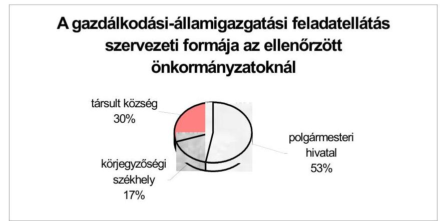

Egy-egy körjegyzőségben átlagosan 2,8 önkormányzat vett részt.
A közszolgáltatási feladatokból a településüzemeltetés egyes területein jellemző a gazdasági társasági forma, ezen belül is az Rt., illetve Kft. útján történő szolgáltatás. Ezek a gazdasági társaságok döntően az ivóvíz- és csatornaszolgáltatásban, a távhőszolgáltatás- és melegvíz ellátásban, a hulladékkezelésben, illetve a vagyongazdálkodás területén tevékenykedtek.

Gazdasági társaságban

- kizárólagos (100%) tulajdoni részesedéssel az ellenőrzött megyei jogú városi önkormányzatok mindegyike, a városi önkormányzatoknak 66%-a, a nagyközségi önkormányzatoknak 33%-a rendelkezett,
- 75%-ot meghaladóval 17 önkormányzat (4,1%), 50% felettivel 26 önkormányzat (6,2%),
- 25% felettivel 30 önkormányzat (7,2%) rendelkezett.

Az ellenőrzött körben a kötelező és önként vállalt feladatok ellátására költségvetési szerven kívüli szervezetet összesen 46 önkormányzatnál (11% esetében) hoztak létre. Ezek fele alapítvány, vagy közhasznú társaság, a többi gazdasági társaság és más szervezet.

Az önkormányzatok nem mindig mérlegelték körültekintően a gazdasági társaság fenntartásához, működtetéséhez szükséges feltételeket. Ezáltal olyan döntéseket is hoztak, amelyek a működés későbbi zavaraihoz vezettek.

Ercsi Város Önkormányzatánál előfordult átmeneti likviditási zavarok összefüggtek azzal, hogy az önkormányzat által alapított két gazdasági társaság működése veszteséges volt, amelynek leküzdését az önkormányzat tagi hitel nyújtásával és kezesség-vállalással segítette.

---

Nagykanizsa Megyei Jogú Város Önkormányzata egyszemélyes tulajdonában álló hat gazdasági társaságból három az ellenőrzött időszakban veszteséges volt.

Az önkormányzatok a közszolgáltatási feladatok különböző szervezeti formákban történő ellátásának, működésének módosítására irányuló intézkedéseket részletes kalkulációval nem támasztották alá. Az egyes szervezeti formák alkalmazásának pénzügyi indokoltságáról, a végrehajtott változások gazdasági előnyeiről, a korábban alkalmazott formák hátrányairól közvetett információk álltak rendelkezésre.

# 2.2. A működési és felhalmozási bevételek-kiadások alakulása, a költségvetések egyensúlyának helyzete 

Az ellenőrzött önkormányzatok feladataik ellátására 2001. évi költségvetésükben 322,3 milliárd Ft bruttó bevételi és kiadási eredeti előirányzattal számoltak, amely az évközi előirányzat-módosításokkal 22,8%-kal emelkedett. Költségvetésükben a működési kiadások 71,5%-ot, a felhalmozások 17,2%-ot, a támogatások, elvonások és folyó átutalások 8,4%-ot képviseltek.

A költségvetési gazdálkodás keretében teljesített tárgyévi konszolidált bevételek nagysága 341,9 milliárd Ft${ }^{20}$, amely 9,1 milliárd Ft-tal meghaladja a GFS${ }^{21}$ szerinti bevételeket.

Az ellenőrzött önkormányzatok az előbbieken túl az előző években képződött pénzmaradványból 16,8 milliárd Ft-ot vettek igénybe a tárgyévi feladatok finanszírozásához, amely fedezetet nyújtott az éves kiadások 5%-ára. Így az önkormányzatok rendelkezésére állt a 2001. évi feladatok ellátására összesen 358,7 milliárd Ft, amely 16,5%-a az országban működő valamennyi önkormányzat teljesített bevételének.

A folyamatos működtetés és a felhalmozás célkitűzéseinek megvalósítására a halmozódások nélküli felhasználás 336,7 milliárd Ft; ez az összes a tárgyévi forrás 98,5%-a, a pénzmaradvánnyal növelt összeg 93,9%-a. Az ellenőrzött önkormányzatok bevételi és kiadási előirányzatának és azok teljesítésének önkormányzati típusonkénti alakulásáról a 9. számú, a kiadások teljesítésének bruttó és nettó (konszolidált) elszámolás szerinti részletezéséről a 10. számú melléklet nyújt tájékoztatást.

Az önkormányzatok feladatainak finanszírozásához az intézményi tevékenységek bevételei összességében 10%-kal járultak hozzá, amely a legmagasabb a városoknál (48,2%), a legkisebb a községeknél (8,4%), a megyei és a megyei jogú városi önkormányzatoknál a részarány 22,1%, illetve

[^0]
[^0]:    ${ }^{20}$ Tartalmazza a hitelekből, kölcsönökből, értékpapír értékesítésből, valamint a hosszú lejáratú pénzügyi befektetésekből származó bevételeket és figyelembe veszi az éven belüli értékpapírok vásárlásának és eladásának egyenlegét.
    ${ }^{21}$ GFS = Government Financing System, kormányzati pénzügyi rendszer. Az IMF által kidolgozott kormányzati elszámolási rendszer, nemzetközi standard az államháztartások összehasonlíthatósága céljából.

---

21,3%. A megyei és a városi önkormányzatok magasabb arányát az irányításuk alá tartozó intézmények, valamint a szolgáltatásokat igénybe vevő ellátottak nagyobb száma okozta.

Az önkormányzati feladatok finanszírozásában jelentős forrást képviselt a sajátos működési bevétel, köztük a helyi adók, az átengedett központi adók és a különféle bírságok (együtt: 32,8%), valamint a működési és felhalmozási célra átvett pénzeszközök (együttesen 22,7%).

Az átvett pénzeszközök döntő része (80,5%) az államháztartáson belülről származott, amelynek 73,3%-át tették ki az Egészségbiztosítási Alaptól átvett pénzeszközök. A kisebb arányt az államháztartáson kívülről származó bevételek képviselték, a működés és felhalmozás közötti megoszlásuk 24,4% - 75,6% volt. A felhalmozási célú pénzeszköz átvételben megjelent az évek óta húzódott gázközmű vagyonnal összefüggő kártalanítás összege. Ezen a címen az érintett önkormányzatok 2001. évben országosan közel 40 milliárd Ft bevételhez jutottak, amely 1,7%-át jelentette az összes tárgyévi bevételüknek.

A központi költségvetési kapcsolatokból származó bevételek (állami támogatás, hozzájárulás és átengedett személyi jövedelemadó) az ellenőrzött önkormányzatok költségvetésében együttesen 40,1% forrást jelentettek, amelyek döntő része (85,5%) az üzemeltetési, működtetési feladatokat szolgálta, kisebb hányada (14,5%) a felhalmozási célkitűzések megvalósításához járult hozzá.

A költségvetési támogatások - a forrásokon belüli részarány alapján - elsősorban a városok, majd a községek költségvetésében töltöttek be fontos szerepet.

A központi költségvetési kapcsolatokból a normatív állami hozzájárulások jogcímein kapott összegek 62,6%-ot képeztek, amelyek az összes működési célra fordított kiadások 73,2%-át fedezték.

Az elmúlt tíz év alatt a helyi önkormányzatok központi költségvetésből való részesedése a feladatellátásukhoz kapott hozzájárulások, támogatások mértéke alapján, jelentősen csökkent.

A helyi önkormányzatok a központi költségvetésből 2001. évben 509 milliárd Ft-tal részesedtek, amely összességében 166,5%-kal haladta meg az 1991. évi 191 milliárd Ft-ot. Ugyanezen időszakban a központi költségvetés kiadási főösszege 973 milliárd Ft-ról 4471 milliárd Ft-ra (359,5%-kal) növekedett. Az önkormányzati alrendszer központi költségvetésből való részesedésének aránya a költségvetési támogatások összegének emelkedése ellenére - 8,3%-ponttal csökkent.

Az ellenőrzött önkormányzatok a működésképtelenné vált helyi önkormányzatok kiegészítő támogatása címén 2001. évben az országban e címen juttatott 15,1 milliárd Ft 17,9%-ának megfelelő, együttesen
 2,7 milliárd Ft bevételt realizáltak, amely az összes költségvetési bevételük - az alrendszer egészével megegyezően - 0,8%-a volt. Ebből a forrásból a lehetséges három jogcímen vettek igénybe támogatást, a költségvetési forráshiány kiegészítésére, a saját hibájukból bekövetkezett tartós fizetésképtelenség átmeneti kezelésére és az átmeneti likviditási problémák megoldására.

---

A működésképtelen helyi önkormányzatok támogatására 2001. évre megállapított összegből az ellenőrzésbe vont önkormányzatok közül (43,5%) 182 részesedett. Első helyen a támogatottak számaránya (50%) és a támogatási összegből részesedés (52%) alapján a szélesebb intézményhálózattal rendelkező városok szerepeltek, míg a községek a második helyet foglalták el. Az ellenőrzött községi önkormányzatok 43,4%-a támogatásban részesült, amelyek az összes támogatás 42,5%-ához jutottak hozzá.

Az ellenőrzött megyei önkormányzatok a működésképtelen helyi önkormányzatok támogatásából a feltételek hiánya miatt nem részesedtek, míg a megyei jogú városok közül egy önkormányzat az összes támogatás 5,5%-át kapta meg.

A forráshiányos önkormányzatok száma a támogatásban részesült 182-vel szemben 199 volt, de a jogszabályban meghatározott feltételek hiánya miatt 17 nem részesülhetett ilyen címen támogatásban.

Nyíradony Város Önkormányzata működési forráshiányra tekintettel igénybe vett központi támogatása 1999-2001. közötti időszakban évről-évre növekedett. Az igénybevétel feltételeiről 2000. évben tett nyilatkozatukban a diákotthon kapacitáskihasználását, amely jóval az igénybevétel feltételeként előírt 70% alatt maradt (33,3%-36,7%) nem szerepeltették. Az ellenőrzés a törvényi előírások megsértése miatt a polgármester és a jegyző felelősségét állapította meg.

A feladatok és azok teljesítéséhez szükséges pénzügyi feltételek közötti összhang összességében a 2002. évben ellenőrzött önkormányzatok 47,6%-nál nem volt biztosított, amely az előző évi 50,3%-os ²² részaránynál kedvezőbb (2,7%-kal kisebb mértéket mutat), de a költségvetés egyensúlyi helyzetében jelentős mértékű javulás nem volt tapasztalható. A költségvetések adatai alapján a forráshiánnyal küzdő önkormányzatok számában csökkenés nem várható, sőt változatlan támogatási kondíciók mellett nő azon önkormányzatok száma és aránya, amelyek a költségvetési év gazdálkodását forráshiánnyal kezdik.

A költségvetési egyensúly hiánya egy-egy önkormányzatnál is több tényező együttes következménye. A működési forráshiány kialakulását előidéző okok között szerepeltek a települések kedvezőtlen adottságai, az ellátott feladatok jellege, a szétszórt és tagolt intézményhálózat, valamint a működtetés korszerűtlen feltételei. Egyensúlyt rontó tényezőként a vállalt feladatok jelentős ráfordításai, a kellően nem megalapozott tervezés, illetve a racionalizálási intézkedések elmulasztása, elhúzódása is megjelent.

A nem kötelező feladatként intézményi ellátást nyújtó városi önkormányzatok a forráshiány csökkentése, megszüntetése érdekében éltek az adott intézmények, illetve a fenntartói jogosítványaik megyei önkormányzat részére történő átadásának lehetőségével.

Somogy Megye Önkormányzatánál a vizsgált időszakban működési forráshiányt mutattak ki, amelyet az intézmény átvételekkel és a jogszabályváltozásokkal (szakmai jogszabályok által támasztott minimumkövetelmények biztosításával) kapcsolatos többletkiadások okoztak. A fizetőképességet folyószámla és munkabérhitel folyamatos igénybevételével tudták fenntartani.

Heves Megye Önkormányzata gazdálkodásában a fizetőképességet az utóbbi két évben csak hitel felvételével tudta biztosítani. Ennek fő oka, hogy az önkormányzat intézményhálózata a helyi önkormányzatoktól történt átvételek következtében növekedett, és a normatív állami hozzájárulás a leromlott állapotú intézmények működtetéséhez szükséges összeget nem biztosította.

Győr-Moson-Sopron Megye Önkormányzatánál hitelek igénybevételében közre játszott a települési önkormányzatoktól átvett intézményi ingatlanok leromlott állapota.

Az Ötv. által lehetővé tett feladatátadás-átvétel következtében az ellenőrzött megyei önkormányzatok 50%-ánál változott a közszolgáltatást nyújtó intézmények száma. A megyei önkormányzatokhoz történt feladatátadások döntően a középfokú oktatásra terjedtek ki, de érintették a zeneiskolai oktatást, a nevelési tanácsadói tevékenységet, a szociális intézményi ellátást, valamint a fogyatékos gyermekek alapfokú oktatását is. Az előző évi tapasztalatokhoz képest új jelenség, hogy nemcsak egyes városi, de megyei önkormányzatok is adtak át intézményt, illetve általa ellátott feladatot minisztériumnak, egyháznak.

Baranya Megye Önkormányzata települési önkormányzatoktól átvett feladatként működtetett egy-egy középfokú oktatási intézményt Mohács, Pécsvárad és Szentlőrinc városokban, amelyek közül a mezőgazdasági szakközépiskola és kollégium fenntartói jogát 2001. július 1-gyel a Földművelésügyi és Városfejlesztési Minisztériumnak átadta.

Heves Megye Önkormányzata 2001. évben a Földművelésügyi és Városfejlesztési Minisztériumnak egy-egy szakközépiskolát, a Minorita Rendháznak egy középiskolai kollégiumot adott át.

A feladat-átvételekkel érintett megyei önkormányzatok költségvetésében a települési intézmények átvétele jelentős többletkiadásokat okozott, a pénzügyi egyensúly felbomlásában, illetve annak hiányában is szerepet játszott.

A költségvetési forráshiány kezelésére az azzal érintett önkormányzatok költségvetésükben külső forrás bevonását, döntően pénzintézeti hitel igénybe vételét tervezték. A pályázattal elért támogatások, a kapott előlegek és az év közben megtett helyi intézkedések hatására a pénzintézeti hitelek többségét központi, illetve helyi forrással sikerült kiváltaniuk, így hitelt a költségvetésben tervezettnél kisebb mértékben vettek igénybe.

Az önkormányzatok költségvetésének egyensúlyi helyzetét a központi költségvetésből nyújtott támogatások minden esetben javították, de a forráshiány megoldásában csak részleges és átmeneti segítséget jelentettek. A kapott támogatások összege az adott évben kimutatott hiányt teljes mértékig nem fedezte, ezért amellett általában más forráspótló intézkedések (hitel felvétel, saját bevételi lehetőségek feltárása, kiadások csökkentése, vagyonértékesítés stb.) is szükségessé váltak.

Letenye Város Önkormányzata költségvetése 1991. évtől - 1993. és 1996. évek kivételével - működési forráshiányos, amelynek összege évről-évre emelkedett,

---

mértéke 2002. évben az összes költségvetési kiadás 10%-ának, míg a működési kiadások 15,3%-ának megfelelő volt.

Nádudvar Város Önkormányzata 2000. és 2001. évi forráshiányának kezelésére központi támogatást vett igénybe, intézményracionalizálási intézkedéseket tett, 2001. évben új helyi adót vezetett be és növelte a vagyonértékesítési bevételeit, de 2002. évi költségvetésében is forráshiánnyal számolt.

Szentendre Város Önkormányzatánál a pénzügyi egyensúly érdekében a központi támogatás igénybe vétele mellett, a felhalmozási kiadásokat jelentősen csökkentették, takarékossági intézkedéseket hoztak, az intézményhálózat egy részét átszervezték, a polgármesteri hivatal létszámát csökkentették, de az önkormányzat eladósodása és a vagyon csökkenése tovább folytatódott.

A költségvetési tervezés időszakában megjelenő forráshiány mellett a gazdálkodás folyamatában átmeneti likviditási zavarok az ellenőrzött önkormányzatok közül összesen 147 (35,2%) esetében jelentkeztek. Az éven belüli finanszírozási nehézségekben az előző évi tapasztalattal egyezően ²³ jelentős szerepet játszott a helyi adóbevételek teljesülésének ciklikussága, illetve a kiadások felmerülésétől eltérő üteme.

A működés zavartalan folytatásához külső forrás bevonása az önkormányzatok 31,3%-ánál különféle idegen pénzeszközök átmeneti igénybe vételével, pénzintézeti hitelek felvételével történt.

Az önkormányzatoknál a pénzügyi egyensúlyi problémák kezelése érdekében a feladatok összetételében és megvalósításának tervezett rendjében is módosítások váltak szükségessé. Az önként vállalt feladatok csökkentésére 20 önkormányzat, míg a felhalmozási kiadások csökkentésére ennél jelentősebb számú, 130 önkormányzat (ezen belül 101 községi) kényszerült.

# A beruházási és felújítási tevékenység előirányzatainak csökkentése rövid távon segítséget jelentett a gazdálkodás napi pénzügyi problémáinak kezelésében, de a jövőt illetően, súlyos következményekkel járhat. Az intézményrendszer működésének ellehetetlenüléséhez vezethet az indokolt felújítások elmaradása.

A működési kiadások csökkentése érdekében az intézményracionalizálás lehetőségeivel, illetve az intézményi kapacitások jobb kihasználásával 40 önkormányzatnál (9,6%) éltek. Az intézmények költségvetését érintő szigorító intézkedéseket (támogatás csökkentése, pénzmaradvány elvonása, kiadások visszafogása) az ellenőrzött önkormányzatok közül 142-nél (34%) rendeltek el, a költségek csökkentésére, fokozottabb takarékosságra ösztönző egyéb intézkedéseket 205 (49%) önkormányzatnál tettek.

Az intézményeket érintő intézkedések együttes hatását a finanszírozásuk költségvetésen belüli arányának csökkenése is mutatta, amely a 2001. évi eredeti elői

[^0]
[^0]:    ²³ Jelentés a helyi és a helyi kisebbségi önkormányzatok gazdálkodásának átfogó ellenőrzéséről II. fejezet (készült 2002. évben).

---

rányzatnak még 21,7%-a, a módosított előirányzatnak 20,2%-a, a teljesítés 18,8%-a volt.

A pénzügyi egyensúly helyreállítása érdekében vagyontárgyak értékesítésére 117 önkormányzatnál, az ellenőrzöttek mintegy harmadánál (28%) kényszerültek, amelynek több mint fele (57,3%) a községi önkormányzatoknál történt. A megyei önkormányzatok 60%-a, a megyei jogú városi önkormányzatok 66,7%-a, a városi önkormányzatok 61,3%-a és a nagyközségi önkormányzatok 33,3% értékesített vagyontárgyat.

Az önkormányzatok a költségvetés pénzügyi helyzetének lehetséges stabilizálására a helyi adottságok, meglévő lehetőségek jobb kihasználásával is törekedtek, a saját bevételek, ezen belül is a helyi adóbevételek növelését elősegítő rendelkezéseket hoztak. A helyi adó bevételeket növelő intézkedéseket az önkormányzatok 35,4%-a tett. Ezzel a lehetőséggel a községi és a városi önkormányzatok éltek. Ennek keretében új adónemet vezettek be, a meglévő adók mértékét növelték, a beszedések szigorításával, a kintlévőségek fokozottabb behajtásával, illetve a kedvezmények szűkítésével kívántak több forrásokhoz jutni.

Az önkormányzati bevételek növelésének egyre szélesedő területe a különböző pályázati lehetőség, amellyel a pályázat feltételrendszerétől függően az ellenőrzött önkormányzatok többsége élt.

A költségvetési gazdálkodásban a finanszírozás racionalizálása érdekében kiskincstári rendszert ²⁴ vezettek be, illetve működtettek a kiterjedt intézményhálózattal rendelkező megyei önkormányzatok teljes körűen, a megyei jogú városi önkormányzatok egy kivételével, a városi önkormányzatok 37%-ánál.

A költségvetési gazdálkodás stabilitásának biztosítására, a pénzügyi gondok kezelésére előfordultak szabálytalan megoldások is, amikor a lakásértékesítési bevételeket az Ltv. 63. § (1)-(3) bekezdésének megsértésével, költségvetési feladatok tartós, vagy átmeneti finanszírozására használták fel.

Tatabánya Megyei Jogú Város Önkormányzatánál a lakásalapban elkülönített pénzeszközökből évekkel korábban hozott közgyűlési határozat alapján, átmenetileg más kiadásokra végeztek átutalást. A lakásalapba visszapótolandó különbözet 2002. június 30-án 4,2 millió Ft volt.

Budapest Főváros XXIII. Kerület Önkormányzata az Ltv. 63. § (1) bekezdésében foglalt előírások alapján nem teljesített átutalást a Budapest Fővárosi Önkormányzat részére, és ilyen címen kötelezettséget sem mutatott ki.

Budapest Főváros XXI. Kerület Önkormányzata a bérlakás értékesítéséből származó, Budapest Fővárosi Önkormányzatot az Ltv. 63. § (1) bekezdésében

[^0]
[^0]:    ²⁴ A kiskincstári rendszer különböző formáinak bevezetése az intézményi bevételek alakulásának napi figyelését, továbbá a feladatok pénzigénye és a saját bevételek beérkezésének összevetése alapján indokolt ütemű finanszírozási gyakorlat kialakítását, működtetését segítette elő.

---

foglalt alapján megillető bevételt 1996. óta visszatartotta, a költségvetési gazdálkodásba bevonta.

Az önkormányzatok közül 116 a működőképesség megtartása és a tervezett feladatok megvalósítása érdekében élt az Ötv. 88. §-ában lehetővé tett, több éves adósságot keletkeztető kötelezettségvállalás valamelyik formájával. Az adósságot keletkeztető kötelezettségvállalások közül hitelfelvétel 68 (16,3%), garancia és kezességvállalás 31 (7,4%) lízing 16 (3,8%) önkormányzatnál fordult elő.

Tartós kötelezettséget vállalva a megyei önkormányzatok 60%-a, a megyei jogú városok 83,3%-a, a városok 46,8%-a, míg a községek mindössze 9%-a vett fel hosszúlejáratú hitelt.

A testületi döntéseken alapuló adósságot keletkeztető kötelezettségvállalások mértéke 20 önkormányzatnál haladta meg - az Ötv. 88. §-ában előírt felső határt - a korrigált saját folyó bevétel 70%-át.

A képviselő-testületek a gazdálkodás biztonságáért az Ötv. 91. § előírásai alapján felelősek. Az önkormányzatok és intézményeik fizetési kötelezettségeiket - esetenként átütemezés kezdeményezésével - teljesítették.

Az adósságrendezési eljárás helyi szabályait az éves költségvetési rendeletekben meghatározták, amelynek alapján az intézmények fizetőképességének helyreállítása érdekében különböző intézkedéseket három önkormányzatnál - az előző évi 1,5%-kal szemben - az ellenőrzöttek 0,7%-ánál tettek, egy önkormányzatnál azonban nem intézkedtek.

Sátoraljaújhely Város Önkormányzata képviselő-testülete a határidőn túli kötelezettségállomány folyamatos növekedése miatt, az általa fenntartott Erzsébet Kórházhoz 2000. évben önkormányzati biztost rendelt ki. Az intézmény pénzügyi helyzete az önkormányzati biztos
 tevékenysége ellenére nem javult, az összes kötelezettség állomány növekedésével párhuzamosan a lejárt határidejű tartozásállomány tovább növekedett, de adósságrendezési eljárást az ellenőrzött időszakban nem kezdeményeztek.

Budapest Főváros XIV. Kerület Önkormányzata 2001. évben a Szociális Foglalkoztató intézményéhez önkormányzati biztost rendelt ki, mert az intézmény 30 napon túli tartozásállománya meghaladta az 5 millió Ft-ot. Az intézményben a vállalkozási tevékenységet megszüntették, a továbbiakban a megváltozott munkaképességűek foglalkoztatását részben önálló intézményi formában biztosították.

Veszprém Megye Önkormányzatánál a Petőfi Színház 2000. évben felbomlott pénzügyi egyensúlyát az önkormányzati biztos tevékenységével és a fenntartó egyedi pénzellátása segítségével 2001-re helyreállították. A szintén pénzügyi gondokkal küzdő kórház esetében az ellenőrzés során felhívtuk a figyelmet önkormányzati biztos kirendelésének halogatásából adódó veszélyekre, továbbá arra, hogy az intézményi adósságállomány kezelésére alkalmazott finanszírozástechnika az adósságrendezési eljárásra vonatkozó jogszabályi előírásokat sérti és a problémák megoldására nem alkalmas. Kifogásoltuk, hogy az adósság kezelése érdekében az Áht. 100. § (1) bekezdés a) pontjában foglalt tiltás ellenére az önkormányzat úgy vett fel 120 millió Ft hitelt, hogy annak az önkormányzat, bank

---

és intézmény közötti megállapodás szerint a „lehívója” és visszafizetője az intézmény volt.

Zirc Város Önkormányzata hivatalában és intézményeinél a határidőn túli tartozások 1999. évtől állandósultak. A képviselő-testületet a fizetésképtelenségről a polgármester tájékoztatta, de a 60, illetve a 90 napos kifizetetlen tartozás megjelenésekor a rendkívüli képviselő-testületi ülés összehívására nem intézkedett, így az adósságrendezési eljárás módjáról, vagy az eljárás megindításáról nem döntöttek, illetve a bíróságnál az adósságrendezési eljárás megindítását nem kezdeményezték a helyi önkormányzatok adósságrendezési eljárásról szóló 1996. évi XXV. törvény 5. § (1)-(2) bekezdésében foglalt kötelezettségük ellenére.

# 2.3. A naturális mutatókkal mérhető kötelező feladatok kiadásai 

Az ellenőrzött önkormányzatok által ellátott kötelező feladatok közül - az előző évivel egyezően - a szociális ellátás és a közoktatás egyes feladatainak kiadásait vizsgáltuk az ellátási kötelezettséghez igazodóan, a megyei, a fővárosi kerületi, a városi és az érintett, döntően ötszáz lakoson felüli községi önkormányzatoknál.

Az adatok megfigyelése a szociális ellátás feladatköréből a bölcsődei, a bentlakásos intézményi, valamint a nappali szociális intézmények működtetési kiadásaira és azok forrásainak alakulására terjedt ki.

A bölcsődei ellátást az ellenőrzött önkormányzatok közül a feladat-ellátási kötelezettséggel érintettek 63%-a (52), amelyből 6-6 megyei jogú városi, illetve fővárosi kerületi, 34 városi, négy nagyközségi és kettő községi önkormányzat volt.

A bölcsődékben az ellátottak száma 1999-2001. években 11,1%-kal csökkent, ugyanakkor az egy főre jutó kiadások átlagos összege 23,8%-kal emelkedett. Egy-egy önkormányzatnál 1999. évben még átlagosan 70 fő, 2001. évben pedig, már csak 62 fő gyermek ellátásáról gondoskodtak.

A bölcsődei intézményben egy-egy önkormányzatnál 2001. évben 7-410 fő közötti gyermekről gondoskodtak, az egy-egy fenntartónál ellátottak száma - az érintett önkormányzatok 36,6%-ánál - 20 fő alatt volt.

Az éves beszámolókban kimutatott adatok alapján a bölcsődei ellátás fajlagos kiadása 1999-2001. években átlag 579-717 ezer Ft/fő volt.

A feladatellátás finanszírozásában az állami hozzájárulás aránya lényegesen nem változott. Az intézményi bevételek részaránya az előző időszaki 7%-9%-kal szemben 11-12%-ra módosult. Így az önkormányzatok költségvetését közvetlenül terhelő kiadások aránya 2-3%-kal csökkent.

A költségvetési beszámolók adatai szerint a legkisebb mértékű fajlagos kiadás 297 ezer Ft/fő Szabadszállás város átlagosan mindössze hét főt ellátó intézményében, a legnagyobb mértékű 1236 ezer Ft/fő Budaörs városnál volt, ahol 80 fő ellátottról gondoskodtak.

---

A bentlakásos szociális intézményi ellátás keretében az önkormányzatok különféle ápolást, gondozást nyújtó otthonok és egyéb rehabilitációs intézmények, valamint a gyermekek, családok, időskorúak, a pszichiátriai és szenvedélybetegek, továbbá a fogyatékosok átmeneti elhelyezését biztosító intézmények üzemeltetéséről, fenntartásáról gondoskodtak.

A fentiek szerinti intézményi ellátást az ellenőrzött önkormányzatok 2001. évben az 1999. évihez viszonyítva 3,9%-kal kisebb létszámra biztosították. Egy-egy önkormányzat intézményében az átlagos ellátotti létszám három év alatt 2%-kal, 199 főről 195 főre csökkent.

Az intézmények fenntartására, működtetésére fordított kiadások egységnyi összege 1999-2001. évben az ellenőrzött minta átlagában 644-757 ezer Ft/fő, amelynek növekedése az előző évhez viszonyítva az időszak második évében 17,6%, a harmadikban 10,7% volt. A tevékenység finanszírozásában az állami támogatás súlya 51-52-55%-ot képviselt, amely az állami szerepvállalás erősödését mutatja. Ennek hatására az intézményi és a közvetlen önkormányzati forrásokból bevonandó összegek (saját pénzeszközök) aránya 49%-ról 45%-ra csökkent.

A feladatellátás működési kiadásaiban az egyes önkormányzatok között jelentős eltéréseket tapasztaltunk. A legkisebb egységnyi kiadással Mór Város Önkormányzata (32 fő ellátott tekintetében) 293 ezer Ft/fő, a legnagyobbal - a közel azonos létszámmal (39 fő) - Nagykáta Város Önkormányzata 1251 ezer Ft/fő működtetett bentlakásos szociális intézményt.

Az ellenőrzöttek közül legkisebb létszámra (öt fő) biztosította az ellátást Tiszadada község, ahol az egységnyi kiadás (518 ezer Ft/fő) az átlagos összegnél 38,2%-kal alacsonyabb.

A bentlakásos szociális intézményi ellátás kiadásainak, illetve egységnyi ráfordításainak mértéke nem elsősorban az ellátotti létszám függvénye. Alapvetően meghatározó tényező az önkormányzati intézménystruktúra összetétele, az adott típusú intézmények száma, az intézmények, szakmai egységek területi elhelyezkedése. Mindezek mellett az egy-egy intézményben ellátottak ápolásának, gondozásának szakmai követelményei is jelentős eltéréseket okoztak.

A bentlakásos szociális intézményrendszer az ápolásra, gondozásra szorulók életkor, egészségi állapot szerinti széles körét látja el, közöttük megtalálhatók a gyermekek és a felnőttek, akiknek intézményi keretek között a lakhatást, a napi legalább háromszori étkezést, a szükség szerinti ruházattal és egyéb textíliával való ellátást és az egészségügyi ellátást kell biztosítani. A szakmai feltételrendszert az időskorúak, a fogyatékosok, valamint a különféle betegségben szenvedők, illetve korábban valamely betegségek miatt gyógyintézeti kezelésben részesültek igényei szerint kell kialakítani.

---

Az önkormányzatok a költségvetésben és a beszámolóban az összetett feladatellátás bevételeit és kiadásait a központilag kialakított követelményrendszer $^{25}$ alapján két szakfeladaton jelenítették meg.

Egy közös könyvviteli költséghelyen a fogyatékosok otthonainak, egy másikon az időskorúaknak, valamint a szenvedély- és egyéb betegségben szenvedőknek, illetve az abban korábban gyógykezelésben részesültek rehabilitációs ellátásának bevételeit és kiadásait gyűjtötték össze. Ezáltal az egységnyi kiadások tartalmában többféle szolgáltatás, speciális követelményrendszerrel szerepelt és a feladatellátás helyi feltételrendszere és módja további különbségeket okozott.

A különböző szakellátások kiadásainak összevont elszámolása még egy adott önkormányzat szintjén sem tette lehetővé a kiadások egyes ellátási formák szerinti kimutatását.

A nappali szociális intézményi ellátást önkormányzatok idősek klubja, fogyatékosok, pszichiátriai és szenvedélybetegek számára nappali intézmény, illetve nappali melegedő fenntartásával biztosítják.

Az ellenőrzött önkormányzatok közül 99 (23,7%) működtetett a nappali szociális ellátást nyújtó intézményt, amelyekből egy megyei, hat megyei jogú városi, 54 városi, kerületi, 12 nagyközségi és 26 községi önkormányzat volt.

A szociális ellátásnak ennél a formájánál a három év viszonylatában nem elhanyagolható mértékű (10,8%-os) ellátotti létszám-csökkenés mutatkozott. Egy-egy önkormányzatnál 1999. évben 4-1118 főt, 2001. évben 3-520 főt láttak el, és így az ellátotti létszám önkormányzatonkénti átlaga 74 főről 65 főre (12,2%-kal) csökkent.

A legkevesebb igénybevevőnek (négy, illetve három főnek) 1999. évben a 4361 lakosú Kiszombor, 2001. évben a 2276 lakosságszámú Ópusztaszer községben nyújtották a szolgáltatást. A rendkívül alacsony igénybevétel mellett ezen intézményi ellátottak egységnyi ráfordításai közel háromszorosát (298,1%), illetve kétszeresét (197,5%) tették ki az adatfelmérési körben átlagosnak számító összegnek.

A legnagyobb számú ellátottról mindhárom évben Budapest Főváros VII. Kerületi Önkormányzata intézményeiben gondoskodtak, jóllehet az igénybevétel mértéke három év alatt jelentős mértékben 53,5%-kal csökkent. Az átlaghoz képest kiugróan magas ellátotti létszámhoz az átlag alatti (annál mintegy felével kisebb) egységnyi ráfordítás kapcsolódott. Önkormányzati szinten azonban az ellátotti létszám visszaesése az egységnyi kiadások jelentős emelkedését hozta magával (2000. évben 24,2%, 2001-ben 103,4%).

Az intézmények működtetésének fajlagos kiadásai az elmúlt három évben az ellenőrzött minta átlagában 198-230-255 ezer Ft/fő, amelynek növekedése három év alatt 28,7%, ezen belül 2000. évben 16,3%, 2001. évben 10,7% volt. A kiadások finanszírozásában az állami hozzájárulás átlagosan 39-42-45%-ot képviselt, amely a tárgyévben és az előző időszakban

[^0]
[^0]:    $^{25}$ PM tájékoztató a költségvetési szervek 2001. évi részletes költségvetési előirányzatainak összeállítására szolgáló nyomtatvány-garnitúrák kitöltéséhez.

---

egyenletesen (évi 3%-kal) növekedett. Az intézmények bevételeinek nagysága a 18%-16%-18%-os részarányával enyhe hullámzást mutatott. Mindezek mellett az intézményeket fenntartó helyi önkormányzatok saját forrás bevonásának aránya a második évi 1% után a harmadik évben 5%-kal csökkent.

A feladat finanszírozásába 1999. évben az ellenőrzöttek közül 14 önkormányzatnak, míg 2001. évben 22 önkormányzatnak közvetlen saját forrást nem kellett biztosítania; a normatív állami hozzájárulás és az intézményi saját bevételek együttes összegéből más feladatokra is fordítottak.

A nappali szociális ellátás egy főre jutó működési kiadásainak szélső értékei az 1999. évi 34-951 ezer Ft/fő-ről 2001. évben 56-972 ezer Ft/fő-re emelkedtek.

Az intézményi ellátás legkisebb fajlagos ráfordítását 34 ezer Ft/fő 1999. évben a mindössze 9 főt ellátó Nagymányok nagyközségben, 2001. évben a 15 fő ellátottra Mindszentkálla községben mutatták ki (56 ezer Ft/fő). Az egy főre jutó ráfordítások legmagasabb összege az ellenőrzött időszakban mindvégig a 26-28 főt ellátó Budaörs Város Önkormányzatánál fordult elő 951 ezer, illetve 972 ezer Ft/fő.

A fajlagos kiadások összege - a nyújtott szolgáltatások összetettségével, költségigényesebb szakmai tartalmával összefüggően - a városok körében volt a legmagasabb, bár szélső értékei csökkentek (2000. évben 106-1087 ezer, 2001. évben 64-972 ezer Ft/fő), míg a községeknél emelkedtek (az előző évi 50-449 ezer Ft/fő-vel szemben 2001. évben 56-503 ezer Ft/fő).

Az egy főre jutó kiadások jelentős eltéréseire, az ellenőrzések megállapításai alapján, nem adható egyértelmű magyarázat. A nappali szociális intézményi ellátás ugyanis olyan feladatcsoport, amelyben a szociális intézmények különböző típusai szerepelnek, és az egyes típusokhoz is a szolgáltatások sokszínűsége, egymástól alapvetően eltérő szakmai követelményrendszere kapcsolódik.

Az ellenőrzött körbe tartozó önkormányzatok kiadásaiban egyre inkább megjelennek a gazdaságilag önálló, illetve részben önállóan gazdálkodó intézményben, vagy szakmai integráció révén intézményegységnek minősített szervezetben történő működés hatásai. A kisebb településeken, ahol az igénybevétel alacsony, a nappali szociális ellátást hozzá kapcsolják a szociális alapellátás különböző fajtáihoz (házi segítségnyújtás, családgondozás, étkeztetés), vagy más típusú önkormányzati feladatokhoz.

A költségvetési tervezés és beszámolás rendje az adott feladatcsoportba tartozó valamennyi kiadás egy közös szakfeladaton történő elszámolását írta elő. Ezáltal önkormányzatonként összevontan jelentek meg az időskorúak, valamint a fogyatékosok, továbbá a szenvedélybetegek részére fenntartott klubok és az egyéb nappali intézmények tevékenységével kapcsolatban felmerülő bevételek és kiadások. Valamennyi ellátási formának megvan az a sajátos szakmai követelményrendszere, amelynek biztosítása az állandó kiadások eltéréseihez vezet. Az ellátotti létszám és emiatt a normatív állami hozzájárulás csökkenése az intézményrendszer átgondolására, racionálisabb működtetésére ösztönzi a helyi önkormányzatokat. A nagyobb lakosságszámú településeken is gyakorivá vált az egyes ellátási formák szakmai integrációban való biztosítása.

---

A közoktatási feladatcsoportból az adatok megfigyelése az óvodai nevelés, iskolai életmódra felkészítés, valamint a nappali rendszerű, általános iskolai oktatásra terjedt ki.

Óvodai nevelést biztosító intézményt az ellenőrzött önkormányzatok közül 157 települési és egy megyei önkormányzat működtetett. Az ellenőrzött önkormányzatoknál az óvodáskorúak intézményes ellátásban
 részesültek száma 5,6%-kal csökkent 1999-2001. között.

Az óvodai ellátotti létszám csökkenése mellett, az intézmények működtetésének, fenntartásának kiadásai három év alatt 21,3%-kal növekedtek. Az intézményi ellátás egységnyi kiadása évenként átlagosan 192-209-247 ezer Ft/fő volt.

A tevékenység bevételei és kiadásai között a gyermekek nevelésével, iskolai életmódra felkészítő foglalkozásával, valamint az intézmények szakmai irányításával és vezetésével kapcsolatos kiadásokat, illetve bevételeket számolták el. A tevékenységhez kapcsolódó szakfeladat az előírások ${ }^{26}$ alapján nem tartalmazta a feladatellátást szolgáló vagyon (épület, egyéb tárgyi eszközök) működtetésének bevételeit és kiadásait. A közoktatási intézmények a vagyon üzemeltetésével, fenntartásával és hasznosításával kapcsolatos bevételeket és kiadásokat függetlenül attól, hogy az intézmény hányféle szakmai feladatot, szolgáltatást látott el, egy közös szakfeladaton (75176-8 Intézményi vagyon működtetése) gyűjtötték össze. Tekintettel az adott épületek többcélú hasznosítására, az egyes nevelési, oktatási formákhoz kapcsolódó fenntartási kiadások megállapításának feltételei nem voltak adottak.

Az adatfelméréssel érintett körben a legkisebb egységnyi kiadással Beszterec Község Önkormányzata (61 fő tekintetében) 117 ezer Ft/fő, a legnagyobbal (731 fő) Százhalombatta Város Önkormányzata 561 ezer Ft/fő működtetett óvodai intézményt.

Az ellenőrzöttek között legkisebb létszámra (12 fő) biztosította az ellátást Szögliget község, ahol az egy főre jutó kiadás (427 ezer Ft/fő) az átlagos összegnek közel kétszerese (173%) volt, legnagyobb (4490 fő) gyermeklétszámot láttak el Nyíregyháza Megyei Jogú Város Önkormányzata intézményeiben, az átlagos mérték 75%-ának megfelelő egy főre jutó kiadás mellett.

Az ellenőrzött körben az óvodai nevelés működési kiadásainak finanszírozásában a normatív állami hozzájárulás meghatározó volt, részaránya az 1999. évi 52%-ról 2000. évben 63%-ra emelkedett, majd 2001. évben 61%-ra visszaesett. A helyi önkormányzatok saját forrásainak nagysága ezzel ellentétesen változott, az időszak második évében 38%-ról 27%-ra csökkent, majd 30%-ra emelkedett. Ebben a normatív állami hozzájárulás mellett az intézményi saját bevételek alakulása, három év viszonylatában 10%-ról 9%-ra történt csökkenése is szerepet játszott.

[^0]
[^0]:    ${ }^{26}$ PM tájékoztató a költségvetési szervek 2001. évi részletes költségvetési előirányzatainak összeállítására szolgáló nyomtatvány-garnitúrák kitöltéséhez.

---

Az óvodai nevelés finanszírozásának összetételében figyelemre méltó, hogy 1999. évben a központi forrásokat és az intézményi saját bevételeket valamennyi önkormányzatnál ki kellett egészíteni. Ezzel szemben 2001. évben az intézményt fenntartó községi önkormányzatok 10,5%-ánál a tevékenység állami és intézményi saját forrásaiból különböző mértékben más feladatokra is történt felhasználás.

Az alapfokú iskolai oktatás az általános iskoláskorúak önkormányzatok által fenntartott intézményekben történő oktatása, nevelése, amelyet az ellenőrzött mintán belül 152 önkormányzatnál (36,4%) láttak el.

Az ellenőrzött időszakban az önkormányzatok intézményeiben általános iskolai oktatásban részesült gyermekek száma 2,2%-kal csökkent, amelyben - az óvodai létszám alakulása alapján - további csökkenés várható.

Az alapfokú oktatási feladatok ellátásában döntően a városi önkormányzatok vettek részt, amelyek intézményeiben a felmérésben szereplő létszámnak 1999-2001. évben a 86%-át, a községi önkormányzatok általános iskoláiban 12%-át oktatták.

Egy-egy községi önkormányzatnál 100 fő alatti általános iskolás oktatását biztosították 30 esetben (35,7%), 9 önkormányzatnál az ellátottak száma nem érte el a 25 főt sem.

A legkisebb oktatott létszámmal 2001. évben a 354 fő lakosságszámú Garé község szerepelt, ahol az egy főre jutó kiadás az ellenőrzött minta átlagának kétszeresét is meghaladta (219,7%). A legnagyobb számú oktatottról (9153 fő) Nyíregyháza Megyei Jogú Város Önkormányzata intézményeiben gondoskodtak, ahol az egy főre jutó kiadás 144 ezer Ft/fő, az átlagos összegnek alig több mint fele (59,3%) volt.

A feladat ellátására az általános iskolákban oktatott létszám csökkenése mellett, három év alatt 22,8%-kal nagyobb összeget használtak fel. Az egy gyermek oktatására fordított kiadások átlagos összege ugyanezen időszakban 27,7%-kal emelkedett.

A fajlagos ráfordítások szélső értékei 1999. évben 71-539 ezer Ft/fő, 2001. évben 95-724 ezer Ft/fő között alakultak. A legkisebb egységnyi kiadást 1999. évben 767 fő ellátottra Enying Város Önkormányzatánál, 2001. évben az előzőhöz közel azonos nagyságú feladatra (756 fő) Téglás Város Önkormányzatánál mutattak ki.

A legnagyobb egységnyi ráfordításokat (1999. évben 844 fő ellátottra 539 ezer Ft/fővel, 2001. évben 965 fő ellátott tekintetében 724 ezer Ft/fővel) a Heves Megyei Önkormányzatnál mutattak ki.

Az önkormányzatok, illetve intézményeik a szolgáltatás bevételeit és kiadásait a „nappali rendszerű, általános műveltséget megalapozó iskolai oktatás" szakfeladaton tervezték meg és számolták el. A szakfeladaton a hatályos

---

szakfeladat-rend előírásai ${ }^{27}$ alapján az általános iskolai, a gimnáziumi oktatásban, az oktatási törvény alapján működő szakközépiskolai oktatásban, továbbá nappali rendszerű iskolai oktatás általános műveltséget megalapozó pedagógiai szakaszának évfolyamain a tanórai és a tanórán kívüli foglalkoztatással, az iskola pedagógiai irányításával, vezetésével, szakmai feladatai ellátásával kapcsolatos további tevékenységek bevételeit és kiadásait számolták el.

A különböző oktatási tevékenységekre fordított kiadások elkülönítésére fenntartói igény a vegyes profilú intézmények esetében sem volt. Az általános iskolai oktatás kiadásainak egyértelmű elkülönítése az összevont adatokat tartalmazó számviteli nyilvántartásokból az adatfelmérés során nem volt lehetséges. Ezért az adatokból megbízható következtetés nem vonható le.

Az intézményi vagyon (épület) működtetésének bevételeit és kiadásait az oktatási ágazat egészére egy közös szakfeladaton tervezték meg és számolták el. Ennek következtében az oktatás-szakmai feladatokhoz közvetlenül nem kapcsolódó, de annak lényeges feltételeit jelentő egyéb bevételek és kiadások (intézményi vagyon működtetése, gondnoki tevékenység, takarítás, karbantartás, gépjármű üzemeltetés, szállítás, raktározás, portai és éjjeliőri tevékenységek) megállapításának feltételei hiányoztak.

Az alapfokú oktatási feladat finanszírozásában az elmúlt három évben az állami szerepvállalás folyamatosan növekedett. A normatív állami hozzájárulások és támogatások az általános iskolai oktatás egységnyi kiadásainak 1999. évben 59%-át, 2000. évben 65%-át, 2001. évben 67%-át fedezték. Ugyanakkor az intézményi saját bevételek részaránya nem változott, mindhárom évben 8% volt. Mindezek következtében az intézményeket fenntartó helyi önkormányzatok saját forrásaikból közvetlenül az alapfokú oktatás finanszírozásához évente csökkenő mértékben járultak hozzá (33%-27%-25%).

Az állami támogatást és az intézményi bevételeket 1999. évben két városi (Enying, Téglás) önkormányzatnál, 2001. évben négy városi (Kőszeg, Szabadszállás, Téglás, Vasvár) és négy községi (Alsóvadász, Cibakháza, Drávasztára, Sándorfalva) önkormányzatnál nem kellett saját forrással kiegészíteni; az alapfokú oktatáshoz a rendelkezésre álló forrásokból különböző összegeket más feladatra használtak fel.

[^0]
[^0]:    ${ }^{27}$ PM tájékoztató a költségvetési szervek 2001. évi részletes költségvetési előirányzatainak összeállítására szolgáló nyomtatvány-garnitúrák kitöltéséhez.

---

Az általános iskolai oktatás finanszírozásának összetételét az ellenőrzöttek átlag adatai alapján az alábbi táblázat szemlélteti:

| Forrás megnevezése | 1999. év   Ft/fő | 2000. év   Ft/fő | Növekedés   előző   évhez   viszonyítva   % | 2001. év   Ft/fő | Növekedés   előző   évhez   viszonyítva   % |
| :-- | :--: | :--: | :--: | :--: | :--: |
| állami hozzájárulás,   támogatás | 112773 | 144973 | 128 | 165667 | 114 |
| önkormányzati támogatás | 65150 | 56817 | 87 | 63579 | 112 |
| intézményi bevétel | 15564 | 16706 | 107 | 19209 | 115 |
| Összesen: | $\mathbf{193487}$ | $\mathbf{218496}$ | $\mathbf{113}$ | $\mathbf{248455}$ | $\mathbf{114}$ |

Az önkormányzatok központi költségvetésből kapott forrásai 2000-2001. évben összességében kisebb mértékben nőttek, mint a közoktatáshoz nyújtottak. Az oktatási feladatokhoz kapott normatív állami hozzájárulás, támogatás növekménye lehetővé tette, hogy a saját források egy részét más feladatokra átcsoportosítsák.

A helyi önkormányzatoknál saját hatáskörben nem alakítottak ki olyan nyilvántartási rendszert, melyből az egyes feladatok, ellátási formák kiadásairól, bevételeiről információ állna rendelkezésre, és erre a központi szabályozás sem kötelezte az intézmény fenntartókat. Mindezek következménye, hogy nem csak a központi információs rendszerből, de az önkormányzatok költségvetési és zárszámadási rendeleteiből sem nyerhetők olyan adatok, amelyek mélyebb elemzésre, az összehasonlításra, a feladatellátás értékelésére és a reális következtetések levonására alkalmasak lennének.

# 2.4. A jelentős ráfordítást igénylő önként vállalt feladatok ellátása 

Az önként vállalt feladatok kiadásainak költségvetésen belüli aránya az összetettebb feladatokkal rendelkező megyei, megyei jogú városi, városi, valamint a nagyközségi önkormányzatoknál jelentősebb, ezért az összegzésnél ezek adatait vettük figyelembe. A számviteli nyilvántartásokban az önként vállalt feladatokra fordított kiadások nincsenek elkülönítve, ezért az ezekre vonatkozó információkat a helyszíni ellenőrzés során készített kigyűjtés, besorolás alapján biztosítottuk.

Az önkormányzatok költségvetésében az önként vállalt feladatok súlya, illetve az összköltségvetésen belüli részaránya az elmúlt három évben alig változott, belső arányai továbbra is igen tág határok között mozogtak, a jelentős különbségek mellett az összes kiadás átlag 13,3%-át képviselték.

Az önkormányzatok költségvetésében az önként vállalt feladatok, illetve azok kiadásainak súlya 20%-ot meghaladó mértékű volt az elmúlt két évben az önkormányzatok 22-23%-ánál.

---

Az ellenőrzött körben a kötelező közszolgáltatásokon felül vállalt feladatok kiadásai bár csökkenő arányban, de döntő mértékben (80,7-78,8-69,8%) a működtetésben hasznosultak.

Néhány önkormányzat kiadása az átlagot jelentősen meghaladó volt, mert önként vállalt feladatként a többinél szélesebb körű intézményhálózat fenntartásáról gondoskodtak. Önként vállalt feladatként működtettek többek között kórházat, rendelőintézetet, vagy azon belül egyes szakellátásokat, középfokú oktatási intézmények, kollégiumok valamint közművelődési intézmények különféle típusainak fenntartásáról gondoskodtak, turinform irodát, városi televíziót, lapkiadást finanszíroztak, stb.

A nagyközségi önkormányzatok költségvetésében az önként vállalt feladatok átlagos mértéke három év alatt 5,1%-ról 6%-ra emelkedett. Ebben a körben az alapfokú művészetoktatási, szociális és egyéb intézmények fenntartásával, továbbá a különböző civil szervezeteknek, alapítványoknak, egyesületeknek, vállalkozásoknak nyújtott támogatásokkal számoltak (bentlakásos szociális otthoni ellátás, alapfokú művészeti oktatás, zeneiskolai, két-tannyelvű és gyógypedagógiai oktatás, könyvtári és múzeumi tevékenység, lapkiadás, alkotóház működtetése).

Az önként vállalt feladatok ellátásának szervezeti kereteit a kötelezőhöz hasonlóan, elsősorban a költségvetési szervek (intézmények) biztosították. Így ráfordításaik főként az intézmény fenntartási kiadásokban jelentek meg.

Az önkormányzatok nehezedő pénzügyi helyzetük ellenére a törvényi előírások keretein belül önként vállalt feladatokhoz továbbra is ragaszkodtak, azok egy részéről is csak kivételes esetekben mondtak le. Az ellenőrzött önkormányzatok közel fele (47,6%-a) forráshiánnyal küzdött, de vállalt feladataik csökkentéséről mindössze 20 önkormányzatnál (4,8%-nál) intézkedtek. A kötelező és az önként vállalt feladatok, a helyi igényekkel összhangban történő ellátásának biztosítása érdekében a költségvetési gazdálkodás egyes területein az önként vállalt feladatokat érintően is tettek kisebb mértékű, racionalizáló intézkedéseket.

Az önként vállalt feladatok valamilyen mértékű csökkentését egy-egy megyei és a megyei jogú városi önkormányzatnál, hat városi önkormányzatnál (9,7%), valamint 12 községi önkormányzatnál állapítottuk meg.

# 3. IRÁNYÍTÁST SEGÍTŐ ELLENŐRZÉSI RENDSZEREK MŰKÖDÉSE ÉS EREDMÉNYESSÉGE 

### 3.1. A helyi ellenőrzési rendszer kialakítása

Az Ötv. 92. § (2) bekezdése alapján az önkormányzatok feladata az önállóan gazdálkodó intézményeknél a pénzügyi ellenőrzés, valamint a hivatali belső ellenőrzésének megszervezése.

A pénzügyi ellenőrzések gyakoriságát, módját, tartalmi követelményeit jogszabály nem határozza meg, ezért az önkormányzatoknak kell szabályozniuk. A szabályzatok az ellenőrzések gyakoriságát, mélységét illetően

---

rendkívül eltérő tartalmúak, gyakran hiányosak. A szabályozás hiányosságain túl, az ellenőrzések jó színvonalon történő végrehajtását létszámgondok is
 nehezítették.

Az ellenőrzött önkormányzatok 736 önálló és 1203 részben önálló intézményük ellenőrzésére mindössze 153 fő felügyeleti ellenőrt, továbbá 187 fő hivatali és 108 fő intézményi belső ellenőrt foglalkoztattak. Az ellenőrzési feladattal megbízott dolgozók 33,1%-a főállásban, 2%-a részmunkaidőben, 28,9%-a pedig osztott munkaidőben végzett ellenőrzést. A felügyeleti jellegű és a belső ellenőrzést végzők 36%-a munkáját megbízási szerződéssel végezte, nem állt az önkormányzatok alkalmazásában. Az ellenőrzési megállapítások, javaslatok használhatóságát illetően a községek vonatkozásában leginkább kedvező tapasztalatokat a közösen létrehozott ellenőrzési társulások működése terén szereztünk. A felügyeleti jellegű ellenőrzésre kötelezett községek 26,1%-a bízott meg ellenőrzési társulást, míg a belső ellenőrzési feladatokkal összefüggésben 14,1% kötött szerződést. Az ellenőrzési társulással szerződést kötöttek közül hat önkormányzat megbízást nem adott, ezért gyakorlatilag náluk az ellenőrzés nem működött.

Az ellenőrzést végzők iskolai végzettségüket és szakmai képzettségüket illetően felkészültek voltak a feladatok ellátására. Az ellenőrök 8,2%-a okleveles könyvvizsgálói, 62,1%-a mérlegképes könyvelői, 7,6%-a pedig képesített könyvelői, 22,1%-uk egyéb - felső és középfokú költségvetési, belső ellenőri - szakképzettséggel rendelkezett. Az ellenőrzéssel foglalkozók 44,7%-a felsőfokú, 55,3%-a középfokú iskolai végzettségű volt.

# 3.2. A felügyeleti jellegű ellenőrzés 

A felügyeleti jellegű ellenőrzések szabályainak kialakításáról, elfogadásáról az önkormányzatok 52,5%-a gondoskodott.

Az ellenőrzési szabályzattal rendelkező önkormányzatok mintegy negyedénél a mintaszabályzat hatályba léptetése, a gazdálkodási folyamatokba való beépítése, tartalmának a helyi körülményekhez történő alakítása elmaradt.

A szabályok sablonosságát jelzi, hogy az önálló intézménnyel nem rendelkező önkormányzatok közül 10 ellenőrzési szabályzata tartalmazott felügyeleti jellegű ellenőrzésre vonatkozó előírásokat.

Az önkormányzatok 39,9%-a szabályzatában kétéves gyakorisággal határozta meg a felügyeleti ellenőrzések ismétlődését, de előfordult hosszabb időszak meghatározása is.

A megyei önkormányzatok, a megyei jogú városok és a fővárosi kerületek kialakították intézményeik felügyeleti jellegű ellenőrzési rendszerét. Az ellenőrzés szervezeti kereteit rendeletben, SzMSz-ben, szabályzatban határozták meg. Az intézmények felügyeleti ellenőrzését megfelelő felkészültséggel rendelkező szakemberekből álló szervezeti egységek végezték. Az ellenőrzési szabályzatokban valamennyi ellenőrzéssel kapcsolatos kérdést érintették. Meghatározták az ellenőrzési programok tartalmát, a végrehajtás szabályait, az írásba foglalás formáját, a megállapítások bizonylatolásának, hasznosításának

---

módját. Az éves ellenőrzési munkaterveket a közgyűlések, képviselő-testületek hagyták jóvá. A vizsgálati jelentések színvonalasak, a hiányosságokat feltáróak voltak az intézmények gazdálkodási munkáját segítették, javították. Csak elvétve tapasztaltuk - Hódmezővásárhely megyei jogú város - egyes ellenőrzések lezáratlanságát, a realizálás elmaradását. E körben általános gyakorlat volt a különböző központi költségvetési támogatásban részesített szervezetek beszámoltatása (kivétel Békéscsaba megyei jogú város).

A városi önkormányzatok felügyeleti ellenőrzési tevékenysége során az előbbiekhez viszonyítottan kedvezőtlenebbek a tapasztalataink. A városi önkormányzatok két kivétellel (Fertőd, Paks) rendelkeztek önállóan gazdálkodó költségvetési szervvel, következésképpen a felügyeleti jellegű ellenőrzés megszervezése számukra kötelezettségként jelentkezett. Az érintetteknek 64,3%-a szabályozta a felügyeleti ellenőrzési feladatokat. A városok 14,3%-a nem gondoskodott önálló intézményének felügyeleti ellenőrzéséről.

A felügyeleti ellenőrzést végző köztisztviselői létszám az előző évekhez viszonyítva csökkent, az ellenőrzést megoldó városok 38%-ánál (21 város) egy-egy főállású dolgozó, további 35,3%-nál osztott munkaidőben alkalmazottak látták el a feladatot.

A felügyeleti ellenőrzés végrehajtására kötelezett városok 52,7%-a teljesítette e tevékenységét elfogadható színvonalon.
Az intézményt fenntartó nagyközségi önkormányzatok közül egy (Sándorfalva) alakította ki és végezte a jogszabályi kötelezésből adódó ellenőrzési feladatát, belső ellenőr alkalmazásával, a továbbiak nem gondoskodtak az intézményeik rendszeres felügyeleti ellenőrzéséről.
Az önálló intézményt fenntartó községi önkormányzatok 35,4%-a szervezte meg valamilyen formában a felügyeleti jellegű ellenőrzést. E körben elterjedt az érintettek 60,9%-a által alkalmazott gyakorlat a különböző társulások, társaságok, személyek megbízása ellenőrzési feladattal. Az elvégzett ellenőrzések 30,3%-a nem megfelelő színvonalú volt.

A tervezett ellenőrzési feladatok egy része évről-évre elmaradt, helyettük más, éppen aktuális téma- és célvizsgálatok kerültek előtérbe. Az ellenőrzést végzőkkel szemben támasztott elvárás nagyon heterogén volt, melynek következtében az elkészített jelentések tartalmi színvonala is jelentős különbségeket mutatott. Többségük tartalmazta a feltárt szabálytalanságokat, hibákat, azok kijavítását célzó javaslatokat, néhány esetben felelősség megállapítását.

# Az ellenőrzések hatékonyságát rontotta hogy: 

- nem készült ellenőrzési program, a jelentés nem volt kellő mélységű,
- elmaradt a témavizsgálati ellenőrzési tapasztalatok dokumentálása,
- a jelentések leíró jellegűek, kritikai értékelés, összefoglaló következtetés nélküliek, a megállapítások sematikusak voltak,
- elmaradt az összegzés és a javaslat,

---

- az ellenőrzésekről egy összefoglaló jelentés készült, észrevételezési lehetőség biztosítása nélkül,
- a javaslatokat nem hasznosították, a hibákat nem javították ki,
- a testület tájékoztatása elmaradt,
- az intézkedéseket nem vizsgálták utóellenőrzés keretében.

Az önálló intézményeket fenntartó önkormányzatok 38,1%-a nem végzett pénzügyi-gazdasági ellenőrzést a vizsgált időszakban.

# 3.3. A belső ellenőrzés 

A hivatali belső ellenőrzés rendszerének szabályozottsága és gyakorlata a felügyeleti jellegű ellenőrzésekhez viszonyítva alacsonyabb szintű volt. A polgármesteri hivatalok 74,1%-ánál készítettek belső ellenőrzési szabályzatot, 63,3%-ánál történt meg a belső ellenőrzés rendszerének kiépítése, 31,8%-uknál született döntés a függetlenített belső ellenőrzés elvégzésének gyakoriságáról.

Az önkormányzati hivatalok 9,8%-a alkalmazott függetlenített belső ellenőrt. A belső ellenőrzés gyengesége személyi oldalról a községekben leginkább szembetűnő, ahol 69 fő - 88 önálló, 371 részben önállóan gazdálkodó intézmény ellenőrzését is végző - alkalmazott közül 31 fő társulásban foglalkoztatott, 11 főállású, két fő részfoglalkozású, a többi létszám osztott munkakörben belső ellenőrzési feladatokat is végző volt.

A megyei önkormányzatok, megyei jogú városok, a fővárosi kerületek - kivéve Budapest főváros VII. kerületét - belső ellenőrzési tevékenységüket megfelelő színvonalon látták el. A városok függetlenített belső ellenőrzése kevésbé jól megoldott, 19,6%-uknál e feladatok ellátását nem szervezték meg.

A belső ellenőrök által elvégzett vizsgálatok elsősorban a szabályszerűségi követelményeknek való megfelelésre, az operatív gazdálkodás egy-egy részterületére irányultak, a hivatalok működésének és gazdálkodásának átfogó jellegű ellenőrzésére kevés helyen került sor.

A pénzkezelési szabályzatban foglaltak végrehajtását a függetlenített belső ellenőrzés az önkormányzatok mindössze 19,2%-ánál ellenőrizte. A pénztári ellenőrzést dokumentáltan az önkormányzatok 62,2%-ánál végezték rendszeresen. A vizsgálatokat követően, a megállapításokkal kapcsolatban megfelelő intézkedéseket tett a vizsgálatot végző önkormányzatok 79%-a.

A kontroll-rendszerek eredményes működésének alapja a megfelelő szabályozottság, a folyamatos egyeztetés, és a munkafolyamatba épített, egymásra épülő ellenőrzési feladatok és azok gyakoriságának kijelölése, a felülvizsgálatok és azok megállapításai alapján a szükséges feladatok elvégzése, erről az önkormányzatok mindössze 48,8%-a gondoskodott. A megyei, megyei jogú városi és fővárosi kerületek 88,2%-ánál volt olyan színvonalú helyi dokumentáció, amely a munkafolyamatba épített ellenőrzési rendszer alapját adta. Az

---

ellenőrzési feladatok gyengébb szabályozottsága a városi (58,9%), nagyközségi (53,3%), községi (46,2%) önkormányzatokra volt jellemző.

Az önkormányzatok 41%-ánál működött a munkafolyamatba épített ellenőrzés. Ez esetben is a fővárosi kerületek, a megyei és a megyei jogú városok tudtak megfelelni a követelményeknek 100-80-83,3%-ban. A városok 55,4%-a, a községek 35,8%-a építette ki a munkafolyamatba épített ellenőrzési rendszerét.

A megyei önkormányzatok 60%-a, a megyei jogú városok 66,7%-a, a városi önkormányzatok 42,9%-a, a községi önkormányzatok 29,7%-a dolgozta ki oly módon az érintettek munkaköri leírásait, hogy azokban feltüntették a konkrét ellenőrzési feladatokat is.

A dolgozók részére kiadott munkaköri leírások tipikus hibája volt, hogy azok tartalmukban nem követték a változó feladatokat, sokszor nem személyre szólóak voltak, nem tartalmazták a helyettesítés és a beszámolás rendjét, a felelősségre vonatkozó előírásokat, a tájékoztatási és egyeztetési kötelezettségeket, a gazdálkodási jogosítványokat.

A vizsgált önkormányzatoknál a pénztárosok 91,2%-a rendelkezett munkaköri leírással, amelyek 18,7%-a általánosan megfogalmazott volt. A pénztári ellenőrök munkaköri leírásainak 36%-a nem tartalmazott konkrét feladatokat.

# 3.4. A képviselő-testületek és a pénzügyi bizottságok ellenőrzési tevékenysége 

Az önkormányzati testületek és a jegyzők változatlanul 28 nem fordítottak kellő figyelmet az ellenőrzési munka figyelemmel kísérésére. Az önkormányzatok mindössze 57,5%-a tekintette át az ellenőrzések tapasztalatait. A felügyeleti jellegű vizsgálatok megállapításait az érintett önkormányzatok 49,4%-a, a belső ellenőrzés tapasztalatait 35,3%-a értékelte valamilyen módon. Testületi és vezetői hatáskörbe tartozó intézkedési tervet az értékelést végző önkormányzatok 53,8%-a fogadott el, de a következetes végrehajtásra nem fordítottak kellő figyelmet.

Elsősorban a városoknál és a nagyközségeknél jellemző a testület tájékoztatásának elmaradása. Az elvégzett ellenőrzések tapasztalatairól a városok 56,5%-nál, a nagyközségek 35,7%-nál történt meg a testületek tájékoztatása.

Az Ötv. előírásait betartva a vizsgált önkormányzatok létrehozták pénzügyi bizottságaikat. A bizottság feladatait, működési kereteit a képviselő-testületek 96,7%-a határozta meg, melyet az önkormányzati SzMSz-ben rögzítettek, rendszerint idézve a törvényben megfogalmazottakat.

[^0]
[^0]:    ${ }^{28}$ Legutóbb: jelentés a helyi és a helyi kisebbségi önkormányzatok gazdálkodásának átfogó ellenőrzéséről II. fejezet (készült 2002. évben).

---

A bizottságok többnyire éves munkaterv alapján tevékenykedtek, üléseikre a rendszeresség volt jellemző. Tevékenységük döntően az éves költségvetési javaslatok és az azok végrehajtásáról szóló féléves, éves beszámolók véleményezésében merült ki. Az ezekkel összefüggő megállapításokat és javaslatokat rendszerint dokumentálták. Munkájukra kevésbé volt jellemző a hitel felvételének (68,4%), a vagyon változásának (60,5%) előzetes értékelése. Tevékenységükről 52,4%-uk számolt be a képviselő-testület előtt.

A pénzügyi bizottságok elsősorban a megyei, megyei jogú városi és kerületi önkormányzatok működésében jutottak meghatározó szerephez. Az Ötv-ben nevesített ellenőrzési feladatokon túl jelentős részt kaptak a közgyűlések feladataiból, átruházott feladatkörük következtében az önkormányzati gazdálkodás fontos szereplőivé váltak.

A városi önkormányzatok bizottságaira nem volt jellemző a vagyongazdálkodás értékelése, a hitelfelvétel megalapozottságának vizsgálata, de az ellenőrzési tevékenység sem. Munkájáról dokumentált módon mindössze 55%-uk számolt be.

A nagyközségi önkormányzatok körében a legkedvezőtlenebbek a tapasztalatok, a pénzügyi bizottságok ellenőrzési munkáját illetően. Jellemző e körben, hogy a bizottságok tevékenysége a költségvetési javaslatok, az éves és féléves beszámolók véleményezésében merült ki, a bevételek alakulása, az esetleges hitel felvétel vizsgálata elmaradt és ellenőrzési tevékenység végzésére alig akadt példa. A vizsgált 15 nagyközségi önkormányzat közül mindössze egy pénzügyi bizottsága tartotta fontos feladatának az ellenőrzési tevékenységet.

# 3.5. A könyvvizsgálati kötelezettség teljesítése 

Az Ötv 92/A § (1) és (2) bekezdése alapján fennálló könyvvizsgálati kötelezettségének az ellenőrzött önkormányzatok - Csobaj, Nemesvid, Tornyiszentmiklós és Zomba községi önkormányzatok kivételével - eleget tettek.

Az önkormányzatok e kötelezettség teljesítésére a Magyar Könyvvizsgálói Kamaránál bejegyzett, költségvetési minősítésű könyvvizsgálót bíztak meg. A könyvvizsgálóval kapcsolatos összeférhetetlenségi szabályokat figyelembe vették és betartották.

A költségvetési beszámolók döntő többségét a könyvvizsgálók korlátozás nélküli hitelesítő záradékkal látták el, mert azok megítélésük szerint „valós, megbízható képet mutattak az önkormányzatok vagyoni, pénzügyi és jövedelmi helyzetéről”. Megállapították, hogy az egyszerűsített beszámolót, a pénzmaradvány kimutatást, az eredmény-kimutatást, pénzforgalmi jelentést a számviteli törvény és a vonatkozó irányelvek szerint készítették el az önkormányzatok.

A könyvvizsgálók négy önkormányzatnál látták el korlátozó, illetve függő záradékkal az egyszerűsített éves költségvetési beszámolót.

Felsőszentmárton Község Önkormányzatánál az 1999-2001. évek beszámolóinak függő záradékolására a következő indokok miatt került sor: tárgyi eszközök

---

leltározásának és értékelésének, az értékcsökkenés tárgyankénti elszámolásának, analitikus nyilvántartásának hiánya, a számviteli törvényben előírt szabályzás, átmenő aktív és passzív pénzügyi elszámolásokról analitikus nyilvántartás vezetésének elmulasztása miatt.

Bajna Község Önkormányzatánál a könyvvizsgáló kifogásolta a 2001. január 1-jével rendeltetésszerű használatba vett szennyvízcsatorna és szennyvíztisztító beruházás aktiválásának elmaradását, az üzembehelyezési okmányok hiányát, a két társberuházó részére
 a létesítmény és érték átadásának, valamint az amortizáció elszámolásának elmaradását.

Szentendre Város Önkormányzatánál a 2001. évi beszámolóhoz készült független könyvvizsgálói jelentés ismét korlátozó záradékot adott. Ennek okai: az eszközök és a források értékelésének elmulasztása, az értékek eltérése a számviteli nyilvántartásokban, a követeléseknél történő értékvesztés elszámolásának, valamint a kis értékű követelések minősítésének elmaradása voltak.

Sásd Város Önkormányzatánál a könyvvizsgáló az ingatlankataszter és a mérlegben szereplő eszközök értékadatai egyezőségét a megfelelő nyilvántartások hiányában nem tudta ellenőrizni.

További egy önkormányzatnál (Dombóvár város) a könyvvizsgáló a 2001. évi beszámoló hitelesítő záradékában a tartós forráshiány miatt figyelemfelhívással élt.

Könyvvizsgálói javaslatokat az éves jelentések 66%-a tartalmazott, amelyek jellemzően az ingatlankataszter vezetésével kapcsolatos feladatokat, az eszközök és források értékelését, az értékvesztés elszámolását, az analitikus nyilvántartások rendjét érintették.

Az önkormányzatok intézkedtek a korábbi könyvvizsgálói javaslatok hasznosítására, ennek ellenére az észrevételezett hibák egy részét az önkormányzatok nem korrigálták, amelyet azok visszatérő jellege mutatott.

# 3.6. Korábbi ÁSZ ellenőrzések javaslatainak hasznosulása 

A jelenlegi ellenőrzést megelőző öt évben egy nagyközségi önkormányzat (Alsózsolca) kivételével valamennyi megyei, megyei jogú városi, városi és nagyközségi önkormányzatot, a községi önkormányzatok közel felét (46%) vizsgálta az Állami Számvevőszék.

Az éves ellenőrzési tervekben meghatározott vizsgálatok az önkormányzati feladatokhoz kapcsolódóan számos területet érintettek. A szociális, egészségügyi, oktatási feladatellátás, az állami támogatások (normatív, a kötött felhasználású, célcímzett támogatások) igénylésének és felhasználásának, az önkormányzati működés, a költségvetés tervezés, a beszámolás, a vagyongazdálkodás és nyilvántartás szabályszerűségére irányultak.

Az ellenőrzések során az önkormányzatok tevékenységével kapcsolatosan tapasztalt hiányosságok megszüntetésére, a célszerűséget, hatékonyságot szolgáló intézkedések megtételére vonatkozóan a vizsgálati jelentések közel 1700 javaslatot tartalmaztak.

---

A megfogalmazott javaslatokat az önkormányzatok elfogadták és intézkedési tervet készítettek. Törekedtek a feltárt szabálytalanságok felszámolására, az intézkedési tervekben megfogalmazott feladatokat mintegy 72%-os arányban végrehajtották.

A javasolt intézkedések végrehajtásának aránya az átlagosnál kedvezőbb volt a megyei, a megyei jogú és a városi, kerületi önkormányzatoknál (79%, 83%, 75%), kissé kedvezőtlenebb a nagyközségi és községi önkormányzatoknál (69%-os), illetve 66%-os feladat végrehajtása.

A megtett intézkedések hatása az önkormányzati gazdálkodás egyes részterületeinek szabályozottságában, a feladatellátás színvonalának javulásában volt kimutatható.

Az intézkedési tervek ellenére a számviteli rendszer, a támogatások igénylésének és elszámolásának a bonyolultsága, a jogszabályok gyakori változásai is hozzájárultak ahhoz, hogy egyes részterületeken a jelenlegi ellenőrzéskor megismételtük korábbi javaslatainkat, vagy újabb hiányosságokat tártunk fel. Ebbe a körbe tartoznak jellemzően a vagyonnyilvántartások, kimutatások hiányosságaira, a könyvviteli mérleg alátámasztására, az analitikus nyilvántartások vezetésére, a gazdálkodási jogkörök szabályozottságára és gyakorlati alkalmazására vonatkozó javaslatok.

Legkisebb arányú a fejlődés az önkormányzatok felügyeleti és belső ellenőrzése területén. Az önkormányzati ellenőrzési rendszer nem megfelelő szervezettsége és működtetése - amelynek megfelelő jogszabályi háttere sem biztosított - negatív hatást gyakorolt az önkormányzati gazdálkodás valamennyi területére.

# 4. A HELYI KISESSÉGI ÖNKORMÁNYZATOK GAZDÁLKODÁSA 

A helyi kisebbségi önkormányzatok ellenőrzését az előző évekhez hasonlóan, 2002-ben is a települési önkormányzatok gazdálkodásának átfogó vizsgálatával együtt végeztük el.

Működő kisebbségi önkormányzat a 2002. évben ellenőrzésbe vont települések 32,5%-ánál, míg a 2001. évben ellenőrzöttek 38,4%-ánál volt. Az ellenőrzések településenként egy-egy kisebbségi önkormányzatra irányultak és az országban működők 10,3%-ára terjedtek ki, amely az előző évinél 4,3%-kal nagyobb mintavételi aránynak felelt meg.

Az ellenőrzések a Nek. tv. 61. § (1) bekezdésében honosnak minősített népcsoportok kisebbségi önkormányzatai közül a legnagyobb részarányban (20%) az ukrán, a legkisebb mértékben (6,1%) a lengyel kisebbséget érintették. Az ellenőrzött kör további részében, a mintavétel mértékének megfelelő sorrendben, a következő nemzetiségek önkormányzatai szerepeltek: görög (16,7%), szerb (11,4%), cigány (11,2%), német (10,7%), ruszin (10%), örmény és szlovák (8%), bolgár (7,1%), horvát (6,7%), valamint román (6,5%). (Az ellenőrzött kisebbségi önkormányzatok települések és nemzetiség szerinti összetételét a jelentés 2. számú melléklete tartalmazza.)

---

A kisebbségi önkormányzatok - néhány kivételtől eltekintve - a gazdálkodáshoz szükséges pénzeszközökön kívül ingatlan tulajdonnal nem rendelkeztek. Feladataik és hatáskörük ellátásához a települési önkormányzatok, a Nek. tv. 59. § (1) bekezdésében foglalt előírások alapján, a működés alapfeltételét jelentő helyiség és irodai eszközhasználatot biztosították. Emellett saját költségvetésükből az ellenőrzöttek 2000. évben 40,4%-ának, 2001. évben 45,6%-ának pénzbeli támogatást is nyújtottak.

A kisebbségi önkormányzatok a rendelkezésükre álló pénzügyi forrásokból a kisebbségét érintő feladatokat, illetve a működésükkel kapcsolatos kiadásokat finanszírozták. Kiemelt figyelmet fordítottak a történelmi hagyományaik, nemzetiségi nyelvük, kultúrájuk őrzésére, ápolására, illetve érdekeik képviseletére, érvényesítésére. Széles körű kapcsolatot alakítottak ki különféle hazai és anyaországi szervezetekkel.

Mór Város Német Kisebbségi Önkormányzata szoros kapcsolatot tartott fenn az Országos Német Önkormányzat Fejér Megyei Regionális Irodájával. Feladatainak ellátását segítette, hogy széles körben együttműködött a német kisebbség társadalmi szervezeteivel, az egyházakkal, alapítványokkal, az anyaországban működő különböző szervezetekkel és Mór németországi testvérvárosával.

Letenye Város Horvát Kisebbségi Önkormányzata tagja a Zala és Muraköz megyék között létrejött vegyes bizottságnak, amely kulturális programokat szervezett és az érintett tanintézményekben koordinálta a horvát nyelvoktatást. Intenzív kapcsolatot alakított ki a horvátországi Varasd megye kulturális egyesületeivel és megyei szinten is segítette, közvetítette e civil szervezetek zalai programját.

Nagymányok Nagyközség Német Kisebbségi Önkormányzata 2001. évben az általános iskolai tanulók részére néprajzi tábort szervezett és nyelvtanfolyamok költségeihez járult hozzá. Támogatta a hagyományőrző együttest, a 25 éves jubileumát ünneplő kórust, valamint a katolikus egyház orgona felújítását.

A kisebbségi önkormányzatok feladatainak vállalásában és ellátásában az önigazgatásra való törekvés és a gazdálkodási jogkörök gyakorlásánál a bizonytalanság együttes jelenlétét tapasztaltuk. Szervezetük és működésük, valamint az ellátandó feladataik meghatározása, szabályozása nem történt meg maradéktalanul. A követelmények elsajátítását és a gyakorlatban való alkalmazását nehezítette, hogy a helyi kisebbségi önkormányzatok feladataira, működésére, gazdálkodására vonatkozóan a törvények és kormányrendeletek csak a települési önkormányzatoktól eltérő, alapvető sajátosságaikat határozták meg.

A Nek. tv. 27. § (2) és az Ötv. 18. § (1) bekezdésében előírt szervezeti és működési szabályzat meghatározása négy kisebbségi önkormányzat (3%) esetében hiányzott (Kiskunhalas város, Abaliget, Piskó és Rádfalva községek cigány kisebbségi önkormányzatainál).

---

Az előző évek tapasztalataihoz hasonlóan $^{29}$ a kisebbségi önkormányzatok a települési önkormányzatok képviselő-testületeinél feladat-, illetve hatáskör átruházását nem kezdeményezték, és feladatot egy-két kivételtől eltekintve nem vettek át, így az Ötv. 102/C. § (2) bekezdésében biztosított lehetőséggel nem éltek.

# A kisebbségi önkormányzatok olyan közszolgáltatásokat vállaltak és finanszíroztak, amelyek a jogszabályi előírások értelmében nem a kisebbségi, hanem a települési önkormányzatok feladat- és hatáskörébe tartoztak. 

A kisebbségi önkormányzatok 10,3%-a szociális-, 0,7%-a lakástámogatást nyújtott, amely valamennyi esetben a cigány kisebbség körében fordult elő. Ezek a kisebbségi önkormányzatok költségvetésükből a kisebbséghez tartozónak tekintettek részére a képviselő testületük határozatával, vagy a nélkül odaítélt, különféle jogcímű pénzbeli támogatásokat nyújtottak (átmeneti, temetési, beiskolázási segély) és természetbeni juttatásokat (télapó-, karácsonyi élelmiszer-csomag, iskolakezdéshez tankönyv-, füzet-, taneszköz-csomag) biztosítottak.

Tiszarád Község Cigány Kisebbségi Önkormányzatnál a közvetlenül nyújtott szociális támogatások mellett pénzeszköz átadás is történt a települési önkormányzat részére abból a célból, hogy az „a kisebbséghez tartozó, átmenetileg nehéz anyagi helyzetbe került emberek támogatására" kerüljön felosztásra, amelyre a kisebbségi önkormányzat javaslattételi lehetőséget igényelt és kapott.

Abaliget Község Cigány Kisebbségi Önkormányzata a feltételek szabályozása nélkül lakásépítés-, bővítés támogatásával települési önkormányzati hatáskörbe tartozó feladatot finanszírozott közvetlenül a költségvetéséből.

Az ellenőrzött cigány kisebbségi önkormányzatok 18,8%-ánál az önkormányzat működéséhez, feladatellátásához rendelkezésre álló forrásokat teljes körűen nem a kisebbség egészét, vagy többségét érintő feladatokra, hanem egyes személyek támogatására használták fel.

Az időskorúak és az intézményi ellátottak szociális támogatásának valamennyi formájával olyan hatósági feladatokat végeztek, amelyeket a Szoc. tv. 3. § (3) bekezdése a helyi önkormányzati képviselő-testülethez és a jegyzőhöz telepített. Olyan szociális támogatási feladat-, illetve hatáskört láttak el és finanszíroztak, amelyeket, mint hatósági feladatokat a települési önkormányzatok az Ötv. 102/C. § (2) bekezdése értelmében a helyi kisebbségi önkormányzatra nem ruházhatnak át.

A szabálytalanul szociális támogatást nyújtó kisebbségi önkormányzatok fele a tevékenységéhez a helyi önkormányzattól nem részesült pénzügyi támogatásban és 36%-a egyéb támogatást sem kapott, kizárólag központi forrásból gazdálkodott. Így az általuk nyújtott különféle szociális juttatások forrását is

[^0]
[^0]:    $^{29}$ Legutóbb: jelentés a helyi és a helyi kisebbségi önkormányzatok gazdálkodásának átfogó ellenőrzéséről II. fejezet (készült 2002. évben).

---

a központi támogatás képezte. Ezáltal gazdálkodásukban nem tartották be a hatályos költségvetési törvény 47. § (1) bekezdés cc.) pontjában, illetve e törvény 5. számú mellékletének 7. pontjában foglalt azon rendelkezéseket sem, amelyek szerint a helyi kisebbségi önkormányzat központi költségvetési támogatása a helyi kisebbségi önkormányzat működését szolgálja.

A települési önkormányzattal való együttműködés rendjét, ezen belül a gazdálkodás végrehajtásának az Áht. 66. §-ában foglalt, valamint a költségvetési tervezés Áht. 68. § (3), illetve Ámr. 29. § (11) bekezdésében előírt feladatait az ellenőrzöttek 74,3%-ánál rögzítették megállapodásban.

A megállapodást kötő önkormányzatok 90%-a annak jóváhagyásáról a kisebbségi önkormányzat megalakulását követően, hónapokon belül gondoskodott.

Az összehangolt feladatellátást megalapozó megállapodást a kisebbségi önkormányzat megalakulását követő január 15-ei határidő lejárta után kötötték meg öt (5%) önkormányzatnál, a megállapodást jóváhagyó testületi határozat hiányzott további négy (4%) önkormányzatnál.

A testületi jóváhagyást követő két év elteltével történt meg a megállapodás hatályba lépéshez szükséges aláírása egy (Dabas város cigány) kisebbségi önkormányzatnál. Együttműködési megállapodást az 1998. évi megalakulás ellenére első ízben 2000. februárjában kötött Garabonc község cigány, 2001. júliusában Tatabánya Megyei Jogú Város Görög Kisebbségi Önkormányzata. Működésének harmadik évében, a megyei közigazgatási hivatal felhívására kötötte meg a megállapodást Szabadszállás Város Cigány Kisebbségi Önkormányzata, a számvevőszéki ellenőrzés 2000. évi felhívását követően, 2002. júniusában, Zirc Város Német Kisebbségi Önkormányzata.

Az ellenőrzött önkormányzatok a meglévő együttműködési megállapodások Ámr. 29. § (11) bekezdésében foglalt évenkénti felülvizsgálatának, illetve módosításának lehetőségével nem éltek, a módosítást a feladatok és jogszabály-változások által indokolt esetekben sem végezték el. Ennek következménye, hogy az érvényben lévő megállapodások 23,8%-a a hatályos jogszabályi előírásoknak nem felelt meg.

Az együttműködés fontos területe a költségvetési tervezés, amelynek rendjét, a végrehajtás konkrét feladatait és határidejét a megállapodások 25,7%-ánál nem, 25%-nál nem teljes körűen, illetve nem egyértelműen rögzítették. Ennek következménye, hogy a költségvetés tervezetének összeállítása, határozatirendeleti jóváhagyása a kölcsönös tájékoztatás és a szükséges egyeztetések hiányában, eltérő, pontatlan adatokkal történt.

A szabályozások hiányossága, hogy a költségvetési határozat benyújtási határidejét 50,7%-nál, a zárszámadás benyújtási határidejét 58,1%-nál, az előirányzatok évközi módosításáról szóló testületi határozatok települési önkormányzatok részére történő átadásának határidejét 64%-nál, az ellenjegyzési jogosultságot 43%-nál nem rögzítették.

---

Az éves költségvetés - Áht. 65. § (2) bekezdésében előírt - önálló határozatban történő megállapítási kötelezettségének teljesítését az önkormányzatok 89,7%-ánál rögzítettük. A költségvetés jóváhagyásának elmulasztása esetében a törvényes gazdálkodás alapfeltételét jelentő előirányzatok - mint a feladatellátás folyamatában szükséges kötelezettségvállalások és utalványozások szabályszerű végrehajtásának feltételei - nem voltak biztosítottak.

A megállapodások alapján
 az ellenőrzött helyi kisebbségi önkormányzatok gazdálkodásának végrehajtásával kapcsolatos feladatokat általában a polgármesteri hivatalok, illetve körjegyzőségek végezték. Kivételt képez Nyíradony Város Cigány Kisebbségi Önkormányzata, amely ezt a feladatot a polgármesteri hivatal helyett vállalkozóra bízta. További három esetben a készpénzgazdálkodás bonyolítása a kijelölt önkormányzati hivatalon kívül történt (Kőszeg város és Solymár nagyközség német, valamint Sátoraljaújhely város szlovák kisebbségi önkormányzatok).

A kisebbségi önkormányzatok 61,8%-a fogadta el költségvetési határozatát olyan időpontban, hogy a települési önkormányzatok rendeletalkotása a törvényekben foglalt előírásoknak megfelelő határidőben történhessen. A továbbiak a költségvetésüket nem, illetve a vonatkozó jogszabályban és a helyi önkormányzattal kötött megállapodásban foglalt határidőhöz képest késedelmesen állapították meg.

A költségvetési határozat hiánya, vagy késedelmes elfogadása, a rendelettervezet előkészítéséhez történő továbbításának késedelme miatt a települési önkormányzatok 50%-a nem tudta beépíteni költségvetési rendeletébe a kisebbségi önkormányzat költségvetését.

A települési önkormányzati rendeletbe történő beépítés az érintettek 9,8%-ánál a kisebbségi önkormányzat határozatában foglaltaktól eltérő összeggel történt, amely az együttműködés, illetve a költségvetési koncepció, a rendelet és a határozattervezet előkészítésének hiányosságaira, a szükséges egyeztetések és a kölcsönös tájékoztatás elmaradására vezethető vissza.

A helyi kisebbségi önkormányzatok 10,3%-ánál a költségvetés rendeleti szintű meghatározása a kisebbségi testületek határozata nélkül történt. Ezzel megszegték az Áht. 65. § (3) bekezdésében foglalt rendelkezéseket, amelyek szerint a helyi önkormányzat költségvetési rendeletébe a helyi kisebbségi önkormányzat költségvetése annak határozata alapján épül be. Nem érvényesítették azt a követelményt sem, hogy a települési önkormányzat képviselő-testülete a kisebbségi önkormányzat költségvetésére nem rendelkezik döntési jogosultsággal.

A kisebbségi önkormányzatok képviselőtestülete által jóváhagyott költségvetési határozatok tartalma és szerkezete az érintettek 26, illetve 20%-ánál nem felelt meg az Áht. 69. §, illetve az Ámr. 29. §-ában rögzített előírásoknak. A legtöbb esetben (13,1%-nál) a kiadások kiemelt előirányzatonkénti részletezése, egyes források számításba vétele, valamint a bevételek forrásonkénti részletezése maradt el.

---

A kisebbségi önkormányzatok 7,4%-ánál a bevételek teljes körű számbavételét elmulasztották.

A költségvetési előirányzatokból a központi költségvetési támogatás hiányzott Kőszeg város német, Nyíradony város és Sükösd nagyközség cigány, továbbá Sátoraljaújhely város szlovák kisebbségi önkormányzatainál; a pénzmaradvánnyal nem számoltak Bánd község német, Boldogkőújfalú község, Füzesabony és Nyíradony városok cigány, valamint Sárisáp község szlovák kisebbségi önkormányzatainál.

A költségvetési egyensúly hiányát a bevételek és a kiadások egymástól eltérő összegben történt jóváhagyása miatt Bánd Község Német Kisebbségi Önkormányzatnál állapítottuk meg.

A költségvetési határozatban a bevételeket forrásonként nem részletezték Hollóháza község szlovák, Kápolna és Versend községek cigány, Kétegyháza nagyközség román kisebbségi önkormányzatok esetében.

A helyi kisebbségi önkormányzatok költségvetési gazdálkodásával kapcsolatos pénzforgalom lebonyolítására szolgáló bankszámla nyitási kötelezettséget a települési önkormányzatok költségvetési elszámolási számlájához kapcsolt alszámla formájában 78,4%-nál, míg önálló bankszámlával 12,5% esetében teljesítették. Ennek eredményeként az Ámr. 103. § (2) bekezdésének előírásaival összhangban, egy költségvetési elszámolási számlával rendelkeztek és azt Nyíradony Város Cigány Kisebbségi Önkormányzata kivételével - valamennyi esetben a székhelyük szerinti helyi önkormányzat hitelintézeténél nyitották meg. Így a költségvetési gazdálkodás pénzellátásával kapcsolatos pénzforgalom önálló számlán történő bonyolításának feltételeit biztosították.

Elkülönített önálló számla, vagy alszámla nyitást 12 önkormányzatnál (8,8%-nál) mulasztották el. A megnyitott számlákat pénzforgalomra nem használták a kisebbségi önkormányzatok 21,7%-ánál.

A készpénzforgalmat a kisebbségi önkormányzatok 41,2%-ánál nem különítették el, azt szabálytalanul, a helyi önkormányzatokéval összevontan kezelték. Az önálló számlát, illetve a települési önkormányzat számlájához kapcsolt alszámlát csak a támogatások „fogadására” használták és a költségvetési gazdálkodás valamennyi pénzforgalmát a pénztárban bonyolították a kisebbségi önkormányzatok 4,4%-ánál.

A kiadásokra önálló pénztár működtetése helyett, megfelelő szabályozás nélkül, utólagos elszámolási kötelezettséggel rendszeresen előleget, vagy ellátmányt biztosítottak Érpatak község, Körmend város cigány, Nagykanizsa megyei jogú város horvát, Paks város német, Budapest főváros XVII. kerületi bolgár kisebbségi önkormányzatoknál.

A kisebbségi önkormányzatokat megillető számla feletti rendelkezési jogosultság szabályozását, illetve annak az együttműködési megállapodásban és/vagy más helyi szintű szabályozásban való rögzítését az ellenőrzöttek 52,9%-nál végezték el.

A helyi kisebbségi önkormányzatok 25%-a részére a bankszámla feletti rendelkezési jogosultságot nem biztosították. Bankszámla hiányában, illetve a tele

---

pülési önkormányzat költségvetési elszámolási számláján történt pénzforgalom esetén helyettük, vagy nevükben azt a települési önkormányzat tisztségviselői, hivatali dolgozói gyakorolták. Az önálló számlát működtető kisebbségi önkormányzatok sem mindig kaptak lehetőséget a bankszámla pénzforgalmának bonyolítására (Balassagyarmat város és Isaszeg nagyközség cigány, Zirc város német, Budapest Főváros XVIII. kerület bolgár kisebbségi önkormányzatok).

Az önkormányzati hivataloknál a kisebbségi önkormányzatok 46%-a gazdálkodásának adatairól volt elkülönített számviteli nyilvántartás, de a nyilvántartások teljes körű, jogszabályi előírásoknak megfelelő vezetését mindössze 41,2%-nál biztosították. A számviteli nyilvántartásokban a pénzforgalom elkülönítését a bankszámlán és a pénztárban, valamint a funkcionális főkönyvi számlákon oldották meg.

A pénzkezelés feladatait a kisebbségi önkormányzatok 7%-nál sem önállóan, sem a települési önkormányzat számviteli politikájának részeként nem szabályozták.

A banki és a pénztári pénzforgalom elkülönített rögzítése a hivatalok által vezetett számviteli nyilvántartásokban a települési önkormányzattal összevont bankszámla és házipénztár kezeléssel érintett kisebbségi önkormányzatok esetében nem történt meg. További nyilvántartási hiányosság, hogy elmulasztották a készpénzforgalom idősoros könyvelését, valamint a bevételek és a kiadások elkülönített kimutatását, illetve a vagyontárgyak nyilvántartását, valamint a működési támogatást tévesen normatív állami hozzájárulásként számolták el az érintett önkormányzatok mintegy 15%-ánál.

Néhány esetben hiányzott a közgazdasági osztályozás szerinti elkülönített nyilvántartás (pl. Zirc Város Német Kisebbségi Önkormányzatnál), a bevételek, valamint a beruházások, tárgyi eszközök teljes körű elkülönítése.

Vagyont érintő nyilvántartási kötelezettség az ellenőrzött időszakban, a kisebbségi önkormányzati tulajdont képező vagyontárgyak hiányában, 31 kisebbségi önkormányzat (22,8%) tekintetében nem volt. A vagyontárgyak elkülönített nyilvántartásával az ellenőrzöttek 42%-ánál rendelkeztek, de annak vezetése 7%-uk esetében nem felelt meg a számviteli előírásoknak.

A költségvetési előirányzatok módosításáról képviselő-testületi határozattal a kisebbségi önkormányzatok 38%-nál rendelkeztek, annak ellenére, hogy ez a kisebbségi önkormányzatok 98%-ánál indokolt lett volna. A költségvetési előirányzatok szabályszerűen végrehajtott módosításának beépítése a települési önkormányzat költségvetési rendeletébe a testület határozata alapján még kisebb arányban, 13%-nál történt meg.

A települési önkormányzat költségvetési rendeletében a helyi kisebbségi önkormányzat előirányzatainak módosítása a kisebbségi önkormányzat határozatának hiányában szerepelt az ellenőrzöttek 18%-ánál.

A költségvetési előirányzatok felhasználásának rendjét az ellenőrzött kisebbségi önkormányzatok 62%-ánál szabályozták, a továbbiak azzal sem az együttműködési megállapodásokban, sem arra irányuló, önálló szabályozásban nem foglalkoztak. A gazdálkodási jogkörök gyakorlására jogosultak

---

átmeneti, vagy tartós távolléte esetére szóló, illetve saját maga javára történő kifizetések tekintetében a helyettesítés rendjét tartalmazó helyi szintű szabályozás a kisebbségi önkormányzatok 12%-ánál hiányzott.

Az éves beszámolóik összesített adatai szerint az ellenőrzött helyi kisebbségi önkormányzatoknak 2001. évben 231350 ezer Ft bevételük volt, amely a költségvetési gazdálkodásukhoz az előző évinél összességében 14,1%-kal nagyobb forrást jelentett. A bevételek között meghatározó mértéket a központi költségvetési és a helyi önkormányzati támogatások képviseltek, amelyek együttes összege 2000-ben 136876 ezer Ft, 2001-ben 153245 ezer Ft volt, és a feladatok finanszírozásához az időszak első évében 67,5%, míg a következőben 66,3%-ban járultak hozzá.

Az elmúlt két évben a kisebbségi önkormányzatok feladatainak ellátásában a központi költségvetési támogatás szerepe kismértékben csökkent, a helyi önkormányzati és az egyéb támogatások, kölcsönök súlya növekedett. Míg a központi költségvetési támogatások forrásokon belüli részaránya a 2000. évi 39,2%-ról 2001. évben 36,7%-ra mérséklődött, addig a helyi önkormányzati támogatásoké 28,3%-ról 29,6%-ra emelkedett. A költségvetési bevételeknek az egyéb támogatások 2000-ben 29,7%-át, majd 2001-ben már 32,3%-át képezték.

Az ellenőrzött kisebbségi önkormányzatok a kiadások teljesítésére a bevételeknek 2000. évben 86,5%-át, míg 2001-ben 87,6%-át használták fel. A kiadások döntő részét a működés feladataira fordították, amelyek így az összes költségvetési felhasználásnak 2000. évben 91,1%-át, 2001-ben pedig 89,3%-át kötötték le. Ezen belül a személyi juttatások és a kapcsolódó járulékok az éves kiadásoknak 2000. évben még 26,2%-át, a következőben 28,7%-át tették ki, a dologi kiadások 52,7%, illetve 49,7%-os részarányt képviseltek.

Az operatív gazdálkodás területén kialakult gyakorlat - a gazdálkodási feladatok és hatáskörök helyi szintű szabályozásának hiánya, illetve tartalmi hiányosságai következtében - csak 43-53%-nál minősült a jogszabályban foglalt követelményeknek megfelelőnek. A kisebbségi önkormányzati költségvetés végrehajtásának folyamatában az utalványozás, érvényesítés és ellenjegyzés Áht. 74/A. § és az Ámr. 134-138. §-aiban rögzített előírásait maradéktalanul nem tartották be, amely miatt jogszabályban biztosított gazdálkodási önállóságuk sem érvényesült teljes körűen. A kifizetéseket a kisebbségi önkormányzat elnöke helyett részben, vagy teljes egészében a települési önkormányzat polgármestere utalványozta az ellenőrzöttek 16%-ánál. Elmaradt az utalványozás 12%-nál, az ellenjegyzés 21%-nál, a teljesítés szakmai igazolásának dokumentálása 18%-nál.

A helyi kisebbségi önkormányzat elnökének az Áht. 74/A. § (1) bekezdésében előírt felhatalmazása nélkül gyakorolta az utalványozást testületi tag, illetve alkalmazott 6%-nál, továbbá a (3) bekezdésében foglalt kisebbségi önkormányzati megbízás nélkül végezte az utalvány ellenjegyzését testületi tag az ellenőrzött kisebbségi önkormányzatok 8%-ánál.

---

A pénzgazdálkodási jogkörök gyakorlásában a jogszabályi előírások érvényesítésének és a feladatok egyértelmű elhatárolásának hiánya következtében a kisebbségi önkormányzati önállóság sérült.

Farkaslyuk Község Cigány Kisebbségi Önkormányzatnál és Kardos Község Szlovák Kisebbségi Önkormányzatnál a pénztári utalványozást, illetve a kötelezettségvállalást a polgármester és a kisebbségi önkormányzat elnöke együttesen gyakorolta;

Ludas Község Cigány Kisebbségi Önkormányzatnál, ahol a pénztári utalványozást a polgármester, a banki utalványozást a kisebbségi önkormányzat elnöke végezte.

Az önkormányzatok 12,5%-ánál állapítottunk meg rokoni, munkaköri érintettséggel kapcsolatos összeférhetetlenséget, amelyek közül:

- saját maga javára történő utalványozást az ellenőrzöttek 9%-nál,
- a kifizetést utalványozó elnök és az ellenjegyzést végző testületi tag rokoni kapcsolatát Boldogkőújfalu Község Cigány Kisebbségi Önkormányzatnál,
- a teljesített kiadások 95%-át kitevő pénztári kifizetéseknél az utalványozást és az ellenjegyzést végző személy azonossága miatti összeférhetetlenséget Budaörs Város Örmény Kisebbségi Önkormányzatnál,
- ugyanazon útiköltség-kifizetéseknél az utalványozó és a pénzt felvevő személyének azonosságát Paks Város Német Kisebbségi Önkormányzatnál,
- Hugyag Község Cigány Kisebbségi Önkormányzatnál az elnök távollétében a 6/2001. (V. 21.) és a 12/2001. (VIII. 8.) számú határozatokkal a képviselők saját részre történő segélyezés megszavazását,
- a könyvelési, érvényesítési és pénztárosi feladatok egyazon személy általi elvégzését Und község horvát, az érvényesítés és a pénztárellenőrzés ugyanazon alkalmazott általi ellátását Márfa község cigány kisebbségi önkormányzatoknál
kifogásoltuk.
A gazdasági események bizonylatolásában, illetve az elszámolt bevételek és a kiadások bizonylattal történő alátámasztásában, a bizonylati rend és fegyelem jogszabályban előírt követelményeinek érvényesítésében különféle hiányosságok fordultak elő az ellenőrzöttek 49%-ánál.

A kisebbségi önkormányzatok 4%-ánál nem számoltak el határidőn belül a felvett előleggel, 2%-nál nem vezettek nyilvántartást a kifizetett előlegekről.

Testületi határozat nélkül fizettek ki ösztöndíjat Méra község, segélyeket Hugyag község cigány kisebbségi önkormányzatainál.

Ercsi Város Cigány Kisebbségi Önkormányzatnál a 2001. november 6-án elszámolt 186889 Ft összegű szállodai számlát a szolgáltatást igénybe vevő elnök utalványozta, a pénzfelvétel jogszerűségét önkormányzati döntés nem támasztotta alá.

---

Ludas Község Cigány Kisebbségi Önkormányzatnál az elnök által felvett előlegeket kifizetési bizonylat és belső utasítás nélkül fizették ki. A számlaforgalomban alkalmazott utalvány-rendelet nem tartalmazta a terhelendő bankszámla megnevezését, a költségvetési évet, a befizetés és a kifizetés jogcímét,
 továbbá 4-4 esetben az utalványozó és az ellenjegyző aláírását, valamint a fizetés módját.

Pomáz Város Szerb Kisebbségi Önkormányzata különböző támogatást megállapító határozatai hiányosak voltak, mert nem tartalmazták, hogy kinek, mely szervezetnek adták a támogatást, a feladatot ki látta el (pl. hagyományőrző zenés összejövetel, mikulásnapi ünnepség, támogatás iskolai oktatás eszköz-és anyagbeszerzéséhez). A készpénzes kifizetések bizonylatain egyetlen esetben sem szerepelt a teljesítés szakmai igazolása, az érvényesítés, az utalványozás és az ellenjegyzés.

Polgár Város Cigány Kisebbségi Önkormányzatnál a 2001. VI. 20-ai, 7. számú számlakivonaton szereplő határozat szerint a települési önkormányzat polgármestere egy magánszemélyt 23342 Ft átmeneti segélyben részesített, míg a csatolt számla szerint ugyanazon magánszemély számára vízbekötés történt; a számlán vevőként a kisebbségi önkormányzat szerepelt, a munka elvégzésének indokoltságát és az utalványozást az elnök igazolta.

Solymár Nagyközség Német Kisebbségi Önkormányzatnál az érvényesítést szabálytalanul a pénzügyi műveletek lebonyolítása után végezték el. A pénztári bizonylatokról a kifizetést teljesítő pénztáros és az ellenőr aláírása, a természetben nyújtott támogatásoknál az eszköz átadás és az azokkal történő elszámolás dokumentálása hiányzott (pl. mellények, magnetofon, CD lejátszó, tánccsizma esetében).

A gazdálkodással összefüggő zárszámadás készítési kötelezettségének a kisebbségi önkormányzatok 75%-a tett eleget, de a határozattal történő jóváhagyás az előírt határidőn belül mindössze 58,8%-nál történt meg. A jóváhagyott zárszámadási határozatokról a települési önkormányzatok törvényben rögzített határidőn belüli tájékoztatását csak 60,8%-nál biztosították. Határozat hiánya esetén a rendeletbe történő beillesztés információs bázisát a polgármesteri hivatalokban vezetett számviteli nyilvántartások képezték.

Jelentős késedelemmel és csak a megyei közigazgatási hivatal felhívására tett eleget a zárszámadás határozattal történő jóváhagyási kötelezettségének 2000. évre vonatkozóan Köröm Község Cigány Kisebbségi Önkormányzata (2001. XI. 22-én), valamint 2001. évre vonatkozóan a Budapest Főváros XIV. Kerület Görög Kisebbségi Önkormányzata (2002. VII. 4-én).

Az éves zárszámadási határozatok tartalmában, szerkezetében a költségvetési határozatokhoz hasonló hiányosságokat állapítottunk meg, így a kiemelt előirányzatonkénti részletezés elmaradását 8,8%-nál, további 4-4% esetében a pénzmaradvány jóváhagyásának elmulasztását, valamint az eredeti és a módosított előirányzatok bemutatásának elhagyását és ezzel a költségvetéssel való összehasonlíthatóság hiányát.

---

A gazdálkodási szabályok súlyos megsértése miatt az elnök személyes felelősségét két kisebbségi önkormányzatnál vetettük fel, (szabálytalan segély kifizetésekért, szabálytalan kifizetések utalványozásáért) sikkasztás gyanúja miatt feljelentés, illetve ügyészi vádemelés történt további két önkormányzatnál.

Budapest, 2003. július " "

Dr. Kovács Árpád

Melléklet: $\quad 13 \mathrm{db} \quad 29$ lap

---

# Ellenőrzött önkormányzatok jegyzéke

|  Sorszám | Megye/főváros | Önkormányzat/ település neve | Megye/ főváros | Megyei jogú város | Város | Nagy-
község | Község 1000 fő |   |
| --- | --- | --- | --- | --- | --- | --- | felett | alatt  |
|   |  |  |  |  |  |  |  |   |
|  1 | BARANYA | Megyei önkormányzat | x |  |  |  |  |   |
|  2 |  | Sásd |  |  | x |  |  |   |
|  3 |  | Sellye |  |  | x |  |  |   |
|  4 |  | Vajszló |  |  |  | x |  |   |
|  5 |  | Abaliget |  |  |  |  |  | x  |
|  6 |  | Bakonya |  |  |  |  |  | x  |
|  7 |  | Baranyajenő |  |  |  |  |  | x  |
|  8 |  | Baranyaszentgyörgy |  |  |  |  |  | x  |
|  9 |  | Bicsérd |  |  |  |  |  | x  |
|  10 |  | Boda |  |  |  |  |  | x  |
|  11 |  | Bodolyabér |  |  |  |  |  | x  |
|  12 |  | Bogád |  |  |  |  |  | x  |
|  13 |  | Csarnóta |  |  |  |  |  | x  |
|  14 |  | Cserkút |  |  |  |  |  | x  |
|  15 |  | Diósviszló |  |  |  |  |  | x  |
|  16 |  | Drávaiványi |  |  |  |  |  | x  |
|  17 |  | Drávakeresztúr |  |  |  |  |  | x  |
|  18 |  | Drávasztára |  |  |  |  |  | x  |
|  19 |  | Ellend |  |  |  |  |  | x  |
|  20 |  | Endróc |  |  |  |  |  | x  |
|  21 |  | Felsőegerszeg |  |  |  |  |  | x  |
|  22 |  | Felsőszentmárton |  |  |  |  | x |   |
|  23 |  | Garé |  |  |  |  |  | x  |
|  24 |  | Gyöngyfa |  |  |  |  |  | x  |
|  25 |  | Hetvehely |  |  |  |  |  | x  |
|  26 |  | Husztót |  |  |  |  |  | x  |
|  27 |  | Ivánbattyán |  |  |  |  |  | x  |
|  28 |  | Kákics |  |  |  |  |  | x  |
|  29 |  | Kemse |  |  |  |  |  | x  |
|  30 |  | Királyegyháza |  |  |  |  | x |   |
|  31 |  | Kisjakabfalva |  |  |  |  |  | x  |
|  32 |  | Kovácsszénája |  |  |  |  |  | x  |
|  33 |  | Kővágótőttős |  |  |  |  |  | x  |
|  34 |  | Magyarhertelend |  |  |  |  |  | x  |
|  35 |  | Mánfa |  |  |  |  |  | x  |
|  36 |  | Márfa |  |  |  |  |  | x  |
|  37 |  | Máriakéménd |  |  |  |  |  | x  |
|  38 |  | Marócsa |  |  |  |  |  | x  |
|  39 |  | Márok |  |  |  |  |  | x  |
|  40 |  | Meződ |  |  |  |  |  | x  |
|  41 |  | Ófalu |  |  |  |  |  | x  |
|  42 |  | Okorág |  |  |  |  |  | x  |
|  43 |  | Okorvölgy |  |  |  |  |  | x  |
|  44 |  | Oroszló |  |  |  |  |  | x  |
|  45 |  | Palé |  |  |  |  |  | x  |
|  46 |  | Palkonya |  |  |  |  |  | x  |
|  47 |  | Pereked |  |  |  |  |  | x  |
|  48 |  | Piskó |  |  |  |  |  | x  |
|  49 |  | Rádfalva |  |  |  |  |  | x  |
|  50 |  | Romonya |  |  |  |  |  | x  |
|  51 |  | Sósvertike |  |  |  |  |  | x  |
|  52 |  | Sumony |  |  |  |  |  | x  |

---

| Sorszám | Megye/főváros | Önkormányzat/ település neve | Megye/ főváros | Megyei jogú város | Város | Nagy-   község | Közzég 1000 fö |  |
| :--: | :--: | :--: | :--: | :--: | :--: | :--: | :--: | :--: |
|  |  |  |  |  |  |  | felett | alatt |
| 53 |  | Szajk |  |  |  |  |  | x |
| 54 |  | Szava |  |  |  |  |  | x |
| 55 |  | Szentkatalin |  |  |  |  |  | x |
| 56 |  | Teklafalu |  |  |  |  |  | x |
| 57 |  | Túrony |  |

  |  |  |  | x |
| 58 |  | Varga |  |  |  |  |  | x |
| 59 |  | Vásárnok |  |  |  |  |  | x |
| 60 |  | Versend |  |  |  |  |  | x |
| 61 |  | Villánykövesd |  |  |  |  |  | x |
| 62 |  | Zaláta |  |  |  |  |  | x |
| 63 |  | Zók |  |  |  |  |  | x |
| 64 | BÁCS-KISKUN | Kiskunhalas |  |  | x |  |  |  |
| 65 |  | Kiskunmajsa |  |  | x |  |  |  |
| 66 |  | Lajosmizse |  |  | x |  |  |  |
| 67 |  | Szabadszállás |  |  | x |  |  |  |
| 68 |  | Sükösd |  |  |  | x |  |  |
| 69 |  | Ágasegyháza |  |  |  |  | x |  |
| 70 |  | Ballószög |  |  |  |  | x |  |
| 71 |  | Felsőlajos |  |  |  |  |  | x |
| 72 |  | Homokmégy |  |  |  |  | x |  |
| 73 |  | Imrehegy |  |  |  |  |  | x |
| 74 |  | Ladánybene |  |  |  |  | x |  |
| 75 |  | Öregcsertő |  |  |  |  | x |  |
| 76 |  | Szank |  |  |  |  | x |  |
| 77 |  | Újtelek |  |  |  |  | x | x |
| 78 | BÉKÉS | Békéscsaba |  | x |  |  |  |  |
| 79 |  | Dévaványa |  |  | x |  |  |  |
| 80 |  | Mezőkovácsháza |  |  | x |  |  |  |
| 81 |  | Orosháza |  |  | x |  |  |  |
| 82 |  | Kétegyháza |  |  |  | x |  |  |
| 83 |  | Bélmegyer |  |  |  |  | x |  |
| 84 |  | Geszt |  |  |  |  |  | x |
| 85 |  | Hunya |  |  |  |  |  | x |
| 86 |  | Kardos |  |  |  |  |  | x |
| 87 |  | Méhkerék |  |  |  |  | x |  |
| 88 |  | Nagykamarás |  |  |  |  | x |  |
| 89 |  | Újszalonta |  |  |  |  |  | x |
| 90 | BORSOD-ABAÚJ-ZEMPLÉN | Sajószentpéter |  |  | x |  |  |  |
| 91 |  | Sárospatak |  |  | x |  |  |  |
| 92 |  | Sátoraljaújhely |  |  | x |  |  |  |
| 93 |  | Szendrő |  |  | x |  |  |  |
| 94 |  | Tokaj |  |  | x |  |  |  |
| 95 |  | Alsózsolca |  |  |  | x |  |  |
| 96 |  | Mezőkeresztes |  |  |  | x |  |  |
| 97 |  | Tiszalúc |  |  |  | x |  |  |
| 98 |  | Abaújalpár |  |  |  |  |  | x |
| 99 |  | Abaúj |  |  |  |  |  | x |
| 100 |  | Alsóberecki |  |  |  |  |  | x |
| 101 |  | Alsóregmec |  |  |  |  |  | x |
| 102 |  | Alsóvadász |  |  |  |  | x |  |
| 103 |  | Arka |  |  |  |  |  | x |
| 104 |  | Baktakék |  |  |  |  |  | x |
| 105 |  | Beret |  |  |  |  |  | x |
| 106 |  | Berzék |  |  |  |  |  | x |
| 107 |  | Bodrogkeresztúr |  |  |  |  | x |  |
| 108 |  | Bódvarákó |  |  |  |  |  | x |
| 109 |  | Bódvaszilas |  |  |  |  | x |  |
| 110 |  | Boldogkőújfalu |  |  |  |  |  | x |
| 111 |  | Boldogkőváralja |  |  |  |  | x |  |

---

| $\underset{\text { szám }}{S o r}$ | Megye/főváros | Önkormányzat/ település neve | Megye/ főváros | Megyei jogú város | Város | Nagy-   község | Község 1000 fő |  |
| :--: | :--: | :--: | :--: | :--: | :--: | :--: | :--: | :--: |
|  |  |  |  |  |  |  | felett | alatt |
| 112 |  | Borsodszirák |  |  |  |  | x |  |
| 113 |  | Bózsva |  |  |  |  |  | x |
| 114 |  | Csobaj |  |  |  |  |  | x |
| 115 |  | Domaháza |  |  |  |  | x |  |
| 116 |  | Farkaslyuk |  |  |  |  | x |  |
| 117 |  | Felsőberecki |  |  |  |  |  | x |
| 118 |  | Felsőregmec |  |  |  |  |  | x |
| 119 |  | Füzérkomlós |  |  |  |  |  | x |
| 120 |  | Gagyapáti |  |  |  |  |  | x |
| 121 |  | Galvács |  |  |  |  |  | x |
| 122 |  | Göncruszka |  |  |  |  |  | x |
| 123 |  | Györgytarló |  |  |  |  |  | x |
| 124 |  | Hejőszalonta |  |  |  |  |  | x |
| 125 |  | Hernádbűd |  |  |  |  |  | x |
| 126 |  | Hernádkércs |  |  |  |  |  | x |
| 127 |  | Hollóháza |  |  |  |  | x |  |
| 128 |  | Irota |  |  |  |  |  | x |
| 129 |  | Járdánháza |  |  |  |  | x |  |
| 130 |  | Kács |  |  |  |  |  | x |
| 131 |  | Karos |  |  |  |  |  | x |
| 132 |  | Köröm |  |  |  |  | x |  |
| 133 |  | Legyesbénye |  |  |  |  | x |  |
| 134 |  | Méra |  |  |  |  | x |  |
| 135 |  | Mezőnagymihály |  |  |  |  | x |  |
| 136 |  | Mezőnyárád |  |  |  |  | x |  |
| 137 |  | Mikóháza |  |  |  |  |  | x |
| 138 |  | Nagycsécs |  |  |  |  |  | x |
| 139 |  | Nagykinizs |  |  |  |  |  | x |
| 140 |  | Nyíri |  |  |  |  |  | x |
| 141 |  | Pere |  |  |  |  |  | x |
| 142 |  | Perkupa |  |  |  |  |  |  |

 |  |  | x |
| 143 |  | Sajókaza |  |  |  |  | x |  |
| 144 |  | Szakácsi |  |  |  |  |  | x |
| 145 |  | Szentistvánbaksa |  |  |  |  |  | x |
| 146 |  | Szögliget |  |  |  |  |  | x |
| 147 |  | Telkibánya |  |  |  |  |  | x |
| 148 |  | Tornabarakony |  |  |  |  |  | x |
| 149 |  | Vámosújfalu |  |  |  |  |  | x |
| 150 |  | Varbóc |  |  |  |  |  | x |
| 151 |  | Vilmány |  |  |  |  | x |  |
| 152 |  | Vilyvitány |  |  |  |  |  | x |
| 153 | CSONGRÁD | Hódmezővásárhely |  | x |  |  |  |  |
| 154 |  | Kistelek |  |  | x |  |  |  |
| 155 |  | Sándorfalva |  |  |  | x |  |  |
| 156 |  | Ambrózfalva |  |  |  |  |  | x |
| 157 |  | Apátfalva |  |  |  |  | x |  |
| 158 |  | Bordány |  |  |  |  | x |  |
| 159 |  | Csanádalberti |  |  |  |  |  | x |
| 160 |  | Domaszék |  |  |  |  | x |  |
| 161 |  | Forráskút |  |  |  |  | x |  |
| 162 |  | Kiszombor |  |  |  |  | x |  |
| 163 |  | Külbokháza |  |  |  |  | x |  |
| 164 |  | Opusztaszer |  |  |  |  | x |  |
| 165 |  | Üllés |  |  |  |  | x |  |
| 166 | FEJÉR | Enying |  |  | x |  |  |  |
| 167 |  | Ercsi |  |  | x |  |  |  |
| 168 |  | Mór |  |  | x |  |  |  |
| 169 |  | Magyaralmás |  |  |  |  | x |  |
| 170 |  | Sukoró |  |  |  |  |  | x |

---

|  $\begin{gathered} \text { Sor- } \ \text { szám } \end{gathered}$ | Megye/főváros | Önkormányzat/ település neve | Megye/ főváros | Megyei jogú város | Város | Nagyközség | Község 1000 fő |  |   |
| --- | --- | --- | --- | --- | --- | --- | --- | --- | --- |
|   |  |  |  |  |  |  | felett |  | alatt  |
|  171 | GYŐR-MOSON-SOPRON | Megyei önkormányzat Sopron | x | x | x |  |  |  |   |
|  172 |  |  |  |  |  |  |  |  |   |
|  173 |  | Fertőd |  |  |  |  |  |  |   |
|  174 |  | Árpás |  |  | x |  |  |  |   |
|  175 |  | Mezőörs |  |  |  |  |  |  | x  |
|  176 |  | Mórichida |  |  |  |  |  |  | x  |
|  177 |  | Nemeskér |  |  |  |  |  |  | x  |
|  178 |  | Pinnye |  |  |  |  |  |  | x  |
|  179 |  | Rábaszentmiklós |  |  |  |  |  |  | x  |
|  180 |  | Ravazd |  |  |  |  |  | x |   |
|  181 |  | Rétalap |  |  |  |  |  |  | x  |
|  182 |  | Sopronhorpács |  |  |  |  |  |  | x  |
|  183 |  | Und |  |  |  |  |  |  | x  |
|  184 | HAJDÚ-BIHAR | Nádudvar |  |  | x |  |  |  |   |
|  185 |  | Nyiradony |  |  | x |  |  |  |   |
|  186 |  | Polgár |  |  | x |  |  |  |   |
|  187 |  | Püspökladány |  |  | x |  |  |  |   |
|  188 |  | Téglás |  |  | x |  |  |  |   |
|  189 |  | Kokad |  |  |  |  |  |  | x  |
|  190 |  | Mezősas |  |  |  |  |  |  | x  |
|  191 |  | Újiráz |  |  |  |  |  |  | x  |
|  192 | HEVES | Megyei önkormányzat | x |  | x |  |  |  |   |
|  193 |  | Füzesabony |  |  |  |  |  |  |   |
|  194 |  | Verpelét |  |  |  | x |  |  |   |
|  195 |  | Bekölce |  |  |  |  |  |  | x  |
|  196 |  | Detk |  |  |  |  |  | x |   |
|  197 |  | Egerbakta |  |  |  |  |  | x |   |
|  198 |  | Egerszalók |  |  |  |  |  | x |   |
|  199 |  | Gyöngyöspata |  |  |  |  |  | x |   |
|  200 |  | Kápolna |  |  |  |  |  | x |   |
|  201 |  | Ludas |  |  |  |  |  |  | x  |
|  202 |  | Nagykökényes |  |  |  |  |  |  | x  |
|  203 |  | Nagytálya |  |  |  |  |  |  | x  |
|  204 |  | Parádsasvár |  |  |  |  |  |  | x  |
|  205 |  | Pély |  |  |  |  |  | x |   |
|  206 |  | Sarud |  |  |  |  |  | x |   |
|  207 |  | Szücs |  |  |  |  |  |  | x  |
|  208 |  | Tarnaszentmária |  |  |  |  |  |  | x  |
|  209 |  | Tiszanána |  |  |  |  |  | x |   |
|  210 |  | Vámosgyörk |  |  |  |  |  | x |   |
|  211 | JÁSZ-NAGYKUN-SZOLNOK | Kunszentmárton |  |  | x |  |  |  |   |
|  212 |  | Martfü |  |  | x |  |  |  |   |
|  213 |  | Mezőtúr |  |  | x |  |  |  |   |
|  214 |  | Tiszaföldvár |  |  | x |  |  |  |   |
|  215 |  | Cibakháza |  |  |  |  |  |  |   |
|  216 |  | Besenyszög |  |  |  | x |

 |  |  |   |
|  217 |  | Jánoshida |  |  |  |  |  | x |   |
|  218 |  | Jászdózsa |  |  |  |  |  | x |   |
|  219 |  | Jászszentandrás |  |  |  |  |  | x |   |
|  220 |  | Kuncsorba |  |  |  |  |  |  | x  |
|  221 |  | Mesterszállás |  |  |  |  |  |  | x  |
|  222 |  | Nagyrév |  |  |  |  |  |  | x  |
|  223 |  | Szajol |  |  |  |  |  | x |   |
|  224 |  | Tiszaderzs |  |  |  |  |  | x |   |
|  225 |  | Tiszagyenda |  |  |  |  |  | x |   |
|  226 |  | Tiszaörs |  |  |  |  |  | x |   |
|  227 |  | Tomajmonostora |  |  |  |  |  |  | x  |
|  228 |  | Vezseny |  |  |  |  |  |  | x  |
|  229 | KOMÁROM-ESZTERGOM | Tatabánya |  | x |  |  |  |  |   |

---

|  $\begin{gathered} \text { Sor- } \ \text { szám } \end{gathered}$ | Megye/főváros | Önkormányzat/ település neve | Megye/ főváros | Megyei jogú város | Város | Nagyközség | Község 1000 fő |  |   |
| --- | --- | --- | --- | --- | --- | --- | --- | --- | --- |
|   |  |  |  |  |  |  | felett |  | alatt  |
|  230 |  | Komárom |  |  | x |  |  |  |   |
|  231 |  | Tokod |  |  |  | x |  |  |   |
|  232 |  | Ácsteszér |  |  |  |  |  |  | x  |
|  233 |  | Aka |  |  |  |  |  |  | x  |
|  234 |  | Baj |  |  |  |  |  | x |   |
|  235 |  | Bajna |  |  |  |  |  | x |   |
|  236 |  | Csatka |  |  |  |  |  |  | x  |
|  237 |  | Sárisáp |  |  |  |  |  | x |   |
|  238 |  | Sütő |  |  |  |  |  | x |   |
|  239 | NÓGRÁD | Balassagyarmat |  |  | x |  |  |  |   |
|  240 |  | Pásztó |  |  | x |  |  |  |   |
|  241 |  | Becske |  |  |  |  |  |  | x  |
|  242 |  | Cserháthaláp |  |  |  |  |  |  | x  |
|  243 |  | Debercsény |  |  |  |  |  |  | x  |
|  244 |  | Egyházasdengeleg |  |  |  |  |  |  | x  |
|  245 |  | Erdőkürt |  |  |  |  |  |  | x  |
|  246 |  | Hont |  |  |  |  |  |  | x  |
|  247 |  | Hugyag |  |  |  |  |  |  | x  |
|  248 |  | Karancsberény |  |  |  |  |  |  | x  |
|  249 |  | Kétbodony |  |  |  |  |  |  | x  |
|  250 |  | Legénd |  |  |  |  |  |  | x  |
|  251 |  | Magyarnándor |  |  |  |  |  | x |   |
|  252 |  | Mátranovák |  |  |  |  |  | x |   |
|  253 |  | Nógrádkövesd |  |  |  |  |  |  | x  |
|  254 |  | Patvarc |  |  |  |  |  |  | x  |
|  255 |  | Szécsénke |  |  |  |  |  |  | x  |
|  256 |  | Szendehely |  |  |  |  |  |  | x  |
|  257 |  | Szente |  |  |  |  |  |  | x  |
|  258 |  | Szirák |  |  |  |  |  | x |   |
|  259 |  | Terény |  |  |  |  |  |  | x  |
|  260 |  | Vizslás |  |  |  |  |  | x |   |
|  261 | PEST | Budaörs |  |  | x |  |  |  |   |
|  262 |  | Dabas |  |  | x |  |  |  |   |
|  263 |  | Göd |  |  | x |  |  |  |   |
|  264 |  | Nagykáta |  |  | x |  |  |  |   |
|  265 |  | Pomáz |  |  | x |  |  |  |   |
|  266 |  | Százhalombatta |  |  | x |  |  |  |   |
|  267 |  | Szentendre |  |  | x |  |  |  |   |
|  268 |  | Tura |  |  | x |  |  |  |   |
|  269 |  | Isaszeg |  |  |  |  |  |  | x  |
|  270 |  | Solymár |  |  |  |  | x |  |   |
|  271 |  | Budajenő |  |  |  |  |  |  | x  |
|  272 |  | Galgahévíz |  |  |  |  |  | x |   |
|  273 |  | Makád |  |  |  |  |  | x |   |
|  274 |  | Penc |  |  |  |  |  | x |   |
|  275 |  | Pöcsmegyer |  |  |  |  |  |  | x  |
|  276 |  | Szigetbecse |  |  |  |  |  |  | x  |
|  277 |  | Újlengyel |  |  |  |  |  | x |   |
|  278 |  | Vácszentlászló |  |  |  |  |  | x |   |
|  279 |  | Vasad |  |  |  |  |  | x |   |
|  280 | SOMOGY | Megyei önkormányzat | x |  |  |  |  |  |   |
|  281 |  | Fonyód |  |  | x |  |  |  |   |
|  282 |  | Lengyeltóti |  |  | x |  |  |  |   |
|  283 |  | Babócsa |  |  |  |  |  | x |   |
|  284 |  | Balatonszemes |  |  |  |  |  | x |   |
|  285 |  | Baté |  |  |  |  |  | x |   |

 |  |  | x  |
|  286 |  | Csákány |  |  |  |  |  |  | x  |
|  287 |  | Fonó |  |  |  |  |  |  | x  |
|  288 |  | Gige |  |  |  |  |  |  | x  |

---

| Sorszám | Megye/főváros | Önkormányzat/ település neve | Megye/ főváros | Megyei jogú város | Város | Nagy-   község | Közzég 1000 fö |  |
| :--: | :--: | :--: | :--: | :--: | :--: | :--: | :--: | :--: |
|  |  |  |  |  |  |  | felett | alatt |
| 289 |  | Gyugy |  |  |  |  |  | x |
| 290 |  | Hács |  |  |  |  |  | x |
| 291 |  | Jákó |  |  |  |  |  | x |
| 292 |  | Kálmáncsa |  |  |  |  |  | x |
| 293 |  | Kaposhomok |  |  |  |  |  | x |
| 294 |  | Kaposkeresztúr |  |  |  |  |  | x |
| 295 |  | Kisberény |  |  |  |  |  | x |
| 296 |  | Kiskorpád |  |  |  |  |  | x |
| 297 |  | Komlósd |  |  |  |  |  | x |
| 298 |  | Köröshegy |  |  |  |  | x |  |
| 299 |  | Mike |  |  |  |  |  | x |
| 300 |  | Nemesvid |  |  |  |  |  | x |
| 301 |  | Nyim |  |  |  |  |  | x |
| 302 |  | Ordacsehi |  |  |  |  |  | x |
| 303 |  | Örtilos |  |  |  |  |  | x |
| 304 |  | Péterhida |  |  |  |  |  | x |
| 305 |  | Rinyalúnép |  |  |  |  |  | x |
| 306 |  | Ságvár |  |  |  |  | x |  |
| 307 |  | Som |  |  |  |  |  | x |
| 308 |  | Somogyaracs |  |  |  |  |  | x |
| 309 |  | Somogyfajsz |  |  |  |  |  | x |
| 310 |  | Somogysimonyi |  |  |  |  |  | x |
| 311 |  | Somogyzsitfa |  |  |  |  |  | x |
| 312 |  | Szulok |  |  |  |  |  | x |
| 313 |  | Taszár |  |  |  |  | x |  |
| 314 |  | Újvárfalva |  |  |  |  |  | x |
| 315 |  | Várda |  |  |  |  |  | x |
| 316 | SZABOLCS-SZATMÁR-BEREG | Nyíregyháza |  | x |  |  |  |  |
| 317 |  | Demecser |  |  | x |  |  |  |
| 318 |  | Nagykálló |  |  | x |  |  |  |
| 319 |  | Nyírbátor |  |  | x |  |  |  |
| 320 |  | Tiszalök |  |  | x |  |  |  |
| 321 |  | Mérk |  |  |  | x |  |  |
| 322 |  | Nyírtelek |  |  |  | x |  |  |
| 323 |  | Beszterec |  |  |  | x |  |  |
| 324 |  | Érpatak |  |  |  |  | x |  |
| 325 |  | Jármi |  |  |  |  | x |  |
| 326 |  | Laskod |  |  |  |  | x |  |
| 327 |  | Nyírkarász |  |  |  |  | x |  |
| 328 |  | Panyola |  |  |  |  |  | x |
| 329 |  | Pátyod |  |  |  |  |  | x |
| 330 |  | Sényő |  |  |  |  | x |  |
| 331 |  | Szamosangyalos |  |  |  |  |  | x |
| 332 |  | Tiszadada |  |  |  |  | x |  |
| 333 |  | Tiszanagyfalu |  |  |  |  | x |  |
| 334 |  | Tiszarád |  |  |  |  |  | x |
| 335 |  | Vállaj |  |  |  |  | x |  |
| 336 |  | Vámosoroszi |  |  |  |  |  | x |
| 337 | TOLNA | Dombóvár |  |  | x |  |  |  |
| 338 |  | Paks |  |  | x |  |  |  |
| 339 |  | Tamási |  |  | x |  |  |  |
| 340 |  | Nagymányok |  |  |  |  |  |  |
| 341 |  | Alsónyék |  |  |  | x |  |  |
| 342 |  | Harc |  |  |  |  |  | x |
| 343 |  | Izmény |  |  |  |  |  | x |
| 344 |  | Kismányok |  |  |  |  |  | x |
| 345 |  | Kisvejke |  |  |  |  |  | x |
| 346 |  | Koppányszántó |  |  |  |  |  | x |
| 347 |  | Lengyel |  |  |  |  |  | x |

---

| Sorszám | Megye/főváros | Önkormányzat/ település neve | Megye/ főváros | Megyei jogú város | Város | Nagy- község | Község 1000 fő |  |  |
| --- | --- | --- | --- | --- | --- | --- | --- | --- | --- |
|  |  |  |  |  |  |  | felett | alatt |  |
| 348 |  | Tolnanémedi |  |  |  |  | x |  |  |
| 349 |  |  |  |  |  |  | x |  |  |
| 350 | VAS |  | Körmend |  |  | x |  |  |  |
| 351 |  | Köszeg |  |  | x |  |  |  |  |
| 352 |  | Vasvár |  |  | x |  |  |  |  |
| 353 |  | Bejcgyertyános |  |  | x |  |  |  | x |
| 354 |  | Csénye |  |  |  |  |  |  | x |
| 355 |  | Kenéz |  |  |  |  |  |  | x |
| 356 |  | Megyehid |  |  |  |  |  |  | x |
| 357 |  | Nyögér |  |  |  |  |  |  | x |
| 358 |  | Pecöl |  |  |  |  |  |  | x |
| 359 |  | Vasszilvágy |  |  |  |  |  |  | x |
| 360 |  | Zsédeny |  |  |  |  |  |  | x |
| 361 | VESZPRÉM | Megyei önkormányzat | x |  |  |  |  |  |  |
| 362 |  | Balatonfüzfő |  |  | x |  |  |  |  |
| 363 |  | Devecser |  |  | x |  |  |  |  |
| 364 |  | Zirc |  |  | x |  |  |  |

 |  |  |  |  |
| 365 |  | Badacsonytördemic |  |  | x |  |  |  | x |
| 366 |  | Balatonhenye |  |  |  |  |  |  | x |
| 367 |  | Bánd |  |  |  |  |  |  | x |
| 368 |  | Barnag |  |  |  |  |  |  | x |
| 369 |  | Borszörcsök |  |  |  |  |  |  | x |
| 370 |  | Eplény |  |  |  |  |  |  | x |
| 371 |  | Kolontár |  |  |  |  |  |  | x |
| 372 |  | Köveskál |  |  |  |  |  |  | x |
| 373 |  | Lovas |  |  |  |  |  |  | x |
| 374 |  | Mencshely |  |  |  |  |  |  | x |
| 375 |  | Mindszentkálla |  |  |  |  |  |  | x |
| 376 |  | Nagyvázsony |  |  |  |  |  | x |  |
| 377 |  | Pula |  |  |  |  |  |  | x |
| 378 |  | Pusztamiske |  |  |  |  |  |  | x |
| 379 |  | Szentbékkálla |  |  |  |  |  |  | x |
| 380 |  | Szőc |  |  |  |  |  |  | x |
| 381 |  | Vöröstő |  |  |  |  |  |  | x |
| 382 | ZALA |  | Nagykanizsa |  | x |  |  |  |  |
| 383 |  | Letenye |  |  |  |  |  |  |  |
| 384 |  | Alsónemesapáti |  |  |  |  |  |  | x |
| 385 |  | Alsórajk |  |  |  |  |  |  | x |
| 386 |  | Belezna |  |  |  |  |  |  | x |
| 387 |  | Borsfa |  |  |  |  |  |  | x |
| 388 |  | Dobri |  |  |  |  |  |  | x |
| 389 |  | Egervár |  |  |  |  |  | x |  |
| 390 |  | Garabonc |  |  |  |  |  |  | x |
| 391 |  | Gösfa |  |  |  |  |  |  | x |
| 392 |  | Homokkomárom |  |  |  |  |  |  | x |
| 393 |  | Kányavár |  |  |  |  |  |  | x |
| 394 |  | Kávás |  |  |  |  |  |  | x |
| 395 |  | Kiskomárom |  |  |  |  |  |  | x |
| 396 |  | Lakhegy |  |  |  |  |  |  | x |
| 397 |  | Liszó |  |  |  |  |  |  | x |
| 398 |  | Murarátka |  |  |  |  |  |  | x |
| 399 |  | Nagyrada |  |  |  |  |  |  | x |
| 400 |  | Nemesapáti |  |  |  |  |  |  | x |
| 401 |  | Nemespátró |  |  |  |  |  |  | x |
| 402 |  | Oltárc |  |  |  |  |  |  | x |
| 403 |  | Ortaháza |  |  |  |  |  |  | x |
| 404 |  | Pördefölde |  |  |  |  |  |  | x |
| 405 |  | Sand |  |  |  |  |  |  | x |
| 406 |  | Sormás |  |  |  |  |  |  | x |

---

| Sorszám | Megye/főváros | Önkormányzat/ település neve | Megye/ főváros | Megyei   jogú   város | Város | Nagy-   község | Község 1000 fő |  |
| :--: | :--: | :--: | :--: | :--: | :--: | :--: | :--: | :--: |
|  |  |  |  |  |  |  | felett | alatt |
| 407 |  | Tornyiszentmiklós |  |  |  |  |  | x |
| 408 |  | Várfölde |  |  |  |  |  | x |
| 409 |  | Vasboldogasszony |  |  |  |  |  | x |
| 410 |  | Zajk |  |  |  |  |  | x |
| 411 |  | Zalaboldogfa |  |  |  |  |  | x |
| 412 |  | Zalaszentgyörgy |  |  |  |  |  | x |
| 413 | BUDAPEST FŐVÁROS | VII.kerület |  |  | x |  |  |  |
| 414 |  | XII.kerület |  |  | x |  |  |  |
| 415 |  | XIV.kerület |  |  | x |  |  |  |
| 416 |  | XVII.kerület |  |  | x |  |  |  |
| 417 |  | XXI.kerület |  |  | x |  |  |  |
| 418 |  | XXIII.kerület |  |  | x |  |  |  |
| Összesen: |  | 418 | 5 | 6 | 62 | 15 | 87 | 243 |

---

# Ellenőrzött helyi kisebbségi önkormányzatok jegyzéke

|  Sorszám | Megye/főváros | Település neve | Nemzetiség/etnikai kisebbség megnevezése |  |  |  |  |  |  |  |  |  |  |   |
| --- | --- | --- | --- | --- | --- | --- | --- | --- | --- | --- | --- | --- | --- | --- |
|   |  |  | bolgár | cigány | görög | horvát | lengyel | német | örmény | román | ruszin | szerb | szlovák | szlovén  |
|  1 | BARANYA | Sásd |  |  |  |  |  |  |  |  |  |  |  |   |
|  2 |  | Sellye |  |  |  |  |  |  |  |  |  |  |  |   |
|  3 |  | Abaliget |  | x |  | x |  |  |  |  |  |  |  |   |
|  4 |  | Drávakeresztúr |  |  |  | x |  |  |  |  |  |  |  |   |
|  5 |  | Hetvehely |  |  |  |  |  |  |  |  |  |  |  |   |
|  6 |  | Ivánbattyán |  |  |  |  |  | x |  |  |  |  |  |   |
|  7 |  | Kisjakabfalva |  |  |  |  |  | x |  |  |  |  |  |   |
|  8 |  | Kővágótöttős |  | x |  |  |  |  |  |  |  |  |  |   |
|  9 |  | Mánfa |  | x |  |  |  |  |  |  |  |  |  |   |
|  10 |  | Márfa |  | x |  |  |  |  |  |  |  |  |  |   |
|  11 |  | Márok |  |  |  |  |  | x |  |  |  |  |  |

   |
|  12 |  | Piskó |  | x |  |  |  |  |  |  |  |  |  |   |
|  13 |  | Rádfalva |  | x |  |  |  |  |  |  |  |  |  |   |
|  14 |  | Szajk |  |  |  |  |  | x |  |  |  |  |  |   |
|  15 |  | Versend |  | x |  |  |  |  |  |  |  |  |  |   |
|  16 |  | Villánykövesd |  |  |  |  |  | x |  |  |  |  |  |   |
|  17 | BÁCS-KISKUN | Kiskunhalas |  | x |  |  |  |  |  |  |  |  |  |   |
|  18 |  | Kiskunmajsa |  | x |  |  |  |  |  |  |  |  |  |   |
|  19 |  | Lajosmizse |  | x |  |  |  |  |  |  |  |  |  |   |
|  20 |  | Szabadszállás |  | x |  |  |  |  |  |  |  |  |  |   |
|  21 |  | Sükösd |  | x |  |  |  |  |  |  |  |  |  |   |
|  22 | BÉKÉS | Békéscsaba |  |  |  |  |  |  |  |  |  |  | x |   |
|  23 |  | Orosháza |  |  |  |  |  | x |  |  |  |  |  |   |
|  24 |  | Kétegyháza |  |  |  |  |  |  |  | x |  |  |  |   |
|  25 |  | Geszt |  | x |  |  |  |  |  |  |  |  |  |   |
|  26 |  | Kardos |  |  |  |  |  |  |  |  |  |  | x |   |
|  27 | BORSOD-ABAÚJ-ZEMPLÉN | Sajószentpéter |  |  |  |  | x |  |  |  |  |  |  |   |
|  28 |  | Sárospatak |  |  |  |  |  |  |  |  | x |  |  |   |
|  29 |  | Sátoraljaújhely |  |  |  |  |  |  |  |  |  |  | x |   |
|  30 |  | Szendrő |  |  |  |  |  | x |  |  |  |  |  |   |

---

|  Sorszám | Megye/főváros | Település neve | Nemzetiség/etnikai kisebbség megnevezése |  |  |  |  |  |  |  |  |  |  |   |
| --- | --- | --- | --- | --- | --- | --- | --- | --- | --- | --- | --- | --- | --- | --- |
|   |  |  | bolgár | cigány | görög | horvát | lengyel | német | örmény | román | ruszin | szerb | szlovák | szlovén  |
|  31 |  | Alsózsolca |  | x |  |  |  |  |  |  |  |  |  |   |
|  32 |  | Tiszalúc |  | x |  |  |  |  |  |  |  |  |  |   |
|  33 |  | Alsóvadász |  | x |  |  |  |  |  |  |  |  |  |   |
|  34 |  | Baktakék |  | x |  |  |  |  |  |  |  |  |  |   |
|  35 |  | Beret |  | x |  |  |  |  |  |  |  |  |  |   |
|  36 |  | Berzék |  | x |  |  |  |  |  |  |  |  |  |   |
|  37 |  | Boldogkőújfalu |  | x |  |  |  |  |  |  |  |  |  |   |
|  38 |  | Borsodszirák |  | x |  |  |  |  |  |  |  |  |  |   |
|  39 |  | Domaháza |  | x |  |  |  |  |  |  |  |  |  |   |
|  40 |  | Farkaslyuk |  | x |  |  |  |  |  |  |  |  |  |   |
|  41 |  | Felsőregmec |  | x |  |  |  |  |  |  |  |  |  |   |
|  42 |  | Göncruszka |  | x |  |  |  |  |  |  |  |  |  |   |
|  43 |  | Hollóháza |  |  |  |  |  |  |  |  |  |  | x |   |
|  44 |  | Járdánháza |  | x |  |  |  |  |  |  |  |  |  |   |
|  45 |  | Köröm |  | x |  |  |  |  |  |  |  |  |  |   |
|  46 |  | Méra |  | x |  |  |  |  |  |  |  |  |  |   |
|  47 |  | Pere |  | x |  |  |  |  |  |  |  |  |  |   |
|  48 |  | Perkupa |  | x |  |  |  |  |  |  |  |  |  |   |
|  49 |  | Sajókaza |  | x |  |  |  |  |  |  |  |  |  |   |
|  50 |  | Szögliget |  |  |  |  | x |  |  |  |  |  |  |   |
|  51 |  | Vilmány |  | x |  |  |  |  |  |  |  |  |  |   |
|  52 | CSONGRÁD | Hódmezővásárhely |  |  |  |  |  | x |  |  |  |  |  |   |
|  53 |  | Kistelek |  | x |  |  |  |  |  |  |  |  |  |   |
|  54 |  | Apátfalva |  | x |  |  |  |  |  |  |  |  |  |   |
|  55 | FEJÉR | Ercsi |  | x |  |  |  |  |  |  |  |  |  |   |
|  56 |  | Mór |  |  |  |  |  | x |  |  |  |  |  |   |
|  57 | GYŐR-MOSON-SOPRON | Sopron |  |  | x |  |  |  |  |  |  |  |  |   |
|  58 |  | Und |  |  |  | x |  |  |  |  |  |  |  |

 |   |
|  59 | HAJDÚ-BIHAR | Nádudvar |  | x |  |  |  |  |  |  |  |  |  |   |
|  60 |  | Nyíradony |  | x |  |  |  |  |  |  |  |  |  |   |
|  61 |  | Polgár |  | x |  |  |  |  |  |  |  |  |  |   |
|  62 |  | Püspökladány |  | x |  |  |  |  |  |  |  |  |  |   |
|  63 | HEVES | Füzesabony |  | x |  |  |  |  |  |  |  |  |  |   |
|  64 |  | Verpelét |  | x |  |  |  |  |  |  |  |  |  |   |
|  65 |  | Egerbakta |  | x |  |  |  |  |  |  |  |  |  |   |

---

|  Sorszám | Megye/főváros | Település neve | Nemzetiség/etnikai kisebbség megnevezése |  |  |  |  |  |  |  |  |  |  |   |
| --- | --- | --- | --- | --- | --- | --- | --- | --- | --- | --- | --- | --- | --- | --- |
|   |  |  | bolgár | cigány | görög | horvát | lengyel | német | örmény | román | ruszin | szerb | szlovák | szlovén  |
|  66 |  | Egerszalók |  | x |  |  |  |  |  |  |  |  |  |   |
|  67 |  | Gyöngyöspata |  | x |  |  |  |  |  |  |  |  |  |   |
|  68 |  | Kápolna |  | x |  |  |  |  |  |  |  |  |  |   |
|  69 |  | Ludas |  | x |  |  |  |  |  |  |  |  |  |   |
|  70 |  | Pély |  | x |  |  |  |  |  |  |  |  |  |   |
|  71 |  | Sarud |  | x |  |  |  |  |  |  |  |  |  |   |
|  72 |  | Tiszanána |  | x |  |  |  |  |  |  |  |  |  |   |
|  73 | JÁSZ-NAGYKUN-SZOLNOK | Kunszentmárton |  | x |  |  |  |  |  |  |  |  |  |   |
|  74 |  | Mezőtúr |  | x |  |  |  |  |  |  |  |  |  |   |
|  75 |  | Tiszaföldvár |  | x |  |  |  |  |  |  |  |  |  |   |
|  76 |  | Cibakháza |  | x |  |  |  |  |  |  |  |  |  |   |
|  77 |  | Jánoshida |  | x |  |  |  |  |  |  |  |  |  |   |
|  78 | KOMÁROM-ESZTERGOM | Tatabánya |  |  | x |  |  |  |  |  |  |  |  |   |
|  79 |  | Komárom |  |  |  |  |  |  |  |  |  |  |  |   |
|  80 |  | Baj |  |  |  |  |  | x |  |  |  |  |  |   |
|  81 |  | Bajna |  | x |  |  |  |  |  |  |  |  |  |   |
|  82 |  | Sárisáp |  |  |  |  |  |  |  |  |  |  | x |   |
|  83 |  | Sütő |  |  |  |  |  | x |  |  |  |  |  |   |
|  84 | NÖGRÁD | Balassagyarmat |  | x |  |  |  |  |  |  |  |  |  |   |
|  85 |  | Pásztó |  | x |  |  |  |  |  |  |  |  |  |   |
|  86 |  | Hugyag |  | x |  |  |  |  |  |  |  |  |  |   |
|  87 |  | Szendehely |  |  |  |  |  | x |  |  |  |  |  |   |
|  88 |  | Szirák |  |  |  |  |  |  |  |  |  |  |  |   |
|  89 |  | Terény |  | x |  |  |  |  |  |  |  |  | x |   |
|  90 | PEST | Budaörs |  |  |  |  |  |  | x |  |  |  |  |   |
|  91 |  | Dabas |  | x |  |  |  |  |  |  |  |  |  |   |
|  92 |  | Nagykáta |  | x |  |  |  |  |  |  |  |  |  |   |
|  93 |  | Pomáz |  |  |  |  |  |  |  |  |  | x |  |   |
|  94 |  | Százhalombatta |  |  |  |  |  |  |  |  |  | x |  |   |
|  95 |  | Szentendre |  |  |  |  |  |  |  |  |  | x |  |   |
|  96 |  | Isaszeg |  | x |  |  |  |  |  |  |  |  |  |   |
|  97 |  | Solymár |  |  |  |  |  | x |  |  |  |  |  |   |
|  98 |  | Budajenő |  |  |  |  |  | x |  |  |  |  |  |   |
|  99 | SOMOGY | Babócsa |  | x |  |  |  |  |  |  |  |  |  |   |
|  100 |  | Mike |  | x |  |  |  |  |  |  |  |  |  |   |
|  101 |  | Somogyaracs |  | x |  |  |  |  |  |  |  |  |  |   |
|  102 |  | Szulok |  |  |  |  |  | x |  |  |  |  |  |   |

---

|  Sorszám | Megye/főváros | Település neve | Nemzetiség/etnikai kisebbség megnevezése |  |  |  |  |  |  |  |  |  |  |  |   |
| --- | --- | --- | --- | --- | --- | --- | --- | --- | --- | --- | --- | --- | --- | --- | --- |
|   |  |  | bolgár | cigány | görög | horvát | lengyel | német | örmény | román | ruszin | szerb | szlovák | szlovén |
 | ruszin | szerb | szlovák | szlovén | ukrán  |
|  103 | SZABOLCS-SZATMÁR-BEREG | Nyíregyháza |  | x |  |  |  |  |  |  |  |  |  |  |   |
|  104 |  | Demecser |  | x |  |  |  |  |  |  |  |  |  |  |   |
|  105 |  | Nagykálló |  | x |  |  |  |  |  |  |  |  |  |  |   |
|  106 |  | Nyírbátor |  | x |  |  |  |  |  |  |  |  |  |  |   |
|  107 |  | Mérk |  |  |  |  |  | x |  |  |  |  |  |  |   |
|  108 |  | Érpatak |  | x |  |  |  |  |  |  |  |  |  |  |   |
|  109 |  | Tiszadada |  | x |  |  |  |  |  |  |  |  |  |  |   |
|  110 |  | Tiszarád |  | x |  |  |  |  |  |  |  |  |  |  |   |
|  111 | TOLNA | Dombóvár |  |  |  |  |  | x |  |  |  |  |  |  |   |
|  112 |  | Paks |  |  |  |  |  | x |  |  |  |  |  |  |   |
|  113 |  | Tamási |  | x |  |  |  |  |  |  |  |  |  |  |   |
|  114 |  | Nagymányok |  |  |  |  |  | x |  |  |  |  |  |  |   |
|  115 |  | Lengyel |  |  |  |  |  | x |  |  |  |  |  |  |   |
|  116 |  | Zomba |  |  |  |  |  | x |  |  |  |  |  |  |   |
|  117 | VAS | Körmend |  | x |  |  |  | x |  |  |  |  |  |  |   |
|  118 |  | Köszeg |  |  |  |  |  | x |  |  |  |  |  |  |   |
|  119 |  | Vasvár |  | x |  |  |  |  |  |  |  |  |  |  |   |
|  120 | VESZPRÉM | Devecser |  | x |  |  |  |  |  |  |  |  |  |  |   |
|  121 |  | Zirc |  |  |  |  |  | x |  |  |  |  |  |  |   |
|  122 |  | Bánd |  |  |  |  |  | x |  |  |  |  |  |  |   |
|  123 |  | Nagyvázsony |  |  |  |  |  | x |  |  |  |  |  |  |   |
|  124 |  | Pula |  |  |  |  |  | x |  |  |  |  |  |  |   |
|  125 |  | Pusztamiske |  | x |  |  |  |  |  |  |  |  |  |  |   |
|  126 | ZALA | Nagykanizsa |  |  |  | x |  |  |  |  |  |  |  |  |   |
|  127 |  | Letenye |  |  |  | x |  |  |  |  |  |  |  |  |   |
|  128 |  | Garabonc |  | x |  |  |  |  |  |  |  |  |  |  |   |
|  129 |  | Nagyrada |  | x |  |  |  |  |  |  |  |  |  |  |   |
|  130 |  | Sormás |  | x |  |  |  |  |  |  |  |  |  |  |   |
|  131 | BUDAPEST FŐVÁROS | VII.kerület |  |  |  |  |  |  |  | x |  |  |  |  |   |
|  132 |  | XII.kerület |  |  |  |  |  |  |  |  |  | x |  |  |   |
|  133 |  | XIV.kerület |  |  | x |  |  |  |  |  |  |  |  |  |   |
|  134 |  | XVII.kerület | x |  |  |  |  |  |  |  |  |  |  |  |   |
|  135 |  | XXI.kerület |  |  |  |  |  |  | x |  |  |  |  |  |   |
|  136 |  | XXIII.kerület |  |  |  |  |  | x |  |  |  |  |  |  |   |
|  Összesen: |  | 136 | 1 | 80 | 3 | 5 | 2 | 29 | 2 | 2 | 1 | 4 | 6 | 0 | 1  |

---

# A vizsgált önkormányzatok településtípus és lakosságszám szerinti bontásban 

| Önkormányzat típusa |  | Ellenőrzött önkormányzatok száma | Körjegyzőségi |  | Kisebbségi önkormányzatok száma |
| :--: | :--: | :--: | :--: | :--: | :--: |
|  |  |  | székhely | társult község |  |
| Megye |  | 5 | - | - | - |
| Megyei jogú város |  | 6 | 1 | - | 6 |
| Város |  |  |  |  |  |
|  | 1 ezer - 5 ezer fő között | 10 | 5 | - | 6 |
|  | 5 ezer - 10 ezer fő között | 18 | 2 | - | 10 |
|  | 10 ezer - 50 ezer fő között | 29 | 3 | - | 28 |
|  | 50 ezer - 100 ezer fő között | 4 | - | - | 4 |
|  | 100 ezer fő felett | 1 | - | - | 1 |
|  | város összesen: | 62 | 10 | - | 49 |
| Nagyközség |  | 15 | 2 | - | 10 |
| Község |  |  |  |  |  |
|  | 200 fő alatt | 40 | 1 | 35 | 3 |
|  | 200 - 500 fő között | 96 | 13 | 66 | 13 |
|  | 500 - 1 ezer fő között | 107 | 29 | 24 | 25 |
|  | 1 ezer - 5 ezer fő között | 87 | 14 | 1 | 30 |
|  | község összesen: | 330 | 57 | 126 | 71 |
| Mindösszesen: |  | 418 | 70 | 126 | 136 |

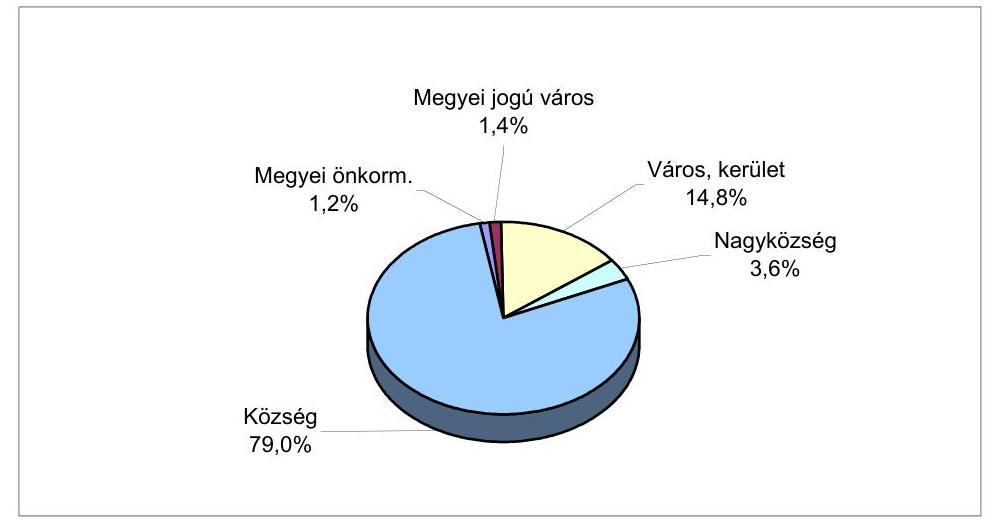

---

# A helyszíni ellenőrzési jelentésekben az önkormányzatok szabályszerű és célszerű működése érdekében tett javaslatok 

A helyi önkormányzatok gazdálkodásának átfogó ellenőrzéséről készült számvevői jelentésekben feltárt hiányosságok megszüntetése érdekében összesen 6625 javaslatot tettünk. A javaslatok közül 5139 (77,6\%) a törvényekben, kormányrendeletekben és a helyi önkormányzatok rendeleteiben, a polgármesteri hivatalok szabályzataiban előírtak betartására, a szabályszerű működésre hívta fel a figyelmet. A javaslatok 22,4\%-a (1486) az önkormányzati feladatok hatékonyabb ellátásának elősegítése, az intézményrendszer és a polgármesteri hivatalok munkájának célszerűbb megszervezése, szabályozottságának javítása érdekében született.

## 1. Szabályszerűségi javaslatok

1.1. A szabályszerűségi javaslatok 26,1\%-a a vonatkozó törvényekben és kormányrendeletekben előírt működést
 és a gazdálkodás folyamatát érintő szabályzatok elkészítésére, tartalmának a hatályos jogszabályokhoz igazítására és annak gyakorlati alkalmazására hívta fel az önkormányzatokat. Az ezzel összefüggő javaslatok:

- az Ámr. 17. §-nak megfelelően szervezeti és működési szabályzatban rögzítsék a polgármesteri hivatal, mint a helyi önkormányzat gazdálkodását végrehajtó szerv szervezetének felépítését és feladatait,
- készítsék el a gazdálkodó szervezet ügyrendjét, ebben határozzák meg a vezetők és a beosztottak feladat- és hatáskörét, a hivatalon belüli szervezeti egységek belső kapcsolatának, együttműködésének rendjét,
- az Áht. és az Ámr. előírásainak megfelelően alakítsák ki a költségvetési szerv számviteli politikáját, készítsék el az Ámr-ben előírt számlarendet és a kapcsolódó eszközök és források értékelési, a leltározási, selejtezési, pénzkezelési szabályzatokat,
- szabályozzák a kötelezettségvállalási, utalványozási, ellenjegyzési és érvényesítési jogkörök gyakorlását, jelöljék ki az arra jogosult személyeket,
- vizsgálják felül a meglévő, gazdálkodással összefüggő rendeleteket, belső szabályzatokat, hajtsák végre a jogszabályi előírások változásának megfelelő módosításokat, a helyi viszonyokhoz igazításukat,
- biztosítsák a gazdálkodás szabályszerű lebonyolítását a gazdálkodással kapcsolatos jogkörök előírás szerű gyakorlását. Tartsák be a kötelezettségvállalásra, utalványozásra, ellenjegyzésre és érvényesítésre vonatkozó jogszabályi

---

és helyi előírásokat, ezek megtörténtét hitelt érdemlő módon rögzítsék a bizonylatokon, gondoskodjanak az összeférhetetlenségi követelmények érvényesítéséről, az érvényesítést végző személyek esetében a szakmai képzettségi előírások betartásáról, a teljesítés szakmai igazolásáról,

- intézkedjenek az önállóan és a részben önállóan gazdálkodó költségvetési szervek között az Ámr. 14. §-ában előírt hatáskört és felelősségmegosztást rögzítő megállapodás elkészítéséről, jóváhagyásáról,
1.2. A szabályszerűségi javaslatok 18,7%-a az éves költségvetés tervezését, a helyi önkormányzatok költségvetési és zárszámadási rendeleteinek előkészítését, szerkezetét és tartalmát érintette:
- az önkormányzat az Ötv. 92. § (1) bekezdésének megfelelően határozza meg gazdasági programját és azt vegye figyelembe az éves költségvetés készítésekor,
- az Ámr. 28. § alapján a költségvetési koncepcióhoz csatolják a helyi önkormányzatnál működő bizottságok és a kisebbségi önkormányzatok véleményét,
- a költségvetési rendelet-tervezetet az Áht. 71. §-ának megfelelő eljárási rendben, a rögzített határidőben, az Ámr. 29. §-ban előírt szerkezetben terjesszék a képviselő-testület elé, mellékelve a könyvvizsgáló írásos véleményét,
- az Ámr. 29. §-ban előírtaknak megfelelően, a költségvetési rendelet előterjesztésében mutassák be legalább az Ötv-ben előírt részletezettséggel a bevételeket, az önálló és részben önálló költségvetési szervek kiadásait, a létszámkereteiket, a felújítási kiadásokat célonként, a felhalmozásaikat feladatonként, az általános és a céltartalékokat, a működési és felhalmozási bevételeket és kiadásokat mérlegszerűen,
- az Áht. 71. § (3) bekezdése előírásának megfelelően mutassák be a költségvetési évet követő 2 év várható előirányzatait, a polgármesteri hivatal és valamennyi intézmény éves létszámkeretét,
- a költségvetési és zárszámadási rendelet előterjesztéseihez mellékeljék, a szükséges esetekben szöveges indoklással együtt, az Áht. 118. §-a szerinti mérlegeket és kimutatásokat,
- a költségvetési rendelet-tervezetbe a helyi kisebbségi önkormányzat határozata alapján elkülönítetten építsék be a helyi kisebbségi önkormányzatok költségvetését az Áht. 68. §-a alapján,
- a rendeletben rögzítsék a költségvetés végrehajtásának szabályait, az előirányzatok évközi módosításával kapcsolatos eljárások rendjét, hatásköröket, a finanszírozás módját, a többletbevételek és az átmenetileg szabad pénzeszközök hasznosításával összefüggő eljárási rendet.
1.3. A költségvetési beszámoló részét képező könyvviteli mérleg tartalmával és a leltárral történő alátámasztásával függött össze a javaslatok 15,4%-a:

---

- a mérlegben szereplő eszközök és források értékét a jogszabályi és a helyi előírásoknak megfelelően áttekinthető és időtálló módon dokumentált leltárral támaszszák alá,
- a leltározás elvégzését igazoló leltárt helyettesítő összesítő kimutatás tartalmát, formáját és kellékeit rögzítsék a leltározási szabályzatban, gondoskodjanak a Vhr. 37. § (4) bekezdésének megfelelően a felügyeleti szerv hozzájárulásának beszerzéséről is,
- az egyes mérlegtételek értékének megállapítására vonatkozó a 249/2000. (XII. 24.) Korm. rendeletben előírtaknak megfelelő értékcsökkenés és értékvesztés elszámolását, különösen az üzemeltetésre, kezelésre átadott eszközök, illetve részesedések és kárpótlási jegyek esetében,
- az ÁSZ ellenőrzés által feltárt helytelen elszámolások, téves könyvelési műveletek, az egyes eszközök és források mérlegből történő kimaradása, vagy helytelen mérlegsoron való szerepeltetése miatti korrekciók végrehajtását,
- fordítsanak figyelmet a számviteli előírások betartására, a gazdasági események szabályos elszámolására. Biztosítsák a számvitelről szóló 2000. évi C. törvénynek és a kapcsolódó kormányrendeletnek megfelelő számviteli analitikus nyilvántartások kialakítását és folyamatos vezetését.
1.4. A javaslatok 10,9%-a az önkormányzati ellenőrzési rendszer kialakítását és működését érintette:
- az önkormányzatok gondoskodjanak az Ötv. 92. §-ban előírt ellenőrzési kötelezettségeik teljesítéséről. A képviselő-testület meghatározott időszakonként tekintse át a költségvetési szervek ellenőrzésének tapasztalatait,
- az önkormányzatok pénzügyi bizottságai az Ötv-ben előírtaknak megfelelően végezzék el ellenőrzési tevékenységüket,
- az ellenőrzések során feltárt jogszabálysértések, szabálytalanságok megszüntetése érdekében ésszerű időhatáron belül tegyék meg a szükséges intézkedéseket, indokolt esetben gondoskodjanak a személyes felelősség érvényesítéséről.
1.5. A szabályszerűségi javaslatok 7,5%-a az elfogadott költségvetési előirányzatok nyilvántartásával, módosításával függött össze:
- az Ámr. 53. §-nak megfelelően minden esetben önkormányzati rendelettel módosítsák a költségvetésben jóváhagyott kiemelt előirányzatokat. A rendelet-módosítást legkésőbb a zárszámadási rendelet-tervezet előterjesztését közvetlenül megelőző képviselő-testületi ülésen hajtsák végre,
- a költségvetési előirányzatok módosításairól az Ámr. 54. §-nak megfelelően vezessenek naprakész, áttekinthető nyilvántartást költségvetési szervenként külön-külön és önkormányzati szinten együttesen is.
- folyamatosan kísérjék figyelemmel az előirányzat felhasználást annak érdekében, hogy kötelezettségvállalás, illetve utalványozás csak az eredeti, illetve

---

a módosított előirányzatok mértékéig történjen az Áht. 12/A §-nak megfelelően,

- a kiemelt előirányzatok túllépésének okait a polgármesteri hivatal és az intézmények esetében egyaránt tárják fel, amennyiben indokolt akkor kezdeményezzék a személyes felelősség megállapítását, a felelősségre vonást,
- a képviselő-testületet rendszeresen, kellő időben tájékoztassa a polgármester az arra hatáskörileg jogosultak által végrehajtott előirányzat-módosításokról.
1.6. A szabályszerűségi javaslatok 8,7%-a a pénzügyi bizonylatok számviteli törvényben előírt alaki és formai előírásainak, 0,5%-a a közbeszerzési eljárások lebonyolítási szabályainak, 7,6%-a egyéb jogszabályi előírások betartására hívta fel a figyelmet, 4,6%-a kapcsolódott a vagyongazdálkodáshoz, a vagyon számbavételéhez:
- Csatolják a zárszámadási rendelethez az Ötv. szerinti vagyonleltárt, illetve az Áht-ban előírt vagyonkimutatást,
- gondoskodjanak a 147/1992. (XI. 6.) Korm. rendelet alapján az ingatlan kataszteri nyilvántartás feltételezéséről, folyamatos vezetéséről, a különböző ingatlan-nyilvántartások közötti összhang és egyezőség biztosításáról,
- Szüntessék meg azt a gyakorlatot, hogy az önkormányzat törzsvagyonát képező közműveket ellenszolgáltatás nélkül adják át a szolgáltatást végző gazdasági társaságnak, megsértve ezzel az Ötv. 79. § és a vízgazdálkodásról szóló 1995. évi LVII. törvény 6. § előírásait,
- a térítésmentesen átvett, illetve érték nélkül nyilvántartott eszközök értékének megállapítását és számviteli nyilvántartásba vételét.

# 2. Célszerűségi javaslatok 

A célszerűségi javaslatok 46,4%-a a működés és a gazdálkodás egyes területeire vonatkozó szabályozási kérdésekkel, 18,1%-a a polgármesteri hivatal működésével, 21,1%-a az önkormányzati feladatellátással, 14,3%-a egyéb kérdésekkel függött össze:

- a képviselő-testület gazdasági döntéseinek megalapozása érdekében készítsenek gazdasági számításokat, az előterjesztésekben mutassák be a különböző megoldási lehetőségeket és azok pénzügyi hatását,
- kísérjék figyelemmel a polgármesteri hivatal igazgatási tevékenységével összefüggő kiadások alakulását, csökkentésük érdekében tegyék meg a szükséges intézkedéseket,
- tekintsék át az önkormányzati feladatok ellátásának szervezeti rendszerét, tegyék meg a költségtakarékos, racionális megoldások kialakítása érdekében szükséges intézkedéseket,
- kísérjék figyelemmel az egyes kiemelt feladatok ellátásának fajlagos kiadásait, vizsgálják felül az önként vállalt feladatok finanszírozhatóságát,

---

- az ÁSZ ellenőrzés tapasztalatait testületi ülésen tárgyalják meg, a feltárt hiányosságok felszámolása érdekében készítsenek intézkedési tervet,
- a hivatal hatékony működése érdekében a munkaköri leírásokban és a belső szabályzatokban határozzák meg a munkafolyamatok ellenőrzésre kijelölt műveleteit, a követelményeket, az ellenőrzés viszonyítási alapját, a követelményektől való eltérés megállapításának módját és dokumentálását, a további eljárást,
- biztosítsák a hatékony ellenőrzéshez szükséges személyi és tárgyi feltételeket, gondoskodjanak megfelelő képzettséggel rendelkező főállású munkatárs, vagy külső szakértő megbízásáról,
- készítsék el, illetve szükség szerint módosítsák a felügyeleti ellenőrzés és a belső ellenőrzés végzésére vonatkozó szabályzatokat.

# 3. A helyi kisebbségi önkormányzatoknak tett szabályszerűségi javaslatok: 

- határozzák meg, illetve aktualizálják a Nek. tv. 27. § (2) bekezdés és az Ötv. 18. § (1) bekezdése alapján szervezeti és működési szabályzatukat,
- ne lássanak el a Szoc. tv. 3. § (3) bekezdésében települési önkormányzat hatáskörébe utalt és általuk az Ötv. 102/C. § (2) bek. alapján át nem vehető hatósági feladatokat,
- kössék meg a települési önkormányzatokkal a hiányzó együttműködési megállapodásokat az Áht. 66. § és 68. § (3) bekezdésének előírásai alapján; vizsgálják felül és aktualizálják, a feladatok, a jogszabályi előírások, illetve a helyi sajátosságok tekintetében elavult megállapodásokat,
- teljesítsék az Áht. 65. § (2) bekezdése értelmében a kisebbségi önkormányzatok költségvetésének határozatban történő megállapításával kapcsolatos kötelezettségeiket és ennek során tartsák be az együttműködési megállapodásban, illetve Áht. 71. § (1) bekezdésében rögzített határidőket, valamint maradéktalanul érvényesítsék Áht. 69. § (2) bekezdésében előírt tartalmi követelményeket,
- tegyenek eleget az Ámr. 103. §-ában foglalt előírásoknak az operatív gazdálkodás folyamatában a bankszámla nyitásával, a banki és a készpénzes forgalom elkülönített kezelésével, valamint a bevételek és kiadások elkülönített elszámolásával,
- tartsák be a költségvetés végrehajtásának során a bevételek és a kiadások teljesítésénél a kötelezettségvállalás, a teljesítés szakmai igazolás, az érvényesítés, az utalványozás és az ellenjegyzés Áht. 74/A. § és Ámr. 134-138. §-aiban rögzített előírásait; a pénzgazdálkodásban szüntessék meg a rokoni, munkaköri és a gazdálkodási jogkört gyakorlók érintettségéből eredő összeférhetetlenségeket,
- érvényesítsék a gazdálkodás folyamatában a bizonylati rend- és fegyelem Számv. tv. 165-166. §-ában foglalt előírásait,

---

- tegyék rendszeresebbé és hatékonyabbá a kisebbségi önkormányzat gazdálkodásának belső ellenőrzését,
- teljesítsék a beszámolási kötelezettséget, illetve a zárszámadás határozattal történő elfogadásával kapcsolatos követelményeket az együttműködési megállapodásban és az Áht. 79, 82. §-aiban foglalt határidőre, illetve az Áht. 18. és 69. §, Ámr. 29. §-ában előírt tartalmi és szerkezeti követelmények betartásával, az eddigieknél pontosabb adatokra alapozva.

---

# Tájékoztató

a helyi önkormányzatok eszközeiről és azok forrásairól (országosan összesített adatok)

|  Megnevezés | 2000. év |  | 2001. év |  | változás 2001/2000. %  |
| --- | --- | --- | --- | --- | --- |
|   | $\begin{gathered} \text { összeg } \ \text { millió Ft } \end{gathered}$ | $\begin{gathered} \text { arány } \ \% \end{gathered}$ | $\begin{gathered} \text { összeg } \ \text { millió Ft } \end{gathered}$ | $\begin{gathered} \text { arány } \ \% \end{gathered}$ |   |
|  I. Immateriális javak | 5331 | 0,2 | 6208 | 0,2 | 116,5  |
|  II. Tárgyi eszközök | 1686990 | 54,6 | 1897455 | 54,1 | 112,5  |
|  III. Befektetett pénzügyi eszközök | 533254 | 17,3 | 586246 | 16,7 | 109,9  |
|  IV. Üzemeltetésre átadott eszközök | 399341 | 12,9 | 489518 | 14,0 | 122,6  |
|  A) Befektetett eszközök | 2624916 | 85,0 | 2979427 | 85,0 | 113,5  |
|  I. Készletek | 13524 | 0,4 | 13277 | 0,4 | 98,2  |
|  II. Követelések

 | 145572 | 4,7 | 168994 | 4,8 | 116,1  |
|  III. Értékpapírok | 113719 | 3,7 | 95092 | 2,7 | 83,6  |
|  IV. Pénzeszközök | 144763 | 4,7 | 192085 | 5,5 | 132,7  |
|  V. Egyéb aktív pénzügyi elszámolások | 47372 | 1,5 | 55969 | 1,6 | 118,1  |
|  B) Forgóeszközök | 464950 | 15,0 | 525417 | 15,0 | 113,0  |
|  ESZKÖZÖK ÖSSZESEN | 3089866 | 100,0 | 3504844 | 100,0 | 113,4  |
|  D) Saját tőke | 2723663 | 88,1 | 3008591 | 85,8 | 110,5  |
|  I. Költségvetési tartalékok | 112720 | 3,7 | 157892 | 4,5 | 140,0  |
|  II. Vállalkozási tartalékok | 692 | - | - | 0,0 | -  |
|  E) Tartalékok | 113412 | 3,7 | 157892 | 4,5 | 139,2  |
|  I. Hosszú lejáratú kötelezettségek | 91646 | 3,0 | 105736 | 3,0 | 115,4  |
|  II. Rövid lejáratú kötelezettségek | 83033 | 2,7 | 142563 | 4,1 | 171,7  |
|  III. Egyéb passzív pénzügyi elszámolások | 78112 | 2,5 | 90061 | 2,6 | 115,3  |
|  F) Kötelezettségek | 252791 | 8,2 | 338360 | 9,7 | 133,8  |
|  FORRÁSOK ÖSSZESEN | 3089866 | 100,0 | 3504844 | 100,0 | 113,4  |

Forrás: Államháztartási Hivatal Költségvetési Nyilvántartási és Adatfeldolgozási Főosztály éves költségvetési beszámoló 1. számú űrlap

---

# Tájékoztató 

a vizsgált helyi önkormányzatok eszközeiről és azok forrásairól

| Megnevezés | 2000. év |  | 2001. év |  | változás   2001/2000.   $\%$ |
| :--: | :--: | :--: | :--: | :--: | :--: |
|  | összeg   millió Ft | arány   $\%$ | összeg   millió Ft | arány   $\%$ |  |
| I. Immateriális javak | 1087 | 0,2 | 1441 | 0,3 | 132,6 |
| II. Tárgyi eszközök | 285426 | 64,3 | 353638 | 65,7 | 123,9 |
| III. Befektetett pénzügyi eszközök | 35093 | 8,0 | 44845 | 8,3 | 127,8 |
| IV. Üzemeltetésre átadott eszközök | 52032 | 11,7 | 59806 | 11,1 | 114,9 |
| A) Befektett eszközök | 373638 | 84,2 | 459730 | 85,4 | 123,0 |
| I. Készletek | 2312 | 0,5 | 2326 | 0,4 | 100,6 |
| II. Követelések | 23247 | 5,3 | 26310 | 4,9 | 113,2 |
| III. Értékpapírok | 16502 | 3,7 | 15223 | 2,8 | 92,2 |
| IV. Pénzeszközök | 20835 | 4,7 | 26386 | 4,9 | 126,6 |
| V. Egyéb aktív pénzügyi elszámolások | 7220 | 1,6 | 8522 | 1,6 | 118,0 |
| B) Forgóeszközök | 70116 | 15,8 | 78767 | 14,6 | 112,3 |
| ESZKÖZÖK ÖSSZESEN | 443754 | 100,0 | 538497 | 100,0 | 121,4 |
| D) Saját tőke | 390381 | 88,0 | 462647 | 85,9 | 118,5 |
| I. Költségvetési tartalékok | 15592 | 3,5 | 20857 | 3,9 | 133,8 |
| II. Vállalkozási tartalékok | - | - | - | - | - |
| E) Tartalékok | 15592 | 3,5 | 20857 | 3,9 | 133,8 |
| I. Hosszú lejáratú kötelezettségek | 9994 | 2,3 | 11911 | 2,2 | 119,2 |
| II. Rövid lejáratú kötelezettségek | 15304 | 3,4 | 28648 | 5,3 | 187,2 |
| III. Egyéb passzív pénzügyi elszámolások | 12482 | 2,8 | 14414 | 2,7 | 115,5 |
| F) Kötelezettségek | 37780 | 8,5 | 54973 | 10,2 | 145,5 |
| FORRÁSOK ÖSSZESEN | 443754 | 100,0 | 538497 | 100,0 | 121,4 |

Forrás: Államháztartási Hivatal Költségvetési Nyilvántartási és Adatfeldolgozási Főosztály éves költségvetési beszámoló 1. számú űrlap

---

7. számú jelentés
a V-1018/2001. számú jelentéshez

Tájékoztató

a helyi önkormányzatok eszközeinek összetételéről

Országos adat

Vizsgált kör adata

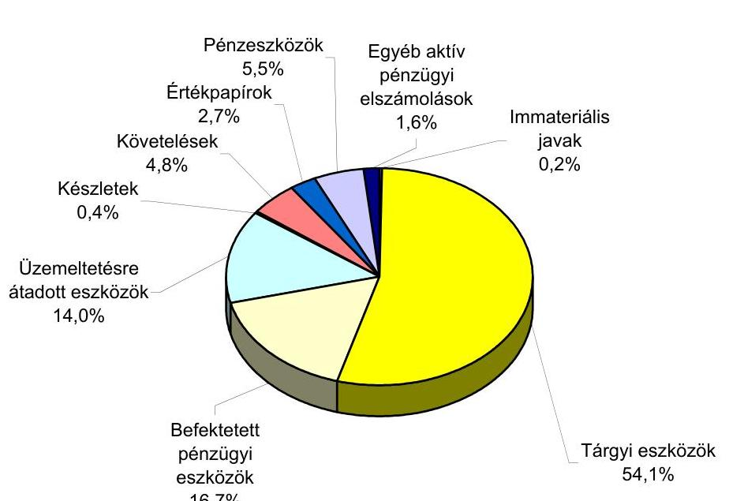

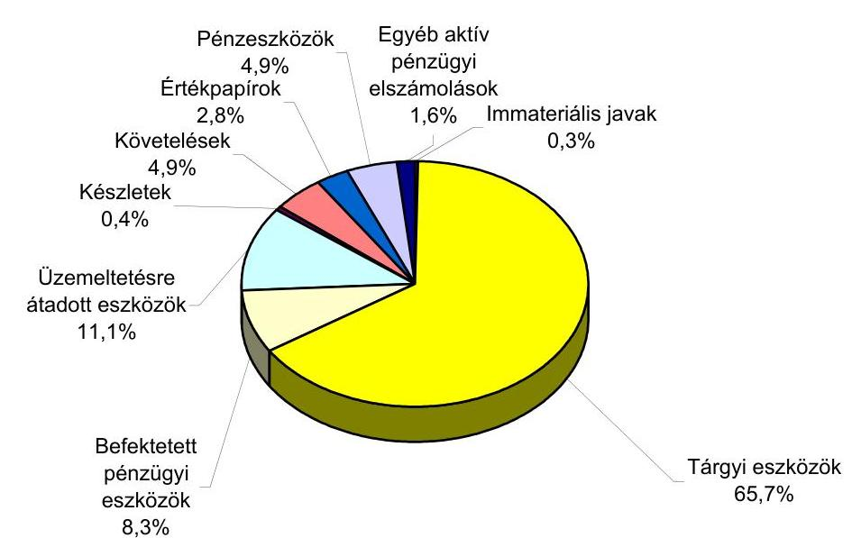

---

8. számú melléklet a V-1028/2001. számú jelentéshez

## **Tájékoztató**

## **az önkormányzati vagyon növekedésének összetevőiről**

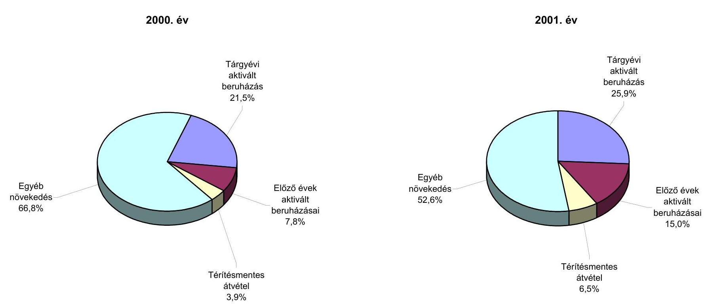

### **Megjegyzés:**

Az egyéb növekedés tartamát tekintve jellemzően a korábban érték nélkül nyilvántartott eszközök értékének megállapításával és számviteli nyilvántartásba vételével összefüggő vagyongyarapodást tükrözi.

---

# 2001. évi bruttó bevételi és kiadási előirányzatok és a teljesítés alakulása önkormányzati típusonként (ellenőrzött önkormányzatok) 

| Önkormányzat típusa | Előirányzat |  | Bevétel összesen teljesítés |  | Kiadás összesen teljesítés |  | Megoszlás   (\%) |
| :--: | :--: | :--: | :--: | :--: | :--: | :--: | :--: |
|  | eredeti   (millió Ft) | módosított   (millió Ft) |  |  |  |  |  |
|  |  |  | millió Ft | $\%$ | millió Ft | $\%$ |  |
| Megyei önkormányzatok | 54207 | 63475 | 72612 | 114 | 68095 | 107 | 16 |
| Megyei jogú városok | 69329 | 85207 | 87531 | 103 | 83380 | 98 | 20 |
| Városok | 160203 | 199099 | 235872 | 118 | 225112 | 113 | 53 |
| Nagyközségek | 6564 | 8165 | 8039 | 98 | 7486 | 92 | 2 |
| Községek | 31994 | 39769 | 39948 | 100 | 37980 | 96 | 9 |
| Összesen: | 322297 | 395715 | 444002 | 112 | 422053 | 107 | 100 |

A 2001. évben elért bevételek és kiadások megoszlása
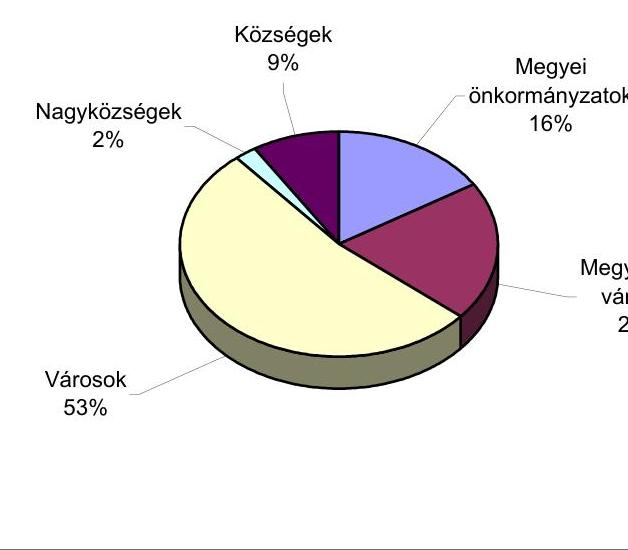

---

# A vizsgált helyi önkormányzatok 2001. évi kiadásai 

| Megnevezés | Bruttó teljesítés | Nettó teljesítés |  |
| :--: | :--: | :--: | :--: |
|  | (millió Ft) | (millió Ft) | \% |
| Kiadások összesen: | 422053 | 336701 | 100% |
| Ebből kiemelve: |  |  |  |
| Működési kiadások | 242716 | 240825 | 71,5% |
| Személyi juttatások | 106946 | 106946 | 31,8% |
| Munkaadókat terhelő járulékok | 40184 | 40184 | 11,9% |
| Dologi kiadások | 95586 | 93695 | 27,8% |
| Támogatások, elvonások és egyéb folyó kiadások | 30092 | 28378 | 8,4% |
| Felhalmozási kiadások | 58824 | 57958 | 17,2% |
| Egyéb | 90051 | 9540 | 2,9% |
| Kölcsönnyújtás | 3750 | 3750 | 1,1% |
| Hitel visszafizetés | 17194 | 4172 | 1,2% |
| Hosszú lejáratú értékpapírok vásárlása | 1517 | 1517 | 0,5% |
| Éven belüli értékpapírok vásárlásának egyenlege | 67590 | 101 | 0,0% |

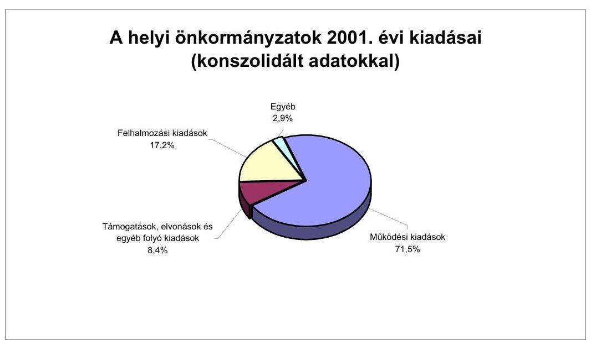

---

Iktatószám: 1-a-2/23/2003.

Dr. Kovács Árpád úrnak
elnök

Állami Számvevőszék

# Budapest 

Tisztelt Elnök Úr!

Megköszönöm az Önök által készített „A helyi és helyi kisebbségi önkormányzatok gazdálkodásának átfogó ellenőrzéséről” szóló jelentést, melynek előremutató, hasznos megállapításait munkánk során hasznosíthatjuk.

Budapest, 2003. június 24.
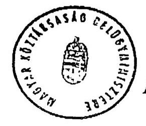

Üdvözlettel:

Dr. Lamperth Mónika

---

# Dr. Kovács Árpád úr részére   elnök   Állami Számvevőszék 

Budapest

Tárgy: A helyi és helyi kisebbségi önkormányzatok gazdálkodásának átfogó ellenőrzéséről szóló jelentés.

Tisztelt Elnök Úr!

A helyi és a helyi kisebbségi önkormányzatok 2002. évi átfogó ellenőrzéséről szóló jelentést köszönettel vettem. A jelentés a pozitív irányú elmozdulásokat is számba véve, teljes körű elemzést nyújt az önkormányzati alrendszer gazdálkodásáról. Fontosnak tartom, hogy a gazdálkodás szabályozottsága javult, a költségvetési előterjesztések, elfogadott rendeletek az előző éveknél jobban megfeleltek a jogszabályi előírásoknak, és ugyanez állapítható meg a zárszámadásokra is. Emellett a feltárt hiányosságok jelzik számomra is, hogy a gazdálkodás színvonala, a pénzügyi fegyelem és az ellenőrzés területén még számos tennivaló hátra van.

A pénzügyminiszter részére megfogalmazott ajánlásokkal kapcsolatos álláspontom a következő:

1. pont

A helyi önkormányzatok feladat- és hatásköri rendszerének átgondolása, telepítésének változtatása alapkérdés. A közigazgatás-korszerűsítési program keretében a munkálatok a Belügyminisztériumban szervezett IDEA program részeként – már folyamatban vannak. Az e munka során kialakuló új feladat- és hatásköri rendszerhez illeszkedően kerülhet sor érdemben a finanszírozási rendszer felülvizsgálatára, illetve módosítására. Természetesen az üvegzseb program eredményes végrehajtásához az államháztartás egésze tekintetében felülvizsgáljuk az államháztartás információs rendszerét – ezen belül a hatályos szakfeladat-rendet is – és a szükséges módosításokat átvezetjük.
2. pont

Az Ötv. lehetővé teszi, hogy a települési önkormányzat maga határozza meg – a lakosság igényei alapján, anyagi lehetőségeitől függően –, mely feladatokat, milyen mértékben és módon lát el. Ennek következtében jelenleg olyan sokszínű a kötelező és önként vállalt feladatok együttélése, hogy központi módszertan kidolgozását az egységes nyilvántartási rendszer létrehozását nem teszi lehetővé. Borítaná az egységes – központi és

---

önkormányzati költségvetési szervekre egyaránt kötelező – információs rendszert a javasolt szétválasztás, amellyel kapcsolatban jelenleg is az a kritika ér leginkább, hogy így is bonyolult. Más vonatkozásokban egyébként az Állami Számvevőszék is mind a központi, mind az önkormányzati információs rendszer egyszerűsítését szorgalmazza. Ez utóbbi megoldását tekintjük jelenleg elsőrendű célnak, természetesen a közpénzek átláthatóbbá tételének követelményét szem előtt tartva.
3. pont

Egyetértek azzal, hogy az önkormányzati ellenőrzési rendszer működése jelentősen befolyásolja a gazdálkodás minden területén a törvényesség, szabályszerűség érvényesülését. E területen az előrelépést én is abban látom, hogy a belső ellenőrzés szakmai szabályait az önkormányzatokra vonatkozóan is kormányrendelet határozza meg. Erre az államháztartási törvény 2003. január 1-jétől hatályos felhatalmazása lehetőséget biztosít (124.§ (2) bekezdés u) pont). A Pénzügyminisztériumban az államháztartás belső pénzügyi ellenőrzési rendszere EU-komform átalakítása keretében már feladat annak elemzése, hogyan lehet a központi kormányzati szint mellett a helyi önkormányzatokra is kiterjedő belső ellenőrzési rendszert kialakítani.

# 4. pont 

Az Áht. 124. § (2) bekezdésének b) pontjában meghatározott felhatalmazás szerint alkotott, az államháztartás működési rendjéről szóló 217/1998.(XII.30.) Korm.rendelet, továbbá az államháztartás szervezetei beszámolási és könyvvezetési kötelezettségének sajátosságairól szóló 249/2000. (XII. 24.) Korm. rendelet a központi információszolgáltatáshoz szükséges, egységes követelményrendszer érvényesülését biztosítja. Véleményem szerint fenn kell tartani a helyi önkormányzati képviselő-testületek számára azt a lehetőséget, hogy a helyben bemutatandó mérlegek tartalmi és formai követelményeinek meghatározására sajátos igényeik szerint helyben is hozhassanak döntést. Ehhez az Áht. 118.§-a alapján biztosított jogkört szükséges továbbra is érvényben tartani.
5. pont

A javaslat megvalósítását elképzelhetőnek tartom. A helyi kisebbségi önkormányzatok gazdálkodásának sajátos rendjére vonatkozó szakirodalmi jellegű kézikönyv az illetékes minisztérium (MEH) koordinálásában készülhet el.

Végezetül ismételten megköszönve a rendkívül hasznos információkat nyújtó jelentést, kérem tájékoztatásom szíves elfogadását.

Budapest, 2003. június 17.
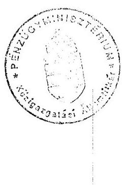

Üdvözlettel:
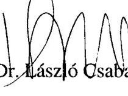

---

# Dr. László Csaba úr, pénzügyminiszter 

Pénzügyminisztérium

Budapest

## Tisztelt Miniszter Úr!

A helyi és a helyi kisebbségi önkormányzatok gazdálkodásának átfogó ellenőrzéséről szóló jelentésre tett észrevételét köszönettel megkaptam. Örömmel vettem,

 hogy a megfogalmazott ajánlások többségét elfogadva, azokat a további munka során hasznosítani kívánják.

Véleményem szerint az önkormányzatok gazdálkodásának megítélése és a központi költségvetési források biztosítása szempontjából is fontos annak megismerése, hogy az önkormányzatoknak mely feladatokat kell kötelezően ellátniuk és azok elvégzése mennyibe kerül. Továbbá szükséges annak megítélése is, hogy az önként vállalt feladatokhoz kapcsolódó kiadások mennyiben veszélyeztetik a kötelező feladatok ellátását. A véleményalkotáshoz a jelenlegi számviteli nyilvántartások a megfelelő információkat nem biztosítják, ezért továbbra is indokoltnak tartom az ezzel kapcsolatos ajánlásunk figyelembevételét a mindenkori igényekhez folyamatosan igazodó információs rendszer módosítása, korrigálása során.

Budapest, 2003. június 27.

Tisztelettel:
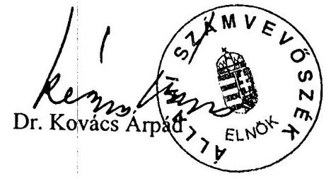
