# JELENTÉS 

a Földművelésügyi és Vidékfejlesztési Minisztérium fejezet működésének ellenőrzéséről

---

# 2. Államháztartás Központi Szintjét Ellenőrző Igazgatóság 2.3. Átfogó Ellenőrzési Főcsoport 

Iktatószám: V-17-103/2002-2003.
Témaszám: 609
Vizsgálat-azonosító szám: V0041

## Az ellenőrzést felügyelte:

Bihary Zsigmond
főigazgató
Az ellenőrzés végrehajtásáért felelős:
Hegedűsné dr. Müllern Veronika
főcsoportfőnök
Az ellenőrzést vezette:
Papp Sándor
osztályvezető főtanácsos

## Az ellenőrzést végezték:

Bank Lajos
számvevő tanácsos
Beck Miklós
számvevő
Böröcz Imre
számvevő tanácsos

Csóry Györgyné
számvevő tanácsos, tanácsadó
Dér Lívia
számvevő tanácsos
Federics Adrienn
számvevő gyakornok
dr. Horváth Erika
számvevő gyakornok
Koltay Zsoltné
számvevő
Laskai Ede
számvevő
dr. Ligeti Miklós
számvevő tanácsos, tanácsadó
dr. Márkus Gábor
számvevő tanácsos, főtanácsadó
dr. Mohácsi
Istvánné
számvevő tanácsos

## A témához kapcsolódó eddig készített számvevőszéki jelentés:

A Földművelésügyi Minisztérium fejezet működésének pénzügyi-gazdasági ellenőrzése (1998.)

---

# TARTALOMJEGYZÉK 

BEVEZETÉS ..... 7
I. ÖSSZEGZŐ MEGÁLLAPÍTÁSOK, KÖVETKEZTETÉSEK, JAVASLATOK ..... 9
II. RÉSZLETES MEGÁLLAPÍTÁSOK ..... 16

1. A minisztérium irányító tevékenysége ..... 16
1.1. A fejezet irányító tevékenysége ..... 16
1.2. A minisztérium ágazati irányításhoz és a jogharmonizációhoz kapcsolódó szabályozó tevékenysége ..... 19
1.3. A szakmai irányító tevékenység ..... 20
1.3.1. A mezőgazdasági célú vízgazdálkodási feladatok ellátása ..... 20
1.3.2. Az állategészségügyi feladatok ellátása ..... 22
1.4. A költségvetési gazdálkodást irányító és felügyelő tevékenység ..... 23
1.5. Eszköz- és vagyongazdálkodás ..... 33
1.6. Az egyszerűsített programfinanszírozási körbe tartozó kiadások ..... 41
1.7. A felügyeleti és ágazati ellenőrzés működése ..... 43
2. Az agrártámogatások rendszere ..... 46
2.1. Az agrártámogatási rendszer előkészítettsége ..... 46
2.2. A fő támogatási formák értékelése ..... 49
2.3. A támogatások felhasználásának értékelése ..... 52
2.4. A támogatások ellenőrzésének rendszere ..... 53
3. Ágazati célelőirányzatok ..... 54
3.1. Az ágazati célelőirányzatok célja és teljesítése ..... 54
3.2. Az Európai Unióhoz való csatlakozás Nemzeti Programja ..... 56
3.3. Agrárkutatási feladatok támogatása ..... 58
3.4. Élelmiszerkönyv kiadása, szabványosítás és minőségügyi feladatok ..... 59
3.5. A Magyar Állatorvosi Kamara által ellátott állami feladatok támogatása ..... 59
3.6. Munkavédelmi, polgári védelmi és nukleárisbaleset-elhárítási feladatok ..... 60
4. Vidékfejlesztési célelőirányzatok ..... 60
4.1. A VFC központi pályázatok rendszerének értékelése ..... 61
4.2. A támogatások hasznosulásának értékelése ..... 65

---

5. PHARE támogatások ..... 66
5.1. Szervezeti keretek és a támogatások fogadásának lebonyolítási rendszere ..... 66
5.2. Agrárgazdasági programok ..... 67
5.3. Területfejlesztési programok ..... 71
6. Az informatikai rendszer működése ..... 74
6.1. Az informatikai stratégia és fejlesztés ..... 74
6.2. Az informatikai rendszerek értékelése ..... 77
6.3. Az informatika szervezeti és személyi háttere ..... 79
7. Az ÁSZ korábbi vizsgálatai során tett javaslatok és azok végrehajtása ..... 80
MELLÉKLETEK
1/a számú A FVM miniszter észrevétele
1/b számú A miniszter észrevételére adott válaszunk
2. számú 1-6. számú tanúsítványok
FÜGGELÉKEK
8. számú A korábbi számvevőszéki vizsgálatok alapján tett javaslatok realizálása
9. számú Az állatorvosi szolgálat működésének helyzete.

---

# RÖVIDÍTÉSEK JEGYZÉKE 

| AIK | Agrárintervenciós Központ |
| :-- | :-- |
| AKII | Agrárgazdasági Kutató és Informatikai Intézet |
| AMC | Agrár Marketing Centrum |
| ANP | EU közösségi vívmányai átvételének Nemzeti Programja |
| APEH | Adó és Pénzügyi Ellenőrzési Hivatal |
| ARH | Agrárrendtartási Hivatal |
| ÁHH | Államháztartási Hivatal |
| ÁSZ | Állami Számvevőszék |
| ÁTEV Rt | Állati Termékeket Feldolgozó Rt |
| B.A.Z. megye | Borsod-Abaúj-Zemplén megye |
| BM | Belügyminisztérium |
| CBC | EU határon átnyúló együttműködési segélyprogram |
| EU | Európai Unió |
| GM | Gazdasági Minisztérium |
| HM | Honvédelmi Minisztérium |
| EAGGF | Az EMOGA közkeletű angol rövidítése |
| EMOGA | Európai Mezőgazdasági Orientációs és Garancia Alap |
| FAO | Az ENSZ Élelmezésügyi és Mezőgazdasági Szervezete |
| FKI | Földművelésügyi Költségvetési Iroda |
| FM | Földművelésügyi Minisztérium |
| FMB | Fejezeti Monitoring Bizottság |
| FM Megyei Hivatala | Földművelésügyi Minisztérium Megyei Hivatala |
| FVM | Földművelésügyi és Vidékfejlesztési Minisztérium |
| GH | FVM Gazdasági Hivatala |
| GSZ | FVM Gazdálkodó Szervezete |
| GTTB | Gazdaságbiztonsági Tartalékolási Tárcaközi Bizottság |
| IF | Informatikai Főosztály |
| IIER | Integrált Igazgatási és Ellenőrzési Rendszer |
| ISM | Ifjúsági és Sportminisztérium |
| ITB | Informatikai Tárcaközi Bizottság |
| IÜSZ | Informatikai és Üzemeltetési Szabályzat |
| KEHI | Kormányzati Ellenőrzési Hivatal |
| Kht | Közhasznú társaság |
| KHVM | Közlekedési, Hírközlési és Vízügyi Minisztérium |
| KKI | Központi Kárrendezési Iroda |
| KÖM | Környezetvédelmi Minisztérium |
| KPSZE | Központi Pénzügyi és Szerződéskötő Egység |
| MÁK (Kincstár) | Magyar Államkincstár |
| MÁOK | Magyar Állatorvosi Kamara |

---

| MeH | Miniszterelnöki Hivatal |
| :-- | :-- |
| MTA | Magyar Tudományos Akadémia |
| NKP Kht | Nemzeti Kataszteri Program Kht |
| OÁI | Országos Állategészségügyi Intézet |
| OÁIR | Országos Állategészségügyi Informatikai Rendszer |
| OM | Oktatási Minisztérium |
| OTK | Országos Területfejlesztési Központ |
| OTP | Országos Takarékpénztár |
| PAO | PHARE program engedélyező tisztviselő |
| PHARE | az EU kelet-középeurópai általános segélyprogramja |
| PM | Pénzügyminisztérium |
| REVI | Regionális és Vidékfejlesztési Iroda |
| RFT | Regionális Fejlesztési Tanács |
| SAPARD | EU mezőgazd. és vidékfejlesztési előcsatlakozási program |
| SPO | PHARE programfelelős tisztviselő |
| VÁTI | Magyar Regionális Fejlesztési és Urbanisztikai Kht |
| VFC | Vidékfejlesztési Célelőirányzat |
| VPOP | Vám és Pénzügyőrség Országos Parancsnoksága |

---

# ÉRTELMEZŐ SZÓTÁR 

| EAGGF-EMOGA-FEOGA | European Agricultural Gurantee and Guidance Fund (Európai Mezőgazdasági Orientációs és Garancia Alap, rövidítve: EMOGA, az EU-ban leggyakrabban használt francia rövidítés szerint: FEOGA) |
| :--: | :--: |
| FAO | Food and Agriculture Organization (az ENSZ Élelmezésügyi és Mezőgazdasági Szervezete) |
| PHARE | Poland-Hungary: Assistance to the Reconstruction of Economies (az EU kelet-közép európai általános segélyprogramja) |
| SAPARD | Special Pre-Accession Program for Agriculture and Rural Development (az EU kelet-közép európai mezőgazdasági és vidékfejlesztési előcsatlakozási programja) |

---

# 6

---

# JELENTÉS 

## a Földművelésügyi és Vidékfejlesztési Minisztérium fejezet működésének ellenőrzéséről

## BEVEZETÉS

A Földművelésügyi és Vidékfejlesztési Minisztérium (FVM) fejezet tevékenysége magába foglalja a mezőgazdaság, a vadgazdálkodás és halászat, az élelmiszeripar, az erdőgazdálkodás és erdővédelem, a mezőgazdasági termékforgalmazás, a növényvédelem és agrár-környezetgazdálkodás, az állategészségügy, a termőföld minőségi védelme, a térképészet és földügy, a mezőgazdasági minősítés hatósági és szakigazgatási feladatait, az ágazathoz kapcsolódó kutatási és fejlesztési, a szakirány szerinti középfokú képzési, valamint az EU jogharmonizációhoz kapcsolódó kiemelt feladatokat, így a jogi, szabályozási, intézményi háttér előkészítését, a nemzetközi támogatások fogadására való felkészülést.
A minisztérium tevékenysége a vizsgált időszakban a Magyar Köztársaság minisztériumainak felsorolásáról szóló 1998. évi XXXVI. törvénynek megfelelően bővült, a területfejlesztéssel és az építésüggyel összefüggő kormányzati feladatok a Környezetvédelmi Minisztériumtól, a mezőgazdasággal összefüggő kormányzati vízügyi feladatok a Közlekedési, Hírközlési és Vízügyi Minisztériumtól a földművelésügyi és vidékfejlesztési miniszter hatáskörébe kerültek. A tárca tevékenységi köre 2002-ben ismét módosult, amikor az 1998. évi XXXVI. törvényt hatályon kívül helyező 2002. évi XI. törvény 2002. május 27-i hatályba lépéssel az építésügyet a belügyminisztériumhoz rendelte.
A fejezet 2001-2002. évre szóló költségvetése a minisztérium, illetve 60 önállóan, valamint 77 részben önállóan gazdálkodó központi költségvetési intézmény előirányzatait, valamint a fejezeti kezelésű előirányzatokat tartalmazta. A fejezet 2002-re engedélyezett létszáma 16672 fő, az FVM-hez tartozó 11 cím 2002. kiadási előirányzata 319 milliárd Ft, ebből a nemzetgazdasági számlákról fedezett vállalkozások folyó támogatása előirányzat 107 milliárd Ft volt.
A fejezeti kezelésű előirányzatok összege az 1998. évi 53,6 milliárd Ft-ról 2002. évre közel háromszorosára nőtt. Itt jelentek meg ágazati célelőirányzatként a különböző nemzetközi, agrárkutatási, intézményfejlesztési feladatok és az Európai Strukturális Alaphoz kötődő programok támogatásai. Az ágazati célelőirányzat az agrártermelés támogatásán túl, a terület- és vidékfejlesztési előirányzatokat is tartalmazza. A vállalkozások támogatása a mezőgazdasági termékek termelési költségeinek egy részét kompenzálja, értékesítési illetve jövedelem-kiegészítési céllal.

Az Állami Számvevőszék 1998. évben végzett a fejezetnél átfogó pénzügyi, gazdasági ellenőrzést, a költségvetés tervezését és végrehajtását éves gyakorisággal

---

ellenőrizte. Témavizsgálat keretében pedig 2001-ben értékelte az FVM fejezet belső kontroll mechanizmusainak kiépítettségét és működését. A SAPARD program végrehajtására létrehozott intézményrendszer akkreditáció előtti átvilágításának első szakasza 2002-ben történt meg.
Az államháztartásról szóló 1992. évi XXXVIII. törvény 120/A § (1) bekezdés alapján az ÁSZ ellenőrzi az államháztartás forrásait, azok felhasználását és a vagyonnal való gazdálkodást. A jelen ellenőrzés végrehajtására az Állami Számvevőszékről szóló 1989. évi XXXVIII. törvény 2. § (3) és 17. § (3) bekezdésében foglaltak adnak jogszabályi alapot.
Az ellenőrzés célja annak értékelése volt, hogy a fejezet

- működésének és gazdálkodásának szervezeti, irányítási rendszere, költségvetése, személyi és tárgyi feltételei összhangban voltak-e a szakmai feladatokkal, azok megfeleltek-e az Európai Unióhoz való csatlakozási folyamat követelményeinek;
- költségvetési gazdálkodásának feladatait, felügyeleti és ágazati irányító tevékenységét a jogszabályi előírásoknak megfelelően, célszerűen és eredményesen látta-e el, a költségvetés tervezési, végrehajtási és ellenőrzési rendszere biztosította-e a különböző jogcímeken rendelkezésre álló közpénzek szabályszerű, célszerű és eredményes felhasználását, a felhasználás során teljesültek-e a kitűzött ágazati - szakmai célok;
- informatikai rendszerét a kormányzati informatikai fejlesztési koncepcióhoz, az európai integrációhoz igazodóan alakította-e ki, az intézmények informatikai rendszereinek szabályozottsága, működtetése, fejlesztése megfelelt-e a célszerűségi, megbízhatósági szempontoknak, a források szabályszerű és hatékony felhasználásának;
- irányító és gazdálkodó tevékenységében hasznosította-e a korábbi ÁSZ ellenőrzések, kiemelten a központi költségvetés területén működő belső kontroll mechanizmusok vizsgálatának megállapításait és javaslatait.
Ellenőrzésünk az 1998. január 1. és 2002. december 31. közötti időszakot fogta át.

Az izraeli és a magyar számvevőszékek együttműködése keretében párhuzamosan, de egymástól függetlenül vizsgáltuk az illetékességi területek állategészségügyi szolgálatát. Ez azt jelentette a gyakorlatban, hogy Izraelben az Izraeli Számvevőszék, Magyarországon pedig az ÁSZ a vizsgálat során ellenőrizte a szervezetek struktúráját, működését, szabályozottságát, az állatorvosi tevékenység eredményességét a főbb állatbetegségek visszaszorításában és megelőzésében, a feladat felügyeleti irányításának és ellenőrzésének mechanizmusát, majd ezt követően közösen értékeljük a vizsgálatok eredményeit.
A végleges jelentést az Állami Számvevőszékről szóló 1989. évi XXXVIII. tv. III. fejezet 25. § (1) bekezdésének megfelelően észrevételezésre megküldtük Dr. Németh Imre miniszter úrnak, aki észrevételezési lehetőségével élt (levelének másolatát és az arra adott válaszunkat a jelentés 1/a, 1/b. sz. melléklete tartalmazza).

# I. ÖSSZEGZŐ MEGÁLLAPÍTÁSOK, KÖVETKEZTETÉSEK, JA-

---

# VASLATOK 

A Földművelésügyi és Vidékfejlesztési Minisztérium szakmai feladatait az ellenőrzött időszakban folyamatos változások jellemezték, a más tárcáktól átvett feladatokat, szervezeteket gyakorlatilag zökkenőmentesen építették be a fejezet struktúrájába. A támogatások hatékony felhasználását megnehezítheti, hogy késedelmes, illetve téves vezetői döntések miatt az EU normáit kielégítő, az EU támogatások fogadására és ellenőrzésére alkalmas intézményrendszert nem építették ki az EU által elvárt időpontra. Az EU megfigyelők ezzel kapcsolatos elmarasztaló véleménye is az intézményrendszer határidőre történő kiépítését kétségesnek tartotta. A SAPARD támogatások eredeti tervek szerinti kifizetése valóban csak 2003-tól kezdődött meg.

Az ágazati szabályozó tevékenység keretében megjelent több, EU jogszabályokhoz illeszkedő szakágazati törvény és jogszabály. Ezek megfelelő alapot szolgáltattak a mezőgazdaságból élők teljes áttekintését biztosító nyilvántartás lefektetéséhez, valamint a regionális fejlesztési tanácsok megerősítéséhez. Az agrárfejlesztésről szóló törvény meghatározza a támogatások növekedésének GDP-hez viszonyított arányát, és célként jelöli meg az EU-val szembeni hátrányok
 csökkentését, de ütemezéséről és idejéről a törvény nem rendelkezett.
A szakmai irányító tevékenység a vizsgált körben - különösen az agrártámogatási rendszer működtetésében - nem volt megfelelő színvonalú, ugyanakkor a vízügyi szakterület tevékenységének eredményeként sikerült a belvíz- és árvízkárokat felszámolni, és az állategészségügyi szolgálat megelőzési és mentesítési programokkal elejét vette az exportot is korlátozó állatbetegségeknek. Kidolgozták a Vidékfejlesztési Stratégiát, ennek szervezeti és személyi hátterét. A Fővárosi Földhivatal ügyirathátralékát 1999-ben hozott - a megyei hivatalokat a feladathoz rendelő - intézkedéssel és pótlólagos forrásbiztosítással csak részben sikerült felszámolni.

A törvényi előírások ellenére az agrárpolitika középtávú terve nem készült el. Elmaradt vagy megkésett a Kormánynak, az agrárgazdaság helyzetéről és az agrártámogatások felhasználásáról - a miniszter útján - történő parlamenti beszámolója, illetve benyújtás esetén annak megtárgyalása, gyakran változtak a támogatási rendszer prioritásai. Mindezek előidézték a rendelkezésre álló pénzügyi források nem kiszámítható és megalapozott felhasználását.

Az informatikai terület szakmai és EU-csatlakozással kapcsolatos felkészítése az ellenőrzés során tapasztalt hiányosságok (pl. fejlesztések elmaradása, a szükséges létszám hiánya) miatt további fejlesztésre szorul, ugyanis még nincsenek olyan integrált rendszerek, amelyek az EU által előírt ellenőrzéseket lehetővé tennék.

Az SZMSZ az 1998-2002. közötti kormányzati ciklus első felében a politikai államtitkárnak olyan széles hatás- és jogköröket állapított meg, amelyek korlátozták a közigazgatási államtitkár jogkörét, emellett lehetővé tették, hogy különböző szakterületeket vonjon irányítása alá és gyakorlatilag kontroll nélkül hozhatta meg döntéseit. ${ }^{1}$

A minisztérium és intézményei az alapvető gazdálkodási szabályzatokkal rendelkeztek, azonban a szabályozás még nem teljes körű. (A Fővárosi Földhivatal szabályzatai hiányosak, a GSZ, illetve a GH szabályzatai - például a reprezentáció - felülvizsgálatra szorulnak).

A szervezetek személyi feltételei nem voltak biztosítottak. A minisztériumban és intézményeinél a feladat és a létszám összhangja nem valósult meg. A falugazdász hálózat személyi összetétele, státusza alkalmazásuk szempontjából - a létszám több mint 30%-ánál - nem felelt meg a köztisztviselői feladatokat meghatározó törvényi előírásoknak, mivel vállalkozóként, illetve megbízásos szerződés alapján alkalmazták őket. Ez az intézkedés a munka hatékonyságát rontotta és feszültséget gerjesztett.

A fejezet költségvetési kiadásai a vizsgált időszakban kétszeresére nőttek. A bázisszemléletű költségvetési tervezés is hozzájárult ahhoz, hogy a fejezet és az intézmények szakmai feladatainak és költségvetésének összhangja nem valósult meg. A tervezésnél a működőképesség biztosítása volt az alapvető szempont, ezért a fejezeti és intézményi költségvetést, különösen a felhalmozási kiadások tekintetében, az alultervezés jellemezte. A fejezeti kezelésű előirányzatok folyamatos átcsoportosítása során a jogszabályi előírásoknak megfelelően jártak el. Ugyanakkor a minisztérium az egyes intézményi forrásait - az átcsoportosításba a fejezeti tartalékot is bevonva - az Áht. előírásainak megkerülésével biztosította. Ennek során előfordult, hogy ugyanazon intézménynél vont el és adott vissza forrásokat. A helyzet 2002-től igazodott a jogszabályi előírásokhoz.

A vizsgált intézmények gazdálkodása alapvetően javult, ugyanakkor kifogások továbbra is felmerültek. Egy esetben előirányzat-túllépés fordult elő, a személyi juttatások és jutalmak terén szabálytalan intézkedések történtek. Az ÁSZ többszöri elmarasztaló megállapításai ellenére továbbra is kifogásolható az AIK-nál az egyéb pénzeszközök letéti számlán történő kezelése és a számlákon levő összeg felhasználása. Az ingatlanok bérbeadásából származó bevételek indokolatlanul alacsony szintje felülvizsgálatra szorul, mert előfordult, hogy a bérlők a legkedvezőbb kategória bérleti díjának a felét fizették. Előfordult, hogy az intézményi leltározás rendje és annak dokumentációs alapja hiányos volt, vagyis a vagyonvédelmi előírások nem teljesültek. A jogszabályoknak ugyan megfelel, de etikailag nem elfogadható a dolgozói lakásépítés támogatás rendszere, mivel a támogatás fajlagos összege az egyes szervezeteknél eltérő.

A vizsgált körben a közbeszerzési eljárások előírásait betartották, de az éves összegzéseket nem készítették el, az egységes irányítást nem biztosította, hogy a

[^0]
[^0]:    ${ }^{1}$ A KEHI és az igazságügyi szervek a vizsgált időszakban előfordult hibás vezetői döntések következtében végrehajtott szabálytalan kifizetések miatt több - 2002. végén részben még folyamatban levő - vizsgálatot indítottak.

---

tervbe vett közbeszerzési és beruházási iroda létrehozása elmaradt. Ugyanakkor az eljárások felügyelete a Költségvetési Főosztály bíráló bizottságokba történő delegálása révén megvalósult.

Az FVM Gazdálkodó Szervezetének (GSZ) elemi beszámolói egy eset² kivételével a zárszámadás ellenőrzése keretében megbízható minősítést kaptak. A GSZ 2000. évi elemi beszámolója a szabálytalan előirányzat-átcsoportosítások, továbbá a pénzügyi-számviteli szabálytalanságok miatt „nem megbízható" minősítést kapott. Levélben kértük a minisztert a személyi felelősség megállapítására, de többszöri sürgetés ellenére intézkedés nem történt, majd a 2002. április 10-i miniszteri levél szerint a „személyi felelősség megállapítása a hatáskörrel érintett munkakörökben a sorozatos személyi változások miatt nem volt lehetséges."

A gazdasági társaságokban való részvételt elsősorban a termelői szférában életképesen nem működtethető szakmai feladatok ellátása motiválta. Alapvetően ez határozta meg a fejezet osztalékpolitikáját is, a bevételeket a működésben és a felhalmozásban keletkezett, részben korábbi, hiányok pótlására forgatták vissza. A tulajdonosi felügyelet visszásságai miatt egyes esetekben hatósági vizsgálatok indultak (ebbe a körbe tartozik, pl. a Legfőbb Ügyészség által elrendelt nyomozás az FTC-vel kötött reklámszerződésekkel kapcsolatban).

A felügyeleti ellenőrzés függetlensége csak 1999-től érvényesült, működése szabályozott volt. (1998-ig ez a funkció a Költségvetési Főosztály szervezeti keretében működött). Az ellenőrzés rendszere alapvetően biztosította a felügyelet érvényesülését, hatékonysága változatlan létszám mellett - a feladatok összetettségét, jellegét tekintve - nőtt. A támogatások felhasználásának ellenőrzési rendje felülvizsgálatot igényel, mivel a szakterületeket irányító főosztályok ellenőrzése nem kellően biztosította a független felügyeletet, és csak a támogatások kis részét fedte le. A felügyeleti ellenőrzés jórészt a szakterületeket és azok ellenőrzési tevékenységét vizsgálta, a támogatási rendszert értékelő önálló hatékonysági vizsgálatokat nem végzett, de egyes esetekben az eredeti cél megvalósulásának értékelését a vizsgálati programokba beépítette.

A belső ellenőrzés hatékonysága, az ellenőrök száma, az elvégzett feladatok és az ellenőrzést követő intézkedések alapján javult, de a szabályozása, a státuszok betöltése további intézkedéseket igényel.

Az agrárgazdaság megalapozott irányítását és ellenőrzését biztosító állami adatbázis létrehozása csak részben, a mezőgazdasági szereplők összeírásával teljesült. A normatív földalapú támogatások ellenőrzésére rendelkezésre álló, egymástól elkülönült ingatlan- és földhasználati nyilvántartási rendszerek a kifizetett támogatások jogszerűségének ellenőrzését nem teljes körűen biztosítják.

[^0]
[^0]:    ${ }^{2}$ Részletesebben a Magyar Köztársaság 2000. évi költségvetése végrehajtásának ellenőrzéséről szóló számvevőszéki jelentés: 1. sz. füzet 10. o; 3. sz. füzet 58. o; függelék 58-70. o. tartalmazzák.

---

A vizsgált időszakban az agrárgazdasági támogatások felhasználása során a célok és a pénzeszközök összhangja nem valósult meg teljes körűen. Ennek okai sokrétűek. A törvényi rendelkezés ellenére az agrárpolitika középtávú terve nem készült el. A versenyképességet szolgáló célok kijelölésénél a prioritások meghatározása hiányzott, a támogatási rendszer továbbra is szétaprózódott, az éves rendeletek közel 100 támogatási jogcímet határoztak meg.

Egy korábbi ÁSZ vizsgálat ${ }^{3}$ megállapításai ellenére a támogatások felhasználása áttekinthetetlen. Az EU-csatlakozás után megmaradó nemzeti támogatásoknál nem lehet fenntartani a jelenlegi instabil és (az EU gyakorlatához képest) kevésbé kiszámítható támogatási rendet. A konkrét célok és feladatok kijelölését, a döntési mechanizmus működését a meglevő nyilvántartási, monitoring és ellenőrzési rendszer nem támogatta megfelelően. Az ellenőrzések gyakorlatilag pénzügyi teljesítésre korlátozódtak, a belső, illetve a külső kifizető szervezetek (pénzügyi) ellenőrzése a támogatottak nagy száma ellenére csak szűk körben valósult meg. A 2000. évi előirányzatokból, a pályázati szabályokat figyelmen kívül hagyva, az akkor hivatalban levő felső vezetés egyedi döntései alapján mintegy 1,2 milliárd Ft szabálytalan kifizetés történt.
Az agrártámogatási célok kiszámíthatatlanságára és a döntések nem kellő előkészítésére utaltak a törvények által biztosított jogkörben történt, de túl gyakran igénybe vett pénzeszköz-átcsoportosítások. Az agrártermelés támogatásánál a kötelezettségvállalás következő évre való áthúzódása (azaz a determináció) túllépte az Áht-ban megengedett mértéket. Az előirányzatból a felhasználható mérték kétszeresét fordították a támogatások kezelésére, ez csökkentette a támogatottak rendelkezésére álló összegeket. Előfordult, hogy a támogatások célja nem egyezett meg a forrásul szolgáló támogatási forma általános céljaival, így például piaci zavar elhárítására a földalapú támogatási keretből adtak termelési költség-kiegészítő támogatást. Az agrárberuházások támogatási feltételrendszerének szabályozása évente változott és egyes támogatási céloknál, pl. az ültetvénytelepítésnél a prioritásokat nem egyértelműen a verseny és a piacképesség kívánalmai szerint alakították.

Az agrártámogatások eredményessége nem volt mérhető, ennek oka, hogy előzetesen mutatókat, indikátorokat nem határoztak meg, emellett a pénzeszközök hasznosulása megfelelő nyilvántartási, monitoring és hatékony ellenőrzési rendszer hiánya miatt nem volt nyomon követhető. A teljesítmény-szemlélet érvényesülését nem tette lehetővé az agrárgazdasági középtávú fejlesztési terv hiánya sem, mivel ez biztosíthatna alapot a kiindulási pontok meghatározásához és a kitűzött célok elérésének értékeléséhez. A támogatások folyamatát kiszolgáló rendszerek elavultak, korszerűtlenek, a támogatások elnyeréséhez szükséges regisztrációs rendszer alapvető problémája az azonosítási adatok folyamatos karbantartásának elmaradása.

Az agrártámogatások területén tapasztalt hiányosságok az agrárgazdaság irányításában régóta meglevő mulasztásokat jelzik, rendezésük hiányában a

[^0]
[^0]:    ${ }^{3}$ Az 1998. évi ÁSZ jelentés szerint: A támogatási rendszer költségvetési és zárszámadási prezentációban történő bemutatása nem nyújt kielégítő tájékoztatást az Országgyűlés részére, hiányzik az agrárszektor támogatására fordított pénzeszközök teljes körű, összerendezett kimutatása.

---

termelők hátrányos helyzetbe kerülhetnek a csatlakozás után. Elmaradtak a támogatási és szabályozási rendszer EU-harmonizációs lépései, a termékpálya-szabályozás gyakorlatának átvétele, a szükséges intézményi háttér kialakítása.

A vizsgálatba vont ágazati célelőirányzatoknál a célok és a források összhangjának tekintetében a tárca a jogcímeknek megfelelően, célirányosan és átláthatóan tervezte és használta fel a rendelkezésre álló kereteket. Ugyanakkor hiányosság, hogy az irányítási eszközök, miniszteri utasítások változásai nem biztosították az ütemes felhasználást, a döntési eljárás késedelme akadályozta a pénzeszközök időbeni hasznosulását. A PHARE-támogatásoknál alkalmazott eszközöket és teljesítménymérési módszereket más programokra nem adaptálták. Ez korlátozta az EU követelményeihez igazodó teljesítmény-szemlélet érvényesülését. Kifogásolható, hogy megfelelő nyilvántartási, monitoring és hatékony ellenőrzési rendszer nem állt rendelkezésre.

Az EU-hoz való csatlakozás nemzeti programja rendkívül szerteágazó, a négy fő súlypontot alkotó program pénzügyi keretének felosztása során a célok és a rendelkezésre álló pénzeszközök közötti eltérést nem sikerült feloldani. Az igények mindig felülmúlták a forrásokat, ugyanakkor a döntési eljárás késedelme miatt fellépő időkorlát következtében az éves keretek kihasználása alacsony szintű maradt. A feladatra 2002 végén létrehozott új szervezet várhatóan biztosítja a hatékony működést.

Az agrárkutatási támogatások belső tartalmi felosztására készült összeállítások szerint a pénzeszközökből a kutatóintézetek is jelentős fejlesztési forrásokat kaptak. Kedvező fejlemény volt a pályázati rendszer bevezetése, fő prioritásként az agrárkutatási célok mellett az EU-felkészülés is szerepelt. A szakmai programok a pénzügyi teljesítés szempontjából megvalósultak. A rendszer hatékonyságát rontotta, hogy a monitoring, az ellenőrzési és a beszámolási rendszer nem volt megfelelő, így a teljesítések igazolásáról készült jelentések önmagukban nem voltak elegendőek a felhasználások szabályosságának és hatékonyságának a megállapításához.

A vidékfejlesztési célok a 2000. évtől kiemelt célokká váltak, a kialakított célrendszer és feladat-összetétel országos programra támaszkodott, de forrása
 önmagában nem volt elégséges a vidékfejlesztési politika érvényesüléséhez. A program beindítása és végrehajtása szempontjából döntő volt a kistérségi menedzserek alkalmazása. A kialakított pályázati döntési rendszer biztosította a bírálati szempontrendszer érvényesülését, de kapacitása alultervezett volt, ez növelte a hibalehetőség kockázatát. A 2002. évi, a mezőgazdasági alaptevékenységek beruházásai jogcím javára történt elvonás következtében a támogatásról már kiértesített, és a beruházást már elkezdett kedvezményezetteknél a támogatás visszavonása bizonytalan jogi és gazdasági helyzetet idézhet elő. A vizsgált projektek az eredeti céloknak megfelelően valósultak meg.
A mezőgazdasági PHARE támogatások szakmai és pénzügyi szervezeti háttere a feladatokhoz igazodott, tevékenysége szabályozott volt, a belső ügyrendek jogszabályokra épültek. Ezekre a programokra a vizsgált években a magyar társfinanszírozással együtt 15,5 millió euro állt rendelkezésre. Az EU közös agrárpolitika hazai bevezetését előkészítő program átfogó célja nem valósult meg, késedelmes vezetői döntés és a felelős intézmény kijelölésének

---

elmaradása miatt. Emellett a lehetséges koncepciókat is többször változtatták. A legnagyobb összeget allokáló állategészségügyi rendszer fejlesztésének programja alapvetően teljesült, kiépültek az EU jövőbeni külső határain működő állategészségügyi határellenőrző pontok. A Ferihegyi repülőtéren létrehozandó állat- és növény-egészségügyi állomás projekt elindítását akadályozó tényezőket kiküszöbölve, a szerződéskötés és az építkezés megkezdése határidőben megtörtént.

A területfejlesztési PHARE programok összhangban voltak a Kormány intézkedési terveivel, emellett széles és több ágazatot érintő feladatok köré csoportosultak. A programokra 97,75 millió eurót allokáltak, de a hatékony szervezeti tevékenység ellenére egyes esetekben a már jóváhagyott programok támogatási kereteiből összesen 8 millió eurót nem sikerült felhasználni.

Az informatikai szakterület nem tudta teljes mértékben támogatni a fejezet szakmai tevékenységét. Egymást követően két informatikai stratégia készült, mindkettő középpontjában az EU csatlakozással összefüggő feladatok álltak. A három évre meghatározott feladatok a fejezeti munkatervekbe nem épültek be, a források nem voltak biztosítottak. Az EU támogatások alapvető feltételeként meghatározott Integrált Igazgatási és Ellenőrzési Rendszer kiépítésének és bevezetésének 2004-re történő megvalósítása kétséges. A fejlesztések elmaradása miatt felmerül annak kockázata, hogy a magyar agrárgazdaság nem részesülhet az EMOGA támogatásokból. Az éves költségvetési tervezés az informatikát nem kiemelt prioritásként kezelte, az alultervezett források még az eszközállomány amortizációját sem ellensúlyozták. Az informatikai beruházások nagy része itt is pótlólagos forrásokból valósult meg, elsősorban az infrastruktúra fejlesztésére irányult. Javult a gépállomány, kiépült a központilag menedzselhető hálózat. A szoftverfejlesztések alapvetően a hivatali munka segítésére irányultak. A működési környezet biztonsága hiányos, a 2000-ben életbe lépett informatikai és üzemeltetési szabályzat átfogó biztonsági szabályzat készítéséről nem rendelkezik. Az informatikai szervezet kiépítése csak 2002-től felel meg az érvényes rendelkezéseknek és elvárásoknak.

A helyszíni ellenőrzés megállapításainak hasznosítása mellett javasoljuk:

# a Kormánynak, 

alakítsa ki és terjessze az Országgyűlés elé az agrárpolitika középtávú tervét az agrárgazdaság fejlesztéséről szóló 1997. évi CXIV. törvény 2. §-ban szabályozott módon, az EU csatlakozáshoz kapcsolódó követelmények figyelembevételével;

## a földművelésügyi és vidékfejlesztési miniszternek,

1. intézkedjen a hiányzó gazdálkodási szabályzatok pótlásáról, a meglevő szabályzatok kiegészítéséről és aktualizálásáról, a közbeszerzéseket felügyelő szervezet és nyilvántartás kiépítéséről;

---

2. gondoskodjon a fejezeti kezelésű előirányzatok teljesítményszemléletű és minél teljesebb körű értékelési rendszerének kialakításáról;
3. intézkedjen az intézményi gazdálkodás szabálytalanságainak megszüntetéséről;
4. vizsgálja felül és hozza összhangba az éves agrártámogatási jogcímek részletezettségét a minisztérium agrártámogatási nyilvántartási rendszerével és biztosítsa az agrártámogatási rendszer felhasználásának átláthatóbbá tételét;
5. biztosítsa a feltételeket és a pénzügyi forrásokat a támogatások hasznosulásának értékelését lehetővé tevő monitoring és ellenőrző tevékenységhez;
6. gyorsítsa fel az Európai Unióhoz való csatlakozás követelményeinek megfelelő egységes állami adatbázis kialakítását, és pótolja a csatlakozáshoz szükséges intézményfejlesztésben kialakult elmaradást;
7. alakítsa ki az agrártámogatásokhoz kapcsolódó évenkénti kötelezettségvállalások megállapítását lehetővé tevő analitikus nyilvántartást;
8. hozza létre valamennyi támogatási rendszernél a támogatások nyomon követhetőségének informatikai hátterét;
9. az informatikai miniszter koordinálása mellett építse ki és minél előbb vezesse be az EU támogatások alapvető feltételeként meghatározott Integrált Igazgatási és Ellenőrzési Rendszer informatikai hátterét.

---

# II. RÉSZLETES MEGÁLLAPÍTÁSOK 

## 1. A MINISZTÉRIUM IRÁNYÍTÓ TEVÉKENYSÉGE

### 1.1. A fejezet irányító tevékenysége

A miniszter feladatát, hatáskörét a 155/1998. (IX. 30.) Korm. rendelet rögzíti. A minisztérium szervezeti felépítése igazodott a jogszabályokban meghatározott feladatokhoz, biztosítva ezzel a szervezeti kereteket a feladatok ellátásához.

A fejezethez tartozó központi költségvetési intézmények szervezeti felépítését és felügyeleti rendjét az SzMSz-ben szabályozták.

A csatlakozással életbe lépő közös agrárpolitika alkalmazásához nélkülözhetetlen előfeltétel az EU normáknak megfelelő intézményrendszer kialakítása. Téves, illetve késedelmes felső szintű vezetői döntések következtében az EU által elvárt időben nem épült ki az ellenőrzési és kifizetői intézményrendszer. A 2002. évtől felgyorsult az intézményrendszer kiépítése. Az Integrált Igazgatási és Ellenőrzési Rendszer (IIER) határidőre való felállítására részletes tervet dolgoztak ki. A Kifizető Ügynökséget egy új szervezetként kívánják létrehozni a megfelelő intézmények személyi és anyagi eszközeiknek a koncentrálásával.

Az 1999-2001 közötti időszakban érvényben lévő minisztériumi Szervezeti és Működési Szabályzat (SzMSz) a politikai államtitkárnak a közigazgatási államtitkár jogkörének rovására szokatlanul széles feladat- és felelősségi kört állapított meg. A 2001. év elején hivatalba lépő új miniszter megszüntette a jogszabályellenes állapotot, az SzMSz módosításával a politikai államtitkár felügyeleti jogköréből kivonta a korábban irányítása alá helyezett 6 főosztályt, valamint megszüntette a jogellenes felhatalmazásokat.

A gyakorlat ellentétes volt a Kormány tagjai és az államtitkárok felelősségéről szóló, 1997. évi LXXIX. törvény II. fejezetében a politikai vezetők jogállását rendező, ezen belül a politikai államtitkár feladatkörét meghatározó előírásokkal, és a III. fejezetben a szakmai vezetők, első helyen a közigazgatási államtitkár jogkörének meghatározásával.

A politikai államtitkár kizárólagos hatáskörébe tartozott a tárca költségvetése, a vezetői döntéseket segítő Vezetői Értekezlet munkájának irányítása, a fejezeti kezelésű előirányzatok felhasználása és a tárca hatáskörébe tartozó állami társaságok tulajdonosi feladatai. Ezekben előzetes egyeztetés, koordináció nélkül egy személyben dönthetett, lényegében magasabb szintű ellenőrzési, beszámolási kötelezettség nélkül.

A fejezet igazgatási és szakmai feladatait meghatározott - általában önállóan gazdálkodó - intézményi kör látja el. Szakmai felügyeletük, feladataik kijelölése az FVM Gazdálkodó Szervezete (GSZ) kivételével rendezett, a GSZ és a Költségvetési Főosztály felelősségi és hatásköri szabályozása ellentmondásos.

---

A minisztérium igazgatási címén belül két önálló költségvetési intézmény működik, a GSZ és a Gazdasági Hivatal (GH). Mindkettő önállóan gazdálkodó költségvetési szerv, de a GSZ nem rendelkezik az Áht. szerinti költségvetési szervek jellemzőivel. A GSZ látja el például a minisztérium működéséhez kapcsolódó létszám- és bérgazdálkodási feladatokat. Az intézménynek nincs saját SzMSz-e, gazdasági vezetője, és hiányzik a belső ellenőrzés. A GH a minisztériumi dolgozók tevékenységének tárgyi feltételeit biztosítja, üzemelteti a székházat.

A GSZ tevékenységét a minisztériumi SzMSz szabályozza. A Költségvetési Főosztály tevékenységében a felügyeleti szervi feladatok keverednek az intézményi gazdálkodási feladatokkal. Felügyeleti, irányító-szervező feladatokat lát el a tárcához tartozó intézmények tekintetében, így a GSZ-t illetően is, miközben a Költségvetési Főosztályba integrált Pénzügyi Osztály látja el a GSZ feladatait.

Az igazgatás két költségvetési intézménye tevékenységében átfedések, párhuzamosságok tapasztalhatók, amit már különböző ellenőrzések is kifogásoltak. Pl. a GH szerzi be a tárgyi eszközöket, vezeti ezek analitikus és főkönyvi nyilvántartását, de az eszközök értéke a GSZ mérlegében szerepel. Közös a házipénztár. Dologi kiadásokat, reprezentációval kapcsolatos feladatokat mindkét intézmény teljesít.

A minisztériumban és intézményeinél a feladat és a létszám összhangja nem valósult meg. (Pl. a GSZ 12 fős létszámkerete évek óta változatlan, miközben feladatai a SAPARD Hivatal felállításával jelentősen bővültek.) A Fővárosi Földhivatalnál a 2001. évi köztisztviselői átsorolásokkal kapcsolatban a KEHI törvénytelennek minősítette 107 fő átsorolását. Ennek kapcsán a Hivatal vezetőjét felelősségre vonták. Az ÁSZ 2000. évi zárszámadási ellenőrzési jelentése realizálására készült intézkedési terv feladatként jelölte meg az FVM GSZ státuszának felülvizsgálatát és rendezését, szervezeti és működési feltételeinek javítását.

A GSZ feladatnövekedésére jellemző, hogy a minisztérium összlétszáma megháromszorozódott. Egy 1999. évi társadalombiztosítási ellenőrzés szerint a GSZ munkájában részben a létszám hiányra visszavezethetően 1998 előtt keletkezett lemaradások tapasztalhatók.

A GSZ státusza csak a 2002. novemberében, az alapítói okirat kiadásával rendeződött, amely kijelölte a feladatait, hatáskörét, illetékességét. Az 1978-ban alapított GH alapító okiratát 2002-ben korszerűsítették.

A vizsgálatba vont intézményeknél nem voltak rendezettek az alapító okiratok, részben azok formai, tartalmi hiányosságai miatt.

A Fővárosi Földhivatalnál a keltezés és a határozatszám hiányán túl az okiratban meghatározott szakágazati besorolás nem azonos a beszámolókban és a statisztikai adatszolgáltatásokban szereplővel. A Pest megyei Földhivatal alapító okiratáról a keltezés és a határozatszám hiányzik.

Az OÁl alapító okiratát a szervezeti változásoknak megfelelően nem aktualizálták.

---

A gazdálkodás szabályozottsága az intézményeknél nem volt teljes körű. A szabályzatok aktualizálása általában elmaradt, tartalmukban sem feleltek meg az előírt követelményeknek. A GSZ és a GH szabályozottsága 2001-től tekinthető megfelelőnek.

A Fővárosi Földhivatal szabályzatai fontos elemeket nem tartalmaznak, egységes rendszerszemlélet hiányában átfedik egymást. (Pl.: a számlarend előírásai nem térnek ki a főbb számlaösszefüggésekre, a pénzkezelési szabályzat nem tartalmazza a készpénzfelvétel rendjét, stb.) Bizonylati rend és album nem készült.

Az OÁl az FKI által kiadott keret-szabályzatokat az intézményi sajátosságokkal - a pénzkezelési szabályzat kivételével - nem egészítette ki. Jóváhagyott SzMSz-el az intézmény nem rendelkezik. Gazdasági ügyrend és munkaköri leírások nem készültek, hiányzik a felelősségek körülhatárolása.

A GSZ 2001. évtől rendelkezik aktualizált ügyrenddel, munkaköri leírásokkal, valamint a szabályszerű gazdálkodást elősegítő szabályzatokkal. Önálló intézményi SzMSz a 2002. novemberi alapítás óta eltelt idő rövidsége miatt 2002. végén még nem volt. A házipénztár kezelési szabályzat, valamint a leltározási és leltárkészítési szabályzat közös a két intézmény között. A GH belső szabályozottsága gyakorlatilag teljes körű. A szabályzatok általában megfelelnek a 249/2000. (XII. 24.) Korm.rendeletben foglaltaknak, de a reprezentációs szabályzat felülvizsgálatra szorul.

A beszerzések lefolytatására a Beruházási Szabályzat szerint a Költségvetési Főosztály szervezetén belül működő Közbeszerzési és Beruházási Iroda jogosult. Feladata az FVM intézményei által lebonyolított közbeszerzési eljárások koordinálása lett volna, de az Iroda nem alakult meg. Az eljárások felügyelete a Költségvetési Főosztály által a közbeszerzési bíráló bizottságba delegált képviselő révén valósult meg.

A kormányzati struktúra 1998. évi változását követően a mezőgazdasággal összefüggő vízügyi feladatokhoz kapcsolódó hatáskör átadásokat, az előirányzat-változásokat, a vagyontárgyak és a feladatellátáshoz szükséges személyek átadását, illetve átvételét az érintett minisztériumok közötti megállapodás alapján hajtották végre.

A törvényben meghatározott feladatoknak megfelelően a KHVM átadta a Holtág rehabilitáció támogatás előirányzatát 100 MFt összegben és 25 státuszt a feladatok ellátására. A KÖM a területfejlesztéssel és az építésüggyel összefüggő feladatokkal együtt átadott 171 fő köztisztviselő jogállású személyt. A területfejlesztés szakmai feladatait ellátó 19 főnek funkcionális feladatokat kellett volna ellátnia. Az áthelyezéssel a dolgozók egy csoportja nem értett egyet, ezért bírósági keresetet nyújtott be.

A területfejlesztéssel kapcsolatos feladatok átvételét megkönnyítette, hogy a feladat ellátását biztosító szervezet teljes személyi állománya átkerült az FVM-be. A szakterület - jelentősége miatt - helyettes államtitkár irányításával, az FVM hagyományos szakterületeitől jól elkülönülten működött.

A 2002. évi kormányváltást követően a minisztériumok közötti feladatmegosztás változása
 miatt a területfejlesztés és a területrendezés a Miniszterelnöki Hivatalhoz, az építésügy a Belügyminisztériumhoz került. A feladat-

---

adásokkal összefüggő szervezeti módosítások és a költségvetési előirányzatok átcsoportosítása késve valósult meg, mivel végrehajtásukra a jogszabály határidőt nem tűzött ki.

A Földhivatalok alaptevékenysége a földtulajdon, a földhasználat, a földvédelem, a földhasznosítás, az ingatlan-nyilvántartás, a földértékelés és földminősítés, a földmérés és térképészet hatósági feladatainak végrehajtása és a földügyi szakigazgatási feladatok megyei szinten történő összefogása, irányítása. A vizsgált időszakban a legproblematikusabb területet az ügyiratok feldolgozása jelentette, ez különösen a Fővárosi Földhivatalnál ért el kirívóan magas 75%-os mértéket. A minisztérium vezetése 1999-ben intézkedett arról, hogy - pótlólagos forrás biztosítása mellett - a vidéki földhivatalok is részt vettek a fővárosi ügyirathátralék feldolgozásában, ennek eredményeként a hátralék 2002. végére mind számában mind arányában (32%) csökkent.

A Fővárosi Földhivatal ügyirathátralékának felszámolásában résztvevő szervezetek együttműködéséről szóló 1/1999. FVM utasítás rendelte el a minisztérium szakterületeinek és megyei földhivatalainak együttműködését. A Fővárosi Földhivatal 1999-2000-ben 611 millió Ft többlettámogatást vett igénybe.

A Fővárosi Földhivatal összes ügyirat állománya 1998-ban 656 ezer volt, a határidőn túli hátralék 671 ezer db volt, ez 2002 végére 476 ezer ügyirat mellett 156 ezerre csökkent. A Pest Megyei Földhivatal 1998. évi ügyirat hátraléka 74 ezerről (24%), 38 ezerre csökkent (8%). A Bács-Kiskun Megyei Földhivatalnak ügyirat hátraléka 2002 végén gyakorlatilag nem volt.

# 1.2. A minisztérium ágazati irányításhoz és a jogharmonizációhoz kapcsolódó szabályozó tevékenysége 

A vizsgált 1998. és 2002. közötti években a földművelés- és vidékfejlesztéssel összefüggésben az Országgyűlés 22 törvényt fogadott el, ennek során több, az EU-hoz történő csatlakozás szempontjából kiemelten fontos törvény jelent meg, emellett a Kormány 65 rendeletet adott ki. A miniszteri rendeletek száma meghaladta a 400-at.

A jogszabályalkotás magában foglalta a jogharmonizáció megvalósítását, ennek alapját a 2212/1998. (IX. 30.) Korm. határozat képezte.

A borhamisítások visszaszorítását is szolgálta a szőlőtermesztésről és borgazdálkodásról szóló 1997. évi CXXI. törvény módosítása. A földhasználati viszonyok áttekinthetőségét készítette elő a termőföldről szóló 1994. évi LV. törvényt módosító 1999. évi XLVIII. törvény, amely intézményesítette a földhasználati nyilvántartást, biztosítva a földet használó személyek azonosságát rögzítő nyilvántartás elkészülését.

Az EU agrárstatisztikai követelményeihez igazodás érdekében az általános mezőgazdasági összeírásról szóló 1999. évi XLVI. törvény, a mezőgazdasági statisztikai információs rendszer lefektetéséhez - szankció terhe mellett

---

- írta elő a mezőgazdaságból élő népesség adatainak összeírását. (A két törvényi rendelkezéssel és a végrehajtásának biztosítására elrendelt nyilvántartások elégtelenségével kapcsolatos felvetések a jelentés 2.3 pontjában)

Az általános mezőgazdasági összeírásról szóló törvény alapján végrehajtott felmérés részletes és átfogó képet adott a mezőgazdaság és az abban dolgozók helyzetéről.

A termőföldről szóló törvény módosítását az tette indokolttá, hogy a szerzési korlátozások kijátszásának lehetőségét csökkenteni akarták. A módosított törvénynek jelentősége van abból a szempontból, hogy az agrártámogatások igénybevételekor szükség lesz olyan igazolásokra, amelyek megbízhatóak, hitelesek és hatóság által vezetett nyilvántartásból származó adatokat tartalmaznak.

A regionális fejlesztési tanácsok megerősítését célozta a területfejlesztésről és a területrendezésről szóló 1996. évi XXI. törvény módosításáról rendelkező 1999. évi XCII. törvény, megjelölve a kötelezően ellátandó feladatokat, a működési terület hézag- és átfedésmentes kialakítását és a megfelelő munkaszervezet létrehozását.

A módosított törvény összhangban van a támogatási rendszerünk EU konform átalakítását szolgáló feladatokról szóló 2307/1998 (XII. 30.) Korm. határozattal, valamint az EU regionális politikájával.

A családi gazdaságok kialakítását, megerősítését és a hatékony földkészlet gazdálkodás alapját biztosította a 2001 decemberében elfogadott három törvényből álló törvénycsomag, ezek között a földrendező és földkiadó bizottságokról rendelkező a 1993. évi II. törvénynek a 2001. évi CXVI. törvénnyel történt módosítása.

A Nemzeti Földalapról szóló törvény alapján az állam tulajdonában lévő folyamatosan változó mennyiségű és elhelyezésű termőföldek tulajdonosi jogainak gyakorlására hozták létre a Magyar Nemzeti Földalap Kht-t. A 2002 közepén bekövetkezett kormányváltást követően az Országgyűlés módosította a törvényt.

A módosított törvény alapján a MNFA Kht-t végelszámolják, jogutódjaként a Kht feladatainak ellátására a miniszter megalapította a Nemzeti Földalapkezelő Szervezetet 2002. augusztus 1-i hatállyal. A szervezet, mint költségvetési szerv működik. Az ellenőrzés időszakában az alapításhoz nélkülözhetetlen okiratok, szabályzatok elkészítése megtörtént, a szervezet technikai és szervezési kialakítása folyamatban van.

# 1.3. A szakmai irányító tevékenység 

### 1.3.1. A mezőgazdasági célú vízgazdálkodási feladatok ellátása

A KHVM feladatköréből az 1998-tól az FVM feladatkörébe került mezőgazdasági vízügyi feladatok ellátására Vízgazdálkodási Önálló Osztályként új szervezeti egységet hoztak létre, a területi feladatokat az FVM megyei hivatalainál dolgozó vízügyi referensek látták el.

---

Az átvett feladatok között szerepelt a mezőgazdasági belvízkár elhárítás, a mezőgazdasági vízkár-rendezés; a sík- és dombvidéki melioráció, valamint az erózió elleni védekezés; a forgalomképes társulati kezelésű állami tulajdonú vizek és vízi létesítmények üzemeltetése, tulajdon rendezése; vízi társulatok szervezése és felügyelete.

Az új szervezet hatékonyan működött, tevékenységébe tartozott a nagy kiterjedésű belvizek okozta károk elhárítása és a rendkívüli károkat okozó 1999. évi rendkívüli időjárás következményeinek felszámolása. A vízi társulatok, önkormányzatok és magángazdálkodók számára új pályázatos támogatási rendszert dolgoztak ki. Elkészítették a vízgazdálkodásról szóló törvény és a hozzá kapcsolódó jogszabályoknak a vízi társulatok tárcához kerülését elősegítő módosítását, amelyet azonban nem terjesztettek elő.

A pályázatok végrehajtását meghatározott műszaki és elszámolási rendszerben ellenőrizték, a beruházások és fenntartások megvalósítását pontos kimutatás rögzítette. A jogszabály-tervezetet várhatóan az új struktúra szerint felelős Környezetvédelmi és Vízügyi Minisztérium 2003. I. félévében fogja beterjeszteni.

A Területfejlesztési Helyettes Államtitkárságon belül 1999 elején létrehozták a Vidékfejlesztési Programok Főosztályát. A vidékfejlesztés elkülönített kezelését indokolta az ország lakosságának a települések közötti megoszlásából következő differenciált élethelyzete, a megoldandó problémák különbözősége és az azok megoldására rendelkezésre álló eszközök összetettsége.

Kidolgozták a Vidékfejlesztési Stratégiát. Az erre alapozott kistérségi vidékfejlesztési programok készítésére meghirdetett pályázatra mintegy 200 kistérség jelentkezett. A programok szervezésére, irányítására 2000-ben, az ország 7 statisztikai régiójához igazodva, Regionális Vidékfejlesztési Irodákat állítottak fel és a pályázaton részt vevő önkormányzatokkal 190 „vidékfejlesztési" kistérséget szerveztek.

A programok kidolgozását és lebonyolítását a Vidékfejlesztési Programok Főosztálya szakmailag segítette, a helyi szervezést a vidékfejlesztési menedzserek végezték. Elősegítette a vidékfejlesztési célok megvalósítását, hogy a főállású vidékfejlesztési menedzserek alkalmazásához az önkormányzatok támogatást kaptak. Ennek révén a 190 kistérségben összesen 204 főt alkalmaztak.

A vidékfejlesztési feladatok támogatásához a 2000-ben önálló jogcímként először megjelenő Vidékfejlesztési Célelóirányzat (VFC) biztosított évenként forrást. (Részletesen a jelentés 4. számú pontjában.)

A minisztérium szakigazgatási szerveként működő, megyei földművelésügyi hivatalok (FM hivatalok) feladat- és hatáskörüket a létesítésükről szóló 1991. évi VII. törvény és a többször módosított 44/1991. (III. 14.) Korm. rendelet, valamint az alapítás óta kiadott több mint 80 jogszabály határozza meg.

Az FM hivatalok kiemelten foglalkoznak többek között az agrártámogatási rendszer működtetésével, az agrárpolitikai célok végrehajtásával és az 1994 óta működő falugazdász hálózat működtetésével. A szervezet a növekvő feladatoknak az állandóan változó körülményeknek és elvárásoknak megfelelő feladatoknak az állandóan változó körülményeknek és elvárásoknak megfelelően nyerte el mai, de még ma sem végleges formáját és helyét a mezőgazdaság közigazgatási és társadalmi szerkezetében.

A hálózatot 1995-ig az FM megyei hivatalai működtették, ekkor a Kormány gazdajegyző hálózat néven a területi agrárkamarákhoz rendelte. Az 1163/1998. (XII. 19.) Korm. határozat alapján 1999 elejétől ismét a megyei földművelésügyi hivatalok szervezetében működik.

Minden megyében változó számú (4-10) területi központot alakítottak ki, 2002. évben országosan 135 működött. A falugazdászokat pályázat útján vették fel, valamennyien felsőfokú végzettséggel, mezőgazdasági gyakorlattal rendelkező szakemberek, számuk folyamatosan nőtt.

1999-ben 660 fő falugazdász állt munkába. A feladatok és az EU követelmények növekedése miatt 2000-ben 340 fővel, 2001-ben 150 fővel növekedett létszámuk. A hivatalokon belüli, a falugazdász létszám terhére végrehajtott feladat- és létszám átcsoportosítás következtében a létszámuk 2002-ben 1086 fő volt. Feladataik közé tartozik a regisztrációval kapcsolatos ügyintézés, az állami támogatások bonyolítása, a gázolaj jövedéki adó visszatérítés és az őstermelői igazolványokkal kapcsolatos regisztrációs munka.

A falugazdászok státusza nem rendezett, a hálózat kiépítésének újrakezdésekor, 1999-ben, 68%-a köztisztviselő, 32%-a szerződéses vállalkozó, illetve megbízásos munkavállaló volt. Ez az arány a létszámfejlesztés ellenére 2002-ig megmaradt, amely nem felel meg a köztisztviselők jogállásáról szóló 1992. évi XXIII. törvény előírásainak. Az átmeneti megoldás a vállalkozó falugazdászok mellé kirendelt köztisztviselőkre többletterhet ró, lassítja az ügymenetet, és feszültséget gerjeszt a szervezeten belül. A problémára az FVM Hivatalok Főosztálya 2001-2002. évben felhívta a minisztérium vezetésének figyelmét, de eddig rendező döntés nem született.

A szerződéses falugazdászok alkalmazása költségmegtakarítással járt, mert a számukra fizetett vállalkozói díjazást nem terhelte TB és egyéb járulék.

A köztisztviselők jogállásáról szóló korábbi törvények módosításáról rendelkező 2001. évi XXXVI. törvény 1. § (8) bekezdés szerint 2001. VII. 1-től: „A közigazgatási szerv közhatalmi, irányítási, ellenőrzési és felügyeleti hatáskörének gyakorlásával közvetlenül összefüggő feladat ellátásra kizárólag közszolgálati jogviszony létesíthető". Ennek értelmében a vállalkozó falugazdászok meghatározott feladatköröket nem láthatnak el, ezért bizonyos esetekben melléjük köztisztviselő falugazdászt kell rendelni. Ezt a helyzetet a Kormány - az 1163/1998. (XII.19.) határozatával előzetesen - elfogadta.

Magyarországnak legkésőbb az EU-hoz történő csatlakozás időpontjára olyan szervezeti struktúrát kell kialakítani, amely a támogatások felhasználásának ellenőrzése és a kifizetések teljesítése szempontjából biztosítja az EU-s előírások betartását. A struktúra kialakítására a helyszíni ellenőrzésünk idején tervezetszintű elképzelések voltak.

# 1.3.2. Az állategészségügyi feladatok ellátása 

Az állatok tartásával, az állati eredetű termékek, élelmiszerek előállításával, kezelésével kapcsolatos szabályokat az 1995. évi XCI. törvény foglalja egysé-

---

ges keretbe. Ezek betartását, illetve betartatását az állategészségügyi igazgatás szerveként az Állami Állategészségügyi Szolgálat felügyeli és ellenőrzi. A szakfeladat irányítását a miniszter, illetve az FVM Állategészségügyi és Élelmiszerellenőrzési Főosztálya és az azt irányító országos főállatorvos végzi. Minden megyében és a fővárosban állategészségügyi és élelmiszer-ellenőrző állomás működik, amely az állategészségügyi igazgatás szerve.

Az Állami Állategészségügyi Szolgálatnak a törvény által meghatározott állategészségügyi problémák esetén beavatkozási lehetősége, illetve kötelessége van.

A szolgálat költségvetési feladatait a Költségvetési Főosztályhoz tartozó Földművelésügyi Költségvetési Iroda látja el. A szolgálat évi 18-20 milliárd Ft költségvetéssel gazdálkodik, amelyből 5 milliárd Ft az állami támogatás.

Az EU-hoz való csatlakozás előkészítéséhez kapcsolódó állategészségügyi feladatok végrehajtását megkezdték. Ennek keretében a magyar joganyagot harmonizálták az EU jogszabályaival. Elkezdődött az EU leendő külső határait jelentő határállomások kiépítése, a vizsgálatok elvégzésére kijelölt laboratóriumok technikai fejlesztése, részben Phare támogatással.

Az Állami Állategészségügyi Szolgálat az elmúlt években prevenciós intézkedésekkel elkerülte, illetve kivédte az ország állatállományában fellépő, nagyobb kárt okozó járványok megjelenését, és több állatfajnál eredményes volt a különböző betegségekkel szembeni mentesítési programok végrehajtása. Az Európában elterjedt szivacsos agyvelőgyulladás feltárását célzó vizsgálatok elvégzéséhez 2002-ben 200000 priontesztet vásároltak. Mindezek hozzájárultak ahhoz, hogy Magyarország, mint élelmiszer exportáló ország állategészségügyi okból nem kényszerült élelmiszer exportjának korlátozására.
(Az állategészségügyi feladatok ellátásával kapcsolatos részletes megállapítások a jelentés 2. számú függelékében találhatók.)

# 1.4. A költségvetési gazdálkodást irányító és felügyelő tevékenység 

A
 fejezet költségvetésének tervezése alapvetően bázisszemléletű volt, alapját a PM által megadott keretszámok határozták meg. A tervezési folyamat során betartották az Áht-ban, a 156/1995. (XII. 26.) illetve a 217/1998. (XII. 30.) Korm. rendeletekben, valamint a PM tervezési körirataiban foglalt előírásokat. Az ÁSZ évente, a költségvetés véleményezéséről szóló jelentéseiben rendszeresen megállapította, hogy a fejezeti költségvetés előirányzatainak megalapozott kimunkálását a hatályos tervezési rendszer nem teszi lehetővé, ezért időszerű a tervezési metodikát - az államháztartás reformjának részeként - új alapokra helyezni.

A tervezés keretében a szakfőosztályok meghatározták - a működést és a fejlesztést magába foglaló - feladatok költségigényét. A PM-mel való egyeztetési mechanizmusban az FVM költségvetési előirányzatai az eredeti igényeknél alacsonyabb szinten realizálódtak. Ugyanakkor az FVM költségvetési részará-

---

nya a tárcához került új feladatok, illetve az agrártámogatások kötelező növeléséről szóló törvényi előírás következtében jelentős mértékben emelkedett.

Az FVM eredeti költségvetési kiadási előirányzata a vállalkozások folyó támogatásával együtt 1998-ban 121,9 milliárd Ft volt, ez 2003-ra 338,2 milliárd Ft-ra nőtt.

A Költségvetési Főosztály a PM tervezési köriratban megfogalmazottakat továbbította az intézményekhez. A bázis alapú tervezés nem a tényleges feladatokra épült.

Az intézmények elemi költségvetése nem felelt meg az államháztartás működési rendjéről szóló 217/1998. (XII. 30.) Korm.rendeletnek, valamint az azt módosító rendeletben foglaltaknak, mivel költségvetési feladat-, és teljesítménymutatókat nem dolgoztak ki.

Az alultervezés miatti forráshiányt és a reálértékben mérséklődő támogatásokat az intézmények részben belső forrásaik mobilizálásával, részben a működés költségeinek csökkentésével kompenzálták. Ennek eredménye azonban fejezeti szinten nem jelentkezhetett, az EU-hoz való csatlakozás intézményi rendszerének nem kellően átgondolt felállításával és a szervezeti struktúra átalakításával járó többletkiadások miatt (pl.: a SAPARD Hivatal létrehozása, először az AIK, majd a minisztérium keretén belül).

A kiadási előirányzatok tervezésénél a működőképesség biztosítása volt az alapvető szempont. A vizsgált időszakban a személyi juttatások eredeti előirányzata közel 50%-kal, a dologi kiadások eredeti előirányzata közel négyszeresére nőtt. Ebben szerepet játszottak a fejezethez került új feladatok, valamint a fejezeti kezelésű előirányzatok felhasználásával összefüggésben megnövekedett dologi kiadások.

A személyi juttatások előirányzatának tervezése során elsősorban a rendszeres személyi juttatásokra vonatkozó előírások és a PM-től kapott keretszámok betartása volt a fő szempont. A jogcímen belül különösen a nem rendszeres személyi juttatások - a maradék elv alapján - általában alultervezettek voltak. Erre utal a kiadások teljesítése is, a tényadatok az eredeti előirányzatot rendszeresen és jelentős mértékben meghaladták. A feladatok nem voltak összhangban a költségvetéssel. A többszörös túlteljesítés elsősorban a jutalmak előirányzatánál jelentkezett.

A fejezet eredeti személyi juttatás előirányzata az 1998. évi 17,1 milliárd Ft-ról 2001. évre 25,1 milliárd Ft-ra növekedett, a teljesítés e két évben 18,7 milliárd Ft-ot (+10%), illetve 31,4 milliárd Ft-ot (+25%) ért el. Ezen belül a nem rendszeres személyi juttatások esetében 65-86% között változott.

A dologi kiadások eredeti előirányzata az 1998. évi 11,3 milliárd Ft-ról 2001. évre 43,6 milliárd Ft-ra növekedett, azonban 2002. évben ez újból lecsökkent 27,5 milliárd forintra.

A felhalmozási kiadások tervezése során a Kormány által összeállított prioritásokhoz illeszkedő sarokszámok adták a tervezés kiindulási alapját. Ezért a tervezés során az intézmények által készített fejlesztési terveket, igé-

---

nyeket nem tudták teljes körűen figyelembe venni. A felhalmozási kiadások összege minden évben az eredetileg tervezetthez képest jelentősen nőtt. A növekedés 1998-ban kétszeres, 2001-ben háromszoros volt.

A felhalmozási kiadások 1998-ban 3,5 milliárd Ft-ról 7,0 milliárd Ft-ra, 1999-ben 5,2 milliárd Ft-ról 8,3 milliárd Ft-ra, 2000-ben 4,2 milliárd Ft-ról 10,2 milliárd Ft-ra, 2001-ben 6,2 milliárd Ft-ról 18,9 milliárd Ft-ra nőttek.

A bevételi előirányzatok tervezése a rendszeres bevételi többletek alapján pontatlannak ítélhető.

A fejezet eredeti saját bevételi előirányzatának összege az éves beszámolók alapján - a vállalkozások folyó támogatása nélkül - az 1998. évi 29,5 milliárd Ft-ról 2001-re 46,6 milliárd Ft-ra növekedett.

Az intézményi hatáskörben elért bevételi többletek 1998. évben 7 milliárd Ft-tal, 1999. évben 7,9 milliárd Ft-tal, 2000-ben 8,1 milliárd Ft-tal növelték a fejezet összes bevételét.

A fejezeti kezelésű előirányzatok az ellenőrzött időszakban az ágazat fejlesztési célkitűzéseihez igazodva folyamatosan és dinamikusan növekedtek, a vizsgált időszakban több mint két és félszeresére nőttek. Az eredeti kiadási előirányzatok az egyes években 10-15%-kal alacsonyabbak voltak a módosított előirányzatoknál.

Az eredeti előirányzat az 1998. évi 53,6 milliárd Ft-tal szemben 2002-re 143,5 milliárd Ft, az előirányzat-módosítások következtében 1998-ban 71,7 milliárd Ft, 2001-ben 165,5 milliárd Ft volt.

Az előirányzat-módosításokat, az előirányzatok változását a vizsgált időszakban, kormányhatáskörben történt elvonások, illetve növelések jellemezték. Az előirányzat-átcsoportosítások végrehajtása az adott évekre vonatkozó jogszabályi előírásoknak megfelelt.

A fejezeti kezelésű előirányzatokból történt elvonások az eredeti előirányzatok 6,7 - 12,7%-át érintették.

Az elvonás mértéke 2000-ben 14,6 milliárd Ft-t volt, elsősorban az 1998-2001. évek árvízi katasztrófahelyzet okozta kárainak enyhítésével, a rendkívüli téli időjárással, illetve a védekezéssel kapcsolatos költségek miatt.

A központi költségvetés általános tartalékának növelésére kormányhatáskörben, pl. 1999-ben 3,3 milliárd Ft-ot vontak el, különböző alcímek terhére.

Az FVM 1999. évi fejezeti eredeti kiadási előirányzatát kormányhatározattal 1,9%-kal (1,4 milliárd Ft-tal) csökkentették.

Az egyes fejezeti kezelésű előirányzatok forráshiányának részbeni pótlására kormányhatáskörben, de tárcakezdeményezésre jelentős mértékű (10%) előirányzat-átcsoportosításokat hajtottak végre. Az átcsoportosítások csak átmeneti megoldásul szolgáltak, gyakoriságuk miatt a pályázati úton nyújtott támogatások ténylegesen rendelkezésre álló keretei nem voltak kiszámíthatóak. A szerződések teljesülése után jelentkező kifizetések fedezetéhez az előirányzatok között ismételt átcsoportosításokra volt szükség.

---

A vizsgált időszakban a Kormány öt esetben csoportosított át pénzeszközöket a pályázatos mezőgazdasági beruházások, a vállalkozások, valamint a piacra jutás támogatására.

Az FVM intézményi címeinek előirányzatait kormányhatáskörben többször megemelték, ami a vizsgált időszakban évente eltérő mértékű, 1,6-13,0%-os módosítást jelentett. Így pl. a tervezettnél hosszabb ideig tartó kárpótlási folyamathoz a Kormány több alkalommal biztosított többletforrásokat.

Az intézményi előirányzatot, pl. 2002. évben 8,5 milliárd Ft-tal növelték. A Központi Kárrendezési Irodához (KKI) 1998-ban 615,4 millió Ft-ot, 1999-ben 778,8 millió Ft-ot csoportosítottak át a MEH fejezet tartalékából.

A költségvetési alcímek és a kiemelt előirányzatok közötti - a fejezeti tartalék kivételével - fejezeti hatáskörben végrehajtott módosítások, illetve átcsoportosítások a jogszabályoknak és a döntési jogosultságoknak megfeleltek. Az FVM az előirányzat-módosításokkal kapcsolatos adatszolgáltatási kötelezettségeit teljesítette.

A fejezeti hatáskörű előirányzat-módosítások összegei növekvő arányban a fejezet össz-előirányzat növekedésének megfelelő tendenciát mutattak, az 1998. évi 17 milliárdról 2001. évre 54 milliárd Ft-ra, 2002-re pedig 69,7 milliárd forintra növekedtek. Ez részben visszavezethető az egyes intézményi címeknél, és a fejezeti kezelésű előirányzatnál a tervezés pontatlanságára, alultervezettségre. Az előirányzat-változtatások kétharmada a bevételi előirányzatokból, pl. a termőföld minőségvédelme jogcím csoport bevétele származott, egyharmada a támogatási előirányzatok növelésére irányult.

Az intézményi előirányzatok módosítása fejezeti hatáskörben az 1998. évi 4,7 milliárd Ft-ról, 2001-ben 17,9 milliárd Ft-ra nőtt, a fejezeti kezelésű előirányzatokat ugyanebben az időszakban, 12,4 milliárd Ft-tal, illetve 36,3 milliárd Ft-tal módosították.

A Földhivatalok, Földmérési és Távérzékelési Intézet címnél az eredeti bevételi előirányzatokhoz képest a módosított előirányzatok 1999-ben 11%-kal, 2001-ben 35%-kal magasabbak lettek.

A Borsod-Abaúj-Zemplén Megyei ISZV támogatással fedezett kiadásai jogcímen a vizsgált időszakban jelentős, 1,285 milliárd Ft, a többletbevételek előirányzatosítására irányuló fejezeti hatáskörű előirányzat-módosítást hajtottak végre.

A PHARE CBC előirányzatokat több évre szóló keret-megállapodások alapján, a teljesítést követően használják fel, emiatt az előirányzatokat a szerződéses kötelezettségvállalásra és nem a tárgyévi kifizetésekre tervezik, így jelentős mértékű maradvány keletkezik, pl. 2000-ben 57,9 millió Ft, 2001-ben 54,1 millió Ft.

A fejezet módosított előirányzata 1999. évben 2,6 milliárd Ft-tal alacsonyabb volt az indoklás szerint a költségvetési beszámolóban szereplő összegnél. A módosított előirányzatoknál eltérés mutatkozott, a fejezeti indoklás és a költségvetési beszámoló között. Az eltérés oka, hogy az átcsoportosítást év vége miatt a MÁK rendszerében már nem tudták átvezetni.

---

A piacra jutási támogatások előirányzatnál jelentkező forráshiány mérséklésére kormányhatározattal a Vidékfejlesztési célfeladatok kiadási előirányzat terhére hajtották végre az átcsoportosítást.

A fejezet egészére vonatkozó Gazdálkodási Szabályzatot 2000 végén dolgozták ki. Ennek érvényesülését jobban kikényszerítette volna, ha azt nem ajánlásként, hanem utasításként adták volna ki. Az Építési Beruházások és Felújítások Rendjét, illetve a Beszerzési Szabályzatot miniszteri utasítás tartalmazta.

A fejezeti költségvetés végrehajtásán belül a fejezet kiadásai a már részletezett feladatok és a költségvetés szerkezeti változásai következtében az 1998. évi 106,6 milliárd Ft-ról, 2001-re 179,6 milliárd Ft-ra nőttek. A teljesítés jelentős mértékben elmaradt a módosított előirányzattól, sőt pl. 2002-ben az eredeti előirányzatot sem érte el. (Az eredeti kiadási előirányzat 174,5 milliárd, a módosított 244,3 milliárd, a teljesítés pedig 209,4 milliárd forint volt.)

Az Igazgatás kiadásai és bevételei a vizsgált időszakban közel megduplázódtak. A 2001. évi tényleges kiadás 5,3 milliárd Ft, a tényleges bevétel részben a PHARE forrásokból finanszírozott beszerzések utáni áfa visszatérítések következtében - 6,1 milliárd Ft. A GSZ és a GH mérlegadatai a leltárral, illetve az analitikus nyilvántartással megegyeztek. A kötelezettségvállalással terhelt előirányzat-maradvány dokumentáltsága mindkét gazdálkodó szervezetnél az előírtaknak megfelelt.

A zárszámadási vizsgálatok során egyes elszámolások kapcsán az ÁSZ több, a GSZ és a fejezeti kezelésű előirányzatok felhasználása vonatkozásában súlyosan elmarasztaló megállapítást tett. A hibás vezetői döntések ügyében később a KEHI és az igazságügyi szervek - részben jelenleg is folyamatban levő - vizsgálatot indítottak.

A követelések 2001. évben mutatkozó nagymértékű csökkenését részben az okozta, hogy a GSZ nyilvántartásában lévő követelések behajtásával megbízott Tartalékgazdálkodási Kht. a helyzet tisztázása után fennmaradó tételek, behajthatatlan követelések kivezetésére javaslatot tett.

Az előirányzat maradványoknál - részben a felügyeleti szerv ellenőrzésének hiányában - az időben történő végrehajtás, valamint a módosítás nélküli elő-irányzat-felhasználás volt kifogásolható.

Az ÁSZ a költségvetés 2000. évi végrehajtásának vizsgálata során a GSZ gazdálkodásában a személyi juttatásokkal kapcsolatos maradványelszámolási, létszám túltervezési és a be nem töltött létszám (57 fő) révén biztosított jutalom kifizetéséhez kapcsolódó szabálytalanságot és lényeges szintű, mintegy 390 millió Ft-t kitevő hibát tárt fel. Ezen kívül a saját bevételek utáni befizetési kötelezettség teljesítését is jogszabályellenesnek ítélte.

A fejezeti kezelésű előirányzatokból a pályázati előírásoktól eltérő módon, egyedi kérelmek alapján a minisztérium akkori felső vezetése mintegy 1,2 milliárd Ft szabálytalan kifizetést teljesített.

---

A vizsgált időszakban a személyi juttatások eredeti előirányzata 59,6%-kal, a módosított előirányzata 122,6%-kal, a teljesítés szintén közel azonos mértékben, 122,4%-kal nőtt. A növekedés részben a köztisztviselői illetményalap emelés, részben a létszámnövekedés következménye.
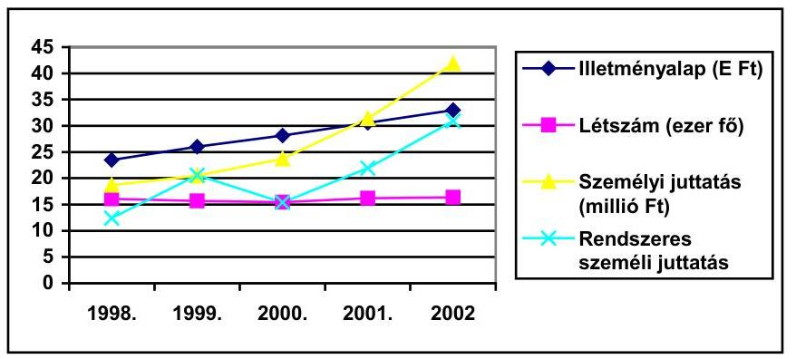

A személyi juttatások kifizetése 1998-ban 18,7 milliárd Ft, 2002-ben 41,8 milliárd Ft volt. Az átlaglétszám gyakorlatilag változatlan, 16 ezer fő körül ingadozott. A havi átlagbér 64 ezer Ft-ról 157 ezer Ft-ra nőtt.

Az intézmények személyi juttatásai a vizsgált években általában a fejezeti átlaghoz igazodó emelkedő tendenciát mutattak, a kiugró emelkedések csak részben függtek össze a végrehajtott létszámnövekedéssel. Az intézményeknél kifizetett jutalmak nagy szóródás mellett, több hónapi juttatásnak feleltek meg.

A személyi juttatások fejezeti szinten 67%-kal nőttek, ehhez képest a GSZ-nél 215%-kal bővültek, 41
 %-os létszámnövekedés mellett; a GH-nál 46 %-kal, a Pest megyei Földhivatalnál 67 %-kal, a Fővárosi Földhivatalnál 51 %-kal, az állategészségügyi szakigazgatási intézményeknél 56 %-kal nőttek a személyi juttatások. Az AÍK-nál a hatszoros növekedés a létszám öt és félszeres bővítése mellett következett be.

A jutalmak esetében az eredeti előirányzatok jelentősen alacsonyabbak voltak a teljesítéseknél. Az eredeti előirányzat fejezeti szinten évente háromszorosára emelkedett, a jutalom mértéke 2 havi átlagbér körül alakult.

A 2001. évi eredeti előirányzat 1,24 milliárd Ft, a teljesítés 3,84 milliárd Ft volt, a jutalom mértéke 2,1 havi bérnek felelt meg.

A jutalom mértéke 2001-ben fejezeti szinten 2,1; a Fővárosi Földhivatalnál 2,1; a GSZ-nél 3,7; a GH-nál 3,9; az OÁl-nál 4,1 havi átlagbérnek felelt meg.

A kiadásokon belül tapasztalt elmaradás oka döntően a fejezeti kezelésű előirányzatok felhasználásának alacsonyabb teljesítése miatt következett be. A teljesítés nem csupán a módosított előirányzatoktól, hanem több évben még az eredeti előirányzattól is elmaradt. A teljesítés 1999-ben 81,3 %-os (59,4 milliárd Ft), 2000-ben 58,8 %-os (67,6 milliárd Ft), 2001-ben 70,2 %-os (97,9 milliárd Ft) volt.

Az eredeti előirányzat 1999-ben 73 milliárd Ft, a módosított 79 milliárd Ft, ezzel szemben a teljesítés 59,4 milliárd Ft.

---

A fejezeti kezelésű előirányzatok maradványa - az elmaradt kiadási tételek és bevételi lemaradások egyenlegeként - a vizsgált időszakban átlagosan 7 %-os volt. A kiemelkedően magas (15 %) 2001. évi maradvány elsősorban az előirányzatok, illetve a hosszú távú kötelezettségvállalások ezzel kapcsolatos növekményéből adódott.

A fejezet intézményeinek előirányzat-maradványát a költségvetési szervek tervezésének, gazdálkodásának, beszámolásának rendszeréről szóló 156/1995. (XII. 26.) Korm.rendelet, illetve az államháztartás működési rendjéről szóló 217/1998. (XII. 30.) Korm.rendelet előírásai szerint állapították meg és használták fel.

Az FVM Továbbképző és Sportlétesítmények cím 2001-ben az Ifjúsági és Sportminisztérium (ISM) fejezethez került, a maradvány elszámolása nem a 217/1998. (XII. 30.) Korm. rendelet 66. § (3) bekezdésének megfelelően az átadónál, hanem az átvevőnél történt.

# A kiadási előirányzatok túllépése és a tervezettnél nagyobb bevételek realizálása egyaránt előfordult egyes fejezeti kezelésű előirányzatoknál, a bevételi előirányzatokat minden évben több intézményi cím túlteljesítette.

Az 1999-ben Mezőgazdasági alaptevékenységek beruházásainak támogatása jogcímen 108,7 millió Ft, 2001-ben a Meliorációs és öntözésfejlesztési beruházások támogatása jogcímen 6,3 millió Ft túllépés jelentkezett.

A módosított bevételi előirányzatokat a 2000. évben az Erdészeti szakigazgatási intézmények 15,4 millió Ft-tal, a Földhivatalok, Földmérési és Távérzékelési Intézet cím 40,2 millió Ft-tal, 2001. évben az Erdészeti szakigazgatási intézmények 42,7 millió Ft-tal, a Mezőgazdasági középfokú szakoktatás és szaktanácsadás intézményei cím 120,7 millió Ft-tal lépték túl.

Az Agrárintervenciós Központ költségvetési tervezése pontatlan volt, mivel az előirányzat módosítások kb. fele - elsősorban a működési célú bevételek alultervezése miatt - a maradvány a módosított előirányzat kb. negyedét érte el. A 2000. évi 547,7 millió Ft-os eredeti előirányzat 945,5 millió Ft-ra nőtt, a maradvány összege 241,1 millió Ft (25,5 %), 2001-ben 678,6 millió Ft-os eredeti előirányzat 1.275,3 millió Ft-ra nőtt, a maradvány 319,5 millió Ft (25,5 %) volt.

A vizsgált időszakban az előirányzat-maradványok felhasználási körét alapvetően meghatározta, hogy átlagosan több mint 94 %-a kötelezettségvállalással terhelt volt. A kötelezettségvállalással nem terhelt előirányzatokat a PM 1999. év kivételével jóváhagyta.

A kötelezettségvállalással terhelt előirányzat-maradványok alátámasztására szolgáló dokumentumok mintavételes ellenőrzése során megvizsgált bizonylatok megfeleltek a 217/1998. (XII. 30.) Kormányrendeletben foglaltaknak. Ugyanakkor a fejezeti kezelésű előirányzatok minden részelőirányzatára kiterjedő analitikus nyilvántartás nem áll rendelkezésre, így a kötelezettségvállalással terhelt előirányzat-maradványok sem egészében, sem tételeiben nem áttekinthetők.

---

A Fejezeti tartalék alcímét - mintegy tranzitként - átcsoportosításokra használták, megsértve ezzel az államháztartásról szóló 1992. évi XXXVIII. törvény, illetve az államháztartás működési rendjéről szóló 217/1998. (XII. 30.) Korm. rendelet előirányzat átcsoportosításra vonatkozó korlátozó rendelkezéseit.

Fejezeti tartalékképzés címén intézményektől előirányzatokat vontak el, annak ellenére, hogy azoknál sem átszervezés, sem feladatcsökkenés, sem saját bevételi megtakarítás nem keletkezett. Az egyes intézményektől elvont források tartalékképzés címén a fejezeti tartalékba kerültek, majd innen más intézmények működési előirányzatait növelték.

A Borsod-Abaúj-Zemplén megyei Földhivataltól 1998-ban nem bázis jelleggel feladatcsökkenés címén 13,2 millió Ft dologi kiadási előirányzatot vontak el, de ez dokumentumokkal nem volt alátámasztott.

Az állategészségügyi szakigazgatási intézményektől 200,0 millió Ft dologi kiadási előirányzatot elvontak, majd ugyanezzel az összeggel a növényegészségügyi szakigazgatási intézmények személyi juttatások, illetve munkaadókat terhelő járulékok előirányzatait megnövelték.

Egyes intézményektől (intézményi címtől) fejezeti tartalékképzés címén működési célú előirányzatokat vontak el, majd az elvont összeggel ugyanazon intézmény felhalmozási célú előirányzatait megnövelték.

A KKI-tól, nem bázis jelleggel, az intézmény feladatainak változása indoklással, 60,0 millió Ft dologi kiadás előirányzatot vontak el, majd ugyanezen intézmény beruházások előirányzatát a fenti összeggel megnövelték.

A fejezeti tartalék kezelésében 2002. évtől javulás volt tapasztalható. Az előirányzat-módosítások dokumentálása áttekinthetőbbé vált, a tartalékokat a jogszabályi előírások szerint, megalapozott indokok alapján képezték.

A vizsgált intézmények gazdálkodása a korábbi időszakhoz képest javult, ugyanakkor továbbra is fennmaradtak különféle szabályozási hiányosságok, amelyek pótlást (pl. reprezentációs keretek) illetve felülvizsgálatot (pl. utaztatás szabályozása) igényelnek. Az utazási irodák által szervezett, 700 ezer Ft nettó értékhatárt meghaladó utaknál a kötelezően előírt árajánlatot nem kértek.

A minisztériumi köztisztviselők költségvetési intézmények kerete terhére történő utazásainak szabályozása nem felelt meg az előírásoknak, ezért az utazási szabályzat, az engedélyezési rend felülvizsgálatra szorul. Az új szabályzat kidolgozását a tárca a helyszíni ellenőrzés befejezését követően elkezdte.

A külföldi vendégek fogadásával kapcsolatos rendezvények és ajándékozások rendjét az SZMSZ szabályozza, az ezzel kapcsolatos feladatokat külső cégek látták el. Az ajándéktárgyak nyilvántartása az előírásoknak megfelelő.

A reprezentációs keretek felhasználása és mértéke nem megfelelően szabályozott, ennek következtében jogosulatlan, valamint utalványozás és érvényesítés nélküli kifizetések történtek. A jelenlegi gyakorlat szerint - a vezetői kere-

---

teken túl - a Gazdasági Hivatal a minisztérium egységeinek, személyes igény alapján, korlátlanul biztosítja a napi vendéglátást (alkohol tartalmú ital kivételével).

A GSZ-nél a kötelezettségvállalás, ellenjegyzés, érvényesítés és utalványozás nem az előírásoknak megfelelően történt.

A reklám és propagandaanyag kiadásai között továbbképzési tanfolyamok, rendezvények számláit is elszámolták (2000. évben 21,7 MFt értékben).

Esetenként, pl. a GSZ és a GH gazdálkodása során takarékossági intézkedéseket vezettek be, és ennek végrehajtását a munkafolyamatba épített ellenőrzés keretében figyelemmel kísérték.

A római FAO képviseletnél 2001-ben a működtetésre biztosított éves költségkeret túllépését nem engedélyezték. Az engedély nélküli beszerzéseket a képviselet vezetőjének illetményéből visszafizettették. Felhívták a figyelmet a pénzügyi források ésszerű és takarékos kezelésére és az ügyrendben foglaltaknak megfelelő gazdálkodásra.

A reprezentációs kiadások a 2000. évet követően ugyancsak csökkenő tendenciát mutatnak (2000. évben 86,5 M Ft, 2001-ben 39,8 M Ft, 2002-ben, a helyszíni ellenőrzés befejezésének időpontjáig 28,3 M Ft).

A GSZ-nél az intézkedések révén a külföldi kiküldetéseknél 97,2 millió Ft, a reprezentációs kiadásoknál 14,1 millió Ft megtakarítás jelentkezett.

A GH az ésszerű takarékosságot szolgáló intézkedéseket vezetett be, de ennek ellenére, pl. a mobiltelefonok használatáról, a megbízási szerződésekkel és a közbeszerzésekkel kapcsolatban hiányosságok tapasztalhatók.

A folyamatba épített ellenőrzés hiányára hívja fel a figyelmet, hogy a mobiltelefonok használata után fizetendő többletösszeget - az illetmény-számfejtés adatai alapján - nyilatkozat hiányában még senkitől nem vontak le.

Az igazgatás címen belül megbízási díjakra 2000-ben 59,0 millió Ft-ot, 2001-ben 44,0 millió Ft-ot fordítottak. A szerződések teljesítését a korábbi években helytelenül létszámjelentésen, az utóbbi években pedig külön feljegyzésen igazolták. A határozott időre szóló megbízási szerződéseket egy konkrét feladatra kötötték, 30-290 ezer Ft havi díjazás ellenében.

A szolgáltatások (pl.: utazások, rendezvények) megrendelésénél a GSZ a közbeszerzési törvényben meghatározott értékhatár fölött nem alkalmazta a közbeszerzési eljárás szabályait.

A fejezeti költségvetés tervezése kapcsán korábban jelzett pontatlanság (amelynek eredményeként az eredeti előirányzatokat később rendre meg kellett emelni a magasabb követelményszint miatt), a minisztérium intézményeinél is tapasztalható volt. A működéshez elégtelen dologi kiadások előirányzatának módosítását nagy összegű felügyeleti szervi és saját hatáskörű előirányzat-módosításokkal tudták csak teljesíteni. A dologi kiadások növekedését a készletbeszerzések, a kommunikációs, valamint az egyéb üzemeltetési kiadások emelkedése okozta.

---

Az OÁl az informatikai rendszerek (OÁIR, ÁSZIR) kiadásaihoz számlamásolat ellenében, az EU támogatásokból a felhasználás ütemében jutott többletforrásokhoz. Dologi kiadásai 1998-2001. évek között több mint kétszeresére növekedtek, a készletbeszerzés 40 %-os bővülésével, az Országos Állategészségügyi Informatikai Rendszer kiadásaival, az egyéb üzemeltetési költségek emelkedésével (műszerek fenntartása, diagnosztikai vizsgálatok díjai) összefüggésben.

Az AIK-nál legjelentősebb kiadás a vizsgált időszakban az intervenciós készletbeszerzés, valamint az ehhez kapcsolódó magas üzemeltetési költség volt.

A fejezeti beszámolók a kiadások, és a bevételek év közbeni változásainak okairól, az előirányzat-módosító intézkedések hatásáról, a többletbevételek keletkezésének okairól, felhasználásáról nem adtak felvilágosítást.

A 2000. évi költségvetési beszámoló mindössze ennyit közölt. "A minisztérium és intézményrendszere 2000. évi feladatait 130.427,0 millió forint kiadás teljesítésével valósította meg. A tényleges kiadás 37.651,2 millió forinttal kevesebb a módosított előirányzatnál és 59.416,4 millió forinttal kevesebb az eredeti előirányzatnál." Nem számolt be többek között olyan fontos gazdálkodási intézkedésekről, mint a kincstári vagyon hasznosítása és elidegenítése, az alapítványok támogatása, az államháztartáson kívülre adott támogatások.

A vizsgált időszak beszámolói a fejezeti előirányzatok egy részéről több esetben hiányosan - csak az elköltött összeg nagyságára vonatkozóan -, vagy egyáltalán nem tartalmaznak információt. A fejezeti előirányzatok teljes körére kiterjedő beszámoló elkészítése a közpénzekkel való elszámolás követelménye miatt nem mellőzhető, és az ehhez szükséges részletesebb információk, dokumentumok az éves beszámolót készítő főosztály rendelkezésére álltak.

Nem számolt be olyan fontos előirányzatok felhasználásáról, mint az élelmiszerkönyv kiadás, a mezőgazdasági birtokrendezés, a gazdajegyzői hálózat működtetése, a B-A-Z megyei integrált szerkezet-átalakítás, a munkavédelmi, polgári védelmi és nukleáris balesetelhárítási feladatok, a nemzetközi feladatok, az agrárkutatás feladatok támogatása, a nemzeti kataszteri program, a regionális fejlesztési tanácsok, a területi információs rendszer működtetése.

Az intézményi beruházásokról és a felújításokról az intézmények szöveges beszámolóikban főként pénzügyi, számviteli adatokból is megismerhető információkat közöltek, de más szempontú értékelést nem, vagy csak igen rövid tájékoztatást adtak.

A fentieken felsoroltakon kívül az 1998. évi, illetve az 1999. évi beszámolók a beruházási célprogramok közül a területfejlesztési feladatokra, illetve a PHARE CBC programra egyáltalán nem, vagy csak az elköltött összeg nagyságára vonatkozó adatot közöltek. Nem adtak magyarázatot egy sor lényeges kérdésre, így többek között arra, hogy:

- mire költötték 1998-ban az Euro-atlanti integráció előkészítésére biztosított 500 millió Ft-ból a fejezeti szinten elvont 349 millió Ft-ot, illetve a megmaradt 123,5 millió Ft-ot;
- az 1998. évi beszámolóban megtalálható, de eredetileg nem tervezett 4 PHARE program miként alakult;

---

- mire fordították 1999-ben az Európai Unióhoz való csatlakozás Nemzeti Programjának előirányzatát, mi volt az oka a maradványnak, mire fordították a fejezeti szinten elvont összeget;
- mi volt az oka a B-A-Z Megyei ISZVP támogatással, illetve segéllyel fedezett kiadásainak az eredetihez képest jelentős, 3.135,2 millió Ft-os elmaradásnak.

A 2000. és 2001. évi beszámoló az agrár- és
 területfejlesztési PHARE programok tekintetében hiányos volt, az előirányzatok nagysága és fontossága ellenére nem indokolták egyes előirányzatok alacsony szintű teljesítését.

A beszámoló csak az alábbiakat tartalmazta: „Az agrár- és területfejlesztési PHARE programok keretében folytatódott az EU követelményeknek megfelelő határállomások-, állategészségügyi intézményrendszer-, növény-egészségügyi és talajvédelmi intézményrendszer fejlesztése, minőségbiztosítási rendszerek fejlesztése, vidék- és agrár-környezetvédelmi intézmények kiépítése."

Hiányzott az agrárgazdasági PHARE programok, a meliorációs, öntözésfejlesztési beruházási kiadások felhasználásának bemutatása. Nem indokolták a területfejlesztési célfeladatok támogatása program 18,7 milliárd Ft előirányzat 40,7%-os teljesülését.

# 1.5. Eszköz- és vagyongazdálkodás 

A vagyonvédelmi feladatok a vizsgált időszakban általában nem teljesültek az intézményeknél maradéktalanul.

A Fővárosi Földhivatalnál az analitikus nyilvántartások nem alapozták meg megfelelően a vagyoni elemek követését. A selejtezéseket nem végezték el teljes körűen, pl.: a PHARE számítástechnikai eszközöknél.

Az AIK vagyonvédelmi tevékenysége több szempontból is kifogásolható. A szabályozottság nem teljes körű. Az intézmény működése során selejtezés még nem volt.

Az OÁl-nál a szükséges selejtezéseket nem hajtották végre, a selejtes eszközök kezelését nem oldották meg. A megszűnő intézmények (Miskolci, Szombathelyi Állategészségügyi Intézet) vagyoni eszközeinek átvétele és hasznosítása nem volt megfelelően megtervezve és ütemezve. Az ingatlanokat és felszerelési tárgyakat nem hasznosították teljes körűen. Az OÁl által 2001. év elején átvett tételes vevőállomány még 2002. végén sem állt rendelkezésre.

Az idegen vagyon védelmével kapcsolatban az AIK-nál vezetett letéti számlákat a KEHI is vizsgálta és öt esetben szabálytalannak minősítette az FVM által elrendelt kifizetéseket. Az ÁSZ a zárszámadási vizsgálatok kapcsán ugyancsak kifogásolta az egyéb pénzeszközök letéti számlán történő elhelyezését, a szabálytalan kifizetéseket, valamint az ARH által átadott összegek nem megfelelő alátámasztottságát. Az ellenőrzésünk időpontjában is rendezetlen volt, pl. a pályázati díjak letétként való kezelésének következménye, különös tekintettel az elévülésre, a pályázónak vissza nem fizetendő összeg kezelésére stb. A főkönyvben kimutatott éves záró egyenlegek igen nagy hányada analitikával nem volt kellően alátámasztott.

---

Az FVM ARH összesen 314,1 millió Ft összegben nem az eredeti jogosult részére kért vagy indított visszautalást. Az ARH az elévültnek vélt letéti összeget szabadította fel egyéb célra, miközben az AIK írásban jelezte a KEHI ezzel kapcsolatos kifogásait.

A záró egyenleg 1999. végén 860 millió Ft, ebből analitikával nem alátámasztott 673,3 millió Ft (78%), ez 2001 végén 993 millió Ft, illetve 387 millió Ft (38%).

A PHARE eszközök átadását, dokumentálását az FVM nem szabályozta, és nem ellenőrizte megfelelően, és az ezzel kapcsolatos intézményi nyilvántartási rendszer kialakítása és vezetése nem felelt meg a szabályoknak.

A leltározás a vizsgált intézmények egy részénél szabálytalanul történt, mind a végrehajtás mind a dokumentálás hiányos volt.

Az OÁl-nál a leltározási tevékenység előkészítése és végrehajtása nem volt megfelelő. A szükséges jegyzőkönyvek nem készültek el. A nagy értékű eszközök nyilvántartása nem felelt meg az előírásoknak.

A Fővárosi Földhivatal leltári dokumentációi nem voltak megfelelően rendezettek. A leltározás többször szabálytalan volt, a felvételek nem voltak teljes körűek.

A fejezet mérleg szerinti tárgyi eszköz és immateriális javak összesített bruttó állománya 1998. és 2002. között 113%-kal nőtt, és 2001. végén 57,2 milliárd Ft volt. Kiemelkedő összeget az ingatlanok és a gépi berendezések képviseltek, értékük meghaladta a 44,2 milliárd Ft-ot (77%).

A tételes vizsgálatba vont intézményeknél a tárgyi eszközök és immateriális javak nettó értéke a beruházások, felújítások következtében négy év alatt 155 százalékkal nőtt. A szakmai rendeltetésű ingatlanállomány 2 intézménynél vásárlás, illetve kezelői jog átvétele révén növekedett.

A Pest megyei Földhivatal érdi kirendeltsége a 145 millió Ft-os ingatlan vásárlással több mint kétszeres területen tudott elhelyezkedni, az FVM GH a 2000. évben az Alkotmány utcai épület, és 2002-ben a szegedi SAPARD Iroda, valamint a Báthory utcai Vidékfejlesztési Iroda kezelői jogát vette át.

Kezelői jog átadása keretében az GH az FVM üdülőket a MeH, a sportlétesítményeket az Ifjúsági és Sportminisztérium (ISM) kezelésébe adta. A térítésmentes átadás-átvételeknél betartották a 249/2000. (XII. 24.) Korm. rendelet vagyonértékelésre vonatkozó előírásait, és eleget tettek a leltárkészítési kötelezettségnek is.

Az intézmények elhelyezési gondjaik megoldását, valamint az átmenetileg felszabadult területeik hasznosítását ingatlan bérlés, illetve bérbeadás útján valósították meg. A bérbevételek indokoltak és pénzügyileg elfogadhatók voltak.

A GH 2001-től lakást, valamint 2 garázst bérelt a miniszter számára, a bérleti díj 6,7 millió Ft volt, a szerződés a 130/1997. (VII. 24.) Korm.rendelet előírásainak megfelelt, a szerződést a GH a miniszter hivatali idejének lejárta után felmondta.

---

Az Országos Területfejlesztési Hivatal (OTH) - főként az uniós csatlakozással, agrártámogatásokkal kapcsolatos feladatok növekvő létszámigénye és különböző szintű rendezvények, munkaértekezletek miatt - Minisztérium épületében történő elhelyezése nem volt lehetséges, így a régi épületeket a GH bérelte a KöM-től.

A Pest megyei Földhivatal, két kirendeltségének összesen 625 m² irodát bérelt 2.893 Ft/m²/év bruttó áron. A kedvező díj oka, hogy a bérbeadó önkormányzatok az 1990-es évek eleje óta a díjat nem emelték, ezzel támogatva a földhivatalok működését.

A Fővárosi és Pest megyei FM Hivatal a falugazdászok számára és saját célra bérelt 549 m² irodát. A bérleti díj négy év alatt háromszorosára, 24,7 ezer Ft-ra növekedett. A négy év átlagos bérleti díja 20,7 ezer Ft/m²/év.

Az ingatlanok kihasználtságát a felügyeleti ellenőrzés keretében folyamatosan vizsgálták, a létszámhoz és a feladatok ellátásához az épületek alapterületét megfelelőnek találták.

Az ingatlan bérbeadásoknál előfordult, hogy indokolatlanul alacsony díjat határoztak meg, ezeknél a bérlők a legkedvezőbb kategória felét fizették. Mindez indokolja a bérbeadások felülvizsgálatát.

A GH a bérleti díjakat 3 kategóriában állapította meg, a legalsó kategóriát az FM alapítású szervezetek fizették, ez a legmagasabb kategóriának mintegy fele, a piaci árnak mintegy 40%-a volt. A bérleti díjat inflációt követő módon határozták meg. A bérleti díjat 1998-1999-ben évi 20%-kal, 2001-2002-ben évi 10%-kal emelték. A legalsó kategória éves díja 22,5 ezer Ft/m², de pl. könyves bolt, ügyvédi iroda, virágárus pavilon ennek felét fizette.

Bérleti díjhátralék 1998. és 2002. közötti időszakban nem keletkezett, de az ezt megelőző időszakról 25,6 millió Ft hátralék állt fenn. Az ellenőrzés időszakában 8,5 millió Ft behajtása folyamatban volt, de a követelések többsége, 17,2 millió Ft behajthatatlannak minősül.

Immateriális javakat és informatikai eszközöket két intézmény vett bérbe, a futamidő alatti bérleti díj a gépek bekerülési értékének 3,5-4 szerese. A gépek 2 szerver kivételével nem speciális jellegűek, ezért az előnytelen konstrukció további fenntartása indokolatlan.

A Fővárosi Földhivatal és a Pest megyei Földhivatal a Nemzeti Kataszteri Program Kht.-től számítógépeket és szoftvereket bérelt. A 2000-2004 közötti időszakra kötött szerződés a Pest megyei Földhivatalnak nettó 108,5 millió Ft, a Fővárosi Földhivatalnak 2,8 millió Ft kiadást jelentett.

A felesleges vagyontárgyak értékesítése, hasznosítása megfelelően előkészített volt, a selejtezési jegyzőkönyvekhez a hasznosítás és értékesítés bizonylatait csatolták. Az értékesítésben legnagyobb részarányt a GH képviselte, az értékesített eszközök döntő hányadát a gépjárművek adták.

A vizsgált intézmények közül három hajtott végre értékesítést, ez a vizsgált időszakban bruttó 83,3 millió Ft volt. A bevétel 29,8 millió Ft, a megtérülés így 36%-os volt. A GH értékesítése 19 millió Ft volt. A bruttóérték 9%-át a számítás-

---

technikai eszközök, 59%-át a gépjárművek tették ki (19 millió Ft) ezek átlagéletkora meghaladta az 5 évet, átlagos futásteljesítményük 196 ezer km.

A központi beruházási, intézményi beruházási, felújítási kiadások teljesítései négy év alatt a vizsgált intézményeknél a fejezet összes teljesítéseihez viszonyítva a központi beruházásoknál 23 százalékot (1.459,2 millió Ft), az intézményi beruházásoknál (1.644,7 millió Ft) és felújításoknál (485,337 millió Ft) 8-8 százalékot tettek ki. Mind a beruházások, mind a felújítások tekintetében az eredeti előirányzat alacsony szintje és az ezt többszörösen meghaladó teljesítések voltak a jellemzők. A plussz forrásokat a hatásköri előírások betartásával végrehajtott átcsoportosítások révén biztosították.

Az előirányzat átcsoportosítások összege az intézményi beruházásoknál 1998-ban 26 millió Ft volt, 2001-ben döntően a GH felhasználása miatt 370 millió Ft-ra növekedett. Ugyanakkor a teljesítések a 2000. és 2001. években az intézmények részére későn (november végén) biztosított előirányzat módosítás miatt maradtak alacsony szinten.

A beruházási előirányzatok felhasználásánál az informatikai beszerzések jelentős részt képviseltek, a központi beruházás 38 százalékát, az intézményi beruházások 60 százalékát erre fordították. A gépjármű beszerzések 10-15%-ot tettek ki, az előirányzatok mintegy harmadát fordították építési, rekonstrukciós munkákra.

A minisztériumi beruházások, felújítások bonyolítása, előkészítése szabályszerűen történt. A beruházási ismertetők, programismertetők, beruházási finanszírozási alapokmányok, programfinanszírozási engedélyokiratok és rész-program-okmányok a 217/1998 (XII. 30.) Korm. rendelet VII. fejezetében előírt tartalommal készültek el. A finanszírozás megfelelt az Áht. VIII. fejezetében előírt utalványozási, kötelezettségvállalási, ellenjegyzési szabályoknak.

A közbeszerzési eljárások vizsgálata során megállapítottuk, hogy a vizsgált intézményeknél összesen 19 közbeszerzési eljárást folytattak le a beszerzett áruk, szolgáltatások, építési beruházások összes értéke elérte a 829 millió Ft-ot. Közbeszerzés keretében hat építési beruházás, négy árubeszerzés és kilenc szolgáltatás beszerzése történt meg. A közbeszerzési eljárás lefolytatásához külső szervezetet csak a bonyolultabb építési beruházások illetve a speciális számítástechnikai szolgáltatások beszerzésénél vontak be. A megbízási díjak mértéke a közbeszerzési eljárás értékének 0,35-1,6 százaléka volt. A Kbt által előírt közbeszerzési eljárásokra vonatkozó éves összegzéseket az intézmények nem készítették el.

A Fővárosi Földhivatal az építési beruházásnál közbeszerzési eljárás helyett a szabadkézi vétel szabályait alkalmazta.

A központosított közbeszerzések a 125/1996. (VII.24.) Korm. rendelet szerint történtek. Kijelölt körön kívüli szállítótól történő beszerzéshez a központi beszerző engedélye társult minden esetben, kivéve a Fővárosi Földhivatalnál 1999-ben beszerzett monitorokat (a kiemelt termékkörön belül 70 százalék) és másológépeket (100 százalék). Az engedély kérelmekben az eltérést megindokolták.

---

A beruházás és eszközgazdálkodás szabályozott volt, a központi beruházásokra, a programfinanszírozásra vonatkozó eljárási rendet évente kiadták, de az államháztartásról szóló 1992. évi XXXVIII. törvény (Áht.) 49. § o. pontjában meghatározott február 15-i határidőt túllépték.

A Beszerzési Szabályzat 2001. február 13-án jelent meg miniszteri utasításban, rendelkezései összhangban voltak a közbeszerzéshez kapcsolódó jogszabályokban foglaltakkal. A szabályzat hatálya kiterjedt az FVM hivatali szervezeti egységeire és a miniszter irányítása alá tartozó önállóan, vagy részben önállóan gazdálkodó költségvetési intézményekre, ennek ellenére a vizsgált intézményeknél ez - a GH kivételével - nem szerepelt az aktuális szabálygyűjteményekben.

Az FVM Költségvetési Iroda saját, hasonló tárgyú szabályzatot készített és használt 2002. november 15-től. Az FVM Ellenőrzési Főosztálya 2002. évi ellenőrzési jelentése külön szabályzat készítését tartotta szükségesnek az FVM GH esetében, többek között beruházásokra, felújításokra valamint közbeszerzésekre.

A közbeszerzési eljárásokról teljes körű nyilvántartás nincs, az 1999 és 2002 között készített ilyen tárgyú kimutatás hiányos, mivel ebben a vizsgált intézmények közbeszerzései sem szerepelnek. A Kbt. 61. § (9) bekezdésében előírt, a közbeszerzési eljárásokra vonatkozó összegzések nem minden esetben készültek el.

Nem készített összegzést, pl. a GH az 1998-1999. évekre, a
 Fővárosi Földhivatal 1998–2001 között, a Pest Megyei Földhivatal 1999–2000 között, és a Fővárosi valamint a Pest Megyei Földművelésügyi Hivatal 1999–2001. évekre.

Az eszközgazdálkodást érintő, a számviteli törvény által nevesített (leltározási-, selejtezési-, felesleges vagyontárgy-hasznosítási-, értékelési-) szabályzatokkal a tárgyidőszakban rendelkeztek az intézmények.

A beruházások, felújítások számviteli nyilvántartása, beleértve a befejezetlen beruházások nyilvántartását is, megfelelt az előírásoknak.

A Fővárosi Földhivatalnál a tárgyi eszközök analitikus nyilvántartása számítógépes programmal történt, azonban nem voltak minden eszköz esetében az eszközkartonok kinyomtatva. Ez az állapot nem felel meg a számvitelről szóló 2000. évi C. törvény 167. § (6) bekezdésében rögzítetteknek.

A dolgozói lakásépítés munkáltatói támogatást kamatmentes kölcsön formájában, a munkavállaló tulajdonába kerülő, méltányolható mértékű lakás építéséhez, illetve lakótelek vásárlásához, vagy a meglevő lakás cseréjéhez, bővítéséhez, korszerűsítéséhez, felújításához, közművesítéséhez vehették igénybe. A vizsgált intézményeknél a munkáltatói támogatás bonyolítását, nyilvántartását a gazdasági szervezet végezte. A teljes folyamat megfelelően, részleteiben szabályozott.

A munkáltatói támogatás minden intézmény esetében elkülönített OTP pénzforgalmi számlán keresztül valósult meg. A nyilvántartások tartalmazták a nyújtott kölcsönt, a befolyt törlesztéseket, az esetleges hátralékot. A pénzintézeti számlaértesítő adatait rendszeresen egyeztették az analitikus nyilvántartással.

---

A személyi jövedelemadóról szóló 1995. évi CXVII. törvény 1. számú mellékletének 2.1 pontjában foglaltaknak megfelelően, ha a lakáskorszerűsítés nem járt komfortfokozat-növeléssel, akkor az esedékes jövedelemadót a munkáltatói támogatást bonyolító szervezetek az előírások szerint megállapították és nyilvántartották.

A lakástámogatási rendszer jelenlegi formájában a fejezet különböző intézményeinél nem biztosítja a munkavállalók esélyegyenlőségét, a minisztériumi dolgozók nagyságrendekkel nagyobb támogatást kaptak, mint a „kisebb" intézmények dolgozói. Az eltérés oka, hogy az e célra rendelkezésre álló forrásokkal kapcsolatos támogatási keret a korábbi törlesztésekből befolyt összegből ered.

A lakásépítési támogatás maximált összege a minisztériumi dolgozók esetében 3,5 millió Ft, ha 35 évesnél fiatalabb, egyéb esetben 2,5 millió Ft, a Fővárosi Földhivatalnál 150 ezer Ft.

Az odaítélt támogatás egy főre eső átlagos mértéke a FVM Igazgatásnál 715 ezer Ft, a Fővárosi és Pest megyei Földművelésügyi Hivatalnál 325 ezer Ft, a Fővárosi Földhivatalnál 150 ezer Ft, a Pest megyei Földhivatalnál 102 ezer Ft volt.

A gazdasági társaságokban való részvétel fő célkitűzéseként szerepelt a százszázalékos állami tulajdonú társaságok Alapító Okiratában meghatározott állami feladatok ellátása érdekében a társaságok vagyonának megőrzése, gazdasági-pénzügyi helyzetük stabilizálása és erősítése, szolgáltatásaik színvonalának növelése.

Az ellenőrzött időszak első két évében e célkitűzések egyszemélyi (politikai államtitkár) felügyeleti és tulajdonosi jogkör kialakulása miatt nem valósulhattak meg. A felelős kezelés rendje 2001-től állt helyre, a tulajdonosi jogok gyakorlása közigazgatási államtitkári, illetve helyettes államtitkári szintre került, a feladatot a Vagyongazdálkodási Önálló Osztály végezte.

Az FVM tulajdonosi érdekeltségébe 1998-ban 29 társaság, ezen belül 13 Kht, 8 Kft és 8 Rt tartozott, összesen 35,1 milliárd forintnyi jegyzett tőkével, százszázalékos tulajdoni hányad 12 Kht-ben, 4 Kft-ben és 4 Rt-ben volt. A vizsgált időszakban a társaságok száma más tárcáktól történt átvétel és egy alapítás révén nőtt, de összetétele, illetve a tulajdoni hányad aránya lényegesen nem változott. Az alapítás az Áht. 94. § (4) bekezdésében előírtaknak megfelelően, a pénzügyminiszter egyetértése mellett történt.

A Gazdasági Minisztériumtól egy, a Környezetvédelmi Minisztériumtól 5, a Kincstári Vagyonigazgatóságtól 3 cég került át. Az FVM 1999-ben megalapította az Agrárinnovációs Kht-t.

A tulajdonrész 2000-ben érte el a legmagasabb értéket, 36,1 milliárd forintot. A százszázalékos FVM tulajdonosi körbe tartozó 23 társaság alapításkori jegyzett tőkéje 23,3 milliárd Ft-ról 2001 év végére 34,5 milliárd Ft-ra növekedett, a saját vagyon értéke 47,2 milliárd Ft-ot tett ki.

A társaságok összesített adózott eredménye rendre veszteséges volt, ennek legnagyobb részét a Tartalékgazdálkodási Kht. készleteinek értékvesztése okozta.

---

Az eredmény 1998-ban -2.035,7 millió Ft, 1999-ben 429 millió Ft, 2000-ben 1.016,4 millió Ft és 2001-ben -4.307 millió Ft volt.

A Gazdaságbiztonsági Tartalék 2001. évi 3,6 milliárd forintnyi értékcsökkenését, a Gazdaságbiztonsági Tartalékolási Tárcaközi Bizottság (GTTB) döntése alapján, külső források igénybevétele nélküli, 2,6 milliárd forintnyi védelmi készletnövelés és a tárolt gabonakészletek piaci árának csökkenése okozta.

A Magyar Tejgazdaság Kísérleti Intézet Kft. törzstőkéjét 1999-ben 200 millió Ft-tal csökkentették. Az előterjesztés szerint a tőkekivonás révén felszabaduló forrás a gyengén működő társaságok konszolidációját segítette elő. Az előterjesztő megítélése szerint a tőke kivonása nem befolyásolta az intézet működését.

A fejezet irányító tevékenysége a tulajdonosi jogok gyakorlása területén hiányos volt, mivel az intézmények felé az érdekeltségszerzés feltételeiről, a tulajdonosi joggyakorlás és érdekérvényesítés módjáról, a tisztségviselők jelöléséről és az ellenőrzés rendjéről útmutatás, vagy szabályozás nem készült. Ez ellentétes a 217/1998. (XII. 30.) Korm. rendelet 2002-től hatályos 10. § (4) bekezdésben előírtakkal.

Az FVM igazgatásánál miniszteri utasítások sorolták fel a Vagyongazdálkodási Önálló Osztály ilyen irányú feladatait. A rendelet szerint intézményi SZMSZ-ben kell részletezni a közhasznú, vagy gazdasági társaságokban való részvétel felsorolását.

A vállalkozási eredmény elszámolásánál a szúrópróbaszerűen kiválasztott Nemzeti Kataszteri Program Kht. és a Gabonatermesztési Kutató Kht. 1998–2001 között eleget tett beszámolási kötelezettségének, beszámolóikat a számvitelről szóló, többször módosított 1991. évi XVIII. tv. előírásai szerint állították össze, ezeket okleveles könyvvizsgáló záradékkal igazolta.

A tárgyévi beszámolókat, az ügyvezető igazgatók jelentéseit és az üzleti terveket a Felügyelő Bizottságok ellenőrizték, a tulajdonos minden esetben Alapítói Határozattal fogadta el az előterjesztést.

A tulajdonlás kapcsán nem a profitnövelési szándék volt a meghatározó. A Kht-k nonprofit szervezetek, egyéb társaságoknál a minisztérium által kialakított osztalékpolitika és a támogatási igények miatt a tulajdonos osztalékot nem vont el, a korábban eladósodott állami vállalatok átalakulásakor meglévő forráshiány, vagyis a hitel- és kamattörlesztések, mint a szükséges beruházások forrásait visszaforgatta a társaságokba.

Nyereséges Kht-któl nyereség elvonásra a közhasznú szervezetekről szóló, 1997. évi CLVI. tv. 14. § (1) bekezdésének értelmében nem volt lehetőség.

A százszázalékos állami tulajdonú ATEV Fehérjefeldolgozó Rt. a szolgáltatási díjemeléssel elért bevételtöbbletét a likviditási gondok elkerülésére és az elmaradt karbantartások pótlására fordította. Felújítás és beruházás fedezetére az adózott eredményt – beruházási célra – tartalékba helyezte.

A Cartographia Kft. alacsony tőke-ellátottság miatt rövidlejáratú hitelek felvételére kényszerült, ezen kívül szükség volt a társaság elavult gép- és

---

műszerparkjának felújítására és cseréjére. A tulajdonos az eredményt fejlesztésekre és likviditási gondok megoldására átengedte.

A társaságokba fektetett vagyon haszna közvetetten, a versenyszférában csak kevésbé életképesen működtethető, de a mezőgazdaság és az élelmiszeripar szempontjából szükséges tevékenység ellátásában jelentkezett.

Olyan kiemelt, ágazati stratégiai feladatokat láttak el, mint a közraktározás, a biológiai alapok megőrzése, nemesítés, a kutatás és fejlesztés, a veszélyes állati hulladékok feldolgozása, a tartalékgazdálkodás.

Az FVM tulajdonosi felügyelete alá tartozó, százszázalékos állami tulajdonú társaságok minisztériumtól kapott támogatása az 1998. évi 1719,1 millió Ft-ról 2001-re 5618,9 millió Ft-ra nőtt. A támogatott célok részben agrárkutatási és agráriummal kapcsolatos szolgáltatási feladathoz kapcsolódtak, másrészt közhasznú feladatokat, illetve beruházásokat szolgáltak. A támogatások alapjai több évre szóló keretmegállapodások voltak, melyeket évente konkretizáltak.

A felhasználásról a minisztérium a cégek beszámolója, illetve ellenőrzések révén értesült. Hatékonysági felmérések nem készültek, inkább a feladatellátási képesség biztosítása volt az elsődleges, kivéve az Agrármarketing Centrum Kht-t, melynél az Ellenőrzési Főosztály 2001-ben és 2002-ben végzett ilyen jellegű ellenőrzést.

Az ellenőrzött időszak alatt mindegyik társaság gazdálkodásához állami támogatásokra volt szükség, ezért ki kell alakítani a társaságok jogszerű támogatásának és működtetésének feltételeit. Az ellenőrzött támogatások közül a Nemzeti Kataszteri Program Kht.-nek és a Tartalékgazdálkodási Kht.-nek nyújtott támogatások szabálytalannak minősültek, mert a közhasznúsági nyilvántartásban nem voltak benne, az 1997. évi CLVI. tv. 27. §-ának megfelelően. Így a (3) bekezdés előírásainak megfelelően a támogatások folyósítását be kellett volna szüntetni.

A Nemzeti Kataszteri Program Kht.-nek a feladatteljesítésekre felvett hitelek kamattörlesztésére folyósított támogatások összege: 1999-ben 218,5 millió Ft, 2000-ben 540,1 millió Ft és 2001-ben 442 millió Ft volt. A Tartalékgazdálkodási Kht.-nek nyújtott támogatások 1999-ben 50 millió Ft-t, 2000-ben 100 millió Ft-ot tettek ki.

A tulajdonosi érdekérvényesítés széleskörű ellenőrzési és beszámoltatási rendszeren keresztül valósult meg. A szakmai felügyeletet a Vagyongazdálkodási Önálló Osztály gyakorolta, a 217/1998. (XII. 30.) Korm. rendelet 2002-ben hatályos 149. § (6) bekezdésének megfelelően. A társaságok tevékenységének értékelését elkészítették, de a határidőt nem tartották be. Az Ellenőrzési Főosztály téma- és célellenőrzéseket csak 2001-től folytatott. A ellenőrzéseket követően készített intézkedési tervek végrehajtásáról a Vagyongazdálkodási Önálló Osztály számolt be.

A százszázalékban FVM tulajdonú társaságok ellenőrzése a belső ellenőr, a felkért könyvvizsgáló és a Felügyelő Bizottság révén volt biztosított. A kevesebb, mint százszázalék tulajdonú cégek ellenőrzését a könyvvizsgálók és a felügyelő bizottságokba delegált tagok végezték. A költségvetési szerveknek legkésőbb

---

június 30-ig kell értékelnie, hogy a tulajdonosi érdekeltségi körbe tartozó társaságok működése hogyan befolyásolta a szakfeladat-támogatási szükségletét, a részükre nyújtott támogatás hogyan hatott e szervezetek által végzett tevékenység ellátásának színvonalára, gazdaságosságára, a jövedelmezőségre és a vagyon változására.

Az FVM tulajdonosi joggyakorlása alá tartozó állami tulajdonú társaságoknál 2001-ben KEHI vizsgálat, illetve a tárca feljelentése alapján a legfőbb ügyész által elrendelt nyomozás indult, elsősorban a közelmúlt időszakra vonatkozó, FTC-vel kötött reklámszerződésekkel kapcsolatosan. A hatósági vizsgálatok folyamatáról, illetve lezárásáról a helyszíni ellenőrzés befejezéséig információ még nem állt rendelkezésre.

A veszteséges társasággal szembeni intézkedésre a legnagyobb veszteségeket elszenvedő Tartalékgazdálkodási Kht. esetében került sor. A 2001. év végére a társaság forrásai már nem nyújtottak fedezetet a veszteségek és a működés finanszírozására, a kötelező készletleértékelések miatt bekövetkező veszteség már a működést veszélyeztette. A veszteségek megszüntetésére, illetve mérséklésére kidolgozott javaslatot az érintett tárcák nem fogadták el, így a gazdaságbiztonsági tartalékok beszerzésének és készletezésének finanszírozása nem megoldott.

Egy kormányhatározat-tervezet szerint a Gazdaságbiztonsági Tartalékot és annak kezelési jogát tervezték átadni az érintett tárcáknak (GM, BM, HM), majd a Kht.-t végelszámolással megszüntette volna a miniszter. A végrehajtásra azonban nem került sor, mert az érintett tárcák jelzései alapján, a rendezés feltételei, így a kicserélendő készletek kivásárlásához szükséges forrás (és szándék) hiányzott, illetve a jogszabályi háttér hiányos volt.

A Gazdaságbiztonsági Tartalékot veszélyezteti a jelenlegi helyzet, mert a Kht. nem kaphat támogatást, a piaci alapokon folyó készletértékesítésekből befolyt bevételek pedig nem fedezik a GTTB által előírt új készletek beszerzését.

# 1.6. Az egyszerűsített programfinanszírozási körbe tartozó kiadások

Az előirányzatok az 1998. évben 5 témakört érintettek, mivel az erről szóló 208/1996. (XII. 23.) Korm. rendeletet hatályon kívül helyező, az államháztartás működési rendjéről szóló 217/1998 (XII. 30.) Korm. rendelet a finanszírozási formát 1999. évtől megszüntette.

A finanszírozáshoz szükséges okmányok, dokumentumok (Programismertető, Részprogram-engedélyezési okirata, valamint finanszírozási szerződés) a 208/1996. (XII. 23.) Korm. rendelet tartalmi előírásaival összhangban voltak, de a Kincstár és az FM közötti finanszírozási szerződést csak a Magyar Állatorvosi Kamara által ellátott állami feladatok támogatása esetében tudták bemutatni. Az Együttműködési Megállapodások rögzítették a kedvezményezettek által vállalt részletes feladatokat, valamint a pénzeszközök átutalásának feltételeit.

A Magyar Agrárkamarával 1998-ban kötött megállapodás értelmében a területi agrárkamarák a gazdajegyzői hálózat feladatainak – különböző agrárrende-

---
 foglalt - ellátása fejében 1998-ban összesen 800 millió forint költségvetési támogatást kaptak. A szakmai koordinátor a Földművelésügyi Hivatalok Főosztálya volt, a kifizetést, illetve utalványozást a Költségvetési Intézmények Főosztálya végezte.

Az erdei vasutak működtetéséhez pályázati úton nyújtott, összesen 65 millió forint támogatás, a menetrend szerint közlekedő erdei vasutak turisztikai és közcélú személyszállítási működésében keletkezett veszteségek kompenzálására biztosított forrást. Összegét az előző évi felhasználás, az éves igény, a vasút műszaki jellemzői és az utasforgalom mértékét mutató jegyár-bevétel határozta meg.

A jóléti és parkerdők fenntartására adott 85 millió forint célja többek között az üdülőerdők és arborétumok üzemeltetési, őrzési, valamint turisztikai célt szolgáló utak, erdei autós pihenők üzemeltetési és műszaki költségeinek támogatása volt. A pályázatokat az FM Erdészeti Hivatala kezelte, a támogatási keretet gazdálkodónként állapította meg. A kifizetéseket a Költségvetési Főosztály kezelte.

A Magyar Állatorvosi Kamarának juttatott 20 millió forint a róla szóló, valamint a magán-állatorvosi tevékenység gyakorlásáról szóló 1995. évi XCIV. tv. által meghatározott egyes feladatok folyamatos ellátását támogatta.

A Hegyközségek Nemzeti Tanácsa és a hegyközségi szervezeteknek juttatott 270 millió Ft támogatás fejében a hegybírói, valamint a hegyközségi tanácsok titkári hálózatán keresztül közigazgatási, hatósági feladatok ellátását vállalták.

Megállapítható, hogy a felhasználást igazoló tételes elszámolás valódiságának, az egyes tételek tartalmának ellenőrzése az illetékes szakfőosztályok részéről nem a kockázat mértékének megfelelő gyakorisággal történt meg.

A támogatások felhasználásának, a felhasználás jogszerűségének ellenőrzéséről, a kezelési, dokumentálási feltételekről, az ellenőrzés jogosultjáról, az esetleges visszafizetési kötelezettségről a Megállapodások rendelkeztek. Ellenőrzési felhatalmazással az FM rendelkezett. Az elszámolások és a teljesítések ellenőrzése gyakorlatilag megfelelt a megállapodásokban foglaltaknak.

A feladatokat ellátó gazdajegyzők számáról az Agrárkamara havonta számolt be, a szakmai feladatok ellátását negyedévente értékelték, a költségtérítést a jelentések alapján utalták. A támogatást a gazdajegyzői hálózat működési költségeinek (bér, azok közterhei, gépkocsi-használat költségei, bérleti díjaik) finanszírozására fordították. Az Agrárkamara a területi kamarákat elszámoltatta a gazdajegyzők elhelyezésére és a szolgálat infrastrukturális kiadásaira fordított költségek felhasználásáról. Az Ellenőrzési Főosztály által 1999. évben öt megyei agrárkamaránál végzett célellenőrzés tapasztalatai alapján, a támogatást célirányosan használták fel.

A Magyar Állatorvosi Kamara negyedévenként elszámolási lapon tételesen elszámolt a Költségvetési Főosztálynak, ugyanakkor az illetékes Állategészségügyi és Élelmiszerellenőrzési Főosztály a szakmai teljesítést nem ellenőrizte.

Az erdei vasutak támogatásának felhasználásáról az erdőgazdálkodó társaságok az FM Erdészeti Hivatalát tájékoztatták. Beszámoltak a kezelésükben lévő állami erdei vasútvonal-hálózatból a közforgalom előtt megnyitott és menet-

---

rendszerű személyszállításra használt pályahosszról, és igazolták, hogy a vonatok közlekedése a MÁV menetrendkönyvében levő adatoknak megfelelő.

A jóléti és parkerdők támogatásának felhasználásáról erdőgazdálkodók pénzügyi elszámolást készítettek, a munkák szerződésszerű elvégzését, illetve a pénzeszközök szabályos felhasználását az Állami Erdészeti Szolgálat területi igazgatóságai igazolták. Az elszámolásokat az Erdészeti Hivatal, az összesítő kimutatásokat a Költségvetési Főosztály kapta meg.

# 1.7. A felügyeleti és ágazati ellenőrzés működése 

A felügyeleti költségvetési ellenőrzési tevékenységet ellátó ellenőrzési szervezet minisztériumi hierarchiában elfoglalt helye, felügyelete, és ezzel a felügyeleti költségvetési ellenőrzés függetlensége 1999-től biztosított.

A felügyeleti ellenőrzések feladatait 1999. II. negyedévét megelőzően a helyettes államtitkár irányítása alá tartozó Költségvetési Főosztály Revizori Osztálya látta el. Ezt követően az Ellenőrzési Főosztály egyik osztályaként a közigazgatási államtitkár felügyelete és irányítása alá került, ezzel az erre vonatkozó kormányrendelet előírásai, valamint az 1998-ban tett ÁSZ javaslatok teljesültek.

A felügyeleti ellenőrzés megfelelt a központi, a társadalombiztosítási és a köztestületi költségvetési szervek kormányzati, felügyeleti, valamint a belső ellenőrzésekről szóló 15/1999. (II. 5) Korm. rendeletben foglaltaknak, ennek szabályozását az SZMSZ, az ügyrend és a munkaköri leírások és ezeken túlmenően az Ellenőrzési Szabályzat is rögzítette. Az ellenőrzési feladatokat féléves munkatervek rögzítették. Az ellenőrzések végrehajtása megegyezett a részletes programban feltüntetett szempontokkal, de a jelentések részletessége, szerkezete, a témakörök sorrendje esetenként nem egyezett a programban foglaltakkal.

Az Ellenőrzési Főosztály költségvetési intézményeknél legalább kétévenként átfogó jellegű felügyeleti költségvetési ellenőrzést végzett. Téma- és célvizsgálatokat a miniszter, a politikai államtitkár, a közigazgatási államtitkár megbízása, illetve a pénzügyi helyettes államtitkár kezdeményezése alapján folytathatott. Rendszeres feladatot a lakossági bejelentések, javaslatok és panaszok intézése, elbírálása jelentett, ezek aktualitásuk szerint kerültek az ellenőrzési feladatok közé.

Az ellenőrzötteknek a megállapítások és javaslatok alapján az Ellenőrzési Főosztály felé benyújtandó intézkedési tervkészítési kötelezettségük volt. Az ellenőrzési megállapítások hasznosítása érdekében a teljes vizsgálati folyamatról és annak eredményéről az Ellenőrzési Főosztály realizáló levélben értesítette az illetékes szakmai főosztályokat. Az intézkedések végrehajtását a Főosztály utóvizsgálat, vagy a következő átfogó vizsgálat keretében ellenőrizte.

---

Az ellenőrzési szakterület teljesítménye az ellenőrzések száma alapján csökkent, de az 1999-től kötelező átfogó ellenőrzések megváltozott jellegének, a szakmai feladatok vizsgálatának kötelezővé tételével, azok többletmunka- és időigényének következtében a tényleges teljesítmény nőtt. A megnövekedett ellenőrzési feladatok eredményes ellátásához a rendelkezésre álló kapacitások bővítése szükséges.
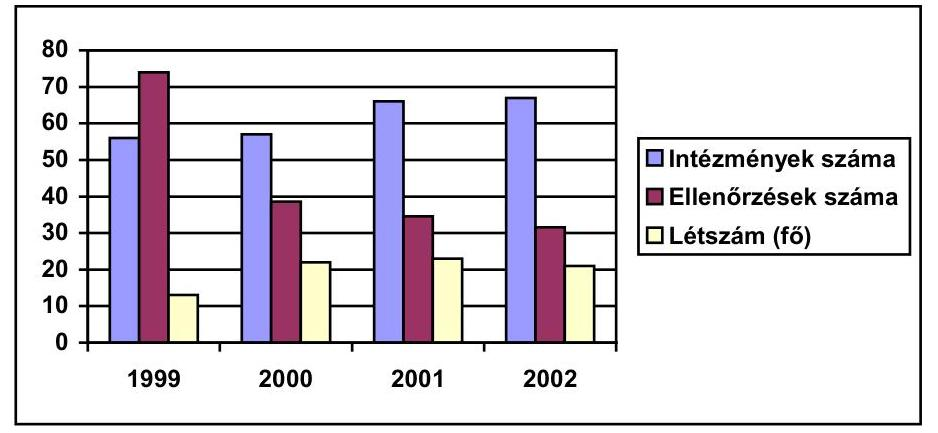

Az 1999. és 2000. évi a vizsgálatok számában és az ellenőri létszámban levő eltérés oka a vizsgálatok jellegének változása.
Az Ellenőrzési Főosztálynak többletfeladatot jelentett, hogy 2000-ben a Fejezeti Monitoring Bizottság (FMB) titkársági feladataival bővült az alaptevékenységen kívüli feladatköre.
A létszámproblémák ellenére 2001-ben a 25 státuszhelyből csak 22-t töltöttek be. A főállású állományi létszám 2002-ben 23-ról 21-re csökkent, ennek ellensúlyozására a külső szakértők számát 4-ről 6 főre növelték. A megfelelő személyi háttér hiánya a jól ütemezett és teljes körű feladatellátást megnehezítheti.

A költségvetési szerveknél működtetett függetlenített belső ellenőrzés rendszerét és gyakorlatát a felügyeleti jellegű költségvetési ellenőrzések minden esetben kiemelten vizsgálták, és - a vizsgált intézmény egészére jellemző gazdálkodás értékelése mellett - ennek függvényében alakították ki az intézmények kategóriába sorolását. A vizsgálatok által feltárt hiányosságok megszüntetése érdekében tett intézkedéseket a következő (két év) felügyeleti vizsgálata ellenőrizte. Az intézmények a szükséges feladatokat elvégezték.

Észrevételezték a belső ellenőrök intézményi létszámhoz és feladatokhoz viszonyított alacsony számát, alkalmazásuk elmulasztását, a belső ellenőrzés hatékonyságának elégtelen voltát, a szabályzatok aktualizálásának elmaradását.
A vizsgálatba vont két intézmény tevékenységének belső ellenőrzési struktúrája, a munkafolyamatba épített, a vezetői és a belső ellenőr éves - a vezető által jóváhagyott - munkaterv alapján végzett tevékenysége megfelelő volt. Ugyanakkor a belső ellenőrzés tevékenysége. pl. a GH esetében az ellenőrzés hatékonyságát nem biztosította.

Az AKII aktualizált Ellenőrzési Szabályzattal nem rendelkezett, függetlenített belső ellenőrt 1999-ben nem alkalmazott. A belső ellenőr a vizsgálatokhoz ellenőrzési programot, azt követően jelentést készített. A hiányosságok megszün-

---

tetésére készült intézkedési tervek végrehajtását utóellenőrzés keretében vizsgálták.

A minisztériumi Gazdasági Hivatal belső ellenőrzési szabályzattal rendelkezett, a vezetői ellenőrzés a szükség szerinti - esetenként napi - beszámoltatás keretében valósult meg, erről azonban írásos anyagok csak ritkán készültek. Az ellenőrzési feladatokat két főfoglalkozású dolgozó látta el.

A GH szabályzatát a rendeletileg előírt határidőhöz képest késve 2001. januárjában aktualizálta. Az utóellenőrzések alacsony száma nem biztosította a belső ellenőrzés hatékonyságát. A lefolytatott vizsgálatok csak részben fedték le a munkatervben foglaltakat, jellemzően a felső vezetői utasításra aktuálisan elrendelt célvizsgálatok domináltak. Az ellenőrzések hatékonyságát csökkentette, hogy a hiányosságok megszüntetésére irányuló intézkedések végrehajtását 1998. és 2000. évek között csak három esetben, ezt követően pedig nem ellenőrizték.

Hatékonysági vizsgálatokat - elsősorban létszámbeli hiányok miatt - az Ellenőrzési Főosztály nem folytatott, ugyanakkor az ellenőrzések során fontos szempontként vette figyelembe az eredeti cél megvalósulását, illetve annak mértékét. Ilyen volt, pl. a már ismertetett Vízügyi feladatok támogatása előirányzatból felhasznált pénzeszközök hasznosulásának és hatékonyságának ellenőrzése, ugyanakkor az agrártámogatások ellenőrzési rendszere hatékonysági vizsgálatokat nem tartalmazott.

A felügyeleti ellenőrzés feladatai 2001-et követően megoszlottak, az ágazati célelőirányzatok és a mezőgazdasági támogatások előirányzataiból folyósított támogatások vizsgálata 2001 előtt a felügyeleti ellenőrzés feladatkörébe tartozott, ezt követően miniszteri utasítás a felhasználás ellenőrzését mint ágazati ellenőrzési feladatot - a végrehajtásért felelős szervezet hatáskörébe helyezte. Ez a megoldás az ellenőrzés függetlensége és pártatlansága szempontjából kockázatos, mivel az ellenőrzést esetenként az irányító szervezet végzi, ezzel tulajdonképpen saját tevékenységének eredményét ellenőrzi. Az utóvizsgálatok ellenőrzését ugyanakkor már az Ellenőrzési Főosztály végezte.

A Vízügyi feladatok támogatása felhasználásának ellenőrzése a Vízgazdálkodási Önálló Osztály hatáskörébe tartozott. A pályázati rendszert is a főosztály alakította ki. Az FVM 2002-ben a vízgazdálkodási feladatok elvégzéséhez a vízitársulatoknak átadott előirányzat felhasználásának, hasznosulásának és hatékonyságának szakmai-pénzügyi ellenőrzését rendelte el, a vizsgálatot külső cég végezte. Az összegző zárójelentés a támogatások kifizetését megalapozottnak és jogszerűnek minősítette. A jelen ellenőrzésünk alátámasztotta a vizsgálat eredményét.

Az ellenőrzési feladatot szabadkézi vétel pályázat keretében az összességében legkedvezőbb ajánlatot tevő nyerte el. Az ellenőrzésbe meghatározott szempontok - pl. a támogatási összeg nagysága, korábban végzett vizsgálatok, ellenőrzések száma - alapján rangsorolt 36 víztársulatot és további 34 nem állami szervet (önkormányzatot, mezőgazdasági közös vállalkozást, valamint egyéni mezőgazdasági termelőt) vontak be.

---

Az Állategészségügyi és Élelmiszer-ellenőrzési Főosztály ellenőrzési körébe a Magyar Állatorvosi Kamara által ellátott állami feladatok támogatása, az állategészségügy intézményrendszerének fejlesztése, valamint az állategészségügyi és élelmiszerhigiéniai ellenőrzés tartozott. A felhasználások megvalósulását, szabályszerűségét a főosztály nem ellenőrizte, a tételes, elszámolási dokumentumokon alapuló ellenőrzést a Költségvetési Főosztály végezte el.

Az utóbbi két célelőirányzat a határállomások, illetve az intézményi laborok fejlesztéseivel kapcsolatos Phare-programok maradványa volt. Felhasználásuk az FVM Európai Integrációs Főosztály Phare Irodáján keresztül történt, kezelésüket a Földművelésügyi Költségvetési Iroda látta el.

Az agrártámogatásokkal kapcsolatos tevékenységet, felügyeleti célellenőrzés formájában az Ellenőrzési Főosztály végezte el, ennek keretében az 1999. évi támogatási mechanizmus ellenőrzöttségét, illetve az ellenőrzés formáit, mértékét vizsgálta. A javaslatok végrehajtására intézkedési terv készült, melynek megvalósulását - vizsgálatunk időszakában még folyamatban lévő utóellenőrzés vizsgálja. A felügyeleti ellenőrzési tevékenység - a már említett kapacitás- és létszámhiány, valamint a megnövekedett feladatok következtében - nem felelt meg az eredményes és teljes körű ellenőrzés érdekében elvárt gyakoriság, illetve rendszeresség követelményének.

Az ellenőrzési rendszer hiányosságainak megszüntetése és az ellenőrzési folyamat tökéletesítése érdekében javaslatokat fogalmazott meg a támogatásokban érintett főosztályok és intézmények számára.

# 2. AZ AGRÁRTÁMOGATÁSOK RENDSZERE 

### 2.1. Az agrártámogatási rendszer előkészítettsége

Az FVM egyik alapfeladata az agrártámogatások eljuttatása az agrárgazdaság jogszabályokban meghatározott szereplőihez. Az FVM éves költségvetésének átlagosan 65%-a az agrártámogatási előirányzat.

A támogatási előirányzatok az éves költségvetési törvényekben részben a - vonal alatti tételként szereplő - Vállalkozások folyó támogatása jogcímcsoportban (és ezen belül három fő jogcímen: mint piacra jutási támogatás, az agrártermelés költségeit csökkentő támogatás és az erdőkárok felszámolásához nyújtott támogatás) jelentek meg. Ezek forrása a nemzetgazdasági elszámolások számla volt. A további mezőgazdasági támogatásokat a fejezeti kezelésű előirányzatból finanszírozott ágazati és /vagy támogatási célelőirányzatok között nevesítették az évente eltérő szerkezetű költségvetési törvények. Ezek közül összegében az agrárberuházások támogatása előirányzat volt a legjelentősebb.

További támogatható feladatok voltak, az erdészeti (3 alcím) és egyes szakági feladatok (hal-, vadgazdálkodási, állattenyésztés, termőföld minőségi védelme, agrárinformatika), az erdőtelepítés és a melioráció.

---

Az éves agrártámogatási rendeletek a fenti jogcímeket tovább bontva közel 100 támogatási jogcímet határoztak meg, ugyanakkor az FVM a fejezeti beszámolóban a
 költségvetésnek megfelelően 10-15 címsoron számolt el az éves támogatások felhasználásáról. Ezáltal a támogatások felhasználása áttekinthetetlenné vált, amit már az 1998. évi ÁSZ jelentés is felvetett, ennek ellenére a vizsgált időszakban, ebben a tekintetben változás nem történt.

Az 1998. évi ÁSZ jelentés szerint: A támogatási rendszer költségvetési és zárszámadási prezentációban történő bemutatása nem nyújt kielégítő tájékoztatást az Országgyűlés részére, hiányzik az agrárszektor támogatására fordított pénzeszközök teljes körű, összerendezett kimutatása.

Az áttekinthetőséget az is rontja, hogy az egyes évek költségvetési törvényei a Kormánynak, az agrárgazdaság fejlesztésének támogatásáról szóló törvény pedig a földművelésügyi és vidékfejlesztési miniszternek adja meg az egyes meghatározott agrártámogatási címek közötti átcsoportosítás lehetőségét. A Kormány és a miniszter a vizsgált időszakban különösen 1999-ben élt ezzel a lehetőséggel.

Az 1999. évi költségvetés végrehajtásáról szóló törvényben a piacra jutási támogatás eredeti előirányzata 49,8 milliárd Ft, törvényi módosított előirányzata 48,8 milliárd Ft, ugyanakkor a vizsgálatunkhoz kiállított tanúsítvány szerint a módosított előirányzat 63,6 milliárd Ft. A teljesítés összege 61,2 milliárd Ft. Az eltérés mutatja a Kormány, illetve a miniszteri hatáskörben végrehajtott emelések nagyságrendjét, az 1999. évi költségvetés végrehajtásáról szóló törvény ugyanis a törvényi módosított előirányzatot tartalmazta.

Az agrárgazdaság fejlesztéséről szóló 1997. évi CXIV. törvény 1. § értelmében az Országgyűlés biztosítja, hogy az agrárgazdaság, benne a mezőgazdaság közvetlen céljaira, valamint a vidékfejlesztés agrárcélokat szolgáló programjaira az 1998. évi bázishoz viszonyítottan reálértékben legalább a bruttó hazai termék (GDP) évenkénti növekedési ütemével arányosan növelt összegű támogatást lehessen fordítani. Előírja továbbá, hogy a magyar agrártermékeknek az Európai Unióhoz mért támogatottsági hátrányát az EU-hoz történő csatlakozásunkig fokozatosan csökkenteni kell, azonban annak mértékéről és üteméről nem rendelkezik. Bizonytalan a növekedés meghatározásának ellenőrzése, mert nem egyértelmű a számítás alapja és módja.

A törvény nem rögzíti, pontosan milyen támogatási jogcímet számít be a növekedés ütemének meghatározásánál, a feladatváltozások (pl. családi gazdálkodók új támogatási programjai) miként befolyásolják a növekedésnél meghatározandó támogatási összeget.

A törvény nem tartalmazza az EU és a magyar támogatottsági szintek 1998-as összehasonlító adatait, a támogatottság mértékét, így nem állapítható meg, hogy a fokozatos csökkentés célkitűzése milyen mértéket takar és az éves költségvetésekben megállapított támogatások milyen mértékű támogatottsági hátrány ledolgozására nyújtanak fedezetet.

A törvény 2. §-ban előírta, hogy a Kormány alakítsa ki és terjessze be az Országgyűlés elé az agrárpolitika középtávú tervét. A törvényi előírások nem teljesültek, annak ellenére, hogy erre több országgyűlési határozat is

---

született. Az EU csatlakozás közeledtével a terv az EU követelményeknek is megfelelő kiadása egyre sürgetőbb. Az erre vonatkozó országgyűlési határozat ellenére a Kormány nem számolt be évente az Országgyűlésnek az agrárgazdaság helyzetéről és a költségvetési támogatás felhasználásáról a következő évi költségvetés elfogadása előtt.

A beszámolás 1998-1999-ben megtörtént, de nem a költségvetési törvény benyújtása előtt, a 2000. évről az FVM a jelentést elkészítette, de azt a Kormány nem nyújtotta be az Országgyűlésnek, a 2001. évről az FVM a jelentését benyújtotta, de azt az Országgyűlés 2002. végéig nem tárgyalta, holott már a 2003. évi költségvetési törvényt is elfogadták.

A törvény 7. §-a szerint: "Az agrárgazdaság megalapozott irányítása, valamint az Európai Unióhoz való csatlakozás követelményeinek teljesítése érdekében egységes állami adatbázist kell létrehozni, működtetni." A törvényi előírás ellenére az egységes nyilvántartási adatbázis még most sem került kialakításra.

A piacra jutási támogatásokat szabályozó, az agrárpiaci rendtartásról szóló 1993. évi VI. törvény csak általános szabályozási elveket tartalmaz, de nem alkalmas az EU-ban meglévő termékszintű szabályozásra.

A hatékony piacszabályozás szigorúan csak előre rögzített feltételek bekövetkezése esetén engedi meg a beavatkozást (intervenciós árak stb.), ez az agrárgazdaság termelőinek kiszámíthatóságot és bizonyos biztonságot nyújt.

A tv 10. §-a felhatalmazta a Kormányt, hogy a támogatások igénybevételének feltételeit rendeletben szabályozza. A 273/1997. (XII. 22.) Korm. rendelet és a 215/2001. (XI. 17.) Korm. rendelet alapján a támogatások kezelésére az előirányzat 1,5 %-a (1999-ben 2 %-a) használható fel. Összességében a tárca az értékhatárt betartotta.

A vállalkozások folyó támogatása előirányzatot a finanszírozásban közreműködő kereskedelmi bankok jutalékai, a pályázati rendszer működtetése, az APEH, a MÁK szolgáltatásainak költsége (2.495 millió forint) csökkenti. A műszaki fejlesztési, kutatás, tangazdaság-tanüzem fejlesztési és egyéb intézményi működési feladatok finanszírozása további 3.160 millió forintot tett ki. Az AMC Kht. finanszírozásával és a SAPARD program költségeivel 2002-ben összesen 6.255 millió forint került nem közvetlen agrártámogatási, hanem intézményfejlesztési célú felhasználásra. Hasonló arányok jellemezték a korábbi évek költségvetését is.

Az agrártámogatások megalapozatlan tervezésére utalt, hogy a támogatási előirányzatokat évközben rendszeresen módosították, ez egyes esetekben a 20 %-ot is meghaladta. Az agrárgazdasági beruházások támogatási célelőirányzatot 1999-2002 között annak ellenére csökkentették, hogy az AGF törvény egyik fő célkitűzésének a megvalósulását, a versenyképesség fokozását elsősorban ezen az előirányzaton keresztül lehet elősegíteni.

Az agrártermelés támogatási célelőirányzat 1998-ban változatlan maradt, 1999-ben csökkent, 2000-2001-ben, valamint 2002-ben pedig nőtt.

---

Az agrárgazdasági beruházások támogatási előirányzat 1998-ban 24 %-kal nőtt, 1999 után minden évben csökkent.

A piacra jutást elősegítő támogatásokra vonatkozó előirányzatot 1998-ban 8 %-kal növelték, 1999-ben évközben 28 százalékkal növelték, 2001. és 2002-ben pedig csökkentették a WTO kötelezettségek miatt.

A rendszer hatékonyságát növelte a pályázatok helyi szintű kezelése és a döntéshozatal közelebb kerülése az agrár szereplőkhöz. Hiányosság viszont, hogy a pályáztatást kezelő megyei földművelésügyi hivatalok javaslati szinten csak elvi irányokat és nem egységes, minden szempontot előzetesen meghatározó szakmai irányítást kaptak.

A korábbi évek döntéseinek áthúzódó hatásairól a minisztérium által kialakított nyilvántartási rendszer miatt az FVM szervezetei, illetve az APEH nem rendelkeznek információval. Ez ellentétes az államháztartás működési rendjéről szóló 217/1998. (XII. 30.) Korm. rendelet 135. § 6. bekezdésével.

A támogatott a kiutalás kiállításától számított öt éven belül bármikor kérheti a támogatás folyósítását, amelynek teljesítésére az APEH 30 napos határidővel rendelkezik. A kormányrendelet szerint a támogatási előirányzatok a kötelezettségvállalásokhoz kapcsolódóan az évenkénti kötelezettségvállalás összegét kimutató analitikus nyilvántartást kell vezetni, és ennek hiányában a korábbi évek döntéseinek áthúzódó hatásai nem tervezhetők.

Egyes támogatások, pl. az agrártermelési támogatás esetében a kötelezettségvállalás összege nagyobb volt az Áht-ban megengedettnél.

Az Áht. szerint a következő évi előirányzat terhére az adott év előirányzatának 40 %-ig lehet kötelezettséget vállalni. Az agrártermelési támogatásnál 1999-ben és 2000-ben a determináció ezt a szintet meghaladta.

Az agrárgazdasági beruházásokra kifizetett éves támogatásnál 1999-ben a determináció 65 %-volt, a következő években éppen a megengedett maximális mérték alatt maradt. A piacra jutási támogatási célelőirányzatból a determináció 1999-ben haladta meg (60 %) a törvényben engedélyezett mértéket.

# 2.2. A fő támogatási formák értékelése 

Az agrár támogatási előirányzatokból történt kifizetések összege a vizsgált időszakban 794 milliárd Ft-t tett ki, ebből a három fő közvetlen támogatási forma: a mezőgazdasági alaptevékenységek beruházásának támogatása, a piacra jutási és az agrártermelés költségeit csökkentő támogatás részesedése 90 %-os (717 milliárd Ft) volt.

Az agrártermelés támogatására az ellenőrzött időszakban 272,7 milliárd Ft-t (38%), a piacra jutási támogatásokra 232,4 milliárd Ft-t (32 %), az alaptevékenységek beruházásokra 212,3 milliárd Ft-t (29%) fizettek ki.

Az agrárberuházásokra az ellenőrzött időszakban 120 milliárd Ft támogatást nyújtottak, ez összesen több mint 15 ezer támogatottat érintett, az egy főre jutó támogatás összege 7,8 millió Ft-t tett ki. A legtöbb támogatást összegben (23,5

---

milliárd Ft) és a támogatottak számában is (2994) Szabolcs-Szatmár-Bereg megye kapta.

Ezek a támogatási formák az agrárágazat versenyképességéhez eltérő módon járultak hozzá, egyes esetekben inkább szociális támogatásnak minősíthetők.

A termelési támogatás a termelési költségek egy részének átvállalását jelenti, és így jövedelempótló jellegű. A piacra jutási támogatás elsősorban a belső piaci zavarok elhárítását szolgálja. A beruházási, fejlesztési támogatás szolgálja igazán az agrárium versenyképességének javítását.

A tényleges agrárpiaci hatások elemzéséhez, értékeléséhez szükséges adatok nem álltak teljes körűen rendelkezésre, a vizsgálathoz készített tanúsítványok kitöltését elsősorban az országos hálózattal rendelkező szakterületek (Erdészeti Hivatal) oldották meg maradéktalanul.

Az Ellenőrzési Főosztály sem vállalkozott a táblázatok összesítésére, a szakfőosztályok adatszolgáltatásának hiányosságára és a zárszámadási adatoktól való eltérésre hivatkozva.

A piacra jutási támogatásokat kezelő Agrárrendtartási Hivatal az APEH adatszolgáltatását nem ellenőrzi, még akkor sem egyeztet, ha téves kifizetés történt. Ennek összege nem jelentős, kb. (400 ezer Ft) de a gyakorlat az ellenőrzések, és egyeztetések szükségességére hívja fel a figyelmet.

Egy adott termelési ágazat támogatását szabályozó rendelet rövid időn belüli többszöri módosítása a döntések megalapozottságának hiányát, ad hoc jellegét mutatja.

A vágósertés minőségi termelésének intervenciós támogatásáról szóló rendeletet 1999. január és szeptember között hatszor változtatták, módosították.

A vágósertés intervenciós áron alapuló minőségi termelési támogatására a Vágóállat és Hús Terméktanács 150 millió Ft támogatást igényelhetett. A nyilvántartás hiányosságaira utal, hogy az ARH a kifizetés megtörténtéről beszámolni nem tudott, pedig a vizsgálat szerint azt teljes összegben kifizették.

A Borsod-Abaúj-Zemplén, Hajdú-Bihar és Szabolcs-Szatmár-Bereg megye almatermelői 2,4 milliárd forint támogatást kaptak, de nem a piaci zavar elhárítására szolgáló költségvetési előirányzatból, hanem normatív módon, földalapú támogatásból. Ebből Szabolcs-Szatmár-Bereg megyében 2,03 milliárd forintot használtak fel. A rendelet más, nem regisztrált termelőknek is támogatást nyújtott.

Olyan termelőknek is biztosított támogatást, amelyek belterületi, legalább 500 négyzetméteres almaültetvénnyel rendelkeztek és a regisztrációs feltételeknek sem kellett eleget tenniük. A kifizetéseket az APEH a Földalapú növénytermesztési támogatás folyósítási számláról, a megyei földművelésügyi hivatalok igazolása alapján teljesítette. A támogatás mértékének meghatározását a piacra jutási támogatással (tehát nem a földalapú támogatással) foglalkozó Agrárrendtartási Hivatal végezte.

---

Földalapú támogatás esetén a birtoknagyság meghatározott, és minden agrártámogatás igénybevételének előfeltétele a regisztráció. Az igények jogosságának megítélését - az FVM a megyei földhivatalokon keresztül történő szúrópróbaszerű utóellenőrzéssel szándékozta kiküszöbölni.

A regisztrált gazdaságok, gazdálkodók száma 168 ezer volt szemben a számított 200-250 ezerrel. Összesen 151 ezer őstermelő regisztráltatta magát. A mezőgazdasági területből 5,8 millió hektár (79,6%) a szántó területből 3,7 millió hektárt (82 %) vettek nyilvántartásba.

A rendelet az ellenőrzés végrehajtására 20 millió forintot biztosított. Szabolcs-Szatmár-Bereg megyében, ahol a legnagyobb volt a felhasználás, nem volt ellenőrzés, az FM hivatalok, illetve a földhivatalok nem kaptak erre felkérést.

Az agrártermelés költségeit csökkentő, normatív földalapú támogatások kifizetésének egyik feltétele a megyei földművelésügyi hivatalokban önbevalláson alapuló regisztráció. Emellett a földhivatalok kétféle, egymástól elkülönült ingatlan nyilvántartást és egy földhasználati nyilvántartást vezetnek.

A közhiteles ingatlan nyilvántartás az ingatlan adatait, az ahhoz fűződő jogokat és tényeket, valamint a tulajdonos személyi adatait tartalmazza a reálfólium elve alapján, az adott ingatlan helyrajzi száma szerint, ingatlanonként elkülönítve, és ez ily módon az ingatlan használatára vonatkozó adatokat nem tartalmaz. A földhasználat nyilvántartás viszont az adott földhasználó által használt valamennyi ingatlan adatait tartalmazza a personálfólium elve alapján, földhasználóként elkülönülten.

A kialakított rendszerek a felvett támogatások jogszerűségének ellenőrzését nem teljes körűen biztosíthatják. A jogszabály szempontjából nem egyértelműen rendezett, rendszerében ellenőrizhetetlen jogcímen 1998-2001 között mintegy 53 milliárd Ft-ot, 2002. első
 háromnegyed évében pedig 16,7 milliárd Ft előirányzat terhére 19,5 milliárd Ft-ot fizettek ki. A helyrajzi szám szerinti kiszűrést csak 2002 után biztosította az informatikai háttér.

A mezőgazdasági termelőnek több megyére kiterjedő tevékenység esetén is csak egy földművelésügyi hivatalban kell regisztráltatnia magát egy adatlapon.

A földhasználóként történő nyilvántartásba vételt szóbeli bejelentés alapján is el kell végezni, és teljesíteni kell akkor is, ha a haszonbérletre vonatkozó korlátozások megsértésének gyanúja merül fel, vagy a termőföld tulajdonjogával kapcsolatban jogszabályba ütköző kikötést tartalmaz. Ekkor az utólagos ellenőrzéssel lehet a jogosultságot felülvizsgálni. A használt termőterületeket országosan nem összesíti automatikusan a rendszer - ezért a 300 hektáros támogatási korlát sem ellenőrizhető.

Számítógépes összevezetéssel derült ki, hogy egy tulajdoni lapon szereplő 28 hektár területtel szemben 48 hektárra jegyeztek be földhasználati jogot.

A vételre felajánlott termőföldek megvásárlására és a földhasználati nyilvántartás ellenőrzésére a 2221/2001. (VIII. 30.) Korm. határozat 2 milliárd Ft-ot csoportosított át. A keretből terepjárók beszerzését, illetve a számítógépes háttér kiépítését finanszírozták. Ellenőrzésekre lakossági bejelentések illetve a két nyilvántartási rendszer összevetése alapján került sor.

---

A megvásárolt számítógépes program biztosítja a körzeti ingatlan nyilvántartási és a földhasználati nyilvántartások összekapcsolását körzeti és országos szinten egyaránt. A rendszer 2002-ben elkészült, tesztelése három körzeti földhivatalnál történt, amelynek során az igénylők 8%-ának adatai egyeztek meg a földhasználati nyilvántartással. A tesztelés eredményessége ellenére a beindítása miniszteri döntés hiányában nem történt meg. Ennek meghozatalához az EU csatlakozás miatt kormányszintű döntésre van szükség.

Az ellenőrzésre 1475 esetben került sor, 24-et megalapozottnak és 8-at részben megalapozottnak találták.

Az agrárberuházási támogatások, pályázati feltételrendszere és szabályozása évente változott, a pályázók más forrásból is igénybe vehettek támogatást. A döntési szint - az ültetvénytelepítési program kivételével - évente változott, így 2002-től összeghatártól függően centralizálódott.

A bírálat 1999- és 2001-ben a minisztérium, egyébként a földművelésügyi hivatalok hatáskörébe tartozott. A 2002. évben minden 100 millió Ft feletti pályázatról a minisztérium döntött.

A támogatások kifizetését döntően a MÁK kezelte, adatai alapján a vizsgált időszakban a fejlesztési összegek mintegy felét támogatva, 114 milliárd Ft-ot fizettek ki. Az egyes évek keretösszege kiegyensúlyozatlan volt. Kiemelt támogatást (20%) Szabolcs-Szatmár-Bereg megye kapott.

A támogatási szint váltakozott, az 1998-ban 34,6 milliárd Ft-tal szemben 1999. évi alacsony összegével 7,8 milliárd Ft-ra csökkent, ezt követően ismét megnőtt. Szabolcs-Szatmár-Bereg megye közel négy év alatt 23 milliárd Ft-ot, a sorban következő Bács-Kiskun megye 10,6 milliárd Ft-ot, a sorban utolsó Vas megye 2,4 milliárd Ft-ot kapott.

Az ültetvények termőrefordulását követően értékesítési és tárolási gondok jelentkezhetnek. Az értékesítési és logisztikai központok létesítésére önálló jogcímként támogatási keret állt rendelkezésre, de megfelelő érdeklődés hiányában ezt soha nem használták fel (pl. agrárlogisztika 1999-ben 30%, 2001-ben 99%, tárolástámogatás 2001-ben 1,5 milliárd Ft keret, de igénylés erre nem volt).

Az agrárberuházásokkal kapcsolatban az 1998. évi ÁSZ jelentés megállapította, hogy a támogatási célokat még nem egyértelműen a verseny és a piacképesség kívánalmai szerint alakították ki, a támogatások odaítélésekor a szociális szempontok is érvényesültek. A célok meghatározásánál hiányzott a prioritások kijelölése, a minőségi termelés és a struktúra átalakítása. Ez a helytelen gyakorlat nem változott meg (például a Szabolcs-Szatmár megyei adatok alapján).

# 2.3. A támogatások felhasználásának értékelése 

Az 1998-2002 között az agrártámogatásokra kifizetett összegek növekedtek, ez 2002-ben 70%-kal haladta meg az 1998-as kifizetéseket. Egyedül 2002-ben csökkent az előző évihez képest kismértékben kb. 2%-kal.

---

Az agrárgazdaság irányítói a támogatások eredményességének, hatékonyságának felmérésére előzetesen nem állapítottak meg mutatókat, indikátorokat. Ezen információk hiányában nem mutathatók ki az előző évi támogatások hasznosulásai, hatásuk az agrárgazdaság termelőképességére és az agrárgazdaság szereplőinek helyzetére. A támogatási célelőirányzatok kialakításakor nem áll rendelkezésre olyan információ, hogy az előző években azonos céllal elköltött agrártámogatás milyen eredményt ért el. Törvényi előírás ellenére nem készült el az egyes ágazatok fejlesztési irányát kijelölő agrárgazdaság középtávú terve, pedig ez biztosította volna az alapot a várható támogatási igények, a szükséges források tervezéséhez.

Az agrárgazdasági törvény általános célkitűzéseit az ágazati támogatások felhasználásáról szóló éves rendeletekben nem bontották le, ezért az egyes agrárágazatoknak jutó támogatásokat nem értékelték abból a szempontból, hogy milyen mértékben járultak hozzá a célok megvalósulásához.

Az agrárgazdaság középtávú tervében kellene szétválasztani az agrárgazdaság termelőinek szociális támogatását és az agrárgazdaság egyéb célkitűzéseit, pl. a termelés versenyképességének fokozását.

A támogatások folyósításával kapcsolatos feladatok ellátása megosztott, megállapodás alapján az APEH a normatív és a kérelem alapján benyújtott, a MÁK a pályázatos beruházási támogatásokat folyósította. A megállapodás nemcsak a feladatot és a fizetendő díjat rögzítette, hanem emellett előírta a folyósítás adatszolgáltatásának részletezettségét. Ez nem elégséges a támogatások felhasználását, hasznosulását tartalmazó adatbázishoz.

Az APEH folyósítja a támogatások 80%-át, az APEH és a MÁK adatbázisaiban megbízhatóan regisztrálják a támogatások pénzügyi felhasználására vonatkozó adatokat. A támogatások felhasználásáért felelős FVM nem rendelkezik a támogatások olyan színvonalú nyilvántartásával, mint a folyósító szervezetek.

Az egyes előirányzatokon biztosított támogatást az ágazatok különböző mértékben veszik igénybe, nem készült értékelés, felmérés a rendszeresen piaci zavarral küzdő ágazatok esetében a korábbitól eltérő és más, hatékonyabb formában történő támogatási alternatívákról. Nem mérték fel az agrárberuházási támogatások felhasználásának agrárgazdasági hatásait, pedig pl. az ültetvényelepítések már említett támogatása később tárolási, értékesítési gondokat okozhat.

# 2.4. A támogatások ellenőrzésének rendszere 

Jogszabályi rendelkezés szerint a miniszter dönt a hatáskörébe tartozó támogatási keretekből nyújtandó támogatások odaítéléséről, és ellenőrzi azok felhasználását, de ez utóbbi feladat szakmai szintekre történő leosztását 1999-ig belső szabályzatok nem rögzítették. Ennek feladatát az ekkor felállított Ellenőrzési Főosztály kapta.

A földművelésügyi és vidékfejlesztési miniszter feladatairól és hatásköréről szóló 155/1998. (IX. 30.) Korm. rendelet j) pontja szerint a miniszter rendelkezik a törvény által hatáskörébe utalt, elkülönített állami pénzalapokkal és

---

támogatási keretekkel. Az 1997-1999 között érvényben lévő SZMSZ nem nevesítette az agrártámogatások ellenőrzésére vonatkozó sajátos feladatokat. A jogcímeket kezelő egyes szervezeti egységeknek csak szakmai ellenőrzési feladataik voltak, pénzügyi ellenőrzésiek nem.

Az Ellenőrzési Főosztály 2000. áprilisi elemzése szerint a minisztériumban a szakfőosztályok nem rendelkeztek az egyes támogatások ellenőrzésére alkalmas adatbázisokkal. A főosztályok a pénzügyi - számviteli ellenőrzést az APEH és a MÁK feladatának tekintették, mivel ennek elvégzéséhez megfelelő képzettségű szakemberekkel nem rendelkeztek, esetenkénti ellenőrzések lefolytatására külső szakembereket bíztak meg. Az Ellenőrzési Főosztály éves operatív terveiben az agrártámogatások ellenőrzése nem szerepelt.

A támogatások kifizetésére az FVM, az APEH és a MÁK megállapodást kötött. A kifizető szervezetek a jogosulatlan igénybevétel kiszűrése érdekében a kifizetéseket munkafolyamatba építetten figyelték és ellenőrizték. Felelősségük a folyamat utolsó fázisára korlátozódott, az APEH esetében a más szervezetek által kiállított igazolások alapján támogatási igény benyújtását, a MÁK esetében a beruházás elbírálását követően kezdődött. A folyamatba az elosztást megelőző lépésekre kontrollt nem építettek be (pl. igazolások kiadása, földhasználói regisztráció) és hiányzott a felhasználás értékelése is.

Az adóhatóság a jogszabályi előírások figyelembevételével a kiutalás előtt a támogatásokra való igényjogosultságot, utólagos ellenőrzés keretében a támogatás feltételeinek betartását, valamint a támogatás felhasználását vizsgálta.

Ezeket a vizsgálatokat a megyei földművelésügyi hivatalok és a MÁK megyei irodáinak bevonásával végezték. Az ellenőrzések megállapításait ellenőrzési beszámolók és jegyzőkönyvek alapján a Közgazdasági Főosztály összegezte és javaslatokat tett a minisztérium vezetősége felé.

| Ellenőrzés köre és módja | Ellenőrzé-   sek száma | Jogerősen visszatartott   összeg (millió Ft) |
| :-- | :--: | :--: |
| Agrárpiaci támogatások kiutalás előtti ellen-   őrzése | 187 | 405,0 |
| Agrárpiaci támogatások utólagos, átfogó   ellenőrzése | 58 | 74,4 |
| Új mezőgazdaságigép vásárlás kiutalás előtti   ellenőrzése | 1120 | 2.189,0 |
| Új mezőgazdaságigép vásárlás utólagos, át-   fogó ellenőrzése | 158 | 268,6 |

# 3. ÁGAZATI CÉLELŐIRÁNYZATOK 

### 3.1. Az ágazati célelőirányzatok célja és teljesítése

A célrendszere és a feladat összetétele a vizsgált időszakban elsősorban a kormányzati struktúra módosulása (a KöM-ből átvett feladatok) és a Phare pénzeszközökkel kapcsolatos új finanszírozási eljárási szabályok miatt jelentősen

---

megváltozott és kibővült. Az FVM a törvényi előírásoknak eleget téve, az intézményi strukturális változásokról a zárszámadás keretében beszámolt.

Az FVM az ágazati célelőirányzatokból finanszírozott programok életciklusának vezérlésére alkalmas többszintű célhierarchiát alakított ki. Ennek csúcsán az agrárgazdaság fejlesztéséről szóló 1997. évi CXIV. törvényben kijelölt stratégia áll. A célrendszer második szintjét az ágazati célelőirányzatok adták - így pl. az EU Közösségi vívmányok átvételének Nemzeti Programja (ANP). Ez utóbbit a tárca évente aktualizálta, főleg annak időbeni alakulását és a fejlesztendő intézményrendszerét. A célrendszer alsóbb szintjeit az ANP-ből vett kivonatok jelentették.

# A jogszabályok által rendezett szakterületeken - a vizsgált esetekben - a tárca a jogcímeknek megfelelően, célirányosan és átláthatóan tervezte és használta fel a rendelkezésre álló kereteket. A jog-

szabályilag részben rendezett területeken több lehetőség volt az egyedi vezetői döntésekre, amelyekkel a tárca vezetése élt.

Ilyen döntések fordultak elő, pl. az agrár K+F tevékenységhez szorosan nem kötődő ingatlan állagmegőrzési feladatok esetében, vagy a falugazdász hálózat fejlesztésének támogatásakor az EU csatlakozási felkészülés jogcím előirányzat keretből.

Az ágazati célelőirányzatok felhasználásának, kezelési költségeinek, rendelkezési jogosultságának, valamint a felhasználás ellenőrzésének rendjét évenként kiadott miniszteri utasítások szabályozták, kiadásuk rendre megkésett az Áht. 49. § o) pontjában rögzített határidőhöz (február 15.) képest. Az egyes agrárgazdasági célok költségvetési támogatásának felhasználását évenként kiadott miniszteri rendeletek szabályozták

A minisztérium belső szabályozásának és irányítási eszközeinek (pl. a fejezeti kezelésű pénzeszközökre vonatkozó miniszteri utasítások) évenkénti változása megnehezítette az ágazati célelőirányzathoz rendelt pénzeszközök ütemes felhasználását. A tervszerűség hiányának oka volt, hogy pl. a szakmai főosztályok által előterjesztett elosztási tervezetek jóváhagyási bizonytalanságai, időbeli elhúzódásai akadályozták a tárgyévi felhasználást.

A közigazgatási államtitkár 2001-ben az EU csatlakozási pénzeszközök előirányzat több mint felét az utolsó negyedévben hagyta jóvá. A nagyobb prioritású feladatok, mint például a SÁPARD, az AÍK, az IIER és a BSE állategészségügyi programok pénzügyi finanszírozási megoldásáig a pénzügyi helyettes államtitkár visszatartotta a felosztást.

A vizsgált öt főosztály által kezelt, a vizsgálatba bevont jogcímcsoportok közül négy esetében a szakmai feladatok teljesítése megközelítette a 100%-ot. A több főosztályt is érintő, az EU-hoz csatlakozás Nemzeti Programja jogcímcsoportnál átlagosan 40% volt a teljesítés mértéke.

A szakmai igényeket megalapozó eljárások és dokumentumok rendszere csak részben alkalmas azok megalapozottságának alátámasztására. Általában nem megoldott a célok, mutatók és kockázatok alapján történő tervezés, ez különösen az EU felkészülési igények esetében volt jellemző. A tárcánál

---

a Phare eljárások területén a célokat, és teljesülésüket mérő mutatók rendszerét alkalmazó logikai keretmátrixokat, vagy a projektciklus menedzsment eszközöket egy évtizede használják. A módszert nem adaptálták és a megfelelő dokumentáltság hiányában a gazdaságosság, eredményesség és hatékonyság ellenőrzéséhez szükséges adatbázis sem épült ki.

A célelőirányzatok hasznosulását az ANP hazai és EU szakmai jelentések pozitív
 előrehaladásként értékelték. A teljesítések készültségi fokának mérése azonban csak nagyvonalakban dokumentált, mivel a feladatok eredeti ütemezéséhez képest a tényleges helyzet objektíven nem értékelhető.

Az ANP aktualizálása során a több száz ANP feladatnál „megtörtént”, „folyamatban”, „megkezdődött” vagy „tervbe vették” időbeni teljesítési kategóriákat alkalmazták. A vezetői jóváhagyási döntési pontokat is tartalmazó részletes ütemtervek nem készültek a koordinációs munka támogatására. A 2001-ig terjedő időszakban az intézmények fejlesztése területén jelentős késések alakultak ki, kockáztatva az ANP-ben vállaltak teljesítését.

A szakmai és a pénzügyi folyamatok között az informatikai fejlesztések hiányában nem vált teljessé a kapcsolat, amely miatt nem biztosított a célok és a pénzügyi ráfordítások automatikus összerendelése.

Tárca szintű hiányosság a monitoring tevékenység módszertani fejlesztésének késése és az ellenőrzési kockázatokat csökkentő belső szabályossági és teljesítmény-ellenőrzések elmaradása. A szakmai főosztályok az ágazati célellirányzatok vonatkozásában nem folytattak ellenőrzést az elmúlt 5 évben.

# 3.2. Az Európai Unióhoz való csatlakozás Nemzeti Programja 

Az ANP az Európai Unióhoz való csatlakozásunkhoz szükséges jogharmonizációs, gazdaságfejlesztési, de elsősorban intézményfejlesztési program. A tárca az 1124/2001. (XI. 22.) Korm. határozatnak megfelelően elvégezte az ANP felülvizsgálatát, az új változatot a Kormány a 2088/2002. (III. 29.) határozatában elfogadta.

A fejezeti és PHARE forrásokat, több főosztály szakmai feladatait, és az intézményfejlesztést is magába integráló ANP menedzselésére a tárca nem alakított ki megfelelő szervezetet. A jogcímcsoport szakmai koordinátora 2002. novemberétől az Európai Agrárintézmények Programiroda lett. Az ÁSZ korábbi vizsgálata észrevételezte a jogcím alatti feladatok ellátásához nélkülözhetetlen szervezési keretek hiányosságait, ennek ellenére nem történt lényeges előrelépés.

Az Európai Integrációs Főosztály szerepét a jogcímhez kapcsolódva belső szabályozás rögzítette. A Főosztály tevékenysége az igények felmérésére és az ANP-ben teljesített feladatokról szóló évközi és éves szakmai főosztályi jelentések összeszerkesztésére koncentrálódott. A céloknak megfelelő végrehajtás, az összehangolt szakmai és pénzügyi irányítás nem tartozott a főosztály hatáskörébe.

---

Az FVM 1999-2002. évi költségvetésében a jogcímcsoport felhasználásának összetettségét mutatta, hogy a tárca 22 főosztálya igényelt forrásokat a keretből. A célelőirányzat öt éves időszak alatti felhasználása 4 súlyponti területre terjedt ki.

- Az Európai Unió Közösségi Vívmányai átvételének Nemzeti Programja (ANP),
- Az ANP teljesítését közvetett eszközökkel szolgáló feladatok.
- A PHARE programok nemzeti (társfinanszírozás) és EU forrásainak felhasználásával megvalósuló feladatok.
- Minden egyéb, az EU csatlakozást elősegítő aktuális feladat.

A program végrehajtása során, a tárca 5 év alatt nem tudta feloldani azt a finanszírozási feszültséget, amely az ANP céljai és a fejezet ilyen célra jóváhagyott előirányzati keretei között kialakult, illetve felhalmozódott. A pénzeszközök elosztásakor a prioritásokat az ANP-ben foglalt elsődleges célok és a csatlakozás tervezett időpontjának változása határozta meg. A feladatokból fakadó forrásigény nagyságrenddel meghaladta a költségvetésben jóváhagyott forrásokat, ugyanakkor annak kockázata is fennállt, hogy a kereteket a rendelkezésre álló erőforrásokkal az időkorlát miatt nem tudja felhasználni. A források iránti fokozott igény ellenére a döntési folyamat lassú volt, a felosztási tervezetek jóváhagyása általában az első negyedévet túllépte, emiatt az összesített pénzügyi teljesítések 40% körül alakultak.

Az igények elbírálásának és egyeztetésének mechanizmusát nem szabályozták megfelelően. A tapasztalatok szerint a javaslatok forrásigénye nem kellően alátámasztott, dokumentumai hiányosak. A szakmai főosztályok a célhierarchia kidolgozására, a megfelelő mélységű feladatlebontásra, továbbá értékelemzésre, általában nem intézkedtek.

Nem tekintették elsődlegesnek az ANP-hez csak közvetetten kapcsolódó feladatokat. A pénzeszközök odaítélésének alapja az Európai Integrációs Főosztály és a Költségvetési Főosztály által felterjesztett javaslatokra épült, de előfordultak a különböző levelezésekre, vezetői megbeszélésekre, ügyiratokra történő hivatkozások is. Az igények kellő megalapozottságára a Költségvetési Főosztály rendszeresen felhívta a figyelmet. Nem állt rendelkezésre a feladat elvégzésének szabályait összefoglaló módszertani útmutató, és hiányzott a döntés előkészítéshez szükséges szakképzett munkaerő.

Az Európai Unióhoz való csatlakozás Nemzeti Programja jogcímnél 2001-ben a feladatfinanszírozás okiratainak vezetése, számítógépes feldolgozása az előírásoknak megfelelően megvalósult. Hiányosság ugyanakkor, hogy az így létrejött adatbázis, az eseti jelentéstételi lekérdezések kivételével, nem vált a koordinációs ellenőrzési tevékenység szerves részévé, valamint az ANP szakmai és pénzügyi folyamatainak követésére monitoring kiépítése nem történt meg.

A vezetési információk előállítása egyes szakmai és a költségvetési főosztályokon meglévő adatbázisok közötti kapcsolatok hiánya miatt, továbbá a nem egységes bizonylatok alkalmazása, vagy kódolás, illetve kereszthivatkozás elmaradásából származóan nem megfelelően biztosított.

---

# 3.3. Agrárkutatási feladatok támogatása 

Az Agrárkutatási feladatok jogcím-csoport támogatására évente 440-536 millió forint közötti összeget irányoztak elő. Az évenkénti előirányzatok belső tartalmi felosztására a szakmai főosztály tervezetet állított össze és a jóváhagyási eljárás során a belső utasításoknak megfelelően járt el.

A tárca költségvetési intézményei az előirányzat-felosztási tervezetekben működési költségüknek közel felét kapták meg. Az agrárkutatásra szolgáló pénzeszközöket a tárca egyes kutatóhelyei pénzügyi egyensúlyának biztosításához is felhasználták. Ennek következtében a felosztási tervezetekben 4 fő determináló tényező befolyásolta a specifikus célok kijelölését:

- a működési támogatás a költségvetési kutatóintézetek alapfeladatainak alulfinanszírozottsága miatt;
- a közhasznú társaságokkal kötött megállapodások;
- az Oktatási Minisztériumtól (OM) átcsoportosított források mértéke;
- a kutatási pályázati rendszer működtetése.

A szakfőosztály rendszeres jelzése ellenére az OM-től a tárcához átcsoportosított kutatási célú forrásokat a jogcímhez nem tervezték be.

A jogcímcsoporthoz kapcsolódó feladatok elvégzésének jogalapját három közhasznú társasággal, az alapításkor kötött keret megállapodás, továbbá a közhasznú agrárkutatási feladatok ellátását szolgáló források biztosítására kötött tárgyévi megállapodások képezték. A társaságok jelzése szerint, a tárca a vállalt kötelezettségét, miszerint a támogatás megőrzi reálértékét, nem tartotta be, a tervezéskor nem vette figyelembe sem az aktuális feladatokat, sem az inflációt.

Pozitív fejlemény volt a pályázati rendszer bevezetése és működtetése, amely az agrárkutatási stratégia megvalósítását és ennek keretében az EU felkészülést is szolgálta. Kidolgozásánál figyelembe vették az agrárgazdasági kutatási prioritásokat, amelyet a bírálatok során is érvényesítettek az egyes szakterületek munkabizottságai. Hatékonyságát nagyban rontotta, hogy a monitoring, az ellenőrzési és beszámolási rendszert nem megfelelően alakította ki. A pályázatok iránti igény többszörösen meghaladta a meglevő forrásokat.

Nem voltak biztosítottak a szükséges személyi és anyagi feltételek a pályázatokban foglalt kötelezettségek, illetve azok hasznosulását értékelő és ellenőrző szervezetek hosszú távú működtetéséhez. A teljesítések igazolásaként készített beszámoló jelentések megfelelőségét felülvizsgáló szakértői munkák önmagukban nem nyújtanak elegendő garanciát arra, hogy a támogatásban elnyert pénzeszközök felhasználása szabályosan és hatékonyan történt.

A pénzeszközök felhasználásának pénzügyi mutatói alapján a jóváhagyott szakmai programok megvalósultak. A jogcímcsoport feladat összetételének állandósulása és a rendelkezésre álló keretek kis mértékű növekedése miatt különösen 2002-től az újabb feladatok felvételének lehetősége csökkent.

---

Az MTA-val kötött megállapodás előkészítése és az annak alapján kötött évi 30 millió Ft-os szerződések megvalósítása során egy etikailag kifogásolható szerződéskötés során, nem a megfelelő gondossággal járt el a tárca.

A program teljesítésére vállalt kötelezettségeket előterjesztés nem előzte meg, a szerződéskötéskor nem tisztázódtak a teljesítés pénzügyi és fizikai ütemezése, továbbá az igazolás feltételei. A 2000. évi szerződés mellékletében az FVM a megbízást elrendelő, és a szakmai teljesítésért felelős FVM vezető neve szerepelt, aki egy alkalommal szerzői díjat vett fel egy támogatott kiadvány publikációjáért.

A minisztérium legutóbb 2000 januárjában aktualizálta az agrárkutatás fejlesztés 5 területre koncentrálódó, 14 szakértői munkacsoport által meghatározott prioritásait. Ezeket a tárca a döntési mechanizmusában a szakértői munkacsoportok finanszírozási források felhasználására gyakorolt hatása és a rangsorok felállítása révén részben figyelembe vette.

# 3.4. Élelmiszerkönyv kiadása, szabványosítás és minőségügyi feladatok 

Az előirányzaton évenként 30 millió Ft állt rendelkezésre. Az 1998-1999. években a feladat a programfinanszírozás körében volt. A 2001. évtől a feladatokat ágazati szinten az EU csatlakozás jogcímből finanszírozták.

A feladatokat a jogszabályi előírásokkal összhangban határozták meg. A szakmai főosztály összességében eredményesen gondoskodott a rendelkezésre álló pénzeszközök felhasználásáról. Az eredmény a témában kiadott jogszabályi előírások, az ANP agrárgazdaság fejezetében foglaltak, vagy az EU országjelentésben található értékelések alapján lemérhető. Emellett közvetlenül hozzájárultak - a nemzetközi szinten elismert belső és külső szakmai háttér biztosítása révén - az EU csatlakozás felkészülési feladatainak teljesítéséhez.

A pénzeszközök felhasználásának hatását, a jogcímcsoport pénzeszközeihez kapcsolódóan évenként nem értékelték. Elszámolási hiányosság, hogy az 1998. évi kifizetés nem volt összhangban a készültségi fokkal.

### 3.5. A Magyar Állatorvosi Kamara által ellátott állami feladatok támogatása

Az állategészségügyről valamint a Magyar Állatorvosi Kamaráról (MÁOK) szóló törvények szerint a kamara az állategészségügyi igazgatás része, egyes feladatai államtól átvett feladatnak minősülnek, melyek pénzügyi fedezetét a központi költségvetés az FVM fejezetben fejezeti kezelésű célelőirányzatként biztosítja.

A MÁOK évente 18-20 millió Ft-os, csökkenő mértékű támogatást kapott, a költségvetés tervezési szakaszában. Mértékének meghatározása a rendelkezésre álló pénzügyi források szűkössége miatt a kamara és a tárca között állandó feszültségforrás volt. A teljesítés minden évben 100%-os volt.

---

A költségvetési tervezés folyamán nem készült megfelelően egyeztetett, a partnerek által kölcsönösen elfogadott költségelemzés, amely biztosította volna a MÁOK igényeinek teljes körű mérlegelhetőségét. Hiányosság, hogy a támogatás tárgyában készült beadványokkal kapcsolatos ügyintézés, felső vezetői egyeztetések nem rendeződtek. A pénzeszközök hasznosulását a tárca nem ellenőrizte és nem értékelte.

# 3.6. Munkavédelmi, polgári védelmi és nukleárisbalesetelhárítási feladatok 

Az előirányzat felhasználása a Tartalékgazdálkodási Önálló Osztály felelősségi körébe tartozott. A szakmai igények meghatározását a szakterület több évre kiterjedő fejlesztési tervekkel alapozta meg, a radiológiai hálózat EU csatlakozás felkészülési szakaszához igazodó fejlesztési feladatainak figyelembe vételével. A jogszabályi környezet változása, különösen az EU csatlakozásra való felkészülés követelményei a tárca kötelezettségeit bővítették, ennek ellenére a támogatás összege változatlan maradt.

A gazdaságmozgósítási, nukleárisbaleset-elhárítási, polgári védelmi, munkavédelmi és tűzvédelmi feladatok ellátásának előirányzata évi 45 millió forint volt.

A kötelezettségek tárgyévi biztosításának feltételeit, a pénzeszközök felosztásának többszöri átdolgozása révén, vagy az év végi átcsoportosítások és tartalékkeretek felhasználására hozott vezetői döntések elhúzódása miatt csak kiélezett körülmények között tudták előírásszerűen biztosítani.

A felhasználás célrendszerét és stratégiáját kidolgozták, a teljesítés a jóváhagyott szakmai céloknak megfelelően megvalósult. A feladatok teljesítésének nyomon-követéséről és átfogó értékeléséről is gondoskodtak, azonban a teljesítések mérésének és részletesebb követésének a mutatószámait (indikátorait) - a részcélokkal összhangban - nem alakították ki.

## 4. VIDÉKFEJLESZTÉSI CÉLELŐIRÁNYZATOK

A fejezet agrárpolitikai célkitűzései között a vidékfejlesztési feladatok jelentősebb hangsúlyt kaptak, 2000-től már külön költségvetési soron szerepeltek. A célelőirányzat felhasználási területei szélesebbek voltak a közvetlen szektorális céloknál. Az agrárpolitika „második pillérének” a szerepét kellett előzetesen modellezni és segíteni a felkészülést a SAPARD támogatási források fogadására.

Az 1996. évben az EU Bizottság által rendezett Európai Vidékfejlesztési Konferencián elfogadott „Corki Deklaráció” első ízben hangsúlyozta, hogy a vidékfejlesztési politikának a Közös Agrárpolitika részévé szükséges válnia.

A vidékfejlesztési támogatások fő területei az EU-ban pl. az agrárgazdasági beruházások, a fiatal gazdálkodók és a képzések támogatása, a kedvezőtlen adottságú térségek és környezeti hátrányok által sújtott területek, az agrárkörnyezetvédelem, a mezőgazdasági termékek feldolgozása és értékesítése kérdésének kiemelt kezelése.

---

A 2000-2002. évi vidékfejlesztési célelőirányzat támogatási forrásait elsősorban a vidéki területek alkalmazkodásánál a mezőgazdasági termékek feldolgozásának és értékesítésének az elősegítésére használták fel. A célrendszer és feladat-összetétel
 meghatározását az egész országra kiterjedő programozással alapozták meg, a programozási dokumentumok rendelkezésre álltak.

A rendszer beindítása szempontjából lényeges volt, hogy a jogcímből finanszírozták a kistérségi menedzserek alkalmazását, abból a célból, hogy tanácsadó tevékenységük révén megfelelő szintű és számú pályázatok generálódjanak a kistérségekben (2000-ben 191 főt, 276 millió Ft összegben). Juttatásukat munkájuk eredményességével kapcsolták össze, egyik mutatója a nyertes pályázatok száma volt.

A vidékfejlesztési szakterület 1999-ben 300 millió Ft-ot kapott az EU integrációs keretből, amelyet a vidékfejlesztési kistérségi programok készítésére használtak fel. Az eredeti és a módosított célelőirányzatok és teljesítések az ellenőrzött időszakban az alábbiak szerint alakultak (milliárd Ft-ban):
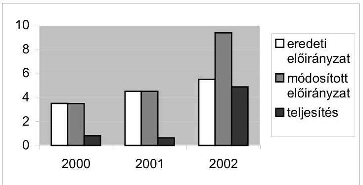

A vidékfejlesztést szolgáló célelőirányzat 1999-2000-ben elsősorban a vidékfejlesztési támogatások pályáztatására való felkészülést finanszírozta. Ezt követően 2001-2002-ben a jogszabályokban meghatározott jogcímeknek megfelelően - a pályázati úton vissza nem térítendő, fejlesztési támogatás formájában nyújtott segítség volt a meghatározó.

# 4.1. A VFC központi pályázatok rendszerének értékelése 

Az agrártámogatások rendszere mellett a VFC egy önálló támogatási jogcímcsoportot jelentett. A hozzá rendelt erőforrások önmagukban nem voltak elégségesek a vidékfejlesztési politika érvényesítéséhez és a támogatási források tárcán belüli integrálásához.

A pályázatos rendszerű támogatásra elkülönített források felhasználását kormány- és FVM rendeletekkel szabályozták. Az eljárási rend 2000. évet követően fejlődött, a támogatási jogcímeket az EU vidékfejlesztési célokkal összhangban pontosították, a pályázatok benyújtása és értékelése folyamatosabbá vált.

A támogatási jogcímek kijelöléséhez alapul vették a vidékfejlesztési kistérségekben meghatározott prioritásokat, a Közösségi Vívmányok átvételének Nemzeti

---

Programját, a SAPARD előcsatlakozási programot, továbbá az EU vidékfejlesztésre vonatkozó irányelveket.

A pályázati rendszer működését, a vidékfejlesztési célelőirányzat felhasználásának általános, illetve részletes szabályait a 2001-ben megjelent kormány-, illetve FVM rendeletekre épülő Kézikönyv tartalmazta. A Kincstár az engedélyezett támogatás igénybevételének feltételeiről és módjáról tájékoztatót bocsátott ki.

A Kézikönyv rögzíti a beérkező pályázatok iktatásának, az adatrögzítésnek, a pályázatok formai ellenőrzésének, érdemi értékelésének, a döntéselőkészítés (Tárcaközi Bíráló Bizottság Keresztértékelési Bizottság), és a döntés, valamint a támogatás lebonyolításának (MÁK-FVM Egységes Ügyrend) szabályait.

A támogatások igénylése összességében az előírásoknak megfelelően történt, a jogosultság, a felkészültség, a projekt megvalósíthatóságának és hasznosulásának igazolásával. A vizsgált 12 projektnél 2 esetben előfordultak űrlap kitöltési nehézségek és adatszolgáltatási hiányosságok.

A pályázatok kezelésének és értékelésének rendszere a humán erőforrás kapacitás alulméretezett volta miatt a hibalehetőség magas kockázatú volt, így nem volt biztosított a monitoring és a belső ellenőrzési feladatok ellátása. A kockázat csökkentésére a tárca nem tette meg a szükséges lépéseket.

A benyújtott pályázatokat az első lépcsőben két - az illetékes és egy véletlen jelleggel kiválasztott - Regionális Vidékfejlesztési Iroda (REVI) 3 fős bizottsága pontozta. A bírálati szempontrendszer egységes értelmezését a Keresztértékelő Bizottságok (tagjait a REVIK alkották) egyeztetése biztosította (így érvényesült az EU által előírt ún. „négy szem elv"). A három Tárcaközi Bíráló Bizottság, a korábbi értékelési szakaszban adott pontokat nem módosította - elsősorban a szakterületi tapasztalatok érvényesítésére törekedve és a tárcák közti összehangolási kritériumokat alapul véve - testületileg foglalt állást a pályázat döntéshozó elé terjesztéséről. A 12 főből álló Tárcaközi Bíráló Bizottságot a szakfőosztályok, társtárcák, köztük a PM, továbbá a civil szervezetek alkották.

A Tárcaközi Bíráló Bizottság, pl. 2002 októberében tartott kétnapos ülésén 250 pályázatot tárgyaltak.

A belső ellenőrzés nem vizsgálta a vidékfejlesztési támogatási rendszer megbízhatóságát és nem folytatott a források allokációjának lebonyolításával kapcsolatos ellenőrzéseket. A szakfőosztály a tárca vezetése felé több alkalommal kezdeményezte a vidékfejlesztési intézményrendszer fejlesztését, amely a tapasztaltak szerint figyelmen kívül maradt.

Az FVM és a MÁK közötti 2000-ben kötött és évente megújított megállapodás, illetve megbízási szerződés értelmében a MÁK látta el a központi pályázati felhívás alapján megítélt támogatási szerződések előkészítését, a pénzügyi lebonyolításhoz szükséges pénzintézeti megállapodások megkötését, a támogatások folyósítását, a megvalósítás pénzügyi ellenőrzését, továbbá a támogatási szerződések és módosításaik jogi előkészítését.

A pályázati rendszerrel kapcsolatos feladatok végrehajtását a MÁK 2001-ben szabályozta, az előkészítést és a pénzügyi lebonyolítást a MÁK megyei fiókjai végezték. A szabályzatban rögzítették a támogatás lehívásához szükséges dokumentumok benyújtásának formai és tartalmi követelményeit. A pénzügyi és számviteli feladatokat külső Üzleti Tanácsadó Kft. végezte.

A nyilvántartási rendszer nem biztosította a pénzügyi és fizikai folyamatok naprakész követését lehetővé tevő monitoring feladatok ellátását, és nem tette lehetővé a kötelezettségvállalások és kifizetések egyeztetésének informatikai támogatottságát.

A pályázatok központi nyilvántartását az Államháztartási Hivatal támogatási Monitoring Bizottsága vezette. A megítélt támogatások integrált, az FVM szervezeti egységei és a külső adatbázis kezelők közötti hálózatban működő nyilvántartási rendszerét nem alakították ki. A pénzügyi és szakmai nyilvántartások időben és szervezetenként elkülönültek, illetve azok nem egységes adatértelmezéssel (pl. jogcímváltozások) épültek ki.

Az előirányzat 2000. évi alacsony, 47,8%-os teljesítésének oka az előirányzat felhasználásának szabályairól szóló (2001. VII. 28-ig hatályos) 34/2000. (VII. 6.) FVM rendelet késői (júliusi) megjelenése, ennek következtében a szerződéskötések csúsztak, a pénzügyi teljesítés több mint fele a következő évre húzódott át.

A szerződéskötések késik, okai egyrészt a pályázók adatszolgáltatásának hiányosságaiban illetve elhúzódásában, másrészt a döntési mechanizmusban kereshetők. A monitoring tevékenység keretében ún. határidő ellenőrzést nem folytattak, ennek hiányában a késedelem helye nem volt kimutatható.

A szerződéskötések időpontjai 2002-ben a 990 nyertes pályázatból a vizsgált 429 eset közül 408 esetben, (95%) túllépték a rendelkezésre álló határidőket.

A pályázók a határidő lejártát megelőzően kezdeményezhették annak módosítását, amennyiben az iratok, dokumentációk, igazolások stb. beszerzése önhibájukon kívül késedelmet szenvedett.

A 2002. évben hivatalba lépő miniszter a vidékfejlesztési célelőirányzat 2002. évi pályázatainak befogadását - a rendelkezésre álló források kimerülése, valamint a SAPARD program 2002. szeptemberi várható indulására tekintettel 2002. augusztusában - a vonatkozó rendeletekkel összhangban - felfüggesztette.

A 2002. évre tervezett 2,57 milliárd Ft-os keretet, továbbá 1 milliárd Ft-os SAPARD Program társfinanszírozási elkülönített keretet, a 2002 augusztusáig jóváhagyott összes támogatási igény gyakorlatilag kimerítette.

A pénzügyi zavar oldására a már befogadott és érdemi értékelésre alkalmas pályázatok támogatási igényének finanszírozása érdekében, részben a SAPARD program késedelmére való tekintettel összesen 3 milliárd Ft-ot kitevő pótlólagos forrásokat nyitottak meg.

Hozzájárult a célelőirányzat belső átcsoportosításához, engedélyezett egy max. 40%-os kötelezettségvállalást a 2003. évi költségvetés terhére 2,2 milliárd forintig, továbbá év végén - a SAPARD program késedelme ismeretében - jóváhagyta annak felhasználhatóságát is.

---

A SAPARD keretből 2002-ben kifizetés nem történt, a program tényleges beindulása, a pályázatok elbírálása és a kifizetések csak 2003-ban kezdődtek meg. A NAO 2003. május 15-i felkérése alapján a második körben a SAPARD Tervben szereplő következő három intézkedésre irányul az akkreditáció előtti ellenőrzés: "113 A szakképzés támogatása", "1305 Falufejlesztés és -felújítás, a vidék tárgyi és szellemi örökségének védelme és megőrzése" valamint "1306 A tevékenységek diverzifikálása, alternatív jövedelemszerzést biztosító tevékenységek fejlesztése".

A kötelezettségvállalásokat követően hatályba lépett 2001. évi zárszámadási törvény ugyanakkor felhatalmazta a minisztert, hogy a mezőgazdasági alaptevékenységek beruházásai jogcím javára, a vidékfejlesztési célfeladatokból 1 milliárd Ft-t átcsoportosítson. Az elvonás eredményeképp a kötelezettségvállalások teljesítése a következő évet az Áht. előírásaiban megengedettnél nagyobb mértékben terhelte meg.

A 2002. végi értékelés szerint a 2003. évi célelőirányzat terhére tett kötelezettségvállalás 1,4 milliárd Ft volt, ez a 2002. évi eredeti célelőirányzat 26%-a. Az 1 milliárd Ft átcsoportosítás figyelembe vételével a 2003. évi determináció 53%.

Az átcsoportosítás miatt fedezet nélkülivé vált támogatási szerződések pénzügyi ellenjegyzését felfüggesztették, de a támogatási döntésről a kedvezményezetteket már értesítették, ugyanakkor a támogatottak a beruházásokat a rendeletnek megfelelően már korábban megkezdhették. A pótlólagos forrás biztosításáig egy tisztázatlan jogi, finanszírozási helyzet alakult ki, a még meg nem kötött szerződések ellenjegyzése késedelmet szenvedett, emiatt viszont a szerződéskötésre vonatkozó törvényi határidő nem tartható. További kockázatot jelenthet a 2003. évre szóló költségvetési törvényben előírt kötelezettségek finanszírozhatósága.

A tárcán belüli egyeztetéseket késedelmesen folytatták le. A sorozatosan visszatérő szerződéskötési késedelmek csökkentették a forrásfelhasználás hatékonyságát, és a kedvezményezettek érdekei sérültek.

A VFC pénzeszközök felhasználása során a támogatási rendszer működésének megbízhatósági tesztjeire vonatkozó külső és belső ellenőrzéseket nem terveztek. A kockázati szintek meghatározására nem intézkedtek mintavételes időközi helyszíni ellenőrzésekről. A vidékfejlesztési támogatásokra vonatkozó jogszabályi előírások a monitoring, az értékelés és az ellenőrzés területére kiterjedő részletes szabályozást nem tartalmaztak. A támogatás kiutalása előtt a megfelelőségi, szabályossági ellenőrzéseket a Kincstár végezte el. A három év alatt a központi nyilvántartás szerint összesen 15 esetben tártak fel nem rendeltetésszerű felhasználást.

A megvalósult beruházások mindegyikénél az egyszeri, REVI-vel közös ellenőrzést határozták meg. A Kincstár a beruházás befejezése után további ellenőrzéseket nem végez.

Egy esetben, pl. engedély nélkül cserélte le a kedvezményezett a számítógépes eszközöket. A döntéshozó a támogatás visszafizetéséről intézkedett.

---

# 4.2. A támogatások hasznosulásának értékelése 

A benyújtott pályázatok számában az egyes régiók között és ezen belül kistérségenként jelentős eltérések alakultak ki, jellemzően az alföldi régiókból került ki a pályázók fele. Ennek csökkentésére a szakmai főosztály és a REVI-k intézkedéseket tettek a kistérségi menedzserek, a kistérségek, az RFT és a civil szervezetek bevonásával. Ennek ellenére a korábban is nyertes régiók túlsúlya megmaradt.

A 2000-ben benyújtott 1147 és támogatást elnyert 465 pályázatok közül a támogatott pályázatok 41%-a (191) az Észak illetve Dél-Alföldi régióból kerültek ki. Ez 2002-ben sem változott, 1598 benyújtott és 992 támogatásra jelölt pályázatból 45% (448 pályázat) ugyanebből a két régióból származott.

Intézkedésként fokozták a potenciális pályázók informálását a pályázati lehetőségekről, továbbá folyamatos ügyfélszolgálatot tartottak.

A projektek megvalósítása és pénzügyi teljesítése - nagyságrendjük következtében - általában 2-3 évet vett igénybe. A kiadások évenkénti tervezhetőségét nehezítette, hogy a késedelmes szerződéskötések miatt nem tudták betartani a rendeletekben előírt határidőket. Ugyanakkor ezzel párhuzamosan nem aktualizálták a beruházások kezdési, befejezési és kifizetési időpontjait, és nem készültek az aktualizált állapotnak megfelelő kifizetési ütemtervek.

Az eredmények és főleg a hatások tárgyilagos, számszerű értékelése több ok miatt még nem valósítható meg. Jelentős előrelépésnek számít azonban, hogy az ún. output mutatókra vonatkozó adatszolgáltatást előírták és ezáltal a célkitűzések teljesítésének részleges mérésére a lehetőség biztosított.

A pályázati rendszer hatékonyabb működtetéséhez szükséges különböző adatbázisok közötti kapcsolatok nem épültek ki, továbbá erre alapuló monitoring tevékenységet nem végeztek. A jogszabályalkotás során, vagy az összes projektciklus alatti tevékenységek ütemezésekor a tervezett (a rendelet által előírt) készültségi fokhoz történő viszonyításra, a kritikusság fokának megállapítására alkalmas vezetési technikát nem alkalmaztak. A késedelmek, a pályázati döntések okainak feltárására alkalmas információk (ld. bíráló bizottsági jegyzőkönyvek) számítástechnikailag még nem kezelhetők illetve nem voltak kigyűjthetők.

A helyszínen vizsgált 12 projekt mindegyike megfelelt a 104/2001 (VI. 21.) Korm. rendelet és az 50/2001. (VII. 20.) FVM rendelet szerinti 2001. évi pályázati kiírásnak. A támogatási szerződésekben foglaltak - helyszíni szemlékkel igazoltan - megvalósultak. A megvalósított fejlesztéseknél a hosszabb távú működtetést akadályozó körülmények nem merültek fel.

A vidéki területeken jelentős a helyi közösségek szerveződése és
 a partnerkapcsolatok terén végbement fejlődés, valamint az EU programozási gyakorlatának elsajátítása. A vidékfejlesztési célelőirányzatból pályázatos úton nyert támogatások - társfinanszírozással - hozzájárulnak a fejlesztések nyomán a kistérségekben beinduló gazdasági fellendüléshez.

---

# 5. PHARE TÁMOGATÁSOK 

### 5.1. Szervezeti keretek és a támogatások fogadásának lebonyolítási rendszere

A mezőgazdasági Phare programok végrehajtásának mind szakmai, mind pénzügyi szervezeti háttere a feladatokhoz igazított volt. Az ágazathoz tartozó alprogramok végrehajtásának, szabályosságának, hatékonyságának és eredményességének figyelemmel kísérése az 1999-ben megalakult Fejezeti Monitoring Bizottság (FMB) feladata lett.

Az intézményfejlesztések és beruházások tervezése, szervezése és lebonyolítása az Európai Integrációs Főosztály keretén belül az Agrárgazdasági Phare Iroda irányításával és koordinálásában történt. A projektek szakmai tartalmáért, kivitelezéséért a kedvezményezett szakfőosztályok, míg az eljárások EU jogszabályok szerinti betartatásáért a Phare Iroda felelt. A Phare segélyek 1999. után bekerültek az államháztartás feladatfinanszírozási rendszerébe, a kapcsolódó társfinanszírozás tervezéséért, az ezzel kapcsolatos irányítási és operatív feladatok lebonyolításáért a Költségvetési Főosztály felelt. A feladatokat és felelősségeket miniszteri utasítás rögzítette.

Az FMB megalakulását az 1260/1999 EU tanácsi rendelet, illetve a 166/2001. (IX. 14.) Korm. rendelet tette kötelezővé.

Az EU-val kötött együttműködési megállapodás alapján létrehozott Központi Pénzügyi és Szerződéskötő Egység (KPSZE) már az 1998-as agrárgazdasági programnál felügyelte és irányította a Phare tenderezési folyamatokat. A KPSZE igazgatója egyben a Program Engedélyező Tisztviselő (PAO), megszemélyesíti a KPSZE hatáskörébe utalt jogosultságokat. A programok szakmai megvalósításáért az FVM részéről a Szakmai Programfelelős (SPO) felelt.

A KPSZE előkészítette és szerződéskötő hatóságként aláírta a szerződéseket, rendelkezett a Phare programokhoz tartozó devizaszámlák felett, elvégezte a kifizetésekhez kapcsolódó ellenőrzéseket és kezdeményezte az átutalásokat. A hatáskörök és feladatok szabályait egy 2000-ben kiadott PM tájékoztató tartalmazza.

A belső ügyrendek jogszabályokra épülnek, ezek a Szervezeti és Működési Szabályzat, az Iroda belső Ügyrendje és Pénzügyi eljárásrendje, valamint az Agrárgazdasági Phare eszközök nyilvántartásba vételének ügyrendje aktualizálásán 2002 végén volt folyamatban. Hiányosság, hogy a PHARE program keretében finanszírozott beruházások és eszközök aktiválása időben nem történt meg, így azok a főkönyvi könyvelésbe nem, vagy csak késve kerültek be. A hiányosság kiküszöbölésére a tárca az ellenőrzés időpontjában készítette el a problémát átfogóan rendező belső szabályzatot.

A területfejlesztési PHARE programok lebonyolításának feladatellátását, felügyeletét az éppen aktuális kormányzati struktúra határozta meg, de külső szervezeti háttere nem változott. A feladat 1998-2002 között az FVM tevékenységi körébe integrálódott, majd a 2002-es kormányváltást követően a törvényességi felügyeletet a Miniszterelnöki Hivatal gyakorolta.

---

Az 1998-2002 közötti időszakban az FVM - mint PHARE végrehajtó szervezet - a felelősség megtartása mellett a területfejlesztési feladatokat átruházta a VÁTI Magyar Regionális Fejlesztési és Urbanisztikai Kht-ra. A jogalapot az Európai Uniós előcsatlakozási eszközök támogatásai felhasználásának pénzügyi, tervezési, lebonyolítási és ellenőrzési rendjéről szóló 255/2000. (XII. 25.) Korm. rendelet biztosította.

A VÁTI Kht. felügyelete 2002-ben a MeH-hez került, de a területfejlesztési célú PHARE programok tervezését és lebonyolítását továbbra is a kht. koordinálja.

A programok tervezésénél alapvető követelmény és egyben a támogatások megszerzésének feltétele, hogy a PHARE alapon keresztül az Európai Unió kizárólag a csatlakozással összefüggő intézményfejlesztési és beruházási programokat támogatja, tehát a támogatási céloknak összhangban kell lenniük a "Csatlakozási Partnerség" és "Az Acquis Átvételének Nemzeti Programja" című brüsszeli, illetve magyar kormánydokumentumokkal.

Az intézményi háttér állandósága és megfelelően kijelölt feladatköre alapvetően biztosította, hogy a területfejlesztési PHARE programok összhangját a kormány évente elfogadott intézkedési terveivel és a vidék- és területfejlesztési programokban megfogalmazott stratégiai célokkal.

Ebből a szempontból kedvező volt, hogy a VÁTI Alapító Okirata szerint a kht feladatai közé tartozott a területfejlesztési koncepciók és programok, valamint a területrendezési tervek rendszerére, részletes tartalmi követelményeire, valamint elkészítésük, alkalmazásuk és karbantartásuk rendjére történő javaslat tétel, a koncepciók aktualizálása, valamint az országos, az országhatárokon átnyúló, és térségi területfejlesztési koncepciók és programok összehangolása. Emellett felelős volt az országos területi folyamatok alakulásáról és a területfejlesztési politika érvényesüléséről az Országgyűlésnek szóló beszámoló elkészítéséért.

# 5.2. Agrárgazdasági programok 

A Kormány által évente aktualizált dokumentum: "A Közösségi Vívmányok Átvételének Nemzeti Programja" (ANP), agrárgazdasági fejezete tartalmazza a csatlakozás feltételeként megjelölt fő agrárgazdasági célkitűzéseket és prioritásokat. Az FVM az intézményfejlesztési projektjavaslatokat e célok figyelembevételével, és a már elindított, vagy megvalósított projektekkel összhangban dolgozta ki, keretük évente mintegy 3-5 milliárd forint volt.

Az Európai Tanács Csatlakozási Partnerségre vonatkozó, 1999. évi határozatának "Magyarország" melléklete részletezi a csatlakozással összefüggő prioritásokat és közbenső célkitűzéseket rövid- és középtávon. Ehhez igazodik az ANP.

A programok eredményes megvalósulását (elsősorban a HU9806-03 projekt esetében) megnehezítette a kormányzati döntések meghozatalának és a hozzájuk kapcsolódó minisztériumi szabályozások kiadásának elmulasztása. Ennek következtében 2002 nyarán a tagállamok és az Európai Bizottság szakértői által elvégzett átvilágítás (pl. a közösségi agrártámogatásoknál megkövetelt Integrált Igazgatási és Ellenőrzési Rendszer esetében) elmarasztaló megállapításokat tett.

---

Az átvilágításon olyan értékelés született, hogy „a helyzet kritikus, Magyarország a tagjelöltek között az utolsó helyen áll a rendszer kiépítésében, és kétséges, hogy a csatlakozásra el tud-e készülni."

A Phare forrásokból 1998-2002 között a támogatott főbb szakmai célcsoportok közül kiemelt volt az állat-egészségügyi és növény-egészségügyi intézményrendszer fejlesztése, a vidékfejlesztés és agrár-környezetvédelem intézményfejlesztése, a megyei földhivatalok informatikai rendszerének és az állategészségügyi és élelmiszer-higiéniai intézményrendszerének fejlesztése.

A mezőgazdasági Phare projektek költségvetése, pontosabban az agrárgazdaság fejlesztésére allokált összegek nagysága (euroban) a helyszíni ellenőrzés időpontjában lévő állapotnak megfelelően az alábbiak szerint alakult (a magyar fél által biztosított társfinanszírozással együtt):

| Költségvetés (millió €) |  |  |  |
| :--: | :--: | :--: | :--: |
|  | Phare forrás | magyar   társfinanszírozás | Összesen |
| 1998. | 16,00 | 0 | 16,00 |
| 1999. | 8,90 | 0 | 8,90 |
| 2000. | 8,00 | 3,60 | 11,60 |
| 2001. | 5,45 | 2,52 | 7,67 |
| 2002. | 11,05 | 4,43 | 15,48 |

Az agrárgazdaság fejlesztését segítő PHARE források tendenciája az ellenőrzött időszakban csökkenő volt, a vizsgált időszakban - még a társfinanszírozással együtt - sem érték el az 1998. évi értékeket.
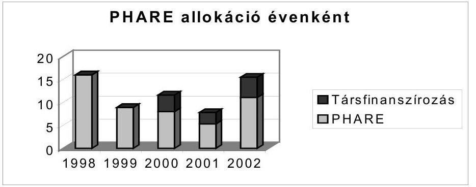

A legalacsonyabb allokáció (2001) oka, hogy az országos prioritások változása miatt az EU Delegáció és a MeH Segélykoordinációs Titkárság más szektorok fejlesztésére koncentrálta a pénzügyi forrásokat.

Az allokáción kívül a már megítélt, de a megadott időszakon belül szerződéssel le nem kötött, illetve ki nem fizetett összegek a meghatározóak abban, hogy alakulásukon keresztül az ország segélyabszorbciós képességét is meg lehet ítélni.

Szembetűnő a veszteség aránya a már lezárt (ahol tehát a veszteség már nem csökkenthető) HU9806-03 számú projektnél, amely az (európai uniós) közös ag-

---

rárpolitika (KAP) intézményrendszerének a létrehozásához, és a 9806-05 számú projekteknél, amely a vidékfejlesztési és agrár-környezetvédelmi intézmények fejlesztéséhez biztosított közösségi pénzügyi támogatásokat.

Az agrárszektor segélyabszorbciós képességének jövőbeni fejlesztése érdekében fontos a lehetséges veszteségforrások feltérképezése. A legnagyobb allokált, de fel nem használt összeggel zárult KAP program veszteségforrásai a következők:

- a rendelkezésre álló, de a határidőn belül le nem szerződött összegek;
- a vis major (a szakértő betegsége) miatti veszteség;
- a késői indulásból és a kormányzati döntések hiányából (illetve ellentmondásosságából) adódó bizonytalanság miatti veszteségek;
- a kifizetési határidőn túlcsúszó, illetve elmaradt fejlesztések miatti veszteség.

A projekt átfogó stratégiai célja - miszerint még a 2000-es csatlakozási dátumot feltételezve, a projekt eredményeként Magyarország képes legyen az EU-ból érkező agrártámogatások EU előírások szerinti fogadására - nem valósult meg. Ennek oka, hogy a kormány és a tárca vezetése nem hozta meg időben a projekt sikeres megvalósításához szükséges döntéseket, nem jelölték ki a közösségi agrártámogatások megvalósításáért felelős intézményi hátteret, a koncepciókat többször megváltoztatták és ez a folyamatokat lelassította, illetve megnehezítette.

A SAPARD-ért és a KAP-ért felelős Agrárintervenciós Központ (AIK) kijelölése után egy évvel (amikor az EU forrásokból finanszírozott projekt már elindult) a döntést partikuláris belső hatásköri szempontok miatt megváltoztatta, az előcsatlakozási alap finanszírozási szervét a minisztériumba, a politikai államtitkár alá rendelte.

Az agrártámogatások folyósítását ellátó intézményi háttér hiányzott. A bizonytalan helyzet és a pénzügyi nehézségek miatt a projekt eredményeként az Európai Uniós feladatokra kiképzett szakemberek több mint fele 2002. végére kilépett az Agrárintervenciós Központból, ahol a PHARE program támogatásával az EU agráralapok felhasználására képezték ki őket. (Az ebből adódó veszteséget a projekt költségstruktúrája miatt nem lehet számszerúsíteni, de valószínűsíthetően százmilliós nagyságrendű.)

Az ellenőrzés időpontjáig lezárt projektek közül a 9806-01 számú állategészségügyi intézményrendszer fejlesztését megcélzó projektre allokálták a legmagasabb - öt millió eurót - kitevő összeget. A támogatásból létesültek az uniós külső határnak minősülő határellenőrző pontok, ahol az EU normák szerint működő állategészségügyi és élelmiszer-ellenőrző vizsgálatokat kell majd elvégezni. Ezért ennek a projektnek a megvalósulását a helyszíni ellenőrzés keretében részletesebben is megvizsgáltuk.

Az FVM a röszkei állategészségügyi és élelmiszer-ellenőrző állomás kiépítésére 188 millió forintot kapott. Társfinanszírozásként 387 millió forint állt rendelkezésre.

A projekt keretében egy átmeneti élelmiszer és takarmány hűtőtároló és egy kamionfertőtlenítő épület beruházása, valamint kb. 10 millió Ft értékű gépbeszerzés történt. A felépítményekhez tartozó infrastrukturális létesítményeket hazai társfinanszírozásból valósították meg. A beruházás a szerződéstől eltérően néhány hónappal később, de még a PHARE pénzügyi megállapodásban megszabott kifizetési határidőn belül készült el. A létesítményt a Csongrád megyei Állategészségügyi és Élelmiszer Ellenőrző Állomás üzemelteti.

A PHARE program keretében elvégzett munkákról kiállított számlák a szerződésekkel összhangban vannak, és a számviteli előírásoknak megfelelnek. A teljesítést műszaki átadás-átvételi jegyzőkönyvvel a szomszédos megyei állomás igazolta. A felépítmények nyilvántartásba vétele és aktiválása az eltérő tulajdonlás miatt még nem történt meg. A PHARE forrásból finanszírozott számlákat, - a 2001. év elején hatálybalépett ÁFA törvénymódosításnak megfelelően - az ÁFA-t 0% kulccsal állították ki.

A teljesítésigazolást hatósági kijelölés folytán a Békés megyei Állategészségügyi és Élelmiszer Ellenőrző Állomás adta ki. A PHARE forrásból finanszírozott felépítmények kedvezményezettje az FVM Európai Integrációs Főosztály, míg a hazai társfinanszírozás finanszírozott alépítmények címzettje a Csongrád megyei Állategészségügyi és Élelmiszer Ellenőrző Állomás. Emiatt a felépítmények az FVM, az alépítmények pedig a megyei hivatal tulajdonába kerültek.

A helyszíni bejáráskor az élelmiszer-ellenőrző létesítmények az előírások szerint működtek, a vizsgálatokhoz szükséges tároló- és hűtőkapacitások megfelelőek voltak. Ugyanakkor az állategészségügyi vizsgálatokhoz szükséges létesítmények a helyszíni ellenőrzés időszakában nem elégítettek ki egy speciális európai uniós követelményt, ezért az EU előírásoknak megfelelő toxikológiai vizsgálatok teljes körűségéhez további kiegészítő berendezések beszerzése is szükséges.

A számítógépes rendszer a külföldről bejövő árukat regisztrálta és automatikusan értesítette a célállomás szerinti Állategészségügyi és Élelmiszer Ellenőrző Szolgálatot a rakományok érkezéséről. Ily módon kizárja, hogy a külföldről importált élelmiszerek ellenőrizetlenül eltűnjenek a határátlépést követően az országban.

Az állatok egyedi vizsgálata megköveteli, hogy az állatok összekeveredését megakadályozzák, vagyis a kamionokról leterelendő állatok ne ugyanazon a rámpán keresztül jussanak le a karámba, ahol azok
 visszajutnak a kamionba. Ezért a csatlakozásig ezt a létesítményt az uniós normák szerint át kell még alakítani. (A jelenlegi karámrendszer a VPOP beruházásában valósult meg.)

A személyi háttér biztosított, a szakembereket már részben kiképezték az EU közösségi jog előírásaira, de egy 2003-as PHARE program keretében tervezik felkészíteni a munkatársakat teljes körűen a csatlakozást követő további új feladatok megismertetésére.

Az öt állatorvosból és háromfős segédszemélyzetből álló határellenőrző állomás személyi kapacitása a jelenlegi forgalom ellátására elég, azonban a csatlakozás után további öt állatorvos alkalmazására lesz szükség.

A Letenye határellenőrző ponton megvalósított állategészségügyi létesítmények beruházásának pénzügyi forrásait - az átmeneti hűtőtároló épületére és a karám megépítésére - PHARE támogatásból - a kiegészítő, elsősorban infrastrukturális munkák fedezetét - 400 millió Ft-ot költségvetési támogatásból fedezték. Az Állategészségügyi Állomás számviteli nyilvántartását végző Földművelésügyi Költségvetési Iroda a 356 millió Ft közmű és útépítés beruházás összes költségét a megvalósult műszaki tartalomtól eltérően hűtőtároló épületként aktiválta.

A munkák kivitelezésére a vállalkozót hirdetmény közzététele nélküli tárgyalásos közbeszerzési eljárással választották ki. A kivitelező a módosított határidőt nem tartotta be, így vele szemben a szerződéses összeg 10\%-ának megfelelő, 24.950 ezer Ft kötbért érvényesítettek. A műszaki átadás-átvétel folyamán rögzített hiánypótlások, hibajavítások megtörténtek.

A létesítményt üzemeltető állomás szakembereinek véleménye szerint az EU jogrendnek megfelelő feladatok ellátásához még kisebb módosítások szükségesek. A szakképzett szakember állomány rendelkezésre áll, a szakterületüket érintő joganyagokkal rendelkeznek, emellett tanfolyami keretek közötti továbbképzésük folyamatosan biztosított.

A helyszíni ellenőrzéseken megvizsgált projekteken kívül, több más PHARE projektnél, így pl. a Ferihegyi repülőtéren létrehozandó EU konform állategészségügyi és növény-egészségügyi ellenőrző állomás beruházása esetében is partikuláris hatásköri érdekeknek, esetenként gazdasági érdekeknek rendelték alá az uniós csatlakozás stratégiai érdekeit. A repülőteret működtető Budapest Airport, mint gazdasági társaság által kidolgozott konstrukció szerint az FVM-nek bérleti díjat kellene fizetnie az eredetileg saját tulajdonában álló létesítmények után. Az FVM a konstrukciót nem fogadta el, emiatt a repülőtéri gazdasági társaság visszavonta a tervezett létesítmény előzetesen egyeztetett helyszínét és a beruházás a források megléte ellenére - időlegesen és kényszerűségből - leállt. A projekt elindítását akadályozó tényezőket kiküszöbölve, végül az EU által megadott határidő utolsó napján a szerződéskötés és az építkezés megkezdése határidőben megtörtént.

A létesítmény felépítésére az FVM, mint kedvezményezett a PHARE programon keresztül megkapta az EU-tól a szükséges pénzügyi forrásokat, azonban a Budapest Airport Rt. által kidolgozott konstrukció szerint az FVM-nek át kellene adnia a létesítmény tulajdonjogát a MÁK-nak, az pedig továbbadná a létesítmény vagyonkezelői jogát a repülőtéren működő gazdasági társaságnak. Ez a gazdasági társaság azután évi 60 millió forintos bérleti díjért visszaadná a létesítményt üzemeltetésre az FVM-nek.

# 5.3. Területfejlesztési programok 

A területfejlesztési célokra felhasználható EU előcsatlakozási alapok hatékony felhasználásának feltétele, hogy az azokból finanszírozott programok - az agrárgazdasági, és egyéb ágazati programokhoz hasonlóan - illeszkedjenek az Unió és a Magyar Kormány prioritásaihoz, legyenek összhangban az országos fejlesztési koncepciókkal és a fejlesztendő szektor parlamenti, illetve kormányzati szinten jóváhagyott stratégiai céljaival.

A feladat elvégzésének feltételeit a területfejlesztésről és területrendezésről szóló 1996. évi XXI. törvény határozta meg, ennek alapján az Országgyűlés 35/1998. (III. 20.) OGY határozatában elfogadta az országos területfejlesztési koncepciót. Ez határozta meg azokat a főbb feladatokat, amelyekre koncentrálni kell a rendelkezésre álló hazai és a külföldi (elsősorban Európai Uniós) pénzügyi forrásokat. Az 1998-2002. között elfogadott PHARE programok a koncepcionális célokkal összhangban voltak, és a fejlesztési prioritásokhoz illeszkedtek.

A törvény kijelöli az ország területén folyó területfejlesztési tevékenység kereteit, intézményrendszerét, a különböző kormányzati szervek, az önkormányzatok, non-profit és társadalmi szervezetek feladatait, és ezáltal megteremti az átfogó, a piacgazdálkodáshoz alkalmazkodó területfejlesztési tevékenység feltételeit.

Az ellenőrzött időszakban indított programok esetében a PHARE alapon keresztül támogatott szakmai főbb célok az alábbiak voltak:

- strukturális alapok fogadására felkészülés;
- szomszédos országokkal közös CBC programok;
- regionális előkészítő program;
- KKV együttműködés;
- csatornázási, szennyvíz- és hulladék kezelési program;
- úthálózat, turizmus és infrastrukturális fejlesztés;
- munkahelyi beilleszkedés és vállalkozói készség fejlesztés;
- ipari park fejlesztés;
- felkészülés az INTERREG végrehajtására.

A felsorolt célokra az ellenőrzött időszakban az EU a PHARE programon keresztül 61,75 millió eurót, a CBC programon keresztül pedig 36 millió eurót biztosított. Az ide allokált EU források megoszlása (millió euroban) a következők szerint alakult:
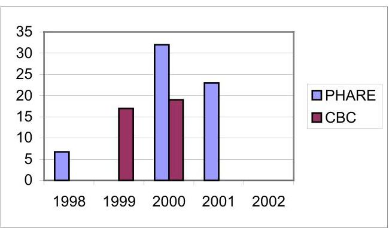

Az elfogadtatott támogatások évenkénti összegeinek eltérése abból fakadt, hogy - az agrárgazdasági PHARE programoktól eltérően - a területfejlesztési programok előkészítésénél az időről időre változó prioritásoknak megfelelően nagyobb programokat dolgoztak ki, és azok nem terjesztettek elő újabb program javaslatokat.

A jóváhagyott programok megvalósítása általában megfelelő hatékonysággal történt, részben annak köszönhetően, hogy a PHARE programok koordinációját ugyanaz a szakembergárda végezte. Ennek ellenére több esetben előfordult, hogy a már előzetesen jóváhagyott programok támogatási kereteit nem sikerült teljes egészében felhasználni. Ennek főbb okai a viszonylag jelentős veszteséggel (tehát a szektor fejlesztésére allokált, de fel nem használt támogatásokkal) zárult programoknál a következők voltak:

A Magyar-osztrák CBC programban engedélyezett 7 millió euróval szemben 6,15 millió euróra történt csak szerződéskötés, mert a Szombathelyi elkerülő út az EU Delegáció döntése alapján nem ebből a programból valósult meg.

A Győr-Gönyű RO-RO kikötő (9502 program) építési beruházására előirányzott 558000 euró felhasználása elmaradt. A tenderdokumentáció jóváhagyása és a DIS szabályok szerint elkészített változat többszöri hazai és nemzetközi ellenőrzését követően 1997. decemberében küldték meg az EU Delegáció számára, melyet csak 1998. márciusában hagytak jóvá. A tender szerződéskötési határidejét a Financial Memorandum 1998. július 31-én határozta meg.

Az értékelési jegyzőkönyvet 1998. május 21-én küldték meg az EU Delegációnak, a jóváhagyása azonban a szerződéskötési határidőn túl nyúlt, ezért az összeg felhasználására a programban már nem volt lehetőség. Figyelembe véve az összes körülményt, az EU Delegáció végül engedélyezte, hogy a projekt teljes megvalósítása együtt kerüljön tenderezésre a HU 9610-es programban.

A jóváhagyott, de le nem szerződött támogatási összeg különbözeteként kialakuló 0,85 millió euró veszteség így tehát a két fenti program fel nem használható előirányzatából adódik.

A ZZ 9524 projektet a magyar - szlovák program részeként hagyták jóvá, összesen 950000 euró értékben. Ebből Jánossomorján a hulladéklerakóhoz vezető út kivitelezése valósult meg 175 ezer euró értékben, tehát a különbözetként jelentkező 775 ezer euró összegű támogatást nem használták fel.

A projekt háromoldalú megállapodásának megkötése elhúzódott, a Financing Memorandumot az eredeti ütemtervhez képest megkésve, a szlovák partnerekkel való egyeztetés késedelme miatt, 1998 elején írták alá ezért a tendereztetés és a kivitelezői szerződés megkötése már nem történhetett meg.

A HU 9705 program keretében a lehetséges 34 millió euro keretből csak 30,39 millió euróra szerződtek le, mivel a PHARE CBC programból 4 millió euro támogatást, valamint az ipar-, vidék- és humánfejlesztési programból 1,6 millió euró összegű támogatást az EU Delegáció (pl. formai okok miatt) elutasított. Egy esetben a beérkezett pályázati igények, illetve az alprogramokra megítélhető PHARE támogatás mértéke nem fedte le teljesen egymást.

A program keretében a helyszíni ellenőrzés időpontjáig kifizetett PHARE támogatás összege a leszerződött 30,39 millió euronál kevesebb volt, mert a szerződések meghosszabbítása értelmében 2002. október végéig nyújthattak be számlákat, továbbá az EU Delegáció 2002-ben nem járult hozzá az Észak-kelet-Magyarországi Kockázati Tőkealap keretében 2,5 millió euro PHARE támogatás kifizetéséhez.

A határon átnyúló együttműködés keretében megvalósítandó területfejlesztési PHARE programok végrehajtását az Európai Bizottság felkérésére 2002-ben elvégzett auditálás összességében megfelelőnek minősítette (a HU0009, HU-0015 és HU-0016 számú projektek kivételével, ahol hatékonyabb koordináció szükséges a projektek sikeres megvalósításához).

---

# 6. Az informatikai Rendszer Működése 

### 6.1. Az informatikai stratégia és fejlesztés

A kormányzati informatikai feladatokat rögzítő 1106/1995. (XI. 9.) Korm. határozatnak megfelelően, a fejezet 1999-ben és 2000-ben az EU csatlakozással összefüggő feladatokat középpontba állító informatikai stratégiát készített. Mindkét stratégia 3 évre határozta meg az elvégzendő feladatokat, de ezek a fejezeti éves munkatervekbe nem épültek be, a szükséges források a fejezet költségvetésében nem jelentek meg. Új stratégiai terv ezt követően nem készült.

A stratégia 1999-ben a csatlakozáshoz szükséges adatszolgáltatási kötelezettségek biztosítását, majd 2000-ben EU támogatások kezelését helyezte előtérbe. Ez tartalmazta az Integrált Igazgatási és Ellenőrzési Rendszer (IIER) célkitűzéseit és a döntéshozatalt segítő hazai és EU támogatások egységes kezelésének feladatait.

Az EU csatlakozás után érkező támogatások alapvető feltétele a termelők nyilvántartását és a kifizetések ellenőrzését szolgáló Integrált Igazgatási és Ellenőrzési Rendszer (IIER) kiépítése volt. Bevezetését 2003-ra vállalták. A megvalósítási stratégia és a végrehajtás intézkedési terve 2001-re elkészült, de a szükséges forrásokat nem biztosították. A feladatot 2001 végén a MEH vette át, a végrehajtást az InForrás Kht. kompetenciájába helyezte, ezzel a minisztérium a végrehajtásból kimaradt. A PHARE intézményfejlesztési megállapodás keretén belül 1999-ben indult és 30 hónapra tervezett twinning projekt meghiúsult. Mindezek következtében a rendszer bevezetése elmaradt.

Ennek követelményét az Európa Tanács 3508/1992. (EK) rendelete, valamint az annak végrehajtására született, a Bizottság 3887/1992. (EK) rendelete fekteti le. Eszerint, az Európai Mezőgazdasági Orientációs és Garancia Alap Garancia Keretéből folyósított terület- és állatlétszám alapú, közvetlen termelői támogatások kifizetését az IIER-en keresztül kell folyósítani a gazdálkodóknak.

A megvalósítási stratégiát elfogadta a bajor twinning partner és az Informatikai Kormánybiztosság is. A teljesítések elmaradása miatt a twinning partner az együttműködést 2001 nyarán felmondta.

A fentiek miatt az IIER az EU csatlakozás várható időpontjában történő (2004) bevezetése kétséges és magas az akkreditáció elmaradásának kockázata.

Az EU előírások nem teszik lehetővé az EMOGA garanciális alapból történő kifizetések kézi kezelését, ennek következtében a nemzetközi feltételeket teljesíteni nem képes szektorok számára a csatlakozás piacvesztéssel járhat.

Az informatikai beszerzéseket - megállapodás alapján - a Gazdasági Hivatal bonyolította. A speciális szakmai igényekhez igazodó informatikai fejlesztések jelentős részét a háttérintézmények végezték el. Ez a decentralizált és nem koordinált feladatellátás kockázatot jelenthet az EU tagsággal összefüggésben kifejlesztendő rendszerek esetében, ugyanis egy verzióváltást követően a szoftverrendszerek heterogén volta miatt az adatok elérhetősége nem oldható meg egységesen.

Az informatikai fejlesztéseket, így a stratégiákban megfogalmazott célkitűzések megvalósítását a források hiánya folyamatosan gátolta, a hosszú távú és költségigényes fejlesztésekhez nem biztosított pénzügyi hátteret. A pénzügyi tervezés az informatikát nem kiemelt prioritásként kezelte, a beruházások átcsoportosításokkal képzett pótelőirányzatokból valósultak meg. Az alultervezett források az amortizációt sem ellensúlyozták, ez az infrastruktúra fenntartását veszélyezteti, pl. a 2003. évi informatikai feladatok előirányzata elmarad az előző évi ráfordításoktól.

Az informatikai fejlesztésekre eredeti előirányzat utoljára 1998-ban szerepelt (55 millió Ft), ezt követően - az igények ellenére - előirányzatot nem terveztek. A pótlólagos források döntően központi, illetve felügyeleti keretből származtak, ezek 2000-ben 403,7 millió Ft-ot; (ebből 200 millió Ft-ot, a SAPARD Hivatal informatikai rendszerének kialakítására fordítottak) 2001-ben 792,5 millió Ft-ot 2002-ben 491 millió Ft-t tettek ki.

A 2002. évben gépkarbantartásra 45 millió Ft-ot, szoftverkövetésre
 138 millió Ft-ot fordítottak, 2003-ra 120 millió Ft-os központi beruházási keret és 30 millió Ft-os működési keret állt rendelkezésre.

A központi beszerzések elsősorban hardver eszközök beszerzésére és hálózatfejlesztésre irányultak, a szoftverfejlesztések háttérbe szorultak, a központi beruházás keretében az alkalmazói szoftverfejlesztések aránya alacsony volt. Az intézményi informatikai fejlesztések kampányszerűen PHARE és központi forrásból, többletbevételből, pótelőirányzatokból valósultak meg.

A vizsgált időszak alatt hét PHARE projekt indult, összesen 11,7 millió euro összegben, ebből 8,9 millió eurot fordítottak eszközbeszerzésre.

A Komárom-Esztergom megyei Állategészségügyi és Élelmiszer Ellenőrző Állomás informatikai fejlesztése során pl. a 120 db gépbeszerzés teljes egészét, a 85 db irodatechnikai gépbeszerzés kb. kétharmadát biztosította központi forrás.

A Komárom-Esztergom Megyei Földhivatalnál a beszerzések különböző forrásokból származtak. A 2002. évi felügyeleti ellenőrzés szerint is szükséges nem használt, elavult informatikai eszközök selejtezésének előkészítését megkezdték.

A Komárom-Esztergom Megyei Földművelésügyi Hivatal számítógépes hálózata a gépszám növekedésével együtt bővült. A számítógép állomány 7 db-ról 40-re nőtt. Az időben eltérő beszerzések következtében kialakult különböző korszerűségű és teljesítményű géppark miatt az operációs rendszerek is változatosak, ennek csökkentését célzó licensz-vásárlások és a saját forrásból beszerzett korszerűbb hardverek sem biztosították egy egységes rendszer kialakítását.

Az IIER megvalósítására a stratégiai terv 19 milliárd Ft várható fejlesztési költséggel számolt, de erre az éves fejezeti költségvetésekben előirányzat nem szerepelt. Az EU tartalékkeretből 2000-ben 35 millió Ft-ot használtak fel. A feladat megvalósításába - az FVM előfinanszírozása mellett - 2001-ben a MEH is bekapcsolódott egy megvalósíthatósági tanulmány elkészítésével, azonban

---

az FVM azt nem tudta hasznosítani, ennek ellenére a MEH az összeg egy részét indokolatlanul visszatartotta.

A projekt újraindításakor, 2001-ben, 350 millió Ft-ot az Informatikai Főosztály keretének, 300 millió Ft-ot az EU keret, 350 millió Ft-ot egyéb intézményi keretek terhére, összesen 1 milliárd Ft-ot különítettek el. A megvalósíthatósági tanulmány elkészítésére a minisztérium a MEH-nek 90 millió Ft-ot adott át. A minisztérium a tanulmányt nem tudta hasznosítani, de a MEH csak 54 millió Ft-ot utalt vissza.

Az informatikai fejlesztésekről nyilvántartás nincs, így nyomon követésük és értékelésük nehéz. A beszerzéseket témák és keretek szerint a GH szöveges beszámolói részletezik, de a tételes felhasználások csak az átutalások alapján gyűjthetők ki. A hardver és szoftver eszközöket egy 2001-ben kifejlesztett rendszerrel tartják nyilván. Az agrártámogatási előirányzatokból a feladattal szorosan összefüggő informatikai fejlesztésre - az agrártámogatások igénybevételére vonatkozó 273/1997. (XII. 22.) Korm. rendelet 1. § (6) bekezdésben és az azt 2001-ben és 2002-ben módosító kormányrendeletekben foglaltak a felhasználást megengedték, de erről az összegekről sem az informatikai sem a költségvetési terület nem rendelkezik információval.

Az informatikai terület szabályozása hiányos, emiatt a Főosztálynak nincs teljes körű ismerete az informatikai eszközökről, mivel a szakterületek saját forrásából történt hardver eszközök hálózatra történő telepítésekor csak egyetértési jogot biztosít. Ez a gyakorlat a fejlesztések terén párhuzamosságokat és a korrekt nyilvántartás hiányát eredményezte.

Az Informatikai Főosztály által kötött szerződések összege az informatikai beruházásokon belül 2000-ben 25%, 2001-ben 50% alatt maradt.

Egyedi szabályozást igényel az informatikai feladatok hatékony végrehajtása, ennek kereteit teremti meg a nemzetközi gyakorlatban elterjedt projekt struktúra. Ez nem minden esetben épült ki, a fejlesztési feladatok meghatározásában a szakmai területek részvétele nem valósult meg teljes körűen. Kialakított projekt esetében (IIER) viszont megkésett vezetői döntés következtében az addig beszerzett eszközök más célra hasznosultak.

A projekt elemei a feladatok szervezetbe integrálódása, a külső és belső koordináció és végezetül mindezeket komplexen kezelő szabályozás. Ezt pl. az iktató rendszer esetében nem alakították ki, részben ez okozta bevezetésének elhúzódását.

Az IIER, illetve a SAPARD Hivatal informatikai hátterét biztosító projekt keretében 27 telephelyre (megyék, régió központok) beszereztek ugyan különféle informatikai eszközöket, de később arról született döntés, hogy a megyék nem vesznek részt a feladat végrehajtásában. A letelepített eszközök nem az eredeti célt szolgálva, részben a megyéknél maradtak.

A felügyeleti ellenőrzés 2001. évi informatikával kapcsolatos vizsgálata megállapította, hogy a minisztériumi részlegek számos esetben nem tartják be beszerzéseiknél az SZMSZ és az Üzemeltetési Szabályzat által előírt egyeztetési kötelezettséget. Az ellenőrzési jelentés alapján intézkedési terv nem készült, a szabályzat betartatása továbbra sem valósult meg.

---

Az ágazati koordinációs feladatok ellátásáról az SZMSZ rendelkezik, eszerint a felelős az Informatikai Főosztály, ugyanakkor az ágazati informatikai feladatok intézményekhez delegálásáról szóló döntések késtek vagy elmaradtak. A fejlesztések végrehajtása, pl. 2001-ben a földhivatali szerverek korszerűsítése esetében az egyeztetési kötelezettség megkerülésével történt. Az ágazati koordináció hiánya egyes területeken párhuzamos fejlesztéseket, nyilvántartásokat eredményezett.

Az ár információk adatszolgáltatására vonatkozóan csak 2002 szeptemberében született döntés, ezért a piaci információs rendszer technikai fejlesztése elmaradt.

A mezőgazdaság szereplőit nyilvántartó rendszert az Agrárkamara és az AKII is működtetett. Ezek felhasználási céljukban és tartalmukban is eltérnek, emellett nem felelnek meg sem a teljes körűség, sem a hitelesség követelményének és nem alkalmasak az adattartalom automatikus egyeztetésére.

A kormányzati koordináció a vizsgált időszak alatt hiányos volt. A központi informatikai fejlesztések indítását, a párhuzamos fejlesztéseket kizáró pl. a SAPARD Hivatal működését támogató informatikai rendszer esetében egyeztetési folyamat nem előzte meg. A párhuzamosság észlelése után a saját fejlesztés utólagos illesztését, vagy részleges hasznosítását, illetve a két majdani rendszer közötti illeszkedést nem sikerült megoldani.

Az Informatikai Kormánybizottság végrehajtó szervezetében, az Informatikai Tárcaközi Bizottságban (ITB) az FVM hivatalos képviseletét az Informatikai Főosztály vezetője látta el. A minisztériumi fejlesztést néhány héttel hamarabb, és korábbi teljesítési határidővel indították, emellett a KEHI által központilag fejlesztett MEMOR rendszer specifikációja nem állt a Minisztérium rendelkezésére, emiatt a két rendszer tartalmában eltért.

# 6.2. Az informatikai rendszerek értékelése 

Az ellenőrzött időszakban az informatikai beruházások jelentős része a rendelkezésre álló infrastruktúra fejlesztésére irányult. Ennek eredményeként javult a rendelkezésre álló gépállomány, kiépült a központilag menedzselhető hálózat, javult az alapszoftver ellátottság és a szoftverek jogtisztasága, a központi szoftverfejlesztései a hivatali munka segítésére irányultak. A rendszerek egyes esetekben kihasználatlanok maradtak, így a ráfordítások hasznosulása kérdéses.

A 32 millió Ft-ba került elektronikus ügyiratkezelés kihasználatlan maradt, több főosztály egyetlen elektronikus iktatást sem végzett. Bevezetéséről - a MEH-ban fejlesztés alatt álló KIR2-re hivatkozással - végleges döntés még nem történt.

A kormányzati címtár koncepcióhoz illeszkedő metacímtár, és az FVM címinformációs adatait tároló rendszer fejlesztése 73 millió Ft-ba került.

A 2001-2002-ben indult Portál rendszer - internet és intranet alapú szolgáltatás - külső hozzáférést, pl. pályázatok, jogszabályok megtekintését biztosítja. A belső hálózaton biztosított szervezetek közötti on-line kapcsolat kihasználatlan.

---

Az EU csatlakozással összefüggésben EU követelményekhez kapcsolódó statisztikai-, tesztüzemi-, piaci információs rendszert fejlesztettek ki. A gazdasági pénzügyi tesztüzemi rendszer - az EU 2002. szeptemberi országjelentése szerint - megfelel az EU elvárásainak. A piaci információs rendszer korszerű szoftverrel, elavult technikára épül, korszerűsítése 2002-végéig nem kezdődött meg.

A mezőgazdasági támogatások folyamatát kiszolgáló rendszerek elavultak, korszerűtlenek, így a döntési folyamat ügyiratainak valamint az alapnyilvántartásoknak a kezelését biztosító rendszerek hasznosulását alapvető hiányosságok korlátozzák. Általános probléma, hogy nem lehetséges a támogatási célok megvalósulásának utólagos ellenőrzése.

Az alapnyilvántartások (pl. településjegyzék) nem hitelesítettek. A normatív támogatásokat kezelő rendszer ellenőrzési funkció ellátására nem, illetve nehézkesen képes, az adatok módosulásai nem követhetők, az adatvédelmi szolgáltatások hiányosak. A támogatások elnyeréséhez szükséges regisztrációs rendszer alapvető problémája az azonosítási adatok aktualizálásának hiányossága (a gazdák minden évben új regisztrációs számot kapnak).

Az ingatlanok tulajdonát és használatát nyilvántartó ún. földügyi rendszerek körébe a vidéki és fővárosi földhivatalok rendszere (TAKAROS, TAKARNET, BIIR), a földhasználatot ellenőrző rendszer (FÖNYIR), valamint a Nemzeti Kataszteri Program keretében készülő digitális kataszteri térkép tartozik.

A fővárosi illetve a megyei földhivatalok Földhivatali rendszerei különböznek, de az alapvető ingatlan-nyilvántartási feladatát mindkét rendszer ellátja. Az eszközök szinten tartását központi források nem biztosították, emiatt pl. a Fővárosi Kerületek Földhivatalánál működő informatikai rendszer alapfunkcióinak ellátása nem biztosítható.

A vidéki földhivatalok hardver eszközeit, a földhasználatot ellenőrző „zsebszerződések" felderítésére kifejlesztett ún. FÖNYIR rendszer forrásainak terhére erősítették meg (1.090 millió Ft). A rendszer a meglévő digitális térképeket csak nehézkesen képes kezelni, a Digitális Alap Térkép kezelésére pedig alkalmatlan volt.

A Földhasználat Ellenőrző Rendszert a zsebszerződések felszámolására fejlesztették ki, tervezésénél a hasonló célú (földhivatali rendszer) fejlesztéseket nem vették figyelembe, így az összhang a két rendszer között nem biztosított. Fenntartása csak az IIER-be történő integrálása mellett javasolt.

A Nemzeti Kataszteri Program (NKP) az ország kataszteri feltérképezését célozta, teljes költségét 50-55 milliárd Ft-ra becsülték, 1996. évi indításakor 6,6 milliárd Ft hitelkeretből gazdálkodott. A projekt végrehajtására pénzügyi terv nem született, finanszírozásához a részt vevő önkormányzatok szűkös forrásaik miatt 2002 végéig mindössze 400 millió Ft-tal járultak hozzá. A program tervezettnél lassúbb előrehaladása és a források szűkössége indokolta volna a finanszírozás és a végrehajtás módját, a felülvizsgálatát. Emellett szólt a folytatás szükségessége is.

A földhivatali számítógéppark 1998-ban történt 380 millió Ft összegű bővítését az NKP Kht. rendelkezésére bocsátott hitelkeretből fedezték. A felhasználás csak

---

közvetve csatlakozik az eredeti célkitűzéshez, továbbá a beszerzett eszközök a földhivatalnál csak lízingkonstrukcióban vannak, így annak lízingdíjai visszakerülnek a Kht.-hoz.

Az informatikai működési környezet biztonsága nem felel meg a követelményeknek. A tárolt adatok archiválási rendjének kialakítása nem történt meg. A 2000-ben életbelépett Informatikai és Üzemeltetési Szabályzat (IÜSZ), az informatikai rendszerek biztonságos üzemeltetéséhez szükséges rendelkezéseket tartalmazza. Ugyanakkor jelentős kockázati tényező, hogy egy átfogó biztonsági szabályzat készítéséről, betartásának ellenőrzéséről és felelőségéről nem rendelkezik. Rendszeres a Szabályzat megsértése, ennek ellenére egy 2002. végén készített beszámolót mégsem tárgyalták, és nem hozták meg a szükséges intézkedéseket vizsgálatunk időpontjában.

Az Üzemeltetési Szabályzat betartását a felhasználók többsége nehezen fogadta el, gyakoriak voltak a hálózati működést lassító és a Szabályzatot megsértő illegális hozzáférések és szoftvertelepítések, valamint a nagy terjedelmű videó illetve zenei állományok és „saját" célú internet letöltések.

A Komárom-Esztergom Megyei Földhivatalnál szakértői vélemény az egységes üzemeltetési és archiválási szabályzat kidolgozását is javasolta, ez megkezdődött ugyan, de az elkészült tervezetek véleményezése még nem zárult le.

# 6.3. Az informatika szervezeti és személyi háttere 

A fejezet informatikai szervezeti felépítése és felügyelete csak lépcsőzetesen alakult ki, 2002-ig nem felelt meg az érvényes rendelkezéseknek és elvárásoknak, ekkor került Informatikai Főosztály (továbbiakban IF) néven közigazgatási államtitkári felügyelet alá.

Az Informatikai Tárcaközi Bizottság (ITB) ajánlása (1106/1995. (XI. 9.) Korm. hat.) ellenére 1999-ig nem működött önálló informatikai szervezeti egység. Az Informatikai és Elemzési Főosztály az ÁSZ 1998-ban zárult ellenőrzését követően hozott intézkedési terv alapján, 1999. elején jött létre. Felügyeletének ellátása csak 2002-től felelt meg a 1066/1999. (VI. 11.) Korm. hat. 2.§-a előírásainak.

Az IF fő feladatait az SZMSZ rögzítette, de feladatköre többször módosult, így pl. 2000-ben új elemként jelentek meg az IIER rendszer megvalósításával kapcsolatos feladatok.

Az informatikai területre a feladat- és hatáskörök megosztottsága volt jellemző, a 2002-ben létrehozott Európai Uniós Agrárintézmények Program
 Iroda informatikai feladatokat is ellátott, annak ellenére, hogy a szükséges szakismeretekkel nem rendelkezett. Tevékenységét a Főosztállyal nem egyeztette. Rendezetlen volt a fejlesztések projektvezetői feladatainak ellátása és hatásköre.

Az IF kérése ellenére a felelőségi és kompetencia körök szétválasztása elmaradt, így a hatáskörök tisztázatlanok maradtak. A projektvezetői feladatot a nemzetközi és ITB ajánlások megfelelő jogkörrel rendelkező belső informatikai szakember kijelöléséhez kötik.

---

Az informatikai terület személyi hátterének biztosítása, így létszáma, képzettsége hiányos, a feladatok bővülését nem követték. Ez a minisztériumi, ágazati és kormányzati koordinációs, valamint az ellenőrzési, nyilvántartási feladatok ellátása területén is éreztette hatását. A leterheltséget a jelentős 4 hétnél több, ki nem vett szabadságállomány is jelezte.

A Főosztály (19 fő) megerősítését szolgáló 5 fős létszámbővítést nem hajtották végre. A Komárom-Esztergom Megyei Földhivatalnál két főállású rendszergazda nem elégséges, mivel a körzeti hivataloknál mutatkozó informatikusi feladatokat osztott munkakörben, többségében nem elég magas informatikai képzettségű munkatársak látják el.

# 7. Az ÁSZ KORÁBBI VIZSGÁLATAI SORÁN TETT JAVASLATOK ÉS AZOK VÉGREHAJTÁSA 

## A Földművelésügyi Minisztérium fejezet működésének pénzügyigazdasági ellenőrzése (1998)

című jelentés javaslatai közül a fejezet teljesítette a felügyeleti jellegű költségvetési ellenőrzés irányításának megfelelő szintre kerülését azzal, hogy az Ellenőrzési Osztályt a Költségvetési Főosztály szervezetéből kiemelte és a közigazgatási államtitkár alárendelésében főosztályként működteti.

Figyelmet fordítottak arra, hogy a fejezethez tartozó intézmények belső ellenőrzését megerősítsék. Normatív előírásokat adtak ki a költségvetési intézményeknek, hogy költségvetésük mértékétől függően milyen és mekkora belső ellenőrzési létszámot kell alkalmazniuk.

A Vidékfejlesztési Célelőirányzat létrehozásával elősegítették, hogy a kistermelők a településekhez vagy régiókhoz kapcsolt projekt jellegű támogatások igénybevételével összehangolt, a helyi sajátosságoknak megfelelő fejlesztéseket indítsanak.

Részben teljesítették az agrártámogatások eljárási rendjének egyszerűsítését azzal, hogy a pályázatok kezelése helyi szintre került, de egységes iránymutatás nélkül. A támogatások kiszámíthatóságát és átláthatóságát továbbra is akadályozza, hogy évente közel 100 jogcímet határoztak meg.

Javaslataink közül eddig nem teljesítették a feladatok és a költségvetési előirányzatok intézményi összhangjának megteremtését.

A beruházási támogatások követelményrendszerét nem alakították ki oly módon, hogy az biztosítsa a versenyképesség növelését. Javaslatunk ellenére az agrártámogatásokra fordítható pénzeszközök továbbra sem jelennek meg teljes körűen és jogcímenként külön mellékletben a költségvetési és zárszámadási prezentációkban.

A támogatási rendszer működésének hatékonyabb, folyamatos és utólagos ellenőrzését lehetővé tevő komplex informatikai rendszer kialakulása nem történt meg. Az Informatikai Főosztály létrejött, de korlátozott jogköre miatt nem képes a teljes ágazati és a minisztériumi informatikai fejlesztések össze-

---

hangolására, ezért ezekben a pontokban korábbi javaslatainkat továbbra is fenntartjuk.

# Vélemény a Magyar Köztársaság 1998. évi költségvetéséről 

szóló jelentésben foglalt javaslataink nem teljesültek.
A támogatások igénybevételét szabályozó miniszteri rendeletek évente módosultak, amik esetivé és kiszámíthatatlanná tették a támogatások igénybevételét.

Az intézmények bevételeinek egy részét meghatározó árak és díjak jogszabályi megjelenése a tervezéshez szükséges időben nem történt meg, ez visszatérő probléma volt a későbbiekben is.

## Vélemény a Magyar Köztársaság 1999. év költségvetéséről

szóló jelentésben szereplő javaslatok közül a tárca teljesítette a 2000. év dátumváltással összefüggő feladatokat, a dátumváltás rendben lezajlott.

A költségvetési előirányzatok megalapozottságának javítása érdekében javasoltuk szélesebb körben a fejezet intézményeinek a bevonását. A Költségvetési Főosztály bekérte az intézmények fejlesztési tervét és tájékoztatta őket a főbb kiadási és bevételi előirányzatokra vonatkozó tervezési szempontokról. Ez a PM tervezési köriratában megfogalmazottak továbbítását jelentette. Így nem a tényleges feladatokkal összefüggő, hanem bázistervezés folyt.

## Vélemény a Magyar Köztársaság 2001. és 2002. évi költségvetési törvényjavaslatáról

szóló jelentésben javasoltuk, hogy intézkedjenek az intézményi szolgáltatások díjtételeinek a valós kiadásokhoz igazítására, a térítésmentes szolgáltatások és ellátások körének szűkítésére, valamint a hatósági engedélyezési, felügyeleti, ellenőrzési feladatok díjtételeinek növelésére, a fizetésre kötelezettek körének szélesítésére. Az ellenőrzés tapasztalatai szerint az egyes díjtételek jogszabályban meghatározott növelésén túl érdemi változások nem történtek.

## A Magyar Köztársaság 1998. évi költségvetése végrehajtásának ellenőrzéséről

szóló jelentésben javaslatként szerepelt, hogy a költségvetési szerveknél a könyvvezetés szabályozása és végrehajtása megfeleljen a számviteli törvény és végrehajtási rendelete előírásainak. A szabályoktól eltérő gyakorlatot szankcionálják. Gondoskodjanak a hiányzó intézményi alapító okiratok elkészítéséről és kiadásáról, a megfelelő alapító okiratok jogszabályokhoz igazításáról.

---

Az ellenőrzésbe bevont intézményeknél az alapító okiratok kiegészítésre szorulnak. A szabályokat nem aktualizálták.

# A Magyar Köztársaság 1999. évi költségvetése végrehajtásának ellenőrzéséről 

szóló jelentésben megfogalmazott javaslatok megismételték az előző, 1998. évi javaslatokat, mivel aktualitásuk továbbra is fennmaradt.

## A központi költségvetés területén működő belső kontroll mechanizmusok ellenőrzése (2001)

című jelentés javaslatai az ellenőrzési szervezet fejlesztésére, az ellenőrzési területek kiterjesztésére, valamint az ellenőrzés szakszerűségét megalapozó informatikai rendszer kiépítésére vonatkozott.

Az ellenőrzés időszakában e javaslatok egy része már megvalósult, de továbbra is indokolt az EU-hoz való csatlakozás követelményeinek teljesítése érdekében a szakmai munka színvonalának, tervszerűségének a javítása.

## A Magyar Köztársaság 2000. évi költségvetése végrehajtásának ellenőrzéséről szóló jelentés

megállapításai közül kiemelkedett a Gazdálkodó Szervezet beszámolójával kapcsolatos megállapítás, eszerint a beszámoló lényeges szintű hibákat tartalmazott, amelyek felhatalmazás nélküli és szabálytalan kifizetéseket jelentettek. A vizsgálat a fejezeti kezelésű előirányzatok esetében is több súlyosan szabálytalan kifizetést tárt fel.

A 2001. évi zárszámadásáról szóló jelentés megállapítása szerint a fejezet a hibákat felszámolta, az igazgatás cím esetében - tekintettel a lényegesség elvére is - érvényesültek a számvitelről szóló 2000. évi C. törvény, valamint a végrehajtására kiadott kormányrendelet előírásai, a fejezeti kezelésű előirányzatoknál az előző évben tapasztalt szabálytalan felhasználás gyakorlatát a fejezet megszüntette.

## Jelentés a Magyar Köztársaság 2001. évi költségvetése végrehajtásának ellenőrzéséről

A jelentésben kifogásolt a letéti számlán levő pénzeszközök szabálytalan felhasználása, valamint a nyilvántartás vezetésében változás nem állt be.

A Gazdálkodó Szervezet működésével, gazdálkodásával kapcsolatosan felmerült hiányosságok, szabálytalanságok döntő része megszűnt, ugyanakkor a gazdálkodásban és annak szabályozottságában továbbra is hiányosságok tapasztalhatók.

A Európai Unióhoz való csatlakozás Nemzeti Programja jogcímmel kapcsolatos megállapításokhoz kapcsolódó javaslatok a jelentés szerint nem teljesültek. A forrásigény nagyságrendekkel meghaladta az előirányzatot, a szervezési keretek hiányosságainak felszámolása nem történt meg. Pozitívum, hogy az ANP felülvizsgálata megtörtént.

---

A vidékfejlesztési célfeladatok pályázati rendszer hatékonyabb működése érdekében még 2001-ben megjelent egy Kézikönyv, valamint a pályázati mechanizmus szabályait rögzítő tájékoztató. A vidékfejlesztési feladatok teljesülését finanszírozási problémák korlátozták.

A jelentés szerint a támogatások nyilvántartása tekintetében előrelépés nem történt, az APEH és a MÁK adatbázisából megbízhatóan követhető a támogatások pénzügyi felhasználása, ugyanakkor az FVM nem rendelkezik a támogatások olyan színvonalú nyilvántartásával, mint a folyósító szervezetek.

Budapest, 2003. július „ „

Dr. Kovács Árpád

| Melléklet: | 2 db | 13 lap |
| :-- | :-- | :-- |
| Függelék: | 2 db | 14 lap |

---

1/a sz. melléklet a V-17-103/2002-2003. sz. jelentéshez

FÖLDMŰVELÉSÜGYI ÉS VIDÉKFEJLESZTÉSI MINISZTER

Dr. Kovács Árpád úr elnök
Állami Számvevőszék
1364 - Budapest 4
Pf. 54
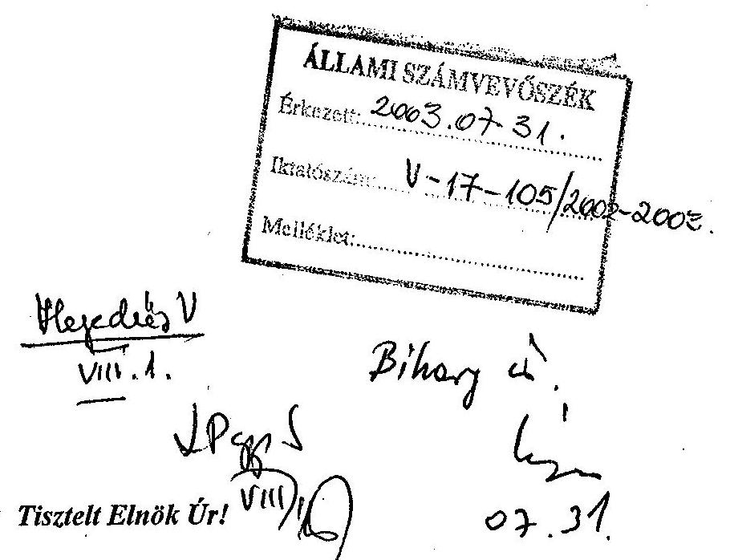

Megkaptam a folyó év július 23. napján kelt, V-17-104/2002-2003. számú levelét, amelyben a Földművelésügyi és Vidékfejlesztési Minisztérium 1998-2002. éveket érintő működésének ellenőrzéséről készített jelentésre adott észrevételeimmel kapcsolatos álláspontjáról tájékoztat.

A jelentéstervezet egyeztetési folyamatának során tárcánk részéről felmerült egyes észrevételek elfogadását köszönettel vettem, az elfogadásra nem került észrevételekkel kapcsolatos álláspontját elfogadom. A jelentés szövegével kapcsolatos véleményeltérés így nem maradt fenn az Állami Számvevőszék és a Földművelésügyi és Vidékfejlesztési Minisztérium között. Ezúton köszönöm meg az ellenőrzésben részt vevő munkatársai alapos és segítő szándékú munkáját. Tájékoztatom továbbá, hogy a jelentésben foglalt megállapítások és javaslatok hasznosítása érdekében szükséges intézkedések foganatosítását a tárca megkezdte.

Budapest, 2003. 2nérins 31.
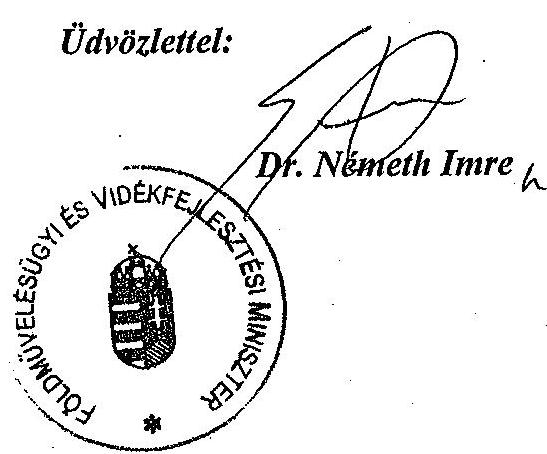

---

# Állami Számvevőszék 

## Dn. Németh Imre úr

miniszter
Földművelésügyi és Vidékfejlesztési
Minisztérium

## Budapest

Tisztelt Miniszter Úr!

Köszönettel vettem a Földművelésügyi és Vidékfejlesztési Minisztérium fejezet működésének ellenőrzéséről készített jelentéssel kapcsolatban 2003. július 31-i keltezéssel írt levelét.

Megköszönöm és tudomásul veszem, hogy az ismételt egyeztetések eredményeként kölcsönösen elfogadtuk egymás álláspontját.

Örömmel nyugtázom Miniszter úr tájékoztatását, hogy megkezdték az ellenőrzés alapján szükséges intézkedések kidolgozását, illetve végrehajtását.

Végül megköszönöm Miniszter úrnak és munkatársainak az ellenőrzés eredményes lefolytatásához nyújtott segítséget.

Budapest, 2003. augusztus „ 1 „

Tisztelettel:
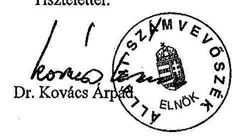

---

# Tanúsítványok jegyzéke 

1. számú A kiadási és bevételi előirányzatok módosítása hatáskörönkénti
bontásban
2. számú A kiadások alakulása kiemelt előirányzatonként
3. számú A személyi juttatások alakulásáról
4. számú A tárgyi eszközökre és az immateriális javakra vonatkozó adatok
5. számú Az évenkénti agrártámogatások felhasználásáról
6. számú A fejezeti kezelésű előirányzatok kiadása

---

# A KIADÁSI ÉS BEVÉTELI ELŐIRÁNYZATOK MÓDOSÍTÁSA HATÁSKÖRÖNKÉNTI BONTÁSBAN

|  Megnevezés | 1998. | 1999. | 2000. | 2001. | 2002. 1.
félév | 2002.  |
| --- | --- | --- | --- | --- | --- | --- |
|  Eredeti kiadási előirányzat | 92721100 | 123269800 | 168078200 | 204878700 | 211910200 | 174549800  |
|  Módosítás összesen | 30925016 | 21460825 | 21765235 | 55095623 | 86047677 | 69734602  |
|  Ebből: |  |  |  |  |  |   |
|  OGY szintű módosítás |  |  |  |  |  |   |
|  Kormány szintű módosítás | 6874708 | -3894928 | -13606549 | -2641300 | 16137217 | 22074894  |
|  Felügyeleti szervi módosítás | 17022279 | 17438409 | 27245461 | 54217824 | 62458233 | 37553581  |
|  Saját hatáskörű módosítás | 7028029 | 7917344 | 8126323 | 3519099 | 7452227 | 10106127  |
|  előir. maradványból | 1793411 | 2585884 | 2889310 | 3519099 | 7452227 | 10106127  |
|  többletbevételből | 5234618 | 5331460 | 5237013 |  |  |   |
|  egyéb forrásból |  |  |  |  |  |   |
|  Módosított kiad. előirányzat | 123646116 | 144730625 | 189843435 | 259974323 | 297957877 | 244284402  |
|  Eredeti bevételi előirányzat | 92721100 | 123269800 | 168078200 | 204878700 | 211910200 | 174549800  |
|  Módosítás összesen | 30925016 | 21460825 | 21765235 | 55095623 | 86047677 | 69734602  |
|  Ebből: |  |  |  |  |  |   |
|  Saját bevétel | 1016159 | 1514925 | 1447784 | -1650923 | -275639 | 4459680  |
|  Átvett pénzeszköz | 16491359 | 11121290 | 23396347 | 42994212 | 30594440 | 19079326  |
|  Költségvetési támogatás | 6948673 | -3890028 | -13487817 | -308992 | 17630370 | 21065605  |
|  Pénzforgalom nélküli bevételek | 6468825 | 12714638 | 10408921 | 14061326 | 38098506 | 25129991  |
|  Módosított bevételi előirányzat | 123646116 | 144730625 | 189843435 | 259974323 | 297957877 | 244284402  |

Megjegyzés: a tanúsítványt alcímenként, címenként és fejezeti szinten kérjük kitölteni! Tanúsítom, hogy az adatok a fejezet/intézmény számviteli nyilvántartásában szereplő adatokkal megegyeznek. Budapest, 2003. Cik. 16.

---

# A KIADÁSOK ALAKULÁSA KIEMELT ELŐIRÁNYZATONKÉNT

|  Megnevezés | 1998. év

 |  |  | 1999. év |  |  | 2000. év |  |   |
| --- | --- | --- | --- | --- | --- | --- | --- | --- | --- |
|   | Eredeti | Módosított | Teljesítés | Eredeti | Módosított | Teljesítés | Eredeti | Módosított | Teljesítés  |
|   | előirányzat |  |  | előirányzat |  |  | előirányzat |  |   |
|  Személyi juttatások | 17 144 700 | 19 439 713 | 18 729 613 | 18 888 900 | 21 685 228 | 20 548 426 | 21 564 700 | 24 998 632 | 23 732 097  |
|  Munkaadókat terhelő járulékok | 7 505 200 | 8 478 152 | 8 005 117 | 7 918 500 | 8 432 518 | 7 837 405 | 8 918 700 | 9 234 850 | 8 765 529  |
|  Dologi kiadások | 11 286 800 | 16 939 815 | 16 740 099 | 21 050 000 | 24 946 788 | 21 955 892 | 26 487 200 | 28 716 268 | 24 152 376  |
|  Ellátottak pénzbeli juttatásai | 8 000 | 8 527 | 4 876 | 8 000 | 8 284 | 5 184 | 8 300 | 11 759 | 10 770  |
|  Egyéb műk. célú támog., kiadások | 20 734 900 | 29 086 922 | 15 950 582 | 30 223 400 | 36 032 309 | 23 310 365 | 30 299 000 | 31 297 613 | 15 726 030  |
|  Kamatkiadások |  |  |  |  |  |  |  |  | 4 010  |
|  Intézményi beruházási kiadások | 871 000 | 3 278 594 | 2 830 684 | 2 593 500 | 4 716 701 | 3 727 196 | 5 264 300 | 8 065 389 | 4 561 647  |
|  Felújítás | 982 000 | 1 676 629 | 1 529 531 | 962 000 | 1 651 561 | 1 347 165 | 1 283 500 | 1 962 344 | 1 446 874  |
|  Egyéb intézményi felhalmozási kiad. | 28 798 500 | 38 365 913 | 37 198 367 | 39 730 500 | 45 016 155 | 36 194 407 | 72 122 500 | 83 151 324 | 50 548 156  |
|  Központi beruházások | 1 430 000 | 1 823 785 | 1 675 455 | 1 465 000 | 1 691 403 | 1 587 905 | 1 800 000 | 2 317 499 | 1 389 625  |
|  Beruházási célprogramok | 3 730 000 | 4 513 679 | 3 855 255 | 100 000 | 356 936 | 59 888 |  |  |   |
|  Kölcsönök |  | 34 387 | 41 429 |  | 192 742 | 198 338 |  | 87 757 | 90 000  |
|  Pénzforgalom nélküli kiadások | 230 000 |  | 6 517 | 330 000 |  | 49 659 | 330 000 |  |   |
|  Költségvetési kiadások összesen | 92 721 100 | 123 646 116 | 106 567 525 | 123 269 800 | 144 730 625 | 116 821 830 | 168 078 200 | 189 843 435 | 130 427 114  |
|  Alap- és vállalkozási tev. közötti elsz. |  |  |  |  |  |  |  |  | 50 907  |
|  Egyéb (kiegyenlítő, függő, átfutó kiadások) |  |  | 421 340 |  |  | 132 201 |  |  | 312 907  |
|  Kiadások összesen | 92 721 100 | 123 646 116 | 106 988 865 | 123 269 800 | 144 730 625 | 116 954 031 | 168 078 200 | 189 843 435 | 130 790 928  |

A tanúsítványt alcímneként, címenként és fejezeti szinten kérjük kitölteni! Tanúsítom, hogy az adatok a cím/intézmény számviteli nyilvántartásában szereplő adatokkal megegyeznek.

2002. 04. 16. 2002. 04. 16.

---

# A KIADÁSOK ALAKULÁSA KIEMELT ELŐIRÁNYZATONKÉNT

|  Megnevezés | 2001. év |  |  | 2002. 1. félév |  |  | 2002. év |  |   |
| --- | --- | --- | --- | --- | --- | --- | --- | --- | --- |
|   | Eredeti | Módosított | Teljesítés | Eredeti | Módosított | Teljesítés | Eredeti | Módosított | Teljesítés  |
|   | előirányzat |  |  | előirányzat |  |  | előirányzat |  |   |
|  Személyi juttatások | 25 120 300 | 33 838 501 | 31 353 645 | 27 405 000 | 38 826 689 | 19 404 149 | 27 281 400 | 43 205 875 | 41 797 884  |
|  Munkaadókat terhelő járulékok | 9 444 700 | 11 602 761 | 10 757 453 | 9 477 500 | 13 167 682 | 6 680 247 | 9 434 500 | 14 341 716 | 13 771 088  |
|  Dologi kiadások | 42 359 100 | 33 004 245 | 27 968 914 | 43 597 200 | 31 083 605 | 14 580 308 | 27 506 700 | 35 443 186 | 30 700 286  |
|  Ellátottak pénzbeli juttatásai | 11 400 | 14 458 | 14 637 | 11 600 | 18 883 | 4 464 |  |  |   |
|  Egyéb műk. célú támog., kiadások | 13 233 300 | 39 133 695 | 17 948 680 | 13 782 100 | 39 998 410 | 10 589 942 | 11 597 800 | 25 024 204 | 18 913 408  |
|  Kamatkiadások |  |  | 190 |  |  | 710 |  |  |   |
|  Intézményi beruházási kiadások | 10 804 300 | 15 692 059 | 8 530 711 | 13 893 300 | 15 929 845 | 5 894 117 | 13 877 300 | 20 975 815 | 11 723 326  |
|  Felújítás | 1 283 500 | 3 022 335 | 1 903 790 | 1 283 500 | 2 169 956 | 1 078 267 | 1 283 500 | 3 593 858 | 2 173 834  |
|  Egyéb intézményi felhalmozási kiad. | 100 492 100 | 120 795 867 | 79 182 912 | 100 330 000 | 154 406 666 | 36 689 036 | 81 438 600 | 99 321 195 | 90 086 287  |
|  Központi beruházások | 1 800 000 | 2 174 461 | 1 615 087 | 1 800 000 | 2 309 313 | 770 729 | 1 800 000 | 2 212 775 | 1 670 164  |
|  Beruházási célprogramok |  |  |  |  |  |  |  |  |   |
|  Kölcsönök |  | 692 941 | 405 922 |  | 5 700 | 69 963 |  | 165 778 | 158 099  |
|  Pénzforgalom nélküli kiadások | 330 000 | 3 000 |  | 330 000 | 41 128 |  | 330 000 |  |   |
|  Költségvetési kiadások összesen | 204 878 700 | 259 974 323 | 179 681 941 | 211 910 200 | 297 957 877 | 95 761 932 | 174 549 800 | 244 284 402 | 210 994 376  |
|  Alap- és vállalkozási tev. közötti elsz. |  |  | 65 520 |  |  |  |  |  |   |
|  Egyéb ( kiegyenlítő, függő, átfutó kiadások) |  |  | 1 473 522 |  |  | 2 601 652 |  |  | -1 581 933  |
|  Kiadások összesen | 204 878 700 | 259 974 323 | 181 220 983 | 211 910 200 | 297 957 877 | 98 363 584 | 174 549 800 | 244 284 402 | 209 412 443  |

A tanúsítványt alcímneként, címenként és fejezeti szinten kérjük kitölteni! Tanúsítom, hogy az adatok a cím/intézmény számviteli nyilvántartásában szereplő adatokkal megegyeznek.

2002. 04. 24. 16.

2002. 04. 24. 16.

2002. 04. 24. 16.

---

Földművelésügyi és Vidékfejlesztési Minisztérium fejezet Fejezet összesen

### A SZEMÉLYI JUTTATÁSOK ALAKULÁSÁRÓL

|  Megnevezés | 1998. év |  |  | 1999. év |  |  | 2000. év |  |   |
| --- | --- | --- | --- | --- | --- | --- | --- | --- | --- |
|   | Eredeti | Módosított | Teljesítés | Eredeti | Módosított | Teljesítés | Eredeti | Módosított | Teljesítés  |
|   |  | előirányzat |  |  | előirányzat |  |  | előirányzat |   |
|  1. Rendszeres személyi juttatás összesen | 13 437 667 | 13 656 407 | 12 379 402 | 14 888 922 | 14 885 593 | 13 472 339 | 15 439 805 | 16 862 186 | 15 375 263  |
| 

 ebből: - alapilletmény | 10 222 733 | 10 248 065 | 9 063 960 | 12 127 798 | 12 209 547 | 11 109 415 | 12 597 889 | 13 825 962 | 12 674 110  |
|  - illetménykiegészítés | 1 289 019 | 1 430 446 | 1 145 211 | 1 546 131 | 1 584 216 | 1 353 525 | 1 544 829 | 1 734 923 | 1 505 905  |
|  - pótlékok | 938 466 | 945 463 | 845 029 | 1 177 058 | 1 086 462 | 1 009 178 | 1 274 808 | 1 301 301 | 1 195 242  |
|  - 13. havi illetmény | 987 449 | 1 032 333 | 1 325 154 |  |  |  |  |  |   |
|  2. Nem rendszeres személyi juttatás összesen | 3 256 821 | 4 908 431 | 5 398 902 | 3 470 683 | 5 798 334 | 6 049 482 | 5 386 488 | 6 937 284 | 7 185 212  |
|  ebből: - jutalom | 809 775 | 2 064 703 | 2 284 065 | 745 550 | 2 621 355 | 2 858 277 | 1 133 863 | 3 098 193 | 3 356 961  |
|  - helyettesítés | 13 171 | 16 403 | 18 803 | 46 504 | 76 092 | 70 692 | 64 100 | 76 834 | 87 424  |
|  - végkielégítés | 19 437 | 93 770 | 102 823 | 12 707 | 19 173 | 17 486 | 8 010 | 15 632 | 18 355  |
|  - jubileumi jut. | 280 981 | 301 739 | 290 238 | 215 233 | 275 363 | 285 224 | 282 323 | 317 565 | 330 203  |
|  - ruházati ktgt. | 238 747 | 244 083 | 270 291 | 245 126 | 279 780 | 301 073 | 256 645 | 315 210 | 328 865  |
|  - étkezési hozzájár. | 225 737 | 235 612 | 244 260 | 252 506 | 256 916 | 257 690 | 261 842 | 273 579 | 269 264  |
|  - részmunkaidős fogl. jutt. | 442 789 | 273 197 | 202 569 | 730 508 | 209 093 | 202 774 | 1 527 080 | 288 335 | 238 581  |
|  - megbízási díj | 132 088 | 264 578 | 295 479 |  |  |  |  |  |   |
|  3. Külső személyi juttatások összesen | 450 212 | 874 875 | 951 309 | 529 295 | 1 001 301 | 1 026 605 | 738 407 | 1 199 162 | 1 171 622  |
|  ebből: - nyugdíjas fogl. jutt. | 223 414 | 249 203 | 221 232 | 178 102 | 222 626 | 231 389 | 232 388 | 204 439 | 209 529  |
|  - állományba nem tart. jutt. | 226 798 | 625 540 | 730 002 | 350 193 | 778 536 | 795 051 | 505 019 | 992 603 | 961 157  |
|  4. Személyi juttatás összesen: | 17 144 700 | 19 439 713 | 18 729 613 | 18 888 900 | 21 685 228 | 20 548 426 | 21 564 700 | 24 998 632 | 23 732 097  |

Megjegyzés: a tanúsítványt alcímenként, címénként és fejezeti szinten kérjük kitölteni! Tanúsítom, hogy az adatok a cím/inézmény számviteli nyilvántartásában szereplő adatokkal megegyeznek.

2002. ...24...16.

---

# A SZEMÉLYI JUTTATÁSOK ALAKULÁSÁRÓL

|  Megnevezés | 2001. év |  |  | 2002. I. félév |  |  | 2002. év |  |   |
| --- | --- | --- | --- | --- | --- | --- | --- | --- | --- |
|   | Eredeti | Módosított | Teljesítés | Eredeti | Módosított | Teljesítés | Eredeti | Módosított | Teljesítés  |
|   | előirányzat |  |  | előirányzat |  |  | előirányzat |  |   |
|  1. Rendszeres személyi juttatás összesen | 19354760 | 23517279 | 21862187 | 22037941 | 32426641 | 14793634 | 21964248 | 31809750 | 30864772  |
|  ebből: - alapilletmény | 15871661 | 18938621 | 17498993 | 17666676 | 26282761 | 11517792 | 17613359 | 25233481 | 24085496  |
|  - illetménykiegészítés | 1818414 | 2573783 | 2379357 | 2390237 | 3713717 | 1900239 | 2380986 | 3885554 | 3927433  |
|  - pótlékok | 1323283 | 1599540 | 1556819 | 1638596 | 2056101 | 1082287 | 1627471 | 2130364 | 2293720  |
|  - 13. havi illetmény |  |  |  |  |  |  |  |  |   |
|  2. Nem rendszeres személyi juttatás összesen | 4567465 | 8507215 | 8501581 | 3954774 | 5552873 | 4193267 | 3936067 | 9729153 | 9799147  |
|  ebből: - jutalom | 1237985 | 3768230 | 3839902 | 592629 | 1843329 | 1918365 | 592629 | 4452304 | 4388271  |
|  - helyettesítés | 30051 | 41142 | 37404 | 32613 | 37465 | 27883 | 32613 | 95921 | 108199  |
|  - végkielégítés | 22438 | 35565 | 70147 | 12500 | 14473 | 11607 | 12500 | 40273 | 45058  |
|  - jubileumi jut. | 340392 | 562770 | 546583 | 566653 | 612885 | 382641 | 562250 | 892316 | 885637  |
|  - ruházati ktgt. | 343629 | 405753 | 386582 | 305437 | 335121 | 232004 | 303257 | 480885 | 456911  |
|  - étkezési hozzájár. | 283874 | 291221 | 287401 | 278715 | 294717 | 157424 | 277553 | 313093 | 312278  |
|  - részmunkaidős fogl. jutt. | 53912 | 67754 | 89978 | 31252 | 39676 | 49342 | 2885 | 3349 | 3596  |
|  - megbízási díj |  |  |  |  |  |  |  |  |   |
|  3. Külső személyi juttatások összesen | 1198075 | 1814007 | 989877 | 1412285 | 847175 | 417248 | 1381085 | 1666972 | 1133965  |
|  ebből: - nyugdíjas fogl. jutt. |  |  |  |  |  |  |  |  |   |
|  - állományba nem tart. jutt. | 1198075 | 1811471 | 986552 | 1410281 | 845171 | 414087 | 1379081 | 1662849 | 1128479  |
|  4. Személyi juttatás összesen: | 25120300 | 33838501 | 31353645 | 27405000 | 38826689 | 19404149 | 27281400 | 43205875 | 41797884  |

Megjegyzés: a tanúsítványt alcíménként, címénként és fejezeti szinten kérjük kitölteni! Tanúsítom, hogy az adatok a cím/inézmény számviteli nyilvántartásában szereplő adatokkal megegyeznek.

2002. 04.16.

2002. 04.16.

---

Földművelésügyi és Vidékfejlesztési Minisztérium fejezet Fejezet összesen 4. számú tanúsítvány

A TÁRGYI ESZKÖZÖKRE ÉS AZ IMMATERIÁLIS JAVAKRA VONATKOZÓ ADATOK

|  Megnevezés | Bruttó érték nyitó | Összes növekedés | Összes csökkenés | Bruttó érték záró | Értékcsökk. záró | Nettó érték záró | Nettó érték záró bruttó ért. %-ában | Teljesen (0-ra) leírt állóeszk.  |
| --- | --- | --- | --- | --- | --- | --- | --- | --- |
|  1998. év |  |  |  |  |  |  |  |   |
|  Immateriális javak | 1009260 | 648138 | 208251 | 1449147 | 1002168 | 446979 | 30.8\% | 535228  |
|  Ingatlanok | 12824831 | 3527841 | 1280040 | 15072632 | 3005249 | 12067383 | 80.1\% | 76065  |
|  Gépek, berendezések | 10826100 | 3394269 | 1903511 | 12316858 | 8803089 | 3513769 | 28.5\% | 4332598  |
|  Járművek | 2138019 | 1088727 | 352078 | 2874668 | 1627463 | 1247205 | 43.4\% | 561844  |
|  Üzemeltetésre, kezelésre átadott | 9515 | 1142385 | 0 | 1151900 | 336583 | 815317 | 70.8\% | 353568  |
|  Összesen: | 26807725 | 9801360 | 3743880 | 32865205 | 14774552 | 18090653 | 55.0\% | 5859303  |
|  1999. év |  |  |  |  |  |  |  |   |
|  Immateriális javak | 1449147 | 382473 | 67968 | 1763652 | 1259801 | 503851 | 28.6\% | 739513  |
|  Ingatlanok | 15072632 | 3456176 | 1088992 | 17439816 | 3351127 | 14088689 | 80.8\% | 144926  |
|  Gépek, berendezések | 12316858 | 2987384 | 947350 | 14356892 | 10089514 | 4267378 | 29.7\% | 5045384  |
|  Járművek | 2874668 | 976565 | 213536 | 3637697 | 2121602 | 1516095 | 41.7\% | 731365  |
|  Üzemeltetésre, kezelésre átadott | 1151900 | 476 | 0 | 1152376 | 337441 | 814935 | 70.7\% | 355595  |
|  Összesen: | 32865205 | 7803074 | 2317846 | 38350433 | 17159485 | 21190948 | 55.3\% | 7016783  |
|  2000. év |  |  |  |  |  |  |  |   |
|  Immateriális javak | 1628384 | 746387 | 268319 | 2106452 | 1581439 | 525013 | 24.9\% | 816485  |
|  Ingatlanok | 17710876 |

 4643355 | 1369101 | 20985130 | 3813299 | 17171831 | 81.8\% | 148491  |
|  Gépek, berendezések | 14203501 | 3129992 | 1017630 | 16315863 | 11443160 | 4872703 | 29.9\% | 6377808  |
|  Járművek | 3589288 | 776395 | 187934 | 4177749 | 2667149 | 1510600 | 36.2\% | 1045625  |
|  Üzemeltetésre, kezelésre átadott | 1152376 | 603858 | 491666 | 1264568 | 726393 | 538175 | 42.6\% | 263070  |
|  Összesen: | 38284425 | 9899987 | 3334650 | 44849762 | 20231440 | 24618322 | 54.9\% | 8651479  |

---

# 4. számú tanúsítvány

|  Megnevezés | Bruttó
érték
nyitó | Összes
növekedés | Összes
csökkenés | Bruttó
érték
záró | Értékcsökk.
záró | Nettó
érték
záró | Nettó érték
záró bruttó
ért. %-ában | Teljesen
(0-ra) leírt
állóeszk.  |
| --- | --- | --- | --- | --- | --- | --- | --- | --- |
|  2001. év |  |  |  |  |  |  |  |   |
|  Immateriális javak | 2 103 126 | 819 573 | 224 105 | 2 698 594 | 1 864 303 | 834 291 | 30.9% | 886 039  |
|  Ingatlanok | 18 997 291 | 6 527 203 | 2 033 468 | 23 491 026 | 4 078 538 | 19 412 488 | 82.6% | 144 696  |
|  Gépek, berendezések | 16 127 194 | 6 136 754 | 1 518 024 | 20 745 924 | 13 053 531 | 7 692 393 | 37.1% | 7 080 875  |
|  Járművek | 4 118 873 | 1 699 295 | 323 196 | 5 494 972 | 3 192 425 | 2 302 547 | 41.9% | 1 287 152  |
|  Üzemeltetésre, kezelésre átadott | 1 264 568 | 4 591 507 | 1 074 946 | 4 781 129 | 629 758 | 4 151 371 | 86.8% | 140 744  |
|  Összesen: | 42 611 052 | 19 774 332 | 5 173 739 | 57 211 645 | 22 818 555 | 34 393 090 | 60.1% | 9 539 506  |
|  2002. I. félév |  |  |  |  |  |  |  |   |
|  Immateriális javak |  |  |  |  |  |  |  |   |
|  Ingatlanok |  |  |  |  |  |  |  |   |
|  Gépek, berendezések |  |  |  |  |  |  |  |   |
|  Járművek |  |  |  |  |  |  |  |   |
|  Üzemeltetésre, kezelésre átadott |  |  |  |  |  |  |  |   |
|  Összesen: |  |  |  |  |  |  |  |   |
|  2002. év |  |  |  |  |  |  |  |   |
|  Immateriális javak | 2 693 459 | 1 755 076 | 199 765 | 4 248 770 | 2 548 191 | 1 700 579 | 40.0% | 1 271 924  |
|  Ingatlanok | 23 491 026 | 74 832 412 | 2 238 500 | 96 084 938 | 4 625 157 | 91 459 781 | 95.2% | 173 326  |
|  Gépek, berendezések | 20 696 559 | 7 611 335 | 1 743 693 | 26 564 201 | 15 746 715 | 10 817 486 | 40.7% | 8 132 916  |
|  Járművek | 5 459 769 | 927 962 | 410 272 | 5 977 459 | 3 737 033 | 2 240 426 | 37.5% | 1 646 777  |
|  Tenyészállatok | 412 731 | 78 755 | 58 579 | 432 907 | 58 015 | 374 892 | 86.6% | 8 147  |
|  Üzemeltetésre, kezelésre átadott | 4 781 129 | 1 084 287 | 1 715 | 5 863 701 | 824 094 | 5 039 607 | 85.9% | 171 554  |
|  Összesen: | 57 534 673 | 86 289 827 | 4 652 524 | 139 171 976 | 27 539 205 | 111 632 771 | 80.2% | 11 404 644  |

Tanúsítom, hogy az adatok a cím/intézmény számviteli nyilvántartásában szereplő adatokkal megegyeznek!

2002. 24. 16. 2002.

2. oldal

---

5. számú tanúsítvány

|  Támogatás jogcíme a 109/1997. (XII. 30.) FM rendelet alapján | költségvetési előirányzat | módosított előirányzat | kifizetett támogatás összege (teljesítés) | az 3. oszlop összegéből az előző évek determinációja | az előző évben azonos jogcímen kifizetett támogatás  |
| --- | --- | --- | --- | --- | --- |
|   |  | 1 | 2 | 3 | 4  |
|  1 | AZ AGRÁRTERMELÉS TÁMOGATÁSA | 31 480.0 | 31 480.0 | 29 962.5 | 9 685.4  |
|  2 | A PIACRAJUTÁST ELŐSEGÍTŐ TÁMOGATÁS | 41 000.0 | 44 404.2 | 44 404.2 | -  |
|  3 | AZ EGYES AGRÁRGAZDASÁGI BERUHÁZÁSOK TÁMOGATÁSA | 28 320.0 | 35 056.0 | 34 956.0 | 8 195.7  |
|  4 | MELIORÁCIÓS ÉS ÖNTÖZÉSFEJLESZTÉSI TÁMOGATÁSOK | 1 900.0 | 2 123.9 | 2 117.1 | 6.8  |
|  5 | ERDŐTELEPÍTÉS TÁMOGATÁSA (BERUHÁZÁS) | 1 400.0 | 1 413.0 | 1 412.9 | -  |
|  6 | AZ ERDŐVÉDELEM ÉS AZ ERDŐGAZDÁLKODÁSI TEVÉKENYSÉG TÁMOGATÁSA | 3 900.0 | 3 953.6 | 3 740.8 | 136.9  |
|  7 | A TERMŐFŐLD MINŐSÉGI VÉDELMÉNEK, HASZNOSÍTÁSÁNAK TÁMOGATÁSA | 1 400.0 | 1 582.8 | 1 505.7 | 182.8  |
|  8 | ÁLLATTENYÉSZTÉSI, TENYÉSZTÉSSZERVEZÉSI FELADATOK ELLÁTÁSÁNAK TÁMOGATÁSA | 550.0 | 958.1 | 888.4 | 128.1  |
|  9 | AZ EGYES HALGAZDÁLKODÁSI TEVÉKENYSÉGEK TÁMOGATÁSA | 250.0 | 272.2 | 168.9 | 22.2  |
|  10 | AZ EGYES VADGAZDÁLKODÁSI TEVÉKENYSÉGEK TÁMOGATÁSA | 600.0 | 840.5 | 718.7 | 240.5  |
|  11 | AZ EGYES AGRÁRGAZDASÁGI CÉLOK MEGVALÓSÍTÁSÁHOZ KAPCSOLÓDÓ FELADATOK TÁMOGATÁSA | 200.0 | 223.1 | 220.3 | 3.1  |
|  12 | CSALÁDI GAZDÁLKODÓ TÁMOGATÁSA | - | - | - | -  |
|   | VÍZKÁBELHÁRÍTÁSI PROGRAM MEGVALÓSÍTÁSÁNAK TÁMOGATÁSA AZ 1. PONT ELŐIRÁNYZATÁBÓL | - | - | - | -  |

A piacrajutást elősegítő támogatások determinációjáról nincs adat

A tanúsítványban szereplő adatok a valóságnak megfelelnek

Kitöltés dátuma: 2002. augusztus 28.

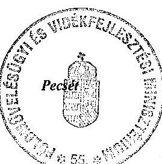

1

---

5. számú tanúsítvány

Az 1999. évi agrártámogatások felhasználásáról

|   | Támogatás jogcíme a 8/1999. (I. 20.) FVM rendelet alapján | költségvetési előirányzat | módosított előirányzat | kifizetett támogatás összege (teljesítés) | a 3. oszlop összegebből az előző évek determinációja | az előző évben azonos jogcímen kifizetett támogatás  |
| --- | --- | --- | --- | --- | --- | --- |
|   |  | 1 | 2 | 3 | 4 | 5  |
|  1 | AZ AGRÁRTERMELÉS TÁMOGATÁSA | 48 045.0 | 40 831.0 | 40 776.1 | 21 272.4 | 29 962.5  |
|  2 | A PIACRAJUTÁST ELŐSEGÍTŐ TÁMOGATÁS | 49 800.0 | 63 634.0 | 61 230.1 | - | 44 404.2  |
|  3 | AZ EGYES AGRÁRGAZDASÁGI BERUHÁZÁSOK TÁMOGATÁSA | 32 440.0 | 27 175.0 | 27 283.7 | 17 822.2 | 34 956.0  |
|  4 | MELIORÁCIÓS ÉS ÖNTÖZÉSFEJLESZTÉSI TÁMOGATÁSOK | 1 800.0 | 1 614.9 | 1 614.9 | 698.6 | 2 117.1  |
|  5 | ERDŐTELEPÍTÉS TÁMOGATÁSA (BERUHÁZÁS) | 2 100.0 | 2 076.4 | 2 054.3 | 12.7 | 1 412.9  |
|  6 | AZ ERDŐVÉDELEM ÉS AZ ERDŐGAZDÁLKODÁSI TEVÉKENYSÉG TÁMOGATÁSA | 4 100.0 | 4 472.6 | 4 097.6 | 850.0 | 3 740.8  |
|  7 | A TERMŐFŐLD MINŐSÉGI VÉDELMÉNEK, HASZNOSÍTÁSÁNAK TÁMOGATÁSA | 1 400.0 | 1 695.0 | 1 587.3 | 295.0 | 1 505.7  |
|  8 | ÁLLATTENYÉSZTÉSI, TENYÉSZTÉSSZERVEZÉSI FELADATOK ELLÁTÁSÁNAK TÁMOGATÁSA | 900.0 | 988.2 | 870.7 | 186.9 | 888.4  |
|  9 | AZ EGYES HALGAZDÁLKODÁSI TEVÉKENYSÉGEK TÁMOGATÁSA | 220.0 | 250.5 | 174.3 | 37.8 | 168.9  |
|  10 | AZ EGYES VADGAZDÁLKODÁSI TEVÉKENYSÉGEK TÁMOGATÁSA | 600.0 | 753.6 | 568.1 | 207.5 | 718.7  |
|  11 | AZ EGYES AGRÁRGAZDASÁGI CÉLOK MEGVALÓSÍTÁSÁHOZ KAPCSOLÓDÓ FELADATOK TÁMOGATÁSA | 300.0 | 242.0 | 231.8 | 4.6 | 220.3  |
|  12 | CSALÁDI GAZDÁLKODÓ TÁMOGATÁSA | - | - | - | - | -  |
|   | VÍZKÁRELHÁRÍTÁSI PROGRAM MEGVALÓSÍTÁSÁNAK TÁMOGATÁSA AZ 1. PONT ELŐIRÁNYZATÁBÓL |  | 1 390.0 | 1 376.8 | - | -  |

A piacrajutást elősegítő támogatások determinációjáról nincs adat A tanúsítványban szereplő adatok a valóságnak megfelelnek

Kitöltés dátuma: 2002. augusztus 28.

Pecsér

Aláírás

---

|   | Támogatás jogcíme a 6/2000. (II. 26.) FVM rendelet alapján | költségvetési elöirányzat | módosított elöirányzat | kifizetett támogatás összege (teljesités) | a 3. oszlop összegebből az elözö évek determinációja | az elözö évben azonos jogcímen kifizetett támogatás  |
| --- | --- | --- | --- | --- | --- | --- |
|   |  | 1 | 2 | 3 | 4 | 5  |
|  1 | AZ AGRÁRTERMELÉS TÁMOGATÁSA | 32828.0 | 47295.7 | 47285.0 | 22861.6 | 40776.1  |
|  2 | A PIACRAJUTÁST ELŐSEGÍTŐ TÁMOGATÁS

 | 58303.5 | 49555.4 | 49548.5 | - | 61230.1  |
|  3 | AZ EGYES AGRÁRGAZDASÁGI BERUHÁZÁSOK TÁMOGATÁSA | 42422.5 | 28228.2 | 28125.6 | 10982.1 | 27283.7  |
|  4 | MELIORÁCIÓS ÉS ÖNTÖZÉSFEJLESZTÉSI TÁMOGATÁSOK | 2275.0 | 2275.6 | 2266.5 | 1119.1 | 1614.9  |
|  5 | ERDŐTELEPÍTÉS TÁMOGATÁSA (BERUHÁZÁS) | 2645.0 | 2608.0 | 2607.0 | 21.8 | 2054.3  |
|  6 | AZ ERDŐVÉDELEM ÉS AZ ERDŐGAZDÁLKODÁSI TEVÉKENYSÉG TÁMOGATÁSA | 4765.0 | 5041.7 | 4096.1 | 362.5 | 4097.6  |
|  7 | A TERMŐFŐLD MINŐSÉGI VÉDELMÉNEK, HASZNOSÍTÁSÁNAK TÁMOGATÁSA | 1400.0 | 1674.0 | 1666.4 | 154.0 | 1587.3  |
|  8 | ÁLLATTENVÉSZTÉSI, TENYÉSZTÉSSZERVEZÉSI FELADATOK ELLÁTÁSÁNAK TÁMOGATÁSA | 900.0 | 918.0 | 842.8 | 18.0 | 870.7  |
|  9 | AZ EGYES HALGAZDÁLKODÁSI TEVÉKENYSÉGEK TÁMOGATÁSA | 220.0 | 253.5 | 184.5 | 33.5 | 174.3  |
|  10 | AZ EGYES VADGAZDÁLKODÁSI TEVÉKENYSÉGEK TÁMOGATÁSA | 600.0 | 783.9 | 627.2 | 183.9 | 568.1  |
|  11 | AZ EGYES AGRÁRGAZDASÁGI CÉLOK MEGVALÓSÍTÁSÁHOZ KAPCSOLÓDÓ FELADATOK TÁMOGATÁSA | 370.0 | 381.1 | 377.5 | 10.4 | 231.8  |
|  12 | CSALÁDI GAZDÁLKODÓ TÁMOGATÁSA | - | - | - | - | -  |
|   | VÍZKÁRELHÁRÍTÁSI PROGRAM MEGVALÓSÍTÁSÁNAK TÁMOGATÁSA AZ 1. PONT ELŐIRÁNYZATÁBÓL |  | 2853.0 | 3025.0 | 426.5 | 1378.8  |

A piacrajutást elősegítő támogatások determinációjáról nincs adat. A tanúsítványban szereplő adatok a valóságnak megfelelnek.

Kitöltés dátuma: 2002. augusztus 28.

---

|  | Támogatás jogcíme a 15/2001. (III. 3.) FVM rendelet alapján | költségvetési előirányzat | módosítva előirányzat | kifizetett támogatás összege (teljesítés) | a 3. oszlop összegebből az előző évek determinációja | az előző évben azonos jogcímen kifizetett támogatás |
| :--: | :--: | :--: | :--: | :--: | :--: | :--: |
|  |  | 1 | 2 | 5 | 6 | 7 |
| 1 | AZ AGRÁRTERMELÉS TÁMOGATÁSA | 67091.1 | 86595.3 | 86589.4 | 28709.8 | 47285.0 |
| 2 | A PIACRAJUTÁST ELŐSEGÍTŐ TÁMOGATÁS | 37735.5 | 32565.8 | 32565.7 | - | 49548.5 |
| 3 | AZ EGYES AGRÁRGAZDASÁGI BERUHÁZÁSOK TÁMOGATÁSA | 68122.1 | 56554.5 | 55820.8 | 21608.7 | 28125.6 |
| 4 | MELIORÁCIÓS ÉS ÖNTÖZÉSFEJLESZTÉSI TÁMOGATÁSOK | 1452.0 | 1452.4 | 1458.7 | 910.8 | 2266.5 |
| 5 | ERDŐTELEPÍTÉS TÁMOGATÁSA (BERUHÁZÁS) | 6000.0 | 5714.2 | 5557.7 | - | 2607.0 |
| 6 | AZ ERDŐVÉDELEM ÉS AZ ERDŐGAZDÁLKODÁSI TEVÉKENYSÉG TÁMOGATÁSA | 5071.1 | 6403.1 | 5310.9 | 759.2 | 4096.1 |
| 7 | A TERMŐFŐLD MINŐSÉGI VÉDELMÉNEK, HASZNOSÍTÁSÁNAK TÁMOGATÁSA | 1800.0 | 2335.0 | 1969.5 | 124.1 | 1666.4 |
| 8 | ÁLLATTENYÉSZTÉSI, TENYÉSZTÉSSZERVEZÉSI FELADATOK ELLÁTÁSÁNAK TÁMOGATÁSA | 1100.0 | 1290.2 | 1066.7 | 74.5 | 842.8 |
| 9 | AZ EGYES HALGAZDÁLKODÁSI TEVÉKENYSÉGEK TÁMOGATÁSA | 250.0 | 244.0 | 212.2 | 60.0 | 184.5 |
| 10 | AZ EGYES VADGAZDÁLKODÁSI TEVÉKENYSÉGEK TÁMOGATÁSA | 650.0 | 907.9 | 530.8 | 214.2 | 627.2 |
| 11 | AZ EGYES AGRÁRGAZDASÁGI CÉLOK MEGVALÓSÍTÁSÁHOZ KAPCSOLÓDÓ FELADATOK TÁMOGATÁSA | 360.0 | 286.5 | 263.4 | 6.5 | 377.5 |
| 12 | CSALÁDI GAZDÁLKODÓ TÁMOGATÁSA | - | - | - | - | - |
|  | VÍZKÁRELHÁRÍTÁSI PROGRAM MEGVALÓSÍTÁSÁNAK TÁMOGATÁSA AZ 1. PONT ELŐIRÁNYZATÁBÓL |  | 1525.0 | 1535.5 | 453.3 | 3025.0 |

A piacrajutást elősegítő támogatások determinációjáról nincs adat.
A tanúsítványban szereplő adatok a valóságnak megfelelnek.
Kitöltés dátuma: 2002. augusztus 28.

---

|  Támogatás jogcíme a 102/2001. (XII. 16.) FVM rendelet alapján | költségvetési előirányzat | módosított előirányzat | kifizetett támogatás összege (teljesítés) | a 3. oszlop összegebből az előző évek determinációja | az előző évben azonos jogcímen kifizetett támogatás  |
| --- | --- | --- | --- | --- | --- |
|  AZ AGRÁRTERMELÉS TÁMOGATÁSA | 65 690,0 | 67 690,0 | 67 645,0 | 27 069,7 | 86 589,4  |
|  A PIACRAJUTÁST ELŐSEGÍTŐ TÁMOGATÁS | 41 297,7 | 44 715,0 | 44 626,3 | - | 32 565,7  |
|  AZ EGYES AGRÁRGAZDASÁGI BERUHÁZÁSOK TÁMOGATÁSA | 64 690,0 | 66 887,7 | 66 109,3 | 20 796,7 | 55 820,8  |
|  MELIORÁCIÓS ÉS ÖNTÖZÉSFEJLESZTÉSI TÁMOGATÁSOK | 1 452,0 | 1 454,4 | 1 447,5 | 999,7 | 1 458,7  |
|  ERDŐTELEPÍTÉS TÁMOGATÁSA (BERUHÁZÁS) | 6 000,0 | 5 785,3 | 5 704,4 | 156,5 | 5 557,7  |
|  AZ ERDŐVÉDELEM ÉS AZ ERDŐGAZDÁLKODÁSI TEVÉKENYSÉG TÁMOGATÁSA | 5 110,0 | 7 539,2 | 6 232,0 | 1 008,4 | 5 310,9  |
|  A TERMŐFŐLD MINŐSÉGI VÉDELMÉNEK, HASZNOSÍTÁSÁNAK TÁMOGATÁSA | 1 800,0 | 2 437,0 | 2 291,2 | 382,0 | 1 969,5  |
|  ÁLLATTENYÉSZTÉSI, TENYÉSZTÉSSZERVEZÉSI FELADATOK ELLÁTÁSÁNAK TÁMOGATÁSA | 1 100,0 | 1 341,6 | 1 093,0 | 223,5 | 1 066,7  |
|  AZ EGYES HALGAZDÁLKODÁSI TEVÉKENYSÉGEK TÁMOGATÁSA | 250,0 | 273,7 | 248,3 | 71,8 | 212,2  |
|  AZ EGYES VADGAZDÁLKODÁSI TEVÉKENYSÉGEK TÁMOGATÁSA | 650,0 | 1 068,4 | 856,2 | 337,1 | 530,8  |
|  AZ EGYES AGRÁRGAZDASÁGI CÉLOK MEGVALÓSÍTÁSÁHOZ KAPCSOLÓDÓ FELADATOK TÁMOGATÁSA | 360,0 | 257,8 | 232,7 | 32,8 | 263,4  |
|  CSALÁDI GAZDÁLKODÓ TÁMOGATÁSA | - | 8 000,0 | 7 992,0 | - | -  |
|  VÍZKÁRELHÁRÍTÁSI PROGRAM MEGVALÓSÍTÁSÁNAK TÁMOGATÁSA AZ 1. PONT ELŐIRÁNYZATÁBÓL | - | 4,1 | 4,1 | 1 535,5 |   |

A tanúsítványban szereplő adatok a valóságnak megfelelnek.

Kitöltés dátuma: 2003. 04. 16.

Pecsét

Aláírás

---

# A FEJEZETI KEZELÉSŰ ELŐIRÁNYZATOK KIADÁSA (1998. év.)

|  Megnevezés
(cím/alcím/előir.csop/kiem.előir) | Eredeti előirányzat | Módosított előirányzat | Teljesítés  |
| --- | --- | --- | --- |
|  10/01 Fejezeti kezelésű intézményi előirányzatok |  |  |   |
|  01/01 Személyi juttatások | 170,0 |  |   |
|  01/02 Munkaadókat terhelő járulékok | 68,0 |  |   |
|  01/03 Dologi kiadások | 232,0 |  |   |
|  01/05 Egyéb működési célú támogatások, kiadások |  | 72,8 | 72,8  |
|  10/02/01 Élelmiszerkönyv kiadás,szabv.és minőségügyi feladatokra | 30,0 | 13,7 | 10,0  |
|  10/02/02 PHARE agrárgazdaság és ingatlan-nyilvántartás |  | 1581,0 | 657,9  |
|  10/02/04 Mezőgazdasági birtokrendezés feladatai | 640,0 | 240,2 | 225,3  |
|  10/02/05 A magyar Agrárkamara Gazdajegyzői Hálózat üzem.támogatása | 800,0 | 800,0 | 800,0  |
|  10/02/06 Az Euro-Atlanti integráció előkészítése | 500,0 | 150,9 | 123,5  |
|  10/02/07 Munkavédelmi,polg.véd.és nukl.baleset-elhárítási feladatok | 50,0 | 77,0 | 65,1  |
|  10/02/08 Nemzetközi feladatok, tagdíjak | 200,0 | 35,8 | 35,0  |
|  10/02/09 Agrárkutatási feladatok támogatása | 450,0 | 409,2 | 316,5  |
|  10/02/10 Balatoni kutatások támogatása |  | 20,7 | 20,3  |
|  10/02/12 Nemzeti kataszteri program feltételrendszere | 900,0 | 301,3 | 39,3  |
|  10/02/13 Magyar Állatorvosi Kamara által ell.állami felad.tám. | 20,0 | 20,0 | 20,0  |
|  10/02/14 Hegyközségek állami feladatainak támogatása | 270,0 | 270,0 | 270,0  |
|  10/02/34 Közoktatási támogatások |  | 18,7 | 18,7  |
|  10/02/35 Egyéb szervezetek feladataira |  | 223,3 | 220,1  |
|  10/02/36/01 Regionális Fejlesztési Tanácsok |  | 60,0 | 60,0  |

---

|  10/02/36/02 Megyei Területfejlesztési Tanácsok |  | 133,0 | 133,0  |
| --- | --- | --- | --- |
|  10/02/36/03 Budapesti agglomerációs Fejlesztési Tanács |  | 18,0 | 18,0  |
|  10/02/37/01 BAZ megyei ISZVP támogatással fedezett kiadásai |  | 2 428,8 | 720,7  |
|  10/02/37/02 BAZ megyei ISZVP segéllyel fedezett kiadásai |  | 706,4 | 65,6  |
|  10/02/38/01 PHARE CBC program támogatással fedezett kiadásai |  | 387,0 | 318,1  |
|  10/02/38/02 PHARE CBC program segéllyel fedezett kiadásai |  | 4 130,0 | 1 178,9  |
|  10/02/38/03 Területfejlesztési PHARE programirányító Iroda támogatása |  | 58,0 | 58,0  |
|  10/02/39 Alföldprogram területfejlesztési feladatai |  | 138,6 | 7,3  |
|  10/03/01 Erdőtelepítés, erdőszerkezet-átalakítás, fásítása | 1 400,0 | 1 413,0 | 1 412,9  |
|  10/03/03 Meliorációs és öntözésfejlesztési feladatok támogatása | 1 900,0 | 2 123,9 | 2 117,1  |
|  10/03/04 Területfejlesztési feladatok |  | 19,2 | 2,5  |
|  10/03/05 Céltámogatási kiegészítő keret |  | 364,9 | 160,7  |
|  10/03/06 PHARE CBC program |  | 492,7 | 65,6  |
|  10/03/07 Holtág rehabilitáció támogatása |  | 100,0 | 96,7  |
|  10/04/01 Mezőgazdasági alaptevékenységek beruházásainak támogatása | 28 320,0 | 35 056,0 | 34 956,0  |
|  10/04/02/01 Erdészeti közcélú feladatok | 3 500,0 | 3 555,3 | 3 332,3  |
|  10/04/02/02 Erdei vasutak működtetésére | 65,0 | 65,0 | 65,0  |
|  10/04/02/03 Jóléti- és parkerdő-fenntartásra | 85,0 | 82,7 | 82,7  |
|  10/04/03 Termőföld minőségi védelme, hasznosítása | 1 400,0 | 1 582,8 | 1 505,7  |
|  10/04/04 Állattenyésztési és tenyésztésszervezési feladatok | 550,0 | 958,1 | 888,4  |
|  10/04/05 Hallgazdálkodási tevékenységek | 250,0 | 272,2 | 168,9  |
|  10/04/06 Vadgazdálkodási tevékenységek | 600,0 | 840,5 | 718,7  |
|  10/04/09 Agrárinformatika, farm, és egyéb szakmai gyakorlatok tám. | 200,0 | 223,1 | 220,3  |
|  10/04/10 Területfejlesztési célfeladatok támogatással fedett kiad. |  | 7 947,3 | 2 538,9  |
|  10/04/11 Területfejlesztési célfeladatok segéllyel fedezett kiadásai |  | 569,4 | 26,2  |
|  10/05 Fejezeti tartalék | 230,0 |  |   |
|  10/06 Állatkár-térítés |

 2 200,0 | 2 271,8 | 1 948,1  |
|  10/07 Járványvédelmi céltámogatás (Állat) | 200,0 |  |   |
|  10/08 Nem biztosítható mezőgazdasági elemi károk kezelése |  | 1 500,0 | 1 500,0  |

Megjegyzés: a tanúsítványt évenként, az 1998-2002. közötti időszakra kérjük kitölteni! Tanúsítom, hogy az adatok a fejezet/cím számviteli nyilvántartásában szereplő adatokkal megegyeznek!

Budapest, 2002.

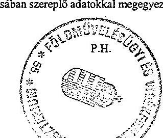

---

# A FEJEZETI KEZELÉSŰ ELŐIRÁNYZATOK KIADÁSA (1999. év.)

|  Megnevezés | Eredeti előirányzat | Módosított előirányzat | Teljesítés  |
| --- | --- | --- | --- |
|  (cím/alcím/előir.csop/kiem.előir) |  |  |   |
|  10/01 | Fejezeti kezelésű intézményi előirányzatok |  |   |
|  01/01 | Személyi juttatások | 170,0 |   |
|  01/02 | Munkaadókat terhelő járulékok | 68,0 |   |
|  01/03 | Dologi kiadások | 290,0 |   |
|  01/05 | Egyéb működési célú támogatások, kiadások |  | 147,7  |
|  10/02/01 | Élelmiszerkönyv kiadás, szabv.és minőségügyi feladatokra | 30,0 | 17,1  |
|  10/02/02 | Phare agrárgazdaság és ingatlannyilvántartás | 776,8 | 1852,1  |
|  10/02/03 | Phare intézményfejlesztés | 3502,2 | 3502,2  |
|  10/02/04 | Mezőgazdasági birtokrendezés feladatai | 640,0 | 15,9  |
|  10/02/06 | Az Európai Unióhoz való csatlakozás Nemzeti Programja | 2310,0 | 1380,3  |
|  10/02/07 | Munkavédelmi, polg.véd.és nukl.baleset-elhárítási feladatok | 50,0 | 47,1  |
|  10/02/08 | Nemzetközi feladatok, tagdijak | 279,7 | 20,0  |
|  10/02/09 | Agrárkutatási feladatok támogatása | 490,0 | 347,9  |
|  10/02/10 | Balatoni kutatások támogatása |  | 0,4  |
|  10/02/12 | Nemzeti kataszteri program feltételrendszere | 1000,0 | 826,3  |
|  10/02/13 | Magyar Állatorvosi Kamara által ell. állami felad.tám. | 20,0 | 18,0  |
|  10/02/14 | Hegyközségek állami feladatainak támogatása | 270,0 | 245,0  |
|  10/02/35 | Egyéb szervezetek feladataira |  | 293,0  |
|  10/02/36/01 | Megyei Területfejlesztési Tanácsok | 133,0 | 130,0  |
|  10/02/36/02 | Regionális Fejlesztési Tanácsok | 30,0 | 29,4  |
|  10/02/36/03 | Budapesti agglomerációs Fejlesztési Tanács | 9,0 | 8,8  |
|  10/02/36/04 | Tervezési-Statisztikai régiók reg.fejl.tanácsai működ. ktg. | 249,0 | 244,0  |
|  10/02/36/05 | Vidékfejlesztési intézményrendszer segéllyel fedezett kiadásai | 720,0 | 720,0  |
|  10/02/37/01 | BAZ megyei ISZVP támogatással fedezett kiadásai | 10,0 | 4426,7  |
|  10/02/37/02 | BAZ megyei ISZVP segéllyel fedezett kiadásai | 469,6 | 1110,4  |

---

|  10/02/38/01 | Phare CBC program támogatással fedezett kiadásai | 695,0 | 1366,1 | 663,8  |
| --- | --- | --- | --- | --- |
|  10/02/38/02 | Phare CBC program segéllyel fedezett kiadásai | 5555,0 | 8494,5 | 1931,4  |
|  10/02/38/04 | Phare Iroda működési költségei | 160,0 | 156,7 | 156,7  |
|  10/02/39 | Alföldprogram területfejlesztési feladatai | 37,0 | 197,5 | 107,8  |
|  10/02/40 | Építésügyi célelőirányzatok | 220,0 | 220,0 | 113,3  |
|  10/02/41 | Területi információs rendszer működtetése | 60,0 | 58,8 | 58,8  |
|  10/02/42 | Vízügyi feladatok támogatása | 1500,0 | 2096,6 | 1634,5  |
|  10/03/05 | Céltámogatási kiegészítő keret |  | 204,2 | 7,6  |
|  10/03/07 | Holtág rehabilitáció támogatása | 100,0 | 101,4 | 3,3  |
|  10/03/08 | Területfejlesztési feladatok |  | 16,7 | 15,3  |
|  10/03/09 | Phare CBC program |  | 34,7 | 33,8  |
|  10/04/01/01 | Mezőgazdasági alaptevékenységek beruházásainak támogatása | 32440,0 | 27175,0 | 27283,7  |
|  10/04/01/02 | Erdőtelepítés, erdőszerkezet-átalakítás, fásítás | 2100,0 | 2076,4 | 2054,3  |
|  10/04/01/03 | Meliorációs és öntözésfejlesztési beruházások támogatása | 1800,0 | 1614,9 | 1614,9  |
|  10/04/02/01 | Erdészeti közcélú feladatok | 3600,0 | 3982,4 | 3672,7  |
|  10/04/02/02 | Erdei vasutak működtetésére | 100,0 | 98,0 | 98,0  |
|  10/04/02/03 | Jóléti- és parkerdőfenntartásra | 100,0 | 91,2 | 91,2  |
|  10/04/03 | Termőföld minőségi védelme, hasznosítása | 1400,0 | 1695,0 | 1587,3  |
|  10/04/04 | Állattenyésztési és tenyésztésszervezési feladatok | 900,0 | 988,2 | 870,7  |
|  10/04/05 | Halgazdálkodási tevékenységek | 220,0 | 250,5 | 174,3  |
|  10/04/06 | Vadgazdálkodási tevékenységek | 600,0 | 753,6 | 568,1  |
|  10/04/09 | Agrárinformatika, farm, és egyéb szakmai gyakorlatok tám. | 300,0 | 242,0 | 231,8  |
|  10/04/01/01 | Vidékfejlesztési célfeladatok támogatással fedezett kiadásai | 4600,0 | 6152,6 | 5652,2  |
|  10/04/10/02 | Vidékfejlesztési célfeladatok segéllyel fed. kiad. | 3191,0 | 3734,3 | 175,0  |
|  10/05 | Fejezeti tartalék | 330,0 |  |   |
|  10/06 | Állatkár-térítés | 1518,9 | 1844,1 | 2815,8  |

Megjegyzés: a tanúsítványt évenként, az 1998-2002. közötti időszakra kérjük kitölteni! Tanúsítom, hogy az adatok a fejezet/cím számviteli nyilvántartásában szereplő adatokkal megegyeznek!

Budapest, 2002. 05/16.

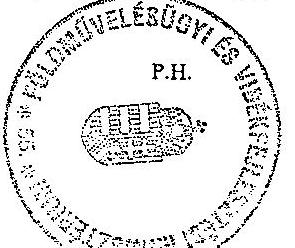

---

# A FEJEZETI KEZELÉSŰ ELŐIRÁNYZATOK KIADÁSA

(2000. év.) adatok: M Ft-ban, egy tizedessel

|  Megnevezés | Eredeti előirányzat | Módosított előirányzat | Teljesítés  |
| --- | --- | --- | --- |
|  (cím/alcím/előir.csop/kiem.előir) |  |  |   |
|  10/01/03 | Holtág rehabilitáció támogatása | 100,0 | 198,1  |
|  10/01/13 | Mg.tev.segítő szolgáltatások beruházása | 1120,0 | 422,7  |
|  10/01/14 | Középfokú oktatás beruházásai | 250,0 | 10,7  |
|  10/01/15 | Művelődési beruházások | 30,0 | 20,3  |
|  10/01/16 | Mg.-i, erdő-, hal- és vadgazdálkodási célú kut.és fejl.beruházásai | 100,0 | 7,2  |
|  10/01/17 | Továbbképző létesítmények beruházásai | 200,0 |   |
|  10/01/18 | Céltámogatási kiegészítő keret |  | 239,0  |
|  10/01/19 | Területfejlesztési feladatok |  | 1,4  |
|  10/01/20 | Phare CBC program |  | 0,9  |
|  10/02/01 | Élelmiszerkönyv kiadás, szabv.és minőségügyi feladatokra |  | 1,6  |
|  10/02/02 | Phare agrárgazdaság és ingatlannyilvántartás |  | 2,5  |
|  10/02/03 | Phare intézményfejlesztés | 3878,0 | 7380,2  |
|  10/02/04 | Mezőgazdasági birtokrendezés feladatai | 563,0 | 1,1  |
|  10/02/06 | Az Európai Unióhoz való csatlakozás Nemzeti Programja | 5807,6 | 4298,9  |
|  10/02/07 | Munkavédelmi, polg.véd.és nukl.baleset-elhárítási feladatok | 45,0 | 31,7  |
|  10/02/08 | Nemzetközi feladatok, tagdijak | 172,9 | 20,0  |
|  10/02/09 | Agrárkutatási feladatok támogatása | 440,0 | 423,9  |
|  10/02/10 | Balatoni kutatások támogatása |  | 0,4  |
|  10/02/12 | Nemzeti kataszteri program feltételrendszere | 870,0 | 772,8  |
|  10/02/13 | Magyar Állatorvosi Kamara által ell. állami felad.tám. | 18,0 | 18,0  |
|  10/02/14 | Hegyközségek állami feladatainak támogatása | 275,0 | 269,2  |
|  10/02/34 | Közoktatási támogatások |  | 4,5  |
|  10/02/35 | Egyéb szervezetek feladataira |  | 67,1  |
|  10/02/36/04 | Területfejlesztési intézmények működ.költségeihez hozzájárulás | 448,4 | 439,0  |
|  10/02/36/05 | Területfejlesztési intézményrendszer segéllyel fedezett kiadásai | 1710,0 | 2430,0  |

---

|  10/02/37/01 BAZ megyei ISZVP támogatással fedezett kiadásai | 9,8 | 2 982,8 | 1 963,0  |
| --- | --- | --- | --- |
|  10/02/37/02 BAZ megyei ISZVP segéllyel fedezett kiadásai |  | 421,5 | 5,8  |
|  10/02/38/01 Phare CBC program támogatással fedezett kiadásai | 681,0 | 2 324,2 | 2 397,6  |
|  10/02/38/02 Phare CBC program segéllyel fedezett kiadásai | 15 918,1 | 22 417,3 | 7 946,1  |
|  10/02/38/04 Phare Iroda működési költségei | 200,0 | 200,0 | 200,0  |
|  10/02/39 Alföldprogram területfejlesztési feladatai |  | 89,7 | 61,9  |
|  10/02/40 Építésügyi célelőirányzatok | 220,0 | 423,5 | 282,7  |
|  10/02/41 Területi információs rendszer működtetése | 80,0 | 78,3 | 78,3  |
|  10/02/42 Vízügyi feladatok támogatása | 1 400,0 | 3 491,9 | 2 527,3  |
|  10/02/43 Terület és településrendezési célfeladat | 200,0 | 183,8 | 123,9  |
|  10/04/01/01 Mezőgazdasági alaptevékenységek beruházásainak támogatása | 42 422,5 | 28 228,2 | 28 125,6  |
|  10/04/01/02 Erdőtelepítés, erdőszerkezet-átalakítás, fásítás | 2 645,0 | 2 608,0 | 2 607,0  |
|  10/04/01/03 Meliorációs és öntözésfejlesztési beruházások támogatása | 2 275,0 | 2 275,6 | 2 266,5  |
|  10/04/02/01 Erdészeti közcélú feladatok | 4 200,0 | 4 488,6 | 3 561,3  |
|  10/04/02/02 Erdei vasutak működtetésére | 105,0 | 102,8 | 102,8  |
|  10/04/02/03 Jóléti- és parkerdőfenntartásra | 205,0 | 200,7 | 200,7  |
|  10/04/03 Termőföld minőségi védelme, hasznosítása | 1 400,0 | 1 674,0 | 1 666,4  |
|  10/04/04 Állattenyésztési és tenyésztésszervezési feladatok | 900,0 | 918,0 | 842,8  |
|  10/04/05 Halgazdálkodási tevékenységek | 220,0 | 253,5 | 184,5  |
|  10/04/06 Vadgazdálkodási tevékenységek | 600,0 | 783,9 | 627,2  |
|  10/04/09 Agrárinformatika, farm, és egyéb szakmai gyakorlatok tám. | 370,0 | 381,1 | 377,5  |
|  10/04/10/01 Területfejlesztési célfeladatok támogatással fedezett kiadásai | 4 033,5 | 4 664,1 | 2 792,9  |
|  10/04/10/02 Területfejlesztési célfeladatok segéllyel fed. kiad. | 17 920,0 | 21 416,1 | 1 748,7  |
|  10/04/10/03 Vidékfejlesztési célfeladatok támogatással fedezett kiadásai | 1 000,0 | 979,0 | 467,9  |
|  10/05 Állatkár-térítés | 1 518,9 | 1 635,8 | 1 109,0  |
|  10/10 Fejezeti tartalék | 330,0 |  |   |

Megjegyzés: a tanúsítványt évenként, az 1998-2002.
 közötti időszakra kérjük kitölteni! Tanúsítom, hogy az adatok a fejezet/cím számviteli nyilvántartásában szereplő adatokkal megegyeznek!

Budapest, 2002. 05.16.

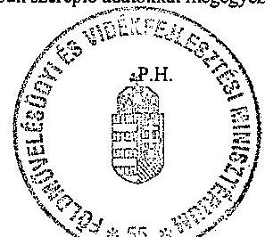

---

### 6. számú tanúsítvány

### A FEJEZETI KEZELÉSŰ ELŐIRÁNYZATOK KIADÁSA (2001. év.)

|  Megnevezés | - | Adatok: M Ft-ban, egy tizedessel |   |
| --- | --- | --- | --- |
|  (cím/alcím/előir.csop/kiem.előir) |  | Módosított előirányzat | Teljesítés  |
|  10/01/03 | Holtág rehabilitáció támogatása | 100,0 | 195,9  |
|  10/01/13 | Mg.tev. segítő szolgáltatások beruházása | 1 120,0 | 826,0  |
|  10/01/14 | Középfokú oktatás beruházásai | 250,0 | 30,8  |
|  10/01/15 | Művelődési beruházások | 30,0 | 20,3  |
|  10/01/16 | Mg.-i, erdő-, hal- és vadgazdálkodási célú kut. és fejl. beruházásai | 100,0 | 27,2  |
|  10/02/01 | Előalmiszerkönyv kiadás, szabv. és minőségügyi feladatokra |  | 0,1  |
|  10/02/06 | Az Európai Unióhoz való csatlakozás Nemzeti Programja | 3 462,9 | 5 426,7  |
|  10/02/07 | Munkavédelmi, polg. véd. és nukl. baleset-elhárítási feladatok | 44,0 | 20,6  |
|  10/02/09 | Agrárkutatási feladatok támogatása | 536,0 | 475,5  |
|  10/02/10 | Balatoni kutatások támogatása |  | 0,4  |
|  10/02/12 | Nemzeti kataszteri program feltételrendszere | 442,0 | 442,0  |
|  10/02/13 | Magyar Állatorvosi Kamara által ell. állami felad. tám. | 18,0 | 18,0  |
|  10/02/14 | Hegyközségek állami feladatainak támogatása | 300,0 | 300,0  |
|  10/02/34 | Közoktatási támogatások |  | 6,0  |
|  10/02/35 | Egyéb szervezetek feladataira |  | 48,6  |
|  10/02/36/04 | Területfejlesztési intézmények műk. költségeihez hozzájárulás | 639,0 | 639,0  |
|  10/02/36/05 | Területfejlesztési intézményrendszer segéllyel fedezett kiadásai |  | 1 972,1  |
|  10/02/37/01 | BAZ megyei ISZVP támogatással fedezett kiadásai | 9,8 | 1 029,9  |
|  10/02/38/01 | Phare CBC program támogatással fedezett kiadásai |  | 1 168,0  |
|  10/02/38/02 | Phare CBC program segéllyel fedezett kiadásai |  | 14 471,0  |
|  10/02/38/04 | Phare Iroda működési költségei | 504,0 | 504,0  |
|  10/02/39 | Alföldprogram területfejlesztési feladatai |  | 27,8  |
|  10/02/40 | Építésügyi célelőirányzatok | 220,0 | 525,6  |
|  10/02/41 | Területi információs rendszer működtetése | 78,3 | 78,3  |
|  10/02/42 | Vízügyi feladatok támogatása | 1 400,0 | 2 337,7  |

---

|  10/02/43 | Terület és településrendezési célfeladat | 195,8 | 255,7 | 92,7  |
| --- | --- | --- | --- | --- |
|  10/02/44 | Állategészségügy intézményrendszerének fejl.(HU 9806-01) | 1110,0 | 1189,0 | 517,7  |
|  10/02/45 | Növényegészségügy intézményrendszerének fejl.(HU 9806-02) | 881,0 | 962,5 | 386,0  |
|  10/02/46 | KAP intézményrendszerének fejl.(HU 9806-03) | 866,0 | 1029,9 | 376,1  |
|  10/02/47 | Minőségtan.,élelmiszerip.szerk.vált. (HU 9806-04) | 688,0 | 1001,0 | 663,1  |
|  10/02/48 | Vidékfejl.-agrárkömy.véd int.rendszerének fejl.(HU 9806-05) | 67,0 | 282,0 | 196,1  |
|  10/02/49 | Növényvédelmi szolgáltatás fejl.(HU 9909-01) | 217,0 | 586,1 | 185,1  |
|  10/02/50 | Megyei földnyilvántartási rendszer fejlesztése (HU 9909-02) | 897,0 | 770,7 | 141,2  |
|  10/02/51 | Állateú.és élelmiszerhigiéniai ellenőrzés (HU 0002-01) | 772,0 | 1694,9 | 95,2  |
|  10/02/52 | Gazdasági és szociális kohézió erősítése (HU 0008) | 7243,0 | 8048,9 | 135,0  |
|  10/02/53 | Határon átnyúló CBC programok (HU 00XX) | 7454,0 | 7454,0 | 536,0  |
|  10/02/57 | Befejeződött Phare programok maradványainak rend. |  | 17,2 | 17,2  |
|  10/02/58 | Központi beruházási maradványok rendezése |  | 239,5 | 239,5  |
|  10/04/01/01 | Mezőgazdasági alaptevékenységek beruházásainak támogatása | 68122,1 | 56554,5 | 55820,8  |
|  10/04/01/02 | Erdőtelepítés, erdőszerkezet-átalakítás, fásítás | 6000,0 | 5714,2 | 5557,7  |
|  10/04/01/03 | Meliorációs és öntözésfejlesztési beruházások támogatása | 1452,0 | 1452,4 | 1458,7  |
|  10/04/02/01 | Erdészeti közcélú feladatok | 4430,0 | 5759,0 | 4778,9  |
|  10/04/02/02 | Erdei vasutak müködtetésére | 110,0 | 110,0 | 110,0  |
|  10/04/02/03 | Jóléti- és parkerdőfenntartásra | 210,0 | 210,0 | 129,7  |
|  10/04/03 | Termőföld minőségi védelme, hasznosítása | 1800,0 | 2335,0 | 1969,5  |
|  10/04/04 | Állattenyésztési és tenyésztésszervezési feladatok | 1100,0 | 1290,2 | 1066,7  |
|  10/04/05 | Halgazdálkodási tevékenységek | 250,0 | 244,0 | 212,2  |
|  10/04/06 | Vadgazdálkodási tevékenységek | 650,0 | 907,9 | 530,8  |
|  10/04/09 | Agrárinformatika,farm,és egyéb szakmai gyakorlatok tám. | 360,0 | 286,5 | 263,4  |
|  10/04/10/01 | Területfejlesztési célfeladatok támogatással fedezett kiadásai | 17268,5 | 18704,2 | 7607,7  |
|  10/04/10/02 | Területfejlesztési célfeladatok segéllyeli fed.kiad. |  | 9772,2 | 2274,9  |
|  10/04/10/03 | Vidékfejlesztési célfeladatok támogatással fedezett kiadásai | 4500,0 | 4499,9 | 635,8  |
|  10/04/10/04 | Agrárlogisztika | 1500,0 | 1500,0 |   |
|  10/05 | Állatkár-térítés | 1487,0 | 2032,2 | 716,0  |
|  10/10 | Fejezeti tartalék | 330,0 | 3,0 |   |

Megjegyzés: a tanúsítványt évenként, az 1998-2002. közötti időszakra kérjük kitölteni! Tanúsítom, hogy az adatok a fejezet/cím számviteli nyilvántartásában szereplő adatokkal megegyeznek!

Budapest, 2002. 05.16.

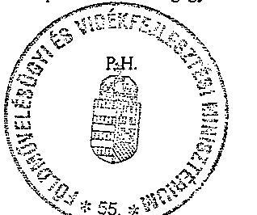

---

# A FEJEZETI KEZELÉSŰ ELŐIRÁNYZATOK KIADÁSA

(2002. év.)

|  Megnevezés (cím/sém/előir.csop/kiem.előir) |  | Eredeti előirányzat | Módosított előirányzat | Teljesítés  |
| --- | --- | --- | --- | --- |
|  10/01/03/00/02/04 | Holtág-rehabilitáció támogatása | 100.0 | 200.0 | 129.0  |
|  10/01/13/00/02/04 | Mezőgazdasági tevékenységet segítő szolgáltatások | 1120.0 | 876.6 | 405.2  |
|  10/01/14/00/02/04 | Középfokú oktatás beruházások | 250.0 | 20.4 | 20.0  |
|  10/01/15/00/02/04 | Művelődési beruházások | 30.0 | 3.9 | -  |
|  10/01/16/00/02/04 | Mezőgazdasági, erdő, hal, vadgazdálkodási kutatás | 100.0 | 20.0 | 20.0  |
|  10/01/17/00/02/04 | További képző létesítmények beruházásai | 200.0 | - | -  |
|  10/02/06/00/01-02 | Európai Unióhoz való csatlakozás Nemzeti Programja | 3832.9 | 8381.3 | 2581.4  |
|  10/02/07/00/01-02 | Munkavédelmi, polgári védelmi és nukleáris baleset-elhárítás | 44.0 | 39.1 | 36.9  |
|  10/02/09/00/01-02 | Agrárkutatási feladatok támogatása | 536.0 | 421.8 | 341.4  |
|  10/02/13/00/01/03 | Nemzeti kataszteri program feltételrendszere | 536.0 | 535.0 | 535.0  |
|  10/02/13/00/01/05 | Állatorvosi Kamara által ellátott állami feladatok tám. | 18.0 | 18.0 | 18.0  |
|  10/02/14/00/01/05 | Hegyközségek állami feladatainak támogatása | 300.0 | 300.0 | 300.0  |
|  10/02/15/01/00 | Nemzeti földalap területének működési támogatás | - | 800.0 | 800.0  |
|  10/02/15/02/00 | Nemzeti földalap program végrehajtása | - | 5193.4 | 5193.4  |
|  10/02/16/00 | A köztisztviselői kar illetményének finanszírozása | - | - | -  |
|  10/02/34/00/00/00 | Közoktatási támogatások | - | 10.9 | 9.4  |
|  10/02/35/00/00/00 | Egyéb szervezetek feladataira | - | 86.7 | 86.7  |
|  10/02/42/00/02/03 | Vízügyi feladatok támogatása | 1400.0 | 2065.7 | 1960.2  |
|  10/02/44/00/01-02/01 | Állategészségügy intézményrendszerének fejl. HU 9806-01 | - | 455.7 | 315.4  |
|  10/02/45/00/01-02/01 | Növényegészségügy intézményrendszerének fejl. HU 9806-02 | - | 428.5 | 413.3  |
|  10/02/46/00/01/03 | KAP intézményrendszerének fejlesztése HU 9806-03 | - | 319.4 | 196.9  |
|  10/02/47/00/01-02/01 | Minőségtanúsítás, élelmiszeripari szerkezetváltozás HU 9806-04 | - | 109.3 | 108.5  |
|  10/02/49/00/01-02/01 | Növényvédelmi szolgáltatás fejlesztése HU 9909-01 | 853.0 | 1575.9 | 559.9  |
|  10/02/50/00/01-02/01 | Megyei földnyilvántartási rendszer fejlesztése HU 9909-02 | 1707.0 | 2330.1 | 962.8  |
|  10/02/51/00/01-02/01 | Állategészségügyi és élelmiszerhigiéniai ellenőrzés HU 0002-01 | 2928.0 | 3389.7 | 983.4  |
|  10/02/54/00 | Agrárgazdasági intézményfejlesztés HU 01XX | 2273.0 | 2241.2 | 210.3  |
|  10/02/ | Befejeződött Phare programok maradványainak rendezése | - | 0.3 | 0.3  |
|  10/02/ | Központi beruházási maradványok rendezése | - | 29.5 | 29.5  |
|  10/02/ | HU 02201-01 EU konform agrárpiaci rendtartás, CMO-k létrehoz. | - | 170.0 | -  |
|  10/02/ | HU 02201-02 BSE ellenőrző rendszer | - | 445.0 | 423.9  |
|  10/02/ | HU 02201-03 Vidékfejleszt. intézked. kísérő szolgálat- kiadásai | - | 105.0 | 83.6  |
|  10/02/ | HU 02201-04 Vetőmag., szap. anyag. és takarm. minősítés. fejl. | - | 85.0 | -  |
|  10/02/ | HU 02201-05 Juh és kecske regisztrációs rendszer | - | 35.0 | 22.2  |
|  10/02/ | HU 02201-06 Élelmiszerbiztonság | - | 25.0 | -  |
|  10/04/01/01/02/03 | Mezőgazdasági alaptevékenységek beruházásainak támogatása* | 64960.0 | 66887.7 | 66109.3  |
|  10/04/01/02/02/03 | Erdőtelepítés, erdőszerkezet-átalakítás, fásítás | 6000.0 | 5785.3 | 5704.4  |
|  10/04/01/03/02/03 | Meliorációs és öntözésfejlesztési beruházások | 1452.0 | 1454.4 | 1447.5  |
|  10/04/02/01/01/05 | Erdészeti közcélú feladatok | 4430.0 | 6782.2 | 5543.1  |
|  10/04/02/02/01/05 | Erdei vasutak működtetése | 110.0 | 110.0 | 110.0  |
|  10/04/02/03/01/05 | Jóléti és parkerdőfenntartás | 210.0 | 287.0 | 262.6  |
|  10/04/03/00/01/05 | Termőföld minőségi védelme, hasznosítása | 1800.0 | 2437.0 | 2291.2  |
|  10/04/04/00/01-02/05 | Állattenyésztési, tenyésztésszervezési feladatok | 1100.0 | 1341.6 | 1093.0  |
|  10/04/05/00/01/05 | Halgazdálkodási tevékenységek | 250.0 | 273.7 | 248.3  |
|  10/04/06/00/01/05 | Vadgazdálkodási tevékenységek | 650.0 | 1068.4 | 856.2  |
|  10/04/09/00/01/05 | Agrárinformatika, farm és egyéb szakmai

 gyakorlatok | 360.0 | 257.8 | 232.7  |
|  10/04/10/03/02/03 | Vidékfejlesztési célfeladatok támogatással fedezett kiadása | 5500.0 | 8346.3 | 5788.6  |
|  10/04/10/04/02/01 | Agrárlogisztika | 1500.0 | 430.0 | -  |
|  10/05/00/00/01/05 | 10/05 Állatkár-térítés | 1487.0 | 1537.4 | 2247.0  |
|  10/10/00/00/00/00 | 10/10 Fejezeti tartalék | 330.0 | - | -  |
|  Összesen |  | 108365.9 | 127316.7 | 108661.6  |

Megjegyzés: a tanúsítványt évenként, az 1998–2002. közötti időszakra kérjük kitölteni! Tanúsítom, hogy az adatok a fejezet/ek számviteli nyilvántartásában szereplő adatokkal megegyeznek! Budapest, 2003. 01. 01.

---

# A korábbi számvevőszéki vizsgálatok alapján tett javaslatok realizálása 

## 1. A Földművelésügyi Minisztérium fejezet működésének pénzügyi-gazdasági ellenőrzése (1998.)

## a földművelésügyi és vidékfejlesztési miniszternek

1. Tegyen intézkedéseket a feladatok és a költségvetési előirányzatok összhangjának intézményi szintű megteremtésére, különös tekintettel a földművelésügyi hivataloknál a fejlesztésekkel kapcsolatos teendőkre.

A javaslat nem teljes körűen teljesült, pl. az AIK eredeti költségvetése 1998-ban csak késéssel és hiányosan állt rendelkezésre, a GSZ esetében a feladat és létszám, valamint a személyi juttatások előirányzatának összhangja nem valósult meg, az IIER költségvetési előirányzat hiányából fakadóan a feladatok késedelmes megvalósítása az EU támogatások elnyerését is veszélyezteti.

A földművelésügyi hivatalok, pl. a vizsgált Békés Megyei Földművelésügyi Hivatal esetében történtek intézkedések. A rendszeres, a több éven átnyúló, valamint a kampány jellegű feladatok végrehajtása érdekében a szükségszerű fejlesztéseket végrehajtották, a létszám növekedett, a tárgyi feltételek (elhelyezés, számítástechnikai felszereltség, gépjármű-ellátottság) javultak, de további fejlesztések szükségesek.

A javaslatot valamennyi intézményre vonatkoztatva fenntartjuk.
2. Biztosítsa, hogy a felügyeleti jellegű költségvetési ellenőrzés irányítása a megfelelő szintre kerüljön. Fordítson figyelmet a fejezethez tartozó intézmények belső ellenőrzésének megerősítésére, hatékonyságának növelésére, az intézményi ellenőrzéseket követően – a feltárt hiányosságok, szabálytalanságok kijavítására irányuló – intézkedések végrehajtására.

A felügyeleti költségvetési ellenőrzési tevékenységet ellátó ellenőrzési szervezet minisztériumi hierarchiában elfoglalt helye, felügyelete, és ezzel a felügyeleti költségvetési ellenőrzés függetlensége az Ellenőrzési Főosztály kialakításával és feladatainak rögzítésével 1999-től rendezetté vált.

A függetlenített belső ellenőrzés rendszerét felügyeleti jellegű költségvetési ellenőrzések minden esetben kiemelten vizsgálták, a feltárt hiányosságok megszüntetése érdekében tett intézkedéseket a következő felügyeleti vizsgálat alkalmával ellenőrizték. Hiányosság, hogy pl. az AKII aktualizált Ellenőrzési Szabályzattal nem rendelkezett, függetlenített belső ellenőrt 1999-ben nem alkalmazott. A Gazdasági Hivatalban a lefolytatott vizsgálatok csak részben fedték le a munkatervben foglaltakat, feltárt hiányosságok megszüntetésére irányuló intézkedések végrehajtását csak esetenként, 2000. után egyáltalán nem ellenőrizték. A javaslatot az intézmények vonatkozásában fenntartjuk.

---

3. Segítse elő az agrártámogatások eljárási rendjének egyszerűsödését, garantálja azok kiszámíthatóságát.

Pozitív döntés, hogy a pályázatok kezelése helyi szintre került, ugyanakkor hiányosság, hogy a pályáztatást kezelő megyei földművelésügyi hivatalok javaslati szinten csak elvi irányokat és nem egységes, minden szempontot előzetesen meghatározó szakmai irányítást kaptak. Ennek hiányában a prioritásokról a helyi agrárszakértők dönthettek, ez pedig nem egységes gyakorlathoz vezethet. Az éves agrártámogatási rendeletek évente közel 100 jogcímet határoztak meg, vagyis az agrártámogatási rendszer továbbra is áttekinthetetlen maradt. Az előirányzatok keretei az átcsoportosítások következtében rendszeresen változtak.

A vizsgált időszakban, ebben a tekintetben a korábbi ajánlásunk ellenére változás még nem történt, a javaslatot továbbra is fenntartjuk.
4. Alakítsa át a beruházási támogatások követelményrendszerét olyan módon, hogy az biztosítsa a versenyképesség fokozását.

Az agrárberuházásokkal kapcsolatban az 1998. évi ÁSZ jelentés megállapította, hogy a támogatási célokat még nem egyértelműen a verseny és a piacképesség kívánalmai szerint alakították ki, ott a szociális szempontok is érvényesültek. A célok meghatározásánál hiányzott a prioritások kijelölése, a minőségi termelés és a struktúra átalakítása. Ez a gyakorlat állt fenn az ellenőrzött időszakban is (pl. a Szabolcs-Szatmár-Bereg megyei adatok szerint), emellett az agrárgazdasági beruházások összege csökkent.

Korábbi javaslatunkat továbbra is fenntartjuk.
5. Segítse elő a kistermelők körében a településekhez vagy régiókhoz kapcsolt projekt jellegű támogatások érvényesülését.

A VFC létrehozása ezen a területen előrelépést jelentett, ugyanis a 2000–2002. évi vidékfejlesztési célelőirányzat támogatási forrásait elsősorban a vidéki területek alkalmazkodóképességének fejlődésének és a mezőgazdasági termékek feldolgozásának és értékesítésének az elősegítésére használták fel. (Részletes megállapítások a jelentés 4. pontjában találhatók.)
6. Biztosítsa, hogy az agrártámogatásokra fordítható (fordított) pénzeszközök teljes körűen és jogcímenként külön mellékletben a költségvetési és zárszámadási prezentációban megjelenjenek.

Javaslatunk ellenére az agrártámogatásokra fordítható (fordított) pénzeszközök továbbra sem jelentek meg teljes körűen és jogcímenként külön mellékletben a költségvetési és zárszámadási prezentációkban.

Korábbi javaslatunkat továbbra is fenntartjuk.
7. Tegye hatékonyabbá a támogatási rendszer működésének folyamatos és utólagos ellenőrzését, ennek érdekében alakítson ki egy komplex informatikai rendszert.

---

A támogatási rendszer működésének folyamatos és utólagos ellenőrzése még mindig nem megfelelő, nem tud támaszkodni komplex informatikai rendszerre. (Részletes megállapítások a jelentés 6.2 pontjában.)
8. Hozzon létre olyan informatikai szervezetet, amely képes a teljes ágazati és a minisztériumi informatikai fejlesztés összehangolására.

Az Informatikai Főosztály létrejött, de korlátozott jogköre miatt nem képes a teljes ágazati és a minisztériumi informatikai fejlesztések összehangolására. Az egyes szakterületek saját forrásából történt hardver eszközök hálózatra történő telepítésékor csak egyetértési jogot biztosít számára. A belső szabályozás nem biztosítja a teljes ismeretet az informatikai eszközökről, emellett a 2002-ben létrehozott Európai Uniós Agrárintézmények Program Iroda (Iroda) is ellátott informatikai feladatokat.

# 2. Vélemény a Magyar Köztársaság 1998. évi költségvetéséről 

## Javaslat a Földművelésügyi Minisztériumnak

Az FM fejezet minél előbb valósítsa meg az agrártevékenység kiemelt költségvetési támogatásának realizálásához, az előirányzatok felhasználásához szükséges, az agrártámogatási rendszer továbbfejlesztését szolgáló jogszabályi háttér karbantartását, kiegészítését.

Az agrártámogatásokra kialakított jogszabályi háttér a vizsgált öt év alatt folyamatosan változott. Módosultak a törvények, új kormányrendelet született az agrártámogatások igénybevételének feltételeiről, megszületett a földhasználat regisztrációját szabályozó kormányrendelet. A támogatások igénybevételét szabályozó éves és egyedi miniszteri rendeletek állandóan módosultak, ami esetivé, kiszámíthatatlanná tette a támogatásokhoz való hozzáférést, tehát az egységes alapokon nyugvó jogszabályi háttér átgondolt alakítása továbbra is feladat maradt a minisztérium számára.

## Valamennyi fejezetnek

Intézkedjenek az intézményi árak és díjak bevételeit meghatározó jogszabályoknak a költségvetési előirányzatok kialakításának időpontjára történő módosítására, hogy megvalósuljon ezek számszerűsített kihatásainak beépítése az előirányzatokba.

Az 1998. évi javaslat realizálása nem történt meg. Visszatérő ajánlás volt 1999-ben, valamint a 2001. és 2002. évre vonatkozó költségvetési javaslat véleményezése során is, hogy a bevételeket meghatározó jogszabályok a tervezéshez időben álljanak rendelkezésre, illetve a díjak és a díjmentességek megállapítására vonatkozó jogszabályok kidolgozásának felgyorsítása szükséges. Példaként említhetők az állat-egészségügyi igazgatási szolgáltatások díjairól szóló 46/1999. (V. 19.) FVM rendeletben foglalt díjtételek változásai, melyek nem álltak a tervezéshez időben rendelkezésre, a későbbi évek során lehetett azokat figyelembe venni. A változások hatálybalépésének időpontjai a következők voltak: 1999. V. 27., 2000. X. 19., 2001. XII. 8. Az OÁl esetében 2002. év közben, júliusban történt átfogó, nem minisztériumi rendeleten alapuló díjtétel-változás. Az évenként visszatérő javaslatot továbbra is fenntartjuk.

---

# 3. Vélemény a Magyar Köztársaság 1999. évi költségvetéséről 

## Javaslatok a fejezeteket felügyelő szervek vezetőinek

1. Követeljék meg, hogy az éves költségvetési előirányzatok megalapozottságának javítása érdekében minél szélesebb körben vonják be a fejezet intézményeit az egyes előirányzatok kialakításába.

A költségvetési tervezés során a szakfőosztályok által elkészített feladataikhoz igazított költségigényt, de a PM-mel való egyeztetési mechanizmusban a költségvetési előirányzatok az eredeti igényeknél alacsonyabb szinten realizálódtak. A Költségvetési Főosztály felkérte az intézményeket, hogy készítsék el fejlesztési terveiket és tájékoztatta őket a főbb kiadási és bevételi előirányzatokra vonatkozó tervezési szempontokról. Ez a gyakorlatban a PM tervezési köriratban megfogalmazottak továbbítását jelentette. Így nem a tényleges feladatokkal összefüggő, hanem bázistervezés folyt. Az 1999. évi tervezéshez csak a fejlesztésekre vonatkozóan kértek be adatokat, ennek ellenére a tervezés nagyobb problémák nélkül lezajlott, ez mutatja, hogy az egész folyamat automatikus módon működik.
2. Gondoskodjanak arról, hogy a fejezetek és intézményeik feladatait és bevételeit meghatározó jogszabályok a tervező munka szempontjából időben megjelenjenek.

Az, hogy a Magyar Köztársaság 1998. évi költségvetésének véleményezésében megfogalmazott javaslat ismét megjelent, arra utal, hogy ezen a területen további erőfeszítések szükségesek a fejezeti tervezési munka hatékonyabbá tétele érdekében.
3. Tekintsék át a 2000. év dátumváltásával összefüggő informatikai feladatok megvalósítására kiadott – módosított – 1059/1998. (V. 8.) Korm. határozat megvalósítását és tegyék meg a szükséges további intézkedéseket.

A dátumváltás rendben lezajlott, tehát ezen a területen a tárca megtette a szükséges intézkedéseket.
4. Követeljék meg, hogy a tervező munka során a fejezet és intézményei következetesen számoljanak az előző év(ek)ben meghatározott feladatok következő év(ek)re áthúzódó hatásaival, a gördülő tervezés érdemi megvalósítása érdekében vegyék figyelembe az éves költségvetési előirányzatokban meghatározott feladatok teljesítéséből a következő évekre való áthúzódásokat.

A fejezeti kezelésű előirányzatok minden részelőirányzatára kiterjedő analitikus nyilvántartás nem áll rendelkezésre, így a kötelezettségvállalással terhelt előirányzat-maradványok sem egészében, sem tételeiben nem áttekinthetők. Ennek következtében a tervezésnél sem tudják figyelembe venni ezek hatásait.

---

# 4. Vélemény a Magyar Köztársaság 2001. és 2002. évi költségvetési törvényjavaslatáról 

## a fejezeteket felügyelő szervek vezetőinek

Intézkedjenek az intézményi szolgáltatások, ellátások díjtábláinak a valós kiadásokhoz igazítására, a térítésmentes szolgáltatások és ellátások körének szűkítésére, valamint a hatósági engedélyezési, felügyeleti, ellenőrzési feladatok díjtábláinak növelésére, a fizetésre kötelezettek körének szélesítésére, valamint a vonatkozó jogszabályok kidolgozásának felgyorsítására.

Az ellenőrzés tapasztalatai szerint, az egyes díjtáblák jogszabályban meghatározott növelésén túl, ezen a területen nem történtek érdemi változások. Az intézmények helyszíni vizsgálata során kifogásolható volt például a földhivatalok által nyújtott ingyenes szolgáltatások szabályozási kérdése, és több intézmény esetében az önköltség-számítási szabályzat hiánya.

## 5. Jelentés a Magyar Köztársaság 1998. évi költségvetése végrehajtásának ellenőrzéséről

## Javaslatok a fejezeteket felügyelő szervek vezetőinek

1. Intézkedjenek, hogy a felügyeletük alá tartozó költségvetési szerveknél könyvvezetés szabályozása és végrehajtása megfeleljen a számviteli törvény és végrehajtási rendelete előírásainak. A szabályoktól eltérő gyakorlatot szankcionálják.

Az ellenőrzött intézmények körében változatlanul megállapítható volt a szabályozottság teljes körűségének hiánya, illetve a jogszabályok változásából adódó módosítások nem az előírt határidőre történtek.
2. Gondoskodjanak a hiányzó intézményi alapító okiratok elkészítéséről és kiadásáról, a meglévő alapító okiratok jogszabályokhoz igazításáról.

Az ellenőrzésbe vont intézmények státusza 2002-től az alapító okirat kiadásával rendeződött, az alapító okiratok részben formai és tartalmi szempontból továbbra is hiányosak maradtak.
3. Biztosítsák, hogy a felügyeletük alá tartozó intézmények a költségvetést érintő befizetési kötelezettségeket nyilvántartásaikban a valóságnak megfelelően, ellenőrizhető módon mutassák ki, és ennek határidőben tegyenek eleget.

A helyszíni vizsgálatok során tapasztaltak szerint az APEH büntetések alapján, az addig lefolytatott adóvizsgálatok alapvetően elfogadták az intézmények kimutatásait és eljárási gyakorlatát.

A számvevőszéki ellenőrzés felvetette az ÁFA-elszámolások, illetve az ÁFA arányosítás felülvizsgálatának kérdéskörét, ezen kívül a többletbevételek miatti befizetési kötelezettségek alátámasztottsága tekintetében a földhivatalok (pl. Fővárosi Földhivatal) esetében elmarasztaló megállapítást tett.

---

# A földművelésügyi és vidékfejlesztési miniszternek 

Intézkedjen a PHARE program keretében beszerzett eszközök valós értékének meghatározásáról.

A helyszíni ellenőrzés időpontjában
 készített el a tárca erre vonatkozóan egy belső szabályozási tervezetet, amelynek hatályba lépése után a helyzet javulása várható.

## 6. JELENTÉS A MAGYAR KÖZTÁRSASÁG 1999. ÉVI KÖLTSÉGVETÉSE VÉGREHAJTÁSÁNAK ELLENŐRZÉSÉRŐL

## A fejezeteket felügyelő szervek vezetőinek

1. Gondoskodjanak a hiányzó intézményi alapító okiratok elkészítéséről és kiadásáról, a meglévők jogszabályokhoz igazításáról, továbbá a működés rendjére vonatkozó hiányzó szabályzatok pótlásáról.

Az ellenőrzésbe bevont intézmények egy részének a státusza az alapító okirat kiadásával 2002-től rendeződött, az alapító okiratok egy része (pl. Fővárosi és Pest megyei Földhivatal) is kifogásolható különböző formai és tartalmi hiányosságok miatt.
2. Intézkedjenek, hogy a felügyeletük alá tartozó költségvetési szerveknél a könyvvezetés szabályozása és végrehajtása megfeleljen a számviteli törvény és végrehajtási rendelete előírásainak.

Az ellenőrzés időpontjában ezen a területen is több hiányosság volt tapasztalható, az alapvető szabályzatok rendelkezésre álltak, de továbbra is kifogásolható, hogy (pl. Fővárosi Földhivatal számlarendje) hiányos volt.

Biztosítsák a felügyeleti költségvetési ellenőrzésre vonatkozó kormányrendelet betartását, köztük az intézményi beszámolók valódiságának ellenőrzését.

A felügyeleti ellenőrzés kialakítása megfelelt a központi, a társadalombiztosítási és a köztestületi költségvetési szervek kormányzati, felügyeleti, valamint a belső ellenőrzésekről szóló 15/1999. (II. 5) Korm. rendeletben foglaltaknak, ennek szabályozását az SZMSZ, az ügyrend és a munkaköri leírások, valamint az Ellenőrzési Szabályzat is rögzítette. Az intézményi beszámolók valódiságának ellenőrzését a későbbiekben hatékonyabbá kell tenni.

---

# 7. A KÖZPONTI KÖLTSÉGVETÉS TERÜLETÉN MŰKÖDŐ BELSŐ KONTROLL MECHANIZMUSOK ELLENŐRZÉSE. (2001.) 

## A fejezetek felügyeletét ellátó szervek vezetőinek:

1. Intézkedjenek annak érdekében, hogy a felügyeleti költségvetési ellenőrzés minden évben vizsgálja felül - az Állami Számvevőszék által rendelkezésre bocsátott módszertan szerint - a fejezethez tartozó intézmények költségvetési beszámolóinak megbízhatóságát, szabályszerűségét és ehhez kapcsolódóan az intézményi belső kontroll mechanizmusok kiépítettségét és működését.

A költségvetési szerveknél működtetett függetlenített belső ellenőrzések rendszerét és gyakorlatát a felügyeleti jellegű költségvetési ellenőrzések kiemelten vizsgálták. A feltárt hiányosságok megszüntetése érdekében tett intézkedéseket a következő (két év) felügyeleti vizsgálat alkalmával ellenőrizte.
2. Tegyenek eleget - az érintett fejezeteknél - a fejezeti kezelésű előirányzatokkal kapcsolatban az Áht-ban előírt szabályozási, nyilvántartási kötelezettségeknek, pótolják a feltárt hiányosságokat. Fordítsanak gondot a fejezeti kezelésű előirányzatok felhasználásának rendszeres ellenőrzésére.

A minisztérium továbbra sem tett eleget az Áht-ban előírt minden nyilvántartási kötelezettségének, hiszen például a determinációról, mint állami kötelezettségvállalásról nem vezet analitikus nyilvántartást. Hatékonysági vizsgálatokat az Ellenőrzési Főosztály nem folytatott, de az intézményi vizsgálatok keretébe beépítette. Az agrártámogatások ellenőrzési rendszere hatékonysági vizsgálatokat nem tartalmazott.
3. Intézkedjenek az informatikai környezet - ITB ajánlásoknak és szabványoknak megfelelő - belső szabályozottsága érdekében a szabályzatok felülvizsgálata alapján azok kiegészítésére, a hiányosságok pótlására. Az informatikai rendszer megfelelő működése érdekében adott esetben mérlegeljék az informatikai szervezet megerősítését, kiemelt figyelemmel az informatikai biztonság és -védelem szempontjaira. A felügyeleti költségvetési ellenőrzés keretében fordítsanak figyelmet az informatikai kontrollok működése eredményességére.

Az informatikai terület szabályozása továbbra is hiányos, a Főosztály a szakterületek saját forrásából történő fejlesztésénél csak egyetértési jogot biztosít. Ez a gyakorlat a fejlesztések terén párhuzamosságokat és hiányos nyilvántartást eredményezhet. A működési környezet biztonsága hiányos. A tárolt adatok archiválási rendjének kialakítása nem történt meg. A 2000-ben életbelépett Informatikai és Üzemeltetési Szabályzat (IÜSZ), az informatikai rendszerek biztonságos üzemeltetéséhez szükséges rendelkezéseket tartalmazza de egy átfogó biztonsági szabályzat készítéséről, betartásának ellenőrzéséről és felelőséről nem rendelkezett. Rendszeres a Szabályzat megsértése, ennek ellenére egy 2002. végén készített beszámoló tárgyalása és intézkedés hozatala a jelentés lezárásáig nem történt meg.

---

4. Gondoskodjanak arról, hogy a fejezethez tartozó intézmények megismerjék a számvevőszéki ellenőrzés általánosítható tapasztalatait.

Az Ellenőrzési Főosztály a 16055/10/2001 számú ügyiratban a számvevőszéki ellenőrzés általánosítható tapasztalatait az összes az FVM fejezethez tartozó költségvetési intézménynek megküldte. Ezek realizálását az Ellenőrzési Szabályzat szerinti, a költségvetési intézményeknél kétévente lefolytatott felügyeleti ellenőrzések során vizsgálta. Az ÁSZ utóellenőrzések tapasztalatai alapján azonban az intézményeknél a szükséges intézkedések nem teljes körűen történtek meg, mivel az ajánlások jelentős része nem realizálódott.

# a helyszínen ellenőrzött intézmények vezetőinek: 

(Gazdálkodó Szervezet és Pest Megyei Földhivatal)
Tekintsék át az intézményi belső kontroll mechanizmusok működését a kockázatok minimalizálása érdekében és tegyék meg a szükséges belső szabályozási intézkedéseket. Gondoskodjanak a belső kontroll rendszer folyamatos működését biztosító szervezeti és személyi feltételek megteremtéséről.

Az ellenőrzés tárgya elsősorban a gazdálkodás szabályozottsága volt. A GSZ-nél és a Pest Megyei Földhivatalnál is javulás volt megállapítható az ellenőrzés által érintett utolsó években, bár mindkettő esetében tárt fel módosítandó hiányosságokat a vizsgálat.

## a földművelésügyi és vidékfejlesztési miniszternek

1. Intézkedjen az AIK letéti számlán kezelt pénzek rendezéséről a számlán szereplő az Agrárrendtartási Hivatal illetékességébe tartozó - tisztázatlan eredetű pénzösszegeket illetően.

Az idegen vagyon védelmével kapcsolatban az AIK-nál vezetett letéti számlákat a KEHI is vizsgálta és öt esetben szabálytalannak minősítette az FVM által elrendelt kifizetéseket. Az ÁSZ a zárszámadási vizsgálatok kapcsán ugyancsak kifogásolta az egyéb pénzeszközök letéti számlán történő elhelyezését, a szabálytalan kifizetéseket, valamint az ARH által átadott összegek nem megfelelő alátámasztottságát.

Az AIK észrevételeit figyelmen kívül hagyva, az ARH és a Költségvetési Főosztály együttes rendelkezésére 2000. évben is történtek szabálytalan felhasználások a letéti számláról. Az ellenőrzés időpontjában sem állt rendelkezésre az ARH által az AIK-nak átadott letéti díjak tételes részletezése, emiatt nem teljes körű az AIK könyveiben szereplő letéti díjak analitikus alátámasztottsága.
2. Tegyen lépéseket az Európai Unióhoz való csatlakozással összefüggő támogatások, segélyek igénybevételének - lehetőség szerinti - növelésére, ennek érdekében gondoskodjon a tárcánál folyó szakmai munka színvonalának, tervszerűségének javításáról.

---

Az EU-hoz való csatlakozással összefüggő feladatokra elsősorban a PHARE alapon keresztül kapott kiegészítő támogatásokat a minisztérium, de ennek nem kielégítő felhasználása miatt (pl. a Közös Agrárpolitika intézményrendszer fejlesztési program részbeni meghiúsulása miatt) a tárcánál folyó szakmai munka színvonala még nem nőtt az unió által elvárt mértékben.
3. Intézkedjen, hogy a vidékfejlesztési célfeladatok támogatási előirányzata lehetőséget adjon a pályáztatás folyamatossá tételére, ezáltal a pénzügyi források ütemesebb felhasználására.

A VFC pénzügyi felhasználása nem volt folyamatos, például a 2000. évi pénzügyi felhasználás alacsony 47,8%-os szintjének oka az előirányzat felhasználásának szabályairól szóló 34/2000. (VII. 6.) FVM rendelet késői megjelenése, ennek következtében szerződéskötések csúsztak, a pénzügyi teljesítés több mint fele a következő évre húzódott át.
4. Intézkedjen az FM hivatalok és az APEH megyei szervezetei közötti együttműködés javításáról, hogy a nyilvántartási rendszer korszerűsítésével az agrártámogatások területén hozott döntések és a pénzügyi teljesítések közötti összhang biztosított legyen.

A javaslat nem teljesült. A támogatások folyósításával kapcsolatos feladatok ellátása megosztott, egy megállapodás alapján az APEH a normatív és kérelem alapján benyújtott, a MÁK a pályázatos beruházási támogatásokat folyósítja. A megállapodás nemcsak a feladatot és a fizetendő díjat rögzíti, emellett előírja a folyósítás adatszolgáltatásának részletezettségét. Ez nem elégséges ahhoz, hogy az FVM-nek használható, értékelhető, elemezhető adatbázisa legyen a támogatások felhasználásáról, hasznosulásáról.

Az APEH folyósítja a támogatások 80%-át, az APEH és a MÁK adatbázisából megbízhatóan követhető a támogatások pénzügyi felhasználása. A támogatások felhasználásáért FVM felelős nem rendelkezik a támogatások olyan színvonalú nyilvántartásával, mint a folyósító szervezetek.

# 8. JELENTÉS A MAGYAR KÖZTÁRSASÁG 2000. ÉVI KÖLTSÉGVETÉSE VÉGREHAJTÁSÁNAK ELLENŐRZÉSÉRŐL 

A 2000. évi zárszámadás ellenőrzésének összefoglaló megállapításai közül kiemelkedett a Gazdálkodó Szervezet beszámolójával kapcsolatos megállapítás, eszerint:

#### Abstract

„E vizsgálati körben a költségvetési beszámoló alapjául szolgáló bizonyítékok, nyilvántartások, valamint a belső szabályzatok ellenőrzése során az ÁSZ megállapította, hogy - tekintettel a lényegesség elvére is - az FVM Gazdálkodó Szervezete kivételével - valamennyi vizsgált beszámolóban érvényesültek a számvitelről szóló - többször módosított - 1991. évi XVIII. törvény és a végrehajtására kiadott Kormányrendelet előírásai, valamint a teljesség, a valódiság, a világosság, a következetesség, az összemérés, a bruttó elszámolás és az egyedi értékelés általános számviteli alapelvei. A költségvetési beszámolók megfelelnek a törvény előírásainak, a vagyoni és pénzügyi helyzetet a valóságnak megfelelően tükrözik.

---

Az FVM Gazdálkodó Szervezet beszámoló jelentése lényeges szintű hibákat tartalmaz, amelyek felhatalmazás nélküli és szabálytalan kifizetéseket jelentenek.,,

A fejezet 2001. évi zárszámadásáról szóló jelentés megállapította, hogy:
„Az Igazgatás cím beszámolója összeállításának alapjául szolgáló bizonylatok, dokumentumok, nyilvántartások és belső szabályzatok ellenőrzése során megállapítottuk, hogy - tekintettel a lényegesség elvére is - érvényesültek a számvitelről szóló 2000. évi C. törvény, valamint a végrehajtására kiadott kormányrendelet előírásai, a teljesség, a valódiság, a világosság, a következetesség, az összemérés, a bruttó elszámolás és az egyedi értékelés általános számviteli alapelvei. A költségvetési beszámoló megfelelt a törvény előírásainak, a vagyoni és pénzügyi helyzetet a valóságnak megfelelően tükrözte."

A jelentés a fejezeti kezelésű előirányzatok esetében több súlyosan szabálytalan kifizetést tárt fel:
„A fejezeti kezelésű előirányzatoknál 2000. évben előfordult, hogy nem a hatályos jogszabályokban meghatározott eljárási rend szerint, hanem ezektől eltérő módon történtek kifizetések. Jellemzően egyedi kérelmek alapján a pályáztatási bonyolítási rend teljes, vagy benyújtási határidőn túli megkerülésével, az előírt pénzügyi kereteket messze meghaladva, illetve a szakmailag indokolt fejezeti sor determináltsága esetén más jogcímre előirányzott források terhére, sőt azokkal ellentétesen történtek szerződéskötések és kifizetések."

A 2001. évi zárszámadásról szóló ÁSZ jelentés szerint a fejezeti kezelésű előirányzatoknál az előző évben tapasztalt szabálytalan felhasználás gyakorlatát a fejezet megszüntette.
„Az FVM fejezeti kezelésű előirányzatainak felhasználása területén a tárca felszámolta a korábbi évben tapasztalt helytelen gyakorlatot - amely a fejezeti sorok között a hatályos jogszabályoktól eltérő átcsoportosítást, pályáztatási rendtől eltérő kötelezettségvállalást és kifizetéseket egyaránt tartalmazott, - ezáltal a gazdálkodás áttekinthetőbbé vált."

# 9. JELENTÉS A MAGYAR KÖZTÁRSASÁG 2001. ÉVI KÖLTSÉGVETÉSE VÉGREHAJTÁSÁNAK ELLENŐRZÉSÉRŐL 

## a földművelésügyi és vidékfejlesztési miniszternek

1. Intézkedjen az AIK letéti számlán kezelt pénzek rendezéséről a számlán szereplő az Agrárrendtartási Hivatal illetékességébe tartozó - tisztázatlan eredetű pénzösszegeket illetően.

A jelentés 1.4. pontjából kitűnik, hogy a letéti számlán levő pénzeszközök felhasználása, valamint a nyilvántartás vezetésében változás nem állt be, vagyis a szükséges intézkedéseket nem tették meg.
2. Gondoskodjon a 2000. évi zárszámadás ellenőrzése során feltárt hiányosságok felszámolására tett intézkedések maradéktalan végrehajtásáról.

A 2000. évi zárszámadás ellenőrzése során a legtöbb kifogás a Gazdálkodó Szervezet működésével, gazdálkodásával kapcsolatosan merült fel, így a jelen-

---

tés a személyi juttatások, a létszám gazdálkodás és a jutalmak vonatkozásában tett elmarasztaló megállapításokat. Hiányoztak a reprezentációs keretek felhasználására vonatkozó szabályok, az utaztatásnál közbeszerzési eljárást elmulasztották.

A jelentés 1.3. pontjában taglalt megállapítások szerint az igazgatás cím két intézményének gazdálkodásában javulás volt tapasztalható, az utaztatási szabályzat módosítása 2002. végén már folyamatban volt, emellett esetenként takarékossági intézkedéseket foganatosítottak. Ugyanakkor megmaradtak további intézkedést kívánó szabálytalanságok, pl. szabálytalan elszámolások, ellenjegyzés, utalványozás előírásokkal ellentétes módja.
3. Tegyen lépéseket az Európai Unióhoz való csatlakozással összefüggő támogatások, segélyek igénybevételének - lehetőség szerinti - növelésére, ennek érdekében gondoskodjon a tárcánál folyó szakmai munka színvonalának, tervszerűségének javításáról.

A Európai Unióhoz való csatlakozás Nemzeti Programja jogcímmel kapcsolatos megállapításokat a jelentés 3.2. pontja tartalmazza, eszerint a javaslatok nem teljesültek. A
 forrásigény nagyságrendekkel meghaladta az előirányzatot, a szervezési keretek hiányosságainak felszámolása nem történt meg. Pozitívum, hogy az ANP felülvizsgálata megtörtént.
4. Intézkedjen, hogy a vidékfejlesztési célfeladatok támogatási előirányzata lehetőséget adjon a pályáztatás folyamatossá tételére, ezáltal a pénzügyi források ütemesebb felhasználására.

A pályázati rendszer hatékonyabb működése érdekében még 2001-ben megjelent Kézikönyv, valamint a MÁK által kiadott - a pályázati mechanizmus szabályait rögzítő - tájékoztató. A vidékfejlesztési feladatok teljesülését ugyanakkor korlátozta a jelentés 4.1. pontjában részletezett finanszírozási problémák.
5. Intézkedjen az FM hivatalok és az APEH megyei szervezetei közötti együttműködés javításáról, hogy a nyilvántartási rendszer korszerűsítésével az agrártámogatások területén hozott döntések és a pénzügyi teljesítések közötti összhang biztosított legyen.

A jelentés 2.3. pontjának megállapítása szerint előrelépés nem történt, az APEH és a MÁK adatbázisából megbízhatóan követhető a támogatások pénzügyi felhasználása, ugyanakkor az FVM nem rendelkezik a támogatások olyan színvonalú nyilvántartásával, mint a folyósító szervezetek.

Budapest, 2003. július

---

# 12

---

# Az állatorvosi szolgálat működésének helyzete 

## 1. Az Állatorvosi Szolgálat jogszabályi környezetének, szervezeti hátterének és finanszírozásának jelenlegi helyzete

### 1.1. Jogszabályi háttér

Magyarországon hagyományosan magas szintű jogszabályok írják elő az állatok tartásának, az állati eredetű termékek, élelmiszerek, a takarmányok és az állatgyógyászati készítmények előállításának, tárolásának és felhasználásának szabályait. A jogszabályi háttér megfelelően kiépített, az alapvető előírásokat az állategészségügyről szóló 1995. évi XCI. törvény tartalmazza, ez jelöli ki az állategészségügyi ellátás szervezeti kereteit, valamint ezek feladat-, jog- és hatásköreit. A részletes feladat és hatásköröket a földművelésügyi miniszter végrehajtási rendeletei rögzítik, így az állat-egészségügyi szabályzat kiadásáról szóló 41/1997. (V.28.) FM, valamint az állategészségügyi és élelmiszer-ellenőrző állomásokról szóló 23/1995. (VII.12.) FM rendeletek.

### 1.2. Az állategészségügyi szolgálat szervezeti felépítése

Az állategészségügyi feladatokat Állami Állategészségügyi Szolgálat (továbbiakban: szolgálat) néven a minisztérium Állategészségügyi és Élelmiszerellenőrzési Főosztálya, területi szerveként a megyei állomások, valamint ezek által közszolgálati jogviszonyban alkalmazott állatorvosok látják el. Az irányítást részben a miniszter, részben az irányító főosztályt vezető országos főállatorvos végzi. A feladat ellátásában, a jogszabályban meghatározott jog és hatáskörben részt vesz a települési önkormányzat képviselő-testülete, illetőleg jegyzője. A felsorolt szervek állategészségügyi hatósági jogkörrel rendelkeznek.

A miniszter az állategészségügy irányítási, szervezési feladatainak keretében meghatározza és szabályozza az állategészségügy szakmai feladatait, ennek szervezeti kereteként állomásokat hoz létre, kijelöli az állategészségügyi határállomásokat, állami állategészségügyi intézeteket hoz létre és szüntet meg. Megállapítja az egyes szervezeti egységek illetékességi területét, előírja a hatósági állatorvosok szakmai továbbképzésének szabályait és biztosítja az ehhez szükséges feltételeket, jóváhagyja a szervezetek és intézetek szervezeti és működési szabályzatát.

A minisztérium az állategészségügy irányítás keretében a miniszter által meghatározott körben ellátja az állami állategészségügyi szolgálat irányításával és szervezési feladataival kapcsolatos egyes feladatokat, vezeti az állatorvosok országos nyilvántartását.

Az állomás saját illetékességi területén szervezi az állatbetegségek megelőzését, felderítését és felszámolását, laboratóriumot működtethet a hatósági döntések megalapozására, elrendeli a jogszabályokban előírt állategészségügyi akciókat

---

(kötelező védőoltások, diagnosztikai vizsgálatok, stb.) és ennek során kapcsolatot tart az illetékességi területén levő a témában érintett állami hivatalokkal.

Állatorvosnak a kerületi főállatorvos, az állomás vezetője által az állomás illetékességi területére, illetve feladat elvégzésére kinevezett állatorvos, valamint az állategészségügyi határállomásra kinevezett állatorvos minősül.

A hatósági állatorvos köztisztviselő, hatósági feladata keretében állami állategészségügyi engedélyező, ellenőrző és igazgatási tevékenységet végez, illetékességi területét, székhelyét, működési területét és feladatait az állomás vezetője állapítja meg. Tevékenysége többek között járványügyi és állat egészségügyi feladatok ellátására terjed ki, ennek keretében járvány megelőzéséhez és felszámolásához szükséges intézkedéseket foganatosít, ellenőrzi az állatrakodó és felvásárló helyek működését, irányítja és ellenőrzi az állat-egészségügyi feladatok végrehajtását. Ellenőrzi a közfogyasztásra, illetve az egyéb okból levágott állatok húsvizsgálatát.

Az állategészségügyi határállomáson működő hatósági állatorvos az országhatáron átmenő forgalomban ellenőrzi az állategészségügyi rendelkezések megtartását, ellátja az országba behozott, kivitt és átszállított áruk állategészségügyi ellenőrzését. Szükség esetén megtiltja a beteg, a betegségre és a fertőzöttségre gyanús állat vagy termék behozatalát, átszállítását vagy kivitelét. Ennek során együttműködhet a minisztériummal, valamint a vele azonos szintű szomszédos külföldi állategészségügyi szervekkel, a vám- és pénzügyőri szervekkel, a növényegészségügyi hatósággal, valamint a határőrizeti és egyéb szervekkel.

Az állategészségügyi intézetek országos, illetve a területi felelősséggel elsősorban nyilvános állategészségügyi laboratóriumként működnek, elsősorban diagnosztikai és más szakmai vizsgálatokkal közreműködnek az állatbetegségek okainak megállapításában, a fertőzések felderítésében.

A települési önkormányzat gondoskodik, pl. az állati hulladék ártalmatlanná tételével kapcsolatos feladatok ellátásáról, a települések belterületén a kóbor ebek befogásáról, az ebek veszettség elleni kötelező védőoltásának megszervezéséről a kerületi főállatorvos közreműködésével.

Az állomások a települési önkormányzatokkal a kapcsolatot a kerületi főállatorvosok és a helyben dolgozó hatósági állatorvosok révén tartják.

# 1.3. A szolgálat szervezeti struktúrája és személyi összetétele 

A szolgálatot az ország közigazgatási rendszerének megfelelő 20 megyei/fővárosi Állategészségügyi és Élelmiszer Ellenőrző Állomás, illetve 5 szakintézet alkotta. Erre 107 állatorvosi kerület épült, ezen belül a körzetek száma 919, ezen kívül 27 határállomás ellenőrzési pont volt. A kerületek és körzetek száma megyénként eltérő, meghatározásának mutatószámait, kritériumait nem alakították ki, ezek létrehozására, megszüntetésére vonatkozó javaslattétele a megyei állomás vezetőjének jogköre, jóváhagyása a miniszter hatásköre.

Magyarországon az összes állatorvosi létszám gyakorlatilag nem változott, a 2000. évi adatok szerint 3939 fő volt, ennek 39%-a dolgozott állami alkalmazásban, magán-állatorvosként közel 20%-a tevékenykedett.

---

Az állami szektorban a létszám 1535 főről 1624-re nőtt, a kerületekben és körzetekben 1097 főről 1065-re csökkent, a határállomásokon 107 fő szemben 2002-ben 141 fő dolgozott, a magán állatorvosok száma 766 fő volt.

A megyében mindegyik kerületben működnek hatósági feladattal megbízott állatorvosok, számuk az összlétszám mintegy 30%-a. A hatósági állatorvosok átlagéletkora magas - 50 év - feletti. Gondot jelent a megfelelő utánpótlás.

A nyugdíjjogosult hatósági állatorvosok kiváltására a fiatal állatorvosok érdeklődése mérsékelt, emellett elsősorban kistelepüléseken forrás hiányában szolgálati lakás nem biztosítható, ez az állatorvosi ellátásnál gondot jelent.

Az Állomások a hatósági állatorvosi feladatok, így az állatszállításokkal és a húsvizsgálatokkal kapcsolatos feladatok ellátása, illetve a jogszabálynak megfelelő díjtétel kiszabás és beszedés ellátására a magán-állatorvosokat havi eltérő óraszámban, mint részfoglalkozású köztisztviselőket is bevonja. Szakmai tevékenységük jogszabályban tisztázott, a hatósági állatorvosok vonatkozó feladataival azonos teendőkkel, de külön munkaköri leírásokat nem kaptak. A foglalkoztatás jellemzője, hogy

- köztisztviselői munkaszerződéssel rendelkeznek,
- köztisztviselői esküt tettek,
- letették a szükséges alapvizsgát,
- hatósági pecséttel rendelkeznek,
- részt vesznek munkaértekezleteken, oktatásokon,
- alkalmazzák a vonatkozó jogszabályi előírásokat és belső utasításokat.

Az állatorvosok képzése, továbbképzése a Szent István Egyetem Állatorvostudományi Karának feladata. Évente 70-80 állatorvos végez, ugyanakkor a jelenlegi viszonyok között és a tárca jövőbeni elképzeléseit illetően évi 30-40 állatorvos képzése elegendőnek mutatkozna.

# 1.4. Az állategészségügyi feladatok ellátása 

A szolgálat részletes tevékenységének, értékelésének elősegítése érdekében, a megyei szintű feladatellátás vizsgálata is szükségesnek tűnt, ennek keretében a Békés, a Bács-Kiskun, Jász-Nagykun-Szolnok, Komárom-Esztergom és a Zala megyei állomások helyszíni vizsgálatára került sor.

Az Állami Állategészségügyi Szolgálat tevékenysége és a három megye állategészségügyi állomásán lefolytatott vizsgálat alapján megállapítható, hogy az elmúlt években prevenciós intézkedésekkel sikerült elkerülni, illetve kivédeni az ország állatállományában fellépő nagyobb kárt okozó járványok megjelenését, és több állatfajnál eredményes volt a különböző betegségekkel szembeni mentesítési programok végrehajtása. Mindezek hozzájárultak ahhoz, hogy Magyarország, mint élelmiszer exportáló ország állategészségügyi okból nem kényszerült élelmiszer exportjának korlátozására.

A megyék sertésállománya gyakorlatilag Aujeszky betegségtől mentes, a szarvasmarha állomány leukózissal már csak kis mértékben fertőzött, a teljes mentességet várhatóan 2004-re érik el.

---

Az állategészségügyi szakmai feladatok ellátásáról az állomások meghatározott időszakonként információs jelentést készítenek, így többek között:

| Hatósági ellenőrzések | havonta | FVM |
| :-- | :-- | :-- |
| Élelmiszerhigéniai jelentés | negyedévente | OÉVI |
| Vágóhídi jelentés | negyedévente | FVM |
| Gyógyszerforgalmazás ellenőrzése | félévente | FVM |
| Importáruk beérkezése | havonta | FVM |
| Határállomási forgalomjelentés | havonta | FVM |
| Fejöház és tejváltozás jelentés | negyedévente | FVM |
| Takarmányellenőrzés | évente | FVM |
| Mirelit változás jelentés | negyedévente | FVM |
| Bejelentés alá tartozó betegségek jelentése | havonta | FVM,   környező   megyék,   ÁNTSZ |

# 1.4.1. Alapfeladatok ellátása 

Az Állami Állategészségügyi Szolgálat feladata az ország állatállományának állategészségügyi figyelemmel kísérése. Amennyiben a gazdasági állatok tartása állategészségügyi problémák miatt romlik, vagy e problémák, betegségek az emberekre is veszélyt jelentenek, vagy jelenthetnek, ott beavatkozási lehetősége, illetve kötelessége van a Szolgálatnak. Ezek az állategészségügyről szóló törvényben meghatározott betegségek bejelentési kötelezettség alá tartoznak, fellépésük esetén az előírt intézkedések foganatosítása szükséges.

Az állategészségügyről szóló 1995. évi XCI. törvény 39-41. §-ai, illetve a 41/1997.(V.28.) FM rendelet 1. sz. mellékletével kiadott Állategészségügyi Szabályzatban határozták meg e feladatok ellátására alkalmas intézeteket és azok teendőit.

Ezeket a döntéseket, intézkedéseket - tekintettel azok anyagi és egyéb következményeire is - megalapozott laboratóriumi vizsgálatokkal is alátámasztott diagnózisokkal kell indokolni, ezt biztosítja a Szolgálat laboratóriumi háttere.

Az Országos Állategészségügyi Intézet (OÁl) és 2001-től csökkentett számú területi intézetek végzik az állatok termelés-csökkenésével, fertőzöttségével, megbetegedésével, elhullásával kapcsolatos diagnosztikai és járvány megelőző vizsgálatokat.

Az OÁl mellett öt területi (Békéscsaba, Debrecen, Kaposvár, Miskolc, Szombathely székhelyű) állategészségügyi intézet működött. A 82/2000. (X.13.) FVM rendelet alapján 2001. január 1-től csak az Országos Állategészségügyi Intézet, a debreceni és a kaposvári intézet maradt meg.

Az Országos Élelmiszervizsgáló Intézet meghonosítja és elterjeszti a nemzetközi élelmiszer-vizsgáló módszereket, működteti a hazai és nemzetközi előírásoknak megfelelő élelmiszer-ellenőrzési maradékanyag, toxikológiai, és radiológiai figyelő rendszert, és hazai és nemzetközi referencia laboratóriumi tevékenységet végez.

---

# Az Állatgyógyászati Oltóanyag-, Gyógyszer és Takarmány Ellenőrző Intézet az állatgyógyászati készítmények, továbbá az új gyógyszeres takarmányok engedélyezési eljárásában szakértői intézetként működnek közre. 

### 1.4.2. Az Állomások tevékenysége

Az állomások feladatait az állategészségügyről szóló 1995. évi XCI. törvény rögzíti, eszerint az állategészségügyi irányítás, szervezési feladatainak keretében ellátja, pl. a megye állatállományának állategészségügyi felügyeletét, a megye vágóhídjainak, élelmiszer-feldolgozóinak, és élelmiszer kereskedelmi egységeinek élelmiszerhigiéniai felügyeletét, valamint az állategészségügyi határállomások ellenőrzését.

A felsorolt feladatok körébe tartozik a fertőző betegségek megelőzése, leküzdése, az állatállományok fertőző betegségektől való mentesítése, a szakhatósági és engedélyezési eljárási feladatok, a levágott állatok húsvizsgálata és az állatgyógyszer-forgalmazás ellenőrzése.

### 1.4.3. A háziállatok nyilvántartásának rendszere

A minisztérium kialakította az állatok gazdálkodótól független nyilvántartási rendszerét. A nyilvántartott állatok köre, és a nyilvántartási kötelezettségek előírásai az elmúlt időszakban folyamatosan fejlődtek, bővültek.

Elsőként a marhalevél kiváltásáról és kezeléséről szóló 21/1996. (VII. 9.) FM rendelettel a szarvasmarhák esetében vezették be. A marhalevelet az állat szállításakor, hajtásakor, az állattal együtt, illetőleg mindenkori tartási helyén kell őrizni. A marhalevél hatósági bizonyítvány volt, ez igazolta az állat tulajdonjogát, továbbá azt, hogy forgalomba hozatalának, más település területére vagy - külön jogszabály alapján elrendelt zárlat esetén - a tartási helyéről más tartási helyre történő szállításának állat-egészségügyi hatósági korlátozó intézkedés miatt nincs akadálya. A
 marhalevél tartalmazta az állat-egészségügyi igazolást, az irányítási intézkedést, a tulajdonos nevét, a tartás helyét, az állat faját és fajtáját, az állat jegyét és jelét, valamint a tulajdon-átruházást.

A nyilvántartás fejlesztését és egységesítését szolgálta az Országos Állattenyésztési Adatbank részeként kialakított az egyes állatfajok egyedeinek Egységes Nyilvántartási és Azonosítási Rendszere (ENAR), az erről szóló 62/1997. (IX. 10.) FM rendelet alapján, amely előírta a szarvasmarhák megjelölését és kijelölte a rendszer kezelőit.

ENAR-felelős: a megyei körzetekben az állomás igazgatója által kijelölt, körzeti kapcsolattartó állatorvos; önálló tenyészetekben és tenyésztői körzetekben az állomás hozzájárulása alapján maga az állattartó vagy megbízottja. A szarvasmarhákat füljelzővel látták el, ezen lett feltüntetve az országkód, a lézertechnikával nyomtatott ENAR-szám, a hozzátartozó vonalkód és a használati szám.

Az állatfajok nyilvántartásának kiszélesítését az egyes állatfajok egyedeinek Egységes Nyilvántartási és Azonosítási Rendszeréről szóló 29/2000. (VI. 9.) FVM rendelet biztosította. Ez a szarvasmarhák mellett a ló és juh állomány nyilvántartásba vételéről rendelkezett. A nyilvántartásba vétel tovább bővült a sertések Egységes Nyilvántartási és Azonosítási Rendszere bevezetésének előkészítéséről

---

szóló 98/2001. (XI. 29.) FVM rendelettel. A számítógépes rendszer kifejlesztéséért és az adatoknak az országos adatbankban történő nyilvántartásáért az Országos Mezőgazdasági Minősítő Intézetet (OMMI) mint tenyésztési hatóságot jelölte ki felelős intézményként.

Az előírásokat tovább pontosította és bővítette a szarvasmarha-fajok egyedeinek jelöléséről, valamint Egységes Nyilvántartási és Azonosítási Rendszeréről szóló 99/2002. (XI. 5.) FVM rendelet. Ebben többek között meghatározta a nyilvántartás adatainak körét. Így pl. a tenyészetre, a tulajdonosra illetve az állattartóra és a felelős állatorvosra vonatkozó adatokat. Ezen kívül tartalmazta még a szállítójárművek, szállítmányozók, kereskedők, állategészségügyi kerületek, kerületi főállatorvosok és az ellenőrzésre jogosultak adatainak nyilvántartását is.

# 1.4.4. A szolgálat hatósági rendszere 

A hatósági állatorvos, valamint a kerületi főállatorvos jogkörében első fokú határozatot hozhat, az ellene benyújtott fellebbezést felettes szervként az állomás vezetője bírálja el. Az állomás vezetője által hozott első fokú határozat ellen benyújtott fellebbezést felettes szervként a minisztérium bírálja el.

Az állomás első fokú állategészségügyi hatósági jogkörében ellenőrzi a piac, az állatvásár, állatfelvásárlás, állatkereskedés működését, engedélyezi az állatklinika, állatkórház, állatorvosi rendelő létesítését és ellenőrzi azok működését. Járványveszély esetén elrendeli az elhullott vagy leölt állatok és a fertőzött anyagok, eszközök ártalmatlanná tételét. Illetékességi területén ellenőrzi a hatósági állatorvosok, a magán állatorvosok, a települési önkormányzatok jegyzője állategészségügyi hatósági tevékenységét. Kártalanítási ügyekben első fokú hatóságként a kerületi főállatorvos jár el.

Élelmiszerhigiéniai vizsgálatok keretében az Állomások az élelmiszer termelő és forgalmazó üzemek létesítésénél szakhatóságként, működés tekintetében engedélyező hatóságként járnak el. Ennek során elvégzik valamennyi közfogyasztásra vágott állat egyedi húsvizsgálatát, a kötelezett termékek tételenkénti szalmonellózis felderítésre irányuló vizsgálatát és egyéb termékek szúrópróbaszerű mikrobiológiai vizsgálatát.

A legnagyobb élelmiszertermelők telephelyén a hatósági feladatokat az élelmiszerhigiéniai kirendeltségek látják el, a kisebb feldolgozók és a forgalmazók ellenőrzését egyéb feladataik mellett hatósági állatorvosok végzik.

A minisztérium a törvényben lefektetett állategészségügyi hatósági jogkörében, pl. állati eredetű termékek, állatgyógyászati készítmények behozatala tárgyában első fokú határozatot hozhat, az ellene benyújtott fellebbezést a miniszter bírálja el.

### 1.4.5. Nemzetközi előírások átvétele

Az élő állatok és állati eredetű termékek nemzetközi forgalma megköveteli a fogadó ország által megszabott feltételek teljesülését, ezen belül az élő állatok esetében egyes betegségek vonatkozásában az exportot megelőző laboratóri-

---

mi vizsgálatok kedvező eredménnyel történő elvégzését is. A magyar diagnosztikai intézetek által elvégzett vizsgálatokat a fogadó ország csak akkor ismeri el, ha azokat a nemzetközi előírásoknak megfelelően végezték el.

Magyarország tradicionálisan jelentős mennyiségben exportált élő állatokat és állati eredetű termékeket az EU-hoz tartozó országok piacaira, ezért már korábban is alkalmazkodni kellett az importáló országok által meghatározott követelményekhez. Alkalmazkodásunk megnyilvánul jogszabályainknak az EU joganyaggal történő harmonizálásával, technikailag pedig az EU-ban bevezetett, illetve kötelezően előírt eljárások átvételével.

Az ellenőrzött időszakban az EU-hoz való csatlakozás előkészítéseként EU jogszabályhoz igazodva harmonizálták a magyar joganyagot. Az EU leendő külső határait jelentő határállomások kiépítése elkezdődött, a csatlakozás idejére kell kész lenniük. Magyarország PHARE támogatást is kapott állategészségügyi határ ellenőrző pontok építésére, illetve EU követelményeknek megfelelő rendszerek kialakítására Záhony, Letenye, Röszke, Eperjeske, Kelebia és Gyékényes térségében, valamint a Ferihegyi repülőtéren.

Az EU előírásai alapvetően a Nemzetközi Állatjárványügyi Hivatal ajánlásaira épülnek, de esetenként csak utalnak a Nemzetközi Állatjárványügyi Hivatal kézikönyv megfelelő fejezetére. Egyes betegségek esetében az EU előírásai némileg eltérnek a kézikönyv ajánlásaitól, illetve részletesebbek azoknál. Pl.: a sertés pestis esetében az EU-ban nemrég külön diagnosztikai kézikönyvet adtak ki, amely az előírt diagnosztikai eljárásokon túl részletesen foglalkozik a betegség tüneteivel. Összhangban a klasszikus sertéspestis és az afrikai sertéspestis elleni védekezésről szóló 75/2002. (VIII. 16.) FM rendelettel az Állategészségügyi és Élelmiszerellenőrzési Főosztály a kézikönyv magyar nyelvű fordítását a közelmúltban adta ki a megyei (fővárosi) állomások, illetve diagnosztikai intézetek számára.

Magyarország folyamatosan veszi át az EU előírásai szerinti állategészségügyi és élelmiszer ellenőrzési szabályokat, ezek betartásának érdekében PHARE támogatásból laboratóriumok technikai fejlesztését hajtották végre. Az állati termékek és élelmiszeripari termékek exportjához megkövetelt vizsgálati eredményeket kiállító intézetekben laboratóriumi műszerek beszerzésére került sor. A szivacsos agyvelőgyulladás vizsgálatának elvégzéséhez 2002-ben 200.000 priontesztet vásároltak.

Fejlesztéseket az Országos Állategészségügyi Intézet, Országos Élelmiszervizsgáló Intézet, Állatgyógyászati Oltóanyag-, Gyógyszer és Takarmány-ellenőrző Intézet és a Debreceni Állategészségügyi Intézet esetében hajtottak végre. További műszer beszerzés történt a veszprémi, kaposvári, budapesti, miskolci, debreceni, kecskeméti élelmiszervizsgáló regionális laboratóriumok részére.

# 1.4.6. Állatbetegségekkel szembeni megelőző, védekező tevékenység 

Az 1990-es évek végén katasztrofális következményekkel járó u.n. szivacsos agyvelőgyulladásos betegség (BSE) járványszerűen jelent meg több EU-os ország szarvasmarha állományában. A betegség terjedésének megállítása csak a fertőzött állomány teljes megsemmisítésével volt lehetséges. Az EU bevezette az u.n. gyorstesztek (priontesztek) kötelező alkalmazását, az e betegségek szempontjából gyanúsnak minősülő szarvasmarhák, juhok és kecskék u.n. monitoring vizsgálata céljából. A BSE-re gyanús állatok vizsgálatakor előírta a kórszövettani eljárást követő megerősítő vizsgálat elvégzését abban az esetben, ha a kórszövettani vizsgálat negatív eredményre vezet. 2001 márciusától Magyarországon is e szabályoknak megfelelően történnek a BSE-re irányuló laboratóriumi vizsgálatok az Állategészségügyi és Élelmiszerellenőrzési Főosztály utasítása alapján.

Az elmúlt években Nyugat-Európában rendkívüli károkat okozó száj- és körömfájás járvány volt, Magyarországnak mint Unión kívüli országnak nagyon szigorú határzár bevezetésével megszervezett védekezési program szigorú betartásával sikerült az ország állatállományát a járványtól megőrizni.

A kérődzőkből származó specifikus kockázatú anyagok (angol rövid: SRM) elégetése, illetve az Unió által bevezetett egyéb eredetű húsliszt takarmányozási tilalmából eredő elhelyezésére és ártalmatlanítására az FVM tulajdonosi joggyakorlása alatt lévő ATEV Fehérjefeldolgozó Rt. tököli és debreceni üzeme lett kijelölve. Az uniós előírások szerint ezeket az anyagokat, vagy elégetni, vagy erős és hatékony védő-burkoló anyaggal bélelt térben kell elhelyezni. Az SRM anyagok elégetése megkezdődött, de a jövőben várhatóan komoly pénzügyi terheket kell még felvállalni ez ügyben a költségvetésnek és a piac szereplőinek.

Az elmúlt években az agrártámogatási keretből évi 1,2 milliárd Ft felhasználásával eredményes mentesítési programokat hajtottak végre az ország állatállományában. Kiemelésre érdemes a sertések Aujeszky féle betegségtől való mentesítése, amely 2002. év végére elérte 95%-ot - de ebben benne van az az állomány is, amelyik vakcinázásával minősül mentesnek, az Unió csak az oltatlan mentességet fogadja el - az Állategészségügyi Szolgálat célja, hogy ezt 2006-ra elérje. Két éve az Aujeszky féle szerológiai vizsgálatokkal párhuzamosan sertéspestisre is levizsgálják a sertés állományt.

A humán egészségügyben gyakran súlyos megbetegedést okozó szalmonellózis ellen a Szolgálat 2001-ben kezdte meg a felszámolási programot. Az ország teljes mentessége nem elérhető (ez még sehol sem sikerült), de az elérhető, hogy szalmonella-mentes telepek legyenek, ezzel az országos fertőzöttség csökkenni fog.

Kiemelésre érdemes a vadon élő ragadozók veszettség mentesítése, az immunizálást évi 300 millió Ft felhasználásával repülőgépekről történő vakcina kiszórásával végzik. A programot az egész Dunántúlra kiterjesztve folytatták, ennek eredményeként 2001-ben a Dunántúlon összesen 5 diagnosztizált egyedet találtak, a korábbi évek több száz esetével szemben. 2002-ben megkezdték az Északi középhegység és a Duna-Tisza köze területének mentesítését.

A szakemberek véleménye szerint a rendelkezésre álló évi 300 millió Ft-os keret csak egy térség mentesítési munkálataira elegendő, a tervek szerint 2003-ban PHARE támogatással sikerül az egész ország területére kiterjeszteni a védekezést.

A különböző állatállományok fertőzéses megbetegedése miatti kivágás esetén kártalanítást fizettek. Ennek felső határát miniszteri rendeletek szabályozták. A kártérítés mértéke az agrárgazdaság inflációs rátájának megfelelően 2001-ben 9,7%-kal, 2002-ben 9,2%-kal nőttek.

---

A vizsgált időszakra a járványügyi intézkedés esetén járó kártalanítás felső határát az erről szóló 33/1999. (IV. 2.) FVM rendelet, a 23/2000. (V. 24.) FVM rendelet, a 32/2001. (IV. 24.) FVM rendelet, és a 45/2002. (V. 17.) FVM rendeletek rögzítették. (adatok Ft/db)

|  | 2000. | 2001. | 2002. |
| :-- | --: | --: | --: |
| ló | 829400 | 910681 | 994464 |
| szarvasmarha | 371800 | 408236 | 445794 |
| sertés | 129800 | 142520 | 155632 |
| juh | 37400 | 41065 | 44843 |
| kecske | 18700 | 20532 | 22421 |
| baromfi | 2750 | 3019 | 3297 |
| méhcsalád | 11000 | 12078 | 13189 |
| házinyúl | 1980 | 2174 | 2374 |

# 1.5. A szolgálat működésének finanszírozása 

Az állami állategészségügyi szolgálat törvény szerinti feladatainak ellátását központi költségvetési támogatás, átadott pénzeszközök, valamint saját bevételek, pl. igazgatási szolgáltatási díjak, illetve bírságok biztosítják. A szolgálat költségvetési feladatait a Költségvetési Főosztályhoz tartozó Földművelésügyi Költségvetési Iroda látja el.

A szolgálat kiadási előirányzata a vizsgált időszakban dinamikusan nőtt, öt év alatt megduplázódott, a kiadások fedezetét nagyobb részt saját bevételek adták, de ennek nominális értéke gyakorlatilag változatlan maradt, ennek következtében aránya csökkent. (adatok milliárd Ft-ban)
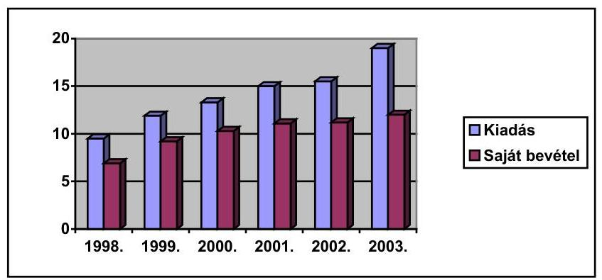

A kiadási előirányzat 1998-ban 9,5 milliárd Ft volt, ebből a saját bevétel 6,9 milliárd Ft (72%), a 2002. évi költségvetése 19 milliárd Ft-t tett ki, ebből 12 milliárd Ft (36%) a saját bevétel.

A hatósági tevékenységét is végző magán állatorvosok a szolgáltatási díjbevételekhez is hozzájárulnak, így foglalkoztatásuk a szakmai előnyök mellett közgazdasági megközelítésben nyereséges. A díjtétel számításánál a szigorú számadás alá vont költségjegyzék tömbök használata mellett a Földművelésügyi Költségvetési Iroda által kiadott Számlázási Szabályzatot kell alkalmazniuk. A szabályzat aktualizálásra szorul.

---

Az állatszállítással és húsvizsgálattal összefüggő díjbevételek (jellemzően 85%-15% aránnyal) közel két és félszeres nagyságrendűek a hatósági feladatokkal megbízott állatorvosokkal kapcsolatos számított kiadásokhoz viszonyítva.

A szabályozás a számvitelről szóló törvényként az 1991. évi XVIII. tv.-t nevesíti, holott helyébe már a 2000. évi C. tv. lépett. A költségvetés alapján gazdálkodó szervek beszámolási és könyvvezetési kötelezettségéről szóló 54/1996.(IV.12.) Kormányrendelet helyett pedig már a 249/2000.(XII.24.) Kormányrendelet a hatályos.

A bevételeket az állomások használhatják fel, a befolyt összeget részben
 működésre, részben eszközháttér fejlesztésre fordíthatják. A bírság kiszabásának gyakorlata nem egységes, alkalmazásának módja esetenként vitatható.

Pénzeszköz átvételként jelentkező bevételek a különböző mezőgazdasági támogatási keretekből kapott pályázati pénzek.

Saját bevétel, pl. igazgatási szolgáltatási díjbevételként a hatósági munkáért járó díj, a díjtételeket egyes állat-egészségügyi igazgatási szolgáltatások díjáról szóló 46/1999. (V. 19.) FVM rendelet tartalmazza. A díjakat a rendelet állatfajtánkénti mennyiségre, ezen belül nappali és éjszakai díjszabásban állapítja meg.

A bevételek másik csoportját az állategészségügyi előírások megszegése alapján kirótt állat-egészségügyi bírság képezi, ennek összegét az állomás vezetője határozatban állapítja meg. A bírság legkisebb összege húszezer forint, legmagasabb összege egymillió forint. A fővárosban szabálysértési eljárás kezdeményezésére feljelentést tesznek. Ez az egyértelmű szabálysértések esetében esetenként indokolatlanul elnyújtja a bírság beszedését.

A hatósági állatorvosként bejelentett állatorvosok teljes munkaidejét nem töltik ki a hatósági feladatok, az elvégzett munka kifizetése díjszabás alapján történik. A hatósági munkán kívül az állatorvosok magánpraxist folytathatnak. A Minisztérium szándéka szerint a teljes munkaidős hatósági állatorvosi állomány kiépítését kívánja megvalósítani, vagyis a jelenlegi alkalmazási rendszert a hatósági állatorvosok számának drasztikus csökkentésével meg kívánják szüntetni.

# 1.6. A szolgálat ellenőrzése 

Az ellenőrzési rendszer felépítettsége a szolgálat struktúrájához igazodó. Az állomások szakmai felügyeletét a minisztérium Állategészségügyi és Élelmiszer Ellenőrzési Főosztálya látja el, ennek keretében átfogó jellegű vizsgálat formájában, minden állomás kétévenként kerül sorra. A hatósági állatorvosi tevékenységet az állomások ellenőrzik, pl. a fővárosi állomás az állategészségügyi hatósági tevékenység ellenőrzésére egy 13 pontból álló - az állatorvos hatósági munkájának felmérésére szolgáló - kérdőívet használ. A felügyeleti vizsgálatok csupán az ellenőrzések megtörténtét és rendszerességét tekintik át.

---

# 2. A MEGYEI ÁLLOMÁSOK MŰKÖDÉSÉNEK ÉRTÉKELÉSE 

### 2.1. A Békés Megyei Állategészségügyi és Élelmiszer Ellenőrző Állomás

### 2.1.1. Szervezete

Az Állomás jogállását (részben önálló költségvetési szerv), szervezetét, irányítási, szervezési és hatósági feladatait, vezetőiknek és dolgozóinak feladatát és hatáskörét a 2002. január 1-től hatályos - Szervezeti és Működési szabályzatában a vonatkozó jogszabályoknak megfelelően rögzítette.
Az Állomás ágazati felelősei (élelmiszerminőség-ellenőrök, takarmányfelügyelő, zöldség-gyümölcs ellenőr, gyógyszerforgalmazás ellenőre, állatvédelmi felügyelő) I. fokú igazgatási feladataikat az Állomás központjának szervezetében látják el. A megye hatósági állatorvos létszáma a vizsgált időszakban gyakorlatilag változatlan maradt, csak a rendszeresen előforduló hatósági mutatók elvégzésére elegendő. Rendkívüli helyzetből fakadó többlet feladatokat magán állatorvosok kirendelésével oldották meg.

### 2.1.2. Az állomás gazdálkodása

Szakmai feladatait 1998-ban 122 fővel, azt követően (kivéve a 2001. évet, amikor ismételten 122 fővel), 121 fővel látta el. A felsőfokú iskolai végzettséggel rendelkezők aránya 70 %.

A vizsgált időszakban a gazdálkodás kiegyensúlyozott volt, az Állomás önfinanszírozó képessége kiemelkedő. Az Állomás gazdálkodására jellemző volt, hogy tevékenységének kiadásait átlagosan 70-80 %-ban saját bevételeiből fedezte, emellett többletbevételeiből a központi számlára is teljesített befizetéseket.

A saját bevétele 1998-ban 405 millió Ft volt, 460 millió Ft kiadások mellett, 2001-ben a saját bevétel 613 millió Ft, a kiadás 875,5 millió Ft volt. A személyi juttatások (bruttó) növekedése 80 %-os volt, az 1998. évi 133 ezer Ft/fő/hó jövedelemről 240 ezer Ft/fő/hó.

### 2.1.3. Az állatbetegségek, járványok és fertőzések megelőzése érdekében kifejtett tevékenység

A nagy gazdasági kárt okozó fertőző betegséget sikerült felszámolni. A megye sertésállományának fertőzöttsége 1999-ben volt kiugró, azóta a rendszeresen végzett monitoring vizsgálatok alapján a megye gyakorlatilag fertőzésmentesnek tekinthető. Az esetszám ellenére a sertés és sertéstermékek belföldi forgalmát és kivitelét biztosítani tudták.

Az 1999. évi fertőzés 9 településen ezen belül 5 nagy létszámú telep és 164 kistermelői udvart, összesen 59 ezer sertést érintett. A kártalanítás összege 919 millió Ft-t tett ki. Kártalanításra 2001-ben egy településen 544 sertés fertőzése miatt került sor, 16 millió Ft összegben.

---

A fertőzésmentes állapot elérését és stabilitását szolgálta a:

- monitoring vizsgálatok rendszerének fenntartása,
- a megyei készenléti terv kidolgozása,
- az ún. check listák ellenőrzési rendszer kidolgozása és végzése,
- folyamatos állatorvos továbbképzés,
- a járványvédelem technikai feltételének a biztosítása.

Az ún. check listák ellenőrzési rendszer keretében a feldolgozó egységeket negyedévenként, a nagyobb állattartó telepeket, menhelyeket félévenként ellenőrzik a körzeti, illetve kerületi állatorvosok.

Az állatállomány fertőzés mentességi programjának célja az állatállományoknak a klinikai mentességen túl a szerológiai mentesség elérése, ennek tanúsítása és nemzetközi elismertetése. A fertőzött állományokat minden esetben vakcinával kezelték, részben állami, részben a nagyobb állománnyal rendelkező gazdaságok esetében saját költségen.

A szarvasmarha állomány 1989. óta gümőkórtól és brucellózistól mentes. A szarvasmarha leukózis betegség teljes mentességét 2004 körül tervezik elérni. A betegség mielőbbi felszámolását pénzügyi támogatási rendszer segíti. (kistermelőknél a 40.000 Ft , illetve a vágóár és tenyészár közötti különbség megtérítése).

Sertésállomány brucellózistól és leptospirozistól mentes. Az Aujeszky-féle betegségtől való mentesítést szervezetten állami támogatással 1998-ban kezdték meg. Ennek keretében a kis létszámú állományokat állami költségen rendszeresen szűrik, a mentesítést segíti a pozitív állat levágásáért fizetett 7.000 Ft megváltási támogatás. Nagy létszámú állományok mentesítése jóváhagyott terv alapján vakcinázás mellett generációváltással történik. A mentesítési támogatás 1700 Ft/év. Az állomány teljes mentesítését várhatóan 2003-ban fejezik be.

Juhállományok Brucella melitensistől való mentességének nemzetközi elismertetése érdekében 2002-ben 19.000 db. szerológiai vizsgálatot végeztek el.

A méhállományokat évente (pl. 2001-ben 50 ezer) nyúlós költésrothadásra vizsgálnak meg.

Az ebek veszettség elleni kötelező védőoltását évente elvégzik, ez 2001-ben 78 ezer oltást jelentett, ennek köszönhetően mindössze 1 veszettségi esetet állapítottak meg.

Élelmiszerhigiéniai vizsgálatok esetében hatósági vizsgálat keretében pl. 2001-ben 46 állati-, 336 növényi eredetű feldolgozót, 1050 kereskedelmi egységet ellenőriztek, 260 ezer levágott állatot vizsgáltak meg. Az élelmiszerek laboratóriumi vizsgálatát meghatározott mintaszám szerint végezték.

Élelmiszer minőségellenőrzéseken, mintaszám alapján elvégzett I. fokú hatósági vizsgálatok során évente mintegy 7 %-ában szabtak ki minőségvédelmi bírságot.

A Központi laboratórium a NAT által akkreditált élelmiszer mikrobiológiai, takarmány mikrobiológiai és radiológiai vizsgálatokat végez, ezek száma az 1998-2001 között duplájára nőtt, 2001-ben 102 ezer esetben végeztek el.

---

Takarmányellenőrzés keretében a keverőüzemek létesítésénél, mint szakhatóság jártak el. A takarmányboltokat a hatósági állatorvosok negyedévenként ellenőrizték. Az állatgyógyszer forgalmazási tevékenységének ellenőrzését a megyei szakállatorvosok végzik. Az állatvédelmi tevékenységet megyei szakállatorvos irányítja, de beépült a hatósági állatorvosok munkaköri leírásába is.

A megye két állategészségügyi határállomása az export, import és tranzit árukat egyaránt vizsgálja, pl. 2001-ben közel 5200 vizsgálatot végeztek el.

Az állomás 1992-ben bevezette a teljesítményorientált igazgatást, ezen belül meghatározták az időegység alatt elvégzendő vizsgálatok számát. (pl. a húsvizsgálatnál 1-5 db állat/óra, minden további 5 db-ként 1/2 óra.)

# 2.2. Bács-Kiskun Megyei Állategészségügyi és Élelmiszer Ellenőrző Állomás 

Feladatait a hatályos szervezeti és működési szabályzat alapján végzi. Az élelmiszervizsgáló laboratórium regionális szerepet tölt be Bács-Kiskun-, Békés- és Csongrád megyére kiterjedően. Az Állomás létszáma 1990-ben 270 fő volt, szervezete többszöri átszervezés következtében változott, 2002. évi engedélyezett létszáma 162 fő volt.

### 2.2.1. Az állatbetegségek, járványok és fertőzések megelőzése érdekében kifejtett tevékenység

A nagy gazdasági kárt okozó fertőző betegségeket sikerült felszámolni. A fertőzéseket részben oltással, részben a beteg állatok leölésével számolták fel.

A szarvasmarha állomány gyakorlatilag gümőkórtól és brucellózistól mentes, mindössze néhány településen kellett 1 % feletti pozitív eredmény miatt a mentességet felfüggeszteni. A szarvasmarha leukózis betegség mentessége 80 % körüli, a teljes mentességet 2002. végére tervezték elérni.

A sertésállomány brucellózistól mentes. Az Aujeszky-féle betegség gyakorlatilag nem fordult elő, mindössze 2 % bizonyult pozitívnak, a mentesítési terv alapján végzett munkát a telepek 25 %-ban az Állomás nem ítélte hatékonynak. Ezekben az esetekben utóellenőrzés keretében szakértők kirendelésére került sor.

A baromfiállománynál baromfikolera miatt két víziszárnyas állománynál bekövetkezett elhullás oka a megkésett bejelentés. A baromfikeltetőket félévente ellenőrzik, a külföldről behozott állomány (Franciaország) karanténba kerül.

Juhállományok Brucella melitensistől való mentessége érdekében több mint 22 ezer vizsgálatot végeztek el. Az EU szakemberek által tervezett szemle elmaradt, de az erre való felkészülés több hiányosságot tárt fel, így hiányzott a telepek használatbavételi engedélye, az állatok tenyésztési minősítéssel nem rendelkeztek, a félévenkénti szűrővizsgálatok elmaradtak, a nyilvántartások és naplók vezetése hiányosak voltak, vagy elmaradtak.

Az ebek veszettség elleni kötelező védőoltását évente elvégzik, ez 2001-ben 94 ezer oltást jelentett.

---

# 2.3. Komárom-Esztergom Megyei Állategészségügyi és Élelmiszer Ellenőrző Állomás 

### 2.3.1. Szervezeti felépítés

A felépítése centralizált, a négy megyei szak-állatorvos, a négy kerületi főállatorvos és a négy szakterületi vezető közvetlen az igazgató alá rendelten működik. Egyedül a kirendeltségek irányítása tartozik az igazgatóhelyettes főállatorvos hatáskörébe.

Három megyei szak-állatorvos munkaköri feladata rögzített - többek között - a fertőző állatbetegségek felderítésének és a védekezésnek a közvetlen irányítása, felügyelete, feladatuk állatfajok szerint megosztott. A szak-állatorvosok tevékenységének vezetői feladatainak kijelölését és kontrollját az igazgató főállatorvos és az igazgató-helyettes főállatorvos folyamatosan végzik. A tervezett, illetve szükségessé vált kapcsolódó hatósági feladatok ellátásában részt vesznek a kerületi főállatorvosok és hatósági állatorvosok is. Az állatorvosok szükséges szakmai ismereteinek bővítését és a követelmények megismerését évente egy, vagy több alkalommal megtartott helyi oktatás, tájékoztatás segíti.

Az intézményben foglalkoztatottak létszáma az éves költségvetési beszámolók szerint az 1998. évi 80 főről 2001. évre 75 főre csökkent. Ezen belül a teljes munkaidősök száma emelkedett (72 főről 74 főre), a nyugdíjas és részmunkaidős foglalkoztatás viszont visszaesett.

A hatósági feladatokkal megbízott magán-állatorvosok száma 14 fő, a munkaidejük a havi 5 és 27 óra közötti, gyakorlatilag 1 főállású létszámot és feladatot allokáltak. Az óraszámok kialakítása tapasztalati adatokon alapul, évente korrekcióra kerül a megelőző év teljesítményei, díjbevételei alapján.

### 2.3.2. Az állatbetegségek, járványok és fertőzések megelőzése érdekében kifejtett tevékenység

A juhállomány 1998 és 2002. között gyakorlatilag alig nőtt, 2002-ben kb. 14 ezer db-t tett ki. Bejelentési kötelezettség alá tartozó állatbetegség nem fordult elő. A Brucella melitensisre irányuló vizsgálatot minden évben végeztek, 2002-ben közel 3 ezer esetben, ezek negatív eredménnyel zárultak. Az ENAR rendszer minden nagy létszámú telepnél már működik.

A szarvasmarha állományok a nagyüzemi és kislétszámú állományoknál egyaránt Brucellosis, Leucosis és Tuberculosis mentesek. Minisztériumi rendelkezés alapján 2000-ben meghatározott minta alapján vérvizsgálatot végeztek Leucosis ellenőrzése céljából. 2002-ben 563 db szarvasmarha és 17 db juh agyvelő mintát küldtek BSE vizsgálatra az OÁl-ba.

A sertés állomány esetében 1998-ban történt az Aujeszky-féle betegségtől való mentesítés elindítása, megszervezése és működtetése. A mentesítés során a megye összes fertőzött nagy létszámú állományát sikerült a mentesítésbe bevonni, a pozitív egyedeket - kártalanítás mellett - levágták. Az Európai Unión

---

belül 2001-ben elterjedt száj és körömfájás járványt fokozott figyelemmel követték, a járványveszélyes időszakban a telepek látogatási tilalmát rendelték el.

A méhészetekben legnagyobb problémát jelent az atkakór, a kártétel csökkentésére a megyei állományok folyamatos ellenőrzését, a méhészetek felderítését és új méhészeti felelősök kinevezését indították meg. A nyúlós költésrothadással fertőzött méhcsaládokat kártalanítás fizetése mellett elpusztították.

Évente kb. 40 ezer ebet oltottak be veszettség ellen.

# 2.4. A Zala Megyei Állategészségügyi és Élelmiszer Ellenőrző Állomás 

### 2.4.1. Az állatbetegségek, járványok és fertőzések megelőzése érdekében kifejtett tevékenység

A sertés állomány
 gyakorlatilag Aujeszky-betegségtől mentesnek tekinthető, az egyetlen fertőzött kis létszámú sertésállományát állami kártalanítás mellett levágták.

A megyébe kerülő takarmányokat, vagy takarmány-alapanyagokat a kerületi főállatorvosok és a megyei takarmányfelügyelő tételes vizsgálatnak vetik alá. Egy salmonellával fertőzöttnek nyilvánított tétel zárolását és ártalmatlanítását rendelték el.

Budapest, 2003. július
