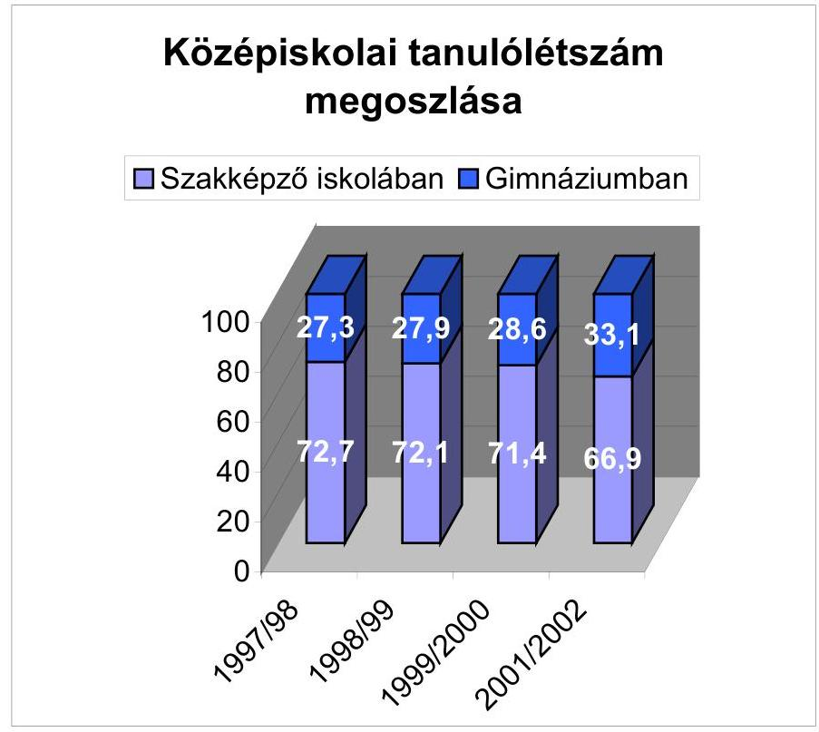
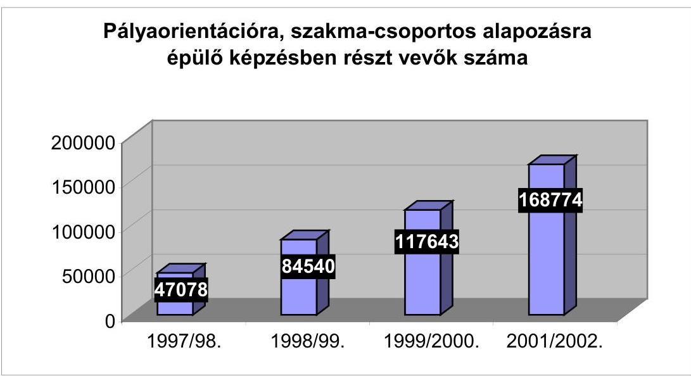
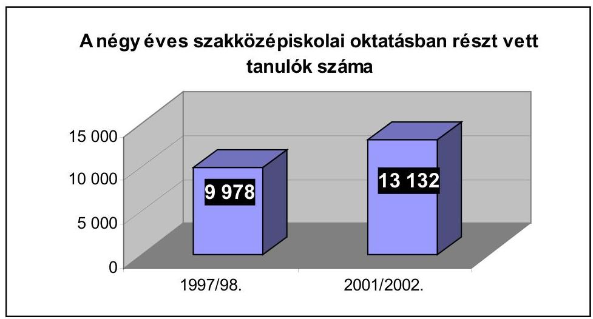
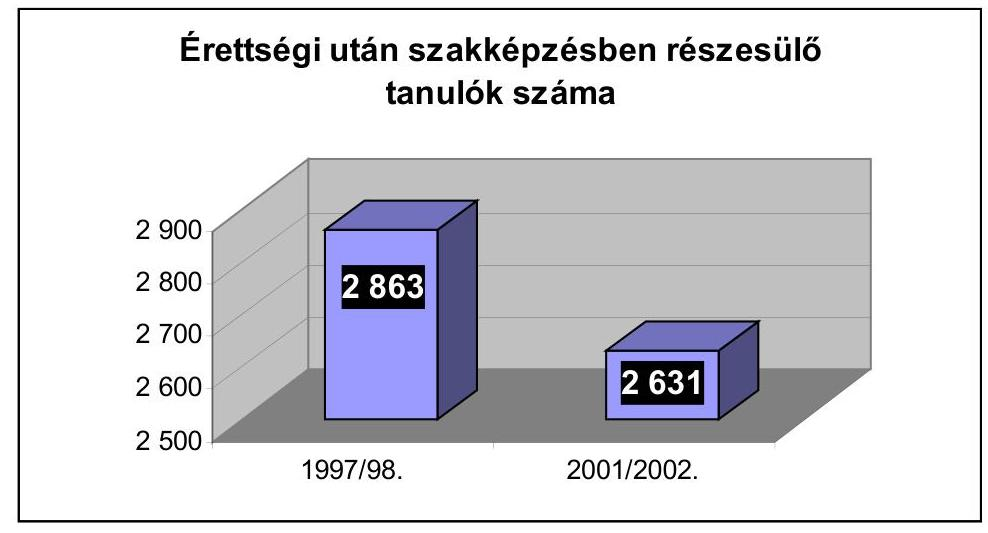
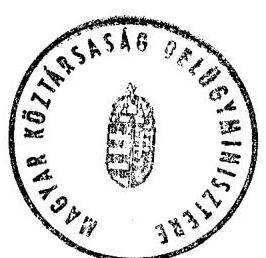
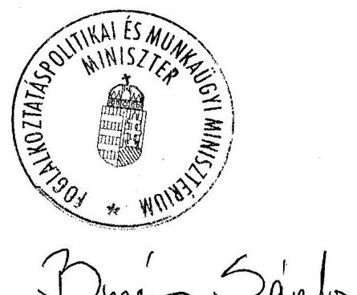
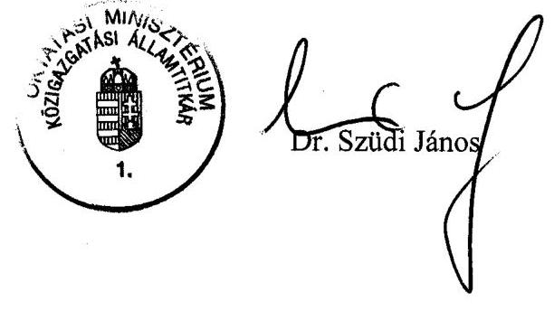

# JELENTÉS 

a szakképzési struktúra szerepéről a munkaerőpiaci igények kielégítésében

---

# 3. Önkormányzati és Területi Ellenőrzési Igazgatóság 

3.2. Pénzügyi Szabályszerűségi és Teljesítményellenőrzési Főcsoport Iktatószám: V-1012-73/2002-2003.
Témaszám: 617
Vizsgálat-azonosító szám: V0047

## Az ellenőrzést felügyelte:

## dr. Lóránt Zoltán

főigazgató
Az ellenőrzés végrehajtásáért felelős:
Németh Péterné
főcsoportfőnök

## Az ellenőrzést vezette:

## Turnheimné Lakos Zsuzsa

vizsgálatvezető, főcsoportfőnök-helyettes
A számvevői jelentések feldolgozásában és a jelentés összeállításában közreműködött:

| Bocsi Sándor főtanácsadó | Csuti Lajos számvevő tanácsos | dr.Vasváriné dr.Rózsa Anikó számvevő tanácsos |
| :--: | :--: | :--: |

## Az ellenőrzést végezték:

| dr. Ernst László   főtanácsadó   Baranya Megye | Nagy János   számvevő tanácsos   Bács-Kiskun Megye | Laki Dóra   számvevő tanácsos   Békés Megye |
| :--: | :--: | :--: |
| dr. Takács András   számvevő tanácsos   Borsod-Abaúj-Zemplén   Megye | Benkéné   dr. Lavner Klára   számvevő tanácsos   Csongrád Megye | Benn Imréné   számvevő tanácsos   Fejér Megye |
| Fátrainé Zsebedics   Katalin   tanácsadó   Győr-Moson-Sopron   Megye | Puchy Márta   számvevő tanácsos   Heves Megye | Csomán Mihály   számvevő tanácsos   Jász-Nagykun-Szolnok   Megye |
| György Árpád   számvevő tanácsos   Komárom-Esztergom   Megye | Bocsi Sándor   főtanácsadó   Nógrád Megye | dr. Telkes Imre   számvevő tanácsos   Pest Megye |
| Vojcsekné Szabó   Ágnes   számvevő tanácsos   Pest Megye | Csepreginé Tancsik   Erzsébet   számvevő   Somogy Megye | Szabó Zoltán   számvevő tanácsos   Szabolcs-Szatmár-Bereg   Megye |

Jelentéseink az Országgyűlés számítógépes hálózatán és az Interneten a www.asz.hu címen is olvashatók.

---

dr. Vasváriné
dr. Rózsa Anikó
számvevő tanácsos
Veszprém Megye

Csuti Lajos
számvevő tanácsos
Zala Megye

# A témához kapcsolódó eddig készített számvevőszéki jelentések: 

Jelentés a szakmunkásképzésre fordított pénzeszközök felhasználásának (a képzés eredményességének) ellenőrzéséről (V-1016/1994-1995.)

---

# TARTALOMJEGYZÉK 

BEVEZETÉS ..... 7
I. ÖSSZEGZŐ MEGÁLLAPÍTÁSOK, KÖVETKEZTETÉSEK, JAVASLATOK ..... 10
II. RÉSZLETES MEGÁLLAPÍTÁSOK ..... 16

1. A munkaerőpiaci kereslet és a szakképzés összhangjának tervezése ..... 16
1.1. Az ágazati irányítás szakképzés céljainak, hosszú és középtávú terveinek kidolgozásában betöltött feladata ..... 16
1.2. A foglalkoztatás állami intézményeinek szerepe a szakképzés távlati elképzeléseiben ..... 19
1.3. Gazdasági kamarák szerepe a távlati elképzelések kimunkálásában ..... 21
1.4. A helyi önkormányzatok feladata a szakképzés szerkezetének formálásában ..... 23
1.5. A szakképző intézmények struktúra átalakításra vonatkozó tervei ..... 25
2. A képzés szerkezetében bekövetkezett változások ..... 27
2.1. A változást előidéző okok és szükségszerűségek ..... 27
2.2. A szakképzés országos helyzetképe ..... 28
2.3. A szakképzés szerkezetében bekövetkezett főbb változások a vizsgált körben ..... 30
2.3.1. A szakképzés alapozásában történt változások ..... 30
2.3.2. A magasabb szintű szakképzés alakulása ..... 31
2.3.3. A szakmaszerkezet változásai, mozgatórúgói és hatásai ..... 32
3. Együttműködés a szakképzés szereplői között ..... 36
3.1. A megyei munkaügyi központok pályaorientációs szerepe ..... 37
3.2. A gazdasági kamarák koordináló szerepe ..... 38
3.2.1. Együttműködés a gazdálkodó szervezetekkel ..... 39
3.2.2. A kamarák szakképzéssel összefüggő ellenőrzési tevékenysége ..... 41
3.2.3. A kamarák részvétele a szakmai vizsgabizottságokban ..... 41
3.3. Megyei/Fővárosi önkormányzatok közreműködői feladatai a szakképzésben ..... 42
3.3.1. A térségi foglalkoztatási feladatok és a szakképzés összehangolása ..... 43
3.3.2. Együttműködési megállapodások a megye/főváros önkormányzataival ..... 44
3.3.3. Pályaválasztási tanácsadás ..... 45
3.4. A helyi önkormányzatok szakképzésre vonatkozó együttműködése ..... 46
3.5. Az iskolák kapcsolatrendszere ..... 50

---

4. A struktúraváltást befolyásoló tényezők ..... 54
4.1. A szakképzési hozzájárulás rendszere ..... 54
4.1.1. A fejlesztési és képzési alaprész decentralizált kerete felosztásának tapasztalatai ..... 56
4.1.2. A fejlesztési és képzési alaprész központi kerete felosztásának tapasztalatai ..... 58
4.2. Az iskolarendszerű szakképzés pénzügyi forrásai és finanszírozása ..... 60
4.2.1. A szakképzéssel összefüggő bevételek és kiadások tervezése és elszámolása ..... 63
4.2.2. A felhalmozási célú kiadások alakulása ..... 65
4.3. A személyi feltételek alakulása ..... 66
4.4. A szakképzés tárgyi feltételei ..... 68
4.4.1. A szakmai gyakorlati képzés feltételei a szakképző intézményekben ..... 69
4.4.2. A gyakorlati képzés tárgyi feltételei a gazdálkodó szervezeteknél ..... 71
5. A képzés eredményessége ..... 72
5.1. Minőségbiztosítás a szakképző intézményekben ..... 73

---

# MELLÉKLETEK 

| 1.sz. Melléklet | A vizsgálat során adatokat szolgáltató megyei közoktatási   közalapítványokhoz szakképzési célra benyújtott pályázatok   eredményességének alakulása |
| :-- | :-- |
| 2. sz. Melléklet | A szakképzéssel összefüggő szakfeladatokon elszámolt be-   vételek és kiadások alakulása a 39 ellenőrzött intézménynél |
| 3. sz. Melléklet | A vizsgált intézmények szakképzéssel összefüggő felhalmo-   zási kiadásainak célonkénti és forrásonkénti alakulása |
| 4. sz. Melléklet | A vizsgált intézmények által a központi és a decentralizált   Szakképzési Alap támogatás iránt benyújtott pályázatok   eredményességének alakulása |
| 5. sz. Melléklet | A tanulók létszámának alakulása képzési típusonként a   vizsgált oktatási intézményekben |
| 6. sz. Melléklet | A vizsgált szakképző intézmények főállású oktatói létszámának és végzettségének alakulása |
| 7. sz. Melléklet | Az ellenőrzött szakképző intézmények szakmai gyakorlati oktatását szolgáló tanműhelyek, műhelytermek, képzési helyek számának alakulása a vizsgált időszakban |

## FÜGGELÉKEK

1. sz. Függelék
2. sz. Függelék

Vizsgált önkormányzatok jegyzéke
Vizsgált iskolák jegyzéke

---

.

---

# RÖVIDÍTÉSEK JEGYZÉKE 

| foglalkoztatási törvény | 1991. évi IV. törvény a foglalkoztatás elősegítéséről és a munkanélküliek ellátásáról |
| :--: | :--: |
| közoktatási törvény | 1993. évi LXXIX. törvény a közoktatásról |
| szakképzési törvény | 1993. évi LXXVI. törvény a szakképzésről |
| Szht. | 2001. évi LI. törvény a szakképzési hozzájárulásról és a szakképzés fejlesztésének támogatásáról |
| FKT | Fejlesztési és Képzési Tanács |
| KIK | Kereskedelmi és Iparkamara |
| MK | Munkaügyi Központ |
| MPA | Munkaerőpiaci Alap |
| MT | Munkaügyi Tanács |
| NFfP | Nemzeti Foglalkoztatás-fejlesztési Program |
| NSZI | Nemzeti Szakképzési Intézet |
| OKÉV | Országos Közoktatási Értékelési és Vizsgaközpont |
| OKJ | Országos Képzési Jegyzék |
| OM | Oktatási Minisztérium |
| OMAI | OM Alapkezelő Igazgatósága |
| OSZJ | Országos Szakmunkásképzési Jegyzék |
| OSZT | Országos Szakképzési Tanács |
| SZA | Munkaerőpiaci Alap Szakképzési Alaprésze (2001-től Fejlesztési és Képzési Alaprész) |

---

.

---

# JELENTÉS 

## a szakképzési struktúra szerepéről a munkaerőpiaci igények kielégítésében

## BEVEZETÉS

A gazdaság eredményes működésének egyik feltétele, hogy a szakképzés szerkezetében és színvonalában rugalmasan kövesse a munkáltatói igényeket, ugyanakkor az egyén számára olyan fejlődési utat biztosítson, amely lehetővé teszi a szükséges pályamódosításokat és esetleg egy későbbi továbbtanulást is. A szakképzés tartalmi követelményeinek meghatározásában és a gyakorlati képzésben fontos szerepük van a munkaadóknak.

A szakképzés központi irányítását az oktatási miniszter látja el, a szakközépiskolában és a szakiskolában folyó szakképzés szakmai és vizsgakövetelményeit a szakképesítésért felelős miniszter határozza meg. A közoktatási intézményt - köztük szakképző iskolát - alapító és fenntartó önkormányzat többek között dönt az intézmény tevékenységi körének módosításáról, meghatározza költségvetését, jóváhagyja és értékeli pedagógiai programját, illetve az abban meghatározott feladatok végrehajtását. A helyi önkormányzat új közoktatási intézményt akkor létesíthet, a meglévő intézmény feladatát akkor bővítheti, ha a működés megkezdéséhez, illetve az új feladatok ellátásához szükséges személyi és tárgyi feltételek, valamint a költségvetési fedezet rendelkezésre áll, vagy megteremthető. A döntéshez be kell szerezni a megyei önkormányzat - fejlesztési tervre épített - szakvéleményét. A szakvéleménnyel ellentétes döntéshez minősített képviselőtestületi többség szükséges. Az iskolarendszerű szakképzés szakközépiskolában és szakiskolában folyhat az iskola pedagógiai programja alapján. A szakközépiskolában a 9-12. évben érettségire felkészítő középiskolai nevelés-oktatás folyik, ezt követően pedig az OKJ-ben meghatározott számú évfolyamon készítik fel a szakmai vizsgára a tanulókat. A szakiskolák 9-10. évfolyama az általános műveltséget megalapozó nevelést-oktatást szolgálja. Ezt követően legalább két szakképzési évfolyamon folyik az OKJ-ben meghatározott szakképzési követelmények alapján a szakmai vizsgára való felkészítés.

A gyakorlati képzés minden olyan szakképző iskolában vagy a szakképző iskolával kötött megállapodás, tanulószerződés alapján minden olyan gyakorlati képzést végző gazdálkodó szervezet által fenntartott, működtetett gyakorlóhelyen folytatható, ahol a jogszabályban előírt feltételek biztosítottak. A szakképzési évfolyamokon a szakmai vizsgákra való felkészítés az OKJ-ben meghatározottak szerint folyik. A gazdálkodó szervezeteknél folyó gyakorlati képzés

---

felügyeletét, a képzésre vonatkozó rendelkezések megtartásának, a képzéshez szükséges felvételrendszer meglétének ellenőrzését az illetékes gazdasági kamarák - a szakképző iskolák közreműködésével - látják el.

A 90-es években lezajlott gazdasági és társadalmi átalakulás jelentősen megváltoztatta a szakképzés körülményeit. A gazdasági háttér átalakulásával az iskolai rendszerű szakképzés nem tudott lépést tartani, így csak részben tett eleget alapfunkciójának, a munkaerőpiaci igényeknek megfelelő munkaerőképzésnek. Az ÁSZ 1994-ben végzett témavizsgálata ${ }^{1}$ ezen kívül azt is megállapította, hogy - a gazdaság konszolidációjának hiánya miatt - az időszak legfőbb problémájává a gyakorlati képzés feltételeinek megteremtése vált. Az 1993-ban megalkotott közoktatási és a szakképzési törvényeket nem alapozták meg hosszú távú közoktatás- és szakképzés-fejlesztési koncepcióval, nem készültek stratégiai tervek. Hiányzott a térségi feladatok koordinációja, az érdemi együttműködés a szakképzésben érintett szervezetek között, nem alakult ki intézményesített információs kapcsolat a munkaügyi szervek, a munkáltatók és az oktatási intézmények között, elhúzódott - a gyakorlati képzésben fontos ellenőrző és közvetítő szerepet játszó - gazdasági kamarák átalakulása. A szakmunkásképzést a képzési és nem a felhasználói igény teljesítése jellemezte, amit a képzés tényleges költségigényét figyelembe nem vevő, a létszámnövelésre ösztönző normatív hozzájárulás is segített. Mindezek alapján a közoktatási, a szakképzési és a szakképzési hozzájárulásról szóló törvények, a finanszírozási és az információs rendszer módosítására, valamint az együttműködést javító intézkedésekre tettünk javaslatot az illetékes minisztériumoknak.

A kihívásokra az oktatásirányítás a közoktatás és a szakképzés jogszabályi kereteinek változtatásával reagált. A központi irányítás szándékai ellenére az évtized második felében tovább csökkent a szakképzésben résztvevők száma és aránya. Az új helyzetben - az 1998/99-es tanévvel kezdődően - a képzési szerkezetet és tartalmat radikálisan módosították. Ezt követően a szakiskolában csak 16 éves kor után kezdhető meg a szakképzés, és csak az Országos Képzési Jegyzékben szereplő képesítések oktathatók. A közismereti oktatás tartalmi követelményeit a Nemzeti Alaptantervre épülő, iskolatípusonként eltérő kerettantervek határozzák meg. A közismereti oktatás mellett szervezhető szakmai előkészítés, alapozás és a pályaorientáció a szakképzésbe való bekapcsolódásra kíván felkészíteni. A szakképzési évfolyamokon folyó szakmai képzés központi programok alapján történik. A munkaerőpiaci igényeknek megfelelő képzés a gazdaság és az oktatás közötti - formális és informális - kapcsolatoknak is függvénye.

A vizsgálat célja annak megállapítása volt, hogy

- az iskolarendszerű szakképzés hogyan illeszkedett a munkaerőpiaci igényekhez, megfelelően működött-e az oktatás és a munkaerőpiac közötti kapcsolatrendszer;

[^0]
[^0]:    ${ }^{1}$ Jelentés a szakmunkásképzésre fordított pénzeszközök felhasználásának (a képzés eredményességének) ellenőrzéséről 1995. (OGY sz. 252).

---

- az iskolarendszerű szakképzésben feladattal rendelkező központi, területi és helyi szervek hogyan tettek eleget jogszabályban előírt kötelezettségeiknek;
- a szakképzésre vonatkozó előírások változásai hogyan hatottak a képzési szerkezet átalakítására és a tanulók munkaerőpiaci értékének az emelésére;
- a rendelkezésre álló központi és helyi források kellő lehetőséget teremtettek-e a szakképzés
 felismert irányváltásához;
- az illetékes szervek megtették-e a szükséges intézkedéseket az Állami Számvevőszék 1994. évi vizsgálati javaslatai alapján.

A helyszíni vizsgálatot 16 megyében és a fővárosban, az Oktatási Minisztériumban, ehhez kapcsolódóan a vizsgált időszakban a Munkaerőpiaci Alap fejlesztési és képzési alaprésze felhasználásával kapcsolatos döntéselőkészítő feladatokat ellátó Fejlesztési és Képzési Tanácsnál, az Oktatási Minisztérium Alapkezelő Igazgatóságánál, a Nemzeti Szakképzési Intézetnél, az Országos Közoktatási Értékelési és Vizsgaközpont Főigazgatóságán és 6 régiós igazgatóságánál, valamint a jelenleg a Foglalkoztatáspolitikai és Munkaügyi Minisztérium felügyelete alatt működő Foglalkoztatási Hivatalnál és 16 megyei, illetve a Fővárosi Munkaügyi Központnál, és Munkaügyi Tanácsnál, 17 megyei/fővárosi és 2 városi gazdasági kamaránál végeztük el. A 16 megyében és a fővárosban a megyei/fővárosi önkormányzatnál, mint a megyei szakképzésben koordináló szerepet betöltő, illetve mint szakképző intézményt fenntartó önkormányzatnál végeztünk ellenőrzést. Fentieken kívül 14 városi iskolafenntartó önkormányzatot és összesen 39 szakképzéssel foglalkozó oktatási intézményt vizsgáltunk. (Az ellenőrzött önkormányzatok és szakképző intézmények jegyzékét az 1-2. sz. függelék tartalmazza.)

A vizsgálatra a jogszabályi felhatalmazást az Állami Számvevőszékről szóló 1989. évi XXXVIII. törvény 2. § (5) bekezdése, valamint a helyi önkormányzatokról szóló 1990. évi LXV. törvény 92. § (1) bekezdése ad.

Az ellenőrzés az 1998-2002. első félévi gazdálkodási, illetve az 1997/1998-2001/2002. tanévi időszakra terjedt ki.

---

# I. ÖSSZEGZŐ MEGÁLLAPÍTÁSOK, KÖVETKEZTETÉSEK, JAVASLATOK 

A kilencvenes években az iskolarendszerű szakképzésben strukturális és tartalmi változások következtek be, melyek jogi hátterét a közoktatási és a szakképzési törvények módosításai biztosították. A képzés belső szerkezete úgy változott meg, hogy a szakképzést egy hosszabb elméleti alapozás előzi meg. E hosszabb elméleti alapozás, a szakmacsoportos képzés, valamint az, hogy egyre több helyen fektetnek súlyt - részben különböző projektekhez kapcsolódva - az informatikai és a nyelvi képzésre, pozitív változásnak tekinthető. Ez céljait tekintve elősegíti a tanulók munkaerőpiaci értékének növelését, enyhíti az elhelyezkedés körüli bizonytalanságot, ugyanakkor meg is könnyíti a később szükségessé váló váltást, illetve a továbbtanulást. A pályaorientáció, a szakmai alapozó tárgyak oktatása során megmutatkozó szakmai készségek, fogékonyság révén szerzett sikerélmény azonban - a pedagógusok tapasztalatai szerint - nem ellensúlyozza azok tanulmányi kudarcát, akik nem tudnak a hosszabb közismereti, elméleti oktatás követelményeinek megfelelni és megbuknak vagy elméleti tudásuk alacsony szintű marad.

Időközben - részben a foglalkoztatáspolitikában tapasztalható helytelen szemlélet, részben a felsőfokú képzés expanziója következtében - nőtt a felsőoktatás felvevő képessége ${ }^{2}$. Az általános iskolát elvégzett, továbbtanulni szándékozó fiatalok érdeklődésében és továbbtanulási szándékában is irányváltás következett be. A figyelem a szakképző iskolai képzéssel szemben az érettségit, illetve az ezt követően szakképzettséget is adó szakközépiskolák felé fordult. Ezért a korábban tisztaprofilú szakmunkásképző iskolák képzési struktúrájukat szakközépiskolai képzéssel bővítették. Mindezek következtében a pályakezdő munkanélküliek között nőtt a felsőfokú végzettségűek száma és részaránya, míg a szakmunkás végzettségűeké - a növekvő arányú továbbtanulásnak is köszönhetően - a képzésben részt vevők létszámcsökkenését meghaladó mértékben csökkent.

A jogszabályok által kikényszerített struktúraváltáson túl a szakmaszerkezet belső változásai kevésbé voltak jelentősek. Ebben az is szerepet játszott, hogy az iskolák és fenntartóik elsősorban a meglévő személyi és tárgyi feltételeik által behatárolt kapacitásaik működtetésében érdekeltek. Jelentősebb profilváltásra csak azokban az iskolákban került sor, ahol a gazdaság szereplőivel szoros kapcsolatot tudtak kialakítani, illetve ahol az oktatott szakmák társadalmi presztízse mozgatta a tanulói igényeket. A végzett tanulók elhelyezkedéséről az iskoláknak intézményesített formában nincs információjuk.

[^0]
[^0]:    ${ }^{2}$ A KSH adatai szerint 2002-ben közel 48\%-kal többen részesültek felsőfokú oktatásban (382 ezer fő), mint 1998-ban, ezen belül a nappali tagozatos hallgatók létszámának növekedése közel 19\%-os.

---

A végzett tanulók munkanélkülivé válása a szakképzési rendszer strukturális aránytalanságaira, a szakközépiskolák kibocsátása és a munkaerőpiac felvevőképessége közötti összhang hiányára, vagyis arra enged következtetni, hogy a szakképzés rendszere még ma sem képes rugalmasan reagálni a munkaerőpiac igényeire. Olyan szakmákban, szakmacsoportokban is folyik képzés, amelyek a munkanélküliek piacán folyamatosan jelen vannak. Ez részben a szakképzési rendszer rugalmatlanságának, az irányítási rendszer szétforgácsoltságának a következménye, de jelentős szerepe van benne a foglalkoztatási szerkezet képlékenységének is.

Ahhoz, hogy a szakképzés szerkezete összhangba kerülhessen a munkaerőpiac igényeivel, kiszámítható gazdasági környezetre, hosszabb-, de legalább középtávú tudatos tervezőmunkára, helyi - regionális, megyei - szintű koordinációra, az együttműködő felek közötti sokoldalú, egységes rendszerű információáramlásra van szükség. Vizsgálati megállapításaink szerint e feltételek - és korábbi ellenőrzési javaslataink - nagy része nem, vagy csak formálisan teljesült, annak ellenére, hogy a kilencvenes évek közepén két kormányhatározat is született a szakképzés távlati fejlesztési programjának kidolgozása érdekében.

A vizsgált időszakban sem rendelkezett az OM olyan hosszú és középtávú tervvel, amely koncepcionálisan meghatározta volna a szakképzés miniszteriális feladatait. A középtávra szóló területi szintű tervezés ugyan megvalósult, de a megyei közoktatás-fejlesztési tervekben megfogalmazott feladatok a jogszabályban előírt aktualizálást követően sem voltak elég konkrétak. Ezt főleg az okozta, hogy a megyei önkormányzatok az intézményfenntartó önkormányzatoktól is általánosságokat tartalmazó intézkedési terveket kaptak, s így a terv elsősorban a saját intézményhálózatukra vonatkozó információkon alapult. A megyei fejlesztési tervek készítése során elmaradt az érdemi egyeztetés, így nem jelentek meg bennük azok a problémák, amelyeket például a megyei gazdasági kamarák vetettek fel.

A gazdasági kamarák - az időközben önkéntessé váló kamarai tagság miatt beszűkülő anyagi forrásaik és információbázisuk következtében - már nem rendelkeztek megfelelő személyi és tárgyi feltételekkel ahhoz, hogy önállóan felmérjék a megyék vállalkozásainak rövid és középtávú munkaerőigényét, fejlesztési irányait. Jelenleg a gazdaság szereplőinek csak egy része rendelkezik munkaerő-igényét is megfogalmazó középtávú tervvel, illetve erre alapozott szakképzési igénnyel.

A munkaerő-piac és az iskolarendszerű képzés összhangjának megteremtését gátolja, hogy a gazdaság szereplői fejlesztési programok, koncepciók hiányában maguk sem ismerik előre - legalább középtávon - tevékenységük várható változásait és ennek szakember igényét, vagy ha ismerik is, arról nem adnak tájékoztatást, s azok alapján nem készülnek hosszú távú megyei vagy régió szintű munkaerőpiaci prognózisok.

A munkaügyi központok - a foglalkoztatási törvény ez irányú előírása ellenére - nem tudták sem a megyei fejlesztési tervhez, sem a közvetlenül az intézményfenntartóknak adott információkkal eredményesen orientálni a képzési struktúra alakítását. E tevékenységük szakmai irányítását, koordinálását - a vizsgált időszakban többször változó - szakmai felügyeleti szerveik feladata

---

ként nem írta elő jogszabály. A munkaügyi központok rövid távú - a többéves időtartamú szakképzéshez elegendő információt nem szolgáltató - munkaerőpiaci prognózisai elsődlegesen a már munkanélkülivé váltak - köztük a pályakezdő munkanélküliek - elhelyezkedését, iskolarendszeren kívüli átképzését segítik. Bár a munkaügyi központoknak megyei foglalkoztatási koncepciót kellett készíteniük, azok - az elkészítési idő rövidsége és a rendelkezésre álló adatok szűkös volta miatt - nem voltak alkalmasak a helyi távlati tervezés megalapozására.

A gazdaság igényeinek és a szakképzés meglévő szerkezetének összehasonlításán alapuló tervek készítését - az egymástól független, nem összehasonlítható módon nyilvántartott - munkaerőpiaci és oktatási statisztikai adatok eltérő rendszere is gátolja.

Az iskolarendszerű szakképzés megvalósításában - az intézmények és azok fenntartóin kívül - több szervezet is részt vett, amelyek között a koordináció nem működött megfelelően. Valamennyi szervezet ellátta a hatáskörébe tartozó feladatokat, azonban a nem megfelelően szabályozott kapcsolatrendszer azt eredményezte, hogy együttműködésük nem volt célravezető.

A megyei önkormányzatok jelenlegi hatáskörük alapján - a mellérendeltségen alapuló önkormányzati együttműködésük keretében - csak korlátozott szerepet tudnak vállalni a szakképzés és a térségi foglalkoztatási feladatoknak az önkormányzati törvényben számukra előírt összehangolásában. A megyei fejlesztési tervek előzőekben említett gyengesége, az intézményfenntartó önkormányzatok szakképzést érintő együttműködési készségének hiánya, a megyei szakvéleményt figyelmen kívül hagyó döntései párhuzamos képzések kialakulásához, a pályakezdők munkanélküliségének újratermelődéséhez vezettek. Mindez arra is utal, hogy a jogszabályban előírt feladatok végrehajtása önmagában - a megfelelő irányítási jogosítványok és pénzügyi háttér nélkül - nem eredményezte a feladatok összehangolt megvalósítását.

Az önkormányzatok és intézményeik kapcsolatát alapvetően a gazdasági szempontok határozták meg. Ennek függvényében hagyták jóvá szakképző intézményük képzési struktúráját, vagy döntöttek annak megyei önkormányzat, esetleg más fenntartó részére történő átadásáról. A munkaügyi központoktól származó információkról a fenntartók nem tájékoztatták az iskolákat, a gazdasági kamarákkal való együttműködésük pedig döntően a szakképzési törvényben előírt ellenőrzési teendőkhöz kapcsolódott.

A gazdasági kamarák a tanulószerződések megkötését megelőzően, illetve a képzés során a gazdálkodó szervezeteknél ellenőrizték a gyakorlati képzés jogszabályi feltételeinek meglétét, a szakmai vizsgabizottságokban való részvételük során képet kaptak a vizsgázók szakmai ismereteiről. Ez utóbbi tekintetében romló tendenciát tapasztaltak, melynek megállítása érdekében több javaslattal éltek az elmúlt időszakban, melyeket a szakképzésről szóló törvény 2003. májusában elfogadott módosítása már jórészt figyelembe vett.

A gazdaságból származó információk beszerzését, a közvetlen kapcsolatok kiépítését az önkormányzatok - az ebben közvetlenül érdekelt - szakképző iskoláikra bízták. E kapcsolatok azonban elsősorban nem a képzés szerkezetére,

---

hanem a gyakorlati képzőhelyek biztosítására, az iskola számára közvetlenül átadott szakképzési hozzájárulás nagyságára voltak hatással. Ez utóbbi - a fejlesztési és képzési alaprész központi és decentralizált keretéből, illetve a megyei közoktatási közalapítványoktól pályázati úton elnyert fejlesztési forrásokkal együtt - biztosította az iskolák felhalmozási kiadásai fedezetének több mint felét. Vizsgálati tapasztalataink változatlanok abban a tekintetben, hogy a közvetlenül átadott szakképzési hozzájárulás indokolatlanul nagy különbségeket eredményez az intézmények fejlesztési forrásaiban, felhasználása ellenőrizetlen és esetenként célszerűtlen. A gazdálkodóktól átvett pénzeszközök egy részét az iskolák - azok rendeltetésétől eltérően - működési céljaikra fordították.

Az intézményfenntartó önkormányzatok központi költségvetésből, átengedett személyi jövedelemadóból származó forrásai összességében nem növekedtek olyan mértékben, mint az oktatáshoz kapcsolódó támogatások, hozzájárulások. (Ez utóbbiak közül az elméleti képzés normatívája 76\%-kal, a gyakorlati képzésé 64\%-kal nőtt a vizsgált időszakban, és 2002-ben összességében közel 21 milliárd Ft-ot tett ki az e jogcímeken biztosított normatív állami hozzájárulás.) Az oktatáshoz kapcsolódó központi források nagyobb mértékű növekedése lehetővé tette, hogy a fenntartók az intézmények önkormányzati támogatásának arányát csökkentsék és felszabaduló saját forrásaik egy részét más feladatokra használják fel; így az oktatáshoz kapcsolódó kiadásaikat sem növelték átlagon felül. Ez azt eredményezte, hogy az intézményeknek elsősorban a működéshez szükséges forrásokat biztosították, a fejlesztési források megszerzése érdekében pedig a különböző pályázati lehetőségek kihasználását ösztönözték.

Az iskolai szakmai gyakorlati képzés tárgyi feltételeiben az intézmények közel 70\%-ánál kedvező változás tapasztalható. A képzést folytató gazdálkodók kétharmadának képzőhelyei is megfelelnek az előírásoknak. Komoly problémát jelenti viszont, hogy az iskolákban folyó gyakorlati képzésre jellemző az eszközigényes szakmák visszaszorulása. A gazdaságban emiatt már most is a fejlődést akadályozó hiány jelentkezik egyes fém- és szerelőipari szakmákban. Ez annak a következménye, hogy - korábbi javaslatunk ellenére - a finanszírozási rendszer továbbra sem ismeri el az egyes szakmák gyakorlati oktatásának eltérő költségigényét.

A szakképzés központilag kialakított pénzügyi-számviteli információs rendszere - a közoktatás más feladataihoz hasonlóan - nem teszi lehetővé, hogy országosan egységes
 szempontok szerint követni lehessen a képzéssel kapcsolatos bevételeket és ráfordításokat. Ugyanakkor helyi szinten sem mutatkozott igény az egyes képzési típusok, illetve a szakképzésen belül az oktatott szakmacsoportok kiadásérzékenységének elemzéséhez szükséges nyilvántartások vezetésére.

Az elmúlt években több változás volt a szakképzési hozzájárulás rendszerében, ennek ellenére a hozzájárulási kötelezettség teljes körére ma sem érvényesül a bruttó elszámolás elve. E változások során - többek között - az OSZT titkársági feladatait ellátó szervezeti egység megszűnt, így a feladat ellátásának személyi feltételei jelenleg nem biztosítottak. A fejlesztési és képzési (szakképzési) alaprész felosztási elveit törvény nem szabályozza, felhasználása során nem érvényesült a szakképzés tartalmi fejlesztésére, a gyakorlati képzés feltételeinek javítására vonatkozó cél. A korábbi évek kétharmados arányáról egynegyedre csökkent a vizsgált időszakban a decentralizált keret nagysága, ami 2002-ben 4 milliárd Ft-ot tett ki. A döntést nem decentralizáltan hozzák: a régiókban csak a döntés-előkészítésre kerül sor, s a döntést az oktatási miniszter hozza meg. A központi keret (12 milliárd Ft 2002-ben) egyre nagyobb hányadáról - 2002-ben az év elején az egész összegről - pályáztatás helyett egyedileg döntött a miniszter, több esetben olyan - egyes alapítványokon keresztül nem szakképző intézményeknek, határon túli diákok ösztöndíjára, stb. - célokra biztosítva forrást, melyek jogszabályellenesek, mivel nincsenek kapcsolatban a szakképzéssel. E támogatások egy részét is - az alaprész működtetési kiadásai között ki nem mutatva - az alaprész működtetésével kapcsolatos kiadások fedezetére hagyta jóvá a miniszter.
Összegzésként megállapítható, hogy a korábbi vizsgálatunk által feltárt hiányosságok egy részében előrelépést tapasztaltunk. Erősödött a gazdaság és ezzel összefüggésben a gazdasági kamarák szerepvállalása a szakképzésben, és a korábbi jogszabályváltozások megteremtették néhány javaslatunk megvalósításának lehetőségét (pl. megyei fejlesztési tervek készítésének kötelezettsége, közoktatási közalapítványok létrehozása, intézmények közreműködése a gyakorlati képzést folytató gazdálkodók ellenőrzésében). Egy sor kérdésben ahol a szakképzés szereplőinek kezdeményezőkészségére és együttműködésére lett volna szükség - ugyanakkor nem történt érdemi előrelépés (pl. a munkaügyi központok szakképzést orientáló feladatainak ellátása, az elemzésre alkalmas információs rendszer kialakítása, a gyakorlati képzés költségigényének differenciált figyelembevétele, az intézményeknek közvetlenül biztosított szakképzési hozzájárulás felhasználásának ellenőrzése).
A vizsgálat során tapasztalt, az iskolarendszerű szakképzéssel összefüggő problémák, hiányosságok többségét az elmúlt év során az oktatási tárca már feltérképezte, s jogszabály-előkészítő munkájával a szükséges változások egy részét megalapozta. Ennek alapján hozta meg a Kormány ez év januárjában határozatát az iskolarendszerű szakképzés munkaerőpiac által igényelt korszerűsítésére irányuló intézkedésekről. Ennek nyomán az OM három évre szóló szakiskolai fejlesztési programot készített és indított be, melynek hatásaként - többek között - a frissen végzett szakemberek munkaerőpiaci esélyeinek növekedését várja, a foglalkoztatáspolitikai és munkaügyi miniszter pedig intézkedési tervet készíttetett a munkaerőpiaci jelentések és előrejelzések szakképzés fejlesztési és tervezési folyamatokban történő hasznosításáról. Ezen túlmenően az Országgyűlés 2003. május 5-én elfogadta a szakképzésről szóló törvény módosítását.

A vizsgálati tapasztalatok alapján az iskolarendszerű szakképzés és a munkaerőpiaci igények összhangjának javítása érdekében javasoljuk:

# az oktatási miniszternek: 

1. Dolgoztassa ki a szakképzés fejlesztésére vonatkozó - a gazdaság igényeinek és a szakképzés szerkezetének összehasonlító elemzésén alapuló - közép- és hosszú távú terveket.
2. Kezdeményezze a napirenden lévő közigazgatási reform során - a helyi önkormányzatok feladatainak és hatásköreinek áttekintésével összefüggésben - a szakképzés mint térségi feladat ellátásához szükséges feladatok, hatáskörök újragondolását, valamint a költségarányos finanszírozás elvének érvényesülése érdekében a differenciált gyakorlati képzési normatíva meghatározását.
3. Módosítsa a szakképzési hozzájárulás rendszerét:
a) kezdeményezze, hogy a szakképzési hozzájárulási kötelezettséget az APEH adóbevallásban is bruttó módon mutassák be a vállalkozások, melyhez kapcsolódóan az adóhatóság adjon tájékoztatást az OM-nek ellenőrzési tapasztalatairól;
b) szabályozza az intézményeknek közvetlenül átadott szakképzési hozzájárulás cél szerinti felhasználásával kapcsolatos elszámoltatási és ellenőrzési kötelezettséget.
4. Teremtse meg a Munkaerőpiaci Alap fejlesztési és képzési alaprészére vonatkozó döntések előkészítésével kapcsolatos OSZT feladatok titkársági teendőinek ellátásához szükséges személyi feltételeket.
5. Tegyen javaslatot a szakképzési hozzájárulást szabályozó 2001. évi LI. törvény módosítására, amely
a) határozza meg a határon túli oktatás, a felsőfokú képzés, valamint a felnőttoktatás esetében a szakképzés fogalmát az egyedi döntések alapján adható támogatások szempontjából;
b) biztosítson döntési hatáskört a decentralizált alaprész elosztásával kapcsolatban a regionális fejlesztési és képzési bizottságoknak.
6. Kezdeményezze a foglalkoztatáspolitikai és munkaügyi miniszterrel való együttműködést, melynek keretében
a) tegyék összehasonlíthatóvá a szakképzés szerkezetét bemutató oktatási statisztikát és a gazdaság igényeire vonatkozó munkaerőpiaci statisztikát és rendszeresen elemezzék azt;
b) gondoskodjanak a végzett tanulók elhelyezkedésére vonatkozó adatok gyűjtéséről és azok nyilvánosságra hozataláról.

# a foglalkoztatáspolitikai és munkaügyi miniszternek: 

Szabályozza a foglalkoztatási törvény 50. § (1) bekezdés f) pontjában - az iskolafenntartók orientálására vonatkozóan - a munkaügyi központok számára meghatározott tevékenységhez kapcsolódó szakmai irányítási feladatokat.

---

# II. RÉSZLETES MEGÁLLAPÍTÁSOK 

## 1. A MUNKAERŐPIACI KERESLET ÉS A SZAKKÉPZÉS ÖSSZHANGJÁNAK TERVEZÉSE

### 1.1. Az ágazati irányítás szakképzés céljainak, hosszú és középtávú terveinek kidolgozásában betöltött feladata

Az ellentmondásokkal teli és sokszereplős szakképzésnek a gazdaság igényei szerinti átalakítása csak az érdekek egyeztetésével és tudatos tervezéssel képzelhető el. A tevékenység iránti elvárások feltérképezésén túl alapvető fontosságú a távlati elképzelések rögzítése, a szakképzés szerkezeti átalakítása, stratégiájának kidolgozása és megvalósítása.

Az ellenőrzött időszakot megelőzően született a Kormánynak a szakképzés távlati fejlesztésének koncepciójáról szóló 2162/1995.(V.31.) számú határozata, melyben többek között a szakképzettek arányának növelését, a szakmai képzés tartalmi és szerkezeti korszerűsítésének felgyorsítását, a szakképzésben az iskolai alapozás megszilárdítását, ugyanakkor a specializációban a vállalkozások szerepének és felelősségének erősítését határozták meg.

A koncepció keretében előírták, hogy ki kell dolgozni a szakképzés távlati fejlesztési programját, melyről a 2015/1996. (I.24.) Korm. határozat rendelkezett. Ebben a terület legfontosabb teendőit tűzték ki célul:

- a szakképzési hozzájárulás rendszerének korszerűsítését,
- a szakképzés személyi és tárgyi normatíváinak kidolgozását, a finanszírozásban való érvényesítését, a specialitások alapján differenciált finanszírozási rendszer kialakítását,
- a szakképzési struktúra makroszintű, regionális, helyi és intézményi szintű stratégiai tervezési módszertanának kidolgozását, bevezetését, a regionális és a megyei szakképzési koordináció kialakítását,
- a regionális szolgáltatásokat nyújtó intézmények funkcióinak, koordinációjának áttekintését és a koncepcióban foglalt feladatok végrehajtásában igényelt szerepük pontosítását, szervezeti-működési vonatkozású változások végrehajtását,
- a gazdasági kamarák szerepének kiterjesztését a struktúraátalakítás területén,
- a szakképzés struktúraváltása érdekében az irányítási és a fenntartási rendszer feladatainak összehangolását, az intézményrendszer racionalizálásának vizsgálatát,
- a megalapozott döntések elősegítése érdekében a szakképzés- és foglalkoztatás-kutatás intézményesített formáinak, személyi és tárgyi feltételeinek kialakítását, az ezredfordulóig terjedő fontosabb kutatási területek meghatározását.

A feladatok többsége a vizsgált időszakot megelőzően volt határidőzve. A jogharmonizációra, a szakképzési struktúra stratégiai tervezési módszertanának kidolgozására, a szakképzés kutatási területének kialakítására vonatkozóan a határozat az ellenőrzött időszakra is tartalmazott feladatokat.

A programpontok között megtalálható volt azon teendők egy része is, amelyekre vonatkozóan az Állami Számvevőszék az előző ellenőrzése alkalmával megállapításokat tett (pl. differenciált finanszírozási rendszer bevezetése, regionális és megyei szakképzési koordináció kialakítása, az irányítási és fenntartási rendszer feladatainak összehangolása, az intézményrendszer racionalizálásának vizsgálata, a képzési rendszerek összehangolása stb.). A helyszíni ellenőrzés idején a két kormányhatározat végrehajtásáról, tárcaszintű beszámoltatásról nem állt rendelkezésre dokumentáció.

A vizsgált időszakban alapvető változást okozott a szakképzés irányítási rendszerében, hogy a miniszterek feladat- és hatáskörének változtatásáról szóló 1998. évi LXXXVI. törvény értelmében a szakképzés egészének irányítása, az ezzel kapcsolatos koordinációs feladat a munkaügyi minisztertől az oktatási miniszterhez került. Ezzel e tárca feladatává vált a szakképzés operatív, rövid-, közép- és hosszú távú feladatainak meghatározása, az elfogadott célok érdekében az erőforrások szervezése, a képzés irányítása.

Az OM a vizsgált időszakban nem dolgozta ki az oktatáspolitika szakképzési céljait, illetve nem rendelkezett olyan hosszú és középtávú tervvel, amely koncepcionálisan meghatározta volna e terület minisztériumi szintű feladatait.
2001. július 1. napján lépett hatályba a szakképzési hozzájárulásról szóló 2001. évi LI. törvény, amelynek értelmében az oktatási miniszternek elő kellett készíteni a Munkaerőpiaci Alap fejlesztési és képzési alaprésze hároméves stratégiai programját. A dokumentum a vizsgált időszak végére elkészült, de ez nem helyettesíthette a szakképzés stratégiai célkitűzéseit. Ez azért sem fogadható el a szakképzés távlati tervének, mivel az alaprész felhasználása már a stratégia megvalósításának eszköze, és nem maga a stratégia.

Az OM által elkészített egyetlen szakképzésre vonatkozó hosszabb távú terv a Munkaerőpiaci Alap Fejlesztési és Képzési Alaprészének hároméves terve volt. Ennek a dokumentumnak a célja a pénzfelhasználás hatékonyságának a javítása volt. Kidolgozására csak a szakképzés távlati tervének elfogadását követően kerülhetett volna sor. A munkaerőpiac igényeinek megfelelő ismerete, feldolgozása, elemzése nélkül nem várható az alaprész célszerű felhasználása sem.

A munkaerőpiaci igények és a képzés összhangjának megteremtését nem segítik kellően a meglévő információbázisok. A meglévő adatbázisok (Közoktatási statisztikai rendszer, Nemzeti Pályainformációs Központ, Nemzeti Szakképzési Intézet) alapvetően a képzés meglévő szerkezetére vonatkoznak. A képzés várható változásaira, a gazdaság igényeire, a végzett szakemberek felkészültségére, gyakorlatban történő beválásukra a szükségesnél lényegesen kevesebb információ állt rendelkezésre. Kialakult információs hálózat helyett egyedi felmérésekkel és kutatásokkal igyekeztek a hiányt pótolni. Teljes körű adatok nélkül a képzés irányítói (fenntartók, iskolák) nem rendelkeztek azokkal az információkkal, amelyek a hatékony, eredményes szakképzéshez szükségesek.

A gazdaság munkaerő keresletének és a képzésből kikerülők struktúrájának egyértelmű beazonosítása, összehasonlító elemzése nélkül nem oldható meg a szakképzés munkaerőpiaci igények szerinti átalakítása. Az összehasonlítást és ilyen jellegű tervek készítését azonban akadályozza mérésük eltérő rendszere.

A munkaügyi központok a munkaadók állásigény bejelentéseit a foglalkozások rendszere (FEOR) szerint, a munkát keresőket a keresett állás, és nem a munkát kereső szakképzettsége szerint tartják nyilván. A szakképzés szerkezetére vonatkozó adatokat a közoktatási statisztika az Országos Képzési Jegyzék szerint rögzíti. Az összehasonlítás csak rendkívül összetett tevékenység eredményeként valósítható meg, de akkor is csak bizonyos fenntartásokkal lehet elemzési céllal felhasználni, mivel a két rendszer szerinti foglalkozások és szakképesítések egyértelműen nem feleltethetők meg egymásnak. A vizsgált időszakban az említett gondok miatt egyetlen állami szerv sem foglalkozott a munkaerő kereslet és a képzési kínálat ilyen formájú összevetésével.

A munkaerőpiaci információs rendszer további problémája, hogy nem fedi le a tényleges munkaerő-keresletet.

A munkaügyi központok az adatfelvételnél abban érdekeltek, hogy a nagyobb létszámú foglalkoztatókat keressék fel a reprezentatív felmérés során. Ezek általában a gyártósorral dolgozó cégek, amelyek alapvetően betanított munkásokat igényelnek. A munkaadók által bejelentett foglalkoztatási igények is részlegesek, mivel a foglalkoztatási törvényben megfogalmazott munkaerő igény bejelentési kötelezettség elmulasztásának szankcionálására nincs lehetőség. A kis létszámú, egy-két fő foglalkoztatását tervező vállalkozások igényei nem jelennek meg, ezzel gyakorlatilag bizonyos szakmák eleve kiszorulnak a munkaügyi szervek (végső soron a szakképzést fenntartók) látóköréből.

A szakképzésnek a vizsgált időszakban nem volt kormányzati szintű fejlesztési programja. Az NSZI, mint fejlesztő intézet részben maga határozta meg az alapfeladataiból levezetve azokat a feladatokat, amelyeket a szakképzés korszerűsítése érdekében meg kellett oldania (pl. kerettantervi fejlesztések, a központi programok kidolgozását segítő elvek, módszerek megfogalmazása,
 OKJ átalakítása, a szakképesítések moduláris felépítése).

Az NSZI 1999. júliusában kialakította a szakmaszerkezet korszerűsítésének koncepcióját. Ebben a helyzetelemzést követően megfogalmazták a problémákat, a korszerűsítés céljait (három pontban), a korszerűsítés alapelveit, a korszerűsítés főbb feladatait (11 pontban). Ez utóbbiak - a szervezet belső döntéshozó apparátusának véleménye alapján - idővel némileg módosultak.

Az NSZI a szakképzés korszerűsítéséhez, az OKJ továbbfejlesztéséhez olyan rövid és középtávú munkaerőpiaci prognózist készíttetett, amely bemutatta azon szakmákat, amelyekre a munkaadóknak várhatóan igényük lesz.

---

Az intézet e munkaerőpiaci prognózisokat tudta hasznosítani az OKJ átalakításánál (a szakmák összevonásánál, az elavultak törlésénél). A munkaügyi központok által rendszeres feladatként megjelenő rövidtávú prognózisok részben időtávlataik miatt, részben azért nem feleltek meg erre a célra, mert nem voltak kellően specifikusak (nem volt kellő mélységű az alábontás a szakmacsoportokban).

# 1.2. A foglalkoztatás állami intézményeinek szerepe a szakképzés távlati elképzeléseiben 

A szakképzés távlati elképzeléseinek kidolgozásában speciális feladattal rendelkeztek az Állami Foglalkoztatási Szolgálat szervei (Foglalkoztatási Hivatal, Megyei Munkaügyi Központok és a Munkaerőfejlesztő és Képző Központok). Az iskolarendszerű szakképzés orientálásában, tudatos formálásában a munkaügyi központok részére állapított meg teendőket a foglalkoztatási törvény. Megalapozott foglalkoztatási koncepciók, munkaerőpiaci prognózisok nélkül nem lehet jó eséllyel hozzálátni a képzési struktúra átformálásához sem. A munkaügyi központok nem váltak a szakképzés kérdéseit hosszú távra meghatározó fejlesztési terv alakítóivá, ehhez a szakképzés helyzetéről is megalapozottabb információval kellett volna rendelkezniük. A megyei szakképzés helyzetéről azonban csak kevés és közvetett információval rendelkeztek. A megyei közoktatási fejlesztési terveket tervezet formájában ismerték, de annak véleményezéséről írásos dokumentumok nem álltak rendelkezésre.

A munkaügyi központok közel fele nem rendelkezett semmilyen információval az iskolarendszerű szakképzés tervezett változásairól. A többiek ismeretei is esetlegesek voltak.

A MK Jász-Nagykun-Szolnok megyében a megyei önkormányzat által készített tanulmányból, Pest megyében csak a decentralizált SZA működtetése révén, Szabolcs-Szatmár-Bereg megyében a megyei középtávú közoktatási fejlesztési tervből szerezhetett információt a megye iskolarendszerű szakképzésének helyzetéről.

A MK-ok a 68/1996. (V.15.) Korm. rendelet előírása alapján minden évben felkeresik a szakképző intézményeket, ahol tájékoztatást nyújtanak az elhelyezkedés esélyeiről, a foglalkoztatást elősegítő támogatások igénybe vételének lehetőségeiről. A látogatás során kérdőíves formában informálódnak a végzős évfolyamok létszámáról, összetételéről, a továbbtanulási szándékokról (pl. Zala megye). Ez a felmérés azonban nem helyettesíthette a megye szakképzés helyzetének áttekintését.

A vizsgált MK-ok - két megye kivételével - a szakképzésről megszerzett információkat nem dolgozták fel, illetve nem adták tovább a szakképzést irányítók részére, holott a középfokú szakképzés feszültségpontjai már a beiskolázás előzetes felmérése kapcsán körvonalazódtak.

Békés megyében a felmérés eredményeként készített összefoglalót valamennyi vizsgálatba bevont képző intézménynek, illetve ezek fenntartóinak megküldték. Bács-Kiskun megyében az elkészített tájékoztatót megküldték a gazdasági kamarának és a munkáltatóknak.

---

A középfokú szakképző intézmények jövőbeli képzési irányának pontos felméréséhez és meghatározásához nélkülözhetetlen segítséget nyújthatna a megyei foglalkoztatási koncepció.

A Gazdasági Minisztérium 1999-ben minden munkaügyi központ számára előírta, hogy a NFfP megalapozása érdekében „Foglalkoztatási koncepció"-t készítsen, melyet a munkaügyi tanácsok is elfogadtak. Az anyag elkészítéséhez néhány hét állt csak rendelkezésre. Az összeállított dokumentum emiatt kevésbé lehetett kiérlelt, a helyi szervek számára kevésbé használható, tartalmát tekintve inkább egy központi előírás alapján készült program volt, amely nagyon kevés koncepcionális elemet tartalmazott. Az anyag elsősorban a szakképzés helyzetének országos megítélésében erős, koncepcionális része kevésbé kimunkált. Ez részben abból is következett, hogy az irányelvek kidolgozása a helyi elképzelések felmérése híján csak a MK-oknál meglévő adatokra és az általánosságban felvázolt országos elképzelésekre alapozhatott.

Az elkészített koncepció tartalmáról a szakképző intézményeket és a fenntartókat csak részben tájékoztatták. Az iskolák 40, a fenntartók 60%-a kapott a MK-októl tájékoztatást. A vizsgált MK-ok a „Foglalkoztatási koncepció" elfogadását követően nem aktualizálták az anyagot. A gyakorlatban így azok nem is töltik be a foglalkoztatás irányelveinek funkcióját, helyi szinten a távlati tervezés megalapozására nem alkalmasak. Az elkészített foglalkoztatás-fejlesztési koncepciók megvalósulását a helyszíni vizsgálat időpontjáig sehol sem vizsgálták. Az anyag a szakképzés struktúraváltására vonatkozóan konkrétumokat nem tartalmazott.

A foglalkoztatási törvény előírása értelmében a megyei MT-ok is kezdeményezhették volna a megye foglalkoztatási helyzetével kapcsolatos rövid és hosszú távú programok készítését. A vizsgált MT-ok azonban ezt nem igényelték, így a megye foglalkoztatáspolitikai helyzetéről - a foglalkoztatáspolitikai eszközök működtetésével, hatásaival kapcsolatos irányító és beszámoltató tevékenységük folytán - csak közvetett képük alakulhatott ki.

A MT-ok az ellenőrzött időszakban az iskolarendszerű szakképzés szakmaszerkezetében bekövetkezett változásokat sem mérték fel, nem készítettek ajánlást a szakképzési struktúra továbbfejlesztésére. (A tevékenységben érdekelt országos hatáskörű szervektől ezekre vonatkozóan iránymutatást sem kaptak.) A MT-ok a megyék foglalkoztatási helyzetének bizonyos szegmenseire vonatkozó előterjesztéseken keresztül szerezhettek információt a szakképzés szerkezetéről. Önálló napirendként a szakképzés struktúrája, illetve annak átalakítása nem került a tanácsok elé.

A foglalkoztatás kérdéseinek megoldását segítő koncepció elkészítését akadályozza, hogy - bár a megyei MT-ok hiányolják - nincsenek a megyék gazdaságfejlesztési céljait meghatározó átfogó tervek, amelyekhez igazítani lehetne a foglalkoztatási elképzeléseket.

Hosszú távú foglalkoztatási programok hiányában a munkaügyi központok által készített - a foglalkoztatási törvényben előírt - rövidtávú munkaerőpiaci prognózisok támogathatták volna a munkaerőpiac oldaláról a képzés átalakítását; a féléves munkaerőpiaci prognózisok azonban időhorizontjuk miatt ennek nem feleltek meg.

A rövidtávú prognózis alapvetően a reprezentatív felmérésbe bevont gazdálkodók helyzetét mutatta be, és csak összefoglalóan foglalkozott a létszámalakulással. Az ágazatonként becsült létszám szakmaszerkezeti bontása nem állt rendelkezésre. A megyében lévő munkáltatók létszámhelyzetéről és jövőbeni elképzeléseikről sem álltak teljes körűen információk a MK-ok rendelkezésére.

A fővárosi MK 2001. szeptemberi munkaerőpiaci prognózisának felmérésében a mintavétel nagysága a fővárosban működő gazdálkodó szervezeteknek alig 0,2%-át, a foglalkoztatottak számát tekintve pedig 12%-át tette ki.

# 1.3. Gazdasági kamarák szerepe a távlati elképzelések kimunkálásában 

A gazdasági kamarákról szóló 1994. évi XVI. törvény a gazdálkodó, munkaadói szervezetek részéről felmerülő foglalkoztatási, képzési igények koordinálását és a képző szervezetek, iskolák és fenntartóik számára történő közvetítését fogalmazta meg a kamaráknak.

A gazdasági kamarákról szóló 1999. évi CXXI. törvény által bevezetett önkéntes tagság miatt azonban a kamarák információbázisában, pénzügyi alapjaiban, a gazdálkodók körében lévő elfogadottságában, legitimitásában drasztikus csökkenés következett be. Az önkéntes tagsággal rendelkező kamarák szakképzésre vonatkozó közjogi funkcióiban lényegi változás nem történt. A feladatok megvalósítására azonban lényegesen kedvezőtlenebb körülmények között kerülhet sor. Többségük a vizsgált időszakban nem végzett a vállalkozások rövid és középtávú munkaerőigényére és fejlesztési irányaira vonatkozó önálló felmérést. Az önkéntes tagság bevezetését követően a gazdasági és személyi feltételeik sem voltak meg ilyen feladat ellátásához. Az önkéntes tagságra kiterjedő felmérések ugyanakkor az egész megyére vonatkozó megállapítások megalapozottságát is megkérdőjelezték volna. Az általános munkaerőigény felmérése ugyan nem volt jellemző a vizsgált években, de a szakképzés iránti igényekről a kamarák rendszeresen tájékozódtak: a vizsgált időszakban az ellenőrzött 15 Kereskedelmi és Iparkamara összesen 147, a vizsgálatba bevont 4 agrárkamara 67 alkalommal kereste meg ilyen céllal a vállalkozásokat.

A kamarák által kiküldött kérdőívek visszaküldési aránya általában alacsony volt. (Borsod megyében pl. mindössze 5%.) A Komárom megyei KIK által készített kérdőíveket ugyanakkor a megkérdezettek 73%-a, 1452 társaság küldte vissza, a felmérés eredményeinek összesítésére, feldolgozására, hasznosítására utaló dokumentumot azonban nem tudtak az ellenőrzésnek bemutatni.

A Budapesti KIK a vizsgált időszakban három alkalommal mérte fel a főváros és agglomerációja rövid, közép- és hosszú távú munkaerőigényét, a fejlesztés irányát és elkészítette ezek összegezett változatát. A tanulmányokat - amelyek iránymutatást adtak a szakképzés a szakképzés szerkezetének módosításához - az internetes honlapon, napilapokban, konferenciákon tették közzé, illetve megküldték az OM-nak és a Fővárosi Önkormányzatnak.

---

A Zala megyei KIK pénzügyi okokból nem végzett teljes körű felmérést. Az önkéntes tagság bevezetésével a korábbi 7-8%-ára csökkent a létszám, így a betervezett felmérésekhez nem rendelkezett elegendő forrással.

A gazdaság alakítására, a szakképzés formálására alkalmas, valamennyi érintett fél által elfogadott fejlesztési terv nem készült. A megyei kamarák 1999-ben a megye szakképzés-fejlesztési tervének nevezett tanulmányt készítettek. Ezek felhasználásával került összeállításra a Magyar Kereskedelmi és Iparkamara által 2001-ben a középtávra szóló Nemzeti Szakképzésifejlesztési Kezdeményezés, melynek célja a munkaerőpiaci igényekhez gyorsabban alkalmazkodó szakképzés segítése volt. Az említett tanulmányokon kívül a megyék közül a Győr-Moson-Sopron KIK olyan kiadványokat adott ki, amellyel segítette a szakmaválasztást, az iskolai és iskolarendszeren kívüli képzést. Valamennyi megyei kamara kiadta a szakképzési ABC című kiadványt, amely nagy segítséget adott a szakképzésben kevésbé jártas szereplőknek az eligazodásban. Az önkéntes tagság miatti jelentős pénzforrás-csökkenés miatt 2000-től az ilyen jellegű tevékenység rendkívül leszűkült.

A Somogy megyei KIK a Pécs-Baranyai KIK-val és egy Tolna megyei vállalkozással közösen pályázati pénzeszközből kívánta felmérni a képzési igényeket, pályázatukat azonban a Dél-dunántúli Területfejlesztési Tanács elutasította.

A kamarák a megyék közoktatás-fejlesztési terveinek elkészítésében tevőlegesen nem vettek részt, annak érdemi alakítására a megyei önkormányzatok nem hívták meg a kamarákat. A vizsgált időszakra esett a tervek felülvizsgálata, amelyhez a készítők felhasználhatták a kamarák által elkészített Szakképzés-fejlesztési tervet és az írásban adott véleményeket.

A Pest megyei KIK véleményét a közoktatás-fejlesztési terv kidolgozásában nem kérték ki, nem volt lehetőségük a közvetlen közreműködésre.

A kamarák a szakképzést két megyében újszerű kapcsolat kialakításával kívánták befolyásolni.

A Komárom megyei KIK-nak sikerült erősíteni a kapcsolatát a szakképző iskolákkal, illetve azok fenntartóival. Együttműködési megállapodást kötöttek Tatabánya Megyei Jogú Város Önkormányzatával, amelyben rögzítették a kölcsönös információcsere szükségességét.

A Budapesti KIK nemcsak a Fővárosi Önkormányzat Közoktatási fejlesztési tervének véleményezésében vett részt, hanem a szakképzési tevékenységet végző iskolák alapító okiratai 2001. évi felülvizsgálatában és a szakképző iskolák igazgatói pályázatainak elbírálásában is. A vizsgált időszakban folyamatos véleménycsere alakult ki a Budapesti KIK és az OM között is. A Kamara javaslatokkal segítette a Fővárosi Munkaügyi Központ munkaerőpiaci képzéssel kapcsolatos tervező munkáját is.

A megyei szakképzés-fejlesztési elképzelések megvitatására a kamarák nem kezdeményeztek lépéseket sem a megyei szakképzési bizottságoknál, sem a későbbiekben a Regionális Fejlesztési és Képzési Bizottságoknál, bár ez utóbbiakban nem is képviseltethették magukat olyan súllyal, mint korábban a megyei szakképzési bizottságokban.

---

Győr-Moson-Sopron megyében korábban a megyei szakképzési bizottságban 3 fővel képviseltették magukat. A regionálisan szervezett 27 tagú bizottságban is csak 3 fő tudja az érdekeiket képviselni.

A Veszprém megyei kamarák nem kaptak képviseletet a Regionális Fejlesztési és Képzési Bizottságban, a bizottság működéséről így a helyi kamara nem rendelkezik információval.

# 1.4. A helyi önkormányzatok feladata a szakképzés szerkezetének formálásában 

A közoktatási törvény előírásai alapján a fenntartónak, - ha legalább két közoktatási intézményt tart fenn - a közoktatási feladatai megszervezéséhez feladat-ellátási, intézményhálózat működtetési és fejlesztési tervet (továbbiakban: intézkedési terv) kellett 2000. július 31-ig készíteni, és 2000. december 31-ig kellett megküldeni a megyei önkormányzatnak, hogy a megyei fejlesztési tervek aktualizálásánál azt figyelembe lehessen venni. Többek között tartalmaznia kellett az intézményrendszer működtetésével, fenntartásával, fejlesztésével, átszervezésével
 összefüggő elképzeléseket. Készítésénél figyelembe kellett venni a megyei fejlesztési tervben foglaltakat.

A fenntartó önkormányzatok a törvényi előírások alapján, esetenként a törvényi határidőt követően állították össze - a szakképzés területére is érvényes hosszú távú elképzeléseiket (Dunaújváros, Esztergom).

Ezek alapvető feladata a törvényi rendelkezésnek történő megfelelés volt, és kevésbé volt érzékelhető a szakképzés égető gondjainak megoldására való törekvés. Nagyon kevés konkrétum fogalmazódott meg az intézkedési tervekben. Többségében általánosságok szintjén tartalmazott célokat és teendőket.

Esztergom város intézkedési terve megállapította, hogy önként vállalt feladatként továbbra is szükség van a két szakképző iskola működtetésére. A program az iskolák elhelyezésének problémáit taglalja, konkrét intézkedéseket nem tartalmaz.

Miskolc Megyei Jogú Város önkormányzata által elfogadott intézkedési tervben is csak általános megfogalmazások kaptak helyet: „a munkaerőpiaci igényekhez rugalmasan alkalmazkodó iskolák működtetését kell biztosítani ..."

A nagyobb intézményhálózattal rendelkező fenntartók a formai elemek mellett tényleges távlati elképzeléseiket is megjelenítettek a terveikben. Meghatározták, hogy mely területen kívánják a szakmai tartalmat korszerűsíteni, konkrétan megfogalmazták a tanulócsoportok számát, és az újonnan indítani tervezett osztályokat.

Veszprém Megyei Jogú Város rendező elvként rögzítette a tervben, hogy a mennyiségi növekedést nem kívánja támogatni, az intézményi és csoportlétszám megtartásával a szakmai tartalom korszerűsítését tekinti feladatának, konkrétan megjelölte a szakközépiskolai és a szakmunkásképző osztályok számának alakulását. Az előbbit 77-ről 100-ra kívánta emelni, az utóbbit 68-ról 48-ra tervezte csökkenteni.

A közoktatási törvény 1996. évi módosítása értelmében a megyei, fővárosi önkormányzatoknak megyei feladat-ellátási, intézményüzemeltetési

---

és fejlesztési tervet kellett készíteni, melyet a törvény 1999. évi előírása alapján - a megye területén működő helyi önkormányzatok véleményének kikérésével és közreműködésével - aktualizálni kellett. A települési önkormányzatok egy része késve, vagy egyáltalán nem adott adatokat a terv felülvizsgálatához, ezért a vizsgált megyei önkormányzatok mindegyike késve tudta csak a törvény által előírt fejlesztési tervet aktualizálni.

Baranya megye 301 települési önkormányzata közül a megadott határidőre 60 önkormányzat maradt adós az intézkedési terv elkészítésével. A Közigazgatási Hivatal felszólítására az utolsó intézkedési tervek 2002. februárjában érkeztek be. A megyei önkormányzat erre hivatkozva a törvény által előírt határidőre (2001. július 31.) nem vizsgálta felül a megyei közoktatási fejlesztési tervet.

A fenntartók általánosságokat tartalmazó intézkedési tervei alapján az aktualizált megyei közoktatás-fejlesztési tervekben megfogalmazott feladatok sem voltak kellően konkrétak. (Jellemzőek voltak az általános megfogalmazások, pl. a piac igényeinek megfelelő szakok indítása, hagyományos szakmunkásképzés nem indítható, az érettségi utáni képzést bővíteni kell, a gyakorlati oktatáshoz a tárgyi feltételeket biztosítani kell).

A közoktatás-fejlesztési terv a helyzetelemzésen és a fő irányok meghatározásán túl a Fővárosi Önkormányzat esetében sem tartalmazott konkrétumokat a középtávú beiskolázásokra vonatkozóan. A fejlesztési terv 2001. évi felülvizsgálata során leszögezték, hogy „Budapest Főváros korábban elfogadott Közoktatás-fejlesztési tervében nincs szükség koncepcionális változtatásra, a fejlesztési irányok megszabta keretek között kell tovább folytatni mind a fenntartói tevékenységet, mind a kerületi önkormányzatokkal való együttműködést."

A megyei fejlesztési tervek készítéséhez adatokat, illetve a megyék többségében szóbeli véleményt kértek a megyei statisztikai hivataltól, a munkaügyi központtól, a területi gazdasági kamarától. A megyei szülői- és diákszervezetektől a vizsgált 8 megyei önkormányzat közül csak 3, illetve 4 kért véleményt.

Az érdemi egyeztetés folyamata azonban elmaradt, illetve az nem volt írásban dokumentálva. Ezt támasztja alá, hogy a fejlesztési tervben nem jelentek meg az egyeztetésben szerepet játszó - az előzőekben említett - szervek által több fórumon kifejtett problémák (pl. képzési párhuzamosságok felszámolása, gyakorlati képzés időigénye stb.).

A jogszabályok által kikényszerített, és többnyire csak a fenntartásra vonatkozó fejlesztési terv összeállításához érkeztek a szakképzés struktúrájának átalakításával kapcsolatos javaslatok is. Erre azonban a fejlesztési tervek összeállítása során nem volt igény, így ezek nem kerültek be.

A BAZ megyei KIK által a képzési szerkezet átalakítására tett konkrét javaslatok szerint erőteljesen vissza kell szorítani a kohászathoz, nehéziparhoz, a bányászathoz kötődő szakmák képzését, növelni kell a magasabb általános műveltséget adó, időintervallumában hosszabb, a pályaválasztást későbbre halasztó középiskolai oktatásban résztvevők arányát, fejleszteni kell a munkaügyi, oktatási és kamarai információs tájékoztatási együttműködést.

A fejlesztési terv megvalósulását a megyei önkormányzatok elsősorban saját intézményhálózatukon keresztül követhették nyomon, hiszen erre vonatkozóan

---

rendelkeztek információkkal, és a megyei önkormányzatok számára a többi fenntartónak nem volt adatszolgáltatási kötelezettsége.

Az iskolarendszerű szakképzés megyei profiltisztítására, a párhuzamosság kiszűrésére irányuló konkrét kezdeményezéssel a vizsgált megyei önkormányzatok közül csak két esetben találkozott az ellenőrzés. A párhuzamosságok felszámolása terén már eredménynek számított az is, hogy a fenntartó önkormányzat saját intézményhálózatát felülvizsgálta és néhány esetben képzéseket szüntetett meg, illetve vont össze.

A Fővárosi Közgyűlés 1999-ben elrendelte a vizsgált időszakot megelőzően elfogadott szakképzési koncepcióból adódó feladatok folyamatos végrehajtását, mely a meglévő párhuzamosságok további felszámolását is jelentette. Ez a gyakorlatban 39 iskolában (1770 képzési hellyel) 60 szakma átmeneti szüneteltetésére és 7 szakmacsoportban a képzési kapacitások csökkentésére terjedt ki.

Kecskemét Megyei Jogú Város közgyűlése által elfogadott alapelvek szerint szükség van a megyei fejlesztési tervben megfogalmazott szakmák közötti egyeztetésre, a szakképzés tartalmi korszerűsítésére, a munkaerőpiaci elvárásoknak megfelelő képzésre. Fontosnak ítélték, hogy a megyével közösen programterv készüljön a fiatalok elhelyezkedésének javítására.

# 1.5. A szakképző intézmények struktúra átalakításra vonatkozó tervei 

A közoktatási törvény előírásai értelmében az iskoláknak stratégiai céljaik, szakmai, pedagógiai feladataik meghatározására - a nevelési programot, a helyi tantervet és a szakképzés vonatkozásában a szakmai programot magában foglaló - pedagógiai programot kellett kidolgozniuk. Ennek tartalmaznia kellett a képzés profiljának megfelelő szakképesítéseket, a szakmai kínálatot. Azáltal, hogy az intézménynek az elfogadott pedagógiai programjához kellett igazítania a működését szabályozó egyéb alapdokumentumokat (alapító okirat, Szervezeti és Működési Szabályzat) is, a program az egész működést alapvetően befolyásoló stratégiai tervnek volt tekinthető, amely meghatározta a rövid távú cselekvés kereteit is.

A vizsgált időszakban - figyelemmel az időközben megjelent kerettanterv előírásaira - 2001. szeptember 1-ig valamennyi iskolának felül kellett vizsgálni az elfogadott pedagógiai programját, ami szükségessé tette a lehetőségek és igények alapos feltérképezését, a képzési irányok megfontolt, szakmai-gazdasági szempontból történő alátámasztását. A felülvizsgálat egyben lehetőséget nyújtott az intézményeknek, hogy az esetlegesen nem kellően átgondolt, vagy a gyakorlat által kevésbé visszaigazolt szakmai elképzeléseiken módosítsanak.

Valamennyi vizsgált iskola elkészítette és felülvizsgálta pedagógiai programját. A képzési struktúra alakításában a megyei közoktatási fejlesztési terv, a fenntartó által kidolgozott intézményhálózat működtetési terv és a hasonló képzést folytató intézményekkel történt esetleges egyeztetés lehetett segítségükre. Az elfogadott programok alapvetően a pedagógiai-szakmai területekre koncentráltak és kevésbé terjedtek ki a szakmaszerkezetet meghatározó kérdésekre. Ezáltal kevésbé lehetett megítélni a program és a szakmai célkitűzések összhangját.

---

A seregélyesi Szakképző Iskola és Kollégium pedagógiai programja és a képzési struktúra csak részben volt összhangban, mivel olyan szakirányokat is indítottak, amelyek nem szerepeltek a programban (környezetvédelmi és vízgazdálkodási szakirány, kereskedelem, marketing, sportirányultság).

A bátonyterenyei Fáy András Szakközépiskola felvételi tájékoztatójában a pedagógiai programban nem szereplő szakmákat is megjelöltek indításra, pl. a könnyűipari szakmákon belül - bőrtárgy-készítő, környezetvédelmi technikus, méréstechnikus szak.

A szakmai program összeállítását nem mindig előzte meg a gazdasági szereplők szándékainak, a képzés korszerűsítési irányainak felmérése, elemzése:

A szolnoki Ruhaipari Szakközépiskola szakmai programját a szakértő úgy minősítette, hogy alapvetően azt a képzési szerkezetet kívánják stabilizálni, amelyre az iskolában a személyi és tárgyi feltételek adottak.

Nem mérte fel a képzés korszerűsítésének lehetséges irányait az ádándi Fekete István Mezőgazdasági Szakmunkásképző Intézet, a mátészalkai Déri Miksa Szakközépiskola, a győri Kossuth Lajos Ipari Szakképző Iskola.

A korszerűsítés irányainak meghatározására több intézményben hosszú folyamat eredményeként született döntés, de van példa arra is, hogy ez a kérdés még a helyszíni ellenőrzés időszakában sem tisztult le.

A bátonyterenyei Fáy András Szakközépiskola korszerűsítési elképzelései még a helyszíni ellenőrzés idején sem voltak kiforrottak. A pedagógiai program módosítása előre meghatározott, tervezett feladat volt, de nem volt kellően előkészített. A nevelőtestület a pedagógiai programot úgy módosította, hogy az új képzési irányokat ugyan megjelölték, de ezekkel kapcsolatban a tantestületnek kétségei voltak, bevezetésének konkrét anyagi vonzatát sem dolgozták ki, valamint az új képzési irányok bevezetéséről a fenntartóval sem egyeztettek.

Az oroszlányi Lengyel József Gimnázium és Szakközépiskola által kialakított elképzelések írásos megfogalmazására nem került sor, a fenntartót még csak informálisan tájékoztatták az új szakmák tervezett bevezetéséről.

A már kialakult elképzelések anyagi megalapozása sem történt meg minden intézményben. Azok az iskolák sem kerültek kedvezőbb anyagi helyzetbe, ahol a fenntartó ismerte a képzési struktúra fejlesztésének forrásigényét. A vizsgált önkormányzatok többsége ugyanis képtelen volt az ehhez szükséges fedezetet előteremteni.

A váci Király Endre Ipari Szakközépiskola nem mérte fel a képzés korszerűsítéséhez szükséges teljes forrásigényt, mindössze egy-egy szakasz megvalósításához szükséges pénzeszközzel számolt. Nem mutatta ki a képzés korszerűsítésének forrásszükségletét a Lenti Lámfalussy Sándor Szakközépiskola sem, felméréseikről nem tájékoztatták a fenntartót.

A vizsgált időszakban a Pesti Barnabás Élelmiszeripari Szakképző Iskolában időszerűvé vált korszerűsítés forrásigényének mindössze 12,7%-át tudta a fenntartó finanszírozni.

---

Miskolc, Kecskemét Megyei Jogú Város-ok, valamint Keszthely város elvben támogatta az iskoláik korszerűsítési terveit, de anyagi segítséget nem tudott nyújtani.

A szakmaszerkezet korszerűsítéséhez segítséget nyújtott a fenntartóknak és az iskoláknak az „Ifjúsági szakképzés korszerűsítése" tárgyú világbanki projekt (lásd még a 4.2. pontban). Ez részben orientálta az elképzeléseket, részben anyagi fedezetet nyújtott a képzés átalakításához.

A hatvani Széchenyi István Szakközépiskolában a képzés korszerűsítéséhez szükséges támogatást, a békéscsabai Kereskedelmi és Vendéglátó Szakképző iskola pedagógusainak továbbképzését és a képzés tárgyi feltételeinek megteremtését a Világbanki program biztosította, a szentesi Boros Sámuel Szakközépiskola szakmaszerkezeti átalakítását a Phare, a Leonardo és a világbanki programok segítségével tudták megvalósítani.

# 2. A KÉPZÉS SZERKEZETÉBEN BEKÖVETKEZETT VÁLTOZÁSOK 

### 2.1. A változást előidéző okok és szükségszerűségek

A piacgazdaságra történő átállás alapvetően módosította a foglalkoztatottak összetételét. A módosult foglalkoztatási szerkezet új struktúrát igényelt az iskolarendszerű szakképzésben is.

A gazdaság szerkezetének radikális átalakulása mellett a demográfiai folyamatok is jelentős hatással voltak a szakképzésre. Egyre alacsonyabb az általános iskolát befejezők létszáma, aminek kihatásai vannak az iskolarendszerű szakképzésre is.

A vizsgált időszakban tovább erősödött a középiskola és a felsőoktatás expanziója. A foglalkoztatás szempontjából ez azt jelentette, hogy évről évre kisebb létszámú, de a korábbiaknál képzettebb korosztály léphetett ki a munkaerőpiacra.

A kedvezőtlen demográfiai folyamatok felértékelték az iskolarendszerű szakképzés szerepét. A népesség elöregedési tendenciája miatt a munkaerőpiaci problémákra a munkanélküliek átképzése - összetételük miatt - egyre kevésbé jelenthet megoldást. A munkaerő-utánpótlás szempontjából az iskolarendszerű szakképzésnek kell meghatározónak lennie.

Az említett folyamatok tovább erősítették a szakképzési struktúra átalakításának szükségességét. A változások azonban az oktatásban lényegesen több időt igényeltek, mint a gazdaságban. Az ellenőrzés által érzékelt módosulások többségét is a vizsgált időszakot megelőző, illetve azok első éveiben született intézkedések váltották ki. Ezért is fontos, hogy az iskolarendszerű szakképzés irányítói időben tegyenek lépéseket a struktúra továbbfejlesztésére.

A korszerűbb képzés irányába történő egyik legjellemzőbb elmozdulást központi
 előírások, jogszabályváltozások indították el a szakképzés területén.

A szakma-specifikus képzés optimális esetben az első munkába állást könnyítette meg, de nagyon kevés esélyt adott a későbbi pályamódosításra. A kor el

---

várásainak megfelelően növekedett a szélesebb elméleti alapokat biztosító oktatási forma. A széles alapozású képzésre való áttérést az a felismerés ösztönözte, hogy a túlságosan specializált ismereteket nyújtó képzés nem készítette fel a végzetteket a munkaerő-piac korábbiaknál gyorsabban változó igényeihez. A témával foglalkozó szakemberek véleménye szerint egyre fontosabbá válik a képzés során a folyamatos önképzésre való hajlam kialakítása a tanulóban.

Világbanki finanszírozással és programmal már 1991-ben elindítottak egy olyan képzési formát, amely nagyobb súlyt helyezett az általános, elméleti ismeretekre. A folytatásként megjelent „Emberi erőforrások fejlesztése" (1991-1996) és „Az ifjúsági szakképzési korszerűsítése" (1998-2002) programok egyik fő célkitűzése a munkaerőpiaci igényekhez jobban alkalmazkodó szakképzési modell kialakítása volt. A gazdaságban robbanásszerűen bekövetkező tudományos-technikai-informatikai változások megkövetelték, hogy a képzés a mélyebb specifikáció helyett a több tudományterületet is érintő, tágabb felkészítésre térjen át.

# 2.2. A szakképzés országos helyzetképe 

A vizsgált időszakban az országos adatok szerint a középiskolás korú tanulók száma összességében lényegében nem változott.

A szakképző iskolában jelmagyarázat tartalmazza a szakközépiskolai képzésben (szakmunkás és egyéb képzés, valamint a szakmai orientációra, szakmacsoportos alapozásra épülő), érettségit követő képzésben (szakképzés és OKJ-képzés) és szakmunkásképzésben részesülőket.

---

A középiskolai létszámon belül fokozatosan emelkedett (27,3-ról 33,1%-ra) a gimnáziumban oktatottak aránya, ami a felsőfokú oktatás iránti igény bővülésével hozható kapcsolatba. Ugyanilyen mértékben csökkent (72,7%-ról 66,9%-ra) a szakképző iskolákban (szakiskola, szakmunkásképző, szakközépiskola) tanulók aránya. A csökkenés figyelemre méltó, hiszen a '90-es évek végén jelentkező gazdasági fellendülés növelte a szakemberek iránti igényt.

A szakképzésen belül már szignifikáns változások történtek. A módosulások jogszabályváltozások és az ágazati irányítás intézkedései hatására alakultak ki. A vizsgált időszak elején a középfokú szakképző intézményekben nappali rendszerben tanuló létszám 52,1%-a szakmunkás képzési célú oktatásban vett részt (szakmunkás képzési célú szakközépiskola, OKJ-s szakközépiskolai képzés, hagyományos szakképzés), az utolsó megfigyelt tanévben ez az arány 39,0%-ra csökkent (szakközépiskolai és szakiskolai hagyományos szakképzés, szakközépiskolai OKJ-s képzés). Ennél is intenzívebb változás figyelhető meg az általános műveltséget megalapozó képzést igénybe vevő tanulók számarányánál. Az időszak elején a szakképző iskolákban még csak a tanulók 12,5%-a, az utolsó ellenőrzött tanévben már 61,0%-a a szakképzést megalapozó oktatásban tanult. A 3 éves szakmunkás képzés helyett az időszak végére általánossá vált a 10. osztályt végzettek szakképzése. Ez önmagában a magasabb kvalifikáció felé történő elmozdulást jelzi.

Ezt a tendenciát erősíti a szakközépiskolai oktatáson belül megfigyelhető változás is.

Az 1997/98-as tanévben még a szakközépiskolások alig több mint ötöde (20,7%) részesült pályaorientációs, vagy világbanki képzésben. A következő tanévben ez az arány 36,1%-ra, majd 48,7%-ra, végül az utolsó tanévben már 70,7%-ra változott. Abszolút számokkal kifejezve az időszak eleji 47078 fő, az utolsó megfigyelt tanévben 168774 főre, 3,6 szeresére nőtt. A nagyobb elméleti megalapozás növeli az oktatás magasabb szintjeihez való kapcsolódás esélyét, ugyanakkor a kvalifikáltabb szakmai képzéshez is megteremti az alapokat.

---

# 2.3. A szakképzés szerkezetében bekövetkezett főbb változások a vizsgált körben 

### 2.3.1. A szakképzés alapozásában történt változások

A vizsgált 39 intézménynél a képzés szerkezete az országos tendenciáknak megfelelően több ponton és differenciált mértékben változott.

Az 1997/98-as tanévhez képest 2001/2002-ben az ellenőrzött szakképző intézményekben tanulók száma kismértékben (3%-kal) csökkent (27 712 főről 26848 főre).

Az általános műveltséget megalapozó képzésben a vizsgált időszak kezdetén a tanulók 36%-a vett részt, az utolsó ellenőrzött tanévre ez az arány közel kétszeresére emelkedett (69,3%). Az a tény, hogy a tanulók több mint kétharmada nem közvetlen szakmai képzésben vett részt, annak a jogszabályi módosulásnak a következménye, amely a korábbiaknál szélesebb elméleti alapozást jelent, és nagyobb mozgáslehetőséget ad a tanulóknak az esetleges pályamódosításra.

Alapvető változás történt a szakközépiskolák tanulólétszámánál. Az első megfigyelt tanévben az összlétszám alig több mint harmada (36%), a 2001/2002-es tanévben pedig már közel fele (48,9%)-a járt ebbe az iskolatípusba.

Az ellenőrzött intézmények felismerték a kor kihívásait és képzési szerkezetük továbbfejlesztésénél elsőbbséget biztosítottak a szélesebb elméleti alapozást jelentő ún. világbanki képzésnek.

Az iskolák a képzés korszerűsítésének lehetőségét a világbanki oktatásban látták. A Csepeli Műszaki Szakközép- és Szakmunkásképző Iskola, Hatvani Damjanich János Ipari Szakképzési Intézet, Nyíregyházi Westsik Vilmos Élelmiszeripari Szakközépiskola és Szakiskola, Dunaferr Szakközép- és Szakiskola, Miskolci Koós Károly Szakképző Iskola szakközépiskolai oktatását átállította e képzési formára.

---

Ennek a képzésnek a hatására azokban az iskolákban is javult a beiskolázás aránya, ahol korábban folyamatos beiskolázási problémával küzdöttek (pl. bátonyterenyei Fáy András Szakközépiskola, Szakiskola és Kollégium).

# 2.3.2. A magasabb szintű szakképzés alakulása 

Az elméleti képzés jelentőségének növekedésével arányaiban megnőtt a magasabb szintű szakképzettség iránti elvárás is. Az iskolák és fenntartóik érzékelték ezt a tendenciát és a korábbiaknál nagyobb arányban terveztek középiskolai végzettséghez kötődő szakképesítéseket indítani.

A budapesti szakképző intézmények pedagógiai programjának jóváhagyása alapján meghatározóvá váltak a középiskolai végzettséghez kötött szakképesítések (65%).

A tanulói igények és ambíciók miatt ténylegesen a képzési struktúra eltért a tervezettől. A képzési szerkezet átalakulását, módosulását eredményezte, hogy azok a tanulók, akik középfokú végzettséget szereztek, alapvetően a felsőfokú oktatásba kívántak bekapcsolódni, és csak sikertelen próbálkozás után jelentkeztek a szakképzés területén.

Ezt támasztják alá a főváros területén szerzett információk is. A vizsgált időszakban harmadára csökkent a középfokon szakmát szerzők létszáma, ami előrevetíti egyes szakmákban a munkaerőhiányt.

A dinamikusan növekvő szakközépiskolai létszám ellenére az előző okok miatt az érettségit követően szakmát tanulók abszolút száma és összlétszámon belüli aránya csökkent (1997/98-ban 2863 fő, 10,3%; 2001/2002-ben 2631 fő, 9,8%).

A fenntartók - figyelembe véve a tanulói igényeket, valamint alkalmazkodva a munkáltatók elvárásaihoz - a fejlesztési tervek 2000. évben végrehajtott felülvizsgálata során kvalifikáltabb munkaerő képzését igyekeztek megalapozni.

Nagyobb teret kapott az idegen nyelv, egyre több helyen célozták meg a kéttannyelvű oktatást, jelentősen növelték az informatikai oktatás arányait. A

---

változtatástól azt remélik, hogy vonzóbb lesz a fiatalok számára a szakképzés, ugyanakkor a leendő munkáltatók is elégedettebbek lesznek a végzett szakemberek felkészültségével.

# 2.3.3. A szakmaszerkezet változásai, mozgatórugói és hatásai 

A szélesebb elméleti alapozás nemcsak a szakközépiskolai oktatásban, hanem a szakmunkásképzésben is teret nyert.

A szakképzésben bekövetkezett legjellemzőbb változás, hogy a hagyományos (OSZJ) képzés helyett, az OKJ szerinti képzés került előtérbe. Az 1997/98-as tanévben a tanulók közel fele (48,6%) az OSZJ szerinti szakmunkásképzésben tanult. A jogszabályi előírásoknak megfelelően a vizsgált időszak utolsó tanévére ez a képzési forma megszűnt. 2001/2002-ben a szakképzésben részesülők az OKJ szerint folytatták tanulmányaikat, kétharmad részük (67,4%) a 10. osztály után kezdte a szakképzést, egyharmaduk (32,6%) pedig az érettségit követően.

A képzés belső szerkezetében is változás történt. Az 1998/99-es tanévtől a közismereti és a szakmai elméleti tárgyak oktatását oly módon kellett átszervezni, hogy szakképzést csak az iskola felsőbb évfolyamain (szakképzési évfolyamokon) folytathattak.

A szakképzést egy hosszabb elméleti alapozás előzi meg, a 16. év betöltése előtt nem lehet megkezdeni a specializált szakképzést. A 9-10. osztály nem konkrét szakmára, hanem egy szakmacsoport képzésére készít fel. A 10. osztály elvégzése után ez által a tanulónak nagyobb lehetősége van megalapozottabb ismeretek birtokában konkrét szakmát választani, illetve egy korábbi elképzelést még korrigálni. Elméletileg az iskolák nyitva hagyták a szakmunkásképzés és a szakközépiskolai képzés közötti átjárást is.

Általánossá az egyirányú (szakközépiskolából a szakiskolába) történő átjárás vált (pl. Kereskedelmi Szakközép-, Kereskedelmi és Vendéglátóipari Szakiskola Vác, Fáy András Szakközépiskola Bátonyterenye). Azok a szakközépiskolában kezdett tanulók, akik nem tudtak a követelményeknek megfelelni, a szakiskolai tagozaton folytatták tovább tanulmányaikat.

Az OKJ-re alapozott képzés tehát nemcsak kitolta azt az időintervallumot, amely alatt a tanuló felkészült, információkat gyűjthetett a szakmaválasztáshoz, hanem törés nélküli átmenetet is biztosított a magasabb szintű képzés követelményeit nem teljesítő diákok számára.

Az elméleti képzés, a szakmai megalapozás idejének meghosszabbítását a termelés korszerűsödése váltotta ki, ami egyben jó lehetőséget nyújtott arra is, hogy - a közoktatási rendszer hibáira visszavezethető - hiányosságokat pótolják. Általánosan elfogadott szakmai vélemény, hogy az általános iskolai oktatás befejezése után a tanulók 1/5-e alapvető olvasási, számolási problémákkal küzd. Ezeknek a készségeknek a kifejlesztése alapvető fontosságú a sikeres szakképzés érdekében. Az ellenőrzött időszakban a képzés szerkezete az elméleti oktatás kiterjesztése miatt is jelentősen megváltozott, önmagában e változás megnövelte az oktatott létszámot.

---

A hatvani Damjanich János Ipari Szakképzési Intézetben ötszörösre nőtt az általános műveltséget és a szakmai alapokat oktató évfolyamokon tanulók száma.

Több mint duplájára nőtt az általános műveltséget megalapozó képzésben részt vett diákok száma a Pesti Barnabás Élelmiszeripari Szakközépiskolában.

Az oktatás idejének kibővítése is hozzájárult ahhoz, hogy a lenti Lámfalussy Sándor Szakközép- és Szakmunkásképző Iskolában a vizsgált időszakban 33,2%-kal emelkedett a nappali tagozaton tanuló fiatalok száma.

Az új oktatási rendszer bevezetése feszültségeket idézett elő a szakiskoláknál, esetenként a szakközépiskoláknál és azok fenntartóinál. A képzési idő bővülése, ebből eredően a tanulólétszám növekedése iskolai tanterem hiányt, elhelyezési gondokat idézett elő (pl. Somogy megye, Keszthely, Esztergom városok), de gondot jelentett a gyakorlati oktatók óraszámának biztosítása, illetve a közismereti tárgyakat oktatók túlóra számának kezelése is, melyek többlet bér- és járulékvonzattal is jártak.

Békéscsabán városi szinten 1997-2002. között 4,9%-kal (19 fővel) növekedett a szakközépiskolákban oktató tanárok száma, míg 31,9%-kal (29 fővel) csökkent a szakoktatók létszáma, melynek oka a szakképzés kezdetének 2 évvel történt kitolódása volt.

Problémát okozott a képzési struktúra átalakításának átmeneti időszakában, hogy az 1997/1998. tanévben OSZJ szerinti képzésre még az általános iskolát végzett 14 éves tanulókat is be lehetett iskolázni, az 1998/1999. tanévre már csak az alapfokú iskolai végzettséggel rendelkező, 16. életévüket betöltött tanulók voltak beiskolázhatók a szakiskola szakképzési évfolyamaira. A „normál” korosztálynak így még két évet a szakiskola 9.-10. évfolyamán kellett tanulnia, s csak utána kapcsolódhatott be a szakképzésbe. Az előrelátó iskoláknak már korábban át kellett térniük a szakiskolai 9.-10. évfolyamos képzésére, hogy az átmeneti időszak két évében ne maradjanak teljesen szakképző évfolyamok nélkül.

A jogszabályok által kikényszerített struktúraváltáson túl a szakmaszerkezet belső változásai kevésbé voltak jelentősek.

Jelentősebb profilváltásról - az ellenőrzött időszakban - csak azok az iskolák adtak számot, amelyek szoros kapcsolatot tudtak kialakítani a gazdaság szereplőivel. Az innen beszerzett információk biztos alapot jelentettek a képzés szakmaszerkezetének változtatásához.

Lényeges változás történt az oktatás profiljában az általános műveltséget megalapozó képzésen belül a Pesti Barnabás Élelmiszeripari Szakképző Iskola és Gimnáziumban. Megszüntették a tejtermékgyártó szakmunkásképzést, mivel erre nincs igény, helyette tejipari gépkezelő képzést indítottak. Sütő szakmában az Ipartestület jelzésére, illetve kezdeményezésére megnövelték a szakképzésben résztvevő tanulók számát egy osztálynyi létszámmal. (Az illetékes kamara nyújtotta be az engedélykérelmet a fenntartóhoz). A munkaerőpiac jelzései szerint megnőtt a
 finom pékáru előállító szakemberek iránti igény. A gyakorlati képzésben ezért a kézimunkát igénylő termékek előállítása irányában mozdultak el. Az iskola a gazdálkodók jelzésére élelmiszer-analitikus technikus képzést is tervez beindítani.

---

A Dunaferr Szakközép- és Szakiskola jelenti a bázisát a Dunaferr Holding Rt-nek. Az itteni igények is hozzájárultak ahhoz, hogy az oktatáson belül megerősödött a gépészeti szakcsoport, visszaszorult az ipari elektronika és helyette új képzésként meghonosodott a hardver-irányultságú informatikai képzés.

# A szakmaszerkezetben az alapvető változások túlnyomórészt már a vizsgált időszakot megelőzően lezajlottak. Ezek többsége kényszerűségből történt, esetenként rendkívül radikálisan, minden átmenet nélkül, többségében a gyakorlati oktatás addigi feltételeinek összeomlásával volt kapcsolatban. 

Még az ellenőrzött időszakot megelőzően alapvetően változott a képzési struktúra a szentesi Boros Sámuel Szakközépiskola, Szakiskolában, a csongrádi Sághy Mihály Ipari Szakközépiskola, Szakmunkásképző Iskola és Kollégiumban, az oroszlányi Lengyel József Gimnázium és Szakközépiskolában, a szolnoki Ruhaipari Szakközép- és Szakiskola, a csepeli Műszaki Szakközép- és Szakmunkásképző Iskolában, a miskolci Koós Károly Szakképző Iskolában, a bátonyterenyei Fáy András Szakközépiskola, Szakiskola és Kollégiumban.

Az iskolák és a fenntartóik érdekeltek voltak a gyakorlati oktatás által indukált változtatások végrehajtásában, az nem ütközött a kapacitásuk működtetésére vonatkozó egyéb érdekeikkel.

## A vizsgált időszakban már azoknak a változtatásoknak kellett volna bekövetkezni, amelyeket nem a képzés feltételrendszere, hanem a munkaerő felhasználói kezdeményeznek. Ez azonban több okból nem, vagy csak részben valósult meg (információáramlás, változtatásban való ellenérdekeltség stb.). Így azokon a területeken, ahol a meghirdetett szakmákra voltak tanulói igények, nem, vagy alig történt változás a képzés struktúrájában.

Nem változott lényegesen a képzés összetétele a Somogy megyei Fekete István Mezőgazdasági Szakmunkásképző Intézetben, a váci Kereskedelmi Szakközép-, Kereskedelmi és Vendéglátóipari Szakiskola, a csongrádi Sághy M. Ipari Szakközépiskola, Szakmunkásképző Iskolában, a bátonyterenyei Fáy András Szakközépiskolában, Szakiskola, az oroszlányi Lengyel József Gimnázium és Szakközépiskolában, a mátészalkai Déri Miksa Szakközépiskola és Szakiskola, a győri Pálffy Miklós Kereskedelmi Középiskolában, a békéscsabai Kereskedelmi és Vendéglátóipari Szakképző Iskolában.

A beiskolázás arányainak és mértékének meghatározásában az iskolákat elsősorban a saját kapacitásuk működtetése vezérli. Az intézkedéseik többségének indítéka is erre vezethető vissza. A vizsgálat írásbeli dokumentációt is talált a tanári foglalkoztatás meghatározó jellegére.

A bátonyterenyei Fáy András Szakközépiskola Pedagógiai Programot felülvizsgáló nevelőtestületi értekezletén a vélemények között felvetődött egy korszerű fémipari képzés (CNC) igénye, melyet a jegyzőkönyv tanúsága szerint az iskolavezetés azzal utasított el, hogy nagy eszközigénye van, és kevés tanárnak jelentene „leterhelést”.

Azokban az iskolákban történt lényegi változás a szakmaszerkezetben, ahol a szakmák vélt, vagy valódi presztízse mozgatta a tanulói igényeket. A vizsgált időszakban a kezdeti csökkenés után ismét emelkedést

---

mutatott az építőiparhoz és faiparhoz kapcsolódó szakképesítések körében beiskolázottak száma. Tartósan magas a jelentkezők száma a vendéglátás, kereskedelem és szolgáltatóipar területén.

Egyre nagyobb arányban jelentkeztek a számítástechnikával, a környezetvédelemmel összefüggő szakképesítésekre, valamint a mezőgazdasághoz kapcsolódó olyan szakképesítésekre, amelyek nem a nagyüzemi termeléshez köthetők (pl. mezőgazdasági vállalkozó, falusi vendéglátó), vagy újabban divatszakmának számítanak (pl. lótenyésztő). Az ún. divatszakmák azonban a munkaerőpiacon nem mindig keresettek, így e folyamat nemcsak változást okozott, hanem konzerválta is a munkaerő-piac szerint változtatásra érett struktúrát.

Valamennyi megyében elhelyezkedési gondokkal küzdöttek például a fodrász szakmában végzettek, de probléma volt a kereskedelmi-vendéglátóipari szakmai végzettségűek tartós elhelyezkedésével is. Ez a közismert tény nem zavarta az iskolákat abban, hogy ezt a képzési formát zavartalanul indítsák, mivel a jelentkezők száma minden évben biztosította a létszám feltöltését.

A kecskeméti Lestár Péter Kereskedelmi Szakközépiskola és Szakiskola esetében egyértelműen megfogalmazódott, hogy az elhelyezkedési lehetőségtől függetlenül addig nem gondolkodnak a képzési szerkezet módosításán, amíg beiskolázásra jelentkezők több mint 6-szorosát teszik ki a felvehető létszámnak.

A kedvezőtlen társadalmi presztízsű szakmákra - függetlenül a gazdaság tényleges igényeitől - nem jelentkeznek elegen, így az ide tartozó szakmacsoportban, szakmákban érdekelt munkaadók egyes földrajzi területeken az elmúlt években állandó munkaerőhiánnyal küzdöttek. (Gépészeti szakmacsoport, fémipari szakok, szerkezetlakatos, forgácsoló, de az adott térség iskolái ennek ellenére nem tudták emelni a létszámot.)

Drámaian lecsökkent a hagyományos gépész szakmákban végzettek száma a Csepeli Műszaki Szakközép- és Szakmunkásképző Iskolában, a bátonyterenyei Fáy András Szakközépiskolában.

Egyre kisebb létszámban tudtak osztályokat indítani a villanyszerelő, elektroműszerész, fémszerkezet-szerelő szakmákban a Baranya megyei Radnóti Miklós Szakközépiskola és Szakiskola, de hasonló probléma jelentkezett Zala megyében is, ahol a megyei önkormányzat által fenntartott intézményekben megszüntették az esztergályos képzést.

A nagyüzemi mezőgazdasági szakmák (pl. mezőgazdasági gépjavító és karbantartó, mezőgazdasági gépész, mezőgazdasági gépszerelő, zöldség- és gyümölcsfeldolgozó) látványosan visszaszorultak. Folyamatosan csökkent a tanulói (és szülői) érdeklődés a ruhaipar iránt. Erre a képzésre a munkaerőpiacon lenne igény, de a várható alacsony jövedelmek, a feszített munkatempó miatt a képző intézményekbe nehéz a beiskolázás. Hasonló problémát érzékelt a vizsgálat a pék szakma esetében is, ahol a kereseti lehetőségek, a komoly teljesítményelvárások mellett a kedvezőtlen munkaidőbeosztás is hátrányosan befolyásolta a beiskolázást.

A tanulói igényeket nemcsak a szakmák presztízse, hanem az előírt feltételrendszer is meghatározó módon befolyásolta. A korábban kedvenc

---

területként ismert autószerelő képzésre az érettségi előírását követően gyakorlatilag nem jelentkeztek. A felsőoktatás terjeszkedése, „elszivó hatása” miatt is kisebb az érdeklődés az érettségi vizsga letételéhez kötött szakképesítések iránt.

A feltételek szigorodása miatt szünetel az autószerelő képzés a szigetvári Zrínyi Miklós Gimnázium, Szakközépiskola, Szakmunkásképző Intézetben, a lenti Lámfalussy Sándor Szakközép- és Szakmunkásképző Iskolában, a bátonyterenyei Fáy András Szakközépiskola, Szakiskola.

A képzési igény előzőekben jelzett módosulásai folytán szűkült a képzési kínálat, ami az oktatott szakmák számában megyénként eltérő mértékben, de mindenütt megfigyelhető volt.

Szigetvár város szakképző intézményeiben az ellenőrzött időszakban 13 szakmát oktattak, azonban a 2001/2002. tanévre az oktatott szakmák száma már csak 7 volt. Megszüntették az erősáramú berendezés-szerelő szakmai képzést, és több szakmának az oktatását - pl. autószerelő, géplakatos - átmenetileg szüneteltetik.

A Zala Megyei Önkormányzat által fenntartott szakképző intézményekben az oktatott szakmák halmozott száma az időszak elején 72 volt, mely az időszak végére 38-ra csökkent, melyben az OKJ előírásainak figyelembe vételén túl az egyes szakmák iránti munkaerőpiaci kereslet csökkenése, a foglalkoztatók által jelzett szakképzési igények ellenére a tanulói érdeklődés hiánya is szerepet játszott.

A Hatvan városban működő Damjanich János Ipari Szakképzési Intézetben az 1997/1998. tanévben 27 szakmában folyt oktatás, ami a 2001/2002. tanévre - a munkaerőpiaci igényekhez alkalmazkodva - 17 szakmára csökkent, miközben új szakmák - mechatronikai technikus, gépészmérnök asszisztens, élelmiszervegyiárú-kereskedő stb. - oktatása is belépett. Megszüntetett szakmák: autó- és autóvillamossági szerelő, mezőgazdasági gépszerelő, vasúti járműszerelő, háztartási gépszerelő, fényképész, fényező, ács-állványozó, élelmiszertartósító.

Az oroszlányi Eötvös Lóránd Műszaki Középiskolában a térség szénbányái tevékenységének erőteljes csökkenése következtében alapvetően a bányászatra épülő szakmákban szűnt meg a képzés.

A Nógrád Megyei Önkormányzat fenntartásában működő intézmények közül a Fáy András Szakközépiskolában véglegesen megszűnt a faesztergályos, autószerelő, háztartási gépszerelő, házvezetőnő és bőripari technikus képzés, a Borbély Lajos Szakközépiskolában géplakatos, vasbetonszerelő, elektronikai műszerész, épületvillamossági szakmák oktatása, Lipthay Béla Mezőgazdasági Szakképző Iskolában a mezőgazdasági nagyüzemi gazdálkodáshoz kötődő szakmák, a Szondi György Szakközépiskolában a fényképész, villamos hálózat-szerelő képzés.

# 3. EGYÜTTMŰKÖDÉS A SZAKKÉPZÉS SZEREPLŐI KÖZÖTT 

A szakképzés hatékonyságát, a munkaerőpiaci igényekhez való alkalmazkodását nagyban segítheti a sokszereplős szakképzés irányításában és a feladat ellátásában résztvevők szoros együttműködése. Ennek eredményeként kialakulhat a - hazai igényeknek és az Európai Uniós követelményeknek is megfelelő - pályaorientációt segítő intézményrendszer.

---

A pályaorientációt segítő intézményrendszer kialakítása és működtetése a vizsgált időszakban csak részben valósult meg. Az OM elfogadta a pályaorientációs tevékenység távlati cselekvési programját, melyhez az OKÉV felvázolta a főbb megoldandó feladatokat, 2001. májusában döntés született az Országos Pályaorientációs Tanács megalakításáról, alapvető feladatairól is. A Tanács azonban - melynek munkájában a szakképesítésért felelős tárcák, az OKÉV, a munkaadói szervezetek, szülői érdekképviseletek, felsőoktatási intézmények és a pedagógiai szakszolgálatok képviselői vennének részt - eddig nem kezdte meg működését.

A pályaorientáció, pályaválasztás és pályaválasztási tanácsadás rendszerének országos működtetése - az OKÉV Főigazgatóságának véleménye szerint - jelenleg rendezetlen. Ezen tevékenységnek nincs kidolgozott koncepciója, hiányzik a megfelelő irányítás és intézményi háttér, nincs a feladat ellátásához kellő számú, megfelelően képzett szakember. A pályaválasztási tanácsadás áttekinthetetlen és működési zavarokkal terhelt. A feladat megvalósításában több tárca érintett, azonban az egyes minisztériumok pontos feladat-meghatározása, koordinációja megoldatlan.

# 3.1. A megyei munkaügyi központok pályaorientációs szerepe 

A gazdaság szakemberigényének mind teljesebb kielégítése érdekében a foglalkoztatási törvény előírta a munkaügyi központok számára az iskolafenntartók orientálását a képzési struktúra és a beiskolázási mértékek meghatározásához. A munkaügyi központok szakmai felügyeleti szerveinek - amelyek a vizsgált időszak alatt több alkalommal is változott - jogszabály nem írta elő a pályaorientációs tevékenység szakmai irányítását, koordinálását. Ennek következtében a feladatot a munkaügyi központok eltérő mértékben és színvonalon teljesítették, és a pályaorientációra vonatkozó jogszabályi kötelezettségüknek csak részben tettek eleget.

A megyei munkaügyi központok feladatellátása elsődlegesen a foglalkoztatás biztosításához, a felnőttképzéshez és az átképzéshez kötődik, információbázisát is ezen feladatellátáshoz alakították ki.

A munkaügyi központok szakképzést orientáló tevékenységük részeként a félévente készített rövidtávú munkaerőpiaci prognózisokat megküldték az intézményfenntartó önkormányzatoknak. A rövidtávú prognózis azonban nem tud a nappali rendszerű szakképzéshez megfelelő és elegendő információt szolgáltatni, mivel ahhoz - a szakképzés többéves időtartama miatt - a munkaerőpiac alakulásának közép- vagy hosszú távú prognózisára volna szükség. Ilyen távra prognózisok nem készülnek. Ennek egyik oka, hogy a munkáltatóknak nincsenek a várható foglalkoztatásra vonatkozó hosszú távú programjaik, ugyanakkor a gazdaság szerkezetének átalakulása gyorsabb annál, mint amilyen előrelátási időtartamot a képzési struktúra változtatása igényelne.

A munkaügyi központok csak közvetett és kevés információval rendelkeznek az iskolarendszerű szakképzés helyzetéről. A szakképzés tervezett változásairól a vizsgált munkaügyi központok 47%-a nem is rendelkezett információkkal. A képzés struktúrájára elsődlegesen a regisztrációra jelentkező pályakezdő munkanélküliek számából következtethetnek. Folyamatos intézményesített kapcsolat hiányában a kötelezően előírt tanév végi munkaügyi tájékoztatás során

---

szereztek információt a végzős tanulók számáról, szakmai összetételéről. Az intézményfenntartó önkormányzatoknak, illetve a szakképző iskoláknak jogszabály által előírt jelentési, tájékoztatási kötelezettsége nincs a munkaügyi központok felé. Ennek következtében rendszeres, intézményesített információs kapcsolat sem alakult ki közöttük. A vizsgálat öt megyében (29,4%) tapasztalta, hogy rendszeres kapcsolat alakult ki a munkaügyi központok, valamint az önkormányzatok, illetve szakképző intézmények között, a többi megyében a kapcsolat esetlegesnek minősíthető.

A munkaügyi központok 76,5%-a rendelkezett információkkal a munkáltatók foglalkoztatási helyzetéről, míg a jövőbeli elképzelésekről 52,9%-uknak volt információja. A munkaügyi központok helyzetét nehezíti, hogy a munkaadók létszámfelvételi szándékukat nem jelentik be, a mulasztás szankcionálására a jogszabályok nem adnak lehetőséget. Hosszútávra vonatkozó foglalkoztatási koncepcióval maguk a munkaadók sem rendelkeznek. A decentralizált szakképzési alaprész 2001. évi regionális szintre történő áthelyezése is negatívan hatott a megyei munkaügyi központok szakképzést orientáló tevékenységére.

Az iskolai rendszerű szakképzés
 fejlesztésének orientálása és a munkaerőpiaci igények közvetlen közvetítése érdekében a Kormány 2015/2003. (I. 30.) határozata a Foglalkoztatási és Munkaügyi Minisztérium és az Állami Foglalkoztatási Szolgálat feladatává teszi többek között a hosszú távú prognózisok készítését is. Az előrejelzésekről – melyeket az oktatásfejlesztési folyamatok tervezésében és a regionális döntések előkészítésében is fel lehet használni –, a foglalkoztatási trendekről az iskolafenntartó önkormányzatokat a jövőben tájékoztatni kell.

A munkaügyi központok pályaválasztási tanácsadással kapcsolatos tevékenysége az előző ellenőrzés óta intenzívebb. A feladatellátást nagymértékben segítette a megyénként létrehozott Foglalkoztatási Információs Tanácsadó (FIT), amely öntájékoztató jellegű, mindenki számára térítésmentesen igénybe vehető szolgáltatási forma.

A FIT-ek számítógépes tesztekkel, információs mappákkal, szakmákról szóló videofilmekkel segítik a pályaválasztás előtt állók döntését. A FIT szolgáltatásait álláskeresők, munkanélküliek, pedagógusok, a pályaválasztást segítő tevékenységgel foglalkozó szakemberek is rendszeresen igénybe veszik.

A munkaügyi központok pályaorientációs szolgáltatásait igénybevevők száma a vizsgált években folyamatosan emelkedett. Az egyéni foglalkozást igénybevevő általános iskolai tanulók száma 75,4%-kal, a középiskolásoké 109,9%-kal nőtt 1998-2001. között. A csoportos foglalkozást igénylők számának növekedése ennél lassúbb ütemű volt (az általános iskolai tanulók száma 52,7%-kal, a középiskolai tanulóké 60,9%-kal növekedett.).

# 3.2. A gazdasági kamarák koordináló szerepe 

A szakképzési, valamint a gazdasági kamarákról szóló törvény jelentős szerepet szán a szakképzésben a gazdasági kamaráknak.

---

A kamarák többsége a munkaügyi központokkal rendszeres munkakapcsolatot épített ki. Tanácskozási joggal közreműködtek a megyei közoktatási alapítványok munkájában, véleményezték a megyei önkormányzatok közoktatási és szakképzés fejlesztési terveit, folyamatos szakmai kapcsolatot tartanak fenn a gazdálkodókkal és a szakképző intézményekkel.

# 3.2.1. Együttműködés a gazdálkodó szervezetekkel 

A szakképző intézmények és a gazdálkodók együttműködésében – hosszabb távon a munkaerő-piac igényének megfelelően képzett szakmunkások kibocsátása érdekében –, a tanulószerződések megkötésében a gazdasági kamaráknak információközvetítő és koordináló feladata van. A gazdálkodó szervezeteknél folyó gyakorlati képzés lehetősége pozitívan befolyásolhatja a képzés struktúráját.

A szakképzési törvény előírása szerint, ha a gyakorlati képzés-szervező a teljes képzési idő alatt a gazdálkodó szervezet, a szakképző iskolának együttműködési megállapodást kell kötnie a gazdálkodó szervezettel, amelyről a területi gazdasági kamarát tájékoztatni kell. A törvény egyértelműen nem határozza meg, hogy a tájékoztatási kötelezettség melyik megállapodó felet terheli. Ezzel magyarázható, hogy a vizsgálattal érintett kamarák kétharmada csak részben, vagy késedelemmel szerzett információt az együttműködési megállapodások létrejöttéről.

A 2001/2002. tanévben – a vizsgált kereskedelmi és iparkamarák nyilvántartása szerint – együttműködési megállapodás alapján 259 szakképző intézmény 11931 tanulója vett részt szakmai gyakorlati képzésben.

A kamarai tagság önkéntessé válását követően szűkült a kamarák együttműködési lehetősége a gazdálkodó szervezetekkel, mivel nem jutottak részletes információkhoz a kamarán kívüli gazdálkodó szervezetek várható szakember igényéről. E körülmény hátrányosan hatott szakképzési feladataik ellátására és kapcsolataik fenntartására is.

A területi gazdasági kamarák eredményes intézkedéseket tettek annak érdekében, hogy a gazdálkodó szervezetekkel és a szakképző intézményekkel jobb és hatékonyabb együttműködésük legyen a szakképzés területén. A kamarák által szervezett, illetve közreműködésükkel lebonyolított szakmai fórumokon, bemutatókon a gazdálkodók tájékoztathatták az oktatási intézményeket, a pályaválasztás előtt álló tanulókat és szüleiket szakmai elvárásaikról, képzési lehetőségeikről.

Zala megyében mindkét területi kamara támogatója a megyeszékhelyen évente megrendezésre kerülő „Pályaválasztási kiállítás és szakmabemutató”-nak. A szakképző intézmények igazgatóit, gyakorlati oktatás vezetőit rendszeresen meghívják, illetve tájékoztatják azon rendezvényeikről, melyek a szakképzés bármely területét érintik.

A Budapesti Kereskedelmi és Iparkamara konkrét intézkedéseket nem tett a képző intézmények és a gyakorlati képzőhelyek közötti együttműködés hatékonyságának elősegítésére, mivel a kettőjük közötti jogviszonyba a kamara belépését nem igényelték az érintettek. A kamarai rendezvényeken a szakképző intézmények és

---

a gazdálkodó szervezetek részére lehetőséget biztosítanak a közös tájékoztatásra és együttgondolkodásra.

A Fejér Megyei Kereskedelmi és Iparkamara szakmai fórumokat szervezett, ahol a jogszabály változások ismertetése mellett az ellenőrzései során szerzett tapasztalatokat is megosztotta az intézmények és a gazdálkodó szervezetek képviselőivel.

A gazdálkodó szervezeteknél a szakmai gyakorlati képzés – a szakképzési törvény előírásainak megfelelően – tanulószerződés kötés alapján is megvalósulhat. A gazdálkodó szervezeteknek a tanulószerződés kötési szándékot az iskolai felvételt megelőző naptári év végéig kell bejelenteniük az illetékes területi gazdasági kamarának. Ez a vizsgált kamarai körben a kereskedelmi és iparkamarák esetében mindössze 5 területi kamara részére történt meg a törvényben meghatározott időpontra. E kamarák kétharmadához a bejelentést lényeges késedelemmel (pl. Nógrád megyében a tanév első hetében), vagy csak részlegesen tették meg.

Pest-, és Zala megyékben a szerződéskötések töredékét jelentik be a kamarának, a Fővárosban is késedelmesen történt a bejelentés, azonban az utóbbi években kedvező irányú változások következtek be. A Baranya Megyei KIK a törvényben rögzített határidőt nem tartja megfelelőnek. A mezőgazdasági szakképzés területén a tanulószerződések nem jellemzőek, mert az intézmények saját tanműhelyeikben, illetve tangazdaságaikban oldják meg a gyakorlati képzést.

Az ellenőrzött kereskedelmi és iparkamarák a vizsgált időszakban évenként 1949 db (1998. év) és 7246 db (2002. I. félév) közötti tanulószerződést tartottak nyilván. Ezek közel 30%-ának megkötését a kamarák kezdeményezték. A vizsgált időszak első éveiben a tanulószerződések kötésére szóló tájékoztatás és felvilágosítás még nem volt megfelelő, ugyanakkor a 2002. I. félév végi szerződésszám már 3,7 szerese az 1998. évinek. A vizsgált agrárkamarák esetében tanulószerződés kötés alig – összesen 32 – fordult elő az ellenőrzött időszakban.

A kereskedelmi és iparkamaráknál a tanulószerződések számának növekedésében döntő szerepet játszott a 2001. szeptember 1-től foglalkoztatott szaktanácsadók tevékenysége, és e területen a gazdálkodó szervezetekkel történt kamarai együttműködés fokozása. Egyre több gazdálkodó szervezet ismerte fel a szerződéskötés kötelmei mellett annak előnyeit, és ez irányban változott a tanulói (szülői) hozzáállás is. A gazdálkodó szervezetek egy része egyre inkább elfogadta, hogy a szakember utánpótlás legmegfelelőbb formája a tanulószerződés-kötés, és vállalta az ezzel összefüggő feltételek és többlet adminisztráció teljesítését.

Az OM támogatásával, kísérleti jelleggel a Csongrád megyei, valamint a budapesti kereskedelmi és iparkamaránál 4-4 főt alkalmaztak a tanulószerződések megkötésére, az ezzel kapcsolatos tájékoztatási-, ellenőrzési-, és felvilágosító munka elvégzésére. A kedvező tapasztalatok alapján az OSZT állásfoglalása alapján a gazdasági kamaráknak a tanulószerződéssel kapcsolatos ellenőrzési és tanácsadási tevékenységéhez az OM támogatást nyújt. A támogatás folyósítását – támogatási szerződés alapján – a Magyar Kereskedelmi és Iparkamara végzi.

A gazdálkodó szervezetek körében még nem terjedt el eléggé annak felismerése, hogy a tanulószerződés közvetíti leginkább a gazdaság

---

munkaerőpiaci igényeit, és ezzel együtt a képzési igényeket a szakképző intézmények felé.

# 3.2.2. A kamarák szakképzéssel összefüggő ellenőrzési tevékenysége 

A tanulószerződés kötés jogszabályban meghatározott feltételeinek meglétét a gazdálkodó szervezetnél – a szerződés megkötése előtt – a kamara bírálja el, és jogosult annak a képzés során történő ellenőrzésére is. A vizsgált kereskedelmi és iparkamarák a gyakorlati képzések ellenőrzését a vizsgált időszakban összesen 18837 esetben végezték el.

Az ellenőrzések 75-80%-ánál a szakképző intézmény képviselője is jelen volt, azonban a közös ellenőrzésekről jegyzőkönyvet az intézmények nem kaptak.

A Nógrád Megyei Önkormányzat fenntartása alatt működő Fáy András Szakközépiskola és Szakiskola tájékoztatása szerint üzemi gyakorlati képzőhely kamarával közös ellenőrzésére az utóbbi két évben nem került sor.

A Győri Pálffy Miklós Kereskedelmi Középiskolában a szakmai gyakorlat ellenőrzése nem megoldott, a kamara a rövid, időszakos szakmai gyakorlat miatt ellenőrzést nem végzett, az intézmény az ellenőrzést elsősorban a szakoktatókon keresztül gyakorolta.

Az ellenőrzések kiterjedtek a gyakorlati képzés törvényben előírt feltételeinek teljes körű meglétére, vizsgálták, hogy a gazdálkodó szervezet felkészültsége megfelel-e a jogszabályokban előírt képzési feltételeknek, és milyen az oktató-nevelő munka eredményessége. Kiemelt figyelmet fordítottak a tanulói juttatások ellenőrzésére.

### 3.2.3. A kamarák részvétele a szakmai vizsgabizottságokban

Az ellenőrzött kamarák a törvény előírásainak megfelelően biztosították képviseletüket a szakmai vizsgáztatást végző vizsgabizottságokban.

Véleményük szerint a tanulók már a szakképző intézménybe hiányos ismeretekkel érkeznek, gyakori a tanulók részéről megnyilvánuló szakmai érdektelenség is. A vizsgák szervezése, lebonyolítása és dokumentálása megfelelő volt, azonban – részben az előbbiek miatt – a vizsgázók felkészültsége romló tendenciát mutatott. A folyamatos szakmai fejlődés elérése, az esetleges alkalmatlanság kiszűrése érdekében a szintvizsgák visszaállítását tartják szükségesnek ${ }^{3}$.

[^0]
[^0]:    ${ }^{3}$ A szakképzési törvénynek a 2003. évi XXIX. törvénnyel való módosítása – melyet a helyszíni ellenőrzést követően fogadott el az országgyűlés – elismerve a kamarák ezen igényének jogosságát, lehetővé teszi, hogy a szakmai elméleti és gyakorlati ismeretek elsajátítása eredményességének időszakos mérésére a jövőben köztes vizsgát szervezzen a szakképzést folytató intézmény, illetve szintvizsgát szervezzen a gyakorlati képzés szervezője.

---

Szakértők véleménye szerint esetenként nincsenek szinkronban a felkészítéssel a vizsga követelmények, melyekhez a gyakorlati tananyag mennyiségét és óraszámát kevésnek tartották. A csökkentett gyakorlati óraszámok – a megyei kamarák véleménye szerint – kétségessé teszik egyes szakmák megfelelő elsajátítását. A tanulókban nem alakulhatnak ki a szakmai készségek, fogások, a gyakorlati óraszám nem elegendő azok begyakoroltatására.

A korábbi OSZJ szerinti képzés során az épületasztalos, illetve a bútorasztalos szakmában a gyakorlati képzés óraszáma külön-külön 2170 órában volt meghatározva. A két szakma OKJ-ben történt asztalos szakmává történt összevonását követően a gyakorlati képzési idő 1596 órára csökkent. Hasonló módon csökkent a kőműves, a szobafestő és az élelmiszer eladó szakmák gyakorlati óraszáma is 2400 óráról 1596 órára. Ugyanakkor nemzetközi összehasonlításban a kőműves szakma esetében a német szakképzési rendszerben ennél jóval magasabb óraszámot – 4288 órát – biztosítanak a szakma gyakorlati fogásainak elsajátítására.

Arról, hogy az iskolarendszerű szakképzésből kikerült, eredményes szakmai vizsgát tett tanulók megfelelnek-e a gazdaság igényeinek, a kamarák nem rendelkeznek intézményesített, egységes rendszeren alapuló információkkal. Megbízható véleményeket azoktól a gazdálkodó szervezetektől volt módjuk beszerezni, ahol szakmai gyakorlati képzés folyt, és ezzel összefüggésben velük a kamarának közvetlen munkakapcsolata alakult ki.

Fejér megyében a szakképzett fiatalok munkahelyi beilleszkedéséről, a munkáltatók által támasztott követelményeknek való megfelelésről végzett felmérés szerint a vizsgált 1000 vállalkozásnál közepes szintet értek el az elégedettségi mutatók. A német vállalkozók a magyarországi munkahelyeken pályakezdőként foglalkoztatottakra vonatkozó felmérésben a szakmai színvonalat 69%-ban csak kielégítőnek minősítették. (A Német-Magyar Ipari és Kereskedelmi Kamara által készíttetett tanulmány megállapításai a közelmúltban a sajtóban is megjelentek.)

A Budapesti Kereskedelmi és Iparkamara 2001. évben készített tanulmánya szerint a munkaadók 1999. évben általában közepesre értékelték a náluk fél-, illetve egy éve dolgozó pályakezdők szakmai felkészültségét. Ezen belül az anyag- és áruismeret, valamint a gép- és szerszámismeret területén volt megfelelőbb a tudásuk, míg kevésbé ítélték megfelelőnek a technológiai folyamatok, valamint az informatikai ismereteiket.

A területi kamarák a szakképzés tartalmi kérdéseivel kapcsolatban jelezték, hogy egyes szakmákban a követelményszint nem tart lépést a gazdaság fejlődésével, az elméleti ismeretek tananyagai korszerűtlenek, túlhaladottak (pl. gázszerelő-, villamos-ipari és elektronikai szakmák). A szakképzés költségvetési normatív hozzájárulási rendszerébe olyan minőségi elem beépítését szorgalmazták, amelyben a beiskolázott tanulói létszám mellett figyelembe vételre kerülne a kibocsátott, eredményesen végzettek száma is.

# 3.3. Megyei/Fővárosi önkormányzatok közreműködői feladatai a szakképzésben 

A megyei
 önkormányzatok számára a térség szakképzési feladatainak koordinálásával, illetve a térségi foglalkoztatási feladatok és a szakképzés összehangolásával összefüggő feladatokat nevesít a közoktatási és az önkormányzati törvény.

---

# 3.3.1. A térségi foglalkoztatási feladatok és a szakképzés összehangolása 

A megyei önkormányzatok jelenlegi, törvényekben szabályozott feladataik és hatásköreik alapján - a mellérendeltségen alapuló önkormányzati együttműködés keretében - csak korlátozott szerepet tudnak vállalni a szakképzés megyei összehangolásában, a térségi foglalkoztatási feladatokra pedig csak közvetett ráhatásuk van.

A szakképző intézmények fenntartása és feladataik ellátása megoszlik a megye települési és a megyei önkormányzat között, így az alapvetően mellérendelt önkormányzatok feladatrendszereinek koordinálása, irányítása nehezen oldható meg a megyei önkormányzat részéről. A megyei jogú várossal való kényszerű együttműködésben feloldódik a felelősség.

A megyei és a megyei jogú város együttműködésének kedvezőbbek a tapasztalatai a közoktatási közalapítványok működtetése területén. A közalapítvány kuratóriumába a megyei gazdasági kamarák és az intézményfenntartók is delegálhattak tagot, ami - a meglévő korlátjai mellett - jó lehetőséget nyújtott szakképzési kérdések megtárgyalására is. Együttműködésük jó példája, hogy minden megyében támogatták az adott megye szakképzésének helyzetét felmérő és céljait számba vevő tanulmány elkészítését.

A közoktatási törvény a települési önkormányzatok hatáskörébe utalta az új közoktatási intézmények alapítását, melyhez be kell szerezniük a megyei (fővárosi) önkormányzat fejlesztési tervén alapuló szakvéleményét. Hasonlóan kell eljárniuk új szakok indítása, intézmények összevonása, kollégiumi férőhelyek megszüntetésével összefüggő döntéseik előkészítése során is. Abban az esetben, ha a megyei szakvéleménytől eltérően jár el a helyi önkormányzat, a szakvélemény kiadójának nincs jogszabályban rögzített szankcionálási lehetősége. E körülmény is hozzájárult ahhoz, hogy a térségi foglalkoztatási feladatok és a szakképzés általános összehangolásában figyelemre méltó előrelépés nem történt a vizsgált időszakban.

Gátolta a feladat teljesítését az is, hogy a megyei munkaügyi központoktól kapott, a megye foglalkoztatási helyzetét bemutató szakanyagok, munkaerő prognózisok - féléves időhorizontjuk miatt - nem szolgáltattak megalapozott információkat a szakképzés szerkezetének a munkaerőpiaci igényekhez történő igazításához. Ezért az ellenőrzött önkormányzatok közül mindössze 3 önkormányzat (37,5%) - a Fővárosi, a Baranya és a Szabolcs-Szatmár-Bereg megyei - szerzett be tőlük közvetlen információkat a szakképző intézményekbe felvehető tanulók létszámának meghatározásához.

A Szabolcs-Szatmár-Bereg Megyei Önkormányzat minden évben egyeztet a pályaválasztási füzetek megjelentetése előtt a munkaügyi központtal. Tapasztalatuk, hogy a jó együttműködés ellenére a szakképző iskolák a valós munkaerőpiaci igényekkel szemben - a sikeres beiskolázás érdekében - nagyobb súllyal veszik figyelembe a szülői (tanulói) igényeket.

A Fővárosi Munkaügyi Központ által szolgáltatott információkat nem tartotta elegendőnek és kellően megalapozottnak a Fővárosi Önkormányzat a szakképzés szervezéséhez. Az évenkénti beiskolázáshoz és a munkaerő-piac igényeihez való

---

folyamatos alkalmazkodáshoz ezért - saját pénzügyi lehetőségei, illetve a pályázati források rendelkezésre állásának függvényében - külső szakértők bevonásával készíttetett munkaerőpiaci elemzéseket.

A középfokú szakképzésben az előzőekben említett okok miatt megyénként eltérő mértékben volt és van jelen a nem piacképes szakmák oktatása is, amely mögött a képzési rendszer rugalmatlansága mellett a megyei gazdaság-fejlesztési stratégiák és azok szakember igényei ismertségének hiánya is meghúzódott. A megyék termelési szerkezetének gyakori változásait az iskolarendszerű szakképzés nem követte. A négyéves szakiskolai, illetve az érettségire épülő 5-6 éves szakképzések ezen időtávlatra szóló munkaerőpiaci igényekkel nem voltak alátámasztottak. Konkrét közép- és hosszú távú fejlesztési tervek hiányában a megyei önkormányzatok és a munkaügyi központok ilyen időtartamra szóló javaslatot, illetve ajánlást sem tudtak adni a szakképző intézmények számára.

A megyei önkormányzatok - megfelelő irányítási hatáskör, információ és pénzügyi háttér hiányában - a fenntartásuk alá tartozó szakképző intézmények tevékenységének érdemi befolyásolásával próbálták a térségi foglalkoztatási feladatok és a szakképzés összhangját - egy szűkebb területen - megteremteni.

Ehhez a munkaügyi tanácsokban folytatott tevékenységükkel is hozzájárulhattak, jóllehet az közvetlenül nem az iskolarendszerű szakképzéshez kapcsolódott, ugyanakkor lehetőséget biztosított számukra a szakképző intézmények részéről beérkezett szakmastruktúra módosítási kérelmek és a munkaerőpiaci igények összevetésére.

# 3.3.2. Együttműködési megállapodások a megye/főváros önkormányzataival 

A közreműködői feladatok ellátása szempontjából vizsgált nyolc megyei, illetve Fővárosi Önkormányzat közül mindössze két önkormányzat - Fővárosi, és a Baranya megyei - kötött együttműködési megállapodást középiskolai és szakiskolai felvételi ügyekkel kapcsolatos kérdések rendezésére a megyében működő, illetve a kerületi önkormányzatokkal. Ez arra utal, hogy nem volt megfelelő az együttműködési és koordinációs készség a középiskolai, ezen belül a szakképzés területén. Ennek következtében egyes megyékben párhuzamos képzések alakulhattak ki, melynek eredménye a pályakezdő munkanélküli szakemberek számának növekedése, illetve újratermelődése lett.

A Baranya Megyei Önkormányzat az 1992. évben a középiskolai és szakiskolai felvételi ügyekkel kapcsolatos kérdések rendezésére, a sajátos feladatok megoldására a megye területén működő önkormányzatokkal kötött együttműködési megállapodást 1998. évben megújította. A közoktatási feladatok közös megoldásába sikerült bevonniuk nem önkormányzati intézményfenntartókat is. Az együttműködési megállapodást aláírta a Pécsi Egyházmegyei Hatóság, a Magyarországi Református Egyház Baranyai Egyházmegyéje, a Gandhi Közalapítvány, a Földművelésügyi Minisztérium és a Janus Pannonius Tudományegyetem képviselője is.

---

A Fővárosi Önkormányzat 1999. évben kötött együttműködési megállapodást a kerületi önkormányzatokkal, melyet 2000. évben kiegészítettek. A megállapodás értelmében a Főváros Önkormányzata elkészíti a középfokú beiskolázási feladatok rendjét tartalmazó útmutatót. Gondoskodik a középiskolába fel nem vett tanulók átirányításának, elhelyezésének koordinációjáról, ennek érdekében Beiskolázási Irodát, valamint Pályaválasztási Tanácsadót működtet, melynek szolgáltatásait valamennyi kerületi önkormányzat és intézmény közvetlenül igénybe veheti.

# 3.3.3. Pályaválasztási tanácsadás 

A közoktatási törvény előírása alapján a fővárosi, valamint a megyei önkormányzatok kötelesek gondoskodni a továbbtanulási, pályaválasztási tanácsadásról. Az ellenőrzött megyei önkormányzatok különböző szervezeti megoldásokat alkalmazva maguk, illetve a munkaügyi központokkal együttműködve biztosították e kötelező feladat ellátását működési területükön. Eleget tettek a hivatkozott törvényben előírt, középiskolai és szakiskolai felvételekkel összefüggő tájékoztatási kötelezettségüknek is. A továbbtanulási, pályaválasztási tanácsadó tevékenységet az önkormányzatok háromnegyede a megyei pedagógiai szakszolgálati intézménnyel látta el (Főváros, Baranya, Fejér, Heves, Pest - 2001. évtől KHT formában - és Szabolcs-Szatmár-Bereg megyék).

A vizsgált megyékben az évente pályaválasztási tanácsadásban részesítettek száma 1998-2001. között 12041 főről 21617 főre nőtt (179,5%). Ezen belül az egyes tanácsadási formák részaránya a rendezvényeken való orientálás irányába tolódott el, az 1998. évi 24%-ról 58%-ra emelkedett. Az egyéni foglalkozás esetében az arány 40,0%-ról 23%-ra, a csoportos foglalkozás keretében 36%-ról 19,0%-ra csökkent. Ezzel párhuzamosan e foglalkozásokat egyre többen a megyei munkaügyi központoknál vették igénybe (lásd 3.1.).

Jász-Nagykun-Szolnok megyében - a megyei önkormányzat és a megyei munkaügyi központ megállapodása alapján - megalakulása óta a munkaügyi központ szervezetében működő Foglakozási Információs Tanácsadó látta el a továbbtanulási és pályaválasztási tanácsadással kapcsolatos tevékenységet. A középiskolai beiskolázási lehetőségekről szóló információk összegyűjtése és közreadása a Pedagógiai Intézet feladata.

Somogy megyében sem a megyei önkormányzat látja el a középiskolai és szakiskolai felvételekkel összefüggő tanácsadási tevékenységet. Az önkormányzat és a Csokonai Vitéz Mihály Tanítóképző Főiskola között 1999. évben létrejött megállapodás alapján a Somogy Megyei Pedagógiai Intézet a Főiskola keretei között működik. A pályaválasztási tanácsadó füzeteket - a megyei önkormányzat szakmai ellenőrzését követően, 2001-től megváltozott elnevezéssel - a Kaposvári Egyetem Csokonai Vitéz Mihály Pedagógiai Főiskolai Kar Pedagógustovábbképző és Szolgáltató Intézete adja ki.

Baranya megyében a Pedagógiai Intézeten kívül (jelenlegi nevén Baranyai Pedagógiai Szakszolgálatok és Szakmai Szolgáltatások Központja) működött a Pályaválasztási Szakmai Fórum is. Tagjai segítik, támogatják és irányítják az érintett fiatalok és felnőttek pályaválasztását. A Fórum tagja a Baranya Megyei Önkormányzat Hivatala is.

---

A felvételekkel kapcsolatos információkat a tanácsadó szervezetek a szakképző intézményeket fenntartó önkormányzatoktól kérték be, melyeket a megyei önkormányzatok jóváhagyásával különböző elnevezéssel (pályaválasztási útmutató, füzet, tájékoztató stb.) adtak közre és eljuttatták a megyék általános iskoláihoz és azok fenntartóihoz.

Heves megyében az intézmények előzetesen bejelenthették pályaválasztási tanácsadással kapcsolatos igényüket a Pedagógiai Intézet felé, melynek formái pályaválasztási szülői értekezlet, fórum, osztályfőnöki óra voltak.

A fővárosban a Pályaválasztási Tanácsadó információit az intézményeket fenntartó Fővárosi Önkormányzattól, illetve a kerületi önkormányzatoktól, a nem önkormányzat által működtetett középiskoláktól és szakiskoláktól, illetve a Fővárosi Munkaügyi Központtól szerezte be.

A beiskolázási igénnyel összefüggésben az önkormányzatok és az intézmények nem ismerték meg a munkaügyi központok véleményét. Néhány esetben került sor a gazdálkodó szervezetek igényeit az adott megyében legjobban ismerő kamarák megkeresésére vélemény-, illetve javaslatkérési céllal.

A beiskolázások elsődlegesen a szakképző intézmény már kialakított képzési struktúráján, a tanulói (szülői) igényeken alapultak. Az így kialakult képzési szerkezetet jelenítették meg a különböző megyei rendezvények, bemutatók, az ún. „nyílt napok" szervezésével is a szakképző intézmények és a munkaerőpiaci igényeket nem, vagy csak részben vették figyelembe a vizsgált körben. Ennél fogva az összhang már a beiskolázások során sem volt biztosított az iskolarendszerű szakképzés és a munkaerőpiaci igények között.

# 3.4. A helyi önkormányzatok szakképzésre vonatkozó együttműködése 

A helyi önkormányzatok a közoktatási törvény előírásai alapján közoktatási intézményt, szakképző iskolát alapíthatnak és tarthatnak fenn, eldönthetik, hogy az adott intézmény milyen szakmastruktúrát alakítson ki. A szakképzés rendkívül eszközigényes, a térség gazdaságára is hatással lévő, széleskörű kapcsolatrendszert feltételező képzési forma. Tekintettel a különleges feltételrendszerre, az önkormányzati és a közoktatási törvény csak a megyei és a fővárosi önkormányzat számára írja elő kötelező feladatként ezt a közoktatási szolgáltatást. Amennyiben a középfokú oktatást és a szakképzést a települési önkormányzat nem vállalja, a törvény értelmében a megyei önkormányzat kötelességévé válik az ellátás biztosítása. (Erre vonatkozó vizsgálati tapasztalataink összegzését lásd a 4.2 pontban.)

A középiskolák, szakiskolák fenntartása több indokolt együttműködési formát feltételez. A megyei önkormányzat a megye területén működő önkormányzatokkal együttműködési megállapodás megkötését kezdeményezheti a közoktatással összefüggő - körzeti jellegű - szolgáltatások megszervezésére (9-10. évfolyamokon folyó oktatás biztosítása, tanulói áthelyezések, pedagógiai szakszolgálatok működtetése, a középiskolai és szakiskolai felvételi ügyekkel kapcsolatos kérdések rendezése.)

---

További együttműködési kötelezettséget ír elő a települési és a megyei önkormányzat között a közoktatási törvény új intézmények létesítésekor, meglévő intézmény feladatának bővülésekor, új feladat ellátásakor, az intézmény tulajdoni vagy fenntartói jogának átengedésekor. Az intézményhálózat működtetési és fejlesztési terv készítésénél figyelembe kellett venni a megyei fejlesztési tervben foglaltakat.

Azokon a területeken voltak működőképesek a kapcsolatok, ahol az iskolát fenntartó települési önkormányzatok érdekei ezt megkívánták, mint például a tankötelezettség teljesítésével kapcsolatos feladatok. Ahol ellentétes érdekek jelentek meg, ott nem, vagy csak külön kérésre, felszólításra alakult ki az együttműködés (pl. intézkedési tervek megküldése, fejlesztési tervek figyelembe vétele.)

Bár az ellenőrzött önkormányzatok kétharmada (66,7%-a) szerint sikerült kapcsolatot kialakítani a térség szakképző intézményeinek fenntartóival, ezek alapvetően formálisak voltak. Általánosítható tapasztalat, hogy az együttműködés csak a törvény által előírt formákra, területekre korlátozódott (pl. fejlesztési tervhez adatok továbbítása), az együttműködés még a jogszabály által előírt területeken sem volt zökkenőmentes. Jól érzékelteti a formális kapcsolatot, hogy a vizsgált 23 szakképző intézményt fenntartó közül csak kettő kötött a körzeti jellegű szolgáltatásokra együttműködési megállapodást. A térségi feladatot ellátó szakképző intézmények működtetéséhez a két önkormányzaton
 kívül más fenntartó is próbált támogatást szerezni, ezeket azonban sem eseti, sem tartós együttműködési megállapodások keretében nem sikerült megvalósítani.

A Baranya Megyei Önkormányzat 1998-ban kezdeményezte a közoktatási együttműködési megállapodás megújítását. A megállapodás célja a tankötelezettség teljesítésének biztosítása, a felvételi ügyekben benyújtott felülbírálati kérelmek elbírálása során való együttműködés. A közös feladatok megoldásába sikerült bevonni a nem önkormányzati fenntartókat is.

Veszprém város még a vizsgált időszakot megelőzően együttműködési megállapodást kötött a megyei önkormányzattal olyan szakképző intézmények fenntartására, amelyek működési területe a megye egészére vonatkozott (Zeneművészeti Szakközépiskola, Építőipari Szakközépiskola). A megállapodást az ellenőrzött időszakban megújították.

A bejáró tanulók után létszámarányos hozzájárulási igénnyel kereste meg a környék önkormányzatait Esztergom város önkormányzata. A megkeresett önkormányzatok a kérelmet saját pénzügyi nehézségeikre hivatkozva elutasították. A kérésnek a megyei önkormányzat sem tett eleget, mivel - álláspontja szerint - adott a lehetőség a szakképző intézmény megyei fenntartásba történő átadására.

A központi pénzügyi támogatások - közoktatási pályázatok - is azt ösztönözték, hogy az intézményfenntartó önkormányzatok felismerjék a társulásban rejlő lehetőséget. A pedagógiai szakmai szolgáltatások igénybevételét támogató pályázatokkal Hatvan város térségében a szakképzésre is kiterjedő új kistérségi társulást hoztak létre.
2002. május 2-án a Hatvan Körzete Kistérségi Fejlesztési Társulás létrehozását határozta el 13 település polgármestere. A közoktatási együttműködés kialakítására

---

a tanügy-igazgatási, szakszolgálati, valamint szakmai szolgáltatási feladat hatékonyabb ellátása miatt volt szükség.

Az önkormányzatok és intézményeik kapcsolatában alapvetően a finanszírozási szempontok voltak a meghatározóak. Az intézményi működés kereteit meghatározó pedagógiai (ezen belül szakmai) programot külső pedagógiai szakértők véleményét figyelembe véve - minden ellenőrzött önkormányzat elfogadta. A programok, továbbképzési tervek, költségvetési koncepció kapcsán felmerült szakmastruktúrára vonatkozó kérdéseket azonban pénzügyi szempontból értékelték.

Oroszlány Város képviselő-testülete a költségvetési koncepció, majd a költségvetési rendelet tervezet tárgyalása során vizsgálta felül az indítható osztályok számát és a szakmaszerkezetet. Döntéseit kizárólag gazdálkodási szempontokra alapozta. Az új szakmákra vonatkozó javaslatokat csak azzal a feltétellel fogadta el, ha a struktúra-váltás nem igényel önkormányzati többlettámogatást. A váltáshoz szükséges fejlesztések forrásait az iskolának kellett pályázatokból biztosítani.

A Fejér megyei önkormányzat fenntartásában működő iskolák képzési szerkezetében előtérbe kerültek a kevésbé eszközigényes szakmák (elméletigényes képzési formák, pénzügyi, kereskedelmi, idegenforgalmi stb.), ugyanakkor megfelelő munkaerőpiaci kereslet esetén is a leépítés volt megfigyelhető a nagyobb ráfordítás-igényes szakmáknál (pl. forgácsoló, hegesztő).

Hasonló folyamat volt megfigyelhető a bátonyterenyei Fáy András Szakközépiskolánál. A térségben a vizsgált időszakban folyamatos kereslet volt a hegesztő szakmunkásokra. Ennek ellenére az iskola a képzés megszüntetését kívánta javasolni fenntartójának, mivel ez a képzési forma volt a képzési palettáján a legköltségesebb.

A szakképzés szerkezetének átalakítása szempontjából a fenntartók és az iskolák közötti kapcsolatrendszerben kiemelt fontosságú a gazdálkodóktól, kamaráktól, munkaügyi szervezetektől származó információk kezelése, feldolgozása.

A gazdaságból származó információk beszerzésére az önkormányzatok nem tettek lépéseket, ezeknek a kapcsolatoknak a kiépítését, fenntartását az önkormányzatok a szakképző iskoláikra bízták. Az ellenőrzött önkormányzatoknak mindössze egyharmada kapott a gazdálkodó szervezetektől információt a felvehető tanulók és az indítható osztályok számát érintő döntéseik előkészítéséhez. E döntéseket azonban nem a fenntartónál, hanem az iskoláknál készítik jórészt elő, így kérdéses a meglévő információk felhasználása.

A képzési struktúra orientálása a jelenlegi gyakorlat mellett ellenérdekeltséget teremthet az iskolák részéről. Az intézmények elemi érdeke a fennmaradás. A szakmaszerkezet alakításához szükséges információk egy része (munkaerőpiaci prognózisok) nem jut el az iskolához. A gazdálkodóktól és gazdasági kamaráktól szerzett - viszonylag szűk körű - információk felhasználásáról az iskolák érdekeiknek megfelelően döntenek. A többszörös információs áttétel és az esetleges ellenérdekeltség miatt a munkaerőpiac igényeinek érvényesülésére alig marad esély.

---

A vizsgált önkormányzatok 36,3%-a a felvehető létszámok, indítható osztályok számának meghatározásához közvetlenül nem is igényelt a munkaerőpiacra vonatkozó információkat.

A térség nagyobb létszámot foglalkoztató munkáltatóival az önkormányzatok kapcsolatban álltak. Ez a kontaktus alapvetően nem a szakképzési orientációra épült, sokkal inkább az adott város, városkörnyék gazdasági potenciájának megismerésére, a meglévő foglalkoztatási szint megtartására irányult. A koncepcionális kérdések kapcsán a szakképzés szerkezetének kisebb módosítására is felhasználható információ nyerhető, alapvető átalakításához azonban megalapozottabb adatokra, tervekre lenne szükség.

A munkaügyi központok által nyújtott információkat a fenntartók nem továbbították az iskolákhoz, de nem jutottak el ezek - az 1.2. pontban kifejtettek miatt egyébként orientálásra alkalmatlan - információk még az önkormányzat művelődési, oktatási osztályához sem.

A munkaügyi központoktól kapott tájékoztatókat, munkaügyi prognózisokat a fenntartók nem tudták a szakképzés szerkezetének alakításához felhasználni, kapcsolatuk a munkaügyi központokkal többnyire formális volt.

A meglévő kapcsolat jobbítása érdekében Vác város önkormányzata igyekezett egyedi írásos megállapodásban rögzíteni az együttműködés kereteit. Az Együttműködési Megállapodást a helyszíni vizsgálat idején még nem írták alá. A tervezet szerint a Pest Megyei Munkaügyi Központ és a Vác Városi Polgármesteri Hivatal Művelődési és Közoktatási Osztálya célul tűzte ki olyan információs bázis megtervezését, amely segíti a továbbtanulni szándékozó fiatalokat eligazodni a munkaerőpiaci folyamatok megismerésében. Ennek megvalósítására a munkaügyi központ olyan információs csatornát tervezett kiépíteni, amelyből képet kaphatnak az ifjúsági munkanélküliség kezeléséről, munkaerőpiaci ismeretek, pályaválasztási tapasztalatokat ad át az iskoláknak, elemzéseket, prognózisokat küld az önkormányzatnak, kiadványt készít a korosztály munkaerőpiaci esélyeiről.

A rendelkezésre álló információk nem segítették a szakképzés szerkezeti átalakítását, mivel a jelenlegi prognózisok alapvető célja nem a hosszú távú koncepcionális kérdések megoldásának segítése, a szakképzés orientálása, hanem az operatív foglalkoztatáspolitikai helyzet bemutatása.

Az intézményfenntartó önkormányzatok nem érdekeltek abban, hogy a szakképző intézményekben olyan szakmákat oktassanak, amelyek megfelelnek a munkaerőpiac igényeinek. Közvetlen, rövidtávú érdekük az, hogy olyan szakmákat oktassanak, amelyekhez a személyi és tárgyi feltételek adottak, felkeltik a szülők és a tanulók érdeklődését az intézmény iránt, s ez egybeesik az iskolák érdekeivel is. Ezért a munkaügyi központok esetleges jelzései a pályakezdő szakmunkások elhelyezkedési nehézségeiről nem érik el céljukat, nem mindig, vagy csak késve történik meg a szakmaszerkezet munkaerőpiac érdekeinek megfelelő módosítása.

A gazdaság állapotáról, munkaerő-igényéről, azok változásairól lényegesen összetettebb képet tudtak adni a területileg illetékes gazdasági kamarák. A kamarai törvény a szakképzésben csak ún. közreműködő szerepet

---

fogalmazott meg, a szakképzési törvény pedig a gazdálkodóknál folyó gyakorlati képzés felügyeletét, a képzésre vonatkozó rendelkezések megtartásának, a képzéshez szükséges feltételrendszer meglétének ellenőrzését írta elő a kamarák számára. Az önkormányzatok és intézményeik a gazdasági kamarákkal hasznosabb, eredményesebb kapcsolatot építettek ki, mint a munkaügyi szervekkel és a gazdálkodókkal (pl. Főváros, Somogy, Csongrád, Nógrád megye).

A fővárosban érdemi együttműködés alakult ki a kamarákkal: véleményezték a gyakorlati oktatás helyzetét, folyamatosan tájékoztatták az önkormányzatot a képző helyek ellenőrzési tapasztalatairól, részt vettek egyes szakképesítések korszerűsítésében, bevonták őket az önkormányzati szakképző iskolák alapító okiratainak módosítási eljárásába, tanulmányt készítettek a „Főváros és agglomerációja munkaerőpiaci és szakképzési előrejelzése" címmel. Ez a foglalkoztatás mértékének várható tendenciáit, a különféle képzettségű munkaerő iránti kereslet várható alakulását, a munkáltatók elvárásait, a pályázók felkészültségével kapcsolatos elégedettségét, a foglalkoztatók és a szakképző intézmények kapcsolatrendszerét elemezte.

A Dunaújvárosi Kereskedelmi és Iparkamara az önkormányzat számára szakképzési kérdésekben - az oktatáshoz kapcsolódó tervekre, az indítandó képzésekre vonatkozóan - rendszeresen ad szakmai véleményt.

A kamarákkal folytatott sokoldalú együttműködés nem volt általánosítható, jellemzőbb volt az, hogy az együttműködésük csak a szakképzési törvényben előírt ellenőrzési teendőkre terjedt ki. Ennek oka a kamarák helyzetének változásában keresendő.

A gazdasági kamarákra vonatkozó törvény 1999. évi változása - mint arról a 3.2.1. pontban már szó volt - a gazdasági kamarák helyzetét, feladatellátásuk feltételeit hátrányosan befolyásolta. A pénzügyi lehetőségeik beszűkülése miatt még a szakképzéssel kapcsolatos kötelező feladataiknak (pl. tanulószerződések feltételeinek előzetes ellenőrzése) is csak részlegesen tudtak eleget tenni. Ilyen feltételek mellett a megyék többségében nem tudtak a szakképzés fejlesztésére, átalakítására vonatkozó átfogó, kiérlelt javaslatokkal élni, holott valamennyi kamara feladatának érezte e teendőket. A nagyarányú taglétszámcsökkenés miatt nemcsak az elfogadottságuk, hanem a gazdaságra vonatkozó komplex rálátásuk is erősen lecsökkent (volt olyan megye, ahol a taglétszám a korábbi 8%-ára csökkent). A kamarák szakképzéssel összefüggő feladatai a törvény módosítását követően sem változtak. Részt kell venniük a terület pénzalapjainak felhasználására vonatkozó döntésekben, a szakmai vizsgáztatásban, feladatuk maradt a mesterképzés és a mestervizsgáztatás, fontos teendőik maradtak a gyakorlati szakképzés szervezésében, nyilvántartásában, ellenőrzésében. Ezek ellátásához - a taglétszámmal arányosan csökkenő tagdíjbevételek miatt - csökkenő személyi állomány állt rendelkezésre. A szakképzés koncepcionális kérdéseinek kidolgozása nagy energiát, időt, megbízható és a teljes gazdálkodási kört átfogó informatikai hátteret igényel. Az önkéntes kamarai tagsággal éppen ezek a lehetőségek korlátozódtak.

# 3.5. Az iskolák kapcsolatrendszere 

A képzési struktúrát az iskola csak akkor módosíthatja a fenntartó jóváhagyása nélkül, ha az nem igényel nagyobb önkormányzati támogatást, és az intézmény működési dokumentumainak (alapító okirat, SZMSZ, Pedagógiai, Szakmai Program) keretein belül marad. A lényeges változtatások azonban

---

rendre érintik a működési kereteket (alapító okirat, költségvetési alapokmány, szabályzatok), így a fenntartó jóváhagyása nélkül meghatározó módosítás nem képzelhető el. A meglévő szerkezet változtatásához a szabályozott szervezeti kereteken kívül a munkaerőpiac és a lakosság oldaláról származó megbízható információkra is szükség van.

A jelenlegi szakképzési intézményrendszer működésorientált, jellemzően a túlélésre helyezi a hangsúlyt a foglalkoztatási szempontok helyett. A szakképző intézmények a képzési struktúrájuk korszerűsítéséhez, új képzési formák indításához - a szükséges időhorizontot áttekintő munkaerőpiaci prognózisok hiányában - elsősorban a támogatásokat, pályázati lehetőségeket, a lakosság pillanatnyi igényeit veszik figyelembe. A képzési struktúra alakításához szükséges 4-6 éves előrelátást a munkaügyi központok jelenleg nem tudják biztosítani.

A változtatáshoz elengedhetetlenül fontos információkat az iskola a munkaügyi központtól, gazdasági kamarától, a vállalkozásoktól, munkaadói érdekképviseleti szervezetektől, fenntartótól, szülői szervezetektől, lakossági kapcsolataiból szerezheti be. A vizsgált intézmények alapvetően saját információkra voltak hagyatva, mivel az említett szervezetek intézményesített formában nem segítették az iskolákat képzési struktúrájuk átalakításában.

A hatályos jogi szabályozás értelmében a munkaügyi központok csak a fenntartók számára kötelesek a képzés orientálásához segítséget nyújtani. Ezen információk az intézményekhez nem jutnak el, de nem is lennének alkalmasak a szakmaszerkezet orientálására, mivel ezen tájékoztató anyagok más céllal készülnek.

Az információhiányt ellensúlyozandó a mohácsi Radnóti Miklós Szakközépiskola és Szakiskola közvetlen kapcsolatot létesített a munkaügyi központtal. Minden évben személyes megbeszélést folytattak a Központ illetékes munkatársával a képzési szerkezet változásáról. A munkaügyi központ rendszeresen küldött tájékoztató anyagokat a munkanélküliség helyzetéről, a körzetbe tartozó munkanélküliek szakmánkénti megoszlásáról.

Azok az iskolák, amelyek a munkaügyi központok tájékoztatásának hiányában mégis információhoz kívántak jutni a térség munkaügyi helyzetéről, más csatornákból igyekeztek beszerezni az adatokat. Néhány helyen a gazdasági kamara által nyújtott információval pótolták a hiányt.

A váci Király Endre Ipari Szakközépiskola és Szakiskola a megyei, fővárosi munkaügyi helyzetről a teletext, az Internet, a napilapok, folyóiratok segítségével informálódott.

A jászapáti Ipari, Mezőgazdasági, Kereskedelmi és Vendéglátóipari Szakképző Iskola megkereste a térség önkormányzatait. Ezek munkahelyteremtő elképzeléseiből igyekezett megismerni a hosszú távú munkaerőpiaci keresletet.

A szigetvári Zrínyi Miklós Gimnázium, Szakközépiskola és Szakmunkásképző Intézet
 a munkaügyi központ tájékoztatása hiányában a térség hasonló intézményeivel igyekezett felvenni a kapcsolatot, hogy legalább a nem egyeztetett képzési szerkezet ne legyen akadálya a beiskolázásnak. Az intézmény számára a vizsgált időszakban a gazdasági kamara rendszeres tájékoztatást adott. Az iskola a beiskolázás mértékének, irányának egyeztetésére rendszeresen megkereste a kamarát, ahol a gazdálkodóktól származó információkkal segítették.

A lenti Lámfalussy Sándor Szakközép- és Szakmunkásképző Iskola számára a gazdasági kamara adott orientációs segítséget az oktatandó szakmákra, a képzési létszámigény megjelölésével.

A gazdasági kamarákkal való kapcsolat - e néhány kivételtől eltekintve - csak a gyakorlati képző helyek ellenőrzésére korlátozódott, a szakmaszerkezet változtatására nem kaptak megalapozott adatokat.

# Az iskoláknak alapvető érdeke a gazdasági szervezetekkel való kapcsolat tartás. Erre a gyakorlati képző helyek biztosítása, valamint - az intézmény fejlesztési lehetőségei szempontjából létfontosságú - szakképzési hozzájárulás megszerzése érdekében van szükségük. Az említett feladatok mellett esetenként a gazdálkodóktól jelzéseket kapnak a tevékenységük átszervezéséről, bővítéséről, a technikai korszerűsítés irányairól, munkaerő felvételre vonatkozó elképzeléseikről. A tájékoztatás esetleges, nincs rendszerszerű keretekbe foglalva, hosszabb távú koncepció nem építhető rá.

Az információhiány a siófoki Baross Gábor Szakmunkásképző és Szakközépiskola vezetését arra ösztönözte, hogy közvetlen kapcsolatot keressen a gazdálkodókkal. A gazdálkodó szervezetekkel kialakított kapcsolat elsősorban a gyakorlati oktatás megszervezésében nyújtott segítséget. Minden tanév elején az iskola kérdőívet küldött ki a vállalkozásoknak, melyre azonban a megkérdezetteknek csak mintegy 30%-a jelzett vissza. A pedagógiai programban meghatározott szakmák közül azokat oktatták, amire igény mutatkozott a tanulók és lehetőség a gyakorlati képzőhelyek részéről. Ilyen módon ennek a kapcsolatnak a képzési szerkezet továbbfejlesztésére nem volt hatása.

A gazdálkodókkal és ezek szakmai érdekképviseleteivel történő személyes kapcsolat kialakítása egyes területeken a képzési struktúrára is hatással volt.

A hatvani Damjanich János Ipari Szakképzési Intézet a mechanikai képzést a térség multinacionális vállalatainak igényére építette. Az igények felmérésében az iskola meghatározó szerepet töltött be.

A budapesti Pesti Barnabás Élelmiszeripari Szakközépiskolának a nagyvállalkozásokkal és a különböző szakmai és érdekvédelmi szervezetekkel (Cukrászok Ipartestülete, Sütőipari Egyesülés) történő konzultáció eredményeként sikerült olyan képzéseket beindítania, amelyre biztosított volt a gyakorlati képzőhely.

Az iskoláknak nemcsak arról nincs egyértelmű képük, hogy a munkaadóknak milyen elvárásaik vannak a képzéssel és az elvárható szaktudással szemben, de a végzett diákjaik elhelyezkedéséről, szaktudásuk elfogadottságáról sincs információjuk, ami pedig nagyon hasznos információkkal szolgálhatott volna a képzési szerkezet átalakításához. Jelenleg azonban nincs olyan statisztikai adatszolgáltatás, amelyet a képző intézmények ennek a hiánynak a pótlására fel tudnának használni. A munkáltatókat és a pályakezdő szakmunkásokat semmilyen adatszolgáltatási kötelezettség nem terheli, így arról sincs objektív kép, hogy az adott iskola képzési profilján végzett szakembereket mennyire fogadja be a munkaerőpiac.

---

Az OM a vizsgált időszakban a két éven át végeztetett ún. követéses vizsgálatok útján szerzett információt Győr-Moson-Sopron és Borsod-Abaúj-Zemplén megye területéről. A követéses vizsgálatok általános bevezetése megoldhatja a problémát, erre azonban még nem került sor.

A vizsgált intézményeknek a végzett szakemberek elhelyezkedéséről hivatalos forrásból származó információja nem volt. Több esetben informális csatornákból szereztek adatokat a végzett tanulóik elhelyezkedéséről, beilleszkedéséről (pl. bátonyterenyei Fáy András Szakközépiskola, szentesi Boros Sámuel Szakközépiskola). Az iskolák a legtöbb és leginkább használható információval a hiányszakmákban végzett tanulóikról rendelkeztek. Ezekben a szakmákban már az iskolai időszak alatt keresték a munkaadók a leendő munkaerőt. Ennek során megkeresték az iskolákat, hogy a diákok számára már a végzés előtt állásajánlatot tehessenek (pl. hatvani Széchenyi István Szakközépiskola, fővárosi Pesti Barnabás Élelmiszeripari Szakközépiskola).

A túlképzéses szakmákban végzett tanulók esetében sem a munkaadók nem kezdeményezték a kapcsolatot, sem a volt diákok nem adtak önként tájékoztatást arról, hogy nem tudnak elhelyezkedni.

Az iskolák jól hasznosítható információnak vélték a volt diákjaik elhelyezkedésére vonatkozó adatokat, melyek segítségével a képzési struktúrájukat a munkaügyi központ orientálása nélkül is formálni tudnák. Intézményes adatszolgáltatás hiányában előfordult, hogy közvetlenül keresték meg a munkaügyi központokat ez irányú információkért.

A lenti Lámfalussy Sándor Szakközép- és Szakmunkásképző Iskola megkeresésére a munkaügyi központ helyi kirendeltsége adatokat szolgáltatott a munkanélküliként bejelentkezett, korábban az intézményben végzett volt tanulókról.

A bátonyterenyei Fáy András Szakközépiskola vezetése hasonló megkeresésére a munkaügyi központ helyi kirendeltsége adatvédelmi előírásokra hivatkozva megtagadta a választ.

A szakképző iskolák és a munkaügyi központok közötti szorosabb kapcsolat mindkét fél számára hasznos lett volna. Az iskolák képet kaphattak volna a térség gazdaságának viszonyairól, a munkaügyi szervezetek pedig megismerhették volna a szakképzés szerkezetét, ami a mindennapi tevékenységükhöz is elengedhetetlenül fontos lenne.

A képzési struktúra továbbfejlesztésének egyik alapvető problémája, hogy a szakképző intézményeknek nincs érdekeltségük a képzettek minél gyorsabb, eredményesebb elhelyezkedésében. Emiatt a többség nem is erőlteti az erre vonatkozó adatok begyűjtését. Volt olyan iskola, ahol meg is fogalmazták erre vonatkozó álláspontjukat.

A szolnoki Ruhaipari Szakközépiskola végzőseit a vizsgált időszakban egyre kedvezőtlenebb munkaerőpiaci helyzet várta. Az ún. divatszakmákban (ruhaipari tervező) akkor is elindítják a képzést, ha esetleg egyértelmű, hogy munkanélküliek lesznek a diákok, mivel igény van a képzés iránt a munkaerőpiaci kereslet hiányában is.

---

A békéscsabai Kereskedelmi és Vendéglátóipari Szakképző Iskola diákjaiból került ki a vizsgált időszakban a megyében nyilvántartott pályakezdő munkanélküliek 6,8-10,6%-a. A képzést ennek ellenére változatlan formában folytatják, mivel az iskolába továbbra is 6-7-szeres a túljelentkezés.

Az adott iskola képzése iránti tényleges munkaerő keresletről közvetett információt nyújt a térség átképzési helyzetképe is.

Az esztergomi Kereskedelmi és Vendéglátóipari Szakközépiskola és Szakiskolának nincs közvetlen képe a végzett tanulók elhelyezkedéséről. Gyakorlati tapasztalatuk az, hogy a szakmunkás végzettségű tanulók jelentős része 2-3 éven belül igényelte az iskolában szervezett munkaerőpiaci képzést.

# 4. A STRUKTÚRAVÁLTÁST BEFOLYÁSOLÓ TÉNYEZŐK 

### 4.1. A szakképzési hozzájárulás rendszere

A szakképzési hozzájárulás a szakképzési rendszer fejlesztésének alapvető forrása, a finanszírozási rendszer sajátos eleme, ami a vizsgált időszakban jelentősen megváltozott. Korábban a hozzájárulás felhasználhatóságának lehetősége a szakmunkásképzés gyakorlati képzésének támogatására korlátozódott. Elsődlegesen a gazdasági folyamatok kedvező változása következtében megnövekedett a hozzájárulási bevétel, ami a felhasználói kör bővítésére adott lehetőséget. A 2001. július 1-től hatályba lépő törvénymódosítás (az Szht. hatálybalépése) megteremtette a felsőfokú képzés támogathatóságának jogi hátterét is. A törvény 2002. decemberében ismét módosult, és a támogathatók körébe bekerült a gimnáziumi informatikai képzés és az iskolarendszeren kívüli felnőttképzés is.

A 2001. évi törvénymódosítás a szakképzési alaprész elnevezést fejlesztési és képzési alaprészre módosította, az alaprész felhasználásának döntéselőkészítő szerve a Fejlesztési és Képzési Tanács (FKT) lett. A döntés-előkészítéssel kapcsolatos operatív munka elvégzésére önálló titkárságot hoztak létre. A 2002. decemberi törvénymódosítás a döntés előkészítéssel kapcsolatos feladatok ellátását ismét az OSZT hatáskörébe utalta, azonban az FKT-val együtt a titkárságot is megszüntették. Így jelenleg az OSZT titkársági feladatainak ellátásához a személyi feltételek sem biztosítottak.

A gazdálkodó szervezetek hozzájárulási kötelezettségét korábban az 1996. évi LXXVII. törvény, illetve 2001. július 1-től az Szht. a bérköltségek 1,5%-ában határozta meg. A szakképzési hozzájárulási kötelezettség teljesítésére a jogi szabályozás több lehetőséget is biztosít. Annak következtében, hogy a hozzájárulási kötelezettség teljes körére a bruttó elszámolási kötelezettség nincs előírva, országos szinten a fizetendő hozzájárulás összegére nincs pontos információ, csak becsült adat.

A kifizetett bérköltségek alapján számított hozzájárulási kötelezettség országos szinten - elsődlegesen a versenyszféra bérkiáramlása növekedésének következtében - az elmúlt öt év alatt 73%-kal növekedett, 2002. évben már elérte az 53 milliárd forintot. E becsült hozzájárulási kötelezettség 28-32%-a folyt be évente a fejlesztési és képzési alaprész bevételeként, további részét a

---

vállalkozásoknál történő gyakorlati képzésre, illetve saját munkavállalóik képzésére, valamint a szakképző közép- és felsőfokú intézmények közvetlen fejlesztési támogatására fordították.

A szakképző intézményeknek (2001. évtől már felsőoktatási intézményeknek is) átadott fejlesztési támogatás összege az OM-hez benyújtott bevallások alapján az elmúlt öt évben 32%-kal növekedett. A pénzeszközátadás személyes kapcsolatokon alapszik, nagy és indokolatlan különbségeket eredményez a szakképző intézmények pénzügyi forrásaiban.

A szakképző intézmények egy része minimális fejlesztési támogatáshoz jut és csak néhány vállalkozással tud ilyen jellegű szerződést kötni. Az intézményeknek egy szűkebb köre azonban több száz millió Ft-os bevételre is szert tesz ilyen jogcímen. Például az Adu Csepel Oktatási Központ Váll. Szakközép és Szakiskola 335 gazdálkodó szervezettel állt szerződéses kapcsolatban és fejlesztési támogatásként 546,2 millió Ft-ot vett át 2002. évben. A Burattino Ált. Szak- és Szakközépiskola Budapesten 165 vállalkozástól 206,8 millió Ft támogatást kapott. Nagyobb összegű fejlesztési támogatáshoz elsősorban a fővárosi szakképző intézmények jutottak.

A Munkaerőpiaci Alap Fejlesztési és Képzési Alaprészének bevételi forrását egyrészt a hozzájárulásra kötelezettek által megállapított, önbevallás keretében az APEH-hoz nettó módon bevallott és befizetett, másrészt a gyakorlati képzést szervezők által az alaprész számlájára közvetlenül befizetett összegek képezik. Ezen bevételek önálló lebonyolítási számlán való kezelése a vizsgálat időpontjában nem volt biztosított, az MPA átmeneti likviditási problémái miatt a bevételeket közvetlenül az MPA központi számlájára irányították.

Az alaprész bevétele a vizsgált időszakban dinamikus növekedést mutat, az 1998. évi 8,7 milliárd Ft-tal szemben 2002. évben már 18,5 milliárd Ft-ot tett ki. Ennek ellenére az éves költségvetési törvényben a teljesített bevételeknek mindössze 47,3-72,9%-át tervezték meg bevételi előirányzatként. A teljesített bevételek tárgyévi felhasználhatósága év végén az előirányzat többszöri módosítását, a bevételek ad-hoc jellegű felhasználását, a szerződéskötések torlódását eredményezte. Az év végi előirányzat maradványok kumulációjaként képződött szuficit - amelynek összege 2001. december 31-én 6,1 milliárd Ft volt - a pénzügyminisztérium szakmai véleménye alapján az MPA egységes bevételét képezte és az MPA más alaprészének deficitjét finanszírozta. A MPA egységes alapként való kezelése sérti a foglalkoztatási törvény - 1999-től hatályos - 39/B. §-ában foglaltakat, mely szerint a fejlesztési és képzési alaprész bevételei nem csoportosíthatók át, és lehetetlenné teszi, hogy a szuficitet, illetve az előző évi maradványt az alaprész felhasználási céljainak megfelelően lehessen elkölteni. Ezt a problémát a foglalkoztatási és képzési alaprész nem önálló alapként való működtetése okozza ${ }^{4}$.

[^0]
[^0]:    ${ }^{4}$ E problémákat részben már érintette a 2001. évi zárszámadás ellenőrzéséhez kapcsolódóan a Munkaerőpiaci Alapnál - a V-1-77/2002. számú vizsgálati program alapján végzett számvevőszéki ellenőrzésről készült jelentés is.

---

Az alaprész éves folyó bevételének 9,1-12,4%-át fordították a gyakorlati képzést végzők által visszaigényelt költségek megtérítésére. A visszaigényelt összeg az elmúlt öt évben 34,5%-kal növekedett, ami a visszaigénylés során elismerhető költségek bővülésével áll elsődleges összefüggésben.

Az alaprész működtetésével kapcsolatban kimutatott költségek - amelyek nem haladták meg a jogszabály által engedélyezett mértéket - nem tartalmazták sem a decentralizált keret felosztásának döntés-előkészítésével, sem a központi keret terhére jóváhagyott támogatásokkal kapcsolatban felmerülő működési költségeket, amelyeknek nagyságáról pontos kimutatás nem áll rendelkezésre. Ennek következtében nem állapítható meg, hogy ténylegesen az alaprész bevételének hány százalékát fordították működési kiadásokra. Az alaprész bevételeinek dinamikus növekedése, de a tényleges felhasználás sem tette indokolttá a működtetésre felhasználható előirányzatoknak 3%-ról 5%-ra történő
 megemelését.

A szakképzés korszerűsítési elvei a szakképzést szolgáló, pályázható források odaítélésénél érvényesíthetők. Az alaprész felhasználására vonatkozó éves tervet, szempontrendszert azonban nem dolgoztak ki. Az oktatási miniszter – FKT javaslata alapján – évenként döntött arról, hogy hogyan osszák meg az alaprész bevételeit központi és decentralizált részre, mivel ezt a szakképzési hozzájárulásról szóló törvény nem szabályozza.

Az alaprész centralizált és decentralizált részének arányát és a központi rész felosztását nem a szakképzés tartalmi fejlesztése-korszerűsítése, a gyakorlati képzés feltételeinek javítása, hanem az egyéb oktatással összefüggő célok alapján határozták meg.

# 4.1.1. A fejlesztési és képzési alaprész decentralizált kerete felosztásának tapasztalatai 

A decentralizált keret célja a gyakorlati képzést folytató iskoláknál és gazdálkodó szervezeteknél a gyakorlati képzés tárgyi feltételeinek korszerűsítése, új gyakorlóhelyek létrehozása.

Az OSZT az 1998–2000. évekre növekvő, 2001. évtől azonban jelentősen csökkenő összegű decentralizált keret jóváhagyására tett javaslatot az oktatási miniszternek. Az alaprész bevételéhez képest a decentralizált keret aránya 1998. évben még 64,6% volt, 2002. évben azonban már csak 24,9%. A decentralizált keret nagyságának ilyen arányú csökkentését az alaprész bevételei nem indokolták. A 2001. évi decentralizált keret jóváhagyásának időpontjában már előkészítés alatt volt a szakképzési hozzájárulást szabályozó új törvény (Szht.), amely az alaprész központi részének felhasználási lehetőségeit bővítette. A változás a központi keret összegének jelentős növelését igényelte.

A decentralizált keretet a megyék között a tanulólétszám és az egy főre jutó SZJA alapján javasolta felosztani az OSZT, illetve 2002. évben az FKT.

Az Szht. hatálybalépése jelentős változásokat hozott a decentralizált támogatási rendszerben is:

---

- a támogatás keretösszegét megyék helyett régiókra hagyták jóvá;
- a megyei szakképzési bizottságok helyett regionális fejlesztési és képzési bizottságok alakultak;
- a titkársági feladatok ellátását a munkaügyi központoktól az OKÉV vette át;
- a decentralizált támogatásokat is – a helyi javaslatok alapján – az oktatási miniszter hagyta jóvá;
- a szerződéskötés, a pénzügyi lebonyolítás és az ellenőrzési kötelezettség ellátására létrehozták az OM Alapkezelő Igazgatóságot;
- a felsőoktatás szakképző intézményei is részesedhettek a decentralizált alaprészből.

A szakképzési hozzájárulásról szóló törvény 2001. évi módosítása a decentralizált keret nagyságának, a támogatások összegének a jóváhagyását is az oktatási miniszter hatáskörébe utalta. A decentralizált támogatási szerződések megkötése, a finanszírozás és az ellenőrzés is megyén (régión) kívül, az OMAI bonyolításában történik. Az egységes pályázati dokumentáció kidolgozása, a pályázatok formai és tartalmi értékelésének módja, a pályázatok értékelésénél figyelembe veendő prioritási sorrendet szintén központilag határozzák meg. Mindezek következtében a döntés-előkészítést végző helyi bizottságoknak minimális lehetősége marad a támogatás helyi sajátosságokat figyelembe vevő elosztására, felhasználására.

A decentralizált alaprész felhasználási elveire az OSZT, illetve 2002-től az FKT minden évben prioritásokat fogadott el. Ezekből a prioritásokból nem rajzolódtak ki azok a súlypontok, amelyek a szakképzés aktuális problémáira megoldást jelenthettek volna. A helyi bizottságok nem is tulajdonítottak jelentőséget a pályázatok tartalmi értékelésénél a prioritásoknak való megfelelésnek.

A MT-ok, illetve a szakképzési bizottságok szakképzéssel kapcsolatos feladatai, hatáskörei 2001. július 1-től megszűntek. A 2002. évi decentralizált támogatási keret felosztásával kapcsolatos döntés-előkészítést már az újonnan megalakult Regionális Fejlesztési és Képzési Bizottságok végezték, működésükkel kapcsolatos titkársági feladatokat az OKÉV Regionális Igazgatóságai látták el.

A pályázati eljárás lebonyolítását 2001. és 2002. évben is a központilag kidolgozott eljárásrend alapján végezték.

A 2001. évben bevezetett új pályáztatási rendszer a korábbiaknál szigorúbb feltételeket szabott a pályázatok készítésével, a támogatási szerződéskötéssel, valamint a támogatások elszámolásával kapcsolatban a támogatottak számára. A hibásan elkészített pályázatok sok problémát okoztak a bírálat, a támogatások igénylése és elszámolása során is. A 2001. évi tapasztalatok alapján a 2002. évi központi pályázati dokumentációminta már több helyen pontosításra került.

A központi dokumentációminta tartalmát a megyei bizottságok meghatározott helyeken, a helyi sajátosságoknak megfelelően kiegészíthették. A bizottságok éltek is ezzel a lehetőséggel.

---

Az előző évekhez képest 2001–2002. években országosan a beérkezett pályázatok számában csökkenés volt tapasztalható, melynek feltételezhető oka részben a pályázati dokumentáció terjedelmében és feltételrendszerében, részben a pályázati kiírásokban megfogalmazott feltételekben (saját forrás, fejlesztések minimális értékének előírása) keresendő. Ennek következtében olyan pályázók nem kerültek be a támogatottak közé, amelyek több évre visszamenőleg jó színvonalú, eredményes gyakorlati képzést folytattak.

A 2002. évi pályázati kiírás – az Szht.-ben foglaltaknak megfelelően – a felsőoktatási intézmények által szervezett gyakorlati képzések támogatását is lehetővé tette. Az előzetesen becsültnél kevesebb, mindössze 36 pályázat érkezett az ország felsőoktatási intézményeitől, melyből 34 intézmény részesült támogatásban.

A beérkezett pályázatok alapján az igényelt támogatás összege 2001–2002. évben több mint kétszerese volt a jóváhagyott 3,5, illetve 3 milliárd Ft-os decentralizált keretnek. A támogatásokat az oktatási miniszter az OKÉV Főigazgatósága előterjesztésének megfelelően hagyta jóvá.

A támogatott pályázóknak több mint a fele (2001. évben 60,5%-a, 2002. évben 62,7%-a) oktatási intézmény volt, így a decentralizált keret felhasználása elsősorban a közintézményekben tanuló fiatalok gyakorlati képzését segítette elő. Az intézmények között a szakközépiskolák támogatottsága volt a legnagyobb arányú, 2001-ben 82,2%, 2002-ben pedig 74,4%.

A pályázókkal a támogatási szerződést 2002-ben az OMAI kötötte meg, amelynek hatáskörébe tartozik a támogatások felhasználásának az ellenőrzése is. Az ellenőrzési munkát az Alapkezelő – külső szakértők megbízásával – 2002. évben kezdte el.

Az Szht. a szerződéskötés határidejét nem szabályozza (a törvénymódosítás előtt június 30-a volt előírva), a pályázati eljárások elhúzódása következtében szerződéskötésre 2001–2002. években csak szeptember–október hónapokban került sor. A szerződéskötések elhúzódása nehezítette a beruházások tárgyévi megvalósítását.

# 4.1.2. A fejlesztési és képzési alaprész központi kerete felosztásának tapasztalatai 

Az Szht., valamint a végrehajtási rendelete szerint az alaprész bevételeinek terhére a beruházási célú támogatást nyilvános pályázat útján kell odaítélni.

A fejlesztési és képzési alaprész központi keretének döntés-előkészítési folyamatára vonatkozó helyi (minisztériumi) szabályozás nem készült, a támogatásokra irányuló előterjesztések rendszere jelenleg is szabályozatlan.

A központi keret egyrészt évente ismétlődő támogatásokra (pl. NSZI fejlesztési tevékenységek, kamarák ellenőrzési feladatának támogatása), másrészt ad-hoc jellegű előterjesztések alapján egyedi döntésekkel került felhasználásra. A nyilvánosan kiírt központi pályázatok száma 2000. évtől drasztikusan lecsökkent. 2001. évben mindössze két nyilvános pályázatot írtak ki, a

---

támogatásra felhasználható alaprész 96,5%-át egyedi döntések alapján osztották el, 2002. évben nyilvános központi pályázat kiírására nem is került sor. A teljes keretet egyedi döntések alapján használták fel az FKT javaslatának és a miniszter döntésének megfelelően.

Az 1999–2001. évek között lebonyolított pályázatoknál a pályázók 51%-a részesült támogatásban, az igényelt támogatási összegnek mindössze 40,2%-át hagyták jóvá. A pályázatok nagy száma azt bizonyítja, hogy volna igény a nyilvános pályáztatásra.

A központi keret 2002. évi felhasználását befolyásolta a kormányváltás májusi időpontja. Az FKT a választásokat megelőző utolsó ülésen 4054,7 millió Ft támogatás felosztására tett javaslatot (a 2002. évre tervezett bevétel 12050 millió Ft volt, a májusi ülést megelőzően már 12914 millió Ft volt az áthúzódó kötelezettség, illetve a tárgyévre már javasolt, részben jóvá is hagyott támogatás). Miniszteri jóváhagyás – fedezet hiányában – csak 242,8 millió Ft támogatásra vonatkozóan született. Az új oktatási miniszter 2002. júniusában a visszavonható, zárolható kihelyezett pénzeszközök feltárására felülvizsgálatot, ennek alapján pedig 496,5 millió Ft összegű, alaprésszel kapcsolatos zárolást rendelt el.

A szakképzési hozzájárulásról szóló törvény módosításai egyre inkább bővítették azt a kört, amelyen belül az alaprész bevételei felhasználhatóvá váltak, de valamennyi – a törvény által nevesített – jogcím kapcsolódik a szakképzéshez.

Az egyedi döntések alapján több olyan támogatást hagytak jóvá az alaprész terhére, amelyek szakképzéshez közvetlenül nem kapcsolódtak.

- A Nemzeti Kollégiumi Közalapítvány a XXI. század kollégiumi rendszerének kialakítására 2001. évben 2000 millió Ft támogatásban részesült (a teljes tervezett program megvalósítását három évre tervezték). A támogatási szerződésből és a felhasználásáról készített szakmai beszámolóból megállapítható, hogy részben olyan fejlesztések valósultak meg, amelyek a szakképzéshez nem kapcsolódnak (például komfortfokozatot javító beszerzések, kollégiumi ösztöndíjfizetés, épület felújítások stb.), részben pedig nem szakképző intézmények is részesültek a támogatásokból (pl. pannonhalmi Bencés Gimnázium, Szociális Missziótársulat, Érseki Papnevelő Intézet Esztergomban, Evangélikus Teológus Otthon Budapesten, stb.).
A helyszíni vizsgálat lezárását követően készült el az Oktatási Miniszter felkérésére végzett ellenőrzésről a Kormányzati Ellenőrzési Hivatal jelentése az alaprészt érintő 2002. I. félévi döntések vizsgálatáról. ${ }^{5}$
- Az Apáczai Közalapítvány a határon túli magyar oktatás támogatására 1998–2001. között 2486 millió Ft támogatásban részesült az alaprészből. A támogatást – többek között – Magyarországon tanuló határon túli diákok ösztöndíjtámogatására, tanári lakások és kollégiumok fejlesztésére, ingatlanberuházásokra, szórványkollégiumok létrehozására használták fel. Ezen feladatok megvalósítása a szakképzéshez nem kötődik.

[^0]
[^0]:    ${ }^{5}$ Ebben a törvényes állapot helyreállítását biztosító intézkedések megtételét javasolják. Ezen kívül – többek között – az Szht. jelen vizsgálatunk javaslatával összecsengő módosítására is javaslatot tettek. Az OM e javaslatok 2003. év végéig történő végrehajtása érdekében intézkedési tervet készített.

---

A fenti példák alapján is látható, hogy olyan kifizetésekről döntött a miniszter a vizsgált időszak éveiben, ahol vagy a támogatás kedvezményezettje, vagy a támogatás célja, vagy egyik sem felelt meg a hatályos törvényi előírásoknak, illetve a szakképzési hozzájárulás céljának. A törvénysértő gyakorlat alapvetően a döntés előkészítés és a döntéshozatal szabályozatlan folyamatára vezethető vissza.

A 31/2001. (IX.14.) OM rendelet hatálybalépéséig jogszabály nem írta elő az alaprész terhére nyújtott központi támogatások pénzügyi ellenőrzési kötelezettségét. Első alkalommal 2002. évre vonatkozóan készült el és került jóváhagyásra az ellenőrzési terv, amelynek végrehajtása külső szakértők megbízásával történik. (A támogatások felhasználásának szakmai ellenőrzése jelenleg az OM-en belül nem szabályozott). A pénzügyi ellenőrzés több esetben a támogatás összegéből maradványt állapított meg, amely – a tanács javaslata és a miniszter döntése alapján – a támogatottaknál maradt (utólag kötöttek szerződést a felhasználására, vagy a következő évi felhasználás összegét növelték vele). Ez az eljárás több év távlatában átláthatatlanná teszi a rendszert, a programok pénzügyi lezárása pedig évekkel is kitolódhat.

Az OM költségvetésében jóváhagyott, a szakképzéssel kapcsolatos előirányzatokat (pl. szakképzés korszerűsítése, szakképzési programok támogatása, OKJ korszerűsítése, hátrányos helyzetű fiatalok képzése stb.) – különböző forráscserék miatt – nem minden esetben használták fel az eredeti célnak megfelelően:

Az ifjúsági szakképzés korszerűsítése előirányzatra tervezett feladatok megvalósítását az SzA 2001. évi bevételeiből finanszírozták, a felszabaduló fejezeti keretet pedig az IRISZ-SULINET program szolgáltatási díjainak fedezetére fordították. Ez a program azonban nemcsak a szakképző iskolákat foglalta magába, hanem valamennyi középiskolát, függetlenül attól, hogy végeztek-e szakképzést, vagy sem.

# 4.2. Az iskolarendszerű szakképzés pénzügyi forrásai és finanszírozása 

Az önkormányzati fenntartásban működő iskolarendszerű szakképzést folytató intézmények finanszírozását az államháztartás biztosítja a fenntartó önkormányzatok költségvetésén keresztül. A központi költségvetés felhasználási kötöttség nélküli normatív állami hozzájárulás, kötött felhasználású normatívák, központosított támogatások, cél- és címzett támogatások biztosításával, a személyi jövedelemadó átengedésével, az elkülönített állami pénzalapok közül a Munkaerőpiaci Alap Fejlesztési és Képzési Alaprésze pályázható támogatással, a fenntartó önkormányzat saját forrásaival és az
 intézmény saját bevételeivel járul hozzá a szakképzés finanszírozásához.

Az ellenőrzött időszakban jelentős szerepet töltött be a szakképzés finanszírozásában - államháztartáson kívüli forrásként - a gazdasági szféra részben a szakmai gyakorlati képzésben vállalt szerepével, részben a szakképző intézményeknek közvetlenül nyújtott fejlesztési támogatással (szakképzési hozzájárulás). Nem elhanyagolhatóak a családok képzéssel kapcsolatos kiadásai sem (tankönyvek, tanszerek, részvételi díjak, stb.).

---

A megyei közoktatási közalapítványok a fejlesztési és képzési alaprészből számukra juttatott forrásból pályázati úton biztosítottak támogatást a szakképzés megyei (ezen belül az egyes térségek) feladatainak megvalósításához. A pályázati célok között többek között szakképzési tervek, munkaerőpiaci felmérő, döntés-előkészítő tanulmányok készítése, a szakképzési alapozó funkcióhoz kapcsolódó infrastruktúra fejlesztése, a szakképzésben oktatók képzése, továbbképzése, a kerettanterv bevezetésével kapcsolatos szakmai orientáció, felzárkóztatás szakmai támogatása, a kollégiumi hálózatfejlesztésen belül a szakkollégiumi rendszer kialakítása, az OKJ-ben szereplő szakképesítésekhez az eszközjegyzékben szereplő taneszközök beszerzésének támogatása szerepelt. Arra is akadt példa, hogy a megye szakképzési struktúrájának a gazdaság igényeihez való igazítását kívánták segíteni (pl. a Szabolcs-Szatmár-Bereg Megyei Közoktatási Közalapítvány 1998/99. tanévre szóló pályázati kiírása).

A nyolc - adatot szolgáltató - közoktatási közalapítványhoz - az ellenőrzött időszakban - 1026 db szakképzési célú támogatás iránti pályázatot nyújtottak be, melyből 910 db (82,4%) részesült támogatásban (lásd 1.sz. melléklet.) A benyújtott pályázatok 2702,7 millió Ft támogatási igényét 49,5%-ban elégítették ki, ami arra utal, hogy jórészt az alacsonyabb ráfordítást igénylő pályázatokat támogatták.

A szakközépiskolát és szakiskolát fenntartó helyi önkormányzatok - az általuk ellátott feladatok alapján - többféle jogcímen igényelhettek normatív állami hozzájárulást.

A kötöttség nélkül felhasználható normatív állami hozzájárulás fajlagos összegei közül az általános műveltséget megalapozó képzés normatívája - az 1998. évben még az oktatás évfolyamától függően megosztott fajlagos összeghez viszonyítva 2002. évre több mint kétszeresére (212,1%) - a szakközépiskola 11-13. évfolyamán 167,9%-ra - emelkedett. Az elméleti képzés - melynek normatívája a kifutó OSZJ képzés esetében alacsonyabb volt, mint az OKJ-s képzésé - 75,7%-kal, illetve 35,3%-kal haladta meg az 1998. évi mértéket és 14,6 milliárd Ft-ot tett ki. A szakmai gyakorlati képzés normatíva tétele az 1998. évi 45000 Ft/fő mértékről 2002. évre egységesen 74000 Ft/főre, (64,4%-kal) 6 milliárd Ft-ra emelkedett, vagyis - korábbi vizsgálatunk javaslatával ellentétben - a finanszírozási rendszer továbbra sem ismeri el az egyes szakmák gyakorlati oktatásának jelentősen eltérő költségigényét.

Az intézményeket fenntartó önkormányzatok számára juttatott hozzájárulások, támogatások és az átengedett személyi jövedelemadó 2001. évre országosan összességében 35%-kal - reálértéken 2,1%-kal - növekedett 1998-hoz képest. Ugyanezen időszakban a középfokú oktatásra és a szakképzésre felhasználási kötöttség nélkül biztosított normatív állami hozzájárulások 53%-kal összehasonlító áron 15,7%-kal - növekedtek. A vizsgált intézmények szakképzéssel összefüggő kiadásai folyó áron ennél kisebb, 47,4%-os növekedést mutatnak, vagyis az önkormányzatok a kapcsolódó központi források növekedésénél kisebb mértékben tudták oktatási ráfordításaikat növelni.

A szakképzési rendszer fejlesztési forrásai között 1990-től jelentek meg azok a nemzetközi források, amelyek jelentős szerepet játszottak a szakképzés átalakításában, korszerűsítésében. A fejlesztésre felhasználható források döntő többsége hitel, illetve segélyprogram formájában állt rendelkezésre. Ezek a for

---

rások alapvetően világbanki hitelek, PHARE segélyprogramok és az államközi kétoldalú megállapodásokon nyugvó segélyprogramok voltak. Hozzájárultak a szakképzés irányítási rendszerének a fejlesztéséhez, a szakképzésben oktatók továbbképzéséhez, az intézményi projektek megvalósításához.

A világbanki hitellel megvalósuló program fő célkitűzése a szakképzés európai normákhoz való közelítése, az új szakképzési modell kiterjesztése, a munkaerőpiac igényeit jobban figyelembe vevő szakmai képesítést nyújtó képzési szakasz megvalósítása volt. Az 1998-ban induló „Ifjúsági szakképzés korszerűsítése" program két komponensben biztosított fejlesztési forrásokat. A „Piacorientált szakképzés fiataloknak" elnevezésű komponens a szakképzési programok korszerűsítését, eszközbeszerzését, tanári továbbképzést finanszírozott. A „középfokú szakmai orientáció" elnevezésű komponens a szakképzést megelőző szakmacsoportos szakmai orientációs képzési programok fejlesztésére, eszközbeszerzésére és tanártovábbképzésére biztosított támogatást.

- Világbanki programból származó támogatás igénybevételére 17 vizsgált intézménynek volt lehetősége, amelynek keretében 427 millió Ft tanügyi és egyéb tárgyi eszköz beszerzés valósult meg. A program előnye a gyakorlatiasabb tananyag, egyes szakmák közötti átjárhatóság, betekintés lehetősége külföldi képzőhelyek munkájába.

A PHARE programtámogatási rendszer az Európai Unióhoz való csatlakozási felkészülést támogatja. Az 1992-1999. közötti szakaszban több szakképzési fejlesztési programot megvalósítottak, melyek között intézményfejlesztési, eszközbeszerzési, tananyag-fejlesztési, tanár-továbbképzési és kísérleti programok egyaránt megvalósultak.

- PHARE támogatás keretében jutott többek között kis- és nagy értékű tárgyi eszközökhöz a fővárosi Csepel Műszaki Szakközép- és Szakmunkásképző Iskola 6,1 millió Ft, és a hatvani Damjanich János Ipari Szakképzési Intézet 2 ütemben, összesen 33,6 millió Ft értékben. (A Főváros által fenntartott 95 szakképző intézmény közül a vizsgált időszakban 4 intézmény kapott összesen 49,6 millió Ft PHARE támogatást.)

Az Európai Unió 1995-ben indította el az integráció elmélyítését szolgáló két nagy együttműködési programját, az oktatás egészét célzó Socrates és a szakképzési együttműködést támogató Leonardo da Vinci programokat. Ez utóbbinak jelenleg a második szakasza van folyamatban. A program a munkaerőpiaci igényeknek megfelelő képzési formák és a gyakorlati képzés megerősítésére, a túlzott szakmai specializáció helyett a széles szakmai alapozás bevezetésére, a képzési rendszer átláthatóságának javítására vonatkozott. A fejlesztő programok terén kiemelkedő jelentőségű a tananyag és a tanterv kidolgozására szolgáló részprogram. A Leonardo program beindítása óta 50 hazai szakképző intézmény indított önálló fejlesztő munkát. Ezen felül 300 iskola partnerként vett részt a külföldi intézmény által indított fejlesztésben. A Leonardo da Vinci program a két érdekelt szféra (iskola, gazdálkodó szervezet) együttműködését is kikényszerítette, erősödött a köztük lévő kommunikáció, a vállalkozások és a szakképzés közötti együttműködés.

Annak ellenére, hogy a normatív állami hozzájárulás reálértéke növekedett a vizsgált önkormányzati körben az ellenőrzött időszak első felében folytatódtak a - települési önkormányzatok részéről kezdeményezett, megyei (fővárosi) önkormányzatok részére történt - középiskolai feladat- és intézményátadások. A - vizsgált körben és időszak alatt - megyei önkormányzatok által

---

átvett középfokú iskolák száma 23, ebből a szakképző intézmények száma 19 volt, de az is előfordult, hogy megyei önkormányzat is adott át intézményt.

Az ellenőrzött megyei önkormányzatok közül csupán a Jász-Nagykun-Szolnok Megyei Önkormányzat nem volt érintett középiskola átvételében. Baranya és Heves megyék önkormányzatai összesen 3 - korábban városoktól átvett - szakképző intézményt az FVM-nek adtak át fenntartásra.

A korábbi években működtetésre átadott középfokú intézmény városi önkormányzat által történt visszavétele is előfordult a vizsgált időszakban: a Pest Megyei Önkormányzat Gyál Város Önkormányzata kezdeményezésére városi fenntartásra adta vissza az Eötvös József Közgazdasági Szakközépiskolát.

Az önkormányzatok a középfokú intézmények átadását kiadásmegtakarítási lehetőségként, ezzel együtt pénzügyi helyzetük egyik stabilizáló tényezőjeként vették számításba a kapcsolódó döntéseik meghozatalánál. A feladat ellátáshoz kapcsolódó intézményi vagyont általában ingyenes használatra engedték át az átvevő önkormányzatok részére, annak üzemeltetéséhez azonban nem vállalták hozzájárulás folyósítását.

# 4.2.1. A szakképzéssel összefüggő bevételek és kiadások tervezése és elszámolása 

A helyszínen vizsgált 39 intézménynek összességében a szakképzéssel összefüggő oktatási feladataira tervezett bevételei 228,6%-ra, kiadásai pedig 122,9%-ra teljesültek az 1998-2001. költségvetési évekre. (2002-ben már az első félévben 100,7%-ra teljesült az eredeti éves bevételi előirányzat.) A túlteljesítések mértéke az eredetileg nem tervezett, de megvalósult felhalmozási célú kiadásokkal közel megegyezik.

A tervezett kiadási előirányzatok elsődlegesen a működéssel kapcsolatosak, felhalmozási célra csak a legszükségesebb esetekben - esetleg kölcsönként - engedélyeztek előirányzatot az önkormányzatok. Álláspontjuk szerint az intézményeknek eredményes pályázataikból és a gazdálkodó szervezetektől átvett pénzeszközökből kell fedezetet teremteni felhalmozási jellegű kiadásaikra.

Keszthely Város Önkormányzata három évi, egyenlő részletekben történő visszafizetési kötelezettséggel adott 5954 ezer Ft kölcsönt a Vendéglátó Szakközépiskola nyílászáróinak cseréjéhez.

A saját bevételek tervezésére a túlzott óvatosság volt a jellemző a fenntartó önkormányzatok teljes körénél. A tervezés időszakában számos bizonytalansági tényező is szerepet játszott az előirányzat meghatározásánál (pályázatok eredményessége, átvett pénzeszközök nagyságrendje), azonban - amennyiben az átvételi megállapodások a tervezés időszakában már ismertek vagy megközelítő pontossággal számításba vehetők - a bevételi előirányzatok ilyen nagyságrendű alátervezése nem indokolt.

A fenntartók és az intézmények között ellenérdekeltség van, mivel az intézmények - attól tartva, hogy a fenntartó „tervezi” átvett pénzeszközeiket - nem veszik azt figyelembe bevételi előirányzatuk részeként akkor sem, ha annak nagyságrendjét ismerik.

---

A szakképzéssel összefüggő szakfeladatokon elszámolt tényleges saját bevételek 1998-ról 2001-re 46,2%-kal növekedtek, évente átlagosan az e szakfeladatokon elszámolt kiadások 36%-át fedezték (lásd 2. sz. melléklet). Az intézményfinanszírozás mértéke - az intézményi saját bevételektől függően - tág határok (55,5-97%) között mozgott.

Az intézmények összes elszámolt kiadásából a felhalmozási célú ráfordítások aránya 18,2%, a működési kiadásoké pedig 81,8% volt átlagosan a vizsgált időszakban.

Az egy tanulóra jutó fajlagos kiadások - a tanulólétszám csökkenése miatt - a tényleges kiadások 47,4%-os növekedésénél jobban, összességében 62,7%-kal emelkedtek a 2001. évben 1998-hoz viszonyítva:

Mértékegység: Ft/fő

| Megnevezés | 1998. |  | 2001. |  | Index |  |
| :-- | :--: | :--: | :--: | :--: | :--: | :--: |
|  | Összesen | Ebből   felhal-   mozás | Összesen | Ebből   felhal-   mozás | Össze-   sen | Ebből   felhal-   mozás |
| Megyei (fővárosi) fenn-   tartartású intézmények | 129480 | 66518 | 222622 | 34446 | 171,9 | 51,8 |
| Városi (megyei jogú   városi) fenntartású   intézmény | 111101 | 12092 | 174907 | 23268 | 157,4 | 192,4 |
| Összesen: | 116829 | 29053 | 190121 | 26833 | 162,7 | 92,4 |

A megyei (fővárosi) önkormányzati fenntartású intézményekben a vizsgált időszak egészében magasabb volt a fajlagos kiadás, ez azonban az időszak elején csak a nagyarányú felhalmozási kiadásoknak tudható be, a működési kiadások ekkor fajlagosan a városi intézményeknél kimutatottnak csupán kétharmadát tették ki. Az időszak végére már a működtetés kondíciói is - közel 16%-kal - kedvezőbbek voltak a megyei fenntartású intézményekben.

A szakképzés központilag kialakított pénzügyi-számviteli információs rendszere az egyes képzési formák tekintetében nem tartalmaz országosan egységes szempontokat a képzés ráfordításainak és bevételeinek szakmacsoportonkénti (szakmánkénti) követésére. A vizsgált időszakra vonatkozóan szakmacsoportokra - esetleg OKJ szakmákra - sem önkormányzati, sem intézményi szinten nem végeztek elemzéseket: a szakképzés intézményen belüli pénzügyigazdaságossági szempontból való megítélésére, az oktatott szakmacsoportok kiadásérzékenységére nem, vagy csak minimális figyelmet fordítottak.

Az általános műveltséget megalapozó képzés szakfeladatának tartalmi követelménye nem tesz különbséget az oktatási intézmény, illetve a képzési forma között. Az ellenőrzött szakképző intézmények többsége vegyes profilú középiskola volt, ahol többirányú képzés folyt. Indokoltsága ellenére az intézmények nyilvántartásaikban nem különítették el az egyes képzési típusok bevételeit és ráfordításait.

---

# 4.2.2. A felhalmozási célú kiadások alakulása 

A felhalmozási célú kiadások együttes összege a vizsgált időszak egészében az ellenőrzött intézményeknél összesen 3494 millió Ft-ot tett ki, melyből a felújítások aránya 16,8%, a beruházásoké 83,2
 %$ volt. A rendkívül nagyszámú és sokrétű fejlesztésből kiemelkedő az iskolai tanműhelyfejlesztés, a szaktantermek, tankonyhák, tanirodák, nyelvi laborok létesítése, általánosnak tekinthető a számítástechnikai fejlesztés, valamint a nagy értékű gép- és műszerbeszerzés. A beszerzéseket 52%-ban a felhalmozási célra átvett szakképzési hozzájárulás, illetve a fejlesztési és képzési alaprészből pályázati úton elnyert támogatás finanszírozta. Ezek eredményeként a szakmai gyakorlati képzés tárgyi feltételeiben kedvező változás tapasztalható.

A szakképzési hozzájárulás felhasználásával és elszámolásával kapcsolatban az ellenőrzés számos helyen tapasztalta, hogy az intézmények - a jogszabályi előírást megsértve - működtetéssel összefüggő kiadásokra fordítottak e forrásból. A fenntartók ellenőrzéseik során a szabálytalan felhasználást nem észrevételezték, sőt esetenként azt maguk segítették elő, az átadó gazdálkodó szervezetek pedig a felhasználásról tételes elszámolást nem kértek.

Oroszlány Városban az ÁSZ vizsgálat megállapította, hogy a befizetett szakképzési hozzájárulást szabálytalanul, működési kiadások fedezetére használták a szakképző iskolák. A felhasználást a fenntartó nem ellenőrizte, az iskolák a befizetők felé nem számoltak el.

Az Eötvös Lóránd Műszaki Középiskolában a fenntartó városi önkormányzat az intézményi költségvetés tervezésekor figyelembe vette a várható szakképzési hozzájárulás befizetéseket, és a működési előirányzatokat ennek beszámításával határozta meg.

A Lengyel József Gimnázium és Szakközépiskola számlájára a gazdasági társaságok az összes szakképzéssel összefüggő fejlesztési kiadás értékét meghaladó összegű befizetéseket teljesítettek, ugyanakkor számottevő beruházásokat, felújításokat - 1999. év kivételével - a szakképzéssel összefüggésben nem hajtottak végre. Ebből következik, hogy a befizetett szakképzési hozzájárulás mintegy 80%-át az iskola működési kiadásainak fedezeteként használták fel. (Az intézmény gazdálkodásának teljes körű felülvizsgálata a helyszíni ellenőrzés időszakában volt folyamatban, melyet a 2002. szeptember 1-ével kinevezett igazgató kért a fenntartótól.)

A győri Pálffy Miklós Kereskedelmi Középiskolában az intézmény részére közvetlenül fizetett, évi 32-43 millió Ft-ot kitevő szakképzési hozzájárulást - 1998. évet kivéve - csak 46-57%-ban tudták a jogszabály előírásainak megfelelően felhasználni. A fenntartó által kialakított kiskincstári rendszer mellett a bevételeket forrásonként nem tartják nyilván, így a költségvetési számlára befolyt bevételek jogszabály szerinti felhasználása nem biztosítható.

A seregélyesi Szakképző Iskolában a szakképzési hozzájárulásból nemcsak felhalmozási célra, hanem a tangazdaság működtetésére is történt felhasználás (műtrágya, vetőmag, üzemanyag, bérmunka díj stb.). A felügyeleti ellenőrzés e helytelen gyakorlatra nem tett kifogást.

---

A vizsgált intézmények szakképzéssel összefüggő, évenként teljesített felhalmozási kiadásainak célonkénti és forrásonkénti részletezését a 3. sz. melléklet mutatja be. Eszerint a 3,5 milliárd Ft-nyi felhalmozási kiadásból 1,2 milliárdot a felhalmozási célra átvett pénzeszközökből finanszíroztak. A vizsgált intézmények vállalkozásoktól közvetlenül - az átvett tárgyi eszközökön kívül a rendelkezésre álló adatok szerint - 1,8 milliárd Ft szakképzési hozzájárulást vettek át. Ezen adatok egybevetése is azt tükrözi, hogy az intézmények a fejlesztésre biztosított források egy részét (0,6 milliárd Ft-ot) működési céljaikra fordították.

Ismétlődő hiányosságként fordult elő a vizsgált intézmények 20%-ánál, hogy nem biztosították a szakképzési hozzájárulás elkülönített nyilvántartását, ezen pénzeszközöket nem kezelték elkülönített bankszámlán.

A fővárosi Pesti Barnabás Élelmiszeripari Szakközépiskola nem vezetett vállalkozásonként folyamatos nyilvántartást az átvett pénzeszközökről (szakképzési hozzájárulásról), annak tételes felhasználásáról, évenkénti pénzmaradványáról sem.

A győri Kossuth Lajos Ipari Szakközépiskolában a vizsgált időszak felhalmozási kiadásai kizárólag beruházásokhoz kapcsolódtak, melyek döntő hányadát számítástechnikai eszközök, szakmai gépek, berendezések és felszerelések vásárlására fordították. A szakképzési hozzájárulást időnként nem szakképzési célú átmeneti forrásként használták fel (kollégium felújítása, térburkolat felújítása, egyéb működési kiadások finanszírozása összesen 6,5 millió Ft értékben, ami az adott időszakban átvett szakképzési hozzájárulás 8,4%-a), azonban annak visszapótlása az intézmény számviteli nyilvántartásaiból nem volt nyomon követhető.

Az 1998-2002. I. félévében a központi- és a decentralizált fejlesztési és képzési alap részre a vizsgált intézmények által benyújtott pályázatok eredményességét áttekintve - a közoktatási közalapítványok által biztosított forrásokhoz hasonlóan - megállapítható, hogy a kisebb összegre pályázókat részesítettek előnyben annak érdekében, hogy minél többen támogatásban részesülhessenek. (A benyújtott pályázatok évenkénti eredményességét a 4. sz. melléklet mutatja be.)

# 4.3. A személyi feltételek alakulása 

A szakképzés korszerűsítéséhez a pedagógusok továbbképzése is segítséget ad. A szakképző iskolák pedagógusainak speciális továbbképzéséről az OM az NSZI-n keresztül gondoskodik. Az aktuális szakképzési információk országos terjesztéséhez, a szakmai és módszertani munka színvonalának javításához az NSZI évente pedagógus-továbbképzési programot készít.

A vizsgált időszakban kiemelt továbbképzési területek az OKJ központi programjainak iskolai bevezetésére történő felkészítések, a PHARE támogatással kifejlesztett és szervezett továbbképzések voltak.

A vizsgált időszak tanéveiben az NSZI összesen 653 képzést hirdetett, melynek 59%-a megvalósult. E 384 továbbképzésen tanévenként 1847 - 3666 fő vett részt. A képzéseket a tanévre szóló programfüzetben megjelölt témák alapján szervezték, melyek között az utolsó két tanévben hangsúlyozottan jelent meg a

---

vállalkozási készség fejlesztésére, továbbá a kerettanterv bevezetésére szolgáló szakmai felkészítés és a vizsgaelnökök részére szervezett elméleti továbbképzés.

Az oktatók továbbképzésen való részvételének egyik gátló tényezője volt az intézmények többségében a helyettesítés megoldása, mely a megfelelő létszámú képzett munkaerő hiányával függ össze. A továbbképzésen részt vettek ismereteinek hasznosulásáról nincs visszajelzés az NSZI felé, jóllehet ennek rendszeressé tétele erősítené a továbbképzések jelentőségét.

A fenntartó önkormányzatok tanulmányi szerződésen alapuló támogatások biztosításával, központi támogatás igénybevételével elősegítették a szakképzésben oktatók előírt pedagógia és szakmai szakirányú végzettségének megszerzését.

Esztergom Város Önkormányzata az idegen-nyelv tanár hiány pótlására 2000. évben ösztöndíjat alapított. A pedagógusok szakmai képzettsége emelkedett, azonban a szakmai tantárgyak, illetve az idegen nyelv oktatása továbbra is problémát okoz. Ennek megoldására megbízási szerződésekkel külső szakembereket foglalkoztattak.

A tanuló létszám 3,1%-os csökkenése ellenére az ellenőrzött városi és megyei fenntartású intézményekben egyaránt, - részben az oktatás átstrukturálódása miatt - összességében 2,3%-kal növekedett az oktató-nevelő feladatot ellátók létszáma az 1997/98-as tanévhez mérten, és a 2001/2002 tanévre létszámuk elérte az 1791 főt. (A tanulók és a főállású oktatók létszámát az 5-6. sz. mellékletek mutatják be.)

Az oktatási rendszer módosulása többlet személyi forrásokat igényelt, így a vizsgált körben az egy intézményi oktatóra jutó tanulólétszám a vizsgált időszakban 5%-kal (0,83 fővel) csökkent:
(mértékegység: fő)

| Megnevezés | Vizsgált időszak |  | Eltérés |
| :-- | :--: | :--: | :--: |
|  | elején | végén |  |
| Megyei (fővárosi) fenntart. intézményekben | 15,64 | 14,72 | $(-) 0,92$ |
| Városi (megyei jogú városi) fenntartású in-   tézményekben | 15,91 | 15,11 | $(-) 0,80$ |
| Együtt: | 15,82 | 14,99 | $(-) 0,83$ |

A megyei (fővárosi) önkormányzatok által fenntartott intézményekben az egy oktatói létszámra jutó tanulók száma nagyobb mértékben csökkent, mint a városi önkormányzati fenntartású intézményekben. Ennek oka abban keresendő, hogy a megyei fenntartású - nagyobb és összetettebb profilú - iskolákban kisebb létszámnövelés mellett is biztosítható volt - a szakképzéshez kapcsolódó tárgyak oktatásának időbeli kitolódása miatt - az elméleti képzés növekvő középiskolai tanár igénye.

---

A középiskolai tanárok száma 214 fővel (46,2%-kal) emelkedett az ellenőrzött intézményekben, e létszám az összes oktatói létszám 37,8%-át képezte, szemben az 1997/98. évi 26,4%-os részaránnyal. Míg a megyei fenntartású intézményeknél csökkent az általános iskolai tanárok száma és aránya, a városi fenntartásúaknál - ahol nagyobb a szakiskolák aránya, s ahol a 9-10. évfolyamon jórészt e végzettséggel látnak el oktató-nevelő feladatokat - 15%-os növekedés mutatkozik. Ez utóbbiaknál ugyanakkor az egyéb - főként a gyakorlati képzéssel foglalkozó - oktatók aránya a megyei fenntartású intézményekének csak a felét éri el. Az általános képzés térnyerése a szakmai tárgyra képesített és az egyéb (szakoktatók, oktatásvezetők stb.) oktatók számának 20,8%-os csökkenésével járt együtt a vizsgált időszakban.

A Kecskemét város szakképző intézményeiben 11%-kal nőtt a középiskolai tanári végzettséggel rendelkező pedagógusok száma, és 29%-kal csökkent a pedagógiai képesítés nélkül oktatók száma.

A Nógrád Megyei Önkormányzat intézményeiben a vizsgált időszak elején 8-42% között alakult az egyes intézményekben az előírt szakképzettség nélküli oktatók aránya, mely az időszak végére 0-27% közöttire változott. Az ellenőrzött időszakban 60 fő szerezte meg az előírt szakmai, illetve pedagógiai képzettséget.

A főállású pedagógusok közül 2001-2002. tanévben közel 8%-ot tett ki azon szakmai tárgyra képesített oktatók aránya, akik még nem rendelkeztek az előírt pedagógiai végzettséggel. Beiskolázásukat - kivéve a nyugdíjazás előtt állókat - az intézmények képzési (továbbképzési) tervei, illetve pedagógiai programjai magukban foglalták.

Dunaújváros szakképző intézményeiben magas volt a megfelelő képzettséggel nem rendelkező szakoktatók aránya. Az előírt képzettséggel nem rendelkező összesen 31 főből 18 szakoktató (58%) volt.

A területi kereskedelmi és iparkamarák a gyakorlati képzésben részt vevő oktatók szakmai pedagógiai felkészítéséhez valamennyi megyében jelentős segítséget nyújtottak. A gyakorlati oktatók pedagógiai felkészítését 2002. évben - központi program és OM támogatás mellett - 25 órás munkapedagógiai tanfolyamok keretében oldották meg.

# 4.4. A szakképzés tárgyi feltételei 

Az ellenőrzés tapasztalatai és a vizsgált intézmények véleménye alapján megállapítható, hogy a szakmai gyakorlati képzés túljutott az 1990-es évek közepéig jellemző mélypontján, melyben az állami szerepvállalás, az igénybe vehető nemzetközi források, valamint a gazdálkodó szervezetek hozzájárulásai kimagasló jelentőséggel bírtak.

A szakmai gyakorlati képzésben meghatározó volt a saját intézményi tanműhelyi képzés, bár a vizsgált időszak utolsó két tanévében az üzemi (vállalkozói) képzőhelyek száma ismét növekedésnek indult.

A korábbi évekhez viszonyítottan kevesebb üzemi gyakorló hely szűnt meg a vizsgált időszakban, sőt a vizsgált intézmények gyakorlati képzőhelyei

---

nek számában a 2001/2002. tanévben - az előző tanévhez képest - összességében 6,6%-os növekedés következett be (lásd 7. sz. melléklet).

Az iskolai és az üzemi műhelytermek és képzési helyek számának alakulását az alábbi kimutatás szemlélteti:
(mértékegység: db)

| Megnevezés | $1997 / 1998$. | $2001 / 2002$. | Eltérés   1997/1998-hoz |
| :-- | --: | --: | --: |
| Iskolai műhelyterem | 345 | 323 | $(-) \quad 22$ |
| Iskolai tanműhelyi képzési hely | 5185 | 4665 | $(-) \quad 520$ |
| Üzemi (vállalkozói) műhely terem | 456 | 284 | $(-) 172$ |
| Üzemi (vállalkozói) képzési hely | 4368 | 2929 | $(-) 1439$ |

# 4.4.1. A szakmai gyakorlati képzés feltételei a szakképző intézményekben 

Az ellenőrzött időszakban egyes intézményekben korszerű iskolai tanműhelyek és képzőhelyek létesültek, elsősorban a decentralizált fejlesztési és képzési alaprész támogatásával, valamint a gazdálkodó szervezetek által az intézmények részére közvetlenül átadott szakképzési hozzájárulásból. A vizsgált 39 szakképző intézmény együtt a felhalmozási kiadásainak 83,2%-át (2907 millió Ft-ot) fordította a képzés tárgyi feltételeinek javítását szolgáló beruházások finanszírozására.

Az oktatási rendszer változása, illetve az OKJ képzés bevezetése, a képzési struktúra változás következtében végrehajtott racionalizálás hatásaként a vizsgált intézményekben az iskolai tanműhelyek száma az 1997/98. tanévről a 2001/2002. tanévre 6,4%-kal, a tanműhelyi képzőhelyek száma 10%-kal csökkent.

A Fővárosi Önkormányzat által működtetett Pesti Barnabás Élelmiszeripari Szakközépiskola és Gimnázium a vizsgált időszakban 6 tanműhelyét szüntette meg, ezzel a tanműhelyek száma a 2001/2002. tanévben 12-re csökkent. A Csepel Műszaki Szakközépiskolában és Szakiskolában a
 műhelytermek számát 21-ről 9-re, a képzőhelyek számát 254-ről 108-ra csökkentették.

A csökkenésben a bevezetett OKJ szerinti képzés hatása is kifejeződött, mivel a gyakorlati képzés 2 évvel későbbre történt kitolódása átmenetileg kihasználatlan iskolai képző kapacitásokat - és esetenként gyakorlati oktatói létszámfelesleget is - eredményezett. Mindehhez párosult a szakiskolai képzés iránti tanulói érdeklődés csökkenése is, mely döntési kényszerbe hozta az intézményeket és a fenntartó önkormányzatokat.

Ugyanakkor a gazdálkodó szervezetektől közvetlenül átvett szakképzési hozzájárulás, a különböző pályázati úton megszerezhető nemzetközi és hazai fejlesztési források lehetővé tették az új képzőhelyek létesítését, a meglévők korszerűsítését, a fejlett technika és technológiai eljárások megismertetését.

A Baranya Megyei Önkormányzat által fenntartott Radnóti Miklós Szakközépiskola és Szakiskolában (Mohács) 1998. évben olyan tanműhelyi komplexum került átadásra, melyben helyet kapott a faipari, az építőipari, a ruhaipari és a fémipari tanműhely, ugyanitt kapott helyet a kereskedelmi kabinet is. A tanműhelyek lehetővé tették, hogy a tanév során köztes vizsgákat szervezzenek. A köztes vizsgák eredményei igazolták, hogy az iskolai tanműhelyekben gyakorlati képzésben részt vett tanulók jobb eredményeket értek el, mint a gazdálkodó szervezeteknél gyakorlati képzésben részesülők.

A tanműhelyek és speciális képzőhelyek mennyiségi csökkenése ellenére valamennyi szakképző intézményben a szakmai gyakorlati képzés megfelelt a tantervi követelményeknek.

A gyakorlati képzőhelyek tárgyi feltételei különböző színvonalon álltak rendelkezésre az iskolák képzőhelyein: a tantervi követelményeket kielégítőtől az igen korszerűig terjedt felszereltségük minősítése.

A váci Király Endre Ipari Szakközépiskola, Szakiskola esetében a gyakorlati képzés feltételeit igen korszerűnek, ezzel szemben a Nógrád megyei Fáy András Szakközépiskola és Szakiskolában Bátonyterenyén - a hiányosságok ellenére - biztosítottnak értékelte a helyszíni vizsgálat.

A Csepel Műszaki Szakközép- és Szakmunkásképző Iskolában az iskolai műhelytermek felszereltsége megfelelt a szakmák oktatásához szükséges, a felszerelési jegyzékben szereplő minimális eszközigénynek, a digitális mérőeszközök, mérő és adatgyűjtő rendszerek vonatkozásában pedig meghaladta azt.

Összességében a vizsgált megyei és városi fenntartású intézmények 69,2\%-ánál javultak a gyakorlati képzés feltételei, 23,6\%-ánál lényegesen nem változtak, 7,2\%-ánál pedig romlottak a vizsgált időszakban.

Ez utóbbi csoportba sorolható Vác Város Kereskedelmi Szakközép-, Kereskedelmi és Vendéglátó-ipari Szakiskolája, ahol a csoportos szakmai gyakorlati oktatás tárgyi feltételei romlottak, és a vendéglátás területén ez a feladat megoldatlan. A kereskedelmi szakmákban a csoportos oktatást egyetlen - bérelt helyiségben működtetett - kabinet biztosítja.

Az elért eredmények ellenére a szakképző intézmények a közoktatási törvényben előírt kötelező eszköz és felszerelési jegyzékben előírtak végrehajtása tekintetében - 2 vizsgált intézmény kivételével - oly mértékű elmaradásban vannak, hogy a törvényben meghatározott határidőre történő teljesítés - a szükséges források hiányában - megoldhatatlan feladatnak tűnik számukra. ${ }^{6}$

Az esztergomi Kereskedelmi és Vendéglátó-ipari Szakközépiskola és Szakiskola esetében 80\%-os, a miskolci Koós Károly Szakközépiskola esetében a helyszíni ellenőrzés időpontjában már 90\%-os teljesítést állapított meg az ellenőrzés. Ezzel szemben a bátonyterenyei Fáy András Szakközépiskola, Szakiskola és Kollégium

[^0]
[^0]:    ${ }^{6}$ E problémát érzékelve javasoltuk „Az általános iskolai oktatás minőségének javítását szolgáló intézkedések" ellenőrzéséről készült ÁSZ jelentésben az oktatási miniszternek, hogy amennyiben a kötelező taneszköz-jegyzékben felsorolt eszközök beszerzéséhez a központi költségvetés többletforrást nem tud biztosítani, úgy módosítsa a megvalósítás határidejét. A közoktatási törvénynek az Országgyűlés számára 2003. áprilisában benyújtott módosítási javaslata erre lehetőséget teremt.

---

pedagógiai programjában kimutatott, a taneszköz jegyzék szerint még szükséges beszerzések, felújítások értéke 2002. novemberében 64,5 millió Ft forrásigényt jelzett.

# 4.4.2. A gyakorlati képzés tárgyi feltételei a gazdálkodó szervezeteknél 

Bár az üzemi (vállalkozói) műhelytermek száma 2001/2002. tanévben 37,7\%-kal, a képzési helyek száma 33\%-kal maradt el az 1997/98 tanévitől, a képzési helyek számában a mélypontot az 1999/2000. tanév jelentette, melyhez képest az utolsó tanévre 12,4\%-os növekedés következett be. A magán és kisvállalkozások gyakorlati képzésbe történő bekapcsolódása a tanulószerződések és az együttműködési megállapodások növekvő számával függ össze. A gazdasági ágak közül a gyakorlati képzés elsősorban a szolgáltatási ágazatokba tartozó szakmákban került vissza a gazdálkodó szervezetekhez, de az ipari és az építőipari szakmákban is növekedési tendencia volt megfigyelhető. A mezőgazdasági szakmák gyakorlati képzésének mindössze egyharmada folyt gazdálkodó szervezeteknél.

A gazdálkodó szervezeteknél folyó gyakorlati képzés feltételeit a gazdasági kamarák az intézményi együttműködési megállapodások, illetve a tanulószerződések megkötésekor ellenőrzik (lásd 3.2.2.). Az ellenőrzések tapasztalata azt mutatja, hogy a gyakorlati képzést folytató gazdálkodók kétharmada a „megfelelő" kategóriába sorolt képzőhelyeken folytatja a szakmai gyakorlati képzést.

A képzőhelyek tárgyi felszereltségét a Komárom Megyei Kereskedelmi és Iparkamara 2001/2002. tanévben 2\%-ban „kiváló"-nak, 2\%-ban „átlagos"-nak, 96\%-ban pedig „elfogadható"-nak minősítette. A Borsod-Abaúj-Zemplén Megyei Kereskedelmi és Iparkamara ellenőrzése a képzőhelyek 6\%-ánál hiányosnak minősítette a gyakorlati képzés tárgyi feltételeit. Somogy megyében az ellenőrzések a képzőhelyek eszköz ellátottságát 100\%-ban „megfelelő"-nek ítélték meg.

A tárgyi feltételek megfeleltek a szakképzés jogszabályok által előírt követelményeinek. Különösen pozitív irányú változások következtek be az időszak második felében egyes gazdálkodó szervezeteknél, esetenként a legkorszerűbb gépekkel, berendezésekkel és műszerekkel ismerkedhettek meg a tanulók a gyakorlati képzés keretében. A gyakorlati képzés egészére azonban mindezek nem voltak általánosíthatók, a helyszíni vizsgálatok során egyidejűleg voltak megtalálhatók a szakképzésben a legkorszerűbb és az elavult tárgyi feltételek.

Eltérő színvonalú tárgyi feltételek mellett sajátíthatják el a szakmát a mátészalkai Déri Miksa Szakközépiskola és Szakiskola tanulói. A gazdasági képzőhelyek legtöbbjénél a gyakorlati képzés feltételeinek csak egy része adott, ugyanakkor a Carl-Zeiss Hungária Optikai Kft. üzemi tanműhelyének tárgyi feltételei magas színvonalon teszik lehetővé az optikai üvegcsiszoló szakma elsajátítását.

Hatvan városban a kórház-rekonstrukciót követően az egészségügyi képzésben a tanulóknak lehetősége nyílt a korszerű eszközök, műszerek megismerésére; a Mátra Cukor Rt. műhelyterme a vízvezeték- és központifűtés-szerelő szakmát tanulóknak biztosítja a megfelelő eszközöket a szakma elsajátításához; a MÁV tanműhely tárgyi eszköz felszereltsége is közelít a kor követelményeihez.

---

# 5. A KÉPZÉS EREDMÉNYESSÉGE 

A szakképzés eredményességének megítélésére nem használnak egzakt mutatószámokat. A végzett tanulók elhelyezkedési arányának mérésére jelenleg még nincs kialakult gyakorlat. Az iskolák a végzett tanulóik elhelyezkedésére vonatkozóan csak részleges, szóbeli információkkal rendelkeznek. A végzett tanulók elméleti és gyakorlati felkészülésének megítéléséről csak elvétve vannak információik az intézményeknek, elsődlegesen a gyakorlati képzést végző munkáltatóktól.

A pályakezdő munkanélküliek száma 2001. évig csökkenő tendenciát mutatott, ekkor azonban a csökkenés megtorpant, 2002. évben pedig már 9,6\%-kal meghaladta az előző évi létszámot. A létszámcsökkenésben elsődlegesen nem a munkába állás volt a meghatározó, hanem a tanulmányok folytatása (második szakképesítés megszerzése, érettségit adó képzés folytatása, felsőfokú továbbtanulás, stb.). Hasonló tendenciát mutat a szakképzett, középfokú végzettségű pályakezdők számának alakulása is, akiknek munkába állását nehezíti, hogy nem eléggé speciális az ismeretük, kevés a gyakorlatuk, továbbtanuláshoz pedig kevésbé készíti fel őket a középiskola, mint a gimnáziumot végzetteket. 2001. azonos időszakához viszonyítva legnagyobb mértékben a szakiskolát végzett pályakezdő munkanélküliek száma emelkedett 2002. évben (12,6\%), legkisebb mértékben (3,0\%) a technikusi minősítést szerzők száma nőtt.

A megyei munkaügyi központok a pályakezdő munkanélküliek helyzetét kiemelt feladatként kezelik, munkába állásukat több módon is segítik (képzési, munkavállalási, pszichológiai tanácsadás; tanév végi tájékoztatás a végzősöknek; Foglalkoztatási Információs Tanácsadó szolgálat működtetése; pályakezdők elhelyezkedését elősegítő program működtetése, stb.). A szakképzett pályakezdők munkába állásának részletes figyelemmel kísérését a munkaügyi központok jelenlegi információs rendszere nem teszi lehetővé.

A munkaügyi központok az aktív foglalkoztatási eszközökkel (képzés, átképzés, munkatapasztalat-szerzési és foglalkoztatási támogatások stb.) segítik a pályakezdők munkába-állását. A főbb aktív munkaerőpiaci programok hatékonyságát, eredményességét a programot befejezettek követéses vizsgálatával mérik.

A monitoring vizsgálat megállapításai alapján a munkatapasztalat szerzési támogatással foglalkoztatott fiataloknak több mint a felét a támogatás lejártával véglegesítette munkaadójuk. A végleges munkaviszonyba kerülés esélyei a szakközépiskolai vagy főiskolai, egyetemi végzettséggel rendelkezőknél voltak kedvezőbbek.

A pályakezdők foglalkoztatási támogatása a szakképzett fiataloknak a gyakorlati képzés helyén történő tovább-foglalkoztatását kívánja ösztönözni a munkáltatóknak nyújtott támogatással. A vizsgált időszak alatt a támogatás iránt folyamatosan csökkent az érdeklődés, ami részben az alacsony támogatási összeggel, részben pedig a munkaadók 90 napos továbbfoglalkoztatási kötelezettségével áll összefüggésben. A foglalkoztatási támogatásban részesülők száma az 1998. évi 3300 főről 2001. évre 700 főre esett vissza. A program egyre kevésbé népszerű mind a munkáltatók, mind a fiatalok körében. A képzési támogatások köréből

---

elsősorban a nyelvi és a számítástechnikai továbbképzések kedveltek a pályakezdők körében.

A képzés eredményességét jellemezhetik még az országos versenyeken elért eredmények, illetve a tanulmányi és vizsga átlageredmények is. A vizsgált intézmények közel háromnegyedében országos, több mint felében pedig megyei versenyeken 1-10. helyezést értek el az intézmények versenyeken induló tanulói.

Az érettségit adó középiskolákban továbbtanuló fiatalok számának növekedése - valamint az általános iskolát befejezők gyengébb felkészültsége - azt eredményezte, hogy a szakiskolai képzést választó fiatalok többsége gyenge tanulási és szóbeli kifejezőkészségű, hiányos ismeretekkel rendelkező, túlkoros, nehezen nevelhető tanuló. A halmozottan hátrányos helyzetű gyermekek elsődlegesen a szakiskolákban vannak jelen. A kétéves időtartamra meghosszabbított szakiskolai közismereti képzés követelményeinek a szakiskolai tanulók közel fele nem tud megfelelni, aminek nagyarányú bukás, lemorzsolódás, alacsony szintű elméleti tudás az eredménye.

A szakmai vizsgabizottságok véleménye szerint a tanulók gyakorlati vizsgán nyújtott teljesítménye is gyenge színvonalú, aminek okát részben a rövid gyakorlati képzési időben, részben a képzés alacsony színvonalában látják.

A képzés eredményességének mérésére a vizsgált szakképző intézmények paramétereket nem dolgoztak ki, viszont az oktatás színvonalának emelése érdekében tanórákon kívüli felzárkóztató oktatást szerveztek, képességfelméréseket végeztek, korrepetálásokat, vizsgára felkészítő konzultációkat tartottak, csoportbontásokat hajtottak végre, bevezették a COMÉNIUS 2000 minőségbiztosítási programot.

A tanulók munkaerőpiaci értékének növelése érdekében bővítik az informatikai, nyelvi és a vállalkozói ismeretek képzését, gyakori a gépjárművezetői képzés a jogosítvány megszerzése érdekében.

A Borsod-Abaúj-Zemplén megyei Koós Károly szakközépiskolában már a pedagógiai programban megfogalmazták a teendőket a tanulók munkaerőpiaci értékének növelése érdekében. Kiemelt nevelési részfeladatnak tekintik az idegen nyelvi, az informatikai és a vállalkozói ismeretek oktatását. A technikusi évfolyamok tananyagtervében elhelyezkedést segítő ismeretmodulok, jogi, államigazgatási, piaci és marketing, szervezési és vezetési ismeretek, álláskeresési technikák, EU ismeretek oktatása is szerepel.

# 5.1. Minőségbiztosítás a szakképző intézményekben 

A közoktatási intézmények közoktatási törvényben előírt feladata a minőségbiztosítás, mely a szakképző iskoláknál azért érdemel kiemelt figyelmet, mert a felmérések szerint itt van a legtöbb gond az induló tanuló létszám ismereteinek minőségével. Ugyanakkor a gazdaságban végbemenő korszerűsödési folyamatok, a technikai fejlődés ugrásszerű emelkedése megköveteli a kibocsátott szakemberek képzettségének folyamatos emelését. E feszítő probléma megoldásának a szakképző intézmények a megfelelő személyi, tárgyi és szakmai feltételeken túl csak jól szervezett minőségbiztosítással tudnak megfelelni.

---

Az OM nem intézkedett annak érdekében, hogy - speciálisan a szakképző iskolák sajátosságainak megfelelő - minőségfejlesztési rendszer kerüljön kidolgozásra, melyet az ezen intézmények számára létrehozott klub sem helyettesíthet. A meglévő programok alkalmazásának tapasztalatai, valamint a szakképző iskolák többségének sajátos gondjai (hátrányos helyzetű, alacsony előképzettséggel rendelkező tanulók, stb.) indokolják ennek szükségszerűségét.

Budapest, 2003. július " "

Dr. Kovács Árpád

| Melléklet:

 | 7 db | 7 lap |
| :-- | :-- | :-- |
| Függelék: | 2 db | 3 lap |

---

# A vizsgálat során adatokat szolgáltató megyei közoktatási közalapítványokhoz szakképzési célra benyújtott pályázatok eredményességének alakulása

|  Év | Benyújtott pályázat |  | Támogatott pályázat |  | Eredményesség \% |  | Egy pályázatra jutó támogatás |  |   |
| --- | --- | --- | --- | --- | --- | --- | --- | --- | --- |
|   | db | eFt | db | eFt | db | eFt | benyújtott eFt/db | elnyert | eFt/db  |
|  1998. | 135 | 274263 | 107 | 90532 | 79,3 | 33,0 | 2032 | 846 | 41,6  |
|  1999. | 267 | 640308 | 234 | 293707 | 87,6 | 45,9 | 2398 | 1255 | 52,3  |
|  2000. | 303 | 685617 | 288 | 433234 | 95,0 | 63,2 | 2263 | 1504 | 66,5  |
|  2001. | 321 | 1102518 | 281 | 521560 | 87,5 | 47,3 | 3435 | 1856 | 94,0  |
|  Összesen: | 1026 | 2702706 | 910 | 1339033 | 88,7 | 49,5 | 2634 | 1471 | 55,8  |

---

# A szakképzéssel összefüggő szakfeladatokon* elszámolt bevételek és kiadások alakulása a 39 ellenőrzött intézménynél

|  Időszak | Kiadások |  | Saját bevételek |  | Intézményfinanszírozás |   |
| --- | --- | --- | --- | --- | --- | --- |
|   | Előirányzat | Tény | Előirányzat | Tény | Előirányzat | Tény  |
|  1998. | 2814114 | 3237561 | 569047 | 1159079 | 2245067 | 2078482  |
|  1999. | 3141808 | 4063075 | 596415 | 1403954 | 2545393 | 2659121  |
|  2000. | 3478833 | 4253566 | 658397 | 1588953 | 2820436 | 2664613  |
|  2001. | 3853979 | 4771680 | 732964 | 1694880 | 3121015 | 3076800  |
|  Összesen: | 13288734 | 16325882 | 2556823 | 5846866 | 10731911 | 10479016  |
|  2002.** | 4768632 | 2826873 | 796479 | 801473 | 3972153 | 2025400  |

- Nappali rendszerű, általános műveltséget megalapozó, valamint nappali rendszerű, szakképesítés megszerzésére felkészítő iskolai oktatás szakfeladatok ** 2002. év/I. félévi tény

---

# A vizsgált intézmények szakképzéssel összefüggő felhalmozási kiadásainak célonkénti és forrásonkénti alakulása

|   |  |  |  |  |  | Ezer Ft |   |
| --- | --- | --- | --- | --- | --- | --- | --- |
|  Megnevezés | 1998. | 1999. | 2000. | 2001. | 2002. I. félév | Vizsgált időszak összesen | Megoszlás $\%$  |
|  - Felújítások összesen: | 65189 | 267059 | 95985 | 84362 | 73794 | 586389 | 16,78  |
|  - Beruházások összesen: | 738931 | 472037 | 925155 | 589094 | 181797 | 2907014 | 83,20  |
|  - Felhalmozási célra átadás | 1000 | 0 | 0 | 0 | 0 | 1000 | 0,02  |
|  Felhalmozási kiadások összesen: | 805120 | 739096 | 1021140 | 673456 | 255591 | 3494403 | 100,00  |
|  - Állami támogatás | 218000 | 0 | 22597 | 0 | 1687 | 242284 | 6,40  |
|  - Fenntartó önkormányzat támogatása | 209257 | 221733 | 50280 | 55985 | 79333 | 616588 | 16,40  |
|  - Intézmény saját bevétele | 18025 | 57866 | 28067 | 33636 | 22339 | 159933 | 4,30  |
|  - Felhalmozási célra átvett pénzeszköz | 232071 | 247949 | 319760 | 290528 | 80931 | 1171239 | 31,20  |
|  - Szakképzési Alap | 131456 | 195037 | 268803 | 144060 | 51095 | 790451 | 21,00  |
|  - PHARE támogatás | 6106 | 41456 | 6924 | 10374 | 14686 | 79546 | 2,10  |
|  - Világbanki támogatás * | 16144 | 0 | 207686 | 138380 | 11840 | 374050 | 9,90  |
|  - Hitel (kölcsön) | 14150 | 0 | 0 | 0 | 0 | 14150 | 0,40  |
|  - Egyéb, előzőekben fel nem sorolt | 32682 | 34890 | 148889 | 70182 | 23689 | 310332 | 8,30  |
|  Felhalmozási források összesen: | 877891 | 798931 | 1053006 | 743145 | 285600 | 3758573 | 100,00  |

- A támogatás egy része nem jelent meg a források között, mivel közvetlen eszközátvételre került sor.

---

# A vizsgált intézmények által a központi és a decentralizált Szakképzési Alap támogatás iránt benyújtott pályázatok eredményességének alakulása

|  Megnevezés/év | 1998. |  | 1999. |  | 2000. |  | 2001. |  | 2002. I. félév |  | Összesen |   |
| --- | --- | --- | --- | --- | --- | --- | --- | --- | --- | --- | --- | --- |
|   | db | eFt | db | eFt | db | eFt | db | eFt | db | eFt | db | eFt  |
|  1. Központi SZA |  |  |  |  |  |  |  |  |  |  |  |   |
|  - benyújtott pályázat | 4 | 17023 | 23 | 147961 | 15 | 49339 | 24 | 115541 | 19 | 121731 | 85 | 451595  |
|  - támogatott pályázat | 4 | 7096 | 17 | 86816 | 13 | 29431 | 21 | 65332 | 15 | 72828 | 70 | 261503  |
|  eredményesség $\%$ | 100,0 | 41,7 | 73,9 | 58,7 | 86,7 | 59,6 | 86,7 | 56,7 | 78,9 | 59,8 | 82,3 | 57,9  |
|  2. Decentralizált SZA |  |  |  |  |  |  |  |  |  |  |  |   |
|  - benyújtott pályázat | 41 | 174132 | 53 | 263099 | 43 | 248052 | 34 | 224909 | 27 | 181741 | 198 | 1091933  |
|  - támogatott pályázat | 34 | 98866 | 46 | 167651 | 41 | 198922 | 26 | 106855 | 14 | 62018 | 161 | 634312  |
|  eredményesség $\%$ | 82,9 | 56,7 | 86,7 | 63,7 | 95,3 | 80,2 | 76,5 | 47,5 | 51,8 | 34,1 | 81,3 | 58,0  |
|  3. Együtt |  |  |  |  |  |  |  |  |  |  |  |   |
|  - benyújtott pályázat | 45 | 191155 | 76 | 411060 | 58 | 297391 | 58 | 340450 | 46 | 303472 | 283 | 1543528  |
|  - támogatott pályázat | 38 | 105962 | 63 | 254467 | 54 | 228353 | 47 | 172187 | 29 | 134846 | 231 | 895815  |
|  eredményesség $\%$ | 84,4 | 55,4 | 82,9 | 61,9 | 93,1 | 76,8 | 81,0 | 50,6 | 63,0 | 44,4 | 81,6 | 58,0  |
|  4. Vállalkozásoktól közvetlenül átvett szakképzési hozzájárulás | - | 392595 | - | 443818 | - | 544240 | - | 559144 | - | 114225 | - | 2054022  |

---

# A tanulók létszámának alakulása képzési típusonként a vizsgált oktatási intézményekben*

|  Képzés típusa | T a n é v |  |  |  | Index  |
| --- | --- | --- | --- | --- | --- |
|   | 1997/98. |  | 2001/2002. |  |   |
|   | Fő | $\%$ | Fő | $\%$ | $\%$  |
|  1) Általános műveltséget megalapozó képzésben részesülő
- 2 éves szakiskolai
- 4 éves szakközépiskolai
(ebből: pályaorientációs szakmai
oktatásban részesülő) |  |  |  |  |   |
|   | 602 | 2,2 | 5466 | 20,4 |   |
|   | 9978 | 36,0 | 13132 | 48,9 |   |
|   | (1719) |  | (6584) |  |   |
|  1) Összesen: | 10580 | 38,2 | 18598 | 69,3 | 175,8  |
|  2. Szakképzésben részesülő
- 10 osztályt végzett
- érettségivel rendelkező |  |  |  |  |   |
|   | 202 | 0,7 | 5382 | 20,0 |   |
|   | 2863 | 10,4 | 2631 | 9,8 |   |
|  2) Összesen: | 3065 | 11,1 | 8013 | 29,8 | 261,4  |
|  3) Szakmunkás képzés
- 3 éves képzés
- szakiskolai képzés |  |  |  |  |   |
|   | 13390 | 48,3 | - |  |   |
|   | 677 | 2,4 | 237 |  |   |
|  3) Összesen: | 14067 | 50,8 | 237 | 0,9 | 1,7  |
|  Mindösszesen: $(1+2+3)$ | 27712 | 100,0 | 26848 | 100,0 | 96,9  |

- Az oktatási statisztikák adatai alapján

---

# A vizsgált szakképző intézmények főállású oktatói létszámának és végzettségének alakulása* 

| Megnevezés | 1997/98. tanév |  | 2001/2002. tanév |  | Index |
| :-- | :--: | :--: | :--: | :--: | :--: |
|  | fő | Összesen   \%-ában | fő | Összesen   \%-ában |  |

 | fő | Összesen   %-ában | $\%$ |
| 1. Általános iskolai tanár | 371 | 21,2 | 388 | 21,7 | 104,6 |
| 2. Középiskolai tanár | 463 | 26,4 | 677 | 37,8 | 146,2 |
| 3. Szakmai tárgyra képesített pedagógiai végzettségű | 470 | 26,8 | 373 | 20,8 | 79,4 |
| 4. Szakmai tárgyra képesített, pedagógiai végzettség   nélküli | 154 | 8,8 | 137 | 7,6 | 89,0 |
| 5. Egyéb (szakoktató, okt. vez. stb.) | 293 | 16,8 | 216 | 12,1 | 73,7 |
| Összesen: | 1751 | 100,0 | 1791 | 100,0 | 102,3 |

* Az oktatási statisztikák adatai alapján

---

Az ellenőrzött szakképző intézmények szakmai gyakorlati oktatását szolgáló tanműhelyek, műhelytermek, képzési helyek számának alakulása a vizsgált időszakban

|  Tanév | Iskolai |  | Üzemi (vállalkozói) |  | Összesen |   |
| --- | --- | --- | --- | --- | --- | --- |
|   | műhelytermek | tanműhelyi képzési helyek | műhelytermek | tanműhelyi és egyéb képzési helyek | műhelytermek | tanműhelyi és egyéb képzési helyek  |
|   | száma (db) |  |  |  |  |   |
|  1997/1998. | 345 | 5185 | 456 | 4368 | 801 | 9553  |
|  1998/1999. | 351 | 5086 | 346 | 3550 | 697 | 8636  |
|  1999/2000. | 336 | 4656 | 268 | 2607 | 604 | 7263  |
|  2000/2001. | 327 | 4505 | 242 | 2619 | 569 | 7124  |
|  2001/2002. | 323 | 4665 | 284 | 2929 | 607 | 7594  |

---

# Vizsgált önkormányzatok jegyzéke 

| Baranya megye: | - Baranya Megye Önkormányzata   - Szigetvár Város Önkormányzata |
| :--: | :--: |
| Bács-Kiskun megye: | - Kecskemét Megyei Jogú Város Önkormányzata |
| Békés megye: | - Békéscsaba Megyei Jogú Város Önkormányzata |
| Borsod-Abaúj-Zemplén megye: | - Miskolc Megyei Jogú Város Önkormányzata |
| Csongrád megye: | - Csongrád Megye Önkormányzata |
| Fejér megye: | - Fejér Megye Önkormányzata   - Dunaújváros Megyei Jogú Város Önkormányzata |
| Főváros: | - Budapest Főváros Önkormányzata |
| Heves megye: | - Heves Megye Önkormányzata   - Hatvan Város Önkormányzata |
| Jász-Nagykun-Szolnok megye: | - Jász-Nagykun-Szolnok Megye Önkormányzata   - Szolnok Megyei Jogú Város Önkormányzata |
| Komárom-Esztergom megye: | - Esztergom Város Önkormányzata   - Oroszlány Város Önkormányzata |
| Nógrád megye: | - Nógrád Megye Önkormányzata |
| Pest megye: | - Pest Megye Önkormányzata   - Vác Város Önkormányzata |
| Somogy megye: | - Somogy Megye Önkormányzata |
| Szabolcs-Szatmár-Bereg megye: | - Szabolcs-Szatmár-Bereg Megye Önkormányzata   - Mátészalka Város Önkormányzata   - Nyíregyháza Város Önkormányzata |
| Veszprém megye: | - Veszprém Megyei Jogú Város Önkormányzata |
| Zala megye: | - Zala Megye Önkormányzata   - Keszthely Város Önkormányzata |

---

# Vizsgált iskolák jegyzéke 

| Baranya megye: | - Radnóti Miklós Szakközépiskola és Szakiskola   - Zrinyi Miklós Szakközépiskola, Szakmunkásképző Intézet és Kollégium |
| :--: | :--: |
| Bács-Kiskun megye: | - Gáspár András Szakközépiskola, Szakiskola és Kollégium   - Lestár Péter Kereskedelmi Szakközépiskola és Szakiskola   - Kocsis Pál Mezőgazdasági Szakközépiskola és Szakképző Intézet |
| Békés megye: | - Kemény Gábor Műszaki Szakközépiskola   - Tevan Andor Gimnázium és Nyomdaipari Szakközépiskola   - Kereskedelmi és Vendéglátóipari Szakképző Iskola   - Ruhaipari és Iparművészeti Szakképző Iskola és Kollégium |
| Borsod-Abaúj-Zemplén megye: | - Koós Károly Építőipari Szakközépiskola   - Debreceni Márton Szakképző Iskola   - Diósgyőr-Vasgyár Szakképző Iskola |
| Csongrád megye: | - Bársony István Mezőgazdasági Szakközépiskola, Szakmunkásképző Iskola és Kollégium   - Sághy Mihály Ipari Szakközépiskola, Szakmunkásképző Iskola és Kollégium   - Boros Sámuel Közgazdasági és Humán Szakközépiskola, Szakiskola |
| Fejér megye: | - Seregélyes Mezőgazdasági Gépész Szakképző Iskola   - Dunaferr Szakközép- és Szakmunkásképző Iskola |
| Főváros: | - Csepel Műszaki Szakközépiskola és Szakiskola   - Pesti Barnabás Élelmiszeripari Szakképző iskola és Gimnázium |
| Győr-Moson-Sopron megye: | - Kossuth Lajos Ipari Szakképző Iskola   - Pálffy Miklós Kereskedelmi Középiskola |

---

| Heves megye: | - Hatvan Város Damjanich János Ipari Szakképzési Intézet   - Hatvan Város Széchenyi István Közgazdasági Szakközépiskola   - Bajza József Gimnázium és Egészségügyi Szakközépiskola |
| :--: | :--: |
| Jász-Nagykun-Szolnok megye: | - Ruhaipari Szakközép- és Szakiskola   - Ipari Mezőgazdasági Kereskedelmi és Vendéglátóipari Szakképző Iskola és Kollégium |
| Komárom-Esztergom megye: | - Oroszlány Város Lengyel József Gimnázium és Szakközépiskola   - Oroszlány Város Eötvös Lóránd Műszaki Középiskola   - Esztergom Város Kereskedelmi és Vendéglátóipari Szakközépiskola és Szakmunkásképző Iskola |
| Nógrád megye: | - Fáy András Szakközépiskola, Szakiskola és Kollégium |
| Pest megye: | - Király Endre Ipari Szakközépiskola, Szakiskola és Kollégium   - Vác Város Kereskedelmi Szakközépiskola és Vendéglátóipari Szakmunkásképző Iskola |
| Somogy megye: | - Fekete István Mezőgazdasági Szakmunkásképző Intézet   - Baross Gábor Szakmunkásképző és Szakiskola |
| Szabolcs-Szatmár-Bereg megye: | - Westsik Vilmos Élelmiszeripari Szakközépiskola és Szakiskola   - 138. sz. Ipari Szakközépiskola és Szakiskola |
| Veszprém megye: | - Ipari Szakközépiskola és Gimnázium |
| Zala megye: | - Vendéglátóipari, Idegenforgalmi, Kereskedelmi Szakképző Iskola és Kollégium   - Lámfalussy Sándor Szakközép- és Szakmunkásképző Iskola |

---

ATH-4522/2003,
V-1012-40(2003)
2003. július 9.

Iktatószám: 1-a-2/24/2003.

Dr. Kovács Árpád
elnök úrnak
Állami Számvevőszék

# Budapest 

## Tisztelt Elnök Úr!

Köszönettel vettem „a szakképzési struktúra szerepéről a munkaerő-piaci igények kielégítésében" tartalmú jelentés-tervezet munkapéldányának megküldését.

A munkaanyagban rögzített megállapítással egyetértve, a Kormány a továbbiakban is ösztönözni kívánja az intézményfenntartó önkormányzatok társulásait.

A jelentés-tervezetben tett javaslataikkal egyetértek. A vizsgálati tapasztalatok beépítését a közigazgatás korszerűsítési program célkitűzéseibe elengedhetetlen feltételnek tartom ahhoz, hogy a jövőben e területen is egy hatékonyabban működő rendszer alakulhasson ki.

Budapest, 2003. július 9.

Tisztelettel:

Dr. Lamperth Mónika

---

Foglalkoztatáspolitikai és Munkaügyi Miniszter

Iktatószám: 8408-2/2003

Dr. Kovács Árpád úr
elnök

# Állami Számvevőszék 

## Budapest

## Tisztelt Elnök Úr!

A szakképzési struktúra szerepéről a munkaerőpiaci igények kielégítésében című jelentésben foglaltakkal egyetértek, azzal kapcsolatban észrevételt nem teszek.

Budapest, 2003. június 30.

Burány Sándor

---

H-1051 BUDAPEST. V., JÓZSEF NÁDOR TÉR 2-4. POSTACÍM: 1369 BUDAPEST. POSTAFIÓK 481.
TELEFON: 327-2111 FAX: 318-0738
E-MAIL: csaba.laszlo@pm.gov.hu

PÉNZÜGYMINISZTER

Iktatószám: 12323-9/2003.
dr. Kovács Árpád úr
elnök

# Állami Számvevőszék 

## Budapest

## Tisztelt Elnök Úr!

A szakképzési struktúra szerepéről a munkaerőpiaci igények kielégítésében című jelentés tervezettel kapcsolatban észrevételt nem teszek.

Budapest, 2003. július 

---

# Dr. Kovács Árpád úrnak 

az Állami Számvevőszék elnöke részére

Budapest

## Tisztelt Elnök Úr!

Az Állami Számvevőszék által készített V-1012-62/2002-2003. számú jelentésben foglaltakkal egyetértek.

Budapest, 2003. július 7.

Üdvözlettel:

---

# Foglalkoztatáspolitikai és Munkaügyi Miniszter   fmi 

Iktatószám: 8408-2/2003

## Dr. Kovács Árpád úr   elnök

## Állami Számvevőszék

## Budapest

## Tisztelt Elnök Úr!

A szakképzési struktúra szerepéről a munkaerőpiaci igények kielégítésében című jelentésben foglaltakkal egyetértek, azzal kapcsolatban észrevételt nem teszek.

Budapest, 2003. június 30.

Üdvözlettel:

---

H-1051 BUDAPEST. V., JÓZSEF NÁDOR TÉR 2-4. POSTACÍM: 1369 BUDAPEST. POSTAFIÓK 481.

TELEFON: 327-2111 FAX: 318-0738
E-MAIL: csaba.laszlo@pm.gov.hu

PÉNZÜGYMINISZTER

Iktatószám: 12323-9/2003.
dr. Kovács Árpád úr
elnök

# Állami Számvevőszék 

## Budapest

## Tisztelt Elnök Úr!

A szakképzési struktúra szerepéről a munkaerőpiaci igények kielégítésében című jelentés tervezettel kapcsolatban észrevételt nem teszek.

Budapest, 2003. július 4.

---

#  

## 13762-14/2003.

## Dr. Kovács Árpád úrnak

az Állami Számvevőszék elnöke részére

Budapest

## Tisztelt Elnök Úr!

Az Állami Számvevőszék által készített V-1012-62/2002-2003. számú jelentésben foglaltakkal egyetértek.

Budapest, 2003. július 7.

Üdvözlettel:

