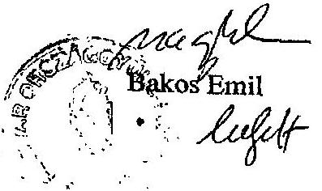

# JELENTÉS 

## a Történeti Hivatal fejezet működésének ellenőrzéséről

---

2. Államháztartás Központi Szintjét Ellenőrző Igazgatóság
2.3. Átfogó Ellenőrzési Főcsoport

Iktatószám: V-3-15/2003.
Témaszám: 638.
Vizsgálat-azonosító szám: V0068

# Az ellenőrzést felügyelte: 

## Bihary Zsigmond

főigazgató

## Az ellenőrzés végrehajtásáért felelős:

## Hegedűsné dr. Müllern Veronika

főcsoportfőnök

## Az ellenőrzést vezette:

## dr. Horváth Margit

osztályvezető főtanácsos

## Az ellenőrzést végezte:

## dr. Burján Margit

számvevő tanácsos
főtanácsadó

## A témához kapcsolódó eddig készített számvevőszéki jelentések:

| címe | sorszáma |
| :-- | --: |
| Vélemény a Magyar Köztársaság 1997. évi költségvetéséről | 333 |
| Vélemény a Magyar Köztársaság 1998. évi költségvetéséről | 9927 |
| Vélemény a Magyar Köztársaság 1999. évi költségvetéséről | 9839 |
| Vélemény a Magyar Köztársaság 2000. évi költségvetéséről | 9932 |
| Jelentés a Magyar Köztársaság 1999. évi költségvetése | 0024 |
| végrehajtásának ellenőrzéséről |  |
| Vélemény a Magyar Köztársaság 2001. és 2002. évi költségvetési | 0034 |
| törvényjavaslatáról |  |
| Jelentés a Magyar Köztársaság 2000. évi költségvetése | 0126 |
| végrehajtásának ellenőrzéséről |  |
| Vélemény a Magyar Köztársaság 2003. évi költségvetési | 0241 |
| törvényjavaslatáról |  |

Jelentéseink az Országgyűlés számítógépes hálózatán és az Interneten a www.asz.hu címen is olvashatók.

---

# TARTALOMJEGYZÉK 

BEVEZETÉS ..... 5
I. ÖSSZEGZŐ MEGÁLLAPÍTÁSOK, KÖVETKEZTETÉSEK, JAVASLATOK ..... 7
II. RÉSZLETES MEGÁLLAPÍTÁSOK ..... 10

1. A feladatok, a szervezet, a személyi feltételek és a gazdálkodás összhangja ..... 10
1.1. A Történeti Hivatal létrehozása, működési, gazdálkodási feltételeinek kialakítása ..... 10
1.1.1. Az iratállomány kezelési, elhelyezési feltételeinek biztosítása ..... 11
1.2. A TH jogállása, feladatellátása, a kialakított szervezet, a személyi és működési feltételek célszerűsége ..... 13
2. A belső kontroll mechanizmusok működése ..... 17
2.1. A fejezet szervezeti, működési és gazdálkodási rendjének, irányítási mechanizmusának szabályozottsága ..... 17
2.2. A belső ellenőrzés rendszerének szabályozottsága és működtetése ..... 20
3. A fejezeti költségvetés tervezése és végrehajtása ..... 21
3.1. A költségvetés tervezése ..... 21
3.1.1. Az előirányzatok módosítása, a likviditási helyzet, az előirányzat-maradványok alakulása ..... 22
3.2. A személyi juttatásokkal és a létszámmal való gazdálkodás ..... 24
3.3. A dologi kiadások ..... 28
3.4. A befektetett eszközökkel való gazdálkodás ..... 29
3.4.1. Az intézményi beruházások, felújítások ..... 29
3.4.2. A vagyongazdálkodás, -védelem, a biztonsági követelmények ..... 32
4. A fejezetet érintő ÁSZ költségvetési és zárszámadási ellenőrzések megállapításainak, javaslatainak hasznosulása ..... 34

---

# 2

---

# RÖVIDÍTÉSEK JEGYZÉKE 

| Áht. | az államháztartásról szóló, többször módosított 1992. |
| :-- | :-- |
|  | XXXVIII. törvény |
| Ámr. | az államháztartás működési rendjéről szóló, többször |
|  | módosított 217/1998. (XII. 30.) Korm. rendelet |
| BM | Belügyminisztérium |
| BM KGF | Belügyminisztérium Központi Gazdasági Főigazgatósága |
| Etv. | az egyes fontos, valamint közbizalmi és közvélemény- |
|  | formáló tisztségeket betöltő személyek ellenőrzéséről és a |
|  | Történeti Hivatalról szóló 1994. évi XXIII. tv. |
| Kbt. | a közbeszerzésekről szóló, többször módosított, 1995. évi |
|  | XL. törvény |
| Ktv. | a köztisztviselők jogállásáról szóló, többször módosított, |
|  | 1992. évi XXIII. törvény |
| KVI | Kincstári Vagyoni Igazgatóság |
| Ltv. | a közokiratokról, a közlevéltárakról és a magán levéltári |
|  | anyag védelméről szóló 1995. évi LXVI. tv. |
| NKÖM | Nemzeti Kulturális Örökség Minisztériuma |
| OGY | Országgyűlés |
| PM | Pénzügyminisztérium |
| Szt. | a számvitelről szóló 1991. évi XVIII., illetve a 2000. évi C. |
|  | törvény |
| SzMSz | Szervezeti és Működési Szabályzat |
| TH, Hivatal | Történeti Hivatal |

---

# BEVEZETÉS

---

# JELENTÉS 

## a Történeti Hivatal fejezet működésének ellenőrzéséről

## BEVEZETÉS

Az Országgyűlés az egyes fontos tisztségeket betöltő személyek ellenőrzéséről szóló 1994. évi XXIII. törvényt módosító 1996. évi LXVII. törvényben döntött a Történeti Hivatal (Hivatal, TH) létrehozásáról.

A volt állambiztonsági szervek meghatározott iratait őrző és kezelő Történeti Hivatal biztosítja - a törvényben foglalt korlátokkal - az érintettek számára a róluk nyilvántartott adatok megismeréséhez való joguk gyakorlását, gondoskodik az egyes fontos tisztségeket betöltő személyeket ellenőrző bizottságnak az eljárás lefolytatásához szükséges adatok és iratok szolgáltatásáról, hátteret nyújt a kutatási tevékenység folytatásához. A Hivatal feladatát bővítette, a működés során tapasztalt jogi problémákat rendezte az 1994. évi XXIII. törvény módosításáról szóló 2001. évi XLVII. törvény, egyben a Hivatalt szaklevéltárrá minősítette. A módosítás érintette a Hivatal működésének csaknem minden területét, így például pontosította az érintettek irat-betekintési jogát; tágította az iratok tudományos kutathatóságát; bővítette azoknak az eljárásoknak a körét, amelyekben a Hivatal adatot szolgáltathat a hatóságoknak.

Az éves költségvetési törvények a központi költségvetés részeként határozták meg a Történeti Hivatal fejezet működését biztosító pénzügyi fedezetet. A Történeti Hivatal a központi költségvetés szerkezeti rendjében önálló fejezetként 1997. május 15-én kezdte meg működését. A Magyar Köztársaság 1997. évi költségvetéséről szóló 1996. évi CXXIV. törvény a fejezet kiadási előirányzatát 200 M Ft-ban határozta meg. A Magyar Köztársaság 2001. és 2002. évi költségvetéséről szóló 2000. évi CXXXIII. törvény a fejezet 2002. évi kiadási előirányzatát 435,5 M Ft-ban, bevételi előirányzatát 2,2 M Ft-ban, támogatási előirányzatát 433,3 M Ft-ban határozta meg. A fejezet költségvetési létszáma 1997-2002 között 44 főről 79 főre emelkedett.

Az Állami Számvevőszék (ÁSZ) ellenőrzésének jogi alapját az államháztartásról szóló - többször módosított - 1992. évi XXXVIII. törvény (Áht.) 120/A. § (1) bekezdése képezi. Az ellenőrzés végrehajtására az Állami Számvevőszékről szóló 1989. évi XXXVIII. törvény 2. § (3) és 17. § (3) bekezdése alapján került sor.

A fejezetnél átfogó ellenőrzést még nem végzett az ÁSZ, az előző számvevőszéki ellenőrzések az éves költségvetések tervezését, zárszámadását érintették.

A jelen ellenőrzésünk célja annak értékelése volt, hogy a Történeti Hivatal fejezetnél:

---

- a fejezet szervezeti, irányítási és működési mechanizmusa, költségvetési előirányzatai összhangban voltak-e a jogszabályokban meghatározott szakmai feladatokkal;
- a költségvetés tervezési, végrehajtási rendszere, a belső kontroll mechanizmusok biztosították-e a különböző jogcímen rendelkezésre álló közpénzek szabályszerű és a fejezeti gazdálkodás sajátosságainak megfelelő, célszerű felhasználását.

Az átfogó ellenőrzés a fejezet 1997-2002. évi működésére terjedt ki, nem képezte részét a minősített iratanyag (az iratállomány kb. 10-12%-a) kezelésére vonatkozó szabályozottság, ellenőrzési tevékenység vizsgálata.

Az ellenőrzés magába foglalta a fejezet 2002. évi beszámolója megbízhatóságának financial audit típusú vizsgálatát is. A megállapításokat az Állami Számvevőszéknek a 2002. évi zárszámadásról készült összefoglaló jelentése fogja tartalmazni.

A helyszíni ellenőrzés befejezése után, 2003. április 1-jétől az elmúlt rendszer titkosszolgálati tevékenységének feltárásáról és az Állambiztonsági Szolgálatok Történeti Levéltára (ÁSZTL, Levéltár) létrehozásáról szóló 2003. évi III. törvény értelmében a Történeti Hivatal jogutódja a Levéltár lett. A törvény rendelkezései szerint a Levéltár nem önálló fejezetként, hanem mint önálló, teljes gazdálkodási jogkörű költségvetési szerv az Országgyűlés költségvetési fejezetén belüli önálló címként működik az Országgyűlés elnökének felügyelete alatt. A Levéltár főigazgatóját az Országgyűlés elnöke 2003. április 1-jével kinevezte, a Levéltár Országgyűlés fejezethez történő integrálása a helyszíni ellenőrzés lezárása után történt meg.

A törvény előkészítése során az intézmény átalakításának feltételeiről és hatásairól megvalósíthatósági tanulmány nem készült. Ugyanakkor a 2003. évi feladatok végrehajtásához a törvény 13. §-ában foglalt felhatalmazás alapján a Kormány a 2063/2003. (III. 31.) határozatában elrendelte az érintett fejezetek számára összesen 536,2 M Ft többletforrás biztosítását a fejezeti tartalékok, egyéb előirányzatok terhére. Az Országgyűlés fejezetnél ebből az összegből 133,3 M Ft használható fel kötelezettségvállalással nem terhelt előirányzatmaradvány terhére. A fejezet a Levéltár kiadási és bevételi előirányzatát 2003. június 12-ig 80,9 M Ft-tal emelte meg, a többletforrást - a Levéltártól kapott információk szerint - végkielégítésre, személyi juttatásra, intézményi beruházási kiadásokra (másológépek, irattári polcok, központi számítógép-szerver bővítése) használják fel. A többletfeladatok további években jelentkező hatását a költségvetések tervezésekor számításba veszik.

A végleges jelentést az Állami Számvevőszékről szóló 1989. évi XXXVIII. tv. III. fejezet 25. § (1) bekezdésének megfelelően észrevételezésre megküldtük az Országgyűlés gazdasági főigazgatójának, aki azt elfogadta. Javaslataink egy részét - a szervezeti irányítás alapdokumentumaira vonatkozóan - már megvalósíttatta, a továbbiakra intézkedési tervet készíttet. (1. sz. melléklet)

---

# I. ÖSSZEGZŐ MEGÁLLAPÍTÁSOK, KÖVETKEZTETÉSEK, JAVASLATOK 

A Történeti Hivatal az információs kárpótlás jegyében, a rendszerváltás jogintézményeként, de azt követően több mint fél évtizeddel jött létre költségvetési intézményi súlyán túlmutatóan, önálló fejezetként. Megalapításáról, feladatairól 1996-ban törvény döntött, a részintézkedéseket előíró kormányhatározatok határidőit azonban nem tartották be a felelős intézmények. Különösen hátráltatta az iratok feldolgozását, a tervezett létszámú munkatárs alkalmazását a székházügy megoldásának kb. 2 és fél évig tartó elhúzódása.

Az átmenetileg a Belügyminisztériumban elhelyezett Hivatal jóváhagyott költségvetés (1997. szeptember 17-éig), érvényes SzMSz, saját gazdálkodási szabályzatok nélkül működött 1997-1998-ban. Működőképessége megőrzéséhez hozzájárult, hogy a szervezetet célszerűen a szakmai (állampolgári megkeresések, tudományos kutatás, feldolgozás), illetőleg a gazdálkodási, pénzügyi, biztonsági tevékenységek elkülönítésével, minimális tagolással (4 főosztály, 5-7 osztály) alakították ki. A szervezet korábban kialakított struktúrája a 2001. évi szaklevéltárrá minősítéssel összefüggő megnövekedett szakmai feladatok ellátására is alkalmas volt, miközben a gazdálkodási feladatok egy részét (könyvelés) - megállapodás alapján - a BM Központi Gazdasági Főigazgatósága (a továbbiakban BM KGF) látta el a vizsgált időszakban.

A fejezetnél a belső kontrollok kiépítése és működtetése 1999-től folyamatosan valósult meg. A Hivatal elkészítette a szervezeti, működési, gazdálkodási és ellenőrzési rendjének legfontosabb szabályzatait, amelyeket a szervezeti, működési feltételek változásával, a jogszabályok módosulásával összhangban - az 1999. évi számlarendet, továbbá a leltározási és ellenőrzési szabályzatot kivéve - aktualizált. Hiányosságok továbbra is fennmaradtak, különösen az informatika egyes területeinél, hiányzott az informatikai stratégia, valamint a rendszerezett kockázatelemzési, folytonossági és katasztrófa-elhárítási terv. A belső ellenőrzési rendszer egyik elemét sem működtették elég hatékonyan. A vezetői, illetve munkafolyamatba épített ellenőrzés hiányosságaira vezethető vissza a szerződéskötéseknél a pénzügyi jogkörök szabálytalan gyakorlása. A belső ellenőrzési szabályzat nem tartalmazza teljes körűen a kormányrendelet előírásait. A megbízási szerződéssel alkalmazott belső ellenőr által feltárt hibák, hiányosságok kijavítása, az ellenőrzési tevékenységről szóló beszámoltatás több esetben elmaradt.

Miközben az állampolgári megkeresések a vizsgált időszakban növekedtek -1997-2003. I. n. évben összesen több mint 11 ezer megkeresés volt -, a kiszolgálásukhoz szükséges iratanyag tematikus feltárásában elmaradás mutatkozott, amelyben a szükségszerűen párhuzamosan jelentkező feladatok ellátásának - a növekvő számú lakossági megkeresésnek és az iratanyag folyamatos feldolgozásának - nagy szerepe volt.

---

A fejezet rendelkezésére álló költségvetési források - a vizsgált időszakban 2.497,0 M Ft - összességében kiegyensúlyozott gazdálkodást tettek lehetővé. Az időszak elején - az elhelyezési, székházátadási problémák miatt - forrásbőség volt, 1999-től a felújítási, beruházási munkálatok megindulása után előfordultak átmeneti likviditási feszültségek, ezeket azonban előirányzatelőrehozatallal, előző évi előirányzat-maradvány januártól történő - engedélyezett - felhasználásával sikerült megoldani.

Az előirányzat-módosításokat, -átcsoportosításokat az ellenőrzött időszak elején döntően a működési feltételek kialakításának elhúzódása okozta, a későbbi években csökkent a számuk, összegük. A módosításokra az előző évi maradványok igénybevétele, a
 kormányzati hatáskörben elrendelt támogatási többletek és kisebb összegben a saját többletbevételek adtak lehetőséget. Az előirányzat-módosítások minden esetben szabályszerűek és dokumentáltak voltak, azokról a nyilvántartást folyamatosan, tételesen és naprakészen vezették. Kifogásolható azonban néhány esetben - pl. beruházási előirányzatról felújításra az előirányzat-átcsoportosítás indokoltsága.

Az előirányzat-maradvány meghatározó része kiadási megtakarításból keletkezett. Az előirányzat-maradványt 1997-1998-ban a felújítási munkálatok, beruházások késedelme okozta.

A fejezet költségvetési létszáma az 1997. évi 44 főről 2002-re 79 főre emelkedett. A létszámgazdálkodást a működés első két évében a szűkös elhelyezési körülmények determinálták, majd a székház átadása után betöltötték az engedélyezett létszámkeretet, amit a bővülő feladatokhoz igazodóan 2001-től növeltek. Folyamatosan alkalmazott külsős foglalkoztatottakkal növelték minden évben a költségvetési törvényben engedélyezett létszámot. A Hivatal létszámstruktúrája, a vezetők, beosztottak aránya lényegesen nem változott.

A személyi juttatás kiadásokra az ellenőrzött időszakban összesen 831,9 M Ft-ot fordítottak, a teljesített kiadások 36%-át. A rendelkezésére álló források biztosították a köztisztviselői és az éves költségvetési törvények által előírt juttatásokat, éltek a differenciált alapilletmény emelés és címpótlékok megállapításának lehetőségével is.

A dologi kiadások között meghatározó volt az üzemeltetésre, fenntartásra, továbbá a szolgáltatások igénybevételére költött összegek aránya. A reprezentáció, a bel- és külföldi kiküldetés, a reklám-propaganda kiadás alacsony összegű volt. A dologi kiadásra a vizsgált időszakban az összes kiadás 11%-át fizették ki.

Az erőltetett ütemű beruházási, felújítási munkálatok (a kiadások 39%-át fordították erre a célra) pénzügyi lebonyolítása, a szerződések megkötése, a pénzügyi jogkörök gyakorlása nem felelt meg minden esetben a jogszabályi előírásoknak, illetve a belső szabályozásnak. Az első tervekben szereplő felújítás bejezése után tovább folytatott munkálatokra nem kértek mentességet a közbeszerzési törvény hatálya alól.

A székház épületét 1998-1999-ben műemléki védettségének megfelelő igényességgel újították fel. A tervezés és a kivitelezés során biztosították a feltételeket a

---

munkavégzéshez és a 2002. év végére több mint 3000 irat-folyóméternyi irat biztonságos tárolásához és kezeléséhez. A számítástechnikai háttér hivatott biztosítani az iratanyag tematikus feldolgozását, az előírt nyilvántartások vezetését.

Az informatikai rendszerben az ún. szűkös mentési háttérterület miatt hosszú ideig nem készültek napi, csak heti mentések a rendszer adatbázisáról. A rendszer folyamatos áramellátását biztosító berendezések nem elégítik ki teljes mértékben a biztonsági követelményeket. A központi szerverek meghibásodása, teljes megsemmisülése esetére nincsenek helyreállítási forgatókönyvek, tartalék eszközök.

A Hivatalnál figyelembe vették, hasznosították az ÁSZ zárszámadási ellenőrzéseinek tapasztalatait, a javaslatok alapján tett intézkedések elősegítették a szabályszerű gazdálkodást, pl. a jogszabályi előírások alapján a kötelezettségvállalás és annak ellenjegyzése 2002-től már írásban történt, megszüntették a BM KGF-nek a Hivatal számlája feletti rendelkezési jogosultságát, elkészítették a hiányzó szabályzatokat.

A helyszíni ellenőrzés megállapításainak hasznosítása mellett javasoljuk:

# az Országgyűlés gazdasági főigazgatójának: 

Gondoskodjon arról, hogy

1. a szervezeti irányítás alapdokumentumait (alapító okirat, SzMSz), továbbá a függetlenített belső ellenőrzésre vonatkozó szabályozásokat a feladatokkal, illetve a hatályos jogszabályi rendelkezésekkel összhangban egészítsék ki, illetve módosítsák;
2. az intézmény középtávú informatikai stratégiáját, a teljes körű adatvédelmi szabályzatát, valamint az informatikai rendszer kockázatelemzésének eredményei alapján a hiányzó informatikai terveket, szabályozásokat az intézmény vezetése készíttesse el.

---

# II. RÉSZLETES MEGÁLLAPÍTÁSOK 

## 1. A feladatok, a Szervezet, a személyi feltételek és a gazdálkodás összhangja

### 1.1. A Történeti Hivatal létrehozása, működési, gazdálkodási feltételeinek kialakítása

Az Országgyűlés a demokratikus államélet tisztaságának előmozdítása érdekében - a rendszerváltás után több évvel - alkotta meg az egyes fontos, valamint közbizalmi és közvéleményt formáló tisztségeket betöltő személyek ellenőrzéséről szóló 1994. évi XXIII. törvényt (Etv.). Ennek intézményi háttereként - a törvény módosításával - 1996-ban létrehozta a Történeti Hivatalt.

Az egyes fontos, valamint közbizalmi és közvéleményformáló tisztségeket betöltő személyek ellenőrzéséről és a Történeti Hivatalról szóló 1996. évi LXVII. törvény 1996. VII. 31-ével lépett hatályba.

1995 decemberében az 1994. évi XXIII. tv. módosítását előkészítő 3145/1995. (XII. 7.) sz. határozatában a Kormány felhívta az érintett minisztereket, hogy vizsgálják meg a Történeti Hivatal (TH) létesítésének pénzügyi feltételeit, továbbá felkérte a pénzügyminisztert, hogy a kincstári vagyonkezelő szervezeten (Kincstári Vagyon Igazgatóság) keresztül tegyen javaslatot a TH részére épület kijelölésére és átadására a törvény kihirdetésétől számított 60 napon belül.

A TH létesítésének időpontjáról, pénzügyi feltételeiről és elhelyezéséről szóló döntések késedelmesen, a kormányhatározatban megjelölt határidő után keletkeztek.

A Belügyminisztérium a kormányhatározatban megjelölt 1996. február 15-e helyett 1996. július 31-én tett javaslatot a TH létesítésének pénzügyi feltételeire, 900 M Ft-os költségvetést javasolt. A PM a javaslatot túlzottnak találta, a költségvetési tárgyalásokon alakult ki a TH 1997. évi 200 M Ft-os költségvetési előirányzata, amit az Országgyűlés a költségvetési törvényben jóváhagyott.

A KVI 1996. decemberében kérte a BM-től a TH elhelyezésére szolgáló épület kijelöléséhez szükséges alapparaméterek és egyéb szakmai, illetve biztonsági követelmények megadását. Több épület felajánlása, illetve megtekintése után 1997. március 5-én rögzítették, hogy a KVI nem rendelkezik megfelelő ingatlannal.

Ezt követően - 1997. április 7-én - ajánlotta fel a BM a kezelésében lévő Budapest, VI. kerület Eötvös u. 7. szám alatti ingatlant. A tervezett költségek - várható felújítási érték 280 M Ft, a BM részére a vagyonkezelési jogról való lemondás miatt fizetendő 60-100 M Ft - miatt a PM először ezt nem fogadta el.

A TH elnökét 1997. május 15-én nevezte ki a köztársasági elnök a miniszterelnök javaslatára határozott időre (7 évre). A Hivatal - kezdetben három fővel, majd szeptembertől bővülő létszámmal - a Belügyminisztérium épületében, szűkös körülmények között kezdett működni.

---

A Magyar Köztársaság 1997. évi költségvetéséről szóló 1996. évi CXXIV. évi törvény 60. §-ában kapott felhatalmazás alapján a Kormány a 2188/1997. (VII. 9.) határozatában állapította meg a törvényben biztosított 200 M Ft kiemelt előirányzatait. Támogatta, hogy a Hivatal a BM kezelésében lévő VI. kerület Eötvös u. 7. sz. épületben kerüljön elhelyezésre.

Az épület kezelői jogának átadásával összefüggő indokolt költségekről a Belügyminisztérium és a KVI az 1997. szeptember 30-ai határidőhöz képest elhúzódó tárgyalások, egyeztetések után 1998. február 27-én kötött megállapodást. Ennek feltételeként a TH saját költségvetése terhére 50 M Ft-ot - kormányengedéllyel - átcsoportosított a BM részére az épületben működő sportklub áthelyezésére. A sportklub az épület tényleges átadásának határidejét - 1998. június 30. - nem tartotta be, így a TH csak 1998. októberében kezdhetett hozzá a székház felújításához és részleges átépítéséhez, majd 1999 májusában - a megalakulás után 2,5 évvel - foglalta el azt.

A székházügy elhúzódó - kb. két és fél évig tartó - megoldása, a Hivatal nem megfelelő elhelyezése megnehezítette a munkavégzést, hátráltatta a tervezett, szükséges létszámú munkaerő alkalmazását. A felújítások, beruházások megkezdésének késedelme megnehezítette az 1997-1999. közötti időszakban a költségvetési tervezést, teljesítést.

# 1.1.1. Az iratállomány kezelési, elhelyezési feltételeinek biztosítása 

A volt államvédelmi szervek Történeti Hivatal kezelésébe kerülő iratait - tételes ellenőrzéssel - 1997 júliusától vette át a Hivatal, összességében mintegy 2500 irat-folyóméternyi anyagot. Az iratok azonban 1999 tavaszáig - a Hivatal székházának átadásáig - a BM épületében lévő raktárakban maradtak.

Hazánkban az állambiztonsági szervek 1950-ben hozták létre egységes, operatív nyilvántartásukat. A nyilvántartást 1957. tavaszán újjászervezték, az Államvédelmi Hatóság formális feloszlatásával a BM szervezetébe integrálták.

A Hivatal költségvetésében már a megalakulás évétől rendelkezésre álló forrásokból a kijelölt épület átadásának elhúzódása miatt a létrehozás utáni első két évben a működéshez alapvetően szükséges eszközök - számítógépek, másológépek, gépkocsik, bútorok - beszerzése történt meg.

A felújítási munkák befejezése után - 1999. április - szállították át az iratanyagot az új székházba, ahol a tervezés és kivitelezés során biztosították a szükséges feltételeket mind a munkavégzéshez, mind az iratok biztonságos kezeléséhez, tárolásához.

Az épületet műemléki védettségének megfelelően, a Műemlékvédelmi Hivatal előírásai alapján újították fel. Az építészetileg kevésbé értékes udvari szárny földszinti és félemeleti részén alakították ki az irattárakat. A klimatizált, állandó hőmérsékletű és páratartalmú raktárakban helytakarékos módon, mozgatható állványokon helyezték el az iratokat. A biztonsági követelmények megvalósításához az épületet több biztonsági zónára osztották.

---

A felújítási, beruházási források 2000-től sem csökkentek. A tetőtérben új munkatereket alakítottak ki, a beépített iratlift pedig lehetővé teszi, hogy az iratok nem kerülnek ki a zárt biztonsági zónából. Új ügyfélfogadó helyiséget alakítottak ki. Az újonnan átvett mintegy 160 irat-folyóméternyi anyag elhelyezése biztosított volt.

Az új, megnövekedett feladatokhoz igazodóan 2001-ben és 2002-ben új irattári raktárakat és az állományvédelmet szolgáló munkateret alakítottak ki. Folytatódott az informatikai hálózat fejlesztése is. A telefonközpont, a biztonsági beléptető rendszer, a tűzvédelmi és általános riasztórendszer az iratok folyamatos, megfelelő védelmét szolgálja.

Az irattároló eszközök, dobozok egy része nem felel meg a szakmai kívánalmaknak, mivel az iratok optimális védelmét csak ún. savmentes dobozok szolgálnák. Tájékoztatásuk szerint a dobozok cseréjéhez szükséges többletforrásokat a 2004. évi költségvetésben megtervezik, a 2003. évi többletforrásra pótlólagosan beterjesztették a kérelmüket.

A számítástechnikai háttér biztosítja az előírt nyilvántartások vezetését, a dossziék tematikus feldolgozását, a kutatásra kiadott anyagok nyilvántartását.

A tárolt, kezelt iratmennyiség az 1997. évi kb. 2500 folyóméterről 2002. végére mintegy 3130 irat-folyóméterre bővült. A TH iratainak számítógépes feldolgozása az 1998 elején elfogadott és írásba foglalt alapelvek szerint indult meg, lényegében ezekre épült a 2002. végén elkészült Informatikai Koncepció is.

Mindkét dokumentum lényege, hogy a TH által őrzött iratanyag jellege és fizikai állapota, a korabeli segédletek szinte teljes hiánya, valamint az intézmény speciális, más levéltáraktól eltérő többletfeladatai miatt az iratokat az általános levéltári gyakorlathoz képest részletesebb, több szempontú és mélyebb feltárást lehetővé tévő informatikai rendszerben szükséges feldolgozni. Az informatikai rendszer alapvetően három pillérre épül:

- a dossziék névanyagának számítógépes rögzítése;
- az iratok ún. tematikus feltárása (tartalmi kivonatok készítése, tárgyszavak, kódok irattani és fizikai jegyek, stb. alapján történő kategorizálás);
- a gyakran használt és/vagy rossz fizikai állapotban lévő iratok teljes digitalizálása.

A Hivatal alakulásakor az iratok feldolgozására nem készült ütemterv. Alapelveit tekintve az intézmény iratainak számítástechnikai feldolgozása mindvégig a felsorolt hármas célkitűzést követte és követi jelenleg is, a munka üteme pedig elsősorban az adott évben erre fordítható munkaóráktól függ.

A feldolgozásban részt vevő munkatársak száma folyamatosan változott, mind a névanyag feldolgozását, mind pedig a tematikus feldolgozást és a digitalizálást végző munkatársak szükség szerint ellátnak egyéb feladatokat is.

---

# 1.2. A TH jogállása, feladatellátása, a kialakított szervezet, a személyi és működési feltételek célszerűsége 

A TH jogállását, feladatait törvények szabályozzák, az alapító a Magyar Országgyűlés.

A Hivatal létrehozásáról döntő, 2003. március 31-éig hatályos, módosított Etv. 25/F §-a meghatározta a volt állambiztonsági szervek meghatározott iratait őrző és kezelő TH fő feladatait is.

A TH biztosítja az érintettek számára a róluk nyilvántartott adatok megismeréséhez való joguk gyakorlását; gondoskodik az egyes fontos tisztségeket betöltő személyeket ellenőrző bizottság eljárásai lefolytatásához szükséges adatok és iratok szolgáltatásáról; biztosítja kutatási tevékenység folytatását, illetve a tudományos munkamegosztás körében részt vállal az iratanyag
 közreadásában.

A Hivatal jogállását meghatározta az alapításáról rendelkező törvény. A TH önálló központi költségvetési szerv, a központi költségvetés szerkezeti rendjében önálló fejezet.

A Hivatal élén - az alapítást elrendelő törvény értelmében - az elnök áll. Az államtitkári besorolású elnököt és a helyettes államtitkári jogállású elnökhelyettest a köztársasági elnök nevezi ki, a munkáltatói jogokat a miniszterelnök gyakorolja. Az államháztartás működési rendjéről szóló 217/1998. (XII. 30.) Korm. rendelet (Ámr.) 2.§ (2) pontja alapján a fejezet felügyeletét ellátó szerv vezetője a költségvetési törvény által meghatározott fejezetrendhez igazodóan a TH elnöke.

A szakma megítélése szerint az egykori kelet-európai szocialista országok közül a volt Német Demokratikus Köztársaság Állambiztonsági Minisztériuma (STASI) iratait kezelő hatóság és a Történeti Hivatal működése felelt meg legjobban az információs kárpótlás szakmai igényeinek.

Németországban jelenleg 2500 munkatárs dolgozik ezen a területen, a törvény hatályba lépése óta közel 2 millió iratbetekintéssel kapcsolatos kérelem érkezett a hatósághoz.

Lengyelországban és Romániában néhány éve kezdték meg az elmúlt rendszer iratainak feldolgozását.

Szlovákia nem rendelkezik külön törvénnyel, 3 fő foglalkozik a múlt feltárásával a pozsonyi Igazságügyi Minisztériumban.

A Cseh Köztársaságban a Kommunizmus Bűncselekményeit Dokumentáló és Vizsgáló Hivatalt az Országos Rendőrparancsnokság önálló egységeként hozták létre 1995-ben.

Bulgáriában nincs ilyen hivatal.
A vizsgált időszakban - 2002. év végéig - a Hivatal jogállása nem módosult. A helyszíni vizsgálat befejezése után - 2003. április 1-jétől - az elmúlt rendszer titkosszolgálati tevékenységének feltárásáról és az Állambiztonsági szolgálatok Történeti Levéltára létrehozásáról szóló 2003. évi III. törvény értelmében a Le-

---

véltár a TH jogutódja lett. Önálló, teljes gazdálkodási jogkörű költségvetési szerv marad, de nem önálló fejezet, hanem az Országgyűlés költségvetési fejezetén belül önálló cím. A Levéltár főigazgatóját 2003. április 1-jei hatállyal nevezte ki az Országgyűlés elnöke.

A Hivatal feladatait bővítette, az időközben felmerült jogi problémákat rendezte az egyes fontos, valamint közbizalmi és közvélemény-formáló tisztségeket betöltő személyek ellenőrzéséről és a Történeti Hivatalról szóló 1994. XXIII. törvény módosításáról és az ezzel összefüggő törvénymódosításokról szóló 2001. évi XLVII. törvény. A módosítás érintette a Hivatal működésének több területét.

Pontosította az érintettek iratbetekintését jogát, tágította az iratok tudományos kutathatóságát, bővítette azoknak az - érintettek jogai érvényesítésével kapcsolatos - eljárásoknak a körét, amelyekben a Hivatal adatot szolgáltathat.

A törvénymódosítás a Hivatalt szaklevéltárrá minősítette.
A szaklevéltárrá nyilvánítás egyik következménye az, hogy azok az állambiztonsági iratok is a Hivatalhoz kerülnek, amelyek a nemzetbiztonsági szolgálatok számára - törvényben meghatározott feladataik ellátása céljából a Hivatal létrehozásakor - még szükségesek voltak.

A Hivatal szakmai feladatait szabályozza továbbá a közokiratokról, a közlevéltárakról és a magánlevéltári anyag védelméről szóló 1995. évi LXVI. törvény (Ltv.). A szakmai munkáról a 2002. októberében tartott szakfelügyeleti ellenőrzés megállapította, hogy a Hivatal megfelel a szaklevéltárakkal szemben támasztott követelményeknek.

Megállapításaik szerint a számítógép alkalmazása terén az intézmény előkelő helyet foglal el a hazai levéltárak között, kiépítette és működteti belső hálózatát, színvonalasan megjelent az Interneten, megfelelő a vírusvédelem.

Az addig szükséges fejlesztésekhez a pénzügyi fedezet rendelkezésre állt.
A raktárak használati, belépési jogosultsága, a személyi felelősség, a levéltári anyag nyilvántartása megfelelően szabályozott.

Az iratelhelyezési körülmények megfelelőek, a kiszolgáló helyiségek, munkaszobák azonban szűkösek.

A létszámhelyzet az őrzött levéltári anyaghoz és a feladatok képest jónak mondható.

Az intézmény a többi levéltárnál jobb költségvetési helyzetben volt és van, biztosították a rendeltetésszerű működés feltételeit.

Új számítástechnikai koncepció és teljes körű adatvédelmi szabályzat kidolgozását javasolták.

A Hivatal szervezeti felépítése 1997-2001. között a feladatokhoz igazodóan, a létszámbővítéssel összhangban kis mértékben módosult.

A szervezet kialakításának rendező elve már a megalakuláskor az volt, hogy külön szervezeti egységek foglalkozzanak az állampolgári megkeresésekkel és a tu-

---

dományos kutatói kérésekkel, a tudományos feldolgozó munkával és a működést biztosító funkcionális - pénzügyi, személyzeti, biztonsági, elhelyezési - feladatokkal.

A Hivatal szervezetét, a személyi és működési feltételeket 1997-1998-ban döntően meghatározta a székház kiválasztásának, átépítésének elhúzódása.

A szervezet kialakítása, az ügyvitelt, gazdálkodást, szakmai munkát végzők felvétele folyamatosan történt. Az elnök irányítása alatt négy főosztályt alakítottak ki: a Titkársági-, az Adattároló és Feldolgozó-, az Elemző és Dokumentá-ciós-, és a Gazdasági és Biztonsági Főosztályt.

A Titkársági Főosztály intézte a Hivatal ügyvitelét, ellátta a titkársági koordinációs feladatokat. Kettő - majd 1998-tól egy - osztálya tartotta a kapcsolatot az ügyfelekkel és a kutatókkal. 1998-tól az idetartozó Iratfelülvizsgálati Osztály feladata volt a minősített iratokkal kapcsolatos ügyek intézése.

Az Iratfeldolgozó és Adatszolgáltató Főosztály (1997-ben Adattároló és Feldolgozó Főosztály) - négy osztály tartozott ide - a közgyűjteményi feladatokat látta el.

Az Elemző és Dokumentációs Főosztály feladata a történelemtudományi feldolgozás.

A Gazdasági és Biztonsági főosztályvezető kinevezésére nem került sor, az ide sorolt három osztály közvetlenül az elnök alárendeltségében működött.

Változást jelentett még az elnökhelyettes 1998-tól történt kinevezése, aki - az elnök általános helyettesítésén túl - az Elemző és Dokumentációs Főosztály tevékenységének közvetlen irányítását, a szakmai továbbképzés megszervezését, a panaszügyek intézését, a külső tudományos kutatók kiszolgálását végző részlegek irányítását kapta feladatul.

A szervezet kialakítása célszerű volt, lefedte a feladatokat, s a későbbiekben, a feladatok bővülésével, a létszám növekedésével, az elhelyezési körülmények javulásával sem igényelt alapvető változtatást, csak kiigazításokat.

A szervezetet kissé módosították, megszüntették a ténylegesen nem funkcionáló Gazdasági és Biztonsági Főosztályt. Az Elhelyezési és Ellátási Osztály a Titkársági Főosztályhoz került, a Pénzügyi, továbbá a Személyügyi és Biztonsági Osztály az elnök közvetlen alárendeltségében működött.

További kisebb módosítást jelentett, hogy 2000-ben a tudományos kutatók növekvő érdeklődése miatt az Iratfeldolgozó és Adatszolgáltató Főosztályon belül feladatátcsoportosítással - külön Tudományos Kutatást Előkészítő Osztály alakult, de az osztályok száma változatlan maradt.

A Hivatalnál a gazdálkodási feladatok döntő részét a Pénzügyi Osztály és az Elhelyezési Osztály látta el. A Pénzügyi Osztály - a gyakorlatban végig az elnök közvetlen irányítása alatt - kezdettől ugyanazon 3 fő megfelelő szakirányú képzettségű dolgozóval működött. A teljes körű könyvelést szerződés alapján mindvégig a Belügyminisztérium Központi Gazdasági Főigazgatósága látta el.

A Pénzügyi Osztály alapvető feladatai körében elkészítette a költségvetési javaslatokat és pénzügyi terveket, valamint az azokról szóló beszámolókat; kezelte a

---

Hivatal költségvetési előirányzatait; figyelemmel kísérte és ellenőrizte a beruházások, felújítások pénzügyi tervezését és megvalósítását; ellátta a Hivatal gazdálkodásával és vagyonával kapcsolatos számviteli feladatokat; vezette a pénzforgalmi nyilvántartásokat és elkészítette a hatályos jogszabályokban előírt statisztikai jelentéseket.

A három fős osztályon a költségvetési, pénzügyi, ellenőrzési feladatok ellátása csak gyakori túlmunkával volt lehetséges.

A Hivatal 1997 augusztusában megállapodást kötött a BM KGF-fel a fejezet költségvetésével kapcsolatos feladat- és munkamegosztás, valamint kötelezettség- és felelősségvállalás tárgyában. ${ }^{1}$

A BM KGF szolgáltatási díj ellenében végzi a TH dolgozói illetményének és egyéb személyi kifizetéseinek számfejtését; a költségvetéssel kapcsolatos mindennemű kifizetést.

A Hivatal költségvetési előirányzatának terhére a Hivatal a kötelezettségvállalást, záradékolást, a megrendelésekkel összefüggő lebonyolítási, nyilvántartási, bevételezési, leltározási feladatokat intézi. A pénzügyi teljesítéseknél a BM KGF elvégzi az érvényesítési, ellenjegyzési és utalványozási kötelmeket. A BM KGF a TH költségvetésének terhére gazdálkodási tevékenységet nem folytat, a TH megrendelése nélkül szerződést nem köt, beszerzést nem eszközöl, kötelezettségvállalásra a TH megbízott munkatársa jogosult.

A megállapodást 1998-ban kiegészítették azzal, hogy a BM KGF vállalja az ingatlan-nyilvántartást és a kincstári vagyonnyilvántartást, továbbá az ezekkel kapcsolatos adatszolgáltatás technikai részeit.

A Hivatal feladatköre 2001. VII. 18-tól bővült, szaklevéltárrá minősítették. A megnövekedett feladatok ellátását 10 fő létszámnöveléssel biztosították. A szervezetet nem változtatták, a korábban kialakított szervezet szerinti feladatmegosztást megfelelőnek ítélték az új feladatok ellátására is.

A TH költségvetési létszáma 1997-ben 44 fő, 1998-ban 72 fő volt. Az elhelyezési nehézségek miatt 1997 végén 42, 1998 végén 62 fő köztisztviselőt foglalkoztattak. Szakképzett, korábban is hasonló területen dolgozókat vettek fel, illetve át a BM, a Magyar Országos Levéltár, a Hadtörténeti Intézet és Múzeum, továbbá a Honvédelmi Minisztérium Igazgatása állományából.

A Hivatal elnöke eleget tett a módosított Etv. 2003. március 31-éig hatályos 25/E. § (1) bekezdésében előírt, az Országgyűlés számára történő, évenkénti beszámolási kötelezettségének. Az Országgyűlés a beszámolókat elfogadta.

A beszámolókban közölt adatok szerint az állampolgárok a megalakulástól 2003. első negyedévéig összesen 11272 esetben fordultak a Hivatalhoz. Kiugróan magas volt a 2002. évi 3040 megkeresés. Az eredménytelen - az érdeklődők neve, adatai nem szerepeltek a feldolgozott iratanyagban - kutatások száma összesen 6312, aránya 56% volt.

[^0]
[^0]:    ${ }^{1}$ Az ÁSZ ellenőrzés 1997-ben javasolta, hogy szüntessék meg a BM KGF-nek a Hivatal számlája fölötti rendelkezési jogosultságát, ez 1998-tól megtörtént.

---

Átmeneti csökkenés után 2002-től - részben a megnövekedett érdeklődés miatt - emelkedett az ügyirathátralék. Az adott év végén elintézetlen ügyek száma 1998-ban 1705, 2002-ben 2027 volt.

A TH másik alapvető feladata, hogy adatokat és iratokat szolgáltat az egyes fontos és közbizalmi tisztséget betöltő személyek ellenőrzését végző bizottságok részére.

A bizottságok 1997-től összesen 4234 személyről kértek adatokat, 1997-ben 26, 1998-ban 244, 1999-ben 44, 2000-ben 97 főről. Az átvilágítandók számának növekedése miatt 2001-től emelkedett az adatkérések száma. 2001-ben 1939, 2002-ben 1842 volt, 2003. I. negyedévben 42 személyről kértek adatokat.

A kutatók is növekvő számban keresték meg a Hivatalt, 2000-ben 1624, 2002-ben 2048 alkalommal látogatták a kutatótermet.

A vizsgálati dossziék és egyéb iratok tematikus feltárása során az adott irat legfontosabb adatait (cím, időhatár, tartalom, szereplők stb.) tartalmazó munkalapokból 663 készült el 2002-ben. (1998-ban 687, 1999-ben 1051, 2000-ben 1633, 2001-ben 917). A feldolgozott iratanyag évente 60-80 ezer darab volt.

A tematikus feltárás területén mutatkozó 2002. évi csökkenésnek az is oka, hogy a korábban rögzített alapadatokat egészítették ki, a feldolgozás a korábbi munkalapok módosításaként jelenik meg. A névanyag feldolgozásánál is egyre gyakrabban kell a korábban már rögzített névadatokat pontosítani, és újabb dossziékhoz rendelni, ezzel együtt egyre ritkábban található teljesen új név.

A központi számítógépes adatbázis 2002 végén kb. 350 ezer nevet tartalmazott, digitalizáltak mintegy 170 ezer oldalnyi iratot, a dossziék többségének alapadatait is rögzítették a központi adatbázisban. A TH tájékoztatása szerint a hazai levéltárak gyakorlatát tekintve a dossziék névanyagának feldolgozása és az iratok digitalizálása egyedülállónak tekinthető, - más levéltárakban ilyen feldolgozást nem végeztek - az ún. tematikus feltárás szintje pedig hozzávetőleg megfelel a közlevéltárak feldolgozottsági állapotának.

A dossziék kb. 60%-ánál a legfontosabb adatokat feldolgozták, a feltáratlan iratanyag a közelmúltban került a Hivatalhoz. (2002-ben a Belügyminisztériumtól, az Információs Hivataltól, a Nemzetbiztonsági Hivataltól, a Katonai Biztonsági Hivataltól összesen kb. 200 irat-folyóméternyi iratanyagot vettek át.)

Az iratok minden adatára kiterjedő, a teljes körűen feldolgozott dossziék aránya a tárolt iratanyagnak kb. 1-2%-a.

# 2. A Belső Kontroll MECHANIZMUSOK MŰKÖDÉSE 

### 2.1. A fejezet szervezeti, működési és gazdálkodási rendjének, irányítási mechanizmusának szabályozottsága

A Hivatal alapító okirattal nem rendelkezik, de az alapítását elrendelő 1996. évi LXVII. törvény az Áht. 88. §-ában (3) bekezdésében előírtaknak, a

---

217/1998. (XII. 30.) Korm. rendelet 10. §-ának megfelelően tartalmazza a költségvetési szerv megnevezését, alapfeladatát,
 gazdálkodási jogkörét, a Hivatal elnökét kinevező személyt. (Hiányzik azonban a TH székhelyének és az ellátható vállalkozói tevékenységnek a megnevezése).

A fejezet az alapítás után 1998-tól folyamatosan készítette el a szervezeti, működési, gazdálkodási és ellenőrzési rendjének szabályzatait, amelyeket - a számlarendet és a leltározási szabályzatot kivéve - a szervezeti, működési feltételeinek változásával, a jogszabályok módosulásával összhangban aktualizált.

Figyelembe vették, hasznosították az ÁSZ zárszámadási ellenőrzéseinek tapasztalatait, a javaslatokat megvalósították. A folyamatos fejlődés ellenére tapasztalhatók hiányosságok a működés, gazdálkodás szabályozottságában (pl. SZMSZ, Belső ellenőrzési szabályzat), illetve a szabályzatok alkalmazásában (pl. pénzügyi jogkörök gyakorlása).

Az ideiglenes SZMSZ 1998-ban készült el, 1999. április 1-jével lépett hatályba a Hivatal jóváhagyott SZMSZ-e.

Az SZMSZ - többek között - tartalmazta a TH részére jogszabályokban meghatározott feladatokat, az ezekkel kapcsolatos eljárási szabályokat. Rögzítette a szervezeti felépítést. A működés, szabályozás keretében előírta az előterjesztések elkészítését, véleményezését és elfogadását, valamint a tervezés, ellenőrzés rendjét.

Hiányossága volt, hogy az ellenőrzési rend csak a vezetői, a munkafolyamatba épített, valamint a függetlenített belső ellenőrzés eseti megbízás keretében történő ellátását határozta meg. ${ }^{1}$ Kifogásolható, hogy az SZMSZ-t csak 2002. júniusában - a TH-ról szóló törvénymódosítás hatályba lépése után egy évvel - egészítették ki, addig nem tartalmazta az új, szaklevéltári feladatokat.

A fejezet 1997-ben nem rendelkezett a szervezetre vonatkozó gazdálkodási szabályzatokkal, hiányzott a számviteli politika, számlarend, számlatükör, értékelési, leltározási, pénzkezelési szabályzat, az analitikus nyilvántartások rendje.

1998-ban hatályba lépett a TH elnöke által jóváhagyott számviteli politika, amely szabályozta a számviteli elszámolásokban lényegesnek minősített szempontokat.

A számviteli politika a BM KGF szabályzatán alapult, néhány értelemzavaró szövegrész is bennmaradt, ami nem volt alkalmazható a TH működésére. Pl. „A Történeti Hivatal Főigazgatósága (továbbiakban: BM KGF) számviteli politikája", vagy „A BM KGF-hez tartozó önálló gazdálkodó költségvetési szerv a TH vállalkozási tevékenységet nem folytat". Hiányosság továbbá, hogy elkészítésének, jóváhagyásának, érvényességének ideje nem került feltüntetésre.

[^0]
[^0]:    ${ }^{1}$ A függetlenített belső ellenőrzés működését nem szabályozták az ÁSZ javaslata alapján az SZMSZ érvénybe lépésekor már hatályos 15/1999. (II. 5.) Korm. rendelet előírásainak megfelelően.

---

1998-ban folyamatosan készítették el a belső szabályzatokat, pl. Eszközök és Források értékelési, Leltározási, Önköltségszámítási, Pénzkezelési Szabályzat. 1999-ben nem módosították a számviteli politikát, azt az időközben érvénybe lépett jogszabályoknak megfelelően nem aktualizálták. Hiányzott belőle az Ámr. által elrendelt időpont-kijelölés, ameddig a tárgyévre vonatkozóan a költségvetési szerv által vezetett könyvekben helyesbítések végezhetők.

A Hivatal gazdálkodásának, működésének szabályozottsága - az informatikai terület kivételével - 2000-től tekinthető teljes körűnek, a szabályzatokat a jogszabályi előírások alapján a szakmai feladatok és sajátosságok figyelembe vételével alakították ki, illetve aktualizálták.

Hiányosság volt tapasztalható viszont még 2002-ben is az informatikai rendszer működésének szabályozottságában.

A TH informatikai rendszerének működését befolyásoló szabályozási környezet több helyen hiányos (pl. nincs rendszerezett kockázatelemzés, üzemmenetfolytonossági és katasztrófa-elhárítási terv).

A belső kontroll mechanizmusok kiépítése és működtetése mindhárom vizsgált évben egyenletes volt. Az egyes területek - az informatikai kivételével - alacsony kockázati minősítést kaptak.

A belső kontroll mechanizmus minősítése - 2002-ben - az ÁSZ-nál kialakított, a fejezet által kitöltött munkalapok elemzése, értékelése, ellenőrzése alapján történt.

A TH működése, feladatrendszere, szervezete, vezetése változatlan volt. A gazdasági szervezet tevékenysége megfelelően szabályozott volt. A TH és a Kincstár által szolgáltatott adatok egyezősége fennállt, intézkedési kötelezettségük nem volt.

A számviteli rendszer az Sztv. módosítását követően 2002. évre pontosításra, kiegészítésre került, a szabályozottság megfelelő volt.

A számviteli tevékenység informatikai támogatottsága, a rendszer működésének biztonsága megfelelt a szakmai követelményeknek. A bizonylatok hiánytalan feldolgozása biztosított volt. ${ }^{1}$

Az ÁSZ a fejezet 2000-2001. évi zárszámadásának financial audit típusú ellenőrzése keretében lényeges hibát nem talált, a költségvetési beszámoló megfelelt a törvény előírásainak, az a vagyoni és pénzügyi helyzetet a valóságnak megfelelően tükrözi.

A szakmai feladatok végrehajtásában érvényesítették a Levéltárakról szóló 1995. évi LXVI. törvény és a végrehajtására kiadott, a szakmai követelmény-

[^0]
[^0]:    ${ }^{1}$ Az ÁSZ ellenőrzés alapján 2000-2001-ben feltárt hiányosságokat - az üzembe helyezési és rendszerdokumentációk nem voltak naprakészek - 2002-ben pótolták.

---

ket megfogalmazó 10/2002. (IV. 13.) NKÖM rendelet előírásait, ezekkel összhangban alakították ki belső szabályzataikat.

# 2.2. A belső ellenőrzés rendszerének szabályozottsága és működtetése 

A Hivatal a belső ellenőrzés két elemét, a vezetői és a munkafolyamatba épített, illetve a függetlenített belső ellenőrzés eseti megbízás keretében történő ellátásának rendjét szabályozta az 1998. évi tervezet szintű, majd az 1999. április 1-jétől érvényes, jóváhagyott SZMSZ-ében is.

Az SZMSZ meghatározza a vezetők ellenőrzési kötelezettségeit, a beszámoltatás rendjét. A vezetői értekezletet heti rendszerességgel megtartották. Az osztályok, főosztályok munkájukról rendszeresen beszámoltak, éves írásbeli jelentéseket készítettek.

A munkafolyamatba épített ellenőrzést részben - általában szűkszavúan, nem kellő részletezettséggel - a munkaköri leírások, részben a különböző gazdálkodási, továbbá a szakmai feladatokkal összefüggő szabályzatok tartalmazzák. A vezetői és a munkafolyamatba épített ellenőrzés nem működött minden esetben, ezt igazolják a nem arra jogosult (pénzügyi szabályzatokban megnevezett) vezető általi szerződéskötések, a kiküldetési rendelvények nem előírásszerű kitöltése, a vállalkozói szerződések teljesítés időpontja utáni megkötése.

A függetlenített belső ellenőrzés rendjét 2001-ig sem az SzMSz-ben, sem külön szabályzatban nem állapították meg, nem tettek eleget a többször módosított 96/1987. (XII. 30.) PM rendelet, illetve az 1999 februárjában hatályba lépett 15/1999. (II. 5.) Korm. rendelet előírásainak. A függetlenített belső ellenőrzést a 17/2001. sz. elnöki utasítással szabályozták. Az SzMSz-ben nem aktualizálták a belső ellenőrzésre vonatkozó korábbi előírásokat, így a kettő közötti összhangot sem teremtették meg.

Sem az SzMSz, sem a 17/2001. sz. elnöki utasítás nem határozta meg a függetlenített belső ellenőr szervezeten belüli helyét. A szervezeti séma szerint az elnök közvetlen alárendeltségében működik.

A függetlenített belső ellenőrzési tevékenységről szóló szabályzat nem tartalmazza teljes körűen a kormányrendelet által felsorolt témákat, így pl. az intézményi működés szabályozottságának, a beszámoló, valamint az előirányzat-maradványok kimunkálásának valódisága, szabályszerűsége vizsgálatát. Hiányzik az ellenőrzési program, illetve az éves beszámoló készítési kötelezettség előírása.

A fejezet 2000. óta foglalkoztat megbízási szerződéssel - megfelelő képzettségű és tapasztalatú - belső ellenőrt.

A belső ellenőr munkaterv alapján végzi munkáját, amit az elnök hagy jóvá a pénzügyi vezető ellenjegyzése után. A belső ellenőr nem résztvevője a vezetői értekezleteknek.

---

A belső ellenőr feladata volt pl.: a házipénztár pénzforgalmának, a rendszeres és nem rendszeres személyi juttatásoknak, a kötelezettségvállalások gyakorlatának, a költségvetési gazdálkodásnak, a vagyonvédelem biztosításának, a gépjárművek igénybevételének, a leltározás végrehajtásának, a mérlegbeszámoló összeállításának, a 2001. évi költségvetés összeállításának, módosításának, az immateriális javak és tárgyi eszközök állományának, a 2001. évi költségvetési beszámolónak és a zárszámadásnak az ellenőrzése.

Az ellenőrzéseket megbízó levél és program alapján hajtotta végre a belső ellenőr.

A tapasztalt hibák, hiányosságok feltárása szakszerű, kellően alátámasztott volt, a függetlenített belső ellenőr a hibák megszüntetésére javaslatokat dolgozott ki. A feltárt hibák, hiányosságok kijavítása azonban nem történt meg minden esetben, illetve csak többszöri utóellenőrzést követően. A függetlenített belső ellenőr nem tájékoztatta közvetlenül az első számú vezetőt, nem volt realizáló megbeszélés. Vezetői döntés, intézkedés nem történt, pl. a leltározás szabályzására, a leltározási tevékenység hiányosságainak pótlására.

A 15/1999. (II. 5.) Korm. rendelet előírásait nem teljes körűen tartották be, pl. 2002-ben készült először az éves ellenőrzési tevékenységről éves beszámoló, az ellenőrzésekről 2002-től vezetnek nyilvántartást, ellenőrzési naplót.

# 3. A FEJEZETI KÖLTSÉGVETÉS TERVEZÉSE ÉS VÉGREHAJTÁSA 

### 3.1. A költségvetés tervezése

A Hivatal költségvetésének eredeti kiadási előirányzata az ellenőrzött időszakban az éves költségvetési törvények szerint összesen 2256,3 M Ft volt, ebből a költségvetési támogatás 2251,3 M Ft. A fejezet kiadási főösszege az 1997. évi 200 M Ft-ról 2002-re 435,5 M Ft-ra, 117,8%-kal nőtt.

A kiadási főösszeg az időszak elején erőteljesebben emelkedett, az 1997. évi 200 M Ft-ról 1998-ra 350 M Ft-ra, 1999-re 424,2 M Ft-ra. 1999-ről 2000. évre csökkent - 417,6 M Ft-ra - majd 2001-től kisebb ütemben emelkedett, 2001-ben 429,0 M Ft, 2002-ben 435,5 M Ft volt az eredeti kiadási előirányzat.

Az első évek nagyobb ütemű növekedését az új intézmény létrehozásának beruházási szükséglete, az épület-felújítási kiadások, a létszámbővítések indokolták, 2001-2002-ben a köztisztviselői illetményrendszer változása emelte az előirányzatokat.

A fejezet 2256,3 M Ft eredeti kiadási előirányzata a szerkezeti változások mellett összesen 134,6 M Ft (1999-től 91,8; 13,9; 22,4; 6,5 M Ft), fejlesztési többletet tartalmazott. Az 1999. évi közel 100 M Ft-os fejlesztési többlet a székházfelújítás és a beruházás fedezetét, a 2001. évi 22,4 M Ft a többletfeladatok miatti létszámemelés várható kiadásait biztosította.

Az éves tervezési munkákat 1997-1998-1999-ben megnehezítette, hogy a kialakulatlan intézménynél nem voltak tapasztalati adatok, bizonytalan volt a székház átadása, a felújítás megkezdése, aminek további függvénye volt a létszám bővítése, a dologi kiadások pontosabb meghatározása. 2000-től reálisabbá vált a tervezés, a belső igényfelmérések, előzetes kalkuláció alapján. A vezetői értekezlet megtárgyalta az előterjesztéseket, majd az elnök döntött.

A döntés a PM-el egyeztetett sarokszámok figyelembevételével történt. 2001-re a várható többletfeladatokra 10 fő létszámbővítést kértek.

A Hivatal a PM-nek írt levelében a többlet létszámigény alátámasztására - a 2001. évi törvénymódosítás miatt - az átvilágítandók körének több, mint 10 ezer fővel való növekedését prognosztizálta, amely azonban nem teljesült. A tényleges adatkérés 2001-re jelentősen emelkedett ugyan, de 2001-ben 1939, 2002-ben 1842, 2003. I. negyedévében 42 főre vonatkozott, 1997-2003. I. negyedéve között összesen 4235 főre.

A fejezet saját bevétele intézményi működési bevételből - fénymásolási díjak - összesen 14,3 M Ft volt. Felhalmozási és tőke jellegű bevétel (2001-ben 1,5 M Ft, 2002-ben 3,6 M Ft) baleset miatt totálkáros gépkocsi eladásából adódott.

A működésre átvett pénzeszközből - összesen 5,7 M Ft-ból - a pályázat útján elnyert összeg 3,4 M Ft, egyszeri bérkiegészítés 2,3 M Ft volt. Lakásvásárlási kölcsönök visszafizetéséből 2,5 M Ft bevétele folyt be.

A többletbevételeket az Áht. 93. § (2) bekezdésének előírásai szerint, a tényleges többletnek megfelelő összegű fejezeti hatáskörben végrehajtott előirányzat módosítást követően használták fel a vizsgált időszakban.

# 3.1.1. Az előirányzatok módosítása, a likviditási helyzet, az előirányzat-maradványok alakulása 

Az előirányzat-módosításokat, átcsoportosításokat az ellenőrzött időszak elején döntően a működési feltételek kialakításának elhúzódása okozta, a későbbi években csökkent a számuk, összegük.

A módosításokra az előző évi maradványok igénybevétele, a kormányzati hatáskörben elrendelt támogatási többletek és kisebb összegben a saját többletbevételek adtak lehetőséget.

A végrehajtott előirányzat módosításokkal a fejezet eredeti kiadási előirányzata 2.256,3 M Ft-ról 2.497,0 M Ft-ra, 10,7%-kal emelkedett az ellenőrzött időszakban.

Az eredeti előirányzat 1997-ben 52,9 M Ft-tal (26,4%-kal) csökkent, 1998-tól minden évben emelkedett. (1998-ban 14,1%-kal; 1999-ben 14,1%-kal, 2000-ben 0,8%-kal; 2001-ben 15,6%-kal; 2002-ben 26,6%-kal)

A kormányszintű előirányzat módosítások 1997-ben 52,9 M Ft-tal, 1999-ben 12,2 M Ft-tal, 2000-ben 7,2 M Ft-tal csökkentették, 2001-ben 44,4 M Ft-tal, 2002-ben 88,1 M Ft-tal emelték.
 a fejezet eredeti kiadási előirányzatát.

A Hivatal 1997-ben a székház átadásához, kiürítéséhez saját előirányzata terhére járult hozzá, így vált lehetővé az épület birtokbavétele. A 8M fejezet részére történő 50 M Ft előirányzat-átadás a 2432/1997. (XII. 20.) Korm. határozat alapján történt.

---

2001-ben a Magyar Köztársaság 2001. és 2002. évi költségvetéséről szóló 2000. évi CXXXIII. tv. 5. §-ának (1) bekezdése értelmében a köztisztviselők új illetményrendszerének bevezetéséből adódó többletkiadásának fedezetére emelkedett a fejezet kiadási és támogatási előirányzata részletes számítások alapján 44,1 M Ft-tal.

2002-ben összesen 88,1 M Ft-tal emelkedett az előirányzat a személyi juttatás és járulékok kiadásra a köztisztviselői illetményrendszer változása miatt.

A felügyeleti szervi hatáskörben végrehajtott előirányzat-módosítások -2001-ben 8,2 M Ft, 2002-ben 7,3 M Ft - átvett pénzeszközök felhasználásából, személygépkocsi kárrendezésből adódtak.

A saját hatáskörű előirányzat-módosítások összege 1998-ban 50,1 M Ft, 1999-ben 71,9 M Ft volt, 2000-től csökkent, 2002-ben 20,4 M Ft volt.

Forrása döntő részben előirányzat maradvány volt (1998-ban 47,1 M Ft, 1999-ben 69,8 M Ft, 2000-ben 10,2 M Ft, 2001-ben 14,2 M Ft, 2002-ben 20,4 M Ft).

Az előirányzat-átcsoportosítások a felújítás megkezdésének késedelme miatt az első évekre voltak jellemzőek.

1997-ben a felújítás eredeti előirányzata 100 M Ft, a beruházásé 34 M Ft, a módosítás során a felújítási előirányzat 21,1 M Ft-ra, a beruházási 80 M Ft-ra változott.

1998-ban a felújítás eredeti előirányzata 60 M Ft-ról 125,7 M Ft-ra nőtt, döntően a beruházási előirányzat csökkentéséből, illetve az előző évi előirányzat-maradványból.

1999-ben a felújítás eredeti 135,2 M Ft-os előirányzata összesen 241,3 M Ft-ra emelkedett, amelyből 40 M Ft-ot beruházásból történő átcsoportosításból fedeztek.

2000-ben a felújítás 69,2 M Ft-os eredeti előirányzatát a beruházásból történt átcsoportosítás növelte 30 M Ft-tal.

Az előirányzat-módosítások minden esetben dokumentáltak voltak, az előirányzat-módosításokról a nyilvántartást folyamatosan, tételesen és naprakészen vezették.

Az előirányzat-módosítások megfeleltek a hatásköri előírásoknak, az Áht. 24. § (2)-(3) bekezdésének előírásait betartották, a kiemelt előirányzatokat nem lépték túl. Az előirányzat-módosításokkal kapcsolatos - az intézkedést követő 5 munkanapon belüli - adatszolgáltatási kötelezettségüknek eleget tettek.

Kifogásolható azonban néhány esetben az előirányzat-átcsoportosítás célszerűsége, indokoltsága. A TH a székházon végzett kapacitásbővítő beruházásokat - új épületszárny, könyvtár kialakítása - nem beruházásként, hanem felújításként könyvelte el. A 2000. évi 32,6 M Ft, a 2002. évi 54,0 M Ft beruházási előirányzatból - szabályszerű elszámolás esetén - nem kellett volna felújításra átcsoportosítani, annak azonban a vagyonértékre nem volt hatása.

---

A fejezet rendelkezésére álló források összességében kiegyensúlyozott gazdálkodást tettek lehetővé. Az időszak elején - a már említett elhelyezési, székházátadási problémák miatt - forrásbőségről beszélhetünk, 1999-től a felújítási, beruházási munkálatok megindulása után előfordultak átmeneti likviditási feszültségek, ezeket azonban sikerült megoldani.

A Hivatal 1998. december 1-jén szerződést kötött 375,8 M Ft értékű felújítási munkára. Ebből 113,5 M Ft-ot 1998-ban kifizettek, a fennmaradó összeget április 15-ig tervezték kiegyenlíteni. Az 1999. évi költségvetésükben felújításra 135,2 M Ft szerepelt. A likviditási gondok megoldására a PM hozzájárult az előző évi pénzmaradvány (69,7 M Ft) januártól történő folyamatos felhasználásához és 112,7 M Ft előirányzat előrehozatalához.

További előirányzat-előrehozatalt engedélyeztek a Hivatalnak 2000-ben felújításra (35,0 M Ft), 2001-ben személyi juttatás kifizetésére (36 M Ft).

A fejezeti előirányzat-maradvány meghatározó része (163,1 M Ft) kiadási megtakarításból keletkezett. Előirányzat-maradvány összesen 164,2 M Ft, (1997-ben 44,6 M Ft, 1998-ban 69,7 M Ft, 2002-ben 4,9 M Ft) volt. Az előirányzat-maradványt a vizsgált időszak elején a felújítási munkálatok, beruházások késedelme okozta.

A fejezet az előirányzat-maradványt az éves beszámoló készítésekor állapította meg a beszámoló készítési és könyvvezetési kötelezettségről szóló jogszabályoknak megfelelően. A kötelezettségvállalással nem terhelt maradványokat (1997-ben 2,5 M Ft, 1998-ban 0,2 M Ft) elvonásra felajánlották.

A jóváhagyott előirányzat-maradványokat a kötelezettségvállalások szerint, a jogszabályi előírások figyelembevételével használták fel, döntően beruházásra, felújításra (116,4 M Ft, 71%), dologi kiadásokra (11,9 M Ft, 7,3%), személyi juttatásra (21,5 M Ft, 13,3%) kisebb összeget fordítottak.

# 3.2. A személyi juttatásokkal és a létszámmal való gazdálkodás 

A személyi juttatás kiadásokra összesen 831,9 M Ft-ot fordítottak, a kifizetések az 1998. évi (első teljes év) 93,6 M Ft-ról 2002-re 253,9 M Ft-ra csaknem háromszorosára emelkedtek.

A kiadások ilyen arányú bővülését indokolta a létszám-növekedés, a magasabb képzettségű alkalmazottak számának, arányának emelkedése, a köztisztviselői és a költségvetési törvények által előírt, illetve lehetővé tett illetményemelési lehetőségek.

A személyi juttatás kiadásokon belül növekedett a rendszeres személyi juttatások aránya az 1997. évi 55%-ról 2002. évre 78,2%-ra. A Hivatal rendelkezésére álló források biztosították a Ktv. és az éves költségvetési törvények által előírt juttatásokat, lehetőség volt differenciált alapilletmény emelésre és címpótlékok megállapítására is.

---

Differenciált alapilletmény emelésben részesült 1997-ben 7 fő, 1998-ban 9 fő, 1999-ben 21 fő, 2000-ben 15 fő, 2001. első félévében 17 fő, 2001. második félévétől 3 fő. A differenciálás mértéke a Ktv. által engedélyezett 10-20%-os volt.

A Ktv. 30/A. §. (1) bekezdésében foglaltakat betartották, 3 fő részesült szakmai tanácsadói címben, illetve annak megfelelő juttatásban. (A Hivatal felsőfokú végzettségű köztisztviselőinek száma 47 fő).

Nyelvpótlékot a Ktv. előírásainak megfelelően fizettek, 1998-ban 15, 2002-ben 24 fő részesült nyelvpótlékban.

A képzettségi és nyelvpótlékot a Ktv. előírásait betartva, a végzettséget igazoló okmányok bemutatása után fizették.

A nem rendszeres személyi juttatások aránya csökkent, összege azonban erőteljesen növekedett. 1998-2002 között összesen 154,4 M Ft-ot fizettek ki (1998-ban 14,9 M Ft, 1999-ben 25,4 M Ft, 2000-ben 27,1 M Ft, 2001-ben 39,8 M Ft, 2002-ben 47,2 M Ft), a növekedés több, mint háromszoros volt.

Jutalmazásra minden évben lehetőség volt, erre összesen 57,7 M Ft-ot fizettek ki. 1997-ben közel 4 havi, 1998-ban fél havi, 1999-től kb. 1 havi jutalmat fizettek, bérarányosan, kis mértékben differenciálva.

A jubileumi jutalom kifizetésének időpontját figyelemmel kísérik, a kifizetések - a véletlenszerű kiválasztás alapján ellenőrzötteknél - szabályszerűek voltak, megfeleltek a Ktv. előírásainak.

Kifogásolható, hogy a kifizetési időpontok nyilvántartása ellenére nem volt megalapozott a tervezés minden évben. 1998-ban az eredeti előirányzat 550 E Ft, a kifizetés 1,6 M Ft, 2001-ben 0,3 M Ft helyett 6,8 M Ft, 2002-ben 1,1 M Ft helyett 7,6 M Ft volt. Az eltéréseket csak részben indokolta a létszámnövelés, illetve a Ktv. előírásainak kedvező változása miatti teljesítés növekedés.

Napidíjra a vizsgált időszakban összesen 1,5 M Ft-ot fizettek ki, évről-évre változó összegben (1997-ben 141 E Ft, 1998-ban 447 E Ft, 1999-ben 0 E Ft, 2000-ben 207 E Ft, 2001-ben 375 E Ft és 2002-ben 298 E Ft). 1999. kivételével jellemző volt a tervezettet meghaladó kifizetés. Az ellenőrzött kiküldetéseknél a napidíj-kifizetés a jogszabályoknak és a belső szabályozásnak megfelelő volt.

A továbbtanulók támogatására összesen 3,3 M Ft-ot fizettek ki.
Tanulmányi szerződést 1997-ben 6, 1998-ban 5, 1999-ben 6, 2000-ben 2, 2001-ben 5 és 2002-ben 5 fővel kötöttek.

A tanulmányi támogatások rendszerét nem szabályozták a támogatásokat, az elnök egyedi kérelmek alapján engedélyezte. Nem írták elő, hogy csak a munkakör betöltéséhez szükséges képzést támogatják, egy esetben kötöttek tanulmányi szerződést munkakör betöltéséhez nem szükséges képzésre. A szerződésben a támogatás visszafizetését csak arra az esetre írták elő, ha a köztisztviselői jogviszonyról lemond a támogatott. Célszerűbb lett volna a visszafizetést a Hivatalból való kilépés esetén is követelni, ugyanis a támogatást a Hivatal költségvetéséből fizették. A szerződésben foglalt feltételeket a vizsgált időszakban

---

két dolgozó nem teljesítette, egyik esetben csak a Hivatal által kifizetett támogatás felét fizettették vissza.

Szerződésszegés esetén csak a kifizetett tandítámogatást fizettették vissza, a képzéshez biztosított munkaidő-kedvezményt és a tanulmányi szabadság idejére folyósított illetményt nem.

A költségtérítéseket a Ktv., az éves költségvetési törvények által lehetővé tett célokra, a legmagasabb összegben, a jogszabályokkal összhangban lévő belső szabályozások alapján fizették.

A Hivatal a közszolgálati szabályzatot határidőre elkészítette, tartalma megfelel a jogszabályi előírásoknak.

Az átlagilletmények 1997-től 2002-ig 114%-kal, az átlagjövedelmek 110%-kal emelkedtek.

A külső személyi juttatásokon belül az állományba nem tartozók juttatására összesen 57,7 M Ft fizettek ki, 2000-ben a legmagasabb összeget (16,7 M Ft), 2002-ben 8,2 M Ft-ot. A külső személyi juttatások terhére megbízási szerződéssel folyamatosan és egyszeri megbízással is foglalkoztattak munkavállalókat.

Pl. 2001-ben 14 főt több hónapra foglalkoztattak megbízási szerződéssel, 7 fő folyamatosan dolgozott ebben a formában. Egyszeri megbízási szerződést 17 fővel kötöttek. Felhasználói díj címen 13 fő részére fizettek összesen 1 M Ft-ot.

A megbízói, felhasználói szerződésen a kötelezettségvállaló aláírása megtalálható. Célszerűtlen, hogy a belső szabályozás szerint a teljesítésigazolás nem a feladatot kiadó, ellenőrző vezető, hanem a Személyügyi és Biztonsági Osztály vezetőjének a feladata volt.

A Személyügyi és Biztonsági Osztály vezetője közvetlenül tájékozódott a kötelezettségvállaló vezetőnél, hogy a megbízási szerződéssel alkalmazott elvégezte-e a feladatot, utána igazolta a teljesítést.

2003-tól megváltoztatták a szabályozást, a teljesítést a feladatot kiadó, ellenőrző vezető igazolja.

A fejezet költségvetési létszáma 1997-ről 2002-re összesen 80%-kal emelkedett. Az 1997. évi elhelyezési gondok miatti alacsonyabb (44 fő) költségvetési létszámot 1998-tól 72 főre emelték. 2001-re a többletfeladatokkal arányosan a költségvetési létszám 79 főre nőtt.

A létszámgazdálkodást a működés első két évében a szűkös elhelyezési körülmények determinálták, majd a székház átadása után betöltötték az engedélyezett létszámkeretet, amit a bővülő feladatokhoz igazodóan 2001-től növeltek.

Az 1997. évi engedélyezett létszámot folyamatosan sikerült az év második felében gyakorlott szakemberek alkalmazásával elérni, felvették a funkcionális feladatokat ellátók többségét is.

---

1998-tól a költségvetési létszám 44 főről 72 főre emelkedett, a szűkös elhelyezési körülmények miatt csak 61 főt alkalmaztak.

1999-ben 4, 2000-ben 1 üres álláshely volt.
2001-től a törvénymódosítás - 2001. évi XLVII. tv. előírásai - miatti többletfeladatokra igényelt létszámbővítéssel a fejezet költségvetési létszáma 79 főre emelkedett.

A Hivatalnál az alkalmazottak túlnyomó része a megalakulás utáni évektől dolgozik, 1998-ban 3 fő, 1999-ben 2 fő, 2000-ben 3 fő, 2001-ben 6 fő, 2002-ben 1 fő távozott. A megüresedett álláshelyek betöltése rövid időn belül megtörtént.

A Ktv. előírásaival összhangban az ügykezelők és fizikai alkalmazottak közszolgálati jogviszonyának munkaviszonnyá alakítása 4 főt érintett. Az átsoroltak számára határidőre kiadták a munkaszerződéseket.

A folyamatos szerződéssel foglalkoztatott külső alkalmazottak száma 1998-ról 2002-re 36 főről 7 főre csökkent.

Rendszeresen foglalkoztattak folyamatos megbízási szerződés keretében őrző-védő szolgálatot ellátókat, belső ellenőrt, jogtanácsot, évente változó, 8-15 fő közötti létszámban.

Az állandó megbízással folyamatosan dolgozó külső foglalkoztatottak munkájára szükség van, de indokolt felülvizsgálni megbízásuk idejét, formáját.

A Hivatal szervezete, így létszámstruktúrája sem változott lényegesen: a vezetők száma 1998-tól 13-15 fő, arányuk kb. 23% volt. 1998-ban egy vezető átlagosan 4 fő, 2002-ben 5 fő beosztott munkatársat irányított.

Az elnök államtitkári, az elnökhelyettes helyettes államtitkári besorolású. A főosztályvezetők száma 3, a főosztályvezető-helyetteseké 1999-től szintén 3, az osztályvezetőké 5-7 között változott.

Jellemző volt az érdemi munkát végző I. besorolási osztályú köztisztviselők számának emelkedése,
 az 1997. évi 10 főről 2002. végére 29 főre, közel háromszorosára. A II. besorolási osztályú köztisztviselők száma - az adatrögzítő, fénymásoló, levéltár-kezelő, iratrendező feladatokat végzők - 19 főről 33 főre növekedett a szaklevéltári feladatokkal összefüggésben.

A Hivatal köztisztviselői az előírt alap-, illetve szakvizsgát letették, kivéve egy esetet, amikor visszavontak osztályvezetői megbízást, mert az érintett az előírt határidőre nem tett eleget a Ktv. előírásai szerinti vizsgakötelezettségnek.

Hiányosságként említhető, hogy nem rögzítették az egyes munkakörök betöltéséhez szükséges szakirányú végzettséget.

Az alkalmazottak a nemzetbiztonsági szolgálatokról szóló 1995. évi CXXV. törvény előírásainak megfelelő nemzetbiztonsági ellenőrzésen megfeleltek, alkalmazásuknak ez elengedhetetlen feltétele.

---

# 3.3. A dologi kiadások 

Dologi kiadásokra 1997-2002. között összesen 263,3 M Ft-ot fizetett a Hivatal.
A teljesítés 1997-ben 9,8 M Ft, 1998-ban 22,8 M Ft, 1999-ben 35,8 M Ft, 2000-ben 55,6 M Ft, 2001-ben 67,5 M Ft, 2002-ben 71,8 M Ft volt. 1997-1998-ban a BM épületében működtek, a BM nem kért üzemeltetési hozzájárulást a Hivataltól.

A dologi kiadások között meghatározó volt az üzemeltetésre, fenntartásra, továbbá a szolgáltatások igénybevételére költött összegek aránya. A reprezentáció, a bel- és külföldi kiküldetés, a reklám-propaganda kiadás nem volt jelentős.

2001-ben pl. a 67,5 M Ft-os dologi kiadásból reprezentációra 1,3 M Ft-ot, kiküldetésre (csak belföldi volt) 10 E Ft-ot, reklám-propagandára (kiállítás rendezésére) 0,5 M Ft-ot fizettek.

2002-ben 71,8 M Ft-os kiadásból reklám-propagandára 37 E Ft-ot, reprezentációra 1,5 M Ft-ot költöttek.

A reprezentációs kiadásokat a belső szabályzat által meghatározott összegben, utólagos elszámolással teljesítették.

Személyi reprezentációra 2002-ben az elnök 30 E Ft/hó, az elnökhelyettes 25 E Ft/hó, a főosztályvezetők 5 E Ft/hó/fő, az önálló osztályvezetők 4 E Ft/hó/fő összeget, éves szinten összesen 900 E Ft-ot összeget költhettek. A kereteket nem lépték túl.

A reprezentációs kiadások számláinak Hivatal általi záradékolása, valamint a BM KGF általi érvényesítése, utalványozása, ellenjegyzése megtörtént.

A külföldi kiküldetések elszámolását a külföldi kiküldetéshez kapcsolódó elismert költségekről szóló 168/1995. (XII. 27.) Korm. rendelet előírásai alapján készült 27/4/1998. és az 1/78/1999. elnöki utasításokkal szabályozták.

Az ellenőrzött külföldi kiküldetési elszámolásoknál néhány esetben a formanyomtatvány kitöltése nem volt teljes körű, az utazás elrendelése és a teljesítés elnök által történő igazolása azonos napon, az utazás megkezdése előtt történt.

Az egyik főosztályvezető-helyettes bulgáriai útjáról a BM KGF több mint egy hónappal később számolt el.

Az egyik főosztályvezető 1997. évi szlovákiai utazását az elnök a kiküldetés befejezését követően engedélyezte.

Az elnök 1997. decemberi kiküldetését a MEH politikai államtitkára az utazás befejezése után, utólagos kérelmére engedélyezte.

A Hivatal 1997-1998-ban a BM épületében működött, de a BM részére nem fizettek üzemeltetési, fenntartási kiadásokat. 1999-től a kiadásokat emelte a felújítások miatt felmerült többlet közüzemi díjak kifizetése is, ami a beruházókkal kötött szerződések értelmében a Hivatalt terhelte. A felújítások befejezése után már csak a Hivatal működését biztosító szolgáltatásokat fizették, nö-

---

vekvő összegben. A növekedést az infláción túl a klíma berendezések, számítógép-hálózat többlet energiaigénye is okozta.

A dologi kiadásokat emelték a BM KGF részére (3 M Ft/év), továbbá a karbantartási (5,2 M Ft/év), őrzési (10,8 M Ft/év), takarítási (4,2 M Ft/év) szolgáltatási szerződések alapján kifizetett díjak, 2002-ben összesen 23,2 M Ft.

Kifogásolható, hogy a közüzemi szolgáltatókkal kötött szerződések ellenjegyzése nem történt meg. A kifizetések teljesítése szabályos volt, a számlák igazolása, érvényesítése, utalványozása, ellenjegyzése a vizsgált esetekben megtörtént.

A dologi kiadások csökkentése érdekében tettek takarékossági intézkedéseket.

A TH vezetékes és mobil telefonjainak használatát a 23/2000. elnöki utasítás szabályozta. Az utasítás 3 kategóriát állított fel, az I. kategóriába soroltak korlátlan felhasználásra jogosultak (5 fő), a II. kategóriában (5 fő) havi bruttó 10000 Ft, a III. kategóriában (6 fő) havi 6000 Ft összegig jogosultak a mobiltelefon-használatra.

A II. és III. kategóriában felsoroltak, amennyiben a megengedett havi keretet túllépték, a többletköltségeket a TH által kiállított számla alapján, postai úton befizették a TH számlájára. A mobiltelefon-limit túllépés 2002. évben 65,4 E Ft volt.

# 3.4. A befektetett eszközökkel való gazdálkodás 

### 3.4.1. Az intézményi beruházások, felújítások

A Hivatal eddigi működése során meghatározó jelentőségű volt a székház műemlékvédelmi előírásokat kielégítő felújítása, az iratok biztonságos elhelyezését és a munkavégzés megfelelő körülményeit biztosító beruházások realizálása. A Hivatal a megalakulásától, 1997-2002. év végéig felújításra 616,1 M Ft-ot, beruházásra 289,5 M Ft-ot, összesen 905,6 M Ft-ot fizetett ki.

Felújítási kiadások összege 1998-ban 125,7 M Ft, 1999-ben 241,3 M Ft, 2000-ben 100,3 M Ft, 2001-ben 83,4 M Ft, 2002-ben 65,4 M Ft volt. Beruházási kiadásokra 1997-ben 57,8 M Ft, 1998-ban 48,9 M Ft, 1999-ben 26,1 M Ft, 2000-ben 43,9 M Ft, 2001-ben 54,2 M Ft, 2002-ben 58,6 M Ft volt a kifizetés.

A felújítás késedelmes megkezdése, majd a két jogcím közötti gyakori előirányzat-módosítás miatt jelentősen eltér az eredeti előirányzat és a teljesítés mindkét kiadásnál.

A felújítás eredeti előirányzata 502,8 M Ft, módosított előirányzata 637,3 M Ft, a teljesítés 616,1 M Ft volt.

A beruházás eredeti előirányzata 375,6 M Ft, módosított előirányzata 313,4 M Ft, a teljesítés 289,5 M Ft volt.

1997-ben a felújításról csoportosítottak át beruházásra, majd 1998-1999-2000-ben beruházásról a felújításra. 2001-től csökkent az átcsoportosítások összege a két előirányzat között.

---

A BM-től átvett épület - a dokumentumok alapján - nagyon rossz műszaki állapotban volt, a tető beázott, a falak, az iratok tárolására szolgáló helyiségek nedvesek, penészesek voltak. A Hivatal vezetősége körültekintően járt el a felújítás megkezdése előtt.

Megkeresték az Országos Műemlékvédelmi Hivatalt, útmutatásaikat, előírásaikat figyelembe vették. Az épület műemléki tudományos dokumentációját, felmérési és szerkezetvizsgálati, majd engedélyezési tervdokumentációját is elkészíttették, megfelelő referenciával rendelkező tervezőkkel.

A Hivatal feladataira, a kezelt iratanyagra tekintettel az Országgyűlés Nemzetbiztonsági Bizottsága - az 1995. évi XL. törvény 6. § (a) pontjában foglalt jogkörében - 1998. március 11-ei ülésén hozott határozatával felmentést adott az Áht. 13/B. § (1) bekezdésében meghatározott, a közbeszerzésekről szóló 1995. évi XL törvény alkalmazása alól a Hivatal épületének beruházási, felújítási és részleges átalakítási munkáinak kivitelezésére.

A felmentési kérelemben arra is hivatkoztak, hogy az ilyen jellegű munkában tapasztalattal rendelkező BM KGF-et kérik fel a beruházás vezetésére, ez azonban nem történt meg, egy műszaki ellenőrt foglalkoztattak folyamatos megbízással.

A tervezést, a felújítás, átalakítás kivitelezési munkáit 1998 végén a közbeszerzés alóli mentességi kérelemben megnevezett cégek kezdték meg.

A felújítási, beruházási munkálatok az első ütem befejezése - az épület átadása, a beköltözés 1999 májusában történt - után is folytatódtak. A könyvtár beépített berendezése, ügyfélfogadó és kutatóterem beépített berendezései, a pince nedvesedés elleni védelme, az iratraktárok klimatizálása, a padlástér iroda jellegű kialakítása 2000-2001-ben valósult meg.

Az 1999-ben befejezett - az első tervekben szereplő - felújítás után tovább folytatott munkálatokra nem kértek ismételten mentességet a közbeszerzési törvény hatálya alól, a korábbi mentességet érvényesnek tekintették minden évben, minden munkára. Előfordult, hogy árajánlatot kértek egy-két vállalkozótól, de a közbeszerzési törvény előírásait azoknál a felújítási, beruházási munkálatoknál sem alkalmazták, ahol azt az iratkezelési előírások lehetővé tették volna.

2000-től már nem minden esetben a mentesség alóli kérelemben megjelölt tervezőt bízták meg, a kivitelezést is több vállalkozóval, vállalkozással végeztették.

A Hivatal tájékoztatása szerint ezek a vállalkozók korábban a Középületépítő Rt. alvállalkozói voltak, a Hivatal a Középületépítő Rt. által felszámított vállalkozói díjat magasnak tartotta, ennek megtakarítása érdekében kötöttek közvetlenül szerződést.

A beruházásra rendelkezésre álló összegekből a működés első két évében - még a BM épületében dolgoztak - számítógépeket, sokszorosító gépet, bútort és négy gépkocsit vásároltak. 1999-től a felújított székház irodáinak berendezése, a számítástechnika fejlesztése és a biztonsági berendezések vásárlása került előtérbe. 2002-ben a baleset miatt totálkáros elnöki autó helyett új gépkocsit vásároltak.

---

Kiemelt figyelmet fordítottak a megfelelő számítástechnikai ellátottságra.
1997-ben 10 db, 1998-ban 23 db, 1999-ben 56 db, 2000-ben 72 db, 2001-ben 100 db számítógép működött.

Az erőltetett ütemű beruházási, felújítási munkálatok pénzügyi lebonyolítása, a szerződések megkötése, a pénzügyi jogkörök gyakorlása több esetben nem a jogszabályi előírások, illetve a belső szabályozás alapján történt.

Az SzMSz szerint a Hivatal gazdálkodásáért az elnök felelős. A szabályozás szerint a vállalkozókkal kötött szerződésekben összeghatártól függetlenül 2000. november 30-ig ő az egyetlen aláíró. A kötelezettségvállalásokról írásbeli nyilvántartást nem vezettek. A vezetői értekezleten a pénzügyi vezető nyilatkozott arról, hogy a pénzügyi fedezet rendelkezésre áll, de utána a megkötött szerződéseket már nem látta.

A felújítási, beruházási igények felmerülésekor árajánlatot kértek, amit az elnök jóváhagyott. Ezt követően 2000. december 1-től az elnök felhatalmazása alapján az informatikai beruházásokra az informatikáért felelős főosztályvezető-helyettes, az egyéb beruházásokra, felújításokra a Személyügyi és Biztonsági Osztály vezetője köthetett szerződéseket.

Felhatalmazás nélkül, 2002. április 4-én, a beléptető, tűzjelző rendszer bővítésének kivitelezésére 1,3 M Ft értékben; a zárt láncú TV és a behatolásjelző rendszer bővítésére 2002. október 4-én 1,2 M Ft összegben írt alá szerződést a Személyzeti és Biztonsági Osztály vezetője.

A központosított közbeszerzés keretében történő informatikai célú megrendeléseket felhatalmazással nem rendelkező rendszergazda írt alá, pl. 2001. január 17-én 2,5 M Ft, 2000. október 5-én 1,5 M Ft, 2001. február 5-én 1,2 M Ft értékben. Az elnök felhatalmazása előtt az informatikai főosztályvezető aláírásával rendeltek 2000. október 11-én 0,5 M Ft értékben számítástechnikai eszközöket.

A Hivatal nem tett eleget a számvitelről szóló 2000. évi C. törvény 166. § (1)-(2) bekezdéseiben meghatározott - a számviteli bizonylatokra vonatkozó - követelményeknek a szerződéskötési teljesítés és számlázás időpontja tekintetében, a teljesítési határidő után is kötöttek szerződéseket.

A pince felújítási munkálatairól szóló szerződés megkötésének dátuma 2001. augusztus 23., a teljesítési határidő 2001. augusztus 21., a szerződés értéke 7,8 M Ft. Szintén a pince felújításáról szóló szerződés szerződéskötési dátuma 2001. július 29., teljesítési határidő 2001. július 27. értéke 7,7 M Ft volt.

A 2001. március 5-én szintén a pince felújítására kötött vállalkozói szerződés határidőt nem tartalmazott, a vállalkozási díj 5,3 M Ft volt. A teljesítést igazoló jegyzőkönyv dátuma 2001. március 10. volt.

A beruházási, felújítási munkáknál a kötelezettségvállaló a szerződéseken, megrendeléseken dokumentált, ennek ellenjegyzése azonban írásban nem történt meg. A teljesítés igazolása, záradékolása megtörtént. A számlák érvényesítése, utalványozása, ellenjegyzése a BM KGT által a velük kötött megállapodásokban foglaltak szerint valósult meg.

---

# 3.4.2. A vagyongazdálkodás, -védelem, a biztonsági követelmények 

A fejezet a rendelkezésre álló forrásokat javuló tervszerűséggel, a beruházásokat, felújításokat megfelelő igényességgel - néhány, az informatikai rendszernél tapasztalt hiányosság kivételével - az iratkezelési-megőrzési biztonsági követelményeket kielégítve használta fel.

A pénzügyi, szabályszerűségi előírásokat nem tartották be minden esetben (pl. nem vezettek nyilvántartást a kötelezettségvállalásokról, hiányzott az ellenjegyzés a szerződésekről). Célszerű lett volna beruházót felkérni vagy a Hivatal állományában műszaki-gazdasági szakembert alkalmazni.

A felújítások, beruházások pénzügyi tervezése az
 ellenőrzött időszakban folyamatosan javult. A tervezés megalapozottabbá vált, csökkent az előirányzat-módosítások száma, összege, ugyanakkor jellemző volt még 2000-2001-ben is a tervek módosítása, a többszöri, kisebb szakaszokra bontott, folyamatos szerződéskötés.

Az épület-felújítás, a beruházások mellett kiemelt cél volt az informatikai háttér biztosítása. Informatikai célú beruházásokra a vizsgált időszakban összesen 107 M Ft-ot, ebből 33 M Ft-ot immateriális javakra, 74 M Ft-ot számítástechnikai gépekre, berendezésekre fordítottak.

Immateriális javakra 1997-ben 0,5 M Ft-ot, 1998-ban 9,3 M Ft-ot, 1999-ben 0,4 M Ft-ot, 2000-ben 4,4 M Ft-ot, 2001-ben 9,1 M Ft-ot, 2002-ben 9,8 M Ft-ot fizettek ki. Számítástechnikai gépekre, berendezésekre 1997-ben 17,0 M Ft-ot, 1998-ban 30,9 M Ft-ot, 1999-ben 0,2 M Ft-ot, 2000-ben 13,9 M Ft-ot, 2001-ben 10,6 M Ft-ot, 2002-ben 1,7 M Ft-ot költöttek.

A TH informatikai rendszerének kialakítása és fejlesztése Informatikai Stratégia nélkül, az elnökváltás miatt még el nem fogadott Informatikai Koncepció alapján, az iratfeldolgozásnál ismertetett követelményrendszer szerint történt. A koncepció tervezetében költségigény, ütemezés és felelősök nem voltak az egyes feladatokhoz rendelve, így nem állapítható meg, milyen szerepe lehetett az informatikai fejlesztések konkrét célkitűzéseinek meghatározásában.

Az intézmény megalakulását követő fél évben (1997 második fele) csak az irodai használatra szánt számítógépek beszerzése történt meg, az iratok érdemi feldolgozása csak az erre létrehozott osztály 1998. évi megszervezése után indult meg.

1998-ban még a BM-ben megtörtént a névmutatózást és a digitalizálást végző munkatársak számítógéppel való ellátása, valamint megkezdődött a tartalmi feltárásban résztvevők számítógépeinek beszerzése is.

Az adatrögzítés önálló, számítógépes hálózatba nem kötött gépeken kezdődött meg, az adatok központi kezelését nem specializált, az irodai programcsomagok részeként vásárolt adatbázis-kezelő programmal (Microsoft Access) oldották meg.

Még 1998-ban megkezdték az iratok digitalizálását végző műhely kialakítását két mikrofilm-szkenner, valamint két síkágyas lapszkenner beszerzésével és rendszerbe állításával. Ebben az évben kezdődött meg egy belső számítógépes hálózat kialakítása is, melynek működéséhez a szükséges szerver számítógépeket és egyéb hálózati eszközöket 1998-1999-ben szerezték be.

---

Az új székházba való átköltözés után, 1999 második felétől olyan informatikai hálózatot alakítottak ki, melyben az iratok feldolgozását végzők és az adatokat felhasználók központi számítógépekhez kapcsolódva végezhették a munkájukat.

2002 végére lényegében minden érdemi, szakmai munkát végző munkatárs számára biztosították ezt a lehetőséget.

Egyben a specializált és professzionális központi adatbázist is kifejlesztették, majd 2001 tavaszán bevezették a nagy mennyiségű adat és digitalizált kép biztonságos és gyors kezelésére alkalmas, speciálisan az intézmény igényei alapján kifejlesztett központi adatbázist, a „THINFO”-t.

2001-től a kialakított informatikai rendszerben dolgozták fel az iratanyagot. 2002 végére elkészült az ügyfél és kutatószolgálati nyilvántartásokat is integrálni képes új modul, amelynek bevezetése a helyszíni vizsgálat befejezésekor még folyamatban volt.

A megvalósult beruházások, az informatikai rendszer működési biztonságának ellenőrzése során több hiányosság is tapasztalható volt.

Az informatikai rendszer biztonságos működését a vizsgált időszakban veszélyeztette, hogy a szűkös mentési háttérterület miatt hosszú ideig nem készültek napi, csak heti mentések a rendszer adatbázisáról. E helyzet a helyszíni vizsgálat időszakában javult, a központi szerver cseréje folytán hibatűrő diszk alrendszert helyeztek üzembe.

A rendszer központi szünetmentes tápegységeinek megbízhatóságát csökkentette, hogy a központi szervereket önálló, egyedi szünetmentes tápegységekről üzemeltették.

A TH vezetése folytonossági terv hiányában nem definiálta az informatikai rendszer elemeit illetően a maximális rendszerkiesési időket (CRT-kritikus helyreállítási idő). A központi szerverek meghibásodása, teljes megsemmisülése esetére nincsenek helyreállítási forgatókönyvek, tartalék eszközök.

Az alkalmazott informatikai rendszerben a fejlesztői és éles rendszerkörnyezet csak logikailag elválasztott, így fejlesztési programhiba akár a teljes rendszer megállásához vezethet, az új fejlesztések tesztjei nem voltak teljes körűek és dokumentáltak.

Az informatikai rendszerben minden lényeges hozzáférést (a csak betekintés típusúakat is) és a tűzfal rendszer működését is részletesen naplózták, ugyanakkor e naplófile-ok biztonsági ellenőrzési célú vizsgálatára emberi erőforrás hiányában csak olyan időszakonként került sor (esetenként 1-2 hét), amely kockázatnövelő volt annak ellenére, hogy az igazán érzékeny adatok egy belső, a külvilággal fizikailag kapcsolatban nem lévő hálózaton kerültek kezelésre.

Az informatikai rendszer hozzáférés-kontrolljában a felhasználó-azonosítás jelszóalapú, jelszópolitikával viszont a TH nem rendelkezett, nem voltak előírások a felhasználói jelszóhasználatra vonatkozóan (hossz, szerkezet, egyediség, csereperiódus, idegen behatolási kísérlet, jelszó ismételhetőség, korlátozás), viszont

---

a TH épületén belül többszintű védelmet biztosító kártyás beléptető rendszer működött, így a külsős, illetéktelen hozzáférési kockázat mérsékelt volt.

Az informatikai rendszer vírusvédelmi rendszerrel védett volt, a vírusdefiníciós adatbázist rendszeresen frissítették, a külső hálózatot tűzfal védte az Internet felőli támadásoktól.

Az épület, a biztonsági berendezések karbantartására, őrzésére külső cégekkel kötöttek folyamatos megbízási szerződéseket, betartva a titokvédelmi előírásokat.

Az épület, a gépek, berendezések, biztonsági felszerelések, a folyamatos őrzési szolgálat lehetővé tette az iratállomány előírásszerű tárolását, kezelését.

A nagy értékű felújítások, beruházások eredményeképpen a Hivatal tárgyi eszközeinek és immateriális javainak bruttó értéke 2002. évi végén 944,4 M Ft volt, a nettó értéke 749,1 M Ft. Az eszközök nem elavultak, a nettó érték 79%-a a záró bruttó értékének.

Az ingatlanok nettó értéke 2002. év végén 628,3 M Ft, a gépek, berendezések, felszerelések 91,6 M Ft, a járműveké 16,4 M Ft volt.

# 4. A FEJEZETET ÉRINTŐ ÁSZ KÖLTSÉGVETÉSI ÉS ZÁRSZÁMADÁSI ELLENŐRZÉSEK MEGÁLLAPÍTÁSAINAK, JAVASLATAINAK HASZNOSULÁSA 

A zárszámadási ellenőrzések során az ÁSZ 1997-ben és 2001-ben tett javaslatokat. A javaslatokban foglaltakat a TH végrehajtotta, ez a következő évi zárszámadási ellenőrzések során megállapítást nyert.

Az 1997. évi működésben még sok hiányosságot tárt fel az ellenőrzés, ezeket azonban 1998-ban megszüntették.

A TH az ellenőrzés által felvetett kérdésekben intézkedett, a jogszabályokban előírt belső szabályzatokat elkészítette. A BM KGF-nek a fejezet számlái feletti intézkedési jogosultságát megszüntette, a pénzügyi és gazdasági folyamatokat, azok elszámolását 1998-ban rendezte, így gazdálkodási tevékenysége áttekinthetővé és ellenőrizhetővé vált.

A 2001. évben tett javaslatokra 2002-ben tettek intézkedéseket.
A TH a 2002. évi leltározás végrehajtása során figyelembe vette az ÁSZ javaslatát. A mérlegkészítés időpontjáig a leltár analitikus és főkönyvi egyeztetése megtörtént, ennek eredményei rögzítésre kerültek. A mérlegadatok leltárral történő alátámasztása biztosított volt. A TH vezetése 2002-ben nagyobb hangsúlyt fektetett a leltár előkészítésére, végrehajtására és kiértékelésére. A Leltározási Szabályzat nem került kiegészítésre, aktualizálását 2003-ban tervezik.

---

Megtörtént az állandó, folyamatos munkához szükséges létszám ismételt felülvizsgálata, amely 2002-ben 79 fő volt.

A kötelezettségvállalást és kötelezettségvállalás ellenjegyzését 2002. január 1-től a TH végzi.

Budapest, 2003. július " "

Dr. Kovács Árpád
elnök

Melléklet: $\quad 2 \mathrm{db} \quad 4$ lap

---

# TARTALOMJEGYZÉK 

BEVEZETÉS ..... 5
I. ÖSSZEGZŐ MEGÁLLAPÍTÁSOK, KÖVETKEZTETÉSEK, JAVASLATOK ..... 7
II. RÉSZLETES MEGÁLLAPÍTÁSOK ..... 10

1. A feladatok, a szervezet, a személyi feltételek és a gazdálkodás összhangja ..... 10
1.1. A Történeti Hivatal létrehozása, működési, gazdálkodási feltételeinek kialakítása ..... 10
1.1.1. Az iratállomány kezelési, elhelyezési feltételeinek biztosítása ..... 11
1.2. A TH jogállása, feladatellátása, a kialakított szervezet, a személyi és működési feltételek célszerűsége ..... 13
2. A belső kontroll mechanizmusok működése ..... 17
2.1. A fejezet szervezeti, működési és gazdálkodási rendjének, irányítási mechanizmusának szabályozottsága ..... 17
2.2. A belső ellenőrzés rendszerének szabályozottsága és működtetése ..... 20
3. A fejezeti költségvetés tervezése és végrehajtása ..... 21
3.1. A költségvetés tervezése ..... 21
3.1.1. Az előirányzatok módosítása, a likviditási helyzet, az előirányzat-maradványok alakulása ..... 22
3.2. A személyi juttatásokkal és a létszámmal való gazdálkodás ..... 24
3.3. A dologi kiadások ..... 28
3.4. A befektetett eszközökkel való gazdálkodás ..... 29
3.4.1. Az intézményi beruházások, felújítások ..... 29
3.4.2. A vagyongazdálkodás, -védelem, a biztonsági követelmények ..... 32
4. A fejezetet érintő ÁSZ költségvetési és zárszámadási ellenőrzések megállapításainak, javaslatainak hasznosulása ..... 34

---

# 2

---

# RÖVIDÍTÉSEK JEGYZÉKE 

| Áht. | az államháztartásról szóló, többször módosított 1992. |
| :-- | :-- |
|  | évi XXXVIII. törvény |
| Ámr. | az államháztartás működési rendjéről szóló, többször |
|  | módosított 217/1998. (XII. 30.) Korm. rendelet |
| BM | Belügyminisztérium |
| BM KGF | Belügyminisztérium Központi Gazdasági Főigazgatósága |
| Etv. | az egyes fontos, valamint közbizalmi és közvélemény- |
|  | formáló tisztségeket betöltő személyek ellenőrzéséről és a |
|  | Történeti Hivatalról szóló 1994. évi XXIII. tv. |
| Kbt. | a közbeszerzésekről szóló, többször módosított, 1995. évi |
|  | XL. törvény |
| Ktv. | a köztisztviselők jogállásáról szóló, többször módosított, |
|  | 1992. évi XXIII. törvény |
| KVI | Kincstári Vagyoni Igazgatóság |
| Ltv. | a közokiratokról, a közlevéltárakról és a magán levéltári |
|  | anyag védelméről szóló 1995. évi LXVI. tv. |
| NKÖM | Nemzeti Kulturális Örökség Minisztériuma |
| OGY | Országgyűlés |
| PM | Pénzügyminisztérium |
| Szt. | a számvitelről szóló 1991. évi XVIII., illetve a 2000. évi C. |
|  | törvény |
| SzMSz | Szervezeti és Működési Szabályzat |
| TH, Hivatal | Történeti Hivatal |

---

# BEVEZETÉS

---

# JELENTÉS 

## a Történeti Hivatal fejezet működésének ellenőrzéséről

## BEVEZETÉS

Az Országgyűlés az egyes fontos tisztségeket betöltő személyek ellenőrzéséről szóló 1994. évi XXIII. törvényt módosító 1996. évi LXVII. törvényben döntött a Történeti Hivatal (Hivatal, TH) létrehozásáról.

A volt állambiztonsági szervek meghatározott iratait őrző és kezelő Történeti Hivatal biztosítja - a törvényben foglalt korlátokkal - az érintettek számára a róluk nyilvántartott adatok megismeréséhez való joguk gyakorlását, gondoskodik az egyes fontos tisztségeket betöltő személyeket ellenőrző bizottságnak az eljárás lefolytatásához szükséges adatok és iratok szolgáltatásáról, hátteret nyújt a kutatási tevékenység folytatásához. A Hivatal feladatát bővítette, a működés során tapasztalt jogi problémákat rendezte az 1994. évi XXIII. törvény módosításáról szóló 2001. évi XLVII. törvény, egyben a Hivatalt szaklevéltárrá minősítette. A módosítás érintette a Hivatal működésének csaknem minden területét, így például pontosította az érintettek irat-betekintési jogát; tágította az iratok tudományos kutathatóságát; bővítette azoknak az eljárásoknak a körét, amelyekben a Hivatal adatot szolgáltathat a hatóságoknak.

Az éves költségvetési törvények a központi költségvetés részeként határozták meg a Történeti Hivatal fejezet működését biztosító pénzügyi fedezetet. A Történeti Hivatal a központi költségvetés szerkezeti rendjében önálló fejezetként 1997. május 15-én kezdte meg működését. A Magyar Köztársaság 1997. évi költségvetéséről szóló 1996. évi CXXIV. törvény a fejezet kiadási előirányzatát 200 M Ft-ban határozta meg. A Magyar Köztársaság 2001. és 2002. évi költségvetéséről szóló 2000. évi CXXXIII. törvény a fejezet 2002. évi kiadási előirányzatát 435,5 M Ft-ban, bevételi előirányzatát 2,2 M Ft-ban, támogatási előirányzatát 433,3 M Ft-ban határozta meg. A fejezet költségvetési létszáma 1997-2002 között 44 főről 79 főre emelkedett.

Az Állami Számvevőszék (ÁSZ) ellenőrzésének jogi alapját az államháztartásról szóló - többször módosított - 1992. évi XXXVIII. törvény (Áht.) 120/A. § (1) bekezdése képezi. Az ellenőrzés végrehajtására az Állami Számvevőszékről szóló 1989. évi XXXVIII. törvény 2. § (3) és 17. § (3) bekezdése alapján került sor.

A fejezetnél átfogó ellenőrzést még nem végzett az ÁSZ, az előző számvevőszéki ellenőrzések az éves költségvetések tervezését, zárszámadását érintették.

A jelen ellenőrzésünk célja annak értékelése volt, hogy a Történeti Hivatal
 fejezetnél:

---

- a fejezet szervezeti, irányítási és működési mechanizmusa, költségvetési előirányzatai összhangban voltak-e a jogszabályokban meghatározott szakmai feladatokkal;
- a költségvetés tervezési, végrehajtási rendszere, a belső kontroll mechanizmusok biztosították-e a különböző jogcímen rendelkezésre álló közpénzek szabályszerű és a fejezeti gazdálkodás sajátosságainak megfelelő, célszerű felhasználását.

Az átfogó ellenőrzés a fejezet 1997-2002. évi működésére terjedt ki, nem képezte részét a minősített iratanyag (az iratállomány kb. 10-12%-a) kezelésére vonatkozó szabályozottság, ellenőrzési tevékenység vizsgálata.

Az ellenőrzés magába foglalta a fejezet 2002. évi beszámolója megbízhatóságának financial audit típusú vizsgálatát is. A megállapításokat az Állami Számvevőszéknek a 2002. évi zárszámadásról készült összefoglaló jelentése fogja tartalmazni.

A helyszíni ellenőrzés befejezése után, 2003. április 1-jétől az elmúlt rendszer titkosszolgálati tevékenységének feltárásáról és az Állambiztonsági Szolgálatok Történeti Levéltára (ÁSZTL, Levéltár) létrehozásáról szóló 2003. évi III. törvény értelmében a Történeti Hivatal jogutódja a Levéltár lett. A törvény rendelkezései szerint a Levéltár nem önálló fejezetként, hanem mint önálló, teljes gazdálkodási jogkörű költségvetési szerv az Országgyűlés költségvetési fejezetén belüli önálló címként működik az Országgyűlés elnökének felügyelete alatt. A Levéltár főigazgatóját az Országgyűlés elnöke 2003. április 1-jével kinevezte, a Levéltár Országgyűlés fejezethez történő integrálása a helyszíni ellenőrzés lezárása után történt meg.

A törvény előkészítése során az intézmény átalakításának feltételeiről és hatásairól megvalósíthatósági tanulmány nem készült. Ugyanakkor a 2003. évi feladatok végrehajtásához a törvény 13. §-ában foglalt felhatalmazás alapján a Kormány a 2063/2003. (III. 31.) határozatában elrendelte az érintett fejezetek számára összesen 536,2 M Ft többletforrás biztosítását a fejezeti tartalékok, egyéb előirányzatok terhére. Az Országgyűlés fejezetnél ebből az összegből 133,3 M Ft használható fel kötelezettségvállalással nem terhelt előirányzatmaradvány terhére. A fejezet a Levéltár kiadási és bevételi előirányzatát 2003. június 12-ig 80,9 M Ft-tal emelte meg, a többletforrást - a Levéltártól kapott információk szerint - végkielégítésre, személyi juttatásra, intézményi beruházási kiadásokra (másológépek, irattári polcok, központi számítógép-szerver bővítése) használják fel. A többletfeladatok további években jelentkező hatását a költségvetések tervezésekor számításba veszik.

A végleges jelentést az Állami Számvevőszékről szóló 1989. évi XXXVIII. tv. III. fejezet 25. § (1) bekezdésének megfelelően észrevételezésre megküldtük az Országgyűlés gazdasági főigazgatójának, aki azt elfogadta. Javaslataink egy részét - a szervezeti irányítás alapdokumentumaira vonatkozóan - már megvalósíttatta, a továbbiakra intézkedési tervet készíttet. (1. sz. melléklet)

---

# I. ÖSSZEGZŐ MEGÁLLAPÍTÁSOK, KÖVETKEZTETÉSEK, JAVASLATOK 

A Történeti Hivatal az információs kárpótlás jegyében, a rendszerváltás jogintézményeként, de azt követően több mint fél évtizeddel jött létre költségvetési intézményi súlyán túlmutatóan, önálló fejezetként. Megalapításáról, feladatairól 1996-ban törvény döntött, a részintézkedéseket előíró kormányhatározatok határidőit azonban nem tartották be a felelős intézmények. Különösen hátráltatta az iratok feldolgozását, a tervezett létszámú munkatárs alkalmazását a székházügy megoldásának kb. 2 és fél évig tartó elhúzódása.

Az átmenetileg a Belügyminisztériumban elhelyezett Hivatal jóváhagyott költségvetés (1997. szeptember 17-éig), érvényes SzMSz, saját gazdálkodási szabályzatok nélkül működött 1997-1998-ban. Működőképessége megőrzéséhez hozzájárult, hogy a szervezetet célszerűen a szakmai (állampolgári megkeresések, tudományos kutatás, feldolgozás), illetőleg a gazdálkodási, pénzügyi, biztonsági tevékenységek elkülönítésével, minimális tagolással (4 főosztály, 5-7 osztály) alakították ki. A szervezet korábban kialakított struktúrája a 2001. évi szaklevéltárrá minősítéssel összefüggő megnövekedett szakmai feladatok ellátására is alkalmas volt, miközben a gazdálkodási feladatok egy részét (könyvelés) - megállapodás alapján - a BM Központi Gazdasági Főigazgatósága (a továbbiakban BM KGF) látta el a vizsgált időszakban.

A fejezetnél a belső kontrollok kiépítése és működtetése 1999-től folyamatosan valósult meg. A Hivatal elkészítette a szervezeti, működési, gazdálkodási és ellenőrzési rendjének legfontosabb szabályzatait, amelyeket a szervezeti, működési feltételek változásával, a jogszabályok módosulásával összhangban - az 1999. évi számlarendet, továbbá a leltározási és ellenőrzési szabályzatot kivéve - aktualizált. Hiányosságok továbbra is fennmaradtak, különösen az informatika egyes területeinél, hiányzott az informatikai stratégia, valamint a rendszerezett kockázatelemzési, folytonossági és katasztrófa-elhárítási terv. A belső ellenőrzési rendszer egyik elemét sem működtették elég hatékonyan. A vezetői, illetve munkafolyamatba épített ellenőrzés hiányosságaira vezethető vissza a szerződéskötéseknél a pénzügyi jogkörök szabálytalan gyakorlása. A belső ellenőrzési szabályzat nem tartalmazza teljes körűen a kormányrendelet előírásait. A megbízási szerződéssel alkalmazott belső ellenőr által feltárt hibák, hiányosságok kijavítása, az ellenőrzési tevékenységről szóló beszámoltatás több esetben elmaradt.

Miközben az állampolgári megkeresések a vizsgált időszakban növekedtek -1997-2003. I. n. évben összesen több mint 11 ezer megkeresés volt -, a kiszolgálásukhoz szükséges iratanyag tematikus feltárásában elmaradás mutatkozott, amelyben a szükségszerűen párhuzamosan jelentkező feladatok ellátásának - a növekvő számú lakossági megkeresésnek és az iratanyag folyamatos feldolgozásának - nagy szerepe volt.

---

A fejezet rendelkezésére álló költségvetési források - a vizsgált időszakban 2.497,0 M Ft - összességében kiegyensúlyozott gazdálkodást tettek lehetővé. Az időszak elején - az elhelyezési, székházátadási problémák miatt - forrásbőség volt, 1999-től a felújítási, beruházási munkálatok megindulása után előfordultak átmeneti likviditási feszültségek, ezeket azonban előirányzatelőrehozatallal, előző évi előirányzat-maradvány januártól történő - engedélyezett - felhasználásával sikerült megoldani.

Az előirányzat-módosításokat, -átcsoportosításokat az ellenőrzött időszak elején döntően a működési feltételek kialakításának elhúzódása okozta, a későbbi években csökkent a számuk, összegük. A módosításokra az előző évi maradványok igénybevétele, a kormányzati hatáskörben elrendelt támogatási többletek és kisebb összegben a saját többletbevételek adtak lehetőséget. Az előirányzat-módosítások minden esetben szabályszerűek és dokumentáltak voltak, azokról a nyilvántartást folyamatosan, tételesen és naprakészen vezették. Kifogásolható azonban néhány esetben - pl. beruházási előirányzatról felújításra az előirányzat-átcsoportosítás indokoltsága.

Az előirányzat-maradvány meghatározó része kiadási megtakarításból keletkezett. Az előirányzat-maradványt 1997-1998-ban a felújítási munkálatok, beruházások késedelme okozta.

A fejezet költségvetési létszáma az 1997. évi 44 főről 2002-re 79 főre emelkedett. A létszámgazdálkodást a működés első két évében a szűkös elhelyezési körülmények determinálták, majd a székház átadása után betöltötték az engedélyezett létszámkeretet, amit a bővülő feladatokhoz igazodóan 2001-től növeltek. Folyamatosan alkalmazott külsős foglalkoztatottakkal növelték minden évben a költségvetési törvényben engedélyezett létszámot. A Hivatal létszámstruktúrája, a vezetők, beosztottak aránya lényegesen nem változott.

A személyi juttatás kiadásokra az ellenőrzött időszakban összesen 831,9 M Ft-ot fordítottak, a teljesített kiadások 36%-át. A rendelkezésére álló források biztosították a köztisztviselői és az éves költségvetési törvények által előírt juttatásokat, éltek a differenciált alapilletmény emelés és címpótlékok megállapításának lehetőségével is.

A dologi kiadások között meghatározó volt az üzemeltetésre, fenntartásra, továbbá a szolgáltatások igénybevételére költött összegek aránya. A reprezentáció, a bel- és külföldi kiküldetés, a reklám-propaganda kiadás alacsony összegű volt. A dologi kiadásra a vizsgált időszakban az összes kiadás 11%-át fizették ki.

Az erőltetett ütemű beruházási, felújítási munkálatok (a kiadások 39%-át fordították erre a célra) pénzügyi lebonyolítása, a szerződések megkötése, a pénzügyi jogkörök gyakorlása nem felelt meg minden esetben a jogszabályi előírásoknak, illetve a belső szabályozásnak. Az első tervekben szereplő felújítás bejezése után tovább folytatott munkálatokra nem kértek mentességet a közbeszerzési törvény hatálya alól.

A székház épületét 1998-1999-ben műemléki védettségének megfelelő igényességgel újították fel. A tervezés és a kivitelezés során biztosították a feltételeket a

---

munkavégzéshez és a 2002. év végére több mint 3000 irat-folyóméternyi irat biztonságos tárolásához és kezeléséhez. A számítástechnikai háttér hivatott biztosítani az iratanyag tematikus feldolgozását, az előírt nyilvántartások vezetését.

Az informatikai rendszerben az ún. szűkös mentési háttérterület miatt hosszú ideig nem készültek napi, csak heti mentések a rendszer adatbázisáról. A rendszer folyamatos áramellátását biztosító berendezések nem elégítik ki teljes mértékben a biztonsági követelményeket. A központi szerverek meghibásodása, teljes megsemmisülése esetére nincsenek helyreállítási forgatókönyvek, tartalék eszközök.

A Hivatalnál figyelembe vették, hasznosították az ÁSZ zárszámadási ellenőrzéseinek tapasztalatait, a javaslatok alapján tett intézkedések elősegítették a szabályszerű gazdálkodást, pl. a jogszabályi előírások alapján a kötelezettségvállalás és annak ellenjegyzése 2002-től már írásban történt, megszüntették a BM KGF-nek a Hivatal számlája feletti rendelkezési jogosultságát, elkészítették a hiányzó szabályzatokat.

A helyszíni ellenőrzés megállapításainak hasznosítása mellett javasoljuk:

# az Országgyűlés gazdasági főigazgatójának: 

Gondoskodjon arról, hogy

1. a szervezeti irányítás alapdokumentumait (alapító okirat, SzMSz), továbbá a függetlenített belső ellenőrzésre vonatkozó szabályozásokat a feladatokkal, illetve a hatályos jogszabályi rendelkezésekkel összhangban egészítsék ki, illetve módosítsák;
2. az intézmény középtávú informatikai stratégiáját, a teljes körű adatvédelmi szabályzatát, valamint az informatikai rendszer kockázatelemzésének eredményei alapján a hiányzó informatikai terveket, szabályozásokat az intézmény vezetése készíttesse el.

---

# II. RÉSZLETES MEGÁLLAPÍTÁSOK 

## 1. A feladatok, a Szervezet, a Személyi feltételek És a Gazdálkodás Összhangja

### 1.1. A Történeti Hivatal létrehozása, működési, gazdálkodási feltételeinek kialakítása

Az Országgyűlés a demokratikus államélet tisztaságának előmozdítása érdekében - a rendszerváltás után több évvel - alkotta meg az egyes fontos, valamint közbizalmi és közvéleményt formáló tisztségeket betöltő személyek ellenőrzéséről szóló 1994. évi XXIII. törvényt (Etv.). Ennek intézményi háttereként - a törvény módosításával - 1996-ban létrehozta a Történeti Hivatalt.

Az egyes fontos, valamint közbizalmi és közvéleményformáló tisztségeket betöltő személyek ellenőrzéséről és a Történeti Hivatalról szóló 1996. évi LXVII. törvény 1996. VII. 31-ével lépett hatályba.

1995 decemberében az 1994. évi XXIII. tv. módosítását előkészítő 3145/1995. (XII. 7.) sz. határozatában a Kormány felhívta az érintett minisztereket, hogy vizsgálják meg a Történeti Hivatal (TH) létesítésének pénzügyi feltételeit, továbbá felkérte a pénzügyminisztert, hogy a kincstári vagyonkezelő szervezeten (Kincstári Vagyon Igazgatóság) keresztül tegyen javaslatot a TH részére épület kijelölésére és átadására a törvény kihirdetésétől számított 60 napon belül.

A TH létesítésének időpontjáról, pénzügyi feltételeiről és elhelyezéséről szóló döntések késedelmesen, a kormányhatározatban megjelölt határidő után keletkeztek.

A Belügyminisztérium a kormányhatározatban megjelölt 1996. február 15-e helyett 1996. július 31-én tett javaslatot a TH létesítésének pénzügyi feltételeire, 900 M Ft-os költségvetést javasolt. A PM a javaslatot túlzottnak találta, a költségvetési tárgyalásokon alakult ki a TH 1997. évi 200 M Ft-os költségvetési előirányzata, amit az Országgyűlés a költségvetési törvényben jóváhagyott.

A KVI 1996. decemberében kérte a BM-től a TH elhelyezésére szolgáló épület kijelöléséhez szükséges alapparaméterek és egyéb szakmai, illetve biztonsági követelmények megadását. Több épület felajánlása, illetve megtekintése után 1997. március 5-én rögzítették, hogy a KVI nem rendelkezik megfelelő ingatlannal.

Ezt követően - 1997. április 7-én - ajánlotta fel a BM a kezelésében lévő Budapest, VI. kerület Eötvös u. 7. szám alatti ingatlant. A tervezett költségek - várható felújítási érték 280 M Ft, a BM részére a vagyonkezelési jogról való lemondás miatt fizetendő 60-100 M Ft - miatt a PM először ezt nem fogadta el.

A TH elnökét 1997. május 15-én nevezte ki a köztársasági elnök a miniszterelnök javaslatára határozott időre (7 évre). A Hivatal - kezdetben három fővel, majd szeptembertől bővülő létszámmal - a Belügyminisztérium épületében, szűkös körülmények között kezdett működni.

---

A Magyar Köztársaság 1997. évi költségvetéséről szóló 1996. évi CXXIV. évi törvény 60. §-ában kapott felhatalmazás alapján a Kormány a 2188/1997. (VII. 9.) határozatában állapította meg a törvényben biztosított 200 M Ft kiemelt előirányzatait. Támogatta, hogy a Hivatal a
 BM kezelésében lévő VI. kerület Eötvös u. 7. sz. épületben kerüljön elhelyezésre.

Az épület kezelői jogának átadásával összefüggő indokolt költségekről a Belügyminisztérium és a KVI az 1997. szeptember 30-ai határidőhöz képest elhúzódó tárgyalások, egyeztetések után 1998. február 27-én kötött megállapodást. Ennek feltételeként a TH saját költségvetése terhére 50 M Ft-ot - kormányengedéllyel - átcsoportosított a BM részére az épületben működő sportklub áthelyezésére. A sportklub az épület tényleges átadásának határidejét - 1998. június 30. - nem tartotta be, így a TH csak 1998. októberében kezdhetett hozzá a székház felújításához és részleges átépítéséhez, majd 1999 májusában - a megalakulás után 2,5 évvel - foglalta el azt.

A székházügy elhúzódó - kb. két és fél évig tartó - megoldása, a Hivatal nem megfelelő elhelyezése megnehezítette a munkavégzést, hátráltatta a tervezett, szükséges létszámú munkaerő alkalmazását. A felújítások, beruházások megkezdésének késedelme megnehezítette az 1997-1999. közötti időszakban a költségvetési tervezést, teljesítést.

# 1.1.1. Az iratállomány kezelési, elhelyezési feltételeinek biztosítása 

A volt államvédelmi szervek Történeti Hivatal kezelésébe kerülő iratait - tételes ellenőrzéssel - 1997 júliusától vette át a Hivatal, összességében mintegy 2500 irat-folyóméternyi anyagot. Az iratok azonban 1999 tavaszáig - a Hivatal székházának átadásáig - a BM épületében lévő raktárakban maradtak.

Hazánkban az állambiztonsági szervek 1950-ben hozták létre egységes, operatív nyilvántartásukat. A nyilvántartást 1957. tavaszán újjászervezték, az Államvédelmi Hatóság formális feloszlatásával a BM szervezetébe integrálták.

A Hivatal költségvetésében már a megalakulás évétől rendelkezésre álló forrásokból a kijelölt épület átadásának elhúzódása miatt a létrehozás utáni első két évben a működéshez alapvetően szükséges eszközök - számítógépek, másológépek, gépkocsik, bútorok - beszerzése történt meg.

A felújítási munkák befejezése után - 1999. április - szállították át az iratanyagot az új székházba, ahol a tervezés és kivitelezés során biztosították a szükséges feltételeket mind a munkavégzéshez, mind az iratok biztonságos kezeléséhez, tárolásához.

Az épületet műemléki védettségének megfelelően, a Műemlékvédelmi Hivatal előírásai alapján újították fel. Az építészetileg kevésbé értékes udvari szárny földszinti és félemeletei részén alakították ki az irattárakat. A klimatizált, állandó hőmérsékletű és páratartalmú raktárakban helytakarékos módon, mozgatható állványokon helyezték el az iratokat. A biztonsági követelmények megvalósításához az épületet több biztonsági zónára osztották.

---

A felújítási, beruházási források 2000-től sem csökkentek. A tetőtérben új munkatereket alakítottak ki, a beépített iratlift pedig lehetővé teszi, hogy az iratok nem kerülnek ki a zárt biztonsági zónából. Új ügyfélfogadó helyiséget alakítottak ki. Az újonnan átvett mintegy 160 irat-folyóméternyi anyag elhelyezése biztosított volt.

Az új, megnövekedett feladatokhoz igazodóan 2001-ben és 2002-ben új irattári raktárakat és az állományvédelmet szolgáló munkateret alakítottak ki. Folytatódott az informatikai hálózat fejlesztése is. A telefonközpont, a biztonsági beléptető rendszer, a tűzvédelmi és általános riasztórendszer az iratok folyamatos, megfelelő védelmét szolgálja.

Az irattároló eszközök, dobozok egy része nem felel meg a szakmai kívánalmaknak, mivel az iratok optimális védelmét csak ún. savmentes dobozok szolgálnák. Tájékoztatásuk szerint a dobozok cseréjéhez szükséges többletforrásokat a 2004. évi költségvetésben megtervezik, a 2003. évi többletforrásra pótlólagosan beterjesztették a kérelmüket.

A számítástechnikai háttér biztosítja az előírt nyilvántartások vezetését, a dossziék tematikus feldolgozását, a kutatásra kiadott anyagok nyilvántartását.

A tárolt, kezelt iratmennyiség az 1997. évi kb. 2500 folyóméterről 2002. végére mintegy 3130 irat-folyóméterre bővült. A TH iratainak számítógépes feldolgozása az 1998 elején elfogadott és írásba foglalt alapelvek szerint indult meg, lényegében ezekre épült a 2002. végén elkészült Informatikai Koncepció is.

Mindkét dokumentum lényege, hogy a TH által őrzött iratanyag jellege és fizikai állapota, a korabeli segédletek szinte teljes hiánya, valamint az intézmény speciális, más levéltáraktól eltérő többletfeladatai miatt az iratokat az általános levéltári gyakorlathoz képest részletesebb, több szempontú és mélyebb feltárást lehetővé tévő informatikai rendszerben szükséges feldolgozni. Az informatikai rendszer alapvetően három pillérre épül:

- a dossziék névanyagának számítógépes rögzítése;
- az iratok ún. tematikus feltárása (tartalmi kivonatok készítése, tárgyszavak, kódok irattani és fizikai jegyek, stb. alapján történő kategorizálás);
- a gyakran használt és/vagy rossz fizikai állapotban lévő iratok teljes digitalizálása.

A Hivatal alakulásakor az iratok feldolgozására nem készült ütemterv. Alapelveit tekintve az intézmény iratainak számítástechnikai feldolgozása mindvégig a felsorolt hármas célkitűzést követte és követi jelenleg is, a munka üteme pedig elsősorban az adott évben erre fordítható munkaóráktól függ.

A feldolgozásban részt vevő munkatársak száma folyamatosan változott, mind a névanyag feldolgozását, mind pedig a tematikus feldolgozást és a digitalizálást végző munkatársak szükség szerint ellátnak egyéb feladatokat is.

---

# 1.2. A TH jogállása, feladatellátása, a kialakított szervezet, a személyi és működési feltételek célszerűsége 

A TH jogállását, feladatait törvények szabályozzák, az alapító a Magyar Országgyülés.

A Hivatal létrehozásáról döntő, 2003. március 31-éig hatályos, módosított Etv. 25/F §-a meghatározta a volt állambiztonsági szervek meghatározott iratait őrző és kezelő TH fő feladatait is.

A TH biztosítja az érintettek számára a róluk nyilvántartott adatok megismeréséhez való joguk gyakorlását; gondoskodik az egyes fontos tisztségeket betöltő személyeket ellenőrző bizottság eljárásai lefolytatásához szükséges adatok és iratok szolgáltatásáról; biztosítja kutatási tevékenység folytatását, illetve a tudományos munkamegosztás körében részt vállal az iratanyag közreadásában.

A Hivatal jogállását meghatározta az alapításáról rendelkező törvény. A TH önálló központi költségvetési szerv, a központi költségvetés szerkezeti rendjében önálló fejezet.

A Hivatal élén - az alapítást elrendelő törvény értelmében - az elnök áll. Az államtitkári besorolású elnököt és a helyettes államtitkári jogállású elnökhelyettest a köztársasági elnök nevezi ki, a munkáltatói jogokat a miniszterelnök gyakorolja. Az államháztartás működési rendjéről szóló 217/1998. (XII. 30.) Korm. rendelet (Ámr.) 2.§ (2) pontja alapján a fejezet felügyeletét ellátó szerv vezetője a költségvetési törvény által meghatározott fejezetrendhez igazodóan a TH elnöke.

A szakma megítélése szerint az egykori kelet-európai szocialista országok közül a volt Német Demokratikus Köztársaság Állambiztonsági Minisztériuma (STASI) iratait kezelő hatóság és a Történeti Hivatal működése felelt meg legjobban az információs kárpótlás szakmai igényeinek.

Németországban jelenleg 2500 munkatárs dolgozik ezen a területen, a törvény hatályba lépése óta közel 2 millió iratbetekintéssel kapcsolatos kérelem érkezett a hatósághoz.

Lengyelországban és Romániában néhány éve kezdték meg az elmúlt rendszer iratainak feldolgozását.

Szlovákia nem rendelkezik külön törvénnyel, 3 fő foglalkozik a múlt feltárásával a pozsonyi Igazságügyi Minisztériumban.

A Cseh Köztársaságban a Kommunizmus Bűncselekményeit Dokumentáló és Vizsgáló Hivatalt az Országos Rendőrparancsnokság önálló egységeként hozták létre 1995-ben.

Bulgáriában nincs ilyen hivatal.
A vizsgált időszakban - 2002. év végéig - a Hivatal jogállása nem módosult. A helyszíni vizsgálat befejezése után - 2003. április 1-jétől - az elmúlt rendszer titkosszolgálati tevékenységének feltárásáról és az Állambiztonsági szolgálatok Történeti Levéltára létrehozásáról szóló 2003. évi III. törvény értelmében a Le-

---

véltár a TH jogutódja lett. Önálló, teljes gazdálkodási jogkörű költségvetési szerv marad, de nem önálló fejezet, hanem az Országgyülés költségvetési fejezetén belül önálló cím. A Levéltár főigazgatóját 2003. április 1-jei hatállyal nevezte ki az Országgyülés elnöke.

A Hivatal feladatait bővítette, az időközben felmerült jogi problémákat rendezte az egyes fontos, valamint közbizalmi és közvélemény formáló tisztségeket betöltő személyek ellenőrzéséről és a Történeti Hivatalról szóló 1994. XXIII. törvény módosításáról és az ezzel összefüggő törvénymódosításokról szóló 2001. évi XLVII. törvény. A módosítás érintette a Hivatal működésének több területét.

Pontosította az érintettek iratbetekintését jogát, tágította az iratok tudományos kutathatóságát, bővítette azoknak az - érintettek jogai érvényesítésével kapcsolatos - eljárásoknak a körét, amelyekben a Hivatal adatot szolgáltathat.

A törvénymódosítás a Hivatalt szaklevéltárrá minősítette.
A szaklevéltárrá nyilvánítás egyik következménye az, hogy azok az állambiztonsági iratok is a Hivatalhoz kerülnek, amelyek a nemzetbiztonsági szolgálatok számára - törvényben meghatározott feladataik ellátása céljából a Hivatal létrehozásakor - még szükségesek voltak.

A Hivatal szakmai feladatait szabályozza továbbá a közokiratokról, a közlevéltárakról és a magánlevéltári anyag védelméről szóló 1995. évi LXVI. törvény (Ltv.). A szakmai munkáról a 2002. októberében tartott szakfelügyeleti ellenőrzés megállapította, hogy a Hivatal megfelel a szaklevéltárakkal szemben támasztott követelményeknek.

Megállapításaik szerint a számítógép alkalmazása terén az intézmény előkelő helyet foglal el a hazai levéltárak között, kiépítette és működteti belső hálózatát, színvonalasan megjelent az Interneten, megfelelő a vírusvédelem.

Az addig szükséges fejlesztésekhez a pénzügyi fedezet rendelkezésre állt.
A raktárak használati, belépési jogosultsága, a személyi felelősség, a levéltári anyag nyilvántartása megfelelően szabályozott.

Az iratelhelyezési körülmények megfelelőek, a kiszolgáló helyiségek, munkaszobák azonban szűkösek.

A létszámhelyzet az őrzött levéltári anyaghoz és a feladatok képest jónak mondható.

Az intézmény a többi levéltárnál jobb költségvetési helyzetben volt és van, biztosították a rendeltetésszerű működés feltételeit.

Új számítástechnikai koncepció és teljes körű adatvédelmi szabályzat kidolgozását javasolták.

A Hivatal szervezeti felépítése 1997-2001. között a feladatokhoz igazodóan, a létszámbővítéssel összhangban kis mértékben módosult.

A szervezet kialakításának rendező elve már a megalakuláskor az volt, hogy külön szervezeti egységek foglalkozzanak az állampolgári megkeresésekkel és a tu-

---

dományos kutatói kérésekkel, a tudományos feldolgozó munkával és a működést biztosító funkcionális - pénzügyi, személyzeti, biztonsági elhelyezési - feladatokkal.

A Hivatal szervezetét, a személyi és működési feltételeket 1997-1998-ban döntően meghatározta a székház kiválasztásának, átépítésének elhúzódása.

A szervezet kialakítása, az ügyvitelt, gazdálkodást, szakmai munkát végzők felvétele folyamatosan történt. Az elnök irányítása alatt négy főosztályt alakítottak ki: a Titkársági-, az Adattároló és Feldolgozó-, az Elemző és Dokumentá-ciós-, és a Gazdasági és Biztonsági Főosztályt.

A Titkársági Főosztály intézte a Hivatal ügyvitelét, ellátta a titkársági koordinációs feladatokat. Kettő - majd 1998-tól egy - osztálya tartotta a kapcsolatot az ügyfelekkel és a kutatókkal. 1998-tól az idetartozó Iratfelülvizsgálati Osztály feladata volt a minősített iratokkal kapcsolatos ügyek intézése.

Az Iratfeldolgozó és Adatszolgáltató Főosztály (1997-ben Adattároló és Feldolgozó Főosztály) - négy osztály tartozott ide - a közgyűjteményi feladatokat látta el.

Az Elemző és Dokumentációs Főosztály feladata a történelemtudományi feldolgozás.

A Gazdasági és Biztonsági főosztályvezető kinevezésére nem került sor, az ide sorolt három osztály közvetlenül az elnök alárendeltségében működött.

Változást jelentett még az elnökhelyettes 1998-tól történt kinevezése, aki - az elnök általános helyettesítésén túl - az Elemző és Dokumentációs Főosztály tevékenységének közvetlen irányítását, a szakmai továbbképzés megszervezését, a panaszügyek intézését, a külső tudományos kutatók kiszolgálását végző részlegek irányítását kapta feladatul.

A szervezet kialakítása célszerű volt, lefedte a feladatokat, s a későbbiekben, a feladatok bővülésével, a létszám növekedésével, az elhelyezési körülmények javulásával sem igényelt alapvető változtatást, csak kiigazításokat.

A szervezetet kissé módosították, megszüntették a ténylegesen nem funkcionáló Gazdasági és Biztonsági Főosztályt. Az Elhelyezési és Ellátási Osztály a Titkársági Főosztályhoz került, a Pénzügyi, továbbá a Személyügyi és Biztonsági Osztály az elnök közvetlen alárendeltségében működött.

További kisebb módosítást jelentett, hogy 2000-ben a tudományos kutatók növekvő érdeklődése miatt az Iratfeldolgozó és Adatszolgáltató Főosztályon belül feladatátcsoportosítással - külön Tudományos Kutatást Előkészítő Osztály alakult, de az osztályok száma változatlan maradt.

A Hivatalnál a gazdálkodási feladatok döntő részét a Pénzügyi Osztály és az Elhelyezési Osztály látta el. A Pénzügyi Osztály - a
 gyakorlatban végig az elnök közvetlen irányítása alatt - kezdettől ugyanazon 3 fő megfelelő szakirányú képzettségű dolgozóval működött. A teljes körű könyvelést szerződés alapján mindvégig a Belügyminisztérium Központi Gazdasági Főigazgatósága látta el.

A Pénzügyi Osztály alapvető feladatai körében elkészítette a költségvetési javaslatokat és pénzügyi terveket, valamint az azokról szóló beszámolókat; kezelte a

---

Hivatal költségvetési előirányzatait; figyelemmel kísérte és ellenőrizte a beruházások, felújítások pénzügyi tervezését és megvalósítását; ellátta a Hivatal gazdálkodásával és vagyonával kapcsolatos számviteli feladatokat; vezette a pénzforgalmi nyilvántartásokat és elkészítette a hatályos jogszabályokban előírt statisztikai jelentéseket.

A három fős osztályon a költségvetési, pénzügyi, ellenőrzési feladatok ellátása csak gyakori túlmunkával volt lehetséges.

A Hivatal 1997 augusztusában megállapodást kötött a BM KGF-fel a fejezet költségvetésével kapcsolatos feladat- és munkamegosztás, valamint kötelezettség- és felelősségvállalás tárgyában. ${ }^{1}$

A BM KGF szolgáltatási díj ellenében végzi a TH dolgozói illetményének és egyéb személyi kifizetéseinek számfejtését; a költségvetéssel kapcsolatos mindennemű kifizetést.

A Hivatal költségvetési előirányzatának terhére a Hivatal a kötelezettségvállalást, záradékolást, a megrendelésekkel összefüggő lebonyolítási, nyilvántartási, bevételezési, leltározási feladatokat intézi. A pénzügyi teljesítéseknél a BM KGF elvégzi az érvényesítési, ellenjegyzési és utalványozási kötelmeket. A BM KGF a TH költségvetésének terhére gazdálkodási tevékenységet nem folytat, a TH megrendelése nélkül szerződést nem köt, beszerzést nem eszközöl, kötelezettségvállalásra a TH megbízott munkatársa jogosult.

A megállapodást 1998-ban kiegészítették azzal, hogy a BM KGF vállalja az ingatlan-nyilvántartást és a kincstári vagyonnyilvántartást, továbbá az ezekkel kapcsolatos adatszolgáltatás technikai részeit.

A Hivatal feladatköre 2001. VII. 18-tól bővült, szaklevéltárrá minősítették. A megnövekedett feladatok ellátását 10 fő létszámnöveléssel biztosították. A szervezetet nem változtatták, a korábban kialakított szervezet szerinti feladatmegosztást megfelelőnek ítélték az új feladatok ellátására is.

A TH költségvetési létszáma 1997-ben 44 fő, 1998-ban 72 fő volt. Az elhelyezési nehézségek miatt 1997 végén 42, 1998 végén 62 fő köztisztviselőt foglalkoztattak. Szakképzett, korábban is hasonló területen dolgozókat vettek fel, illetve át a BM, a Magyar Országos Levéltár, a Hadtörténeti Intézet és Múzeum, továbbá a Honvédelmi Minisztérium Igazgatása állományából.

A Hivatal elnöke eleget tett a módosított Etv. 2003. március 31-éig hatályos 25/E. § (1) bekezdésében előírt, az Országgyűlés számára történő, évenkénti beszámolási kötelezettségének. Az Országgyűlés a beszámolókat elfogadta.

A beszámolókban közölt adatok szerint az állampolgárok a megalakulástól 2003. első negyedévéig összesen 11272 esetben fordultak a Hivatalhoz. Kiugróan magas volt a 2002. évi 3040 megkeresés. Az eredménytelen - az érdeklődők neve, adatai nem szerepeltek a feldolgozott iratanyagban - kutatások száma összesen 6312, aránya 56% volt.

[^0]
[^0]:    ${ }^{1}$ Az ÁSZ ellenőrzés 1997-ben javasolta, hogy szüntessék meg a BM KGF-nek a Hivatal számlája fölötti rendelkezési jogosultságát, ez 1998-tól megtörtént.

---

Átmeneti csökkenés után 2002-től - részben a megnövekedett érdeklődés miatt - emelkedett az ügyirathátralék. Az adott év végén elintézetlen ügyek száma 1998-ban 1705, 2002-ben 2027 volt.

A TH másik alapvető feladata, hogy adatokat és iratokat szolgáltat az egyes fontos és közbizalmi tisztséget betöltő személyek ellenőrzését végző bizottságok részére.

A bizottságok 1997-től összesen 4234 személyről kértek adatokat, 1997-ben 26, 1998-ban 244, 1999-ben 44, 2000-ben 97 főről. Az átvilágítandók számának növekedése miatt 2001-től emelkedett az adatkérések száma. 2001-ben 1939, 2002-ben 1842 volt, 2003. I. negyedévben 42 személyről kértek adatokat.

A kutatók is növekvő számban keresték meg a Hivatalt, 2000-ben 1624, 2002-ben 2048 alkalommal látogatták a kutatótermet.

A vizsgálati dossziék és egyéb iratok tematikus feltárása során az adott irat legfontosabb adatait (cím, időhatár, tartalom, szereplők stb.) tartalmazó munkalapokból 663 készült el 2002-ben. (1998-ban 687, 1999-ben 1051, 2000-ben 1633, 2001-ben 917). A feldolgozott iratanyag évente 60-80 ezer darab volt.

A tematikus feltárás területén mutatkozó 2002. évi csökkenésnek az is oka, hogy a korábban rögzített alapadatokat egészítették ki, a feldolgozás a korábbi munkalapok módosításaként jelenik meg. A névanyag feldolgozásánál is egyre gyakrabban kell a korábban már rögzített névadatokat pontosítani, és újabb dossziékhoz rendelni, ezzel együtt egyre ritkábban található teljesen új név.

A központi számítógépes adatbázis 2002 végén kb. 350 ezer nevet tartalmazott, digitalizáltak mintegy 170 ezer oldalnyi iratot, a dossziék többségének alapadatait is rögzítették a központi adatbázisban. A TH tájékoztatása szerint a hazai levéltárak gyakorlatát tekintve a dossziék névanyagának feldolgozása és az iratok digitalizálása egyedülállónak tekinthető, - más levéltárakban ilyen feldolgozást nem végeztek - az ún. tematikus feltárás szintje pedig hozzávetőleg megfelel a közlevéltárak feldolgozottsági állapotának.

A dossziék kb. 60%-ánál a legfontosabb adatokat feldolgozták, a feltáratlan iratanyag a közelmúltban került a Hivatalhoz. (2002-ben a Belügyminisztériumtól, az Információs Hivataltól, a Nemzetbiztonsági Hivataltól, a Katonai Biztonsági Hivataltól összesen kb. 200 irat-folyóméternyi iratanyagot vettek át.)

Az iratok minden adatára kiterjedő, a teljes körűen feldolgozott dossziék aránya a tárolt iratanyagnak kb. 1-2%-a.

# 2. A Belső Kontroll MECHANIZMUSOK MŰKÖDÉSE 

### 2.1. A fejezet szervezeti, működési és gazdálkodási rendjének, irányítási mechanizmusának szabályozottsága

A Hivatal alapító okirattal nem rendelkezik, de az alapítását elrendelő 1996. évi LXVII. törvény az Áht. 88. §-ában (3) bekezdésében előírtaknak, a

---

217/1998. (XII. 30.) Korm. rendelet 10. §-ának megfelelően tartalmazza a költségvetési szerv megnevezését, alapfeladatát, gazdálkodási jogkörét, a Hivatal elnökét kinevező személyt. (Hiányzik azonban a TH székhelyének és az ellátható vállalkozói tevékenységnek a megnevezése).

A fejezet az alapítás után 1998-tól folyamatosan készítette el a szervezeti, működési, gazdálkodási és ellenőrzési rendjének szabályzatait, amelyeket - a számlarendet és a leltározási szabályzatot kivéve - a szervezeti, működési feltételeinek változásával, a jogszabályok módosulásával összhangban aktualizált.

Figyelembe vették, hasznosították az ÁSZ zárszámadási ellenőrzéseinek tapasztalatait, a javaslatokat megvalósították. A folyamatos fejlődés ellenére tapasztalhatók hiányosságok a működés, gazdálkodás szabályozottságában (pl. SZMSZ, Belső ellenőrzési szabályzat), illetve a szabályzatok alkalmazásában (pl. pénzügyi jogkörök gyakorlása).

Az ideiglenes SZMSZ 1998-ban készült el, 1999. április 1-jével lépett hatályba a Hivatal jóváhagyott SZMSZ-e.

Az SZMSZ - többek között - tartalmazta a TH részére jogszabályokban meghatározott feladatokat, az ezekkel kapcsolatos eljárási szabályokat. Rögzítette a szervezeti felépítést. A működés, szabályozás keretében előírta az előterjesztések elkészítése, véleményezése és elfogadása, valamint a tervezés, ellenőrzés rendjét.

Hiányossága volt, hogy az ellenőrzési rend csak a vezetői, a munkafolyamatba épített, valamint a függetlenített belső ellenőrzés eseti megbízás keretében történő ellátását határozta meg. ${ }^{1}$ Kifogásolható, hogy az SZMSZ-t csak 2002. júniusában - a TH-ról szóló törvénymódosítás hatályba lépése után egy évvel egészítették ki, addig nem tartalmazta az új, szaklevéltári feladatokat.

A fejezet 1997-ben nem rendelkezett a szervezetre vonatkozó gazdálkodási szabályzatokkal, hiányzott a számviteli politika, számlarend, számlatükör, értékelési, leltározási, pénzkezelési szabályzat, az analitikus nyilvántartások rendje.

1998-ban hatályba lépett a TH elnöke által jóváhagyott számviteli politika, amely szabályozta a számviteli elszámolásokban lényegesnek minősített szempontokat.

A számviteli politika a BM KGF szabályzatán alapult, néhány értelemzavaró szövegrész is bennmaradt, ami nem volt alkalmazható a TH működésére. Pl. „A Történeti Hivatal Főigazgatósága (továbbiakban: BM KGF) számviteli politikája", vagy „A BM KGF-hez tartozó önálló gazdálkodó költségvetési szerv a TH vállalkozási tevékenységet nem folytat". Hiányosság továbbá, hogy elkészítésének, jóváhagyásának, érvényességének ideje nem került feltüntetésre.

[^0]
[^0]:    ${ }^{1}$ A függetlenített belső ellenőrzés működését nem szabályozták az ÁSZ javaslata alapján az SZMSZ érvénybe lépésekor már hatályos 15/1999. (II. 5.) Korm. rendelet előírásainak megfelelően.

---

1998-ban folyamatosan készítették el a belső szabályzatokat, pl. Eszközök és Források értékelési - Leltározási, - Önköltségszámítási, - Pénzkezelési Szabályzat. 1999-ben nem módosították a számviteli politikát, azt az időközben érvénybe lépett jogszabályoknak megfelelően nem aktualizálták. Hiányzott belőle az Ámr. által elrendelt időpont-kijelölés, ameddig a tárgyévre vonatkozóan a költségvetési szerv által vezetett könyvekben helyesbítések végezhetők.

A Hivatal gazdálkodásának, működésének szabályozottsága - az informatikai terület kivételével - 2000-től tekinthető teljes körűnek, a szabályzatokat a jogszabályi előírások alapján a szakmai feladatok és sajátosságok figyelembe vételével alakították ki, illetve aktualizálták.

Hiányosság volt tapasztalható viszont még 2002-ben is az informatikai rendszer működésének szabályozottságában.

A TH informatikai rendszerének működését befolyásoló szabályozási környezet több helyen hiányos (pl. nincs rendszerezett kockázatelemzés, üzemmenetfolytonossági és katasztrófa-elhárítási terv).

A belső kontroll mechanizmusok kiépítése és működtetése mindhárom vizsgált évben egyenletes volt. Az egyes területek - az informatikai kivételével - alacsony kockázati minősítést kaptak.

A belső kontroll mechanizmus minősítése - 2002-ben - az ÁSZ-nál kialakított, a fejezet által kitöltött munkalapok elemzése, értékelése, ellenőrzése alapján történt.

A TH működése, feladatrendszere, szervezete, vezetése változatlan volt. A gazdasági szervezet tevékenysége megfelelően szabályozott volt. A TH és a Kincstár által szolgáltatott adatok egyezősége fennállt, intézkedési kötelezettségük nem volt.

A számviteli rendszer az Sztv. módosítását követően 2002. évre pontosításra, kiegészítésre került, a szabályozottság megfelelő volt.

A számviteli tevékenység informatikai támogatottsága, a rendszer működésének biztonsága megfelelt a szakmai követelményeknek. A bizonylatok hiánytalan feldolgozása biztosított volt. ${ }^{1}$

Az ÁSZ a fejezet 2000 - 2001. évi zárszámadásának financial audit típusú ellenőrzése keretében lényeges hibát nem talált, a költségvetési beszámoló megfelelt a törvény előírásainak, az a vagyoni és pénzügyi helyzetet a valóságnak megfelelően tükrözi.

A szakmai feladatok végrehajtásában érvényesítették a Levéltárakról szóló 1995. évi LXVI. törvény és a végrehajtására kiadott, a szakmai követelmény-

[^0]
[^0]:    ${ }^{1}$ Az ÁSZ ellenőrzés alapján 2000-2001-ben feltárt hiányosságokat - az üzembe helyezési és rendszerdokumentációk nem voltak naprakészek - 2002-ben pótolták.

---

eket megfogalmazó 10/2002. (IV. 13.) NKÖM rendelet előírásait, ezekkel összhangban alakították ki belső szabályzataikat.

# 2.2. A belső ellenőrzés rendszerének szabályozottsága és működtetése 

A Hivatal a belső ellenőrzés két elemét, a vezetői és a munkafolyamatba épített, illetve a függetlenített belső ellenőrzés eseti megbízás keretében történő ellátásának rendjét szabályozta az 1998. évi tervezet szintű, majd az 1999. április 1-jétől érvényes, jóváhagyott SZMSZ-ében is.

Az SZMSZ meghatározza a vezetők ellenőrzési kötelezettségeit, a beszámoltatás rendjét. A vezetői értekezletet heti rendszerességgel megtartották. Az osztályok, főosztályok munkájukról rendszeresen beszámoltak, éves írásbeli jelentéseket készítettek.

A munkafolyamatba épített ellenőrzést részben - általában szűkszavúan, nem kellő részletezettséggel - a munkaköri leírások, részben a különböző gazdálkodási, továbbá a szakmai feladatokkal összefüggő szabályzatok tartalmazzák. A vezetői és a munkafolyamatba épített ellenőrzés nem működött minden esetben, ezt igazolják a nem arra jogosult (pénzügyi szabályzatokban megnevezett) vezető általi szerződéskötések, a kiküldetési rendelvények nem előírásszerű kitöltése, a vállalkozói szerződések teljesítés időpontja utáni megkötése.

A függetlenített belső ellenőrzés rendjét 2001-ig sem az SzMSz-ben, sem külön szabályzatban nem állapították meg, nem tettek eleget a többször módosított 96/1987. (XII. 30.) PM rendelet, illetve az 1999 februárjában hatályba lépett 15/1999. (II. 5.) Korm. rendelet előírásainak. A függetlenített belső ellenőrzést a 17/2001. sz. elnöki utasítással szabályozták. Az SzMSz-ben nem aktualizálták a belső ellenőrzésre vonatkozó korábbi előírásokat, így a kettő közötti összhangot sem teremtették meg.

Sem az SzMSz, sem a 17/2001. sz. elnöki utasítás nem határozta meg a függetlenített belső ellenőr szervezeten belüli helyét. A szervezeti séma szerint az elnök
 közvetlen alárendeltségében működik.

A függetlenített belső ellenőrzési tevékenységről szóló szabályzat nem tartalmazza teljes körűen a kormányrendelet által felsorolt témákat, így pl. az intézményi működés szabályozottságának, a beszámoló, valamint az előirányzat-maradványok kimunkálásának valódisága, szabályszerűsége vizsgálatát. Hiányzik az ellenőrzési program, illetve az éves beszámoló készítési kötelezettség előírása.

A fejezet 2000. óta foglalkoztat megbízási szerződéssel - megfelelő képzettségű és tapasztalatú - belső ellenőrt.

A belső ellenőr munkaterv alapján végzi munkáját, amit az elnök hagy jóvá a pénzügyi vezető ellenjegyzése után. A belső ellenőr nem résztvevője a vezetői értekezleteknek.

---

A belső ellenőr feladata volt pl.: a házipénztár pénzforgalmának, a rendszeres és nem rendszeres személyi juttatásoknak, a kötelezettségvállalások gyakorlatának, a költségvetési gazdálkodásnak, a vagyonvédelem biztosításának, a gépjárművek igénybevételének, a leltározás végrehajtásának, a mérlegbeszámoló összeállításának, a 2001. évi költségvetés összeállításának, módosításának, az immateriális javak és tárgyi eszközök állományának, a 2001. évi költségvetési beszámolónak és a zárszámadásnak az ellenőrzése.

Az ellenőrzéseket megbízó levél és program alapján hajtotta végre a belső ellenőr.

A tapasztalt hibák, hiányosságok feltárása szakszerű, kellően alátámasztott volt, a függetlenített belső ellenőr a hibák megszüntetésére javaslatokat dolgozott ki. A feltárt hibák, hiányosságok kijavítása azonban nem történt meg minden esetben, illetve csak többszöri utóellenőrzést követően. A függetlenített belső ellenőr nem tájékoztatta közvetlenül az első számú vezetőt, nem volt realizáló megbeszélés. Vezetői döntés, intézkedés nem történt, pl. a leltározás szabályzására, a leltározási tevékenység hiányosságainak pótlására.

A 15/1999. (II. 5.) Korm. rendelet előírásait nem teljes körűen tartották be, pl. 2002-ben készült először az éves ellenőrzési tevékenységről éves beszámoló, az ellenőrzésekről 2002-től vezetnek nyilvántartást, ellenőrzési naplót.

# 3. A FEJEZETI KÖLTSÉGVETÉS TERVEZÉSE ÉS VÉGREHAJTÁSA 

### 3.1. A költségvetés tervezése

A Hivatal költségvetésének eredeti kiadási előirányzata az ellenőrzött időszakban az éves költségvetési törvények szerint összesen 2256,3 M Ft volt, ebből a költségvetési támogatás 2251,3 M Ft. A fejezet kiadási főösszege az 1997. évi 200 M Ft-ról 2002-re 435,5 M Ft-ra, 117,8%-kal nőtt.

A kiadási főösszeg az időszak elején erőteljesebben emelkedett, az 1997. évi 200 M Ft-ról 1998-ra 350 M Ft-ra, 1999-re 424,2 M Ft-ra. 1999-ről 2000. évre csökkent - 417,6 M Ft-ra - majd 2001-től kisebb ütemben emelkedett, 2001-ben 429,0 M Ft, 2002-ben 435,5 M Ft volt az eredeti kiadási előirányzat.

Az első évek nagyobb ütemű növekedését az új intézmény létrehozásának beruházási szükséglete, az épület-felújítási kiadások, a létszámbővítések indokolták, 2001-2002-ben a köztisztviselői illetményrendszer változása emelte az előirányzatokat.

A fejezet 2256,3 M Ft eredeti kiadási előirányzata a szerkezeti változások mellett összesen 134,6 M Ft (1999-től 91,8; 13,9; 22,4; 6,5 M Ft), fejlesztési többletet tartalmazott. Az 1999. évi közel 100 M Ft-os fejlesztési többlet a székházfelújítás és a beruházás fedezetét, a 2001. évi 22,4 M Ft a többletfeladatok miatti létszámemelés várható kiadásait biztosította.

Az éves tervezési munkákat 1997-1998-1999-ben megnehezítette, hogy a kialakulatlan intézménynél nem voltak tapasztalati adatok, bizonytalan volt a székház átadása, a felújítás megkezdése, aminek további függvénye volt a létszám bővítése, a dologi kiadások pontosabb meghatározása. 2000-től reálisabbá vált a tervezés, a belső igényfelmérések, előzetes kalkuláció alapján. A vezetői értekezlet megtárgyalta az előterjesztéseket, majd az elnök döntött.

A döntés a PM-el egyeztetett sarokszámok figyelembevételével történt. 2001-re a várható többletfeladatokra 10 fő létszámbővítést kértek.

A Hivatal a PM-nek írt levelében a többlet létszámigény alátámasztására - a 2001. évi törvénymódosítás miatt - az átvilágítandók körének több, mint 10 ezer fővel való növekedését prognosztizálta, amely azonban nem teljesült. A tényleges adatkérés 2001-re jelentősen emelkedett ugyan, de 2001-ben 1939, 2002-ben 1842, 2003. I. negyedévében 42 főre vonatkozott, 1997-2003. I. negyedéve között összesen 4235 főre.

A fejezet saját bevétele intézményi működési bevételből - fénymásolási díjak - összesen 14,3 M Ft volt. Felhalmozási és tőke jellegű bevétel (2001-ben 1,5 M Ft, 2002-ben 3,6 M Ft) baleset miatt totálkáros gépkocsi eladásából adódott.

A működésre átvett pénzeszközből - összesen 5,7 M Ft-ból - a pályázat útján elnyert összeg 3,4 M Ft, egyszeri bérkiegészítés 2,3 M Ft volt. Lakásvásárlási kölcsönök visszafizetéséből 2,5 M Ft bevétele folyt be.

A többletbevételeket az Áht. 93. § (2) bekezdésének előírásai szerint, a tényleges többletnek megfelelő összegű fejezeti hatáskörben végrehajtott előirányzat módosítást követően használták fel a vizsgált időszakban.

# 3.1.1. Az előirányzatok módosítása, a likviditási helyzet, az előirányzat-maradványok alakulása 

Az előirányzat-módosításokat, átcsoportosításokat az ellenőrzött időszak elején döntően a működési feltételek kialakításának elhúzódása okozta, a későbbi években csökkent a számuk, összegük.

A módosításokra az előző évi maradványok igénybevétele, a kormányzati hatáskörben elrendelt támogatási többletek és kisebb összegben a saját többletbevételek adtak lehetőséget.

A végrehajtott előirányzat módosításokkal a fejezet eredeti kiadási előirányzata 2.256,3 M Ft-ról 2.497,0 M Ft-ra, 10,7%-kal emelkedett az ellenőrzött időszakban.

Az eredeti előirányzat 1997-ben 52,9 M Ft-tal (26,4%-kal) csökkent, 1998-tól minden évben emelkedett. (1998-ban 14,1%-kal; 1999-ben 14,1 %-kal, 2000-ben 0,8%-kal; 2001-ben 15,6%-kal; 2002-ben 26,6%-kal)

A kormányszintű előirányzat módosítások 1997-ben 52,9 M Ft-tal, 1999-ben 12,2 M Ft-tal, 2000-ben 7,2 M Ft-tal csökkentették, 2001-ben 44,4 M Ft-tal, 2002-ben 88,1 M Ft-tal emelték a fejezet eredeti kiadási előirányzatát.

A Hivatal 1997-ben a székház átadásához, kiürítéséhez saját előirányzata terhére járult hozzá, így vált lehetővé az épület birtokbavétele. A 8M fejezet részére történő 50 M Ft előirányzat-átadás a 2432/1997. (XII. 20.) Korm. határozat alapján történt.

---

2001-ben a Magyar Köztársaság 2001. és 2002. évi költségvetéséről szóló 2000. évi CXXXIII. tv. 5. §-ának (1) bekezdése értelmében a köztisztviselők új illetményrendszerének bevezetéséből adódó többletkiadásának fedezetére emelkedett a fejezet kiadási és támogatási előirányzata részletes számítások alapján 44,1 M Ft-tal.

2002-ben összesen 88,1 M Ft-tal emelkedett az előirányzat a személyi juttatás és járulékok kiadásra a köztisztviselői illetményrendszer változása miatt.

A felügyeleti szervi hatáskörben végrehajtott előirányzat-módosítások -2001-ben 8,2 M Ft, 2002-ben 7,3 M Ft - átvett pénzeszközök felhasználásából, személygépkocsi kárrendezésből adódtak.

A saját hatáskörű előirányzat-módosítások összege 1998-ban 50,1 M Ft, 1999-ben 71,9 M Ft volt, 2000-től csökkent, 2002-ben 20,4 M Ft volt.

Forrása döntő részben előirányzat maradvány volt (1998-ban 47,1 M Ft, 1999-ben 69,8 M Ft, 2000-ben 10,2 M Ft, 2001-ben 14,2 M Ft, 2002-ben 20,4 M Ft).

Az előirányzat-átcsoportosítások a felújítás megkezdésének késedelme miatt az első évekre voltak jellemzőek.

1997-ben a felújítás eredeti előirányzata 100 M Ft, a beruházásé 34 M Ft, a módosítás során a felújítási előirányzat 21,1 M Ft-ra, a beruházási 80 M Ft-ra változott.

1998-ban a felújítás eredeti előirányzata 60 M Ft-ról 125,7 M Ft-ra nőtt, döntően a beruházási előirányzat csökkentéséből, illetve az előző évi előirányzat-maradványból.

1999-ben a felújítás eredeti 135,2 M Ft-os előirányzata összesen 241,3 M Ft-ra emelkedett, amelyből 40 M Ft-ot beruházásból történő átcsoportosításból fedeztek.

2000-ben a felújítás 69,2 M Ft-os eredeti előirányzatát a beruházásból történt átcsoportosítás növelte 30 M Ft-tal.

Az előirányzat-módosítások minden esetben dokumentáltak voltak, az előirányzat-módosításokról a nyilvántartást folyamatosan, tételesen és naprakészen vezették.

Az előirányzat-módosítások megfeleltek a hatásköri előírásoknak, az Áht. 24. § (2)-(3) bekezdésének előírásait betartották, a kiemelt előirányzatokat nem lépték túl. Az előirányzat-módosításokkal kapcsolatos - az intézkedést követő 5 munkanapon belüli - adatszolgáltatási kötelezettségüknek eleget tettek.

Kifogásolható azonban néhány esetben az előirányzat-átcsoportosítás célszerűsége, indokoltsága. A TH a székházon végzett kapacitásbővítő beruházásokat - új épületszárny, könyvtár kialakítása - nem beruházásként, hanem felújításként könyvelte el. A 2000. évi 32,6 M Ft, a 2002. évi 54,0 M Ft beruházási előirányzatból - szabályszerű elszámolás esetén - nem kellett volna felújításra átcsoportosítani, annak azonban a vagyonértékre nem volt hatása.

---

A fejezet rendelkezésére álló források összességében kiegyensúlyozott gazdálkodást tettek lehetővé. Az időszak elején - a már említett elhelyezési, székházátadási problémák miatt - forrásbőségről beszélhetünk, 1999-től a felújítási, beruházási munkálatok megindulása után előfordultak átmeneti likviditási feszültségek, ezeket azonban sikerült megoldani.

A Hivatal 1998. december 1-jén szerződést kötött 375,8 M Ft értékű felújítási munkára. Ebből 113,5 M Ft-ot 1998-ban kifizettek, a fennmaradó összeget április 15-ig tervezték kiegyenlíteni. Az 1999. évi költségvetésükben felújításra 135,2 M Ft szerepelt. A likviditási gondok megoldására a PM hozzájárult az előző évi pénzmaradvány (69,7 M Ft) januártól történő folyamatos felhasználásához és 112,7 M Ft előirányzat előrehozatalához.

További előirányzat-előrehozatalt engedélyeztek a Hivatalnak 2000-ben felújításra (35,0 M Ft), 2001-ben személyi juttatás kifizetésére (36 M Ft).

A fejezeti előirányzat-maradvány meghatározó része (163,1 M Ft) kiadási megtakarításból keletkezett. Előirányzat-maradvány összesen 164,2 M Ft, (1997-ben 44,6 M Ft, 1998-ban 69,7 M Ft, 2002-ben 4,9 M Ft) volt. Az előirányzat-maradványt a vizsgált időszak elején a felújítási munkálatok, beruházások késedelme okozta.

A fejezet az előirányzat-maradványt az éves beszámoló készítésekor állapította meg a beszámoló készítési és könyvvezetési kötelezettségről szóló jogszabályoknak megfelelően. A kötelezettségvállalással nem terhelt maradványokat (1997-ben 2,5 M Ft, 1998-ban 0,2 M Ft) elvonásra felajánlották.

A jóváhagyott előirányzat-maradványokat a kötelezettségvállalások szerint, a jogszabályi előírások figyelembevételével használták fel, döntően beruházásra, felújításra (116,4 M Ft, 71%), dologi kiadásokra (11,9 M Ft, 7,3%), személyi juttatásra (21,5 M Ft, 13,3%) kisebb összeget fordítottak.

# 3.2. A személyi juttatásokkal és a létszámmal való gazdálkodás 

A személyi juttatás kiadásokra összesen 831,9 M Ft-ot fordítottak, a kifizetések az 1998. évi (első teljes év) 93,6 M Ft-ról 2002-re 253,9 M Ft-ra csaknem háromszorosára emelkedtek.

A kiadások ilyen arányú bővülését indokolta a létszám-növekedés, a magasabb képzettségű alkalmazottak számának, arányának emelkedése, a köztisztviselői és a költségvetési törvények által előírt, illetve lehetővé tett illetményemelési lehetőségek.

A személyi juttatás kiadásokon belül növekedett a rendszeres személyi juttatások aránya az 1997. évi 55%-ról 2002. évre 78,2%-ra. A Hivatal rendelkezésére álló források biztosították a Ktv. és az éves költségvetési törvények által előírt juttatásokat, lehetőség volt differenciált alapilletmény emelésre és címpótlékok megállapítására is.

---

Differenciált alapilletmény emelésben részesült 1997-ben 7 fő, 1998-ban 9 fő, 1999-ben 21 fő, 2000-ben 15 fő, 2001. első félévében 17 fő, 2001. második félévétől 3 fő. A differenciálás mértéke a Ktv. által engedélyezett 10-20%-os volt.

A Ktv. 30/A. §. (1) bekezdésében foglaltakat betartották, 3 fő részesült szakmai tanácsadói címben, illetve annak megfelelő juttatásban. (A Hivatal felsőfokú végzettségű köztisztviselőinek száma 47 fő).

Nyelvpótlékot a Ktv. előírásainak megfelelően fizettek, 1998-ban 15, 2002-ben 24 fő részesült nyelvpótlékban.

A képzettségi és nyelvpótlékot a Ktv. előírásait betartva, a végzettséget igazoló okmányok bemutatása után fizették.

A nem rendszeres személyi juttatások aránya csökkent, összege azonban erőteljesen növekedett. 1998-2002 között összesen 154,4 M Ft-ot fizettek ki (1998-ban 14,9 M Ft, 1999-ben 25,4 M Ft, 2000-ben 27,1 M Ft, 2001-ben 39,8 M Ft, 2002-ben 47,2 M Ft), a növekedés több, mint háromszoros volt.

Jutalmazásra minden évben lehetőség volt, erre összesen 57,7 M Ft-ot fizettek ki.
 1997-ben közel 4 havi, 1998-ban fél havi, 1999-től kb. 1 havi jutalmat fizettek, bérarányosan, kis mértékben differenciálva.

A jubileumi jutalom kifizetésének időpontját figyelemmel kísérik, a kifizetések - a véletlenszerű kiválasztás alapján ellenőrzötteknél - szabályszerűek voltak, megfeleltek a Ktv. előírásainak.

Kifogásolható, hogy a kifizetési időpontok nyilvántartása ellenére nem volt megalapozott a tervezés minden évben. 1998-ban az eredeti előirányzat 550 E Ft, a kifizetés 1,6 M Ft, 2001-ben 0,3 M Ft helyett 6,8 M Ft, 2002-ben 1,1 M Ft helyett 7,6 M Ft volt. Az eltéréseket csak részben indokolta a létszámnövelés, illetve a Ktv. előírásainak kedvező változása miatti teljesítés növekedés.

Napidíjra a vizsgált időszakban összesen 1,5 M Ft-ot fizettek ki, évről-évre változó összegben (1997-ben 141 E Ft, 1998-ban 447 E Ft, 1999-ben 0 E Ft, 2000-ben 207 E Ft, 2001-ben 375 E Ft és 2002-ben 298 E Ft). 1999. kivételével jellemző volt a tervezettet meghaladó kifizetés. Az ellenőrzött kiküldetéseknél a napidíj kifizetés a jogszabályoknak és a belső szabályozásnak megfelelő volt.

A továbbtanulók támogatására összesen 3,3 M Ft-ot fizettek ki.
Tanulmányi szerződést 1997-ben 6, 1998-ban 5, 1999-ben 6, 2000-ben 2, 2001-ben 5 és 2002-ben 5 fővel kötöttek.

A tanulmányi támogatások rendszerét nem szabályozták a támogatásokat, az elnök egyedi kérelmek alapján engedélyezte. Nem írták elő, hogy csak a munkakör betöltéséhez szükséges képzést támogatják, egy esetben kötöttek tanulmányi szerződést munkakör betöltéséhez nem szükséges képzésre. A szerződésben a támogatás visszafizetését csak arra az esetre írták elő, ha a köztisztviselői jogviszonyról lemond a támogatott. Célszerűbb lett volna a visszafizetést a Hivatalból való kilépés esetén is követelni, ugyanis a támogatást a Hivatal költségvetéséből fizették. A szerződésben foglalt feltételeket a vizsgált időszakban

---

két dolgozó nem teljesítette, egyik esetben csak a Hivatal által kifizetett támogatás felét fizettették vissza.

Szerződésszegés esetén csak a kifizetett tandítámogatást fizettették vissza, a képzéshez biztosított munkaidő-kedvezményt és a tanulmányi szabadság idejére folyósított illetményt nem.

A költségtérítéseket a Ktv., az éves költségvetési törvények által lehetővé tett célokra, a legmagasabb összegben, a jogszabályokkal összhangban lévő belső szabályozások alapján fizették.

A Hivatal a közszolgálati szabályzatot határidőre elkészítette, tartalma megfelel a jogszabályi előírásoknak.

Az átlagilletmények 1997-től 2002-ig 114 %-kal, az átlagjövedelmek 110 %-kal emelkedtek.

A külső személyi juttatásokon belül az állományba nem tartozók juttatására összesen 57,7 M Ft fizettek ki, 2000-ben a legmagasabb összeget (16,7 M Ft), 2002-ben 8,2 M Ft-ot. A külső személyi juttatások terhére megbízási szerződéssel folyamatosan és egyszeri megbízással is foglalkoztattak munkavállalókat.

Pl. 2001-ben 14 főt több hónapra foglalkoztattak megbízási szerződéssel, 7 fő folyamatosan dolgozott ebben a formában. Egyszeri megbízási szerződést 17 fővel kötöttek. Felhasználói díj címen 13 fő részére fizettek összesen 1 M Ft-ot.

A megbízói, felhasználói szerződésen a kötelezettségvállaló aláírása megtalálható. Célszerűtlen, hogy a belső szabályozás szerint a teljesítésigazolás nem a feladatot kiadó, ellenőrző vezető, hanem a Személyügyi és Biztonsági Osztály vezetőjének a feladata volt.

A Személyügyi és Biztonsági Osztály vezetője közvetlenül tájékozódott a kötelezettségvállaló vezetőnél, hogy a megbízási szerződéssel alkalmazott elvégezte-e a feladatot, utána igazolta a teljesítést.

2003-tól megváltoztatták a szabályozást, a teljesítést a feladatot kiadó, ellenőrző vezető igazolja.

A fejezet költségvetési létszáma 1997-ről 2002-re összesen 80%-kal emelkedett. Az 1997. évi elhelyezési gondok miatti alacsonyabb (44 fő) költségvetési létszámot 1998-tól 72 főre emelték. 2001-re a többletfeladatokkal arányosan a költségvetési létszám 79 főre nőtt.

A létszámgazdálkodást a működés első két évében a szűkös elhelyezési körülmények determinálták, majd a székház átadása után betöltötték az engedélyezett létszámkeretet, amit a bővülő feladatokhoz igazodóan 2001-től növeltek.

Az 1997. évi engedélyezett létszámot folyamatosan sikerült az év második felében gyakorlott szakemberek alkalmazásával elérni, felvették a funkcionális feladatokat ellátók többségét is.

---

1998-tól a költségvetési létszám 44 főről 72 főre emelkedett, a szűkös elhelyezési körülmények miatt csak 61 főt alkalmaztak.

1999-ben 4, 2000-ben 1 üres álláshely volt.
2001-től a törvénymódosítás - 2001. évi XLVII. tv. előírásai - miatti többletfeladatokra igényelt létszámbővítéssel a fejezet költségvetési létszáma 79 főre emelkedett.

A Hivatalnál az alkalmazottak túlnyomó része a megalakulás utáni évektől dolgozik, 1998-ban 3 fő, 1999-ben 2 fő, 2000-ben 3 fő, 2001-ben 6 fő, 2002-ben 1 fő távozott. A megüresedett álláshelyek betöltése rövid időn belül megtörtént.

A Ktv. előírásaival összhangban az ügykezelők és fizikai alkalmazottak közszolgálati jogviszonyának munkaviszonnyá alakítása 4 főt érintett. Az átsoroltak számára határidőre kiadták a munkaszerződéseket.

A folyamatos szerződéssel foglalkoztatott külső alkalmazottak száma 1998-ról 2002-re 36 főről 7 főre csökkent.

Rendszeresen foglalkoztattak folyamatos megbízási szerződés keretében őrző-védő szolgálatot ellátókat, belső ellenőrt, jogtanácsos, évente változó, 8-15 fő közötti létszámban.

Az állandó megbízással folyamatosan dolgozó külső foglalkoztatottak munkájára szükség van, de indokolt felülvizsgálni megbízásuk idejét, formáját.

A Hivatal szervezete, így létszámstruktúrája sem változott lényegesen: a vezetők száma 1998-tól 13-15 fő, arányuk kb. 23% volt. 1998-ban egy vezető átlagosan 4 fő, 2002-ben 5 fő beosztott munkatársat irányított.

Az elnök államtitkári, az elnökhelyettes helyettes államtitkári besorolású. A főosztályvezetők száma 3, a főosztályvezető-helyetteseké 1999-től szintén 3, az osztályvezetőké 5-7 között változott.

Jellemző volt az érdemi munkát végző I. besorolási osztályú köztisztviselők számának emelkedése, az 1997. évi 10 főről 2002. végére 29 főre, közel háromszorosára. A II. besorolási osztályú köztisztviselők száma - az adatrögzítő, fénymásoló, levéltár-kezelő, iratrendező feladatokat végzők - 19 főről 33 főre növekedett a szaklevéltári feladatokkal összefüggésben.

A Hivatal köztisztviselői az előírt alap-, illetve szakvizsgát letették, kivéve egy esetet, amikor visszavontak osztályvezetői megbízást, mert az érintett az előírt határidőre nem tett eleget a Ktv. előírásai szerinti vizsgakötelezettségnek.

Hiányosságként említhető, hogy nem rögzítették az egyes munkakörök betöltéséhez szükséges szakirányú végzettséget.

Az alkalmazottak a nemzetbiztonsági szolgálatokról szóló 1995. évi CXXV. törvény előírásainak megfelelő nemzetbiztonsági ellenőrzésen megfeleltek, alkalmazásuknak ez elengedhetetlen feltétele.

---

# 3.3. A dologi kiadások 

Dologi kiadásokra 1997-2002. között összesen 263,3 M Ft-ot fizetett a Hivatal.
A teljesítés 1997-ben 9,8 M Ft, 1998-ban 22,8 M Ft, 1999-ben 35,8 M Ft, 2000-ben 55,6 M Ft, 2001-ben 67,5 M Ft, 2002-ben 71,8 M Ft volt. 1997-1998-ban a BM épületében működtek, a BM nem kért üzemeltetési hozzájárulást a Hivataltól.

A dologi kiadások között meghatározó volt az üzemeltetésre, fenntartásra, továbbá a szolgáltatások igénybevételére költött összegek aránya. A reprezentáció, a bel- és külföldi kiküldetés, a reklám-propaganda kiadás nem volt jelentős.

2001-ben pl. a 67,5 M Ft-os dologi kiadásból reprezentációra 1,3 M Ft-ot, kiküldetésre (csak belföldi volt) 10 E Ft-ot, reklám-propagandára (kiállítás rendezésére) 0,5 M Ft-ot fizettek.

2002-ben 71,8 M Ft-os kiadásból reklám-propagandára 37 E Ft-ot, reprezentációra 1,5 M Ft-ot költöttek.

A reprezentációs kiadásokat a belső szabályzat által meghatározott összegben, utólagos elszámolással teljesítették.

Személyi reprezentációra 2002-ben az elnök 30 E Ft/hó, az elnökhelyettes 25 E Ft/hó, a főosztályvezetők 5 E Ft/hó/fő, az önálló osztályvezetők 4 E Ft/hó/fő összeget, éves szinten összesen 900 E Ft-ot összeget költhettek. A kereteket nem lépték túl.

A reprezentációs kiadások számláinak Hivatal általi záradékolása, valamint a BM KGF általi érvényesítése, utalványozása, ellenjegyzése megtörtént.

A külföldi kiküldetések elszámolását a külföldi kiküldetéshez kapcsolódó elismert költségekről szóló 168/1995. (XII. 27.) Korm. rendelet előírásai alapján készült 27/4/1998. és az 1/78/1999. elnöki utasításokkal szabályozták.

Az ellenőrzött külföldi kiküldetési elszámolásoknál néhány esetben a formanyomtatvány kitöltése nem volt teljes körű, az utazás elrendelése és a teljesítés elnök által történő igazolása azonos napon, az utazás megkezdése előtt történt.

Az egyik főosztályvezető-helyettes bulgáriai útjáról a BM KGF több mint egy hónappal később számolt el.

Az egyik főosztályvezető 1997. évi szlovákiai utazását az elnök a kiküldetés befejezését követően engedélyezte.

Az elnök 1997. decemberi kiküldetését a MEH politikai államtitkára az utazás befejezése után, utólagos kérelmére engedélyezte.

A Hivatal 1997-1998-ban a BM épületében működött, de a BM részére nem fizettek üzemeltetési, fenntartási kiadásokat. 1999-től a kiadásokat emelte a felújítások miatt felmerült többlet közüzemi díjak kifizetése is, ami a beruházókkal kötött szerződések értelmében a Hivatalt terhelte. A felújítások befejezése után már csak a Hivatal működését biztosító szolgáltatásokat fizették, nö-

---

vekvő összegben. A növekedést az infláción túl a klímaberendezések, számítógép-hálózat többletenergia-igénye is okozta.

A dologi kiadásokat emelték a BM KGF részére (3 M Ft/év), továbbá a karbantartási (5,2 M Ft/év), őrzési (10,8 M Ft/év), takarítási (4,2 M Ft/év) szolgáltatási szerződések alapján kifizetett díjak, 2002-ben összesen 23,2 M Ft.

Kifogásolható, hogy a közüzemi szolgáltatókkal kötött szerződések ellenjegyzése nem történt meg. A kifizetések teljesítése szabályos volt, a számlák igazolása, érvényesítése, utalványozása, ellenjegyzése a vizsgált esetekben megtörtént.

A dologi kiadások csökkentése érdekében tettek takarékossági intézkedéseket.

A TH vezetékes és mobil telefonjainak használatát a 23/2000. elnöki utasítás szabályozta. Az utasítás 3 kategóriát állított fel, az I. kategóriába soroltak korlátlan felhasználásra jogosultak (5 fő), a II. kategóriában (5 fő) havi bruttó 10000 Ft, a III. kategóriában (6 fő) havi 6000 Ft összegig jogosultak a mobiltelefon-használatra.

A II. és III. kategóriában felsoroltak, amennyiben a megengedett havi keretet túllépték, a többletköltségeket a TH által kiállított számla alapján, postai úton befizették a TH számlájára. A mobiltelefon-limit túllépés 2002. évben 65,4 E Ft volt.

# 3.4. A befektetett eszközökkel való gazdálkodás 

### 3.4.1. Az intézményi beruházások, felújítások

A Hivatal eddigi működése során meghatározó jelentőségű volt a székház műemlékvédelmi előírásokat kielégítő felújítása, az iratok biztonságos elhelyezését és a munkavégzés megfelelő körülményeit biztosító beruházások realizálása. A Hivatal a megalakulásától, 1997-2002. év végéig felújításra 616,1 M Ft-ot, beruházásra 289,5 M Ft-ot, összesen 905,6 M Ft-ot fizetett ki.

Felújítási kiadások összege 1998-ban 125,7 M Ft, 1999-ben 241,3 M Ft, 2000-ben 100,3 M Ft, 2001-ben 83,4 M Ft, 2002-ben 65,4 M Ft volt. Beruházási kiadásokra 1997-ben 57,8 M Ft, 1998-ban 48,9 M Ft, 1999-ben 26,1 M Ft, 2000-ben 43,9 M Ft, 2001-ben 54,2 M Ft, 2002-ben 58,6 M Ft volt a kifizetés.

A felújítás késedelmes megkezdése, majd a két jogcím közötti gyakori előirányzat-módosítás miatt jelentősen eltér az eredeti előirányzat és a teljesítés mindkét kiadásnál.

A felújítás eredeti előirányzata 502,8 M Ft, módosított előirányzata 637,3 M Ft, a teljesítés 616,1 M Ft volt.

A beruházás eredeti előirányzata 375,6 M Ft, módosított előirányzata 313,4 M Ft, a teljesítés 289,5 M Ft volt.

1997-ben a felújításról csoportosítottak át beruházásra, majd 1998-1999-2000-ben beruházásról a felújításra. 2001-től csökkent az átcsoportosítások összege a két előirányzat között.

---

A BM-től átvett épület - a dokumentumok alapján - nagyon rossz műszaki állapotban volt, a tető beázott, a falak, az iratok tárolására szolgáló helyiségek nedvesek, penészesek voltak. A Hivatal vezetősége körültekintően járt el a felújítás megkezdése előtt.

Megkeresték az Országos Műemlékvédelmi Hivatalt, útmutatásaikat, előírásaikat figyelembe vették. Az épület műemléki tudományos dokumentációját, felmérési és szerkezetvizsgálati, majd engedélyezési tervdokumentációját is
 elkészíttették, megfelelő referenciával rendelkező tervezőkkel.

A Hivatal feladataira, a kezelt iratanyagra tekintettel az Országgyűlés Nemzetbiztonsági Bizottsága - az 1995. évi XL. törvény 6. § (a) pontjában foglalt jogkörében - 1998. március 11-ei ülésén hozott határozatával felmentést adott az Áht. 13/B. § (1) bekezdésében meghatározott, a közbeszerzésekről szóló 1995. évi XL. törvény alkalmazása alól a Hivatal épületének beruházási, felújítási és részleges átalakítási munkáinak kivitelezésére.

A felmentési kérelemben arra is hivatkoztak, hogy az ilyen jellegű munkában tapasztalattal rendelkező BM KGF-et kérik fel a beruházás vezetésére, ez azonban nem történt meg, egy műszaki ellenőrt foglalkoztattak folyamatos megbízással.

A tervezést, a felújítás, átalakítás kivitelezési munkáit 1998 végén a közbeszerzés alóli mentességi kérelemben megnevezett cégek kezdték meg.

A felújítási, beruházási munkálatok az első ütem befejezése - az épület átadása, a beköltözés 1999 májusában történt - után is folytatódtak. A könyvtár beépített berendezése, ügyfélfogadó és kutatóterem beépített berendezései, a pince nedvesedés elleni védelme, az iratraktárok klimatizálása, a padlástér iroda jellegű kialakítása 2000-2001-ben valósult meg.

Az 1999-ben befejezett - az első tervekben szereplő - felújítás után tovább folytatott munkálatokra nem kértek ismételten mentességet a közbeszerzési törvény hatálya alól, a korábbi mentességet érvényesnek tekintették minden évben, minden munkára. Előfordult, hogy árajánlatot kértek egy-két vállalkozótól, de a közbeszerzési törvény előírásait azoknál a felújítási, beruházási munkálatoknál sem alkalmazták, ahol azt az iratkezelési előírások lehetővé tették volna.

2000-től már nem minden esetben a mentesség alóli kérelemben megjelölt tervezőt bízták meg, a kivitelezést is több vállalkozóval, vállalkozással végeztették.

A Hivatal tájékoztatása szerint ezek a vállalkozók korábban a Középületépítő Rt. alvállalkozói voltak, a Hivatal a Középületépítő Rt. által felszámított vállalkozói díjat magasnak tartotta, ennek megtakarítása érdekében kötöttek közvetlenül szerződést.

A beruházásra rendelkezésre álló összegekből a működés első két évében - még a BM épületében dolgoztak - számítógépeket, sokszorosító gépet, bútort és négy gépkocsit vásároltak. 1999-től a felújított székház irodáinak berendezése, a számítástechnika fejlesztése és a biztonsági berendezések vásárlása került előtérbe. 2002-ben a baleset miatt totálkáros elnöki autó helyett új gépkocsit vásároltak.

---

Kiemelt figyelmet fordítottak a megfelelő számítástechnikai ellátottságra.
1997-ben 10 db, 1998-ban 23 db, 1999-ben 56 db, 2000-ben 72 db, 2001-ben 100 db számítógép működött.

Az erőltetett ütemű beruházási, felújítási munkálatok pénzügyi lebonyolítása, a szerződések megkötése, a pénzügyi jogkörök gyakorlása több esetben nem a jogszabályi előírások, illetve a belső szabályozás alapján történt.

Az SzMSz szerint a Hivatal gazdálkodásáért az elnök felelős. A szabályozás szerint a vállalkozókkal kötött szerződésekben összeghatártól függetlenül 2000. november 30-ig ő az egyetlen aláíró. A kötelezettségvállalásokról írásbeli nyilvántartást nem vezettek. A vezetői értekezleten a pénzügyi vezető nyilatkozott arról, hogy a pénzügyi fedezet rendelkezésre áll, de utána a megkötött szerződéseket már nem látta.

A felújítási, beruházási igények felmerülésekor árajánlatot kértek, amit az elnök jóváhagyott. Ezt követően 2000. december 1-től az elnök felhatalmazása alapján az informatikai beruházásokra az informatikáért felelős főosztályvezető-helyettes, az egyéb beruházásokra, felújításokra a Személyügyi és Biztonsági Osztály vezetője köthetett szerződéseket.

Felhatalmazás nélkül, 2002. április 4-én, a beléptető, tűzjelző rendszer bővítésének kivitelezésére 1,3 M Ft értékben; a zárt láncú TV és a behatolásjelző rendszer bővítésére 2002. október 4-én 1,2 M Ft összegben írt alá szerződést a Személyzeti és Biztonsági Osztály vezetője.

A központosított közbeszerzés keretében történő informatikai célú megrendeléseket felhatalmazással nem rendelkező rendszergazda írt alá, pl. 2001. január 17-én 2,5 M Ft, 2000. október 5-én 1,5 M Ft, 2001. február 5-én 1,2 M Ft értékben. Az elnök felhatalmazása előtt az informatikai főosztályvezető aláírásával rendeltek 2000. október 11-én 0,5 M Ft értékben számítástechnikai eszközöket.

A Hivatal nem tett eleget a számvitelről szóló 2000. évi C. törvény 166. § (1)-(2) bekezdéseiben meghatározott - a számviteli bizonylatokra vonatkozó - követelményeknek a szerződéskötési teljesítés és számlázás időpontja tekintetében, a teljesítési határidő után is kötöttek szerződéseket.

A pince felújítási munkálatairól szóló szerződés megkötésének dátuma 2001. augusztus 23., a teljesítési határidő 2001. augusztus 21., a szerződés értéke 7,8 M Ft. Szintén a pince felújításáról szóló szerződés szerződéskötési dátuma 2001. július 29., teljesítési határidő 2001. július 27. értéke 7,7 M Ft volt.

A 2001. március 5-én szintén a pince felújítására kötött vállalkozói szerződés határidőt nem tartalmazott, a vállalkozási díj 5,3 M Ft volt. A teljesítést igazoló jegyzőkönyv dátuma 2001. március 10. volt.

A beruházási, felújítási munkáknál a kötelezettségvállaló a szerződéseken, megrendeléseken dokumentált, ennek ellenjegyzése azonban írásban nem történt meg. A teljesítés igazolása, záradékolása megtörtént. A számlák érvényesítése, utalványozása, ellenjegyzése a BM KGT által a velük kötött megállapodásokban foglaltak szerint valósult meg.

---

# 3.4.2. A vagyongazdálkodás, -védelem, a biztonsági követelmények 

A fejezet a rendelkezésre álló forrásokat javuló tervszerűséggel, a beruházásokat, felújításokat megfelelő igényességgel - néhány, az informatikai rendszernél tapasztalt hiányosság kivételével - az iratkezelési-megőrzési biztonsági követelményeket kielégítve használta fel.

A pénzügyi, szabályszerűségi előírásokat nem tartották be minden esetben (pl. nem vezettek nyilvántartást a kötelezettségvállalásokról, hiányzott az ellenjegyzés a szerződésekről). Célszerű lett volna beruházót felkérni vagy a Hivatal állományában műszaki-gazdasági szakembert alkalmazni.

A felújítások, beruházások pénzügyi tervezése az ellenőrzött időszakban folyamatosan javult. A tervezés megalapozottabbá vált, csökkent az előirányzatmódosítások száma, összege, ugyanakkor jellemző volt még 2000-2001-ben is a tervek módosítása, a többszöri, kisebb szakaszokra bontott, folyamatos szerződéskötés.

Az épület-felújítás, a beruházások mellett kiemelt cél volt az informatikai háttér biztosítása. Informatikai célú beruházásokra a vizsgált időszakban összesen 107 M Ft-ot, ebből 33 M Ft-ot immateriális javakra, 74 M Ft-ot számítástechnikai gépekre, berendezésekre fordítottak.

Immateriális javakra 1997-ben 0,5 M Ft-ot, 1998-ban 9,3 M Ft-ot, 1999-ben 0,4 M Ft-ot, 2000-ben 4,4 M Ft-ot, 2001-ben 9,1 M Ft-ot, 2002-ben 9,8 M Ft-ot fizettek ki. Számítástechnikai gépekre, berendezésekre 1997-ben 17,0 M Ft-ot, 1998-ban 30,9 M Ft-ot, 1999-ben 0,2 M Ft-ot, 2000-ben 13,9 M Ft-ot, 2001-ben 10,6 M Ft-ot, 2002-ben 1,7 M Ft-ot költöttek.

A TH informatikai rendszerének kialakítása és fejlesztése Informatikai Stratégia nélkül, az elnökváltás miatt még el nem fogadott Informatikai Koncepció alapján, az iratfeldolgozásnál ismertetett követelményrendszer szerint történt. A koncepció tervezetében költségigény, ütemezés és felelősök nem voltak az egyes feladatokhoz rendelve, így nem állapítható meg, milyen szerepe lehetett az informatikai fejlesztések konkrét célkitűzéseinek meghatározásában.

Az intézmény megalakulását követő fél évben (1997 második fele) csak az irodai használatra szánt számítógépek beszerzése történt meg, az iratok érdemi feldolgozása csak az erre létrehozott osztály 1998. évi megszervezése után indult meg.

1998-ban még a BM-ben megtörtént a névmutatózást és a digitalizálást végző munkatársak számítógéppel való ellátása, valamint megkezdődött a tartalmi feltárásban résztvevők számítógépeinek beszerzése is.

Az adatrögzítés önálló, számítógépes hálózatba nem kötött gépeken kezdődött meg, az adatok központi kezelését nem specializált, az irodai programcsomagok részeként vásárolt adatbázis-kezelő programmal (Microsoft Access) oldották meg.

Még 1998-ban megkezdték az iratok digitalizálását végző műhely kialakítását két mikrofilm-szkenner, valamint két síkágyas lapszkenner beszerzésével és rendszerbe állításával. Ebben az évben kezdődött meg egy belső számítógépes hálózat kialakítása is, melynek működéséhez a szükséges szerver számítógépeket és egyéb hálózati eszközöket 1998-1999-ben szerezték be.

---

Az új székházba való átköltözés után, 1999 második felétől olyan informatikai hálózatot alakítottak ki, melyben az iratok feldolgozását végzők és az adatokat felhasználók központi számítógépekhez kapcsolódva végezhették a munkájukat.

2002 végére lényegében minden érdemi, szakmai munkát végző munkatárs számára biztosították ezt a lehetőséget.

Egyben a specializált és professzionális központi adatbázist is kifejlesztették, majd 2001 tavaszán bevezették a nagy mennyiségű adat és digitalizált kép biztonságos és gyors kezelésére alkalmas, speciálisan az intézmény igényei alapján kifejlesztett központi adatbázist, a „THINFO”-t.

2001-től a kialakított informatikai rendszerben dolgozták fel az iratanyagot. 2002 végére elkészült az ügyfél és kutatószolgálati nyilvántartásokat is integrálni képes új modul, amelynek bevezetése a helyszíni vizsgálat befejezésekor még folyamatban volt.

A megvalósult beruházások, az informatikai rendszer működési biztonságának ellenőrzése során több hiányosság is tapasztalható volt.

Az informatikai rendszer biztonságos működését a vizsgált időszakban veszélyeztette, hogy a szűkös mentési háttérterület miatt hosszú ideig nem készültek napi, csak heti mentések a rendszer adatbázisáról. E helyzet a helyszíni vizsgálat időszakában javult, a központi szerver cseréje folytán hibátűrő diszk alrendszert helyeztek üzembe.

A rendszer központi szünetmentes tápegységeinek megbízhatóságát csökkentette, hogy a központi szervereket önálló, egyedi szünetmentes tápegységekről üzemeltették.

A TH vezetése folytonossági terv hiányában nem definiálta az informatikai rendszer elemeit illetően a maximális rendszerkiesési időket (CRT-kritikus helyreállítási idő). A központi szerverek meghibásodása, teljes megsemmisülése esetére nincsenek helyreállítási forgatókönyvek, tartalék eszközök.

Az alkalmazott informatikai rendszerben a fejlesztői és éles rendszerkörnyezet csak logikailag elválasztott, így fejlesztési programhiba akár a teljes rendszer megállásához vezethet, az új fejlesztések tesztjei nem voltak teljes körűek és dokumentáltak.

Az informatikai rendszerben minden lényeges hozzáférést (a csak betekintés típusúakat is) és a tűzfal rendszer működését is részletesen naplózták, ugyanakkor e naplófile-ok biztonsági ellenőrzési célú vizsgálatára emberi erőforrás hiányában csak olyan időszakonként került sor (esetenként 1-2 hét), amely kockázatnövelő volt annak ellenére, hogy az igazán érzékeny adatok egy belső, a külvilággal fizikailag kapcsolatban nem lévő hálózaton kerültek kezelésre.

Az informatikai rendszer hozzáférés-kontrolljában a felhasználó-azonosítás jelszóalapú, jelszópolitikával viszont a TH nem rendelkezett, nem voltak előírások a felhasználói jelszóhasználatra vonatkozóan (hossz, szerkezet, egyediség, csereperiódus, idegen behatolási kísérlet, jelszó ismételhetőség, korlátozás), viszont

---

a TH épületén belül többszintű védelmet biztosító kártyás beléptető rendszer működött, így a külsős, illetéktelen hozzáférési kockázat mérsékelt volt.

Az informatikai rendszer vírusvédelmi rendszerrel védett volt, a vírusdefiníciós adatbázist rendszeresen frissítették, a külső hálózatot tűzfal védte az Internet felőli támadásoktól.

Az épület, a biztonsági berendezések karbantartására, őrzésére külső cégekkel kötöttek folyamatos megbízási szerződéseket, betartva a titokvédelmi előírásokat.

Az épület, a gépek, berendezések, biztonsági felszerelések, a folyamatos őrzési szolgálat lehetővé tette az iratállomány előírásszerű tárolását, kezelését.

A nagy értékű felújítások, beruházások eredményeképpen a Hivatal tárgyi eszközeinek és immateriális javainak bruttó értéke 2002. évi végén 944,4 M Ft volt, a nettó értéke 749,1 M Ft. Az eszközök nem elavultak, a nettó érték 79%-a a záró bruttó értékének.

Az ingatlanok nettó értéke 2002. év végén 628,3 M Ft, a gépek, berendezések, felszerelések 91,6 M Ft, a járműveké 16,4 M Ft volt.

# 4. A FEJEZETET ÉRINTŐ ÁSZ KÖLTSÉGVETÉSI ÉS ZÁRSZÁMADÁSI ELLENŐRZÉSEK MEGÁLLAPÍTÁSAINAK, JAVASLATAINAK HASZNOSULÁSA 

A zárszámadási ellenőrzések során az ÁSZ 1997-ben és 2001-ben tett javaslatokat. A javaslatokban foglaltakat a TH végrehajtotta, ez a következő évi zárszámadási ellenőrzések során megállapítást nyert.

Az 1997. évi működésben még sok hiányosságot tárt fel az ellenőrzés, ezeket azonban 1998-ban megszüntették.

A TH az ellenőrzés által felvetett kérdésekben intézkedett, a jogszabályokban előírt belső szabályzatokat elkészítette. A BM KGF-nek a fejezet számlái feletti intézkedési jogosultságát megszüntette, a pénzügyi és gazdasági folyamatokat, azok elszámolását 1998-ban rendezte, így gazdálkodási tevékenysége áttekinthetővé és ellenőrizhetővé vált.

A 2001. évben tett javaslatokra 2002-ben
 tettek intézkedéseket.
A TH a 2002. évi leltározás végrehajtása során figyelembe vette az ÁSZ javaslatát. A mérlegkészítés időpontjáig a leltár analitikus és főkönyvi egyeztetése megtörtént, ennek eredményei rögzítésre kerültek. A mérlegadatok leltárral történő alátámasztása biztosított volt. A TH vezetése 2002-ben nagyobb hangsúlyt fektetett a leltár előkészítésére, végrehajtására és kiértékelésére. A Leltározási Szabályzat nem került kiegészítésre, aktualizálását 2003-ban tervezik.

---

Megtörtént az állandó, folyamatos munkához szükséges létszám ismételt felülvizsgálata, amely 2002-ben 79 fő volt.

A kötelezettségvállalást és kötelezettségvállalás ellenjegyzését 2002. január 1-től a TH végzi.

Budapest, 2003. július " "

Dr. Kovács Árpád
elnök

Melléklet: $\quad 2 \mathrm{db} \quad 4$ lap

---

# 1. sz. melléklet 

a V-3-15/2003. sz. Jelentéshez

## Dr. Kovács Árpád úrnak   elnök   Állami Számvevőszék

## Budapest

## Tisztelt Elnök Úr!

A Történeti Hivatal fejezet működésének ellenőrzéséről készített Jelentéshez észrevétel nem merült fel.

Előzetesen tájékoztatom Elnök urat, hogy a jogutód Állambiztonsági Szolgálatok Történeti Levéltára Alapító Okirata már elkészült, azt az Országgyűlés elnöke jóvá is hagyta, az újradolgozott Szervezeti és Működési Szabályzat felterjesztési határidejét pedig szeptember végében határoztam meg.

A Jelentésben szereplő további hiányosságok felszámolása érdekében a Levéltár főigazgatójával Intézkedési Tervet készíttettek, amellyel kapcsolatosan a 30 napos határidőn belül részletes ismertetést adok Elnök úr részére.

Budapest, 2003. július 24.

Tisztelettel

---

1. sz. táblázat

A KIADÁSI ÉS A BEVÉTELI ELŐÍRÁNYZATOK MÓDOSÍTÁSA

|  Megnevezés | 1997. év | 1998. év | 1999. év | 2000. év | 2001. év | 2002. év  |
| --- | --- | --- | --- | --- | --- | --- |
|  Eredeti kiadási előirányzat | 200000 | 350000 | 424200 | 415300 | 429000 | 435500  |
|  Módosítás összesen | -52900 | 50140 | 59660 | 3367 | 67069 | 115699  |
|  Hatáskörök szerint: |  |  |  |  |  |   |
|  OGY |  |  |  |  |  |   |
|  Kormány | -52900 |  | -12200 | -7252 | 44411 | 88064  |
|  Felügyeleti szervi |  |  |  |  | 8216 | 7260  |
|  Saját |  | 50140 | 71860 | 10619 | 14442 | 20375  |
|  - előir. maradványból |  | 47140 | 69757 | 10219 | 14442 | 20375  |
|  - többletbevételből |  | 3000 | 933 |  |  |   |
|  - egyéb forrásból |  |  | 1170 | 400 |  |   |
|  Módosított kiad. előir. | 147100 | 400140 | 483860 | 418667 | 496069 | 551199  |
|  Eredeti bevételi előirányzat |  |  |  | 700 | 2100 | 2200  |
|  Módosítás összesen |  | 3000 | 2103 | 400 | 8216 | 7260  |
|  Ebből: saját bevétel átvett pénzeszköz költségvetési tám. pénzforgalom nélküli bev. |  | 3000 | 933 |  | 8216 | 7260  |
|  Módosított bevételi előir. |  | 3000 | 2103 | 400 | 8216 | 7260  |
|  Budapest, 2003. június |  |  |  |  |  |   |

---

2. sz. melléklet a V-3-15/2003. sz. jelentéshez

Történeti Hivatal

2/a. sz. táblázat

A KIADÁSOK ALAKULÁSA KIEMELT ELŐÍRÁNYZATONKÉNT

adatok: E Ft-ban

|  Megnevezés | Eredeti előirányzat | Mód. előirányzat | 1997. év | 1998. év | 1999. év  |
| --- | --- | --- | --- | --- | --- |
|   |  |  |  | Eredeti előirányzat | Mód. előirányzat  |
|  Személyi juttatások | 36972 | 25221 | 24080 | 127000 | 114300  |
|  Munkaadókat terhelő járulékok | 16392 | 8892 | 7544 | 56000 | 50400  |
|  Dologi kiadások | 12636 | 11086 | 9789 | 32000 | 44686  |
|  Egyéb folyó kiadások |  |  |  | 8000 | 16103  |
|  Műk. és felhalm. célú pénzeszköz átadás |  | 801 | 800 |  |   |
|  Felújítás | 100000 | 21100 |  | 60000 | 125700  |
|  Beruházási kiadások | 34000 | 80000 | 57785 | 67000 | 48951  |
|  Pénzügyi befektetések |  |  |  |  |   |
|  Kölcsönök nyújtása és törlesztése |  |  |  |  |   |
|  Pénzforgalom nélküli kiadások |  |  |  |  |   |
|  Költségvetési kiadások összesen | 200000 | 147100 | 99998 | 350000 | 400140  |
|  Függő, átfutó, kiegyenlítő kiadások |  |  | 2611 |  |   |

Budapest, 2003. június

---

2. sz. melléklet a V-3-15/2003. sz. jelentéshez

2/b. sz. táblázat

A KIADÁSOK ALAKULÁSA KIEMELT ELŐÍRÁNYZATONKÉNT

adatok: E Ft-ban

|  Megnevezés | 2000. év |  |  | 2001. év |  |  | 2002. év |  |   |
| --- | --- | --- | --- | --- | --- | --- | --- | --- | --- |
|   | Eredeti | Mód. | Teljesítés | Eredeti | Mód. | Teljesítés | Eredeti | Mód. | Teljesítés  |
|   | előirányzat |  |  | előirányzat |  |  | előirányzat |  |   |
|  Személyi juttatások | 135400 | 148841 | 143590 | 166100 | 206726 | 195349 | 178900 | 256828 | 253857  |
|  Munkaadókat terhelő járulékok | 50500 | 54797 | 52968 | 59300 | 72333 | 65524 | 58700 | 87742 | 86154  |
|  Dologi kiadások | 65500 | 59593 | 55562 | 60000 | 67858 | 67480 | 60000 | 71830 | 71797  |
|  Egyéb folyó kiadások | 10000 | 7244 | 4873 | 6100 | 5870 | 5734 | 6100 | 6461 | 6448  |
|  Műk. és felhalm. célú pénzeszköz átadás |  | 4000 |  | 4000 |  |  | 4000 |  |   |
|  Felújítás | 69200 | 100292 | 100292 | 69200 | 83500 | 83373 | 69200 | 65373 | 65371  |
|  Beruházási kiadások | 84700 | 43900 | 43860 | 64300 | 55632 | 54162 | 58600 | 58585 | 58585  |
|  Pénzügyi befektetések |  |  |  |  |  |  |  |  |   |
|  Kölcsönök nyújtása és törlesztése |  |  | 4000 |  | 4150 | 4150 |  | 4380 | 4380  |
|  Pénzforgalom nélküli kiadások |  |  |  |  |  |  |  |  |   |
|  Költségvetési kiadások összesen | 415300 | 418667 | 405145 | 429000 | 496069 | 475772 | 435500 | 551199 | 546592  |
|  Függő, átfutó, kiegyenlítő kiadások |  |  | -51 |  |  | 37 |  |  | 116  |

Budapest, 2003. június

---

# 2. sz. melléklet

a V-3-15/2003. sz. jelentéshez

Történeti Hivatal

1. sz. táblázat

ELŐÍRÁNYZAT-MARADVÁNY ALAKULÁSA

|  Megnevezés | 1997. év | 1998. év | 1999. év | 2000. év | 2001. év | 2002. év  |
| --- | --- | --- | --- | --- | --- | --- |
|  Előző évek előir. maradványa |  | 47140 | 69757 | 10219 | 14442 | 20375  |
|  Tárgyévben képződött előir. maradvány Ebből:
- kiadási megtakarítás
- bevételi többlet
Vállalkozási tev. eredményéből felhasznált |  | 47140 | 69757 | 10219 | 14442 | 20375 |
|   |  | 47102 | 69659 | 9912 | 13522 | 20297  |
|   |  | 38 | 98 | 307 | 920 | 78  |
|  Jóváhagyandó előirányzat maradvány |  | 47140 | 69757 | 10219 | 14442 | 20375  |
|  Elvonásra felajánlott előir. maradvány |  | 2489 | 18 |  |  |   |
|  Felhasználásra javasolt előir. maradvány |  | 44651 | 69739 | 10219 | 14442 | 20375  |
|  Felülvizsgálat alapján előir. maradv. elvonás |  |  |  |  |  |   |
|  Beszámolási időszakban felhasznált előirányzat maradvány összesen: |  | 47140 | 69757 | 10219 | 14442 | 20375  |
|  Ebből:
- jutalmazás
- egyéb személyi juttatás
- munkaadókat terhelő járulékok
- dologi kiadások
- egyéb. mük. célú támogatások, kiadások
- intézményi beruházási kiadások
- felújítás
- egyéb felhalm. célú |  | 2489 | 3257 |  |  |   |
|   |  | 44651 | 66500 | 1092 | 4150 | 6000  |
|   |  |  |  |  |  | 5377  |
|   |  |  |  |  |  | 6809  |
|   |  |  |  |  |  | 2189  |
|  Budapest, 2003. június |  |  |  |  |  |   |

