# JELENTÉS 

a Magyar Alkotóművészeti Közalapítvány gazdálkodásának ellenőrzéséről

---

3. Önkormányzati és Területi Ellenőrzési Igazgatóság
3.1. Szabályszerüségi Ellenőrzések Főcsoport
Iktatószám: V-1016-44/2002-2003.
Témaszám: 627
Vizsgálat-azonosító szám: V0058
Az ellenőrzést felügyelte:
Dr. Lóránt Zoltán
főigazgató
Az ellenőrzés végrehajtásáért felelős:
Dr. Elek János
főigazgató-helyettes
Az ellenőrzést vezette:
Balázs Andrásné
főcsoportfőnök-helyettes
Az összefoglaló jelentést készítette:
Balázs Andrásné
főcsopotfőnök-helyettes
A számvevői jelentések feldolgozásában és a jelentés összeállításában
közremüködött:
Sas Imréné
számvevő tanácsadó
Az ellenőrzést végezték:
Pásztor Katalin Sas Imréné Szappanos Júlia
számvevő tanácsos
Robbák Ferencné
számvevő
Számvevő tanácsadó
Számvevő
Számvevő
Számvevő tanácsos
Dr. Mihály Sándor
számvevő
számvevő tanácsos
számvevő főtanácsadó

# A témához kapcsolódó eddig készített számvevőszéki jelentések: 

címe
sorszáma
Jelentés a Nemzeti Gyermek és Ifjúsági Alapítvány pénzügyi- 80 gazdasági ellenőrzéséről
Jelentés a Magyar Vállalkozásfejlesztési Alapítvány részére PHARE 220 forrásból juttatott pénzügyi támogatások felhasználásának vizsgálatáról
Jelentés a fejezetek és intézményeik által az alapítványoknak 306 juttatott állami pénzek és vagyon felhasználásának, múködtetésének ellenőrzéséről
Jelentés a Magyar Alkotóművészeti Közalapítvány 347 gazdálkodásának ellenőrzéséről

---

Jelentés a Gandhi Közalapítvány pénzügyi-gazdasági ..... 351 ellenőrzéséről
Jelentés a Magyarországi Cigányokért Közalapítvány pénzügyi- ..... 372 gazdasági ellenőrzéséről
Jelentés a Magyarországi Nemzeti és Etnikai Kisebbségekért ..... 373
Közalapítvány pénzügyi-gazdasági ellenőrzéséről
Jelentés a médiatörvény végrehajtásának pénzügyi - gazdasági ..... 396 ellenőrzéséről
Jelentés a Magyar Rádió Közalapítvány és - kapcsolódó ..... 9806
ellenőrzésként - a Magyar Rádió Részvénytársaság gazdálkodásának ellenőrzéséről
Jelentés a Magyar Televízió Közalapítvány és kapcsolódó ellenőrzés ..... 9812 keretében a Magyar Televízió Rt. múködésének és gazdálkodásának ellenőrzéséről
Jelentés a Nemzetközi Pető András Közalapítvány és - kapcsolódó ..... 9822
ellenőrzésként - a Mozgássérültek Pető András Nevelőképző és Nevelőintézet pénzügyi-gazdasági ellenőrzéséről
Jelentés a Magyar Nemzeti Üdülési Alapítványnak juttatott állami ..... 9906 eszközök felhasználásának és múködtetésének pénzügyi-gazdasági ellenőrzéséről
Jelentés a sportcélú közalapítványok múködésének pénzügyi- ..... 9907 gazdasági ellenőrzéséről
Jelentés a Fogyatékos Gyermekek, Tanulók Felzárkóztatásáért ..... 9915
Országos Közalapítvány múködésének pénzügyi-gazdasági ellenőrzéséről
Jelentés a Nemzeti Gyermek és Ifjúsági Közalapítvány ..... 0002
működésének pénzügyi-gazdasági ellenőrzéséről
Jelentés a Közoktatási Modernizációs Közalapítvány múködésének ..... 0011 ellenőrzéséről
Jelentés a Magyar Nemzeti Üdülési Alapítvány vagyon- ..... 0101 gazdálkodásának ellenőrzéséről
Jelentés az Országos Foglalkoztatási Közalapítvány ..... 0117 gazdálkodásának ellenőrzéséről
Jelentés az Új Kézfogás Közalapítvány gazdálkodásának ..... 0136 ellenőrzéséről
Jelentés a közalapítványoknak és az alapítványoknak az 1998- ..... 0228 2001. évek között juttatott nem normatív központi költségvetési támogatás felhasználásának ellenőrzéséről
Jelentés a Magyar Mozgókép Közalapítvány gazdálkodásának ..... 0304 ellenőrzéséről

---

# TARTALOMJEGYZÉK 

BEVEZETÉS ..... 11
I. ÖSSZEGZŐ MEGÁLLAPÍTÁSOK, KÖVETKEZTETÉSEK, JAVASLATOK ..... 15
II. RÉSZLETES MEGÁLLAPÍTÁSOK ..... 24

1. A MAK működésének jogi, szervezeti feltételei ..... 24
1.1. Létrehozása és közhasznúsági bejegyzése ..... 24
1.2. Az alapító okirat és az SZMSZ ..... 24
1.3. A kuratórium múködése ..... 26
1.4. A MAOE szerepe a MAK múködésében, gazdálkodásában, a támogatások művészeti-szakmai odaítélésében ..... 27
1.5. Az FB múködése ..... 28
1.6. A képviseleti jog gyakorlása ..... 30
1.7. Az igazgatóság múködése ..... 31
1.8. Belső ellenőrzés ..... 31
2. A könyvvezetés és gazdálkodás szabályozottsága, szabályossága ..... 33
2.1. A gazdálkodási szabályzatok ..... 33
2.2. A számviteli nyilvántartás rendszere és szabályossága ..... 35
2.3. Az éves költségvetések és az éves beszámolók szabályossága, a beszámolási és auditálási kötelezettség teljesítése ..... 35
2.4. Bevételek ..... 36
2.5. Költségek és ráfordítások ..... 37
2.5.1. Működési költségek ..... 40
2.5.2. Tiszteletdíjak ..... 40
2.6. Pénzkezelés, vagyonvédelem, likviditás ..... 41
2.6.1. Pénzügyi helyzet, likviditás ..... 42
3. Vagyongazdálkodás ..... 43
3.1. A vagyon szerkezete és változása ..... 43
3.2. Az ingatlanállomány alakulása az 1992-1995. évekre vonatkozó számvevőszéki ellenőrzést követően ..... 45
3.2.1. Beruházások és felújítások ..... 46
3.2.2. Ingatlanok és ingatlan-bérleti jogok értékesítése ..... 48
3.3. A vagyon kezelése és hasznosítása ..... 49
3.3.1. A közfeladatok ellátásának pénzügyi fedezete ..... 49
3.3.2. Az ingatlanvagyon hasznosítása ..... 51
3.4. A MAK tulajdonában lévő műalkotások ..... 52

---

3.5. A MAK gazdasági társaságokban lévő részesedései ..... 53
3.5.1. A megszűnt részesedések és ezek pénzügyi kihatása ..... 54
3.5.2. A MAK részesedései múködő vállalkozásokban ..... 54
3.6. A MAK vállalkozási tevékenységének eredménye ..... 57
4. A MAK-nak közvetlenül névre címzett előirányzatok tervezése, finanszírozása és elszámoltatása az NKÖM-ben ..... 58
5. Az állami támogatás és egyéb bevételek cél szerinti felhasználása a MAK- nál ..... 60
5.1. Az állami támogatás múvészeti célú felhasználása ..... 61
5.1.1. A művészeti célú ingatlanok (alkotóházak, kollektív mútermek) üzemeltetése ..... 62
5.1.2. A Vigadó Galéria múködtetésének támogatása ..... 66
5.1.3. A MAOE-nek átadott támogatás felhasználása és elszámolása ..... 66
5.1.4. A művészeti célra adott eseti támogatások ..... 70
5.2. A pályázati úton nyújtott minisztériumi támogatások felhasználása ..... 70
5.2.1. A szigligeti alkotóház védett történeti parkjának felújítása ..... 70
5.2.2. A zsennyei kastély kertjének rekonstrukciója ..... 71
5.3. A csatlakozó alapítványok által nyújtott támogatások felhasználása ..... 72
5.4. A múteremlakások bérlőkijelölési jogának gyakorlása ..... 74
6. A nyugdíj-, illetve nyugdíjszerú ellátási rendszer ..... 75
6.1. A megszüntetett Művészeti Alap tagjainak szerzett jogon megállapított nyugellátásának szabályossága ..... 75
6.2. A Művészeti Alap megszűnéséig megállapított nyugdíjsegélyek ..... 78
6.3. A nyugdíjak megállapításának szabályossága ..... 78
6.4. A szerzett jogok érvényesítése ..... 80
6.5. A nyugellátások pénzügyi fedezete ..... 81
6.6. Hiteltörlesztés ..... 82

# MELLÉKLETEK 

1. számú A MAOE elnökének levele
2. számú A Magyar Alkotóművészeti Közalapítvány eszközei és forrásai
3. számú A Magyar Alkotóművészeti Közalapítvány eredménykimutatása
4. számú A Magyar Alkotóművészeti Közalapítvány bevételei
5. számú A Magyar Alkotóművészeti Közalapítvány költségei és ráfordításai
6. számú A Magyar Alkotóművészeti Közalapítvány ingatlanállománya
7. számú A Magyar Alkotóművészeti Közalapítvány ingatlan bérleti jogai
8. számú A Magyar Alkotóművészeti Közalapítvány beruházásai, karbantartásai
9. számú A Magyar Alkotóművészeti Közalapítvány törzsvagyonát képező alkotó-

---

házak beruházási, karbantartási adatai
10. számú A Magyar Alkotóművészeti Közalapítvány ingatlan-, és bérleti jog értékesítése az 1996-2002. években
11. számú A Magyar Alkotóművészeti Közalapítvány részesedései gazdasági társaságokban az 1996-2002. években
12. számú A Magyar Alkotóművészeti Közalapítvány megszűnt részesedéseinek főbb adatai az 1996-2002. években
13. számú A Magyar Alkotóművészeti Közalapítvány nyugdíj és központi költségvetési támogatás elszámolása
14. számú A Képcsarnok Kft. eszközei és forrásai
15. számú A Képcsarnok Kft. eredménykimutatása
16. számú A közalapítvány bérköltsége és megbízási díjai 1998-2002.
17. számú Az ingatlanok hasznosításának adatai az 1998-2002. években
18. számú Művészeti céllal működtetett ingatlanok bevételei, ráfordításai, eredményei (1998-2002)
19. számú Múvészeti céllal múködtetett ingatlanok adatai (1998-2002)

# FÜGGELÉKEK 

1. számú A MAOE szerepe a MAK múködésében, gazdálkodásában, a támogatások művészeti-szakmai odaítélésében, a mindenkor hatályos alapító okirat szerint
2. számú A Képcsarnok Kft. múködése és gazdálkodása
3. számú A Magyar Alkotóművészeti Közalapítvány 1996-2002 között megszűnt gazdasági társaságai

---

.

---

# RÖVIDÍTÉSEK JEGYZÉKE 

| Alap | Múvészeti Alap |
| :--: | :--: |
| Áht. | az államháztartásról szóló 1992. évi XXXVIII. törvény |
| FB | felügyelő bizottság |
| FVM | Földmúvelésügyi és Vidékfejlesztési Minisztérium |
| Gt. | a gazdasági társaságokról szóló 1997. évi CXLIV. törvény |
| Kh. tv. | a közhasznú szervezetekről szóló 1997. évi CLVI. törvény |
| lakástörvény | a lakások és helyiségek bérletére, valamint az elidegenítésükre vonatkozó egyes szabályokról szóló 1993. évi LXXVIII. törvény |
| MAA | Magyar Alkotómúvészeti Alapítvány |
| MAB | Magyar Alkotómúvészek Betegsegélyező Pénztára |
| MAK | Magyar Alkotómúvészeti Közalapítvány |
| MAOE | Magyar Alkotómúvészek Országos Egyesülete |
| MHB Rt. | Magyar Hitel Bank Rt. |
| MKM | Művelődési és Közoktatási Minisztérium |
| MSZA | Művészeti és Szabadmúvelődési Alapítvány |
| NKÖM | Nemzeti Kulturális Örökség Minisztériuma |
| OGY | Országgyúlés |
| Ptk. | a Polgári Törvénykönyvről szóló 1959. évi IV. törvény |
| SZMSZ | Szervezeti és Múködési Szabályzat |
| Szt. (régi) | a számvitelről szóló 1991. évi XVIII. törvény |
| Szt. (új) | a számvitelről szóló 2000. évi C. törvény |

---

.

---

# ÉRTELMEZŐ SZÓTÁR 

| Befektetési tevékenység | A közhasznú (köz)alapítvány saját eszközeiből történő értékpapír, társasági tagsági jogviszonyból eredő vagyonértékú jog, ingatlan és más egyéb hosszú távú befektetést szolgáló vagyontárgy szerzésére irányuló tevékenység [Kh. tv. 26. § k) pontja]. |
| :--: | :--: |
| Cél szerinti juttatás | A közhasznú (köz)alapítvány által cél szerinti tevékenysége keretében nyújtott pénzbeli vagy nem pénzbeli szolgáltatás [Kh. tv. 26. § a) pontja]. |
| Cél szerinti tevékenység | Minden olyan tevékenység, amely az alapító okiratban megjelölt célkitúzés elérését közvetlenül szolgálja [Kh. tv. 26. § b) pontja]. |
| Induló vagyon | A (köz)alapítvány javára a célja megvalósításához az alapító okiratban meghatározott vagyon [Ptk. 74/A. § (1) bekezdése, 74/B. § (1) bekezdése]. A (köz)alapítvány rendelkezésére legalább olyan mértékű vagyont kell bocsátani, amely a múködése megkezdéséhez feltétlenül szükséges [Ptk. 74/B. (4) bekezdése]. A (köz)alapítványi vagyon pontos megjelölése nélkül a (köz)alapítvány nem jöhet létre [BH2001. 303 számú, egyedi ügyben hozott bírósági végzés]. |
| Jelentős befolyás | A gazdasági társaságokról szóló 1997. évi CXLIV. törvény 289. §-a szerint jelentős befolyással rendelkezik a tag (részvényes), ha az ellenőrzött társaságnál a szavazatok több, mint huszonöt százalékával rendelkezik. |
| Kiemelkedően   közhasznú   (köz)alapítvány | A kiemelkedően közhasznú (köz)alapítványnak a közhasznú (köz)alapítványokra előírt követelmények teljesítésén túl közhasznú tevékenysége során olyan közfeladatot kell ellátnia, amelyről törvény vagy törvény felhatalmazása alapján más jogszabály rendelkezése szerint, valamely állami szervnek vagy a helyi önkormányzatnak kell gondoskodnia, az alapító okirata szerinti tevékenységének és gazdálkodásának legfontosabb adatait a helyi vagy országos sajtó útján is nyilvánosságra hozza, továbbá a közhasznú tevékenységet maga látja el [Kh. tv. 5. § és a BH2001. 451 számú, egyedi ügyben hozott bírósági végzés]. |
| Közalapítvány | A közalapítvány olyan alapítvány, amelyet az Országgyúlés, a Kormány, valamint a helyi önkormányzat vagy kisebbségi önkormányzat képviselőtestülete közfeladat ellátásának folyamatos biztosítása céljából hoz létre [Ptk. 74/G. § (1) bekezdése]. |
| Közfeladat | Közfeladatnak minősül az az állami vagy helyi önkormányzati, kisebbségi önkormányzati feladat, amelynek ellátásáról - jogszabály alapján - az államnak vagy az önkormányzatnak kell gondoskodnia [Ptk. 74/G. § (2) bekezdése]. |

---

Közhasznú egyszerúsített éves beszámoló

Közhasznú tevékenység

Közhasznúsági jelentés

Köztestület

Likviditási mutató

Múködési költségek

Nyilvánosság

A közhasznú nyilvántartásba vett (köz)alapítványoknál mérlegből, közhasznú eredménykimutatásból és tájékoztató adatokból áll [224/2000. (XII. 19.) Korm. rendelet 6. § (8) bekezdése, illetve 4. és 6. számú múködáalom és az egyén közös érdekeinek kielégítésére irányuló, a közhasznú közalapítvány alapító okiratában szereplő cél szerinti tevékenység [Kht. 26. § c) pontja].
Tartalmazza a számviteli beszámolót; a költségvetési támogatás felhasználását; a vagyon felhasználásával kapcsolatos kimutatást; a cél szerinti juttatások kimutatását; a központi költségvetési szervtől, az elkülönített állami pénzalaptól, a helyi önkormányzattól, a kisebbségi települési önkormányzattól, a települési önkormányzatok társulásától és mindezek szerveitől kapott támogatás mértékét; a közhasznú szervezet vezető tisztségviselőinek nyújtott juttatások értékét, illetve összegét; a közhasznú tevékenységről szóló rövid tartalmi beszámolót [Kh. tv. 19. § (3) bekezdése].
A köztestület önkormányzattal és nyilvántartott tagsággal rendelkező szervezet, amelynek létrehozását törvény rendeli el. A köztestület a tagságához, illetőleg a tagsága által végzett tevékenységhez kapcsolódó közfeladatot lát el. A köztestület jogi személy. Köztestület különösen a Magyar Tudományos Akadémia, a gazdasági, illetve a szakmai kamara. Törvény meghatározhat olyan közfeladatot, amelyet a köztestület köteles ellátni. A köztestület a közfeladat ellátásához szükséges törvényben meghatározott - jogosítványokkal rendelkezik, és ezeket önigazgatása útján érvényesíti. Törvény előírhatja, hogy valamely közfeladatot kizárólag köztestület láthat el, illetve, hogy meghatározott tevékenység csak köztestület tagjaként folytatható. A köztestület által ellátott közfeladatokkal kapcsolatos adatok közérdekűek. A köztestületre - ha törvény eltérően nem rendelkezik - az egyesületre vonatkozó szabályokat leitárója, amelyre a lákvid (egy éven belül pénzzé tehető) eszközök és a rövid lejáratú kötelezettségek aránya.
Az üzemeltetési, fenntartási költségek (kiadások) és az egyéb közvetett költségek (kiadások) [115/1992. (VII. 23.) Korm. rendelet 6. §].
A kiemelkedően közhasznú (köz)alapítvány az alapító okirata szerinti tevékenységének és gazdálkodásának legfontosabb adatait a helyi vagy országos sajtó útján is nyilvánosságra hozza [Kh. tv. 5. § b) pontja].
A közhasznú és kiemelkedően közhasznú (köz)alapítvány kuratóriumi ülései, határozatai, múködése, szolgáltatásai igénybevételének módja és beszámolói nyilvánosak [Kh. tv. 7. § (1) bekezdése, (3) bekezdésének b) és d) pontja], a nyújtott cél szerinti juttatások bárki által megismerhetők

---

Nyugdíjsegély

Szoros üzemeltetési mód

Szt. szerinti egyéb szervezet
Támogatás
Támogatás számviteli elszámolása bevételként, illetve kötelezettségként 19992000 között

Támogatás számviteli elszámolása bevételként, illetve kötelezettségként 2001tól
[Kh. tv. 14. § (3) bekezdése].
A közhasznú és kiemelkedően közhasznú (köz)alapítvány éves közhasznúsági jelentésébe bárki betekinthet [Kh. tv. 19. § (4) bekezdése].

A közalapítvány gazdálkodásának legfontosabb adatait nyilvánosságra kell hozni [Ptk. 74/G. § (8) bekezdése].
A MAK támogatásával létrehozott önálló biztosítási rendszer keretében fizetett nyugellátás [a Magyar Köztársaság Művészeti Alapjának megszüntetéséről és a Magyar Alkotóművészeti Alapítvány létesítéséről szóló 117/1992. (VII. 29.) Korm. rendelet 1. § (4) bekezdése].
Hagyományos, közvetlen irányítású, közvetlen finanszírozású kereskedelmi egység üzemeltetése.
Az alapítvány és a közalapítvány [Szt. (új) 3. § 4. e) pontja].
Pénzbeli és nem pénzbeli juttatás [Kh. tv. 26. § j) pontja].
A (köz)alapítvány azokat a támogatásokat bevételként nem számolhatja el, amelyeket az alapító okiratában meghatározott feladatai fedezetére kap, de ezen feladatokat nem saját maga látja el, hanem azt pályázati úton végezteti. Az így kapott pénzeszközöket kötelezettségként kell nyilvántartásba vennie, majd a továbbutaláskor onnan kivezetnie. [A számviteli törvény szerinti egyéb szervezetek éves beszámoló készítésének és könyvvezetési kötelezettségének sajátosságairól szóló 219/1998. (XII. 30.) Korm. rendelet 22. § (6) bekezdése.]

A (köz)alapítvány, illetve a közhasznú (köz)alapítvány a kapott alapítói, központi költségvetési, helyi önkormányzati és egyéb támogatásokat - ha jogszabály másként nem rendelkezik - bevételként számolja el. Nem bevételként, hanem kötelezettségként kell kimutatni azt az alaptevékenység céljára kapott támogatást, amelyet az alapítótól, pályázati vagy egyéb más úton kap és azt továbbutalja, illetve átadja olyan szervezet részére, amely a cél szerinti feladatot közvetlenül megvalósítja, és az így támogatott szervezet az egyéb szervezettől, közhasznú egyéb szervezettől kapott eszközöket (pénzeszközöket, illetve egyéb eszközöket) bevételként mutatja ki. [A számviteli törvény szerinti egyes egyéb szervezetek beszámoló készítési és könyvvezetési kötelezettségének sajátosságairól szóló 224/2000. (XII. 19.) Korm. rendelet 20. § (6) bekezdése.] 20. § (6) bekezdése]illetve a közhasznú (köz)alapítvány a kapott alapítói, központi költségvetési, helyi önkormányzati és egyéb támogatásokat - ha jogszabály másként nem rendelkezik - bevételként számolja el. Nem bevételként, hanem kötelezettségként kell kimutatni azt az alaptevékenység céljára kapott támogatást, amelyet az alapítótól, illetve más szervezettől, pályázati vagy egyéb más úton kap és azt továbbutalja, illetve átadja olyan szervezet ré-

---

Tőkeellátottsági mutató

Valorizált érték

Vállalkozási tevékenység
szére, amely a cél szerinti feladatot közvetlenül megvalósítja, és az így támogatott szervezet az egyéb szervezettől, közhasznú egyéb szervezettől kapott eszközöket (pénzeszközöket, illetve egyéb eszközöket) bevételként mutatja ki. [A számviteli törvény szerinti egyes egyéb szervezetek beszámoló készítési és könyvvezetési kötelezettségének sajátosságairól szóló 224/2000. (XII. 19.) Korm. rendelet 2003. január 1-jétől hatályos 16. § (5) bekezdése].
A saját vagyon részaránya az összes forráson belül.
A pénz értékcsökkenése okozta veszteség kiegyenlítését követően kapott új érték, melyet a régi érték meghatározott \%-kal történt növelésével számolnak ki.
A jövedelem- és vagyonszerzésre irányuló vagy azt eredményező gazdasági tevékenység, ide nem értve a bevétellel járó cél szerinti tevékenységet, valamint a közhasznú tevékenységhez nyújtott támogatást [Kh. tv. 26. § 1) pontja].

---

# JELENTÉS 

## a Magyar Alkotómúvészeti Közalapítvány gazdálkodásának ellenőrzéséről

## BEVEZETÉS

A 2000. évben ${ }^{1}$ Magyarországon az önálló jogi személyként múködő 47144 ún. nonprofit szervezet között 19700 (41,8\%) alapítvány és közalapítvány volt. Az összes nonprofit szervezet nettó értékú tárgyi eszközeinek és aktíváinak 442,3 milliárd Ft összegéből az alapítványok és közalapítványok tulajdonában volt 280,6 milliárd Ft (63,4\%), az összes nonprofit szervezetnél ezt a vagyont 92 milliárd Ft , ezen belül az alapítványok és közalapítványok vagyonát 19,8 milliárd Ft hitel- és egyéb tartozás terhelte. Az Állami Számvevőszék ellenőrzési hatásköre ${ }^{2}$ a nonprofit szervezeteket - közöttük az alapítványokat és a közalapítványokat illetően - az állami költségvetésből juttatott támogatás vagy az állam által meghatározott célra ingyenesen juttatott vagyon felhasználására terjed ki. A nonprofit szervezetek a 2000. évi 495,5 milliárd Ft összes bevételen belül a központi költségvetéstől és a központi alapoktól összesen 105,9 milliárd Ft (21,4\%) támogatást kaptak, az alapítványok és a közalapítványok pedig a 187,7 milliárd Ft összes bevételen belül 53,7 milliárd Ft-ot $(28,6 \%)$.
A nonprofit szervezetek között 1994. január 1-jétől jelentek meg a közalapítványok, melyek megalakítására és múködésére a Ptk. az alapítványok szabályozásán belül külön feltételeket és követelményeket határozott meg az alapítók körét, az ellátandó közfeladatokat, valamint a múködés és gazdálkodás feltételeit illetően. Közalapítványt csak az Országgyúlés, a Kormány, valamint a helyi önkormányzat vagy kisebbségi önkormányzat képviselő-testülete hozhat létre állami közfeladat ellátásának folyamatos biztosítása céljából, de a közalapítvány létrehozása nem érinti az államnak, illetve az önkormányzatnak a feladat ellátására vonatkozó kötelezettségét. A közalapítványok a nyilvánosság előtt tevékenykednek, ezért alapító okiratukat, gazdálkodásuk legfontosabb adatait nyilvánosságra kell hozni. A közpénzek törvényes, felelős és a közjó érdekében történő felhasználását elősegítendő a Ptk. és a Kh. tv. részletesen meghatározta a közalapítványok vagyonkezelő szervezete (kuratóriuma) múködésének, képviseletének, a tisztségviselők felelősségének és összeférhetetlenségének szabályait. A közalapítványok vagyonát kezelő szervezet (kuratórium) tagjai az alapítók bizalmából látják el feladatukat, de tőlük sem közvetlenül, sem

[^0]
[^0]:    ${ }^{1}$ Központi Statisztikai Hivatal: Nonprofit szervezetek Magyarországon 2000.
    ${ }^{2}$ Állami Számvevőszékről szóló többször módosított 1989. évi XXXVIII. tv. 2. § (5) bekezdése

---

közvetve nem függhetnek, az alapítók nem gyakorolhatnak meghatározó befolyást a közalapítvány vagyonának felhasználására.

A közalapítványok ellenőrzésére az alapítványoknál szigorúbb követelmények vonatkoznak, így az alapítóknak már az alapítással egyidőben létre kell hozni a kuratórium ellenőrzésére jogosult ellenőrző szervet (ellenőrző vagy felügyelő bizottságot). Az Országgyúlés és a Kormány által alapított közalapítványoknál az Állami Számvevőszék nemcsak az állami támogatás felhasználását, hanem a gazdálkodás törvényességét és célszerúségét is jogosult ellenőrizni. A 2000. évben múködő³, az Országgyúlés és a Kormány által alapított 34 közalapítvány saját tőkéje 15,9 milliárd Ft, összes bevétele 19,3 milliárd Ft volt, ebből a központi költségvetéstől és a központi alapoktól összesen 18,2 milliárd Ft támogatást kapott.

A most ellenőrzött Magyar Alkotómúvészeti Közalapítvány közalapítványként 1994-ban jött létre, a 2000. évben a saját tőkéje 0,5 milliárd Ft, összes bevétele 0,9 milliárd Ft volt, ebből a központi költségvetéstől 0,7 milliárd Ft támogatást kapott. A Magyar Köztársaság Kormánya 1992-ben hozta létre a közalapítvány jogelődjét, a Magyar Alkotómúvészeti Alapítványt, amely 1994. január 1-jétől közalapítványnak minősül. A Fővárosi Bíróság 1992-ben 3436. sorszámon vette az alapítványt nyilvántartásba, majd 1994. augusztus 18-án kelt végzésével 1994. január 1-től közalapítványnak minősítette. A Magyar Alkotómúvészeti Közalapítvány a Fővárosi Bíróság a 13.Pk.69.364/92/39. számú végzése alapján 1998. január 1-jétől kiemelkedően közhasznú szervezet. A Magyar Alkotómúvészeti Közalapítvány állami közfeladata, hogy támogatást nyújtson színvonalas alkotások létrehozásához a magyar irodalom, képzőmúvészet, iparművészet, ipari tervezőművészet, fotóművészet és zenei alkotóművészet területén, ideértve az ezen múfajokhoz kapcsolódó elméleti és kritikai alkotótevékenységet is, segíteni az alkotások belföldi és nemzetközi megismertetését, terjesztését és értékesítését az alapító vagyon megőrzésével és lehetőség szerinti gyarapításával.

A közalapítványt a Kormány felkérésére az Állami Számvevőszék 1996-ban ellenőrizte ${ }^{4}$ az 1992. július 29. - 1995. december 31. közötti időszakra vonatkozóan. Az ellenőrzés megállapította, hogy az alapítvány az alapítványi célok teljesítéséhez alkalmatlan összetételű vagyont kapott, elmaradtak, illetve megkéstek a vagyonpótlással kapcsolatos alapítói intézkedések. A kuratórium hibás vagyoni döntései és pazarló gazdálkodása miatt az induló vagyon mintegy kétharmadát (több mint 850 millió Ft értékben) elvesztették, illetve felélték. A saját nyugdíjpénztár megalakítása céljából kapott központi költségvetési támogatást és hitelt részben elpazarolták, részben a nyugdíjkifizetések fedezetéül

[^0]
[^0]:    ${ }^{3}$ Állami Számvevőszék: Jelentés a közalapítványoknak és az alapítványoknak az 19982001. évek között juttatott nem normatív központi költségvetési támogatás felhasználásának ellenőrzéséről (2002. év, 0228.)
    ${ }^{4}$ Állami Számvevőszék: Jelentés a Magyar Alkotómúvészeti Közalapítvány gazdálkodásának ellenőrzéséről (1996. év, 347.)

---

használták fel. A kuratórium nem volt képes ellenőrzés és korlátok között tartani az igazgatóság vezetőinek hatáskört túllépő, pazarló, meggondolatlan intézkedéseit, akik eközben irreális személyi juttatásokban részesültek. Az ellenőrzést követően tett javaslatok alapján a kuratórium a feltárt hiányosságok megoldására alkalmas intézkedési tervet készített, melyet az Állami Számvevőszéknek megküldött. A megállapítások egy része hűtlen kezelés alapos gyanúját támasztotta alá, ezért az Állami Számvevőszék 1996. december 9-én feljelentést tett. A nyomozás elrendelését - bár a károkozásban a személyes felelősséget az eljáró szervek megállapították - az ORFK KBI 1997. február 28-án megtagadta, mivel a hűtlen kezelés alapos gyanújának megállapításához szükséges szándékosság nem volt bizonyítható. A kuratórium 1997-ben munkaügyi pert kezdeményezett a volt vagyonigazgatóval szemben a Novoprint részvényekkel kapcsolatos károkozás, továbbá indokolatlanul elvégzett felújítási munkák miatt. A keresetet az elsőfokú bíróság elutasította, fellebbezések folytán a másodfokú bíróság kétszer utasította újabb eljárás lefolytatására az elsőfokú bíróságot, így az ügyet a Fővárosi Munkaügyi Bíróság immár harmadszor tárgyalja első fokon.

# Az Állami Számvevőszék a Ptk. 74/G. § (8) bekezdése alapján ellenőrzi a közalapítványok gazdálkodásának törvényességét és célszerüségét. 

## Jelen ellenőrzés célja az volt, hogy törvényességi és célszerúségi szempontból értékelje, hogy

- a közalapítvány gazdálkodásának stabilizálása érdekében az alapító megtette-e a hatáskörébe tartozó intézkedéseket;
- a kuratórium az alapító okiratban meghatározott céloknak megfelelően használta-e fel az állami támogatást és az egyéb bevételeket, biztosította-e az alkotómúvészek múvészeti, szociális célú támogatását és nyugellátását;
- a szervezeti, múködési rend és a belső szabályzatok biztosították-e a vagyon és az állami támogatás felhasználásának szabályosságát;
- a kuratóriumi határozatok a közalapítványi célok teljesítését és a vagyon megőrzését illetően megalapozottak és célszerúek voltak-e, a kuratórium szabályosan gyakorolta-e az egyszemélyes tulajdonában lévő Képcsarnok Kft.-vel kapcsolatos tulajdonosi jogait;
- a közalapítvány megtette-e a szükséges intézkedéseket az ÁSZ 1992-1995. évekre vonatkozó ellenőrzése során feltárt vagyonvesztés és pazarló gazdálkodás megszüntetése érdekében.

Az Állami Számvevőszék a Nemzeti Kulturális Örökség Minisztériumánál 2003ban végzett átfogó ellenőrzés ${ }^{5}$ keretében ellenőrizte a közalapítvánnyal kapcso-

[^0]
[^0]:    ${ }^{5}$ Állami Számvevőszék: Jelentés a Nemzeti Kulturális Örökség Minisztériuma fejezet múködésének ellenőrzéséről (2003. év, 316.)

---

latosan az éves költségvetési törvényekben a közvetlenül névre címzett előirányzatok tervezését és annak teljesítését, a pályázati úton nyújtott támogatásokat, a minisztérium közalapítványi támogatást nyújtó és felhasználást ellenőrző gyakorlatának szabályozottságát és szabályosságát. A közalapítványra vonatkozó ellenőrzési megállapításokat e jelentésben összegeztük.

Jelen ellenőrzés egyben utóellenőrzés is volt, amelyet a korábbi számvevőszéki ellenőrzés során feltárt gazdálkodási szabálytalanságok indokoltak.

Az Állami Számvevőszékről szóló 1989. évi XXXVIII. törvény 21. § (3) bekezdése alapján, ha egyes vizsgálati megállapítások kiegészítése válik szükségessé, és ehhez más szervnél is ellenőrzést kell végezni, az Állami Számvevőszék ellenőre jogosult az összefüggő tényeket ott vizsgálni.

Így kapcsolódó ellenőrzés keretében ellenőriztük a Képcsarnok Kft. gazdálkodását, tevékenységének hatását a közalapítványi célok ellátására, illetve finanszírozására, továbbá a Magyar Alkotóművészek Országos Egyesületénél a közalapítvány által adott támogatások felhasználását, ezen belül a művészeti szervezetek működésének és a művészeti alkotótevékenységnek a támogatását.
Az ellenőrzés az 1998. január 1. - 2002. december 31. közötti időszakra terjedt ki, de a közalapítvány vagyonának alakulását 1996. január 1-jétől - az előzően ellenőrzött időszak befejezésétől értékeltük.

---

# I. ÖSSZEGZŐ MEGÁLLAPÍTÁSOK, KÖVETKEZTETÉSEK, JAVASLATOK 

A Magyar Alkotómúvészeti Alapítvány, majd a Magyar Alkotómúvészeti Közalapítvány létesítésekor a Kormányt az alapító okirat szerint az a szándék vezette, hogy hosszú távra biztosítsa az állam támogatását a magyar irodalom, képzőmúvészet, iparművészet, fotómúvészet és zenei alkotóművészet, illetve művészek részére, s az alapítvány-rendeléssel is elismerje, hogy a vagyon jórészt a művészeti ágakat élethivatásszerűen művelő művészek négy évtizedes alkotómunkája révén gyarapodott.

Az alapításhoz fúzött kormányzati elgondolások nem teljesültek, mivel az átadott állami vagyon (a megszüntetett Művészeti Alap vagyona) múködtetése, illetve hozama önmagában, állami támogatás nélkül nem elegendő, illetve alkalmatlan az alapítványi célok teljesítéséhez. Ennek felismerését meggátolta az, hogy az alapításkor nem készült vagyonfelmérés, vagyonértékelés és megalapozó gazdasági számítás az alapítványi célok teljesíthetőségére, ezek várható költségkihatására, a fedezetként számításba vehető, valós bevételek összegére és alakulására. Részben az alapításra, részben a vagyonkezelésre alkalmatlan kuratóriumra visszavezethetően 1995-re az alapítvány súlyos pénzügyi válságba került, a vállalkozói vagyon jövedelemtermelő képessége minimális lett, jelentős részét felszámolták, az alkotóházak veszteségesen múködtek, felújításuk és fenntartásuk a pénzügyi lehetőségeket meghaladó többletköltséggel járt. A vagyoni helyzet rendezésére vonatkozó 1992-1994 között hozott kormányhatározatokat az illetékes minisztériumok (PM, MKM) és az akkori kuratórium késedelmesen vagy egyáltalán nem hajtotta végre, a mulasztásokat a Kormány újabb és újabb - két év alatt összesen hat - határozat meghozatalával hallgatólagosan tudomásul vette.

Ugyancsak a mai napig nem teljesítették az illetékes minisztériumok ${ }^{6}$ a Kormány 1998-ban hozott határozatában előírt módon és határidőben a nyugdíj és segélyezési szabályzat felülvizsgálatát és a Kormány elé terjesztését, javaslatok kidolgozását a MAK vagyonának rendezésére, az alapító okiratban foglalt célrendszer más szervezeti formájának megvalósítására, a nyugdíjfolyósítás társadalombiztosításhoz történő átcsoportosítására, a nyugdíjpénztár beindításához adott hitel visszafizetésének feltételeire, jóllehet ezek a MAK jövőjét és a kedvezményezett alkotómúvészek szociális ellátását alapvetően befolyásolják. Az NKÖM még nem terjesztette a Kormány elé a feladatok megoldásához szükséges kormányhatározat tervezetet. Az egyeztetés alatt álló munka-

[^0]
[^0]:    ${ }^{6}$ A Magyar Alkotóművészeti Közalapítvány helyzetéről szóló 2103/1998. (IV. 22.) Korm. határozat az 1. a) és b) pontokban meghatározott feladatok teljesítésére 1998. október 31-i teljesítési határidőt jelölt meg a múvelődési és közoktatási miniszter, a pénzügyminiszter és a népjóléti miniszter számára.

---

anyagban az 1998-as kormányhatározat feladatai ismétlődtek azzal a kiegészítéssel, hogy a közalapítványt köztestületté kívánják átalakítani. Ismereteink szerint azonban a köztestület létrehozásának még nem alakult ki a megalapozott szakmai és pénzügyi koncepciója. Az ÁSZ korábbi és a jelenlegi ellenőrzési tapasztalatai alapján a zavartalan múködés - a közalapítvány vagy a köztestület szervezeti formájától független - kulcsa az, hogy a mindenkori vagyonkezelő testület legyen felkészült és képes ésszerű, a piaci viszonyoknak megfelelő gazdasági döntéseket hozni és takarékosan gazdálkodni, az állami közfeladatok ellátásához legyen garantált állami támogatás, amely kiegészíti a meglévő vagyon múködtetésének reálisan számításba vett bevételét, továbbá, hogy a támogatási célokat és elveket, valamint a választott szervezeti formát az alkotómúvészek is elfogadják.

A MAA és a MAK eredeti alapító okirata szerint Művészeti Alappal 1992. október 1-jéig tagsági viszonyban álló tagok, valamint a MAOE mindenkori tagjai voltak az alkotó munkához és a szociális biztonság anyagi feltételeihez nyújtott támogatás kedvezményezettjei. A MAK eredeti alapító okiratában meghatározottakhoz képest azonban a Művészeti Alap, illetve a MAOE mindenkori tagjainak előnye a források felhasználásakor, illetve a MAOE mint egyesület joga a kurátorok jelölésében, a vagyonkezelés véleményezésében, a támogatások odaítélésének művészeti-szakmai előkészítésében csökkent vagy megszűnt. Változatlan maradt ugyanakkor a MAOE közreműködése a kuratórium ellenőrzésében. A közalapítványi célok bővítése - amelyhez az alapító külön forrást nem rendelt - a vagyon sérelmének törvényi tilalma ellenére történt. Ezt a döntést a MAOE a mai napig sérelmezi, emiatt nem teljesült az alapító okirat szerint a kuratórium mellett működő művészetiszakmai tanácsadó testület megalakítása és múködtetése.

Az alapító okiratot az ellenőrzött időszakban a Kormány egy alkalommal módosította, amely 2001. július 19-től hatályos, de a Magyar Közlönyben az előírások ellenére nem jelent meg, így nyilvánosan nem hozzáférhető.

A jelen ellenőrzéssel érintett 1998-2002 közötti időszak múködését a 2046/1995. (III. 1.) Korm. határozat előírásának megfelelően a kuratórium által 1995 júliusában elvégzett átvilágítás, illetve elkészített pénzügyi és intézkedési terv, valamint az 1996-ben a Kormány kérésére lefolytatott ÁSZ ellenőrzés befolyásolta. A pénzügyi és intézkedési terv megerősítette, hogy az alapítványi célok teljesítése és a vagyon hosszú távú, értékálló megőrzése, illetve gyarapítása együttesen - amelyet a mindenkor hatályos alapító okirat célul tűzött ki - nem reális követelmény. Erre alapozva is javasolta az ÁSZ 1996-ban a Kormánynak, hogy módosítsa az alapító okiratnak a vagyon megőrzésére és gyarapítására vonatkozó célkitűzését. Ez azonban még történt meg.

A kuratórium az 1992-1995. évekre vonatkozó ÁSZ ellenőrzés során feltárt szabálytalanságok, hiányosságok megszüntetésére és a javasolt feladatok megvalósítására intézkedési tervet hagyott jóvá. Megállapítottuk, hogy az intézkedési tervet a kuratórium és az igazgatóság végrehajtotta. A korábbi időszakban tapasztalt megalapozatlan gazdálkodáshoz és az elkövetett súlyos szabálytalanságokhoz képest ugrásszerű volt a javulás, a feltárt kisebb hiányosságokkal együtt a MAK gazdálkodása összességében szabályossá, likviditása kiegyensúlyozottá vált.

---

Nem történt érdemi változás a MAK önfinanszírozó képességének kialakításában. Nem valósult meg az 1995-ben elkészített pénzügyi és intézkedési terv azon alapvető célkitűzése, amely szerint az egyes feladatcsoportokhoz szükséges pénzügyi forrásokat a hozzájuk rendelt vagyonelemek hozama, illetve múködtetése biztosítja, a közhasznú tevékenység bevételei és a vállalkozási tevékenység nyeresége nem nyújtott fedezetet a közhasznú tevékenység költségeire és ráfordításaira. A megtett sokirányú kuratóriumi és igazgatósági intézkedések ellenére a MAK megmaradt vagyona önmagában jelenleg sem alkalmas az alapító okiratban meghatározott célok teljesítésére. Folyamatos és rendszeres állami támogatás nélkül a közalapítvány működésképtelen, az alapító okiratban meghatározott vagyonmegőrzéssel, sőt vagyongyarapítással szemben a jövőben is a törzsvagyonon kívüli vagyon felélésére kényszerül. A vagyonfelélés 1996-2000 között lelassult, illetve megállt, de 2001-től e kedvezőtlen folyamat ismét megkezdődött: az 1995. évi saját tőke év végi állománya 2002. végére 5\%-kal (428 millió Ft-ról 449 millió Ft-ra) nőtt, azonban az ellenőrzött időszakban a legmagasabb 1998. és 2000. év végi 534 millió Ft-os saját tőke 2002-re $16 \%$-kal (449 millió Ft-ra) csökkent.

A MAK-nak - miután az ÁSZ javaslata alapján felszámolta és megszüntette a csődbe jutott vagy múködésképtelen gazdasági társaságait - 2002 végén négy múködő vállalkozásban volt részesedése 359 millió Ft értékben. Ezek révén 1998-2002 között összesen 167 millió Ft osztalék bevételhez jutott, amelynek 77\%-át a Képcsarnok Kft. fizette. A Novoprint Rt. - ahol a MAK kisebbségi tulajdonrésszel rendelkezik - csak az 1998-2000. években fizetett összesen 38 millió Ft osztalékot, a 2001-2002. években már nem, és az rt. gazdasági helyzete ismeretében a 2003. évi költségvetésben sem tudott a MAK osztalékbevételt tervezni e részesedés után.

A MAK mütárgykészlete 1998-2002 között 37,9 millió Ft-ra, összesen 3,1 millió Ft-tal csökkent. A kuratórium a kezelési és tárolási költségek és az állagromlás megakadályozása érdekében - az értékesítési nehézségek ellenére - intézkedéseket tett a műtárgyvagyon mielőbbi értékesítésére, mivel a kezeléssel, nyilvántartással, raktározással kapcsolatos költség magas, az 1998-2002. évek alatt összesen 12,3 millió Ft-ot tett ki.

A MAK az 1998-2002. években összesen 3675 millió Ft állami támogatást kapott. Nemcsak a nyugdíjak kifizetéséhez szükséges fedezetet kapta meg, hanem a többi közfeladata ellátásához is (évenként növekvő összegű) támogatásban részesült. A kapott támogatás $62 \%$-a az államilag garantált, 1992. október 1. előtt megállapított nyugdíjak kifizetését, $26 \%$-a az 1992. október 1. után megállapított nyugdíjak kifizetését, $6 \%$-a az alkotóházak és művészeti célú ingatlanok működtetését, felújítását, illetve 5\%-a MAOE tevékenységének támogatását szolgálta, $1 \%$ volt az ellenőrzött időszak végén indokoltan fel nem használt - áthúzódó - támogatás aránya.

A szociális támogatás döntő részét a nyugdíjfolyósítás képezte. A MAK 19982002 között az állami támogatás $89 \%$-át fordította nyugdíjkifizetésre, ennek $70 \%$-a volt a Kormány által vállalt fedezettel kifizetett nyugdíj. A hatályos kormányrendelet szerint a Művészeti Alap tagjai és családtagjaik részére 1992. október 1-jéig megállapított nyugdíjsegélyeket és árvasági segélyeket a (köz)alapítvány köteles folyósítani és a nyugdíjra vonatkozó rendelkezések sze-

---

rint rendszeresen emelni. Ezeknek az ellátásoknak a folyósítását a Kormány eredeti vállalása szerint 2002. december 31-ig, majd a kormányrendelet módosítását követően 2003. december 31-ig az állami költségvetés fedezi. A kuratórium által elkészíttetett prognózis szerint azonban még 2015-ben is mintegy 650 fő saját jogú MAK nyugdíjas lesz. Jelenleg nincs állami garancia, a MAK vagyona, illetve a vagyon hozama viszont nem nyújt fedezetet azoknak a művészeknek a nyugellátására, akik 1992. október 1-jét követően szerezték/szerzik meg a jogosultságot, illetve az ellátásra jogot nem szerző művészek számára a Művészeti Alapba kötelezően befizetett hozzájárulás visszafizetésére. Gondot okoz az ellátások megállapításában az is, hogy a MAK-nak nincs Kormány által jóváhagyott, az alapító okirat mellékletét képező nyugdíjszabályzata. A kuratórium legutoljára 2001 novemberében kezdeményezett - eredménytelenül az NKÖM-nél egyeztető tárgyalásokat a közalapítványi nyugdíjakról, illetve a Kormány által jóváhagyandó nyugdíjszabályzatról. A jelenlegi belső MAK szabályzat - jogszabályi felhatalmazás és anyagi fedezet hiányában - nem képes biztosítani az Alkotmánnyal összhangban a szociális biztonságra vonatkozó és szerzett jogok védelmét a volt Művészeti Alap tagok közül azoknál, akiknek 1992. október 1. napjáig nem állapították meg a nyugdíjat, de a kötelező befizetéseket teljesítették.

A mai napig rendezetlen az 1993-ban kormányhatározattal az alapítványnak a nyugdípénztár beindításához adott 210 millió Ft hitel visszafizetése. A MAK - gazdasági-pénzügyi kondíciói alapján - önerőből e hitel visszafizetésére nem képes.

A MAK 1996 óta gyakorolja a műteremlakások bérlőkijelölési jogát. A 2001. évi adatok szerint 386 műteremlakásban 422 bérlő és 11 jogcím nélküli lakáshasználó volt. A kuratórium által kiírt pályázatokra 593 pályázó jelentkezett, a több mint tízszeres túljelentkezés azt mutatja, hogy a pályáztatás nem oldotta meg a művészek műteremgondjait. A MAK már 1999-ben jelezte az NKÖMnek, hogy kész közreműködni olyan műteremház megvalósításában és múködtetésében, amely az alkotói munkát közvetlenül szolgálja. 2001-ben arról tájékoztatta az OGY Területfejlesztési bizottságát és az FVM-et, hogy a műteremlakás - amely lakó- és munkahely is egyben - folyamatosan újratermeli az alkotómunka gondjait, ezért a jövőben műtermek mint munkahelyek építése lenne kívánatos és szükséges.

A MAK művészeti céllal 1998-2002 között tíz ingatlant tartott fenn, illetve üzemeltetett, amelyekben összesen 159 férőhely van, a legtöbb (62 férőhely) a szigligeti alkotóházban. A MAOE tagjainak mintegy egyharmada, évente két-ezer-kétezerötszáz művész alkotott és/vagy pihent az alkotóházakban. A beutaltak személyéről a MAK és a MAOE között évente kötött megállapodás alapján a MAOE döntött. Az alkotóházak működtetése 1998-2002 között összesen 116,8 millió Ft veszteséget okozott a MAK-nak. A térítési díj bevételek az üzemeltetési költségeknek öt év alatt összességében 40\%-át fedezték, de évről évre csökkenő arányban: 1998-ban még 45,4\%-át, 2002-ben már csak 33\%-át, így ennek pénzügyi hatása is megjelent a MAK saját tőkéje csökkenésében. A térítési díjak - a kecskeméti, a szigligeti és a galyatetői alkotóházak kivételével - az ellenőrzött időszakban nem változtak. A szigligeti alkotóházban - a térítési díj emelése ellenére - a MAK 1998-ban az egy napra jutó költségek 10\%-át, 2000ben 1\%-át, 2001-ben 31\%-át, 2002-ben 32\%-át viselte. Az alkotóház parkjának

---

felújításához a MAK külön pályázattal az NKÖM-től 3,3 millió Ft vissza nem térítendő támogatást kapott. A pályázati támogatás felhasználása, elszámolása programfinanszírozás keretében rendben megtörtént. Mivel a kapott támogatás $50 \%$-a volt a kért összegnek, így a tervezett felújításnak csak egy részét lehetett megvalósítani.

A MAOE számára múvészeti célokra a kuratórium összesen 174,4 millió Ft támogatást hagyott jóvá. A felhasználásra kötött megállapodásokban elszámolási kötelezettséget írt elő, de nem szabályozta az elszámolás részletes tartalmát, módját, bizonylatokkal történő alátámasztását, nem kötötte ki a MAK ellenőrzési jogosultságát. Emiatt a kuratóriumnak nem volt kellő információja a MAOE támogatási tevékenységéről, ezáltal az alapító okiratban meghatározott céljai teljesítéséről.

Az ellenőrzés során megállapítottuk, hogy a MAOE a MAK támogatását belső szabályzatai (ösztöndíj, segélyezés, jogsegély-szolgálat) szerint, a megállapodásoknak megfelelően használta fel, és a megállapodások szerkezetének megfelelő csoportosításban elszámolt.

A MAK múködési költségei az ellenőrzött időszakban összesen 330 millió Ftot tettek ki. A múködési költségek a közalapítvány közhasznú tevékenysége költségeinek átlagosan 7,5\%-át ${ }^{7}$ képviselték. Az alapító okiratban a Kormány nem határozta meg a kuratórium által felhasználható múködési költségek arányát vagy összegét, így erről a kuratórium az éves költségvetés összeállítása során önállóan döntött, forrásként a vállalkozási tevékenység hozamát jelölve meg. Ennek eredményeként a kapott központi költségvetési támogatást a kuratórium teljes egészében a közfeladatok ellátására tudta fordítani.

Az alapító okirat szerint a kuratórium és az FB tagjai díjazásra és költségtérítésre voltak jogosultak. Az alapító okirat nem határozta meg a kuratóriumi és az FB tagok tiszteletdíjának konkrét összegét vagy számítási módját. Kifogásoltuk, hogy a díjazás megállapítására vonatkozó gyakorlat nem volt összhangban az alapító okirat előírásaival, mivel az alapító okirat felhatalmazása nélkül a kuratórium a kurátoroknak, az MKM helyettes államtitkára pedig az FB tagoknak határozta meg a tiszteletdíj összegét.

A MAK alapító okirata 2001 júliusáig a Ptk.-val ellentétesen az igazgatóság vezetőjének (aki nem volt a kuratórium tagja) képviseleti jogot biztosított. Az igazgatóság vezetője a képviseleti jogot - az értékpapír vásárlások és két egyedi

[^0]
[^0]:    ${ }^{7}$ Az alapító okirat a múködési költségek vetítési alapját és mértékét az Új Kézfogás Közalapítványnál (2001. év, 0136. számú jelentés) 1997-1998-ban az éves költségvetési támogatás 10\%-ában, 1999-től 7\%-ában, az Országos Foglalkoztatási Közalapítványnál (2001. év, 0117. számú jelentés) a törzsvagyon nélkül számított mindenkori vagyon 10\%-ában, a Közoktatási Modernizációs Közalapítványnál (2000. év, 0011. számú jelentés) az éves költségvetési kiadások 8\%-ában, a Fogyatékos Gyermekek, Tanulók Felzárkóztatásáért Országos Közalapítványnál (1999. év, 9915. számú jelentés) az éves tervezett költségvetés bevételi oldalának 8\%-ában határozta meg.

---

megállapodás kivételével - a kuratórium egyedi határozatainak megfelelően gyakorolta. Kifogásoltuk, hogy kizárólag a munkaszervezet alkalmazottai rendelkeztek a folyószámla felett, ami a kuratóriumnak az alapító okiratban meghatározott kizárólagos vagyonkezelési jogát csorbította.

A MAK SZMSZ-e nem volt teljesen összhangban a hatályos előírásokkal, mivel a kuratórium saját feladataként megjelölte a váltó kibocsátás előzetes jóváhagyását is, jóllehet a MAK mint közhasznú szervezet váltót, illetve más hitelviszonyt megtestesítő értékpapírt törvényesen nem bocsáthat ki. (A kuratórium az ellenőrzött időszakban nem bocsátott ki váltót.)

A pénzkezelési szabályzat nem tartalmazta a bankszámla és értékpapírszámla felett rendelkezni jogosult személyek nevét.

A gazdálkodás legfontosabb adatainak nyilvánosságra hozatali kötelezettségét a MAK - a kuratórium 2001. évi tevékenységére vonatkozó, az alapító okiratban megjelölt negyedéves tájékoztatás kivételével - teljesítette.

A kuratórium 2003. május 13-i hatállyal módosította az SZMSZ-t, ebben a bankszámla feletti rendelkezési jog kivételével már érvényesítette jelen ellenőrzési megállapításainkat: pontosította a képviseleti jog gyakorlásával kapcsolatos eljárási szabályokat és törölte a váltókibocsátással kapcsolatos rendelkezéseket.

A helyszíni ellenőrzés megállapításainak hasznosítása mellett javasoljuk:

# a Kormánynak 

1. Kötelezze a nemzeti kulturális örökség miniszterét, a pénzügyminisztert, valamint az egészségügyi, szociális és családügyi minisztert, hogy a Magyar Alkotómúvészeti Közalapítvány helyzetéről szóló 2103/1998. (IV. 22.) Korm. határozat 1. b) pontjában az 1998. október 31-i határidővel megjelölt és még nem teljesített javaslatot a MAK vagyonának rendezésére, illetve esetleges megszüntetésének feltételeire és következményeire vagy az alapítói okiratban foglalt célrendszer más szervezeti formában történő megvalósításának lehetőségére, ezen belül a nyugdíjfolyóitás társadalombiztosításhoz történő átcsoportosítására haladéktalanul terjessze a Kormány elé.
2. Módosítsa a Magyar Alkotóművészeti Közalapítvány alapító okiratát, amennyiben a Kormány továbbra is közalapítványi keretek között kívánja az alapító okiratban megjelölt célrendszert megvalósítani:
a) Törölje az alapító okiratból és az alapító okirat mellékleteként jóváhagyott vagyonkezelési és befektetési szabályzatból az átadott vagyon megőrzését és gyarapítását előíró irreális követelményt.
b) Módosítsa - a kuratórium javaslatát is figyelembevéve - a képviseletre (beleértve a bankszámla feletti rendelkezésre) jogosult személyek megjelölését a Ptk. 2002. január 1-jétől hatályos 74/C. § (4) bekezdése alkalmazásával, amely szerint az alapító az alapító okiratban úgy is rendelkezhet, hogy a kuratórium a közalapítvány alkalmazottjának képviseleti jogot biztosíthat, megjelölve a képviseleti jog gyakorlásának módját, illetőleg terjedelmét.

---

c) Állapítsa meg a kuratórium és a titkárság által felhasználható működési (üzemeltetési, fenntartási) költségek körét, felső határát, célszerűen a tárgyévben teljesített alapítványi célú ráfordítások arányában.
d) Hagyja jóvá - a nemzeti kulturális örökség minisztere, a pénzügyminiszter és az egészségügyi, szociális és családügyi miniszter felülvizsgálatát követően - az alapító okirat mellékleteként a MAK nyugdíj- és segélyezési szabályzatát, a Magyar Alkotóművészeti Közalapítvány helyzetéről szóló 2103/1998. (IV. 22.) Korm. határozat 1. a) és b) pontjaiban megjelölt és az 1998. október 31-i határidőig nem teljesített feladatnak megfelelően.
3. Módosítsa a Magyar Köztársaság Művészeti Alapjának megszüntetéséről és a Magyar Alkotóművészeti Alapítvány létesítéséről szóló 117/1992. (VII. 29.) Korm. rendelet 2002. december 21-től hatályos 1. §-ának (5) bekezdését - az Alkotmányban biztosított szociális biztonság és szerzett jogok védelme érdekében - azzal, hogy a Művészeti Alap tagjai és családtagjaik részére 1992. október 1-jéig megállapított nyugdíjsegélyekek (saját jogú, özvegyi, szülői, nyugdíjsegély) és árvasági segélyek folyósítását és a nyugdíjra vonatkozó rendelkezések szerinti rendszeres emelését 2003. december 31. helyett - a folyósítás teljes időtartamára az állami költségvetés fedezi.
4. Dolgoztassa ki a kuratóriummal a volt Múvészeti Alappal 1992. október 1. napjáig tagsági viszonyban álló, az 1992. október 1-jét követően megállapított vagy megállapítandó ellátásokhoz, továbbá az ellátására jogot nem szerzők részére a Művészeti Alapba kötelezően befizetett hozzájárulások visszafizetéséhez szükséges fedezet öszszegét, és ennek megfelelően - az Alkotmányban biztosított szociális biztonság és szerzett jogok védelme érdekében, időhatár nélkül - gondoskodjék az állami céltámogatás biztosításáról.
5. Engedélyezze a 2015/1993. (HT. 10.) Korm. határozattal a nyugdíjpénztár beindításához adott 210 millió Ft hitel vissza nem térítendő támogatássá történő átalakítását, mivel a MAK önerőből, alapvető feladatai teljesítésének csorbítása vagy további vagyonelemek értékesítése nélkül nem képes a visszafizetésére.

# a nemzeti kulturális örökség miniszterének 

1. Múködjön közre a kuratórium által kidolgozandó középtávú pénzügyi és intézkedési terv összeállításában, majd a tervvel megalapozott állami támogatás összegének a tárgyévi költségvetési törvényjavaslatokban való előterjesztésében. Az állami támogatás felhasználási céljai és az ezekhez rendelt összegek között kerüljön külön feltüntetésre a nem MAOE tagok, illetve a MAOE-n túl más szervezetek számára adható támogatások célja és összege.
2. Gondoskodjék a Magyar Alkotóművészeti Közalapítvány 2001. július 19-től hatályos alapító okiratának a Magyar Közlönyben történő közzétételéről.
3. Teljesítse a kuratórium művészeti és szociális támogatásokkal kapcsolatos döntései előkészítését végző kilenctagú művészeti-szakmai tanácsadó testület tagjainak kinevezésével kapcsolatos feladatát a hatályos alapító okirat 6.9. pontjának megfelelően, egyúttal határozza meg a kuratórium és a testület együttműködési rendjét, a Kormány által alapított közalapítványok és alapítványok kormányzati felelőseiről és

---

egyes feladatokról szóló 1034/2003. (IV. 24.) Korm. határozat 1. pontjában adott felhatalmazás alapján.
4. Állapítsa meg a Magyar Alkotóművészeti Közalapítvány 2001. július 19-től hatályos alapító okirata 6.11. pontjában a kuratórium és az FB tagjai számára engedélyezett díjazás összegét, az elszámolható költségek körét és a költségtérítés felső határát, a Kormány által alapított közalapítványok és alapítványok kormányzati felelőseiről és egyes feladatokról szóló 1034/2003. (IV. 24.) Korm. határozat 1. pontjában adott felhatalmazás, illetve a hatályos alapító okirat alapján.
5. Kezdeményezze a művészeti tevékenységet közvetlenül támogató, nem lakáscélú műteremhálózat építésének támogatását a Kormánynál és az önkormányzatoknál.

# a Magyar Alkotóművészeti Közalapítvány kuratóriumának 

1. Intézkedjék, hogy a MAK képviseleti jogát (beleértve a bankszámla feletti rendelkezési jogot is) mindenkor csak a hatályos alapító okiratban megjelölt személyek és a meghatározott terjedelemben gyakorolják. Zárja ki a bankszámla feletti rendelkezési jog szabályozásánál és gyakorlásánál az alkalmazottak önálló - a kuratóriumtól független - rendelkezési jogát és gyakorlatát.
2. Egészítse ki a pénzkezelési szabályzatot - összhangban a Ptk. 74/C. § (1) bekezdésével és az alapító okirat 6.1. pontjával - a bankszámla és értékpapírszámla felett rendelkezni jogosult személyek meghatározásával.
3. Készítsen középtávra szóló pénzügyi és intézkedési tervet, tekintettel arra, hogy a 2046/1995. (III. 1.) Korm. határozat alapján készített pénzügyi és intézkedési terv előírásai ma már irreálisak. A pénzügyi és intézkedési terv megalapozásához vizsgálja felül a művészeti célú vagyon gazdaságosabb működtetését (költségcsökkentés, térítési díj növelés, elmaradt felújítások - pl. a szigligeti alkotóház - pótlása), a vállalkozási célú vagyonelemek hozamnövelésének lehetőségeit, ezek alapján mérje fel az alapító okiratban meghatározott szociális és művészeti jellegű közfeladatokhoz nélkülözhetetlen és a vagyonfelélést megakadályozó állami támogatás nagyságát.
4. Dolgozzon ki a Novoprint Rt.-ben lévő befektetés kezelésére és hasznosítására, valamint a műtárgykészlet hasznosítására megalapozott, reálisan teljesíthető koncepciót.
5. Írja elő a támogatottakkal kötött megállapodásokban az elszámolási kötelezettséget, az elszámolás formáját, bizonylatokkal történő alátámasztását, továbbá kösse ki a közalapítvány helyszíni ellenőrzési jogosultságát a támogatás felhasználására vonatkozóan. Bízza meg a közalapítvány titkárságát, hogy rendszeresen ellenőrizze a támogatottaknál a támogatás szerződés szerinti felhasználását.
6. Gondoskodjék - az alapító okirat 9.3. pontjában megjelölt kötelezettségnek megfelelő részletezettségben - a MAK gazdálkodása és tevékenysége legfontosabb adatainak rendszeres nyilvánosságra hozásáról.

---

# II. RÉSZLETES MEGÁLLAPÍTÁSOK 

## 1. A MAK MÜKÖDÉSÉNEK JOGI, SZERVEZETI FELTÉTELEI

### 1.1. Létrehozása és közhasznúsági bejegyzése

A Magyar Köztársaság Kormánya a 117/1992. (VII. 29.) Korm. rendelettel 1992. október 1-jei hatállyal döntött a Magyar Alkotóművészeti Alapítvány létesítéséről s egyben a Művészeti Alap megszüntetéséről.

A Fővárosi Bíróság 3436. sorszámon az alapítványt 1992-ben nyilvántartásba vette, majd 1994. augusztus 18-án kelt végzésével 1994. január 1-jei visszaható hatállyal közalapítványnak minősítette.

A Kormány által alapított közalapítványok és alapítványok kormányzati felelőseinek kijelöléséről szóló 1117/1998. (IX. 18.) Korm. határozat 1. pontja az alapítót megillető jogkör gyakorlására - az alapító okiratban, illetve az alapításról szóló kormányhatározatban meghatározott terjedelemben - a nemzeti kulturális örökség miniszterét hatalmazta fel. A MAK hatályos alapító okiratának 9.5. pontja szerint a közalapítvánnyal kapcsolatos ügyekben az alapító képviselőjeként a miniszter jogosult eljárni.

A MAK-ot a Fővárosi Bíróság a 13.Pk.69.364/92/39. számú, 2001. június 20-án kelt végzésével 1998. január 1-jei visszamenő hatállyal kiemelkedően közhasznú szervezetté minősítette az e cél érdekében módosított alapító okiratban megjelölt szociális és kulturális tevékenységek alapján.

Az alapító a Kh. tv. előírásai szerint módosította az alapító okiratot, és 1998. május 25 -én - a törvényben előírt határidőn belül - beadta a Fővárosi Bíróságra, egyidejúleg kérte a MAK kiemelkedően közhasznú szervezetként történő nyilvántartásba vételét. A Fővárosi Bíróság a MAK-tól hiánypótlásként a törvényes követelményeknek megfelelő SZMSZ, valamint vagyonkezelési és befektetési szabályzat csatolását kérte. A nyilvántartásba vétel elhúzódása a hiánypótlás késedelmes teljesítése miatt következett be. A bíróság a határidőt az alapító kérésére többször meghosszabbította, de 2000 decemberében a kuratóriumi tagok mandátuma lejárt, így az alapító a bíróság által előírt hiánypótlásokat az új kuratóriumi tagokkal és képviselőkkel kiegészítve küldte meg.

### 1.2. Az alapító okirat és az SZMSZ

Az 1992-1995. évekre vonatkozó jelentésben az ÁSZ javasolta a Kormánynak, hogy az alapító okiratban a realitásoknak megfelelően módosítsa a vagyon megőrzésére és gyarapítására vonatkozó célkitűzést. Az alapító okirat e részét azonban a Kormány 1996. óta nem módosította.

---

Az alapító okiratot az ellenőrzött időszakban a Kormány egy alkalommal módosította, ezzel a hatályos törvények (Ptk., Kh. tv.) követelményeinek megfelelően megteremtette a MAK jogszerú múködésének kereteit. A módosított alapító okirat 2001. július 19-től hatályos, de a Magyar Közlönyben - a Ptk. 74/G. § (6) bekezdése és a 2226/1999. (IX. 3.) Korm. határozat 2. pontja előírásaival ellentétben - nem jelent meg, így nyilvánosan nem hozzáférhető.

Az NKÖM Államtitkári Hivatala 2001. július 24-én a Miniszterelnöki Hivatal részére a Magyar Közlönyben történő közzététel céljából a módosított alapító okiratot megküldte, a közzététel azonban a helyszíni ellenőrzés 2003. márciusi befejezéséig nem történt meg.

A MAK 2001 júliusáig hatályban volt alapító okiratának 6. 5. pontja szerint „a közalapítványt a kuratórium elnöke és alelnöke önállóan képviseli. A kuratórium képviseleti joggal ruházhatja fel az igazgatóság vezetöjét". Ez a rendelkezés az igazgatóság vezetőjének képviseleti jogát illetően - aki nem volt a kuratórium tagja nem felelt meg a Ptk. ebben az időszakban hatályos 74/C. § (4) bekezdésében előírtaknak. A MAK alapító okiratának képviseleti joggal kapcsolatos szabályozását a nyilvántartásba vétel során azonban az eljáró bíróság nem kifogásolta.

A 2001 júliusától hatályos, módosított alapító okiratból az alapító törölte az igazgatóság vezetőjének képviseleti jogosultságát, azt kizárólag a kuratórium elnöke és alelnöke számára biztosította.

A Ptk. 2002. január 1-től módosított 74/C. § (4) bekezdése már lehetővé teszi, hogy az alapító az alapító okiratban engedélyezze, hogy a kuratórium a közalapítvány alkalmazottjának képviseleti jogot biztosítson, megjelölve a képviseleti jog gyakorlásának módját, illetőleg terjedelmét. Az alapító ellenőrzésünk befejezéséig ezzel a lehetőséggel nem élt.

A képviseleti jog tényleges gyakorlásával kapcsolatos megállapításokat az 1.6. pontban összegeztük.

A közalapítvány SZMSZ-ét az alapító helyett és felhatalmazása nélkül a kuratórium hagyta jóvá, de az SZMSZ-t a közhasznú nyilvántartásba vételi eljárás során az alapító az eljáró bíróságnak - hiánypótlási felszólítást követően - benyújtotta. Az SZMSZ szabályozta mindazokat a folyamatokat, melyeket az alapító okirat előírt. Kifogásoltuk azonban, hogy az SZMSZ 2. pontja, mely szerint „a közalapítványt a kuratórium elnöke és az alelnök teljes jogkörrel, a kuratórium által meghatalmazott személy pedig az írásban meghatározott körben képviseli", az alapító okirattól eltérő, illetve az alapító okirat előírásain túllépő rendelkezést is tartalmazott a képviseleti jog gyakorlásával kapcsolatban, mivel a képviseleti jog gyakorlását nem csak az igazgatóság vezetője számára tette lehetővé. E szabályozás az SZMSZ első bekezdésével sem volt összhangban, mely szerint a közalapítvány feladatait, kezelő szervét, képviseletének rendjét az alapító okirat állapítja meg. Az SZMSZ képviseleti joggal kapcsolatos rendelkezését az alapító okirat nyilvántartásba vétele során azonban az eljáró bíróság nem kifogásolta.

Az SZMSZ I. 1. i. pontja nem volt összhangban a Kh. tv. 16. § (1) bekezdésével, mivel a kuratórium feladatai között megjelölte a váltó kibocsátás előzetes jó-

---

váhagyását is. Az ellenőrzött időszakban azonban a kuratórium nem bocsátott ki váltót.

A kuratórium 2003. május 13-i hatállyal módosította az SZMSZ-t, ebben - a bankszámla feletti rendelkezési jog kivételével - már érvényesítette az ellenőrzési megállapításainkat: pontosította a képviseleti jog gyakorlásával kapcsolatos eljárási szabályokat és törölte a váltókibocsátással kapcsolatos rendelkezéseket.

# 1.3. A kuratórium múködése 

Az 1992-1995. évekre vonatkozó jelentésben az ÁSZ javasolta a Kormánynak, hogy a múködésképtelen vagy alkalmatlan kuratórium esetén soron kívül döntsön új személyi összetételű kuratórium felkéréséről a vagyonvesztés megakadályozása érdekében. Az ellenőrzött időszakban ez a javaslat nem teljesült, a Kormány a MAK kuratóriumi tagok megbízatásának lejárta után (2000. december) hat hónapig (2001. júniusig) nem nevezett ki új kurátorokat. A kuratórium hiánya a MAK 2001. első féléves gazdálkodását hátrányosan befolyásolta, mivel a szükséges kuratóriumi határozatok nélkül a MAK-nál kizárólag csak kuratóriumi döntést nem igénylő napi ügyvezetés volt lehetséges.

Az ellenőrzött időszakban a MAK-nál 2000 decemberéig hét-, majd 2001 júliusától nyolctagú kuratórium múködött. A jelenlegi kuratórium tagjainak megbízatása öt évre szól.

A 2001 júliusáig hatályos alapító okirat három éves időtartamú mandátumot jelölt a kurátorok számára.

A kuratórium személyi összetétele megfelelt a Ptk. 74/C. § (3) bekezdésében foglalt előírásoknak, mivel az alapító a kuratóriumban a vagyon felhasználására meghatározó befolyást nem gyakorolt.

A kurátorok a bíróságnak adott elfogadó nyilatkozatukban kijelentették, hogy a Kh. tv. 8. § (2) bekezdésében és a 9. §-ban, továbbá más jogszabályokban meghatározott kizáró okok személyükkel kapcsolatban nem állnak fenn, az alapító képviselőivel és a kuratórium többi tagjával közeli hozzátartozói viszonyban nem állnak. A kuratórium tagjai közül egy kurátor áll(t) alkalmazotti jogviszonyban az NKÖM-mel (korábban MKM-mel), elfogadó nyilatkozatát ennek megfelelően írta alá.

A kuratórium tagjai a közigazgatás és a versenyszféra gyakorlati, illetve elméleti szakemberei, így a felmerülő kérdésekben megalapozottan tudtak dönteni. Közel két éves kurátori tapasztalatuk is elősegítette döntéseik megalapozottságát.

A kuratórium - az alapító okirat 6. 6. pontja által előírt évi négy ülésnél gyakrabban - az ellenőrzött időszakban összesen 77 alkalommal ülésezett, valamennyi ülés határozatképes volt.

A kuratóriumi ülésekről a Kh. tv. 7. § (2) bekezdésének megfelelő jegyzőkönyv készült. A határozatokat - az SZMSZ 2. pontjának megfelelően - a jogi képviselő ellenjegyezte.

---

A jegyzőkönyvek tartalmazták a napirend alapján lefolyt vita fontosabb megállapításait és a határozatokat, a kuratóriumi határozatok sorszámát, időpontját és tartalmát, a döntést támogatók és ellenzők számarányát és személyét.

A jegyzőkönyveket a kuratórium elnöke, távollétében a kuratórium alelnöke és egy - ülésenként választott - kuratóriumi tag hitelesítette.

A MAK Internetes honlappal rendelkezik, amelyet rendszeresen frissítenek. A honlap tartalmazza a közalapítvány legfontosabb adatait, a híreket, az alkotóházakkal kapcsolatos információkat.

# 1.4. A MAOE szerepe a MAK múködésében, gazdálkodásában, a támogatások múvészeti-szakmai odaítélésében 

A Kormány a MAA alapításakor hosszú távra biztosítani kívánta az állam támogatását a magyar irodalom, képzőművészet, iparművészet, fotóművészet és zenei alkotóművészet, illetve művészek részére. Az alapító okiratban is deklarálta, hogy az alapítvány céljára rendelt vagyon jórészt a művészeti ágakat élethivatásszerűen művelő művészek négy évtizedes munkája révén gyarapodott. Az alapítványi célok elérése érdekében a Kormány a Művészeti Alap 1992. október 1-jéig volt tagjai, valamint a MAOE mindenkori tagjai részére kívánta biztosítani alkotó munkájuk és szociális biztonságuk anyagi feltételeit.

A MAOE mindenkori tagjainak előnyei a források felhasználásakor (a kedvezményezettek körének bővülése miatt), illetve a MAOE mint egyesület kurátorjelölési és véleményezési joga a (köz)alapítvány vagyonának kezelésében, a támogatások művészeti-szakmai odaítélésében a MAA eredeti alapító okiratában meghatározottakhoz képest csökkent vagy megszűnt. Változatlan maradt a MAOE közreműködése a kuratórium ellenőrzésében.

Az alapítványi célok bővítése - ha ehhez az alapító külön forrást nem rendel - a vagyon sérelmének törvényi tilalmába ütközik [a Ptk. 74/B. § (5) bekezdése szerint az alapító az alapító okiratot csak az alapítvány nevének, céljának és vagyonának sérelme nélkül módosíthatja].

A MAOE hatáskörének változásait az 1. számú Függelékben mutatjuk be részletesen.
1995. február 27-ig a hatályos alapító okirat nem írta elő külön múvészetiszakmai tanácsadó testület megalakítását, ezt követően - az 1996. január 4. - 1997. december 11. közötti időszakot leszámítva - a MAK kuratóriuma mellett a művészeti és szociális támogatásokkal kapcsolatos döntések előkészítésére művészeti-szakmai tanácsadó testületet kellett alakítani.

A négytagú testületet az 1995. február 28. - 1996. január 3. közötti időszakban a kuratórium kérte fel, 1997. december 12-től a testület létszáma kilenc főre növekedett, tagjait a művelődési és közoktatási miniszter jogosult felkérni, a MAOE javaslata alapján.

A művészeti-szakmai tanácsadó testület megalakításáról, múködésének szabályairól írásbeli miniszteri döntés nem született. A miniszter - a hatályos alapító okiratban megjelölt kilenctagú testülettel szemben - a MAOE elnökének javas-

---

latára a MAOE elnökségének valamennyi (tizennyolc) tagját felkérte, egyedi, névre szóló levél formájában. A miniszter levele a felkérést nem kötötte sem határidőhöz, sem az egyesületi elnökségi tagság meglétéhez, illetve fenntartásához. A testület 2001 júliusáig 18 fővel működött.

A MAOE elnöke 1998. június 8 -án kelt, az NKÖM helyettes államtitkárának írt levelében a MAOE 17 elnökségi tagját javasolta felkérni a művészeti-szakmai tanácsadó testület tagjának, majd 1998 szeptemberében az elnökségének 18. tagjának - aki addig ideiglenesen szüneteltette elnökségi tagságát - felkérését is javasolta.

A MAOE-n kívül más művészeti célú állami vagy társadalmi szervezet, alapítvány képviselőjének a miniszter nem adott felkérést a művészeti-szakmai testületben való közreműködésre, így 2001 júliusáig a gyakorlatban a MAOE elnöksége látta el a MAK kuratóriuma által odaítélt támogatások művészeti, szakmai kontrollját.

A kuratórium ülései előtt a MAK titkársága átadta a művészeti-szakmai tanácsadó testület elnökének az előterjesztéseket, ezek alapján a testület 2001 júliusáig a kuratóriumi üléseken élt véleménynyilvánítási jogával.

A 2001. július 19-től hatályos alapító okirat szigorította a művészeti-szakmai tanácsadó testület megalakításának szabályait: amennyiben a MAOE harminc napon belül nem él javaslattételi jogával - a művészeti-szakmai tanácsadó testület tagjait az NKÖM miniszter saját hatáskörében nevezi ki. A miniszter azonban nem élt azzal a jogával, hogy a művészeti-szakmai tanácsadó testület tagjait saját hatáskörében, az alapító okiratban megszabott létszámban kinevezze.

A hatályos alapító okirat nem írta elő a művészeti-szakmai tanácsadó testületet működésének időtartamát, az NKÖM miniszter pedig nem vonta vissza az 1998ban felkért tagok megbízatását.

A MAOE elnökének 2003. március 27 -én kelt levele szerint azért kérték, hogy a művészeti-szakmai tanácsadó testület legyen azonos a MAOE teljes elnökségével, mert csak a MAOE-t tudják - mint egyetlen szervezeti kedvezményezettet elfogadni.

Lásd az 1.számú mellékletként csatolt levél 4. pontját.

# 1.5. Az FB múködése 

A MAK tevékenységének ellenőrzésére az eredeti alapító okiratban (1994-ben) az alapító háromtagú felügyelő bizottságot hozott létre, tagjait - az alapító okirat 7. 1. pontja értelmében - a MAOE, a pénzügyminiszter és a művelődési és közoktatási miniszter jelölte.

Az 1998-2002. években az FB összetétele változott, jelenlegi összetételében 2001 júliusától múködik, mandátuma öt évre szól.

Korábban az alapító okirat három éves időtartamot határozott meg.

---

Az FB tagjai valamennyien nyilatkoztak arról, hogy a Kh. tv. 8. § (2) bekezdésében, 9. §-ában és más jogszabályokban meghatározott kizáró okok személyükkel kapcsolatban nem állnak fenn, az alapító képviselőivel és a kuratórium többi tagjával közeli hozzátartozói viszonyban nem állnak, továbbá - egy kivétellel - nyilatkoztak arról, hogy az alapítóval alkalmazotti vagy egyéb érdekeltségi viszonyban nem állnak. Az FB korábbi és jelenlegi elnöke is az NKÖM alkalmazásában áll(t).

Az FB nem készített külön ügyrendet, bár az alapító okirat ezt előírta. Tevékenysége során azonban az alapító okiratban rögzített szabályokat maradéktalanul betartotta.

A kuratórium és az FB közötti információáramlást elősegítette, hogy az FB elnöke vagy egy-egy tagja rendszeresen részt vett és hozzászólt kuratóriumi üléseken. Ezen túlmenően az FB tagjai folyamatosan tájékoztatást kaptak a kuratóriumi döntésekről. Az FB javaslatait - például a hédervári kastély fűtés korszerűsítése esetében - a kuratórium hasznosította.

Az FB ülései határozatképesek voltak, a tagok az alapító okirat által előírt egyszerű szótöbbséggel hozták meg a döntéseket. Az ülésekről jegyzőkönyv készült, amelyet eljuttattak a kuratóriumnak és a MAK munkaszervezetének.

Az FB az 1998-2000. években évente négy alkalommal, 2001-ben a töredék munkaév miatt egy, 2002-ben két alkalommal ülésezett.

Az FB ülések gyakoriságát - évente legalább két alkalom - az alapító okirat 2001-től rögzítette.

Az ellenőrzött időszakban az FB - a 2000. évi kivételével - minden évben elkészítette beszámolóját. A 2002. évről szóló beszámoló az előző évvel összevontan készült, mert az FB munkáját ténylegesen 2001 szeptemberében kezdte meg. A 2000. évi beszámolót sem a korábbi, sem a jelenlegi FB nem készítette el.

Az alapító okirat 7.5. pontja értelmében az FB szükség szerint, de évente legalább egyszer beszámol az alapítónak.

A FB az alapító okirat előírásainak megfelelően ellenőrizte a kuratóriumot és a közalapítvány működését. Minden évben megtárgyalta és a kuratóriumnak elfogadásra javasolta a MAK előző évi gazdálkodásáról készített könyvvizsgálói jelentést, a beszámolót és a közhasznúsági jelentést, továbbá a költségvetés tervezetét.

Az FB 1998-ban közreműködött a MAK pénzügyi gazdasági helyzetének hosszú távú stabilitását szolgáló intézkedéseket tartalmazó kormány-előterjesztés előkészítésében.

1999 áprilisában megtárgyalta a Képcsarnok Kft. üzleti tervét, amelyet a kuratóriumnak nem javasolt elfogadásra, mert további alapítói állásfoglalást tartott szükségesnek. Az üzleti tervet - több módosítást követően - az 1999. június 28-án tartott ülésén hagyta jóvá a kuratórium.

---

2002 júniusában az FB kérte az alapítót, hogy az egyszeri 19000 Ft-os kiegészítésre a nyugellátásban részesülőknek a költségvetésből adjon fedezetet. A MAK a NKÖM-től a kiegészítés pénzügyi fedezetét megkapta.

# 1.6. A képviseleti jog gyakorlása 

A képviseleti jognak alapító okiratban és SZMSZ-ben meghatározott szabályozásával kapcsolatos törvényességi kifogásokat az 1.2. pontban részleteztük. E szabályozás alapján az igazgatóság vezetője a képviseleti jogot jóhiszemúen gyakorolta, a következők szerint:

Az értékesítésről szóló megállapodásokat, adásvételi, illetve üzletrész átruházási szerződéseket a kuratórium felhatalmazása alapján, a közalapítvány nevében - egy kivétellel - a MAK igazgatója írta alá.

Az 1998. július 8 -ai keltezésú megállapodást (a Bp. V. Semmelweis u. 14. szám alatti bérleti jog átadásáról) a közalapítvány nevében - eltérően a kuratórium felhatalmazásától (151/1998. (V. 25.) számú kuratóriumi határozat) - az igazgató helyett a munkaszervezet más alkalmazottja írta alá.

Az ingatlanok bérbeadásáról szóló, közjegyzői okiratba foglalt bérleti szerződésekben a közalapítványt, a kuratórium felhatalmazása alapján - egy kivétellel - a MAK igazgatója képviselte.

A balatonszemesi ingatlanra vonatkozó, 2001. február 8 -án kelt bérleti szerződés megkötésekor - eltérően a kuratórium 233/2000. (XII. 11.) számú határozatától a közalapítványt a MAK igazgatója helyett a belső ellenőr képviselte, aki a képviseleti jogot a MAK igazgatójától kapott meghatalmazás alapján gyakorolta. A MAK igazgatója ugyanis 2001. február 1-jén felhatalmazta a belső ellenőrt, hogy tíznapos távolléte alatt teljes hatáskörben helyettesítse. A meghatalmazás alapján 2001. február 8 -án a belső ellenőr a MAK képviselőjeként közjegyzö jelenlétében kötött a közalapítvány nevében közjegyzői okiratba foglalt bérleti szerződést.

A felújításokra vonatkozó vállalkozási szerződéseket a kuratórium felhatalmazása alapján a közalapítvány nevében a MAK igazgatója írta alá.

Az ellenőrzött időszakban a MAK kuratóriuma az értékpapír befektetésekről nem hozott határozatot, így az alapító okirattal ellentétesen, a vásárlásokról a MAK igazgatója - hatáskörét túllépve - önállóan hozta meg a döntéseket, illetve egy alkalommal a belső ellenőr és a főkönyvelő együttesen írta alá a szerződést. Az ellenőrzött időszakban a Magyar Államkincstárnál bejelentett, az értékpapírszámla feletti rendelkezésre jogosultak voltak a MAK igazgatója önállóan, a belső ellenőr és a főkönyvelő pedig együttesen. A közalapítvány munkaszervezete vezetőinek kizárólagos rendelkezési joggal való megbízása a Ptk. 74/C. §. (1) bekezdésében szabályozott képviseleti joggal, valamint az alapító okirat 6.1. pontja szerinti kizárólagos vagyonkezelési joggal ellentétes volt.

Kifogásoltuk, hogy kizárólag a munkaszervezet alkalmazottai rendelkeztek a folyószámla felett: a folyószámlához kapcsolódó banki aláírási kartonok szerint a MAK igazgatója, igazgató helyettese, a főkönyvelő, valamint a munkaszervezet további két dolgozója volt jogosult aláírásra. Ez a gyakorlat ellentétes

---

volt a Ptk. 74/C. § (1) bekezdésével, valamint az ellenőrzött időszakban hatályos alapító okiratok 6.1. pontjával, mivel csorbította a kuratórium vagyonkezelési jogait.

# 1.7. Az igazgatóság múködése 

Az igazgatóság múködését az alapító okirat 6.10. pontjának megfelelően az SZMSZ szabályozta. Az SZMSZ rögzítette a közalapítvány munkaszervezetének részeit, továbbá a munkaszervezet múködési rendjét.

A közalapítvány operatív feladatait jelenleg 41 teljes munkaidőben foglalkoztatott munkatárs látja el, megbízási szerződéssel 13, vállalkozói szerződéssel 2 főt foglalkoztatnak. A MAK székhelyén 17 fő dolgozik.

A közalapítványi dolgozók létszáma fokozatosan csökkent, míg 1998-ban még összesen 83, 1999-ben 60, 2000-ben 59, 2001-ben 62, 2002-ben 56 főt foglalkoztattak összesen munkaszerződéssel, megbízási, illetve vállalkozási szerződéssel.

Az ellenőrzött időszak alatt a MAK-nál foglalkoztatott dolgozók szabályos munkaszerződéssel és részletes munkaköri leírással rendelkeztek.

Az alapító okirat 6.11. pontjának megfelelően az igazgatóságot az ellenőrzött időszakban a kuratórium által kinevezett igazgató vezette.

Az SZMSZ előírásainak megfelelően az igazgatóság vezetője fölött a munkáltatói jogokat a kuratórium elnöke, az alkalmazottak felett az igazgató gyakorolta.

Az igazgatóság öt szervezeti egységből áll, amelyek az igazgató irányítása alá tartoznak. Az ingatlan vagyonkezelő osztályvezető, a pénzügyi-számviteli osztályvezető alá tartozó szervezeti egységek illetve a titkárság, a belső ellenőr és a jogi képviselő elkülönültségét a közalapítvány sajátos feladatainak ellátása indokolta.

A MAK munkatársai felkészültek, tevékenységüket begyakorlottan végzik.
A közalapítványi iroda az ellenőrzött időszakban - és jelenleg is - a Budapest V. kerület, Báthory utca 10. szám alatti bérelt irodahelyiségekben múködött. Az irodák berendezései és gépesítettsége korszerú. A munkatársak döntő része külön számítógépen dolgozik.

### 1.8. Belső ellenőrzés

Az 1992-1995. évekre vonatkozó ÁSZ ellenőrzés javaslataira készített intézkedési terv végrehajtásaként a kuratórium az SZMSZ-ben részletesen meghatározta a belső ellenőrzési rendszer múködési rendjét, valamint a belső ellenőr feladatait, szabályozták a munkafolyamatba épített és a vezetői ellenőrzési rendszer múködését.

Megállapítottuk, hogy a vezetői ellenőrzési rendszer megfelelően múködik. Az alkalmazottak munkaköri leírásaiban rögzítették a munkafolyamatokba épí-

---

tett ellenőrzési feladatokat, ezeket az alkalmazottak a munkájuk során elvégezték.

A MAK szervezetének múködésére, hatékonyságára vonatkozó ún. függetleníttett belső ellenőrzési rendszer múködése az SZMSZ előírásaival összhangban a közalapítványnál fokozatosan bővült és javult.

A MAK-nál egy munkatárs feladata kizárólagosan a belső ellenőrzés, amely a közalapítványnál és érdekeltségeivel kapcsolatosan végzett függetleníttt belső ellenőrzési teendőket foglalja magában.

Az SZMSZ részletesen szabályozta a belső ellenőr feladatait.
1999 októberében az FB javasolta, hogy a belső ellenőr munkaköri leírásába kerüljön be, hogy ha „a belső ellenőr egy ügy feltárása kapcsán az igazgatóval nem jut egyetértésre, akkor fordulhasson a kuratóriumhoz és a felügyelő bizottsághoz tisztázás céljából." Álláspontjuk szerint így erősödött volna a belső ellenőr függetlensége. A módosítás az SZMSZ-be bekerült, az ellenőrzött időszakban azonban nem volt olyan vizsgálati eredmény, amely tekintetében a belső ellenőr és a MAK igazgatója ellentétes állásponton lett volna.

A belső ellenőr az 1998-2000. évek között féléves bontásban készített ellenőrzési tervet, amelyet a kuratórium - egy kivétellel - minden alkalommal jóváhagyott.

A 2001. évre készített - 2001 januárjában készült - ellenőrzési terv nem kerülhetett a kuratórium elé, mert a kuratóriumi tagok mandátuma 2000. december 12ig szólt, az új kuratórium tagjai pedig 2001 júliusában lettek kinevezve.

A lefolytatott ellenőrzésekről az 1998-2000. években féléves bontásban belső ellenőrzési beszámoló készült, amelyeket - 1 kivétellel - a kuratórium elfogadott.

Az 1998. II. félévről készített belső ellenőri beszámoló elfogadásáról szóló kuratóriumi határozat a határozatok tárában nem szerepelt. A napirend alapján a beszámolót a kuratórium megtárgyalta, de az elfogadással kapcsolatban határozat nem született.

Az 1998-2000. évek alatt a belső ellenőrzés az ellenőrzési tervekben foglaltak alapján történt.

A 2001-2002. években - az SZMSZ IV. 3. pontjában foglaltakkal szemben - a kuratórium nem fogadott el éves ellenőrzési tervet.

Az SZMSZ előírása alapján a belső ellenőr feladata a kuratórium által elfogadott éves ellenőrzési terv és a kuratórium esetleges egyedi határozata, valamint az igazgató utasításainak megfelelően egyes részlegek, illetve tevékenységek, feladatkörök rendszeres ellenőrzése.

A 2001. és a 2002. évre a belső ellenőrzési terveket és az ellenőrzésekről készített jelentéseket a MAK igazgatója hagyta jóvá.

Az ellenőrzések keretében a vizsgálatok kiterjedtek a MAK SZMSZ-ében meghatározott feladatokra.

---

A belső ellenőr egyéb feladatokat is ellátott.
Ilyen feladat volt pl. 2000-ben a hédervári ingatlan bérlőjének a kilakoltatása, mivel a bérlő a bérleti díjat nem fizette és a kuratórium többszöri felszólítása ellenére sem adta vissza kiürített állapotban az ingatlant.

Az ellenőrzési tervben előírt feladatokon felül a belső ellenőr eseti célvizsgálatokat is folytatott.

Ilyen célvizsgálat keretében, pl. 1998-ban ellenőrizte a belső ellenőr a MAK nyugdíjfolyósításokat.

A vezetői ellenőrzés, amely kiterjedt az aláírási és képviseleti jogok gyakorlására, a beszámoltatás és az ellenőrzés konkrét esetein keresztül valósult meg. A vezetői ellenőrzés végrehajtásáért az igazgató és az egyes szervezeti egységek vezetői feleltek.

A vezetői ellenőrzés az ellenőrzött időszakban következő feladatok ellenőrzésére helyezte a hangsúlyt:

- a kuratóriumi döntések végrehajtása;
- a teljesítések igazolása;
- a közalapítvány tulajdonában álló ingatlanok, illetve bérelt helyiségek műszaki fenntartási teendőihez kapcsolódó ellenőrzések.

A munkafolyamatba épített ellenőrzési feladatokat az alkalmazottak munkaköri leírása szabályozta. A munkafolyamatba épített ellenőrzés a MAK valamennyi folyamatát érintette, de kiemelt figyelmet fordítottak a következő feladatok ellenőrzésére:

- a nyugdíjkifizetés, a nyugdíj megállapítások törvényességi ellenőrzése;
- a likviditás folyamatos nyomon követése (bérleti díj bevétel, osztalék, kiadások);
- alkotóházi elszámolások kettős ellenőrzése;
- a számviteli törvény és az alapító okirat rendelkezéseinek betartása.

# 2. A KÖNYVVEZETÉS ÉS GAZDÁLKODÁS SZABÁLYOZOTTSÁGA, SZABÁLYOSSÁGA 

### 2.1. A gazdálkodási szabályzatok

Az ÁSZ 1992-1995. évekre vonatkozó ellenőrzési jelentésében megfogalmazott javaslatokra készített kuratóriumi intézkedési tervben foglaltaktól eltérően a MAK számlarendjét késve, csak 2001. márciusában dolgozták át. A számlatükör és a tényleges számviteli nyilvántartás azonban biztosította, hogy a költségek és a bevételek ott kerüljenek elszámolásra, ahol ténylegesen keletkeztek.

---

Az ellenőrzött időszakban a MAK - a számlarend kivételével - rendelkezett valamennyi, a hatályos jogszabályokban előírt szabályzattal, ezeket a kuratórium hagyta jóvá.

Kifogásoltuk, hogy 2001. március 31-ig a MAK-nak csak számlatükre volt, amely a számlarenddel kapcsolatos követelményeknek nem felelt meg, így pl. nem szabályozta az Szt.-ben előírt beszámoló elkészítését alátámasztó könyvvezetést.

A számlatükör csak az alkalmazott számlák számjelét és megnevezését tartalmazta, a számlákat érintő gazdasági eseményeket és azoknak más számlákkal való kapcsolatát nem.

A MAK 2001. március 31-től hatályos számlarendje megfelelt az Szt. előírásainak, részletes és teljes körű volt, figyelembe vette a múködés sajátosságait és jellemzőit, tartalmazta az alkalmazott számlák számjelét, megnevezését és tartalmát, a számlát érintő gazdasági eseményeket, azoknak más számlákkal való kapcsolatát. Kifogásoltuk, hogy a számlarendet kuratóriumi határozat nem hagyta jóvá.

Az új Szt. előírásának megfelelően a MAK aktualizálta számviteli politikáját. A számviteli politika tartalmazta, hogy a MAK mit tekint a számviteli elszámolás, az értékelés szempontjából lényegesnek, jelentősnek. Tartalma szabályos volt.

A MAK-nak külön értékelési szabályzata nem volt, de az alkalmazott értékelési eljárásokat a számviteli politika teljes körűen - minden eszközre és forrásra kiterjedően - tartalmazta.

A MAK pénzkezelési szabályzata tartalmazta a pénz kezelésével, mozgatásával kapcsolatos szabályokat és feladatokat, a pénzzel való elszámolás bizonylatainak fajtáit és azok kezelését, a készpénzkészlet változásához kapcsolódó szabályokat, a készpénz elszámolás szabályait. Kifogásoltuk, hogy nem határozta meg a bankszámla és értékpapír számla felett rendelkezni jogosultak körét.

A kuratórium az ellenőrzött időszak alatt három alkalommal módosította a pénzkezelési szabályzatot (1998. január 26-án az utalványozásra, készpénzfelvételre és pénztárellenőrzésre jogosult személyeket, továbbá a házipénztár záró állományát illetően, valamint 2000. augusztus 14-én a pénztári utalványozásra jogosultak személyét illetően, illetve 2000. szeptember 18-án a kuratórium elfogadta az egységes szerkezetbe foglalt új pénzkezelési szabályzatot, hatályát kiterjesztve az alkotóházakra is).

Kifogásoltuk, hogy a 2000. október 1-jétől hatályos pénzkezelési szabályzat nem a kuratórium 1998. január 26-i határozatának megfelelően tartalmazta a házipénztár záró állományát ( 200 ezer Ft helyett 500 ezer Ft szerepelt benne).

A pénzkezelés szabályosságával kapcsolatos megállapításokat a 2.7. pontban foglaltuk össze.

A MAK leltározási szabályzata kiterjedt a mérlegben szereplő valamennyi eszközre, tartalmazta a leltározás szabályait, módját és bizonylatait, felelőseit.

---

# 2.2. A számviteli nyilvántartás rendszere és szabályossága 

A MAK - összhangban a hatályos számviteli jogszabályokkal - kettős könyvvitelt vezetett, egyszerúsített éves beszámolót és közhasznúsági jelentést készített.

Az éves beszámolót analitikus nyilvántartásokkal alátámasztott főkönyvi kivonat alapján állították össze.

A támogatások számviteli nyilvántartása (bevételként, illetve kötelezettségként történő elkülönítése) szabályos volt.

1999-ben és 2000-ben a kapott, és pályázati úton továbbadott vissza nem térítendő támogatásokat - a számviteli előírásokkal összhangban - a kötelezettségek között számolta el a MAK.
2001. évtől kezdődően a továbbadott támogatásokat kötelezettségként tartalmazta a számviteli nyilvántartás. Bevételként csak azokat a támogatásokat számolták el, amelyet a MAK saját maga ellátott feladataira fordított (nyugdíjsegélyek kifizetése, saját üzemeltetésű alkotóházak fenntartása).

A cél szerinti és a múködési költségek elkülönítése szabályos és teljes körű volt, ezáltal a kuratórium folyamatosan figyelemmel kísérte, elemezte a kezelőés a munkaszervezet múködési költségeit, és intézkedett a költségek csökkentésére. A MAK a számviteli politikával összhangban mind a bevételeket, mind a költségeket és ráfordításokat kódszámok segítségével költséghelyenként - ingatlanonként és feladatonként - is elkülönítette, ezzel lehetővé tette a bevételek és ráfordítások tevékenységenkénti alakulásának elemzését.

### 2.3. Az éves költségvetések és az éves beszámolók szabályossága, a beszámolási és auditálási kötelezettség teljesítése

Az 1998-2003. évekre vonatkozóan a munkaszervezet minden évben elkészítette éves költségvetést, amelyeket a kuratórium megtárgyalt és elfogadott.

Az éves költségvetések alkalmasak voltak annak a kimutatására, hogy a tárgyévben biztosított volt-e a pénzügyi egyensúly, mivel teljes körűen tartalmazták a kiadások és a bevételek tervszámait. Az alapító okiratban meghatározott cél szerinti tevékenység tervezett teljesítésének elemzését elősegítette, hogy az egyes cél szerinti kiadásokat elkülönítve is megtervezték.

A MAK alapító okirata - a Kh. tv. 7. § (2) bekezdésének megfelelően - tartalmazta az éves beszámoló jóváhagyásának módjára vonatkozó szabályokat is.

A MAK az ellenőrzött időszak minden évére elkészítette az egyszerúsített éves beszámolót és a közhasznúsági jelentést. Az egyszerűsített éves beszámolót a kettős könyvvitel szerinti könyvvezetéssel és leltárral támasztották alá.

Az éves beszámolókat - az alapító okirat előírásának megfelelően - az FB véleményezte, elfogadásra javasolta, ezt követően a kuratórium megtárgyalta, és elfogadta. Az éves beszámolókat - a Ptk. 74/C. § (4) bekezdésével ellentétesen, de az alapító okirattal összhangban - a MAK igazgatója írta alá.

---

A MAK az ellenőrzött időszak minden évére vonatkozóan a Kh. tv. által előírt szerkezetben és tartalommal elkészítette a közhasznúsági jelentést, amelyet a kuratórium az éves beszámolóval együtt elfogadott.

A MAK számviteli rendjének folyamatos ellenőrzését független könyvvizsgáló végezte. A könyvvizsgáló az egyszerűsített éves beszámolókról szöveges jelentést készített és a beszámolókat - az 1998. évi beszámoló kivételével - hitelesítő záradékkal látta el.

Az 1998. évi éves beszámolóról készített könyvvizsgálói jelentés a függő záradék indoklásaként azt tartalmazta, hogy a hosszúlejáratú kötelezettségek között a 210 millió Ft hosszú lejáratú hitel helyett csak 140 millió Ft szerepelt. A 210 millió Ft összegű visszatérítendő támogatást a MAK a 2239/1995. (VIII. 24.) Korm. határozat alapján a nyugdíjpénztár megalakítására kapta. A közalapítvány az 1999. évi éves beszámolójában - előző évek helyesbítéseként - rendezte a hosszú lejáratú kötelezettségek összegét, amelyet a könyvvizsgáló az 1999. évi beszámoló auditálásával jóváhagyott.

A gazdálkodás legfontosabb adatainak - a Ptk. 74/G. § (8) bekezdése és a Kh. tv. 5. § b) pontja által előírt - nyilvánosságra hozatali kötelezettségét a MAK teljesítette, de elmaradt a kuratórium a 2001. évi tevékenységére vonatkozóan a negyedéves tájékoztatók érintetteknek történő megküldése.

A MAK 2001. szeptembertől hatályos alapító okiratának 9.3 pontja a nyilvánosságra hozatali kötelezettségre vonatkozóan a Ptk.-nál szigorúbb előírást állapított meg, eszerint tevékenységének legfontosabb adatait a NKÖM hivatalos lapjában, valamint a közalapítvány Internetes honlapján kell nyilvánosságra hoznia és az ezt tartalmazó tájékoztatót negyedévenként meg kell küldenie az alapító képviselőjének, a hírügynökségeknek, a napilapoknak és a szakmai érdekképviseleti szerveknek.

A kuratórium - a Ptk. 74/G. § (8) bekezdésével összhangban - évente beszámolt az alapítónak a MAK működéséről, ezen belül különösen a vagyon, illetve támogatások felhasználásáról, továbbá megküldte az éves beszámolót és közhasznúsági jelentést is.

# 2.4. Bevételek 

A MAK az 1998-2002. évek között összesen 4571,8 millió Ft bevételt realizált, ezen belül az alapítványi célú bevétel 3828,3 millió Ft-ot (84\%), a vállalkozási tevékenység bevétele 743,5 millió Ft-ot (16\%) tett ki.

A bevételeket évenkénti részletezésben a 3. és a 4. számú mellékletben mutatjuk be.

Az alapítványi célú bevételeken belül a legjelentősebb bevételt a központi költségvetési támogatásból bevételként elszámolt összeg jelentette, amely az időszak alatt összesen 3489,4 millió Ft volt, és amely a közalapítvány által 1998-2002. évek alatt realizált összes bevétel 76\%-át, az alapítvány cél szerinti bevételének $91 \%$-át tette ki.

---

Az ellenőrzött időszakban összesen kapott 3675 millió Ft központi költségvetési támogatásból (lásd 13. számú melléklet) 185,6 millió Ft-ot - összhangban a mindenkor hatályos számviteli előírásokkal - nem bevételként, hanem kötelezettségként mutatott ki a közalapítvány (az elszámolás számviteli szabályaival a 2.2. pontban foglalkoztunk).

A MAK pályázati úton 6,7 millió Ft állami támogatáshoz jutott, melyből a NKÖM-től 2000-ben a Nemzeti Örökség Program 99 pályázat keretében 3,3 millió Ft vissza nem térítendő támogatást nyert el, valamint az Állami Erdészeti Szolgálattól a szigligeti arborétumban szükséges parkfenntartási munkákra 2001-ben 2,2 millió Ft, 2002-ben 1,2 millió Ft támogatást kapott.

A 6,7 millió Ft támogatásból a számviteli előírásoknak megfelelően (lásd 2.2. pontot) 5,7 millió Ft-ot bevételként, 1 millió Ft-ot kötelezettségként számolt el a MAK.

A támogatásokról a MAK és a támogatók minden esetben szerződést kötöttek. A közalapítvány a szerződésekben előírt határidőben és módon a kapott támogatás felhasználásáról elszámolt.

A MAK központi költségvetésen kívülről származó közhasznú bevétele az ellenőrzött időszakban összesen 167,2 millió Ft-ot tett ki, amely teljes egészében a csatlakozó hét alapítványtól származott.

A közhasznú tevékenység bevételén belül a költségvetési támogatás mellett a legjelentősebb bevételi forrás a célszerinti tevékenységet szolgáló ingatlanok (alkotóházak, művésztelepek és műtermek) bevétele volt, amely az időszak alatt összesen 69,4 millió Ft-ot tett ki (alapvetően a művészek által fizetett szállás és étkezési térítési díjakból származott), továbbá 47,3 millió Ft bevétele keletkezett a pénzügyi műveletek bevételéből.

A vállalkozási tevékenység bevétele az 1998-2002. évek alatt összesen 743,5 millió Ft-ot tett ki, ezen belül a legjelentősebb ( $44 \%$ részarányú) az ingatlanok bérleti díjából származó, 327,4 millió Ft összegű bevétel volt.

A 327,4 millió Ft bevételből 6,4 millió Ft-ot 2002-ben a rendkívüli bevételek között mutattak ki, mivel ez az összeg a 2000. és a 2001. évi bérleti díj helyesbítése volt (lásd 4. számú melléklet B. 1.1. és 5. sorait, illetve a 17. számú melléklet öszszesen sorát).

Részesedései után az ellenőrzött öt évben összesen 167,3 millió Ft osztalékot kapott (részaránya 22\%).

# 2.5. Költségek és ráfordítások 

Az 1992-1995. évekre vonatkozó ÁSZ ellenőrzés javaslataira készített intézkedési terv végrehajtása eredményeként a munkaszervezet létszáma folyamatosan csökkent, intézkedtek a múködési költségek csökkentése érdekében is.

1993-ban 188 fő, 1994-ben 172 fő, 1995-ben 143 fő volt az alkalmazottak száma, melynek mintegy felét az alkotóházakban foglalkoztatták, 1998-ban a munkaszerződéssel, megbízási szerződéssel, valamint vállalkozási szerződéssel foglalkoztatottak száma 83 fő, 2002. év végén 56 fő volt.

---

A kuratórium a munkaszervezet részére bérelt irodahelyiségek számát az alacsonyabb létszámmal összhangban csökkentette.

Az 1998-2002. évek alatt a MAK összes költsége és ráfordítása 4590,6 millió Ft volt, ebből a közhasznú tevékenységre 4381,8 millió Ft-ot, a vállalkozási tevékenységre 208,8 millió Ft-ot számolt el. A közös tevékenység költségeit a bevételek arányában számolták el a közhasznú és a vállalkozási tevékenység között, így a közhasznú tevékenység költsége az összes költség 95\%-át, a vállalkozási tevékenység költsége pedig 5\%-át tette ki.

A MAK közhasznú tevékenységének költsége és ráfordítása 4153,9 millió Ft, a vállalkozási tevékenység költsége 165,2 millió Ft, a közös költségek összege 271,6 millió Ft volt.

A költségek és ráfordítások alakulását - jogcímenként és évenként - a 3. és az 5. számú mellékletben mutatjuk be.

A személyi jellegú ráfordítások az ellenőrzött időszak alatt összesen 3627,4 millió Ft-ot tettek ki, ezen belül a kifizetett nyugdíj segélyek összege 3252,1 millió Ft volt, így a nyugdíj segélyeken kívüli személyi jellegű költségek 375,3 millió Ft-ot képviseltek, mely a nyugdíj segélyek nélkül számított összes költség és ráfordítás $28 \%$-át tette ki.

A 375,3 millió Ft összegű személyi jellegű költségen belül a bérköltség összege 216,2 millió Ft (58\%), a bérjárulék összege 100,5 millió Ft (27\%), a tiszteletdíj összege 39,0 millió Ft (10\%), a további személyi jellegű költség 19,6 millió Ft (5\%) volt.

Mind a MAK központban, mind az alkotóházakban a bérköltségekkel takarékosan gazdálkodtak, a havi bruttó átlagjövedelem növekedése - a 2002. év kivételével - minden évben átlagosan 3\%-kal a KSH által közzétett hivatalos inflációs ráta alatt volt.

A bérköltségek és megbízási díjak 1998-2002. közötti alakulását a 16. számú mellékletben mutatjuk be.

Az ellenőrzött időszakban a MAK központban a főfoglalkozású alkalmazottak száma átlagosan 14 fő volt. A bérköltség az 1998. évi 21,4 millió Ft-ról 2002. évre 30,7 millió Ft-ra nőtt. A MAK központban a havi bruttó átlagjövedelem 1998-ban 127000 Ft/fő, 1999-ben 135000 Ft/fő, 2000-ben 143000 Ft/fő, 2001-ben 155000 Ft/fő, 2002-ben 197000 Ft/fő volt. Így az előző évhez képest 1999-ben 6,3\%-kal, 2000-ben 5,9\%-kal, 2001-ben 8,4\%-kal, 2002-ben 27,1\%-kal nőtt a bruttó átlagjövedelem.

Az alkotóházakban foglalkoztatottak száma az időszak alatt átlagosan 40 fő volt, az évek alatt jelentősen nem változott (1998-ban 45 fő, 1999-ben 35 fő, 2000-ben 38 fő, 2001-ben 44 fő, 2002-ben 39 fő volt a foglalkoztatottak száma). A havi bruttó átlag jövedelem az 1998. évi 40000 Ft/fő összegről 2002. évre $76000 \mathrm{Ft} /$ fő összegre emelkedett.

Az ellenőrzött időszakban az anyagjellegú ráfordítások 219,1 millió Ft-ot tettek ki. Ezen belül a legjelentősebb a posta és a telefon költségek (53,8 millió Ft, 25\%) és a vásárolt energia költsége (51,2 millió Ft, 23\%) volt.

---

Az értékcsökkenési leírás 65,3 millió Ft volt (az immateriális javak és tárgyi eszközök után).

Az egyéb költségek 146,0 millió Ft-ot tettek ki, melyen belül jelentős költséget jelentett a jogi képviselet díja ( 51,7 millió Ft, 35\%). Tekintettel a közalapítvány vagyonkezelési feladataira, a jogi képviselet miatt felmerült költségeket indokoltnak tartottuk.

A MAK jogi képviseletét megbízási szerződés alapján egy ügyvédi iroda látta el az ellenőrzött időszakban. A jogi képviselet kiterjedt a közalapítvány általános jogi képviseletére (az ellenőrzött időszak alatt 19,9 millió Ft), valamint a közalapítványhoz csatlakozó hét alapítvány jogi képviseletére (az ellenőrzött időszak alatt 17,9 millió Ft), továbbá a MAK múteremlakásokkal kapcsolatos bérlő kijelölési jogának jogi feladataira (az 1998-1999. években 13,9 millió Ft).

A jogi képviselet díja az 1998 és 1999. években volt a legmagasabb, 14,1 millió Ft és 15,7 millió Ft, a 2000. évtől csökkent, mivel a csatlakozó alapítványokkal kapcsolatos jogi képviselet 2000. évtől - a csatlakozás visszavonása miatt - megszűnt.

Az új Szt. módosította a számviteli elszámolásra vonatkozó szabályokat, így a jogi képviselet díjából 43,7 millió Ft (az 1998-2001. évekre vonatkozóan) az egyéb költségek között és 8,0 millió Ft (a 2002. évre vonatkozóan) az anyagjellegú ráfordítások között szerepelt.

Az ingatlanok bérleti díja összesen 40,2 millió Ft-ot tett ki az ellenőrzött időszak alatt.

A MAK által fizetett bérleti díjakból 17 millió Ft-ot (43\%) a Báthory utca 10. szám alatt lévő közalapítványi iroda bérleti díja tette ki, további jelentős tétel volt a mútárgykészlet tárolására bérelt raktárhelyiség 4,7 millió Ft (12\%) bérleti díja.

Az új Szt. módosította a számviteli elszámolásra vonatkozó szabályokat, így az ingatlanok bérleti díjából 31,2 millió Ft (az 1998-2001. évekre vonatkozóan) az egyéb költségek, 9 millió Ft (a 2002. évre vonatkozóan) az anyagjellegú ráfordítások között szerepelt.

A MAK az ellenőrzött időszak alatt összesen 393,8 millió Ft támogatást nyújtott, ebből a MAOE részére nyújtott költségként elszámolt támogatás összege 177,9 millió Ft (45\%) volt.

A 2002. évi támogatás összege - a számviteli előírások miatt - nem költségként, hanem teljes egészében kötelezettségként került elszámolásra.

Az egyéb ráfordítások összege 98,2 millió Ft volt, melyből 15,0 millió Ft-ot ( $15,2 \%$-ot) az értékesített eszközök könyvszerinti értéke, 43,4 millió Ft-ot $(44,1 \%-$ ot $)$ a céltartalék képzés tett ki.

A pénzügyi múveletek ráfordítása 10,8 millió Ft volt, melyből 7,9 millió Ft (73\%) 1999-ben keletkezett, ebből 7 millió Ft (63,7\%) volt a közalapítvány részesedései után elszámolt értékvesztés.

---

A rendkívüli ráfordítások 29,9 millió Ft-ot tettek ki, melyből 8,8 millió Ft (29\%) volt az 1998. és 1999. években a közalapítvány részesedéseivel szemben elszámolt hitelezési veszteség.

# 2.5.1. Múködési költségek 

A MAK működési költségei az ellenőrzött időszakban összesen 329,3 millió Ft-ot tettek ki. A működési költségek a közalapítvány közhasznú tevékenysége költségeinek átlagosan 7,5\%-át képviselték (ez az arány az időszak alatt viszonylag állandó volt, $7,2 \%$ és $7,8 \%$ között mozgott.)

A működési költségek évenkénti alakulását a 3. számú mellékletben mutatjuk be.
Az alapító okiratban a Kormány nem határozta meg a kuratórium által felhasználható működési költségek arányát vagy összegét, így erről a kuratórium az éves költségvetés összeállítása során önállóan dönthetett. A kuratórium a működési költségek forrásaként mind az öt évben a közalapítvány vállalkozási tevékenységének hozamát jelölte meg, így a kapott központi költségvetési támogatást teljes egészében a közfeladatok ellátására tudta fordítani.

A vállalkozási tevékenység eredménye az időszak alatt évről évre csökkent (157,9 millió Ft-ról 81,9 millió Ft-ra), a működési költségek pedig a 2000. évtől folyamatosan növekedtek ( 62,8 millió Ft-ról 77,6 millió Ft-ra), így a 2001. és 2002. években a vállalkozási tevékenység nyeresége a működési költségeken túl másra már nem nyújtott fedezetet.

A működési költségek 1998-ban a vállalkozási eredmény 39,8\%-át, 1999-ben $46 \%$-át, 2000-ben $62,9 \%$-át, 2001-ben $99,7 \%$-át, 2002-ben $94,7 \%$-át tették ki.

Az adatokat részletesen a 3. számú mellékletben mutatjuk be.
Az ellenőrzött időszakban a tényleges működési költség átlagosan a tervezett összeg $94,6 \%$-a volt, egyik évben sem érte el a kuratórium által az éves költségvetésben jóváhagyott összeget:

Millió Ft-ban

|  | Tervezett összeg | Felhasznált összeg | Teljesítés \%-a |
| :--: | :--: | :--: | :--: |
| 1998 | 63,5 | 62,8 | 98,9 |
| 1999 | 64,4 | 57,3 | 89,0 |
| 2000 | 68,7 | 64,5 | 93,9 |
| 2001 | 71,9 | 67,7 | 94,2 |
| 2002 | 80,1 | 77,6 | 96,9 |

### 2.5.2. Tiszteletdíjak

Az alapító okirat szerint a kuratórium és az FB tagjai díjazásra és költségtérítésre voltak jogosultak. E lehetőséget az SZMSZ szűkítette, így a kuratórium és az

---

FB tagjai csak meghatározott összegű tiszteletdíjat kaptak, költségtérítésben nem részesültek.

Az alapító okirat nem határozta meg a kuratórium és az FB tagok tiszteletdijának konkrét összegét, vagy számítási módját.

Az alapító okirat szerint az FB díjazását és költségtérítését az MKM (később NKÖM) miniszter állapítja meg.

A díjazás megállapítására vonatkozó gyakorlat nem volt összhangban az alapító okirat előírásaival. A kuratórium az SZMSZ-ben - az alapító okirat külön felhatalmazása nélkül - a kurátoroknak, az MKM helyettes államtitkárának 1998. január 10-én kelt levele alapján pedig az FB tagoknak - meghatározta a tiszteletdíjak összegét. A kurátorok és FB tagok havi tiszteletdíjának összege az ellenőrzött időszak alatt nem változott.

A kuratórium elnökének $90000 \mathrm{Ft} /$ hó, az alelnöknek $80000 \mathrm{Ft} /$ hó, a kuratóriumi tagoknak $60000 \mathrm{Ft} /$ hó, az FB elnökének $65000 \mathrm{Ft} /$ hó, az FB tagoknak 40000 $\mathrm{Ft} /$ hó volt a tiszteletdíja.

A MAK az 1998-2002. években összesen 34,0 millió Ft tiszteletdíjat fizetett ki a kurátoroknak és FB tagoknak, valamint 5,0 millió Ft-ot az ún. múteremlakás bizottság 11 tagjának.

A tiszteletdíjak és járulékok együttesen 53,0 millió Ft összege a közalapítvány költségeinek csekély hányadát tették ki, így pl. a közhasznú tevékenység 4051,9 millió Ft összegű közvetlen költségeinek és ráfordításának 1,3\%-át, a 4590,6 millió Ft összegű összes költség és ráfordítás 1,2 \%-át, a 329,9 millió Ft múködési költség $16 \%$-át tette ki.

# 2.6. Pénzkezelés, vagyonvédelem, likviditás 

A MAK - az Áht. 18/C. § (6) bekezdésének d) pontja előírásait betartva - pénzforgalmát a Magyar Államkincstárnál vezetett folyószámlán bonyolította.

A MAK készpénzkezelése szabályos volt. A házi pénztárban lévő pénzeszközöket az erre kijelölt pénztárhelyiségben elhelyezett páncélszekrényben tárolták, annak bizonylatokkal alátámasztott kezelését a házipénztár szabályzat előírásai szerint végezték. A pénztárhelyiség és a páncélszekrény kulcsait a pénzkezelési szabályzatban előírtaknak megfelelően tárolták.

A kiadási és bevételi pénztár bizonylatokat - megfelelően a pénzkezelési szabályzatnak - az ügyvezető igazgató utalványozta, a pénztár ellenőr aláírta, így a kifizethetőség igazolása biztosított volt.

A 9/1998. (I. 26.) számú kuratóriumi határozat szerint a házipénztár készpénzállománya a napi zárlat után nem haladhatta meg a kétszázezer Ft-ot, illetve ezt az összeget túllépni csak a bérfizetési napot megelőzően, valamint azt követően lehetett. A pénztárjelentések teljes körű ellenőrzése azt mutatta, hogy öt esetben, kis mértékben túllépték az előírt értékhatárt.

---

1999. április 16-án 205000 Ft, augusztus 19-én 216000 Ft, 2000. június 15-én 203000 Ft, 2001. június 15-én 204000 Ft, 2002. december 13-án 340000 Ft volt a pénztár záró állománya.

A MAK leltározási kötelezettségét a leltárszabályzatban meghatározott módon teljesítette. A leltárszabályzatnak megfelelően az immateriális javakról, a tárgyi eszközökről és a készletekről folyamatos és értékbeni analitika készült, emellett a tárgyi eszközökről minden évben, a készletekről kétévente tételes mennyiségi leltárfelvétel, illetve az elvégzett leltározásokról a leltárkiértékelés készült.

# 2.6.1. Pénzügyi helyzet, likviditás 

A MAK pénzügyi helyzete az 1998 és 2001. években stabil volt, az év végi mérleg adatokból számított likviditási mutató (értékpapírok és pénzeszközök együttes értéke/róvidlejáratú kötelezettségek) kedvező - 1 fölötti - értéket mutatott. 2002-ben a likviditási helyzet romlott, mivel a likviditási mutató értéke 1 alá került.

A közalapítvány likviditási mutatója az ellenőrzött időszakban a következők szerint alakult:

- 1998-ban 1,2
- 1999-ben 1,8
- 2000-ben 4,4
- 2001-ben 2,1
- 2002-ben 0,9 volt.

Az ellenőrzött időszak alatt a MAK eszközeit átlagosan 30\%-ban idegen forrásból finanszírozta. Az idegen forrás aránya az összes forráson belül az évek alatt folyamatosan $-28 \%$-ról $34 \%$-ra - növekedett.

A MAK idegen forrásai a hosszú- és rövid lejáratú kötelezettségek voltak, amelyen belül a legjelentősebb a hosszú lejáratú kötelezettségek között nyilvántartott - kormányhatározat alapján kapott - 210 millió Ft visszatérítendő támogatás volt (lásd a 6.6. pontban).

Az átmenetileg szabad pénzeszközeit a MAK - a Kincstár által forgalmazott államilag garantált értékpapírba fektette. Az értékpapír állománya az időszak alatt átlagosan az eszközök 7,9\%-át tette ki.

Az ellenőrzött időszak alatt a MAK által vásárolt értékpapírok árfolyamnyereségéből származó hozam 85 millió Ft volt, amely az összes bevétel (4571,8 millió Ft) közel 2\%-át jelentette.

Az 1998. évi mérlegben 80,0 millió Ft, az 1999. évi mérlegben 68,8 millió Ft, 2000-ben 106,1 millió Ft, 2001-ben 38,0 millió Ft, 2002-ben 29,5 millió Ft volt az értékpapírok állománya.

---

# 3. VAGYONGAZDÁlKODÁs 

A vagyoni döntésekkel kapcsolatos döntési jogköröket az alapító okirat és a vagyonkezelési és befektetési szabályzat ellentmondásosan szabályozta, mivel egyrészt előírta az alapítói vagyon megőrzését és lehetőség szerinti gyarapítását, másrészt engedélyezte a vagyon vagy a vagyon egy részének felhasználását.

A vagyon megőrzésének, sőt gyarapításának igénye mind a korábbi ${ }^{8}$, mind a jelenlegi ellenőrzési tapasztalataink szerint irreális követelmény az alapító részéről. Az átadott vagyon erre már az alapításkor alkalmatlan volt. A közalapítványi célok teljesítése érdekében a kuratóriumnak az ellenőrzött időszakban is értékesítenie kellett egyes vagyonelemeket.

### 3.1. A vagyon szerkezete és változása

A MAK saját tőkéje az 1998-2002. években 534,4 millió Ft-ról 449,4 millió Ft-ra, 85 millió Ft-tal csökkent.

A saját tőkének az összes forrásállományon belüli részaránya - a tőkeellátottsági mutató - az 1998. évi 65\%-ról 2002. évre 59\%-ra csökkent, az ellenőrzött időszakban átlagosan $63 \%$-os volt.

A saját tőke részaránya az összes forrásállományon belül 1998-ban 65\%, az 1999-2001. években egyaránt $63 \%$, 2002-ben $59 \%$ volt.

A saját tőkének az induló tőkéhez viszonyított aránya 1998-2002. között 41\%ról $35 \%$-ra csökkent, az időszak alatt átlagosan $39 \%$ volt.

1998-ban 41\%, 1999-ben 40\%, 2000-ben 41\%, 2001-ben 36\%, 2002-ben 35\%.
A saját tőke összegének 85 millió Ft-os csökkenéséből 42,2 millió Ft az 1999-ben végrehajtott, de az 1995. és 1996. éveket érintő önrevízió miatt keletkezett, 42,8 millió Ft pedig már az ellenőrzött időszakban: a mérleg szerinti eredmény öszszesen 45,8 millió Ft csökkenést, egy ajándékként kapott ingatlan 3 millió Ft növekedést eredményezett.

2001-től megszakadt az 1996-tól tartó kedvező folyamat, ismét elkezdődött a vagyon felélése, mivel a közhasznú tevékenység bevételei és vállalkozási tevékenység eredménye együttesen már nem nyújtott kellő fedezetet a közhasznú tevékenység költségeire és ráfordításaira (részletesebben a 3.4.1. pontban), így a szükséges fedezetet a vagyon értékesítéséből teremtette meg a MAK.

[^0]
[^0]:    ${ }^{8}$ Állami Számvevőszék: Jelentés a Magyar Alkotóművészeti Közalapítvány gazdálkodásának ellenőrzéséről (1996, 347.)

---

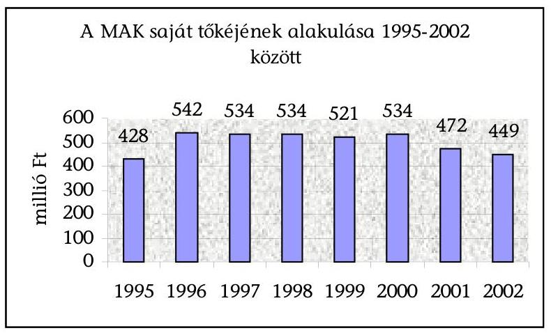

A vagyon csökkenése elsősorban az értékpapírok állománycsökkenésében jelentkezett, mivel a korábban pénzügyi tartalékolás céljából vásárolt értékpapír állomány - amely 2000. év végén még meghaladta a 100 millió Ft-ot - az eladások következtében 2002. év végére 29,5 millió Ft-ra csökkent.

1998-2002 között az értékpapírok átlagos állománya 64 millió Ft volt.
A kötelezettségek részaránya az összes forráson belül 30\% volt. A hosszúlejáratú kötelezettség állománya 210 millió Ft volt, amelyet a MAK a nyugdíjpénztár beindításához még 1993-ban kapta a központi költségvetésből. A rövid lejáratú kötelezettségek összege - ez az összeg tartalmazta a tárgyévben kapott támogatás fel nem használt részét, továbbá az adóhatósággal szemben fennálló és egyéb rövid lejáratú kötelezettségeket - évente átlagosan 45 millió Ft-ot tett ki.
A MAK köztartozásait - adó, járulék, vám, illeték - határidőben teljesítette, lejárt esedékességú köztartozása az ellenőrzött időszakban nem volt.

A tárgyi eszközök év végi állománya az ellenőrzött években átlagosan 264 millió Ft, aránya az összes eszközön belül 33\% volt. A tárgyi eszközök 83\%-át az ingatlanok, $14 \%$-át a múszaki és egyéb berendezések, $3 \%$-át a befejezetlen beruházás állománya tette ki. Az ingatlanok értéke és részaránya a tárgyi eszközökön belül évről évre emelkedett.

Az ingatlanállomány értéke átlagosan 220 millió Ft, 1998-ban 185,7 millió Ft, 2002-ben 245,3 millió Ft volt.

A befektetett pénzügyi eszközök értéke átlagosan 379 millió Ft, aránya az eszközökön belül átlagosan $47 \%$ volt. A befektetett pénzügyi eszközök $98 \%$-át a gazdasági társaságokban lévő részesedések, 2\%-át a dolgozóknak és múvészeknek adott kölcsön összege tette ki. A MAK az ellenőrzött időszakban új kölcsönt nem folyósított, az előző időszakban adott kölcsön összege - a behajtásukra irányuló intézkedések eredményeként - 9,6 millió Ft-ról 3,1 millió Ft-ra csökkent.

A gazdasági társaságokban lévő részesedések értéke az 1998. évi 400,7 millió Ftról 2002-re 359,5 millió Ft-ra csökkent.

A forgóeszközök értéke átlagosan 148 millió Ft, aránya az eszközökön belül átlagosan $18 \%$ volt. A forgóeszközök $44 \%$-át a rövid lejáratú értékpapírok, $27 \%$ -

---

át a készletek, ezen belül a műalkotások értéke, 15\%-át a követelések és 14\%-át a pénzeszközök képviselték.

Az eszközöket és a forrásokat részletesen a 2. számú mellékletben mutatjuk be.

# 3.2. Az ingatlanállomány alakulása az 1992-1995. évekre vonatkozó számvevőszéki ellenőrzést követően 

A MAK ingatlanvagyonának könyvszerinti értéke 1996. január 1-jén 311 millió Ft, 2002. december 31-én 245,3 millió Ft volt, a csökkenés $21 \%$ ( 65,7 millió Ft).

A könyvszerinti érték évenként a következők szerint alakult (1998-at követően a növekedést a beruházások és a felújítások eredményezték):
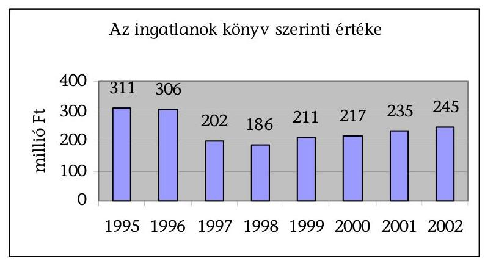

Az ingatlanállomány értékének az időszak végén mutatkozó 65,7 millió Ft-os csökkenése a következő tényezők hatása miatt következett be:

- az 1996-2002-ben aktivált beruházások és felújítások értéke 81,5 millió Ft-tal növelte az ingatlanok értékét;
- az egyéb állománynövekedés összesen 18 millió Ft volt, ebből egy műteremlakást (3 millió Ft) ajándékozási szerződéssel 1999-ben, egy műteremlakást (15 millió Ft) pedig térítés nélkül kapott a MAK 2002-ben;
- az értékesítés miatt kivezetett ingatlanok könyv szerinti értéke 129,3 millió Ft volt, ebből 114,7 millió Ft a korábbi időszakban (1993-1994-ben) részletfizetés mellett, illetve lízingszerződés alapján értékesített, de a könyvekből 1997-ben (112,6 millió Ft) és 2001-ben ( 2,1 millió Ft) kivezetett ingatlanok értéke volt. Az 1996-2002. években értékesített ingatlan könyv szerinti értéke 14,6 millió Ft volt;
- az ingatlanok után elszámolt értékcsökkenési leírás összege 35,9 millió Ft-tal csökkentette az ingatlanok értékét.

Bár a MAK ingatlanainak forgalmi értéke a könyv szerinti érték többszörösét tette ki, a MAK a piaci értéken történő értékelés lehetőségével sem az 1995. évi vagyonátvilágításkor, sem azt követően nem élt (ezt a számviteli törvény 1995től engedélyezte), tekintettel az értékelés magas költségeire.

Az 1995. évben készített vagyonátvilágítás szerint a saját tulajdonú ingatlanok forgalmi értéke 2340 millió Ft volt, szemben az 1995. december 31-i 311 millió Ft könyv szerinti értékkel, így például:

---

- a törzsvagyonba tartozó négy alkotóház együttes forgalmi értéke 857 millió Ft, a könyv szerinti értéke 28 millió Ft volt;
- a hédervári kastély 730 millió Ft-os forgalmi értékével szemben a könyv szerinti érték 65 millió Ft volt;
- az Olof Palme sétányon (a Városligetben) lévő ingatlan induláskor érték nélkül került be a könyvekbe, forgalmi értéke 411 millió Ft volt.

Az ingatlanok száma 1996-2002 között ajándékozás, illetve térítés nélküli átvétel miatt kettővel növekedett (két műteremlakás) és értékesítés miatt egy ingatlannal csökkent (osztatlan, közös tulajdonban álló raktár).

A saját tulajdonú ingatlanok 1996. évi nyitó és 2002. évi záró állományának adatait a 6. számú mellékletben mutatjuk be.

Az 1992-1995. évekre vonatkozó ÁSZ ellenőrzés javaslataira készített intézkedési terv végrehajtásaként a kuratórium a költségek csökkentése érdekében az üresen álló, csak ráfordítással járó bérleti jogú ingatlanokat értékesítette, illetve a bérleti jogot visszaadta a tulajdonos kerületi önkormányzatoknak.

1996-2002 között az ingatlanbérlemények száma csökkent: tíz bérleményt a MAK értékesített, öt ingatlan bérleti jogát a tulajdonos kerületi önkormányzatoknak visszaadta.

A ráfordítások csökkentése érdekében határozott a kuratórium az önkormányzatok részére történő visszaadásról, mivel a visszaadott bérlemények üresen álltak, a bérleti jog értékesítését a MAK 1996-1997-ben többször meghirdette, érdeklődés, vételi szándék azonban nem volt irántuk.
2002. december 31-ére a MAK-nak öt bérleménye maradt: két galéria, egy kollektív műterem, egy tervtár és egy iroda.

Az ingatlanbérlemények 1996. évi nyitó és 2002. évi záró állományának részletes adatait a 7. számú mellékletben mutatjuk be.

# 3.2.1. Beruházások és felújítások 

A MAK az 1996-2002. években beruházásra és karbantartásra együtt 178,2 millió Ft-ot fordított. Az aktivált beruházások és felújítások összege 150,1 millió Ftot tett ki.

Ebből 122,7 millió Ft-ot a törzsvagyonba tartozó alkotóházakra, 8,9 millió Ft-ot a törzsvagyonon kívüli ingatlanok, 6,1 millió Ft-ot a bérbe adott ingatlan felújítására fordították. Az egyéb tárgyi eszközök beszerzési értéke 12,4 millió Ft volt.

Ugyanebben az időszakban a tárgyi eszközök karbantartási, fenntartási és javítási költsége jogcímen 26,5 millió Ft-ot, évenként átlagosan 4 millió Ft-ot számoltak el. 2002. december 31-én a befejezetlen beruházás állománya 1,6 millió Ft volt.

A beruházások, felújítások és karbantartások adatait a 7. számú, ebből a törzsvagyonba tartozó alkotóházakra vonatkozó adatokat a 9. számú mellékletben mutatjuk be.

---

A jelentősebb ingatlan-felújítási, fenntartási tevékenység 1997-től kezdődött a MAK-nál, részben az ingatlanok leromlott műszaki állapota, részben az üzemeltetési költségek csökkentése érdekében. A kuratórium - az alapító okirattal összhangban - az éves költségvetésekben hagyta jóvá a beruházási, felújítási kiadások összegét, majd kiválasztotta a felújítást végző kivitelezőket és meghatározta a kivitelezési szerződések feltételeit.

A MAK a beszerzések, beruházások és felújítások több, mint 80\%-át (122,7 millió Ft-ot) a törzsvagyont képező négy alkotóházra fordította.

Fenti összeg 84\%-át a szigligeti alkotóházban végzett felújítás és korszerűsítés képezte 103,2 millió Ft összegben, a zsennyei alkotóház felújítására - hőközpont és egyéb felújításra - 15,6 millió Ft-ot, a galyatetői alkotóház felújítására 3,3 millió Ft-ot, a kecskeméti alkotóházra 0,6 millió Ft-ot fordítottak. A kecskeméti alkotóház felújítását (tető- és homlokzatjavítást) külső üzemeltető végezte el, amelyhez a kuratórium további 9 millió Ft támogatást adott.

A szigligeti alkotóházban elvégzett felújítási munka ellenőrzése során megállapítottuk, hogy elkészült a tetőfelújítás, a hőközpont felújítása, a gázfűtésre való átállás, valamint a konyhaüzem felújítása. A felújítás folytatásaként - az ütemezés szerint - a teljes fűtési hálózat felújítása következne, mely az üzemeltetési költségek csökkenését eredményezné. A MAK azonban a 2001-2002. években a felújítás folytatásához nem kapott támogatást, saját forrást pedig e célra nem tudott biztosítani.

A törzsvagyonon kívüli alkotóházak és művészeti célú ingatlanok felújítására 8,9 millió Ft-ot fordított a közalapítvány.

A vállalkozási céllal működtetett (bérbe adott) ingatlanok bérlők által lebonyolított értéknövelő beruházásának összege 31,1 millió Ft volt, amelyből 6,1 millió Ft-ot a MAK megtérített és aktivált, 25 millió Ft-ot pedig a bérleti díjba beszámított. A bérelt ingatlanokon végzett értéknövelő beruházásokat a bérleti szerződés előírásával összhangban a kuratórium - előzetesen, írásban - engedélyezte.

A MAK az 1996-2002. években megvalósított beruházások, felújítások összegét 50-50\%-ban fedezte támogatásból és saját forrásból. Beruházásra, felújításra összesen 76 millió Ft támogatást kapott, amelyet teljes egészében az alkotóházak és művészeti célú ingatlanok felújítására, illetve a felújítások támogatására fordította. A támogatás $74 \%$-a ( 56 millió Ft ) a központi költségvetésből származott, $26 \%$-a ( 20 millió Ft ) a közalapítványhoz csatlakozott alapítványoktól, azaz költségvetésen kívüli forrásból.

A MAK kuratóriuma az ellenőrzött időszakban érvényesítette a közbeszerzésekről szóló 1995. évi XL. törvény előírásait. A helyszínen ellenőrzött szigligeti alkotóház felújítási, korszerűsítési munkáihoz a kivitelezők kiválasztása megfelel t fenti törvény elöírásainak.

# 3.2.2. Ingatlanok és ingatlan-bérleti jogok értékesítése 

A MAK az 1996-2002. évek között egy saját tulajdonú ingatlant, és tíz bérleti jogot értékesített.

---

Az értékesítés részletes adatait a 10. számú mellékletben mutatjuk be.
Az eladott saját tulajdonú ingatlan és bérleti jogok a MAK szabad rendelkezésű, vállalkozási célú vagyona részét képezték, így értékesítését az alapító okirat nem tiltotta.

A saját tulajdonú ingatlan - osztatlan, közös tulajdonban lévő raktárépület - értékesítésének indokoltságát a kapcsolódó kuratóriumi előterjesztések és jegyzőkönyvek alátámasztották: az ingatlant a MAK nem tudta hasznosítani, megtartása - a karbantartási és egyéb költségek miatt - további bevétel nélküli kiadással járt volna. (Az ingatlant 1998-ban a társtulajdonos részére értékesítették.)

Az önkormányzati tulajdonú, üresen álló ingatlanbérlemények értékesítését a bérlemények forgalmi értékének csökkenése indokolta, mivel a forgalmi értékek az 1996-1997-ben aktualizált értékbecslés szerint 10-30\%-kal csökkentek a korábbi időszakban készített szakértői becsléshez képest a lakástörvény, illetve a lakástörvény felhatalmazása alapján megalkotott önkormányzati rendeletek hatására.

A lakástörvény 77. §-a alapján az önkormányzati tulajdonú helyiségekre fennálló szerződés cserehelyiség biztosítása nélkül tíz évig nem mondható fel, azaz a lakástörvény a bérlőt csak 2004-ig védi.

Az önkormányzatok kisebb-nagyobb eltéréssel, de zömében azonos szabályokat hoztak a bérleti jogok átruházására. Így pl. a vevőnek egyszeri igénybevételi díjat kellett megfizetni, amelynek mértéke a helyiség értékének 20-50\%-a volt, továbbá az önkormányzatok módosították a bérleti díj összegét is. Például az V. kerületben - ahol a bérlemények jelentős része volt - a bérleti jog ellenértéke a helyiség értékének $50 \%$-a volt, az új bérleti díj a korábbinak nyolcszorosa lett, az albérletbe adáshoz való hozzájárulás feltétele volt, hogy a bérlő vállalja a bérleti díj háromszoros összegének megfizetését.

A kuratórium - összhangban a vagyonkezelési és befektetési szabályzat előírásaival - valamennyi értékesített vagyonelemre vonatkozóan elkészíttette az értékbecslést.

A vagyonkezelési és befektetési szabályzat előírta, hogy bármely közalapítványi vagyonelem értékesítésére úgy kerülhet sor, ha azt megelőzi az adott vagyonelem szakértővel történő értékbecslése.

A részletes adatokat a 10. számú mellékletben mutatjuk be.
A konkrét értékesítésekről a kuratórium határozott.
Az értékesítéseket az igazgatóság napilapokban hirdette meg. Az érdeklődők ajánlatait, szándéknyilatkozatait a kuratórium elé terjesztette elbírálásra, a kuratórium határozott az értékesítés módjáról és feltételeiről.

A bérleti jogok értékesítését nehezítette, hogy az önkormányzatok a vevőtől jelentős összegű egyszeri igénybevételi díjat kértek. Tekintve, hogy a lakástörvény 41. § (2) bekezdése szerint, ha a bérlő a gazdasági társaságokról szóló 1988. évi VI. törvény alapján társaságot alapít, a társaság a bérleti jog szempontjából jogutódnak számít, ezért a bérleti jogok felét (lásd 10. számú melléklet 1-3. 6. és 10.

---

sorszám) a MAK apportként vállalkozásba vitte, illetve társaságot alapított, így az üzletrész későbbi értékesítésekor a vevő mentesült az egyszeri igénybevételi díj megfizetése alól.

Az ingatlanok és bérleti jogok értékesítésből az 1996-2002. évek között összesen 231,7 millió Ft folyt be, ebből azonban 72,4 millió Ft az 1993-1994 évekről áthúzódó részletfizetésből realizálódott.

Az 1996-2002. évek között egy ingatlant értékesített a kuratórium, ennek könyv szerinti értéke 14,6 millió Ft, becsült értéke 4,5 millió Ft, eladási ára és a befolyt összeg 4,2 millió Ft volt.

Az 1996-2002. évek között tíz bérleti jogot értékesített a kuratórium, amelyek a MAK könyveiben értékben nem szerepeltek (mivel az 1992. évi alapításkor az alapító az induló vagyonban az immateriális javak között nem tüntette fel). A bérleti jogok becsült értéke összesen 121,5 millió Ft, az eladási ár és a befolyt összeg 155,1 millió Ft volt.

# 3.3. A vagyon kezelése és hasznosítása 

### 3.3.1. A közfeladatok ellátásának pénzügyi fedezete

A MAK alapító okirata, vagyonkezelési szabályzata és az 1995-ben készült pénzügyi és intézkedési terv azt a célt tűzte ki, hogy a MAK vagyonának hozama biztosítsa a cél szerinti feladatok pénzügyi fedezetét.

A 2046/1995. (III. 1.) Korm. határozat előírásának megfelelően a kuratórium 1995. júliusi keltezéssel - a közalapítvány vagyoni helyzetének átvilágítását, illetve a működőképességhez szükséges intézkedési és pénzügyi tervet tartalmazó előterjesztést készített a Kormány részére. Az előterjesztés lényege az volt, hogy a közalapítvány feladataihoz szükséges pénzügyi források biztosítása érdekében az egyes vagyonelemeket feladatcsoportokhoz rendelte az alábbiak szerint:

- az 1992. október 1. után nyugdíjjogosultságot szerzett alkotóművészek nyugdíjának fedezetét a vállalkozási célú ingatlanok vagyonkezelésének hozadékában jelölte meg (az 1992. október 1. előtt megállapított nyugdíj fedezésére a Kormány kötelezettséget vállalt);
- a közalapítvány és a MAOE múködtetésének fedezetéül a gazdasági társaságokban lévő részesedéseket - a társaságok gazdaságos működtetése révén - és a műtárgykészletet határozta meg;
- az egyéb művészeti feladatokat a feladathoz rendelt ingatlanok nonprofit jellegű működtetésével tervezte.

Fenti célkitűzések azonban nem teljesültek, mivel a közhasznú tevékenység bevételei és vállalkozási tevékenység eredménye együttesen nem nyújtottak kellő fedezetet a közhasznú tevékenység költségeire és ráfordításaira:

---

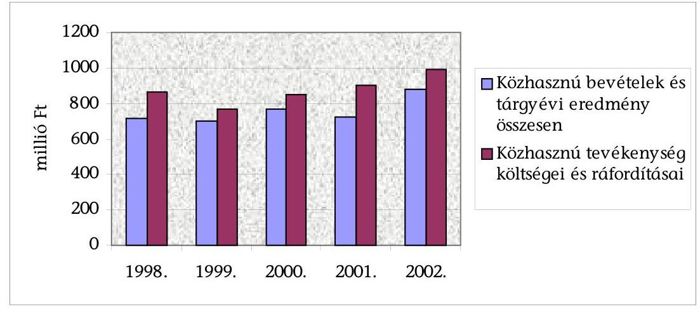

A MAK az 1998-2002. években összesen 3675 millió Ft állami támogatást kapott, tehát nemcsak a nyugdíjak kifizetéséhez szükséges fedezetet kapta meg amelyre az alapító okirat garanciát adott - hanem a többi közfeladata ellátásához is (évenként növekvő összegű) támogatásban részesült.

A 3675 millió Ft állami támogatás évenkénti részletezését a 13. számú mellékletben mutatjuk be.

A kapott támogatás 62,4\%-a (2291,4 millió Ft) az államilag garantált, 1992. október 1. előtt megállapított nyugdíjak kifizetését, 26,3\%-a (966,1 millió Ft) az 1992. október 1. után megállapított nyugdíjak kifizetését, 6,2\%-a (226,7 millió Ft) az alkotóházak és múvészeti célú ingatlanok múködtetését, felújítását, illetve 4,5\%-a (166,7 millió Ft) MAOE tevékenységének támogatását) szolgálta, $0,6 \%$ ( 24,1 millió Ft) az ellenőrzött időszak végén fel nem használt támogatás volt.

A közhasznú tevékenységek állami támogatással nem fedezett költségei:
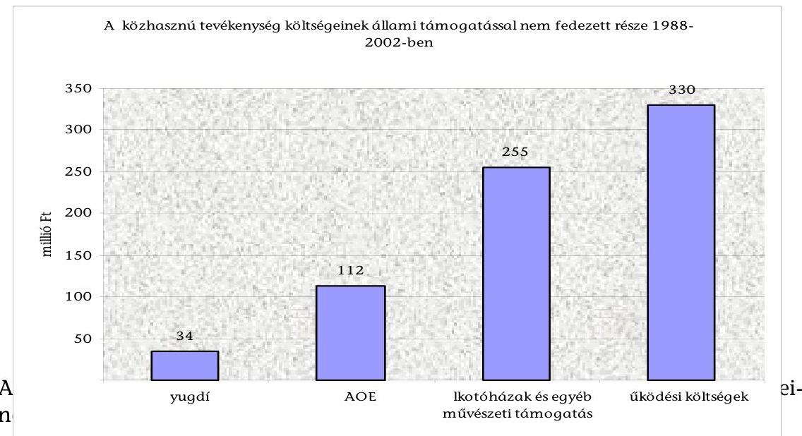

---

# 3.3.2. Az ingatlanvagyon hasznosítása 

Az 1992-1995. évekre vonatkozó ÁSZ ellenőrzés javaslataira készített intézkedési terv végrehajtása során az alkotóházak és művészeti célú ingatlanok vállalkozásba adása, illetve nullszaldós működtetése csak részben teljesült: bérbe adták a hédervári kastélyt, a balatonföldvári és a balatonfüredi ingatlanokat, de a művészeti célú ingatlanok üzemeltetése veszteséges maradt.

A MAK könyvvezetése biztosította a törzsvagyon (négy alkotóház) és egyéb művészeti célú ingatlanok (alkotóház, művésztelep, kollektív műterem), valamint a vállalkozási céllal működtetett ingatlanok elkülönített nyilvántartását.

A számviteli rendszer lehetővé tette a költségek (ráfordítások) és bevételek ingatlanok szerinti kimutatását, továbbá az alapítványi céllal működtetett ingatlanok közhasznú működtetésének és vállalkozási célra történő hasznosításának elkülönítését.

A kuratórium a műszakilag jó állapotú ingatlanokat bérleti dí ellenében hasznosította, a felújításra szoruló ingatlanokat - költségkímélés és a vagyonérték megtartása, növelése érdekében - értéknövelő beruházás és kötelező karbantartás fejében, illetve bérleti díj, valamint értéknövelő beruházás és kötelező karbantartás együttes előírásával adta bérbe.

A bérlőket az országos napilapokban megjelent nyilvános pályázati felhívások alapján választották ki, a pályázatok alapján - az alapító okirat vonatkozó előírásának megfelelően - a kuratórium döntött a bérbeadásról, a bérleti szerződés feltételeiről, a bérleti szerződés szükség szerinti módosításáról. A bérleti szerződést - a kuratórium felhatalmazása alapján - a közalapítvány igazgatója kötötte meg a bérlővel.

Az ingatlanok bérbeadásából származó bevétel az 1998-2002. években összesen 327,4 millió Ft volt az ugyanezen időszakban elszámolt 20 millió Ft költség mellett. A költséget értékcsökkenési leírás jogcímen számoltak el, mivel az ingatlanokkal kapcsolatban felmerült egyéb költséget - beleértve a használat során felmerült javítási és karbantartási költséget is - a bérleti szerződés szerint a bérlő viselte.

A bérleti díj évenkénti alakulását a 17. számú mellékletben mutatjuk be.
Az ellenőrzött időszakban realizált bérleti díjbevétel a következők szerint alakult:

- 67\%-át a Bp. XIV. Olof Palme sétány 1. sz. alatti, múemléki környezetben lévő négyszintes ingatlan ( 164 millió Ft), illetve a hédervári kastély - természetvédelmi parkban található négyszintes múemlék ingatlan (56,3 millió Ft) bérbeadása tette ki;
- 26\%-ot (84,7 millió Ft) négy ipari ingatlan bérbeadása képezte;
- 6\% (19,9 millió Ft) származott a Szentendre Fő tér 20. szám alatti múemlék jellegű ingatlan bérbeadásából;
- 1\% (2,5 millió Ft) a balatonszemesi (üdülő jellegű) ingatlan bérbeadásából.

---

# 3.4. A MAK tulajdonában lévő múalkotások 

Az 1992-1995. évekre vonatkozó ÁSZ ellenőrzés javaslataira készített intézkedési terv feladatainak megvalósítása eredményeképpen az ellenőrzött időszakban a műtárgykészlet 1997. év végi 41 millió Ft-os állománya 2002. év végére 37,9 millió Ft-ra, összesen 3,1 millió Ft-tal csökkent.

1997-ben a kuratórium megállapodást kötött a Magyar Fejlesztési Bank Rt.-vel arról, hogy a közöttük folyamatban lévő per - értéke 50 millió Ft és annak járadékai - helyett peren kívüli egyezséget kötnek, mely szerint a MAK 3 millió Ft megfizetése mellett, további 9 millió Ft értékben képzőművészeti alkotásokat volt köteles átadni az MFB Rt. tulajdonába. A műtárgyak kiválasztását és értékelését két értékbecslés alapján végezték. A műtárgykészlet átadására (könyvszerinti értéke 2,7 millió Ft) 1998-ban kuratóriumi határozat alapján került sor. 2000-ben a MAK 0,4 millió Ft könyvszerinti értékű műtárgykészletet értékesített a Képcsarnok Kft.-nek 2,6 millió Ft értékesítési áron (lásd részletesebben a 3.6.2. pontban.) Az értékesítést megelőzően (az eladó és a vevő által külön- külön felkért két szakértő által) értékbecslés készült. A vételárat a kuratórium a két szakértő által megállapított értéken állapította meg. Az értékesítésből a közalapítványnak 2,2 millió Ft nyeresége származott.

A műtárgykészlet kezelésével, nyilvántartásával, raktározásával kapcsolatosan felmerült költségek 1998-2002. évek alatt összesen 12,3 millió Ft-ot tettek ki.

A MAK a műtárgykészletet a Budapest XX. Bíró M. u. 3. szám alatt lévő bérelt raktárban tárolja, a raktár bérleti díja az ellenőrzött időszakban összesen 4,7 millió Ft volt.

A műtárgykészletet - megfelelően a leltárszabályzatban foglaltakkal - kétévente leltározzák, az utolsó leltár 2002. október 31-i fordulónappal készült.

Az idegen helyen tárolt és bizományba adott készletekről a MAK minden évben megkapta a tárolási nyilatkozatokat.

A raktárban tárolt műtárgykészlet szúrópróbaszerű ellenőrzése során a kiválasztott műtárgyak mindegyike fellelhető volt.

A kuratórium a kezelési és tárolási költségek és az állagromlás megakadályozása érdekében szorgalmazza a műtárgyvagyon értékesítését. Ennek során 2001 júliusában elfogadta azt az álláspontot, mely szerint a teljes műtárgyállomány belföldi piacon történő értékesítése nem kívánatos, mivel ez indokolatlan konkurenciát és árletörést jelentene az egyre nehezebb piaci feltételekhez igazodni kényszerülő művészek számára. A teljes műtárgyvagyon külföldre történő értékesítése az ellenőrzött időszakban nem járt eredménnyel.

### 3.5. A MAK gazdasági társaságokban lévő részesedései

Az 1992-1995. évekre vonatkozó ÁSZ ellenőrzés javaslataira készített intézkedési terv végrehajtása során a kuratórium megtette a szükséges intézkedéseket a múködésképtelen, veszteséges vállalkozások megszüntetése érdekében, melynek eredményeként az 1996-2002. években 28 gazdasági társaságban lévő részesedése megszűnt.

---

A MAK-nak 1995. december 31-én - az Állami Számvevőszék korábbi ellenőrzésének befejezésekor - 33 gazdasági társaságban volt tulajdonosi részesedése, ebből 14 társaság felszámolás, 4 társaság végelszámolás alatt állt. A részesedések könyv szerinti értéke 414,3 millió Ft volt, ez az összeg az eredeti bekerülési érték ( 772,8 millió Ft) $54 \%$-át tette ki, a befektetések után elszámolt értékvesztés (358,5 millió Ft) következtében.
2002. december 31-én 6 gazdasági társaságban volt részesedése 359,5 millió Ft értékben, ebből 4 társaság múködött, 2 társaság felszámolás, illetve végelszámolás alatt állt.

A MAK „örökölt" vállalkozásainak nagyobb része tönkrement vagy okafogyott vállalkozássá vált, így ellenük a hitelezők felszámolási eljárást indítottak, illetve a kuratórium végelszámolási eljárás lefolytatását, illetve a cégbíróságnál a nem működő vállalkozások hivatalból való törlését kezdeményezte.

A részesedések 1996. évi nyitó és 2002. évi záró állományát a 11. számú mellékletben mutatjuk be.

Az 1996-2002. években 54,8 millió Ft-tal csökkent a részesedések könyv szerinti értéke értékvesztés elszámolása és gazdasági társaságok megszüntetése miatt.

A MAK részben az érdekeltségébe tartozó gazdasági társaságok mérlegadatai, részben a már nem múködő gazdasági társaságokban lévő befektetései után 10,6 millió Ft értékvesztést számolt el.

Az 1996-2002. években 44,2 millió Ft-tal csökkent a részesedések könyv szerinti értéke, 28 gazdasági társaság megszüntetése miatt.

A leányvállalati üzletrészek már az alapítvány létrehozásakor is csőd- és felszámolási eljárás alatt álltak, a kft. üzletrészek gazdálkodását általánosan a veszteség termelése jellemezte.

A megszűnt részesedések adatait a 12. számú mellékletben mutatjuk be.
A cégbíróság 15 gazdasági társaságot az adós fizetésképtelensége miatt elrendelt felszámolási eljárással, hetet jogutód nélküli végelszámolási eljárással szüntetett meg, 6 gazdasági társaságot pedig - a MAK kérésére - hivatalból törölt a cégjegyzékből.

A gazdasági társaságok megszüntetése a következők miatt célszerű és indokolt volt: a társaságok egy része nem folytatott semmilyen gazdasági tevékenységet; a múködő társaságok veszteséges gazdálkodása miatt a MAK nem jutott osztalékhoz; a MAK-nak többletköltségei keletkeztek, mivel esetenként át kellett vállalnia a köztartozások és egyéb követelések kiegyenlítését (pl. az IDEA Iparművészeti Leányvállalatnál).

# 3.5.1. A megszűnt részesedések és ezek pénzügyi kihatása 

A felszámolással megszüntetett gazdasági társaságokban lévő részesedések könyv szerinti értéke 4,9 millió Ft volt, amelyet teljes egészében egy 1996-ban felszámolt leányvállalatban lévő részesedés tett ki. A felszámolás időszakában a MAK két üzletrészt - kuratóriumi határozat alapján - értékesített. Az értékesí-

---

tés mindkét esetben a részesedés könyv szerinti értékén történt, amely az eredeti befektetési érték $10 \%$-a volt.

A jogutód nélkül, végelszámolással megszüntetett 7 gazdasági társaságban a közalapítvány részesedésének könyv szerinti értéke 38,3 millió Ft volt, ebből három gazdasági társaságban 100\%-os, négy társaságban pedig 90\%-ot meghaladó tulajdoni hányaddal rendelkezett.

A kuratórium 188/1998. (VII. 27.) számú határozatával kezdeményezte a cégbíróságnál 6 gazdasági társaság hivatalból történő törlését, mivel ezek a vállalkozások vagyonukat felélték, múködésüket beszüntették, könyvvezetésük hiányos volt. A cégbíróság az 1999-2001. években törölte a társaságokat a nyilvántartásból, a részesedések könyv szerinti értéke 0,5 millió Ft volt.

Az 1996-2002. években a gazdasági társaságokban lévő részesedések megszűntetése a közalapítvány vállalkozási eredményét 43,9 millió Ft-tal csökkentette, ezen belül a megtérülés 47,3 millió Ft, a megszüntetéssel kapcsolatosan elszámolt ráfordítás 91,2 millió Ft volt.

A megtérülés a végelszámolással megszüntetetett gazdasági társaságok zárómérlege szerint az alapítót megillető vagyon és egyéb bevétel ( 46,7 millió Ft), illetve a felszámolás alatt lévő társaságok eladásának bevétele ( 0,6 millió Ft ) volt.

A rendkívüli ráfordítások között 91,2 millió Ft-ot számolt el a közalapítvány értékvesztés, könyv szerinti érték kivezetése, valamint hitelezési veszteség és különféle ráfordítások jogcímeken.

A MAK 1996-2002 között megszűnt gazdasági társaságait a 3. számú Függelékben mutatjuk be.

# 3.5.2. A MAK részesedései múködő vállalkozásokban 

A közalapítványnak a helyszíni ellenőrzés befejezésekor négy működő vállalkozásban volt részesedése 359,5 millió Ft értékben, ezen belül egy kft. 100\%-os tulajdonosa volt, egy rt.-ben ( $41,52 \%$ ) és két kft.-ben ( $16,98 \%$, illetve 10\%) kisebbségi részesedése volt. A közalapítvány az ellenőrzött időszakban a részesedések után 167,3 millió Ft osztalék bevételhez jutott.

A Képcsarnok Kft. ${ }^{9}$ a MAK egyszemélyes vállalkozása, a 100\%-os üzletrész 233 millió Ft könyv szerinti értéke a részesedések összértékének közel 65\%-át jelentette. Az 1998-2002. években a közalapítvány a befektetés után 129,1 millió Ft osztalékot kapott, amely az ellenőrzött időszakban kapott osztalék $77 \%$-át tette ki.

A kft. 1998. január 1-jével alakult át rt.-ből kft.-vé, törzstőkéje 180,0 millió Ft. Tevékenysége kiterjed a múkereskedelemre és a saját tulajdonú ingatlanok haszno-

[^0]
[^0]:    ${ }^{9}$ A kft.-nél kapcsolódó ellenőrzés keretében helyszíni ellenőrzést végeztünk.

---

sítására. Mivel az rt.-ből átalakulással jött létre, így a Képcsarnok Rt. általános jogutódja lett.

A taggyűlési hatáskört a MAK, mint kizárólagos tulajdonos alapítói döntésekkel - kuratóriumi üléseken - gyakorolta, a kft. alapító okiratában előírtak szerint.

A kuratórium döntött a társaság ügyvezetőjét megillető díjazásról, a könyvvizsgáló kinevezéséről és díjazásáról, jóváhagyta az SZMSZ-t. Az igazgató kinevezési időtartamának lejártakor, 2002-ben a kuratórium új pályázatot írt ki és a beérkezett pályázatok elbírálása után 2003-ban új igazgatót nevezett ki.

A kuratórium által meghozott, a kft.-re vonatkozó határozatokat - a beszámolók elfogadásáról hozottak kivételével - minden esetben megküldték a kft.-nek. Az éves beszámolókat a felügyelő bizottság véleményével együtt fogadta el.

A kuratórium szabályosan érvényesítette a MAK tulajdonosi érdekeit a kft. gazdálkodását és egyben a közalapítvány céljait befolyásoló kérdésekben, mint pl. az üzletpolitika meghatározásában, a középtávú ingatlan hasznosítási terv kialakításában.

2000-ben a kuratórium határozatot hozott - az évközi nyugdíjemelés részbeni fedezetére - maximum 8 millió Ft értékű műtárgykészletnek a kft. részére történő átadásáról. A műtárgykészletet ( 97 db festményt) 2,6 millió Ft becsült értékben még 2000. decemberében átadták a kft.-nek, amely a festmények árát átutalta a MAK-nak. A helyszíni ellenőrzés 2003. februárí befejezésekor az átadott készletből még 0,4 millió Ft értékű készlete volt a kft.-nek.

A Képcsarnok Kft. mint profitorientált vállalkozás nem vállalhatott jelentős mecénási szerepet, a galériái által szervezett évi hatvan - nyolcvan kiállításnak kereskedelmi célja volt. E tényt megerősítve a kuratórium 2001-ben megbízta a kft.t a MAOE-val együtt olyan együttmúködési forma kidolgozására, amely hozzájárul a mai magyar kortárs művészet megjelenési lehetőségének javításához.

A kft. által a MAK-nak fizetett osztalék 1998-ban 35,1 millió Ft, 1999-ben 51,0 millió Ft volt.

A kft. saját tőkéje 1998-1999 években csökkent, mivel a MAK részére fizetett osztalékot nem fedezte a tárgyévi eredmény. (1998-ban a csökkenés 1,4 millió Ft, 1999-ben 5,3 millió Ft volt.)

2000-ben az adózott 51,8 millió Ft eredményből 18,0 millió Ft-ot, 2001-ben az adózott 33,3 millió Ft eredményből 11,0 millió Ft-ot fizetett ki a kft. osztalékként, 2002-ben a várható teljesítés alapján 31,6 millió Ft adózott eredményből az osztalék 14,0 millió Ft lesz.

A helyszíni ellenőrzés 2003. februári befejezésekor még nem álltak rendelkezésre a 2002. évi mérlegadatok. A kft. múködését és gazdálkodását kapcsolódó ellenőrzés keretében a helyszínen is ellenőriztük, megállapításainkat a 2. számú Függelékben foglaltuk össze. A kft. eszközeit és forrásait a 14. számú, eredménykimutatását a 15. számú mellékletben mutatjuk be.

A Novoprint Rt.-ben a MAK jelentős befolyással rendelkezett, tulajdoni hányada $41,52 \%$ volt. A részesedés 122,6 millió Ft könyv szerinti értéke a részese-

---

dések összértékének 34\%-át alkotta. A részvények névértéke 118 millió Ft volt. Az 1998-2000. években a MAK az rt.-ben lévő részesedése után 38,2 millió Ft osztalékot kapott, amely az ellenőrzött időszakban kapott osztalék 23\%-át tette ki.

Az 1998-2000. években a befektetés után a MAK évenként szerény mértékben növekvő osztalékot kapott. Az osztalék mértéke a befektetési értékhez viszonyítva 1998-ban 8,6\%, 1999-ben 8,7\%, 2000-ben 11,5\% volt.

Az osztalékot illetően 2001. évtől negatív irányú változás következett be. A MAK a 2001-2002. években osztalékot nem kapott és a 2003. évi költségvetésében sem tervezett osztalékbevételt a részesedés után.

A Novoprint Rt. jegyzett tőkéje 283,7 millió Ft volt, a saját tőke értéke 1998-2001. években meghaladta a jegyzett tőke értékét (368-426 millió Ft között volt). Adózott eredménye 1998-ban 49 millió Ft, 1999-ben 30 millió Ft, 2000-ben 55 millió Ft, 2001-ben 1 millió Ft volt.

A társaság többségi tulajdonosa (51,18\%) 2001-ben részvényeit két külföldi társaság részére értékesítette, az új társaságok tulajdonhányada 22,98\%, illetve 28,20\% lett. A társaság vezetésében a tulajdoni hányadok szerinti szavazati viszonyok érvényesültek. Azonban függetlenül attól, hogy a közalapítvány az rt.ben jelentős részesedéssel rendelkezett, a társaság operatív gazdálkodására nem volt ráhatása, mivel az igazgatóság döntéseihez 50\%-os szavazattöbbség kellett.

Az ellenőrzött időszakban a kuratórium több alkalommal tárgyalta a Novoprint részvények eladásának kérdését, és elviekben az eladás mellett döntött. 2002-ben a részvénycsomag értékbecslésével két szakértő céget bízott meg. Az egyik szakvélemény alapján a részvénycsomag értéke 264 millió Ft, a másik szakvélemény szerint a részvénycsomag valós piaci értéke és javasolt minimális eladási ára 150 millió Ft volt.

A kuratórium a 150 millió Ft-os értékelését minimális eladási árnak tekintette, és a 111/2002. (VIII. 26.) számú határozatában három kurátort felhatalmazott, hogy tárgyaljanak potenciális vevőkkel a vételár és a fizetési feltételek végleges kialakítása érdekében. 2002. év végéig a kuratórium az eladással kapcsolatban nem hozott határozatot.

Az 1992-1995. évekre vonatkozó ÁSZ ellenőrzés kifogásolta a szentendrei Várkonyi villa Novoprint Rt.-be történt apportálását, mivel az - a kuratóriumi ülés jegyzőkönyvének tartalma alapján - szabálytalan volt. A kuratórium a volt mb. vagyonigazgató ellen - eltérően az intézkedési tervtől - nem indított kártérítési pert, mivel a jegyzőkönyv hitelesítését végző volt kurátor nyilatkozata szerint a kérdéses kuratóriumi határozatot tévesen fogalmazták meg.

A kuratórium nem indított polgári peres eljárást a Novotrade Rt. ellen a fent említett apportálás során saját apportként feltüntetett, jelzáloggal terhelt ingatlan miatt, mert azt a Novotrade Rt. ellentételezte. Az ingatlanra kötött előszerződést 2000. januárban felbontották, és a Novotrade Rt. kamattal együtt viszszafizette a Novoprint Rt.-nek az ingatlan vételárát.

Az Art Export Kereskedelmi Kft.-ben a közalapítvány tulajdoni hányada 16,98\%, az üzletrész értéke 3,6 millió Ft volt, ez a részesedések összértékének

---

1\%-át alkotta. A kft. 1998-tól az üzletrész után osztalékot nem fizetett, 2001ben az éves beszámoló szerinti eredmény 2,6 millió Ft veszteség volt.

A Képcsarnok Inwest Kft.-ben a közalapítványnak 10\%-os tulajdoni hányada, 0,3 millió Ft értékű üzletrésze volt.

A MAK 1997-ben egy bérleti jogú ingatlanjának apportálásával alapította a kft.t, 1998-ban az üzletrész 90\%-át a Képcsarnok Kft. részére értékesítette.

# 3.6. A MAK vállalkozási tevékenységének eredménye 

A vállalkozási tevékenység bevétele összesen 743,5 millió Ft volt. Évenkénti öszszege az ellenőrzött időszakban csökkent, az 1998. évi 217,2 millió Ft-ról a 2002. évre 99,3 millió Ft-ra.

A vállalkozási tevékenység költsége és ráfordítása összesen 208,8 millió Ft, évenként átlagosan mintegy 42 millió Ft volt, összege 1999-től évenként folyamatosan csökkent. A vállalkozási tevékenység közvetlen és közvetett (felosztott) költségeinek összege 106,7 millió Ft-ot, a ráfordítások (egyéb ráfordítások, pénzügyi műveletek ráfordításai, rendkívüli ráfordítások) értéke 102,1 millió Ftot tett ki.

A mérleg szerinti eredmény, ezen belül a vállalkozási és a közhasznú tevékenység eredménye az ellenőrzött időszakban a következők szerint alakult:
millió Ft-ban

|  | 1998 | 1999 | 2000 | 2001 | 2002 |
| :-- | --: | --: | --: | --: | --: |
| Mérleg szerinti   eredmény | $+0,2$ | $+25,6$ | $+12,7$ | $-62,0$ | $-22,3$ |
| Ebből: |  |  |  |  |  |
| Vállalkozási tevékenység eredménye | $+155,4$ | $+121,5$ | $+102,4$ | $+58,6$ | $+69,9$ |
| Közhasznú tevékenység eredménye | $-155,2$ | $-95,9$ | $-89,7$ | $-120,6$ | $-92,2$ |

A MAK vállalkozási tevékenységből az 1998-2002. évek alatt összesen 507,8 millió Ft nyereséget realizált, ennek 75\%-át az 1998-2000. években. 1998-2000 között a vállalkozási tevékenység nyeresége - bár évről évre csökkent - még teljes mértékben kompenzálta a közhasznú tevékenység veszteségét, mérleg szerinti nyereség realizálása mellett. 2001-ben azonban a vállalkozási tevékenység nyeresége a közhasznú tevékenység veszteségének 48,6\%-át, 2002-ben pedig $75,8 \%$-át fedezte.

Az ellenőrzött időszakban a MAK-nak vállalkozási tevékenysége után 26,9 millió Ft adófizetési kötelezettsége keletkezett.

---

# 4. A MAK-NAK KÖZVETLENÜL NÉVRE CÍMZETT ELŐIRÁNYZATOK TERVEZÉSE, FINANSZíROZÁSA ÉS ELSZÁMOLTATÁSA AZ NKÖMBEN 

A MAK az 1998-2002. évek között a központi költségvetésből összesen 3675 millió Ft támogatást kapott.

Többlet feladatra a közalapítvány a költségvetési törvényben jóváhagyott előirányzaton felül - a minisztérium támogatásával - az igényelt és a szükséges pótelöirányzatot megkapta (1998-ban 90 millió Ft-ot, 2002-ben 190 millió Ft-ot).

A MAK éves költségvetésben előirányzott állami támogatását a központi költségvetés NKÖM fejezet fejezeti kezelésű előirányzatokon belül nevesítetten, külön soron tartalmazta. A fejezeti kezelésű előirányzatok gazdálkodási, kötelezettségvállalási, utalványozási, valamint egyéb előírások szabályzata az előirányzatok felhasználásánál szakmai javaslattevőnek az NKÖM Művészeti Főosztályát, támogatónak a művészeti és nemzetközi helyettes államtitkárt, kötelezettségvállalónak a közigazgatási államtitkárt hatalmazta fel.

A költségvetés előkészítése során a MAK és az NKÖM között folyamatos kapcsolat volt. Az NKÖM SZMSZ-e, valamint a szakmailag illetékes Művészeti Főosztály ügyrendje a tervezéssel kapcsolatos feladatokat vezetői és munkatársi szintre bontva előírta. A tervező munkában a NKÖM-en belüli koordináció a szakmai (művészeti) és a gazdasági (költségvetési) szakterület között megfelelően múködött.

A tervezés előmunkálatai a költségvetési évet megelőző év közepén kezdődtek, a kuratórium elnöke és az NKÖM illetékes vezetői között többször sor került egyeztető megbeszélésre, konzultációra az igényként felmerülő költségvetési előirányzat támogatásával kapcsolatban. Az előzetes kalkuláción alapuló tételes tervet az ahhoz szükséges részletes alapinformációkkal rendelkező MAK igazgatósága állította össze.

Az NKÖM a MAK előzetes tételes költségvetését a központi költségvetés elfogadását követően hagyta jóvá. A MAK éves költségvetéseit az NKÖM a beterjesztéseknek megfelelően elfogadta, az egyes tételek előirányzatain és az állami támogatások mértékében nem változtatott. Elfogadhatónak tartotta a 2002. évi támogatási előirányzat megemelését, a 2003. évi költségvetés egyes tételeit módosította.

Az NKÖM szerepe a MAK költségvetésének előkészítésében, jóváhagyásában 1999-2001-ben formális volt, 2002-ben és 2003-ban azonban már konkrét javaslatai is voltak az egyes előirányzatok megváltoztatására, illetve jogos igény esetén pótelőirányzattal is segítette a MAK múködését.

Az 1998. évben összesen 535 millió Ft volt az állami támogatás összege: a költségvetési törvény 445 millió Ft előirányzatot hagyott jóvá ( 400 millió Ft-ot az alkotóművészek nyugellátásának folyósítására, 45 millió Ft-ot az alapító okiratában megjelölt, törzsvagyonba tartozó alkotóházak múködtetésére és felújítására), továbbá év közben a Kormány a MAK helyzetéről szóló 2103/1998. (IV. 22.) Korm. határozat 2. pontja értelmében a központi költségvetés általános tartalé-

---

kából 90 millió Ft előirányzatot biztosított a nyugellátások és az alkotóházak működőképessége fenntartása fedezetére.

Az 1999. évi 630 millió Ft és a 2000. évi 720 millió Ft igényelt és jóváhagyott állami támogatás azonos összegű volt. A 2001-2002. évi költségvetés 800-800 millió Ft állami támogatást tartalmazott a MAK részére.

A 2002. évi költségvetésben szereplő 800 millió Ft azonban még a nyugdíjfolyósításra sem lett volna elegendő, a módosított nyugdíj összege 821 millió Ft költségvetési támogatást igényelt. Az NKÖM az eredeti 800 millió Ft-ot 120 millió Ft-tal megemelte a fejezeti tartalék terhére, így a MAK állami támogatását 920 millió Ft-tal hagyta jóvá. A MAK a minisztériummal kötött megállapodás alapján az évközi nyugdíjemelésre további 70 millió Ft támogatásban részesült.

A MAK 2003. évi költségvetésében az állami támogatás összegét 1295 millió Fttal hagyták jóvá. Az NKÖM indokoltnak tartotta, hogy a beterjesztett költségvetésben a MAOE előirányzatát 100 millió Ft-ról 140 millió Ft-ra, az alkotóházak támogatását a forrástöbblet előirányzat terhére 41,3 millió Ft-ról 65 millió Ft-ra felemelje.

A MAK részére nyújtott éves költségvetési támogatás felhasználásával és finanszírozásával kapcsolatos előírásokat szerződésben rögzítették. Az NKÖM feladatait a támogatások nyújtásánál, elbírálásának ellenőrzésénél a belső szabályzatok, szerződések, megállapodások rögzítették.

A támogatásokat az NKÖM az éves költségvetési törvény előírásainak megfelelően hagyta jóvá. A finanszírozási szerződésekben rögzítették a közalapítványi célok megvalósításának kötelezettségét. A nyugdíjsegély jelentős tétele miatt a művészeti célokra a támogatások töredéke jutott. Többlet feladat teljesítéséhez a pótelőirányzat-igényt a tárca elismerte és biztosította, de az igény mértékének jogosságát számításokkal nem mérte fel és nem ellenőrizte.

Az 1998-2002 közötti szerződések nem tartalmazták a támogatások részletes feladatokra, előirányzatokra bontását. A költségvetés tételeinek felülvizsgálata és jóváhagyása formális volt. A MAK 2003-as költségvetését az NKÖM megalapozottabban értékelte és előirányzatok közötti átcsoportosításokkal hagyta jóvá (a tartalék terhére a művészeti célok, az alkotóházak működésének előirányzatát felemelte).

Kifogásoltuk, hogy a hatékonyabb felhasználás érdekében a pályázati támogatáshoz nem minden esetben igényelték a saját erő biztosítását. A benyújtott pályázatok célja, tartalma alapján támogatásra, elfogadásra alkalmasnak bizonyultak. A MAK a 3,3 millió Ft pályázati támogatás elfogadásáról a szakmai beszámolót és a pénzügyi elszámolást elkészítette, azt a Kincstárnak és az NKÖM-nek megküldte.

A MAK 1999-2001. évi beszámolóit az NKÖM tételes felülvizsgálat nélkül hagyta jóvá. A 2002. évi beszámolót az alkotóházak kifizetéseinek felülvizsgálata, a számlák tételes ellenőrzése alapján fogadta el.

Az ellenőrzött időszakban a MAK éves beszámolóit határidőre elkészítette, ezeket az NKÖM elfogadta, s így nem merült fel olyan körülmény, amely a normális múködést, a kifizetések időbeni folyósítását akadályozta volna.

---

A mindenkori előző évi állami támogatás felhasználásáról az előírt határidőre történő beszámoló elkészítése és az NKÖM részére jóváhagyásra megküldése nélkülözhetetlen feltétele volt annak, hogy az esedékes havi nyugdíjak kifizetésére a fedezet rendelkezésre álljon.

A támogatások előirányzat szerinti, illetve költséghelyenkénti felhasználásáról a kifizetések, átutalások bizonylatai, számlái másolatban az NKÖM Művészeti Főosztályán teljes körűen rendelkezésre álltak. A kifizetéseket, átutalásokat a számlák, a bizonylatok ellenőrzése alapján engedélyezték.

A főosztály az 1999-2001. évi beszámolókat a költségvetés előirányzati bontásának megfelelően, számlákkal, átutalási bizonylatokkal alátámasztva fogadta el. A dokumentumokból nem derült ki, hogy a beszámoló elfogadását megelőzően a teljesítéseket, a kiadásokat, a számlák alaki, tartalmi megfelelőségét a támogatások felhasználásának egy meghatározott, kiválasztott körébe tételesen felülvizsgálták volna.

Az előző évek gyakorlatától eltérően a 2002. évi beszámoló elfogadását megelőzően az alkotóházak üzemeltetési, múködési költségeit (401,1 millió Ft) a csatolt dokumentumok alapján felülvizsgálták, az elszámolást szabályosnak minősítették.

# 5. Az állami támogatás és eGyéb bevételek cél szerinti felHASZNÁlása a MAK-NÁl 

A MAK az NKÖM-mel kötött támogatási szerződések szerint az 1998-2002. évek alatt összesen kapott állami támogatásból 3257,5 millió Ft-ot ( $88,6 \%$ ) az alkotóművészek nyugdíjának folyósítására, 180 millió Ft-ot ( $4,9 \%$ ) az alkotóházak múködtetésére, 30 millió Ft-ot $(0,9 \%)$ az alkotóházak felújítására, 184 millió Ft-ot ( $5,0 \%$ ) további alapítványi célokra (ezen belül a MAOE támogatására fordította. A 2002. évi támogatásból 24 millió Ft $(0,6 \%)$ volt a fel nem használt támogatás.

A MAK az ellenőrzött időszak minden évében a támogatási szerződésben meghatározott határidő betartásával elszámolt a költségvetési támogatás felhasználásáról. Az elszámolások a költségvetési támogatásból finanszírozott - az alapító okirat szerinti - feladatokat és az azokra fordított összegeket tartalmazták. Az éves elszámolásokat számlamásolatokkal, és egyéb könyvelési dokumentumokkal (főkönyvi kivonat, bankbizonylat) támasztották alá.

A költségvetési támogatással való elszámolás teljes körű volt, megfelelt a támogatási szerződések előírásainak.

A MAK az 1998-2002. évek alatt összesen 3675 millió Ft központi költségvetési támogatást kapott, ebből a bevételként elszámolt összeg 3489,4 millió Ft volt, mivel a hatályos kormányrendeletek szerint meghatározott célú támogatásokat nem bevételként, hanem kötelezettségként kellett a (köz)alapítványoknak kimutatni.

A támogatás és a bevétel közötti 185,6 millió Ft különbség a következő tételekből adódott:

---

- 1998-ban a közalapítvány az éves költségvetési törvény alapján kapott 30 millió Ft támogatást a törzsvagyonba tartozó alkotóházak felújítására. Ebből a támogatásból beruházást valósított meg a MAK, így azt - megfelelően a Szt. tv. hatályos rendelkezéseinek - nem bevételként, hanem passzív időbeli elhatárolásként számolták el.
- 2001. és 2002. években a kapott költségvetési támogatásból 155,6 millió Ftot nem bevételként, hanem kötelezettségként tartotta nyilván, mivel azt a cél szerinti feladatot közvetlenül megvalósító szervezetek részére továbbadták.

# 5.1. Az állami támogatás múvészeti célú felhasználása 

A közalapítvány alapító okiratban megjelölt céljai között szerepel, hogy támogatást nyújtson színvonalas alkotások létrehozásához a magyar irodalom, képzőművészet, iparművészet, ipari tervezőművészet, fotóművészet és zenei alkotóművészet területén, ideértve az ezen műfajokhoz kapcsolódó elméleti és kritikai alkotótevékenységet is, segítse az alkotások belföldi és nemzetközi megismertetését, terjesztését és értékesítését, az alapító vagyon megőrzésével és lehetőség szerinti gyarapításával.

E célok elérése érdekében a MAK a következők szerint járul hozzá az alkotóművészek alkotómunkája és szociális biztonsága anyagi feltételeinek javításához:

- a szociális biztonság érdekében támogatásokat nyújt;
- a rendelkezésére álló forrásokból, állami szerepvállalás mellett nyugdíjban részesíti - elsősorban - a Magyar Köztársaság Művészeti Alapjával 1992. október 1-jéig tagsági viszonyban álló tagjait;
- a művészeti alkotómunka jobb körülményeinek elősegítése érdekében alkotóházakat működtet, szükség esetén újakat hoz létre, kollektív műtermeket üzemeltet, támogatást nyújt a műtermek és műteremlakások építéséhez, bérlőkijelölési jogot gyakorol műteremlakásokkal kapcsolatban;
- a szakmai érdekvédelemhez, a jogi képviselethez, a rendszeres tájékoztatáshoz és az egyéb kapcsolódó szolgáltatásokhoz szükséges anyagi fedezetet megteremti;
- a művészeti alkotómunka lehetővé tétele érdekében ösztöndíjakat, jutalmakat, díjakat, egyéb pénzbeli juttatásokat ad, művészeti pályázatokat ír ki.

A kuratórium a MAK vagyoni helyzete és bevételei ismeretében évente az alapító okiratban megjelölt fontossági sorrend szerint döntött az egyes feladatok végrehajtásához felhasználható pénzeszközök mértékéről, a felosztás módjáról.

A feladatok sorrendjét az alapító okirat 5.3. pontja írta elő.
A művészeti célok támogatását az NKÖM külön nem jelölte meg a támogatott célok között, így ennek forrásait a kuratórium részben a jóváhagyott állami támogatáson belül, részben a saját bevételei felhasználásával teremtette meg.

A kuratórium az alapító okirat előírásaival összhangban végezte támogatási tevékenységét.

---

# 5.1.1. A múvészeti célú ingatlanok (alkotóházak, kollektív mútermek) üzemeltetése 

A MAK az ellenőrzött 1998-2002 közötti időszakban művészeti céllal tíz ingatlant tartott fenn, illetve üzemeltetett, ezek közül hat - közöttük az elidegenítési tilalom alá rendelt, a törzsvagyont képező szigligeti, zsennyei, galyatetői és kecskeméti - alkotóházat, a szentendrei Művésztelepet, a Duna Galériát, továbbá két kollektív műtermet.

A tíz ingatlanban összesen 159 férőhely van, a legtöbb a szigligeti (62), a legkevesebb a hódmezővásárhelyi kollektív műteremben (5) és a galyatetői alkotóházban (7).

A MAOE-nak jelenleg 6600 tagja van, akik közül évente növekvő számú (a kereskedelmi célú múködtetés keretében beutaltak számával együtt 1988-2765 fő) művész alkotott és/vagy pihent az alkotóházakban.

Az egyes alkotóházakba - térítési díj fizetése mellett - rendszerint azonos művészeti ágban alkotó művészek kaptak beutalást, a szigligeti alkotóház elsősorban az írók, a Galyatetőn lévő alkotóház a zenészek, a kecskeméti alkotóház a képzőművészek által látogatott. Az iskolai szünetek időpontja valamennyi alkotóházban a legfrekventáltabb időszak.

Az alkotóházak közül időszakos üzemeltetésű a mártélyi, mivel nem fűthető, így rendszerint a nyári iskolaszünet idején üzemelt. A szigligeti alkotóház érdeklődés hiányában rendszeresen üres volt az év eleji és - december kivételével - az év végi hónapokban.

A MAOE pályázatok útján egy hónapos, illetve hathetes térítésmentes alkotóházi tartózkodási lehetőségeket is nyújtott fiatal festőművészek, kerámiaművészek, textilművészek, belsőépítészek és friss diplomások műhelymunkája számára Zsennyén és Kecskeméten, a költségeket (pl. 2000-2002. években 11,6 millió Ft-ot) az NKÖM-től, az NKA-tól, illetve a HUNGART-tól elnyert támogatásokból térítette meg.

Az alkotóházak beutalási szabályzattal rendelkeztek. A beutaltak személyéről a szerény mértékű alkotóházi kereteken belüli beutalásokat leszámítva - a MAK és a MAOE között évente kötött megállapodás alapján a MAOE döntött. A MAOE pontos, naprakész és áttekinthető nyilvántartást vezetett a férőhelyekről, a beutalási lehetőségekről a kéthavonta megjelenő tájékoztató kiadványán keresztül értesítette a tagokat.

A beutalási szabályzatok és a térítési díjak megállapítása a következők szerint történt:

- a szigligeti alkotóház beutalási szabályzatát az ellenőrzött időszakban több alkalommal módosította és hagyta jóvá a kuratórium;
- a kecskeméti alkotóház beutalási szabályzatát a város önkormányzata és az alkotóház vezetője hagyták jóvá;
- a zsennyei alkotóház beutalási szabályzatát a Zsennyéért Alapítvány hagyta jóvá;

---

- az egyéb alkotóházak és kollektív műtermek esetében - a kuratórium jóváhagyása nélkül - az igazgatóság egyedileg döntött.

A térítési díjakat eredetileg az önköltség szintjén határozták meg, differenciálva alkotóházanként, eltöltött időszakonként, szoba kategóriánként, továbbá a fütési szezonban, illetve étkezés igénybevételével magasabb összeget kellett fizetni.

A legalacsonyabb a térítési díj a hódmezővásárhelyi és a mártélyi alkotóházban ( $900 \mathrm{Ft} /$ nap), a legmagasabb Zsennyén ( $2400 \mathrm{Ft} /$ nap).

A térítési díj - a kecskeméti, a szigligeti és a galyatetői alkotóházak kivételével - az ellenőrzött időszakban változatlan mértékű volt.

A kecskeméti alkotóházban 1998-2002 között minden évben emelték a térítési díj összegét (1999-ben 20\%-kal, 2000-ben 25\%-kal, 2001-ben 13\%-kal, 2002ben $18 \%$-kal), így az 1998. évi 1000 Ft/nap térítési díj 2002-re megduplázódott, $2000 \mathrm{Ft} /$ nap lett.

A szigligeti alkotóházban 2001-ben emelték a korábbi 2200 Ft/nap térítési díjat $7 \%$-kal, 2350 Ft-ra.

A galyatetői alkotóházban 1999-ben emelték a korábbi 1000 Ft/nap térítési díjat $20 \%$-kal, 1200 Ft-ra.

Az alkotóházak múködtetése 1998-2002 között összesen 116,8 millió Ft veszteséget okozott a MAK-nak. A közalapítványi ( 72,5 millió Ft) és kereskedelmi célú ( 5,5 millió Ft) bevételek az üzemeltetési költségeknek (194,8 millió Ft) öt év alatt összességében $40 \%$-át fedezték, évről évre csökkenő arányban: 1998-ban $45,4 \%$-át, 2002-ben $33 \%$-át.

1998-ban szerény, 0-200 ezer Ft közötti nyereséggel három ingatlan (a mártélyi alkotóház, a hódmezővásárhelyi kollektív műterem és a szentendrei művésztelep) üzemelt, 2002-re valamennyi művészeti céllal működtetett ingatlan veszteségessé vált. Legnagyobb mértékben nőtt a veszteség összege a szigligeti alkotóházban (az 1998. évihez képest 528\%-ra), a hódmezővásárhelyi alkotóházban (az 1998. évihez képest 268\%-ra) és zsennyei alkotóházban (az 1998. évihez képest $216 \%$-ra).

A művészeti céllal működtetett ingatlanok 1998-2002. évi bevételeit, ráfordításait és eredményeit a 18. számú mellékletben mutatjuk be.

---

1998-ban és 2002-ben az üzemeltetésből származó eredmény alkotóházanként a következők szerint alakult:
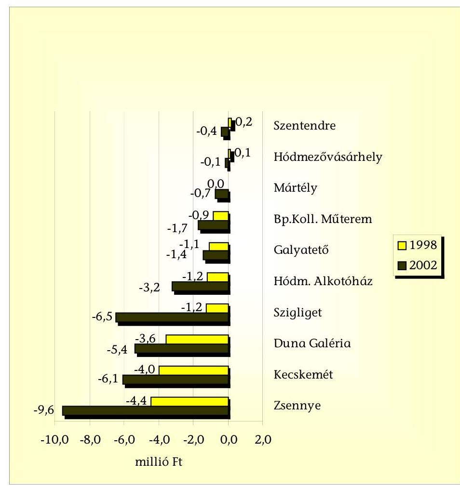

Az alkotóházak üzemeltetése során keletkezett veszteséget elsősorban az önköltségnél alacsonyabb térítési díjak okozták:

A szigligeti alkotóháznál - amely a MAK által üzemeltetett alkotóházak férőhelyeinek több, mint felével rendelkezik - 1988-ról 2002-re 131\%-ra nőtt a befizetett térítési díjak összege, míg az elszámolt összes költség 172\%-ra. Az egy napra jutó tényleges költség 140\%-ra, ebből a MAK által átvállalt költség 429\%-ra növekedett. Az alkotóház 1998-2000 között gyakorlatilag rentábilisan üzemelt, 2001-től azonban a beutalásban eltöltött napok csökkenése és az önköltség növekedésénél alacsonyabb mértékben növelt térítési díj miatt megbomlott a bevételek-ráfordítások közötti egyensúly. A MAK 1998-ban az egy napra jutó költségek 10\%-át, 2000-ben 1\%-át, 2001-ben 31\%-át, 2002-ben már $32 \%$-át viselte.

A hódmezővásárhelyi alkotóháznál 1988-ról 2002-re - miközben a kihasználtság 31\%-ról 41\%-ra nőtt - 87\%-ra csökkent a befizetett térítési díjak összege, az elszámolt összes költség viszont 171\%-ra nőtt, az egy napra jutó tényle-

---

ges költség 196\%-ra, ebből a MAK által átvállalt költség 307\%-ra növekedett. A MAK 1998-ban az egy napra jutó költségek 47\%-át, 2002-ben már 73\%-át viselte.

Az 1998-1999. években a hódmezővásárhelyi és mártélyi adatok a nyilvántartásokban összevontan szerepeltek.

A mártélyi alkotóház kihasználtsága magas, az 1998. évi 65\%-ról 2002-re 104\%-ra nőtt. 2000-ről 2002-re a befizetett térítési díjak összege 144\%-ra, az elszámolt összes költség 112\%-ra nőtt, az egy napra jutó tényleges költség 78\%ra, ebből a MAK által átvállalt költség 65\%-ra csökkent. A MAK 2000-ben az egy napra jutó költségek 63\%-át, 2002-ben 52\%-át viselte.

A galyatetői alkotóház kihasználtsága mindössze 5-7\%-os, 1988-ról 2002-re 83\%-ra csökkent a befizetett térítési díjak összege, míg az elszámolt összes költség 126\%-ra nőtt. Az egy napra jutó tényleges költség 182\%-ra, ebből a MAK által átvállalt költség 195\%-ra növekedett. A MAK 1998-ban az egy napra jutó költségek 83\%-át, 2002-ben 89\%-át viselte.

A művészek az 1998-2002 között évente összesen 26-30 ezer naptári napot töltöttek az alkotóházakban, az egy beutalt által eltöltött napok száma 1998-2001 között átlagosan 12 nap volt, de 2002-ben már nem érte el a 10 napot.

A művészeti célú ingatlanok közül a zsennyei és a kecskeméti alkotóházat a kuratórium külső üzemeltetőknek adta át.

A zsennyei alkotóházat a „Zsennyéért Alapítvány" ötéves időtartamra kötött 1998. december 21-i keltezésű - együttműködési megállapodás keretében üzemelteti, amelyben a MAK vállalta, hogy évente legalább kétmillió Ft-tal hozzájárul a múködtetéshez. Ez az összeg az 1999-2002. években 11,2 millió Ft volt.

A zsennyei alkotóház két alkalmazottja a MAK dolgozója, a MAK-kal kötött érvényes munkaszerződéssel rendelkeznek, így munkabér költségük az ellenőrzött időszakban a közalapítványt terhelték.

A kecskeméti alkotóházat a város önkormányzata üzemelteti egy - 50 éves időtartamra, 1998 októberében kötött - megállapodás keretében. A megállapodásban a MAK vállalta, hogy évente legalább négymillió Ft-tal hozzájárul a működtetéshez. Ez az összeg az 1999-2002. években 22,4 millió Ft volt.

A két üzemeltetésbe adott alkotóház múködtetésére kifizetett 33,6 millió Ft az alkotóházakra fordított működtetési költségek 24\%-át tették ki, miközben a beutalásban eltöltött napokat tekintve részarányuk 37-38\% volt. A külső üzemeltetésű alkotóházakat a művészek szívesen látogatták, a zsennyei rendszeresen fogadott külföldi művészeket is.

A beutaltak száma 1998-hoz képest 2002-re a zsennyei alkotóházban 94\%-kal, a kecskeméti alkotóházban $21 \%$-kal, míg a többi alkotóházban együttesen $12 \%$-kal nőtt. A kecskeméti alkotóházban - az 1998. évi magas látogatottság miatt - a beutalásban eltöltött napok száma 1998-hoz képest 2002-re 72\%-ra, így a kihasználtság 99\%-ról 71\%-ra csökkent, míg Zsennyén a beutalásban eltöltött napok száma 1998-hoz képest 2002-re 35\%-kal, a kihasználtság 59\%-ról

---

80\%-ra nőtt. (A többi alkotóházban a beutalásban eltöltött összes napok száma 1998-hoz képest 2002-re 4\%-kal, a kihasználtság az 1998. évi 47\%-ról 2002. évre $48 \%$-ra nőtt.)

A művészeti céllal múködtetett ingatlanok adatait a 19. számú mellékletben mutatjuk be.

# 5.1.2. A Vigadó Galéria múködtetésének támogatása 

Minden évben együttműködési megállapodás készült a kortárs magyar képző-, ipar-, és fotóművészetet bemutató Vigadó Galéria működtetésére: 1998-1999ben a MAK, a MAOE, a Képcsarnok Rt. valamint az MSZA és a „Vigadó Irodaház" Kft., 2000-2002. között a MAK, a MAOE és a MSZA állapodtak meg:

- a MAK pénzbeli támogatást vállalt;
- a MAOE a galéria kiállítási programját meghatározó tíztagú művészeti tanács összeállítását és - saját költségvetése terhére, annak lehetősége szerint a kiállítások megvalósulásához anyagi támogatás nyújtását vállalta;
- a megállapodás a Képcsarnok Rt.-vel és a „Vigadó Irodaház" Kft.-vel a helyiségek bérleti jogával kapcsolatos kérdéseket is rendezte;
- az MSZA vállalta, hogy - a MAK és a MAOE által biztosított támogatás figyelembevételével - gondoskodik a galéria működtetéséről.

A 1998-2002 között - a megállapodásokat teljesítve - a MAK összesen 38 millió Ft-tal járult hozzá a Vigadó Galéria működtetéséhez.

Kifogásoltuk, hogy a megállapodások nem tértek ki a támogatás elszámoltatására és a felhasználás ellenőrzési jogának biztosítására, így a MAK támogatás felhasználását nem ellenőrizte, nem számoltatta el a galériát működtető alapítványt.

A Vigadó Galériában - a MAOE számításai szerint - az öt év alatt több mint másfélezer művész jutott kiállítási lehetőséghez.

### 5.1.3. A MAOE-nek átadott támogatás felhasználása és elszámolása

Az ellenőrzött időszakban a MAK kizárólag a MAOE tevékenységét támogatta közvetlenül, illetve ezen a támogatáson keresztül valósította meg művészeti célú támogatásait, jóllehet az alapító okirat 9.1. pontja szerint a MAK céljainak elérése érdekében együttműködik az irodalom, a képző-, ipar- és fotóművészet, valamint a zeneművészet területén már működő vagy a jövőben létrejövő állami, társadalmi szervezetekkel és alapítványokkal.

A MAK 1998. évi költségvetésében a MAOE költségeihez való hozzájárulás és művészeti célú támogatások címén rendszeres és rendkívüli szociális segély, műalkotások megismertetése, ösztöndíjak, pályázatok szerepeltek.

Az 1999. és 2001. közötti években művészeti szervezetek tevékenységéhez való hozzájárulás címén tervezték a műalkotások megismertetése, ösztöndíjak és

---

egyéb díjak, szociális segélyek, rendszeres tájékoztatás, jogi képviselet és a szakmai érdekvédelem szervezeti keretei tételeket.
2002. évben a MAOE tevékenységéhez való hozzájárulás szerepelt a MAK költségvetésében. A jogcím alatt múalkotások megismertetése, alkotói támogatás, művészeti díjak, szociális segélyek és múködési támogatás szerepelt.

A MAOE támogatásával kapcsolatban minden évben megállapodást készített a MAK, miután a kuratórium meghatározta a közösen megvalósítandó célokat, feladatokat:

- a szociális biztonság érdekében támogatások nyújtása;
- a művészeti alkotómunka jobb körülményeinek elősegítése érdekében alkotóházak, kollektív műtermek múködtetése;
- a létrejött műalkotások megismertetése érdekében kiállítási, értékesítési lehetőségek megteremtése, művészeti kezdeményezések támogatása, a fiatal művészek segítése;
- a művészeti alkotómunka lehetővé tétele érdekében ösztöndíjak, jutalmak, művészeti pályázatok, díjak kitűzése, alkotói kölcsönök folyósítása;
- a szakmai érdekvédelem, a jogi képviselet, a rendszeres tájékoztatás.

A feladatok támogatásának módját a megállapodás tartalmazta. Az évenként támogatási megállapodás alapján a MAOE-nek jóváhagyott támogatás az 1998-2002 közötti időszakban összesen 279,4 millió Ft volt.

A vizsgált időszakban szociális segélykeretként összesen 52 millió Ft-ot, művészeti ösztöndíjak, pályázatok, díjak és jutalmak kitűzésére 49 millió Ft-ot a hagyott jóvá a kuratórium.

Az 1998. évi megállapodás a szociális segélykeret 10 millió Ft-ján kívül a feladatok ellátásának segítésére 15,4 millió Ft-ot hagyott jóvá, 1999-től a megállapodásban külön összeggel szerepelt a művészeti ösztöndíjak, pályázatok és jutalmak odaítélésének támogatása. A 2002. évi megállapodás keretet biztosított a műalkotások megismertetésére is.

A megállapodásokban minden évben kitértek - a kiállítási lehetőségek és művészeti kezdeményezések támogatását illetően - a Vigadó Galéria és a Duna Galéria fenntartásának szabályozására is, emellett 2002-ben 4 millió Ft-os támogatást biztosítottak műalkotások megismertetése címén. A szakmai érdekvédelemnek, valamint az adótanácsadással és jogsegélyszolgálattal foglalkozó jogi képviseletnek, illetve az alkotóművészek rendszeres tájékoztatásának megszervezése a MAOE feladata volt. A MAOE számára a szociális segélykereten, illetve - 1999-től - a művészeti ösztöndíjak, pályázatok, díjak és jutalmak keretén felül az egyéb feladatok ellátására összesen 174,4 millió Ft támogatást hagyott jóvá a kuratórium.

A megállapodásban a MAK a MAOE számára elszámolási kötelezettséget írt elő, nem szabályozta viszont a beszámolás módját, bizonylatokkal történő alátámasztását, a támogatás felhasználásának ellenőrizhetőségét.

---

A MAOE egyértelmű, jól használható szabályzatokat készített az ösztöndíjakról, a segélyezésről és a jogsegély-szolgálat múködtetésével kapcsolatban.

A MAOE a megállapodás szerkezete szerinti részletezésben számolt el a támogatások felhasználásáról, ezzel eleget tett a megállapodásokban előírt kötelezettségének. Az elszámolás tartalma és formája évről évre változott.

1998-ban a megállapodás segélyre 10 millió Ft-ot, a feladatok ellátásának elősegítésére 15,4 millió Ft kifizetését írta elő. A MAOE elszámolásában a segélyezettek számát és a kifizetett összeget is feltüntette tagozatonkénti bontásban, a 15,4 millió Ft elszámolásával kapcsolatban múködési költségei tételeit sorolta fel. 2002ben a megállapodás segélykeretre 12 millió Ft-ot, múvészeti ösztöndíjak, pályázatok, díjak és jutalmak kitúzésére, odaítélésére 13 millió Ft-ot, a múalkotások megismertetésére 4 millió Ft-ot, a MAOE feladatai ellátásának elősegítésére 49 millió Ft-ot tartalmazott. Az elszámolás egy-egy sorban tüntette fel az átutalt és a felhasznált összeget a nevesített feladatok esetén, a múködési költségeket 16 tételben sorolta fel, a múködési támogatás összegéig. A MAOE közhasznú jelentéseiben, illetve fökönyvi kivonataiban az adott jogcímen szereplő összeg kisebb, vagy egyenlő volt, mint az elszámolt kiadás.

A MAOE a segélyezési tevékenység keretében a MAB megalakulásáig 1998. szeptember 28 -áig - az egyesület segélyt társadalombiztosítási (táppénz, szülési segély, rokkantsági nyugdíj, gyermekgondozási segély) és szociális okból fizetett ki. A pénztár megalakulása után csak szociális okból történt kifizetés, a MAK által biztosított segélyezési keret terhére. A szociális segélyt az egyesület tagjai kérelmére szociális okból vagy kérelem nélkül - iskolakezdésre és karácsonyi segélyre - ítélték meg a tagozatok segélyezési bizottságai.

Az egyesület tagjai - alkotótevékenységük múfajának és választásuknak megfelelően - egy vagy több tagozathoz tartoztak. A MAOE-nek öt tagozata volt: az irodalmi, a zenei, a képzőművészeti, a tervező- és iparművészeti és a fotóművészeti tagozat.

A MAOE segélyezési tevékenysége 1998-2002 között a következők szerint alakult:

| Év | Segélyezettek   száma   (fő) | Kifizetett   segély   (millió Ft) | MAK segé-   lyezési keret   (millió Ft) | Kifizetés a   keret   \%-ában | Átlagos   kifizetett   segély   (ezer Ft/fő) |
| :-- | :--: | :--: | :--: | :--: | :--: |
| 1998. | 942 | 9,9 | 10,0 | 100,0 | 10,5 |
| 1999. | 797 | 10,0 | 10,0 | 100,0 | 12,5 |
| 2000. | 1041 | 10,2 | 10,0 | 99,0 | 9,8 |
| 2001. | 850 | 11,0 | 11,0 | 100,0 | 12,9 |
| 2002. | 787 | 12,0 | 12,0 | 96,0 | 15,2 |
| Összesen | 4417 | 53,1 | 53,0 | 99,8 | 12,0 |

---

A MAK által biztosított keretet a MAOE minden évben felhasználta. A szociális segélyezési szabályzat az évente személyenként kifizethető maximális összeget 20 ezer forintban határozta meg. A művészek átlagosan 12 ezer forintos szociális segélyt kaptak egy-egy alkalommal. Az öt év folyamán összesen 14 kérelmet utasított el a képző- és az iparművészeti tagozat. A többi tagozatnál elutasítás nem volt.

Múvészeti ösztöndíjakra, pályázatokra, díjak kitúzésére a MAK 1999től külön keretet biztosított, 2002-ig összesen 49 millió Ft-ot. A MAOE évente részletezés nélkül - egy összegben közölte a felhasználás tényleges összegét.

A MAOE ösztöndíjszabályzata szerint a művészek 3-6 havi időtartamra igényelhettek ösztöndíjat 10-30 ezer forint/hó mértékben. A díjak odaítélését szabályozó egységes dokumentumot az egyesület nem készített.

Évente tagozatonként adták ki a MAOE Alkotói Nagydíját és minden évben másmás tagozat ítélte oda a Kulturális Örökség Nagydíját. A 2000-ben alapított díjjal évente hat művész részesült 300-300 ezer forintos elismerésben.

A MAOE a feladat ellátására pályázaton is szerzett - a MAK éves támogatásán felül - forrást.

A vizsgált időszakban a 6600 MAOE tagból - a MAOE tájékoztató adatai szerint - összesen 250 művész részesült ösztöndíjban, illetve kapott díjat. Egy-egy alkotó 40-300 ezer forintos támogatáshoz jutott az adott évben.

Az éves támogatási megállapodások szerint a múalkotások megismertetésének pénzügyi támogatását a Vigadó Galéria fenntartására vonatkozó külön szerződés keretében biztosították. A Duna Galéria fenntartási költségeit a közalapítvány vállalta. Egyetlen évben, 2002-ben határoztak meg 4 millió Ft keretet a célra.

A MAOE elszámolásaiban 2000-től szerepelt a műalkotások megismertetése tétel. Ezen a címen a három év alatt összesen 10 millió Ft felhasználásáról adott számot a MAOE. Tehát a 2000. és a 2001. évben a múködésre adott keretből használt fel és számolt el összesen 6 millió Ft-ot az egyesület a feladatra.

A MAK és a MAOE közötti megállapodások szerint a szakmai érdekvédelemnek, valamint az adótanácsadással és jogsegélyszolgálattal foglalkozó jogi képviseletnek, illetve az alkotóművészek rendszeres tájékoztatásának megszervezése a MAOE feladata volt, ezért az egyesület a múködési támogatás keretén belül számolta el a jogi- és adótanácsadás költségét. A felhasznált összeg 1998-1999-ben az egyesület jogi képviseletére fordított összeggel együtt - 4,6 millió Ftot tett ki, 2000-2002 között - csak a jogi- és adótanácsadás kiadásaira - 9,0 millió Ft-ot fordítottak.

Az ingyenes tanácsadás népszerű volt a MAOE tagok körében: 1998-2002 között jogi tanácsadáson összesen 1063 egyesületi tag vett részt, adótanácsot 2360 fő kért, a csoportos adótanácsadást 275 -ször vették igénybe.

---

# 5.1.4. A múvészeti célra adott eseti támogatások 

A MAK kuratóriuma a rendszeres támogatásokon túl több formában nyújtott eseti támogatást:

1998-ban 2 millió Ft kamatmentes kölcsönt nyújtott a MAOE múködési nehézségeinek áthidalására. A kuratórium azzal a kikötéssel hagyta jóvá a kölcsönt, hogy az éves zárszámadáskor ezzel véglegesen elszámolnak. A kuratórium a kölcsön elengedéséről nem hozott külön határozatot, de 1999 februárjában a kamatmentes kölcsön 1998. évi támogatásként való elszámolását elfogadta. (Az egyesület az éves támogatás elszámolásában a múködési költségeket a támogatás és a kölcsön együttes összegéig sorolta fel.)

A kuratórium a tartalékkeret terhére 5 millió Ft támogatást ítélt meg a MAOE javára a Millennium alkalmából, ezzel a Múcsarnokban megrendezésre kerülő öt képző-, ipar- és fotómúvészeti kiállítás megvalósításához járult hozzá. A támogatásról megállapodás készült, melyben rögzítették a kiállítások dátumát és a 2000-2001. évi folyósítás ütemezését. Kikötötték, hogy a MAOE a támogatást csak a rendezvénysorozat koncepciójának megalkotását végző szakértők szellemi alkotómunkájának támogatására használhatja fel, továbbá azt, hogy a folyósított összegről két részletben köteles elszámolni. A MAOE nem számolt el határidőre, az elszámolás elfogadásáról a kuratórium nem hozott határozatot.

A helyszíni vizsgálat 2003. februári befejezése előtt a MAK elszámoltatta a MAOE-t. Az elszámolás a megállapodás előírásainak megfelelően 4,8 millió Ftról történt. Az egyesület elnöke jelezte, hogy a maradék 0,2 millió Ft-ot 2003-ban szeretné felosztani a MAOE.

A MAK 1998 januárjában - a MAOE-vel együtt - megállapodást kötött a Ferencvárosi Képzőművészek Egyesületével és a Ferencvárosi Önkormányzattal, amelynek keretében tárgyi eszközök használatba adásával támogatták „Kondor Béla Grafikai Műhely" múködését. Az együttműködési megállapodásban a MAK az eszközök határozatlan idejű, térítésmentes használatba adását vállalta, az önkormányzat pedig helyiség bérleti jogot biztosított a Ferencvárosi Képzőművészek Egyesülete számára. A Ferencvárosi Képzőművészek Egyesülete vállalta az átadott eszközök megőrzését, valamint saját és a MAOE tagjai számára használatuk biztosítását. A megállapodásban a MAOE számára nem kötelezettséget, hanem előnyt jelentett, mivel a tagjai részére biztosította az átadott eszközök használatát, sőt a megállapodás módosítása is csak a MAOE egyetértésével lesz lehetséges.

### 5.2. A pályázati úton nyújtott minisztériumi támogatások felhasználása

### 5.2.1. A szigligeti alkotóház védett történeti parkjának felújítása

A MAK 1999. április 19-én pályázatot nyújtott be az NKÖM által a Magyar Millennium alkalmából a Nemzeti Örökség Program "„Történeti kertek, parkok, temetők, síremlékeket tartalmazó történő emlékhelyek megóvására" kate-

---

góriában a szigligeti alkotóház védett történeti parkja felújítási és növényszelekciós munkáinak vissza nem térítendő támogatására.

A pályázati cél szerint a park jelentős természeti emlék, műemléki és természetvédelmi érték. Az 1982-es felújítás óta számos műszaki létesítmény tönkrement, illetve a növényanyag korrekciójára van szükség. Az előzetes költségvetés tételesen részletezte a megvalósítás tervezett ráfordításait ( 6377500 Ft +1594375 Ft ÁFA, összesen 7971875 Ft ). A megvalósításhoz saját erő nem kapcsolódott.

A beküldött pályázatot az NKÖM elfogadta és a megjelölt cél megvalósításához 3,3 millió Ft vissza nem térítendő támogatást ítélt meg. A MAK és a NKÖM OmvH által 1999. október 8-án megkötött felhasználói szerződés szerint a megvalósítás teljesítési határideje 2000. február 28-a volt.

A pályázati támogatás felhasználása, elszámolása programfinanszírozás keretében történt.

A MAK a finanszírozási tájékoztatóban előírt kötelezettségeinek eleget tett (támogatott pályázat adatlapja, felhatalmazó levél, űrlap az eredménynaptár összeállításához, szerződések megkötése, nyilatkozatok, igazolások, bírósági végzés a névváltoztatásról, az aláírásra jogosultak jegyzéke).

A kivitelezés megvalósítására négy ajánlat érkezett a dokumentáció szerint. A beküldött költségvetések alapján az alacsonyabb árajánlatokat fogadták el.

A MAK a költségvetés felhasználásáról a felhasználói szerződésben foglaltak alapján elszámolt és azt a Kincstárnak megküldte. Az elszámolás kiterjedt a támogatott cél szakmai teljesítésére, valamint a támogatási összeg felhasználását igazoló pénzügyi elszámolásokra.

A kastélyparkban elhelyezkedő $800-1000 \mathrm{~m}^{2}$ felületű tó eliszapodását sikerült megszüntetni a tó medrének $0,7-1,3 \mathrm{~m}$ mélységű kialakításával. Az új hidak megépítésével a tó a kis szigettel és a tó környéke megközelíthetővé, látogathatóvá vált.

A pénzügyi teljesítés összesítését tartalmazó elszámolási lap jogcímenkénti és öszszes felhasználásához csatolták a MAK által igazolt számlák hiteles másolatait.

Az ellenőrzött létesítményről az üzembe helyezési okmányt, az állományba vételi bizonylatot 2000. február 28-i dátummal kitöltötték.

A MAK a pályázaton nyert támogatást a felhasználói szerződésben foglaltaknak megfelelően használta fel. A kivitelezők a szerződés szerinti kötelezettségeiket teljesítették, a benyújtott számlák összege a szerződés szerinti vállalkozói díjat nem haladta meg ( 3,3 millió Ft). A kapott támogatások $50 \%$-a volt a kért összegnek, így a tervezett felújításnak csak egy részét lehetett megvalósítani.

# 5.2.2. A zsennyei kastély kertjének rekonstrukciója 

A MAK az épített örökség megóvása, felújítása programra nyújtott be pályázatot 2002. március 13-án a zsennyei kastély történeti kertjének rekonstrukciójára (a tó környezetének rehabilitációja, a parkban található temető előkészítése régészeti kutatáshoz). A pályázat szerint a kivitelezés teljes költsége 2 millió Ft,

---

ehhez az igényelt támogatás 1 millió Ft. A megvalósításhoz 1 millió Ft saját erő rendelkezésre állt, melyről a kuratórium elnöke 2002. március 18-án az NKÖM Pályázati Igazgatóságát tájékoztatta.

A MAK a pályázathoz kötelezően benyújtandó mellékleteket csatolta. A támogatás nem feladatfinanszírozási körbe tartozó fejezeti kezelésű előirányzat volt. A megvalósítás tervezett befejezési időpontja 2003. július 30-a. Az elnyert támogatás a folyamatban levő rekonstrukció része, amelyre az eddig vállalt kötelezettségvállalás összege 185 millió Ft.

A vissza nem térítendő 1 millió Ft állami támogatás felhasználására a NKÖM közigazgatási államtitkára és a MAK igazgatója 2002. október 4-én megállapodást kötött.

A támogatási összeg a feladat megvalósítását követően számlák, hiteles bizonylatok alapján kerül átutalásra. A megállapodás kötelezi a MAK-ot, hogy a felhasználásról tételes és hiteles pénzügyi elszámolást, valamint szöveges szakmai beszámolót készítsen a megadott szempontoknak megfelelően.

A helyszíni ellenőrzés 2003. februári befejezéséig a megvalósítás még folyamatban volt, pénzfelhasználásra, átutalásra nem került sor. Olyan körülmény nem merült fel, amely a megállapodásban foglaltak teljesítését módosítaná, vagy meghiúsítaná. A megállapodásban foglaltak a megvalósítással kapcsolatos jogosultságokat és kötelezettségeket pontosan és részletesen tartalmazzák, s ez előbiztosítékot jelent a támogatás és a saját erő cél szerinti felhasználásához.

# 5.3. A csatlakozó alapítványok által nyújtott támogatások felhasználása 

1996-ban az MHB Rt. által korábban alapított nyolc alapítvány - alapítója egyetértésével - csatlakozott a MAK-hoz.

Az alapítványok a MAK alapító okiratát megvizsgálva - mivel lehetőséget láttak a MAK-nak a Kormány által előírt és saját céljaik együttes megvalósítására meghatározták a közös támogatási koncepciót.

A csatlakozások bejelentését a közalapítvány kuratóriuma elfogadta. A csatlakozási dokumentumokban 1998. december 31-ig 423 millió Ft megőrzendő tőke szerepelt.

A határozott idejű csatlakozást az alapítványok 1998 folyamán öt évvel, 2003. december 31-ig meghosszabbították, majd a csatlakozást 1999. december 31-i határidővel felmondták. A felmondás hivatkozási alapja az alapító jogutódjának, az ABN-AMRO Banknak az alapítványokkal kapcsolatos koncepcióváltása volt.

A csatlakozás révén a MAK összesen 252,1 millió Ft többletforráshoz jutott.
1997 januárjától az alapítványok a titkársági, adminisztrációs, jogi képviseleti, pénzügyi és könyvelési feladataikkal - díjazás ellenében - a MAK-ot bízták meg.

A MAK kuratóriuma 1997 januárjában elfogadta a csatlakozott nyolc alapítvány vagyona hozadékának felosztási rendjéről szóló szabályzatot, az egységes

---

pályázati űrlapot és szerződésmintát, döntött a pályázatok meghirdetésének szövegéről, nyilvánossá tételéről.

A MAK évente egyszer, alapítványonként egy-egy pályázati felhívást tett közzé. A pályázatokat csoportosan, az egyéni kérelmeket egyenként bírálta a kuratórium, a bírálathoz szakértők véleményét is igénybe vette.

A pályázók elszámoltatását az ügyvédi iroda végezte. Az elszámolások esetleges határidő-módosításával kapcsolatban is a kuratórium hozott egyedi határozatokat. Az elszámolások elfogadásáról a kuratórium nem hozott külön döntést.

1998-1999 között az alapítványok vagyona hozadékának felhasználásával a MAK összesen 252,1 millió Ft támogatást fizetett ki, ennek keretében a saját alapító okiratában megfogalmazott feladatok finanszírozását is elősegítette, forrást nyújtva a MAOE-n kívül más művészeti szervezetek támogatására.

Támogatta a MAB megalakulását és - a taglétszám emelkedésével - 1998-ban 20,7 millió Ft-tal, 1999-ben 10 millió Ft-tal hozzájárult működéséhez.

A MAB pályázatára a kuratórium - szakértői vélemény figyelembe vételével 30,7 millió Ft támogatást ítélt meg azzal a feltétellel, hogy a pénztár taglétszáma 1998. december 31-éig eléri a 300 föt.

A pénztár a tagok névsorával igazolta, hogy eleget tett a támogatás feltételeinek.
19,4 millió Ft-tal járult hozzá az alkotóházak, a Lehel úti kollektív múterem múködéséhez, felújítási munkái, beruházásai elvégzéséhez.

A MAK, mint a csatlakozó alapítványok nevében kiírt pályázatok lebonyolítója a MAOE közbeiktatásával adott támogatást a tulajdonában álló művészeti célú ingatlanok felújításához, így a MAOE pályázott a Lehel úti kollektív műteremben, a galyatetői zenei alkotóházban végzett munkák, valamint a fűtés költség támogatására. A MAK kuratóriuma 1,3 millió, 1 millió illetve 0,2 millió forintot ítélt meg a célra. A MAOE a MAK-ot bízta meg a felújítási, korszerűsítési munkák kivitelezésével. A MAK az elszámolást eredeti számlákkal és számlamásolatokkal támasztotta, a számlákon a teljesítés igazolása is szerepelt. Az elszámolást a MAOE elnöke elfogadta.

Támogatáshoz jutott a Fiatal Iparművészek Stúdiójának Egyesülete és a Fiatal Képzőművészek Stúdiójának Egyesülete is. A két szervezet 1998ban 4,0 millió, 1999-ben 2,5 millió Ft támogatást kapott a csatlakozó alapítványok hozadékából.

Pályázott a MAOE is egyesületi céljaira, összesen 21,5 millió Ft támogatást kapott.

Az egyesület tagozatai összesen 54,9 millió Ft támogatásra pályáztak. Minden tagozat a kérelméhez több konkrét pályázatot csatolt. A kuratórium 20,7 millió Ft kifizetését hagyta jóvá. Az elszámolás is részpályázatonként történt.

A MAK - pályázatok elbírálásával és egyedi döntések alapján - intézmények, és magánszemélyek kéréseit támogatta, összesen 178,4 millió Ft-tal.

---

1998-ban az adott támogatások között a közalapítványi céloknak nem megfelelő pályázati célok is szerepeltek, így az e célokra felhasznált összeg nem az alapítványok által megjelölt csatlakozási cél, illetve a MAK alapító okiratának megfelelően teljesült:

Az Egészséges Nemzetért Alapítvány pályázatára beérkezett pályázatok 1998. évi elbírálásánál a kuratórium egyedileg hagyta jóvá a Lipót Beteg-Segély Alapítvány 0,6 millió Ft, az Egészséges Magzatért és Újszülöttért Alapítvány 0,5 millió Ft, a Magyar Gerincgyógyászati Társaság 3 millió Ft támogatását (ez utóbbit a gerincbetegségek megelőzését szolgáló interaktív számítógépes iskolai prevenciós program megvalósítására).

A MAK belső ellenőre vizsgálta a csatlakozó alapítványok által biztosított forrásból 1998-ban nyertes pályázatok megvalósulását. Ellenőrzése során egy pályázat elszámolását nem ítélte elfogadhatónak, így a MAK intézkedett a támogatás visszafizetéséről. A pályázó a kiutalt összeget visszafizette.

# 5.4. A múteremlakások bérlőkijelölési jogának gyakorlása 

A MAK 1996 óta gyakorolja a műteremlakások bérlőkijelölési jogát.
1996-ig a műteremlakásokkal kapcsolatos feladatokat az MKM látta el. 1996. január 4-én lépett hatályba a műteremlakások bérletére vonatkozó egyes szabályokról szóló 15/1995. (XII. 29.) MKM rendelet, amelynek 3. § (2) bekezdése szerint a műteremlakás bérlőjét a Magyar Alkotóművészeti Közalapítvány jelöli ki nyilvános pályázat és az alkotóművészeti társadalmi szervezetek képviselőiből álló, a MAK által létrehozott bizottság javaslata alapján.

A minisztérium a folyamatban lévő ügyeket, továbbá a műteremlakások címjegyzékét és a lakáskartonokat átadás-átvételi jegyzőkönyvvel a MAK jogi képviseletét ellátó ügyvédi irodának adta át.

Az adategyeztetést követően 40 önkormányzat összesen 375 műteremlakást ismert el.

2001-ben az új személyi összetételű kuratóriumnak a titkárság összesen 386 műteremlakásról, 422 bérlőről és 11 jogcím nélküli lakáshasználóról adott számot.

A hatályos miniszteri rendelet valamennyi - a műteremlakásokkal kapcsolatos jogi változás engedélyezését, így a bérlőtárs kijelölését, tartási szerződés kötését, a bérleti jog cseréjét, a műteremlakás elidegenítését a műteremlakás-bizottság javaslatához kötötte. A bizottság munkáját az 1996-ban, majd 2000-ben elfogadott múködési szabályzat alapján végezte.

A kuratórium 1998-2002 között a műteremlakásokkal kapcsolatban - a tizenegytagú műteremlakás-bizottság javaslata alapján - 166 határozatot hozott.

A műteremlakásokkal kapcsolatos adminisztrációs, jogi képviseleti feladatok ellátásával megbízott ügyvédi iroda díjazása öt év alatt 13,8 millió Ft-ot tett ki.

A hatályos miniszteri rendelet előírta, hogy a műteremlakásban lakó jogcím nélküli bérlő emelt lakáshasználati díjat köteles fizetni, illetve, hogy a műteremla-

---

kások kizárólag a MAK hozzájárulásával idegeníthetők el, továbbá, hogy a lakáshasználati díj lakbért meghaladó részét és az elidegenített önkormányzati tulajdonú műteremlakások vételi árának 70\%-át a MAK elkülönítve köteles kezelni és kizárólag a műteremlakások felújítására, illetve újak építésére használhatja fel.

Az emelt lakáshasználati díjból a MAK-nak bevétele nem volt.
Az ügyvédi iroda néhány esetben felszólította az önkormányzatokat a díj emelésére, de az önkormányzatokkal szembeni követeléséről nem készített nyilvántartást, követeléseit nem érvényesítette.

1998-2002 között a MAK a műteremlakások elidegenítéséből összesen 2,4 millió Ft bevételhez jutott.

31 esetben írt ki pályázatot, amelyeket a MAOE kiadványában hozták nyilvánosságra. A beérkezett 593 pályázatot - amelyek a művészek szociális körülményeit és művészi munkásságát részletezték - az ügyvédi iroda feldolgozás után adta át a műteremlakás-bizottságnak. A bizottság minden esetben javaslatot készített, melyet a kuratórium elfogadott. A döntés ellen - a kuratóriumi ülések emlékeztetője szerint - nem éltek panasszal a pályázók.

A művész családtagnak, bérlőtársnak pályázaton kívül engedélyezte a kuratórium a bérleti jog folytatását. E határozatok - noha a hatályos miniszteri rendelet szerint történtek - csökkentették a műteremlakással nem rendelkező művészek lehetőségeit. A több mint tízszeres túljelentkezés azt mutatja, hogy a műteremlakások pályáztatása nem oldotta meg a művészek lakásgondjait.

A kuratórium elnöke 2001 decemberében levéllel fordult az OGY Területfejlesztési bizottságához és az FVM-hez, amelyben a következők szerint összegezte a MAK a műteremlakások bérlőkijelölési jogának gyakorlása során szerzett öt éves tapasztalatait:

Az önkormányzati tulajdon, a MAK bérlőkijelölési joga és a bentlakó művészek (valamint a „kívül lévő" alkotók érdekei) sokszor összeütközésbe kerülnek. A műteremlakás - amely lakó- és munkahely is egyben - folyamatosan újratermeli a helyiséggondokat, ezért a jövőben műtermek mint munkahelyek építése lenne kívánatos és szükséges.

1999-ben a MAK levélben jelezte az NKÖM-nek, hogy kész közreműködni olyan műteremház megvalósításában és múködtetésében, amely az alkotói munkát közvetlenül szolgálja.

# 6. A NYUGDÍJ-, ILLETVE NYUGDÍJSZERŰ ELLÁTÁSI RENDSZER 

### 6.1. A megszüntetett Múvészeti Alap tagjainak szerzett jogon megállapított nyugellátásának szabályossága

A Magyar Köztársaság Művészeti Alapjának megszüntetéséről és a Magyar Alkotóművészeti Alapítvány létesítéséről szóló 117/1992. (VII. 29.) Korm. rendelet 1. §-a szerint a Művészeti Alap tagjai részére a társadalombiztosítási jogsza-

---

bályokban biztosított jogosultságok az Alappal 1992. október 1-jéig tagsági viszonyban álló tagjait és a Magyar Alkotómúvészek Országos Egyesületének tagjait illették meg. A Művészeti Alap megszüntetésével együtt a művelődési és közoktatási miniszter 1992. október 1-től hatályon kívül helyezte a Művészeti Alap tagjainak egységes segélyezési rendszerét szabályozó miniszteri rendeleteket, de a kötelező járulékfizetésen alapuló szerzett jog elismerésére rendelkezést nem tartalmazott. Ugyanakkor a társadalombiztosításról szóló jogszabályok sem vonatkoztak a Művészeti Alap volt tagjaira. A Magyar Köztársaság Művészeti Alapjának megszüntetéséről és a Magyar Alkotóművészeti Alapítvány létesítéséről szóló 117/1992. (VII. 29.) Korm. rendelet sem határozta meg a szerzett jogok tartalmát. A szerzett jogok érvényesítésének rendjét mindezidáig (köz)alapítványi - az évek során többször módosított - belső szabályzat írta és írja elő.

A MAA, majd a MAK alapító okirat szerinti feladata lett, hogy a rendelkezésre álló forrásokból elsősorban a Művészeti Alappal 1992. október 1-jéig tagsági viszonyban álló tagjai nyugdíjának - állami szerepvállalás melletti kifizetéséről gondoskodjon, valamint biztosítási alapon a MAOE alapszabálya szerint tagokat tömörítő egyesület mindenkori tagjai részére önkéntes nyugdíjbiztosítás keretében saját jogú, özvegyi, szülői, illetve nyugdíjsegélyeket és árvasági segélyeket folyósítson. Az 1992. október 1. előtt megállapított nyugdíjak fedezetét a Magyar Köztársaság Művészeti Alapjának megszüntetéséről és a Magyar Alkotóművészeti Alapítvány létesítéséről szóló 117/1992. (VII. 29.) Korm. rendelet módosításaként kiadott 278/2002. (XII. 21.) Korm. rendelet alapján 2003. december 31-ig fedezi a központi költségvetés.

A MAA alapító okirata számításokkal alá nem támasztott alapítói döntés alapján 1997. december 12-ig az alapítvány feladatává tette mind a Művészeti Alappal 1992. október 1-jéig tagsági viszonyban álló tagjai, mind a MAOE alapszabálya szerint belépő új tagokat tömörítő egyesület mindenkori tagjai részére a szociális biztonság anyagi feltételeinek megteremtését. Ezzel a MAOE mindenkori tagjai részére újabb szerzett jogokat biztosított, kiszélesítette az addigi jogosultsági kört.

A MAK nyugdíjszabályzata az alapító okirattal összhangban, és részben a Múvészeti Alap tagjait megillető segélyeket ezt megelőzően szabályozó, a 8/1985. (V. 11.) MM rendeletre építve úgy szabályozta a jogosultsági időt, hogy a Művészeti Alap és MAOE tagság együttesen 20 év tagsági időt érjen el. A szabályzat már nem zárta ki a munkaviszony alapján társadalombiztosítási nyugdíjban részesülőket az alapítványi nyugdíj megállapításból, mindössze a nyugdíj nagyságában tett különbséget. Lehetővé tette a méltányossági alapon történő nyugdíj megállapítást és az 1992. október 1. előtt megállapított nyugdíjak kiegészítését a mindenkori emelés összegét meghaladóan is.

1998-ig a méltányossági alapon odaítélt nyugellátásokról nem a MAK, hanem a MAOE tagozatainak segélyezési bizottságai döntöttek egy elkülönített, az éves járandósági alapon megállapított nyugdíjak összegének 18\%-os kerete erejéig.

Az átalakuláskor (1992. október 1-ig) negyvenedik életévüket be nem töltött művészek az alapítvány első kuratóriumának döntése alapján csak a MAOE tagsági idő beszámításával szerezhettek volna jogot, mivel a húszéves Művészeti Alap tagságuk még nem volt meg.

---

Az 1995. évben megalakult új személyi összetételű kuratórium megkezdte a nyugdíjpénztár szervezését, ezzel párhuzamosan úgy határozott, hogy a fent megjelölt kört is kompenzálni kell, és amennyiben ezek a művészek belépnek a nyugdíjpénztárba, az 1992. évig befizetett járulékaikat egyéni nyugdíjpénztári számlájukra 1994. évi valorizált értéken átutalják. A kötelező járulékfizetésen alapuló szerzett jogaik elismerése ezzel nem történt meg.

Az Önkéntes Kölcsönös Biztosító Pénztárakról szóló 1993. évi XCVI. törvény szerint alakult nyugdíjpénztárak kiegészítő nyugdíj megteremtését biztosítják, nincs átjárás a társadalombiztosítás és az önkéntes biztosítás között. Tehát a saját jogú nyugellátás nem váltható ki kiegészítő jellegű biztosítással.

A MAK 1997. december 12-től hatályos alapító okirata megváltoztatta a nyugdíjjogosultak körét, ezután már a MAOE alapszabálya szerinti mindenkori tagság nem jelentett szerzett jogot. Ezzel összhangban módosították a MAK nyugdíjszabályzatát, a nyugdíjjogosultsághoz az elismert Művészeti Alap tagság időtartamát, az özvegyekre, árvákra, szülői nyugdíjra vonatkozó jogosultsági feltételeket, eltörölték a méltányossági alapon történő nyugdíjmegítélést. A társadalombiztosítás keretében kapott nyugdíj megléte továbbra sem volt kizáró feltétel. A nyugdíjszabályzatot a kuratórium a 205/1997. (X. 20.) számú határozata 1998. január 1-jével léptette hatályba.

A 20 év Múvészeti Alap és MAOE együttes tagsági idő helyett 20 év Művészeti Alap tagsági időt, illetve új elemként az 1992. október 1. napjáig a negyvenötödik életévüket betöltötteknél 10 év Múvészeti Alap tagsági időt írt elő a MAK nyugdíjszabályzata jogosultsági feltételnek. Az özvegy, árva, szülő a korábbiaktól eltérően csak abban az esetben kaphatott MAK segélyt, ha társadalombiztosítási ellátásra nem volt jogosult. A kuratórium a 135/1998. (V. 11.) számú határozata értelmében az a művész sem kaphatott özvegyi nyugdíjat, aki a közalapítványtól rendszeres nyugdíjsegélyben részesült.

A szabályzat szerint a szerzett jogok érvényesítésének második feltétele a járulékbefizetés nagysága volt. Míg az Alapra érvényes, a fentiekben már említett jogszabályok a nyugdíjsegély jogosultságot átlagban évi húszezer Ft bruttó jövedelemhez kötötték, addig az új szabályozások a bruttó jövedelemből levont, tíz, illetve húsz év alatt befizetett járulék valorizált értékét vették fegyelembe. A nyugdíjszabályzat 1994. évre valorizált értéken minimum húszezer Ft járulék befizetést írt elő.

A ténylegesen befizetett járulék valorizált értéke a befizetés éveitől is függ. Így, ha egy művész 1961-től befizetett összesen 3078 Ft járulékot, ennek valorizált értéke 22334 Ft lett. A befizetés alapján megállapítható nyugdíj 1998-ban társadalombiztosítási nyugellátásban nem részesülőnél havi 16100 Ft, 2002-ben havi 25000 Ft volt.

A nyugdíjjogosultság harmadik eleme a betöltött nyugdíj korhatár volt. A MAK, illetve ezt megelőzően a MAA szabályzatai a betöltött nyugdíj korhatárt a mindenkori társadalombiztosítási jogszabályokban előírtak szerint határozták meg.

---

# 6.2. A Művészeti Alap megszűnéséig megállapított nyugdíjsegélyek 

A Művészeti Alap megszűnéséig, 1992. október 1-ig megállapított nyugdíjsegélyeket a Magyar Köztársaság Művészeti Alapjának megszüntetéséről és a Magyar Alkotóművészeti Alapítvány létesítéséről szóló 117/1992. (VII. 29.) Korm. rendelet 1. §-a alapján a MAK folyósította és a kormányrendelet előírásai szerint a társadalombiztosítási nyugdíjakra vonatkozó rendelkezések alapján rendszeresen emelte. E rendelet 1. §-ának (5) bekezdése szerint az ellátások folyósítását 2002. december 31-ig a központi költségvetés fedezi. Az ellátás a természetes mortalitás miatt kifutó rendszerú. A MAK által megrendelt szakértői vélemény matematikai számításai szerint a 2015. évre sem csökken az 1997. évi létszám felére a saját jogú nyugdíjat kapók létszáma. A MAK 1997-ben megbízást adott szakértői tanulmány készítésére a várható nyugdíjas létszám és finanszírozási keretük prognosztizálására. A tanulmányban az adatokat a KSH 1996-os mortalitási adataiból és a Pénzügykutató Rt. 2015-ig várható inflációs és nyugdíjemelési prognózisából számították. A tanulmány adatai szerint a saját jogú nyugdíjasok száma (követő nyugdíjasok nélkül) az 1997 évi 1065 fơről 18 év alatt 650 főre csökken. A 2015. évre prognosztizált kifizetés 525,6 millió Ft lesz. A 278/2002. (XII. 21.) Korm. rendelet a garanciavállalást csak 2003. december 31-ig hosszabbította meg, ezzel bizonytalan helyzetet teremtett a MAK-nál. A MAK közalapítványi célokra kapott központi költségvetési támogatásának 88,6\%-át fordította a vizsgált időszakban nyugdíjkifizetésre. Ebből az összes kifizetett nyugdíj 69,7\%-a volt a kormány által vállalt fedezettel kifizetett nyugdíj.

A központi költségvetés által fedezett nyugdíjkifizetés (saját jogú és követő nyugdíjak, árvasági segélyek, rokkant ellátások) a vizsgált időszakban 2291,4 millió Ft volt. Az egyes években a természetes mortalitás csökkentő hatású volt, másrészt a nyugdíjemelések révén a kifizetések növekedtek, az 1998. évi 385,5 millió Ft-ról 545,6 millió Ft-ra, összességében 41,5\%-kal.

Az 1998. évben 1307 fő részesült a központi költségvetés által fedezett nyugdíjsegélyben. A létszám a 2002. évre 1044 fơre csökkent.

A Művészeti Alap megszűnéséig kivételes méltányosságból megállapított nyugdíjakra az ellenőrzött időszakban 111,5 millió Ft kifizetés volt. Az 19921997 évek között a MAOE segélyezési bizottságai által méltányossági alapon megállapított nyugdíjemeléseket a MAK - helyesen - nem számolta el központi költségvetés által fedezett kifizetésként, mivel ezen emeléseket nem 1992. október 1. előtt hajtották végre, így ezekre a kifizetésekre nem vonatkozott a központi költségvetési fedezetvállalása. A méltányossági alapon történt emelések 55,2 millió Ft MAK kifizetést jelentettek a vizsgált időszakban.

### 6.3. A nyugdíjak megállapításának szabályossága

A MAK nyugdíjszabályzatának A. pontja rendelkezett az 1992. október 1. napjáig negyvenedik életévüket betöltött Múvészeti Alap tagok nyugellátásáról. A szabályzat módosítását mindig kuratóriumi határozat hagyta jóvá. A nyugdíj megállapítás alapjául szolgáló táblázatot évente aktualizálták a szabályzatban előírtak szerint.

---

Az ellenőrzött időszakban a szabályzatnak a nyugdíj megállapításra vonatkozó feltételeit a kuratórium a 204/2000. (XI. 20.) számú határozatával szigorította. A jogosult által előterjesztett kérelem elengedhetetlen feltételévé tette nyilatkozat adását arról, hogy a kérelmező részesül-e társadalombiztosítási nyugellátásban, és amennyiben ilyen ellátásban részesült, csatolnia kellett a megállapítást tartalmazó határozatot. A kérelmezőnek egyidejűleg fel kellett hatalmaznia a MAK-ot arra, hogy e tárgyban a nyugdíjfolyósító szervtől adatot kérjen.

E határozatot megelőzően önbevallás alapján közölték a nyugdíjat kérelmezők a társadalombiztosítási nyugellátás meglétét, illetve összegét. Ez a szabályozás annál is inkább fontos volt, mivel a MAK nyugdíjak nagysága függött a társadalombiztosítási nyugellátás meglététől és összegétől.

A nyugdíjszabályzat A. pontja alapján megállapított nyugdíjakra az ellenőrzött időszakban 983,9 millió Ft-ot fizettek ki. A kifizetett összeg évente a nyugdíjemelésekkel és az újonnan megállapított nyugdíjakkal növekedett.

Az 1998. évben 621 nyugdíjasnak 136,4 millió Ft-ot, 2002-ben már 788 nyugdíjasnak 277,1 millió Ft-ot fizettek ki.

A kuratórium 1998-2002. között 186 esetben hozott nyugdíj megállapításról határozatot. Mivel a 2001. év első felében a MAK-nak nem volt kinevezett kuratóriuma, ezen időszakban a nyugdíjak megállapítását a munkaszervezet igazgatója hagyta jóvá, összesen 44 esetben ${ }^{10}$. Kifogásoltuk, hogy a 2001. szeptemberében megalakult új személyi összetételű kuratórium elé a munkaszervezet igazgatója által megállapított nyugdíakat utólagos jóváhagyás céljából nem terjesztették be. A megállapított nyugdíakat, ezek jogosságát és szabályosságát minden jogosultnál a MAK belső ellenőre és jogásza azonban ellenőrizte, megállapították, hogy jogosulatlan nyugdíj jóváhagyás nem történt.

A munkaszervezet igazgatójának eljárását az indokolta, hogy az új személyi öszszetételű kuratórium kinevezéséig se maradjanak a művészek ellátatlanul. Az alapító képviseletében eljáró NKÓM-t azonban előzetesen írásban még 2000. decemberében megkereste, a minisztérium állásfoglalását kérve. Az NKÓM közigazgatási államtitkára hatáskör nélkül és a Ptk. 74/C. § (1) bekezdése rendelkezéseivel ellentétesen felhatalmazta az igazgatót az új személyi összetételű kuratórium kinevezéséig a nyugdíjak megállapítására.

A helyszíni ellenőrzés során a kiválasztott reprezentatív mintába került nyugdíj megállapítások szabályosak voltak, a megállapítást minden esetben kuratóriumi döntés hagyta jóvá. A megállapított nyugdíakat a társadalombiztosítási jogszabályok alapján évente emelték. Az özvegyi nyugdíjak és az árvaellátások megfeleltek a Nyugdíjszabályzat A. 3.) pontjának, az ellátások megállapítása összhangban volt a mindenkor hatályos társadalombiztosítási törvény rendelkezéseivel.

[^0]
[^0]:    ${ }^{10}$ A Magyar Mozgókép Közalapítványnál is múködésképtelenséget okozott, hogy az alapító késedelmesen kért fel új tisztségviselőket, lásd „Jelentés a Magyar Mozgókép Közalapítvány gazdálkodásának ellenőrzéséről" (2002. év, 0304.)

---

Kifogásoltuk, hogy a kuratórium által jóváhagyott nyugdíj összegéről a jogosultat nem a kuratórium, hanem a MAOE segélyezési bizottságai értesítették ki, határozat formájában. Tekintve, hogy a Magyar Köztársaság Művészeti Alapjának megszüntetéséről és a Magyar Alkotóművészeti Alapítvány létesítéséről szóló 117/1992. (VII. 29.) Korm. rendelet 1. §-a értelmében a Művészeti Alap jogutóda a MAK, melynek vagyonkezelő szervezete a kuratórium, így a MAOE segélyezési bizottságainak nyugdíj megállapítási jogosultságuk nincs.

A megítélt nyugdíjakat a kérelem benyújtása hónapjától, illetve az igényjogosultság időpontjától folyósították. Amennyiben a MAK nyugdíj megállapítása után a nyugdíjas a társadalombiztosítási ellátásra is jogosult lett, úgy nyugdíjmódosító határozatot hozott a kuratórium.

A szabályzat szerint - amennyiben a kérelmező társadalombiztosítási nyugdíjat is kapott - alacsonyabb összegű MAK-nyugdíjat állapítottak meg neki akkor, ha a társadalombiztosítási nyugdíja a KSH által számított állami átlagnyugdíj felett volt. Ezért a társadalombiztosítási nyugdíj megállapításáig a kisebb összegű nyugdíjat kapta a jogosult. A társadalombiztosítási nyugdíj megállapítása után amennyiben a kapott társadalombiztosítási nyugdíja az átlag nyugdíj alatt volt úgy az új MAK határozat alapján a MAK-nyugdíját felemelték és a különbözetet visszamenőleg folyósították számára.

A nyugdíjjogosultság feltételeinek meglétét nem a jogosult bizonyította, hanem a MAK állapította meg a Művészeti Alaptól átvett dokumentumok alapján. A Művészeti Alap nyilvántartásaiból megállapították a Művészeti Alap tagság időtartamát. A levont járulékok 1994-re valorizált értékét még 1994-ben kiszámították. Az így számított járulékösszegről a volt Művészeti Alap tagokat értesítették és kérték a visszajelzést az összeg helyességének elismeréséről. Az eltérést az érdekeltek nem minden esetben jelezték, így előfordult, hogy a nyugdíj megállapításakor reklamáltak. A jogos, bizonyítékokkal alátámasztott reklamáció esetén a számítást újból elvégezték és az újonnan megállapított valorizált érték kuratóriumi elfogadása után került megállapításra a nyugdíj. Az 1994. évi szerzett jogok feldolgozásakor 17 fő kimaradt, mivel ők akkor rokkantsági ellátásban részesültek. Az időközbeni rokkantságuk megszűnt. A MAK a majdani nyugdíj megállapításhoz feldolgozta az érintett művészek befizetett járulékairól a kimutatást, a kuratórium a számításokat elfogadta.

A nyugdíjszabályzat szerint a befizetés valorizált értékétől is függött a nyugdíj nagysága. 1998-tól 10 kategóriát határoztak meg a befizetett járuléknagyság alapján húszezertől hárommillió Ft feletti összegig. A legkisebb a húsztól ötvenezer forintos kategória. A társadalombiztosítási nyugdíj nélküli ellátás a táblázat szerint 2002-ben egymillió Ft feletti befizetés esetén haladta meg az átlagnyugdíj összegét.

Kifogásoltuk, hogy a nyugdíjszabályzatokból - a 2002. év kivételével - nem volt megállapítható, hogy melyik évre vonatkoztak. A hatályba léptető rendelkezés mindig a legutolsó szövegmódosítás dátuma volt.

# 6.4. A szerzett jogok érvényesítése 

A MAK nyugdíj szabályzatának B. pontja alapján az Önkéntes Nyugdíjpénztárba belépettek közül azok számára, akik Művészeti Alap tagok voltak és

---

1992. október 1. napjáig nem töltötték be a negyvenedik életévüket, és nem rendelkeztek a szabályzat szerint előírt tagsági idővel, az 1992. október 1. napjáig levont járulékot a Magyar Alkotómúvészek Nyugdíjpénztárába kellett volna befizetni, egyéni számlára, 10 év alatt egyenlő részletekben. A nyugdíj szabályzat B. pontjának végrehajtását a kuratórium a 99/1998. (IV. 27.) számú határozatával - a Magyar Alkotómúvészeti Közalapítvány helyzetéről szóló 2103/1998. (IV. 22.) Korm. határozat végrehajtásáig, illetve a Kormány által jóváhagyott nyugdíj szabályzat hatálybalépéséig - felfüggesztette, erről az érintett művészeket levélben értesítette.

A Magyar Alkotómúvészeti Közalapítvány helyzetéről szóló 2103/1998. (IV. 22.) Korm. határozat - amely a 117/1992. (VII. 2.) Korm. rendelet értelmében elismerte a magyar alkotómúvészek szerzett jogát a szociális ellátásokra, és szavatolta annak érvényesítését - előírta, hogy a művelődési és közoktatási miniszter, a pénzügyminiszter és a népjóléti miniszter 1998. október 31-ig vizsgálja felül - a társadalombiztosítási önkormányzattal közösen - a MAK nyugdíj- és segélyezési szabályzatát, melyet az alapító okirat mellékleteként kell a Kormány elé terjeszteni.

A Kormány a helyszíni ellenőrzés lezártáig nem adta ki az alapító okirat mellékleteként a MAK nyugdíj szabályzatát, mivel a felülvizsgálat elmaradása miatt nem készült el a kormány-előterjesztés. A kuratórium a felfüggesztő határozat óta legutoljára 2001 novemberében kezdeményezett az NKÖM-nél egyeztető tárgyalásokat, mivel a MAK nyugdíj szabályzata B. pontjának felfüggesztése miatt bizonytalanná vált a szerzett jogok érvényesítése azoknál a volt Művészeti Alap tagoknál, akik 1992. október 1-jéig nem töltötték be a 40. életévüket. Az egyeztető tárgyalások nem vezettek eredményre. A MAK nyugdíj szabályzatának B. pontja alapján - a szabályozás felfüggesztése miatt - a helyszíni ellenőrzés befejezéséig kifizetés nem történt. Az 1992. október 1. napjáig a 40. életévüket be nem töltött volt Múvészeti Alap tagok közül 1998-ig 262 fő lépett be az Önkéntes Nyugdíjpénztárba, akik a Művészeti Alapba - az 1994. évi valorizált értéken számítva - 66,3 millió Ft járulékot fizettek be.

Egy érintett múvész pert indított jogainak érvényesítése érdekében, egy összegben kérte megfizetni - 1998-tól évi 20\%-os kamattal megnövelt összegben - a befizetéseit. A helyszíni ellenőrzés lezártáig a bíróság jogerős ítéletet még nem hozott. A bírósági ítélet precedens értékű lehet.

# 6.5. A nyugellátások pénzügyi fedezete 

A 117/1992. (VII. 29.) Korm. rendelet 1. § (3) bekezdése értelmében a Művészeti Alap tagjai családtagjai részére a szerzett jogok figyelembevételével a MAK gondoskodik a nyugellátás biztosításáról. A már 1992. október 1-jéig megállapított nyugdíjsegélyek fedezetét a központi költségvetés biztosította 2002. december 31-ig. A MAK-ot terhelő nyugdíjak fedezetét az alapítói szándék szerint az átadott vagyon és hozadéka biztosította volna. Az ellenőrzött időszakban a MAK-ot terhelő nyugdíjak fedezetét - az 1998. évet kivéve - teljes egészében költségvetési támogatás biztosította. A nyugdíj kifizetésekre felhasznált állami támogatás 3257,5 millió Ft volt, az 1998. évben felhasznált közalapítványi saját forrás 34,1 millió Ft volt.

---

A központi költségvetés által vállalt nyugdíj fedezet 2291,4 millió Ft, a MAK-ot terhelő nyugdíjakra adott költségvetési támogatás 966,1 millió Ft volt. A költségvetési támogatásból a nyugdíjakhoz kapcsolódó költségekre 5,5 millió Ft-ot fordított a MAK. A költségek a postai díjak és banki átutalások díjain kívül a feladatot végzők munkadíját és az elszámolható anyagköltséget is tartalmazták.

A feladat költségvetési támogatása az 1998. évről a 2002. évre 68,8\%-kal nőtt. A MAK-nak címzett állami támogatás 1998-ban és 2002-ben nem biztosította a nyugdíjemelések fedezetét, így póttámogatás jóváhagyása vált szükségessé. A nyugdíjemelések fedezetét a NKÖM utólag biztosította, így átmeneti likvidítási nehézségeket okozott a közalapítványnál egy-egy nyugdíjemelés. A nyugdíjemelés kifizetéséhez szükséges pénzeszközöket értékpapír befektetéseik megszüntetésével, illetve a Képcsarnok Kft.-től járó osztalékelőlegre felvett előlegből biztosították.

# 6.6. Hiteltörlesztés 

A MAA a Kormány 2015/1993. (HT. 10.) határozata alapján 1993-tól a nyugdípénztár beindításához három éven keresztül évi 70 millió Ft összegben összesen 210 millió Ft hitelt kapott. A hitel visszafizetésének feltételeit is a kormányhatározat írta elő. E szerint 1996-tól kezdődően 6 év alatt évi egyenlő részletekben határozta meg a hitel visszafizetését. A fenti kormányhatározatot a 2239/1995. (VIII. 24.) Korm. határozat hatálytalanította, és úgy rendelkezett, hogy a hitel visszatérítésének feltételeit a pénzügyminiszter és a múvelődési és közoktatási miniszter megállapodásban kell, hogy rögzítse 1995. december 31ig.

Az OM közigazgatási államtitkárának tájékoztatása szerint megállapodás nem született a MAK vezetőinek eltérő álláspontja miatt. A visszatérítés megkezdését 2103/1998. (IV. 22.) Korm. határozat 3. pontja 2002-re módosította, ugyanakkor nem írta elő a törlesztő részletek nagyságát, valamint a törlesztési időt sem. A feltételek tisztázatlansága miatt a MAK a visszafizetést nem kezdte meg.

Budapest, 2003. július
Melléklet: $\quad 19 \mathrm{db} \quad 22$ lap
Függelék: $\quad 3 \mathrm{db} \quad 16$ lap

Dr. Kovács Árpád

---

# 1. számú 

## FÜGGELÉK

A MAOE szerepe a MAK múködésében, gazdálkodásában, a támogatások múvészeti-szakmai odaítélésében, a mindenkor hatályos alapító okirat szerint

---

# A MAOE mindenkori tagjainak előnye a támogatások felhasználásánál: 

Az 1992. október 1.-1997. december 11. közötti időszakra vonatkozóan a többször módosított alapító okirat bevezető részében az alapító azt rögzítette, hogy a megjelölt célok elérése érdekében a Művészeti Alap 1992. október 1-jéig volt tagjai, valamint a MAOE mindenkori tagjai részére törekszik biztosítani alkotó munkájuk és szociális biztonságuk anyagi feltételeit.

A hatályos alapító okirat ebben az időszakban a következőket tartalmazta:

Az alapítót a (köz)alapítvány létesítésekor a következő indokok vezették: hosszú távra biztosítani kívánta az állam támogatását a magyar irodalom, képzőművészet, iparművészet, fotóművészet és zenei alkotóművészet, illetve művészek részére, s ezúton is el kívánja ismerni, hogy a jelen közalapítvány céljára rendelt vagyon jórészt a művészeti ágakat élethivatásszerűen művelő művészek négy évtizedes munkája révén gyarapodott. A (köz)alapítvány támogatást nyújt színvonalas alkotások létrehozásához a magyar irodalom, képzőművészet, iparművészet, ipari tervezőművészet, fotóművészet és zenei alkotóművészet területén, ideértve az ezen műfajokhoz kapcsolódó elméleti és kritikai alkotó tevékenységet is, segíteni az alkotások belföldi és nemzetközi megismertetését, terjesztését és értékesítését az alapító vagyon megőrzésével és lehetőség szerinti gyarapításával. E célok elérése érdekében az irodalommal, képző-, ipar-, ipari tervezőművészettel, fotóművészettel és zenei alkotóművészettel foglalkozó, a Magyar Köztársaság Művészeti Alapjával 1992. október 1-jéig tagsági viszonyban álló tagjai, valamint a Magyar Alkotóművészek Országos Egyesülete (a továbbiakban: Egyesület) alapszabálya szerint belépő új tagokat tömörítő egyesület mindenkori tagjai részére biztosítani törekszik alkotó munkájuk és szociális biztonságuk anyagi feltételeit.

Az 1997. december 12. -2001. július 18-ig a hatályos alapító okirat bevezető része az alkotó munka támogatását a közalapítvány tevékenységét érintő valamennyi művészetre, illetve művészre kiterjesztette, de az alapító okirat 3.2. pontjában a szociális biztonság érdekében adott támogatásoknál továbbra is előnyben részesítette a Művészeti Alap 1992. október 1-jéig volt tagjait és a MAOE mindenkori tagjait.

A hatályos alapító okirat a következőket tartalmazta:
A Közalapítvány létesítésekor az alapítót a következő indokok vezették: hosszú távra biztosítani kívánta az állam támogatását a magyar irodalom, képzőművészet, iparművészet, fotóművészet és

---

zenei alkotóművészet, illetve művészek részére, s ezúton is el kívánja ismerni, hogy a jelen Közalapítvány céljára rendelt vagyon jórészt a művészeti ágakat élethivatásszerűen művelő művészek négy évtizedes munkája révén gyarapodott.

Támogatást nyújtani színvonalas alkotások létrehozásához a magyar irodalom, képzőművészet, iparművészet, ipari tervezőművészet, fotóművészet és zenei alkotóművészet területén, ideértve az ezen műfajokhoz kapcsolódó elméleti és kritikai alkotótevékenységet is, segíteni az alkotások belföldi és nemzetközi megismertetését, terjesztését és értékesítését az alapító vagyon megőrzésével és lehetőség szerinti gyarapításával.

E célok elérése érdekében az irodalommal, képzőművészettel, iparművészettel, ipari tervezőművészettel, fotóművészettel és zenei alkotóművészettel foglalkozó, alkotóművészek részére biztosítani törekszik alkotómunkájuk és szociális biztonságuk anyagi feltételeit, így különösen:
3.1. A szociális biztonság érdekében támogatások nyújtása.
3.2. A rendelkezésre álló forrásokból elsősorban a Magyar Köztársaság Művészeti Alapjával 1992. október 1-jéig tagsági viszonyban álló tagjai nyugdíjának - állami szerepvállalás melletti - kifizetéséről történő gondoskodás, valamint biztosítási alapon a Magyar Alkotóművészek Országos Egyesülete alapszabálya szerint tagokat tömörítő egyesület mindenkori tagjai részére önkéntes nyugdíjbiztosítás keretében (saját jogú, özvegyi, szülői, illetve nyugdíjsegély) és árvasági segélyek folyósítása.

A 2001. július 19-től a hatályos alapító okirat bevezető részében változatlan maradt az alkotó munka támogatásának a közalapítvány tevékenységét érintő valamennyi művészetre, illetve művészre történő kiterjesztése, de az alapító okirat 3.2. pontjában a rendelkezésre álló források felhasználásánál már csak a Művészeti Alap 1992. október 1jéig volt tagjai nyugdíjáról való gondoskodás kapott elsőbbséget.

A hatályos alapító okirat a következőket tartalmazza:
A Közalapítvány létesítésekor az alapítót a következő indokok vezették: hosszú távra biztosítani kívánta az állam támogatását a magyar irodalom, képzőművészet, iparművészet, fotóművészet és zenei alkotóművészet, illetve művészek részére, s ezúton is el kívánja ismerni, hogy a jelen Közalapítvány céljára rendelt vagyon jórészt a művészeti ágakat élethivatásszerűen művelő művészek négy évtizedes munkája révén gyarapodott.

Támogatást nyújtani színvonalas alkotások létrehozásához a magyar irodalom, képzőművészet, iparművészet, ipari tervezőművészet, fotóművészet és zenei alkotóművészet területén, ideértve az ezen műfajokhoz kapcsolódó elméleti és kritikai alkotótevékenységet is, segíteni az alkotások belföldi és nemzetközi megismertetését,

---

terjesztését és értékesítését az alapító vagyon megőrzésével és lehetőség szerinti gyarapításával.

E célok elérése érdekében az irodalommal, képzőművészettel, iparművészettel, ipari tervezőművészettel, fotóművészettel és zenei alkotóművészettel foglalkozó, alkotóművészek részére biztosítani törekszik alkotómunkájuk és szociális biztonságuk anyagi feltételeit, így különösen:
3.2. A rendelkezésre álló forrásokból elsősorban a Magyar Köztársaság Művészeti Alapjával 1992. október 1-jéig tagsági viszonyban álló tagjai nyugdíjáról kell - állami szerepvállalás mellett - gondoskodnia a nyugdíjszabályzatban foglaltak alapján.

# A MAOE jelölési joga a kuratóriumba: 

1992. október1. - 1994. április 15. között a hatályos alapító okirat szerint a kuratórium tagjainak több mint $90 \%$-át ( 21 főből 9-et) az egyes művészeti ágak arányos képviselete biztosítása mellett közvetlenül a MAOE Választmánya választotta meg, de az alapító által megbízott kurátoroknak a vállalkozásokkal kapcsolatos határozathozatalnál egyetértési joguk volt.

### 5.3. A Kuratórium választása:

A Kuratórium 19 tagját az Egyesület Választmánya választja meg oly módon, hogy az egyes művészeti ágak arányos képviselete biztosítva legyen (képző-, ipar- és fotóművészeti terület: 13 tag, irodalmi: 4 tag, zenei: 2 tag).

Az alapító 2 tagot bíz meg saját képviseletével, akiknek az Alapítvány további (az alapítást követő) vállalkozásaira vonatkozó határozathozatalnál egyetértési joguk van.
1994. április 16. - 1995. február 27. között a hatályos alapító okirat szerint a kuratórium tagjainak több mint $90 \%$-át ( 21 főből 9-et) a MAOE Választmánya jelölhette ki, de az egyes művészeti ágak arányos képviseletét reprezentáló kurátorok számát az alapító megjelölte. Megszűnt az alapító által megbízott kurátoroknak a vállalkozásokkal kapcsolatos határozathozatalnál az egyetértési joguk.
6.2. A 21 tagú Kuratórium 19 tagját az Egyesület választmányának választása szerint bízza meg az alapító oly módon, hogy az egyes művészeti ágak arányos képviselete biztosítva legyen (képző-, ipar- és fotóművészeti terület: 13 tag, irodalmi terület: 4 tag, zenei terület: 2 tag), további 2 tagot pedig saját képviselőjeként bíz meg.
1995. február 28. - 1996. január 3. között a hatályos alapító okirat szerint a MAOE nem kapott jelölési jogot a hat hónapos időtartamra felkért ún. válságkuratóriumba.

---

6.2. Az Alapító a Kuratóriumot a művelődési és közoktatási miniszter javaslatára nevezi ki határozott időre.
6.3. A Kuratórium megbízatása hat hónapra szól.
6.4. Az Alapító a Kuratórium elnökét és alelnökét a művelődési és közoktatási miniszter javaslatára kéri fel.
1996. január 4. - 1997. december 11. között a hatályos alapító okirat szerint a kuratórium többségét a MAOE Választmánya jelölte, a művészeti ágak képviseletének biztosításával, a kuratórium elnökének és alelnökének felkérésénél a MAOE-nek véleményezési joga volt.
6.2. A Kuratórium 3 tagját a művelődési és közoktatási miniszter, 4 tagját az Egyesület választmányának választása szerint bízza meg az alapító oly módon, hogy a művészeti ágak képviselete biztosítva legyen.
6.4. A Kuratórium elnökét és alelnökét az alapító - az Egyesület véleményének meghallgatásával - a művelődési és közoktatási miniszter javaslata alapján kéri fel.
1997. december 12-től a hatályos alapító okirat szerint megszűnt a MAOE-nek a MAK kuratóriumba való jelölési joga.
6.2. A Kuratórium tagjait az alapító - a művelődési és közoktatási miniszter/nemzeti kulturális örökség minisztere javaslatára - írásban kéri fel.
6.4. A Kuratórium elnökét és alelnökét az alapító a művelődési és közoktatási miniszter/nemzeti kulturális örökség minisztere javaslata alapján kéri fel.

# A MAOE (Elnöksége) véleményezési joga az alapítványi vagyon felhasználásával kapcsolatban: 

1992. október1. - 1994. április 15. között a hatályos alapító okirat szerint az alapítványi vagyon felhasználásáról a kuratórium a MAOE Elnöksége véleményének meghallgatásával döntött.
4. Az Alapítvány gazdálkodása
4.1. Az alapítványi vagyon felhasználásáról a Kuratórium dönt az Egyesület (Elnöksége) véleményének meghallgatásával.
1994. április 16. - 1995. február 27. között a hatályos alapító okirat szerint a vagyon felhasználásáról a kuratórium a tanácsadó testület és a MAOE (Elnökség) véleményének meghallgatásával döntött.
5. A Közalapítvány gazdálkodása

---

5.1. A vagyon felhasználásáról a Kuratórium - a jelen Alapító Okirat 3. számú mellékletét képező vagyonkezelési és befektetési szabályzatnak megfelelően - dönt a tanácsadó testület és az Egyesület (Elnökség) véleményének meghallgatásával.
1995. február 28. - 1996. január 3. között a hatályos alapító okirat szerint a kuratórium a gazdasági és a művészeti-szakmai tanácsadó testület véleményeinek meghallgatásával döntött.

# 5. A Közalapítvány gazdálkodása 

5.1. A vagyon felhasználásáról a Kuratórium - a jelen Alapító Okirat 3. számú mellékletét képező vagyonkezelési és befektetési szabályzatnak megfelelően - dönt a gazdasági és a művészeti-szakmai tanácsadó testület véleményeinek meghallgatásával.
1996. január 4. - 1997. december 11. között a hatályos alapító okirat szerint a kuratórium a MAOE véleményeinek meghallgatásával döntött.

## 5. A Közalapítvány gazdálkodása:

5.1. A vagyon felhasználásáról a Kuratórium - a jelen Alapító Okirat 3. számú mellékletét képező vagyonkezelési és befektetési szabályzatnak megfelelően - az Egyesület véleményének meghallgatásával dönt.
1997. december 12.-től a hatályos alapító okirat szerint a kuratóriumnak sem a MAOE, sem a tanácsadó testületek véleményét a döntés előtt nem kellett kikérnie.
5. A Közalapítvány gazdálkodása:
5.1. A vagyon felhasználásáról a Kuratórium - a jelen Alapító Okirat 3. számú mellékletét képező vagyonkezelési és befektetési szabályzatnak megfelelően - dönt.

## A MAOE közremúködése a kuratórium ellenőrzésében

1994. április 15-ig a hatályos alapító okirat szerint a MAA kuratóriumának ellenőrzésére az alapító nem állított fel ellenőrző testületet.
1994. április 16. óta a hatályos alapító okirat szerint az alapító a kuratórium ellenőrzésére háromtagú felügyelő bizottságot hozott létre, amelyből egy tagot a MAOE jelölt.
1995. április 16-1997. december 11. között a közalapítvány kezelő szervezetének ellenőrzésére az alapító 3 tagú felügyelő bizottságot hoz létre, amelynek tagjait a MAOE, a pénzügyminiszter és a művelődési és közoktatási miniszter javaslatára kéri fel.

---

1997. december 12-2001. július 18. között a hatályos alapító okirat a MAOE mindenkori elnökét hatalmazta fel az FB egy tagjának jelölésére, majd 2001. július 19-től ismét a MAOE-t.

# Művészeti-szakmai tanácsadó testület létrehozása 

1995. február 28. - 1996. január 3. között a hatályos alapító okirat szerint a kuratórium döntéseit a MAOE által delegált négy tagból álló -művészeti-szakmai tanácsadó testület készítette elő.
6.9. A Kuratórium döntéseinek előkészítésére - delegálás útján -művészeti-szakmai tanácsadó testületet kér fel. A testület négy főből áll, tagjait a Magyar Alkotóművészek Országos Egyesülete delegálja. A tanácsadó testület megbízatása hat hónapra szól, amely megújítható. A tanácsadó testület múködésének kereteit a Közalapítvány szervezeti és múködési szabályzata határozza meg.
1996. január 4. - 1997. december 12. között között a hatályos alapító okirat szerint a MAK-nál nem volt külön művészeti-szakmai tanácsadó testület.
1997. december 12-től a hatályos alapító okirat szerint a kuratóriumnak a művészeti és szociális támogatásokkal kapcsolatos döntéseit a MAOE által delegált kilenc tagból álló művészeti-szakmai tanácsadó testület készítette elő.
6.9. A Kuratórium művészeti és szociális támogatásokkal kapcsolatos döntéseinek előkészítésére a művelődési és közoktatási miniszter - a Magyar Alkotóművészek Országos Egyesülete (a továbbiakban: MAOE) javaslata alapján - 9 főből álló művészeti-szakmai tanácsadó testületet kér fel, s elnökét kinevezi.
1998. július 19-től - amennyiben a MAOE harminc napon belül nem él javaslattételi jogával - a művészeti-szakmai tanácsadó testület tagjait az NKÖM miniszter saját hatáskörében nevezi ki.

## A kuratóriumot segítő gazdasági tanácsadók jelölésében a MAOE nem kapott hatáskört

1994. április 15-ig a hatályos alapító okirat szerint a kuratórium mellett külön gazdasági tanácsadók nem múködtek, de az alapító által a kuratóriumba delegált két kurátornak a vállalkozási kérdésekben egyetértési joga volt.
1995. ápr. 16. - 1996. január 3. között a hatályos alapító okirat szerint a kuratórium döntéseinek előkészítését gazdasági tanácsadó testület segítette.
6.8. A Kuratórium döntései előkészítésére - pályázat útján - gazdasági tanácsadókat (tanácsadó testület) kér fel. A tanácsadó testület

---

múködésének kereteit a Közalapítvány szervezeti és múködési szabályzata tartalmazza.
1996. január 4. - 1997. december 11. között a hatályos alapító okirat szerint az ún. válságkuratórium mellett nem múködött gazdasági tanácsadó testület.
1997. december 12. - 2001. július 18. között a hatályos alapító okirat szerint gazdasági tanácsadó testület nem múködött, de a kuratórium a döntéseinek előkészítésére pályázat útján gazdasági tanácsadókat kérhetett fel.
6.8. A Kuratórium döntései előkészítésére - pályázat útján - gazdasági tanácsadókat kérhet fel.
2001. július 19-től a hatályos alapító okirat nem rendelkezik sem a gazdasági tanácsadó testület múködtetéséről, sem gazdasági tanácsadók felkéréséről.

Budapest, 2003. június

---

# 2. számú 

## FÜGGELÉK

A Képcsarnok Kft. múködése

---

.

---

A Képcsarnok Kft. 1998. január 1-vel alakult át részvénytársaságból kft.-vé, jogelődje a Képcsarnok Rt. Törzstőkéje 180,0 millió Ft. Tevékenysége a műkereskedelemre és a saját tulajdonú ingatlanok hasznosítására terjed ki.

A Képcsarnok Kft. eszközeit és forrásait a 14. számú, eredménykimutatását a 15. számú mellékletben mutatjuk be.

A kft. a részére megküldött tulajdonosi határozatokat az alapító okirat szerint előírt Határozatok könyvében tartotta nyilván.

Az alapító az alapító okiratban rögzítette, hogy a kft.-nél háromfős felügyelő bizottság működjön. A felügyelő bizottság tagjait a taggyúlés (a kuratórium) választotta meg. A felügyelő bizottság a vizsgált időszak minden évében megvizsgálta az éves beszámolót és nyereségfelosztást, majd a kuratórium a felügyelő bizottság véleményével együtt fogadta el az éves beszámolókat.

A társaságnak az 1996. évtől jóváhagyott stratégiája az volt, hogy a galériákat vállalkozási alapon múködtesse. A stratégia végrehajtása eredményes volt, az addig veszteséges, majd nullszaldós kft. 1998. évtől nyereségessé vált.

A kft. saját tőkéje 1998-1999 években csökkent, mivel a tulajdonos részére fizetett osztalékot nem fedezte a tárgyévi eredmény. 1998-ban a csökkenés 1,4 millió Ft, 1999-ben 5,3 millió Ft volt. A 2000-2001. években a saját tőke összege nőtt, aránya közel azonos szinten alakult a forrásokhoz viszonyítva. 2000-ben a kft. az eszközeit $81 \%$-ban saját tőkéjével finanszírozta, 2001-ben ez az arány $80 \%$ volt.

A kft. jegyzett tőkéje nem változott. A saját tőke és a jegyzett tőke aránya 1998-1999-ben közel azonos szinten alakult (147,6\%, ill. 144,7\%), 2001-re 174,1\%-ra emelkedett.

Az 1998. évi 447 millió Ft-os árbevétel a vizsgált időszak végére folyamatosan csökkent, a 2002. évi (várható) árbevétel 20\%-kal alacsonyabb szinten realizálódik, mint a bázis évben. Az értékesítés nettó árbevételének csökkenése elsősorban a galériák forgalmának visszaesése miatt következett be.

A bevétel csökkenése nem vonta maga után a költségek csökkenését, sőt a kft. költségei - a 2002. évi várható adatok alapján - az ellenőrzött időszakban 22,9\%-kal nőttek. Kiugró növekedés volt 2001-ben (18,5\%), melynek oka, hogy több üzletnél alkalmazták az úgynevezett szoros üzemeltetési módot, mint az ezt megelőző időszakban, így a szerződött vállalkozás helyett az üzletek költségei a kft.-nél kerültek kimutatásra.

A 2001. évben a bérleti és a termékképviseleti szerződés felbontása következtében a soproni és a szombathelyi galériánál ismét a szoros üzemeltetési módot vezették be, a szegedi és a budapesti Derkovits Terem mellett.

A Képcsarnok Rt. az 1995-96-os években a holdingszerű üzemeltetés bevezetésével egyidejűleg felszámolta a központi beszerzési, szállítási, raktározási tevékenységet végző egységeit, így ezen újólag szükséges tevékenységeket a kft. külső vállalkozás bevonásával látta el, melynek költségei a szolgáltatások összköltségét növelték.

---

A kft.-nek a bérbeadásból és a pénzügyi tevékenységből származó többletbevétele nem volt képes kompenzálni a szoros üzemeltetés költségnövekedése miatt keletkező veszteséget.

A társaság feladatait évente csökkenő létszámmal látta el, az 1998. évi 50 főről 2001-re 40 főre csökkent az átlagos állományi létszám. Ennek következtében a személyi jellegű kifizetések sem növekedtek 2001-ig, a 2002. évi várható személyi jellegű ráfordítások 10,4\%-kal haladják meg az előző évit.

A termékképviseleti szerződés alapján üzemeltetett galériák alkalmazotti állománya a Képcsarnok Kft. alkalmazásában állt. Bérezésük a galériát irányító és finanszírozásáról gondoskodó üzletvezető javaslatára történt.

A bérezés rendszere alapbér és forgalom utáni jutalék, melynek aránya sávosan függött az üzlet rentabilitásától, a forgalom nagyságától. A Képcsarnok Kft. 2001. évi beszámolója szerint az alkalmazotti állomány havi átlagkeresete az országos átlag 72\%-át tette ki. A bérfejlesztés dinamikája is elmaradt az országos átlagtól. Míg a KSH adatai szerinti bruttó bér növekedés $18 \%$ volt, addig a kft.nél az állomány bruttó bérnövekménye $9,3 \%$ volt.

A kft. vezetése intézkedéseket kezdeményezett az ingatlanvagyon értékének növelésére, amelyet a MAK tulajdonosi szándéka is alátámasztott.
A lakástörvény 77. §-ának a hosszú távú múködést ellehetetlenítő hatásának kivédése érdekében a kft. a bérelt ingatlanok megvétele céljára tartalékalapot képzett.

A lakások és helyiségek bérletére, valamint az elidegenítésükre vonatkozó egyes szabályokról szóló 1993. évi LXXVIII törvény (lakástörvény) 77. §-a értelmében a határozatlan idejű, nem lakás céljára szolgáló helyiségek bérleti jogviszonyait a bérbeadó önkormányzatok 2003. december 31-től cserehelyiség biztosítása nélkül felmondhatják.

Az alap képzéséhez szükséges forrást a kft. a MAK által engedélyezett ingatlancserékből biztosította, a kuratórium pedig 2000-től az ingatlan vásárlás elősegítése érdekében nem vonta el a társaságnál képződött teljes nyereséget osztalékként.

A kft. a Derkovits Terem tulajdonjogát 2001-ben 35,1 millió Ft-ért megvette a Terézvárosi Önkormányzattól. A Belváros-Lipótvárosi Önkormányzattal a tárgyalások a másik két nagy belvárosi galéria üzlethelyiségének megvételéről eddig még nem vezettek eredményre.

Budapest, 2003. június

---

# 3. számú 

## FÜGGELÉK

A Magyar Alkotóművészeti Közalapítvány 1996-2002 között megszűnt gazdasági társaságai

---

.

---

# Megszüntetés alatt álló gazdasági társaságok (az üzletrészek könyv szerinti értéke 0 , értékvesztés elszámolva): 

Az Idea Nyírfácska Iparművészeti Tárgyakat Forgalmazó Kft. felszámolását a Fővárosi Bíróság - a közalapítvány kérésére - fizetésképtelenség miatt még 1995-ben rendelte el.

A Thoma és Társai Restaurátor Kft. végelszámolását 2002. januárban rendelte el a Fővárosi Bíróság, a végelszámoló felé bejelentett 2,4 millió Ft ki nem fizetett bérleti dí követelését a közalapítvány céltartalék, illetve értékvesztés jogcímen elszámolta, mivel a vállalkozás vagyonát felélte, nem készített mérleget és nem múködött.

## A felszámolás időszakában értékesített gazdaság társaságok:

Az Art Trade Művészetközvetítő Kft. felszámolását a Fővárosi Bíróság 1998. márciusban fizetésképtelenség miatt elrendelte. A kft. 1993-tól veszteségesen múködött, az 1995. évi mérlege szerint jegyzett tőkéjének 93\%-át elvesztette, ezért a közalapítvány 1,4 millió Ft értékű üzletrésze után 1,3 millió Ft értékvesztést elszámolt. A közalapítvány a 47/2000. (III. 6.) számú kuratóriumi határozat alapján - egy társaság részére - üzletrészét könyv szerinti értéken 0,1 millió Ft-ért értékesítette, a vételár az üzletrész névértékének 10\%-a volt.

Az Idea Mikron Kft. felszámolását a Fővárosi Bíróság 1996. áprilisában fizetésképtelenség miatt elrendelte. Az 1994. évi mérleg szerint a kft. törzstőkéjének $98 \%$-át elvesztette. A közalapítvány 5 millió Ft értékű befektetése után 4,5 millió Ft értékvesztést számolt el. A kuratórium a 179/1997. (IX. 22.) számú határozatával döntött az üzletrész értékesítéséről a kft. korábbi ügyvezetője részére. A vételár ( 0,5 millió Ft) az üzletrész névértékének $10 \%$-a volt.

## Felszámolással megszüntetett gazdasági társaságok:

Art Line Kft. részesedés könyv szerinti értéke 0;
Artplast Leányvállalat részesedés könyv szerinti értéke 4,9 millió Ft;
Art Profit Kft. részesedés könyv szerinti értéke 0;
Budapest Grafika Kft. részesedés könyv szerinti értéke 0;
Idea Ferr Kft. részesedés könyv szerinti értéke 0;
Idea Iparművészeti Leányvállalat részesedés könyv szerinti értéke 0;
Idea Szol Kft. részesedés könyv szerinti értéke 0;
Idea Tours Kft. részesedés könyv szerinti értéke 0;
Pollux Kft. részesedés könyv szerinti értéke 0;
Stein Kft. részesedés könyv szerinti értéke 0;

---

Superline Design Kft. részesedés könyv szerinti értéke 0;
Tradex Kft. részesedés könyv szerinti értéke 0;
Varia Art Kft. részesedés könyv szerinti értéke 0.

# Jogutód nélkül, végelszámolással megszüntetett gazdasági társaságok: 

Az Artholding Vagyonkezelő Rt.-ben a részesedés 10 millió Ft volt. Az egyszemélyes rt.-t a jogelőd alapítvány 1993-ban alapította szakosított pénzintézet létrehozása céljából. Az rt. tényleges gazdálkodási tevékenységet nem végzett, a kuratórium 1996-ban végelszámolással történő megszüntetéséről határozott, a bíróság 1999. márciusban megszüntette. A kuratórium a társaság zárómérlegét a 30/1999. (II. 15.) számú határozatával fogadta el, a részesedésből 12 millió Ft megtérülés volt.

A Képzőművészeti Kiadó Kft.-ben (1996-ig Képzőművészeti Kiadó Leányvállalat) a befektetés könyv szerinti értéke 23,9 millió Ft volt. A leányvállalat 1992. végén csődhelyzetbe került, a kuratórium a fotóarchívum sorsának rendezése érdekében kft.-vé alakította át, majd 1998. végén döntött a végelszámolással történő megszüntetéséről (a fotográfiai archív anyag múzeumokban való elhelyezését követően). A kuratórium a kft. zárómérlegét a 2/2000. (I. 17.) számú határozatával elfogadta, az üzletrészből a megtérülés 27 millió Ft volt.

Bútor Art Kft. részesedés könyv szerinti értéke 3,9 millió Ft;
Hungart Kft. részesedés könyv szerinti értéke 0;
Idea Kolor Kft. részesedés könyv szerinti értéke 0;
Idea Korona Kft. részesedés könyv szerinti értéke 0,4 millió Ft;
Idea Stella Kft. részesedés könyv szerinti értéke 0,1 millió Ft;

## A MAK a cégbíróságnál kezdeményezte az alábbi gazdasági társaságok hivatalból való törlését:

Emlékmű Kft. részesedés könyv szerinti értéke 0,5 millió Ft;
Fénypont 90 Kft. részesedés könyv szerinti értéke 0;
Hungária Gobelin Kft. részesedés könyv szerinti értéke 0;
Idea Bau Kft. részesedés könyv szerinti értéke 0;
Idea Textilnyomó Kft. részesedés könyv szerinti értéke 0;
Sortimment Art Kft. részesedés könyv szerinti értéke 0.
Budapest, 2003. június

---

Budapest V. Báthory utca 10. - 1363 Budapest, P.f. 15. Telefon: 311-2479 - Telefax: 331-2982

# Robák Ferencné számvevö 

Állami Számvevőszék
Önkormányzati és Területi Ellenörzési Igazgatóság
Közalapítványok és Alapítványok Ellenörzési Osztály

## 2 pl ubbnolotos!

## ÁLLAMI SZÁMVEVÖSZÉK OGYVITELI IRODA

| Át 2258 |  |
| :--: | :--: |
| Erkeze: | 200303 |
| iktatószám: | 1-1046-024/20 |
| Melúeklet: |  |

## Budapest

Apáczai Cs. J. u. 10.
1052

## Tisztelt Asszonyom!

A számvevői jelentés tervezet a Magyar Alkotóművészek Országos Egyesületéhez eljutatott kivonatához a következő megjegyzéseket szeretnénk hozzáfüzni.

1. A Közalapítvány vagyona nem általában a művészek, hanem egy meghatározott kör: a volt Művészeti Alap, ma MAOE, tagságának a vagyonából müködik.
2. Az 1998-2002 közötti időszakról nem beszélhetünk, írhatunk az 1997 decemberében történtek említése nélkül:
Az 1997 decemberi, egyoldalú, a művészek által el nem fogadott, s ezért jogtalan alapító okirat változtatással szélesítette ki a kedvezményezetti kört az akkori kormány. Ezt az állampolgári jogok biztosa is aggályosnak tartotta.
3. Ebből következik, hogy már 1997 végén, majd az 1998-as kormányváltást követően is, a MAOE erőteljesen jelezte: csak a korábbi alapító okiratban foglaltaknak megfelelően tudja a MAK müködését elfogadni mint egyetlen szervezeti kedvezményezett.
4. A Művészeti Tanácsot is, amely csak szépségflastromnak lett szánva egy ronda történetre, ezért kérte a MAOE a teljes elnökségével megegyezően kinevezni.
5. A MAOE ösztöndíjaknál a megállapítás azon része, hogy csak a Zenei Tagozat utasított el kérelmezőt, téves, az ösztöndíjakra beérkezett pályázatok közül a Zenei Tagozaton a 4 év alatt

---

elutasított 17 fön kívül a további 4 tagozat elutasított kérelmeinek számszerủ adatai a következők:

| Fotóművészeti Tagozat | 23 |
| :-- | :-- |
| Képzömüvészeti Tagozat | 412 |
| Iparmüvészeti Tagozat | 142 |
| Irodalmi Tagozat | 201 |

elutasított pályázat volt a 4 év alatt.

Budapest, 2003. március 27.

Tisztelettel:
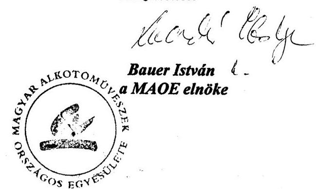

---

# A MAGYAR ALKOTÓMŰVÉSZETI KÖZALAPÍTVÁNY ESZKÖZEI ÉS FORRÁSAI

|  Megnevezés | 1998 | 1999 | 2000 | 2001 | 2002  |
| --- | --- | --- | --- | --- | --- |
|  B. Befektetett eszközök (I+II+III+IV) | 635.7 | 645.4 | 632.6 | 649.7 | 651.0  |
|  I. Immateriális javak | 0.3 | 0.5 | 0.4 | 1.7 | 0.9  |
|  II. Tárgyi eszközök | 225.1 | 254.0 | 266.9 | 284.3 | 287.5  |
|  1. Ingatlanok | 185.7 | 210.8 | 216.6 | 234.8 | 245.3  |
|  2. Műszaki és egyéb berendezések, gépek | 7.5 | 43.2 | 42.5 | 47.5 | 38.6  |
|  3. Beruházások, beruházásokra adott | 31.9 | 0.0 | 7.8 | 2.0 | 3.6  |
|  III. Befektetett pénzügyi eszközök | 410.3 | 390.9 | 365.3 | 363.7 | 362.6  |
|  1. Részesedések | 400.7 | 383.2 | 359.5 | 359.5 | 359.5  |
|  2. Értékpapírok | 0.0 | 0.0 | 0.0 | 0.0 | 0.0  |
|  3. Adott kölcsönök (1. éven túl) | 9.6 | 7.7 | 5.8 | 4.2 | 3.1  |
|  4. Hosszú lejáratú bankbetétek (1. éven túl) |  | 0.0 | 0.0 | 0.0 | 0.0  |
|  IV. Befektetett eszközök értékhelyesbítése |  |  |  | 0.0 | 0.0  |
|  B. Forgóeszközök (I+II+III+IV) | 186.2 | 165.9 | 186.7 | 97.0 | 104.6  |
|  I. Készletek | 40.8 | 40.1 | 38.6 | 38.5 | 38.4  |
|  II. Követelések | 27.7 | 39.4 | 18.4 | 10.6 | 19.0  |
|  1. Követelések áruszállításból és | 17.5 | 19.3 | 14.0 | 3.8 | 17.5  |
|  2. Váltókövetelések |  |  |  | 0.0 | 0.0  |
|  3. Rövid lejáratú kölcsönök |  | 10.6 |  | 4.7 | 0.0  |
|  4. Egyéb követelések | 10.2 | 9.5 | 4.4 | 2.1 | 1.5  |
|  III. Értékpapírok | 80.0 | 68.8 | 106.1 | 38.0 | 29.5  |
|  1. Eladásra vásárolt kötvények |  |  |  |  | 0.0  |
|  2. Saját és eladásra vásárolt részvények |  |  |  |  | 0.0  |
|  3. Egyéb értékpapírok | 80.0 | 68.8 | 106.1 | 38.0 | 29.5  |
|  IV. Pénzeszközök | 37.7 | 17.6 | 23.6 | 9.9 | 17.7  |
|  C. Aktív időbeli elhatárolások | 6.4 | 18.9 | 16.4 | 1.9 | 7.8  |
|  Eszközök összesen (A+B+C) | 828.3 | 830.2 | 835.7 | 748.6 | 763.4  |
|  D. Saját tőke (I+II+III) | 534.4 | 521.0 | 533.7 | 471.7 | 449.4  |
|  I. Induló tőke | 1 292.8 | 1 292.8 | 1 292.8 | 1 292.8 | 1 292.8  |
|  II. Tőkeváltozás | -758.4 | -771.8 | -759.1 | -821.1 | -843.4  |
|  Ebből: tárgyévi eredmény | 0.2 | 25.6 | 12.7 | -62.0 | -22.3  |
|  III. Értékelési tartalék |  |  |  | 0.0 | 0.0  |
|  E. Céltartalék | 12.6 | 11.5 | 9.6 | 0.0 | 0.0  |
|  F. Kötelezettségek (I+II) | 234.8 | 240.8 | 239.2 | 232.1 | 259.3  |
|  I. Hosszú lejáratú kötelezettségek | 140.0 | 210.0 | 210.0 | 210.0 | 210.0  |
|  1. Beruházási és fejlesztési hitelek |  |  |  |  |   |
|  2. Egyéb hosszú lejáratú hitelek | 140.0 | 210.0 | 210.0 | 210.0 | 210.0  |
|  3. Hosszú lejáratra kapott kölcsönök |  |  |  |  |   |
|  4. Egyéb hosszú lejáratú kötelezettségek |  |  |  |  |   |
|  II. Rövid lejáratú kötelezettségek | 94.8 | 30.8 | 29.2 | 22.1 | 49.3  |
|  1. Kötelezettségek áruszállításból és szolg. | 2.8 | 5.6 | 5.9 | 4.0 | 1.5  |
|  2. Rövid lejáratú hitelek és kölcsönök |  |  |  | 0.0 |   |
|  3. Köztartozások (adó, járulék, vám, illeték) |  |  |  | 14.2 |   |
|  3/a. Ebből: 60 napon túl lejárt esedékességű |  |  |  | 0.0 |   |
|  4. Egyéb rövid lejáratú kötelezettségek | 92.0 | 25.2 | 23.3 | 3.9 | 47.8  |
|  G. Passzív időbeli elhatárolások | 46.5 | 56.9 | 53.2 | 44.8 | 54.7  |
|  Források összesen (D+E+F+G) | 828.3 | 830.2 | 835.7 | 748.6 | 763.4  |

Alulírott az Állami Számvevőszékről szóló 1989. évi XXXVIII. törvény 24. § (c) pontja alapján aláírásommal kijelentem, hogy a feltüntetett adatok teljesek és a közalapítvány nyilvántartásával, okmányával mindenben egyeznek.

Budapest, 2003. február 24.

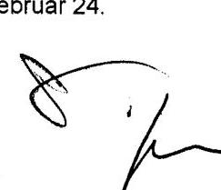

P.H.

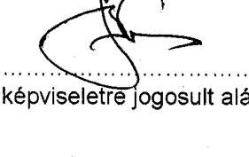

A képviseletre jogosult aláírása

---

# A MAGYAR ALKOTÓMÚVÉSZETI KÖZALAPÍTVÁNY EREDMÉNYKIMUTATÁSA 

| Megnevezés | 1998 | 1999 | 2000 | 2001 | 2002 | Összesen |
| :--: | :--: | :--: | :--: | :--: | :--: | :--: |
| A. Összes (közhasznú) tevékenység bevétele (1-4) |  | 673,5 | 756,8 | 782,6 | 902,2 |  |
| 1. (Közhasznú) célra, múködésre kapott támogatás | 512,6 | 632,6 | 727,9 | 748,2 | 868,3 | 3489,6 |
| a.) alapítótól | 512,5 | 632,5 | 727,9 | 748,2 | 868,3 | 3489,4 |
| b.) államháztartás alrendszeréből |  |  |  |  |  | 0,0 |
| c.) más adományozótól | 0,1 | 0,1 |  |  |  | 0,2 |
| 2. Pályázati úton elnyert támogatás | 163,4 | 3,8 |  |  |  | 167,2 |
| 3. Cél szerinti (közhasznú) tevékenységből származó bevétel | 22,1 | 15,5 | 18,8 | 20,5 | 23,2 | 100,1 |
| 4. Egyéb bevételek (pénzügyi múv. bev., rendkivüli bev.) | 15,1 | 21,6 | 10,1 | 13,9 | 10,7 | 71,4 |
| B. Vállalkozási tevékenység bevétele | 217,2 | 191,0 | 140,7 | 95,3 | 99,3 | 743,5 |
| C. Összes bevétel (A+B) |  | 864,5 | 897,5 | 877,9 | 1001,5 |  |
| D. Cél szerinti (közhasznú) tev. költségei és ráfordításai (1+2) | 868,3 | 769,4 | 846,5 | 903,2 | 994,4 | 4381,8 |
| 1. Cél szerinti tevékenység közvetlen költségei és ráfordításai | 805,5 | 712,1 | 782,0 | 835,5 | 916,8 | 4051,9 |
| 2. Múködési költségek | 62,8 | 57,3 | 64,5 | 67,7 | 77,6 | 329,9 |
| ebből: kezelőszerv - Központi Ig. - közvetlen költsége | 47,6 | 42,9 | 49,2 | 56,3 | 60,8 | 256,8 |
| Kuratórium és Múteremlakás Bizottság | 15,2 | 14,4 | 15,3 | 11,4 | 16,8 | 73,1 |
| E. Vállalkozási tevékenység költségei és ráfordításai | 59,3 | 66,5 | 38,2 | 27,4 | 17,4 | 208,8 |
| F. Összes tevékenység költségei és ráfordításai (D+E) | 927,6 | 835,9 | 884,7 | 930,6 | 1011,8 | 4590,6 |
| G. Adózás előtti eredmény (C - F) | 2,7 | 28,6 | 12,8 | $-52,7$ | $-10,3$ | $-18,9$ |
| H. Adófizetési kötelezettség | 2,5 | 3,0 | 0,1 | 9,3 | 12,0 | 26,9 |
| I. Tárgyévi eredmény (C-F-H) | 0,2 | 25,6 | 12,7 | $-62,0$ | $-22,3$ | $-45,8$ |

Alulírott az Állami Számvevőszékről szóló 1989. évi XXXVIII. törvény 24. § (c) pontja alapján aláírásommal kijelentem, hogy a feltüntetett adatok teljesek és a közalapítvány nyilvántartásaival, okmányaival mindenben egyeznek.
Budapest, 2003. február 24.

---

# A MAGYAR ALKOTÓMŰVÉSZETI KÖZALAPÍTVÁNY BEVÉTELEI

|  Megnevezés | 1998 | 1999 | 2000 | 2001 | 2002  |
| --- | --- | --- | --- | --- | --- |
|  A. Tevékenység célja szerinti bevételek | 713.1 | 673.5 | 756.8 | 782.6 | 902.2  |
|  1. Központi költségvetési támogatás | 512.5 | 632.5 | 727.9 | 748.2 | 868.3  |
|  1.1 ebből: nyugdíj támogatás | 490.0 | 589.3 | 635.5 | 715.7 | 827.0  |
|  1.2 alkotóházak müködtetésére kapott támogatás | 15.0 | 40.7 | 27.7 | 30.3 | 40.1  |
|  1.3 beruházásra (felújításra) kapott költségvetési támogatás | 7.5 | 1.2 | 6.9 |  |   |
|  1.4 pályázattal kapott költségvetési támogatás |  | 1.3 | 1.0 | 2.2 | 1.2  |
|  2. Belföldi értékesítés árbevétele | 1.4 | 0.4 | 2.6 | 3.6 | 4.7  |
|  2.1 ebből: műalkotások árbevétele |  | 0.0 | 2.6 | 0.0 |   |
|  2.2 bérleti díjból származó bevételek |  | 0.0 |  | 0.4 |   |
|  3. Műteremdíj bevétel | 1.3 | 0.0 | 1.5 | 1.4 | 1.3  |
|  4. Egyéb alapítványt célú bevétel | 5.5 | 1.7 | 1.4 | 1.8 | 2.3  |
|  5. Alapítványoktól kapott támogatás | 163.4 | 3.8 | 0.0 | 0.0 |   |
|  6. Gazdasági társaságtól kapott támogatás, adomány | 0.0 | 0.0 | 0.0 | 0.0 |   |
|  7. Magánszemélyektől kapott támogatás, adomány | 0.0 | 0.0 | 0.0 | 0.0 |   |
|  8. Célszerinti tevékenységet szolgáló ingatlanok bevétele | 13.9 | 13.5 | 13.3 | 13.7 | 15.0  |
|  8.1 értékesítéséből származó bevételek | 4.2 | 0.0 |  |  |   |
|  8.2 működtetéséből származó étkezés térítés | 2.9 | 3.5 | 3.9 | 4.3 | 4.6  |
|  8.3 működtetéséből származó szállás térítés | 6.7 | 9.9 | 9.3 | 9.3 | 10.4  |
|  8.4 működtetéséből származó egyéb bevételek | 0.1 | 0.1 | 0.1 | 0.1 |   |
|  9. Ingatlanon kívüli tárgyi eszközök értékesítésének bevétele | 0.0 | 0.0 | 0.0 | 0.0 |   |
|  10. Pénzügyi műveletek bevétele | 13.2 | 15.6 | 9.0 | 6.6 | 2.9  |
|  11. Rendkívüli bevételek | 1.9 | 6.0 | 1.1 | 7.3 | 7.7  |
|  B. Vállalkozási tevékenység bevétele | 217.2 | 191.0 | 140.7 | 95.3 | 99.2  |
|  1. Belföldi értékesítés nettó árbevétele | 85.8 | 96.4 | 74.4 | 62.6 | 72.2  |
|  1.1 ebből: ingatlanok bérleti díja | 50.5 | 70.5 | 68.4 | 61.2 | 70.4  |
|  1.2 szolgáltatások bevétele | 5.9 | 5.3 | 3.9 | 0.9 | 0.9  |
|  1.3 egyéb árbevétel | 29.4 | 20.6 | 2.1 | 0.5 | 0.9  |
|  2. Eszközök értékesítéséből származó bevételek | 43.9 | 7.0 | 4.9 | 2.2 |   |
|  2.1 ebből: ingatlanok értékesítéséből | 4.6 | 4.5 | 4.0 | 2.1 |   |
|  2.2 bérleti jogok értékesítéséből | 39.2 | 2.5 |  |  |   |
|  2.3 egyéb eszközök értékesítéséből | 0.1 |  | 0.9 | 0.1 |   |
|  3. Céltartalék felhasználás | 22.0 | 12.6 | 11.5 | 9.7 |   |
|  4. Pénzügyi műveletek bevételei | 65.4 | 66.0 | 46.5 | 6.8 | 20.5  |
|  4.1 ebből: kapott osztalék | 37.8 | 61.6 | 42.9 | 5.0 | 20.0  |
|  5. Rendkívüli (és egyéb) bevételek | 0.1 | 9.0 | 3.4 | 14.0 | 6.5  |
|  C. Mindösszesen (A+B) | 930.3 | 864.5 | 897.5 | 877.9 | 1 001.4  |

Alulátott az Állami Számvevőszékről szóló 1989. évi XXXVIII. törvény 24. § (c) pontja alapján aláírásommal kijelentem, hogy a feltüntetett adatok teljesek és a közalapítvány nyilvántartásolva, akmányolva mindenben egyeznek.

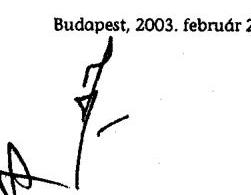

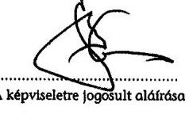

Budapest, 2003. február 24.

A képviseletre jogosult aláírása

---

|  |   |   |   |   |   |   |   |   |   |   |   |   |   |   |   |   |   |   |   |   |   |   |
| --- | --- | --- | --- | --- | --- | --- | --- | --- | --- | --- | --- | --- | --- | --- | --- | --- | --- | --- | --- | --- | --- | --- |
|  Kötte |  |  |  |  |  |  |  |  |  |  |  |  |  |  |  |  |  |  |  |  |  |   |
|  Költ |  |  |  |  |  |  |  |  |  |  |  |  |  |  |  |  |  |  |  |  |  |   |
|  Költ |  |  |  |  |  |  |  |  |  |  |  |  |  |  |  |  |  |  |  |  |  |   |
|  Anyag | jellegü ráfordítások | 22,6 | 4,7 | 8,4 | 35,7 | 21,5 | 6,4 | 6,8 | 34,7 | 23,9 | 6,8 | 4,0 | 34,7 | 30,9 | 5,9 | 0,9 | 37,7 | 50,3 | 22,8 | 3,2 | 76,3 |   |
|  ebből: vásárolt energia |  | 10,6 |  | 1,4 | 12,8 | 7,7 | 0,1 | 1,4 | 9,2 | 7,4 | 0,1 | 1,3 | 9,6 | 9,3 | 0,0 | 0,8 | 10,1 | 10,2 |  | 0,9 | 11,1 |   |
|  olaszási költségek |  | 0,1 |  |  | 0,1 |  |  | 0,1 | 0,1 |  |  | 0,1 | 0,1 | 0,2 |  |  | 0,2 | 0,3 |  | 0,1 | 0,4 |   |
|  poole-, telefon költségek |  | 4,0 | 2,0 | 4,4 | 10,4 | 4,2 | 2,6 | 4,1 | 10,9 | 4,8 | 2,9 | 2,6 | 10,3 | 6,1 | 2,5 | 0,1 | 10,7 | 6,8 | 2,6 | 0,1 | 11,5 |   |
|  nyomtatvány, irodaszor |  | 0,9 | 0,6 | 0,1 | 1,6 | 0,3 | 0,7 |  | 1,0 | 0,4 | 0,6 |  | 1,0 | 0,2 | 0,5 | 0,0 | 0,7 | 0,3 | 0,5 |  | 0,8 |   |
|  élelmiszer költség |  | 2,9 |  |  | 2,9 | 3,2 |  |  | 3,2 | 3,1 |  |  | 3,1 | 3,6 | 0,0 | 0,0 | 3,6 | 3,9 |  |  | 3,9 |   |
|  fenntartási, jav-, karbantart. költségek |  | 1,6 | 0,3 |  | 1,9 | 3,6 | 0,4 |  | 4,0 | 3,4 | 0,3 |  | 3,7 | 5,1 | 0,5 | 0,0 | 5,6 | 3,5 | 0,3 |  | 3,9 |   |
|  eladott áruk beszerzési értéke |  | 0,1 |  | 2,5 | 2,6 |  |  |  | 0,0 | 0,4 |  |  | 0,4 |  |  |  | 0,0 |  |  |  |  | 0,0  |
|  egyéb anyagköltség és anyagjeli. ráf. |  | 2,4 | 1,8 |  | 4,2 | 2,5 | 2,6 | 1,2 | 6,3 | 4,4 | 2,9 |  | 7,3 | 4,4 | 2,4 | 0,0 | 6,8 | 23,3 | 19,4 | 2,1 | 44,8 |   |
|  Személyi jellegű ráfordítások |  | 556,4 | 27,5 | 0,2 | 586,1 | 618,6 | 30,3 | 0,6 | 649,5 | 669,6 | 30,9 | 0,6 | 701,1 | 749,3 | 31,5 | 0,0 | 780,8 | 873,9 | 35,5 | 0,5 | 909,9 |   |
|  ebből: bérköltségek |  | 15,8 | 19,5 | 0,1 | 35,4 | 16,7 | 21,6 | 0,3 | 38,6 | 18,1 | 22,7 | 0,4 | 41,2 | 22,0 | 22,9 | 0,0 | 44,9 | 30,0 | 25,8 | 0,3 | 56,1 |   |
|  megbízási díjak |  | 2,4 |  |  | 2,4 | 1,5 | 0,5 | 0,1 | 2,1 | 3,9 |  |  | 3,9 | 3,3 |  |  | 3,3 | 2,2 | 0,7 |  | 2,9 |   |
|  tiszteletdíjak (kurátorok+FB tagok) |  | 8,4 |  |  | 8,4 | 7,9 |  |  | 7,9 | 8,2 |  |  | 8,2 | 5,2 |  |  | 5,2 | 9,3 |  |  | 9,3 |   |
|  napidíjak |  |  |  |  | 0,0 |  |  |  | 0,0 | 0,2 |  |  | 0,2 |  |  |  |  |  |  |  |  | 0,0  |
|  nyugdíj segély (92.10.01.-ig) |  | 382,2 |  |  | 382,2 | 418,5 |  |  | 418,5 | 442,1 |  |  | 442,1 | 485,1 |  |  | 485,1 | 540,2 |  |  | 540,2 |   |
|  nyugdíj segély |  | 136,4 |  |  | 136,4 | 163,5 |  |  | 163,5 | 185,2 |  |  | 185,2 | 221,8 |  |  | 221,8 | 277,1 |  |  | 277,1 |   |
|  egyéb segélyek |  | 1,5 |  |  | 1,5 | 0,2 |  |  | 0,2 |  |  |  |  | 0,1 |  |  | 0,1 |  |  |  | 0,0 |   |
|  ropnozentációs költségek |  | 0,1 |  |  | 0,1 | 0,1 |  |  | 0,1 | 0,1 |  |  | 0,1 | 0,1 |  |  | 0,1 | 0,2 |  |  | 0,2 |   |
|  egyéb személyi jellegű költségek |  | 0,4 | 0,1 |  | 0,5 | 0,2 | 0,3 |  | 0,5 | 0,2 | 0,2 |  | 0,4 | 0,2 | 0,3 |  | 0,5 | 0,4 | 0,1 | 0,0 | 0,5 |   |
|  személyi jellegű költségek közterhe |  | 11,2 | 7,9 | 0,1 | 19,2 | 10,0 | 7,9 | 0,2 | 10,1 | 11,6 | 8,0 | 0,2 | 19,8 | 11,5 | 8,3 | 0,0 | 19,8 | 14,5 | 8,9 | 0,2 | 23,6 |   |
|  Értékcsökkenési leírás |  | 2,9 | 0,9 | 4,2 | 9,0 | 3,0 | 1,5 | 4,1 | 8,6 | 8,6 | 2,4 | 3,0 | 14,0 | 13,3 | 2,0 | 1,9 | 17,2 | 13,3 | 1,5 | 2,6 | 17,5 |   |
|  Egyéb költségek |  | 16,0 | 14,0 | 9,9 | 39,9 | 11,4 | 14,4 | 11,2 | 37,0 | 13,9 | 15,5 | 9,9 | 38,3 | 31,0 | 16,9 | 0,1 | 38,0 | 0,0 | 0,0 | 0,0 | 0,0 |   |
|  ebből: hirdetési díjak, reklám költségek |  | 1,1 |  |  | 1,1 | 0,3 |  | 0,5 | 0,8 |  |  | 0,0 | 0,9 |  |  | 0,9 |  |  |  |  |  |   |
|  szakértői díjak |  | 0,6 |  |  | 0,6 | 0,3 |  | 0,4 | 0,7 | 1,1 |  |  | 1,1 | 0,9 |  |  | 0,9 |  |  |  |  |   |
|  ingatlanok bérleti díja |  | 4,0 | 3,1 | 1,0 | 8,1 | 2,7 | 3,4 | 0,5 | 6,6 | 4,1 | 3,7 | 0,4 | 8,2 | 4,8 | 3,5 | 0,0 | 8,3 |  |  |  |  |   |
|  egyéb bérleti díjak |  |  | 0,6 |  | 0,6 |  | 0,7 |  | 0,7 |  | 0,7 |  | 0,7 | 0,2 | 0,5 |  | 0,7 |  |  |  |  |   |
|  egyéb szolgáltatás költségek |  | 2,2 | 3,1 | 0,5 | 5,8 | 1,5 | 3,0 | 0,3 | 4,8 | 1,5 | 4,1 | 0,4 | 6,0 | 9,6 | 6,7 | 0,1 | 16,4 |  |  |  |  |   |
|  könyvvizsgálat díja |  |  | 1,9 |  | 1,9 |  | 2,2 |  | 2,2 |  | 1,8 |  | 1,8 |  | 1,9 |  | 1,9 |  |  |  |  |   |
|  bankköltségek |  | 0,1 |  |  | 0,1 | 0,1 |  |  | 0,1 | 0,3 |  |  | 0,3 | 0,1 |  |  | 0,1 |  |  |  |  |   |
|  biztosítási díjak |  | 2,5 | 0,2 |  | 2,7 | 1,9 | 0,2 |  | 2,1 | 2,1 |  | 0,1 | 2,2 | 2,0 |  |  | 2,0 |  |  |  |  |   |
|  jogi képviselet díja |  | 2,3 | 3,4 | 8,4 | 14,1 | 2,6 | 3,6 | 9,5 | 15,7 | 2,7 | 3,9 |  | 6,6 | 3,0 | 4,3 |  | 7,3 |  |  |  |  |   |
|  egyéb költségek |  | 3,2 | 1,7 |  | 4,9 | 2,0 | 1,3 |  | 3,3 | 2,1 | 1,3 |  | 3,4 | 0,3 |  |  | 0,3 |  |  |  |  |   |
|  A MAK által nyújtott támogatások |  | 209,2 |  |  | 209,2 | 70,1 |  |  | 70,1 | 80,4 |  |  | 80,4 | 34,1 |  |  | 34,1 | 0,2 |  |  | 0,2 |   |
|  ebből: MAOE támogatása |  | 27,5 |  |  | 27,5 | 51,5 |  |  | 51,5 | 65,0 |  |  | 65,0 | 33,9 |  |  | 33,9 |  |  |  |  |   |
|  MHB pályázatok |  | 162,8 |  |  | 162,8 | 3,7 |  |  | 3,7 |  |  |  |  |  |  |  | 0,0 |  |  |  |  |   |
|  egyéb támogatások |  | 18,9 |  |  | 18,9 | 14,9 |  |  | 14,9 | 15,4 |  |  | 15,4 | 0,2 |  |  | 0,2 | 0,2 |  |  | 0,2 |   |
|  Egyéb ráfordítások |  | 17,8 | 0,1 | 13,7 | 31,6 | 3,3 |  | 13,3 | 16,8 | 3,4 |  | 16,7 | 20,1 | 3,7 | 0,0 | 18,3 | 22,0 | 2,7 |  | 0,2 | 7,9 |   |
|  ebből:értékesített eszk. könyvszerinti értéke |  | 14,8 |  |  | 14,8 |  |  | 0,2 | 0,2 |  |  |  |  |  |  |  |  |  |  |  |  |   |
|  hitelezési veszteség |  |  |  |  |  |  |  |  | 0,0 | 0,1 |  |  | 0,1 |  |  |  |  |  |  |  |  |   |
|  célbarbátékszzés |  |  |  | 12,5 | 12,5 |  |  | 11,5 | 11,5 |  |  | 9,7 | 9,7 |  |  | 9,7 | 9,7 |  |  |  |  |   |
|  Pénzügyi műveletek ráfordításai |  |  |  | 2,9 | 2,9 |  |  | 7,9 | 7,9 |  |  |  | 0,0 |  |  |  | 0,0 |  |  |  |  | 0,0  |
|  Rendkívüli ráfordítások |  | 5,3 |  | 9,0 | 14,3 | 0,5 |  | 11,0 | 11,5 |  |  | 4,1 | 4,1 |  |  |  | 0,0 |  |  |  | 0,0 |   |
|  ebből hitelezési veszteség |  |  |  | 7,6 | 7,6 | 0,2 |  | 1,0 | 1,2 |  |  |  |  |  |  |  |  |  |  |  |  |   |
|  Költségek és ráfordítások összesen |  |  |  |  |  |  |  |  |  |  |  |  |  |  |  |  |  |  |  |  |  |   |
|  Akárolt az Állami Számvondszékről szóló 1989. évi XXXVIII. törvény 24. § (c) pontja alapján aláírásommal kijelentem, hogy a feltüntetett adatok teljesek és a közalapítvány nyilvántartásaival, |  |  |  |  |  |  |  |  |  |  |  |  |  |  |  |  |  |  |  |  |  |   |
|  |   |   |   |   |   |   |   |   |   |   |   |   |   |   |   |   |   |   |   |   |   |   |
|  Budapest, 2003. február 24. |  |  |  |  |  |  |  |  |  |  |  |  |  |  |  |  |  |  |  |  |  |   |
|  A képviselője jogosult aláírása |  |  |  |  |  |  |  |  |  |  |  |  |  |  |  |  |  |  |  |  |  |   |

---

# A MAGYAR ALKOTÓMŰVÉSZETI KÖZALAPÍTVÁNY INGATLANÁLLOMÁNYA

adatok: millió Ft-ban, egytizedes pontossággal

|  Sorszám | Ingatlan |  | Értékadatok 1996.01.01-jén |  |  | Értékadatok 2002.12.31-én |  |   |
| --- | --- | --- | --- | --- | --- | --- | --- | --- |
|   | címe | rendeltetése | brutto érték | értékcsök
kenés | netto
érték | brutto
érték | értékcsök
kenés | netto
érték  |
|   | Törzsvagyon |  |  |  |  |  |  |   |
|  1. | Galyatető, Mező I. u. 11. | Alkotóház | 1,9 | 0,9 | 1,1 | 4,8 | 1,4 | 3,4  |
|   | Galyatető, Mező I. u. 11. | telek | 1,8 | 0,0 | 1,8 | 1,8 | 0,0 | 1,8  |
|  2. | Kecskemét, Műkert u. 2. | Alkotóház(üzemeltetésbe adva) | 8,9 | 2,8 | 6,1 | 8,9 | 3,9 | 5,0  |
|  3. | Szigliget, Kossuth L. u. 17. | Alkotóház | 14,6 | 10,5 | 4,1 | 62,8 | 14,6 | 48,2  |
|   | Szigliget, Kossuth L. u. 17. | Egyéb építmények |  |  |  | 4,0 | 0,3 | 3,7  |
|  4. | Zsennye, szabadság tér 2-3. | Alkotóház(üzemeltetésbe adva) | 3,1 | 1,0 | 2,1 | 12,9 | 2,4 | 10,5  |
|   | Zsennye, szabadság tér 2-3. | Alkotóház(üzemeltetésbe adva) | 15,0 | 1,8 | 13,1 | 19,5 | 4,3 | 15,2  |
|   | Zsennye, szabadság tér 2-3. | Egyéb építmények |  |  |  | 0,5 | 0,0 | 0,5  |
|   | Törzsvagyonon felül |  |  |  |  |  |  |   |
|  5. | VI. Izabella u. 82. II/17. | műteremlakás | 0,0 | 0,0 | 0,0 | 3,0 | 0,2 | 2,8  |
|  6. | IX. Ipar u. 13. II/3/a. | műteremlakás | 0,0 | 0,0 | 0,0 | 14,7 | 0,3 | 14,4  |
|  7. | X. Szállás u. 4-6. | bérbeadva | 48,7 | 4,9 | 43,8 | 54,9 | 11,0 | 43,9  |
|  8. | X. Barabás u. 25. | lízing szerz. (1993.-2001.09.30.) | 2,0 | 0,9 | 1,1 |  |  |   |
|   | X. Barabás u. 25. |  | 2,0 | 0,0 | 2,0 |  |  |   |
|  9. | XI. Fehérvári út 67/a. | üres | 0,9 | 0,1 | 0,8 | 0,9 | 0,2 | 0,7  |
|  10. | XIII. Reitter F. u.131. | bérbeadva | 1,6 | 0,9 | 0,7 | 1,6 | 1,1 | 0,5  |
|  11. | XIII. Szt.László u.120. | eladva 1994. | 119,5 | 23,7 | 95,8 |  |  |   |
|   | XIII. Szt.László u.120. | eladva 1994. | 28,6 | 9,3 | 19,3 |  |  |   |
|  12. | XIV. Olof Palme.sétány. 1. | bérbeadva | 0,0 | 0,0 | 0,0 | 0,0 | 0,0 | 0,0  |
|  13. | XXI. Védgát u. 43. | eladva 1998. | 16,1 | 1,1 | 15,0 |  |  |   |
|  14. | Balatonföldvár, József u. 10-15. | bérbeadva | 2,1 | 1,1 | 1,0 | 2,1 | 1,3 | 0,8  |
|  15. | Balatonfüred, Petőfi S. u. 36. | bérbeadva | 2,9 | 0,3 | 2,6 | 3,0 | 0,7 | 2,3  |
|  16. | Balatonszemes, Bagolyvár u. 9. | bérbeadva | 1,5 | 0,5 | 1,0 | 1,4 | 0,7 | 0,7  |
|  17. | Dunaharaszti, Fő u. 10. | bérbeadva | 13,0 | 3,8 | 9,2 | 13,1 | 5,4 | 7,7  |
|   | Dunaharaszti, Fő u. 10. | bérbeadva | 8,3 | 3,2 | 5,1 | 8,3 | 4,4 | 3,9  |
|  18. | Hédervár, Felszabadulás u. 47. | bérbeadva | 62,3 | 5,7 | 56,6 | 62,3 | 13,2 | 49,1  |
|   | Hédervár, Felszabadulás u. 47. | telek | 8,2 | 0,0 | 8,2 | 8,2 | 0,0 | 8,2  |
|   | Hédervár, Felszabadulás u. 47. | vagyoni értékű jog |  |  |  | 1,2 | 0,1 | 1,1  |
|  19. | Hódmezővásárhely, Kohán u. 1. | Kollektív műterem | 2,1 | 0,2 | 1,9 | 2,1 | 0,5 | 1,6  |
|   | Hódmezővásárhely, Kohán u. 1. | telek | 0,8 | 0,0 | 0,8 | 0,8 | 0,0 | 0,8  |
|  20. | Hódmezővásárhely, Virág u. 3. | Alkotóház | 0,4 | 0,2 | 0,2 | 1,6 | 0,3 | 1,3  |
|  21. | Mártély, Vásárhelyi P. u. | Alkotóház | 1,5 | 0,4 | 1,1 | 3,6 | 0,7 | 2,9  |
|  22. | Nagymaros, Hrsz: 13302 | telek | 1,1 | 0,0 | 1,1 | 1,1 | 0,0 | 1,1  |
|  23. | Siófok, Somogyi u. 4.(Bacsó B. u. 13.) | üres | 5,0 | 0,0 | 5,0 | 5,0 | 0,9 | 4,1  |
|   | Átvitel: |  | 377,9 | 74,3 | 303,6 | 304,1 | 67,9 | 236,2  |

---

|  Sor-
szám | Ingatlan |  | Értékadatok 1996.01.01-jén |  |  | Értékadatok 2002.12.31-én |  |   |
| --- | --- | --- | --- | --- | --- | --- | --- | --- |
|   |  |  | bruttó
érték | értékcsök
kenés | nettó
érték | bruttó
érték | értékcsök
kenés | nettó
érték  |
|  24. | Sütő, Kiserdő stny. 12. | bérbeadva | 1,9 | 0,5 | 1,4 | 1,9 | 0,7 | 1,2  |
|   | Sütő, Kiserdő stny. 12. | bérbeadva | 1,9 | 0,5 | 1,4 | 1,9 | 0,8 | 1,1  |
|   | Sütő, Kiserdő stny. 12. | telek | 0,1 | 0,0 | 0,1 | 0,1 | 0,0 | 0,1  |
|  25. | Szentendre, Fő tér 20. | bérbeadva | 1,7 | 1,1 | 0,6 | 1,7 | 1,7 | 0,0  |
|  26. | Szentendre, Bogdányi u. 51. | Művésztelep | 10,1 | 3,5 | 6,6 | 10,3 | 4,7 | 5,6  |
|  27. | Budapesti Kollektív Múterem | bérelt ingatlanon végzett ber. |  |  |  | 1,7 | 0,6 | 1,1  |
|   | Összesen: |  | 389,7 | 78,9 | 310,8 | 321,7 | 76,4 | 245,3  |

Alulírott az Állami Számvevőszékről szóló 1989. évi XXXVIII. törvény 24. § (c) pontja alapján aláírásommal kijelentem, hogy a feltüntetett adatok teljesek és a közalapítvány nyilvántartásaival, okmányaival mindenben egyeznek.

Budapest, 2003. február 24.

P.H.

A képviseletre jogosult aláírása

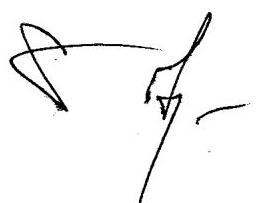

---

# A MAGYAR ALKOTÓMŰVÉSZETI KÖZALAPÍTVÁNY INGATLAN BÉRLETI JOGAI

adatok: millió Ft-ban, egytizedes pontossággal

|  Sor-
szám | Bérleti jog címe | 1996. 01. 01-jén |  | 2002.12. 31-én |  | Változás |   |
| --- | --- | --- | --- | --- | --- | --- | --- |
|   |  | rendeltetése | alapterület, m2 | rendeltetése | alapterület, m2 | éve | jogcíme  |
|  1. | I. Úri u. 26.-28. | albérletbe adva | 192 |  |  | 1996. | eladás  |
|  2. | V. Báthori u. 10. | MAK iroda | 738 | MAK iroda | 209 |  |   |
|  3. | V. Haris köz 6. | albérletbe adva | 65 |  |  | 1996. | eladás  |
|  4. | V. Kálmán u. 16. | MAK-FIS | 352 | MAK-tervtár, műhely | 257 |  |   |
|  5. | V. Károly krt. 22. | Grafikai Galéria | 27 |  |  | 1999. | eladás  |
|  6. | V. Képiró u. 6. | FKSE Galéria | 74 | FKSE Galéria | 74 |  |   |
|  7. | V. Kossuth L. u. 17. | albérletbe adva | 206 |  |  | 1997. | eladás  |
|  8. | V. Semmelweis u. 14. | üres | 1036 |  |  | 1998. | eladás  |
|  9. | V. Szép u. 5. | albérletbe adva | 293 |  |  | 1998. | Képcsamok-Inwestbe apportként.  |
|  10. | VI. Aradi u. 59. | üres | 88 |  |  | 1998. | Önk.-nak visszaadva  |
|  11. | VI. Hajós u. 39. | üres | 519 |  |  | 1997. | eladás  |
|  12. | VI. Székely B. u. 3. | üres | 51 |  |  | 1998. | Önk.-nak visszaadva  |
|  13. | VI. Szondy u. 98/a. | üres | 98 |  |  | 1996. | eladás  |
|  14. | VIII. József u. 36. | üres | 427 |  |  | 1998. | eladás  |
|  15. | VIII. József u. 38. | üres | 92 |  |  | 1998. | Önk.-nak visszaadva  |
|  16. | IX. Sobieski J. u. 5., | üres | 76 |  |  | 1998. | Önk.-nak visszaadva  |
|  17. | IX. Tűzoltó u. 27/b. | üres | 48 |  |  | 1999. | Önk.-nak visszaadva  |
|  18. | XIII. Lehel u. 14. | Kollektív Műt. | 270 | Koll. Műterem | 270 |  |   |
|  19. | XIII. Pannónia u. 95. | Duna Galéria | 173 | Duna Galéria | 173 |  |   |
|  20. | XIII. Váci út 131-133. | albérletbe adva | 142 |  |  | 1996. | eladás  |
|  |   |   |   |   |   |   |   |
|  |   |   |   |   |   |   |   |

Alulírott az Állami Számvevőszékről szóló 1989. évi XXXVIII. törvény 24. § (c) pontja alapján aláírásommal kijelentem, hogy a feltüntetett adatok teljesek és a közalapítvány nyilvántartásaival, okmányaival mindenben sovernek.

MAGYAR ALKOTÓMŰVÉSZETI KÖZALAPÍTVÁNY

Budapest, 2003. február 24.

P.H.

A képviselőt megosult aláírása

---

# A MAGYAR ALKOTÓMŰVÉSZETI KÖZALAPÍTVÁNY BERUHÁZÁSAI, KARBANTARTÁSAI

adatok: millió Ft-ban, egytizedes pontossággal

|  Sorszám | Megnevezés | 1996 | 1997 | 1998 | 1999 | 2000 | 2001 | 2002 | Összesen  |
| --- | --- | --- | --- | --- | --- | --- | --- | --- | --- |
|  1. | Aktivált beruházások | 3,8 | 12,7 | 3,8 | 66,1 | 18,8 | 41,5 | 3,4 | 150,1  |
|  2. | Ebből: ingatlanok | 0,0 | 11,7 | 3,3 | 27,1 | 11,1 | 26,1 | 2,2 | 81,5  |
|  3. | üzemi gépek, berendezések | 3,7 | 0,3 | 0,1 | 36,0 | 0,6 | 14,8 | 0,7 | 56,2  |
|  4. | egyéb tárgyi eszközök | 0,1 | 0,7 | 0,4 | 3,0 | 7,1 | 0,6 | 0,5 | 12,4  |
|  5. | Befejezetlen beruházások, felújítások | 1,1 | 11,8 | 31,9 | 0,0 | 7,8 | 2,0 | 1,6 | 1,1  |
|  6. | Ebből: ingatlanok | 1,1 | 11,8 | 31,9 | 0,0 | 7,8 | 2,0 | 1,6 | 1,1  |
|  7. | üzemi gépek, berendezések | 0,0 | 0,0 | 0,0 | 0,0 | 0,0 | 0,0 |  | 1,1  |
|  8. | egyéb tárgyi eszközök | 0,0 | 0,0 | 0,0 | 0,0 | 0,0 | 0,0 |  | 1,1  |
|  9. | Karbantartások és állagmegóvó javítások | 3,8 | 3,7 | 1,9 | 4,0 | 3,7 | 5,6 | 3,8 | 26,5  |

Alulírott az Állami Számvevőszékről szóló 1989. évi XXXVIII. törvény 24. § (c) pontja alapján aláírásommal kijelentem, hogy a feltüntetett adatok teljesek és a közalapítvány nyilvántartásaival, okmányaival mindenben egyeznek.

## MAGYAR ALKOTÓMŰVÉSZETI

KÖZALAPÍTVÁNY

Budapest, 2003. február 21. P.H.

A képviseletre jogosult aláírása

---

A Magyar Alkotóművészeti Közalapítvány törzsvagyonát képező alkotóházak beruházási, karbantartási adatai adatok: millió Ft-ban, egytizedes pontossággal

|  Sorszám | Alkotóházak | 1996 | 1997 | 1998 | 1999 | 2000 | 2001 | 2002 | Összesen  |
| --- | --- | --- | --- | --- | --- | --- | --- | --- | --- |
|  1 | Szigligeti alkotóház |  |  |  |  |  |  |  |   |
|  a | aktivált beruházás | 0,0 | 0,0 | 0,0 | 56,5 | 5,1 | 40,8 | 0,8 | 103,2  |
|  b | aktivált felújítás |  |  |  |  |  |  |  | 0,0  |
|  c | befejezetlen beruházás, felujitás | 0,0 | 11,6 | 29,0 | 0,0 | 7,4 | 1,0 |  |   |
|  d | karbantartás, javitás | 0,4 | 0,2 | 0,8 | 0,2 | 0,5 | 3,3 | 2,0 | 7,4  |
|  2 | Zsennyei alkotóház |  |  |  |  |  |  |  |   |
|  a | aktivált beruházás | 0,0 | 11,1 | 0,1 | 3,6 | 0,2 | 0,0 | 0,6 | 15,6  |
|  b | aktivált felújítás |  |  |  |  |  |  |  | 0,0  |
|  c | befejezetlen beruházás, felujitás | 1,0 | 0,1 | 2,2 | 0,0 | 0,0 | 0,0 |  |   |
|  d | karbantartás, javitás | 0,5 | 0,2 | 0,0 | 1,3 | 2,0 | 0,0 |  | 4,0  |
|  3 | Galyatetői alkotóház |  |  |  |  |  |  |  |   |
|  a | aktivált beruházás | 0,0 | 0,9 | 1,1 | 1,0 | 0,0 | 0,0 | 0,3 | 3,3  |
|  b | aktivált felújítás |  |  |  |  |  |  |  | 0,0  |
|  c | befejezetlen beruházás, felujitás | 0,0 | 0,0 | 0,7 | 0,0 | 0,0 | 0,0 |  |   |
|  d | karbantartás, javitás | 0,0 | 0,0 | 0,0 | 0,0 | 0,3 | 0,0 |  | 0,3  |
|  4 | Kecskeméti alkotóház |  |  |  |  |  |  |  |   |
|  a | aktivált beruházás | 0,6 | 0,0 | 0,0 | 0,0 | 0,0 | 0,0 |  | 0,6  |
|  b | aktivált felújítás |  |  |  |  |  |  |  | 0,0  |
|  c | befejezetlen beruházás, felujitás | 0,0 | 0,0 | 0,0 | 0,0 | 0,0 | 0,0 |  |   |
|  d | karbantartás, javitás | 0,3 | 0,2 | 0,0 | 0,0 | 0,0 | 0,0 |  | 0,5  |
|  5 | Alkotóházak összesen |  |  |  |  |  |  |  |   |
|  a | aktivált beruházás | 0,6 | 12,0 | 1,2 | 61,1 | 5,3 | 40,8 | 1,7 | 122,7  |
|  b | aktivált felújítás | 0,0 | 0,0 | 0,0 | 0,0 | 0,0 | 0,0 |  | 0,0  |
|  c | befejezetlen beruházás, felujitás | 1,0 | 11,7 | 31,9 | 0,0 | 7,4 | 1,0 |  |   |
|  d | karbantartás, javitás | 1,2 | 0,6 | 0,8 | 1,5 | 2,8 | 3,3 | 2,0 | 12,2  |

Alulírott az Állami Számvevőszékről szóló 1989. évi XXXVIII. törvény 24. § (c) pontja alapján aláírásommal kijelentem, hogy a feltüntetett adatok teljesek és a közalapítvány nyilvántartásaival, okmányaival mindenben egyeznek.

Budapest, 2003. február 24.

---

# A MAGYAR ALKOTÓMÚVÉSZETI KÖZALAPÍTVÁNY INGATLAN-, ÉS BÉRLETI JOG ÉRTÉKESÍTÉSE 1996-2002. ÉVEKBEN

adatok: millió Ft-ban, egytizedes pontossággal

|  Sorszám | Ingatlan címe és rendeltetése | Értékesítés éve | Könyv szerinti érték | Becsült érték | Eladási ár (ÁFA nélkül) | Befolyt összeg | Megjegyzés  |
| --- | --- | --- | --- | --- | --- | --- | --- |
|   | MAK tulajdonjog értékesítés |  |  |  |  |  |   |
|  1. | XXI. Védgát u. 43. | 1998. | 14,6 | 4,5 | 4,2 | 4,2 |   |
|  2. | XIII. Szent László u. 120. | 1994. | 112,6 | 163,0 | 171,0 | 48,0 | Áthúzódó részletfiz.  |
|  3. | X. Barabás u. 25. (lízing) | 1993. | 2,1 | 19,5 | 36,0 | 24,4 | Áthúzódó részletfiz.  |
|   | Összesen: |  | 129,3 | 187,0 | 211,2 | 76,6 |   |
|   | Bérleti jog értékesítés |  |  |  |  |  |   |
|  1. | I. Úri u. 26.-28. | 1996. |  | 18,4 | 30,4 | 30,4 |   |
|  2. | V. Haris köz. 6. | 1996. |  | 17,6 | 20,0 | 20,0 |   |
|  3. | V. Kossuth L. u. 17. | 1997. |  | 23,2 | 28,4 | 28,4 |   |
|  4. | V. Semmelweis u. 14. | 1998. |  | 31,0 | 38,0 | 38,0 |   |
|  5. | V. Károly krt. 22. | 1999. |  | 3,1 | 2,5 | 2,5 |   |
|  6. | VI. Hajós u. 39. | 1997. |  | 10,4 | 10,7 | 10,7 |   |
|  7. | VI. Szondy u. 98/a. | 1996. |  | 1,5 | 1,5 | 1,5 |   |
|  8. | VI. József u. 36. | 1998. |  | 3,5 | 1,2 | 1,2 |   |
|  9. | XIII. Váci út 131-133. | 1996. |  | 1,3 | 1,4 | 1,4 |   |
|  10. | V. Szép u. 5. (90 %-os üzletrész értékesítés) | 1998. |  | 11,5 | 21,0 | 21,0 |   |
|  11. | Összesen: |  |  | 121,5 | 155,1 | 155,1 |   |
|   | Mindösszesen: |  |  | 308,5 | 366,3 | 231,7 |   |

Alulírott az Állami Számvevőszékről szóló 1989. évi XXXVIII. törvény 24. § (c) pontja alapján aláírásommal kijelentem, hogy a feltüntetett adatok teljesek és a közalapítvány nyilvántatásaival, okmányaival mindenben egyeznek. Budapest, 2003. február 24.

P.H. MAGYAR ALKOTÓMÚVÉSZETI KÖZALAPÍTVÁNY

A képviselőtt-ogóosult aláírása

---

# A MAGYAR ALKOTÓMŰVÉSZETI KÖZALAPÍTVÁNY RÉSZESEDÉSEI GAZDASÁGI TÁRSASÁGOKBAN 1996-2002. években

|  Sorszám | Társaság megnevezése | 1996. 01. 01-jén |  |  |  | Változás |  | 2002. 12. 31-én |  |  |   |
| --- | --- | --- | --- | --- | --- | --- | --- | --- | --- | --- | --- |
|   |  | Tulajdoni hányad (\%) | Bekerülési érték | Erték-
vesztés | Könyv szerinti érték | éve | Jogcíme | Tulajdoni hányad (\%) | Bekerülési érték | Ertékvesztés | Könyv szerinti érték  |
|  1. | Art Export Fft. | 16,98 | 3,6 | 0,0 | 3,6 |  |  | 16,98 | 3,6 | 0,0 | 3,6  |
|  2. | Artholding Rt. | 100,00 | 10,0 | 0,0 | 10,0 | 1999. | végelszámolás bef. |  |  |  |   |
|  3. | Art Line Kft. | 97,77 | 9,7 | $-9,7$ | 0,0 | 1999. | felszámolás bef. |  |  |  |   |
|  4. | Artplast Leánybváll. | 100,00 | 52,5 | $-47,6$ | 4,9 | 1996. | felszámolás bef. |  |  |  |   |
|  5. | Art Profit Kft. | 90,48 | 5,7 | $-5,7$ | 0,0 | 2001. | felszámolás bef. |  |  |  |   |
|  6. | Art Trade Kft. | 48,00 | 1,4 | $-1,3$ | 0,1 | 2000. | eladás |  |  |  |   |
|  7. | Budapest Grafika Kft. | 10,68 | 3,0 | $-0,8$ | 2,2 | 1998. | felszámolás bef. |  |  |  |   |
|  8. | Bútor Art Kft. | 99,45 | 18,1 | $-14,2$ | 3,9 | 1996. | végelszámolás bef. |  |  |  |   |
|  9. | Emlékmú Kft. | 50,00 | 0,5 | 0,0 | 0,5 | 1999. | hivatalból törölve |  |  |  |   |
|  10. | Fénypont 90 Kft. | 80,00 | 2,4 | $-1,3$ | 1,1 | 2000. | hivatalból törölve |  |  |  |   |
|  11. | Hungária Gobelin Kft. | 100,00 | 1,0 | 0,0 | 1,0 | 2001. | hivatalból törölve |  |  |  |   |
|  12. | Hungart Kft. | 100,00 | 10,0 | $-10,0$ | 0,0 | 1999. | végelszámolás bef. |  |  |  |   |
|  13. | Idea Bau Kft. | 77,50 | 3,1 | $-2,2$ | 0,9 | 2000. | hivatalból törölve |  |  |  |   |
|  14. | Idea Ferr Kft. | 70,00 | 4,2 | $-4,2$ | 0,0 | 1999. | felszámolás bef. |  |  |  |   |
|  15. | Idea Iparművészeti Lv. | 100,00 | 21,7 | $-21,7$ | 0,0 | 2000. | felszámolás bef. |  |  |  |   |
|  16. | Idea Kolor Kft. | 90,91 | 1,1 | $-1,1$ | 0,0 | 1997. | végelszámolás bef. |  |  |  |   |
|  17. | Idea Korona Kft. | 96,30 | 2,7 | $-2,3$ | 0,4 | 1998. | végelszámolás bef. |  |  |  |   |
|  18. | Idea Mikron Kft. | 90,91 | 5,0 | $-5,0$ | 0,0 | 1997. | eladás |  |  |  |   |
|  19. | Idea Nyírfúcsika Kft. | 92,42 | 2,4 | $-2,4$ | 0,0 | 1995. | felszámolás alatt | 92,42 | 2,4 | $-2,4$ | 0,0  |
|  20. | Idea Stella Kft. | 90,91 | 2,0 | 0,0 | 2,0 | 1998. | végelszámolás bef. |  |  |  |   |
|  21. | Idea Szol Kft. | 70,00 | 4,2 | $-4,2$ | 0,0 | 1997. | felszámolás bef. |  |  |  |   |
|  22. | Idea Textilnyomó Kft. | 98,18 | 10,8 | $-10,8$ | 0,0 | 2000. | hivatalból törölve |  |  |  |   |
|  23. | Idea Tours Kft. | 50,00 | 18,0 | $-18,0$ | 0,0 | 1997. | felszámolás bef. |  |  |  |   |
|  24. | Képcsarnok Rt./Kft. | 100,00 | 233,0 | 0,0 | 233,0 |  |  | 100 | 233,0 | 0,0 | 233,0  |
|  25. | Képcsarnok Inwest Kft. |  |  |  |  | 1997. | alapítás | 10 | 0,3 | 0,0 | 0,3  |
|  26. | Képzőművészeti Kiadó Kft | 100,00 | 205,6 | $-181,7$ | 23,9 | 2000. | végelszámolás bef. |  |  |  |   |
|  27. | Novoprint Rt. | 41,52 | 123,3 | $-0,7$ | 122,6 |  |  | 41,52 | 123,3 | $-0,7$ | 122,6  |
|  28. | Pollux Kft. | 49,77 | 2,2 | $-2,2$ | 0,0 | 2000. | felszámolás bef. |  |  |  |   |
|  29. | Sortiment Art Kft. | 94,00 | 9,1 | $-5,8$ | 3,3 | 2000. | hivatalból törölve |  |  |  |   |
|  30. | Stein Kft. | 84,52 | 2,7 | $-2,7$ | 0,0 | 1997. | felszámolás bef. |  |  |  |   |
|  31. | Superfine Designe Kft. | 66,44 | 2,0 | $-2,0$ | 0,0 | 1997. | felszámolás bef. |  |  |  |   |
|  32. | Thoma és Társai Kft. | 49,68 | 0,8 | $-0,1$ | 0,7 | 2002. | végelszámolás kezd. | 49,68 | 0,8 | $-0,8$ | 0,0  |
|  33. | Tradex Kft. | 8,89 | 0,2 | $-0,2$ | 0,0 | 1998. | felszámolás bef. |  |  |  |   |
|  34. | Varia Art Kft. | 80,00 | 0,8 | $-0,6$ | 0,2 | 2000. | felszámolás bef. |  |  |  |   |
|  Összesen |  | 772,8 | $-358,5$ | 414,3 |  |  |  | 363,4 | $-3,9$ | 359,5 |   |

Alulírott az Állami Számvevőszékről szóló 1989. évi XXXVIII. törvény 24. § (c) pontja alapján aláírásommal kijelentem, hogy a feltüntetett adatok teljesek és a közalapítvány nyilvántartásaival, okmányaival mindenben egyeznek.

## MAGYAR ALKOTÓMŰVÉSZETI

KÖZALAPÍTVÁNY Budapest, 2002. február 24 P.H.

---

# A MAGYAR ALKOTÓMŰVÉSZETI KÖZALAPÍTVÁNY MEGSZŰNT RÉSZESEDÉSEINEK FŐBB ADATAI 1996-2002.ÉVEKBEN

|  Sorszá m | Társaság megnevezése | Részesedés értékvesztése | Részesedés könyv szerinti értéke | Eladási ár/ megtérülés | Hitelezési veszteség és egyéb ráford. | Kivezetés éve  |
| --- | --- | --- | --- | --- | --- | --- |
|   |  |  | értékesítés- | felszámolás- | Végelszámolás- |   |
|   |  |  | kor | kor | múláskor | törléskor  |
|  1. | Artholding Rt. | 0,0 |  |  | 10,0 |   |
|  2. | Art Line Kft. | 0,0 |  | 0,0 |  |   |
|  3. | Artplast Leányvállalt | 0,0 |  | 4,9 |  |   |
|  4. | Art Profit Kft. | 0,0 |  | 0,0 |  |   |
|  5. | Art Trade Kft. | 0,0 | 0,1 |  |  |   |
|  6. | Budapest Grafika Kft. | 2,2 |  | 0,0 |  |   |
|  7. | Bútor Art Kft. | 0,0 |  |  | 3,9 |   |
|  8. | Emlékmű Kft. | 0,0 |  |  |  | 0,5  |
|  9. | Fénypont 90 Kft. | 1,1 |  |  |  | 0,0  |
|  10. | Hungária Gobelin Kft. | 1,0 |  |  |  | 0,0  |
|  11. | Hungart Kft. | 0,0 |  |  | 0,0 |   |
|  12. | Idea Bau Kft. | 0,9 |  |  |  | 0,0  |
|  13. | Idea Ferr Kft. | 0,0 |  | 0,0 |  |   |
|  14. | Idea Iparművészeti Lv. | 0,0 |  | 0,0 |  |   |
|  15. | Idea Kolor Kft. | 0,0 |  |  | 0,0 |   |
|  16. | Idea Korona Kft. | 0,0 |  |  | 0,4 |   |
|  17. | Idea Mikron Kft. | 0,0 | 0,0 |  |  |   |
|  18. | Idea Stella Kft. | 1,9 |  |  | 0,1 |   |
|  19. | Idea Szol Kft. | 0,0 |  | 0,0 |  |   |
|  20. | Idea Textilnyomó Kft. | 0,0 |  |  |  | 0,0  |
|  21. | Idea Tours Kft. | 0,0 |  | 0,0 |  |   |
|  22. | Képzőművészeti Kiadó Kft. | 0,0 |  |  | 23,9 |   |
|  23. | Pollux Kft. | 0,0 |  | 0,0 |  |   |
|  24. | Sortimment Art Kft. | 3,3 |  |  |  | 0,0  |
|  25. | Stein Kft. | 0,0 |  | 0,0 |  |   |
|  26. | Superline Design Kft. | 0,0 |  | 0,0 |  |   |
|  27. | Tradex Kft. | 0,0 |  | 0,0 |  |   |
|  28. | Varia Art Kft. | 0,2 |  | 0,0 |  |   |
|   | Összesen: | 10,6 | 0,1 | 4,9 | 38,3 | 0,5  |

**MAGYAR ALKOTÓMŰVÉSZETI KÖZALAPÍTVÁNY**

A kiépviseletre jogosult aláírása

Alulírott az Állami Számvevőszékről szóló 1989. évi XXXVIII. törvény 24. § (c) pontja alapján aláírásommal kijelentem, hogy a feltüntetett adatok teljesek és a közalapítvány nyilvántartásaival, okmányaival mindenben egyeznek.

Budapest, 2002. február 24.

P.H.

A képviseletre jogosult aláírása

---

# A MAGYAR ALKOTÓMŰVÉSZETI KÖZALAPÍTVÁNY NYUGDÍJ ÉS KÖZPONTI KÖLTSÉGVETÉSI TÁMOGATÁS ELSZÁMOLÁSA

|  Év | 1992. október 1-ig nyugdíj jogosultságot szerzett alkotóművészek nyugellátása |  |  |  | 1992. október 1-je után nyugdíj jogosultságot szerzett alkotóművészek nyugellátása |  |  |  | Nyugdíj kifizetés összesen |  | Fedezet összesen |  | Állami támogatás közelígtá ványi célokra  |
| --- | --- | --- | --- | --- | --- | --- | --- | --- | --- | --- | --- | --- | --- |
|   | Létszám (fő) | Kifizetett összeg | Fedezet |  | Létszám (fő) | Kifizetett összeg | Fedezet |  | Létszám (fő) | Kifizetett összeg | Állami támogatás | MAK saját forrása |   |
|   |  |  | Állami támogatás | Saját forrás |  |  | Állami támogatás | Saját forrás |  |  |  |  |   |
|  1998 | 1 307 | 382,2 | 385,5 | 0,0 | 621 | 136,4 | 104,5 | 34,1 | 1 928 | 518,6 | 490,0 | 34,1 | 535,0  |
|  1999 | 1 240 | 418,5 | 423,0 | 0,0 | 681 | 163,4 | 166,3 | 0,0 | 1 921 | 581,9 | 589,3 | 0,0 | 630,0  |
|  2000 | 1 171 | 442,1 | 447,1 | 0,0 | 662 | 185,2 | 188,4 | 0,0 | 1 833 | 627,3 | 635,5 | 0,0 | 720,0  |
|  2001 | 1 105 | 485,1 | 490,2 | 0,0 | 734 | 221,8 | 225,5 | 0,0 | 1 839 | 706,9 | 715,7 | 0,0 | 800,0  |
|  2002 | 1 044 | 540,2 | 545,6 | 0,0 | 788 | 277,1 | 281,4 | 0,0 | 1 832 | 817,3 | 827,0 | 0,0 | 990,0  |
|  Összes |  | 2 268,1 | 2 291,4 | 0,0 |  | 983,9 | 966,1 | 34,1 |  | 3 252,0 | 3 257,5 | 34,1 | 3 675,0  |

Alulírott az Állami Számvevőszékről szóló 1989. évi XXXVIII. törvény 24. § (c) pontja alapján aláírásommal kijelentem, hogy a feltüntetett adatok teljesek és a közalapítvány nyilvántartásaival, okmányával mindenben egyeznek.

Megjegyzés: Fedezet - ellentétben a kifizetett összeggel - a kapcsolódó költségeket is tartalmazza

Budapest, 2003. február 24

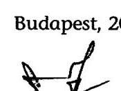

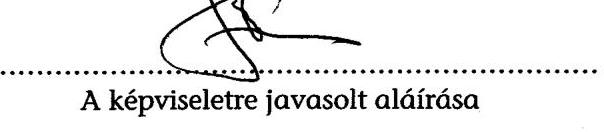

A képviseletre javasolt aláírása

---

# A KÉPCSARNOK KFT. ESZKÖZEI ÉS FORRÁSAI 

adatok: millió Ft-ban, egytizedes pontossággal

| Sorsz. | Megnevezés | 1998 | 1999 | 2000 | 2001 | 2002 |
| :--: | :--: | :--: | :--: | :--: | :--: | :--: |
| 1. | A. Befektetett eszközök | 273,4 | 265,2 | 253,8 | 301,5 | 292,0 |
| 2. | I. Immateriális javak | 43,9 | 35,3 | 26,1 | 0,2 | 0,3 |
| 3. | Vagyoni értékú jogok | 43,8 | 35,0 | 25,9 | 0,0 |  |
| 4. | Szellemi termékek | 0,1 | 0,3 | 0,2 | 0,2 | 0,3 |
| 5. | II. Tárgyi eszközök | 199,0 | 199,6 | 193,9 | 267,7 | 258,0 |
| 6. | Ingatlanok, vagyoni értékủ jogok | 196,8 | 196,3 | 192,0 | 266,0 | 256,2 |
| 7. | Müszaki berend., gépek, jármüvek | 1,5 | 2,6 | 1,3 | 1,2 | 1,4 |
| 8. | Egyéb berend., gépek, jármüvek | 0,7 | 0,7 | 0,6 | 0,5 | 0,4 |
| 9. | III. Befektetett pénzügyi eszközök | 30,5 | 30,3 | 33,8 | 33,6 | 33,7 |
| 10. | Részesedések | 30,0 | 30,0 | 33,6 | 33,6 | 33,6 |
| 11. | Adott kölcsönök | 0,5 | 0,3 | 0,2 | 0,0 | 0,1 |
| 12. | B. Forgóeszközök | 29,1 | 44,9 | 100,6 | 90,1 | 82,5 |
| 13. | I. Készletek | 10,3 | 8,5 | 9,2 | 6,6 | 6,2 |
| 14. | II. Követelések | 6,2 | 10,8 | 33,4 | 33,3 | 15,9 |
| 15. | III. Értékpapírok | 0,0 | 0,0 | 15,3 | 17,2 | 18,3 |
| 16. | IV. Pénzeszközök | 12,6 | 25,6 | 42,7 | 33,0 | 42,1 |
| 17. | C. Aktív időbeli elhatárolások | 0,9 | 3,7 | 9,0 | 1,5 | 0,7 |
| 18. | ESZKÖZÖK ÖSSZESEN | 303,4 | 313,8 | 363,4 | 393,1 | 375,2 |
| 19. | D. Saját tőke | 265,8 | 280,5 | 294,3 | 313,3 | 330,9 |
| 20. | I. Jegyzett tőke | 180,0 | 180,0 | 180,0 | 180,0 | 180,0 |
| 21. | II. Jegyzett, de még be nem fizetett tőke - | 0,0 | 0,0 | 0,0 | 0,0 |  |
| 22. | III. Töketartalék | 54,7 | 54,7 | 54,7 | 54,7 | 54,7 |
| 23. | IV. Eredménytartalék | 31,1 | 25,8 | 25,8 | 56,3 | 78,6 |
| 24. | V. Értékelési tartalék | 0,0 | 0,0 | 0,0 | 0,0 |  |
| 25. | VI. Mérleg szerinti eredmény | 0,0 | 0,0 | 33,8 | 22,3 | 17,6 |
| 26. | E. Céltartalékok | 0,6 | 1,9 | 2,9 | 0,0 | 0,0 |
| 27. | F. Kötelezettségek | 29,6 | 42,4 | 64,1 | 71,0 | 36,1 |
| 28. | I. Hosszú lejáratú kötelezettségek | 8,2 | 1,4 | 0,0 | 0,0 | 10,0 |
| 29. | II. Rövid lejáratú kötelezettségek | 21,4 | 41,0 | 64,1 | 71,0 | 26,1 |
| 30. | G. Passzív időbeli elhatárolások | 7,4 | 9,0 | 2,1 | 8,8 | 8,2 |
| 31. | FORRÁSOK ÖSSZESEN | 303,4 | 313,8 | 363,4 | 393,1 | 375,2 |

Alulírott az Állami Számvevőszékról szóló 1989. évi XXXVIII. törvény 24. § (c) pontja alapján aláírásommal kijelentem, hogy a feltüntetett adatok teljesek és a közalapítvány nyilvántartásaival, okmányaival mindenben egyeznek.

Budapest, 2003. február 24.
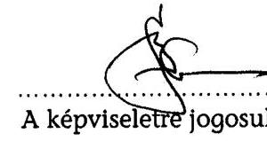

A képviseletre jogosult aláírása

---

# A KÉPCSARNOK KFT. EREDMÉNYKIMUTATÁSA (összköltség eljárással)

adatok: millió Ft-ban, egytizedes pontossággal

|  Sorszám | Megnevezés | 1998 | 1999 | 2000 | 2001 | 2002  |
| --- | --- | --- | --- | --- | --- | --- |
|  01. | Belföldi értékesítés nettó árbevétele | 443,2 | 394,3 | 389,0 | 357,1 | 354,7  |
|  02. | Export értékesítés nettó árbevétele | 3,8 | 2,8 | 0,7 | 0,6 | 2,0  |
|  I. | Értékesítés nettó árbevétele (01.+02.) | 447,0 | 397,1 | 389,7 | 357,7 | 356,7  |
|  II. | Egyéb bevételek | 8,7 | 1,9 | 8,9 | 42,8 | 32,8  |
|  03. | Saját előállítású eszközök aktivált értéke |  |  |  |  |   |
|  04. | Saját termelésú készletek állományváltozása |  |  |  |  |   |
|  III. | Aktivált saját teljesítmények értéke (03.+ 04.) | 0,0 | 0,0 | 0,0 | 0,0 | 0,0  |
|  05. | Anyagköltség | 9,2 | 9,0 | 10,3 | 7,3 | 5,7  |
|  06/1. | Igénybe vett anyagjellegú szolgáltatások értéke | 9,0 | 8,1 | 8,6 | 0,0 |   |
|  06/2. | Igénybe vett szolgáltatások értéke |  |  |  | 60,9 | 59,7  |
|  06/3. | Egyéb szolgáltatások értéke |  |  |  | 5,4 | 3,3  |
|  07. | Eladott áruk beszerzési értéke | 282,3 | 225,0 | 202,6 | 165,8 | 170,2  |
|  08/1. | Alvállalkozói teljesítmények értéke |  |  |  | 0,0 |   |
|  08/2. | Eladott (közvetített) szolgáltatások értéke |  |  |  | 9,0 | 10,4  |
|  IV. | Anyagjellegú ráfordítások (05.+06.+07.+08.) | 300,5 | 242,1 | 221,5 | 248,4 | 249,3  |
|  09. | Bérköltség | 32,0 | 32,7 | 32,2 | 35,7 | 40,8  |
|  10. | Személyi jellegú egyéb kifizetések | 5,1 | 0,8 | 0,9 | 0,8 | 1,1  |
|  11. | Bériárujékok | 15,3 | 13,0 | 13,1 | 15,4 | 15,4  |
|  V. | Személyi jellegú ráfordítások (09.+10.+11.) | 52,4 | 46,5 | 46,2 | 51,9 | 57,3  |
|  VI. | Értékcsökkenési leírás | 14,8 | 13,5 | 13,4 | 13,6 | 15,0  |
|  VII. | Egyéb költségek | 37,8 | 37,6 | 46,5 | 0,0 |   |
|  VIII. | Egyéb ráfordítások | 9,8 | 6,8 | 10,8 | 50,7 | 18,5  |
|  A. | ÜZEMI (ÜZLETI) TEVEKENYSÉG EREDMÉNYE (I.+II.+III.-IV.-V.-VI.-VII.-VIII.) | 40,4 | 52,5 | 60,2 | 35,9 | 49,4  |
|  12. | Kapott kamatok és kamatjellegú bevételek | 1,9 | 1,3 | 0,9 | 2,1 | 2,3  |
|  13. | Kapott osztalék és részesedés | 0,0 | 1,5 | 0,0 | 1,4 |   |
|  14. | Pénzügyi műveletek egyéb bevételei | 3,5 | 0,0 | 0,3 | 1,8 |   |
|  IX. | Pénzügyi műveletek bevételei (12.+13.+14.) | 5,4 | 2,8 | 1,2 | 5,3 | 2,3  |
|  15. | Fizetett kamatok és kamatjellegú kifizetések | 0,6 | 0,4 | 0,3 | 0,1 |   |
|  16. | Pénzügyi befektetések leírása | 0,0 |  |  | 0,0 |   |
|  17. | Pénzügyi műveletek egyéb ráfordításai | 0,5 |  |  | 0,0 | 0,1  |
|  X. | Pénzügyi műveletek ráfordításai (15.+16.+17.) | 1,1 | 0,4 | 0,3 | 0,1 | 0,1  |
|  B. | PÉNZÜGYI MÜVELETEK EREDMÉNYE (IX.-X.) | 4,3 | 2,4 | 0,9 | 5,2 | 2,2  |
|  C. | SZOKÁSOS VÁLLALKOZÁSI EREDMÉNY (+A.+B.) | 44,7 | 54,9 | 61,1 | 41,1 | 51,6  |
|  XI. | Rendkívüli bevételek | 0,0 | 0,8 | 3,6 |  |   |
|  XII. | Rendkívüli ráfordítások | 3,5 | 0,1 | 1,6 |  |   |
|  D. | RENDKÍVÜLI EREDMÉNY (XI.-XII.) | $-3,5$ | 0,7 | 2,0 | 0,0 |   |
|  A. | ADÓZÁS ELÓTTI EREDMÉNY (+-C+-D)* | 41,2 | 55,6 | 63,1 | 41,1 | 38,5  |
|  XIII. | Adófizetési kötelezettség | 7,5 | 10,0 | 11,3 | 7,8 | 6,9  |
|  F. | ADÓZOTT EREDMÉNY (+E.-XIII.) | 33,7 | 45,7 | 51,8 | 33,3 | 31,6  |
|  18. | Eredménytartalék igénybevétele osztalékra, részesedésre | 1,4 | 5,3 |  |  |   |
|  19. | Fizetett (jóváhagyott) osztalék és részesedés | 35,1 | 51,0 | 18,0 | 11,0 | 14,0  |
|  G. | MÉRLEG SZERINTI EREDMÉNY (+F.+18.-19.) | 0,0 | 0,0 | 33,8 | 22,3 | 17,6  |

- 2002-ben a szokásos és az adózás előtti eredmény különbözete (13,1 MFt) a még nem könyvelt adók és időbeli elhatárolások

Alulírott az Állami Számvevőszékről szóló 1989. évi XXXVIII. törvény 24. § (c) pontja alapján aláírásommal kijelentem, hogy a feltüntetett adatok teljesek és a közalapítvány nyilvántartásával, okmányalva mindenben egyeznek.

Budapest, 2003. február 24.

---

A közalapítvány bérköltsége és megbízási díjai 1998-2002.

|  Sor sz. | Megnevezés | 1998. |  | 1999. |  | 2000 |  | 2001 |  | 2002. |   |
| --- | --- | --- | --- | --- | --- | --- | --- | --- | --- | --- | --- |
|   |  | fő | eFt | fő | eFt | fő | eFt | fő | eFt | fő | eFt  |
|  1. | MAK központ bérköltsége és megbizási díja | 38 | 24837 | 25 | 27469 | 21 | 30630 | 18 | 31738 | 17 | 36671  |
|  2. | ezen belül: főfoglalkozásúak bére | 14 | 21391 | 14 | 23869 | 15 | 25714 | 14 | 26082 | 13 | 30671  |
|  3. | megbízási szerződéssel foglalkoztattak | 22 | 1071 | 9 | 713 | 4 | 1510 | 2 | 995 | 2 | 740  |
|  4. | vállalkozói szerződéssel foglalkoztatottak | 2 | 2375 | 2 | 2887 | 2 | 3406 | 2 | 4661 | 2 | 5260  |
|  5. | Alkotóházak bérköltsége és megbizási díja | 45 | 14626 | 35 | 15647 | 38 | 17075 | 44 | 20489 | 39 | 26966  |
|  6. | ezen belül: főfoglalkozásúak bére | 34 | 13848 | 29 | 14837 | 27 | 15273 | 27 | 18625 | 28 | 25406  |
|  7. | megbízási szerződéssel foglalkoztattak | 11 | 778 | 6 | 810 | 11 | 1802 | 17 | 1864 | 11 | 1560  |
|  8. | vállalkozói szerződéssel foglalkoztatottak |  |  |  |  |  |  |  |  |  |   |
|  9. | Összes közteher |  | 17129 |  | 16515 |  | 17860 |  | 18310 |  | 20731  |
|  10. | Összes bérköltség és megbízási díj (1+5+9) | 83 | 56592 | 60 | 59631 | 59 | 65565 | 62 | 70537 | 56 | 84368  |

Alulírott az Állami Számvevőszékről szóló 1989. évi XXXVIII. törvény 24. § c. pontja alapján aláírásommal kijelentem, hogya feltüntetett adatok teljesek és a közalapítvány nyilvántartásaival, okmányaival mindenben egyeznek.

2003. február 24

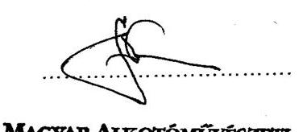

---

# Az ingatlanok hasznosításának adatai 1998-2002. években

|  Sor-
szám | Cím | 1998. |  | 1999. |  | 2000. |  | 2001. |  | 2002. |  | 1998-2002. |  | 1998-2002.
értéknövelő
beruházás  |
| --- | --- | --- | --- | --- | --- | --- | --- | --- | --- | --- | --- | --- | --- | --- |
|   |  | bérleti
díj | költség | bérleti
díj | költség | bérleti
díj | költség | bérleti
díj | költség | bérleti
díj | költség | bérleti
díj | költség |   |
|  1. | Bp. XIV., Olaf Palme sétány 1.* | 16,1 | 0,2 | 33,3 | 0,2 | 30,3 | 0,2 | 38,0 | 0,2 | 46,3 | 0,3 | 164,0 | 1,1 | 10,7  |
|  2. | Hédervári Kastély | 16,1 | 1,4 | 16,8 | 2,4 | 17,1 | 1,5 | 0,0 | 0,0 | 6,3 | 1,0 | 56,3 | 6,3 | 0,0  |
|  3. | Bp. X., Szállás u. 4-6. | 9,6 | 1,0 | 11,4 | 1,0 | 13,0 | 1,0 | 14,2 | 1,0 | 15,6 | 1,0 | 63,8 | 5,0 | 6,1  |
|  4. | Szentendre, Fő tér 20. | 3,2 | 0,1 | 3,5 | 1,3 | 3,9 | 0,0 | 4,6 | 0,1 | 4,7 | 0,1 | 19,9 | 1,6 | 0,0  |
|  5. | Dunaharaszti, Fő u. 10. | 2,9 | 1,2 | 2,9 | 1,2 | 2,9 | 0,4 | 2,9 | 0,4 | 2,9 | 0,4 | 14,5 | 3,6 | 0,0  |
|  6. | Bp. XIII., Reitter F. u. 32. | 0,8 | 0,1 | 0,8 | 0,1 | 0,8 | 0,4 | 0,8 | 0,3 | 0,2 | 0,4 | 3,4 | 1,3 | 0,0  |
|  7. | Süttő, Kiserdő sétány 12. | 1,5 | 0,3 | 1,5 | 0,3 | 0,0 | 0,4 | 0,0 | 0,1 | 0,0 | 0,0 | 3,0 | 1,1 | 8,3  |
|  8. | Balatonföldvár, József A. 10., 15. | 0,0 | 0,0 | 0,0 | 0,0 | 0,0 | 0,0 | 0,0 | 0,0 | 0,0 | 0,0 | 0,0 | 0,0 | 3,0  |
|  9. | Balatonszemes, Bagolyvár u.9. | 0,3 | 0,0 | 0,3 | 0,0 | 0,4 | 0,0 | 0,7 | 0,0 | 0,8 | 0,0 | 2,5 | 0,0 | 3,0  |
|   | Összesen: | 50,5 | 4,3 | 70,5 | 6,5 | 68,4 | 3,9 | 61,2 | 2,1 | 76,8 | 3,2 | 327,4 | 20,0 | 31,1  |

*Palme/2002. Az infl. Ráta miatti 2002-es 3,1 MFt és 2001-es 3,4 MFt egyéb bevételt is tartalmazza.

Alulírott az Állami Számvevőszékről szóló 1989. évi XXXVIII. törvény 24. §. (c) pontja alapján aláírásommal kijelentem, hogy a feltüntetett adatok teljesek és a közalapítvány nyilvántartásaival, okmányaival mindenben egyeznek.

Budapest. 2003. február 24.

P.H.

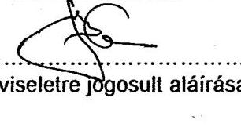

Képviseletre jogosult aláírása

---

1. számú melléklet a V-1016/2002. számú jelentéshez

# Művészeti céllal működtetett ingatlanok bevételei, ráfordításai, eredményei (1998-2002)

|   | Üzemeltetési bevétel (e Ft) |  |  |  |  |  |  | Üzemeltetési ráfordítás (e Ft) |  |  |  |  |  |  | Üzemeltetés eredménye (e Ft) |  |  |  |   |
| --- | --- | --- | --- | --- | --- | --- | --- | --- | --- | --- | --- | --- | --- | --- | --- | --- | --- | --- | --- |
|   | 1998 | 1999 | 2000 | 2001 | 2002 | Összesen | 1998 | 1999 | 2000 | 2001 | 2002 | Összesen | 1998 | 1999 | 2000 | 2001 | 2002 | Összesen |   |
|  Duna Galéria |  |  |  |  |  | 0 | 3 585 | 3 765 | 1 707 | 4 734 | 5 369 | 19 160 | -3 585 | -3 765 | -1 707 | -4 734 | -5 369 | -19 160 |   |
|  Hódmezővásárhelyi Alkotóház | 1 390 | 1 463 | 1 222 | 1 334 | 1 213 | 6 622 | 2 601 | 3 050 | 3 079 | 3 571 | 4 459 | 16 760 | -1 211 | -1 587 | -1 857 | -2 237 | -3 246 | -10 138 |   |
|  Kecskemét Alkotóház |  |  |  |  |  | 0 | 4 000 | 4 572 | 5 000 | 5 500 | 6 050 | 25 122 | -4 000 | -4 572 | -5 000 | -5 500 | -6 050 | -25 122 |   |
|  Szentendre Művésztelep | 850 | 994 | 1 008 | 987 | 861 | 4 700 | 657 | 1 757 | 1 178 | 270 | 1 255 | 5 117 | 193 | -763 | -170 | 717 | -394 | -417 |   |
|  Zsennye Alkotóház |  |  |  |  |  | 0 | 4 432 | 7 293 | 7 578 | 6 105 | 9 557 | 34 965 | -4 432 | -7 293 | -7 578 | -6 105 | -9 557 | -34 965 |   |
|  Mártély Alkotóház | 0 | 0 | 478 | 642 | 689 | 1 809 | 0 | 0 | 1 280 | 1 152 | 1 438 | 3 870 | 0 | 0 | -802 | -510 | -749 | -2 061 |   |
|  Bp. I. Koll. Műterem (Lehel u.) | 186 | 216 | 216 | 211 | 192 | 1 021 | 1 048 | 1 255 | 1 254 | 1 529 | 1 881 | 6 967 | -862 | -1 039 | -1 038 | -1 318 | -1 689 | -5 946 |   |
|  Hódmezővásárhelyi Koll. Mút. | 221 | 240 | 240 | 240 | 240 | 1 181 | 98 | 152 | 268 | 145 | 371 | 1 034 | 123 | 88 | -28 | 95 | -131 | 147 |   |
|  Szigliget Alkotóház | 10 607 | 12 870 | 12 334 | 12 095 | 13 928 | 61 834 | 11 835 | 12 212 | 12 518 | 17 580 | 20 409 | 74 554 | -1 228 | 658 | -184 | -5 485 | -6 481 | -12 720 |   |
|  Galyutető Alkotóház | 216 | 206 | 127 | 191 | 179 | 919 | 1 275 | 1 354 | 1 519 | 1 472 | 1 605 | 7 225 | -1 059 | -1 148 | -1 392 | -1 281 | -1 426 | -6 306 |   |
|  ÖSSZESEN | 13 470 | 15 989 | 15 625 | 15 700 | 17 302 | 78 086 | 29 531 | 35 410 | 35 381 | 42 058 | 52 394 | 194 774 | -16 061 | -19 421 | -19 756 | -26 358 | -35 092 | -116 688 |   |

---

# Művészeti céllal működtetett ingatlanok adatai

|  Ingatlanok | Beutaltak száma (fő) |  |  |  |  |  |  |  |  |  |  |  |  |  |  |  |  |  |  |  |  |   |
| --- | --- | --- | --- | --- | --- | --- | --- | --- | --- | --- | --- | --- | --- | --- | --- | --- | --- | --- | --- | --- | --- | --- |
|   | 1998 | 1999 | 2000 | 2001 | 2002 | 2002/
1998 |  |  |  |  |  |  |  |  |  |  |  |  |  |  |  |   |
|  Duna Galéria |  |  |  |  |  |  |  |  |  |  |  |  |  |  |  |  |  |  |  |  |  |   |
|  Hődmezővásárhelyi Alkotóház | 198 | 192 | 168 | 215 | 166 | 84% |  |  |  |  |  |  |  |  |  |  |  |  |  |  |  |   |
|  Kecskemét Alkotóház | 224 | 110 | 166 | 166 | 271 | 121% |  |  |  |  |  |  |  |  |  |  |  |  |  |  |  |   |
|  Szentendre Művésztelep | 13 | 15 | 15 | 13 | 13 | 100% |  |  |  |  |  |  |  |  |  |  |  |  |  |  |  |   |
|  Zsennye Alkotóház | 640 | 679 | 1 021 | 1 203 | 1 239 | 194% |  |  |  |  |  |  |  |  |  |  |  |  |  |  |  |   |
|  Mártély Alkotóház | 69 | 56 | 87 | 105 | 118 | 171% |  |  |  |  |  |  |  |  |  |  |  |  |  |  |  |   |
|  Bp. I. Koll. Műterem (Lehel u.) | 12 | 12 | 12 | 12 | 11 | 92% |  |  |  |  |  |  |  |  |  |  |  |  |  |  |  |   |
|  Hődmezővásárhelyi Koll. Múlt. | 5 | 5 | 5 | 5 | 5 | 100% |  |  |  |  |  |  |  |  |  |  |  |  |  |  |  |   |
|  Szigiget Alkotóház | 794 | 1 056 | 787 | 699 | 913 | 115% |  |  |  |  |  |  |  |  |  |  |  |  |  |  |  |   |
|  Gulyatető Alkotóház | 33 | 15 | 16 | 33 | 29 | 88% |  |  |  |  |  |  |  |  |  |  |  |  |  |  |  |   |
|  Összesen (Kecskemét és Zsennye nélkül) | 1 124 | 1 352 | 1 090 | 1 082 | 1 255 | 112% |  |  |  |  |  |  |  |  |  |  |  |  |  |  |  |   |
|  MÁttély Alkotóház | 1 988 | 2 141 | 2 277 | 2 451 | 2 765 | 139% |  |  |  |  |  |  |  |  |  |  |  |  |  |  |  |   |
|  Ingatlanok |  |  |  |  |  |  |  |  |  |  |  |  |  |  |  |  |  |  |  |  |  |   |
|   |  |  |  |  |  |  |  |  |  |  |  |  |  |  |  |  |  |  |  |  |  |   |
|   |  |  |  |  |  |  |  |  |  |  |  |  |  |  |  |  |  |  |  |  |  |   |
|   |  |  |  |  |  |  |  |  |  |  |  |  |  |  |  |  |  |  |  |  |  |   |
|   | 1998 | 1999 | 2000 | 2001 | 2002 | 2002/
1998 |  |  |  |  |  |  |  |  |  |  |  |  |  |  |  |   |
|  Duna Galéria | 297 | 299 | 299 | 297 | 301 | 101% |  |  |  |  |  |  |  |  |  |  |  |  |  |  |  |   |
|  Hődmezővásárhelyi Alkotóház | 3 290 | 3 290 | 3 290 | 3 290 | 3 290 | 100% |  |  |  |  |  |  |  |  |  |  |  |  |  |  |  |   |
|  Kecskemét Alkotóház | 4 277 | 4 277 | 4 277 | 4 277 | 4 277 | 100% |  |  |  |  |  |  |  |  |  |  |  |  |  |  |  |   |
|  Szentendre Művésztelep * | 4 380 | 4 380 | 4 380 | 4 380 | 4 380 | 100% |  |  |  |  |  |  |  |  |  |  |  |  |  |  |  |   |
|  Zsennye Alkotóház | 9 212 | 9 212 | 9 212 | 9 212 | 9 212 | 100% |  |  |  |  |  |  |  |  |  |  |  |  |  |  |  |   |
|  MÁttély Alkotóház | 980 | 980 | 980 | 980 | 980 | 100% |  |  |  |  |  |  |  |  |  |  |  |  |  |  |  |   |
|  Bp. I. Koll. Műterem (Lehel u.) * | 3 741 | 4 380 | 4 392 | 4 288 | 3 893 | 104% |  |  |  |  |  |  |  |  |  |  |  |  |  |  |  |   |
|  Hődmezővásárhelyi Koll. Múlt. * |  |  |  |  |  |  |  |  |  |  |  |  |  |  |  |  |  |  |  |  |  |   |
|  Szigiget Alkotóház | 20 398 | 20 398 | 20 398 | 20 398 | 20 398 | 100% |  |  |  |  |  |  |  |  |  |  |  |  |  |  |  |   |
|  Gulyatető Alkotóház | 2 303 | 2 303 | 2 303 | 2 303 | 2 303 | 100% |  |  |  |  |  |  |  |  |  |  |  |  |  |  |  |   |
|  Összesen (Kecskemét és Zsennye nélkül) | 35 389 | 36 030 | 36 042 | 35 936 | 35 545 | 100% |  |  |  |  |  |  |  |  |  |  |  |  |  |  |  |   |
|  MÁttély Alkotóház | 48 878 | 49 519 | 49 531 | 49 425 | 49 034 | 100% |  |  |  |  |  |  |  |  |  |  |  |  |  |  |  |   |
|  * Térténi díj Ft/fő/hónap |  |  |  |  |  |  |  |  |  |  |  |  |  |  |  |  |  |  |  |  |  |   |

---

## **Művészeti céllal működtetett ingatlanok adatai**

|  Ingatlanok | Összesen befizetett térítési díj (e Ft-ban) |  |  |  |  |  |  |  | Az egyes alkotóházaknál elszámolt költségek (e Ft-ban) |  |  |  |  |  |  |  |  |  |  |  |  |  |  |  |  |  |  |  |  |  |  |  |  |  |  |  |  |  |  |  |  |  |  |  |  |  |  |  |  |  |  |   |
| --- | --- | --- | --- | --- | --- | --- | --- | --- | --- | --- | --- | --- | --- | --- | --- | --- | --- | --- | --- | --- | --- | --- | --- | --- | --- | --- | --- | --- | --- | --- | --- | --- | --- | --- | --- | --- | --- | --- | --- | --- | --- | --- | --- | --- | --- | --- | --- | --- | --- | --- | --- | --- | --- | --- |
|   | 1998 |  | 1999 |  | 2000 |  | 2001 |  | 2002/ |  |  |  |  |  |  |  |  |  |  |  |  |  |  |  |  |  |  |  |  |  |  |  |  |  |  |  |  |  |  |  |  |  |  |  |  |  |  |  |  |  |  |   |
|   |  |  |  |  |  |  |  |  |  |  |  |  |  |  |  |  |  |  |  |  |  |  |  |  |  |  |  |  |  |  |  |  |  |  |  |  |  |  |  |  |  |  |  |  |  |  |  |  |  |  |  |   |
|  Duna Galéria |  |  |  |  |  |  |  |  |  |  |  |  |  |  |  |  |  |  |  |  |  |  |  |  |  |  |  |  |  |  |  |  |  |  |  |  |  |  |  |  |  |  |  |  |  |  |  |  |  |  |   |
|  Hódmezővásárhelyi Alkotóház** |  | 1 390 |  | 1 463 |  | 1 222 |  | 1 334 |  | 1 213 |  |  |  |  |  |  |  |  |  |  |  |  |  |  |  |  |  |  |  |  |  |  |  |  |  |  |  |  |  |  |  |  |  |  |  |  |  |  |  |   |
|  Kecskemét Alkotóház |  |  |  |  |  |  |  |  |  |  |  |  |  |  |  |  |  |  |  |  |  |  |  |  |  |  |  |  |  |  |  |  |  |  |  |  |  |  |  |  |  |  |  |  |  |  |  |  |  |   |
|  Szentendre Művésztelep |  | 850 |  | 994 |  | 1 008 |  | 987 |  | 861 |  |  |  |  |  |  |  |  |  |  |  |  |  |  |  |  |  |  |  |  |  |  |  |  |  |  |  |  |  |  |  |  |  |  |  |  |  |  |  |   |
|  Zsennye Alkotóház |  |  |  |  |  |  |  |  |  |  |  |  |  |  |  |  |  |  |  |  |  |  |  |  |  |  |  |  |  |  |  |  |  |  |  |  |  |  |  |  |  |  |  |  |  |  |  |  |  |   |
|  Mártély Alkotóház** |  |  |  |  |  | 478 |  | 642 |  | 689 |  |  |  |  |  |  |  |  |  |  |  |  |  |  |  |  |  |  |  |  |  |  |  |  |  |  |  |  |  |  |  |  |  |  |  |  |  |  |  |   |
|  Bp. I. Koll. Műterem (Lehel u.) |  | 186 |  | 216 |  | 216 |  | 211 |  | 192 |  |  |  |  |  |  |  |  |  |  |  |  |  |  |  |  |  |  |  |  |  |  |  |  |  |  |  |  |  |  |  |  |  |  |  |  |  |  |   |
|  Hódmezővásárhelyi Koll. Mút. |  | 221 |  | 240 |  | 240 |  | 240 |  | 240 |  |  |  |  |  |  |  |  |  |  |  |  |  |  |  |  |  |  |  |  |  |  |  |  |  |  |  |  |  |  |  |  |  |  |  |  |  |  |   |
|  Szigliget Alkotóház |  | 10 607 |  | 12 870 |  | 12 334 |  | 12 095 |  | 13 928 |  |  |  |  |  |  |  |  |  |  |  |  |  |  |  |  |  |  |  |  |  |  |  |  |  |  |  |  |  |  |  |  |  |  |  |  |  |   |
|  Mártély Alkotóház** |  |  |  |  |  |  |  |  |  |  |  |  |  |  |  |  |  |  |  |  |  |  |  |  |  |  |  |  |  |  |  |  |  |  |  |  |  |  |  |  |  |  |  |  |  |  |  |   |
|  Gulyatető Alkotóház |  | 216 |  | 206 |  | 127 |  | 191 |  | 179 |  |  |  |  |  |  |  |  |  |  |  |  |  |  |  |  |  |  |  |  |  |  |  |  |  |  |  |  |  |  |  |  |  |  |  |  |  |   |
|  Összesen (Kecskemét és Zsennye nélkül) |  | 13 470 |  | 15 989 |  | 15 625 |  | 15 700 |  | 17 302 |  |  |  |  |  |  |  |  |  |  |  |  |  |  |  |  |  |  |  |  |  |  |  |  |  |  |  |  |  |  |  |  |  |  |  |  |  |   |
|  MINDÖSSZESEN |  | 13 470 |  | 15 989 |  | 15 625 |  | 15 700 |  | 17 302 |  |  |  |  |  |  |  |  |  |  |  |  |  |  |  |  |  |  |  |  |  |  |  |  |  |  |  |  |  |  |  |  |  |  |  |  |   |
|   |  | 13 470 |  | 15 989 |  | 15 625 |  | 15 700 |  | 17 302 |  |  |  |  |  |  |  |  |  |  |  |  |  |  |  |  |  |  |  |  |  |  |  |  |  |  |  |  |  |  |  |  |  |  |  |  |   |

|  Ingatlanok |  |  |  |  |  |  |  |  |  |  |  |  |  |  |  |  |  |  |  |  |  |  |  |  |  |  |  |  |  |  |  |  |  |  |  |  |  |  |  |  |  |  |  |  |  |  |  |  |   |
| --- | --- | --- | --- | --- | --- | --- | --- | --- | --- | --- | --- | --- | --- | --- | --- | --- | --- | --- | --- | --- | --- | --- | --- | --- | --- | --- | --- | --- | --- | --- | --- | --- | --- | --- | --- | --- | --- | --- | --- | --- | --- | --- | --- | --- | --- | --- | --- | --- | --- |
|   |  |  |  |  |  |  |  |  |  |  |  |  |  |  |  |  |  |  |  |  |  |  |  |  |  |  |  |  |  |  |  |  |  |  |  |  |  |  |  |  |  |  |  |  |  |  |  |   |
|   |  |  |  |  |  |  |  |  |  |  |  |  |  |  |  |  |  |  |  |  |  |  |  |  |  |  |  |  |  |  |  |  |  |  |  |  |  |  |  |  |  |  |  |  |  |  |  |   |
|   |  |  |  |  |  |  |  |  |  |  |  |  |  |  |  |  |  |  |  |  |  |  |  |  |  |  |  |  |  |  |  |  |  |  |  |  |  |  |  |  |  |  |  |  |  |  |  |   |
|   |  |  |  |  |  |  |  |  |  |  |  |  |  |  |  |  |  |  |  |  |  |  |  |  |  |  |  |  |  |  |  |  |  |  |  |  |  |  |  |  |  |  |  |  |  |  |  |   |
|   |  |  |  |  |  |  |  |  |  |  |  |  |  |  |  |  |  |  |  |  |  |  |  |  |  |  |  |  |  |  |  |  |  |  |  |  |  |  |  |  |  |  |  |  |  |  |  |   |
|   |  |  |  |  |  |  |  |  |  |  |  |  |  |  |  |  |  |  |  |  |  |  |  |  |  |  |  |  |  |  |  |  |  |  |  |  |  |  |  |  |  |  |  |  |  |  |  |   |
|   |  |  |  |  |  |  |  |  |  |  |  |  |  |  |  |  |  |  |  |  |  |  |  |  |  |  |  |  |  |  |  |  |  |  |  |  |  |  |  |  |  |  |  |  |  |  |  |   |
|   |  |  |  |  |  |  |  |  |  |  |  |  |  |  |  |  |  |  |  |  |  |  |  |  |  |  |  |  |  |  |  |  |  |  |  |  |  |  |  |  |  |  |  |  |  |  |  |   |
|   |  |  |  |  |  |  |  |  |  |  |  |  |  |  |  |  |  |  |  |  |  |  |  |  |  |  |  |  |  |  |  |  |  |  |  |  |  |  |  |  |  |  |  |  |  |  |  |   |
|   |  |  |  |  |  |  |  |  |  |  |  |  |  |  |  |  |  |  |  |  |  |  |  |  |  |  |  |  |  |  |  |  |  |  |  |  |  |  |  |  |  |  |  |  |  |  |  |   |
|   |  |  |  |  |  |  |  |  |  |  |  |  |  |  |  |  |  |  |  |  |  |  |  |  |  |  |  |  |  |  |  |  |  |  |  |  |  |  |  |  |  |  |  |  |  |  |  |   |
|   |  |  |  |  |  |  |  |  |  |  |  |  |  |  |  |  |  |  |  |  |  |  |  |  |  |  |  |  |  |  |  |  |  |  |  |  |  |  |  |  |  |  |  |  |  |  |  |   |
|   |  |  |  |  |  |  |  |  |  |  |  |  |  |  |  |  |  |  |  |  |  |  |  |  |  |  |  |  |  |  |  |  |  |  |  |  |  |  |  |  |  |  |  |  |  |  |  |   |
|   |  |  |  |  |  |  |  |  |  |  |  |  |  |  |  |  |  |  |  |  |  |  |  |  |  |  |  |  |  |  |  |  |  |  |  |  |  |  |  |  |  |  |  |  |  |  |  |   |
|   |  |  |  |  |  |  |  |  |  |  |  |  |  |  |  |  |  |  |  |  |  |  |  |  |  |  |  |  |  |  |  |  |  |  |  |  |  |  |  |  |  |  |  |  |  |  |  |   |
|   |  |  |  |  |  |  |  |  |  |  |  |  |  |  |  |  |  |  |  |  |  |  |  |  |  |  |  |  |  |  |  |  |  |  |  |  |  |  |  |  |  |  |  |  |  |  |  |   |
|   |  |  |  |  |  |  |  |  |  |  |  |  |  |  |  |  |  |  |  |  |  |  |  |  |  |  |  |  |  |  |  |  |  |  |  |  |  |  |  |  |  |  |  |  |  |  |  |   |
|   |  |  |  |  |  |  |  |  |  |  |  |  |  |  |  |  |  |  |  |  |  |  |  |  |  |  |  |  |  |  |  |  |  |  |  |  |  |  |  |  |  |  |  |  |  |  |  |   |
|   |  |  |  |  |  |  |  |  |  |  |  |  |  |  |  |  |  |  |  |  |  |  |  |  |  |  |  |  |  |  |  |  |  |  |  |  |  |  |  |  |  |  |  |  |  |  |  |   |
|   |  |  |  |  |  |  |  |  |  |  |  |  |  |  |  |  |  |  |  |  |  |  |  |  |  |  |  |  |  |  |  |  |  |  |  |  |  |  |  |  |  |  |  |  |  |  |  |   |
|   |  |  |  |  |  |  |  |  |  |  |  |  |  |  |  |  |  |  |  |  |  |  |  |  |  |  |  |  |  |  |  |  |  |  |  |  |  |  |  |  |  |  |  |  |  |  |  |   |
|   |  |  |  |  |  |  |  |  |  |  |  |  |  |  |  |  |  |  |  |  |  |  |  |  |  |  |  |  |  |  |  |  |  |  |  |  |  |  |  |  |  |  |  |  |  |  |  |   |
|   |  |  |  |  |  |  |  |  |  |  |  |  |  |  |  |  |  |  |  |  |  |  |  |  |  |  |  |  |  |  |  |  |  |  |  |  |  |  |  |  |  |  |  |  |  |  |  |   |
|   |  |  |  |  |  |  |  |  |  |  |  |  |  |  |  |  |  |  |  |  |  |  |  |  |  |  |  |  |  |  |  |  |  |  |  |  |  |  |  |  |  |  |  |  |  |  |  |   |
|   |  |  |  |  |  |  |  |  |  |  |  |  |  |  |  |  |  |  |  |  |  |  |  |  |  |  |  |  |  |  |  |  |  |  |  |  |  |  |  |  |  |  |  |  |  |  |  |   |
|   |  |  |  |  |  |  |  |  |  |  |  |  |  |  |  |  |  |  |  |  |  |  |  |  |  |  |  |  |  |  |  |  |  |  |  |  |  |  |  |  |  |  |  |  |  |  |  |   |
|   |  |  |  |  |  |  |  |  |  |  |  |  |  |  |  |  |  |  |  |  |  |  |  |  |  |  |  |  |  |  |  |  |  |  |  |  |  |  |  |  |  |  |  |  |  |  |  |   |
|   |  |  |  |  |  |  |  |  |  |  |  |  |  |  |  |  |  |  |  |  |  |  |  |  |  |  |  |  |  |  |  |  |  |  |  |  |  |  |  |  |  |  |  |  |  |  |  |   |
|   |  |  |  |  |  |  |  |  |  |  |  |  |  |  |  |  |  |  |  |  |  |  |  |  |  |  |  |  |  |  |  |  |  |  |  |  |  |  |  |  |  |  |  |  |  |  |  |   |
|   |  |  |  |  |  |  |  |  |  |  |  |  |  |  |  |  |  |  |  |  |  |  |  |  |  |  |  |  |  |  |  |  |  |  |  |  |  |  |  |  |  |  |  |  |  |  |  |   |
|   |  |  |  |  |  |  |  |  |  |  |  |  |  |  |  |  |  |  |  |  |  |  |  |  |  |  |  |  |  |  |  |  |  |  |  |  |  |  |  |  |  |  |  |  |  |  |  |   |
|   |

---

# MAGYAR ÁLKOTÓMÚVÉSZETI

## KÖZALAPÍTVÁNY

www.alkotom.hu

1363 Budapest Pf. 15.

Telefon: 353-2023 Fax: 473-1613, 353-1892

E-mail: maktitkarsag@alkotomuveszet.hu

Állami Számvevőszék

Dr. Kovács Árpád elnök

## Budapest

Tisztelt Elnök Úr!

Köszönettel megkaptuk a Magyar Alkotóművészeti Közalapítvány gazdálkodásának ellenőrzéséről szóló jelentést.

A biztosított 8 napos határidőn belül tájékoztatom, hogy a már előzetesen egyeztetett jelentéssel kapcsolatban észrevételünk nincs.

Az ellenőrzés alapján elrendelendő intézkedésekről 30 napon belül tájékoztatni fogom Önt.

Még egyszer megköszönve alapos és hasznos munkájukat a Közalapítvány Kuratóriuma és munkaszervezete, valamint saját nevemben,

Budapest, 2003. július 14.

Tisztelettel:

Magyar Alkotóművészeti Közalapítvány

Budapest V. Báthory u. 10.

(Dr. Nagy István)

elnök

---

# Állami Számvevőszék   Dr. Kovács Árpád   elnők úr   részére 

Budapest

Tisztelt Elnők Úr !

Ezúton szeretném megköszönni Önnek és munkatársainak a Magyar Alkotóművészeti Közalapítvány gazdálkodásának ellenőrzéséről szóló jelentés elkészitését.

A jelentésben foglaltakkal kapcsolatban észrevételt nem teszek, az abban foglalt megállapításokat elfogadom. Az ellenőrzés kapcsán megfogalmazott javaslatok megerősítettek bennünket abban, hogy a szervezet müködésével kapcsolatos hiányosságok kiküszöbölésére eddig végzett és jelenleg is folyamatban lévő intézkedéseink a hatékonyabb müködést szolgálják.
Tájékoztatom Elnők Urat, hogy a felmerült problémák megoldásán szakértőink két munkacsoportban dolgoznak, és munkájuk eredményéről ez év októberében be kívánok számolni a Kormánynak.

Az ellenőrzés alapján elrendelt intézkedéseimröl a törvényes határidőn belül tájékoztatom Elnők Urat.

Budapest, 2003. július „, 10 .,

Tisztelettel
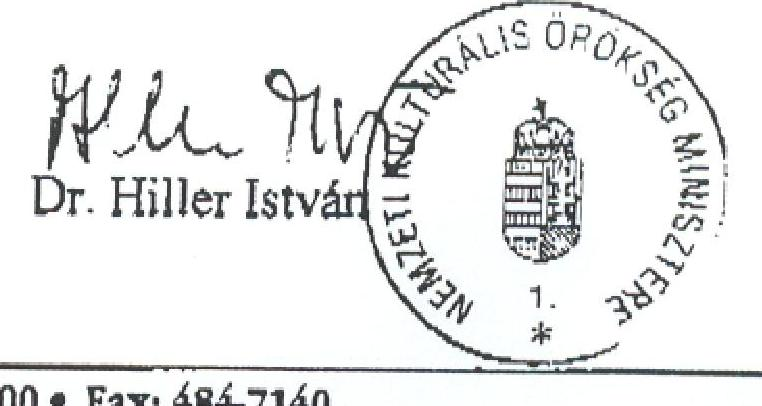

---

# MINISZTERELNÖKI HIVATALT VEZETŐ MINISZTER 

1232/VIII/2003.

Dr. Kovács Árpád úrnak, az Állami Számvevőszék
elnöke

Tisztelt Elnök Úr!

A Magyar Alkotóművészeti Közalapítvány gazdálkodásának ellenőrzéséről szóló jelentéssel érdemben egyetértek.

A Kormánynak tett javaslatok 5. pontja szerint indokolt a nyugdijpénztár beindításához adott 210 M Ft hitel vissza nem térítendő támogatássá való átalakítása. Javasolom, hogy ezzel kapcsolatban az 5. pont szövege utaljon arra, hogy a 2103/1998. (IV. 22.) Korm. határozat 3. pontját amely 2002. évtől kezdődően a hitel visszafizetését írta elő - hatályon kivül kell helyezni.

Budapest, 2003. július 17.
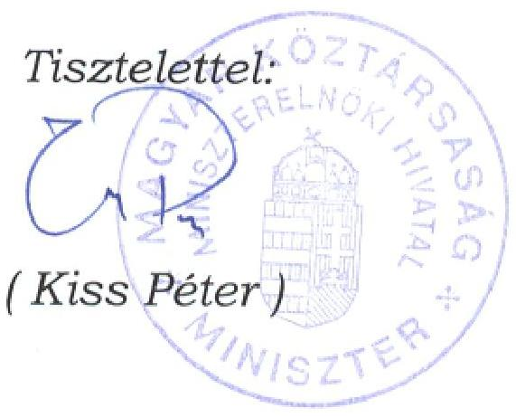

---

# Állami Számvevőszék 

## Kiss Péter úr

a Miniszterelnöki Hivatalt vezető miniszter

## Budapest

## Tisztelt Miniszter Úr!

A Magyar Alkotóművészeti Közalapítvány gazdálkodásának ellenőrzéséről készített jelentésnek a Kormány számára megfogalmazott 5. javaslathoz tett észrevételét köszönettel vettem.

Javaslatunk azt a célt szolgálja, hogy a MAK jogelődje számára még 1993-ban adott 210 millió Ft hitel visszafizetésétől a Kormány - alkalmas megoldást választva - tekintsen el, amelynek révén e kötelezettséget a közalapítványnak a jövőben már nem kell a mérlegében szerepeltetni. Ennek megfelelően természetesen támogatjuk a tárggyal kapcsolatos, hatályos kormányhatározatok olyan értelmú módosításait, amelyek e javaslat megvalósítását biztosítják.

Tájékoztatom, hogy levelét és válaszomat a jelentéshez csatoltuk.
Közremúködését ezúton is köszönöm.

Budapest, 2003. július 18

Tisztelettel:
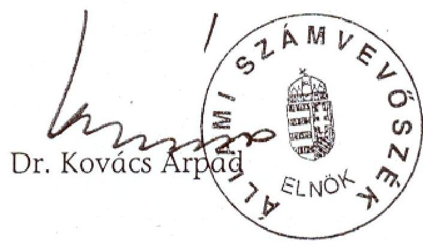