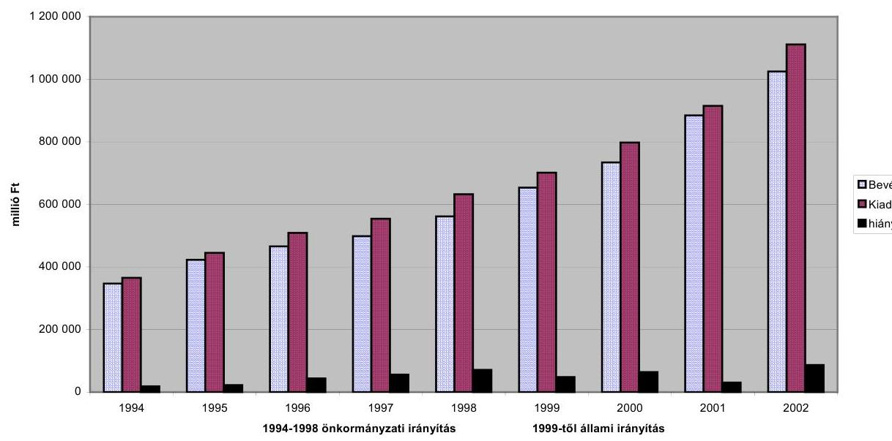
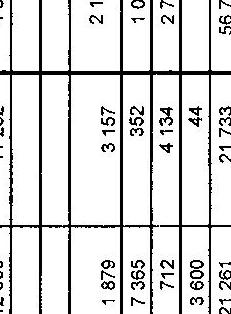
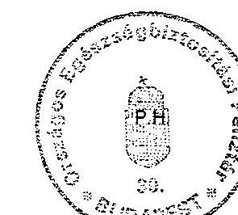
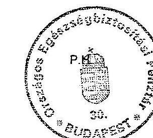
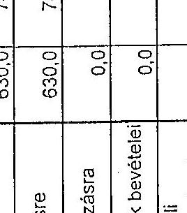
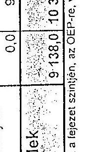
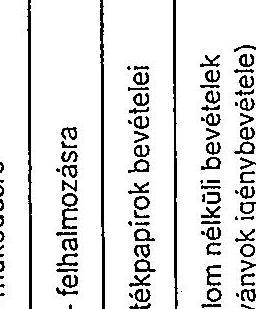
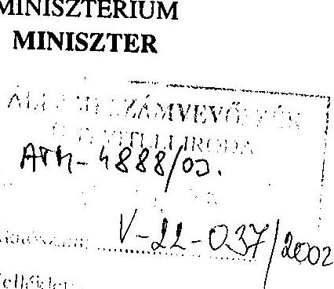
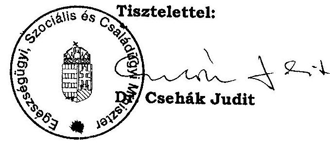

# JELENTÉS 

## az Egészségbiztosítási Alap működésének ellenőrzéséről

---

# 2. Államháztartás Központi Szintjét Ellenőrző Igazgatóság 

2.3. Átfogó Ellenőrzési Főcsoport
V-22-38/2002-2003.
Témaszám: 620
Vizsgálat-azonosító szám: V-0050

## Az ellenőrzést felügyelte:

Bihary Zsigmond
főigazgató
Az ellenőrzés végrehajtásáért felelős:
Hegedűsné dr. Müllern Veronika
főcsoportfőnök

## Az ellenőrzést vezette:

dr. Kurucz István
osztályvezető főtanácsos
számvevő tanácsos, tanácsadó
Az ellenőrzést végezték:

| Ambrus Lajos | Dr. Kuti Anna | Szabó Tamás |
| :-- | :-- | :-- |
| számvevő tanácsos, | számvevő | számvevő tanácsos |
| tanácsadó | Molnár Istvánné | Szendrődi Józsefné |
| Balla Józsefné | számvevő tanácsos, | számvevő tanácsos, |
| számvevő tanácsos, | tanácsadó | tanácsadó |
| főtanácsadó | Dr. Pál Lehelné | Szólya Ildikó |
| Dr. Beregi Anna | számvevő tanácsos, | számvevő gyakornok |
| számvevő | irodavezető | Vargáné Loch Márta |
| Fodor Tiborné | Péntek László | külső munkatárs |
| számvevő tanácsos | számvevő tanácsos, | Zeke József |
| Kádár Kriszta | irodavezető | számvevő tanácsos |
| számvevő | Simon Andrásné dr. |  |
| Kincses Erzsébet | Csepregi Zsuzsa |  |
| számvevő | számvevő tanácsos |  |

A témához kapcsolódó eddig készített számvevőszéki jelentések:

1994-2002. között
Éves jelentések a társadalombiztosítás pénzügyi alapjainak
költségvetése előirányzatai megalapozottságáról
Éves jelentések a társadalombiztosítás pénzügyi alapjainak
költségvetése végrehajtásáról

Jelentéseink az Országgyűlés számítógépes hálózatán és az Interneten a www.asz.hu címen is olvashatók.

---

1995. Jelentés az OEP székház beruházásának törvényességi és eredményességi ellenőrzéséről
1996. Jelentés a fogászati ellátás helyzetének és a ráfordított pénzeszközök felhasználásának vizsgálatáról
1997. Jelentés az Egészségbiztosítási Önkormányzat 1997. évi vagyongazdálkodásának ellenőrzéséről
1998. Jelentés a „Külön keretes" gyógyszer-támogatási rendszer működésének vizsgálatáról
1999. Jelentés a társadalombiztosítás informatikai rendszereinek ellenőrzéséről
1991. Jelentés az államháztartás belföldi adóssága és a központi költségvetés belföldi kötelezettségeiről

---

# TARTALOMJEGYZÉK 

BEVEZETÉS ..... 5
I. ÖSSZEGZŐ MEGÁLLAPÍTÁSOK, KÖVETKEZTETÉSEK, JAVASLATOK ..... 7
II. RÉSZLETES MEGÁLLAPÍTÁSOK ..... 15

1. Az egészségbiztosítási alap felügyelete, irányítása ..... 15
1.1. Az egészségbiztosítási rendszer alapvető feladatai ..... 15
1.2. Az Egészségbiztosítási Alap felügyeletének, irányításának változásai ..... 15
2. Az egészségbiztosítási alap költségvetésének tervezése ..... 19
2.1. A költségvetés tervezése, szabályozottsága ..... 19
2.2. A felügyeleti szerv részvétele a tervezésben ..... 21
3. Az Egészségbiztosítási Alap bevételei ..... 21
3.1. A járulékbevételek összetétele, nyilvántartása, behajtása ..... 22
3.2. A központi költségvetési támogatás ..... 25
3.3. Egyéb bevételek ..... 26
4. Az egészségbiztosítási alap által finanszírozott ellátások kiadásai ..... 27
4.1. A korhatár alatti rokkant ellátások ..... 27
4.2. A pénzbeni ellátások kiadásai ..... 28
4.2.1. A táppénzkiadások alakulása ..... 28
4.2.2. A gyermekgondozási díj ..... 29
4.3. A természetbeni ellátások ..... 29
4.3.1. A gyógyító-megelőző ellátások ..... 29
4.3.2. Az OEP szerepe az egészségügyi ellátórendszer kapacitásának szabályozásában és a struktúra átalakításában ..... 33
4.3.3. A gyógyszerek- és a gyógyászati segédeszközök társadalombiztosítási támogatása ..... 35
4.3.4. A házi szakápolás ..... 36
5. Az Egészségbiztosítási Alap likviditása és hiánya ..... 39
6. Az Egészségbiztosítási Alap kezelője az OEP szervezete, irányítási rendszere ..... 42
6.1. Az OEP megalakulása, jogállása, a központi közigazgatásban betöltött szerepe ..... 42
6.1.1. Az OEP és igazgatási szerveinek szervezeti rendje ..... 42
6.1.2. Az igazgatási szervek irányítása ..... 43
6.1.3. A gazdálkodás irányítása ..... 44

---

6.2. Az OEP és intézményei működésével kapcsolatos források és azok felhasználása ..... 44
6.2.1. A működési költségvetés tervezése, teljesítése ..... 44
6.2.2. A személyi feltételek és a személyi juttatások alakulása ..... 45
6.2.3. Megbízással történő foglalkoztatás ..... 46
6.2.4. A tárgyi eszközökkel való gazdálkodás ..... 47
6.2.5. A számviteli politika, a számviteli rend kialakítása, a munkafolyamatba épített ellenőrzés megvalósulása ..... 48
7. Az informatikai rendszer működése ..... 49
7.1. Az informatikai rendszer működésének szabályozása ..... 49
7.1.1. A külső jogszabályi környezet ..... 49
7.1.2. A belső szabályozás ..... 49
7.2. Az informatikai feladatok tervezése és végrehajtása ..... 50
7.2.1. Az informatikai stratégia és a működési feltételek kialakítása ..... 50
7.2.2. Az informatikai fejlesztések végrehajtásával kapcsolatos tapasztalatok ..... 53
7.2.3. Az informatikai biztonság helyzete ..... 54
8. Az OEP szak- és pénzügyi ellenőrzési tevékenysége ..... 54
9. A korábbi számvevőszéki vizsgálatok utóellenőrzése ..... 56
9.1. Az Egészségbiztosítási Önkormányzat 1997. évi vagyongazdálkodása ellenőrzésével kapcsolatos javaslatok teljesülése ..... 56
9.2. A külön keretes gyógyszer támogatási rendszer működésének ellenőrzését követő intézkedések tapasztalatai ..... 56
9.3. A társadalombiztosítás informatikai rendszereinek ellenőrzése alapján tett javaslatok-, valamint a világbanki program megvalósulása ..... 57
9.4. A zárszámadási ellenőrzések javaslataival összefüggő intézkedések ..... 57
MELLÉKLETEK

1. sz. Az Egészségbiztosítási Alap bevételeinek alakulása 1994-2002 között
2. sz. Az Egészségbiztosítási Alap kiadásainak alakulása 1994-2002 között
3. sz. Az Egészségbiztosítási Alap működési bev. alakulása 1994-2002. között.
4. sz. Az Egészségbiztosítási Alap működési kiad. alakulása 1994-2002. között.
5. sz. ESZCSM dr. Csehák Judit miniszter levele

# FÜGGELÉKEK 

1. sz. Tájékoztató az országos egészségbiztosítási pénztár kiemelt informatikai rendszereiről

---

# BEVEZETÉS

---

# RÖVIDÍTÉSEK JEGYZÉKE 

| Áht. | Az államháztartásról szóló 1992. évi XXXVIII. törvény |
| :--: | :--: |
| Ámr. | 217/1998. (XII.) Korm. rendelet az államháztartás működési rendjéről |
| APEH | Adó- és Pénzügyi Ellenőrzési Hivatal |
| ÁPV Rt. | Állami Privatizációs és Vagyonkezelő Részvénytársaság |
| ÁSZ | Állami Számvevőszék |
| AT | A társadalombiztosítás pénzügyi alapjairól és azok 1993.   évi költségvetéséről szóló 1992. évi LXXXIV. törvény |
| BM | Belügyminisztérium |
| E. Alap | Egészségbiztosítási Alap |
| EBÖ | Egészségbiztosítási Önkormányzat |
| EHO | Egészségügyi hozzájárulás |
| ESZCSM | Egészségügyi, Szociális és Családügyi Minisztérium |
| EU | Európai Unió |
| FPEP | Fővárosi és Pest megyei Egészségbiztosítási Pénztár |
| GYED | Gyermekgondozási díj |
| HBCS | Homogén Betegségcsoport |
| IAT | Intézményi adattárház |
| IS | Informatikai Stratégia |
| KESZ | Kincstári Egységes Számla |
| KMR | Keresőképtelenségi monitor rendszer |
| MEF | Megyei Egyeztető Fórum |
| MEP | Megyei Egészségbiztosítási Pénztár |
| Ny. Alap | Nyugdíjbiztosítási Alap |
| NYUFIG | Nyugdíjfolyósító Igazgatóság |
| OEP | Országos Egészségbiztosítási Pénztár |
| OGY | Országgyűlés |
| ONYYF | Országos Nyugdíjbiztosítási Főigazgatóság |
| OOSZI | Országos Orvosszakértői Intézet |
| OTF | Országos Társadalombiztosítási Főigazgatóság |
| Öit. | A társadalombiztosítás önkormányzati igazgatásáról szóló   1991. évi LXXXIV. törvény |
| PSZÁF | Pénzügyi Szervezetek Állami Felügyelete |
| SZMSZ | Szervezeti Működési Szabályzat |
| TÁH | Területi Államháztartási Hivatal |
| TAJ | Társadalombiztosítási azonosító jel |
| TES | Terhességi- gyermekágyi segély |

---

# JELENTÉS 

## az Egészségbiztosítási Alap működésének ellenőrzéséről

## BEVEZETÉS

Az elmúlt évtizedben sikerült megvalósítani a Társadalombiztosítási Alapok önállóságát, az ellátások biztosítási alapra helyezését, a szabad orvos- és intézményválasztást, a szolgáltatások teljesítményelvű finanszírozását, a privatizáció megindítását. Nem javult a népesség egészségi állapota, lényegileg nem változott az egészségügy struktúrája, nem sikerült a társadalombiztosítás egyensúlyának megteremtése a növekvő összegű állami támogatás mellett sem.

Az ellenőrzött időszakban az egészségbiztosítási rendszer feladata nem változott, amely szerint a biztosított jogosult az egészsége megőrzéséhez, helyreállításához és az egészségi állapota javításához szükséges egészségügyi ellátásra, továbbá a betegsége miatt kieső jövedelme részleges pótlására. Az igénybe vehető pénzbeni, természetbeni szolgáltatások köre sem változott lényegesen.

A társadalombiztosítás pénzügyi alapjairól és azok 1993. évi költségvetéséről szóló 1992. évi LXXXIV. törvény az Alapok teljes szétválasztásáról rendelkezett, az önálló Egészségbiztosítási Alapot (E. Alap) pedig a Társadalombiztosítási Alap 1992. évi költségvetéséről és a Társadalombiztosítási Alapról szóló 1988. évi XXI. törvény módosításáról rendelkező 1992. évi X. törvény hozta létre, de a tényleges - szervezeti és pénzügyi - önállóság csak 1994-ben valósult meg.

Az egészségbiztosítási ellátások fedezetét a munkáltatók és a biztosítottak járulékai, valamint a központi költségvetés juttatásai, illetve a hiány évenkénti rendezése biztosítja.

Az E. Alap kiadásainak összege 1994-ben 397,8 Mrd Ft, a 2002. évi módosított költségvetés kiadási előirányzat főösszege 1019,5 Mrd Ft, a teljesítés 1112 Mrd Ft volt.

Az 1994-2001. években 10-70 Mrd Ft között változott a hiány összege és 2002-ben a tervezett 17 Mrd Ft-tal szemben mintegy 87 Mrd Ft a hiány.

Az Állami Számvevőszék az államháztartásról szóló többször módosított 1992. évi XXXVIII. törvény 121. § (1) bekezdése (2003-tól a 120/A §-a) alapján ellen-

---

őrzi az államháztartás forrásait, azok felhasználását, a vagyonnal való gazdálkodást. Az E. Alap, illetve az Országos Egészségbiztosítási Pénztár (OEP) ellenőrzését az Állami Számvevőszékről szóló 1989. évi XXXVIII. törvény 2. § (3) és 17. § (3) bekezdése alapján végeztük el.

Az ellenőrzés célja annak értékelése volt, hogy

- az E. Alap és kezelője az OEP szervezeti és irányítási rendszere, annak jogi-, pénzügyi-, gazdasági feltételei miként alakultak, megfelelően igazodtak-e a feladatokhoz, segítették-e azok célszerű ellátását;
- az OEP a rendelkezésre álló közpénzek felhasználásával törvényesen, célszerűen látta-e el az alapkezelői és intézményi gazdálkodást irányító, felügyelő feladatait;
- az OEP és igazgatási szervei törvényesen, célszerűen és eredményesen végezték-e a pénzbeni és természetbeni ellátások finanszírozását;
- a korábbi számvevőszéki ellenőrzések megállapításait, ajánlásait figyelembe vették-e, a kapcsolódó intézkedési tervek megfelelően hasznosultak-e.

Az ÁSZ véleményezte az E. Alap költségvetéseit, ellenőrizte a végrehajtásukat, vizsgálta az egészségbiztosítással összefüggő témákat, de az első alkalommal került sor az E. Alap átfogó ellenőrzésére. A pénzügyi-gazdasági folyamatok jobb megértése indokolta, hogy a vizsgálat a társadalombiztosítás egészét érintő kérdésekkel is foglalkozzon.

A helyszíni ellenőrzés az 1994-2002. évekre terjedt ki, de a hangsúlyt az 1999-2002. évek közötti időszak ellenőrzésére helyeztük.

Az ellenőrzés keretében a teljesítmény-ellenőrzés módszerével értékeltük a házi (otthoni) szakápolás működtetésének eredményességét.

Az alapkezelés területi feladatainak végrehajtását az OEP - Fővárosi és Pest megyei- (ceglédi és váci), Jász-Nagykun-Szolnok megyei-, Komárom-Esztergom megyei-, Nógrád megyei-, Tolna megyei- és a Vas megyei - igazgatási szerveinél ellenőriztük.

A végleges jelentést megküldtük dr. Csehák Judit miniszter asszonynak, aki azzal egyetértett, észrevételt nem tett. (5. sz. melléklet).

---

# I. ÖSSZEGZŐ MEGÁLLAPÍTÁSOK, KÖVETKEZTETÉSEK, JAVASLATOK 

A társadalombiztosítás átalakításának alapvető célja a pénzügyi egyensúly megtartása mellett a szolgáltatások minőségének megőrzése. A 80-as évek végén elindult társadalombiztosítási reform ezt a megoldást az állami költségvetéstől leválasztott önálló Társadalombiztosítási Alap létrehozásában látta, mely - állami garancia mellett - hosszabb távon, járulékfedezeti elven működik és tőkeként működtethető tartalékalappal rendelkezik. Az alap irányításához a járulékfizetőkből álló önkormányzat létrehozását ítélték megfelelőnek. Ezeket a reformlépéseket erősítette meg - többek között - a társadalombiztosítási rendszer megújításának koncepciójáról és a rövid távú feladatokról szóló 60/1991. (X. 29.) OGY határozat.

A változtatás társadalmi és politikai igénye azonban nem volt elegendő arra, hogy a folyamat szakmai, gazdasági-pénzügyi és jogi megalapozása megtörténjen. Az ÁSZ ${ }^{1}$ már 1991-ben leírta, hogy „A helyzetet értékelve megállapítható a jelenlegi áttagolódó politikai és gazdasági struktúrák között, amikor a hagyományos érdekképviseleti testületek megszűnnek, illetve átalakulnak, az önkormányzat felülről történő létrehozása rövidtávon irreális."

Az E. Alap gazdálkodásának növekvő feszültségei összefüggnek a gazdasági-társadalmi környezet átalakulásával. A rendszerváltással az egészségügy is piaci viszonyok közé került, a világpiaci árak megjelenése az árhoz nyújtott támogatások (gyógyszer, gyógyászati segédeszközök) közvetlen növekedését idézte elő, és növekvő finanszírozási igényt támasztott a gyógyító-megelőző ellátásoknál is. A korhatár alatti rokkantsági ellátások és a
 táppénz növekvő igénybevételében a munkaerő-piaci helyzet negatív változásai is tükröződnek.

Az alapkezelő OEP gazdálkodási önállósága, döntési hatásköre az ellátási területen igen szűk, alapvetően a jogszabályi előírások végrehajtására korlátozódik. A kiadások alakulását gyakorlatilag csak az ellenőrzési rendszerek működtetésével, illetve az árhoz nyújtott támogatások esetében az árelfogadással tudta befolyásolni.

A társadalombiztosítás, ezen belül az egészségbiztosítás önkormányzati igazgatása bebizonyította, hogy a kiérlelt szakmai koncepciók nélküli, a társadalmi, gazdasági viszonyokat nem kellően figyelembe vevő, a jogi szabályozás teljességét és harmóniáját nélkülöző reformlépések kudarca szükségszerű. Az önkormányzati igazgatás nem váltotta be a hozzá fűzött reményeket. Tényleges befolyása az egészségbiztosítási jogviszonyokra, a bevételekre és ki-

[^0]
[^0]:    ${ }^{1}$ Jelentés a Társadalombiztosítási Alap 1989. évi bevételi többletének vizsgálatáról II. pont 4. oldal

---

adásokra nem volt. A jogi szabályozás hiányosságai miatt a kormányzattal való kapcsolata nem volt megfelelő. Az önálló gazdálkodáshoz szükséges vagyon átadására nem került sor. A nyilvánosság előtt is megjelenő vitatható döntései következtében a kezdeti bizalom is megrendülni látszott.

A társadalombiztosítás állami irányítás alá vonása - annak megállapításán túl, hogy az önkormányzati igazgatás nem váltotta be a hozzáfűzött reményeket - hasonlóan történt.

Az irányító személyében történő viszonylag gyakori változások (a MEH politikai államtitkára, a pénzügyminiszter, majd az egészségügyi miniszter, illetve az egészségügyi, szociális és családügyi miniszter), a jogszabályi környezet hiányosságai (elsősorban késedelmessége) a nem kellő előkészítettségről tanúskodnak.

A vizsgált időszakban az E. Alap működésére a hiány volt a legjellemzőbb. A hiánynövekedés minden esetben visszavezethető a tervezettet meghaladó kiadásnövekedésre, amelyhez - az 1994., a 2000., a 2001. és 2002. évet kivéve - bevétel-elmaradás is társult. A kiadási oldal minden évben túlteljesült az eredeti előirányzathoz képest, mert mindegyik évet az alátervezés jellemezte. Az említett tervezési módszer miatt a vizsgált időszak minden évében módosítani kellett a költségvetést, illetve pótköltségvetést kellett (vagy kellett volna) készíteni.

Az Egészségbiztosítási Alap bevételei, kiadásai és hiánya

Az E. Alap likviditása a vizsgált időszakban - hét nap kivételével - csak a minden nap igénybe vett hitelfelvétellel volt biztosítható. A likviditást a működés kezdetén az állami forgóalap kamatmentes hitelfelvételével oldotta meg. Kétévi kamatfizetés után ismételten az eredeti megoldáshoz kellett visszatérni, azaz a Kincstári Egységes Számlához (KESZ) kapcsolt megelőlegezési számláról

---

történő kamatmentes hitelfelvételhez, mert a kamatok csak tovább növelték a hiányt.

Az évenként jelentkező hiány keletkezésének alapvető oka, hogy az E. Alap járulékbevételei nem tudták és nem is tudják fedezni a kiadásait. A hiány jelenléte addig nem szüntethető meg, amíg a bevételek és kiadások összhangja nem jön létre. A hiány mérséklésére mind a bevételi, mind a kiadási oldalon történtek intézkedések, azonban a kívánt eredmény elmaradt. Más oldalról megvilágítva a kérdést állapította meg az ÁSZ, hogy „Az egészségügyi szolgáltatás igénybevétele biztosításalapú, de nem függ a befizetett járuléktól, mivel a jogosultság általános. A biztosított oldaláról a minél magasabb problémákkal, állandó egyensúly hiánnyal küzd." ${ }^{2}$

A hiány volumenét befolyásolja a kintlévőségek nagysága is. Az adatszolgáltatás alapján a kintlévőségek csökkentek, de a csökkenés tendenciáját nem lehet egyértelműen megállapítani, mert az APEH által közölt adatok egy összegben határozzák meg a kintlevőségeket, az okok (törlés, átadás, átütemezés, stb.) részletezése nélkül.

A bevételek meghatározó részét képező járulékbevételek csökkentek ugyan, mert gazdaságpolitikai megfontolásból mind a munkavállalói, mind a munkáltatói járulék-százalékok mérséklődtek, de az egészségügyi hozzájárulás bevezetésével, a munkáltatói táppénz-hozzájárulással, illetve a járulékalap folyamatos módosításával ezt megpróbálták ellensúlyozni. Mindezen intézkedések sem tudták ellensúlyozni a járulék-százalékok csökkentéséből adódó bevételkiesést.

Az APEH az 1999. évtől látja el a társadalombiztosítási járulékok beszedésével kapcsolatos feladatokat. Az adókkal azonos rendszerben bevallott, illetve befizetett járulékbevételeket az APEH nem osztja meg munkáltatói és egyéni járulékra, azt az OEP a havi, illetve az éves bevallások arányában végzi el. A megosztás nem a ténylegesen befizetett egyéni, illetve munkáltatói járulékok összegét mutatja, pedig az egyes szolgáltatások igénybevételének meghatározásához szükség volna a befizetések valós megbontására.

A kiadások egyes csoportjai - gyógyszer-, gyógyászati segédeszköz támogatások, a korhatár alatti rokkant és baleseti ellátások (ahol jogszabályváltozás következtében az ellátottak egy csoportja kikerült az E. Alap finanszírozásából) amelyek zömmel az előirányzat túllépésének, illetve az előirányzat módosításának az okai - intenzívebben növekedtek, mint a kiadások összege. A kiadásoknál az utóbbi években erőteljesen növekedett a passzív jogon igényelhető táppénz kifizetések aránya.

A gyógyszerkiadások minden évben meghaladták a tervezettet. A költségvetés kézbentartására 1999-től a gyógyszer támogatás előirányzata zárt előirányzattá vált. A költségvetési szigorítás semmiféle eszközt nem adott az államigazgatás és az OEP kezébe az előirányzat alakulásának befolyásolására. Az adott

[^0]
[^0]:    ${ }^{2}$ Jelentés az önkormányzati tulajdonban lévő kórházak pénzügyi helyzetének gazdálkodásának vizsgálatáról. - Összefoglaló megállapítások - 5. oldal.

---

támogatási rendszerben az ellátás jogszerű igénybevételének ténye önmagában meghatározza az igénybe vett támogatás nagyságát is.

A kiadások növekedését kiváltó hatások a támogatási rendszerhez, az áralakuláshoz és a fogyasztáshoz kapcsolhatók. Az egyes tényezők, illetve a befolyásolásukra tett intézkedések pénzügyi hatása önmagában csak becsülhető.

A gyógyszer támogatási rendszer alapelve nem változott az elmúlt időszakban, meghatározó az árhoz nyújtott százalékos támogatás. A támogatási rendszer 1995. évi módosítása során egyes támogatási kulcsokat csökkentettek, és elkezdődött a fix támogatási kategória alkalmazásának kiterjesztése. A támogatások alapjaként elfogadott árnak a piaci árakhoz való igazítása követelményének fokozatos enyhítésével, az árak elfogadása és a támogatási listák módosításának adminisztratív meghosszabbításával is gyengült a támogatási összeg árkövető jellege. A támogatási rendszer érdemi átalakítására - noha erre Kormányhatározat is született - mindeddig nem került sor, a fenti módosítások a tömegesen megjelenő új termékek befogadásának árnövelő hatását nem tudták ellensúlyozni.

A kiadásnövekedés mérséklését szolgálja, az ún. külön keretes gyógyszer támogatási rendszer, melynek működését többször, 1998-ban az Országgyűlés illetékes bizottsága felkérésére ellenőrizte az ÁSZ ${ }^{3}$. Az eredeti céltól eltérően a különkerettel finanszírozott támogatás növekedési üteme meghaladta a gyógyszerkassza növekedését. A külön keretes finanszírozás aránya fokozatosan növekedett. A készítmények külön keretbe való bekerülésének, illetve az abból történő kikerülésének szempontjai ma sem kellően átláthatók.

A gyógyszer támogatás kiadásait meghatározó tényezők közül az OEP-nek csak a támogatás alapját képező árak alakítására és az ellenőrzés területén volt közvetlen befolyása. Az árak elfogadásával kapcsolatos tennivalókat fokozatosan pontosította a szabályozás, átláthatóbb kereteket teremtve a forgalmazók számára is. A gyógyszer támogatási kiadások kézbentartása és tervezhetősége érdekében a gyártókkal 2001-ben három éves megállapodást kötött a Kormány. 2002. nyarán az új Kormány a megállapodás felülvizsgálatával bízta meg az egészségügyi, szociális és családügyi minisztert. A gyógyászati segédeszközök körében 1999 után a társadalombiztosítás új funkcionális eszközöket nem fogadott be, ártárgyalásra csak 2002-ben került ismét sor.

A nyugellátások közül az E. Alap 1998 óta csak a III. rokkantsági csoportba tartozók rokkantsági- és baleseti nyugdíját, továbbá az idesorolható hozzátartozói ellátásokat finanszírozza. A folyósító szerv a nyugdíjbiztosítás szervezete. A kiadás 1994-ben (az I. és II. rokkantsági csoporttal együtt) 57.7 Mrd Ft volt, melynek 2002. évi teljesítése 194.3 Mrd Ft.

A nagyarányú növekedést okozó főbb tényezők: a nyugdíjak kiszámításának alapját jelentő átlagkeresetek és az infláció növekedése. A korhatár alatti nyugellátások évenkénti emelése az öregségi nyugdíjemeléssel azonos törvényi szabályozás alapján történik. A kiadások emelkedése szempontjából az egyik leg-

[^0]
[^0]:    ${ }^{3}$ Jelentés a külön keretes gyógyszer támogatási rendszer működésének vizsgálatáról

---

jelentősebb törvényi változás volt a nyugdíj-korhatár emelése. 1996-tól az 1998 és a 2000. év kivételével minden évben módosították az eredeti előirányzatot (1999-ben csökkentették, a többi évben növelték). A teljesítés az 1997. év kivételével minden évben meghaladta a módosított finanszírozási keretet.

A megváltozott munkaképességűek és rokkantak társadalombiztosítási és szociális ellátó rendszerének átalakításáról szóló 75/1997. (VII. 18.) OGY. határozat előírásainak eleget téve az OEP a rokkantosítási eljárási rend korszerűsítésének tervét elkészítette. Az előrelépés feltétele a foglalkoztatási rehabilitáció speciális intézményrendszerének kiépítése és az ehhez kapcsolódó foglalkoztatási eszközök megteremtése. Ezen a téren a határozat ellenére az elmúlt évek során érdemi kezdeményezés nem történt. Az egészségügyi, szociális és foglalkoztatási szakterület kormányzati intézményrendszerében bekövetkezett változások is késleltették a megvalósítást.

A pénzbeni ellátások legjelentősebb eleme a táppénz. A bruttó átlagkeresetek változása, az egyéni egészségbiztosítási járulék felső határának eltörlése együttesen a táppénz kiadások növekedéséhez vezettek. Az időszakra jellemző volt, hogy a naturális mutatók alakulása - eltekintve a passzív jogon igénybevett táppénzes napok számától - a táppénz kiadás emelkedését mérsékelte.

Az OEP ügykörében a kiadások mérséklésére a leghatásosabb eszközt a keresőképtelenség és keresőképesség orvosi elbírálásáról szóló 102/1995. (VIII. 25.) Korm. rendelet kiadása, illetve az OEP-nél arra bevezetett gyakorlat eredményei, a fokozott táppénz ellenőrzések jelentették. 1995-től a Kormányrendeletnek megfelelően az elbíráló orvosok kötelesek heti táppénzes jelentést tenni. A számítástechnikai eszközökkel történő adatszolgáltatás bevezetése után, a heti jelentésekből kialakított adatbázisra alapozva az OEP egy országos monitor rendszert, az úgynevezett Keresőképtelenségi Monitor Rendszert (KMR) alakított ki.

A vizsgált időszak következetesen végigvitt reformlépése a teljesítményelvű finanszírozás. 1992-ben, a háziorvosi ellátásban, 1993. II. félévtől a szakellátásban valósult meg a finanszírozás átalakítása, a bázis finanszírozás helyére a teljesítményelvű finanszírozás lépett. A reformmal kapcsolatos - a finanszírozási feladaton túlmutató - várakozások csak részben teljesültek. Az ÁSZ korábbi jelentésében már megállapította, hogy „a finanszírozási rendszer nem fogadta be a jogszabályi kötelezettségekből adódó többletterheket. Nem vette figyelembe az egészségügyi intézmények működését terhelő, átlagot meghaladó ár-index-változásokat, nem oldotta meg a bérpolitikai intézkedések intézményenkénti beépítését a finanszírozásba"4.

A finanszírozási reform egyik célja volt, hogy az egészségügyi intézmények között teljesítményeik alapján differenciáljon, olyan forrás allokációt valósítson meg, amely a jobban teljesítőket többletbevételhez juttatja - a zárt előirányzaton belül - a lemaradók terhére. A bázis-finanszírozás folyamán kialakult eltérő pénzügyi pozíciók drasztikus átrendeződésének megakadályozása viszont a

[^0]
[^0]:    ${ }^{4}$ Jelentés az állami és egyházi tulajdonban lévő kórházak, egyetemi klinikák gazdálkodásának ellenőrzéséről - Összegző megállapítások - 19. oldal

---

zökkenőmentes átmenet követelménye volt. A vállalt kompromisszumok (saját alapdíjak, fokozatos bevezetés) csökkentették az új finanszírozási rend hatékonyságát az intézmények szelektálásában, ezért 1995-től célzott kapacitáscsökkentő intézkedésekre került sor. Ezek a megyei szinten lebonyolított alkuk már más rendező-elvek alapján történtek. Az 1996. évi LXIII. tv. végrehajtása során tett intézkedésekkel együtt a fekvőbeteg ellátás ún. szerződött ágyszáma mintegy 25000-rel csökkent. Miután a finanszírozás nem ágyszám alapján történik, és a teljesítményeket az ágyszám csökkentés országosan nem befolyásolta, az intézkedéseknek kiadáscsökkentő hatása nem volt.

A jogszabályok az egészségügyi tárca vezetőjének (később a pénzügyminiszterrel együttesen) jogot adtak a külön törvényben meghatározott normán felüli kapacitások befogadására. A befogadások miatti teljesítmény-növekedés költségvetési fedezetét nem mindig, vagy csak késedelmesen biztosították.

Az E. Alap kezelője, az OEP a társadalombiztosítás (külső és belső) irányításának változásai mellett az egészségbiztosítási rendszer működtetését, az ellátások megállapítását és folyósítását megfelelően
 ellátta.

Az önkormányzati igazgatás időszaka alatt valósult meg az igazgatási apparátus és az Alapok szétválasztása. Az egészségbiztosítás területén kialakultak az egészségbiztosító és a szolgáltatást nyújtó egészségügyi intézmények új típusú finanszírozási kapcsolatai, az ehhez tartozó szerződéskötési, elszámolási, adatszolgáltatási rendszerek legfontosabb elemei.
A társadalombiztosítás 1998. júliusától bekövetkező állami irányítás alá helyezését követően az egészségbiztosítás területén központosítási folyamat indult el. A vizsgálat tapasztalatai azt mutatják, hogy a változások nem kellően átgondoltan, megfelelő előkészítés nélkül zajlottak. A MEP-ek önálló jogi személyiségének megszüntetése, a területi osztályoknak a regionálisan megszervezett szakfőosztályokhoz szervezése, majd ennek megszüntetése és a főigazgatói főkoordinátori/koordinátori rendszer bevezetése a centralizált irányítást szolgálta. A szakfeladatok egységesítése, az országosan egységes eljárás biztosítása nem indokolta az irányítás megvalósított mértékű központosítását. A MEP-ek 2003. január 1-től önállóan gazdálkodó részjogkörrel rendelkező társadalombiztosítási költségvetési szervek. A központosítás enyhítésére azonban a helyszíni vizsgálat lezárásáig nem került sor.
Az OEP felhalmozási kiadásain belül jelentős összegű volt az informatikai kiadás, ahogy az előirányzat maradvány nagyobbik részét is az elhúzódó informatikai fejlesztések alkották. Az informatika területén a vizsgált időszak alatt az OEP jellemzően nem rendelkezett a felső vezetés által elfogadott hosszú távú, megfelelő részletezettségű feladattervvel, ezáltal nem volt biztosítva a vezetés által támogatott tervszerű és következetes végrehajtás. A tervszerű végrehajtás hiányát mutatja a fejlesztési feladatok végrehajtására tervezett pénzügyi keretek felhasználásának módja, illetve a teljes ellenőrzött időszakra jellemző indokolatlanul magas maradványösszeg. Ennek eredményei az elhúzódó, esetenként indokolatlanul félbeszakított fejlesztések, melyek hasznosulása a vizsgált időszak végén sem biztosított, a több százmillió forintos beruházások ellenére. A végrehajtáshoz a megfelelő humán erőforrás biztosítása sem történt meg.

---

Az OEP az ÁSZ ajánlásának ${ }^{5}$ megfelelően szervezeti szinten elkülönítette a fejlesztési és üzemeltetési tevékenységet (aminek helyességét a gyakorlat igazolta), de nem alakították ki a stabil, hosszú távra is érvényes szervezeti struktúrát, a megfelelő irányításhoz szükséges hatásköröket és jogköröket.

Az OEP által gyűjtött és tárolt adatvagyon mind volumenében, mind tartalmában komoly biztonsági feladatok megoldását igényli, mind az adattartalom helyességének, hitelességének, mind azok biztonságos tárolásának, szabályozott hozzáférésének vonatkozásában. Az adatbeviteli folyamatok hitelességét garantáló ügyviteli környezet kialakítása nem valósult meg teljes körűen, az adatok utólagos manipulálását kizáró, illetve feltáró szabályozási környezet nem került kialakításra annak ellenére, hogy a technikai feltételek jellemzően biztosítottak. Az alapnyilvántartások hitelességéhez szükséges adatgazdák kijelölése, felhasználói oldalról, nem történt meg.

Az ellenőrzött időszakban az OEP nagy lépést tett előre egy integrált informatikai környezet és alkalmazói rendszerek kialakítása terén, ugyanakkor a következetlen végrehajtás rendkívül lelassította a megvalósítás folyamatát.

A működési kiadásnak nagyságrendileg nem jelentős területe a megbízással foglalkoztatottak finanszírozása. A vizsgált időszak végén átfogóan szabályozták a szellemi tevékenységhez kapcsolódó megbízások szakmai teljesítésének, minőségi átvételének módját, a kötelezettségvállalások és teljesítések dokumentálását.

Az OEP a törvényi szabályozásnak megfelelően látta el a szak- és pénzügyi ellenőrzési feladatokat, de a rendelkezésre álló informatikai ellenőrzési rendszereket nem alkalmazták teljes körűen, az ellenőrzések tapasztalatait csak részben hasznosították.

Mind az önkormányzati, mind az állami irányítás alatt az egészségbiztosítás pénzügyi helyzete romlott, a kintlévőségek növekedtek, az ellátás színvonala nem javult, és - bár ez közvetlen kapcsolatba nem hozható az egészségbiztosítás működésével - nem javult a magyar lakosság egészségi állapota sem. Az egészségbiztosítás irányítási rendszere önmagában nincs hatással az E. Alap pénzügyi helyzetének, gazdálkodásának, sem rövid, sem hosszú távú egyensúlyára.

Az egészségbiztosítás olyan nagy rendszer mind pénzügyileg, mind az érintett személyek számát, mind a feladatait tekintve, és ezek következtében társadalmi hatásában is, hogy működésének és működtetésének megváltoztatása hosszú távra kialakított koncepció alapján hozott, hosszabb idő alatt megvalósuló döntéseket igényel.

[^0]
[^0]:    ${ }^{5}$ Jelentés a Társadalombiztosítás informatikai rendszerei működésének ellenőrzéséről (1999. - főbb megállapítások és következtetések 6. pontja - 19. oldal, és a részletes megállapítások 3.2. pontja -28. oldal

---

A helyszíni ellenőrzés megállapításainak hasznosítása mellett javasoljuk:

# a Kormánynak: 

1. Értékelje a társadalombiztosítási rendszer megújításának koncepciójáról és a rövid távú feladatokról szóló 60/1991. (X. 29.) OGY határozatban foglaltak megvalósulását.
2. Dolgozza ki és terjessze az Országgyűlés elé az egészségbiztosítás átalakításának hosszú távú koncepcióját.
3. Határozza meg az E. Alap bevételeinek és kiadásainak összhangja megteremtése érdekében azon szolgáltatások körét, amelyeket a biztosított a befizetett járulék ellenében kaphat, illetve azt, hogy milyen feltételek mellett juthat hozzá a járulékkal nem fedezett ellátásokhoz.

## a pénzügyminiszternek:

Intézkedjen felügyeleti hatáskörében, hogy az APEH biztosítsa a ténylegesen befizetett egészségbiztosítási járulékok egyéni és munkáltatói járulékra történő megbontását és az OEP részére történő megfelelő adatszolgáltatást.

## az egészségügyi, szociális és családügyi miniszternek:

Vizsgálja felül szakmailag a gyógyszer- és a gyógyászati segédeszköz támogatások előirányzatának zárt jellegét és tegyen javaslatot annak átalakítására.

## az OEP főigazgatójának:

1. Határozza meg a szervezeti átvilágítás tapasztalatainak hasznosításával az ésszerű szervezeti, irányítási célokat, a személyi feltételeket, a kapcsolódó gazdasági, pénzügyi feladatokat.
2. Aktualizálja évente az informatikai stratégiát, értékelje annak végrehajtását, a fejlesztéseknél vegye figyelembe az igazgatási szervek sajátosságait, a felhasználói szakterületek felelős részvétele mellett biztosítsa az egyes rendszerek egységes fejlesztését, átjárhatóságát; teremtse meg az informatikai biztonság feltételeit, megfelelő szabályozással, ellenőrzéssel, oktatással.
3. Javítsa a szak- és pénzügyi ellenőrzések eredményei felhasználásának hatékonyságát.

---

# II. RÉSZLETES MEGÁLLAPÍTÁSOK 

## 1. AZ EGÉSZSÉGBIZTOSÍTÁSI ALAP FELÜGYELETE, IRÁNYÍTÁSA

### 1.1. Az egészségbiztosítási rendszer alapvető feladatai

Az Alkotmány rendelkezései szerint a Magyar Köztársaság területén élőknek joguk van a lehető legteljesebb testi és lelki egészséghez, továbbá a magyar állampolgároknak joguk van a szociális biztonsághoz; öregség, rokkantság, betegség, árvaság és önhibájukon kívül bekövetkezett munkanélküliség esetén a megélhetésükhöz szükséges ellátásra jogosultak. Az állam az ellátáshoz való jogot a társadalombiztosítás útján és a szociális intézmények rendszerével valósítja meg.

Az egészségbiztosítás feladata az, hogy Alkotmányban megfogalmazott jogok alapján a törvényekben meghatározott ellátásokat biztosítsa a jogosultak számára. Az egészségbiztosításnak ez a feladata független attól, hogy az ellátások állampolgári jogon vagy kötelező biztosításon alapulnak, független továbbá a társadalombiztosítás pillanatnyi pénzügyi helyzetétől és az irányítás aktuális módjától is.

1997-ben került sor a társadalombiztosítás egészének újraszabályozására, ezen belül a kötelező egészségbiztosítás ellátásairól szóló 1997. évi LXXXIII. törvény megalkotására. Az új szabályozás megőrizte azt az alapelvet, hogy az egészségbiztosítás természetbeni ellátásait tekintve minden magyar állampolgár - vagy az országos kockázatközösség vagy saját befizetése révén - jogot szerez a kötelező egészségbiztosítás keretében nyújtandó egészségügyi szolgáltatásokra.

### 1.2. Az Egészségbiztosítási Alap felügyeletének, irányításának változásai

A társadalombiztosítás átalakításának alapvető célja a pénzügyi egyensúly megtartása mellett a szolgáltatások minőségének megőrzése. A 80-as évek végén megkezdődött társadalombiztosítási reform a megoldást az állami költségvetéstől leválasztott önálló társadalombiztosítási alap létrehozásában látta, mely - állami garancia mellett - hosszabb távon, járulékfedezeti elven működik, és tőkeként működtethető tartalékalappal rendelkezik. Az ilyen társadalombiztosítási alap irányításához a járulékfizetőkből álló önkormányzat létrehozását ítélték megfelelőnek.

Az önálló társadalombiztosítás kialakításának első lépése volt, hogy az 1988. évi XXI. törvény 1989. január 1-jével létrehozta az állami költségvetéstől független Társadalombiztosítási Alapot (Alap), melynek kezelőjeként az Országos Társadalombiztosítási Főigazgatóságot (OTF) jelölte meg.

---

A rendszerváltást követően megszületett a társadalombiztosítási reformfolyamat egyetlen, máig hatályos, az Országgyűlés által nagy többséggel megszavazott dokumentuma a társadalombiztosítási rendszer megújításának koncepciójáról és a rövid távú feladatokról szóló 60/1991. (X. 29.) OGY határozat.

A Határozat helyzetértékelése szerint a társadalombiztosítási rendszer korszerűsítése társadalompolitikai és gazdasági szempontból is halaszthatatlan. A Határozat a társadalombiztosítás átalakításához csak a legfontosabb alapelveket rögzítette, továbbá meghatározta az egyes biztosítási ágakba sorolandó ellátásokat is. A Határozat konkrétan nem foglalkozott a társadalombiztosítási önkormányzat kérdésével, csak a „mielőbbi" törvényi szabályozást igényelte.

A változtatásoknak sem a részletes szakmai, sem pénzügyi-gazdasági koncepciója nem készült el, viszont felerősödött a szervezeti átalakítás igénye.

A társadalombiztosítás önkormányzati igazgatásáról szóló 1991. évi LXXXIV. törvényt (Öit.) az Országgyűlés 1991. decemberében fogadta el.

A törvény megalkotása és elfogadása idején (és még az önkormányzatok működése időszakában is, 1998. január 1-jéig) a társadalombiztosítási jogviszonyokat a társadalombiztosításról szóló 1975. évi II. törvény szabályozta, amelynek áttekinthetőségét, közérthetőségét a módosítások tömege szinte lehetetlenné tette és alapvetően nem volt alkalmas a biztosítási elvű működés megteremtésére. Az erre alapozott törvényi szabályozás hiányosságokat, ellentmondásokat tartalmazott, amely az önkormányzatok működése alatt zavarokat okozott.

Az önkormányzatok jogköre a társadalombiztosítási viszonyok szabályozásában való közreműködés, az önálló gazdálkodás, a tulajdonosi jogok gyakorlása, saját szervezetük kialakítása volt, ideértve az igazgatási szervezet meghatározását és irányítását. Az önkormányzatok közgyűlése e jogkörök gyakorlásához törvénykezdeményezési, véleményezési és - a kormányrendeletek megalkotásában - egyetértési jogot gyakorolt. A felsorolt jogok tényleges gyakorlásának szabályozása azonban hiányos volt, vagy elmaradt.

Nem rögzítették például, hogy az önkormányzatok javaslata, véleménye vagy egyetértése hogyan illeszkedik a jogalkotás folyamatába, hiányzott a miniszteri rendeletekkel kapcsolatos jogköre. Az önkormányzatok igazgatási szervezetalakítási joga is korlátozott volt. A Kormány közvetlenül az önkormányzatok alakuló közgyűlését megelőzően rendelkezett az igazgatási szervezet átalakításáról, biztosítási ágankénti szétválasztásáról. A vagyonjuttatás és -gazdálkodás önálló törvényi szabályozása az önkormányzati irányítás tartama alatt nem született meg.

Az Egészségbiztosítási Önkormányzat (EBÖ) működésének első ciklusában (1993. június 18.-ától 1997. június 16.-áig) szabályozatlan volt a vagyon átadása, kezelése és az Elnökség vagyonnal kapcsolatos tulajdonosi jogokat is gyakorolt, amely kizárólag közgyűlési hatáskör volt.

A kormányzati szervekkel való együttműködés akadozott.
Az 1996. évi társadalombiztosítási költségvetés előkészítésekor több hónapos egyeztetés után sem sikerült az önkormányzatok és a Kormányzat között egyetértésre jutni. Ez végül oda vezetett, hogy a társadalombiztosítás költségvetésének

---

megalkotására csak az 1996. évben került sor, és átmeneti szabályozást kellett életbe léptetni.

A folyamatosan jelentkező problémák az Öit. rendszeres módosítását vonták maguk után, amelyek pontosításokat és az önkormányzati jogok fokozatos szűkítését jelentették. A társadalombiztosítás önkormányzati igazgatásával összefüggő egyes törvények módosításáról szóló 1997. évi XLVIII. törvénnyel került sor átfogó módosításra, közvetlenül az önkormányzati irányítás második ciklusát megelőzően.

A változtatások lényege: a Közgyűlés szerepének növelése, összefüggésben az Elnökség intézményének megszüntetésével; a hivatal irányításával kapcsolatos feladat- és hatáskörök pontosítása; az EBÖ és a Kormány eljárásának szabályozása a jogalkotás során. A Felügyelő Bizottság 9 tagjából hármat a munkavállalói, hármat a munkaadói szervezetek delegáltak, 3 főt pedig a Kormány jelölt ki, ügyrendjét az Országgyűlés hagyta jóvá. A kormányzati állami felügyeleti jogkör kibővült. A törvény a munkavállalók képviselőinél is a delegálást tette lehetővé, melyet az Alkotmánybíróság alkotmányellenesnek ítélt, és egyes rendelkezéseit úgy semmisítette meg, hogy legkésőbb 2000. január 1.-ig új alkotmányos szabályokat kell kidolgozni.

A második önkormányzati ciklusban (1997. augusztus 18-ától - 1998. július 23-áig) a korábban jelentkező együttműködési problémák változatlanul fennmaradtak, a konfliktusok és a feszültségek állandósultak.

A Közgyűlés 1997-ben 9, 1998-ban 7 ülést tartott. Hozott határozataiban (177) a Közgyűlés, döntő mértékben a szervezeti kérdésekkel foglalkozott (65), ideértve a napirendet elfogadó, ügyrendi, vagy egyéb technikai jellegű döntéseket is. Ezt követték a vagyoni kérdések (63), helyzetértékelésről, stratégiai kérdésekről, programokról 15 határozat szól. A Közgyűlés munkájának
 egyik súlypontjává kétségtelenül a vagyoni kérdések tárgyalása vált.

A társadalombiztosítás önkormányzati igazgatásának időszaka úgy értékelhető, hogy a kiérlelt szakmai koncepciók nélküli, a társadalmi, gazdasági viszonyokat nem kellően figyelembe vevő, a jogi szabályozás teljességét és harmóniáját nélkülöző intézkedések nem lehettek sikeresek.

A társadalombiztosítás pénzügyi alapjainak és a társadalombiztosítás szerveinek állami felügyeletéről szóló 1998. évi XXXIX. törvény a társadalombiztosítási önkormányzatokat megszüntette, az Alapokat és a társadalombiztosítás szerveit állami felügyelet alá vonta. Az intézkedést a törvényhozó az Alkotmánybíróság határozatával („a társadalombiztosítási önkormányzatok nem rendelkeznek a közhatalmi feladataik ellátásához szükséges alkotmányos legitimációval") és azzal indokolta, hogy „a társadalombiztosítási önkormányzatok működése nem váltotta be a felállításukhoz fűzött reményeket".

A társadalombiztosítás önkormányzati igazgatása nem váltotta be, mert nem válthatta be a hozzá fűzött reményeket. Tényleges befolyása az egészségbiztosítási jogviszonyokra, a bevételekre és kiadásokra nem volt. A jogi szabályozás hiányosságai miatt a kormányzattal való kapcsolata nem volt megfelelő. Az önálló gazdálkodáshoz szükséges vagyon átadására nem került sor. A nyilvánosság előtt megjelenő vitatható döntései következtében a kezdeti bizalom is megrendülni látszott.

---

A törvény szerint az Alapok felügyeletét a Kormány, az igazgatási szervek irányítását a Kormány a rendeletében meghatározott személy útján gyakorolja; az Alapok kezelését a társadalombiztosítás központi hivatali szervei - az egészségbiztosítási ágazat tekintetében az OEP - végzik; az Alapokhoz tartozó vagyon és a biztosítási önkormányzatok vagyona állami tulajdon, ami felett a tulajdonosi jogokat a Kormány - az igazgatási szervek irányítását végző személy útján - gyakorolja.

# A törvény nem szabályozta a társadalombiztosítással kapcsolatos törvényjavaslatok és azok végrehajtási rendeletei benyújtásával kapcsolatos hatásköröket, azt a törvény módosítása (1999. évi XCIX. törvény 126. §) végezte el úgy, hogy 2000. január 1-jétől megosztotta a hatásköröket a pénzügyminiszter, az egészségügyi miniszter, valamint a szociális- és családügyi miniszter között. 

A társadalombiztosítás igazgatási szerveinek irányításával kapcsolatos feladat- és hatáskörökről szóló 131/1998. (VII. 23.) Korm. rendelet a társadalombiztosítás központi hivatali szerveinek irányításával a Miniszterelnöki Hivatal politikai államtitkárát bízta meg. Az irányítási feladatokat 1999. június 21-étől a pénzügyminiszter látta el a tényleges tevékenység végzésére, politikai államtitkárságot hoztak létre, 2001. január 1-jétől az egészségbiztosítás területét az egészségügyi miniszter, a nyugdíjbiztosítás területét a pénzügyminiszter, 2002. június 8-ától mindkét területet az egészségügyi, szociális és családügyi miniszter irányítja.

## Az OEP főigazgatója és helyetteseinek személyében gyakori volt a változás.

1998. júliusa óta 4 főigazgató, 2 általános főigazgató-helyettes, 4 egészségügyi főigazgató-helyettes, 4 közgazdasági főigazgató-helyettes (közülük 1 fő egy hónapi időtartamban) és 1 megbízott, 1 informatikai főigazgató-helyettes és 1 megbízott, 1 egészségügyi ellátási és informatikai főigazgató-helyettes működött az OEP felső vezetésében.

Az 1998. évi XXXIX. törvény a vagyongazdálkodás területén megosztotta a feladatokat, mely szerint a tulajdonosi jogokat a Kormány által kijelölt személy, a nyilvántartást, illetve jogszabályban meghatározott vagyonkezelési, pénzügyi feladatokat a társadalombiztosítás központi hivatalai végzik. A vagyonnal, illetve a vagyongazdálkodással kapcsolatos problémákat az ÁSZ folyamatosan jelezte. ${ }^{6}$

[^0]
[^0]:    ${ }^{6}$ Pl: Jelentés a társadalombiztosítás pénzügyi alapjainak 1998. évi zárszámadásához kapcsolódó ellenőrzés tapasztalatairól, összefoglaló megjegyzések 3., 7. oldal; részletes megállapítások 6. oldal

    Jelentés a társadalombiztosítás pénzügyi alapjainak 1999. évi zárszámadásához kapcsolódó ellenőrzés tapasztalatairól, javaslatok 4. pontja - 13. oldal

    Jelentés a társadalombiztosítás pénzügyi alapjainak 2000. évi zárszámadásához kapcsolódó ellenőrzés tapasztalatairól, javaslatok 2. pontja - 13. oldal

---

A viszonylag gyakori vezetői változások, a jogszabályi környezet hiányosságai (elsősorban késedelmessége) a nem kellő előkészítettségről tanúskodnak. Vonatkozik ez az OEP és igazgatási szervei irányítására is.

A megyei egészségbiztosítási pénztárak önálló jogi személyiségének megszüntetésekor nem állt rendelkezésre a változást leképező SZMSZ. Az ezzel egyidejűleg bevezetett regionális szerveződéssel kombinált funkcionális irányítás mindössze másfél évet élt meg. A főigazgatói főkoordinátori/koordinátori rendszer nem illeszkedett szervesen az OEP szervezetébe.

Az OEP-nél felmerült, hogy távlatilag a gazdaságos, hatékony és költségtakarékos, a járulékfizetők érdekeit szolgáló gazdálkodás megvalósításához az OEP szerepkörének olyan új értelmezése szükséges, ami túlmutat a jelenlegi kifizető, finanszírozó feladatkörön, és lehetővé teszi, hogy - amennyire ezt a kötelező biztosítás korlátozott jellege megengedi - igazi biztosítóként működjön.

Az OEP új szerepkörére vonatkozó elképzelések az egészségbiztosító 2001-ben elkészített - még nem elfogadott - stratégiai koncepciójában fogalmazódnak meg, és egybevágnak az ESZCSM „Az egészség évtizedének programja" keretében megfogalmazott reform céljaival.

Az elképzelések újból felvethetik, hogy a biztosítói szerepkör egyben igényelné a járulékfizetők valamilyen szerepvállalásának biztosítását.

Mind az önkormányzati, mind az állami irányítás alatt az egészségbiztosítás pénzügyi helyzete romlott, a kintlevőségek növekedtek. Megállapítható tehát, hogy a társadalombiztosítás aktuális irányítási rendszere önmagában nincs hatással az E. Alap pénzügyi helyzetének, gazdálkodásának sem rövid, sem hosszú távú egyensúlyára. Ugyanakkor a társadalombiztosítás - és ezen belül az egészségbiztosítás - olyan nagy rendszer, mind pénzügyileg, mind az érintett személyek számát, mind a feladatait tekintve, és ezek következtében társadalmi hatásában is, hogy működésének és működtetésének alapvető megváltoztatása hosszú távra szóló döntéseket igényel.

# 2. AZ EGÉSZSÉGBIZTOSÍTÁSI ALAP KÖLTSÉGVETÉSÉNEK TERVEZÉSE 

Az államháztartás alrendszerében működő Alapok, azon belül az E. Alap költségvetése két részből áll, egyrészt az alapvetően járulékbevételekkel fedezett ellátási kiadásokat tartalmazó ellátási költségvetésből, másrészt az ezt kezelő OEP és igazgatási szervei működési költségvetéséből. (Az utóbbi tervezésével a 6. pont foglalkozik.)

Az 1989-től létrejött önálló Társadalombiztosítási Alap következtében a társadalombiztosítás költségvetését és zárszámadását a vizsgált időszak kétharmadában önálló törvényben fogadta el az Országgyűlés, majd 2001-től a központi költségvetés önálló fejezeteként jelent meg.

### 2.1. A költségvetés tervezése, szabályozottsága

Az E. Alap költségvetésének tervezése bázisalapú volt. A várható értékek meghatározása, annak számítási metodikája alapvetően meghatározta a

---

következő év, vagy évek előirányzatainak realitását. Az ÁSZ a költségvetések véleményezése során rendszeresen megállapította - a költségvetés egyes tételeivel, vagy a járulékbevételek, illetve a hiány várható értékével kapcsolatban -, hogy a javasolni tervezett előirányzattól eltérő teljesülés várható ${ }^{7}$.

Hiányosságok mutatkoztak a tervezés megalapozottságát befolyásoló, a bevételek és kiadások (ellátások), számítással alátámasztott - a várható jogszabályi változásokat, makrogazdasági tényezőket, fizetési készséget, is figyelembe vevő - meghatározásánál. A bevételeket 1999-ig fölé-, ezt követően alátervezték, a kiadásokat viszont rendszeresen alátervezték.

Az OEP az E. Alap költségvetési javaslatában az ellátási kiadások előirányzatait az egyes ellátásokra vonatkozó törvényi szabályozás, az előző évi várható teljesítés, az ellátottak számának és összetételének alakulására vonatkozó statisztikai előrejelzések alapján határozta meg, figyelembe véve a tervezési előírásokat. A Kormány előterjesztésében az OGY elé kerülő költségvetési törvényjavaslat ettől rendszeresen eltért. (A legjelentősebb eltérés általában a gyógyszer kiadásoknál, 1999-től pedig a gyógyító-megelőző ellátásoknál volt.)

A kezdetektől zárt (csak a költségvetés módosításával változtatható) előirányzatként szereplő gyógyító-megelőző ellátásoknál 1999-től egyre nagyobb eltérés volt az eredeti előirányzat és a teljesítés között. 2002-ben az eredeti előirányzattól való eltérés már meghaladta a 70 Mrd Ft-ot (ebből 23 Mrd Ft az egészségügyi bérfejlesztés hatása).

A gyógyító-megelőző ellátások előirányzatainak tervezésénél az éves költségvetésekben figyelembe vett különböző mértékű és jogcímű növekmények és elvonások váltakozása mögött hosszabbtávú és következetesen képviselt egészségpolitikai koncepció nem tudott érvényesülni. Az előirányzat tervezésénél az államháztartás egyensúlyi követelményei megelőzték az egészségpolitikai, szakmapolitikai szempontokat. A költségvetések tervezésénél figyelembe vett megtakarítások, elvonások realitását szakmai intézkedések nem támasztották alá, számítások nem igazolták.

Pl.: a gyógyító-megelőző ellátás 2001. évi költségvetési előirányzatának tervezésénél az előirányzatba nem épült be az előző évi kapacitásbővítő intézkedések hatása.

1999-től zárt előirányzat lett a gyógyszer- és a gyógyászati segédeszköz támogatás is. 2002-ben az összes kiadások kétharmada már zárt előirányzatként szerepelt. 1999-től kezdődően minden évben sor került a költségvetés módosítására, jellemzően a tárgyév végén az Országgyűlés előtt lévő - előző évi - zárszámadási, vagy a következő évi költségvetési törvény keretében. A gyógyszer-

[^0]
[^0]:    ${ }^{7}$ Pl: Vélemény a Társadalombiztosítási Alapok 1994. évi költségvetéséről szóló 13.791. sz. törvényjavaslathoz - 2. oldal
    Vélemény a társadalombiztosítás pénzügyi alapjainak 1996. évi költségvetéséről - 4. oldal
    Vélemény a társadalombiztosítás pénzügyi alapjainak 1998. évi költségvetéséről - 5. oldal
    Vélemény a társadalombiztosítás pénzügyi alapjainak 2000. évi költségvetéséről - 15. oldal

---

és gyógyászati segédeszköz támogatás kiadási csoportot - függetlenül attól, hogy zárt vagy nyitott előirányzat volt - állandó alátervezettség jellemezte. Ezeknek a kiadásoknak zárt kasszába-szorítása azért volt formális intézkedés, mert az orvos által felírt gyógyszert az ellátottnak akkor is ki kellett szolgáltatni, ha a zárt kassza miatt erre már nem volt lehetőség.

Az alul- és felültervezés következtében 1999-től minden évben módosítani kellett a költségvetést. Az 1994-1998 közötti időszakban évenként indokolt lett volna pótköltségvetés készítése ${ }^{8}$, de arra csak az 1996. és 1997. évben került sor. 1998-ban az OEP elkészítette a pótköltségvetésre vonatkozó javaslatát, ezt azonban a Kormány a törvény szerinti határidőig nem tárgyalta meg, így a törvényjavaslat nem került az Országgyűlés elé.

# 2.2. A felügyeleti szerv részvétele a tervezésben 

Az Áht. előírja az egészségügyi, szociális és családügyi (ezt megelőzően az egészségügyi) miniszter és az OEP közreműködését az E. Alap költségvetésének tervezésében. A törvény 51. §-a szerint az OEP az E. Alap költségvetés-tervezetét az említett miniszterek részvételével, a költségvetési irányelvek (tervezési körirat) szerint állítja össze.

A vizsgált években nem alakult ki megfelelő gyakorlat arra, hogy a szaktárca miként vegyen részt a tervezési munkájában. A 2002. évben, az ESZCSM lényegi észrevételeket tett a megküldött 2003. évi tervezetre, így a PM, az OEP és az ESZCSM között hármas egyeztetésre került sor. Ezt megelőzően az önkormányzati irányítás időszakában volt tapasztalható a felügyelet aktív részvétele a költségvetés tervezésében.

Az OEP minden évben megküldte az általa készített előirányzat-tervezetet a PM-nek, ezzel egyidejűleg a szaktárca részére is. Az OEP és a kormányzati szervek közötti egyeztetések esetlegesek voltak. Pl. 2001 és 2002 tervezés véleményezése során az ÁSZ úgy értékelte, az EüM közreműködését, hogy a tervezésnél legfeljebb informális egyeztetésekre, az esetleges többletforrásokért való lobbizásra került sor.

A vizsgált időszakban a tervezésért felelős kormányzati szervek a költségvetés egyensúlyi követelményeinek érvényesítését a kiadási előirányzatok alultervezésével, a költségvetési szigor fokozásával (zárt előirányzatokkal) próbálták biztosítani - amint a tényadatok mutatják - sikertelenül.

## 3. AZ EGÉSZSÉGBIZTOSÍTÁSI ALAP BEVÉTELEI

Az E. Alap bevétele a vizsgált időszakban csaknem háromszorosára növekedett, amelynek mintegy 90%-a járulékbevétel. Az 1994. évi tényleges bevétel 347 Mrd Ft, az Alapok közötti átutalással csökkentve 325 Mrd Ft, a 2002. évi módo-

[^0]
[^0]:    ${ }^{8}$ Jelentés a társadalombiztosítás pénzügyi alapjainak 1994. évi zárszámadásához kapcsolódó ellenőrzés tapasztalatairól, részletes megállapítások 2. pontja.

---

sított bevételi előirányzat 1002 Mrd Ft, a teljesítés 1025 Mrd Ft volt. Az egyes bevételek tartalma a költségvetés soraiban gyakran változott.

Pl.: a késedelmi pótlék, bírság 1997. végéig az egyéb tb. bevételek, ezt követően a járulékbevételek között található.
 Az 1. sz. melléklet ezt az eltérést - az összehasonlíthatóság pontosítása érdekében - már nem tükrözi. További változás, hogy a baleseti járulék 1995-től a többi járuléktól elkülönülten jelenik meg. Korábban a munkáltatói járulékok között volt. Az egyéb járulékok és hozzájárulások bevételének szerkezete is többször változott. A munkanélküliek és az egyes szociális ellátások után fizetett járulékokat, valamint a nem biztosítottak egészségbiztosítási járulékát 2000-ben már a társadalombiztosítási járulékbevételek közé sorolták, de ezt megelőzően külön alcímet alkottak a költségvetésben.

# 3.1. A járulékbevételek összetétele, nyilvántartása, behajtása 

Az önálló Társadalombiztosítási Alap létrehozásáról rendelkező 1988. évi XXI. törvény célként fogalmazta meg, hogy a társadalombiztosítás alapvető forrása a járulékbevétel legyen.

A járulékbevételeket befolyásolták a jogszabályokban megállapított járulék-százalékok és az azok számítási alapja. Az utóbbi a makrogazdasági tényezők alakulásától, elsősorban a bruttó keresettömeg változásától függött. Nem elhanyagolható tényező a legális foglalkoztatottság és a fekete gazdaság aránya sem.

1991-ben még 43%-os társadalombiztosítási járulék és 10% nyugdíjjárulék volt hivatott biztosítani az egészségügyi és nyugellátási kiadások fedezetét. A 60/1991. (X. 29.) OGY határozat megjelenését követően a társadalombiztosításról szóló 1975. évi II. törvény módosítására és kiegészítésére vonatkozó 1992. évi IX. törvény 19 §-a már a társadalombiztosítási járulékok megosztásáról rendelkezett. A járulék megosztását nem előzte meg számítás. A megosztás az 1992. évi tényleges kiadások adatai arányának figyelembevételével történt. A járulékbevétel nem tudta fedezni az E. Alap kiadásait.

Az egészségbiztosítási járulék 1994-ben 19,5% munkáltatói és 4% egyéni járulékból állt. A gazdaságpolitikai törekvések a vizsgált időszak tartama alatt a járulékszint csökkentésére irányultak, annak ellenére, hogy az egészségügyi kiadások fedezetét még az említett járulék (eddigi legmagasabb járulékszázalék) sem tudta fedezni. A munkáltatói járulék 1996-ban 18%, majd az 1997-98. években 15% és 1999-től 11%-ra változott, a munkavállalói (egyéni) járulék pedig 1998-tól 3%-ra csökkent.

A járulék-százalékok változása mellett a járulékalap is módosult. Az egyéni járulékalap maximuma 1992. március 1-jétől napi 2500 Ft volt. Az 1997. évtől évente nőtt, míg az adókra, járulékokra és egyéb költségvetési befizetésekre vonatkozó egyes törvények módosításáról szóló 2000. évi CXIII. törvény 2001-től eltörölte az egészségbiztosítási járulékfizetési kötelezettségnél a járulékalap maximumát. Ez az intézkedés a bevétel növelését szolgálta, miközben a kiadásnövelő vonzatát nem vették figyelembe. 2003-tól az adókról, járulékokról és egyéb költségvetési befizetésekről szóló 2002. évi XLII. törvény ismét szűkítette az egyéni egészségbiztosítási járulék alapját néhány egyszeri jövede-

---

lemmel (pl. jubileumi jutalommal, az újrakezdési támogatással, a végkielégítéssel).

Az egyéni és társas vállalkozások járulékfizetési kötelezettsége 1992 és 1995 között alig változott, de 1996-tól jelentősen módosult. A járulékalap módosítása - a szándék ellenére - nem eredményezett jelentős járulékbevétel többletet.

A járulékszint csökkentésének ellensúlyozására 1996-ban bevezették a munkáltató által fizetendő táppénz-hozzájárulást, 1997-ben pedig megjelent az egészségügyi hozzájárulás (EHO). Mindezek a változtatások sem tudták ellensúlyozni azonban a járulék-százalékok csökkenése miatti járulékbevétel kiesést.

A munkáltatói táppénz-hozzájárulás (a kifizetett táppénz 1/3-a) a bevezetés évében nem érte el a járulékbevételek 1%-át, majd fokozatos növekedés után az 1999. és a 2000. évben 2,1%-os, 2002-ben 2%-os volt a részarány.

Az egészségügyi hozzájárulás, ami - a törvény megfogalmazása szerint - az egészségügyi szolgáltatások finanszírozásához szükséges források kiegészítését szolgálta, már meghatározó volt a járulékbevételek alakulásában.

A bevezetés évében az EHO összege 72 Mrd Ft volt, járulékbevételeknek a 15%-a 1999-ben a havi tételes EHO jelentős emelésének és a százalékos egészségügyi hozzájárulás bevezetésének köszönhetően, 69,3%-os volt a növekedés. A 2002. évi 211,6 Mrd Ft előirányzattal szemben a tényleges bevétel 209,9 Mrd Ft volt. A 2003. évi költségvetés az EHO jelentős csökkentését irányozta elő, mert 4600 Ftról 3450 Ft-ra változott az egy fő után fizetendő havi hozzájárulás.

Az Alapok létrehozásának egyik alapelveként fogalmazódott meg, hogy minden ellátásra jogosult után történjen járulékfizetés, így például a munkavállalók után a munkáltatók és a biztosítottak, a munkanélküliek után a Munkaerőpiaci Alap, a szociális ellátásban részesülők után a költségvetés, a nyugdíjasok után a Ny. Alap fizessen. Ennek a végrehajtására vezették be a két ágazat közötti keresztfinanszírozást, amelynek során a kifizetett nyugdíj után a mindenkori munkaadói és a munkavállalói százalékok figyelembe vételével meghatározott összeget utalt át az Ny. Alap az E. Alapnak, és az E. Alap pénzbeni ellátások után fizetett nyugdíjjárulékot az Ny. Alapnak.

A keresztfinanszírozást 1997-től megszüntették. A nyugdíjbiztosítás átvette az egészségbiztosítástól az I. és II. osztályba sorolt rokkant nyugdíjasok ellátásának finanszírozását. A keresztfinanszírozás megszüntetése az ellátások járulékfizetés alapján történő szolgáltatásának elvét vitathatóvá tette még akkor is, ha a központi költségvetés pénzeszközátadását részben ennek kiváltására vezették be. Ez a gyakorlatban úgy működött, hogy a bevétel és a kiadás különbségeként adódó hiányt a betervezett szintre a költségvetési támogatással rendezték.

A társadalombiztosítási ágak szétválását követően az Országos Nyugdíjbiztosítási Főigazgatóság és az Országos Egészségbiztosítási Pénztár, valamint igazgatási szerveik létrehozásáról és ezzel összefüggő egyéb intézkedésekről szóló 91/1993. (VI. 9.) Korm. rendelet a járulék-elszámolási, nyilvántartási, végrehaj-

---

tási és behajtási feladatokat, továbbá a folyószámla könyvelt tételek adatrögzítését az OEP igazgatási szerveinek, a járulékbefizetési kötelezettség bevallásának és pénzügyi teljesítésének nyilvántartását a Nyugdíjfolyósító Igazgatóság hatáskörébe utalta.

A rendelet hatályát vesztette 1999. május 29-től. (A társadalombiztosítás központi hivatali szervei feladat és hatáskörének, valamint működésének átmeneti szabályairól szóló 75/1999. (V. 21.) Korm. rendelet 6.§-a)

Az ÁSZ minden zárszámadási ellenőrzés alkalmával vizsgálta a folyószámla nyilvántartást, elszámolást ${ }^{9}$ és megállapította, hogy ,...a folyószámla nyilvántartás elavult és pontatlan";... „A jelenlegi központilag működtetett folyószámla rendszer egyre kevésbé képes megfelelni a járulékfizetési kötelezettség bonyolult, éven belül is többször változó jogszabályi környezetből adódó követelményeinek..."

A társadalombiztosítási járulék beszedésével foglalkozó szervezeteknek az állami adóhatóság szervezetébe történő integrálásával összefüggő feladatokról szóló 1139/1998. (XI. 6.) Korm. határozat alapján 1999. február 1-jével a járulékokkal (bevallással, befizetés, nyilvántartás, behajtás) kapcsolatos feladatokat átvette az APEH. Az átvett több mint 2 millió járulék-folyószámla helyett újakat nyitottak az adó-, illetve adóazonosító szám alapján.

Az 1999. évtől megkezdődött a járulékok adókkal azonos rendszerű bevallása, beszedése. A járulékok bevallása a többi adóval közös nyomtatványon, a késedelmi pótlékok, a bírság megállapítása, nyilvántartása a többi adóval együtt történt. Ezzel a változással az E. Alap kezelője sajátos helyzetbe került, mert a bevételekkel való közvetlen kapcsolata megszűnt. 2000. február 1-jével új egyenleggel külön számlát nyitottak az egészségbiztosítási járulékoknak és a munkáltatói táppénz-hozzájárulásnak. Az EHO 1999 óta külön számlával rendelkezik.

A befizetett járulékbevételeket az APEH nem osztja meg munkáltatói és egyéni járulékra, azt az OEP a havi, illetve az éves bevallások arányában végzi el. A megosztás nem a ténylegesen befizetett egyéni, illetve munkáltatói járulékok összegét tükrözi, holott az egyes szolgáltatások igénybevételének meghatározásához (például a táppénz-megállapításhoz) és statisztikai elemzésekhez szükség volna a megbontásra.

A táppénz kifizetésének nem feltétele az egyéni járulék megfizetése, de a táppénzszámítás alapja a 3% alapjául szolgáló béralap. A MEP-ek a jogosultak igénybejelentései alapján számfejtik a táppénzt, de annak valódiságáról csak ellenőrök helyszínre küldésével győződhetnek meg.

A járuléktartozások alakulása azt mutatja, hogy a vizsgált időszakban nem javult a fizetési fegyelem.

A társadalombiztosítás járulékhátraléka - az Alapok szétválását megelőzően 1993. végén 131 Mrd Ft, 1995. december 31-én 225 Mrd Ft, 1999. december 31-én

[^0]
[^0]:    ${ }^{9}$ A társadalombiztosítás pénzügyi alapjai 1997. évi zárszámadásának ellenőrzéséről szóló jelentés 2.2. pont - 14. oldal -

---

pedig, a korengedményes nyugdíjak nélkül, 285,2 Mrd Ft (a járulékbevételek 20,8%-a) volt. A 2000. év végén látványos javulás következett be és (a két alapnál már csak 149,9 Mrd Ft volt a kintlévőség) megváltozott a nyilvántartási rendszer.

A 2000. évi adatok késedelmi pótlékot, bírságot már nem tartalmaztak, mert február 1-jétől átvezették a 102,3 Mrd Ft késedelmi pótlékot és 2,7 Mrd Ft bírság-hátralékot a többi adóval közös számlára. A tőkehátralék az 1999. évvel összehasonlítva 30,8 milliárd forinttal csökkent. Ha törléseket nem hajtották volna végre, akkor 7,5 milliárd forinttal növekedett volna a hátralékállomány. Az E. Alap 2001. év végi járulék kintlévősége, az APEH adatszolgáltatása alapján 51,8 Mrd Ft volt.

A tartozások csökkentésében jelentős szerepet szántak az APEH-nek, de 1999-től megváltozott a behajtási tevékenység tartalma, mert a korábbi időszaktól eltérően ugyanis csak a végrehajtás alkalmazásával szerzett többletbevételek tekinthetők behajtásnak.

# 3.2. A központi költségvetési támogatás 

Az E. Alap bevételében a járulékbevételek után a legnagyobb jelentősége a központi költségvetési támogatásnak van. Ennek részaránya az E. Alap összes bevételében 1994-ben 1,4%, 2002-ben 12,2% volt. (A munkanélküliek után a Munkaerőpiaci Alap fizetett járulékot, a sorkatonai szolgálatot teljesítők után a Honvédelmi Minisztérium.) A központi költségvetés az elmúlt időszakban többféle címen támogatta, illetve járult hozzá az E. Alap kiadásainak finanszírozásához.

Az 1994-1998. években jórészt az egyszeri bérintézkedések kihatásait, a béremelés adott évi fedezetének biztosítását, a társadalombiztosítás pénzügyi alapjait nem terhelő ellátások működési költségének térítését, az egyszeri intézkedések kiadásainak (energia-áremelés kompenzációja) megtérítését, az egészségügyi támogatásokat, a terhes gondozás, a terhesség megszakításhoz való hozzájárulást finanszírozták. Ezeknek a kiadásoknak a zöme eredendően a központi költségvetést terhelte, de a feladat végrehajtására az OEP-et jelölték ki.

Az 1999. évtől már rendszeresen betervezték a központi költségvetési pénzeszköz átadást, ami tulajdonképpen fedezet pótló finanszírozás volt. A pénzeszköz átadás azt a célt is szolgálta, hogy a keresztfinanszírozás megszűnését követően az egészségbiztosítási járulékfizetésre nem kötelezettek, de ellátásra jogosultak (például a GYED-en, a munkanélküli jövedelempótló támogatásban részesülők) után az állam fizesse a járulékot. Az évenként betervezett pénzeszköz átadás nem alapult konkrét számításon, mert a hiány alacsony szinten tartása volt a cél. (A pénzeszköz átadás mértékét úgy határozták meg, hogy a tervezett kiadások és a bevételek különbségét vették a betervezett hiány figyelembe vételével.) A 2000. évtől a GYED folyósítása az E. Alap terhére történt, de ellenértékét a központi költségvetés megfizette.

Nem jelent meg bevételként, de a központi költségvetést terhelte és az E. Alap hiányának rendezése. Az államháztartás szintjén végül is mindegy, hogy a bevétel és a kiadás közötti különbséget hiányként, vagy hozzájárulásként finanszírozzák. A Magyar Köztársaság 2003. évi költségvetéséről szóló 2002. évi LXII.

---

törvény LXXII. fejezete szerint az E. Alap előirányzott hiánya 277 Mrd Ft. A központi költségvetés által folyósított pénzeszköz átadással az E. Alap költségvetése már nem számol, így az 59. § (2) bek. alapján az állami garancia csak a hiány rendezésével érvényesül.

# 3.3. Egyéb bevételek 

A járulékbevételek és a költségvetési támogatások mellett évente változó mértékű egyéb bevétele is volt az E. Alapnak. A vizsgált időszakban ennek részaránya az összes bevételből nem haladta meg az 5%-ot. (Itt csak a vagyongazdálkodás bevételével foglalkozunk.)

A vagyonbevételek több forrásból tevődnek össze. Ezen belül két összetevő a meghatározó, mégpedig az ingyenes vagyonjuttatásból és a járuléktartozás fejében átvett vagyon értékesítéséből
 származó bevétel.

Az ingyenes vagyonjuttatásról szóló 1992. évi X. tv. 21. § (4) bekezdése úgy rendelkezett, hogy a Társadalombiztosítási Alapok 1994. végéig 300 milliárd Ft ingyenes vagyonjuttatásban részesüljenek. Az ilyen módon átvett vagyonnal való gazdálkodás bevételével a társadalombiztosítási kiadások fedezetének bővítését kívánták biztosítani. A törvényben előírt vagyonjuttatás - különböző okok miatt - késett.
1994. végéig az E. Alap 276 M Ft értékű vagyont kapott, így az 1994-re előirányzott 7.109 M Ft hozambevétel nem teljesült. Az ingyenes vagyonjuttatás megkezdéséig az E. Alap vagyona 1,7-2 Mrd Ft között változott.

Az ingyenes vagyonjuttatás alighogy megkezdődött, máris módosították az átadásra kerülő vagyon értékét. A társadalombiztosítás pénzügyi alapjainak 1995. évi költségvetéséről szóló 2126/1995. (V. 3.) Korm. határozat már azt mondta ki, hogy az E. Alap és az Ny. Alap 1995. december 31.-ig legalább 55 Mrd Ft, legfeljebb azonban 65 Mrd Ft értékű vagyonjuttatásban részesüljön. A vagyonjuttatás 1997. december 31.-ig lezárult. Az E. Alap átadási értéken számolva összesen 28,8 Mrd Ft vagyonjuttatásban részesült.

Az 1994. és 1998. között vissztehermentesen átvett vagyon hozamából (illetve értékesítéséből) az E. Alap bevétele nem érte el a 3 Mrd Ft-ot. Az átadott vagyon az éves költségvetések alakulását nem befolyásolta, és a hiány mérséklésében is csekély jelentősége volt. Ez érthető is, hiszen a kiadáshoz viszonyított vagyonhozam maximuma nem érte el a kiadás 5 ezrelékét.

Egy évvel a vagyonjuttatás befejezése után a társadalombiztosítás pénzügyi alapjai 1999. évi költségvetéséről szóló 1998. évi XCI. törvény IV. fejezetének 9. §-a úgy rendelkezett, hogy az E. Alap vagyonát - a működést szolgáló vagyonelemek kivételével - értékesíteni kell, és annak bevételét a folyó finanszírozásba kell bevonni. Az Alapok vagyonának értékesítését, valamint az értékesítésig történő vagyonkezelést kizárólag az ÁPV Rt végezhette. 1999-ben - az értékesítés elrendelését követően - az E. Alapnak 23,7 Mrd Ft vagyonértékesítési bevétele volt. A vagyonértékesítést a törvényben előírt határidőre nem teljesítették, így 2001-ben az E. Alap még 282 M Ft értékű ingyenes vagyonjuttatásból származó vagyonnal rendelkezett.

---

Járuléktartozás fejében vagyont járulékfizetőktől 1998. végéig az OEP, ezt követően az APEH közreműködésével a Kincstári Vagyoni Igazgatóság vette át. 1999-től 274 M Ft volt az értékesítési bevétel.

# 4. AZ EGÉSZSÉGBIZTOSÍTÁSI ALAP ÁLTAL FINANSZÍROZOTT ELLÁTÁSOK KIADÁSAI 

A vizsgált időszakban az egészségbiztosítás kiadásai több mint a háromszorosára, az 1994. évi 365 Mrd Ft-ról 2002-ben 1111 Mrd Ft-ra növekedtek. (2. sz. melléklet)

A kötelező társadalombiztosítás keretébe tartozó szolgáltatások, ellátások köre a vizsgált időszakban alig változott. A pénzbeni ellátások köre 2000-től kibővült a GYED-del, a gyógyító-megelőző ellátások köre a házi szakápolással. További változás volt, hogy 1998-tól a korábbi társadalombiztosítási finanszírozás helyett alanyi jogon járt a mentés, vérellátás és egyes nagy értékű műtéti beavatkozás. Az egyes ellátások csoportok besorolásának változása megnehezítette az összehasonlítást.

Az ellátási kiadások minden évben a költségvetési előirányzatot meghaladó mértékben teljesültek. A legnagyobb összegű kiadásnövekedés évről évre a gyógyszertámogatásoknál volt.

Az E. Alap ellátási kiadásai 3 nagy csoportba sorolhatók: a korhatár alatti rokkantsági ellátásokra, - amely csak 1999 évtől képvisel önálló jogcímet a költségvetésben - a pénzbeni és természetbeni ellátásokra.

### 4.1. A korhatár alatti rokkant ellátások

A társadalombiztosítás pénzügyi alapjai 1998. évi költségvetéséről szóló 1997. évi CLIII. törvény 31-33 §-a alapján 1998. január 1-től az E. Alap már csak a korhatár alatti III csoportos rokkantsági és baleseti rokkantsági ellátás kiadásait fedezte.

A rokkant ellátások kiadása 1994-ben (az I és a II csoporttal együtt) 57,8 Mrd Ft, 2001-ben 152,5 Mrd Ft, 2002-ben 194,3 Mrd Ft volt. A nyugdíjak kiszámításának alapját jelentő átlagbéreknek, az infláció növekedésének, a törvényi változásnak, a nyugdíjkorhatár emelésének együttes hatására, az igénybevevők létszáma is jelentősen változott, mert az előző évhez képest 2000-ben 1,9%-kal, 2001-ben 5,6%-kal nőtt a rokkantsági és baleseti nyugellátásban részesülők száma.

Az ellátások folyósítását a nyugdíjágazat végzi, de az E. Alapot terheli. Az OEP a Pénzügyminisztériummal (PM-mel), a Magyar Államkincstárral (MÁK-kal) és az Országos Nyugdíjbiztosítási Főigazgatósággal (ONYF-fel) 2002-re új rendet alakított ki az egészségbiztosítási és nyugdíj ágazat közötti elszámolásokra. Az új elszámolási rend utólagos finanszírozású, pénzforgalmi elszámolási szemléletű.

A korhatár alatti III csoportos rokkantsági és baleseti rokkantsági nyugellátások nem alanyi jogon járnak, és nem minden esetben véglegesek, ezért időszakonként a jogosultságot felülvizsgálják. A kialakult rokkantsági eljárási rend színvonalának emelése érdekében a munkaképesség véleményezésére a megmaradt munkaképesség, a fejleszthető képességek, illetve a rehabilitációs lehetőség megítélésének javítására az OEP új rendszert kívánt bevezetni. Ezért az Országos Orvosszakértői Intézetben (OOSZI) 1997-től kezdve modellkísérletbe fogtak. Ennek célja az volt, hogy az orvosszakértői szakvélemények minél helytállóbbak legyenek, és a felülvizsgálatokon megjelenő igénylők egészségi állapotáról minél több információt szolgáltasson a beutaló háziorvos.

A modellkísérlettel az orvosszakértői hálózat tevékenységének a korszerűsítését, az új kritériumrendszer kialakítását, az orvos-szakértői szakvéleményt alátámasztó előzetes orvosi vizsgálati dokumentáció tartalmi javítását és a munkaképesség csökkenésének fokozata ismételt meghatározását kívánták elősegíteni. A kísérlet eredményeként alakították ki, és használják ma is, azt - az igénylőkkel kapcsolatos előzetes orvosi dokumentációt jelentő - formanyomtatványt, amely az orvosszakértők munkájának nélkülözhetetlen kelléke lett.

A megváltozott munkaképességűek és rokkantak társadalombiztosítási és szociális ellátó rendszerének átalakításáról szóló 75/1997. (VII. 18.) OGY határozat előírásainak eleget téve az OEP a rokkantsági eljárási rend korszerűsítésének tervét elkészítette. Az előrelépés feltétele a foglalkoztatási rehabilitáció speciális intézményrendszerének kiépítése, és az ehhez kapcsolódó foglalkoztatási eszközök megteremtése lenne. Ezen a téren - a határozat ellenére - az elmúlt évek során érdemi kezdeményezés nem történt.

# 4.2. A pénzbeni ellátások kiadásai 

Az 1994. évi 108 Mrd Ft-tal szemben a 2002. évi kiadás 141,5 Mrd Ft volt. A 30,5%-os növekedést befolyásolta az 1996-ban megszüntetett és 2000-ben ismét bevezetett GYED, illetve a 2000. évtől idetartozó, korábban a nyugellátások között elszámolt, baleseti járadék. A pénzbeni ellátások legjelentősebb eleme a táppénz és 2000-től a második legnagyobb ellátás a GYED.

### 4.2.1. A táppénzkiadások alakulása

A táppénzkiadás 1994-ben 40,8 Mrd Ft, 2001-ben 64,2 Mrd Ft, 2002-ben 80,9 Mrd Ft volt. A táppénzkiadás összege az 1995-1997. közötti időszakot kivéve - amikor a szabályozás változása következtében az egészségbiztosító mentesült egyes kifizetési jogcímek teljesítésétől - folyamatosan emelkedett.

A táppénzkiadások összege a táppénzre jogosultak létszámától, a táppénzes esetek, a táppénzes napok számától és a táppénz alapjául szolgáló, figyelembe vehető jövedelmektől, illetve azok mértékétől függ. Lényeges továbbá a vizsgált időszakban bekövetkező jogszabályváltozások (például a táppénz-hozzájárulás bevezetésének, a táppénz alapjául szolgáló jövedelem százaléka változásainak) a hatása.

A kilencvenes években a táppénzre jogosultak, a táppénzes esetek és a napok száma fokozatosan csökkent. A 2000. évtől a változás iránya megfordult. Különösen jelentős emelkedés volt 2001-2002-ben, mert az egyéni járulék alapjául szolgáló jövedelem felső határát eltörölték és nőtt a passzív jogon kifizetett táppénz. Ez utóbbi problémát segít megoldani a 2003. január 1-jétől hatályos az egészségügyet és a társadalombiztosítást érintő törvények módosításáról szóló 2002. évi LVIII. törvény 28. §-a, amely a passzív jogon igénybe vehető (a foglalkoztatás megszűnése után meghatározott, változó ideig fizetett) táppénz folyósításának időtartamát július 1.-től 180 napra csökkentette a korábbi egy év helyett.

A keresőképtelenség és keresőképesség orvosi elbírálásáról és annak ellenőrzéséről szóló 102/1995. (VIII. 25.) Korm. rendelet eredménye volt, hogy a fokozott ellenőrzések a táppénzkiadások leghatékonyabb szabályozójává váltak. 1995-től a keresőképtelenség és keresőképesség orvosi elbírálásáról a rendeletnek megfelelően az elbíráló orvosok kötelesek heti táppénzes jelentést tenni.

# 4.2.2. A gyermekgondozási díj 

A gyermekgondozási díj (GYED) a terhességi-gyerekágyi segély (TES) lejártát követő naptól igénybe vehető, biztosítási jogviszonytól függő, keresetarányos ellátás. 2000-ben a GYED folyósítás kiadásaira fordított összeg 20,5 Mrd Ft, 2002-ben 38,6 Mrd Ft, az ellátásban részesülők havi átlagos létszáma 69 ezer fő, az egy főre jutó havi átlagos díj 46 e Ft volt.

A 2001-től a GYED ellátásokat minden év január 15.-éig felül kellett vizsgálni és a tárgyévre érvényes maximális összeghatár figyelembe vételével, az adott év január 1-jétől újra meg kellett állapítani. Az ellátásban részesülők 4,6%-a kapta meg a maximális összeget.

### 4.3. A természetbeni ellátások

Az 1994. évi 241 Mrd Ft-os kiadással szemben 2002-ben 750 Mrd Ft volt a természetbeni ellátásokra fordított összeg. Ezen belül a gyógyító-megelőző ellátási kiadások részaránya 65-70%, a gyógyszer kiadás 25-30%, a gyógyászati segédeszközök támogatása 3-4,5% között változott. Az együttes részarányuk 2002-ben közel 99% volt.

### 4.3.1. A gyógyító-megelőző ellátások

A gyógyító-megelőző ellátások finanszírozására 1994-ben 169,4 Mrd Ft-ot, 2001-ben 410,3 Mrd Ft-ot fordított az E. Alap. A 2002. évi kiadás 502,8 Mrd Ft volt.

Az egészségügyi ellátórendszer működtetését 1990-től került társadalombiztosítási finanszírozásba. Az eltelt időszakra jellemző volt egyrészt a magas infláció, másrészt a világpiaci árak megjelenése. A reformintézkedéseknek az volt a célja, hogy az ellátás szűkítése, színvonalának romlása nélkül is elkerülhető legyen az E. Alapot terhelő kiadások kezelhetetlen mértékű növekedése.

Az egészségügyi reform eddig legnagyobb hatású intézkedése a gyógyító-megelőző ellátás finanszírozásának átalakítása, illetve a teljesítményelvű finanszírozás bevezetése volt.

---

A bevezetni kívánt teljesítményelvű (rendszerű) finanszírozás alapelveit a társadalombiztosítás pénzügyi alapjairól és annak 1993. évi költségvetéséről szóló 1992. évi LXXXIV. törvény rögzítette. Az új finanszírozás célja volt, hogy a bázis-finanszírozás helyett az intézmények bevételei a teljesítményeiktől függjenek, a finanszírozás kényszerítse ki a felesleges (teljesítményekkel nem lefedett) kapacitások leépítését, tegye átláthatóvá a szolgáltatók működését és a finanszírozás technikája biztosítsa a zárt gyógyító-megelőző előirányzat betartását. Fontos volt, hogy a bevezetés zökkenőmentes legyen, ne veszélyeztesse az intézményrendszer működőképességét.

A 10 éve működő rendszer megismert előnyei és hátrányai alapján megállapítható, hogy a várakozások csak részben teljesültek. A szakellátásban bevezetett teljesítményelvű finanszírozás ösztönző hatása elsődlegesen a teljesítmények növelésében nyilvánult meg. A minőség és a növekvő teljesítmények közötti összefüggés a finanszírozási adatokból sem volt megállapítható. A finanszírozással kialakult érdekeltségi viszonyok nem a kívánt irányba hatottak (pl. a fekvőbeteg-ellátás finanszírozása kedvezőbb feltételeket biztosított, mint a járó beteg-ellátásé), ezért nem valósult meg a kívánt átrendeződés. A fekvőbeteg ellátás részaránya a gyógyító-megelőző ellátás előirányzatán belül az 1994-évi 57,8%-ról, 2001-ben 60,9%-ra emelkedett.

A spontán kapacitás-csökkentő hatás nem érvényesült. A működőképesség fenntartása érdekében vállalt kompromisszumok (saját alapdíj) letompították a változásokat, így az intézmények nem kerültek olyan helyzetbe, amely elvezetett volna a megszűntetésükig. A jogszabályok a fenntartók számára különböző eszközök igénybevételét tették lehetővé (pl. a kincstári, az önkormányzati biztos kirendelésével, a működési előleg igényelhetőségével) a működőképesség fenntartása érdekében. A járó és fekvő beteg kapacitásának változtatása 1996-tól direkt módszerekkel, külön törvény alapján történt.

Pozitívum, hogy átláthatóvá vált az ellátórendszer működése. Az OEP-nél az egészségügyi ellátórendszer szinte teljes körére rendelkezésre állnak a szerződéses, a teljesítmény és a finanszírozási adatok, amely az egészségügy és a társadalombiztosítás további átalakítása szempontjából is meghatározó jelentőségű.
 Az elmúlt években rendszeressé vált az adatok monitorozása, elemzése, és ennek alapján több kezdeményezés történt a finanszírozási rendszer korszerűsítésére, az egyes területeken kialakult anomáliák megszüntetésére, korrekciójára pl. az önálló labor kassza kialakítására. Az elszámolások jogszerűségének ellenőrzése az adatbázisokra épült.

A finanszírozás az egységes, rögzített díjak 1998. március 1.-jei bevezetéséig automatikusan biztosította a rendelkezésre álló keretek betartását. Az új rendszer nem tartalmazott ilyen automatizmust, de az intézmények számára kiszámíthatóbbá vált a finanszírozás. A finanszírozási feladatok végrehajtásában az OEP és a MEP-ek közötti munkamegosztás fokozatosan alakult ki. A konkrét pénzellátási feladatokat illetően a korábban szorgalmazott decentralizációt a kincstári finanszírozás belépésével ismét a központi utalások rendszere váltotta fel.

---

A finanszírozás reformjának legfontosabb két lépcsője háziorvosi ellátás és finanszírozás 1992. évi, és a szakellátás teljesítményelvű finanszírozásának 1993. évi bevezetése volt.

A háziorvosi ellátás a szabad orvosválasztás alapján az adott orvoshoz bejelentkezett betegek száma, korösszetétele és az orvos szakmai képesítése szerint korrigált pontrendszerrel működött, amelyet a területi ellátási kötelezettséget vállaló szolgálatoknál (a praxis gyakorlás eltérő feltételeinek megfelelően) differenciált területi és fix díjak egészítettek ki. A kezdeti elképzelésektől eltérően nem került be a finanszírozási feltételekbe a megelőzés, a definitív (befejezett) ellátás nyújtása, a gondozásra való ösztönzés és más teljesítmény vagy minőségi kritérium.

A túlzottan nagy létszámú körzetek kialakításában való érdekeltséget a degresszív elszámolás bevezetésével kívánták ellensúlyozni. A területi ellátási kötelezettséggel rendelkező szolgálatok esetében a szerződéskötés feltételeként az alsó létszám-határt is meghatározta a jogszabály.

Az aktív fekvőbeteg-ellátásban a teljesítmény mérésére, az amerikai mintára kialakított homogén betegségcsoport (HBCS) súlyszámrendszert vezettek be. A krónikus ellátásban az ápolási napok alapján történt a finanszírozás. A járóbeteg ellátásban az orvosi ellátások nemzetközi osztályozása (OENO) kódokhoz kapcsolt (német) pontszám rendszer volt a finanszírozás alapja.

Az aktív fekvőbeteg-ellátásban kezdettől a tiszta teljesítményelv érvényesült. A bevezetéskor azonban az egészségügyi intézmények teljesítményét saját alapdíjjal számolták el annak érdekében, hogy az új finanszírozás ne okozzon aránytalan átrendeződést az intézményi bevételekben.

A saját alapdíjak az intézmények korábbi, a bázis-finanszírozás során kialakult pénzügyi pozícióinak jelentős eltéréseit tartalmazták, ezért az alapdíjak szóródása nagy volt, szélső értékként a 10-szeres különbség is előfordult.

A fekvőbeteg ellátás finanszírozásának fontos eleme volt az úgynevezett korrekciós tényező (szorzó), amelyet havonta a kasszában rendelkezésre álló forrás és a teljesítmények és intézményi alapdíjak szerint számított havi finanszírozási összeg hányadosaként állapított meg az OEP és az intézmények a korrigált összeget kapták.

A nagy szóródást mutató alapdíjak kiegyenlítésének igénye már a finanszírozás első éve után jelentkezett, azonban többletforrás nem állt rendelkezésre. Az egységes díj bevezetésére az 1996. évi sikertelen kísérlet után csak 1998. március 1-jétől került sor.

Az 1993-ban kialakult heterogén finanszírozási rendszerben egyes ellátásoknál (pl: anya, gyermek és csecsemővédelemnél), tovább működött a feladatfinanszírozás. Az iskola-egészségügyi ellátáson belül a fix összegű feladatfinanszírozás és ellátási normatívák alapján számított létszámarányos finanszírozás ma is egyidejűleg működik. A nagy értékű diagnosztikai és műtéti eljárásoknál tételes a finanszírozás.

---

# Az 1992-93-ban bevezetett finanszírozási rendszer alapelvei napjainkig nem változtak, de a finanszírozási technika folyamatosan átalakult. A bevezetés óta eltelt időszakot - zökkenők és visszarendeződési törekvések ellenére - alapvetően a teljesítményelv kiterjesztése és a normativitás irányába való elmozdulás jellemezte. 

A fekvőbeteg-ellátás finanszírozásának továbbfejlesztéséről a társadalombiztosítás pénzügyi alapjainak 1996. évi költségvetéséről szóló 1995. évi LXXIII. törvény döntött, de a normatív finanszírozás bevezetésére a költségvetés többletforrást nem biztosított.
1995. okt. 1-től átmeneti megoldásként országosan egységes, de a teljesítmények függvényében havonta változó alapdíjat vezettek be. A teljesítményeket szakmai és intézménycsoportonkénti szorzók korrigálták és garanciális korlátot is bevezettek a túlzott mértékű bevételkiesés megakadályozására. A szorzók végeredményben a külön intézményi díjak fenntartását célozták, meghatározásuknak objektív számításokkal alátámasztott alapja nem volt. A díj egységesítésére irányuló kísérlet sikertelen volt.

Az egészségügy társadalombiztosítási finanszírozásának egyes kérdéseiről szóló 103/1995. (VIII. 5.) Korm. rendeletet módosító 141/1996. (IX. 2.) Korm. rendeletben foglalt finanszírozási modell ismét megszüntette az egységes országos alapdíjat, helyette az intézmények új képlet szerint számított saját alapdíja lépett. A szakmai szorzókat a rendszer 1997-re tervezett revíziójáig beépítették a HBCS-kbe, és az intézményi szorzó megszűnt. Ezt a módszert az 1997. februári teljesítmények elszámolásáig használták, amely módszer eltért az 1995. évi LXXIII. törvényben megfogalmazottaktól. A díjak kiegyenlítése 1997. március 1.-től 1998. március 1.-ig tartott.

A fokozatos kiegyenlítés során jelentős átrendeződés volt az aktív fekvőbeteg ellátást nyújtó intézetek alapdíjai között. A magasabb színvonalú ellátást nyújtó intézményeket hátrányosan érintette a kiegyenlítés. 1997 végére az országos intézetek alapdíja a korábbinak a 77%-ára csökkent, és kis mértékű, 4%-os volt a növekedés az orvostudományi egyetemeknél.

Az alapdíj nivellálásával egyidejűleg nem született megoldás a progresszív ellátás felső szintjeit jelentő teljesítmények megfelelő elismerésére. Az úgynevezett csillagos HBCS-k (meghatározott feltételekhez kötött, kiemelt díjazású teljesítmények) bevezetésére csak később került sor. A bevételkiesés részbeni ellentételezésére szolgált az ú.n. progresszivitási díj.

A teljesítményelvű finanszírozásban a teljesítmények mérésére szolgáló kódrendszerek kidolgozását ESZCSM Gyógyító Ellátás Információs Központja (GYÓGYINFOK) végezte. Értelemszerűen a rendszer korrekciója is a feladatkörébe tartozott. Az OEP és az érintett szakmák képviselői meghívásos alapon vettek részt 1998-ig.

A tevékenységet kezdettől fogva fokozott érdeklődés kísérte a szakma részéről. Az egészségügyi ellátásban használt szakmai kódrendszerek és finanszírozási paraméterek karbantartásának jogi szabályozásáról szóló 6/1998 (III. 11.) NM rendelet egy Munkabizottságot hozott létre, amelynek az OEP is tagja. A jog-

---

szabály 3.§ (1) bekezdése gyakorlatilag a GYÓGYINFOK feladatává tette a kódkarbantartás előkészítését, valamint az ellenőrző számításokat és hatásvizsgálatokat is.

A HBCS verzió-váltások kísérője az ún. visszanormálás célja az intézmények esetenként fiktív - a teljesítmény növelési törekvéseinek a visszaszorítása volt. A módszerrel a HBCS rendszer súlyszámai belső arányának megtartása mellett az átlagos eset összetételi index (CMI) csökkent. Annak ellenére, hogy az intézményi teljesítmények esetszámban kifejezve folyamatosan nőttek, a súlyszámok összege egy-egy ilyen akció után mindig kevesebb lett.

Az ellenőrzött években az OEP-re hárultak olyan feladatok is, amelyek nem az egészségbiztosítás körébe tartoztak, ellentétesek voltak a teljesítmény-elvvel, nem voltak megoldhatók a finanszírozási rendszer működtetésével és az OEP-nél rendelkezésre álló adatok felhasználásával. Ilyenek voltak például a bérintézkedések, az energiaáremelés miatti kompenzáció, az ügyeleti díj növekményének felosztása, a munkahelyi pótlék emeléséből adódó feladatok. Az OEP az ügykörébe nem tartozó feladatok ellátásáért térítést nem kapott, még a dologi kiadásait, pl. a felhasznált nagyszámú számítógépes adathordozó kiadásait vagy a postaköltséget sem fizették meg.

# 4.3.2. Az OEP szerepe az egészségügyi ellátórendszer kapacitásának szabályozásában és a struktúra átalakításában 

A járó- és fekvőbeteg szakellátásban 1993. július 1.-től bevezetett teljesítményelvű finanszírozástól azt is várták, hogy a teljesítményekhez kötődő új forrás allokáció a színvonalas ellátást nyújtó intézményeknek kedvező működési feltételeket teremt, az intézményeket a ráfordításaik csökkentésére, a tulajdonosokat az ellátás racionalizálására, végső esetben a feleslegessé vált intézmény bezárására ösztönzi.

Az új finanszírozás bevezetését követő évben azonban - éppen a működőképesség fenntartása miatt, az aránytalanul nagy forrás átcsoportosítás megelőzésére bevezetett kompromisszumok miatt (saját alapdíj, fokozatos bevezetés a járóbeteg ellátásban) nem került sor a szakellátás kapacitását érintő kezdeményezésekre.

A kapacitás szűkítés 1995-től alapvetően a fekvőbeteg ellátás ágyszámainak csökkentését jelentette. Az 1995. októberi szerződéskötések során, a megyei színtű egyeztetés keretében 10750 ággyal csökkentették a szerződött (az OEP által finanszírozott) ágyak számát, így az 1996-ra szerződött ágyszám 93676 lett. A döntésekhez hiányzott a regionális szakmapolitikai háttér és az intézetek objektív szakmai minősítése.

Az ágyszám csökkentés a finanszírozásban megtakarítást nem hozott, hiszen az ágy nem finanszírozási kategória a teljesítményelvű finanszírozásban. Megtakarítás az OEP szintjén csak osztályok, részlegek, intézmények finanszírozásának visszavonása során keletkezhetett volna és mindössze 5 szülőotthon és egy MÁV-intézet finanszírozása szűnt meg.

---

Az 1996. év októberében esedékes - 1997. évre szóló - szerződéskötést megelőzően az OGY elfogadta az egészségügyi ellátási kötelezettségről és a területi finanszírozási normatívákról szóló 1996. évi LXIII. törvényt. A törvény célja az egészségügyi ellátórendszer korszerűsítése volt. A túlméretezettnek tartott fekvőbeteg kapacitás fokozatos csökkentését úgy szabályozta, hogy az kizárta a helyi lobby-érdekek érvényesülését és az addig működő alku-mechanizmusok helyett szabályozott körülményeket teremtett az érdekegyeztetésben.

A törvény a fekvőbetegellátás szerződéssel leköthető adott évi ágyszámainak meghatározására egy képletet tartalmazott, amelynek elemeit a törvényben meghatározott módon évente aktualizálni kellett.

A törvény meghatározta a járóbeteg ellátás heti rendelési óráinak számát (szakorvosi, nem szakorvosi órák és gondozási órákat), továbbá az országos, regionális és speciális feladatokat ellátó kapacitásokat és e feladatok ellátására megyénként kijelölt intézményeket. A megyei összevont ajánlatot a Megyei Egyeztető Fórumok (MEF) tették meg. Az OEP ezen ajánlat alapján kötötte meg a kapacitás lekötési megállapodásokat, majd a finanszírozási szerződéseket.

A végrehajtást nehezítette az egészségügyi szolgáltatást nyújtó intézmények működésének szakmai minimum feltételeiről szóló 19/1996 (VII. 26.) NM rendelet megjelenése, illetve a két jogszabály nem kellő összhangja.

Az ágyszám meghatározására szolgáló képlet nem kezelte sem a szakmai minimumfeltételek miatti ágyszám-növekedéseket, és nem számolt a címzett támogatásokkal, a belépő fejlesztésekkel, ezért egyes megyékben csak jogfenntartó megállapodást lehetett kötni.

A fekvőbeteg ellátás ágyszáma további 9699-cel csökkent. Az aktív ágyak aránya 1%-kal nőtt, ami ellentétes volt a krónikus ellátás bővítésének céljával. Az új szerződésekkel lekötött járóbeteg szakorvosi óraszám és gondozói óraszám növekedett.

A kapacitástörvény első szakaszának végrehajtása során felmerült problémák miatt 1998. dec. 31.-ig meghosszabbította az 1997. évi kapacitás-lekötési megállapodások érvényességét, így 1997 októberében újabbak megkötésre nem került sor. Az 1996. évi LXIII. tv. 2002. január 1.-ig volt hatályos.

A társadalombiztosítás pénzügyi alapjainak 1995. évi költségvetéséről szóló 1995. évi LXXIII. törvénynek a kapacitás-törvénnyel módosított 10 § (2) bekezdés b). pontja alapján az egészségügyi tárcát irányító miniszternek joga volt befogadni az ellátási normatívákat meghaladó kapacitásokat, amellyel élt is a szaktárca mindenkori vezetője.

# A kapacitás-szabályozó intézkedések hatására a működő ágyszám 

1994-2002 között közel 25 ezerrel csökkent. Az OEP-nek a jogszabályok szűk sávot biztosítanak a szerződéses struktúra alakítására. Ma még nincs olyan, az ellátások, eljárások hatékonyságát, hatásosságát, vagy a szolgáltatók közötti minőségi különbségeket tartalmazó kritériumrendszer és felhatalmazás, melynek alapján a lekötött kapacitás mintegy 90-95%-t jelentő normán belüli szerződéses állományt felülvizsgálhatná az OEP.

---

A kapacitás-szabályozás külön területe a kapacitás normákon felüli ajánlatok (befogadási igények) kezelése. Az 1995. évi LXXIII. törvény 10. § (2.) bekezdése szerint a normát meghaladó kapacitásokra a népjóléti miniszter egyetértésével az OEP szerződést köthetett, amit az 1996. évi LXIII. tv. 13. § (3) bekezdése azzal egészített ki, hogy a területi ellátási kötelezettséggel nem rendelkező szolgáltatókkal kötendő szerződéshez akkor is kellett a miniszteri hozzájárulás, ha a törvény hatályba lépésekor az OEP-nek már volt érvényes szerződése.

Az 1996. évi LXIII. törvényt 2002. január 1-től hatályon kívül helyező, az egészségügyi szakellátási kötelezettségről, továbbá egyes, az egészségügyet érintő törvények
 módosításáról szóló 2001. évi XXXIV. törvény 3. § (2) bekezdése a normán felüli kapacitások befogadását az egészségügyi miniszter mellett a pénzügyminiszter egyetértéséhez is kötötte és meghatározta azokat a szakmai követelményeket, amelyek szerint a normán felüli igényt el kell bírálni. A többletkapacitások miatti finanszírozási igény forrása a költségvetésben e célra elkülönített célelőirányzat, vagy a befogadást megelőző év végéig megszűnő szerződés következtében felszabaduló forrás volt.

# 4.3.3. A gyógyszerek és a gyógyászati segédeszközök társadalombiztosítási támogatása 

Az 1994-2002. évek között a gyógyszerkiadás 62 Mrd Ft-ról 209 Mrd Ft-ra, a gyógyászati segédeszközök támogatásának összege 7 Mrd Ft-ról 29 Mrd Ft-ra emelkedett. Az ellenőrzött időszakban nem sikerült megakadályozni a társadalombiztosítási kiadások gyors növekedését, mert évről évre nőtt a korszerűbb, de drágább cikkek kínálata, választéka, ezzel együtt a kereslet. A lakosság egyre többet költött a gyógyszerekre, ezen belül a támogatott termékek beszerzésére (a támogatás az árhoz való hozzájárulást jelentette, amit a jogosult az igénybevétellel egy időben kapott meg).

Az év közben, normán felül befogadott kapacitások finanszírozási többletigényét akár a többi intézmény terhére is kielégítették, mert a költségvetési korlát másra nem adott lehetőséget.

A fogyasztás csökkenését az ellátáshoz való hozzájutás szigorításával (felülről zárt költségvetési előirányzattal) kívánták elérni, kevés eredménynyel, mert nem történt intézkedés a biztosító kötelezettségvállalását érdemben megváltoztató, az ellátás tartalmát újra gondoló támogatási rendszer kialakítására. A támogatási feltételek módosításai időszakosan tompították az ár- és az összetételváltozások kedvezőtlenebb hatásait, de nem voltak alkalmasak a támogatási kiadásoknak, illetve a növekedés ütemének a mérséklésére.

A mindenkori támogatási rendszer behatárolta az OEP cselekvési lehetőségét, de módja volt a jogosulatlanul igénybe vett támogatások kiszűrésére, az árak kialakításában való aktív közreműködésre. A gyógyszer-támogatási előirányzat tervezhetőségének és betarthatóságának elősegítése érdekében a Kormány a 2329/2000. (XII. 21.) Korm. határozatban felhatalmazta a pénzügyminisztert és az egészségügyi minisztert, hogy a 2001-2003. évekre megállapodást írjon alá a gyógyszergyártókkal, a forgalmazókkal.

---

A helyszíni ellenőrzési tapasztalatok szerint nem volt megfelelő az ártárgyalások előkészítése. A termékek forgalmi és áradatai a gyógyászati segédeszközöknél nem megbízhatóak, nem teljes körűek, a nem támogatott gyógyszerek forgalmi adatait jelenleg nem figyelik. Az ártárgyalásokhoz előzetes elemzések, költséghatékonysági vizsgálatok nem készültek, az alkalmazható tárgyalási technikák áttekintése nem történt meg. A szükséges informatikai háttér nem minden tekintetben biztosított.

Az OEP főigazgatója méltányossági alapon dönthet az egyéni gyógyszer- és gyógyászati segédeszköz támogatásokról. Az elbírálást szabályozó, 2002 novemberétől hatályos főigazgatói utasítás hiányos, mert nem rendelkezett az egyes elbírálási szempontok figyelembe vételéről, illetve módjáról.

A külön keretes gyógyszerek támogatási rendszerét többször, (1998-ban az Országgyűlés illetékes bizottsága felkérésére) ellenőrizte az ÁSZ ${ }^{10}$. (Az említett támogatással a meghatározott betegségek gyógyítására biztosítják a drága készítményeket, megfelelő szakmai ellenőrzés mellett). A gyógyszer-támogatási rendszer működésének vizsgálatáról szóló jelentésében felhívta a bizottság figyelmet az alkalmazott támogatás szabályozatlanságára, amely ma sem rendezett.

A külön keretes gyógyszer támogatás összege 1994-2001 között a 16-szorosára, 786 M Ft-ról 12,8 Mrd Ft-ra nőtt. Az ellenőrzött időszak elején csak a vérzékenység-, 2002-ben már 17 betegségcsoport kezelésére szolgáló gyógyszerek tartoztak a keretbe. A betegségcsoportonkénti keret alakulásáról, valamint a készletekről vezetett elkülönült nyilvántartások az adatok rendelkezésre állásának időbeliségét és részletezettségét tekintve nem támogatják a kiadások cél szerinti felhasználásának ellenőrzését.

A társadalombiztosítási támogatással rendelhető gyógyászati segédeszközök forgalmazásának, javításának és kölcsönzésének szakmai követelményeiről szóló 12/2000 (IV. 13.) EüM rendelet felhatalmazása alapján az OEP elindította a légzésgyógyászati eszközöknél a kölcsönzési modellkísérletet, amit 2002. végéig nem értékelt. A helyszíni ellenőrzés tapasztalatai alapján kifogásolható a kölcsönzésnél alkalmazott gyakorlat. Nem dokumentált, hogy a kiválasztott eszközöket milyen szempontok alapján vonták be a kísérletbe. Az egyik kölcsönzött, ezáltal támogatott eszköz (a CPAP készülék) 2000-2001 között nem szerepelt a támogatható készülékek között. Nem rendelkezett a szerződés az eszközök kölcsönzéséhez és visszavételéhez kapcsolódó pénzügyi, elszámolási feltételekről (a 2001. szeptemberétől nincs is mód a visszavételre, ezzel együtt a támogatás gazdasági hatásának felmérésére).

# 4.3.4. A házi szakápolás 

A jogszabályi feltételek kialakítása keretében az egészségügy feszültségeiről és a megoldás lehetőségeiről szóló 2029/1996. (II. 9.) Korm. határozat fő feladatként

[^0]
[^0]:    ${ }^{10}$ Jelentés a külön keretes gyógyszer támogatási rendszer működésének vizsgálatáról

---

jelölte meg a kórházon kívüli ellátások, ezen belül kiemelten a házi szakápolás feltételeinek kialakítását, megerősítését.

Az ellátás jelenleg is érvényes jogszabályi feltételeit az otthoni szakápolás tevékenységéről szóló 20/1996. (VII. 26.) NM rendelet, a kötelező egészségbiztosítás ellátásairól szóló 1997. évi LXXXIII. törvény, illetve az egészségügyi szolgáltatások Egészségbiztosítási Alapból történő finanszírozásának részletes szabályairól szóló 43/1999. (III. 3.) Korm. rendelet határozta meg.

A hazai egészségügyben létrehozott új ellátás elsődleges célja volt a kórházi fekvőbeteg ápolás kiváltása, illetve lerövidítése. A jogszabályok előírták a szakápolás keretében ellátható feladatokat. A szakmai protokollok hiányában nem lehetett egyértelműen eldönteni, hogy az alkalmazott szakápolás valóban kiváltotta, illetve lerövidítette-e a kórházi ápolást. Az ÁSZ az említett gondokat az 1996. évi zárszámadás ellenőrzése során jelezte ${ }^{11}$.

A jogszabály nem rendezte az ellátást elrendelő orvos (1997-2002 között 80-90%-ban a háziorvos) és az ellátást végző (jellemzően mintegy 80%-os arányban a nyereségorientált szolgáltató) közötti anyagi felelősséget. A jogosulatlanul elrendelt, illetve teljesített szolgáltatás esetén a finanszírozást végző megyei egészségbiztosítási pénztár kezdeményezte az ellátás megszüntetését, a vizitdíj visszavonását.

Az OEP kialakította az egységes eljárási rendet, amelyet azonban 2000-től nem aktualizált. Nem szabályozta az újonnan jelentkező szolgáltatók befogadásának, a normatív keretek felosztásának feltételeit.

A házi szakápolás - az 1996. évi bevezetése óta - megismert, elfogadott, önálló ellátási formaként beépült az egészségügyi rendszerbe. Az önálló költségvetési előirányzattal (2003-ban 1872 M Ft-tal, a bértámogatással együtt 2341 M Ft-tal) rendelkező házi szakápolást sikeresnek tekinthetjük, mert megvalósította a jogszabályban megfogalmazott célokat, a betegek az egészségi állapotuknak megfelelő szintű kórházon kívüli egészségügyi szolgáltatásban részesültek. A házi szakápolási tevékenység önálló ellátásként való bevezetése és elterjesztése a valós igényeket elégítette ki.

A fejlesztendő ellátást jellemzően az időskorúak vették igénybe az ellenőrzött időszakban. A vizitek 70%-át a 65 éven felülieknek rendelte el az orvos. Az ellátottak 42-48%-a teljes ellátásra szorult (a teljes ellátásra szorul az a beteg, aki a mindennapi életvitel alaptevékenységei közül hármat, vagy annál többet nem képes elvégezni más személy igénybevétele nélkül). A szakápoláson belül a szakirányú szolgáltatások (gyógytorna, fizikoterápia, logopédia) aránya 1997-2002 között átlagosan 27%-ról 40%-ra nőtt, amelyek a gyógyítás során inkább kiegészítő tevékenységnek tekinthetők, így nem tartoznak a kórházi ellátást kiváltó tényezők közé.

[^0]
[^0]:    ${ }^{11}$ A társadalombiztosítás pénzügyi alapjai 1996. évi végrehajtása ellenőrzéséről szóló jelentés 2.3.1.2. E. pontja, 32-33 oldal

---

Az átlagos lefedettségi mutató évről évre javult. A szolgáltatók érdekeltségének javulása, számuk növekedése, az ellátási formák terjedése következtében a lefedettség országos átlaga 74%-ról 95%-ra nőtt, de azért fennmaradtak az egyes megyék, illetve települések közötti aránytalanságok, mert a megyénkénti lefedettség 85-100% között változott. Az alsó határ közelében van pl. Tolna megye, Békés megye. Nem alakult ki az esélyegyenlőség, hiszen csak ott lehetett igénybe venni az ellátást, ahol azt vállalta a szolgáltató. Egyes területeken csak névleges volt a szolgáltatói jelenlét, mert a vállalt vizitszámot elsősorban a székhelyükhöz közeli településeken teljesítették. A főváros kivételével az egyes megyékben 4-31% között változott azon lakossági arány, ahol a vállalás (a lefedettség) ellenére sem volt szolgáltatás. A 10%-os területi pótlék nem volt vonzó a vállalkozók számára.

A 2002. évi lefedettségi mutató átlagos szintjétől a legjobban Szabolcs-Szatmár-Bereg megye maradt el a 68%-os arányával és 90% alatti volt a Bács-Kiskun, a Békés, és a Tolna megyei arány.

Nógrád megyében a 128 településből csak 25-ben volt olyan szolgáltató bejelentve, amelyik logopédusi feladatot is elláthatott.

Tolna megye 108 településéből 44-ben nem volt ellátást nyújtó szolgáltató. Vas megyében - 2001-ben - a jellemzően aprófalvas települések kétharmadában nem volt szolgáltatás.

Az OEP és intézményei a házi szakápolásra jóváhagyott költségvetési előirányzatot a lakosságszám arányában osztották fel. A havi vizitszám keretét és annak pénzügyi fedezetét a szolgáltatói szerződésekben rögzítették. A fel nem használt pénzügyi forrást a MEP-ek negyedévente - teljesítményarányosan - kapták meg. A pótkeretek szétosztása a MEP-ek hatáskörébe tartozott. A feladat végrehajtása az előírásoknak megfelelően történt.

Az ellátást végző szolgáltatók száma - 1997-2002 között - 318-ról 335-re nőtt. Új szolgáltató csak ritkán jelentkezett, mert a vizitszám keret, illetve szakápolási piac felosztása lényegében megtörtént, miközben - a tapasztalatok alapján a működő szolgáltatók egy része nem tudott, vagy nem akart komplex ellátást nyújtani.

A házi szakápolásban foglalkoztatottak száma az 1997. évi 2,6 ezerről 2000. évre 3,2 ezerre nőtt, majd a következő két évben 3 ezerre csökkent. A teljes munkaidőben dolgozók aránya 12%-ról csak 20%-ra emelkedett. A többség továbbra is részmunkaidőben, jellemzően a jövedelem kiegészítése érdekében vállalta ezt a tevékenységet, akiknek 55%-a a fekvő-, illetve a járóbeteg szakellátás területén, 30%-a az alapellátásban, 15%-a egyéb munkahelyen dolgozott 2002-ben.

A szakképzettséget tekintve 29,2%-uk egyetemi vagy főiskolai, 59,4%-uk szakápolói, 11,4%-uk fizikoterápiás asszisztensi képesítéssel rendelkezett 2002-ben.

Az ellátott betegek száma 19,5 ezerről 39,1 ezerre nőtt 1997-2002 között. Ezen időszakban a vizitek száma 418 ezerről 884 ezerre emelkedett. Az átlagos ápolási költség 26,4 Ft-ról 40,4 Ft-ra (53%-kal) nőtt, elsősorban a vizitdíjak változásának hatására, mert az említett években a jogszabály alapján számított átlagos vizitdíj 1231 Ft-ról 1789 Ft-ra (45%-kal) emelkedett (a kórházi krónikus fekvőbeteg ellátás egy napra jutó átlagos összege 2002-ben 3 ezer Ft volt).

Az eltérő finanszírozási és elszámolási rendszer miatt csak megközelítő összehasonlítást lehetett elvégezni a házi szakápolás és a fekvőbeteg ellátás költségeinél. A 2001-2002. években az egy ápolási esetre jutó költség a házi szakápolásnál 30,7 e Ft, illetve 31,7 e Ft, a fekvőbeteg ellátásnál 88,9 e Ft és 104 e Ft volt, amely 3%-os, illetve 17%-os költségnövekedést jelentett. A költségek összehasonlításánál azonban figyelembe kell venni, hogy a szakápolás átlagos költségei nem tartalmazták a társadalombiztosítás által részben, vagy egészben támogatott gyógyszer- és gyógyászati segédeszközök értékét, amit meghatározott arányban, az ápolásban részesülőnek kellett kifizetnie. A betegek által kifizetett összegekről nincsenek értékelhető adatok.

Nincs információ arról, hogy a házi szakápolás milyen mértékben járult hozzá a kórházi krónikus betegágyak kiváltásához. Nem ismert a házi szakápolás iránti tényleges kereslet, mert csak a kielégített igényeket összesítették. A szolgáltatásokat, a betegek elégedettségét értékelő felmérés nem volt az ellenőrzött megyékben.

A fekvőbeteg szakellátás eltérő finanszírozási rendje miatt a költséghatékonyság az E. Alap szintjén nem állapítható meg.

A házi szakápolás szerződéseinek nyilvántartására, az elszámolások kezelésére, feldolgozására, ellenőrzésére készített informatikai programok megfelelően működtek. A jogszabályi változásokat átvezették, a szerződések adatait rögzítették. Az alkalmazott informatikai rendszer segítette a munkafolyamatba épített ellenőrzést.

A teljesítményjelentő program tartalmazza a finanszírozás adatait.
 A szolgáltató az összesítő bizonylaton hitelesíti az adatokat. A megyei pénztárak bekérik a szükséges bizonylatokat, de a FPEP indokolt esetben nem, tekintettel a 94 szolgáltató dokumentumainak nagy számára.

Az ellenőrzési szabályzat nem tartalmazza az ellenőrzés részletes feladatait, ezért az orvos szakmai ellenőrzések köre és mélysége évenként és igazgatási szervenként eltérő volt, amely nem terjedt ki minden szolgáltatóra. Az orvos szakmai vizsgálatok során az ápolási dokumentáció mellett a betegnél is ellenőrizték az ellátást.

A kormányrendeletben meghatározott maximális vizit szám (jelenleg 56 eset) felett csak a MEP ellenőrző főorvosának egyetértésével lehetett vizitet elrendelni. Az engedélyezés előtt minden esetben helyszíni ellenőrzést tartott a MEP.

# 5. AZ EGÉSZSÉGBIZTOSÍTÁSI ALAP LIKVIDITÁSA ÉS HIÁNYA 

Az egészségügyi ellátás olyan társadalmi szükséglet, amelynek szolgáltatása abban az esetben is elengedhetetlen, ha annak pénzügyi fedezete - tartósan vagy átmenetileg - nem áll rendelkezésre. A vizsgált időszakban az E. Alap állandósult hiánya folyamatos likviditási gondokat okozott. Az E. Alap likviditási helyzetét egyértelműen jellemzi, hogy ellátási kötelezettségét csak az állami

---

forgóalap megelőlegezési számlájának, illetve a Kincstári Egységes Számla (KESZ) - tendenciájában egyre növekvő összegű - igénybevételével tudja teljesíteni. Az E. Alap - 1994. január hónapjának hét napját kivéve - valamennyi év minden napján hitelfelvételre kényszerült, 1994-ben napi 7 és 66 Mrd, 2002-ben 20,5 és 154,4 Mrd forint közötti összegben.
1991. január 1-jei hatállyal az Alapok bevételi többletükből, illetve tartalékolási célú bevételeikből likviditási tartalék képzésére voltak kötelezettek. A likviditási tartalékot az Alapok évi kiadási főösszege 6%-ának megfelelő mértékű összeg és az 1991. évi közel 22 Mrd forint hiánynak - a likviditási tartalék felhasználásával történt rendezésének - a visszapótlása biztosította (volna).

Az Alapok a likviditási tartaléknak az előírt szintre történő feltöltéséig tehermentesen vehették igénybe a központi költségvetés forgóalapjához kapcsolt ellátás megelőlegezési számlát. Tekintettel arra, hogy az Alapok tartalékokkal nem rendelkeztek, a társadalombiztosítás működőképességét szinte kizárólag az állami forgóalap kamatmentes hitele biztosította. A szabályozás - módosításokkal, szigorításokkal - 1995. december 31-éig állt fenn. Ez alatt az idő alatt, a likviditási tartalék törvény által előírt feltöltése nem történt meg.
1996. január 1. és 1998. december 31. között az Alapok által felvehető kamatmentes hitel csak a költségvetési törvényben meghatározott limitig volt igénybe vehető, az azt meghaladó igénybevétel kamat megfizetésével volt lehetséges. A KESZ-hez kapcsolódó megelőlegezési számláról felvett hitel után a limitet meghaladó kamatfizetési kötelezettség terhelte az E. Alapot, további deficitet okozva. Már 1996-ban nyilvánvalóvá vált, hogy az Alapok hitelfelvétele meghaladja a törvényben megszabott kamatmentes határt. Ebben az évben az Alapnak 2745 millió forint kamatkiadása volt, ami ugyancsak hozzájárult az éves ellátási hiány kialakulásához.
1997. január 1.-jei hatállyal az Áht. és az ahhoz kapcsolódó egyes törvényi rendelkezések módosításáról szóló 1996. évi CXXI. törvény hatályon kívül helyezte az Alapok tartalékképzését elrendelő, valamint a likviditási tartalék mértékét szabályozó rendelkezést.

A Magyar Köztársaság 1998. évi költségvetéséről szóló 1997. évi CXLIX. törvény alapján az E. Alapnak napi 40 milliárd forintig volt lehetősége kamatmentesen igénybe venni a KESZ-t. A Magyar Köztársaság 1999. évi költségvetéséről szóló 1998. évi XC. törvény 28. §-a eltörölte a kamatmentes hitelre vonatkozó limitet. A 2000-2002. években a KESZ igénybevételének szabályozása nem változott.

# A vizsgált időszakban az E. Alap minden évben hiánnyal működött. 

A hiány mértéke 1994. évben volt a legkisebb, 18,1 Mrd Ft. A 2002. évre a hiány közel ötszörösére, 86,6 Mrd Ft-ra emelkedett. (2. sz. melléklet) A hiány oka minden évben az volt, hogy a kiadások jóval erőteljesebben növekedtek, mint a bevételek, vagy az előirányzathoz viszonyított kiadási túllépés nagyobb volt, mint a bevételeké.

---

Ha a kiadási oldal hatását nézzük a hiányra, akkor azt alapvetően a gyógyszer, a gyógyászati segédeszköz, a táppénz és a rokkantnyugdíj kiadások előirányzatának túllépése okozta. A 2002. évtől eltekintve érdemben a gyógyító-megelőző ellátás kiadásai nem befolyásolták lényegesen a hiány nagyságát. Az előirányzathoz viszonyított túllépés leggyakrabban a gyógyszer és a táppénz területén keletkezett. Ezek előirányzatának túllépése évenként hasonló okokra vezethető vissza: az előirányzat alultervezésére, a hazai és az import gyógyszerek árának emelkedésére, azok volumenének és összetételének változására.

Az 1999. évtől kezdődően, a táppénzkiadások is egyre növekvő mértékben meghaladták az előirányzatot. A táppénzkiadásokon belül különösen a passzív jogon igényelhető táppénzkiadások emelkedtek, mert amíg az arány 1999-ben az összes táppénzkiadásnak 6,7%-a, addig 2001-ben már a 11,2%-a volt. A kiadás nagyságát jelentősen befolyásolta még a jogszabályváltozás miatt bekövetkező, a táppénz alapjául szolgáló kereset növekedése is. A táppénz előirányzatát csak az 1/3-os táppénz hozzájárulás bevezetését követő két évben módosították. Ebben a két évben a teljesítés azért nem érte el még a módosított előirányzatot sem, mert a tervezésnél nem jól mérték fel a jogszabályváltozás hatását.

Az E. Alap hiánya kialakulásának vizsgálatát nem lehet csak a kiadási oldalra korlátozni. A bevételnek kellene fedezni az igényeknek, vagy a jogosultságoknak megfelelő ellátást. A bevételek összetételét befolyásoló szabályozóváltozások azok állandó csökkenő ütemű növekedését idézték elő. Így a bevételi oldalt általában az előirányzathoz viszonyított elmaradás jellemezte 1999-ig. 2000-től a bevételt tudatosan alátervezték.

Az E. Alap kedvezőtlen pénzügyi helyzetét 1999-ig a társadalombiztosítással szembeni adósságállomány növekedése is befolyásolta. Ezt nem tudta ellensúlyozni a járuléktartozás fejében átvett vagyonelemek értékesítése, mert az átvett vagyon névértéke gyakran még a tartozás összegét sem érte el, vagy a vagyon nem volt forgalomképes.

Így például 1994-1996. között az E. Alap járuléktartozás fejében összesen 2814 M Ft értékű vagyonelemet vett át, amelyből mindössze 3 M Ft értékű ingatlan értékesített, saját működési gondjainak enyhítésére. Ugyanakkor az évek során 1044 M Ft értékvesztést számoltak el.

A társadalombiztosítás pénzügyi alapjainak 1996. évi költségvetéséről szóló törvény a kintlévőségek mérséklése érdekében előírta a teljes adósságállomány felülvizsgálatát, a jogszabályi eszköztár hatékonyabb érvényesítését. A behajtási tevékenység ösztönzése sem eredményezett látványos javulást.

# Az ellenőrzött időszak alapvető problémája a tartós egyensúly megteremtésének hiánya, amit a társadalombiztosítás állandóan maga előtt görget, annak rendezése nélkül, ahol megjelenik a kormányzati felelősség is. Nem a társadalombiztosítás eredménytelenségét tükrözi a tárgyévi bevételek és kiadások egyenlegeként képződő hiány, hanem az ellátási kötelezettség és a rendelkezésre álló forrás viszonyát.

---

# 6. Az EGÉSZSÉGBIZTOSÍTÁSI ALAP KEZELŐJE AZ OEP SZERVEZETE, IRÁNYÍTÁSI RENDSZERE 

### 6.1. Az OEP megalakulása, jogállása, a központi közigazgatásban betöltött szerepe

Az OTF jogutódaként 1993. júniusában létrehozták az OEP-et és az ONYF-et. Az OEP a Kormány irányítása alatt álló, központi közigazgatási, önállóan gazdálkodó központi költségvetési szerv, jogi személy. Irányítja a területi és egyéb igazgatási szerveket, az egészségbiztosítási ág feladatainak ellátását, működteti a biztosítási ág ellenőrzési rendszerét, továbbá ellenőrzi a szervezetén kívüli, más szervek által végzett - ellátást megállapító és folyósító - tevékenységet. Az OEP igazgatási szervek az FPMP és a MEP-ek, valamint ezek kirendeltségei, továbbá a Vasutas Társadalombiztosítási Igazgatóság (VTI), az Újságírói Tagozat és az Országos Orvosszakértői Intézet (OOSZI). Az igazgatási szervek - a kirendeltségek és az Újságírói Tagozat kivételével - jogi személyek.

Az OEP irányítását - megalakulását követően - az EBÖ látta el. Ezen időszakban az OEP mint az EBÖ hivatali szerve működött. Az Öit. nem szabályozta egyértelműen a felügyeleti-irányítási jogkörök megosztását az állam és a biztosítási önkormányzatok között, ezért mindvégig fennmaradtak a hatásköri viták. Az alapkezelő gazdálkodási önállósága - a vagyonnal való gazdálkodás kivételével - csak korlátozottan érvényesült, annak kereteit az éves költségvetési és zárszámadási törvények, az Áht, az AT határozták meg.

Az 1998. évi XXXIX. törvény megszüntette a társadalombiztosítás önkormányzati irányítását és a Kormány feladatává tette a társadalombiztosítás irányításának és szervezeti rendszerének végleges kialakítását. A törvényben kapott felhatalmazás alapján a Kormány jelentős (közel egy éves) késéssel megalkotta a társadalombiztosítás központi hivatali szervei feladat- és hatáskörének, valamint működésének átmeneti szabályairól szóló 75/1999. (V. 21.) Korm. rendeletet, amely a helyszíni vizsgálat befejezésekor még hatályban volt. A rendelet megerősítette, hogy a társadalombiztosítás pénzügyi alapjainak kezelői a központi hivatali szervek, az E. Alap esetében az OEP.

A törvény az alapkezelés fogalmától elválasztotta a tulajdonosi jogok gyakorlását. Az ellátási területen az alapkezelő az ellenőrzési rendszerek működtetésével, illetve az árhoz nyújtott támogatások esetében az árelfogadással tudta befolyásolni a kiadások alakulását. Felelőssége az E. Alap hiányáért is csak ennek mértékében érvényesült. A társadalombiztosításra vonatkozó szabályozási tevékenységben, mint javaslattevő, illetve a jogszabály-tervezetek véleményezője vett részt. Tevékenysége esetenként a normaszöveg megfogalmazására is kiterjedt. 2001-től az OEP, mint az E. Alap kezelője, hivatalosan is bekapcsolódott a jogszabály-tervezetek államigazgatási egyeztetésébe.

### 6.1.1. Az OEP és igazgatási szerveinek szervezeti rendje

Az OEP a vizsgált időszakban rendelkezett jóváhagyott Szervezeti és Működési Szabályzattal, amely megfelelt az Ámr. 10. §-ában megfogalmazott formai és

---

tartalmi követelményeknek. A hosszú távú - a feladatok és a szervezet összhangját biztosító - stratégia hiányát mutatja, hogy az önkormányzati időszakot követően (négy és fél év alatt) az OEP hét alkalommal adott ki új SZMSZ-t, amelyeknek összesen tíz, ebből 1999-ben öt módosítása volt. Az OEP-nek a helyszíni ellenőrzés befejezéséig nem volt az Ámr. 17. §-ában előírt egységes irányítású gazdasági szervezete.

Az önálló szervezeti egységek vezetői ügyrendben határozták meg az egység felépítését, az ellátandó feladatok részletezését, valamint az egység kapcsolatrendszerét.

Az FPEP-nél és az 5 MEP-nél (Pénztárak) történt helyszíni ellenőrzés megállapította, hogy a Pénztárak mindegyike rendelkezett 1999. december 31-ig a főigazgató által jóváhagyott SZMSZ-szel, Alapító Okirattal azonban 2002. decemberéig nem. A 2000. január 1-jétől bekövetkező folyamatos változásokat a Pénztárak szervezeti és működési rendjének szabályozása nem, vagy csak részben tudta követni, aminek oka lehetett, hogy az OEP új működési szabályzatát csak 2000. március 30-án adták ki.

Az OEP a centralizált irányítási rendnek megfelelően átalakította belső szabályozási rendjét. Utasítás kiadására kizárólag a főigazgató jogosult. Az igazgatási szervek részére a főigazgató-helyettesek körlevelet bocsáthatnak ki. A körlevelek száma 2000-ben 376, 2001-ben 261 és 2002-ben 252 volt. A körlevelek 2000. évi kiemelkedően magas száma a központi irányításra való átállásra vezethető vissza.

# 6.1.2. Az igazgatási szervek irányítása 

Az irányítási rendszer módosításait, a szervezeti változtatásokat megfelelő előkészítés nélkül vezették be.

Az 1998. évi XXXIX. törvény az igazgatási szervek kialakult struktúráján nem változtatott, egészen 2000. január 1-jéig, amikor a törvény módosításával a MEP-ek önálló jogi személyisége megszűnt. Az OEP szakmai irányító, feladat-meghatározó szerepe erőteljesen érvényesült korábban is a MEP-ek feladatellátása során. Az nem vitatható, hogy az E. Alapból finanszírozott pénzbeli és természetbeni ellátások sokfélesége, az azokat szabályozó jogszabályok nagy száma és gyakori módosítása szükségessé teszi a MEP-ek feladatainak országosan egységes eljárási rend szerinti végrehajtását. Az egységes eljárásnak azonban nem feltétele a szervezeti és működési centralizáció.
2000. január 1-jétől szervezetileg is egy centralizációs folyamat indult el. A
 területi igazgatási szervek egyszemélyes vezetése megszűnt. A MEPek szervezeti egységeit négy szakterület - általános, közgazdasági, egészségügyi és informatikai - alá sorolták, az egyes szakterületeket régiónként (3 megye) főosztályvezető vezette. A területi főosztályoknak szervezete nem volt, csak vezetője. A döntési szintek szervezeten kívülre kerültek, két - helyileg egymás mellett dolgozó - osztály hivatalos kapcsolata csak a főosztályvezetőn keresztül jöhetett létre, akinek székhelye - természetesen - nem mindig a MEP székhelyén volt.

---

A területi főosztályi rendszer kísérlete másfél évig tartott, majd a MEP-ek élére ismét egyszemélyi felelős vezetőket neveztek ki. Ezzel párhuzamosan kialakították a főkoordinátori rendszert, amely elvileg a regionális kapcsolatok fenntartását szolgálta ugyanakkor, pl. a főigazgatói főkoordinátor illetékességi területén kötelezettségvállalási jogosultsággal rendelkezett a gyógyító-megelőző ellátások keretében nyújtott szolgáltatások finanszírozására. A Pénztáraknál lefolytatott vizsgálatok szerint a koordinátori rendszer nem illeszkedik szervesen az OEP szervezeti struktúrájába. A főigazgatói főkoordinátor, illetve az informatikai koordinátor feladat- és hatáskörére vonatkozó főigazgatói utasítások a helyszíni vizsgálat lezártáig hatályban voltak.

# 6.1.3. A gazdálkodás irányítása 

A MEP-ek jogi önállóságának megszűnését követően a centralizáció a gazdálkodási, ezen belül kiemelten az előirányzatok feletti rendelkezésre is kiterjedt. Az OEP bevezette az ún. keretgazdálkodási rendszert és ezzel a döntési jogkör a szakmai területekhez került. Az informatikai szakterület kerete más főosztályok tevékenységét is érintette.

A keretgazdálkodás előírásait a működési költségvetés gazdálkodási rendjéről szóló főigazgatói (gazdálkodási) utasítás szabályozta. A költségvetés biztonságos betartásának érdekében 10%-os tartalékkeretet képeztek, a váratlan kiadások fedezetének biztosítása de a tartalékkeret képzésének és felhasználásának rendjét a gazdálkodási utasításban nem szabályozták.

A MEP-ek gazdálkodása a 2000. évtől a soklépcsős kapcsolatokon keresztül valósult meg. 2001 közepétől a MEP-ek - az átengedett előirányzat részeken belül - a negyedévre megállapított (Pénzügyi Főosztály által felülvizsgált) keretösszeg erejéig elszámolási kötelezettség mellett gazdálkodhattak. A kialakított gazdálkodási rendszer a MEP-eket nem ösztönözte a többletbevételek megszerzésére.

### 6.2. Az OEP és intézményei működésével kapcsolatos források és azok felhasználása

### 6.2.1. A működési költségvetés tervezése, teljesítése

A költségvetés tervezése a jogszabályi előírásoknak megfelelően történt. Az OEP 1999-ig, az igazgatási szervek bevonásával készítette el a költségvetési javaslatát. A saját működési bevételt az OEP központilag határozta meg. Az ellenőrzött időszakban az intézményi saját bevételeket rendszeresen alultervezték.

A működési célú bevételek eredeti előirányzata 1994-ben 9,1 Mrd Ft, 2002-ben 18,4 Mrd Ft-ra, (200%-os növekedés), ezzel szemben a tényleges bevétel 11,1 Mrd Ft-ról 28,4 Mrd Ft-ra változott, ami 256%-os emelkedést jelent. (3. sz. melléklet)

A működési bevételen belül az E. Alapból biztosított támogatás aránya 1994-ben 76%, 2002-ben 82% volt. 2000-ig a bevételek részét képezte a nem az E. Alapot terhelő, folyósított ellátásokért átutalt működési költségvetési térítés és 2000-től a működési bevételek között számolták el a fogyatékossági vizsgálatokért fizetett összegeket is, amelyet teljesítmény alapján az E. Alapból utaltak az OOSZI-nak.

A működési kiadás 10,5 Mrd Ft-ról 22,1 Mrd Ft-ra, az 1 Ft működési költségvetésre vetített ellátási összeg 33 Ft-ról 49 Ft-ra emelkedett az ellenőrzött időszakban. (A fajlagos működési költség csökkenését jelentősen befolyásolta a járulék-feladatok átadása az APEH-nek.) A kiadások 50-60%-a járulékkal növelt személyi juttatás volt. A dologi kiadások aránya 24-26%, a felhalmozási kiadásoké 7-18% között alakult. (4. sz. melléklet)

A dologi kiadásokon belül az apparátus elhelyezéséért fizetett díjak az 1994-2001. közötti években 265 M Ft és 473 M Ft között változtak. A bérleti díjak összege 2002-ben 1300 M Ft, ezen belül az FPEP bérleti díja 800 M Ft volt.

A felhalmozási kiadásokon belül jelentős összegű volt az informatikai kiadás. Az utolsó négy évben a mintegy 8,2 Mrd Ft felhalmozási ráfordításból 4,5 Mrd Ft volt az informatikai fejlesztésekre kifizetett összeg. (Az informatika rendszer működését a 7. pont értékeli).

A működési előirányzat maradvány összege az 1998. évi 1,5 Mrd Ft-ról 2,6 Mrd Ft-ra nőtt 2002-re. Az előirányzat-maradványt 70-95%-ban kötelezettségvállalás terhelte. A vizsgált években a maradvány több mint a fele felhalmozási előirányzat, amelynek 60-80%-a az évekig elhúzódó informatikai fejlesztések következménye volt. A helyszíni ellenőrzés tapasztalatai szerint szabályszerű volt az előirányzat maradványok felhasználása.

# 6.2.2. A személyi feltételek és a személyi juttatások alakulása 

Az OEP engedélyezett létszáma az 1994. évi 6722 főről, 1998-ra 7850 főre emelkedett. Az 1999. évi járulék-nyilvántartási, beszedési-, a 2001. évi családtámogatási feladatok átadásával járó létszámcsökkentés, valamint az ellenőrzési rendszer fejlesztésével, a rokkantsági felülvizsgálat növelésével, az EU csatlakozásra való felkészüléssel együtt járó létszám-növekedés hatására a 2002. évi engedélyezett létszám közel 2500 fővel csökkent. Az átlagos statisztikai létszám 3-400 fővel kevesebb volt az engedélyezettnél, elsősorban az évközi jelentős létszámmozgás, a tartósan távollevők, és kisebb mértékben a munkajogilag betöltetlen állások miatt.

A Pénztáraknál folytatott vizsgálatok szerint a köztisztviselők leterheltsége az utóbbi években növekedett, ami a gyakori jogszabályi változásokra, az OEP által elrendelt azonnali feladat-végrehajtásokra, valamint az új számítógépes programok bevezetésével kapcsolatos többletfeladatokra vezethető vissza. A személyi feltételek javultak, amely elsősorban az iskolai végzettség és szakképzettség kedvező alakulásán mérhető le.

Az OEP központi hivatali szerve és igazgatási szervei működési költségvetésének gazdálkodási rendjéről szóló 10/2002. (Eb.K.4.) számú OEP utasítás 37. pontja előírta, hogy az OEP személyi juttatások előirányzatával való gazdálkodásról külön főigazgatói utasítás rendelkezik. A centralizált létszám és bérgazdálkodásról külön szabályozás, a személyi juttatások előirányzatával való gazdálkodásról, a megtakarítások felhasználásának elveiről (a hivatkozott szabályzat szerint) külön utasítás nem jelent meg, azt a 2001. novemberben ki-

---

adott Közszolgálati Szabályzat sem tartalmazta. A személyi juttatásból történő kifizetések a vezetői értekezlet határozatai, valamint a vonatkozó jogszabályok szerint történtek.

A MEP-ek jogi önállóságának megszűnésével a létszám- és bérgazdálkodás, továbbá a munkáltatói jogok gyakorlása is központosított, ami a jogi személyiség visszanyerésével sem változott. A személyi juttatásoknál csak a napidíjra és az étkezési hozzájárulásra megállapított előirányzat felhasználásáról dönthetnek. A folyamatosan jelentkező többletfeladatok, a tartósan távollévők viszonylag magas száma alapján megfontolandó egy olyan mértékű decentralizálás bevezetése, amely rugalmasabb alkalmazkodást tesz lehetővé és biztosítja a ténylegesen elvégzett többletmunka elismerését.

A személyi juttatások összege 3,7 Mrd Ft-ról 9,8 Mrd Ft-ra emelkedett, amelyen belül a rendszeres személyi juttatások aránya 54 és 72% között alakult az 1999-2002-es években. A rendszeres személyi juttatásokhoz viszonyított jutalom aránya 1994-2000 között 30 és 50% között alakult (a legmagasabb arány 1996-ban volt), amely az utolsó két évben 17-18%-ra csökkent.

A közigazgatás továbbfejlesztésének 2001-2002. évekre szóló kormányzati feladattervéről rendelkező 1057/2001. (VI. 21.) Korm. határozat alapján a PM a 2003. évre vonatkozó Tervezési Köriratban előírta, hogy az alapkezelőnek 2002. december 31-éig el kell végezni a társadalombiztosítás intézményrendszerének és feladatkörének felülvizsgálatát. Az OEP és igazgatási szervei feladatkörének teljes munkafolyamatát átfogó részletes átvilágítását csak az OOSZI és az OEP Központi Hivatali Szervnél nem végezték el. A felmérésbe bevont három mintamegyén kívüli MEP-eknél a mintamegyék normatíváival számított létszámszükséglet meghatározására nem került sor, mivel a létszám normatívák ismételt átdolgozása szükséges 2003-ban. A felmérés létszámadatait a 2003. évi költségvetési javaslatnál felhasználták.

# 6.2.3. Megbízással történő foglalkoztatás 

A vizsgált időszakban az OEP jelentős számban foglalkoztatott megbízási szerződéssel szakértőket, elsősorban jogi és informatikai szakterületen.

A feladatarányos létszám meghatározása teljes körűen nem történt meg, ezért annak egyértelmű megállapítása sem lehetséges, hogy az engedélyezett létszám elegendő-e az OEP feladatainak elvégzéséhez, illetve ahhoz milyen számban szükséges megbízással foglalkoztatottakat is igénybe venni, avagy milyen átmeneti és/vagy speciális feladatok indokolják a megbízásos jogviszonyban alkalmazottak foglalkoztatását.

Az OEP 2003 januárjában szabályozta megfelelően a szellemi tevékenységhez kapcsolódó megbízások szakmai teljesítésének, minőségi átvételének módját, a kötelezettségvállalások és a teljesítések dokumentálását.

Az 1997-2002. szeptembere között megkötött 509 megbízási szerződésre 998 M Ft-ot fizettek ki. A szerződések száma és a kifizetett összeg is csökkent az egymást követő években, ugyanakkor - a magasabb szerződéses értékek következ-

---

tében - az egy szerződésre jutó éves megbízási díj az informatikai szakértőknél 2,8 M Ft-ról 4,3 M Ft-ra, a jogi szakterületen 1,2 M Ft-ról 2,9 M Ft-ra nőtt.

Az utolsó négy év adatai alapján megállapítható, hogy módosult a hosszú- és rövid távú informatikai megbízások, illetve a ráfordítások összetétele, mert az 1999 és 2002 között az évenként kifizetett 50-70 M Ft-ból a hosszabb távra (pl. a projektvezetésre) szóló megbízások aránya 27%-ról 97%-ra nőtt.

Az informatikai feladatokkal megbízott szakértői csoport ellátta a kifejlesztett programok felügyeletét, karbantartását, az ügyviteli környezet kialakítását. Kifogásolható, hogy a megbízási szerződések nem tartalmazták a konkrét feladatokat. A szerződésekben rögzített felügyeleti, ellenőrzési hatáskör ellentétes a belső utasításban foglaltakkal, mert a kijelölt vezető (a főigazgató-helyettes) helyett az illetékes főosztályvezető adta ki a feladatot és igazolta a teljesítést.

Az eseti (például a gyógyszer ártárgyalásokhoz kapcsolódó informatika) szakértői munka igazolása hiányos volt, mert sem a pénzügyi, sem a számviteli szakterületen nem található az elvégzett munka dokumentációja. Az informatikai vállalkozói (de kijelölt személyekre szóló) szerződésekből is hiányzott a konkrét feladatok meghatározása, amely csak szóban történt. A teljesítések igazolása (a projektvezető értékelésének kivételével) formális volt.

A 119 jogi és közbeszerzési feladatok elvégzésére kötött megbízási szerződésből szúrópróbaszerűen kiválasztott 17 megállapodásnál 11 esetben nem volt megfelelő a szakmai, illetve az időarányos teljesítés dokumentációja és 7 esetben visszamenőleges hatállyal kötöttek megbízási szerződést, amely ellentétes az államháztartásról szóló 1992. évi XXXVIII. törvény 98. §-ának előírásaival, mert a kötelezettségvállalás csak a szerződés kötésének napjától érvényes.

2001 előtt a megbízási szerződésekben 4-6 hónapos felmondási időt határoztak meg. A megbízási szerződések 2001. évi felülvizsgálásakor a felmondási időt módosították esetenként 30, vagy 60 napra, de ez sem indokolt azon megbízási szerződéseknél, amelyek nem folyamatos munkavégzésre irányulnak, illetőleg amit meghatározott feladat elvégzésére kötöttek. Az ilyen esetekben rögzített határnappal célszerű megszüntetni a szerződés hatályát.

# 6.2.4. A tárgyi eszközökkel való gazdálkodás 

A befektetett eszközök állományának nettó értéke 1994-ben 6,5 Mrd Ft, 2001-ben 8,6 Mrd Ft volt. Az APEH-nak 1999-2000-ben 1,25 Mrd Ft, a Területi Államháztartási Hivatalnak (TÁH) 2001-ben 17 M Ft értékű eszközt adtak át. Az ingatlanok nettó értéke (az átadások csökkentő hatása ellenére) az 1994. évi 4,8 Mrd Ft-ról, 2002-re 5,9 Mrd Ft-ra nőtt, mert az apparátus elhelyezése érdekében esetenként - a csökkenő beruházási források mellett is - lehetőség volt egy-egy bérlemény saját kezelésű ingatlannal történő kiváltására, (pl. esztergomi kirendeltség) esetében.

Az egyes megyei igazgatóságoknál, kirendeltségeknél (pl. Zalaegerszegen, Szombathelyen, Békéscsabán, Szegeden, Egerben) az APEH-nak átadott ingatlanok miatt az OEP bérelt irodába kényszerült. Kialakult az a furcsa helyzet, hogy az APEH az ingyenesen átvett, de nem használt ingatlan részeket felaján-

---

lotta megvételre az OEP-nek, amelyre azonban nem volt forrás. A forráshiány miatt az ingatlanoknál elsősorban az állagmegőrzés volt az elsődleges cél.

A gépek, berendezések, felszerelések műszaki állapota romlott. A hét évnél
 idősebb eszközök aránya 1999-ben 25%, 2001-ben 43% volt. Kismértékű javulás volt a járműveknél. Az említett éveket összehasonlítva az 5 évnél idősebb járművek aránya 17%-ról 15%-ra módosult.

A tárgyi eszközök, immateriális javak, készletek analitikus nyilvántartására számítógépes programot alkalmaztak, amely országosan és egységesen biztosította a leltárfelvételi íveket, a leltáradatok összesítését, az analitikus nyilvántartással való összehasonlítást, a hiány vagy a többlet megállapítását.

A selejtezésről, a feleslegessé vált vagyonelemek hasznosításáról és selejtezésének szabályozásáról főigazgatói utasítás rendelkezett. A helyszíni ellenőrzés tapasztalatai szerint betartották az előírásokat.

# 6.2.5. A számviteli politika, a számviteli rend kialakítása, a munkafolyamatba épített ellenőrzés megvalósulása 

A vizsgált időszakban az OEP a számviteli előírásoknak megfelelő számlarenddel és számviteli politikával rendelkezett. A számlarendet minden évben aktualizálták. A számviteli politika tartalmazta a speciális szakmai sajátosságokat (pl.: OEP és ONYF közötti pénzügyi elszámolásokat). A pénzkezelési, leltározási, értékelési szabályzatok is megfeleltek a számviteli törvény előírásainak. A vagyonkezelés szabályozottsága, a nyilvántartási és a leltározási rend megfelelő vagyonvédelmet biztosított.

A beszámolókat 1994. év óta auditálják. A könyvvizsgálói jelentések szerint az E. Alap működési szektorának költségvetési beszámolója a vagyoni, pénzügyi és jövedelmi helyzetről valós képet ad.

A szerződések, a kötelezettségvállalások és a teljesítések nyilvántartása megfelelő volt. Az alkalmazott számítógépes program segítette a munkafolyamatba épített ellenőrzést.

Az OEP kiépítette a munkafolyamatba épített ellenőrzési pontokat, amelyek megfelelően működtek. A helyszíni ellenőrzés megyei tapasztalatai szerint a kontrollmechanizmus a revidiálással megvalósult, amely elkülönült a konkrét ügyintézéstől. Az ellenőrzési kontroll pontjait meghatározták a munkaköri leírásokban.

---

# 7. Az informatikai rendszer működése 

### 7.1. Az informatikai rendszer működésének szabályozása

### 7.1.1. A külső jogszabályi környezet

A jogszabályalkotási gyakorlat nem vette figyelembe a végrehajtást segítő informatikai rendszerek kialakításához szükséges technológiai időigényt, ami gátolta az informatikai alkalmazások megfelelő előkészítését.

Az időközi jogszabályi változások következményeként a hosszabb fejlesztési időt igénylő informatikai rendszereket, például a készpénz-ellátási és családtámogatási (ITP 2000), illetve a gyógyító-megelőző ellátásokat finanszírozó (EPénz) rendszert fejlesztés közben módosítani kellett.

Az ellenőrzött 1999-2002 közötti időszak egészére igaz, hogy a jogszabályok elfogadását követően, a változás végrehajtására vonatkozó informatikai szerződést nem tudta időben megkötni az OEP. A feladat végrehajtása rendszerint a szerződés és a feladat tartalmának pontos definiálása nélkül kezdődött el, ami nem tette lehetővé, megalapozottá a megállapodást sem az elvárt teljesítmény, sem annak ellenértéke tekintetében.

Az ellenőrzött időszakban az egészségügyi ágazat szervezetei (köztük az OEP) nem rendelkeztek megbízható információval a meglévő adatvagyonról. Az ESZCSM 2002-ben felmérte az ágazati adatvagyont a kormányzati (KIKERES) rendszer számára, de a felhasználására vonatkozó további intézkedések elmaradtak.

### 7.1.2. A belső szabályozás

A belső utasításokkal szabályozták az informatikai és a kapcsolódó koordinációs feladatokat. Az utasítások illeszkednek az informatikai stratégiában szereplő területekhez. A végrehajtás szempontjából kockázatot jelentett, hogy nem minden esetben valósult meg az elvárható együttműködés az egyes szervezeti egységek között, így elmaradt például a gyógyászati segédeszköz törzsadat bevonása a vényellenőrző (BÉVER) rendszerbe, mert a tesztelésre kész alkalmazás átvételére nem került sor a helyszíni ellenőrzés befejezéséig. (Jelenleg tesztelési fázisban van patikai rendszereket, a gyógyászati segédeszközöket érintő fejlesztés.)

A hiteles, ellenőrizhető adatszolgáltatás érdekében központilag szabályozni kellett volna a gyógyító-megelőző ellátásoknál, a gyógyászati segédeszközöknél alkalmazott rendszerek esetében az üzemeltetéssel, az ügyvitellel kapcsolatos feladatokat, a számonkérés feltételeit, de ez nem történt meg. Jelenleg működő rendszerek technikai és ügyviteli környezete lehetővé teszi a közvetlen beavatkozást a finanszírozási folyamatba.

A nem megfelelő koordináció miatt előfordult, hogy a MEP-ek egy-egy feladatnál (például az útiköltség-térítések elszámolásánál) önálló fejlesztést alkalmaztak, vagy a központilag fejlesztett rendszernek - például a bejelentett személyek jogviszony-adatait nyilvántartó rendszernek - a különböző verzióit működtet-

---

ték. Ez utóbbi probléma megszüntetésére kifejlesztett BSZJ országos adatállomány egységesítése folyamatban volt a helyszíni ellenőrzés időszakában.

Nem szabályozták a külső szakértők alkalmazásának, a kapcsolódó szerződések előkészítésének a feltételeit. Nem teljes körű a projektek indítására, vezetésre vonatkozó utasítás.

# 7.2. Az informatikai feladatok tervezése és végrehajtása 

### 7.2.1. Az informatikai stratégia és a működési feltételek kialakítása

Az informatikai stratégia (IS) elkészítését előírta a központi államigazgatási szervek informatikai fejlesztéseinek koordinálásáról szóló 1039/1993. (V. 21.) Korm. határozat.

Az OEP-nél 2001-ben elkészült az informatikai stratégia tervezete, de annak vezetői jóváhagyása és kiadása nem történt meg. A munkaanyagot 2002-re vonatkozóan már nem aktualizálták.

A megfogalmazott célok csak részben teljesültek. Részlegesen valósult meg például az adattárház technológiájának kialakítása, a fejlesztések koordinációja. Nem sikerült érvényesíteni, hogy a fejlesztéseket ne csak külső szakértők irányítsák, és az üzemeltetést kizárólag belső munkatársak lássák el. Nem történt érdemi intézkedés a kiemelt célok között szereplő vezetői információs rendszer kialakítása érdekében. Elmaradt az ütemezett feladatok erőforrás-igényének felmérése, a feladatokkal való összehangolása.

A folyamatban lévő fejlesztéseket 2003-ban tervezik befejezni. Ezen belül első helyen szerepel a működőképesség technikai biztosítása, az EPénz projekt fejlesztésének befejezése és üzemszerű átadása.

A szervezeti és személyi feltételeket formailag szabályozták, de elmaradt az informatikai szervezet helyének, szerepének, feladatainak tartalmi meghatározása (az OEP-nél foglalkoznak azzal az elképzeléssel, hogy a szabályozási, szervezeti, személyi gondokat egy független, ágazati informatikai központ létrehozásával kellene megoldani).

Az OEP az ÁSZ ajánlásának megfelelően ${ }^{12}$ szervezeti szinten elkülönítette a fejlesztési és üzemeltetési tevékenységet (aminek helyességét a gyakorlat igazolta), de nem alakították ki a stabil, hosszú távra is érvényes szervezeti struktúrát, a megfelelő irányításhoz szükséges hatásköröket és jogköröket, amely problémára az említett ÁSZ jelentés is felhívta az OEP figyelmét. Gyakori volt a szervezeti változás és ezt nem előzte meg szakmai vizsgálat, elemzés. Az SzMSz-ben rögzített, az informatikai munkaszervezésre vonatkozó előírások

[^0]
[^0]:    ${ }^{12}$ Jelentés a társadalombiztosítás informatikai rendszerei működésének ellenőrzéséről, (1999. - a főbb megállapítások és következtetések 6. pontja-) 19. oldal, és a részletes megállapítások 3.2. pontja - 28. oldal.

---

nem valósultak meg. Az új fejlesztéseket a korábbi gyakorlat alapján szervezték meg.

A 2002. júliusától hatályos SzMSz alapján kidolgozott - szakmailag megalapozott - ügyrendek gyakorlati alkalmazására az SzMSz novemberi módosítása miatt már nem került sor. A korábbi ügyrendek aktualizálása a helyszíni ellenőrzés lezárásáig nem történt meg.

A gyakran változó szervezeti környezet továbbra sem tette lehetővé az irányítás stabilizálását. Az ellenőrzött 4 éves időszakban nyolc (ebből a helyszíni ellenőrzés idején 2) alkalommal módosították az SZMSZ-ben az informatikai szakterületre vonatkozó előírásokat, amely szakmailag nem volt célszerű és megalapozott.

Az informatikai terület felügyeletét ellátó vezetők többszöri változása (az informatikai vezető személye az utolsó négy évben négy alkalommal változott), valamint az informatikai fejlesztéseket koordináló szervezeti egység(ek) vezető munkatársainak ismétlődő cseréje megnehezítette a folyamatos munkavégzést, az előírt feladatok következetes teljesítését.

Az 1999. évben néhány hónapig az informatikai szervezeti egységek felügyeletét - megosztva - a főigazgató és az informatikai és statisztikai főigazgató-helyettes látta el. 2001-2002 között - időszakonként - az informatikai főigazgató-helyettes felügyelte az egészségügyi ellátási szakterületet is. 2002 decemberétől az informatikai vezető főcsoportfőnöki státuszban látja el az informatikai szervezeti egységek irányítását, de ez a helyszíni vizsgálat lezárásáig nem került szabályozásra az SzMSz-ben.

Az országos fejlesztések koordinálását és az üzemeltetésük felügyeletét mintegy húszfős szakembergárda látta el. A fejlesztési projektek irányítására külső szakértőket alkalmazott az OEP. A projektvezetők munkája jól mérhető, megfelelően dokumentált.

Az OEP-nél az 1998-2002-es években 43-59 fő között változott az informatika szakterületen dolgozók létszáma. Más szervezeti egységeknek is volt feladata az informatika területén, így például az igazgatási szakterület munkatársai látták el az OEP iktató és archiváló programjának (a Digi Net-nek) rendszergazdai feladatait. Az ellenőrzött megyei pénztáraknál 4-5 informatikai szakember segítette a feladatok ellátását. A FPEP-nél 36 és 53 fő között alakult az informatikai munkatársak létszáma, ahol egy részük a rendszergazdai feladatok mellett informatikai ismereteket igénylő ügyintézői munkát is végzett.

Az informatikai feladatokat ellátók rendelkeztek az országosan működő, többnyire külső szakértők igénybevételével kifejlesztett rendszerek üzemeltetéséhez szükséges szakismeretekkel, de nem vált rendszeressé a szakterület munkatársainak képzése. A 2000 előtti időszakban évente tartottak informatikai konzultációt az OEP felső vezetői és informatikai munkatársai részvételével, utána azonban elmaradtak az ilyen jellegű szakmai fórumok.

Az OEP-nél biztosították a munkavégzés tárgyi feltételeit. A hálózatba tartozó eszközparkot 49 helyszínen 5,5 ezer munkaállomással, mintegy 130 szerver funkciót ellátó (adatbázis, Novell, printer, alkalmazás, stb.) eszközökkel, valamint a központi székházba telepített szerverparkkal és ennek perifériáival üzemeltetik. A munkaállomások felét 1999-ben, 20-20%-át 2001-ben és 2002-ben szerezték be.

A 2002-ben közbeszerzéssel (700 M Ft-ért) vásárolt központi szerverpark kapacitása megfelelt az igényeknek, de a szerverekhez telepített tárolóeszköz nem volt alkalmas a biztonságos adattárolásra, ezért azt le kellett cserélni.

Az OEP hálózata lefedi a teljes szolgáltatói területet. Az újonnan kifejlesztett rendszerek miatt az adatátviteli vonalak sávszélességének növelése indokolt, amelyet a tervek szerint az elektronikus kormányzati gerinchálózattal lehet megoldani.

A hálózat üzemeltetésével kapcsolatos feladatköröket személyhez, illetve munkakörhöz rendelték. A felelősségi körök megfelelően dokumentáltak. A javításokat, a karbantartásokat munkalapok alapján végzik.

Az informatikai eszközöket szakmailag nyilvántartó (VAS) rendszer adattartalma a megyei pénztárak havi jelentésein, valamint az OEP átadás-átvételi jegyzőkönyvein alapult. A rendszer alkalmazása előtt beszerzett eszközök esetében nem teljes körű a nyilvántartás.

Az adatállományban nem valós beszerzési időpontok (pl. 1526, 2004) is szerepeltek. Egyes eszközöknél a memória mezőben „nincs" jelzés volt, illetve megjegyzés rovatban az „ilyen gép nincs" szöveget tüntették fel.

Az ellenőrzött időszakban nem volt összhang az informatikai célok és a pénzügyi feltételek között. Nem vették figyelembe a korábbi években rendelkezésre álló költségvetési keretek nagyságát. A stratégia nem tartalmazott alternatív javaslatot arra az esetre, ha a költségvetési törvényben jóváhagyott összeg eltér az OEP által tervezett előirányzattól.

A 2000. évi (3 évre kidolgozott) informatikai stratégia 12,8 Mrd Ft előirányzattal számolt. A 2001. évi költségvetési törvényben az OEP által tervezett 5,8 Mrd Ft-tal szemben 1,3 Mrd Ft-ot fogadtak el.

Az informatikai fejlesztéseknek és a világbanki program hazai költségvetésének előirányzatai 1998-tól nem jelentek meg külön soron. Pozitívum, hogy az OEP elemi költségvetése a fejlesztési és a működési előirányzatokat feltüntette. Kifogásolható, hogy nem határozták meg az informatikai fejlesztési, illetve dologi keretből finanszírozandó kiadások tartalmát sem a költségvetési törvényben, sem az OEP belső szabályzataiban, így a felhasználásnál eseti elbírálás tárgya, hogy mely ráfordítások képezik az informatikai fejlesztési kiadások körét, és melyek finanszírozása történik a működési előirányzat dologi keretéből.

1999-2002. között összesen mintegy 4,5 Mrd Ft volt az informatikai fejlesztési kiadás, amelyből 1,3 Mrd Ft-ot (a kiadások 30%-át) fordítottak a kiemelt fejlesztések, az intézményi adattárház (IAT), a gyógyító-megelőző ellátásokat finanszírozó rendszer (Epénz), a készpénzellátási és családtámogatási rendszer (ITP 2000), a társadalombiztosítási azonosító jel (TAJ) nyilvántartási rendszer megvalósítására, illetve korszerűsítésére, a nagy szerver beszerzésére.

---

A módosított előirányzathoz viszonyított teljesítés aránya 40-60% között változott az említett időszakban. Előirányzat-maradvány elsősorban a fejlesztési kereteknél keletkezett az évről-évre
 áthúzódó kötelezettségvállalások miatt. A tervezett szoftverbeszerzésekhez kapcsolódó, előző év(ek)ről áthúzódó kötelezettségvállalások közel 40%-a a 2002. év végén még nem teljesült. Ennek mintegy fele az 1999-ben indított EPénz projekthez kapcsolódott.

Az ellenőrzött időszak egészére jellemző volt, hogy az előirányzatok felhasználása az adott költségvetési év második felében kezdődött meg és jelentős mértékben az év végére koncentrálódott.

A pénzügyi és a szakmai főosztályok kötelezettségvállalással kapcsolatos nyilvántartásai nincsenek összhangban, így a projektenkénti felhasználások nehezen követhetők.

# 7.2.2. Az informatikai fejlesztések végrehajtásával kapcsolatos tapasztalatok 

Az egészségügyi szolgáltatások finanszírozása szempontjából kedvező, hogy megindult az átfogó informatikai rendszerek kifejlesztése. Egyes rendszerek (például a BÉVER, ITP 2000) üzembe helyezése megtörtént, más rendszerek (például az EPénz) fejlesztése folyamatban van. A TAJ rendszer korszerűsítésével és 2002. áprilisi bevezetésével létrejött az egységes, a központi adatbázisra épülő, a jogszabályi előírásoknak megfelelő nyilvántartási rendszer, amely megbízható adatokat szolgáltat az OEP-en belül és a külső szervezetek részére egyaránt. (A kiemelt informatikai rendszerek jellemzőiről az 1. sz. függelék ad részletes tájékoztatást)

Az FPEP csak korlátozottan érvényesíthette a fejlesztéseknél a sajátos helyzetéből következő igényeit, amely megnehezítette az informatikai rendszerek eredményes alkalmazását. A FPEP-nél gond, hogy a növekvő adatmennyiség miatt például az ITP 2000 rendszer az elvártnál lassabban működik, így nőtt a feldolgozatlan táppénzes igények száma. Az alkalmazott programok (a BÉVER kivételével) nem biztosítják a Pénztárnál a részfeladatok teljes körű elemzéséhez, ellenőrzéséhez szükséges listázást és lekérdezést.

A fejlesztések következetes megvalósítását késleltették az ellentmondásos vezetői állásfoglalások. Az ellenőrzött időszakban az OEP mindenkori vezetői hol a belső munkatársak által végrehajtandó, hol a külső szakértőkkel elvégzendő fejlesztések mellett kötelezték el magukat. Jelenleg sem eldöntött, hogy a kifejlesztett rendszereknél a bevezetést követően milyen feladatoknál és meddig indokolt a külső szakértők közreműködése.

Az említett fejlesztéseknél külső szakértő látta el az OEP képviseletet. Az OEP szakembereinek nincs részletes információjuk az egyes fejlesztésekről. A helyszíni ellenőrzés tapasztalatai szerint például az intézményi adattárház (IAT) projekteknél részleges információval rendelkeztek az OEP munkatársai és az EPénz esetében csak a külső munkatárs tudott tájékoztatást adni. Nem valósult meg az OEP munkatársainak aktív részvétele az informatikai rendszerek fejlesztésében.

---

A 2001-2002-ben bevezetett két nagy rendszer (a TAJ, az ITP 2000) kivételével nem rendelkezett az OEP megfelelő dokumentációval. Nincs megoldva a szakmai felügyelet, amely a külső szakértők kiválása esetén biztosítani tudná a szükséges módosítások átvezetését, az üzembiztos működtetést.

Elmaradt a futó programok időbeni és pénzügyi összehangolása. A Az IAT projekt végrehajtása 2000 második felében leállt, miközben a pénzügyi tervnek része volt ez a feladat. A projekt leállása miatt az EPénz projektnél a törzsadatok kezelését önállóan kellett megoldani.

Nem sikerült kiváltani a gyógyító-megelőző ellátásoknál, a gyógyászati segédeszközöknél alkalmazott rendszereket. Az egymástól független fejlesztések nem kapcsolhatók össze. Nem egységes a kód és a törzsállomány. A régebbi fejlesztéseknél nincs naplózási lehetőség. Az újabb fejlesztéseknél ez megoldott, de az ellenőrzés gyakorisága nincs meghatározva.

# 7.2.3. Az informatikai biztonság helyzete 

Az 1998-ban indított informatikai biztonság megteremtése (IBIM) projekt célja volt a komplex átvilágítás, illetve ennek alapján a biztonsági szabályzatok kialakítása. Az 1999-ben kiadott főigazgatói utasítás nem felelt meg a teljes körű biztonsági szabályozás ismérveinek, mert nem nevesítette a felelősségi köröket. Az utasítás csak a különböző szintű jelszavas védelem és az informatikai rendszerek állományairól készített biztonsági másolatok meglétét írta elő. Nem szabályozza megfelelően az archiválási rendet. Az utasítást nem aktualizálták. Munkaanyag szinten azonban rendelkezésre állnak a részletes biztonsági szabályzatok (a vírusvédelmi-, a belső adatszolgáltatási-, a publikálási-, a szoftvertelepítési szabályzat), a biztonságpolitika és a katasztrófa terv.

Az adatvédelemmel kapcsolatos feladatokról a 2001-ben kiadott főigazgatói utasítás rendelkezett, amely nem szabályozta az adathordozók védelmét.

Az alkalmazói rendszereknél nem biztosított a tartalmi egyezőség. A gyógyító-megelőző ellátásokat finanszírozó rendszereknél magas az üzemszünetű működtetés kockázata, mert a fejlesztési és az üzemeltetési feladatokat személyileg nem különítették el.

A biztonsági ellenőrzések gyakorisága változó. Az 1999. évben 13, 2000-ben 7, 2002-ben 9 ellenőrzést tartottak. A 2001. évben nem volt ellenőrzés. A biztonsági oktatás nem kielégítő. A 2002. októberében készült emlékeztető szerint az OEP munkatársai nem, vagy alig ismerik a vonatkozó főigazgatói utasítások előírásait.

## 8. Az OEP szak- és pénzügyi ellenőrzési tevékenysége

A kötelező egészségbiztosítás ellátásairól szóló 1997. évi LXXXIII. törvény (ezt megelőzően a társadalombiztosításról szóló 1975. évi II. törvény) szabályozta az OEP és igazgatási szervei szak- és pénzügyi ellenőrzési feladatait. Az ellenőr-

---

zések tapasztalatait csak részben hasznosították. (Az ellenőrzött időszakon belül a járulékellenőrzést 1999-től az APEH látja el.)

A gyógyító-megelőző ellátásoknál a vizsgálatok a finanszírozás alapját képező teljesítményjelentések formai és tartalmi helyességére, valamint a szolgáltatók helyszíni ellenőrzéseire irányultak. A finanszírozási folyamatba épített ellenőrzés keretében vizsgálták a kapacitások és a teljesítmények összhangját, a járó- és fekvőbeteg ellátások teljesítmény-elszámolását, a nagyobb számban jelentett beavatkozásokat.

A megyei ellenőrző főorvosok a központi és a megyei feladattervek alapján vizsgálták a szolgáltatók tevékenységét, a szerződéses feltételek betartását, a nyilvántartást és a dokumentáltságot. Ellenőrizték az alapellátási ügyeleteket, a vállalkozó házi orvosokat és a fogorvosi szolgáltatókat, a CT-MRI vizsgálatok indokoltságát, a betegszállítások dokumentációit. Az ellenőrzések alapján például 2000-ben 190 M Ft támogatást visszavontak, 12 szerződést felbontottak, 758 esetben figyelmeztették a szolgáltatót a szabálytalanságokra.

Az OEP létrehozta az ún. keresőképtelenségi monitor rendszert (a KMR-t). A KMR-ből szerezhető információk (például a keresőképtelenség okai, gyógyszer és gyógyászati segédeszköz rendelés tapasztalatai, a munkaképesség változásai) alapján ellenőrizték a táppénzes kifizetéseket, a táppénzes napok növekedésének okait.

Ellenőrizték a gyógyszerrendelésnél az orvosszakmai, a gyógyszerforgalmazásnál a gyógyszer szakmai előírások betartását, a beszerzések, a készletek és az elszámolt vények összhangját, a támogatásként kifizetett összeg jogszerűségét és pontosságát.

Az ellenőrzési tapasztalatok szerint a vényeknél előfordultak alaki hibák, jogosulatlan felírások, téves kiadások. 2001-ben 15,7 ezer vény esetében indult pénzügyi eljárás, aminek következtében 72,5 M Ft-ot, ebből a közgyógy ellátást érintően 21 M Ft támogatást visszavontak. 2002 augusztusában (az új vényellenőrzési rendszer bevezetését követően), 17,2 millió darab beváltott vényből 48,6 ezer darabnál találtak hibát és 6 ezer darabnál letiltották a támogatás folyósítását.

A gyógyászati segédeszköz elszámolások jogszerűségét a vényekkel történő folyamatos összevetéssel ellenőrizték. Az ellenőrzés hatékonyságát csökkentette, hogy a gyógyászati segédeszközöknél még nem alkalmazzák az országos vényellenőrzési rendszert, pedig a technikai lehetőség adott, a BÉVER rendszer alkalmas erre a feladatra. Bevezetését nehezíti, hogy a gyógyászati segédeszközöket forgalmazók nem rendelkeznek a szükséges technikai háttérrel.

A felügyeleti és belső ellenőrzési feladatokat meghatározta a központi, a társadalombiztosítási és a köztestületi költségvetési szervek kormányzati, felügyeleti, valamint belső költségvetési ellenőrzéséről szóló 15/1999. (II. 5.) Korm. rendelet. Az ellenőrzés rendjét szabályozták, de a belső ellenőrzésről szóló utasítást nem aktualizálták.

---

A vizsgált időszakban a felügyeleti és a belső ellenőrzési szervezet irányítása, feladatköre többször módosult, mert az OEP és az igazgatási szervek belső ellenőrei 2000. januárjától másfél évig központi irányítás alá tartoztak. Ezen időszak alatt elsősorban a felügyeleti és az országos témavizsgálatokhoz kapcsolódó ellenőrzési feladatokat látták el, így nem volt mód több fontos kérdés (pl. a közbeszerzés, az informatika, a beruházás) ellenőrzésére.

A felügyeleti és belső ellenőrzéseket a formai és tartalmi követelményeknek megfelelő programok alapján és szakszerűen végezték el. A nyilvántartásokból megállapítható volt az ellenőrzések gyakorisága. Az igazgatási szerveknél 3 évenként tartottak felügyeleti és költségvetési ellenőrzést, amellyel az ellenőrzés átfogó jellege erősödött. Az ellenőrzési megállapítások hasznosítása realizáló levél formájában megtörtént.

# 9. A korábbi számvevőszéki vizsgálatok utóellenőrzése 

### 9.1. Az Egészségbiztosítási Önkormányzat 1997. évi vagyongazdálkodása ellenőrzésével kapcsolatos javaslatok teljesülése

Az E. Alap és igazgatási szervei irányítása 1998-tól állami feladattá vált. Egyidejűleg megszűnt az Egészségbiztosítási Önkormányzat, így a javaslatok egy része (pl. a Wesselényi utcai székház hasznosítása, a járuléktartozás fejében felajánlott vagyon elfogadása) aktualitását vesztette.

Az ÁSZ javaslatnak megfelelően elkészült a vagyongazdálkodásért felelős szervezetek ügyrendje, a vagyon analitikus nyilvántartása.

### 9.2. A külön keretes gyógyszer támogatási rendszer működésének ellenőrzését követő intézkedések tapasztalatai

A külön keretes támogatás felhasználását meghatározó jogi szabályozás 2000-re kiépült. Az általánostól eltérő módon támogatott betegségcsoportok körét 1995-től, a finanszírozható hatóanyagok körét 2000. vége óta rögzíti jogszabály. A gyógyszerek elérhetőségét az OEP az általa közvetlenül lefolytatott beszerzési eljárásokkal biztosította.

Továbbra sem szabályozott, hogy egy-egy betegségcsoport, illetve hatóanyag és gyógyszer milyen rendező elvek alapján kerül a speciálisan támogatott körbe, hogyan kerül ki a körből, valamint hogyan történik a keret meghatározása és felosztása. Ma sincs összhang a keretnek kizárólagosan a járóbeteg ellátáshoz kapcsolódó gyógyszerkassza előirányzatára való terhelése és a gyógyszerek fekvő-és járóbeteg ellátásban való alkalmazása között.

A pénzügyi és számviteli területen a javasolt nyilvántartásokat kialakították. A Gyógyszerügyi Főosztály a pénzügyi és a készletadatokat is termékenként, de külön nyilvántartásban követi. A három szakterület között folyamatos az

---

egyeztetés, a Gyógyszerügyi Főosztályon a pénzügyi adatokat és a készletadatokat évente kétszer egyeztetik.

A munkavégzés belső szabályozására tett ajánlások nem valósultak meg. A külön keretes támogatási rendszer működtetésének feladatait felsorolásszerűen az Ügyrend tartalmazta. Hasonlóan nem részletezte a feladatokat a munkaköri leírás. A tevékenységet átfogóan leíró eljárási rend nem készült.

Az ellenőrzésére működtetett információs rendszer adminisztrációs terhet rótt a kezelő centrumokra, a koordináló központokra és az OEP-re. Az adatkezelés technikai feltételei nem voltak megfelelőek.

# 9.3. A társadalombiztosítás informatikai rendszereinek ellenőrzése alapján tett javaslatok, valamint a világbanki program megvalósulása 

A társadalombiztosítás informatikai rendszereinek 1999. évi ÁSZ ellenőrzését követően nem készült intézkedési terv az ajánlások teljesítésére. Az OEP főigazgatója 2000. januárjában tájékoztatta az ÁSZ-t az intézkedésekről.

A helyszíni ellenőrzés tapasztalatai alapján megállapítható, hogy az integrált rendszerfejlesztésre, az informatikai környezet és a működés szabályozására, az informatikai biztonság megteremtésére vonatkozó ÁSZ ajánlások szerepeltek a stratégiai célok között, de elmaradt azok tervszerű, következetes végrehajtása.

Az ÁSZ korábbi ellenőrzése 1998 szeptemberéig követte nyomon a Világbanki program megvalósulását. A program lezárását követően a Kormány tevékenységét szerénynek, az OEP teljesítményét nem kielégítőnek minősítette a Világbank, mert az eredeti célokhoz, illetve a módosított tervhez képest is befejezetlen maradt a program. Az Alapok az eredetileg tervezett 132 M dollár kölcsönből, 34 M dollárt használtak fel.

Az egészségbiztosítási tevékenység támogatására tervezett rendszerek egy része nem valósult meg a stratégiai döntések hiánya, vagy a célok módosulása, illetve a pénzügyi keret csökkentése miatt. Nem fejeződött be a járulék nyilvántartási (DEJÁK) rendszer fejlesztése. A pénzügyi felhasználást elsősorban erre a fejlesztésre koncentrálták, de a feladat 1999. januári átadásával a DEJÁK projekt kapcsán beszerzett informatikai eszközök is az APEH-hez kerültek. A kölcsön törlesztése, illetve a kamatok fizetése az E. Alap feladata maradt, ami indokolatlanul növelte a működési kiadásokat. Nem valósult meg a készpénzellátási rendszer átalakítása, a gyógyító-megelőző ellátásokat támogató alkalmazói szoftver, a vezetői információs rendszer.

### 9.4. A zárszámadási ellenőrzések
 javaslataival összefüggő intézkedések

A zárszámadási ellenőrzések során rendszeresen vizsgálta az ÁSZ az előző évi javaslatok megvalósulását. Megemlíthető például, hogy az 1998. évi majd a 2001. évi zárszámadás keretében javaslat született az FPEP végleges elhelyezéséről, amely nem valósult meg. Az FPEP bérelt épületbe került, végleges elhelyezésről nincs döntés.

Az 1999. évi zárszámadási jelentés kezdeményezte többek között, hogy a zárszámadási törvényhez részletes nyilvántartás készüljön a vagyonról, illetve az értékesítésről. Az OEP összeállította a táblázatokat, de azok nem kerültek be a törvényjavaslatba.

Az említett évben javasolta az ÁSZ, hogy az OEP szabályozza a szolgálati lakások igénybevételének rendjét, amely 2001-ben elkészült.

Budapest, 2003. július

Dr. Kovács Árpád

| Melléklet: | 5 db | 5 lap |
| :-- | :-- | :-- |
| Függelék: | 1 db | 2 lap |

---

# Az Egészségbiztosítási Alap fejezet

## Az Egészségbiztosítási Alap bevételeinek alakulása 1994-2002 között

|  Adatok: M Ft-ban |  |  |  |  |  |  |  |  |  |  |  |  |   |
| --- | --- | --- | --- | --- | --- | --- | --- | --- | --- | --- | --- | --- | --- |
|  Érkezett: 2003. |  |  |  |  |  |  |  |  |  |  |  |  |   |
|  HÉSZETELLEK |  |  |  |  |  |  |  |  |  |  |  |  |   |
|  1. Munkáltatói egészségbiztosítási járulék | 218 316 | 233 109 | 269 680 | 280 582 | 293 713 | 292 000 | 308 224 | 298 852 | 308 456 | 323 483 | 357 879 | 371 473 |   |
|  2. Biztosító (egyéni) egészségbiztosítási járulék | 46 540 | 48 190 | 54 349 | 46 867 | 55 184 | 54 600 | 50 551 | 70 602 | 67 800 | 62 474 | 61 571 | 62 662 |   |
|  3. Egészségügyi hozzájárulás |  |  |  |  |  |  |  | 97 901 | 71 000 | 71 974 | 96 171 | 92 592 |   |
|  4. Késedeimi pótlék, bírság | 10 962 | 11 196 | 9 965 | 9 413 | 10 211 | 9 500 | 9 141 | 8 179 | 8 200 | 8 466 | 8 855 | 7 722 |   |
|  5. Egyéb járulások és hozzájárulások | 18 966 | 13 908 | 20 169 | 18 255 | 22 122 | 26 122 | 22 659 | 13 649 | 12 790 | 13 881 | 15 458 | 15 125 |   |
|  ebből: munkáltatói kül. ellátás után fizetett járulék | 11 966 | 6 608 | 7 977 | 6 018 | 6 622 | 6 622 | 5 836 | 5 163 | 4 800 | 4 842 | 4 962 | 4 664 |   |
|  bekevés járulék |  |  | 1 792 | 1 837 | 1 500 | 1 500 | 1 593 | 487 | 990 | 1 251 | 1 498 | 960 |   |
|  munkáltatói lappangó hozzájárulás |  |  |  |  | 12 000 | 6 000 | 3 530 | 8 000 | 7 000 | 7 658 | 9 000 | 9 499 |   |
|  sorlammal sorig: teljesítők után fiz. járulék |  |  |  |  |  |  |  |  |  |  |  |  |   |
|  legalább: legújabb és megelőző hozzájárulás |  |  |  |  |  |  |  |  |  |  |  |  |   |
|  1. Központi költségvetési hozzájárulás | 12 300 | 11 262 | 4 382 | 4 352 | 3 300 | 3 300 | 3 300 | 4 480 | 4 480 | 4 480 | 2 500 | 2 500 |   |
|  központi költségvetésből átadott pénzeszköz |  |  |  |  |  |  |  |  |  |  |  |  |   |
|  ÖFED-közforrás kiadásainak megfelelő |  |  |  |  |  |  |  |  |  |  |  |  |   |
|  2. Egészségbiztosítási tevékenységgel kapcsolatos egyéb bevételek | 1 879 | 3 157 | 2 100 | 2 318 | 3 400 | 3 400 | 3 630 | 5 500 | 3 573 | 4 357 | 6 158 | 4 590 |   |
|  3. Vagyongazdálkodás | 7 365 | 352 | 1 085 | 709 | 600 | 2 700 | 495 | 7 085 | 9 020 | 8 712 | 1 797 | 1 925 |   |
|  4. Működési célú bevételek | 712 | 4 134 | 2 765 | 3 663 | 1 060 | 1 060 | 2 118 | 100 | 1 525 | 383 | 2 840 | 2 874 |   |
|  5. Egyéb | 3 600 | 44 |  |  |  |  |  |  |  |  |  |  |   |
|  6. Alapok között elszámolások | 21 261 | 21 733 | 56 794 | 88 726 | 66 850 | 66 195 | 66 055 |  |  |  |  |  |   |
|  Összesen: bekevészett | 241 901 | 244 797 | 436 901 | 422 915 | 429 401 | 476 655 | 465 473 | 71 011 | 500 844 | 458 210 | 423 174 | 541 441 |   |

1. A késedeimi pótlék és bírság 1998 előtt a TB tevékenységgel kapcsolatos egyéb bevételek között szerepelt

Tanúsítom, hogy az adatok a számviteli nyilvántartással megegyeznek.

Budapest, 2003. május 27.

ÁLLAMI SZÁMVEVŐSZÉK

ÜGYVITELI BUDAPEST

Érkezett: 2003. JUN. 02. 2003

Iktatószám: ATA-3689/2003

Melléklet:

---

Egészségbiztosítási Alap fejezet

1. sz. melléklet a V-22-038/2002-2003.sz. jelentéshez

Az Egészségbiztosítási Alap bevételeinek alakulása 1994-2002 között

Adatok M Ft-ban

|  |   |   |   |   |   |   |   |   |   |   |   |   |   |   |   |   |   |   |   |   |   |   |   |   |   |   |   |   |   |   |   |   |   |   |   |   |   |   |   |   |   |   |   |   |   |   |   |   |   |   |   |   |   |   |   |   |   |   |   |   |   |   |   |   |   |   |   |   |   |   |   |   |   |   |   |   |   |   |   |   |   |   |   |   |   |   |   |   |   |   |   |   |   |   |   |   |   |   |   |   |

---

Egészségbiztosítási Alap fejezet

Az Egészségbiztosítási Alap kiadásainak alakulása 1994-2002 között

2. sz. melléklet a V-22-038/2002-2003.sz. jelentéshez

Adatok M Ft-ban

|  KIADÁSOK |  |  |  |  |  |  |  |  |  |  |  |  |   |
| --- | --- | --- | --- | --- | --- | --- | --- | --- | --- | --- | --- | --- | --- |
|  1. Korhatár alatti rokkant és baleseti ellátások 7) | 54 160 | 57 771 | 69 616 | 65 147 | 77 066 | 79 000 | 79 265 | 92 035 | 98 200 | 97 982 | 95 822 | 99 927 |   |
|  2. Terhességi gyermekágyi segély | 9 150 | 8 262 | 10 200 | 8 904 | 9 500 | 9 500 | 8 276 | 7 900 | 6 000 | 6 013 | 7 200 | 6 924 |   |
|  3. Téppénz | 34 100 | 40 833 | 34 835 | 39 805 | 42 800 | 38 140 | 32 977 | 39 430 | 35 235 | 36 138 | 42 068 | 41 255 |   |
|  4. Egyéb pénzbeli ellátások | 1 460 | 1 104 | 1 550 | 1 386 | 1 700 | 1 700 |  |  |  |  |  |  |   |

 | 1 441 | 1 700 | 1 760 | 1 676 | 1 852 | 1 551 |   |
|  Tervezett ellátások/fészékes | 98 870 | 102 370 | 116 301 | 118 247 | 121 044 | 125 340 | 125 549 | 145 040 | 141 390 | 141 800 | 144 542 | 149 007 |   |
|  5. Gyógyító-megelőző ellátások | 169 880 | 169 426 | 193 182 | 191 022 | 217 500 | 224 835 | 224 832 | 260 849 | 265 903 | 265 779 | 298 300 | 299 092 |   |
|  ebből: háziorvosi+ügyeleti ellátás | 19 462 | 19 669 | 20 564 | 20 338 | 24 112 | 24 934 | 24 934 | 27 664 | 28 813 | 28 813 | 32 804 | 32 803 |   |
|  fekvőbeteg szakellátás | 88 711 | 97 862 | 115 214 | 113 586 | 127 729 | 133 463 | 134 193 | 151 360 | 157 634 | 157 591 | 183 239 | 184 675 |   |
|  járóbeteg szakellátás | 27 868 | 27 282 | 31 561 | 31 723 | 30 731 | 31 525 | 31 516 | 37 491 | 36 758 | 36 775 | 41 961 | 41 969 |   |
|  6. Gyógyfürdő szolgáltatás | 1 100 | 799 | 600 | 1 214 | 750 | 1 500 | 1 396 | 1 500 | 1 600 | 1 574 | 1 950 | 1 866 |   |
|  7. Gyógyszertámogatás | 50 700 | 61 572 | 67 702 | 69 977 | 72 000 | 81 850 | 84 246 | 85 383 | 94 265 | 100 878 | 102 580 | 135 474 |   |
|  8. Gyógyászati segédeszköz támogatás | 7 000 | 7 289 | 7 500 | 10 808 | 11 500 | 13 000 | 12 118 | 14 340 | 15 700 | 16 782 | 17 593 | 19 618 |   |
|  9. Egyéb természetbeni ellátások | 2 500 | 2 338 | 2 310 | 2 709 | 2 350 | 3 450 | 3 510 | 3 500 | 5 010 | 4 953 | 3 281 | 2 400 |   |
|  Természetbeni ellátások/fészékes | 221 150 | 241 474 | 271 294 | 275 620 | 304 100 | 324 935 | 326 103 | 345 377 | 382 673 | 349 564 | 423 704 | 456 480 |   |
|  10. Vagyongazdálkodás kiadások | 2 | 25 | 3 | 9 | 5 | 5 | 7 | 6 | 6 | 75 | 8 | 166 |   |
|  11. Működésre fordított kiadások | 7 017 | 10 538 | 11 655 | 12 554 | 13 900 | 15 346 | 15 505 | 16 455 | 18 157 | 17 382 | 21 150 | 21 307 |   |
|  12. Egyéb kiadások(**) | 4 732 | 4 947 | 1 124 | 1 490 | 2 000 | 8 000 | 8 188 | 2 029 | 4 481 | 4 728 | 3 460 | 2 614 |   |
|  13. Alapok közötti elszámolások |  |  | 36 524 | 37 116 | 39 975 | 39 253 | 37 198 |  |  |  |  |  |   |
|  Kiadások összesen | 341 701 | 364 908 | 436 921 | 445 141 | 451 046 | 515 579 | 505 959 | 524 927 | 546 817 | 552 496 | 599 264 | 622 194 |   |
|  1998-01. |  |  |  |  |  |  |  |  |  |  |  |  |   |
|  1998-01. |  |  |  |  |  |  |  |  |  |  |  |  |   |

*) 1998-01. önálló költségvetési kiadási tétel, addig a pénzbeli ellátások része volt.

(**) Az egyéb kiadások 1994-1998-ig a következő előírásokat foglalja magába.

- Postaköltség és egyéb kiadás
- Köszönetnyilvánítás megfelelő költségtervítés
- Kész igénybevétel miatti bemutatás
- APDH-ODP együttműködéssel összefüggésben az APDH-vel megállapodó összeg
- Egészségügyi szakellátási díj, adósságroncsolás
- Likviditási tartalék visszapótlására
- Hártyalemező intézkedések kifizetésével biztosításra kiadás
- Önkormányzati költségek csökkentésével összefüggő elszámolásról támogatás.

Tanúsítom, hogy az adatok a számviteli nyilvántartással megegyeznek.

Budapest, 2003. május 27.

2. sz. melléklet a V-22-038/2002-2003.sz. jelentéshez

---

Egészségbiztosítási Alap fejezet

2. sz. melléklet a V-22-38/2002-2003. sz. jelentéshez

Az Egészségbiztosítási Alap kiadásainak alakulása 1994-2002 között

Adatok M Fi.han

|  |   |   |   |   |   |   |   |   |   |   |   |   |
| --- | --- | --- | --- | --- | --- | --- | --- | --- | --- | --- | --- | --- |
|   |  |  | 1999 |  |  | 2000 |  |  | 2001 |  |  | 2002  |
|   |  |  |  |  |  |  |  |  |  |  |  |   |
|  KIADÁSOK |  |  |  |  |  |  |  |  |  |  |  |   |
|  1. Nyugdíjellátások |  | 117 684 | 115 684 | 115 949 | 126 681 | 126 681 | 128 689 | 141 647 | 152 112 | 157 964 | 156 903 | 164 403  |
|  2. Tehetetlenségi gyermeksegély |  | 7 802 | 7 802 | 7 768 | 7 053 | 7 053 | 10 047 | 8 964 | 8 984 | 12 470 | 11 574 | 11 574  |
|  3. Táppénz |  | 46 800 | 46 800 | 49 205 | 50 731 | 50 731 | 56 140 | 56 394 | 56 394 | 64 206 | 61 710 | 61 710  |
|  4. Egyéb pénzbeli ellátások |  | 2 330 | 2 330 | 1 817 | 40 758 | 40 758 | 26 185 | 37 892 | 37 892 | 36 132 | 47 530 | 47 530  |
|  5. Természetbeni ellátások/főzésen |  | 56 477 | 56 337 | 56 780 | 58 642 | 58 542 | 62 072 | 63 240 | 63 240 | 112 988 | 120 514 | 120 514  |
|  5. Gyógyító-megelőző ellátások |  | 350 165 | 345 765 | 338 877 | 358 803 | 373 745 | 376 069 | 399 296 | 409 898 | 410 304 | 429 681 | 479 681  |
|  ebből: háziorvosi/ügyeleti ellátás |  | 36 506 | 35 356 | 35 355 | 36 742 | 36 742 | 36 608 | 40 958 | 41 108 | 41 138 | 43 652 | 45 453  |
|  fekvőbeteg szakellátás |  | 209 153 | 210 367 | 210 738 | 219 268 | 219 268 | 222 796 | 242 338 | 250 011 | 249 944 | 259 531 | 290 631  |
|  járóbeteg szakellátás |  | 48 285 | 47 335 | 47 325 | 51 757 | 51 757 | 51 620 | 59 580 | 60 945 | 61 260 | 66 307 | 72 707  |
|  6. Gyógyfürdő szolgáltatás |  | 2 000 | 2 000 | 2 298 | 2 400 | 2 400 | 3 105 | 2 759 | 2 759 | 3 952 | 3 250 | 3 250  |
|  7. Gyógyszertámogatás |  | 122 932 | 141 000 | 139 461 | 135 000 | 152 000 | 150 753 | 147 000 | 182 000 | 179 465 | 153 000 | 209 035  |
|  8. Gyógyászati segédeszköz támogatás |  | 22 582 | 20 582 | 20 589 | 23 951 | 23 951 | 22 668 | 25 096 | 26 596 | 25 002 | 26 654 | 29 500  |
|  9. Egyéb természetbeni ellátások |  | 2 852 | 2 852 | 2 844 | 2 867 | 2 867 | 3 421 | 3 543 | 3 543 | 4 635 | 3 985 | 3 985  |
|  Természetbeni ellátások/főzésen |  | 500 531 | 512 199 | 504 069 | 523 021 | 554 963 | 556 016 | 572 696 | 624 296 | 623 958 | 638 970 | 729 951  |
|  10. Vagyongazdálkodás kiadásai |  | 555 | 555 | 1 245 | 625 | 625 | 1 387 | 563 | 563 | 565 | 567 | 567  |
|  11. Működésre fordított kiadások |  | 18 999 | 18 751 | 19 174 | 16 659 | 16 659 | 17 355 | 17 617 | 17 617 | 18 116 | 18 407 | 18 407  |

 12. Egyéb kiadások |  | 1 788 | 1 788 | 1 975 | 1 524 | 1 524 | 1 904 | 1 667 | 1 667 | 2 156 | 1 734 | 1 734  |
|  13. Alapok közötti elszámolások |  |  |  |  |  |  |  |  |  |  |  |   |
|  Kíséretsünk összesen |  | 696 489 | 705 919 | 701 202 | 757 052 | 788 994 | 797 723 | 842 420 | 899 996 | 974 967 | 914 995 | 1 031 376  |
|  1998-től önálló költségvetési kiadási tétel, addig a pénzbeli ellátások része volt |  |  |  |  |  |  |  |  |  |  |  |   |

Tanúsítom, hogy az adatok a számviteli nyilvántartással megegyeznek.

Budapest, 2003. május 27.

2. sz. melléklet a V-22-38/2002-2003. sz. jelentéshez

---

Egészségbiztosítási Alap fejezet

3. sz. melléklet a V-22-38/2002-2003. sz. jelentéshez

Az Egészségbiztosítási Alap működési bevételeinek alakulása 1994-2002. között

Fejezet

Adatok M Ft-ban

|  Megnevezés | 1994 |  |  | 1995 |  |  | 1996 |  |  | 1997 |  |  | 1998 |   |
| --- | --- | --- | --- | --- | --- | --- | --- | --- | --- | --- | --- | --- | --- | --- |
|   | el | mód el | telt | el | mód el | telt | el | mód el | telt | el |  |  |  |   |
|  1. Intézményi működési bevételek | 82,0 | 114,1 | 164,1 | 70,0 | 142,0 | 199,0 | 80,0 | 218,8 | 250,5 | 100,0 | 280,1 | 325,6 | 150,0 | 433,0  |
|  2. Felhalmozási és tőke jellegű bevételek | 0,0 | 106,1 | 106,7 | 0,0 | 65,8 | 66,1 | 0,0 | 3,9 | 11,1 | 0,0 | 20,6 | 21,0 | 0,0 | 23,6  |
|  3. Felügyeleti szervtől kapott támogatások | 8 426,0 | 8 426,0 | 8 426,0 | 10 390,0 | 10 597,5 | 10 391,2 | 12 840,0 | 14 447,8 | 13 414,9 | 15 175,0 | 15 472,0 | 15 406,1 | 17 710,0 | 17 710,0  |
|  - működésre | 8 162,2 | 7 093,7 | 7 599,8 | 9 535,9 | 9 707,2 | 9 500,9 | 11 771,0 | 13 229,6 | 12 196,7 | 13 848,0 | 14 143,7 | 14 077,8 | 17 710,0 | 17 710,0  |
|  - felhalmozásra | 263,8 | 1 332,3 | 826,2 | 854,1 | 890,3 | 890,3 | 1 069,0 | 1 218,2 | 1 218,2 | 1 327,0 | 1 328,3 | 1 328,3 | 0,0 | 0,0  |
|  4. Átvett pénzeszközök | 630,0 | 747,1 | 1 158,9 | 1 195,0 | 1 206,7 | 1 577,7 | 980,0 | 1 327,1 | 1 837,4 | 1 180,0 | 1 520,7 | 2 186,1 | 3 290,0 | 3 735,0  |
|  - működésre | 630,0 | 747,1 | 1 156,5 | 1 195,0 | 1 206,7 | 1 443,4 | 980,0 | 1 218,6 | 1 569,9 | 1 180,0 | 1 511,1 | 1 833,2 | 3 290,0 | 2 948,3  |
|  - felhalmozásra | 0,0 | 0,0 | 2,4 | 0,0 | 0,0 | 134,3 | 0,0 | 108,5 | 267,5 | 0,0 | 9,6 | 352,9 | 0,0 | 786,7  |
|  5. Hítelek, értékpapírok bevételei | 0,0 | 0,0 | 298,9 | 0,0 | 0,0 | 0,0 | 0,0 | 0,0 | 0,0 | 0,0 | 11,4 | 12,1 | 0,0 | 14,1  |
|  6. Pénzforgalom nélküli bevételek (pénzmaradványok igénybevétele) | 0,0 | 991,1 | 936,9 | 0,0 | 686,9 | 667,3 | 0,0 | 525,1 | 559,1 | 0,0 | 1 304,7 | 1 304,7 | 0,0 | 1 612,1  |
|  Működési bevételek összesen: | 9 138,0 | 10 384,4 | 11 091,5 | 11 655,0 | 12 698,9 | 12 601,3 | 13 900,0 | 16 522,7 | 16 073,0 | 16 455,0 | 16 609,5 | 19 255,6 | 21 150,0 | 23 527,8  |

Megjegyzés: A tanúsítványt a fejezet szintjén, az OEP-re, valamint az ellenőrzött megyei igazgatóságokra, illetve a Pest megyei kirendeléségekre is kérjük kiállítani.

Tanúsítom, hogy az adatok a számviteli nyilvántartással megegyeznek.

Budapest, 2002.

Minné, 2002.

Aláírás

---

Egészségbiztosítási Alap fejezet

Az Egészségbiztosítási Alap működési bevételeinek alakulása 1994-2002. között

Fejezet

Adatok M-Ft-ban

|  Megnevezés | el. | mód. el. | el. | 1999 | 2000 | 2001 | 2002 | 2003 | 2004 | 2005 | 2006 | 2007 | 2008 | 2009 | 2010 | 2011 | 2012 | 2013 | 2014 | 2015 | 2016 | 2017 | 2018 | 2019 | 2020  |
| --- | --- | --- | --- | --- | --- | --- | --- | --- | --- | --- | --- | --- | --- | --- | --- | --- | --- | --- | --- | --- | --- | --- | --- | --- | --- |
|  1. Intézményi működési bevételek |  |  |  |  |  |  |  |  |  |  |  |  |  |  |  |  |  |  |  |  |  |  |  |  |   |
|  2. Felhalmozási és tőke jellegű bevételek |  |  |  |  |  |  |  |  |  |  |  |  |  |  |  |  |  |  |  |  |  |  |  |  |   |
|  3. Felügyeleti szervtől kapott támogatások |  |  |  |  |  |  |  |  |  |  |  |  |  |  |  |  |  |  |  |  |  |  |  |  |   |
|  - működésre |  |  |  |  |  |  |  |  |  |  |  |  |  |  |  |  |  |  |  |  |  |  |  |  |   |
|  - felhalmozásra |  |  |  |  |  |  |  |  |  |  |  |  |  |  |  |  |  |  |  |  |  |  |  |  |   |
|  4. Átvett pénzeszközök |  |  |  |  |  |  |  |  |  |  |  |  |  |  |  |  |  |  |  |  |  |  |  |  |   |
|  - működésre |  |  |  |  |  |  |  |  |  |  |  |  |  |  |  |  |  |  |  |  |  |  |  |  |   |
|  - felhalmozásra |  |  |  |  |  |  |  |  |  |  |  |  |  |  |  |  |  |  |  |  |  |  |  |  |   |
|  5. Hítelek, értékpapírok bevételei |  |  |  |  |  |  |  |  |  |  |  |  |  |  |  |  |  |  |  |  |  |  |  |  |   |
|  6. Pénzforgalom nélküli bevételek (pénzmaradványok igénybevétele) |  |  |  |  |  |  |  |  |  |  |  |  |  |  |  |  |  |  |  |  |  |  |  |  |   |
|  Működési bevételek összesen: |  |  |  |  |  |  |  |  |  |  |  |  |  |  |  |  |  |  |  |  |  |  |  |  |   |
|  18 999,0 |  |  |  |  |  |  |  |  |  |  |  |  |  |  |  |  |  |  |  |  |  |  |  |  |   |
|  Megjegyzés: A tanúsítványt a fejezet szintjén, az OEP-re, valamint az ellenőrzött megyei igazgatóságokra, illetve a Pest megyei kirendeléségekre is kérjük közbeni. |  |  |  |  |  |  |  |  |  |  |

  |  |  |  |  |  |  |  |  |  |  |  |  |  |  |   |

Tanúsítom, hogy az adatok a számviteli nyilvántartással megegyeznek.

Budapest, 2002.

---

Egészségbiztosítási Alap fejezet

Az Egészségbiztosítási Alap működési kiadásainak alakulása 1994-2002. között

Fejezet

Adatok M Ft-ban

|  Megnevezés | 1994 |  |  | 1995 |  |  | 1996 |  |  | 1997 |  |  | 1998 |   |
| --- | --- | --- | --- | --- | --- | --- | --- | --- | --- | --- | --- | --- | --- | --- |
|   | mód. el. | tel. | el. | mód. el. | tel. | el. | mód el. | tel. | el. | mód el. | tel. | el. | mód el. | tel.  |
|  Működési kiadások | 7 459,6 | 8 517,9 | 8 322,2 | 10 802,7 | 11 522,8 | 11 215,9 | 12 831,0 | 14 621,7 | 13 592,5 | 15 138,0 | 16 597,6 | 15 817,0 | 19 621,0 | 20 788,2  |
|  Személyi juttatások | 3 895,5 | 4 015,9 | 3 735,4 | 5 557,5 | 5 576,2 | 5 345,0 | 6 204,0 | 6 549,4 | 6 466,3 | 7 488,0 | 8 038,6 | 7 754,3 | 9 634,0 | 9 631,6  |
|  Munkazadókat terhelő járulékok | 1 922,3 | 1 784,4 | 1 644,1 | 2 363,3 | 2 258,0 | 2 178,2 | 2 738,0 | 2 691,9 | 2 617,6 | 3 377,5 | 3 558,2 | 3 396,4 | 4 227,0 | 4 244,9  |
|  Dologi kiadások | 1 611,6 | 2 660,4 | 2 474,9 | 2 853,7 | 3 598,7 | 3 420,2 | 3 863,0 | 5 278,5 | 4 174,9 | 4 246,5 | 4 887,5 | 4 572,8 | 5 714,0 | 6 736,4  |
|  Egyéb működési célú támogatások, kiadások | 30,2 | 57,2 | 467,8 | 28,2 | 89,9 | 272,5 | 26,0 | 101,9 | 333,8 | 26,0 | 113,3 | 93,5 | 46,0 | 145,3  |
|  Felhalmozási kiadások | 1 678,4 | 1 866,6 | 1 837,7 | 852,3 | 1 176,2 | 1 146,0 | 1 069,0 | 1 901,0 | 1 175,7 | 1 317,0 | 2 006,8 | 1 811,1 | 1 529,0 | 2 769,5  |
|  Beruházás | 1 462,4 | 1 659,6 | 1 633,8 | 740,8 | 1 031,1 | 1 003,1 | 867,0 | 1 477,8 | 1 005,2 | 1 016,0 | 1 619,1 | 1 566,0 | 1 184,0 | 2 354,0  |
|  Felújítás | 216,0 | 207,0 | 203,9 | 111,5 | 145,1 | 142,9 | 202,0 | 423,2 | 170,5 | 301,0 | 387,7 | 245,1 | 345,0 | 415,5  |
|  Kölcsönök nyújtása és törlesztése |  |  | 298,9 |  |  |  |  |  |  |  |  |  |  |   |
|  Kiadások összesen: | 9 138,0 | 10 384,5 | 10 458,8 | 11 555,0 | 12 699,0 | 12 351,9 | 13 900,0 | 15 522,7 | 14 768,3 | 16 455,0 | 18 604,4 | 17 628,3 | 21 150,0 | 23 527,7  |

Megjegyzés: A tanúsítványt a fejezet szintjén, az OEP-re, valamint az ellenőrzött megyei igazgatóságokra, illetve a Pest megyei kirendeltségekre is kérjük kitölteni.

Tanúsítom, hogy az adatok a számviteli nyilvántartással megegyeznek.

Budapest, 2002.

---

5. sz. Melléklet
a V-22-38/2002-2003. sz. jelentéshez

# EGÉSZSÉGÜGYI, SZOCIÁLIS ÉS CSALÁDÜGYI MINISZTÉRIUM MINISZTER 

Dr. Kovács Árpád úrnak, elnök

Állami Számvevőszék Budapest

## Tisztelt Elnök Úr!

Köszönettel megkaptam az Állami Számvevőszéknek az Egészségbiztosítási Alap működésének ellenőrzéséről készített jelentését. Örömömre szolgált, hogy a szakmai konzultációk során felmerült és az elkészített jelentés tervezetéhez fűzött észrevételeink átvezetésre kerültek. Ennek következtében a jelentés tartalmával egyetértek, az abban foglaltakat elfogadom.

Engedje meg, hogy megköszönjem Önnek és az ellenőrzésben részt vett munkatársainak az Egészségbiztosítási Alap működésének ellenőrzése során végzett alapos munkáját, és az ennek keretében feltárt problémák megoldásához adott, a további munkavégzés számára hasznos segítséget nyújtó szempontokat és javaslatokat.

Budapest, 2003. július „üG"

---

# TÁJÉKOZTATÓ AZ ORSZÁGOS EGÉSZSÉGBIZTOSÍTÁSI PÉNZTÁR KIEMELT INFORMATIKAI RENDSZEREIRŐL 

## A készpénzellátási (ITP 2000) informatikai rendszer

A rendszer az országos adatátviteli hálózaton keresztül a korábbi szigetszerűen üzemelő, helyi és szólógépes üzemmódban működő programokat kiváltva, a központi adatbázis alkalmazásával integráltan biztosítja a készpénzellátások (táppénz, baleseti és gyermekápolási táppénz, terhességigyermekágyi segély, gyermekgondozási díj) ügyvitelének támogatását.

A rendszer elvégzi az egészségbiztosítás pénzbeni ellátásaira vonatkozó igények nyilvántartását, a hatályos jogszabályok szerinti elbírálását, számfejtését, utalását és az utaláshoz kapcsolódó számviteli, statisztikai és adatszolgáltatási feladatokat.

A 2001 végétől alkalmazott rendszer megbízhatóan képes a táppénzigények elbírálására, a folyósítási feladatok ellátására, de az üzemszerű működésnél gond az időszakosan jelentkező - már a tesztelés időszakában észlelt - lassulás. Megoldást jelenthet az elektronikus kormányzati gerinchálózathoz való csatlakozás.

Szükség van a megállapodás alapján járulékot fizetők adatait nyilvántartó MEGALL számítógépes rendszer országos adatbázisának kiépítésére, amelynek segítségével megvalósulna az ITP 2000 rendszer számára ma még papírlapon működő jogosítás automatizálása. Meg kell oldani a biztosítotti bejelentésekből kiépülő ún. BSZJ adatbázishoz, továbbá a foglalkoztatottak adatait tartalmazó FOGLINFO korszerűsített adatbázisához történő hozzáférést.

## A társadalombiztosítási azonosító jel (TAJ) nyilvántartási rendszer korszerűsítése

A 2000 elején megkezdett korszerűsítéssel az egységes, központi adatbázisra épülő, a jogszabályi előírásoknak megfelelő rendszert kívántak létrehozni, amely megbízható adatokat szolgáltat az OEP-en belül működő más rendszereknek és a külső szervezeteknek. A TAJ rendszer részeként kidolgozták a bejelentett személyek jogviszony adatait nyilvántartó (BSZJ) modult, amely a foglalkoztatók és egyéb bejelentésre kötelezettek adataira támaszkodik.

A rögzítendő adatállományokat a BSZJ rendszerbe történő bevitel előtt ütköztetik a foglalkoztatók adatait tartalmazó, törzs adatbázisként más rendszereket is kiszolgáló FOGLINFO rendszerrel, amely még nem tekinthető teljes körű és aktuális foglalkoztatói törzsnek.

---

A 2002 áprilisától üzemszerűen működő TAJ rendszer megfelelően kiszolgálja az OEP szervezeti egységeit, számítógépes rendszereit. A gondok elsősorban a hibás külső adatszolgáltatásból adódnak.

# A vény-ellenőrző (BÉVER) rendszer 

A BÉVER rendszert az OEP Békés megyei Pénztára informatikai és gyógyszerész szakemberei készítették. A jelenleg működő integrált rendszert fokozatosan vezették be 2002-ben. A központi működtetés, a központi utalás alkalmazása, a pénzellátó (Pénzell) rendszerrel való összekapcsolása után bevezették a vények országos ellenőrzését. Az üzembe állítást, a felhasználást segítette az informatikusok és az alkalmazók folyamatos együttműködése. Hiányosság, hogy a rendszert nem alkalmazzák teljes körűen a gyógyászati segédeszközöknél.

## A gyógyító-megelőző ellátásokat finanszírozó (EPénz) rendszer

A rendszer feladata a gyógyító-megelőző ellátások teljesítési és finanszírozási folyamatának informatikai támogatása integrált módon, a szerződéskötéstől a finanszírozás ellenőrzéséig. A rendszer 13 gyógyító-megelőző finanszírozási tevékenységet támogató modulból épül fel, valamint általánosan használt részegységeket - a törzsadat befogadó, a szerződéseket kezelő, a jelentéseket fogadó modulokat - tartalmaz.

A fejlesztés befejezése, illetve üzembe állítása késik. A késedelem részben a jogszabályok és az EU szakmai követelményeinek változásával, részben az OEP-en belüli támogatottság hiányával magyarázható.

Az OEP nem teremtette meg a szükséges személyi feltételeket. Elmaradt az ügyviteli folyamatok előzetes átvilágítása és racionalizálása a helyi sajátosságok feltárása, például az FPEP-nél. Nem készült el az üzemszerű működtetéshez szükséges ügyrend.

Elmaradt a jelenleg elavult technológiai háttérrel működő szólógépes rendszerek kiváltása, a finanszírozási folyamat központi ellenőrzése.

A projekt vezetésére külső szakértőt alkalmazott az OEP. A belső munkatársakat nem vonták be a végrehajtásba.

A tervezett fejlesztések közül 2001. decemberében a szerződést kezelő modult, 2002 első felében a jelentés fogadó és törzsadat kezelő modult adták át. Kilenc finanszírozó modul készült el 2002 végéig. Az utóbbiak próbaüzeme megkezdődött 2003 elején.

## Az intézményi adattárház (IAT) informatikai rendszer

Az IAT létrehozásának hosszú távú célja volt az egységes fogalomtár és kódszótár kialakítása, valamint az egészségbiztosítási ágazat adatvagyonának hatékonyabb kihasználása, az adatvédelmi és adatbiztonsági feladatok megoldása. Az IAT biztosítani tudja - a forrásokat gyűjtő rendszerén keresztül - az ágazat adatvagyonának központosított archiválását.

---

Az 1999-2002 közötti több lépcsős fejlesztésre jóváhagytak 1,3 Mrd Ft előirányzatot, amelyből 736 M Ft-ot használtak fel. A rendszer komplex megvalósítása félbe maradt.

A részleges fejlesztés keretében elkészült a forrásadat-gyűjtő rendszer. Néhány terület (pénzügyi, számviteli, humán szakterület) kivételével megvalósult az adatok központi archiválása.

A gyógyszer adatpiac kialakításával lehetővé vált az információgyűjtés, az elemzés. Az adattárház alapján ellenőrizték a gyógyszerkassza felhasználását, például betegségcsoportonként, orvosonként. Vizsgálták a forgalmazói szerződéseket. Az adattárház és a BÉVER rendszer adatai alapján működik az ártárgyalások támogatására készült alkalmazás.

Az OEP nem vizsgálta a további hasznosítási lehetőségeket, nem elemezte a pénzügyi megtakarításokat, a szolgáltatás kiszélesítésének várható eredményeit. Az OEP 2003. évi költségvetése már nem tartalmaz előirányzatot az IAT fejlesztés befejezésére, ami nem indokolt a már befektetett pénzeszköz és a várható sokrétű adat felhasználási lehetőségek miatt.

# A törzsadatok rendezése 

Az integrált adatfeldolgozó rendszerek működésének alapfeltétele, hogy rendelkezésre álljon a hiteles adatokat tartalmazó törzsállomány, valamint a szükséges kódrendszer.

Az ágazat szereplői között sem formai, sem tartalmi szempontból nem valósult meg az egységes adatszolgáltatás. A hiányos adattartalom akadályozta az új fejlesztéseket, késleltette azok bevezetését.

Az OEP alkalmazói rendszereinek működése egyedileg létrehozott és karbantartott kód és törzsállományon alapszik, így nincs biztosítva a tartalmi egyezőségük. Az ellenőrzött időszak végére sem valósult meg a törzsállomány zárt, manipulálást kizáró kezelése, egységes karbantartása.

Négy törzsadat-állomány központi kialakításáról döntöttek 2001. decemberében. A fejlesztési feladatokat külső vállalkozásokra bízta az OEP. A gyógyászati segédeszköz törzs-nyilvántartó 2002-ben elkészült, de alkalmazására nem került sor. Befejezés előtt áll az orvos pecsét, a közgyógy igazolvány és az egyedi eljárások nyilvántartó rendszere.

Az EPénz projektben érintett törzsek ügyében 2003 februárjáig nem volt érdemi intézkedés.

---

4
