# JELENTÉS 

a 2002. évi országgyúlési, valamint a helyi és kisebbségi önkormányzati képviselő választásra felhasznált pénzeszközök ellenőrzéséről

---

# 3. Önkormányzati és Területi Ellenőrzési Igazgatóság 

3.3 Átfogó Ellenőrzések Főcsoport

Iktatószám: V-1003-37/2003.
Témaszám: 636
Vizsgálat-azonosító szám: V0075

## Az ellenőrzést felügyelte:

Dr. Lóránt Zoltán
főigazgató
Az ellenőrzés végrehajtásáért felelős:
Németh Péterné
főcsoportfőnök

## Az ellenőrzést vezette:

Csecserits Imréné
főcsoportfőnök-helyettes
A számvevői jelentések feldolgozásában és a jelentés összeállításában közremüködtek:

## Castro Hurtadoné Juhász Erika

számvevő
Dér Géza
számvevő
Az ellenőrzést végezték:

| Benczik Lászlóné | Berzétey Attiláné | Castro Hurtadoné |
| :-- | :-- | :-- |
| számvevő tanácsos | számvevő tanácsos | Juhász Erika |
|  |  | számvevő |
| Dr. Csikai Zsolt | Dér Géza | Dér Lívia |
| számvevő tanácsos | számvevő | számvevő tanácsos |
| Groholy Andrásné | Dr. Faragóné Tóth | Hadházy Sándor |
| Hangyál Márta | Mária | számvevő tanácsos |
| számvevő | számvevő tanácsos |  |
| Kenéz Sándor | Kéri Péter | Dr. Kiss Károly |
| számvevő tanácsos | számvevő | számvevő tanácsos |
| Klinga László | Korsósné Vígh Andrea | Kopaczné Horváth |
| számvevő tanácsos | számvevő tanácsos | Zsuzsanna |
|  |  | számvevő tanácsos |
| Nagy Sándorné | Remeczki László | Ritecz Tibor |
| számvevő tanácsos | számvevő tanácsos | számvevő |
| Szalontai Miklós | Szendrey Lajos | Tóth István |
| számvevő | számvevő | tanácsadó |
| Tormáné Ivánfi Irén |  |  |
| számvevő tanácsos |  |  |

Jelentéseink az Országgyűlés számítógépes hálózatán és az Interneten a www.asz.hu címen is olvashatók.

---

# A témához kapcsolódó eddig készített számvevőszéki jelentések: 

címe
sorszáma
Jelentés az 1990. évi országgyűlési képviselő választások előkészítésével és lebonyolításával kapcsolatos állami feladatok végrehajtására biztosított költségvetési pénzeszközök felhasználásának ellenőrzéséről (1991. évben elkészített jelentés) Jelentés az 1994. évi országgyűlési, valamint a helyi és kisebbségi önkormányzati képviselő választások lebonyolítására felhasznált pénzeszközök ellenőrzéséről (1995. évben elkészítet jelentés)
Jelentés az 1997. évi népszavazásra, továbbá az 1998. évi
9920 országgyűlési, valamint a helyi és kisebbségi önkormányzati képviselő választások lebonyolítására felhasznált pénzeszközök vizsgálatáról

---

# TARTALOMJEGYZÉK 

BEVEZETÉS ..... 5
I. ÖSSZEGZŐ MEGÁLLAPÍTÁSOK, KÖVETKEZTETÉSEK, JAVASLATOK ..... 7
II. RÉSZLETES MEGÁLLAPÍTÁSOK ..... 12

1. A választások pénzügyi fedezetének tervezése, biztosítása ..... 12
1.1. A választások kiadásainak tervezése ..... 12
1.2. A költségvetési támogatások rendelkezésre állása ..... 15
2. A választási pénzeszközök felhasználása ..... 19
2.1. A pénzeszközök feletti rendelkezési jog szabályozása és gyakorlati teljesülése ..... 19
2.2. Elkülönített nyilvántartási kötelezettség teljesítése ..... 20
2.3. A választási információs rendszer ..... 21
2.4. A választásra jogosultak értesítésének költségei ..... 24
2.5. Személyi juttatások a választási szerveknél ..... 24
2.6. Az önkormányzatok, közigazgatási hivatalok részére átadott egyéb működési célú pénzeszközök ..... 26
2.7. Közbeszerzések és szabadkézi vételek lebonyolítása ..... 27
2.8. A felhalmozási célú pénzeszközök felhasználása, használatra átadott egyéb eszközök nyilvántartása ..... 31
3. A választási adatszolgáltatásokért elszámolt szolgáltatási díjak ..... 32
4. Elszámolás a választási feladatokra felhasznált pénzeszközökkel ..... 33
4.1. Az önkormányzatok és a közigazgatási hivatalok elszámolása ..... 33
4.2. A BMKH-nál felhasznált pénzeszközök elszámolása ..... 35
5. A választási pénzeszközök igénylésének, felhasználásának és elszámolásának az ellenőrzése ..... 38
5.1. Az OVI pénzügyi ellenőrzési tevékenysége ..... 38
5.2. A TVI és a HVI pénzügyi ellenőrzési tevékenysége ..... 38
6. Az ÁSZ 1998. évi választásokkal és népszavazással összefüggő vizsgálati javaslatainak hasznosulása ..... 39

---

# MELLÉKLETEK 

1. számú Ellenőrzött önkormányzatok jegyzéke (3 oldal)
2. számú A vizsgált önkormányzatok településtípus és lakosságszám szerinti bontásban (1 oldal)
3. számú Kimutatás a választások tény és tervezett kiadásainak alakulásáról (1. oldal)
4. számú 2002. évi országgyúlési választás I. és II. fordulójának lebonyolítási költségterve (8 oldal)
5. számú 2002. évi önkormányzati képviselő választás lebonyolításának költségterve (7 oldal)
6. számú Kimutatás a 2002. évi országgyúlési valamint a helyi és kisebbségi önkormányzati képviselő választások lebonyolítása érdekében lefolytatott közbeszerzésekről és azok értékéről (1 oldal)
7. számú Kimutatás az országgyúlési képviselő választás I. és II. fordulójára fordított kiadások alakulásáról (1 oldal)
8. számú Kimutatás a helyi és kisebbségi önkormányzati képviselő választások kiadásainak alakulásáról (1 oldal)
9. számú Kimutatás a 2002-2003. évi országos kisebbségi képviselő választások kiadásainak alakulásáról (1 oldal)
10. számú Dr. László Csaba pénzügyminiszter észrevétele (1 oldal)
11. számú Dr. Lamperth Mónika belügyminiszter észrevétele (1 oldal)
12. számú Dr. Lamperth Mónika belügyminiszter észrevétele (1. oldal)
13. számú Dr. Lamperth Mónika belügyminiszter észrevételére adott válaszlevél (1 oldal)

---

# RÖVIDÍTÉSEK JEGYZÉKE 

| Áht. | az államháztartásról szóló 1992. évi XXXVIII. törvény |
| :--: | :--: |
| Kbt. | a közbeszerzésekről szóló 1995. évi XL. törvény |
| Net. tv. | a nemzeti és etnikai kisebbségek jogairól szóló 1993. évi LXXVII. törvény |
| Ötv. | a helyi önkormányzatokról szóló 1990. évi LXV. törvény |
| Sztv. | a számvitelről szóló 2000. évi C. törvény |
| Ve. tv. | a választási eljárásról szóló 1997. évi C. törvény |
| Ámr. | az államháztartás múködési rendjéről szóló 217/1998. (XII. 30.) Korm. rendelet |
| Szkr. | a központi költségvetési szervek szabadkézi vétellel történő beszerzésének szabályairól szóló 126/1996. (VII. 24.) Korm. rendelet |
| BMO | a 2002. évi országgyúlési képviselő választási költségek normatíváiról, tételeiről, elszámolási és belső ellenőrzési rendjéről szóló 16/2001. (VIII. 8.) BM rendelet |
| BMÖ | a 2002. október 20-i, valamint az időközi helyi és kisebbségi önkormányzati képviselők és polgármesterek választási költségeinek normatíváiról, tételeiről, elszámolási és belső ellenőrzési rendjéről szóló 19/2002. (VII. 26.) BM rendelet |
| BM | Belügyminisztérium |
| BMKH | Belügyminisztérium Központi Adatfeldolgozó, Nyilvántartó és Választási Hivatal |
| BMBK Rt. | Belügyminisztérium Beszerzési és Kereskedelmi Rt. |
| FVI | Fővárosi Választási Iroda |
| HVI | Helyi Választási Iroda |
| OEVK | Országos Egyéni Választó Kerület |
| OiHVI | Okmányirodával rendelkező önkormányzatnál múködő Helyi Választási Iroda |
| OVB | Országos Választási Bizottság |
| OVI | Országos Választási Iroda |
| SzMSz | Szervezeti és Múködési Szabályzat |
| SZSZB | Szavazatszámláló Bizottság |
| TVB | Területi Választási Bizottság |
| TVI | Területi Választási Iroda |
| VIR | választási információs rendszer |
| VPIR | választási pénzügyi információs rendszer |

---

.

---

# JELENTÉS 

## a 2002. évi országgyúlési, valamint a helyi és kisebbségi önkormányzati képviselő választások lebonyolítására felhasznált pénzeszközök ellenőrzéséről

## BEVEZETÉS

A választási eljárásról szóló 1997. évi C. törvény 5. §, valamint az országgyúlési képviselők választásáról szóló 1989. évi XXXIV. törvény 50. § (1) bekezdés alapján a választások előkészítésével és lebonyolításával kapcsolatos állami feladatok végrehajtására fordított pénzeszközök felhasználásának ellenőrzése, valamint az ellenőrzési tapasztalatokról az Országgyúlés tájékoztatása az Állami Számvevőszék feladata. Ennek megfelelően az ÁSZ 2003. évi ellenőrzési terve tartalmazta

- a 2002. április 7. és 21. napjára kitűzött országgyúlési képviselő választás,
- a 2002. október 20-án végrehajtott helyi és kisebbségi önkormányzati képviselő választás
előkészítésére és lebonyolítására fordított pénzeszközök szabályszerű és célszerű felhasználásának az ellenőrzését.

A választásokra a központi költségvetés összesen 9470,7 millió Ft-ot biztosított, az országgyúlési képviselő választásra 6370,7 millió Ft-ot - ebből 170,7 millió Ft az intézményi költségvetési előirányzat átcsoportosításaként került erre a célra -, a helyi és a kisebbségi önkormányzati képviselő választásra 3100 millió Ft-ot.

A teljes összegből központi kiadásra 60,9\%-ot, a választások lebonyolításában közremúködő települési, fővárosi és megyei önkormányzatok részére 38,0\%-ot, a fővárosi és megyei közigazgatási hivatalok feladataira 1,1\%-ot terveztek.

## Az ellenőrzés célja annak megállapítása volt, hogy

a választásokkal kapcsolatos feladatokat ellátó központi szerveknél, a közigazgatási hivataloknál és a helyi önkormányzatoknál múködött választási irodáknál

- az ellátandó feladatok költségigényét megalapozottan tervezték-e,
- a jogszabályi előírásoknak megfelelően használták-e fel a pénzeszközöket,

---

- a pénzügyi elszámolást a vonatkozó jogszabályokban előírt módon és határidőre teljesítették-e,
- a választások során miként hasznosultak az Állami Számvevőszék 1998. évi választásokkal összefüggő vizsgálati javaslatai, ajánlásai.

A vizsgált időszak: 2000. május 12. - 2003. május 9.
Helyszíni ellenőrzést folytattunk az Országos Választási Iroda pénzügyi feladatait ellátó Belügyminisztérium Központi Adatfeldolgozó, Nyilvántartó és Választási Hivatalánál, a fővárosi és 9 megyei közigazgatási hivatalnál, Budapest Főváros Önkormányzatánál, a Bács-Kiskun megyei és Pest megyei önkormányzatoknál, valamint 157 települési önkormányzatnál.

A települési önkormányzatok közül 7 városi, 2 fővárosi kerületi, 11 nagyközségi és 137 községi volt. Az ellenőrzött helyi önkormányzatok felsorolását és a lakosságszám szerinti megoszlását az 1-2. számú mellékletek tartalmazzák.

A helyi önkormányzatok részére a választásokhoz normatív módon biztosított költségvetési támogatás $27,3 \%$-ára, a közigazgatási hivatalok feladataira biztosított támogatás $52,1 \%$-ára terjedt ki az ellenőrzés. A választási célú központi költségvetési pénzeszközök 74,9\%-ára kiterjedő helyszíni vizsgálat az országgyúlési, valamint a helyi és a kisebbségi önkormányzati képviselő választások előkészítésével, lebonyolításával kapcsolatos pénzeszközök felhasználásának általános megítélését tette lehetővé.

---

# I. ÖSSZEGZŐ MEGÁLLAPÍTÁSOK, KÖVETKEZTETÉSEK, JAVASLATOK 

A 2002. évi választások pénzügyi előkészítése a korábbi választások tapasztalatait figyelembe véve 2000. évben megkezdődött. Ennek hatásaként az Országgyúlés a 2001-2002. évi költségvetés jóváhagyásakor az előkészítést, lebonyolítást biztosító BMKH részére az országgyúlési képviselő választáshoz a pénzügyi forrást meghatározta. Ez az intézkedés lehetővé tette, hogy az indokolt esetekben a BMKH az országgyűlési képviselő választás lebonyolításához szükséges közbeszerzési eljárásokat lefolytassa. A helyi és kisebbségi önkormányzati képviselő választás lebonyolításához szükséges pénzügyi forrást az Országgyúlés később, a választás előtt mintegy négy hónappal biztosította.

Az országgyűlési és önkormányzati képviselő választások időbeli közelsége, a feladatokban jelentkező azonosságok célszerűvé tették, hogy egyes közbeszerzési eljárások mindkét választáshoz szükséges beszerzéseket tartalmazzanak. Ez a megoldás célszerúsége ellenére szabálytalan volt, mivel a BMKH a közbeszerzési eljárás megindításakor az önkormányzati képviselő választás lebonyolításához szükséges pénzügyi fedezettel nem rendelkezett. Az önkormányzati képviselő választás pénzügyi fedezetének mértékét a hosszú átfutási idejű nyílt közbeszerzési eljárás szabályszerű elvégzéséhez korábbi időpontban kellett volna biztosítani ${ }^{1}$.

A választások költségigényét a 2000. évi előtervezés során nem megalapozottan, az országgyúlési választásnál közel egyharmaddal túltervezték, amelynek fele az informatikai és nyomdai, szállítási kiadásoknál jelentkezett. Ezen túlmenően 45 egyéni választókerületben az országgyűlési választás I. fordulójának eredményessége miatt elmaradt II. forduló tervezett kiadásának részleges megtakarítása okozott maradványt. A választási feladatokban közreműködők részére, a korábbi választásokhoz viszonyítva kedvező irányú változásként a személyi jellegű, normatív díjak jelentős, átlag 40\%-os növelését tervezték.

Az Országgyűlés a 2002. évi két választáshoz együttesen az előtervezés során a BMKH által számított összeg mintegy háromnegyedének megfelelő központi támogatást határozott meg, amelyet a BMKH az időközi választásokra, hivatali egyéb alapfeladatokra előirányzott keretből belső átcsoportosítása útján - ezen összeg közel 1\%-ának megfelelő mértékben - kiegészített.

[^0]
[^0]:    ${ }^{1}$ Erre vonatkozó megállapítást és javaslatot az 1999. évben elkészített, az 1997. évi népszavazásra, továbbá az 1998. évi országgyűlési, valamint a helyi és kisebbségi önkormányzati képviselő választások lebonyolítására felhasznált pénzeszközök vizsgálatáról készített ÁSZ jelentés is tartalmazott.

---

Az országgyúlési választáshoz a BMKH 2001-2002. évi költségvetése 6370,7 millió Ft-ot tartalmazott, az önkormányzati választáshoz a központi költségvetés általános tartalékából 3100 millió Ft-ot kapott. Ez utóbbi összeget kiegészítette az országgyűlési választás kiadásainak a választást követő 60 napon belüli elszámolásakor kimutatott 906,5 millió Ft maradványa.

A BMKH a 2002. évi választási feladatok várható kiadásairól feladatonkénti csoportosítású költségtervet készített, amelyet a belügyminiszter hagyott jóvá.

A 2002. évi választási feladatok előkészítésére a belügyminiszter 2001. évben munkaszervezetet ${ }^{2}$ (projekt szervezetet) hozott létre, amelynek irányítói, vezetői a BMKH két hivatalvezető helyettese volt. A munkaszervezet felügyeletére három helyettes államtitkár és a BMKH vezető részvételével múködő Felügyelő Bizottság kapott megbízást.

A választások kiadásainak-bevételeinek elkülönített nyilvántartásához a Pénzügyminisztérium az országgyűlési választás után a szakfeladatrendben, két új szakfeladat kialakításával lehetőséget biztosított. Az országgyűlési választáshoz kapcsolódó szakfeladat választás utáni meghatározása eredményezte, hogy az érintett költségvetési szervek - rövidebbhosszabb időbeli csúszással - utólag, átvezetésekkel módosították számviteli nyilvántartásukat.

A választásokhoz kapcsolódó támogatások előfinanszírozásként jellemzően a jogszabályokban előírt határidőn belül kerültek a megyei közigazgatási hivatalokhoz és a területi választási irodákhoz, amelyek a megyében működő helyi választási irodákhoz, illetve körjegyzőségekhez a normatívák alapján kiszámított összeget továbbították.

A normatív módon adott támogatáson kívül a BMKH a területi és helyi választási irodák részére többlettámogatást adott az országgyűlési választás második fordulójára vonatkozó részvételi felhívás elkészítéséhez, valamint a választásoknál közreműködők szakmai felkészítésének finanszírozásához.

A 2002. évi választásokhoz kapcsolódó kiadások pénzügyi fedezetének számításánál a választópolgárok számának figyelembevételi időpontját a jogszabályok mindkét választásra vonatkozóan egységesen január 1-jében határozták meg. A választópolgárok ezen időpontra vonatkozó számát a BMKH azonban év közben folyamatosan, az egyeztetések, felülvizsgálatok alapján módosította. A választópolgárok két választás közötti számában a településeknél különbség mutatkozott, de az előlegek országos szintű együttes összegében eltérést nem okozott.

A BMKH a 2002. évi választások lebonyolítása érdekében tíz közbeszerzési eljárást folytatott le, az informatikai eszközök 90\%-át központosított közbe-

[^0]
[^0]:    ${ }^{2}$ A 2002. évi országgyűlési képviselő választás előkészítése érdekében a BMKH feladatairól - ennek keretében munkaszervezet létrehozásáról - a belügyminiszter a 41/2001 (BK. 20) BM utasításban intézkedett.

---

szerzés keretében szerezte be. A közbeszerzéseket a BMKH a Belügyminisztérium Beszerzési és Kereskedelmi Rt. közremúködésével bonyolította le.

Az országgyúlési választáshoz kapcsolódó közbeszerzések - beleértve a központosított közbeszerzést is - szerződés szerinti értéke 3462,6 millió Ft, az önkormányzati választáshoz kapcsolódók értéke 1876,6 millió Ft volt. A BMKH a közbeszerzési eljárások felénél a Kbt. előírásait megsértve járt el. Egy-egy esetben megsértette a részekre bontásra, az ajánlattételi határidőre, a szerződés módosítására vonatkozó előírást. Két esetben a hirdetmény közzétételével induló gyorsított tárgyalás kezdeményezése nem volt indokolt. A jogszabálysértések az ellenőrzés időpontjában a Közbeszerzési Döntőbizottság intézkedési lehetősége szempontjából már elévültek. Két szerződésnél nem határozták meg megfelelő részletességgel az igénybe vett szakértői kapacitás által elvégzendő feladatok tartalmát, mennyiségét, valamint a teljesítési részhatáridőket. A teljesítés tényét bizonyító dokumentumok hiányában - a tanácsadási, menedzselési, koordinálási feladatokra vonatkozóan - a teljesítés szakmai igazolásakor nem jelölték meg az elvégzett konkrét feladatot.

A BMKH a 2002. évi választásokhoz kapcsolódó számítástechnikai eszközök beszerzésével az informatikai rendszer korszerűsítését és kapacitásbővítését biztosította. A BMKH a helyi okmányirodáknál egyéb közigazgatási feladatokra ${ }^{3}$ már korábban kialakította, illetve biztosította a szükséges számú számítógéppel ellátott országos hálózatot, így a választáshoz kapcsolódóan nem volt szükség a helyi választási szerveknél további számítógépek beszerzésére. A választások megfelelő lebonyolítása érdekében a BMKH nyomtatókat adott át használatra a közigazgatási hivatalok részére, amelyet azok egyéb államigazgatási feladatuk ellátásához is hasznosítottak. A BMKH az országgyűlési és önkormányzati képviselő választási pénzeszközből immateriális javak és tárgyi eszközök vásárlására 2466,3 millió Ft-ot használt fel.

A választásokhoz biztosított támogatások felhasználásáról a települési önkormányzatok és a közigazgatási hivatalok az előírt rendszerben elszámolást készítettek, amelyeket a TVI-knek megküldtek. A TVI-k a saját és a beérkezett elszámolásokról összesítést készítettek, amelyet - néhány kivétellel - az előírt határidőben a BMKH részére megküldtek. Az elszámolások ellenőrzését a BMKH számítástechnikai úton elvégezte, az elszámolásokban észlelt hiányosságokat korrigálva vette figyelembe az adatokat az összesítésnél.

Az önkormányzatok mintegy kétharmada a kapott támogatás összegét - elsősorban személyi juttatásként, kisebb mértékben a választási helyszín biztosításához kapcsolódóan - saját forrásból kiegészítette.

[^0]
[^0]:    ${ }^{3}$ Már 1998. évi választásokról 1999. évben készített ÁSZ jelentésben rögzítettük, hogy a választások lebonyolítását segítő informatikai eszközök szükségességének tervezésénél, műszaki paramétereinek kialakításánál szerepet játszott az eszközök további okmányirodai célú alkalmazhatóságának lehetővé tétele. A választási és okmányirodai célú felhasználási lehetőséget a két választás közötti időszakban beszerzett és az önkormányzatoknak használatra átadott számítástechnikai eszközöknél is biztosította BMKH.

---

Az ellenőrzött önkormányzatok és a közigazgatási hivatalok elszámolásában nem szerepelt olyan kiadás, amely nem a választáshoz kapcsolódott.

A BMKH mindkét választás esetében a belügyminiszter által előírtaknak megfelelően a választást követő 60 napon belül elkészítette a feladatonkénti csoportosítású költségtervhez viszonyított elszámolását az OVI részére, de ezekben még pénzügyileg rendezetlen, kötelezettségvállalásokkal terhelt, várható kiadásokat is szerepeltetett. Az elkészített elszámolások hiányossága, hogy bár a jóváhagyott költségtervvel azonos szerkezetben készültek, de az azokban szereplő tervadatok helyett az időközben korrigált tervadatokhoz viszonyítottan mutatták be a teljesítési adatokat. Az eredeti költségtervi adatok és a korrigált tervadatok közötti különbséget az országgyűlési választásnál az informatikai kiadásokból a központi kiadásokhoz és a BM fejezethez történt átcsoportosítások, az önkormányzati választásnál a központi kiadásokból a területi választási feladatokhoz történt átcsoportosítások okozták. Az intézményi hatáskörben történt korrekciók bemutatása nélkül az elszámolások nem nyújtottak teljes körű tájékoztatást a belügyminiszter által jóváhagyott költségtervek teljesítéséről. Az elszámolási határidő közbenső tájékoztatás céljára megfelelő volt, azonban a korábbi választásoknál ${ }^{4}$ tapasztaltakhoz hasonlóan valamennyi választási célú kiadásról végelszámolás készítése indokolt lenne.

A választások kiadásairól a választást követő 60 napon belül készített elszámoláson túlmenően a BMKH a költségvetési beszámolókban, valamint az ÁSZ ellenőrzés kérésére 2003. május 9-i dátummal is készített összegzést. Ezen utóbbi időpontig a BMKH nyilvántartásai szerint a 2002. évi országgyűlési választásokra 5405,2 millió Ft-ot, az önkormányzati választásra 3991,0 millió Ft-ot, a két választásra összesen 9396,2 millió Ft-ot fordított.

A BMKH a választási költségek elszámolási rendjét mindkét választásnál valamennyi TVI-nél, az országgyűlési és az önkormányzati választásnál 6, illetve 4 közigazgatási hivatalnál, továbbá 34, illetve 53 helyi választási irodánál ellenőrizte. Az ellenőrzések megállapításairól „ellenőrzési munkalapot" készítettek és adtak ki, amelyben megjelölték a konkrét hiányosságokat, javaslatokat azonban nem rögzítettek.

A TVI-k a HVI-k elszámolásának számszaki ellenőrzését teljes körűen elvégezték, ezen túlmenően helyszíni ellenőrzést átlag 10\%-nál végeztek. Az FVI a 23 kerületi önkormányzat elszámolásának vizsgálatát elvégezte mind a két választás után. Az ellenőrzött helyi választási irodavezetők közel 90\%-a nem tett eleget ellenőrzési kötelezettségének, az előírás ellenére még eseti megbízást sem adott a választási iroda tagjának a választási pénzeszközök felhasználásának és elszámolásának ellenőrzésére.

[^0]
[^0]:    ${ }^{4}$ 1999. évben elkészített jelentés az 1997. évi népszavazásra, továbbá az 1998. évi országgyűlési, valamint a helyi és kisebbségi önkormányzati képviselő választások lebonyolítására felhasznált pénzeszközök vizsgálatáról, valamint az 1995. évben elkészített jelentés az országgyűlési, valamint a helyi és kisebbségi önkormányzati képviselő választások lebonyolítására felhasznált pénzeszközök vizsgálatáról.

---

Az 1998. évi választásokról készített ÁSZ jelentésben tett javaslatok ellenére az 1998-1999. évi választásokra előirányzott teljes összeg felhasználásáról az előírásoknak is megfelelő részletes elszámolás nem készült el. A választások előkészítéséhez szükséges fedezet biztosítására vonatkozó ÁSZ javaslat részben teljesült azáltal, hogy a 2001-2002. évi költségvetés a 2002. évi országgyűlési választáshoz előirányzatot tartalmazott, az önkormányzati választás előkészítéséhez azonban megfelelő időben fedezet nem állt a BMKH rendelkezésére. A kötelezettségvállalás és utalványozás szabályozása, a körjegyzőségi sajátosság figyelembevétele, valamint a választási feladatok megfelelő szintű irányítási rendszerének meghatározása az elmúlt években kiadott jogszabályokban, belügyminiszteri utasításban az ÁSZ javaslatban foglaltakkal összhangban lévő módon megtörtént.

A helyszíni ellenőrzések során a helyi önkormányzatok részére a választási feladatok pénzügyi tervezését, a választáshoz kapcsolódó saját kiadások elkülönített nyilvántartását, valamint a rendelkezési, ellenőrzési feladatok elvégzésének szabályozását javasoltuk.

A helyszíni ellenőrzés megállapításainak hasznosítása mellett javasoljuk:

# a belügyminiszternek: 

1. kérjen a BMKH-tól a választások tényleges kiadásainak megismerése érdekében a 2002. évi választásokra fordított teljes összegről, az eredeti és módosított terv, valamint tényadatok összehasonlítását is tartalmazó elszámolást;
2. határozza meg, hogy a választások tényleges kiadásainak megismerése érdekében a jövőben a BMKH a közbenső tájékoztatási célt szolgáló - 60 napon belüli - elszámolási kötelezettségen túlmenően mely időponton belül készítsen elszámolást a végleges kiadásokról;
3. kezdeményezze, hogy a jövőbeni önkormányzati választások megfelelő előkészítése érdekében is tartalmazzon előirányzatot az előkészítés, lebonyolítás feladataihoz, a választást megelőző és a választási év költségvetése;
4. intézkedjen a BMKH-n belül olyan belső szabályozási és eljárási rend kialakítására, amely szavatolja a közbeszerzési törvény előírásainak maradéktalan betartását;
5. tegyen intézkedést a közbeszerzési előírások megsértése miatti felelősség megállapítása érdekében;
6. intézkedjen, hogy a BMKH a következő választásokhoz megalapozott költségtervet készítsen.

---

# II. RÉSZLETES MEGÁLLAPÍTÁSOK 

## 1. A VÁLASZTÁSOK PÉNZÜGYI FEDEZETÉNEK TERVEZÉSE, BIZTOSÍTÁSA

### 1.1. A választások kiadásainak tervezése

A BMKH 2000. évben az előtervezés során a 2002. évi választási ${ }^{5}$ kiadásokat és az annak előkészítését biztosító 2001. évi kiadásokat 2000. évben a BMKH több számítás során mintegy 12 400-13 200 millió Ft közötti összegre javasolta.

A tervezést befolyásoló tényezők közül 2000. évben még az intézmény számára nem volt ismert, hogy a választásokra vonatkozó törvényeket az Országgyúlés módosítja-e, ha igen milyen mértékben, mely időpontokra lesznek kitűzve a választások, milyen mértékben módosulnak a személyi kifizetésekhez kapcsolódó munkaadót terhelő fizetési kötelezettségek, a választások helyi és területi feladatainak költségvetési fedezetét szolgáló normatívák javasolt változásait a BM elfo-gadja-e.

A tervezés során az előző (1998. évi) választási ${ }^{6}$ kiadásokhoz viszonyítva az informatikai szolgáltatásoknál, a nyomtatványok elkészítésénél és azok szállításánál, valamint a helyi, területi és központi személyi juttatásoknál és azok járulékainál számított növekmény eredményezte a mintegy $50 \%$-os emelkedést. Az országgyűlési választásoknál normatíva emelést terveztek, pl. az értesítők kiküldésénél ( $150 \%$-kal), az SzSzB tagok díjazásánál (25, illetve 43\%-kal), az SzSzB póttagok díjazásánál ( $317 \%$-kal). Az önkormányzati választásnál legnagyobb arányban a tervezett összegen belül a járulékalap téves megállapítása miatt a munkaadót terhelő járulék emelkedett (az 1998. évihez viszonyítva 548\%-kal), valamint jelentősen emelkedett a szavazókörönkénti hirdetmény közzétételi díja ( $218 \%$-kal), az értesítők kiküldésének normatívája ( $200 \%$-kal), a HVI tagok díja ( $179 \%$-kal). (A választások javasolt kiadásainak jogcímenkénti összegéről a 3. számú melléklet nyújt tájékoztatást).

A BM és az Országgyűlés a választási kiadások fedezetét a javasolt összeg mintegy háromnegyedének megfelelő összegben határozta meg.

A választások kiadásait az Országgyűlés a Magyar Köztársaság 2001-2002. évi költségvetésben a BM fejezetén belül a Központi Adatfeldolgozó, Nyilvántartó

[^0]
[^0]:    ${ }^{5}$ A 2002. évi választási feladatokhoz az országgyűlési képviselő választás két fordulójának, a helyi önkormányzati polgármesterek és képviselők, valamint a helyi és országos kisebbségi önkormányzati képviselők választásának lebonyolítása tartozott.
    ${ }^{6}$ Az 1998. évi választási feladatokhoz az 1997. november 16-án megtartott népszavazás, az országgyűlési képviselő választás két fordulójának, a helyi önkormányzati polgármesterek és képviselők, a helyi és országos kisebbségi önkormányzati képviselők, valamint az 1998. I. félévben tervezett, de elmaradt nemzeti és etnikai kisebbségi országgyűlési képviselő-választás kiadásai tartoztak.

---

és Választási Hivatal részére meghatározott előirányzat-csoportban - az előterjesztésben foglaltaknak megfelelően - nem elkülönítetten, hanem a kiemelt előirányzatokba beépítetten hagyta jóvá. Az előterjesztéshez készített számítások szerint az országgyűlési képviselő választáshoz az intézmény 2001. évi költségvetése 1100 millió Ft-ot, a 2002. évi költségvetése 5100 millió Ft-ot tartalmazott.

Az Országgyúlés a 2002. évi országgyúlési képviselő választás szervezési és lebonyolítási feladatainak eredményes végrehajtására 85/2001. (XII. 13.) OGY határozatával a Belügyminisztérium fejezetében 6370,7 millió Ft felhasználásával egyetértett, ezáltal elfogadta az intézmény 2001. évi időszaki választásokra tervezett 2001. évi többletkiadásainak (170,7 millió Ft) országgyűlési választáshoz történő átcsoportosításra vonatkozó javaslatát.

Az időközi választásokra 2001. évben a 2000. évi eredeti költségvetési kiadásokhoz - mint bázishoz - viszonyítva szerkezeti változásként 70,8 millió Ft-ot, valamint 2001. évi fejlesztési kiadási többletként 99,9 millió Ft-ot, összesen 170,7 millió Ft többletkiadást tervezett az intézmény. A 2002. évi költségvetés összeállításánál figyelembe vették az előző - 2001. - évi növekményt, mint bázisba beépült összeget.

A Ve. tv. előírásai szerint időközi országgyűlési képviselő választást az általános országgyűlési képviselő választás évében, illetve időközi önkormányzati képviselő választást az általános önkormányzati képviselő választás napját megelőző és követő féléven belül nem lehet tartani. Ezt figyelembe véve 2001. évben az időközi választásokra tervezett 170,7 millió Ft kiadás növekmény országgyűlési képviselő választások 2001. évi előkészítésére történő felhasználásának indokoltságát jelezte az intézmény a BM részére.

A 2002. évre figyelembe vett - 2001. évi szerkezeti változás és fejlesztés miatti 170,7 millió Ft többlettel növelt - időközi választási kiadási előirányzatból az országgyűlési választáshoz történő felhasználást nem tervezett 2002. évben az intézmény annak ellenére, hogy az időközi választások megtartására vonatkozó korlátozás elsősorban nem 2001. évet, hanem 2002. évet érintette.

A BMKH a 2001-2002. évi intézményi költségvetésekben a rendelkezésére álló egy szakfeladaton ${ }^{7}$ belül az országgyűlési képviselő választásra összesen 6370,7 millió Ft kiadási előirányzatot tervezett a költségvetés szerkezeti rendjének megfelelő alábbi részletezésben:

[^0]
[^0]:    ${ }^{7}$ A BMKH összes feladataihoz kapcsolódó kiadásait-bevételeit egy szakfeladaton (75124-1 - Statisztikai adatgyűjtés és feldolgozás) mutatta ki 2002. június hóig.

---

Adatok: millió Ft-ban

| Megnevezés | 2001. év | 2002. év | Összesen |
| :-- | :--: | :--: | :--: |
| személyi jellegű kiadások | 24,4 | 234,8 | 259,2 |
| dologi kiadások | 146,3 | 3975,9 | 4122,2 |
| beruházás | 1100,0 | 889,3 | 1989,3 |
| Országgyúlési választás   összes kiadása | $\mathbf{1 2 7 0 , 7}$ | $\mathbf{5 1 0 0 , 0}$ | $\mathbf{6 3 7 0 , 7}$ |

A kiadásokról az országgyűlési választás lebonyolításához kapcsolódó feladatonkénti csoportosításban is készített az intézmény költségtervet, amelyet a 4. számú melléklet tartalmaz.

Az országgyűlési képviselő választás 6370,7 millió Ft-os kiadási előirányzatát a BM az Ámr. 48. § (1) bekezdés e) pontja figyelembe vételével 47,0 millió Ft-tal csökkentette, illetve a BM Központi Igazgatása egyéb múködési célú támogatási előirányzatra átcsoportosította. A belügyminiszter átcsoportosításra vonatkozó döntésének célja az volt, hogy a választási kampánnyal összefüggő média feladatokat koncentráltabban hajtsa végre.

A Magyar Köztársaság 2001-2002. évi költségvetése nem tartalmazott a Belügyminisztérium fejezetén belül a 2002. évben várható helyi és kisebbségi önkormányzati képviselő választáshoz, valamint az országos kisebbségi választás előkészítéséhez kiadási előirányzatot. Ezen választások szervezési és lebonyolítási feladatainak eredményes végrehajtásához az Országgyúlés a 40/2002. (VII. 4.) OGY határozatban a Belügyminisztérium fejezetben 4 milliárd Ft felhasználásával egyetértett. A döntés időpontja nem tette lehetővé az önkormányzati választás lebonyolításához szükséges hosszú átfutású közbeszerzési eljárások szabályszerű elkészítését, lefolytatását. Az öszszeg forrását a központi költségvetés általános tartaléka, valamint az országgyűlési képviselő választás tervezett kiadásaiból ekkor már ismert mértékű maradvány képezte.

A Kormány a 2216/2002. (VII. 24.) Korm. határozat ${ }^{8}$ 1/a. pontja szerint a 2002. évi helyi és kisebbségi önkormányzati választások lebonyolítására a XI. Belügyminisztérium fejezet részére 3100 millió Ft pótelőirányzatot biztosított.

A 2002. évi országgyűlési képviselő választás kiadásairól készített pénzügyi elszámolásban a BMKH által kimutatott 906,5 millió Ft maradvány felhasználását az önkormányzati és kisebbségi választásokhoz a Belügyminisztérium Közgazdasági főosztály vezetője 2002. szeptember 8-i keltű, 71-1572/2002. számú levelében engedélyezte.

[^0]
[^0]:    ${ }^{8}$ Határozat a központi költségvetés általános tartaléka terhére a 2002. évi helyi és kisebbségi önkormányzati választások, valamint a szomszédos államokban élő magyarokról szóló 2001. évi LXII. törvény végrehajtásával kapcsolatos belügyi többletfeladatok költségeinek finanszírozásáról.

---

A tervezett kiadásokról az intézmény az önkormányzati képviselő választás lebonyolításához kapcsolódó feladatonkénti csoportosításban is készített költségtervet, amelyet az 5 . számú melléklet tartalmaz.

Az ellenőrzött önkormányzatok közül Budapest Fővárosi és a Bács-Kiskun Megyei Önkormányzat Közgyűlése, valamint az ellenőrzött települési önkormányzatok 3,8\%-a biztosított a 2002. évi költségvetésében eredeti előirányzatot a választásokkal kapcsolatos várható többlet kiadásokra. A többi önkormányzatnál működő helyi és területi választási iroda 56,8\%-a (46 iroda) eredeti előirányzatot nem alakított ki, de készített előzetes számításokat, pénzügyi tervet a várható választási feladatok kiadásaira, amelynél a jogszabályban szereplő normatíva szerinti összeget és az ezen túlmenően tervezett személyi juttatásokat vették figyelembe.

Az ellenőrzött közigazgatási hivatalok 70\%-a az országgyűlési választásoknál, 60\%-a az önkormányzati választásnál készített előzetes számításokat és pénzügyi tervet a választásokhoz kapcsolódó bevételekre és kiadásokra. A 2002. évi költségvetésében saját forrást egyik hivatal sem tervezett eredeti előirányzatként a választásokkal kapcsolatban.

# 1.2. A költségvetési támogatások rendelkezésre állása 

Az országgyűlési képviselő választási feladatokkal kapcsolatos 2001-2002. évi központi költségvetésben jóváhagyott pénzügyi források a BMKH költségvetésébe beépültek és a pénzügyi keret Magyar Államkincstár általi megnyitása az intézmény pénzügyi finanszírozásával együtt, az általa készített és jóváhagyott finanszírozási terv szerint történt.

Az önkormányzati képviselő választás lebonyolítására 2002. július hóban biztosított 3100 millió Ft pótelőirányzatból a BMKH - a választási szervek normatív támogatásának kiutalásához szükséges - 1200 millió Ft múködési célú pénzeszköz előfinanszírozását kérte a kincstártól, amely azt 2002. szeptember 18-án biztosította.

A választásokhoz kapcsolódó normatív támogatások összegei a jogszabályokban előírt határidőkben kerültek a területi választási irodákhoz és a közigazgatási hivatalokhoz, azonban az országgyűlési választás második fordulójához a választópolgárok értesítéséhez nyújtott többlet támogatások átutalási időpontja megelőlegezéseket tett szükségessé az érintett polgármesteri hivataloknál.

Az értesítők elkészítésére adott normatív támogatás összegét a BMKH az általános határidőknek megfelelő időben - választást megelőző 20. napig - biztosította az önkormányzatok részére, az értesítőket viszont a választást megelőző 58. napig a választásra jogosultaknak meg kellett kapniuk. Ezt a feladatot a polgármesteri hivatalok csak úgy tudták teljesíteni, ha az értesítők elkészítését a rendelkezésre álló saját pénzeszközeikből megelőlegezték. A megelőlegezés az ellenőrzött önkormányzatoknál likviditási gondot nem okozott. Az ellenőrzött közigazgatási hivatalok 60\%-a az önkormányzatok részére szolgáltatásként a névjegyzéket és az értesítőket elkészítette és a munka elvégzésének anyagköltség igényét az intézményi költségvetésből megelőlegezéssel biztosította.

---

A BMKH a választásokhoz a pénzügyi forrást az önkormányzatok és a közigazgatási hivatalok részére az alábbi ütemezésben biztosította:

Adatok: millió Ft-ban

| Megnevezés | Országgyúlési választásnál |  | Önkormányzati választásnál |  |
| :-- | :--: | :--: | :--: | :--: |
|  | Banki utalás   dátuma | Összeg | Banki utalás   dátuma | Összeg |
| TVI-k részére az önkor-   mányzati dolgozók szak-   mai felkészitéséhez | 2001.05 .09 | 43,6 | 2002.07 .10 . | 22,6 |
| TVI-k részére normatívák   alapján | 2002.03 .01 | 1863,9 | 2002.09 .20 | 1630,3 |
| TVI-k részére többlet tá-   mogatás az országgyúlési   választás II. fordulójához | 2002.04 .17 | 13,1 | - | - |
| Közigazgatási hivatalok   részére normatívák alap-   ján | 2002.03 .01 | 70,9 | 2002.09 .20 | 26,8 |
| Működési célú pénzeszköz   átadás a Heves Megyei   Közigazgatási Hivatal ré-   szére | 2002.03 .25 | 1,5 | - | - |

A területi és a helyi választási irodák, valamint a közigazgatási hivatalok a választásokkal kapcsolatos kiadásokra az alábbi támogatásokat kapták:

- a BMO-BMÖ rendeletekben meghatározott normatív támogatások a választási irodák választási feladataival szorosan összefüggő személyi jellegű és dologi kiadások fedezetét biztosították. A normatívák alapján kiszámított előleget (az országgyúlési választásra 1863,9 millió Ft, az önkormányzati választásra 1630,3 millió Ft) a BMKH a kincstár útján utalta a TVI-knek, amelyek továbbították a HVI-knek az azokat megillető összeget. A BMKH közvetlenül utalta át a múködési kiadásaikhoz szükséges normatív támogatást a közigazgatási hivatalok Magyar Államkincstárnál vezetett előirányzat felhasználási keretszámláira;
- a BMKH a normatív tételeken kívül múködési célra többlettámogatást biztosított az országgyúlési választás II. fordulójának megvalósításához a választópolgárok értesítése céljából OEVK-ként 100 ezer Ft összegben, ennek teljes összege 13,1 millió Ft volt. Ezt az összeget az OEVK-t múködtető polgármesteri hivatalok költségvetési elszámolási számlájára utalta a BMKH 2002. április 17-én. Az átutalás időpontja csak utólagos fedezetet biztosított, mivel a szavazást hirdető plakátokkal, a postai értesítéssel és szórólapokkal április 21-ét - a választás napját - megelőzően kellett rendelkeznie a polgármesteri hivatalnak;
- múködési célú átadott pénzeszköz jogcímen, iroda karbantartás fedezetére a Heves Megyei Közigazgatási Hivatal kapott 1,5 millió Ft-ot;

---

- a TVI-k a választásokra történő szakmai felkészítés (oktatás) céljából 66,2 millió Ft egyéb múködési célú támogatásban részesültek a két választáshoz kapcsolódóan. A BMKH leirata alapján kapott támogatást a győri Széchenyi István Egyetem oktatási kapacitásának igénybevételére kellett felhasználniuk.

A megyei önkormányzati hivatalok a választásokhoz kapcsolódó központi támogatást néhány kivétellel határidőn belül továbbították a helyi választási irodát múködtető polgármesteri hivatalokhoz.

Az országgyűlési választásnál nyolc (5,1\%), az önkormányzati választásnál négy ( $2,5 \%$ ) önkormányzatot érintett 1-4 napos késés.

Az országgyűlési választásnál Nagyatád város, Zalalövő körjegyzőségi székhely város, Bábonymegyer község, Bakod, Bak, Csörnyeföld és Rédics körjegyzőségi székhely község, valamint Vonyarcvashegy nagyközség négy-négy nap késéssel 2002. március 18-án kapta meg az előleget. Az önkormányzati választásnál a Budapest főváros VIII. és XV. kerülete három nap, Nagyatád város és Bábonymegyer község egy nap késéssel kapta meg a központi támogatást.

A körjegyzőséghez tartozó településeknél - nyolc (19,5\%) körjegyzőség kivételével - a körjegyzö nem utalta tovább az előleget a hozzá tartozó önkormányzatok bankszámlájára, hanem a körjegyzöség bankszámláján együtt kezelte a több önkormányzatot megillető támogatást. A társönkormányzatok részére történő továbbutalásra a BM rendeletek nem tartalmaztak egyértelmú előírást.

A nyolc körjegyzőség közül az érintett községi önkormányzatok (Tiszaadony, Tiszakerecseny és Mátyus) megkapták a körjegyzőségi székhelytől az őket megillető előleget, az átutalás azonban mind a két választásnál, határidő után történt (2002. április 25 -én és 30-án, illetve október 14-én és 17-én).

A települési önkormányzatoknak az előlegek néhány napi késése finanszírozási gondot nem okozott. Az önkormányzatokhoz történő továbbutalás meghatározott határideje lehetővé tette, hogy a választási pénzeszközök megfelelő időben rendelkezésre álljanak.

Az országgyűlés választásoknál az előlegként biztosított támogatások számítása az ellenőrzött közigazgatási hivatalok $80 \%$-a esetében nem felelt meg a hivatkozott BM rendeletek mellékletében szereplő normatíváknak. A BMKH a dologi normatívák alapján számított előirányzat összegére vonatkozóan is számolt munkáltatót terhelő járulékot (32\%), azonban utólag írásban értesítette a közigazgatási hivatal-vezetőket a téves számítás okozta számszaki eltérésről. Az emiatt jelentkező különbözetek visszautalása, illetve beszámítása megtörtént. Az önkormányzati választások esetében hat közigazgatási hivatalvezető személyi juttatására vonatkozóan kiutalta a BMKH a munkáltatót terhelő járulékot (32\%) is (120 ezer Ft x 0,32 = 38,4 ezer Ft). A hivatalvezetők díjazása központi kifizetéssel valósult meg, ezért az elszámoláskor ezen összeget beszámítással figyelembe vették.

A 2002. évi választásokhoz kapcsolódó kiadások pénzügyi fedezetének számításánál alkalmazandó választópolgár-szám meghatározásának időpontját a már

---

hivatkozott BM rendeletek 2. § (2) bekezdései mindkét választásnál egységesen január 1-jével határozták meg. Az ellenőrzött önkormányzatok többségénél azonban a választópolgárok száma a két választásnál nem volt azonos.

A Budapest Főváros Önkormányzata esetében az országgyúlési választáshoz viszonyítva 12523 fővel több volt a választópolgárok száma az önkormányzati választásnál, a kisebb lakosságszámú településeken 3-10 fő között volt a különbség.

Az előlegszámításnál figyelembevett választópolgári létszám az ellenőrzött választási irodák 54,9\%-ánál tért el, az eltérés a választási névjegyzékre és az értesítők készítésére, valamint a kézbesítésre számított központi támogatás összegét befolyásolta. A normatívák alapján történő előleg-számításoknál figyelembevett választópolgárok száma a támogatás utalások dátumához legközelebbi időpontban BMKH által megállapított, nem szavazók országos jegyzéke szerint módosított 2002. január 1-jei létszám volt ${ }^{9}$.

A létszámkülönbség a normatív támogatások együttes összegében eltérést nem okozott.

A Ve. tv-ben nevesített választási szerveken és a közigazgatási hivatalokon kívül választással összefüggő feladatra a BMKH még az alábbi szervezetek részére adott át központi költségvetési forrást:

Adatok: millió Ft-ban

| Megnevezés | Országgyúlési   képviselő   választásra | Önkormányzati   képviselő   választásra |
| :-- | :--: | :--: |
| BM Híradástechnikai Szolgálat | 30,7 | 33,4 |
| Ifjúsági és Sport Minisztérium | 2,2 | 0 |
| Pártok, egyéni jelöltek kampányá-   hoz | 99,9 | 0 |
| Összesen | $\mathbf{1 3 2 , 8}$ | $\mathbf{3 3 , 4}$ |

A BM Híradástechnikai Szolgálattal a BMKH az informatikai összeköttetés biztosítására együttmúködési megállapodást kötött. A BMKH a választásokat megelőzően a költségvetési támogatást átadta a Szolgálat részére, amely a feladat teljesítést követően elszámolt a kapott összeggel.

Az ISM részére az először választójoggal rendelkező polgároknak küldendő értesítő levelek nyomdai elkészítéséhez adott át pénzeszközt a BMKH. A kapott öszszeg felhasználásáról az ISM a BMKH részére elszámolást készített.

A 85/2001. (XII. 13.) OGY határozat szerint a jelöltet állító pártok és egyéni képviselőjelöltek az országgyúlési képviselő választás kampányára összesen

[^0]
[^0]:    ${ }^{9}$ A jegyzék január 1-re vonatkozó adatait az év folyamán az egyeztetések, felülvizsgálatok alapján folyamatosan módosította a BMKH.

---

100,0 millió Ft-ot kaptak. Két képviselő a kapott támogatás összegét visszautalta a BMKH részére, a többiek a kapott összeggel a PM részére közvetlenül elszámoltak.

# 2. A VÁLASZTÁSI PÉNZESZKÖZÖK FELHASZNÁLÁSA 

### 2.1. A pénzeszközök feletti rendelkezési jog szabályozása és gyakorlati teljesülése

Az Ámr. 134-138. §-ai, valamint a BMKH SzMSz-ében meghatározottakkal összhangban került kiadásra a BMKH vezetőjének a 11/2001. számú 2001. július 1-jei intézkedése ${ }^{10}$. Ennek 2002. január 24-én és 2002. augusztus 1-én kelt hivatalvezetői kiegészítése megerősítette, hogy az országgyűlési, illetve helyi és kisebbségi önkormányzati képviselők választási költségeivel, normatíváival stb. kapcsolatos teendőket a már hivatkozott hivatalvezetői intézkedésben foglaltak szerint kell alkalmazni azzal, hogy a kötelezettség vállalásokhoz az OVI vezetőjének egyetértő aláírása is szükséges.

A jegyzők választási pénzeszközökkel kapcsolatos gazdálkodási jogát (kötelezettségvállalás és utalványozás) a hivatkozott BM rendeletek 1. § (1) bekezdés c) pontja az Ámr. 134. § (3) bekezdésben foglaltakkal összhangban rögzítette, és előírta, hogy felhatalmazást adjon ki a jegyző az ellenjegyzési jog gyakorlására. Ezt a jegyzők és a közigazgatási hivatalvezetők közül a jogszabályi előírásoknak megfelelően szabályozta:

- mindkét választásnál valamennyi TVI vezető;
- az országgyűlési választásnál a HVI vezetők 35,5\%-a;
- az önkormányzati választásnál a HVI vezetők 36,9\%-a;
- az országgyűlési választásnál a közigazgatási hivatalvezetők 90\%-a;
- az önkormányzati választásnál a közigazgatási hivatalvezetők 70\%-a.

A választásokkal összefüggő kiadásoknál a pénzeszközök feletti rendelkezési jogosultságot egy TVI-nél (Bács-Kiskun Megye Önkormányzatánál), négy közigazgatási hivatalnál (Budapest Fővárosi, Pest, Borsod-Abaúj-Zemplén és Somogy megyei közigazgatási hivataloknál), és az ellenőrzött települési önkormányzatok 26,9\%-ánál az előírásoknak megfelelően gyakorolták, a gazdálkodás során a kötelezettségvállalás és annak ellenjegyzése, az utalványozás és annak ellenjegyzése megvalósult. A teljesítés szakmai igazolás előírása elmaradt az ellenőrzött önkormányzatok és közigazgatási hivatalok 9,9\%-nál ${ }^{11}$.

[^0]
[^0]:    ${ }^{10}$ A kötelezettségvállalásra, az ellenjegyzésre, az érvényesítésre és az utalványozásra vonatkozik.
    ${ }^{11}$ Az önkormányzatok gazdálkodásának átfogó ellenőrzése során a gazdálkodásiellenőrzési jogosultságok gyakorlati teljesítését az ÁSZ rendszeresen ellenőrzi. A 2003.

---

# 2.2. Elkülönített nyilvántartási kötelezettség teljesítése 

### 2.2.1. Elkülönített nyilvántartás a BMKH-nál

A BMKH a 2001. évi számviteli nyilvántartásában a választási feladatokra fordított kiadásokat nem elkülönítetten, hanem az intézmény alaptevékenységéhez használt szakfeladaton ${ }^{12}$ mutatta ki.

A Pénzügyminisztérium 2002. április 23-án, az országgyúlési képviselő választás II. fordulója után határozta meg a választások bevételeinekkiadásainak elkülönített nyilvántartásához szükséges szakfeladat számokat.

A választásokkal kapcsolatos szakfeladatok száma és neve:

- 75117-5 Országgyúlési képviselő választással kapcsolatos feladatok végrehajtása,
- 75118-6 Önkormányzati képviselő választással kapcsolatos feladatok végrehajtása.

A BMKH-nál a választások kiadásainak nyilvántartásához 2002. I. félévben az alaptevékenység elszámolására meghatározott „statisztikai adatgyűjtés és feldolgozás" szakfeladatot használták, az elkülönítésről alábontással gondoskodtak a 64802-64803 kódszám jelöléssel. Az új választási szakfeladati számokra 2002. június hóban átvezették az addig lekönyvelt adatokat, ezt követően a választási kiadások-bevételek elkülönített számviteli nyilvántartása - néhány esetben évközi korrekciók után - biztosított volt.

### 2.2.2. Elkülönített nyilvántartás az önkormányzatoknál és a közigazgatási hivataloknál

A két választással összefüggő bevételek és kiadások könyvelésére a Pénzügyminisztérium által meghatározott szakfeladat számokról a BMKH a TVI-ket, közigazgatási hivatalokat az országgyűlési képviselő választás után értesítette. A TVI-ken keresztül jutott el az információ a települési önkormányzatokhoz (2002. május végén, illetve június első napjaiban). A HVI-knél ezért az országgyűlési választással kapcsolatos központi és saját forrású bevételek és kiadások elkülönítését csak utólag, átkönyveléssel tudták megoldani.

A központilag biztosított pénzeszközök elkülönített könyvelését valamennyi vizsgált TVI és a közigazgatási hivatalok $90 \%$-a megoldotta mind a két választásra vonatkozóan, az elszámolást készítő települési önkormányzatok $79,5 \%$-a az országgyűlési választásnál, $92,3 \%$-a a helyi és kisebbségi önkormányzati választásnál biztosította az előírt szakfeladaton a kiadások nyilvántartását.
évben elkészült jelentésben a most tapasztaltakhoz hasonló arányú mulasztásokat állapítottunk meg.
${ }^{12}$ 15124-1 Statisztikai adatgyűjtés és feldolgozás szakfeladaton.

---

A vizsgált közigazgatási hivatalok közül a Zala Megyei Közigazgatási Hivatal a központi támogatás nyilvántartására egyik választás esetében sem használta a kijelölt szakfeladatokat.

A körjegyzöségek a választással kapcsolatos bevételeket önkormányzatonként nem különítették el, a kiadásokról nem önkormányzatonként, hanem összevontan készítették el az elszámolást, annak ellenére, hogy a kapott összeg az önkormányzatokat illette meg Az eljárás következtében az önkormányzati képviselő-testületek nem kaptak tájékoztatást arról, hogy településükön a választások lebonyolítása mennyibe került.

Választásonként eltérő számban (egy, illetve négy) voltak olyan közigazgatási hivatalok, amelyek költségvetésükön belül a választási szakfeladatokra történt átcsoportosítás útján teljesítettek a kapott támogatáson túlmenően is kifizetést a választásokkal kapcsolatban. A saját források terhére történt kifizetések elkülönített nyilvántartását megoldotta az ellenőrzött önkormányzatok 24,2\%-a az országgyűlési választásnál, 37,4\%-a az önkormányzati választásnál.

Az önkormányzatok közül négy (2,55\%) alakította ki oly módon a választási pénzeszközök számviteli nyilvántartásának a rendszerét, hogy a központi és a saját forrásból finanszírozott - közvetlenül a választáshoz kapcsolódó - kifizetések a szakfeladaton belül is elkülönültek.

# 2.3. A választási információs rendszer 

Az önálló választási információs rendszert a BMKH az okmány projekt kapcsán kialakított, általa irányított informatikai infrastruktúrára építette, azt korszerűsítette, fejlesztette. A kialakításnál figyelembe vette az előző választások tapasztalatait, a szervezeti változtatásokat, s az informatika fejlődését is. A Területi Államháztartási és Közigazgatási Információs Szolgáltatók felügyeletének és feladatkörének, továbbá a közigazgatási hivatalok feladatkörének változásával összefüggő egyes jogszabályok módosításáról szóló 214/1999. (XII. 26.) Korm. rendelet 6. §-a alapján a fővárosi, megyei közigazgatási hivatalok vették át a TÁKISZ-októl a választásokkal és népszavazásokkal kapcsolatos informatikai feladatokat, ezért a BMKH őket vette figyelembe a megyei informatikai feladatok ellátásánál. Változást jelentett továbbá, hogy az a választási eljárásról szóló 1997. évi C. törvény végrehajtásáról az országgyűlési képviselőválasztásokon rendelkező 9/1998. (II. 20.) BM rendelet módosításáról szóló 1/2002. (I. 16.) BM rendelet 8.§ (1) bekezdésében foglaltak szerint a TVI-k a választási informatikai feladatokat nem a TÁKISZ-ok, hanem a közigazgatási hivatalok útján látták el. Az informatikai rendszer felépítése ezen változás kivételével lényegében az előző választáshoz hasonló volt. A központi hivatalnál (BMKH) helyezték el a nagykapacitású szervereket (IBM RS/6000 SP) és a választási szervek ezekkel voltak on-line kapcsolatban.
A 2002. évi választások informatikai rendszerét jellemzően a korszerű, három rétegű (munkaállomások, központi alkalmazás és adatbázisszerverek) megoldással alakították ki.

---

A BMKH az informatikai célú közbeszerzéshez 2001. szeptember hóban készített műszaki specifikációt, amelyben meghatározta a beszerzendő hardver, szoftver eszközöket és a választáshoz szükséges egyéb szolgáltatásokat.

A választásokat kiszolgáló informatikai infrastruktúrához az alábbiak tartoztak: két tűzfal-réteg védelem, elkülönülten telepített WEB szerverfarm, a Duna Palotába kihelyezett - OVB-t és Országos Választási Központot kiszolgáló - egység, számítógépes közvetlen kapcsolat a Magyar Televízióval és a Duna Televízióval. Célkitúzés volt a szoftver rendszerek tovább fejlesztése és új programrendszerek beillesztése a VIR-be. A BMKH egyéb szolgáltatásként igényelte a választással kapcsolatos programok üzemeltetését, help-desk (segítő), hot-line szervizszolgáltatást, jelenlétes ügyelet biztosítását, hackere-elhárító szolgáltatást, Internetes tájékoztatási célú szolgáltatást.

A BMKH a beszerzést, fejlesztést és ezek megvalósítását projekt módszer alkalmazásával valósította meg. Ennek keretében biztosították a helyzetfelmérést, tervezést, a megvalósítási alternatívák közül a megfelelő megoldás kiválasztását, a munkamenet kidolgozását, a teljes körű tesztelést, a minőségbiztosítást, a dokumentumok készítését, az eszközök üzembe helyezését, a betanítást és a múködtetést.

A VIR biztonságos múködéséhez mind az országgyúlési, mind az önkormányzati választásnál készítettek informatikai biztonsági politikát és szabályzatot. A biztonsági politika tartalmazta a VIR-rel kapcsolatos védelmi célkitűzéseket és elveket. A védelmet biztosító legfontosabb elvek a belső hálózat behatolás elleni védelmére, az adatok védelmére, a működésképesség és folytonosság fenntartására, a fizikai hozzáférés-védelemre, s a rendszer üzemeltetésére terjedtek ki.

Az informatikai biztonsági szabályzatban (VIBSZ) meghatározták az informatikai infrastruktúra vagyon védelmét, az informatikai infrastruktúra és üzemeltetés biztonságával kapcsolatos szabályokat, a hozzáférési jogosultsági rendszert.

A VIR egyik fontos alrendszere a választási pénzügyi információs rendszer, amelyet a BMKH irányított. A VPIR a választási kiadások BMO-BMÖ rendeletekben előírt feladat típusú elszámolását biztosította. A rendszer a különböző szintű választási szervek és a BMKH közötti közvetlen számítógépes kapcsolatot, ennek keretében a pénzügyi adatok bevitelét, az adattovábbítást és a központi feldolgozást, valamint az ellenőrzést tette lehetővé.

---

# A választások pénzügyi információs rendszerének felépítése 

Országgyűlési képviselő választásnál
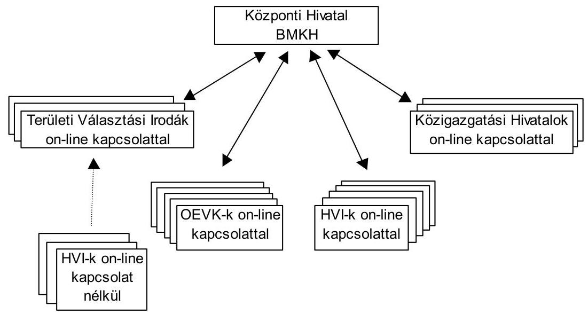

Önkormányzati képviselő választásnál
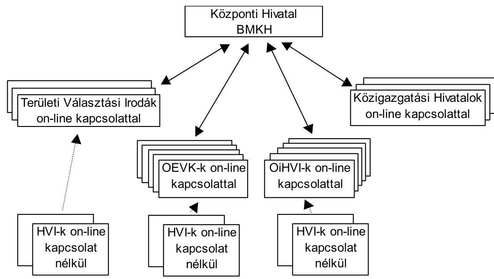

Az önkormányzati választásnál a TVI vezető intézkedése alapján a helyi önkormányzati okmányirodák a számítógépes rendszerükbe nem tartozó online kapcsolat nélküli HVI-k részére is biztosították a választás pénzügyi adatainak feldolgozását.

---

# 2.4. A választásra jogosultak értesítésének költségei 

A választásokat megelőzően sem a BMKH, sem a közigazgatási hivatalok nem végeztek felmérést arra vonatkozóan, hogy az önkormányzatok hol kívánják elkészíttetni a választási névjegyzékeket és az értesítőket. Az ezekre vonatkozó normatívák szerinti összeget a helyi önkormányzatok kapták meg. A HVI vezetők döntésétől függően a feladatot a BMKH, a közigazgatási hivatalok, vagy maguk a települési önkormányzatok végezték el.

A BMKH előkalkulációt készített, de a normatívával azonos árat számlázott a megrendelő HVI-k felé. A közigazgatási hivatalok közül a Bács-Kiskun és a Heves megyei közigazgatási hivatal készítette el a megye valamennyi önkormányzata részére a névjegyzéket és az értesítőket, kalkuláció után a normatívával azonos áron. A Fővárosi és a Pest megyei HVI-k teljes körben a BMKH-tól rendelték meg a szavazási okmányokat. Edelény város helyben készítette el az értesítőket és ezzel az országgyűlési választásnál 50 ezer Ft, az önkormányzati választásnál 12 ezer Ft megtakarítást ért el. Az értesítőt helyben elkészítő önkormányzatok a normatíva összegét számolták el erre a célra.

Az értesítők kézbesítését a posta az ellenőrzött önkormányzatok 11,5\%-nál végezte, ebből kedvezményt az önkormányzatok 7,7\%-nál adott. A legalacsonyabb postai kézbesítési díj Kerepes községben ( 9 Ft/értesítő egységár), a legmagasabb ( $37,50 \mathrm{Ft} /$ értesítő) Újfehértó Város Önkormányzatánál volt. Az értesítők kézbesítéséért az ellenőrzött önkormányzatoknál a posta részére átlagosan $32,25 \mathrm{Ft} /$ értesítő díjat fizettek az önkormányzatok. Az értesítők kézbesítését a HVI-k a postai úton kívül saját dolgozók, vagy külső személyek megbízásával teljesítették.

A Borsod megyei Alsógagy, Csenyéte, a Pest megyei Péteri, Püspökszilágy, a Somogy megyei Bakkháza, Háromfa községek önkormányzatai saját dolgozóikkal végeztették el kézbesítési díj fizetése nélkül a feladatot. A Borsod megyei Dámóc Község Önkormányzata fizette a - vizsgált körből - legmagasabb 60 Ft/értesítő kézbesítési díjat a megbízott személyeknek.

### 2.5. Személyi juttatások a választási szerveknél

A választás központi feladatainak végrehajtását az OVI, a BMKH, a BM szervezetei, az ORFK és a BM Duna Palota biztosította.

A központi szervek működési kiadásai között a személyi juttatások a következők voltak a két választásnál:

| Központi szervezet   megnevezése | Országgyúlési   képviselő választások |  | Önkormányzati   képviselö választás |  |
| :--: | :--: | :--: | :--: | :--: |
|  | létszám   (fó) | ezer Ft/fö | létszám   (fó) | ezer Ft/fö |
| OVI | 39 | $133-1010$ | 52 | $60-800$ |
| BMKH | 85 | $84-202$ | 46 | $50-250$ |
| BM | 26 | $66-330$ | 13 | $40-60$ |
| ORFK | 36 | $83-200$ | 27 | $30-200$ |
| BM Duna Palota | 10 | $57-83$ | 5 | $60-100$ |

---

Az országgyűlési választásoknál ezen szervezeteknél összesen 196 fő, az önkormányzati választásnál összesen 143 fő részesült személyi juttatásban együttesen 23,5 , illetve 14,9 millió Ft összegben.

# A választásokhoz elszámolt személyi juttatásokat jutalomként fizette a BMKH. 

A hivatkozott BM rendeletek szerint a helyi választási irodavezetők díjazásáról a TVI vezetőjének a feladat típusú elszámolás elfogadásával egy időben kellett döntenie és intézkednie a kifizetésről. Az elszámolás leadását és elfogadását megelőző kifizetés a vizsgált körben egyik választásnál sem fordult elő.

A TVB tagjainak díjazását a TVI vezetője biztosította a hivatkozott BM rendeletekben meghatározott normatívák összegének megfelelően.

A Fővárosi Választási Bizottság tagjai a normatíva összegének átvételéről írásban lemondtak mind a két választásra vonatkozóan, mivel az általuk végzett feladat mennyiségét és minőségét nem találták összhangba lévőnek a normatíva $6000 \mathrm{Ft} /$ fő összegével.

Az ellenőrzött HVI vezetők részére a TVI vezetők a hivatkozott BM rendeletek szerinti összeget biztosították mind a két választásnál.

A jegyzők az országgyűlési választások I. fordulójánál 93,6\%-ban, a II. fordulónál 81,3\%-ban az önkormányzati választásnál 85,9\%-ban biztosították a normatíva szerinti összeg kifizetését a szavazatszámláló bizottsági tagoknak, a jegyzőkönyvvezetőknek, a helyi választási iroda és bizottság tagjainak.

A személyi juttatások legalább normatíva szerinti összegben történő biztosítására vonatkozó BM előírásokat a jegyzők 6,4\%-a az országgyűlési választásoknál, $14,1 \%$-a az önkormányzati választásoknál sértette meg azzal, hogy a normatíva szerinti összegnél kevesebbet fizettek ki a közremúködők részére.

## Nem biztosította valamennyi közremúködőnek legalább a normatí-

va szerinti összeget az országgyűlési választás I. és II. fordulójánál 5-5, az önkormányzati választásnál 11 önkormányzat.

A személyi kiadások normatívájának teljes összegben történő kifizetését nem teljesítették az országgyűlési választásoknál: Bükkösd, Kóka, Kölesd, Medina községek és Vonyarcvashegy nagyközség, az önkormányzati választásoknál; Bükkösd, Tarnaőrs, Kóka, Nyársapát, Szentlő́rínckáta, Kölesd, Medina, Csörnyeföld és Rédics községek, valamint Dencs nagyközség és Bátaszék város.

A normatívához viszonyított csökkentés mértéke átlag $2550 \mathrm{Ft} /$ fő volt, amelynek szélső értéke 500-3000 Ft/fő között változott. Az így „megtakarított" összeget más közreműködő személyek jutalmazására fordították a HVI vezetők.

Medina község jegyzője a díjazás jogcímére adott normatíva szerinti összeget 2000-5800 Ft értékủ étkezési utalvány vásárlására használta fel, amit (szélesebb körben póttagok részére is) kiosztott, ezzel megsértette a már hivatkozott BM rendeletek 5. § (2) bekezdés a) pontjának azon előírásait, mely szerint a személyi jut-

---

tatásnál a normatíva szerinti összeget legalább biztosítani kell és a természetbeni juttatás utáni személyi jövedelemadó fizetési kötelezettség teljesítését ${ }^{13}$ is elmulasztotta. A mulasztás pótlására a helyszíni ellenőrzés során a jegyző figyelmét felhívtuk.

# 2.6. Az önkormányzatok, közigazgatási hivatalok részére átadott egyéb múködési célú pénzeszközök 

A két választáshoz kapcsolódó pénzeszközök biztosítása az önkormányzatok és közigazgatási hivatalok részére a hivatkozott BM rendeletekben rögzített normatívák alapján történt. Az informatikai feladatok megoldása az 1998. évi választásokhoz beszerzett, valamint az okmányirodák eszközparkjával és néhány központilag (BMKH által) beszerzett és finanszírozott, majd használatra az önkormányzatoknak ideiglenesen átadott eszközökkel és kapacitásokkal (hálózati kapcsolatok) valósult meg.

Egyéb múködési célú - nem normatív - támogatást a BMKH külön intézkedése alapján három feladathoz kaptak a választási szervek. Ezeket a támogatásokat a BM rendeletek nyilvántartásra vonatkozó előírásai szerint elkülönítetten választási szakfeladaton kellett könyvelni, az elszámolást a BMKH rendelkező levélében rögzítetteknek megfelelően az alábbiakban részletezettek szerint kellett teljesíteni:

- a TVI-k a választásokra történő szakmai felkészítés (oktatás) céljából egyéb működési célú támogatásban részesültek az oktatásban résztvevők száma alapján meghatározott összegben.

Az ellenőrzött Bács-Kiskun Megye Önkormányzata 2,7 millió Ft és 1,4 millió Ft, a Pest Megye Önkormányzata 3,8 millió Ft és 2,2 millió Ft, valamint Budapest Főváros Önkormányzata 4,2 millió Ft és 1,7 millió Ft támogatást kapott a két választásra történő szakmai felkészítés céljából.

A BMKH a TVI-k részére az országgyűlési választásokhoz e célra összesen 43,6 millió Ft-ot, az önkormányzati választások esetében 22,5 millió Ft-ot utalt át. A TVI-k a többlettámogatásra vonatkozó rendelkező levél tartalmának megfelelően a győri Széchenyi István Egyetem számlája alapján részére kifizették az oktatás ellenértékét és az összeg felhasználásáról az előírt határidőben elszámoltak a BMKH felé. A felkészítő oktatás költségeinek több tételben történő és kétszeres utalásának díjtételei összesen 115 ezer Ft többletköltséget jelentettek;

- a BMKH-tól az országgyűlési választások zavartalan lebonyolítása érdekében 1,5 millió Ft múködési célú támogatást kapott a Heves megyei Közigazgatási Hivatal az informatikai feladatok ellátásához szükséges irodaterület korszerű, biztonságos kialakításához. A 2002. április 15-ei határidőn belül készített elszámolás szerint a karbantartás jellegű munka elvégzését a Heves

[^0]
[^0]:    ${ }^{13}$ A személyi jövedelemadóról szóló 1995. évi CXVII. törvény 69. §-a a természetbeni juttatások adófizetési kötelezettségét írta elő.

---

megyei önkormányzat a „Megyeháza" rekonstrukciója keretében megoldotta.

- a BMKH átutalt az országgyúlési választások II. fordulójához az érintett OEVK-k részére választókerületenként 100 ezer Ft-ot az OEVK-t a múködtető polgármesteri hivatal költségvetési számlájára. Az ellenőrzött önkormányzatok közül 6 önkormányzat kapott támogatást, amelyről az elszámolást az előírásnak megfelelően teljesítették.

# 2.7. Közbeszerzések és szabadkézi vételek lebonyolítása 

A BMKH a választásokkal kapcsolatos közbeszerzési eljárásoknál a Kbt. tárgyalásos eljárásra vonatkozó előírásait, az egyes beszerzések nemzetbiztonsági és titokvédelmi okok miatti sajátos szabályairól szóló 151/1999. (X. 22.) Korm. rendeletet, valamint a központi költségvetési szervek központosított közbeszerzéseinek részletes szabályairól szóló 125/1996. (VII. 24.) Korm. rendeletet alkalmazta.

A BMKH 2002. évi országgyúlési, valamint önkormányzati választások lebonyolítása érdekében 10 közbeszerzési eljárást folytatott le, az informatikai eszközök 90\%-át központosított közbeszerzés keretében szerezte be. A közbeszerzési eljárások közül öt az országgyűlési, három az önkormányzati, három mindkét választást érintette. A közbeszerzések tárgyát és azok beszerzési értékét a 6 . számú melléklet részletezi.

A közbeszerzési eljárásokkal kapcsolatos feladatokat, hatásköröket, a felelősségi rendszert a hivatal SzMSz-e, valamint vezetői intézkedései megfelelő részletességgel tartalmazták. A BMKH a Kbt. szerinti közbeszerzési eljárásait, mint megbízó - a központosított közbeszerzés keretében vásárolt informatikai eszközök beszerzése kivételével - a BMBK Rt. útján bonyolította le.

A BMKH feladatairól a 2002. évi országgyúlési képviselő választás előkészítése érdekében kiadott 41/2001. (BK 20) BM utasítás 1. pontja a 2002. évi választási feladatok előkészítésére munkaszervezet (projekt szervezet) létrehozását írta elő. A BMKH-n belül létrehozott projekt szervezet közreműködött az egyes beszerzési eljárások előkészítésében, menedzselésében, minőségbiztosításában és az eljárások dokumentálásában. A munkaszervezet feladatainak megoldásában a BMKH dolgozói, valamint a 2002. évi országgyúlési választás előkészítésével közbeszerzési eljárást követően feladattal megbízott vállalkozások érdemi döntéshozó munkatársai vettek részt.

A projekt szervezet felügyeletét a BM közjogi, informatikai és távközlési, valamint közgazdasági helyettes államtitkáraiból és a BMKH hivatalvezetőjéből álló négyfős Felügyelő Bizottság látta el. A projekt irányító vezető apparátus írásos előterjesztések alapján rendszeresen tárgyalt és döntött a választások előkészítésével kapcsolatos közbeszerzési feladatokról.

Az országgyúlési képviselő választáshoz kapcsolódó közbeszerzések beleértve a központosított közbeszerzést is - szerződés szerinti értéke 3462,6 millió Ft, az önkormányzati képviselő választáshoz kapcsolódó közbeszerzések értéke 1876,6 millió Ft volt.

---

A BMKH a Kbt. előírásait az alábbi kivételekkel betartotta a közbeszerzési eljárások lefolytatása, a szerződések megkötése és módosítása során:

- A BMKH a választások sikeres lebonyolításához szükséges, központosított közbeszerzés keretében nem beszerezhető informatikai eszközöket, a szükséges szoftvereket, valamint az egységes hálózati rendszer kialakítását és a rendszernek az országgyúlési képviselő választás alatti üzemeltetését informatikai fővállalkozás keretében hirdetmény közzétételével induló tárgyalásos közbeszerzési eljárás keretében szerezte be. Az eljárás során a Kbt. előírásait alapvetően betartották. A Kbt. 71. § (5) bekezdésének tárgyalásos eljárás ajánlattételi határidejére vonatkozó előírását azonban nem tartották be, azáltal, hogy a hétnapos ajánlattételi határidő megállapítása túl rövid idő ahhoz, hogy az ajánlattevők megfelelő ajánlatot tehessenek (az ajánlattételi hétnapos időszakban három munkaszüneti nap is volt). A tárgyalásos eljárásban ajánlattételre felkért három szervezet közül az egyik a rövid határidőre hivatkozással nem tett ajánlatot.
- A 2002. évi országgyúlési választások I. és II. fordulóján részvételre felhívó pártsemleges mozgósító kampány anyagainak tervezése és elkészítése tárgyában lefolytatott közbeszerzési eljárás eredményeként megkötött vállalkozási szerzödés módosítása során megsértették a Kbt. 73. § (1) bekezdés előírását, amely szerint a felek csak akkor módosíthatják a szerződésnek az ajánlati felhívás, a dokumentáció feltételei, illetve az ajánlat tartalma alapján meghatározott részét, ha a szerződéskötést követően beállott körülmény folytán a szerződés valamelyik fél lényeges jogos érdekét sérti. Ilyen körülmény azonban a szerződésmódosítást megelőzően nem következett be. A szerződésmódosításra azért került sor, mert a vállalkozó az eredeti szerződésben vállalt kötelezettségét csak részben teljesítette. A szerződésmódosítás eredményeként a BMKH mint megrendelő 3,7 millió Ft értékű kötbér igény érvényesítésétől eltekintett annak ellenére, hogy az eredeti vállalkozási szerződésben szereplő kötbérfizetési kötelezettség alóli mentesülés feltételei nem teljesültek.
- Az emberi erőforrások, speciálisan képzett szakértői kapacitások biztosítása érdekében a BMKH hirdetmény közzétételével induló, gyorsított tárgyalásos eljárás lefolytatásáról a Kbt. 70. § (1) bekezdés c) pontjában és a 72. § (1) bekezdésben foglaltakra hivatkozva, de a 72. § (1) bekezdésében foglaltak megsértésével döntött. Az eljárási mód választását a BMKH azzal indokolta, hogy az ajánlatkérő által előre nem látható okból előállt rendkívüli sürgőség miatt a törvényben előírt határidők nem lennének tarthatók. A Kbt. 72. § (1) bekezdésében előírtak szerint rendkívüli sürgősséget indokló körülmények azonban nem eredhetnek az ajánlatkérő mulasztásából. Az ajánlatot kérő azért indított gyorsított eljárást a 2001. március 22-én megküldött felkérés után mivel a hirdetmény és az ajánlati felhívás tartalmának egyeztetése olyan mértékben elhúzódott, hogy a hirdetmény csak 2001. június 6 -án jelent meg.
- A BMKH a 2002. évi önkormányzati választás előkészítéséhez, lebonyolításához szükséges informatikai szolgáltatások nyújtása tárgyában hirdetmény közzétételével induló gyorsított tárgyalásos eljárást kezdeményezett a Kbt. 70. § (1) bekezdés c) pontjában és a 72. § (1) bekezdésében foglaltak-

---

ra hivatkozással. A választott eljárási formát azzal indokolták, hogy az ajánlatkérő által előre nem látható okból előállt rendkívüli sürgőség miatt a törvényben előírt határidők nem lennének tarthatók. A Kbt. hivatkozott bekezdései kimondják, hogy a rendkívüli sürgősséget indokoló körülmények nem eredhetnek az ajánlatkérő mulasztásából, ezt az előírást azonban nem tartották be. Jelen esetben a sürgősséget indokoló körülmények abból eredtek, hogy az eljárás kiírására későn került sor.

- A 2002. évi országgyűlési választás előkészítése érdekében a BMKH hivatal vezetője, mint kötelezettségvállaló 2001. április 9-én - a választási szerveknél várhatóan dolgozó 476 fő köztisztviselő oktatásának, szakmai képzésének lebonyolítására - a Kbt. 2. § (1) bekezdésében foglalt előírásoknak figyelmen kívül hagyásával megbízási szerződést kötött a győri Széchenyi István Egyetemmel az 1996. év óta meglévő együttműködési megállapodásra történő hivatkozással $81520 \mathrm{Ft} /$ fő díjazás ellenében. A szerződéssel az OVI vezetője és a BM informatikai és távközlési helyettes államtitkára egyetértett, valamint a BMKH-n belül a kötelezettségvállalás ellenjegyzésére jogosult ellenjegyezte. A 2001. április 9-én megkötött „megállapodás" alapján végrehajtott oktatás tapasztalataira és a korábbi együttműködési megállapodásra hivatkozva 2002. június 18 -án az önkormányzati választáshoz kapcsolódóan hasonló tartalmú „megállapodást" kötött a BMKH a győri Széchenyi István Egyetemmel. A szerződések az egész oktatás megrendelésének tekinthetők, a BMKH végezte a hallgatók beiskolázását, értesítette a résztvevőket az oktatás helyéről, idejéről és a tanfolyam pénzügyi fedezetét is biztosította. A BMKH a megyei főjegyzők részére előírta, hogy fizessék ki az egyetem által a TVI részére küldött számla szerinti összeget, amely azonos volt a TVI részére e feladatra átutalt összeggel. Az egyetemmel kötött megállapodásokkal a BMKH az oktatás együttesen 76,7 millió Ft költségét olyan összegű részekre bontotta, hogy az egyes részek a Kbt. 5. § (1) bekezdésben foglalt előírásra figyelemmel a Magyar Köztársaság 2001-2002. évi költségvetéséről szóló 2000. évi CXXXIII. törvény 59. § (1) bekezdés c) pontjában a szolgáltatás közbeszerzési értékhatáraként meghatározott 9 millió Ft-ot nem haladta meg. Ezzel a magatartással a BMKH a részekre bontásra vonatkozó, a Kbt. 5. § (1) bekezdésben foglalt tilalmat megszegte.

A BMKH két vállalkozási szerződés esetében nem határozta meg megfelelő részletességgel az igénybevett szakértői kapacitás által elvégzendő feladatok tartalmát, illetve a kapacitás mennyiségét, valamint a teljesítési határidőket. Ezért a szerződések tág teret engedtek annak értelmezésére, milyen feladatok, milyen részhatáridőkkel történő teljesítése várható el a vállalkozóktól.

A közbeszerzési eljárások eredményeként megkötött szerződések formailag minden esetben meghatározták a teljesítés átadásának-átvételének rendjét, és a teljesítés szakmai igazolásának módját. A közbeszerzési eljárások eredményeként megkötött szerződésekhez kapcsolódó valamennyi számla átvizsgálása alapján megállapítható volt, hogy pénzügyi teljesítés minden esetben szabályosan kiállított számla alapján történt. Két szerződés esetében az elvégzendő feladat és a részhatáridő elégtelen meghatározása miatt a teljesítésigazolás sem rögzítette pontosan a teljesítés tartalmát, csupán a szerződésre hivatkozva igazolták a teljesítést.

---

- Az emberi erőforrások, speciálisan képzett szakértői kapacitások biztosítása tárgyában az országgyúlési választással és az önkormányzati választással kapcsolatos számlák teljesítésigazolásai a vállalkozási szerződésben meghatározott 8-8 feladat közül 6-6 feladat esetében a teljesítés tényét bizonyító írásos dokumentumra hivatkoztak. Ezekben az esetekben egyértelmúen ellenőrizhető volt a szakmai teljesítésigazolás valóságtartalma. Két feladat - a választási informatikai projekt tervezése, irányítása, az egyes választási alprojektek végrehajtásának koordinálása, valamint a közbeszerzési eljárások menedzselése - esetében azonban ilyen, a teljesítés tényét bizonyító dokumentumokra való hivatkozást a teljesítés szakmai igazolásai nem tartalmaztak.
- A 2002. évi országgyúlési, valamint önkormányzati választások pénzügyi, logisztikai előkészítéséhez, lebonyolításához szükséges modulok és kapcsolódó szolgáltatások nyújtása tárgyában kötött vállalkozási szerződésben meghatározott 6-6 részfeladat közül 4-4 részfeladat esetében a benyújtott részszámlákhoz csatolt szakmai teljesítésigazolások a feladat teljesítése eredményeként keletkezett dokumentumra vonatkozó hivatkozást tartalmaztak. Ezekben az esetekben a hivatkozott dokumentumok elkészültek, a tényleges teljesítés ellenőrizhető volt. Az emberi kapacitás biztosítására vonatkozó korábban már hivatkozott két-két feladat esetében a teljesítésigazolás nem jelölte meg az elvégzett feladatot, vagy azt a dokumentumot, amely alapján az elvégzett konkrét feladat tartalma megállapítható lett volna.

A BMKH választásokhoz kapcsolódó kiadásaiból 6\%-ot képviselt a szabadkézi beszerzés, amelyekre az Szkr. előírásai vonatkoztak. A szabadkézi beszerzéssel kapcsolatos intézményi követelményeket a BMKH hivatalvezetői intézkedése azonban nem teljes körűen tartalmazta. Az intézkedésből hiányzott annak előírása, hogy a beszerzés megkezdését jelentő ajánlatkérésben szerepelnie kell az elvárt minőségi követelmények meghatározásának, valamint nem szabályozták, hogy kinek milyen szállítási, szolgáltatási, banki referenciák alapján kell tájékozódnia az ajánlattevőkről.

A BMKH a választásoknál összesen 226 szabadkézi vétellel történt beszerzést végzett 543,6 millió Ft értékben, ebből az országgyúlési választásnál 85 beszerzést 215,6 millió Ft értékben, az önkormányzati és országos kisebbségi választásoknál 141 beszerzést 328,0 millió Ft értékben.

A beszerzéseknél a jogszabályi követelményeket jellemzően betartották, a beszerzések mintegy 10\%-át érintően különböző mulasztást tapasztaltunk.

Hiányosságként állapítottuk meg, hogy a szállítási, szolgáltatási, banki referencia hiányában nem tájékozódtak az írásban ajánlattevőkről; a beérkezett ajánlatok tartalmának összehasonlításáról dokumentációt nem készítettek; a teljesítésigazolás keltét nem tüntették fel a bizonylaton; az ajánlatkérés nem tartalmazta a feladat részletes leírását.

---

# 2.8. A felhalmozási célú pénzeszközök felhasználása, használatra átadott egyéb eszközök nyilvántartása 

A BMKH az országgyúlési és önkormányzati képviselő választási pénzeszközből immateriális javak és tárgyi eszközök vásárlására 2466,3 millió Ft-ot használt fel.

A számítástechnikai eszközök beszerzésével a BMKH az informatikai rendszerének korszerűsítését és kapacitás bővítését biztosította. A BMKH a helyi okmány irodáknál egyéb közigazgatási feladatokra már kialakította, illetve biztosította a megfelelő számú számítógéppel ellátott országos hálózatot, így a választáshoz kapcsolódóan nem volt szükség a helyi választási szerveknél további számítógépek beszerzésére, felhalmozási pénzeszközök felhasználására.

A választások megfelelő lebonyolítása érdekében a BMKH nyomtatókat adott át a közigazgatási hivatalok részére. Ezeket az eszközöket a közigazgatási hivatalok az Sztv. 69. § (2) bekezdése szerint, mint idegen helyen tárolt eszközt nyilvántartásba vették. A használatba kapott eszközökről a közigazgatási hivatalok 2002. év végi állapotot tükröző tárolási nyilatkozatot készítettek és küldtek a BMKH részére a mérlegzárásig. A kapott informatikai eszközöket a közigazgatási hivatalok egyéb államigazgatási feladatuk ellátásához is hasznosították.

A 2002. évi választásokhoz vásárolt eszközöket a BMKH vette állományba, a megyei és helyi választási szerveknek véglegesen eszközt nem adtak át. A 2002. évi választásokhoz beszerzett eszközöket a BMKH az eszközök számviteli nyilvántartásában nem különítette el a statisztikai adatgyűjtés és feldolgozás feladataihoz kapcsolódó eszközöktől. Az ellenőrzés során az utalványrendelet vizsgálatával lehetett megállapítani, hogy egy-egy kiválasztott eszköz beszerzése a választásokhoz kapcsolódott-e. Az átadási és a tárolási bizonylatokból sem állapítható meg, hogy az eszközöket a választások lebonyolításához, vagy az okmányirodai egyéb feladatokhoz adták át az érintetteknek. A választásokhoz beszerzett immateriális javak és tárgyi eszközök mennyisége és értéke indokolta volna az eszközök feladathoz kapcsolódó elkülönített nyilvántartását, amelynek kialakítását a helyszíni ellenőrzés során megkezdték.

Az előző választásokhoz használatra kapott eszközökről az önkormányzatok minden év végén küldtek tárolási nyilatkozatot a BMKH részére, amely azonban nem minden eszközre terjedt ki a Tolna Megyei Közigazgatási Hivatalnál és Zalalövő Város Önkormányzatánál.

A választásokhoz 2002. évben az OVI 20000 csomag ( 3 db nagyméretű és egy db kisméretű) papír szavazóurnát és 22000 db álló, 22000 db asztali papír szavazófülkét vásárolt, ezt az OEVK-t működtető polgármesteri hivatalokhoz küldte meg kérve, hogy a HVI-hez továbbítsanak szavazókörönként 2 db szavazóurna csomagot és 2-2 db szavazófülkét. Ezen eszközök beszerzési összértéke 70,2 millió Ft volt. Az OVI nem végzett előzetes felmérést a papír szava-

---

zóurnák és a papír szavazófülkék beszerzésének szükségességéről ${ }^{14}$. A papír szavazófülkéket az ellenőrzött önkormányzatok 14,1\%-a stabilitási problémák miatt nem használta, illetve 2,6\%-a függöny kiegészítést alkalmazott, ezzel oldotta meg a szavazás titkosságának biztosítását. Az előző választások lebonyolításához az önkormányzatok által készített nem papír alapanyagú szavazó fülkéket a 2002. évi választások során is használták.

# 3. A VÁlasztÁsi adatszolgáltatÁsokÉrt elszámolt szOlGÁlTATÁSI DÍJAK 

A választási adatszolgáltatásokért fizetendő igazgatási szolgáltatási díjakról szóló 10/1998. (II. 20.) BM rendelet és azt módosító 5/2002. (II. 8.) rendelet szabályozta a BMKH által a választásokhoz kapcsolódóan a teljesített szolgáltatásért felszámítható díjak mértékét és elszámolását. A Ve. tv. 45 §-ának (1)-(2) bekezdése szerint a névjegyzékben szereplő választópolgárokról kért adatszolgáltatásokért igazgatási szolgáltatási díjat kell fizetni.

A pártok, képviselők és társadalmi szervezetek adatszolgáltatásokat kértek az először választó polgárokról, minden szavazóról, különböző szempontok szerint (nemek, korosztály stb.). A BMKH-nál az elszámolásoknál szabályosan jártak el. Írásbeli megrendelés után az előirás szerinti díjtétellel számlát állítottak ki. A bevételt az intézmény a statisztikai adatgyűjtés és feldolgozás feladat bevételei között az intézményi ellátási díjaknál (911211) számolta el, azonban csak az analitikus vevő nyilvántartásból volt megállapítható a választásokhoz kapcsolódó bevételek összege. A választások bevételeinek és kiadásainak elkülönített nyilvántartására meghatározott szakfeladatokra nem könyvelték ezen bevételeket.

A BMKH az országgyűlési választásokkal kapcsolatos adatszolgáltatásért 0,5 millió Ft, önkormányzati választás adatszolgáltatásáért 0,9 millió Ft, összesen 1,4 millió Ft bevételt realizált, amely összeg a BMKH név és lakcím adatszolgáltatásából származó éves bevételének 1,2\%-a.

A választások tervezésénél a kiadási előirányzatok meghatározásra kerültek, de választással kapcsolatos bevételt nem terveztek. A választáshoz kapcsolódó bevételt a BMKH a hivatal alapfeladatánál (statisztikai adatgyűjtés és feldolgozás szakfeladaton) vette figyelembe, ugyanakkor a BMKH közvetett kiadásaiból költségfelosztással a választási feladatok kiadásait megnövelte (önkormányzati választásnál 67,7 millió Ft-tal). Ezen bevétel a választásokhoz kapcsolódó tényleges bevételeket jelentettek a BMKH számára, aminek választási szakfeladaton történő figyelembevétele az önkormányzati választások számszerúsített hiányát csökkentette volna.

[^0]
[^0]:    ${ }^{14}$ Az OVI vezetőjének a 10/2002. (04.15) számú intézkedése fakultatív jelleggel engedélyezte ezen papír szavazófülkék igénybevételét, a hagyományos szavazófülkék kötelező használata mellett.

---

# 4. ELSZÁMOLÁS A VÁLASZTÁSI FELADATOKRA FELHASZNÁLT PÉNZESZKÖZÖKKEL 

### 4.1. Az önkormányzatok és a közigazgatási hivatalok elszámolása

Az ellenőrzött önkormányzatok a feladattípusú elszámolásukat a már hivatkozott BM rendeletek előírásai szerint készítették el.

Többlet-kiadásként a választási bizottságok tagjainak átlagbér megtérítése miatt az országgyúlési képviselő választásnál országosan összesen 12,7 millió Ft, az önkormányzati képviselő választásnál 8,6 millió Ft, valamint a szavazatszámláló bizottságokba bevont póttagok díjazására 28,8 millió Ft összeget tartalmaztak az elszámolások. A többletkiadás elszámolása az ellenőrzött önkormányzatoknál a már hivatkozott BM rendeletek 5. § (2) bekezdés b) pontja alapján jogszerú volt.

Az ellenőrzött önkormányzatok és közigazgatási hivatalok elszámolásában nem szerepelt olyan kiadás, amely nem a választáshoz kapcsolódott.

A helyi és a területi választási irodák, valamint a közigazgatási hivatalok - amennyiben a választási feladatok ellátásához szükséges volt - a normatív támogatást saját költségvetésük terhére kiegészítették.

A választási feladatokkal kapcsolatos teljesített kiadások választásban közremúködő szervenkénti alakulását az alábbi táblázat tartalmazza:

Adatok: millió Ft-ban

| Választási szervek | Országgyúlési   képviselö választás | Önkormányzati   képviselö választás | Összesen |
| :-- | --: | --: | --: |
| HVI | 1416,2 | 1368,7 | 2784,9 |
| OEVK | 108,9 | 38,9 | 147,8 |
| TVI | 186,2 | 220,6 | 406,8 |
| Közigazgatási hivatalok | 69,2 | 25,9 | 95,1 |
| Összesen | $\mathbf{1 7 8 0 , 5}$ | $\mathbf{1 6 5 4 , 1}$ | $\mathbf{3 4 3 4 , 6}$ |

Feladat-elmaradás (pl. a II. forduló elmaradása) miatt az önkormányzatok az országgyúlési képviselő választásnál országosan összesen 134,7 millió Ft-ot, az önkormányzati képviselő választásnál 7,7 millió Ft-ot fizettek vissza a BMKH részére. Az ellenőrzött önkormányzatoknál a hivatkozott BM rendeletek 5.§ (2) bekezdés c) pontjában foglalt előírásokat a feladat-elmaradás miatti visszafizetésnél betartották.

Az elszámolás készítésére kötelezett ellenőrzött települési önkormányzatok 96\%-a készítette el elszámolását mindkét választásnál az előírt határidőn belül.

Később adta le az elszámolását az országgyúlési választásnál: Szigetvár város (3 nappal), Budapest főváros XV. kerülete (4 nappal), Bükkösd és Egerbocs községek (1-1 nappal); az önkormányzati választásnál: Bátaszék város (1 nappal), Sámod és Kerepes községek (4-4 nappal) önkormányzatai.

---

Az országgyúlési képviselő választásnál az ellenőrzött közigazgatási hivatalok 80\%-a a jogszabályban előírt határidőben küldte el a TVI részére az elszámolását (kivétel a Heves és a Pest megyei közigazgatási hivatal, amelyek 11 nap késéssel készítették azt el). Az önkormányzati választásnál a közigazgatási hivatalok 70\%-a készítette el és küldte el előírás szerinti határidőben a TVI részre a választással kapcsolatos elszámolását (a Baranya megyei, a Heves megyei és a Pest megyei közigazgatási hivatal az előírt határidő után 9-12 nappal küldte el elszámolását a TVI részére).

A TVI-k a részükre biztosított pénzügyi fedezetről és a beérkezett helyi választási irodák összesítéséről az elszámolásukat a hivatkozott BM rendeletek 8. § (1) bekezdésben meghatározott határidőben elkészítették. Az elszámolások adatait a BMKH-hoz a közvetlen számítógépes kapcsolattal eljutatták, de az OVI részére átadott, aláírt elszámolási dokumentumok több esetben késtek.

Az elszámolást az előírt határidő után nyújtotta be a Budapest Főváros Önkormányzata mintegy egy hónappal mindkét választásnál; az országgyúlési választásnál Baranya megye hat hónappal, Borsod-Abaúj-Zemplén és Győr-MosonSopron megye mintegy egy hónappal, további négy megye 2-10 nappal; az önkormányzati választásnál nyolc megyei önkormányzat 2-10 nappal.

Az elkészített elszámolásokban a kapott támogatásokról az önkormányzatok és közigazgatási hivatalok teljes körűen elszámoltak, azonban az ellenőrzött önkormányzatok negyedénél az érintett választási szakfeladatokon az országgyúlési képviselő választásnál összesen 202 ezer Ft-tal, az önkormányzati képviselő választásnál összesen 56 ezer Ft-tal alacsonyabb összeget mutattak ki, mint az elszámolásban.

A saját költségvetési forrásaik terhére az önkormányzatok és a közigazgatási hivatalok is teljesítettek olyan kifizetéseket a választásokra, amelyet nem mutattak ki a választási szakfeladaton. Ennek hiányában csak becsülni lehet, hogy milyen arányban, mértékben fedezte a központi támogatás a választásokhoz kapcsolódó összes kiadást.

Az ellenőrzött települési önkormányzatok 60\%-a, (az országgyúlési választásoknál 71,4 millió Ft, az önkormányzati választásnál 56,4 millió Ft) a fővárosi, megyei önkormányzati hivatalok 100\%-a, (az országgyúlési választásoknál 52,9 millió Ft, a helyhatósági választásnál 0,6 millió Ft) és a közigazgatási hivatalok 40\%-a, (a két választásra együtt 2,0 millió Ft-ot) teljesített saját forrásból kifizetést közvetlenül, vagy közvetetten a választásokhoz kapcsolódóan. A saját forrásból teljesített kiadások elsősorban személyi kifizetések voltak, ezen túlmenően, telefonköltséget, fénymásolást, épület-üzemeltetési kiadást, utazási kiküldetési kiadást jelentettek.

A vizsgált körben tapasztaltaknak az országos adatokra történő kivetítése útján végzett számítás szerint az önkormányzatok és a közigazgatási hivatalok a választási célra kapott központi támogatás 3434,6 millió Ft-os összegét mintegy 34,9\%-kal, 1200 millió Ft-tal egészítették ki.

Az egyes önkormányzatok között a kiegészítés mértéke jelentősen szóródott. A normatívák alapján számított előleget a központi támogatáshoz viszonyítva Bu-

---

dapest Főváros Önkormányzatánál 198-430\%-kal, fővárosi kerületeknél 207-298\%-kal, a megyei közgyűléseknél 0-110\%-kal, a közigazgatási hivataloknál 0-13\%-kal, a települései önkormányzatoknál 0-16\%-kal egészítették ki. Az OEVKt és HVI-t múködtető 78 önkormányzat 61,5\%-ánál nem mutattak ki saját forrásból történő kiegészítést. A becslésnél a vizsgált körben tapasztaltak alapján a szükséges (óvatos) súlyozást elvégeztük.

# 4.2. A BMKH-nál felhasznált pénzeszközök elszámolása 

A BMKH a következő átcsoportosításokat kezdeményezte az intézményi szintű kiemelt előirányzatok között az országgyűlési választás előkészítése során:

- a felhalmozási kiadások intézményi szintű előirányzatának terhére 2001. évben 50 millió Ft-ot az országgyűlési választás előkészítése miatt a felújítási előirányzatra átcsoportosított;
- a választás személyi jellegű kiadási előirányzatát 168,7 millió Ft-tal, a választás dologi kiadási előirányzatát 478,6 millió Ft-tal csökkentette, 2002. évben ezzel egyidejúleg az intézményi egyéb múködési célú támogatások kiadási előirányzatát 148,2 millió Ft-tal, az intézményi felhalmozási kiadási előirányzatot 490,6 millió Ft-tal, valamint a felújítási előirányzatot 8,5 millió Ft-tal növelte.

A kiemelt előirányzatok közötti átcsoportosításhoz az Ámr. 48. § (1) bekezdés b), g), h) pontjaiban foglaltakkal összhangban a BM-PM az engedélyt megadta.

Az országgyűlési képviselő választásnál a BMKH vezetője a választások feladatonkénti kiadási költségtervének végrehajtásáról a hivatkozott BM rendeletek 8. § (2) bekezdése szerinti határidőben - a választás II. fordulójának napját követő 60 naptári napon belül - tájékoztatta az OVI vezetőjét. A BMKH vezetője szöveges beszámolót és a tervezéssel azonos szerkezetben részletes, feladatsoronkénti elszámolást készített, amelyben a módosított kiadási előirányzathoz (6323,7 millió Ft) viszonyítva mutatta be a felhasználást és a keletkezett maradvány összegét (7. számú melléklet).

Az elszámolásban az alábbiak szerint összegezte a BMKH a költségterv teljesítését:

Adatok: millió Ft-ban

| Megnevezés | Módosított   költségterv | Felhasználás | Maradvány |
| :-- | :--: | :--: | :--: |
| Megyei és helyi kiadások | 2049,8 | 1780,5 | 269,3 |
| Központi kiadásokra | 1652,9 | 1015,7 | 637,2 |
| Informatikai kiadásokra | 2621,0 | 2621,0 | - |
| Összesen: | $\mathbf{6 3 2 3 , 7}$ | $\mathbf{5 4 1 7 , 2}$ | $\mathbf{9 0 6 , 5}$ |

---

Az elszámolásban szereplő 5417,2 millió Ft felhasználás nem a tényleges pénzügyi kiadást, hanem azon túlmenően az országgyűlési választáshoz kapcsolódó pénzügyileg még rendezetlen tételeket és a kötelezettségvállalások összegét is tartalmazta.

A 906,5 millió Ft maradványból a megyei és helyi kiadásoknál a 269,3 millió Ft jelentkezett, ebből személyi juttatás 99,6 millió Ft, munkaadókat terhelő járulék 122,4 millió Ft és a dologi kiadás 47,3 millió Ft. A megtakarítást az okozta, hogy 45 OEVK-ban az országgyúlési választás I. fordulója eredményes volt, így a II. fordulóra tervezett kiadások megmaradtak. A tervezett központ kiadások 637,2 millió Ft-os megtakarítása az informatikai és nyomdai, szállítási kiadások mérsékléséből, valamint a választás II. fordulójának elmaradásából származott. A központi kiadások dologi megtakarítása a szavazásnapi nyomtatványok, a választás II. fordulójához szükséges csökkent számú szavazólapok előállítása, szállítási költsége és a nyomdai feladatok tervezetthez viszonyított csökkenéséből származott.

Az országgyűlési választásokról készített (60 napon belüli) elszámolásban szerepeltetett 906,5 millió Ft maradvány a pénzforgalmi teljesítések könyvelését követően a központi és informatikai kiadások pénzügyi rendezése során növekedett 7,2 millió Ft-tal. Az együttesen 913,7 millió Ft maradványt ( $906,5+7,2$ millió Ft) az önkormányzati választásnál tervezte felhasználni a BMKH.

A BMKH 2001. évben összesen 169,8 millió Ft kiadást számolt el választási kiadásként, ebből 43,6 millió Ft a TVI-k részére az oktatási feladatokhoz biztosított átadott pénzeszköz volt. A BMKH a 2002. évi számviteli nyilvántartásában és intézményi költségvetési beszámolójában az országgyűlési képviselő választás szakfeladaton 5220,5 millió Ft kiadást, 2003. évben pénzügyileg rendezett tételként további 2,6 millió Ft-ot mutatott ki.

Az elszámolásban felhasználásként mutatták ki az országgyűlési választásokat követően történt teljesítéshez kapcsolódóan 28,2 millió Ft-ot, amely ténylegesen az önkormányzati választást szolgálta ${ }^{15}$.

Nem szerepelt a felhasznált összegben ugyanakkor az országgyűlési választáshoz kapcsolódó 2002. július 13-i 40,5 millió Ft-os közzétételi díj, amelyet azért fizetett ki a BMKH, hogy nyilvánosságra hozza azoknak a szavazóköröknek az adatait, ahol többszöri számlálás történt. Ezt az összeget tévesen az önkormányzati választás kiadásai között vették figyelembe.

A fenti korrekciók elvégzését követően az országgyúlési választások kiadásai az előirányzott 6323,7 millió Ft-tal szemben 5405,2 millió Ft és a maradvány 918,5 millió Ft.

Az országgyűlési választásokra előirányzott összegből a BMKH-tól a BM részére átcsoportosított 47 millió Ft-ból választási részvételre felhívást tartalmazó rek-

[^0]
[^0]:    ${ }^{15}$ A téves elszámolást Kormányzati Ellenőrzési Hivatal 2002. évi ellenőrzése is megállapította és javaslatot tett az elszámolás módosítására, amely 2003. évben megtörtént.

---

lámkampányra felhasználásra került 25 millió Ft. A különbözetként jelentkező 22 millió Ft-ot a BM központi igazgatásánál maradványként tartották nyilván.

A BMKH a helyi és kisebbségi önkormányzati választásokról a választást követő 60 napon belüli elszámolási kötelezettséget határidőben, 2002. december 18án teljesítette (8. számú melléklet). Ezen elszámolásban a 3100 millió Ft központi költségvetési támogatással 913,7 millió Ft országgyúlési választási maradványból származó - összesen 4013,7 millió Ft - forrással számolt, amelyből 4005,3 millió Ft felhasználást mutatott ki. A különbséget jelentő 8,4 millió Ft-ot maradványként szerepeltette, amely nem tartalmazta a 2 millió Ft-os kötelezettségvállalást. Az elkészített elszámolás hiányossága, hogy nem mutatta be az elfogadott költségtervi és teljesítési adatokat egymással összevetve, az eltéréseket feltüntetve. A választást követő 60 napon belüli elszámolási kötelezettség túl korai volt, mivel az elszámolást követően még mintegy félévig tartott a feladatokra felhasznált pénzeszközök, pénzügyi rendezése.

A BMKH az ÁSZ kérésére 2003. május 9-i dátummal készített - az időközben rendezett tételekkel kiegészített - pontosított elszámolása szerint az önkormányzati választáshoz $(3100+918,5) \mathbf{4 0 1 8 , 5}$ millió Ft-tal rendelkezett, amelyből 3991,0 millió Ft-ot felhasználást mutatott ki. A számított maradvány 27,5 millió Ft, amely a hivatal előirányzat felhasználási adata szerinti összegtől (4001,4 - 3991,0 = 10,4 millió Ft) eltér, a két maradvány összege közötti különbözet a korrekciók levezetéséből számszerűsített országgyúlési választásnál képződött 918,5 millió Ft maradvány forrásként történő figyelembevételéből keletkezett.

A választási feladatokkal kapcsolatos teljesített kiadások megoszlása:
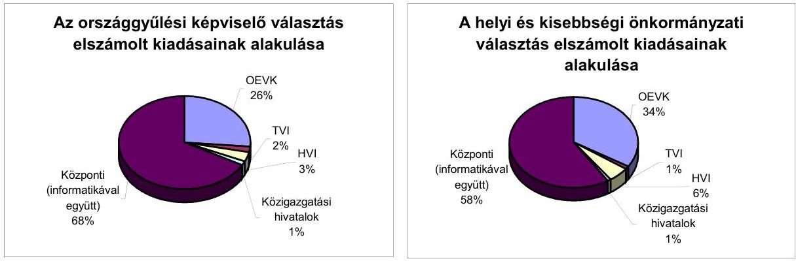

A Net. tv. 61.§ (4) bekezdése a) pontjában foglaltaknak megfelelően a fővárosi önkormányzat mellett múködő helyi kisebbségi önkormányzatokat a kerületi kisebbségi önkormányzatok képviselői, az elektorok választották meg. Az elektori gyűlések összehívását, a helyszínek biztosítását, a rendezvények technikai feltételeinek megteremtését a fővárosi önkormányzat oldotta meg. Az önkormányzat a fővárosi kisebbségi önkormányzatok választásának lebonyolításával kapcsolatban 1,4 millió Ft kiadást mutatott ki és központi normatív támogatás hiányában ezt a kiadást a saját forrásból finanszírozta.

---

A BMKH részére a helyi és kisebbségi önkormányzati képviselő választásra jóváhagyott összeg tartalmazta az országos és a helyi kisebbségi önkormányzati képviselő választások kiadásait is. Az elszámolásokból megállapítható volt, hogy az országos és a helyi kisebbségi választásra történő kifizetések (9. számú melléklet) más forrásból teljesültek, az elkülönített nyilvántartások alapján 2003. május 9 -ig erre a feladatra a felhasználás (2002.2003. év együtt) 94,1 millió Ft volt.

# 5. A VÁLASZTÁSI PÉNZESZKÖZÖK IGÉNYLÉSÉNEK, FELHASZNÁLÁSÁNAK ÉS ELSZÁMOLÁSÁNAK AZ ELLENŐRZÉSE 

### 5.1. Az OVI pénzügyi ellenőrzési tevékenysége

Az OVI vezetője a 2002. évi országgyűlési és önkormányzati képviselő választási költségek elszámolásának vizsgálatát ellenőrzési program alapján elrendelte, hogy a BMKH valamennyi TVI-nél, megyénként egy OEVI-nél vagy közigazgatási hivatalnál és egy HVI-nél elvégezze.

Az ellenőrzési programok végrehajtói a BMKH és a ZALASZÁM Informatikai Kft. munkatársai voltak. Az ellenőrzési programokban konkrétan meghatározta az ellenőrizendő választási szerveket.

Az országgyűlési képviselő választásnál a vizsgálatot valamennyi TVI-nél és hat közigazgatási hivatalnál, illetve 34 települési önkormányzatnál, az önkormányzati választásnál az ellenőrzést valamennyi TVI-nél, négy közigazgatási hivatalnál, illetve 53 települési önkormányzatnál elvégezték. Az ellenőrzések megállapításairól „ellenőrzési munkalapot" készítettek és adtak ki, amelyben megjelölték a konkrét hiányosságokat, javaslatokat azonban nem rögzítettek.

A vizsgált önkormányzatok közül az OVI öt önkormányzatnál - három TVI-nél és két önkormányzatnál (Mátraderecske, Szedres községek) - végzett ellenőrzést az országosan egységes ellenőrzési programja alapján. Az OVI ellenőrzése során ezen önkormányzatoknál a központi forrás felhasználását jogszerúnek minősítette.

A BMKH Közgazdasági főosztály vezetője az ellenőrzési tapasztalatokról összefoglaló jelentést készített, amelyben általános megállapításokat tett az ellenőrzött választási szervek elszámolásairól, szakmai feladat ellátásáról szerzett tapasztalataikról.

### 5.2. A TVI és a HVI pénzügyi ellenőrzési tevékenysége

A választási pénzeszközök felhasználásának ellenőrzése hiányos volt a területi és helyi szerveknél. A választási pénzeszközök igénylésére, felhasználására, elszámolására, annak ellenőrzésére külön ellenőrzési rendszert az ellenőrzött önkormányzatok közül csak kilenc (11,11\%) önkormányzatnál (ebből három megyei és hat települési önkormányzat) alakított ki, ezáltal eleget téve a hivatkozott BM rendeletek 10. § (1)-(2) bekezdésben előirt kötelezettségnek. A többi vizsgált önkormányzat közül a BMO-BMÖ rendeletek 10. § (4) bekezdésé-

---

ben meghatározottak szerint még eseti megbízást sem adott a HVI vezetője a választási iroda tagjának a választási pénzeszközök felhasználásának és elszámolásának ellenőrzésére.

A TVI-k a HVI-k elszámolásának számszaki ellenőrzését teljes körűen elvégezték, ezen túlmenően helyszíni ellenőrzést átlag 10\%-nál végeztek. Az FVI a 23 kerületi önkormányzat elszámolásának vizsgálatát elvégezte mind a két választás után.

A TVI-k az ellenőrzött önkormányzatok közül 6 önkormányzatnál végeztek a választás elszámolásával kapcsolatos utóellenőrzést, az elszámolásnál eltérést nem találtak, javaslatokat nem tettek.

# 6. Az ÁSZ 1998. ÉVI VÁLASZTÁSOKKAL ÉS NÉPSZAVAZÁSSAL ÖSSZEFÜGGŐ VIZSGÁLATI JAVASLATAINAK HASZNOSULÁSA 

Az elmúlt választások és népszavazás lebonyolítására felhasznált pénzeszközök vizsgálata során készített jelentésben javaslatokat tettünk a belügyminiszternek ${ }^{16}$, a KÖNYV Hivatalnak ${ }^{17}$ és a területi, helyi választási irodáknak és a TÁKISZ-oknak ${ }^{18}$.

A belügyminiszter részére tett javaslatok és azok hasznosulása a következő:

- „kezdeményezze, hogy az OVI vezetője az elmaradt országgyúlési kisebbségi választásokra, a helyi és kisebbségi önkormányzati képviselő választásokra, valamint az 1997. évi népszavazásra és az 1998-1999. évi választásokra előirányzott teljes összeg felhasználásáról készítsen az előírásoknak is megfelelő részletes elszámolást;"

Az 1998-1999. évi választásokra előirányzott teljes összeg felhasználásáról az ÁSZ jelentésben javasolt elszámolás nem készült el.

- „kezdeményezze, hogy az országgyúlési képviselő választás évét megelőző évi költségvetés tartalmazzon rendkívüli előirányzatot a választások előkészítésére, a választási év költségvetésében pedig a helyi és kisebbségi önkormányzati képviselők választásának fedezete is szerepeljen;"

A választások évét megelőző évi költségvetés - a 2001-2002. évi - a 2002. évi országgyúlési választás előkészítéséhez 6200 millió Ft előirányzatot tartalmazott. Nem realizálódott az önkormányzati választáshoz kapcsolódó azon javaslatunk, hogy a választási év költségvetése tartalmazzon kiadási előirányzatot ezen választás lebonyolításához.

[^0]
[^0]:    ${ }^{16}$ Az 1997. évi népszavazásra, továbbá az 1998. évi országgyúlési, valamint a helyi és kisebbségi önkormányzati képviselő választások lebonyolítására felhasznált pénzeszközök vizsgálatáról készített 1999. évi ÁSZ jelentésben részletesen kifejtésre került.
    ${ }^{17}$ Központi Nyilvántartó és Választási Hivatal, amely a BMKH jogelődje volt.
    ${ }^{18}$ Területi Államháztartási és Közigazgatási Információs Szolgálat

---

- „tegye egyszerűbbé, áttekinthetőbbé a választásokra fordított pénzeszközök finanszírozási és elszámolási rendszerét, valamint ennek során a körjegyzőségi sajátosságokat is vegye figyelembe;"

A körjegyzőségi sajátosságokat figyelembe vették a BMO-BMÖ rendeletekben.

- „szorgalmazza a Központi Adatfeldolgozó, Nyilvántartó és Választási Hivatal olyan szakemberekkel való megerősítését, hogy meg tudják tervezni és szervezni a következő választások feladatainak - különös tekintettel az informatikai feladatokra - irányítását, menedzselését saját köztisztviselőkkel;"

A belügyminiszter a BMKH feladatairól a 2002. évi országgyúlési képviselö választás előkészítése érdekében kiadott 41/2001. (BK. 20) BM utasításban a 2002. évi választási feladatok előkészítésére munkaszervezetet (projekt szervezetet) hozott létre, amelynek irányítói, vezetői a BMKH két hivatalvezető helyettese. A munkaszervezet felügyeletére három helyettes államtitkár és a BMKH vezető részvételével múködő Felügyelő Bizottság kapott megbízást.

- „kezdeményezze, hogy a választási kiadásokkal kapcsolatosan a helyi önkormányzatok esetében a kötelezettségvállalás és utalványozás szabályozása tekintetében az összhang biztosított legyen;"

A költségvetési szervek tervezésének, gazdálkodásának, beszámolásának rendszeréről szóló 156/1995. (XII. 26.) Korm. rendelet hatályon kívül helyezésével egyidejúleg az államháztartás múködési rendjéről kiadott 217/1998. (XII. 30.) Korm. rendelet 134. § (3) bekezdésében szereplő előirás az összhangot megteremtette.

Budapest, 2003. július " "

Dr. Kovács Árpád
elnök

Melléklet: $\quad 13 \mathrm{db} \quad 28$ lap

---

# Ellenőrzött önkormányzatok jegyzéke 

| Sorszám | Megye/föváros | Önkormányzat neve | Megye/ föváros | Város/ kerület | Nagyközség | Község 1000 fö lakósságszám |  |
| :--: | :--: | :--: | :--: | :--: | :--: | :--: | :--: |
|  |  |  |  |  |  | felett | alatt |
| 1 | BARANYA | Adorjás |  |  |  |  | x |
| 2 |  | Alsószentmárton |  |  |  | x |  |
| 3 |  | Baranyahidvég |  |  |  |  | x |
| 4 |  | Basal |  |  |  |  | x |
| 5 |  | Bükkösd |  |  |  | x |  |
| 6 |  | Cserdi |  |  |  |  | x |
| 7 |  | Csertő |  |  |  |  | x |
| 8 |  | Dinnyeberki |  |  |  |  | x |
| 9 |  | Drávacsepely |  |  |  |  | x |
| 10 |  | Drávaszerdahely |  |  |  |  | x |
| 11 |  | Gerde |  |  |  |  | x |
| 12 |  | Görcsöny |  |  |  | x |  |
| 13 |  | Helesfa |  |  |  |  | x |
| 14 |  | Ipacsfa |  |  |  |  | x |
| 15 |  | Kisszentmárton |  |  |  |  | x |
| 16 |  | Kistapolca |  |  |  |  | x |
| 17 |  | Kovácshida |  |  |  |  | x |
| 18 |  | Ócsárd |  |  |  |  | x |
| 19 |  | Patapoklosi |  |  |  |  | x |
| 20 |  | Pécsbagota |  |  |  |  | x |
| 21 |  | Regenye |  |  |  |  | x |
| 22 |  | Sámod |  |  |  |  | x |
| 23 |  | Síklósnagyfalu |  |  |  |  | x |
| 24 |  | Somogyapáti |  |  |  |  | x |
| 25 |  | Somogyhatvan |  |  |  |  | x |
| 26 |  | Somogyviszló |  |  |  |  | x |
| 27 |  | Szabadszentkirály |  |  |  |  | x |
| 28 |  | Szigetvár |  | x |  |  |  |
| 29 |  | Szőke |  |  |  |  | x |
| 30 |  | Vajszló |  |  | x |  |  |
| 31 |  | Velény |  |  |  |  | x |
| 32 | BACS-KISKUN | Megyei önkormányzat | x |  |  |  |  |
| 33 |  | Bácsborsód |  |  |  | x |  |
| 34 |  | Bácsszőlős |  |  |  |  | x |
| 35 |  | Csikéria |  |  |  |  | x |
| 36 |  | Dunavecse |  |  | x |  |  |
| 37 |  | Géderlak |  |  |  | x |  |
| 38 |  | Jászszentlászló |  |  |  | x |  |
| 39 |  | Katymár |  |  |  | x |  |
| 40 |  | Móricgát |  |  |  |  | x |
| 41 |  | Ordas |  |  |  |  | x |
| 42 | BORSOD-ABAÚJ-ZEMPLÉN | Abaújlak |  |  |  |  | x |
| 43 |  | Abaújszolnok |  |  |  |  | x |
| 44 |  | Alsógagy |  |  |  |  | x |
| 45 |  | Csenyéte |  |  |  |  | x |
| 46 |  | Cserépfalu |  |  |  | x |  |
| 47 |  | Cserépváralja |  |  |  |  | x |
| 48 |  | Dámóc |  |  |  |  | x |
| 49 |  | Edelény |  | x |  |  |  |
| 50 |  | Felsőgagy |  |  |  |  | x |
| 51 |  | Garadna |  |  |  |  | x |

---

| $\underset{\text { szám }}{S o r}$ | Megye/főváros | Önkormányzat neve | Megye/   főváros | Város/   kerület | Nagy-   község | Község 1000 fö lakósságszám |  |
| :--: | :--: | :--: | :--: | :--: | :--: | :--: | :--: |
|  |  |  |  |  |  | felett | alatt |
| 52 |  | Lácacséke |  |  |  |  | x |
| 53 |  | Novajidrány |  |  |  | x |  |
| 54 |  | Sajókápolna |  |  |  |  | x |
| 55 |  | Sajólászlófalva |  |  |  |  | x |
| 56 | HEVES | Bátor |  |  |  |  | x |
| 57 |  | Egerbocs |  |  |  |  | x |
| 58 |  | Egercsehi |  |  |  | x |  |
| 59 |  | Fedémes |  |  |  |  | x |
| 60 |  | Füzesabony |  | x |  |  |  |
| 61 |  | Kisnána |  |  |  | x |  |
| 62 |  | Mátraballa |  |  |  |  | x |
| 63 |  | Mátraderecske |  |  |  | x |  |
| 64 |  | Recsk |  |  | x |  |  |
| 65 |  | Szentdomonkos |  |  |  |  | x |
| 66 |  | Tarnalelesz |  |  |  | x |  |
| 67 |  | Tarnaméra |  |  |  | x |  |
| 68 |  | Tarnaőrs |  |  |  | x |  |
| 69 |  | Tenk |  |  |  | x |  |
| 70 |  | Vécs |  |  |  |  | x |
| 71 |  | Visznek |  |  |  | x |  |
| 72 |  | Zaránk |  |  |  |  | x |
| 73 | PEST | Megyei önkormányzat | x |  |  |  |  |
| 74 |  | Bugyi |  |  | x |  |  |
| 75 |  | Kerepes |  |  |  | x |  |
| 76 |  | Kóka |  |  |  | x |  |
| 77 |  | Nagykovácsi |  |  |  | x |  |
| 78 |  | Nyársapát |  |  |  | x |  |
| 79 |  | Pánd |  |  |  | x |  |
| 80 |  | Péteri |  |  |  | x |  |
| 81 |  | Püspökszilágy |  |  |  |  | x |
| 82 |  | Rád |  |  |  | x |  |
| 83 |  | Szentlórinckáta |  |  |  | x |  |
| 84 |  | Tápiószecső |  |  | x |  |  |
| 85 |  | Valkó |  |  | x |  |  |
| 86 | SOMOGY | Bakháza |  |  |  |  | x |
| 87 |  | Balatonmáriafürdő |  |  |  |  | x |
| 88 |  | Bábonymegyer |  |  |  |  | x |
| 89 |  | Háromfa |  |  |  |  | x |
| 90 |  | Kánya |  |  |  |  | x |
| 91 |  | Lad |  |  |  |  | x |
| 92 |  | Látrány |  |  |  | x |  |
| 93 |  | Nagyatád |  | x |  |  |  |
| 94 |  | Nagykorpád |  |  |  |  | x |
| 95 |  | Patosfa |  |  |  |  | x |
| 96 |  | Sántos |  |  |  |  | x |
| 97 |  | Somogybabod |  |  |  |  | x |
| 98 |  | Somogyegres |  |  |  |  | x |
| 99 |  | Somogytúr |  |  |  |  | x |
| 100 |  | Szabás |  |  |  |  | x |
| 101 |  | Visz |  |  |  |  | x |
| 102 |  | Zamárdi |  |  | x |  |  |
| 103 | SZABOLCS-SZATMÁR-BEREG | Beregsurány |  |  |  |  | x |
| 104 |  | Cégénydányád |  |  |  |  | x |
| 105 |  | Csengersima |  |  |  |  | x |
| 106 |  | Darnó |  |  |  |  | x |
| 107 |  | Gyügye |  |  |  |  | x |
| 108 |  | Jánkmajtis |  |  |  | x |  |

---

| $\underset{\text { szám }}{S o r}$ | Megye/főváros | Önkormányzat neve | Megye/   föváros | Város/   kerület | Nagy-   község | Község 1000 fö lakósságszám |  |
| :--: | :--: | :--: | :--: | :--: | :--: | :--: | :--: |
|  |  |  |  |  |  | felett | alatt |
| 109 |  | Kemecse |  |  | $x$ |  |  |
| 110 |  | Kisnamény |  |  |  |  | $x$ |
| 111 |  | Kisszekeres |  |  |  |  | $x$ |
| 112 |  | Komlódtótfalu |  |  |  |  | $x$ |
| 113 |  | Márokpapi |  |  |  |  | $x$ |
| 114 |  | Mátyus |  |  |  |  | $x$ |
| 115 |  | Nagyszekeres |  |  |  |  | $x$ |
| 116 |  | Nemesborzova |  |  |  |  | $x$ |
| 117 |  | Rozsály |  |  |  |  | $x$ |
| 118 |  | Szamosbecs |  |  |  |  | $x$ |
| 119 |  | Szamosújlak |  |  |  |  | $x$ |
| 120 |  | Tiszaadony |  |  |  |  | $x$ |
| 121 |  | Tiszakerecseny |  |  |  | $x$ |  |
| 122 |  | Újfehértó |  | $x$ |  |  |  |
| 123 |  | Zajta |  |  |  |  | $x$ |
| 124 |  | Zsarolyán |  |  |  |  | $x$ |
| 125 | TOLNA | Bátaszék |  | $x$ |  |  |  |
| 126 |  | Decs |  |  | $x$ |  |  |
| 127 |  | Gyönk |  |  | $x$ |  |  |
| 128 |  | Kakasd |  |  |  | $x$ |  |
| 129 |  | Kistormás |  |  |  |  | $x$ |
| 130 |  | Kölesd |  |  |  | $x$ |  |
| 131 |  | Medina |  |  |  |  | $x$ |
| 132 |  | Szedres |  |  |  | $x$ |  |
| 133 |  | Udvari |  |  |  |  | $x$ |
| 134 |  | Varsád |  |  |  |  | $x$ |
| 135 | ZALA | Baglad |  |  |  |  | $x$ |
| 136 |  | Bagod |  |  |  | $x$ |  |
| 137 |  | Bak |  |  |  | $x$ |  |
| 138 |  | Belsősárd |  |  |  |  | $x$ |
| 139 |  | Bödeháza |  |  |  |  | $x$ |
| 140 |  | Csőde |  |  |  |  | $x$ |
| 141 |  | Csörnyeföld |  |  |  |  | $x$ |
| 142 |  | Gáborjánháza |  |  |  |  | $x$ |
| 143 |  | Gosztola |  |  |  |  | $x$ |
| 144 |  | Hagyárosbőrönd |  |  |  |  | $x$ |
| 145 |  | Kerkaszentkirály |  |  |  |  | $x$ |
| 146 |  | Külsősárd |  |  |  |  | $x$ |
| 147 |  | Lendvadedes |  |  |  |  | $x$ |
| 148 |  | Lendvajakabfa |  |  |  |  | $x$ |
| 149 |  | Muraszemenye |  |  |  |  | $x$ |
| 150 |  | Resznek |  |  |  |  | $x$ |
| 151 |  | Rédics |  |  |  | $x$ |  |
| 152 |  | Sárhida |  |  |  |  | $x$ |
| 153 |  | Szentmargitfalva |  |  |  |  | $x$ |
| 154 |  | Szíjártóháza |  |  |  |  | $x$ |
| 155 |  | Vonyarcvashegy |  |  | $x$ |  |  |
| 156 |  | Zalalövő |  | $x$ |  |  |  |
| 157 |  | Zalaszombatfa |  |  |  |  | $x$ |
| 158 | BUDAPEST FÖVÁROS | Budapest Főváros | $x$ |  |  |  |  |
| 159 |  | VIII. kerület |  | $x$ |  |  |  |
| 160 |  | XV. kerület |  | $x$ |  |  |  |
| Összesen: |  | 160 | 3 | 9 | 11 | 34 | 103 |

---

# A vizsgált önkormányzatok településtípus és lakosságszám szerinti bontásban 

| Önkormányzat típusa |  | Ellenőrzött önkormányzatok száma | Körjegyzöségi |  |
| :--: | :--: | :--: | :--: | :--: |
|  |  |  | székhely | társult község |
| megye/főváros |  | 3 |  |  |
| város/kerület | 50 ezer fö - 100 ezer fö között | 9 | 2 |  |
|  | 10 ezer fö - 50 ezer fö között | 4 | 1 |  |
|  | 5 ezer fö - 10 ezer fö között   1 ezer fö - 5 ezer fö között | 2 | 1 |  |
| nagyközség | 5 ezer fö - 10 ezer fö között   1 ezer fö - 5 ezer fö között | 11 | 1 |  |
|  |  | 3 |  |  |
|  |  | 8 | 1 |  |
| község | 5 ezer fö - 10 ezer fö között   1 ezer fö - 5 ezer fö között | 137 | 38 | 79 |
|  |  | 1 |  |  |
|  |  | 33 | 17 | 3 |
|  | 500 fö - 1 ezer fö között | 35 | 14 | 15 |
|  | 200-500 fö között | 44 | 5 | 39 |
|  | 200 fö alatt | 24 | 2 | 22 |
| Mindösszesen: |  | 160 | 41 | 79 |

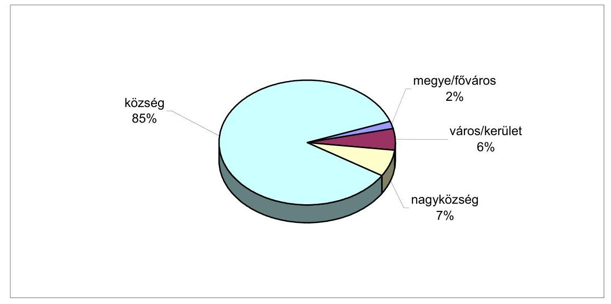

---

# Kimutatás 

a választások tény és tervezett kiadásainak alakulásáról

| Sor-   szám | Megnevezés | 1998. évi   választások   tény | 2002. évi   választások   javasolt | Változás   \%-ban |
| :--: | :--: | :--: | :--: | :--: |
|  | 1 | 2 | 3 | $4-13 / 27100)$ |
| 1 | Helyi kiadások |  |  |  |
| 1.1 | Dologi kiadások | 1491850 | 2134289 | 143,06 |
| 1.2 | Személyi juttatások | 1009180 | 1027220 | 101,79 |
| 1.3 | Munkaadót terhelő járulékok | 338894 | 443346 | 130,82 |
| 1 | Helyi kiadások összesen | 2839924 | 3604855 | 126,93 |
| 2 | OEVK kiadások: |  |  |  |
| 2.1 | Dologi kiadások | 43945 | 65920 | 150,01 |
| 2.2 | Személyi juttatások | 66922 | 42320 | 63,24 |
| 2.3 | Munkaadót terhelő járulékok | 24058 | 17902 | 74,41 |
| 2 | OEVK kiadások összesen | 134925 | 126142 | 93,49 |
| 3 | Területi kiadások: |  |  |  |
| 3.1 | Dologi kiadások | 38914 | 45480 | 116,87 |
| 3.2 | Személyi juttatások | 285524 | 305343 | 106,94 |
| 3.3 | Munkaadót terhelő járulékok | 29675 | 129159 | 435,25 |
| 3 | Területi kiadások összesen | 354113 | 479982 | 135,54 |
| 4 | TÁKISZ / Közigazgatási Hivatal |  |  |  |
| 4.1 | Dologi kiadások | 40004 | 48780 | 121,94 |
| 4.2 | Személyi juttatások | - | 57600 |  |
| 4.3 | Munkaadót terhelő járulékok | - | 44999 |  |
| 4 | TÁKISZ / Közigazgatási Hivatal összesen | 40004 | 151379 | 378,41 |
| 5 | Központi kiadások |  |  |  |
| 5.1 | Dologi kiadások: | 4599780 | 8159100 | 177,38 |
| 5.2 | Személyi juttatások | 98352 | 373813 | 380,08 |
| 5.3 | Munkaadót terhelő járulékok | 24383 | 158124 | 648,50 |
| 5.4 | Egyéb kiadások | 107214 | 140000 | 130,58 |
| 5 | Központi kiadások összesen | 4829729 | 8831037 | 182,85 |
| Kiadások összesen $(1+2+3+4+5)$ |  | 8198695 | 13193395 | 160,92 |

---

V-1003/2003. számú jelentés 4. számú melléklete

Ikt.szám: 3-445/61/2001.

'2002. évi országgyűlési választás I. és II. fordulója lebonyolításának költségterve

1. HELYI FELADATOK KÖLTSÉGEI

1.1 Dologi kiadások

|  |   |
| --- | --- |
|  101 | Hirdetmény és tájékoztató nyomtatvány költsége szavazókörönként (10850 szavazó kör * 1600 Ft / ford)  |
|   | Lakossági tájékoztatók, hirdetmények (szavazókörök helye, címe, választás napja) nyomtatása, sokszorosítása, kiragasztása  |
|  102 | Egyéb kiadások szavazás napján  |
|   | 10201 Kiadás szavazás napján szavazókörökben (10850 szavazó kör * 2800 Ft / ford)  |
|   | Szavazókörben, telefon, fax, villamosenergia, takarítás, porta szolgálat kiadásai  |
|   | 10202 Kiadás szavazás napján helyi választási irodákban önáll.településeken, és körjegyzőségi székhelyeken (2237 HVI * 4200 Ft / ford)  |
|   | Polgármesteri hivatal telefon, fax, villamosenergia, gépkocsi-használat, takarítás, portaszolgálat kiadásai  |
|   | 10203 Kiadás szavazás napján körjegyzőségi HVI részére kapcsolódó településenként pótelöirányzat (920 HVI * 1400 Ft / ford)  |
|   | Körjegyzőségi hivatal kapcsolattartása a településekkel, gépkocsi használat, telefon, fax kiadásai  |
|  103 | Választói névjegyzék és értesítő szelvények elkészítése (8,15 millió vál.polg.r * 20 Ft / fő)  |
|   | Névjegyzék és értesítő szelvény megszemélyesítése, nyomtatása, vágása, csomagolása (a szükséges nyomtatványok beszerzési kiadása a Központi kiadásoknál kerül megtervezésre)  |
|  104 | Értesítők, ajánlószelvények kiküldése, postázása, a jegyzők egymás közötti értesítései (8,15 millió vál.polg. * 50 Ft / fő)  |
|   | Névjegyzék és NESZA jegyzék továbbvezetése, lakcímváltozások kezelése, igazolások kiadása  |
|  105 | Választással összefüggő egyéb dologi kiadások (10850 szavazó kör * 7200 Ft)  |
|   | Helyben készülő nyomtatványok előállítása, papír költsége: eskütételi jgyk-ek, napközbeni jelentések nyomtatványai, választási bizottságok tagjainak megbízó levelei, szavazó urnák átadás-átvételi jgyk-e, nyilvántartás a mozgó urnát igénylőkről, visszautasítottak jegyzéke.  |

1. Dologi kiadások összesen:

|  |   |
| --- | --- |
|  707 043 | 136 543  |

1.1. Dologi kiadások összesen:

|  |   |
| --- | --- |
|  707 043 | 136 543  |

---

adatok ezer forintban

|  Megnevezés |  |  | 2002-ben felhasználásra kerül |  |   |
| --- | --- | --- | --- | --- | --- |
|   |  |  | OGY választás lebonyolítási ktg. |  | I. - II. forduló összesen  |
|   |  |  | I forduló | II forduló |   |
|  1.2. Személyi kiadások |  |  |  |  |   |
|  201 | Szavazatszámláló bizottságok tagjainak és póttagjainak díja |  |  |  |   |
|   | 20101 | SZSZB 3 választott tagjának díja, több szavazókörös település esetén (8977 szavazó kör * 3 fő * 5000 Ft) | 134 655 | 134 655 | 269 310  |
|   |  | Szavazás napján 05 órától 22-24 óráig elvégzendő szavazatszámlálási feladatok. |  |  |   |
|   | 20102 | Egy szavazókörös település esetén a HVB 5 tagjának díja (Ve. 30.§., 31. §. (1) és (2) I. pontja), akik egyben ellátják az SZSZB feladatait is (1873 szavazó kör * 5 fő * 5000 Ft) | 46 825 | 46 825 | 93 650  |
|   |  | Szavazás napján 05 órától 22-24 óráig elvégzendő szavazatszámlálási feladatok. |  |  |   |
|  202 |  | Szavazatszámláló bizottság mellett működő jegyzőkönyvvezető díja (10850 szavazó kör * 4000 Ft) | 43 400 | 43 400 | 86 800  |
|   |  | Szavazás napján 05 órától 22-24 óráig az SZSZB mellett elvégzendő adminisztratív feladatok. |  |  |   |
|  203 |  | A helyi választási iroda tagjainak díja az alábbi tagokkal számolva 5 000 Ft/fő |  |  |   |
|   |  | Az iroda feladatait a Ve. 35-39. §.-ai határozzák meg, feladatuk a választás kitűzésétől a jogerős jegyzőkönyv eredmény megállapításáig tart |  |  |   |
|   | 20301 | 0 - 1 000 lakosig (3 tag * 606 település * 5000 Ft) | 9 090 | 9 090 | 18 180  |
|   | 20302 | 1 001 - 5 000 lakosig (4 tag * 1326 település * 5000 Ft) | 26 520 | 26 520 | 53 040  |
|   | 20303 | 5 001 - 10 000 lakosig (5 tag * 142 település * 5000 Ft) | 3 550 | 3 550 | 7 100  |
|   | 20304 | 10 001 - 20 000 lakosig (9 tag * 77 település * 5000 Ft) | 3 465 | 3 465 | 6 930  |
|   | 20305 | 20 001 - 50 000 lakosig (13 tag * 47 település * 5000 Ft) | 3 055 | 3 055 | 6 110  |
|   | 20306 | 50 001 - 100 000 lakosig (15 tag * 26 település * 5000 Ft) | 1 950 | 1 950 | 3 900  |
|   | 20307 | 100 001 lakos felett (20 tag * 13 település * 5000 Ft) | 1 300 | 1 300 | 2 600  |
|  1.2. Személyi kiadások összesen: |  |  | 273 810 | 273 810 | 547 620  |
|  1.3. Munkaadót terhelő járulék |  |  |  |  |   |
|   | 30101 | Munkaadót terhelő járulék (31% + 11% + 3%) * 90% = 0,405 * TB alap Ft | 110 893 | 110 893 | 221 786  |
|  1.3. Munkaadót terhelő járulék összesen: |  |  | 110 893 | 110 893 | 221 786  |
|  1. HELYI FELADATOK KÖLTSÉGEI ÖSSZESEN: |  |  | 1 091 746 | 521 246 | 1 612 992  |
|  2. OEVK KIADÁSOK |  |  |  |  |   |
|  2.1. Dologi kiadások |  |  |  |  |   |
|  121 |  | OEVK-k dologi kiadásai |  |  |   |
|   |  | Szavazás napi kiadások OEVK székhely településeken a választási irodák részére (148 OEVK székhely * 30000 Ft) |  |  |   |

---

adatok ezer forintban

|  Megnevezés |  |  | 2002-ben felhasználásra kerül |  | I. - II. forduló
összesen  |
| --- | --- | --- | --- | --- | --- |
|   |  |  | OGY választás lebonyolítási ktg. |  |   |
|   |  |  | I forduló | II forduló |   |
|   | 12101 | Az OEVK székhely település plusz költségei a HVI-kel történő kapcsolattartás, telefon, fax, gépkocsi-használat, központi nyomtatványok (szavazólap, jegyzőkönyvek, szavazástechnikai eszközök) ellenőrzése, továbbítása a települések részére | 4 440 | 4 440 | 8 880  |
|   |  | Szavazással összefüggő egyéb dologi kiadások OEVK -ként (176 OEVK* 70000 Ft) |  |  |   |
|   | 12102 | Jelöltállítással kapcsolatos feladatok, szavazatösszesítés feladatai, jegyzőkönyvek ellenőrzése, adatrögzítés, számítógépek és a hálózat üzemeltetése, papír és számítástechnikai segédanyagok biztosítása. | 12 320 | 12 320 | 24 640  |
|   |  | OEVB működtetésére dologi kiadás (176 OEVK* 50000 Ft) |  |  |   |
|   | 12103 | Bizottsági ülések szervezése, lebonyolítása, telefon, fax, gépkocsi-használat, biztonsági őrizet kiadásai a választási eljárás 3 hónapja alatt | 8 800 | 8 800 | 17 600  |
|  2.1. Dologi kiadások összesen: |  |  | 25 560 | 25 560 | 51 120  |
|  2.2. Személyi kiadások |  |  |  |  |   |
|   | 221 | OEVB választott tagok díja (Ve. 28. § (4)) (176 OEVK * 3 fő * 5500 Ft) Feladatait a Ve. 32.§. határozza meg. | 2 904 | 2 904 | 5 808  |
|   |  | OEVI tagok díja OEVK székhely (148 OEVK székhely * 20 fő * 5500 Ft) |  |  |   |
|   | 222 | Feladatait a Ve. 35-39 §.-ai határozzák meg. Tevékenysége az eskütéteítői a jogerős jegyzőkönyv eredmény megállapításáig tart. | 16 280 | 16 280 | 32 560  |
|  2.2. Személyi kiadások összesen: |  |  | 19 184 | 19 184 | 38 368  |
|  2.3. Munkaadót terhelő járulék |  |  |  |  |   |
|   | 30102 | Munkaadót terhelő járulék (31% + 11% + 3%) * 90% = 0,405 * TB alap Ft | 7 770 | 7 770 | 15 540  |
|  2.3. Munkaadót terhelő járulék összesen: |  |  | 7 770 | 7 770 | 15 540  |
|  2. OEVK KIADÁSOK ÖSSZESEN: |  |  | 52 514 | 52 514 | 105 028  |
|  3. MEGYEI KIADÁSOK |  |  |  |  |   |
|  3.1. Dologi kiadások |  |  |  |  |   |
|   | 131 | A választás lebonyolításának területi (főjegyző) szinten jelentkező dologi kiadásai |  |  |   |
|   |  | TVI dologi kiadás OEVK (176 OEVK * 80000 Ft) |  |  |   |
|   | 13101 | Kapcsolattartás a OEVK székhely településekkel, telefon, fax, gépkocsi-használat, biztonsági őrizet, értekezletek tartása HVI vezetők részére, technikai feltételek biztosítása (terem takarítás, villamosnergia), részvétel az országos oktatáson | 14 080 |  | 14 080  |
|   |  | TVB és TVI szavazásnapi kiadásai megye sz. (20 megye * 56000 Ft) |  |  |   |

---

adatok ezer forintban

|  Megnevezés |  |  | 2002-ben felhasználásra kerül |  | I. - II. forduló összesen  |
| --- | --- | --- | --- | --- | --- |
|   |  |  | OGY választás lebonyolítási ktg. |  |   |
|   | 13103 | Választási bizottság szavazásnapi müködésének biztosítása, párt tájékoztató informatikai rendszer müködtetése, kapcsolattartás a településekkel (telefon, fax, papír), jogorvoslatok elbírálása | 1 120 | 1 120 | 2 240  |
|   | 13104 | Települések pénzügyi elszámolásához pű.rendszer működítése (20 megye * 100000 Ft) | 2 000 | - | 2 000  |
|   |  | Adatrögzítés, kapcsolat a HVI és a TVI pénzügyi felelőseivel, telefon, fax, villamosenergia, és számítástechnikai segédanyagok biztosítása, részvétel az országos próbák, főpróbák megtartásán. |  |  |   |
|  3.1. Dologi kiadások összesen: |  |  | 17 200 | 1 120 | 18 320  |
|  3.2. Személyi kiadások |  |  |  |  |   |
|   |  | Helyi választási iroda vezetőinek díja település típusonként |  |  |   |
|  231 |  | Feladatai a választási iroda létrehozása, müködtetése, választásszakmai felügyelete, választói névjegyzék tartalmának jogi ellenőrzése, a választási eljárás 3 hónapja alatt. A választás lebonyolítása, szavazóköri jegyzőkönyvek ellenőrzése, jegyzőkönyvek levéltárba helyezése. |  |  |   |
|   | 23101 | 0 - 1 000 lakosig HVI vezetői díj (606 település * 20000 Ft) | 12 120 | 12 120 | 24 240  |
|   | 23102 | 1 001 - 5 000 lakosig HVI vezetői díj (1326 település * 24000 Ft) | 31 824 | 31 824 | 63 648  |
|   | 23103 | 5 001 - 10 000 lakosig HVI vezetői díj (142 település * 30000 Ft) | 4 260 | 4 260 | 8 520  |
|   | 23104 | 10 001 - 20 000 lakosig HVI vezetői díj (77 település * 40000 Ft) | 3 080 | 3 080 | 6 160  |
|   | 23105 | 20 001 - 50 000 lakosig HVI vezetői díj (47 település * 60000 Ft) | 2 820 | 2 820 | 5 640  |
|   | 23106 | 50 001 - 100 000 lakosig HVI vezetői díj (26 település * 80000 Ft) | 2 080 | 2 080 | 4 160  |
|   | 23107 | 100 001 lakos felett HVI vezetői díj (13 település * 100000 Ft) | 1 300 | 1 300 | 2 600  |
|  232 |  | Körjegyzőség kapcsolt település utáni díja a jegyző részére (920 település * 5000 Ft) | 4 600 | 4 600 | 9 200  |
|   |  | A kapcsolódó települések választási feladatának irányítása, ellenőrzése |  |  |   |
|   |  | Az iroda vezető plusz díja OEVK székhely településen (148 OEVK székhely * 40000 Ft) |  |  |   |
|  233 |  | Az OEVK illetékessége szerinti jelöltállításgal és a szavazatösszestléssel összefüggő feladatok irányítása, ellenőrzése, az ezekhez kapcsolódó informatikai rendszerek müködtetésének biztosítása | 5 920 | 5 920 | 11 840  |
|  234 |  | TVB választott tagjainak díja (Ve. 28. §. (4)) (20 megye * 3.fő * 5500 Ft) | 330 | 330 | 660  |
|   |  | TVI tagjainak díja (20 megye * 15 fő * 6000 Ft) |  |  |   |
|  235 |  | A választási iroda feladatait a Ve. 35-39. §-ai határozzák meg. Tevékenysége az eskütételtől a jogerős jegyzőkönyvi eredmény megállapításáig tart. | 1 800 | 1 800 | 3 600  |
|  236 |  | TVI vezető helyettesének díja |  |  |   |
|   | 23601 | TVI vezető jogi helyettesének díja (20 megye * 30000 Ft) | 600 | 600 | 1 200  |
|   | 23602 | TVI informatikai felelősének díja (20megye * 30000 Ft) | 600 | 600 | 1 200  |
|   | 23603 | TVI pénzügyi felelősének díja (20 megye * 30000 Ft) | 600 | 600 | 1 200  |
|  237 |  | TVI vezetők díja (20 megye * 120000 Ft) | 2 400 | 2 400 | 4 800  |
|  3.2. Személyi kiadások összesen: |  |  | 74 334 | 74 334 | 148 668  |

---

|  Megnevezés |  | 2002-ben felhasználásra kerül |  |   |
| --- | --- | --- | --- | --- |
|   |  | OGY választás lebonyolítási ktg. |  | I. - II. forduló  |
|   |  | I forduló | II forduló |   |
|  3.3. Munkaadót terhelő járulék |  |  |  |   |
|  30103 | Munkaadót terhelő járulék (31% + 11% + 3%) * 90% = 0,405 * TB alap Ft | 30 915 | 30 105 | 61 020  |
|  3.3. Munkaadót terhelő járulék összesen: |  | 30 915 | 30 105 | 61 020  |
|  3. MEGYEI KIADÁSOK ÖSSZESEN |  | 122 449 | 105 559 | 228 008  |
|  4. KÖZIGAZGATÁSI HIVATAL |  |  |  |   |
|  4.1. Dologi kiadások |  |  |  |   |
|  141 | Közigazgatási Hivatalok dologi kiadásainak biztosítása |  |  |   |
|   | Oktatások, kiszállások, sokszorosítás, szállítás, helyi és területi PC Hot-line |  |  |   |
|   | Közigazgatási Hivatalok dologi kiadásai (20 megye * 350000 Ft) |  |  |   |
|   | A választási eljárás 3 hónapján keresztül a választási informatikai rendszerivel kapcsolatos feladatok |  |  |   |
|   | ellátása, rendszer és felhasználói programok telepítése, tesztelése, oktatása, részvétel az országos | 7 000 | - | 7 000  |
|   | próbák, főpróbák megtartásán. |  |  |   |
|   | Közigazgatási Hivatalok dologi kiadásai (176 OEVK * 95000 Ft) |  |  |   |
|   | Az OEVK szinten működő informatikai rendszerek oktatása, felhasználói programok beüzemelése, |  |  |   |
|   | tesztelése és az e feladatok ellátáshoz kapcsolódó gépkocsi-használat kiadása, részvétel az országos | 16 720 | - | 16 720  |
|   | próbák, főpróbák megtartásán. |  |  |   |
|  4.1. Dologi kiadások összesen: |  | 23 720 | - | 23 720  |
|  4.2. Személyi kiadások |  |  |  |   |
|  241 | Megbízási szerződések a Közig.Hiv.-k kapacitásának kiegészítésére (6 hó * 2 fő * 120000 Ft * 20 megye) | 28 800 | - | 28 800  |
|  242 | Közigazgatási hivatal vezetők díja (20 megye * 120000 Ft) | 2 400 | 2 400 | 4 800  |
|  4.2. Személyi kiadások összesen: |  | 31 200 | 2 400 | 33 600  |
|  4.3. Munkaadót terhelő járulék |  |  |  |   |
|  30104 | Munkaadót terhelő járulék (31% + 11% + 3%) * 90% = 0,405 * TB alap Ft | 22 243 | 972 | 23 215  |
|  4.3. Munkaadót terhelő járulék összesen: |  | 22 243 | 972 | 23 215  |
|  4. KÖZIGAZGATÁSI HIVATAL ÖSSZESEN: |  | 77 163 | 3 372 | 80 535  |

---

|  2002-ben felhasználásra kerül |  |  |   |
| --- | --- | --- | --- |
|  OGY választás lebonyolítási kig. |  |  | I. - II. forduló  |
|   | I forduló | II forduló | 5. KÖZPONTI KIADÁSOK  |
|  5.1. Dologi kiadások |  |  |   |
|  151 | ÖVB működési kiadásai |  |   |
|   | ÖVB ülések megszervezése, technikai feltételek biztosítása (terembérlet, hangfelvétel, kommüniké, stb.) | 2 100 | 2 100  |
|  152 | ÖVI működési kiadásai |  |   |
|   | ÖVI folyamatos működésének kiadásai |  |   |
|  15201 | Országos értekezletek megszervezése, technikai feltételek biztosítása, TVI-kel kapcsolat tartás (telefon, fax, villamosnergia, gépkocsi-használat, irodaszer) | 10 000 | 10 000  |
|  15202 | ÖVI választásnapi működési kiadásai |  |   |
|   | A választás 2 fordulójának napján 05 órától másnap hajnalig tartó folyamatos rendelkezésre állással kapcsolatos kiadások | 10 000 | 10 000  |
|  15203 | Külföldi megfigyelők szállítási, ellátási, tolmácsolási, sajtó képviselőinek tájékoztatásának költségei | 16 000 | 12 000  |
|  154 | Pártsemleges kampány (sajtó, TV, rádió tájékoztató film) | 30 000 | 10 000  |
|  155 | Országos választási központ működési kiadásai szavazás napján (Duna Palota) | 7 000 | 7 000  |
|   | Szavazolapok, szavazásnapi nyomtatványok |  |   |
|  156 | A választás 2 fordulójához szükséges szavazólapok nyomdai előállítása - 176+20 féleségben -, a szavazólapok tartalmának OEVB-k illetve TVB-k által történő ellenőrzésének biztosítása az országos hálózaton keresztül. Szavazásnapi kellékek (szavazóumák, tároló-szállító dobozok, szavazástechnikai eszközök) gyártása, szavazókörönként - 10850, illetve 3153 települési tartalék - a szükséges szavazólapok, jegyzőkönyvek, szavazásnapi technikai eszközök csomagolása. | 500 000 | 200 000  |
|  157 | Szavazásnapi nyomtatványok szállítási, elosztási költsége |  |   |
|   | Szavazásnapi kellékek külön logisztikai terv szerinti elosztása és OEVK székhelyekre történő szállítása, szavazóköri, illetve települési csoportosításban. | 60 000 | 40 000  |
|  158 | A választói névjegyzékek, értesítők, ajánló szelvény tömbök nyomtatványainak központi előállítása | 240 000 |   |
|  159 | Tájékoztató anyagok, választási füzetek megírása, szerkesztési díja, nyomdai előállítása, választójogi kommentár, emléklap először szavazók részére | 150 000 | 15 000  |
|  160 | Választástörténeti adatbázis feltöltése az aktuális adatokkal (a választás eredményadatinak archív adatbázisba szerkesztése) | - | 11 000  |
|  161 | Képzés, oktatás |  |   |
|  16101 | Köztisztviselők választás-szakmai képzése | 60 000 | -  |

---

|  Megnevezés |  |  | 2002-ben felhasználásra kerül |  | I. - II. forduló
összesen  |
| --- | --- | --- | --- | --- | --- |
|   |  |  | OGY választás lebonyolítási ktq. |  |   |
|   |  |  | I forduló | II forduló |   |
|   | 16202 | Informatikai felhasználói rendszerek alkalmazásának oktatása (névjegyzék készítés, jelöltnyilvántartás, szavazat összesítés, területi- országos szintű tájékoztató rendszerek stb.) | 31 000 | - | 31 000  |
|  162 |  | Elektronikus kiadvány szerkesztés (Internet megjelenítés) | 10 000 | - | 10 000  |
|  163 |  | Fordítási költségek (jogszabályok, tájékoztató anyagok, kiadványok, jegyzőkönyvek) | 8 000 | 2 000 | 10 000  |
|  5.1. Dologi kiadások összesen: |  |  | 1 134 100 | 319 100 | 1 453 200  |
|  5.2. Személyi kiadások |  |  |  |  |   |
|   | 251 | OVB választott tagjainak (ve. 28. §. (4)) és felkért szakértők díja | - | 7 000 | 7 000  |
|   | 252 | OVI tagjainak és egyéb közreműködők díjazása | - | 25 000 | 25 000  |
|   |  | A választási iroda feladatait a Ve. 35-39 §-ai határozzák meg |  |  |   |
|   | 255 | Szavazat számláló bizottsági tagok és póttagok díjazása |  |  |   |
|   |  | Szavazat számláló bizottsági póttagok (Ve. 23. §. (2) illetve 30. §. (1)) díja több szavazókörös településeken szavazó kör (8977 szavazó kör, * 5000 Ft * 1 fő) | 44 885 | 44 885 | 89 770  |
|   |  | 25502 SZSZB választott tagjai távolléti díja (Ve. 21. §. (4)) | 30 000 | 30 000 | 60 000  |
|   | 256 | Külsős munkatársak díja | 10 000 | 5 000 | 15 000  |
|  5.2. Személyi kiadások összesen: |  |  | 84 885 | 111 885 | 196 770  |
|  5.3. Munkaadót terhelő járulék |  |  |  |  |   |
|   | 30105 | Munkaadót terhelő járulék (31% + 11% + 3%) * 90% = 0,405 * TB alap Ft | 34 378 | 45 313 | 79 691  |
|  5.3. Munkaadót terhelő járulék összesen: |  |  | 34 378 | 45 313 | 79 691  |
|  5.4. PÁRTOK KAMPÁNYTÁMOGATÁSA |  |  |  |  |   |
|   | 401 | Pártok kampánytámogatása | 100 000 | - | 100 000  |
|  5.4. PÁRTOK KAMPÁNYTÁMOGATÁSA |  |  | 100 000 | - | 100 000  |
|  5. KÖZPONTI KIADÁSOK ÖSSZESEN |  |  | 1 353 363 | 476 298 | 1 829 661  |
|  |   |   |   |   |   |
|  MINDÖSSZESEN INFORMATIKAI KIADÁS NELKÜL: |  |  |  |  |   |
|   |  |  | 2 697 235 = 1 158 989 = 3 856 224 |  |   |
|  6. INFORMATIKAI KIADÁSOK |  |  |  |  |   |
|   | 6.1 | Minőségbiztosítás és projekt irányítás | 204 803 |  | 204 803  |
|   |  | Informatikai fővállalkozás (központosított közbeszerzési eljárás alá nem tartozó eszközbeszerés, alkalmazásfejlesztés és szolgáltatások) | 1 482 002 |  | 1 482 002  |

---

adatok ezer forintban

|  Megnevezés |  | 2002-ben felhasználásra kerül |  |   |
| --- | --- | --- | --- | --- |
|   |  | OGY választás lebonyolítási ktg. |  | I. - II. forduló összesen  |
|   |  | I forduló | II forduló |   |
|  6.3 | Központosított közbeszerzési eljárás alá tartozó eszközök beszerzése | 677 671 |  | 677 671  |
|  6.4 | Gépterem felújítása | 50 000 |  | 50 000  |
|  6.5 | Egyéb szolgáltatások (illetéktelen hozzáférés elleni védelem, hálózati szolgáltatások) | 100 000 |  | 100 000  |
|  6. INFORMATIKAI KIADÁSOK OSSZESEN : |  | 2 514 476 |  | 2 514 476  |
|  ORSZÁGGYÜLÉSI VÁLASZTÁS OSSZESEN: |  | 5 211 711 | 1 158 989 | 6 370 700  |
|  Budapest, 2001. december * |  |  |  |   |
|  |   |   |   |   |
|  |   |   |   |   |
|  |   |   |   |   |
|  |   |   |   |   |
|  |   |   |   |   |
|  |   |   |   |   |
|  |   |   |   |   |
|  |   |   |   |   |
|  |   |   |   |   |
|  |   |   |   |   |
|  |   |   |   |   |
|  |   |   |   |   |
|  |   |   |   |   |
|  |   |   |   |   |
|  |   |   |   |   |
|  |   |   |   |   |
|  |   |   |   |   |
|  |   |   |   |   |
|  |   |   |   |   |
|  |   |   |   |   |
|  |   |   |   |   |
|  |   |   |   |   |
|  |   |   |   |   |
|  |   |   |   |   |
|  |   |   |   |   |
|  |   |   |   |   |
|  |   |   |   |   |
|  |   |   |   |   |
|  |   |   |   |   |
|  |   |   |   |   |
|  |   |   |   |   |

---

V-1003/2003. számú jelentés 5. számú melléklete

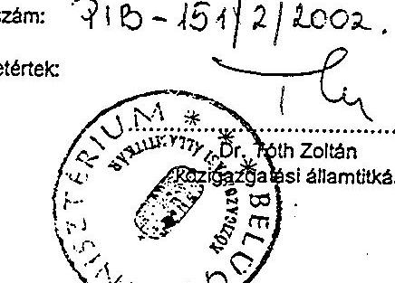

Ikt. szám: 71B-151/2/2002.

Egyetértek:

Jóváhagyom:

Jenej Zoltán közgazdasági helyettes átlámlitkár

2002. évi önkormányzati képviselő választás lebonyolításának költségterve

2002. évi önkormányzati képviselő választás lebonyolításának költségterve

|  Megnevezés |  |  |  |  |  |  |  |  |  |  |  |  |  |  |  |  |  |  |  |  |  |  |  |  |  |  |  |  |  |  |  |  |  |   |
| --- | --- | --- | --- | --- | --- | --- | --- | --- | --- | --- | --- | --- | --- | --- | --- | --- | --- | --- | --- | --- | --- | --- | --- | --- | --- | --- | --- | --- | --- | --- | --- | --- | --- | --- |
|  1:1 Dologilkladások |  |  |  |  |  |  |  |  |  |  |  |  |  |  |  |  |  |  |  |  |  |  |  |  |  |  |  |  |  |  |  |  |   |
|  101 |  |  |  |  |  |  |  |  |  |  |  |  |  |  |  |  |  |  |  |  |  |  |  |  |  |  |  |  |  |  |  |  |  |   |
|   |  |  |  |  |  |  |  |  |  |  |  |  |  |  |  |  |  |  |  |  |  |  |  |  |  |  |  |  |  |  |  |  |  |   |
|  102 |  |  |  |  |  |  |  |  |  |  |  |  |  |  |  |  |  |  |  |  |  |  |  |  |  |  |  |  |  |  |  |  |  |  |   |
|   |  |  |  |  |  |  |  |  |  |  |  |  |  |  |  |  |  |  |  |  |  |  |  |  |  |  |  |  |  |  |  |  |  |  |   |
|   |  |  |  |  |  |  |  |  |  |  |  |  |  |  |  |  |  |  |  |  |  |  |  |  |  |  |  |  |  |  |  |  |  |  |   |
|   |  |  |  |  |  |  |  |  |  |  |  |  |  |  |  |  |  |  |  |  |  |  |  |  |  |  |  |  |  |  |  |  |  |  |   |
|   |  |  |  |  |  |  |  |  |  |  |  |  |  |  |  |  |  |  |  |  |  |  |  |  |  |  |  |  |  |  |  |  |  |  |   |
|   |  |  |  |  |  |  |  |  |  |  |  |  |  |  |  |  |  |  |  |  |  |  |  |  |  |  |  |  |  |  |  |  |  |  |   |
|   |  |  |  |  |  |  |  |  |  |  |  |  |  |  |  |  |  |  |  |  |  |  |  |  |  |  |  |  |  |  |  |  |  |  |   |
|   |  |  |  |  |  |  |  |  |  |  |  |  |  |  |  |  |  |  |  |  |  |  |  |  |  |  |  |  |  |  |  |  |  |  |  |   |
|   |  |  |  |  |  |  |  |  |  |  |  |  |  |  |  |  |  |  |  |  |  |  |  |  |  |  |  |  |  |  |  |  |  |  |  |   |
|   |  |  |  |  |  |  |  |  |  |  |  |  |  |  |  |  |  |  |  |  |  |  |  |  |  |  |  |  |  |  |  |  |  |  |  |   |
|   |  |  |  |  |  |  |  |  |  |  |  |  |  |  |  |  |  |  |  |  |  |  |  |  |  |  |  |  |  |  |  |  |  |  |  |   |
|   |  |  |  |  |  |  |  |  |  |  |  |  |  |  |  |  |  |  |  |  |  |  |  |  |  |  |  |  |  |  |  |  |  |  |  |   |
|   |  |  |  |  |  |  |  |  |  |  |  |  |  |  |  |  |  |  |  |  |  |  |  |  |  |  |  |  |  |  |  |  |  |  |  |   |
|   |  |  |  |  |  |  |  |  |  |  |  |  |  |  |  |  |  |  |  |  |  |  |  |  |  |  |  |  |  |  |  |  |  |  |  |   |
|   |  |  |  |  |  |  |  |  |  |  |  |  |  |  |  |  |  |  |  |  |  |  |  |  |  |  |  |  |  |  |  |  |  |  |  |   |
|   |  |  |  |  |  |  |  |  |  |  |  |  |  |  |  |  |  |  |  |  |  |  |  |  |  |  |  |  |  |  |  |  |  |  |  |   |
|   |  |  |  |  |  |  |  |  |  |  |  |  |  |  |  |  |  |  |  |  |  |  |  |  |  |  |  |  |  |  |  |  |  |  |  |   |
|   |  |  |  |  |  |  |  |  |  |  |  |  |  |  |  |  |  |  |  |  |  |  |  |  |  |  |  |  |  |  |  |  |  |  |  |   |
|   |  |  |  |  |  |  |  |  |  |  |  |  |  |  |  |  |  |  |  |  |  |  |  |  |  |  |  |  |  |  |  |  |  |  |  |   |
|   |  |  |  |  |  |  |  |  |  |  |  |  |  |  |  |  |  |  |  |  |  |  |  |  |  |  |  |  |  |  |  |  |  |  |  |   |
|   |  |  |  |  |  |  |  |  |  |  |  |  |  |  |  |  |  |  |  |  |  |  |  |  |  |  |  |  |  |  |  |  |  |  |  |   |
|   |  |  |  |  |  |  |  |  |  |  |  |  |  |  |  |  |  |  |  |  |  |  |  |  |  |  |  |  |  |  |  |  |  |  |  |   |
|   |  |  |  |  |  |  |  |  |  |  |  |  |  |  |  |  |  |  |  |  |  |  |  |  |  |  |  |  |  |  |  |  |  |  |  |   |
|   |  |  |  |  |  |  |  |  |  |  |  |  |  |  |  |  |  |  |  |  |  |  |  |  |  |  |  |  |  |  |  |  |  |  |  |   |
|   |  |  |  |  |  |  |  |  |  |  |  |  |  |  |  |  |  |  |  |  |  |  |  |  |  |  |  |  |  |  |  |  |  |  |  |   |
|   |  |  |  |  |  |  |  |  |  |  |  |  |  |  |  |  |  |  |  |  |  |  |  |  |  |  |  |  |  |  |  |  |  |  |  |   |
|   |  |  |  |  |  |  |  |  |  |  |  |  |  |  |  |  |  |  |  |  |  |  |  |  |  |  |  |  |  |  |  |  |  |  |  |   |
|   |  |  |  |  |  |  |  |  |  |  |  |  |  |  |  |  |  |  |  |  |  |  |  |  |  |  |  |  |  |  |  |  |  |  |  |   |
|   |  |  |  |  |  |  |  |  |  |  |  |  |  |  |  |  |  |  |  |  |  |  |  |  |  |  |  |  |  |  |  |  |  |  |  |   |
|   |  |  |  |  |  |  |  |  |  |  |  |  |  |  |  |  |  |  |  |  |  |  |  |  |  |  |  |  |  |  |  |  |  |  |  |   |
|   |  |  |  |  |  |  |  |  |  |  |  |  |  |  |  |  |  |  |  |  |  |  |  |  |  |  |  |  |  |  |  |  |  |  |  |   |
|   |  |  |  |  |  |  |  |  |  |  |  |  |  |  |  |  |  |  |  |  |  |  |  |  |  |  |  |  |  |  |  |  |  |  |  |   |
|   |  |  |  |  |  |  |  |  |  |  |  |  |  |  |  |  |  |  |  |  |  |  |  |  |  |  |  |  |  |  |  |  |  |  |  |   |
|   |  |  |  |  |  |  |  |  |  |  |  |  |  |  |  |  |  |  |  |  |  |  |  |  |  |  |  |  |  |  |  |  |  |  |  |   |
|   |  |  |  |  |  |  |  |  |  |  |  |  |  |  |  |  |  |  |  |  |  |  |  |  |  |  |  |  |  |  |  |  |  |  |  |   |
|   |  |  |  |  |  |  |  |  |  |  |  |  |  |  |  |  |  |  |  |  |  |  |  |  |  |  |  |  |  |  |  |  |  |  |  |   |
|   |  |  |  |  |  |  |  |  |  |  |  |  |  |  |  |  |  |  |  |  |  |  |  |  |  |  |  |  |  |  |  |  |  |  |  |   |
|   |  |  |  |  |  |  |  |  |  |  |  |  |  |  |  |  |  |  |  |  |  |  |  |  |  |  |  |  |  |  |  |  |  |  |  |   |
|   |

---

adatok ezer forintban

2002. évi önkormányzat képviselő választás lebonyolítási költsége

|  203 | A helyi választási irodá tagjainak díja az alábbi tagokkal számolva 6 000 Ft/fő |  |   |
| --- | --- | --- | --- |
|   | Az iroda feladatait a Ve. 35-39. §.-ai határozzák meg, feladatuk a választás kitűzésétől a jogerős jegyzőkönyv eredmény megállapításáig tart |  |   |
|   | 0 - 1 000 lakosig (3 tag * 606 település * 6000 Ft) |  | 10 908  |
|   | 1 001 - 5 000 lakosig (4 tag * 1326 település * 6000 Ft) |  | 31 824  |
|   | 5 001 - 10 000 lakosig (5 tag * 142 település * 6000 Ft) |  | 4 260  |
|   | 10 001 - 20 000 lakosig (9 tag * 77 település * 6000 Ft) |  | 4 158  |
|   | 20 001 - 50 000 lakosig (13 tag * 47 település * 6000 Ft) |  | 3 666  |
|   | 50 001 - 100 000 lakosig (15 tag * 26 település * 6000 Ft) |  | 2 340  |
|   | 100 001 felett (20 tag * 13 település * 6000 Ft) |  | 1 560  |
|  204 | HVB választott tagjai díja több szavakörös település (1284 település * 3 fő * 6000 Ft) |  | 23 112  |
|  205 | HVI tagjai díja körjegyzőségnél kapcsolt település után (920 település * 1 fő * 6000 Ft) |  | 5 520  |
|  1.2. Személyi kiadások összesen: |  |  | 431 966  |
|  1.3. Munkaadót terhelő járulék |  |  |   |
|  130101 | Munkaadót terhelő járulék (29% + 3%) |  | 138 229  |
|  1.3. Munkaadót terhelő járulék összesen: |  |  | 138 229  |
|  130102 |  |  | 138 229  |
|  121 |  |  | 12 101  |
|   |  |  | 12101  |
|   |  |  | 12104  |
|  2.1. Dolog kiadások |  |  |   |
|  121 |  |  | 2.1. Dolog kiadások összesen:  |
|   |  |  | 2.2. Személyi kiadások  |
|   |  |  | 222  |
|  2.2. Személyi kiadások összesen: |  |  | 2.2. Személyi kiadások összesen:  |
|   |  |  | 2.3. Munkaadót terhelő járulék összesen:  |
|  2.3. Munkaadót terhelő járulék |  |  | 30102  |
|  2.3. Munkaadót terhelő járulék |  |  | 2.3. Munkaadót terhelő járulék (29% + 3%)  |
|  2.3. Munkaadót terhelő járulék összesen: |  |  | 5 683  |
|  2.3.1. Munkaadót terhelő járulék összesen: |  |  | 5 683  |
|  2.3.2. Munkaadót terhelő járulék összesen: |  |  | 5 683  |
|  2.3.3. Munkaadót terhelő járulék összesen: |  |  | 5 683  |
|  2.3.4. Munkaadót terhelő járulék összesen: |  |  | 5 683  |
|  2.3.5. Munkaadót terhelő járulék összesen: |  |  | 5 683  |
|  2.3.6. Munkaadót terhelő járulék összesen: |  |  | 5 683  |
|  2.3.7. Munkaadót terhelő járulék összesen: |  |  | 5 683  |
|  2.3.8. Munkaadót terhelő járulék összesen: |  |  | 5 683  |
|  2.3.9. Munkaadót terhelő járulék összesen: |  |  | 5 683  |
|  2.3.10. Munkaadót terhelő járulék összesen: |  |  | 5 683  |
|  2.3.11. Munkaadót terhelő járulék összesen: |  |  | 5 683  |
|  2.3.12. Munkaadót terhelő járulék összesen: |  |  | 5 683  |
|  2.3.13. Munkaadót terhelő járulék összesen: |  |  | 5 683  |
|  2.3.14. Munkaadót terhelő járulék összesen: |  |  | 5 683  |
|  2.3.15. Munkaadót terhelő járulék összesen: |  |  | 5 683  |
|  2.3.16. Munkaadót terhelő járulék összesen: |  |  | 5 683  |
|  2.3.17. Munkaadót terhelő járulék összesen: |  |  | 5 683  |
|  2.3.18. Munkaadót terhelő járulék összesen: |  |  | 5 683  |
|  2.3.19. Munkaadót terhelő járulék összesen: |  |  | 5 683  |
|  2.3.20. Munkaadót terhelő járulék összesen: |  |  | 5 683  |
|  2.3.21. Munkaadót terhelő járulék összesen: |  |  | 5 683  |
|  2.3.22. Munkaadót terhelő járulék összesen: |  |  | 5 683  |
|  2.3.23. Munkaadót terhelő járulék összesen: |  |  | 5 683  |
|  2.3.24. Munkaadót terhelő járulék összesen: |  |  | 5 683  |
|  2.3.25. Munkaadót terhelő járulék összesen: |  |  | 5 683  |
|  2.3.26. Munkaadót terhelő járulék összesen: |  |  | 5 683  |
|  2.3.27. Munkaadót terhelő járulék összesen: |  |  | 5 683  |
|  2.3.28. Munkaadót terhelő járulék összesen: |  |  | 5 683  |
|  2.3.29. Munkaadót terhelő járulék összesen: |  |  | 5 683  |
|  2.3.30. Munkaadót terhelő járulék összesen: |  |  | 5 683  |
|  2.3.31. Munkaadót terhelő járulék összesen: |  |  | 5 683  |
|  2.3.32. Munkaadót terhelő járulék összesen: |  |  | 5 683  |
|  2.3.33. Munkaadót terhelő járulék összesen: |  |  | 5 683  |
|  2.3.34. Munkaadót terhelő járulék összesen: |  |  | 5 683  |
|  2.3.35. Munkaadót terhelő járulék összesen: |  |  | 5 683  |
|  2.3.36. Munkaadót terhelő járulék összesen: |  |  | 5 683  |
|  2.3.37. Munkaadót terhelő járulék összesen: |  |  | 5 683  |
|  2.3.38. Munkaadót terhelő járulék összesen: |  |  | 5 683  |
|  2.3.39. Munkaadót terhelő járulék összesen: |  |  | 5 683  |
|  2.3.40. Munkaadót terhelő járulék összesen: |  |  | 5 683  |
|  2.3.41. Munkaadót terhelő járulék összesen: |  |  | 5 683  |
|  2.3.42. Munkaadót terhelő járulék összesen: |  |  | 5 683  |
|  2.3.43. Munkaadót terhelő járulék összesen: |  |  | 5 683  |
|  2.3.44. Munkaadót terhelő járulék összesen: |  |  | 5 683  |
|  2.3.45. Munkaadót terhelő járulék összesen: |  |  | 5 683  |
|  2.3.46. Munkaadót terhelő járulék összesen: |  |  | 5 683  |
|  2.3.47. Munkaadót terhelő járulék összesen: |  |  | 5 683  |
|  2.3.48. Munkaadót terhelő járulék összesen: |  |  | 5 683  |
|  2.3.49. Munkaadót terhelő járulék összesen: |  |  | 5 683  |
|  2.3.50. Munkaadót terhelő járulék összesen: |  |  | 5 683  |
|  2.3.51. Munkaadót terhelő járulék összesen: |  |  | 5 683  |
|  2.3.52. Munkaadót terhelő járulék összesen: |  |  | 5 683  |
|  2.3.53. Munkaadót terhelő járulék összesen: |  |  | 5 683  |
|  2.3.54. Munkaadót terhelő járulék összesen: |  |  | 5 683  |
|  2.3.55. Munkaadót terhelő járulék összesen: |  |  | 5 683  |
|  2.3.56. Munkaadót terhelő járulék összesen: |  |  | 5 683  |
|  2.3.57. Munkaadót terhelő járulék összesen: |  |  | 5 683  |
|  2.3.58. Munkaadót terhelő járulék összesen: |  |  | 5 683  |
|  2.3.59. Munkaadót terhelő járulék összesen: |  |  | 5 683  |
|  2.3.60. Munkaadót terhelő járulék összesen: |  |  | 5 683  |
|  2.3.61. Munkaadót terhelő járulék összesen: |  |  | 5 683  |
|  2.3.62. Munkaadót terhelő járulék összesen: |  |  | 5 683  |
|  2.3.63. Munkaadót terhelő járulék összesen: |  |  | 5 683  |
|  2.3.64. Munkaadót terhelő járulék összesen: |  |  | 5 683  |
|  2.3.65. Munkaadót terhelő járulék összesen: |  |  | 5 683  |
|  2.3.66. Munkaadót terhelő járulék összesen: |  |  | 5 683  |
|  2.3.67. Munkaadót terhelő járulék összesen: |  |  | 5 683  |
|  2.3.68. Munkaadót terhelő járulék összesen: |  |  | 5 683  |
|  2.3.69. Munkaadót terhelő járulék összesen: |  |  | 5 683  |
|  2.3.70. Munkaadót terhelő járulék összesen: |  |  | 5 683  |
|  2.3.71. Munkaadót terhelő járulék összesen: |  |  | 5 683  |
|  2.3.72. Munkaadót terhelő járulék összesen: |  |  | 5 683  |
|  2.3.73. Munkaadót terhelő járulék összesen: |  |  | 5 683  |
|  2.3.74. Munkaadót terhelő járulék összesen: |  |  | 5 683  |
|  2.3.75. Munkaadót terhelő járulék összesen: |  |  | 5 683  |
|  2.3.76. Munkaadót terhelő járulék összesen: |  |  | 5 683  |
|  2.3.77. Munkaadót terhelő járulék összesen: |  |  | 5 683  |
|  2.3.78. Munkaadót terhelő járulék összesen: |  |  | 5 683  |
|  2.3.79. Munkaadót terhelő járulék összesen: |  |  | 5 683  |
|  2.3.80. Munkaadót terhelő járulék összesen: |  |  | 5 683  |
|  2.3.81. Munkaadót terhelő járulék összesen: |  |  | 5 683  |
|  2.3.82. Munkaadót terhelő járulék összesen: |  |  | 5 683  |
|  2.3.83. Munkaadót terhelő járulék összesen: |  |  | 5 683  |
|  2.3.84. Munkaadót terhelő járulék összesen: |  |  | 5 683  |
|  2.3.85. Munkaadót terhelő járulék összesen: |  |  | 5 683  |
|  2.3.86. Munkaadót terhelő járulék összesen: |  |  | 5 683  |
|  2.3.87. Munkaadót terhelő járulék összesen: |  |  | 5 683  |
|  2.3.88. Munkaadót terhelő járulék összesen: |  |  | 5 683  |
|  2.3.89. Munkaadót terhelő járulék összesen: |  |  | 5 683  |
|  2.3.90. Munkaadót terhelő járulék összesen: |  |  | 5 683  |
|  2.3.91. Munkaadót terhelő járulék összesen: |  |  | 5 683  |
|  2.3.92. Munkaadót terhelő járulék összesen: |  |  | 5 683  |
|  2.3.93. Munkaadót terhelő járulék összesen: |  |  | 5 683  |
|  2.3.94. Munkaadót terhelő járulék összesen: |  |  | 5 683  |
|  2.3.95. Munkaadót terhelő járulék összesen: |  |  | 5 683  |
|  2.3.96. Munkaadót terhelő járulék összesen: |  |  | 5 683  |
|  2.3.97. Munkaadót terhelő járulék összesen: |  |  | 5 683  |
|  2.3.98. Munkaadót terhelő járulék összesen: |  |  | 5 683  |
|  2.3.99. Munkaadót terhelő járulék összesen: |  |  | 5 683  |
|  2.3.10. Munkaadót terhelő járulék összesen: |  |  | 5 683  |
|  2.3.11. Munkaadót terhelő járulék összesen: |  |  | 5 683  |
|  2.3.12. Munkaadót terhelő járulék összesen: |  |  | 5 683  |
|  2.3.13. Munkaadót terhelő járulék összesen: |  |  | 5 683  |
|  2.3.14. Munkaadót terhelő járulék összesen: |  |  | 5 683  |
|  2.3.15. Munkaadót terhelő járulék összesen: |  |  | 5 683  |
|  2.3.16. Munkaadót terhelő járulék összesen: |  |  | 5 683  |
|  2.3.17. Munkaadót terhelő járulék összesen: |  |  | 5 683  |
|  2.3.18. Munkaadót terhelő járulék összesen: |  |  | 5 683  |
|  2.3.19. Munkaadót terhelő járulék összesen: |  |  | 5 683  |
|  2.3.20. Munkaadót terhelő járulék összesen: |  |  | 5 683  |
|  2.3.21. Munkaadót terhelő járulék összesen: |  |  | 5 683  |
|  2.3.22. Munkaadót terhelő járulék összesen: |  |  | 5 683  |
|  2.3.23. Munkaadót terhelő járulék összesen: |  |  | 5 683  |
|  2.3.24. Munkaadót terhelő járulék összesen: |  |  | 5 683  |
|  2.3.25. Munkaadót terhelő járulék összesen: |  |  | 5 683  |
|  2.3.26. Munkaadót terhelő járulék összesen: |  |  | 5 683  |
|  2.3.27. Munkaadót terhelő járulék összesen: |  |  | 5 683  |
|  2.3.28. Munkaadót terhelő járulék összesen: |  |  | 5 683  |
|  2.3.29. Munkaadót terhelő járulék összesen: |  |  | 5 683  |
|  2.3.30. Munkaadót terhelő járulék összesen: |  |  | 5 683  |
|  2.3.31. Munkaadót terhelő járulék összesen: |  |  | 5 683  |
|  2.3.32. Munkaadót terhelő járulék összesen: |  |  | 5 683  |
|  2.3.33. Munkaadót terhelő járulék összesen: |  |  | 5 683  |
|  2.3.34. Munkaadót terhelő járulék összesen: |  |  | 5 683  |
|  2.3.35. Munkaadót terhelő járulék összesen: |  |  | 5 683  |
|  2.3.36. Munkaadót terhelő járulék összesen: |  |  | 5 683  |
|  2.3.37. Munkaadót terhelő járulék összesen: |  |  | 5 683  |
|  2.3.38. Munkaadót terhelő járulék összesen: |  |  | 5 683  |
|  2.3.39. Munkaadót terhelő járulék összesen: |  |  | 5 683  |
|  2.3.40. Munkaadót terhelő járulék összesen: |  |  | 5 683  |
|  2.3.41. Munkaadót terhelő járulék összesen: |  |  | 5 683  |
|  2.3.42. Munkaadót terhelő járulék összesen: |  |  | 5 683  |
|  2.3.43. Munkaadót terhelő járulék összesen: |  |  | 5 683  |
|  2.3.44. Munkaadót terhelő járulék összesen: |  |  | 5 683  |
|  2.3.45. Munkaadót terhelő járulék összesen: |  |  | 5 683  |
|  2.3.46. Munkaadót terhelő járulék összesen: |  |  | 5 683  |
|  2.3.47. Munkaadót terhelő járulék összesen: |  |  | 5 683  |
|  2.3.48. Munkaadót terhelő járulék összesen: |  |  | 5 683  |
|  2.3.49. Munkaadót terhelő járulék összesen: |  |  | 5 683  |
|  2.3.50. Munkaadót terhelő járulék összesen: |  |  | 5 683  |
|  2.3.51. Munkaadót terhelő járulék összesen: |  |  | 5 683  |
|  2.3.52. Munkaadót terhelő járulék összesen: |  |  | 5 683  |
|  2.3.53. Munkaadót terhelő járulék összesen: |  |  | 5 683  |
|  2.3.54. Munkaadót terhelő járulék összesen: |  |  | 5 683  |
|  2.3.55. Munkaadót terhelő járulék összesen: |  |  | 5 683  |
|  2.3.56. Munkaadót terhelő járulék összesen: |  |  | 5 683  |
|  2.3.57. Munkaadót terhelő járulék összesen: |  |  | 5 683  |
|  2.3.58. Munkaadót terhelő járulék összesen: |  |  | 5 683  |
|  2.3.59. Munkaadót terhelő járulék összesen: |  |  | 5 683  |
|  2.3.60. Munkaadót terhelő járulék összesen: |  |  | 5 683  |
|  2.3.61. Munkaadót terhelő járulék összesen: |  |  | 5 683  |
|  2.3.62. Munkaadót terhelő járulék összesen: |  |  | 5 683  |
|  2.3.63. Munkaadót terhelő járulék összesen: |  |  | 5 683  |
|  2.3.64. Munkaadót terhelő járulék összesen: |  |  | 5 683  |
|  2.3.65. Munkaadót terhelő járulék összesen: |  |  | 5 683  |
|  2.3.66. Munkaadót terhelő járulék összesen: |  |  | 5 683  |
|  2.3.67. Munkaadót terhelő járulék összesen: |  |  | 5 683  |
|  2.3.68. Munkaadót terhelő járulék összesen: |  |  | 5 683  |
|  2.3.69. Munkaadót terhelő járulék összesen: |  |  | 5 683  |
|  2.3.70. Munkaadót terhelő járulék összesen: |  |  | 5 683  |
|  2.3.71. Munkaadót terhelő járulék összesen: |  |  | 5 683  |
|  2.3.72. Munkaadót terhelő járulék összesen: |  |  | 5 683  |
|  2.3.73. Munkaadót terhelő járulék összesen: |  |  | 5 683  |
|  2.3.74. Munkaadót terhelő járulék összesen: |  |  | 5 683  |
|  2.3.75. Munkaadót terhelő járulék összesen: |  |  | 5 683  |
|  2.3.76. Munkaadót terhelő járulék összesen: |  |  | 5 683  |
|  2.3.77. Munkaadót terhelő járulék összesen: |  |  | 5 683  |
|  2.3.78. Munkaadót terhelő járulék összesen: |  |  | 5 683  |
|  2.3.79. Munkaadót terhelő járulék összesen: |  |  | 5 683  |
|  2.3.80. Munkaadót terhelő járulék összesen: |  |  | 5 683  |
|  2.3.81. Munkaadót terhelő járulék összesen: |  |  | 5 683  |
|  2.3.82. Munkaadót terhelő járulék összesen: |  |  | 5 683  |
|  2.3.83. Munkaadót terhelő járulék összesen: |  |  | 5 683  |
|  2.3.84. Munkaadót terhelő járulék összesen: |  |  | 5 683  |
|  2.3.85. Munkaadót terhelő járulék összesen: |  |  | 5 683  |
|  2.3.86. Munkaadót terhelő járulék összesen: |  |  | 5 683  |
|  2.3.87. Munkaadót terhelő járulék összesen: |  |  | 5 683  |
|  2.3.88. Munkaadót terhelő járulék összesen: |  |  | 5 683  |
|  2.3.89. Munkaadót terhelő járulék összesen: |  |  | 5 683  |
|  2.3.90. Munkaadót terhelő járulék összesen: |  |  | 5 683  |
|  2.3.91. Munkaadót terhelő járulék összesen: |  |  | 5 683  |
|  2.3.92. Munkaadót terhelő járulék összesen: |  |  | 5 683  |
|  2.3.93. Munkaadót terhelő járulék összesen: |  |  | 5 683  |
|  2.3.94. Munkaadót terhelő járulék összesen: |  |  | 5 683  |
|  2.3.95. Munkaadót terhelő járulék összesen: |  |  | 5 683  |
|  2.3.96. Munkaadót terhelő járulék összesen: |  |  | 5 683  |
|  2.3.97. Munkaadót terhelő járulék összesen: |  |  | 5 683  |
|  2.3.98. Munkaadót terhelő járulék összesen: |  |  | 5 683  |
|  2.3.99. Munkaadót terhelő járulék összesen: |  |  | 5 683  |
|  2.3.100. Munkaadót terhelő járulék összesen: |  |  | 5 683  |
|  2.3.110. Munkaadót terhelő járulék összesen: |  |  | 5 683  |
|  2.3.111. Munkaadót terhelő járulék összesen: |  |  | 5 683  |
|  2.3.112. Munkaadót terhelő járulék összesen: |  |  | 5 683  |
|  2.3.131. Munkaadót terhelő járulék összesen: |  |  | 5 683  |
|  2.3.132. Munkaadót terhelő járulék összesen: |  |  | 5 683  |
|  2.3.133. Munkaadót terhelő járulék összesen: |  |  | 5 683  |
|  2.3.133. Munkaadót terhelő járulék összesen: |  |  | 5 683  |
|  2.3.134. Munkaadót terhelő járulék összesen: |  |  | 5 683  |
|  2.3.135. Munkaadót terhelő járulék összesen: |  |  | 5 683  |
|  2.3.136. Munkaadót terhelő járulék összesen: |  |  | 5 683  |
|  2.3.137. Munkaadót terhelő járulék összesen: |  |  | 5 683  |
|  2.3.138. Munkaadót terhelő járulék összesen: |  |  | 5 683  |
|  2.3.138. Munkaadót terhelő járulék összesen: |  |  | 5 683  |
|  2.3.139. Munkaadót terhelő járulék összesen: |  |  | 5 683  |
|  2.3.140. Munkaadót terhelő járulék összesen: |  |  | 5 683  |
|  2.3.141. Munkaadót terhelő járulék összesen: |  |  | 5 683  |
|  2.3.142. Munkaadót terhelő járulék összesen: |  |  | 5 683  |
|  2.3.143. Munkaadót terhelő járulék összesen: |  |  | 5 683  |
|  2.3.143. Munkaadót terhelő járulék összesen: |  |  | 5 683  |
|  2.3.144. Munkaadót terhelő járulék összesen: |  |  | 5 683  |
|  2.3.145. Munkaadót terhelő járulék összesen: |  |  | 5 683  |
|  2.3.146. Munkaadót terhelő járulék összesen: |  |  | 5 683  |
|  2.3.147. Munkaadót terhelő járulék összesen: |  |  | 5 683  |
|  2.3.148. Munkaadót terhelő járulék összesen: |  |  | 5 683  |
|  2.3.149. Munkaadót terhelő járulék összesen: |  | 5 683  |
|  2.3.150. Munkaadót terhelő járulék összesen: |  | 5 683  |
|  2.3.151. Munkaadót terhelő járulék összesen: |  | 5 683  |
|  2.3.152. Munkaadót terhelő járulék összesen: |  | 5 683  |
|  2.3.153. Munkaadót terhelő járulék összesen: |  | 5 683  |
|  2.3.152. Munkaadót terhelő járulék összesen: |  | 5 683  |
|  2.3.153. Munkaadót terhelő járulék összesen: |  | 5 683  |
|  2.3.154. Munkaadót terhelő járulék összesen: |  | 5 683  |
|  2.3.155. Munkaadót terhelő járulék összesen: |  | 5 683  |
|  2.3.156. Munkaadót terhelő járulék összesen: |  | 5 683  |
|  2.3.157. Munkaadót terhelő járulék összesen: |  | 5 683  |
|  2.3.158. Munkaadót terhelő járulék összesen: |  | 5 683  |
|  2.3.158. Munkaadót terhelő járulék összesen: |  | 5 683  |
|  2.3.158. Munkaadót terhelő járulék összesen: |  | 5 683  |
|  2.3.159. Munkaadót terhelő járulék összesen: |  | 5 683  |
|  2.3.1510. Munkaadót terhelő járulék összesen: |  | 5 683  |
|  2.3.152. Munkaadót terhelő járulék összesen: |  | 5 683  |
|  2.3.15110. Munkaadót terhelő járulék összesen: |  | 5 683  |
|  2.3.152. Munkaadót terhelő járulék összesen: |  | 5 683  |
|  2.3.157. Munkaadót terhelő járulék összesen: |  | 5 683  |
|  2.3.158. Munkaadót terhelő járulék összesen: |  | 5 683  |
|  2.3.158. Munkaadót terhelő járulék összesen: |  | 5 683  |
|  2.3.159. Munkaadót terhelő járulék összesen: |  | 5 683  |
|  2.3.1510. Munkaadót terhelő járulék összesen: |  | 5 683  |
|  2.3.157. Munkaadót terhelő járulék összesen: |  | 5 683  |
|  2.3.158. Munkaadót terhelő járulék összesen: |  | 5 683  |
|  2.3.157. Munkaadót terhelő járulék összesen: |  | 5 683  |
|  2.3.158. Munkaadót terhelő járulék összesen: |  | 5 683  |
|  2.3.158. Munkaadót terhelő járulék összesen: |  | 5 683  |
|  2.3.158. Munkaadót terhelő járulék összesen: |  | 5 683  |
|  2.3.159. Munkaadót terhelő járulék összesen: |  | 5 683  |
|  2.3.1510. Munkaadót terhelő járulék összesen: |  | 5 683  |
|  2.3.1510. Munkaadót terhelő járulék összesen: |  | 5 683  |
|  2.3.1510. Munkaadót terhelő járulék összesen: |  | 5 683  |
|  2.3.157. Munkaadót terhelő járulék összesen: |  | 5 683  |
|  2.3.158. Munkaadót terhelő járulék összesen: |  | 5 683  |
|  2.3.157. Munkaadót terhelő járulék összesen: |  | 5 683  |
|  2.3.158. Munkaadót terhelő járulék összesen: |  | 5 683  |
|  2.3.159. Munkaadót terhelő járulék összesen: |  | 5 683  |
|  2.3.159. Munkaadót terhelő járulék összesen: |  | 5 683  |
|  2.3.157. Munkaadót terhelő járulék összesen: |  | 5 683  |
|  2.3.157. Munkaadót terhelő járulék összesen: |  | 5 683  |
|  2.3.157. Munkaadót terhelő járulék összesen: |  | 5 683  |
|  2.3.158. Munkaadót terhelő járulék összesen: |  | 5 683  |
|  2.3.159. Munkaadót terhelő járulék összesen: |  | 5 683  |
|  2.3.158. Munkaadót terhelő járulék összesen: |  | 5 683  |
|  2.3.157. Munkaadót terhelő járulék összesen: |  | 5 683  |
|  2.3.157. Munkaadót terhelő járulék összesen: |  | 5 683  |
|  2.3.157. Munkaadót terhelő járulék összesen: |  | 5 683  |
|  2.3.157. Munkaadót terhelő járulék összesen: |  | 5 683  |
|  2.3.157. Munkaadót terhelő járulék összesen: |  | 5 683  |
|  2.3.157. Munkaadót terhelő járulék összesen:  | 5 683  |
|  2.3.157. Munkaadót terhelő járulék összesen:  |  | 5 683  |
|  2.3.157. Munkaadót terhelő járulék összesen:  | 5 683  |
|  2.3.157. Munkaadót terhelő járulék összesen:  | 5 683  |
|  2.3.157. Munkaadót terhelő járulék összesen:  | 5 683  |
|  2.3.157. Munkaadót terhelő járulék összesen:  | 5 683  |
|  2.3.157. Munkaadót terhelő járulék összesen:  | 5 683  |
|  2.3.157. Munkaadót terhelő járulék összesen:  | 5 683  |
|  2.3.157. Munkaadót terhelő járulék összesen:  | 5 683  |
|  2.3.157. Munkaadót terhelő járulék összesen: | 5 683  |
|  2.3.157. Munkaadót terhelő járulék összesen: | 5 683  |
|  2.3.157. Munkaadót terhelő járulék összesen: | 5 683  |
|  2.3.157. Munkaadót terhelő járulék összesen: | 5 683  |
|  2.3.157. Munkaadót terhelő járulék összesen: | 5 683  |
|  2.3.157. Munkaadót terhelő járulék összesen: | 5 683  |
|  2.3.157. Munkaadót terhelő járulék összesen: | 5 683  |
|  2.3.157. Munkaadót terhelő járulék összesen: | 5 683  |
|  2.3.157. Munkaadót terhelő járulék összesen: | 5 683  |
|  2.3.157. Munkaadót terhelő járulék összesen: | 5 683  |
|  2.3.157. Munkaadót terhelő járulék összesen: | 5 683  |
|  2.3.157. Munkaadót terhelő járulék összesen: | 5 683  |
|  2.3.157. Munkaadót terhelő járulék összesen: | 5 683  |
|  2.3.157. Munkaadót terhelő járulék összesen: | 5 683  |
|  2.3.157. Munkaadót terhelő járulék összesen: | 5 683  |
|  2.3.157. Munkaadót terhelő járulék összesen: | 5 683  |
|  2.3.157. Munkaadót terhelő járulék összesen: | 5 683  |
|  2.3.157. Munkaadót terhelő járulék összesen: | 5 683  |
|  2.3.157. Munkaadót terhelő járulék összesen: | 5 683  |
|  2.3.157. Munkaadót terhelő járulék összesen: | 5 683  |
|  2.3.157. Munkaadót terhelő járulék összesen: | 5 683  |
|  2.3.157. Munkaadót terhelő járulék összesen: | 5 683  |
|  2.3.157. Munkaadót terhelő járulék összesen: | 5 683  |
|  2.3.157. Munkaadót terhelő járulék összesen: | 5 683  |
|  2.3.157. Munkaadót terhelő járulék összesen: | 5 683  |
| 2.3.157. Munkaadót terhelő járulék összesen: | 5 683  |
| 2.3.157. Munkaadót terhelő járulék összesen: | 5 683  |
|  2.3.157. Munkaadót terhelő járulék összesen: | 5 683  |
| 2.3.157. Munkaadót terhelő járulék összesen: | 5 683  |
|  2.3.157. Munkaadót terhelő járulék összesen: | 5 683  |
|  2.3.157. Munkaadót terhelő járulék összesen: | 5 683  |
| 2.3.157. Munkaadót terhelő járulék összesen: | 5 683  |
| 2.3.157. Munkaadót terhelő járulék összesen: | 5 683  |
| 2.3.157. Munkaadót terhelő járulék összesen: | 5 683  |
| 2.3.157. Munkaadót terhelő járulék összesen: | 5 683  |
| 2.3.157. Munkaadót terhelő járulék összesen: | 5 683  |
| 2.3.157. Munkaadót terhelő járulék összesen: | 5 683  |
| 2.3.157. Munkaadót terhelő járulék összesen: | 5 683  |
| 2.3.157. Munkaadót terhelő járulék összesen: | 5 683  |
| 2.3.157. Munkaadót terhelő járulék összesen: | 5 683  |
| 2.3.157. Munkaadót terhelő járulék összesen: | 5 683  |
| 2.3.157. Munkaadót terhelő járulék összesen: | 5 683  |
| 2.3.157. Munkaadót terhelő járulék összesen: | 5 683  |
| 2.3.157. Munkaadót terhelő járulék összesen: | 5 683  |
| 2.3.157. Munkaadót terhelő járulék összesen: | 5 683  |
| 2.3.157. Munkaadót terhelő járulék összesen: | 5 683  |
| 2.3.157. Munkaadót terhelő járulék összesen: | 5 683  |
| 2.3.157. Munkaadót terhelő járulék összesen: | 5 683  |
| 2.3.157. Munkaadót terhelő járulék összesen: | 5 683  |
| 2.3.157. Munkaadót terhelő járulék összesen: | 5  |
| 2.3.157. Munkaadót terhelő járulék összesen: | 5 683  |
| 2.3.157. Munkaadót terhelő járulék összesen: | 5 683  |
| 2.3.157. Munkaadót terhelő járulék összesen: | 5 683  |
| 2.3.157. Munkaadót terhelő járulék összesen: | 5 683  |
| 2.3.157. Munkaadót terhelő járulék összesen: | 5 683  |
| 2.3.157. Munkaadót terhelő járulék összesen: | 5 683  |
| 2.3.157. Munkaadót terhelő járulék összesen: | 5 683  |
| 2.3.157. Munkaadót terhelő зах | 5 683  |
| 2.3.157. Munkaadót terhelő зах | 5 683  |
| 2.3.157. Munkaadót terhelő зах | 5 683  |
| 2.3.157. Munkaadót terhelő зах | 5 683  |
| 2.3.157. Munkaadót terhelő зах | 5 683  |
| 2.3.157. Munkaadót terhelő зах | 5 683  |
| 2.3.157. Munkaadót terhelő зах | 5 683  |
| 2.3.157. Munkaadót terhelő зах | 5 683  |
| 2.3.157. Munkaadót terhelő зах | 5 683  |
| 2.3.157. Munkaadóz | 5 683  |
| 2.3.157. Munkaadóz | 5 683  |
| 2.3.157. Munkaadóz | 5 683  |
| 2.3.157. Munkaadóz | 5 683  |
| 2.3.157. Munkaadóz | 5 683  |
| 2.3.157. Munkaadóz | 5 683  |
| 2.3.157. Munkaadóz | 5 683  |
| 2.3.157. Munkaadóz | 5 683  |
| 2.3.157. Munkaadóz | 5 683  |
| 2.3.157. Munkaadóz | 5 683  |
| 2.3.157. Munkaadóz | 5 683  |
| 2.3.157. Munkaadóz | 5 683  |
| 2.3.157. Munkaadóz | 5 683  |
| 2.3.157. Munkaadóz | 5 683  |
| 2.3.157. Munkaadóz | 5 683  |
| 2.3.157. Munkaadóz | 5 683  |
| 2.3.157. Munkaadóz | 5 683  |
| 2.3.157. Munkaadóz | 5 683  |
| 2.3.157. Munkaadóz | 5 683  |
| 2.3.157.

---

adatok ezer forintban

2002. évi önkormányzat képviselő választás lebonyolítási költsége

|  3.1. Dologi kiadások |  |   |
| --- | --- | --- |
|  131 | A választás lebonyolításának területi (főjegyző) szinten jelentkező dologi kiadásai |   |
|   | 13102 | Területi dologi kiadás megye sz. (20 megye * 350000 Ft)  |
|   | 13103 | TVB és TVI szavazásnapi kiadásai megye sz. (20 megye * 56000 Ft)
Választási bizottság szavazásnapi működésének biztosítása, párt tájékoztató informatikai rendszer működtetése, kapcsolattartás a településekkel (telefon, fax, papír), jogorvoslatok elbírálása  |
|  132 |  | Települések pénzügyi elszámolásához pénzügyi rendszer működtetése (20 megye * 100000 Ft)  |
|  3.1. Dologi kiadások összesen: |  |   |
|  3.2. Személyi kiadások |  | 10 120  |
|  231 | Helyi választási iroda vezetőinek díja település típusonként |   |
|   | 23101 | Feladatai a választási iroda létrehozása, működtetése, választásszakmai felügyelete, választói névjegyzék tartalmának jogi ellenőrzése, a választási eljárás 3 hónapja alatt. A választás lebonyolítása, szavazókörl. jegyzőkönyvek ellenőrzése, jegyzőkönyvek levéltárba helyezése.  |
|   | 23102 | 0 - 1 000 HVV vezetői díj (606 település * 20000 Ft)  |
|   | 23103 | 1 001 - 5 000 HVV vezető díj (1326 település * 24000 Ft)  |
|   | 23104 | 5 001 - 10 000 HVV vezető díj (142 település * 30000 Ft)  |
|   | 23105 | 10 001 - 20 000 HVV vezető díj (77 település * 40000 Ft)  |
|   | 23106 | 20 001 - 50 000 HVV vezető díj (47 település * 60000 Ft)  |
|   | 23107 | 50 001 - 100 000 HVV vezető díj (28 település * 80000 Ft)  |
|   | 23108 | 100 001 felett HVV vezető díj (13 település * 100000 Ft)  |
|  232 |  | Körjegyzőség kaposolt település utáni díja a jegyző részére (920 település * 6000 Ft)
A kapcsolódó települések választási feladatának irányítása, ellenőrzése  |
|  233 |  | Irodavezető plusz díja  |
|   | 23301 | Az iroda vezető plusz díja OEVK székhely településen (148 OEVK székhely * 40000 Ft)
Az OEVK illetékessége szerinti jelöltállításai és a szavazatösszestléssel összefüggő feladatok irányítása, ellenőrzése, az ezekhez kapcsolódó informatikai rendszerek működtetésének biztosítása  |
|   | 23302 | Iroda vezető plusz díja okmányirodai település jegyzője (130 okmányirodai település jegyzője * 30000 Ft)  |
|  234 |  | TVB választott tagjainak díja (Ve. 28. §. (4)) (20 megye * 3 fő * 6000 Ft)  |
|  235 |  | TVI tagjainak díja (20 megye * 15 fő * 6000 Ft)  |
|   | 235 | A választási iroda feladatait a Ve. 35-39. §-ai határozzák meg. Tevékenysége az eskütételtől a jogerős jegyzőkönyv eredmény megállapításáig tart.  |
|  236 |  | TVI vezető helyettestének díja  |
|   | 23601 | TVI vezető jogi helyettestének díja (20 megye * 30000 Ft)  |
|   | 23602 | TVI informatikai felelőssének díja (20 megye * 30000 Ft)  |
|   | 23603 | TVI pénzügyi felelőssének díja (20 megye * 30000 Ft)  |
|  237 |  | TVI vezetők díja (20 megye * 120000 Ft)  |
|  3.2. Személyi kiadások összesen: |  |   |
|  3.3. Munkaladót terhelő láttólék |  |   |
|   | 30103 | Munkaladót terhelő láttólék (29% + 3%)  |
|  3.3. Munkaladót terhelő láttólék összesen: |  |   |
|  3.3.1. Munkaladót terhelő láttólék |  |   |
|  3.3.1.1. Munkaladót terhelő láttólék |  |   |
|  3.3.1.2. Munkaladót terhelő láttólék |  |   |

---

|   |  |  | adatok ezer forintban |   |
| --- | --- | --- | --- | --- |
|   |  | Megnevezés | 2002. évi önkormányzati
képviselő választás
lebonyolítási költsége |   |
|  4.1. Dologi kiadások |  |  |  |   |
|  141 |  | Közigazgatási Hivatalok dologi kiadásainak biztosítása
Oktatások, kiszállások, sokszorosítás, szállítás |  |   |
|   | 14102 | Közigazgatási Hivatalok dologi kiadásai (20 megye * 350000 Ft)
A választási eljárás 3 hónapján keresztül a választási informatikai rendszerivel kapcsolatos feladatok ellátása, rendszer és felhasználói programok
telepítése, tesztelése, oktatása, részvétel az országos próbák, főpróbák megtartásán. | 7 000 |   |
|  4.1. Dologi kiadások összesen: |  |  | 7 000 |   |
|  4.2. Személyi kiadások |  |  |  |   |
|  241 |  | Megbízási szerződések a Közig.Hív.-k kapacitásának kiegészítésére (6 emberhő * 120000 Ft * 20 megye) | 14 400 |   |
|  242 |  | Közigazgatási hivatal vezető díja (20 megye * 120000 Ft) | 2 400 |   |
|  4.2. Személyi kiadások összesen: |  |  | 16 800 |   |
|  4.3. Munkaadót terhelő járulék |  |  |  |   |
|  30104 |  | Munkaadót terhelő járulék (29% + 3%) | 5 376 |   |
|  4.3. Munkaadót terhelő járulék összesen: |  |  | 5 376 |   |
|  5.1. Dologi kiadások |  |  |  |   |
|  151 |  | ÖVB működési kiadásai
ÖVB ülések megszervezése, technikai feltételek biztosítása (terembérlet, hangfelvétel, kommüniké, stb.) |  |   |
|   | 15101 | ÖVB működési kiadásai az Önkormányzati Választáson
ÖVB ülések megszervezése, technikai feltételek biztosítása (terembérlet, hangfelvétel, kommüniké, stb.) | 2 100 |   |
|   | 15102 | ÖVB működési kiadásai az Országos Kisebbségi Önkormányzati választáson
ÖVB ülések megszervezése, technikai feltételek biztosítása (terembérlet, hangfelvétel, kommüniké, stb.) | 5 000 |   |
|  152 |  | ÖVI működési kiadásai |  |   |
|   | 15201 | ÖVI folyamatos működésének kiadásai
Országos értekezletek megszervezése, technikai feltételek biztosítása, TVI-kel kapcsolat tartás (telefon, fax, villamosnergia, gépkocsi-használat, irodaszer) |  |   |
|   |  | ÖVI folyamatos működésének kiadásai az Önkormányzati Választáson
Országos értekezletek megszervezése, technikai feltételek biztosítása, TVI-kel kapcsolat tartás (telefon, fax, villamosnergia, gépkocsi-használat, irodaszer) | 10 000 |   |
|   |  | ÖVI folyamatos működésének kiadásai az Országos Kisebbségi Önkormányzati Választáson
Országos értekezletek megszervezése, technikai feltételek biztosítása, kisebbségi önkormányzatokkal kapcsolat tartás (telefon, fax, villamosnergia, gépkocsi-használat, irodaszer) | 10 000 |   |

---

|   |  | Megnevezés | 2002. évi önkormányzati képviselőj vålasztás (a) lebonyolítási költsége  |
| --- | --- | --- | --- |
|   | 15202 | OVI választásnapi működési kiadásai
A választás napján 05 órától másnap hajnalig tartó folyamatos rendelkezésre állással kapcsolatos kiadások |   |
|   |  | OVI választásnapi működési kiadásai az Önkormányzati Választáson |   |
|   | 1520201 | A választás napján 05 órától másnap hajnalig tartó folyamatos rendelkezésre állással kapcsolatos kiadások | 5 000  |
|   |  | OVI választásnapi működési kiadásai az Országos Kisebbségi Választáson |   |
|   | 1520202 | A választás napján 05 órától másnap hajnalig tartó folyamatos rendelkezésre állással kapcsolatos kiadások | 5 000  |
|   | 15203 | Küiföldi megfigyelők szállítási, ellátási, tolmácsolási, sajtó képviselőinek tájékoztatásának költségei |   |
|   |  | Küiföldi megfigyelők szállítási, ellátási, tolmácsolási, sajtó képviselőinek tájékoztatásának költségei az Önkormányzati Választáson | 7 000  |
|   | 1520301 | Küiföldi megfigyelők szállítási, ellátási, tolmácsolási, sajtó képviselőinek tájékoztatásának költségei az Országos Kisebbségi Választáson az anyaországi megfigyelők (vendégek) részére történő tolmácsolás, ellátás és tájékoztatás költségei | 2 000  |
|  154 |  | Pártsemleges kampány (sajtó, TV, rádió tájékoztató film) |   |
|   | 15401 | Pártsemleges kampány, lakosság tájékoztatás (sajtó, TV, rádió tájékoztató film) Önkormányzati Választáson | 132 240  |
|   | 15402 | Pártsemleges kampány, lakosság tájékoztatás (sajtó, TV, rádió tájékoztató film) kisebbségi elektorok mozgósítása az Országos Kisebbségi Önkormányzati Választáson | 2 000  |
|  155 |  | Országos választási központ működési kiadásai szavazás napján (Duna Palota) Önkormányzati Választás | 7 000  |
|   |  | Központi hírdetmény, szavazólapok, szavazásnapi nyomtatványok
A választáshoz szükséges szavazólapok nyomdai előállítása - mintegy 10.000 féleségben -, a szavazólapok tartalmának HVB-k illetve TVB-k által történő ellenőrzésének biztosítása az országos hálózaton keresztül. Szavazásnapi kellékek (szavazóurnák, tároló-szállító dobozok, szavazástechnikai eszközök) gyártása, szavazókörönként - 10850, illetve 3153 települési tartalék - a szükséges szavazólapok, jegyzőkönyvek, szavazásnapi technikai eszközök csomagolása. | 7 000  |
|   | 15601 | Központi hírdetmény, szavazólapok, szavazásnapi nyomtatványok
A választáshoz szükséges szavazólapok nyomdai előállítása - mintegy 10.000 féleségben -, a szavazólapok tartalmának HVB-k illetve TVB-k által történő ellenőrzésének biztosítása az országos hálózaton keresztül. Szavazásnapi kellékek (szavazóurnák, tároló-szállító dobozok, szavazástechnikai eszközök) gyártása, szavazókörönként - 10850, illetve 3153 települési tartalék - a szükséges szavazólapok, jegyzőkönyvek, szavazásnapi technikai eszközök csomagolása. Önkormányzati Választáshoz | 427 401  |
|   | 15602 | Hírdetmény, szavazólapok, szavazásnapi nyomtatványok az Országos Kisebbségi Önkormányzati Választáshoz | 2 000  |
|  157 |  | Szavazásnapi nyomtatványok szállítási, elosztási költsége | 30 000  |
|  158 |  | A választói névjegyzékek, értesítők, ajánló szelvény tömbök nyomtatványainak központi előállítása |   |

---

adatok ezer forintban

|  Megnevezés |  | 2002. évi önkormányzati köteleket (2002. évi önkormányzati köteleket)  |
| --- | --- | --- |
|  15801 | A választói névjegyzékek, értesítők, ajánló szelvény tömbök nyomtatványainak központi előállítása az Önkormányzati Választásra | 130 000  |
|  15802 | A választói névjegyzékek, az elektorok országos nyilvántartása, értesítése, regisztrálása az Országos Kisebbségi Önkormányzati Választásra | 5 000  |
|  159 | Tájékoztató anyagok, választási füzetek megírása, kisebbségi kiadványok szerkesztési díja, nyomdai előállítása, választójogi kommentár | 20 000  |
|  161 | Képzés, oktatás |   |
|  16101 | Köztisztviselők választás-szakmal képzése |   |
|  1610101 | Köztisztviselők választás-szakmal képzése az Önkormányzati Választásra történő felkészítése | 30 640  |
|  162 | Elektronikus kiadvány szerkesztés az Önkormányzati Választásra | 5 000  |
|  163 | Fordítási költségek (ingezabályok, tájékoztató anyagok, kiadványok, jegyzőkönyvek) | 5 000  |
|  51. Döngi kiadások összesent |  | 842 351  |
|  52. Személyi kiadások |  |   |
|  252 | OVI tagjainak díjazása |   |
|   | A választási iroda feladatait a Ve. 35-39 §-ai határozzák meg | 25 000  |
|  255 | Szavazat számláló bizottsági tagok és póttagok díjazása |   |
|  25501 | Szavazat számláló bizottsági póttagok (Ve. 23. §. (2) illetve 30. §. (1)) díja több szavazókörös településeken szavazó kör (8000 Ft / fő) igény szerint | 29 404  |
|  25502 | SZSZB választott tagjai távolléti díja (Ve. 21. §. (4)) | 15 000  |
|  256 | Külsős munkatársak díja | 10 000  |
|  52. Személyi kiadások összesen: |  | 79 404  |
|  53. Munkaadó terhelő járulék |  |   |
|  30105 | Munkaadó terhelő járulék (29% + 3%) | 25 410  |
|  53. Munkaadó terhelő járulék összesen: |  | 25 410  |
|  EKOZKONTAKIADÁSERŐSSZESER |  | 949 193  |
|  ESMOKÖDESIKIADÁSERŐŐÖSSZEGE |  | 2 499 000  |

---

adatok ezer forintban

2002. évi önkormányzat
képviselő választás
lebonyolítási költsége

28.1. Alkalmazásfejlesztés

7.1.1. Választási alkalmazások

7.1.2. Választási Ügyvitéli Rendszer

7.1.3. Választási Pénzügyi alkalmazás

7.2. Projektirányítás, minőség-effelőrzés

7.3. Szolgáltatások, igénybevételé

7.3.1. Alkalmazások üzemeltetése, help-desk szolgáltatás

7.3.2. Eszközbérlet

7.3.3. Hot-line szervíz

7.3.4. Jelenlétes ügyelet biztosítása, emeli szintű rendelkezésre állás

7.3.5. Pénzügyi rendszer üzemeltetése, oktatása

7.3.6. Behatolás elleni védelem

7.3.7. Hálózati szolgáltatások

7.3.8. Közbeszerzési eljárások bonyolítása

7.3.9. Szoftver karbantartási díj

25 000

60 000

108 000

20 000

264 000

507 900

60 000

25 000

60 000

108 000

70 000

70 000

70 000

20 000

264 000

507 900

60 000

25 000

108 000

20 000

264 000

108 000

20 000

264 000

108 000

20 000

264 000

108 000

20 000

20 000

20 000

20 000

20 000

20 000

20 000

20 000

20 000

20 000

20 000

20 000

20 000

20 000

20 000

20 000

20 000

20 000

20 000

20 000

20 000

20 000

20 000

20 000

20 000

20 000

20 000

20 000

20 000

20 000

20 000

20 000

20 000

20 000

20 000

20 000

20 000

20 000

20 000

20 000

20 000

20 000

20 000

20 000

20 000

20 000

20 000

20 000

20 000

20 000

20 000

20 000

20 000

20 000

20 000

20 000

20 000

20 000

20 000

20 000

20 000

20 000

20 000

20 000

20 000

20 000

20 000

20 000

20 000

20 000

20 000

20 000

20 000

20 000

20 000

20 000

20 000

20 000

20 000

20 000

20 000

20 000

20 000

20 000

20 000

20 000

20 000

20 000

20 000

20 000

20 000

20 000

20 000

20 000

20 000

20 000

20 000

20 000

20 000

20 000

20 000

20 000

20 000

20 000

20 000

20 000

20 000

20 000

20 000

20 000

20 000

20 000

20 000

20 000

20 000

20 000

20 000

20 000

20 000

20 000

20 000

20 000

20 000

20 000

20 000

20 000

20 000

20 000

20 000

20 000

20 000

20 000

20 000

20 000

20 000

20 000

20 000

20 000

20 000

20 000

20 000

20 000

20 000

20 000

20 000

20 000

20 000

20 000

20 000

20 000

20 000

20 000

20 000

20 000

20 000

20 000

20 000

20 000

20 000

20 000

20 000

20 000

20 000

20 000

20 000

20 000

20 000

20 000

20 000

20 000

20 000

20 000

20 000

20 000

20 000

20 000

20 000

20 000

20 000

20 000

20 000

20 000

20 000

20 000

20 000

20 000

20 000

20 000

20 000

20 000

20 000

20 000

20 000

20 000

20 000

20 000

20 000

20 000

20 000

20 000

20 000

20 000

20 000

20 000

20 000

20 000

20 000

20 000

20 000

20 000

20 000

20 000

20 000

20 000

20 000

20 000

20 000

20 000

20 000

20 000

20 000

20 000

20 000

20 000

20 000

20 000

20 000

20 000

20 000

20 000

20 000

20 000

20 000

20 000

20 000

20 000

20 000

20 000

20 000

20 000

20 000

20 000

20 000

20 000

20 000

20 000

20 000

20 000

20 000

20 000

20 000

20 000

20 000

20 000

20 000

20 000

20 000

20 000

20 000

20 000

20 000

20 000

20 000

20 000

20 000

20 000

20 000

20 000

20 000

20 000

20 000

20 000

20 000

20 000

20 000

20 000

20 000

20 000

20 000

20 000

20 000

20 000

20 000

20 000

20 000

20 000

20 000

20 000

20 000

20 000

20 000

20 000

20 000

20 000

20 000

20 000

20 000

20 000

20 000

20 000

20 000

20 000

20 000

20 000

20 000

20 000

20 000

20 000

20 000

20 000

20 000

20 000

20 000

20 000

20 000

20 000

20 000

20 000

20 000

20 000

20 000

20 000

20 000

20 000

20 000

20 000

20 000

20 000

20 000

20 000

20 000

20 000

20 000

20 000

20 000

20 000

20 000

20 000

20 000

20 000

20 000

20 000

20 000

20 000

20 000

20 000

20 000

20 000

20 000

20 000

20 000

20 000

20 000

20 000

20 000

20 000

20 000

20 000

20 000

20 000

20 000

20 000

20 000

20 000

20 000

20 000

20 000

20 000

20 000

20 000

20 000

20 000

20 000

20 000

20 000

20 000

20 000

20 000

20 000

20 000

20 000

20 000

20 000

20 000

20 000

20 000

20 000

20 000

20 000

20 000

20 000

20 000

20 000

20 000

20 000

20 000

20 000

20 000

20 000

20 000

20 000

20 000

20 000

20 000

20 000

20 000

20 000

20 000

20 000

20 000

20 000

20 000

20 000

20 000

20 000

20 000

20 000

20 000

20 000

20 000

20 000

20 000

20 000

20 000

20 000

20 000

20 000

20 000

20 000

20 000

20 000

20 000

20 000

20 000

20 000

20 000

20 000

20 000

20 000

20 000

20 000

20 000

20 000

20 000

20 000

20 000

20 000

20 000

20 000

20 000

20 000

20 000

20 000

20 000

20 000

20 000

20 000

20 000

20 000

20 000

20 000

20 000

20 000

20 000

20 000

20 000

20 000

20 000

20 000

20 000

20 000

20 000

20 000

20 000

20 000

20 000

20 000

20 000

20 000

20 000

20 000

20 000

20 000

20 000

20 000

20 000

20 000

20 000

20 000

20 000

20 000

20 000

20 000

20 000

20 000

20 000

20 000

20 000

20 000

20 000

20 000

20 000

20 000

20 000

20 000

20 000

20 000

20 000

20 000

20 000

20 000

20 000

20 000

20 000

20 000

20 000

20 000

20 000

20 000

20 000

20 000

20 000

20 000

20 000

20 000

20 000

20 000

20 000

20 000

20 000

20 000

20 000

20 000

20 000

20 000

20 000

20 000

20 000

20 000

20 000

20 000

20 000

20 000

20 000

20 000

20 000

20 000

20 000

20 000

20 000

20 000

20 000

20 000

20 000

20 000

20 000

20 000

20 000

20 000

20 000

20 000

20 000

20 000

20 000

20 000

20 000

20 000

20 000

20 000

20 000

20 000

20 000

20 000

20 000

20 000

20 000

20 000

20 000

20 000

20 000

20 000

20 000

20 000

20 000

20 000

20 000

20 000

20 000

20 000

20 000

20 000

20 000

20 000

20 000

20 000

20 000

20 000

20 000

20 000

20 000

20 000

20 000

20 000

20 000

20 000

20 000

20 000

20 000

20 000

20 000

20 000

20 000

20 000

20 000

20 000

20 000

20 000

20 000

20 000

20 000

20 000

20 000

20 000

20 000

20 000

20 000

20 000

20 000

20 000

20 000

20 000

20 000

20 000

20 000

20 000

20 000

20 000

20 000

20 000

20 000

20 000

20 000

20 000

20 000

20 000

20 000

20 000

20 000

20 000

20 000

20 000

20 000

20 000

20 000

20 000

20 000

20 000

20 000

20 000

20 000

20 000

20 000

20 000

20 000

20 000

20 000

20 000

20 000

20 000

20 000

20 000

20 000

20 000

20 000

20 000

20 000

20 000

20 000

20 000

20 000

20 000

20 000

20 000

20 000

20 000

20 000

20 000

20 000

20 000

20 000

20 000

20 000

20 000

20 000

20 000

20 000

20 000

20 000

20 000

20 000

20 000

20 000

20 000

20 000

20 000

20 000

20 000

20 000

20 000

20 000

20 000

20 000

20 000

20 000

20 000

20 000

20 000

20 000

20 000

20 000

20 000

20 000

20 000

20 000

20 000

20 000

20 000

20 000

20 000

20 000

20 000

20 000

20 000

20 000

20 000

20 000

20 000

20 000

20 000

20 000

20 000

20 000

20 000

20 000

20 000

20 000

20 000

20 000

20 000

20 000

20 000

20 000

20 000

20 000

20 000

20 000

20 000

20 000

20 000

20 000

20 000

20 000

20 000

20 000

20 000

20 000

20 000

20 000

20 000

20 000

20 000

20 000

20 000

20 000

20 000

20 000

20 000

20 000

20 000

20 000

20 000

20 000

20 000

20 000

20 000

20 000

20 000

20 000

20 000

20 000

20 000

20 000

20 000

20 000

20 000

20 000

20 000

20 000

20 000

20 000

20 000

20 000

20 000

20 000

20 000

20 000

20 000

20 000

20 000

20 000

20 000

20 000

20 000

20 000

20 000

20 000

20 000

20 000

20 000

20 000

20 000

20 000

20 000

20 000

20 000

20 000

20 000

20 000

20 000

20 000

20 000

20 000

20 000

20 000

20 000

20 000

20 000

20 000

20 000

20 000

20 000

20 000

20 000

20 000

20 000

20 000

20 000

20 000

20 000

20 000

20 000

20 000

20 000

20 000

20 000

20 000

20 000

20 000

20 000

20 000

20 000

20 000

20 000

20 000

20 000

20 000

20 000

20 000

20 000

20 000

20 000

20 000

20 000

20 000

20 000

20 000

20 000

20 000

20 000

20 000

20 000

20 000

20 000

20 000

20 000

20 000

20 000

20 000

20 000

20 000

20 000

20 000

20 000

20 000

20 000

20 000

20 000

20 000

20 000

20 000

20 000

20 000

20 000

20 000

20 000

20 000

20 000

20 000

20 000

20 000

20 000

20 000

20 000

20 000

20 000

20 000

20 000

20 000

20 000

20 000

20 000

20 000

20 000

20 000

20 000

20 000

20 000

20 000

20 000

20 000

20 000

20 000

20 000

20 000

20 000

20 000

20 000

20 000

20 000

20 000

20 000

20 000

20 000

20 000

20 000

20 000

20 000

20 000

20 000

20 000

20 000

20 000

20 000

20 000

20 000

20 000

20 000

20 000

20 000

20 000

20 000

20 000

20 000

20 000

20 000

20 000

20 000

20 000

20 000

20 000

20 000

20 000

20 000

20 000

20 000

20 000

20 000

20 000

20 000

20 000

20 000

20 000

20 000

20 000

20 000

20 000

20 000

20 000

20 000

20 000

20 000

20 000

20 000

20 000

20 000

20 000

20 000

20 000

20 000

20 000

20 000

20 000

20 000

20 000

20 000

20 000

20 000

20 000

20 000

20 000

20 000

20 000

20 000

20 000

20 000

20 000

20 000

20 000

20 000

20 000

20 000

20 000

20 000

20 000

20 000

20 000

20 000

20 000

20 000

20 000

20 000

20 000

20 000

20 000

20 000

20 000

20 000

20 000

20 000

20 000

20 000

20 000

20 000

20 000

20 000

20 000

20 000

20 000

20 000

20 000

20 000

20 000

20 000

20 000

20 000

20 000

20 000

20 000

20 000

20 000

20 000

20 000

20 000

20 000

20 000

20 000

20 000

20 000

20 000

20 000

20 000

20 000

20 000

20 000

20 000

20 000

20 000

20 000

20 000

20 000

20 000

20 000

20 000

20 000

20 000

20 000

20 000

20 000

20 000

20 000

20 000

20 000

20 000

20 000

20 000

20 000

20 000

20 000

20 000

20 000

20 000

20 000

20 000

20 000

20 000

20 000

20 000

20 000

20 000

20 000

20 000

20 000

20 000

20 000

20 000

20 000

20 000

20 000

20 000

20 000

20 000

20 000

20 000

20 000

20 000

20 000

20 000

20 000

20 000

20 000

20 000

20 000

20 000

20 000

20 000

20 000

20 000

20 000

20 000

20 000

20 000

20 000

20 000

20 000

20 000

20 000

20 000

20 000

20 000

20 000

20 000

20 000

20 000

20 000

20 000

20 000

20 000

20 000

20 000

20 000

20 000

20 000

20 000

20 000

20 000

20 000

20 000

20 000

20 000

20 000

20 000

20 000

20 000

20 000

20 000

20 000

20 000

20 000

20 000

20 000

20 000

20 000

20 000

20 000

20 000

20 000

20 000

20 000

20 000

20 000

20 000

20 000

20 000

20 000

20 000

20 000

20 000

20 000

20 000

20 000

20 000

20 000

20 000

20 000

20 000

20 000

20 000

20 000

20 000

20 000

20 000

20 000

20 000

20 000

20 000

20 000

20 000

20 000

20 000

20 000

20 000

20 000

20 000

20 000

20 000

20 000

20 000

20 000

20 000

20 000

20 000

20 000

20 000

20 000

20 000

20 000

20 000

20 000

20 000

20 000

20 000

20 000

20 000

20 000

20 000

20 000

20 000

20 000

20 000

20 000

20 000

20 000

20 000

20 000

20 000

20 000

20 000

20 000

20 000

20 000

20 000

20 000

20 000

20 000

20 000

20 000

20 000

20 000

20 000

20 000

20 000

20 000

20 000

20 000

20 000

20 000

20 000

20 000

20 000

20 000

20 000

20 000

20 000

20 000

20 000

20 000

20 000

20 000

20 000

20 000

20 000

20 000

20 000

20 000

20 000

20 000

20 000

20 000

20 000

20 000

20 000

20 000

20 000

20 000

20 000

20 000

20 000

20 000

20 000

20 000

20 000

20 000

20 000

20 000

20 000

20 000

20 000

20 000

20 000

20 000

20 000

20 000

20 000

20 000

20 000

20 000

20 000

20 000

20 000

20 000

20 000

20 000

20 000

20 000

20 000

20 000

20 000

20 000

20 000

20 000

20 000

20 000

20 000

20 000

20 000

20 000

20 000

20 000

20 000

20 000

20 000

20 000

20 000

20 000

20 000

20 000

20 000

20 000

20 000

20 000

20 000

20 000

20 000

20 000

20 000

20 000

20 000

20 000

20 000

20 000

20 000

20 000

20 000

20 000

20 000

20 000

20 000

20 000

20 000

20 000

20 000

20 000

20 000

20 000

20 000

20 000

20 000

20 000

20 000

20 000

20 000

20 000

20 000

20 000

20 000

20 000

20 000

20 000

20 000

20 000

20 000

20 000

20 000

20 000

20 000

20 000

20 000

20 000

20 000

20 000

20 000

20 000

20 000

20 000

20 000

20 000

20 000

20 000

20 000

20 000

20 000

20 000

20 000

20 000

20 000

20 000

20 000

20 000

20 000

20 000

20 000

20 000

20 000

20 000

20 000

20 000

20 000

20 000

20 000

20 000

20 000

20 000

20 000

20 000

20 000

20 000

20 000

20 000

20 000

20 000

20 000

20 000

20 000

20 000

20 000

20 000

20 000

20 000

20 000

20 000

20 000

20 000

20 000

20 000

20 000

20 000

20 000

20 000

20 000

20 000

20 000

20 000

20 000

20 000

20 000

20 000

20 000

20 000

20 000

20 000

20 000

20 000

20 000

20 000

20 000

20 000

20 000

20 000

20 000

20 000

20 000

20 000

20 000

20 000

20 000

20 000

20 000

20 000

20 000

20 000

20 000

20 000

20 000

20 000

20 000

20 000

20 000

20 000

20 000

20 000

20 000

20 000

20 000

20 000

20 000

20 000

20 000

20 000

20 000

20 000

20 000

20 000

20 000

20 000

20 000

20 000

20 000

20 000

20 000

20 000

20 000

20 000

20 000

20 000

20 000

20 000

20 000

20 000

20 000

20 000

20 000

20 000

20 000

20 000

20 000

20 000

20 000

20 000

20 000

20 000

20 000

20 000

20 000

20 000

20 000

20 000

20 000

20 000

20 000

20 000

20 000

20 000

20 000

20 000

20 000

20 000

20 000

20 000

20 000

20 000

20 000

20 000

20 000

20 000

20 000

20 000

20 000

20 000

20 000

20 000

20 000

20 000

20 000

20 000

20 000

20 000

20 000

20 000

20 000

20 000

20 000

20 000

20 000

20 000

20 000

20 000

20 000

20 000

20 000

20 000

20 000

20 000

20 000

20 000

20 000

20 000

20 000

20 0000

20 0000

20 0000

20 0000

20 0000

20 0000

20 000

20 0000

20 000

20 0000

20 0000

20 0000

20 000

20 0000

20 0000

20 0000

20 0000

20 0000

20 0000

20 0000

20 0000

20 0000

20 0000

20 0000

20 0000

20 0000

20 0000

20 0000

20 0000

20 0000

20 0000

20 0000

20 0000

20 0000

20 0000

20 0000

20 0000

20 0000

20 0000

20 0000

20 00000

20 0000

20 00000

20 00000

20 00000

20 00000

20 00000

20 00000

20 00000

20 00000

20 00000

20 00000

20 00000

20 000000

20 00000

20 00000

20 00000

20 000000

20 000000

20 00000

20 000000

20 00000

20 00000

20 00000

20 000000

20 000000

20 00000

20 0000000

20 000000

20 000000

20 000000

20 0000000

20 000000

20 00000000

20 000000

20 00000000

20 000000

20 0000000

20 00000000

20 000000

20 0000000

20 0000000

20 0000000

20 0000000

20 0000000

20 000000000

20 00000000

20 00000000

20 000000000

20 00000000

20 00000000000

20 0000000000

20 00000000000

20 0000000000000

20 00000000000000000000

20 000000000000000000

20 0000000000000000000000000000000000000000000000000000000000000000000000000000000000000000000000000000000000000000000000000000000000000000000000000000000000000000000000000000000000000000000000000000000000

---

# Kimutatás 

a 2002. évi országgyúlési valamint a helyi és kisebbségi önkormányzati képviselő választások lebonyolítása érdekében lefolytatott közbeszerzésekről és azok értékéről

| Közbeszerzési eljárás |  | Országgyúlési választáshoz kapcsolódó |  | Önkormányzati választáshoz kapcsolódó |  |
| :--: | :--: | :--: | :--: | :--: | :--: |
| tárgya | formája | szerződések   értéke | kifizetett   összeg | szerződések   értéke | kifizetett összeg |
| Informatikai   fővállalkozás | hirdetmény   közzétételével induló   tárgyalásos | 1380000 | 1380000 | - | - |
| Szavazólapok,   szavazástechnikai   anyagok gyártása,   szállítása | hirdetmény   közzétételével induló   tárgyalásos | 919082 | 622156 | 522667 | 610172 |
| Pártsemleges   kampány - mozgósító   anyagainak tervezése,   elkészítése | hirdetmény   közzétételével induló   tárgyalásos | 26697 | 22956 | - | - |
| Emberi erőforrás   biztosítása | hirdetmény   közzétételével induló   gyorsított | 204803 | 204804 | 254572 | 254572 |
| Számítógépterem   felújítása | zárt   tárgyalásos | 140000 | 58464 | - | - |
| Illetéktelen behatolás   elleni védelem | zárt   tárgyalásos | 39926 | 39926 | 29420 | 29420 |
| Költségvetési, pénzügyi   információs rendszer   fejlesztése | zárt   tárgyalásos | 80000 | 80000 | 98000 | 90000 |
| Informatikai alkalmazás   fejlesztés | zárt   tárgyalásos | - | - | 810000 | 810000 |
| Informatikai eszközök   beszerzése | központosított   beszerzés | 672126 | 672126 | - | - |
| Önkormányzati   választáshoz   informatikai szolgáltatás   nyújtás | hirdetmény   közzétételével induló   tárgyalásos | - | - | 161979 | 161979 |
| Közbeszerzés összértéke |  | 3462634 | 3080432 | 1876638 | 1956143 |

---

# Kimutatás 

az országgyűlési képviselő választás I. és II. fordulójára fordított kiadások alakulásáról

| Sor-   szám | Megnevezés | Kiaidás |  | Elszámolt   maradvány |
| :--: | :--: | :--: | :--: | :--: |
|  |  | módosított   előirányzata | teljesítése   (2002.06.19) |  |
|  | 1 | 2 | 3 | $4-(2-3)$ |
| 1 | Helyi kiadások |  |  |  |
| 1.1 | Dologi kiadások | 843586 | 802307 | 41279 |
| 1.2 | Személyi juttatások | 547620 | 472568 | 75052 |
| 1.3 | Munkaadót terhelő járulékok | 221786 | 141349 | 80437 |
| 1 | Helyi kiadások összesen | 1612992 | 1416224 | 196768 |
| 2 | OEVK kiadások |  |  |  |
| 2.1 | Dologi kiadások | 64220 | 57407 | 6813 |
| 2.2 | Személyi juttatások | 44528 | 39016 | 5512 |
| 2.3 | Munkaadót terhelő járulékok | 18034 | 12450 | 5584 |
| 2 | OEVK kiadások összesen | 126782 | 108873 | 17909 |
| 3 | Területi kiadások |  |  |  |
| 3.1 | Dologi kiadások | 18320 | 19144 | - 824 |
| 3.2 | Személyi juttatások | 148668 | 129682 | 18986 |
| 3.3 | Munkaadót terhelő járulékok | 61020 | 37359 | 23661 |
| 3 | Területi kiadások összesen | 228008 | 186185 | 41823 |
| 4 | Közigazgatási Hivatal |  |  |  |
| 4.1 | Dologi kiadások | 25220 | 25084 | 136 |
| 4.2 | Személyi juttatások | 33600 | 33588 | 12 |
| 4.3 | Munkaadót terhelő járulékok | 23215 | 10515 | 12700 |
| 4 | Közigazgatási Hivatal összesen | 82035 | 69187 | 12848 |
| 5 | Központi kiadások |  |  |  |
| 5.1 | Dologi kiadások | 1299634 | 815814 | 483820 |
| 5.2 | Személyi kiadások és járulékai | 176010 | 79593 | 96417 |
| 5.3 | Pártok kampánytámogatása | 100000 | 99964 | 36 |
| 5.4 | Munkaadót terhelő járulékok | 77197 | 20296 | 56901 |
| 5 | Központi kiadások összesen | 1652841 | 1015667 | 637174 |
| 6 | Informatikai kiadások | 2621042 | 2621042 | - |
| Kiadások összesen $(1+2+3+4+5+6)$ |  | 6323700 | 5417178 | 906522 |

---

# Kimutatás 

a helyi és kisebbségi önkormányzati képviselő választások kiadásainak alakulásáról

| Sor-   szám | Megnevezés | Kiadás |  | Elszámolt   maradvány |
| :--: | :--: | :--: | :--: | :--: |
|  |  | módosított   előirányzata | teljesítése   (2002.12.18) |  |
|  | 1 | 2 | 3 | $4-(2-3)$ |
| 1 | Helyi kiadások |  |  |  |
| 1.1 | Dologi kiadások | 798818 | 798818 | - |
| 1.2 | Személyi juttatások | 431766 | 431766 | - |
| 1.3 | Munkaadót terhelő járulékok | 138137 | 138137 | - |
| 1 | Helyi kiadások összesen | 1368721 | 1368721 | - |
| 2 | OEVK kiadások |  |  | - |
| 2.1 | Dologi kiadások | 15480 | 15480 | - |
| 2.2 | Személyi juttatások | 17760 | 17760 | - |
| 2.3 | Munkaadót terhelő járulékok | 5674 | 5674 | - |
| 2 | OEVK kiadások összesen | 38914 | 38914 | - |
| 3 | Területi kiadások |  |  | - |
| 3.1 | Dologi kiadások | 121366 | 121366 | - |
| 3.2 | Személyi juttatások | 75818 | 75818 | - |
| 3.3 | Munkaadót terhelő járulékok | 23420 | 23420 | - |
| 3 | Területi kiadások összesen | 220604 | 220604 | - |
| 4 | Közigazgatási Hivatal |  |  | - |
| 4.1 | Dologi kiadások | 6997 | 6997 | - |
| 4.2 | Személyi juttatások | 14400 | 14400 | - |
| 4.3 | Munkaadót terhelő járulékok | 4514 | 4514 | - |
| 4 | Közigazgatási Hivatal összesen | 25911 | 25911 | - |
| 5 | Központi kiadások |  |  | - |
| 5.1 | Dologi kiadások: | 762846 | 762846 | - |
| 5.2 | Személyi juttatások összesen: | 66304 | 59914 | 6390 |
| 5.3 | Munkaadót terhelő járulékok | 15074 | 13030 | 2044 |
| 5 | Központi kiadások összesen | 844224 | 835790 | 8434 |
| 6 | Informatikai kiadások | 1515365 | 1515365 | - |
| Kiadások összesen $(1+2+3+4+5+6)$ |  | 4013739 | 4005305 | 8434 |

---

# Kimutatás

a 2002-2003. évi országos kisebbségi képviselő választások kiadásainak alakulásáról

|  Sorszám | Megnevezés | Elszámolt kiadás |  | Megismételt
cigány
kisebbségi
választás | Kisebbségi
választás
összesen  |
| --- | --- | --- | --- | --- | --- |
|   |  | 2002. év | 2003.év |  |   |
|   | 1 | 2 | 3 | 4 | $5(2+3+4)$  |
|  1 | Helyiségbérlet | 3300 | 9596 | 7623 | 20519  |
|  2 | Berendezés, parkolás, ellátás | 10 | 9628 | 8535 | 18173  |
|  3 | Utazás | 4904 | 6382 | 18148 | 29434  |
|  4 | Tolmácsolás, fordítás |  | 2145 | - | 2145  |
|  5 | Informatika |  | 10463 | 8925 | 19388  |
|  6 | Egyéb | 789 | 2679 | 932 | 4400  |
|   | Kiadások összesen | 9003 | 40893 | 44163 | 94059  |

---

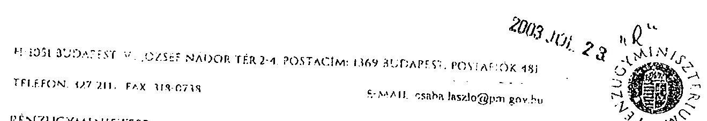

PÉNZUGYMINISZTIR

16115/2003.

Hiv.sz. V 1002-35/2003.
$9_{8} \cdot \mathrm{~V}-1003-36 / 2003 . \mathrm{vï} .28$
Tárgy: 2002. évi országgyülési és onkormányzati vólasztások lebonyolítására felhasznált pénzeszközök ellenörzéséről szóló jelentés

# Dr. Kovács Árpád úrnak, 

Elnök

Állami Számvevőszék
Budapest

Tisztelt Föigazgató Úr!

A 2002. évi országgyülési, valamint a helyi és kisebbségi önkormányzati képvisclö választások lebonyolítására felhasznált pénzeszközök ellcnörzéséről szóló jelentéshez észrevételt nem tessek.

Budapest, 2003. július " 21 ".

Tisztelettel:
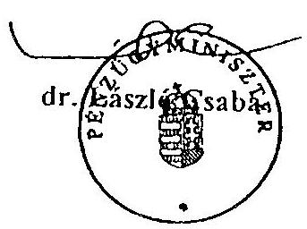

---

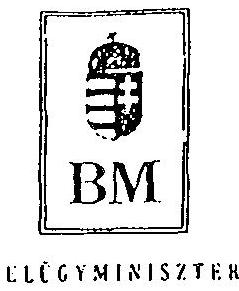

Iktatószám: 1-a-2/27/03.
Hiv. szám: V-1003-35/2003.

Dr. Kovács Árpád Úrnak
Állami Számvevőszék
Elnöke

# Budapest 

## Tisztelt Elnök Úr!

Az Állami Számvevőszék által, a 2002. évi országgyülési, valamint a helyi és kisebbségi önkormányzati képviselö választások lebonyolítására felhasznált pénzeszközök cllenőrzésćről szóló jelentést megkaptam.

Az Ellenőrzési Jelentés javaslatait elfogadom.
A választások lebonyolításának tervezćsi, előkészületi és teljesítési feladatai ütemezésćre, a záró elszámolások pontositására, a közbeszerzési előirásoknak a fejezet felügycletćbe tartozó intézményeknél maradéktalan betartására a szükséges intézkedéseket megteszem.

A javaslatuk szerint, a közbeszerzési előírások megsértése miatt a felelősség megállapitása érdekében intézkedést kezdeményezck.

Amennyiben lehetségesnek tartja, a kísérő levélben jelzett büntetőeljárással kapcsolatban a minisztérium jogi szakértői és munkatársai között további egyeztetést javasolok.

Budapest, 2003. 07. 29.
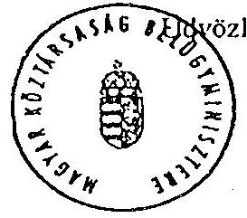

Dr. Lampertb Monika

Budapest, V. Jószef Attila u. 2-4. Postacím: 1903 Budapest, Pf. 314.

---

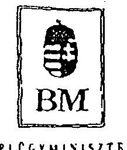
12. számú melléklet a V-1003/2003. számú jelentéshez

Iktatószám: 1-a-2/27/03.
Hiv. szám: V-1003-35/2003.
$19-42 / 1 / 1 / 2003$.

Dr. Kovács Árpád Úrnak
Állami Számvevőszék
Elnöke

# Budapest 

## Tisztelt Elnők Úr!

Az Állami Számvevőszék által lefolytatott, a 2002. évi országgyilési, valamint a helyi és kisebbségi önkormányzati képviselö választások lebonyolítására felhasznált pénzeszközök vizsgálatához kapcsolódóan az egyeztető megbeszélésre vonatkozó javaslatomra köszönettel vettem gyors intézkedését.

Az ÁSZ és a BM munkatársai közöti megbeszélés alapján az ellenőrzéshez kapcsolódóan - a korábban jelzett intézkedéseken túl - utasitást adtam, hogy az elrendelendő, a közbeszerzési eljárásokra vonatkozó személyi felelősség megállapítását célzó vizsgálat külön térjen ki az Önök által jelzett esetben a büntető jogi felelősségre is. Ennek eredményétől függően rendelem el a további szükséges intézkedéseket.

A vizsgálatunk megállapításairól, illetve az intézkedésckröl természetesen haladéktalanul értesítem Önt.

Budapest, 2003. július 30.
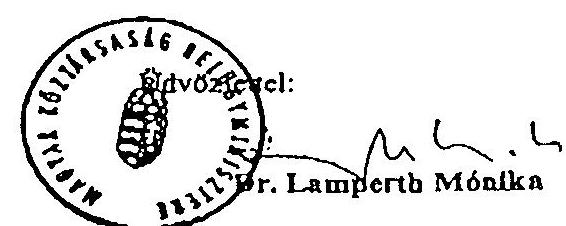

---

# Dr. Lamperth Mónika úrhölgy belügyminiszter Belügyminisztérium 

## B UDA PEST

## Tisztelt Miniszter Asszony!

Köszönettel vettem 1-a-2/27/03. 19-42/1/1/2003. számon 2003. július 30án megküldött tájékoztatását arról, hogy a 2002. évi országgyűlési, valamint a helyi és kisebbségi önkormányzati képviselő választások lebonyolítására felhasznált pénzeszközök ellenőrzéséről szóló jelentésben tett javaslatainkat elfogadva a kilátásba helyezett fegyelmi és büntetőjogi felelősség megállapításához szükséges intézkedéseket megteszi.

Vizsgálatának megállapításairól és intézkedéseiről várom szíves értesítését.

Budapest, 2003. július " $3 / 4$ "