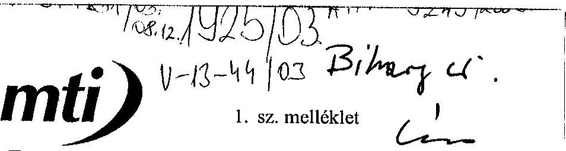
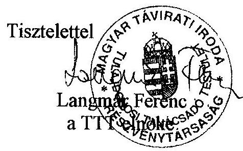
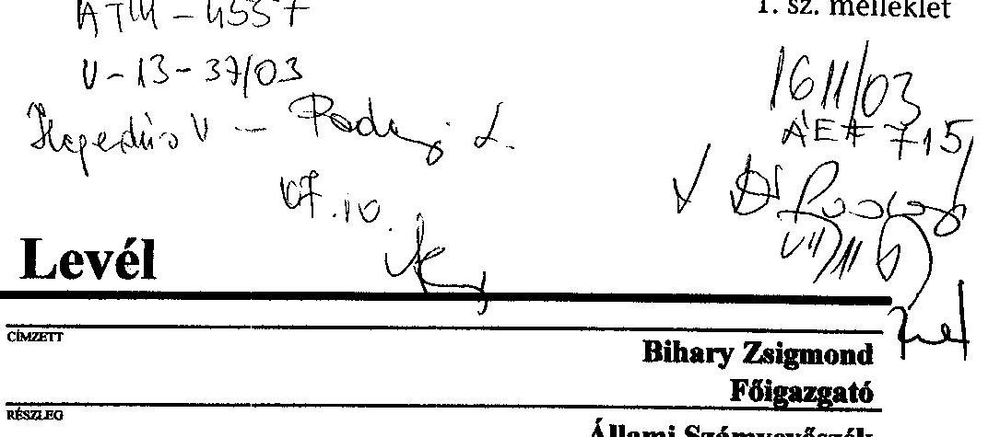
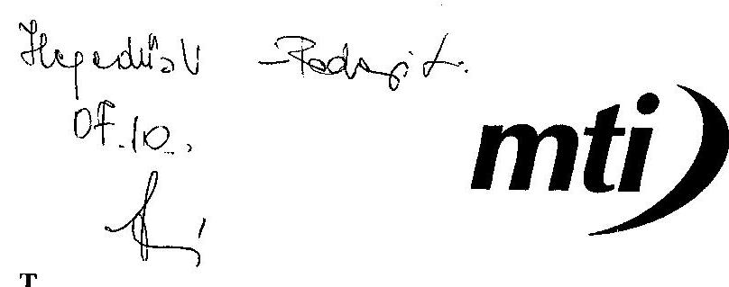
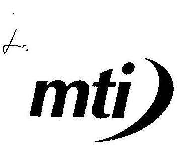
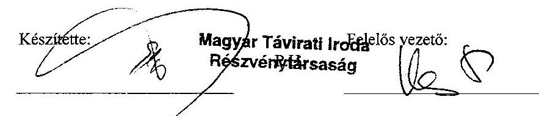
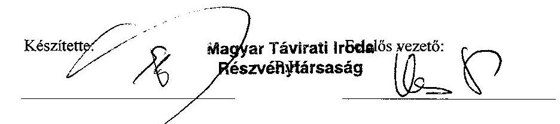
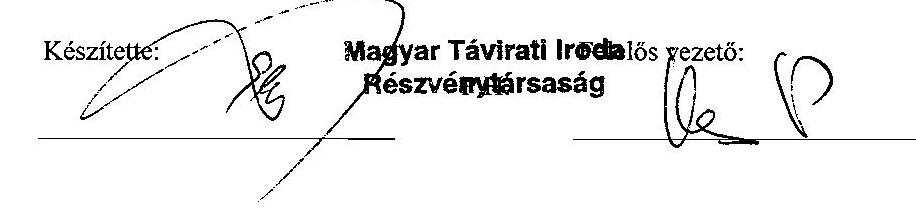

# JELENTÉS 

a Magyar Távirati Iroda Rt. 2002. évi gazdálkodásának ellenőrzéséről
$\qquad$
$\qquad$

---

2. Államháztartás Központi Szintjét Ellenőrző Igazgatóság
2.3. Átfogó Ellenőrzési Főcsoport
V-13-45/2003.
Témaszám: 648
Vizsgálat-azonosító szám: V0078
Az ellenőrzést felügyelte:
Bihary Zsigmond
föigazgató
Az ellenőrzés végrehajtásáért felelős:
Hegedüsné dr. Müllern Veronika
főcsoportfőnök
Az ellenőrzést vezette:
Dr. Podonyi László
igazgatóhelyettes
Az ellenőrzést végezték:
Koós Lászlóné Dr. Majoros Sándor
tanácsadó
tanácsadó

# A témához kapcsolódó eddig készített számvevőszéki jelentések: 

címe
sorszáma
Jelentés a Magyar Távirati Iroda költségvetési fejezet és a Magyar 9829
Távirati Iroda Részvénytársaság pénzügyi-gazdasági ellenőrzéséről (1997.)

Jelentés a Magyar Távirati Iroda Részvénytársaság múködésének 9924
pénzügyi-gazdasági ellenőrzéséről (1998.)
Jelentés a Magyar Távirati Iroda Rt. 1999. évi 0029
gazdálkodásának ellenőrzéséről
Jelentés a Magyar Távirati Iroda Rt. 2000. évi gazdálkodásának 0124
ellenőrzéséről
Jelentés a Magyar Távirati Iroda Rt. 2001. évi gazdálkodásának 0236 ellenőrzéséről

---

# TARTALOMJEGYZÉK 

BEVEZETÉS ..... 7
I. ÖSSZEGZŐ MEGÁLLAPÍTÁSOK, KÖVETKEZTETÉSEK, JAVASLATOK ..... 9
II. RÉSZLETES MEGÁLLAPÍTÁSOK ..... 16

1. Az MTI Rt. múködésének szabályozottsága, törvényessége, a feladatok és a szervezeti rendszer összhangja ..... 16
1.1. A múködés külső szabályozása ..... 16
1.2. A múködés belső szabályozása ..... 19
1.3. A TTT és az FB múködését biztosító társasági szabályozottság ..... 21
2. MTI Rt. gazdálkodása ..... 22
2.1. A Társaság 2002. évi üzleti tervének teljesülése, az üzleti terv megalapozottsága ..... 22
2.2. Az MTI Rt. díjszabása, egységes árképzési elveinek kidolgozása ..... 24
2.3. Az állami támogatások felhasználásának megalapozottsága ..... 26
2.4. Az MTI Rt. létszám- és bérgazdálkodása, a rendszeres és nem rendszeres személyi juttatások ..... 30
2.5. Az MTI Rt. közbeszerzési gyakorlata ..... 33
2.6. Az üzleti tervben megfogalmazott beruházások, felújítások megvalósulása ..... 34
2.7. A saját alapítású társaságok gazdasági hatása ..... 35
3. A Társaság belső információs rendszere és a belső ellenőrzés múködése ..... 36
3.1. A Társaság belső információs rendszerének szabályozása, az információs rendszer múködése ..... 36
3.2. A Társaság belső ellenőrzési rendszerének múködése ..... 37
4. Az Állami Számvevőszék 2002. évi jelentésének hasznosulása ..... 39

---

.

---

# MELLÉKLETEK 

1. A jelentésre és jelentéstervezetre tett észrevételek
2. ÁSZ-javaslatokkal összefüggő OGY határozatok
3. Az 1999-2002. évi ÁSZ-jelentésekben foglalt javaslatok

## TANÚSÍTVÁNYOK

1. Árbevétel- és eredményterv értékelése 2002.

Költség- és ráfordításterv értékelése 2002.
2. A társaság vagyoni helyzetének alakulása (eszközök)
3. A társaság vagyoni helyzetének alakulása (források)
4. Bevételek alakulása
5. Költségek és ráfordítások alakulása
6. Eredmény alakulása
7. Költségvetési befizetési kötelezettségek
8. Költségvetési juttatások

---

.

---

# RÖVIDÍTÉSEK JEGYZÉKE 

| MTI Rt., Társaság | Magyar Távirati Iroda Részvénytársaság |
| :-- | :-- |
| FB | Felügyelő Bizottság |
| TTT | Tulajdonosi Tanácsadó Testület |
| ÁSZ | Állami Számvevőszék |
| OGY | Országgyűlés |
| SZMSZ | Szervezeti és Müködési Szabályzat |
| Nht. | A nemzeti hírügynökségről szóló 1996. évi CXXVII. törvény |
| Gt. | A gazdasági társaságokról szóló 1997. évi CXLIV törvény |

---

.

---

# JELENTÉS 

## a Magyar Távirati Iroda Rt. 2002. évi gazdálkodásának ellenőrzéséről

## BEVEZETÉS

A nemzeti hírügynökségi tevékenység ellátására az Országgyúlés egyszemélyes részvénytársaságként megalapította a Magyar Távirati Iroda Részvénytársaságot (MTI Rt., Társaság). A részvénytársaság a nemzeti hírügynökségről szóló 1996. évi CXXVII. törvény (Nht.) 2. § (1) bekezdésében felsorolt közszolgálati feladatokat köteles ellátni, amelyekhez állami támogatásban részesül.

Az MTI Rt. a Magyar Távirati Iroda költségvetési szervből 1997. július 15-ével alakult át, egyszemélyes - 100\%-ban állami tulajdonú - részvénytársasággá. Tevékenységét székhelyén kívül öt telephelyen és egy fióktelepen végzi. A tulajdonosi jogokat az Országgyúlés gyakorolja. Az Nht. 9. §-a és az MTI Rt. alapító okirata szerint a részvénytársaság elnöke évente beszámol az Országgyúlésnek a részvénytársaság tevékenységéről, amelynek keretében sor kerül a mérleg és az eredménykimutatás jóváhagyására, valamint a nyereség felosztására. Az elnök a beszámolóját a részvénytársaság felügyelő bizottságának véleményével együtt terjeszti az Országgyúlés elé, amihez mellékelni kell az Állami Számvevőszék elnökének jelentését a részvénytársaság tevékenységéről. Az Nht. 29. §-a értelmében a részvénytársaság gazdálkodását az Állami Számvevőszék ellenőrzi.

Az MTI Rt. 2002-ben 1,322 milliárd Ft múködési támogatást kapott a központi költségvetésből. A 2003-ra jóváhagyott összeg 1,522 milliárd Ft.

Az MTI Rt. múködésének külső és belső szabályozása az ÁSZ korábbi javaslatai ellenére 2002-ben lényegében nem változott. A múködés törvényessége szempontjából változást hozott a Társaság éves beszámolóit utólagosan jóváhagyó országgyűlési határozatok meghozatala. A Tulajdonosi Tanácsadó Testület feladata volt az MTI Rt. elnöke megbízási idejének 2002. november 30-i lejáratából adódó elnöki pályázatok kiírása, elbírálása, végül a kinevezésről rendelkező 183/2002. (XI. 26.) számú köztársasági elnöki határozat alapján a megbízási szerződés megkötése az új elnökkel. (A pályáztatási folyamat 2002. május 13-tól 2002. október 3-ig tartott.)

A Magyar Távirati Iroda Rt. 2002. évi gazdálkodása ellenőrzésének célja annak feltárása volt, hogy a Társaság:

- külső és belső szabályozása, szervezeti és múködési rendszere összhangban volt-e a feladatokkal, mennyiben segítette azok hatékony és eredményes ellátását, belső szabályozása megfelelt-e a hatályos jogszabályoknak;

---

- alapító okiratában és a vonatkozó törvényekben, egyéb jogszabályokban foglaltaknak megfelelően törvényesen, célszerűen és eredményesen gazdál-kodott-e a rendelkezésére bocsátott vagyonnal és a központi költségvetésből a részvénytársaság közszolgálati feladatai ellátásához nyújtott múködési- és céltámogatással, a megkezdett és befejezett fejlesztések összhangban voltake a közszolgálati feladatok biztonságos ellátásával;
- információs rendszere, belső ellenőrzése elősegítette-e a hatékony gazdálkodást;
- hasznosította-e a 2001. évi tevékenységének ellenőrzéséről készült ÁSZjelentés megállapításait, javaslatait, ajánlásait.

Ellenőrzésünk társasági szintű átfogó jellegű vizsgálat volt, amely az MTI Rt. működésének a vizsgálat fő feladatai szempontjából meghatározó területeire terjedt ki, nem volt feladata a Társaság teljes körű átvilágítása. Az MTI Rt. székházában végzett helyszíni ellenőrzés módszere a dokumentális vizsgálat és elemzés volt. Az ellenőrzés és elemzés alapdokumentumai elsősorban a részvénytársaság auditált éves beszámolói (mérleg, eredménykimutatás, kiegészítő melléklet, üzleti jelentés, könyvvizsgálói jelentés), az ezeket alátámasztó dokumentumok, bizonylatok, a testületek üléseinek jegyzőkönyvei és határozatai, a vezetői utasítások, szabályzatok, beszámolók, elemzések, a külső- és belső ellenőrzés jelentései voltak.
2002. december 1-jén elnökváltás történt az MTI Rt.-nél, mivel a korábbi elnök megbízatása lejárt.

A jelentést az MTI Rt. Tulajdonosi Tanácsadó Testület elnökével, a jelentéstervezetet az Felügyelő Bizottság és az Rt. elnökével egyeztettük, levelük másolatát az 1. sz. melléklet tartalmazza.

---

# I. ÖSSZEGZŐ MEGÁLLAPÍTÁSOK, KÖVETKEZTETÉSEK, JAVASLATOK 

Az Országgyűlés, amely az MTI Rt. alapítója, részvényesi és közgyűlési jogainak gyakorlója 2002. október 1-jén visszamenőleges hatállyal elfogadta a Társaság megalapítása óta benyújtott éves beszámolókat. A 2001. évi beszámolót elfogadó OGY határozat - az ÁSZ javaslata szerint - jogalkotási feladatot fogalmazott meg a hírügynökségi törvény és az MTI Rt. Alapító Okirata áttekintésére, a teljes körűen összehangolt szabályozás kialakítására, a közszolgálati feladatok és azok ellátásához szükséges állami támogatás egyértelmúbb és pontosabb meghatározására. Az OGY határozat e jogalkotási feladat címzettjét és a határidejét nem jelölte meg. A 2003. évi ellenőrzés befejezéséig a jogalkotási feladat nem teljesült. Ezért jelenleg is fennállnak azok a jogi és részvénytársasági szabályozási hiányosságok, amelyekre az ÁSZ több alkalommal, legutóbb 2002-ben is rámutatott. ${ }^{1}$

A jogszabályok áttekintését és módosítását az MTI Rt. múködtetésére kialakított, speciális tulajdonosi megoldás indokolja. Az MTI Rt. közvetlen tulajdonosa az Országgyúlés. Az Országgyúlés múködése nem teszi lehetővé a tulajdonos és a társasága közötti napi kapcsolattartást. A részvénytársaság irányító szervezetének felépítése is eltér az általánostól. Nincs igazgatósága, ezt a feladatot az MTI Rt. elnöke látja el. A TTT javaslattevő, véleményező, tanácsadó testület, a törvényben meghatározott esetekben döntéshozó szervként múködik. Az elnöki hatalom korlátozása érdekében a FB-nek is sajátos feladata van, a meghatározott értékhatárok feletti szerződések megkötésének előzetes jóváhagyása. A TTT tagjai nem, az FB tagjai a részvénytársaságnak okozott kárért a polgári jog szabályai szerint felelnek.

Továbbra sem tisztázott az Országgyúlés, a TTT, az FB és az MTI Rt. elnöke között megosztott tulajdonosi irányítás és ellenőrzés törvényi szabályozása, e szervezetek, testületek feladat- és hatásköri szabályozása. Nem alkották meg az Nht.-ben rögzített, a választási időszakban végzendő feladatokra vonatkozó külön törvényt. A 2002-es országgyűlési és önkormányzati választások hírügynökségi feladatainak finanszírozására sem került sor. A nemzeti hírügynökségi törvény és a Társaság alapító okirata, a testületek ügyrendje, a Szervezeti és Múködési Szabályzat (SZMSZ) sem rendelkezett a tulajdonosi jogok gyakorlóinak egymás és a Társaság közötti, a múködés során alkalmazandó eljárási rendről. Mindez a részvénytársaság múködésének összhangját 2002-ben is rontotta. ${ }^{2}$

[^0]
[^0]:    ${ }^{1}$ Lásd az 3. sz. mellékletet az Állami Számvevőszéknek az MTI Rt.-nél végzett korábbi ellenőrzése alapján tett ajánlásaiból az ÁSZ Jelentés a Magyar Távirati Iroda Rt. 2000. évi gazdálkodásának ellenőrzéséről (0124), és a Jelentés a Magyar Távirati Iroda Rt. 2001. évi gazdálkodásának ellenőrzéséről (0236).
    ${ }^{2}$ Ugyanaz, mint az 1. sz. lábjegyzet

---

A tulajdonosi irányítás, ellenőrzés és múködtetés szabályozatlanságának hatása 2002-ben a TTT feladat- és hatáskörének a díjszabás megállapításában és a Társaság SZMSZ-e véleményezése kérdésében, továbbá a testület és a Társaság közötti információszolgáltatás hiányosságaiban nyilvánult meg.

A Társaságnak két éve nincs elfogadott díjszabása. Az Nht., az MTI Rt. Alapító Okirata díjszabással kapcsolatos pontatlansága miatt, a TTT és a Társaság közötti megegyezés, szabályozás hiányában a társasági előterjesztéseket - további átdolgozást kérve - a TTT rendre visszaadta, az MTI Rt. pedig az új tarifapolitika kialakításának és bevezetésének határidejét módosította folyamatosan ${ }^{3}$. Az utolsó határidő 2003. március 31. volt.

Az MTI Rt. - annak ellenére, hogy erre jogszabály kötelezi és az elmúlt három év ÁSZ vizsgálatai is megállapították - nem rendelkezik érvényes díjszabással. A tarifarendszer tervezetét az Rt. vezetése elkészítette és a TTT-nek, jóváhagyásra benyújtotta, de azt a TTT nem hagyta jóvá (az elkészített tarifapolitika nem az önköltségszámításon alapul). A díjszabás elfogadásának hiánya is reprezentálja a TTT és a menedzsment hatásköri problémáit és szabályozási hiányosságait, aminek következtében a törvényi előírás nem tartható be, és gazdasági szempontból sérül a tulajdonos érdeke (a magasabb árak érvényesítésének akadálya miatt).

A díjszabáshoz hasonlóan az SZMSZ 2001. évi és 2002. április 5-i módosításának véleményezési folyamata sem hozott megnyugtató, közös megegyezésen alapuló eredményt a TTT és a Társaság számára. A véleményezési jog gyakorlásának szabályozása hiányában az egyeztetési folyamat indokolatlanul hoszszú volt ${ }^{4}$. Az eredetileg 2001. december 15-i hatályú bevezetés - a TTT egyetértő véleménye nélkül - 2002. április 5-én teljesült.

A testületek és a Társaság közötti együttmúködés szabályozásának hiánya, az információszolgáltatásban is feszültséget okozott.

Az MTI Rt. távozó elnöke az elmaradt járandósága miatt az MTI Rt.-vel szemben peres eljárást kezdeményezett.

A Társaság szabályozott múködése az SZMSZ-re, elnöki, alelnöki utasításokra, a Szakmai és Közszolgálati Tájékoztatási Szabályzatra, szakmai kézikönyvekre, munkaköri leírásokra épült. Az SZMSZ 2002-ben kétszer, 2003-ban, az első negyedév végéig, egyszer változott. Az SZMSZ módosításait nem előzte meg a Társaság szervezetei tevékenységének átvilágítása, a módosítások szükségességének indoklása, a módosításokkal elérendő célok megfogalmazása, az elvárható hatékonyabb múködés eredményei, a változtatások hatása a költségek és ráfordítások összegének alakulására, a létrehozott új szervezetek múködése ered

[^0]
[^0]:    ${ }^{3}$ Lásd az ÁSZ Jelentés a Magyar Távirati Iroda Rt. 2000. évi gazdálkodásának ellenőrzéséről (0124), és a Jelentés a Magyar Távirati Iroda Rt. 2001. évi gazdálkodásának ellenőrzéséről (0236).
    ${ }^{4}$ Ugyanaz, mint a 3. sz. lábjegyzet

---

ményeinek értékelése. Mindez a célszerű és átgondolt szervezetfejlesztés hiányára utal. ${ }^{5}$

A gazdasági társaságokra kötelező gazdálkodási szabályzatokkal a Társaság rendelkezett, de szabályzatai és a hatályos SZMSZ valamint, az SZMSZ és a munkaköri leírások közötti összehangolás elmaradt. Emiatt a felelősség megállapíthatósága nem biztosított. ${ }^{6}$

Az MTI Rt. a 2002. gazdasági évre vonatkozó bevételi tervét 4\%-kal alacsonyabb értéken realizálta. A 150363 ezer Ft bevételkiesés mellett az üzleti veszteség 168793 ezer Ft volt 2002-ben. Az éves üzleti terv nem kapcsolódott a 2000-2003. évi középtávú stratégiában megfogalmazott célokhoz, amelyek közül több, a részletes megállapításokban kifejtett főbb célkitúzés nem valósult meg.

A támogatás összegét nem az elvégzendő feladat és az ehhez szükséges szervezet hatékony múködése, hanem költségvetési alku eredménye alapján határozták meg. A múködési céltámogatás összegének meghatározásakor az Országgyúlés fejezetben a TTT múködtetésével kapcsolatos feladatok költségeinek fedezetét a Társaság támogatásától 2002-ben sem különítették el, pedig e költségek alakulására a Társaságnak nincs befolyása. Az ÁSZ e költségek külön soron szerepeltetését többször javasolta. Pontosításra szorul az Nht. megfogalmazása a Társaság mérleg szerinti nyereségének, illetve eredménytartalékának felhasználásával kapcsolatban is, mivel a felhasználást a közszolgálati feladatokkal összefüggésben határozza meg a törvény. ${ }^{7}$

A termék vagy termékcsoport szintű önköltség utókalkuláción alapuló megállapításának, valamint a közszolgálati feladatok megállapításának hiánya következtében az MTI Rt. részére a költségvetési törvényben meghatározott múködési célú támogatás indokolt mértékének és célszerű felhasználásának ellenőrzése nem lehetséges. A közszolgálati feladatok konkrét meghatározása nélkül a költségvetési törvényben biztosított céltámogatás és a nemzeti hírügynökségi törvényben meghatározott céltámogatás törvényes felhasználása nem ellenőrizhető. A múködési támogatás követelményrendszer nélküli folyósítása és ebből következően az elszámoltatás lehetőségének hiánya a „felelős gazdálkodás" megítélését nem teszi lehetővé.

Az MTI Rt. részére megítélt céltámogatások közül az MTI NET-projekt tárgya - a választási portál, a rádió- hírszolgáltatás, a videó- hírszolgáltatás kivételével nem különíthető el az MTI Rt. szokásos tevékenységétől. A támogatás felhasználása során általános tapasztalat a konkrét feladat meghatározások hiánya,

[^0]
[^0]:    ${ }^{5}$ Lásd az ÁSZ Jelentés a Magyar Távirati Iroda Rt. 2000. évi gazdálkodásának ellenőrzéséről (0124), és a Jelentés a Magyar Távirati Iroda Rt. 2001. évi gazdálkodásának ellenőrzéséről (0236).
    ${ }^{6}$ Ugyanaz, mint az 5. sz. lábjegyzet
    ${ }^{7}$ Ugyanaz, mint az 5. sz. lábjegyzet

---

amelynek következtében a szolgáltatások tartalma és az ellenértékként kifizetett díjak megalapozottsága a teljesítésigazolások ellenére is kifogásolható.

Az „Erdélyi hírszolgálat" kialakítására megítélt céltámogatás felhasználásának kifizetéseit az újonnan választott vezetés a szakmai tartalom hiányosságaira hivatkozva felfüggesztette.

Az MTI Rt. a céltámogatásokból megvalósított beszerezései, megrendelései esetében a támogatási szerződésekben foglalt előírásoktól eltérően értelmezte a közbeszerzési törvény előírásait.

A Társaság a középtávú stratégiai tervében is megfogalmazott létszámracionalizálást nem hajtott végre az elmúlt három évben. Az MTI ECO Kft. dolgozóit a kft. integrálását követően az MTI Rt. átvette. A létszám emelkedése következtében az elmúlt öt évben a bérköltség-növekedés minden évben meghaladta az infláció mértékét, annak következtében, hogy a stratégiai terv a személyi jellegű költségek inflációval arányos növekedési célját és a jövedelmek reálértékbeli növekedésének forrását a létszámgazdálkodás racionalizálásában jelölte meg. A bérnövekedés nem járt együtt a teljesítményértékelés bevezetésével és teljesítménynövekedéssel. Az elmúlt két évben az MTI Rt. 120 millió Ft-ot fizetett ki végkielégítés vagy felmondási bér címén.

Tovább növekedett 2002-ben a megbízási és vállalkozási szerződések alapján kifizetett díjak összege. Kiemelkedő a munkaviszony alapján foglalkoztatott főállású jogász mellett alkalmazott 14 ügyvéd vagy ügyvédi iroda részére kifizetett díj. A megbízások nem egy konkrét, jól körülhatárolt feladat ellátására irányultak havi rendszeres ellentételezésük általány jellegű volt. A megbízási szerződések teljesítése a konkrét munkavégzés dokumentációjának hiánya miatt nem ellenőrizhető.

Az MTI Rt.-nek középtávú beruházási terve csak az informatikai fejlesztésekre van, az Ingatlankezelési és üzemeltetési Igazgatóság középtávú terv nélkül gazdálkodik. Az ingatlanokhoz kapcsolódó feladatok a projektszabályzat és a felújítások, karbantartások elkülönített nyilvántartásának szabályozási hiányosságai miatt értelmezési és elszámolási problémákat okoznak.

Az MTI Rt. a korábbi vizsgálatok során kifogásolt befektetési politikáját megváltoztatta. Az MTI Fotó Kft.-t megszüntették, az MTI ECO Kft. tevékenységét a részvénytársaságba integrálták. Az MTI Kiadói Kft. 10\% üzletrészének értékesítése a tulajdonos határozata és megalapozott értékelés nélkül történt.

A Társaság belső információs rendszere 2002-ben érdemben nem változott. A vezetői információs rendszer fejlesztésének vezetői döntéseket elősegítő hatását 2002-ben nem vizsgálták, az igényeket fel sem mérték. A belső információs rendszer alapvető hiányossága megmaradt, az a Társaság valamennyi termékére, szolgáltatására vonatkozó elő- és utókalkuláció készítésére, az árak kiala

---

kítására, fedezetelemzésre jelenleg nem, csak további pontosítások elvégzése után lesz alkalmas. ${ }^{8}$

A Társaság belső ellenőrzésében 2002-ben sem kapott hangsúlyt a megállapítások és javaslatok hasznosításának és a hiányosságok felszámolásának utóellenőrzési igénye. 2002-ben a belső ellenőr tervezett, de nem végzett utóellenőrzést. A 2002. évi javaslatok felét sem hasznosította az MTI Rt. Az ellenőri jelentéseken az észrevételezési záradékot a Társaság korábbi elnöke nem írta alá, a jelentésekre írásban nem tett észrevételt, az azokban foglaltakat az FB üléseken, a napirend tárgyalásakor ismerte meg. ${ }^{9}$

Az Állami Számvevőszék 2002. évi - az elmúlt négy év ellenőrzési tapasztalatait is összegző - jelentésében megfogalmazott megállapításai, javaslatai és ajánlásai az MTI Rt.-nél 2002-ben lényegében nem hasznosultak. ${ }^{10}$

Az MTI Rt. elnöke 2002-ben is elnöki utasításban intézkedett az ÁSZjelentésben megállapított hiányosságok megszüntetésére. Az utasításban elrendelt intézkedések egy részének azonban 2002-ben nem volt eredménye. Elmaradt a Károly körúti ingatlan bérleti jogának rendezése és hasznosítása. Nem véglegesítették az árképzés egységes elveit. Nem készült el az új tarifarendszerre épülő önköltség-számítási szabályzat sem. Az SZMSZ-ben nem szabályozták a testületek és a Társaság közötti együttmúködés rendjét. Az új elnök fél évvel meghosszabbította a korábbi elnöki utasítások végrehajtási idejét.

2002-ben elmaradt a csak vállalkozói szerződéssel foglalkoztatottak szerződéseinek feladat és teljesítés szempontú felülvizsgálata. Változatlanul foglalkoztattak vezetőket kettős jogviszony keretében. Az ügyvédeket nem egységes elvek alapján foglalkoztatták az átalánydíjas jellegű megbízási szerződések keretében. A külsős ügyvédi megbízási szerződésekben a feladatok pontosítása, a teljesítés és számonkérés összhangja nem volt biztosítva. Elmaradt a teljesítményértékelési rendszer bevezetése.

A helyszíni ellenőrzés megállapításainak hasznosítása mellett javasoljuk:

# az Országgyülésnek, 

1. tekintse át és módosítsa a 68/2002. (X. 4.) OGY határozatban megfogalmazott jogalkotási feladatnak megfelelően a nemzeti hírügynökségről szóló tör
[^0]
[^0]:    ${ }^{8}$ Lásd az ÁSZ Jelentés a Magyar Távirati Iroda Rt. 2000. évi gazdálkodásának ellenőrzéséről (0124), és a Jelentés a Magyar Távirati Iroda Rt. 2001. évi gazdálkodásának ellenőrzéséről (0236).
    ${ }^{9}$ Lásd az ÁSZ Jelentés a Magyar Távirati Iroda Rt. 2000. évi gazdálkodásának ellenőrzéséről (0124), és a Jelentés a Magyar Távirati Iroda Rt. 2001. évi gazdálkodásának ellenőrzéséről (0236).
    ${ }^{10}$ Ugyanaz, mint a 9. sz. lábjegyzet

---

vényt és az MTI Rt. Alapító Okiratát a teljes körűen összehangolt szabályozás kialakítása, a közszolgálati feladatok és az azok ellátásához szükséges állami támogatás egyértelmúbb és pontosabb meghatározása érdekében;
2. gondoskodjon az Nht. 2. § (1) bekezdése h) pontjában megjelölt külön törvény megalkotásáról;
3. fontolja meg a TTT működési költségeinek az MTI Rt. működési céltámogatásától elkülönítését a következő évi költségvetési törvényben.

# a TTT elnökének, 

1. szabályozza a testület ügyrendjében a döntési, a tanácsadói, a javaslattételi, a véleményezési hatáskörben végzendő feladatai ellátásával kapcsolatos eljárási rendet;
2. kezdeményezze a tulajdonosnál jogosítványai egyértelmű meghatározását;
3. vizsgálja meg a közbeszerzésekkel és az MTI NET-projekttel kapcsolatban a személyi felelősség kérdését.

## az FB elnökének,

intézkedjen, hogy a belső ellenőr munkatervében hangsúlyt kapjon az utóellenőrzés, az MTI Rt. munkájában pedig a belső ellenőri megállapítások hasznosításának igénye.

## az MTI Rt. elnökének,

1. vizsgálja felül az MTI Rt. tevékenységét és szervezeti rendjét, hangolja össze a szervezeti egységek közötti feladatokat, az SZMSZ-t és az elnöki, alelnöki utasításokat, az SZMSZ-t és a munkaköri leírásokat; a felülvizsgálat keretében, a testületekkel együttmüködve szabályozza a TTT, az FB és az MTI Rt. közötti kapcsolattartás és együttmüködés rendjét: ellenőrizze az MTI Rt.-nél végzett beruházási, felújítási és karbantartási munkák számviteli nyilvántartási gyakorlatát, szabályozottságát és a közbeszerzések összefüggéseit;
2. végezze el a megbízási és a vállalkozási szerződések hatékonyságelemzését, egységesítse a megbízási és vállalkozási szerződéseket, és biztosítsa azokban a feladatmeghatározás, a teljesítés és a számonkérés összhangját; vizsgáltassa ki a megbízási - ezen belül az ügyvédi - és tanácsadási szerződések szükségességét, valamint a feladatnak megfelelő tartalom- és a teljesítésigazolások összefüggéseit, az MTI Rt. munkaszerződéseinek feladatmeghatározásait, felmondási és végkielégítési gyakorlatát;
3. alakíttassa ki úgy a Társaság elő- és utókalkulációját, hogy azok megfelelő adatokat szolgáltassanak az egyes termékek, szolgáltatások árképzéséhez; intézkedjen az új tarifarendszer kidolgozására, és szüntesse meg a határidők folyamatos módosítását;

---

4. intézkedjen a Károly krt.-i bérelt ingatlan hasznosítására;
5. alakítsa ki a céltámogatások célnak megfelelő felhasználásának folyamatba épített ellenőrzési rendszerét, vizsgálja felül a céltámogatási szerződések feladatnak megfelelő megvalósulását;
6. vizsgálja meg a NET-projekt keretében eddig felhasznált támogatás cél- és jogszerűségét és a személyi felelősség felvetésének szükségességét;
7. intézkedjen a közbeszerzési törvény és a közbeszerzési eljárás rendjéről szóló elnöki utasítás maradéktalan betartásáról;
8. pontosítsa az ügyvédi megbízási szerződések feladatmeghatározásait a közbeszerzési törvény alkalmazásának meghatározásához;
9. intézkedjen, hogy az ÁSZ-jelentések megállapításai, javaslatai alapján utasításban kiadott intézkedési terveknek - a határidők betartásával - eredménye legyen.

---

# II. RÉSZLETES MEGÁLLAPÍTÁSOK 

## 1. Az MTI Rt. múködésének szabályozottsáGA, tÖRVÉNYESSÉGE, A FELADATOK ÉS A SZERVEZETI RENDSZER ÖSSZHANGJA

### 1.1. A múködés külső szabályozása

A nemzeti hírügynökségről szóló 1996. évi CXXVII. törvény, továbbá a Magyar Távirati Iroda Részvénytársaság Alapító Okiratát is tartalmazó 70/1997. (VII.15.) OGY határozat rendelkezései 2002-ben nem változtak.

Az MTI Rt. törvényes múködését érintő változás 2002-ben az volt, hogy az elmúlt négy év ellenőrzési tapasztalatainak számvevőszéki összegzése, az Állami Számvevőszék elnökének javaslatai alapján az Országgyűlés, amely az MTI Rt. alapítója, részvényesi és közgyűlési jogainak gyakorlója, 2002. október 1-jén a 64/2002. - 67/2002. ${ }^{11}$ határozataival, visszamenőleges hatállyal, tudomásul vette a Társaság megalapítása óta benyújtott elnöki beszámolókat. Ugyanezekben a határozatokban jóváhagyta az MTI Rt. mérlegeit és eredménykimutatásait.

A 2001. évi beszámolót elfogadó 68/2002. (X. 4.) OGY határozat 4. pontja ${ }^{12}$ - az ÁSZ javaslata alapján - jogalkotási feladatot is előírt a hírügynökségi törvény és az MTI Rt. Alapító Okirata áttekintésére, a teljes körűen összehangolt szabályozás kialakítására, a közszolgálati feladatok és azok ellátásához szükséges állami támogatás egyértelmúbb és pontosabb meghatározására. A határozat nem jelölte meg az előírt jogalkotási feladat címzettjét és határidejét. Az ÁSZ helyszíni vizsgálatának befejezéséig a jogalkotási feladat nem teljesült. Az erre jogosultak - elsősorban a Kormány - módosító indítványt nem terjesztettek be. Előkészítő, feltáró munkát, javaslatot 2002-ben az Országgyűlés bizottságai és az MTI Rt. vezetése nem végzett. A TTT sem nyújtott be javaslatot, akinek az Nht. 21. § (1) g) pontja szerint feladata és jogköre az alapító okirat módosításának előkészítése 2003-ban azonban a korábbi években benyújtott javaslatait újra átadta az OGY szakbizottságának. A leírtak miatt nem szűntek meg azok a jogi és részvénytársasági szabályozási hiányosságok, amelyekre az ÁSZ több alkalommal, 2002-ben is, felhívta az érintettek figyelmét.

A TTT, az FB és az MTI Rt. elnöke között megosztott tulajdonosi joggyakorlás törvényi szabályozása, e szervezetek, testületek feladat- és hatásköri szabályozása és a szabályozás összehangolása elmaradt. A szervezetek közötti hatékony együttműködéshez szükséges szabályokat, eljárási rendeket az érintett szerveze

[^0]
[^0]:    ${ }^{11}$ Lásd a 2. sz. mellékletet
    ${ }^{12}$ Lásd a 2. sz. mellékletet

---

tek sem dolgozták ki. A részvénytársaság múködésének a hatékonyságát 2002ben is rontotta e szervezetek feladat- és hatásköri szabályozásának pontatlansága, a szabályozás összehangolásának hiánya, kapcsolattartásuk, együttmúködésük szabályozatlansága. A szabályozás hiányának hatása 2002-ben is a TTT feladat- és hatáskörének a díjszabás megállapítása és a Társaság SZMSZének véleményezése hatásköri kérdésében nyilvánult meg. 2002-ben az elnök szerződésének megszűnésével összefüggő, a TTT múködését biztosító információszolgáltatás szabályozatlansága okozott még a testület és az MTI Rt. elnöke között jogi következményekkel is járó nézetkülönbséget.

A hatályos szabályozás szerint a TTT ügydöntő hatásköre az MTI Rt. díjszabásának jóváhagyása. Az Nht. (21. § (1) bek. h) pont, 2. § (3) bek.) és az Alapító Okirat sem pontosítja, hogy a díjszabás jóváhagyása konkrétan melyik termékekre, termékcsoportokra vagy szolgáltatásokra - csak a közszolgálati vagy az MTI Rt. összes termékére, szolgáltatására - vonatkozik, a díjszabás milyen mélységú bemutatása szükséges a döntés meghozatalához. A díjszabás fogalmát, a megállapításához szükséges döntés előkészítési, döntési, ellenőrzési folyamatát a TTT sem szabályozta. A TTT 2001-ben nem döntött az MTI Rt. 2002. évi díjszabásáról. Az MTI Rt.-nek a TTT által jóváhagyott 2003-as díjszabása sincs, ami feszültség forrása volt a TTT és az MTI Rt. vezetői között. A TTT szerint a díjszabás és az SZMSZ elfogadásánál nem a részletes szabályozás hiánya, hanem az elnök mulasztása okozott problémát és ez vezetett a szabályellenes állapothoz.

Az MTI Rt. szakmai alelnöke a társaság egységes tarifarendszerére vonatkozó előterjesztést nyújtotta be a TTT 2002. október 31-i ülésére. (Az előterjesztés - az előterjesztő véleménye szerint - az önköltségszámítás és a tarifák meghatározásának új elveit és eredményét mutatta be. Az anyag az előterjesztést készítő gazdasági alelnök szerint további pontosításra szorult.) A TTT az előterjesztés kiegészítésére 2002. november 15-i határidőt szabott. A TTT ugyanezen a napon határozatban kérte fel az MTI Rt. könyvvizsgálóját az előterjesztett tarifarendszer költségoldala módszertanának ellenőrzésére. (A könyvvizsgálói jelentés 2003. január 10-én elkészült.) A TTT 2002. december 5-én (ekkor az MTI Rt.-nek már új elnöke volt) határozatban rögzítette, hogy nem kapott a díjszabás tervezetéről a szükséges formai és tartalmi kritériumoknak megfelelő előterjesztést, így nem tudott eleget tenni a díjszabás megállapításával kapcsolatos kötelezettségének. A határozatban azt is rögzítették, hogy a TTT a díjszabással kapcsolatban korábban megfogalmazott elképzeléseit írásban összefoglalja, és azt az MTI Rt. elnökének rendelkezésére bocsátja.

Az érvényben lévő szabályozás szerint (Alapító Okirat V.5.5. pontja) a TTT-nek az MTI Rt. SZMSZ-ével kapcsolatban véleményezési joga van. A véleményezési jog gyakorlására vonatkozó eljárási rendet a TTT (saját ügyrendjében), és a Társaság (SZMSZ-ben) nem szabályozta. E jog gyakorlásával összefüggésben 2001-ben és 2002-ben is nézetkülönbség volt a TTT és a Társaság között. A különbségek a vélemény kialakításához szükséges idő, a vélemények indoklásának tartalma, az egyeztetési folyamat időbeni terjedelme, valamint az SZMSZ módosításának részletezettsége kérdésében mutatkoztak meg. Végül az egyeztetési folyamatnak kölcsönös megegyezésen alapuló eredménye nem volt. Az eredetileg 2001. december 15-i hatállyal bevezetni tervezett új SZMSZ-t az MTI Rt. elnöke 2002. április 5-én léptette hatályba.

---

A Társaság szervezete 2002-ben még egy alkalommal, az elnökváltást követően, 2002. december 19-i hatályba lépéssel, változott. Az SZMSZ módosítását a TTT az MTI Rt. elnökének 2002. december 18-i előterjesztése alapján ugyanazon a napon elfogadta, felkérte az MTI Rt. elnökét, hogy 2003. március végéig készítsen beszámolót a TTT részére a módosítás tapasztalatairól. A beszámoló a megadott határidőre nem készült el. ( A TTT tájékoztatása szerint a beszámoló két hét késéssel ugyan, de elkészült.) A TTT 2003. január 23-án elfogadta a 2003. február 1jétől életbe léptetett szervezeti változásokat is. Az MTI Rt. elnökének előterjesztése 2003. január 16-án készült.

A Társaság közszolgálati feladatai ellátásához szükséges mértékű állami támogatása (működési céltámogatás) összegének meghatározása korábban, de a 2003-as költségvetési törvény előkészítési folyamatában alku eredménye volt. A támogatás összegét a közszolgálati feladat meghatározása, kritériumrendszere és számítási módszere kialakítása nélkül állapították meg. Ezért a múködési céltámogatás szabályos, célszerű és eredményes felhasználását egzakt módon változatlanul nem lehet ellenőrizni. Pontosításra szorul az Nht. megfogalmazása a Társaság nyereségének, illetve eredménytartalékának a felhasználásával kapcsolatban is, mivel a felhasználást a közszolgálati feladatokkal összefüggésben határozza meg a törvény.

A Nht. 30. § (1) bekezdése, valamint az Alapító Okirat 10.3. pontja - a közszolgálati feladatok ellátásához szükséges mértékű országgyűlési céltámogatásban részesítés kitétel - nem ad eligazítást a szükséges mérték tekintetében. A támogatásra a részvénytársaság elnöke tesz javaslatot a felügyelő bizottság és a könyvvizsgáló véleményével. Nincs szabályozva, hogy a javaslatot milyen számítással kell megalapozni, kinek és milyen határidőig kell benyújtani. A támogatás összegének megalapozottsága érdekében a közszolgálati feladatok pontos - termék vagy szolgáltatás szerinti - meghatározása, a kritériumrendszer kidolgozása, a számítás módjának meghatározása a tulajdonosnak a támogatás felhasználásának ellenőrizhetősége, az MTI Rt.-nek a tervezés megalapozottsága miatt közös érdeke. A támogatás szabályozására az MTI Rt. megalapítása óta nem került sor.

Az elmúlt három évben az MTI Rt. az évenkénti támogatások összegének növelését szorgalmazó levelei nem hoztak eredményt, a múködési céltámogatások öszszege 2000-2002. években változatlan maradt. Az MTI Rt. elnöke az éves jelentésekben hangsúlyozta, hogy az MTI Rt. gazdasági helyzete nem megoldott, a támogatás nem követi a Társaság tevékenységének változását, a műszaki fejlesztés forrásigényét.

A 2003. évre vonatkozó társasági múködési céltámogatási igényt az MTI Rt. elnöke a korábbi években kialakult gyakorlat alapján ugyanazokhoz a fórumokhoz juttatta el, a támogatási igény számszaki alátámasztása sem változott. A Társaság szerint szükségesnek tartott támogatási összeg meghatározásakor a meglévő szervezet költségeivel számoltak, hatékonyságjavító intézkedéseket nem vettek figyelembe. (A kérelemhez nem csatolták az FB és a könyvvizsgáló véleményét, azokat nem is kérték.) A részvénytársaság elnökének indoklása szerint a 2000-ig inflációkövető múködési támogatás nem biztosított fedezetet többek között - a TTT 2002-ben 46,6 millió Ft-os, 2003-ban 81,7 millió Ft-ra tervezett költségeire, a 2002-es választások idejére törvényben meghatározott feladatai elvégzése érdekében végzett tevékenységei költségeire, az elmaradt bérfejlesztés pótlására sem. A támogatási igény növekményének összege 317

---

millió Ft volt, amelyet 2002. évre vonatkozóan további 113 millió Ft választási feladatok finanszírozása miatti igény egészített ki. A Magyar Köztársaság 2003. évi költségvetéséről szóló 2002. évi LXII. törvény a múködési célú támogatás összegét 1522,2 millió Ft-ban határozta meg. Az elért növekmény 200 millió Ft volt.

Az Állami Számvevőszék korábban és a 2003. évi költségvetési törvényjavaslat elkészítésénél is javasolta a TTT múködési költségeinek elhatárolását az MTI Rt. támogatásától, mert ezek a költségek a Társaság tevékenységétől függetlenül alakulnak. A költségvetési törvényjavaslat módosítása elmaradt. Az Állami Számvevőszék javasolta, de nem alkották meg az Nht.-ban rögzített, a választási időszakban végzendő feladatokra vonatkozó külön törvényt. A 2002-es országgyűlési és önkormányzati választások hírügynökségi feladatainak külön finanszírozására nem került sor.

A TTT múködését biztosító információszolgáltatás szabályozatlanságával összefüggő problémákat a Jelentés 1.3. pontja tartalmazza.

# 1.2. A múködés belsö szabályozása 

Az MTI Rt. alapvetően funkcionális munkamegosztás szerint múködő szervezete az 1999. június 1-jétől hatályos SZMSZ-re épült. 2002. április 5-étől, majd 2002. december 19-étől, illetve 2003. február 1-jétől formailag ugyan új SZMSZ készült, de az SZMSZ generális felülvizsgálatára és megváltoztatására nem került sor. Mindhárom esetben elmaradt a megváltoztatott szervezet egységei között a feladatok megosztásának, a hatályos elnöki és alelnöki utasításoknak, a munkaköri leírásoknak az összehangolása. 2002-ben nem, csak 2003. februárjában adták ki elnöki utasítás formájában a 2001-re tervezett Projektszabályzatot. ${ }^{13}$

Az MTI Rt. 2001-2003. évi stratégiai terve fő célként a feladatokhoz igazodó rugalmas és „tanuló" szervezet múködtetését fogalmazta meg. A stratégiai terv a szervezeti stratégiai cél megvalósításának mérési lehetőségeit a szervezeti kultúra változásának értékelésében, a belső projektmunkák tapasztalatainak összegzésében, az irányítási rendszer elemzésében, a vezetői kompetenciavizsgálat elvégzésében, a belső kommunikáció hatékonyságának vizsgálatában és értékelésében, a szervezetfejlesztési, átalakítási intézkedések hatásainak elemzésében határozta meg. A célok nagy ívű megfogalmazásán kívül a 2002-es változást nem előzte meg a korábbi szervezet múködésének elemzése, a közszolgálati és az új, piaci feladatok pontos megfogalmazása, a feladatok elvégzését biztosító szervezeti formák kijelölése, múködésük összehangolása, a feladatok létszámigényének meghatározása, személyi és tárgyi feltételei biztosítása várható költségeinek tervezése, a szervezeti változtatás eredményeinek értékelése. (Ez utóbbi elvégzésére az elnökváltás miatt nem is volt a Társaságnak lehetősége.)

A 2002. április 5-én hatályba lépett SZMSZ új feladatok elvégzése miatt új szervezeteket hozott létre, a régi feladatok egyidejú átcsoportosításával. Új feladat az

[^0]
[^0]:    ${ }^{13}$ Lásd a Jelentés a Magyar Távirati Iroda Rt. 2001. évi gazdálkodásának ellenőrzéséről (0236) ÁSZ jelentés 1.2. pontját

---

állami céltámogatásból megvalósítani szándékozott NET-project, az adatbankok fejlesztése és az MTI ECO Kft. tevékenységének integrálása volt. (Ez utóbbi megszüntetését a párhuzamos tevékenységek megszüntetése érdekében az ÁSZ javasolta.) Új szervezetként létrejött a Stratégiai Iroda, ezen belül a Stratégiai Elemző csoport, a Projektigazgatóság, a Központi Adatbázis és a Logisztikai főosztály.

A részvénytársaság szervezeti, irányítási és múködési rendszerének 2002. december 19-én végrehajtott változtatása a Stratégiai Iroda megszüntetésével, az Elnöki titkárság helyett Elnöki Iroda létrehozásával járt együtt, és a 2002. december 1jétől kinevezett új elnök intézkedése volt. Az új elnök személycserét hajtott végre a szakmai alelnök, a gazdasági alelnök, az Elnöki Iroda vezetője személyében.

A 2003. február 1-jétől végrehajtott SZMSZ-módosítást a Projektigazgatóság megszüntetése, a Humánerőforrás Igazgatóság létrehozása, a decemberi változtatások szövegének átvezetése, illetve az SZMSZ egységes szerkezetbe foglalása indokolta. Az előző elnök által megalakított Projektigazgatóság múködésének felülvizsgálata, a humánerőforrás-gazdálkodás fontossága, igazgatói szintre emelése, mint feladat, az elnöki pályázatban megfogalmazásra került. (A meglévő szervezeti rend komplex áttekintése szervezetfejlesztő tanácsadó cég megbízásával, a szükséges, szervezettel összefüggő feladatok elvégzésének a megkezdése feladat az elnöki pályázatban és a Társaság 2003-as I. negyedévi munkatervében is szerepelt, végrehajtása a tervezett határidőben nem történt meg.)

A 2002-ben és a 2003-ban hatályba lépett szervezeti változásokkal összefüggő feladatok összehangolásának hiányára vezethető vissza, hogy szolgáltatásértékesítést a Gazdasági Főszerkesztőség valamint a Marketing és Értékesítési Igazgatóság is végez. Az Értékesítési osztálynak a stratégiai elemzések és tervek készítésénél szorosan együtt kell múködnie a szervezeti rend szerint nem létező stratégiai igazgatóval. A megszüntetett project-igazgatóságban dolgozó 8 munkavállaló függelmi viszonyait a helyszíni ellenőrzés befejezéséig sem rendezték.

Nem hangolták össze az SZMSZ új szervezetei és a hatályos utasítások szövegét, így a hatályban lévő utasítások szerint nem létező szervezeteknek is van feladata (pl.: 7/2000. évi Elnöki utasítás a gépkocsi használat rendjéről).

A 2002-ben és a 2003-ban hatályba lépett szervezeti változások szabályozásában nem volt elvárás a munkaköri leírások elkészítéséért és folyamatos karbantartásáért való felelősség egységes és következetes megjelenítése (pl.: Logisztikai főosztály, informatikai igazgató, Controlling csoport, humánerőforrás igazgató). A szúrópróbaszerűen kiválasztott dolgozók (humánpolitikai képzési csoport dolgozói, az irattározási feladatokat végző dolgozó) munkaköri leírása nem volt naprakész.

A szervezeti változások eredményeként a munkaviszony keretében foglalkoztatottak száma 415-ről 445-re (2003. március 31-én számuk 447 volt), a kettős jogviszonyban foglalkoztatottak száma 76 -ról 87 -re (2003. március 31 -én számuk 90 volt), a külsős (megbízási és vállalkozási szerződéssel) foglalkoztatottak száma 106-ról 206-ra (2003. március 31-én számuk 224 volt) nőtt. 2002. december 31-én az MTI Rt. különböző jogcímeken 130 fővel több munkaerőt foglalkoztatott, mint 2001. december 31-én. Ebből csak 39 volt a határozott idejű szerződések száma. A 2001-ben kilépő 19 aktív dolgozó szerződését 13 esetben, a 2002-ben kilépő 29 aktív dolgozó szerződését 19 esetben, a 2003-ban

---

kilépő 16 aktív dolgozó szerződését 12 esetben szüntették meg közös megegyezéssel. Tekintettel arra, hogy a szervezeti változások szükséges létszámigényét és -költségeit sem tervezték, az azonos számítási módszeren alapuló teljesítést sem lehet megítélni. Mindez ellentmond a racionális költséggazdálkodás iránti elvárásnak.

# 1.3. A TTT és az FB múködését biztosító társasági szabályozottság 

A 2002. április 5-i és a 2003. február 1-jei SZMSZ sem szabályozta a Társaságnak a TTT-vel és az FB-vel való kapcsolattartási és együttmúködési feladatait, a kapcsolattartás területeit, módját, rendszerességét, a testületek múködési (személyi és tárgyi) feltételeit, a feltételek biztosításának garanciáit. (A szabályozás szükségességét az ÁSZ korábbi jelentéseiben is hangsúlyozta.) ${ }^{14}$ A szabályozás hiánya 2002-ben a Társaság és az FB együttműködésében nem, a Társaság és a TTT együttműködésében a már említett SZMSZ-re vonatkozó TTT véleményezési jog gyakorlása és a díjszabás jóváhagyása kérdésében okozott véleményeltérést. A szabályozás hiánya 2002-ben a távozó elnök munkaviszonyának megszűnése miatti elszámolásával, járandóságainak megállapításával kapcsolatban is felmerült, amely jogi következményekkel (felszólítás, a követelés peres úton érvényesítése) járt, az elnök által igénybe nem vett szabadság pénzbeli megváltása miatt. A TTT a szabályozástól függetlennek tartja, hogy a távozó elnök a testület által meghatározott szabadságmegváltásnál nagyobb összeget vett fel.

A TTT elnökének 2002. november 26-i levele (címzett a Társaság pénzügyi igazgatója volt) szerint az általa előírt határidőre (később sem) nem kapta meg az elnök távozásával összefüggő elszámolás tervezetét és a 2003. évi díjszabásra vonatkozó tervezetet sem. A pénzügyi igazgató válaszlevele szerint az előírt határidőre átadták a kifogásolt dokumentumokat, amit az átadókönyv adatai is igazoltak. Az átadókönyvre hivatkozott dokumentum a TTT szerint nem a kért elszámolásokat tartalmazta.

Pályázatában a jelenlegi elnök fontosnak tartotta a testületek és a Társaság közötti együttműködés javítását. Az együttmúködés teljes körű szabályozására a helyszíni ellenőrzés befejezéséig nem került sor. A TTT és az elnök közötti együttmúködés (éves beszámoló, prémium, információáramlás) határidőit a megbízási szerződésben rögzítették. Az elnökválasztás pályázatának egyik kritériuma volt a TTT-vel való kölcsönös együttmúködés szabályozása.

[^0]
[^0]:    ${ }^{14}$ Lásd az ÁSZ Jelentés a Magyar Távirati Iroda Rt. 2000. évi gazdálkodásának ellenőrzéséről (0124) 3.2. pontját, és a Jelentés a Magyar Távirati Iroda Rt. 2001. évi gazdálkodásának ellenőrzéséről (0236) 1.2. pontját

---

# 2. MTI Rt. GAZDÁlKODÁSA 

### 2.1. A Társaság 2002. évi üzleti tervének teljesülése, az üzleti terv megalapozottsága

Az MTI Rt. 2002. évi gazdálkodási tervében 3739478 ezer Ft bevétel elérése mellett 3886 ezer Ft üzleti eredmény realizálását tűzte ki célul.

Az MTI Rt. a 2002. gazdasági évet 3589115 ezer Ft árbevétel elérése mellett 168793 ezer Ft üzleti veszteséggel zárta. A mérleg szerinti eredmény 142383 ezer Ft veszteség volt.

A 2002. évre előterjesztett üzleti tervvariációkban szereplő árbevételek közötti eltérés 188615 ezer Ft volt. Az eltérés döntően a választások többletköltségeire igényelt 113000 ezer Ft céltámogatási igényre, és nem a folyamatosan végzett gazdasági tevékenységhez kapcsolódó eltérő stratégiákra vezethető vissza. Az MTI Rt. gazdasági folyamatai és eredménye több szempontból jól prognosztizálható. Az árbevétel 40\%-a a központi költségvetésből évente biztosított támogatás. A múködési célú támogatás összege az elmúlt három évben nem változott. A támogatási összeg növelésének igénye nem támasztható alá a közcélú feladatok egzakt meghatározása és a közcélú feladatok ráfordításainak elkülönített nyilvántartása nélkül. Az árbevétel 58\%-át jelentő belföldi árbevétel nagysága a tervkészítés időszakában már a nagyobb partnerekkel megkötött szolgáltatási szerződések alapján ismert volt. Így az elfogadott tervben szerepelő nyereség és a kialakult veszteség közötti eltérés elsősorban a költségek tervezetet meghaladó növekedésére vezethető vissza.

A belföldi értékesítés árbevétele az előző évhez képest 4,5\%-kal magasabb, a tervhez képest $4 \%$-kal ( 150363 ezer Ft) alacsonyabb értéken realizálódott. Az már a tervkészítés időszakában is ismert volt, hogy az árbevételi terv teljesülését a médiapiac szűkülése és az elérhető díjemelés mértéke együttesen határozza meg. A médiapiac fokozatos átrendeződése és szűkülése következtében kiemelt feladat volt az elért piaci pozíciók megőrzése és a vevők igényeihez alkalmazkodó hírügynökségi szolgáltatások bővítése. A 4,5\%-os árbevételnövekedés - figyelembe véve az év közben végrehajtott átlagosan $8 \%$-os díjemelést - a bevételek relatív csökkenésére utal. Az MTI ECO Kft. évközi integrálásának (tevékenysége átvételének) árbevételre gyakorolt pozitív hatása is a belföldi értékesítés további relatív csökkenését jelenti.

A költségvetési támogatás összege 2000-től 2002-ig nem változott, minden évben 1322200 ezer Ft volt. A támogatás mértékének meghatározása a társaság múködésével nincs szoros összhangban. Az előző évi ÁSZ-jelentések is tartalmaztak javaslatokat a közcélú feladatok ellátásához kötött támogatási mérték pontos megállapítása érdekében kialakítandó feladatmeghatározásokra, amelyek eddig nem valósultak meg. Az árbevételt meghatározó belső - díjszabáshoz és példányszámhoz, lefedettséghez kötött - ármegállapítás hiánya és a külső - közcélú feladat konkrét meghatározásához rendelt támogatás, a tulajdonos által delegált testület költségeinek elhatárolása - szabályozási hiányosságok az éves gazdálkodásra is kihatással voltak, a tervezés és az ellenőrzés pontatlanságát okozták. Sem a közcélú feladat pontosítása, sem a tevékenységek elhatárolása nem történt meg az alapítás óta eltelt időszakban.

---

Az MTI Rt. 2002. évi üzleti ráfordításainak összege 3758 millió Ft volt, a tervnek megfelelően 10,5\%-kal haladta meg az előző évi szintet.

A költségnövekedés tervezett értékét az éven belüli rendkívüli kifizetések miatt csak az egyes költséghelyek közötti átcsoportosítással lehetett megvalósítani. Az előre nem tervezett rendkívüli kiadások legnagyobb tétele a végkielégítések címén kifizetett összeg volt. A tervhez képest 5,3\%-os, az előző évhez képest 39\%os költségnövekedés volt a külsős vállalkozók részére kifizetett díjak esetében. A tanácsadói és ügyvédi díjak 54\%-kal emelkedtek az előző évhez képest. Tervezett többletkiadást jelentett az országgyűlési és önkormányzati választások közvetítése, amelynek az ellentételezése a 2002. évi bevételi tervben költségvetési céltámogatásként szerepelt, de realizálása nem történt meg. A választási ráfordítások kivételével a felsorolt költségnövekedést okozó tételek a Társaság gazdálkodásában improduktív kifizetéseknek minősülnek

Az MTI Rt. 2000-2003. évekre rendelkezik középtávú stratégiai tervvel. Az elfogadott stratégiai terv üzleti terv hiányában közgazdaságilag nem megalapozott, elsősorban irányelveket határozott meg. A konkrét árbevétel- és költségkihatású események társaságra vonatkozó hatásait nem elemezte és nem is tartalmazta.

Lényeges, a Társaság szempontjából meghatározó, stratégiai (és üzleti) célok nem teljesültek a tervben meghatározott időre, azt követően az ÁSZ-vizsgálat befejezéséig sem:

- az árképzési rendszer fokozatos átalakítása, a tényleges költségadatokra épülő piaci szegmens sajátosságait figyelembe vevő árképzési rendszer kialakítása,
- a tudósítói hálózat múködtetése gazdasági, elszámolási feltételeinek fejlesztése,
- az internetes fizetési rendszer általános bevezetése,
- a vidéki sporttudósítói hálózat kiépítése,
- a jogos felhasználást ellenőrző, mérő monitoringrendszer kiépítése,
- a fejlesztések gazdaságosságát megalapozó költségelszámolási rendszer múködtetése,
- a létszámgazdálkodás szigorú ellenőrzése, racionalizálása,
- a vállalati teljesítmény növekedésével arányos bérfejlesztési koncepció kialakítása,
- a szakmai követelményszintek meghatározása, alkalmazása,
- a teljesítményértékelési rendszer kialakítása, bevezetése,
- az ösztönzési rendszer kialakítása,
- a vezetői teljesítmények értékelési rendszerének kidolgozása,
- az Archiválási Szabályzat korszerűsítése.

---

A középtávú stratégiai terv nem töltötte be feladatát, mert az éves üzleti tervek az abban megjelölt célok iránymutatása nélkül készültek. Az elfogadott középtávú stratégiai terv nem tartalmaz egzakt mérési pontokat, elveket, irányokat szabott meg és kötött határidőkhöz, amelyeket a Társaság menedzsmentje az éves üzleti tervek készítése során nem tudott betartani. A 2002. évi üzleti terv kialakításának szempontrendszere sem tartalmazza a középtávon meghatározott stratégiai célokat. Ez arra utal, hogy a Társaság gazdasági vezetésének tevékenysége nem kapcsolódott a saját maga által meghatározott gazdasági irányelvekhez.

A felső vezetésben történt változás következtében a 2004-2007. évekre új stratégiai terv kidolgozása van folyamatban, amely - a menedzsment tájékoztatása szerint - alapjaiban eltér a jelenleg érvényben lévő tervben foglalt céloktól.

# 2.2. Az MTI Rt. díjszabása, egységes árképzési elveinek kidolgozása 

Az MTI Rt. stratégiai célkitűzései között, illetve a 2001. évi feladattervében egyaránt megfogalmazásra került a hírszolgáltatásra vonatkozó egységes tarifarendszer kidolgozásának szükségessége. Az ÁSZ korábbi - 1999. évi és 2001. évi - ellenőrzési jelentéseiben tett ajánlásai szerint szükség van a díjszabásban egységes elvekre épülő reform bevezetésére, mert a médiapiac változása miatt az 1997. évi megalakuláskor megkötött szerződések előnytelen helyzetet teremtettek az MTI Rt. számára.

Az elmúlt években az MTI Rt. kísérletet tett az egységes tarifarendszer bevezetésére, eddig eredmény nélkül. Az utoljára 2002. szeptemberében előterjesztett egységes tarifarendszer tervezete nem önköltségszámításon alapszik ezért azt a TTT szakmai hiányosságok miatt nem fogadta el.

A szeptemberben elkészített egységes tarifarendszer hibája az volt, hogy nem a hagyományos értelemben vett önköltségszámításon alapult, hanem az éves árbevételt tekintette kiindulási pontnak. Az alapelv az volt, hogy a „hírszolgálati tevékenység során felmerült költségek mértéke gyakorlatilag független az értékesített darabszámtól".

Ez az alapelv helytelennek bizonyul, mert ha egy adott hírcsomag értékesítése csak 1 helyre történik, akkor a jelenlegi díjszabás szerint is egyszeri árbevételt jelent a Társaság számára, de ha több médium is igényli ugyanazt a szolgáltatást, akkor ugyannak a hírcsomagnak az értékesítési bevétele többször jelentkezik. Ha magas az önköltség egy hírcsomag összeállítása kapcsán, akkor a „terméknek" tekinthető hírcsomagot nehezen vagy egyáltalán nem lehet értékesíteni. Kapcsolódik ehhez a hír további felhasználásának az ellenőrzése is, mert a másodlagos értékesítés vagy felhasználás a piacon jelenlévő probléma, de gyakorlatilag ellenőrizhetetlen és szankcionálhatatlan. A másodlagosan értékesített hírek „önköltsége" és ára az MTI Rt. piaci pozícióit, eredményét jelentősen befolyásolja.

Az egységes díjszabás kialakításának és bevezetésének célja, hogy a Társaság megalakulásakor hibásan megállapított díjazási struktúra alkalmazkodjon a médiapiac sajátosságaihoz, az eddiginél átláthatóbbá tegye az Rt. díjazási rendszerét. Ez megszüntetné a tágabb értelemben „átalánydíjas"-nak nevezhe

---

tő - a felhasználó médiapiacon betöltött szolgáltatási pozíciójának mértékétől független - hírszolgáltatást.

Amennyiben két médium egyesül, és csak az egyik szerződés alapján kívánja a továbbiakban az MTI szolgáltatásait igénybe venni, akkor egzakt módon érvényesíthető legyen a szolgáltatás ellenértékében a megmaradó szerződés módosításával a példányszám-növekedés hatása.

Ellentmondásos a tervezett tarifarendszer önköltség-számítási elveit tartalmazó része a tarifák meghatározását tartalmazó résszel, amennyiben a „hírjogdij, azaz az alapdij és a royalty meghatározásánál a kiindulási pont a jelenleg érvényben lévő szolgáltatási dij", nem pedig az önköltség.

Az elkészített tervezet tartalmazza ugyan a hírcsomagok önköltségszámításának elvét, de nem kapcsolódik a tarifarendszerhez, gyakorlati alkalmazására sem került sor a hírjogdíj kialakításánál. Célszerűtlen a tervezetben használt „hírjogdíj" megnevezés, mivel az MTI Rt. által nyújtott szolgáltatások szabályozása - a fotó kivételével - nem tartozik a szerzői jogról szóló 1999. évi LXXVI. tv. hatálya alá, a szerzői jog védelme ezekben az esetekben nem tisztázott. A díjszabás kialakításához kapcsolódó dokumentumokban keveredik a szolgáltatási díj, az árrendszer és a tarifarendszer, ami a gyakorlatban a szóhasználat mögötti tartalomértelmezési zavarokat okoz.

Az MTI Rt. 1999. évi gazdálkodásának ellenőrzéséről szóló ÁSZ-jelentés tartalmazta, hogy a gyakorlatban alkalmazott árképzési elveket nem lehet figyelembe venni, mert a díjakat „a már megkötött szerződésekben viszonyszámnak tekintették".

Az egységes tarifarendszer tervezete szerint „felkészültünk arra, hogy azok az ügyfelek, akiknél az inflációnál lényegesen magasabb díjemelés jelentkezik, azt nem fogják elfogadni, és a megállapodás értelmében a százalékos árengedmény eszközét kell alkalmazni". A hírszolgáltatás önköltségének helyes meghatározása nem csak a versenyképesség megítélése terén nyújt a Társaság számára elengedhetetlen belső információkat, hanem kiindulási alapul szolgálhat a több év óta változatlan szerződések feltételeinek megváltoztatásához és egyben az állami támogatás objektív, számításokkal alátámasztott mértékének jövőbeli elfogadtatásához is. Az egységes árképzés elveinek a bevezetése - a stratégiai terv célkitűzései és az ÁSZ-jelentésekbe foglalt javaslatok ellenére - az illetékes testületek egyetértésének hiánya miatt a mai napig nem történt meg.

A Társaság gazdálkodása szempontjából meghatározó egységes díjszabás bevezetésének több éves hiánya - a tervben szereplő határidő 2001. II. félév - is rámutat a tulajdonost képviselő TTT és a Társaság irányítását végző menedzsment tevékenységének és kapcsolatának problémáira, a TTT valóságos tulajdonosi jogosítványokkal való felruházottságának kérdésére.

A TTT hatáskörébe csak a részvénytársaság díjszabásának jóváhagyása tartozik, annak kidolgozása és bevezetése a menedzsment feladata. A feladatok ellátásáért felelős személyek megnevezése és felmentése viszont már nem a TTT hatáskörébe tartozik. A tulajdonosi érdek nem veszhet el a szervezeten belüli egymásra mutogatásban, hanem elvárja a feladatok maradéktalan ellátását és az eredményes gazdálkodást.

---

# 2.3. Az állami támogatások felhasználásának megalapozottsága 

Az MTI Rt. 2002-ben a Magyar Köztársaság 2002. évi költségvetéséről szóló 2000. évi CXXXIII. törvény szerint 1322200 ezer Ft müködési támogatásban részesült, az Nht. 2. és 24. §-aiban meghatározott feladatainak ellátására, illetve az Alkotmányban megfogalmazott közszolgálati hírügynökség fenntartása érdekében.

Az állami támogatások, ezen belül a múködési „céltámogatás" összegének és célszerű felhasználásának objektív elbírálását több szempontból akadályozza a közszolgálati feladatok részletes meghatározásának, az önköltségszámításnak és az egységes díjszabásnak a hiánya.

Nem vitatott, hogy a közszolgálati feladatok ellátása nem piacorientált, ezért nem várható el elsődleges célként a nyereségérdekeltség, így az itt jelentkező veszteséget pótolni kell. A közszolgálati feladatok meghatározásának hiányosságai miatt az ezzel kapcsolatos költségek elszámolása nem konkretizálható.

Az Nht. 30. § (1) bekezdése szerint az MTI Rt. „a 2. §-ban rögzített közszolgálati feladatok ellátásához szükséges mértékü céltámogatásban" részesül. A közszolgálati feladatok átölelik a részvénytársaság teljes tevékenységi körét. Ennek megfelelően a támogatás felhasználásának ellenőrzése csak a teljes gazdálkodási folyamat ellenőrzésével biztosítható. Ez ellentmondásban van a 30. § (1) bekezdésben megjelölt „céltámogatás" megfogalmazással. Ezért fordulhat elő, hogy az MTI Rt. múködési támogatásként értelmezi és szerepelteti hivatalos dokumentumaiban a közszolgálati feladatok ellátására biztosított támogatást. Az ellentmondás feloldására az Nht. módosítása szükséges.

Az Nht. 30. § (2) bekezdése korlátozza a részvénytársaság nyereségének a felhasználását, mert a „nyereséget kizárólag a közszolgálati hírügynökségi tevékenység folytatására, fejlesztésére, illetve vállalkozásainak fejlesztésére, valamint munkavállalóinak javadalmazására használhatja fel." Konkrét feladat meghatározásának hiányában nem lehet elkülöníteni és ellenőrizni az éves gazdálkodáson belül a közszolgálati célokat szolgáló árbevételt és ráfordítást, az igényelt támogatás összegének indokolt mértékét, valamint a képződött eredmény felhasználásának jogszerűségét. Az alaptevékenységet jelentő hírszolgáltatási feladat ellátása során ugyanazon eszközök igénybevételével történik a munkavégzés mind a közszolgálati, mind a nem közszolgálati tevékenység végzése esetében. Nehezíti a költségalapú elhatárolást az olyan jellegű költségek megítélése, mint a végkielégítések kifizetése, az ügyvédi díjak, vagy az ingatlanfenntartás költségei, mivel nem határolhatók el sem a közszolgálati, sem az azon kívüli tevékenységek költségeiként. Az ingatlanfenntartás költségeinek a tevékenységek arányában történő megosztása nem reális, mert a felújítási, karbantartási munkák nem azonos nagyságrendűek az egyes években és épületrészeken.

Az MTI Rt. 2002-ben részben a megelőző évben, részben a tárgyévben elkezdett, konkrét célok megvalósításához kapcsolt, alábbi támogatási projektekben vett részt:

- NET-projekt

---

- Nemzeti Digitális Fotóarchívum fejlesztése
- Erdélyi hírszolgálat
- Balatonpress és Kossuth év
ezer Ft

| Támogatást folyósító in-   tézmény | Támogatás pénzügyi-   leg elszámolt összege | 2002. évi számviteli   nyilvántartás szerint   elszámolt |
| :-- | --: | --: |
| Informatikai és Hírközlési   Minisztérium (MTI NET-pro-   jekt) | 80000 | 76800 |
| NKÖM (Nemzeti Digitális   Fotóarchívum) | 20000 | 11100 |
| Illyés Közalapítvány (Erdélyi   Hírszolgáltatás) | 25000 | 12300 |
| Oktatási Minisztérium   (Balatonpress, Kossuth év) | 1800 | 1800 |
| Összesen | 126800 | 102000 |

A Miniszterelnöki Hivatal Informatikai Kormánybiztossága az MTI NET Projekt informatikai és multimédiás célú kutatás-fejlesztés megvalósítására 200 millió Ft vissza nem térítendő támogatást ítélt meg, amelyhez a támogatási szerződésben 100 millió Ft saját erő felhasználást írt elő. Az MTI NET-projekt 2001. november 30-án aláírt szerződésének 1. sz. melléklete tartalmazza a támogatás szakmai tartalmának leírását. Az 1. sz. melléklet szerint a kutatás-fejlesztési program által finanszírozott területek közé tartozik a hiányzó infrastruktúra beruházás keretében történő kiépítése, és nem részletezetten a program során felmerülő múködési költségek biztosítása is.

A projekt kezdő éve 2001., a projekt befejezését jelentő elszámolás időpontja 2003. december 31. 2001-ben 50000 ezer Ft-ot használtak fel - a támogatási előírások szerint - a projekt múködését segítő infrastruktúra kiépítésére. (Ebből beruházásként 34300 ezer Ft-ot számoltak el.) Az első ütem - előfinanszírozás elszámolása 2002. évben megtörtént.

A második - előkészítés - és a harmadik - kutatás-fejlesztés - ütem megvalósítási határideje 2003. december 31. 2002-ben, a projekt második ütemében 80 millió Ft támogatási összeget használtak fel. A felhasználásról készített beszámolót a támogató elfogadta.

A támogatási szerződés értelmében a saját erő elszámolása a támogatási időszak végén történik.

A támogatási szerződésben és a projektjavaslatban megfogalmazott célok nem különíthetők el az MTI Rt. mindennapi munkájától. A projekt keretei között megvalósított feladatok - választási portál, rádió hírszolgáltatás, videó hírszolgáltatás - a támogatási szerződés nélkül is, részben a közszolgálati feladatok ellátása keretein belül, megvalósíthatók a múködési célú támogatások terhére. Sem a kutatás-fejlesztési tevékenység, sem a támogatás tárgya nem különíthető

---

el a korábbi évek üzleti tervében vagy a középtávú stratégiában felvázolt tevékenységektől. A 2002. április 5-én létrehozott Projekt Igazgatóság feladatterve és napi munkája nem különíthető el az MTI NET-projektben vállalt feladatoktól és a területekért felelős vezető személye is ugyanaz volt.

Az MTI Rt. belső vizsgálata megállapította, hogy az MTI NET projekt fő célkitűzésének nevezett szélessávú tartalomszolgáltatás nem valósult meg. Nem igazolt a projekt keretében megvalósított kutatási tevékenység. Az eddig felhasznált támogatásból a beruházások és az anyagköltség együttes értéke mindössze 30\% volt. Szakmai megítélés szerint „a projekt keretében kialakított eszközpark további beruházás nélkül nem alkalmas komolyabb munkára". A projekt pénzügyi elszámolásában 52\% volt az igénybe vett szolgáltatások értéke (47 883 ezer Ft + 8495 ezer Ft). A megbízási szerződések alapján, konkrét feladat meghatározásának hiányában, a díjak kifizetése nem volt megalapozott annak ellenére sem, hogy a megbízókkal történő elszámolásokat megelőzően az MTI Rt. vezetése kiállította a teljesítésigazolásokat. A tanácsadói és oktatási szolgáltatások mögötti tartalom nem hozható összefüggésbe a szolgáltatásért kifizetett ellenértékkel. Annak ellenére, hogy a projekt megvalósításában értékelhető feladatokat külső szakértő cégekkel végeztették el, és a projekt keretében kifizetett teljes munkaidős alapbér 1459 ezer Ft volt 2002-ben, a „dolgozók munkájához nélkülözhetetlen tudás és ismeretbázis átadására és kiépitésére" - amiért öt hónap időtartamra 7800 ezer Ft + ÁFA összeget fizettek ki egy tanácsadó cégnek - nem került sor. Az elszámolás a teljesítésigazolások ellenére sem felel meg a számvitelről szóló 2000. évi C. tv. 16. § (3) bekezdése - a formával szemben tényleges gazdasági tartalmuk szerint kell megítélni az egyes gazdasági eseményeket előírásainak. (A rendelkezésre álló adatok szerint a tanácsadó cég oktatást vagy készségfejlesztő tréninget nem végzett.)

A cégbírósági adatok szerint az MTI Rt. egy 2001. szeptember 14-én alapított céggel 2001. szeptember 17-én kötött megbízási szerződést. A cég a szerződés időpontjában még nem volt a cégbírósági nyilvántartásba bejegyezve, referenciával nem rendelkezett a konkrét feladat ellátására. Az érintett cég részére három hónap időtartamra 7500 ezer Ft megbízási díjat fizettek ki. A megbízási szerződés pontatlan feladatmeghatározása és a megbízás keretében végzett munka dokumentációjának hiánya miatt az elszámolás a számviteli törvény 15. § (3) bekezdése előírásával ellentétes. („...a könyvvitelben és beszámolóban rögzített tételeknek a valóságban is megtalálhatóknak, bizonyíthatóknak, kívülállók által is megállapíthatóknak kell lennie").

Az MTI NET projekt keretén belül olyan dokumentumért is fizetett az MTI Rt., amely bizonyíthatóan külföldi szerző terméke volt, de nem csatoltak hozzá a szerző részéről továbbhasznosítást vagy felhasználást megengedő igazolást, megsértve ezzel a szerző jogát.

Az egyik kft. esetében a megbízás tárgya nem hozható összefüggésbe az elkészített és rendelkezésre álló dokumentummal. (A megbízás tárgya: piaci lehetőségek feltárása, új termékek kifejlesztése, kifejlesztett termékek piaci bevezetése, potenciális partnerekkel kapcsolatfelvétel, illetve kapcsolat alapjainak kiépítése volt. Az elkészített anyag címe: Nemzetközi hírportálok vizsgálata és a vizsgált hírportálok pénzügyi háttere.) A projekt - és ez által az MTI Rt. - könyvelésében piackutatás címen könyvelték az átadott munka 5800 ezer Ft + ÁFA ellen

---

értékét. A cégbírósági nyilvántartás szerint a megbízott kft. tevékenységi köre nem terjed ki a feladat ellátására.

A projekt keretében kötött megbízási és tanácsadói szerződések pontatlan, nem körvonalazható és nem számon kérhető feladatokat írtak elő a megbízottak számára.
„A Megbizó az MTI Net-projekt sikere és további folyamatos múködése biztositása érdekében a projektben mindezidáig még megfelelő szinten ki nem épült, illetve teljesen hiányzó, valamint belső erőforrások által nem biztosítható, azonban a projektben dolgozók munkájához nélkülözhetetlen tudás- és ismeretbázis átadásával és kiépitésével, a humán erőforrás fejlesztésével, trainingelésével kapcsolatos feladatok elvégzésével bízza meg a Megbizottat „on the job training" módszer alkalmazásával."

A projekt keretében felelősségre vonatkozó meghatározás nélkül kötöttek megbízási szerződést, amelyben a Megbízottat „a projekt-vezetés támogatásával és a projekt tevékenység összesitő értékelésével bizták meg". A teljesítésigazolást ebben az esetben is kiállította a Megbízó, de a vizsgálat befejezéséig a Társaság által megbízott szakértőnek a projekt értékeléséről készített írásos dokumentuma nem állt rendelkezésre.

A projekt vezetésével megbízott egy főállású dolgozó és két megbízott az új menedzsment által kezdeményezett felmondással egy időben nem adott át a projekt addigi tevékenységét és eredményeit összefoglaló értékelést, annak ellenére, hogy azt a menedzsment kifejezetten kérte, továbbá, hogy a projekt vezetője a projekttevékenység összefoglaló jelentésének megírásával külön céget bíztak meg 2002. október 1-én. A támogatás célszerű és hatékony felhasználásának értékeléséről a projektben elért eredmények és az azokra fordított támogatás összefüggéseit tartalmazó beszámoló vagy kimutatás nem készült. Az MTI Rt. tevékenységével összefüggő működési célú támogatás és az MTI NET-projektre adott céltámogatás felhasználása sem a támogatási összeg, sem a saját erő felhasználását tekintve - a választási portál, a rádió hírszolgáltatás, és a videó hírszolgáltatás kivételével - nem különíthető el. Az ellenőrzött tanácsadói és szakértői szerződések dátum nélküliek, aláírás hiányában beazonosíthatatlanok, fordítás hiányában a felhasználás a dolgozók körében is korlátozott. Az MTI NET projekt tárgyában biztosított támogatás felhasználásának célszerüsége az eltérő értelmezés miatt aggályos.

A Nemzeti Digitális Fotóarchívum digitális portrétára kialakítására, fejlesztésére kapott támogatás a stratégiai tervben 2001. II. félévi határidővel szerepelt, és az adott időpontra teljesült is. $A$ fejlesztés célja a havi 5000 darab új kép mellett a meglévő archívfotó-adatbázis szolgáltatási rendszerének kialakítása korszerú digitális eszközök felhasználásával. A Nemzeti Kulturális Örökség Minisztériuma 43/888/2001. számú támogatási szerződése alapján kiutalt 25 millió Ft céltámogatás felhasználásának célja:

- képdigitalizálás és archiválás;
- digitalizált képek tárolása;
- kódolt, feldolgozott képek adatbázisára épülő szolgáltató rendszer kiépítése;
- biztonságos üzemeléshez szükséges információs rendszer kialakítása volt.

---

A támogatás 2002. évi kerete teljes egészében a fotódigitalizálás és archiválás érdekében felmerült munkabéreket tartalmazza. Az óradíjas és teljesítményarányos elszámolási formák közötti különbség magyarázatát a munkafázisok eltérő munkaidőigénye indokolta.

Az egyik közalapítvány támogatásával az „Erdélyi hírszolgálat" kiépítését szolgáló céltámogatások felhasználásának kifizetéseit az újonnan kinevezett menedzsment felfüggesztette, és a szerződésben megfogalmazott feltételek módosítása érdekében tárgyalásokat kezdeményezett.

# 2.4. Az MTI Rt. létszám- és bérgazdálkodása, a rendszeres és nem rendszeres személyi juttatások 

Az MTI Rt. átlagos állományi létszáma 2002-ben 44 fővel emelkedett. A létszámemelés a 2002. évi üzleti tervben nem szerepelt, ezért rendkívüli növekedésnek tekinthető. A 2002. évi mérlegbeszámolóban feltüntetett MTI NETprojekt terven felüli létszámigénye és az MTI ECO Kft. integrációja nem indokolta az átlagos állományi létszám terven felüli emelkedését. A Társaság tevékenységének, szolgáltatásai arányának növekedése és hatékonyság növekedése nem tapasztalható.
ezer Ft

|  | Bérköltség | Növekedés* | Személyi   jellegü kifiz. | Tb-járulék | Összesen |
| :--: | :--: | :--: | :--: | :--: | :--: |
| 1997 | 562688 |  | 238071 | 260048 | 1060807 |
| 1998 | 664435 | $18 \%$ | 363815 | 323482 | 1351732 |
| 1999 | 738625 | $11 \%$ | 371182 | 319278 | 1429085 |
| 2000 | 863865 | $16 \%$ | 401253 | 364023 | 1629141 |
| 2001 | 906399 | $5 \%$ | 401705 | 406086 | 1714190 |
| 2002 | 1048453 | $16 \%$ | 407074 | 443422 | 1898949 |

* Az előző évhez viszonyítva

Az MTI Rt. költségei között meghatározó a járulékokkal növelt bérköltség, részaránya $50,5 \%$. A hatályban lévő stratégiai terv célként fogalmazta meg: „a személyi jellegü költségeknek az inflációval arányos növekedése, a vállalati teljesítmény változatlansága esetén a jövedelmek reálértékbeli növekedésének forrása a létszámgazdálkodás racionalizálása, a vállalati teljesítmény növelése".

A megjelölt célok nem teljesültek, mivel a bérköltség növekedése az elmúlt négy évben meghaladta az infláció mértékét ( $15,7 \%$-kal emelkedett 2002-ben), és a létszám racionalizálás sem valósult meg. A médiapiacon végbemenő kedvezőtlen változások és a 2002. év végén megszűnt értékesítési szerződések hatása miatt a saját bevételek relatív csökkenésére lehet számítani 2003-ban, ennek

---

ellenére a bevezetett bérfejlesztés nem járt együtt a 2002. évben elkészült teljesítményértékelő rendszer alkalmazásával és létszám-racionalizálással.

Az MTI Rt. 2002-ben három alkalommal részesítette dolgozóit jutalomban, illetve prémiumban, és 86978 ezer Ft járulékkal növelt összeget fizetett ki végkielégítés és felmondás címén. A 30 kilépő dolgozóból 11 kapott végkielégítést. A végkielégítés mértéke 7 esetben meghaladta az 1 millió Ft-ot. A munkavállaló részéről történő rendes felmondás mindössze 10\%-a volt a 2002. évi munkaviszony megszüntetéseknek.

A 2001-ben és 2002-ben elbocsátott dolgozók esetében egyetlen esetben sem került sor rendkívüli felmondásra, annak ellenére, hogy három ügyvédi megbízás is vonatkozott munkaügyi tanácsadásra. A munkaviszony megszüntetésének gyakorlata egyrészt az MTI Rt. helytelen, nem átgondolt szerződéskötéseire vezethető vissza, miszerint a munkaszerződések (és a megbízási szerződések) nem tartalmaztak konkrét feladatmeghatározást, ezért kizárt a munkajogi felelősség érvényesítése még az elszámoltatás meghiúsulása esetén is. Másrészről felvetődik a megbízott jogi képviselők alkalmazásának indokoltsága. (A szervezeti változást követő humánerőforrás igazgató munkába állásával 2003-ban elkezdődött az MTI Rt. munka-, vállalkozási és megbízási szerződéseinek a revíziója.)

Az elbocsátott vagy kilépő dolgozók elszámolásával kapcsolatban a Munka Törvénykönyve rendelkezésein túl a Kollektív Szerződés és a közalkalmazottak jogállásáról szóló 1992. évi XXXIII tv. rendelkezik. Az MTI Rt. leköszönő elnöke, az alelnök és a stratégiai igazgató a Munkaügyi Bírósághoz fordultak követelésük elismertetése céljából.

Az átvizsgált munkaviszonyt megszüntető megállapodások közül 4 esetben hiányzott a törvényi hivatkozás feltüntetése. Ebből adódóan hiányzott vagy pontatlanul volt megjelölve a kilépő dolgozók részére megállapított, kilépéssel kapcsolatos kifizetések jogcíme, ami alkalmat adhatott volna a munkavállalónak a munkaviszony-megszüntetés megtámadására.

Egy esetben a munkaszerződésben feltüntetett prémiumfeladat kitűzése nélkül történt prémiumkifizetés. A jogtalanul kifizetett prémium miatt ugyanennek a munkavállalónak a felmondás és végkielégítés kifizetése alapjául szolgáló át-lagkereset-meghatározása sem megfelelő.

Az MTI 1997. évi átalakulását követően megszűnt a dolgozók közalkalmazotti munkaviszonya. A felmondás és végkielégítés számításának alapjául az 1997 előtt az MTI-nél vagy azt megelőzően más cégnél eltöltött munkaviszonyt - az áthelyezések igazolásának hiányában - a megszüntetett munkakönyvek adataiból készített számítógépes nyilvántartás alapján állapítják meg.

Tovább folytatódott 2002-ben az MTI Rt. azon gyakorlata, miszerint egyes tevékenységeket külső vagy belső (munkaviszonyban álló) megbízottakkal lát el. A külső foglalkoztatottak száma a 2001. évi 109-ról 206-ra emelkedett, ezen belül a határozott idejű szerződéssel foglalkoztatottak számának növeke

---

dése 38 fő volt. A munkaviszonnyal rendelkező dolgozók megbízási és vállalkozási szerződéseinek száma is tovább emelkedett 2002-ben. ${ }^{15}$

A munkaviszony mellett foglalkoztatott ún. belső megbízási és vállalkozási szerződéseknek a főmunkaidőben végzett tevékenységtől történő elhatárolása és a munkaidő felhasználás korrekt elkülönítésének a hiánya miatt eddig is kifogásolható volt az MTI Rt. kialakított gyakorlata. A fizetett társadalombiztosítási járulék relatív csökkenése ellenére az MTI Rt. számára a főmunkaviszony mellett megbízott tevékenységek esetében a munkavégzés hatékonyságából vagy teljesítmény növekedéséből eredő gazdasági előny nem volt tapasztalható.

Az eltelt években fokozatosan nőtt az ügyvédi díjak aránya, annak ellenére, hogy az MTI Rt. főfoglalkozású jogászt is alkalmaz.

Az MTI Rt.-nek 2002-ben az egy főállású jogász mellett 14 ügyvédi irodával és ügyvéddel - ezek közül egy esetben a TTT, egy esetben az FB megbízásából konkrét feladatra vonatkozóan - volt megbízási szerződése. Az ügyvédi díjak összege 2002-ben 19755 ezer Ft volt. Megbízási szerződés 9 esetben állt rendelkezésre a helyszíni vizsgálat alatt, amelyek közül konkrét feladat ellátására 2 esetben az MTI Rt., egy-egy esetben a TTT és az FB adott megbízást. Mindössze két esetben volt számlakísérő, vagy konkrét, az indokolt munkavégzést alátámasztó, elszámolás a kifizetés mellékleteként csatolva.

A megbízások feladatmeghatározásai nem pontosak, egy fajta feladat átalánydíjas ellátására több ügyvédet is megbíz az MTI Rt. (pl. tanácsadás, tanácsadás jogi állásfoglalást kérő ügyekben, a megbízó tevékenysége során keletkező dokumentumok véleményezése, beadványok szerkesztése), ami az ésszerű gazdálkodás követelményeivel ellentétes. A konkrét munkavégzést dokumentáló iratok hiánya miatt a megbízási szerződések teljesítésének valódiságtartalma nem ellenőrizhető ezért nem is volt kizárható, hogy az átalánydíjas szolgáltatás időtartama alatt nem volt az ügyvédi szolgáltatásra szükség.

A szerzői jogról szóló 1999. évi LXXVI. törvény tárgyi hatálya, de elsősorban a vagyoni jogokra vonatkozó szakaszai nem nyújtanak kellő védelmet az MTI Rt. alaptevékenységét alkotó szöveges hírek jogtalan felhasználása ellen. Az MTI Rt.-nek nem kell fizetni szerzői jogdíjat sem természetes személyeknek (szerzők), sem szervezeteknek (hírügynökségek). Ez alól kivételt képeznek azok a szerzők, akik nem hír jellegű szöveges anyagot állítanak elő, - mint pl. a „Hungary" című könyv szerzői, akikkel külön szerződést kötöttek - és a fotószolgáltatást végzők.

A szabályozás hiánya miatt a hírügynökségekkel kötött megállapodások egyikében sem jelenik meg a szerzői jogdíj, még az egyébként deklaráltan védett fo

[^0]
[^0]:    15 A korábbi ÁSZ-jelentések kifogásolták a megbízási szerződések feladatmeghatározásának pontatlanságát és az ebből adódó teljesítményértékelések és hatékonyságelemzések elmaradását.

---

tók esetében sem. A szerződések a hír- és fotószolgáltatások igénybevételének feltételeit tartalmazzák, korlátozva a felhasználást mennyiségileg, földrajzilag, illetve a médiatípus szempontjából.

A törvény 1999. szeptember 1-je óta szabályozza a „munkaviszonyban vagy más hasonló jogviszonyban létrehozott mü" vagyoni jogát. A törvény hatályba lépése után a munkaviszonyban létrehozott fotóművekre az MTI Rt. nem fizet jogdíjat. A korábban készült felvételek archívumból történő értékesítése esetén azonban a befolyt összeg 25\%-át megkapja a szerző. Az elszámolás negyedévente az értékesítés adatai alapján készül el, és a jogdíjak kifizetése ennek alapján történik.

# 2.5. Az MTI Rt. közbeszerzési gyakorlata 

Az MTI Rt. 2002. évi beszerzései között befejezett, saját kezdeményezésű közbeszerzési eljárás nem volt.

A korábbi évek gyakorlata szerint az Informatikai Igazgatóság a központi közbeszerzés keretén belül 110468 ezer Ft értékű eszközbeszerzést valósított meg.

Az Ingatlankezelési és Üzemeltetési Igazgatóság szervezésében megvalósult épület és építmény jellegű felújítások és beruházások közbeszerzési gyakorlata ellentétes a közbeszerzésekről szóló 1995. évi XL. tv. 5. §-ának előírásaival. A középtávú üzleti terv nem rendelkezik az átgondolt, tervszerű felújításkarbantartási tevékenységről, ezért az évek között megosztott építési és fenntartási részmunkák összetartozása sem állapítható meg. A tervszerű építési jellegű tevékenység hiánya alkalmat ad az egyes részmunkák olyan jellegű csoportosítására, amely a törvény 8. és 9. §-ában megfogalmazott építési beruházások és építési beruházásnak nem minősülő szolgáltatások közbeszerzési értékhatárának különbözőségére alapozva lehetővé teszi a közbeszerzési eljárás megkerülését (pl.: mélypince átalakítása).

A közbeszerzési törvény 1. § (d) bekezdésének tárgyi és 1. § (f) bekezdésének személyi hatálya alá tartozik a támogatásban részesített szervezet a támogatásból megvalósított beszerzései tekintetében. Az MTI Rt. a közszolgálati feladatok ellátására a központi költségvetésből múködést szolgáló céltámogatásban részesül. A 70/1997. (VII. 15.) OGY. határozat X. fejezet 10. 5. pontja alapján az Rt. beszerzéseire az 1995. évi XL. tv. előírásai vonatkoznak.

A közbeszerzésről szóló 1995. évi XL. tv. 9. §-a a kutatás-fejlesztés tevékenységét kiemeli a közbeszerzési törvény hatálya alól abban az esetben, ha azt 50\%-ban az ajánlatkérő finanszírozza. A 2. § (3) bek. és a módosított 2000/8 sz. Elnöki utasítás szerint a közbeszerzés hatálya alá esik a 9 millió Ft-ot meghaladó értékű szolgáltatások megrendelése. A közbeszerzési tv. 5. §-a alapján egybe kell számítani azokat a szolgáltatásokat, amelyek rendeltetése azonos vagy hasonló, illetve felhasználásuk egymással egybefügg. Az MTI NET-projekt keretében igénybe vett, egymással egybefüggő felhasználású szolgáltatások értéke 56 378 ezer Ft, ezen belül 20483 ezer Ft az eseti vállalkozói díjak összege, tanácsadás, szakértés címén a kifizetett összeg 12470 ezer Ft volt. Az MTI Rt. az igénybe vett, egymással összefüggő szolgáltatásokat a közbeszerzési törvény és a támogatási szerződésben foglaltak eltérő értelmezése következtében nem a

---

közbeszerzési eljárás alapján rendelte meg. A megállapítás érvényes a 2002ben megrendelt és igénybe vett építés jellegű beruházásokra és felújításokra, valamint az építés jellegű szolgáltatásokra is.

# 2.6. Az üzleti tervben megfogalmazott beruházások, felújítások megvalósulása 

A középtávú stratégiai terv konkrét üzletpolitikai célokat nem fogalmazott meg a Társaság tulajdonában lévő tárgyi eszközök pótlására, felújítására állagmegóvására. Az MTI Rt. nem rendelkezik középtávú beruházási-felújítási tervvel, annak ellenére, hogy ingatlanvagyona mérleg szerinti értéke 2,5 milliárd Ft.

Az éves üzleti tervek, így a 2002. évi is tartalmaz beruházási tervet. A 2002. évi üzleti terv 371000 ezer Ft beruházással számolt, amelyből 291000 ezer Ft a saját forrás és 80000 ezer Ft céltámogatás.

A beruházási keretösszegből 214000 ezer Ft informatikai, 152000 ezer Ft ingatlankezelési és 5000 ezer Ft szállítási célú fejlesztéseket szolgált.

A 2002. évi üzleti jelentés több éves - a Társaság eszközparkjának teljes körű megújítását tartalmazó - tervszerű fejlesztési programot említ, viszont tervszerű eszközpark-felújítás az ingatlanok terén nem volt.

Az Informatikai Igazgatóságnak van középtávú informatikai fejlesztési terve, amelyhez a 2002. évi feladatok részben kapcsolódtak. A tervezett 152 000 ezer Ft beruházási igény 110400 ezer Ft értékben teljesült, amelyből 39500 ezer Ft különféle céltámogatással megvalósuló programhoz kapcsolódott.

Az ingatlanokhoz kapcsolódó beruházások 2002. évi forrásigénye 131000 ezer Ft volt, amelyből 107256 ezer Ft értékű beruházás valósult meg. Az MTI Rt. a tulajdonában álló ingatlanok karbantartását, felújítását, korszerűsítését a rendelkezésekre álló források függvényében folyamatosan végzi.

Az 1/2002. sz. Elnöki utasítás rendelkezik a beruházások, fejlesztések, épületfelújítások előkészítéséről és azok gazdaságossági értékeléséről, de ebben is csak az éves tervezési folyamat általános leírása szerepel. Az MTI Rt. 2,5 milliárd Ft értéken nyilvántartott ingatlanállományának állagmegóvásához és felújításához legalább középtávra megtervezett felújítási, korszerűsítési terv projekt szemléletű elkészítése indokolt, amelyhez a középtávú üzleti tervben lehet biztosítani a megfelelő forrásokat. Az elnöki utasítás 3. pontja előírja, hogy „konkrét gazdaságossági számítással kell alátámasztani minden olyan beruházás jellegű kezdeményezést, amely elsődlegesen üzleti célokat szolgál, közvetlenül az MTI Rt. ügyfeleinek üzleti alapon nyújtott szolgáltatásaihoz kapcsolódik, vagy amelynek célja költségcsökkentés, vagy hatékonyságjavitás". A megvalósított ingatlanberuházásokhoz és -felújításokhoz kapcsolódóan egyetlen esetben sem tudott az MTI Rt. felmutatni gazdaságossági számítást. Az építési beruházások és felújítások kivitelezési munkáit a kiviteli tervek alapján pályáztatják. Ez a gyakorlat lehetőséget ad az építési, szerelési munkák költségként, illetve beruházásként történő elszámolásához.

---

A Társaságnál nem tisztázottak a beruházási szabályzat módosításával a beruházáshoz, felújításhoz, karbantartáshoz kapcsolódó (pl. nagyjavítás) fogalmak. Ez a számviteli törvény 3. §-a szerinti kategóriának megfelelő nyilvántartást is megkönnyítené. Pontosítani kell a kiviteli munkákra meghirdetett pályáztatási rendszert is. Az érvényben lévő szabályozás értelmében értékhatártól függően három ajánlat bekérése szükséges, amelyekből megadott elbírálási szempont alapján kell kiválasztani a kivitelezőt. A pályáztatás jelenlegi szabályozási - az egyes munkafázisok különválasztása esetén, a kiviteli terveken alapuló, a projekt szemléletet nélkülöző - hiányosságai miatt lehetőség nyílik a közbeszerzési pályázati kiírástól való eltérésre is.

# 2.7. A saját alapítású társaságok gazdasági hatása 

Az ÁSZ 1999-től minden évben vizsgálta az MTI Rt. befektetett pénzügyi eszközei között nyilvántartott vállalkozásai gazdasági hatását az anyavállalat mérlegére. A korábbi ÁSZ-vizsgálatok kifogásolták a kft.-k létjogosultságát, kapcsolódási rendszerüket az anyavállalattal és a befektetett üzletrészekben lekötött tőke múködésének hatékonyságát. Az ÁSZ-jelentésekben a befektetéseknek az anyavállalat gazdálkodására előrevetített negatív hatásai 2001-2002-ben beigazolódtak. Az MTI Fotó Kft. megszüntetése az MTI Rt. számára 101928 ezer Ft veszteséget eredményezett 2001-ben, míg az MTI ECO Kft. 2002. évi integrálásából 26000 ezer Ft vesztesége származott. (Az 1999. évi ÁSZ-jelentés javasolta a befektetések nyereséggel történő értékesítését, mivel az Rt. és a kft.-k közötti gazdasági kapcsolat nem indokolta fenntartásukat.)

A négy gazdasági társaságból az MTI Kiadói Kft. 100\%-os tulajdoni hányadát az MTI Rt. 2002-ben megszüntette. Az értékesített 10\% üzletrészt a kft. két vezető beosztású dolgozója vásárolta meg 150\%-os árfolyamon. Az üzletrészértékesítési szerződés megkötésének időpontja 2002. november 15-e volt. Az ellenérték megfizetése két egyenlő részletben történt 2002. június 17 -én és 2002. december 6-án. Az üzletrész értékesítését kimondó határozatot a tulajdonos nem hozott. A kft. saját tőkéje 24843 ezer Ft volt, amihez viszonyítva az üzletrész értékesítési árának meghatározása kifogásolható. A saját tőke értéke alapján az indokolt minimális értékesítési árfolyam 250\% lett volna.

Az MTI Kiadói Kft. az MTI Rt. alapítása óta az egyetlen nyereségesen gazdálkodó befektetés. Gazdasági kapcsolat az Rt. és a kft. között nincs, mivel tevékenysége független az anyavállalatétól. Az értékesítést megelőzően - a 100\%-os tulajdoni hányad birtokában - a kft. cégnevében szereplő MTI név használatának megszüntetése mindenképpen indokolt lett volna.

Az MTI Fotó Kft. kényszerú gazdasági megszüntetése befejeződött. A megszüntetéssel kapcsolatban felmerült költség - 101928 ezer Ft - a 2001. évi gazdálkodást terhelték. Az MTI Rt. 2002. évi üzleti jelentése a mérlegtől eltérően még tartalmazza az MTI Fotó Kft. jegyzett tőke 58440 ezer Ft és a saját tőke 1632 ezer Ft értékét annak ellenére, hogy a céget 2003. január 6-án jogerősen törölte a cégbíróság. A 2002. évi mérlegben szereplő 12800 ezer Ft vagyonértékelés szerinti üzletrész leírására az Rt. 2001-ben fedezetet képzett.

Az MTI ECO Kft. saját tőkéje - a gazdasági hírpiac zsugorodása következtében előállt veszteséges gazdálkodás miatt - 2001-ben a jegyzett tőke értéke alá

---

süllyedt, ezért a Gt. előírásai szerint a tulajdonos a tőke leszállításáról határozott. A tőkeleszállítást 2003. január 6-án jegyezte be a Cégbíróság, ezt követően a kft. alaptőkéje 7000 ezer Ft lett. Mivel a külső gazdasági trendek továbbra sem kedvezőek az MTI ECO Kft. számára, ezért 2002. július 1-jétől a kft. tevékenységét az MTI Rt.-be integrálták.

Az integrálás hatására az MTI Rt. létszáma 19 fővel gyarapodott. Az integráció nem járt együtt az MTI Rt. azonos tevékenységeinek megszüntetésével, sem a tevékenységek racionális összehangolásával és létszámleépítéssel. Az MTI ECO Kft. dolgozóit az MTI Rt. átvette annak ellenére, hogy az integrálás indoka a tevékenység iránti kereslet jelentős visszaesése következtében előállt 20000 ezer Ft-os bevételkiesés volt.

Az integráció, még a 2002 márciusában készített prognózis szerint sem okozott volna veszteséget az MTI Rt. számára, sőt költségmegtakarítással számoltak. Ezzel szemben a kft. tevékenységének beolvasztása az anyavállalatba 38021 ezer Ft bevételnövekedés mellett 63805 Ft többletköltséggel járt. Az integrálás hatására az MTI Rt. és az MTI ECO Kft. közötti gazdasági kapcsolatok megszüntetésével együtt járó pénzügyi elszámolás az MTI Rt. 2002. évi eredményét 36784 ezer Ft-tal csökkentette, amely tartalmazza a pénzügyi ráfordítás terhére elszámolt 11000 ezer Ft tőkevesztést is.

A kft. további tevékenysége és múködtetése tekintetében az MTI Rt.-nek nincs kialakult álláspontja, koncepciója.

# 3. A TÁrsasÁG BElső informÁciós RENDSZERE És A BELSŐ ELLENŐRZÉS MŰKÖDÉSE 

### 3.1. A Társaság belső információs rendszerének szabályozása, az információs rendszer múködése

Az MTI Rt. információs rendszere (belső kommunikációja: a vezetői irányítás és ellenőrzés rendszere, az írásos információs rendszer, a számítógépes információs rendszer) 2002-ben is alapvetően az SZMSZ-ben rögzített funkcionális szervezeti hierarchiára épült. A belső kommunikáció rendszerbe foglalt, szabályozott kialakítása igényének megfogalmazása, az erre irányuló munka 2003-ban kezdődött meg. (A szabályozást az ÁSZ javasolta.) A helyzetfelmérő munka a meglévő információs csatornák feltérképezésével kezdődött, de nem tárta fel a kommunikációban meglévő párhuzamosságokat, a működtetett számítógépes információs rendszerek összehangolatlanságából eredő hiányosságokat, az integrált rendszerek elérésére való törekvés igényét és területeit.

Az SZMSZ szabályozta az irányítás, a tájékoztatás rendjét, ezen belül a vezetők szabályozási és utasítási jogát, az elnöki, alelnöki utasítások hatókörét, a kiadásukra vonatkozó kezdeményezést, a Vezetői értekezlet múködését. Az alacsonyabb szintű vezetői értekezletek (pl. gazdasági kabinet, hírkabinet) rendszerességét a Társaság éves feladatterve határozta meg. A Társaság elfogadott stratégiai tervének (aktuális a 2001-2003 közötti évekre készített) tárgyévi pontosítása az éves üzleti tervben és az éves feladattervben jelent meg. Ez utóbbiban a menedzsment folyamatos feladata a középtávú stratégia és az éves üzleti tervek

---

pontosítása. A feladatterv rendelkezik többek között a szervezeti egységek vezetőinek értékelő és feladatszabó értekezletéről, beszámoltatásáról.

Az SZMSZ a belső tájékoztatás formái között a körleveleket, a Társaság belső kommunikációs rendszerét, az MTI Hírlevelet említi. Az SZMSZ az egyes szervezeti egységek vezetőinek feladat- és hatásköre felsorolásában is kitér a Társaság belső információs rendszerével összefüggő kérdésekre. Pl. a pénzügyi igazgató kialakítja az állami támogatások elszámolásának nyilvántartási rendszerét, beszámol azok éves felhasználásáról. Az SZMSZ szervezeti egységeihez kapcsolódnak a gazdálkodással összefüggő heti, havi, negyedéves, éves rendszerességú pénzügyi, üzleti tervteljesítésre, humánerőforrás alakulására vonatkozó, szervezeti egységek (költséghelyek) szerinti kontrolling stb. jelentések.

Az információáramlás informatikai megoldásai (CIC belső intranetes felület, az MTI Rt. levelezőrendszere, Scala pénzügyi rendszer, közös könyvtárak, vezetői információs rendszer, marketing információs rendszer) 2002-ben lényegében nem változtak. A pénzügyi rendszert 2002. március 28 -án bővítette a Társaság az ún. Scala Web Reporter programmal, ami lehetőséget adott célzott információ szerinti lekérdezésre, így a vezetői információs rendszer további fejlesztésére. A „személyre szabott" jelentések, kimutatások választékát (24 féle lekérdezés, pl. bruttó tartozás szerint az első 50 vevő felsorolása) a Pénzügyi igazgatóság készítette el. A vezetői igények tényleges felmérése elmaradt, a már elkészített riportok felhasználását, hasznosságát sem elemezték.

Az integrált, vállalati szintű adatkezelésben 2002-ben részterületet érintő változás volt a marketing információs rendszer és a pénzügyi rendszer közötti adatforgalom beindítása. A humán információs rendszer installációjának befejezését 2003. áprilisára tervezték. A helyszíni ellenőrzés befejezéséig a rendszerek között adatforgalom nem volt.

A Scala pénzügyi rendszer adataiból 2002-ben sem volt közvetlenül elvégezhető a Társaság termékeinek, szolgáltatásainak elő- és utókalkulációja, az árak fedezetelemzése. A pénzügyi rendszer adataiból pl. a Kontrolling csoport sem tud adatokat átvenni, a tényadatokat neki kell a nyilvántartásba bevinni. A Társaság könyvelési rendszere a közszolgálati feladatok és termékek pontos meghatározásának hiányában nincs felkészítve a közszolgálati feladatokkal kapcsolatos bevételek és kiadások elkülönített elszámolására. ${ }^{16}$

# 3.2. A Társaság belső ellenőrzési rendszerének múködése 

A belső ellenőrzési rendszer klasszikus fogalomkörébe tartozó vezetői ellenőrzés, a munkafolyamatba épített ellenőrzés és a függetlenített belső ellenőrzés rendszerszemléletű szabályozása az MTI Rt.-nél hiányzik. Az Nht. 12. § (2) bekezdése feltételezi belső ellenőrzési szervezet múködését, mert irányítását az FB hatáskörébe rendeli. Az MTI Rt.-nél belső ellenőrzési szervezet 2002-ben sem múködött, a Társaság egy fő függetlenített belső ellenőrt foglalkoztatott, aki a feladatok irányítása tekintetében független volt (FB alá tartozik), mun

[^0]
[^0]:    ${ }^{16}$ Lásd az ÁSZ Jelentés a Magyar Távirati Iroda Rt. 2001. évi gazdálkodásának ellenőrzéséről (0236) 3. pontját

---

kajogi szempontból azonban nem (felette a munkáltatói jogokat az MTI Rt. elnöke gyakorolja).

A belső ellenőrzés rendszerszemléletű szabályozásának hiánya ellenére a vezetői számonkérés szabályozásának, a vezetés által tervezett és szervezett automatizmusoknak (a tevékenységek figyelemmel kísérése annak érdekében, hogy a követelményektől való eltérés kiderüljön, javítható legyen) a nyomai az SZMSZ-ben, a különböző utasításokban, a szakmai kézikönyvekben fellelhetők. Az SZMSZ, a két alelnök esetében konkrétan nevesíti a hatékony vezetői ellenőrzésért való felelősséget, az alacsonyabb szintű szervezetek vezetői (igazgatók, főszerkesztők, osztályvezetők) esetében ilyen elvárás nincs. A munkafolyamatba épített ellenőrzés szervezetileg elkülönült formáinak tekinthető a vezetői ellenőrzést is segítő rendszerek - a Controlling és a Monitoring csoport - működtetése. Az SZMSZ és az ahhoz kapcsolódó munkaköri leírások, az érvényben lévő társasági szabályzatok összehangolásának hiánya miatt lefedetlen ellenőrzési területek maradtak, ezért a felelősség nehezen állapítható meg. A belső ellenőr 2002-ben két ellenőrzése keretében is rámutatott e hiányosságokra, amelyek az MTI Rt.-nek anyagi kárt okoztak. (Az MTI Rt. által igénybevett nyomdai szolgáltatások, ezen belül a „Magyarország madártávlatból" című könyv megjelentetésével kapcsolatos költségek és körülmények, az MTI Rt. hivatali gépjárműveinek működtetési, üzemeltetési és gazdálkodási tevékenységéről.)

A Társaság belső ellenőre 2002-ben féléves munkatervek alapján dolgozott. Az I. félévi munkatervet az FB 2002. február 19-ei, a II. féléves tervet az FB 2002. október 8 -ai ülésén hagyta jóvá. A belső ellenőr tevékenységével kapcsolatos szabályok (az FB ügyrendje, a belső ellenőrzési szabályzat) 2002-ben nem módosultak. A belső ellenőrzési szabályzat 2003. február 1-jétől az SZMSZ mellékletét képezi. Az SZMSZ ugyanettől az időponttól hatályba lépett belső ellenőrzésre vonatkozó szövegszerű változtatása nem értelmezhető sem a függelmi viszonyok, sem a feladatok meghatározása tekintetében. A szövegezésből nem derül ki, hogy a belső ellenőrzési szervezet és a függetlenített belső ellenőr egymástól függő vagy független feladatot lát-e el, vagy a függetlenített belső ellenőrt értik belső ellenőrzési szervezet alatt. A szövegezésből az sem derül ki, hogy a „fent meghatározott feladat" megfogalmazás milyen feladatokat takar, mert a feladat feljebb a szövegben nincs meghatározva.

Csak részben valósult meg 2002-ben is a függetlenített belső ellenőrzés klasszikus értelmezésű feladata, a tevékenység gazdaságosságának, hatékonyságának növelése, a hiányosságok és az akadályozó tényezők feltárásával, illetve a szükséges intézkedések megtételével. A hiányosságok feltárása után az intézkedések megtétele/elmaradása csak részben vezetett eredményre. A belső ellenőr 9 vizsgálatot tervezett és 7-et végzett el. Ebből három az elfogadott munkatervben is szerepelt, négy feladat elvégzését az ellenőrzési tervtől eltérően rendelte el az FB. (Az utóbbiak közül egyet a TTT kérése alapján.) Két belső ellenőri jelentésben a belső ellenőr - a hiányosságok megszüntetése érdekében - javaslatot nem fogalmazott meg a Társaság vezetése részére. A 2002-ben megfogalmazott javaslatok közül a Társaság négyet hasznosított, ötöt nem. A belső ellenőr utolsó jelentését az FB 2003. január 14-i ülésén tárgyalta, a megfogalmazott négy javaslatot az FB elfogadta azzal, hogy a menedzsment 2003. június

---

30-a után számoljon be azokról az intézkedésekről, amelyeket a javaslatok realizálása érdekében tett.

A belső ellenőr 2002. II. félévi munkatervében volt olyan vizsgálati feladat, amely a korábbi ellenőri megállapítások utóellenőrzésére, a javaslatok társasági hasznosítására vonatkozott. A belső ellenőr 2002. október 17-én a vizsgálatot megindította három előző évi vizsgálatára koncentrálva. A gazdasági alelnökhöz írt levelét, illetve az arra kapott választ követő teljes körű vizsgálatra, a belső ellenőr tájékoztatása szerint egyéb körülmények miatt, nem került sor. A 2003. I. félévi munkatervben ismét szerepel a 2002. évi jelentések megállapításai és javaslatai hasznosításának utóellenőrzése.

A vizsgálati jelentések az FB jóváhagyásáig tervezetek voltak, a záradék 15 napos határidő megjelölésével a Társaság elnökének észrevételezési lehetőséget biztosított. 2002-ben nem volt olyan jelentés sem a belső ellenőr, sem az FB birtokában, amelyen a záradékot a Társaság elnöke aláírta volna, vagy azokra írásban észrevételt tett volna. A gyakorlatban az FB üléseken meghívottként résztvevő elnök a napirendek tárgyalása során megismerkedett a belső ellenőri jelentésekkel, az abban foglaltakat (megállapítások, ajánlások) az FB elnöke a Társaság figyelmébe ajánlotta.

A belső ellenőri jelentések közül fontos megemlíteni a Károly körúti bérlemény hasznosításával, továbbá két a szabályozás pontatlanságával kapcsolatos ellenőrzés nem hasznosított megállapításait és javaslatait, mert ezekben a témakörökben az ÁSZ korábban többször is kifogásolta az alkalmazott társasági megoldásokat.

# 4. Az Állami Számvevőszék 2002. ÉVI JELENTÉSÉNEK HASZNOSULÁSA 

Az ÁSZ a 2002. évi jelentésében a Kormánynak, a TTT-nek, az FB elnökének és az MTI Rt. elnökének fogalmazott meg ajánlásokat. (A jogalkotási feladatokat a Jelentés 1. pontja tartalmazza).

A TTT az ügyrendjében nem szabályozta a döntési, a tanácsadói, a javaslattételi, a véleményezési hatáskörében végzett feladatai ellátásával kapcsolatos eljárási rendet. A testület tájékoztatása szerint a szabályozás elkészítésére idő hiányában nem volt módja. A szabályok megalkotását 2003-ra tervezi.

Az FB intézkedései annak érdekében, hogy hangsúlyt kapjon a belső ellenőr munkatervében az utóellenőrzés, az MTI Rt. munkájában pedig a belső ellenőri megállapítások hasznosításának igénye, nem vezettek eredményre. A belső ellenőr 2002. I. félévi feladattervében szerepelt egy utóellenőrzési feladat, de a végrehajtása elmaradt. A belső ellenőri jelentésekre az MTI Rt. elnöke 2002-ben sem tett észrevételt, azokat a dokumentumok szerint át sem vette, tartalmukkal

---

az FB-üléseken megismerkedett, de a hiányosságok megszüntetésére az FB határidőt, vagy felelőst nem jelölt meg. ${ }^{17}$

Az MTI Rt. elnöke - felelősök és határidők megjelölésével - a 8/2002., majd annak egyik pontja határidejét módosító $1 / 2003$. sz. Elnöki utasításban rendelkezett az Állami Számvevőszék jelentése alapján szükséges intézkedésekröl. ${ }^{18}$

Az MTI Rt. az intézkedési tervet a feladatok döntő többségében 2002-ben nem hajtotta végre. A helyszíni ellenőrzés befejezéséig a részvénytársaság belső ellenőre nem vizsgálta a két elnöki utasításban foglaltak végrehajtását.

A 2002-es intézkedési terv 9 pontban foglalta össze a feladatokat, amelyből 4 feladatot 2002-re, 5 feladat végrehajtását 2003 I. negyedévére ütemeztek. Ez utóbbiakból négy feladatot 2003 I. negyedévében sem végeztek el, annak ellenére, hogy az elvégzendő feladatokat az ÁSZ korábbi jelentései alapján készült intézkedési tervekben évek óta meghatározták. Nem készült el a megbízási és vállalkozási szerződések hatékonyságának felülvizsgálata, ugyanakkor a szerződések száma 2002-ben megduplázódott. Nem készült el a Társaság elő- és utókalkulációjának kialakítása úgy, hogy az megfelelő adatokat szolgáltasson az MTI Rt. valamennyi termékének és szolgáltatásának árképzéséhez. Ezzel öszszefüggésben a termékalapú önköltség-számítási szabályzatot sem adták ki. Az SZMSZ-ben nem szabályozták a Testületek és a Társaság közötti kapcsolattartás és együttmúködés rendjét.

A 2002-ben végrehajtani tervezett 4 feladat közül nem vezetett eredményre a Károly körúti bérlemény kihasználatlan helyiségeinek hasznosítása, a hatályos társasági szabályok felülvizsgálatával összefüggő szükséges intézkedéseket pedig 2003 I. negyedévében tették meg.

2002-ben is elmaradt a megbízási és vállalkozói szerződéssel foglalkoztatottak szerződéseinek feladat és teljesítés szempontú felülvizsgálata. 2002-ben is foglalkoztattak vezetőket munka- és vállalkozási (kettős) jogviszony keretében, és nem egységes elvek alapján foglalkoztatták a jogi feladatokat átalánydíjas megbízási szerződések keretében végző ügyvédeket. A jogászi megbízási szerződésekben a feladatok meghatározása általános, a teljesítés és számonkérés összhangja nem biztosított, a különböző szerződések tartalmi és formai elemei nem egységesek. 2002-ben is érvényben volt ugyanaz a két megbízási szerződés, amelyeknek a feltételrendszere több éve megváltozott, de a szerződések módosítása elmaradt.
2002. december 31-én az MTI Rt. 445 főt munkaviszonyban, ebből kettős jogviszony keretében 87 főt foglalkoztatott. Ugyanebben az időpontban a külsős

[^0]
[^0]:    ${ }^{17}$ Lásd az ÁSZ Jelentés a Magyar Távirati Iroda Rt. 2000. évi gazdálkodásának ellenőrzéséről (0124) 3.2. pontját, és a Jelentés a Magyar Távirati Iroda Rt. 2001. évi gazdálkodásának ellenőrzéséről (0236) 4. pontját
    ${ }^{18}$ Az elnöki utasítás az ÁSZ Jelentés a Magyar Távirati Iroda Rt. 2001. évi gazdálkodásának ellenőrzéséről (0236) javaslatainak realizálását jelentette.

---

(megbízási és vállalkozói szerződések) foglalkoztatottak száma 206 fő volt. A teljesítményértékelési rendszer múködésének értékelése 2003. évi feladat maradt, mert a Társaság véleménye szerint e feladat elvégzése az új szervezeti keretek között felülvizsgálatra szorul.
2003. február 28-ra módosított végrehajtási határidőkkel tervezték kialakítani a társaság elő- és utókalkulációját, amely az egységes tarifarendszer részét képezi, és az MTI Rt. termékeinek, a szolgáltatási díjaknak költségalapú meghatározásával, az előfizetők által fizetett szolgáltatási díjak közötti aránytalanság megszüntetésével és a lépcsőzetes díjfelzárkóztatás kidolgozásával együtt kell a Társaság szerint rendszerként értelmezni. Ugyanezzel a határidővel tervezték az önköltség-számítási szabályzatot elkészíteni. Végeredményben az árképzési elvek kidolgozásának és a TTT elé terjesztésének határideje 2002. november 30. volt.

Az előző évi ÁSZ-jelentéshez kapcsolódó 2001. december 18-án kiadott Elnöki utasítás szerint a tarifarendszer kialakításának határideje 2002. június 30., bevezetésének határideje 2002. december 31. volt. Az új tarifarendszer szolgáltat majd adatot az elő- és utókalkuláció elvégzéséhez, az egyes termékek, szolgáltatások árképzéséhez.

Az MTI Rt. által a TTT részére határidőben elkészített előterjesztés a Társaság véleménye szerint is kiegészítésre szorult, továbbá azt a TTT sem fogadta el, így a helyszíni ellenőrzés befejezéséig az intézkedési tervekben többször módosított határidejű feladat eredményes elvégzése elmaradt.

Az SZMSZ-ben nem szabályozták a Testületek és a Társaság közötti kapcsolattartás és együttmúködés rendjét, a feladat továbbra is csak a tervekben szerepel. (Az ÁSZ-jelentés 1.3. pontja.)

Az MTI Rt. saját alapítású kft.-iben a 100\%-os tulajdoni hányad megszüntetésének eredményeként az MTI FOTÓ Kft. végelszámolással megszűnt. Az MTI ECO Kft. szakmai tevékenysége és létszáma az MTI Rt. szervezetébe visszaintegrálódott 2002. július 1-jén. (A több mint fél éve tevékenységet nem folytató MTI ECO Kft. jövőjéről a Társaság a helyszíni vizsgálat befejezéséig nem döntött.) A nyereségesen múködő MTI Kiadói Kft. üzletrésze 10\%-ának értékesítésére a szerződést 2002. november 15-én írták alá, ezzel a Gt. előírásainak korábban nem megfelelő tulajdonosi szerkezetet megszüntették.

A Károly körúti ingatlan bérleti jogának rendezésére és hasznosítására a legújabb határidő 2002. november 30-a volt. A bérelt ingatlan nagy része 2002ben is kihasználatlan volt. A korábbi vezetés a bérelt ingatlan megvásárlására tett ajánlatot 2002. november 15-én. A vásárlási szándékot az új vezetés is szóban megerősítette.

Az MTI FOTÓ Kft. vagyonrendezésével összefüggő, a Társaság mérlegét érintő módosítást elvégezték.

A hatályos SZMSZ V. fejezetének 1.1. pontja (a vezetők szabályozási, utasítási joga) szerint az Rt. belső múködésének rendjét az SZMSZ mellett írásos szabályzatok, elnöki, alelnöki utasítások kiadásával kell meghatározni. Az SZMSZ nem rendelkezett a Társaság belső szabályai kidolgozásának tartalmi és formai követelményeiről. Nem határozta meg a Társaság egészét, vagy az egyes szer

---

vezeti egységek múködését általánosan és tartósan szabályozó kötelező érvényű rendelkezések (kötelezően előírt és alkalmazandó szakmai, számviteli, pénzügyi, beruházási, közbeszerzési, munkajogi, rendvédelmi, titokvédelmi szabályzatok, kézikönyvek, kódexek stb.) körét. E hiányosságok megszüntetése érdekében a Társaság 2002. április 29-én, majd 2003. február 11-én elnöki utasításban szabályozta a belső szabályzatok kidolgozásának tartalmi és formai követelményeit. 2003. február 11-én elnöki utasításban hatályon kívül helyezték azokat az elnöki utasításokat, amelyek hatályban voltak ugyan, de helyettük már újakat adtak ki, vagy azokat, amelyekben az előírt feladatokat végrehajtották.

Budapest, 2003. augusztus " "

Dr. Kovács Árpád
elnök

Mellékletek: $\quad 3 \mathrm{db}, 8$ lap
Tanúsítványok: 8 db, 5 lap

---

# A jelentésre és a jelentéstervezetre tett észrevételek 

1. A Magyar Távirati Iroda Rt. Tulajdonosi Tanácsadó Testület elnökének észrevétele
2. A Magyar Távirati Iroda Rt. elnökének észrevétele
3. A Magyar Távirati Iroda Rt. Felügyelő Bizottság elnökének észrevétele

---

Magyar Távirati Iroda Rt. $\cdot$ Tulajdonosi Tanácsadó Testület Elnöke

Dr. Kovács Árpád
Elnök
Állami Számvevőszék

Tisztelt Elnök Úr!
$\qquad$
$\qquad$
$\qquad$
$\qquad$

Az Állami Számvevőszéknek (ÁSZ) az MTI Rt. 2002. évi müködéséről szóló jelentésével kapcsolatban, elöljáróban, mint az MTI Rt.-t ellenőrző tulajdonosi testület elnöke, szeretném megköszönni munkájukat. A jelentéshez a következőket füzöm.

Örömmel vettük volna, ha az ÁSZ nagyobb jelentőséget tulajdonít a TTT által korábban felvetett problémáknak, mindenekelőtt a menedzsment munkájában általunk több ízben nyomatékosan jelzett mulasztásoknak, a vonatkozó jogszabályok, törvényi előírások mellőzésével, esetenként durva megsértésével tett lépéseknek (a díjszabás megállapítása, SZMSZ-módosítás, Net-projekt, stb.). A TTT csak az igazgatósági jogkörök egy részével rendelkezik; az ellenőrzési lehetőségekkel nagyobb mértékben rendelkező felügyelő bizottságnak a problémákkal kapcsolatos eljárása nem hogy segítette volna, hanem inkább hátráltatta az MTI Rt.-ben zajló folyamatok föltárását. Ezért is lenne különösen fontos, hogy az ÁSZ behatóan megvizsgálja a vitatott kérdéseket.

Az ÁSZ hangsúlyosan felveti a menedzsment és a Tulajdonosi Tanácsadó Testület közötti kapcsolatok szabályozásának fontosságát. A TTT a maga részéről egy részletesebb szabályozás kialakítására kész, azt fontosnak tartja, de nem abszolutizálja. A korábbi vezetés hozzáállása alapján álláspontom szerint 2002-ben , az Rt. és a TTT közötti együttmüködés hatékonyságát elsősorban nem a szabályozatlanság rontotta, hanem a menedzsment mulasztásai. A 2002.ben valóban jellemző volt a testület és az elnök közötti információszolgáltatás problémája. De ez nem szabályozatlansági hiányosságra vezethető vissza, hanem arra, hogy az elnök nem teljesítette a tájékoztatási kötelezettségét. A TTT-vel kapcsolatban - önkritikusan megállapítva - leginkább azt lehetne megállapítani, hogy nem sikerült kellőképpen érvényesítenie a törvényben meghatározott jogosítványait.

Általánosságban is szeretném megjegyezni, hogy egyet lehet érteni az ÁSZ álláspontjával miszerint jobb szabályozásra lenne szükség, de a 2002-ben ennél

---

sokkal inkább a menedzsment mulasztásai, esetenként törvénysértései jelentettek problémát.

Az MTI Rt. díjszabásával kapcsolatban a TTT már a korábbi években is épített az ÁSZ jelentéseire. A mostani jelentés ezzel kapcsolatos megállapításait nem vitatva hangsúlyozni szeretném, azzal, hogy nincs az Rt.-nek a törvényben meghatározott módon elfogadott díjszabása, törvénytelen állapot áll fönn. Ennek alapvető oka - amit az ÁSZ is jelez -, hogy az Rt. még nem készített megfelelő önköltségszámítást, az ún. tarifarendszerről szóló munkaanyagok nem elégségesek egy, a tulajdonos érdekeinek és céljainak megfelelő díjszabás elfogadásához. Dorogi Sándor elnök 2002-ben még formailag sem nyújtotta be a díjszabás tervezetét.

Az SZMSZ megváltoztatásával kapcsolatban: a véleményezési jogát a TTT a szabályozás keretein belül rugalmasan kezeli, a módosítás súlyának megfelelően. Amennyiben csupán formainak tekinthető változásról van szó, úgy akár az ülésen is történhet előterjesztés és annak véleményezése (erre volt példa az új elnök, Vince Mátyás hivatalba lépését követően, mivel a TTT tagok száz százaléka azt megszavazza). A kérdéses és vitatott 2002. évi módosítás azonban olyan lényegi, az elnöki pályázatot és a törvény előírásait is érintő kérdéseket kívánt alapvetően megváltoztatni (pl. nem két, hanem egy alelnök, az alelnöki kompetencia kiszélesítése, a TTT titkársága, stb.) Ilyen horderejű változtatásokat szakmailag alaposan meg kell indokolni, ami nem történt meg.

A TTT felelősségével kapcsolatban emlékeztetek arra, hogy az MTI Rt. elnökének ilyen fajsúlyú döntéseit egyedül a TTT véleményezi, másfajta tulajdonosi ellenőrzésre, minősítésre a gyakorlatban nincs mód. Ebből következik a TTT felelőssége és az ehhez kapcsolódó jogosítványa, amelyet az elnöknek tiszteletben kell tartania. Az Rt. elnöke egyébként olyan részében is módosította az SZMSZ-t, ahol a TTT-nek egyetértési joga van, de nem adta hozzájárulását ehhez a módosításhoz.

A Net-projekttel kapcsolatban mindenekelőtt rögzítenem kell, hogy az elnök megtagadta az érdemi tájékoztatást, nem mutatta be a testületnek a projektet. A TTT többször, már 2001-ben is, jelezte, hogy a projekt esetében nem úgy mennek a dolgok, ahogyan az egy gondos gazdálkodás során elvárható lenne (pl. egy, két nappal korábban létrejött kft.-vel kötnek szerződést, a megbízatásokban nem határozzák meg a teljesítés kritériumait, stb.). Sajnálatos módon igazolódtak a TTT aggodalmai.

Az ellenőrzés kérdéskörével összefüggésben álláspontom szerint a TTT és a felügyelő bizottsággal közötti viszonyt leginkább az határozta meg, hogy a felügyelő bizottság általában figyelmen kívül hagyta a TTT figyelemfelhívásait. A felügyelő bizottság nem tárta fel azokat az ügyeket, amelyek a menedzsment alapos gyanakvásra okot adó - lépéseinek kivizsgálását érintették. Vonatkozik ez többek közt a Net-projektre, az „eltűnt" menedzserszerződés-módosításokra (az utóbbi kérdés azért is vizsgálatra szorul, mert ez fölveti az MTI Rt.-n belüli

---

nyilvántartási, iktatási rendszer megbízhatóságát), a végkielégitések nagyságára és szabályozására, az ügyvédi költségekre, a volt gazdasági alelnök megbízatásának jogszerüségével kapcsolatos problémákra, az elnök által jogtalanul fölvett javadalmazások kérdése. Az FB munkájával kapcsolatban nem az a probléma, hogy a belső ellenőri jelentések utóellenőrzése nem elég hangsúlyos, hanem az, hogy maguk a jelentések nem tartalmaznak kellően megalapozott és hasznosítható megállapításokat.

Fölmerült az a gyanú, hogy az MTI Rt. gazdálkodásának és törvényes működésének ellenőrzéséért felelős, részben megkérdőjelezhető legitimációval rendelkező Felügyelő Bizottság tagjai jogalap nélküli juttatásban részesülnek. Álláspontom szerint a legszerencsésebb megoldás az lett volna, ha az ÁSZ vizsgálja ezt a kérdést, mert egy esetleges büntetőeljárás - a közpénzek felhasználásának szempontjából - feltételezhetően csak részleges eredményeket hozhat. Nem a legjobb megoldás, ha ezt a kérdést a felügyelő bizottság által ellenőrzött menedzsmentnek kell kivizsgálnia.

Külön kiemelném a végkielégítések ügyét - amelyet, ha a TTT kérésének megfelelően korábban megvizsgál az FB, a későbbi, 2002-es anomáliák egy része elkerülhető lett volna -, a gazdasági alelnöknek, az elnöki titkárság vezetőjének 2002. évi távozásával kapcsolatos, MTI Rt. érő terhek kisebbek lehettek volna.

Folyamatosan fölmerülő probléma a Nemzeti Hírügynökségről szóló törvények pontositása, javítása. A TTT több alkalommal fogalmazott meg törvénymódosító javaslatot, s egyéb alkalmakkal is felvetette ezt a kérdést. A TTT tagjai egyéb módon is kezdeményezték a törvénymódosítást.

TTT ügyrendjére vonatkozó, ismételt kifogásokat illetően: immár magunk mögött tudván az elnökválasztás nagy energiákat és időt lekötő munkáját, bizonyos módosítások, változtatások végrehajtására idén készülünk. Megemlítendő egyébként, hogy a testületnek másfél évig nem volt titkárságvezetője.

Hasznos és segitőkész munkájukat ezúton is köszönöm! Úgy vélem, a korábbi évekhez hasonlóan a TTT számára továbbra is az egyik leghatékonyabb segítséget az ÁSZ vizsgálatai adják.

Budapest, 2003. augusztus 08.

---

# mtï

## Elnök

Tisztelt Főigazgató Úr!

Tisztelettel megkaptuk a Magyar Távirati Iroda Rt. 2002. évi gazdálkodásának ellenőrzése kapcsán elkészült - június hó - számvevői jelentéstervezetüket.

Mindenekelőtt engedje meg, hogy köszönetemet fejezzem ki az Állami Számvevőszék munkatársainak lelkiismeretes munkájukért, hiszen egy MTI Rt. méretű intézmény gazdálkodásának vizsgálata igen sok türelmet, odafigyelést, kitartást, átfogó és naprakész szakmai tudást igényel.

A folyamatos telefonos kapcsolattartás, valamint a 2003. július 8-i helyszíni személyes egyeztetésen az Emlékeztetőben rögzítettek átvezetésre kerültek a V-13-34/2003. sz. jelentéstervezetbe, így további észrevételt tenni nem kívánok.

Tisztelettel:

**Aláírás**

Vince Mátyás

Elnök

**Bp., 2003. július 9.**

Magyar Távirati Iroda Rt.

1016 Budapest, Naphegy tér 8.

Telefon: 356 3363

Telefax: 317 7577

Internet: http://www.mtl.hu

E-mail: vincem@mtl.hu

---

T.

Állami Számvevőszék
Föigazgatójának
Bihary Zsigmond Úrnak!

Mindenekelőtt faxon: 484-9206

Igen Tisztelt Föigazgató Úr!

Hiv.szám: V-13-34/2003.

$$
\begin{aligned}
& 1616103 \\
& A E F 714 / 03
\end{aligned}
$$

Közö̀nettel megkaptam a hivatkozott számú, és a Magyar Távirati Iroda Rt. 2002. évi gazdálkodásának ellenőrzéséről készített módosított jelentés-tervezetet, amely a személyes egyeztető megbeszélésen, valamint az MTI Rt. székhelyén 2003. július 8 -án megtartott egyeztetés eredményeként került kiegészítésre.

A fentiek szerint módosított jelentés-tervezetet a Felügyelő Bizottság képviseletében tudomásul veszem, arra vonatkozóan további észrevételem nincs.

Munkájukat ismételten megköszönve, maradok

Budapest, 2003. július 9.
tisztelettel:
Dr. Boghutz istvan
az MTI Rt. EB.
elnöke

---

# ÁSZ-javaslatokkal összefüggő OGY határozatok 

## 64/2002. (X. 4.) OGY határozat a Magyar Távirati Iroda Részvénytársaság 1997. évi tevékenységéről szóló beszámolójáról

Az Országgyűlés a nemzeti hírügynökségről szóló 1996. évi CXXVII. törvény 9. §-a alapján a Magyar Távirati Iroda Részvénytársaság 1997. évi tevékenységéről szóló beszámolót tudomásul veszi, és az abban foglalt mérleg és eredmény-kimutatást jóváhagyja.

## 65/2002. (X. 4.) OGY határozat a Magyar Távirati Iroda Részvénytársaság 1998. évi tevékenységéről szóló jelentés elfogadásához

Az Országgyűlés a nemzeti hírügynökségről szóló 1996. évi CXXVII. törvény 9. §-a alapján a Magyar Távirati Iroda Részvénytársaság 1998. évi tevékenységéről szóló jelentést tudomásul veszi, és az abban foglalt mérleg és ered-mény-kimutatást jóváhagyja.

## 66/2002. (X. 4.) OGY határozat a Magyar Távirati Iroda Részvénytársaság 1999. évi tevékenységéről szóló jelentés elfogadásához

Az Országgyűlés a nemzeti hírügynökségről szóló 1996. évi CXXVII. törvény 9. §-a alapján a Magyar Távirati Iroda Részvénytársaság 1999. évi tevékenységéről szóló jelentést tudomásul veszi, és az abban foglalt mérleg és ered-mény-kimutatást jóváhagyja.

## 67/2002. (X. 4.) OGY határozat a Magyar Távirati Iroda Részvénytársaság 2000. évi tevékenységéről szóló beszámolójáról

Az Országgyűlés a nemzeti hírügynökségről szóló 1996. évi CXXVII. törvény 9. §-a alapján a Magyar Távirati Iroda Részvénytársaság 2000. évi tevékenységéről szóló beszámolót tudomásul veszi, és az abban foglalt mérleg és eredmény-kimutatást jóváhagyja.

---

# 68/2002. (X. 4.) OGY határozat a Magyar Távirati Iroda Részvénytársaság 2001. évi tevékenységéről szóló beszámolójáról 

1. Az Országgyúlés a nemzeti hírügynökségről szóló 1996. évi CXXVII. törvény 9. §-a alapján a Magyar Távirati Iroda Részvénytársaság 2001. évi tevékenységéről szóló beszámolót - az ahhoz pótlólag benyújtott kiegészítéssel együtt - tudomásul veszi, és az abban foglalt módosított mérleg és eredmény-kimutatást jóváhagyja.
2. Az Országgyúlés hozzájárul a 2001. évi módosított eredmény - 192581 E Ft - eredménytartalékba való helyezéséhez.
3. Az Országgyúlés tulajdonosként hozzájárul az MTI Fotó Kft. végelszámolásával kapcsolatban elengedett tagi kölcsön eredménytartalék terhére való elszámolásához 53000 E Ft összegben.
4. Az Országgyúlés megállapítja, hogy a Magyar Távirati Iroda Részvénytársaságra vonatkozó hatékonyabb tulajdonosi joggyakorlás és irányítás, ellenőrzés, valamint múködtetés, továbbá a közszolgálati feladatok és azok ellátásához az állami támogatás egyértelmúbb és pontosabb meghatározása érdekében indokolt a nemzeti hírügynökségről szóló 1996. évi CXXVII. törvény és az MTI Rt. létrehozásáról szóló 70/1997. (VII. 15.) OGY határozat (az MTI Rt. Alapító Okirata) áttekintése és a teljes körűen összehangolt szabályozás kialakítása.

---

# Az 1999-2002. évi ÁSZ-jelentésekben foglalt javaslatok 

## 0236 Jelentés a Magyar Távirati Iroda Rt. 2001. évi gazdálkodásának ellenőrzéséről

A helyszíni ellenőrzés megállapításainak hasznosítása mellett javasoljuk:

## a Kormánynak

1. Kezdeményezze a nemzeti hírügynökségről szóló törvény és az MTI Rt. létrehozásáról szóló 70/1997. (VII. 15.) OGY határozat (az MTI Rt. Alapító Okirata) módosítását az MTI Rt.-re vonatkozó tulajdonosi jogosítványok, az eljárási rendek és a döntési folyamatok, valamint a közfeladatok szükséges mértékű támogatásának pontosítása és szabályozása érdekében.
2. Kezdeményezze az Nht. 2. § (1) bekezdése h) pontjaiban megjelölt (a választási időszak alatti tájékoztatásra vonatkozó) külön törvény megalkotását.
3. Fontolja meg a TTT múködési költségeinek elkülönítését - a következő évi költségvetési törvényjavaslatban - az MTI Rt. támogatásától.

## a Tulajdonosi Tanácsadó Testületnek

Szabályozza a testület ügyrendjében a döntési, a tanácsadói, a javaslattételi, a véleményezési hatáskörében végzett feladatai ellátásával kapcsolatos eljárási rendet.

## az FB elnökének

Intézkedjen, hogy a belső ellenőr munkatervében hangsúlyt kapjon az utóellenőrzés, az MTI Rt. munkájában pedig a belső ellenőri megállapítások hasznosításának igénye.

## az MTI Rt. elnökének

1. Vizsgálja felül a megbízási és vállalkozási szerződések hatékonyságát, egységesítse a megbízási és vállalkozási szerződéseket és biztosítsa azokban a feladat meghatározás, a teljesítés és a számonkérés összhangját.
2. Alakíttassa ki úgy a Társaság elő- és utókalkulációját, hogy azok megfelelő adatokat szolgáltassanak az egyes termékek, szolgáltatások árképzéséhez. Intézkedjen az új árképzési elvek kidolgozásával és bevezetésével kapcsolatos határidők betartására.

---

3. Intézkedjen a Károly krt.-i bérelt ingatlan kihasználatlan helyiségeinek hasznosítása érdekében, szüntesse meg a Társaság területén két esetben tapasztalt szerződés nélküli ingatlan használatot, és a Társaság 100\%-os tulajdonában álló MTI ECO Kft. által bérelt ingatlanra vonatkozó üzemeltetési költségtérítési engedményt.
4. Szüntesse meg a befektetett üzletrészek között nyilvántartott korlátolt felelősségű társaságokban a 100\% tulajdoni hányadot és a tulajdonosi jóváhagyást követően vezettesse át a mérlegén az MTI Fotó Kft. vagyonrendezéséhez biztosított pénzügyi intézkedést az adózott eredmény terhére.
5. Szabályozza a Társaság Szervezeti és Múködési Szabályzatában a TTT, az FB és az MTI Rt. közötti kapcsolattartás és együttmúködés rendjét. Vizsgáltassa felül a TTT-t érintő kérdésekben a TTT egyetértésével a hatályos társasági szabályokat, intézkedjen, hogy azok tartalmi és formai követelményei a 2002-ben kiadott utasításban foglaltaknak megfeleljenek.

# 0124 Jelentés a Magyar Távirati Iroda Rt. 2000. évi gazdálkodásának ellenőrzéséről 

Az ÁSZ 2000. évi és korábbi jelentéseiben megfogalmazott megállapítások nagy része - az érdemi intézkedések elmaradása miatt - jelenleg is helytálló, az ajánlások időszerűek. Az Állami Számvevőszék ezek határozott megerősítése mellett és az MTI Rt. 2000. évi gazdálkodásának 2001-ben végzett ellenőrzési tapasztalatai alapján javasolja, hogy

## a Kormány

1. Kezdeményezze a nemzeti hírügynökségről szóló törvény és az MTI Rt. Alapító Okiratának módosítását az MTI Rt.-re vonatkozó tulajdonosi jogosítványok megosztásának, az eljárási rendek és a döntési folyamatok, valamint a közfeladatok szükséges mértékű támogatásának a szabályozása érdekében.
2. Kezdeményezze az Nht. 2. § (1) bekezdése h) és i) pontjaiban megjelölt külön törvények megalkotását.
3. Fontolja meg a TTT működési költségeinek elhatárolását - a következő évi költségvetési törvényjavaslatban - az MTI Rt. támogatásától.

## az MTI Rt. elnöke

1. Intézkedjen, hogy az évenként ismétlődő ÁSZ-jelentések megállapításai alapján utasításban kiadott intézkedési terveket - a határidők betartásával - végrehajtsák.
2. Egységesítse az egymástól tartalmában el nem különíthető megbízási szerződéseket. A megbízási és vállalkozási szerződésekben biztosítsa a feladatmeghatározás, a teljesítés és a számonkérés összhangját.

---

3. Vizsgálja felül a szerzői díjas tevékenységre vonatkozó felhasználási szerződéseket. Értékelje, hogy adójogi szempontból a szerződések kifejezik-e a tényleges foglalkoztatási jogviszonyt, ennek eredményeként fontolja meg az önrevízió szükségességét. Az esetleges többletköltség okozta veszteség miatt vizsgálja meg a személyes felelősségrevonás felvetésének szükségességét.
4. Szüntesse meg a társaság 100\%-os tulajdonában álló kft.-k által bérelt ingatlanokra vonatkozóan a bérleti díjkedvezményeket.
5. Intézkedjen a Károly krt.-i ingatlan bérleti jogának rendezése és hasznosítása érdekében.
6. Vizsgálja felül és szüntesse meg a társaság 100\% tulajdonában álló kft.-k veszteségeit.
7. Alakíttassa ki úgy a társaság elő- és utókalkulációját, hogy azok megfelelő adatokat szolgáltassanak az egyes termékek, szolgáltatások árképzéséhez.

# 0029 Jelentés a Magyar Távirati Iroda Rt. 1999. évi gazdálkodásának ellenőrzéséről 

Az Állami Számvevőszék az ellenőrzés tapasztalatai alapján javasolja, hogy

## a Kormány

Fontolja meg a TTT működési költségeinek elhatárolását a költségvetésben az MTI Rt. támogatásától, hasonlóan a többi médiaszervezethez.

Intézkedjen a KEHI által "jogtalan felhasználásnak" minősített és elkülönített számlán elhelyezett 32,9 millió Ft rendezéséről - az 1998. évi helyi és önkormányzati választásokkal összefüggő költségvetési támogatás - törvényjavaslattal vagy a visszafizetés elrendelésével.

## a Tulajdonosi Tanácsadó Testület elnöke

Az alapfeladat ellátásán felül tevékenységével segítse elő az MTI Rt. tevékenységének folyamatos illeszkedését a részvénytársaság gazdálkodási és működési rendjébe, amíg a részvénytársaság egységes szervezeti működése véglegessé nem válik.

## az FB képviselője az Rt. elnökével együtt

1. különítse el ügyrendjében:

- a részleges stratégiai irányítási jogkörbe tartozó feladatokat,
- az egyes stratégiai ellenőrző, valamint
- operatív, hagyományos ellenőrző funkcióit,

---

- ehhez igazítsa a belső ellenőrzés feladat- és hatáskörét.

2. Szabályozza a Felügyelő Bizottság tagjaira vonatkozóan az összeférhetetlenség kritériumait.
3. Dolgozza ki a FB tagok és az Rt. elnök felelősségét a fokozott polgári jogi felelősségi mérce alapján.
4. Határozza meg a társaság érdekében végzett menedzsment tevékenység MTI Rt.-re alkalmazható egységes követelményrendszerét.

# az Rt. elnöke 

1. Növelje az átvilágító tanulmányok ajánlása alapján a részvénytársasági személytelen tulajdonformához illő intézményesítettség mértékét az MTI Rt. szervezeti múködési rendjében.
2. Teremtse meg a szerződések tartalmának pontosítása során a vállalkozói díjak és a feladat-meghatározások összhangját.
3. Fontolja meg indokoltság hiányában a bartermegállapodások megszüntetésének lehetőségét.
4. Vizsgáltassa át a médiával kötött szolgáltatási szerződések tartalmát. Dolgoztassa ki az egységes árképzési elveket.
5. Vizsgáltassa felül a kettős foglalkoztatást, a pótlékok és túlórák címén kifizetett összegek mértékét és a kifizetések rendszerét. Határozza meg a hétvégi műszakok időtartamát.
6. Értékelje a saját alapítású Kft.-k fenntartásának szükségességét.
7. Dolgozza ki a beruházásoknál, fejlesztéseknél, épület-felújításoknál a gazdaságosság feltételrendszerét, a számítás módját.
8. Intézkedjen az éves üzleti terv és az éves beszámoló beruházási adatai közötti egyezőség biztosításáról, az üzleti terv számai (esetleges) változásainak nyomonkövethetőségéről, a legalább negyedéves - forrásoldalról így biztosított - ütemezésről és a források megbontásáról saját forrás és támogatás összegekre.
9. Intézkedjen a közbeszerzés eljárási rendjéről szóló 8/2000. sz. Elnöki utasítás kiegészítéséről a közbeszerzések sürgősségi eseteire vonatkozóan, kiemelten az informatikai fejlesztésekre.
10. Intézkedjen a leltározási és selejtezési szabályzat kiegészítéséről az elveszett, valamint ellopott tárgyakra vonatkozó eljárási rend módosításával.
11. Gondoskodjon az ingatlanok állapotfelmérésen alapuló felújításairól, állagjavításairól ingatlanonkénti részletezettséggel.

---

# 9924 Jelentés a Magyar Távirati Iroda Részvénytársaság múködésének pénzügyi-gazdasági ellenőrzéséről 

Az ellenőrzés megállapításainak hasznosítása mellett javasoljuk

## az Országgyúlésnek:

1. A Felügyelő Bizottság törvényes múködésének helyreállítása igényli, hogy az Nht. 13. §. (1) bek. a/ pontja szerint az FB elnökét az Országgyűlés minél hamarabb megválassza.
2. Olyan döntési eljárást javasolunk kialakítani, hogy az Országgyűlés az MTI Rt. elnökének éves gazdasági beszámolóját, eredményfelosztását reálisan rövid határidőn belül tárgyalja meg és döntsön azok elfogadásáról.
3. Kezdeményezze, hogy a Kormány a számviteli és szakmai szempontok mérlegelése alapján szabályozza a közszolgálati tömegkommunikációs szervezetek (MTI Rt., MTV Rt., Duna TV, MR) archívumainak készletértékelési rendjét.

## a Tulajdonosi Tanácsadó Testület elnökének:

1. A TTT és FB tagokat megillető juttatások tekintetében kezdeményezze az alapdíj és a költségtérítési átalány - méltányos keretek közötti - arányának meghatározását az Rt. működési költségeinek kímélése figyelembevételével.
2. Kezdeményezze a TTT Ügyrendjének felülvizsgálatát és olyan értelmú módosítását, amely lehetővé teszi a hatékonyabb múködést, gyorsítja a TTT döntési folyamát, figyelembe véve az Nht. és az MTI Rt. Alapító Okiratában a testületre vonatkozó jogosultságokat.

## a Felügyelő Bizottság elnökének:

Szabályozni kell a függetlenített belső ellenőrzés eljárási rendjét. A szabályzatnak lehetővé kell tennie, hogy az Rt. elnöke is ellenőriztethessen és a belső ellenőr által tett megállapításokra észrevételeket tehessen.

## a Részvénytársaság elnökének:

1. Az ügyrendek és a munkaköri leírások elkészítésére - az SZMSZ hatálybalépéséhez igazítva - határozzon meg a vezetők számára új határidőt. A teljesítés ellenőrzése képezze a belső ellenőri munkaterv részét.
2. Az új KSZ kidolgozási munkálataira és elfogadására dolgozzon ki ütemtervet.
3. Gondoskodjon az üzleti terv és a beszámoló megfelelő adatai közötti egyezőség biztosításáról; az üzleti terv számai (esetleges) változásai nyomonkövethetőségéről.

---

4. A létszám- és bérgazdálkodás keretében - a keresetek szerkezeti átalakulására is figyelemmel - intézkedjen a külsős- és belsős megbízási (vállalkozási) jogviszony keretében történt foglalkoztatások felülvizsgálatáról és azok szabályozásáról.
5. Az éves fejlesztési tervekben dolgozza ki a megvalósítás részletes ütemezését és a forrásszükséglet tervezett struktúráját.
6. Készíttesse el és haladéktalanul léptesse hatályba a jelentésben hiányolt, a gazdálkodás egyes részterületeire irányuló szabályzatokat (önköltségszámítási szabályzat, külföldi tudósítók járandóságának szabályzata).
7. Döntsön az MTI Fotó Kft. jövőjéről.
8. A controlling rendszer eddigi fejlesztési eredményei felülvizsgálata alapján tegyen intézkedéseket a vezetői információs igények jobb kielégítésére. Az információs rendszer elemzésekkel kiegészítve segítse az operatív és távlatosabb vezetői döntések megalapozását.
9. A pénzügyi helyzet folyamatos áttekinthetősége érdekében valamennyi pénzügyi kihatású szerződésről (követelések és kötelezettségek) vezessenek központi nyilvántartást. Tegyen eleget az Nht. 27. § (2) bekezdésében foglalt előírásnak, azaz gondoskodjon az 500 E Ft szerződési értéket meghaladó szerződések külön nyilvántartásáról.
10. Az ügyrendek és a munkaköri leírások elkészítésére az SZMSZ késedelmes hatálybalépése miatt új határidőket indokolt megállapítani.
11. A Kollektív Szerződés elkészítésére új határidőt szükséges megállapítani.

---

# Tanúsítványok jegyzéke 

1. sz. Árbevétel és eredményterv értékelése 2002.

Költség- és ráfordítás terv értékelése 2002.
2. sz. A társaság vagyoni helyzetének alakulása (eszközök)
3. sz. A társaság vagyoni helyzetének alakulása (források)
4. sz. Bevételek alakulása
5. sz. Költségek és ráfordítások alakulása
6. sz. Eredmény alakulása
7. sz. Költségvetési befizetési kötelezettségek
8. sz. Költségvetési juttatások

---

Magyar Távirati Iroda Rt. Árbevétel és eredményterv értékelése 2002. V-13- /2003. 1/a Tanúsítvány

|  Megnevezés | 2001.
Tény | Terv
2002. | 2002.
Tény | Index (\%) |  | Terv
2003. | Index
2003/2002
terv/várható  |
| --- | --- | --- | --- | --- | --- | --- | --- |
|   |  |  |  | 2002.
tény/terv | 2002/2001
tény/tény |  |   |
|   | 1 | 2 | 3 | 4 (3/2) | 5 (3/1) | 6 | 7 (6/3)  |
|  Belföldi értékesítés nettó árbevétele | 1912884 | 2039368 | 1998857 | 98,01\% | 104,49\% | 2131801 | 106,65\%  |
|  Export értékesítés nettó árbevétele | 116839 | 130000 | 118818 | 91,40\% | 101,69\% | 126200 | 106,21\%  |
|  Egyéb bevételek | 53881 | 35400 | 47287 | 133,58\% | 87,76\% | 20000 | 42,29\%  |
|  I. Árbevétel összesen | 2083604 | 2204768 | 2164962 | 98,19\% | 103,90\% | 2278001 | 105,22\%  |
|  Költségvetési támogatás | 1339952 | 1534710 | 1424153 | 92,80\% | 106,28\% | 1727200 | 121,28\%  |
|  intézményi támogatás | 1322200 | 1322200 | 1322200 | 100,00\% | 100,00\% | 1522200 | 115,13\%  |
|  céltámogatások | 17752 | 212510 | 101953 | 47,98\% | 574,32\% | 205000 | 201,07\%  |
|  Aktívált saját teljesítmény | 0 | 0 | 0 | 0 | 0 | 0 | 0  |
|  II. Bevételek összesen | 3423556 | 3739478 | 3589115 | 95,98\% | 104,84\% | 4005201 | 111,59\%  |
|  V. Költségek és ráfordítások összesen | 3402496 | 3735592 | 3757908 | 100,60\% | 110,45\% | 4029696 | 107,23\%  |
|  A Üzleti eredmény (II-V) | 21060 | 3886 | $-168793$ | $-4343,62 \%$ | $-801,49 \%$ | $-24495$ | 14,51\%  |
|  Pénzügyi műveletek bevétele | 75219 | 40000 | 47224 | 118,06\% | 62,78\% | 34000 | 72,00\%  |
|  Pénzügyi műveletek ráfordítása | 5313 | 2210 | 17664 | 799,28\% | 332,47\% | 9000 | 50,95\%  |
|  B Pénzügyi műveletek eredménye | 69906 | 37790 | 29560 | 78,22\% | 42,29\% | 25000 | 84,57\%  |
|  C Szokásos vállalkozói eredmény | 90966 | 41676 | $-139233$ | $-334,08 \%$ | $-153,06 \%$ | 505 | $-0,36 \%$  |
|  D Rendkívüli eredmény | 101615 | 0 | $-3150$ | 0,00\% | $-3,10 \%$ | 0 | 0,00\%  |
|  E Mérleg szerinti eredmény | 192581 | 41676 | $-142383$ | $-341,64 \%$ | $-73,93 \%$ | 505 | $-0,35 \%$  |

Adatforrás: az éves beszámolók Budapest, 2003. április 30.

---

Magyar Távirati Iroda Rt.

Költség-és ráfordításterv értékelése 2002.

V-13- /2003.

1/b Tanúsítvány

|  Megnevezés | 2001. Tény | Terv 2002. | 2002. Tény | Index (%) 2002. tény/terv | Index (%) 2002/2001 tény/tény | Terv 2003. | Index 2003/2002 tény/tény  |
| --- | --- | --- | --- | --- | --- | --- | --- |
|   | 1 | 2 | 3 | 4 (3/2) | 5 (3/1) | 6 | 7 (6/3)  |
|  IV. Anyagjellegű ráfordítások | 1 328 488 | 1 474 312 | 1 467 084 | 99,51% | 110,43% | 1 457 456 | 99,34%  |
|  V. Személyi jellegű ráfordítások | 1 714 190 | 1 897 880 | 1 898 949 | 100,06% | 110,78% | 2 036 730 | 107,26%  |
|  VI. Értékcsökkenés összesen | 281 188 | 343 100 | 331 278 | 96,55% | 117,81% | 307 410 | 92,80%  |
|  VII. Egyéb költség és ráfordítások összesen | 78 630 | 20 300 | 60 597 | 298,51% | 77,07% | 25 100 | 41,42%  |
|  Céltámogatás elszámolt költségei | 0 | 0 | 0 | 0 | 0 | 203 000 | 0  |
|  Költség és ráfordítások összesen | 3 402 496 | 3 735 592 | 3 757 908 | 100,60% | 110,45% | 4 029 696 | 107,23%  |

Adatforrás: az éves beszámolók

Budapest, 2003. április 30.

Készítette: Magyar Távirati Iroda

Készvénytársaság

---

# Magyar Távirati Iroda Rt.

## A társaság vagyoni helyzetének alakulása (ESZKÖZÖK)

### ezer Ft-ban

|  Megnevezés | 1998. | 1999. | 2000. | 2001. | 2002.  |
| --- | --- | --- | --- | --- | --- |
|  Befektetett Eszközök | 2 898 228 | 3 033 394 | 2 996 070 | 3 084 308 | 3 067 162  |
|  ebből: Immateriális javak | 100 402 | 158 025 | 149 500 | 112 128 | 132 612  |
|  tárgyi eszközök | 2 753 879 | 2 826 295 | 2 799 967 | 2 921 726 | 2 896 471  |
|  befektetett pü. eszközök | 43 947 | 49 074 | 46 603 | 50 454 | 38 079  |
|  Forgóeszközök | 691 759 | 586 098 | 703 965 | 694 133 | 537 031  |
|  ebből: készletek | 14 091 | 13 310 | 20 179 | 19 110 | 20 362  |
|  követelések | 157 604 | 232 209 | 229 517 | 253 553 | 234 503  |
|  értékpapírok | 485 777 | 205 777 | 205 777 | 305 791 | 205 777  |
|  pénzeszközök | 34 287 | 134 802 | 248 492 | 115 679 | 76 389  |
|  Aktív időbeli elhatárolások | 22 176 | 39 873 | 29 454 | 30 064 | 105 226  |
|  ESZKÖZÖK ÖSSZESEN: | 3 612 163 | 3 659 365 | 3 729 489 | 3 808 505 | 3 709 419  |

Adatforrás: az éves beszámolók

Budapest, 2003. április 30.

Készítette: Magyar Távirati Iroda

Felelős vezető:

---

# Magyar Távirati Iroda Rt.

## A társaság vagyoni helyzetének alakulása (FORRÁSOK)

### ezer Ft-ban

|  Megnevezés | 1998. | 1999. | 2000. | 2001. | 2002.  |
| --- | --- | --- | --- | --- | --- |
|  Saját tőke | 3 054 488 | 3 159 535 | 3 255 762 | 3 395 343 | 3 252 510  |
|  ebből: jegyzett tőke | 1 750 000 | 1 750 000 | 1 750 000 | 1 750 000 | 1 750 000  |
|  tőketartalék | 892 396 | 892 396 | 892 396 | 892 396 | 892 396  |
|  eredménytartalék | 168 283 | 412 093 | 517 139 | 560 816 | 752 497  |
|  mérleg szerinti eredmény | 243 809 | 105 046 | 96 227 | 192 131 | -142 383  |
|  Céltartalék | 13 423 | 18 057 | 10 997 | 10 997 | 26 533  |
|  Kötelezettségek | 435 289 | 355 701 | 355 022 | 242 671 | 231 327  |
|  Passzív időbeli elhatárolások | 108 963 | 126 072 | 107 708 | 159 494 | 199 049  |
|  FORRÁSOK ÖSSZESEN: | 3 612 163 | 3 659 365 | 3 729 489 | 3 808 505 | 3 709 419  |

Adatforrás: az éves beszámolók

Budapest, 2003. április 30.

Készítette: Magyar Távirati Iroda, 1ős vezető: Részvénytársaság

---

# Bevételek alakulása

|  Megnevezés | 1998. | 1999. | 2000. | 2001. | 2002.  |
| --- | --- | --- | --- | --- | --- |
|  Belföldi értékesítés nettó árbevétele | 1 183 799 | 1 364 519 | 1 772 421 | 1 912 884 | 1 998 857  |
|  Export értékesítés nettó árbevétele | 70 402 | 79 288 | 133 739 | 116 839 | 118 818  |
|  Egyéb bevételek | 1 383 957 | 1 465 091 | 1 372 091 | 1 393 833 | 1 471 440  |
|  Saját előállítású eszközök aktivált értéke | 0 | 0 | 43 302 | 0 | 0  |
|  Pénzügyi műveletek bevételei | 131 874 | 96 929 | 66 507 | 75 219 | 47 224  |
|  Rendkívüli bevételek | 131 868 | 71 388 | 1 407 | 149 752 | 24 199  |
|  BEVÉTELEK ÖSSZESEN: | 2 901 900 | 3 077 215 | 3 389 467 | 3 648 527 | 3 660 538  |

- A számviteli törvény változása miatt a 2000. és a 2001. évi adatok változatlan szerkezetben nem hasonlíthatók össze, ezért a 2000. évt korrigáltuk.

Adatforrás: az éves beszámolók

Budapest, 2003. április 30.

---

# 5. 

## Költségek és ráfordítások alakulása

|  |  |  |  |  |  |
| :--: | :--: | :--: | :--: | :--: | :--: |
| Megnevezés | 1998. | 1999. | 2000. | 2001. | 2002. |
| Anyagjellegủ ráfordítások | 492743 | 516293 | 1257370 | 1328488 | 1467084 |
| Személyi jellegü ráfordítások | 1351732 | 1429085 | 1677735 | 1714190 | 1898949 |
| Értékcsökkenési leírás | 165429 | 218376 | 282635 | 281188 | 331278 |
| Egyéb költségek és ráfordítások | 449334 | 617666 | 48046 | 78630 | 60597 |
| Pénzügyi műveletek ráfordításai | 3613 | 14852 | 15962 | 5313 | 17664 |
| Rendkívüli ráfordítások | 120600 | 76726 | 11492 | 48137 | 27349 |
| KÖLTSÉGEK ÉS RÁFORD. ÖSSZESEN: | 2583451 | 2872998 | 3293240 | 3455946 | 3802921 |

* A számviteli törvény változása miatt a 2000. és a 2001. évi adatok változatlan szerkezetben nem hasonlíthatók össze, ezért a 2000. évit korrigáltuk.

Adatforrás: az éves beszámolók
Budapest, 2003. április 30.

---

# 6. 

## Eredmény alakulása

|  |  |  |  |  | ezer Fi-ban |
| :--: | :--: | :--: | :--: | :--: | :--: |
| Megnevezés | 1998. | 1999. | 2000. | 2001. | 2002. |
| 1.Üzemi(üzleti)tevékenység eredménye | 104280 | 28307 | 55767 | 21060 | $-168793$ |
| 2.Pénzügyi műveletek eredménye | 131874 | 82077 | 50545 | 69906 | 29560 |
| 3.Szokásos vállalkozási eredmény (1+2) | 236154 | 110384 | 106312 | 90966 | $-139233$ |
| 4.Rendkívüli eredmény | 11268 | $-5338$ | $-10085$ | 101615 | $-3150$ |
| 5.Adózás előtti eredmény (3+4) * | 247422 | 105046 | 96227 | 192581 | $-142383$ |

Adatforrás: az éves beszámolók
Budapest, 2003. április 30.

---

# Költségvetési befizetési kötelezettségek (adók, járulékok)

|  Megnevezés | 1998. | 1999. | 2000. | 2001. | 2002.  |
| --- | --- | --- | --- | --- | --- |
|  Személyi jövedelemadó | 309777 | 323868 | 340775 | 361924 | 401319  |
|  Általános forgalmi adó | 149978 | 137392 | 172454 | 169999 | 171976  |
|  Munkaadói járulék | 30905 | 25800 | 27712 | 30552 | 15510  |
|  Munkavállalói járulék | 10733 | 11673 | 12537 | 13794 | 15392  |
|  Mindösszesen: | 501393 | 498733 | 553478 | 576269 | 604197  |

Adatforrás: az adóbevallások, az éves beszámolók, analitikus nyilvántartások Budapest, 2003. április 30.

---

# Költségvetési juttatások (közvetlen és közvetett támogatások)

|   |  |  | ezer Ft-ban  |
| --- | --- | --- | --- |
|  Megnevezés | 2001. | 2002. Terv | 2002. Tény  |
|  Bevételt növelő támogatások |  |  |   |
|  Müködési támogatás | 1322200 | 1322200 | 1322200  |
|  Céltámogatás: létszámleépítés (195.000) |  |  |   |
|  Választási feladatok |  | 113000 |   |
|  |   |   |   |
|  ÖSSZESEN: | 1322200 | 1435200 | 1322200  |
|  Saját tókét növelő támogatások |  |  |   |
|  |   |   |   |
|  |   |   |   |
|  |   |   |   |
|  ÖSSZESEN: |  |  |   |
|  Egyéb támogatások |  |  |   |
|  Illyés Közalapítvány |  |  | 12264  |
|  IKB MTI Net projekt* | 16783 | 91810 | 76770  |
|  NKÖM Digitális Fotóarchív pr.* | 169 | 7700 | 11119  |
|  Oktatási Minisztérium | 800 |  | 1800  |
|  ÖSSZESEN: | 17752 | 99510 | 101953  |
|  MINDÖSSZESEN: | 1339952 | 1534710 | 1424153  |

- A céltámogatások tárgyévben elszámolt összegei nem tartalmazzák a beruházások miatt a következő évekre az amortizációval arányosan elhatárolt támogatási fedezetet.

Budapest, 2003. április 30.

Készfette

Magyar Távirati Iroda

Félalós vezető: