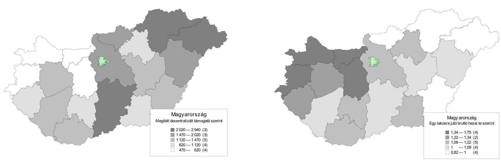
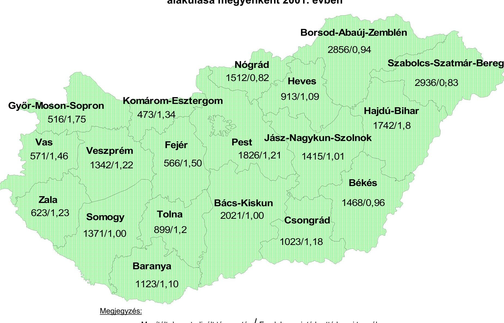
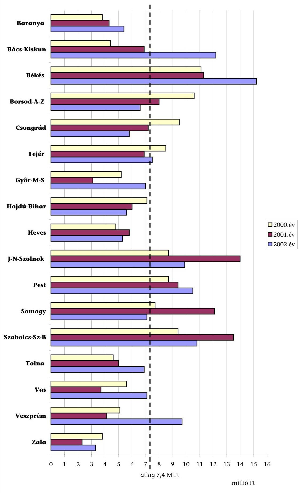
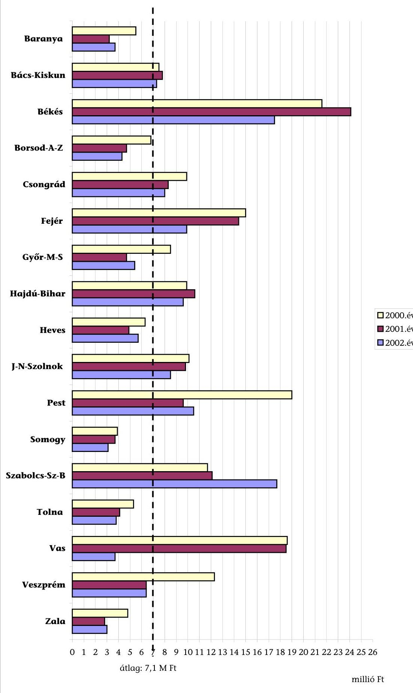
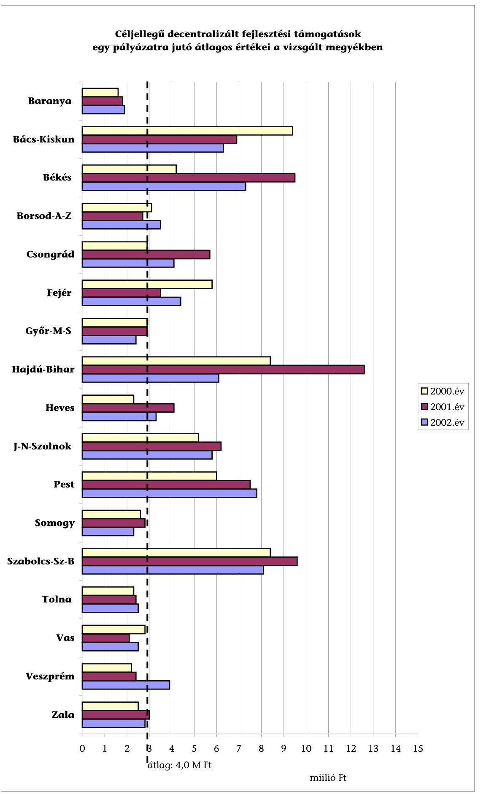
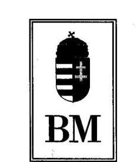
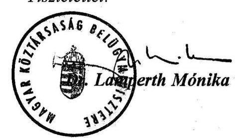
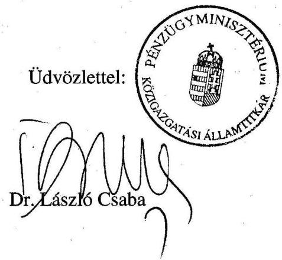
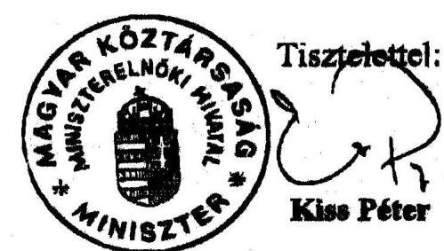

# JELENTÉS 

a területfejlesztési tanácsok és munkaszervezeteik rendelkezésére álló támogatások igénylésének és felhasználásának ellenőrzéséről

---

3. Önkormányzati és Területi Ellenőrzési Igazgatóság
3.2. Pénzügyi-szabályszerüségi és Teljesítményellenőrzési Főcsoport
V-1011-183/2002-03.
Témaszám: 616
Vizsgálat-azonosító szám: V0049

# Az ellenőrzést felügyelte: 

Dr. Lóránt Zoltán
főigazgató
Az ellenőrzés végrehajtásáért felelős:
Németh Péterné
főcsoportfőnök
Az ellenőrzést vezette:
Farkas László
osztályvezető főtanácsos
A számvevői jelentések feldolgozásában és a jelentés összeállításában
közremüködtek:
Dr. Mezei Imréné
főtanácsadó
Tímár József
számvevő tanácsos
Vécsey László
számvevő tanácsos
Az ellenőrzést végezték:

| Alexovics Ágota   számvevő tanácsos | Vécsey László   számvevő tanácsos | Dr. Szücs Zoltán   számvevő tanácsos |
| :-- | :-- | :-- |
| Dr. Botta Tibor   számvevő tanácsos | Fórián Erika   számvevő tanácsos | Kispálné Wiedemann   Györgyi   számvevő tanácsos |
| Kersmájer Ágota   számvevő tanácsos | Dr. Tóth András   számvevő tanácsos | Humli Tamásné   számvevő |
| Bialkó Zsolt   számvevő | Dr. Mezei Imréné   számvevő tanácsos | Szikszainé Király Mária   számvevő tanácsos |
| Dr. Klapcsik László   számvevő tanácsos | Nagy Ervin   számvevő | Tóthné Salamon Ildikó   számvevő tanácsos |
| Dr. Fülöp László   számvevő tanácsos | Boros Attila   számvevő gyakornok | Tímár József   számvevő tanácsos |
| Czifra Erzsébet   számvevő tanácsos | Dr. Hegedüs György   számvevő tanácsos |  |

Jelentéseink az Országgyűlés számítógépes hálózatán és az Interneten a www.asz.hu címen is olvashatók.

---

# A témához kapcsolódó eddig készített számvevőszéki jelentések: 

címe
sorszáma
Jelentés a megyei területfejlesztési tanácsok múködésének, különös 441 tekintettel a decentralizált támogatási keret felhasználása célszerűségének és szabályszerűségének az ellenőrzéséről

---

# TARTALOMJEGYZÉK 

BEVEZETÉS ..... 5
I. ÖSSZEGZŐ MEGÁLLAPÍTÁSOK, KÖVETKEZTETÉSEK, JAVASLATOK ..... 7
II. RÉSZLETES MEGÁLLAPÍTÁSOK ..... 13

1. A területfejlesztést, valamint a regionális fejlesztési és a megyei területfejlesztési tanácsok működését megha- tározó központi feladatok végrehajtása ..... 13
1.1. A területfejlesztés központi, regionális és megyei intézményrendszerének megerősítése, működtetésük biztosítása ..... 13
1.2. A területi folyamatok központi alakítása, befolyásolása ..... 17
1.3. A decentralizált pályázati pénzeszközök felhasználási szabályainak változása, felosztása, felhasználásuk jellemzői ..... 18
1.4. Az önkormányzati térségi szerveződések változása, támogatása ..... 21
1.5. A területi információs és monitoring rendszer kialakítása, működtetése ..... 22
2. A decentralizált területfejlesztési támogatások felett döntési jogot gyakorló területi szerveknél végbement szervezeti változások, azok hatásai, következményei ..... 24
2.1. A tanácsok jogállása ..... 24
2.2. A törvényességi felügyelet és a változó szervezeti-működ- tetési feltételek ..... 25
2.3. A munkaszervezeti feladatok, illetve azok végrehajtását szolgáló szervezeti megoldások ..... 27
3. A decentralizált területfejlesztési támogatások pályázati rendszerének múködése ..... 36
3.1. A régiók területfejlesztési támogatásai ..... 36
3.1.1. Az árnyékprogramban részt vevő régiók támogatási rendszerének jellemzői ..... 37
3.1.2. A PHARE támogatások fogadására kijelölt célrégiók területfejlesztési tevékenysége, annak forrásai ..... 41
3.2. A megyei szintre decentralizált támogatások pályázati rendszere ..... 42
3.3. A területfejlesztési támogatások megyei felhasználási jellemzői ..... 48
3.4. A támogatások felhasználása az önkormányzatoknál, vállalkozásoknál ..... 53

---

# MELLÉKLETEK 

1. sz. A helyszíni vizsgálatban szereplő szervezetek, önkormányzatok, vállalkozások
2. sz. A TFC-ből támogatható célok és támogatásuk felső határai a megyei és a kistérségi pályázati rendszerben
3. sz. A területfejlesztést szolgáló források alakulása és a decentralizált keretek aránya
4. sz. A megítélt decentralizált keretek részaránya a fejlesztésekben
4/a A területfejlesztési tanácsok által odaítélt decentralizált támogatások alakulása a vizsgált megyékben

A területfejlesztési tanácsok által támogatott fejlesztések összköltségének alakulása a vizsgált megyékben
5. sz. Megítélt támogatás megyénként
5/a sz. A megítélt decentralizált támogatás és az egy lakosra jutó bruttó hazai termék alakulása megyénként 2001. évben
5/b sz. A megítélt decentralizált támogatás és az egy lakosra jutó bruttó hazai termék alakulása megyénként 2001. évben
6. sz. Megítélt TFC támogatás célonként
7. sz. Regionális TFC keretből megítélt támogatás régiónként és célonként 2001. évben
8. sz. Megítélt TEKI támogatás célonként
9. sz. Megítélt CÉDE támogatás célonként
10. sz. Az „árnyékprogramok" 2001. évi tervezett forrása régiónként
11. sz. Az „árnyékprogramban" résztvevő vizsgált régiók pályázatainak alakulása 2001. évben és 2002. 01-09. hónapok között
12. sz. A területfejlesztési tanácsok döntési jogkörébe utalt fejlesztési támogatások felhasználásának főbb jellemzői a vizsgált megyékben
13. sz. Területfejlesztési céle1̋̋irányzat egy pályázatra jutó átlagos értékei a vizsgált megyékben
14. sz. Területi kiegyenlítést célzó fejlesztési támogatások egy pályázatra jutó átlagos értékei a vizsgált megyékben
15. sz. Céljellegú decentralizált fejlesztési támogatások egy pályázatra jutó átlagos értékei a vizsgált megyékben
16. sz. A vizsgált önkormányzatok 2000-2002. évi költségvetési beszámolójának főbb kiemelt pénzügyi adatai

---

# RÖVIDÍTÉSEK JEGYZÉKE 

| Árnyék régiók | Dél-Dunátúli, Közép-Dunántúli, Nyugat-Dunántúli, Kö-zép-Magyarországi régiók |
| :--: | :--: |
| PHARE régiók | Észak-Magyarországi, Észak-Alföldi, Dél-Alföldi régiók |
| TeIR | Területi Információs rendszer |
| VÁTI Kht. | Magyar Regionális Fejlesztési és Urbanisztikai Közhasznú Társaság |
| RMB | Regionális Monitoring Bizottság |
| TFC | Területfejlesztési céleIőirányzat |
| TEKI | Területi kiegyenlítést szolgáló fejlesztési célú támogatás |
| CÉDE | Céljellegú decentralizált támogatás |
| ÁSZ | Állami Számvevőszék |
| EU | Európai Unió |
| MEH | Miniszterelnöki Hivatal |
| PM | Pénzügyminisztérium |
| FVM | Földmúvelésügyi és Vidékfejlesztési Minisztérium |
| GM | Gazdasági Minisztérium |
| OM | Oktatási Minisztérium |
| SZCSM | Szociális és Családügyi Minisztérium |
| OTK | Országos Területfejlesztési Központ |
| TÁH | Területi Államháztartási Hivatal |
| MÁK Rt. | Magyar Államkincstár Részvénytársaság |
| RFT | Regionális Fejlesztési Tanács |
| MTFT | Megyei Területfejlesztési Tanács |
| ERFP | Előzetes Regionális Fejlesztési Program |
| Kht. | Közhasznú Társaság |
| SZMSZ | Szervezeti és Múködési Szabályzat |
| ÖNHIKI | Önhibájukon kívül hátrányos helyzetben lévő önkormányzatok |
| OCÖ | Országos Cigány Önkormányzat |

---

.

---

# JELENTÉS 

## a terïletfejlesztési tanácsok és munkaszervezeteik rendelkezésére álló támogatások igénylésének és felhasználásának ellenőrzéséről

## BEVEZETÉS

Az Országgyűlés az ország kiegyensúlyozott területi fejlődése és a térségi társa-dalmi-gazdasági, kulturális fejlődésének előmozdítása, valamint az átfogó területfejlesztési politika érvényesítése, az országos és a térségi területfejlesztési és területrendezési feladatok összehangolása érdekében - az Európai Unió regionális politikájára figyelemmel, alapelveihez, eszköz- és intézményrendszeréhez való csatlakozás követelményeire is tekintettel - alkotta meg a területfejlesztésről és a területrendezésről szóló 1996. évi XXI. törvényt, amely 1996. június 5én lépett hatályba.

A törvény kijelölte a területfejlesztés új intézményrendszerét, az önkormányzati társulások, a megyei és a regionális fejlesztési tanácsok, az Országos Területfejlesztési Tanács feladat- és hatáskörét, meghatározta az azokban közreműködő térségi szereplők feladatait. Megindult az alulról szerveződő regionális fejlesztési tanácsok megalakítása is, amit elősegített a PHARE programok keretében nyújtott uniós támogatás. Az ösztönzők ellenére azonban a regionális fejlesztési tanácsok működése bizonytalanságokat hordozott. Az uniós források fogadásának előkészítése, valamint a hazai gazdaságfejlesztési célok megvalósítása a regionális szint stabilitását, megerősítését igényelte. Ennek jegyében született meg a területfejlesztésről és a területrendezésről szóló törvény módosítása (1999. évi XCII. törvény), amely 1999. november 7-én lépett hatályba.

A decentralizált keretekből történő támogatáshoz három - Területfejlesztési célelőirányzat (továbbiakban TFC), Területi kiegyenlítést szolgáló fejlesztési célú támogatás (TEKI), Céljellegű decentralizált támogatás (CÉDE) -, egymástól elkülönült, összességében jelentős nagyságrendű - 2000. évben 23,0 milliárd Ft, 2001. évben 27,5 milliárd Ft, 2002. évben 28,7 milliárd Ft - költségvetési forrás állt rendelkezésre, amelyek az önkormányzati fejlesztéseket támogatták, vagy a vállalkozási szféra szervezésében ugyan, de a település ellátási és foglalkoztatási gondok enyhítését szolgálták.

A területfejlesztést szolgáló források rendszere más állami pénzeszközökkel fejezeti kezelésű célelőirányzatok, Munkaerőpiaci Alap, címzett- és céltámogatás - is kiegészült.

Az Állami Számvevőszék jelen ellenőrzés keretében csak a hazai források terhére biztosított decentralizált forrásokat, illetve azok felhasználását vizsgálta a kijelölt négy régióban. A PHARE által támogatott régiókban csak a tanácsok és munkaszervezeteik múködéséhez kapcsolódóan volt lehetőség a regionális szin

---

tű területfejlesztésről tájékozódni, ezért a területfejlesztés országos szintű megvalósításának eredményessége nem lehetett a vizsgálat tárgya.

Az ellenőrzés célja annak áttekintése és értékelése volt, hogy

- a területfejlesztés megyei és regionális szereplői feladataik ellátásánál, munkaszervezeteik kialakításánál és működtetésénél betartották-e a területfejlesztési törvény módosított előírásait, gazdálkodásukban érvényesült-e a törvényesség, a célszerűség és az eredményesség követelménye;
- a területfejlesztési források decentralizált döntéshozatali rendje kellő hatékonysággal szolgálta-e a területfejlesztési feladatok összehangolását, a térségi felzárkóztatás és területkiegyenlítődés folyamatát, a rendelkezésre álló források célszerű felhasználását;
- a megítélt támogatások felhasználása során a támogatott szervezetek a jogszabályi előírásokat betartva jártak-e el.

A helyszíni ellenőrzés a decentralizált támogatási rendszer működésének a területfejlesztésről és a területrendezésről szóló, az 1996. évi XXI. törvényt módosító 1999. évi XCII. törvény hatálybalépésének napjától (1999. november 7étől) a 2002. szeptember 30-ig meghozott támogatási döntésekkel lezárt időszakra, az ÁSZ törvényi kötelezettségének eleget tevő gazdálkodásra terjedt ki. A vizsgált időszak alatt bekövetkezett naturáliák eredménye még nem volt mérhető, ez egy külön vizsgálat tárgya lehet. A helyszíni ellenőrzés - a Miniszterelnöki Hivatal területfejlesztési államtitkárságán és kapcsolódó szervezetein (Nemzeti Területfejlesztési Hivatal, VÁTI Kht.) túl - 17 megyei területfejlesztési, 7 regionális fejlesztési tanácsra és munkaszervezeteikre, valamint 73 önkormányzat, 112 támogatott projektjére, továbbá 27 vállalkozás támogatott fejlesztésére terjedt ki (1. számú melléklet). Az ellenőrzés során felhasználtuk a VÁTI Kht. által készített éves beszámolók országos adatait.

Az ellenőrzés jogalapja az Állami Számvevőszékről szóló 1989. évi XXXVIII. törvény 2. § (5) bekezdésében, a helyi önkormányzatokról szóló 1990. évi LXV. törvény 92. §-ában, valamint a területfejlesztésről és a területrendezésről szóló 1996. évi XXI. törvény 12. § (2) bekezdésében foglalt felhatalmazás.

---

# I. ÖSSZEGZŐ MEGÁLLAPÍTÁSOK, KÖVETKEZTETÉSEK, JAVASLATOK 

Az Állami Számvevőszék 1996 óta, a területfejlesztésről és területrendezésről szóló törvény (továbbiakban: Tft.) megjelenésétől kíséri figyelemmel az egységes és összehangolt területfejlesztési politika érvényesítésére, a kiegyensúlyozott területi fejlődés megvalósítására, a társadalmi-gazdasági esélykülönbségek és a fejlettségbeli különbségek mérséklésére irányuló törekvéseket, s az e célokat szolgáló költségvetési pénzeszközök felhasználását.

A Tft. végrehajtásának első áttekintésére - melynek során a megyei területfejlesztési tanácsok működését, s a decentralizált támogatási keretek felhasználását ellenőriztük - 1998-ban került sor. E vizsgálat egyik fő megállapítása az volt, hogy a területfejlesztésben szükségszerűen megindult, minőségileg új korszakot jelentő folyamat lassan indult be, melynek sikeres folytatása, kiteljesedése az időben meghozott, kellően előkészített további kormányzati lépésektől függött. A Tft. ugyanis egy olyan keretjellegű szabályozás volt, ami tág teret engedett a helyi döntéseknek, kezdeményezéseknek, amivel azonban - feltételek híján - az érintettek nem tudtak megfelelően élni. Lassan épült ki az a jogszabályi háttér, ami a törvény végrehajtását segítve előmozdította volna a területfejlesztés partnerségre képes szervezetei struktúrájának, teljes vertikumának kiépülését. Számos bizonytalanság volt tapasztalható a területfejlesztés olyan stratégiai kérdéseit illetően is, mint a cél- és eszközrendszer hosszú távra érvényes összehangolása, a területfejlesztés középszintjének harmonikus fejlesztése, kiépítése, a területfejlesztést szolgáló források decentralizációjának növelése.

A négy évvel ezelőtt végzett vizsgálatunk kritikai éllel állapította meg, hogy a feladatok és hatáskörök felülvizsgálata, a finanszírozási rendszer átalakítása, a megye és a régió szerepének tisztázását felvállaló közigazgatási reform késik. A régiók létrehozására irányuló kezdeményezések ellenére a jelen helyszíni vizsgálat befejezésekor bizonytalanság volt azok jövőjét, feladatait, elosztható forrásait illetően, ami kedvezőtlennek, nyugtalanítónak tekinthető az EU-ba történő belépésünk - időközben ismertté vált - dátumát alig egy évvel megelőzően.

A Tft. hatályba lépését követő három év tapasztalatai - köztük az említett ÁSZ vizsgálat által közreadottak - késztették a kormányzatot a törvény 1999. évi módosításának kezdeményezésére, amit az Országgyűlés 1999. október 19-én fogadott el úgy, hogy az ugyanezen év november 7-től lépett hatályba.

A törvénymódosítás egyik fő indoka az volt, hogy mivel a területfejlesztési tanácsok szabad döntései nyomán megalakított regionális fejlesztési tanácsok működése több térségben sem érte el a kívánatos szintet, s múködésük több bizonytalanságot hordozott, ezek kezelése az EU integrációt, s a támogatások felhasználását biztosító intézményi feltételek megteremtését tekintve elodázhatatlan. Egyértelmű és leghangsúlyozottabban megfogalmazott célja volt a módosításnak a régiók kötelező jelleggel történő kijelölése, a regionális szint

---

megerősítése, az EU-hoz való csatlakozást követően rendelkezésre álló források igénybevételéhez szükséges megfelelő munkaszervezet kialakítása. A Tft. törvényi indoklás szerint a regionális fejlesztési tanácsoknak olyan munkaszervezetekkel kell rendelkezniük, melyek képesek az EU támogatások regionális fogadásához szükséges adminisztratív feladatok ellátására, figyelemmel arra a követelményre is, hogy a csatlakozás időpontjára Magyarországnak az állami támogatások területén teljesen fel kell készülnie arra, hogy az EU vonatkozó előírásainak megfelelően kezelje a hazai állami támogatásokat is. A regionális fejlesztési tanácsok munkaszervezeteinek kialakítása azért is fontos, mivel az operatív programok végrehajtásával kapcsolatos feladatok - a jogalkotó akkori szándéka szerint - elsősorban rájuk fognak hárulni.

A közel négy éve történt, a régiók tekintetében jelentős változásokkal járó törvénymódosítás azonban nem változtatott a törvény keret-jellegén és nem számolta fel azon bizonytalanságokat, amelyek az egyes területfejlesztési szintek jövőbeni szerepével, cél- és eszközrendszerével, a hatás- és jogkörök, egyúttal a források decentralizációjával, a fejlesztési tanácsok státuszával és múködésigazdálkodási rendjével voltak kapcsolatosak. A törvénymódosítást követően a jelen vizsgálat befejezéséig sem hozták meg azokat a döntéseket, melyek megoldást adtak volna ezekre a kérdésekre. Mindezek azzal jártak, hogy nem teljesültek maradéktalanul azok a célok, amit a jogalkotó a törvénymódosítással elérni kívánt, vagyis a társadalmi-területi egyenlőtlenségek nem mérséklődtek az ország fejlettebb és kevésbé felett térségei között.

A 2003. év elejére sem jött még ugyanis létre egy olyan stabil, azonos elvek szerint kialakított és múködő, egyformán fejlett, egyértelmúen meghatározott céljait hatásosan támogatni tudó területi szervezeti háttér, ami szükségszerű lenne úgy a hazai, mint az EU-s támogatások eredményes fogadásához, felhasználásához. A vizsgálat megállapítása szerint a jelenlegi struktúra nem alkalmas e források céloknak megfelelő felhasználását biztosítani anélkül, hogy ne születnének jelentős, a területfejlesztés stratégiai és taktikai kérdéseit egyaránt érintő intézkedések.

A megyei területfejlesztési tanácsok a 2000-2001-2002. években a TFC támogatásból 5517; 5100 és 5781 millió Ft, a TEKI támogatásból 10 900; 10573 és 10573 millió Ft, míg a CÉDE támogatásból 6540; 6300 és 6300 millió Ft összegű keretekkel rendelkeztek.

A regionális fejlesztési tanácsok a TFC decentralizált keretéből nyújthattak támogatást, amelynek összege 2001. évben 5519 millió Ft, 2002. évben 6044 millió Ft volt.

A megyei decentralizált pályázati pénzeszközök, támogatási keretek 20002002. években nem növekedtek. A 30\%-os bővülést a hazai forrásból az árnyékrégiókra ${ }^{1}$ (azaz a három Dunántúli és a Közép-Magyarországi régióra) leosztott decentralizált támogatási keret eredményezte.

[^0]
[^0]:    ${ }^{1}$ A régiók támogatási rendszerét a területfejlesztési támogatások és a decentralizáció elveiről, a kedvezményezett térségek besorolásának feltételrendszeréről szóló 24/2001. (IV. 20.) OGY határozatban rögzítették, amely szerint a három dunántúli és a közép

---

Még mindig nem született döntés arról, hogy a hatáskörök és a források további decentralizációja milyen mértékben, s mely szervezetek között fog végbemenni, s milyen szintek, struktúrák fogják megvalósítani a területfejlesztés előtt álló feladatokat.

Jelentős késedelemmel, csak 2001-től indult be a regionális fejlesztések támogatási rendszere. Annak ellenére, hogy készültek stratégiai és operatív programok, struktúra tervek, tényleges programfinanszírozás még 2002. évben sem működött.

Ma sincs összhang a társadalmi-gazdasági és infrastrukturális szempontból elmaradott, illetve az országos átlagot jelentősen meghaladó munkanélküliséggel sújtott 94 kistérségben lévő mintegy 1500 település és az e célra felhasználható decentralizált források nagyságrendje között. Tapasztalataink szerint az nem képes az elmaradott térségek, települések felzárkóztatásának megoldására.

Nem mutatkozott áttörés a kistérségek településeinek összefogásával megvalósuló térségi fejlesztésekben sem annak ellenére, hogy azok támogatására többirányú kormányzati intézkedések, szabályozásbeli módosítások történtek. Ennek hatására növekedtek az egyes célokhoz kapcsolódó támogatások (kistérségi felzárkóztatási fejlesztési programok kidolgozása, termelő infrastrukturális beruházások), melyek mértéke elérheti a 100\%-os támogatottságot is. Ennek ellenére a kistérségek pályázatai még 2002. évben is a fejlesztési programok, megvalósíthatósági tanulmányok elkészítését szolgálták. Konkrét fejlesztéseik csak a kiemelten ösztönzött közös beruházásaikhoz - szennyvíztisztító, szilárdhulla-dék-lerakó - kapcsolódtak.

A megyei területfejlesztési és a regionális fejlesztési tanácsok és munkaszervezeteik, illetve a munkaszervezeti feladataikat részben vagy teljes egészében ellátó szervezetek tevékenységét, gazdálkodását bizonytalanná teszi a Tft-nek az 1996 óta nem változtatott azon rendelkezése, ami a tanácsok és munkaszervezeteik számára előírta a költségvetési rend szerint gazdálkodó szervezetekre érvényes szabályok alkalmazását, ezért az előirásokat teljes körűen nem alkalmazták, azonban sem a köztestület jelleggel múködő fejlesztési tanácsok, sem munkaszervezeteik nem költségvetési szervek. A költségvetési rend szerinti gazdálkodás szabályainak betartására irányuló törekvés kényszer szülte félmegoldásokhoz vezetett. A törvénymódosítás után újjáalakult regionális tanácsok munkaszervezeti feladataikat kivétel nélkül az általuk alapított közhasznú társasági formában múködő regionális fejlesztési ügynökségekre bízták.

A kormányzat nem tett intézkedést az ellentmondásos helyzet, s az annak következményeképpen kialakult helytelen gyakorlat megszüntetésére. A tanácsok és munkaszervezeteik múködésének támogatására biztosított költségvetési források valamennyi régiónál, illetve a megyék negyedénél a munkaszervezeti teendőkkel megbízott, társasági formában múködő államháztartáson kívüli
magyarországi régió (továbbiakban: árnyékrégiók) a TFC keretéből, a három alföldi régió (továbbiakban: PHARE régiók) a strukturális alapok fogadására való felkészülés érdekében - programok alapján - PHARE forrásból részesülhettek támogatásban.

---

szervezetekhez kerültek, melyek ellenőrzése csak korlátozottan volt biztosított ${ }^{2}$.

A vizsgálat megállapításai szerint ugyanakkor a kht-knál lelhetők fel a szakmaiságnak, az intézményesülésnek azok az ismérvei, melyek a területfejlesztés elé kitűzött célok, s az EU-konform támogatáspolitika és gyakorlat elterjedését biztosíthatják területi szinten. Sajátos ellentmondás fékezte, tette bizonytalanná azonban e folyamat kiteljesedését, ugyanis a területfejlesztésben egyre többet vállaló, tevékenységüket egyre szélesítő szervezetek gazdasági helyzete romlott amiatt, hogy a számukra tovább adott állami működési támogatás még az egyéb forrásokkal (pályázati források, üzleti bevételek stb.) együtt sem tette lehetővé pénzügyi stabilitásuk, érdekeltségük biztosítását. Az állami feladat ellátása ugyanis stabil gazdasági alapokat igényel.

A jelen témavizsgálatunk ismét azt erősítette meg, hogy a tanácsok kellő személyi, szervezeti és pénzügyi feltételek hiányában az elmúlt 3 évben sem tudtak a térségfejlesztés integráló, szervező erőivé válni. Nem terjedt még el a régiós szerveződés, annak támogatása. Pozitív kivételek elsősorban a dunántúli megyékben voltak érzékelhetők.

A területfejlesztés támogatási rendszere változatlanul az igényekkel zökkenőmentesebben összeegyeztethető egyedi településfejlesztési feladatokat támogat, miközben a pályázati rendszer továbbra sem alapoz az ellátottsági különbségekre. Az esélyegyenlőséget rontja az eltérő mértékben rendelkezésre álló saját forrás, amit a forráskoordináció hiányosságai tovább fokoznak.

A területfejlesztési források felhasználását nem kíséri folyamatos, teljesítményelvű, eredményességet és hatékonyságot mérő, területfejlesztési célok és kívánalmak értékelésére képes pályázati monitoring. Nincs kellően múködő és hasznosított területi információs bázis, nem épült ki megfelelő számbavételi és ellenőrzési rendszer. Ennek következtében a területfejlesztési támogatásokkal létrejövő fejlesztések megvalósulásáról, annak társadalmi hasznosságáról csak korlátozott megbízhatóságú, koránt sem teljes információk állnak rendelkezésre. Csupán a decentralizált források célonkénti felosztása és felhasználása ismeretes.

A vizsgált körben az önkormányzatok és a gazdálkodó szervezetek három év alatt összesen 18416 db pályázatot nyújtottak be 170 milliárd Ft-ot meghaladó összegben. A kért támogatások átlagosan 2,7-szeresen haladták meg a rendelkezésre álló lehetőségeket. A pályázók közel kétharmada (64,4\%-a) támogatási formától függően differenciált mértékben ugyan, de évről-évre csökkenő támogatásban részesült. A pályázati rendszerben - különösen az önkormányzati szférába irányuló támogatások esetében - a már négy éve is jelenlévő elaprózódás tovább folytatódott.

[^0]
[^0]:    ${ }^{2}$ A közpénzek felhasználásával, a köztulajdon használatának nyilvánosságával, átláthatóbbá tételével és ellenőrzésének bővítésével összefüggő egyes törvények módosításáról szóló 2003. évi XXIV. törvény e korlátot feloldotta.

---

A vizsgálat tapasztalatai szerint az ellenőrzött támogatások esetében a támogatási és a finanszírozási szerződéseket a támogatások megítélését követően 612 hónapos késedelemmel kötötték meg, a közbeszerzési törvény alkalmazását a folyamatban résztvevők egyike sem tekintette elsődleges feladatának. A támogatási szerződéseket gyakran módosították, amely a határidő és a műszaki tartalom változtatására irányult.

A megyei területfejlesztési tanácsok a három év alatt úgy ítéltek oda támogatásokat, hogy azok nem érték el átlagosan a 6 millió Ft-ot. A támogatás a fejlesztések tervezett összköltségének 23,2\%-át biztosította.

Az országos adatok alapján a decentralizált keretek felhasználása során TFCből 2000-2001. Években 48,0\%-át, illetve 46,5\%-át munkahelyteremtés és megtartásra $20 \%$-át, illetve $28 \%$-át termelő infrastruktúra fejlesztésére fordították.

A TEKI-ből 2001. Évben termelő infrastruktúrára 43,3\%-ot, illetve 34,2\%-ot, külterületi bekötő utak építésére $12 \%$, illetve $6 \%$-ot, vízelvezető rendszerek építésére $13,4 \%$-ot, illetve $9,4 \%$-ot, valamint $29,4 \%$-ot önkormányzati intézményei beruházásokra fordítottak.

A CÉDE keretéből teljes egészében önkormányzati fejlesztéseket támogattak.

# A helyszíni ellenőrzéseink során javasoltuk: 

- a regionális fejlesztési és a megyei területfejlesztési tanácsoknak, hogy biztosítsák a feladatellátáshoz szükséges megfelelő munkaszervezetek kialakítását. Tartsák be a számviteli rend, bizonylati fegyelem előírásait, aktualizálják belső szabályzataikat, javítsák a belső ellenőrzési rendszer múködtetését. Gondoskodjanak a támogatási monitoring és ellenőrzési rendszer működtetéséről. Kapjon nagyobb teret a kistérségeknél a támogatások koncentráltabb felhasználása, fokozzák a legsúlyosabb helyzetben lévő önkormányzatok támogatását. Biztosítsanak nagyobb teret az átfogó régiós programok kidolgozásának és támogatásának.
- az önkormányzatoknak, hogy készítsenek gazdasági-fejlesztési koncepcióikat, programokat. Körültekintőbben járjanak el a fejlesztések tervezése során, azok előkészítésénél, a pályázati források igénylésénél, érvényesítsék a közbeszerzési törvény előírásait. Gondoskodjanak a számviteli rend, bizonylati fegyelem betartásáról. Az Európai Uniós csatlakozásra való felkészülés jegyében, elsősorban a városok és a kistérségi központok települései vállaljanak nagyobb szerepet a kistérségi koncepcionális és programszerű területfejlesztési feladatok alakításában, a pályázati programok összehangolásában és kidolgozásában.

A számvevői jelentésekben foglaltakra 18 vizsgált szervezet írásban reagált. Mindegyike elfogadta a jelentésekben foglalt javaslatokat, melynek alapján intézkedést tettek, illetve intézkedési tervet készítettek a feltárt hiányosságok megszüntetésére. Két esetben került sor a vizsgálatunk alapján támogatás visszavonására, egy alkalommal támogatásról való lemondás kezdeményezésére, amelyről a támogatást nyújtó szervezet intézkedett (Jászladány Község Önkormányzata, SONIK Kft. Mohács).

---

A MEH Nemzeti Területfejlesztési Hivatala által tett észrevételeket az országos jelentés készítése során figyelembe vettük. A MEH jelezte, hogy folyamatban van a területfejlesztési törvény módosításának, koncepciójának, illetőleg a törvénymódosításnak az elfogadása, illetve az ehhez kapcsolódó jogalkotási feladatok végrehajtása, valamint a kistérségek lehatárolásának átalakítása, amely az Állami Számvevőszék vonatkozó javaslataival összhangban több kérdésben megoldják a felvetett problémákat. Az uniós támogatások fogadása érdekében szélesedik a régiók feladat- és hatásköre. A módosítás-tervezet a kistérségi szint erőteljes megjelenítésével összhangban egyértelműen orvosolja a kistérségi önkormányzati területfejlesztési társulásokkal kapcsolatban megfogalmazott hiányosságokat. Az egyes szintek feladat- és hatáskörének egyértelmű szabályozása hatással lesz a források felhasználásának hatékonyságára, pontosabbá teszi a forráskoordinációt, elősegíti a területi kiegyenlítődést.

# JAVASOLJUK 

a Kormánynak
a területfejlesztési törvény módosítás előkészítése során a törvényjavaslatba építse be:

1. A közigazgatás átfogó reformjának tervezett alapelveihez igazodóan a területfejlesztés, annak egyes szintjei feladatának, hatáskörének átalakítását, az EU-ban alkalmazott gyakorlat magyarországi átvételéhez szükséges döntések meghozatalát, az uniós támogatások fogadása feltételeinek kialakítását.
2. A feladat- és hatáskör, valamint forrásdecentralizáció egységes elvekre épülő rendszerét, ami javíthatja a források felhasználásának hatékonyságát, a forráskoordinációt, valamint a területi kiegyenlítődés feltételeit.
3. A területfejlesztés intézményrendszerének átalakítása során az államháztartás részét képező szervezeti megoldások alakuljanak ki és biztosítsa a törvényességi felügyelet egységes gyakorlásának feltételeit.
4. Az önkormányzati finanszírozás tervezett átalakításával összhangban határolja el egyértelműen a terület-, illetve településfejlesztést, az azokat szolgáló támogatási forrásokat, rendszereket.
5. A közpénzek felhasználása átláthatóságának és nyilvánosságának igényére figyelemmel a területfejlesztés átalakuló rendszerében kapjon nagyobb súlyt a támogatások felhasználásának szabályszerű, eredményes megvalósulását célzó ellenőrzés.
6. Az ország kevésbé fejlett térségeinek gyorsabb ütemű felzárkóztatását jobban elősegítő területfejlesztési kistérségek létrehozását, egyúttal teremtse meg annak feltételeit, hogy forrásaik a tényleges szükségleteikhez közelítően bővülhessenek.

---

# II. RÉSZLETES MEGÁLLAPÍTÁSOK 

## 1. A TERÜLETFEJLESZTÉST, VALAMINT A REGIONÁLIS FEJLESZTÉSI ÉS A MEGYEI TERÜLETFEJLESZTÉSI TANÁCSOK MŰKÖDÉSÉT MEGHATÁROZÓ KÖZPONTI FELADATOK VÉGREHAJTÁSA

### 1.1. A területfejlesztés központi, regionális és megyei intézményrendszerének megerősítése, múködtetésük biztosítása

A Tft. alapján a megyei területfejlesztési tanácsok a megyehatárokon túlterjedően az egyes területfejlesztési feladatok ellátására regionális fejlesztési tanácsokat hozhattak létre.

Az önkéntes szerveződéssel létrejött régiók nem mindenütt feleltek meg az Országos Területfejlesztési Koncepcióról szóló 35/1998. (III. 20.) OGY határozatban foglaltak szerint meghatározott tervezési-statisztikai régióknak, mert Zala megye három regionális fejlesztési tanácsnak is tagja volt (a NyugatDunántúli, a Dél-Dunántúli és a Balatoni Fejlesztési Tanácsnak), illetve hat megye alakította meg az Északkelet-Magyarországi Régiót.

A regionális fejlesztési tanácsok önkéntes szerveződése, a megyék régió alakítására vonatkozó szabad választásának lehetősége nem felelt meg az Európai Unió által a régiók megalakításával, azok stabilitásával szemben támasztott követelményeknek, ezért a Tft. 1999. évi módosításával az említett OGY határozatban meghatározott statisztikai régiók megalakítását kötelezővé tette, melynek alapján hét tervezési-statisztikai régió alakult meg.

A régiók létrejötte megteremtette annak lehetőségét, hogy az EU területfejlesztési alapelveinek (szubszidiaritás, partnerség, forráskoordináció, addicionalitás, programozás, átláthatóság) érvényesíthetősége biztosított legyen.

A tanácsok a Tft. általánosan megfogalmazott feladatkijelölése alapján határozták meg - többségében szóról-szóra megismételve azt - saját feladataikat. A törvény csak általános orientációt nyújtott a területfejlesztési tanácsok munkájának megszervezéséhez, amit nem pótoltak, egészítettek ki a végrehajtást segítő kormányzati rendelkezések. Ez a jelenség a törvénymódosításkor, de a vizsgált időszak egészében jellemzően azon bizonytalanságra vezethető viszsza, ami a régiók és a megyék (kistérségek) jövőbeni szerepének, a területfejlesztés középszintje értelmezésének, tisztázatlanságának kérdésében nyilvánult meg.

Az említett törvénymódosítás úgy hozott létre egy újabb, több megyére kiterjedő regionális területfejlesztési szintet, hogy leképezte a megyei területfejlesztési tanácsok feladatait, miközben munkamegosztásuk, egymáshoz való viszonyuk, pályázati rendszereik összehangolásának rendje, az intézményesülésnek, a

---

munkaszervezeti megoldásnak a mikéntje konkrétan nem került szabályozásra.

Nem született négy év alatt döntés arról, hogy a létrehozott régiók csak a hazai, vagy később már az EU-s támogatási forrásokkal kapcsolatban is kapnak-e, s ha igen milyen feladatokat, hatásköröket, s ennek érdekében hogyan, milyen követelményeket teljesítve alakítsák, fejlesszék magukat, szervezetüket.

Nem enyhítette az általánosan tapasztalt bizonytalanságot az az 1999. évi döntés, mely szerint a három PHARE Régió célrégióként, PHARE forrásból kezdhette meg kísérleti jelleggel programjai megvalósítását az EU-s pályázati rendszer szabályai szerint, miközben a programból kimaradt árnyékrégiók hasonló nagyságrendű hazai forrás (TFC) terhére tehették ugyanezt, de saját - EU-s alapelveket követő - pályázati rendszereket megszervezve, múködtetve.

A regionális és megyei területfejlesztési tanácsoknál tapasztaltak szerint a területfejlesztési intézményrendszer (benne a régiók) kiforratlansága miatti bizonytalanság, átmenetiség tükröződik. A régiók létrehozására tett kötelező érvényű 1999. évi intézkedéseket nem követték további lépések, holott egyfelől nyilvánvaló volt az, hogy egyre sürgetőbben szükségszerű (pl.: az EU-hoz való csatlakozás miatt) a szervezeti háttér továbbfejlesztése, de számos jel utalt arra is, hogy a rendszer nem működik zökkenőmentesen, s az állami költségvetési támogatások felhasználásának rendje nem tekinthető szabályozottnak. Három és fél év alatt nem történt intézkedés arra vonatkozóan, hogy a sajátos jogi státuszú fejlesztési tanácsok (és munkaszervezetük) konkrétan hogyan tegyenek eleget a költségvetési szervekre előírt szabályoknak gazdálkodásukban, miközben munkaszervezeti feladataikat többségében teljes egészében külső, ráadásul nem költségvetési rendben működő szervezetekre bízták. Az, hogy a tanácsoktól a költségvetési rendben működő szervezetek által használt egyes nyomtatványokon kérte be az FVM a költségvetést, illetve beszámolót, még nem biztosította azt, hogy gazdálkodásuk is az Tft. által megfogalmazott, a költségvetési intézményekre jellemző rendben folyt volna.

Az előző (1999. évben lezárt) vizsgálatunkban javasoltuk a Kormánynak, hogy rendelet tegye egyértelmúvé a tanácsok jogi, pénzügyi és munkaszervezetének jogi, pénzügyi és szervezeti feltételrendszerét, egyes elszámolási kategóriák fogalomkörének értelmezését, ennek meghatározása azonban még nem történt meg, törvényességi felügyeletük egységes eljárási elveinek és rendjének meghatározása elmaradt.

A Tft. előírta, hogy a tanácsok működéséhez szükséges pénzügyi fedezetről a költségvetési törvényben meghatározott mértékben a Kormány, valamint a tanácsban tagsággal rendelkező szervek gondoskodnak.

Az egyes megyei területfejlesztési és a regionális fejlesztési tanácsok a kormányrendeletekben meghatározott decentralizált kereteken túlmenően - 1998. óta differenciálás nélkül - a következő központi forrásokat használhatták fel:

---

adatok millió Ft-ban

| Megnevezés | $\mathbf{1 9 9 8 .}$ | $\mathbf{1 9 9 9 .}$ | $\mathbf{2 0 0 0 .}$ | $\mathbf{2 0 0 1 .}$ | $\mathbf{2 0 0 2 .}$ |
| :-- | --: | --: | --: | --: | --: |
| Megyei területfejlesztési   tanácsok múködési költsé-   geihez való hozzájárulás | 7,0 | 7,0 | 9,0 | 14,5 | 14,5 |
| Regionális fejlesztési   tanácsok múködési költsé-   geihez való hozzájárulás | 10,0 | 35,5 | 39,6 | 45,0 | 46,0 |
| Regionális programok   kidolgozásához való hoz-   zájárulás | 60,0 | 130,0 | 100,0 | - | 100,0 |

Előzőek mellett a megyei területfejlesztési tanácsok a TFC decentralizált keretének 2\%-át pályázati rendszer múködtetésére használhatták fel. Ezen túlmenően az öt leghátrányosabb megye (Békés, Somogy, Szabolcs-SzatmárBereg, Nógrád, Borsod-Abaúj-Zemplén megyék) 0,5\%-kal magasabb múködési kiegészítő támogatásban részesült, amely összességében 45,0 millió Ft többlet felhasználást jelentett számukra.

Az árnyékprogramban részt vevő négy regionális fejlesztési tanács a TFC decentralizált keretének 5\%-át használhatta fel a pályázati rendszer múködtetésére, amely 2001. évben 276,0 millió Ft, 2002. évben 302,2 millió Ft-ot biztosított számukra.

A regionális fejlesztési tanácsok 1998-tól 2002-ig régiónként évenkénti bontásban 390,0 millió Ft-ot használhattak fel regionális programok kidolgozására. A tanácsok a részükre biztosított forrásokat különböző átfogó és szektorális (ágazati), az egész régiót, illetve kisebb térségeket érintő programok, tanulmányok és egyes projektek készítésére használták fel. A programkészítés során minden régióban kialakult a programok elkészítésének, szakmai egyeztetésének, elfogadásának olyan rendszere, amelyre alapozva dolgoztak ki 20012006. évekre szóló fejlesztési stratégiai tervet, régiós struktúra tervet, valamint 2001-2003. évekre szóló előzetes operatív programot. Ennek alapján készítették el a pályázati rendszer múködtetésével kapcsolatos dokumentációkat. A pályázati rendszer programjait a pályázati felhívásban tették közzé.

A regionális fejlesztési tanácsok részére 2002. évben jóváhagyott 100-100 millió Ft felhasználásának részletes szabályait az FVM és a tanácsok között 2002. július 17-én megkötött Támogatási Szerződésben rögzítették. Ennek fő tartalmi követelményei a régiók számára készítendő, a Nemzeti Fejlesztési Tervhez, különösen annak Regionális Operatív Programjához kapcsolódó fejlesztési programok kidolgozása, a programok pénzügyi meghatározása, információs bázisának megteremtése voltak.

A régiók programkészítésének jellegét két fő irány szabta meg. A PHARE programban részt vevő három régió a programozás, tervezés során már az EU szabályokat, előírásokat alkalmazta, bár az árnyékrégióknak is figyelembe kellett venni ezen előírásokat. Ugyanakkor erősödött az egységesen végrehajtandó programok meghatározásának súlya, amelyet a Nemzeti Fejlesztési

---

Terv kidolgozásához a PHARE programjának minden régióban azonos elvek érvényesülésével kellett kialakítani.

A decentralizált keretekkel kapcsolatos pályázati rendszer működtetését, a felhasználható forrásokat, egyben a döntési jogkört a vonatkozó jogszabályok megyei, illetve (2001-től) regionális szintre decentralizálták, a megyei területfejlesztési tanácsok és a regionális fejlesztési tanácsok feladat- és hatáskörébe utalták.

A főbb pályázati lehetőségek - amelyek több alprogrammal is kiegészültek - a régiók belső elérhetőségének javítására, a hátrányos helyzetű munkanélküliek munkaerő-piaci integrációjának segítésére, a környezetvédelmi, üzleti infrastruktúra fejlesztésére, a régió turisztikai potenciájának fejlesztésére és az Európai Unióhoz való csatlakozási felkészülésre irányultak.

A regionális fejlesztési tanácsoknál 2002. év végéig tényleges program finanszírozás ezen intézkedések ellenére sem alakult ki, függetlenül attól, hogy az egyes programok (alprogramok) átfogó jelleget mutatnak. A regionális fejlesztési tanácsok támogatási rendszerének múködése megegyezett a megyei területfejlesztési tanácsok gyakorlatával, mivel jellemzően egyes önkormányzati, vállalkozási projekteket támogattak. A területfejlesztésért felelős szerv (a vizsgált időszakban az FVM) kezdeményezése ellenére sem sikerült a több központi forrás felhasználását a prioritások mentén összehangolt módon biztosítani.

A területfejlesztéssel és a területrendezéssel kapcsolatos kormányzati feladatokat az elmúlt időszakban elsősorban az Országos Területfejlesztési Tanács, valamint a Földművelésügyi és Vidékfejlesztési Minisztérium és háttérintézményei (Országos Területfejlesztési Központ továbbiakban: OTK, VÁTI Kht.) látták el. Ebben meghatározó szerepe az Országos Területfejlesztési Tanácsnak és annak munkaszervezeti feladatait ellátó OTK-nak volt. A tanácsnak az Országos, az ágazati és a térségi (régiók, megyék, kistérségek) fejlesztések összehangolásának előkészítésében volt szerepe. Vizsgálta a területi folyamatok alakulását és előterjesztéseket tett azok módosítására. A tanács titkársági feladatait az OTK, mint az FVM háttér intézménye látta el. Az OTK feladatát képezte többek között a területfejlesztéssel kapcsolatos térségi feladatok szervezése, területfejlesztés intézményrendszerének kialakításában való részvétel, a megyei területfejlesztési és a regionális fejlesztési tanácsok működtetése, segítése, az intézményrendszer EU konform kialakítása. Közreműködött a kormányzati döntések végrehajtását szolgáló koncepciók, programok, szabályzások tervezeteinek kidolgozásában, a területi információs rendszer kialakításában, a területfejlesztést érintő kutatási, fejlesztési, oktatási és képzési programok kidolgozásában és megvalósításában. Közreműködött még a területfejlesztési PHARE programozásban, a meghirdetett programokra érkező pályázatok elbírálásában, a Tanács erre irányuló döntéseinek előkészítésében is. Az OTK régió igazgatóin keresztül napi operatív feladatokat is ellátott, szükség szerint beavatkozásokat, intézkedéseket tett.

A területfejlesztés központi intézményrendszerében az elmúlt öt évben több változás történt. 1998. évben a területfejlesztés felügyelete kikerült a Környezetvédelmi Minisztérium feladatköréből és átkerült a Földművelésügyi és Vidékfejlesztési Minisztériumba. A területfejlesztéssel és területrendezéssel

---

kapcsolatos tevékenységek 2002. évben a Miniszterelnöki Hivatalba integrálódtak. Az Országos Területfejlesztési Tanács feladatát a Nemzeti Területfejlesztési Hivatal vette át.

# 1.2. A területi folyamatok központi alakítása, befolyásolása 

A területfejlesztési támogatások és a decentralizáció elveiről a kedvezményezett területek besorolásának feltételrendszeréről a 30/1997. (IV. 18.) OGY határozat intézkedett, amelynek alapján készítették el a társadalmi-gazdasági és infrastrukturális szempontból elmaradott, illetve az országos átlagot jelentősen meghaladó munkanélküliséggel sújtott települések jegyzékét. ${ }^{3}$ A jegyzékben 94 kistérség közel 1500 települése szerepelt, amelynek száma jelenleg 1883 települést jelöl.

Az időközben egyes területeken mutatkozó feszültségek enyhítése céljából az Országgyűlés a 24/2001. (IV. 20.) OGY határozatában ${ }^{4}$ úgy intézkedett, hogy

- szükségesnek tarja a decentralizált döntési rendszerben múködő eszközök növelését és egyidejúleg a központi döntési körben múködő eszközöknek a legsúlyosabb helyzetű térségek többlettámogatására való koncentrált felhasználását;
- a decentralizált döntési rendszer pénzeszközeinek régiók és megyék közötti differenciált elosztása az eddiginél fokozottabban segítse a legsúlyosabb helyzetű, hátrányos térségek fejlesztési programjainak megvalósítását.
- a területi gazdaságfejlesztési, munkahelyteremtési célokat elsődlegesen a területfejlesztési célelőirányzat, az önkormányzatok kommunális jellegű infrastrukturális fejlesztését pedig az önkormányzati szabályozás keretében múködő területi kiegyenlítést szolgáló támogatás finanszírozza.

Ennek végrehajtására - a vonatkozó OGY határozat mutatórendszere alapján a 91/2001. (VI. 15.) Korm. rendelet 1-2. számú mellékletében összeállított jegyzékben a 19 megyéből 100 települést nevesített legsúlyosabb helyzetű településnek.

Az Országos Területfejlesztési Koncepcióról OGY határozat ${ }^{5}$ rendelkezett. Meghatározta a területfejlesztési koncepció jövőképét, a területfejlesztési politika országos céljait és irányelveit, a regionális intézményrendszer fejlesztésének, a nemzetközi integráció elősegítésének irányát, a legfontosabb ágazati prioritásokat.

[^0]
[^0]:    ${ }^{3}$ Az elmaradott térségek jegyzékét a 219/1996. (XII. 24.) Korm. rendelet és az azt módosító 180/1999. (XII. 10.) Korm. rendelet tette közzé.
    ${ }^{4}$ A területfejlesztési támogatások és a decentralizáció elveiről a kedvezményezett térségek besorolásának feltételrendszeréről szóló 24/2001. (IV. 20.) OGY határozat.
    ${ }^{5}$ Az Országos Területfejlesztési koncepcióról szóló 35/1998. (III. 20.) OGY határozat

---

A Tft. előírta, hogy a Kormány kétévente számoljon be az Országgyűlésnek az ország területi folyamatainak alakulásáról és a területfejlesztési politika érvényesüléséről.

A Kormány beszámolási kötelezettségének 2001. évben tett eleget, melynek alapján született meg a 2001. évi OGY határozat ${ }^{6}$, melyben a területi folyamatok hiányosságainak kiküszöböléséről intézkedett. Megállapította, hogy a területfejlesztés érdekében tett intézkedések több területen kedvező hatásokat váltottak ki, viszont áttörést nem eredményeztek a hatékony és esélykiegyenlítő térségi fejlődés irányában. Felkérte a kormányt, hogy a területfejlesztés hatékonyabb érvényesülése érdekében intézkedjen arról, hogy az Európai Unióhoz benyújtandó Nemzeti Fejlesztési Terv vegye figyelembe a területfejlesztés fő céljait és prioritásait, valamint a tervezési-statisztikai régiók programjait. Biztosítson a térségi felzárkóztatási programok megvalósításához közvetlen és közvetett állami forrásokat a 2003. évi és az azt követő évek központi költségvetésének tervezése során. A területfejlesztési folyamatok alakulásának nyomon követése érdekében tegye teljes körűvé az állami támogatások, fejlesztési célú előirányzatok területi alapú nyilvántartását és adatszolgáltatását a Területi Információs Rendszer részére (továbbiakban: TeIR).

# 1.3. A decentralizált pályázati pénzeszközök felhasználási szabályainak változása, felosztása, felhasználásuk jellemzői 

A kormányrendelet elöírása ${ }^{7}$ szerint a TFC rendeltetése, hogy a társadalmi és gazdasági térbeli életkörülményekben, gazdasági, kulturális, oktatási és infrastrukturális feltételekben megnyilvánuló egyenlőtlenségeket mérsékelje, az átfogó térszerkezet átalakítást és a térségi integráción alapuló gazdaságfejlesztési programok kialakítását, végrehajtását előmozdítsa és segítse elő a nemzetközi pénzügyi források, az EU Strukturális Alapjai fogadását.

A pályázati rendszert a megyei területfejlesztési és a regionális fejlesztési tanácsok működtetik, amelyben a támogatás formája lehet vissza nem térítendő, visszatérítendő és fejlesztési hitelekhez nyújtható kamattámogatás. A támogatás mértéke támogatási célonként változó, felső határa az elismerhető költségek 30-70\%-a, de jellemzően 30-40\% (2. számú melléklet).

A regionális fejlesztési tanácsok támogatási rendszerének eltérő szabályait külön kormányrendelet ${ }^{8}$ írta elő.

[^0]
[^0]:    ${ }^{6}$ A területi folyamatok alakulásáról a területfejlesztési politika érvényesüléséről és az Országos Területfejlesztési Koncepció végrehajtásáról szóló 39/2001. (VI. 18.) OGY határozat.
    ${ }^{7}$ A területfejlesztési célelőirányzat felhasználásának részletes szabályairól szóló 89/2001. (VI. 15.) Korm. rendelet.
    ${ }^{8}$ Előírására a területfejlesztési célelőirányzat felhasználásának részletes szabályairól szóló 38/2002. (III. 7.) Korm. rendelettel módosított 89/2001. (VI. 15.) Korm. rendelet 20. §-ában került sor.

---

A TFC egyes megyékre történő decentralizálásának elvei az elmúlt négy évben nem változtak, amelynek $20 \%$-át a megyék lakónépessége alapján, $30 \%$-át a megyék fejlettségét mutató egy főre jutó bruttó hazai termék (GDP) mutató alapján, $50 \%$-át pedig a megyék kedvezményezett térségének lakónépessége alapján oszthatták fel.

A TFC régiókra decentralizált 2001-2002. évi keretei felosztásánál 30\%-ban a régiók lakónépességét, $50 \%$-ban a régió egy főre jutó GDP értékét, $20 \%$-ban a régiók területfejlesztés szempontjából - külön jogszabályban meghatározott ${ }^{9}$ kedvezményezett térségeinek lakónépességét vették figyelembe.

A decentralizált pénzeszköz felosztásának mutatórendszere a megyék esetében a kedvezményezett térségeket, a régiók esetében a jövedelemtermelő képességben mutatkozó elmaradottabb térségeket helyezte előtérbe.

A TEKI támogatások felhasználásának részletes szabályait szintén önálló, többször módosított kormányrendelet ${ }^{10}$ tartalmazza.

A támogatásra a területfejlesztési szempontból kedvezményezett térségekben és a társadalmi-gazdasági és infrastrukturális szempontból elmaradott, illetve az országos átlagot jelentősen meghaladó munkanélküliséggel sújtott (az országos átlagot 1,5 -szeresen meghaladó) települések pályázhattak különböző fejlesztéseikhez, beruházásaikhoz. A támogatás vissza nem térítendő tőkejuttatásként nyújtható, mértéke a más állami támogatásban nem részesülő beruházásoknál az elismerhető költségek $70 \%$-a, más állami támogatás esetén $40 \%$-a. Az az önkormányzat, amely az elmúlt két évben belvíz elleni védekezéshez vis maior, vagy egyéb állami forrásból támogatásban részesült, ilyen beruházása 100\%-ban is támogatható. A kedvezőtlen telepszerű lakókörzetek termelő infrastruktúrájának kiépítéséhez $90 \%$-os támogatásban részesülhettek.

A TEKI felosztása 1999. és 2000. években $50 \%$-ban a megyei bruttó hazai termék (GDP) egy főre jutó mutatója alapján, a másik 50\%-ánál pedig területfejlesztési szempontból kedvezményezett térségek lakónépessége alapján történt, amely arány 2001-től 30\%-ra, illetve 70\%-ra módosult a kedvezményezett térségek lakónépessége javára.

Mind a TFC, mind a TEKI a megyékre történő decentralizálás során a társadalmi-gazdasági és infrastrukturális szempontból elmaradott, illetve az országos átlagot jelentősen meghaladó munkanélküliséggel sújtott (az országos átlagot 1,5-szeres meghaladó munkanélküliségü) megyéket, illetve településeket preferálta.

[^0]
[^0]:    ${ }^{9}$ A társadalmi-gazdasági és infrastrukturális szempontból elmaradott, illetve az országos átlagot jelentősen meghaladó munkanélküliséggel sújtott települések jegyzékéről szóló 219/1996. (XII. 24.) Korm. rendelet.
    ${ }^{10}$ A területi kiegyenlítést szolgáló fejlesztési célú támogatások felhasználásának részletes szabályairól szóló 32/1998. (II. 25.) Korm. rendelet.

---

A kedvezményezett térségek támogatása bővítésére az Országgyűlés 2001-ben ${ }^{11}$ fogalmazott meg feladatokat, amelyek az Európai Unióhoz történő csatlakozásunk időpontjáig terjedő időszakra határozta meg a teendőket.

A határozat előírta, hogy a regionális és a megyei területfejlesztési programok állami támogatását alapvetően a területfejlesztési céle1̋̋irányzattal és az önkormányzati szabályozás keretében múködő területi kiegyenlítést szolgáló fejlesztési célú támogatással szükséges elősegíteni. Ennek érdekében szükségesnek tartja a decentralizált döntési rendszerben múködő eszközök növelését, legsúlyosabb helyzetű térségek többlettámogatására való koncentrált felhasználását. A régiók és megyék közötti differenciált elosztása pedig az eddiginél fokozottabban segítse a legsúlyosabb helyzetű, hátrányos térségek fejlesztési programját. Meghatározta azt is, hogy a területfejlesztési támogatásoknál fokozatosan át kell térni a programfinanszírozásra. Ennek érdekében a pénzügyi szabályozás ösztönözze a hoszszú távú regionális, illetve a megyei területfejlesztési koncepciók alapján kidolgozott és jóváhagyott fejlesztési programok megvalósítását.

Az Országos jelentőségű és több régiót érintő fejlesztési célok és programok támogatását a területfejlesztési költségelőirányzat központi pénzügyi keretéből; a regionális jelentőségű és több megyét érintő fejlesztési célok és programok támogatását a regionális fejlesztési tanácsok decentralizált pénzügyi kereteiből; a megyei jelentőségű és kistérségi, illetve települési fejlesztési célok támogatását pedig a megyei területfejlesztési tanácsok decentralizált pénzügyi keretéből kell megoldani. Az előírás szerint a TFC decentralizált keretének 65\%-át és a TEKI támogatást elsősorban a régiók és a megyék fejlettségi szintje (GDP) és lakónépessége, valamint a kedvezményezett térségek lakónépessége alapján kell elosztani.

A CÉDE támogatást - a TFC és a TEKI támogatási rendszerétől eltérően - a helyi önkormányzatok nemcsak a kötelező és önként vállalt beruházási feladataikhoz vehették igénybe pályázat útján, hanem felújítási feladataik megoldásának segítéséhez is igényelhették minden ágazati cél, illetve forráskorlátozás nélkül. A fejlesztések támogatásában azonban felhasználásának nagyságrendjére (évi 6300 millió Ft) és a 2001-2002. években támogatott önkormányzatok nagy számára (2304, illetve 2049 támogatott önkormányzat) tekintettel jelentős korlátai voltak. 2001. évben az egy fejlesztési célra jutó támogatás átlagosan 2,7 millió Ft, 2002. évben 3,0 millió Ft volt, amely 8,4 millió Ft és 1,8 millió Ft között szóródott, ezzel csak kisebb fejlesztések voltak megvalósíthatók, a támogatás elaprózódott.

A decentralizált támogatási keretek nagyságrendje a vizsgált időszakban a megyei területfejlesztési tanácsokat érintően - 22-23 milliárd Ft között - stagnált. A négy árnyékrégióban múködő regionális fejlesztési tanács (és a Balatoni Fejlesztési Tanács) részére a TFC keretéből 2001. évtől biztosított összegek növelték a felhasználható decentralizált kereteket, amellyel az összes felhasználás 2000. évhez viszonyítva $25,0 \%$-kal nőtt (3. számú melléklet).

A vizsgált időszakban a közvetlen területfejlesztést szolgáló pénzeszközökön belül a decentralizált források aránya 1998. óta gyakorlatilag nem változott, 20-25\% közötti volt (3-4. számú mellékletek).

[^0]
[^0]:    ${ }^{11}$ A területfejlesztési támogatások és a decentralizáció elveiről a kedvezményezett térségek besorolásának feltételrendszeréről szóló 24/2001. (IV. 20.) OGY határozat.

---

A decentralizált keretek felhasználásának 2000-2001. részletes számszaki adatait - a VÁTI Kht. éves beszámolójára alapozva - megyénként és fejlesztési célonként az 5-9. számú mellékletek tartalmazzák.

# 1.4. Az önkormányzati térségi szerveződések változása, támogatása 

A területfejlesztési önkormányzati társulások létrehozásának lehetőségéről először a Tft. 10. §-a rendelkezett.

Az előző vizsgálat során megállapítottuk, hogy a megyei területfejlesztési tanácsok megalakulása ösztönzőleg hatott ugyan a kistérségi szerveződésekre, azok képviselői részesei voltak a döntéseknek, a támogatások elosztásának, de a területfejlesztés intézményrendszerének leggyengébb láncszemei voltak, eszközés intézményrendszer hiányában gazdálkodást csak elvétve folytattak.

A vizsgált időszakban születtek ugyan intézkedések a kistérségek támogatási rendszerének javítására. A társulások összetételének változtathatósága, jogállásuk tisztázatlansága azonban nem segítette fejlődésük átfogó megoldását.

A 89/2001. (VI. 15.) Korm. rendeletet módosító 233/2002. (IX. 7.) Korm. rendelet előírta, hogy a 3. számú mellékletében szereplő 42 leghátrányosabb helyzetű kistérség a TFC keretből támogatott fejlesztéseikhez - a kistérségi pályázatok forrás kiegészítéseként - a TEKI-ből is és más központi előirányzatból is kaphasson támogatást. A rendelet előírása alapján nem kedvezményezett térségekben megvalósuló fejlesztések akkor részesülhettek a TFC-ból támogatásban, ha a beruházás regionális, térségi, megyei, illetve kistérségi fejlesztési program keretében valósul meg. A támogatás $15 \%$ ponttal meghaladhatja az egyes célokra meghatározott támogatási mértéket.

A kistérségi felzárkóztatási fejlesztési programok kidolgozásához, illetve megvalósíthatósági tanulmányok, üzleti tervek, engedélyeztetési dokumentumok elkészítéséhez 90-100\%-os támogatottság is biztosítható.

Ugyanilyen mértékű támogatás biztosítható az önkormányzatoknak a humán és a termelő infrastrukturális beruházásokhoz is, de a támogatás mértékének 100\%ban történő biztosítására kivételesen indokolt esetben akkor van lehetőség, vagyis nem kell saját forrással rendelkezniük, ha az önhibájukon kívül hátrányos helyzetben lévő (működési forráshiányos) önkormányzatok kiegészítő támogatási keretéből 2001. és 2002. években is kaptak támogatást. (Támogatási mértékek 2. számú melléklet)

A 32/1998. (II. 25.) Korm. rendelet 5. § (1) bekezdésében előírt TEKI támogatás általános mértéke a más állami támogatásban nem részesülő beruházásoknál az elismerhető költségek $70 \%$-a, a más állami támogatásban is részesülő beruházások az elismerhető költségek $40 \%$-a erejéig támogathatók. Az e rendeletet módosító 43/2000. (IV. 7.) Korm. rendelet a felszíni vízelvezető rendszerek, patakmeder rendezések kiépítésénél a több település összefogásával megvalósuló beruházások esetében a támogatás mértéke az általános mértéktől 10\% ponttal magasabb lehet, ha a társult településekre eső beruházási hányad meghaladja a beruházás teljes összegének $10 \%$-át.

---

A támogatások elbírálásánál előnyt élvez a térségi programokhoz illeszkedő fejlesztési célú pályázat.

Az OGY határozatban ${ }^{12}$ a területi folyamatok kedvezőtlen alakulásáról megfogalmazott hiányosságok alapján a Kormány a 2069/2002. (III. 21.) határozatában intézkedett az egyes ágazati miniszterek feladatairól. Meghatározta többek között, hogy tovább kell múködtetni a legkedvezőtlenebb helyzetű megyék kistérségeinek felzárkóztatását, ennek érdekében a segítésüket szolgáló pályázati rendszert tovább kell fejleszteni.

A kistérségek múködtetését pályázati pénzeszközök segítették.
A TFC keretéből kistérségi fejlesztési programok támogatására 1999. évben 87 db pályázat támogatásával - 331 millió Ft vissza nem térítendő és 3 millió Ft visszatérítendő támogatást ítéltek oda. (A támogatás aránya 65\%-ot ért el.)

A kistérségi programok kidolgozását 2000. évben 530 millió Ft odaítélésével támogatták, amely 136 pályázatot érintett. (A támogatás mértéke $86 \%$ volt.)

A kistérségi fejlesztési programok, megvalósíthatósági tanulmányok készítésének támogatására 2001. évben 131 db nyertes pályázót 558 millió Ft-tal támogattak.

A kistérségi fejlesztési programok, megvalósíthatósági tanulmányok elsősorban a megyei gazdasági- és ágazatfejlesztési programokhoz, térségfejlesztési koncepciókhoz kapcsolódtak.

A településfejlesztési önkormányzati társulások múködésének költségvetési hozzájárulásról szóló 61/2000. (V. 3.) Korm. rendelet a társulások működtetéséhez kapcsolódó költségvetési hozzájárulás mértékéről és felhasználásának módjáról rendelkezett. A hozzájárulást a kistérségi területfejlesztési társulások múködésének támogatására, a szakmai segítségnyújtás személyi és dologi feltételeinek biztosítására használhatták fel. A meghatározott 500 millió Ft összeg - rendeltetése szerint - a kistérségekben létrehozott „kistérség-fejlesztési megbízottak" személyi juttatásait, annak közterhét, valamint dologi kiadásait szolgálta, azonban ezen intézkedés hatására sem változott a kistérségek területfejlesztésben betöltött szerepe.

# 1.5. A területi információs és monitoring rendszer kialakítása, múködtetése 

## A Tft. eszközrendszerének részeként, a feladatok ellátásának segítésére komplex informatikai rendszer kiépítését írta elő.

Ennek végrehajtására jelent meg a területfejlesztéssel és a területrendezéssel kapcsolatos információs rendszerről és a kötelező adatközlés rendjéről szóló

[^0]
[^0]:    ${ }^{12}$ A területi folyamatok alakulásáról a területfejlesztési politika érvényesüléséről és az Országos Területfejlesztési Koncepció végrehajtásáról szóló 39/2001. (VI. 18.) OGY határozat.

---

112/1997. (VI. 27.) Korm. rendelet. A TeIR feladata, célja, hogy a területfejlesztési és rendezési tevékenységet végző központi és területi szerveket, valamint a nyilvánosságot hiteles és folyamatosan karbantartott, adatbázisba rendezetten feldolgozott adatokkal lássa el.

Az 1999. évben lezárt ÁSZ vizsgálat során megállapítottuk, hogy a TeIR a területfejlesztésben még nem tudta betölteni funkcióját, mivel „a területi információs rendszer, mely segítséget adna a területi koncepciók, tervek, programok készítéséhez, a döntések előkészítéséhez és a döntések hatásainak elemzéséhez, még nem épült ki".

A TeIR országos szinten 2002-re kiépült, központi fejlesztési és múködtetési feladatait a VÁTI Magyar Regionális fejlesztési és Urbanisztikai Közhasznú Társaság látja el.

Befejeződött a TeIR megyei szintű rendszerének kifejlesztése is, amelynek átadására 2002. március 6-án került sor. Ezzel megteremtődött a kormányrendeletben meghatározott kétszintű információs rendszer teljessé tételének a lehetősége.

A TeIR országos adatbázisának folyamatos karbantartásával a különböző döntési szinteken (kormányzati, ágazati minisztériumok) a szakmai döntések jobb előkészítésére, megalapozására van lehetőség.

A monitoring rendszer szintjeinek kialakításáról és múködtetéséről külön kormányrendelet ${ }^{13}$ intézkedett.

A hivatkozott kormányrendelet értelmében többek között Regionális Monitoring Bizottságot kellett létrehozni, ha a nemzetközi segéllyel, vagy támogatással megvalósuló program célja egy vagy több régió fejlesztésére vonatkozik. Az RMB-k összetételét és részletes feladataikat szintén a kormányrendelet határozta meg. Feladata többek között, hogy meggyőződjön a program végrehajtásának hatékonyságáról, minőségéről, vizsgálja végrehajtásának folyamatát, pénzügyi feltételét, eredményét, a szükséges intézkedések megtételét.

Az árnyékrégiós RMB-k kialakítása 2001. évben megkezdődött, azonban a régiók tényleges szerepének meghatározása hiányában még nem öltött végleges formát, tevékenységük átfogó programok mentén hosszabb távon értékelhető.

[^0]
[^0]:    ${ }^{13}$ A nemzetközi segélyek, támogatások felhasználásával megvalósuló programok megfigyelő és értékelő rendszerének kialakításáról szóló 166/2001. (IX. 14.) Korm. rendelet.

---

# 2. A DECENTRALIZÁLT TERÜLETFEJLESZTÉSI TÁMOGATÁSOK FELETT DÖNTÉSI JOGOT GYAKORLÓ TERÜLETI SZERVEKNÉL VÉGBEMENT SZERVEZETI VÁLTOZÁSOK, AZOK HATÁSAI, KÖVETKEZMÉNYEI 

A Tft. 1999. évi módosítása végrehajtásaképpen az előírt határidőben megalakultak - újjáalakultak - a regionális és a megyei területfejlesztési tanácsok. Ez - egyebek mellett - azt jelentette, hogy a területfejlesztés középszintjének megerősítésére a fenti időponttól kezdődően a törvény erejénél fogva már kötelezően - s nemcsak önkéntesen, az alulról jövő kezdeményezés lehetőségét kihasználva - kellett létrehozni a regionális fejlesztési tanácsokat.

A változások iránya megfelelt az Állami Számvevőszék 1998-ban lefolytatott vizsgálata alapján 1999. év első felében javasoltaknak, ami „az Uniós csatlakozásra való felkészülés jegyében a területfejlesztési regionális intézmények megerősítéséről" szólt, s ajánlotta mindezt a legsürgetőbb feladatnak a Kormány számára. A változások tartalmát érintő javaslatok ugyanakkor - melyek a tanácsok jogi státuszára, törvényességi felügyeletére, a tanácsok és munkaszervezeteik gazdálkodási szabályainak meghatározására vonatkoztak - nem hasznosultak megfelelően; s a jelen vizsgálat időpontjában is szabályozásbeli hiányosságok, egymásnak ellentmondó és végrehajthatatlan rendelkezések nehezítik az egyébként korszerűnek, a fejlődés érdekében szükségszerűnek tekinthető Tft. végrehajtását.

### 2.1. A tanácsok jogállása

Az ÁSZ korábbi javaslatai ellenére a törvénymódosítás nem rendezte a megyei területfejlesztési és a regionális fejlesztési tanácsok és munkaszervezeteik jogi státuszát, nevezetesen azt, hogy a Ptk-nak a jogi személyek egyes fajtáira vonatkozó rendelkezései szerint hová kell őket besorolni.

A Legfelsőbb Bíróság Közigazgatási Kollégiumának aktuális jogalkalmazási kérdésekben kiadott 2000. évi véleménye ${ }^{14}$ kimondja, hogy a területfejlesztési tanácsok „kétséget kizáróan köztestületnek minősülnek a Ptk. 65. §-ának (1) bekezdése szerint, mivel közfeladatot látnak el, és jogi személyek".

Miközben a köztestületek működésének fő szabályait - a Ptk. 65. §-án kívül - a közhasznú szervezetekről szóló 1997. évi CLVI. törvény, valamint kormányrendelet ${ }^{15}$ tartalmazza, a Tft. 12. § (2) bekezdése előírta, hogy „a megyei területfejlesztési tanácsok és munkaszervezeteik gazdálkodására a költségvetési szervek gazdálkodására vonatkozó szabályokat kell az e törvényben meghatározott sajátosságok figyelembevételével alkalmazni". A költségvetési szervekre ugyanis a költségvetési

[^0]
[^0]:    ${ }^{14}$ Bírósági Határozat 2000/8. szám
    ${ }^{15}$ a számviteli törvény szerinti egyes egyéb szervezetek beszámoló készítési és könyvvezetési kötelezettségének sajátosságairól szóló 224/2000. (XII. 19.) Korm. rendelet

---

szervekre vonatkozó kormányrendelet ${ }^{16}$ hatálya terjed ki, míg könyvvezetésük, beszámolási kötelezettségük fő szabályait más kormányrendelet ${ }^{17}$ tartalmazza, mely előírások nem felelnek meg, nem egyeztethetők össze a köztestületekre érvényes - előbbiekben említett - szabályokkal.

A regionális és megyei fejlesztési tanácsok megalakulására mindezek ellenére a törvény előírásainak megfelelően került sor az Alapszabály és az Ügyrend elfogadásával, melynek során az újjáalakult tanácsok a korábban már múködő tanácsok jogutódjaként, de jogi státuszuk tisztázatlansága mellett folytatták tevékenységüket.

# 2.2. A törvényességi felügyelet és a változó szervezeti-múködtetési feltételek 

A tanácsok megalakulásának törvényességét elősegítette a Tft. 1999. évi módosításának az az új eleme, ami a székhely szerint illetékes fővárosi, megyei közigazgatási hivatalok törvényességi felügyeleti jogára, annak gyakorlására vonatkozott. Gondokat okozott ugyanakkor az, hogy a törvénymódosítás csak a keretfeltételeket teremtette meg anélkül, hogy a joggyakorlás országosan egységes elveinek, alkalmazásának feltételeit is megteremtette volna.

A Tft. 12. § (8) bekezdése szerint a közigazgatási hivatal vezetőjének törvényességi felügyeleti jogköre arra terjed ki, hogy a tanács alapszabálya, egyéb szabályzatai, szervezete, működése, döntéshozatali eljárása, határozatai nem sértenek-e jogszabályokat és alapszabályt vagy egyéb szabályzatokat.

Ennek megítélését, országosan egységes elvek szerinti gyakorlását azonban megnehezítette, hogy a területfejlesztési törvény tág teret engedett mind a szervezet alakításának, mind pedig a múködési rend meghatározásának.

Indokolt lett volna - miként erre a 2313/2000. (XII. 20.) Korm. határozat szerint szándék is volt - a törvényességi felügyelet gyakorlásának részleteit az egységesség igényével szabályozni, erre azonban nem került sor, így annak érvényesítésében nem alakult ki egységes szemlélet.

Jász-Nagykun-Szolnok, Borsod, Heves, Veszprém megyékben a közigazgatási hivatalok tettek észrevételeket a faxon történő szavazás, illetve annak szabályozatlansága, gyakorlata tekintetében, addig Tolna megyében erre nem került sor, pedig ott is éltek ezzel a lehetőséggel.

Ez az oka annak, hogy a tanácsok múködésével, a munkaszervezetek kialakításával, a döntéshozatali eljárással kapcsolatos észrevételeik többnyire munkakapcsolati egyeztetés keretében, megegyezésre való törekvés szándékával

[^0]
[^0]:    ${ }^{16}$ az államháztartás múködési rendjéről szóló, többször módosított 217/1998. (XII. 30.) Korm. rendelet
    ${ }^{17}$ az államháztartás szervezetei beszámolási és könyvvezetési kötelezettségének sajátosságairól szóló 249/2000. (XII. 24.) Korm. rendelet

---

történtek, melytől eltérő intézkedésre - törvényességi észrevételre - csak néhány esetben került sor.

Zala megyében a vizsgált időszakban a közigazgatási hivatal vezetője két alkalommal tett törvényességi észrevételt.

A megyei területfejlesztési tanács 2000. december 20-i határozatképtelenségét követően a közigazgatási hivatal vezetője felhívta az elnök figyelmét a tanács 15 napon belüli összehívására. Miután az nem történt meg, az elnököt tisztségéből azonnali hatállyal felfüggesztette, ugyanakkor 90 napi időtartamra felügyelő biztos kirendeléséről döntött. A tanács az intézkedést tudomásul vette.
Második alkalommal a közigazgatási hivatal vezetője az alapszabály és ügyrend módosításának törvénysértő voltát jelezte. A tanács tagjainak kibővítéséről ugyanis az összes tag egyhangú szavazata helyett többségi aránnyal döntöttek, így az ülésen hozott egyéb határozatok is törvénysértőnek minősültek. A tanács soron következő ülésén a hibát ismételt szavazással korrigálták.

Mind a tanácsok, mind azok bizottságainak tevékenységére jellemző, hogy a szabályozás nem elég konkrét és a múködés dokumentálása hiányos volt, melynek következtében nehezen követhetők és értékelhetők a területfejlesztési támogatások odaítélésének követelményei és körülményei, még a hosszabb múködési tapasztalattal rendelkező megyei területfejlesztési tanácsoknál is.

Fejér megyében a tanács munkáját négy bizottság, egy albizottság és a vis maior munkacsoport segítette. A folyamat szabályozottsága hiányos volt, mivel olyan pontjai maradtak kidolgozatlanok, amelyek miatt a döntés-előkészítés és döntéshozatal rendszere nem volt zártnak tekinthető. A szakbizottságoknak, illetve a tanács tagjainak véleményüket nem kellett dokumentálniuk, nem érvényesítettek azonos, objektív mércét (pl. pontszámokat), s a pályázatok nem kerültek dokumentált módon összehasonlításra.
Győr-Moson-Sopron megyében jelentős volt az SZMSZ-nek az a hiányossága, hogy csak mint lehetőséget említette a döntés-előkészítés céljából létrehozható bizottságokat anélkül, hogy rögzítésre került volna az, hogy konkrétan milyen bizottságokat hoztak létre. Sem az SZMSZ-ben, sem más szabályozásban nem került rögzítésre a bizottságok létrehozásának, múködésének, feladat- és hatáskörének részletes szabályozása, így tevékenységük, a döntés-előkészítésben betöltött szerepük minősítése nem volt lehetséges.
A három támogatási forma szerint létrehozott bizottság mellett a vizsgált időszakban létrehoztak egy Kistérségi Konzultatív Testületet (KKT) is a megye 17 önkormányzati társulása elnökéből azzal a céllal, hogy minden tanácsülés előtt vitassa meg az előterjesztéseket és véleményezze a munkacsoportok támogatási javaslatait. A testület múködésének szabályozását azonban elmulasztották, így szerepének, múködésének eredményessége szintén nem volt megítélhető, minősíthető.

Hajdú-Bihar megyében a tanácsnak két bizottsága van, azonban ügyrendet csak a döntés-előkészítő szakmai bizottságra vonatkozóan tudtak bemutatni, amely még 1999-ben készült.

---

# 2.3. A munkaszervezeti feladatok, illetve azok végrehajtását szolgáló szervezeti megoldások 

A területfejlesztés középszintje szabályozásának hiányosságai a tanácsok teljesítményeit döntően meghatározóak voltak, egyúttal a területfejlesztés decentralizált forrásai felhasználásának eredményességét, jogszerűségét biztosító munkaszervezeti feladatok, illetve az azt megvalósító szervezeti megoldások tekintetében okoztak bizonytalanságokat, egymástól eltérő szemléletet és gyakorlatot.

Az említett 1998. évi ÁSZ ellenőrzés ugyan már jelezte, hogy az akkor létrehozott megyei területfejlesztési tanácsok munkaszervezeteinek szabályozása nem egyértelmú, a kormányzat az ÁSZ jelzését nem vette figyelembe, nem tett intézkedéseket a hibás, ellentmondásos gyakorlat felszámolására, s a Tft. a szabályozás ezen részét érintetlenül hagyva annak hatályát a regionális fejlesztési tanácsokra is kiterjesztette.

Az 1999. XI. 07.-től módosított Tft. 16. § (2) bekezdése szerint „a regionális fejlesztési tanács és munkaszervezete jogi személy, gazdálkodására és beszámolási kötelezettségére a 12. § (2) bekezdésének szabályai az irányadók". Ez utóbbi pedig a megyei területfejlesztési tanácsok és munkaszervezeteikhez hasonlóan a költségvetési szervek gazdálkodására vonatkozó szabályok alkalmazását írta elő.

A hivatkozott törvényi rendelkezések normatartalmának értelmezése, együttes alkalmazása, valamint annak gyakorlati megvalósítása nem volt minden tekintetben egyértelmű. A tanácsoknak és munkaszervezeteiknek ugyanis úgy kellett a költségvetési gazdálkodás szabályait alkalmazni, hogy nem minösültek költségvetési szervnek, miközben a Tft-ben említett sajátosságokra tekintettel sajátos szabályozást kellett volna alkotni.

A szabályozás hiányosságát, egyúttal a gyakorlat ellentmondásosságát, feszültségeit érzékelve született ugyan néhány kezdeményezés az FVM közigazgatási államtitkárának, valamint a PM Önkormányzati és Területfejlesztési Főosztálya vezetőjének széles körben elterjedt tájékoztatója formájában, melyek azonban - kötelező erő híján - teljes mértékben hatástalannak bizonyultak.

A jogszabályi előírások csak abban az esetben tarthatók be, ha a tanácsok létrehozzák legalább 3 fős, a tanáccsal együtt jogi személyiségű - de nem önálló költségvetési szervként működő - titkárságukat, ami nem akadálya annak, hogy egyes munkaszervezeti feladatokkal más szervezetet bízzanak meg. Azáltal, hogy a költségvetési szervezet szerinti gazdálkodást minimum 3 fő alkalmazása esetén már megoldottnak tekintették, a tanácsoknak olyan, formailag megfelelőnek látszó, gyakorlatilag azonban értelmezhetetlen és kezelhetetlen megoldás lehetőségét adták, amely azon túl, hogy a szervezeti rendezetlenség helyzetét állandósította, működésbeli zavarokhoz, helytelen megoldásokhoz vezetett.

Az ellenőrzött megyékben a munkaszervezeti megoldások lényegében három csoportba sorolhatók.

---

A vizsgált 17 megye közül 8 megyében múködtettek az időszak egésze vagy annak egy része alatt a megyei területfejlesztési tanács keretén belül létrehozott úgynevezett saját munkaszervezetet úgy, hogy ezen belül Fejér és Szabolcs-Szatmár-Bereg megye a vizsgált időszakban más szervezeti megoldást választott, Zala megyében pedig csak 2002. július 1-jétől építették ki ebben a formában a munkaszervezetet.

Az alkalmazotti létszám e körben jellemzően 6-7 fő, azonban Zala megyében mindössze 4 főt, míg Szabolcs-Szatmár-Bereg megyében 25-28, Borsod-AbaújZemplén megyében pedig 31 főt foglalkoztattak. A munkaszervezeti múködés költségei ez esetben a tanács költségvetésében jelentek meg.

A megyei TFT-ok másik csoportja ezzel szemben azt a megoldást választotta öt megyében, hogy a teljes munkaszervezeti feladatok ellátására megállapodást kötöttek az érintett megyei önkormányzatokkal, amelyek jellemzően a térségfejlesztési feladatokat ellátó szervezeti egységeiken (irodák, osztályok) belül foglalkoztatott 6-7 fős csoportokkal látták el a megállapodás szerinti feladatokat.

Az így „áttelepített" munkaszervezeti feladatok ellátásának anyagi fedezetét a területfejlesztési tanácsok vagy átadott pénzeszközként biztosították, vagy mint igénybe vett szolgáltatás ellenértékét, számla alapján térítették meg.

A tanács költségvetésében a munkaszervezeti múködés költségei így egy összegben megjelentek ugyan, azonban a felmerülés jogcímei nem, vagy - miután a tanácsok erre vonatkozó igényt a megállapodásban nem is fogalmaztak meg azok csak külön egyedi kigyűjtéssel biztosíthatók.

A megyei területfejlesztési tanácsok egy újabb - immár harmadik - csoportját jelentve (öt megye) formálisan létrehozott egy minimális, 3 fős létszámmal működő saját munkaszervezetet (titkárságot), de a feladatok tényleges ellátására közhasznú társaságot alapítottak.

A közhasznú társaságokként múködő fejlesztési ügynökségek - Jász-NagykunSzolnok megyét kivéve - egyszemélyes, területfejlesztési tanácsi alapítású társaságként jöttek létre azzal a szándékkal, hogy a közhasznú társasági formában rejlő anyagi előnyöket a területfejlesztés intézményrendszerének javára hasznosítsák. Jász-Nagykun-Szolnok megyében a Kht-t a tanács és a megye hat kistérsége közösen alapította.

Ebben a megoldási formában a tanácsok 3 fővel bíró munkaszervezetei - titkárságai - tényleges munkaszervezeti feladat ellátása nélkül múködtek, miközben a változó létszámú (Jász-Nagykun-Szolnok megyében például csak 7 fő, Hajdú-Bihar és Bács-Kiskun megyében 10-11 fő, Szabolcs-Szatmár-Bereg megyében 25-28 fő) közhasznú társaságok pénzeszközátadás és pályázati díjbevételek átengedésének fejében, közhasznú szerződés (megállapodás) alapján végzik a tényleges munkaszervezeti feladatokat.

A munkaszervezet és a közhasznú társaságok tevékenysége közötti határvonal csak a szabályozás szintjén létezett, a munkakörök szintjén a személyi átfedések miatt valójában ki sem alakult. Az érintett megyék mindegyikében ugyanis a dolgozókat kettős minőségben foglalkoztatták. Vagy a munkaszervezet

---

foglalkoztatta megbízásos jogviszony keretében - esetleg csak néhány órában a Kht. főállású dolgozóit, vagy ellenkezőleg, a Kht. kötött megbízási szerződést a munkaszervezet főállású dolgozóival.

Jász-Nagykun-Szolnok megyében például a 3 fős munkaszervezetet (titkárságot) havi 20 órás megbízási szerződésre alapozva, havi 20, illetve 15 ezer Ft brutitó díjazás mellett a Kht. 3 dolgozója alkotta. Hajdú-Bihar megyében viszont a munkaszervezetben van a főállásuk, a Kht. pedig a megbízásos jogviszonyban foglalkoztatja őket.

A végeredmény a feladatellátás szempontjából azonos, mivel a munkaszervezeti és Kht-beli feladatok azonos természetük miatt sem fizikálisan, sem tartalmilag, sem eszközhasználat tekintetében egymástól el sem választhatóak. A működési költségek elkülönítése formálisan biztosított ugyan, azonban a közhasznú társaságok gazdálkodása a vizsgálat idejekor csak korlátozottan, a költségvetési szervekhez viszonyítva kevésbé ellenőrzött.

A megyei TFT-oknál választott munkaszervezeti formák közös jellemzője, hogy formailag a költségvetési gazdálkodás körülményeit igyekeznek biztosítani, a gazdálkodást megalapozó szabályzatok többnyire rendelkezésre állnak, s a költségvetés és beszámolás szűkített tartalmú - FVM adatszolgáltatási igényéhez igazodó - előírásainak érvényt szereznek.

A szabályozási, számviteli előírások megvalósítását megbízott szervezetek (megyei önkormányzatok, számviteli szolgáltatást végző egyéni, vagy társas vállalkozások) végezték, munkájuk színvonala azonban változó, egyenetlen volt.

Borsod-Abaúj-Zemplén megyében az SZMSZ illetve az ügyrend indokolatlanul tekinti irányadónak a tanácsra és a munkaszervezetre nézve az Ötv. 92/A, B, C. §-ában foglaltakat, mivel a hivatkozott jogszabály ezen szervezetekre nem hatályos. A gazdálkodással kapcsolatos feladatkörök szabályozása nem történt meg maradéktalanul, ezzel sérült a 217/1998. (XII. 30.) Korm. rendelet 134. § (2) bekezdésben, s a 135-137. §-okban rögzített kötelezettségvállalás és utalványozás ellenjegyzésének, valamint az érvényesítés követelményének szabályozásában foglaltak betartása, munkaköri leírásokban rögzítése és a gazdálkodás során való alkalmazása. Az említett előírásokat a vizsgált időszakban egyáltalán nem érvényesítették. A költségvetés elfogadásakor a 2001. és a 2002. évben nem tartották be a 217/1998. (XII. 30.) Korm. rendelet 43. § (6) bekezdésében foglaltakat, illetve a beszámoló elfogadásakor figyelmen kívül hagyták a 249/2000. (XII. 24.) Korm. rendelet 10. § (1) bekezdésében foglaltakat, mely jogszabályok szerint a tanácsnak az elfogadott költségvetését és beszámolóját február 28-ig meg kell küldeni a kijelölt szervhez (FVM).

Békés megyében a költségvetést, annak módosításait, továbbá a költségvetés teljesítéséről szóló beszámolót elfogadó tanácsi határozatok mellékletét képezték a bevételek és a kiadások részletes bemutatását tartalmazó táblázatok. Nem tartalmazták viszont a beszámolók a vagyonkimutatást és a pénzmaradvány levezetését.

Szabolcs-Szatmár-Bereg megyében a Kht. múködésével kapcsolatban felmerült gazdálkodási feladatok a költségvetési szervek gazdálkodására, számviteli előírásaira vonatkozó szabályok alapján kerültek megszervezésre és végrehajtásra. A könyvelés és beszámolás a költségvetési szervek által is használt TATIGAZD

---

program alapján lett megvalósítva. A munkaszervezet gazdálkodásának ellenőrzését a tanács könyvvizsgáló alkalmazása útján biztosította, aki az éves beszámolók auditálását elvégezte, és a vizsgálattal érintett években korlátozás nélküli záradékkal látta el azokat.

Tolna megyében a tanács és munkaszervezte gazdálkodásában nem érvényesültek a költségvetési szervekre vonatkozó szabályok, kötelező előírások. Ebben a helyi szabályozás hiánya és a gazdálkodást végzők tapasztalatlansága egyaránt szerepet játszott. Az ellenőrzött időszakra vonatkozóan az előírásoknak megfelelő gazdálkodási szabályzatokkal nem rendelkeztek. Jelentős előrelépés volt azonban, hogy 2002. évben könyvvizsgálóval - külön megbízás alapján - elkészíttették a Számviteli politikát, a Számlarendet, az Eszközök és Források Értékelési Szabályzatát, a Pénzkezelési Szabályzatot, a Leltározási és Leltárkészítési Szabályzatot és a Bizonylati Szabályzatot. A Pénzkezelési Szabályzatot 2002. október 1-jén léptették hatályba. Nem különítették el viszont sem a tervezés, sem a beszámolás során a területfejlesztési tanácsok és munkaszervezeteik működésével kapcsolatos bevételeket és kiadásokat. Beszámolási kötelezettségüket az FVM felé teljesítették, viszont a beszámolóban a pénzmaradványt nem mutatták ki.

Fejér megyében a költségvetési szervek gazdálkodására vonatkozó szabályok betartása érdekében 1999. évben elkészített szabályzatokat nem aktualizálták, és a feladatellátás során az azokban foglaltakat csak részben tartották be. A tanács rendelkezésére bocsátott költségvetési beszámolók nem mutatták be külön-külön a működési maradványt és az alap maradványát. Az előző évi pénzmaradványok alakulásáról a tanácsot egyik évben sem tájékoztatták, ezért annak felhasználásáról sem született döntés. Sem a tanács elé terjesztett költségvetésekből, sem a beszámolókból nem volt megállapítható az alapszámla és a múködési számla év végi állománya. A beszámoló részét képező mérleget a tanácsnak nem mutatták be, csak a tárgyévi pénzforgalomi kiadások és bevételek alakulásáról adtak számot. A leltár nem hiteles, így nem támasztja alá a vagyonmérleget, amit bár elkészítettek, de a tanácsnak nem mutatták be, s a beszámolóhoz sem csatolták, s a tanács tagjai részéről sem merült fel ennek igénye.

A Pest Megyei Területfejlesztési Kht. megalakulása óta nagy súlyt fektet arra, hogy az általa végzett munka jól szervezett, dokumentált és átlátható legyen. Ezért 2001-ben kialakították az ISO 9001 minőségbiztosítási rendszert, melynek keretében jól múködő minőségpolitikát alakítottak ki, szabályozták az egyes munkafolyamatokat, tevékenységeket.

A Hajdú-Bihar Megyei Területfejlesztési Kht. szintén rendelkezik ISO minősítéssel, azonban itt a minőségbiztosítás ellenére a TFC, TEKI, CÉDE pályázatok számítógépen történő nyilvántartását még tovább kell fejleszteni.

A jogi helyzet rendezetlenségéből eredő eltérő gazdálkodási megoldások miatt az egyes tanácsok gazdálkodása és jellemzői nem mérhetők össze. A közhasznú társasági formában rejlő kedvező anyagi lehetőségeket (adózási, ered-mény-felhasználási szabályok, pályázati lehetőségek) a területfejlesztés egésze számára nem használták ki, mindössze az ott foglalkoztatott dolgozók kerültek kedvezőbb anyagi körülmények közé.

A regionális fejlesztési tanácsok jogelődjei munkaszervezeti feladataik ellátására kivétel nélkül közhasznú társasági formában múködő ügynökségeket hoztak létre 1996-1999. évek között, melyek - mivel nem minősültek költségvetési szervnek - nem a költségvetési szervekre vonatkozó gazdálkodási szabályokat alkalmazták. E kht-kal kívánták a törvénymódosítás után is a taná

---

csok munkaszervezeti feladataikat elvégeztetni annak ellenére, hogy a törvény nem rendelkezett arról, hogy mi a teendő, ha a tanácsok nem hozzák létre a velük együtt jogi személyiséget alkotó „saját" munkaszervezeteiket, s annak feladatait teljes egészében „kiszervezik" az általuk alapított közhasznú társaságba.

A Dél-Alföldi Fejlesztési Tanács kivételével ilyen helyzet teremtődött a régiókban, ahol néhány fős titkársággal sem rendelkeztek a regionális tanácsok, s még a titkársági feladatokat is a kht-k biztosították számukra.

A regionális fejlesztési tanácsoknál a munkaszervezeti feladatok kht-k által való ellátása - hasonlóan az ilyen munkaszervezeti formát alkalmazó megyei TFT-hez - azzal járt, hogy a gazdálkodásukról szóló információik kettéváltak, s a szabályozás már említett hiányosságai következtében gazdálkodási gyakorlatuk nemcsak ellentmondásossá, eltérő tartalmúvá, hanem egymással csak korlátozottan összehasonlíthatóvá vált, korlátozva egyúttal az ellenőrzés lehetőségét is.

Az Észak-Alföldi RFT. az általa létrehozott kht-val végezteti valamennyi munkaszervezeti feladatát (benne a tanács titkársági teendőit is), ennek ellenére a tanácsra és munkaszervezetére vonatkozóan előírt szabályok végrehajtására törekedve az ellenőrzés ideje alatt léptették hatályba a tanács gazdálkodásához kapcsolódó számviteli politikát, számlatükröt, pénzkezelési szabályzatát, eszközök és források értékelési szabályzatát, leltározási szabályzatát. Tették ezt annak ellenére, hogy a tanácsnak nincs meg az ajánlott háromfős munkaszervezete sem, s nem rendelkezik olyan minimális kellékekkel sem, mint pl. gazdasági vezető, saját pénztár, a pénzgazdálkodási jogköröket gyakorló ügyintézők, és a könyvelést is külső vállalkozással végeztetik.

A Közép-Dunántúli RFT-nél hasonló helyzet alakult ki, ahol rendelkeznek számviteli politikával, számlarenddel, leltározási, pénz- és értékkezelési szabályzatokkal, de az azt végrehajtó munkaszervezettel nem, mivel itt is a Kht. látja el a gazdálkodással kapcsolatos teendőket.

Az Észak-Magyarországi RFT-nél nem rögzítették az államháztartás működési rendjéről szóló 217/1998. (XII. 30.) Korm. rendeletben előírt gazdálkodási feladatköröket, s a pénzgazdálkodással kapcsolatos hatáskörök (kötelezettségvállalás, utalványozás, ellenjegyzés, érvényesítés) gyakorlásának rendjét. Az államháztartás szervezetei beszámolási és könyvvezetési kötelezettségek sajátosságairól szóló 249/2000. (XII. 24.) Korm. rendelet előírásait is megszegték, mivel a pénzkezelési szabályzatot hiányosan készítették el, ugyanis nem szabályozták a bankszámlakezelés, valamint annak és a pénztár kapcsolatának kérdéskörét. A tanács szabályzatai csak a számviteli törvény előírásait vették figyelembe, miközben a Tft. számukra a költségvetési szervekre vonatkozó szabályok alkalmazását is előírta. Az értékelési szabályzat pl. „kettős könyvelést vezető vállalkozást" rögzít és a társasági adóról szóló törvénnyel való összhangra hivatkozik, melyek előírásai a tanácsra nem érvényesek.

A Közép-Magyarországi RFT-nél tettek kísérletet a tanácshoz tartozó önálló munkaszervezet létrehozására, ami azonban mégsem tekinthető megfelelő megoldásnak. Bár két főt alkalmaztak részmunkaidőben heti 20, illetve 10 órára, az ugyancsak nem biztosította, hogy a tanácsra és munkaszervezetére előírt költségvetési, gazdálkodási szabályokat alkalmazzák.

---

A regionális fejlesztési tanácsok és munkaszervezeteik (illetve a munkaszervezeti feladatokat ellátó kht-k) azért nem tudták a költségvetési szervekre előírt szabályok érvényesülését biztosítani, mivel nem költségvetési szervek. Arra vonatkozóan pedig nem jelent meg semmiféle útmutatás, hogy költségvetési szervnek nem minősülő szervezetek konkrétan hogyan tegyenek eleget az előírások érvényesülésének.

Az elterjedt munkaszervezeti megoldás - ami csak annyiban tért el a megyei TFT harmadik csoportjánál említett megoldástól, hogy egy kivétellel nem hoztak létre még önálló titkárságot sem - azzal járt, hogy a költségvetési rend szerinti gazdálkodás szabályainak alkalmazására csak a tanács tekintetében volt egyáltalán lehetőség - amire a tapasztalatok szerint a tisztázatlan és megválaszolatlan kérdések ellenére is törekedtek az érintettek -, míg a munkaszervezeti feladatokat ellátó kht-k a társaságokra vonatkozó számvitelibeszámolási szabályokat alkalmazva gazdálkodtak.

A munkaszervezeti feladatok kiszervezése miatt a regionális tanácsok „saját" gazdálkodása nagyon szük terjedelmúvé, a költségvetési gazdálkodás - múködés - csak egyes részelemeire kiterjedővé vált, a beszámolási információik nem adtak teljes képet a gazdálkodásról. Ahhoz a Kht-k gazdálkodását is ellenőrzés alá kellett volna vonni, amire azonban az ellenőrzés időpontjában valójában csak az alapítónak volt lehetősége.

A múködéssel kapcsolatos gazdasági események többsége - mivel a megállapodások alapján a kht-k finanszírozták támogatás ellenében a tanácsok működésével kapcsolatos kiadásokat - a tanács számvitelében, beszámolójában nem is jelent meg.

Ez annak a gyakorlatnak a következményeképpen állt elő, hogy az RFT-k a múködésükhöz kapott állami hozzájárulást a kht-kal kötött közhasznúsági szerződés alapján azoknak múködési támogatásként továbbutalták.

A tanácsok bevételei között jellemzően az említett múködési támogatás átvétele jelent meg a vizsgált időszakban, amit egyéb központi, a programozást, régióépítést szolgáló támogatások egészítettek ki. E két bevételi jogcím azonban nem mindenhol került szétválasztásra, így pl. a Közép-Magyarországi, DélDunántúli, Észak-Alföldi RFT. minden állami bevételt központi költségvetési hozzájárulás címen mutatott ki.

Megállapítható volt az, hogy a tanácsok közül csak a Közép-Dunántúli, a Kö-zép-Magyarországi és (2002. évben) a Dél-Dunántúli RFT. mutatott ki helyi szervezetektől származó bevételt, hozzájárulást. Ez elsősorban a KözépMagyarországi és Közép-Dunántúli RFT-nél volt számottevő (2001-ben pl. 29956 ezer Ft, illetve 10500 ezer Ft), míg az RFT-k többségénél ilyen bevételt egyáltalán nem tudtak realizálni. Ez egyfelől azt jelentette, hogy az ország nagyobb részén még nem sikerült a gazdaság szereplőit mozgósítani, segítségét megnyerni a területfejlesztés céljainak támogatására, elsősorban azért, mert azt kizárólag állami feladatnak tekintették. Egyébként is szívesebben támogatják a tapasztalat szerint a hozzájuk „közelebb" lévő megyéket, mint a régiókat.

---

A helyi támogatások hiánya, illetve alacsony szintje másfelől azzal járt, hogy a tanácsok csak a központi költségvetési hozzájárulás által megszabott támogatási keret mértékéig igényelhették a kht-től feladataik teljesítését, mivel annak kiegészítésére nem volt módjuk.

A tanácsoktól nyert információkból az volt megállapítható, hogy egyre feszítőbb finanszírozási gondokat okozott számukra az alacsony állami - tanácsi - támogatás, az alacsony jegyzett tőke és az utófinanszírozás.

Az Észak-Magyarországi Régióban tevékenykedő kht-nál 2001. évben 30715 ezer Ft-ot tettek ki járulékok nélkül a személyi jellegű kiadások, ami megfelelt a teljes, tanácson keresztül megkapott központi költségvetési hozzájárulásnak. A PHARE régiókban kevésbé tudták kiegészíteni bevételeiket a TFC-ből származó támogatások 5\%-át kitevően engedélyezett menedzsment hányaddal, mivel e régiók 2000-2001-ben csak 100000 ezer Ft-tal részesedtek e forrásból, szemben a négy „Árnyékprogram"-ot megvalósító régióval, melyek 2001. évben együttesen 5,5 milliárd Ft TFC támogatást kaptak. A PHARE régiókban a közremúködők működési költségeinek elismerésére lényegesen alacsonyabb - esetenként 1-2\%-os mértékben volt csak mód.

A Nyugat-Magyarországi Régióban tevékenykedő kht - bár nem PHARE célrégióban tevékenykedett - nem volt kedvezőbb helyzetben, mivel bővülő feladatai és a tanács által a működéshez biztosított támogatások között egyre nagyobb ellentmondás volt tapasztalható, amit az jelez, hogy a tanács által átengedett 2002. évi központi hozzájárulás ( 47272 ezer Ft) csak 24,4\%-át fedezte a tervezett múködési kiadásoknak. A bevételei nagyobb részét ( $75,6 \%$ ) ezért főleg pályázatok révén biztosította, amit jellemzően utófinanszírozással realizáltak. Ez pedig egy 3 millió Ft-os jegyzett tőkével rendelkező társaság esetében likviditási gondokat jelent.

A kht-k fokozódó gazdálkodási gondjai arra vezethetők vissza, hogy nincs meghatározva az, hogy mit kell a tanácsoknak, illetve munkaszervezeteiknek kötelezően ellátandó állami feladatként elvégezniük, s azzal összhangban milyen mértékű támogatást kapnak. Kötelező és önként vállalt feladatok keverednek a kht-k tevékenységében, ami a finanszírozás jelenlegi gyakorlata folytán gazdálkodási stabilitásukat nem biztosítja. A vizsgált hét fejlesztési tanács kiadásai közül csak kettőnél mutattak ki (számoltak el) személyi jellegű kiadásokat „saját" munkaszervezet híján. A Közép-Magyarországi Régiónál szinte minimálisra esett vissza a rendszeres személyi juttatások mértéke a vizsgált időszak végére (évi 1500 ezer Ft) a végrehajtott átszervezés, leépítés következményeképpen, így lényegében csak a Dél-Alföldi régióban merültek fel ilyen jellegű költségek.

A kht-ktől származó információkból megállapítható volt, hogy csak az árnyékprogramban résztvevő négy régióban volt külső személyi juttatásokból ilyen kiadás annak kapcsán, hogy a pályázatok előzetes elbírálása során külső szakértőket vontak be a munkába.

A PHARE pályázatok döntés-előkészítésében résztvevők díjai az azzal megbízott VÁTI Kht. költségvetésében jelentek meg.

Az árnyék régiókban részben a támogatási döntések előkészítését végző Szakértői Bizottságok tagjainak, részben az előbírálatot végző külső szakértőknek fizettek vállalkozási vagy megbízási szerződések alapján díjakat. Ezek mértéke az

---

alkalmazott módszertől függően eltérő, de a vizsgálat megállapítása szerint a munkavégzéssel arányban álló volt.

Az RFT-ok, melyeknek - a munkaszervezetekkel együtt - a költségvetési szervekre érvényes szabályok szerint kellene gazdálkodniuk, a tervezés, pénzgazdálkodás, számvitel, beszámolás tekintetében - hasonlóan a megyei TFT-hoz - nem jogszabályszerúen jártak el. Ez leginkább annak a következménye, hogy nem minősülnek költségvetési intézménynek, s ők sem rendelkeznek mindenben az azok számára előírt szabályok betartásához szükséges feltételekkel (pl. gazdasági vezetővel stb.), intézményesülésük foka is igen alacsony (mivel pl. nem rendelkeznek stabil székhellyel, felelős hivatali apparátussal, állandó irattárral stb.). Ezekre vezethető vissza az a jelenség, hogy a pénzgazdálkodási jogkörök gyakorlásának rendjét nem szabályozták, nem is gyakorolták. Az ÉszakAlföldi Régió tanácsánál nem alkalmaztak a banki pénzforgalomnál utalványrendeletet (pénztárral nem rendelkeznek), s elmaradt az utalványozás, érvényesítés is.

Az Észak-Magyarországi Regionális Fejlesztési Tanács a vizsgált években nem hozott döntést költségvetéséről, határozataik kizárólag az ügynökség számára történő egyösszegű pénzeszközátadást (állami költségvetési hozzájárulás) rögzítették. Kiemelt előirányzataikat sem minden esetben módosították, s azok a főkönyvi könyvelésen nem kerültek átvezetésre.

A Dél-Alföldi Régionális Fejlesztési Tanács éves költségvetését nem a 217/1998. (XII. 30.) Korm. rendelet előírása szerinti tartalommal, részletezettséggel, nyomtatványon, az előirányzatokat alátámasztó számítási anyaggal készítette el 20002001. években. Hiányosság volt az is, hogy az éves költségvetés és ennek végrehajtásáról szóló beszámoló nem azonos szerkezetben, formában készült.

A regionális fejlesztési tanácsok munkaszervezeti megoldásra irányuló döntése, hogy - egy kivétellel - nem hoztak létre saját munkaszervezetet, s annak teendőit a kht-kra bízták, ez nem befolyásolta hátrányosan a számukra előírt feladatok végrehajtását. Közhasznú társasági formában múködő fejlesztési ügynökségek jöttek létre és fejlődtek viszonylag gyorsan ki, amelyek egyre inkább képessé váltak a regionális fejlesztési tanácsok széleskörú feladatainak segítésére, támogatására. Különösen az „Árnyékprogramban" résztvevő RFT-k munkaszervezetei szereztek gyakorlatot a decentralizált hazai források felhasználására irányuló pályázati rendszerrel kapcsolatos valamennyi feladat szervezése, végrehajtása kapcsán, de a PHARE célrégiókban is egyre több tapasztalat, ismeret halmozódott fel az EU-ban alkalmazott pályázati gyakorlatot illetően.

A kht-k a területfejlesztés összességében igen lassan és vontatottan kialakuló intézményrendszerének dinamikusan fejlődő elemévé váltak, új dimenziót jelentettek, s a decentralizált források felhasználásában való közremúködésük révén a korábbinál nagyobb lehetőség teremtődött a valóban térségi szemléletű gazdaság és infrastruktúra, a kiegyenlítődést szolgáló fejlesztések támogatására. E szervezetek fejlődésének dinamikáját jelzi egyebek mellett az, hogy a vizsgált ügynökségek összlétszáma 2000. 01. 01-jén összesen 45 fő volt, ami 2002. 12. 31-ére 113 főre emelkedett.

---

A kht-k létszámában nem tapasztalhatók jelentős eltérések, mivel az 17-26 fő között változik. Egyedül a Dél-Alföldi létszáma alacsony (13 fő) amiatt, hogy e régióban 7 fős titkársággal is rendelkezik a fejlesztési tanács, ami - szemben a többi régióval - számos szervezési, ügyintézési feladatot is ellát.

E szervezetek egyfajta területi bázisokká válásának, megerősödésének jele az, hogy egyre több fiatal, képzett munkaerőt alkalmaznak, s a vizsgálat során számos tapasztalat utalt az EU szellemiségét, gyakorlatát követő munka meghonosodására.

A Nyugat-Dunántúli Régióban múködő kht-nél pl. a vizsgálat időpontjában 24 fő tevékenykedett, 27,7 év korátlaggal, míg 2000. 01. 01-én még csak 3 fő alkotta a személyi állományt. A létszámból 18 fő rendelkezett egyetemi, míg 5 fő főiskolai végzettséggel. A végzettség szakirányú megoszlása igen összetett és sokrétű, mivel a 14 mérnök között van településmérnök, környezetgazdasági, informatikus, minőségbiztosítási, vállalkozási és agrár szakirányú végzettségű. Jól kapcsolódik mindehhez a 9 közgazdász is. A 24 főből 19 rendelkezik középfokú, míg 5 felsőfokú nyelvvizsgával.

Az Észak-Magyarországi Régióban működő kht-nél a 18 teljes és 1 fő részmunkaidős érdemi ügyintéző legalább egy, de minden második személy két diplomával rendelkezik. Többségük gazdasági végzettségű, de 6 főnek van agrár, villamos, gépész, építész végzettsége.

A kht-k a régiók fejlesztési programjainak elkészítését, végrehajtásának segítését, támogatását, s a régiók egységes arculatának megteremtését jelölték meg legfőbb célként a fejlesztési tanácsok elvárásai alapján amellett, hogy azok működésével, feladatai ellátásával kapcsolatos titkársági, szervezési és egyéb teendőket is el kellett látniuk. Munkájuk - szemben a megyei területfejlesztési tanácsok munkaszervezeteivel - összetettebb, nemcsak a pályázati pénzekre, a pályáztatásra koncentráló.

A stratégiai tervezéssel, a regionális szervezeti feladatokkal, s a fejlesztési programokkal kapcsolatos tevékenységük fokozatosan túllépte azokat a kereteket, s vált szélesebb körűvé annál, mint amit a szorosan vett munkaszervezeti feladatok jelentettek.

A Közép-Dunántúli Régióban ennek jegyében indították be 2001-ben a GM támogatásával az innovációs potenciál növelésére az elektronikai klaszterprogramot, ${ }^{18}$ ami a régióban található multinacionális elektronikai vállalatok, valamint a kis- és középvállalkozások közötti együttmúködést volt hivatva szolgálni.

A Nyugat-Magyarországi Régióban szintén hasonló célzattal kezdte meg az ügynökség a Pannon gazdasági kezdeményezés megszervezését, melynek feladata a regionálisan integrált gazdaságfejlesztés Magyarországí modellprogramjának

[^0]
[^0]:    ${ }^{18}$ A klaszterek az új típusú térgazdaság alapelemei, amelyek olyan vállalkozások közötti együttmúködési formát jelentenek, amelyek az OECD és az EU által használt definíció szerint „vállalatok, iparágak, régiók, nemzetek és nemzetek feletti régiós képessége révén relatíve magas jövedelem előállítására képesek, relatíve magas foglalkoztatás mellett, miközben nemzetközi versenynek vannak kitéve".

---

előkészítése, megindítása volt a klaszteralapú múködés elterjesztésével. E törekvés jegyében jött létre 2000. év végén a Pannon Autóipari Klaszter az AUDI és a győri Ipari Park bevonásával, melynek jelenleg már 60 tagja van. E vállalkozásoknak képessé kell válniuk támogatott fejlesztéseik eredményeképpen arra, hogy eredményes beszállítókká váljanak a jövőben, ami egyik megalapozója lehet a régió pozíciója, növekedése további fenntartásának. Az ügynökség közremúködött továbbá az elektronikai, faipari, termálkincs kiaknázását célzó klaszter alapú együttmúködés beindításában is.

Megállapítható volt, hogy a kht-k tevékenysége fejlődött, szélesedett, ami azt is jelentette, hogy a területfejlesztést szolgáló, a tanács hatáskörébe utalt decentralizált források felosztásának szakmai háttere is javult, erősödött.

Az RFT-k értékelései is alapján megállapítottuk, hogy figyelemmel kísérték, időszakonként beszámoltatták az általuk alapított szervezeteket a számukra meghatározott feladatok végrehajtásáról. Az állami erőforrások elosztásában végzett közremúködő tevékenységük kontrollált volt, amihez hozzájárult még a széles nyilvánosság, a folyamatra jellemző átláthatóság is.

A tanácsok a munkaszervezeti feladatok ellátásának szakmai részét minden régióban pozitívan ítélték meg és az ÁSZ vizsgálat során sem tapasztaltunk a munka szakmai részét illetően ezzel ellentétes jelenségeket, ami azonban nem érinti a már említett, a hiányos és ellentmondásos szabályozás következményekképpen a megyéknél és régióknál egyaránt elterjedt munkaszervezeti megoldások és gazdálkodási gyakorlat kritikáját.

# 3. A DECENTRALIZÁLT TERÜLETFEJLESZTÉSI TÁMOGATÁSOK PÁLYÁZATI RENDSZERÉNEK MŰKÖDÉSE 

### 3.1. A régiók területfejlesztési támogatásai

A Tft. 1999. évi módosítását követően létrejött (újjáalakult) regionális fejlesztési tanácsoknak kétféle - EU-s és hazai - forrás állt rendelkezésükre a regionális programok megvalósítását szolgáló projektek támogatásához.

Az EU Strukturális Alapjai fogadására való felkészülést elősegítő PHAREprogram „Gazdasági és szociális kohézió" fejezetéhez kapcsolódó támogatások fogadására a Kormány a 1109/1999. (X. 22.) határozatával három célrégiót jelölt ki (Észak és Dél-Alföld, Észak-Magyarország), míg a többi négy régió úgynevezett Phare árnyékprogram - céljainak megvalósítását hazai - decentralizált - források segítették.

A régióknak ez utóbbi, hazai forrásokkal támogatott köre azzal a szándékkal részesült a PHARE kísérleti programban részt vevőkhöz hasonló nagyságrendű költségvetési támogatásban, hogy a Strukturális Alapok fogadására való felkészülésben valamennyi régió számára közel azonos forrás feltételek álljanak rendelkezésre.

A PHARE árnyékprogram megvalósításához szükséges hazai forrásokat első alkalommal a 2001. évi költségvetésben kellett biztosítani az FVM, illetve a társfinanszírozásban résztvevő tárcák előirányzatai terhére. Ez azt jelentette, hogy

---

az említett négy régió és a Balaton Fejlesztési Tanács 2001-től megkezdhette a decentralizált hazai források felhasználását, illetve az azt szolgáló pályázati rendszerek müködtetését, míg a PHARE célrégiókban kizárólag az EU-s források, pályázati feltételek keretei között indulhattak meg a különböző regionális programok előkészítését, végrehajtását szolgáló munkálatok.

Az ország keleti részében lévő, elmaradottabb PHARE célrégiók gazdasági szereplői egy számukra sok tekintetben ismeretlen, szigorúbb követelményeket támasztó, hosszabb ideig elnyúló folyamat eredményeképpen juthattak támogatásokhoz, mint a hazai forrásokkal érintett régiók. A régiók tehát egyik legfontosabb funkciójuk - a pályázati források feletti döntési jog - gyakorlása tekintetében nem azonos feltételek közé kerültek, ami nem volt előnyös a területfejlesztés egésze előtt álló feladatok megvalósítása szempontjából.

# 3.1.1. Az árnyékprogramban részt vevő régiók támogatási rendszerének jellemzői 

Az árnyékprogramban részt vevő régiók a 2001. évi állami költségvetés terhére biztosított TFC-ből jutottak 5519,0 millió Ft decentralizált pénzeszközhöz, melynek nagyságrendje megközelítette a PHARE célrégióknak rendelkezésre álló források 2001. évi keretét ( 5819,5 millió Ft-ot), amely kiegészült még a minisztériumok által biztosított társfinanszírozás összegével is. Ennek feltételeit az FVM, GM, OM, SZCSM az érintett regionális tanácsokkal kötött megállapodásokban rögzítette.

Az árnyékprogramban érintett régiók így összesen 6539,95 millió Ft decentralizált forrással számolhattak 2001. évben, ami a korábbiakhoz képest minőségileg más, szélesebb lehetőségeket biztosított számukra a regionális fejlesztések támogatásához. (10. sz. melléklet)
2002. évben 9,5\%-kal több, 6043,9 millió Ft-os hazai TFC-ből decentralizált forrás került a régiók döntési hatáskörébe, kiegészülve a társfinanszírozással, melynek növekményét a Kormány által elfogadott 8,5\%-os mértékű infláció figyelembevételével irányozták elő.

A források felhasználására az árnyékprogramban résztvevő fejlesztési tanácsok az Előzetes Nemzeti Fejlesztési Tervben foglaltakra alapozva elkészítették három éves Előzetes Regionális Fejlesztési Programjaikat (ERFP), amely e régiók - 2001-2003. év - fejlesztési programjának pénzügyi terveit jelentette. A megállapodásban a forrásgazdák elfogadták a régiók ERFP-jainak megvalósítását szolgáló alprogramokat, illetve azt, hogy azt milyen operatív programok támogatásával valósíthatják meg a tanácsok.

Az alprogramok a humánerőforrás-fejlesztést, kis és középvállalkozás-fejlesztést, a foglalkoztatást és rehabilitációt tartalmazták, valamint a területfejlesztést szolgáló operatív programokra épültek, melyekben tükröződtek az egyes régiók eltérő sajátosságai. A Közép-Magyarországi Régióban 2001. évben kiemelten kívánták támogatni a régió belső elérhetőségének javítását, a településközpontok funkcióbővítését, a tudásbázis, valamint a régió turisztikai potenciáljának fejlesztését szolgáló projekteket. 2002-ben mindezt kibővítették olyan célokkal, mint az üzleti

---

infrastruktúra, valamint az elektronikus közigazgatás fejlesztését szolgáló kísérleti projekt indításának támogatása.

A Közép-Dunántúli Régióban 2001. évben az ipari integrációt, az innovációs infrastruktúrát és menedzsmentet, a környezeti állapotot és szemléletet, valamint az információs kultúrát javító fejlesztéseket kívánták kiemelten támogatni, míg 2002. évben a turizmus, a felsőoktatási és kutató intézményi bázis, s a munkanélküliek munkaerőpiacra történő visszasegítését szolgáló fejlesztések kerültek kiemelésre.

A regionális fejlesztési tanácsok megalakulását követően két évnek kellett eltelnie ahhoz, hogy a programjaik megvalósítását szolgáló megállapodásaikat - 2001 második felében - a minisztériumokkal megkössék, helyi pályázati rendszereiket kidolgozzák, annak múködési feltételeit megteremtsék.

A pályázati rendszer kialakításával, beindításával kapcsolatos szervezőmunkát a régiókban a tanácsok ügynökségei végezték. Széleskörű nyilvánosságot biztosítottak a médiákon keresztül a pályázati lehetőségek, feltételek ismertetésének, így a szükséges feltételek vontatott kialakulása ellenére viszonylag gyorsan és zökkenőmentesen megindult a regionális fejlesztéseket támogató pályázati rendszer.

A Nyugat-Dunántúli Régiónál a megállapodást 2001. 09. 17-én kötötték meg a támogatást biztosító minisztériumokkal, s a jó előkészítésnek köszönhetően 09. 30-ig 175 pályázat érkezett be az ügynökséghez. A pályázatok tartalma, minősége megfelelő volt, abból csak 10 db nem volt befogadható.

A pályázatok feldolgozását az ügynökségek részletes eljárásrendben szabályozták, melyekben a tanácsi feladatok ellátásában közremúködői szerepet betöltő ügynökségi munka valamennyi mozzanata, szabálya rögzítésre került.

Az árnyékprogram keretében múködő vizsgált négy regionális fejlesztési tanácshoz a 2001. évi és 2002. évi első fordulós pályáztatás során összesen 739, illetve 786 pályázatot nyújtottak be. A négy régió információit részletező 11. sz. mellékletből megállapítható, hogy a két időszakban a tanácsok a benyújtott kérelmeknek 94 illetve $90 \%$-át fogadták be. Az egyes régiók között e tekintetben nem volt jelentősebb szóródás tapasztalható.

A befogadott kérelmeknek a tanácsok csak 60,7 illetve 57\%-át támogatták. A jogos igények és lehetőségek között feszülő jelentős ellentmondást jelzi, hogy az igényelt támogatás összegének csak alacsonyabb hányadát tudták biztosítani, a támogatottság egyik évben sem érte el az 50\%-ot.

Az egyes régiókban mindez a szerint differenciálódott, hogy a támogatási keretek felosztását illetően milyen szemlélet érvényesült. A Dél-Dunántúli Régiónál a viszonylag kisebb számú, de nagyobb támogatás elvét követve a legalacsonyabb volt a befogadott kérelmek elfogadásának aránya (43, illetve 45,5\%), ugyanakkor a kért támogatásokat magasabb arányban ( 58,0 illetve $59,1 \%$ ) tudták a pályázóknak odaítélni. A Közép-Magyarországi Régiónál ezzel ellentétes gyakorlatot követtek, ahol a nagyobb arányban ( 74,3 illetve $80,2 \%$ ) kedvezően elbírált pályázatokat viszonylag alacsonyabb mértékben ( 37,7 illetve $42,1 \%$ ) támogatták. Mindez azzal járt, hogy 2001-2002-ben a Dél-Dunántúli Régióban az egy

---

pályázatra jutó támogatás 39,4 illetve 32,4 millió Ft volt, addig ugyanez a KözépMagyarországi Régióban 16,4, illetve 14,9 millió Ft-ot, míg a Közép-Dunántúli Régiónál csak 7,9 illetve 12,8 millió Ft-ot tett ki.

A forráselosztási gyakorlat különbözősége azzal járt, hogy a koncentráltabb, nagyobb arányú támogatásokkal egyben nagyobb lehetőség volt jelentősebb volumenú térségi (s nem lokális, települési) fejlesztések megvalósítására, szemben az ellenkező szemléletet követő elaprózódást mutató forráselosztási gyakorlattal.

Az egyes régiókban kialakult támogatóspolitika - a támogatási rendszer tényleges beindulását követő alig több mint egy évvel - már olyan eltéréseket mutat, amely egyfelől lényegesen különböző feltételeket jelent a pályázók számára, másfelől a régiók eltérő sajátosságait meghaladóan differenciálják a területfejlesztési projektek megvalósításának feltételeit. Ezt leginkább a Közép- és Dél-Dunántúli, valamint a Közép-Magyarországi Régiónál tapasztaltak jelzik.

Közép-Dunántúlon támogatták a legmagasabb számú pályázatokat - 161-et -2001-ben (de 2002-ben is már 117-et a vizsgálat időpontjáig), melynek során az 1,3 milliárd Ft-os támogatással 1,9 milliárd Ft összértékű fejlesztés megvalósulását segítették. Dél-Dunántúlon ezzel szemben lényegesen alacsonyabb, csak 46 pályázatot tartottak támogatásra érdemesnek, de arra lényegesen nagyobb, mintegy 1,8 milliárd Ft összegű támogatást tudtak biztosítani úgy, hogy azzal kiemelkedően magas, mintegy 4,4 milliárd Ft összköltségű fejlesztés megvalósulását segítették. A helyi fejlesztések túlsúlya volt érzékelhető a KözépMagyarországi Régiónál is ahol a regionális fejlesztési tanács által kedvezményezett projektek jellemzően helyi, s nem nagyobb térség fejlődésére hatást gyakorló fejlesztéseket jelentettek (pl. helyi út- és járdaépítések, infrastrukturális fejlesztések).

A támogatottak legnagyobb arányban az önkormányzatok köréből kerültek ki, mivel a támogatásban részesülteknek 36,0 illetve 33,4\%-át tették ki a vizsgált időszakban. Számottevő volt a támogatott egyéni és társas vállalkozások (20,6, illetve 22,0\%) aránya is.

A már említett eltérő felosztási gyakorlat hatása tükröződik abban is, hogy míg a Dél-Dunántúli Régióban mindössze 3, illetve 4 önkormányzatot támogattak szemben a 35, illetve 32 egyéni és társas vállalkozással, addig a KözépMagyarországinál 66, illetve 71 önkormányzatot támogattak, miközben itt lényegesen kisebb, 19 illetve 25 volt a támogatott vállalkozások száma.

Az egyéb gazdálkodó szervezetek (térségfejlesztési társulások, alapítványok, közalapítványok stb.) számaránya ugyan viszonylag jelentős volt a kedvezően megítélt pályázatoknál ( 43 illetve $44 \%$ ), de a támogatásokból való részesedésük ennél alacsonyabb, egyaránt $38 \%$ volt a vizsgált időszakban.

Bár a támogatásokkal kapcsolatban csak a regionális támogatások első évéről (2001) álltak rendelkezésre éves információk, ennek ellenére megállapítható, hogy jelentős, a 2001. évben támogatott fejlesztések révén 17,4 milliárd Ft-ot meghaladó összköltségú beruházást terveztek megvalósítani a pályázók. Az árnyékprogramban érintett valamennyi régiónak megítélt 2001. évi 6,8 milliárd Ft-os támogatás révén tervezett 17,4 milliárd Ft értékű fejlesztés

---

a decentralizált támogatás hatásosságát mutatja. A pályázók ugyanis 6,1 milliárd Ft összértékű saját részt ( $35,1 \%$ ) vállalva tudták tervezett fejlesztéseiket elkezdeni, amit még 3,3 milliárd Ft összegű ( $20,0 \%$ ) egyéb állami támogatás is segített. A hitel ( $5,1 \%$ ) viszonylag szerény mértékű volt a forrásösszetételben.

A támogatások felhasználási céljait tekintve kiemelkedő volt a területfejlesztést szolgáló fejlesztések részaránya (73,0\%). A humán erőforrásfejlesztést, valamint a foglalkoztatást és rehabilitációt szolgáló fejlesztések az induló rendszer első évében még igen alacsonyak voltak, együttes részarányuk még a $9 \%$-ot sem érte el.

Ebben közrejátszott az, hogy az árnyékprogram megvalósítására megkötött megállapodásban foglaltak ellenére még nem jött létre a Munkaerőpiaci Alap irányító testülete és a régiók között a tervezett megállapodás, melyben a Munkaerőpiaci Alap foglalkoztatási alap részéből történő társfinanszírozás feltételeit rögzítették volna. Hozzájárult az ilyen célú pályázatok alacsony számához az is, hogy e régiókhoz tartozó több megyében is viszonylag alacsony a munkanélküliség, s ezeknél elsősorban nem a válságkezelést, hanem pl. az innovációs képesség vagy a falusi turizmus fejlesztését tekintették fontosabbnak.

Egyedül Közép-Magyarországon volt jelentősebb számú (7 db) munkahelyteremtést célzó fejlesztés 2001-ben, míg innovációs központok fejlesztésére egyáltalán nem került sor. Ezzel szemben a Nyugat-Dunántúli Régióban 2001-ben 10 projekt irányult ez utóbbi cél támogatására, de 2002. év első közös bírálata során már 14 ilyen célú pályázat kapott támogatást. A Közép-Dunántúlon kiemelten kezelték mindkét évben a kistérségek fejlesztését, amit 2001-ben 33, míg 2002-ben 20 esetben részesítettek támogatásban. Ilyen jellegű támogatást KözépMagyarországon egyáltalán nem adtak, de a többi régióban is igen kis számban $(1-4 \mathrm{db})$.

A falusi idegenforgalom fejlesztését minden vizsgált régióban kiemelten támogatták. Különösen nagy számban és értékben segítették az ilyen jellegű projektek megvalósulását a közép és nyugat-dunántúli régiókban, ahol a biztosított támogatás mindkét évben meghaladta a 300 millió Ft-ot.

A vizsgált régiókban lassan bontakozik ki a fejlesztéseket érintő regionális kohézió. Még nem tekinthető gyakorinak az a Nyugat-Dunántúlon szerzett tapasztalat, mely szerint a 2001-ben benyújtott 175 db pályázatból mintegy 38 a régió megyéinek közös projektje volt. A tanácsok a támogatásokra vonatkozó döntéseiket jellemzően a Szakértői Bizottságok javaslatai alapján hozták meg. Három regionális tanácsnál (Nyugat- Dél- és Közép-Dunántúl) előfordult a bizottság javaslatától eltérő döntés is.

A javaslattól való eltérések mindössze 3,7; 5,7, illetve 2,6\%-át tették ki a döntésre előterjesztett pályázatoknak. A tanácsok döntéseiket megindokolták, azok elfogadhatónak, megalapozottnak tekinthetők, mivel nem sértették az esélyegyenlőséget, összhangban voltak a pályázati elvekkel, a regionális programok céljaival.

A tanácsok döntéseik meghozatalakor figyelemmel voltak a támogatások szabályaira vonatkozó előirások betartására, melyeket a kedvezményezettekkel megkötött támogatási szerződések is biztosítottak. Az ellenőrzések nem észlelték jelentősebb szabálytalanságok előfordulását.

---

Bizonytalanságot okozott az, hogy a 89/2001. (VI. 15.) Korm. rendeletnek a regionális pályázati rendszerre vonatkozó eltérő szabályokat rögzítő 22. § (1) bek. a) pontjában, valamint a 163/2001. (IV. 14.) Korm. rendelet 30. §-ában foglaltaknak megfelelően (a területfejlesztési PHARE programok feltételének figyelembevételével meghatározott) támogatás szempontjából elismerhető költségeket hogyan értelmezzék a múködéssel kapcsolatos költségek tekintetében. A NyugatDunántúli Régióban emiatt támogatták Kőszeg Város Önkormányzatát egy kerékpáros centrum és ernyőszervezet létrehozása céljából oly módon, hogy a kerékpáros centrum mellett létrehozott, a koordinációt és szervezést végző „ernyő-szervezet"-nek nemcsak a létrehozásával, hanem múködésével kapcsolatos költségeire is (az egy fő projektmenedzser 2002. évi teljes bér és járulékos költségeire, az iroda folyamatos múködtetésével kapcsolatos kiadásokra) biztosítottak támogatást.

A regionális tanácsok 2001. évi decentralizált forrásaiból támogatott fejlesztések beindulása, illetve a támogatások lehívása ténylegesen csak 2002. évben indulhatott meg. A vizsgálatig még nem álltak rendelkezésre az első éves keret pénzügyi teljesítésére, a támogatott projektek befejezésére vonatkozó értékelhető teljesítési adatok, az azonban megállapítható volt, hogy a támogatási szerződések megkötését követően viszonylag gyorsan beindultak a programok.

A Közép-Dunántúli Régióban, ahol 161 pályázatot támogattak 2001-ben, a vizsgálatig 40 projekt már befejeződött, melyek zárójelentéseit az ügynökség a helyszínen ellenőrizte is. A Nyugat-Dunántúli Régióban ugyanakkor 73 projektet részesítettek támogatásban, melyből 22-nél fejeződött be a támogatások lehívása. Az „árnyékprogram" sikerességét jelzi, hogy e régióban a támogatásokról szóló döntést (2001. 12. 10.-e) követően alig több mint fél év alatt az odaítélt támogatások közel felét $(44,1 \%)$ a kedvezményezettek már felhasználták.

A pályázók számára minden vizsgált régióban gondot okozott az, hogy a támogatások hosszadalmasan, esetenként több hónapos késedelemmel kerültek a kedvezményezetthez a benyújtást követően. Ebben a pályázók és az ügynökségek adminisztrációs hibái, de a kiutalást megelőző ügyintézés elhúzódása is szerepet játszott. A pályázók, ügynökségek hiányos elszámolásai, a pénzügyi teljesítést igazoló okmányok számszaki, tartalmi hibái miatt gyakoriak voltak a hiánypótlások, ami megnövelte a támogatások átfutási idejét.

# 3.1.2. A PHARE támogatások fogadására kijelölt célrégiók területfejlesztési tevékenysége, annak forrásai 

A PHARE támogatás címzettjeként megjelölt három célrégióban - Észak- és Dél-Alföld, illetve Észak-Magyarország - a fejlesztési tanácsok törvényből fakadó feladatai azonosak voltak a többi, „árnyékprogram"-ban résztvevő régióéval.

Lényeges különbséget jelentett ugyanakkor az, hogy a PHARE kísérleti programjában résztvevő három régió nem rendelkezett hazai decentralizált forrásokkal, így nem kellett létrehozniuk, működtetniük a régiókban erre irányuló pályázati rendszereket sem. Ez - egyebek mellett - azt jelentette, hogy e régiók fejlesztési tanácsai, munkaszervezetei mozgástere beszükült, mivel a PHARE támogatások elnyerésére irányuló pályáztatással kapcsolatban

---

mindössze közremúködői, közvetítői szerephez jutottak, az érdemi döntések ugyanis nem helyben születtek meg. Mód nyílt ugyanakkor az EUban alkalmazott gyakorlat megismerésére, átvételére.

A régiókban az országos, illetve regionális szintre meghirdetett PHARE pályázatok elnyerése útján lehetett forrásokhoz jutni. Az első esetben a munkaszervezeteknek kizárólag a kiírásokat megelőző javaslattételi szerepe volt, míg a kiírást, a döntés-előkészítést, a döntést és az azt követő megvalósítást a VÁTI Kht. koordinálta. A másik csoportot a regionális támogatások köre tette ki, ahol a munkaszervezetek a projektek előkészítésében (segítésében) igen, de a döntés előkészítésében nem vállalhattak szerepet. Ez azt jelentette, hogy a pályázati felhívások elkészítésében, majd annak a brüsszeli delegáció általi elfogadását követően a pályázatok összeállításában múködtek közre, segítve, támogatva a pályázókat, ami a kedvező döntéseket követő megvalósítási folyamatban is folytatódott.

Az említett három célrégióban kedvező lehetőségek teremtődtek az EU-s támogatási gyakorlat, eljárásrend megismerésére, az arra való átállás, alkalmazkodás ugyanakkor nagyon lassan indult be, alakult ki. Az ország kevésbé fejlett térségeit magukba foglaló régiók szempontjából hátrányt jelentett a kizárólag PHARE források elérhetőségére alapozott területfejlesztés a hazai decentralizált forrásokkal szemben. Az EU-s forrásokhoz való hozzáférés a szigorúbb követelményeket támasztó, egyben hosszabb, bürokratikusabb eljárásrend miatt nehézkesebb - főként bizonytalanabb - a hazai támogatásokénál. A PHARE régiókban a vizsgálat időpontjáig még nem indultak be a tényleges, a projektek megvalósítását közvetlenül szolgáló területfejlesztési folyamatok, csak az azokat előkészítő munkák folytak.

A PHARE források igénybevételére benyújtott pályázatok száma és minősége a pályázók felkészültségének, gyakorlatának hiányosságai folytán még nem biztosította az e források által kínált lehetőségek megfelelő kihasználását.

A PHARE támogatások 2000-2001. évi 34 millió euros, mintegy 8,6 milliárd forintos összegéből 2002. december 31-ig a célrégiók egyetlen Ft-ot sem vettek igénybe, mindössze az Észak-Magyarországi és ÉszakAlföldi Régió egy-egy 2000-ben elindított projektje jutott el addig, hogy arra a hazai társfinanszírozás $4,4 \%$-át igénybe vegye. A 2001. évi jóváhagyott támogatási keretekre benyújtott pályázatok még a szerződéskötés szakaszáig sem jutottak el.

# 3.2. A megyei szintre decentralizált támogatások pályázati rendszere 

A megyei területfejlesztési tanácsok tevékenységének súlypontjai sajnálatos módon nem változtak lényegesen a területfejlesztési törvény módosítását követően. Változatlanul a decentralizált támogatási eszközök múködtetésére - s nem pedig a területfejlesztés megyei programozására, koordinálására és befolyásolására - helyezték a súlyt. A területfejlesztési jogszabályok három támogatási keret - TFC, TEKI, CÉDE, az utóbbin belül a vis maior keret - megyei pályázati rendszerben való múködtetésére adtak lehetőséget.

---

A területfejlesztés alapegységeinek számító kistérségeket ellentmondásosan érintették a módosuló törvényi előírások és kormányzati intézkedések. Azzal, hogy a területfejlesztési törvény előírta, korlátozta a tanácsban tagsággal rendelkező önkormányzati területfejlesztési társulások képviselőinek számát, egyfajta együttmúködés, közös érdekképviselet és érdekérvényesítés kialakításának igényét fogalmazta meg.

A megyékben korábban létrejött önkormányzati társulások száma azonban többszöröse a tanácsban a tagsággal rendelkező társulásokénak, így többnyire konszenzusos alapon, a rotáció elvét követő képviseleti megoldások jöttek létre. A tanácsból kiszorult társulások ugyan általában helyet kaptak a különböző döntés-előkészítő, véleményező bizottságokban - ahol a kialakított helyi szabályozásnak megfelelően lényegében az érdemi döntések megszülettek -, de miután a döntést jogilag a tanács testülete hozta meg, múködési körülményeiben időigényes, eltérő hatékonyságú megoldások alakultak ki.

Baranya megyében 15 önkormányzati területfejlesztési társulás múködik. A társulások aktívak és szorosan együttmúködnek egymással. A TEKI-ből évente nagyobb összeget elkülönítettek, azt egy társulás kapta nagyobb, térséget érintő beruházás megvalósítására. 2000. évben 40 millió Ft-ot kapott a Zengőalja Kistérség, a megítélt támogatást Mecseknádasd és Pécsvárad központokkal világításkorszerúsítésre fordították. 2001. évben az Ormánsági Kistérség kapta meg a 40 millió Ft összeget, gázberuházással kapcsolatos belterületi úthálózat felújításra fordították, 2002. évben Mohács kistérség kapott 35 millió Ft támogatást, amelyet a Mohácsi Kisfaludy Kálmán Gimnázium rekonstrukciójára fordítottak. A kompromisszum képességet jól példázza, hogy a Pécs-Pogány repülőtér megvalósítására a kistérségek a felosztható keretből 2002. évben közel 90 millió Ft-ról mondtak le, felismerve azt, hogy Baranya megye leszakadását csak az infrastruktúra fejlesztésével lehet megállítani.

Tolna megyében a kistérségek szerepe - a kialakult gyakorlat folytán - az önkormányzati támogatások odaítélésében erősödött. Elvi megállapodás alapján a kistérségi keretek figyelembevételével a kistérségek területfejlesztési társulásának elnökei tettek javaslatot a társuláshoz tartozó önkormányzatok pályázatainak támogatására. Javaslataikat a tanács elfogadta, az alapján hozta meg döntését. A döntésben résztvevők a minél szélesebb körű igény kielégítését támogatták. A népességarányosan kialakított támogatási keretfelosztást a kistérségen belül is meghatározónak tekintették. A települések ellátási szintkülönbségeit a döntéselőkészítés során nem elemezték.

A közös érdek felismerése mentén létrejött önkormányzati társulások általában nem - kivételként csak Jász-Nagykun-Szolnok megyében - fedik le a kormányzat által kijelölt statisztikai kistérségeket.

A kistérségeket erősíteni szándékozó FVM és MEH kistérségi menedzseri intézményhálózata, valamint az önkormányzati társulások szakemberei koordináció hiányában nem erősítik, inkább gyengítik egymást, az eltérő területi lehatárolás nehezíti a területi kiegyenlítődés és felzárkózás követelményének érvényesítését, a területfejlesztési támogatások hatásának figyelemmel kísérését.

A vizsgált megyékben a helyi pályázati rendszer múködtetésének alapelvei lényegében nem változtak a törvényi módosítást követően. A tanácsok pályázati szabályzatai a hatáskörükbe utalt pénzeszközök pályázati

---

úton történő felhasználásának általános elveit határozták meg. Rögzítették a pályázati feltételeket, a pályázati felhívások közzétételét, a pályázati dokumentációkhoz való hozzáférés lehetőségét, a pályáztatás bonyolítási és tanácsadási rendjét, a befogadást, a döntés-előkészítés, a bírálat, a döntéshozatal nyilvánosságra hozatalát, a támogatási szerződések előkészítési, megkötési és finanszírozási rendjét, a pályáztatási rendszer múködésének és a pályázati kötelezettségek megvalósulásának ellenőrzési jogosítványait.

Az egyes támogatási keretek felhasználására vonatkozó kormányrendeletek előírásainak megfelelve a tanácsok évente konkretizálták pályázati felhívásaikat és szabályzataikat, e tekintetben leginkább az elhúzódó, később megjelenő előírások és szoros határidők okoztak feszültséget a döntés-előkészítés szakaszában.

# A megyei pályázati rendszer a kormányrendeletek célrendszeri kötöttségéből fakadóan a helyi sajátosságok érvényesítésére csak igen szük körben adott lehetőséget. A pályázati kiírás során ugyanis nem lehetett változtatni az egyes támogatási jogcímeket, legfeljebb arra nyílt lehetőség, hogy a pályázókat próbálják a helyi prioritások irányába terelni. 

Jász-Nagykun-Szolnok megyében például a munkahelyteremtő beruházások esetében a tanács feltételül szabta, hogy a pályázónak legalább 3 fő részére kell munkahelyet teremteni, valamint azt, hogy a befogadott célokhoz évente minimum 2 millió, maximum 50 millió Ft támogatás adható, amely nem lehet kevesebb, mint a támogatási igény 70\%-a. Rögzítették továbbá, hogy a pályázó által elfogadott támogatási döntés után a beruházás műszaki tartalmának, beruházási összköltségének módosítására csak egyszer van lehetőség. A módosítás az eredeti támogatási arányt nem érintheti, határidő módosításra csak kellően indokolt esetben van mód.

A helyi szabályozás a hiánypótlási felhívás tekintetében rövidebb határidőt állapított meg, mint a kormányrendeletben biztosított 15 munkanap, ugyanis azt rögzítették, hogy hiánypótlásra csak egyszer, a felszólítás kézhezvételétől számított 8 munkanapon belül van lehetőség.

A megyei tanács a TEKI és CÉDE alap esetében is meghatározta az adható támogatás minimumát, illetve maximumát, TEKI pályázatnál 2-50 millió Ft közötti támogatási határt, a CÉDE-nél 30 millió Ft felső határt állapítottak meg.

A támogatás szempontjából elismerhető költségek körét az általános elvek mentén mindhárom évben annyiban tették konkrétabbá, hogy a beruházások (víz, szennyvíz, hulladékgazdálkodási célú) összköltségének meghatározásakor a címzett és céltámogatások igénybejelentésénél alkalmazható fajlagos költségek ismerhetők el, másrészt az összekötő-, belterületi- és kerékpárút építések és belterületi út átépítés esetén alkalmazható maximális fajlagos költségeket helyben rögzítették. Ez utóbbi szerint 2000-ben összekötőút építés esetén $16000 \mathrm{Ft} / \mathrm{m}^{2}$, belterületi útépítés esetén $13000 \mathrm{Ft} / \mathrm{m}^{2}$, kerékpárút építés esetén $8000 \mathrm{Ft} / \mathrm{m}^{2}$, csak útszerkezetre vonatkoztatott fajlagos költségú beruházásokhoz volt igényelhető a támogatás.

Vas megyében a CÉDE támogatási keret pályázati feltételeinek 2001-2002. évi megfogalmazásakor a támogatás mértékét korlátozták. Eszerint a támogatás nem haladhatja meg a más állami támogatásban nem részesülő beruházások, felújítások esetén 2 millió Ft bekerülési költségig az elismerhető költségek 70\%-át,

---

2 millió Ft bekerülési összköltség felett a fennmaradó rész 50\%-át, de legfeljebb 15 millió Ft-ot. Más állami támogatásban is részesülő fejlesztések esetében a támogatás nem haladhatja meg az elismerhető költségek 40\%-át, de legfeljebb 15 millió Ft lehet.

A megyei területfejlesztési tanácsok döntés-előkészítő bizottságai többnyire törekedtek a pályázati szabályzatokban foglaltak betartására, ennek ellenére megállapítottuk, hogy a prioritási sorrendek kistérségi érdekegyeztetéssel párosuló érvényesítése nem volt következetes.

Zala megyében a döntésekben az előírt pályázati prioritások, a munkacsoportok által javasolt szelekciós elvek, valamint az általános szabályok alóli mentesítés és az egyedi elbírálás egyidejűleg volt jelen. Ennek során egyes döntések a kiegyenlítődés irányába hatottak, ami kedvezőtlen tendenciát mutatott. A pályázatokhoz nyújtott támogatásokat meghatározott nagyságrendek közé, illetve alá szorították, ami a források elaprózódásához vezetett. A legnagyobb feladat a beérkezett jelentős számú és forrásigényű pályázat kezelhető keretek közé szorítása volt, figyelembe véve a megye sajátos, aprófalvas, széttagolt település struktúráját, amelyben számos kis költségvetésű, saját bevételekkel nem rendelkező, forráshiányos önkormányzat található. Fejlesztéseik szükségszerűen kisebb célokra irányultak, amelyeket az alkalmazott eszközrendszer több esetben hatékonyan tudta segíteni, így a pályázati pénzeszközök elaprózódását nem lehetett egyértelmúen negatív jelenségként megítélni.

A pályázatbefogadás és döntés-előkészítés szabályozási és dokumentálási hiányosságai széles körben jellemzőek.

Fejér megyében a tanács pályázati szabályzata a nem kellő részletezettsége folytán lehetővé tette, hogy a döntést előkészítők és a döntéshozók egymással ellentétes véleményt is formálhassanak, a tanács az írásos előterjesztéssel szemben, illetve attól eltérő szóbeli előterjesztés alapján is dönthessen. A tanácsi döntések rövid távon az ellátási szintkülönbségeket ugyan figyelembe vették, de hosszabb távon kiegyenlítődés volt tapasztalható a kistérségeknek nyújtott támogatások nagyságrendjében, végső soron lakosságszámmal arányos finanszírozás alakult ki.

Győr-Moson-Sopron megyében a támogatásokról szóló döntések megalapozottabbá tétele érdekében növelték a döntés-előkészítésben résztvevők számát, a korábbi 8 , majd 11 fő helyett 2001. évtől 15 személy vett részt a három támogatási alap döntéseit előkészítő szakértői munkacsoportok munkájában, illetve mind a hat statisztikai körzet egy-egy polgármestert delegálhat az ágazati szakértők mellé. A megyében múködő 17 kistérségi társulás elnökének részvételével létrehozott konzultatív testület (KKT) szintén lehetőséget kapott arra, hogy véleményével, álláspontjával befolyásolja a döntéshozók munkáját. A döntéselőkészítést végző bizottságok azonban nem alkalmaztak az egyes pályázatok minősítésére pontozásos rendszert, így a javaslatok többségi szavazás alapján kialakult álláspontot tükröztek. Az elosztás alkalmazott elveiről és gyakorlatáról a bizottsági ülésekről készített jegyzőkönyvek viszonylag teljes képet adtak, bár nem készült egzakt alapon álló értékelés, rangsorolás az egyes pályázatokról. Nem követhető ugyanakkor az, hogy a konzultatív testület (KKT) konkrétan milyen álláspontot alakított ki a pályázatok elbírálásával kapcsolatban, mivel arról semmiféle írásos dokumentációt nem tudtak bemutatni.

Veszprém megyében a megyei területfejlesztési tanács pályázati szabályzata szerint elsődlegesen a kistelepülések kisösszegű fejlesztéseinek támogatását kíván

---

ták biztosítani. A más állami támogatásban is részesülő pályázók is előnyt élveztek, mert esetükben kisebb összegű területfejlesztési pénzeszköz is elegendő volt ahhoz, hogy a beruházás megvalósuljon. Ugyancsak érvényesítették a társulásban beadott pályázatok elsőbbségét. Nem kellően biztosították azonban az elmaradottabb térségek támogatására vonatkozó elsőbbséget, ezt leginkább a sümegi és a pápai kistérségekbe juttatott támogatások összevetése igazolta.

Minden megyében érzékelhető volt az a szemlélet - ami a bizottsági jegyzőkönyvekben eltérő konkrétsággal ugyan, de rögzítésre került -, hogy lehetőleg minden pályázó kapjon támogatást, ami általában meg is valósult. Jelentősebb, a települések ellátási szintkülönbségeit, a megyei fejlesztési prioritásokat jobban figyelembe vevő differenciálást sem a tanácsok sem a szakbizottságok nem vállalták fel.

A megyékben kialakított és múködtetett pályázati feltételek megfogalmazásakor a kifejezett jogszabályi tiltás hiányában a tanácsok saját múködési költségeik biztosítása érdekében már az előző vizsgálat során is aggályosnak tartott, de azóta sem orvosolt megoldásokat alkalmaztak. Jász-Nagykun-Szolnok, Veszprém, Csongrád, Pest megyében mindhárom támogatási forrás esetében különböző elnevezésű és összegű, de azonos tartalmi megközelítésű - pályázatbonyolítási, döntés-előkészítési, eljárási költségtérítési - díjat vezettek be.

A pályázaton való részvétel ezekben az esetekben a pályázati egységcsomagért fizetendő díj mellett további 5 ezrelék-1 százalék közötti összeg megfizetéséhez kötött, illetve tételes díjfizetés előírására is van példa.

A díjfizetési kötelezettség elrendelésére az szolgáltatott alapot, hogy a területfejlesztési célelőirányzat esetében maga a támogatási eszköz felhasználási szabályait rögzítő kormányrendelet írt elő tételes, a támogatási igény 5 ezrelékében meghatározott fizetési kötelezettséget. Ugyanakkor a TEKI és a CÉDE esetében a pályázatbonyolítási díj megállapíthatóságára sem tiltó, sem elrendelő (megengedő) jogszabályi előírás nincs.

A tanácsok az általuk bevezetett megoldásokat azzal indokolták, hogy a Tft. 12. § (3) bekezdésének alapján meghatározott központi költségvetési hozzájárulás és a tagdíjak nem fedezik a pályázati rendszer múködtetésének költségét, szükség van arra, hogy azt pályázati bonyolítási díjak bevonásából fedezzék.

A pályázatban való részvétel anyagi feltételekhez való kötésére sem a területfejlesztési törvény, sem az érintett területfejlesztési támogatási előirányzatok felhasználását előíró jogszabályok azonban még közvetett módon sem szolgálhatnak alapul.

A pályázatbonyolítási díjbevétel egyébként nem jelentéktelen nagyságrendű a tanácsok - átengedett beszedés esetén a gazdálkodást lebonyolító szervezetek költségvetésében. Jász-Nagykun-Szolnok megyében a kötelező visszatérítések után 2000-ben 17,3; 2001-ben 26,3; 2002-ben 22 millió Ft volt, miközben a tagdíjbevételek és a költségvetési támogatás együtt 15,4; 20,9 illetve 22,5 millió Ft összegben realizálódott. Baranya megyében a pályázati díjak közel azonos összegűek voltak, mint a központi költségvetési hozzájárulás 14,5 millió Ft-os öszszege, Bács-Kiskun megyében annak csaknem kétszeresét (2001-ben 26,2 millió

---

Ft-ot) szedték be ezen a címen, Borsod-Abaúj-Zemplén megyében pedig 31,6 millió Ft pályázati csomag értékesítéséből származó bevétel folyt be.

A tanácsok pályáztatási tevékenységét elsősorban a Magyar Államkincstár Rt. megyei igazgatóságai, valamint a Területi Államháztartási Hivatalok, illetve szakértő szervezetek, személyek segítik. Az Államkincstárral kialakult kapcsolat központi megállapodáson alapuló, kiterjed az előkészítés, befogadás, finanszírozási szerződéskötés rendjére, a finanszírozás gyakorlatára, valamint a TFC ellenőrzési rendszerének működtetésére. Ez a kapcsolat elsősorban a sürgető igényként megfogalmazódó pályázati monitoringot támogató információs rendszer fejlesztése miatt fontos, mind rendszeressége, mind pedig adattartalmát, aggregáltsági szintjeit illetően.

A Területi Államháztartási Hivatalok jogszabály alapján, de annak részleteit kibontó eljárási rend vagy útmutató - így egységes gyakorlat nélkül vettek részt az önkormányzati területet érintő területfejlesztési támogatások döntés-előkészítő tevékenységében. 2002. évtől az Áht., a 217/1998. (XII. 30.) Korm. rendelet és a 16/2002. (IV. 12.) PM rendelet alapján kidolgozott segédlet szerint végzik ezzel kapcsolatos tevékenységüket.

A pályázati rendszerek múködtetésében szakértő szervezetek, személyek szintén eltérő súllyal vesznek részt az egyes megyékben. A szakértők díjazás fejében történő közreműködése a pályázati rendszer döntés-előkészítő, bírálati szakaszában jellemző, a közreműködés szervezeti keretei azonban változóak.

Baranya megyében a vizsgált években 4-4 főt foglalkoztattak, havi 15-30 ezer Ft díjazás fejében, Békés megyében 2002-ben gazdasági társaság vett részt a szakértő bírálatban évi 630 ezer Ft díjazásért, Borsod-Abaúj-Zemplén megyében 32-27 főnek fizettek bírálati-, döntés-előkészítési díjat 90-350 ezer Ft/fő közötti összegben. Heves megyében 11-12 fő volt a felkért szakértők száma, részükre 1560 ezer Ft közötti összegeket fizettek. Jász-Nagykun-Szolnok megyében a megyei önkormányzattal kötött megállapodás alapján a Térségfejlesztési Irodának elbírált pályázatonként 4 ezer forintot fizettek, Tolna és Zala megyében pedig egyáltalán nem foglalkoztattak külső szakértőt.

A területfejlesztési tanácsok pályázati rendszerével kapcsolatosan minden vizsgált megyében a folyamatba épített monitoring és az utólagos ellenőrzés hiányát vetette fel az ellenőrzés. A TFC-ből támogatott feladatok esetében a MÁK Rt. aktív szerepének köszönhetően a befejezett beruházások ellenőrzésének rendje - bár formailag, többnyire csak a pénzforgalmi finanszírozási jellemzőkre és a vállalt kötelezettségek statikus rögzítésére szorítkozva - kialakult. Az önkormányzati területet érintő TEKI, CÉDE - ezen belül a vis maior - támogatások esetében azonban az ellenőrzés minden megyében megoldatlan.

---

# 3.3. A területfejlesztési támogatások megyei felhasználási jellemzői 

Az ellenőrzött 17 megyében a 3 jogcímen rendelkezésre álló, évente kormányrendeletekben meghatározott támogatási keretek a vizsgált időszakban az alábbiak szerint alakultak:
millió Ft-ban

| Kormányrendele-   tekben évente   meghatározott   keretösszeg | $\mathbf{2 0 0 0}$ | $\mathbf{2 0 0 1}$ | $\mathbf{2 0 0 2}$ | Összesen | $\mathbf{\%}$ |
| :-- | --: | --: | --: | --: | :-- |
| TFC | 5133 | 4766 | 5402 | 15301 | 24,7 |
| TEKI | 10133 | 9881 | 9880 | 29894 | 48,2 |
| CÉDE * | 5720 | 5520 | 5527 | 16767 | 27,1 |
| Összesen | $\mathbf{2 0 9 8 6}$ | $\mathbf{2 0 1 6 7}$ | $\mathbf{2 0 8 0 9}$ | $\mathbf{6 1 9 6 2}$ | $\mathbf{1 0 0 , 0}$ |

*Ebből 20\% kötelezően elkülönítendő a vis maior esetek rendezésére.
Országosan a megyei területfejlesztési tanácsok döntési jogkörébe utalt támogatások a vizsgált három évben együttvéve 67584 millió Ft-ot tettek ki, ezek 91,7\%-áról, azaz 61962 millió Ft odaítélésének gyakorlatáról áll rendelkezésre ellenőrzési tapasztalat.

Ennek 24,7\%-a területfejlesztési célelőirányzat, 48,2\%-a területkiegyenlítést szolgáló fejlesztési támogatás, $27,1 \%$-a pedig céljellegú decentralizált fejlesztési támogatás címén állt a tanácsok rendelkezésére.

A kormányrendeletekben meghatározott keretösszeg a felhasználás során az előző években tett, illetve a következő évek terhére vállalt kötelezettségekkel rendre módosult, ennek során a tanácsok a jogszabályi felhatalmazás kereteit (döntés évét követő évekre előzetesen vállalt kötelezettség nem haladhatta meg a tárgyévre jóváhagyott keret $40 \%$-át) betartották.

A területfejlesztési célelőirányzat 15,3 milliárd Ft-os keretösszegére összesen 4651 db kérelmet nyújtottak be, amelyeknek $84,5 \%$-a a pályázati feltételeknek megfelelőnek ítélték, így azokat a tanácsok befogadták, ezekben 42750 millió Ft támogatási igény jelent meg. A befogadott pályázatok 72\%-át (2838 db) támogatták, összesen 21070 millió Ft összegben, amely így a feltételeknek megfelelő támogatási igény $49 \%$-os kielégítését jelentette.

A támogatások jellemzően vissza nem térítendő formában illették meg a vállalkozásokat, mindössze a 2000-ben odaítélt juttatásoknál írtak elő visszatérítési kötelezettséget.

A legtöbb támogatást Borsod-Abaúj-Zemplén és Szabolcs-Szatmár-Bereg megyében (3697, illetve 2997 millió Ft), a legkevesebbet Zala és Vas megyében (491 és 330 millió Ft) ítélték oda.

---

Az egy pályázatra jutó támogatás évenként rendre 7,3; 7,2, illetve 7,8 millió Ft, míg a három év átlagában 7,4 millió Ft volt.

A megyékre jellemző mutató átlagos támogatási értéktől való eltérései minden évben jelentősek, 2,3 és 15,2 millió Ft között - csaknem hétszeres különbség mellett - változtak. E szélső értékek egyben eltérő támogatási stratégiára is utalnak. Koncentrált támogatás felhasználást mutató törekvés leginkább Békés megyében volt érzékelhető (11,1; 11,3; 15,2 millió Ft/pályázat), míg Zala megyében évente rendre a legalacsonyabb összegű átlagos támogatás (3,8; 2,3; 3,3 millió Ft) mellett döntöttek.

A vizsgált megyék közül 2000-ben Baranya, Bács-Kiskun, Győr-MosonSopron, Hajdú-Bihar, Heves, Tolna, Vas, Veszprém megye területfejlesztési tanácsa az átlag alatt, míg a már említett Békés megyén kívül Borsod-Abaúj-Zemplén, Csongrád, Fejér, Jász-Nagykun-Szolnok, Pest, Somogy és Szabolcs-Szatmár-Bereg megye az országos átlag feletti összegű támogatást biztosította.

A kialakult támogatási jellemzők 2001-2002. évben csak kismértékben módosultak, 2001-ben Jász-Nagykun-Szolnok és Szabolcs-Szatmár-Bereg megye az átlagos támogatási érték csaknem kétszeresét ( 14,0 illetve 13,5 millió Ft/pályázat) ítélte oda támogatottainak, míg 2002-ben viszonylag azonos szóródás mellett Békés megye után Bács-Kiskun megyében volt leginkább koncentrált a TFC keret felhasználása.

A 2000-2002. években a vizsgált körben megítélt támogatások (21 070 millió Ft) összességében 126942 millió Ft összköltségú beruházási programok megvalósítását tették lehetővé, ezáltal a területfejlesztési célelőirányzat minden forintjához további 5,02 Ft fejlesztési forrás társult (4/a számú melléklet).

A három év alatt a helyi döntésű TFC-s támogatás finanszírozási részaránya egyértelműen növekedett, (14,3\%, 17\%, 19,1\%), míg ezzel párhuzamosan az egyéb költségvetési források részarányának közel azonos csökkenése ( $29,1 \%$, $24,3 \%, 20,5 \%$ ) volt megfigyelhető. Mindez azt is jelenti, hogy az e típusú fejlesztésekben a különböző jogcímú állami támogatások a saját forrásokkal közel azonos szinten (43,0; 48,0; 43,7\%) alakultak.

A területfejlesztési támogatások legmagasabb arányban, mindhárom évben Borsod-Abaúj-Zemplén, Baranya, Csongrád, Fejér, Vas megyében vettek részt a fejlesztések finanszírozásában.

A területfejlesztési célelőirányzatból egyéni és társas-vállalkozások kapták a támogatás $72,7 \%$-át, míg az önkormányzati pályázóknak $16,7 \%$, a térségfejlesztő szervezeteknek 3,6\% jutott.

A támogatás felhasználási jogcímeit tekintve első helyen (2000-ben 44,2\%-ban, 2001-ben 39,3\%-ban, 2002-ben 34,9\%-ban) a munkahelyteremtési célokat szolgáló programok álltak. A támogatások elsősége főként a keleti országrész munkanélküliséggel fokozottan sújtott megyéiben volt a jellemző, a kistérségi, a logisztikai és ipari parki programok vi

---

szonylag állandósuló szintje mellett 2002. évre jelentősen (2,6\%-ról 9,4\%-ra) emelkedett a turizmushoz, tájjellegú termékek létrehozásához kapcsolódó támogatás részaránya.

Az egyéb, nem kiemelt jogcímú támogatások - amelybe főként a településrendezési tervek kidolgozása és a megyei fejlesztési tervek kereteihez illeszthető termelő infrastruktúra fejlesztése tartozik - minden évben a forrás közel 30\%-át kötötték le.

A megyéken belüli belső felosztási arányok arra utaltak, hogy a támogatás, amely szerint csak az elmaradott kistérségek pályázóinak fejlesztései támogathatók, csak részben felelt meg az elvárásoknak, mivel az önerővel nem rendelkezők nem pályázhattak. Az alacsony támogatási szinthez párosuló önerő igénye ugyanis még a pályázati feltételeknek való megfelelés esetén is a viszonylagosan kedvezőbb helyzetben lévő, önerővel rendelkező kistérségek irányába áramoltatta a fejlesztési forrásokat. Ezt igazoló megállapításokat több megyében - így Jász-Nagykun-Szolnok, Veszprém is tett az ellenőrzés.

A területi kiegyenlítést szolgáló fejlesztési támogatás megyei szintre decentralizált keret összege a kormánydöntés ${ }^{19}$ értelmében a három évre együtt 32 milliárd Ft volt, amelynek $93 \%$-át, csaknem 30 milliárd Ft-ot az érintett 17 megye használhatta fel. Az összeg a megyei döntési jogkörbe utalt támogatások $48,2 \%$-át jelentette. A támogatási keretre önkormányzatok nyújthatták be igényeiket, amennyiben társadalmi, gazdasági szempontból elmaradott településnek, területfejlesztési szempontból támogatandó kistérség részének voltak tekinthetők, vagy ha fejlesztési elképzeléseik megyei területfejlesztési programokhoz igazodtak.

Ez utóbbi azzal járt, hogy már 2002-ben az érintett 17 megye 2943 önkormányzatából 91 kistérség 1929 települése ( $65,6 \%$ ) tartozott volna a területfejlesztési pénzeszközökből támogatható önkormányzatok közé. A keretjellegú megyei programokhoz való formális megfeleltetés miatt, azonban lényegében nem volt a pályázati rendszerből kizárható önkormányzat.

A lehetőségekkel élve az önkormányzatok a vizsgált három évben összesen 6580 db pályázatot nyújtottak be a területfejlesztési tanácsokhoz, ezek $95 \%$-a a pályázati feltételeknek megfelelő - azaz befogadható - volt. A befogadott pályázatokban 75,6 milliárd Ft támogatási igényt - a rendelkezésre álló keret több mint két és félszeresét - fogalmaztak meg. A keretfelosztás szabályai szerint az előző években vállalt és következő éveket is terhelő kötelezettségek figyelembevétele után 4405 db pályázathoz 31243 millió Ft-ot - egy pályázatra vetítve 7,1 millió Ft-ot - biztosítottak.

Az egyes támogatási éveket tekintve látható, hogy miközben a felosztott forrás évente 10 milliárd Ft közelében alakult, a támogatott pályázatok száma viszont

[^0]
[^0]:    ${ }^{19}$ A területfejlesztési célelóirányzat régiók és megyék, valamint a területi kiegyenlítést szolgáló fejlesztési célú támogatások megyék közötti felosztásáról szóló 44/2000. (IV. 7.); 90/2001. (VI. 15.); 24/2002. (II. 27.) Korm. rendeletek.

---

a két év alatt közel 30\%-kal nőtt, az egy pályázatra jutó támogatás a 2000. évi 8,6 millió Ft-ról 6,4 millió Ft-ra - 26,4\%-kal - csökkent.

A támogatás koncentrált felhasználása e keret esetében is Békés megyében (itt 2000-ben az évi átlag 2,5-szeresét 21,6 millió Ft-ot, 2001-ben a 6,7 millió Ft-os átlag 3,6-szeresét 24,1 millió Ft-ot, 2002-ben az átlag 2,7-szeresét 17,5 millió Ftot biztosítottak egy-egy pályázathoz), valamint Szabolcs-Szatmár-Bereg, Fejér, Pest és Hajdú-Bihar megyében volt a legjellemzőbb. Somogy, Tolna, Baranya megyében jellemzően az átlag fele körüli összegű támogatásokat ítéltek oda.

A támogatások eltérő koncentráltsági szintjét kifejező szándékok az adott megyéken belül az egyes évek között is jelentősen változtak, az azonban általánosnak tekinthető, hogy különösen 2001-2002. évben minél több önkormányzat minél több pályázatának befogadását állították a támogatási rendszer aktuális céljai közé.

A vizsgált körben a területi kiegyenlítési célú 2000-2002. évi támogatás 31243 millió Ft-os összege révén 124644 millió Ft beruházási-fejlesztési összértékű program volt indítható, amely azt is jelentette, hogy a TEKI támogatás minden 1 Ft-ja további 2,99 Ft fejlesztési forrást mobilizált (4/a számú melléklet).

A támogatás szerteágazó, évente változó célokhoz kapcsolódott. 2000ben a támogatás $38 \%$-a belterületi termelő infrastruktúra (víz, gáz, elektromos hálózat) kiépítéséhez, 24,2\%-a vízelvezető rendszerek kiépítéséhez, belvízrendezéshez, 10,9\%-a céltámogatással megvalósuló önkormányzati beruházások forrás-kiegészítéséhez kapcsolódott, amely a felmerült költségek 31,7; 50, illetve 8,6\%-át jelentette.

A legmagasabb támogatottsági részarányt 2000-ben a természetvédelmi beruházások ( $72,7 \%$ ), a közhasznú munkák fejlesztési költségeihez adott (68,4\%-os) hozzájárulások jelentették, azonban ezekre a támogatás 0,2 , illetve $0,6 \%$-a jutott.

A 2001. évben a termelő infrastruktúra elemeinek kiépítését célzó támogatás részaránya több mint 10 százalékponttal, $27,3 \%$-ra, a vízrendezéshez kapcsolódóké felére, azaz $12,1 \%$-ra csökkent, a céltámogatásos fejlesztések forráskiegészítése kismértékben, $13 \%$-ra nőtt.

Ebben az évben az előirányzott támogatás közel 1/3-a (32,7\%-a) az egyéb kategóriába sorolt, önkormányzati tulajdonú intézményeken megvalósult fejlesztésekhez, a belterületi útépítésekhez kapcsolódott. 2002-ben az előző évben kialakult felhasználási arányok csak 1-2 százalékpontos elmozdulása volt érzékelhető.

---

A három évre, évente meghatározott céljellegú decentralizált fejlesztési támogatás a BM-FVM-PM együttes közleménye ${ }^{20}$ alapján megyék szintjére lebontott összege 19,1 milliárd Ft volt, amelynek $88 \%$-a, összesen 16,8 milliárd Ft a vizsgált megyékben volt felosztható. A teljes decentralizált területfejlesztési forrás $25,2 \%$-át kitevő támogatási keret tartalmazta a kötelezően elkülönítendő $20 \%$-os vis maior keret összegét is.

A támogatási előirányzat terhére lényegében bármely önkormányzat, bármely kötelező vagy önként vállalt feladataihoz kapcsolódó fejlesztési vagy felújítási munkálataihoz igényelhetett támogatást ${ }^{21}$. Korlátot e tekintetben legfeljebb a helyi támogatási szabályzat prioritásai jelenthették volna, ez utóbbiakra azonban legfeljebb az igény-kielégítés sorrendje, (beruházás vagy felújítás) a támogatás nagyságrendjének meghatározása volt befolyással, ehhez azonban az önkormányzatok rugalmasan alkalmazkodtak.

A rendelkezésre álló előirányzat terhére a 3 év alatt összesen 7185 pályázatot nyújtottak be, ezek $92,9 \%$-át a pályázati feltételeknek megfelelve a tanácsok befogadták, majd ez utóbbiak közül 4617 db-ot 18381 millió Ft összegben támogattak.

Az egy pályázatra jutó támogatás összege 3 év átlagában 4 millió Ft volt, amely mind a TFC, mind pedig a TEKI átlagos támogatottságától jelentősen elmaradt. Ez utóbbi azzal függ összeg, hogy a döntéshozók a túlzottan keretjellegú, konkrét feltételeket nem rögzítő pályázati szabályozás keretei között nem vállalták fel a pályázatok szelekcióját, igyekeztek minél szélesebb körben, minél több önkormányzati feladatot támogatni.

Jász-Nagykun-Szolnok megyében a keret felosztásakor eleve előnyben részesítették azokat az önkormányzatokat, amelyek TEKI forrásra, a területfejlesztés szempontjából kedvezőbb besorolásuk miatt eleve nem is pályázhattak.

A CÉDE viszonylatában a minél több önkormányzat támogatására irányuló szándékból következő elaprózódás leginkább a nagyszámú településsel rendelkező Baranya megyére jellemző, ahol a vizsgált években rendre legalacsonyabb (1,6; 1,8; 1,9 millió Ft/pályázat) támogatások megítéléséről döntöttek. A keret viszonylag koncentráltabb felhasználása Hajdú-Bihar, Szabolcs-Szatmár-Bereg megyében volt megfigyelhető ( 9,0 millió Ft, 8,6 millió Ft), eközben azonban a 17 megyéből 2000-2001-ben 10, 2002-ben 9 megyében ítéltek oda átlag alatti összegű támogatásokat. Ez utóbbiak közé tartozott Győr-Moson-Sopron (2,9; 2,9; 2,4 millió Ft/pályázat), Somogy (2,6; 2,8; 2,3), Veszprém (2,2; 2,4; 3,9) megye, de évente rendre 3 millió Ft/pályázat összeg alatt maradtak Vas, Tolna és Zala megye CÉDE támogatásai is.

[^0]
[^0]:    ${ }^{20}$ A területfejlesztési tanácsok részére normatívan elosztott céljellegú decentralizált támogatási előirányzat egyes megyékre, illetve a fővárosra jutó összegéről (2000. MK/3.; 2001. MK/4.; 2002. MK/6.).
    ${ }^{21}$ A céljellegú decentralizált támogatás pályázati rendszereinek múködtetéséről szóló 7001/1998. (BK 9.) BM irányelv.

---

A 2000-2002. években odaítélt 18381 millió Ft céljellegú decentralizált támogatás a vizsgált körben 53388 millió Ft önkormányzati fejlesztés megvalósításához járult hozzá, a CÉDE finanszírozás évenkénti részaránya évente 31,5; 38,8 és $33,8 \%$ közötti változást követően a 3 év átlagában $34,4 \%$-nak felel meg (4/a számú melléklet).

E támogatási formában az egyéb költségvetési források súlya is viszonylag magas (27,9; 23,6, illetve 28,1\%-os), ezért az önkormányzati szférába áramló pótlólagos források részaránya meghaladta a $60 \%$-ot ( $61,1 \%$ ), ezt figyelembe véve a támogatottaknak minden költségvetési forinthoz mindössze csak 0,64 Ft saját forrást kellett hozzátenniük.

A céljellegú decentralizált fejlesztési támogatás $24,4 \%$-a az önkormányzatok oktatási, nevelési; $6,8 \%$-a az egészségügyi; $6,1 \%$-a a szociális ellátó hálózat; $7,5 \%$-a a belterületi utak, járdák; $7,3 \%$-a a belterületi vízrendezési, további $7,1 \%$ az önkormányzatok múködését közvetlenül szolgáló intézmények felújitási-fejlesztési munkáihoz kapcsolódott.

Vis maior esetek rendezésére - miután minden megyében nem volt szükség a teljes elkülönített keretre, a többletigényeket pedig központi keretre továbbították, - a teljes támogatás $16,4 \%$-át fordították. A vis maior támogatások odaítélésének gyakorlata nem egységes, vannak megyék (például Csongrád, Fejér, Heves, Jász-Nagykun-Szolnok), ahol az igazoltan felmerülő vis maior károk költségeit 100\%-ban ellentételezte a megyei tanács, míg más megyékben különböző arányú saját forrás meglétét kívánták meg ennél a támogatási formánál is.

A céljellegú decentralizált támogatás egészére - de különösen a vis maior esetekre - jellemző, hogy a finanszírozott feladatok az elmaradt intézményi felújítások, karbantartások pótlására, illetve az abból következő káresemények következményeinek helyreállítására irányult, az önkormányzatok e támogatást alanyi jogon járó felújítási forrásnak tekintették.

# 3.4. A támogatások felhasználása az önkormányzatoknál, vállalkozásoknál 

Az ellenőrzés során 73 önkormányzat 112 db támogatott projektjét és 27 vállalkozás támogatott fejlesztését vizsgáltuk a 2000-2002. évek tekintetében.

A vizsgált 73 önkormányzat közül csak 35 önkormányzat rendelkezett fejlesztési koncepcióval, településrendezési és fejlesztési tervvel, amelyből 25 önkormányzat (elsősorban városi) elképzelése kapcsolódott a területfejlesztési politika kistérségi, megyei vagy regionális céljaihoz, prioritásaihoz.

A vizsgált önkormányzatok háromévi összes költségvetési kiadása 480567 millió Ft volt, amelyből felújításra és beruházásra 74370 millió Ft-ot (15,5\%) fordítottak.

---

A decentralizált területfejlesztési forrásokból támogatott fejlesztések, beruházások összértéke 21634 millió Ft volt, amelyhez a három decentralizált forrásból 5653 millió Ft támogatást biztosítottak. A beruházások, fejlesztések támogatásának aránya átlagosan $26,1 \%$-os volt, ezen belül a TFC-ből támogatott $13 \%$ os, a TEKI-ből támogatott $29 \%$-os, míg a CÉDE-ből támogatott $40 \%$-os átlagos támogatottságot kapott.

A vizsgált önkormányzatoknál ellenőrzött 112 db támogatott önkormányzati projekt (beruházások, fejlesztések) összköltsége 13827 millió Ft volt, amelyekhez a három decentralizált keretből 2764 millió Ft támogatást biztosítottak. A fejlesztésekhez átlagosan $20 \%$-os támogatás járult, amely jellemzően 10-40\% között mozgott, de előfordult ennél alacsonyabb és $100 \%$-ot elérő támogatás is.

A TFC keretből az önkormányzatok 4683 millió Ft összköltségű fejlesztéséhez nyújtott 497 millió Ft-os támogatás átlagosan 10,6\%-os részarányt képviselt. Az alacsony részarányú decentralizált támogatás annak következménye, hogy a támogatott önkormányzati beruházások, fejlesztések 90\%-a szennyvízcsatorna építés és szennyvíztisztítási munkákhoz kapcsolódott, amelyek a céltámogatások körébe tartoztak, így a TFC-ből történő támogatások csak kiegészítő források voltak. A további támogatások, útépítések, útfelújítás, csapadékvíz elvezetés, térségi autóbuszvárók, közterület rendezés munkálataihoz kapcsolódtak.

A TEKI által támogatott fejlesztésekben a támogatás mértéke átlagosan 20,8\% volt (1639 millió Ft), amely 7877 millió Ft összköltségű beruházáshoz nyújtott támogatást. A fejlesztéseken belül szintén a szennyvízelvezetés és -tisztítás képviselte a legnagyobb részarányt ( $61,7 \%$ ), de jelentős volt a belterületi utak építéséhez kapcsolódó támogatás is ( $16,9 \%$ ). E két fejlesztési cél az összes fejlesztés költségén belül 78,6\%-os részarányt képviselt, ezen túlmenően önkormányzati intézmények, létesítmények fejlesztését, felújítását (orvosi rendelő, iskola, óvoda, területrendezés) támogatták.

A CÉDE decentralizált keretből a vizsgált időszakban 627 millió Ft támogatást biztosítottak, amellyel 1267 millió Ft fejlesztést közel 50\%-os részarányban támogattak $(49,5 \%)$.

Az e forrásból támogatott fejlesztési célok igen sokrétűek voltak, gyakorlatilag minden önkormányzati fejlesztést támogattak (önkormányzati intézményi fejlesztések, felújítások, rekonstrukciók, csapadékvíz elvezetés, egészségügyi gépműszer beszerzés, településrendezési feladatok stb.). A CÉDE keretjellegú szabályozásával élve, a pénzügyi szabályozás által jelenleg cél szerint nem meghatározott (indoklásuk szerint a felújítási alap képzése megszűnt) állagmegóvási, tervszerű karbantartási munkákat e pénzügyi forrás terhére kívánják megvalósítani.

Jász-Nagykun-Szolnok megyében a vizsgált önkormányzatok CÉDE terhére benyújtott mind a 18 vizsgált pályázat a különböző önkormányzati intézmények (polgármesteri hivatal, idősek klubja, óvoda, általános iskola, diákotthon, zeneiskola, művelődési ház, szociális gondozási központ) felújítási munkáihoz (tetőés tartószerkezet, homlokzat, nyílászáró) kapcsolódott, a mintegy 66 millió Ft-os felújítási- fenntartási jellegű munkához 39 millió Ft összegű - 59\%-os részarányú - támogatást biztosítva.

---

Az önkormányzatok a pályázatok benyújtása során kihasználták, hogy a pályázatbefogadási rend nincs kellő konkrétsággal meghatározva, illetve a pályázat mely hiányosságai tekinthetők érdemi - feltételeknek meg nem felelő, kizáró jellegű -, illetve formai hiányosságnak. Így fordulhat elő, hogy a hiánypótlás lényegében mindenre (költségvetési rendelet, testületi határozat, építési és létesítési engedélyek, banki nyilatkozatok) kiterjedő, elhúzódó. Egyetlen korlát a tanácsi döntés várható időpontját megelőző előterjesztési határidő.

A decentralizált támogatás rendszerének fő célja az volt, hogy a támogatások segítsék a társadalmi-gazdasági szempontból elmaradott települések felzárkóztatását. A decentralizált támogatás rendszere azonban - bár a konkrét településfejlesztési eredményeket segítették - nagyságrendjére tekintettel e fö célnak nem tudott eleget tenni. Ennek azonban csak részben oka az, hogy a támogatási döntéshozók nem vállalják fel a valós döntési szelekciót, hozzájárul az is, hogy az elmaradott térségekben lévő önkormányzatok számára a szükséges saját forrás biztosítása gondot jelent. Ellentmondást hordoz magában az önhibájukon kívül hátrányos helyzetben lévő (továbbiakban: ÖNHIKI) önkormányzatok területfejlesztési támogatási rendszerbe való illesztése.

A pályázati-támogatási rendszer ellenőrzési hiányosságaival függ össze, hogy az önkormányzatok a pályázat benyújtásakor az igényelt saját forrás költségvetésben való nevesített szerepeltetését elmulasztják annak érdekében, hogy az önhibáján kívül hátrányos helyzetben lévő támogatási keret terhére formailag megfelelő kérelmet nyújthassanak be.

A támogatási monitoring hiánya miatt a már elnyert, több évre vonatkozóan megítélt területfejlesztési támogatásokat az önkormányzatok az érintett évek költségvetésének eredeti előirányzataiban nem szerepeltetik az ÖNHIKI-s feltételrendszernek való megfelelés szándéka miatt. Hasonlóképpen megoldást jelent ÖNHIKI-s pályázati feltételeknek való formai megfelelésre az is, ha a felhalmozási célú bevételeket túltervezik. Bár a két támogatási forma közvetlen értelemben nem zárja ugyan ki egymást (feltéve, hogy a fejlesztés saját forrásának megvan a felhalmozási célú bevételi ellentételezése), a gyakorlatban azonban sokkal inkább a két támogatási rendszer előkészítési, ellenőrzési fogyatékosságait használják ki az érintett pályázók.

A saját forrás kezelésének szabályait - annak ellenére, hogy arra a 217/1998. (XII. 30.) Korm. rendelet 2. § 33. pontja teljesen egyértelmű előírásokat tartalmaz - mind a pályázók, mind pedig a támogatók rendre megsértik.

Az a tény, hogy a támogatást nyújtó Tanács nem múködtet megfelelő támogatási monitoringot, nincs folyamatba épített ellenőrzés, lehetővé teszi, hogy a támogatási szerződés megkötését követő saját forrás csökkenésével járó forrásszerkezet változás a látókörön kívül maradjon, ezáltal a támogatásra vonatkozó előírások betartása sérül.

A saját források kezelésével kapcsolatos hiányosságok a vizsgált körben Jász-Nagykun-Szolnok megyében Jászladány nagyközség óvodai, valamint a Zala megyei Újudvar község közösségi ház építési beruházása kapcsán az OCÖ előirányzatok finanszírozásba való bevonásakor merültek fel.

---

Az ellenőrzött támogatások esetében a támogatási és a finanszírozási szerződéseket a támogatások megítélését követően 6-12 hónapos késedelemmel kötötték meg, amely a támogatott szervezetek hiánypótlásával, a pályázatok elbírálását követő adminisztrációs munkáknak az elhúzódásával, a közbeszerzési eljárások időigényével függ össze.

A vizsgált megyék közül mindegyiknél előfordult egy, vagy több esetben a közbeszerzési eljárás lefolytatásának mellőzése.

A közbeszerzési törvény alkalmazásának figyelemmel kísérését sem a területfejlesztési tanács, sem munkaszervezete, sem a finanszírozási szerződések megkötésében közreműködő Kincstár nem tekinti feladatának. Általános jelleggel a kiértesítő levelekben történik ugyan utalás a közbeszerzésekre, azonban annak alkalmazását, vagy mellőzését teljes egészében a pályázó felelősségének tekintik, még akkor is, ha az értékhatár és a pályázatban nevesített beszerzési kategória alapján is látható, hogy a támogatott tevékenységet közbeszerzési kötelezettség terheli.

Jász-Nagykun-Szolnok megyében, Tiszaszentimre község támogatásainál a közbeszerzési előírások megkerülését a tanács támogatási, döntési gyakorlata okozta. A pályázati rendszer ugyanis olyan beruházási és felújítási feladatokat (útépítések, csatornaépítések, intézményi felújítások) is külön-külön kezelt és támogatott, amelyeket műszaki tartalmuk, vállalkozásba adhatóságuk - így a közbeszerzés - szempontjából össze kellett volna vonni.

A támogatásban részesített ellenőrzött vállalkozások összesen 3404574 ezer Ft összköltségű beruházásaihoz 913094 ezer Ft támogatást biztosítottak, amely a források $26,8 \%$-os részarányát képviselte. A vállalkozások beruházásainak mintegy $80 \%$-a munkahelyteremtésre irányult, ezen túlmenően ipari létesítmények megvalósítását és gépbeszerzéseket támogattak.

A támogatások felhasználásának vizsgálata alapján megállapítható, hogy a vállalkozások a vonatkozó jogszabályokat betartották. Ugyanakkor e körben is tapasztalható volt a pályázatok befogadását követően a támogatási szerződések megkötésének időbeli elhúzódása, többszöri módosítása, amely a szerződéses határidők és a műszaki tartalom változtatására irányult. A vizsgált feladatok közül egy esetben fordult elő, hogy 15000 ezer Ft támogatás visszavonásáról kellett intézkedni. (A Baranya Megyei Területfejlesztési Tanács által TFC támogatásban részesült SONIK Kft. felszámolása miatt.) A vizsgált szervezetek egyes támogatási és pénzügyi adatait a 12-16. sz. mellékletek tartalmazzák.

Budapest, 2003. augusztus „ „

Dr. Kovács Árpád

Melléklet: $\quad 19 \mathrm{db} \quad 21$ lap

---

II. RÉSZLETES MEGÁLLAPÍTÁSOK

---

# A helyszíni vizsgálatba bevont szervezetek, önkormányzatok, vállalkozások 

## Miniszterelnöki Hivatal Területfejlesztési Államtitkársága

Észak-Magyarországi Regionális Fejlesztési Tanács és munkaszervezete Dél-Alföldi Regionális Fejlesztési Tanács és munkaszervezete Közép-Dunántúli Regionális Fejlesztési Tanács és munkaszervezete Nyugat-Dunántúli Regionális Fejlesztési Tanács és munkaszervezete Észak-Alföldi Regionális Fejlesztési Tanács és munkaszervezete Közép-Magyarországi Regionális Fejlesztési Tanács és munkaszervezete Dél-Dunántúli Regionális Fejlesztési Tanács és munkaszervezete

Baranya Megyei Területfejlesztési Tanács és munkaszervezete Bács-Kiskun Megyei Területfejlesztési Tanács és munkaszervezete Békés Megyei Területfejlesztési Tanács és munkaszervezete Borsod-Abaúj-Zemplén Megyei Területfejlesztési Tanács és munkaszervezete Csongrád Megyei Területfejlesztési Tanács és munkaszervezete Fejér Megyei Területfejlesztési Tanács és munkaszervezete Győr-Moson-Sopron Megyei Területfejlesztési Tanács és munkaszervezete Hajdú-Bihar Megyei Területfejlesztési Tanács és munkaszervezete Heves Megyei Területfejlesztési Tanács és munkaszervezete Jász-Nagykun-Szolnok Megyei Területfejlesztési Tanács és munkaszervezete Pest Megyei Területfejlesztési Tanács és munkaszervezete Somogy Megyei Területfejlesztési Tanács és munkaszervezete Szabolcs-Szatmár-Bereg Megyei Területfejlesztési Tanács és munkaszervezete Tolna Megyei Területfejlesztési Tanács és munkaszervezete Vas Megyei Területfejlesztési Tanács és munkaszervezete Veszprém Megyei Területfejlesztési Tanács és munkaszervezete Zala Megyei Területfejlesztési Tanács és munkaszervezete

## Önkormányzatok

## Baranya megye

Pécsvárad Város Önkormányzata (2 db projekt)
Drávaszabolcs Község Önkormányzata(3 db projekt)
Szalánta Község Önkormányzata
Szederkény Község Önkormányzata

---

# Bács-Kiskun megye 

Kiskunfélegyháza Város Önkormányzata (3 db projekt)
Pirtó Község Önkormányzata (3 db projekt)
Bátya Község Önkormányzata
Balotaszállás Község Önkormányzata

## Békés megye

Békés Város Önkormányzata (2 db projekt)
Szarvas Város Önkormányzata (2 db projekt)
Sarkad Város Önkormányzata
Kondoros Nagyközség Önkormányzata

## Borsod-Abaúj-Zemplén megye

Mezőkövesd Város Önkormányzat
Özd Város Önkormányzata
Edelény Város Önkormányzata
Gönc Város Önkormányzata
Encs Város Önkormányzata
Zádorfalva Község Önkormányzata

## Csongrád megye

Szentes Város Önkormányzata (4 db projekt)
Balástya Község Önkormányzata
Ásotthalom Község Önkormányzata (2 db projekt)
Mártély Község Önkormányzata

## Fejér megye

Kisbér Város Önkormányzata (Komárom-Esztergom megye)
Cece Nagyközség Önkormányzat (2 db projekt)
Iszkaszentgyörgy Község Önkormányzata
Veszprém Megyei Önkormányzat Pedagógiai Intézet
Sárbogárd és környéke Kistérségi Társulás

## Győr-Moson-Sopron megye

Kőszeg Város Önkormányzata (Vas megye)
Zalaszentgrót Város Önkormányzata (Zala megye)
Sopronnémeti Község Önkormányzat
Egyed Község Önkormányzata

## Hajdú-Bihar megye

Hajdúbagos Község Önkormányzata (2 db projekt)
Körösszakál Község Önkormányzata (4 db projekt)

---

# Heves megye 

Gyöngyös Város Önkormányzata
Heves Város Önkormányzata
Füzesabony Város Önkormányzata
Kompolt Község Önkormányzata
Kerecsend Község Önkormányzata

## Jász-Nagykun-Szolnok megye

Kisújszállás Város Önkormányzata (4 db projekt)
Jászladány Nagyközség Önkormányzata (3 db projekt)
Tiszaszentimre Község Önkormányzata (3 db projekt)

## Pest megye és Főváros

Budapest III. kerületi Önkormányzat
Abony Város Önkormányzata
Cegléd Város Önkormányzata
Maglód Nagyközség Önkormányzata
Vecsés Város Önkormányzata
Tárnok Nagyközség Önkormányzata
Jászkarajenő Község Önkormányzata
Törtel Község Önkormányzata
Kemence Község Önkormányzata
Újhartyán Község Önkormányzata

## Somogy megye

Kaposvár Megye jogú Város Önkormányzata
Somogybükkösd Község Önkormányzata

## Szabolcs-Szatmár-Bereg megye

Baktalórántháza Város Önkormányzata (4 db projekt)
Nyírbogát NagyKözség Önkormányzata (3 db projekt)
Bátorliget Község Önkormányzata (2 db projekt)
Uszka Község Önkormányzata (2 db projekt)

## Tolna megye

Tolna Megye Önkormányzata
Dunaföldvár Város Önkormányzata (2 db projekt)
Gyulaj Község Önkormányzata

## Vas megye

Szombathely Megye jogú Város Önkormányzata (2 db projekt)
Szentgotthárd Város Önkormányzata (2 db projekt)
Celldömölk Város Önkormányzata (2 db projekt)
Pankasz Község Önkormányzata

---

# Veszprém megye 

Sümeg Város Önkormányzata
Pápa Város Önkormányzata (2 db projekt)
Nóráp Község Önkormányzata
Dabronc Község Önkormányzata
Bakonyjákó Község Önkormányzata

## Zala megye

Zala Megyei Önkormányzat (2 db projekt)
Újudvar Község Önkormányzata
Zalaszentlászló Község Önkormányzata
Pusztamagyaród Község Önkormányzata (2 db projekt)

## Vállalkozások

Sonik Kábeltechnika Bt (Mohács)
EKUNA Kereskedelmi Kft. (Dévaványa)
Békéscsabai Hűtőipari Rt (Békéscsaba)
Móra-Prizma Szövetkezet (Mórahalom)
Hungarohemp Rt. (Nagylak)
Delta-Food Kft (Nagylak)
Thermálgyűrű Turisztikai Kft (Kistelek)
Prima Enten Kft (Vámospércs)
HE-DO Kft (Abasár)
Pikopack Rt (Füzesabony)
Bott-Udecoop Kft (Tarnazsadány)
Jászkun Volán Rt. (Szolnok)
Inter Alia Kft (Jászalsószentgyörgy)
ÁSZ-Kolbász Kft. (Szigetszentmiklós)
Pécsi Tudományegyetem (Pécs)
Lavina Kereskedelmi Kft (Németkér)
Barcs METÁL Kft (Barcs)
TEXTIL Kft. (Komár)
KORONA Kht. (Gömör)
Autócentrum Szerviz létesítés (Szekszárd)
Tolnavet Állatgyógyászati Kft. (Szekszárd)
SKS Szerszámkészítő Kft (Ajka)
Ferro Öntöde (Kup)
Veszprém Megyei Önkormányzat Pedagógiai Intézet (Veszprém)
Oladi Havasok Kft (Szombathely)
Németh Fa Kft (Lenti, 2 db projekt)
Reginet Nyugat-dunántúli Tanácsadó Kft. (Győr)

---

# A TFC-ből támogatható célok és támogatásuk felső határai a megyei pályázati rendszerben 

| Támogatható célok | Támogatásuk felső határa az elismerhető költségek $\%$-ában* |
| :--: | :--: |
| 1. Az elfogadott megyei vagy kistérségi területfejlesztési programokban szereplő beruházásokhoz | 40 |
| Munkahelyteremtő beruházások, a meglévő foglalkoztatott létszám megőrzését szolgáló piaci, vagy termék-, vagy technológiaváltást környezetbarát módon elősegitő fejlesztésekhez, beruházásokhoz | 30 |
| 2. Ipari területek, innovációs központok és inkubátorházak kiépítéséhez | 30 |
| 3. Térségi fejlesztési programok, a helyi társadalom fejlődését, önszerveződését elősegitő programok, valamint a gazdaság fejlődését segitő megvalósithatósági tanulmányok készitéséhez | 70 |
| 4. Regionális fejlesztési tanácsok által nem támogatott, a gazdaságfejlesztéssel összefüggő és vállalkozásokat segitő termelő infrastrukturális beruházásaikhoz, beleértve a halastó kiépítését szolgáló vízi építményt, a hírközlést, informatikát, a térségi hulladék elhelyezését és kezelését | 30 |
| 5. A humánerőforrást - beleértve az oktatást, a szakipari képzést, a munkanélküliek reintegrációját, valamint az egészségi állapot megőrzését is - biztosító fejlesztésekhez | 30 |
| 6. A falusi idegenforgalomi fejlesztésekhez | 40 |
| 7. A megyei területfejlesztési tanács határozatában rögzített roma programokhoz | 50 |

Támogatható célok és támogatásuk felső határai a kistérségi pályázati rendszerben

| Támogatható célok | Támogatásuk felső határa az elismerhető költségek \%-ában* |
| :--: | :--: |
| 1. Kistérségi felzárkóztatási fejlesztési programok kidolgozásához, illetve megvalósíthatósági tanulmányok, üzleti tervek, engedélyeztetési dokumentumok elkészítéséhez | $90(100 * *)$ |
| 2. Vállalkozásoknak munkahelyteremtő beruházásokhoz, a meglévő foglalkoztatott létszám megőrzését szolgáló piac, vagy termék, vagy technológiaváltást környezetbarát módon elősegitő fejlesztésekhez, beruházásokhoz | $50(65 * * *)$ |
| 3. Önkormányzatoknak termelő infrastrukturális beruházásokhoz, beleértve a halastó kiépítését szolgáló vízi építményt, a hírközlést, informatikát, a térségi hulladék elhelyezését és kezelését, ipari területek, innovációs központok és inkubátorházak kiépítéséhez | $90(100 * *)$ |

* Megjegyzés: A támogatási intenzitást a vállalkozásoknak nyújtott állami támogatások tilalma alóli mentességek egységes rendjéről szóló 163/2001. (IX.14.) Korm. rendelet 2. és 3. számú mellékletében közölt számítási metodikának megfelelően kell meghatározni, értelmezni, illetve számítani. A halmozott állami támogatások felső határát a decentralizált és központi támogatások együttes odaítélése esetén is érvényesíteni kell.
** Amennyiben a saját forrás biztosításának kötelezettsége alól a pályázó a 8. § (2) bekezdése alapján mentesül.
*** Közép- és kisvállalkozások esetén.

---

# A területfejlesztést szolgáló források alakulása és a decentralizált keretek aránya (országos szinten)

adatok millió Ft-ban

|  1. Megnevezés | 2000. év | 2001. évi | 2002. év  |
| --- | --- | --- | --- |
|  2. TFC Régió támogatás | - | 5519 | 6044  |
|  3. TFC Megye támogatás | 5517 | 5100 | 5781  |
|  4. TEKI | 10900 | 10573 | 10573  |
|  5. CÉDE | 6540 | 6300 | 6300  |
|  6. Összesen | 22957 | 27492 | 28698  |
|  7. Területfejl. célfeladat | 3234 | 6450 | 7244  |
|  8. Környezetvédelmi feladat | 9133 | 30450 | 31039  |
|  9. MAP munkahelyteremtés | 2150 | 2250 | 2350  |
|  10. Címzett és céltámogatás | 52300 | 67300 | 58300  |
|  11.Mindösszesen: | 89774 | 133942 | 127631  |
|  12. A decentralizált keretek aránya a területfejlesztést szolgáló pénzeszközökön belül (6/11 \%-a) | 25,5 | 20,5 | 22,5  |

---

# A megítélt decentralizált keretek részaránya a fejlesztésekben (országos szinten)

adatok millió Ft-ban

|  1. Megnevezés | 2000. év |  |  | 2001. év |  |   |
| --- | --- | --- | --- | --- | --- | --- |
|   | TFC | TEKI | CÉDE | TFC | TEKI | CÉDE  |
|  2. Fejlesztés összköltsége | 67622 | 64618 | 19603 | 55803 | 61995 | 16925  |
|  3. Decentralizált támogatás | 7810 | 11284 | 6273 | 7716 | 11307 | 6154  |
|  4. Decentralizált támogatás aránya (3/2 \%-a) | 11,5 | 17,5 | 32,0 | 13,8 | 18,2 | 36,4  |
|  5. Támogatott pályázatok (db) | 828 | 1297 | 1801 | 1013 | 1743 | 1710  |
|  6. Egy pályázatra jutó tám. (3/5\%-a) | 9432 | 8700 | 3483 | 7519 | 7499 | 3599  |
|  7. Egyéb támogatás | 18065 | 16127 | 5277 | 11474 | 26682 | 3685  |
|  8. Egyéb támogatás aránya (7/1 \%-a) | 26,7 | 25,0 | 26,9 | 20,6 | 43,0 | 21,8  |

---

# A területfejlesztési tanácsok által odaitélt decentralizált támogatások alakulása a vizsgált megyékben 

| Támogatás | 2000 | 2001 | 2002 | Összesen |
| :--: | :--: | :--: | :--: | :--: |
| 1.) TFC | 7041 | 6722 | 7307 | 21070 |
| 2.) TEKI | 10486 | 10644 | 10113 | 31243 |
| 3.) CÉDE | 6269 | 6248 | 5864 | 18381 |
| Összesen: | 23796 | 23614 | 23284 | 70694 |

A területfejlesztési tanácsok által támogatott fejlesztések összköltségének alakulása a vizsgált megyékben
millió Ft-ban

| Támogatási forma | 2000 | 2001 | 2002 | Összesen |
| :--: | :--: | :--: | :--: | :--: |
| 1.) TFC | 49182 | 39462 | 38298 | 126942 |
| 2.) TEKI | 37687 | 47963 | 38994 | 124644 |
| 3.) CÉDE | 19915 | 16121 | 17352 | 53388 |
| Összesen: | 106784 | 103546 | 94644 | 304974 |

---

Megítélt támogatás megyénként (országos szinten) (adatok millió Ft-ban)

|  Megye régió | TFC |  | TEKI |  | CÉDE |   |
| --- | --- | --- | --- | --- | --- | --- |
|   | 2000. év | 2001. év | 2000. év | 2001. év | 2000. | 2001.  |
|  Baranya | 317 | 258 | 561 | 519 | 325 | 346  |
|  Tolna | 226 | 232 | 357 | 488 | 186 | 179  |
|  Somogy | 428 | 570 | 497 | 490 | 337 | 311  |
|  Dél-Dunántúl | 971 | 1061 | 1415 | 1497 | 848 | 835  |
|  Győr-Moson-Sopron | 199 | 124 | 304 | 150 | 252 | 242  |
|  Vas | 67 | 140 | 223 | 241 | 236 | 190  |
|  Zala | 220 | 142 | 303 | 218 | 246 | 263  |
|  Nyugat-Dunántúl | 485 | 406 | 830 | 609 | 734 | 695  |
|  Komárom-Esztergom | 178 | 141 | 288 | 191 | 164 | 141  |
|  Veszprém | 217 | 314 | 421 | 712 | 240 | 315  |
|  Fejér | 161 | 145 | 257 | 202 | 207 | 218  |
|  Közép-Dunántúl | 556 | 600 | 966 | 1105 | 610 | 674  |
|  Csongrád | 383 | 304 | 596 | 455 | 224 | 264  |
|  Bács-Kiskun | 331 | 520 | 721 | 1071 | 436 | 430  |
|  Békés | 451 | 530 | 710 | 635 | 276 | 303  |
|  Dél-Alföld | 1165 | 1354 | 2027 | 2160 | 937 | 997  |
|  Szabolcs-Szatmár-Bereg | 1002 | 1057 | 1238 | 1321 | 557 | 558  |
|  Hajdú-Bihar | 469 | 414 | 874 | 935 | 643 | 393  |
|  Jász-Nagykun-Szolnok | 406 | 356 | 825 | 744 | 329 | 316  |
|  Észak-Alföld | 1876 | 1827 | 2937 | 3000 | 1530 | 1267  |
|  Nógrád | 380 | 844 | 504 | 477 | 167 | 191  |
|  Heves | 304 | 254 | 343 | 433 | 256 | 226  |
|  Borsod-Abaúj-Zemplén | 1693 | 918 | 1307 | 1234 | 671 | 704  |
|  Észak-Magyarország | 2377 | 2016 | 2154 | 2144 | 1094 | 1121  |
|  Pest | 379 | 469 | 957 | 792 | 520 | 565  |
|  Közép-Magyarország | 379 | 469 | 957 | 792 | 520 | 565  |
|  Összesen | 7810 | 7733 | 11285 | 11307 | 6273 | 6154  |

---

5/a. számú melléklet
a V-1011-183/2002-2003. számú jelentéshez

A megítélt decentralizált támogatás és az egy lakosra jutó bruttó hazai termék
alakulása megyénként 2001. évben

Adatok: millió Ft-ban

---

5/b. számú melléklet
a V-1011-183/2002-2003 számú jelentéshez

A megítélt decentralizált támogatás és az egy lakosra jutó bruttó hazai termék
alakulása megyénként 2001. évben

Győr-Moson-Sopron
516/1,75

Komárom-Esztergom
473/1,34

Pest
1826/1,21

Jász-Nagykun-Szolnok
1415/1,01

Zala
571/1,46

Veszprém
1342/1,22

Fejér
566/1,50

Bács-Kiskun
2021/1,00

Csongrád
1023/1,18

Békés
1468/0,96

Zala
623/1,23

Somogy
1371/1,00

Tolna
899/1,2

Baranya
1123/1,10

Megjegyzés:
Megítélt decentralizált támogatás / Egy lakosra jutó bruttó hazai termék
Adatok: millió Ft-ban

---

# Megítélt TFC támogatás célonként (országos szinten)

(adatok millió Ft-ban)

|  Cél
megnevezése | 2000.
év | 2001.
év  |
| --- | --- | --- |
|  Term. infrastrukt. fejlesztés | 1561 | 694  |
|  Munkahelyteremtés | 3259 | 3091  |
|  Munkahelymegtartás | 514 | 501  |
|  Kistérségi fejlesztési programok | 531 | 558  |
|  Innovációs központ, ipari park | 495 | 505  |
|  Humán infrastruktúra | 25 | 244  |
|  Közmunka, közhasznú munka | 226 | 0  |
|  Falusi idegenforgalom és gyógyturizm | 492 | 576  |
|  Felsőoktatási intézmények | 0 | 0  |
|  Kutató- és innovációs központ | 0 | 0  |
|  Tájjellegú termék, biotermék | 168 | 0  |
|  Településrendezési tervek | 116 | 0  |
|  Roma programok | 0 | 28  |
|  Megyei fejlesztési programban
szereplő
beruházások | 0 | 1477  |
|  Egyéb | 423 | 58  |
|  Összesen | 7810 | 7733  |

---

# Regionális TFC keretből megítélt támogatás régiónként és célonként 2001. évben

(adatok millió Ft-ban)

|  Támogatott régió | Összesen  |
| --- | --- |
|  Közép-Magyarország | 2204  |
|  Közép-Dunántúl | 1278  |
|  Nyugat-Dunántúl | 1176  |
|  Dél-Dunántúl | 1824  |
|  Balaton | 309  |
|  Összesen | 6791  |

|  Támogatott program | Összesen  |
| --- | --- |
|  Humánerőforrás fejlesztési | 652  |
|  Kis- és középvállalkozás fejlesztési | 1585  |
|  Foglalkoztatás és rehabilitáció | 59  |
|  Területfejlesztési | 4495  |
|  Összesen | 6791  |

---

# Megítélt TEKI támogatás célonként (országos szinten)

(adatok millió Ft-ban)

|  Cél
megnevezése | 2000.
év | 2001.
év  |
| --- | --- | --- |
|  Belterületi termelő infrastruktúra | 4883 | 3867  |
|  Külterületi bekötő- és összekötő utak | 1356 | 652  |
|  Vizelvezető rendszerek | 2099 | 1058  |
|  Ipari terület előkészítés | 189 | 118  |
|  Címzett támogatásban részesülő
humán infrastrukturális fejlesztések | 0 | 261  |
|  Közhasznú munkák | 142 |   |
|  Turizmus | 420 | 329  |
|  Természetvédelem | 16 | 33  |
|  Szociális foglalkoztatás | 415 | 171  |
|  Céltámogatás forráskiegészítés | 1513 | 1336  |
|  Önkormányzati intézmények beruházá | 0 | 3046  |
|  Település rendezési tervek | 0 | 278  |
|  Egészségügyi gép, müszer | 95 | 0  |
|  Egyéb | 156 | 160  |
|  Összesen | 11285 | 11307  |

---

Megítélt CÉDE támogatás célonként (országos szinten) (adatok millió Ft-ban)

|  Cél
megnevezése | 2000.
év | 2001.
év  |
| --- | --- | --- |
|  Oktatás | 1390 | 2011  |
|  Szociális | 396 | 378  |
|  Egészségügy | 408 | 494  |
|  Közút és járda | 542 | 442  |
|  Villamosenergia | 244 | 62  |
|  Vízrendezés | 672 | 259  |
|  Közmunkához kapcsolódó | 12 | 14  |
|  Vis Maior | 1122 | 1101  |
|  Egyéb | 1487 | 1393  |
|  Összesen | $\mathbf{6 2 7 3}$ | $\mathbf{6 1 5 4}$  |

---

A 2001. évi régiós támogatási források és a kapcsolódó társfinanszírozások alakulása

|  Adatok millió Ft-ban! |  |  |  |   |
| --- | --- | --- | --- | --- |
|  Régiók | Gazdasági
Minisztérium | Oktatási
Minisztérium | Földművelődésügyi
és Vidékfejlesztési
Minisztérium | Összesen  |
|  Közép-Magyarországi RFT | 248 | 137 | 1991 | 2377  |
|  Közép-Dunántúli RFT | 124 | 69 | 1092 | 1285  |
|  Dél-Dunántúli RFT | 147 | 81 | 1269 | 1496  |
|  Nyugat-Dunántúli RFT | 109 | 61 | 853 | 1023  |
|  Balaton Fejlesztési Tanács | 29 | 16 | 314 | 359  |
|  ÖSSZESEN | 658 | 363 | 5519 | 6540  |

---

# Az "árnyékprogramban" részt vevő vizsgált régiók pályázatainak alakulása 2001. évben és 2002. 01-09. hónapok között

Adatok: milló Ft-ban

|  Megnevezés |  | Nyugat-Dunántúli |  | Közép-Dunántúli |  | Dél-Dunántúli |  | Közép-Magyarországi |  | Összesen |   |
| --- | --- | --- | --- | --- | --- | --- | --- | --- | --- | --- | --- |
|   |  | R é g i ó |  |  |  |  |  |  |  |  |   |
|   |  | 2001 | 2002 | 2001 | 2002 | 2001 | 2002 | 2001 | 2002 | 2001 | 2002  |
|  Benyujtott támogatási
kérelem | száma (db) | 175 | 170 | 253 | 305 | 111 | 100 | 200 | 211 | 739 | 786  |
|   | támogatás összege | 2913 | 2265 | 2758 | 3209 | 3231 | 3034 | 6191 | 6802 | 15093 | 15310  |
|  Befogadott támogatási
kérelem | száma (db) | 166 | 137 | 231 | 275 | 107 | 99 | 191 | 197 | 695 | 708  |
|   | támogatás összege | 2630 | 2116 | 2489 | 2888 | 3123 | 3024 | 6191 | 5623 | 14433 | 13651  |
|  Támogatott
kérelem | száma (db) | 73 | 84 | 161 | 117 | 46 | 45 | 142 | 158 | 422 | 404  |
|   | támogatás összege | 1176 | 1140 | 1268 | 1504 | 1812 | 1759 | 2334 | 2368 | 6590 | 6771  |

---

# A területfejlesztési tanácsok döntési jogkörébe utalt fejlesztési támogatások felhasználásának föbb jellemzői a vizsgált megyékben 

Adatok: millió Ft-ban!

| Megnevezés | Me. | 2000 | 2001 | 2002 |
| :--: | :--: | :--: | :--: | :--: |
| Az ellenőrzött megyék települési önkormányzatainak szám | (db) | 2931 | 2933 | 2943 |
| A területfejlesztés kedvezményezett térségeinek száma | (db) | 79 | 90 | 91 |
| A területfejlesztés kedvezményezett térségben lévő településeinek száma | (db) | 1719 | 1924 | 1929 |
| A társadalmi-gazdasági és infrastrukturális szempontból elmaradott, illetve az országos átlagot jelentősen meghaladó munkanélküliséqqel sújtott települések száma | (db) | 1171 | 1171 | 1171 |
| Területfejlesztési társulások száma | (db) | 208 | 211 | 211 |
| A területfejlesztési tanácsok felhasználási jogkörébe utalt összes felosztott decentralizált pénzeszköz (TFC, TEKI, CÉDE) | (M Ft) | 23796 | 23614 | 23284 |
| A megyei területfejlesztési tanács által támogatott pályázatok száma | (db) | 3833 | 4029 | 3998 |
| - TFC |  | 968 | 933 | 937 |
| - TEKI |  | 1223 | 1598 | 1584 |
| - CÉDE |  | 1642 | 1498 | 1477 |
| Egy pályázatra jutó odaítélt átlagos támogatás értéke | (M Ft) |  |  |  |
| - TFC |  | 7,3 | 7,2 | 7,8 |
| - TEKI |  | 8,6 | 6,7 | 6,4 |
| - CÉDE |  | 3,8 | 4,2 | 4,0 |
| Az odaítélt támogatás átlagos aránya a fejlesztés tervezett költségéhez viszonyítva | $(\%)$ |  |  |  |
| - TFC |  | 14,3 | 17,0 | 19,1 |
| - TEKI |  | 27,8 | 22,2 | 25,9 |
| - CÉDE |  | 31,5 | 38,8 | 33,8 |

---

# Területfejlesztési cálelóirányzat 

egy pályázatra jutó átlagos értékei a vizsgált megyékben

---

Területi kiegyenlítést célzó fejlesztési támogatások egy pályázatra jutó átlagos értékei a vizsgált megyékben

---

# Céljellegű decentralizált fejlesztési támogatások egy pályázatra jutó átlagos értékei a vizsgált megyékben

|  |   |   |   |   |   |   |   |   |   |   |   |   |   |   |   |   |   |   |   |   |   |   |   |   |   |   |   |   |   |   |   |   |   |   |   |   |   |   |   |   |   |   |   |   |   |   |   |   |   |   |   |   |   |   |   |   |   |   |   |   |   |   |   |   |   |   |   |   |   |   |   |   |   |   |   |   |   |   |   |   |   |   |   |   |   |   |   |   |   |   |   |   |   |   |   |   |   |   |   |   |  

---

A vizsgált önkormányzatok 2000 - 2002. évi költségvetési beszámolójának főbb kiemelt pénzügyi adatai
millió Ft

|  | Megnevezés | 2000 | 2001 | 2002 |
| :--: | :--: | :--: | :--: | :--: |
|  |  | Tény | Tény | éves várható |
| 1.) | Önkormányzatok bevételei mindösszesen | 144023 | 166641 | 188110 |
|  | ebből: |  |  |  |
|  | - felhalmozási és tőkejellegű bevétel | 7571 | 6980 | 8025 |
|  | - támogatások, kiegészítések, átvett pénzeszközök | 68599 | 81171 | 86298 |
|  | - önkormányzatok költségvetési támogatása | 33726 | 39818 | 50008 |
|  | ebből: |  |  |  |
|  | $=$ címzett támogatás | 2433 | 1359 | 3886 |
|  | $=$ céltámogatás | 1413 | 3145 | 4542 |
|  | $=$ TEKI | 716 | 1135 | 1303 |
|  | $=$ CÉDE | 389 | 498 | 628 |
|  | $=$ egyéb | 251 | 601 | 471 |
| 2.) | Önkormányzatok kiadásai mindösszesen | 136377 | 158301 | 185889 |
|  | ebből: |  |  |  |
|  | - felújítás | 2565 | 2820 | 3325 |
|  | - intézményi beruházás | 12579 | 20013 | 33068 |
| 3.) | Önkormányzatok által megvalósított beruházásokból, fejlesztésekből területfejlesztési támogatással megvalósuló programok összköltsége | 3736 | 7582 | 10316 |
|  | ebből: |  |  |  |
|  | - TFC bevonásával finanszírozott program összköltsége | 627 | 2067 | 4262 |
|  | ebből: TFC | összege | 95 | 133 | 659 |
|  |  | részaránya | 15,2 | 6,4 | 15,5 |
|  | - TEKI bevonásával finanszírozott program összköltsége | 2300 | 3803 | 4997 |
|  | ebből: TEKI | összege | 689 | 1206 | 1386 |
|  |  | részaránya | 30,0 | 31,7 | 27,7 |
|  | - CÉDE bevonásával finanszírozott program összköltsége | 663 | 1711 | 980 |
|  | ebből: CÉDE | összege | 272 | 436 | 498 |
|  |  | részaránya | 41,0 | 25,5 | 50,8 |
|  | - CÉDE vis maior keretének bevonásával finanszírozott program összköltsége | 146 | 221 | 77 |
|  | vis maior támogatás | összege | 129 | 85 | 65 |
|  |  | részaránya | 88,4 | 38,5 | 84,4 |

---

Iktatószám: 1-a-2/29/2003.

Dr. Kovács Árpád úrnak, elnök

# Állami Számvevőszék 

## Budapest

## Tisztelt Elnök Úr!

Köszönettel vettem a területfejlesztési tanácsok és munkaszervezeteik rendelkezésére álló támogatások igénylésének és felhasználásának ellenőrzéséről készült jelentéstervezetet, amelyröl az alábbiakban tájékoztatom.

Az Állami Számvevőszék ellenőrzése során, széles körü szakmai ismeretével, javaslataival segítette a területfejlesztési tanácsok és munkaszervezeteik munkáját.

Az épitő jellegü vizsgálati jelentés tartalmas, színvonalas. A Kormánynak tett javaslataikkal egyetértek, mivel azok teljes mértékben összhangban vannak a Közigazgatás korszerüsitési program elgondolásaival.

Budapest, 2003. július „ 20. "
Tisztelettel:

---

H-1051 BUDAPEST. V., JÓZSEF NÁDOR TÉR 2-4. POSTACIM: 1369 BUDAPEST. POSTAFIÓK 481.
TELEFON: 327-2111 FAX: 318-0738
PÉNZÜGYMINISZTER

Dr. Kovács Árpád úr részére elnök

Állami Számvevőszék
Budapest

Iktatószám:
$13092 / 7 / 2003$.

Tisztelt Elnök Úr!

A területfejlesztési tanácsok és munkaszervezeteik rendelkezésére álló támogatások igénylésének és felhasználásának ellenőrzéséről szóló- a Pénzügyminisztérium korábbi javaslatait is érvényesítő - jelentés-tervezettel kapcsolatban további észrevételt nem teszek.

Egyetértek a területfejlesztésről szóló tơrvény módosítása során a törvényjavaslatba beépítendő javaslataikkal, melyek megfelelnek a Kormány szándéka szerint a regionalizáció és decentralizáció következetes véghezvitéle érdekében szükséges intézkedéseknek.

Budapest, 2003. július 28.

---

# MINISZTERELNÖKI HIVATAL MINISZTER 

V-1285/3/2003.

Dr. Kovács Árpád úr elnök részére

Állami Számvevőszék

Budapest

Tisztelt Elnök Úr!

A „Tertletfejlesztési tanácsok és munkaszervezeteik rendelkezésre álló támogatások igénylésének és felhasználásának ellenőrzéséről" szóló jelentéssel kapcsolatosan észrevételt nem teszünk. Megállapításaikat a területfejlesztési törvény módosításánál figyelembe vesszük.

Budapest, 2003. augusztus „ G. „
