# JELENTÉS 

az Állami Privatizációs és Vagyonkezelő
Rt. 2002. évi működésének és a központi
költségvetés végrehajtásához kapcsolódó
tevékenységének ellenőrzéséről
$\overline{0330}$
$\mathbf{J / 4 9 4 0}$
2003. augusztus

---

2. Államháztartás Központi Szintjét Ellenőrző Igazgatóság
2.3. Átfogó Ellenőrzési Főcsoport
Iktatószám: V-04-45/2003.
Témaszám: 639
Vizsgálat-azonosító szám: V0077
Az ellenőrzést felügyelte:
Bihary Zsigmond
főigazgató
Az ellenőrzés végrehajtásáért felelős:
Hegedűsné dr. Müllern Veronika
főcsoportfőnök
Simon Ákosné
főcsoportfőnök (a központi költségvetés végrehajtásához kapcsolódó tevékenységet érintően)
Az ellenőrzést vezette:
dr. Podonyi László
igazgatóhelyettes
A számvevői jelentések feldolgozásában és a jelentés összeállításában közreműködött:

Vati László
számvevő tanácsos
Az ellenőrzést végezték:

| György Mária | dr. Kemenczei Rezső | Massányi Tibor |
| :-- | :-- | :-- |
| számvevő | számvevő | számvevő |
| Németh Béláné | dr. Németh Klára | Szíjártó Károly |
| számvevő tanácsadó | számvevő tanácsos | számvevő tanácsadó |
| Tornai József | Vati László | dr. Zelei Andrásné |
| számvevő tanácsadó | számvevő tanácsos | külső munkatárs |

A témához kapcsolódó eddig készített számvevőszéki jelentések: címe
sorszáma
Jelentés az Állami Vagyonügynökség 1991. évi tevékenységéről 113
Jelentés az Állami Vagyonkezelő Rt. tevékenységének ellenőrzéséről 157
Jelentés az Állami Vagyonügynökség 1992. évi tevékenységének 158 ellenőrzéséről
Jelentés az Állami Vagyonügynökség 1993. évi tevékenységének 214 ellenőrzéséről
Jelentés az Állami Vagyonkezelő Rt. 1993. évi tevékenységének 224 ellenőrzéséről

Jelentéseink az Országgyűlés számítógépes hálózatán és az Interneten a www.asz.hu címen is olvashatók.

---

Jelentés az Állami Vagyonügynökség költségvetési cím pénzügyigazdasági ellenőrzéséről
Jelentés az Állami Vagyonkezelő Rt. által a Budapest Bank Rt.-nek juttatott tőketartalék-átadás ellenőrzéséről
Jelentés az Állami Vagyonügynökség és az Állami Vagyonkezelő 285
Rt. 1994. évi tevékenységének, valamint a jogutód szervezet megalakulási költségeinek az Állami Privatizációs és Vagyonkezelő Rt.-nél végzett ellenőrzésről
Jelentés az Állami Privatizációs és Vagyonkezelő Rt. 1995. évi 350 tevékenységéről
Jelentés az Állami Privatizációs és Vagyonkezelő Rt. 1996. évi 401 tevékenységének ellenőrzéséről
Jelentés az Állami Privatizációs és Vagyonkezelő Rt. hozzárendelt 9830 vagyonnal kapcsolatos 1997. évi tevékenységének ellenőrzéséről
Jelentés az Állami Privatizációs és Vagyonkezelő Rt. Rt. 1998. évi 9926
működésének és a központi költségvetés végrehajtásához kapcsolódó tevékenységének ellenőrzéséről
Jelentés az Állami Privatizációs és Vagyonkezelő Rt. 0031
tevékenységének, ellenőrzéséről a hozzárendelt vagyon alakulásának, privatizációjának és működésének ellenőrzéséről
Jelentés az Állami Privatizációs és Vagyonkezelő Rt. 2000. évi 0116
működésének és a központi költségvetés végrehajtásához kapcsolódó tevékenységének ellenőrzéséről
Jelentés az Állami Privatizációs és Vagyonkezelő Rt. 2001. évi 0233
működésének és a központi költségvetés végrehajtásához kapcsolódó tevékenységének ellenőrzéséről

---

# TARTALOMJEGYZÉK 

BEVEZETÉS ..... 5
I. ÖSSZEGZŐ MEGÁLLAPÍTÁSOK, KÖVETKEZTETÉSEK, JAVASLATOK ..... 7
II. RÉSZLETES MEGÁLLAPÍTÁSOK ..... 14

1. Az ÁPV Rt. működésének szabályozottsága, törvényessége, a feladat és szervezeti rendszer összhangja ..... 14
1.1. A szervezeti és működési rend összhangja a feladatellátással ..... 14
1.2. A különböző jogterületekhez kapcsolódó eljárásjogi rendszerek változásának hatása ..... 15
1.3. A belső szabályzatok és utasítások összhangja ..... 17
1.4. Az információs rendszer működése ..... 19
2. A hozzárendelt vagyon változása ..... 20
2.1. Vagyonváltozások ..... 23
2.1.1. A többségi állami tulajdonban lévő társaságok eredményességét biztosító stratégiai intézkedések ..... 25
2.1.2. A kisebbségi tulajdongazdálkodás stratégiája, értékesítésének helyzete ..... 26
2.2. A kötelezettségek alakulása ..... 26
2.3. Az ÁPV Rt. követelésállománya ..... 30
3. A központi költségvetés végrehajtásához kapcsolódó tevékenység ..... 32
3.1. Az üzleti terv és a költségvetési törvény összhangja ..... 32
3.2. A bevételek alakulása ..... 33
3.3. A privatizációs törvény alapján megvalósult ráfordítások ..... 36
3.4. Az egyéb kötelezettségek alapján megvalósult ráfordítások ..... 39
3.5. A hozzárendelt vagyon változását nem eredményező ráfordítások ..... 40
3.6. A privatizációs tartalék bevételei és felhasználása ..... 41
4. Gazdálkodás a saját vagyonnal ..... 46
4.1. A működési bevételek nagysága és összetétele ..... 46
4.2. A központi költségvetési előirányzat megalapozottsága ..... 46
4.3. Gazdálkodás az erőforrásokkal ..... 47
5. A külső és belső ellenőrzési tevékenység ..... 48

---

# MELLÉKLETEK 

1. Jelentéstervezetre tett észrevételek és az arra adott válaszunk
2. Az ÁPV Rt. szervezeti felépítése (2002-ben hatályos)
3. Az ÁPV Rt. szervezeti felépítése (2003. január 1-jétől hatályos)
4. Összefoglaló táblázatok

## FÜGGELÉKEK

1. Az ÁPV Rt. Rt. hozzárendelt vagyonának változása 2002-ben
2. Az állami tulajdonban lévő társaságok eredményességét biztosító stratégiai intézkedések
3. Az ÁPV Rt. Rt. függő kötelezettségeinek állományváltozása 2002-ben
4. A Földhitel és Jelzálogbank Rt., valamint a Postabank és Takarékpénztár Rt. privatizációs tanácsadójának kiválasztása
5. A MALÉV Rt. stabilizálásának alakulása
6. Az Antenna Hungária Rt. műsorterjesztési díjai

## TANÚSÍTVÁNYOK

1. A hozzárendelt vagyon változása - összesített kimutatás (2002)
2. A hozzárendelt vagyon változása tranzakciók alapján 2002-ben
3. Pénzforgalmi szemléletű eredménykimutatás az ÁPV Rt. hozzárendelt vagyon bevételeiről és kiadásairól 2002-ben
4. Privatizációs tartalék (2002)
5. ÁPV Rt. kötelezettségeinek alakulása
6. Az ÁPV Rt. eszközállományának változása 2002. évben
7. Az ÁPV Rt. forrásainak összetétele 2002. évben
8. Az ÁPV Rt. működéséhez kapcsolódó anyagjellegű ráfordítások alakulása
9. Az ÁPV Rt. átlagos állományi létszámának alakulása 2002. évben
10. Az ÁPV Rt. állományi létszámának alakulása 2002. évben
11. Az ÁPV Rt. működésével kapcsolatos személyi jellegű ráfordítások alakulása
12. Az ÁPV Rt. munkavállalóinak 2002. évi beosztásonkénti átlagkeresete
13. A követelések állományának alakulása
14. Az ÁPV Rt. hozzárendelt vagyonának többségi részesedései jegyzett tőkeértéken
15. Az ÁPV Rt. hozzárendelt vagyonának kisebbségi részesedései jegyzett tőkeértéken
16. 2002. évi ÁSZ-beszámoló és auditált beszámoló közötti főbb különbségek levezetése

---

# RÖVIDÍTÉSEK JEGYZÉKE 

MeH
GM
PM
KVI
SZMSZ
FB
IG
Priv. tv.

Gt.
Áht.
Sztv.
Kvtv.
PEH
PIR
RJGY
ÁSZ
BEI
BA
MFB
MVM
HMEI
NFA
FHB Rt.
áfa

Miniszterelnöki Hivatal
Gazdasági Minisztérium
Pénzügyminisztérium
Kincstári Vagyoni Igazgatóság
Szervezeti és Működési Szabályzat
Felügyelő Bizottság
Igazgatóság
Az állam tulajdonában lévő vállalkozói vagyon értékesítéséről szóló 1995. évi XXXIX. tv.
A gazdasági társaságokról szóló 1997. évi CXLIV. tv.
Az államháztartásról szóló 1992. évi XXXVIII. tv.
A számvitelről szóló 2000. évi C. tv.
A Magyar Köztársaság 2001. és 2002. évi költségvetéséről szóló 2000. évi CXXXIII. tv.
privatizációs ellenérték hányad
privatizációs információs rendszer
részvényesi jogok gyakorlója
Állami Számvevőszék
Belső Ellenőrzési Igazgatóság
BUSINESS ASSISTANT
Magyar Fejlesztési Bank
Magyar Villamos Művek Rt.
Honvédelmi Minisztérium Elektronikai Intézet Rt.
Nemzeti Földalap
Földhitel és Jelzálogbank Rt.
általános forgalmi adó

---

.

---

# JELENTÉS 

## az Állami Privatizációs és Vagyonkezelő Rt. 2002. évi működésének és a központi költségvetés végrehajtásához kapcsolódó tevékenységének ellenőrzéséről

## BEVEZETÉS

Az ÁPV Rt. egyszemélyes részvénytársaság, 9698 millió Ft névértékű részvénye névre szóló és forgalomképtelen, a részvényesi jogokat - azok kivételével, amelyeket a vonatkozó törvény a Kormány hatáskörébe utal - a pénzügyminiszter gyakorolja.

A Társaság hozzárendelt vagyona 2002. év végén 720407 millió Ft, kötelezettségeinek állománya a hozzárendelt vagyon terhére 96495 millió Ft volt. Saját vagyona ugyanezen időpontra 13520 millió Ft-ra nőtt. 2002-ben 5308 millió Ft bevételt ért el, ugyanakkor működési kiadása 4513 millió Ft volt.

A Magyar Köztársaság 2001. és 2002. évi költségvetéséről szóló 2000. évi CXXXIII. tv. (Kvtv.) 2002. évre 32000 millió Ft befizetési kötelezettséget irányzott elő az ÁPV Rt. számára az állami vagyon utáni részesedésként. Ezt a befizetési kötelezettséget a 2001. évi költségvetés végrehajtásáról szóló törvényben az Országgyűlés 0 Ft-ra módosította, így befizetés nem volt. A tartalékfeltöltési kötelezettség teljesítésére a Kormány 5000 millió Ft pénzeszközt és 10149 millió Ft államkötvényt adott a Társaságnak. A tervben juttatás nem szerepelt.

Az elmúlt évek alatt a privatizáció jórészt lezajlott. Az abból származó bevételek az utóbbi években folyamatosan csökkentek, a tranzakciók száma is lecsökkent. A bevételek csökkenése mellett folyamatosan jelentkeznek a korábbi szerződésekből származó kötelezettségek, amelyekre a bevételek már nem nyújtanak elégséges fedezetet. A kötelezettségek növekvő mértékben költségvetési terheket jelentenek. A Társaság tevékenysége az állami tulajdonban maradó társaságok vagyonkezelése irányába tolódott el. Új feladattá vált a költségvetésen kívüli újraelosztás, a válságkezelés és reorganizáció, valamint a fejlesztésekben való részvétel.

A kormányváltás után az ÁPV Rt. szerepvállalásával kapcsolatban új elvárásokat fogalmazott meg a Kormány. A leállt privatizáció folytatása melletti döntésnek megfelelően a második félévben elkészült a Kormány privatizációs és vagyonpolitikai koncepciója. Ennek megfelelően az év során személyi és szervezeti változások történtek. Az új Kormány új vezérigazgatót és igazgatósági tagokat nevezett ki. Változások történtek a Felügyelő Bizottságban, valamint a

---

menedzsmentben is. A Társaság felügyelete a Miniszterelnöki Hivataltól a Pénzügyminisztériumhoz került.
Az ellenőrzés célja annak értékelése volt, hogy:

- az ÁPV Rt. szervezeti és működési rendszere összhangban volt-e a feladatokkal, az mennyiben biztosította a szakmai feladatok ellátását társasági szinten;
- a társaság hozzárendelt vagyona az éves vagyonpolitikai tervvel összhangban változott-e; a társaság működési bevételei, ráfordításai az üzleti tervében meghatározott célkitűzéseknek megfelelően, a törvényben előírt keretek között alakultak-e; a társaság gazdálkodásában érvényesültek-e a szabályszerűségi, takarékossági szempontok;
- a költségvetési törvényben az ÁPV Rt. tevékenységét érintő előirányzatok, kötelezettségek, garanciavállalások teljesültek-e, összhangban voltak-e a törvényi előírásokkal, továbbá a hozzárendelt vagyon, a privatizációval és vagyonkezeléssel összefüggő ráfordítások a törvényekben előírtaknak megfelelően alakultak-e;
- a társaság belső ellenőrzése összehangoltan működött-e, figyelemmel az Igazgatóság, a Felügyelő Bizottság és a kormányzati, felügyeleti ellenőrzés kapcsolatára.

Az ellenőrzés jogszabályi alapját az Állami Számvevőszékről szóló 1989. évi XXXVIII. tv. 17. § (1) és az állam tulajdonában lévő vállalkozói vagyon értékesítéséről szóló 1995. évi XXXIX. tv. (Priv. tv.) 25. § (1) bekezdésében foglaltak képezték. A törvénynek megfelelően évente ellenőrizzük a Társaság tevékenységét, amelynek keretében utóellenőrzésként figyelemmel kísérjük az előző években feltárt hiányosságokra tett javaslataink hasznosulását is. Ellenőrzésünk a 2002. évre irányult, de a helyszíni ellenőrzés befejezéséig figyelemmel kísértük a főbb gazdasági-pénzügyi folyamatokat.

A jelentéshez csatolt függelékek részletes megállapításokat és kiegészítő információkat tartalmaznak az ÁPV Rt. hozzárendelt vagyonának 2002. évi változásáról, az állami tulajdonban lévő társaságok eredményességét biztosító stratégiai intézkedésekről, az ÁPV Rt. függő kötelezettségeinek 2002. évi állományváltozásáról, a Földhitel és Jelzálogbank Rt., valamint a Postabank és Takarékpénztár Rt. privatizációs tanácsadójának kiválasztásáról, a Malév Rt. stabilizálásának alakulásáról, az Antenna Hungária Rt. műsorterjesztési díjairól.

Az ÁPV Rt. éves költségvetési kapcsolatainak teljesítését a Magyar Köztársaság 2001-2002. évi költségvetése 2002. évi végrehajtásának helyszíni ellenőrzéséről készült jelentés függeléke tartalmazza.

A jelentéstervezetet egyeztettük a Pénzügyminisztérium közigazgatási államtitkárával, az ÁPV Rt. Felügyelő Bizottságának elnökével, valamint a Társaság menedzsmentjével. Észrevételeiket és az arra adott válaszunkat a 1. sz. melléklet tartalmazza.

---

# I. ÖSSZEGZŐ MEGÁLLAPÍTÁSOK, KÖVETKEZTETÉSEK, JAVASLATOK 

Az ÁPV Rt. 2002. évi működését befolyásolta a kormányzati ciklusváltás. Már az üzleti terv első változatának elkészítése során számoltak azzal a ténnyel, hogy a privatizációs szervezet hosszabb távú működési keretei bizonytalanok. A 2000. év végétől az akkori Kormány által deklaráltan nincs privatizációs kényszer. A privatizációs döntésekben a gazdaságpolitikai megfontolások a fiskális-bevételi szempontok elé kerültek. A nagyobb értékű társaságok részesedésének értékesítését a kormányzati szándék későbbre halasztotta. Ennek megfelelően történt az éves tervezés. Először fordult elő a privatizáció történetében, hogy az ÁPV Rt. osztalékbevételei meghaladták a privatizációból származó bevételeket. A kormányváltás előtti félévben prioritás volt a Kormány gazdaságpolitikai törekvéseivel, irányelveivel összhangban lévő vagyonkezelési tevékenység. A kormányváltást követően az új stratégia kidolgozásával a privatizáció újraindítását tűzték ki célul. A Társaság egész évben nem rendelkezett a részvényesi jogok gyakorlója által jóváhagyott éves üzleti tervvel. Az első üzleti tervet az Igazgatóság 2002 márciusában hagyta jóvá. A második félévben kidolgozták az új kormányzati elvárásnak megfelelő üzleti tervet, és az eredeti üzleti tervet az Igazgatóság új határozattal módosította. Az üzleti terveket a Társaság az FB véleményével ellátva a részvényesi jogok gyakorlójának (RJGY) felterjesztette.

A közpénzek felhasználásával, a köztulajdon használatának nyilvánosságával, átláthatóbbá tételével és ellenőrzésének bővítésével összefüggő egyes törvények módosításának
 szerződésekre vonatkozó része 2003. VI. 9-től lépett életbe, ezért az ÁPV Rt. hozzárendelt vagyonába tartozó társaságokon kívül az Rt.-vel szerződéses kapcsolatban állókat nem nevesítjük, mivel a vizsgált időszakban a törvény még nem volt hatályos.

Az ÁPV Rt. szervezete az év során az előző évi struktúrában működött. Az új célok megvalósítása és a követelmények teljesítése érdekében új szervezeti rendszert állítottak fel. Az elnöki és vezérigazgatói tisztség szétválasztása gyakorlatilag a kormányváltást követően megtörtént, de a szervezeti és működési szabályzat módosítása csak az év végével realizálódott. A Társaság szervezete a jogi munkavégzés területén nincs összhangban a feladatokkal, mivel az Rt. jogi apparátusának minden előterjesztést véleményezni kell, és ezzel a leterheltségük olyan mértékű, amely további feladat ellátását már nem teszi lehetővé. Az ÁPV Rt. peres ügyeiben a tárgyalásokon való részvételt, a különböző bírósági beadványok elkészítését döntően megbízott ügyvédek közreműködésével végzik.

A Társaság működése felett 2002-ben a részvényesi jogok gyakorlását a Miniszterelnöki Hivatalt (MEH) vezető minisztertől a pénzügyminiszter vette át.

A hozzárendelt vagyon pénzügyi teljesítéstől független alakulásáról a kettős könyvvitel rendszerében készülő bevételek és kiadások kimutatásában, a ténylegesen befolyt bevételekről a pénzügyi teljesítésnek megfelelően a pénzforgalmi szemléletű eredmény-kimutatásban számolnak be. Az éves üzleti tervben az év folyamán várható megtérüléseket nettó módon számolták el, ami azt jelenti, hogy a bevételek valós kimutatása helyett a pénzforgalmi kimutatásban ráfordítások csökkentéseként szerepeltették azokat. Az időszaki beszámolók kiegészítő mellékletében így szerepeltették a teljesítéseket. Ez a gyakorlat eltér a bruttó elszámolás elvétől.

Az eredeti üzleti terv 31500 millió Ft, a módosított terv 26594 millió Ft bevételi előirányzatot tartalmazott, amelyből a privatizációs bevétel 15568 millió Ft volt. A Társaság a lecsökkentett tervet sem teljesítette.

A bevételi terv realizálásának elmaradásában meghatározó volt a Váltó 4. Libra Rt., valamint a Fégarmy Fegyvergyártó Kft. tervezett privatizációjának a meghiúsulása (a meghirdetett pályázatokra jelentkező nem volt).

A pénzforgalmi szemléletű eredmény kimutatásban a privatizációs bevétel 10018 millió Ft volt. A bevételek csökkenését mutatja, hogy ez a teljesítés a módosított tervhez viszonyítva 64% volt, ez az előző évhez képest 28%. A Társaság által 2002. évben elszámolt privatizációs bevétel közel 40%-át egyetlen társaság, a Hungaropharma Rt. többségi, 50%+1 szavazat részvénycsomagjának 4050 millió Ft-ért történő eladásából érték el. Az elszámolt privatizációs bevételek közel 39%-a - 3886 millió Ft - az MFB Rt. részvételével lebonyolított portfólió cseréből származott, amely államháztartási szempontból nem jelent privatizációs bevételt.

A bevételek 3,5%-a származott vagyonhasznosításból. Az elért bevétel 741 millió Ft volt, amely az előző évi bevétel közel egyharmada.

A hozzárendelt vagyon összbevételének közel kétharmada (12 824 millió Ft) az ÁPV Rt. tulajdonosi körébe tartozó cégek osztalék befizetéséből származott.

A pénzforgalmi szemléletű eredmény kimutatásban a hozzárendelt vagyon bevételei között nem mutatták ki a Budapest Főváros Főpolgármesteri Hivatal által bírósági határozat alapján megtérített 5200 millió Ft-ot. A Fővárosi Bíróság által megítélt követelés szerinti elszámolást a privatizációs tartalék bevételeként kellett volna kimutatni.

A hozzárendelt vagyon és a privatizációs tartalék kiadásainak tervezéséhez a 2001. és 2002. évi költségvetési törvény vonatkozó részei adtak eligazítást. A Társaság éves üzleti tervének elkészítését és annak teljesítését nehezítette, hogy előre nem látható kormányzati döntések alapján kellett végrehajtani az üzleti tervet. A kettő évre szóló központi költségvetés nagyobb eltérést okozott az üzleti terv és a központi költségvetéshez kapcsolódó terv összehangolásában.

Az éves költségvetési törvény 95500 millió Ft előirányzatot tartalmazott a hozzárendelt vagyonnal kapcsolatos ráfordításokra. A Társaság éves üzleti tervében mindössze 28755 millió Ft-ot szerepeltetett 2002-re. A tényleges felhasználás 24491 millió Ft volt (85,2%).

A vagyonkezelési ráfordításoknál 179,4 millió Ft ügyvédi díjat számoltak el, amely az összes vagyonkezelési ráfordításnak több mint 13%-át teszi ki.

A privatizációs törvény alapján megvalósult ráfordításoknál a hozzárendelt vagyon értékesítésének előkészítésére a tervezett összeg 53%-át használták fel. Ebből 259 millió Ft-ot, a teljes összeg 42,3%-át az ügyvédi megbízások tették ki. A jelentős összegű versenyeztetés nélküli ügyvédi megbízások költségkihatása közel fél milliárd Ft. Célszerűtlen az ilyen nagyságrendű külső megbízás, amelynek költségszükséglete (versenyeztetés nélkül) nehezebben ellenőrizhető, mint a saját alkalmazottakkal végzett munka.

A Volán társaságok támogatásánál az autóbuszok beszerzésére fordított 1500 millió Ft tervezése és elszámolása nem az éves költségvetési törvény végrehajtására hozott kormányhatározatok előírásainak megfelelően történt. Az ÁPV Rt. likviditási gondjai ellenére előfinanszírozásként kiutalt összeget az ellenőrzés befejezéséig nem használták fel az autóbuszok beszerzésére. Ebben részben az is közrejátszott, hogy a közbeszerzési eljárást érvénytelenítették.

Az állam vagyon- és gazdaságpolitikai tevékenységét támogató intézkedésekkel, a válsághelyzetek megszüntetésével összefüggő kiadások, valamint az előző évek ráfordításaiból a megtérüléseket nem a bevételek között számolták el, hanem azokkal a ráfordításokat csökkentették. A nettó módon történő elszámolás nem felel meg a számvitelről szóló törvény szerinti bruttó elszámolás elve kötelező előírásainak.

Az egyéb kötelezettségek alapján megvalósult ráfordításoknál a környezetvédelmi feladatokra fordított kiadásokat csökkentették. Megszüntették az előfinanszírozást a környezetvédelmi beruházásoknál.

A hozzárendelt vagyon változását nem eredményező ráfordítások közül a vagyontárgyak vásárlására, valamint az üzleti célú befektetésekre fordított kiadásoknál a 2001. évhez hasonlóan 2002-ben sem szerezte be a Társaság a Kormány jóváhagyását a tranzakciókhoz, mivel azokat cserének minősítette. A vizsgált esetekben követelésről való lemondás fejében tulajdon átruházás valósult meg, a névleges csereszerződés nem minősül a Ptk. szerinti cserének.

Az Igazgatóság 2002. évben 10 társaság tulajdonrészének a Reorg-Apport Rt.-től történt megvásárlásához a Kvtv. és az SZMSZ vonatkozó előírásaival ellentétesen nem rendelkezett RJGY felhatalmazással. A tranzakció lebonyolításához az RJGY jóváhagyását be kellett volna szerezni - annak ellenére, hogy az ÁPV Rt. által a korábbi években folyósított kölcsön pénzügyi megtérülését célozta -, mivel az átvett portfólió beszámításával lebonyolított ügyletet tartalmilag és számviteli szempontból is adásvételi ügyletnek kell tekinteni.

A privatizációs tartalék forrása a tervezettől eltérően alakult. A 60394 millió Ft helyett 66094 millió Ft állt rendelkezésre, mivel a Társaság saját tartalékképzésén kívül (9200 millió Ft) 5000 millió Ft költségvetési forrás is növelte a tartalékot.

A privatizációs tartalékból -egyenlegében a nettó elszámolást figyelembe véve - teljesített 15065 millió Ft kiadás 52,7%-át (7943 millió Ft-ot) az állam vagyon- és gazdaságpolitikai tevékenységét támogató intézkedésekkel, válsághelyzetek megszüntetésével összefüggő kiadások tették ki. ${ }^{1}$

A 2001. és 2002. évi költségvetési törvény szerint a privatizációs tartalék állománya nem lehet alacsonyabb 30000 millió Ft-nál. A törvény azonban nem utal a készpénzre. A pénzügyileg is mobilizálható forrás nagysága nincs egzakt módon meghatározva.

Jelentős súlyt képviseltek az elvont vagyontárgyak után beálló kezesi felelősség rendezésére fordított (3256 millió Ft) kiadások. E két jogcímen teljesített kiadások együttesen, a teljes kiadási főösszeghez képest 74,3%-ot jelentettek. Az önkormányzati járandóságokkal kapcsolatos ügyletek átláthatóságát rontotta a követelések és kötelezettségek összevonása (kompenzációk alkalmazása). Az önkormányzatokkal kapcsolatos ügyletek kapcsán sorozatosan fordult elő, hogy a teljesítés igazolások utalványozásának elhúzódása miatt a késedelmi kamatot újra kellett számolni.

A társaság hozzárendelt vagyona az éves vagyonpolitikai tervtől eltérően változott.

A privatizáció felgyorsítására a felkészülés megtörtént. A vezetői döntések előkészítéséhez, a vagyonkezelés és -értékesítés színvonalas végzéséhez az informatikai támogatottság megfelelő. Az informatikai rendszer lehetőséget ad a cégstratégiák figyelésére, vizsgálatára, fejlesztésére, az időben történő megfelelő beavatkozásra és a végrehajtás ellenőrzésére.

A privatizálható kisebbségi állami tulajdonú vagyon (ahol az állami vagyon részaránya nem éri el a 50%-ot) értékesítése, hasonlóan a privatizálható vagyon többségi részesedéseihez, a 2002. évre leállt. ${ }^{2}$ A 2002. évben árverést az ÁPV Rt. nem tartott. Az értékesítés, hasznosítás más eredményes módját az ÁPV Rt. azonban alkalmazta. Kisebbségi részesedéseket helyezett a Forrás Rt.-be. Az ellenőrzés során a cég 100%-ban állami tulajdon volt. Feltőkésítették a társaságot, amely a forgalomban lévő kárpótlási jegy bevonásában kapott feladatot. Megkezdték a felkészítését a tőzsdén történő megjelenésre. A 2002. évben értékesítették a Hungaropharma Rt. többségi (50%+1) tulajdonrészét és a kisebbségi állami tulajdoni körből öt társaság ÁPV Rt. kezelésében lévő tulajdoni részeit.

A hozzárendelt vagyonba tartozó működő társaságok 2002-ben kedvezőtlen évet zártak. A három nagy ágazat - agrár-, erdő-, Volán társaságok - esetében is egyértelmű visszaesés következett be. Ehhez hozzájárult az is, hogy az állami szabályozás domináns tényező az eredmény alakulása szempontjából a felsorolt ágazatoknál. A jelentős állami tulajdonnal rendelkező csoportba tartozó

[^0]
[^0]:    ${ }^{1}$ Az ÁPV Rt. 2001. évi működésének ellenőrzéséről szóló ÁSZ vizsgálat javasolta a Kormánynak ezen törvényi hely törlését, ami a 2003. évi költségvetésről szóló törvény kapcsán megvalósult.
    ${ }^{2}$ Az ÁSZ 2001. évi jelentése is tartalmazta, hogy a kisebbségi állami tulajdonú vagyonrészek értékesítésének intenzitását fokozni kell.

cégek többsége veszteséges, melyet csak részben ellensúlyozott a MOL Rt., a Richter Rt. és a Szerencsejáték Rt. teljesítménye.

A hozzárendelt vagyonhoz tartozó társaságok a szabad pénzeszközök kihelyezésénél és szabályozásánál eltérő gyakorlatot folytattak.

A kötelezettségeket csökkentették az önkormányzati járandóságok 2002. évi rendezései. Ezek összevont kihatása sajátos módon 1300 millió Ft pénzbevételt hozott az ÁPV Rt.-nek, mivel egy nagy összegű követelése volt a Budapest Főváros Főpolgármesteri Hivatallal szemben. Az elévülések miatti felülvizsgálat következtében a fővárosi kerületek járandóságait leépítették. A teljes kötelezettség-állományt kedvezően érintette, melynek eredménye elsősorban a függő kötelezettségeknél érvényesült. Elévülés miatt a tőzsdei áras kötelezettségek (a belterületi föld szerinti részvények árfolyam-különbözete) 2700 millió Ft-tal csökkentek. Szintén e tényező hatásaként csökkent a privatizációs szerződésekből eredő nyilvántartott jogszavatosságok és környezetvédelmi szavatosságok értéke. Ezen a címen összevontan közel 7000 millió Ft-ot töröltek a kötelezettségek nyilvántartásából.

Az ÁPV Rt. mérlegében a követelések állománya 2002. december 31-én nettó értéken 23372 millió Ft volt, az előző év azonos időszakához viszonyítva 6 milliárd Ft-tal csökkent, amellett, hogy a követelések behajtásának valószínűsége mérséklődött. A bruttó érték 45%-ára értékvesztést számolt el, szemben az előző évi 39%-kal. Ezt az osztalékkövetelésre - a Magyar Villamos Művek Rt. (MVM Rt.) felé fennálló - és a rövid lejáratú tulajdonosi kölcsönökre elszámolt értékvesztés befolyásolta. A kölcsönadott pénzeszközök megtérülése a hozzárendelt vagyonba tartozó társaságok gazdasági helyzete miatt nem várható. Az MVM Rt. felé fennálló osztalékkövetelés - 2000 millió Ft - befizetésének határidejét az ÁPV Rt. 2002. szeptember hónapról 2003. június 30-ra módosította, majd a megfizetés kétségessége miatt értékvesztést számolt el a követelés 100%-ára.

A MALÉV Rt. eredeti átalakítási koncepciója nem folytatódott, ezért a 2001. évben az átalakításra nyújtott 9200 millió Ft-os támogatás nem hasznosult. A gazdálkodás hatékonyságának javítása érdekében a MALÉV Rt. több tanácsadó közreműködését vette igénybe, mégis a 2003 első négy hónapjában a vesztesége több milliárd Ft volt. Az ÁPV Rt. belső vizsgálata megállapította, hogy a tanácsadói szerződések megkötése gazdasági hátrányt okozott a MALÉV Rt.-nek, és az átalakítási programot a MALÉV Rt. menedzsmentjének tanácsadó támogatása nélkül is végre kellett volna hajtani.
 A mulasztás miatt a menedzsmentben személyi változások voltak.

A Társaság működési bevételei, ráfordításai az üzleti tervében meghatározott célkitűzések, a törvényben előírt keretek között alakultak. Az ÁPV Rt. működési bevétele az üzleti tervben meghatározottaknak megfelelően alakult. A Társaság működési költsége és a vagyonkezelés korrelációja nincs összhangban. Ráfordításai, figyelembe véve a csökkenő bevételeket, 14%-kal alacsonyabbak, mint a 2002. évi előirányzat volt. Ennek megfelelően a 2002. évi mérleg szerinti nyereség 755 millió Ft lett. A hozzárendelt vagyon bevételeiből a saját vagyon működtetésére átutalt összeg és az egyéb bevételek, valamint az összes ráfordítás különbözetének (mérleg szerinti nyereség) 85%-a abból származott, hogy az előirányzott létszámfejlesztést nem valósították meg, a tervezett

---

250 fő helyett 215 fő átlagos állományi létszámmal bonyolították le a 2002. évi feladatokat. A saját vagyon eszközeinek állománya 13520 millió Ft-ra, 4%-kal nőtt, a befektetett eszközök csekély (1,3%) csökkenése mellett a forgóeszközök (8%-kal), ezen belül is kiemelten a pénzeszközök (19%-kal) nőttek. A forrásoldal növekedésének meghatározója a 755 millió Ft-os mérleg szerinti eredmény volt.

A Társaság belső ellenőrzése a részvénykezelést kontrollálta, így feltárta, hogy a részvényőrzési és kezelési szerződés lejárata miatt a szerződéskötéssel kapcsolatos késedelem többletkiadást okozott a Társaságnak.

Az Igazgatóság, a Felügyelő Bizottság, valamint a kormányzati és felügyeleti ellenőrzés kapcsolata a vizsgált időszakban átalakult. A Kormány - az előző évi állami költségvetés végrehajtásáról szóló törvényjavaslat előterjesztésével egyidejűleg - nem nyújtott be beszámolót az Országgyűlésnek az ÁPV Rt. tevékenységéről, a tulajdonában álló, valamint a hozzárendelt vagyon alakulásáról, hasznosításának eredményéről.

A korábbi vizsgálataink megállapításai közül a Kormány kezdeményezte az ÁPV Rt. privatizációs és vagyonhasznosítási tevékenységétől idegen privatizációs tartalék keret „az állam vagyon- és gazdaságpolitikai tevékenységét támogató intézkedések, és a válsághelyzetek megszüntetésével összefüggő kifizetések" jogcímének törvényi törlését, melyet az Országgyűlés elfogadott.

Az ÁPV Rt. a környezetvédelmi támogatások előfinanszírozását megszüntette.
Nem javult a költségvetési kapcsolatok tervezése. Továbbra sem megoldott a beszámolási rendszerre vonatkozó határozat időbeni elfogadása. A számlarendben szereplő számlaszámok, amelyek a vonatkozó költségvetési törvény sorainak megfelelő kiadási jogcímeket tartalmazzák, az előző évhez viszonyítva pontosabbak.

A helyszíni ellenőrzés megállapításainak hasznosítása mellett javasoljuk:

# a Kormánynak 

1. Nyújtsa be az Országgyűlésnek a privatizációs törvény 25. § (2) bekezdésében foglaltaknak megfelelően az ÁPV Rt. tevékenységéről, a tulajdonában álló, valamint a hozzárendelt vagyon alakulásáról, hasznosításának eredményéről az eddig be nem terjesztett beszámolókat.
2. Kezdeményezze, hogy a privatizációs tartalék készpénz állományának nagyságát a kötelezettségek, a várható fizetési terhek arányában, ne pedig a tartalékban lévő részvények állományának nagyságától függően határozza meg a költségvetési törvény.

## a pénzügyminiszternek

1. Gondoskodjon, hogy az ÁPV Rt. a jóváhagyott üzleti terv alapján végezze tevékenységét.

---

2. Kezdeményezze a 2002. évi zárszámadási törvényjavaslatban a Reorg-Apport Rt.-től visszatérült 5,6 milliárd Ft költségvetési támogatás központi költségvetésbe történő visszafizetését, vagy az ÁPV Rt. privatizációs tartalékába helyezését.
3. Intézkedjen, hogy a Társaság számviteli törvénynek megfelelő éves számviteli politikája időben elkészüljön, és a Társaság aszerint végezze számadását.
4. Intézkedjen az MVM Rt.-től 2001. év után járó osztalék elvonásáról.

# az ÁPV Rt. igazgatóságának 

1. Alkalmazza az ügyvédi megbízásoknál a jelentős költségek miatt a versenyeztetést.
2. Hozza összhangba saját apparátusának nagyságát és szerkezetét a végrehajtandó jogi feladatokkal.
3. Dolgozzon ki irányelveket a hozzárendelt vagyonba tartozó többségi állami tulajdonú társaságok részére a szabad pénzeszközök befektetésére, a kockázatok csökkentése és az ellenőrizhetőség javítása érdekében.

## a Felügyelő Bizottságnak

Kísérje figyelemmel az állami vagyonelemek cseréjénél a törvények betartását.

---

# II. RÉSZLETES MEGÁLLAPÍTÁSOK 

## 1. Az ÁPV Rt. MŰKÖDÉSÉNEK SZABÁLYOZOTTSÁGA, TÖRVÉNYESSÉGE, A FELADAT ÉS SZERVEZETI RENDSZER ÖSSZHANGJA

### 1.1. A szervezeti és működési rend összhangja a feladatellátással

A döntéshozatal rendje, a menedzsment döntési eljárása, a döntések tartalmi és formai követelményeinek szabályozása, az előterjesztések és döntések egyeztetése, kezelése és dokumentáltsága megfelel a hatályos jogszabályoknak. A döntéshozatal rendjébe beépítették a hatályos jogszabályoknak való megfelelés folyamatos kontrollját, az informatikai rendszerrel való lefedettséget és a nyilvántartás belső rendszeréhez való csatlakozás rendjét. A döntéshozatal rendje ésszerű, megfelelő iratminta és adatlap rendszerrel alátámasztott.

Az ÁPV Rt. Igazgatósága a 489/2002. (XI. 14.) sz. határozatával kezdeményezte a pénzügyminiszternél a Szervezeti és Működési Szabályzat (SZMSZ) módosítását, amelyet a Kormány az 1208/2002. (XII. 21.) sz. határozatával fogadott el.

A kormányváltás után az új célok megvalósítása és a követelmények teljesítése érdekében új szervezeti rendszert állítottak fel, így megtörtént az elnöki és vezérigazgatói tisztség szétválasztása.

A vezérigazgató közvetlen irányítása alá került a Könyvszakértői Igazgatóság, a Kommunikációs és Nemzetközi Igazgatóság, a Vezetői Ellenőrzési Igazgatóság és új szervezeti egységként a Vezérigazgatói Titkárság. Közvetlen irányítása alól kikerültek a humánerőforrás-gazdálkodási, az igazgatási és kormányzati, az üzemeltetési, biztonsági, az informatikai, az ingó vagyon-hasznosítási feladatokat végző szervezeti egységek.

Az önálló igazgatóságok létrehozásától a vezérigazgató terhelésének csökkenését, egyértelmű felelősségi viszonyok megvalósulását várják.

Privatizációs igazgatóságokat, és a tartósan állami tulajdonban maradó vagyonelemek kezelésével foglalkozó szervezeti egységeket hoztak létre. Ezáltal lehetővé vált a feladatok ellátásának egységes alkalmazási gyakorlata.

A döntés-előkészítési mechanizmusok gyorsítását, átláthatóságát az ad hoc jellegű Privatizációs Előkészítő Bizottságok (PEB) felállításával segítik.

A 489/2002. (XI. 14.) IG sz. határozat kötelezte, illetőleg felkérte a vezérigazgatót a Társaság dolgozóinak javadalmazási, ösztönzési és a döntés-előkészítés rendjére vonatkozó belső szabályzatok módosítására. A rendelkezésnek megfelelően újraszabályozták a vezérigazgatói utasítások teljes rendszerét, a szervezeti változásoknak és tapasztalatoknak a figyelembevételével. A döntéshozatal

---

rendjét a 25/2003. sz. Vezérigazgatói utasításban szabályozták és új igazgatósági ügyrendet adtak ki.

A szerződésmenedzselés szervezete - igazgatósági határozat alapján 1996 márciusában jött létre. Feladata volt a privatizációs szerződések teljesítésének nyomon követése, teljesítés hiányában a szerződésekben kikötött kötelezettségek kikényszerítése. A menedzselés eljárási rendjét többszöri szabályozást követően 2002-ben a 16/2001. sz. Elnök-vezérigazgatói utasítás, majd a 14/2002. sz. Vezérigazgatói utasítás írta elő „Eljárási rend a szerződések menedzseléséről, a szerződéstár működéséről" címmel, 2003-ban pedig a 24/2003. sz. Vezérigazgatói utasítás szabályozza a területet. „Eljárási rend az ÁPV Rt. és jogelődjei által kötött szerződések menedzseléséről, a szerződéstár működéséről" címmel.

2002-ben a szerződésmenedzselés feladatköre kibővült a nem privatizációs szerződésekben (pl.: vagyonkezelési szerződések) előírt kötelezettségek teljesülésének ellenőrzésével. Ezeknek a szerződéseknek a száma kb. 2000 darab, ezzel a terület által kezelt szerződések száma közel 11 ezer darabra nőtt.

A szerződésmenedzselés által kezelt privatizációs szerződésekből 2002. évben 71 db-ot zártak le, előprivatizációs szerződésekből 365 db-ot. Közel 200 esetben volt szükség nem teljesítés miatt a vevői kötelezettségek behajtására, illetve szankciók alkalmazására. Nem teljesítés miatt 4786 millió Ft követelést tartanak nyilván 46 jogi intézkedésre átadott szerződésből, amelyből 2002-ben 37 millió Ft folyt be. 2002. évben 24 db előterjesztést nyújtottak be döntésre, melyből 3 db igazgatósági, 2 db vezérigazgatói hatáskörű, míg 19 db vezérigazgató-helyettesi hatáskörű volt. A privatizációs szerződésekből eredő szavatossági és garanciális kötelezettségek érvényesítése terén 2002 évben haladást ért el a Társaság. A Ptk. 369. § alapján vállalt általános jogszavatosságot 5 éves elévülési időn belül a szerződés bruttó értékének 1%-át tartják nyilván. Kereskedelmi garanciából származó szavatossági kötelezettségből 3 db áll fenn év végén az évközi 110-ből, a többi kötelezettség lejárt. A vállalt környezetvédelmi garanciák közül 24 db kötelezettség állt fenn, amely 7 db kivételével 2002. évben lejárt, újabb nem keletkezett. A Ptk.-ban szabályozott jogszavatosság - 1%-os beváltási valószínűség nyilvántartása mellett - 2002. december 31-én 208504 millió Ft volt, a 2002-ben keletkezett összeg 996 millió Ft. A privatizációs szerződések nem teljesítéséből 5136 millió Ft követelés keletkezett, számláján 2002. december 31-ig 488 millió Ft volt, melyből 37 millió Ft folyt be. A peresített követelés 4308 millió Ft volt. A 2002-ben elismert, behajtás alatt lévő követelések összege 1,7 millió Ft-ot tett ki. A különböző jogcímeken befolyt összes követelés összege 37 millió Ft volt.

# 1.2. A különböző jogterületekhez kapcsolódó eljárásjogi rendszerek változásának hatása 

A vizsgálat időtartama alatt a Pénzügyminisztérium államtitkára tájékoztatást kért az ÁPV Rt.-től azokról a bírósági vagy egyéb, az államigazgatási szervek hatáskörén kívül eső ügyekről, amelyek pervesztés esetén az ÁPV Rt. költségvetésére nagy terhet rónak. A tájékoztató szerint az ÁPV Rt. mint alperes ellen 2003 áprilisában 349 per volt folyamatban. A Társaság felmérése szerint a konszernjogi felelősség, az elvont vagyon miatti kezesi felelősség és kártérítés címén, az önkormányzati belterületi földek utáni járandóságok és az átalakulá-

---

sokhoz kapcsolódó (1989. évi XIII. tv. alapján) ügycsoportokban valószínűsíthetők a pervesztések. A tájékoztató szövegben tőke, kamat, perköltség összetételben tartalmaz tény és becslésen alapuló számadatokat, perköltségek, szakértői díjak várható alakulásáról viszont nem szól.

Az ÁPV Rt. felelősségi körén kívül eső ügyekben a konszernjogi perekből 2003. áprilisában 19 van folyamatban, kb. 2,5 milliárd Ft összeggel és járulékaival.

A vagyonelvonási perekben (1990. évi VIII. tv. és 1992. évi LIV. tv.) - amelyeket az ÁPV Rt. kezesi felelősségének megállapítására indítottak a volt állami vállalatoktól történt vagyonelvonás mértékében és arányában a felperesek - az ÁPV Rt. helytállási kötelezettségét évekig nem tudták a bíróságok egységesen megállapítani, mert nem tudtak a vagyon könyvszerinti, vagy forgalmi értékére alapozott számítási módban megállapodni. A vagyon forgalmi értékére alapozott számítási mód csak 2002. évben vált végleges bírói gyakorlattá.

A peres és peren kívüli kötelezettségek kamatterheinél az ügyleti és késedelmi kamat mértékének és hatályának újraszabályozása megváltoztatta a korábbi jogviszonyok alapján fennálló kötelezettségeket.

A Ptk. módosításáról szóló 2000. évi LXXXVIII. tv. az ügyleti kamatra (Ptk. 232. § (2) bekezdés) és késedelmi kamatra (Ptk. 301. § (1) bekezdés) vonatkozó rendelkezéseket úgy módosította, hogy a kamat mértéke - amennyiben a felek másként nem rendelkeztek - a korábbi évi 20% helyett a mindenkori költségvetési törvényben meghatározott kamatmérték legyen. Szerződés, vagy jogszabály alapján járó kamat esetén a kötelezett a korábbi 8% helyett 4%-kal növelt mértékű kamatot köteles fizetni a jogosultnak. A módosított kamatmértékek csak a törvény módosítás hatályba lépését követően keletkezett (2000. szeptember 1.) jogviszonyokból eredő kamatkövetelésekre voltak irányadók. A Ptk-t ismételten módosító 2001. évi LXXXVII. tv. az ismertetett kamatmértékeket a 2000. évi LXXXVIII. tv. hatályba lépését megelőzően keletkezett jogviszonyokból eredő kamatkövetelésekre is kiterjesztette, amennyiben ezek a kamatkövetelések az előző módosító törvény hatályba lépése, 2000. szeptember 1. után váltak esedékessé.

Az ÁPV Rt. a felelősségi körén belüli ügyekben (pl. elvont vagyon) a kamatterheket becsléssel valószínűsítette. Általános tapasztalat szerint egyes ügyfajtáknál kötelezettségként a tőke 3-4 szeresét jelenti, vagy jelentheti peres és még nem peresített ügyekben, mely egyetlen ügyben is több milliárd Ft-ot jelent.

Nincs egységes kamatpolitikát szabályozó belső szabályozás és nyilvántartás az esedékes és kifizetett kamatkövetelések kimutatására. Csak a részterületek szabályozása, számítási módja megoldott. A kamatra jellemző mozgásra, illetve a kötelezettségenként, jogcímenként irányadó trendre, összevetésre alkalmas gyakorlat nem jelenik meg.

A kamatterhek számítása, érvényesítése, beszedése piaci viszonyok között napi kötelezettség. Szabályozását, alkalmazását tehát valamennyi szerződéses
 és szerződésen kívüli ügycsoportra ki kell terjeszteni ahhoz, hogy akár pénztartozásként, akár kárátalányként nyomban megállapítható, vagy érvényesíthető legyen.

# 1.3. A belső szabályzatok és utasítások összhangja 

A társaság 2002. évi feladatának és működésének célját meghatározó Alapító Okiratát a Priv. tv. 70. §-ának (7) bekezdése alapján az 1047/1995. (VI. 17.) Korm. határozat állapította meg.

A társaság működése felett 2002. évben a részvényesi jogokat a Miniszterelnöki Hivatalt vezető miniszter, a kormányváltást követően, pedig a pénzügyminiszter gyakorolta. A 1125/1999. (XII. 13.) Korm. határozat által jóváhagyott Szervezeti és Működési Szabályzat a Privatizációs törvénnyel és a Gt.-vel összhangban szabályozta a társaság 2002. évi működését.

Az új Kormány 2002-től az ÁPV Rt. tevékenységével kapcsolatosan új elvárásokat fogalmazott meg. A megváltozott vagyonpolitikai koncepció a korábbival szemben eltérő követelményeket határozott meg többek között az állam vállalkozói vagyonába tartozó vagyonelemek további értékesítésével, a stratégiai társaságok tartós állami tulajdonban tartásával, a privatizációból származó bevételek növelésével, a kárpótlási folyamat lezárásával és a tőkepiac fejlesztésével kapcsolatban.

A feladatok végrehajtása során a jövőben biztosítani kell az értékesítési folyamat átláthatóságát, nyilvánosságát, ellenőrizhetőségét. A tartós állami tulajdonban maradó vagyoni kört illetően az állami feladatok és az üzleti alapú vagyonkezelés összehangolását, az értékesítésre kerülő vagyonelemek esetében az ideiglenes vagyonkezelés mellett a privatizáció előkészítésével kapcsolatos feladatok előtérbe helyezését kell megoldani.

Az Igazgatóság hatásköre a rendelt vagyonnal kapcsolatos tranzakciós ügyekben az 500 millió Ft-ot meghaladó könyvszerinti értékkel, vagy a könyvszakértő által elfogadott vagyonértékkel, illetve az ajánlati vagy szerződéses értékkel kapcsolatos döntésekre terjed ki. A vezérigazgató döntési hatáskörébe pedig csak 250 millió Ft fenti értéket el nem érő tranzakciós ügyek tartoznak. A döntési hatáskörök nem változtak.

Az Igazgatóság 2002. évben tíz társaság tulajdonrészének a Reorg-Apport Rt.-től történt megvásárlásához a Priv. tv. és az SZMSZ vonatkozó előírásaival ellentétesen nem rendelkezett a részvényesi jogok gyakorlójának (RJGY) felhatalmazásával. A tranzakció az RJGY jóváhagyását indokolta - annak ellenére, hogy az ÁPV Rt. által a korábbi években folyósított kölcsön pénzügyi megtérülését célozta -, mivel az átvett portfólió beszámításával lebonyolított ügyletet tartalmilag és számviteli szempontból is adásvételi ügyletnek kell tekinteni. A vagyoncsere a Ptk. 378.§-a szerint dolgoknak olyan kölcsönös tulajdonátruházása, amelynél effektív pénzmozgás, kifizetés nincs. A vizsgált esetben nem dolgok cseréje történt, hanem követelés fejében tulajdonátruházás valósult meg, a névleges csereszerződés nem minősül a Ptk. szerinti cserének.

Az ÁPV Rt. szerint a tranzakció nem minősült adás-vételnek, hanem cserének, amelyhez Igazgatósági, és nem a Kormány döntésére volt szükség. Az ügyletekben vételárat nem fizetett, készpénzmozgás nem történt, azaz nem volt tipikus adás-vétel jogügylet.

A vagyontárgyak egyedi értéke egyetlen esetben sem érte el az 1000 millió forintos értékhatárt, azonban a vagyontárgyakkal kapcsolatos ügylet egy tranzakció keretében valósult meg, amely meghaladja a Kvtv. szerinti 1000 millió Ft-ot, ezért a Kormány jóváhagyására lett volna szükség.

Az Igazgatóság 2002. évre hatályos Ügyrendjében az SZMSZ 11. §-ában foglaltaknak megfelelően szabályozta üléseinek részletes eljárási rendjét. A zárt ülésen való részvétel lehetőségét a gazdasági társaságokról szóló többször módosított 1997. évi CXLIV. tv. (Gt.) 32. § (5) bekezdésben foglaltakkal ellentétesen mely szerint „a felügyelő bizottság tagjai a gazdasági társaság legfőbb szervének ülésén tanácskozási joggal vesznek részt" - csak az FB elnöke számára biztosította, a tagok számára nem tette lehetővé a jelenlétet. Az Igazgatóság módosította az Ügyrendjét, amely ezt követően a hivatkozott jogszabálynak megfelelően tartalmazza a zárt ülésen való részvétel szabályait.

A Társaság munkaszervezetét - a 2002. évre hatályos SZMSZ szerint elnök - vezérigazgató irányította, aki egyben az Igazgatóság munkájában is részt vett. Az SZMSZ 2002. decemberi módosítása hatására az elnök-vezérigazgatói funkció szétválasztását követően mind az elnök, mind a vezérigazgató továbbra is tagja maradt az Igazgatóságnak. A vezérigazgató csak a menedzsmentet irányítja.

Az egyes szervezeti egységek feladatkörét 2002. évre a 404/2001. (IX. 13.) és 134/2001. (IV. 19.) sz. Igazgatósági határozatok állapították meg.

A Belső Ellenőrzési Szabályzat jóváhagyásáról szóló 1102/2000.(XI. 29.) Korm. határozat a társaság szervezeti keretein belül működő ellenőrzés rendszerének a szabályait, valamint a privatizáció folyamatos ellenőrzésének a követelményét fogalmazza meg. A jogszabályoknak való megfelelés érdekében többszintű ellenőrzési rendszer működik.

A Felügyelő Bizottság (FB) a tulajdonosi ellenőrzés szerveként alapvetően a társaság ügyvezetését ellenőrzi. A 2002. évi munkatervében foglaltakat végrehajtotta. Az elvégzett vizsgálatokról készült jelentésekkel kapcsolatban 70 határozatot hozott.

Az FB 2002-ben egy esetben rendelt el bejelentés alapján vizsgálatot, melynek eredményéről a bejelentő tájékoztatást kapott.

A Társaság belső ellenőrzési rendszerének kialakításának szükségességét a Priv tv. 1. § (7) bekezdése írja elő. Az ellenőrzéssel foglalkozó szervezetek működésére vonatkozó részletes szabályokat a Kormány a 1102/2000. (XI. 29.) sz. határozatában hagyta jóvá azzal, hogy az átfogó belső ellenőrzési feladatokat a Felügyelő Bizottság szakmai irányítása alatt álló Belső Ellenőrzési Igazgatóság (a továbbiakban BEI), a vezetői ellenőrzési feladatok ellátásának segítését pedig - a vezérigazgató irányítása alatt álló - a Kontrolling és Ellenőrzési Igazgatóság feladatkörébe utalta.

A függetlenített belső ellenőrzési szervezet a Felügyelő Bizottság munkáját az FB munkatervéhez kapcsolódó ellenőrzési feladatok végrehajtása útján segítette.

A hozzárendelt vagyon nyilvántartásával, a könyvvezetéssel és az éves beszámoló készítésével kapcsolatban a számvitelről szóló 2000. évi C. törvény 178. § (1) c. pontjában (Sztv.) foglalt felhatalmazás alapján sajátosságok érvényesülnek. Az Sztv.-vel szembeni eltérések - a 219/2000. (XII. 11.) Korm. rendeletben foglalt előírásoknak megfelelően a Priv. tv. 21. és 23. §-ában foglaltak, valamint a 2002. évre hatályos RJGY szerint - a következőkben foglalhatók össze:

Az Sztv. előírásainak megfelelő könyvvezetési kötelezettség a hivatkozott Kormány rendelet 2. §-ában foglaltak alapján nem terjed ki a hozzárendelt vagyon állományának és annak változásaival kapcsolatos gazdasági események nyilvántartására. A hozzárendelt vagyon és a kapcsolódó bevételek és kiadások sajátos nyilvántartási és beszámolási rendszerének részletes szabályait - a Priv. tv. 21. és 23. §-ában foglaltak szerint - a részvényesi jogok gyakorlójának 2002. január 1-jén hatályba lépett 7/2002. (III. 22.) határozata rögzítette.

A hozzárendelt vagyon pénzügyi teljesítéstől független alakulásáról a kettős könyvvitel rendszerében készülő bevételek és kiadások kimutatásában, a ténylegesen befolyt bevételekről a pénzügyi teljesítésnek megfelelően a pénzforgalmi szemléletű eredmény-kimutatásban számolnak be.

A számviteli politikát a számlarend és számlatükör egészíti ki, amelynek alapján 2002. január 1-jétől a hozzárendelt vagyon folyó bevételei terhére nyújtott kölcsönök és a privatizációs tartalékból történő kifizetések megtérülései egyaránt a kiadások csökkentéseként kerültek elszámolásra. A nettó módon történő elszámolás nem felel meg az Sztv. 15. § (7) és 16. § (3) bekezdéseinek.

A Társaság könyvvizsgálatának elvégzésével a Priv. tv. 15. §-ában foglaltaknak megfelelően - az Állami Számvevőszék elnökének javaslatára, az RJGY határozata alapján - a vezérigazgató az Arthur Andersen Audit Kft.-t bízta meg. A könyvvizsgálóval kötött szerződés 7.4. pontja alapján a könyvvizsgáló társaság az ÁPV Rt. tudomásával a munka egészét, vagy annak egy részét általa kiválasztott szakmailag kompetens harmadik fél számára alvállalkozásba adhatja, az alvállalkozó munkájáért vállalt teljes felelősség mellett. A szerződés 7.5. pontja szerint az ÁPV Rt. egyetértett a könyvvizsgáló szerződésen alapuló kötelezettségeinek és jogainak - egy, az Arthur Andersen Kft. által megjelölt - harmadik félre történő átszállásával. A könyvvizsgálói feladatok alvállalkozásba adásának általános megfogalmazása nem tükrözi a jelölő (Állami Számvevőszék elnöke) és a törvényalkotó akaratát.

# 1.4. Az információs rendszer működése 

A 2002. december 21-ig hatályos SZMSZ az információs rendszerek működtetését végző Biztonsági Üzemeltetési és Informatikai Igazgatóság közvetlenül az elnök-vezérigazgató hatáskörébe tartozott, az SZMSZ módosítását követően 2003. január 1-jétől a Humánerőforrás gazdálkodási és igazgatási vezérigazgató-helyettes irányítása alá tartozik. Az ÁPV Rt. által használt nyilvántartási rendszerek - pl. Vagyonkezelési Információs Rendszer (VIR), Privatizációs Információs Rendszer (PIR), BA Pénzügyi és Számviteli Rendszer (BA) - üzemeltetésének technikai feltételeit az Informatikai Igazgatóság biztosítja. Koordinálja és irányítja azok fejlesztésével kapcsolatos feladatokat, illetve részt vesz egyes nyilvántartási feladatok ellátásában.

A Vagyonkezelői Információs Rendszer (VIR) az ÁPV Rt. tevékenységéhez kapcsolódó nyilvántartási feladatok ellátását biztosító, modulszerű, integrált nyilvántartási és dokumentációs rendszer, amely az egyes modulokban tárolt információkra épülve, egyben Vezető Információs Rendszerként is funkcionál. A Privatizációs Információs Rendszer (PIR) az ÁPV Rt. hatókörébe tartozó gazdálkodó szervezetekhez kapcsolódó tranzakciók, illetve kötelezettségek nyilvántartására szolgál. A VIR és a PIR rendszerben történő párhuzamos adatnyilvántartás a PIR adatfeltöltésének lezárásával, várhatóan 2003 év végén megszűnik. Funkcióját teljes egészében a VIR rendszer veszi át.

Az ÁPV Rt. belső szabályzatai teljes körűen lefedik a gazdasági eseményekhez kapcsolódó adminisztrációs folyamatokat, szabályozzák a tranzakciós területek feladatait az adatszolgáltatással kapcsolatban. Az egyes munkaszervezetek által külön-külön kezelt információs rendszerek miatt folyamatban van az adatok előállításával, tárolásával kapcsolatos védelmi és biztonsági követelményeket egységes - Informatikai Szabályzatban - meghatározni. Az ÁPV Rt. számítástechnikai biztonsági átvilágítása befejeződött. Az átvilágítás alapján az új Számítástechnikai Védelmi Szabályzat 2003. szeptember 30-ig elkészül.

Az ÁPV Rt. 2000. január 1-jével vezette be a hozzárendelt vagyont és saját vagyont érintő gazdasági események könyvelésére a BUSINESS ASSISTANT (BA) rendszert, amely alkalmas a saját és a hozzárendelt vagyon körét érintő kettős könyvvezetésre, valamint a bevételek és kiadások pénzforgalmi szemléletű kimutatására.

A BA rendszer fejlesztése folyamatos. A felhasználói kézikönyvet az alrendszereket fejlesztő cég a társaság rendelkezésére bocsátotta. A felhasználói és módosítási jogosultságok adminisztrációját a társaság két alkalmazottja látja el.

A BA rendszerbe fel nem vitt adatokról a Pénzügyi és Számviteli Igazgatóság szerint a rendszergazda csak akkor szerez tudomást, ha annak pénzforgalmi vonzata van. Várhatóan 2003. augusztus 1-jéig aláírásra kerül a VIR rendszer továbbfejlesztéséről szóló szerződés. Ennek alapján alkalmassá válik a VIR a hozzárendelt vagyonhoz kapcsolódó események követésére (gazdasági és egyéb események dokumentált nyilvántartására), és a BA számviteli rendszerrel együtt a pénzügyi és vagyoni helyzet valós bemutatására.

# 2. A hozzárendelt vagyon változása 

A hozzárendelt vagyoni kör működési keretét alapvetően a gazdasági társaságokról szóló 1997. évi CXLIV. tv. (Gt.), a Priv. tv.), valamint a mindenkori éves költségvetési törvény, illetőleg ezeknek a vizsgált évre érvényes módosításai szabják meg.

A Kvtv. módosításáról rendelkező 2002. évi XXIII. tv. 19. §-a módosította a Priv. tv.-t.

A törvény melléklete szerint az ÁPV Rt. által kezelt vagyon a következő társaságokkal egészült ki:

| Társaság neve | Tartós állami részesedés   legalacsonyabb mértéke |
| :-- | --: |
| Magyar Posta Rt. | $100 \%$ |
| Mertcontrol Minőségellenőrző Rt. | $25 \%+1$ szavazat |
| Távközlési Innovációs Rt. fa. | $25 \%+1$ szavazat |
| Cartographia Kft. | $50 \%+1$ szavazat |
| HM Central Mosodák Rt. | $50 \%+1$ szavazat |
| Hitelgarancia Rt. | $50 \%+1$ szavazat |

Hatályba lépett 2002. július 27-én.
A 2002. évben a törvényi előírásoknak megfelelően a működő cégek közül ténylegesen az ÁPV Rt. hozzárendelt vagyonába került a Magyar Posta Rt., Cartographia Kft., Hitelgarancia Rt.
 A Mertcontrol Minőségellenőrző Rt. és a HM Central Mosodák Rt. átvételére azonban vagyoni érték egyeztetések miatt csak 2003-ban került sor.

A működő társaságok tranzakcióból adódó saját tőke növekedését a gazdálkodás eredménye szerinti vagyonváltozás 54097 millió Ft-tal csökkentette, amely az év végi összes vagyonértéknek (713330 millió Ft-nak) a 7,6%-a. A tartós állami tulajdonban lévő cégek tranzakcióból számolt saját tőke értéke a gazdálkodás eredményéből következően 22146 millió Ft-tal csökkent. Az állománycsoportban a társaságok száma összesen 3-mal, a részvénytársaságok száma 2-vel, az egyéb társaságoké 1-gyel növekedett. A teljes mértékben privatizálható cégek tranzakcióból számolt saját tőke értéke a gazdálkodás eredményéből adódóan 33067 millió Ft-tal csökkent, miközben a cégek száma 5-tel növekedett. A növekedésből 2 db a részvénytársaságoké, az egyéb társaságoké pedig 3 db. A működő társaságok száma 2002. év folyamán 159-ről 167-re emelkedett. Ezen belül a tartós állami tulajdonban lévő társaságok száma az év elején kimutatott 73-ról 76 db-ra nőtt (Magyar Posta Rt., Hitelgarancia Rt., Cartographia Kft.).

A működő állami vállalatok száma 3-ról 2-re csökkent. Ez azonban saját tőkeváltozást nem jelentett, a hozzárendelt vagyon értékben nem változott. A 2002. évi nyitó és a 2002. évi záró állomány azonosan 128 millió Ft.

Nemzetgazdasági ágazatonként a hozzárendelt vagyonba tartozó főbb társaságcsoportok teljesítménye eltérően alakult.

Saját tőke csökkenés következett be a Villamos-energia-, gáz-, gőz-, vízellátás ágazatban (E), ahol az ÁPV Rt. részesedésre jutó saját tőke értéke 2002. december 31-ére 34 milliárd Ft-tal kevesebb. Az MVM Rt. vesztesége a legmagasabb értékű.

Az agrár ágazat kedvezőtlen teljesítménye a Mezőgazdaság, Vadgazdálkodás, Erdőgazdálkodás (A) területén 2,5 milliárd Ft-os vagyonvesztéshez vezetett.

A Feldolgozóipar (D) kiegyensúlyozott teljesítményt mutatott. Az ÁPV Rt. sajátos vagyonnyilvántartása következtében a vagyon mégis 2,5 milliárd Ft-tal csökkent. A nyilvántartás nem teszi lehetővé, hogy a privatizációs tartalékba helyezett teljes Richter Rt. és a MOL Rt. részesedések egy része saját tőke arányos módon kerüljön kimutatásra. A privatizációs tartalékba helyezett vagyon „értékmegőrzése" miatt a tartalékba helyezéskori érték nem változtatható. Ez a MOL Rt. és a Richter Rt. teljesítményének ismeretében a 2002. évben kedvezőtlen az ÁPV Rt. számára. A többi részesedéshez hasonló módon történő kimutatás esetén az ágazat vagyonnövekedést mutatna.

A Hungaropharma Rt. 50%+1 szavazati részarányának 2002. évi privatizációja következtében csökkent a Kereskedelem, javítás (G) szektorban az ÁPV Rt. vagyonrész 11,8 milliárd Ft-ról 6,2 milliárd Ft-ra.

A vagyon alakulását meghatározó módon befolyásolta, hogy 2002. év közepén a Magyar Posta Rt. az ÁPV Rt. portfóliójába került. Emiatt a Szállítás, raktározás, posta, távközlés (I) ágazat vagyona 66,3 milliárd Ft-ról 121,6 milliárd Ft-ra emelkedett, annak ellenére, hogy a Posta Rt.-nél 2002. évben jelentős veszteség elszámolása vált szükségessé.

A Hitelgarancia Rt. 50,02%-ának ÁPV Rt.-hez kerülésével a Pénzügyi tevékenység (J) területén kimutatott vagyon 19,3 milliárd Ft-ról év végére 30,3 milliárd Ft-ra emelkedett.

Változás következett be az Ingatlanügyletek, gazdasági szolgáltatás (K) ágazatban, mind cégszám (15 db-ról 20 db-ra), mind vagyon tekintetében (38,7 milliárd Ft-ról 51,9 milliárd Ft-ra). A cégszám növekedése a Reorg-Apport Rt. kisebbségi részesedéseinek megvásárlásából származik, illetve a MFB Rt. tevékenységi körének átalakítása miatt átvett két szövetkezeti külső üzletrész felvásárlásával foglalkozó cég átvételéből ered.

A Szerencsejáték Rt. 2002. évi kiváló eredménye, és több társaságnál elszámolt veszteség eredményeként az Egyéb közösségi, személyi szolgáltatás (O) területén közel 3 milliárd Ft értékben nőtt a vagyon.

A többi ágazatban (B, C, F, H,) a társaságok száma azonos maradt, és a vagyonban sem történt számottevő változás.

A működő társaságokból a tartós állami tulajdonú besorolásúak vagyona 326,5 milliárd Ft. Ez 45,8%-nak felel meg, így a privatizálható rész a működő társaságok összes vagyonértékének 54,2%. A 2002. év végére a tartós vagyon 263,8 milliárd Ft-ról 326,5 milliárd Ft-ra növekedett, a privatizálható rész 412 milliárd Ft-ról 386,8 milliárd Ft-ra csökkent, ami nagyrészt a Magyar Posta Rt., a Hitelgarancia Rt., a Casa Vagyonkezelő Kft., az MFB Rt. Üzletrészhasznosító Kft. portfolióba kerülésének, és e társaságok veszteségének, valamint nyereséges tevékenységének együttes hatása.

A hozzárendelt vagyonba tartozó társaságok egy előzetes, 2002. IV. negyedéves kontrolling jelentés alapján számított saját tőkeértéken kerültek elemzésre. A társaságok 2002. évi előzetes adataiból megállapítható, hogy a tartós tulajdon növekedése nagyobb volt a privatizálható vagyon csökkenésénél. A vagyon növekedése átstrukturálódás mellett következett be. A tranzakciók alapján számított vagyon érték 767,4 milliárd Ft, melyet a gazdálkodás eredményessége szerinti vagyonváltozás 54,1 milliárd Ft-tal csökkentett. Így alakult a vagyonérték a nyitó 675,8 milliárd Ft-ról a záró 713,3 milliárd Ft-ra. A záró érték 37,5 milliárd Ft-tal haladta meg a nyitót, azaz a tranzakciókból bekövetkezett vagyonnövekedés ellensúlyozta a gazdálkodásból következő vagyoncsökkenést.

Az ÁPV Rt.-hez tartozó társaságok gazdálkodásának kedvezőtlenége nem köthető saját tevékenységükhöz, illetve az ÁPV Rt. vagyonkezelési tevékenységéhez. A negatív hatások a szabályozási környezet változásából és kormányzati intézkedésekből következnek.

# 2.1. Vagyonváltozások 

A vagyonváltozásokat tranzakció csoportok szerint vizsgáltuk, kitérve az egyes ügyletek társaságokat érintő végrehajtására, azok eredményességére.

A hozzárendelt vagyon 2002. évi tranzakciók szerinti változását a működő társaságokra vonatkozóan, a végzett műveletek szerinti bontásban a következő táblázat mutatja:
millió Ft

| Tranzakciók megnevezése | Növekedés   $(+)$ | Csökkenés   $(-)$ | Egyenleg |
| :-- | --: | --: | --: |
| Átvétel, átadás | 93204 | 20217 | 72987 |
| Vásárlás, értékesítés | 22945 | 6968 | 15977 |
| Tőkeemelés, leszállítás | 6390 | 19 | 6371 |
| Egyéb | 14912 | 18677 | $(-) 3765$ |
| Összesen | 137451 | 45881 | 91570 |

A vagyonváltozások részletes adatait az 1. sz. Függelék tartalmazza.
Átadásoknál a Mahart Balatoni Hajózás Rt. térítésmentes átadását vizsgáltuk. Az ÁPV Rt. a 2039/2001. (II. 28.) és a 2219/2001. (VIII. 28.) Korm. határozatok alapján megvásárolta a Mahart Balatoni Hajózás Rt. részvényeit a Mahart Rt.-től, majd 265/2002. (VI. 06.) IG. sz. határozatában 2002-ben térítésmentesen átadta azokat a Magyar Fejlesztési Bank Rt. és az adott helyi önkormányzatok részére. A részvények beszerzési és egyben nyilvántartási értéke 2655 millió Ft volt. Az ÁSZ 2001. évi, a Mahart Balatoni Hajózási Rt.-re vonatkozó vizsgálata megállapította, hogy a Mahart Balatoni Hajózási Rt. banki, illetve önkormányzati tulajdonba adását előíró kormányhatározat sértette a Priv. tv. tartós állami tulajdonlást előíró rendelkezését. Nem értelmezhető a Priv. törvény úgy, hogy a hatálya alá tartozó tartós állami tulajdon az Országgyűlés felhatalmazása nélkül értékesíthető. A folyamat valójában privatizáció, megsértve a tartós állami tulajdonlást előíró törvényi szabályozást. ${ }^{3}$

Vásárlásnál a Balatoni Halászati Rt., valamint a Mezőhegyesi Ménesbirtok Rt. tranzakcióját vizsgáltuk.

[^0]
[^0]:    ${ }^{3}$ Az ÁSZ-nak a Mahart Balatoni Hajózási Rt. térítésmentes átadására vonatkozó 2001. évi megállapításaira nem született módosítás a tranzakciót előíró kormányhatározatokra.

A Balatoni Halászati Rt. alapfeladata a balatoni halállomány ökológiai szemléletű kezelése, ennek alárendelve folytatja gazdálkodási tevékenységét, működteti a tógazdaságot és a halfeldolgozó üzemet. A Magyar Köztársaság 2003. évi költségvetéséről szóló 2002. évi LXII. törvény 85. § (13) bekezdése szerint a társaság kikerült a tartós állami vagyonkörből, azonban a még érvényben lévő 2344/2000. (XII. 29.) Korm. határozat alapján nem privatizálható. Az ÁPV Rt. kezdeményezte a kormányhatározat hatályon kívül helyezését. Az állami tulajdonrész növekedési tendenciája a felajánlott dolgozói tulajdonrészek megvásárlásából származik. A 2002. évben a társaság az ökonómiai feladatok ellátása miatt kialakult likviditási válság enyhítésére 100 millió Ft tulajdonosi tőkejuttatásban részesült a 111/2002. (IV. 11.) IG. sz. határozattal. Továbbá a halőrzéssel kapcsolatos fejlesztések támogatásáról hozott döntést az Igazgatóság (230/2002. (V. 16.) IG), valamint rendelkezett a cég stratégiai koncepciójára és a pénzügyi válsághelyzet kezelésére (501/2002. (XI. 21.) IG.) vonatkozóan. A tőkejuttatások és a további tulajdonosi döntések eredménye, hogy a társaság veszteséges gazdálkodás mellett is fenntartotta fizetőképességét. A meghozott intézkedések hatására a 2002. évi eredmény javult a 2001. évihez viszonyítva, de a termelt veszteség nagyságrendje nem változott.

A Mezőhegyesi Állami Ménesbirtok Rt.-nél a 31 millió Ft értékű dolgozói részvény megvásárlásával 94,52% állami tulajdonrésszel rendelkezik az ÁPV Rt. 2001. év végén az ÁPV Rt. tulajdonosi tőkeemelésről döntött a 492/2001. (XI. 29.) IG. sz. határozattal. A tulajdonosi tőkejuttatás célja az idegen tőke arány csökkentése volt. A társaság 2001. év végén 40,06%-os idegen tőkearánnyal rendelkezett. A forráshiány csökkentésével a társaság likviditási helyzete kedvezően változott. Az értékesítés árbevétele a 2002. évben nem érte el a tervezett szintet.

A 2002. évi értékesítésekre a többször módosított 1057/1996.(V. 30.) sz. Korm. határozattal elfogadott ÁPV Rt. versenyszabályzat vonatkozott. Az értékesítések megfeleltek a szabályzat előírásainak.

A Hungaropharma Rt. többségi (100%), és további 5 társaság kisebbségi (25% alatti) tulajdonrészét értékesítették 2002-ben. Az értékesített üzletrészek, részesedések saját tőke értéke 6,97 milliárd Ft volt, amely 4,54 milliárd Ft szerződéses értéken kerültek eladásra. Az eladási árfolyam átlaga 65,15%-os a saját tőkeérték (nyilvántartási érték) átlagához viszonyítva. A saját tőkeértéknél magasabban az OTP Rt. és a Matáv Rt., a többi tulajdonrész pedig a saját tőke értékénél alacsonyabban kelt el.

Tőzsdén értékesült a Matáv Rt., pályázattal a Hungaropharma Rt. A többiek közvetlen értékesítéssel, illetve a Budapesti Dohányfermentáló Rt. kedvezményes technikával vált eladhatóvá. A privatizációs árak a cégek piaci megítéléséből alakultak, nem függtek az értékesítés előkészítésétől, illetve technikájától.

Az értékesítés körében az ÁSZ vizsgálat a Hungaropharma Rt. tulajdonrész privatizációjának körülményeire és a társaság piaci pozícióinak a felmérésére terjedt ki. A Hungaropharma Gyógyszer-kereskedelmi Rt. értékesítésének koncepciójáról szóló 2029/2001. (II. 9.) Korm. határozat alapján szakmai befektetőknek privatizálták a Társaság 50%+1 szavazati arányt megtestesítő részvénycsomagját. A 2002. évi tevékenysége során a piaci pozícióját országos szinten a bázis évhez viszonyítva javította, piacvezető szerepét megőrizte. A forgalmát 2001. évhez viszonyítva növelte, mellyel a gyógyszerár változás elmaradásának negatív hatásait kompenzálni tudta. Költséggazdálkodásával az inflációnál alacsonyabb költségnövekedést ért el, és jelentősen javította hatékonysági mutatóit, mivel a növekvő fizikai teljesítményeket csökkenő létszámmal végezte el. A pozitív teljesítmények ellenére a cég 2002. évi adózás előtti eredménye elmaradt a 2001. évi szinttől (229 millió Ft-ról 207 millió Ft-ra csökkent), azonban pénzügyi stabilitását megőrizte.

Tőkeemeléses forráshoz döntően agrárcégek juthattak, emellett az erdőgazdasági társaságokon kívül még három egyéb nemzetgazdasági ágban működő társaság is részesedtek tőkeemelésben.

A vizsgálat a Tokaj Kereskedőház Rt.-nek nyújtott tőkejuttatásokra terjedt ki. A tőke- és forrásjuttatás felhasználása nem volt eredményes. A társaság 2002. évi bor értékesítésének nettó árbevétele a 2001. évi szinten realizálódott. Az elmaradás a tervtől 607 millió Ft. Az üzemi tevékenység eredménye 247 millió Ft veszteség, a tervezett 573,5 millió Ft-tal szemben. Mindez együttesen eredményezi, hogy a Tokaj Kereskedőház Rt. 2001. évi adózás előtti 437 millió Ft nyereség után 2002. évben 349 millió Ft veszteség lett.

#
 2.1.1. A többségi állami tulajdonban lévő társaságok eredményességét biztosító stratégiai intézkedések 

Az ÁPV Rt.-nek az állami vagyon kezelésére elfogadott vagyonpolitikai irányelve, az egész vagyonkört átfogó stratégiája 2002. év októberig nem volt.

A stratégiai kontrolling a stratégiai tervezés megvalósítási szakaszának vissza-mérő-ellenőrző funkcióját teljesíti. 2000-ben az ÁPV Rt. portfóliójából 65 tartós, többségi állami tulajdonú cég készítette el 3 éves stratégiai tervét (e körbe beletartozott 14 agrár-, 19 erdőgazdasági és 24 Volán társaság is). Az elfogadott stratégiai terveiket figyelembe véve készítették el a társaságok az éves üzleti terveiket és éves beszámolóikat, üzleti jelentéseiket.

A vagyonkezelés üzleti típusú megközelítése követhető az ÁPV Rt. 2002. évben kidolgozott „Az állam ÁPV Rt. kezelésében lévő vállalkozói vagyonára vonatkozó vagyonpolitikai irányelvek, a privatizáció és vagyonkezelés" tárgyú stratégiájában (a továbbiakban Irányelvek). A koncepciót a társaság 427/2002. (X. 10.) IG. sz. határozatában elfogadta, egyúttal megküldte az RJGy-nek véleményalkotás céljából. A válasz még nem ismert.

A hozzárendelt vagyonba tartozó, működő társaságok 2002-ben kedvezőtlen évet zártak. A három nagy ágazat (agrár-, erdő-, Volán-társaságok) esetében is egyértelmű visszaesés következett be. A jelentős állami tulajdonrésszel rendelkező cégek többsége is veszteséges, amelyet csak részben ellensúlyozott a MOL Rt., a Richter Rt., és a Szerencsejáték Rt. nyereséges gazdálkodása.

A hozzárendelt vagyonhoz tartozó Társaságoknál a szabad pénzeszközök kihelyezésénél és szabályozásánál eltérő gyakorlatot folytatnak.

---

# 2.1.2. A kisebbségi tulajdongazdálkodás stratégiája, értékesítésének helyzete 

A kisebbségi állami tulajdonú társaságok száma a 2002. évben 7-tel nőtt. Így bár a társaságok jegyzett- és saját tőkéje is csökkent, a tulajdonában lévő portfólióban növekedés következett be. Ebben a csoportban az átlag tulajdoni hányad sajáttőke értéken 10%-ról 14%-ra nőtt, miközben a kisebbségi tulajdon részesedése az összes cég sajáttőke értékéhez viszonyítva 19%-ról 18-ra csökkent.

A privatizálható 25%-feletti kisebbségi társaságok csoportja a 2002. évben átlagosan 18,8%-os jövedelmezőségi szintet ért el. Ez lényegében megegyezik a 2001. évi teljesítménnyel. Az eredménytartás jó alapot jelenthet a privatizációhoz. A 2002. év végére kidolgozott stratégia üzleti alapú vagyonkezelést irányoz elő, amelyet a kisebbségi portfólió kezelésére is érvényesíteni kíván. Célként jelöli meg a gazdaságos mennyiségek forgalmazását és bizonyos esetekre részesedés-vásárlásokat is tervez.

A kisebbségi állami tulajdon részesedések értékesítése 5 társaságot érintett, az ebből származó bevétel 2002. évben 489 millió Ft volt. Kisebbségi állami részesedéseket helyezett a Forrás Rt.-be, amely a helyszíni vizsgálat idején még 100%-ban állami tulajdon volt. Feltőkésítették a társaságot, amely a forgalomban lévő kárpótlási jegyek bevonásában kapott feladatot. Megkezdték a felkészítését a tőzsdén történő megjelenésre.

### 2.2. A kötelezettségek alakulása

Az ÁPV Rt. 2002. december 31-én a késedelmi kamatokkal együtt normatív és függő kötelezettség címén 95767 millió Ft-ot szerepeltetett az éves beszámolójában (a vizsgálat időszakában kimutatott állomány részletes adatait az 5. sz. tanúsítvány tartalmazza.) Az összevont állományi adatok a következők:
millió Ft

| Megnevezés | 2002. január 1. |  |  | 2002. december 31. |  |  |
| :-- | :--: | :--: | :--: | :--: | :--: | :--: |
|  | alapérték | kamat | együtt | alapérték | kamat | együtt |
| Normatív kötelezettségek | 26729 | 6468 | 33197 | 30068 | 4984 | 35052 |
| Függő kötelezettségek | 52268 | 23621 | 75889 | 37467 | 23248 | 60715 |
| Összesen | 78997 | 30089 | 109086 | 67535 | 28232 | 95767 |

A kötelezettségek összege 13,3 milliárd Ft-tal kisebb volt év végén, mint a nyitóállomány, ami 12,2%-os mértéknek felel meg. A belső „szerkezet" úgy módosult, hogy az alapösszegek 8,5%-os csökkenése mellett a számított késedelmi kamatok címén nyilvántartott kötelezettség csak 6%-kal mérséklődött, a kamatok részesedése nagyobb lett. A kamatok súlya különösen a „függő" kötelezettségek csoportjában jelentős, csaknem 39%-os arányú, de az összes tartozás

---

belül is 30%-ot tesz ki. A normatív kötelezettségeknél a késedelmi kamatok összegszerűen csökkentek, ami elsősorban az önkormányzati belterületi föld utáni járandóságok folyamatos és nagy összegű teljesítéseinek következménye (különösen pozitív volt az 1992. évi LIV. törvény szerinti kötelezettségek rendezése, ahol természetesen az alapösszegek is igen jelentősen, 3,5 milliárd Ft-tal csökkentek).

A normatív kötelezettségek emelkedését az okozta, hogy 2002-ben a gázközmű vagyon miatti önkormányzati kártérítési igények fedezetére 10,1 milliárd Ft összegű államkötvény-juttatást kapott az ÁPV Rt., és ezt a 2003. február végéig teljesítendő kötelezettséget - a kötvény ellentételezéseként - a mérlegben szerepeltetni kellett, ami így évközi kötelezettségnövekedésként jelent meg. E tényező nélkül a normatív tartozásoknál az alapértékek 6,8 milliárd Ft-tal csökkentek (a kamatok változatlanok maradtak).

Az összevont adatok változásai mögött több tényező hatása mutatható ki. Általában érvényesült az a tendencia, hogy a korábbi, főként törvényi előírásokból adódó ÁPV Rt. kötelezettségek 2002-ben is csökkentek (pl. önkormányzati járandóságok köre), ugyanakkor a peres ügyekből levezethető és a jövőre nézve számottevő terheket előrevetítő tényezők szerepe és hatása erősödött. Utóbbira két példa is mondható: az elvont vagyon utáni kezesi felelősség, a másik az 1989. évi XIII. tv. szerinti járandóságok korábbi rendezésének egy olyan „járulékos" hatása, mint az ún. tőkésített kamat. Az ÁPV Rt. számításai szerint ezen a címen 4,5 milliárd Ft-ot elérő új kötelezettség várható. Az elvont vagyon utáni kezesség becsült kötelezettsége kamatokkal együtt 28 milliárd Ft körüli összeg volt 2002. végén.

A kötelezettségeket jelentősen csökkentették az önkormányzati járandóságok 2002. évi rendezései. Ezek összevont kihatása sajátos módon 1,3 milliárd Ft pénzbevételt hozott az ÁPV Rt.-nek, mivel az Rt.-nek egy nagy összegű követelése volt a Budapest Főváros Főpolgármesteri Hivatallal szemben. A 1992. évi LIV. tv. és az 1989. évi XIII. tv. szerinti fővárosi kerületek járandóságait komoly mértékben sikerült leépíteni. A teljes kötelezettség-állományt kedvezően érintette az elévülések miatti felülvizsgálat, melynek eredménye elsősorban a függő kategóriában érvényesült. Az ún. tőzsdei áras kötelezettségek (az 1989. évi XIII. tv. belterületi föld szerinti részvények árfolyam-különbözete) 2,7 milliárd Ft-tal csökkentek az elévülés miatt. Szintén e tényező hatásaként csökkent a privatizációs szerződésekből eredő és nyilvántartott jogszavatosságok és környezetvédelmi szavatosságok értéke. Ezen a címen összevontan közel 7 milliárd Ft kötelezettséget szüntettek meg a nyilvántartásukban.

További nagy összegű csökkenést okozott egyrészt a „reverzális levelek utáni felelősség" elnevezéssel nyilvántartott kötelezettségeknél a devizaárfolyam-változás (nyitóárfolyamon 15,5, záróárfolyamon 12,2 milliárd Ft volt a kötelezettségállomány értéke, a különbség -3,3 milliárd Ft). A másik kedvező tény az volt, hogy a 2002. évi XL. tv. a 2001. és 2002. évi költségvetés 2001. évi végrehajtásáról szóló törvény 20. § (1) és (2) bekezdésében foglaltak szerint megszűnt a

---

Gépjármű Kötelező Felelősségbiztosítási Alappal szembeni kötelezettség, ami 3,3 milliárd Ft állománycsökkenést jelentett. ${ }^{4}$

A függő kötelezettségeknél az önkormányzati járandóságok állománya változatlanul igen magas. Ennek két fő összetevője van: a. tőzsdei árfolyam-különbözet, amely végső soron az elévülések következtében csökkent, a másik az 1996. évi nagytömegű rendezéskor keletkezett tőkésített kamat. Hatása 4,5 milliárd Ft új tartozás. A normál, esedékes rendezetlen alapjárandóság 1 milliárd Ft körüli, ami döntően a felszámolás alatti, vagy megszűnt társaságok utáni kötelezettség. Itt azonban csak bírósági ítéletek, valamint a 2002. decemberében elrendelt felülvizsgálat és ellenőrzés alapján várható rendezett állapot.

A 2002. december 31-én nyilvántartott, az önkormányzatokat alapítói jogon megillető járandóságok megoszlása (millió Ft):

| megnevezés | normatív | függő | összesen |
| :-- | --: | --: | --: |
| alap | 1707 | 318 | 2025 |
| kamat | 579 | 2370 | 2949 |
| összesen | 2286 | 2688 | 4974 |

Az állomány 2001. december 31-hez viszonyítva a normatív kategóriában közel 500 millió Ft-os növekedést mutat, a függő kötelezettségeknél 700 millió Ft-os csökkenés állapítható meg. A kötelezettségeket a járandóságok kifizetése kismértékben csökkentette. A 2002-ben teljesített kifizetések alacsony összegűek voltak, 7 önkormányzat esetében mindössze 201,7 millió Ft alap kötelezettség-rendezés történt meg, amiből a korábbi túlfizetések és egyéb, az adott önkormányzatoknál elvégzett beszámítások levonása után 140,8 millió Ft pénzügyi kiadás keletkezett. A késedelmi kamat címén elszámolt kiadások („nettó") összege 127,5 millió Ft volt. Ez utóbbiból a Heves Megyei Önkormányzat részére 107 millió Ft-ot bírósági ítélet alapján fizettek ki.

Az egyik legösszetettebb járandóság-felmérése céljából az ÁPV Rt. folytatta a több éve tartó alapos felülvizsgálatot. A PRI-MAN Kft.-től beérkezett dokumentáció feldolgozását és ellenőrzését jelenleg is végzik. A kötelezettség a tanácsi alapítású társaságok, és korábbi vagyonelvonások privatizációját követő bevételek alapján esedékes, levonva azokból a privatizációs költségeket (ebbe a körbe a szorosan vett költségek mellett az 1992. évi LIV. törvény szerinti, a belterületi föld alapján kifizetett járandóságok és a PEH is beletartozik). A kötelezettségek %-os mértékei a költségvetési törvényekben szerepeltek (50, illetve 20%). Az értékesítéseknél a készpénz, kárpótlási jegy és E hiteles eladásból származó bevételek figyelembevétele egyaránt szükséges. Az elvont vagyonelemek iratai nincsenek összeállítva. Komoly időigénnyel jár az elvonások időpontjának megállapítása a dokumentáció hiányos volta miatt (pl. a fővárosi kerületeknél a KÖZÉRT-ek privatizációjakor számos üzletet elvont az ÁVÜ, amiket később egyenként értékesített. Az eddigi tapasztalatok szerint a kötelezettségállomány

[^0]
[^0]:    ${ }^{4}$ Ennek a kötelezettségnek a rendezését a 2001-ről készült ÁSZ-jelentésben javaslatként fogalmaztuk meg.

---

a felülvizsgálat következtében jelentősen változhat. Az ellenőrzés 10 önkormányzat esetében azt eredményezte, hogy ott a kötelezettségeket korábban a kifizetésekkel rendezték, illetve azok elévültek.

Az év végi normatív kötelezettségállomány megoszlása a következő volt:

| 29 települési és megyei önkormányzat | $10,8 \%$ |
| :-- | :-- |
| 11 fővárosi kerületi önkormányzat | $42,1 \%$ |
| Fővárosi Főpolgármesteri Hivatal | $47,1 \%$ |

A Budapest Főváros Főpolgármesteri Hivatal felé fennálló 1075 millió Ft tartozás (kamatokkal együtt) meghatározó. 1998-ban megállapodás jött létre a járandóságok teljesítésére, ami nagyrészt meg is valósult. A főváros később a jogfenntartással elfogadott tételek esetében pert indított. Ennek eredménye az előbbi magas állomány. A peres eljárás folyamatban van, ezért indokolt a kötelezettség nyilvántartása.

A „függő" kötelezettségek között jelentős hányadot tesz ki a PEH járandóság levonásával összefüggő összeg. Az ÁPV Rt. a privatizációs költségek között figyelembe vette a társaságoknak visszautalt 10, illetve 20%-os mértékű ellenérték-hányadot, amit viszont vitatnak egyes önkormányzatok. A PEH-re jutó alapítói járandóság 318 millió Ft (ebből 315 millió Ft a Főváros által vitatott összeg, ami a per kimenetelének a függvénye). Ennél nagyobb összeg a korábban a normatív kötelezettségek állományában szereplő késedelmi kamatok értéke, ami 1826 millió Ft. Ez utóbbi lényegét tekintve arra az elvre vezethető vissza, hogy az ÁPV Rt. kialakított jogi álláspontja szerint a járandóságok az önkormányzatok igénybejelentése alapján válnak esedékessé és így sem a kifizetés, sem a kamatok felszámítása nem automatikus. A jogi megítélés miatt a függő
 kötelezettségek közötti nyilvántartás (céltartalék-képzés) indokolt, vagyis ebben az értelemben helyes, hogy nem törölték a kötelezettségek közül a késedelmi kamatot (a kifizetések esetében egyébként késedelmi kamatot is számolnak).

A felülvizsgálatot és a teljesítések végrehajtását már 1999-ben külön eljárási rend alapján végezték. Ebben szerepelnek az alkalmazandó alapelvek - pl. az előző elv - is. A jogi értelmezési problémák az elmúlt években végig nyomon követhetők. 2002-ben is több „újszerű” probléma merült fel (pl. az 1989. évi XIII. tv. szerint, a belterületi föld alapján részvény helyett készpénzben teljesített járandóságokat lehet-e költségként figyelembe venni, a többlépcsős szakértői (ön)privatizációknál értékesítés egyszeri, vagy részletenkénti elszámolása a helyes megoldás).

A járandóságoknak ez a csoportja a jogi és feldolgozásbeli nehézségek megléte ellenére folyamatos rendezést igényel, a privatizációs tartalékot ugyanis ezen a területen is terheli az egyre növekvő késedelmi kamat, ezért a felülvizsgálati munkát, valamint a folyamatos kifizetések forrását is biztosítani kell.

---

# 2.3. Az ÁPV Rt. követelésállománya 

A követelések bruttó állománya a 2001. évi 48140 millió Ft-ról a 2002. évre 42 905 millió Ft-ra csökkent (index: 89,2%), ugyanakkor nettó értéken a követelések 29370 millió Ft-ról 23372 millió Ft-ra (index: 79,6%-ra) mérséklődtek. Ez azt is jelenti, hogy az értékvesztés %-a a bruttó értékhez viszonyítva az előző évi 39%-ról 45%-ra nőtt, így a követelések bruttó értéke megtérülésének valószínűsége mérséklődött. Ez alapvetően az osztalékkövetelés, valamint a tulajdonosi rövid lejáratú kölcsön követelés az előző évinél várhatóan alacsonyabb megtérülési szint beállítása miatt következett be. Az osztalékkövetelésnél (2 milliárd Ft) megtérülést nem várt az ÁPV Rt. A rövid lejáratú kölcsönnél pedig a 4415 millió Ft bruttó érték mellett csupán 100 millió Ft nettó értéket, mint várható megtérülést mutatott ki a kölcsönben részesült cégek gazdasági helyzete miatt, amelyeknél visszafizetés nem várható.

## A hosszú és rövid lejáratú követelések értékvesztéssel csökkentett nettó értéke 2002. december 31-én 23372 millió Ft volt. Ezt az összeget,

mint várható bevételt csökkenti a hozzárendelt társaságoknak átutalt, de még be nem jegyzett tőkeemelések értéke, 6151 millió Ft, amely a Forrás Rt.-be tőkeemeléssel apportált részesedéseket tartalmazza (Szolnoki Cukorgyár Rt., Szerencsi Cukorgyár Rt., Mátra Cukorgyár Rt., Borsodchem Rt., Antenna Hungária Rt., MOL Rt).

Továbbá 4331 millió Ft az előleg címén nyilvántartott összeg, amely csupán jelzi a Közép- és Kelet-Európai Történelmi és Társadalmi Kutatásért Közalapítvány elszámolási kötelezettségét. A 2500 millió Ft felhasználásáról az elszámolás után az ÁPV Rt. megszünteti ezt a követelést. A Dunaferr Kft.-nek előlegként átutalt 1600 millió Ft ingatlanvásárlásra vonatkozó része a beruházás befejezésének teljesítése után a hozzárendelt vagyon része lesz. A HM EI Rt. részére átutalt összeg pedig 200 millió Ft-ot tett ki.

Az osztalék címén fennálló követelések bruttó értéke 2094 millió Ft, melyből az MVM Rt. felé fennálló követelés 1997 millió Ft-ot tett ki, s erre az összegre 100%-os értékvesztést számolt el.

Az MVM Rt. 2001. évi eredménye után az 115/2002. (IV. 11.) IG. határozat alapján 4994 millió Ft osztalékot vont el az ÁPV Rt. Ebből 2996 millió Ft-ot az MVM Rt. 2002. május 13-án átutalt. Az MVM Rt. vezérigazgatójának kérelmére az Igazgatóság 439/2002. (X. 17.) határozata hozzájárult a további 1997 millió Ft-os részlet megfizetésének 2003. június 30-ára, majd 2003. december 31-ére történő megváltoztatásához.

A később számlázandó privatizációs bevétel után nyilvántartott követelés összege bruttó értéken 1032 millió Ft volt, az értékvesztés elszámolása után pedig 216 millió Ft lett. Az értékvesztés legnagyobb tétele a 753,6 millió Ft AIR Service Rt. „Fa” tartozása, amelyet egy engedményezési szerződéssel vásárolt meg az ÁPV Rt. E tételsoron helytelen a nyilvántartás, azt az egyéb követelések között indokolt nyilvántartani. Ezt már az ÁSZ korábbi vizsgálati jelentése is

---

rögzítette. ${ }^{5}$ A végleges beszámolóban a felülvizsgálat már szerepel, amelynek alapján az Air Service Rt. F.A.-val szembeni követelés átsorolásra került az egyéb kötelezettségek közé.

A HM ingatlanokkal kapcsolatos követelések értéke 10291 millió Ft-ról 8797 millió Ft-ra csökkentek. Az 1494 millió Ft-tal az állomány végső soron a térítésmentes átadások miatt mérséklődött.

A rövid lejáratú tulajdonosi kölcsönként nyilvántartott összeg - bruttó 4415 millió Ft-ra - minden követelésére értékvesztést számoltak el, mivel megtérülésre nem számíthatnak. (Kivételt képez a Balatoni Halászati Rt. 100 millió Ft-os követelése, így az elszámolt értékvesztés 4315 millió Ft-ot tett ki.

Az adott kölcsönök összege, melynek lejárata éven túli, 1745 millió Ft. Ebből csak a Nitrokémia Rt.-re, és a Hortobágyi Halgazdasági Rt.-re képeztek összesen 245 millió Ft-os értékvesztést. Az adott kölcsönök az FHB Rt., (1500 millió Ft) a Hortobágyi Halgazdasági Rt. (45 millió Ft) és a Nitrokémia Rt. (200 millió Ft) részére nyújtott kölcsönök éven túli esedékes részét tartalmazzák.

A hozzárendelt vagyonba tartozó társaságok részére 4331 millió Ft-ot utalt át előlegként az ÁPV Rt. Ebből a Közép- és Kelet-Európai Történelem és Társadalom Kutatásáért Közalapítvány részére a 2296/2000. (XII. 7.) Korm. határozat 1/c pontja az ÁPV Rt.-n keresztül 2,5 milliárd Ft támogatást juttatott. Az Alapítvány és az ÁPV Rt. közötti „Együttműködési Megállapodás” rögzítette azt, hogy az Alapítvány az összeg felhasználásáról 2002. január 31-ei határidőre elszámol. Ezt a határidőt az ÁPV Rt. 2002. április 30-ra módosította. Az ÁPV Rt. a vonatkozó kormányzati döntés pénzügyi lebonyolítója volt.

Az adott előlegek között szerepel 1611 millió Ft értékben a Dunaferr Stadion és Sportlétesítmény-kezelő és Szolgáltató Kft.-től megvásárolt sporttelep ingatlanra előlegként kifizetett összeg. A vásárlásra az ÁPV Rt. részére az 1200/2002. (XII. 17.) Korm. határozat adott felhatalmazást. Előlegként való nyilvántartását az indokolta, hogy az adásvételi szerződés szerint a vételár 50%-át előlegként utalta át a Stadion Kft.-nek, a másik 50%-át ügyvédi letétbe helyezték a stadionépítés beruházás használatba vételi engedélyének bemutatásáig. A Honvédelmi Minisztérium Elektronikai Intézet Rt. (HMEI) részére előleg kifizetésként 220 millió Ft-ot tart nyilván az ÁPV Rt.

Az egyéb követelések a felszámolás alatt álló cégek felé fennálló követeléseket tartalmazzák 9722 millió Ft értékben, amelyből az értékvesztésként elszámolt összeg 9608 millió Ft.

Az ÁPV Rt. elkészítette és az 1/2003. sz. Vezérigazgatói utasításban rögzítette a követelések kezelésének szabályzatát, amelyet az ÁSZ már korábbi jelentései-

[^0]
[^0]:    ${ }^{5}$ Jelentés az Állami Privatizációs és Vagyonkezelő Rt. 2001. évi működésének és a központi költségvetés végrehajtásához kapcsolódó tevékenységének ellenőrzéséről 37. old. 4. bekezdés.

---

ben hiányolt. ${ }^{6}$ Az utasítás egyértelművé és ellenőrizhetővé teszi a követelés behajtására vonatkozó feladatokat, a pénzügyi, a tranzakciós és a jogi igazgatóság területén.

# 3. A KÖZPONTI KÖLTSÉGVETÉS VÉGREHAJTÁSÁHOZ KAPCSOLÓDÓ TEVÉKENYSÉG 

### 3.1. Az üzleti terv és a költségvetési törvény összhangja

A 2002. évi üzleti terv több változatban készült el. Az eredetit az Igazgatóság 71/2002. (III. 14.) IG. határozattal fogadta el, amely az FB véleményével ellátva az RJGY részére felterjesztésre került.

Az új elvárásoknak megfelelően átdolgozott üzleti tervet, melyet az Igazgatóság 352/2002. (VIII. 08.) sz. határozatban fogadott el, a likviditásnak és a bevételek és kiadások egyensúlyának fenntartása érdekében ismételten felülvizsgálták. Az eredeti terv felülvizsgálata eredményeként 2002. október 17-én fogadta el az Igazgatóság a módosított üzleti tervet, amelyet az FB véleményével terjesztettek az RJGY elé, azonban erre nem jött válasz.

A Kormány programja a privatizáció folytatása mellett döntött, ennek alapján az ÁPV Rt. részére átlátható, tiszta profilú - nemzeti szempontból stratégiai fontosságú társaságokra korlátozott - állami vagyonkezelés követelménye került megfogalmazásra. A változás jelentősen érintette a vagyonpolitikai koncepciót, többek között abban a tekintetben, hogy a tartós tulajdon vagyonkezelésében is a piaci módszerek alkalmazására helyezte a súlyt.

A 2002. évi módosított Üzleti Terv a tartósan állami tulajdonban maradó többségi társaságok gazdálkodásával kapcsolatban tulajdonosi elvárásokat fogalmazott meg.

A hozzárendelt vagyon és a tartalék vagyon kiadásai tervezéséhez a 2001-2002. évi költségvetési törvény vonatkozó részei adtak eligazítást. Az eredeti üzleti terv 31,5 milliárd Ft, a módosított terv pedig már csak 26,6 milliárd Ft bevételi előirányzatot tartalmazott, melyből a privatizációs bevétel 15568 millió Ft volt. Azonban a társaság még e jelentősen lecsökkentett tervet sem tudta teljesíteni.

A hozzárendelt vagyon állománya változása mögött a legnagyobb tételt a Nemzeti Földalapról szóló törvény előírásainak teljesítéseként átadott termőföld miatt bekövetkezett vagyonváltozás tette ki, melyet az üzleti terv nem tartalmazott.

A 2357/2002. (XI. 28.) Korm. határozat, valamint a 2400/2002. (XII. 30.) Korm. határozat alapján az MFB Üzlethasznosító Kft. 19999999999 Ft vételár és a CASA Vagyonkezelő Kft. 1 Ft vételár ellenében a Korm. határozatok végrehajtá-

[^0]
[^0]:    ${ }^{6}$ Jelentés az ÁPV Rt. 2001. évi működésének és a központi költségvetés végrehajtásához kapcsolódó tevékenységének ellenőrzéséről, 36. oldal 3. bekezdés.

---

saként adásvétel keretében került az ÁPV Rt. tulajdonába. A 20000 millió Ft vételár halasztott fizetéssel történő rendezésére 2004. és 2005. években kerül sor. Az Üzleti Terv a tranzakciót nem tartalmazza.

Az üzleti terv egyes megtérülést jelentő jogcímeket egyrészt nettó módon a bevételek és kiadások egyenlegeként, másrészt nem bevételként, hanem ráfordítás csökkentő tételként tartalmazott, amely megnehezíti a teljesítés áttekintését és a következtetések levonását. A tartalék számlára érkező jóváírásokat és a folyósított kiadásokat nettó módon mutatják be az éves beszámolóban. Ez az elszámolás nem felel meg az Sztv. bruttó elszámolás elvének.

A Társaság szerint az éves tervezést nehezíti, hogy előre nem látható kormányzati döntések alapján kellett megvalósítani az üzleti terv végrehajtását. A kettő évre szóló központi költségvetés is nagyobb eltérést okozott az üzleti terv és a központi költségvetés előirányzatainak teljesítésében.

# 3.2. A bevételek alakulása 

A bevételi terv realizálhatóságát a privatizálásra tervezett portfólió összetétele is befolyásolta. A 2002. évre tervezett Váltó 4. Libra Rt., valamint a Fégarmy Fegyvergyártó Kft. privatizációja a meghirdetett pályázat ellenére érdektelenség miatt több alkalommal meghiúsult.

A pénzforgalmi szemléletű eredmény kimutatásban a privatizációs bevétel 10018 millió Ft volt. A bevételek csökkenését mutatja, hogy az összeg a módosított tervhez viszonyítva mindössze 64%, az előző évi ténylegeshez 28% volt.

A privatizációs folyamat mérséklődését jól érzékelteti a hozzárendelt vagyon összes bevételéből a privatizációs bevételek részesedése, mely szerint a privatizációból származó bevételek részaránya a 2001. évi 68%-al szemben már csak 48%-ot képviselt.

A társaság által 2002. évben elszámolt privatizációs bevételének közel 40%-át egyetlen társaság, a Hungaropharma Rt. többségi, 50%+1 szavazat részvénycsomagjának 4050 millió Ft-ért történő eladásából érték el.

Az elszámolt privatizációs bevételek közel 39%-a - 3886 millió Ft - az MFB Rt. részvételével lebonyolított portfóliócseréből származott.

Az ÁPV Rt. a tulajdonában lévő Dél Gabona Malomipari Rt. 100%-os, valamint a Hungexpo Rt. 82%-os tulajdoni hányadot képviselő részvényeit 1 db szavazati elsőbbséget biztosító részvény kivételével az MFB Rt. tulajdonában lévő Borsodchem Rt. 4%-os tulajdoni hányadot megtestesítő 497 millió Ft névértéket képviselő, a MOL Rt.
 0,04%-os tulajdoni hányadot megtestesítő 38,6 millió Ft névértéket képviselő, valamint a Földhitel és Jelzálog Bank Rt. 35,3%-os tulajdoni hányadot megtestesítő 1450 millió Ft névértéket képviselő részvényekre cserélte fel. A portfólió csere keretében az MFB Rt. által átadott részvények jelentősen a névérték felett kerültek beszámításra, és a beszámítási csereértéknek megfelelő 3886 millió Ft került a privatizációs bevételek között elszámolásra. A részvénycserével az átadott és az ellenérték fejében átvett portfólió csereértékének eltérése miatt közel 1900 millió Ft cserearány-romlás volt.

---

A bevételek 3,5%-a származott vagyonhasznosításból. Az elért bevétel 741 millió Ft volt, amely az előző évi bevételhez képest 32%-os teljesítésnek felel meg.

A közel 1554 millió Ft-os csökkenést legnagyobb mértékben a földhaszonbérleti díjakból származó bevételek kiesése okozta. Az ÁPV Rt. kormányhatározat alapján adta át a Nemzeti Földalap (NFA) részére a védett és védelemre tervezett termőföldek kivételével a nyilvántartásában szereplő termőföldeket, melynek következtében a haszonbérleti díjat a jövőben a NFA számítja fel és számolja el.

A 2002. évi földhaszonbérleti díjakat a szerződés szerint járó összeggel szemben - elemi kár miatt a haszonbérlőt megillető engedménnyel - csökkentve, nettó módon számlázták ki. A földhaszonbérleti díjnak megfelelő bevételt viszont nem bruttó, hanem nettó összegben számolták el, ezért a bevételek között nem a szerződés szerint járó bérleti díj, hanem annak az elemi kárral csökkentett nettó összege került elszámolásra. Mivel a bevételeket a szerződésnek megfelelően kell megállapítani és kiszámlázni, az elemi kár miatt elengedett bevételt a számlában, mint engedményt kellett volna feltüntetni. Ez az elszámolás nem felel meg az Sztv. bruttó elszámolás elvének.

Az elemi kár elszámolása miatt engedményhez jutó felek - társaságok és magánszemélyek - lényegében olyan juttatásban részesültek, amelyet bevételeik között az előbbiek miatt nem szerepeltettek. Ez a juttatás, mint jogosulatlan támogatás, nem jelenik meg az ÁPV Rt. könyvelésében.

A privatizációs bevételek között az OTP részvénycsomagok értékesítéséből 199 millió Ft, a MATÁV Rt. kisebbségi állami tulajdonú részvénycsomagjának értékesítéséből 89 millió Ft bevétel volt.

Az ingatlanok értékesítéséből származó bevételek közül jelentősebb nagyságrendet a Siófok, Beszédes József sétány 77. sz. alatti ingatlan 340 millió Ft, valamint a Kerepestarcsa, Raktár u. 5. sz. alatti ingatlan 179 millió Ft ellenében történő értékesítése jelentett.

A kapott osztalék az előző években a társaság jelentős nagyságrendű bevételi forrását jelentette. A 2001. évi 8,5 milliárd Ft osztalékbevétellel szemben 10,5 milliárd Ft-ot terveztek a módosított tervben. A kettős könyvelés alapján készült bevételek és kiadások kimutatásában és a 2002. december 31-i kimutatásban ugyanakkor 2002. évre csak mintegy 2 millió Ft osztalékbevétel került bemutatásra. Az eltérés oka az, hogy a rendelt vagyon körébe tartozó társaságok mérlegbeszámolóját elfogadó és az osztalék megállapításáról is döntő közgyűlésekre csak a december 31-i fordulónapot követően, többnyire 2003. I.-II. negyedévében került sor. Ezért a 2002. évi osztalékbevétel a végleges beszámolóban kerül majd kimutatásra.

A hozzárendelt vagyon bevételén belül az osztalékbevétel 2002. évi jelentős csökkenésének okaként többek között a nagy osztalékfizető társaságok közül az MVM Rt.-nek az energiaárak növekedése miatt elszenvedett vesztesége hatására bekövetkezett jelentős mértékű vagyoncsökkenést kell kiemelni.

---

Az egyéb bevételek között az eredménykimutatásban 15898 millió Ft privatizációs tartalékbevételt mutat ki a társaság. Az összeg a rendelt vagyon egyéb bevételeként elszámolt céltartalék-felszabadítás és értékvesztés-visszaírás, valamint az egyéb ráfordításként elszámolt céltartalék és értékvesztés-képzés egyenlegének felel meg.

Az értékvesztések 2002. évi képzésére megfelelő analitikával alátámasztottan egyedileg került sor. Az értékvesztések egyedi visszaírását azonban már nem vezetik vissza az adósokra. 2003-ban a visszavezetés már megtörténik.

Az egyéb bevételek (nem privatizációs és nem vagyonkezelési bevételek) a módosított üzleti tervben foglaltakhoz képest változtak. A kettős könyvvezetés eredménylevezetésében szereplő 519 millió Ft a felszámolásból és végelszámolásból származó tételeket tartalmazza.

# A pénzforgalmi szemléletű eredménykimutatásban a hozzárendelt 

vagyon bevételei között nem került kimutatásra a Budapest Főváros Főpolgármesteri Hivatal által bírósági határozat alapján megtérített összeg és annak kamata 5,2 milliárd Ft értékben. A Fővárosi Bíróság által megítélt követelés megtérülés szerinti elszámolását a privatizációs tartalékbevételként kellett volna kimutatni.

Privatizációs bevételként mutatják ki az ÁPV Rt. és a Magyar Fejlesztési Bank Rt. között lebonyolított azon csereügyletből származó bevételt is, amelynek keretében az ÁPV Rt. 3886 millió Ft értékben DÉLGABONA Rt. és HUNGEXPO Rt. részvényeket adott át a Magyar Fejlesztési Bank Rt.-nek (MFB). Az átadott részvénycsomagokért cserében BORSODCHEM Rt., MOL Rt. és FHB Rt. részvényeket kapott a Magyar Fejlesztési Bank Rt.-től, ugyancsak 3886 millió Ft értékben.

A 2002. évi bevételnek 74%-át egyetlen tranzakcióval, a HUNGAROPHARMA Gyógyszer-kereskedelmi Rt. részvényeinek (50%+1 részvény) 4050 millió Ft-ért történt értékesítése révén érték el. Az értékesítés szabályszerűen meghirdetett és lebonyolított kétfordulós pályázat keretében történt. A privatizációt megelőzően egy könyvvizsgáló cég elvégezte a HUNGAROPHARMA Rt. 100%-os üzletrészének piaci értékelését, és ún. valós piaci értékét - 2001. 06. 30-ra aktualizálva - 8189 millió Ft-ban határozta meg, ami a 6018,8 millió Ft jegyzett tőkéhez viszonyítva 136%-os árfolyamot jelent. A társaság saját tőkéje a 2001. 06. 30-i mérleg szerint 11881 millió Ft volt, amelynek a megállapított ún. valós piaci érték csak 69%-át éri el, ami azt jelenti, hogy az értékesítés a saját tőke értékétől 1891 millió Ft-tal elmaradt.

A végelszámolás alatt lévő vállalatok és társaságok száma az év során 25-ről 22-re, míg a felszámolás alá vontak száma 188-ról 161-re csökkent. A végelszámolásokból az előző évi 179 millió Ft-tal szemben 35,5 millió Ft, a felszámolásokból pedig az előző évi 41 millió Ft-tal szemben 5,6 millió Ft bevételt realizáltak.

A 2002. év végén végelszámolás alatt 22, felszámolás alatt pedig 161 - az ÁPV Rt. érdekkörébe tartozó - gazdálkodó szervezet (gazdasági társaság, vállalat) állt. Ebből érzékelhető, hogy a szervezetek döntően felszámolási eljárással szűnnek meg.

---

Az elmúlt év végén az ÁPV Rt. ún. felszámolási portfóliójába 322 szervezet (173 gazdasági társaság és 149 vállalat) tartozott, a már lezárt és a folyamatban lévő eljárások alapján. Ebből 121 azon cégek száma, amelyekkel szemben az ÁPV Rt.-nek sem követelése, sem kötelezettsége nincs, 157 céggel szemben viszont igen számottevő kötelezettségei vannak, például: az ÁPV Rt. (vagy jogelődei) által a cégektől elvont vagyon miatt (85 cég), az ún. konszern (tulajdonosi) felelősség alapján (57 cég), vagyonelvonással és konszern felelősség alapján egyaránt érintve (15 cég).

A vagyonelvonás miatti kötelezettség 48574 millió Ft lehet (10 030 millió Ft tőke és 38544 millió Ft kamat). Erre a tételre 3228 millió Ft kifizetés történt 5 per esetében 2002-ben. A konszern felelősségre alapított kötelezettséget 72 céggel összefüggésben 46189 millió Ft-ra becsülik (2002-ben 9 per kezdődött ezekkel kapcsolatban).

Az ÁPV Rt. a felszámolás alatt álló cégekkel szemben hitelezőként 21395 millió Ft követelést tart nyilván. Ennek kb. 9%-a minősül ún. „B" kategóriás követelésnek viszonylag jó megtérülési esélyekkel, a többi fennmaradó összeg esetében csak alacsony szintű megtérülésre lehet számítani.

A felszámolási eljárásról szóló 1991. évi IL. törvény előírásainak alkalmazására „Eljárási rend" (vezérigazgatói utasítás) van érvényben.

A lezárt végelszámolási és felszámolási eljárások dokumentációit az ÁPV Rt. egyik kft.-je, a PRI-MAN Kft. kezeli. A vonatkozó leltár szerint a kft. 111 végelszámolással, és 419 felszámolással megszüntetett cég dokumentációját kezeli.

A felszámolási eljárásokra vonatkozó törvény elsősorban a hitelezőknek nyújt lehetőséget arra, hogy a felszámolási eljárásban érdekeiket érvényesítsék, a tulajdonosnak erre kevés lehetősége van. Az ÁPV Rt. a 322 felszámolás alatti cégből 65 esetben rendelkezik hitelezői pozícióval, melynek során részletes eljárási rend szerint intézkedik: hitelezői választmány alakítását kezdeményezi és abban pozíciót vállal; véleményezi a felszámolási nyitó-, közbenső-, illetve zárómérlegeket. Szükség szerint kifogással és az illetékes bíróság felé a felszámolási eljárással kapcsolatosan és rendszeresen érvényesíti érdekeit.

# 3.3. A privatizációs törvény alapján megvalósult ráfordítások 

A hozzárendelt vagyon értékesítésének előkészítési költségeire 612 millió Ft-ot számoltak el. Ezzel a teljesítéssel az üzleti terv tervezett előirányzata közel 53%-át érte el. E ráfordítások közül 259 millió Ft-ot az ügyvédi költségek képviselnek.

A vagyonkezelési ráfordításoknál 179385 ezer Ft ügyvédi díjat számoltak el, amely az összes vagyonkezelési ráfordításnak több mint 13%-át teszi ki.

A jogi munkák egy részét az ÁPV Rt. külső ügyvédekkel, illetve ügyvédi irodákkal végezteti el.

A szabad ügyvédválasztás e szolgáltatást igénybe vevők körének szabadságát kívánja biztosítani, azonban a közpénzből finanszírozott ugyanezen szolgáltatá-

---

sok optimális minősége és az államháztartási forrásokból lebonyolított ugyanezen szolgáltatások átláthatósága nem sérülhet.

A Földhitel és Jelzálogbank Rt., valamint a Postabank és Takarékpénztár Rt. privatizációs tanácsadó kiválasztásának részletes elemzését a 4. sz. Függelék tartalmazza.

Az ÁPV Rt. a Volán gazdasági társaságok részére a 2386/2002. (XII. 20.) Korm. határozat alapján 1,5 milliárd forint összegű rekonstrukciós támogatást adott, amelyet a Kvtv. 6. §-ának (7) bekezdésében foglalt felhatalmazás alapján a 11. számú melléklet II./1 sorában szereplő előirányzatból biztosít. Ez az előirányzat viszont a hozzárendelt vagyon változását nem eredményező kiadásként kezeli a fenti összeget. A kormányhatározat és a 452/2002. (X. 31.) IG határozat ellentétes egymással, mivel az utóbbiban véglegesen átadott pénzeszközről döntöttek. Az autóbuszok tervezett beszerzése után azok véglegesen a Volán gazdasági társaságok tulajdonába kerülnek.

A támogatást a Társaság 2002. december 30-án átutalta a támogatott 24 Volán gazdasági társaság részére, akik elkülönített bankszámlán kötelesek tartani ezt az összeget, amíg az autóbuszok beszerzése nem történik meg. Az ÁPV Rt. igazolta az előfinanszírozás keretében leutalt összegek elkülönített számlán tartását a 24 Volán gazdasági társaságnál. A 2002. évi támogatás odaítélésének lebonyolításánál a Társaság célja az volt, hogy közvetlenül, még a tárgyévben a Volán társaságok kapják meg a támogatási összeget.

Az ÁPV Rt. a korábbi forráshiányra hivatkozva utalta át az 1500 millió Ft támogatást 2002. év végén. Az Rt. szerint a Volán társaságok fedezet hiányában nem kezdeményezhetnek közbeszerzési eljárást az autóbuszok rekonstrukciós támogatásból történő megvásárlására. Miután az ÁPV Rt. hozzáférhetővé tette a Volán társaságok számára az 1500 millió Ft-ot, a közbeszerzési pályázat kiírása megtörtént. A Társaság szerint ezzel megteremtődött az összhang az ÁPV Rt. üzleti terve, valamint az autóbusz-rekonstrukció lebonyolítása között.

Az autóbuszok közbeszerzési eljárását az ÁPV Rt. igazgatósága 503/2002. (XI. 21.) IG. számú határozatával készítette elő. Az ellenőrzés lezárásának időpontjában, 2003. június 30-án egyetlen darab autóbusz beszerzése sem történt meg a közbeszerzési eljárás visszavonása miatt. (A Közbeszerzési Döntőbizottság előtt megtámadott beszerzési eljárás érvénytelen volt).

Az eljárás nem felel meg a Kvtv. 11. számú mellékletének II. 1. pontja végrehajtásának. Tévesen mutatták ki a hozzárendelt vagyon alakulását, mivel a támogatást a vagyont csökkentő kiadások között könyvelték le, az éves költségvetési törvény végrehajtására hozott kormányhatározatok előírásával ellentétesen.

Az ÁPV Rt. szerint a kormányhatározatok és az ÁPV
 Rt. igazgatósági határozata tartalmában a Volán társaságok támogatását fogalmazza meg, téves költségvetési törvényi hivatkozással. A hivatkozott határozatokban ily módon a Kvtv. 11. sz. melléklet II/1. pontjára való hivatkozás szerepel, azonban a tényleges hivatkozás a 11. sz. melléklet I/c. pont lenne, amely az ÁPV Rt. 2002. évi üzleti tervével összhangban állna.

---

A jogalkotásról szóló 1987. évi XI. törvény értelmében az állami irányítás egyéb jogi eszközeként a Kormány határozatban szabályozza az általa irányított szervek feladatait. Ebből következik, hogy a végrehajtók nem bírálhatják felül a határozatot, azt végre kell hajtaniuk. Az más kérdés, hogy amennyiben úgy ítélik meg, hogy egy határozat téves vagy végrehajthatatlan előírásokat tartalmaz, akkor a szóban forgó kitételek módosítását lehet (kell) kezdeményezniük. Erre azonban - bár 2 év állt az ÁPV Rt. rendelkezésére - nem került sor (az újabb kormányhatározat is ugyanazt a hivatkozást tartalmazza).

A 2001. évi ÁSZ-ellenőrzés alkalmával is kifogásoltuk a Volán gazdasági társaságoknak nyújtott, autóbusz beszerzésre fordítható támogatások odaítélésének eljárását, mivel az odaítélt támogatás nem felelt meg a kormányhatározatban foglaltaknak. A támogatás nem közvetlenül a Volán társaságokhoz került, holott a kormányhatározat akkor is közvetlen tulajdonosi támogatást rendelt el. A támogatás megvalósított módja szerint azonban az autóbuszok nem kerültek az érintett társaságok tulajdonába.

A privatizációs tartalék terhére nyújtott korábbi évek felhasználásának megtérülését 2002-ben a tárgyévi kiadások csökkentéseként számolták el. A nettó módon történő beszámolás nem felel meg a számvitelről szóló 2000. évi C. törvény 15. § (7), és 16. § (3) bekezdéseinek, amelyek előírják, hogy az adott időszak eredményének meghatározásakor a tevékenységek adott időszaki teljesítésének elismert bevételeit és bevételeknek megfelelő költségeit (ráfordításait) kell számításba venni. A bevételeknek és a ráfordításoknak ahhoz az időszakhoz kell kapcsolódniuk, amikor azok gazdaságilag felmerültek (az összemérés elve), valamint a beszámolóban és az azt alátámasztó könyvvezetés során a gazdasági eseményeket, ügyleteket a tényleges gazdasági tartalmuknak megfelelően - e törvény alapelveihez, vonatkozó előírásaihoz igazodóan - kell bemutatni, illetve annak megfelelően kell elszámolni (a tartalom elsődlegessége a formával szemben).

A pénzforgalmi szemléletű eredmény-kimutatásban megtérülésként az alábbi kölcsön, illetve előleg visszafizetések kerültek elszámolásra: Privatizációval és vagyonkezeléssel kapcsolatos reorganizációs célú kifizetések címen: 2956 millió Ft; gázközművekkel kapcsolatos önkormányzati visszatérítések: 40 millió Ft; válsághelyzetek megszüntetésével összefüggő kiadások visszatérítése: 4805 millió Ft. Belterületi föld értéke alapján alapítói jogon önkormányzati járandóság visszatérítések: 8896 millió Ft.

Ezzel a megtérüléssel a tárgyév ráfordításai csökkentek, holott a korábbi években ráfordításként elszámolt összegnek számviteli értelemben nincsen köze a tárgyévi ráfordításokhoz. A megtérülések ilyen módon történő könyvelésével a bevételeket 8896 millió Ft-tal alacsonyabb értéken mutatták ki. Eredményre gyakorolt hatása viszont nem volt. Az időközi beszámolók kiegészítő mellékletében az ÁPV Rt. megadta a tranzakció levezetését.

A Társaság a Számviteli Politikáját, amelyben lehetővé tették a pénzforgalmi beszámolónál a nettó módon történő elszámolást, az RJGY-vel csak részben módosíttatták (mivel a 7/2002. (VII. 22.) számú RJGY határozat volt érvényben. E határozat III. 1., és III. 2. pontjainak ellentmond a 2002. évben alkalmazott nettó elszámolási elv alkalmazása. Ugyanis az 1. pont kimondja, hogy olyan

---

költségmegosztási rendszert kell kialakítani, amely hosszú távon biztosítja egy egységes gyakorlat megvalósítását. A 2. pont kimondja, hogy a rendelt vagyon bevételeinek és ráfordításainak nyilvántartása és elszámolása során el kell különíteni a privatizációval és a vagyonkezeléssel kapcsolatos bevételeket és költségeket, továbbá biztosítani kell a mindenkor hatályos költségvetési törvényben előírt bevételek és ráfordítások jogcímenkénti nyilvántartását.

A MALÉV Rt. eredeti átalakítási koncepciója a menedzsment változása miatt nem folytatódott, ezért az előző évi megállapításunknak megfelelően a korábban nyújtott támogatás a veszteséget növelte. A Malév Rt. vizsgálatát az 5. sz. Függelék tartalmazza.

# 3.4. Az egyéb kötelezettségek alapján megvalósult ráfordítások 

A környezetvédelmi feladatokra fordított kiadásoknál jelentősebbek tételek a Nitrokémia Rt. részére kármentesítés céljára juttatandó 1000 millió Ft, az agrárgazdasági társaságoknak 800 millió Ft, a Volán társaságoknak 700 millió Ft környezetvédelmi beruházási célú támogatás. A tervvel szemben 872 millió Ft-ra teljesítették ezt a feladatot. Legjelentősebb kiadás a Volán gazdasági társaságoknak juttatott 700 millió Ft támogatás.

A 2001. évi ÁSZ vizsgálat kifogásolta a környezetvédelmi támogatásoknál előfinanszírozásként teljesített kiutalásokat. Jelentős lépés volt 2002-ben, hogy a hozzárendelt vagyonba tartozó egyes társaságok környezetvédelmi tevékenysége, a környezetvédelmi kárelhárításokhoz biztosított források felhasználása és ellenőrizhetősége hatékonyabb lett. A 184/2002. (V. 2.) IG. határozatban előírták a támogatás folyósításának feltételeit. Ennek alapján megszüntették az előfinanszírozási rendszert. A Társaság a 386/2002. (IX. 26.) IG. határozatával jóváhagyta az agrártársaságok környezetvédelmi támogatására vonatkozó javaslatot. A 2002. évi pénzügyi helyzetre való tekintettel jelentősen lecsökkent az ilyen támogatások teljesítése.

A volt szovjet ingatlanok környezetvédelmi kárainak elhárítására fordított kiadásoknál a tököli repülőtér munkálatainak helyszíni ellenőrzése keretében elvégeztük a pénz útjának követését a végfelhasználóig. A műszaki ellenőrzést végző társaságnál végzett adatgyűjtés alapján megállapítottuk, hogy szabályosan történt a műszaki ellenőrzést végző társaság kiválasztása, és a kiválasztott cég eleget tett a vállalkozási szerződésben foglalt feladatainak. A kifizetések utólag, és szabályosan történtek. Ugyanezt állapítottuk meg a Debrecen-apafai volt szovjet használatú területen végzett lőszerraktár komplex robbanószerkezet, robbanóanyag és egyéb veszélyes anyagok felderítését és mentesítését végző társaság műszaki ellenőrzését végző cég tevékenységének felülvizsgálata során.

A Honvédelmi Minisztériumtól átvett vagyonelemekkel kapcsolatos ráfordításoknál a számlatükör kialakítása nem felel meg az ide vonatkozó törvény szerinti nyilvántartásnak. Mivel a Kvtv. a Honvédelmi Minisztérium kezelésében lévő, a honvédelmi miniszter által honvédelmi célra feleslegesnek minősített tárgyi eszközök és készletek átadásáról rendelkezik évi 500 millió Ft értékben, ezért a számlatükröt úgy kellett volna kialakítani, hogy az megfelel-

---

jen a fenti törvényhelyen kívül a 11. számú melléklet I/2. d. sorának is. A számlatükröt év végével a számviteli törvény rendelkezéseinek megfelelően módosították.

# 3.5. A hozzárendelt vagyon változását nem eredményező ráfordítások 

Az ÁPV Rt. 2002-ben a Balatoni Halászati Rt. részére, pénzügyi helyzetének kezelésére 100 millió Ft, a Nemzeti Lóverseny Kft. részére pedig működésének fenntartásához 580 millió Ft reorganizációs kifizetésről döntött.

A tulajdonosi kölcsönök juttatásának döntési jogköréről 1125/1999.(XII. 13.), illetve az azt módosító 1208/2002. (XII. 21.) Korm. határozat rendelkezik, s a fentiekben felsorolt kölcsönökhöz e jogszabály értelmében Igazgatósági határozat szükséges. Minden esetben az Igazgatóság döntött a juttatásról, de nem rendelkezett arról, hogy ezek a kifizetések a Kvtv. 11. sz. mellékletének megfelelően mely költséghelyről történjenek.

A megtérült kölcsönök közül a legjelentősebb a Bábolna Rt. részére adott 2,5 milliárd Ft tulajdonosi kölcsön visszafizetése, melynek határideje a 2040/2001. (II. 28.) Korm. határozat alapján 2002. június 30-ra módosult. A módosított kölcsönszerződésben a felek a késedelemmel kapcsolatban a következőt rögzítik: „...a késedelembe eséstől kezdődően évi 20\% kamatot tartozik megfizetni" az adós. Az ÁPV Rt. az 555/2002. (XII. 12.) IG. sz. határozatban rögzíti, hogy a késedelmi kamat megfizetését nem érvényesíti. Az okot nem tárja fel a határozat.

Az ÁPV Rt. a 104/2001. (V. 31.) sz. Alapítói határozatával 774 millió Ft osztalékfizetési kötelezettséget írt elő a 2001. év folyamán magánosított CD Hungary Rt. részére. Ezt a tartozást ingatlan átadással, készpénzzel, s ingatlancserével egyenlítették ki. Az utóbbi tranzakcióba lépett be a KVI az ÁPV Rt. felé való követelés kapcsán.

Az ÁPV Rt. és a KVI között 2001. november 16-án létrejött megállapodás II/2. pontja értelmében az ÁPV Rt. 403,7 millió Ft tartozását a KVI felé úgy egyenlíti ki, hogy a CD Hungary Rt. osztalékfizetési kötelezettsége fejében a KVI-nak ugyanilyen értékű ingatlant ad át. Az ingatlan átadása 2002-ben történt, ezért szerepel ez az összeg a pénzforgalmi szemléletű hozzárendelt vagyon ráfordításai között. ${ }^{7}$

A vagyontárgyak vásárlása jogcímű kifizetésekhez a Kvtv. 6. § (7) bekezdése előírja a kormánydöntést. Az ÁPV Rt. sem a 2001-es, sem a tavalyi tranzak-

[^0]
[^0]:    ${ }^{7}$ A 2001. évi ÁSZ jelentés rögzíti és kifogásolja az ÁPV Rt. és a CD Hungary Rt. osztalékbefizetési kötelezettsége terhére végrehajtott ingatlan csereügyletet, melynek az előzménye a Kincstári Vagyoni Igazgatóságtól (KVI) az ÁPV Rt. által átvett CW Bank bécsi székház és a KVI részére az ÁPV Rt. által átadott ingatlanok értékkülönbözetéből adódó ÁPV Rt. 403,7 millió forint értékű kötelezettségének keletkezése volt.

---

cióhoz - a 2001. évi ÁSZ jelentés javaslata ellenére - a Kormány jóváhagyását nem szerezte be.

A hivatkozott jogszabályhely a kifizetésekhez rendeli a Kormány döntését. A csere a Ptk. 378. §-a szerint dolgoknak olyan kölcsönös tulajdon-átruházása, ahol effektív pénzmozgás, kifizetés nincs. Tekintettel azonban arra, hogy a vizsgált esetben nem dolgok cseréje történt, hanem követelés ellenében tulajdon-átruházás valósult meg, a névleges csereszerződés nem minősül a Ptk. szerinti cserének.

Mivel a hivatkozott jogszabályhely 1000 millió Ft feletti döntést határoz meg, az ezt meghaladó értékű, valamennyi vagyoni értékű rendelkezés, így a fentiek szerinti tulajdon-átruházás is ebbe a körbe tartozik. Mivel a csereérték meghaladta az említett összeget, annak átruházásához a Kormány jóváhagyására lett volna szükség.

Az ÁPV Rt. szerint a tranzakció nem minősült adás-vételnek, hanem csak cserének, amelyhez Igazgatósági döntésre, és nem a Kormány döntésére volt szükség. A Kvtv. 6. § (7) bekezdése szerint: „Az ÁPV Rt. a (10) bekezdés k) pontja, valamint a 11. számú melléklet II/2. és II/3. előirányzatok szerinti kifizetéseihez a Kormány döntése, továbbá a (10) bekezdés o) pontja és a 11. számú melléklet I/1/c), II/1. és II/4. előirányzatok esetében az ÁPV Rt. egyedi 1000 millió forint feletti döntéseihez a Kormány egyedi jóváhagyása szükséges." A KVI-vel kötött csereszerződés vagyontárgyak vásárlásaként értelmezve könyvelték a 11. számú melléklet II/2 pontja alapján. Az ehhez kapcsolódó rendelkezés szerint nem az ÁPV Rt. döntéséhez, hanem a kifizetéshez szükséges kormánydöntés. Az ÁPV Rt. szerint itt nem adásvétel történt, hanem csere, így kifizetés nem volt.

Üzleti célú befektetésként a 3/2002. (I. 17.) IG. sz. határozat alapján az ÁPV Rt. és az MFB Rt. 3886 millió Ft értékű portfóliócserét végzett. A tranzakció során az ÁPV Rt. átvette a Borsodchem Rt. 4\%-os tulajdoni hányadot képviselő részvénycsomagját 2236 millió Ft, a MOL Rt. 0,04\%-os részvénycsomagját 200 millió Ft, és az FHB Rt. 35,37\%-os részvénycsomagját 1450 millió Ft csereértéken. Az ÁPV Rt. átadta a Dél-Gabona Malomipari Rt. ÁPV Rt. 100\%-os tulajdonában álló részvénycsomagját 900 millió Ft, és a Hungexpo Rt. 82\%-os részvénycsomagját 2986 millió Ft csereértéken.

A versenyeztetés mellőzésével történt tranzakcióhoz a szükséges kormányhatározatot nem szerezték be.

Az ÁPV Rt. az üzleti célú kifizetéseknél számolta el: a Hódmezőgazda Rt. 100 millió Ft-os tőkeemelését a Társaság versenyképességének fenntartása és növelése érdekében szükséges forgótőke feltöltés céljából; a Vértes Erdő Rt. 75 millió Ft-os tőkeemelését beruházás céljára; a Gyulaj Rt. 53 millió Ft tőkeemelését ingatlanvásárlásra és rekultivációjának forrására; valamint a Volánbusz Rt.
 tőkeemelését, melynek célja nincs meghatározva. A társaságok tőkeemeléséről a cégbejegyzések megtörténtek.

# 3.6. A privatizációs tartalék bevételei és felhasználása 

A gázközmű államkötvény címén nyilvántartott tétel a 2002. évi LXIII. tv. alapján esedékes és 2003. február 26-ig teljesítendő ÁPV Rt. kötelezettség fede-

---

zetére kapott kötvények értéke, vagyis önkormányzati vagyonjuttatást szolgáló központi forrás. A január 1-jei nyitóállományon belül a készpénz aránya 13,6\% volt, ami év végére 8,4\%-ra csökkent.

A privatizációs tartalék nyitó és záró egyenlege a következőképpen alakult:
millió Ft

| Megnevezés | 2002. |  |
| :-- | --: | --: |
|  | január 1. | december 31. |
| Bankszámla egyenleg | 7059 | 5071 |
| Gázközmű államkötvény | - | 10148 |
| Privatizációs tartalékban   lévő részvények | 44835 | 44835 |
| Összesen: | 51894 | 60055 |

A privatizációs tartalék pénzforgalmi szemléletű állományi és forgalmi adatait a 4. sz. tanúsítvány foglalja össze.

A tartalékot növelte, hogy az ÁPV Rt. korm.határozatban meghatározott célra (Dunaferr ingatlanok beszerzése) 5000 millió Ft központi forrást kapott 2002. december végén a Magyar Államkincstártól. További forrásbővülést jelentett ezen a számlán a saját erőből végrehajtott tartalékfeltöltés, ami 9200 millió Ft volt. Az együttes tartalékképzés - miután a költségvetési forrást is ezen a címen számolták el - 14200 millió Ft volt. A tartalékot összesen 15065 millió Ft kiadás terhelte.

A tartalékszámla készpénzállománya e két adat (növekedés-csökkenés) ismeretében összevontan 865 millió Ft csökkenést mutat. A bankszámla nyitó- és záróegyenlegei közötti változás a bankszámla-kivonatok szerint ugyanakkor ennél lényegesen nagyobb volt, vagyis a tényleges készpénz csökkenés (felhasználás) 1988 millió Ft volt. A különbség 1123 millió Ft. A tényleges készpénz felhasználás eltérése - több kisebb, egyéb tényező mellett - elsősorban arra vezethető vissza, hogy a tartalékot terhelő ingatlanvásárlásoknak (Dunaferr) áfa kifizetési vonzatai voltak, amely tételek nem szerepeltek (helyesen) a 81-es számlacsoport főkönyvi ráfordításai között, annak ellenére, hogy innen való pénzügyi teljesítést jelentettek. 2002-ben a tartalékról kifizetett áfa összege 1159,4 millió Ft volt, az áfa elszámolás (visszaigénylés) pedig a december végi Dunaferr ügyletek következtében 2003-ban realizálódik majd. Az áfa összegek tehát a privatizációs tartalékot 2002 decemberében jelentősen terhelték, csökkentették (jellemző, hogy a záróállomány e nélkül közel 20\%-kal nagyobb lett volna december 31-én, vagy, hogy a 16,2 milliárd Ft-nyi tartalék felhasználásnak 7\%-át ez tette ki).

Összevontan szerepel a 4. sz. tanúsítvány kiadási tételei között az önkormányzati járandóságok összege. A pontos kiadási részletek szempontjából gond, hogy eleve több jogcímet összevontak, de emellett a számviteli rend másik sajátosságaként a pozitív előjelű beszámításokat az ÁPV Rt. követeléseit, valamint a tényleges pénzbevételeket (pl. Budapest Főváros Főpolgármesteri Hivatallal szembeni követelések realizálását) is az adott főkönyvi ráfordítás számlák javá-

---

ra, gyakorlatilag kiadáscsökkentő tételként számolták el, nem pedig a 9-es számlaosztályban bevételként. Ez a nyilvántartás nem felel meg az Sztv. bruttó elszámolás elvének. Az önkormányzati „sor" -1288 milliárd Ft adata azt jelenti, hogy valamennyi összevonás után a tartalék számlán ilyen összegű pénzbevétel realizálódott az önkormányzatoktól.

Valamennyi önkormányzati járandóság elszámolásának egyenlege 1,3 milliárd Ft pénzbevételt jelentett az ÁPV Rt.-nek. Így a költségvetési juttatás a saját feltöltés mellett többletforrásként funkcionált a tartalék számlán.

A készpénz kiadások összege - a tanúsítvány összevont adatait alapul véve 16358 millió Ft volt (a bevételt jelentő mínusz tételeket a 15065 millió Ft-hoz hozzáadva). Az előbbi végösszegen belül az elvont vagyon utáni kezesi felelősség 19,9\%-kal, az 1995. évi privatizációs megállapodáshoz kapcsolódó „villamosipari dolgozók járandósága" jogcímű kiadás 7,2\%-kal, míg az állam va-gyon- és gazdaságpolitikáját támogató intézkedések, válsághelyzet kezelését szolgáló kiadások (7,9 milliárd Ft), 48,6\%-kal részesedtek. A privatizációs szerződésekkel összefüggő jótállási, szavatossági, kezességvállalási és egyéb tartozások ráfordításai elhanyagolható összegek voltak. A szorosan vett privatizációs kiadások (jótállás, szavatosság, privatizációs ellenérték hányad, villamosipari dolgozó járandósága, elvont vagyon utáni kezesség) részaránya tehát 34,2\%, az egyéb célú kifizetéseké 65,8\% volt 2002-ben. Ebben döntő tétel a Kvtv. 6. § (10) bekezdés o) pontjában megfogalmazott kormányzati gazdaságpolitikához kapcsolódó kiadás volt (48,6\%).

A bankszámla egyenleg egész évben mérsékelt szintű volt, a IV. negyedév során pedig rendkívül alacsony, 2 milliárd Ft körüli tartalékállomány alakult ki. Mind a kötelezettségekhez, mind a korábbi évekhez viszonyítva is alacsony forrás állt rendelkezésre. A tartalékállomány nagyságára az éves Kvtv. 6. § (12) bekezdése tartalmaz előírást. E szerint a privatizációs tartalék állománya nem lehet alacsonyabb 30 milliárd Ft-nál. A törvény e szakasza azonban nem utal a készpénzre, így az ÁPV Rt. a tartalékba helyezett részvények (44,8 milliárd Ft) révén az előírásnak folyamatosan megfelelt.

A pénzügyileg is mobilizálható forrás nagyságát egzakt módon kellene meghatározni úgy, hogy a viszonyítási alap a teljesítendő kötelezettségek összege legyen, és ne a részvények értéke és súlya.

Az ÁPV Rt. 2002-ben 2169 millió Ft összegű kiadást számolt el a ReorgApport ügyletek kapcsán. 2001. decemberben 4400 millió Ft kölcsön visszafizetés átütemezéséről és 1624 millió Ft üzletrész megvásárlásáról szólt az 533/2001. (XII. 22.) IG sz. határozat. A Reorg-Apport Rt. ebben az időszakban 800 millió Ft hitelt törlesztett, és 1200 millió Ft támogatást visszautalt az ÁPV Rt.-nek. ${ }^{8}$

2002-ben több tranzakció zajlott le, összefüggésben a 4400 millió Ft kölcsön végleges rendezésével. Az 524/2002. (XI. 28.) IG. sz. határozatban az ÁPV Rt.

[^0]
[^0]:    ${ }^{8}$ A 2001. évi intézkedések, döntések értékelésével az ÁSZ 2001. évről szóló jelentése részben már foglalkozott.

---

döntött arról, hogy 545 millió Ft értékben újabb üzletrészeket vásárol a ReorgApport Rt.-től a fennálló kölcsöntartozás terhére. A két határozat alapján tehát együtt 2169 millió Ft részvényvásárlásról döntöttek, amit végre is hajtottak és kölcsöntörlesztésnek tudtak be. A kölcsön fennmaradt különbözetét a ReorgApport Rt. pénzügyileg rendezte.

A részvények vásárlását a követeléssel szemben számolták el, de adás-vételi ügyletként és pénzmozgás nélkül. Az adás-vétel egyúttal azt jelentette, hogy a privatizációs tartalék ráfordításaként is könyvelték az ügyletet. A kölcsönt 50-50\%-ban pénzben, illetve üzletrészvásárlással törlesztette a Reorg-Apport Rt.

2002-ben együttesen 3600 millió Ft kölcsön megtérülésre került sor, amiből a nagyobb hányadot a kompenzálás tette ki (60\%). A privatizációs tartalékot könyveléstechnikailag növelte ugyan ez az összeg (megtérülés), készpénzforrást 2002-ben csak az összesen 1430,9 millió Ft átutalt törlesztés jelentett.

A tranzakció összegzése szerint az eredeti 5000 millió Ft folyósított kölcsönösszegből 600 millió Ft-ot átalakítottak támogatássá, majd a fennmaradó kölcsön fele-arányban készpénzben, a másik hányada pedig megvásárolt befektetésként térült meg. A 2169,1 millió Ft értékű vagyoni részesedést a hozzárendelt vagyon 2002. évi mérlegében növekedésként az „Értékpapírok" között mutatták ki, szemben az „Értékesítendő állami vagyon miatti kötelezettség" forrás egyidejű könyvelésével, a teljes hozzárendelt vagyonállományhoz hasonlóan. (Az éves beszámoló kiegészítő melléklete szerint a cukorgyári részesedések 1,6 milliárd Ft körüli részvénycsomagját a Forrás Rt.-nek - azonos értéken - 2002. decemberében átadták. Így ez a portfólió a mérleg ugyanezen tételénél csökkenés is volt 2002-ben.)

A Reorg-Apport Rt. támogatás folyósítására és az említett jogcímekre való megbontására, valamint a kölcsönként kezelt hányad megtérítési módjára igazgatósági határozatok alapján került sor.

A teljes készpénz megtérülés a két évben 3430,9 millió Ft volt. A privatizációs tartalékszámlára befolyt összegek részt vettek a 2002. évi kötelezettségek finanszírozásában. A 2001. évi 25000 millió Ft költségvetési támogatásból tehát mindösszesen 5600 millió Ft térült meg. Az átvett vagyonrészek nem a privatizációs tartalékba kerültek. A portfólió átvételével, majd továbbadásával a Forrás Rt.-be a vagyon feletti rendelkezési jog is átkerült a Forrás Rt.-hez. A teljes (2100 millió Ft) részvénycsomag ellenértékének tartalékfeltöltésként visszapótlása megoldás lehetne, azonban erre utaló feljegyzés, dokumentáció a 9200 millió Ft-os tartaléknöveléshez nem állt rendelkezésre. Kétségtelen, hogy a tényleges 2002. évi tartalékfeltöltés összege jóval nagyobb volt a portfóliócsomag értékénél, de ahhoz, hogy az átadást abszolút módon rendezettnek lehessen tekinteni, ezt a tételt a 9200 millió Ft-ban konkrétan nevesíteni kellett volna, vagy ezen a címen további privatizációs tartalékot kellett volna képezni.

Ennek hiányában tehát megállapítható, hogy költségvetési forrásból fedezett vagyont apportáltak a Forrás Rt.-be. Hangsúlyozni kell azonban, hogy ezt így is másodlagos szempontnak lehet tekinteni, az alapvető kérdés az, hogy a visszatérült 5600 millió Ft korábbi költségvetési forrás maradhat-e az ÁPV Rt.-nél, vagy nem. Ilyen döntés 2002-ben nem született. Ezzel kapcsolatban utalni kell

---

arra is, hogy a privatizációs tartalék kiadásainak értékelésekor megállapítottuk, hogy a Kvtv. 6. § (10) bekezdés o) pont szerinti ráfordítások tényleges összege közel 3000 millió Ft-tal magasabb volt a költségvetési juttatásnál, ami 5000 millió Ft volt.

Az üzleti terv módosításához készített előterjesztésben, valamint az előzetes éves beszámolóban is részletesen tájékoztatást adott a Társaság erről a tranzakcióról. A megvett portfóliót állammal szembeni kötelezettségként is előírták a mérlegben.

Az ÁPV Rt. 2003. február 4-i levelében állásfoglalást kért a Pénzügyminisztériumtól két témában, melyek lényegüket tekintve a privatizációs tartalékot növelő, korábbi években kapott költségvetési források (25000 millió Ft Reorg-Apport kötvénykibocsátásból eredő kötelezettségeinek támogatása, 2001. évi 44100 millió Ft egyéb felhasználási célú központi forrás) fel nem használt, illetve visszatérült részének további sorsát illető elszámolást célozta. A PM válaszlevelének (2003. április 29.) 1. pontjában szerepel: „a 2003. évi költségvetési törvény indirekt módon szabályozza a megtérülő összegek rendeltetését, amikor kimondja, hogy a tartalék felhasználásához kapcsolódó visszatérüléseket a tartalék feltöltésére lehet fordítani. E rendelkezés logikája nyomán lehetne elszámolni a Reorg-Apport Rt.-től származó kölcsön visszatérülését. A visszatérülés felhasználásáról a 2002. évi zárszámadási törvényben kellene számot adni."

A privatizációs tartalék felhasználását 2002-ben 9679 millió Ft-ban tervezte a Társaság. A kimutatott felhasználás 15065 millió Ft volt, amely 155,6\%-os teljesítést jelent.

A privatizációs tartalékból egyenlegében - a nettó elszámolást figyelembe véve - teljesített 15065 millió Ft kiadás 52,7\%-át (7943 millió Ft) az állam vagyon- és gazdaságpolitikai tevékenységét támogató intézkedésekkel, válsághelyzetek megszüntetésével összefüggő tételek tették ki. (Az ÁPV Rt. 2001. évi működésének ellenőrzéséről szóló ÁSZ vizsgálat javasolta a Kormánynak ezen törvényi hely törlését, ami a 2003. évi költségvetésről szóló törvény kapcsán megvalósult.)

Jelentős súlyt képviseltek az elvont vagyontárgyak után fennálló kezesi felelősség rendezésére fordított (3256 millió Ft) kiadások. A privatizációs tartalék felhasználását a villamosenergia-ipari dolgozókkal kötött megállapodások szerinti kifizetések 7,8\%-ban, a kárpótlási jegyek életjáradékra váltásával kapcsolatos kifizetések 18,7\%-ban terhelték.

Az önkormányzati járandóságokkal kapcsolatos ügyletek ellenőrzését megnehezítette az ún. kompenzációk alkalmazása. Az is előfordult, hogy a teljesítés-igazolások utalványozásának elhúzódása miatt a késedelmi kamatot át kellett számolni.

A Népliget Autóbuszpályaudvar Kft. részére történt 320 millió Ft tőkejuttatás a 174/2002. (V. 2.) IG sz. határozaton alapult. Az alapítói határozat módosítására 2002. május 2-án került sor. Ennek értelmében a juttatott összegből 200 milliót parkolóterület kialakítására, 120 millió Ft-ot téliesítésre és inflációs többletköltségek
 fedezésére kellett fordítani.

---

# 4. GAZDÁLKODÁS A SAJÁT VAGYONNAL 

### 4.1. A működési bevételek nagysága és összetétele

Az ÁPV Rt. Igazgatósága a 2002. évi üzleti terv módosított változatát a 433/2002. (X. 17.) sz. határozatával fogadta el, azonban az Alapító Okirat 3.2. pontjában foglalt feltétellel - miszerint az üzleti tervet az RJGY hagyja jóvá - az ÁPV Rt. nem rendelkezik, annak ellenére, hogy az üzleti tervet jóváhagyásra az RJGY-nek felterjesztették.

A bevételek közel 100%-ban teljesültek. A hozzárendelt vagyon bevételeiből a saját vagyon működésére az átvezetés 5000 millió Ft volt. Az egyéb bevételek is a terv szerint valósultak meg úgy, hogy az eszköz-bérbeadás bevétele és az üzemelési költségek megtérülése 292,9 millió Ft bevételt, a TB vagyon és a KVI vagyon értékesítésével kapcsolatos - szerződéseken alapuló - szolgáltatás ellenértéke 10,4 millió Ft-ot tett ki.

### 4.2. A központi költségvetési előirányzat megalapozottsága

A saját vagyonra vonatkozó módosított üzleti terv a hozzárendelt vagyonból az ÁPV Rt. működésének fedezetére átvezetett összeget 5000 millió Ft-ban határozta meg. Ez a költségvetési törvényben rögzített 6000 millió Ft-ot nem éri el, de az előző évi felhasználásnál 11%-kal magasabb. Alapvetően a ráfordítások 66,6%-át kitevő személyi jellegű kiadások előirányzata határozta meg, ahol 10%-os keresetfejlesztést, és 3,7%-os létszámbővülést terveztek az előző évhez viszonyítva.

A hozzárendelt vagyonból a működési költségekre átvezetendő összegen felül egyéb bevételként 301,7 millió Ft-ot terveztek. A kiadások és ráfordítások összegét 5280 millió Ft-ra irányozták elő. Összességében a ráfordítások az előző évhez 97%-ban, a tervhez viszonyítva pedig 86%-ban realizálódtak.

A bevételek teljesítése mellett az összes ráfordítás 14%-kal maradt alatta a tervezettnek, ennek következtében a mérleg szerinti eredmény 755 millió Ft.

A Társaság szerint a biztonságos és megalapozott tervezést nehezítette, hogy a központi költségvetés készítése során kettő évre kellett a tervszámokat meghatározni. Ennek következtében a teljesítés nagyobb mértékben eltér a tervezett számoktól. A Társaság működési költsége és a vagyonkezelés korrelációja nincs összhangban.

Az anyagjellegű ráfordítások előirányzatát 95%-ban teljesítették, de ez a teljesítés a költségcsoporton belül nagy szóródással valósult meg, amely a tervezés módszerének nem kellő megalapozottságára utal. A fenntartás-javításra, karbantartásra 149,6 millió Ft-ot terveztek, amely 40,9%-ban teljesült.

---

# 4.3. Gazdálkodás az erőforrásokkal 

A személyi jellegű ráfordításoknál 14%-os bővülést terveztek 2001. évhez viszonyítva, a tényszám - 2656 millió Ft - alacsonyabb volt az előző évinél is, mintegy 8%-kal. Ez annak a következménye, hogy a kitűzött feladatokat a csökkenő privatizációs bevételek ellenére 2002. évre 250 fő átlagos létszámmal kívánta teljesíteni a Társaság. Ez 2001. évhez viszonyítva 3,7%-os fejlesztésnek felelt volna meg. A tényleges átlaglétszám viszont 215 fő, az előirányzat 86,4%-a, a 2001. évhez viszonyítva pedig 89,2%. A tervezett létszám a 2001. évi zárólétszámhoz (214 fő) is túlzott igénynek tekinthető, a 36 fős átlag-állományi létszám tervezett növekedést az üzleti tervben indokokkal nem támasztották alá (9-10. sz. tanúsítvány).

A személyi jellegű ráfordítások közül a bérköltség az előirányzathoz viszonyítva 82,7%-ra teljesült (11. sz. tanúsítvány). Ebben szerepet játszott a létszámelőirányzat alacsonyabb teljesítésén kívül a szabályozás alá nem vont bérek (felmentési időre járó bér, egyösszegű kifizetések) tervtől való elmaradása is. Az átlagkereset fejlesztése összhangban volt az Országos Munkaügyi Tanács 2002. évi 8-10%-os mértékű ajánlásaival. A 9,96%-os növekedés eredményeképpen 500113 Ft/fő/hó összeget jelent. Az átlagkereset bővülése állománycsoportonként nem mutat szóródást (12. sz. tanúsítvány).

Az átlagkereset szerkezetén belül az alapbér 19%-kal nőtt, a prémium változatlan maradt. Az 1 főre jutó jutalom 22%-kal csökkent az előző évhez viszonyítva. A prémium mértékét vezérigazgatói utasítás szabályozza, beosztásonként differenciált mértékben (1,4-5,5 hónapi alapbér) határozták meg. A prémium feladatok az eseti, vagy folyamatos tevékenység teljesítéséhez kapcsolódtak, az üzleti céloknak, a szervezet előtt álló feladatok határidőre történő megvalósításához igazodtak. A prémiumfeladatok kitűzése, a teljesítés értékelése, a kifizetés - a vizsgált alapdokumentumok alapján - ellenőrizhető és szabályszerű volt. A béren kívüli juttatások széles körét alkalmazták, amelyek feltételeit a 61/2002. (II. 19.) vezérigazgatói határozatban rögzítették. A kifizetett összeg az előirányzathoz viszonyítva a létszám arányában csökkent.

A 2002. december 31-ei mérlegfőösszeg 13,5 milliárd Ft, az előző évihez képest 4%-kal nőtt. Az eszközoldalon a növekedést a forgóeszközök (8%-os), ezen belül is a pénzeszközök 19,1%-os bővülése határozta meg, ugyanakkor a követelések 64%-os csökkenése befolyásolta a forgóeszközök növekményét (6. sz. tanúsítvány). A követelések között a rendelt vagyonnal szembeni kevesebb követelés okozta az állomány mérséklődését. A befektetett eszközök 1,3%-os csökkenését az idézte elő, hogy a beruházások aktiválása 331 millió Ft volt, értékcsökkenésként pedig 393 millió Ft-ot számoltak el.

A beruházásra felhasználható összegeket a 2002. évi tervben csökkentették. Először 1030 millió Ft-ot, majd 606 millió Ft-ot, a végleges tervben pedig 580 millió Ft-ot irányoztak elő. A tényszám 331 millió Ft. Az informatikai beruházás területén, valamint a gépjármű beszerzéseknél az előirányzat teljesült. A Pozsonyi úti és a Fehérvári úti székháznál a beruházási terv fele, illetve kétharmada nem valósult meg az irodai felújítások és a biztonsági felújítások szüneteltetése miatt. A munkák elvégzésére közbeszerzési eljárást írtak ki

---

A források 2002. év végi állománya 13,5 milliárd Ft volt (7. sz. tanúsítvány). Ebből 96,6%-ban a saját tőke részesedés, amelynek növekménye 755 millió Ft-ot tett ki, és ezt a működési ráfordításokra előirányzott összeg fel nem használt része képezte, amely a mérleg szerinti eredményt növelte. Ebből a forrásból 1996-2002. év között összesen 3 milliárd Ft eredménytartalék halmozódott fel. A kötelezettségek év végi állománya 407 millió Ft.

Az áruszállításból, szolgáltatásból származó kötelezettségek a 2001. évi 94 millió Ft-ról 54 millió Ft-ra csökkentek, a rövid lejáratú kötelezettségek a kapcsolt vállalkozásokkal szemben 64 millió Ft-ról 35 millió Ft-ra mérséklődtek. Az egyéb rövidlejáratú kötelezettségek 417 millió Ft-ról 317 millió Ft-ra csökkentek. Ebben meghatározó (72%-os részarányú) az Adó- és Pénzügyi Ellenőrzési Hivatallal szembeni (126,6 millió Ft) és a Fővárosi Egészség- és Nyugdíjbiztosítóval szembeni (102,5 millió Ft) kötelezettség volt.

# 5. A KÜLSŐ ÉS BELSŐ ELLENŐRZÉSI TEVÉKENYSÉG 

A Kormány - az előző évi állami költségvetés végrehajtásáról szóló törvényjavaslat előterjesztésével egyidejűleg - nem nyújtott be beszámolót (a privatizációs törvény 25. § (2) bekezdésében foglaltaktól eltérően) az Országgyűlésnek az ÁPV Rt. tevékenységéről, a tulajdonában álló, valamint a hozzá rendelt vagyon alakulásáról, hasznosításának eredményéről.

A belső ellenőrzési, felügyelő bizottsági, Igazgatósági és vezérigazgatói, illetőleg helyettesei munkakapcsolatait, a belső ellenőrzést megfelelően szabályozták és dokumentálták.

A szervezeti változások - az elnök-vezérigazgatói tisztség szétválasztása, az ügyvezetés összetételének átalakulása - a vezetői, a munkafolyamatba épített és a függetlenített belső ellenőrzés kapcsolatrendszerére is hatással volt. A vezetői ellenőrzés súlyában, jelentőségében megerősödött, a belső ellenőrzés rendszere javult.

A felső vezetés közvetlen ellenőrzési feladatainak támogatására létrehozták a Vezetői Ellenőrzési Igazgatóságot. A részleg több kiemelt ellenőrzési feladatot ellátott, együttműködve az ellenőrzési szervezetekkel. Az ellenőrzés koordinálása mellett eseti ügyek kivizsgálásában kezdeményező, illetve másik ellenőrzési részlegnél megkezdett témák támogatásában is szerepet vállalt. A részvényőrzés és kezelés témakörében többletkiadást állapított meg, mivel a részvénykezelővel a szerződés meghosszabbítása nem történt meg időben. A mulasztás miatt a felelősségrevonás megtörtént.

Az ÁPV Rt. Felügyelő Bizottságának tevékenysége az ÁPV Rt. komplex belső ellenőrzési rendszeréhez illeszkedik.

Az átfogó belső ellenőrzést az ÁPV Rt. Felügyelő Bizottságának szakmai irányítása alatt működő Belső Ellenőrzési Igazgatóság (BEI) végzi. Létszáma jelenleg 10 fő, plusz 2 fő FB titkársági feladatokat lát el. Munkatársi állománya képzett, felsőfokú végzettségű személyekből áll.

---

A BEI vezetője az ügyvezető értekezleten állandó meghívott, véleménynyilvánítási joggal, függetlensége biztosított; habár az FB szakmai irányítása alatt áll, munkáltatói jogokat felette a vezérigazgató gyakorolja.

A BEI feladatait - a vezérigazgatóval egyeztetett - féléves ellenőrzési munkaterv, illetve az FB határozata, testületileg jóváhagyott munkaterv alapján végzi. Az FB ellenőrzési programját a RJGY kézhez kapja, észrevételezheti.

Az FB az előterjesztett tájékoztatókat, vizsgálati jelentéseket, észrevételezéseket megtárgyalta és azokról határozatot hozott. Az intézkedést igénylő, tájékoztató jelentéseket - végleges álláspont kialakítása érdekében - megküldték az ÁPV Rt. Igazgatóságának, vezérigazgatójának, továbbá a részvényesi jogok gyakorlójának.

A Felügyelő Bizottság 2002. évben 11 - az ÁPV Rt. Igazgatósága által készített - jelentést, előterjesztést véleményezett. Az eltérő véleményeket az elküldött jelentéshez csatolták a RJGY számára.

Az ÁPV Rt. működését jelenleg 9 tagból álló Felügyelő Bizottság ellenőrzi. A vizsgált időszakban hatályos ügyrendjét 2000. május 24-én fogadta el a részvényesi jogok gyakorlójának jóváhagyásával. A RJGY 11/2003. (V. 19.) határozatában rendelkezett az FB Ügyrendjének módosított jóváhagyásáról.

A Felügyelő Bizottság értékelése szerint a Társaság Igazgatósága és a Felügyelő Bizottság munkakapcsolatában jelentős javulás következett be 2002-ben. A vizsgálati jelentések megállapításaira és javaslataira az igazgatósági tárgyalást követően intézkedési terv készült, melyről az FB folyamatos visszajelzést kapott a terv végrehajtása során. A megállapítások, jelentések alapján hozott igazgatósági határozatokat az FB tagok kézhez vehették.

A Felügyelő Bizottság és a Belső Ellenőrzési Igazgatóság 2002-ben azonos Munkaterv alapján végezte a tevékenységét. A két ellenőrző szervezet közötti munkamegosztás egy-egy ellenőrzési feladattal kapcsolatban abban állt, hogy a munkatervi feladatokat a belső ellenőrzési szervezet munkatársai egy kijelölt FB taggal - vizsgálatvezetővel - együttműködésben készítette elő. A Belső Ellenőrzési Igazgatóság által elkészített, és az FB taggal egyeztetett előterjesztést a munkatervben kijelölt felelős FB tag terjesztette tárgyalásra az FB elé. Az FB a vizsgálati jelentésekről és véleményekről tárgyalás után határozattal döntött.

Az intézkedést, vagy tájékoztatást igénylő esetekben a végleges álláspont kialakítása érdekében a jelentéseket, véleményezéseket és tájékoztatókat minden esetben megküldték az igazgatóságnak, a vezérigazgatónak, továbbá a részvényesi jogok gyakorlójának is.

Az FB elnöke állandó meghívottként vesz részt az Igazgatóság ülésein, ahol az álláspontját kifejtheti, amely az igazgatósági ülés jegyzőkönyvében rögzítésre kerül.

A BEI ügyvezető igazgatója 2002. év során folyamatosan részt vett az ügyvezetői értekezleteken, ahol vezérigazgatói döntésekről tájékozódott, egyben jelzéssel reagálhatott. A véleményét az ülésről készült jegyzőkönyvben rögzítették. A

---

BEI ügyvezető igazgatója az ÁPV Rt. igazgatóságainak ülésein is jelen volt, ahol az FB-t szakértőként segítette.

A társaság könyvvizsgálója az Arthur Andersen Audit Kft., a könyvvizsgálatot a Nemzeti Könyvvizsgálati Standardok alapján végezte a Társaság saját vagyonára vonatkozóan. A hozzárendelt vagyon változását viszont a hazai és nemzetközi sztenderdek megállapodás szerinti vizsgálatokra vonatkozó előírásai alapján végezte. A vagyon változásával kapcsolatban az ÁPV Rt. beszámolójában kimutatott eszközök fizikai meglétét, és csökkenés esetén a döntési jogosítványokat vizsgálták. A tulajdonban lévő befektetett eszközök leltárral való alátámasztottságát, a tulajdoni lapok meglétét és a cégbírósági bejegyzéseket, törléseket ellenőrizték. A követeléseket egyenlegközlő megerősítő levelek alapján fogadták el.

Az ÁPV Rt. tulajdonában lévő vagyonkezelő társaságok könyvvizsgálatát ugyan nem az Arthur Andersen Audit Kft. látja el, de a hozzárendelt vagyonba tartozó vagyonkezelő társaságok által kezelt eszközökkel kapcsolatban nyomon követik a társaságok vagyonába
 tartozó eszközök változásait. Az ÁPV Rt. vagyon változását érintő tranzakciók esetében pedig vizsgálták a döntési szintek megfelelősségét.

A könyvvizsgálat hatóköre nem terjed ki a hozzárendelt vagyonban lévő társaságok beszámolóinak vizsgálatára, ezen belül az ÁPV Rt. által alapított vagyonkezelő társaságok vizsgálatára.

A könyvvizsgáló az ellenőrzési munkája során az Igazgatósággal és a Felügyelő Bizottsággal, valamint a belső ellenőrzési szervezetekkel is többirányú munkakapcsolatot alakított ki.

A könyvvizsgáló a 2002. IV. negyedévi ÁSZ részére készített beszámolók, Kiegészítő Melléklet és Üzleti Jelentés - a rendelkezésére bocsátott dokumentumok alapján történő - előzetes vizsgálatának tapasztalatairól Vezetői Levélben tájékoztatta az Igazgatóságot.

A könyvvizsgáló a vonatkozó törvényeken túl a Privatizációs törvényben meghatározott elveket és szempontokat vette figyelembe a könyvvizsgálat végzésénél.

A korábbi vizsgálataink megállapításai közül a Kormány kezdeményezte az ÁPV Rt. privatizációs és vagyonhasznosítási tevékenységétől idegen privatizációs tartalék keret „az állam vagyon- és gazdaságpolitikai tevékenységét támogató intézkedések, és a válsághelyzetek megszüntetésével összefüggő kifizetések" jogcímének törvényi törlését, melyet az Országgyűlés elfogadott.

Az ÁPV Rt. a környezetvédelmi támogatások előfinanszírozását megszüntette.

---

Nem javult a költségvetési kapcsolatok tervezése. Továbbra sem megoldott a beszámolási rendszerre vonatkozó határozat időbeni elfogadása. A számlarendben szereplő számlaszámok, amelyek a Kvtv. sorainak megfelelő kiadási jogcímeket tartalmazzák, az előző évhez viszonyítva pontosabbak.

A korábbi javaslataink hasznosulását részletesen az adott fejezetek tartalmazzák.

Budapest, 2003. augusztus

Dr. Kovács Árpád
elnök

| Melléklet: | 4 db | 6 lap |
| :-- | --: | --: |
| Függelék: | 6 db | 11 lap |
| Tanúsítványok | 16 db | 14 lap |

---

# Mellékletek 

1. Jelentéstervezetre tett észrevételek és az arra adott válaszunk
2. Az ÁPV Rt. szervezeti felépítése (2002-ben hatályos)
3. Az ÁPV Rt. szervezeti felépítése (2003. január 1-jétől hatályos)
4. Összefoglaló táblázatok

---

ULDTE: PM KOZIG.ALLAMTITK. ;
$+3613178389 ;$
19-AUG-03 8:25;
OLDAL 1
AEF: 850/03 9Y0/03.
H-1051 BUDAPEST V. IOZSEI NÁDOK TÉR 2 4. POSTACIM. 1369 BUDAPEST. POSTAFIOK 481.
TELEFON: 327-2107 FAX: 317-8389
E-MAIL: jozsef.thuma@ipm.gov.hu
KOZIGAZGATÁSI ÁLLAMTITKÁR

Bihary Zsigmond
főigazgató

Állami Számvevőszék

Budapest
Apáczai Csere J. u. 10.
1051

Tisztelt Főigazgató Úr!

Hegedűs

Vill 19.

d. Fodor Judit d.

Vill, 19.
Inchel
$2-$

Tájékoztatom, hogy az Állami Számvevőszék által készített, az Állami Privatizációs és Vagyonkezelő Rt. 2002. évi tevékenységéről szóló jelentés tervezet a pénzügyminisztérium illetékes területeivel egyeztetésre került. A pénzügyminisztérium munkatársai által tett észrevételek az általunk kézhez kapott újabb tervezetben már átvezetésre kerültek.

A pénzügyminisztériumnak a jelentés tervezettel kapcsolatban további észrevétele nincs.

Budapest, 2003. augusztus 18.

Üdvözlettel
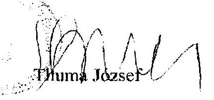

---

Ked, 26-Aug-03 9:24 KoldSAPV RT. GAZD. VIG-H.
Cél 4849206
AFF:892102
2021/03

ÁLLAMI PRIVATIZÁCIÓS ÉS VAGYONKEZELŐ Rt.
HUNGARIAN PRIVATIZATION AND STATE HOLDING COMPANY
VEZÉRIGAZGATÓ

Bihary Zsigmond
főigazgató

Állami Számvevőszék

1052 Budapest
Apáczai Csere János utca 10.

V-04-42-2003

Hegedűs V.
Úny 26,

Isz: 151....1...44...../ÁPV/2003.

Budapest, 2003. augusztus 26.

Tisztelt Főigazgató úr!

„Az ÁPV Rt. 2002. évi működésének és a központi költségvetés végrehajtásához
kapcsolódó tevékenységének ellenőrzéséről" szóló jelentésük tervezetéhez kötődő,
2003. augusztus 21-én kelt levelére a következőkben válaszolok:

Az ÁSZ által is kiemelt három témakörben 2003. augusztus 25-én kollégáim további
egyeztetéseket folytattak. Az egyeztetés során megismert, az Állami Számvevőszék
pontosított jelentésének ezen részei (KVI portfóliócsere, Reorg-Appart Rt.
pénzforgalom nélküli tranzakció, Volán társaságok 1,5 milliárd forint értékű
rekonstrukciós támogatása) tartalmazzák az ÁPV Rt. szakmai álláspontját.

Ennek megfelelően a módosított jelentés tükrözi az ÁPV Rt. észrevételeit, így ahhoz
további megjegyzéseket nem teszünk.

Tisztelettel:

Kamarás Miklós
vezérigazgató

H 1137 BUDAPEST, POZSONY ÚT 56. | TEL.: (36 1) 237-4400. FAX: (36 1) 237 4100
Összes oldal 01

---

# ÁEF: 864/03,   2007/03 

Állami Privatizációs és Vagyonkezelő Rt.
Hungarian Privatization and State Holding Company

Bihary Zsigmond úr főigazgató

Állami Számvevőszék
H-1364 Budapest
Pf. 54.

ÁLLAMI SZÁMVÉVŐSZÉK
ÖGYVITILLI RÓNA
ATM- 5737/2003
Érkezési: 2003 AUG 25
Iktatószám:
Melléklet:
$V-04-43-2003$.
Felügyelő Bizottság
Tel: 237-4126
Fax: 237-4125
Isz: FB-137/2003.
Ül: dr. Kaiser Tamás

Budapest, 2003. augusztus 18.

Tárgy: Az ÁPV Rt. 2002. évi tevékenységéről szóló jelentés tervezet.

## Tisztelt Főigazgató úr!

A mai napon Podonyi László úrral telefonon történt egyeztetésünk során javasoltuk kiegészíteni a tervezetet azzal, hogy a BEI ügyvezető igazgatója az ÁPV Rt. Igazgatóságának ülésein folyamatosan részt vesz.
Ezen túlmenően további észrevételt az ÁSZ jelentés-tervezethez nem kívánunk tenni.

Tisztelettel:

Sághy Zoltán

---

# Sághy Zoltán úr 

FB elnök
Állami Privatizációs és Vagyonkezelő Rt.
Budapest

## Tisztelt Elnök Úr!

Megköszönöm az Állami Privatizációs és Vagyonkezelő Rt. 2002. évi működésének és a központi költségvetés végrehajtásához kapcsolódó tevékenységének ellenőrzéséről készített jelentéstervezetünkkel kapcsolatos, soron kívül biztosított egyeztetési lehetőséget és az arra adott kiegészítést.

Javaslatát elfogadom, azt a jelentés végleges szövegébe beépítjük.
Budapest, 2003. augusztus 26.
Tisztelettel:
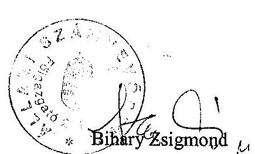

---

## Az ÁPV Rt. szervezeti felépítése

2. sz. melléklet 2002. évben hatályos

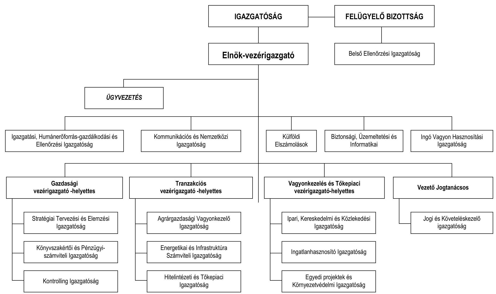

---

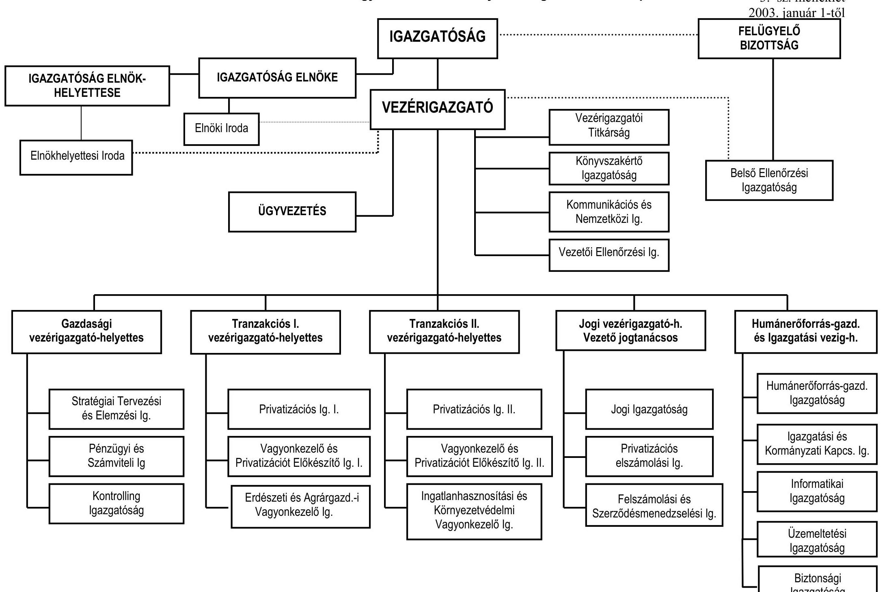

# Állami Privatizációs és Vagyonkezelő Részvénytársaság szervezeti felépítése

## IGAZGATÓSÁG

### Igazgatóság Elnökhelyettes

- **Igazgatóság Elnöke**
  - Elnöki Iroda
  - ÜGYVEZETÉS

### Vezérigazgató

- **Vezérigazgató Titkárság**
  - Könyvvizsgáló Igazgatóság
  - Kommunikációs és Nemzetközi Ig.
  - Vezetői Ellenőrzési Ig.

## IGAZGATÓSÁG

### Igazgatóság Elnökhelyettes

- **Igazgatóság Elnöke**
  - Elnöki Iroda
  - ÜGYVEZETÉS

### Vezérigazgató

- **Vezérigazgató Titkárság**
  - Könyvvizsgáló Igazgatóság
  - Kommunikációs és Nemzetközi Ig.
  - Vezetői Ellenőrzési Ig.

## IGAZGATÓSÁG

### Igazgatóság Elnökhelyettes

- **Igazgatóság Elnöke**
  - Elnöki Iroda
  - ÜGYVEZETÉS

### Vezérigazgató

- **Vezérigazgató Titkárság**
  - Könyvvizsgáló Igazgatóság
  - Kommunikációs és Nemzetközi Ig.
  - Vezetői Ellenőrzési Ig.

## IGAZGATÓSÁG

### Vezérigazgató

- **Vezérigazgató Állami Összesen**

### Vezérigazgató

- **Vezérigazgató Állami Összesen**

### Vezérigazgató

- **Vezérigazgató Állami Összesen**

### Vezérigazgató

- **Vezérigazgató Állami Összesen**

### Vezérigazgató

- **Vezérigazgató Állami Összesen**

### Vezérigazgató

- **Vezérigazgató Állami Összesen**

### Vezérigazgató

- **Vezérigazgató Állami Összesen**

### Vezérigazgató

- **Vezérigazgató Állami Összesen**

### Vezérigazgató

- **Vezérigazgató Állami Összesen**

### Vezérigazgató

- **Vezérigazgató Állami Összesen**

### Vezérigazgató

- **Vezérigazgató Állami Összesen**

### Vezérigazgató

- **Vezérigazgató Állami Összesen**

### Vezérigazgató

- **Vezérigazgató Állami Összesen**

### Vezérigazgató

- **Vezérigazgató Állami Összesen**

### Vezérigazgató

- **Vezérigazgató Állami Összesen**

### Vezérigazgató

- **Vezérigazgató Állami Összesen**

### Vezérigazgató

- **Vezérigazgató Állami Összesen**

### Vezérigazgató

- **Vezérigazgató Állami Összesen**

### Vezérigazgató

- **Vezérigazgató Állami Összesen**

### Vezérigazgató

- **Vezérigazgató Állami Összesen**

### Vezérigazgató

- **Vezérigazgató Állami Összesen**

### Vezérigazgató

- **Vezérigazgató Állami Összesen**

### Vezérigazgató

- **Vezérigazgató Állami Összesen**

### Vezérigazgató

- **Vezérigazgató Állami Összesen**

### Vezérigazgató

- **Vezérigazgató Állami Összesen**

### Vezérigazgató

- **Vezérigazgató Állami Összesen**

### Vezérigazgató

- **Vezérigazgató Állami Összesen**

### Vezérigazgató

- **Vezérigazgató Állami Összesen**

---

# Összefoglaló táblázatok 

1. sz. táblázat Az ÁPV Rt. bevételei és kiadásai 2000-2002.
2. sz. táblázat Az ÁPV Rt. 2002. évi üzleti tervének teljesülése
3. sz. táblázat A privatizációs tartalék felhasználása
4. sz. táblázat A központi költségvetés szerinti ráfordítások teljesítése 2002-ben

---

1. sz. táblázat

Az ÁPV Rt. bevételei és kiadásai 2000-2002.
M Ft

| Megnevezés | 2000 | 2001 | 2002 |
| :-- | --: | --: | --: |
| Privatizációs bevétel | 19039 | 35377 | 10018 |
| Vagyonhasznosítási bevétel | 1083 | 2295 | 741 |
| Kárpótlási jegy bevétel | 1310 | 639 | 255 |
| Kapott osztalék, részesedés | 12877 | 8492 | 12824 |
| Egyéb bevételek | 17457 | 10 | -2877 |
| Gázközmű kamata | 6445 | 4922 | 0 |
| Rendelt vagyon bevételek | 58211 | 51735 | 20961 |
| Vagyont csökkentő kiadások | 20297 | 18098 | 11773 |
| Vagyonváltozást nem eredményező kiadá-   sok | 39840 | 32822 | 12718 |
| Ebből tartalék feltöltés | 0 | 11922 | 9200 |
| Rendelt vagyon összes ráfordítás | 60137 | 50920 | 24491 |
| Tartalék feltöltés külső forrásból | 76300 | 79100 | 5000 |
| Priv. tartalék összes felhasználása | 91432 | 125005 | 15065 |

2. sz. táblázat

# Az ÁPV Rt. 2002. évi üzleti tervének teljesülése 

| Megnevezés | Terv | Tény | Teljesítés |
| :--: | :--: | :--: | :--: |
|  | M Ft |  | \% |
| Privatizációs bevétel | 15568 | 10018 | 64,35 |
| Vagyonhasznosítási bevétel | 746 | 741 | 99,33 |
| Kárpótlási jegy bevétel | 1290 | 255 | 19,53 |
| Kapott osztalék, részesedés | 10530 | 12824 | 121,79 |
| Egyéb bevételek | $-1540$ | $-2877$ | 184,87 |
| Rendelt vagyon bevételek | 26594 | 20961 | 78,84 |
| Vagyont csökkentő kiadások | 16343 | 11773 | 72,04 |
| Vagyonváltozást nem eredményező kiadá-   sok | 12412 | 12718 | 102,47 |
| Ebből tartalék feltöltés | 8500 | 9200 | 108,24 |
| Rendelt vagyon összes ráfordítás | 28755 | 24491 | 85,17 |
| Tartalék feltöltés külső forrásból | 0 | 5000 | nem tervezett |
| Priv. tartalék összes felhasználása | 9679 | 15065 | 155,64 |

---

# A privatizációs tartalék felhasználása 

|  | M Ft |  |
| :-- | --: | --: |
|  | 2002. évi   terv | 2002. évi   tény |
| Jótállással, szavatossággal, kezességvállalással kapcsolatos kifizetések | 42 | 74 |
| Szerződéses kapcsolaton alapuló tartozás kiegyenlítése | 614 | 105 |
| Belterületi föld értéke alapján, alapítói jogon kifizetett önkorm. járand. | -957 | -1288 |
| Elvont vagyontárgyak után beálló kezesi felelősség rendezése | 1565 | 3256 |
| A "reverzális levelek" alapján történő kifizetések | 11 | 11 |
| Villamosipari dolgozókkal az energiasz. priv. kapcs. kötött megáll. fede-   zete | 1381 | 1180 |
| Privatizációs ellenérték hányad | 142 | 779 |
| A gázközművekkel kapcsolatos önkormányzati igények rendezése | 140 | -5 |
| Kárpótlási jegyek életjáradékra váltása | 2795 | 2817 |
| T.1.-T.12. pontokban szereplő feladatok végrehajtásával kapcs. ráfordí-   tások | 48 | 193 |
| Az állam vagyon- és gazd.pol. tev. támogató intézkedésekkel, válsáy-   helyzetek megszüntetésével összefüggő kiadások | 3898 | 7943 |
| Tartalék felhasználás összesen | $\mathbf{9 6 7 9}$ | $\mathbf{1 5 0 6 5}$ |

---

# A központi költségvetés szerinti ráfordítások teljesítése 2002-ben 

|  | M Ft |  |
| :-- | --: | --: |
| Megnevezés | $\mathbf{2 0 0 2}$. évi |  |
|  | előirányzat | teljesítés |
| I. A hozzárendelt vagyont csökkentő kiadások | 60 500 | 11 773 |
| 1. Ráfordítások az 1995. évi XXXIX. tv. alapján | $\mathbf{1 9 0 0 0}$ | $\mathbf{8 9 1 0}$ |
| a.) a hozzárendelt vagyon értékesítése előkészítésének költségei,   az értékesítéssel kapcsolatban felmerülő kiadások, díjak (23.   § (1) bek. a) és f) | 5 000 | 612 |
| b.) vagyonkezeléssel összefüggő ráfordítások(23.§ (1) bek. e)   pont | 3 000 | 1 354 |
| c.) a hozzárendelt vagyonba tartozó társaságok támogatása   (23. § (1) bek. g) pont forrásátadás, kamatátvállalás | 3 000 | 1 689 |
| d.) az ÁPV Rt működési költségei (23. § (1) bek. h) | 6 000 | 5 000 |
| e.) alacsony kamatozású államadósság törlesztése E-hitelből és   kárpótlási jegy bevonása (23.§ (1) bek. i) pont) | 2 000 | 255 |
| 2. Ráfordítások egyéb kötelezettségek alapján | $\mathbf{4 1 5 0 0}$ | $\mathbf{2 8 6 3}$ |
| a.) osztalék-befizetési kötelezettség a központi költségvetés felé   (6.§ (2) bek.) | 32 000 | - |
| b.) az ÁPV Rt. és a jogelődök portfóliójába tartozó vállalatok,   társaságok. ill. egyéb vagyontárgyak esetén az állam

 tulajdonosi felelősségével kapcsolatos környezetvédelmi feladatok finanszírozása | 4 000 | 872 |
| c.) a volt szovjet ingatlanok környezetvédelmi kárelhárítása | 2 000 | 319 |
| d.) a HM-től átvételre kerülő vagyonelemekkel kapcsolatos megelőlegezési költségek, továbbá e vagyonelemek kezelésével és értékesítésével kapcsolatos ráfordítások (6. §. (3.) bekezdés) | 3 000 | 1 400 |
| e.) egyéb kötelezettség | 500 | 272 |
| II. Rendelt vagyon változását nem eredményező kiadások | 35 000 | 12 718 |
| 1. Privatizációval és vagyonkezeléssel kapcsolatos reorganizációs kifizetések | 10 000 | -1 818 |
| 2. Vagyontárgyak vásárlása | 5 000 | 404 |
| 3. Fejlesztési projektek | 5 000 | - |
| 4. Üzleti célú befektetések | 5 000 | 4 932 |
| 5. Privatizációs tartalék feltöltése | 10 000 | 9 200 |
| Ráfordítások mindösszesen | $\mathbf{9 5 5 0 0}$ | $\mathbf{2 4 4 9 1}$ |

---

1. sz. Függelék
V-04-45/2003.

# Az ÁPV Rt. hozzárendelt vagyonának változása 2002-ben 

Átvett társaságok:
Magyar Posta Rt., Hitelgarancia Rt., Carthografia Kft., Bábolna Rt.
A Priv. tv. 2001. évi hatályú módosítása szerint 20 db erőmű és gázszolgáltató társaság aranyrészvényeinek átvételére 2002. évben került sor. A törvény mellékletének 2002. 07. 27-i módosítása alapján azonban a tulajdonosi jog gyakorlása visszakerült a gazdasági és közlekedési miniszter hatáskörébe. Így azok átadására szintén sor került a 2002. évben.

Átadott társaságok:
Bábolna Rt., Mahart Balatoni Hajózási Rt., Hungexpo Rt., Mátra Cukor Rt., Szerencsi Cukor Rt., Antenna Hungária Rt., MOL Rt., Szolnoki Cukor Rt., Borsodchem Rt.

Vásárolt társaságok:
Részvénytársaságok:
Hungaroring Rt., Mátra Cukor Rt., Szerencsi Cukor Rt., Szolnoki Cukor Rt., Bábolna Rt., Bácsalmási Agrár Rt., Enyingi Agrár Rt., Balatoni Halászati Rt., Komáromi Mg. Rt., Mezőhegyesi Állami Ménesbirtok Rt., Szerencsi Mg. Rt., Hód Mg. Rt., MITT Rt., Angerbrot Rt., Kontur Rt., Zala Bútor Rt., Alcsiszigeti Mg. Rt., Bólyi Mg. Rt., Fertő-tavi Nádgazdaság Rt.

Korlátolt Felelősségű Társaságok:
TESCO Kft., Dunaferr Vámügynökség Kft., MFB Üzletrész-hasznosító Kft., Casa Vagyonkezelő Kft., Borászati Kft., Muzeális Bor Kft.

## Értékesített társaságok:

MATÁV Rt., Tiszamenti Vegyiművek Rt., OTP Rt., Hungaropharma Rt., Budapesti Dohányfermentáló Rt., Statiqum Kiadó Rt.

---

Tőkeemelés:

- Erdőgazdaságoknál: 178 millió Ft.

Dél-alföldi Erdőgazdaság Rt., Egererdő Rt., Gemenci Erdő Rt., Gyulaj Erdő Rt., Kisalföldi Erdőgazdaság Rt., Nyírerdőgazdaság Rt., Pilisi Erdőgazdaság Rt., Tanulmányi Erdőgazdaság Rt., Vértesi Erdészeti Rt.

- Agrártársaságoknál: 3087 millió Ft.

Martonsed Rt., Bólyi Mezőgazdasági Rt., Hód Mezőgazdasági Rt., Tokaj Kereskedőház Rt., Alcsiszigeti Mg. Rt., Komáromi Mg. Rt., Ménesbirtok Rt.

- Volántársaságoknál: 150 millió Ft.

Volánbusz Rt.

- Egyéb társaságoknál: 2165 millió Ft.

Magyar Lóversenyfogadást Szervező Kft., Népliget Autóbusz-pályaudvar Kft., MAFILM Rt.

# Tőkeemelés: 

Villért Rt.

## Egyéb növekedés:

- Összeolvadásból következően: 10842 millió Ft.

Kisrókus Kft., Mafilm Rt.

- Továbbiakból eredően: 4070 millió Ft.

Portfóliócsere révén ÁPV Rt.-hez került részesedések: Borsodchem Rt., Földhitel és Jelzálogbank Rt., MOL Rt.

## Egyéb csökkenés:

- Portfólió csere: 5804 millió Ft.

Hungexpo Rt., Dél-magyarországi Gabonaforgalmi Rt.

- Megszűnés: 11916 millió Ft.

Mafilm Rt, Mafilm Kft, Követel & Tartozik Kft.

## Végelszámolás: 917 millió Ft.

Fégarmy Kft.

---

Aranyrészvény átvétel miatt tartós körbe helyeződött öt társaság.
A Bábolna Rt.-re vonatkozóan kormányhatározatok szerinti térítésmentes átadás, majd átvétel történt 2002-ben. A 2028/2002. (II. 1.) Korm. határozat, valamint az ÁPV Rt. részvényesi jogok gyakorlója 2/2002. (II. 15.) sz. határozatának végrehajtása érdekében az ÁPV Rt. 12761 millió Ft névértékű Bábolna Rt. részvényeket 2500 millió Ft átadási értéken térítésmentesen átadott a Magyar Fejlesztési Bank Rt. tulajdonába 2002. 02. 28-án. A részvények az ÁPV Rt. könyveiben 12374 millió Ft nyilvántartási értéken szerepeltek az átadást megelőzően. A 2229/2002. (VIII. 02.) Korm. határozat alapján az ÁPV Rt. 384/2002. (IX. 26.) IG. sz. határozatban hozott döntést a térítésmentes részvényátruházási megállapodás megszüntetéséről. Ezzel visszakerült az ÁPV Rt. portfoliójába a Bábolna Rt. részesedés.

A 2001. évben már elkezdődött, de még nem zárult le a Postabank Rt. részvénycsomagnak a Magyar Posta Rt. részére történő térítésmentes átadása a 2187/2001. (VII. 21.) Korm. határozat alapján. A megállapodás megkötésére a mérlegkészítésig még nem került sor. A részvények könyv szerinti értéke 2002. 12. 31-én 1245 millió Ft volt.

---

# Az állami tulajdonban lévő társaságok eredményességét biztosító stratégiai intézkedések 

A nyereségességi- és osztalék elvárásokat, valamint a vagyonnövekedést az egyes portfolio csoportoknál, elemeknél differenciáltan, a tartós állami tulajdonba sorolás indokaira is tekintettel kell meghatározni. Amennyiben egy-egy társaság, társasági kör (pl. erdőgazdaságok, volán társaságok) ellátási, közszolgáltatási és üzleti jellegű feladatokat is végez, a tevékenységek eredményességét külön-külön kell vizsgálni. Az üzleti tevékenységben mutatkozni kell, hogy az állami feladatok ellátása milyen ráfordításokkal, milyen színvonalon, milyen eredménnyel történik.

A privatizáció ütemezésén túlmenően, amely a többségi tulajdonok értékesítését adja meg, tartalmaz a kisebbségi részesedések hasznosítására is megoldásokat a stratégia. Új elem, hogy a mielőbbi eredményes – főként árverésen alapuló – értékesítésen kívül lehetséges célként jelöli meg a „gazdaságos” mennyiségek forgalmazását. Vagyis a vagyonkezelő ne csak eladhasson részesedéseket, hanem azt vásárlásokkal kiegészíthesse.

A stratégiai intézkedésekkel az ÁPV Rt. forrásallokációs rendje fejlesztésre, aktualizálásra került, melyet a 2/2003. (02. 11.) Vig. sz. utasítás tartalmaz. A pótlólagos források kihelyezésével kapcsolatos követelmények, az érvényes törvényi szabályozás és más előírások feltételrendszerének beépítésével készültek.

Az ÁPV Rt. vezetési, irányítási gyakorlatában fontosak a társaságok beszámoltatását végző negyedéves értekezletek. Ezért kiadásra került az 5/2003. (02. 25.) Vig. sz. utasítás.

Az állam vállalkozói vagyonának felelős kezelése szükségessé teszi a tulajdonosi érdekek erőteljes érvényesítését azoknál a társaságoknál, ahol az ÁPV Rt. többségi tulajdonos. A kontroll erősítése, a tőkehatékonysági, jövedelmezőségi elvárások megfelelően szervezett rendszerben történő közlése, a közvetlen információcsere lehetőséget ad a kedvezőtlenül alakuló folyamatok esetén is az időközi beavatkozásokra, tulajdonosi döntések megalapozására.

A vagyonpolitikai irányelvek szerint a koncepciók lebontásával készített stratégiai terveket a rövid távú és az éves tervezés követi. Az ÁPV Rt. többségi tulajdonában lévő cégek stratégiai terv készítésére kötelezettek, melyek betartását, betartatását többszintű ellenőrzés és azt követő intézkedések segítik. A stratégiai intézkedések hatása a vagyonértékre jövedelmezőségi mutatók alapján értékelhető.

---

# Az ÁPV Rt. függő kötelezettségeinek állományváltozása 2002-ben 

A vagyonelvonásból eredő kezesi felelősség alapján keletkezett kötelezettség
A kötelezettség a felszámolási eljárás alá került társaságokra, vállalatokra vonatkozik, amelynek a jogi alapját az Állami Vagyonügynökségről és a hozzátartozó vagyon kezeléséről és hasznosításáról szóló törvény a vagyonügynökség kezesi felelősségéről, valamint az előprivatizációs (szolgáltatói, kiskereskedelmi és vendéglátó-ipari egységek elvonása és értékesítése) törvény szabják meg. Az 1992. évi LIV. tv. 53. § (1) bekezdése az államigazgatási felügyelet alatt álló állami vállalattól eszközök elvonására ad felhatalmazást, a 84. § (1) bekezdésében pedig a pénzintézeti részvények vállalatoktól való elvonását írja elő. A kezesi felelősségre mindhárom törvényben utalás van.

A vagyonelvonásban érintett cégek közül 97 állt felszámolás alatt 2002 decemberében. Az elvont vagyontárgyak között legnagyobb arányban az ingatlanok, (48%, azon belül 17%-ban a termőföldek) és a részvények (40%) részesedtek. Az elvonások időszaka az 1990-1994 közötti évekre esett, azon belül 51%-ban az 1992. évi, 23%-kal pedig az 1990. évi ilyen jellegű döntések szerepelnek. A vagyonelvonással érintett felszámolás alatti (f.a) cégek felszámolási kezdő időpontjai megoszlanak. Arányukat tekintve kiemelhetők az 1993. (20%), 1994. (22%) és az 1996-1997. évek (14-14%). (A teljes időszak 1990-2002. évekre esik.)
2002. december elején 15 per volt folyamatban, a perérték 10,5 milliárd Ft volt. 2002-ben két jogerős ítélet született, egy perbeli egyezséggel zárult ügy volt.

Az ÁPV Rt. 2001. és 2002. december 31-én a következő kötelezettséget mutatott ki az elvont vagyon utáni kezességvállalás jogcímén:

| 2001. december 31. |  | 2002. december 31. |  |
| :--: | :--: | :--: | :--: |
| elvont vagyon utáni kötelezettség maximuma | céltartalék | elvont vagyon utáni kötelezettség maximuma | céltartalék |
| 56993 | 29544 | 48573 | 28304 |

---

A vagyonelvonásból származó kezesi felelősség miatt felmerült kiadások
A 81152. főkönyvi számlán szerepel a Tihany Községi Önkormányzatnak kifizetett 25034641 Ft tőke és kamat. A kifizetés jogerős Legfelsőbb Bírósági (LB) ítéleten alapult. Az összeget 4 tételben könyvelték le. A kifizetett 9290 ezer Ft tőkeösszeg téves, mivel az ítéletben 9029 ezer Ft szerepelt ezen a címen. A túlfizetés 261 ezer Ft és ennek az arányos kamata. A bíróság emellett összevontan 300 ezer Ft perköltség megtérítést ítélt meg az ÁPV Rt. javára, így az önkormányzat felé történt teljesítés ennyivel kisebb volt. A jogerős ítélet alapján megalapozott a kiadási tétel. A tévesen kifizetett összeg és annak kamatát már visszafizették.

A 81151. sz. számlán szerepel a Pontis Kft.-nek kifizetett 187,6 millió Ft tőke, 300,3 millió Ft kamat és 9 416,6 millió Ft perköltség, összesen 497,3 millió Ft. A teljesítés az LB 2002. június 11-én kelt Gfl. 30603/2001/5. számú jogerős ítéletén alapult. A felperes egy követeléseket felvásárló cég volt. A per tárgya a felszámoló által visszaigazolt, meg nem térült hitelezői követelés.

A 187,6 millió tőkekövetelésből 151,6 millió Ft megvásárolt MHB hitelkövetelés volt, amelyet több céget követően engedményezéssel vett meg a felperes (először az MHB Rt. RISK Rt. nevű cége volt a tulajdonos). A vagyonelvonás 1993-ban történt. A két állami gazdaságnak a vagyonelvonáskor is, és a felszámoláskor is fennállt a tartozása a hitelezőkkel szemben. A bíróság vagyonértékelés alapján határozta meg az ÁPV Rt. kezesi felelősségének mértékét az elvont vagyon arányában (48,75%-ot és 48,85%-os arányt).

Az elvont termőföldek és erdők értékét nem könyvszerinti, hanem vagyonértéken vette figyelembe az LB, bár a gazdaságok számviteli mérlegében nulla könyvszerinti értéken szerepeltek. A bíróság tehát a kezesi felelősség arányát, és a vagyon erejéig terjedő összegét így határozta meg. Az egyik vagyontárgy esetében az elvonáskor az összes hitelezői követelés 117,6 millió Ft, a felperes követelése 58,3 millió Ft volt, ebből a felszámolásig meg nem térült összeg 55,6 millió Ft. A felperes jogelődeivel együtt teljes bizonyító erejű magánokiratokkal igazolta a vagyonelvonáskor fennálló teljes hitelezői követelését.

# Gázközmű vagyonnal kapcsolatos önkormányzati járandóságok 

Az ÁPV Rt. 2002. december 31-én 10 107,5 millió Ft kötelezettséget tartott nyilván ezen a jogcímen. A járandóság alapját a 2002. december 23-án született 2002. év LXIII. tv. képezi. E szerint az 1993. augusztus 4-e és 1995. december 31-e között önkormányzati hozzájárulásból létesített gázközmű vagyon után az önkormányzatokat járandóság illeti meg (összesen 553 önkormányzatról van szó).

A törvény mellékletében részletezett igények összege eredetileg 10149 millió Ft volt. Az ÁPV Rt. ezt az értéket korrigálta, mivel két önkormányzat még egy 2000 novemberében született jogerős bírósági ítélet alapján 39,8 millió Ft-ot inkasszált le a vagyonkezelőtől. A jogerős ítéletben olyan gázközmű hozzájárulások után kapott kártérítést a két önkormányzat, amelyek kapcsán a 2002.
 évi LXIII. tv. szerint is juttatásban részesültek volna. (A törvényi szabályozáshoz egy felmérés nyújtott számszerű adatokat. A felmérést végző Interauditor Kft.-

---

nek a két önkormányzat nem jelezte ezt a tényt.) A kettős kifizetés elkerülése céljából csökkentette a járandóságokat az ÁPV Rt. A levonásról és annak számítási menetéről levélben értesítette az érintetteket. Erre 2003. áprilisig észrevétel nem érkezett. A korrekciót a kamatvonzat miatt 41 030 ezer Ft-ra pontosították. A korrekciót indokoltnak tartjuk.

# 1989. évi XIII. tv. szerinti önkormányzati járandóságok 

A belterületi föld utáni kötelezettségek összege a növekedések és csökkenések egyenlegeként összességében közel 1 milliárd Ft-tal emelkedett a 2001. december 31-i állapothoz képest. A 2002. évi záróállomány 12 341 millió Ft volt (4. sz. tanúsítvány).

Normatív kötelezettségként kamattal együtt 6988 millió Ft-ot tartottak nyilván és ez csaknem 3 milliárd Ft-os növekedést, míg a függő kötelezettségek állománya 5354 millió Ft volt, ami 2 milliárd Ft-hoz közeli csökkenést jelent.

Jelentős változást hozott a kötelezettségállományban egy új önkormányzati igény „megjelenése”. Ún. „tőkésített kamat” jogcímén 2 milliárd Ft alapjárandóságot és közel 2,5 milliárd Ft kapcsolódó késedelmi kamatot vettek nyilvántartásba 2002-ben. Ez a kötelezettség az 1996. évi szakértői szerződések teljesítésére visszavezethető perek következménye. A szerződések utólagos felülvizsgálata alapján, és az öt éves elévülés figyelembevételével határozták meg az önkormányzati járandóságok körét, összegét, ami 117 társaság 221 tételét jelenti. Az eljárással kapcsolatos döntést a 466/2002. (X. 31.) IG sz. határozatban hozták meg, amelyben elrendelték az e törvény szerinti belterületi föld utáni járandóságok rendezésére 1996-ban létrejött megállapodások utólagos felülvizsgálatát a tőkésített kamat vonatkozásában. A felülvizsgálat során az 5 éves elévülési idő figyelembevételével külön választották a peresített és a nem peresített igényeket. A 2002-ben hozott első és másodfokú ítéleteknél, ha az ÁPV Rt. összegszerűségét nem vitatja, akkor a kötelezettség teljesítését írták elő. A le nem zárt pereknél perbeli megegyezésre kell javaslatot tenni, és megegyezés esetén teljesíthető a kötelezettség. Nem peresített követeléseknél szintén megállapodásokra kell törekedni. (2002. november 4-i állapot szerint 25 per volt folyamatban). A felülvizsgálat „végeredménye” a 4,5 milliárd Ft körüli új önkormányzati kötelezettség nyilvántartásba vétele.

A függő kötelezettségek csoportjában nagymértékű változást okozott az ún. tőzsdei áras önkormányzati járandóságoknál az elévülés figyelembevétele. A felülvizsgálat számszerű következménye az volt, hogy a 7 milliárd Ft körüli nyitóállomány járandóságainak jó része kikerült a nyilvántartásból és így a záróállomány 1,8 milliárd Ft-ra csökkent. A függő kategóriába azok a tételek kerültek, amelyek esetében az 1997. évi megállapodásoknál az alapjárandóságot 20%-os késedelmi kamattal teljesítették ott, ahol a cégek részvényei már akkor a tőzsdén voltak. Az önkormányzatoknak ez a köre nem írta alá a megállapodást (Az ÁPV Rt. ennek ellenére átutalta a kamatos összegeket, amiket aztán az elszámolásnál figyelembe fog venni).

Az elévülés miatti 2002. évi felülvizsgálat hatása a függő kötelezettségeknél tehát 5,2 milliárd Ft csökkenés.

---

A függő kategóriában szerepelnek még az ún. vitatott időszak (1990. és 1991. szeptembere között átalakult társaságok) utáni kötelezettségek is. Ezek szintén a tőzsdén lévő cégek árfolyam különbözetéből adódó kötelezettségek, összegük 3530,4 millió Ft-ot tett ki év végén. Ez utóbbi körben a céltartalék képzés 90%-os valószínűséggel történt. A teljes függő állománnyal kapcsolatban 2002-ben 6 másodfokon meghozott jogerős ítélet született. Az ítéletek többségében az 1997. évi teljesítéskori tőzsdei árat jelölik meg kártérítési összegnek, egy ítéletben pedig a peres eljárás alatti tőzsdei átlagárat vették figyelembe. Az osztalékról nem volt egyértelműen egységes ítélkezési gyakorlat (van ahol nem is kérték az önkormányzatok). Az ÁPV Rt. a tőzsdei ár megállapítása előtti időszak osztalékát és annak kamatát veszi számításba, ami megfelelő elvnek tekinthető. A bírósági ítéletek tehát indokolják a még nem rendezett és el nem évült tőzsdei áras kötelezettségek nyilvántartását.

Az 1989. évi XIII. tv. szerinti járandóságok 2002. évi elszámolását kedvezően érintette a Fővárosi Főpolgármesteri Hivatallal szemben megnyert per, a már említett vitatott időszak járandóságait illetően. Az 1997-ben jogszerűtlenül átadott - a kerületeket megillető - pénz- és részvénycsomag fejében kamatokkal együtt 5586,4 millió Ft bevétele volt az ÁPV Rt.-nek. Egy másik megnyert per következtében (Egis részvények) további közel 3,4 milliárd Ft pénzbevételt realizált az ÁPV Rt. a Fővárostól.

# Az ÁPV Rt. 1992. évi LIV. tv. szerinti önkormányzati járandóságok 

A törvény alapján esedékes normatív kötelezettségek 2002. évi nyitóállománya kamatokkal együtt 7532 millió Ft, ami az év végére 1055 millió Ft-ra csökkent. Az utóbbi összegből az alapjárandóságok 2002. december 31-i záróállománya 583 millió Ft volt, a nyilvántartott késedelmi kamatok pedig 472 millió Ft-ot tettek ki. A 2002. évi igen jelentős kifizetések, illetve a kötelezettségek rendezése következtében a korábban felhalmozódott kamatok állománya is számottevően csökkent, 2001. évhez képest több mint 3 milliárd Ft-tal. Az ÁPV Rt. kötelezettség-állományán belül ebben a körben következett be a legnagyobb mértékű pozitív változás.

2002-ben a járandóságok teljes körű felülvizsgálata a nagy tömegű korábbi értékesítések esetében befejeződött. Folytatódott emellett a részletfizetéssel, illetve lízingkonstrukcióval értékesített társasági részesedések után esedékessé vált tartozások rendezése. Ezen kívül a 2001. évi privatizációk közül a CD Hungary és az MFB Rt.-nek átadott 12 agrárcég utáni járandóságok, a Hungaropharma Rt. részesedések eladása miatt esedékessé vált kötelezettségek teljesítése is 2002-ben történt meg. Jelentős kifizetés volt a Fővárosi Autótaxi Rt. privatizációja miatti összeg a Fővárosi IX. kerületi Polgármesteri Hivatal részére (kamatokkal együtt 250 millió Ft), amelyre bírósági ítélet alapján került sor.

A törvény alapján a fővároson kívül összesen 69 önkormányzat részére, közel 500 millió Ft-ot fizettek ki, további 400 millió Ft-os kötelezettséget pedig követelésbe történő beszámítással rendeztek (kamatokkal együtt). Az önkormányzatok mintegy 40 millió Ft ÁPV Rt. követelést készpénzben teljesítettek.

A 2002. évi teljesítésekből legnagyobb tömegű és összegű kötelezettséget a Fővárosi Önkormányzattal sikerült rendezni, szembeállítva az 1989. évi XIII. tv.

---

alapján fennálló ÁPV Rt. követelés egyidejű megtérítésével (az ezirányú tárgyalások alakulásával és eredményeivel a 2001. évi ÁSZ jelentésben részletesen foglalkoztunk. A végleges megegyezés 2002. évre tolódott át.) Az ÁPV Rt. a Legfelsőbb Bíróság 3/1999. PJE számú jogegységi határozatában foglaltaknak megfelelően végezte el a járandóságok jogosságának felülvizsgálatát. Összesen 106 társaságot érintő járandóságból először 86 részesedés értékesítése utáni kötelezettséget 2002. júliusában (4,65 milliárd Ft), több mint 1,1 milliárd Ft-os tartozást augusztusban, míg a fennmaradó kisebb részt novemberben teljesítettek. Összesen 5823 millió Ft-ot készpénzben, míg további 264 millió Ft kötelezettséget beszámítással teljesítettek (az összegek a késedelmi kamatot is tartalmazzák). Így mind összesen csaknem 6,1 milliárd Ft kötelezettség kikerült az ÁPV Rt. mérlegéből, ami azt jelenti, hogy 2002-ben ezen a jogcímen, a többi önkormányzat felé történt teljesítésekkel együtt közel 7 milliárd Ft tartozást sikerült rendezni. A késedelmi kamat a teljesítésen belül csaknem 50%-os arányt tett ki.

Fővárosi Főpolgármesteri Hivatallal történő elszámolás során a 2002. január 1. utáni időszakra jutó késedelmi kamat egy részénél kisebb túlfizetésre került sor. A 2000. évi LXXXVIII. tv. módosításáról szóló 2001. évi LXXXVII. tv. a 11%-os kamatmérték alkalmazásáról úgy rendelkezett, hogy a hatálybalépést megelőzően keletkezett jogviszonyból eredő kamatkövetelésre is alkalmazni kell, ha a kamat a törvény hatálybalépése után vált esedékessé. Az utóbbi rendelkezés (a kamatfizetés esedékessége) értelmezésében eleinte zavar volt, így belső jogi álláspont kialakítására volt szükség. Addig amíg ez megszületett, évi 20%-os mértéket alkalmaztak a főváros kötelezettségei teljesítésekor. A kamatkülönbözet 129 millió Ft túlfizetés volt, ami ilyen követelést jelentett az év végén.

---

# A Földhitel és Jelzálogbank Rt., valamint a Postabank és Takarékpénztár Rt. privatizációs tanácsadójának kiválasztása 

Az ÁPV Rt. Igazgatósága 457/2002. (X. 31.) IG. sz. határozatával - a 17/2002. (X. 31.) RJGY sz. határozat alapján - döntött a „Postabank 2003.” c. tanácsadói pályázat meghirdetéséről, egyúttal jóváhagyta a pályázati dokumentációt, a pályázati kiírást, és rendelkezett az Értékelő Bizottság összetételére vonatkozóan.

Az ÁPV Rt. versenyeztetési szabályzata írja le a pályázatok értékelési folyamatának menetét. Az Értékelő Bizottság (továbbiakban: ÉB) tevékenységére vonatkozóan rögzíti, hogy az ÉB a pályázatok összehasonlítását a pályázati kiírásban meghatározott szempontok és súlyozások alapján végzi. Előírja továbbá, hogy az ÉB munkájáról jegyzőkönyvet kell készíteni. Ennek tartalmaznia kell a pályázatok értékelésének főbb szempontjait, az egyes ajánlatokkal kapcsolatban kialakult véleményeket, a legkedvezőbb ajánlatot, a pályázati eljárás eredményének összefoglalását, az első három helyezett megjelölését.

Az ÉB javaslatot tesz az ÁPV Rt. Igazgatóságának a pályázat eredményére, de az Igazgatóság attól eltérő döntést hozhat.

A „Postabank 2003.” tanácsadói pályázat értékelési folyamata a fentieknek megfelelően történt. A Jogi és Követeléskezelő Igazgatóság az 5 pályázó közül kettőt érvénytelenné nyilvánított. Az ÉB a pályázat nyertesének a Concorde Értékpapír Rt.-t javasolta, döntését az alábbiakban indokolta:
„A Concorde Rt. ajánlata az értékelő bizottság megítélése szerint mind az I., mind a II. szakasz feladatait alaposan részletezi. A pályázati anyag összehasonlítva a többi ajánlattal, különösen a II. szakasz kidolgozása vonatkozásában kiemelkedő.

A szakmai gyakorlat tekintetében a Concorde Rt. és alvállalkozói egyaránt rendelkeznek a feladat végrehajtásához szükséges külföldi és hazai tapasztalatokkal, illetve megfelelő felkészültséggel és specializációval. Külön kiemelendő az ajánlat egészének eladás-orientáltsága.”

Az ÁPV Rt. Igazgatósága 2003. január 16-án a pályázat nyertesének - az ÉB és az ÚV javaslatának megfelelően - a Concorde Rt.-t nyilvánította.

---

A „Földhitel- és Jelzálogbank Rt. 2003.” tanácsadói pályázat meghirdetése - a 17/2002. (X. 31.) sz. RJGY alapján - 456/2002. (X. 31.) IG sz. határozata szerint történt. A pályázatra ketten jelentkeztek, de az egyik pályázatot az ÁPV Rt. - a szolgáltatásért felszámítandó maximális költségigény megállapíthatatlansága miatt - érvénytelenné nyilvánította. Az ÉB értékelése szerint a másik pályázó, a Concorde Rt. pályázatában megjelölt szakmai ajánlat alkalmas a privatizációs folyamat menedzselésére, így javasolta a pályázat eredményessé nyilvánítását. Az ÉB indoklása szerint a Concorde Rt. és alvállalkozói kiemelkedő tapasztalattal rendelkeznek a hazai nyilvános és zártkörű részvény-értékesítések, privatizációs, valamint vállalat-finanszírozási, vállalat-értékelési és tőkebevonási tranzakciókban. Független piaci szereplőként az FHB Rt. privatizációjában érintett valamennyi szereplő (tulajdonos, ügyfélkör, partnerbankok) számára biztosítja a kiegyensúlyozott, piackonform tranzakciós struktúra kialakítását és megvalósítását.

A pályázat nyertese mind az ÉB, mind az Igazgatóság döntése alapján a Concorde Rt.

A pályázat kiírása, értékelése, valamint a döntés meghozása a jogszabályoknak megfelelően történt.

---

5. sz. Függelék

V-04-45/2003.

# A MALÉV Rt. stabilizálásának alakulása 

A korábbi évek ÁSZ vizsgálatai alapján figyelemmel kísértük a MALÉV Rt.-nek nyújtott támogatások hatását. A tulajdonos ÁPV Rt. belső vizsgálatának megállapításai alapján azt a következtetést vonhatjuk le, hogy számos átalakítási terv közül egyet sem hajtottak végre következetesen, így nem lehet pontosan megítélni, hogy melyik átalakítási terv lett volna megfelelő.

A 2000. évi jelentésünkben megállapított, részvény-visszavásárlásnál feltárt 10,2 millió USD-nek megfelelő veszteséget a MALÉV Felügyelő Bizottsága hosszú távú állami-, nemzetgazdasági
 érdekek miatti kényszertranzakciónak minősítette.

A cég átalakítási programjának kidolgozására több jeles tanácsadó céget kért fel a MALÉV Rt. A kidolgozott „Stabilitás és megújulás - Az új üzleti stratégia és az Átalakítási Program terve" című szakértői anyag megvalósításához az Rt. nem rendelkezett saját forrással. A program kidolgozása 2001-ben az újonnan kinevezett menedzsment feladata lett volna.

A Ktv. 6. § (10) bekezdés o) pontjában meghatározott „az állam vagyon- és gazdaságpolitikai tevékenységét támogató intézkedésekkel, válsághelyzetek megszüntetésével összefüggő kiadások" jogcímen 2001. évben 9200 millió Ft összegű tőkejuttatást kapott a 2268/2001. (IX. 26.) Korm. határozat alapján. A Kormány tudomásul vette az ÁPV Rt. által előterjesztett, a MALÉV Rt. stratégiájáról és átalakítási programjáról szóló tájékoztatót és az abban foglaltak végrehajtását támogatta.

A 2001. évi átalakítási programon kívül 2002-ben 140 darab tanácsadói szerződésben 8 olyan szerződés szerepel, amelyekben a megbízottaknak részben átvilágítási tevékenységet kellett ellátniuk, és 5 szerződés szerint tisztán átvilágítási célú feladatokat kellett elvégezni.

Az ÁPV Rt. által végzett vizsgálat szerint a kormánydöntés alapján született stabilizációs program megvalósítására kiírt pályázatnál nem a szabályzatnak megfelelően történt a nyertes kiválasztása.

Annak ellenére, hogy a társaság gazdálkodásának, hatékonyságának javítása érdekében több tanácsadó közreműködését vette igénybe, továbbra is veszteséges gazdálkodást folytat, sőt vesztesége már a 2003. év első négy hónapjában több milliárd forintot tesz ki.

---

Az ÁPV Rt. vezérigazgatója 2003. március 31-én elrendelte a MALÉV Rt. egyes tevékenységeinek vizsgálatát. A vizsgálat megállapította, hogy az átalakítási programot a MALÉV Rt. menedzsmentjének tanácsadó támogatása nélkül is végre kellett volna hajtania. Az átalakítási program megvalósításának eredményét a társaság Igazgatósága és tulajdonosa részére bemutató metodika kidolgozását célzó szerződésmódosítás és annak összege különösen elfogadhatatlan.

A MALÉV Rt. Igazgatósága 2003. április 30-án tartott ülésén az átalakítási programról szóló előterjesztést egyhangúlag elutasította, és határozatot hozott arról, hogy „a tanácsadói szerződések megkötése következtében súlyos gazdasági hátrány okozásának gyanúja" miatt feljelentést tesz ismeretlen tettes ellen. Az ÁPV Rt. ellenőrzése kapcsán a személyes felelősség megállapítása következtében változás következett be a menedzsment vezetésében.

---

# Az Antenna Hungária Rt. műsorterjesztési díjai 

A Magyar Televízió Közalapítvány és az MTV Rt. működésének ellenőrzésénél felvetődött az Antenna Hungária műsorterjesztési díjképzésének ellenőrzése.

Az országos földfelszíni közszolgálati és kereskedelmi televízió műsorszolgáltatók és az Antenna Hungária Rt. között érvényben lévő szolgáltatási szerződések rendelkeznek a műsorszórás, a műsorszétosztás, valamint a kiegészítő sztereó kísérőhang szórás és szétosztás díjairól, azok számítási módjáról és a számlázásuk menetéről.

A szerződésekben a szolgáltatási díjak képzésének alapja azonos.
A műsorszóró szolgáltatás hatósági árszabályozás alá esik, mely rendelkezik az árak maximumáról, illetve szabályozza az árképzés alapjait. 2002-ben a hatályos szabályozás a rádió és televízió műsorszórás legmagasabb díjairól szóló 9/1998. (IV. 3.) KHVM rendelet volt. Az árképzés alapját a szolgáltatás egyes fizikai jellemzői jelentik, nevezetesen a műsorszóró adóberendezések kimenő adóteljesítménye és a műsorszórás időtartama.

A rendelet mellékleteiben meghatározott díjak nem tartalmazzák a műsor szétosztásának díját, és nem tartalmaznak frekvencia-lekötési és használati díjat. A műsorszétosztás díját a felek megállapodása határozza meg. A frekvencia-lekötési és használati díjat a távközlési szolgáltató a műsorszolgáltatóra továbbhárítja.

A műsorszétosztó szolgáltatás, valamint a kiegészítő sztereó kísérőhang szórás és szétosztás nem hatósági áras tevékenységek, az árképzésük alapját nem határozza meg hatósági szabályozás.

Az országos földfelszíni közszolgálati és kereskedelmi televízió műsorszolgáltatók és az Antenna Hungária Rt. között érvényben lévő szolgáltatási szerződésekben az áralkalmazás, a végső, fizetendő díjak kialakításánál ügyfelenként eltérések vannak.

Az Antenna Hungária Rt. árképzési elve az, hogy minden a tárgyhoz tartozó műsorszóró szolgáltatás esetében a hatósági ár maximumból indul ki, és ezen alapot csökkenti bizonyos feltételek megléte esetén:

- hosszú távú, határozott idejű a műsorszolgáltatási jogosultsága időtartamára; valamint az azt kiegészítő opciós időszakra szóló; rendes felmondással is csak a meghatározott esetekben megszűntethető szerződés;

---

- a műsorszóró szolgáltatás igénybevételének magas óraszámban való garantálása;
- a valós igénybevétel tervezhetően a szerződésben garantált időtartam feletti;
- magas fizetési fegyelem;
- a tárgyidőszaki szolgáltatási díj jelentős hányadának előre fizetése, visszavonhatatlan bankgarancia;
- a kialakított műszaki rendszer költség-hatékony működtetése.

A hatósági ár maximumából a következő esetekben nem adnak engedményt:

- a szerződés időtartama határozatlan, és ez rövid idejű rendes felmondással szüntethető meg;
- alacsony fizetési fegyelem, folyamatos, rendezetlen adósságállomány;
- műszaki igények nem megfelelő részletességű specifikációja, műszaki eszközök működtetésének magas ráfordításigénye.

A műsorszóró szolgáltatás üzleti értékét ügyfelenként eltérő mértékben határozza meg az ügyfelüknek nyújtott lefedettség, mely a közszolgálat esetében 96 %, a kereskedelmi műsorszolgáltatók esetében 86 %.

Az MTV műsorszóró hálózat számszerint 18 db gerincadót és 113 db átjátszóadót tartalmaz, míg a kereskedelmi műsorszóró hálózatok, átlagosan 13 db gerincadót és 46 db átjátszó-adót tartalmaznak. Az MTV adóhálózat összes kimenő teljesítménye 241,82 kW, míg a kereskedelmi hálózatoké átlag 170,0 kW. A műsorszórás legmagasabb díjait szabályozó KHVM rendelet a díjak mértékét a kimenő teljesítmény függvényében határozza meg.

Az adott ügyfelet minden esetben egy jogi személyként minősítik a különböző szolgáltatások igénybevételekor.

Miután egy jogi személyként tekintenek az MTV Rt.-re is jogviszonyaikban, ugyanúgy, mint minden egyéb ügyfelükre - így nem különböztetik meg a koncessziós kötelezettségeikből (műsorszórás, műsorszétosztás) adódó, és minden tételében rendezett (kb. 7 milliárd Ft), valamint a piaci környezetben igénybe vett, és időben ki nem egyenlített (a megrendelt szolgáltatás 5 %-a) tételeket tartalmazó szolgáltatásaikat.

Az egységes metódus szerint meghatározott egységárakra a szerződés időtartamának függvényében időkedvezményt adnak. Az árpolitika az adható kedvezmények mértékét a szerződéses idő alapján sávosan határozza meg. Az egyes idősávokra kedvezmény-intervallumot határoznak meg, a szerződésben rögzített kedvezményről a felek ezen intervallumba eső értékben állapodnak meg.

A kereskedelmi műsorszolgáltatókkal hosszú távú szerződésekben állapodtak meg, míg a Magyar Televízió Rt.-vel nem.

---

A kereskedelmi műsorszolgáltatóknak szerződéses vállalása van a minimális igénybevételre (minimális adásidő). A Magyar Televízió ilyet nem garantált.

Az MTV Rt. nem rendelkezik hosszú távú szerződéssel, a piaci alapon igénybe vett szolgáltatások után fizetési fegyelme rossz, ezért az MTV Rt. nem kapja meg a kereskedelmi tv-k által igénybe vett kedvezményeket, így a költségvetést többletkiadás terheli.

---

# Tanúsítványok 

1. A hozzárendelt vagyon változása - összesített kimutatás (2002)
2. A hozzárendelt vagyon változása tranzakciók alapján 2002-ben
3. Pénzforgalmi szemléletű eredménykimutatás az ÁPV Rt. hozzárendelt vagyon bevételeiről és kiadásairól 2002-ben
4. Privatizációs tartalék (2002)
5. ÁPV Rt. kötelezettségeinek alakulása
6. Az ÁPV Rt. eszközállományának változása 2002. évben
7. Az ÁPV Rt. forrásainak összetétele 2002. évben
8. Az ÁPV Rt. működéséhez kapcsolódó anyagjellegű ráfordítások alakulása
9. Az ÁPV Rt. átlagos állományi létszámának alakulása 2002. évben
10. Az ÁPV Rt. állományi létszámának alakulása 2002. évben
11. Az ÁPV Rt. működésével kapcsolatos személyi jellegű ráfordítások alakulása
12. Az ÁPV Rt. munkavállalóinak 2002. évi beosztásonkénti átlagkeresete
13. A követelések állományának alakulása
14. Az ÁPV Rt. hozzárendelt vagyonának többségi részesedései jegyzett tőkeértéken
15. Az ÁPV Rt. hozzárendelt vagyonának kisebbségi részesedései jegyzett tőkeértéken
16. 2002. évi ÁSZ-beszámoló és auditált beszámoló közötti főbb különbségek levezetése

---

A hozzárendelt vagyon változása 2002. évben - összesített kimutatás

1.sz.tanúsítvány V-04- /2003. (4/b) (4/b)

|  Megnevezés | Nyitó adatok |  | Vagyonváltozás |  |  |  |  |  | (4/b)  |
| --- | --- | --- | --- | --- | --- | --- | --- | --- | --- |
|   |  |  | Tranzakciók alapján** |  |  |  | Gazdálkodás eredményessége |  | Záró adatok  |
|   |  |  | Növekedés |  | Csökkenés |  | Növekedés | Csökkenés |   |
|   | db* | millió Ft | db* | millió Ft | db* | millió Ft | millió Ft | millió Ft | db*  |
|  1. Gazdasági társaságok | 240 | 675984 | 51 | 137 571 | 55 | 45 893 | 0 | 0 | 236  |
|  1.1. Működő társaságok | 159 | 675857 | 48 | 137 451 | 40 | 45 881 | 0 | 0 | 167  |
|  1.1.1. Tartós állami tulajdonban lévő | 73 | 263781 | 23 | 83 813 | 20 | 40 | 0 | 0 | 76  |
|  ebből: részvénytársaság | 71 | 258928 | 21 | 83 380 | 19 | 40 | 0 | 0 | 73  |
|  egyéb társaság | 2 | 4853 | 2 | 433 | 1 | 0 | 0 | 0 | 3  |
|  1.1.2. Teljes mértékben privatizálható | 86 | 412076 | 25 | 53 638 | 20 | 45 841 | 0 | 0 | 91  |
|  ebből: részvénytársaság | 56 | 383663 | 17 | 20 680 | 15 | 33 189 | 0 | 0 | 58  |
|  egyéb társaság | 30 | 28413 | 8 | 32 958 | 5 | 12 652 | 0 | 0 | 33  |
|  1.2. Végelszámolás alatt álló társaságok | 10 | 127 | 1 | 120 | 3 | 12 | 0 | 0 | 8  |
|  1.3. Felszámolás alatt álló társaságok | 71 | 0 | 2 | 0 | 12 | 0 | 0 | 0 | 61  |
|  2.Állami vállalatok | 135 | 340 | 2 | 0 | 21 | 0 | 0 | 0 | 116  |
|  2.1. Működő vállalatok | 3 | 128 | 0 | 0 | 1 | 0 | 0 | 0 | 2  |
|  2.2. Végelszámolás alatt álló vállalatok | 15 | 212 | 0 | 0 | 1 | 0 | 0 | 0 | 14  |
|  2.3. Felszámolás alatt álló vállalatok | 117 | 0 | 2 | 0 | 19 | 0 | 0 | 0 | 100  |
|  3. Elvont, vásárolt, átvett vagyonelemek | 0 | 37432 | 0 | 12745 | 0 | 8623 | 0 | 0 | 0  |
|  3.1. Immateriális javak | 0 | 5 | 0 | 1000 | 0 | 1005 | 0 | 0 | 0  |
|  3.2. Ingatlanok | 0 | 37041 | 0 | 11240 | 0 | 7277 | 0 | 0 | 0  |
|  3.3. Egyéb eszközök |  | 386 | 0 | 505 | 0 | 341 | 0 | 0 | 0  |
|  4. Termőföld* |

 0 | 68848 | 0 | 56 | 0 | 66304 | 0 | 0 | 0  |
|  5. Pénzkészlet | 0 | 11716 | 0 | 49746 | 0 | 54166 | 0 | 0 | 0  |
|  6. Államkötvény | 0 | 0 | 1014857 | 10149 | 0 | 0 | 0 | 0 | 0  |
|  7. Követelések | 0 | 29370 | 0 | 0 | 0 | 5998 | 0 | 0 | 0  |
|  8. Kötelezettségek | 0 | -109087 | 0 | -13320 | 0 | 0 | 0 | 0 | 0  |
|  HOZZÁRENDELT VAGYON ÖSSZESEN | 375 | 714603 | 1 014 910 | 225 585 | 76 | 180 984 | 0 | 0 | 352  |

*A termőföld esetében a mértékegység "na" **A 4/a sz. melléklet összesített adatait tartalmazza

Budapest, 2003.04.08.

21 321

21 321

aláírás

---

A bontárendelt vagyon változása transzációk alapján 2002. évben

2.sz.tanúsítvány V-04- /2003.

|  Megnevezés | Nyitó adatok 2002.01.01 |  |  |  |  |  |  |  |  |  |  |  |  |  |  |  |  |  |  |  |  |  |  |  |  |  |  |  |  |  |  |  |  |  |  |  |  |  |  |  |  |  |  |  |  |  |  |  |  |  |  |  |  |  |  |  |  |  |  |  |  |  |  |  |  |  |  |  |  |  |  |  |  |  |  |  |  |  |  |  |  |  |  |  |  |  |  |  |  |  |  |  |  |  |  |  |  |  |  |  |

---

Pénzforgalmi szemléletű eredménykimutatás az ÁPV Rt. hozzárendelt vagyon bevételeiről és kiadásairól 2002. évben

Hozzárendelt vagyon bevételek

|   |  | kötts. elő-
irányzat | üzleti terv | tény  |
| --- | --- | --- | --- | --- |
|   | Hozzárendelt vagyon folyó tételek NYITÓEGYENLEGE |  | 4542 | 4542  |
|  B.1.1. | Privatizációs bevétel |  | 15568 | 10018  |
|  B.1.2. | Vagyonhasznosítási bevételei |  | 746 | 741  |
|  B.1.3. | Kárpótlási jegy |  | 1290 | 255  |
|  B.1. | Értékesítés és vagyonhasznosítás összesen |  | 17604 | 11014  |
|  B.2. | Kapott osztalék, részesedés |  | 10530 | 12824  |
|  B.3. | Egyéb bevételek |  | -1540 | -2871  |
|  B. | Rendelt vagyonnal kapcsolatos bevételek összesen (B.1.- B.4.) |  | 26594 | 20967  |
|  Hozzárendelt vagyon kiadások |  |  |  |   |
|  K.1.1. | Hozzárendelt vagyon értékesítése előkész.-nek ktg. kiadások, díjak | 5000 | 1156 | 612  |
|  K.1.2. | Vagyonkezeléssel összefüggő ráfordítások | 3000 | 1862 | 1354  |
|  K.1.3. | Privatizációval és vagyonkezeléssel össze-függő reorg. kifizetések | 3000 | 2108 | 1689  |
|  K.1.4. | Az ÁPV Rt. működési költségei | 6000 | 5000 | 5000  |
|  K.1.5. | Alacsony kamatozású államadósság törlesztés E-hitelből | 2000 | 1290 | 255  |
|  K.1. | Ráfordítások az 1995. évi XXXIX. tv. alapján | 19000 | 11414 | 8910  |
|  K.2.1. | Osztalékbefizetési kötelezettség a Központi Költségvetés felé | 0 | 0 | 0  |
|  K.2.2. | Az állam tulajdonosi fel. kapcsán környezet-védelmi fel. finanszírozása | 4000 | 1367 | 872  |
|  K.2.3. | Volt szovjet ingatlanok környezetvédelmi kárelhárítása | 2000 | 533 | 319  |
|  K.2.4. | HM-től átvett tárgyi eszk. értékesítése kap-csán előzetesen felmer. ktg.-ek | 3000 | 2758 | 1401  |
|  K.2.4.1. | ebből: vagyonátvétel megelőlegezés kött-ségei | 500 |  |   |
|  K.2.5. | Egyéb kötelezettségek (RFH Rt., Áht. tv. 109/G § 6.bek. | 500 | 271 | 271  |
|  K.2. | Ráfordítások egyéb kötelezettségek alapján | 9500 | 4929 | 2863  |
|  I. | Hozzárendelt vagyont csökkentő kiadások | 28500 | 16343 | 11773  |
|  K.3. | Üzleti célú befektetések | 5000 | 4857 | 4739  |
|  K.4. | Reorganizációs célú kifizetések | 10000 | -1349 | -1918  |
|  K.5. | Vagyontárgyak vásárlása | 5000 | 404 | 697  |
|  K.6. | Fejlesztési projektek | 5000 | 0 | 0  |
|  K.7. | Tartalék feltöltése | 10000 | 8500 | 9200  |
|  II. | Hozzárendelt vagyon változását nem eredményező kiadások | 35000 | 12412 | 12718  |
|  K. | Kiadások összesen | 63500 | 28755 | 24491  |
|   | Az adott időszak pénzügyi egyenlege |  | -2181 | -3524  |
|   | Bankszámlák közötti rendezés |  | -51 | 1126  |
|   | Hozzárendelt vagyon folyó tételek ZÁRÓEGYENLEGE |  | 2330 | 2144  |

---

Privatizációs tartalék 2002. évben

|   |  | kölls.
Előirányzat | üzleti terv | M Ft-ban  |
| --- | --- | --- | --- | --- |
|   | Privatizációs tartalék bankszámla nyitóegyenlege |  | 7 059 | 7 059  |
|   | Privatizációs tartalékba helyezett részvények nyitóegyenlege |  | 44 835 | 44 835  |
|   | Privatizációs tartalék NYITÓEGYENLEGE |  | 51 894 | 51 894  |
|   | Privatizációs tartalékképzés Ft összege |  | 8 500 | 14 200  |
|   | Privatizációs tartalékba helyezett részvények |  |  |   |
|  T.K. | Privatizációs tartalékképzés összesen |  | 8 500 | 14 200  |
|  T.F. | Összes forrás |  | 66 394 | 66 094  |
|  T.1. | Jótállással, szavatossággal, kezességvállalással kapcs. kifiz. |  | 42 | 74  |
|  T.2. | Készfizető kezességek, átvállalt tartozások kiegyenlítése |  |  |   |
|  T.3. | Szerződéses kapcsolaton alapuló tartozás kiegyenlítése |  | 614 | 105  |
|  T.4. | Belt. föld értéke alapján, a volt szovjet ingatlanok értékesítése kapcsán a helyi önkormányzatokat megillető kifizetések, valamint az alapítól jogon kifiz. önk. járandóság |  | -957 | -1 288  |
|  T.5. | E-hitel garancialehívás teljesítése |  |  |   |
|  T.6. | Elvont vagyontárgyak után beálló kezeci felelősség rend. |  | 1 565 | 3 256  |
|  T.7. | A „reverzális levelek" alapján történő kifizetések |  | 11 | 11  |
|  T.8. | Vit. ipari dolg. energiasz. priv. kapcs. kötött megáll. fedezete |  | 1 381 | 1 180  |
|  T.9. | Privatizációs ellenérték hányad |  | 142 | 779  |
|  T.10. | A gázközművekkel kapcsolatos önk. igények rendezése |  | 140 | -5  |
|  T.11. | A tartósan állami tul. társaságok tőkehelyzetének rendezése |  |  |   |
|  T.12. | Kárpótlási jegyek életjáradékra váltása |  | 2 796 | 2 817  |
|  T.13. | T.1.-T.12. pontokban szereplő feladatok végrehajtásával kapcs. ráfordítások |  | 48 | 193  |
|  T.14. | Tartalékban lévő értékpapírok, részesedések ért. kapcs. költségek |  |  |   |
|  T.15. | Az állam vagyon és gazd.pol. tev. tám. int. váls.helyz. megsz. összefűg. kiad. |  | 3 898 | 7 943  |
|  T. | Összes kiadás |  | 9 679 | 15 065  |
|   | Bankszámlák közötti rendezés |  | 53 | -1 123  |
|   | Privatizációs tartalékba helyezett részvények záróegyenlege |  | 44 835 | 44 835  |
|   | Privatizációs tartalék bankszámla záróegyenlege |  | 5 933 | 5 071  |
|   | Privatizációs tartalék ZÁRÓEGYENLEGE |  | 50 768 | 49 906  |

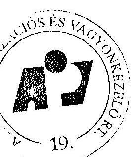

Budapest, 2003.04.07

aláírás

---

ÁPV Rt. kötelezettségeinek változása (2002. január 1 -december 31.) 5. sz. tanúsítvány V-04- /2003.

|  Normatív kötelezettségek | 2002.01.01-i nyitó |  |  | Növekedés |  | Csökkenés |  | 2002.12.31-i záró |  |   |
| --- |

 --- | --- | --- | --- | --- | --- | --- | --- | --- | --- |
|   | alap+ kamat | alap | korrekció | tárgyévi | korrekció | tárgyévi | alap | kamat | alap+ kamat |   |
|  PEH | 255 | 112 | 0 | 254 | 0 | 300 | 66 | 6 | 72 |   |
|  Önkormányzati járandóságok | 13 343 | 7 314 | 876 | 12 536 | 713 | 4 555 | 15 458 | 4 978 | 20 436 |   |
|  ebből Belterületi föld utáni járandóság | 11 562 | 5 711 | 246 | 2 428 | 300 | 4 442 | 3 643 | 4 399 | 8 042 |   |
|  ebből 1989. évi XIII. tv. szerint átalakult útrasz. | 4 030 | 1 630 | 3 | 2 224 | 0 | 797 | 3 060 | 3 927 | 6 987 |   |
|  1992. évi LIV. szerint átalakult útrasz. | 7 532 | 4 081 | 243 | 204 | 300 | 3 645 | 583 | 472 | 1 055 |   |
|  ebből Alapítói jog alapján járó járandóság | 1 781 | 1 603 | 630 | 0 | 413 | 113 | 1 707 | 579 | 2 286 |   |
|  ebből gázközmű vagyon utáni kötelezettség | 0 | 0 | 0 | 10 108 | 0 | 0 | 10 108 | 0 | 10 108 |   |
|  Villamosípari dolgozók járandósága | 3 525 | 3 525 | 0 | 27 | 0 | 1 207 | 2 345 | 0 | 2 345 |   |
|  Egyéb kötelezettség | 16 074 | 15 778 | 0 | 0 | 0 | 3 302 | 12 199 | 0 | 12 199 |   |
|  ebből bánatpénz+zállítók+saját vagy. szembeni köt. | 2 941 | 2 941 | 0 | 0 | 0 | 2 668 | 273 | 0 | 273 |   |
|  Priv. tartalékot terhelő egyéb köt. | 787 | 787 | 0 | 0 | 0 | 787 | 0 | 0 | 0 |   |
|  Be nem jegyzett tőkeemelés | 5 207 | 5 207 | 0 | 944 | 0 | 6 151 | 0 | 6 151 | 0 |   |
|  Egyéb rövid lejáratú köt. | 3 076 | 3 076 | 0 | 2 699 | 0 | 5 775 | 0 | 5 775 | 0 |   |
|  Osztalék | 231 | 231 | 0 | 0 | 0 | 231 | 0 | 0 | 0 |   |
|  Priv. Elők. Kapcs. Egyéb. Köt | 234 | 234 | 0 | 0 | 0 | 234 | 0 | 0 | 0 |   |
|  Gépjármű Felelősség Biztosítási Alappal szemben. | 3 398 | 3 302 | 0 | 0 | 0 | 3 302 | 0 | 0 | 0 |   |
|  Normatív kötelezettségek összesen: | 33 197 | 26 729 | 876 | 12 817 | 713 | 9 364 | 30 068 | 4 984 | 35 052 |   |
|  Függő kötelezettségek |  |  |  |  |  |  |  |  |  |   |
|  Privatizációs szerződésekből eredő garancia és szavatosság | 17 823 | 17 476 | 299 | 1 084 | 0 | 7 984 | 10 875 | 466 | 11 341 |   |
|  ebből jogszavatosság | 10 011 | 9 664 | 78 | 69 | 0 | 4 153 | 5 658 | 466 | 6 124 |   |
|  kereskedelmi szavatosság | 382 | 382 | 25 | 0 | 0 | 49 | 358 | 0 | 358 |   |
|  környezetvédelmi garancia | 6 780 | 6 780 | 196 | 1 015 | 0 | 3 782 | 4 209 | 0 | 4 209 |   |
|  vagyonkezeléshez kapcsolódó garancia | 630 | 630 | 0 | 0 | 0 | 0 | 630 | 0 | 630 |   |
|  Elvont vagyon utáni kezesség | 29 544 | 10 727 | 0 | 4 016 | 0 | 5 712 | 9 031 | 19 273 | 28 304 |   |
|  PEH | 1 690 | 539 | 0 | 0 | 0 | 447 | 92 | 188 | 280 |   |
|  Önkormányzati járandóságok | 10 734 | 7 428 | 0 | 0 | 0 | 0 | 4 721 | 3 321 | 8 042 |   |
|  ebből Belter. Föld. (1989. évi XIII. tv.) | 7 317 | 7 051 | 0 | 0 | 0 | 2 648 | 4 403 | 951 | 5 354 |   |
|  ebből Alapítói jog alapján járó járandóság | 3 417 | 377 | 0 | 0 | 0 | 59 | 318 | 2 370 | 2 688 |   |
|  Tőkepótlási kötelezettség (ÁPV Rt. társaságok) | 52 | 52 | 0 | 0 | 0 | 0 | 52 | 0 | 52 |   |
|  Reverzális levelek utáni kötelezettség | 15 546 | 15 546 | 0 | 0 | 0 | 3 350 | 12 196 | 0 | 12 196 |   |
|  Egyéb kötelezettségek | 500 | 500 | 0 | 0 | 0 | 0 | 500 | 0 | 500 |   |
|  Malév Rt. részvény visszavásárlás | 500 | 500 | 0 | 0 | 0 | 0 | 500 | 0 | 500 |   |
|  Függő kötelezettségek összesen: | 75 889 | 52 268 | 299 | 5 100 | 0 | 17 493 | 37 467 | 23 248 | 60 715 |   |
|  Mindösszesen: | 109 086 | 78 997 | 1 175 | 17 917 | 713 | 26 857 | 67 535 | 28 232 | 95 767 |   |
|  Budapest, 2003. |  |  |  |  |  |  |  |  |  |   |
|  2. 2. 2. |  |  |  |  |  |  |  |  |  |   |

---

Állami Privatizációs és Vagyonkezelő Rt.

Az ÁPV Rt. eszközállományának változása a 2002. évben (saját vagyon)
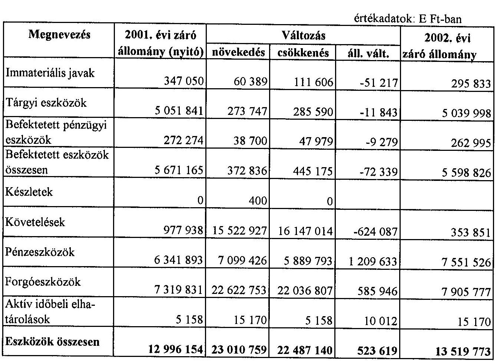

Budapest, 2003. április 7.
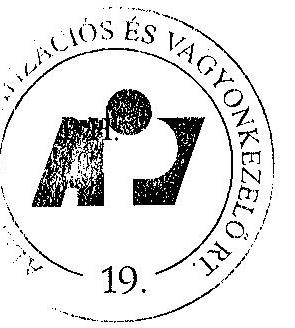

---

Állami Privatizációs és Vagyonkezelő Rt.

Az ÁPV Rt. forrásainak összetétele 2002. évben (saját vagyon)

| Megnevezés | 2001. évi záró állomány (nyitó) | Változás |  |  | 2002. évi záró állomány |
| :--: | :--: | :--: | :--: | :--: | :--: |
|  |  | növekedés | csökkenés | áll. vált. |  |
| Saját tőke | 12311205 | 755465 |  | 755465 | 13066670 |
| Céltartalék | 0 | 0 |  | 0 | 0 |
| Kötelezettségek | 629164 | 10303074 | 10525180 | $-222106$ | 407058 |
| Passzív időbeli elhatárolások | 55785 | 46045 | 55785 | $-9740$ | 46045 |
| Források összesen | 12996154 | 11104584 | 10580965 | 523619 | 13519773 |

Budapest, 2003. április 7.
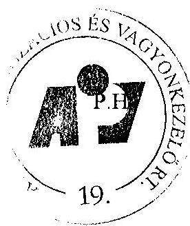

---

# Az ÁPV Rt. működéséhez kapcsolódó anyagjellegű ráfordítások alakulása 2002. évben 

|  |   |   |   |   |   |
| --- | --- | --- | --- | --- | --- |
|  Megnevezés | 2002. év |  |  |  | $\%$   Tervhez  |
|   |  | $\%$ | tény | tény $\%$ |   |
|  Energia | 97900 | 5,05 | 46527 | 3,26 | 47,53  |
|  Üzemanyag |  |  | 18878 | 1,32 |   |
|  Nyomtatvány, irodaszer | 48015 | 2,48 | 22697 | 1,59 | 47,27  |
|  Egyéb ki nem emelt anyag-   költség |  |  | 25846 | 1,81 |   |
|  1. Anyagköltség összesen | 145915 | 7,52 | 113948 | 7,99 | 78,09  |
|  Utazás- és szállásköltség | 38000 | 1,96 | 10692 | 0,75 | 28,14  |
|  Fenntartás, javítás és karbantartás | 149600 | 7,71 | 66527 | 4,67 | 44,47  |
|  Posta, telefon, futárszolgálat | 90750 | 4,68 | 57095 | 4,01 | 62,91  |
|  Székház fenntartás, üzemeltetés | 361130 | 18,62 | 338837 | 23,77 | 93,83  |
|  Egyéb ki nem emelt anyag-   jellegű szolgáltatás | 1117258 | 57,62 | 798512 | 56,02 | 71,47  |
|  2. Anyagjellegű szolgáltatás összesen | 1756738 | 90,59 | 1271663 | 89,21 | 72,39  |
|  3. Egyéb szolgáltatás | 36515 | 1,88 | 30580 | 2,15 | 83,75  |
|  4. Eladott (közvetített)   szolgáltatás |  |  | 9256 |  |   |
|  5. Anyagjellegű ráfordítások összesen $(1+2)$ | 1939168 | 100,00 | 1425447 | 100,00 | 73,51  |

Budapest, 2003. április 7.
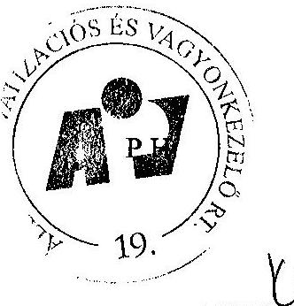
aláírás

---

Állami Privatizációs és Vagyonkezelő Rt.

Az ÁPV Rt. átlagos állományi létszámának alakulása 2002. évben

| Megnevezés | 2002. év |  | 

 | Telj. \%   tervhez |
| :--: | :--: | :--: | :--: | :--: |
|  | terv |  | tény |  |
| Teljes munkaidőben fogl. | 250 |  | 215 | 86,0 |
| Részmunkaidőben fogl. | 0 |  | 1 | 0,0 |
| Állományi létszám összesen | 250 |  | 216 | 86,4 |

Budapest, 2003. április 08.
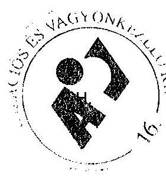
trizal
alárás

---

# Az APV Rt. Állományi létszámának alakulása 2002. évben 

létszámadatok: főben

| Megnevezés | 2002. XII. 31. |  |
| :--: | :--: | :--: |
|  | Státusz | Betöltött állás |
| Vezető* | $\because$ | 47 |
| Menedzser |  | 120 |
| Ügyintéző |  | 62 |
| Ügyviteli dolgozó |  | 0 |
| Fizikai dolgozó |  | 0 |
| Összesen | 250 | 229 |

* felsővezetők, ügyvezető igazgatók, és ügyvezető igazgató-helyettesek adatait tartalmazza.

Budapest, 2003. április 10.
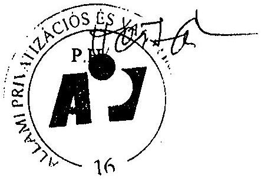

---

Állami Privatrizációs és Vagyonkezelő Rt.

# Az ÁPV Rt. működésével kapcsolatos személyi jellegű ráfordítások alakulása 2002. évben 

értékadatok: E Ft-ban

| Megnevezés | 2002. év |  |  |  | Telj. \%   tervhez |
| :--: | :--: | :--: | :--: | :--: | :--: |
|  | terv | \% | tény | \% |  |
| Bérköltség | 2012086 | 60,98 | 1663941 | 62,65 | 82,70 |
| ebből: jutalmak | 102000 | 3,09 | 87753 | 3,30 | 86,03 |
| Személyi jellegű kifizetések | 1287526 | 39,02 | 992159 | 37,35 | 77,06 |
| ebből: szerzői díjak |  | 0,00 |  | 0,00 | 0,00 |
| étkezési hozzájárulás | 8400 | 0,25 | 6288 | 0,24 | 74,86 |
| üdülési hozzájárulás | 19000 | 0,58 | 16593 | 0,62 | 86,03 |
| albérleti hozzájárulás | 1000 | 0,03 | 0 | 0,00 | 0,00 |
| utazási hozzájárulás | 5000 | 0,15 | 4067 | 0,15 | 81,34 |
| reprezentáció, üzleti ajándék | 35000 | 1,06 | 18723 | 0,70 | 53,49 |
| segélyek | 1000 | 0,03 | 1000 | 0,04 | 100,00 |
| gépjárműhasználati költség | 3000 | 0,09 | 1968 | 0,07 | 65,60 |
| belföldi napidíj | 500 | 0,02 | 25 | 0,00 | 5,00 |
| külföldi napidíj | 9000 | 0,27 | 1197 | 0,05 | 13,30 |
| betegszabadság | 25000 | 0,76 | 15861 | 0,60 | 63,44 |
| egyéb személyi jellegű kifiz. | 331656 | 10,05 | 242915 | 9,15 | 73,24 |
| munkáltatót terhelő táppénz | 10000 | 0,30 | 4073 | 0,15 | 40,73 |
| nyugdíjpénztári hozzájár. | 114740 | 3,48 | 99442 | 3,74 | 86,67 |
| dolgozók életbiztosítása | 0 | 0,00 | 0 | 0,00 | 0,00 |
| belső továbbképzés | 10000 | 0,30 | 1420 | 0,05 | 14,20 |
| egészségpénztári hozzájár. | 0 | 0,00 | 0 | 0,00 | 0,00 |
| munkaruha | 63230 | 1,92 | 51631 | 1,94 | 81,66 |
| társadalombizt. járulék | 651040 | 19,73 | 526956 | 19,84 | 80,94 |
| Személyi jellegű ráfordítások összesen | 3299652 | 100,0 | 2656100 | 100,0 | 80,50 |

Budapest, 2003. április 08.

---

Állami Privatizációs és Vagyonkezelő Rt.

# Az ÁPV Rt. munkavállalóinak 2002. évi beosztásonkénti átlagkeresete 

| Sorszám | Állománycsoport | 2002-évi átlagkereset   Ft/fő/hó |
| :--: | :-- | --: |
| 1 | Felsővezetők | 2330470 |
| 2 | Ügyvezetők | 1064307 |
| 3 | Ügyvezető igazgató-helyettesek | 722842 |
| 4 | Menedzserek | 456414 |
| 5 | Ügyintézők | 216838 |
| 6 | Ügyviteli alkalmazottak | 189267 |
| 7 | ÁPV Rt. összesen | 500113 |

Budapest, 2003. április 08.
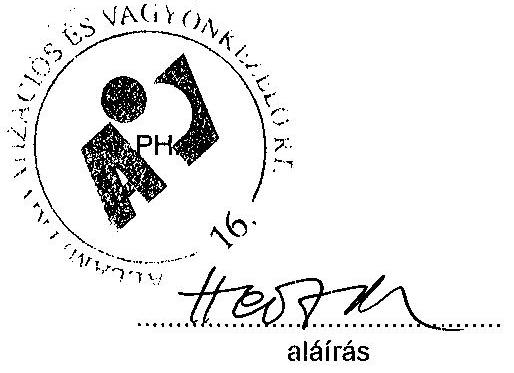

---

# A követelések állományának alakulása

|   | 2001. december 31 |  |  | 2002. december 31. |  |   |
| --- | --- | --- | --- | --- | --- | --- |
|   | Bruttó érték | Érték vesztés | Nettó érték | Bruttó érték | Érték vesztés | Nettó érték  |
|  Köv. áruszállításból és szolgáltatásból (vevők) | 1.512 | 986 | 526 | 1.365 | 1.216 | 149  |
|  Egyéb követelések |  |  |  |  |  |   |
|  Osztalékkövetelések | 899 | 394 | 505 | 2.094 | 2.091 | 3  |
|  Később száml. priv. bev. | 1.274 | 1.001 | 273 | 1.232 | 1.016 | 216  |
|  Végelsz., felsz. eredő tulajdonosi követelés | 458 | 441 | 17 | 439 | 439 | 0  |
|  HM-ingatlanokkal kapcsolatos követelések | 10.291 | 0 | 10.291 | 8.797 | 0 | 8.797  |
|  Rövid lejáratú tulajdonosi kölcsön | 3.865 | 1.175 | 2.690 | 4.415 | 4.315 | 100  |
|  Éven belüli reorganizációs hitel | 300 | 150 | 150 | 410 | 310 | 100  |
|  Válságkeretből adott visszatérítendő támogatás | 3.600 | 0 | 3.600 | 215 | 215 | 0  |
|  ÁFA követelés (bevall., még ki nem utalt) | 485 | 0 | 485 | 1.443 | 0 | 1.443  |
|  Követelés az önkormányzatoktól | 85 | 79 | 6 | 75 | 75 | 0  |
|  Adott előleg | 2.721 | 0 | 2.721 | 4331 | 0 | 4331  |
|  Saját vagyonnal szemben követelés | 242 | 0 | 242 | 0 | 0 | 0  |
|  Átutalt, be nem jegyzett tőkeemelés | 5.207 | 0 | 5.207 | 6151 | 0 | 6151  |
|  Egyéb követelések | 12.151 | 11.743 | 408 | 9.722 | 9.608 | 114  |
|  Egyéb követelések összesen | 41.578 | 14.983 | 26.595 | 39.324 | 18.069 | 21.255  |
|  Adott kölcsönök | 4.345 | 2.801 | 1.544 | 1.745 | 245 | 1.500  |
|  Később számlázandó követelések | 655 | 0 | 655 | 443 | 1 | 442  |
|  Privatizációs lízing hosszú lejáratú része | 50 | 0 | 50 | 28 | 2 | 26  |
|  KÖVETELÉSEK ÖSSZESEN | 48.140 | 18.770 | 29.370 | 42.905 | 19.533 | 23.372  |

Budapest, 2003. június 11.

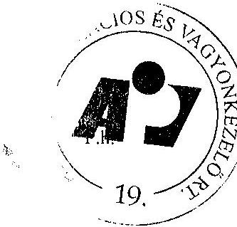

Kelló Istvánné ügyvezető igazgató

---

.

---

Az ÁPV Rt. hozzárendelt vagyonának többségi részesedései jegyzett tőke értéken (50 % felettiek)

az adatok a nyilvántartással egyezőek

|  Megnevezés | 2001 |  |  | 2002 |  |  |  |  |  |  |  |   |
| --- | --- | --- | --- | --- | --- | --- | --- | --- | --- | --- | --- | --- |
|   | Teljes | ÁPV Rt | Tulajdon | Teljes | ÁPV Rt | Tulajdon | Tartós |  |  | Változás 2002/2001 |  |   |
|   | MFt | % | MFt | MFt | % | MFt | % | MFt | % | MFt | Megnevezés |   |
|  Abaúji Charolais Rt | 208 | 95,82 | 199 | 208 | 95,82 | 199 | 75 | 156 | 0 | 0 |  |   |
|  Agria Volán Rt | 333 | 90,29 | 301 | 332 | 90,39 | 301 |  |  | 0,1 | 0 | bevonás |   |
|  Alba Volán Rt | 764 | 91,59 | 700 | 760 | 92,06 | 700 |  |  | 0,47 | 0 | bevonás |   |
|  Alcsiszigeti Mg.Rt | 581 | 94,13 | 547 | 731 | 95,59 | 699 |  |  | 1,46 | 152 | tőkeemelés, vásárlás |   |
|  Antenna Hungária Rt | 11875 | 83,71 | 9941 | 11875 | 78,71 | 9347 | 50 | 5938 | -5 | -594 | átadott |   |
|  Bábolna Rt | 12906 | 98,08 | 12658 | 12906 | 98,87 | 12761 |  |  | 0,79 | 103 | vásárlás |   |
|  Bács Volán Rt | 222 | 90 | 200 | 222 | 90,11 | 200 | 50 | 111 | 0,11 | 0 | bevonás |   |
|  Bácsalmási Agrár Rt | 1460 | 91,51 | 1337 | 1460 | 93,83 | 1371 |  |  | 2,32 | 34 | vásárlás |   |
|  Bakony Volán Rt | 380 | 90,1 | 343 | 380 | 90,26 | 343 | 50 | 190 | 0,16 | 0 | bevonás |   |
|  Balaton Volán Rt | 412 | 91,71 | 378 | 411 | 91,91 | 378 | 50 | 206 | 0,2 | 0 | bevonás |   |
|  Balatoni Halászat Rt | 633 | 94,53 | 598 | 633 | 95,1 | 602 | 75 | 475 | 0,57 | 4 | vásárlás |   |
|  Bólyi Mg.Rt | 3813 | 89,94 | 3429 | 3913 | 90,59 | 3545 | 75 | 2934 | 0,65 | 116 | tőkeemelés, vásárlás |   |
|  Borsod Volán Rt | 663 | 90,5 | 600 | 660 | 90,87 | 600 | 50 | 330 | 0,37 | 0 | bevonás |   |
|  Casa Kft | 0 | 0 | 0 | 12667 | 99,08 | 12550 |  |  | 99,08 | 12550 | vásárlás |   |
|  Dunaferr Rt | 19643 | 59,74 | 11735 | 19643 | 59,74 | 11735 |  |  | 0 | 0 |  |   |
|  Dunaferr Vámügyn.Kft | 0 | 0 | 0 |

 25 | 50,4 | 13 |  |  | 50,4 | 13 | vásárlás |   |
|  Enyingi Agrár Rt | 589 | 92,38 | 544 | 589 | 93,4 | 550 |  |  | 1,02 | 6 | vásárlás |   |
|  Fertő-tavi Rt | 261 | 95,44 | 249 | 261 | 96,03 | 250 | 75 | 195 | 0,59 | 1 | vásárlás |   |
|  Gemens Volán Rt | 492 | 91,53 | 450 | 485 | 92,69 | 450 | 50 | 243 | 1,16 | 0 | bevonás |   |
|  Hajdú Volán Rt | 737 | 90,9 | 670 | 734 | 91,25 | 670 | 50 | 367 | 0,36 | 0 | bevonás |   |
|  Hajógyári Sziget Kft | 3565 | 66,76 | 2380 | 3565 | 66,79 | 2361 |  |  | 0,03 | 1 | átvétel |   |
|  Hatvani Volán Rt | 105 | 90,91 | 95 | 105 | 91,16 | 95 | 50,01 | 52 | 0,25 | 0 | bevonás |   |
|  Helena Bt | 0 | 0 | 0 | 0,3 | 96,77 | 0,3 |  |  | 96,77 | 0,3 | átvétel |   |
|  Hitelgarancia Rt | 0 | 0 | 0 | 4811 | 50,02 | 2407 | 50,02 | 2407 | 50,02 | 2407 | átvett |   |
|  Hód Mezőgazd.Rt | 2222 | 94,23 | 2094 | 2572 | 95,79 | 2464 | 75 | 1929 | 1,56 | 370 | tőkeemelés, vásárlás |   |
|  Hungarpharma Rt | 6019 | 100 | 6019 | 6019 | 50 | 3009 | 0 | 0,01 | -50 | -3010 | értékesítés |   |
|  Hungexpo Vásár Rt | 3134 | 84 | 2632 | 3134 | 0 | 0,001 | 0 | 0,001 | -84 | -2632 | átadott |   |
|  Jászkun Volán Rt | 417 | 90,76 | 379 | 416 | 91,12 | 379 | 50 | 208 | 0,36 | 0 | bevonás |   |
|  Kapos Volán Rt | 519 | 90,2 | 469 | 519 | 90,3 | 469 | 50 | 260 | 0,1 | 0 | bevonás |   |
|  Kisaitold Volán Rt | 777 | 73,34 | 570 | 777 | 73,34 | 570 | 50 | 388 | 0 | 0 |  |   |
|  Komáromi Mg.Rt | 1268 | 93,15 | 1181 | 1417 | 94,93 | 1346 |  |  | 1,78 | 165 | tőkeemelés, vásárlás |   |
|  Körös Volán Rt | 322 | 91,55 | 295 | 320 | 92,1 | 295 | 50 | 160 | 0,55 | 0 | bevonás |   |
|  Kunság Volán Rt | 332 | 90,23 | 300 | 332 | 90,42 | 300 | 50,11 | 166 | 0,19 | 0 | bevonás |   |
|  MAFILM Befektetési Kft | 633 | 72,8 | 461 | 0 | 0 | 0 |  |  | -72,8 | -461 | összeolvadással megszünt |   |
|  MAFILM Rt | 446 | 48,63 | 217 | 590 | 86,03 | 508 |  |  | 37,4 | 291 | tőkeem., összeolvadás, idegen tőkeem. |   |
|  Magyar Villamos Művek Rt | 199687 | 99,87 | 199428 | 199687 | 99,87 | 199428 | 50 | 99843 | 0 | 0 |  |   |

1. oldal

2003.06.03

---

Az ÁPV Rt. hozzárendelt vagyonának többségi részesedései jegyzett tőke értéken (50 % felettiek)

az adatok a nyilvántartással egyezőek

|  Malév Rt | 11692 | 97,92 | 11449 | 11692 | 97,92 | 11449 | 25,01 | 2924 | 0 | 0 |  |   |
| --- | --- | --- | --- | --- | --- | --- | --- | --- | --- | --- | --- | --- |
|  Mátra Volán Rt | 226 | 86,72 | 196 | 225 | 87,1 | 196 | 50 | 112 | 0,38 | 0 | bevonás |   |
|  Ménesbirtok Rt | 2066 | 92,36 | 1909 | 2316 | 94,52 | 2189 |  |  | 2,16 | 280 | tőkeemelés, vásárlás |   |
|  Mese Cukrászda Bt | 17 | 99,07 | 17 | 17 | 99,07 | 17 |  |  | 0 | 0 |  |   |
|  MFB Üzletrészhaszn.Kft | 0 | 0 | 0 | 21403 | 99,9 | 21403 |  |  | 99,9 | 21403 | vásárlás |   |
|  Nógrád Volán Rt | 338 | 90,44 | 306 | 338 | 90,62 | 306 | 50 | 169 | 0,18 | 0 | bevonás |   |
|  Pannon Volán Rt | 839 | 90,82 | 762 | 837 | 90,96 | 762 | 50 | 419 | 0,14 | 0 | bevonás |   |
|  Rehab Rt | 690 | 50 | 345 | 690 | 50 | 345 | 50 | 345 | 0 | 0 |  |   |
|  Reorg Rt | 40 | 99,9 | 40 | 40 | 99,9 | 40 | 50 | 20 | 0 | 0 |  |   |
|  Somló Volán Rt | 431 | 90,36 | 389 | 430 | 90,66 | 389 | 50 | 215 | 0,3 | 0 | bevonás |   |
|  Szabolcs Volán Rt | 464 | 90 | 418 | 464 | 90 | 418 | 50 | 232 | 0 | 0 |  |   |
|  Szerencsi Mg.Rt | 822 | 94,15 | 774 | 822 | 94,57 | 777 |  |  | 0,42 | 3 | vásárlás |   |
|  TESCO Kft | 250 | 76,07 | 189 | 250 | 76,37 | 190 | 25 | 63 | 0,3 | 1 | vásárlás |   |
|  Tisza Cipő Rt | 904 | 78,46 | 710 | 879 | 80,73 | 710 |  |  | 2,27 | 0 | tőkeemelés |   |
|  Tisza Volán Rt | 716 | 94,12 | 674 | 714 | 94,48 | 674 | 50 | 357 | 0,36 | 0 | bevonás |   |
|  Vasi Volán Rt | 446 | 90,38 | 403 | 445 | 90,52 | 403 | 50 | 222 | 0,14 | 0 | bevonás |   |
|  Vértes Volán Rt | 464 | 92,59 | 430 | 464 | 92,6 | 430 | 50 | 232 | 0,01 | 0 | bevonás |   |
|  Zala Volán Rt | 883 | 91,23 | 806 | 883 | 91,23 | 806 | 50 | 442 | 0 | 0 |  |   |
|  Összesen: | 296706 | 4312,92 | 281216 | 336068,3 | 4556,5 | 312419,3 | 1725,15 | 122310 | 243,58 | 31203,3 |  |   |

Budapest, 2003.06.03.

2. oldal

2003.06.03

Kellő Istvánné ügvezető igazgató

18

---

Az ÁPV Rt. hozzárendelt vagyonának kisebbségi részesedései jegyzett tőke értéken (50% alatt) az adatok a nyilvántartással egyezőek (MFt)

|  Megnevezés | 2001 |  |  |  | 2002 |  |  |  |  |   |
| --- | --- | --- | --- | --- | --- | --- | --- | --- | --- | --- |
|   | Teljes | ÁPV Rt | tulajdon | Teljes | ÁPV Rt | tulajdon | tartós |  | Változás 2002/2001 |   |
|   | MFt | % | MFt | MFt | % | MFt | % | MFt | % | MFt  |
|  AES Tisza Erőmű Kft | 18068 | 0 | 0,5 | 18068 | 0 | 0,5 |  |  | 0 | 0  |
|  Agro M Rt | 533 | 0,37 | 2 | 533 | 0,37 | 2 |  |  | 0 | 0  |
|  Agro Summa Rt | 22 | 25,01 | 5 | 22 | 25,01 | 5 |  |  | 0 | 0  |
|  Agroprodukt Rt | 870 | 0 | 0,01 | 870 | 0 | 0,01 |  |  | 0 | 0  |
|  Alföldi Nyomda Rt | 370 | 2,55 | 9 | 370 | 2,55 | 9 |  |  | 0 | 0  |
|  Ankerbrot Rt | 0 | 0 | 0 | 272 | 43,16 | 118 |  |  | 43,16 | 118  |
|  Borászati Kft | 0 | 0 | 0 | 573 | 22,92 | 200 |  |  | 22,92 | 200  |
|  Bácska Agrár Rt | 452 | 1,97 | 9 | 452 | 1,97 | 9 |  |  | 0 | 0  |
|  BB Borgazdaság Rt | 2620 | 0 | 0,01 | 2620 | 0 | 0,01 |  |  | 0 | 0  |
|  CO Hungary Rt* | 2905 | 0,1 | 0,01 | 80 | 0,1 | 0,01 | 0,1 | 0,01 | 0 |

 0  |
|  D&M Kft | 3000 | 30 | 0,9 | 3 | 30 | 0,9 |  |  | 0 | 0  |
|  Dalmandi Mg Rt | 2357 | 0 | 0,01 | 2357 | 0 | 0,01 |  |  | 0 | 0  |
|  Dél-Pesti Mezőgazd.Rt | 1511 | 0 | 0,01 | 1511 | 0 | 0,01 |  |  | 0 | 0  |
|  Dohányfermentáló Rt | 1031 | 2,42 | 25 | 0 | 0 | 0 |  |  | -2,42 | -25  |
|  Egyesült Vegyiművek Rt | 669 | 0,16 | 1 | 836 | 0,12 | 1 |  |  | -0,04 | 0  |
|  Budapesti Elektromos Rt | 60744 | 0,1 | 61 | 60744 | 0,1 | 61 |  |  | 0 | 0  |
|  EMASZ Rt | 30504 | 0 | 1 | 30504 | 0 | 1 |  |  | 0 | 0  |
|  Finomhengermű Munkás Kft | 339 | 22,07 | 75 | 339 | 22,07 | 75 |  |  | 0 | 0  |
|  Forte Fotokémia Rt | 1077 | 3,66 | 39 | 1077 | 3,66 | 39 |  |  | 0 | 0  |
|  Földhitel és Jelzálogbank Rt | 0 | 0 | 0 | 4100 | 35,37 | 1450 |  |  | 35,37 | 1450  |
|  Gödöllői Tangazdaság Rt | 660 | 0 | 0,01 | 660 | 0 | 0,01 |  |  | 0 | 0  |
|  Győri Építő Rt | 918 | 10 | 92 | 918 | 10 | 92 |  |  | 0 | 0  |
|  Herendi Porcelánmanuf.Rt | 1207 | 25 | 301,7 | 1207 | 25 | 301,7 | 25 | 301,7 | 0 | 0  |
|  Herz Szalámigyár Rt* | 1000 | 0 | 0,01 | 1000 | 0 | 0,01 | 0 | 0,01 | 0 | 0  |
|  Hidasháti Mez.Rt | 502 | 0 | 0,01 | 502 | 0 | 0,01 |  |  | 0 | 0  |
|  Hungaroring Rt | 0 | 0 | 0 | 1286 | 2,33 | 30 |  |  | 2,33 | 30  |
|  Hungexpo Rt* | 3134 | 84 | 2632 | 3134 | 0 | 0,001 | 0 | 0,001 | -84 | -2632  |
|  Hungaropharma Rt* | 6019 | 100 | 6019 | 6019 | 50 | 3009 | 0 | 0,01 | -50 | -3010  |
|  Herceghalmi Kísérleti Gazd.Rt | 493 | 0 | 0,01 | 493 | 0 | 0,01 |  |  | 0 | 0  |
|  Jelszó Kft | 10 | 4,1 | 0,4 | 10 | 4,1 | 0,4 |  |  | 0 | 0  |
|  Kalocsai Fűszerp.Rt* | 1015 | 0 | 0,001 | 1015 | 0 | 0,001 | 0 | 0,001 | 0 | 0  |
|  Kontúr Rt | 0 | 0 | 0 | 883 | 43,05 | 380 |  |  | 43,05 | 380  |
|  La Prima Kft | 12 | 5 | 0,6 | 4 | 5 | 0,2 |  |  | 0 | -0,4  |
|  Hungaroton Music Rt | 127 | 0,79 | 1 | 127 | 0,79 | 1 |  |  | 0 | 0  |
|  Lajta Hanság Rt | 1542 | 0 | 0,01 | 1542 | 0 | 0,01 |  |  | 0 | 0  |
|  MÁFILM Rt | 446 | 48,63 | 217 | 590 | 86,03 | 508 |  |  | 37,4 | 291  |

---

Az ÁPV Rt. hozzárendelt vagyonának kisebbségi részesedései jegyzett tőke értéken (50 % alattiak)

az adatok a nyilvántartással egyezőek

|  Matáv Rt | 103791 | 0,01 | 9 | 0 | 0 | 0 | -0,01 | -9 | értékesítés  |
| --- | --- | --- | --- | --- | --- | --- | --- | --- | --- |
|  Metalloglobus Rt | 2067 | 0 | 0,1 | 2067 | 0 | 0,1 | 0 | 0 | 0  |
|  Mezőfalvai Mg.Rt | 1107 | 0 | 0,01 | 1107 | 0 | 0,01 | 0 | 0 | 0  |
|  MITT Rt | 0 | 0 | 0 | 350 | 7,78 | 27 | 7,78 | 27 | vásárlás  |
|  MOL Rt | 98400 | 25 | 24600 | 98400 | 25 | 24600 | 0 | 0,001 | 0  |
|  Muzeális Borforgalm.Kft | 0 | 0 | 0 | 204 | 32,02 | 65 | 32,02 | 65 | vásárlás  |
|  OTP Bank Rt* | 28000 | 0,04 | 11,9 | 28000 | 0 | 0,001 | 0 | 0,001 | -0,04  |
|  Pécsi Építő és Tatarozó Rt | 72 | 12,96 | 9 | 72 | 12,96 | 9 | 0 | 0 | 0  |
|  Pécsi Mg.Rt | 278 | 9,73 | 27 | 278 | 9,73 | 27 | 0 | 0 | 0  |
|  Pick Szeged Rt* | 3529 | 0 | 0,001 | 3268 | 0 | 0,001 | 0 | 0,001 | 0  |
|  Pillér 2 Alap | 2000 | 0,05 | 1 | 2000 | 0,05 | 1 | 0 | 0 | 0  |
|  Postabank Rt | 20021 | 3,21 | 642 | 2021 | 3,21 | 642 | 0 | 0 | 0  |
|  Rédkakas Kft | 35 | 5,66 | 2 | 35 | 5,66 | 2 | 0 | 0 | 0  |
|  Richter Gedeon Rt | 18637 | 25,16 | 4688 | 18637 | 25,16 | 4688 | 0 | 0 | 0  |
|  Sárvári Mezőgazd.Rt | 455 | 0 | 0,01 | 455 | 0 | 0,01 | 0 | 0 | 0  |
|  Statiqum Kiadó Kft | 232 | 10 | 23 | 0 | 0 | 0 | -10 | -23 | értékesítés  |
|  Szarvási Agrár Rt | 852 | 0 | 0,01 | 852 | 0 | 0,01 | 0 | 0 | 0  |
|  Szombathelyi Tangazdaság Rt | 806 | 0 | 0,01 | 806 | 0 | 0,01 | 0 | 0 | 0  |
|  Tiszai Vegyiművek Rt | 1553 | 15 | 233 | 0 | 0 | 0 | -15 | -233 | értékesítés  |
|  Titász Rt | 34158 | 0 | 0,1 | 34158 | 0 | 0,1 | 0 | 0 | 0  |
|  Törökszentmiklósi Mg.Rt | 974 | 0 | 0,01 | 974 | 0 | 0,01 | 0 | 0 | 0  |
|  Transelektro Rt | 0 | 0 | 0 | 846 | 0,24 | 2 | 0,24 | 2 | fellelt  |
|  V.H.J. Villamos Kft | 70 | 15 | 10 | 70 | 15 | 10 | 0 | 0 | 0  |
|  Vértesi Erőmű Rt | 27968 | 29,96 | 8379 | 27968 | 29,96 | 8379 | 0 | 0 | 0  |
|  Villért Vállalat Rt | 1000 | 4,5 | 45 | 552 | 4,89 | 27 | 0,39 | -18 | tökéleszáll  |
|  Zala Bútorgyár Rt | 0 | 0 | 0 | 590 | 21,1 | 124 | 21,1 | 124 | vásárlás  |
|  Zalaegerszegi Agrár Kft | 725 | 7,47 | 54 | 725 | 7,47 | 54 | 0 | 0 | 0  |
|  Zsolnay Porcelángyár Rt* | 670 | 0 | 0,006 | 670 | 0 | 0,006 | 0 | 0,006 | 0  |
|  Zsolnay Porcelánman. Rt | 500 | 0 | 0,01 | 1141 | 0 | 0,01 | 0 | 0 | 0  |
|  Összesen: | 492057 | 529,68 | 48226,37 | 370967 | 613,93 | 44951,07 | 25,1 | 301,741 | 84,25  |

- 1 db aranyrészvénnyel rendelkezik

Budapest, 2003. Június 03.

2. oldal

2003.06.04

---

Állami Privatizációs és Vagyonkezelő Rt
2002. évi ÁSZ-beszámoló és auditált beszámoló közötti főbb különbségek levezetése

# Hozzárendelt vagyon 

|  | ÁSZ beszámoló   adatai | Végleges beszámoló | Eltérés |
| :-- | --: | --: | --: |
| Bevételek | 20.967 | 20.961 | -6 |
| Kiadások | 24.491 | 24.485 | -6 |

Jelentős eltérések magyarázata: A Pannonfilm Kft. részére folyósított előleg ÁFA tartalma (6 MFt) az ÁSZ beszámoló elkészítésekor a privatizációval és vagyonkezeléssel kapcsolatos reorg. célú kifizetések költségeként lett elszámolva. A végleges beszámoló elkészítésekor, az egyeztetések során feltárt téves könyvelés helyesbítéseként a kiadások közül kikerült 6MFt, ugyanakkor az egyéb bevételek között szereplő ÁFA egyenleg változása miatt a bevételek szintén csökkentésre kerültek 6 MFt-tal.

## Privatizációs tartalék

|  | ÁSZ beszámoló   adatai | Végleges beszámoló | Eltérés |
| :-- | --: | --: | --: |
| Bevételek | 66.094 | 76.243 | 10.149 |

Jelentős eltérések magyarázata: A gázközmű kötelezettségek fedezetére kapott államkötvények értéke bekerült a privatizációs tartalék bevételei közé 10.149 MFt-os összegben.

## Vagyonváltozás

|  | ÁSZ beszámoló   adatai | Végleges beszámoló | Eltérés |
| :-- | --: | --: | --: |
| 4/a

 vagyontábla sorai   1-6-ig | 829.601 | 829.605 | 4 |
| Követelések | 23.372 | 23.486 | 114 |
| Kötelezettségek | 95.767 | 114.264 | 18.497 |
| Hozzárendelt vagyon   összesen | 757.206 | 738.827 | 18.379 |

Jelentős eltérések magyarázata:
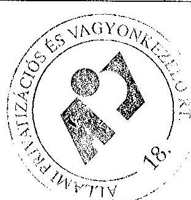

---

A 4/a vagyontábla 1-6 sorainak 4 MFt-os változását a Tisza Cipő Rt. részvénybevonása okozta, mely tranzakció cégbírósági bejegyzéséről az ÁSZ beszámoló után szereztünk tudomást.

Az 1.sz. tanúsítványban szereplő követelések és kötelezettségek változásának részletezése levezethető a külön tanúsítványban szereplő „Követelések állományának alakulása" táblázat (13.sz. tanúsítvány) és az „ÁPV Rt. kötelezettségeinek változása" táblázat (5. sz. tanúsítvány) változásaiból az alábbiak szerint: (Megjegyzés: a kötelezettségek változásaként kimutatott összegek részletezésénél jelentkező egy millió Ft-os eltérés kerekítésből adódik.)

# Követelés változás 

| (millió Ft) |  |  |  |  |  |  |  |  |  |
| :--: | :--: | :--: | :--: | :--: | :--: | :--: | :--: | :--: | :--: |
|  | ÁSZ beszámoló adatai |  |  | Végleges beszámoló |  |  | Eltérés |  |  |
|  | 2002. december 31. |  |  | 2002. december 31. |  |  | 2002. december 31. |  |  |
|  | Bruttó érték | Értékvesztés | Nettó érték | Bruttó érték | Értékvesztés | Nettó érték | Bruttó érték | Értékvesztés | Nettó érték |
| Követelések áruszállításból és szolgáltatásból (vevők) | 1.365 | 1.216 | 149 | 1.216 | 1.063 | 153 | -149 | -153 | 4 |
| Egyéb követelések |  |  |  |  |  |  |  |  |  |
| Később számlázandó privatizációs bevételek | 1.232 | 1.016 | 216 | 478 | 262 | 216 | -754 | -754 | 0 |
| Rövid lejáratú tulajdonosi kölcsön | 4.415 | 4.315 | 100 | 4.415 | 4.235 | 180 | 0 | -80 | 80 |
| ÁFA követelés (bevallatott, még ki nem utalt) | 1.443 | 0 | 1.443 | 1.449 | 0 | 1.449 | 6 | 0 | 6 |
| Adott előleg | 4.331 | 0 | 4.331 | 4.354 | 0 | 4.354 | 23 | 0 | 23 |
| Egyéb követelések | 9.722 | 9.608 | 114 | 10.626 | 10.511 | 115 | 904 | 903 | 1 |
| Összesen | 22.508 | 16.155 | 6.353 | 22.538 | 16.071 | 6.467 | 30 | -84 | 114 |

Jelentős eltérések magyarázata:

- Vevők:

Bruttó érték változása:
Az Air-Service Rt. F.A. -val szembeni követelés átsorolása egyéb követelések közé

- 149 MFt

Értékvesztés változása:
A mérlegkészítésig befolyt összegek utáni, korábban a követelésre elszámolt értékvesztés visszaírása

- 302 MFt

Az Air-Service Rt. F.A. -val szembeni követelésre elszámolt értékvesztés átsorolása egyéb követelések közé:

149 MFt

- Később számlázandó privatizációs bevételek közül a végleges beszámolóban átsorolásra került az Air-Service Rt. F.A. tartozása az egyéb követelések közé, melynek teljes összegére értékvesztés került elszámolásra
- 754 MFt
- Rövid lejáratú tulajdonosi kölcsön: Fégarmy Kft. V.A. részére nyújtott kölcsön értékvesztése a kölcsön követelés értékesítése miatt visszaírásra került 80 MFt
- ÁFA követelés: Pannonfilm Kft. részére folyósított előleg ÁFA tartalma 6 MFt
- Egyéb követelések

Az Air-Service Rt. F.A. -val szembeni követelés átsorolása a vevői követelések közül
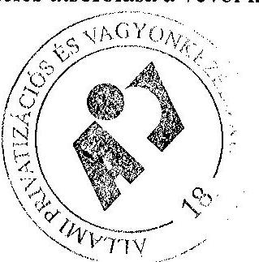

---

Az Air-Service Rt. F.A. -val szembeni követelés átsorolása a később számlázandó követelések közül
(az 1 MFt-os eltérés kerekítésből adódik)

# Kötelezettség változás 

|  | ÁSZ beszámoló   adatai | Végleges beszámoló | Eltérés |
| :-- | --: | --: | --: |
| Normatív   kötelezettségek | 35.052 | 52.399 | 17.347 |
| Függő kötelezettségek | 60.715 | 61.866 | 1.151 |
| Összesen: | 95.767 | 114.265 | 18.498 |

A normatív kötelezettségek változását okozó tényezők:

- Önkormányzati járandóság miatti kötelezettség növekedés: 147 MFt
- Osztalék előleg miatti kötelezettség megszünése: - 2.800 MFt
- MFB-től CASA Kft. és MFB Üzletrészhasznosító Kft. megvásárlása miatti kötelezettség növekedés
- 20.000 MFt

A függő kötelezettségek változását okozó tényezők:

- Garancia és szavatosság
- 231 MFt
- Elvont vagyon utáni kezesség 738 MFt
- PEH miatti kötelezettség 470 MFt
- Önkormányzati járandóságok miatti kötelezettség 142 MFt
- Tőkepótlási kötelezettség 32 MFt

---

Állami Privatizációs és Vagyonkezelő Rt
2002. évi ÁSZ-beszámoló és auditált beszámoló közötti főbb különbségek levezetése

Az ÁPV Rt. eszközállományának változása a 2002. évben (saját vagyon)
(ezer Ft)

|  | ÁSZ beszámoló   adatai | Végleges beszámoló | Eltérés |
| :-- | --: | --: | --: |
| Immateriális javak | 295833 | 295833 | 0 |
| Tárgyi eszközök | 5039998 | 5039997 | -1 |
| Befektetett pénzügyi   eszközök | 262995 | 262995 | 0 |
| Befektetett eszközök   összesen | 5598826 | 5598825 | -1 |
| Készletek | 400 | 400 | 0 |
| Követelések | 353851 | 379697 | +25846 |
| Pénzeszközök | 7551526 | 7551526 | 0 |
| Forgóeszközök | 7905777 | 7931623 | +25846 |
| Aktív időbeli elhatá-   rolások | 15170 | 15170 | 0 |
| Eszközök összesen | 13519773 | 13545618 | +25845 |

Jelentős eltérések magyarázata:
a 6049 eFt szakképzési hozzájárulás átcsoportosításra került a mérlegben kötelezettség csökkenésből, követelés növelésre
a 19797 e Ft PRIV-DAT Kft-nek fizetett előleg ki lett véve költségből és át lett csoportosítva előlegre.

---

Állami Privatizációs és Vagyonkezelő Rt
2002. évi ÁSZ-beszámoló és auditált beszámoló közötti főbb különbségek levezetése

Az ÁPV Rt. forrásainak összetétele 2002. évben (saját vagyon)
(ezer Ft)

|  | ÁSZ beszámoló   adatai | Végleges beszámoló | Eltérés |
| :-- | --: | --: | --: |
| Saját tőke | 13066670 | 13086306 | +19636 |
| Céltartalék | 0 | 0 | 0 |
| Kötelezettségek | 407058 | 413179 | +6121 |
| Passzív időbeli elhatá-   rolások | 46045 | 46133 | +88 |
| Források összesen | $\mathbf{1 3 5 1 9 7 7 3}$ | $\mathbf{1 3 5 4 5 6 1 8}$ | $\mathbf{+ 2 5 8 4 5}$ |

Jelentős eltérések magyarázata:

- a saját tőke változása az eredmény változásából ered
- 6049 eFt szakképzési hozzájárulás átcsoportosításra került a mérlegben kötelezettség csökkenésből, követelés növelésre
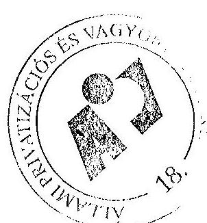

---

Állami Privatizációs és Vagyonkezelő Rt
2002. évi ÁSZ-beszámoló és auditált beszámoló közötti főbb különbségek levezetése

Az ÁPV Rt működéséhez kapcsolódó anyagjellegű ráfordítások alakulása 2002. évben
(ezer Ft)

|  | ÁSZ beszámoló adatai | Végleges beszámoló | Eltérés |
| :--: | :--: | :--: | :--: |
| Energia | 46527 | 46527 | 0 |
| Üzemanyag | 18878 | 18878 | 0 |
| Nyomtatvány, irodaszer | 22697 | 22697 | 0 |
| Egyéb ki nem emelt anyagköltség | 25846 | 25846 | 0 |
| 1. Anyagköltség összesen | 113948 | 113948 | 0 |
| Utazás és szállásköltség | 10692 | 10962 | +270 |
| Fenntartás, javítás és karbantartás | 66527 | 66527 | 0 |
| Posta, telefon, futárszolgálat | 57095 | 57094 | -1 |
| Székház fenntartás, üzemeltetés | 338837 | 338837 | 0 |
| Egyéb ki nem emelt anyagjellegű szolgált. | 798512 | 778649 | -19863 |
| 2. Anyagjellegű szolgáltatás összesen | 1271663 | 1252069 | -19594 |
| 3. Egyéb szolgáltatás | 30580 | 30580 | 0 |
| 4. Eladott (közvetített) szolgáltatás | 9256 | 9256 | 0 |
| 5. Anyagjellegű ráfordítások összesen (1+2) | 1425447 | 1405853 | -19594 |

Jelentős eltérések magyarázata:
a 19797 e Ft PRIV-DAT Kft-nek fizetett előleg ki lett véve költségből és át lett csoportosítva előlegre.

---

Állami Privatizációs és Vagyonkezelő Rt 2002. évi ÁSZ-beszámoló és auditált beszámoló közötti főbb különbségek levezetése

# Az ÁPV Rt működésével kapcsolatos személyi jellegű ráfordítások alakulása 2002. évben

|   | ÁSZ beszámoló adatai | Végleges beszámoló | Eltérés  |
| --- | --- | --- | --- |
|  Bérköltség | 1663941 | 1663941 | 0  |
|  ebből: Jutalmak | 87753 | 87753 | 0  |
|  Személyi jellegű kifizetések | 371284 | 371242 | -42  |
|  ebből: szerzői díjak | 0 | 0 | 0  |
|  étkezési hozzájárulás | 6288 | 6288 | 0  |
|  üdülési hozzájárulás | 16593 | 16593 | 0  |
|  albérleti hozzájárulás | 0 | 0 | 0  |
|  utazási hozzájárulás | 4067 | 4067 | 0  |
|  reprezentáció | 10270 | 10265 | -5  |
|  segélyek | 1000 | 1000 | 0  |
|  gépjárműhasználati költség | 1968 | 1968 | 0  |
|  belföldi napidíj | 25 | 25 | 0  |
|  külföldi napidíj | 1197 | 1197 | 0  |
|  betegszabadság | 15861 | 15861 | 0  |
|  egyéb személyi jell. kifiz. | 102652 | 102615 | -37  |
|  táppénz | 4073 | 4073 | 0  |
|  nyugdíjpénztári hozzájár. | 99442 | 99442 | 0  |
|  dolgozók életbiztosítása | 0 | 0 | 0  |
|  oktatás, továbbképzés | 1420 | 1420 | 0  |
|  egészségpénztári hozzájárulás | 0 | 0 | 0  |
|  munkaruha | 51631 | 51631 | 0  |
|  SZJA | 54797 | 54797 | 0  |
|  Bérjárulékok | 620916 | 620916 | 0  |
|  Személyi jellegű ráfordítások összesen | 2656141 | 2656099 | -42  |

---

Jelentős eltérések magyarázata:
a az egyéb személyi jellegű kifizetések változását a nyelvtudás megszerzésének támogatása 109 eFt-os csökkenése és a művelődési intézményi támogatás 72 eFt-os növekedése eredményezte
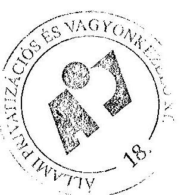

