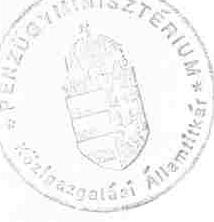
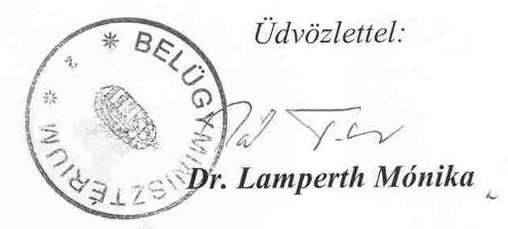
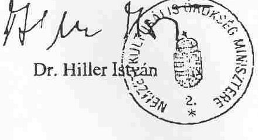
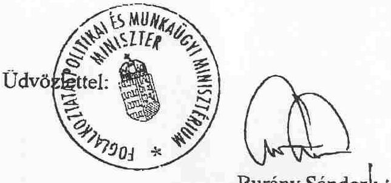

# JELENTÉS 

a kötött felhasználású támogatások 2002. évi felhasználásának ellenőrzéséről

---

# 3. Önkormányzati és Területi Ellenőrzési Igazgatóság 

3.3. Átfogó Ellenőrzések Főcsoport

Iktatószám: V-1005-48/2003.
Témaszám: 652
Vizsgálat-azonosító szám: V-0076

## Az ellenőrzést felügyelte:

Dr. Lóránt Zoltán
főigazgató
Az ellenőrzés végrehajtásáért felelős:
Németh Péterné
főcsoportfőnök

## Az ellenőrzést vezette:

Németh Gábor
osztályvezető
A számvevői jelentések feldolgozásában és a jelentés összeállításában közreműködtek:

Ambrus Lajos
tanácsadó
Borbély Zsuzsanna
számvevő tanácsos
dr. Pál Lehelné
számvevő tanácsos
Az ellenőrzést végezték:

| Ambrus Lajos <br> tanácsadó | Kerezsi Pál <br> számvevő tanácsos | Nagy János <br> számvevő tanácsos |
| :-- | :-- | :-- |
| Baloghné Dakó Eszter <br> számvevő | Kersmájer Ágota <br> számvevő tanácsos | Nyikon Zsigmondné <br> számvevő |
| Benn Imréné <br> számvevő tanácsos | Keszthelyi Zoltán <br> számvevő | dr. Pál Lehelné <br> számvevő tanácsos |
| Borbély Zsuzsanna <br> számvevő tanácsos | dr. Klapcsik László <br> számvevő tanácsos | Reichert Margit <br> számvevő |
| dr. Csapó Anna <br> tanácsadó | Koltay Zsoltné <br> számvevő | Ritecz Tibor <br> számvevő |
| Csényi István <br> számvevő | Kopaczné Horváth <br> Zuzsanna <br> számvevő tanácsos | dr. Telkes Imre <br> számvevő tanácsos |
| Dér Lívia <br> számvevő tanácsos | Koronczai Sándorné <br> számvevő tanácsos | Tormáné Ivánfi Irén <br> számvevő tanácsos |

Jelentéseink az Országgyűlés számítógépes hálózatán és az Interneten a www.asz.hu címen is olvashatók.

---

| Ébner Vilmosné számvevő tanácsos | dr. Lacó Bálintné főtanácsadó | dr. Tóth András számvevő tanácsos |
| :--: | :--: | :--: |
| Fórián Erika számvevő tanácsos | Maczekó Károly számvevő tanácsos | Újvári Józsefné számvevő |
| Harsányi Imréné számvevő | Major Lászlóné számvevő tanácsos | Varga József számvevő tanácsos |
| Huszár Sándorné számvevő tanácsos | Maróti Sándor számvevő tanácsos | Vojcsekné Szabó Ágnes számvevő tanácsos |
| Hütter Erzsébet számvevő | Nagy Attila számvevő | Zeke József számvevő tanácsos |

# A témához kapcsolódó eddig készített számvevőszéki jelentések: 

címe
sorszáma
A helyi önkormányzatok által igényelhető 1996. évi központosított előirányzatok felhasználásának ellenőrzése
A helyi önkormányzatok által igényelhető 1997. évi központosított előirányzatok felhasználásának ellenőrzése
A helyi önkormányzatok által igényelhető 1998. évi központosított előirányzatok felhasználásának ellenőrzése
A kötött felhasználású és a működési forráshiányra biztosított 0122 önkormányzati támogatások igénylésének és felhasználásának ellenőrzése
A kötött felhasználású önkormányzati támogatások igénylésének 0234 és felhasználásának ellenőrzéséről

---

# TARTALOMJEGYZÉK 

BEVEZETÉS ..... 5
I. ÖSSZEGZŐ MEGÁLLAPÍTÁSOK, KÖVETKEZTETÉSEK, JAVASLATOK ..... 7
II. RÉSZLETES MEGÁLLAPÍTÁSOK ..... 15

1. A központosított előirányzatok változása és azok felhasználása ..... 15
1.1. A lakossági közműfejlesztés támogatása ..... 16
1.2. Könyvtári és közművelődési érdekeltségnövelő támogatás ..... 20
1.2.1. Könyvtári érdekeltségnövelő támogatás ..... 21
1.2.2. Közművelődési érdekeltségnövelő támogatás ..... 23
1.3. Hozzájárulás létszámcsökkentéssel kapcsolatos kiadásokhoz ..... 26
1.4. Hozzájárulás a könyvvizsgálatra kötelezett helyi önkormányzatok számára ..... 32
1.5. Önkormányzati kincstárak támogatása ..... 33
1.6. Települési szilárd hulladék közszolgáltatás fejlesztésének támogatása ..... 35
2. egyes jövedelempótló támogatások kiegészítése és az önkormányzat által szervezett közcélú foglalkoztatás támogatása ..... 40
2.1. Az egyes jövedelempótló támogatások kiegészítése ..... 41
2.1.1. Kiegészítő családi pótlék ..... 42
2.1.2. Időskorúak járadéka ..... 46
2.1.3. Rendszeres szociális segély ..... 49
2.1.4. Személyes szabadságukban korlátozottak kárpótlása ..... 54
2.2. Közcélú foglalkoztatás támogatása ..... 54

---

# MELLÉKLETEK 

1. számú melléklet A helyi önkormányzatok 2002. évi központosított előirányzatainak teljesítése
2. számú melléklet A helyi önkormányzatokat megillető normatív, kötött felhasználású támogatások előirányzatainak és pénzforgalmi teljesítésének alakulása 2002. évben
3. számú melléklet A helyi önkormányzatoknál az ellenőrzés során feltárt eltérések jogcímek szerinti részletezése
4. számú melléklet A központosított előirányzatok 2002. évi felhasználásának elszámolása az ellenőrzött önkormányzatoknál
5. számú melléklet A szociális ellátásokkal kapcsolatos egyéb támogatások 2002. évi felhasználásának elszámolása az ellenőrzött önkormányzatoknál
6. számú melléklet A létszámcsökkentéssel kapcsolatos kiadásokhoz biztosított hozzájárulás alakulása 1997-2002. években
7. számú melléklet A települési szilárdhulladék pályázat legfontosabb adatai 20012002. években

## FÜGGELÉKEK

1. számú függelék Ellenőrzött önkormányzatok (4 oldal)

---

# RÖVIDÍTÉSEK JEGYZÉKE 

| Áht. | Az államháztartásról szóló 1992. évi XXXVIII. törvény |
| :--: | :--: |
| Ötv. | A helyi önkormányzatokról szóló 1990. évi LXV. törvény |
| Gyvt. | A gyermekek védelméről és a gyámügyi igazgatásról szóló 1997. évi XXXI. törvény |
| Hgt | A hulladékgazdálkodásról szóló 2000. évi XLIII. törvény |
| Kulturális törvény | A muzeális intézményekről a nyilvános könyvtári ellátásról és a közművelődésről szóló 1997. évi CXL. törvény |
| Kvtv. | A Magyar Köztársaság 2001. és 2002. évi költségvetéséről szóló 2000. évi CXXXIII. törvény |
| Ktv. | A köztisztviselők jogállásáról szóló 1992. évi XXIII. törvény |
| Kjt. | A közalkalmazottak jogállásáról szóló 1992. évi XXXIII. törvény |
| Szoctv. | A szociális igazgatásról és szociális ellátásról szóló 1993. évi III. törvény |
| MKM rendelet | A helyi önkormányzatok könyvtári és közművelődési érdekeltségnövelő támogatásáról szóló 15/1998. (III. 31.) MKM rendelet |
| áfa | általános forgalmi adó |
| BM | Belügyminisztérium |
| PM | Pénzügyminisztérium |
| NKÖM | Nemzeti Kulturális Örökség Minisztériuma |
| KvVM | Környezetvédelmi és Vízügyi Minisztérium |
| TÁH | Területi Államháztartási Hivatal |
| TkB | Tárcaközi Bizottság |

---

.

---

# JELENTÉS 

## a kötött felhasználású támogatások 2002. évi felhasználásának ellenőrzéséről

## BEVEZETÉS

Az Országgyűlés a Magyar Köztársaság 2001. és 2002. évi költségvetéséről szóló 2000. évi CXXXIII. törvényben a helyi önkormányzatok által ellátandó feladatok finanszírozásához 2002. évre összesen 14741,1 millió forint központosított előirányzatú költségvetési támogatást, valamint 104027,8 millió forint normatív kötött felhasználású támogatást ( 89552,8 millió forint költségvetési támogatást és 14475 millió forint normatív részesedésű átengedett személyi jövedelemadót) biztosított (1., 2. számú melléklet).

A vizsgálat a központosított előirányzatú támogatások 13 jogcíme közül az előirányzatok 51,3\%-át kitevő lakossági közműfejlesztés támogatása, könyvtári és közművelődési érdekeltséget növelő támogatás, hozzájárulás a létszámcsökkentéssel kapcsolatos kiadásokhoz, hozzájárulás a könyvvizsgálatra kötelezett helyi önkormányzatok számára, önkormányzati kincstárak támogatása, települési szilárd hulladék közszolgáltatás fejlesztésének támogatása jogcímekre terjedt ki.

Az ellenőrzés a normatív kötött felhasználású támogatások 11 jogcíméből a költségvetési előirányzatok 64,4\%-át kitevő egyes jövedelempótló támogatások kiegészítése (kiegészítő családi pótlék, időskorúak járadéka, rendszeres szociális segély, személyes szabadságukban korlátozottak kárpótlása), és az önkormányzat által szervezett közcélú foglalkoztatás támogatása jogcímekre terjedt ki.

Az ellenőrzés célja annak megállapítása volt, hogy:

- A pályázati úton elosztott támogatásokról az ágazati szabályozásnak megfelelően döntöttek-e az igények elbírálói;
- A jogszabályi előírásoknak megfelelő volt-e az önkormányzatok támogatásigénylése, felhasználása és elszámolása.

A költségvetési támogatások igénybevételének és elszámolásának vizsgálatára az Állami Számvevőszékről szóló 1989. évi XXXVIII. törvény 2. §. (5) bekezdése alapján törvényességi, szabályszerűségi szempontok szerint, a 2002. évi zárszámadás ellenőrzéséhez kapcsolódóan került sor.

Helyszíni ellenőrzést folytattunk az egyes előirányzatokat pályázati úton elosztó Belügyminisztériumban, a Pénzügyminisztériumban és a Nemzeti Kulturális Örökség Minisztériumban, valamint az ország 19 megyéjében 161 települési (19 városi, 16 nagyközségi, 126 községi) és két megyei önkormányzatnál.

---

A vizsgálatra az ellenőrzött kötött felhasználású támogatásokból több jogcímen is részesülő önkormányzatokból rétegzett mintát vettünk, azzal a megkötéssel, hogy az átfogó ellenőrzéssel érintett kiemelt városokat kihagytuk. A közműfejlesztési hozzájárulás ellenőrzése során feltárt súlyos szabálytalanságban érintett további önkormányzatokra is kiterjesztettük a vizsgálatot.

Az ellenőrzött jogcímeken felhasznált támogatási összegből a vizsgált önkormányzatok 6,5\%-os arányban részesedtek. A jelentésben példaként megjelölt önkormányzatok az adott megállapítás szempontjából a legjelentősebbek.

A Belügyminisztériumnál a lakossági közműfejlesztések támogatása, a létszám-csökkentéssel kapcsolatos kiadásokhoz való hozzájárulás, a könyvvizsgálatra kötelezett helyi önkormányzatok támogatása, a települési szilárd hulladék közszolgáltatás fejlesztésének támogatása jogcímek előirányzatának felhasználását ellenőriztük. A Pénzügyminisztériumnál az önkormányzati kincstárak támogatása, a Nemzeti Kulturális Örökség Minisztériumnál pedig a könyvtári és közművelődési érdekeltségnövelő támogatás került ellenőrzésre.

A jelentés összegző megállapításait és fontosabb javaslatait a Magyar Köztársaság 2001. és 2002. évi költségvetésének 2002. évi végrehajtásáról készített jelentésbe beépítettük.

---

# I. ÖSSZEGZŐ MEGÁLLAPÍTÁSOK, KÖVETKEZTETÉSEK, JAVASLATOK 

A kötött felhasználású támogatások esetében a jogszabályban és/vagy pályázatban meghatározott feltételek betartása mellett a kapott támogatás cél szerinti felhasználását a beérkezett számlákkal, a pénztári és bankbizonylatokkal, valamint nyilvántartásba vételi okmányokkal kell igazolni. A pályázati úton elosztott támogatások felhasználásának folyamatai - a pályázati felhívás, a pályázatkészítés, a benyújtott pályázatok feldolgozása, értékelése, valamint a döntés-előkészítés és döntés, a közbeszerzés, a megvalósítás, az elszámolás időigényesek, nem férnek bele az egyéves költségvetés kereteibe. A következő évre feladattal terhelten átvitt támogatás utólagos elszámoltatása késedelmes, vagy elmarad.

Az ellenőrzött központosított előirányzatok jogcímei igénybevételének, a felhasználásának és elszámolásának feltételeit a költségvetési törvényben arra felhatalmazott minisztériumok meghatározták, a pályázatok feldolgozásába, döntésre való előkészítésébe erre létrehozott szervezeteket, tárcaközi bizottságokat (TkB), szakértőket, háttérintézményeket, szakmai kuratóriumokat vontak be. A támogatott célok a költségvetési törvényben rögzítettekkel azonosak voltak, a támogatások odaítéléséről az arra felhatalmazottak döntöttek. A központosított előirányzatok évközi módosításai a valós szükségletekhez igazodtak. Év közben 9 új jogcím került be a támogatási rendszerbe, az előirányzatok összege az eredetinek közel hétszeresére növekedett, ami döntő mértékben a köztisztviselők illetményrendszerének 2001. július 1-jei módosításával és a közalkalmazottak 2002. szeptember 1-jei 50\%-os illetményemelésével kapcsolatos.

A pályázatokat kiíró és elbíráló bizottságok működése szabályszerű volt. A pályáztatások szabályozottsága fokozatosan javult, az előkészítés és az elbírálás objektív alapokra helyeződött. A pályázat feldolgozásában, értékelésében résztvevők megalapozott, reális, objektív véleményt adtak a támogatások odaítéléséhez. A jogszabályi hivatkozások és a pályázati feltételek beidézésével a részbeni támogatást vagy az elutasítást megfelelően alátámasztották.

A pozitív irányú változások ellenére az egyes támogatási jogcímek szabályozása, illetve a pályázati feltételek meghatározása tapasztalataink szerint még hiányos.

A lakossági közműfejlesztés támogatás igénybevételi feltételei a 2002. május 22-től hatályba lépett módosító rendelkezésekkel szigorodtak, az ezt követően megállapított közműfejlesztési hozzájárulások esetében. A szigorítást csak a hatálybalépést követően megállapított támogatásokra kell alkalmazni, ezért a korábbi döntés szerint közműfejlesztési hozzájárulást részletekben megfizetőkre nem vonatkozik.

A jogszabály továbbra sem határozta meg a lakóingatlan fogalmát, a magánszemélyek támogatásigénylésének és az igénylési jogosultságra vonatkozó nyilatkoztatásának, valamint a közműfejlesztési hozzájárulás befizetése iga

---

zolásának, az önkormányzatok kapcsolódó nyilvántartásainak módját. A közműfejlesztési hozzájárulás több évig tartó havi vagy negyedéves részletekben történő megfizetése esetén nincs útmutatás arra vonatkozóan, hogy hogyan kell a tőketörlesztést a hitelkamat megfizetésétől elkülönítve nyilvántartani. Az utólagos ellenőrzést megnehezíti, hogy központi támogatásigénylést nem lezárt negyedévek adatai alapján, a negyedévet követő hónapban, hanem a negyedév harmadik hónapjának 20 -ig kell az önkormányzatoknak benyújtani.

A magánszemélyek támogatásigénylésének okmányokkal való alátámasztása az ellenőrzött önkormányzatoknál - a jogszabályi hiányosságok következtében - nem volt teljes körű. Az ellenőrzés alkalmával dokumentum hiányában nem tudtunk meggyőződni arról, hogy a magánszemélyek igényelték a támogatást, nyilatkoztak arról, hogy jogosultak a támogatásra és a közműfejlesztési hozzájárulás befizetését igazoló okmányok is hiányosak. A központi támogatást késedelmesen - az egy évet meghaladó, jogvesztő határidő után is - igényelték az önkormányzatok 6\%-ánál, a megkapott támogatást késedelmesen - az előírt 15 nap után - fizette ki $41 \%$-uk a jogosultaknak.

Az ellenőrzött önkormányzatok több mint negyedénél (27,2\%-ánál) tapasztaltunk eltérést, 39 önkormányzatnál 40374 ezer forint jogtalan támogatás igénybevételt, egynél pedig a saját elszámolás hibája következtében visszautalt támogatás miatt 24 ezer
 forint pótlólagos járandóságot állapítottunk meg. A jogtalan igénybevétel okai között első helyen szerepel a még meg nem fizetett közműfejlesztési hozzájárulások utáni támogatás igénybevétele. A lakossági érdekeltségi hozzájárulásból megvalósítandó beruházás fedezetére a közműfejlesztési társulatok kamattámogatásos hitelt vettek fel. A magánszemélyek az érdekeltségi hozzájárulásokat részletekben fizették meg. A részleteket azonban nem a közműfejlesztési társulat részére fizették be, hanem lakáselőtakarékossági egyéni számlára. A 30\%-os állami támogatással kiegészített lakáselőtakarékossági számlájukon lévő megtakarításokat a víziközmű társulatra engedményezték. A hitel futamidejének lejártakor, 7-10 év türelmi időt követően az engedményezett megtakarításokból fogják törleszteni egy összegben a hitelt. A magánszemélyek lakáselőtakarékossági számlára történő befizetései azonban nem tekinthetők az érdekeltségi hozzájárulás megfizetésének, az ezt tanúsító igazolások alapján jogtalanul igényelték az önkormányzatok a közműfejlesztési hozzájárulást. Az érdekeltségi hozzájárulás megfizetéséről a lakáselőtakarékossági számlákról az engedményezésnek megfelelő pénzátutaláskor adható ki jogszerűen az igazolás.

Két víziközmű társulat - a jogszabályokat megsértve - a lakossági érdekeltségi hozzájárulásból megvalósítandó beruházás forrásigényét meghaladó összegű kamattámogatásos hitelt vett fel. A beruházási számlák kifizetése után rendelkezésükre álló összeget betétként helyezték el a hitelt nyújtó pénzintézetnél. Ebből a pénzből fizették meg a társulat tagjai helyett részben vagy teljesen az önkormányzati átmeneti segély, vagy alapítványi támogatás címén a lakáselőtakarékossági befizetéseket. A szabálytalan hitelfelvétel következtében a központi költségvetésből jogtalanul vesznek igénybe kamattámogatást, lakáselőtakarékossági támogatást és lakossági közműfejlesztési támogatást a társulatok, az önkormányzatok és a magánszemélyek.

---

Az önkormányzatok jogtalanul igényelték a támogatást az egy évnél régebben, valamint a közművesített telek árában megfizetett közműfejlesztési hozzájárulások után.

Az ellenőrzött önkormányzatok részére kiutalt közműfejlesztési hozzájárulás $26 \%$-át jogtalanul vették igénybe. A szokatlanul nagy arány részben annak következménye, hogy két önkormányzat ellenőrzésénél megállapított szabálytalanság miatt az ellenőrzést kiterjesztettük az érintett víziközmű társulatok érdekeltségi területén lévő önkormányzatokra is.

A könyvtári és közművelődési érdekeltségnövelő támogatás részletes pályázati feltételeit, az igénylés és az elszámolás rendjét a Nemzeti Kulturális Örökség Minisztériuma (NKÖM) rendeletben határozta meg.

A könyvtári érdekeltségnövelő támogatásra való jogosultság feltételrendszere nem kedvez a kis településeken működő könyvtáraknak, amelyek nem felelnek meg a kulturális törvény szerinti nyilvános könyvtári alapkövetelményeknek, így nem kerülnek be a jegyzékbe, ezáltal - bár a feladatot ellátják - támogatásban nem részesülhettek.

A könyvtári érdekeltségnövelő támogatás felosztása, utalásának menete - mivel az elosztható összeg csak a felzárkóztató támogatás maradványa ismeretében állapítható meg - eltér a rendeletben meghatározottól. Ez a gyakorlati megvalósítás célszerű, mert az amúgy is elaprózott támogatás így emelt összegben, egy ütemben volt kiosztható.

A könyvtári érdekeltségnövelő támogatás szabálytalan igénylése és felhasználása miatt 485 ezer forint jogtalan támogatás-igénybevétel történt.

A közművelődési érdekeltségnövelő támogatáshoz pályázat útján juthatnak az önkormányzatok, melynek feltétele a saját erő biztosítása, azonban az elosztás nem a saját forrás arányában történt.

Az önkormányzati álláshely-megszüntetéssel együtt járó létszámcsökkentéshez kapcsolódó támogatási rendszer 1997. évtől folyamatosan működik. A támogatott létszámleépítés és a kapcsolódóan felhasznált támogatási összeg az utóbbi három évben csökkenő tendenciát mutat. A 2002. évi létszámleépítés nagyobb arányban a közalkalmazottakat, ezen belül a csökkenő gyermeklétszám miatt elsősorban a pedagógusokat és a szigorú egészségügyi követelmények jogszabályi előírása következtében vállalkozásba adott intézményi konyha-éttermek dolgozóit érintette. A kisebb mértékű köztisztviselői létszámcsökkentés főleg körjegyzőségek szervezésével, belső átszervezésekkel, míg a Munkatörvénykönyv hatálya alá tartozó alkalmazottak esetében a feladatok kiszervezésével vagy a közcélú, közhasznú munkásokkal történő kiváltással volt kapcsolatos. A pályáztatás feltételei mára már kiforrottak, jogszabályi előírásokon alapulnak, az öregségi nyugdíjkorhatárt két éven belül elérők esetében gazdaságossági számítással kell igazolni, hogy a felmentés vagy a korengedményes nyugdíjazás jár-e kisebb teherrel, illetve támogatásigénnyel, mivel a konkrét megoldástól függetlenül csak az olcsóbb megoldás volt támogatható.

---

A feltételeket kialakító és a pályázatokat elbíráló TkB a többéves tapasztalatok alapján egyedileg tárgyalta meg az előkészítés során hibásnak, hiányosnak ítélt pályázatokat, minden esetben objektíven, a becsatolt okmányoknak, jogszabályi előírásoknak és a pályázati feltételeknek megfelelően döntött a támogatások odaítéléséről. Ennek ellenére a pályázati feltételek hiányos meghatározása miatt az önkormányzaton kívülre történt feladatátadások eseteiben a továbbfoglalkoztatásról nem mindig lehetett egyértelműen meggyőződni. A valótlan önkormányzati nyilatkozat miatt egy önkormányzatnál öt főt érintően 2918 ezer forint támogatás jogtalan igénybevételét állapítottuk meg. A jelenlegi pályázati rendszer hiányossága, hogy az önkormányzaton kívülre történő feladat átadás esetén a folyamatos továbbfoglalkoztatásra vonatkozóan megelégszik az önkormányzat nyilatkozatával, nem kéri csatolni a feladatot átvevő munkáltató és a létszámleépítésben érintett munkavállaló nyilatkozatát. Ezért a TkB jogszerű döntését követően a támogatott létszámleépítésben érintettek folyamatos, vagy megszakítást követő ismételt foglalkoztatására kerülhet sor a támogatás visszafizetése nélkül. Az önkormányzatok elszámoltatása a létszámcsökkentési pályázatoknál csak részlegesen megoldott. A tervezett létszámleépítés alapján benyújtott pályázatoknál nincs előírva a támogatás felhasználásával kapcsolatos okmányok utólagos becsatolása. Ezek ellenőrzése alapján - mivel a létszámcsökkentést a tervezettnél kisebb ráfordítással oldották meg - három önkormányzatnál 12 főt érintően 737 ezer forint jogtalan támogatást állapítottunk meg. A létszámcsökkenés évét követően az álláshely ismételt létrehozása az átszervezések, új feladatok miatt nem követhető, nem tiltott a megszüntetett álláshelyi feladatok közcélú vagy közhasznú foglalkoztatás keretében történő ellátása sem.

A könyvvizsgálatra kötelezett helyi önkormányzatok számára biztosított 120 millió forint hozzájárulás elosztása és felhasználása a jogszabályi feltételeknek megfelelően történt, 850 önkormányzat részesült egyenként 141 ezer forintos támogatásban.

Az önkormányzati kincstári rendszer bevezetését vállaló önkormányzatok számára 500 millió forint támogatást biztosított a költségvetés, de az alacsony érdeklődés miatt a Pénzügyminisztérium csak 100 millió forintot osztott szét a 25 pályázó önkormányzat között. A számvevőszéki vizsgálat egy önkormányzat esetében állapított meg 5719 ezer forint céltól eltérő támogatás felhasználást.

A települési szilárd hulladék közszolgáltatás fejlesztésének támogatása céljára biztosított évi 2 milliárd forintos keret jól szolgálta a hulladékgazdálkodásról szóló törvényben (Hgt) meghatározott önkormányzati feladatok ellátásának megszervezését, továbbfejlesztését.

Hozzájárult ehhez, hogy a 2001. évben kialakított pályázati rendszert a tapasztalatok alapján a felelős minisztériumok korszerűsítették. Módosult a pályázható beruházási célok köre és tartalma, megváltoztak a pályázat űrlapjai, egyértelműbbé vált az egyes támogatott elemekhez benyújtandó mellékletek meghatározása. A támogatás igénybevételének, felhasználásának és elszámolásának részletes feltételeit a KöM, illetve a KvVM és a BM - a PM véleményét is figyelembe véve - együttes közleményben tette közzé.

---

A pályázatok mindkét fordulójában a jogszabályban meghatározott kedvezőtlen helyzetű települések önkormányzatai a TkB javaslatára, a belügyminiszter döntése alapján 10\% pontos többlet támogatásban részesültek.

A határidő módosítások és a megtakarítások támogatásrészének indokolt többletbeszerzésre történő felhasználásának engedélyezése csökkentette a viszszafizetendő összeget, növelte a támogatás célirányos felhasználását, maximálisan segítette az önkormányzati érdekek érvényre jutását.

A megkapott támogatások elszámolása és elszámoltatása nem felelt meg a pályázati kiírásnak, a teljesítést követő 30 napon belüli elszámolási határidőt az önkormányzatok nem tartották be, a II. 28-i, illetve az V. 31-i elszámolási véghatáridőig sem számolt el a kapott támogatással az érintett önkormányzatok $17 \%$-a. A helyszíni vizsgálat alapján két önkormányzatnál a céltól eltérő felhasználás miatt 66 ezer forint visszafizetési kötelezettséget, míg egynél a saját elszámolás hibája miatt 190 ezer forint pótlólag kiutalandó összeget állapítottunk meg.

A kiegészítő családi pótlék célja a szociálisan hátrányos helyzetben lévő családok anyagi támogatása, ennek révén a gyermek családi környezetben történő ellátásának elősegítése, a gyermek családból történő kiemelésének megelőzése. A helyi szabályozások kiegészítésre szorulnak, mivel a Gyvt. változásait csupán az önkormányzatok egytizede vezette át helyi rendeletén. A rendszeres kiegészítő családi pótlék megállapítása és folyósítása során néhány kivételtől eltekintve az önkormányzatok a központi és helyi jogszabályoknak megfelelően jártak el. Jellemző hibák voltak: a nem megfelelő jövedelemigazolás, a támogatás nagykorú részére történő jogszabályellenes megállapítása és az egyszeri támogatás téves kifizetése.

A feltárt szabálytalanságok miatt összesen 3488 ezer forint jogosulatlan támogatás igénybevételt és 224 ezer forint pótlólagos támogatást állapítottunk meg.

Az időskorúak járadéka a nyugdíjas korú, jövedelemmel nem, vagy nem megfelelő mértékben rendelkező személyek pénzbeli ellátását biztosítja, igénybevétele csökkenő tendenciát mutat. A járadékot a szabályozásban meghatározott jogosultsági feltételek mellett, jogszerűen állapították meg. Az ettől való eltérés alacsony arányú volt, csak az önkormányzatok 4\%-át érintette, a jogosulatlanul igénybevett támogatás az elszámolt 0,2\%-a. A 2002. évben hatályos előírás szerint a kifizetett járadékra hagyatéki teher bejelentési kötelezettség volt, amelyet a megállapító határozatok harmada nem tartalmazott. A szabályosan eljáró önkormányzatok az igény érvényesítését bejelentették, azonban abból számottevő bevétel nem származott részben a terhelhető vagyon hiánya, részben az örökösök fizetési nehézségei miatt.

A jogosultsági feltételek felülvizsgálatát az önkormányzatok háromnegyede végezte el, annak dokumentálását és végrehajtását megfelelőnek minősítette az ellenőrzés. Az állami támogatás igénylése a tényleges kifizetéseken alapult, amelyet a számviteli nyilvántartások is alátámasztottak.

A rendszeres szociális segély döntően az aktív korú nem foglalkoztatottak megélhetését biztosító pénzbeli ellátás, az igénybevevők száma az elmúlt évek

---

jogszabályi változásai következtében dinamikusan növekedett. Az ellátás megállapításának, megszüntetésének feltételeit a helyi szociális rendeletek tartalmazták. A szabályozások eltérő színvonalúak voltak, 5\%-uk a központi jogszabályokkal ellentétes előírásokat tartalmazott. Az önkormányzatok az igényléseknél megkövetelték a szükséges nyilatkozatok, igazolások benyújtását. A jogosultsági feltételekhez tartozó dokumentumok közül a vagyonnyilatkozatok hiányoztak. A segély megállapítása a központi és helyi előírásokat figyelembe véve történt, eltéréseket több jogcímen is feltárt ugyan az ellenőrzés (pl. a folyósítás, megszüntetés időpontjával, a jövedelemhatár túllépésével, a lehetségesnél kisebb összegű ellátással kapcsolatban).

Az önkormányzatok a segélyezettek foglalkoztatását csak az előbbi évhez hasonló arányban (45\%) biztosították közcélú foglalkoztatás keretében. A 2002. évben hatályos szabályozás kötöttsége országos szinten és a vizsgált önkormányzatoknál is nagyobb keretmaradványokhoz vezetett (36\%, illetve 30\%). A központi költségvetés által biztosított állami támogatást a tényleges kifizetések alapján, a számviteli nyilvántartásokkal egyezően igényelték, a vizsgálat által megállapított eltérések egyenlege az e jogcímen folyósított támogatás $0,3 \%$-a. Az önkormányzatok az év közben igénybe vett előleggel, és az állami támogatás felhasználásáról az éves beszámolóban elszámoltak.

A segélyezéssel, annak nyilvántartási, elszámolási kérdéseivel kapcsolatos központi előírások keretjellegűek. A helyi szabályozások is hiányosak. Nem kielégítő a munkavégzés dokumentálása. A támogatás igénylésénél megállapított eltéréseket a fizetendő napok helytelen számbavétele okozta. A közcélú munka kiadásainak számvitelben való elkülönítése nem megfelelő. A felülvizsgálat alapján a kiadások $92 \%$-át a bérek és járulékaik teszik ki. Központi és helyi szabályozás hiányában a szervezési költségek elszámolása megalapozatlan. A költségvetési törvény a támogatást a teljes és részmunkaidős foglalkoztatásra azonos mértékben biztosítja, a kiadások zömét kitevő bérköltségek viszont a munkaidővel arányosak.

A helyszíni ellenőrzések alapján a vizsgált jogcímeken összesen 67222 ezer forint támogatás jogosulatlan igénybevételét (az elszámolt összes költség 0,1\%-a) állapítottuk meg és 573 ezer forint pótlólagos kifizetésére tettünk javaslatot. Az eltéréseket önkormányzatonkénti és jogcímenkénti bontásban a 3. számú melléklet mutatja be.

A támogatások igénybevételével kapcsolatos jogszabálysértések miatt 14 önkormányzatot érintően négy büntetőeljárás indítását, 12 önkormányzatnál a választott tisztségviselők munkajogi felelősségének megállapítását kezdeményeztük.

Az ellenőrzött önkormányzatoknál a
 vizsgálati megállapítások alapján a következő intézkedések megtételére tettünk javaslatokat:

- a lakossági közműfejlesztési hozzájárulással kapcsolatban az igénylés, illetve a jogosult nyilatkozata pótlására, valamint a támogatás kifizetési határidejének betartására vonatkozó hiányosságok megszüntetésére;
- a könyvtári támogatásnál az adatszolgáltatási határidő betartására, illetve a támogatás jogszabály szerinti továbbítására;

---

- a könyvvizsgálati kötelezettség teljesítésénél a könyvvizsgáló alkalmazását megelőző testületi döntés hozatalra;
- a jövedelempótló támogatások valamennyi jogcímét illetően a helyi rendeletek és központi szabályozás összhangja biztosítására, a helyi nyilvántartások hiányosságai megszüntetésére, a számviteli egyeztetések szükségességére;
- a szociális ellátások esetében a fentieken kívül a hiányzó nyilatkozatok és a jogosultságot igazoló dokumentumok pótlására, valamint - szükség szerint a jogosultság határozatban történő megállapítására, a jogszabály szerinti felülvizsgálat elvégzésére;
- a közcélú foglalkoztatás megszervezésére, helyi szabályozására, a munkavégzésre vonatkozó dokumentumok, nyilvántartások vezetése szükségességére.

A helyszíni ellenőrzés megállapításainak hasznosítása mellett javasoljuk:

# a Kormánynak 

Kezdeményezze, hogy a Pénzügyi Szervezetek Állami Felügyelete végezzen célellenőrzést a víziközmű társulatok részére hitelt nyújtó pénzintézeteknél a kamattámogatásos hitelrész megállapításának jogszerűségére vonatkozóan.

## a pénzügyminiszternek

1. Gondoskodjon a zárszámadás keretében a 3. számú mellékletben bemutatott jogtalanul igénybe vett támogatások és pótlólagos kifizetések rendezéséről.
2. Kezdeményezze a lakossági közműfejlesztési támogatást szabályozó 73/1999.(V. 31.) Korm. rendelet kiegészítését (a lakóingatlan fogalmának meghatározását, az igénybejelentés és nyilatkozat, valamint a közműfejlesztési hozzájárulás befizetését igazoló okmány, részletfizetés esetén és a kifizetett támogatásokról vezetendő nyilvántartás mintájának előírását), a Korm. rendelet 4. §-ában meghatározott támogatásigénylési határidő negyedévet követő napra történő változtatását, továbbá a negyedéves támogatás-igénylőlap korszerűsítését.

## a belügyminiszternek

1. Kezdeményezze a lakáscélú állami támogatásokról szóló 12/2001. (I. 31.) Korm. rendelet 24. § (1) bekezdésének módosítását a kamattámogatásos hitel törlesztésénél biztosítható türelmi idő előírásával.
2. Írja elő a létszámcsökkentési támogatási pályázatokban a tovább, illetve újrafoglalkoztatás utólagos ellenőrzését.
3. Módosítsa a települési szilárd hulladék közszolgáltatás-fejlesztés pályázati kiírását úgy, hogy az önkormányzati szinten elért megtakarítások felhasználására csak BM engedély alapján legyen lehetőség.

---

# a nemzeti kulturális örökség minisztérének 

1. Módosítsa a 13/2002. (IV.13.) NKÖM rendeletet úgy, hogy a 5. § (7) bekezdésében megjelölt pályázatok elbírálását követően történjen az érdekeltségnövelő támogatás elosztása.
2. Biztosítsa, hogy az önkormányzatok közművelődési érdekeltségnövelő támogatás elosztása a 13/2002. (IV. 13.) NKÖM rendelet 3. §-a szerint történjen.

## a foglalkoztatáspolitikai és munkaügyi miniszternek:

Kezdeményezze a közcélú foglalkoztatással kapcsolatban a teljesítés igazolásához szükséges foglalkoztatási dokumentumok meghatározását.

---

# II. RÉSZLETES MEGÁLLAPÍTÁSOK 

## 1. A KÖZPONTOSÍTOTT ELŐIRÁNYZATOK VÁLTOZÁSA ÉS AZOK FELHASZNÁLÁSA

Az Országgyűlés a Magyar Köztársaság 2001. és 2002. évi költségvetéséről szóló 2000. évi CXXXIII. törvényben a helyi önkormányzatok által ellátandó feladatok finanszírozásához 2002. évre összesen 14741,1 millió forint központosított előirányzatú költségvetési támogatást biztosított.

Az évközi előirányzat módosítások 2002. évben jelentős számúak (15 db) és mértékűek voltak, kilenc új jogcím került be a támogatási rendszerbe, az eredeti előirányzat közel hétszeresére, 101 788,4 millió forintra növekedett.

A 87047,3 millió forintos előirányzat növekedésből 34543,6 millió forintot tett ki a kormányhatáskörben megvalósított előirányzat módosítás, miniszteri hatáskörben 54879,0 millió forint előirányzat növelés és 2375,3 millió forintos előirányzat csökkentés történt. A hozzájárulás létszámcsökkentéssel kapcsolatos kiadásokhoz előirányzatból 1558,5 millió forint a vis maior tartalékba került. A lakossági közműfejlesztés támogatására a megnövekedett igények kielégítésére 816,8 millió forint került átcsoportosításra, amelyből 300,0 millió forintot a szociális ágazatban dolgozók pótlékemelésére biztosított előirányzatból, 400,0 millió forintot az önkormányzati kincstárak támogatási keretéből, 116,8 millió forintot pedig a nyugdíjak és nyugdíjszerű szociális ellátások kiegészítésére biztosított előirányzatból fedeztek.

A támogatási formába év közben bekerült új jogcímek előirányzatát kormányhatározatokkal, az általános és a céltartalék terhére vagy letéti számláról, illetve fejezeten belüli átcsoportosítással biztosították. Erre felhatalmazást az Áht. 38.§ (1) bekezdése, illetve a 39. § (1), (3) bekezdései valamint a költségvetési törvény 49. § (5) bekezdése biztosította. Az előirányzat módosítások összhangban voltak a törvényi felhatalmazással.

Az eredeti központosított előirányzatok - a létszámcsökkentéshez való hozzájárulás kivételével - fejezeti hatáskörben, a költségvetési törvény 49. § (5) bekezdésében foglalt felhatalmazás alapján módosultak. Elsősorban az előirányzat maradványok átcsoportosítására irányultak a módosítások.

Az évközi módosítások során a létszámcsökkentéssel kapcsolatos támogatás előirányzata csökkent a legnagyobb mértékben, mivel a módosított előirányzat mindössze $45 \%$-a az eredetinek. Az előirányzatot nyolc esetben kormányhatározattal, hét alkalommal pedig fejezeten belüli átcsoportosítással csökkentették. Összegszerűen kisebb, de arányát tekintve jelentős az önkormányzati kincstárak támogatásának előirányzat csökkentése, amelynek során csupán az eredeti előirányzat $1 / 5$-ét tette ki a módosított előirányzat.

---

A helyi önkormányzatok által 2002. évben felhasználható központosított támogatások módosított előirányzatának összege 101 788,4 millió forint, amelynek felhasználása 99,6\%-ra teljesült. Előirányzat túllépés egyetlen jogcímnél sem volt. A módosított előirányzatok összes maradványa 425,9 millió forint, amelyből a legnagyobb összeg a helyi önkormányzatoknál és intézményeiknél foglalkoztatott közalkalmazottak átlagosan 50\%-os, 2002. szeptember 1-jei illetményemelése jogcímnél keletkezett (149,1 millió forint, a módosított előirányzat $25,4 \%$-a). A nyugdíjak és nyugdíjszerű rendszeres szociális ellátások kiegészítése jogcímnél a maradvány (108,7 millió forint) meghaladja a módosított előirányzat 5\%-át, a többi jogcím esetében a maradvány nem számottevő. A központosított előirányzatok felhasználásának teljesítési adatait az 1. számú melléklet mutatja be.

Az eredeti költségvetésben a helyi önkormányzatok által felhasználható központosított előirányzatok jogcímei 2002. évben kettővel csökkentek. A pincerendszerek és természetes partfalak veszély-elhárítási munkáinak támogatása, valamint a lakáscélú adósságkezelési támogatás 2002. évben kikerült a támogatási formából.

Új támogatási jogcímként jelent meg 2001. évben a költségvetési törvényben az önkormányzati gazdálkodás hatékonyságának javítását célzó, az önkormányzati kincstárak létrehozását támogató központosított előirányzat, amelyre a költségvetés 500 millió forintot biztosított, a 2003. évi költségvetési törvény már erre a célra nem tartalmaz központi támogatást. A központosított előirányzatokkal kapcsolatos kedvező változás, hogy az egyes támogatások pályázati, igénybevételi feltételeinek meghatározásánál a tapasztalatok alapján szükséges változtatásokat elvégezték.

Az ellenőrzött önkormányzatoknál a 2002. évben igénybevett és vizsgált központosított előirányzatok elszámolását a 4. számú melléklet tartalmazza.

# 1.1. A lakossági közműfejlesztés támogatása 

A lakossági közműfejlesztés támogatására a költségvetési törvény 1600000 ezer forintot biztosított, azonban a növekvő önkormányzati támogatásigények miatt év közben miniszteri hatáskörben 816 826,0 ezer forint előirányzat növelésre került sor.

A magánszemélyek közműfejlesztési támogatásának igénylési feltételeit a 110/2002. (V. 14.) Korm. rendelettel módosított 73/1999. (V. 31.) Korm. rendelet szabályozza, amelyhez kapcsolódóan két ágazati miniszteri (a 26/1995. (VII. 25.) IKM és a 32/1995. (VIII. 8.) IKM ) rendelet előírásait is figyelembe kell venni. A támogatás igénybevételének feltételeit megszigorította a 110/2002. (V. 14.) Korm. rendelet. A 2002. V. 22. után megállapított közműfejlesztési hozzájárulás azon része után, amelyet a magánszemély önkormányzati támogatásból vagy helyette az önkormányzat átvett pénzeszközből fizetett meg, nem igényelhető a támogatás és az engedményezési lehetőség is megszűnt.

A 73/1999. (V. 31.) Korm. rendelet azonban nem határozta meg a lakóingatlan fogalmát, a támogatásigénylés és az igényjogosultság dokumentálásának, a közműfejlesztési hozzájárulás megfizetése igazolásának, valamint az önkor

---

mányzatok kapcsolódó nyilvántartásának módját. A közműfejlesztés hitelből történő megfizetése esetén nincs útmutatás arra vonatkozóan, hogy a törlesztő részlet megfizetésekor hogyan kell a tőketörlesztést a hitelkamattól elkülönítve nyilvántartani az önkormányzatoknak.

Az önkormányzatok ellenőrzésekor a nem vállalkozási célú lakóházat, lakást, üdülőt tekintettük lakóingatlannak. Dokumentum hiányában nem tudtunk meggyőződni arról, hogy a magánszemélyek igényelték a közműfejlesztési hozzájárulást és nyilatkoztak arról, hogy jogosultak a támogatásra. A támogatásigénylést az ellenőrzött önkormányzatok 22\%-a, a magánszemélyek igényjogosultságra vonatkozó nyilatkozatát pedig 12\%-a igazolta csak dokumentumok alapján. A közműfejlesztési támogatást az ellenőrzött önkormányzatok 78\%-a csupán a magánszemélyek befizetést igazoló dokumentuma alapján igényelte. Az önkormányzatok 23\%-a hiányos adattartalmú igazolást is elfogadott. A dokumentumról a hozzájárulás befizetésének időpontja hiányzott, ami a befizetéstől számított egy éven belüli támogatásigénylés lehetősége miatt döntő fontosságú.

Közműfejlesztési támogatást 2002. évet érintően 147 önkormányzat - az ellenőrzöttek $90 \%$-a - útra, járdára 9, csatornára 57, vízvezetékre 34, gázvezetékre 122, elektromos hálózatra 54 önkormányzat - 155221 ezer forint összegben igényelt és kapott meg a központi költségvetésből.

A jogtalan igénybevétel okai között első helyen szerepel a még meg nem fizetett közműfejlesztési hozzájárulások utáni támogatás igénybevétele. A lakossági érdekeltségi hozzájárulásból megvalósítandó beruházás fedezetére a közműfejlesztési társulatok kamattámogatásos hitelt vettek fel. A magánszemélyek az érdekeltségi hozzájárulásokat részletekben fizették meg. A részleteket azonban nem a közműfejlesztési társulat részére fizették be, hanem lakáselőtakarékossági egyéni számlára. A 30\%-os állami támogatással kiegészített lakáselőtakarékossági számlájukon lévő megtakarításokat a víziközmű társulatra engedményezték. A hitel futamidejének lejártakor, 7-10 év türelmi időt követően az engedményezett megtakarításokból fogják törleszteni egy összegben a hitelt. A magánszemélyek lakáselőtakarékossági számlára történő befizetései azonban nem tekinthetők az érdekeltségi hozzájárulás megfizetésének, az ezt tanúsító igazolások alapján jogtalanul igényelték az önkormányzatok a közműfejlesztési hozzájárulást. Az érdekeltségi hozzájárulás megfizetéséről a lakáselőtakarékossági számlákról az engedményezésnek megfelelő pénzátutaláskor adható ki jogszerűen az igazolás.

Két víziközmű társulat - a jogszabályokat megsértve - a lakossági érdekeltségi hozzájárulásból megvalósítandó beruházás forrásigényét meghaladó összegű kamattámogatásos hitelt vett fel. A beruházási számlák kifizetése után rendelkezésükre álló összeget betétként helyezték el a hitelt nyújtó pénzintézetnél. Ebből a pénzből fizették meg a társulat tagjai helyett részben vagy teljesen az önkormányzati átmeneti segély, vagy alapítványi támogatás címén a lakáselőtakarékossági befizetéseket. A szabálytalan hitelfelvétel következtében a központi költségvetésből jogtalanul vesznek igénybe kamattámogatást, lakáselőtakarékossági támogatást és lakossági közműfejlesztési támogatást a társulatok, az önkormányzatok és a magánszemélyek.

---

A lakossági közműfejlesztést az állami céltámogatáson túl egyéb központi, területi és helyi támogatások segítik, ennek ellenére lakossági források bevonására volt szükség. A lakossági terhelés csökkentése érdekében az önkormányzatok minden támogatási lehetőséget megragadtak, esetenként még a szabálytalan támogatáslehívástól sem riadtak vissza. A közműfejlesztési támogatás alapjába nemcsak önkormányzati, hanem közvetlen alapítványi és más állami támogatások is bekerültek. A hitelintézetek és lakás-takarékpénztárak által kidolgozott szabálytalan pénzügyi konstrukciók az állami támogatások olyan mértékű igénybevételét célozták meg, hogy a lakossági érdekeltségi hozzájárulás ténylegesen ne, vagy csak minimális mértékben terhelje a lakosokat, ugyanakkor a pénzintézet üzleti érdekeinek megfelelő hitelfeltételek és biztosítékok alakításával a hitelek kihelyezését és a lakáselőtakarékossági betétgyűjtést is sikerült élénkíteni.

Tiszasas, Csépa és Szelevény községek szennyvíz közmű beruházásához a Magyar Takarékszövetkezeti Bank Rt a 2002. március 14-én kelt hitelszerződéssel 400 millió forint kamattámogatásos hitelt biztosított. A hitel teljes összege kamattámogatásosnak minősítése nem felelt meg a lakáscélú állami támogatásokról szóló 12/2001. (I. 31.) Korm. rendelet 16. § (6) bekezdés azon előírásának, hogy a kamattámogatásos hitel a társulat útján megvalósuló közműberuházás lakossági érdekeltségi hozzájárulásból fedezett munkáihoz vehető igénybe. A szerződésben foglaltak szerint a hitelből 217 millió forintra nem volt szükség a beruházás számláinak kifizetéséhez, azt a hitelt nyújtó Takarékbanknál betétként kellett elhelyezni és a Takarékbankot megbízták az összeg célszerű felhasználásával. Ez a hitelszerződés 4. sz. melléklete szerint az volt, hogy a lakosok Otthon Lakástakarékpénztár Rt-nél vezetett megtakarítási számláira teljesítendő befizetések esedékességekor a fizetendő megtakarítások összegét utalja át a
 Tiszasas, Csépa, Szelevény Lakosaiért Alapítvány számlájára. A lakosok helyett a szabálytalan minősítésű hitelből az érintett önkormányzatok által létrehozott Alapítvány teljesítette alapítványi támogatásként a lakáselőtakarékossági befizetést, aminek állami támogatással növelt összegét a lakosok közműfejlesztési hozzájárulásként engedményezték a hitel törlesztésére. Az állami költségvetésből 217 millió forint hitel után jogtalan a kamattámogatás igénybevétele a 2009. március 31-i lejáratig, a hitel egyösszegű visszafizetéséig. Az alapítványi támogatás forrása a szabálytalan minősítésű hitel, így az abból teljesített lakáselőtakarékossági befizetés után 30\%-os állami támogatás igénybevétele is jogszerűtlen. A lakáselőtakarékossági befizetések csak akkor válnak közműfejlesztési hozzájárulássá, ha annak összegei az engedményezési szerződéseknek megfelelően átutalásra kerülnek a Tiszasas, Csépa, Szelevény községek Csatornázási Víziközmű Vízgazdálkodási Társulat számlájára. A havonkénti lakáselőtakarékossági befizetések nem tekinthetők közműfejlesztési hozzájárulásnak. A pénzügyi konstrukcióval azt kívánták elérni, hogy a szennyvíz elvezetését és tisztítását célzó beruházást úgy valósítsák meg, hogy a magánszemélyeknek ahhoz anyagilag ne kelljen hozzájárulni.

A Borsodszirák és térsége Csatornamű Társulat az azt létrehozó 9 önkormányzat szennyvízelvezetését és tisztítását biztosító beruházáshoz a lakossági érdekeltségi hozzájárulást indokolatlanul magas összegben - 400000 forint/egységben - állapította meg természetes személyek esetében.

A 2075 társulati tagot figyelembe véve ennek összege 830 millió forint. Ez az érdekeltségi hozzájárulás a fedezete a taggyűlésen elhatározott 800 millió forint hitel felvételnek. Az érdekeltségi hozzájárulás meghatározásakor nem vették figyelembe, hogy már rendelkeztek a Környezetvédelmi Fejlesztési Intézet 401422 ezer

---

forint + áfa vissza nem térítendő támogatás odaítéléséről szóló értesítésével és a beruházással kapcsolatosan a területhasználat címén már szerződéssel biztosított 406400 ezer forint + áfa bevételből csak 199762 ezer forintot szerepeltettek a rendelkezésre álló források között a 892599 ezer forint céltámogatás és az 59936 ezer forint vízügyi célelőirányzat mellett.

A 800 millió forint hitel teljes összegét a hitelszerződésben a megtévesztő forrás szerkezet alapján minősítették kamattámogatásosnak. A hitelszerződés megkötése előtt az érdekeltségi hozzájárulást a már rendelkezésre álló források alapján alacsonyabb összegben kellett volna megállapítani. A valóban szükséges érdekeltségi hozzájárulás összege után vehettek volna fel szabályosan - a 106/1988. (XII. 26.) MT rendelet 11. § (4) bekezdés előírásának megfelelően - kamattámogatásos hitelt. A hitelszerződés szándékosan tartalmaz a beruházás forrásszerkezetére valótlan adatokat.

Az indokoltat mintegy kétszeresen meghaladó kamattámogatásos hitel felvétele azt a célt szolgálta, hogy a több jogcímen - kamattámogatás, lakáselőtakarékossági támogatás, közműfejlesztési hozzájárulás - igénybevett költségvetési támogatások révén az önkormányzatoknak saját forrást ne kelljen biztosítani a beruházás megvalósításához és a lakossági tényleges hozzájárulás érdekeltségi egységenként azonos legyen a jogi személyek és a jogi személyiséggel nem rendelkező társaságok által fizetendő érdekeltségi hozzájárulás 30 ezer forintos összegével.

A hitelből a beruházási számlák kifizetése után rendelkezésre álló összeget a megfizetendő (a tényleges hitelkamat $30 \%$-át kitevő) hitelkamatot meghaladó kamattal betétként helyezték el a hitelt nyújtó pénzintézetnél. Havonta ebből fizették meg önkormányzati átmeneti segély címén a társulati tagok 5920 forint/hó lakáselőtakarékossági befizetésének 90\%-át. A társulati tagok a társulatra engedményezték az 50 hónapon át lakáselőtakarékossági számlájukra történő befizetések állami támogatással növelt összegét és áttételesen a közműfejlesztési költségvetési támogatásukat. Ezen engedményezett összegekből fizetendő vissza a 800 millió forintos hitel.

A részletekben befizetett közműfejlesztési hozzájárulások esetében az igazolásokon a többszöri befizetés összegei és időpontjai helyett csak a befizetés összege és időszaka volt feltüntetve, az önkormányzati szinten összesített befizetett összegek pedig közvetett módon számítással kerültek meghatározásra, az azonosító adatok egy része valamint a megállapított hozzájárulás-összeg, és a korábban már igényelt támogatás alapja is hiányzott. A negyedéves átnyúlások miatt a társulatok, illetve az önkormányzatok a tárgynegyedév utolsó hónapjának 15-éig teljesített halmozott befizetésből levonták az előző negyedév harmadik hónapjának 15-éig teljesített halmozott befizetést, így közvetlen helyett közvetett módon állapították meg a $15 \%$-os támogatás alapját. Az érintett önkormányzatnál (32-nél) a tárgynegyedév utolsó hónapjának 20-ig benyújtott támogatási igények közműfejlesztési hozzájárulás befizetéseit nem lehetett utólag összevetni a társulati vagy önkormányzati nyilvántartással, mivel abban már az utólagos ellenőrzéskor a negyedév végéig befizetett összegek szerepeltek. Az alkalmazott számítógépes programokkal készített nyilvántartásokban a befizetések lezárása havonta, negyedévente az utolsó nappal történt.

---

Az ellenőrzött önkormányzatok 41\%-ánál (60 helyen) fordult elő, hogy a központi költségvetési támogatást annak megérkezését követő 15 napon belül nem fizették ki a jogosultaknak.

Meghiúsult közműfejlesztés csupán egy önkormányzatnál (Dorog) fordult elő, amellyel kapcsolatos támogatást az önkormányzat visszakövetelte, azt a következő negyedévi támogatásigényből korrigálta.

A támogatás igénybevételének és elszámolásának helyszíni ellenőrzése során az érintett ellenőrzött önkormányzatok több mint negyedénél $(27,2 \%)$ tapasztaltunk eltérést, 39 önkormányzatnál 40374 ezer forint jogtalan támogatás igénybevételt, egynél pedig a saját elszámolás hibája következtében visszautalt támogatás miatt állapítottunk meg 24 ezer forint pótlólagos járandóságot.

Az eltérések okai és hatásai a következők voltak:

- Meg nem fizetett közműfejlesztési hozzájárulás (a különböző lakáskasszákba a magánszemélyek számlájára történt befizetés) után 38462 ezer forint központi támogatást jogtalanul vett igénybe 20 önkormányzat (Bag, Boldva, Soltvadkert, Csépa, Kup).
- Más település közigazgatási területén megvalósult közműfejlesztés után 2 önkormányzat (Nagyoroszi, Káloz) igényelt 585 ezer forint támogatást.
- Bizonylati alátámasztás nélkül hat önkormányzat (Nagyoroszi, Kup, Nézsa) igényelt jogtalanul 433 ezer forint támogatást.
- A közművesített telek vételárában megfizetett közművekkel volt kapcsolatos hozzájárulás után két önkormányzat (Jakabszállás, Nemesnádudvar) 415 ezer forint támogatást igényelt.
- Kiutalásból visszaérkezett támogatásokat két önkormányzat (Kővágószőlős, Csorna) ismételten leigényelte a központi költségvetésből, ami 237 ezer forint jogtalan igénybevételt okozott.
- A jogvesztő 12 hónapnál korábbi közműfejlesztési hozzájárulás befizetések után kilenc önkormányzat (Dorogháza, Kővágószőlős, Nyírábrány) 129 ezer forintot igényelt.
- Egyéb ok miatt (ismételten megfizettetett közműfejlesztési hozzájárulás, postaköltség, visszavásárolt telkek közművesítése, nem magánszemély befizetése, a támogatás alapjának helytelen megállapítása után) hat önkormányzatnál (Iván, Hosszúpereszteg, Tokodaltáró) 112 ezer forint jogtalan támogatás igénybevétel történt.
- Az önkormányzat helytelen támogatás-visszafizetésének ellentételezésére egy esetben állapítottunk meg kiutalandó összeget (Nőtincs 24 ezer forint).


# 1.2. Könyvtári és közművelődési érdekeltségnövelő támogatás

A helyi önkormányzatok az általuk fenntartott nyilvános könyvtár állománygyarapításához, a közművelődési infrastruktúra technikai, műszaki fejlesztésé

---

hez támogatást igényelhettek, melynek részletes pályázati feltételeit, az igénylés és az elszámolás rendjét a muzeális intézményekről, a nyilvános könyvtári ellátásról és a közművelődésről szóló 1997. évi CXL. törvény (kulturális törvény) 70. §-ának (3) bekezdésében és a 100. §-a (3) bekezdésének u) pontjában foglalt felhatalmazás alapján - a miniszter - a helyi önkormányzatok könyvtári és közművelődési érdekeltségnövelő támogatásáról szóló 15/1998. (III. 31.) MKM rendeletben (a továbbiakban: MKM rendelet), illetve az azt hatályon kívül helyező 13/2002. (IV.13.) NKÖM rendeletben határozta meg. Az MKM rendelet 2. §-a szerint az érdekeltségnövelő támogatást 50-50\%-os arányban kell felhasználni egyrészt a könyvtári, másrészt a közművelődési támogatásokra. A támogatás 2002. évre tervezett összege, amelyet év közben nem módosítottak, 630 millió forint volt, így támogatás fajtánként 315 millió forint volt felosztható. A rendelet 3. §-ában meghatározták, hogy a központi támogatás érdekeltségnövelő szerepének biztosítása érdekében a támogatás mértékét a rendelkezésre álló saját forrás arányában kell megállapítani.

# 1.2.1. Könyvtári érdekeltségnövelő támogatás

A könyvtári támogatásokra rendelkezésre álló összeg a települési és megyei könyvtárak állománygyarapítási kereteinek fejlesztésére használható fel, 90\%-át érdekeltségnövelő támogatásként a helyi források mértéke alapján osztják fel, maximum 10\%-át pedig pályázati úton azon helyi önkormányzatok számára, amelyeknek könyvtáraiban a tárgyévet megelőző esztendőben az egy lakosra jutó állománygyarapításra fordított összeg nem érte el az országos átlagot, és vállalják a központi támogatásként odaítélendő összeggel legalább azonos saját forrás biztosítását (felzárkóztató támogatás).

A számvevőszéki ellenőrzés 102 önkormányzatnál összesen 20857 ezer forint támogatás igénylésének és felhasználásának szabályszerűségét vizsgálta, közülük 8 felzárkóztató támogatásban is részesült.

Az ellenőrzéssel érintett könyvtárak szerepelnek a nyilvános könyvtárak jegyzékében, így megfelelnek a támogatási feltételeknek. A kis településeken működő könyvtárak, amelyek nem tesznek eleget a kulturális törvény 54. § (1) bekezdése szerinti nyilvános könyvtári alapkövetelményeknek, nem kerülnek be a jegyzékbe, ezáltal - bár a feladatot ellátják - támogatásban nem részesülhetnek.

Az érdekeltségnövelő támogatás elosztását a Könyvtári Intézet végzi, ehhez a megyei könyvtárak vezetőinek 2002. január 31-én tájékoztatót küldött ki, amelyben az önkormányzati adatszolgáltatások további feldolgozásának, összesítésének módját, határidejét közölték.

Az ellenőrzésbe vont 102 önkormányzat közül 93 tett eleget az MKM rendelet 5. § (1) és (3) bekezdésében megfogalmazott kötelezettségének és február 20-ig értesítette a területileg illetékes megyei könyvtárat, illetve a Könyvtári Intézetet a könyvtára által a tárgyévet megelőző esztendőben állománygyarapításra fordított összegről. A határidőt be nem tartó kilenc önkormányzat közül hat határidőn túl eleget tett adatszolgáltatási kötelezettségének, három önkormányzat nevében pedig a könyvbeszerzést intéző könyvtár szolgáltatta a szükséges információt.

---

A megyei könyvtárak által beküldött listákat az Intézetben egyeztették, ennek során kiemelten arra tértek ki, hogy a könyvtár szerepel-e a nyilvános könyvtárak jegyzékében, valamint, hogy az előző évi támogatás adata egyezik-e a nyilvántartott adattal.

Az önkormányzatok 2001. évben összesen 1184679 ezer forintot költöttek állománygyarapításra, a 2002. évben szétosztott támogatás 293520 ezer forint volt, amely az előző évi ráfordítások egynegyedét sem érte el.

Érdekeltségnövelő támogatásban 2002. évben összesen 1610 önkormányzat részesült ezer forint és 46108 ezer forint közötti összegben, 270 önkormányzat támogatása volt 10 ezer forint alatti. A vizsgált körben az elosztott érdekeltségnövelő támogatás 19991 ezer forint volt, melyből hat önkormányzat támogatása volt 10 ezer forint alatti. A legkisebb összegű 2230 forintos támogatást Sobor Község Önkormányzata kapta. Kilenc önkormányzat támogatása 500 ezer forint feletti volt, a legmagasabb ebből Békés megyei Önkormányzaté 3159 ezer forint.

Felzárkóztató támogatásra pályázhattak azok a helyi önkormányzatok, ahol az egy lakosra jutó állománygyarapításra fordított összeg előző évben nem érte el az országos átlagot, és vállalták a központi támogatásként odaítélendő összeggel legalább azonos saját forrás biztosítását.

A megadott határidőre 171 önkormányzat nyújtott be támogatási kérelmet, amelyből 112 felelt meg a követelményeknek. A pályázatokat 2002. május 9-én a miniszter által megbízott 5 tagú kuratórium bírálta felül. A kuratórium nem ítélte meg a támogatást azoknak az önkormányzatoknak, melyek a 64/1999. (IV.28.) Korm. rendelet alapján nem kérték könyvtáruk felvételét a nyilvános könyvtárak jegyzékébe. Legtöbb esetben formai hiba miatt (nem küldték be a pályázati űrlapot, hiányzott a költségvetés vagy a kötelezettségvállalás stb.) nem tudta a kuratórium megítélni a támogatást. A kuratórium a rendelkezésre álló 31,5 millió forintból 21480 ezer forintot tudott szétosztani, a fennmaradó összeggel az érdekeltségnövelő támogatás előirányzatát növelte meg. A támogatás összege 10 ezer forint és 1500 ezer forint között volt. Az ellenőrzésbe vont önkormányzatok közül nyolc részesült felzárkóztató támogatásban, összesen 866 ezer forint összegben.

# A könyvtári érdekeltségnövelő támogatás felosztása eltért a rende-

letben meghatározottól. Ennek oka, hogy a felzárkóztató támogatás pontos összegének meghatározása után lehet csak az érdekeltségnövelő támogatást felosztani, mivel annak megmaradó részével ez utóbbi megemelhető. Ez a gyakorlati megvalósítás célszerű, mert az amúgy is elaprózott támogatást így emelt összegben, egy ütemben lehetett kiutalni.

A vizsgált önkormányzatok hat kivétellel az adatszolgáltatás és a felhasználás során jogszerűen jártak el, a kapott támogatást állománygyarapításra fordították. Azon önkormányzatoknál ahol a felhasználás jogtalan volt, a támogatás (437 ezer forint) megvonását javasoltuk.

Három önkormányzat (Tardos, Tihany, Zalahaláp) könyvbeszerzését a megyei/városi könyvtár végzi, a részére átadott pénzeszközből. Ezeknél a vizsgált önkormányzatoknál a helyszínen a könyvbeszerzéssel kapcsolatos dokumentum

---

nem állt rendelkezésre. Mivel a számlát a beszerző könyvtár részére állították ki, az önkormányzat támogatásra való jogosultsága nem igazolható.

Egy önkormányzat (Bázakerettye) a kapott összeget a nyilvános könyvtár helyett az iskolai könyvtár állományának gyarapítására fordította, egy másik (Aparhant) pedig, ahol az iskolai és közkönyvtárat közösen működtetik, a támogatásból tankönyveket vásároltak, melyeket később leselejteztek.

Zalavár Község Önkormányzata az adatszolgáltatás során a csere címen kapott könyveket is állománygyarapításként számolta el, megsértve ezzel a rendelet 5. § (8) bekezdésének előírását. Ebben az esetben a számvevő az arányos összeg (5 ezer forint) elvonására tett javaslatot.

A vizsgált körben összesen hat önkormányzat élt az MKM rendelet 4. § (1) bekezdése szerinti lehetőséggel, mely szerint a támogatás legfeljebb 30 százaléka a könyvtárak technikai, műszaki feltételeinek fejlesztésére is felhasználható. Beszerzésként számítógép, szoftver, könyvállvány, könyvtámasz vásárlás volt megjelölve. A fejlesztésre fordított összeg a támogatás 0,4-30\%-át tette ki, egy esetet kivéve, amikor a $40 \%$-os felhasználással megsértették a rendelet előírását.

Városföld Község Önkormányzat támogatása 63 ezer forint volt, amelyből 25 ezer forintot számítógépes program vásárlására fordított, ez esetben a 30\%-os határt túllépték.

A támogatást a könyvtárak 82\%-a elkülönítetten kezelte, a felhasználásról analitikus nyilvántartást vezetett, eleget téve az MKM rendelet 8. § (2) bekezdésében foglalt előírásnak. Ahol ez nem volt megtalálható, a számvevők javaslatot tettek a jogszabálynak megfelelő gyakorlat kialakítására.

Az önkormányzatok a támogatás felhasználásáról éves beszámolójukban a 33-as űrlapon elszámoltak.

# 1.2.2. Közművelődési érdekeltségnövelő támogatás 

A közművelődési érdekeltségnövelő támogatáshoz az önkormányzatok pályázat útján juthattak hozzá. A 2002. évi pályázatok értékelésével kapcsolatban a NKÖM minisztere 2001. októberében döntött a bíráló bizottság összetételéről, az abban résztvevő személyek kijelöléséről és felkéréséről.

A közművelődési támogatásokra rendelkezésre álló összeg 90\%-a az MKM rendelet 6. § (1) bekezdés a) pontja szerint a települési és megyei önkormányzatok által fenntartott közművelődési intézmények, színterek technikai-műszaki berendezéseinek bővítésére volt felhasználható.

A rendelkezésre álló 283500 ezer forint támogatásra a Magyar Művelődési Intézethez 545 önkormányzaton keresztül összesen 609 db pályázat érkezett be. A pályázatok feldolgozásához a Művelődési Intézet igénybe vette a Stratégiai Fejlesztési Tanács 11 tagjának szakértő munkáját. A Művelődési Intézet a szakértők értékelésével és javaslatával ellátott pályázatokat a rendeletben meghatározott határidőben továbbította a minisztériumhoz. A pályázatok értékelése során a szakértői bizottság az MKM rendelet 6. § (2) bekezdése szerinti szempontokat vette figyelembe:

---

Sem a szakértő bizottság, sem a kuratórium döntésénél nem érvényesült az MKM rendelet 3. §-ának előírása, mivel a saját forrás biztosítását figyelembe vették, de annak összege nem befolyásolta a támogatás összegét. Mivel nem az önkormányzatok által biztosított saját forrást, hanem a támogatási igényt vették figyelembe az elosztás során ezért nem a jogszabály szerint jártak el, és nem érvényesült az egyenlő elbírálás elve. A pályázók összesen 356743 ezer forint saját erő biztosítása mellett 718085 ezer forint támogatást (a tervezett fejlesztés $67 \%$-a) igényeltek, amely a felosztható összeg 2,53-szorosa.

A vizsgálat keretében 36 önkormányzat jóváhagyott támogatása megalapozottságát, felhasználásának szabályszerűségét ellenőriztük. Az önkormányzatok 56625 ezer forint tervezett fejlesztéshez 39585 ezer forint támogatási igénnyel léptek fel, ami átlagban 30\%-os saját részesedés vállalását jelentette. Az általuk benyújtott pályázatokban a kért támogatás aránya egy esetben 32\% volt, 11 esetben $50 \%$, 14 esetben 50 és $80 \%$ közötti, 11 esetben pedig $80 \%$ feletti.

A miniszter által felkért öt tagú bizottság (kuratórium) a szakértői döntéseket felülbírálta és április 25-én elkészítette javaslatát a miniszter részére. Az ismételt elbírálás a pályázók 17\%-ánál változtatott az eredeti javaslaton. A javaslat szerint 496 önkormányzat jutott 282,5 millió forint támogatáshoz.

A kért támogatással szemben az elbírálás alapján az ellenőrzött önkormányzatok 17695 ezer forint támogatásban részesültek, közülük amelyek 50\%, illetve az alatti támogatási igénnyel léptek fel, a kért összeget megkapták, amelyek pedig magasabb arányban kérték a támogatást, csökkentett összegben kapták. Az elbírálás nem volt egységes, mivel a támogatás a tervezett összköltség 8 és $67 \%$-a között változott.

Az MKM rendelet 6. § (1) bekezdés b) pontja kimondja, hogy a rendelkezésre álló összeg 10\%-a a helyi önkormányzatok által újonnan alapított közművelődési intézmények technikai-műszaki felszereltségére használható fel.

A kétéves költségvetési tervezés miatt a támogatásra felosztható összeg egy évvel előbb ismert volt, ezért a pályázat kiírása is jóval korábban megtörtént, mint az MKM rendelet 6. § (5) bekezdés szerinti május 20-i határidő. A NKÖM pályázati felhívása a helyi önkormányzatok, valamint nyilvános közművelődési intézményt üzemeltető egyházi fenntartók által újonnan alapított közművelődési intézmények, közösségi színterek technikai-műszaki felszereltségének támogatására a minisztérium honlapján 2001. december 7-én, a Kulturális Közlöny 2001. évi különszámában, valamint a Magyar Nemzet 2001. december 21.-i számában jelent meg

A kiírás szerint a pályázat célja, hogy segítse a helyi önkormányzatok, valamint nyilvános közművelődési intézményt üzemeltető egyházi fenntartók által újonnan alapított közművelődési intézmények, közösségi színterek technikai-műszaki felszereltségének biztosítását a rendelkezésre álló 31,5 millió forintos előirányzatból azon önkormányzatok és egyházak számára, melyek nem ren

---

delkeznek elegendő anyagi fedezettel a technikai és műszaki háttér megteremtéséhez.

A kiírásban, mivel a támogatás odaítélésének feltételei rájuk is vonatkoznak, az egyházi intézmények is szerepelnek. A 31,5 millió forint eredeti felosztásánál 11 egyházi intézménynek 4,1 millió forint támogatást ítéltek meg. A költségvetési törvény 33. §. (20) bekezdésének megfelelően a támogatás utalásánál a megítélt támogatást a minisztérium elkülönített keretéből fizették ki, és helyette 10 - az eredeti elbírálásnál elutasított - önkormányzat között osztották szét a 4,1 millió forintot.

A közzétett felhívásban részletesen meghatározták a pályázati feltételeket és a benyújtási határidőt.

A megadott határidőre 114 önkormányzat és 11 egyházi intézmény nyújtotta be támogatási igényét. Az önkormányzatok 112890 ezer forint saját erő biztosítása mellet 166964 ezer forint támogatásra pályáztak, ami a felosztható összeg 5,3-szorosa. A pályázati feltételek között nem szerepelt a saját forrás biztosítása, ezáltal nem érvényesült az MKM rendelet 3. §-ának előírása. A pályázatok elbírálása ugyanúgy történt, mint a már működő közművelődési intézményeké. Az elbírálás után 76 önkormányzat között osztották fel a 31,5 millió forintos támogatást.

A vizsgált körben öt önkormányzat kapott támogatást. Támogatási igényük 10220 ezer forint volt, 13850 ezer forint tervezett fejlesztésre (74\%). A döntés alapján összesen 2000 ezer forint támogatásban részesültek, ami az igényelt összeg 19,6\%-a volt. A kuratórium a javaslatát március 26-án továbbította a miniszter részére, aki a támogatásokat jóváhagyó döntést május 23-án írta alá, és utalásra a minisztérium május 24-én továbbította a Belügyminisztérium részére.

A kétféle támogatásból a vizsgált körben összesen 39 önkormányzat részesült, amelyről az intézményeket értesítették. Hét esetben (18\%) nem biztosította az önkormányzat, hogy az intézmény öt banki napon belül a támogatáshoz jusson, megsértve ezzel az MKM rendelet 8. § (1) bekezdését. Az intézmények, illetve az önkormányzatok a támogatás elkülönített kezelését, illetve a felhasználás analitikus nyilvántartását 36 esetben (92\%) biztosították, eleget téve az MKM rendelet 8. § (2) bekezdése előírásának.

Az intézmények a kapott támogatást a célnak megfelelően használták fel, azonban az eredeti tervtől eltérő felhasználás esetében a saját forrás biztosításánál az arányt nem tartották be.

Sárbogárd Város Önkormányzata három intézmény részére összesen 3709 ezer forint (87\%) támogatást igényelt 4239 ezer forintos fejlesztés megvalósításához. Az egyik intézményre vonatkozó pályázatot érvénytelennek minősítette a kuratórium, az így megítélt támogatás 600 ezer forint volt, amelyet az intézmény saját forrás bevonása nélkül számítástechnikai eszközök vásárlására fordított.

Káloz Község Önkormányzata 702 ezer forintos technikai eszközbeszerzéshez 500 ezer forint támogatást (71\%) igényelt. A kapott 300 ezer forintos támogatást 38 ezer forinttal kiegészítve 2 db számítógépet vásároltak.

---

Szügy Község Önkormányzata 200 db szék cseréjére 2803 ezer forintos kiadást tervezett, amelyhez 2303 ezer forint támogatást ( $82 \%$ ) pályáztak meg. A kapott 500 ezer forint támogatás a 1446 ezer forintos tényleges kiadást $35 \%$-ban fedezte.

Tiszabercel Község Önkormányzata hang és fénytechnika kialakítására 4864 ezer forint kiadást tervezett, amelyből 4378 ezer forintot ( $90 \%$ ) pályázati úton kívánt megszerezni. A 400 ezer forintos támogatást saját forrás bevonása nélkül 2 db hangfal, 1 db erősítő és 1 db mikrofon beszerzésére fordította.

A példák arra mutatnak, hogy a felhasználás során az önkormányzatok saját pénzeszköz bevonásának mértéke újabb egyenlőtlenségeket eredményez, azonban pontosan meghatározott feltételek hiányában azokkal az önkormányzatokkal szemben sem lehet szankciót alkalmazni, amelyek a támogatást a pályázatban vállalt saját forrással nem, vagy annál alacsonyabb arányban egészítik ki.

Az önkormányzatoknak a támogatás felhasználásáról a költségvetési beszámoló keretében kellett számot adni. A vizsgált körben egy önkormányzat a feladattal terhelt maradványát felhasználásként számolta el, a többi önkormányzat a valóságnak megfelelő adatot közölt.

Pest Megye Önkormányzata 2500 ezer forintos fejlesztéshez 1500 ezer forint támogatásra pályázott, amelyből 900 ezer forintot ítélt meg számára a kuratórium. A felhasználás 2003. február 24-én, a számla kiegyenlítése március 4-én történt meg, azonban a beszámolóban a támogatást felhasználásként számolták el. Mivel év végén a tervezett fejlesztéssel kapcsolatban érvényes kötelezettségvállalással rendelkeztek, a támogatás elvonására az ellenőrzés nem tett javaslatot.

# 1.3. Hozzájárulás létszámcsökkentéssel kapcsolatos kiadásokhoz 

A támogatás igénylésének és felhasználásának pályázati feltételeit a 2001. és 2002. évre vonatkozó költségvetési törvény a 2000. évihez viszonyítva nem módosította. A létszámcsökkentési kiadásokhoz való hozzájárulást az önkormányzatok 2002. évben is a belügyminiszter pályázati kiírása alapján vehették igénybe, amelyben a megfogalmazott feltételek alapvetően megegyeztek a 2001. évivel. A 2002. évi pályázati kiírásban az előző évhez képest új elemek jelentek meg.

Az intézmény jogutód nélküli megszűnése esetén csatolni kell az intézmény megszüntető okiratát is, az önkormányzat létszámcsökkentési döntése nem állhat Munkaügyi Bírósági eljárás alatt, az önkormányzatoknak a pályázatok esetleges hiányosságainak pótlására, illetve hibáinak kijavítására a TÁH-ok - az Áht. 64/B. §-ának (3) bekezdésén alapuló - felszólítást követő 5 napon belül volt lehetőségük. A 2002. évi pályázati felhívás szövege nem tartalmazta, hogy felmentési időként, illetve illetményként csak az - a jogszabályokban meghatározott idő, illetve illetmény - vehető figyelembe, amelyre a dolgozót (felmentési idő fele) kötelezően mentesíteni kell, függetlenül attól, hogy ténylegesen mennyi időre mentették fel a munkavégzés alól. Ez a fontos szabály csupán a pályázat mellékleteihez kiadott „KITÖLTÉSI ÚTMUTATÓ"-ban szerepelt. A 2003. évi pályázati kiírás szövegébe már beépült ez az előírás, továbbá az előreho

---

zott öregségi nyugdíjra jogosultak, illetve abban részesülők esetében a pályázat keretében kizárólag a felmentés támogatható.

Az önkormányzatok benyújtott pályázatait előzetesen a TÁH-ok tartalmi és formai szempontból ellenőrizték, felszólították az érintetteket a feltárt hibák kijavítására és a szükséges okmányok hiánypótlására, majd a kapcsolódóan elkészített feljegyzésekkel kiegészített pályázatokat a Belügyminisztérium részére továbbították. A megyénkénti pályázatokat a Pest Megyei TÁH önkormányzatonként, azon belül a létszámcsökkentéssel érintett személyenként is feldolgozta. A név szerinti jegyzéken a hibák, hiányosságok is feltüntetésre kerültek a Belügyminisztérium ellenőrzése során. A pályázati kiírás értelmében a hozzájárulás odaítéléséről TkB döntött.

A 240 támogatott önkormányzat közül 11 a nyugdíjkorhatárhoz közel álló munkaviszonyának megszüntetésekor, 19 fő esetében helytelenül értelmezte a Kjt. és a Ktv. végkielégítésre (plusz 4 hónap) vonatkozó szabályait. A jogszabályok az emelt összegű végkielégítést a 62. életévet megelőző 5 éven belül teszik kötelezővé, nem pedig a munkavállalóra irányadó öregségi nyugdíjkorhatárt megelőző 5 éven belül. A pályázati kiírás értelmében azonban csak a törvényben meghatározott mértékű kötelezettséget támogatta a TkB, indokolt esetben az igényelt támogatás összegét csökkentve fogadta el. Az elutasított és részben támogatott pályázatok esetén - amelyről a döntéseket a Bizottság egyhangú szavazással hozta - az elutasítás illetve részben támogatás okát mellékleten rögzítették.
Több bizottsági tag felvetette, hogy „feladatátadás" esetén az érintett munkavállalók úgy nyilatkoznak, hogy nem kívánnak a feladatot átvevő szervnél munkát vállalni, s a végkielégítés kifizetését követő néhány napon belül mégis ott helyezkednek el. Ezzel jelentős anyagi terhet rónak az önkormányzatokra, amelyet azok a pályázat keretében a központi költségvetésre hárítják át. E helyes felismerés ellenére nem szigorították a pályázati feltételeket, amelyek szerint az önkormányzaton kívüli feladatátadás esetén a továbbfoglalkoztatásról a feladatot átvevőnek nem, hanem csak az átadó önkormányzatnak kellett nyilatkoznia.

A TkB titkára által előterjesztett a - BM Önkormányzati Gazdasági Főosztály által előzetesen átvizsgált - kiírásnak mindenben megfelelő pályázati anyagot beküldő önkormányzatokról készült listát a bizottság egyhangú határozattal fogadta el, az abban megjelölt igényeket maradéktalanul kielégítette. A támogatásban részesülő önkormányzatok listáját és a támogatással érintett személyekhez kapcsolódó támogatási összegeket melléklet tartalmazta. A jóváhagyott támogatásról, a mérséklés és az elutasítás okáról az érintett önkormányzatokat a TkB a megyei TÁH-okon keresztül értesítette.

Az I. ütemben 14 önkormányzat 32180 ezer forint támogatásigényéből 20419 ezer forint, a II. ütemben 41 önkormányzat 583177 ezer forintos támogatásigényéből 99284 ezer forint volt vitatott, amelyből csökkentett részösszeget fogadtak el és a megalapozatlannak minősített igényeket elutasították. A tartalékállomány és a korengedményes nyugdíjazás az I. ütemben 6 önkormányzatot, 14 főt, 21613 ezer forint támogatási összeget érintett. A támogatást a tartalékállomány lejártakor, illetve korengedményes nyugdíjazás esetén a Nyugdíjbiztosító határozatának megfelelően lehetett igényelni. A Somogy Megyei Önkormányzat részére

---

4570,8 ezer forintból csak 1937,5 ezer forint került kiutalásra, mivel a szükséges okmányokat nem tudták becsatolni.

A II. ütemű pályázatban a tartalékállomány és a korengedményes nyugdíjazás 5 megyében 6 önkormányzatot, 6 személyt és 9960 ezer forint támogatást érintett. A tartalékállományok vége 2002. 12. 08. és 2003. 04. 02. közötti volt. Berettyóújfalu város önkormányzata 1 fő közalkalmazott korengedményes nyugdíjazásával összefüggésben 310 ezer forintot fizetett vissza, mivel a ténylegesen befizetett összeg kisebb lett, mint a pályázatban szereplő jóváhagyott és kiutalt.

A létszámcsökkentéssel érintett önkormányzatok és személyek számának, valamint a megítélt támogatás 1997-2002 közötti évenkénti alakulásáról a BM ÖGF vezetője, a Tárcaközi Bizottság elnöke 2002. május 24-én és december 9-én kelt „Feljegyzés"-ekben beszámolt a belügyminiszternek, amely szerint 2000-től folyamatosan csökkenő tendenciát mutatnak a számok mind az önkormányzatok, mind az érintett személyek, mind a támogatás vonatkozásában (6. számú melléklet).

A TkB mindkét ütemben tételesen felülvizsgálta azokat a pályázatokat (55 önkormányzat), amelyekkel kapcsolatban az előzetes átvizsgálás során észrevétel, hiányosság merült fel. Ez alapján döntött az igény teljes, vagy csökkentett elismeréséről, az elutasításról, újrapályázás lehetőségéről. A pályázatokból 15 teljes összegben, 28 részben kapta meg az igényelt támogatási összeget, 12 elutasításra került, amelyből 6 a második ütemben újra pályázhatott. A pályázatok végleges elutasítására csak olyan esetekben került sor, amikor az nem felelt meg a pályázati kiírásban megfogalmazott feltételeknek. A pályázatokkal kapcsolatos leggyakoribb hibák, hiányosságok a következők voltak:

- a korengedményes nyugdíj kisebb anyagi teherrel járt, mint a felmentés és végkielégítés, de a feltételek szerint a tényleges megvalósítástól függetlenül csak az olcsóbb megoldás volt támogatható;
- a létszámcsökkentésben érintett személy részére kevesebb végkielégítés járt, vagy végkielégítésre nem volt jogosult;
- az önkormányzat hiányos pályázatot nyújtott be, a hiányzó adatokat utólag sem pótolta;
- a munkaviszony megszüntetés kapcsán bírósági eljárás indult (annak lezárása után az önkormányzat újra pályázhatott);
- a pályázat a kiírásnak nem felelt meg, mert nem határozatlan időre alkalmazott dolgozó által betöltött álláshelyet szüntetett meg az önkormányzat;
- az önkormányzat a pályázatát visszavonta, mert a szükséges okmányokat nem tudta becsatolni;
- a létszámcsökkentés - az OEP által finanszírozott intézményben foglalkoztatottat a nem támogatott létszámkörben történt;
- a létszámcsökkentéssel érintett munkavállalók megszakítás nélküli továbbfoglalkoztatásával kapcsolatos testületi határozatot nem csatolták a pályázathoz;
- a köztisztviselő tartalékállományba helyezése nem történt meg.

---

Az elnyert támogatásokról, az igények csökkentett összegű elismerésének okairól a Belügyminisztérium a - TkB döntésének megfelelően a - TÁH-ok útján tájékoztatta az önkormányzatokat. Az elnyert támogatásokat a BM internetes honlapján is közzétették.

A pályázat két ütemében összesen 1474 fő (72 köztisztviselő, 1386 közalkalmazott, 16 fő egyéb alkalmazott hatálya alá tartozó munkavállaló) leépítéséhez 1272548,0 millió forint támogatás kiutalását hagyta jóvá a TkB, ami a módosított előirányzat közel 100\%-os felhasználását jelenti.

A pályázat I. ütemében a 2002. április 10-i határidőig 98 pályázat érkezett, 357 fő felmentésével kapcsolatban, 270385 ezer forint támogatási igénnyel. A Tárcaközi Bizottság ebből 97 pályázatot, 337 fő (34 köztisztviselő, 298 fő közalkalmazott és 5 fő munkavállaló) felmentését, 253462 ezer forint támogatási igényt (93,7\%-ot) ítélt jogosnak.

A pályázat II. ütemében - 2002. október 10-ig - a pályázatok száma az első ütemhez képest jelentősen megnőtt. Az önkormányzatok által benyújtott 178 pályázatban 1143 fő munkaviszonyának megszüntetéséhez összesen 1066100,2 ezer forint támogatást igényeltek. A Tárcaközi Bizottság 173 önkormányzat részére 1137 fő (38 fő köztisztviselő 1088 fő közalkalmazott, valamint 11 egyéb munkavállaló) leépítéséhez 1021757 ezer forint támogatási igényt (95,8\%-ot) ítélt jogosnak és kiutalandónak.

A BM a támogatás utalásáról a hatályos költségvetési törvény rendelkezéseinek figyelembevételével a nettó finanszírozás keretében a TkB döntése szerint gondoskodott.

A Belügyminisztériumban végzett ellenőrzés során szerzett tapasztalatok szerint országos viszonylatban a 2002. évi támogatott létszámcsökkentések többségét a gyermeklétszám csökkenése miatti óvodai és általános iskolai pedagóguslétszám, valamint a jogszabályban (a 80/1999. (XII. 28.) GM-EüM-FVM együttes rendelet 3. §-a által) előírt HACCP élelmiszer-biztonsági rendszer alkalmazásának kötelezettsége miatt vállalkozásba adott gyermekintézményi konyha-éttermek foglalkoztatottainak tömeges létszámleépítése tette ki. Továbbra is jellemző volt a takarító, karbantartó dolgozók, valamint a körjegyzőség szervezése miatti létszámleépítés is.
A Belügyminisztérium vizsgálata során a szúrópróbaszerűen kiválasztott és tételesen átvizsgált pályázatokkal kapcsolatban hibákat, hiányosságokat nem állapítottunk meg.
Az ellenőrzött önkormányzatok 33\%-a, 54 részesült pályázata alapján összesen 267318 ezer forint központi költségvetési támogatásban 344,5 fős (27 köztisztviselő, 309,5 fő közalkalmazott, nyolc fő Munkatörvénykönyv hatálya alá tartozó dolgozó) létszámcsökkentéssel kapcsolatos kiadásaihoz. A közalkalmazottak közül 83 fő pedagógus, 88 fő konyhai dolgozó, 18 műszaki, és 120,5 egyéb intézményi dolgozó volt. A létszámleépítés nagyobb része a városokat érintette.

Az önkormányzatok 2002. évi támogatásigényét a feladataik racionalizálására 2001. szeptember 30-át követően hozott testületi döntés alátá

---

masztotta. A pályázathoz mellékelt okmányok és az utólag becsatolt hiánypótlások alapján a pályázati feltételek szerint - az önkormányzaton kívülre történt feladatátadásokat kivéve - a létszámleépítésben érintettek további folyamatos foglalkoztatására az önkormányzat költségvetési szerveinél meglevő üres, várhatóan megüresedő, illetve tervezett új álláshelyeken, illetve szervezeti változás, feladatátadás következtében az önkormányzat fenntartói körén kívül nem volt lehetőség. Bázakerettye község kivételével ezt a helyszíni ellenőrzések is megerősítették, illetve információ hiányában nem cáfolták meg.

Az önkormányzati körön kívülre történt feladatátadásoknál a feladatot átvevő munkáltató és a létszámleépítésben érintett munkavállaló nyilatkozatának pályázati feltételek szerinti nem kötelező becsatolása miatt a továbbfoglalkoztatásra négy önkormányzatnál nem állt rendelkezésre információ, egynél néhány nap megszakítás után újra foglalkoztatták a volt közalkalmazottakat, míg egy helyen a továbbfoglalkoztatás folyamatossága ellenére igényelték a központi támogatást.

Bázakerettye község önkormányzata a létszámcsökkentési támogatás pályázatához valótlan tartalmú nyilatkozatot adott a munkavállalók folyamatos továbbfoglalkoztatására vonatkozóan. A TkB a benyújtott nyilatkozat alapján biztosította a létszámcsökkentési hozzájárulást. A helyszíni ellenőrzéskor azt állapítottuk meg, hogy a feladatot az önkormányzattól átvevő vállalkozó öt fő munkavállalót folyamatosan tovább foglalkoztatott, erről írásbeli nyilatkozatot adott. Az önkormányzat ezért 2918 ezer forint támogatást jogtalanul vett igénybe.

Pókszepetk a körjegyzőséghez tartozó intézményirányító társulásnál létszámcsökkentéssel érintett közalkalmazotti jogviszonyban álló 7 fő konyhai dolgozó felmentésével, végkielégítésével összefüggő egyszeri többletkiadások ellentételezésére kapott 3729 ezer forint központi költségvetési hozzájárulást. A konyhai álláshelyek megszüntetése önkormányzati szinten megvalósult, de a létszámleépítés sajátossága, hogy a közalkalmazotti jogviszony megszüntetésének napját követően (2, illetve 12 nap múlva) a konyha üzemeltetését bérbevevő kft-nél az érintettek közül 5 fő foglalkoztatása biztosítottá vált. Az önkormányzat továbbfoglalkoztatásra vonatkozó nemleges nyilatkozata nem volt kellően megalapozott. A konyha bérleti szerződésében ki kellett volna kötni a kft. továbbfoglalkoztatási kötelezettségét, ezáltal mérsékelni lehetett volna a többletkiadásokat. Mivel az önkormányzat a többletterheket a központi költségvetésre átháríthatta, nem volt érdekelt ebben. Ehhez hasonló esetek fordultak elő más (Soltvadkert, Sajókaza, Tamási, Söjtör) önkormányzatok esetében is, de az önkormányzati nyilatkozat valódiságáról nem lehetett egyértelműen meggyőződni.

A felmentésre 47, végkielégítésre 50, korengedményes nyugdíjazásra 5 önkormányzat kapott támogatást. A támogatásigényléséhez szükséges okmányokat, kimutatásokat az önkormányzatok a pályázat benyújtásakor, illetve a hiányzó okmányokat a hiánypótlás során becsatolták. Költségvetési szerv jogutód nélküli megszűnése (2 gyermekvédelmi szolgálat, 1 óvoda, 1 általános iskola) négy önkormányzatnál (Békés Megye, Pest Megye, Sobor, Szerecseny) fordult elő, amelyek a megszüntető okiratot is becsatolták.

A foglalkoztatási jogviszony megszüntetés másolati példányát - amelyet az érintett dolgozó is aláírt - mindegyik önkormányzat becsatolta. Öregségi nyug

---

díjkorhatárt 2 éven belül elérő - előrehozott öregségi nyugdíjra nem jogosult dolgozó esetén a gazdaságossági számítást 7 önkormányzat (Komló, Soltvadkert, Kistelek, Magyarcsanád, Visznek, Dorog, Pest Megye) becsatolta, míg Csákvár esetében erre csak a hiánypótlás keretében került sor.

A felmentési illetményt szabálytalanul, a munkavégzési kötelezettséggel járó utolsó napon az 54 önkormányzat közül 17 (31,5\%), a végkielégítést a felmentési idő utolsó munkanapján 13 önkormányzat (25\%) nem fizette ki. A korengedményes nyugdíj két önkormányzatot érintett, ennek összege a Nyugdíjfolyósító Igazgatóság fizetési értesítésének kézhezvételét követő 15 napon belül átutalásra került.

Az önkormányzatok 2002. évi költségvetési beszámolójában 2003. évre feladattal terhelten átvitt 38237 ezer forint támogatást 16 önkormányzat mutatott ki, közülük négynél a cél szerinti felhasználás nem valósult meg maradéktalanul. A
 jogosulatlan igénybevételt három önkormányzatnál (Sobor, Szerecseny, Dorog) a cél szerinti felhasználás hiánya, egy önkormányzatnál (Bázakerettye) a továbbfoglalkoztatás ellenére kifizetett támogatás igénylése miatt állapítottunk meg, összesen 3655 ezer forint értékben.

Szerecseny községben előbb a felső tagozat megszüntetéséről, majd az általános iskola teljes bezárásáról döntöttek. Az engedélyezett létszám 13 fővel csökkent, de csak nyolc fő munkaviszonyának megszüntetése járt többletkiadással, mivel 5 főt már csak határozott időre alkalmaztak. A felmentési illetmény és a végkielégítés vonatkozásában nem a tényleges átlagkereseteket vették figyelembe. A költségvetési beszámolóban a feladattal terhelt összeget hibásan mutatták ki.

Sobor községben a felmondás kezdetekor a közalkalmazottak átlagkeresete alacsonyabb volt annál, mint amilyen összeget az igénylésben szerepeltettek. A fel nem használt összeg 84 ezer forint. Az új besorolás utáni átlagkeresetet a két óvodai dolgozó esetében nem számították ki, mivel gyes-ről érkeztek vissza.

Dorog városnál két fő köztisztviselő esetében az átlagkeresetet a pályázatban nem megfelelően vették figyelembe, ami 137 ezer forint jogtalan igénybevételt okozott.

A létszámcsökkentési támogatásokat elbíráló TkB korengedményes nyugdíj esetén írt elő utólagos elszámolási kötelezettséget (a Nyugdíjbiztosító fizetési meghagyása szerint), a tartalékállomány esetén pedig annak lejártakor bejelentési kötelezettséget. A pályázati úton odaítélt támogatások cél szerinti felhasználásának utólagos dokumentálását akkor sem követelték meg, amikor a pályázat benyújtásakor a tényleges létszám-leépítési kiadások még nem voltak ismertek. Ezért fordulhatott elő, hogy az átlagkeresettel fizetendő felmentési illetmény, végkielégítés esetében (plusz-mínusz) különbözetek keletkeztek. A kapott támogatás megtakarítása visszafizetési kötelezettséget, annak túllépése át nem hárítható önkormányzati terhet jelentett.

---

# 1.4. Hozzájárulás a könyvvizsgálatra kötelezett helyi önkormányzatok számára 

A központi költségvetés a Kvtv-ben 2001. és 2002. évre egyaránt 120 millió forint eredeti előirányzatot biztosított a könyvvizsgálatra kötelezett önkormányzatok számára. Ez az előirányzat év közben nem módosult, felhasználása 100\%-ra teljesült A Kvtv. 5. sz. melléklet 13. pontja szerint az előirányzatból valamennyi könyvvizsgálatra kötelezett helyi önkormányzat azonos mértékben részesült.

A költségvetési hozzájárulás igényléséről és felhasználásáról a Belügyminisztérium közleményt jelentetett meg, amelyet a PM is véleményezett. Ebben szabályozták az igénylés módját, a kérelemhez csatolandó mellékleteket, a hozzájárulás felhasználását és az arról való elszámolást. Az Ötv. 92/A. § alapján könyvvizsgálatra kötelezett önkormányzatok 2002. július 10-ig nyújthatták be kérelmüket az illetékes TÁH-hoz, amelyek a formai szempontból felülvizsgált 855 db kérelmet 2002. július 15-ig összesítve listázva továbbították a Belügyminisztérium részére.

A követelmények figyelembevételével 850 önkormányzat kérelmét minősítette a minisztérium támogathatónak, amelynek alapján az egy önkormányzatra jutó támogatás összege egységesen 141176 forint volt, ami 5,3\%-kal kevesebb, mint a 2001. évi 148698 forintos fajlagos támogatás.

A minisztérium - az általa elvégzett felülvizsgálat alapján - 35 önkormányzat $(4,1 \%)$ kérelmét nem tartotta támogathatónak, aminek okai az alábbiak voltak:

Az Ötv. 92/A. § (2) bekezdésében pontjában foglalt együttes feltételeknek (100 millió forint előző évben teljesített kiadás és hitelállomány) nyolc önkormányzat kérelme nem felelt meg.

Nem szerepelt 16 önkormányzat költségvetési beszámolójában hitelállomány, a rövid lejáratú hitelét éven belül visszafizette. A könyvvizsgálati kötelezettség csak hosszú lejáratú hitelállomány, illetve hitelfelvétel, valamint a rövid lejáratú hitelek közül csak a következő évre áthúzódó kötelezettségek esetén áll fenn.

Egy önkormányzat nem költségvetési minősítésű könyvvizsgálót bízott meg a hitelesítés elvégzésével;

Két önkormányzat határidőn túl nyújtotta be támogatási kérelmét;
Nyolc önkormányzat nem teljesítette az Áht. 82. §-ában előírt kötelezettségét, június 30-a után küldte meg az Állami Számvevőszék részére a könyvvizsgálói jelentést és a záradékolt egyszerűsített költségvetési beszámolót.

Az előirányzat felhasználása 100\%-ban megtörtént. A rendelkezésre álló keretet a könyvvizsgálatra kötelezett önkormányzatok számával elosztva állapították meg. A megállapított fajlagos támogatás összegét 2002. július 26-án kiutalták az önkormányzatok részére, amelyeknek a célszerinti felhasználásról a 2002. évi költségvetésről szóló beszámoló 33-as űrlapján kellett elszámolni.

---

A 163 ellenőrzött önkormányzat közül 64 volt könyvvizsgálatra kötelezett. A vizsgált önkormányzatok 39,3\%-ánál vizsgáltuk ezen jogcímet, míg országosan az önkormányzatok $26,7 \%$-a részesült a támogatásban.

Az ellenőrzéssel érintettek közül kettő megyei önkormányzat, így az Ötv 92/A. § (1) bekezdése alapján kötelezett a könyvvizsgálatra. Az Ötv. 92/A. § (2) bekezdés szerinti feltételnek 62 önkormányzat felelt meg, mivel 2001. évi teljesített kiadásai a 100 millió forintot meghaladták és hitelállománnyal rendelkeztek.

Az ellenőrzött önkormányzatok közül 52 esetben döntött a képviselő testület a könyvvizsgáló alkalmazásról, a fennmaradó esetekben a polgármester a kötelezettségről és a könyvvizsgáló alkalmazásáról a testületet tájékoztatta. A könyvvizsgálóval minden esetben szerződést kötöttek az elvégzendő munkára, és annak elvégzését igazolták.

A könyvvizsgálói jelentést a megfelelő mellékletekkel, a jogszabályban megadott határidőben megküldték az Állami Számvevőszék megyei irodái részére két önkormányzat kivételével és egy kivétellel a TÁH-ok részére. A határidő be nem tartása a vizsgált önkormányzatok esetében nem jelentette a támogatás megvonását.

# A kapott támogatást az önkormányzatok a könyvvizsgálattal összefüggő feladatra használták fel. 

A vizsgált körben csupán egy olyan önkormányzat volt, ahol a könyvvizsgáló díjazása alacsonyabb volt, mint az állami hozzájárulás összege. Ez az önkormányzat a fennmaradó összeget a közzététellel kapcsolatos kiadásokra számolta el.

Az önkormányzatok a 2002. évi önkormányzati költségvetési beszámoló 33 űrlap 11. során rendelkezésre bocsátott és ténylegesen felhasznált összegként szerepeltették a támogatást.

### 1.5. Önkormányzati kincstárak támogatása

A költségvetési törvény az önkormányzati kincstárak támogatására 2002. évre 500 millió forint központosított előirányzatot biztosított. A kis számú pályázó önkormányzatok között a tervezett előirányzatból 100 millió forintot osztottak fel, a fennmaradó részt pedig átcsoportosították az önhibájukon kívül hátrányos helyzetben lévő (működési forráshiányos) helyi önkormányzatok első ütemű támogatására.

A részletes pályázati feltételeket a Pénzügyminisztérium a költségvetési törvény előírásainak megfelelően közleményben tette közzé.

A törvény szerint a központi költségvetés támogatást biztosít azoknak a helyi önkormányzatoknak, ahol olyan kincstári rendszert alakítanak ki, amelynek keretében az önálló és részben önálló költségvetési szervek pénzforgalmát - az önálló bankszámlák megszüntetésével - bevonják a helyi önkormányzat költségvetési elszámolási számlájához kapcsolódó alszámlá(k)ra. Az igénylés, a folyósítás és az elszámolás részletes feltételeinek meghatározása, a pályázatok elbírálása a Be

---

lügyminisztériummal történő egyeztetést követően a Pénzügyminisztérium feladata volt.

Az önkormányzatoknak a támogatási kérelmüket a TÁH-okon keresztül a Pénzügyminisztériumhoz 2002. május 10-ig kellett benyújtani. A döntéshozatal határidejét június 30-ában jelölték meg, egyben meghatározták, hogy a támogatás a kincstári finanszírozás keretébe bevont intézmények száma, illetve kiadási főösszege szerint differenciált és legkisebb összege 1 millió forint lehet.

A megjelölt határidőben 27 önkormányzat nyújtott be támogatási kérelmet, amelyből 25 felelt meg a feltételeknek.

A támogatás legkisebb összege 1770 ezer forint, a legnagyobb 10011 ezer forint volt. Az elsőnél két, az utóbbinál 22 intézményt vontak be a kincstári finanszírozási rendszerbe.

A támogatás átutalása a közleményben foglaltaknak megfelelően történt. Az I. ütemben a 2002. július 25-én 41708 ezer forintot utalt át a Belügyminisztérium 11 önkormányzat számára, amelyek 2002. évben vezették be a kincstári finanszírozási rendszert. A rendszert 2003. január 1-ével bevezető 14 önkormányzat számára 2002. november 25-én 58291 ezer forint támogatást utaltak át.

A helyszíni ellenőrzés kilenc önkormányzat e címen kapott 34459 ezer forint támogatása (az összes támogatás $35 \%$-a) igénylésének, felhasználásának, elszámolásának szabályszerűségét vizsgálta, ebből a pályázati kiírásban megjelölt feltételeknek nyolc maradéktalanul eleget tett. Négy 2002. évben, négy pedig 2003. január 1. határidővel vezette be a kincstári finanszírozási rendszert.

Gyula Város Önkormányzata 1998. évben vezette be a kincstári finanszírozási rendszert. A feltételeknek annyiban felelt meg, hogy pályázatában vállalta az intézményi költségvetési számlák megszüntetését és alszámlák nyitását.

A kiírási feltételeknek megfelelően az önkormányzatok

- előzetes számításokat készítettek a kincstári finanszírozással kapcsolatban Gyula és Mezőcsát kivételével,
- testülete döntött a kincstári finanszírozási rendszer bevezetéséről,
- megállapodtak az intézményekkel és a bankszámlavezető pénzintézettel az új finanszírozás tartalmáról és rendjéről,
- megszüntették az intézmények önálló költségvetési elszámolási számláját,
- megnyitották az önkormányzat költségvetési elszámolási számlájához kapcsolódó alszámlákat,
- elkészítették a polgármesteri hivatal és az intézmények előirányzat felhasználási tervét.

A támogatás felhasználása során döntően számítástechnikai eszközök és a működtetéshez szükséges programok beszerzése történt, valamint tanácsadási

---

és tanfolyami díjakat fizettek ki. A kifizetések jogcímei a pályázati feltételekben meghatározottnak megfeleltek.

Az önkormányzatok - a költségvetési törvény előírása szerint - év végi beszámolójuk 33 űrlapján a felhasználást bemutatták. A kapott támogatásból 32281 ezer forintot 2002-ben felhasználtak. Feladattal terhelt maradványként szerepeltettek 2154 ezer forintot, és egy önkormányzat fel nem használt maradványként a központi költségvetés részére visszafizetett 24 ezer forintot.

Gyula Város Önkormányzata a 7684 ezer forint kapott támogatást számítástechnikai fejlesztésre fordította, de ebből csak 1965 ezer forint kapcsolható a pályázati cél szerinti feladat ellátásához, emiatt 5719 ezer forint jogosulatlan igénybevételt állapítottunk meg.

# 1.6. Települési szilárd hulladék közszolgáltatás fejlesztésének támogatása 

A támogatás igénybe vételének részletes feltételeit meghatározó - a PM véleményét is figyelembevevő - 2001. és 2002. évre vonatkozó KöM-BM együttes közlemény a költségvetési törvényben előírt 2001. január 31-i határidőt követően, késedelemmel jelent meg. Ebben részletesen - a szükséges információkkal, mellékletekkel, fajlagos mutatókkal alátámasztva - meghatározták a támogatható elemeket, a támogatás igénybe vételének általános és sajátos feltételeit, a pénzügyi támogatás arányait, a pályázati dokumentum tartalmát, továbbá az elszámolásra vonatkozó előírásokat. A 2001-ben kiadott együttes közlemény eredetileg a 2002. évi pályáztatásra is vonatkozott, de a tapasztalatok alapján - a pályázati feltételek módosítása, pontosítása kiegészítése vált szükségessé, ezért - új közlemény kiadására került sor, amelyre a közlemény címében és szövegében egyaránt utaltak.

Mivel az első fordulóban benyújtott pályázatok a felhasználható 2000 millió forintos keretet nem merítették ki, ezért - az előző évhez hasonlóan - 2002. szeptember 30-i beadási határidővel, azonos feltételek mellett újabb pályázati lehetőséget biztosítottak az önkormányzatok számára.

A BM - az I. és II. ütemben meghirdetett pályázati felhívás közzétételekor - körlevélben hívta fel mindazon települések polgármestereinek figyelmét a jogszabályban (Hgt. 56. § (1) bekezdésében) előírt kötelezettségre és a pályázati lehetőségre, amelyeknél a KSH adatai szerint még nem volt megoldott a szervezett hulladékgyűjtés és szállítás.

A pályázatok értékelésére, a belügyminiszter döntésének előkészítésére TkB jött létre, amelynek működtetését ügyrendben szabályozták. A pályázatok ellenőrzésére, feldolgozására, döntés-előkészítésére, a támogatások utólagos elszámoltatására a Belügyminisztériumban 2001. április 1-jével három fős munkacsoportot hoztak létre, egy fő szakértőt pedig a KöM, illetve KvVM biztosított a szakmai értékeléshez.

A benyújtott pályázatokat a TÁH-ok 2002-től - a szakmai szempontokat kivéve tartalmi és formai szempontból, valamint számszakilag előzetesen felülvizsgálták, amely alapján indokolt esetben hiánypótlásra, a hibák kijavítására szólították fel az érintetteket. Ennek ellenére a BM további hibákat, hiányosságokat ta

---

lált a pályázatokban, ezért - júliusban és novemberben - azok kijavítására, illetve hiánypótlásra szólította fel az érintett önkormányzatokat. A pályázatok elbírálásához pályázónként „pályázat ismertető és értékelő lap" készült, amely azonosító adatokat, a pályázat tárgyát, a pénzügyi feltételeket, a pályázat minősítését és az azt megalapozó szakértői véleményt tartalmazza.
A 2001. és 2002. évi pályázatok mindkét fordulójában a 219/1996. (XII. 24.) Korm. rendelet 1. számú mellékletében szereplő önkormányzatok a TkB javaslatára a belügyminiszter döntése alapján 10\% pontos többlet-támogatásban részesültek.
A 2002. évi pályáztatás első fordulójában 424, a másodikban 160 pályázatot nyújtottak be az önkormányzatok. Ebből a 2000 fő alatti településektől - amelyeknek 2003. I. 1-ig kellett megszervezni a települési szilárdhulladék közszolgáltatást - az első fordulóban 297, a második fordulóban 103 pályázat érkezett. Ezek ellenőrzését, feldolgozását, értékelését kellett elvégezni a támogatások döntés-előkészítése során.
A kétfordulós pályáztatással a rendelkezésre álló támogatási keret - 2002. évben csak 89\%-ban került felhasználásra - a 2002. évi második fordulóban két önkormányzat támogatási igényének kielégítését nem tette lehetővé. (Az elutasítottak az előző fordulókban már kaptak támogatást.) A 2001. és a 2002. évi pályáztatás legfontosabb adatait a 7. számú melléklet mutatja be.
A TkB 2002. július 18-i és november 8-i ülésére készült előterjesztések bevezető tájékoztatót, a tárgyalás rendjére vonatkozó javaslatokat és „FORGATÓKÖNYV"-et tartalmaztak. Az előkészítő csoport a második fordulóban „a javasolt támogatások sorrendje" című táblázatot is készített, mivel a rendelkezésre álló pénzeszköz (319 588 ezer forint) kevesebb volt, mint a szakmailag támogatható igény, ezért prioritási szempontokat is meghatároztak. A benyújtott pályázatokat az előterjesztés 2000 fő alatti és feletti csoportosításban támogatási igény és szakmailag támogatható összeállításban, a pályázatok részletes táblázata pedig tételesen felsorolta a pályázatok adatait.

A pályázatok elbírálásakor a tartalék célú beszerzéseket nem preferálták, viszont a kistelepüléseken nem ellenőrizték a lakott ingatlanszámot, így előfordulhatott, hogy tartalék hulladékgyűjtő edényeket is beszereztek támogatással. A pályázat keretében csak önkormányzat kaphatott támogatást, a beszerzett gyűjtőedények önkormányzati tulajdonba kerültek. Többször előfordult, hogy a támogatás elszámolás szerinti maradványát az önkormányzatok az előző évi befizetési számla helyett tárgyévi finanszírozási számlára fizették vissza, az egyeztetések alapján a szükséges helyesbítések megtörténtek.

Egyedi többlettámogatás biztosítását az első fordulóban a saját forrást felmutatni nem tudó, kedvezőtlen paraméterekkel rendelkező Zalameggyes község részére, a második fordulóban pedig Szabolcsveresmart részére tartalmazott az előterjesztés, de számukra az általános feltételek szerinti támogatáson felül csak a +10\% pontos támogatást biztosította a TkB.

Foglalkozott a TkB a korábbi pályázati fordulókkal kapcsolatos támogatás-elszámolási kérdésekkel is. Egy önkormányzat esetében (Pacsa) adminisztrációs hiba miatti támogatáshelyesbítésre volt szükség, a másik esetben (Gyula) az egyes elemeknél elért megtakarítások támogatásrészének más elemek többletköltségeinek fedezetére való átcsoportosításával volt kap

---

csolatos. Mivel több hasonló probléma merült fel az elszámolások során, elvi döntésre volt szükség, hogy megengedhető-e az átjárás az elemek között és milyen mértékben, vagy az elemenkénti elszámolás alapján vissza kell fizetni a támogatást. A TkB csak a többletköltséges elem normatíva szerinti támogatásáig értett egyet a megtakarított támogatás átcsoportosításával.

Mindkét fordulóban a TkB-i tárgyalást követően minden pályázatról döntési javaslat készült, amely már elbírálási javaslatot és a javasolt támogatás indokolását is tartalmazta. A TbK 2002. július 25-én és november 12-én kelt javaslatai szerint a belügyminiszter döntött a támogatások odaítéléséről, és azokat közleményekben tette közzé. A pályázat eredményéről valamennyi nyertes és elutasított egyedi értesítő levelet kapott.

Az elutasítások, illetve részbeni támogatások okai a következők voltak: a szükséges adatigényt nem tudták benyújtani; az edények és gyűjtőjármű rendelkezésre bocsátása a szolgáltató feladata volt; a többletként igényelt gépjármű kihasználása alacsony mértékű lett volna; a túlzott kapacitás létrehozása nem volt indokolt; a pályázat pótlási célt szolgált; nem volt jogerős építési engedély becsatolva.

A belügyminiszter a 2001. évi I. fordulóban benyújtott két pályázat (Gyula és Barabás) elszámolásában egyedi döntést hozott. A további ilyen jellegű elszámolások elfogadásánál a miniszteri döntés lett az irányadó.

Gyula város - a TkB döntésétől eltérően - az elemenként elért megtakarítás támogatás részét a többletköltséges elemekre korlátozás nélkül elszámolhatta, mivel a beruházás magasabb műszaki tartalommal valósult meg. Barabás önkormányzata a támogatás átcsoportosítás mellett a támogatás-megtakarítás egy részét többletbeszerzésre fordította, amelyre engedélyt csak utólagosan, az elszámolás során kért, amit a belügyminiszter megadott.

A támogatás összegének felhasználásáról az önkormányzatoknak elszámolási kötelezettségük volt. A Belügyminisztériumban a TÁH-ok útján beküldött önkormányzati elszámolások feldolgozása a helyszíni ellenőrzés befejezésekor még folyamatban volt, ezért utólagos tájékoztatást adtak a 2002. június 30-i állapotról.

Az elszámolás során az önkormányzatok a beruházás hosszabb időszükséglete, elsősorban a szállítók, kivitelezők késedelme miatt, határidő módosítást kértek. A pályázatban vállalthoz képest esetenként a külső feltételek is módosultak. A támogatás-elszámolások helyzetét a következők mutatják:

A első fordulóban támogatott 414 pályázat közül 357-en számoltak el az előírt 2003. február 28-i határidőre, 24 önkormányzat elszámolási határidő módosítást kért, további 33 önkormányzat késedelmesen számolt el. A részleges elszámolás szerint a kiutalt 1674907 ezer forint támogatás 2,7\%-a, 45022 ezer forint viszszafizetendő.

A második fordulóban támogatott 141 pályázat elszámolásaiból a 2003. május 31-i véghatáridőig 110, ezt követően további 20 számolt el. A fennmaradó 12 határidő módosítást kért, 2003. VII. 15, VII. 31, VIII. 31. új határidőkkel. Közülük kiemelkedik Mátészalka, aki 2003. XII. 31-ig kapott haladékot az elszámolásra.

---

A települési szilárd hulladék közszolgáltatás fejlesztéséhez 2002. évben az ellenőrzött önkormányzatok alig több mint 1/5-e (34) igényelt pályázati úton támogatást a meghirdetett fejlesztési célokra.

A támogatással négy településen (Iván, Monostorapályi, Tiszabercel, Gérce) a hulladékkezelési közszolgáltatás megszervezését biztosították, a többi 30 helyen pedig a meglevő rendszer fejlesztését kívánták előmozdítani. A fejlesztések mindegyike részleges volt, csak a pályázható elemek egy részét kívánták az önkormányzatok megvalósítani. A legtöbb (28) helyen a hulladékgyűjtő edények beszerzése, 10 településen gyűjtősziget, gyűjtőpont, két helyen hulladékgyűjtő udvar létesítése, míg négy településen hulladékkezelést szolgáló szállító gépjármű szerepelt a pályázott, illetve a támogatott elemek között. A pályázatban vállalt, illetve az odaítélt támogatáshoz szükséges saját forrást ténylegesen mindegyik önkormányzat biztosította, de a feladatra kilenc helyen nem szerepelt saját forrás az önkormányzat eredeti költségvetési rendeletében. A saját forrást évközi rendeletmódosítással, többnyire a beszerezni kívánt eszközök üzemeltető részére történő bérbeadásából származó bérleti díjból biztosították.

A támogatást mindegyik önkormányzat önállóan igényelte, közülük 2 (Múcsony, Sajókaza) társulás tagjaként is pályázott támogatásért.

Az önkormányzatok bemutatták pályázatukban a lakossági szilárd hulladék gyűjtésének, elszállításának, lerakásának és ártalmatlanításának helyzetét, problémáit, indokolták a tervezett fejlesztés szükségességét, megalapozottságát, és annak várható eredményeit. A vegyes hulladékgyűjtő edények miatt több helyen nem tudták használni a szállítójármű beöntő szerkezetét, ezért a munkások kézzel öntötték be a szállítójárműbe a hulladékot, ami a gépi billentésnél nagyobb por- és szaghatással járt.

Az ellenőrzött önkormányzatok az együttes közleményben meghatározott - április 30-i, illetve szeptember 30-i - határidőig benyújtották pályázataikat, amelyek a TÁH és a BM Településüzemeltetési Iroda valamint a szakértő felülvizsgálata szerint a kért hiánypótlásokkal megfeleltek a szakmai követelményeknek. A támogatás elnyerésére benyújtott pályázatok tartalma megalapozott volt, megfelelt a KÖM-BM, illetve a KvVM-BM együttes közleményében foglaltaknak. Az előírt mellékleteket a pályázathoz hiánytalanul becsatolták. A vállalt önrészt, - amelyet legtöbbször a támogatással beszerzett eszközök bérleti díjából biztosították - képviselő-testületi határozat, illetve költségvetési rendelet megfelelően garantálta. Az önkormányzatok - 10 kivételével - költségvetési rendeletükben feladatként szerepeltették a pályázat tárgyát képező beruházást, amelyhez a támogatást igényelték. Az ellenőrzött települések közül a TkB hét település (Mezőcsát, Csépa, Kunhegyes, Tardos, Csokonyavisonta, Csaholc, Tiszabercel) részére 10\% ponttal magasabb támogatást állapított meg alanyi jogon. Közülük Mezőcsáton az eszközök bérbeadása nem a 40\%-os tényleges, hanem az eredetileg vállalt 50\%-os saját erőnek megfelelő összegért történt.

A 34 önkormányzat 348090 ezer forint teljes költségű beruházásához 204472 ezer forint támogatást hagyott jóvá a TkB illetve a belügyminiszter, amelyből 204232 ezer forint került kiutalásra. Az odaítélt támogatásról leghamarabb az Interneten lehetett tudomást szerezni, de minden önkormányzat egyedi értesítést is kapott.

---

A kapott állami támogatás elszámolását a munkák befejezését követő 30 napon belül, az I. fordulóban legkésőbb 2003. II. 28-ig, a II. fordulóban legkésőbb 2003. V. 31-ig kellett elkészíteni és a TÁH-hoz benyújtani. Az elszámoláshoz az előírt okmányok másolatait, hitelesített számlamásolatokat, pénzügyi összesítést, átutalások hiteles másolatait, illetékes építési hatóság nyilatkozatát az önkormányzatok csatolták, az elszámoló lap kitöltésre került. Az éves költségvetési beszámolóban ezzel összhangban szerepeltették a támogatás elszámolását.

A támogatások saját elszámolása során az önkormányzatok becsatolták a kapcsolódó számlák, átutalási megbízások, gépjármű forgalmi engedélyek, támogatás visszautalási bizonylatok másolatait. Az ellenőrzöttek közül csak kevesen (kilenc) számoltak el a beszerzést követő 30 napon belül. Az első fordulóban kapott támogatással négy (Kálóz, Derecske, Monostorapályi, Dunaföldvár) település késedelmesen számolt el, a második fordulóban elnyert támogatással két (Csépa, Tiszaug) önkormányzat nem számolt el a közlemény szerinti véghatáridőre. Előfordult olyan eset is, amikor az önkormányzat (Galgahévíz) a feladattal terhelt részt is felhasználtként mutatta ki, vagy a megtakarítás visszafizetendő támogatásrészét ki nem mutatva, a teljes összeget a felhasználtként szerepeltette (Monostorapályi), ezáltal nem a valós helyzetet tükrözi a beszámolója. Ha az elszámolás és visszafizetés 2002. XII. 31-ig megtörtént, az éves költségvetési beszámolóban már a visszautalással csökkentett kiutalás szerepelt (Nagybaracska, Tiszabercel, Zalavár). Feladattal terhelten szerepel a beszámolóban a 2001. XII. 31-ig fel nem használt támogatás. Ha a fejlesztési cél a költségvetési beszámoló elkészítéséig megvalósult, és az egyedi elszámolás is megtörtént, a visszafizetendő támogatást az önkormányzatok (Gyula, Galgahévíz, Monor, Nagykőrös, Zsámbok, Gérce, Pölöske) éves költségvetési beszámolójukban kimutatták, amennyiben a beruházás befejezése és elszámolása ezt megelőzően megtörtént, ez alapján 13221 ezer forint támogatás visszafizetésére került sor.

Az odaítélt, illetve megkapott központi költségvetési támogatás cél szerinti felhasználása a helyszíni ellenőrzés lezárásáig 29 ellenőrzött településen megtörtént, ebből négy helyen (Kálóz, Derecske, Monostorapályi, Dunaföldvár) késedelmesen. Két önkormányzat (Csépa, Tiszaug) határidőmódosítást kért, három település (Hernád, Tab, Murakeresztúr) a véghatáridőig elszámolt. A pályázatban vállalt fejlesztések - a két település kivételével megvalósultak. Az előírt saját forrást az önkormányzatok minden esetben biztosították. Az elszámolt beruházások aktiválása, illetve mennyiségi nyilvántartásba vétele 24 településen megtörtént, míg öt helyen (Gyula, Káloz, Iván, Dunaföldvár, Murakeresztúr) technikai okok miatt késett a nyilvántartásba vétel.

A pályázatban szereplőnél több hulladékgyűjtő edény került beszerzésre az elszámolások szerint öt önkormányzatnál (Iván 12 db, Derecske 655 db, Tab 162 db, Újkenéz 25 db, Zalavár 20 db), amelyhez a megtakarított támogatásrészt a BM utólagos engedélyével felhasználták.

A támogatással érintett 34 ellenőrzött önkormányzat közül négynél állapítottunk meg eltérést. Három önkormányzatnak (Csépa, Iván, Monostorapályi) visszafizetési kötelezettsége keletkezett, míg egy önkormányzatnál (Pölöske) a saját elszámolás indokolt helyesbítése miatt pótlólag kiutalandó támogatás került megállapításra.

---

Csépa Község a Belügyminisztérium számítási hibája miatt 203 ezer forint többlet támogatást kapott. (Ezt a Belügyminisztérium intézkedése alapján kell visszafizetni, a zárszámadás keretében rendezendő tételek között nem szerepel.)

Iván községnél a hulladékgyűjtő edények egy részét teljes beszerzési áron adták a vállalkozóknak és a külföldi állampolgároknak, ezért 52 ezer forint támogatást vissza kellett fizetniük.

Monostorapályi községben a támogatás felhasználása a számlák és a TÁH-on
 keresztül a BM részére megküldött elszámolás alapján 14 ezer forinttal kevesebb a költségvetési beszámolóban rögzített összegnél.

Pölöske község önkormányzata a támogatás saját elszámolásában a levont áfa miatt 190 ezer forint központi költségvetésbe visszafizetendő támogatást szerepeltetett, amelyet vissza is fizetett. Az áfa levonása és visszaigénylése jogtalan volt, a helytelenül bevallott és leigényelt adót önellenőrzéssel helyesbítették és visszafizették. Ezért az áfára jutó támogatásrész 189,5 ezer forint összegben az ellenőrzés szerint pótlólag megillette az önkormányzatot.

# 2. EGYES JÖVEDELEMPÓTLÓ TÁMOGATÁSOK KIEGÉSZÍTÉSE ÉS AZ ÖNKORMÁNYZAT ÁLTAL SZERVEZETT KÖZCÉLÚ FOGLALKOZTATÁS TÁMOGATÁSA 

Az Országgyűlés a Magyar Köztársaság 2001. és 2002. évi költségvetéséről szóló 2000. évi CXXXIII. törvényben a helyi önkormányzatok által ellátandó feladatok finanszírozásához 2002. évre eredeti előirányzatként összesen 104 027,8 millió forint normatív kötött felhasználású támogatást (89 552,8 millió forint költségvetési támogatást és 14475 millió forint normatív részesedésű átengedett személyi jövedelemadót) biztosított. Ebből a mutatószámok alapján tervezett támogatások összegét 33828,8 millió forintra, a havi igénylésű egyes jövedelempótló támogatások összegét pedig 70 199,0 millió forintra határozta meg. Az előirányzat a 2001. évi költségvetésben tervezett összeget 3,3\%-kal haladta meg.

Az év során a havi igénylésű egyes jövedelempótló támogatások előirányzata nem változott, a mutatószámmal tervezett támogatásoké $33455,5$ millió forintra módosult. (2. sz. melléklet) Az előirányzat csökkenés az áprilisi és októberi lemondásokból és intézményátadások miatt keletkezett, az intézményátvétel miatti növekedés nem volt számottevő. A legnagyobb mértékű előirányzatcsökkenés a települési folyékony hulladék ártalmatlanítása jogcímnél történt, ahol a lemondások ( 145,3 millió forint) után az eredeti 315,4 millió forintos előirányzatnak csak az 53,9\%-a maradt meg, viszont a módosított előirányzatot túllépték. Jelentős volt még a tanulók tankönyvvásárlási támogatásához biztosított előirányzat csökkenése, ahol a módosítás egyenlege 100,5 millió forinttal csökkentette az eredeti előirányzatot. A lemondásból illetve a feladatátadásból felszabaduló előirányzat - a költségvetési törvény 49. §. (5) bekezdésében foglaltaknak megfelelően - a működésképtelenné vált helyi önkormányzatok kiegészítő támogatásának előirányzatát növelte.

A normatív kötött felhasználású támogatások 103654,5 millió forintos módosított előirányzatának felhasználása 87,2%-ban ( 90351,9 millió forint) valósult meg. Minimális előirányzat túllépések a pedagógus szakvizsga és to

---

vábbképzés, a pedagógusok szakkönyvvásárlása, a diáksporttal kapcsolatos feladatok támogatása, a helyi önkormányzati hivatásos tűzoltóságok támogatása, valamint a lakossági települési folyékony hulladék ártalmatlanítása jogcímeknél történt. Jelentős maradvány képződött az egyes jövedelempótló támogatások gyűjtőjogcímnél, és az önkormányzat által szervezett közcélú foglalkoztatás támogatásánál.

A normatív, kötött felhasználású támogatások jogcímei a 2001. évhez képest 2002. évben nem változtak, azonosak az előző évivel. A támogatások jogcímenkénti szabályozásában 2002. évben hatályba lépően minimális változtatásra került sor.

A szociális ágazatot érintő kötött felhasználású támogatások eredeti előirányzatának előző évhez viszonyított 110,7\%-os növekedése elsősorban a közcélú foglalkoztatás kiterjesztésével, a rendszeres szociális segélyezettek számának növekedésével, a minimálbér jelentős emelésével, valamint a támogatások alapjául szolgáló öregségi nyugdíjminimum 18310 forintról 20100 forintra való 9,8%-os növekedésével függ össze.

A közcélú foglalkoztatás támogatásának előirányzata az előző évhez képest 39,7%-kal, fajlagos összege pedig 16,3%-kal - 3000 forint/napról 3490 forint/napra növekedett. A településeket megillető támogatás minimális és maximális összege - amelynek megállapítása a pénzbeli ellátásokra biztosított normatív hozzájárulás és a település lakosságszámának függvényében történik jelentősen (a minimális összeg 22,2%-kal) növekedett.

A szociális ellátásokkal kapcsolatos egyéb támogatások 2002. évi felhasználásának elszámolását az ellenőrzött önkormányzatoknál az 5. számú melléklet tartalmazza.

Az ellenőrzött 163 önkormányzat közül két megyei önkormányzat volt, nyolc községben pedig csak a lakossági közműfejlesztési támogatás vizsgálatára került sor. Ezért a különböző adatok elemzésénél viszonyítási alapként 153 önkormányzatot vettünk figyelembe, ahol az egyes támogatási jogcímek előfordulhattak.

# 2.1. Az egyes jövedelempótló támogatások kiegészítése 

E támogatási gyűjtőjogcím előirányzata több feladat (kiegészítő családi pótlék, időskorúak járadéka, rendszeres szociális segély, személyes szabadságukban korlátozottak kárpótlása) ellátásához biztosít központi költségvetési hozzájárulást. A támogatás igénybevétele az önkormányzat által havonta kifizetett összegek 75%-a alapján (egyes speciális esetekben 100%-a alapján) történik. A támogatás 55633,4 millió forintos eredeti előirányzata év közben nem módosult, felhasználása 86%-ra ( 47831,8 millió forintra) teljesült, 7801,6 millió forint maradvány keletkezett. Az ellenőrzésbe bevont önkormányzatok ebből 3434,6 millió forintot kaptak meg, ami az országos teljesítés 7,2%-át jelenti.

A gyűjtőjogcím körébe tartozó támogatások igénybevételét szabályozó szakmai jogszabályok a vizsgált időszakra vonatkozóan érdemlegesen nem változtak,

---

2002. évet érintően csak minimális pontosítás történt. A kiegészítő családi pótlékban részesültek száma 2001. évhez viszonyítva, és 2002. éven belül is csökkent, amely összefüggésbe hozható a minimálbér növelésével, annak adómentessé tételével. A 2001. évi havi átlagos létszám 795,7 ezer fő volt, 2002. évben pedig 772,3 ezer fő, a 2002. januári létszám pedig 769,9 ezer főről decemberre 753,7 ezer főre csökkent. A nagykorú segélyezettek száma a 2001. januári 25,6 ezer főről 2002. decemberre 28,7 ezer főre növekedett. Az időskorúak járadékában részesülők számának csökkenése tovább folytatódott, a 2001. évi 7,7 ezer fős havi átlagos létszám 2002. évben 7 ezer főre mérséklődött, 2002. évben januárhoz képest a csökkenés 700 fő, a decemberi létszám 6,6 ezer fő volt. Tapasztalataink szerint az igénylők számát korlátozta a kifizetett járadékra bejelentett hagyatéki teher, amelynek az Szoctv. módosításával 2003. február 15-től történő megszüntetése feltehetően hozzájárul ahhoz, hogy a rászoruló idősek az eddiginél szélesebb körben ellátáshoz jussanak. A rendszeres szociális segélyben részesülők száma az előbbiekkel ellentétben dinamikusan növekedett. Az aktív korú nem foglalkoztatott segélyben részesülők száma 2001. januárban 59,7 ezer fő volt, 2002. decemberben az ellátottak száma 123 ezer főre emelkedett, de 2002. éven belül is az év elejéhez képest 16%-os volt a növekedés. A segélyt igénylők alapvetően két körből kerültek ki, megszűnt a jövedelempótló támogatásuk, illetve kimerítették a munkanélküli járadék folyósítási idejét (a jövedelempótló támogatásban részesültek száma 2002. évben 21,7 ezer fővel csökkent). Az előzőeken túl a segélyezett aktív korú rokkant személyek száma is növekedett, a 2001. januári 8,3 ezer főről 2002. decemberre 9,8 ezer főre.

# 2.1.1. Kiegészítő családi pótlék 

A Gyvt. 94. § (1) bekezdése a települési önkormányzat feladataként írja elő a gyermekek védelme helyi ellátó rendszerének kiépítését és működtetését, valamint a területén lakó gyermekek ellátásának megszervezését. Ennek keretében biztosítják az önkormányzatok többek között a rendszeres és egyszeri kiegészítő családi pótlékot, amelynek célját, folyósításának feltételeit, havi összegét és az egyszeri kiegészítő támogatás lehetőségét a gyermekvédelmi törvény 19-20/A. §-aiban határozták meg.

A Gyvt. végrehajtására kiadott, a gyámhatóságokról, valamint a gyermekvédelmi és gyámügyi eljárásról szóló 149/1997. (IX. 10.) Korm. rendelet 65-68. §-ában jelölték meg azokat a szükséges nyilatkozatokat, igazolásokat, amelyek az igényléshez szükségesek, valamint a kiegészítő családi pótlék folyósításával, és az állami támogatás igénylésével kapcsolatos eljárási szabályokat.

A vizsgálat keretében 152 önkormányzatnál 44060 jogosult gyermek közül 8722 ügyiratát ( 19,8% ) tételesen ellenőriztük, a kiegészítő családi pótlék megállapítására, folyósítására, a felülvizsgálat elvégzésére és a kötelező adatnyilvántartásra vonatkozóan, valamint önkormányzati szinten az állami hozzájárulás igénylésének szabályszerűségét.

A Gyvt. 157. § (5) bekezdése szerinti rendeletalkotási kötelezettségének hét kivételével valamennyi vizsgált önkormányzat eleget tett, azonban a helyi szabályozás mindössze az önkormányzatok 10%-ánál tér ki a gyermekvédelmi törvényben megjelölt valamennyi helyileg szabályozandó feladatra.

---

Legjellemzőbb hiányosság volt, hogy a Magyar Köztársaság 2001. és 2002. évi költségvetéséről szóló 2000. évi CXXXIII. törvény 106. §-ának és az egyes munkaügyi és szociális törvények módosításáról szóló 1999. évi CXXII. törvény 47. §-ának vonatkozó előírásait nem vezették át, ezáltal a támogatás összegének mértékét nem a jogszabálynak megfelelően jelölték meg, valamint az egyszeri támogatás kötelezettségét nem határozták meg. Szintén elmaradt a Gyvt. 131. § (1) bekezdése szerint az igazolás és a nyilatkozat tartalmára, benyújtásának részletes szabályaira, az elbírálás részletes szempontjaira, a jövedelemszámításnál irányadó időszakra vonatkozó helyi szabályozás.

A vizsgált önkormányzatok közül négy a Gyvt. előírásától eltérően határozta meg rendeletében a támogatás folyósításának feltételeit.

Mozsgó és Nemesnádudvar önkormányzata nagykorúak esetében is lehetővé tette új támogatás megállapítását, amire a törvény csak 2003-tól ad lehetőséget.

Városföld önkormányzata rendeletében csak 18 éves korig teszi lehetővé a támogatás folyósítását.

Nagykőrös önkormányzata a tárgyhó 15. napja után benyújtott kérelmekre csak következő hónaptól állapít meg támogatást.

Az önkormányzatok a kiegészítő családi pótlék megállapításánál és folyósításánál a központi és helyi jogszabályoknak megfelelően jártak el a vizsgált esetek 94%-ában.

# Az előírásoktól való eltérések jellemzően a következő esetekben fordultak elő: 

- A 149/1997. (IX. 10.) Korm. rendelet 65. §-ában rögzítették a települési önkormányzat által megállapítandó kiegészítő családi pótlék iránti kérelemhez csatolandó nyilatkozat alaki és tartalmi előírását és az azt alátámasztó igazolások követelményeit. Minden önkormányzatnál előfordult olyan eset (a kérelmek 10-15%-ánál), amikor a jövedelem igazolásánál kötelező formanyomtatvány hiányában a munkáltatók nem az előírásnak megfelelő hat havi jövedelmet igazolták. Az APEH által kiadott igazolások előző évi teljes összeget tartalmaztak, míg a munkáltatók esetenként csak egyhavi nettó jövedelmet tüntettek fel.

A téves jövedelemnyilatkozatok, illetve téves számítás miatt helytelenül állapították meg az egy főre eső jövedelmet és emiatt jogosulatlanul állapítottak meg támogatást nyolc önkormányzatnál (Kővágószőlős, Lánycsók, Fajsz, Jakabszállás, Bocskaikert, Tokodaltáró, Sorokpolány, Csokonyavisonta). A jogosulatlan állami hozzájárulás igénybevétele ezen a címen 447 ezer forint volt.

- Az ellenőrzéssel érintett önkormányzatok 5%-a rendelte csak el gyermekvédelemmel foglalkozó rendeletében a vagyoni helyzet vizsgálatát. Kám Község Önkormányzat rendelete a vagyoni helyzet vizsgálatát előírta, de a központi előírást csak részlegesen vették benne figyelembe, mivel az egy főre jutó vagyon értékét nem a Gyvt. 19. § (2) bekezdése előírása szerint állapították meg. Ezen a címen a zárszámadás keretében visszafizetésre javasolt összeg: 272 ezer forint.

---

- Megállapító határozat nélkül fizettek ki támogatást Hosszúperesztegen, illetve határozat nélkül szüntettek meg kifizetést Újkéren, megsértve az eljárással a 149/1997. (IX. 10.) Korm. rendelet 68. § (2) bekezdésének előírását.
- A nagykorúak támogatásának megállapításánál és folyósításánál a helytelen helyi szabályozás, illetve a Gyvt. 20. § (4) bekezdés nem megfelelő értelmezése miatt történtek jogalap nélküli kifizetések. A megállapított jogosulatlan támogatások 35%-a, összesen 1155 ezer forint elvonási javaslat e körben volt.

Nagykorú részére a megszüntetett támogatást újra megállapító önkormányzatok: Szirmabesenyő, Nyírábrány, Császár, Mezőcsokonya, Jánd, Murakeresztúr, Pölöske.

Támogatási előzmény nélkül állapított meg nagykorú számára támogatást: Olasz, Szegvár, Derecske, Monostorpályi, Nyírábrány, Dorog, Nagyoroszi, Iharosberény, Csehimindszent, Gérce, Hosszúpereszteg, Nárai, Sorokpolány, Vönöck, Bázakerettye, Murakeresztúr, Pókaszepetk, Zalavár.

Nagykorúnak iskolai tanulmányok folytatása nélkül folyósította tovább a kiegészítő családi pótlékot Majs, Nagynyárád.

Levelező tagozaton tanuló nagykorúnak fizettek ki támogatást Tiszakécskén és Nyíracsádon. Ez utóbbi önkormányzat 25 év feletti tanulót is részesített támogatásban.

A tanulmány befejezését késve jelentették, ezért történt jogtalan kifizetés Dorogon és Tokodaltárón.

- A Gyvt. 20/A. § előírása szerint azon tanulói vagy hallgatói jogviszonnyal rendelkező gyermek után, akire tekintettel a tárgyév szeptember hónapjában rendszeres támogatást folyósítanak, egyszeri támogatás is jár. A vizsgált önkormányzatoknál az egyszeres támogatást kifizették, azonban arról több esetben nem határozatban döntöttek (Pincehely, Tokodaltáró, Derecske, Nyírábrány, Körösnagyharsány). Kistelken az egyszeri támogatást nem személyre szólóan, hanem „a város tanulói, vagy hallgatói jogviszonyban állók számára" határozták meg. A kifizetések folyamán esetenként tanulói, hallgatói jogviszonyban nem állók részére is fizettek támogatást (Gátér, Körösnagyharsány, Ráckeve, Murakeresztúr). Az ezen a címen jogosulatlanul kifizetett összeg utáni elvonásra javasolt támogatás összesen 549 ezer forint.

Jándon a támogatást nem csak a tanulói vagy hallgatói jogviszonyban állók, hanem valamennyi gyermek részére kifizették. Ezáltal 70 gyermek részére 294 ezer forint volt a jogosulatlanul kifizetett támogatás.

A Gyvt. 20. § (3) bekezdése az önkormányzati képviselő testületek számára évenkénti felülvizsgálati kötelezettséget ír elő a támogatás folyósítását alátámasztó feltételek meglétére vonatkozóan. A teljes körű vizsgálattal érintett gyermekek 8\%-ának esetében nem történt meg a felülvizsgálat.

Zsámbokon az évenkénti felülvizsgálat keretében nyilatkozatot kértek be a jogosultsági körülményekben bekövetkezett változásokról, ilyet azonban senki sem jelzett.

---

Nyíracsádon az évenkénti felülvizsgálatot nem végezték el, de nagykorú továbbtanulók esetében félévenként bekérték a hallgatói jogviszony igazolását.

A felülvizsgálat során történő támogatások megszüntetésének legjellemzőbb oka az együttműködés hiánya volt.

Együttműködés hiánya miatt Ráckevén 115 család támogatását szüntették meg. A megszüntető határozat kézhezvétele után igazolta jogosultságát és kérte újra a megállapítást 102 család.

Hernádon a felülvizsgálat során született 27 megszüntető határozatból 10 történt együttműködés hiánya miatt.

A jövedelmi viszonyokban bekövetkezett változások miatt történt a megszüntetések 60\%-a. Az esetek többségében az önkormányzatok a változás időpontját nem vizsgálták, a gyermekvédelmi törvény 133. § (2) bekezdésében meghatározott jogosulatlan és rosszhiszemű igénybevételt nem állapítottak meg, ezáltal visszamenőleg nem szüntettek meg támogatást. A felülvizsgálat során azonban néhány esetben (Sajókaza, Sajóvámos, Ágasegyháza, Badacsonytomaj, Balatonföldvár, Sárbogárd) a támogatás visszafizetésére kötelezték a jogosulatlan igénybevevőt. Hernádon két család ellátását valótlan adatszolgáltatás miatt szüntették meg a felülvizsgálat során.

A vizsgált önkormányzatok 17\%-ánál nem tettek eleget a Gyvt. 138. §-a által meghatározott előírásnak és nem vezették a kötelező nyilvántartást, amely az ellátásra való jogosultság megállapításához, megváltoztatáshoz és megszüntetéséhez szükséges. Azoknál az önkormányzatoknál, ahol a nyilvántartást nem vezették, az ügyiratokon a szükséges adatok szerepeltek, és mivel az előző évi ügyiratot a következő évihez csatolták, a változások nyomon követhetők voltak.

A 149/1997. (IX. 10.) Korm. rendelet 67. § (1) bekezdése előírása szerint a tárgyhónapra esedékes kiegészítő családi pótlék teljes összegét a tárgyhónapot követő hónap 5. napjáig kell folyósítani. Ennek az előírásnak az önkormányzatok két kivétellel eleget tettek.

Nadapon többször késve fizették ki a kiegészítő családi pótlékot, Pincehelyen pedig a kifizetés rendszeresen a tárgyhónapot követő 12-én történt.

Az egyes pénzbeli szociális ellátások folyósításának és elszámolásának szabályairól szóló 30/1993. (II. 17.) Korm. rendelet 7. § (1) bekezdése előírása szerint a jegyző a kifizetés, illetve a teljesítés hónapjának 10. napjáig értesíti a területileg illetékes területi államháztartási hivatalt. Az önkormányzatok az előírt kötelezettségnek eleget tettek, azonban az elszámolás adattartalma nem minden esetben felelt meg a tényleges teljesítésnek.

Városföldön 2002. január és február hónapokban 25800 forinttal magasabb támogatási alapot mutattak ki, mint amennyit a kifizetési jegyzék tartalmazott, és ezután az összeg után igényelték az állami támogatást.

Sajóvámoson a havi igénylést csökkentő tételként nem szerepeltették a jogosulatlan igénybevétel miatti visszafizetéseket, ezáltal 43000 forint jogosulatlan igénybevétel történt.

---

Téves könyvelés miatt nem felelt meg az elszámolás több önkormányzatnál (Bocskaikert, Sobor, Szerecseny, Kismarja, Csépa, Szanda).

Bázakerettyén a postán feladott kiegészítő családi pótlékot postaköltséggel csökkentve utalták, de az állami támogatást a teljes összeg után igénybe vették.

A támogatást a méltányosságból kifizetett összeg után is igényelték Ráckevén és Kápolnásnyéken, emiatt az ellenőrzés szintén jogosulatlan igénybevételt állapított meg.

Az önkormányzatok közül 123 élt a lehetőséggel és havi kifizetéséhez előleget vett igénybe, amellyel decemberben hat kivételével elszámoltak, de ezek elszámolása is megtörtént januárban a TÁH-ok felszólítására.

Összességében az ellenőrzéssel érintett önkormányzatok a 2002. évi költségvetési beszámolóban a rendszeres és egyszeri kiegészítő családi pótlékra rendelkezésükre bocsátott 1930197 ezer forintból 1929750 ezer forintot használtak fel és 447 ezer forintot mutattak ki visszafizetési kötelezettségként. Vizsgálatunk a felhasználásból 3488 ezer forintot ( $0,2 \%$ ) ítélt jogosulatlan igénybevételnek, melynek visszafizetésére és 224 ezer forint pótlólagos támogatásra tettünk javaslatot.

# 2.1.2. Időskorúak járadéka 

Az időskorúak járadéka a más jogcímen kapott öregségi ellátásokat kiegészítő, illetve pótló juttatás. Ez a pénzbeli ellátás 100 vizsgált önkormányzatnál fordult elő, 53 önkormányzatnál (35\%) ilyen jellegű kifizetés nem volt. A kifizetésekhez az önkormányzatok által igényelt és rendelkezésükre bocsátott költségvetési támogatás 71181 ezer forint volt.

Az önkormányzatok jelentős többsége (83\%) a járadék igénylésének, megállapításának, folyósításának feltételeit, eltérő részletezettséggel, helyi rendeletben szabályozta. A helyi rendeletek a vizsgált időszakban a központi előírásokkal összhangban voltak, attól való eltérést hat önkormányzatnál állapítottunk meg.

Jakabszállás helyi rendelete szerint időskorúak járadékára jogosult az a személy, akinek saját és a vele együtt lakó házastársa, élettársa jövedelme alapján számított egy főre jutó havi jövedelme nem haladja meg az öregségi nyugdíj mindenkori legkisebb összegének 90\%-át, egyedülálló esetén 100\%-át. Az Szoctv. 32/B. § (1) bekezdés szerint a jövedelemhatár 80 illetve 95\%, a feltételt az önkormányzat nem változtathatja meg. A hibás helyi szabályozás miatt két fő részére jogalap nélkül állapították meg a járadékot.

Nem aktualizálták a helyi rendeleteket négy önkormányzatnál a 30/1993. (II. 17.) Korm. rendeletnek a folyósítás, megszüntetés időpontját érintő 2001. január 1-i változása miatt. Az önkormányzatok a gyakorlatban a hatályban levő rendelkezések szerint jártak el.

Nőtincs önkormányzata élt az Szoctv. 26. §-ban levő felhatalmazással, rendelete szerint a kérelmező szociális, egészségügyi állapotát figyelembe véve a járadék összege a minimum nyugdíj 100-130\%-ára kiegészíthető. A törvényi előírásnál magasabb összegű járadék megállapítására azonban nem került sor.

---

A helyi rendeletet nem alkotó önkormányzatok a járadékkal kapcsolatos eljárás során az Szoctv. előírásait tekintették irányadónak.

Az időskorúak járadéka megállapítását, megszüntetését, a felülvizsgálatok végrehajtását az érintett önkormányzatoknál tételesen 414 fő esetében vizsgáltuk. Ez a létszám a 2002. november hónapban járadékban részesültek 97\%-át jelentette.

Az önkormányzatok a létszám 96\%-ánál eleget tettek a szabályozásban foglaltaknak, a járadékot kérelem, a benyújtott nyilatkozatok, igazolások alapján, helyes összegben állapították meg. Az előbbiektől való eltérések okai a következők voltak: jövedelemnyilatkozat hiánya, a törvényben előírtnál magasabb egy főre jutó jövedelem, az egyéb pénzellátás téves összegű kiegészítése, a járadék mértékének, a folyósítás kezdő, töredék összegének hibás megállapítása.

Nagyszokolyon két főnek jövedelemnyilatkozat nélkül történt a járadék megállapítása, holott annak benyújtását a 32/1993. (II. 17.) Korm. rendelet 8/B. §-a előírja. Sajóvámoson, Tarpán, Jakabszálláson (ez utóbbinál a hibás helyi szabályozás miatt) az igazolások alapján számított egy főre jutó jövedelem meghaladta a minimum nyugdíj 80\%-át, mégis megállapították a járadékot. Tiszaugon egy fő nyugdíját elírás miatt nem a minimum nyugdíj 95\%-ra, hanem annál magasabb összegre egészítették ki. Gátéren egy főnek a minimum nyugdíj 95\%-át állapították meg a jogosan járó 80\% helyett. Eltérést okozott, hogy Dunaföldváron, Tamásiban nem napokra számolták a töredék hónapra járó járadékot (30/1993. (II. 17.) Korm. rendelet 1. § (3) bek.).

A felsorolt okok miatt az ellenőrzés összességében a jogalap nélkül, vagy hibás összegben kifizetett időskorúak járadéka után jogtalanul igénybe vett 638 ezer forint költségvetési támogatás elvonására tett javaslatot az érintett önkormányzatoknál.

Három önkormányzatnál nem megfelelően alkalmazták az Szoctv. egyedülállókra vonatkozó előírását, és emiatt 4 fő járadékosnak a lehetséges 95\% helyett csak a minimum nyugdíj 80\%-ában állapították meg az ellátását.

A jegyzőnek az ellátásra való jogosultság megállapítása, az ellátás biztosítása, fenntartása, megszüntetése céljából a szociális törvényben meghatározott adattartalmú nyilvántartást kell vezetni. A járadékot folyósító önkormányzatok közel 90\%-a a nyilvántartással rendelkezett, és közülük az előbbihez hasonló arányban az előírt adatokat szerepeltették. A nyilvántartást vezető önkormányzatok mintegy 10\%-nál leggyakrabban a személyazonosító, jövedelmi és a jogosultság változására vonatkozó adatok hiányoztak.

A vizsgált időszakban még hatályban volt a szociális törvény azon rendelkezése, amely szerint az önkormányzatnak a folyósított járadék összegét hagyatéki teherként be kellett jelenteni a területileg illetékes közjegyzőnél, és erről a megállapító határozatban rendelkezni kellett.

A törvényi szabályozás ellenére a tételesen ellenőrzött járadékosok egyharmadánál a megállapító határozatok a hagyatéki teher bejelentési kötelezettséget nem tartalmazták, amely az önkormányzatok mintegy harmadát érintette. Ezt

---

azzal indokolták, hogy a hivatali ügyintézők tudomása, a környezettanulmányok, az esetenként bekért vagyonnyilatkozatok szerint az igénylők vagyonnal nem rendelkeztek. A járadékos elhalálozása esetén az önkormányzatok intézkedtek a hagyatéki igény érvényesítésére, a kifizetett járadék összegét a közjegyzőnél bejelentették.

A vizsgált mintában mindössze egy esetben fordult elő, hogy a 2002. decemberében elhunyt személy részére folyósított járadék hagyatéki teherként történő bejelentésére a helyszíni vizsgálat időpontjáig nem került sor (Bázakerettye).

Hét önkormányzatnak a hagyatéki igény érvényesítéséből nem származott bevétele, mert a hagyatéki eljárás során megállapították, hogy az elhunyt vagyontalan volt. Előfordult az is, hogy csak a kifizetett járadék egy része térült meg (Kápolnásnyék), illetve az örökösök több évre elhúzódóan részletekben fizetnek (Szegvár, Söjtör). 2002. évben a különböző időpontokban történt igény bejelentésekből hét önkormányzatnak 2080 ezer forint bevétele volt. Hat önkormányzat a szociális törvény előírásának eleget téve a befolyt összegre jutó állami támogatás részt még a tárgy évben, illetve 2003. év elején a központi költségvetésbe visszatérítette.

Dunaföldváron egy 2000. évben elhunyt járadékos örökösei 2002. évben utalták át a hagyatékot terhelő összeget. Az önkormányzat nem tett eleget az Szoctv. 124. § (6) bekezdés előírásának és nem fizette vissza a hagyatéki teherként bejelentett ellátás megtérítésével befolyt összeget, ezért a központi költségvetés részére a költségviselés arányában 417 ezer forint visszafizetésére tettünk javaslatot.

Az ellenőrzés során tapasztaltak - a hagyatéki teher visszatartó hatása a járadék igénylésénél, illetve az igény érvényesítés problémái, az abból származó bevétel viszonylag alacsony nagyságrendje - igazolják az Szoctv. 2003. február 15-től hatályos módosításának indokoltságát. A módosítás ugyanis eltörölte az időskorúak járadékára előírt hagyatéki teher bejelentési kötelezettséget.

Az önkormányzatoknak a szociális törvény kétévenkénti gyakoriságot határoz meg a járadék folyósítás feltételeinek felülvizsgálatára. A felülvizsgálat nem volt esedékes hét önkormányzatnál. A kötelezetteknek háromnegyede tett eleget az ellenőrzési feladatának. Az önkormányzatok gyakran hivatkoznak arra, hogy az idős emberek életkörülményeit ismerik, azokban nincs változás, de ez a dokumentált felülvizsgálatot nem helyettesítheti. A felülvizsgálatról az önkormányzati hivatalok írásban értesítik az érintetteket, és a felszólításra benyújtott nyilatkozat, igazolások alapján döntenek a továbbfolyósításról, vagy megszüntetésről, amelyről a járadékosokat értesítik. Az ellenőrzés a vizsgált mintában a felülvizsgálatok dokumentáltságát, az annak alapján tett intézkedéseket megfelelőnek minősítette. Jogtalanul felvett járadék visszafizettetésére nem került sor, és azt nem állapítottunk meg.

Az önkormányzatok a járadék összegét az öregségi nyugdíj mindenkori legkisebb összege változásának megfelelően évenként módosították, és annak megfelelően folyósították. Az állami támogatás igénylése havonta, a tényleges kifizetések alapján, az Szoctv. 124. § (5) bekezdésében foglalt arányok figyelembe vételével megtörtént, az alábbi két eset kivételével.

---

Bázakerettyén a kifizetés hiányossága volt, hogy a postai úton feladott járadékok összegét a postai feladás díjával csökkentették, így a jogosultak a vizsgált időszakban 17 ezer forinttal kevesebb összeget kaptak kézhez. Az összeg után az állami támogatást megigényelték, az ellenőrzés intézkedési javaslatot tett a járadékosok részére történő kifizetésre.

Lökösházán egy havi kifizetés az igénylésből kimaradt, emiatt az önkormányzatot 14 ezer forint pótlólagos állami támogatás illeti meg.

Az igényléseket - az előbbiek kivételével - a számviteli nyilvántartások alátámasztották. Fóton a 2002. júniusi jogos igénylésben szereplő 111 ezer forintot a TÁH nem utalta át az önkormányzat részére, ezért ezzel megegyező összegű pótlólagos állami támogatásra tettünk javaslatot.

A 2002. évi költségvetési beszámoló adatai szerint a vizsgált önkormányzatok az időskorúak járadékával kapcsolatban igényelt 71181 ezer forint állami támogatásból 71167 ezer forintot használtak fel, és 14 ezer forint eltérést mutattak ki. Megállapításunk szerint további 1055 ezer forint elvonása, illetve 125 ezer forint pótlólagos támogatás indokolt.

# 2.1.3. Rendszeres szociális segély 

A rendszeres szociális segélyt fizető 146 önkormányzatnál 2002. november hónapban 7390 fő részesült segélyben, létszámuk elsősorban a település nagyságától, illetve a területi elhelyezkedéstől függően egy (Kám, Őrbottyán, Balatonföldvár) és 852 fő (Komló) között változott. Általános tapasztalat, hogy a segélyezettek körében gyakoriak a változások, annak ügyintézése, nyilvántartásokban, kifizetésekben való követése az önkormányzatoknál jelentős munkaterhet okoz (Kál nagyközségben 2002. évben 221 fő támogatását állapították meg, 171 fő esetében pedig megszüntették, Tokodaltárón a vizsgált időszakban a 23 fő induló létszám mellett 25 fő részére állapítottak meg segélyt, 24 főnek szüntették meg, 13 főnél pedig szüneteltették). A megállapítás, megszüntetés, foglalkoztatás, folyósítás, felülvizsgálat tételes ellenőrzése 3528 főre terjedt ki, amely a novemberi létszám 48\%-a. Az ellenőrzött létszám 90\%-a aktív korú nem foglalkoztatott volt.

Valamennyi érintett önkormányzat a szociális ellátásokról szóló helyi rendeletében a rendszeres szociális segéllyel kapcsolatos szabályozást szerepeltette, annak részletezettsége, terjedelme, színvonala azonban különböző volt. Előfordult, hogy csak a Szoctv. vonatkozó szakaszainak szövegét idézték, ezért a helyi sajátosságoknak megfelelő rendelkezések kimaradtak (Tótszentmárton, Zsámbok), vagy ez a visszautalás csak részleges volt (Csépa), a törvény által megengedett választási lehetőség esetén a helyi rendeletben is megmaradt a feltételes mód (Nőtincs, Hosszúpereszteg). Az önkormányzatok mintegy tizedénél a központi szabályozás módosításait a helyi rendeleten nem vezették át, elmaradása néhány esetben a folyósítás, megszüntetés töredék idejének hibás megállapítása miatt jogtalan állami támogatás igénybevételéhez vezetett (Tardos, Nézsa, Söjtör).

Az önkormányzatok 5\%-ánál a központi előírásokkal ellentétes helyi szabályozást állapítottunk meg.

---

Soltvadkerten a segélyt igénylő előzetes együttműködési kötelezettségét a kérelem benyújtását megelőző 3 éven belül 2 év időtartamban határozták meg, helyesen ez 2 év időtartamon belül 1 év lehetne.

Kardoskúton a helyi rendelet szerint az együtt nem működő segélyezettnek az ellátás folyósítását három hónapig szüneteltetni kell, a kötelezettség ismételt megszegése esetén pedig hat hónapig. A szociális törvény előírása szerint az együttműködést nem vállaló segélyezését meg kell szüntetni. Az önkormányzatoknál a helytelen szabályozás alkalmazására nem került sor.

Négy önkormányzatnál a helyi rendeletben - a 32/1993. (II. 17.) Korm. rendelet 8/A.§-ban foglaltakkal ellentétben - nem írták elő a vagyonnyilatkozat benyújtását, és erre a gyakorlatban sem került sor.

Két önkormányzatnál a folyósított támogatás összegének hagyatéki teherként való bejelentését is előírták, illetve közülük Murakeresztúron törvényi felhatalmazás nélkül mentességet adtak annak a segélyezettnek, aki havi öt nap, ellenszolgáltatás nélküli közcélú munkát végez.

A képviselő-testületek esetenként a segély megállapítással, megszüntetéssel járó hatáskört a polgármesterre vagy az illetékes szakbizottságra ruházták át, amely rugalmasabb, gyorsabb ügyintézést tett lehetővé. A képviselő-testület ülései és a segélyezettek helyzetében bekövetkezett változások időbeli eltérései késedelmes, illetve utólagos döntéseket, vagy annak elmaradását eredményezték (Sorokpolány, Kám).

Az önkormányzatok a helyi rendeletekben a segélyezettek számára a munkaügyi központtal való együttműködést előírták, ennek érdekében a területileg illetékes kirendeltségekkel megállapodást kötöttek. A megállapodás célja volt, hogy a munkaerőpiaci szolgáltatások és programok segítségével minél nagyobb esélyt biztosítsanak a segélyt kérők, illetve segélyben részesülők átmeneti vagy tartós foglalkoztatására.

A rendszeres szociális segélyt igénylőnek a kérelemhez a 32/1993. (II. 17.) Korm. rendelet 8/A. §-ban felsorolt nyilatkozatokat, igazolásokat kell mellékelni, amelyek a jogosultságot alátámasztják, vagy a foglalkoztatáshoz szükségesek. A tételesen ellenőrzött létszám 42\%-nál egy vagy több melléklet hiányzott. A korábbi években tapasztaltakhoz hasonlóan a legnagyobb arányban (az összes létszám 38\%-a) az iskolai végzettséget, szakképzettséget igazoló okirat, vagy a hiteles másolat csatolása maradt el. Ezek a dokumentumok a segélyezett jogainak gyakorlásához szükségesek, ugyanis csak akkor köteles a felajánlott munkát elfogadni, ha az a képzettségének, vagy annál eggyel alacsonyabb szintű végzettségének megfelel. A vizsgálat tapasztalatai szerint a segélyezettek döntő többsége általános iskolát végzett, esetükben a bizonyítvány bemutatásának gyakorlati jelentősége nincs. Az önkormányzatok az iskolai végzettség igazolására az igénylő nyilatkozatát is elfogadták. Nem volt megtalálható a kérelem mellett a jövedelemnyilatkozat a vizsgált segélyezettek 5\%-nál, de több esetben az igazolások rendelkezésre álltak (Halmajugra, Monor). Hiányoztak a vagyonnyilatkozatok 15\%-nál, rendszerint azzal az indoklással, hogy helyben ismerik a kérelmezők helyzetét, tudják, hogy vagyontalanok. Kisebb arányú volt a munkaképességről kiállított szakvélemény ( $0,4 \%$ ), illetve a munkaügyi központ igazolásainak ( $0,3 \%$ ) hiánya. Az önkormányzatok a hiányzó nyilatkozatokat, igazolásokat vissza

---

nőleges hatállyal a helyszíni vizsgálat ideje alatt pótolták, Szanda községben 1 fő jövedelemnyilatkozata kivételével. Itt a segély kifizetését, a költségvetési támogatás igénylését jogtalannak minősítettük.

A segély megállapítási, jogosultsági feltételeiben bekövetkezett változásokról az előírt nyilvántartást az önkormányzatok jelentős többségénél vezették (89\%), háromnegyedük e feladatnak maradéktalanul eleget tett, az adatok aktualizáltak, a törvényi szabályozásnak megfelelően teljes körűek voltak.

Az igénylők részére az arra hatáskörrel rendelkezők határozattal állapították meg a rendszeres szociális segélyt. Az önkormányzatok 80\%-ánál a megállapítások a Szoctv-ben meghatározott feltételek, a segély mértékére vonatkozó szabályozás szerint történtek. Eltérést okozott viszont, hogy az önkormányzatok 2002. évben sem vették teljes körűen figyelembe a 30/1993. (II. 17.) Korm. rendelet 1. § (3) bekezdésének a folyósítás, megszüntetés időpontját érintő 2001., illetve 2002. évi módosítását, amely szerint - ha a szociális ellátás nem a teljes hónapra jár - az ellátás összege az ellátás havi összege 30-ad részének és az ellátási napok számának szorzata. A korábbi szabályok alkalmazása miatt 19 önkormányzatnál 903 ezer forint jogalap nélküli költségvetési támogatás visszafizetésére tettünk javaslatot.

A segélyre való jogosultság egyik feltétele, hogy a kérelmező, illetve családjának az egy főre jutó havi jövedelme az Szoctv. 37/A. §. (2) bekezdésében rögzített mértékeket ne haladja meg. A törvényben foglaltaknál magasabb egy főre jutó jövedelem esetén is megállapították az ellátást hét önkormányzatnál, emiatt 2002. évben 980 ezer forint állami támogatást jogalap nélkül vettek igénybe (Sorokpolány, Tótszentmárton). A nyilatkozatokban feltüntetett jövedelmeket igazolásokkal alátámasztották. Általános gyakorlat, hogy nyugdíj esetén a postai szelvényt csatolják, amelyen csak a törzsszám van feltüntetve, más személyazonosító adatok nem, ezért célszerűbb lenne a Nyugdíjfolyósító Igazgatóságnak az aktuális nyugdíj összegét közlő levelét bekérni.

Amennyiben a kérelmezőnek és családjának a szociális törvényben meghatározott értékhatár feletti vagyona van, segélyre nem jogosult. Egy esetben előfordult, hogy a család nagy értékű gépkocsival rendelkezett és az ellátást mégis megállapították.

A kérelmező akkor minősül aktív korú nem foglalkoztatottnak, ha többek között a kérelem benyújtását megelőző kettő évben legalább egy évig a munkaügyi központtal, vagy az önkormányzattal együttműködött. Az együttműködés teljesítését dokumentáltan nem tudták igazolni két önkormányzatnál 5 fő esetében.

A vizsgálat tapasztalatai szerint három önkormányzatnál 19 fő a jogszabályi előírások megsértése miatt a jogosan járónál alacsonyabb összegű, vagy kevesebb szociális segélyt kapott.

Kondoroson egy főnek nem az alkalmi munkavállalás napjaira jutó segély összegével, hanem az ott szerzett jövedelemmel csökkentették a segélyt. Tornyospálca községben nyolc fő csökkent munkaképességű segélyezett ellátása alacsonyabb összegű volt a törvényben előírt 16080 forintnál (volt 2000 forintos segély is). Cikó községben 10 főnek nem a kérelem benyújtása napjától, hanem későbbi

---

időponttól, a benyújtást követő hónap elejétől állapították meg a segélyt, így 2002. évben 61 ezer forinttal kevesebb ellátást kaptak.

Az Szoctv. vizsgált időszakban hatályos rendelkezése az önkormányzat döntésétől függően lehetővé tette a folyósított szociális segély összegének hagyatéki teherként történő bejelentését. A vizsgált önkormányzatok mintegy 10\%-a élt helyi rendeletében ezzel a lehetőséggel, de közülük is három a megállapító határozatokban a bejelentési kötelezettséget nem szerepeltette. Az Szoctv. 2003. február 15-i hatályú módosítása ezt a választási lehetőséget hatályon kívül helyezte, a szociális segély összegét hagyatéki teherként továbbiakban nem kell bejelenteni.

Az önkormányzatoknak az aktív korú nem foglalkoztatott személyek részére legalább 30 munkanap időtartamban foglalkoztatást kell szervezni, amelynek célja a munkaerőpiaci esélyek javítása, formája pedig közmunka, közhasznú vagy közcélú munka lehet. A foglalkoztatás teljesítése vagy elmaradása a rendszeres szociális segély után járó költségvetési támogatás igénybevételét nem befolyásolja. A foglalkoztatás aránya az előző évhez képest nem változott, a mintában levő személyek közel felét érintette. A foglalkoztatás elmaradását több okkal is indokolták, például megfelelő munkalehetőség hiánya, rövid idejű segélyezés, szervezési nehézségek, a segélyezettek egészségügyi, mentális problémái.

Az ellenőrzött önkormányzatok a foglalkoztatás időtartama alatt a szociális segély folyósítását szüneteltették, amelyről határozatban rendelkeztek. Bázakerettyén az összes foglalkoztatottnak, Császáron a közhasznú munkát végzőknek megszüntették a segélyezését, Hosszúperesztegen szüneteltető határozatot nem hoztak, de a munka ideje alatt segélyt nem fizettek.

Az önkormányzatoknak a Szoctv. 37/F. §-ban foglaltak szerint gondoskodni kell a segélyre jogosító feltételek évenkénti felülvizsgálatáról. A tételesen ellenőrzött mintában levő személyek 48\%-ánál a felülvizsgálat nem volt esedékes a rövid segélyezési idő, illetve a foglalkoztatás miatt. A jogszabályi előírás ellenére az önkormányzatok $52 \%$-a kötelezettségének nem tett eleget, az esedékes felülvizsgálatok ötödét nem hajtotta végre.

Lökösházán egy rokkant személynek 1998. év óta nem volt felülvizsgálata. Az ellenőrzés során bekért adatok szerint árvaellátásban részesült, amely az Szoctv. 4. § (5) bekezdése alapján jövedelemnek minősül, mértéke meghaladta a minimum nyugdíj $80 \%$-át, ezért nem volt jogosult a rendszeres szociális segélyre. 2002. évben a jogalap nélkül igénybe vett állami támogatás 144 ezer forint volt.

A felülvizsgálatról írásban értesítik az érintetteket, felsorolják a kért nyilatkozatokat, igazolásokat. Annak eredményéről szintén írásban, az esetek többségében határozat formájában történik tájékoztatás. A felülvizsgálatok dokumentálására megfelelő gondot fordítanak az önkormányzatok, ezt bizonyítja, hogy mindössze a vizsgált minta $8 \%$-át érintően állapított meg az ellenőrzés hiányosságot.

Nézsán a felülvizsgálat nem dokumentált, mert az igazolásokat csak bemutatásra kérik be, és azokét őrzik meg, akiknél az ellátás megszüntetésére kerül sor.

---

Mezőcsáton nem kérnek jövedelem- és vagyonnyilatkozatot, hanem jegyzőkönyvet vesznek fel, amelyben viszont csak a jövedelem adatok szerepelnek. Nagyorosziban 12 esetben a jövedelemnyilatkozatokat hiányosan töltötték ki, Pókaszepetken vagyonnyilatkozatot nem
 kértek.

A Szoctv. 37/F. § (3) bekezdés c) pontja szerint a segélyezettnek az általános jogosultsági feltételek fennállása mellett együttműködési kötelezettségének is eleget kell tenni. Az önkormányzatok a kötelezettség megszegése esetén (pl: felajánlott munka visszautasítása, felülvizsgálatnál nyilatkozat megtagadása, munkaügyi kirendeltséggel való kapcsolattartás hiánya) az ellátás folyósítását megszüntették.

Két önkormányzatnál a munkaügyi kirendeltség együttműködési kötelezettség nem teljesítéséről szóló értesítése után a segélyt nem, illetve késve szüntették meg (Nagyoroszi, Gátér), emiatt a jogosulatlanul igénybe vett állami támogatás 128 ezer forint volt.

Szintén megszüntetési jogcímek voltak a következők: kereső tevékenység, munkanélküli járadékra, más rendszeres pénzellátásra való jogosultság megszerzése. Az önkormányzatok határozatot hoztak az ellátás folyósításának megszüntetéséről, azonban visszamenőleg nem vizsgálták, hogy a változás mikor következett be, a segélyezett eleget tett-e bejelentési kötelezettségének. A rendszeres szociális járadék, rokkantsági nyugdíj visszamenőleges hatályú megállapítása miatt kisebb számban voltak hiányosságok, 6 önkormányzatnál a kettős ellátást a vizsgálat állapította meg. A felülvizsgálatok, bejelentések alapján feltárt, jogosulatlanul igénybe vett segély visszafizetését az önkormányzatok elrendelték, a ténylegesen befolyt összeg után az állami támogatást a központi költségvetésbe visszatérítették. Részben vagy egészben nem történt ez meg az önkormányzatok 12\%-ánál, 510 ezer forint állami támogatást érintően.

A rendszeres szociális segélyeket a 30/1993. (II. 17.) Korm. rendelet 1. § (2) bekezdésében előírt időpontig az ellátottaknak kifizették, amelyről az önkormányzati hivatalokban elkülönített nyilvántartást vezettek. Ellenőrzésünk során a főkönyvi számlák, analitika és az igénylések egyezőségét vizsgáltuk. A költségvetési támogatást a tényleges segélyezés időtartamára kifizetett, a számviteli nyilvántartásokban rögzített ellátás után igényelték az önkormányzatok jelentős részénél (86\%). Nem volt megalapozott az igénylés kilenc önkormányzatnál, tizenkettőnél pedig jogos kifizetéseket nem szerepeltettek.

Nyírbogáton a kifizetési jegyzék szerinti teljes összeget elszámolták a házipénztárban kiadásként, függetlenül attól, hogy azt ténylegesen kifizették-e. Az ellenőrzés megállapítása szerint a fel nem vett segély 411 ezer forint volt, amelyet a pénztárban őriztek. A pénztár ellenőrzés a helytelen gyakorlatot nem kifogásolta. A „maradványok" zöme amiatt keletkezett, hogy az időközben munkaviszonyt létesített segélyesek az önkormányzatot nem értesítették, de az ellátást már nem vették fel. A pénztárból viszont nem volt visszajelzés a szociális ügyintézőhöz a fel nem vett segélyekről. Az igénylésben is - helytelenül - több esetben a fizetési jegyzék szerinti összegek szerepeltek, ezért 2002. évben 84 ezer forint állami támogatást jogalap nélkül vettek igénybe. Az ellenőrzés a jegyző felelősségét vetette fel a bizonylati elv, bizonylati fegyelem megsértése, ellenőrzési kötelezettségének, a pénzkezelési folyamat teljes körű szabályozásának elmulasztása miatt.

---

A kifizetésekhez az önkormányzatok 80\%-a előleget vett igénybe, amellyel a jogszabályi előírás szerint december hónapban elszámoltak, az esetlegesen rendezendő különbözetet a központi költségvetésbe visszafizették. Négy önkormányzatnál a pénzügyi rendezés áthúzódott 2003. évre, beszámolójukban ezt a kötelezettséget szerepeltették.

Az ellenőrzött önkormányzatok 2002. évben a kifizetett rendszeres szociális segélyek után 887477 ezer forint költségvetési támogatást vettek igénybe, amelyből a 2002. évi költségvetési beszámoló adatai szerint 887085 ezer forintot használtak fel. A vizsgálat a beszámolóban kimutatott 392 ezer forinton felül további 3473 ezer forint elvonására, illetve 747 ezer forint pótlólagos támogatásra tett javaslatot.

# 2.1.4. Személyes szabadságukban korlátozottak kárpótlása 

A vizsgált körben 15 önkormányzatnál fordult elő a 93/1990. (XI. 21.) Korm. rendelet alapján járó támogatási forma. Az Országos Kárrendezési és Kárpótlási Hivatal hatósági bizonyítványa alapján állapították meg a kárpótlás címén járó összeget, amely nyugdíjszerű ellátásnak minősül. Annak évenkénti emeléséről az ellenőrzött önkormányzatok 40\%-a nem gondoskodott.

A TÁH-hoz eljuttatott igényléseken a 2001. évi kifizetést kellett jelenteni, amely 20 fő részére 304 ezer forintot tett ki. A központi költségvetés a kárpótlás összegét $100\%$-ban megtérítette. A kifizetések a határozatokon alapultak, a számviteli adatok az igényléseket alátámasztották.

### 2.2. Közcélú foglalkoztatás támogatása

Az önkormányzatok által szervezett közcélú foglalkoztatás támogatására jóváhagyott és év közben nem módosított 14565,6 millió forint eredeti előirányzatból a teljesítés éves összege 9365,6 millió forint. A teljesítés 64,3\%-os, a maradvány összege 5200 millió forint. A magas összegű és arányú maradvány oka, hogy az önkormányzatok nagy része nem tudott elegendő mennyiségű közcélú munkát felajánlani, más önkormányzatoknál viszont a keret elégtelennek bizonyult, de a keretek átcsoportosítására 2002. évben nem volt lehetőség. Az ellenőrzésbe bevont önkormányzatok 542439 ezer forint állami támogatást vettek igénybe, amely az országos teljesítés $5,8 \%$-át jelentette.

A közcélú foglalkoztatásban résztvevők száma dinamikusan növekedett, a 2001. januári 7,3 ezer fővel szemben 2002. decemberben 12,1 fő volt. Az éves átlagos foglalkoztatás a 2001. évi 9,7 ezer főről 2002. évre $31\%$-kal, 12,7 ezer főre emelkedett.

A 146 rendszeres szociális segélyt megállapító önkormányzat közül a vizsgált 2002. évben 131 vette igénybe a szociális törvényben foglalt kötelezettsége teljesítéséhez a közcélú foglalkoztatás támogatását, amely arányaiban az előző évhez képest mintegy 10\% növekedést jelent. A tételes ellenőrzésre kiválasztott szociális segélyezettek közül 1567 volt a közcélú munkában résztvevő, esetükben a vizsgálat a foglalkoztatás körülményeire, a költségvetési támogatás igénylésének megalapozottságára, az elszámolt kiadások jogszerűségére terjedt ki. A foglalkoztatottak havi átlaglétszáma 732 fő volt, az egy önkormányzatra

---

jutó átlaglétszám 6 főt tett ki. Az átlagos foglalkoztatotti létszám magas volt Gyulán (62 fő), Komlón (53 fő).

A közcélú munkára vonatkozó helyi szabályozásra kötelező előírások nincsenek, célszerűségi szempontok szólnak amellett, hogy a sajátosságoknak megfelelően meghatározzák az elvégezhető munkák körét, a szervezési, irányítási feladatok ellátásának, a munka dokumentálásának módját, a költségek felosztásának elveit, a foglalkoztatottak jogait, kötelezettségeit. Az érintett önkormányzatok $40\%$-a jellemzően helyi szociális rendeletét egészítette ki, vagy esetenként külön szabályzatot készített (Sárbogárd, Kunhegyes). Az önkormányzatok több mint a fele nem szabályozta részletesen a közcélú munkavégzést.

A helyi szabályozások mindegyike kitér a közcélú munka keretében elvégezhető tevékenységek részletezésére. A vizsgálat tapasztalatai szerint a közcélú munkások döntően kommunális jellegű feladatokat látnak el (pl. helyi közutak, közterületek fenntartása, utak, járdák tisztítása, hulladékgyűjtés, temetők gondozása), de sor kerül intézményi kisegítő jellegű tevékenységek elvégzésére (takarítás, fűtés, kézbesítés, konyhai munkák), és van foglalkoztatás a szociális alapellátás területén is (szociális étkeztetés, házi segítségnyújtás, gondozás). Előfordult az is, hogy a korábbi években létszámcsökkentési támogatással megszüntetett álláshelyek feladatait közcélú foglalkoztatottal végeztetik el, amelyet jogszabály nem tilt meg. A tevékenységek megfeleltek a szociális törvény előírásainak, az önkormányzatok kötelező és önként vállalt feladatainak ellátását szolgálták.

A feladatok meghatározásában, a foglalkoztatás szervezésében, irányításában a település nagyságtól függetlenül döntő szerepe van az önkormányzati hivataloknak, ez jellemzi az érintett önkormányzatok közel 90\%-át. Különösen kis önkormányzatok esetében ezt a munkát a polgármester végzi, a napi konkrét felügyeletet, irányítást pedig az önkormányzat kommunális dolgozója, esetleg a költségvetési támogatás terhére alkalmazott személy, vagy az érintett intézmény vezetője látja el, valamint részt vállalnak ebben a tevékenységben az önkormányzatok tulajdonában levő, zömében kommunális céllal létrehozott vállalkozások, közhasznú társaságok is (Derecske Városgazdálkodási Kht., Monor Közüzemi és Vállalkozási Rt.).

A közcélú foglalkoztatottak alapvetően a rendszeres szociális segélyt kérelmezők, vagy segélyben részesülők közül kerültek ki. Az önkormányzattal együttműködő aktív korú nem foglalkoztatottaknak a száma, akiknek alkalmazását az Szoctv. 37/A. § (8) bekezdésének 2002. január 1-i módosítása tette lehetővé, $2 \%$ alatt volt. A munkát vállalókkal határozott idejű munkaszerződést kötnek. Az abban foglaltak szerint általánosnak tekinthető a mindenkori minimálbérnek megfelelő díjazás, illetve az, hogy az elvégzendő konkrét munka megjelölése elmarad, csak a közcélú munkát tüntetik fel. Az átlaglétszám háromnegyedét teljes munkaidőben alkalmazták, a többieknél 4 és 6 órás munkaidő is előfordult. A foglalkoztatás időtartama változó volt, 30 munkanaptól két évnél hosszabb időre is kiterjedt (Kondoros). A hosszabb idejű alkalmazással nem teljesül maradéktalanul a szociális törvényben megfogalmazott célkitűzés, a segélyezettek elsődleges munkaerőpiacra kerülésének elősegí

---

tése. Az önkormányzatoknak viszont feladatellátásuk színvonala szempontjából érdekük lehet a jobb munkát végzők tartósabb foglalkoztatása.

Központilag nincs szabályozás a közcélú munkát végzők jelenlétének, az elvégzett munkának dokumentálására, igazolására. Az önkormányzatok $84\%$-nál jelenléti ívet vezetnek, néhány esetben a munkát irányító készít kimutatást, foglalkoztatási naplót (Fajsz, Lökösháza, Tarhos). A 30/1993. (II. 17.) Korm. rendelet 8. § (9) bekezdésében foglaltak alapján a jegyzőnek a kifizetéssel terhelt napok számáról részletező nyilvántartást kell vezetni, amelynek adatain alapul a költségvetési támogatás igénylése. A jelenlét dokumentálásának hiányosságai mellett ezt a kötelezően előírt nyilvántartást sem vezette az önkormányzatok $30\%$-a. A meglevő nyilvántartások ötöde hiányos adattartalmú volt, az önkormányzatok emellett nem fordítottak kellő gondot a munkáltatói adatszolgáltatások teljes körűségére, felülvizsgálatára. A nyilvántartást nem vagy hiányosan vezető önkormányzatoknál az ellenőrzés az alkalmazási okiratokat, fizetési jegyzékeket, a TÁH-nak megküldött jelentéseket fogadta el a foglalkoztatás dokumentumaként, illetve az igénylés alapjaként.

Az érintett önkormányzatoknál a közcélú foglalkoztatás támogatására 2002. évben rendelkezésre álló keret 774295 ezer forint volt, amelynek terhére 542439 ezer forint támogatást igényeltek ( $70 \%$ ).

A 131 önkormányzat közül 43 használta fel teljes egészében az éves keretet. Gyulán a rotációs elven működő foglalkoztatás éves terven alapult, a 38456 ezer forintos keretet elköltötték, saját forrásból még 15400 ezer forintot fordítottak erre a célra, Sárbogárdon a havi átlagos 400 fő segélyezettből 38 főt foglalkoztattak, keretük októberben elfogyott, a további foglalkoztatásra 3600 ezer forint önkormányzati pénzeszközt használtak fel.

A keretmaradványok és hiányok kettőssége még a 2002. évet is jellemezte, de a 2003. évtől hatályba lépő, az évközi felülvizsgálatra és átcsoportosításra vonatkozó új szabályozás várhatóan oldani fogja ezt az ellentmondást.

A közcélú foglalkoztatás támogatását az önkormányzatok a kifizetési kötelezettséggel terhelt munkanapok alapján igényelhetik a központi költségvetésből. Az igényléseket a jogszabályi előírásokat figyelembe véve állították össze, más támogatási jogcímekkel való átfedésekre nem került sor. Eltérést az önkormányzatok tizedénél állapított meg az ellenőrzés, amelynek egyenlegeként 5399 ezer forint jogtalan állami támogatás elvonására tett javaslatot.

Fajszon egy fő nem minősült aktív korú nem foglalkoztatottnak, a jogalap nélküli támogatás 576 ezer forint volt, Sorokpolányban az előző évről áthúzódó 54 ezer forint támogatás hasonló ok miatt nem illette meg az önkormányzatot. Nyolc önkormányzat helytelenül határozta meg a napok számát, a jogtalan támogatás 5129 ezer forint volt (Nyírábrányban december 10-én beadott igénylésben az év végéig várható napokat is szerepeltették, Dorogon az igénylés a naptári napok alapján történt). 5 önkormányzat a fizetett ünnepeket nem tüntette fel az igénylésben (Császár, Hosszúpereszteg), pótlólag 468 ezer forint támogatás illette volna meg őket, de ebből 108 ezer forintot kiadásokkal nem tudtak alátámasztani.

---

A támogatás cél szerinti felhasználására, annak nyilvántartására vonatkozóan a 2001-2002. évi költségvetési törvény és más jogszabály sem tartalmazott előírásokat. A 2003. évi költségvetési törvény is csak a fő kiadás csoportokat határozza meg, amely szerint a támogatás személyi, dologi, szervezési kiadásokra fordítható.

A támogatás terhére kifizetett kiadásokat az önkormányzatok fele különítette el számvitelében főkönyvi vagy analitikus nyilvántartás keretében. Az önkormányzatok másik része a
 Város- és községgazdálkodás szakfeladaton könyvelte azokat, legtöbbször a közhasznú munka ráfordításaival együtt. Ezekben az esetekben a támogatás cél szerinti felhasználását csak külön kigyűjtéssel lehetett megállapítani. A korábban említett helyi szabályozási hiányosságok közé tartozott, hogy nem határozták meg a közcélú és közhasznú munka közös költségeinek (munkaeszközök, védőeszközök, szervezési, irányítási költségek) felosztási elveit, amely megnehezítette a támogatással való pontos elszámolást.

Az ellenőrzés a kiadások felülvizsgálata során egyenlegében további 4278 ezer forint költségvetési támogatás elvonására tett javaslatot.

A beszámolóban kimutatott felhasználást bizonylatokkal teljes egészében nem tudta alátámasztani 13 önkormányzat, vagy nem az adott célra szolgáló kiadásokat mutatott ki (Ágasegyháza, Mucsony, Lökösháza, Borsodszentgyörgy). Tardoson az önkormányzat által visszafizetési kötelezettségként tévesen kimutatott 35 ezer forintot az ellenőrzés pótlólagos járandóságként állapította meg.

Az önkormányzatok felülvizsgált adatszolgáltatása szerint a közcélú foglalkoztatással kapcsolatban felmerült kiadások összetétele a következő volt. A bérek és járulékaik az összes kiadás $92,4 \%$-át tették ki, $4,5 \%$ volt a szervezési, irányítási költségek aránya. A kiadások 1,6\%-át fordították munkaeszközök, szerszámok, $0,4 \%$-át munkaruha, védőeszközök vásárlására, és $1,1 \%$ volt az egyéb kiadások aránya (hajtó- és kenőanyag, munka alkalmassági vizsgálat, gépkocsi használat). A szabályozás szerint részmunkaidős foglalkoztatás esetén is megigényelhető a teljes támogatási összeg. Az adatok azt mutatják, hogy ahol nagyobb volt az ilyen foglalkoztatás, ott arányaiban, összegében magasabb volt a szervezési költség is. A már említett szabályozási hiányosságok, illetve a kiadásnem sajátosságai az ellenőrzés számára sem tették lehetővé a szervezési kiadások pontos meghatározását. Az önkormányzatok kétharmada egyáltalán nem számolt el ilyen kiadást, Nagybaracskán viszont ez a jogcím az összes kiadás $28 \%$-át tette ki. Ellenkező értelmű központi szabályozás hiányában 2002. évben az ellenőrzés elfogadott felhalmozási kiadásokat is, bár azok előfordulása nem volt gyakori, a munkavégzéshez szükséges gépeket vásároltak (Újpetre fűkasza, Mucsony betonkeverő, fúrókalapács). A 2003. évi költségvetési törvény a fejlesztési kiadások elszámolását már nem teszi lehetővé.

Összességében az ellenőrzött önkormányzatok a 2002. évben közcélú foglalkoztatás támogatására rendelkezésükre bocsátott 542439 ezer forintból 531537 ezer forintot használtak fel jogszerűen, a költségvetési beszámolóban kimutatott 1225 ezer forint visszafizetési kötelezettségen túlmenően 10072 ezer forint elvonására, illetve 395 ezer forint pótlólagos támogatásra tettünk javaslatot.

---

Budapest, 2003. szeptember" „

Dr. Kovács Árpád

| Melléklet: | 7 db | 14 lap |
| :-- | --: | --: |
| Függelék: | 1 db | 4 lap |

---

# A helyi önkormányzatok 2002. évi központosított előirányzatainak teljesítése

|  Elő-
irányzat-
csoport
száma | Központosított előirányzat jogcíme | Eredeti
előirányzat | Előirányzat módosítás |  | Módosított
előirányzat | Teljesítés XII.
31-ig | Teljesítés \%-a  |
| --- | --- | --- | --- | --- | --- | --- | --- |
|   |  |  | Kormány
hatáskörben | miniszteri
hatáskörben |  |  |   |
|  1. | Lakossági közműfejlesztés támogatása | 1600,0 |  | 816,8 | 2416,8 | 2403,9 | 99,5  |
|  3. | Lakossági víz- és csatornaszolgáltatás támogatása | 4900,0 |  |  | 4900,0 | 4885,3 | 99,7  |
|  4. | Kompok, révek fenntartásának, felújításának támogatása | 200,0 |  |  | 200,0 | 200,0 | 100,0  |
|  5. | Határátkelőhelyek fenntartásának támogatása | 95,0 |  |  | 95,0 | 95,0 | 100,0  |
|  7. | Helyi kisebbségi önkormányzatok működésének általános támogatása | 900,0 |  |  | 900,0 | 900,0 | 100,0  |
|  8. | Gyermek és ifjúsági feladatok | 170,0 |  |  | 170,0 | 167,7 | 98,6  |
|  9. | Kiegészítő támogatás nemzetiségi óvodák és iskolák fenntartásához | 340,0 |  |  | 340,0 | 340,0 | 100,0  |
|  10. | Könyvtári és közművelődési érdekeltségnövelő támogatás | 630,0 |  |  | 630,0 | 629,5 | 99,9  |
|  11. | Helyi önkormányzatok hivatásos zenekari és énekkari támogatása | 455,0 |  |  | 455,0 | 455,0 | 100,0  |
|  12. | Hozzájárulás a létszámcsökkenéssel kapcsolatos kiadásokhoz | 2831,1 |  | $-1558,5$ | 1272,6 | 1272,6 | 100,0  |
|  13. | Hozzájárulás a könyvvizsgálatra kötelezett helyi önkormányzatok számára | 120,0 |  |  | 120,0 | 120,0 | 100,0  |
|  14. | Önkormányzati kincstárak támogatása | 500,0 |  | $-400,0$ | 100,0 | 100,0 | 100,0  |
|  15. | Települési szilárdhulladék-közszolgáltatás fejlesztéseinek támogatása | 2000,0 |  |  | 2000,0 | 1991,3 | 99,6  |
|  16. | Helyi önkormányzatoknál foglalkoztatott köztisztviselők előmeneteli és illetményrendszerének 2001. július 1-jei módosításával összefüggő támogatás |  | 16208,5 |  | 16208,5 | 16183,8 | 99,8  |
|  17. | Martinsalakból épült házak helyreállítása, újjáépítése |  | 1926,6 |  | 1926,6 | 1926,5 | 100,0  |
|  18. | Helyi önkormányzati tűzoltóságok hivatásos állományú tagjai illetményrendszerének 2001. július 1-jei módosításával összefüggő támogatás |  | 6382,8 |  | 6382,8 | 6382,8 | 100,0  |
|  19. | Hivatásos tűzoltóságot fenntartó helyi önkormányzatok részére, a délutáni és éjszakai pótlék, távolléti díj, valamint veszélyességi pótlék fizetésére szolgáló támogatás |  | 2938,9 |  | 2938,9 | 2892,3 | 98,4  |
|  20. | Helyi önkormányzatok közgyűjteményi, közművelődési és művészeti tevékenység bérpolitikai támogatása |  | 1487,4 |  | 1487,4 | 1479,6 | 99,5  |
|  24. | Hűség Napja emlékművek felállításának támogatása |  | 24,0 |  | 24,0 | 24,0 | 100,0  |

---

1.számú melléklet a V-1005-48/2003. sz. jelentéshez

|  Elő-
irányzat-
csoport
száma | Központosított előirányzat jogcíme | Eredeti
előirányzat | Előirányzat módosítás |  | Módosított
előirányzat | Teljesítés XII.
31-ig | Teljesítés \%-a  |
| --- | --- | --- | --- | --- | --- | --- | --- |
|   |  |  | Kormány
hatáskörben | miniszteri
hatáskörben |  |  |   |
|  25. | Szociális ágazatban foglalkoztatottak munkahelyi pótlék emelése |  | 2788,0 | $-300,0$ | 2488,0 | 2438,2 | 98,0  |
|  26. | A nyugdíjak és nyugdíjszerű rendszeres szociális ellátások kiegészítése |  | 2200,0 | $-116,8$ | 2083,2 | 1974,5 | 94,8  |
|  27. | Helyi önkormányzatoknál és intézményeiknél foglalkoztatott
közalkalmazottak átlagosan 50 \%-os 2002. szeptember 1-jei
illetményemelése |  | 587,4 | 54062,2 | 54649,6 | 54500,5 | 99,7  |
|  Központosított előirányzat összesen: |  | 14741,1 | 34543,6 | 52503,7 | 101788,4 | 101362,5 | 99,6  |

---

# A helyi önkormányzatokat megillető normatív, kötött felhasználású támogatások előirányzatainak és pénzforgalmi teljesítésének alakulása 2002. évben

|  Előirányzatcsoport száma | Megnevezés | Eredeti előirányzat |  |  | Módosított előirányzat |  |  | Teljesítés |  |  | Százalékos megoszlás |   |
| --- | --- | --- | --- | --- | --- | --- | --- | --- | --- | --- | --- | --- |
|   |  | Állami támogatás | Szja | Összes | Állami támogatás | Szja | Összes | Állami támogatás | Szja | Összes | Állami támogatás | Szja  |
|  I.1. | Pedagógus szakvizsgához és továbbképzéshez | 2324,9 | 0,0 | 2324,9 | 2300,4 | 0,0 | 2300,4 | 2302,2 | 0,0 | 2302,2 | 100,0 | 0,0  |
|  I.2. | Pedagógusok szakkönyvvásárlásához | 2215,7 | 0,0 | 2215,7 | 2149,6 | 0,0 | 2149,6 | 2151,0 | 0,0 | 2151,0 | 100,0 | 0,0  |
|  I.3. | Tanulók tankönyvvásárlásához | 3344,6 | 0,0 | 3344,6 | 3244,1 | 0,0 | 3244,1 | 3244,2 | 0,0 | 3244,2 | 100,0 | 0,0  |
|  I.4. | Körzeti, térségi feladatokhoz | 4705,2 | 0,0 | 4705,2 | 4705,2 | 0,0 | 4705,2 | 4705,2 | 0,0 | 4705,2 | 100,0 | 0,0  |
|  I.5. | Kiegészítő támogatás az Arany János tehetséggondozó programhoz | 780,8 | 0,0 | 780,8 | 777,9 | 0,0 | 777,9 | 468,9 | 0,0 | 468,9 | 100,0 | 0,0  |
|  I.6. | Diáksporttal kapcsolatos feladatok támogatása | 1667,2 | 0,0 | 1667,2 | 1636,3 | 0,0 | 1636,3 | 1634,8 | 0,0 | 1634,8 | 100,0 | 0,0  |
|  II.1. | Egyes jövedelempótló támogatások kiegészítése | 55633,4 | 0,0 | 55633,4 | 55633,4 | 0,0 | 55633,4 | 47831,8 | 0,0 | 47831,8 | 100,0 | 0,0  |
|  II.2. | Önkormányzat által szervezett közcélú foglalkoztatás támogatása | 14565,6 | 0,0 | 14565,6 | 14565,6 | 0,0 | 14565,6 | 9365,6 | 0,0 | 9365,6 | 100,0 | 0,0  |
|  III. | Helyi önkormányzati hivatásos tűzoltóságok támogatása | 4000,0 | 14475,0 | 18475,0 | 3999,3 | 14472,6 | 18471,9 | 4000,3 | 14475,9 | 18476,2 | 21,7 | 78,3  |
|  IV. | Lakossági települési folyékony hulladék ártalmatlanításának támogatása | 315,4 | 0,0 | 315,4 | 170,1 | 0,0 | 170,1 | 172,0 | 0,0 | 172,0 | 100,0 | 0,0  |
|  Támogatás összesen: |  | 89552,8 | 14475,0 | 104027,8 | 89181,9 | 14472,6 | 103654,5 | 75876,0 | 14475,9 | 90351,9 |  |   |

---

### A helyi önkormányzatoknál az ellenőrzés során feltárt eltérések jogcímek szerinti részletezése

|   |  |  |  |  |  |  |  |  |  |  |  | ezer Ft-ban |   |
| --- | --- | --- | --- | --- | --- | --- | --- | --- | --- | --- | --- | --- | --- |
| megye | önkormányzat | Lakossági közműfejlesztés
támogatása | Könyvtári és közművelődési
érdekeltségnövelő
támogatás | Hozzájárulás a
létszámcsökkentéssel
kapcsolatos kiadásokhoz | Hozzájárulás a
könyvvizsgálatra kötelezett
helyi önkormányzatok
számára | Önkormányzati kincstárak
támogatása | Települési szilárd hulladék
közszolgáltatás
fejlesztésének támogatása | Központosított
támogatások összesen | Egyes jövedelempótló
támogatások kiegészítése | Közcélú foglalkoztatás
támogatása | Szociális ellátásokkal
kapcsolatos egyéb
támogatások összesen | visszatartó (-)
visszafizetendő (+) | kiutalandó (-)
 |
| Baranya | Komló | 0 | 0 | 0 | 0 | 0 | 0 | 0 | 0 | 0 | 0 | 0 | 0 |
| | Kővágószőlős | 93 | 0 | 0 | 0 | 0 | 0 | 93 | 17 | 0 | 17 | 110 | 0 |
| | Lánycsók | 0 | 0 | 0 | 0 | 0 | 0 | 0 | 48 | 0 | 48 | 48 | 0 |
| | Magyarszék | 0 | 0 | 0 | 0 | 0 | 0 | 0 | 0 | 0 | 0 | 0 | 0 |
| | Majs | 8 | 0 | 0 | 0 | 0 | 0 | 8 | 88 | 0 | 88 | 96 | 0 |
| | Mozsgó | 0 | 0 | 0 | 0 | 0 | 0 | 0 | 51 | 0 | 51 | 51 | 0 |
| | Nagynyárád | 11 | 0 | 0 | 0 | 0 | 0 | 11 | 17 | 0 | 17 | 28 | 0 |
| | Olasz | 0 | 0 | 0 | 0 | 0 | 0 | 0 | 41 | 0 | 41 | 41 | 0 |
| | Pécsadvárd | 0 | 0 | 0 | 0 | 0 | 0 | 0 | 0 | 0 | 0 | 0 | 0 |
| | Újpetre | 0 | 0 | 0 | 0 | 0 | 0 | 0 | 0 | 0 | 0 | 0 | 0 |
| Bács | Ágasegyháza | 0 | 0 | 0 | 0 | 0 | 0 | 0 | 0 | 465 | 465 | 465 | 0 |
| | Fajsz | 1 156 | 0 | 0 | 0 | 0 | 0 | 1 156 | 41 | 576 | 617 | 1 773 | 0 |
| | Gátér | 0 | 0 | 0 | 0 | 0 | 0 | 0 | 110 | 241 | 351 | 351 | 0 |
| | Jakabszállás | 405 | 0 | 0 | 0 | 0 | 0 | 405 | 185 | 0 | 185 | 590 | 0 |
| | Nagybaracska | 0 | 0 | 0 | 0 | 0 | 0 | 0 | 0 | 0 | 0 | 0 | 0 |
| | Nemesnádudvar | 10 | 0 | 0 | 0 | 0 | 0 | 10 | 20 | 0 | 20 | 30 | 0 |
| | Soltvadkert | 4 599 | 0 | 0 | 0 | 0 | 0 | 4 599 | 0 | 0 | 0 | 4 599 | 0 |
| | Tiszakécske | 0 | 0 | 0 | 0 | 0 | 0 | 0 | 19 | 0 | 19 | 19 | 0 |
| | Városföld | 0 | 0 | 0 | 0 | 0 | 0 | 0 | 19 | 44 | 63 | 63 | 0 |

---

| 3. számú melléklet
a V-1005-48/2003. sz. jelentéshez | | | | | | | | | | | | | |
| --- | --- | --- | --- | --- | --- | --- | --- | --- | --- | --- | --- | --- | --- |
| megye | önkormányzat | Lakossági közműfejlesztés
támogatása | Könyvtári és közművelődési
érdekeltségnövelő
támogatás | Hozzájárulás a
létszámcsökkentéssel
kapcsolatos kiadásokhoz | Hozzájárulás a
könyvvizsgálatra kötelezett
helyi önkormányzatok
számára | Önkormányzati kincstárak
támogatása | Települési szilárd hulladék
közszolgáltatás
fejlesztésének támogatása | Központosított
támogatások összesen | Egyes jövedelempótló
támogatások kiegészítése | Közcélú foglalkoztatás
támogatása | Szociális ellátásokkal
kapcsolatos egyéb
támogatások összesen | Visszafizetendő (+) | kiutalandó (-) |
| Békés | Essegfalva | 0 | 0 | 0 | 0 | 0 | 0 | 0 | 10 | 0 | 10 | 10 | 0 |
| | Gyula | 0 | 0 | 0 | 0 | 5 719 | 0 | 5 719 | -15 | 0 | -15 | 5 704 | 0 |
| | Kardoskút | 0 | 0 | 0 | 0 | 0 | 0 | 0 | 0 | 14 | 14 | 14 | 0 |
| | Kétsoprony | 0 | 0 | 0 | 0 | 0 | 0 | 0 | 0 | 0 | 0 | 0 | 0 |
| | Kondoros | 0 | 0 | 0 | 0 | 0 | 0 | 0 | 0 | -68 | -68 | 0 | -68 |
| | Körösnagyharsány | 0 | 0 | 0 | 0 | 0 | 0 | 0 | 59 | 0 | 59 | 59 | 0 |
| | Lökösháza | 0 | 0 | 0 | 0 | 0 | 0 | 0 | 151 | 880 | 1 031 | 1 031 | 0 |
| | Megyei Önkormányzat | 0 | 0 | 0 | 0 | 0 | 0 | 0 | 0 | 0 | 0 | 0 | 0 |
| | Tarhos | 0 | 0 | 0 | 0 | 0 | 0 | 0 | 8 | 0 | 8 | 8 | 0 |
| Borsod | Arló | 0 | 0 | 0 | 0 | 0 | 0 | 0 | 10 | 0 | 10 | 10 | 0 |
| | Boldva | 5 733 | 0 | 0 | 0 | 0 | 0 | 5 733 | 0 | 0 | 0 | 5 733 | 0 |
| | Borsodszentgyörgy | 0 | 0 | 0 | 0 | 0 | 0 | 0 | -197 | 1 126 | 929 | 929 | 0 |
| | Borsodszirák | 3 146 | 0 | 0 | 0 | 0 | 0 | 3 146 | 0 | 0 | 0 | 3 146 | 0 |
| | Damak | 930 | 0 | 0 | 0 | 0 | 0 | 930 | 0 | 0 | 0 | 930 | 0 |
| | Hangács | 1 558 | 0 | 0 | 0 | 0 | 0 | 1 558 | 0 | 0 | 0 | 1 558 | 0 |
| | Mezőcsát | 0 | 0 | 0 | 0 | 0 | 0 | 0 | 60 | 0 | 60 | 60 | 0 |
| | Múcsony | 0 | 0 | 0 | 0 | 0 | 0 | 0 | -84 | 551 | 467 | 467 | 0 |
| | Nyékládháza | 0 | 0 | 0 | 0 | 0 | 0 | 0 | 60 | 0 | 60 | 60 | 0 |
| | Nyomár | 1 012 | 0 | 0 | 0 | 0 | 0 | 1 012 | 0 | 0 | 0 | 1 012 | 0 |
| | Sajókaza | 0 | 0 | 0 | 0 | 0 | 0 | 0 | 6 | 218 | 224 | 224 | 0 |
| | Sajópálfala | 1 983 | 0 | 0 | 0 | 0 | 0 | 1 983 | 0 | 0 | 0 | 1 983 | 0 |
| | Sajósenye | 1 023 | 0 | 0 | 0 | 0 | 0 | 1 023 | 0 | 0 | 0 | 1 023 | 0 |
| | Sajóvámos | 4 614 | 0 | 0 | 0 | 0 | 0 | 4 614 | 544 | 0 | 544 | 5 158 | 0 |
| | Szirmabesenyő | 0 | 0 | 0 | 0 | 0 | 0 | 0 | 49 | 0 | 49 | 49 | 0 |
| | Ziliz | 1 084 | 0 | 0 | 0 | 0 | 0 | 1 084 | 0 | 0 | 0 | 1 084 | 0 |

---

1. számú melléklet a V-1005-48/2003. sz. jelentéshez

| | | | | | | | | | | | | |
| --- | --- | --- | --- | --- | --- | --- | --- | --- | --- | --- | --- | --- |
| 10 | önkormányzat | | | | | | | | | | | | |
| 11 | | | | | | | | | | | | |
 ```
12 |  |  |  |  |  |  |  |  |  |  |  |   |
|  13 |  |  |  |  |  |  |  |  |  |  |  |   |
|  14 |  |  |  |  |  |  |  |  |  |  |  |   |
|  15 |  |  |  |  |  |  |  |  |  |  |  |   |
|  16 |  |  |  |  |  |  |  |  |  |  |  |   |
|  17 |  |  |  |  |  |  |  |  |  |  |  |   |
|  18 |  |  |  |  |  |  |  |  |  |  |  |   |
|  19 |  |  |  |  |  |  |  |  |  |  |  |   |
|  20 |  |  |  |  |  |  |  |  |  |  |  |   |
|  21 |  |  |  |  |  |  |  |  |  |  |  |   |
|  22 |  |  |  |  |  |  |  |  |  |  |  |   |
|  23 |  |  |  |  |  |  |  |  |  |  |  |   |
|  24 |  |  |  |  |  |  |  |  |  |  |  |   |
|  25 |  |  |  |  |  |  |  |  |  |  |  |   |
|  26 |  |  |  |  |  |  |  |  |  |  |  |   |
|  27 |  |  |  |  |  |  |  |  |  |  |  |   |
|  28 |  |  |  |  |  |  |  |  |  |  |  |   |
|  29 |  |  |  |  |  |  |  |  |  |  |  |   |
|  30 |  |  |  |  |  |  |  |  |  |  |  |   |
|  31 |  |  |  |  |  |  |  |  |  |  |  |   |
|  32 |  |  |  |  |  |  |  |  |  |  |  |   |
|  33 |  |  |  |  |  |  |  |  |  |  |  |   |
|  34 |  |  |  |  |  |  |  |  |  |  |  |   |
|  35 |  |  |  |  |  |  |  |  |  |  |  |   |
|  36 |  |  |  |  |  |  |  |  |  |  |  |   |
|  37 |  |  |  |  |  |  |  |  |  |  |  |   |
|  38 |  |  |  |  |  |  |  |  |  |  |  |   |
|  39 |  |  |  |  |  |  |  |  |  |  |  |   |
|  40 |  |  |  |  |  |  |  |  |  |  |  |   |
|  41 |  |  |  |  |  |  |  |  |  |  |  |   |
|  42 |  |  |  |  |  |  |  |  |  |  |  |   |
|  43 |  |  |  |  |  |  |  |  |  |  |  |   |
|  44 |  |  |  |  |  |  |  |  |  |  |  |   |
|  45 |  |  |  |  |  |  |  |  |  |  |  |   |
|  46 |  |  |  |  |  |  |  |  |  |  |  |   |
|  47 |  |  |  |  |  |  |  |  |  |  |  |   |
|  48 |  |  |  |  |  |  |  |  |  |  |  |   |
|  49 |  |  |  |  |  |  |  |  |  |  |  |   |
|  50 |  |  |  |  |  |  |  |  |  |  |  |   |
|  51 |  |  |  |  |  |  |  |  |  |  |  |   |
|  52 |  |  |  |  |  |  |  |  |  |  |  |   |
|  53 |  |  |  |  |  |  |  |  |  |  |  |   |
|  54 |  |  |  |  |  |  |  |  |  |  |  |   |
|  55 |  |  |  |  |  |  |  |  |  |  |  |   |
|  56 |  |  |  |  |  |  |  |  |  |  |  |   |
|  57 |  |  |  |  |  |  |  |  |  |  |  |   |
|  58 |  |  |  |  |  |  |  |  |  |  |  |   |
|  59 |  |  |  |  |  |  |  |  |  |  |  |   |
|  60 |  |  |  |  |  |  |  |  |  |  |  |   |
|  61 |  |  |  |  |  |  |  |  |  |  |  |   |
|  62 |  |  |  |  |  |  |  |  |  |  |  |   |
|  63 |  |  |  |  |  |  |  |  |  |  |  |   |
|  64 |  |  |  |  |  |  |  |  |  |  |  |   |
|  65 |  |  |  |  |  |  |  |  |  |  |  |   |
|  66 |  |  |  |  |  |  |  |  |  |  |  |   |
|  67 |  |  |  |  |  |  |  |  |  |  |  |   |
|  68 |  |  |  |  |  |  |  |  |  |  |  |   |
|  69 |  |
``` |  |  |  |  |  |  |  |  |  |   |
|  70 |  |  |  |  |  |  |  |  |  |  |  |   |
|  71 |  |  |  |  |  |  |  |  |  |  |  |   |
|  72 |  |  |  |  |  |  |  |  |  |  |  |   |
|  73 |  |  |  |  |  |  |  |  |  |  |  |   |
|  74 |  |  |  |  |  |  |  |  |  |  |  |   |
|  75 |  |  |  |  |  |  |  |  |  |  |  |   |
|  76 |  |  |  |  |  |  |  |  |  |  |  |   |
|  77 |  |  |  |  |  |  |  |  |  |  |  |   |
|  78 |  |  |  |  |  |  |  |  |  |  |  |   |
|  79 |  |  |  |  |  |  |  |  |  |  |  |   |
|  80 |  |  |  |  |  |  |  |  |  |  |  |   |
|  81 |  |  |  |  |  |  |  |  |  |  |  |   |
|  82 |  |  |  |  |  |  |  |  |  |  |  |   |
|  83 |  |  |  |  |  |  |  |  |  |  |  |   |
|  84 |  |  |  |  |  |  |  |  |  |  |  |   |
|  85 |  |  |  |  |  |  |  |  |  |  |  |   |
|  86 |  |  |  |  |  |  |  |  |  |  |  |   |
|  87 |  |  |  |  |  |  |  |  |  |  |  |   |
|  88 |  |  |  |  |  |  |  |  |  |  |  |   |
|  89 |  |  |  |  |  |  |  |  |  |  |  |   |
|  90 |  |  |  |  |  |  |  |  |  |  |  |   |
|  91 |  |  |  |  |  |  |  |  |  |  |  |   |
|  92 |  |  |  |  |  |  |  |  |  |  |  |   |
|  93 |  |  |  |  |  |  |  |  |  |  |  |   |
|  94 |  |  |  |  |  |  |  |  |  |  |  |   |
|  95 |  |  |  |  |  |  |  |  |  |  |  |   |
|  96 |  |  |  |  |  |  |  |  |  |  |  |   |
|  97 |  |  |  |  |  |  |  |  |  |  |  |   |
|  98 |  |  |  |  |  |  |  |  |  |  |  |   |
|  99 |  |  |  |  |  |  |  |  |  |  |  |   |
|  100 |  |  |  |  |  |  |  |  |  |  |  |   |
|  101 |  |  |  |  |  |  |  |  |  |  |  |   |
|  102 |  |  |  |  |  |  |  |  |  |  |  |   |
|  103 |  |  |  |  |  |  |  |  |  |  |  |   |
|  104 |  |  |  |  |  |  |  |  |  |  |  |   |
|  105 |  |  |  |  |  |  |  |  |  |  |  |   |
|  106 |  |  |  |  |  |  |  |  |  |  |  |   |
|  107 |  |  |  |  |  |  |  |  |  |  |  |   |
|  108 |  |  |  |  |  |  |  |  |  |  |  |   |
|  109 |  |  |  |  |  |  |  |  |  |  |  |   |
|  110 |  |  |  |  |  |  |  |  |  |  |  |   |
|  111 |  |  |  |  |  |  |  |  |  |  |  |   |
|  112 |  |  |  |  |  |  |  |  |  |  |  |   |
|  113 |  |  |  |  |  |  |  |  |  |  |  |   |
|  114 |  |  |  |  |  |  |  |  |  |  |  |   |
|  115 |  |  |  |  |  |  |  |  |  |  |  |   |
|  116 |  |  |  |  |  |  |  |  |  |  |  |   |
|  117 |  |  |  |  |  |  |  |  |  |  |  |   |
|  118 |  |  |  |  |  |  |  |  |  |  |  |   |
|  119 |  |  |  |  |  |  |  |  |  |  |  |   |
|  120 |  |  |  |  |  |  |  |  |  |  |  |   |
|  121 |  |  |  |  |  |  |  |  |  |  |  |   |
|  122 |  |  |  |  |  |  |  |  |  |  |  |   |
|  123 |  |  |  |  |  |  |  |  |  |  |  |   |
|  124 |  |  |  |  |  |  |  |  |  |  |  |   |
|  125 |  |  |  |  |  |  |  |  |  |  |  |   |
|  126 |  |  |  | |  |  |  |  |  |  |  |   |
|  127 |  |  |  |  |  |  |  |  |  |  |  |   |
|  128 |  |  |  |  |  |  |  |  |  |  |  |   |
|  129 |  |  |  |  |  |  |  |  |  |  |  |   |
|  130 |  |  |  |  |  |  |  |  |  |  |  |   |
|  131 |  |  |  |  |  |  |  |  |  |  |  |   |
|  132 |  |  |  |  |  |  |  |  |  |  |  |   |
|  133 |  |  |  |  |  |  |  |  |  |  |  |   |
|  134 |  |  |  |  |  |  |  |  |  |  |  |   |
|  135 |  |  |  |  |  |  |  |  |  |  |  |   |
|  136 |  |  |  |  |  |  |  |  |  |  |  |   |
|  137 |  |  |  |  |  |  |  |  |  |  |  |   |
|  138 |  |  |  |  |  |  |  |  |  |  |  |   |
|  139 |  |  |  |  |  |  |  |  |  |  |  |   |
|  140 |  |  |  |  |  |  |  |  |  |  |  |   |
|  141 |  |  |  |  |  |  |  |  |  |  |  |   |
|  142 |  |  |  |  |  |  |  |  |  |  |  |   |
|  143 |  |  |  |  |  |  |  |  |  |  |  |   |
|  144 |  |  |  |  |  |  |  |  |  |  |  |   |
|  145 |  |  |  |  |  |  |  |  |  |  |  |   |
|  146 |  |  |  |  |  |  |  |  |  |  |  |   |
|  147 |  |  |  |  |  |  |  |  |  |  |  |   |
|  148 |  |  |  |  |  |  |  |  |  |  |  |   |
|  149 |  |  |  |  |  |  |  |  |  |  |  |   |
|  150 |  |  |  |  |  |  |  |  |  |  |  |   |
|  151 |  |  |  |  |  |  |  |  |  |  |  |   |
|  152 |  |  |  |  |  |  |  |  |  |  |  |   |
|  153 |  |  |  |  |  |  |  |  |  |  |  |   |
|  154 |  |  |  |  |  |  |  |  |  |  |  |   |
|  155 |  |  |  |  |  |  |  |  |  |  |  |   |
|  156 |  |  |  |  |  |  |  |  |  |  |  |   |
|  157 |  |  |  |  |  |  |  |  |  |  |  |   |
|  158 |  |  |  |  |  |  |  |  |  |  |  |   |
|  159 |  |  |  |  |  |  |  |  |  |  |  |   |
|  160 |  |  |  |  |  |  |  |  |  |  |  |   |
|  161 |  |  |  |  |  |  |  |  |  |  |  |   |
|  162 |  |  |  |  |  |  |  |  |  |  |  |   |
|  163 |  |  |  |  |  |  |  |  |  |  |  |   |
|  164 |  |  |  |  |  |  |  |  |  |  |  |   |
|  165 |  |  |  |  |  |  |  |  |  |  |  |   |
|  166 |  |  |  |  |  |  |  |  |  |  |  |   |
|  167 |  |  |  |  |  |  |  |  |  |  |  |   |
|  168 |  |  |  |  |  |  |  |  |  |  |  |   |
|  169 |  |  |  |  |  |  |  |  |  |  |  |   |
|  170 |  |  |  |  |  |  |  |  |  |  |  |   |
|  171 |  |  |  |  |  |  |  |  |  |  |  |   |
|  172 |  |  |  |  |  |  |  |  |  |  |  |   |
|  173 |  |  |  |  |  |  |  |  |  |  |  |   |
|  174 |  |  |  |  |  |  |  |  |  |  |  |   |
|  175 |  |  |  |  |  |  |  |  |  |  |  |   |
|  176 |  |  |  |  |  |  |  |  |  |  |  |   |
|  177 |  |  |  |  |  |  |  |  |  |  |  |   |
|  178 |  |  |  |  |  |  |  |  |  |  |  |   |
|  179 |  |  |  |  |  |  |  |  |  |  |  |   |
|  180 |  |  |  |  |  |  |  |  |  |  |  |   |
|  181 |  |  |  |  |  |  |  |  |  |  |  |   |
|  182 |  |  |  |  |  |  |  |  |  |  |  |   |
|  183 |  |  |  |  |  | | | | | | | |
| 184 | | | | | | | | | | | | |
| 185 | | | | | | | | | | | | |
| 186 | | | | | | | | | | | | |
| 187 | | | | | | | | | | | | |
| 188 | | | | | | | | | | | | |
| 189 | | | | | | | | | | | | |
| 190 | | | | | | | | | | | | |
| 191 | | | | | | | | | | | | |
| 192 | | | | | | | | | | | | |
| 193 | | | | | | | | | | | | |
| 194 | | | | | | | | | | | | |
| 195 | | | | | | | | | | | | |
| 196 | | | | | | | | | | | | |
| 197 | | | | | | | | | | | | |
| 198 | | | | | | | | | | | | |
| 199 | | | | | | | | | | | | |
| 200 | | | | | | | | | | | | |
| 201 | | | | | | | | | | | | |
| 202 | | | | | | | | | | | | |
| 203 | | | | | | | | | | | | |
| 204 | | | | | | | | | | | | |
| 205 | | | | | | | | | | | | |
| 206 | | | | | | | | | | | | |
| 207 | | | | | | | | | | | | |
| 208 | | | | | | | | | | | | |
| 209 | | | | | | | | | | | | |
| 210 | | | | | | | | | | | | |
| 211 | | | | | | | | | | | | |
| 212 | | | | | | | | | | | | |
| 213 | | | | | | | | | | | | |
| 214 | | | | | | | | | | | | |
| 215 | | | | | | | | | | | | |
| 216 | | | | | | | | | | | | |
| 217 | | | | | | | | | | | | |
| 218 | | | | | | | | | | | | |
| 219 | | | | | | | | | | | | |
| 220 | | | | | | | | | | | | |
| 221 | | | | | | | | | | | | |
| 222 | | | | | | | | | | | | |
| 223 | | | | | | | | | | | | |
| 224 | | | | | | | | | | | | |
| 225 | | | | | | | | | | | | |
| 226 | | | | | | | | | | | | |
| 227 | | | | | | | | | | | | |
| 228 | | | | | | | | | | | | |
| 229 | | | | | | | | | | | | |
| 230 | | | | | | | | | | | | |
| 231 | | | | | | | | | | | | |
| 232 | | | | | | | | | | | | |
| 233 | | | | | | | | | | | | |
| 234 | | | | | | | | | | | | |
| 235 | | | | | | | | | | | | |
| 236 | | | | | | | | | | | | |
| 237 | | | | | | | | | | | | |
| 238 | | | | | | | | | | | | |
| 239 | | | | | | | | | | | | |
| 240 | | | | | | | | | | | |
 |  |  |  |   |
|  241 |  |  |  |  |  |  |  |  |  |  |  |   |
|  242 |  |  |  |  |  |  |  |  |  |  |  |   |
|  243 |  |  |  |  |  |  |  |  |  |  |  |   |
|  244 |  |  |  |  |  |  |  |  |  |  |  |   |
|  245 |  |  |  |  |  |  |  |  |  |  |  |   |
|  246 |  |  |  |  |  |  |  |  |  |  |  |   |
|  247 |  |  |  |  |  |  |  |  |  |  |  |   |
|  248 |  |  |  |  |  |  |  |  |  |  |  |   |
|  249 |  |  |  |  |  |  |  |  |  |  |  |   |
|  250 |  |  |  |  |  |  |  |  |  |  |  |   |
|  251 |  |  |  |  |  |  |  |  |  |  |  |   |
|  252 |  |  |  |  |  |  |  |  |  |  |  |   |
|  253 |  |  |  |  |  |  |  |  |  |  |  |   |
|  254 |  |  |  |  |  |  |  |  |  |  |  |   |
|  255 |  |  |  |  |  |  |  |  |  |  |  |   |
|  256 |  |  |  |  |  |  |  |  |  |  |  |   |
|  257 |  |  |  |  |  |  |  |  |  |  |  |   |
|  258 |  |  |  |  |  |  |  |  |  |  |  |   |
|  259 |  |  |  |  |  |  |  |  |  |  |  |   |
|  260 |  |  |  |  |  |  |  |  |  |  |  |   |
|  261 |  |  |  |  |  |  |  |  |  |  |  |   |
|  262 |  |  |  |  |  |  |  |  |  |  |  |   |
|  263 |  |  |  |  |  |  |  |  |  |  |  |   |
|  264 |  |  |  |  |  |  |  |  |  |  |  |   |
|  265 |  |  |  |  |  |  |  |  |  |  |  |   |
|  266 |  |  |  |  |  |  |  |  |  |  |  |   |
|  267 |  |  |  |  |  |  |  |  |  |  |  |   |
|  268 |  |  |  |  |  |  |  |  |  |  |  |   |
|  269 |  |  |  |  |  |  |  |  |  |  |  |   |
|  270 |  |  |  |  |  |  |  |  |  |  |  |   |
|  271 |  |  |  |  |  |  |  |  |  |  |  |   |
|  272 |  |  |  |  |  |  |  |  |  |  |  |   |
|  273 |  |  |  |  |  |  |  |  |  |  |  |   |
|  274 |  |  |  |  |  |  |  |  |  |  |  |   |
|  275 |  |  |  |  |  |  |  |  |  |  |  |   |
|  276 |  |  |  |  |  |  |  |  |  |  |  |   |
|  277 |  |  |  |  |  |  |  |  |  |  |  |   |
|  278 |  |  |  |  |  |  |  |  |  |  |  |   |
|  279 |  |  |  |  |  |  |  |  |  |  |  |   |
|  280 |  |  |  |  |  |  |  |  |  |  |  |   |
|  281 |  |  |  |  |  |  |  |  |  |  |  |   |
|  282 |  |  |  |  |  |  |  |  |  |  |  |   |
|  283 |  |  |  |  |  |  |  |  |  |  |  |   |
|  284 |  |  |  |  |  |  |  |  |  |  |  |   |
|  285 |  |  |  |  |  |  |  |  |  |  |  |   |
|  286 |  |  |  |  |  |  |  |  |  |  |  |   |
|  287 |  |  |  |  |  |  |  |  |  |  |  |   |
|  288 |  |  |  |  |  |  |  |  |  |  |  |   |
|  289 |  |  |  |  |  |  |  |  |  |  |  |   |
|  290 |  |  |  |  |  |  |  |  |  |  |  |   |
|  291 |  |  |  |  |  |  |  |  |  |  |  |   |
|  292 |  |  |  |  |  |  |  |  |  |  |  |   |
|  293 |  |  |  |  |  |  |  |  |  |  |  |   |
|  294 |  |  |  |  |  |  |  |  |  |  |  |   |
|  295 |  |  |  |  |  |  |  |  |  |  |  |   |
|  296 |  |  |  |  |  |  |  |  |  |  |  |   |
|  297 |  |  |  |  |  |  |  |  |  | | | |
|-----|-----|-----|-----|-----|-----|-----|-----|-----|-----|-----|-----|-----|
| 298 | | | | | | | | | | | | |
| 299 | | | | | | | | | | | | |
| 300 | | | | | | | | | | | | |
| 301 | | | | | | | | | | | | |
| 302 | | | | | | | | | | | |
| 303 | | | | | | | | | | | |
| 304 | | | | | | | | | | | |
| 305 | | | | | | | | | | | |
| 306 | | | | | | | | | | | |
| 307 | | | | | | | | | | | |
| 308 | | | | | | | | | | | |
| 309 | | | | | | | | | | | |
| 310 | | | | | | | | | | |
| 311 | | | | | | | | | | | |
| 312 | | | | | | | | | | |
| 312 | | | | | | | | | | |
| 313 | | | | | | | | | | |
| 313 | | | | | | | | | | |
| 314 | | | | | | | | | | |
| 314 | | | | | | | | | |
| 315 | | | | | | | | | | |
| 315 | | | | | | | | | | |
| 316 | | | | | | | | | |
| 316 | | | | | | | | | |
| 317 | | | | | | | | | |
| 317 | | | | | | | | | |
| 318 | | | | | | | | | |
| 318 | | | | | | | | | |
| 319 | | | | | | | | | |
| 320 | | | | | | | | | |
| 319 | | | | | | | | | |
| 319 | | | | | | | | | |
| 319 | | | | | | | | | |
| 321 | | | | | | | | |
| 319 | | | | | | | | |
| 319 | | | | | | | | |
| 322 | | | | | | | | |
| 319 | | | | | | | | |
| 319 | | | | | | | | |
| 322 | | | | | | | | |
| 319 | | | | | | | | |
| 319 | | | | | | | | |
| 323 | | | | | | | |
| 319 | | | | | | | | |
| 319 | | | | | | | | |
| 320 | | | | | | | | |
| 319 | | | | | | | | |
| 319 | | | | | | | | |
| 319 | | | | | | | | |
| 319 | | | | | | | | |
| 320 | | | | | | | | |
| 319 | | | | | | | | |
| 319 | | | | | | | | |
| 319 | | | | | | | | |
| 319 | | | | | | | | |
| 319 | | | | | | | | |
| 320 | | | | | | | | |
| 319 | | | | | | | | |
| 319 | | | | | | | | |
| 319 | | | | | | | | |
| 319 | | | | | | | | |
| 319 | | | | | | |
| 319 | | | | | | | | |
| 319 | | | | | | | | |
| 319 | | | | | | | | |
| 319 | | | | | | | | |
| 319 | | | | | | | | |
| 319 | | | | | | | | |
| 319 | | | | | | | | |
| 319 | | | | | | | | |
| 319 | | | | | | | | |
| 319 | | | | | | | | |
| 319 | | | | | | | | |
| 319 | | | | | | | | |
| 319 | | | | | | | | |
| 319 | | | | | | | | |
| 319 | | | | | | | |   |
| 319 |  |  |  |  |  |  |  |   |
| 319 |  |  |  |  |  |  |  |   |
| 319 |  |  |  |  |  |  |  |   |
| 319 |  |  |  |  |  |  |  |   |
| 319 |  |  |  |  |  |  |  |   |
| 319 |  |  |  |  |  |  |  |   |
| 319 |  |  |  |  |  |  |  |   |
| 319 |  |  |  |  |  |  |  |   |
| 319 |  |  |  |  |  |  |  |   |
| 319 |  |  |  |  |  |  |  |   |
| 319 |  |  |  |  |  |  |  |   |
| 319 |  |  |  |  |  |  |  |   |
| 301 |  |  |  |  |  |  |  |   |
| 301 |  |  |  |  |  |  |  |   |
| 302 |  |  |  |  |  |  |  |   |
| 303 |  |  |  |  |  |  |  |   |
| 302 |  |  |  |  |  |  |  |   |
| 303 |  |  |  |  |  |  |  |   |
| 303 |  |  |  |  |  |  |  |   |
| 303 |  |  |  |  |  |  |  |   |
| 303 |  |  |  |  |  |  |  |   |
| 304 |  |  |  |  |  |  |  |  |   |
| 304 |  |  |  |  |  |  |  |   |
| 305 |  |  |  |  |  |  |  |   |
| 305 |  |  |  |  |  |  |  |  |   |
| 305 |  |  |  |  |  |  |  |  |   |
| 306 |  |  |  |  |  |  |  |  |   |
| 307 |  |  |  |  |  |  |  |   |
| 306 |  |  |  |  |  |  |  |   |
| 307 |  |  |  |  |  |  |  |   |
| 308 |  |  |  |  |  |  |  |  |   |
| 309 |  |  |  |  |  |  |  |  |   |
| 308 |  |  |  |  |  |  |  |  |   |
| 309 |  |  |  |  |  |  |  |  |  |  |  |  |  |  |  |  |  |  |  |  |  |  300 |  |  309 |  305 |  306 |  307 |  30 308 |  30 30 30 |  30 30 31 |  30 30 31 |  30 31 |  30 31 |  30 31 |  30 31 |  |  |  |  |  |  |  |  |  |  |  |  |  | 30 30 30 30 32 |  |  | 30 30 32 |  | 30 30 32 |  | 30 32 | 30 332 |  | 30 3332 |  | 30 30 333 |  |  |  |  |  |  |  |  |  | 30 30 3333 |  | 30 30 30 30 333 |  |  |  | 30 30 30 30 30 30 30 30 30 30 30 31 |  |  |  |  |  |  |  |  |  |  |  |  |  | 30 310 31 | 30 31 | 30 30 31 | 30 30 30 31 |  |  |  |  |  |  |  |  | 30 32 |  | 30 30 32 |  | 30 30 30 30 30 30 30 30 30 30 30 30 30 30 30 30 30 30 30 30 30 30 30 30 30 30 30 30 30 30 30 30 30 30 30 30 30 30 30 30 30 30 30 30 30 30 30 30 30 30 30 30 30 30 30 30 30 30 30 30 30 30 30 30 30 30 30 3

---

|   |
| --- | --- | --- | --- | --- |
| m |
| e |
| g |
| y |
| e |
| önkormányzat | Lakossági közműfejlesztés támogatása |  |  |  |  |  |  |  |  |  |  |   |
|   |  |  |  |  |  |  |  |  |  |  |  |  |   |
|   | Adács | 0 | 0 | 0 | 0 | 0 | 0 | 0 | 0 | 0 | 0 | 0 | 0  |
|   | Besenyőtelek | 0 | 0 | 0 | 0 | 0 | 0 | 0 | 0 | 0 | 0 | 0 | 0  |
|   | Demjén | 0 | 0 | 0 | 0 | 0 | 0 | 0 | 0 | 0 | 0 | 0 | 0  |
|   | Gyöngyösoroszi | 0 | 0 | 0 | 0 | 0 | 0 | 0 | 0 | 0 | 0 | 0 | 0  |
|   | Halmajugra | 0 | 0 | 0 | 0 | 0 | 0 | 0 | 0 | 0 | 0 | 0 | 0  |
|   | Kál | 0 | 0 | 0 | 0 | 0 | 0 | 0 | 0 | 0 | 0 | 0 | 0  |
|   | Mezőtárkány | 0 | 0 | 0 | 0 | 0 | 0 | 0 | 0 | 0 | 0 | 0 | 0  |
|   | Szűcsi | 0 | 0 | 0 | 0 | 0 | 0 | 0 | 0 | 0 | 0 | 0 | 0  |
|   | Tárnazsadány | 0 | 0 | 0 | 0 | 0 | 0 | 0 | 0 | 0 | 0 | 0 | 0  |
|   | Visznek | 0 | 0 | 0 | 0 | 0 | 0 | 0 | 0 | 0 | 0 | 0 | 0  |
| Jász-
Nagykun-
Szolnok | Csépa | 1106 | 0 | 0 | 0 | 0 | 0 | 1106 | -161 | 668 | 507 | 1613 | 0  |
|   | Jászfelsőszentgyörgy | 0 | 0 | 0 | 0 | 0 | 0 | 0 | 0 | 49 | 49 | 49 | 0  |
|   | Kunhegyes | 13 | 0 | 0 | 0 | 0 | 0 | 13 | 0 | 0 | 0 | 13 | 0  |
|   | Tiszaug | 0 | 0 | 0 | 0 | 0 | 0 | 0 | 10 | 0 | 10 | 10 | 0  |
| Komárom-
Esztergom | Császár | 0 | 0 | 0 | 0 | 0 | 0 | 0 | 190 | -94 | 96 | 96 | 0  |
|   | Dorog | 0 | 0 | 137 | 0 | 0 | 0 | 137 | 185 | 3697 | 3882 | 4019 | 0  |
|   | Tardos | 0 | 96 | 0 | 0 | 0 | 0 | 96 |
 28 | -35 | -7 | 89 | 0 |
| | Tokodaltáró | 23 | 0 | 0 | 0 | 0 | 0 | 23 | 325 | 0 | 325 | 348 | 0 |
| $\begin{aligned} & \text { N } \ & \text { o } \ & \text { g } \ & \text { r } \ & \text { á } \ & \text { d } \end{aligned}$ | Bánk | 1 | 0 | 0 | 0 | 0 | 0 | 1 | -9 | 0 | -9 | 0 | -8 |
| | Dorogháza | 51 | 0 | 0 | 0 | 0 | 0 | 51 | 0 | 0 | 0 | 51 | 0 |
| | Nagyoroszi | 957 | 0 | 0 | 0 | 0 | 0 | 957 | 120 | 0 | 120 | 1077 | 0 |
| | Nézsa | 24 | 0 | 0 | 0 | 0 | 0 | 24 | 136 | 0 | 136 | 160 | 0 |
| | Nőtincs | -24 | 0 | 0 | 0 | 0 | 0 | -24 | 0 | 0 | 0 | 0 | -24 |
| | Pulotás | 0 | 0 | 0 | 0 | 0 | 0 | 0 | 0 | 0 | 0 | 0 | 0 |
| | Romhány | 0 | 0 | 0 | 0 | 0 | 0 | 0 | 0 | 0 | 0 | 0 | 0 |
| | Szanda | 0 | 0 | 0 | 0 | 0 | 0 | 0 | 124 | 0 | 124 | 124 | 0 |
| | Szügy | 0 | 0 | 0 | 0 | 0 | 0 | 0 | 0 | 0 | 0 | 0 | 0 |

---

| 3. számú melléklet
a V-1005-48/2003. sz. jelentéshez | | | | | | | | | | | | | |
| --- | --- | --- | --- | --- | --- | --- | --- | --- | --- | --- | --- | --- | --- |
| 3. számú melléklet
a V-1005-48/2003. sz. jelentéshez | | | | | | | | | | | | | |
| 3. számú melléklet
a V-1005-48/2003. sz. jelentéshez | | | | | | | | | | | | | |
| 2003.06. 2003. 2003. 2003. 2003. 2003. 2003. 2003. 2003. 2003. 2003. 2003. 2003. 2003. 2003. 2003. 2003. 2003. 2003. 2003. 2003. 2003. 2003. 2003. 2003. 2003. 2003. 2003. 2003. 2003. 2003. 2003. 2003. 2003. 2003. 2003. 2003. 2003. 2003. 2003. 2003. 2003. 2003. 2003. 2003. 2003. 2003. 2003. 2003. 2003. 2003. 2003. 2003. 2003. 2003. 2003. 2003. 2003. 2003. 2003. 2003. 2003. 2003. 2003. 2003. 2003. 2003. 2003. 2003. 2003. 2003. 2003. 2003. 2003. 2003. 2003. 2003. 2003. 2003. 2003. 2003. 2003. 2003. 2003. 2003. 2003. 2003. 2003. 2003. 2003. 2003. 2003. 2003. 2003. 2003. 2003. 2003. 2003. 2003. 2003. 2003. 2003. 2003. 2003. 2003. 2003. 2003. 2003. 2003. 2003. 2003. 2003. 2003. 2003. 2003. 2003. 2003. 2003. 2003. 2003. 2003. 2003. 2003. 2003. 2003. 2003. 2003. 2003. 2003. 2003. 2003. 2003. 2003. 2003. 2003. 2003. 2003. 2003. 2003. 2003. 2003. 2003. 2003. 2003. 2003. 2003. 2003. 2003. 2003. 2003. 2003. 2003. 2003. 2003. 2003. 2003. 2003. 2003. 2003. 2003. 2003. 2003. 2003. 2003. 2003. 2003. 2003. 2003. 2003. 2003. 2003. 2003. 2003. 2003. 2003. 2003. 2003. 2003. 2003. 2003. 2003. 2003. 2003. 2003. 2003. 2003. 2003. 2003. 2003. 2003. 2003. 2003. 2003. 2003. 2003. 2003. 2003. 2003. 2003. 2003. 2003. 2003. 2003. 2003. 2003. 2003. 2003. 2003. 2003. 2003. 2003. 2003. 2003. 2003. 2003. 2003. 2003. 2003. 2003. 2003. 2003. 2003. 2003. 2003. 2003. 2003. 2003. 2003. 2003. 2003. 2003. 2003. 2003. 2003. 2003. 2003. 2003. 2003. 2003. 2003. 2003. 2003. 2003. 2003. 2003. 2003. 2003. 2003. 2003. 2003. 2003. 2003. 2003. 2003. 2003. 2003. 2003. 2003. 2003. 2003. 2003. 2003. 2003. 2003. 2003. 2003. 2003. 2003. 2003. 2003. 2003. 2003. 2003. 2003. 2003. 2003. 2003. 2003. 2003. 2003. 2003. 2003. 2003. 2003. 2003. 2003. 2003. 2003. 2003. 2003. 2003. 2003. 2003. 2003. 2003. 2003. 2003. 2003. 2003. 2003. 2003. 2003. 2003. 2003. 2003. 2003. 2003. 2003. 2003. 2003. 2003. 2003. 2003. 2003. 2003. 2003. 2003. 2003. 2003. 2003. 2003. 2003. 2003. 2003. 2003. 2003. 2003. 2003. 2003. 2003. 2003. 2003. 2003. 2003. 2003. 2003. 2003. 2003. 2003. 2003. 2003. 2003. 2003. 2003. 2003. 2003. 2003. 2003. 2003. 2003. 2003. 2003. 2003. 2003. 2003. 2003. 2003. 2003. 2003. 2003. 2003. 2003. 2003. 2003. 2003. 2003. 2003. 2003. 2003. 2003. 2003. 2003. 2003. 2003. 2003. 2003. 2003. 2003. 2003. 2003. 2003. 2003. 2003. 2003. 2003. 2003. 2003. 2003. 2003. 2003. 2003. 2003. 2003. 2003. 2003. 2003. 2003. 2003. 2003. 2003. 2003. 2003. 2003. 2003. 2003. 2003. 2003. 2003. 2003. 2003. 2003. 2003. 2003. 2003. 2003. 2003. 2003. 2003. 2003. 2003. 2003. 2003. 2003. 2003. 2003. 2003. 2003. 2003. 2003. 2003. 2003. 2003. 2003. 2003. 2003. 2003. 2003. 2003. 2003. 2003. 2003. 2003. 2003. 2003. 2003. 2003. 2003. 2003. 2003. 2003. 2003. 2003. 2003. 2003. 2003. 2003. 2003. 2003. 2003. 2003. 2003. 2003. 2003. 2003. 2003. 2003. 2003. 2003. 2003. 2003. 2003. 2003. 2003. 2003. 2003. 2003. 2003. 2003. 2003. 2003. 2003. 2003. 2003. 2003. 2003. 2003. 2003. 2003. 2003. 2003. 2003. 2003. 2003. 2003. 2003. 2003. 2003. 2003. 2003. 2003. 2003. 2003. 2003. 2003. 2003. 2003. 2003. 2003. 2003. 2003. 2003. 2003. 2003. 2003. 2003. 2003. 2003. 2003. 2003. 2003. 2003. 2003. 2003. 2003. 2003. 2003. 2003. 2003. 2003. 2003. 2003. 2003. 2003. 2003. 2003. 2003. 2003. 2003. 2003. 2003. 2003. 2003. 2003. 2003. 2003. 2003. 2003. 2003. 2003. 2003. 2003. 2003. 2003. 2003. 2003. 2003. 2003. 2003. 2003. 2003. 2003. 2003. 2003. 2003. 2003. 2003. 2003. 2003. 2003. 2003. 2003. 2003. 2003. 2003. 2003. 2003. 2003. 2003. 2003. 2003. 2003. 2003. 2003. 2003. 2003. 2003. 2003. 2003. 2003. 2003. 2003. 2003. 2003. 2003. 2003. 2003. 2003. 2003. 2003. 2003. 2003. 2003. 2003. 2003. 2003. 2003. 2003. 2003. 2003. 2003. 2003. 2003. 2003. 2003. 2003. 2003. 2003. 2003. 2003. 2003. 2003. 2003. 2003. 2003. 2003. 2003. 2003. 2003. 2003. 2003. 2003. 2003. 2003. 2003. 2003. 2003. 2003. 2003. 2003. 2003. 2003. 2003. 2003. 2003. 2003. 2003. 2003. 2003. 2003. 2003. 2003. 2003. 2003. 2003. 2003. 2003. 2003. 2003. 2003. 2003. 2003. 2003. 2003. 2003. 2003. 2003. 2003. 2003. 2003. 2003. 2003. 2003. 2003. 2003. 2003. 2003. 2003. 2003. 2003. 2003. 2003. 2003. 2003. 2003. 2003. 2003. 2003. 2003. 2003. 2003. 2003. 2003. 2003. 2003. 2003. 2003. 2003. 2003. 2003. 2003. 2003. 2003. 2003. 2003. 2003. 2003. 2003. 2003. 2003. 2003. 2003. 2003. 2003. 2003. 2003. 2003. 2003. 2003. 2003. 2003. 2003. 2003. 2003. 2003. 2003. 2003. 2003. 2003. 2003. 2003. 2003. 2003. 2003. 2003. 2003. 2003. 2003. 2003. 2003. 2003. 2003. 2003. 2003. 2003. 2003. 2003. 2003. 2003. 2003. 2003. 2003. 2003. 2003. 2003. 2003. 2003. 2003. 2003. 2003. 2003. 2003. 2003. 2003. 2003. 2003. 2003. 2003. 2003. 2003. 2003. 2003. 2003. 2003. 2003. 2003. 2003. 2003. 2003. 2003. 2003. 2003. 2003. 2003. 2003. 2003. 2003. 2003. 2003. 2003. 2003. 2003. 2003. 2003. 2003. 2003. 2003. 2003. 2003. 2003. 2003. 2003. 2003. 2003. 2003. 2003. 2003. 2003. 2003. 2003. 2003. 2003. 2003. 2003. 2003. 2003. 2003. 2003. 2003. 2003. 2003. 2003. 2003. 2003. 2003. 2003. 2003. 2003. 2003. 2003. 2003. 2003. 2003. 2003. 2003. 2003. 2003. 2003. 2003. 2003. 2003. 2003. 2003. 2003. 2003. 2003. 2003. 2003. 2003. 2003. 2003. 2003. 2003. 2003. 2003. 2003. 2003. 2003. 2003. 2003. 2003. 2003. 2003. 2003. 2003. 2003. 2003. 2003. 2003. 2003. 2003. 2003. 2003. 2003. 2003. 2003. 2003. 2003. 2003. 2003. 2003. 2003. 2003. 2003. 2003. 2003. 2003. 2003. 2003. 2003. 2003. 2003. 2003. 2003. 2003. 2003. 2003. 2003. 2003. 2003. 2003. 2003. 2003. 2003. 2003. 2003. 2003. 2003. 2003. 2003. 2003. 2003. 2003. 2003. 2003. 2003. 2003. 2003. 2003. 2003. 2003. 2003. 2003. 2003. 2003. 2003. 2003. 2003. 2003. 2003. 2003. 2003. 2003. 2003. 2003. 2003. 2003. 2003. 2003. 2003. 2003. 2003. 2003. 2003. 2003. 2003. 2003. 2003. 2003. 2003. 2003. 2003. 2003. 2003. 2003. 2003. 2003. 2003. 2003. 2003. 2003. 2003. 2003. 2003. 2003. 2003. 2003. 2003. 2003. 2003. 2003. 2003. 2003. 2003. 2003. 2003. 2003. 2003. 2003. 2003. 2003. 2003. 2003. 2003. 2003. 2003. 2003. 2003. 2003. 2003. 2003. 2003. 2003. 2003. 2003. 2003. 2003. 2003. 2003. 2003. 2003. 2003. 2003. 2003. 2003. 2003. 2003. 2003. 2003. 2003. 2003. 2003. 2003. 2003. 2003. 2003. 2003. 2003. 2003. 2003. 2003. 2003. 2003. 2003. 2003. 2003. 2003. 2003. 2003. 2003. 2003. 2003. 2003. 2003. 2003. 2003. 2003. 2003. 2003. 2003. 2003. 2003. 2003. 2003. 2003. 2003. 2003. 2003. 2003. 2003. 2003. 2003. 2003. 2003. 2003. 2003. 2003. 2003. 2003. 2003. 2003. 2003. 2003. 2003. 2003. 2003. 2003. 2003. 2003. 2003. 2003. 2003. 2003. 2003. 2003. 2003. 2003. 2003. 2003. 2003. 2003. 2003. 2003. 2003. 2003. 2003. 2003. 2003. 2003. 2003. 2003. 2003. 2003. 2003. 2003. 2003. 2003. 2003. 2003. 2003. 2003. 2003. 2003. 2003. 2003. 2003. 2003. 2003. 2003. 2003. 2003. 2003. 2003. 2003. 2003. 2003. 2003. 2003. 2003. 2003. 2003. 2003. 2003. 2003. 2003. 2003. 2003. 2003. 2003. 2003. 2003. 2003. 2003. 2003. 2003. 2003. 2003. 2003. 2003. 2003. 2003. 2003. 2003. 2003. 2003. 2003. 2003. 2003. 2003. 2003. 2003. 2003. 2003. 2003. 2003. 2003. 2003. 2003. 2003. 2003. 2003. 2003. 2003. 2003. 2003. 2003. 2003. 2003. 2003. 2003. 2003. 2003. 2003. 2003. 2003. 2003. 2003. 2003. 2003. 2003. 2003. 2003. 2003. 2003. 2003. 2003. 2003. 2003. 2003. 2003. 2003. 2003. 2003. 2003. 2003. 2003. 2003. 2003. 2003. 2003. 2003. 2003. 2003. 2003. 2003. 2003. 2003. 2003. 2003. 2003. 2003. 2003. 2003. 2003. 2003. 2003. 2003. 2003. 2003. 2003. 2003. 2003. 2003. 2003. 2003. 2003. 2003. 2003. 2003. 2003. 2003. 2003. 2003. 2003. 2003. 2003. 2003. 2003. 2003. 2003. 2003. 2003. 2003. 2003. 2003. 2003. 2003. 2003. 2003. 2003. 2003. 2003. 2003. 2003. 2003. 2003. 2003. 2003. 2003. 2003. 2003. 2003. 2003. 2003. 2003. 2003. 2003. 2003. 2003. 2003. 2003. 2003. 2003. 2003. 2003. 2003. 2003. 2003. 2003. 2003. 2003. 2003. 2003. 2003. 2003. 2003. 2003. 2003. 2003. 2003. 2003. 2003. 2003. 2003. 2003. 2003. 2003. 2003. 2003. 2003. 2003. 2003. 2003. 2003. 2003. 2003. 2003. 2003. 2003. 2003. 2003. 2003. 2003. 2003. 2003. 2003. 2003. 2003. 2003. 2003. 2003. 2003. 2003. 2003. 2003. 2003. 2003. 2003. 2003. 2003. 2003. 2003. 2003. 2003. 2003. 2003. 2003. 2003. 2003. 2003. 2003. 2003. 2003. 2003. 2003. 2003. 2003. 2003. 2003. 2003. 2003. 2003. 2003. 2003. 2003. 2003. 2003. 2003. 2003. 2003. 2003. 2003.
 2003. 2003. 2003. 2003. 2003. 2003. 2003. 2003. 2003. 2003. 2003. 2003. 2003. 2003. 2003. 2003. 2003. 2003. 2003. 2003. 2003. 2003. 2003. 2003. 2003. 2003. 2003. 2003. 2003. 2003. 2003. 2003. 2003. 2003. 2003. 2003. 2003. 2003. 2003. 2003. 2003. 2003. 2003. 2003. 2003. 2003. 2003. 2003. 2003. 2003. 2003. 2003. 2003. 2003. 2003. 2003. 2003. 2003. 2003. 2003. 2003. 2003. 2003. 2003. 2003. 2003. 2003. 2003. 2003. 2003. 2003. 2003. 2003. 2003. 2003. 2003. 2003. 2003. 2003. 2003. 2003. 2003. 2003. 2003. 2003. 2003. 2003. 2003. 2003. 2003. 2003. 2003. 2003. 2003. 2003. 2003. 2003. 2003. 2003. 2003. 2003. 2003. 2003. 2003. 2003. 2003. 2003. 2003. 2003. 2003. 2003. 2003. 2003. 2003. 2003. 2003. 2003. 2003. 2003. 2003. 2003. 2003. 2003. 2003. 2003. 2003. 2003. 2003. 2003. 2003. 2003. 2003. 2003. 2003. 2003. 2003. 2003. 2003. 2003. 2003. 2003. 2003. 2003. 2003. 2003. 2003. 2003. 2003. 2003. 2003. 2003. 2003. 2003. 2003. 2003. 2003. 2003. 2003. 2003. 2003. 2003. 2003. 2003. 2003. 2003. 2003. 2003. 2003. 2003. 2003. 2003. 2003. 2003. 2003. 2003. 2003. 2003. 2003. 2003. 2003. 2003. 2003. 2003. 2003. 2003. 2003. 2003. 2003. 2003. 2003. 2003. 2003. 2003. 2003. 2003. 2003. 2003. 2003. 2003. 2003. 2003. 2003. 2003. 2003. 2003. 2003. 2003. 2003. 2003. 2003. 2003. 2003. 2003. 2003. 2003. 2003. 2003. 2003. 2003. 2003. 2003. 2003. 2003. 2003. 2003. 2003. 2003. 2003. 2003. 2003. 2003. 2003. 2003. 2003. 2003. 2003. 2003. 2003. 2003. 2003. 2003. 2003. 2003. 2003. 2003. 2003. 2003. 2003. 2003. 2003. 2003. 2003. 2003. 2003. 2003. 2003. 2003. 2003. 2003. 2003. 2003. 2003. 2003. 2003. 2003. 2003. 2003. 2003. 2003. 2003. 2003. 2003. 2003. 2003. 2003. 2003. 2003. 2003. 2003. 2003. 2003. 2003. 2003. 2003. 2003. 2003. 2003. 2003. 2003. 2003. 2003. 2003. 2003. 2003. 2003. 2003. 2003. 2003. 2003. 2003. 2003. 2003. 2003. 2003. 2003. 2003. 2003. 2003. 2003. 2003. 2003. 2003. 2003. 2003. 2003. 2003. 2003. 2003. 2003. 2003. 2003. 2003. 2003. 2003. 2003. 2003. 2003. 2003. 2003. 2003. 2003. 2003. 2003. 2003. 2003. 2003. 2003. 2003. 2003. 2003. 2003. 2003. 2003. 2003. 2003. 2003. 2003. 2003. 2003. 2003. 2003. 2003. 2003. 2003. 2003. 2003. 2003. 2003. 2003. 2003. 2003. 2003. 2003. 2003. 2003. 2003. 2003. 2003. 2003. 2003. 2003. 2003. 2003. 2003. 2003. 2003. 2003. 2003. 2003. 2003. 2003. 2003. 2003. 2003. 2003. 2003. 2003. 2003. 2003. 2003. 2003. 2003. 2003. 2003. 2003. 2003. 2003. 2003. 2003. 2003. 2003. 2003. 2003. 2003. 2003. 2003. 2003. 2003. 2003. 2003. 2003. 2003. 2003. 2003. 2003. 2003. 2003. 2003. 2003. 2003. 2003. 2003. 2003. 2003. 2003. 2003. 2003. 2003. 2003. 2003. 2003. 2003. 2003. 2003. 2003. 2003. 2003. 2003. 2003. 2003. 2003. 2003. 2003. 2003. 2003. 2003. 2003. 2003. 2003. 2003. 2003. 2003. 2003. 2003. 2003. 2003. 2003. 2003. 2003. 2003. 2003. 2003. 2003. 2003. 2003. 2003. 2003. 2003. 2003. 2003. 2003. 2003. 2003. 2003. 2003. 2003. 2003. 2003. 2003. 2003. 2003. 2003. 2003. 2003. 2003. 2003. 2003. 2003. 2003. 2003. 2003. 2003. 2003. 2003. 2003. 2003. 2003. 2003. 2003. 2003. 2003. 2003. 2003. 2003. 2003. 2003. 2003. 2003. 2003. 2003. 2003. 2003. 2003. 2003. 2003. 2003. 2003. 2003. 2003. 2003. 2003. 2003. 2003. 2003. 2003. 2003. 2003. 2003. 2003. 2003. 2003. 2003. 2003. 2003. 2003. 2003. 2003. 2003. 2003. 2003. 2003. 2003. 2003. 2003. 2003. 2003. 2003. 2003. 2003. 2003. 2003. 2003. 2003. 2003. 2003. 2003. 2003. 2003. 

---

1. számú melléklet a V-1005-48/2003. sz. jelentéshez

|  |   |   |   |   |   |   |   |   |   |   |   |   |
| --- | --- | --- | --- | --- | --- | --- | --- | --- | --- | --- | --- | --- |
|  m
e
g
y
e | önkormányzat | Lakossági közműfejlesztés
támogatása | Könyvtári és közművelődési
érdekeltségnövelő
támogatás | Hozzájárulás a
létszámcsökkentéssel
kapcsolatos kiadásokhoz | Hozzájárulás a
könyvvizsgálatra kötelezett
helyi önkormányzatok
számára | Önkormányzati kincstárak
támogatása | Települési szilárd hulladék
központosított
támogatások összesen | Egyes jövedelempótló
támogatások kiegészítése | Közcélú foglalkoztatás
támogatása | Szociális ellátásokkal
kapcsolatos egyéb
támogatások összesen: | Zárszámadás
keretében |   |
|  T
o
l
n
a | Aparhant | 0 | 192 | 0 | 0 | 0 | 0 | 192 | -62 | 0 | -62 | 130  |
|   | Cikó | 7 | 0 | 0 | 0 | 0 | 0 | 7 | 32 | 0 | 32 | 39  |
|   | Dunaföldvár | 0 | 0 | 0 | 0 | 0 | 0 | 0 | 694 | 0 | 694 | 694  |
|   | Madocsa | 0 | 0 | 0 | 0 | 0 | 0 | 0 | 0 | 0 | 0 | 0  |
|   | Nagyszokoly | 0 | 0 | 0 | 0 | 0 | 0 | 0 | 450 | 0 | 450 | 450  |
|   | Pincehely | 0 | 0 | 0 | 0 | 0 | 0 | 0 | 54 | 0 | 54 | 54  |
|   | Sárpilis | 0 | 0 | 0 | 0 | 0 | 0 | 0 | 85 | 0 | 85 | 85  |
|   | Tamási | 0 | 0 | 0 | 0
 | 0 | 0 | 0 | 0 | -3 | 0 | -3 | 0 |
| --- | --- | --- | --- | --- | --- | --- | --- |
| Vas | Csehimindszent | 0 | 0 | 0 | 0 | 0 | 0 | 0 | 61 | 62 | 123 | 123 |
| | Gérce | 0 | 0 | 0 | 0 | 0 | 0 | 0 | 15 | 0 | 15 | 15 |
| | Hosszúpereszteg | 24 | 0 | 0 | 0 | 0 | 0 | 24 | 176 | -72 | 104 | 128 |
| | Kám | 0 | 0 | 0 | 0 | 0 | 0 | 0 | 294 | 30 | 324 | 324 |
| | Nárai | 0 | 0 | 0 | 0 | 0 | 0 | 0 | 5 | 0 | 5 | 5 |
| | Sorokpolány | 0 | 0 | 0 | 0 | 0 | 0 | 0 | 631 | 54 | 685 | 685 |
| | Torony | 0 | 0 | 0 | 0 | 0 | 0 | 0 | 9 | 0 | 9 | 9 |
| | Uraiújfalu | 0 | 0 | 0 | 0 | 0 | 0 | 0 | 0 | 0 | 0 | 0 |
| | Vönöck | 0 | 0 | 0 | 0 | 0 | 0 | 0 | 28 | 0 | 28 | 28 |
| Veszprém | Badacsonytomaj | 0 | 0 | 0 | 0 | 0 | 0 | 0 | 0 | 0 | 0 | 0 |
| | Bakonyjákó | 555 | 0 | 0 | 0 | 0 | 0 | 555 | 0 | 0 | 0 | 555 |
| | Döbrönte | 236 | 0 | 0 | 0 | 0 | 0 | 236 | 0 | 0 | 0 | 236 |
| | Ganna | 223 | 0 | 0 | 0 | 0 | 0 | 223 | 0 | 0 | 0 | 223 |
| | Kup | 650 | 0 | 0 | 0 | 0 | 0 | 650 | 0 | 0 | 0 | 650 |
| | Magyargencs | 0 | 0 | 0 | 0 | 0 | 0 | 0 | 5 | 0 | 5 | 5 |
| | Nóráp | 206 | 0 | 0 | 0 | 0 | 0 | 206 | 0 | 0 | 0 | 206 |
| | Pápakovácsi | 363 | 0 | 0 | 0 | 0 | 0 | 363 | 0 | 0 | 0 | 363 |
| | Pápasalamon | 292 | 0 | 0 | 0 | 0 | 0 | 292 | 0 | 0 | 0 | 292 |
| | Tihany | 0 | 74 | 0 | 0 | 0 | 0 | 74 | 19 | 0 | 19 | 93 |
| | Zalahaláp | 0 | 62 | 0 | 0 | 0 | 0 | 62 | 0 | 0 | 0 | 62 |

---

| 1. számú melléklet | | | | | | | | | | | | | | |
| --- | --- | --- | --- | --- | --- | --- | --- | --- | --- | --- | --- | --- | --- | --- |
| 3. számú melléklet | | | | | | | | | | | | | | |
| a V-1005-48/2003. sz. jelentéshez | | | | | | | | | | | | | | |
| | | | | | | | | | | | | | | |
| | | | | | | | | | | | | | | |
| | | | | | | | | | | | | | | |
| | | | | | | | | | | | | | | |
| | | | | | | | | | | | | | | |
| | | | | | | | | | | | | | | |
| | | | | | | | | | | | | | | |
| | | | | | | | | | | | | | | |
| | | | | | | | | | | | | | | |
| | | | | | | | | | | | | | | |
| | | | | | | | | | | | | | | |
| | | | | | | | | | | | | | | |
| | | | | | | | | | | | | | | |
| | | | | | | | | | | | | | | |
| | | | | | | | | | | | | | | |
| | | | | | | | | | | | | | | |
| | | | | | | | | | | | | | | |
| | | | | | | | | | | | | | | |
| | | | | | | | | | | | | | | |
| | | | | | | | | | | | | | | |
 |   |   |   |   |   |   |   |   |   |   |   |
|  |   |   |   |   |   |   |   |   |   |   |   |   |   |   |
|  |   |   |   |   |   |   |   |   |   |   |   |   |   |   |
|  |   |   |   |   |   |   |   |   |   |   |   |   |   |   |
|  |   |   |   |   |   |   |   |   |   |   |   |   |   |   |
|  |   |   |   |   |   |   |   |   |   |   |   |   |   |   |
|  |   |   |   |   |   |   |   |   |   |   |   |   |   |   |
|  |   |   |   |   |   |   |   |   |   |   |   |   |   |   |
|  |   |   |   |   |   |   |   |   |   |   |   |   |   |   |
|  |   |   |   |   |   |   |   |   |   |   |   |   |   |   |
|  |   |   |   |   |   |   |   |   |   |   |   |   |   |   |


---

# A központosított előirányzatok 2002. évi felhasználásának elszámolása az ellenőrzött önkormányzatoknál

|  Sorszám | Megnevezés | Költségvetési beszámoló 33. űrlap szerint |  |  |  | ÁSZ felülvizsgálat szerint |  |  | Zárszámadás keretében rendezendő  |
| --- | --- | --- | --- | --- | --- | --- | --- | --- | --- |
|   |  | A központi költségvetésből támogatásként rendelkezésre bocsátott összeg | Az önkormányzat által az adott célra ténylegesen felhasznált összeg | feladattal terhelt, de fel nem használt összeg | Eltérés | az adott célra jogosan felhasznált összeg | feladattal terhelt, de fel nem használt összeg | Eltérés |   |
|   | 1. | 2. | 3. | 4. | $5=2-(3+4)$ | 6. | 7. | $8=2-(6+7)$ | $9=8-5$  |
|  1. | Lakossági közműfejlesztés támogatása | 155221 | 146768 | 8151 | 302 | 110031 | 4538 | 40652 | 40350  |
|  2. | Könyvtári és közművelődési érdekeltségnövelő támogatás | 40201 | 39319 | 849 | 33 | 37985 | 1731 | 485 | 452  |
|  3. | Hozzájárulás a létszámcsökkentéssel kapcsolatos kiadásokhoz | 267318 | 229024 | 38237 | 57 | 226135 | 37471 | 3712 | 3655  |
|  4. | Hozzájárulás a könyvvizsgálatra kötelezett helyi önkormányzatok számára | 9024 | 9024 | 0 | 0 | 9024 | 0 | 0 | 0  |
|  5. | Önkormányzati kincstárak támogatása | 34459 | 32281 | 2154 | 24 | 28049 | 667 | 5743 | 5719  |
|  6. | Települési szilárd hulladék közszolgáltatás fejlesztésének támogatása | 208662 | 87064 | 108377 | 13221 | 85285 | 110280 | 13097 | $-124$  |
|   | Vizsgált jogcímek összesen: | 714885 | 543480 | 157768 | 13637 | 496509 | 154687 | 63689 | 50052  |

---

# A szociális ellátásokkal kapcsolatos egyéb támogatások 2002. évi felhasználásának elszámolása az ellenőrzött önkormányzatoknál

|  Sorszám | Megnevezés | Költségvetési beszámoló 33. űrlap szerint |  |  |  | ÁSZ felülvizsgálat szerint |  |  | Zárszámadás keretében rendezendő  |
| --- | --- | --- | --- | --- | --- | --- | --- | --- | --- |
|   |  | A központi költségvetésből támogatásként rendelkezésre bocsátott összeg | Az önkormányzat által az adott célra ténylegesen felhasznált összeg | feladattal terhelt, de fel nem használt összeg | Eltérés | az adott célra jogosan felhasznált összeg | feladattal terhelt, de fel nem használt összeg | Eltérés |   |
|   | 1. | 2. | 3. | 4. | $5=2-(3+4)$ | 6. | 7. | $8=2-(6+7)$ | $9=8-5$  |
|  1. | Kiegészítő családi pótlék | 1930197 | 1929729 | 21 | 447 | 1926465 | 21 | 3711 | 3264  |
|  2. | Időskorúak járadéka | 71181 | 71167 | 0 | 14 | 70237 | 0 | 944 | 930  |
|  3. | Rendszeres szociális segély | 887477 | 887085 | 0 | 392 | 884359 | 0 | 3118 | 2726  |
|  4. | Személyes szabadságukban korlátozottak kárpótlása | 304 | 298 | 6 | 0 | 298 | 6 | 0 | 0  |
|   | Egyes jövedelempótló támogatások kiegészítése összesen: | 2889159 | 2888279 | 27 | 853 | 2881359 | 27 | 7773 | 6920  |
|  5. | Közcélú foglalkoztatás támogatása | 542439 | 541134 | 80 | 1225 | 531466 | 71 | 10902 | 9677  |
|   | Szociális ellátásokkal kapcsolatos egyéb támogatások összesen: | 3431598 | 3429413 | 107 | 2078 | 3412825 | 98 | 18675 | 16597  |

---

# A létszámcsökkentéssel kapcsolatos kiadásokhoz biztosított hozzájárulás alakulása 1997-2002. években

|  Költségvetési év | Támogatott önkormányzatok száma | Létszámcsökkentéssel érintett személyek száma | Megítélt támogatás összege  |
| --- | --- | --- | --- |
|  1997. | 506 | 3493 | 1982080  |
|  1998. | 323 | 1925 | 1090948  |
|  1999. | 489 | 3824 | 2053022  |
|  2000. | 388 | 3634 | 2031977  |
|  2001. | 339 | 2614 | 1545132  |
|  2002. | 240 | 1474 | 1272586  |

---

# A települési szilárdhulladék pályázat legfontosabb adatai 2001-2002. években

|  Megnevezés | 2001. évben | 2002. évben | Összesen  |
| --- | --- | --- | --- |
|  Benyújtott pályázat (db) | 250 | 584 | 834  |
|  - ebből eredményes pályázat | 235 | 555 | 790  |
|  - elutasított pályázat | 5 | 11 | 16  |
|  - átdolgozásra javasolt | 4 | 0 | 4  |
|  - visszalépett | 6 | 15 | 21  |
|  Beruházás összköltsége (E Ft) | 3220424 | 3337185 | 6557609  |
|  - ebből saját forrás | 1446718 | 1339248 | 2785966  |
|  - ebből támogatás | 1773706 | 1997937 | 3771643  |
|  Támogatási arány (\%) | 55,08 | 59,87 | 57,52  |
|  Megvalósuló pályázatok (db) |  |  |   |
|  - hulladékgyűjtő edényzet | 163518 | 172320 | 335838  |
|  - gyűjtőpont, gyűjtősziget edényzete | 1467 | 2215 | 3682  |
|  - hulladékgyűjtő udvar | 10 | 11 | 21  |
|  - hulladékgyűjtő jármű | 66 | 43 | 109  |
|  - átrakó állomás | 2 | 1 | 3  |
|  - komposztáló telep | 5 | 7 | 12  |
|  Beruházásban érintett települések száma (db) |  |  |   |
|  - hulladékgyűjtő edényzet | 278 | 469 | 747  |
|  - gyűjtőpont, gyűjtősziget edényzete | 88 | 102 | 190  |
|  - hulladékgyűjtő udvar | 11 | 11 | 22  |
|  - hulladékgyűjtő jármű | 143 | 130 | 273  |
|  - átrakó állomás | 7 | 1 | 8  |
|  - komposztáló telep | 2 | 7 | 9  |
|  A sikeres pályázatok területi megoszlása: |  |  |   |
|  - Budapest | 1 | 0 | 1  |
|  - Baranya | 6 | 36 | 42  |
|  - Bács-Kiskun | 10 | 28 | 38  |
|  - Békés | 16 | 9 | 25  |
|  - Borsod-Abaúj-Zemplén | 18 | 139 | 157  |
|  - Csongrád | 14 | 14 | 28  |
|  - Fejér | 10 | 7 | 17  |
|  - Győr-Moson-Sopron | 11 | 7 | 18 |
| - Hajdú-Bihar | 2 | 15 | 17 |
| - Heves | 8 | 5 | 13 |
| - Jász-Nagykun-Szolnok | 26 | 17 | 43 |
| - Komárom-Esztergom | 11 | 15 | 26 |
| - Nógrád | 4 | 13 | 17 |
| - Pest | 15 | 27 | 42 |
| - Somogy | 10 | 47 | 57 |
| - Szabolcs-Szatmár | 33 | 55 | 88 |
| - Tolna | 5 | 7 | 12 |
| - Vas | 11 | 47 | 58 |
| - Veszprém | 8 | 11 | 19 |
| - Zala | 16 | 56 | 72 |
| ÖSSZESEN: | 235 | 555 | 790 |

---

# Ellenőrzött önkormányzatok

| Baranya megye | Komló <br> Kővágószőlős <br> Lánycsók <br> Magyarszék <br> Majs <br> Mozsgó <br> Nagynyárád <br> Olasz <br> Pécsudvard <br> Újpetre |
| :--: | :--: |
| Bács-Kiskun megye | Ágasegyháza <br> Fajsz <br> Gátér <br> Jakabszállás <br> Nagybaracska <br> Nemesnádudvar <br> Soltvadkert <br> Tiszakécske <br> Tiszaug <br> Városföld |
| Békés megye | Ecsegfalva <br> Gyula <br> Kardoskút <br> Kétsoprony <br> Kondoros <br> Körösnagyharsány <br> Lökösháza <br> Megyei Önkormányzat <br> Tarhos |
| Borsod-Abaúj-Zemplén megye | Arló <br> Boldva <br> Borsodszentgyörgy <br> Borsodszirák <br> Damak <br> Hangács <br> Mezőcsát <br> Múcsony <br> Nyékládháza <br> Nyomár <br> Sajókaza <br> Sajópálfala <br> Sajósenye <br> Sajóvámos <br> Szirmabesenyő <br> Ziliz |

---

Csongrád megye

Fejér megye

Győr-Moson-Sopron megye

Hajdú-Bihar megye

Heves megye

Jász-Nagykun-Szolnok megye

Komárom-Esztergom megye

Csengele
Kistelek
Magyarcsanád
Szegvár
Székkutas
Bodmér
Csákvár
Káloz
Kápolnásnyék
Nadap
Nagylók
Sárbogárd
Soponya
Vál
Csorna
Iván
Sobor
Sopronkövesd
Szerecseny
Töltéstava
Újíkér
Bocskaikert
Derecske
Esztár
Kismarja
Körösszegapáti
Monostorpályi
Nyírábrány
Nyíracsád
Adács
Besenyőtelek
Demjén
Gyöngyösoroszi
Halmajugra
Kál
Mezőtárkány
Szücsi
Tarnazsadány
Visznek
Csépa
Jászfelsőszentgyörgy
Kunhegyes
Császár
Dorog
Tardos
Tokodaltáró

---

| Nógrád megye | Bánk <br> Dorogháza <br> Nagyoroszi <br> Nézsa <br> Nőtincs <br> Palotás <br> Romhány <br> Szanda <br> Szügy |
| :--: | :--: |
| Pest megye | Bag <br> Dabas <br> Fót <br> Galgahévíz <br> Hernád <br> Megyei Önkormányzat <br> Monor <br> Nagykőrös <br> Őrbottyán <br> Ráckeve <br> Zsámbok |
| Somogy megye | Ádánd <br> Balatonföldvár <br> Bárdudvarnok <br> Csokonyavisonta <br> Iharosberény <br> Juta <br> Mernye <br> Mezőcsokonya <br> Tab |
| Szabolcs-Szatmár-Bereg megye | Csaholc <br> Jánd <br> Nyírbogát <br> Tarpa <br> Tiszabercel <br> Tornyospálca <br> Újkenéz |
| Tolna megye | Aparhant <br> Cikó <br> Dunaföldvár <br> Madocsa <br> Nagyszokoly <br> Pincehely <br> Sárpilis <br> Tamási |
| Vas megye | Csehimindszent <br> Gérce |

---

Hosszúpereszteg
Kám
Nárai
Sorokpolány
Torony
Uraiújfalu
Vönöck
Veszprém megye Badacsonytomaj
Bakonyjákó
Döbrönte
Ganna
Kup
Magyargencs
Nóráp
Pápakovácsi
Pápasalamon
Tihany
Zalahaláp
Zala megye Bázakerettye
Murakeresztúr
Pókszepetk
Pölöske
Söjtör
Tótszentmárton
Tótszerdahely
Zalavár

---

H-1051 BUDAPEST. V., JÓZSEF NÁDOR TÉR 2-4. POSTACÍM: 1369 BUDAPEST. POSTAFIÓK 481.

TELEFON: 327-2111 FAX: 318-0738
E-MAIL: csaba.laszlo@pm.gov.hu

PÉNZÜGYMINISZTER

Dr. Kovács Árpád elnök úr részére

Állami Számvevőszék

Budapest

Tisztelt Elnök Úr!

Köszönettel vettem a kötött felhasználású támogatások 2002. évi felhasználásának ellenőrzéséről készült jelentést, amelynek mind az összegző, mind az azokat megalapozó részletes megállapításaival alapvetően egyetértek.

A jelentésnek közvetlenül a pénzügyminiszter számára megfogalmazott ajánlásaihoz a következőket jegyzem meg.

A Pénzügyminisztérium a 2002. év során jogtalanul igénybe vett támogatások visszavonásáról és a pótlólagos kifizetésekről - a korábbi évek gyakorlatához hasonlóan - a zárszámadási törvényjavaslat parlamenti vitája keretében fog gondoskodni.

A lakossági közműfejlesztési támogatás igénybevétele során tapasztalt anomáliák megítélését - a lényeget tekintve - elfogadom. A lakás-takarékpénztári betétbe történő befizetés valóban nem tekinthető a közműfejlesztési hozzájárulási támogatás megfizetésének, hiszen a hozzájárulást csak a megtakarított összeg felvételekor lehet teljesíteni. Jogszerűtlen az is, ha a közműfejlesztésre felvett kamattámogatásos hitel egy részéről nem beruházást finanszíroznak, hanem lakás-takarékpénztári betétbe helyezi el. Mindezzel összefüggésben a 12/2001. (I.31.) kormányrendelet módosításának szükségességével egyetértek. A jelentésben foglaltak és az elmúlt évek tapasztalatai figyelembe vételével 2004 első felében kezdeményezni fogom a közműfejlesztési támogatásról szóló 73/1999. (V.21.) sz. kormányrendelet kiegészítését.

Budapest, 2003. augusztus 25.

Üdvözlettel:


Dr. László Csaba

---


# Dr. Kovács Árpád úrnak

elnök

Állami Számvevőszék

## Budapest

## Tisztelt Elnök Úr!

„A kötött felhasználású támogatások 2002. évi felhasználásának ellenőrzéséről" címmel készült jelentéssel kapcsolatosan az alábbiakról tájékoztatom.

A jelentésben foglalt megállapításokkal egyetértek, tekintettel arra, hogy az egyeztetés korábbi időszakában az észrevételeink számottevő részének átvezetése a jelentés-tervezeten megtörtént.

Megköszönöm az Önök előremutató, értékes megállapításait és javaslatait, melyeket munkánk során hasznosítunk.

Budapest, 2003. augusztus „? !n


---

# Dr. Kovács Árpád úr <br> Elnök <br> Állami Számvevőszék

## Budapest

## Tisztelt Elnök Úr!

Köszönettel megkaptam az Állami Számvevőszék jelentésének tervezetét, amely a kötött felhasználású támogatások 2002. évi felhasználásának ellenőrzéséről készült. A tervezethez nem teszünk észrevételt.
Ugyanakkor meg kívánjuk jegyezni, hogy elfogadva a számvevők megállapítását, mely szerint három önkormányzat esetében a könyvtári érdekeltségnövelő támogatás felhasználásának eljárása nem volt teljesen jogszerű, a parlament méltányosságát fogjuk kérni, amikor a zárszámadás keretében az ÁSZ-jelentést tárgyalni fogják a képviselők. Javasolni fogjuk, hogy a parlament méltányosságból tekintsen el a három település számára kirótt visszafizetési kötelezettség teljesítésétől, hiszen a kapott támogatást ténylegesen a megyei könyvtárak a felsorolt önkormányzatok által fenntartott könyvtárak gyűjteményének fejlesztésére fordították, az ellátó rendszer működési elvének megfelelően azonban a vásárolt könyvtári dokumentumok a megyei könyvtár tulajdonába kerültek, valójában azonban a megjelölt könyvtárban találhatók, ott használják a könyvtárhasználók.

Budapest, 2003. augusztus 26.

Tisztelettel:


---

# Foglalkoztatáspolitikai és Munkaügyi Miniszter

## $\underline{\text { M }}$

Iktatószám: 10497-2/2003.

## dr. Kovács Árpád <br> elnök

## Állami Számvevőszék

## Tisztelt Elnök Úr!

Az Állami Számvevőszék által a kötött felhasználású támogatások 2002. évi felhasználásának ellenőrzéséről készített jelentésre észrevételt nem teszek.

Budapest, 2003. augusztus 26.


Burány Sándor*