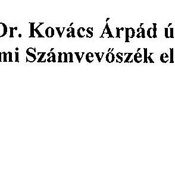
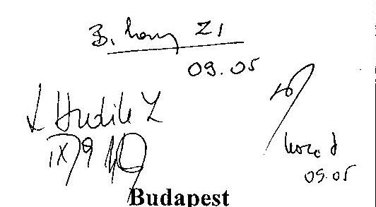
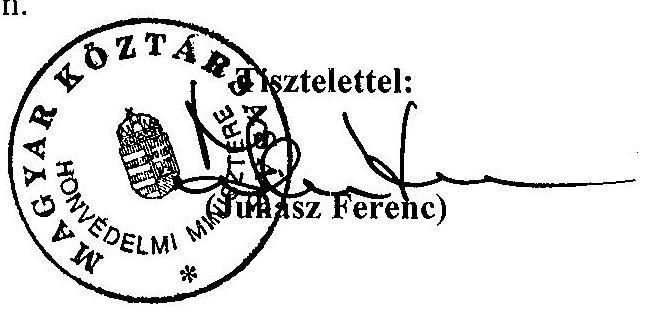
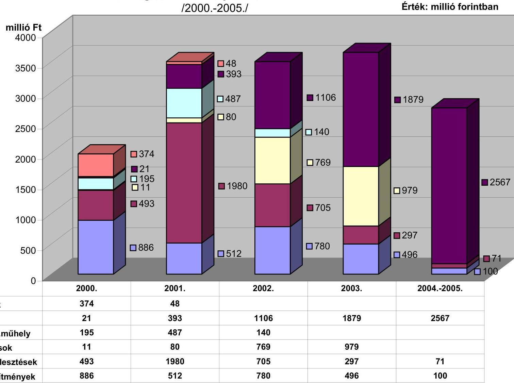
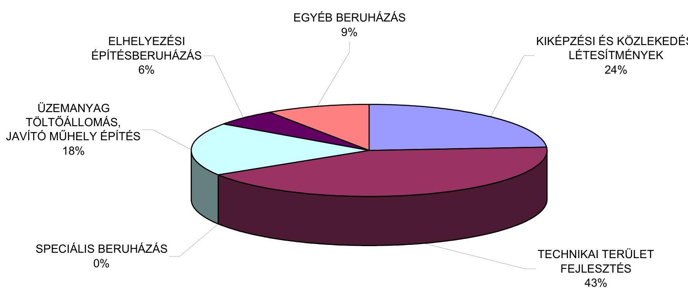

# JELENTÉS 

## a katonai védelmi beruházások ellenőrzéséről

---

# 2. Államháztartás Központi Szintjét Ellenőrző Igazgatóság 

2.3. Átfogó Ellenőrzési Főcsoport

Iktatószám: V-25-56/2002-2003.
Témaszám: 626
Vizsgálat-azonosító szám: V0036

## Az ellenőrzést felügyelte:

Bihary Zsigmond
főigazgató
Az ellenőrzés végrehajtásáért felelős:
Hegedüsné dr. Müllern Veronika
főcsoportfőnök
Az ellenőrzést vezette:
Hudik Zoltán
számvevő igazgatóhelyettes
Az ellenőrzést végezték:

| Trenovszki István | Dr. Király László | Csomán Mihály |
| :-- | :-- | :-- |
| számvevő tanácsos, | számvevő tanácsos, | számvevő tanácsos |
| főtanácsadó | tanácsadó |  |
| Domonkosné Kurilla | Dr. Fülöp László | Pálfi András |
| Edit | számvevő tanácsos | számvevő tanácsos |
| számvevő tanácsos | Balkay Attila | Somodiné Fehér |
| Szikszainé Király | számvevő | Julianna |
| Mária |  | számvevő |
| számvevő tanácsos |  |  |

## Vásárhelyi Zoltán

számvevő

## A témához kapcsolódó eddig készített számvevőszéki jelentések:

## címe

sorszáma
Jelentés a Honvédelmi Minisztérium fejezet 1994-1995. évi költségvetésében és gazdálkodásában a haderőfejlesztési célok érvényesülésének pénzügyi-gazdasági ellenőrzéséről (1996.)
Jelentés a Magyar Honvédségnél a repülőcsapatok működésének pénzügyi-gazdasági ellenőrzéséről
Jelentés a Honvédelmi Minisztérium fejezet működésének ellenőrzéséről (2000.)
Éves jelentések a központi költségvetés zárszámadásainak ellenőrzéséről (évente)
[9826] [9927]
[0024] [0126]
[9839] [9932]
[0034]

Jelentéseink az Országgyűlés számítógépes hálózatán és az Interneten a www.asz.hu címen is olvashatók.

---

# TARTALOMJEGYZÉK 

BEVEZETÉS ..... 5
I. ÖSSZEGZŐ MEGÁLLAPÍTÁSOK, KÖVETKEZTETÉSEK, JAVASLATOK ..... 7
II. RÉSZLETES MEGÁLLAPÍTÁSOK ..... 14

1. A Magyar Honvédség átalakításával és ezen belül az infrastrukturális fejlesztésekkel kapcsolatos feladatok irányítása, felügyelete ..... 14
1.1. Az MH stratégiai felülvizsgálata 1999-2000-ben és az átalakítás terve ..... 14
1.2. A korszerűsítési és a részletes tervek végrehajtása ..... 16
1.3. A képességek, erőforrások és a költségvetés tervezése ..... 20
1.4. A tárca Védelmi Tervező Rendszerének helyzete ..... 22
1.5. A NATO katonai integrációval járó feladatok teljesítése ..... 24
1.6. A honvédség védelmi képességeinek felülvizsgálata ..... 26
1.7.A katonai védelmi beruházások és a Laktanya Rekonstrukciós Program ..... 27
2. A katonai védelmi beruházások megvalósítása ..... 28
2.1. Szervezeti feltételek ..... 29
2.2. Beruházási igények és döntések ..... 30
2.3. Előkészítés, tervezés ..... 37
2.4. A közbeszerzési eljárások ..... 39
2.5. A beruházások műszaki és pénzügyi lebonyolítása ..... 41
2.6. Kivitelezés, üzembe helyezés és használatba vétel ..... 43
2.7. A megvalósított beruházások hasznosulása ..... 48
MELLÉKLETEK:
3. sz. Honvédelmi miniszter észrevétele
4. sz. Beruházások fejezeti összesítése
5. sz. Katonai védelmi beruházások becsült bekerülési költsége
6. sz. Katonai védelmi beruházások költségvetési előirányzatainak ütemezése
7. sz. 2002. év végéig befejezett katonai védelmi beruházások
8. sz. 2002. év végéig befejezett katonai védelmi beruházások cél szerinti megoszlása
9. sz. A HM fejezetnél korábban végzett - a haderő-átalakítás folyamatát érintő - számvevőszéki ellenőrzések főbb javaslatai

---

.

---

# RÖVIDÍTÉSEK JEGYZÉKE 

| Áht. | Az államháztartásról szóló 1992. évi XXXVIII. törvény |
| :--: | :--: |
| ÁPV Rt. | Állami Privatizációs Részvénytársaság |
| DPQ | Védelmi Tervezési Kérdőív (ang. Defence Planning Questionnaire) |
| EHV | elektronikus harcvezetés |
| gl.dd. | gépesített lövészdandár |
| HIB | Haderő-átalakítást Irányító Bizottság |
| HM | Honvédelmi Minisztérium |
| HM BBBH | HM Beszerzési és Biztonsági Beruházási Hivatal |
| HM BII | HM Beruházási és Ingatlanfejlesztési Iroda |
| HM EI Rt. | HM Elektronikai, Logisztikai és Vagyonkezelő Részvénytársaság |
| HM IF | HM Infrastrukturális Főosztály |
| HM IF BO | HM Infrastrukturális Főosztály Beruházási Osztály |
| HM KÁT | HM közigazgatási államtitkár |
| HM PSzNYI | HM Pénzügyi Számító és Nyugdíjmegállapító Igazgatóság |
| HTCSF | Haderőtervezési Csoportfőnökség |
| HVK | Honvéd Vezérkar |
| HVKF | Honvéd Vezérkar Főnöke |
| KBH | Magyar Köztársaság Katonai Biztonsági Hivatal |
| Kbt. | A közbeszerzésekről szóló 1995. évi XL. törvény |
| KFH | Magyar Köztársaság Katonai Felderítő Hivatal |
| KHGYB | Központi Harcászati Gyakorló Bázis |
| kht. | közhasznú társaság |
| KPSZH | Központi Pénzügyi és Számviteli Hivatal |
| LRP | Laktanya Rekonstrukciós Program |
| MH | Magyar Honvédség |
| MH ÖLTP | MH Összhaderőnemi Logisztikai Támogató Parancsnokság |
| MH SZVK | Magyar Honvédség Szárazföldi csapatok Vezérkara |
| MH ÜszF | MH Üzemanyag Szolgálatfőnökség |
| MHPK | Magyar Honvédség parancsnoka |
| OGY HB | Országgyúlés Honvédelmi Bizottsága |
| OPEVAL/TACEVAL | az MH-ban alkalmazott NATO harcászati felmérő és értékelő programok |
| PCGTSzF | Páncélos - és Gépjármű Technikai Szolgálatfőnökség |
| STANAG | NATO katonai szabvány (ang. Standardization Agreement) |
| SzMSz | Szervezeti és Működési Szabályzat |
| SZvt. | A számvitelről szóló 2000. évi C. törvény |
| TKÁ | technikai kiszolgáló állomás |
| TTF | technikai területfejlesztés |
| VTR | Védelmi Tervező Rendszer |

---

.

---

# JELENTÉS   a katonai védelmi beruházások ellenőrzéséről 

## BEVEZETÉS

A Magyar Köztársaság 2000. évi költségvetéséről szóló 1999. évi CXXV. törvény melléklete szerint a Honvédelmi Minisztérium fejezeti kezelésű előirányzatok címén, beruházások alcím alatt határozták meg a Katonai védelmi beruházások jogcím csoportot (1,63 Mrd Ft összegben jóváhagyott előirányzattal). Az Országgyűlés a tárca 2001. és 2002. évre vonatkozó költségvetésében - ezen a jogcímen - központi beruházások céljaira évente 3,5 - 3,5 Mrd Ft összegű kiadási előirányzatokat hagyott jóvá, ami a fejezeti kezelésben levő beruházási alcím előirányzatainak közel felét jelenti.(A katonai védelmi beruházásokra 2003. évre jóváhagyott előirányzat 4,0 Mrd Ft volt).

A Katonai védelmi beruházások jogcímen 24 központi beruházást nevesítettek, melyek megvalósítását a tárca 2000-2005. évekre ütemezte. A nevesített beruházások teljes bekerülési költségét összesen 15,4 Mrd Ft-ra becsülték, ebből az elvégzett vizsgálat 10,9 Mrd Ft-ot érintett.

A beruházások céljaik alapján hat - kiképzési, közlekedési létesítmények építése; technikai területfejlesztések; üzemanyagtöltő állomás, javítóműhely építés; speciális beruházás; szálló és legénységi épületépítés; egyéb létesítmények építése - csoportba sorolhatók.

A kiképzési, közlekedési létesítmények építésének és a technikai területfejlesztések költségei az összes beruházási kiadások 18, illetve 23%-át jelentették. Ezek megvalósítási folyamata előrehaladottabb állapotú, amit az szemléltet, hogy 2002-ben az előirányzat-felhasználás a kiképzési, közlekedési létesítmények építése terén 79%-os, a technikai területfejlesztéseknél 90%-os volt.

A nevesített katonai védelmi beruházások teljes bekerülési költségéből - a hat éves időszakra tervezett előirányzatokból - a speciális beruházások 12%-os, az üzemanyagtöltő állomás, javítóműhely építések 5%-os arányban részesedtek. Az előirányzat-felhasználás mértéke 2002. év végére a speciális beruházások esetében közel 50%-ot, az üzemanyagtöltő állomás, javítóműhely építéseknél 100%-ot ért el.

A legkisebb részesedéssel bírtak az egyéb létesítmény (szennyvíztisztító és csatornahálózat, hulladékgyűjtő, olajtároló) építések, viszont az ezekre tervezett előirányzatokat (összesen mintegy 420 M Ft-ot) már 2001. évben teljes egészében felhasználták.

A honvédelmi tárca beruházási adatainak kimutatása szerint az ingatlanok vásárlására, létesítésére fordítható előirányzatok jellemzően a központi beruházási kiadások között szerepeltek, így az ezek értékét jelentősen meghaladó összegű (2001-ben: 25,47 Mrd Ft, 2002-ben: 35,98 Mrd Ft) intézményi beruházási előirányzatokkal gazdálkodhatott a HM fejezet, melyek közel háromnegyede a gépek, berendezések és felszerelések vásárlása, létesítése soron szerepelt. A költségvetési adatokból következett, hogy ezekben az években a katonai védelmi beruházások megnevezés alatt futó beruházásokra a fejezet összes beruházási kiadásaira fordítható előirányzatainak mintegy 8-11%-a jutott.

A Honvédelmi Minisztérium fejezetnél az államháztartás forrásait és azok felhasználását, valamint a vagyonnal való gazdálkodást ellenőrizte az Állami Számvevőszék az államháztartásról szóló 1992. évi XXXVIII. törvény (Áht.) 121. § (1) bekezdése alapján. A korábbi számvevőszéki ellenőrzések - legutóbb a HM fejezet működésének 2000. év júliusában lezárt átfogó ellenőrzése - igyekeztek rámutatni a haderőreform kiforratlanságára, ennek külső és belső befolyásoló tényezőire. Az ellenőrzések sorozatosan jelezték a realizálhatóság veszélyeztetettségét, mivel a célok elérhetőségét megalapozó érdemi elemzések nem támasztották alá.

A jelen ellenőrzés végrehajtására az Állami Számvevőszékről szóló 1989. évi XXXVIII. tv. 2. § (3) és (7), valamint a 17. § (5) bekezdésben foglaltak adtak jogszabályi alapot.

Az ellenőrzés célja annak értékelése volt, hogy:

- a Honvédelmi Minisztérium és a Magyar Honvédség irányítási és felügyeleti tevékenysége, valamint gazdálkodási rendje biztosította-e a katonai védelmi beruházások tervezésének, megvalósításának szabályszerűségét és eredményességét, illeszkedését a haderőreform folyamatához;
- a megvalósított katonai védelmi beruházások a célkitűzéseknek megfelelő tartalommal, ütemezéssel és a tervezett költségvetési keretek között - a közpénzek szabályszerű és eredményes felhasználásával - teljesültek-e.

A teljesítmény-ellenőrzés módszerével a fejezet költségvetésében nevesített katonai védelmi beruházásokkal összefüggésben egyfelől rendszerszemléletű áttekintéssel a haderő-átalakítás menetében a követelménytámasztást, a belső szabályozási, irányítási rendszer működését, másfelől eredmény szemléletű közelítésben a beruházások célmeghatározásának, tervezésének, majd a megvalósításának 2000-2002. évi folyamatait értékeltük. A teljesítmény-ellenőrzés gazdaságossági és hatékonysági elemei szerinti ellenőrzést - tekintettel a tárca nem képesség-orientált infrastrukturális fejlesztési gyakorlatára - ez alkalommal nem terveztünk, illetve nem végeztünk.

A helyszíni ellenőrzés a Honvédelmi Minisztérium és háttérintézményei, valamint a Magyar Honvédség haderő-átalakításban, védelmi beruházásokban érintett szervezeteire terjedt ki. Emellett helyszíni szemléket folytattunk tíz (Budapest, Várpalota, Szentkirályszabadja, Kecskemét, Táborfalva, Hetényegyháza, Szabadszállás, Debrecen, Hódmezővásárhely, Szolnok) beruházási helyszínen.

A végleges jelentést az Állami Számvevőszékről szóló 1989. évi XXXVIII. tv. III. fejezet 25. § (1) bekezdésének megfelelően észrevételezésre megküldtük Juhász Ferenc miniszter úrnak, aki megállapításainkat, javaslatainkat elfogadta, észrevételt nem tett és jelezte, hogy a hatáskörében teendő intézkedésekről a törvényes határidőben tájékoztatást ad (1. sz. melléklet szerint).

---

# I. ÖSSZEGZŐ MEGÁLLAPÍTÁSOK, KÖVETKEZTETÉSEK, JAVASLATOK 

A honvédség infrastruktúrájának korszerűsítésében szerepet játszó katonai védelmi beruházások teljesítmény-ellenőrzése - annak ellenére, hogy a védelemmel kapcsolatos beruházások teljes körét nem fedte le - kellő alapot adott a haderő-átalakítás folyamatában a követelménytámasztás megalapozottságának, a beruházásokkal kapcsolatos irányítási, gazdálkodási és felügyeleti tevékenység súlyponti kérdéseinek megítéléséhez.

A haderő reformját a rendszerváltozást követően lényegében valamennyi kormányzati ciklusban napirendre tűzték, azonban a haderő-átalakításnak, korszerűsítésnek, stratégiai felülvizsgálatnak, illetve a jelenleg védelmi felülvizsgálatnak nevezett folyamatok többszöri koncepcióváltáson mentek át. A megoldás elhúzódásában szerepet játszó számos külső, illetve belső tényező közül kiemelhetők a honvédség konkrét feladatainak leképezésében irányadó szabályozások (a biztonságpolitikai, a honvédelmi alapelvek rögzítésének, majd módosításának) késedelme, a célkitűzések végrehajthatóságát befolyásoló költségvetési korlátok, valamint az új szövetségi rendszerben az együttműködés kereteinek folyamatos alakulása.

Az 1999. évi NATO csatlakozással hatályba lépő parlamenti döntés hozta meg a biztonságpolitikai környezet olyan irányú változását, amelyben az ország védelméhez és a szövetségesi kötelezettségvállalások teljesítéséhez célirányosan meghatározható a korszerű, megfelelő képességű haderő. Ugyanakkor a mindenkori kormányzat és a katonai vezetés közös felelőssége, hogy a magyar fegyveres erők alkalmazását, szervezését és felkészítését szabályozó háromszintű, a NATO tagállamok védelmi szférájában alkalmazott koncepciórendszer - amely a nemzeti biztonsági és katonai stratégián, valamint a katonai doktrínák rendszerén alapul - még nem teljes.

OGY határozat előírása ellenére nem határozták meg a Nemzeti Biztonsági Stratégia honvédelmi vonatkozású aspektusait, nem adták ki a Nemzeti Katonai Stratégiát, kidolgozásra várnak a szövetségi rendszerhez illeszkedő nemzeti (összfegyvernemi és fegyvernemi) doktrínák. (A Nemzeti Katonai Stratégia véglegesítését számos tényező befolyásolta, egyrészt a Nemzeti Biztonsági Stratégiát érintő - Kormány által elrendelt - felülvizsgálat, másrészt a honvédelmi tárcánál folyó védelmi felülvizsgálat befejezésének a függvénye.)

A nemzeti stratégiák kialakításának lényeges alapelve, hogy
 tükrözze a nemzeti célok (mint végeredmény), a megoldási módszerek, valamint a rendelkezésre álló erőforrások és eszközök egyensúlyát. A nemzeti stratégiák hosszabb távon értelmezett (ezzel együtt folyamatos korszerűsítést igénylő), átfogó jellegű eszmerendszert képeznek, természetesen kihatással vannak az elkövetkezendő évek költségvetési gazdálkodására. Ez is motiválja, hogy szorgalmazzuk az alapdokumentumok tapasztalt hiányosságainak felszámolását.

Az 1999. évben elrendelt stratégiai felülvizsgálat volt az első olyan közelítés, mely a honvédelem teljes egészét átfogta. A koncepcionális előkészítés hiányos

---

ságai, a feladatok differenciált mélységű meghatározása, az egyes részterületek kiforratlansága és a szűkre szabott határidők azonban már az indításkor előrevetítették az eredményes végrehajtás korlátjait. (Ezért hívták fel a figyelmet a korábbi számvevőszéki ellenőrzések a stratégiai felülvizsgálat feladatai komplex elemzésének szükségességére, az ütemezett fejlesztési feladatok kölcsönhatásának, összefüggéseinek felülvizsgálatára, a végrehajtás kormányzati kontrolljának erősítésére.) ${ }^{1}$

A stratégiai felülvizsgálat végrehajtásához a Kormány, az OGY Honvédelmi bizottsága hozott határozatokat és fogadott el rendszeres beszámolókat, amelyeket a tárca és a katonai vezetés dolgozott ki. Mindezeket a katonai tervezők és végrehajtók felé miniszteri utasítások, vezérkarfőnöki parancsok közvetítették. A tervező munka eredményeként készült el „a Magyar Honvédség átalakításának és új szervezeti struktúrájának 2000-2010 közötti időszakra vonatkozó terve", illetve a 2006-ig terjedő Korszerűsítési Terv és a 2003. év végéig szóló Részletes Terv.

A tíz évre szóló terv első három évében a személyi állomány élet-és munkakörülményeinek javítását, a következő három évben a kiképzettségi szint növelését és ezzel a NATO interoperabilitás ${ }^{2}$ elérését, míg a befejező időszakban a technika megújítását tűzték ki fő feladatként. A prioritások megfogalmazását befolyásolta az is, hogy viszonylag kisebb költségigényű, alapvetően humán feladatokat határoztak meg az induló szakaszban, a lényegesen nagyobb kiadással járó technikai korszerűsítést az időszak végére, 2006. évvel kezdődően ütemezték. A feladatok ilyen ütemezése a fokozatosság elvének megfelelt, de magában hordozza annak a veszélyét is, hogy a komplex kezelés hiánya miatt előfordulhatnak célszerűtlen, utólag módosítást igénylő lépések is.

Az ütemezett fejlesztési célok nem alkottak egymással összefüggő, a költségvetési lehetőségeket is figyelembe vevő tervrendszert. Emellett a stratégiai dokumentumok hiánya, a NATO szabványok és eljárások honosításában tapasztalt elmaradások miatt a szükséges képességek pontatlan értelmezése, együttesen azt eredményezték, hogy a katonapolitikai ambíciószint meghaladta a költségvetési forrásokkal realizálható feladatok összességét.

A tervezési folyamatot, ezen belül a vezetői döntéseket nem tudta segíteni az ún. Védelmi Tervező Rendszer (VTR) sem, mivel a tárcánál több éve megkezdett fejlesztés - korábbi számvevőszéki ellenőrzések jelzése ${ }^{1}$ ellenére - sem ért el olyan megvalósítási szintet, hogy képes legyen az átalakítás szakmailag elkülönült, képesség-, kapacitás-, erőforrás- és költségvetési terveinek összefogására. Így fordult elő, hogy a 2006-ig szóló terv mintegy 300 Mrd Ft összegben forrással alá nem támasztott fejlesztési igényt fogalmazott meg. A 2003. évi költségvetés tervezésekor pedig az összesített igények 67 Mrd Ft-tal haladták meg a

[^0]
[^0]:    ${ }^{1}$ Lásd 7. sz. melléklet: az 1996., 1998. és 2000. évi számvevőszéki ellenőrzés főbb javaslatait.
    ${ }^{2}$ Interoperabilitás (együtt alkalmazhatóság): a technikai rendszerek vagy egységek azon képessége, hogy más rendszereknek vagy egységeknek szolgáltatást nyújtsanak, illetve azoktól szolgáltatást fogadjanak.

---

költségvetési lehetőséget, azzal együtt, hogy az ellenőrzött időszakban érdemi forrásbővülés történt (a költségvetési támogatás az 1999. évi 165 Mrd Ft-ról 2003-ra 309 Mrd Ft-ra nőtt, 2000-től megszűnt a tárca bevételi kötelezettsége). A tervezhetőség stabilitásához kedvezőbb feltételt jelentett a védelmi szféra GDP arányos költségvetési támogatottságának fokozatos (2000 és 2003 között 1,51 %-ról 1,65 %-ra, majd 2006-ig 1,81\%-ra) növelése. Időközben a honvédség létszámát 60000 főről 45000 főre csökkentették és nem elhanyagolható, hogy az infláció is mérséklődött.

Ugyanakkor meg kell említeni az átalakítás finanszírozhatóságát kedvezőtlenül befolyásoló tényezőket is. Jogvita miatt az inkurrens eszközök és anyagok, a feleslegessé vált objektumok ÁPV Rt-nek tervezett átadása húzódott, hátráltatva az ebből eredő megtakarítás korszerűsítési forrásként történő realizálását és fennmaradtak az őrzés-üzemeltetés költségei is. Az egyedi döntések költségigényes feladataihoz - melyek a törvényekben és szövetségi kötelezettségvállalásokban megfogalmazott feladatokon túl jelentkeztek (pl. a terven felüli bérrendezés) - nem biztosítottak külön forrást. Nem volt egyértelmű a tárca számára, hogy a szintén egyedi döntéseken alapuló haditechnikai fejlesztésekhez szükséges összegeket a már jóváhagyott költségvetéséből vagy a központi költségvetés pótlólagosan juttatott forrásából finanszírozhatják (pl. repülőgép, gépjármű, URH rádió beszerzéseknél).

A finanszírozhatóság jegyében a tárca kormányzati egyetértéssel, a tervezett laktanya-rekonstrukció megvalósításához - a hatályos jogi szabályozással ellentétben nem álló, de az államháztartási tilalmakat kikerülő megoldást választva - a részvénytársasága banki hitelfelvételével szándékozott a költségvetési forráshiányt enyhíteni. Látni kell azonban, hogy a hitelfelvétel felelősségi következményei áttételesen mégis a költségvetést veszélyeztethetik.

A haderő-átalakítás feladatait nyomon követő eljárási rendben a havi- és időszakos jelentések sok fontos adatot szolgáltattak az egyes részterületekről, a felső vezetés döntéseinek előkészítéséhez. Ezek képezték a vezérkari főnök és a miniszter - OGY HB számára készített - éves jelentéseinek alapját. Ugyanakkor a részletekre is kiterjedő információk mellett a súlyponti problémák háttérben maradtak, vagy éppen hatékony döntések nem követték a tárca jelzéseit.

Markánsabb problémafeltáró, elemző rendszer hiányára is visszavezethető az átalakítás eredményes megvalósításának elhúzódása. Emellett még különösen az egyedi döntésű feladatoknál volt érzékelhető, hogy a tárca költségvetési információs rendszere csak részben, esetenként jelentős többletmunkával képes a feladatokhoz a teljes költség számbavételét (full cost analysis) biztosító adatokat szolgáltatni, kedvezőtlenül befolyásolva a védelmi tevékenység és a költségvetés összefüggéseinek átláthatóságát. A kedvezőbb helyzet megteremtéséhez a működő információ rendszer pontosítása útján célszerű eljutni.

A korszerűsítés kulcskérdésének továbbra is az tekinthető, hogy a nemzeti érdekek és a NATO kötelezettségek teljesítéséhez - az adott helyzetből kiindulva és nem utolsó sorban a nemzetgazdaság erőforrás lehetőségeihez igazo

---

dóan - milyen képességekkel ${ }^{3}$ rendelkező honvédség kialakítását kell/lehet megcélozni. A honvédség védelmi képességeinek teljes körű felülvizsgálatát - melynek egy forrásokkal megfelelően alátámasztott, kiegyensúlyozott és koherens tervet kell eredményeznie - 2002 nyarán rendelte el a honvédelmi miniszter. Ennek eredménye alapozhatja meg az átalakítási folyamat komplex kezelését. Ez egyben azt is jelenti, hogy az ellenőrzött időszak alatt a haderő-átalakítás módosuló irányai nem adhattak reális támpontot a védelmi képességek infrastrukturális hátterét biztosító katonai védelmi beruházások időtálló célkitűzéseinek kijelöléséhez, áttételesen ezek gazdaságosságának, hatékonyságának méréséhez.

A stratégiai felülvizsgálatról és a hosszú távú átalakítás irányairól szóló és a kapcsolódó rendelkezések végrehajtása kitért a laktanyák állapot-felmérésére. Ennek következménye lett a középtávú laktanya rekonstrukciós (felújítási, esetenként beruházási) program indítása, a Kormány egyetértésével. A 2000-2006. évek korszerűsítési tervében határozták meg a laktanya rekonstrukciós és lakásépítési programokban érintett katonai szervezetek prioritását (kiemelten fontos, nagyon fontos és lehetséges kategóriákba sorolással). A Korszerűsítési tervnek - a belső szabályozás szerint - tartalmazni kellett a javasolt fejlesztési programokat, de ezek között csak a fontosabbnak ítélt képesség-fejlesztéseket jelölték meg, konkrét feladattartalom és határidő nélkül. Hasonlóan, a 2003-ig tartó szakasz átalakítási terve sem fogalmazott meg konkrét építés-beruházási célokat.

Az építés-beruházási - köztük a katonai védelmi beruházásként nevesített igények a korszerűsítési elképzelésekre figyelemmel, de lényegében alulról építkezve (a katonai szervezetek szolgálati úton történt felterjesztése, majd a Honvéd Vezérkar rangsorolása alapján) jutottak a tárca központi beruházásokkal foglalkozó szervezetéhez. A beruházások indításáról a tárca költségvetés tervezési folyamatában született érdemi döntés, ami viszont nem a feladatrendszerből adódó igények számszerűsítésével, hanem a rendelkezésre álló keretek lebontásával történt. A kialakult gyakorlatban nem a szükséges katonai képességek meghatározásánál végezték el a finanszírozhatóság vizsgálatát, ez a beruházások elemi költségvetésbe történő felvételének eldöntésére maradt. Következményeként lazábbá vált a beruházások eredményességének, gazdaságosságának kapcsolódása a védelmi képességekhez, szemben a szövetségi rendszerben szokásos - és természetesen kívánatos - képesség-orientált fejlesztési gyakorlattal.

További sajátosságok forrása volt, hogy a katonai védelmi beruházások elemi költségvetésbe emelésénél a központi építésberuházó szervezet még nem rendelkezett részletes célmeghatározással, ugyanakkor a korlátozott pénzügyi lehetőségeket a legfontosabb, legsürgetőbb feladatokkal kellett kitölteni. Az éves

[^0]
[^0]:    ${ }^{3}$ Katonai képesség: a honvédség személyi állományának, vezető szerveinek, katonai szervezeteinek, technikai eszközeinek és anyagi készleteinek állapota, valamint annak előírt szinten tartását elősegítő más tényezők megléte, amelyek alkalmassá teszik a biztonságpolitikai célkitűzések megvalósítására, a törvényekben és más jogszabályokban meghatározott feladataik végrehajtására.

---

költségvetési keret maximális kihasználása érdekében egy beruházás indításánál a tárgyévi adatok között becsült kiadási összeget tüntettek fel, a tervszámokat a műszaki-gazdasági tervezés során pontosították (a végső adatot a nyertes kivitelező árajánlatának összege határozta meg).

A programfinanszírozási rendszert felváltó beruházás-finanszírozási rendszer keretein belül a feladatok több évre szóló pénzügyi ütemezésével, a megvalósulás során a beruházási munkálatok - prioritások változásától függő és a szerződéses kötelezettségekből adódó - időbeli eltolásával vagy előrehozásával, a feladatok közötti előirányzat-átcsoportosítással biztosítottak fedezetet az egyes beruházások kivitelezéséhez. (A katonai védelmi beruházások évente jóváhagyott költségvetési előirányzatának főösszegét nem emelték, de forráselvonásra sem került sor, a címen előirányzat maradvány nem keletkezett.)

A beruházások tervezésénél ilyenformán a szakmai és pénzügyi szervek együttműködésében a meghatározó szerep a fejezet szintű gazdálkodásért felelős apparátusnak, ezen belül a döntés előkészítésekben az ún. Építési Tervtanácsnak jutott. A beruházási javaslatok megvitatási, rangsorolási és a költségvetési tervek szakmai döntés-előkészítési, véleményezési jogával felruházott ún. Beruházási (korábban Építési) Tanács az ellenőrzött időszakban nem működött. Ilyen körülmények között elmaradt a szakmai prioritások rendszeres felülvizsgálata, a döntéseknél háttérbe szorult a kitűzött beruházási célok ütemezett megvalósíthatóságának, hatékonyságának és eredményességének mérlegelése, a döntések kihatásainak elemzése, továbbá a teljes életciklusra vonatkozó - a szövetségi rendszerben szokásos - költségszámítások sem készültek.

A tárcánál több, egymástól független szervezet végez beruházások, felújítások és beszerzések műszaki-gazdasági előkészítésével, megvalósításával összefüggő feladatokat, eltérő szervezeti feltételek és belső eljárási rend szerint. A központi beruházások - így a katonai védelmi beruházások - kezeléséért elsődlegesen felelős szervezetet az elmúlt időszakban több átszervezés érintette. Szervezeti feltételeit alapvetően a tárca profiltisztításának következményei határolták be. Sokrétű rendeltetésszerű tevékenységét (többek között: építés-beruházási feladatok meghatározását, előkészítését, a közbeszerzési eljárások lefolytatását, a megvalósítás teljes körű szervezését, irányítását, végrehajtását) minimális létszámfeltételekkel és fejezeten kívüli - lebonyolító, gazdálkodási, szerződéskötési, elszámolási, ellenőrzési tevékenységben közreműködő, tervező, kivitelező, szállító, szolgáltató - gazdálkodó szervezetek bevonásával végezte.

A költségvetési forrás-lehetőségek mellett a szervezeti adottságokból is eredeztethető a beruházások sajátosnak mondható kezelése. A profiltisztítás eredményeként kialakított - fejezeten belüli, illetve kívüli - tevékenység-arányok elsősorban a beruházási folyamatok előkészítése és műszaki-gazdasági ellenőrizhetősége szempontjából tekinthetők előnytelennek, amit pl. a beruházások megvalósítása során szükségessé vált gyakori tartalmi változtatások (pótigények) és az átlagosnál magasabbra ugró költségvetési ráfordítások elemzésének hiánya egyaránt alátámaszt.

A katonai védelmi építési beruházásokat a tárca titokvédelmi indoklása alapján az OGY HB mentesítette a közbeszerzési törvény alkalmazása alól, így a műszaki bonyolítók, tervezők, kivitelezők kiválasztása - az ilyen esetekre vo

---

natkozó kormányrendelet alapján - zártkörű
 eljárásban történt. Az így megvalósuló korlátozott verseny - a speciális tényezők (különleges szakismeret, nemzetbiztonsági minősítés stb.) figyelembevételével - a legalacsonyabb ajánlati ár kiválasztására irányult. Az építőiparban elterjedt szabadáras vállalkozási árrendszerre tekintettel az egyösszegű (átalányáras) vállalkozási szerződésekbe épített jogi garanciákkal igyekeztek kiszűrni az árnövelő vállalkozói törekvéseket.

Az a tárca beruházói előtt is ismeretes, hogy a tárgyalásos eljárás - akár tételes költségvetési mélységű áralku lefolytatásával - további árelőnyök elérésével járhat. Az alkalmazhatóságot biztosító jogszabály módosítást azonban a tárca még nem kezdeményezett. Ezen túlmenően, ahol az objektumok felderítés elleni védelme és biztonságának megszervezése lehetővé teszi - a költségszint csökkentése és a munkavégzés minőségjavítása érdekében - érdemes vizsgálat alá vonni a külső közreműködők szélesebb körű (nyílt) pályázatásának feltételeit.

Az ellenőrzött beruházásoknál a bruttó összeg 92,3%-át a kivitelezésre, 4,5%-át a tervezésre és tervezői művezetésre, 3,2%-át pedig műszaki és pénzügyi lebonyolításra fordították, ami megfelel az építés-beruházásoknál elfogadott arányoknak. Az összességében 10,1 Mrd Ft értékű kivitelezési munkáknál a pótmunkák értéke nem érte el a 4%-ot (386 M Ft), azonban az átlagérték jelentős eltéréseket takar (egyes pótmunkáknál elérte a 10 M Ft-os nagyságrendet). A befejezett beruházások jónak minősített műszaki színvonalon, általában a felhasználók megelégedésével valósultak meg. A beruházási folyamatok pénzügyi-számviteli dokumentálási kötelezettségeinek eleget tettek.

Az átalánydíjas elszámolással együtt járó összevont részteljesítés igazolási gyakorlat kedvezőtlenebb feltételeket adott az utólagos ellenőrzéshez, az építőiparban mégis ez terjedt el a tételes elszámolással szemben. Éppen ezért rendkívül fontos, hogy az ajánlati árhoz, valamint a részteljesítésekhez köthető műszaki tartalom kellően meghatározott legyen (ellenkező esetben magában hordozza a valóságostól eltérő teljesítés-elszámolás veszélyét). Tekintettel arra, hogy ezt a munkafázist a tárca beruházásainál külső közreműködők - a vállalkozási szféra szereplői - végzik (és a vállalkozói, valamint a költségvetési érdekek nem feltétlenül találkoznak), ennek ellenőrzését a tárcánál tudatosabban célszerű megszervezni, természetesen kedvezőbb szervezeti feltételek biztosításával.

A katonai védelmi beruházások végelszámolási összege, a nem képesség-orientált beruházási gyakorlat ${ }^{4}$ következtében nem fejezte ki a képességnövekedés teljes ráfordítási költségét, mivel az egyes szolgálati ágak üzembe helyezéshez kapcsolódó, de természetben teljesített szolgáltatásait, beszerzéseit a tárca költségvetési rendjében más címeken tervezték és számolták el. Ennek következtében az eredmény szemléletű teljesítmény-ellenőrzés önmagában a

[^0]
[^0]:    ${ }^{4}$ Képesség-orientált beruházási gyakorlat: az adott beruházásba tartozónak tekintenek minden olyan kiadást, mely szükséges és hozzájárul az adott katonai képesség eléréséhez. (Pl. a NATO infrastrukturális beruházásait ún. képesség csomagokban tervezik.)

---

befejezett építés-beruházások megfelelő színvonalú minősítésének megállapítására korlátozódott.

A helyszíni ellenőrzés megállapításainak hasznosítása mellett javasoljuk:

# a Kormánynak: 

1. Gondoskodjon a fegyveres erők alkalmazását, szervezését és felkészítését szabályozó koncepciórendszer alapdokumentumainak (Nemzeti Biztonsági Stratégia, Nemzeti Katonai Stratégia és katonai doktrínák) teljessé tételéről.
2. Kísérje megkülönböztetett figyelemmel a Magyar Köztársaság honvédelmének egészét érintő stratégiai felülvizsgálattal kapcsolatos határozatainak végrehajtását és a honvédelmi tárcánál elrendelt védelmi felülvizsgálat - tervek és erőforrások közötti összhang megteremtésére irányuló - törekvéseit, következtetései alapján tegye meg a szükséges intézkedéseket.

## a honvédelmi miniszternek:

1. Gondoskodjon:
a) a honvédség védelmi képességeinek felülvizsgálatáról szóló utasításának eredményes végrehajtásáról;
b) a NATO és a hazai védelmi tervezés folyamatának harmonizálásáról, ennek keretében követelje meg a Védelmi Tervező Rendszer (és alrendszerei) alkalmazhatósági szintre hozását;
c) a védelmi felülvizsgálat eredményeire alapozva a képesség-orientált infrastrukturális fejlesztési gyakorlat általánossá tételéről, racionális és működőképes döntési szintek kialakításáról, az ezt támogató információs-informatikai rendszer megszervezéséről és nem utolsó sorban a személyi-tárgyi feltételek biztosításáról;
d) a tárca költségvetési ellenőrzési feladatai szélesítéséről - a teljesítményellenőrzések felvételével - a honvédség védelmi képességei és az infrastrukturális fejlesztések viszonylatában;
e) a védelmi beruházások előkészítésében és kontrolljában a műszaki-gazdasági elemzések és ellenőrzések megerősítésének feltételeiről, a költségvetési érdekek fokozottabb védelme érdekében, a beruházásokkal összefüggő tevékenységek vállalkozási szférába eső döntő hányadára tekintettel.
2. Kezdeményezze a közbeszerzési előírások módosítását a tárgyalásos eljárási forma védelmi beruházásokra történő kiterjedtebb alkalmazása érdekében.

---

# II. RÉSZLETES MEGÁLLAPÍTÁSOK 

## 1. A Magyar Honvédség átalakításával és ezen belül az infrastrukturális fejlesztésekkel kapcsolatos feladatok irányítása, felügyelete

### 1.1. Az MH stratégiai felülvizsgálata 1999-2000-ben és az átalakítás terve

A katonai védelmi beruházások tervezését, valamint a megvalósítást szolgáló szervezeti és gazdálkodási rend kialakítását a vizsgált időszakban alapvetően az 1999-ben megkezdett, a Magyar Honvédségre vonatkozó stratégiai felülvizsgálat, majd az ennek nyomán elfogadott, a haderő átalakítását célzó határozatok, tervek, programok határozták meg.

A Magyar Köztársaság biztonság- és védelempolitikáját a NATO-ba történt 1999. évi belépés alapjaiban meghatározza, melyet a belépés napjától hatályos 94/1998. (XII. 29.) OGY határozatában juttatott kifejezésre az Országgyülés. Ezt csak megkésve követte a Magyar Köztársaság nemzeti biztonsági stratégiájáról elfogadott 2144/2002. (V. 6.) Korm. határozat. A nemzeti katonai stratégia kidolgozásának folyamatában 1999 első felében a Miniszterelnöki Hivatal védelmi stratégiai és biztonságpolitikai ügyekért felelős politikai államtitkára kezdeményező szerepet töltött be (a 174/1998. (X. 30.) Korm. rendelet alapján), ezt a feladatot 1999 végétől a HM védelempolitikai szakterülete vette át. A nemzeti katonai stratégia kidolgozása megkezdődött, tervezete több változatban is elkészült, azonban 2002-ben a kormányváltást követően helyette a védelmi képességek felülvizsgálata került előtérbe.

Az OGY határozat előírása ellenére nem határozták meg a Nemzeti Biztonsági Stratégia honvédelmi vonatkozású aspektusait, nem adták ki a Nemzeti Katonai Stratégiát, kidolgozásra, illetve jóváhagyásra várnak a szövetségi rendszerhez illeszkedő nemzeti (összfegyvernemi és fegyvernemi) doktrínák.

Az elmúlt évtizedben a Magyar Honvédség a folyamatos átalakítás jegyében élt, ami megnehezítette a feladatellátást és még napjainkban sem jutott ez a folyamat nyugvópontra. A korábbi haderő-átalakítások eredményeként a Magyar Honvédség létszámában kisebb lett, a haditechnikai fejlesztések azonban a finanszírozási problémák miatt halasztódtak. Az ellátandó feladatokat a törvényhozói és végrehajtó szervek csak általánosságban fogalmazták meg, ami nem adott kellő alapot a katonai feladatok rangsorolására, esetleges elhagyására az alapvetően feladatorientált honvédség részére. 1999-re pedig a NATO tagsággal járó kötelezettségek és a Magyar Köztársaság nemzetközi szerepvállalásának teljesítéséből fakadóan egyre egyértelműbbé vált, hogy a haderő nem finanszírozható és működtethető tovább a meglévő struktúrában, továbbá szükségszerű a NATO tervezési rendszeréhez való alkalmazkodás. Felmerült az igény a hazai haderő összetételére, technikai eszközökkel történő ellátottságára, kiképzettségére vonatkozó, megalapozott fejlesztési tervek elkészítésére. A

---

Kormány által 1999-ben elrendelt stratégiai felülvizsgálat - részben az 1995-ben megindult haderőreform addigi eredményeire építkezve - a Magyar Honvédség újabb átalakításának 10 éves tervét eredményezte.

A Kormány fő célkitűzése egy lényegesen kisebb, tartósan finanszírozható, feladatainak végrehajtására alkalmas haderőstruktúra kialakítása volt. A felülvizsgálat elvégzését, a tervek kidolgozását kellő részletezettségű kormányhatározatok, miniszteri utasítások, vezérkari főnöki intézkedések és parancsok alapozták meg.

A Kormány a honvédelmet érintő egyes kérdésekről szóló 2183/1999. (VII. 23.) határozatában elrendelte az MK honvédelmének egészét érintő stratégiai felülvizsgálat lefolytatását és alternatívák kidolgozását egy lényegesen kisebb, tartósan finanszírozható, feladatainak végrehajtására alkalmas haderőstruktúrára. Az MK honvédelmének egészét érintő stratégiai felülvizsgálat koncepciójáról szóló 2322/1999. (XII. 7.) Korm. határozat többek között elrendelte a haderő átalakítására és új szervezetének kialakítására vonatkozó, 10 éves fejlesztési program kidolgozását, meghatározva annak három ütemét és azok prioritásait, „amely a Kormány és az Országgyúlés - e tárgyban meghozandó - határozatainak alapjául szolgál". Ez utóbbi kormányhatározat végrehajtására kiadott 003/1999. (HK 16.) HM utasítás tartalmazta a feladatok végrehajtásának ütemezését, melyek részletes kidolgozásának, végrehajtásának irányítására és felügyeletére a miniszter Irányító Bizottságot hozott létre.

Az MH parancsnoka, vezérkari főnök (VKF) 1999. november 16-án a Magyar Honvédség átalakításával kapcsolatos feladatok tervezésének végrehajtására kiadta 0026/1999. parancsát, majd 2000. februárban hozott intézkedést (28/2000. MHPK, VKF int.) „az MH átalakítása feladatai végrehajtását koordináló-irányító bizottságok létrehozására". A VKF a 2003. december 31-ig terjedő időszakra Haderő-átalakítási Koordinációs Bizottság, valamint ennek tevékenységét támogató (Humán; Szervezési; Technikai eszközök és anyagok átcsoportosítását irányító; Elhelyezési; Pénzügyi erőforrás-elemző és nyilvántartó) szakbizottságok létrehozását rendelte el, meghatározott feladatokkal. A tervek jóváhagyását követően az intézkedés hatálytalanítása nem történt meg.

A Kormány a „Magyar Honvédség átalakításának és új szervezeti struktúrájának 2000-2010 közötti időszakra vonatkozó tervéről" szóló 2120/2000. (V. 31.) határozatában felhatalmazta a honvédelmi minisztert, hogy a végrehajtás részletes tervét készítse el, majd az Országgyúlés Honvédelmi Bizottságának (HB) történő bemutatását követően hagyja jóvá, kezdje meg a végrehajtását és arról a Kormány nevében, évente számoljon be a HBnak. Az Országgyúlés ezt követően a Kormány előterjesztése alapján meghatározta a Magyar Honvédség hosszú távú átalakításának irányait. Összhangban a Kormány haderő-átalakítási tervével, azt 3 ütemre tagolta. Az első ütemben a fenntartási és működési költségcsökkentés megalapozása érdekében, az új szervezeti rendre való áttérést az új díszlokációk és létszámarányok kialakítását (jelentős létszámleépítéssel), az élet és munkakörülmények javítását, valamint a NATO interoperabilitás és alkalmazhatóság legalapvetőbb feltételeinek biztosítását tűzte ki célul. A technikai eszközök közismert, korábbi számvevőszéki jelentésekben is bemutatott állapota ellenére, a határozat csak a második ütemben számolt a legszükségesebb haditechnikai eszközök beszerzésének

---

megkezdésével azzal, hogy azok a harmadik ütemben széles körben folytatódni fognak. ${ }^{5}$ (A Korszerűsítési Tervben, valamint a Részletes Tervben a HM felülbírálta a korábbi elképzeléseit az ütemezésről és a nemzeti fejlesztési programok keretében jelentős haditechnikai fejlesztéseket is tervezett, 2001-2003 között mintegy 31,6 Mrd Ft értékben. Átfogó haditechnikai fejlesztési koncepció (terv) hiányában azonban nem biztosított, hogy az egymással összefüggő és egymást feltételező fejlesztések koherens tervet alkossanak.)

Ugyanakkor az MH védelmi feladatait nem az alapvető stratégiai dokumentumokból (Nemzeti Biztonsági Stratégia, Katonai Stratégia) vezették le azok hiánya miatt -, csak az általános követelmények szintjén határozták meg azokat. A Katonai Stratégia hivatott részletezni a képességek fejlesztésének stratégiáját és irányait, továbbá áttranszformálni a mindenkori kormány politikáját és stratégiai céljait, irányelveit tiszta, tömör és végrehajtható katonai célkitűzésekké. Az átalakítás reális megtervezése csak a Nemzeti Katonai Stratégia alapján jól meghatározott védelmi képességekből lehetséges. A NATO tagállamokban a védelmi szféra, benne a fegyveres erők alkalmazását, szervezését és felkészítését háromszintű koncepciórendszer szabályozza: a nemzeti biztonsági, a nemzeti katonai stratégia, valamint a katonai doktrínák rendszere.

A doktrína fogalmára a katonai szakirodalomban többféle meghatározás létezik. Az egyik szerint a katonai doktrína a fegyveres erők egészének vagy egy részének alkalmazására vonatkozó szabályok, alapelvek és iránymutatások hivatalosan elfogadott gyűjteménye. Nem cselekvési program, hanem a hadműveletek tervezőinek és végrehajtóinak szemléletmódját meghatározó ajánlás.

A nemzeti katonai stratégiában meghatározandó célok elérése érdekében a Magyar Honvédségnek is meg kell alkotnia saját doktrína rendszerét, aminek késedelme összefügg a katonai stratégia hiányával. A doktrínális téren fennálló elmaradást a szövetségi hadászati-hadműveleti doktrínák adaptálásával, a harcászati doktrínák kidolgozásának felgyorsításával célszerű pótolni.

# 1.2. A korszerűsítési és a részletes tervek végrehajtása 

Miniszteri jóváhagyását követően (2000-ben) megkezdődött a Magyar Honvédség 2006-ig szóló Korszerűsítési tervének végrehajtása. A végrehajtást szolgáló, 2003. év végéig terjedő időszakra vonatkozó Részletes Tervet a Korszerűsítési Tervvel párhuzamosan készítették el, és a sürgető feladatok miatt augusztus 31-én jóváhagyatták.
 A Korszerűsítési Terven azonban - annak szeptemberi jóváhagyását megelőzően - átvezették az időközben kormányzati döntésekre bekövetkezett változásokat. Így - csak a végterméket tekintve - a két terv logikus egymásra épülése csorbát szenvedett és a prognosztizált költségvetési források is különbözőek voltak a két tervben, melyek korrigálására 2001-ben került sor.

A Korszerűsítési Tervben meghatározták a 2006-ra kialakítandó MH főbb jellemzőit, részleteiben az MH korszerűsítésének feladatait (a haderőfejlesztés és

[^0]
[^0]:    ${ }^{5}$ Lásd a HM fejezet 1994-95. évi költségvetésében és gazdálkodásában a haderő fejlesztési-célok érvényesülésének ellenőrzéséről szóló jelentés [313]
    7-10. oldalain tett megállapításokat.

---

haderőfenntartás, a haderő felkészítés és készenlét, valamint a haderő alkalmazás, felhasználás, igénybevétel területeit), továbbá a haderő korszerűsítéséhez szükséges erőforrások tömör ismertetését. A Részletes Terv kiterjed a haderő-átalakítás első ütemének közvetlen előkészületeire, a tárca szervezeteinek a tervezett struktúrára és létszámra való átállása (mely az átalakítás első ütemének első szakaszában volt fő feladat), valamint az egyes szakterületek (harckészültség fenntartása, híradás és informatika, titokvédelem, haditechnikai ellátás és modernizáció, laktanya rekonstrukció és lakásépítés, állomány kiképzése és felkészítése) haderő-átalakítást támogató feladataira.

A Magyar Honvédség átalakítása 2000-ben a tervek szerint megkezdődött, a Részletes végrehajtási tervben 2000-2001. évekre tervezett feladatok jelentős része a HM értékelése szerint megvalósult. Az elhatározott létszámcsökkentéseket végrehajtották, a katonai szervezetek új díszlokációja nagyrészt megtörtént.

A stratégiai felülvizsgálat egyik lényegi elemeként felülvizsgálták a nem közvetlenül védelmi feladatok más tárcák részére történő átadásának, illetve az államháztartás köréből történő kivitelének lehetőségét. Az egyes szolgáltatások működésének és finanszírozásának átláthatóbbá, hatékonyabbá tétele és a költségvetési terhek csökkentése érdekében létrehozandó kht.-k finanszírozására normarendszereket dolgoztak ki, amihez a korábbi számvevőszéki ellenőrzés megállapításaival és javaslataival összhangban gazdasági számításokat alkalmaztak. ${ }^{6}$ Az előző időszak közvetlen költségvetési bevételeit és működési kiadásait, valamint a természetbeni ellátás kalkulált összegét számba vették. A kht.-k finanszírozása az indulás évében ezt nem haladta meg. A támogatásukra kidolgozott rendszerben a normatív támogatás mértékének fokozatos csökkentésével kívánták ösztönözni a kht-kat a vállalkozási bevételeik növelésére. A tervezettekhez képest azonban időközben jelentős változások következtek be, mivel a szakmai felügyeletet ellátó HM főosztályok az ellátandó feladatok növelését határozták meg. A kht.-k létrehozása az intézményrendszer átalakításának folyamatában hozzájárult az OGY által meghatározott összlétszám eléréséhez, továbbá elősegítette a fejezet védelmi költségvetésének tisztítását azáltal, hogy a költségvetésében a kulturális, az üdültetési, rekreációs, sport és egészségmegőrző, valamint a térképészeti feladatok kiadásai egyértelműen, átláthatóan és normatív módon kerülnek elkülönítésre.

A Magyar Honvédség felső szintű vezetési rendszerének módosítása keretében átalakításra került a Honvéd Vezérkar szervezete. A HM és a HVK integrációja, valamint a haderőnemi vezérkarok haderőnemi parancsnokságokká történő átalakítása a jogszabályi feltételek megteremtését követően, közel egyéves késéssel, 2001. szeptember 1-jével végrehajtásra került. Helyszíni ellenőrzésünk megerősítette azt a HM értékelést, miszerint a szervezeti integráció nem járt együtt a funkcionális integráció célkitűzéseinek elérésével, a minisztérium szervezetei között a közvetlen kooperáció elve nem érvényesült kellően. A szakmai elöljárói rendszerben az egyes szakterületeken mutatkozó hatásköri viták és a nem egyértelmű szabályozók miatt a munkavégzés nehézkes, több területen párhuzamosságok mutatkoztak. Mindezt felismerve 2002. szeptemberben a miniszter elrendelte a HM feladatköri rendszerének felülvizsgálatát, melynek célja az integrált HM funkcionális egységének erősítése, az addigi működés során észlelt hibák és hiányosságok kiküszöbölése, a szervezeti struktúra hatékonyságának elemzése, valamint az ebből adódó szervezeti és működési változtatások előkészítése volt.

A HM új működési alapokmányai, a felülvizsgált és újjáalakított szervezeti rend bevezetése késik az eredetileg előírt 2003. január 1-i, majd a módosított 2003. március 31-ei határidőhöz képest is. A párhuzamosan folyó védelmi felülvizsgálat az MH képességeit érinti, a fejezet egészére vonatkozó forráselosztási javaslat kialakításához azonban elengedhetetlen lett volna a minisztérium, a HM hivatalai és háttérintézményei feladatkörének és finanszírozási igényének olyan felülvizsgálata is, mely a Magyar Honvédség elérendő képességeihez rendelt kiszolgálási igények áttekintésével kezdődhetne. Tekintettel arra, hogy ezek az intézmények végeredményben az MH működtetése érdekében végzett tevékenységükhöz használják fel költségvetésüket. Ezzel szemben 2003. áprilisában a HM és háttérintézményeinek 15-20%-os létszámcsökkentését rendelte el a miniszter úgy, hogy az egyes szervezetek munkaköri jegyzékeinek kidolgozásához a tárcánál zajló védelmi felülvizsgálat eredményeit még nem tudták figyelembe venni. A HM szervezeteiből delegált, a HM és háttérintézményeinek feladatköri rendszerét felülvizsgáló bizottságok azonban saját szervezeteik létszámának reális megállapításában (csökkentésében) nem voltak érdekeltek. Nem vitatva az átvilágítás szükségességét, a döntést célszerűbb lett volna a védelmi felülvizsgálat eredményeivel összhangban meghozni.

A haderő-átalakítás kezdeti szakaszára megállapítható, hogy a humán erőforrás gazdálkodási szempontok csak erősen korlátozott mértékben valósultak meg, mivel jól felkészült szakemberek is idő előtt távoztak a hadseregből, ugyanakkor nagyszámú tiszthelyettesi beosztás feltöltetlen maradt. A legalább 25 év szolgálati viszonnyal rendelkező tiszthelyettesi állomány gyakorlatilag kivált a hadseregből.

2002. januárjától a hivatásos és szerződéses állomány élet- és szolgálati körülményeiben pozitív változások indultak el, amelyek részben a törvényi feltételek módosulásával, részben a jelentős mértékű illetményemeléssel pozitívan hatottak a személyi állomány biztonságérzetére.

A haderő-átalakítás feladatainak egyik neuralgikus pontja az inkurrens eszközök és anyagok, valamint az üres objektumok tervezett átadásának vontatottsága, tekintettel arra, hogy a tervekben ezek fenntartására már nem terveztek előirányzatokat. A szervezeti változások során megüresedett és elidegenítésre kijelölt HM ingatlanok jórészt ma is a tárca kezelésében vannak. Az ÁPV Rt. részére történő átadás jogszabályi feltételeit már a 2000. évi költségvetésről szóló törvény rendezte, 2001-2002. években azonban a HM és az ÁPV Rt. közötti jogértelmezési vita miatt nem történt átadás. A laktanya kiürítések eredményeként várt üzemeltetési és fenntartási költségcsökkentések így nem jelentkeztek a várt módon. További fenntartási, őrzésvédelmi kiadások terhelték a tárcát, ami 2003-ra a tervek szerint már milliárdos nagyságrendet ér el. A problémát a Magyar Köztársaság 2003. évi költségvetéséről szóló 2002.

---

évi LXII. törvény oldotta meg. A tárgyalások előrehaladott állapotban vannak, vélelmezhető, hogy az átadás 2003. év második félévében újra elindul.

Az inkurrencia átadásának folyamata igen lassú és körülményes. A tapasztalatok szerint az ÁPV Rt. részére adminisztratív szempontból már átadott anyagok nagy részének tárolása továbbra is a tárcához tartozó objektumokban történik, elszállításuk, értékesítésük, megsemmisítésük és ártalmatlanításuk húzódik. Emiatt a zsúfoltság az objektumokban az inkurrencia átadásával nem csökken, a kijelölt ideiglenes tároló raktárakban a folyamatosan keletkező feleslegek beszállítása ellehetetlenül.

A laktanya kiürítések eredményeként várt üzemeltetési és fenntartási költségcsökkentések sem jelentkeztek a várt módon. Egyrészt az átadás feltételeinek a hiánya miatt további fenntartási, őrzésvédelmi kiadások terhelték a tárcát. Az IKH számításai szerint az üres objektumok őrzés-védelmi költsége 2000. évben 130623 E Ft, 2001-ben 245243 E Ft, 2002-ben 886118 E Ft volt, 2003-ra pedig 981195 E Ft-ot terveztek.

A hároméves részletes végrehajtási tervben betervezett feladatoktól eltérően a végrehajtást elősegítő jogszabályi rendelkezések hiánya miatt az MH Katonai Fogház és a Katonai Ügyészségek nem kerültek törlésre az MH Hadrendjéből, nem kezdődött meg a hadkiegészítő parancsnokságok és a területvédelem átalakítása, illetve a régiók szerinti kialakítása, valamint elmaradt az egészségügyi intézményrendszer átalakítása és kivitele az MH Hadrendjéből. A fenti feladatok végrehajtása a jogszabályi feltételek hiányában, valamint a HIB döntése alapján 2000-ben és 2001-ben elmaradt.

A haderő-átalakítás I. szakaszának 2. ütemében foglalt feladatok végrehajtása megkezdődött 2002-ben, a feladatok mennyiségét és minőségét negatívan befolyásolta a korábbi évek elhúzódó feladatainak torlódása, a követelmények teljes körű beazonosításának hiányosságai (felületessége), a tervezett beszerzések és beruházások, felújítások időbeli elhúzódása. A tervezett feladatok végrehajtását a kiadott szervezési intézkedés többszöri módosításával együtt a feladatok csúszása, a határidők folyamatos módosítása, illetve több feladat (eü. intézményrendszer, területvédelem, hadkiegészítés, fogyasztói logisztikai rendszer stb.) késése, vagy későbbi időpontra történő halasztása jellemzi.

A Magyar Honvédségnél működő, a haderő-átalakítás feladatait nyomon követő eljárásrend (a havi- és időszakos jelentések) sok fontos adatot szolgáltatott a felső vezetés döntéseinek előkészítéséhez, azonban nem állt össze egy, az információ tartalom szempontjából megalapozott és informatikailag is támogatott vezetői információs (kontrolling) rendszerré. A beszámolási időszakban az elöljárók döntéseinek megfelelően folytak a haderő modernizációjával kapcsolatos értékelési, nyomon követési, jelentési és alapadatokat szolgáltató beszámolási feladatok.

A haderő-átalakítás Részletes Tervében foglalt feladatok végrehajtásának és a döntések előkészítéséhez szükséges tervezői, és jelentési-értékelési rendszer, 2000-ben a 141/2000. (HK. 15.) MH parancsnoki paranccsal került bevezetésre, melyet a HM és az MH VK integrációját követően a 15/2002. számú HM KÁT-HVKF együttes intézkedés váltott fel. A minisztérium és a katonai szervezetek havonta, a HM HVK Haderőtervezési Csoportfőnökség útján jelentették a HVKF-nek az el

---

rendelt feladatok végrehajtásának helyzetét a haderő-átalakítás három éves Részletes Terve alapján.
2002. januárban a HM HVK Haderőtervezési Csoportfőnökség (HTCSF-ség) kiadta a haderő-átalakítás Részletes Tervének 2002. évre vonatkozó kiegészítő tervét. A feladatok módosítása 2003-ban már nem történt meg, tekintettel az akkor már folyamatban lévő védelmi felülvizsgálatra.

A 61/2000. (VI. 21.) OGY határozatban feladatul szabott évenkénti miniszteri beszámolás alapját a HVKF éves jelentése képezte. A 2000-2001. évi átalakításról a tárca előző évi feladatairól az OGY-nek tett beszámolóban adott számot a miniszter, az átalakítás 2002. évi végrehajtásáról készített beszámolót a Kormány június 18-án elfogadta, a HM az OGY HB részére azt megküldte.

# 1.3. A képességek, erőforrások és a költségvetés tervezése 

Megállapítható volt, hogy a Magyar Honvédség hosszú távú átalakításának irányairól szóló OGY határozat nem valósítható meg teljes mértékben. Ez arra vezethető vissza, hogy a haderő-átalakítási tervek az erőforrás tervezés oldaláról csak részben voltak alátámasztva, valamint a tárcától független, objektív körülmények is hátráltatták az eredeti tervek végrehajtását. Az átalakítás negyedik évére ugyan kisebb haderő jött létre, de a feladatok és az erőforrások közötti összhang hiánya miatt a tartós finanszírozhatóság kritériuma nem teljesült. Az elérendő képességek pontos deklarálása nélkül a létszámcsökkentés, az új díszlokáció megvalósult, a laktanyarekonstrukció a tervektől elmaradva folyik, a működési költségcsökkentés megalapozása a 2002. évi illetményemeléssel megtorpant, a 2006-ig szóló Korszerűsítési Terv forráselosztási előírásai felborultak.

A Korszerűsítési Tervben a kiadási előirányzatok tervezése nagy vonalakban, jelentős bizonytalansággal történt. A különböző tervekben sem azonos összegek szerepeltek, például a létszámcsökkentések kihatásaként a Kormány tervében még 115 Mrd Ft megtakarítást vártak 2006-ig, a Korszerűsítési Tervben viszont ezzel már nem számolt a tárca, tekintettel az időközben meghozott, a személyi juttatásokat érintő kormánydöntések hatásaira.

A létszámcsökkentés az 1999-2001 közötti időszakban nem eredményezett megtakarítást sem a személyi juttatások (illetmények), sem a munkaadókat terhelő járulékok kiemelt előirányzatok teljesítése során.

A többletkiadások fedezetének 93%-át (13,4 Mrd Ft-ot) saját erőforrások képezték, mert a Pénzügyminisztérium álláspontja értelmében, a fejezet ilyen jellegű kiadásait
 is a GDP-arányos költségvetéséből indokolt finanszírozni. A védelmi kiadások GDP-hez kötött tervezését garantáló kormányhatározatok ugyanis arról nem rendelkeztek, hogy egyes feladatok (pl. létszámleépítések) központi költségvetési tartalékból történő finanszírozásából a HM tárca részesülhet-e a többi tárcához hasonlóan.

A haderő korszerűsítési tervek előkészítése során nem határozták meg a követelményekkel és a pénzügyi forrásokkal kapcsolatos alapvető fogalmakat. Nem tisztázták a haderővel szemben támasztott „kisebb" és „finanszírozható" haderőstruktúra tartalmi követelményeit, továbbá az MH-tól elvárt védelmi képességeket. Nem mérlegelték a rendelkezésre álló pénzügyi forrásokból ellátható védelmi feladatokat, illetve a követelmények fenntartásának finanszírozhatóságát, ennek ellenére a terveket csak egy változatban készítették el. Nem volt tisztázott, hogy a kisebb haderőstruktúrában az MH-nak a képességek fenntartásával, vagy kevesebb képesség vállalásával kell biztosítani a finanszírozhatóságot. Az átalakítás folyamatának indításánál nem azonosították be részleteiben a követelményekhez igazodó, finanszírozható védelmi képességeket, az azokhoz rendelt elemi képességeket és az elérésükhöz szükséges erőforrásokat.

Az ún. nemzeti fejlesztési programokra az MH szervek által benyújtott javaslatok 2006-ig prognosztizált erőforrásigénye négyszer akkora összeget tett ki, mint amit a várhatóan rendelkezésre álló keretek biztosíthattak. Az igények rangsorolása, priorizálása megtörtént ugyan, de az igények tervbe való felvétele meg is kérdőjelezi a Korszerűsítési terv komolyságát, mivel annak szöveges magyarázatai arról nem szóltak, hogy a 6 év alatt mintegy 300 Mrd Ft összegű, forrással alá nem támasztott fejlesztés elmaradása milyen hatást gyakorol az MH védelmi képességeire. A HM nem tárta a Kormány elé az ellátandó feladatok és a várhatóan rendelkezésre álló források között fennálló ellentmondásokat.

A 2002. évi kormányváltást megelőzően a HM tárcánál nem készült olyan elemzés, amely a haderő átalakításának problémáit, a 10 éves terv megvalósíthatóságát, a NATO vállalások teljesíthetőségét értékelte volna. A HM részére készített jelentések a megvalósítás folyamatát elemezték, értékelték, azonban a mélyebb összefüggésekre nem mutattak rá.

A Kormány azon szándéka, hogy a végrehajtás megkezdése előtt a részletes tervekben a jóváhagyott feladatok mellett az azokhoz szükséges összes anyagi és pénzügyi forrás hozzárendelése megtörténjen, a 3, illetve 6 éves tervekben nem valósult meg.

A fejezet költségvetésének tervezését a GDP-hez kötött támogatás elvileg kiszámíthatóvá tette. A Korszerűsítési Terv elkészítésekor a Pénzügyminisztériummal egyeztetetten elkészített prognózisok alapján határozták meg a várhatóan rendelkezésre álló pénzügyi lehetőségeket. 1999 – a GDP-arányos költségvetést garantáló kormányhatározat éve – óta a tárca költségvetése folyamatosan nőtt, az 1999. évi 161,5 Mrd Ft-ról, 2002. évre 269,2 Mrd Ft-ra. A Kormány 2002-ben a védelemre fordítandó költségvetési kiadások GDP-hez viszonyított arányának további növeléséről döntött, 2003. évtől kezdődően.

Ugyanakkor az ezen összegekből ellátandó feladatok vonatkozásában biztonságot és kiszámíthatóságot jelentő kormány- és OGY határozatokat követően többletforrás biztosítása nélkül többletköltségeket eredményező döntések születtek. Például a Magyar Honvédség hivatásos és szerződéses állományú katonáinak jogállásáról szóló 2001. évi XCV. törvényben (Hjt.) biztosított illetményemelés azonnali, együtemű bevezetéséről (2002. január 1-től), a közalkalmazotti béremelés 2003. évi költségvetési kihatásáról, az Afganisztánban szolgáló magyar orvoscsoport kiküldéséről, valamint a harcászati repülőerők fejlesztéséről úgy születtek döntések, hogy azok forrásairól sem az OGY, sem a Kormány nem intézkedett. Ezen felül 2000-ben és 2002-ben a tárca többlettámogatás nélkül számottevő összeget fordított árvíz-védekezési munkálatokra, és a többi fejezethez hasonlóan a HM fejezet költségvetését is érintették az árvíz miatti előirányzat-megvonások.

A 2006-ig szóló Korszerűsítési Terv költségvetési mellékleteiben kimutatott előzetes tervszámok már a 2001. évi költségvetési időszakban részben módosultak, 2002. évben pedig tovább nőtt az eltérés az igények és a lehetőségek között. Az átalakítás eddigi 3 évére mindvégig jellemző volt, hogy a tárca költségvetési előirányzatainak elosztásáról a többletigények rangsorolásával, a HM-MH felső vezetőinek meghallgatásával, szűk vezetői értekezleteken döntött a miniszter, mivel a HM-MH szervezetek jogszabályoknak és a tárca belső szabályozásának megfelelő, hagyományos módon összeállított költségvetési javaslatai minden évben jelentős többletigényt fogalmaztak meg.

Például a 2002. évi költségvetés tervezésekor a megemelkedett illetmények és a járulékos kiadások fedezetének biztosítására az egyéb kiadások előirányzataiból történő átcsoportosításra volt szükség nettó 20,1 Mrd Ft összegben, a 2003. évi költségvetés tervezésekor pedig az összesített igények 67,4 Mrd Ft-tal haladták meg a 314,5 Mrd Ft-os jóváhagyott költségvetést. Az éves költségvetési tervek jóváhagyását követően a miniszter a feladatváltozások függvényében, a jogszabályokban meghatározott rendben intézkedett a szükséges előirányzatok átcsoportosításáról.

# 1.4. A tárca Védelmi Tervező Rendszerének helyzete 

Az MH jelenleg alkalmazott tervezési és annak végrehajtási rendje nem támogatja megfelelően sem az integrációs, sem pedig a haderő-fejlesztési célkitűzések megvalósulását. A továbblépés érdekében a kormányzati elvárások és a költségvetési források összhangját biztosító tervező rendszer keretében, a költségvetés orientált tervezés mellett célszerű lenne áttérni a képességekhez kötött katonai feladatok esetén a feladat- és képességorientált erőforrás tervezésre, amiről ugyan már több ízben született döntés, de a tényleges tervező munka ilyen átalakítása késik. Erőforrás tervezés – melyre a tárca védelmi tervező rendszere építkezni tudna – jelenleg nincs a HM fejezetnél, valamint az ehhez szükséges normatívák kidolgozása is késik. Feladatokhoz kapcsolódó költséginformációk csak korlátozottan nyerhetők a HM pénzügyi-számviteli információs rendszeréből. Jelenleg a HM információs rendszere – külön beavatkozás és jelentős többletmunka nélkül – csak részben képes adatot szolgáltatni arról, hogy egyes tevékenységek, feladatok összességében mibe kerülnek, így a döntéseket nem tudják a teljes költség számbavételére alapozni. A helyzet javítása érdekében nélkülözhetetlen a működő informatikai rendszerek adattartalmának pontosítása és az itt keletkezett adatok felhasználása abból a célból, hogy elkerülhető legyen jelentős költségnövekedés tisztán az információ előállítás érdekében.

A hatályos jogszabályok nem írják ugyan elő, a HM KPSZH már dolgozik olyan eljárásokon, melyek ezen módszerek és információk előállítását biztosítani fogják.

A haderő-átalakítási tervek – a már jelzett hiányosságok mellett is – katonai szempontból megfelelően részletezett, kidolgozott, egymásra épülő feladatrendet alkottak, de az erőforrás tervezés oldaláról csak részben voltak alátámasztva.

A tárca nem rendelkezik olyan kontrolling rendszerrel, amely úgy képes informálni a tervezési, felhasználási és beszámolási időszakban zajló folyamatokról a tárca vezetését, hogy ezáltal biztosítható legyen a védelmi tevékenység és a védelmi költségvetés átláthatósága, a tervezési folyamatok működtetésének biztosítása, valamint a kormányzati döntések megalapozása.

A tárca védelmi tervező rendszerének kialakításával kapcsolatos munkák az 1994-1995-ös évektől elindultak. Az 1996-1998. években a VTR fejlesztésével kapcsolatos feladatok jelentős csúszása, egyes döntések hiánya, a NATO követelmények teljes körű ismeretének hiánya, valamint a HM és MH érintett szervezeteinek meglévő hatáskörét érintő átrendezéssel szembeni ellenállás miatt a fejlesztési célok nem valósultak meg. 1999 első felében a fejlesztő munka felgyorsítása érdekében az 1995-1998 között kidolgozott rendszerterv alapján intézkedtek a rendszerkísérletek megindításáról és a rendszerfejlesztés központi irányításáról. 1999 végén a rendszertervezést felügyelő Védelmi Tervező Bizottság előírta a fejlesztés folytatását és a rendszerkísérlet 2001. január 1-től történő megkezdését. Ugyanekkor a rendszerfejlesztést addig összefogó koordinációs munkabizottság helyett a HM KÁT alárendeltségében egy 4 fős bizottság felállítását határozták el. Mivel a bizottság nem került megalakításra, a rendszerfejlesztés 2000-től gyakorlatilag leállt, rendszerkísérletre nem került sor.

A NATO feladatok tervezési nehézségei már a koszovói katonai kontingens kiküldésével (1999-ben) megmutatkoztak, amikor a magyar alakulatok csak eseti többletráfordítás mellett tudták teljesíteni vállalt feladataikat, illetve a – költségvetési oldalról megalapozatlan – NATO felajánlások folyamatos felülvizsgálata és korrekciója miatt nyilvánvalóvá váltak. A 2000-ben kiadott hosszú és középtávú haderő-átalakítási tervek felborulása pedig megerősítette a honvédség, illetve a HM tárca tervezési rendszerének és alapelveinek hiányosságainak tényét.

A 2002-ben kidolgozott új koncepciónak megfelelő védelmi tervező rendszer struktúráját, irányítását, működési elveit, valamint a tervezés folyamatát a 14/2002. (HK 7.) HM utasítás határozta meg. A koncepció szerint a VTR három egymással kapcsolatban álló alrendszerből áll, melyek a képesség és feladattervezés, a gazdasági tervezés, valamint a humán tervezés feladatait látják el, a stratégiai dokumentumokon alapuló Miniszteri Irányelvek alapján.

Az alrendszerek belső struktúráját, a szükséges okmányokat, a működést és a kapcsolati rendszert tartalmazó részletes rendszerterv javaslatok elkészítésének határideje 2002. április 30. volt. Az utasítás szerint a teljes VTR 2002. december 31-ig készült volna el, amit kísérleti működtetése követett volna.

A kormányváltást követően, a HM feladatköri rendszere felülvizsgálatának keretében a védelmi tervezéssel kapcsolatos feladatkörök elrendelt felülvizsgálatára önálló szakbizottság került felállításra, amely kidolgozta és elfogadta a védelmi tervezés legújabb folyamatábráját. A bizottság értékelése szerint nem volt teljes mértékben tisztázott a humán erőforrás-tervezés helye, szerepe és feladata a rendszerben, a jelenlegi koncepcióban a stratégiai tervezés, a képesség és feladat tervezés, az erőforrás-tervezés, valamint a költségvetés-tervezés képez alrendszereket.

Annak ellenére, hogy a tárca védelmi tervező rendszerének kialakításával kapcsolatos munkák már az 1994-1995-ös évektől elindultak, a mai napig nincs a védelmi tervezésnek működőképes struktúrája és rendszere, a rendszerfejlesztés a kitűzött határidők ellenére sem jutott túl a tervezés fázisán. A kormányciklusonként változó VTR koncepciók egyike sem élte meg, hogy elkészülhessen alrendszereinek teljes körű és működtetésre alkalmas terve.

A tervezés alatt álló VTR koncepció előkészítése során szakmai konferencián történt meg az elmúlt 8 év tervezési kudarcainak elemzése. Az ezt követően a tárca VTR kidolgozásáról kiadott 9/2003. (HK. 5.) HM közigazgatási államtitkári és HVK vezérkari főnöki együttes intézkedés pedig egyértelműen meghatározta a tervezési kompetenciákat és a rendszerfejlesztés irányítási és koordinációs rendjét. Ebben az intézkedésben már a védelmi tervezéssel és a rendszer fejlesztésével kapcsolatos alapvető követelményként került meghatározásra a feladatorientált erőforrás- és költségtervezés, az üzemgazdasági szemlélet érvényesítése, valamint az, hogy az erőforrás- és költségtervezés biztosítsa a feladatok végrehajthatóságát, átláthatóságát és elszámoltathatóságát.

# 1.5. A NATO katonai integrációval járó feladatok teljesítése 

A végrehajtott beszerzések, a több területen megkezdett modernizáció, illetve beruházás ellenére sem javult az elvárt mértékben az MH hadrafoghatósága, amiről már korábbi számvevőszéki ellenőrzés is tett megállapítást. ${ }^{7}$ Az eddig végrehajtott feladatok előrelépést jelentettek ugyan, de egy sor területen tapasztalható elmaradás veszélyeztetheti a NATO katonai integrációval együtt járó feladatok minimális szintjének határidőre (2005) történő teljesítését. A NATO 1998-ban, 2000-ben és 2002-ben is megtette a szövetségi haderő modernizálásához szükséges haderő-fejlesztési javaslatait (FP), melyekkel kapcsolatban a Magyar Köztársaság kialakította nemzeti álláspontját. A Szövetség által elfogadott haderő-fejlesztési célok (FG) végrehajtásáról a Védelmi Tervezési Kérdőívben (DPQ) évente tájékoztatták a Szövetséget. (2002-ben csak a politikai célokról adtak tájékoztatást a DPQ 1/A fejezetének kiküldésével.) A HVK által készített jelentések szerint a kialakult helyzetet a vállalások részbeni teljesítése jellemzi, ami alapvetően a túlvállalás következményének tekinthető. Annak ellenére, hogy a közelmúltban a vállalások száma csökkent, a nem teljesített korábbi vállalások torlódtak. A követelmények és a valós helyzet reális elemzése hiányának tudható be, hogy a NATO által 1998-ban javasolt, az interoperabilitás elérését segítő, Magyarország által teljesítésre elfogadott haderő-fejlesztési célkitűzések egy részének (22 feladat) végrehajtása még nem fejeződött be.

Részben a NATO tervezési rendszeréhez való illeszkedés érdekében, részben
 a középtávú tervnek a jelentősen megváltozott feltételekhez való igazítása szándékával a Honvéd Vezérkar 2002 végén kidolgozta, az MH Katonai Tanácsa

[^0]
[^0]:    ${ }^{7}$ Lásd a Honvédelmi Minisztérium fejezet működésének ellenőrzéséről szóló (2000.évi) jelentés [0017] 47. oldalán tett megállapításokat

---

pedig megtárgyalta az MH 2003-2008. évekre szóló védelmi középtávú tervére vonatkozó elgondolást. A tervezet a problémákat logikusan a védelmi költségvetés és az ellátandó, illetve felvállalt feladatok közötti összhang hiányára vezette vissza. A megoldást azonban egyes feladatok elhalasztásával, a fejlesztési programok kereteinek és a működés-fenntartás szintjének további csökkentésével képzelte el, a Vezérkar a teljes feladatrendszer újragondolásában nem gondolkodott. A tervezetet a HM Kollégium nem vette napirendjére, az MH jelenleg 2003-2008. évekre szóló középtávú tervvel nem rendelkezik.

A katonai műszaki szabványosítás, egységesítés területén a NATO szervezetébe történő, mind mélyebb integrálódás elősegítése érdekében a korábbi ütemben folytatódott a STANAG egységesítési dokumentumok nemzeti elfogadása és alkalmazásba vétele, valamint ezen dokumentumok alapján nemzeti katonai szabványok kidolgozása, hatályos katonai szabványok korszerűsítése, ami azonban a HM VK legutóbbi értékelése szerint nem bizonyult elegendőnek.
2002. év végéig a kihirdetett STANAG-ek alig több mint 50%-a került feldolgozásra. A doktrinális és szabványosítási tevékenység viszonylagos lassúsága is hátráltatja a harceljárások elsajátítását (a 2002. december végi helyzetnek megfelelően a 256 kihirdetett műveleti STANAG közül 149 lett elfogadva, 56 hatályba léptetve és csak 21 bevezetve. Nem jobb a helyzet a mintegy 800 technikai vonatkozású STANAG esetében sem. Ezek közül 2003. áprilisáig 138-at ratifikáltak, 97-et helyeztek hatályba és csak 37 került bevezetésre.)

A fentiekkel összhangban továbbra is feladat a NATO követelmények szerinti „integráció-orientált" feladat priorizálás újbóli végrehajtása, az interoperabilitás megteremtése, a szükséges együttműködési képességek kialakítása, a felajánlott erők felmérését, értékelését szolgáló OPEVAL/TACEVAL ellenőrzések eredményes végrehajtása.

Az OPEVAL/TACEVAL kifejezések a NATO-ba felajánlott erők meghatározott képességeinek, harckészültségének felmérésére és értékelésére szolgáló, kézikönyv formájában meglévő előírások, vizsgálati programok összefoglaló elnevezései. A program alkalmazói képet kapnak a felajánlott erők felkészítéséről, tervezési rendjéről, harcképességéről, logisztikai készenlétéről, alkalmazhatóságáról és vegyivédelmi felkészültségéről. Az OPEVAL/TACEVAL programok alkalmazását az MH-nál a 223/2001. (HK 11.) MHPK intézkedés rendelte el, költségkihatását a HVK Hadműveleti Csoportfőnökség tervezi.

2003 elején felgyorsult a NATO katonai integrációs folyamat. A Honvéd Vezérkar főnöke az OGY határozatban előírt feladatok 2002. évi teljesítéséről szóló beszámolójában - felmérve a hiányosságokat - szükségesnek tartotta a szövetségi elkötelezettségekből fakadó feladatok teljesítését, a katonai integráció tervezésének, irányításának és végrehajtásának újrafogalmazását és a haderő-átalakítás folyamatába való integrálását - figyelemmel a védelmi felülvizsgálatra. A NATO szervekkel történt egyeztetést követően a honvédelmi miniszter jóváhagyta a „honvédelmi tárca NATO integrációs programját". A tárca vezetése felismerte továbbá a NATO dokumentumok feldolgozottságának jelentőségét. Ezen dokumentumok határozzák meg azokat a követelményeket, melyeket teljesíteni kell a Szövetség részére felajánlott katonai képességekkel összefüggésben. A feldolgozandó dokumentumok azonosítására el

---

ső lépésként létrehozott ideiglenes munkacsoport munkája előfeltétele a megalapozott haderőtervezésnek és erőforrás-tervezésnek, valamint a NATO dokumentumoknak az oktatásba, felkészítésbe, kiképzésbe történő beépítésének. Ezt a feladatot már a NATO-ba történt belépés idején célszerű lett volna elvégezni, mivel a túlvállalásokat (majd a részben abból következő elmaradásokat) alapvetően a követelmények azonosításának hiánya okozta.

# 1.6. A honvédség védelmi képességeinek felülvizsgálata 

Az MH 2006-ig szóló Korszerűsítési tervének és a 2003-ig terjedő Részletes Terv végrehajtása során jelentkező problémák, a NATO katonai integrációban tapasztalt lemaradások feltárása nyomán a honvédelmi miniszter 2002 nyarán elrendelte a honvédség védelmi képességeinek felülvizsgálatát. Ennek célja a Magyar Köztársaság kül-, biztonság- és védelempolitikai céljaival összhangban a honvédelem küldetésének és feladatköreinek olyan módon történő pontosítása, melynek alapján hiteles költségszámítással megalapozott program és a szövetségesi kötelezettségvállalásnak megfelelő, az önkéntes haderőre vonatkozó átállást is számba vevő haderő-átalakításra vonatkozó döntések előkészítését célozta meg a tárca vezetése.

A felülvizsgálat egy forrásokkal megfelelően alátámasztott, kiegyensúlyozott és koherens terv elkészítését tűzte ki célul, amely szükség esetén döntési változatokat, valamint a következő tíz évre vonatkozóan a tárca egészére vonatkozó forráselosztási javaslatot tartalmaz. A felülvizsgálat irányítására létrehozott Védelmi Felülvizsgálatot Irányító Bizottság (VFIB) tevékenységét 11 munkacsoport, 2003. februártól a Védelmi Felülvizsgálati Civil szakértői Csoport támogatja.

Az elmúlt időszak tapasztalatait is felhasználva a szükséges képességekhez rendelt erőforrásokon túl számba kellene venni az azok eléréséig felmerülő átalakítási költségeket is, melyeket szintén a tárca költségvetésén belül kell megoldani. Olyan döntési változatokat szükséges kialakítani, melyeket nemzeti konszenzussal lehet elfogadni, annak érdekében, hogy ne kelljen 4 évente újabb felülvizsgálatokat elvégezni. A kidolgozásra kerülő tervben a váratlan események, illetve a GDP (és ezáltal a védelemre jutó költségvetési támogatás) becslési bizonytalansága a közép és hosszú távú tervezés során az eddiginél nagyobb összegű tartalék tervezését indokolják.

A terv mellett a VTR fejlesztését gyorsítani szükséges oly módon, hogy a gördített 10 éves terv első évét képes legyen az állami költségvetési rendszerben fejezeti költségvetésként megjeleníteni, valamint a NATO által igényelt időszak tervét is prezentálni. Az utasításban megfogalmazott elszámoltathatóság követelménye a tervezés mellett a gazdálkodási jog és hatáskörök egyértelmű újrafogalmazását igényli.

A helyszíni vizsgálat időszakában a védelmi felülvizsgálat dokumentumai nagy erőráfordítással készültek. Az eredetileg kitűzött határidő módosítása a felülvizsgálat elhúzódását jelentette, amit egyébként a feladat sokoldalúsága és jelentősége indokol.

---

# 1.7. A katonai védelmi beruházások és a Laktanya Rekonstrukciós Program 

A 2006-ig szóló terv a katonai védelmi beruházások közül jelentősebbnek ítélt építési beruházásokat határozta meg, pontosabb megjelölés nélkül. A 2001-ben és azt követően indított konkrét beruházások a Korszerűsítési tervben megfogalmazott beruházási elvekkel, célokkal összhangban álltak, de előfordultak ad hoc döntések is. A konkrét beruházások indítására és a várható bekerülési költségére vonatkozó miniszteri döntés a költségvetés tervezése keretében a katonai védelmi beruházásért felelős HM szervezet tervjavaslata alapján, a fejezet költségvetési tervjavaslatának megvitatását követően született. A beruházási javaslatok megvitatására, rangsorolására, a költségvetési tervek döntés-előkészítő véleményezésére létrehozott HM Építési (később Beruházási) Tanácsot azonban - az építési beruházási előirányzatok tervezését is szabályozó miniszteri utasítás előírásai ellenére - 1998. óta nem hívták össze. Így az éves tervjavaslatba az illetékes főosztály (Iroda) az esetenkénti igények elbírálásával, az igénylő elöljáró szerveivel rövid úton tett egyeztetést követően került beállításra.

A beruházási igények előírás szerinti, éves benyújtásának elmaradása miatt az esetenkénti igények önmagában való elbírálását követően történő rangsorolásával, majd a tervezési időszakban a HM Kollégium elé terjesztésével kapnak lehetőséget a megvalósításra. Ugyanakkor a korábban megkezdett beruházások az érintett laktanyák igényeinek csak egy részét elégítették ki, a még hátralévő feladatok tervbevételére a beruházókkal fenntartott folyamatos kapcsolat nagyobb esélyt ad. (Ezen laktanyák problémáit, igényeit jobban ismerik, tudnak mellette érvelni.)

A honvédség elhelyezési igényeinek a kor színvonalán történő kielégítésére, a beruházásokon túl a vizsgált időszakban laktanya rekonstrukciós programot dolgoztak ki. Az LRP kezdetben kizárólag az MH laktanyákra vonatkozott, úgy, hogy a 10 éves terv első időszakában a kijelölt, kiemelten fontos objektumokban felmerült rekonstrukciós feladatokat kell megoldani. 2001. év végén azonban kiegészült a program a pótlólag felmért laktanyákkal, valamint a KFH, KBH, az IKH és a Nemzetvédelmi Egyetem egyes felújítási munkáival. A kiegészítés indokoltságát nem vitatva, megállapítható, hogy a fogalmak tisztázása (laktanya - objektum, rekonstrukció - felújítás - beruházás) ezen a területen sem történt meg, mivel a kormányhatározat csak a Magyar Honvédség használatában lévő, kijelölt laktanyák rekonstrukciójára vonatkozó programmal értett egyet. Ugyanakkor a HM tárca ingatlanállománya indokolttá teszi, hogy az LRP-ről szóló kormányhatározatban említett „laktanyákon" kívül más objektumok felújítására is tervezhető legyen előirányzat.

Az elvégzendő felújítási munkák felmérése során beruházási igények is megfogalmazódtak, de a nem egyértelmű feladatszabás, valamint a beruházásért és a felújításért felelős szervezetek működéséhez szükséges koordináció hiánya miatt a jóváhagyott rekonstrukciós program és a katonai védelmi beruházások éves elemi költségvetése átfedéseket tartalmazott. (Ezeket az illetékes HM szervek az LRP jóváhagyását követően mintegy fél év késéssel egyeztették, a megvalósítás során a beruházó szerv tervét vették figyelembe.)

---

A hosszú távú fejlesztési programok becsült forrásigénye jelentősen meghaladta a várhatóan rendelkezésre álló kereteket. Az LRP elindítása előtt készített felmérés az igényt 2006-ig 70 Mrd Ft-ra prognosztizálta, míg a költségvetésből erre a célra akkor még csak 42 Mrd Ft látszott biztosíthatónak. A tárca tervezői a 28 Mrd Ft különbözet egy részét, 15 Mrd Ft-ot hitel felvételével kívánták áthidalni, míg a további 13 Mrd Ft-ot 2006-ot követően a fejezet költségvetéséből tervezték biztosítani. A hitel felvételére egy 100%-os állami tulajdonban lévő részvénytársaságot jelöltek ki, amelyben a tulajdonosi jogokat a honvédelmi miniszter gyakorolja. A hitel felvétel szándékát a Kormány a 2056/2001. (IV. 2.) határozatával tudomásul vette, de a rendelkezés a garanciavállalásra nem terjedt ki.

Az államháztartásról szóló 1992. évi XXXVIII. tv. (továbbiakban Áht.) 100. § (1) bekezdésének a) és b) pontjába foglalt tilalmak következtében a költségvetési szervek, így a Honvédelmi Minisztérium sem vehet fel hitelt, illetve nem vállalhat kezességet, viszont a részvénytársaságára e tilalmak nem vonatkoznak, így a 28 Mrd Ft hitelt elvileg igénybe veheti.(A hivatkozott Kormányhatározat laktanya rekonstrukcióra 15, lakások és szállóférőhelyek építésére 13 Mrd Ft összegű hitel felvételéhez járult hozzá.)

A hitel visszafizetésére azonban a társaság vagyona nem nyújt kellő fedezetet. Az Áht. 94. § (4) bekezdése értelmében költségvetési szerv csak olyan gazdasági társaságban szerezhet (és értelemszerűen tarthat) részesedést, amelyben felelőssége nem haladja meg vagyoni hozzájárulása mértékét. Kétségtelenül árnyalja a képet az a jogi megoldás, hogy a társaságot nem a minisztérium mint költségvetési szerv, hanem a miniszter alapította, ő azonban nyilvánvalóan nem vállalhat sem a minisztérium képviseletében, sem személyében ekkora felelősséget.

A vizsgálat időszakában kormányzati törekvések voltak az állami beruházásoknak szabad magántőke bevonásával történő eljárás (PPP) megvalósítására. Ennek figyelembevételével és tekintettel arra, hogy az LRP-hez a hitelfelvétel még nem történt meg, célszerűnek látszik a költségvetési gazdálkodás alapelveivel teljes mértékben harmonizáló megoldás keresése (amennyiben az építésberuházási igény még a védelmi felülvizsgálat lezárása után is indokolt).

# 2. A KATONAI VÉDELMI BERUHÁZÁSOK MEGVALÓSÍTÁSA 

A katonai védelmi beruházások a haderő-átalakítás fő célkitűzéseit alapozták (alapozzák) meg. Az érvényes korszerűsítési terv szerint az első időszakban az állomány élet- és munkakörülményeinek javítása, a második időszakban a kiképzettségi szint javítása, míg a harmadik időszakban a technikai eszközjavak megújítása és cseréje a fő cél. Ezek teljesítésének feltételeit jó előre meg kell teremteni, és mindeközben teljesíteni kell olyan elvárásokat is, amire jogszabályi előírások, illetve jelentős társadalmi igény van. Ilyen, pl. a környezetvédelmi előírások betarthatósági feltételeinek biztosítása.

Az éves költségvetési törvényekben a fejezeti kezelésű előirányzatok között megtervezett építés-beruházások 1999-ig egyéb központi beruházások kiemelt előirányzaton, 2000-től katonai védelmi beruházások jogcímcsoporton szerepelnek. Ezzel megkülönböztették az ugyanígy tervezett lakásépítéstől és a Központi

---

Honvéd Kórház rekonstrukciójától, a tartalma azonban sokkal
 szűkebb annál, mint amit a név takar ${ }^{8}$. A NATO-ban azokat a beruházásokat, melyeket szövetségi érdekből, szövetségi finanszírozásban valósítanak meg, jelenleg NSIP, azaz NATO Biztonsági Beruházási Program, korábban Infrastrukturális Beruházás névvel illettek. Az egyes konkrét beruházásokat ún. képességcsomagokban tervezik, összhangban a katonai tervezők igényeivel. Az adott beruházásba tartozónak tekintenek minden olyan kiadást, mely szükséges és hozzájárul az adott képesség eléréséhez, függetlenül attól, hogy annak mi a fizikai megjelenési formája, így a szoftverektől az épületeken, gépeken, berendezéseken át a csővezetékekig bármi előfordulhat.

A HM gyakorlatában (a Honvédelmi Minisztérium fejezet központi és intézményi gazdálkodásának rendjéről szóló 9/1998. HM utasítás alapján) nem képességeket terveztek, hanem építés-beruházást, felújítást, átépítést, amihez a költségvetési lehetőségeik függvényében az egyes szolgálati ágak természetben hozzájárultak a költségvetésük terhére beszerzett eszközökkel, vagy szerencsésebb esetben a beruházó szerv, a beruházás alapokmányában fedezetet teremtett ezekre vagy ezek egy részére. Így a NATO gyakorlatában alkalmazott komplex kezelés módszerét a HM beruházási gyakorlatában nem alkalmazták. ${ }^{9}$

# 2.1. Szervezeti feltételek 

A Honvédelmi Minisztérium költségvetési fejezet Fejezeti kezelésű előirányzat címén belül, a Beruházások alcím alatt került meghatározásra a Katonai védelmi beruházások jogcím csoport. A központi beruházások előirányzatai mellett intézményi beruházási előirányzatokkal, és részben a Laktanya Rekonstrukciós Programmal kapcsolatosan, felújítási címen megvalósuló ún. „kisebb beruházások" előirányzataival gazdálkodhatott a honvédelmi tárca.

A katonai védelmi beruházások vonatkozásában az önálló számviteli egységgel nem rendelkező HM Beruházási és Ingatlanfejlesztési Iroda a hatáskörileg illetékes központi szervezet, mely emellett a Központi Honvédkórház rekonstrukcióját, valamint lakásépítési munkákat is menedzsel. Feladatai végrehajtásához - lebonyolító, gazdálkodási, szerződéskötési, elszámolási, ellenőrzési tevékenységben közreműködő, tervező, kivitelező, szállító, szolgáltató - tárcán, illetve költségvetési körön kívüli gazdálkodó szervezeteket is igénybe vesz a 9/1998 (HK 4.) HM utasítás 69. § (3) bekezdésében foglalt felhatalmazás alapján.

A központi beruházások végrehajtásáért felelős HM BII a jelenleg érvényes ideiglenes HM SzMSz szerint a HM IF szervezeti elemeként működik, de az elmúlt években több átszervezés érintette az irodát: átmenetileg kikerült a

[^0]
[^0]:    ${ }^{8}$ Lásd: 2. sz. mellékletet: Beruházások fejezeti összesítés
    ${ }^{9}$ Lásd a NATO Biztonsági Beruházások Programja (NSIP) keretében Magyarországon megvalósuló fejlesztések ellenőrzéséről szóló (2002.évi) jelentés [0217] Részletes megállapításokat.

---

HM IF szervezetéből, 1998 novemberétől 1999 júniusáig a HM Biztonsági Beruházási Főosztály (továbbiakban HM BBF) keretében, 2000 októbere és 2002 augusztusa közötti időszakban miniszteri biztos alárendeltségében önállóan, Beruházási és Ingatlanfejlesztési Irodaként működött. A folyamatos változások, valamint a haderő átalakításából adódó bizonytalansági tényezők nehezítették a szervezet kiegyensúlyozott munkavégzését.

Az iroda rendelkezik önálló, jóváhagyott, részletes SzMSz-szel (Nyt. sz.: 74/20/2201). Ennek alapján elkészültek a munkaköri leírások is, valamint kidolgozták a fejezeti kezelésű előirányzatok nyilvántartási, adatszolgáltatási és beszámolási kötelezettségek végrehajtási rendjét. A katonai védelmi beruházások tekintetében az iroda vezetőjének jogállását az SzMSz-en túl a fejezeti kezelésű előirányzatokkal való gazdálkodást szabályozó rendeletek határozták meg ${ }^{10}$. Tekintve, hogy a HM SzMSz ismételten megváltozott, a HM BII ilyen irányú saját szabályzatai a végleges HM struktúra kialakulása után aktualizálást igényelnek.

A HM BII személyi állománya magasan képzett - döntően nagy tapasztalatokkal rendelkező, olykor speciális ismeretekkel bíró - mérnökökből, közgazdászokból és jogászokból tevődik össze. Klasszikus beruházóként, lebonyolító bevonásával, - nem önálló számviteli egységgel - végzik a feladataikat, műszaki ellenőri tevékenységet nem folytatnak, ezért a 158/1997. (IX. 26) Korm. rendelet 3. §-ban előírt építési műszaki ellenőri névjegyzékbe se kérték a felvételüket. Beruházói munkájukhoz a szokásos irodai alkalmazásokon túl egyébként országosan elterjedt - speciális, építés-beruházást, felújítást támogató számítógépes programot nem használnak, ugyanakkor a beruházások egyedi nyilvántartási rendszerét egy védett szoftver használatával kialakították.

# 2.2. Beruházási igények és döntések 

Az építés-beruházási igényeket és az ezzel kapcsolatos követelményeket a 9/1998.(HK. 4.) HM utasítás 68. § szerint a HM szervei és hivatalai, háttérintézményei, valamint a Honvéd Vezérkar (továbbiakban HVK) a HM Infrastrukturális Főosztályra (továbbiakban HM IF) küldik meg. Az utasítás szerint a központi építés-beruházási terv kidolgozása a Védelmi Tervező Rendszer (továbbiakban VTR) keretében kialakított fejlesztési igények és a meghatározott pénzügyi lehetőségek figyelembevételével a HM IF (HM BII) feladata. Az éves építés-beruházási tervet a HM Építési Tanács (továbbiakban HM ÉT) elé kell felterjeszteni.

A gyakorlat ettől eltért. Az eredeti igények részben szolgálati úton, részben a stratégiai felülvizsgálat, vagy az LRP előkészítése során végrehajtott laktanyabejárások alkalmával fogalmazódtak meg, és ebből átfedések adódtak.

Több laktanyában a beruházási igényeket is felvették a jegyzőkönyvekbe, majd ezek egy részét, mint hitelből megvalósítandót kezeltek. Ebben az időszakban az

[^0]
[^0]:    ${ }^{10}$ Lásd: 5/2000. (II.29.) HM rendeletet a fejezeti kezelésű előirányzatok 2000.évi felhasználásának rendjéről, 5/2001. (III.13.) HM rendeletet a fejezeti kezelésű előirányzatok 2001-2002.évi felhasználásának rendjéről

---

építés-beruházás a miniszteri biztoshoz tartozott, míg a laktanya rekonstrukciós feladatok a HM Ingatlankezelő Hivatalhoz. Így fordulhatott elő, hogy a BII képviselője részt vett ugyan néhány laktanyában a helyszíni bejáráson, azonban csak mintegy fél évvel az LRP jóváhagyását követően ismerte meg a BII az LRP részét képező beruházási listát, melyek közül 6 beruházást a miniszter által jóváhagyott 2001. évi építés-beruházási elemi költségvetés is tartalmazott.

A HM IKH főigazgatója 2001. július 12-én kelt 203/53/2001 Nyt. számú levelében megküldte a HM BII miniszteri biztosa részére az LRP-hez kapcsolódó beruházási igényeket. Ebben 14 laktanyát érintően 58 beruházás szerepelt, összesen 10,281 Mrd Ft értékben. Az ügyirat szerint, mivel a HM BII nem vett részt valamennyi bejáráson, a feladatoknál megfogalmazott összegek becsült értékek.

2001 januárjában egy, az LRP-vel összefüggő laktanyabejárás alkalmával megvizsgálták az MH 62. Bercsényi Miklós gépesített lövészdandár (továbbiakban MH 62 gl.dd.) elhelyezési körülményeit, majd ezt követően az LRP-t összefogó HM IKH útján a dandár eljuttatta a beruházási igényét (1244/3/2001 sz. irat) a HM BII-nek. Áprilisban egy újabb LRP bejárás során pontosították az elképzeléseket, közötte a 400 fős legénységi épületre vonatkozókat is (1244/4/2001 sz. irat).

Beruházásokkal kapcsolatban utoljára 1998. június hónapban döntött a HM ÉT (az 1999. évi tervre vonatkozóan), igaz, egyrészt a már ismert igények nagyban determinálták a folyamatot, másrészt a 2000. október hó és 2002 augusztusa közötti időszakban érvényes HM SzMSz csak szükség esetére írta elő a HM BII részére a HM Beruházási Tanács (HM BT), mint a HM ÉT utód szerve felé a felterjesztési kötelezettséget. (A HM BII a HM BT összehívását rendre előkészítette, azonban a meghívók kiküldése - felsőbb utasítás miatt - végül elmaradt.) A beruházások rangsorolására így esetenként a HVK, az MH SZVK rangsorolása alapján, vagy éppen a stratégiai felülvizsgálat döntéseivel összhangban került sor.

A beruházások tartalmára vonatkozó döntések színtere az Építési (Beruházási) Tanács helyett az Építési Tervtanács volt, ahol a beruházás indítását követően a műszaki tartalom egyes elemeinek törléséről, illetve bővítéséről döntöttek.

A Debrecen-Hajdúhadház technikai területfejlesztésről a Tervtanács részére készített emlékeztető szerint „a feladat egy zászlóalj technikája elhelyezési feltételeinek kialakítását, új üzemanyagtöltő állomás, görgős harckocsi előtisztító berendezés létesítését, illetve az ehhez szorosan kapcsolódó kiegészítő létesítmények megépítését jelenti". Mindezek ellenére a görgős előtisztító berendezés, illetve a téli-nyári üzemű gépkocsi-harckocsi mosó berendezés tervezését nem rendelték meg, helyette a hordós üzemanyag-tároló, és kapcsolódó igényei kaptak helyet. E döntés eredményeként a járművek megfelelő tisztítása, a tárolási követelmények, illetve a kiszolgáló állomás igényének megfelelő minőségben nem, vagy csak rendkívül körülményesen biztosítható.

A hódmezővásárhelyi technikai területfejlesztés előkészítése során a tervegyeztető tárgyalásokon a felhasználó alakulat felhatalmazott (logisztikai) szakemberei minden esetben részt vettek, képviselve a felhasználó gyakorlati tapasztalatából fakadó szakmai elvárásokat. A technikai területfejlesztés tanulmánytervének 1999 novemberében hozott tervtanácsi döntése alapján a tanulmányterv kiegészült egy „D" telepítési változattal, mely a teljes harcjármű mennyiség megfelelő elhelyezése mellett a járműtelephely rendezett kialakítását is biztosította. Az Építési Tervtanács az 1851 M Ft teljes költség előirányzatú beruházás I. ütemének megépítéséről döntött, 800 M Ft összegű forrás biztosításával. A technikai kiszol-

---

gáló állomás, akkumulátortöltő-tároló épület, görgős lánctalptisztító berendezés /sárrázó/ és a járulékos feladatok a Technikai Terület Fejlesztésének I. ütemeként valósult meg. A II. és a III. ütemben, a javítóműhely, mosó berendezés, a harci és gk. jármű tárolók, lőszerraktárak megépülésével lesz teljes a dandár technikai terület fejlesztése, a beruházási cél elérésével. A beruházás ütemezését, tartalmát, a katona-szakmai szempontok érvényesülése mellett a rendelkezésre álló költségvetési források határolták be.

Az 1999. évi stratégiai felülvizsgálat során döntés született egyes laktanyák megszüntetéséről, mely már megkezdett beruházások leállítását vonta maga után (Pl. Pétervására, veszélyes hulladék gyűjtő kialakítása; Csorna, BTR lőtér rekonstrukciója; AGRA építési munkái, Budapest, Folyami Flottilla rekonstrukciós munkái stb.), illetve már elkészült beruházások hasznosulását hiúsította meg (pl. Mezőfalva, daruzott csarnok építése).

Tekintve, hogy a VTR még a vizsgálat idején sem működött, a HM BII a 2006-ig szóló Korszerűsítési tervben kijelölt főbb beruházási feladatok alapulvételével, a rendelkezésre álló igényhalmazból, a különböző egyeztetéseket figyelembe véve készítette el az újonnan indítható beruházások tervét. Az egyes beruházások becsült összköltségét korábbi tapasztalati adatokra alapozva, minden esetben alultervezték ${ }^{11}$. A költségvetési tervezés alapját a HM Központi Pénzügyi és Számviteli Hivatal (HM KPSZH) által meghatározott éves pénzügyi előirányzatok és a műszakilag indokolt feladattartalom összehangolása képezte, figyelembe véve a Pénzügyminisztérium által, a HM KPSZH-n keresztül megadott tervezési irányelveket.

A kecskeméti repülőbázisra vonatkozó, 2002 decemberében elkészült végelszámolás szerint a beruházás az eredeti célkitűzés szerint, de attól jóval magasabb költségszinten (az eredeti előirányzathoz képest 160%-on) valósult meg. Mennyiségi csökkenés észlelhető a tervezetthez képest a gépállóhely lefedéseken ( $6200 \mathrm{~m}^{2}$ ), a veszélyes hulladékgyűjtő helyen ( $30 \mathrm{~m}^{2}$ ) és az út és térburkolaton ( $30000 \mathrm{~m}^{2}$ ). Növekedés tapasztalható egy új $136 \mathrm{~m}^{2}$-es fegyverzeti anyagtároló és a hozzá szükséges védőföldsánc (1 db) megvalósításával és egy korábban ott található épület bontásával.

Ennek egyik oka az a szemlélet, hogy lehetőleg minél több feladat szerepeljen a pénzügyi lehetőségeken belül - a tervben, s így egy esetleges változtatási kényszer (pl. haderőreform-, prioritásmódosulás stb.) ne okozzon jelentős fennakadást a folyamatban, másik oka pedig, hogy a felesleges pénzlekötéseket elkerüljék.

A beruházások tervezése során meg kellett oldani az elavult üzemanyagtöltő állomások cseréjét, amit újak építésével vagy felújítással valósítottak meg.

A korszerű haderő egyik legfontosabb tulajdonsága a nagyfokú mozgékonyság, ezért az MH minden időben nagyszámú gépjárművel és harcjárművel rendelkezett, amit az egyes katonai objektumokban telepített üzemanyagtöltő állomá-

[^0]
[^0]:    ${ }^{11}$ Lásd: 4. számú mellékletet: Katonai védelmi beruházások költségvetési előirányzatok ütemezése (2000-2005)

---
 a tartálykapacitás meghatározásában döntő elem. A 90-es évek derekán az MH mintegy 600 db 25-30 éves átlagéletkorú és különböző műszaki állapotú, jellemzően $50 \mathrm{~m}^{3}$-es űrtartalmú üzemanyagtartályt üzemeltetett. A környezetvédelmi törvény (1995. évi LIII. törvény) megjelenése után kiadott, a motorbenzinek tárolásakor, töltésekor, szállításakor és áttöltéskor keletkező szénhidrogén-emisszió korlátozásáról szóló 9/1995. (VIII. 31.) KTM rendelet, az éghető folyadékok és olvadékok tároló tartályairól szóló 11/1994. (III. 25.) IKM rendelet és az azt módosító 44/1995. (IX. 15.) IKM rendelet igen szigorú környezetvédelmi előírásokat tartalmazott (kizárólag duplafalú tartályok alkalmazhatók), melynek végrehajtására az MH 9 év haladékot kapott. Ugyanebben az időszakban történt meg az MH nagyarányú létszám- és technikai állomány csökkentése, illetve a gépjárműparknak a benzinüzeműről dízelüzeműre történő cseréje, ami az üzemanyagtöltők iránti kapacitásigényt jelentősen csökkenti.

A rendeletek megjelenése óta eltelt időszakban mintegy 300 db üzemanyagtartály cseréjét kellett elvégezni, amit nagyobbrészt a meglévő üzemanyagtöltő állomások felújításával, kisebb részben pedig új üzemanyagtöltő állomások építésével oldottak meg. A beruházáshoz az MH Üzemanyag Szolgálatfőnökség 1999. nyarán megadta a követelményeket (117/65/1999. és 117/110/1999. MH ÜSZF számokon) amelyben felhívta a figyelmet, hogy indokolt lenne „Töltőállomás típustervek” kidolgozása, illetve arra, hogy a szolnoki töltőállomás komplett kivitelezési terve rendelkezésre áll.

A KFH célszerűen egyetlen objektumba való telepítése a többéves előkészítő munka ellenére egyelőre nem valósult meg, a komplex beruházási terv még HM Kollégiumi ülés elé sem került, így továbbra is a jelenlegi kettős telephely többletköltségeit kell viselnie a költségvetésnek. A KVB előirányzatok jelenlegi nagyságrendje egy-egy épület felújítását, átépítését teszi lehetővé 2 évente.

Korábban lehetőség volt a központi beruházások előkészítésére (tanulmánytervek, döntés-előkészítő tanulmányok stb.) külön költségelőirányzat betervezésére, ma azonban ezen feladatok fedezetét csak az elemi költségvetésbe történő beemeléssel és engedélyokirat készítésével lehet biztosítani, amely ekkor még pontosan nem tükrözheti a beruházás teljes pénzigényét.

A döntés-előkészítő tanulmánytervek készíttetésének elsődleges célja az igények műszaki és egyéb megvalósíthatóságának vizsgálata volt, ugyanakkor azok nem voltak kellő mélységűek a költségek becslése terén. A tervezők által a kiviteli tervekhez készített költségvetést pedig a kivitelezői ajánlatok többnyire meghaladták. Előfordult az is, hogy felhasználói követelményváltozás miatt kellett módosítani a terveket, ami természetesen költségvonzattal járt, mind a tervezés, mind a kivitelezés vonatkozásában.

Az MH 5 gl. dd. TKÁ beruházás összköltségét a 3/96/994 Nyt. számú tanulmánytervben 230-260 M Ft-ra becsülték 1999-ben. Az előkészítés korai szakaszában a követelménytámasztó az MH SZVK volt, de egy szervezeti átalakulást követően a szakmai igények megfogalmazója már a központi ellátást végző MH Összhaderőnemi Logisztikai Támogató Parancsnokság Páncélos- és Gépjármű Technikai Szolgálatfőnökség (továbbiakban MH ÖLTP PCGTSZF) lett, mely az elkészült terveket bírálva, annak átdolgozására tett javaslatot 2000-ben. A szüksé

---

ges módosítások többek között az épület közel 8%-os méretnövekedését eredményezték. A 2001. évi végelszámolásban 590 M Ft-ot mutattak ki.

Egy lánctalpas járművek részére készülő sárrázó berendezést az 5/7/1999 Nyt. számú 1999-es tanulmányterv 37,5 M Ft költséggel szerepeltetett, míg valójában egy ilyen berendezés - másik laktanyában - 122 M Ft-ba került.

Végső soron a beruházásokról a költségvetés tervezési folyamatában született érdemi döntés, indításukra alapvetően az elemi költségvetés miniszteri jóváhagyását követően kerülhetett sor. Mivel a beruházások indításakor a HM BII egyes esetektől eltekintve - általában nem rendelkezett részletes célmeghatározással, az igények pontosítása - az érintett katonai szervezet és annak elöljáró szervei, valamint a szakmailag illetékes szolgálati ág bevonásával - a központi beruházó szervezet témafelelőse és a külső közreműködők (tervezők, műszaki bonyolítók) közös feladata és felelőssége volt.

Táborfalva helyőrség honvédségi objektumai szennyvíztisztító és csatornahálózat fejlesztési igényének központi építés-beruházási tervbe kerülését az előzetes kötelezettségvállalások és környezetvédelmi okok indokolták. A beruházás indításáról a HM IF főosztályvezetője döntött, a fejlesztési igényt a HM Építési Tanács nem tárgyalta. A jóváhagyott éves költségvetési keretek 1998. és 1999. évi ütemezése nem nyújtott fedezetet a HM és az Önkormányzat közötti megállapodásban vállalt finanszírozási kötelezettségének teljesítésére. A két év során a beruházási kereten belüli előirányzat-átcsoportosításokkal a közös beruházáshoz vállalt kötelezettséget 1999. év végére a HM teljesítette. A beruházási cél megfogalmazása a felhasználói oldalról mindenképpen jogosnak ítélhető, bár nem készültek gazdaságossági számítások arra nézve, hogy a meglévő honvédségi csatornahálózat és tisztítórendszer felújítása, vagy új létesítése saját beruházásban lenne-e eredményesebb, vagy gazdaságosabb, vagy az Önkormányzattal közös beruházás.

A feladatok megfogalmazásakor nem mérlegelték körültekintően az önkormányzattal közös beruházási kötelezettség következményeit, a kötelezettségvállalásaik során a vállalt feladatokat nem tisztázták kellő részletezettséggel, műszaki paraméterek és az egyértelmű azonosítást szolgáló adatok, a feleket terhelő finanszírozási összegek a megállapodásokból rendre hiányoztak. A beruházás finanszírozási igényét és ütemezését kezdetben nem a vállalt kötelezettségnek megfelelően és a rendelkezésre álló keretek figyelembe vételével határozták meg, így a katonai védelmi beruházások keretén belüli előirányzat-átcsoportosítás vált szükségessé.

A veszélyes hulladék gyűjtők létesítése beruházási cél megfogalmazása előtti időszakban a veszélyes hulladéknak minősülő fáradt olajat - keletkezési helyén - a katonai alakulatok saját maguk értékesítették. Ez a lehetőségük 1997-től megszűnt, azonban ezzel egyidejűleg a veszélyes hulladékok környezetvédelmi előírásoknak megfelelő elhelyezésére költségvetési keret nem állt rendelkezésükre. Megoldást kellett találni a veszélyes hulladékok előírásoknak megfelelő gyűjtésére és kezelésére. A tervek szerint a hetényegyházi VH gyűjtő az MH Hadtápanyag Ellátó Központ Központi Üzemanyag Raktárának területén került megvalósításra. A tervezés időszakában az MH vezetése azzal számolt, hogy az ország területén működő három objektum közül ez a létesítmény lesz az egyik, amely végzi az MH katonai alakulatainak üzemanyag ellátását, begyűjti és ideiglenesen tárolja az ellátó körzetébe tartozó katonai szervezeteknél keletkezett - alapvetően üzemanyagból származó (fáradt olaj, szennyezett repülőbenzin, tartálytisztítási maradék stb.) - veszélyes hulladékot. A három központi üzemanyag raktár közül - az időközben végrehajtott haderőcsökkentés következtében egyes laktanyák meg

---

szüntetésével - két központ megszűnt, a hetényegyházi központ fontossága kiemelkedő. A veszélyes hulladékok megfelelő körülmények közötti gyűjtése és jogszabályi követelményeket is kielégítő tárolásának megoldása hosszú távon fontos cél volt.

Az éves költségvetési javaslat beterjesztése előtt a határidő szorosságától függően a HM felső vezetése döntött a vitás kérdésekben. 2002-ben pl. egy szűk körű kabinet vitatta meg a javaslatot a miniszteri döntés előkészítése érdekében, melyben a miniszter mellett az államtitkárok, helyettes államtitkárok, a vezérkari főnök és helyettese vett részt. Az előterjesztő HM KPSZH részletes indoklást adott a költségvetési javaslatról, így a HM BII információi alapján a katonai védelmi beruházásokról is.

Az egyes beruházások becsült kiadási összegei aszerint alakultak a tervezés, megvalósulás során, ahogy a részletes paraméterek tisztázódtak. Ez természetesen kockázati tényezőt jelentett a beruházás indításakor meghatározott bekerülési költségek ${ }^{12}$ tarthatóságában. A gyakorlatban ez azt jelentette, hogy a beruházások összköltsége jelentős mértékben - szélsőséges esetben akár hétszeresére is - megnövekedett.

Az MH 5. gl.dd. TKÁ beruházás az 1998. évi költségvetésben mindösszesen 10 M Ft-tal került beállításra, majd ez az összeg az első (600/4/1998 sz.) Beruházás Finanszírozási Alapokmányban 1998 júniusában már 2000-ig tartó ütemezéssel 80 M Ft-ra emelkedett. A feladat megvalósításával kapcsolatosan készíttetett 3/96/994. Nyt. számú tanulmánytervet követően, 1999 márciusában a 600/10/1998. sz. ügyiratban (Program engedélyokirat 2. sz. módosítás) 2001-ig tartó ütemezéssel 260 M Ft szerepel (ez az összeg megegyezik az 1999. évi költségvetéssel), majd az áttervezést és kivitelezői pályáztatást követően 2000 júliusában a 600/37/1998. sz. iraton (Program engedélyokirat 5. sz. módosítás) 2002-ig ütemezve 520 M Ft került beállításra. A 2001. évi költségvetésben a beruházás 590 M Ft-tal szerepel, amit a 2001 februárjában kiállított Beruházás Finanszírozási Alapokmány (600/56/1998.) változása alátámaszt. A 2001. november 19-én készült Végelszámolás (600/74/1998.) szerint a beruházás végül 590 M Ft-ba került.

A beruházási igény alapján a HM IF BO a katonai védelmi beruházások 2000. évi elemi költségvetésében 125 M Ft becsült bekerülési költséggel szerepeltette az Aba utcai objektum toldalék épület építés-beruházást 2000. évi 85 M Ft és 2001. évi 40 M Ft ütemezéssel. (Honvédelmi miniszteri jóváhagyás: 2000. 02. 25.) A toldaléképület beruházás záróokmányait a kincstárhoz 2002. 09. 16-án nyújtották be, a beruházás teljes bekerülési költsége 264,2 M Ft-tal realizálódott, az induló előirányzathoz képest jelentős költségemelkedéssel. A végeredményben rögzült igények, követelmények kialakulását követően a tervezett költségkereten belül valósult meg mind a fölépítményi irodaépület (226,6 M Ft), mind a melléklétesítményi út- és parkoló építésnél, a külső vízellátás, gázkiváltás, csatornaépítés és energiaellátással kapcsolatos építésnél ( $16,2 \mathrm{M} \mathrm{Ft}$ ). Ennek következtében növekedett a létesítményekre fel nem osztható tervezési, felmérési, lebonyolítási költségek összege is ( $21,3 \mathrm{M} \mathrm{Ft}$ ).

[^0]
[^0]:    ${ }^{12}$ Lásd: 3. számú mellékletet: Katonai védelmi beruházások becsült bekerülési költsége 2000-2005 években

---

Azzal együtt, hogy a tervezést számos tényező megnehezítette, megállapítható, hogy a beruházásokkal kapcsolatos döntések meghozatalakor a várható költségekről a döntéshozóknak nem volt kellően megalapozott információja, így csak funkcionális szempontok alapján mérlegelhettek.

A 9/1998. (HK 4.) HM utasítás 68. § (5) bekezdése, a HM ideiglenes SzMSz-e és a HM BII SzMSz-e alapján a jóváhagyott beruházásokra vonatkozóan a műszakigazdasági dokumentációk (döntés-előkészítő tanulmány, tenderterv, kiviteli terv) jóváhagyását a HM Építési Tervtanács végzi. A Tervtanács a vizsgálat idején tervezet formájában rendelkezésre álló ügyrendje ellenére, - ami miatt döntési kompetenciája megkérdőjelezhető - működött. Meghozott döntéseinek dokumentálása csak azokban az esetekben megfelelő a jelenlegi formájában, amikor a javaslatot változatlan formában fogadták el. Nem elegendő azonban akkor, amikor a projektek jelentős módosítását (pl. a létesítmények felvételét és/vagy törlését, jellemző méretek jelentős változását és az ezzel járó költségkihatások érvényesítését) a jegyzőkönyvekből nem, csak az ülésen elhangzottakat rögzítő hanganyagból lehet visszakeresni. Indokolt a döntési eljárások rögzítése az ügyrendben és a meghozott döntések egyértelmű, írásbeli dokumentálása. Ennek szabályozása a HM SZMSZ véglegesítésével egyidejűleg végezhető el.

A teljesítmény-ellenőrzés keretében vizsgált beruházások esetében nem állapítható meg sem rendszeresség, sem következetesség az előkészített anyagok HM Építési Tervtanács elé terjesztésében, illetve a tanács döntéseiben és azok dokumentálásában.

A kecskeméti repülőbázis fejlesztés tervezési követelményeit 1999 áprilisában tárgyalta a Tanács (2/1999. jkv.) és átdolgozásra visszautasította azokat. Ezután 2000 októberében ehhez a beruházáshoz a gépállóhelyek lefedésének engedélyezési tervét tárgyalta, amelyet elfogadott. A hozott határozatból nem olvasható ki, hogy az eredeti célkitűzésben szereplő gépállóhelyek és a csatlakozó létesítmények (térbeton) jelentős csökkentését ($12000 \mathrm{~m}^{2}$ állóhely helyett $5800 \mathrm{~m}^{2}$ és $45000 \mathrm{~m}^{2}$ térbeton helyett $15000 \mathrm{~m}^{2}$) fogadta el az eredeti költségelőirányzat változatlanul hagyásával. A másik fölépítményre, az összesen 146 M Ft költséggel megvalósított készültségi épületre vonatkozóan a tervbírálati értekezlet jegyzőkönyve az a dokumentum, ami alapján a szükséges módosításokat az engedélyezési terven átvezették.

A Debrecen-Hajdúhadház technikai kiszolgáló állomásra vonatkozó igény megfogalmazásakor általános paraméterek kerültek meghatározásra, melyek a tervezési dokumentációk készítésekor lettek pontosítva.
 Pl. járművek méretei, környezetvédelmi követelmények, útburkolatok műszaki tartalma, stb.) A kiviteli terv bírálata alkalmával, 2000. február 11.-én felvett emlékeztető tanúsága szerint komoly (pl. lövegtorony körbeforgathatóságával összefüggő), s igen nagyszámú észrevétel hangzott el. Az észrevételek a kiviteli terv áttervezését tették szükségessé. Az igényelt tervmódosítással kapcsolatosan még két egyeztetés történt, melyeken azonban a Lövészdandár képviselői nem vettek részt, nem kaptak meghívást, ezek kimondottan páncélos gépjárművekkel kapcsolatos szakmai egyeztetések voltak. A járműdiagnosztikai állás méretét itt adták meg. Ez a méret csak a tehergépkocsik műszaki diagnosztikájának elkészítését teszi lehetővé, a személygépkocsik, illetve az ennek megfelelő nyomtávú járművek, illetve a kettős hátsó kerekű tehergépkocsik nem tudnak ráhajtani a vizsgasor aknájára. A jövőben várhatóan megoldható lesz ez a probléma.

---

A várpalotai Kőröshegy lőtérszektor építésére vonatkozóan a Tervtanács 2001. márciusi ülésén úgy döntött, hogy az eredeti igénnyel szemben a beruházási alapokmányban szereplő 500 fős tábort nem kell megépíteni. Ugyanakkor a korábbi tanulmánytervben szereplő és ténylegesen megvalósult figyelőépületre és a felvezető útra (összesen 200,7 M Ft) sem az ülés közvetlen döntés-előkészítő anyagában (1185/30/2000. GY), sem az 1/2001. jegyzőkönyv határozatában még utalás sem található. A figyelőépület kivitelezési terveit a Tanács 2001. októberi ülésén fogadta el.

A megvalósított üzemanyagtöltő állomások közül Szabadszállás beruházását a Tervtanács nem tárgyalta.

Az Aba utcai épület-bővítési beruházás 2000. évi indítását sem előzte meg a HM Beruházási Tanács döntése. Az irodaépület bővítés beruházásra vonatkozó felhasználói igény, mint az elhelyezési és munkakörülmények javítását szolgáló beruházási cél beruházási tervbe kerülését - a katonai védelmi beruházások keretében - nem közvetlenül a haderő-átalakítás céljainak, prioritásainak érvényesülése motiválta, közöttük szoros összefüggés nem állapítható meg.

# 2.3. Előkészítés, tervezés 

Az egyidejűleg párhuzamosan futó - mintegy 24 db - védelmi beruházás kivitelezése folyamán felmerültek olyan körülmények, amelyek egyik-másik munka időleges lelassulását eredményezték. Az így felszabaduló forrás máshol felhasználva az adott beruházás gyorsítását eredményezhette, illetőleg egy újabb munka előkészítésére adott lehetőséget. Mindezek mellett az is tény, hogy a katonai védelmi beruházásokat érintően forráselvonásra az elmúlt években nem volt példa, előirányzat-maradvány pedig nem volt jellemző a gazdálkodásra.

A Kecskemét repülőtér fejlesztés vizsgált dokumentumai alapján megállapítható, hogy a beruházás keretében elvégzendő munkát annak indításakor felül, míg a költségeket a költségvetési kerethez igazodás kényszere miatt alulbecsülték. A munka előrehaladtával, a tervek kidolgozásával a költségek nőttek, így az adott (éves), de több évre átnyúlóan nem túl merev költségvetési korlátból adódóan, a megvalósítandó célok módosultak, illetve átütemezésre kerültek.

Az Aba utcai toldalék épület költségvetése készítésekor a teljes bekerülési költséget és az éves költségvetési előirányzatokat alacsony értékkel tervezték. A beruházás megvalósítása során a kivitelezési ütemezés változásának, a prioritások változásának függvényében módosították a beruházás finanszírozási igényét. Az alacsony induló bekerülési költségek miatt a beruházás fedezeti igényét reális bekerülési költségek szintjére emelték fel hónapokkal a beruházás indítása után, mely megfigyelhetően a műszaki előkészítési, engedélyezési és tervezési folyamat végén következett be. Jelen esetben ez a folyamat a Program engedélyokirat elkészítésétől számítva közel egy évet vett igénybe. Ekkor következett be az első nagy ugrás, növekedés a beruházás finanszírozási igényében, a következő pedig a felhasználói igény módosulására hivatkozással, vagy előre nem tervezhető műszaki szükségességből következően a kivitelezői teljesítések előrehaladtával. A beruházás engedélyokiratokat a megvalósítás két és fél éve alatt öt alkalommal módosították.

Az előirányzat-módosítások egyik része - mely a várható összköltségeket érinti - alapvetően abból a gyakorlatból következett, hogy a tervezett költsé

---

gekkel mintegy folyamatosan nyomon követték az eseményeket (tanulmányok, tervek, műszaki számítások készültek), így azok, a kivitelezői pályázatokhoz az okmányok módosításával történt igazítások után, teljes mértékben megegyeztek a tényleges pénzfelhasználással. Ezek a módosítások a vizsgált beruházásoknál többletforrás felhasználást nem eredményeztek. Ugyanakkor 2002-ben észlelhető volt egy olyan törekvés, hogy a haderőreformmal összefüggésben bizonyos beruházások jelentősen felgyorsultak.

Az ütemezéstől eltérő kifizetésre volt lehetőség Kecskemét repülőbázis programjában, 1999-ben (12,2 M Ft helyett 58,6 M Ft) és 2001-ben (796,7 M Ft helyett 870,3 M Ft), ami az egyes részfeladatok előrehozását is jelentette. A 2002. október 28-án kelt 1651/97/1999. sz. Beruházás Finanszírozási Alapokmány tanúsága szerint az előző, 1651/93/1999 számú 2002. július 17-én kelt hasonló dokumentumhoz képest a következő ütemezési változások kerültek rögzítésre: 2001-ben 550 M Ft, 2002-ben 152 helyett 238 M Ft, 2003-ban 19 helyett 172 M Ft, míg 2004-ben 458 helyett 220 M Ft.

A MH 62. Bercsényi Miklós Gépesített Lövészdandár a laktanya rekonstrukciós program keretében az épületingatlanok állapota, valamint az elhelyezési mérleg alapján - az elöljáró szervekkel együttműködve - fogalmazta meg a bővítési igényeket. A kapacitás igények, az állomány összetételének várható változásaira, valamint az elhelyezési norma tervezett, de jelenleg jóvá nem hagyott követelményeire figyelemmel lettek meghatározva. Mindezek alapján született meg a döntés egy új 400 fős legénységi épület megépítésére. A beruházás kivitelezésének műszaki tartalma a helyszíni ellenőrzéskor az alapozás elkészülésénél tartott. A mintegy 1.400 M Ft összes költség előirányzatú legényégi épület szerződés szerinti befejezési határideje 2004. június 30.

A beruházások lebonyolítása és részben a kapcsolódó közbeszerzések lefolytatása a 9/1998. (HK 4.) HM utasítás alapján, fejezeten kívüli gazdálkodó szervezetek bevonásával, a közbeszerzésekről szóló 1995. évi XL. törvény továbbiakban Kbt. -, illetve az egyes beszerzések nemzetbiztonsági és titokvédelmi okok miatti sajátos szabályairól szóló 151/1999. (X. 22.) Korm. rendelet, ${ }^{13}$ valamint a szabadkézi vételről szóló 126/1996. (VII. 24.) Korm. rendelet ${ }^{14}$ figyelembe vételével történt. A műszaki lebonyolító szervek kizárólag a HM illetékes vezetőjének engedélyével folytathattak le beszerzési eljárást. A fejezeti kezelésű előirányzatokból megvalósuló építés-beruházások megvalósítása során szintén külső vállalkozási formában - pénzügyi közreműködőt is alkalmazott az iroda.

A katonai védelmi beruházások műszaki és gazdasági ellenőrzése a HM BII SzMSz-ében és a munkaköri leírásokban foglaltak szerint szabályozott. Az előkészítéssel kapcsolatos dokumentációk (tanulmány-, építés engedélyezési- és kiviteli tervek) ellenőrzését a HM SzMSz szerint működtetett Építési Tervtanács végezte, míg a megvalósításra vonatkozó engedélyokiratok, illetve alapok

[^0]
[^0]:    ${ }^{13}$ A jelentés további részében röviden: 151/1999. (X. 22.) Korm. rendeletként kerül említésre.
    ${ }^{14}$ A jelentés további részében röviden 126/1996. (VII. 24.) Korm. rendeletként kerül említésre.

---

mányok a HM KPSZH ellenőrzése és ellenjegyzése után kerültek benyújtásra a Magyar Államkincstárhoz (MÁK). A HM fejezeti beruházás előirányzatfelhasználási keretszámla tulajdonosa a HM KPSZH. A számla feletti rendelkezési jogosultság a fejezeti kezelésű előirányzatok adott évi felhasználásáról szóló HM rendeletek értelmében átadásra került a HM BII részére, aki e jogosultságát (utalványozási jogot) a PM 5168/2001/1. számú felhatalmazása alapján továbbadta a lebonyolítók részére.

A fejezet költségvetési ellenőrző szervének gyakorlatában a fejezeti kezelésű előirányzatok ellenőrzése területén - a katonai védelmi beruházásokra vonatkozóan -, csak szabályszerűségi ellenőrzések szerepeltek. Ezek keretében érdemi gazdaságossági, hatékonysági, eredményességi teljesítmény ellenőrzéseket nem végeztek. A HM feladatrendszerének felülvizsgálata során kezdeményezték az ellenőrzési feladatok kiszélesítését a teljesítmény-ellenőrzés tekintetében. Az ehhez szükséges - szervezeti, módszertani - feltételek megteremtése folyamatban van.

A lebonyolítók kiválasztása beruházásonként a szabadkézi vétellel történő (126/1996. (VII. 24.) Korm. rendelet), illetve a nemzetbiztonsági szempontokat figyelembe vevő (151/1999. (X. 22.) Korm. rendelet) beszerzési szabályok alapján valósult meg.

# 2.4. A közbeszerzési eljárások 

Az 1995 novemberében hatályba lépett, közbeszerzésekről szóló 1995. évi XL. törvény (Kbt.) alapvető céljai között tartalmazza az államháztartás kiadásainak ésszerűsítését, a széles körű nyilvános ellenőrizhetőséget, a verseny tisztaságát, illetve az ajánlattevők esélyegyenlőségének biztosítását. Ezen alapvető célkitűzések érvényesülése érdekében a törvényalkotó úgy rendelkezett, hogy valamennyi, a közbeszerzési értékhatárt elérő vagy meghaladó beszerzésre kiterjed a Kbt. hatálya. A törvény 1999. évi módosítása kapcsán a Kormány felhatalmazást kapott, hogy rendeletben szabályozza azon beszerzések lefolytatására irányadó sajátos szabályokat, amelyekre vonatkozóan az Országgyűlés illetékes bizottsága a Kbt. 6. § a) pontja alapján a törvény alkalmazását kizáró előzetes döntést hozott. Így ide tartoznak azok az ügyletek, amelyekre a 151/1999. (X. 22.) Korm. rendelet a szerződéskötés előfeltételeként előzetes nemzetbiztonsági ellenőrzést ír elő. Ez a szabályozás a nyilvánosság korlátozását célozza, de a Kbt. egyéb céljait és alapelveit nem érinti, így azokat ezekben az eljárásokban is biztosítani kell és lehet.

A vizsgált beruházásokra vonatkozóan a HM 1999 júliusa és 2001 májusa között több előterjesztést készített (0370/8/1998. (1999. július); 0370/15/1998. (1999. november); 0370/55/1998. (2001. május) az Országgyűlés Honvédelmi Bizottságának az egyes beruházások a Kbt. hatálya alóli mentesítésére. A mentesítés indokaként a 11/1996. (HK. 7.) HM utasítással jóváhagyott Titokvédelmi és Ügyviteli Szabályzat II. fejezet 13-43. pontjában előírt A, B, C, D titokvédelmi kategóriába sorolást szerepelteti.

Kecskemét és a HM PSZNYI beruházásai a B kategóriába, míg Debrecen, Hódmezővásárhely, Szabadszállás, Szentkirályszabadja, Szolnok, Várpalota beruházásai a C titokvédelmi kategóriába tartoztak.

---

Az indoklás alapján az OGY HB a Kbt. alkalmazása alóli felmentést megadta, és ezzel tulajdonképpen csak egy másik, szigorúbb eljárási rend (151/1999. (X. 22.) Korm. rendelet) érvényesülését írta elő. A beruházásokkal kapcsolatos engedélyeztetéseknél betartották a 47/1999. (HK 16.), a 26/2000. (HK 10.) és az 53/2001. (HK 14.) HM utasításokban megfogalmazott szabályokat, ugyanakkor a beszerzési eljárások során olykor eltértek az előírásoktól.

A vizsgált dokumentumok közül egy esetben a vállalkozás neve, négy esetben a pénzügyi bonyolító díjának pontos mértéke korábbi dátummal került rögzítésre, mint ahogy a pályázatot kiírták, illetve elbírálták. (A HM BII ezeket részben technikai jellegű, illetve a pénzügyi bonyolító speciális helyzetéből adódó tévedésekkel magyarázta.) Előfordult, hogy a teljes körű műszaki bonyolításra vonatkozó ajánlatkérésben a pályázat elnyerésének feltételeit nem határozták meg.

A 151/1999. (X. 22.) Korm. rendeletben előírt részvételi szakasz elhagyásával, azonnal az ajánlati szakasszal kezdve folytatták le a beszerzési eljárásokat. A részvételi szakaszban végzendő feladatokat is az ajánlati szakaszban végezte el a BII, arra hivatkozva, hogy csak olyan cégeket hívott meg, melyekről tudta, hogy rendelkeznek nemzetbiztonsági szakvéleménnyel. Így a rendelet tételes előírásainak megszegése ellenére annak szelleme és elérni kívánt célja teljesült.

A felmentésre vonatkozó HB döntés időigénye a döntés-előkészítők előtt ismeretlen és nem befolyásolható. A beruházás megindítását az adott évi keretösszeg felhasználhatósága és a tervezett befejezési időpont sürgette, ezért a HM Infrastrukturális Főosztályon 626/10/1998. (1999. július 19.) feljegyzés készült a honvédelmi miniszternek a Várpalota helyőrségben a központi gyakorlótér beruházása kivitelezőjének kiválasztására irányuló nyílt közbeszerzési eljárás megindítására. Ezt az engedélykérelmet az időközben meghozott HB határozat annulálta.

A tárcaszintű egységes gyakorlat hiányát mutatja a Tata helyőrségben folytatott munkák példája. Itt a 0370/55/1998. számú előterjesztés alapján az építési beruházási munkákra a Kbt. alóli felmentés vonatkozott, míg ugyanott az üzemanyagtöltő állomás felújítása a Közbeszerzési Értesítőben 2001 júliusában nyílt eljárásban lefolytatott (4746/2001. számon kiadott) ajánlati felhívásra megkötött vállalkozási szerződés alapján valósult meg.

A vizsgálatban szereplő és a Kbt. alól a
 titokvédelemre alapozott indoklással mentesített beruházások közül Hódmezővásárhelyen, Szabadszálláson, Szentkirályszabadján az építkezés a katonai objektum elkerített, külön bejáraton megközelíthető területén, zöldmezős beruházásként valósult meg. A várpalotai gyakorlótéren biztonsági okok miatt a katonai és az építési tevékenység időben elkülönült, így a tevékenységek egymás mellettisége miatti titokértés veszélye, mint indok kizárható.

A fent leírt gyakorlat ellentmond a közbeszerzésekről szóló törvény alapelveinek, valamint a titokvédelem azon főszabályának, amely szerint az indokoltnál magasabb fokú besorolás a titokvédelem gyengítését okozza.

A katonai védelmi beruházásokkal kapcsolatos közbeszerzési eljárásokat - az előzőek alapján - az egyes beszerzések nemzetbiztonsági és titokvédelmi okok miatti sajátos szabályairól szóló 151/1999. (X. 22.) Korm. rendelet előírásainak figyelembevételével kellett végrehajtani, mivel e rendelet hatálya alá tartoztak a Kbt. 6. § a) pontja alapján az Országgyűlés illetékes bizottsága által hozott -

---

a Kbt. alkalmazását kizáró - döntés alapján végrehajtott beszerzések. (E rendelet alkalmazásában beszerzés: a Kbt. 7-9. § szerinti árubeszerzés, építési beruházás, illetve a szolgáltatás megrendelése; beszerzési eljárás: a zártkörű és a tárgyalásos eljárás. ) E szabályozás értelmében zártkörű eljárás vagy a 15. § szerinti esetekben tárgyalásos eljárás keretében végezhették a beszerzéseket.

A zártkörű eljárás ajánlati szakaszának részletes szabályai szerint az ajánlatkérő az ajánlati felhívásban, illetve a részletes szerződési feltételeket tartalmazó dokumentációban meghatározott feltételekhez, a kormányrendelet alapján kiválasztott ajánlattevő pedig az ajánlatához kötve volt, így a meghirdetett legalacsonyabb ajánlat elfogadásán túlmenően, további árelőnyök elérésére (pl. áralku lefolytatásával) nem volt lehetőség. Ezt a tárgyalásos eljárás biztosíthatta volna, aminek alkalmazhatóságát viszont a hivatkozott kormányrendelet 15. §-a határolta be.

Az ajánlatkérő tárgyalásos eljárást alkalmazhat: a Kbt 70. §-a (1) bekezdésének b) és c) pontja, a 70. §-ának (2) bekezdése és a 70. §-a (3) bekezdésének b) és c) pontja szerinti esetekben; amennyiben nemzetbiztonsági érdekből hazai termelő vagy szolgáltató kapacitások fenntartása indokolja; amennyiben az árubeszerzés korábbi kutatás-fejlesztési szerződés eredményére irányul; és a kormányrendelet 6/A. §-ban meghatározott beszerzések esetében, a külön jegyzékben szereplő alkalmas ajánlattevők meghívásával. (151/1999. (X. 22.) Korm. rendelet 15. § a), b), c) és d) bekezdései)

Figyelembe véve, hogy a katonai védelmi beruházások esetében a tárgyalásos eljárás alkalmazási feltételei nem álltak fenn, a zártkörű eljárás keretei között maradtak. Meg kell még jegyezni, hogy például a haditechnikai eszközök beszerzésére vonatkozóan létezik - a Kbt. általános előírásaitól eltérést engedélyező - más hatályos eljárási szabály is (a haditechnikai eszközök beszerzésére vonatkozó eljárási szabályokról szóló 152/1999. (X. 22.) Korm. rendelet), aminek keretében tárgyalásos eljárás, illetve szűkítéses tárgyalásos eljárás alkalmazható, de ennek hatálya - a jelenlegi formájában - a katonai védelmi beruházásokra (építés-beruházásokra) nem terjed ki.

A haditechnikai eszközök beszerzésére vonatkozó eljárási szabályokról szóló 152/1999. (X. 22.) Korm. rendelet hatálya a közbeszerzéseknek az éves költségvetési törvényben meghatározott értékhatárt elérő értékű haditechnikai eszközök és szolgáltatások (a továbbiakban: haditechnikai eszközök) beszerzésére terjed ki, kivéve, ha a beszerzésre az egyes beszerzések nemzetbiztonsági és titokvédelmi okok miatti sajátos szabályairól szóló kormányrendeletet kell alkalmazni. E rendelet alkalmazásában haditechnikai eszköznek minősülnek a rendelet mellékletében felsorolt eszközök és szolgáltatások. A haditechnikai eszközök felsorolása kizárólagosan, illetve elsődlegesen katonai célra kifejlesztett, illetve gyártott technikai eszközöket, valamint a felsorolt eszközökhöz kapcsolódó szoftvereket, alkatrészeket, kiképzési és oktatási eszközöket, kiképzési és oktatási szolgáltatásokat, ellenőrző, karbantartó és javító eszközöket, ipari javításukkal kapcsolatos szolgáltatásokat tartalmazza.

# 2.5. A beruházások műszaki és pénzügyi lebonyolítása 

A műszaki lebonyolítók az előkészítés kezdetétől részt vettek a folyamatokban, így a tanulmánytervek készítésében, illetve készíttetésében, a tervezői és kivitelezői pályázatok HM BII megbízásából történt kiírásában, a tervtanácsi

---

előterjesztésekben, a benyújtott számlák ellenőrzésében és utalásában, a műszaki átadás-átvételben és a használatba vételi eljárásban stb. Tevékenységükhöz önálló döntési jogkörrel nem rendelkeztek, a nyertes tervező és kivitelező vállalkozásokkal saját nevükben kötött szerződésekhez a BII jóváhagyása volt szükséges.

A műszaki lebonyolítókkal átlagban a bruttó beruházási költség 2,67 %-át kitevő összegre kötöttek szerződést, a tervezést a vállalkozások átlag 4,52 %-os áron végezték, a tanulmánytervek külön díjazás keretében készültek.

A katonai védelmi beruházások megvalósítási folyamatában a követelménytámasztók által megfogalmazott igényből a műszaki bonyolító közreműködése alapján kibocsátott ajánlati felhívásra választják ki azt a tervező szervezetet, amelyik kidolgozza a terveket, illetve a tervezői művezetéssel támogatja a kivitelezést. A vizsgált beruházásokon a 126/1996. (VII. 24.), illetve a 151/1999. (X. 22.) Korm. rendeletek figyelembevételével a tervező kiválasztása az összességében legkedvezőbb ajánlat alapján történt. A megvizsgált jegyzőkönyvek szerint a legkedvezőbb ajánlat elsődleges szempontja a legalacsonyabb vállalási díj, további szempontok az árajánlat teljes körűsége, az ajánlkozó referenciái, határidői. Mindezek azonban nem minden esetben biztosították a legkedvezőbb minőséget, amit a javítható, illetve fennmaradó, és az adott objektum használatát nehezítő hibák jeleznek. A tapasztalt hibák a körültekintő tervezés hiányára voltak visszavezethetők, amiért elsősorban a bonyolító volt a felelős, szerződéses kötelezettségének megfelelően.

Ilyenek voltak, pl. Kecskemét repülőbázison a készültségi épületnél a lőszertároló és fegyverszoba falvastagságának helytelen megválasztása (a szükséges 25 cm-es helyett 10 cm-est terveztek), a kőröshegyi figyelőépület panoráma ablakainak kiválasztása, amelyeket mintegy 800 E Ft-os pótmunkával kellett kijavítani. A tervezés figyelmen kívül hagyta az üzemeltetés gazdaságossági szempontjait, pl. a Szentkirályszabadjai üzemanyagtöltő állomás kezelőépülete fűtésének kialakításánál. Itt a rendelkezésre álló távfűtési lehetőség figyelmen kívül hagyásával az elektromos fűtést valósították meg, melynek üzemeltetési költségei nem a beruházást, hanem a használó alakulatot terhelik. Hasonló típusú hibának tekinthető a várpalotai „0" ponti táborban 15 M Ft-os összköltséggel megvalósított gépkocsimosónál a szennyvíz eltávolítás nehézkessége. Ez a funkcionális használatot nem gátolja, de az üzemeltetést költségessé teszi. A körültekintő tervezés hiányát mutatja a kecskeméti repülőbázison megvalósított fedett gépállóhelyek okozta zavarás a leszállító lokátor látómezejében, amit a beruházás befejezése után felvett berepülési jegyzőkönyv (894/2002. december 5. számon) rögzít.

A műszaki lebonyolítókkal kötött szerződésekből, illetve a pályázati felhívásból következően a vállalkozások nem voltak érdekeltek a beruházási költségek minimalizálásában. Kedvezőbb helyzetet teremtett, hogy a HM BII 2001-től fix áras ajánlatok bekérésére tért át.

A Mérnöki Kamara mérnöki szolgáltatások díjszabásával kapcsolatos 1991-es kiadványa (MÉDI) a 25. oldalon foglalkozik a beruházások lebonyolításával. A díjazást 2-5 % közötti mértékben határozza meg.

A HM IKH menedzselésével folyó LRP feladatoknál 2001-ben 12 esetben külső vállalkozásokat is bevontak, így jellemzően ugyanazon cégeket, melyek a BII által vezetett beruházásoknál is szerepet játszanak. A nyertesek a műszaki lebo

---

nyolítást csökkentett tartalommal - a kivitelezői számlák kiegyenlítési feladata nélkül és egyes munkáknál műszaki ellenőrzés nélkül- átlag 1,8 %-ért, a tervezést átlagosan 4,3 %-ért vállalták.

A katonai védelmi beruházásokkal kapcsolatosan a HM BII pénzügyi lebonyolításra (közreműködésre) vonatkozó szerződéseket is kötött. A beruházások finanszírozási folyamatában jelentős szerepet kaptak a műszaki lebonyolítók is, hiszen a tervezéssel, kivitelezéssel kapcsolatos vállalkozói számlák hozzájuk érkeztek be, mivel az érintett cégekkel jogi kapcsolatban ők álltak. A számlák tartalmi ellenőrzése után a kifizetés iránt is e cégek intézkedtek a MÁK felé. Tekintve, hogy az áfa a végső felhasználót terheli (ez esetben a HM-et), ezen vállalkozói számlák mindenkor néhány napon belül átszámlázásra kerültek ún. nullás számlák formájában - a HM BII részére. A pénzügyi lebonyolító a szerződéstervezetek ellenjegyzésével, a számlák utólagos ellenőrzésével, nyilvántartások vezetésével, adatszolgáltatással, különféle (pl. időszakos, végelszámolások) készítésével és az üzembe helyezési okmányok, állományváltozási bizonylatok összeállításával vett részt a folyamatokban.

A pénzügyi lebonyolítói pályázatok közül minden alkalommal ugyanaz a cég került ki győztesen, amellyel korábban az adatszolgáltatásra vonatkozó szerződés is köttetett, illetve amelyik a beruházások egységes nyilvántartásához szükséges szoftverrel rendelkezik. A pénzügyi közreműködő díja általában a beruházási előirányzat 0,5 %-a volt.

# 2.6. Kivitelezés, üzembe helyezés és használatba vétel 

A vizsgált katonai védelmi beruházások kivitelezőinek kiválasztása az esetek túlnyomó részében a 151/1999. (X. 22.) Korm. rendelet alapján lefolytatott zártkörű eljárással, két esetben kijelöléssel történt, amire a vonatkozó OGY HB határozat lehetőséget adott a Korm. rendelet megjelenése előtt. Az összességében legelőnyösebb ajánlaton belül kiemelt súlyozású értékelési szempont volt az ajánlati ár. Ez azonban nem jelentett piaci árat. Amennyiben a legelőnyösebb ár meghaladta a kivitelezésre az adott időszakban rendelkezésre állt, az alapokmányban megjelölt keretösszeget, úgy a szerződéskötés arra történt és a műszaki tartalmat annak megfelelően pontosították. Az alapokmány által biztosított keretnek megfelelő összegű szerződést azt követően egészítették ki a nyertes ajánlatában szerepeltetett ajánlati árra, miután az alapokmányban - a következő évre jóváhagyott KVB előirányzatok alapján - a tárgyévi fedezetet módosították. Így végül a nyertes ajánlat ajánlati árával egyező összegű, és egyező műszaki tartalmú szerződés készült, azonban átmenetileg, - amíg a költségvetési fedezet rendelkezésre nem állt és annak a Beruházás Finanszírozási Alapokmányban történt átvezetése meg nem történt -, nem érvényesült a 151/1999. (X.22.) Korm. rendelet 11. § (3)-nak az ajánlati kötöttségre vonatkozó előírása.

A hódmezővásárhelyi TTF kivitelezésére kiírt pályázat nyertesével a HM közig. államtitkárának döntése alapján a teljes munkára vonatkozó 855493624 Ft ajánlata helyett csökkentett műszaki tartalommal, 724404400 Ft vállalási árra kötött vállalkozói szerződést a beruházó 2001. aug. 30-án. Ugyanakkor megállapodtak, hogy az ott nem szerepeltetett munkákkal a szerződést a pénzügyi lehetőségek alapján 2002-ben módosítják. Erre 2002. 01. 28-án került sor. A módosított szerződés végösszege megegyezik az eredeti, nyertes ajánlati árral.

---

Az MH Szolnok Vegyes Szállító Repülő Ezred gépjármű javítóműhely kivitelezői ajánlatánál, ahol a legelőnyösebb ajánlat 449,7 M Ft, míg a kivitelezésre rendelkezésre álló összeg 257,5 M Ft volt. A döntés (954/139/1999. Gy, 2001. november 8.) alapján a kivitelező ajánlatával a teljes munkát elnyerte, de szerződést csak a rendelkezésre álló összegre kötöttek. Ennek végeredménye, hogy az adott projektből a vizsgálat időszakáig csak a technikai kiszolgáló állomás és a szociális épület valósult meg, a beruházási alapokmány létesítményjegyzékében szereplő javítóműhely és akkutöltő állomás korszerűsítése és bővítése későbbre halasztódik. Hasonló eljárás volt tapasztalható a KFH egyik beruházásánál is.

A kijelölt kivitelezővel történő szerződés esetén, amint azt a kecskeméti készültségi épület esetében a HM BII a T-295/27/1998GY számú jelentésében jelezte is, összehasonlító ajánlatok nem álltak rendelkezésre. Ez azonban nem jelenti, hogy nem folytatható eredményes ártárgyalás, amit a megvalósult objektum, kedvezőnek mondható 191 E Ft/m²-es fajlagos költsége igazol.

A védelmi célokat szolgáló építési beruházások műszaki bonyolítóinak, tervezőinek, kivitelezőinek kiválasztása során többes, időnként egymásnak ellentmondó követelményeket kellett teljesíteni. Így biztosítani kellett azt a helyismeretet, különleges szakmai előírások ismeretét, amit egy élő, működő katonai szervezet számára, annak területén végzett munka megkövetel. Ez általában úgy biztosított, hogy a munkát végzők azon szervezetek sorából kerültek ki, melyek a korábban HM tulajdonában vagy felügyelete alatt álló gazdálkodó szervezetek felszámolása, privatizációja során jöttek létre. Ugyanakkor a munkák versenyeztetése során biztosítani kellett a közbeszerzési törvény
 elveinek érvényesülését, mivel a nyílt verseny hiánya, az eljárási rendből adódó ajánlati kötöttség nem garantálta, hogy az összességében legkedvezőbb ajánlat - az összehasonlítható esetekben - ne haladja meg, akár jelentős mértékben is, a hazai építőipari árak szintjét.

A kivitelezői pályázatoknál az egyösszegű (átalányáras) ajánlatokhoz olyan feltételrendszert alakítottak ki, amelyben az ajánlati árhoz köthető műszaki tartalom minden ajánlattevő részére egyformán megfogalmazott, egyértelmű és kötött. Az ilyen ajánlatok áttekinthetők és összehasonlíthatók voltak. A beruházás kivitelezési feladat teljes körűségére vonatkozó kivitelezői nyilatkozat megkövetelésével kiküszöbölésre kerültek azon vállalkozói törekvések, melyek a rosszul készített költségbecslésből eredő finanszírozási problémákat utólagos árnövekedéssel, pótmunkákon keresztül igyekeztek kezelni. A tervezői beárazatlan költségvetés - pályázók által történt - tervdokumentációval való összevetése, mennyiségi és teljességi felülvizsgálata után alakultak ki a beárazott költségvetések, melyek végszámai egyben az egyösszegű átalányáras ajánlatokat is képezték. Nyertesként minden esetben a legalacsonyabb ajánlati árat fogadták el.

Az üzemanyagtöltő állomások az 1999-es 100 M Ft-os becsült bekerülési költséghez képest 2001-re jelentős költségemelkedéssel épültek meg, így az üzembe helyezési okmányok szerint Szolnokon 214,8 M Ft-ba, Szentkirályszabadján 137,3 M Ft-ba került az azonos kivitelű és kapacitású állomás, míg Szabadszálláson a valamivel nagyobb kapacitású (+1 tartály) és nagyobb kiszolgáló épülettel rendelkező állomás összköltsége 168,9 M Ft volt.

Ez azonban nem jelenti a szokásos piaci árat, hiszen például a szolnoki kivitelező bemutatott referencia listája szerint, a megelőző két évben polgári üzemanyag-

---

forgalmazó cégek számára komplett üzemanyagtöltő állomásokat 47-145 M Ft közötti áron épített meg.

Megjegyzendő, hogy a töltőállomás építési beruházásban kimutatott bekerülési költsége nem a teljes költséget tartalmazza, mivel az üzemanyag kútoszlopokat az MH ÜSZF természetben biztosította a létesítményekhez (az egységesség érdekében a kútoszlopokat közbeszerzési eljárással vásárolják) ami a jellemző 4 oszlopos kivitelnél további mintegy 6,3 M Ft költséget jelent.

Figyelemre méltó, hogy a HM BBBH nyílt közbeszerzési ajánlati felhívása nyomán végzett töltőállomás felújítási munka, amely az új létesítmények beruházási és üzembe helyezési okmányai létesítmény és gépjegyzékével összehasonlítva csak a kezelő épület megvalósításában különbözik, 90,2 M Ft-ért volt elvégezhető 2001. nyarán.

Az egyösszegű árajánlatok munkánkénti összesítése is a pályázatok részét képezte. A teljes beruházáson belül, annak egyes résztételeinél számított részköltségek között olykor többszörös különbség is előfordult. Az ajánlatok egyes résztételeinek összehasonlítását a döntéshozás szempontjából nem tartották kiemelt jelentőségűnek, mivel a teljes munkára vonatkozó legalacsonyabb ár volt a fő szempont.

A részteljesítések összevont teljesítés igazolásaiban eltűnnek a kalkulációban részletesen megjelenített munkafolyamatok, ezért azok utólagosan nehezen vagy nem ellenőrizhetők. A valóságostól eltérő teljesítés-elszámolások lehetősége is elkerülhető, a részteljesítéseknél megfelelő műszaki tartalom előírása útján.

A katonai védelmi beruházások megvalósítása az ajánlattevők részéről bizonyos többletráfordítások figyelembevételét tették indokolttá. A pályázatokból adódó kötöttségek (pl. a közbeszerzési eljárás, illetve a nemzetbiztonság szempontjai, esetenként sajátos igények kielégítése) különleges feltételeket támasztottak a résztvevők számára. Ezek teljesítéséhez olykor speciális szakismeretre, a nemzetbiztonsági szakvélemény megszerzéséhez személyi és tárgyi feltételek megteremtésére volt szükség. A HM BII pénzügyi lehetőségei a műszaki megvalósítás lassúbb ütemét tették lehetővé. Továbbá a munkák működő katonai objektumokban történt végzése a kivitelezés elhúzódását eredményezte. Mindezen tényezők magasabb kivitelezői árat eredményeztek.

Egy esetben a kivitelező kiválasztására lefolytatott eljárás elindításakor a végül nyertes cég a MK Katonai Biztonsági Hivatal nemzetbiztonsági szakvéleménnyel rendelkezett, viszont nem rendelkezett a KFH, mint illetékes nemzetbiztonsági szolgálat minősítésével a 151/1999.(X. 22.) Korm. rendelet szerint. Az eljárást követően - még a kivitelezési munkák megkezdése előtt - a KFH elvégezte e cég minősítését. Ehhez hozzájárult a rendelet megfogalmazásának nem egyértelmű volta, különös tekintettel arra, hogy mely beszerzéseknél melyik nemzetbiztonsági szolgálat jogosult az ellenőrzést végezni. A rendelet szerint a KBH jogszerűen a saját beszerzései esetén és a haditechnikai beszerzéseknél jogosult ellenőrizni, a többi esetben az NBH. A KFH-t érintő beruházás a HM beruházása, így ez esetben az NBH lenne jogosult, de a KFH mint érintett, jogosan végez ellenőrzést a területére lépő kivitelezőkkel kapcsolatban. Ez

---

azonban nem a 151/1999.(X.22.) Korm. rendeletből vezethető le, hanem a KFH tevékenységét szabályozó törvényből és a belső biztonsági szabályzataiból.

Az egyes beszerzések nemzetbiztonsági és titokvédelmi okok miatti sajátos szabályairól szóló 151/1999. (X. 22.) Korm. rendelet 8. § (3) szerint az ellenőrzésre nem jogosult ajánlatkérő (pl. a HM BII) beszerzési eljárásában „a nemzetbiztonsági ellenőrzés a Nemzetbiztonsági Hivatal hatáskörébe tartozik”. A HM BII javaslatára azonban a honvédelmi miniszter a rendelet hatálybalépését követően minden esetben a MK Katonai Biztonsági Hivatalt kérte fel az ellenőrzés lefolytatására. A KBH nem utasította vissza a kérést, mivel a nemzetbiztonsági szolgálatokról szóló 1995. évi CXXV. törvényben meghatározott feladataival összhangban áll a HM és MH részére beszállító szervezetek nemzetbiztonsági ellenőrzése, a haditechnikai termékeken túl a védelmi beruházások tekintetében is.
2003. év elején a Miniszterelnöki Hivatal Nemzetbiztonsági Iroda megkezdte a rendelet módosításának előkészítését. A tervezet véleményezése során a KBH javaslatot tett az eddig kialakult gyakorlat szerinti feladatmegosztásra a szolgálatok között, azonban a KFH részére, ellenőrzésre nem jogosult ajánlatkérő által végzett beszerzési eljárásban történő beszerzések esetén a tervezet sem tisztázta az ellenőrzési jogosultságot.

A beruházások folyamatának felülvizsgálata a lebonyolító szervezetek műszaki ellenőrzése keretében történt. E szervezeteket a szerződésekben foglaltak szerint a HM BII - mint megbízó - rendszeresen és folyamatosan vizsgálta (helyszíni bejárások, koordinációk, szerződések ellenjegyzése, teljesítményértékek átszámlázása stb.). A kivitelezést az indokolt esetekben - külön díjazásért - tervezői művezetéssel is segítették.

Az ellenőrzések során egy alkalommal kellett magasabb szintű egyeztetést végrehajtani, mivel a kivitelező hozzáállása nem biztosította az adott évi költségelőirányzat teljesíthetőségét. Végül egy helyszíni bejárást követően ütemezésmódosítást hajtottak végre.

A HM BII koordináló, felügyelő tevékenységének és a műszaki ellenőrzéseknek köszönhetően a teljesítmény-ellenőrzéssel érintett beruházások jónak minősített műszaki színvonalon, esetenként a kor átlagos szintjét meghaladóan valósultak meg. Ugyanakkor egyes bekerülési költségeket tekintve azokban az esetekben, melyeknél a műszaki tartalom és a megvalósítás körülményei összehasonlíthatóak voltak - a beruházás valóban gazdaságos megvalósítása nem volt alátámasztható.

Az MH 5 gl.dd. TKÁ beruházás végelszámolása (600/74/1998 Nyt. sz.) szerint a $42 \mathrm{~m}^{2}$ hasznos alapterületű átlagos kivitelű, de beépített területtől távol, közművesítetlen, nehezen megközelíthető telekrészen épített kapuügyeleti épület bekerülési költsége 9,7 M Ft volt. Ez $231 \mathrm{E} \mathrm{Ft} / \mathrm{m}^{2}$ fajlagos költséget jelent.

Az MH 5 gl.dd. TTF beruházás keretében elkészült $54 \mathrm{~m}^{2}$-es, átlagos kivitelű üzemanyagtöltő állomás kezelő épület bekerülési költsége az 1651/83/1999 Nyt. számú üzembe helyezési okmány szerint 26 M Ft. Ebből leszámítva az épületre terhelt vízvezeték, csatorna- és elektromos kábelhálózat mintegy 9,2 M Ft-os költségét, az épület 16,8 M Ft-os költsége $311 \mathrm{E} \mathrm{Ft} / \mathrm{m}^{2}$ fajlagos értéket mutat.

---

Az MH 62 gl.dd. TTF beruházásnál 123 M Ft-ért épült egy $636 \mathrm{~m}^{2}$-es akkumulátortöltő épület. A robbanásbiztos, saválló és csúszásmentes padozattal készült beruházás fajlagos költsége $193 \mathrm{E} \mathrm{Ft} / \mathrm{m}^{2}$. A vizsgálat idején Debrecen belvárosában a piac mellett, telekhányaddal együtt, új építésű lakásokat 200 E Ft, míg az egyetem mellett 320-350 E Ft négyzetméter áron kínáltak. Ebben az időben Budapesten kulcsrakész lakásokat Erzsébeten 207 E Ft, Ferencvárosban 245 E Ft, míg Soroksáron 180 E Ft - igaz ez utóbbi telekhányad nélkül - négyzetméter áron kínáltak az építők.

A HM Építési Tervtanács 2001. október 3-i ülésén fogadta el a Kőröshegy figyelő lőtérszektor épület kivitelezési terveit. Az adott beruházási szakasz 2002 novemberére befejeződött, a figyelőépület és a hozzávezető út építésével. Ezzel az alapvető kapacitás véglegesen belépett és a 200,7 M Ft értékű beruházást a HM IKH állományba vette. Az itt végzett útépítés fajlagos költségei közel 30%-kal meghaladják a hasonló terepadottságok között épített Hajmáskér - „0” ponti út Ft/m² költségét.

Az eredeti célkitűzések illeszkedtek a haderőreformhoz, majd a 2006-ig szóló haderő átalakítási koncepcióhoz is, a megvalósítás során azonban az 1999. évi stratégiai felülvizsgálattal összefüggésben egy esetben feladatbővülés miatt a kitűzött célt módosítani kellett. Annak ellenére, hogy a haderő átalakítás iránya nem egyértelmű, s jelenleg is folyamatban van a védelmi képesség felülvizsgálata, a védelmi beruházások - amennyiben a laktanyák besorolásában jelentős változások nem lesznek - mindenképpen hasznosulhatnak a későbbiekben is, mivel olyan igényeket elégítenek ki, melyek egy korszerű hadsereg technikai és ellátási szintjéhez szükségesek.

Az elhelyezési- és munkakörülmények javítását - a felhasználói igények hosszú távú megoldását - szolgáló Aba utcai toldaléképület beruházás műszaki megvalósítása a felhasználói elvárásoknak megfelelően alakult, azonban nem a beruházási cél megfogalmazásakor szereplő költségvetési keretekkel és ütemezéssel valósult meg. A megvalósítás lényeges időeltolódással, jelen esetben egy éves csúszással következett be, annak ellenére, hogy az építés-beruházás célmeghatározása és a kivitelezés ütemezése megalapozottan, kellő részletezettséggel történt.

A beruházások üzembe helyezése a műszaki átadás-átvételi, gyakran egyben üzembehelyezési eljárásokon jegyzőkönyvileg történő használatba adással realizálódott. Ezek alapján az üzembehelyezési okmányok kiállítása és megfelelő helyre történő továbbítása megtörtént. Az állománybavételi bizonylatokat a HM IKH részére az előírásoknak megfelelően átadták.

Várpalotán az elkészült létesítményt 2001 júliusában megtartott műszaki átadás-átvételi eljárás jegyzőkönyvi hiánypótlásai után 2001. augusztus 30-án kísérelték meg üzembe helyezni. Az MH Szárazföldi Vezérkar, a HM IKH és az üzemeltetést végző KGYLP az üzembe helyezéshez nem járult hozzá. A generálkivitelező és a műszaki lebonyolító jegyzőkönyvileg kötelezettséget vállalt a még fennálló hiányosságok rövid határidőre történő pótlására. Az objektumot 2001. szeptember 13-án véglegesen üzembe helyezték.

Az Szvt. 15. § (3) a valódiság elvének kimondásakor rögzíti, hogy a könyvvitelben szereplő tételeknek a valóságban is megtalálhatóknak, bizonyíthatóknak, kívülállók által is megállapíthatóknak kell lenniük. Az államháztartás műkö

---

dési rendjéről szóló 217/1998. (XII. 30.) Korm. rendelet 5. számú melléklete szerint a Program/Részprogram Engedélyokiratnak tartalmaznia kell a megvalósuló létesítmények, az előállítandó termékek, beszerzendő gépek, szolgáltatások stb. főbb minőségi, mennyiségi jellemzőit. A vizsgált beruházásokon a finanszírozási alapokmány létesítmény és gépjegyzékében, valamint az üzembe helyezési okmányokban szereplő megnevezések ennek nem minden esetben tettek eleget.

A várpalotai „0” ponti tábornál a gépkocsimosó, főzőpont, egészségügyi pont, javító pont, melyeknek a mértékegysége a db; a kőröshegyi objektumnál a felvezető út, ami a létesítményjegyzékben folyóméterben, a használatbavételi okmányon m²-ben található. Ugyanilyen nehezen azonosítható objektum a kecskeméti repülőbázison létesített védőföldsánc, melynek mértékegysége db. A kőröshegyi figyelőépület gázellátását biztosító tartály az engedélyezési okirat és a kivitelezési dokumentáció szerint földalatti, míg az állománybavételi dokumentum szerint föld feletti kivitelű.

# 2.7. A megvalósított beruházások hasznosulása 

A befejezett beruházások $^{15}$ egyértelműen hozzájárultak a katonai feladatok korszerűbb körülmények közötti, eredményes ellátásához, a felhasználási célok megvalósításához. Az objektumok tervezésekor figyelembe vették a HM IF által kidolgozott, de hivatalosan azóta sem kiadott, a mai kor követelményeit (pl. szerződéses állomány belépése) figyelembe vevő elhelyezési normákat.

A felhasználói
 igények általában más módon és helyen nem teljesülhettek, annak ellenére, hogy a tanulmánytervek ezzel a kérdéssel külön nem foglalkoztak. A vizsgált esetekben az üzembe helyezés után feladat elmaradás nem gátolta a beruházások hasznosulását. A használatba vételt követően a már említett esetekben felmerültek a munkavégzést, feladatellátást akadályozó tényezők, ezek megszüntetésére intézkedtek.

A kiképzési és közlekedési létesítmények építése - a Várpalota térségében meglévő Kiképzési és Harcászati Gyakorló Bázis területének adottságait kihasználva - szakaszosan megvalósítva, már az egyes szakaszok átadását követően hozzájárult a csapatok kiképzettségének javításához. A biztonságpolitika újabb kihívásai alapján - az MH nemzetközi szerepvállalása keretében - az azonnal bevethető haderő kiképzettségével szemben támasztott igények a gyakorló bázis szerepét, lehetőségeit felértékelték, amit a külföldi katonai egységek megvalósított beruházások térítéses használatba vételére jelentkező, egyre növekvő igénye is alátámasztott. A lőtér igénybevételéhez megfelelő komfortigényeket biztosítanak, a környezet kímélés egyidejű kielégítése mellett.

A korábbi ÁSZ jelentések is megemlítették a technikai eszközök rossz állapotát, ami esetenként a hadrafoghatóságot korlátozza. Ebben a helyzetben különösen fontos a javítás, karbantartás, műszaki kiszolgálás, de legalább ilyen fontos a

[^0]6. sz. mellékletet: Befejezett beruházások

[^0]:    ${ }^{15}$ Lásd 5. sz. mellékletet: Befejezett beruházások,

---

perspektívában rendszerbe kerülő új eszközök fogadási feltételeinek megteremtése. Ezt a célt szolgálják a Debrecenben, Hódmezővásárhelyen és Szolnokon megépült technikai kiszolgáló állomások, területfejlesztések. Ezek a technikai eszközöknek (elsősorban gépjárműtechnikának) a mai kor színvonalán történő tárolását és javítását teszik lehetővé a gépesített lövész dandároknál. Ugyanakkor a személyi állomány munkakörülményei javítását is szolgálták, a bevezetendő önkéntes haderőre való áttérés során biztosítják a kellő számú szakképzett szerelőállomány felvételét (toborzását) is.

A kecskeméti repülőbázis rekonstrukciója az elvégzett munkák jellegénél fogva (készültségi épület és fedett tároló helyek, térburkolatok, kerítések és védődombok építése) szervesen illeszkedik az építési beruházások sorába, azonban mégis különleges helyet foglal el, ami idestova tíz éves folyamat és a légierő megkezdődött korszerűsítésének folytatása is valószínűsíthető. Az itt vizsgált, összességében 1,3 Mrd Ft értékű szakasza a rekonstrukciónak jól tükrözi azoknak a folyamatoknak a bonyolultságát, amelyeket egy működő repülőtéren végzett munka során szem előtt kell tartani.

A gépállóhelyek lefedése a kecskeméti repülőbázis területén a repülőgépek megóvását szolgálja. A készültségi épület megépítése a pilóták szolgálatához, felkészüléséhez emberibb körülményeket teremtett, munkakörülményeik a haderő-átalakítás célkitűzéseivel összhangban jelentősen javultak. Ugyanakkor az is tapasztalható volt, hogy a korlátozott forráslehetőségek alacsonyabb korszerűsítési paraméterek teljesítésére voltak elegendők (pl. elálltak a fedett tároló-helyek - kedvezőbb használatot jelentő - kétoldalú beállást biztosító kivitelezésétől).

Az üzemanyagtöltő állomások építését a környezetvédelmi jogszabályoknak való megfelelés kényszerítette ki. Így a honvédség alakulatainál - a katonai védelmi beruházások között nevesítetteken túl - a közel azonos szakmai tartalmú létesítményeket különböző forrásokból, különböző néven és bekerülési költséggel valósítottak meg. Az ellenőrzött - Szabadszálláson, Szentkirályszabadján és Szolnokon megépített - üzemanyagtöltő állomások a hatósági és honvédségi előírásoknak megfeleltek, azonban a felújított töltőállomásoknál lényegesen magasabb bekerülési költséggel készültek el, ami többek között a zártkörű beszerzési eljárások következményének tekinthető.

Az elhelyezési létesítményeken belül a szálló és legénységi épületek építésének azon laktanyákban van jelentősége, ahol az ún. elhelyezési mérleg - a szerződéses katonák elhelyezési normatíváit is figyelembe véve - a meglévő épületek átalakításával sem teszi lehetővé elegendő szálláshely és munkahely (iroda) létesítését, a szervezési intézkedésekben meghatározott létszám megfelelő elhelyezését. Az ellenőrzött elhelyezési építés-beruházás ilyen laktanyai környezetben épül, a 2000. évi haderőtervek alapján szükség is lenne ezekre a férőhelyekre.

A védelmi felülvizsgálat döntései után újragondolást igényel az elhelyezési létesítmények célszerű kialakítása, az LRP-ben meghatározott felújításokkal együtt, mivel a követelmények részleteiben még ezután kristályosodnak ki. Ebből a szempontból előnyösnek mondható, hogy az elhelyezési építésberuházásokat - a nevesített katonai védelmi beruházások között - a tervezési

---

időszak végére ütemezték. (A korábbi tervekben az önkéntes haderőre való átállás még 2006 utánra volt tervezve.)

Ugyanakkor a HM PSZNYI meglévő épületeihez hozzáépített új szárny a folyamatosan növekvő feladatok és létszám által indokolt, több évvel korábban jelentkezett igényt elégített ki.

A MK Katonai Felderítő Hivatal érdekében megvalósítandó két ellenőrzött speciális beruházás a kivitelezés fázisában tartott. Az elmúlt néhány évben a tárca vezetése - tanulmányok készíttetése útján - szorgalmazta a Budakeszi úti objektum rekonstrukcióját, ehhez a KFH meglévő ingatlanjainak fedezetként való bevonását. A várható kiadás jelentős nagyságrendje a döntés elodázásához vezetett, ugyanakkor egy-egy épület felújítására lehetőség nyílt. Így került sor a helyszínen ellenőrzött objektum korszerűsítésére, teljes felújítására, illetve átépítésére.

A beruházás eredeti célkitűzései - a megvalósítás időszaka alatt - többször módosultak, az utolsó változat szerinti műszaki tartalom a felhasználói véleményezési dokumentumok alapján a katonai-szakmai követelményeket messzemenően kielégíti. A többször átdolgozott, kiegészített beruházási javaslat jóváhagyása - és így a teljes objektum rekonstrukciója komplex kezelésének - hiányában azonban fennáll a veszélye annak, hogy az egyes épületekre vonatkozó, alacsonyabb szintű döntések összességében gazdaságtalan megoldásokat eredményezzenek (pl. az épületek egyedi fűtése vagy közös fűtőrendszer kialakítására tekintettel). Ezt megelőzendő, célszerűbb megoldás az objektum egészére vonatkozó fejlesztési igényekről döntést hozni (az épület-beruházásokat komplex módon kezelni), majd a megvalósítást a pénzügyi lehetőségek függvényében ütemezni. Ez biztosítaná az egyes ütemek összhangját és a beruházási program előkészítésére eddig fordított erőforrások (mintegy 37 M Ft) hasznosulását is.

A másik speciális beruházás megvalósítása nemzetbiztonsági szempontból indokolt, a műszaki paraméterek pontosítására a beruházás elindítását követően lebonyolított vizsgálatok alapján került sor. A beruházás összköltsége az eredetileg tervezettet lényegesen meghaladja ugyan, de a paraméterek megváltoztatásával feleslegessé vált egy tervezett további beruházás. Az ellenőrzött beruházás műszaki tartalma viszont a korábban tervezetten felüli feladatokat is el tud majd látni, s ezzel a Hivatal főigazgatójának értékelése szerint a megszabott katonai-szakmai képességeket maximálisan képes lesz teljesíteni.

Az ellenőrzés az egyéb beruházások közé sorolta a szennyvíztisztító és csatornahálózat, a veszélyes hulladék gyűjtő létesítmények építését, amik nevezhetők környezetvédelmi beruházásnak is. Ezek között fordult elő (Hetényegyházán), hogy a létesítményt - az üzemeltetésre átadás után két évvel - a jelentős pótmunkák ellenére is csak részben tudta használni az üzemeltető. Ebben jelentős mértékben közrejátszottak a haderő átalakítás során keletkezett, a normatívákból számítottat meghaladó mennyiségű, vegyes (veszélyes) hulladék gyűjtése, szállítása során felmerülő hatásköri és szervezési problémák és a kapcsolódó szabályozások kiadásának késedelme. Ugyanakkor az ellenőrzés megítélése szerint a környezetvédelmi szempontokat a képesség-orientált beszerzésekkel, beruházásokkal egyidejűleg, azok tervezésénél célszerű figye

---

lembe venni. Ennek a szemléletnek lehetnek hosszú távon gazdaságos megoldásai.

Budapest, 2003. szeptember

Dr. Kovács Árpád

Melléklet: $\quad 7 \mathrm{db} \quad 9$ lap

---

## Eierlikör (1)

Menge: 1 Drink

2 Zentiliter Zitronensaft
2 Zentiliter Zuckersirup
1 Zentiliter Zuckersirup
1 Zentiliter Zuckersirup
etwas Zitronensaft
etwas Zuckersirup
etwas Zuckersirup
etwas Zuckersirup
etwas Zuckersirup
etwas Zuckersirup
etwas Zuckersirup
etwas Zuckersirup
etwas Zuckersirup
etwas Zuckersirup
etwas Zuckersirup
etwas Zuckersirup
etwas Zuckersirup
etwas Zuckersirup
etwas Zuckersirup
etwas Zuckersirup
etwas Zuckersirup
etwas Zuckersirup
etwas Zuckersirup
etwas Zuckersirup
etwas Zuckersirup
etwas Zuckersirup
etwas Zuckersirup
etwas Zuckersirup
etwas Zuckersirup
etwas Zuckersirup
etwas Zuckersirup
etwas Zuckersirup
etwas Zuckersirup
etwas Zuckersirup
etwas Zuckersirup
et

---

# MELLÉKLET 

A V-25-56/2002-2003. számú jelentés tervezethez

---

.

---

# 3

---

# Mellékletek jegyzéke 

1. sz. melléklet: Honvédelmi miniszter észrevétele
2. sz. melléklet: Beruházások fejezeti összesítése
3. sz. melléklet: Katonai védelmi beruházások becsült bekerülési költsége
4. sz. melléklet: Katonai védelmi beruházások költségvetési előirányzatainak ütemezése
5. sz. melléklet: 2002. év végéig befejezett katonai védelmi beruházások
6. sz. melléklet: 2002. év végéig befejezett katonai védelmi beruházások cél szerinti megoszlása
7. sz. melléklet: A HM fejezetnél korábban végzett - a haderő-átalakítás folyamatát érintő - számvevőszéki ellenőrzések főbb javaslatai

---

MAGYAR KÖZTÁRSASÁG
HONVÉDELMI MINISZTERE
Nyt. szám: 6/79/2003./HM KVEH
Hiv. szám: V-25-54/2002-2003.

1. sz. melléklet
a V-25-56/2002-2003. sz. jelentéshez $\frac{2110103}{\text { KEF } 900 / 2003}$

1. számú példány

# ÁLLAMI SZÁMVEVŐSZÉK   OGYVITELLI IRODA   $A T H-5944 / 00$.   Erkezet: 2003 SZEPF 04. 

Iktatószám: $1 / 1-2.5-58.12 .202-2002$
Melléklet: $\qquad$

## Dr. Kovács Árpád úr Állami Számvevőszék elnöke

## Tisztelt Elnök Úr!

A katonai védelmi beruházások ellenőrzéséről készült Állami Számvevőszéki jelentést köszönettel megkaptam. Az abban foglalt helyzetértékelés átfogóan, szakmailag megalapozottan mutatja be a vizsgált területet, a jellemző problémákat. A tett megállapítások reálisak.

A hatáskörömben teendő intézkedésekre vonatkozó javaslatok előremutatóak, amelyek a feladatvégrehajtás korszerűsítési irányvonalait jelezve egybeesnek a tárca szándékaival, így a jelentésben foglaltakkal kapcsolatban észrevételt nem teszek.

A javaslatok alapján hozott intézkedéseimről az Állami Számvevőszékről szóló 1989. évi XXXVIII. törvény II. fejezet 25. § (1) bekezdésében foglalt határidőre részleteiben kívánok tájékoztatást adni.

Egyúttal köszönetemet fejezem ki Ön és munkatársai felé az ellenőrzés során, illetve a megállapítások egyeztetése kapcsán tanúsított segítő szándékért és konstruktív hozzáállásért, amelynek eredményeként a katonai védelmi beruházások terén feltárt gondok megoldását célzó jobbító javaslatok születtek.

Budapest, 2003. szeptember " 4 - n.

---

Beruházások

|  Megnevezés | 2000 |  | 2001 |  | 2002 |   |
| --- | --- | --- | --- | --- | --- | --- |
|   | Előirányzat | Teljesítés | Előirányzat | Teljesítés | Előirányzat | Teljesítés  |
|  Immateriális javak vásárlása | 1 361 262 | 426 421 | 1 650 114 | 1 295 031 | 1 371 086 | 1 131 580  |
|  Ingatlanok vásárlása, létesítése (föld kivételével) | 1 403 968 | 1 164 589 | 1 380 052 | 1 098 024 | 3 223 944 | 1 849 165  |
|  Földterület vásárlása | 0 | 0 |  |  |  | 107 100  |
|  Gépek, berendezések és felszerelések vásárlása, létesítése | 16 488 938 | 14 073 294 | 15 861 593 | 10 627 256 | 16 992 019 | 16 733 890  |
|  Járművek vásárlása, létesítése | 1 602 042 | 1 591 733 | 1 805 658 | 1 737 262 | 2 662 412 | 2 458 100  |
|  Tenyészállatok vásárlása, létesítése | 0 | 0 | 0 | 0 | 0 | 0  |
|  Intézményi beruházások kiadások (1+...+6) | 20 856 210 | 17 256 037 | 20 697 417 | 14 757 573 | 24 249 461 | 22 279 835  |
|  Immateriális javak vásárlása | 0 | 0 | 0 | 0 | 0 | 0  |
|  Ingatlanok vásárlása, létesítése (föld kivételével) | 1 468 164 | 1 455 779 | 2 984 723 | 2 912 814 | 2 962 117 | 2 888 783  |
|  Földterület vásárlása | 0 | 0 | 25 545 | 0 | 21 618 | 0  |
|  Gépek, berendezések és felszerelések vásárlása, létesítése | 14 943 | 11 954 | 0 | 0 | 0 | 0  |
|  Járművek vásárlása, létesítése | 0 | 0 | 0 | 0 |

 0 | 0  |
|  Felhalmozási célú pénzeszközátadás vállalkozásoknak | 0 | 0 | 0 | 0 | 0 | 0  |
|  Felhalmozási célú egyéb pénzeszközátadás államháztartáson kívülre | 0 | 0 | 0 | 0 | 0 | 0  |
|  Központi beruházási kiadások (8+...+14) | 1 483 107 | 1 467 733 | 3 010 268 | 2 912 814 | 2 983 735 | 2 888 783  |
|  Immateriális javak vásárlása | 0 | 0 | 0 | 0 | 0 | 0  |
|  Ingatlanok vásárlása, létesítése (föld kivételével) | 0 | 0 | 0 | 0 | 0 | 0  |
|  Földterület vásárlása | 0 | 0 | 0 | 0 | 0 | 0  |
|  Gépek, berendezések és felszerelések vásárlása, létesítése | 0 | 0 | 0 | 0 | 0 | 0  |
|  Járművek vásárlása, létesítése | 0 | 0 | 0 | 0 | 0 | 0  |
|  Kiemelt jelentőségű beruházások | 0 | 0 | 0 | 0 | 0 | 0  |
|  Lakásépítés | 1 840 757 | 1 799 268 | 2 550 494 | 2 674 686 | 2 619 098 | 2 610 725  |
|  Intézményi beruházások általános forgalmi adója | 4 950 264 | 4 028 135 | 4 768 141 | 3 284 587 | 5 282 782 | 3 698 334  |
|  Központi beruházási kiadások általános forgalmi adója | 361 836 | 362 171 | 739 732 | 721 186 | 732 265 | 711 217  |
|  Kiemelt jelentőségű beruházások általános forgalmi adója | 0 | 0 | 0 | 0 | 0 | 0  |
|  Lakásépítés általános forgalmi adója | 329 243 | 329 243 | 549 506 | 425 314 | 580 902 | 589 275  |

---

**3. sz. melléklet**

**a V-25-56/2002-2003. sz. jelentéshez**

# KATONAI VÉDELMI BERUHÁZÁSOK
## BECSÜLT BEKERÜLÉSI KÖLTSÉGE

/2000.-2005. években összesen 15,368 Mrd Ft/

## EGYÉB BERUHÁZÁS
(hulladékgyűjtő,
szennyvíztisztító, olajtároló)
0,422 Mrd Ft
3%

## KIKÉPZÉSI ÉS KÖZLEKEDÉSI LÉTESÍTMÉNYEK
2,774 Mrd Ft
18%

## ELHELYEZÉSI ÉPÍTÉSBERUHÁZÁS
5,966 Mrd Ft
39%

## TÖLTŐÁLLOMÁS, JAV. MÜHELY ÉPÍTÉS
0,822 Mrd Ft
5%

## SPECIÁLIS BERUHÁZÁS
1,839 Mrd Ft
12%

## TECHNIKAI TERÜLET FEJLESZTÉS
3,546 Mrd Ft
23%

---

# KATONAI VÉDELMI BERUHÁZÁSOK költségvetési előirányzatok ütemezése

## 4. sz. melléklet

### a V-25-56/2002-2003. sz. jelentéshez

### Érték: millió forintban

|  Millió Ft | 2000. | 2001. | 2002. | 2003. | 2004.-2005.  |
| --- | --- | --- | --- | --- | --- |
|  egyéb beruházások | 374 | 48 |  |  |   |
|  építésberuházások | 21 | 393 | 1106 | 1879 | 2567  |
|  üzem töltőállomás jav műhely | 195 | 487 | 140 |  |   |
|  speciális beruházások | 11 | 80 | 769 | 979 |   |
|  technikai terület fejlesztések | 493 | 1980 | 705 | 297 | 71  |
|  kiképzési és közlekedési létesítmények | 886 | 512 | 780 | 496 | 100  |

---

# 5. sz. melléklet

a V-25-56/2002-2003. sz. jelentéshez

## Befejezett beruházások

|  KIKÉPZÉSI ÉS KÖZLEKEDÉSI LÉTESÍTMÉNYEK |  |  |   |
| --- | --- | --- | --- |
|  Várpalota | KHGYB "0" ponti táborok építése |  | 840 millió Ft  |
|  Várpalota | KHGYB közlekedési létesítmények építése |  | 229 millió Ft  |
|   |  | összesen: | 1069 millió Ft  |
|  TECHNIKAI TERÜLET FEJLESZTÉS |  |  |   |
|  Debrecen Hajdúhadház | technikai kiszolgáló állomás építése |  | 590 millió Ft  |
|  Kecskemét | repülőtér fejlesztés |  | 1300 millió Ft  |
|   |  | összesen: | 1890 millió Ft  |
|  SPECIÁLIS BERUHÁZÁS |  | 0 |   |
|  ÜZEMANYAG TÖLTŐÁLLOMÁS, JAVÍTÓ MŰHELY ÉPÍTÉS |  |  |   |
|  Szentkirályszabadja | úa.töltőállomás építés |  | 137 millió Ft  |
|  Szabadszállás | úa.töltőállomás építés |  | 169 millió Ft  |
|  Szolnok | úa.töltőállomás, javító műhely és akkutöltő állomás építés |  | 516 millió Ft  |
|   |  | összesen: | 822 millió Ft  |
|  ELHELYEZÉSI ÉPÍTÉSBERUHÁZÁS |  |  |   |
|  HM PSZNYI Aba u. | toldalék épület építés |  | 266 millió Ft  |
|   |  | összesen: | 266 millió Ft  |
|  EGYÉB |  |  |   |
|  Hetényegyháza | veszélyes hulladékgyűjtőhely építés |  | 46 millió Ft  |
|  Táborfalva | szennyvíztisztító és csatornahálózat építés |  | 327 millió Ft  |
|  307-921 | olajtároló bővítése |  | 48 millió Ft  |
|   |  | összesen: | 422 millió Ft  |
|   |  | Mindösszesen: | 4468 millió Ft  |

---

**Befejezett beruházások cél szerinti megoszlása**

---

# A Honvédelmi Minisztérium fejezetnél korábban végzett - a haderő-átalakítás folyamatát érintő számvevőszéki ellenőrzések főbb javaslatai 

## 1996. évben

Jelentés a Honvédelmi Minisztérium fejezet költségvetésében és gazdálkodásában a haderő-fejlesztési célok érvényesülésének pénzügyi-gazdasági ellenőrzéséről [313]

Főbb javaslatai:
A Kormány hatáskörébe tartozóan:

- A védelempolitikai követelmények aktualizálása, az érintett tárcák (HM, KüM, PM, IKM stb.) közötti összhang megteremtése megfelelő fórum létrehozását igényli. Az ezzel kapcsolódó feladatokat, valamint a honvédség átalakítása folyamatában a békeidőszaki gazdálkodást, a szükséges döntések előkészítésének irányítását, a végrehajtás koordinálását célszerű lenne a Kormány mellett működő kabinet feladataként kezelni.

## A Honvédelmi Minisztérium hatáskörébe tartozóan:

- Az MH átalakításához megalapozott döntés-előkészítő elemzések álljanak rendelkezésre. Ennek érdekében, a védelmi tervezési rendszer új alapokra helyezésével - az erőforrás menedzselő program felhasználásával kell - biztosítani a haderő és forrásigényének reális összhangját.
- Megalapozott döntések alapján meghatározott - az alkotmányos feladatok ellátására alkalmas és finanszírozható - haderőhöz célszerű megállapítani a reális élőerő szükségletet. További elemzésekkel kell megalapozni a feladatellátáshoz szükséges állományarányokat (a hivatásos-közalkalmazotti, tiszt-tiszthelyettesi, szerződéses- sorköteles állomány) és a kategóriák feltölthetőségét.

## 1998. évben

Jelentés a Magyar Honvédségnél a repülőcsapatok működésének pénzügyi-gazdasági ellenőrzéséről [9821]

Főbb javaslatai:
A Kormány hatáskörébe tartozóan:

- A Magyar Honvédség feladataihoz rendelt költségvetési források összhangjának megteremtése érdekében és a NATO csatlakozás következtében változó

---

körülmények (kötelezettségek, védelmi garanciák) figyelembevételével célszerű meghatározni a nemzeti hatáskörben tartott, valamint a Szövetség részére felajánlott erők arányára és a finanszírozás módjára vonatkozó irányelveket.

A honvédelmi miniszter hatáskörébe tartozóan:

- A hadrendben tartott harcászati repülőgépek, harci helikopterek hadrafoghatósága terén a követelményszint elérése érdekében, a jelenlegi és a várható feladatok, az előírt repülési idők, ezzel összefüggésben a ciklusidőkhöz kötött javítási szükségletek és ezek költségvetési hatásainak bemutatásával célszerű előterjesztést készíteni a Kormány számára. A kérdés komplex áttekintését követően javaslatokat kell kidolgozni a feladat, valamint a hozzárendelt költségvetési források összhangjának megteremtése céljából.
- A költségvetési források felhasználásának ésszerűsítése, a személyi állomány leterheltségének mérséklése céljából indokolt áttekinteni a feleslegessé vált ingatlanok, a hadrendből kivont technikai eszközök állapotát, a további őrzés-védelem, állagmegőrzés szükségességét.
- Kezdeményezni kell a felhasználásra nem tervezett eszközök, ingatlanok értékesítési folyamatának, átadásának gyorsítását. - A NATO csatlakozással összefüggő tervezés és beszámolás megalapozott végrehajtása érdekében gondoskodni kell a magyar védelmi tervező és adatszolgáltató rendszer harmonizációjáról. A folyamat figyelemmel kísérése mellett, az együttműködés esetenként előforduló technikai akadályai elhárítására operatív intézkedések szükségesek.
- A kisebb létszámú haderőnem hivatásos állományának utánpótlási igényeihez igazítva át kell tekinteni a különböző szakágak képzési rendszerét, meg kell hozni a képzés formáira irányuló döntéseket.

# 2000. évben 

Jelentés a Honvédelmi Minisztérium fejezet működésének ellenőrzéséről [0017]
Főbb javaslatai:
A Kormánynak:

1. Tekintse át a honvédelem egészét érintő stratégiai felülvizsgálat koncepcióját elfogadó 2322/1999. (XII. 7.) Korm. határozat időarányos végrehajtását.
Ennek keretében célszerű
a.) Elemzés alá vonni a részfeladatokat, azok kölcsönhatását és ütemezését, az egyértelműség, valamint az eredményes végrehajthatóság szempontjából;
b.) Szorgalmazni a HM-HVK integráció végrehajtásával kapcsolatos döntés-előkészítő és egyeztető munka felgyorsítását, figyelembe véve ezek meghatározó szerepét, mind az OGY munkájával összefüggésben, mind a tárcaszintű feladatokban.

---

A honvédelmi miniszternek:

1. Gondoskodjon - a stratégiai felülvizsgálat folyamatában a védelmi költségvetés tisztításával összefüggésben tervezett változtatásokra figyelemmel a személyi állomány ellátásával, képzésével, az intézményrendszer átalakításával, a haditechnikai eszközök korszerűsítésével stb. kapcsolatos döntések megalapozásánál a gazdasági számítások hatékony alkalmazásáról.
2. Vizsgáltassa felül a hazai Védelmi Tervező Rendszer (és alrendszerei) szerepét, illeszthetőségét a NATO védelmi tervezési folyamatához (a tervezéshez szükséges alapdokumentumok - nemzeti katonai stratégia, hosszú távú koncepció, középtávú terv - elkészítése, ezekre alapozva indokolt a NATO és a hazai védelmi tervezés folyamatának harmonizálása).

Budapest, 2003. szeptember
