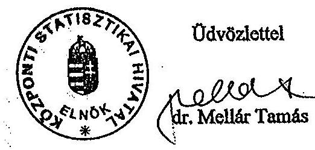
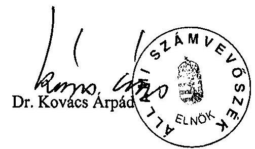
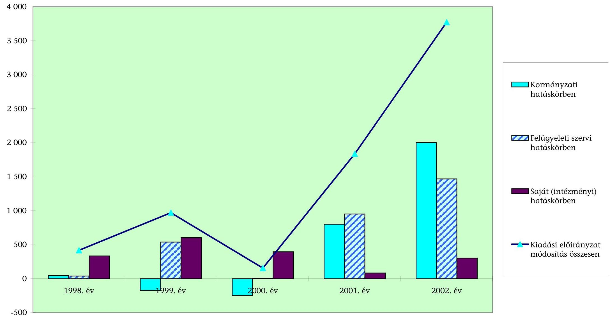
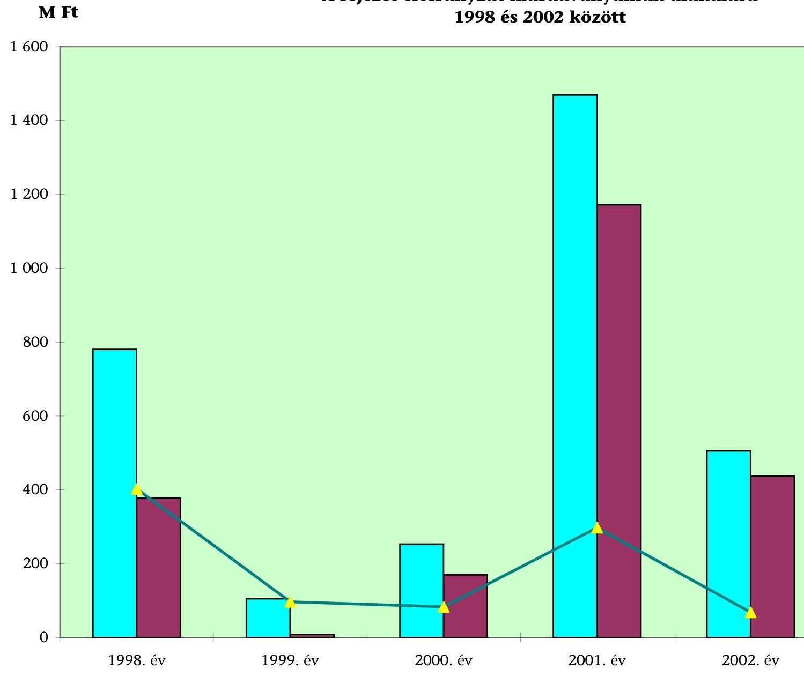
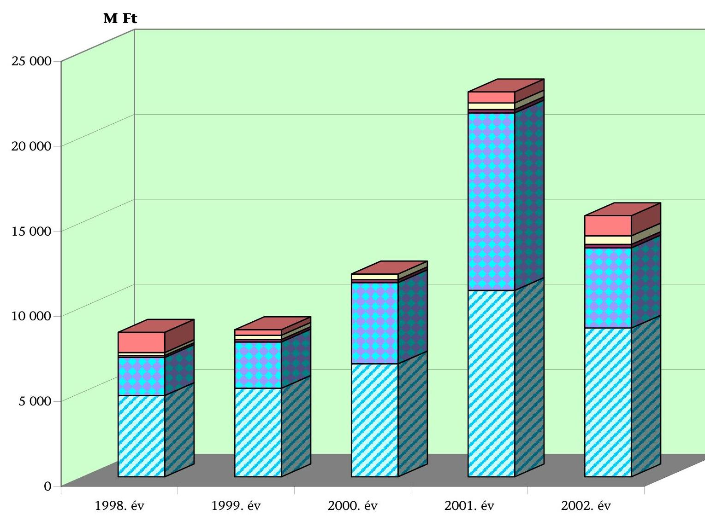
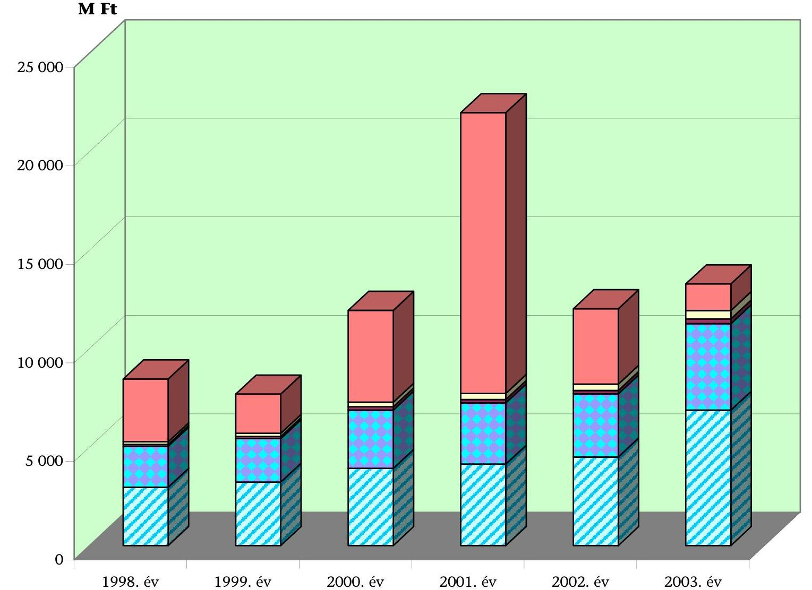

# JELENTÉS 

## a Központi Statisztikai Hivatal fejezet működésének ellenőrzéséről

---

# 2. Államháztartás Központi Szintjét Ellenőrző Igazgatóság 2.3. Átfogó Ellenőrzési Főcsoport 

Iktatószám: V-5-32/2003.
Témaszám: 640 .
Vizsgálat-azonosító szám: V0067

## Az ellenőrzést felügyelte:

## Bihary Zsigmond

főigazgató
Az ellenőrzés végrehajtásáért felelős:
Hegedűsné dr. Müllern Veronika
főcsoportfőnök

## Az ellenőrzést vezette:

## dr. Horváth Margit

osztályvezető főtanácsos

## Az ellenőrzést végezték:

| Csiszárné dr. Kosik Mária számvevő tanácsos | Szikszainé Király Mária számvevő tanácsos | Valu Tibor számvevő tanácsos |
| :--: | :--: | :--: |
| Dede Katalin számvevő | Kocsis Ferencné számvevő | Korsósné Vígh Andrea számvevő |
| Krüzselyi Attila számvevő | Pappné dr. Szamosi Éva számvevő | Szilas István számvevő |
| dr. Zsombori Beáta számvevő gyakornok |  |  |

## Jakab Péter

külső szakértő

---

# A témához kapcsolódó eddig készített számvevőszéki jelentések: 

## címe

a KSH fejezet működésének pénzügyi-gazdasági ellenőrzése 1998.
A központi költségvetés területén működő belső kontroll mechanizmusok ellenőrzése 2001.

Vélemény a Magyar Köztársaság 1998. évi költségvetéséről 398
Vélemény a Magyar Köztársaság 1999. évi költségvetéséről 9839
Vélemény a Magyar Köztársaság 2000. évi költségvetéséről 9932
Vélemény a Magyar Köztársaság 2001-2002. évi költségvetési 0034 törvényjavaslatról

Vélemény a Magyar Köztársaság 2003. évi költségvetési 0241 törvényjavaslatáról
Jelentés a Magyar Köztársaság 1998. évi költségvetése 9927 végrehajtásának ellenőrzéséről
Jelentés a Magyar Köztársaság 1999. évi költségvetése 0024 végrehajtásának ellenőrzéséről
Jelentés a Magyar Köztársaság 2000. évi költségvetése 0126 végrehajtásának ellenőrzéséről
Jelentés a Magyar Köztársaság 2001. évi költségvetése 0232 végrehajtásának ellenőrzéséről
Jelentés a Magyar Köztársaság 2002. évi költségvetése 0329 végrehajtásának ellenőrzéséről

---

# TARTALOMJEGYZÉK 

BEVEZETÉS ..... 5
I. ÖSSZEGZŐ MEGÁLLAPÍTÁSOK, KÖVETKEZTETÉSEK, JAVASLATOK ..... 7
II. RÉSZLETES MEGÁLLAPÍTÁSOK ..... 11

1. A Központi Statisztikai Hivatal fejezet feladatellátása, működése és a gazdálkodási feltételek összhangja ..... 11
1.1. A fejezet feladatellátásának szabályozási, szervezeti háttere, a kiemelt feladatok ..... 11
1.1.1. Külső szakmai átvilágítások ..... 15
1.2. Az EU csatlakozással összefüggő feladatok ..... 16
1.3. A statisztikai szolgálat működtetése ..... 18
1.4. Az országos összeírások ..... 20
1.4.1. Az általános mezőgazdasági összeírás ..... 20
1.4.2. A népszámlálás ..... 21
1.4.3. A szőlő- és gyümölcsös ültetvények összeírása ..... 22
1.5. A belső kontroll rendszer működése ..... 22
1.5.1. Az intézmények működésének, gazdálkodásának szabályozottsága ..... 23
1.5.2. A belső ellenőrzési rendszer működése ..... 27
1.5.3. A felügyeleti ellenőrzés rendszere, szabályozottsága, működése ..... 29
1.5.4. Az informatikai rendszer fejezeti irányítása és működése ..... 31
1.5.5. A Vezetői Információs Rendszer bevezetése ..... 36
2. A költségvetés tervezése ..... 37
2.1. A Központi Igazgatás tervezést irányító szerepének érvényesülése ..... 37
2.2. A fejezet bevételeinek és kiadásainak tervezése ..... 39
3. A költségvetés fejezeti szintű végrehajtása ..... 41
3.1. Az előirányzat-módosítások indokoltsága ..... 41
3.2. Az előirányzat-felhasználási keretek ütemezésének és igénybevételének összhangja ..... 42
3.3. Az előirányzat-maradványok alakulása ..... 42
3.4. A költségvetési beszámolók ..... 43
3.5. A bevételek alakulása ..... 45
3.6. A kiadási előirányzatok teljesülése ..... 47
3.6.1. A személyi juttatásokkal való gazdálkodás ..... 48
3.6.2. A létszámmal való gazdálkodás ..... 53

---

3.6.3. A központosított illetményszámfejtéssel kapcsolatos problémák ..... 55
3.6.4. A dologi kiadások ..... 56
3.6.5. A kiküldetési kiadások ..... 57
3.6.6. Felhalmozási kiadások ..... 58
3.6.7. A közbeszerzési tevékenység értékelése ..... 60
4. A fejezeti kezelésű előirányzatok tervezése és felhasználása ..... 62
4.1. A fejezeti kezelésű előirányzatok tervezése ..... 62
4.2. A fejezeti kezelésű előirányzatok felhasználása ..... 64
4.2.1. A KATOR program ..... 65
4.2.2. A 2001. évi népszámlálás eredményessége ..... 66
4.2.3. A KSH működésének korszerűsítésével összefüggő fejezeti kezelésű előirányzatok ..... 69
4.2.4. Az EU csatlakozással közvetlenül összefüggő fejezeti kezelésű előirányzatok ..... 70
5. Az előző vizsgálataink javaslatai alapján megtett intézkedések ..... 71
5.1. Az éves költségvetések zárszámadása és a belső kontroll rendszer ellenőrzése ..... 72
5.2. Az előző fejezeti átfogó ellenőrzés megállapításai alapján tett intézkedések ..... 72

# MELLÉKLETEK 

1.a-b. számú a KSH elnökének észrevétele és az elnöknek adott válaszunk
2. számú táblázatok
3. számú diagramok

## FÜGGELÉKEK

1. számú Az uniós csatlakozással kapcsolatos feladatok
2. számú A 2001. év népszámlálás teljesítményellenőrzés-típusú vizsgálata

---

# RÖVIDÍTÉSEK JEGYZÉKE 

| Áht. | az államháztartásról szóló, többször módosított 1992. évi XXXVIII. törvény |
| :--: | :--: |
| ÁMÖ | Általános Mezőgazdasági Összeírás |
| Ámr. | az államháztartás működési rendjéről szóló, többször módosított 217/1998 (XII. 30.) Korm. rendelet |
| ANP | EU csatlakozás Nemzeti Program |
| EC | Európai Bizottság |
| ECOSTAT | ECOSTAT Gazdaságelemző és Informatikai Intézet |
| Er. | a központi, a társadalombiztosítási és a köztestületi költségvetési szervek kormányzati, felügyeleti, valamint belső költségvetési ellenőrzéséről szóló 15/1999. (II. 5.) Korm. rendelet |
| EUROSTAT | Európai Bizottság statisztikai szervezete |
| FVM | Földművelésügyi és Vidékfejlesztési Minisztérium |
| GM | Gazdasági Minisztérium |
| megyei igazgatóságok | KSH Megyei Igazgatóságai |
| KATOR | Központi Adategyeztető és Továbbító Országos Rendszer |
| KFO | KSH Központi Igazgatás Költségvetési Főosztály |
| Kjt. | a közalkalmazottak jogállásáról szóló, többször módosított 1992. évi XXXIII. törvény |
| KIR | Központosított Illetményszámfejtési Rendszer |
| Könyvtár | KSH Könyvtár és Dokumentációs Szolgálat |
| Központi Igazgatás | KSH Központi Igazgatás |
| KSH | Központi Statisztikai Hivatal |
| Ktv. | a köztisztviselők jogállásáról szóló, többször módosított 1992. évi XXIII. törvény |
| KVI | Kincstári Vagyoni Igazgatóság |
| Levéltár | KSH Levéltára |
| Mt. | a Munka Törvénykönyvéről szóló, többször módosított 1992. évi XXII. törvény |
| NACE | Európai Unió tevékenységi osztályozása |
| NKI | KSH Népességtudományi Kutatóintézet |
| OSAP | Országos Statisztikai Adatgyűjtési Program |
| OST | Országos Statisztikai Tanács |
| PFO | KSH Központi Igazgatás Pénzügyi Főosztály |
| PM | Pénzügyminisztérium |
| Stt. | a statisztikáról szóló, többször módosított 1993. évi XLVI. törvény |
| SzMSz | Szervezeti és Működési Szabályzat |
| Sztv. | a számvitelről szóló, többször módosított 1991. évi XVIII., illetve a 2000. évi C. törvény |
| VIR | Vezetői Információs Rendszer |

---

.

---

# JELENTÉS 

## a Központi Statisztikai Hivatal fejezet működésének ellenőrzéséről

## BEVEZETÉS

A Központi Statisztikai Hivatal (KSH) fejezet feladata a gazdaság, a társadalom helyzetét és változásait jellemző adatok gyűjtése, rendszerének kialakítása, azok feldolgozása, tárolása, elemzése, közzététele és védelme.

Tevékenységi körébe tartozik továbbá a statisztikai fogalmak, számítási módszerek, nomenklatúrák kidolgozása és karbantartása; a hivatalos statisztikai szolgálat tevékenységének összehangolása és irányítása, valamint a közvélemény, az Országgyűlés és a Kormány tájékoztatása az ország társadalmi, gazdasági és népesedési adatairól; részvétel a nemzetközi szervezetek statisztikai munkájában.

A KSH fejezet feladatrendszerét alapvetően a statisztikáról szóló - többször módosított - 1993. évi XLVI. törvény és az annak végrehajtására kiadott 170/1993. (XII. 3.) Korm. rendelet határozza meg. A fejezet feladatrendszere a vizsgált időszakban bővült a Gazdasági Minisztériumtól átvett, a folyó fizetési mérleg összeállításához szükséges külkereskedelmi statisztikával, továbbá a célelőirányzatok keretében finanszírozott EU Csatlakozás „Statisztika" Nemzeti Programjával és a PHARE Agrárstatisztikai Programmal. A KSH az Európai Unió előírásai és az Európai Bizottság statisztikai szervezete (EUROSTAT) adatkérési igényeinek eleget tett. Külön törvények alapján a vizsgált időszakban három országos összeírást teljesített.

A KSH a Kormány közvetlen felügyelete alá tartozó, szakmailag önálló, országos hatáskörű közigazgatási szerv, jogállása összhangban van a nemzetközi gyakorlattal.

A fejezet címrendje a vizsgált időszakban nem változott, végig öt címre (KSH Igazgatás, KSH Megyei Igazgatás, KSH Könyvtár és Dokumentációs Szolgálat, KSH kutatóintézetek, Fejezeti kezelésű előirányzatok) tagolódott. Ugyanígy változatlan maradt az intézményi struktúra. ${ }^{1}$

[^0]
[^0]:    ${ }^{1}$ KSH Központi Igazgatás (Központi Igazgatás), KSH Megyei Igazgatóságai (megyei igazgatóságok), KSH Könyvtár és Dokumentációs Szolgálat (Könyvtár), KSH Levéltára (Levéltár) valamint két kutatóintézet: az ECOSTAT Gazdaságelemző és Informatikai Intézet (ECOSTAT) és a KSH Népességtudományi Kutatóintézet (NKI).

---

A fejezet eredeti kiadási főösszege 1998-tól 2002-ig közel másfélszeresére, a bevételi előirányzata pedig több mint kétszeresére növekedett, engedélyezett létszáma 2135 főről 2100 főre változott. A KSH fejezet költségvetési kiadása 2002. évben 15 294,2 M Ft-ra, bevételi előirányzata 2528,4 M Ft-ra teljesült. A Magyar Köztársaság 2003. évi költségvetéséről szóló 2002. évi LXII. törvény a KSH fejezet 2003. évi kiadási előirányzatát 13 287,4 M Ft-ban, bevételi előirányzatát 1102,4 M Ft-ban, támogatási előirányzatát 12 185,0 M Ft-ban határozta meg.

Az Állami Számvevőszék a KSH fejezetnél az államháztartás forrásait és azok felhasználását az államháztartásról szóló 1992. évi XXXVIII. törvény 120/A. § (1) bekezdése alapján ellenőrizte. Az előző, 1998. évi átfogó ellenőrzés óta végzett számvevőszéki ellenőrzések az éves költségvetések tervezését, zárszámadását, valamint a belső kontroll mechanizmusok működését érintették.

Az ellenőrzés végrehajtására az Állami Számvevőszékről szóló 1989. évi XXXVIII. törvény 2. § (3) és 17. § (3) bekezdése alapján került sor.

Az ellenőrzés célja annak értékelése volt, hogy a KSH fejezetnél:

- annak szervezeti, irányítási és működési rendszere, továbbá költségvetési előirányzatai összhangban voltak-e a jogszabályokban meghatározott szakmai feladatokkal;
- a költségvetés végrehajtása során biztosították-e a rendelkezésre álló közpénzek szabályszerű és célszerű felhasználását;
- a fejezeti kezelésű előirányzatok felhasználásánál a törvényességi, célszerűségi szempontokat érvényesítették-e, különös tekintettel az EU integrációs célok, illetve a népszámlálás feladatának teljesítésére;
- a korábbi számvevőszéki ellenőrzések megállapításait, ajánlásait a fejezet irányító és gazdálkodási tevékenységében hasznosították-e.

Az átfogó ellenőrzés a fejezet és címei 1998-2002. évi gazdálkodási folyamataira, a helyszíni ellenőrzés a KSH Igazgatás, KSH Megyei Igazgatás, KSH kutatóintézetek, Fejezeti kezelésű előirányzatok címekre, valamint öt megyei igazgatóságra (Baranya, Csongrád, Heves, Szabolcs-Szatmár-Bereg, Veszprém) terjedt ki, hangsúlyozottan a 2001-2002-es évekre irányult, kitekintéssel a 2003. évre is. Az Európai Uniós csatlakozással kapcsolatos feladatok ellenőrzésének részletes megállapításait az 1. számú függelék tartalmazza. Teljesítmény-ellenőrzés módszerével vizsgáltuk a népszámlálás célelőirányzat felhasználásának eredményességét, a részletes megállapításokat a 2. számú függelékben mutatjuk be.

Az ellenőrzés magába foglalta a fejezet 2002. évi beszámolója megbízhatóságának financial audit típusú vizsgálatát is. A megállapításokat az Állami Számvevőszéknek a Magyar Köztársaság 2001. és 2002. évi költségvetése 2002. évi végrehajtásának ellenőrzéséről készülő összefoglaló jelentése tartalmazza.

A végleges jelentést az Állami Számvevőszékről szóló 1989. évi XXXVIII. tv. III. fejezet 25.§ (1) bekezdésének megfelelően megküldtük a KSH elnökének, akinek észrevételét és az arra adott válaszunkat az 1.a-b. sz. melléklet tartalmazza.

---

# I. ÖSSZEGZŐ MEGÁLLAPÍTÁSOK, KÖVETKEZTETÉSEK, JAVASLATOK 

A KSH fejezet feladatainak ellátását a vizsgált időszakban meghatározta az EU-csatlakozással összefüggő szakmai és jogharmonizációs követelmények teljesítése, az uniós szervek folyamatosan bővülő, a közösségi statisztikák alapelvei szerinti adatkérési igényeinek kielégítése. A KSH a történetében először, egymást követő két évben három országos összeírást (az általános mezőgazdasági, a szőlő- és gyümölcsös ültetvényekre vonatkozó és a népszámlálás) is végrehajtott, amelyekről azonban az egész folyamatot átfogóan elemző, értékelő beszámoló a feladatok egyedisége, a felhasznált források nagyságrendje ellenére nem készült. Kiépítette az állóeszköz statisztika adatbázisát, adaptálta a vagyonértékelés EU-s módszertanát, amely az államháztartás alrendszereinek vagyonnyilvántartásához segítséget nyújthat.

A KSH 2000-től rendelkezett Középtávú Fejlesztési Stratégiával, amelyben meghatározták a KSH küldetését, általános céljait (EU-csatlakozás, módszertani fejlesztés, adattárház felépítése és működtetése, a regiszter-kérdés megoldása), valamint a stratégiai célok elérésének módjait és eszközeit a szellemi erőforrások fejlesztésétől a KSH gazdálkodásában a
 bevételek növeléséig.

A KSH a statisztika ágazati irányításának keretében a feladat végrehajtásáról rendelkező konkrét jogi eszközök hiánya és az Országos Statisztikai Tanács formális működése miatt korlátozottan tudta ellátni a hivatalos statisztikai szolgálat egészének koordinálását, metodikai egységesítését, fejlesztését.

A fejezet felügyeletét ellátó, államtitkári besorolású elnök munkáját két szakstatisztikai és két funkcionális elnökhelyettes támogatta. A KSH felső vezetésében bekövetkezett változások (1998-ban elnök- és elnökhelyettes-váltások, 2000-ben újabb elnökhelyettes-váltás) a szakmai munka színvonalát, pártatlanságát az EU évenkénti értékelései szerint nem befolyásolták.

A fejezet intézményeinek köre változatlan maradt, a kiemelt feladatokhoz a költségvetés a fejezeti kezelésű előirányzatokon keresztül biztosított többletforrást. A feladatok ellátása túlnyomórészt a szakmailag szorosan együttműködő Központi Igazgatásra és a megyei igazgatóságokra hárult.

A Központi Igazgatás szervezeti egységeinek száma 1998-2003 között (16-ról 28-ra) emelkedett és differenciáltabbá vált, összhangban az uniós többletfeladatokkal. A megyei igazgatóságok a KSH területi szervezeti egységeiként azonos feladatokkal, közel azonos létszámmal, szervezeti tagolással, egységes központi irányítás mellett, közös éves munkatervek alapján működtek. A munkaterv és monitoringja biztosította a szükséges operatív beavatkozásokat. Az éves munkatervek komplex értékelésének hiányában nem intézkedtek a többnyire a szakmai feladatokhoz az informatikai szolgáltatások pontatlan hozzárendeléséből adódó visszatérő hibák, határidőcsúszások elkerülésére.

---

A fejezet intézményrendszerének stabilitása a belső kontroll rendszer működtetésére kedvező hatással volt. A 2000. évi állapotra vonatkozó felmérésünk eredményéhez képest a fejezet intézményeinél a függetlenített belső ellenőrzés területén jelentős előrelépések történtek. A felügyeleti szerv által 2001. második félévétől biztosított többletkapacitással, változatos foglalkoztatási formákkal a függetlenített belső ellenőrzés működtetését - a kutatóintézetek kivételével - a fejezetnél megoldották. A helyszíni ellenőrzésbe bevont megyei igazgatóságok közül egy esetben (Veszprém Megyei Igazgatóság) nem működött megfelelő színvonalon a függetlenített belső ellenőrzés.

A szabályozottság, szabályszerűség területén hiányosságok, formai hibák, pontatlanságok voltak tapasztalhatók. A Központi Igazgatás nem rendelkezett alapító okirattal, a költségvetési alapokmányaiból kimaradtak a részben önállóan gazdálkodó szervezetek. Az intézmények gazdálkodásához a Központi Igazgatás által kidolgozott mintaszabályzatokat egyes megyei igazgatóságoknál nem adaptálták vagy hiányzott a szabályzatok közötti összhang (Baranya, Veszprém Megyei Igazgatóság). Az ECOSTAT az alapító okiratával ellentétesen vállalkozási tevékenységet folytatott. Az NKI-nél a pénzügyi jogkörök (ellenjegyzés, érvényesítés) nem megfelelő gyakorlásában közrejátszott a gazdasági szervezet létszámhiánya.

Az informatikai rendszerek irányításában és működtetésében a Központi Igazgatás Informatikai Főosztályának - informatikai stratégia hiányában - túldimenzionált, a főosztály egyébként szélesre szabott felelősségi körén túlmutató szerepe volt, az igények koordinálásától, a szakmai elvárások teljesítésén, a fejlesztéseken, beszerzéseken, üzemeltetési feladatokon keresztül az informatikai biztonsággal kapcsolatos szabályozásokig és azok gyakorlati kivitelezéséig. Az erre kialakított, tagolt szervezet a Központi Igazgatásnál foglalkoztatottak közel egyötödét tette ki. A szakfőosztályok egyedi alkalmazási igényeinek kielégítése hátráltatta az általános célú rendszerek fejlesztését. A belső fejlesztések minőségbiztosítását nem alakították ki. Az informatikai biztonság felügyeletének függetlensége korlátozott volt. Az informatikai rendszerek működtetésében a biztonsági előírások betartásának feltételei hiányosak voltak, ugyanakkor a kulcsrendszerek dokumentáltsága a vizsgált időszak végére teljeskörűvé vált.

A fejezet intézményeinél a számviteli rendszer számítástechnikai szempontból lefedett volt, a részrendszerek között azonban nem állt fenn az automatikus adatkapcsolat.

A fejezet eredeti kiadási előirányzata 1998-2002 között összességében 42%-kal emelkedett. A költségvetési források a szakmai feladatokkal összhangban, a vizsgált időszak második felében számottevően növekedtek a fejezeti kezelésű előirányzatokon keresztül biztosított többletforrásokkal (2000-2001-ben az eredeti előirányzat 56%-át tették ki).

A fejezet intézményeinek összes bevételén belül meghatározó (81-93%) volt a költségvetési támogatás aránya, amely a tényleges kiadások 82-96%-át fedezte. Az intézményi működési bevételek, valamint a felhalmozási és tőke jellegű bevételek döntően ingatlanok (irodahelyiségek) bérbeadásából, kiadványértékesítésből és adatszolgáltatásból keletkeztek.

---

A fejezet intézményei eredeti előirányzatainak módosítását a jóváhagyott előirányzat-maradványok felhasználása, a fejezeti kezelésű előirányzatok átadása, a központi beruházások végrehajtása indokolta. A megemelt előirányzatok biztosították az intézmények zavartalan működését, lehetőséget adtak a többletfeladataik ellátására.

A fejezet intézményeinél a személyi juttatásokkal és a létszámmal való gazdálkodást a jogszabályi előírásoknak és a fejezet sajátosságait tükröző belső szabályozásnak megfelelően végezték. Az állományba nem tartozók juttatásai jogcímen elszámolt kifizetéseket döntően az adatgyűjtési feladatok megoldását rugalmasabban biztosító megbízási díjakra fordították.

A központosított illetményszámfejtés működtetése a fejezetnél nem eredményezett megtakarítást. Az új program megbízhatatlansága miatt a korábban használt számfejtő program szükségszerű, párhuzamos alkalmazása többletmunkával járt.

A vizsgált időszakban a fejezetnél a költségvetési kiadások mintegy negyedét a dologi kiadásokra fordították. Ezen belül az üzemeltetési és fenntartási kiadások (bérleti, lízing- és közüzemi díjak) dinamikusan emelkedtek.

A tárgyi eszközök nettó állománya két és félszeresére növekedett. Az ingatlanok állománya korszerűsödött a 2000-ben megkezdett, ütemezett, komplexitásra törekvő rekonstrukciók, felújítások eredményeként. Megtörtént a számítástechnikai eszközök teljes cseréje. A felújítások, beruházások eredményeként az elmúlt öt évben valamennyi megyei igazgatóságon javultak a munkakörülmények (korszerű ügyvitel-, kommunikációs- és biztonságtechnika).

A fejezetnél a vizsgált esetekben - a kutatóintézetek kivételével, ahol az egy esetben előforduló értékhatárt meghaladó szolgáltatási szerződésnél nem alkalmazták a közbeszerzési, illetve rendszeresen a szabadkézi vételre vonatkozó pályáztatási előírásokat - betartották a közbeszerzések jogszabályi előírásait.

Az ellenőrzésünk valamennyi fejezeti kezelésű előirányzatra kiterjedt. Megállapítottuk, hogy az előirányzatok felhasználása a jogszabályi előírásoknak és a belső szabályozásoknak megfelelően történt. A rendelkezésre álló forrásokat a fejezet intézményeihez történt átcsoportosítást követően szabályszerűen használták fel.

A teljesítmény-ellenőrzés módszerével megvizsgáltuk a 2001. évi népszámlálás fejezeti kezelésű előirányzat felhasználásának eredményességét. Megállapítottuk, hogy a feladatot a KSH szakmai irányításával, az önkormányzatokkal jól meghatározott feladatmegosztásban, a szakmai igényeknek és a nemzetközi ajánlásoknak megfelelően, a jogszabályokban rögzített költségkereteken belül hajtották végre. A népszámlálás keretében felvett adatok a KSH által meghatározott módon és időben kerülnek feldolgozásra. A felvételi tematika, annak előkészítése és végrehajtása, az adatok feldolgozása biztosítja, hogy a KSH minden adatot hasznosítani, publikálni tudjon.

---

Az ÁSZ korábbi vizsgálatai megállapításait, javaslatait a realizálás során többnyire eredményesen hajtották végre, a törvényi, illetve az intézkedési tervben foglalt határidőket azonban több esetben túllépték.

A helyszíni ellenőrzés megállapításainak hasznosítása mellett javasoljuk:

# a Kormánynak: 

1. tekintse át a hivatalos statisztikai szolgálathoz tartozó szervezetek hatékonyabb együttműködéséhez, az adatszolgáltatás metodikai egységesítésének továbbfejlesztéséhez szükséges szabályozási feladatokat és intézkedjen a jogszabály-módosítások előkészítéséről, illetve kiadásáról;

## a Központi Statisztikai Hivatal elnökének:

1. kezdeményezze, hogy az államháztartás vagyonnyilvántartásai megbízhatóságának javításához az adaptált EU-s módszertanok a kormányzat által meghatározott körben hasznosításra kerüljenek;
2. gondoskodjon a fejezet informatikai stratégiájának elkészítéséről, az informatikai biztonság felügyeletének teljes függetlenségéről, a biztonsági előírások betartása hiányzó feltételeiről, a belső fejlesztések minőségbiztosításáról;
3. intézkedjen a fejezet intézményeinél a belső kontroll rendszer egyes elemeinél (alapító okiratok, költségvetési alapokmányok, a függetlenített belső ellenőrzés, pénzügyi jogkörök gyakorlása, a kötelezettségvállalások nyilvántartása) tapasztalt szabálytalanságok megszüntetése érdekében;
4. vizsgálja felül az Informatikai Főosztály feladat- és hatáskörét;
5. vizsgálja felül a kutatóintézetek vállalkozási tevékenységének jogosultságát és közbeszerzési gyakorlatát, az utóbbinál az önálló lebonyolítás indokoltságát.

---

# II. RÉSZLETES MEGÁLLAPÍTÁSOK 

## 1. A Központi Statisztikai Hivatal fejezet feladatellátása, MŰKÖDÉSE ÉS A GAZDÁLKODÁSI FELTÉTELEK ÖSSZHANGJA

### 1.1. A fejezet feladatellátásának szabályozási, szervezeti háttere, a kiemelt feladatok

A KSH fejezet az alap-, az időszakonként jelentkező többletfeladatait, valamint az ezen feladatok ellátása érdekében végzett koordinációs tevékenységét törvényi háttérrel alátámasztva - a statisztikáról szóló 1993. évi XLVI. törvény (Stt.) - látta el a vizsgált időszakban (1998-2002).

Az Stt.-t az ellenőrzött időszak alatt többször módosították. Ezek közül az 1999. évi CVIII. törvény az Stt. módosításán túl a 2001. évi népszámlálással kapcsolatban is rendelkezett. Az Stt. szerint (6. § (1) bekezdés c)-d) pontok) a másik két országos összeírásra vonatkozóan külön törvények kerültek kiadásra, az 1999. évi XLVI. törvény rendelte el az általános mezőgazdasági összeírást (ÁMÓ), a szőlő- és gyümölcsös ültetvények összeírását pedig a 2000. évi CXLIII. törvény.

A törvény végrehajtására, illetve felhatalmazása alapján rendszeresen adtak ki kormányrendeleteket. Közülük kiemelkedik az Országos Adatgyűjtési Program (OSAP), amely a hivatalos statisztikai szolgálathoz ${ }^{1}$ tartozó szervezetek tevékenysége összehangolásának legfontosabb eszköze.

Az Stt. felhatalmazása alapján (8. § (6) bekezdés) a Kormány minden évben (194/1997. (XI. 4.) és az azt módosító 123/1998. (VI. 17.), 187/1998. (XI. 13.), 154/1999. (X. 22.), 173/2000. (X. 18.), 198/2001. (X. 19.), 227/2002. (XI. 7.) Korm. rendeletek) kiadta - jogi személyekre, valamint a gazdasági tevékenységet folytató természetes személyekre és a jogi személyiséggel nem rendelkező szervezetekre vonatkozó hatállyal - a következő évi adatgyűjtések listáját, megjelölve, hogy a statisztikai szolgálat melyik tagja rendelte el az adott gyűjtést, milyen adatszolgáltatói körre kiterjedően és milyen gyakorisággal.

A külkereskedelmi statisztika szervezeti és felelősségi rendjéről, a rendszer fő fejlesztési feladatairól és a végrehajtásukhoz szükséges feltételekről szóló 2009/2002. (I. 25.) Korm. határozat alapján a külkereskedelmi statisztika előállításának feladata és kizárólagos felelőssége 2002. V. 1-jétől - létszám és előirányzat átcsoportosításával - a Gazdasági Minisztériumtól (GM) a KSH-hoz került.

[^0]
[^0]:    ${ }^{1}$ Az Stt. 3. § (2) bekezdése szerint a hivatalos statisztikai szolgálathoz tartozó szervek: a KSH, a minisztériumok és a Miniszterelnöki Hivatal, egyes országos hatáskörű szervek (például a Gazdasági Versenyhivatal), a Legfőbb Ügyészség és a Magyar Nemzeti Bank (MNB).

---

Az átadás-átvételről 2002. III. 28-án a KSH és a GM, az együttműködésről a KSH az érintett szervezetekkel (a Vám- és Pénzügyőrség Országos Parancsnoksága, a GM, a Külügyminisztérium (KüM), a Földművelésügyi és Vidékfejlesztési Minisztérium (FVM) és az MNB) megkötötte a megállapodásokat. A feladat zökkenőmentesen átkerült a KSH fejezethez, ezáltal 2003-tól a külkereskedelmi adatokat egységes rendszerben lehet beilleszteni a fizetési mérleg adatai közé. ${ }^{1}$

A vizsgált időszakban a fejezethez tartozó címek, intézmények köre változatlan maradt, a feladatbővülésekhez a költségvetés a fejezeti kezelésű előirányzatokon keresztül biztosított forrást.

Formai hiba, hogy az állami költségvetésről, illetve azok végrehajtásáról szóló törvényekben 1999-től az ECOSTAT a névváltoztatás előtti megnevezéssel (KSH Gazdaságelemzési és Informatikai Intézet) szerepel(t).

A fejezet feladatellátásában meghatározó szerepe volt a Központi Igazgatásnak és a megyei igazgatóságoknak.

A KSH 2000-től rendelkezett az elnök által jóváhagyott Középtávú Fejlesztési Stratégiával, amelyben meghatározták a KSH küldetését², általános céljait (EU-csatlakozás, módszertani fejlesztés, adattárház felépítése és működtetése, a regiszter-kérdés megoldása), valamint a stratégiai célok elérésének módjait és eszközeit a szellemi erőforrások fejlesztésétől a KSH gazdálkodásában a bevételek növeléséig.

A KSH eleget tett az Országgyűléssel és Kormánnyal szembeni, az ország évi helyzetéről, társadalmi és gazdasági, népesedési folyamatairól adandó tájékoztatási kötelezettségének (Stt. 6. § (1) bekezdés h) pont), melynek keretében évente részletes tanulmányt készített (a megelőző négy évre vonatkozóan).

A KSH elnöke az Országgyűlés Gazdasági bizottságának évente beszámolt a KSH statisztikai tevékenységéről, a szervezet működéséről, érintve a statisztikai szolgálat helyzetét is.

A Központi Igazgatás szervezeti egységeinek száma a többletfeladatokkal összhangban növekedett, differenciálódott: az önálló szervezeti egységek száma 1998-ban 16 volt, 2003. elején pedig 28 (a létszám 22%-kal növekedett). A nem statisztikai feladatokat ellátó szervezeti egységeinél foglalkoztatottak aránya ebben az időszakban 23-25% volt, ezen belül az Informatikai Főosztályé 17-19%-ot tett ki.

Az EU-előírások teljesítésével
 kapcsolatos feladatok növekedése, az EU prioritásai miatt a Népesedés-, egészségügyi és szociális statisztikai Főosztályon belül Vándorlásstatisztikai Osztály jött létre; önállóvá vált az összeírói hálózattal, a cenzusok kommunikációjával foglalkozó Összeírás-, kommunikációs és képzési Osztály, valamint a Környezetstatisztikai Osztály. Más szervezeti egységekből önálló

[^0]
[^0]:    ${ }^{1}$ Korábban a fizetési mérlegbe beépített külkereskedelmi adatok nem a vámstatisztikán alapultak.
    ${ }^{2}$ Megalapozott, hiteles, a differenciált felhasználói igényekkel és a nemzetközi követelményekkel összhangban álló statisztikai szolgáltatások nyújtása a szervezetek és az állampolgárok részére.

---

sulva megalakult a Pénzügy-statisztikai Főosztály és a Külkereskedelmi statisztikai Főosztály is, kibővített feladatkörrel.

Az államtitkári besorolású elnök munkáját négy elnökhelyettes segítette. Kettő a szakstatisztikai területeket (gazdaság- és társadalomstatisztikai), kettő a funkcionális területeket (gazdasági és informatikai, és a koordinációs) felügyelte.

A miniszterelnök a 29/1998. (IX. 4.) ME határozatban a KSH élére új elnököt, a statisztikai elnökhelyettesek felmentése után (46/1998. (XI. 11.) ME határozat) helyükre az 50-, 51/1998. (XII. 1.) ME határozattal újakat nevezett ki, 2000. I. 14-ei hatállyal pedig új gazdaságstatisztikai elnökhelyettest.

A negyedik elnökhelyettes kinevezésével (53/1998. (XII. 19.) ME határozat) létrehozták a koordinációs elnökhelyettesi pozíciót, amely alapvetően a korábban az elnök által közvetlenül irányított szervezeti egységek (a Központi Igazgatás létszámának 18,4%-a) irányításával mentesítette az elnököt az operatív, adminisztratív feladatok alól.

A működés stabilitása szempontjából kedvező volt, hogy a gazdasági és informatikai elnökhelyettes 1991. IX. 1-jétől töltötte be ezt a pozíciót, továbbá a koordinációs elnökhelyettes korábban - az Elnöki Főosztály vezetőjeként - megfelelő tapasztalatra tett szert.

A KSH felső vezetésében bekövetkezett személyi és szervezeti módosítások - az EU évenkénti értékelései szerint - a kiegyensúlyozott szakmai munkát nem befolyásolták.

Az egyes elnökhelyettesek által irányított szervezeti egységek és a felügyelt intézmények létszáma közel azonosan oszlott meg a szakstatisztikai területeken. Viszont a funkcionális területek közül a gazdasági és informatikai elnökhelyettes esetében jelentős eltérést (34%) mutatott, az Informatikai Főosztály nagy létszáma miatt, és ide tartozott a Könyvtár és a Levéltár felügyelete is.

A fejezeti szintű költségvetési irányítói feladatokat ellátó Költségvetési Osztály (KFO) 2001-ben főosztállyá alakult (6/2001. (SK 3.) elnöki utasítás), nem a létszáma (6 fő) vagy szervezeti felépítése, hanem az általa ellátott feladatok kiemelt jelentősége miatt.

A helyszíni ellenőrzés idején a KFO két osztályból állt és rendelkezett - 2002. IX. 2-án kiadott - hatályos ügyrenddel.

A Központi Igazgatás a fejezeti szintű gazdálkodási feladatok keretében ellátta a költségvetési tervezéssel, beszámolással, az előirányzatok rendeletetésszerű felhasználásának felügyeletével, a központi beruházásokkal és közbeszerzésekkel, továbbá az informatikai rendszerek bővítésével, üzemeltetésével, karbantartásával, 2002-től a központosított illetményszámfejtéssel kapcsolatos teendőket.

A Központi Igazgatás és a 19 megyei igazgatóság (a Budapesti és a Pest megyei egy szervezetben) önálló, de a szakmai feladatok szempontjából szorosan együttműködő szervezetek. A megyei igazgatóságok - összhangban az Stt. meghatározásával - a KSH területi szervezeti egységeiként működtek. A megyei

---

igazgatóságok feladatköre, létszáma és szervezeti tagolódása (gazdaság-, illetve társadalomstatisztikai, tájékoztatási, informatikai, valamint gazdasági osztályok) alapjában azonos volt, kivéve a Budapesti és Pest Megyei Igazgatóságét, amely az igazgatóságok 40-60 fős létszámához képest 220 fős volt.

A Központi Igazgatás és a megyei igazgatóságok közös éves munkatervek alapján látták el a tevékenységüket. A munkatervek megvalósulását figyelemmel kísérték, havonta beszámoló készült az elnök részére. A munkaterv és monitoringja biztosította a szükséges operatív beavatkozásokat. Ugyanakkor hiányzott az éves munkatervek megvalósulásáról a komplex értékelés, a többnyire a szakmai feladatokhoz az informatikai szolgáltatások pontatlan hozzárendeléséből adódó visszatérő hibák, határidő-csúszások okainak elemzése. További hiányosságot jelent, hogy nem - vagy csak egy-egy feladat vonatkozásában - készültek középtávú tervek.

Az államháztartás működési rendjéről szóló, többször módosított 217/1998. (XII. 30.) Korm. rendelet (Ámr.) 149. § (3) bekezdése alapján 1999 óta minden évben a felügyeletet ellátó elnökhelyettesek elkészíttették az intézmények munkájának szöveges értékelését, melyek intézményenként, évenként egyenetlen színvonalúak voltak, a minősítés (kiváló, jó, megfelelő) kritériumait, az értékelés szempontjait - a megyei igazgatóságok kivételével - sem rögzítették. A megyei igazgatóságok értékelési rendszerében az értékelés alapja - az adatgyűjtés minősége, határidők be(nem)tartása, a tájékoztatás és a gazdálkodás színvonala - meghatározott volt, bár nem kvantifikálták.

A megyei igazgatóságokat vezető igazgatók - általában rotációs rendszerben részt vettek a KSH minden munka- és szakmai bizottságában, a Vezetői Kollégium és Igazgatósági Értekezleteken, valamint a külön Igazgatósági Értekezleteken. A megyei igazgatóságok felügyeletét közvetlenül ellátó Területi és Koordinációs Főosztály munkatársai rendszeresen tájékozódtak a helyszínen a kiemelt és aktuális feladatok személyi, tárgyi feltételeiről, a szakfőosztályokkal való kapcsolattartásról, azt követően intézkedtek további kontrollok alkalmazásáról.

A Központi Igazgatás funkcionális főosztályai operatívan is gyakorolták a felügyeleti jogkörüket.

A KFO és a Területi és Koordinációs Főosztály megállapította, hogy az 1999-ben vállalt tartós kötelezettségek áthúzódó hatása miatt 2000. évben csak minimális bérfejlesztésre lenne a Szabolcs-Szatmár-Bereg Megyei Igazgatóságnak lehetősége. Ezért a Központi Igazgatás két főosztálya és a megyei igazgatóság írásban rögzítették, hogy személyi juttatások kifizetése - a fedezet meglétének igazolása mellett - a KFO előzetes engedélyével történhet.

A Könyvtár a muzeális intézményekről, a nyilvános könyvtári ellátásról és a közművelődésről szóló 1997. évi CXL. törvény szerint országos szakkönyvtár, amely a legnagyobb statisztikai gyűjteménnyel rendelkezik.

A könyvtári állomány 1998-2002 között 692080 db-ról 753912 darabra, az állomány nyilvántartási értéke 234997 E Ft-ról 466344 E Ft-ra nőtt.

---

A Levéltár, mint részben önálló költségvetési szerv - alapító okiratának módosítását követően - 2000. I. 1-jétől a KSH Könyvtár és Dokumentációs Szolgálat költségvetési címen belül jogi személyiséggel nem rendelkező részjogkörű költségvetési egység lett. Éves költségvetését és engedélyezett létszámát a Könyvtár költségvetése tartalmazza, amelyet a Könyvtár és Levéltár között a két szervezet vezetője és a költségvetési (fő)osztályvezető háromoldalú megállapodásban megosztott, a kiadási előirányzatot - amely 1998-ban és 2002-ben is a módosított fejezeti költségvetés 1,2%-át tette ki - tekintve 1:10-11 arányban a Könyvtár javára. (A létszám esetében a megosztás 53-54, illetve 6 fő.)

Az Stt. a KSH feladatai között felsorolja (6. § (1) bekezdés l) pont) a kötelespéldányra jogosult országos feladatkörű tudományos szakkönyvtár és szaklevéltár fenntartását, üzemeltetését.

A fejezethez a vizsgált időszakban két kutatóintézet tartozott. Az NKI 1968-ban alakult meg elődjéből, az 1963-ban létrehozott Népességtudományi Kutató Csoportból. Az NKI önálló jogi személyként működő, részben önállóan gazdálkodó költségvetési szerv, amely a részére jóváhagyott költségvetési előirányzatok felett teljes jogkörrel rendelkezik, az alapító okiratban szereplő feladata a KSH adatbázisára és infrastrukturális hátterére alapozva alap- és alkalmazott demográfiai kutatások végzése, dokumentálása.

Az ECOSTAT a 2201/1996. (VII. 24.) Korm. határozat alapján, 1996. VIII. 1-jétől működik részben önállóan gazdálkodó költségvetési szervként a KSH felügyelete alatt, a részére jóváhagyott költségvetési előirányzatok felett teljes jogkörrel rendelkezik. Alapító okiratában szereplő feladatai a KSH informatikai bázisára és infrastrukturális hátterére alapozva, államigazgatási célú gazdaságstatisztikai és döntés-előkészítési szolgáltatások nyújtása céljából, gazdaságstatisztikai elemzések és hatásvizsgálatok, informatikai szolgáltatások, valamint módszertani és információ-technológiai kutatások végzése, ökonometriai modellek összeállítása és működtetése.

# 1.1.1. Külső szakmai átvilágítások 

A KSH tevékenységét a vizsgált időszakban három külső szakmai átvilágítás elemezte és értékelte, az egyik szervezeti-folyamatszervezési szempontból, a másik kettő a szakmai tevékenység ellátásának kritériumai alapján.

A „KSH hivatali folyamatainak felméréséről" c. tanulmányt, valamint a „hatékonyság javítására készített elemzés"-t a nagy könyvvizsgáló cégek egyikének hazai leányvállalata két szerződés alapján, összesen (bruttó) 14,4 M Ft díjazásért készítette el 1999-ben a KSH elnökének megrendelése alapján.

A magyar statisztikai rendszer szakértői vizsgálatát 2001-ben a kanadai statisztikai hivatal elnöke és asszisztense végezte el az elnök felkérése alapján. A jelentés Magyarországon (Statisztikai Szemle 2002. 2. szám) és külföldön is nyilvánosságra került. A szerződések alapján a költségek és költségtérítések, továbbá a munkatárs díja (a vizsgálat vezetője nem tartott igényt díjazásra) összesen 26,1 M Ft-ot tettek ki.

A magyar statisztikai rendszer átvilágításáról a hivatalos jelentést az Európai Bizottság (EC) statisztikai szervezete (EUROSTAT) megbízásából az angol statisztikai hivatal volt elnöke állította össze, azt 2002 áprilisában tették közzé.

---

A nemzetközi szakértői jelentések a KSH szakmai tevékenységét, az állomány felkészültségét, elkötelezettségét kedvező minősítéssel látták el, megerősítve a nemzetközi statisztikai szervezetek véleményét.

A szakmai átvilágítások megállapításai szerint a KSH feladatainak eredményes végrehajtásához jelentősen hozzájárult a jól felkészült és stabil állomány mind a Központi Igazgatásnál, mind a megyei igazgatóságokon. A kedvező megállapítások mellett az átvilágítások kritikai észrevételt a statisztikai szolgálat működtetésével, a hivatalos statisztikai szolgálathoz tartozó szervek tevékenységének koordinálásával, a szakmai kontroll gyakorlásával kapcsolatban fogalmaztak meg.

Az EUROSTAT megbízásából készült jelentés megerősítette a kanadai szakértők megállapításait, ugyanakkor kitért szervezeti, munkaszervezési-irányítási kérdésekre is (például az informatikai munkatervek komplexitása).

Megállapításaik szerint a szolgálat tevékenységének koordinálására, fejlesztésére hivatott intézmények - az Országos Statisztikai Tanács (OST) és a KSH - nem képesek ellátni ezen feladatukat. A KSH nem tartott fenn a társszervekkel kétoldalú kapcsolati hálózatot, nem ismerte a minisztériumok (oktatási, egészségügyi, belügyi) legújabb koncepcióit, ezzel összefüggésben nem volt következetes a felhasználói igények feltárása.

A „kanadai átvilágítás" alapján az Elnöki Értekezlet 2001. XII. 10-ei döntésének megfelelően öt munkacsoport, „kanadai bizottság" jött létre, lefedve a KSH stratégiája szempontjából fontos területeket.
(1) a KSH államigazgatásban elfoglalt helye és szerepe (beleértve az OST, valamint az OSAP helyzetét is); (2) a külvilággal való kapcsolattartás (publikációk, felhasználói igények, elemzőképesség); (3) a KSH működési rendjének átalakítása (a belső költségelszámolás lehetőségeivel, összefüggéseivel); (4) képzés-továbbképzés, személyzeti politika és (5) a megyei igazgatóságok helye és szerepe a KSH működésében.

A bizottságok eltérő színvonalú és készültségi fokon álló anyagokat állítottak össze. Azok formális megtárgyalására, az elfogadott megállapítások, javaslatok alapján átfogó feladat-meghatározásra nem került sor, bár az elnök többször is értékelte a bizottságok munkáját (például a Vezetői Kollégium és Igazgatói Értekezlet 2002. XI. 5-ei ülésén).

A bizottságok javaslatai több esetben már hasznosultak: az (1) bizottság szövegjavaslatát a KSH az Stt. 2004-re tervezett módosításába teljes mértékben beépítette, a (2) bizottság javaslata alapján felgyorsult az internetes elérhetőség fejlesztése és megkezdődött a kiemelt adatszolgáltatók külön kezelésére irányuló program.

# 1.2. Az EU csatlakozással összefüggő feladatok 

A KSH teljesítette az EU előírásait és az EUROSTAT által közvetlenül eljuttatott adatkérési igényeket, érvényesítette a közösségi statisztikák előállításánál kötelező alapelveket.

---

A KSH az EU/EUROSTAT-on kívül egyéb nemzetközi szervezetek - az OECD, az IMF, az ENSZ (szakosított szervezetei) - részére is szolgáltatott adatokat.

A KSH-nak az EU/EUROSTAT követelményeinek kielégítésével, a jogharmonizációval kapcsolatos tevékenységét a Kormány és az uniós intézmények folyamatosan nyomon követték és értékelték. Az értékelések szerint a KSH az EU csatlakozással közvetlenül kapcsolatos szakmai-, valamint jogharmonizációs feladatait megoldotta. A KSH a vizsgált időszakban - különösen az Stt. 1999. évi módosítását követően - megfelelt az EC előírásában (Regulation 322/97, Article 10) meghatározott alapelveknek (pártatlanság, megbízhatóság, az adatok mellett a meta-adatok és a módszertan nyilvánosságra
 hozatala, valamint a felhasználók pártatlan kezelése).

Az EC részére a KüM minden évben beszámolt a közösségi joganyag átvételének helyzetéről, amelynek része volt a KSH által készített statisztikai fejezet. A KSH az EUROSTAT-nak a csatlakozás nemzeti programjában részletezett statisztikai feladatok teljesítéséről rendszeresen tájékoztatást nyújtott. Az EUROSTAT közvetlenül is nyert információkat a KSH egyes szakstatisztikai főosztályaival fenntartott kapcsolata, illetve a kért adatszolgáltatás teljesítése révén.

A Magyarország és az EU közötti csatlakozási tárgyalások alapvető kérdéseiről, a tárgyaló delegáció kijelöléséről, az EU közösségi vívmányai (acquis communautaire) átvételének Nemzeti Programjáról, valamint a csatlakozásra való felkészülés gazdaságstratégiai hátteréről szóló 2084/1998. (IV. 8.) Korm. határozat elfogadta - az évenként felülvizsgálandó - Nemzeti Programot (ANP). A Kormány az EC által előzetesen átadott, statisztikára vonatkozó közösségi vívmányoknál átmeneti intézkedést (kivételek) és technikai kiigazításokat nem igényelt.

Ez azt jelentette, hogy a vonatkozó 170 különböző szintű jogforrás (rendelet, irányelv, határozat) tekintetében a Kormány vállalta, hogy a Magyar Köztársaság minden jogszabálynak legkésőbb a csatlakozás időpontjáig eleget tesz, kivéve azokat, amelyek irrelevánsak Magyarország vonatkozásában (16 darab), vagy már megvalósultak (14 darab). A közösségi vívmányok többi részét (75 ajánlás, állásfoglalás, illetve szerződés) illetően a Kormány úgy határozott, hogy „megjegyzések nélkül tudomásul vesszük".

Az EU négy - jogszabály módosítását igénylő - követelményt állított a statisztikai jogharmonizáció területén. Ebből háromnak az Stt. törvény módosításával Magyarország már eleget tett, a negyediket, a Taric nomenklatúrával kapcsolatban a vámtarifáról szóló 1995. évi CI. törvénynek a tényleges csatlakozás időpontjáig történő módosításával kell megvalósítani.

Az Stt. módosítása az 1999. évi CVIII. törvény alapján biztosítja a statisztika pártatlansága követelményének kiterjesztését (3/A. §). Megvalósult a közigazgatási nyilvántartásokban szereplő adatok nemzeti statisztikai hivataloknak, azaz a KSH-nak (21. § (4) bekezdés) és az egyedi adatok - csak statisztikai célból, statisztikai tevékenységgel foglalkozó nemzetközi szervezetnek - az EUROSTAT-nak (18. § (3) bekezdés és a 2002. évi XLII. törvénnyel beiktatott 25/B. §) történő átadásának lehetőségére vonatkozó követelmény.

Az EU/EUROSTAT követelmények teljesítése általában egybeesett a magyar statisztikai rendszer belső önfejlődésével, azt felgyorsította vagy éppen új

---

adatokat is eredményezett (például GDP-számítás az országosnál kisebb területre vonatkozóan).

Az EUROSTAT elvárása, hogy a tagországok az adatszolgáltatási kötelezettségüknek közvetlenül a nemzeti statisztikai hivatalokon keresztül, de legalábbis azok szakmai egyetértésével tegyenek eleget.

Az ANP-ben meghatározott feladatok közé tartozott a „nemzetgazdaság állóeszköz-állományának felmérése a vagyonmérlegek és a nemzeti számlák mutatóinak összeállítása." A KSH 2000-2002. között a közvetlen adatgyűjtések mellett kidolgozta a hiányos és/vagy nem egységesen összeállított alapnyilvántartások - pl. önkormányzati ingatlan nyilvántartás, Kincstári Vagyoni Igazgatóság (KVI) nyilvántartása - statisztikai célú felhasználására alkalmas módszertant is.

A feladatot - fontosságának megfelelően - a KSH külön projektben végezte, 2001-ben pedig új szervezeti egységet is létrehozott (Nemzeti számlák főosztály Tőkeszámla osztály) erre a célra.

Így lehetővé válik, hogy a KSH számára előírt határidőig (az EU csatlakozás időpontja) a nemzeti számlák összeállításához (GDP számításhoz) hozzávetőleges, statisztikai felhasználásra alkalmas becslések az államháztartási szektorra vonatkozóan is rendelkezésre álljanak.

Ez azonban nem helyettesíti - mivel nem is ez volt a célja - az intézményi/eszközcsoport szintű vagyoni nyilvántartást. (A tárgyieszköz-statisztika eddigi fejlesztései ugyanis meghatározóan a termelt eszközökre terjedtek ki.) Ugyanakkor a KSH által adaptált uniós módszertan hozzájárulhat az államháztartási alrendszerek vagyoni nyilvántartásai megbízhatóságának lényeges javításához, továbbá az államháztartás információs és mérlegrendszere keretében az Áht. 116. §-ában előírt vagyonmérlegek hiányainak pótlásához ${ }^{1}$.

Az önkormányzatok a nyilvántartásaik 2003. I. 1-jétől történő kiegészítését a szaktárcák által - a Belügyminisztérium koordinálásával és a KSH bevonásával készített értékelési módszerre vonatkozó jogi iránymutatás alapján végzik. (A jogi iránymutatás azonban nem terjed ki az államháztartás többi alrendszerére.)

# 1.3. A statisztikai szolgálat működtetése 

A KSH az ágazati irányító szerepét a statisztikai szolgálat működtetésén keresztül látja el; ehhez jogi eszközként az OSAP, külön szervezetként az OST tartozik.

Az OSAP célja a decentralizált statisztikai intézményrendszer, a statisztikai szolgálat által végzett adatgyűjtés összehangolása.

Az OSAP-ban az adatgyűjtések 3-7\%-a volt az új, 21-43\%-a a módosult, a többi a 1993-2003 közötti időszakban változatlan maradt. A vizsgált időszakban a gyűj

[^0]
[^0]:    ${ }^{1}$ Az Áht. 48. §. n) pontja, valamint a pénzügyminiszter feladat- és hatásköréről szóló 140/2002. (VI. 28.) Korm. rendelet 14. §-a értelmében a pénzügyminiszter felelős az államháztartás pénzügyi információs rendszerének működtetéséért, beleértve az állami vagyont is, ezért a 2003. szeptember közepén induló PM fejezet működésének ellenőrzése keretében erre az ÁSZ kiemelt figyelmet fordít.

---

tések száma több mint tíz százalékkal nőtt, de a KSH által elrendelt gyűjtések aránya változatlan - közel negyven százalék - maradt (2003-ban az 521 gyűjtés közül 204).

A Kormány által a 2336/2002. (XI. 7.) határozatában elrendelt felülvizsgálat alapján megállapították, hogy a statisztikai szolgálat szervezetei közötti együttműködéssel az OSAP-ból kiiktatták a párhuzamosságokat és az igazgatási célú adatgyűjtéseket, az OSAP gyűjtéseinek száma érdemben tovább nem csökkenthető (a gyűjtések mindössze 9\%-át lehet megszüntetni, de ebből 3,5\% beépül más gyűjtésekbe), ezért jelentős költség-megtakarítás nem várható.

Az OSAP-ba kerülő gyűjtések előkészítése, egyeztetése (a KSH szakmai szervezeti egységei között, a megyei igazgatóságok intézményesített bekapcsolásával a statisztikai szolgálathoz tartozó társtárcákkal, az adatfelhasználói partnerekkel) a KSH rutinfeladata volt, de megjelentek a feladatellátást alapjaiban nem veszélyeztető koordinációs problémák, mind a belső (például az Információs Szolgálathoz beérkezett kérdések, vagy a Marketing Osztály által nyert információk szervezett, intézményesített eljuttatása az érintett szakfőosztályokhoz), mind a külső együttműködésben, az új/módosított gyűjtésekhez külön számítástechnikai alkalmazások előállításának csúszása, egyéb munkaszervezési hiányosságok miatt.

Egyes minisztériumoknál hiányzott a megfelelő statisztikai szervezet és/vagy szakmai kompetencia, például az Egészségügyi, Szociális és Családügyi Minisztériumnál. Előfordult, hogy megfelelő statisztikai szakértelem és szervezeti egység megléte (GM, PM, MNB) esetén sem a KSH szakmai elvárásai, módszertana szerint végezték a szakmai tevékenységet.

A KSH szakfőosztályainak adatgyűjtési igényei közötti prioritások megállapításához az egyes gyűjtések költségigénye meghatározásának lehetősége a Vezetői Információs Rendszerre (VIR) alapozva - a megyei igazgatóságoknál 2003-ra már rendelkezésre állt. A Központi Igazgatásnál a helyszíni ellenőrzés idején volt folyamatban a szükséges metodika kialakítása és ehhez kapcsolódóan az addigi - Pénzügy Főosztály (PFO) által készített - becslésen alapuló költségek felülvizsgálata.

Az OST az Stt. 7. § (1) bekezdése szerint a hivatalos statisztikai szolgálat működésének, munkája összehangolásának elősegítésére, a társadalmi érdekek képviseletének és az adatfelhasználók igényeinek érvényre juttatására, az OSAP tervezetének véleményezésére a KSH elnökének szakmai tanácsadó, véleményező szerveként működik.

Az Stt. végrehajtására kiadott 170/1993. (XII. 3.) Korm. rendelet (Vhr.) 3. § (2) bekezdése szerint az OST a fentieken túl közreműködik a - KSH törvényi feladataként meghatározott - más információrendszerek fogalmi, osztályozási rendszerének kialakításában és annak statisztikai rendszerrel történő összehangolásában, valamint a statisztikai módszertan fejlesztésében.

A KSH a statisztika ágazati irányításának keretében kellő jogi eszközök hiánya, továbbá az Országos Statisztikai Tanács formális működése miatt korlátozottan tudta ellátni a hivatalos statisztikai szolgálat egészének koordinálását, metodikai egységesítését, fejlesztését.

---

Az Stt. a KSH feladatai közé sorolja: az OSAP „végrehajtásának figyelemmel kísérése a hivatalos statisztikai szolgálat szerveinél", továbbá - az OST bevonásával - „a statisztikai módszerek, fogalmak, osztályozások kialakítása, a számjelek meghatározása, készítése, nyilvánosságra hozatala, valamint használatuk kötelezővé tétele" (6. § (1) e)f) pontjai). Ugyanakkor sem az Stt., sem a Vhr. nem rendelkezik konkrétan arról, hogy ezen feladatait a KSH a statisztikai szolgálathoz tartozó szervezeteket illetően hogyan, milyen szabályozási és egyéb eszközökkel tudja ellátni.

Az OST a feladatai közül maradéktalanul csak az OSAP véleményezésének tett eleget. Az OST az 1996. X. 15-én elfogadott ügyrendje alapján működött, évente egyszer (1998-ban kétszer) ülésezett. A napirendeken a következő évi OSAP tervezetének elfogadása mellett szerepelt szóbeli beszámoló az EU csatlakozásról (1998. X. 16.), a népszámlálásról és ÁMÖ-ről, valamint az Stt. módosításáról szóló törvényjavaslatról (1999. IX. 14.).

Az OST összetétele reprezentálja az adatok szolgáltatóit, azok felhasználóit (a statisztikai szolgálathoz tartozó szervek, munkáltatók és munkavállalók, a helyi önkormányzatok képviselői és az MTA Statisztikai Bizottsága által javasolt szakemberek, valamint állandó meghívottként az adatvédelmi biztos). A tagok eltérő érdekek mentén szerveződő szakmai kompetenciája, felkészültsége, az egyeztetések ügyrendi nehézségei, a harminc főt meghaladó létszáma hátráltatta a döntéshozatalt.

# 1.4. Az országos összeírások 

Az országos összeírások keretében a KSH biztosította az időben egymást átfedő három nagy cenzus szervezési-informatikai-pénzügyi összhangját, valamint szakmailag irányította az előkészítést és a tényleges összeírást mintegy 50 ezer számlálóbiztos és ellenőr bevonásával végző önkormányzatok tevékenységét.

A felvételről, a feldolgozásról és az első eredményekről rendszeresen és részletesen tájékoztatták a KSH vezetését és a közvéleményt, azonban az egész folyamatot átfogóan elemző, értékelő beszámoló a feladatok egyedisége, a felhasznált források nagyságrendje ellenére nem készült.

### 1.4.1. Az általános mezőgazdasági összeírás

Az általános mezőgazdasági összeírásról szóló 2015/1999. (II. 10.) Korm. határozat szerint az ÁMÖ részletes szakmai programját és költségvetését a KSH-nak és az FVM-nek kellett kidolgoznia úgy, hogy az 1999. évi feladatokra az FVM a fejezeti költségvetéséből legfeljebb 450 M Ft-ot különítsen el. Az ÁMÖ további kiadásaira - a külső (EU) forrásokból nem fedezhető rész levonásával - a KSH 2000. évi költségvetésében kellett elkülönítetten előirányzatot tervezni.

Az ÁMÖ a vonatkozó törvény rendelkezésének és az elkészített szakmai programnak megfelelően 2000 áprilisában került végrehajtásra. (A korábbi kormányhatározatban az ÁMÖ végrehajtására meghatározott 1999 szeptemberi határidő irreális volt.) A 13500 számlálóbiztos összesen több mint 2 millió kérdőívet vett föl.

---

Az ÁMÖ-t az ENSZ Élelmezési és Mezőgazdasági Szervezete (FAO) 2000. évi világcenzusa ajánlásainak, és az EU 1999-2000. évi - a tagok számára kötelezően előírt - teljes körű gazdaságszerkezeti összeírási programjának megfelelően hajtották végre.

Az ÁMÖ eredményeit nemcsak az EUROSTAT minősítette kiemelkedőnek, hanem az ENSZ illetékes szervezete (FAO) is.

Az előkészítéssel kapcsolatos feladatokra az FVM 1999-ben pénzátadással biztosította a szükséges 450 M Ft -ot.

Összességében az ÁMÖ-re - és a hozzá kötődő feladatokra - a KSH nyilvántartásai szerint 1999-2002 között 2025 M Ft-ot fordítottak.

A 2000. évi tényleges összeírásra a forrást a „Statisztika" fejezeti kezelésű előirányzaton belül biztosították, a KSH kiemelt feladatként kezelte, 1300 M Ft-ot különített el, az előirányzat 53\%-át. Ugyanott 2001-ben a kapcsolódó feladatokra 250 M Ft, 2002-ben pedig 25 M Ft került elkülönítésre és felhasználásra.

A KSH által elnyert PHARE-támogatás ${ }^{1}$ 2001-2002 között nem közvetlenül az ÁMÖ lebonyolításához, hanem az eredményeinek fel- és továbbdolgozásához nyújtott informatikai hátteret.

# 1.4.2. A népszámlálás 

A népszámlálás más adatgyűjtéssel nem kiváltható módon - a felvételi tematika részletessége és a felvétel teljes körűsége következtében - átfogó képet képes adni a népesség nagyságáról, demográfiai összetételéről, iskolázottságáról, foglalkoztatottságáról, a lakáskörülményekről, a háztartások és a családok jellemzőiről, ezzel hosszú távra is információt szolgáltatva az országos és helyi szintű döntésekhez.

Magyarországon 1870 óta - a helyi közigazgatási apparátusra támaszkodva
 rendszeresen, általában tízévente végeztek teljes körű összeíráson alapuló népszámlálást.

A Kormány a 2323/1999. (XII. 7.) határozatában úgy döntött, hogy a népszámlálás 2001-2003. évi feladataira a KSH költségvetésében összesen 9102 M Ft kerüljön megtervezésre, így a 10,6 Mrd Ft-os előirányzatból (a 2000-re tervezett 1,5 Mrd Ft-tal együtt) a KSH közvetlenül csak 4,9 Mrd Ft-ot használ fel, a többi a települési önkormányzatok polgármesteri hivatalainál kerül elköltésre.

Az 1999. XII. 16-án kihirdetett 1999. évi CVIII. törvény meghatározta a népszámlálás hatályát, a végrehajtás (helyszíni adatfelvételek és pótösszeírás) idejét és a felvételi tematikát (milyen kérdésekre terjed ki az adatfelvétel, ezek közül melyek megválaszolása önkéntes). A 76/2000. (V. 31.) Korm. rendelet a népszámlálás szervezeti-pénzügyi kérdéseiről, a feladatok és a felelősség KSH és önkormányzatok közötti megosztásáról intézkedett. A 2000-2001. évi

[^0]
[^0]:    ${ }^{1}$ Az Agrárstatisztikai Program PHARE HU 9909-03 segélyről a jelentés 70-71. oldala ad áttekintést.

---

kiadások tényleges összege 10,4 Mrd Ft (10 426 M Ft) volt, melyből az önkormányzatok által felhasznált összeg 33,6%-ot tett ki, mivel a KSH a felelősségi körébe utalt feladatok mellett néhány, az önkormányzatok által ellátandó feladat végrehajtását is (címkezelés, térképek biztosítása) átvállalta.

A 2001. évi népszámlálás felvételi tematikája minden korábbi népszámlálásnál bővebb volt, ugyanakkor a KSH minden korábbi népszámlálásnál korábban és nagyobb terjedelemben tette közzé az adatokat a 4,3 millió lakás- és több mint 11 millió személyi kérdőív ${ }^{1}$ alapján. A kérdőívek a megelőző népszámlálásoknál korábban és megbízhatóbbnak minősített adatminőségben történő feldolgozását elősegítette az új, OCR (optikai kódfelismerés) technika használata.

# 1.4.3. A szőlő- és gyümölcsös ültetvények összeírása 

A szőlő- és gyümölcsös ültetvények összeírásáról a 2000. évi CXLIII. törvény rendelkezett, külön kormányhatározat a végrehajtásról nem intézkedett. Az ÁMÖ-re építve a 2001. június-október közötti összeírás során közel 4200 számlálóbiztos által 282 ezer („A" jelű) kérdőív került felvételre ${ }^{2}$. A feladat végrehajtását nagyban megkönnyítették a két megelőző cenzus nyomán szerzett tapasztalatok, információk mind az összeírást szervezők, végzők, mind pedig a lakosság részéről.

Ennél a cenzusnál is jellemző volt az, hogy a pénzügyi forrásokról is intézkedő kormányhatározatok (2084/1998. (IV. 8.) és 2211/1998. (IX. 30.)) az adott feladathoz csak egyetlen (esetleg két) évre határoztak meg előirányzatokat (ennél a cenzusnál 2000-re 1900 M Ft-ot) - jóllehet a feladathoz kapcsolódó tevékenységek nem értek véget vagy már előbb elkezdődtek -, ezért a KSH számára „alapfeladatként", azaz külön nevesített költségvetési támogatás nélkül jelentek meg. A tényleges végrehajtás évére - ami az ANP későbbi kezdése miatt 2001. lett - meghatározott 1900 M Ft-ot megelőzően, már 2000-ben 119 M Ft, azt követően pedig 2002-ben 130,8 M Ft került a KSH által a „Statisztika" fejezeti kezelésű előirányzatból elkülönítésre és felhasználásra, 2000-2002 között mindösszesen mintegy 2150 M Ft.

### 1.5. A belső kontroll rendszer működése

Az ÁSZ 2000. évre a KSH fejezet összes intézményénél minősítette a belső kontroll rendszer működését - a 23 intézmény közül kettő (Központi Igazgatás és a Budapesti és Pest Megyei Igazgatóság) esetében a kérdőíves felmérést helyszíni ellenőrzés is kiegészítette. A minősítés szerint a fejezet intézményeinél az elemi beszámolók megbízhatósága szempontjából a belső kontroll rendszer kiépítése és működése alacsony kockázatú volt az intézményi tevékenységek, a számviteli rendszer szabályozottsága és a számvitel informatikai támogatottsága te

[^0]
[^0]:    ${ }^{1}$ Az adatfelvétel magába foglalta mind az állandó-, mind az ideiglenes lakhelyre bejelentett személyek összeírását, ami szükségszerűen halmozódást jelentett.
    ${ }^{2}$ Az összeírást nem lehetett az ÁMÖ-vel együttesen végrehajtani, mert jellegében más volt. Ellentétben az ÁMÖ-vel, nem csak a gazdálkodókra vonatkozó adatfelvételt jelentette, hanem - agrárszakemberek bevonásával - területbejárást is.

---

rületén; közepes kockázatú a Kincstár munkafolyamatba épített ellenőrző funkciója, az informatikai környezet szabályozottsága, illetve működése terén, ugyanakkor nem teljeskörűen érvényesült a függetlenített belső ellenőrzés kontroll kockázatokat mérséklő szerepe.

A fejezet jelenlegi átfogó vizsgálata keretében megismételtük mind a 23 intézménynél a kérdőíves felmérést, és helyszíni ellenőrzés keretében a Központi Igazgatásnál, öt megyei igazgatóságnál és a kutatóintézeteknél teszteltük a felmérés adatait.

A jelen ellenőrzésünk keretében minden intézményre kiterjedő kérdőíves felmérésünk értékelése alapján javulás állapítható meg, melyhez hozzájárultak az ÁSZ javaslatai ${ }^{1}$ is.

A munkalapok adatai alapján az intézményeknél a Kincstár munkafolyamatba épített ellenőrző funkciójának működése változatlanul közepes kockázati minősítést kapott, a függetlenített belső ellenőrzés kontroll kockázatokat mérséklő szerepe nem teljeskörűen érvényesült. A belső kontroll rendszer további elemei (a számviteli rendszer szabályozottsága, a számviteli tevékenység informatikai támogatottsága, az informatikai környezet szabályozottsága, az informatikai rendszer működése) kiegyensúlyozottan működtek.

A javulást a fejezet intézményeinél a hiányzó szabályzatok elkészítése, aktualizálása, továbbá 2001-től a függetlenített belső ellenőrök alkalmazása eredményezte.

# 1.5.1. Az intézmények működésének, gazdálkodásának szabályozottsága 

A Központi Igazgatás és a megyei igazgatóságok munkája nyomon követhető, jól szervezett. Minden évben az elnök jóváhagyta a feladatokra - határidővel, felelős szervezeti egységek megnevezésével - lebontott munkatervet, amelynek részei voltak az adatgyűjtési terv (OSAP), az adatfeldolgozási terv, a tájékoztatási és az igazgatósági munkatervek is.

A megyei igazgatóságok és a Központi Igazgatás szakmai főosztályai közötti kapcsolatok szorosak és szabályozottak voltak. A szakmai főosztályok csak a Területi és Koordinációs Főosztály ellenjegyzésével és csak a megyei igazgatóságok vezetője részére adhattak ki utasítást, ezzel biztosítva a feladatok összehangolását és a folyamatos szakmai ellenőrzés lehetőségét.

Az intézmények a helyszíni ellenőrzésünk idején - a Központi Igazgatás kivételével - rendelkeztek alapító okirattal.

A KSH az ÁSZ előző átfogó vizsgálata megállapításai, javaslatai ${ }^{2}$ végrehajtására kidolgozott intézkedési tervében a hiányzó alapító okiratok pótlására

[^0]
[^0]:    ${ }^{1}$ 0115 számú 2001. évi ÁSZ jelentés a központi költségvetés területén működő belső kontroll mechanizmusok működésének ellenőrzéséről.
    ${ }^{2}$ 9834 számú 1998. évi ÁSZ jelentés a KSH fejezet működésének pénzügyi-gazdasági ellenőrzéséről.

---

1998. XII. 31-ei határidőt állapított meg. 1999-ben kiadásra - majd 2001-ben módosításra - kerültek a kutatóintézetek alapító okiratai. (Korábban ezek jogállását és tevékenységi körét a KSH elnöke által jóváhagyott intézeti Szervezeti és Működési Szabályzatokban (SzMSz) határozták meg.)

A Központi Igazgatás alapító okiratának hiányát az ÁSZ a 2000. évi költségvetés végrehajtásáról szóló jelentése ismételten kifogásolta. A KSH az intézkedési tervében annak elkészítésére 2001. V. 31-ei határidőt jelölt meg, amelyet azonban nem tartottak be.

A KSH-ra vonatkozóan az Stt. nem határozza meg az államháztartásról szóló, többször módosított 1992. évi XXXVIII. törvény (Áht.) 88. §. (3) bekezdésében előírtaknak megfelelően a költségvetési szerv székhelyét és gazdálkodási jogkörét.

A KSH elnöke - az ÁSZ előző átfogó vizsgálatának javaslatát is figyelembe véve - a megyei igazgatóságok alapító okiratait 1999. I. 1-jei hatállyal úgy módosította, hogy a korábban részben önállóan gazdálkodó igazgatóságokat önállóan gazdálkodó költségvetési szervként sorolta be.

A fejezet intézményei rendelkeztek költségvetési alapokmánnyal, de a Központi Igazgatás alapokmánya nem tartalmazta a hozzárendelt, részben önálló költségvetési szervek adatait.

Az intézmények SzMSz-szel, valamint a gazdálkodási feladatokat ellátó főosztályok, osztályok Ügyrenddel rendelkeztek.

A Központi Igazgatás SzMSz-ének kiadása 2002. VI. 1-jei hatállyal a 10/2002. (SK 4-5.) elnöki utasítással történt meg, amely a korábbi módosításokat is egységes szerkezetbe foglalva lépett a régebbi - 6/1999. (SK 4.) utasítással kiadott - SzMSz helyébe.

Az ECOSTAT-nál az intézményi működési bevételek eredeti előirányzatának magas, átlagosan 37%-os aránya (melyeket a korábbi bérleti díj bevételek determináltak), - a működés feltételeit biztosító államigazgatási megrendelések híján - tartósan piaci szerepvállalásra kényszerítette az intézetet. Ugyanakkor az intézmény alapító okirata alaptevékenységbe tartozó vállalkozói tevékenység folytatását és gazdasági vállalkozásokban való részvételt nem engedélyezett, ezt a lehetőséget csak az SzMSz tartalmazta.

Az NKI-nél a gazdálkodási feladatok teljes körű elvégzését akadályozta a létszámhiány, továbbá a Központi Igazgatás és a részben önálló intézmény közötti megegyezésben a nem megfelelő feladatmegosztás. (A PFO vezetője volt egyben az intézet kétfős gazdasági szervezetének a vezetője.)

Az intézet pénzügyeiben a gazdasági vezető általános ellenjegyzési jogosultsággal rendelkezett, mely feladatot nem tudta teljes körűen ellátni. A kötelezettségvállalások ellenjegyzése sem a megbízási, sem a vállalkozási szerződések esetében nem történt meg.

Az intézmények - az NKI kivételével - éves munkatervek alapján dolgoztak.
Az NKI hároméves, évekre le nem bontott munkatervvel rendelkezett.

---

A Központi Igazgatás 2003. évi munkatervében feladatként határozták meg a belső szabályzatok felülvizsgálatát (határidő XI. 30.).

A fejezet intézményeinél az SzMSz, az ügyrend és a munkaköri leírások a gazdálkodási területen csaknem teljes körűen megfeleltek az Ámr. 10. §, illetve 17. § (4) bekezdésben foglaltaknak, a dokumentumok összhangja biztosítva volt. Ugyanakkor egyéb területeken a munkaköri leírások esetenként - elsősorban a kutatóintézeteknél - hiányoztak vagy aktualizálásuk elmaradt. A szabályzatok aktualizálása a jogszabályi változásokra tekintettel megtörtént. Az ügyrendek részletesen tartalmazták a szervezet feladatait, a vezetők és más munkatársak feladat-, hatás- és jogkörét.

Annak ellenére, hogy a 7/1997. (SK. 11.) KSH elnöki utasítás az NKI-t részben önálló költségvetési szervvé minősítette, a változás csak a 2002. évi SzMSz-ben került átvezetésre. Az 1999. évi SzMSz-t a Központi Igazgatás jóváhagyása nélkül adták ki.

A Veszprém Megyei Igazgatóságon a 2002. IV. 1-jétől bevezetett kötelezettségvállalási, utalványozási, ellenjegyzési és érvényesítési szabályzat záró rendelkezése hatályon kívül helyezte az ügyrend e jogkörökre vonatkozó részét, de az ügyrend módosítása a helyszíni ellenőrzés időpontjáig nem történt meg. A hatályon kívül helyezéskor nem rögzítették egyértelműen, hogy az ügyrend mely pontjait törölték. Az ügyrendben foglalt régi és a kötelezettségvállalási szabályzat új előírásai több esetben eltértek egymástól.

A Központi Igazgatás nem tett eleget a köztisztviselők jogállásáról szóló, többször módosított 1992. évi XXIII. törvény (Ktv.) 2001. évi módosítása 106. § (6) bekezdésben előírtaknak, 2001. október végéig nem készítette el a hivatali szervezet vezetőjének általános szabályozási határkörébe tartozó tárgykörökről az egységes Közszolgálati Szabályzatot. Ez azonban a köztisztviselőknek hátrányt nem okozott, mivel az egyes juttatásokat külön-külön szabályozták ${ }^{1}$.

A KFO 1999. évtől az intézmények részére gazdálkodással kapcsolatos mintaszabályzatok rendelkezésre bocsátásával segítséget nyújtott és egyben biztosította az egységességet és az azonos értelmezést. Az intézmények a mintaszabályzatokat a helyszíni ellenőrzésbe bevont Veszprém Megyei Igazgatóság kivételével, a helyi sajátosságok beépítésével léptették hatályba.

Az intézmények gazdálkodási tevékenységének szabályozottsága - a pénzügyi jogkörök, a követelések minősítése, a pénztárellenőrzési feladatok kivételével - megfelelő volt, a szabályzatok összhangban voltak az aktuális jogszabályi környezettel, teljes körűen szabályozták a kompetenciájukba utalt kérdéseket, a munkafolyamatba épített ellenőrzési, belső kontroll feladatokat kielégítő módon tartalmazták. A feladat-, a hatás- és a jogköröket egyértelműen meghatározták, egy-két esettől eltekintve konzisztensek voltak az SzMSz-szel, az Ügyrendekkel, a munkaköri leírásokkal.

[^0]
[^0]:    ${ }^{1}$ A meglévő rész-szabályzatokból az egységes Közszolgálati Szabályzat munkapéldánya elkészült, véleményezése, kiegészítése a helyszíni ellenőrzés lezárásakor folyamatban volt.

---

A Központi Igazgatásnál a 2002. I. 1-jétől hatályos, a kötelezettségvállalásról, érvényesítésről, utalványozásról,
 ellenjegyzésről szóló szabályzatnak a kötelezettségvállaló, utalványozó, ellenjegyző, érvényesítő személyek neveit tartalmazó 2. számú melléklete a PFO-n dolgozók felénél nem volt összhangban a munkaköri leírásokban foglaltakkal. A hibák kijavítását a helyszíni ellenőrzés ideje alatt megkezdték.

A Központi Igazgatás és a megyei igazgatóságok a számvitelről szóló, többször módosított 1991. évi XVIII., illetve a 2000. évi C. törvényben (Sztv.), a költségvetés alapján gazdálkodó szervek beszámolási és költségvetési kötelezettségét szabályozó kormányrendeletekben meghatározott alapelvekhez és a szakmai sajátosságokhoz igazodva alakították ki számviteli politikájukat, amelyhez kapcsolódott számlarend, számlakeret, eszközök és források értékelési szabályzata, leltárkészítési, leltározási és selejtezési szabályzat, önköltségszámítási- és pénzkezelési szabályzat.

A számlarend tartalmazta az alkalmazásra kerülő számlák körét, a számlák tartalmát. Az előirányzati, forgalmi és az állományi számlák elkülönített kijelölése megoldott volt. A számlarendben és a számviteli politikában meghatározták, hogy a főkönyvi nyilvántartást milyen analitikus nyilvántartás támogatja, illetve egészíti ki.

A kötelezettségvállalásra, érvényesítésre, utalványozásra és ellenjegyzésre vonatkozó jogszabályi előírások szigorodására tekintettel a korábbi PFO Ügyrendjében történt szabályozás helyett 2002. I. 1-jei hatállyal az illetékes elnökhelyettes átfogó szabályzatot adott ki.

Az eszközök és források értékelésének szabályozására a Központi Igazgatásnál, a Heves Megyei Igazgatóságon a számviteli politika mellékleteként önálló szabályzatot készítettek, a Baranya Megyei Igazgatóságon, a Szabolcs-Szatmár-Bereg Megyei Igazgatóságon beépítették a Számviteli politikába.

A Központi Igazgatásnál nem szabályozták, hogyan kell a kisösszeget meghaladó nagyságrendű követeléseket minősíteni, milyen dokumentumok szükségesek azok behajthatatlanná minősítéséhez, mikor lehet, mikor kell az analitikából is kivezetni azokat ${ }^{1}$. A követelések értékelésének teljessé körűségét ez 2002-től szabályozási szinten hátrányosan befolyásolta, de a 2002. évi értékelésnél a gyakorlatban ez nem okozott problémát.

A Leltározási és Selejtezési Szabályzat a Központi Igazgatásnál - a vagyonvédelmi szempontokat is figyelembe véve - eszközcsoportonként előírta a mennyiségi felvétel gyakoriságát, amelyet betartottak.

Több megyei igazgatóságon (Heves, Baranya, Veszprém) a leltározási szabályzat - élve a 249/2000. (XII. 24.) Korm. rendelet 37. § (5) bekezdésben foglalt lehetőséggel - a leltározást csak a részletező nyilvántartások alapján készített

[^0]
[^0]:    ${ }^{1}$ A behajthatatlan követelésekre vonatkozóan a számviteli politikában csak azt rögzítették, hogy „a kisösszegű követeléseket behajtásra előírni nem kell, behajthatatlannak minősül a követelés, ha fizetési határidőn belül nem fizeti ki az adós, és ezt követően az írásos felhívásra nem fizet önkéntesen".

---

összesítő kimutatás formájában szabályozta. Ez a szabályozás nem tekinthető elfogadhatónak, mivel hiányzik az eszközcsoportonkénti mennyiségi felvételen alapuló leltározás gyakoriságának előírása. A megyei igazgatóságok a gyakorlatban - a vagyonvédelmi szempontoknak megfelelve - évente kisebb pontatlanságok ellenére szabályszerűen lebonyolították a mennyiségi leltárfelvételen alapuló leltározásokat és selejtezéseket.

A felügyeleti szervtől kapott önköltség-számítási mintaszabályzatot a Heves Megyei Igazgatóságon, a Csongrád Megyei Igazgatóságon a helyi sajátosságokat beépítve jóváhagyták és alkalmazták. A Baranya Megyei Igazgatóságon, a Veszprém Megyei Igazgatóságon viszont nem került sor a helyi jóváhagyásra és a helyiségbérleti díjak megállapításánál, a kiadványok árképzésénél sem alkalmazták, így nem állapítható meg, hogy a díjak a valós költségeket mennyiben fedezik.

A pénzkezelési szabályzatokban - a Központi Igazgatás esetében hiányosan - rögzítették a készpénz kezelésével kapcsolatos feladatokat, a pénzeszközökkel kapcsolatos elszámolások, nyilvántartások szabályait.

A Központi Igazgatás pénzkezelési szabályzata nem írta elő a pénztárellenőr feladatai között a pénzkészlet ellenőrzését. Vagyonvédelmi szempontokat is figyelembe véve indokolt legalább a havi pénztárzáráskor a pénztár teljes körű ellenőrzése. A 2003. II. 1-jén hatályba lépett új Pénztárszabályzat már előírja a pénzügyi osztályvezető feladataként a készpénzállomány és értékek félévenként egyszeri, váratlan ellenőrzését.

A PFO vezetője 2002-ben kétszer tartott váratlan pénztárellenőrzést, melyről a jegyzőkönyvet felvették. Az ellenőrzés azonban csak a készpénzállományra vonatkozott, és nem terjedt ki a pénztárban őrzött készpénzt helyettesítő étkezési utalványokra és a szigorú számadású bizonylatokra.

A pénztári elszámolásokhoz kapcsolódó nyomtatványokat szigorú számadásúként kezelték mind a Központi Igazgatásnál, mind a megyei igazgatóságokon.

# 1.5.2. A belső ellenőrzési rendszer működése 

Az intézményeknél a belső ellenőrzési rendszer szabályozottsága, működése a belső kontroll rendszerre vonatkozó ellenőrzés óta - a kutatóintézeteket kivéve - jelentősen javult. A helyszíni ellenőrzés tapasztalatai alapján a kutatóintézeteknél nem érvényesült a függetlenített belső ellenőrzés kontroll kockázatokat mérséklő szerepe.

A fejezet intézményeinél kialakított belső ellenőrzési rendszer magába foglalta az intézményben folyó szakmai tevékenységgel és a gazdálkodási tevékenységgel kapcsolatos ellenőrzési feladatokat, melyeket vezetői, munkafolyamatba épített és függetlenített belső ellenőrzéssel hajtottak végre.

Az intézmények belső ellenőrzési szabályzatai megfelelően határozzák meg a belső ellenőrzés célját, a szakmai, valamint a gazdálkodási tevékenységgel összefüggő ellenőrzési feladatokat, a belső ellenőrzés részterületeit, végrehajtásának szabályait, a megszervezéséért való felelősséget, az ellenőrzés minőségbiztosítását és kockázatát. Az intézmények ügyrendje a gazdasági szerve

---

zetre vonatkozóan további előírásokat tartalmaz. A funkcionális szabályzatok részletesen meghatározzák a konkrét feladatokat, a kapcsolódó egyeztetési, ellenőrzési kötelezettségeket. A munkaköri leírások a feladat- és hatásköröket, illetve felelősségeket rögzítették. Ugyanakkor a Központi Igazgatásnál a belső ellenőrzést a vizsgált időszakban 3 belső ellenőrzési szabályzat határozta meg, mindvégig jellemző volt a párhuzamos szabályozás, amely a munkavégzést nem nehezítette. Az 1996. XI. 1-jétől hatályos belső ellenőrzési szabályzatot nem helyezte hatályon kívül a 2001. V. 15-én hatályba lépett szabályzat, ugyanígy a 2002. I. 1-jétől hatályos belső ellenőrzési szabályzat nem helyezte az előzőt hatályon kívül.

A függetlenített belső ellenőrzés 2001-ig a fejezet intézményeinél - a Könyvtárat kivéve, ahol részmunkaidős belső ellenőrt foglalkoztattak - nem működött. A felügyeleti szerv által biztosított - költségvetési szervenként átlagosan 0,5 fő - létszámkeret 2001. VII. 1-jétől teremtett lehetőséget a jogszabályi előírásnak megfelelő függetlenített belső ellenőrzés kialakítására.

A belső ellenőrök függetlensége minden esetben biztosított volt, mivel munkájukat a területi költségvetési szervek vezetőinek közvetlen alárendeltségében végezték. A központi, a társadalombiztosítási és a köztestületi költségvetési szervek kormányzati, felügyeleti, valamint belső költségvetési ellenőrzéséről szóló 15/1999. (II. 5.) Korm. rendelet (Er.) 3. § (7) bekezdés adta lehetőséggel élve a területi szerveknél dolgozó belső ellenőrök foglalkoztatási jogviszonya igen eltérő volt.

A Központi Igazgatásnál - a részben önálló intézményekre vonatkozóan a Központi Igazgatás által ellátott gazdasági feladatokra kiterjedő hatáskörrel - és az egyik megyei igazgatóságnál teljes munkaidőben, a többi igazgatóságnál részmunkaidőben, osztott munkakörben, megbízásos jogviszonyban.

A belső ellenőrök az Er. 11. §-a szerint munkaterv alapján végezték munkájukat, 2002-ben a munkaterv mellékleteként készült munkaidőmérleg is. Az ellenőrzéseket - a Veszprém Megyei Igazgatóság kivételével - megfelelő megbízólevél és részletes program alapján hajtották végre.

Az ellenőrzési munkaterveket és jelentéseket értékelve megállapítható, hogy az ellenőrzési témák széleskörűségével a gazdasági tevékenységet teljes körűen törekedtek ellenőrizni. A munkatervekben kiemelt terület volt az éves beszámoló, a mérleg adatainak felülvizsgálata, a kapcsolódó leltározási, leltárkészítési feladatok szabályszerű végrehajtásának ellenőrzése.

Az intézményeknél a munkatervekben foglalt feladatokat elvégezték, kivéve a Központi Igazgatóságot és a Veszprém Megyei Igazgatóságot.

A Központi Igazgatásnál 2002-ben a tervezett 6 vizsgálatból kettő elmaradt. Nem tudták dokumentálni ennek vezetői jóváhagyását.

A Veszprém Megyei Igazgatóságon a függetlenített belső ellenőrzés számára 2001. évre az ellenőrzési munkatervben három téma szerepelt, melyből csak két vizsgálatot valósítottak meg. A vizsgálati munkaterv szerint a VIR bevezetésével kapcsolatos feladatokat és a költségráfordítások számszerűsíthetőségét kellett volna vizsgálni, ugyanakkor a vizsgálati program nem tért ki a költségráfordítások alakulásának vizsgálatára, holott a vizsgálati célok között a feladat még fel

---

sorolásra került. A 2002. évi munkaterv öt konkrét témájából egy vizsgálat elmaradt, két esetben nem készült vizsgálati program és jelentés.

A fejezet összes intézményénél a belső ellenőrzési rendszer másik két eleme, a vezetői- és munkafolyamatba épített ellenőrzés megfelelően funkcionált.

A vezetői ellenőrzés minden formáját alkalmazták (információk elemzése, értékelése, a helyszíni ellenőrzés, a dolgozók beszámoltatása, aláírási-, láttamozási jogkör gyakorlása, eredmény ellenőrzés).

A gazdálkodási folyamatok operatív felügyeletéhez a gazdasági és informatikai elnökhelyettes részére havonta - időben bővülő tartalommal és részletezettséggel - gyűjtött adatokkal gyorsjelentés készült az intézményekről, azok likviditási helyzetéről, a kiemelt, illetve többletfeladatok teljesüléséről.

A munkafolyamatba épített ellenőrzést megalapozták a szabályzatok (ügyrend, kötelezettségvállalás, érvényesítés, utalványozás, ellenjegyzés szabályzata), munkaköri leírások, az adatrögzítő- és feldolgozó programokba beépített ellenőrzési pontok. A számviteli rendszer zártsága biztosította a munkafolyamatok egymásra épülését és hézagmentességét, a követelményektől való eltérés esetén a visszacsatolás módját és irányát.

# 1.5.3. A felügyeleti ellenőrzés rendszere, szabályozottsága, működése 

A KSH fejezetnél a felügyeleti ellenőrzési feladatokat az Ellenőrzési Osztály látta el, 1999. VI. 1-től az Er. 2. § (3) bekezdésével összhangban közvetlen elnöki felügyelet alatt, a szervezet függetlensége így biztosítva volt.

Az osztály 1997 és 2001 novembere között változatlan személyi összetételben (az engedélyezett és tényleges létszáma 6 fő volt) végezte munkáját. Ezt követően - vezetőváltás mellett - a megnövekedett feladatok következtében az osztály létszáma 7 főre emelkedett. Az ellenőri kapacitás a feladatok elvégzéséhez elegendő az Er.-ben előírt 3 évenkénti felügyeleti ellenőrzésnél gyakoribb, a belső szabályzatban előírt 2 évente történő ellenőrzéshez is. A revizorok szakmai végzettsége, gyakorlata megfelelő volt.

A felügyeleti ellenőrzés belső szabályozása az SzMSz-ben, illetőleg a 8/1999. (SK 6.) számú utasításként kiadott, az Er. 5. §-ának megfelelő, ügyrendi részletezettségű Ellenőrzési Szabályzatban és az ellenőrzést végzők munkaköri leírásában megtörtént. Az ellenőrzési szabályzat magában foglalja a felügyeleti ellenőrzés prioritásait, az ellenőrzések folyamatának előírásait (megbízó levél, program, helyszíni ellenőrzés megállapításainak alátámasztásának eszközrendszerét, ellenőrzési részjelentés, összefoglaló jelentés, az ellenőrzési megállapítások hasznosítása, realizáló levél, megbeszélés stb.) az ellenőrzési munkatervek és beszámolók tartalmi követelményeit, az ellenőrzés felfüggesztésére vonatkozó szabályokat.

Munkaköri leírással az osztály valamennyi dolgozója rendelkezett. A munkaköri leírások formailag egységesek, tartalmukat tekintve pedig kellő részletezettségűek voltak, szerepeltek bennük a munkakör betöltéséhez szükséges képesítési előírások, egyéb szakmai követelmények, a munkakörhöz tartozó, valamint az osztály alapvető és állandó tevékenységéből a köztisztviselőre háruló feladatok felsorolása, a függőmi kapcsolat, a helyettesítési rend.

---

Az Ellenőrzési Osztály kiemelten foglalkozott a feladatok, szervezeti rendszer szabályozottságának és a gazdálkodási feltételek összhangjának értékelésével; a gazdálkodás, a szakmai munka irányító és ellenőrző tevékenységével; a költségvetés tervezésének és végrehajtásának gyakorlatával; a költségvetés és a célfeladatok előirányzataival való gazdálkodás vizsgálatával; az ellenőrzések által feltárt hiányosságok megszüntetésével.

Az osztály koordinációs és módszertani feladatokat is ellátott a Központi Igazgatás által irányított szervezetek belső ellenőrzési rendszerének fejlesztésében, melynek keretében elkészült a függetlenített belső, illetve a felügyeleti ellenőrzést végzők számára a gyakorlatban jól alkalmazható támpontokat adó Ellenőrzési Kézikönyv.

Az Ellenőrzési Osztály az Er. 11. §-ának megfelelően a vizsgált időszak minden évében az elnök által jóváhagyott éves munkaterv alapján végezte munkáját, 1999-től pedig az éves munkaterv mellékleteként elkészítették a munkaidőmérleg tervet is, és az éves összefoglaló jelentésben beszámolnak a tényleges munkaidő felhasználásáról.

A vizsgált időszak 5 évében az éves munkatervek alapján összesen 54 felügyeleti pénzügyi-gazdasági ellenőrzést végeztek, melyből 44 a megyei igazgatóságok felügyeleti ellenőrzése volt. A belső szabályzatban előírt 2 évenkénti felügyeleti ellenőrzést a fejezet intézményeinél - a Központi Igazgatás kivételével - teljesítették.

Az ellenőrzött időszakban - annak ellenére, hogy az 1998. évi, 2000. évi, 2001.
 évi ellenőrzési munkatervben szerepelt – a Központi Igazgatás felügyeleti pénz-ügyi-gazdasági ellenőrzésére nem került sor.

Az ellenőrzési programok és a jelentések összeállítása, tartalma szerint az átfogó vizsgálatoknál teljes körűen, a cél és témavizsgálatoknál egy-egy kérdéskörben – az Er. 6. § (1) bekezdés b) pontjában előírt feladatokra figyelemmel – az intézményi költségvetési beszámolók, valamint az előirányzat-maradványok és az eredmény kimunkálásának valódiságát, szabályszerűségét, a befizetések teljesítését ellenőrizték.

A felügyeleti ellenőrzések előkészítése, lebonyolítása megfelelt az Er. előírásainak: az ellenőrzéseket minden esetben megbízó levél és program alapján hajtották végre, az ellenőrzési megállapításokat írásba foglalták és a vizsgálatok során az előző időszak ellenőrzési jelentéseinek megállapításaira tett intézkedések végrehajtását is ellenőrizték.

A tételesen megvizsgált 2002. évi ellenőrzések intézkedést igénylő megállapításaira vagy intézkedési tervet készítettek az ellenőrzött intézmények, vagy a már megtett intézkedésről írásban tájékoztatták az ellenőrzési osztályvezetőt, aki ezekre észrevételt nem tett.

A vizsgált időszakban fegyelmi felelősség megállapításának kezdeményezésére irányuló javaslattétel 3 esetben történt (mindhárom 2002-ben) az összeférhetetlenségi szabályok megsértése miatt, azonban az Er. 19. § (1) bekezdés szerinti ellenőrzési jegyzőkönyvet nem vettek fel az ellenőrök ezekben az esetekben.

---

A fegyelmi eljárást egy esetben lefolytatták, melynek eredményeként a Fegyelmi Tanács a Ktv. 50. § (2) bekezdés d) pontjában foglalt előmeneteli rendszerben visszavetés egy fizetési fokozattal, valamint a Ktv. 50. § (2) bekezdés c) pontjában foglalt, a Ktv 49. § szerinti juttatás – még ki nem fizetett összegének – tárgyévre történő megvonása fegyelmi büntetést szabta ki.

A másik két esetben nem került sor a fegyelmi eljárás lefolytatására, mert még annak megindítása előtt az összeférhetetlenségi okokat megszüntették, illetve lemondtak a köztisztviselői jogviszonyról.

Az elvégzett ellenőrzésekről vezetett ellenőrzési napló nem felelt meg teljes mértékben az Er. 34. § (1), (2) bekezdéseiben foglaltaknak. Nem minden esetben szerepeltették együttesen az elvégzett ellenőrzéseket és az ellenőrzött szervezeteket.

# 1.5.4. Az informatikai rendszer fejezeti irányítása és működése 

A KSH fejezet nem rendelkezett teljes körűen olyan Informatikai Stratégiával, mely tartalmában, szerkezetében megfelel a kormányzati standardként elfogadott Informatikai Tárcaközi Bizottság 2. számú és 3. számú ajánlásának. A stratégia egyes elemei „részstratégiákként” – például az informatikai (IT) infrastruktúra, telekommunikációs, alkalmazásfejlesztési, adatgyűjtési stratégia – a dokumentumokban megtalálhatóak voltak. A „részstratégiák” nem helyettesítik a szervezeti egységes informatikai stratégiát. Az IT stratégia megfelelő elkészítése a felsővezetői elkötelezettség és támogatás mellett szoros együttműködést követel meg a szervezet valamennyi szakterületétől és nem csak az informatikai szakterület felelőssége volt.

Az informatikai stratégiák legfontosabb eleme, hogy a szervezet feladataiból és funkcióiból kiindulva az adott intézmény üzleti, szervezeti célkitűzéseire, valamint a szervezet részletes helyzetértékelésére alapozva határoz meg, általában középtávon elérendő, a szervezet „küldetését” támogató informatikai fejlesztési célokat és kijelöli azon projekteket, melyek e célok elérését szolgálják.

Az informatikai rendszerek irányításában és működtetésében a Központi Igazgatás Informatikai Főosztályának – informatikai stratégia hiányában túldimenzionált, a főosztály egyébként szélesre szabott felelősségi körén túlmutató szerepe volt, az igények koordinálásától, a szakmai elvárások teljesítésén, a fejlesztéseken, beszerzéseken, üzemeltetési feladatokon keresztül az informatikai biztonsággal kapcsolatos szabályozásokig és azok gyakorlati kivitelezéséig. Az erre kialakított, tagolt szervezet a Központi Igazgatásnál foglalkoztatottak közel egyötödét tette ki.

Az Informatikai Főosztály feladata a KSH összes éves adatgyűjtésének teljes körű (adatgyűjtés, előfeldolgozás, feldolgozás, tárolás, publikálás) adatfeldolgozási munkáinak elvégzése volt.

Ez évente átlagosan 700 adatfeldolgozási feladatot jelentett, mely jellemzően az alábbi tagozódást mutatja: 180 adatgyűjtés, ehhez kapcsolódóan 260 elkülöníthető adatfeldolgozási feladat, 240 ad hoc feldolgozás belső megrendelésre, külső megrendelésű feldolgozás 200 db. Az adatgyűjtések évente 70-75%-ban módosul

---

tak. Több éves átlagot tekintve a teljesen új adatgyűjtések száma évi 20-30 között volt.

Az Informatikai Főosztály feladata az informatikai beszerzések koordinálása volt, de IT stratégia hiányában a különböző beszerzéseket és bővítéseket az Informatikai Főosztály egyetértése nélkül, többletköltségek felmerülése mellett hajtották végre.

A KSH-ban kétféle, gyakorlatilag megegyező professzionális statisztikai programcsomag (SAS és SPSS) van használatban. A két rendszer használata többletköltségeket jelent e rendszerek licence-díjait, szoftverkövetési díjait, üzemeltetési, fejlesztési költségeit és oktatását illetően.

A fejlesztések 90%-át az Informatikai Főosztály végezte, melyhez az igazgatóságok számítástechnikai szakemberét is bevonta. Az informatikai rendszert érintő jelentősebb fejlesztésekről az Elnöki Értekezlet döntött, ugyanakkor az informatikai szakterület első számú szakmai vezetője nem tagja a felső vezetésnek, nem tagja és nem meghívottja az Elnöki Értekezletnek.

A számítástechnikai infrastruktúra, illetve az általános célú, az adatgyűjtéseket kiszolgáló rendszerek fejlesztése és üzemeltetése a főosztályon belül elkülönített volt. Az általános célú rendszerek intenzív fejlesztését hátráltatta a szakfőosztályok egyedi alkalmazások iránti igényének kielégítése.

Az Informatikai Főosztály nagy létszámú, tagolt felépítésű (15 szervezeti egységben 160 fő) és komplex feladatkörű, a fejlesztés mellett alkalmazási, üzemeltetési és fejezeti szintű szakirányítást (informatikai beruházások, szoftverek és számítástechnikai eszközök beszerzése, informatikai szabályzatok kidolgozása, jóváhagyása) is ellátott. A főosztály megfelelő színvonalú vezetése a vizsgált időszakban biztosított volt. A főosztályvezető rendelkezett a szükséges szakmai tapasztalatokkal.

A KSH szakfőosztályain ún. informatikai összekötők működtek, akik részletesebb információkat kaptak az IT-ről és segítették az Informatikai Főosztály munkáját. Ugyanakkor a feladatkörük pontatlan meghatározása miatt az Informatikai Főosztály és a szakfőosztályok közötti együttműködés nem volt zökkenőmentes.

A fejezet egyes intézményeivel (például Könyvtár, kutatóintézetek) kapcsolatban pontosan nem definiált az Informatikai Főosztály szerepe, szakmai tanácsadó típusú a kapcsolat az említett intézmények viszonylag nagy önállósága mellett.

Az intézmények önálló IT szervezettel rendelkeztek, melyek szakmai irányítása, támogatása az Informatikai Főosztály feladata volt. Az eszközök döntő többségben az Informatikai Főosztály felügyelete alatt álltak. Az intézmények és a KSH között on-line adatkapcsolat nincs, az adatátadás e szervezetek között fájlok átadását jelenti csak.

Az IT fejlesztéseket a KSH azok költségeitől, kiterjedésétől és összetettségétől függően kezelte projektszerűen. A projektszerű fejlesztések,

---

beruházások viszonylag ritkák (a vizsgált időszakban a 23 fejlesztés egynegyede), ezért önálló belső projektirányítási szervezetet nem működtetnek. A KSH-nak projektkezelési szabályzata nincsen, a nagyobb léptékű fejlesztések során követendő eljárásrendet a „III/2000. (SK. 7.) KSH szabályzat egyes kiemelt feladatok megvalósításáról a Központi Statisztikai Hivatalban” című belső utasítás írja le, mely ún. Felügyelő Bizottságot rendel e fejlesztések koordinálására, vezetésére.

A KSH 1998-2002 között IT fejlesztésekre 4001 M Ft-ot fordított, melynek 62%-a projektszerűen került felhasználásra. Ebből mintegy 1950 M Ft-ot jelentett a népszámlálási adatok feldolgozásához szükséges OCR technika.

A KSH adatfeldolgozási feladatai támogatását szolgáló programok közül egyeseket, jellemzően adatgyűjtő, adatelőkészítő (bevitel, ellenőrzés) szoftvereket a megyei igazgatóságok készítették el a központilag megadott és jóváhagyott specifikációk alapján, majd az így elkészült programok dokumentált tesztelés után központilag kerültek terítésre.

A fejlesztések kapcsán külön minőségbiztosítást bonyolult és új technológiát bevezető (évente átlagosan egy) projekteknél alkalmaztak, külső szakértő szervezet támogatásával. A statisztikai munkafolyamatok rendjére vonatkozó utasítás (VI./1997.) előírásaival ellentétesen a belső fejlesztéseknek nincs minőségbiztosítása. Ez is hozzájárult ahhoz, egy-két esetben nem volt dokumentált átadás-átvétel az informatikusok és a statisztikusok között, éles rendszereken történtek tesztelések.

A KSH elnökének 15/2001. (SK 8.) számú utasítása alapján számítástechnikai eszköz csak az Informatikai Főosztály által szerezhetők be, a beszerzések, karbantartások, javítások központosítottak.

A KSH a legnagyobb erőforrásokat igénylő feladatait UNIX alapú rendszereken oldja meg, e tekintetben homogén rendszerről beszélhetünk. A fenti UNIX-os rendszerek mellett közel 60 Intel processzoros szerver szolgálja ki a Központi Statisztikai Hivatalt. E szerverek valamivel több mint fele 2 évnél idősebb, a többi korszerűnek mondható.

A jelentős számú felhasználó, a MS WINDOWS operációs rendszerkörnyezet támogató tevékenységet igényel, melyhez jelenleg e feladatra szakosodott támogató csoporttal az Informatikai Főosztály nem rendelkezik.

A KSH napi munkavégzésébe beépült az elektronikus levelezés. A munkadokumentumok és a munkaközi kommunikáció több, mint 90%-a elektronikus formában bonyolódik.

A statisztikai területeken korszerű, széles körben használt szoftvereket alkalmaztak. A gazdaságstatisztika bázis-szoftvere ORACLE adatbáziskezelő. Az adatfeldolgozás teljes vertikumát lefedi az adatgyűjtéstől a tájékoztatásig. A társadalomstatisztika bázis-szoftvere az SAS alkalmas statikus adatbázisok kifinomult lekérdezésére. Az adatellenőrzésben és előfeldolgozásban játszik szerepet, míg a tájékoztatásban csak korlátozottan használják, itt a népszámlálási adatok dinamikus lekérdezése a lefedett feladat.

---

A KSH a középtávú stratégiájában meghatározta a statisztikusok aktivitásának növelését az adatfeldolgozás teljes munkafolyamatában. Ehhez felhasználóbarát és magasabb szintű számítástechnikai ismereteket nem igénylő komplex rendszereket vezettek be.

A rendszer minden kritikus elemére (szerverek, hálózati eszközök, kábelezés, szoftverek) támogatási, karbantartási szerződést kötöttek.

Az Informatika Biztonsági Felügyelő – feladataival és felelősségével összeférhetetlen módon – az Informatikai Főosztály szervezetéhez tartozik, bár munkaköri leírásában rögzítésre került néhány jogosítvány, amely korlátozott függetlenséget biztosít az Informatikai Főosztály vezetőjétől.

Az informatikai biztonsággal kapcsolatos szabályokat és elvárásokat – szabályzat-gyűjteményként – az Informatikai Biztonsági Dokumentációs Rendszer tartalmazta, melynek elkészítésére önálló, külső szolgáltatóval és szakértőkkel támogatott projektet indítottak. A szabályzatok megfelelő részletességgel tartalmazzák a biztonsági előírásokat, melyek betarthatóságának feltételei hiányosak, nincs megoldva a teljes szerverszoba sugárzott zavarvédelme, nincs eszköz, amely kimutatná a katasztrófahelyzetre utaló jelként érzékelhető erős elektromágneses sugárzást.

A dokumentumtár tartalmazza az Informatikai Biztonsági Politikát, Informatikai Biztonsági Szabályzatot, Üzemeltetési Szabályzatokat, Vírusvédelmi Szabályzatot, Mentési Szabályzatot, Felhasználói kézikönyveket, Katasztrófaterveket.

Külső szakértők elkészítették 2001-ben a KSH informatikai kockázatelemzését. A kockázatelemzés által feltárt hiányosságok kiküszöbölésére intézkedési tervet készítettek, melynek végrehajtása a helyszíni ellenőrzés idején még nem fejeződött be; eredményességét utólagos audittal a kockázatelemző cég ellenőrzi. A KSH-nak az informatikai biztonsági rendszer évenkénti felülvizsgálatára érvényes szerződése van a rendszer kialakításában közreműködő céggel.

Az Informatikai Biztonsági Szabályzat – esetenként párhuzamosan a Vírusvédelmi Szabályzattal, Üzemeltetési Szabályzattal – kellő részletességgel tartalmazza az informatikai rendszer fejlesztésére, napi használatára és üzemeltetésére vonatkozó előírásokat. Rögzíti az informatikai biztonsági felelősségi és hatásköröket, a rendszerüzemeltetést, a biztonsági események észlelését és kezelését, a vírus- és tartalomszűrést, a biztonsági naplózási és auditálási szabályokat, a hozzáféréskontrollt, a személyi biztonsághoz kapcsolódó intézkedéseket, az azonosítás-hitelesítés szabályait.

Az Informatika Biztonsági Szabályzatokra alapulva készültek helyi, megyei IT üzemeltetési szabályzatok, melyek tartalmilag egységesek, kitérnek a helyi specialitásokra. A helyi mentési rendek felülvizsgálata, módosítása a helyszíni ellenőrzés idején is folyt.

A KSH informatikai rendszereinek dokumentáltsága (technikai környezet, rendszerfunkciók és tulajdonságok, fizikai és logikai adatmodell, felhasználói és külső interface leírások, stb.) a vizsgált időszak végére teljes volt a szervezet szempontjából kulcsrendszereknek minősíthető informatikai rendszereknél.

---

A dokumentumok egységes kialakításához, és strukturált rendben tárolásához a dokumentumtár kialakítása a helyszíni ellenőrzés idején folyamatban volt.

A szabványos IT fejlesztési környezet dokumentumrendszere szabályozza a dokumentumtár működését. A projekt eredményes lezárása szükséges ahhoz, hogy az informatikai rendszer minimálisan szükséges színvonalú dokumentáltsága teljes körűen megvalósuljon.

A KSH többszintű, korszerű tűzfalrendszerrel, vírusvédelmi és behatolásérzékelő rendszerrel védi belső informatikai hálózatát. A rendszer külső-belső behatolás tesztjére és biztonsági felülvizsgálatára a vizsgált időszakban nem került sor.

A KSH elnöki utasításként megjelent önálló Vírusvédelmi Szabályzatban rendelkezik a rosszindulatú programkódok elleni védelemről, az e védelmi rendszer kapcsán kialakított feladatmegosztásról, felelősségi rendszerről, a megelőzés feladatairól. A szabályzatban leírt vírusriadó terv rögzíti egy esetleges vírusfertőzés esetén végrehajtandó intézkedéseket. A központi és felhasználói munkaállomás gépek
 - egy szerver konfigurációt kivéve - vírusvédelmi szoftverrel ellátottak.

A biztonságot fenyegető eseményeket elemezték, dokumentálni az előírások szerint csak a súlyosnak minősített eseteket kellett. (A vizsgált időszakban egy ilyen eset volt, amelyet megfelelően dokumentáltak.) Ez a gyakorlat nem teszi lehetővé, hogy egy probléma-adatbázisból hosszú időre visszamenőleg kinyerhetők legyenek információk, adott hiba gyors és szakszerű kezelésére.

A KSH központi számítógépei, illetve adatátviteli eszközei fizikailag megfelelően védett számítógépteremben, illetve más helyiségekben kerültek elhelyezésre.

A befogadó épület szabványos villámvédelemmel ellátott, másodlagos villámvédelmi megoldást nem építettek ki. Automatikus tűzjelző rendszerrel csak a központi épület egyes részei ellátottak (például a központi számítógépterem), automatikus tűzoltó berendezést nem telepítettek még a központi számítógépterembe sem.

A központi gépterem számítógépei túláram elleni védelme megoldott, túlfeszültség elleni védelme csak részben és a központi számítógépeket ellátó szünetmentes tápegységeknek nincs kettős betáplálása. A gépterem antisztatikus védelme a speciális álpadló és álmennyezet, valamint a légkondicionálás révén megoldott.

A KSH központi épületeiben kártyás beléptető rendszer mellett 24 órás őrszolgálat és elektronikus vagyonvédelmi rendszer is működik, mely átjelez a biztonsági szolgálathoz is. Szükség esetén a rendőrségi riasztást a 24 órás portaszolgálat végzi. E biztonsági rendszert zártláncú videó-felügyeleti rendszer egészíti ki.

Az Igazgatóságok informatikai rendszerei egységesek, a központi feladatokat ellátó szervereknél nagy megbízhatóságú háttértár megoldásokat alkalmaznak. E szerverek fizikai elhelyezése, védettsége eltérő színvonalon valósul

---

meg: a fizikai védelem gyakorlatilag a helyiség zárhatóságát, a beléptető rendszert (nem volt mindenhol), valamint a szünetmentes tápellátást jelentette. A Fejér megyei igazgatóságnál a központi gépeket befogadó helyiségekben tűzjelző berendezés sincs.

A fejezet intézményeinél a számviteli rendszer számítástechnikai szempontból teljesen lefedett volt, számítógépes program segítségével vezették az analitikákat is. A számviteli előírások változását a program követte, mivel a forgalmazó az év elején a nyitáshoz aktualizálta azt. A programrendszer biztosította a szakfeladatok kiadások és bevételek szerinti kimutatását. A főkönyvi eljáráson belül biztosított volt a végösszegek automatikus egyeztetése, továbbá a csak engedélyezett tranzakciók könyvelési lehetősége.

A tárgyi eszközök, a kis értékű tárgyi eszközök, a raktári anyagkészlet, illetve az árukészlet és a vevők analitikus nyilvántartása bár minden esetben számítógépen, de különböző, egymással nem konzisztens programokkal történt.

A főkönyvi elszámolás és az analitikus rendszerek között automatikus adatkapcsolat nem volt, a különböző számítógépes feldolgozások adatai csak manuális úton illeszthetők össze.

A PFO-n lokális hálózatot alakítottak ki, amely a KSH belső hálózatához egy szervergépen keresztül kapcsolódik. Egy szervergépen történt a bér- és munkaügyi, a pénzügyi és a szintetikus számviteli rendszer működtetése.

A PFO rendelkezett az informatikai elnökhelyettes által jóváhagyott informatikai rendszerének üzemeltetési szabályzatával, mely a jogosultságokat tételesen tartalmazta.

# 1.5.5. A Vezetői Információs Rendszer bevezetése 

A feladat- és teljesítménymutatók, a normatívák alkalmazásának, a tervezés részletesebbé és megalapozottabbá válásának eszköze lehet a VIR általános bevezetése és a szervezeti egységek termékelőállítási (statisztikai adatot előállító) folyamatainak teljes körű dokumentálása, hozzájárulhat a teljesítményértékeléshez, erősítheti a munkafegyelmet.

A hatékony erőforrás-allokáció megteremtése érdekében 2001-ben kísérleti jelleggel két megyei igazgatóságnál, 2002-ben pedig az összes megyei igazgatóságnál bevezetésre került a VIR, amelynek célja a költségstruktúra, kiemelten az egyes adatgyűjtések ráfordításainak mérhetővé tétele, a munkaviszonyban állók tényleges napi időráfordítása feladatokhoz-tevékenységhez rendelése, majd „költségesítése".

A bevezetés előzménye az volt, hogy a PM az intézményrendszer korszerűsítésével kapcsolatban 1999-ben az általa megadott mutatókon túl a fejezetektől az ellátott feladataikra vonatkozó mutatószámokat kért. A KSH ekkor kezdte el a sajátosságainak megfelelő rendszer kidolgozását.

A KSH vezetésének döntése alapján a VIR-ben rejlő előnyök fejezeti-szintű kihasználása érdekében 2003-ban előkészítik hasonló rendszer bevezetését a Központi Igazgatásnál.

---

A Központi Igazgatás 29 szervezeti egysége részére 2003. II. 1-jén - januári visszamenőleges hatállyal - kereteket osztottak ki. A keretek képzése a Központi Igazgatás adott jogcímen jóváhagyott - 20%-kal csökkentett - előirányzatából létszámarányosan történt. A Központi Igazgatás személyi juttatásokkal kapcsolatos előirányzatainak 85%-a (a szervezeti egység vezetőjének illetménye nélkül), dologi kiadások esetében - a tartós kötelezettségvállalások miatt - csak 6%-a került keretszerűen a szervezeti egységek vezetőinek gazdálkodási jogkörébe a keretek közötti átcsoportosítás lehetőségével.

Az adatgyűjtések, tevékenységek rendszere (termék-tevékenység nomenklatúra) a Központi Igazgatásnál a helyszíni ellenőrzés lezárásakor 588 terméket és 16 tevékenység-csoportba sorolva 61-féle tevékenységet fogott át két dimenziós mátrixban, szemben a VIR egy dimenziós - termékeket és tevékenységeket egységesen kezelő - mintegy 300 tételes listájával.

Egy számítástechnikai céggel 2002. XII. 12-én egyedi konzultációs szerződést kötöttek az alaptevékenységet besoroló és azonosító egységes nomenklatúra kidolgozására 7,9 M Ft + áfa díjazással.

Az ANP-ben meghatározott, a „Statisztika" fejezeti kezelésű előirányzatból megvalósított célfeladatok kezelése - a Kanadai Statisztikai Hivatal tapasztalataira építve - már a feladatfinanszírozás felé történt elmozdulást jelentette. Ezen belül is a feladatok közül három jelentőset és/vagy több átfogó szakmai területet kiemeltek: a háztartási költségvetés felvétel módszertani felülvizsgálatát, a kormányzati szektor tárgyieszköz-vagyonának értékelését, valamint a gazdasági ágakat érintő (integrált) adatgyűjtési rendszerét. Ezek esetében még inkább érvényesíteni kívánták a projektszerű működés bizonyos elemeit „az egyes kiemelt feladatok megvalósításáról a KSH-ban" című - III/2000. (SK 7.) elnöki utasítással kiadott - szabályzat alapján. Az eddigi tapasztalatok összességében kedvezőek voltak. Ugyanakkor gondot okozott, hogy a projektekbe a Központi Igazgatás szervezeti egységeiből - azok alapfeladatainak csökkentése nélkül - jelöltek ki munkatársakat.

# 2. A KÖLTSÉGVETÉS TERVEZÉSE 

### 2.1. A Központi Igazgatás tervezést irányító szerepének érvényesülése

Az ellenőrzött időszakban a kiemelt kiadási és bevételi előirányzatokra vonatkozóan a tervezés bázis-szemléletű volt ${ }^{1}$. A fejezet alapvető szakmai célkitűzéseit a Kormány által évente elfogadott OSAP követelményei határozták meg, a tervezőmunka alapját a célfeladatok végrehajtását előíró különböző szintű jogszabályok képezték.

A KFO (mint a fejezet költségvetésének összeállításáért felelős szervezeti egység) a PM tervezési köriratában meghatározott tervezési szempontok alapján - az 1998. év kivételével - körlevélben határozta meg az intézmények feladatait. A járulékok kivételével - számításokkal alátámasztott előirányzatok összhangban

[^0]
[^0]:    ${ }^{1}$ Az ÁSZ 0034. sz. jelentése, Vélemény a Magyar Köztársaság 2001-2002. évi költségvetési törvényjavaslatáról, hasonló megállapítást tett.

---

voltak a Kormány által meghatározott prioritásokkal, tartalmazták az ismert feladatváltozások, jogszabály-módosítások költségkihatásait.

Az intézmények általában már a PM körirat megérkezése előtt tájékoztató jelentésekben, feljegyzésekben jelezték a Központi Igazgatás számára a következő évi működési költségvetési igényeiket.

A felhalmozási szükségleteket (a számítástechnika kivételével) a Műszaki és Ellátási Főosztály ellenőrizte (az épületek esetében a helyszínen is), a várható költségeket prioritási sorrendbe állította, kiszámította. A számítástechnikai beszerzéseket és fejlesztéseket irányító Informatikai Főosztály a költségvetési tervezéshez az egyes részterületekre vonatkozóan (PC beszerzés, központi adatfeldolgozás, belső hálózatfejlesztés) középtávú tervek alapján tett javaslatot.

A tervezés során a szakmai szervezeti egységek, illetve intézmények javaslatait figyelembe vették. A fejezeti tervjavaslatot a PM-el folytatott tervalku során nem tudták érvényesíteni például a népszámlálás előirányzataival kapcsolatban.

A népszámlálás végrehajtása céljából négy évre (2000-2003) terveztek - a Kormány döntésével összhangban - nevesített költségvetési kiadási előirányzatot. Az első évben az előkészítést, a másodikban az adatgyűjtést és az ehhez szorosan kapcsolódó feladatokat, a harmadik és negyedik évben a publikálást kívánták elvégezni, illetve finanszírozni költségvetési támogatásból. A publikációval kapcsolatos forrásigényt a PM-mel nem tudták elfogadtatni.

Az EU-hoz történő csatlakozásra irányuló tárgyalásokkal, illetőleg a csatlakozásra való felkészüléssel összefüggő egyes további kérdésekről szóló 2211/1998. (IX. 30.) Korm. határozat csak a statisztika vonatkozásában közölt - a KSH számvetését elfogadva - részletes költségigényt - a statisztikai szolgálat által elvégzendő - feladatonként és évenként (1998-2001). Eszerint az ott felsorolt feladatok, intézkedések költségkihatása a négy éves időszak alatt összesen 12458 M Ft.

Az ANP felülvizsgálatáról szóló 2184/1999. (VII. 23.) Korm. határozat melléklete a KSH részére a feladatok végrehajtására három éves időszakra (1999-2001), évenkénti bontásban összesen 6610,0 M Ft költségvetési forrást nevesített.

A program tényleges végrehajtása egy év késéssel indult meg: az EU csatlakozás „Statisztika" Nemzeti Program („Statisztika") fejezeti kezelésű előirányzat csak 2000-ben került a KSH költségvetésébe. Az 1999. évi költségvetésben fejezeti kezelésű előirányzatként kiemelt - az ANP-ben is feladatként meghatározott - EU-tevékenységi osztályozásának (NACE) bevezetésével kapcsolatos tevékenység kiadásaival együtt 1999-2001 között a KSH költségvetésében mindösszesen 6589,3 M Ft (eredeti) előirányzat került biztosításra az ANP-ben meghatározott feladatok végrehajtására.

A jogharmonizációs program végrehajtásával összefüggő feladatokat, illetve az ANP-t a Kormány határozataiban többször, folyamatosan felülvizsgálta, aktualizálta.

A tárgyév elején az elfogadott költségvetési törvény alapján az egyes intézmények vezetőivel költségvetési tárgyaláson véglegesítették az intézményi elői

---

rányzatokat. A felhalmozási célú előirányzatok felosztásáról éves beruházási, felújítási terv formájában döntött az Elnöki Értekezlet.

A megyei igazgatóságok részére a költségvetési törvény megfelelő (al)címén jóváhagyott előirányzatok felosztását - a részletes kiadási- és bevételi előirányzat, valamint a létszám várható teljesítési adatainak elemzését és az igények felmérését követő többfordulós egyeztetés után - a gazdasági és informatikai elnökhelyettes hagyta jóvá.

# 2.2. A fejezet bevételeinek és kiadásainak tervezése 

A fejezet eredeti kiadási előirányzata 1998-tól 2002-ig 42%-kal, 8458,8 M Ft-ról 12 026,0 M Ft-ra emelkedett. A vizsgált időszakban a tárgyévet megelőző évhez képest a növekedés nem volt egyenletes, 1999-ben és 2002-ben csökkenés, míg 2000-ben és 2001-ben emelkedés volt tapasztalható. Ezt az ingadozást alapvetően az eredeti kiadási előirányzatokon belül jelentős részarányt képviselő fejezeti kezelésű előirányzatok között megtervezett célfeladatok okozták (1998-ban 38%, 1999-ben 26%, 2000-ben 39%, 2001-ben 65%, 2002-ben 32%).

A fontosabb célfeladatok eredeti előirányzata: a 2001. évi népszámlálás 1999-2001. években összesen 10 684,3 M Ft, a „Statisztika" Nemzeti Program 2000-2002. években 9288,2 M Ft, a KATOR program (Központi Adategyeztető és Továbbító Országos Rendszer) befejezése 1998. évben 2055,0 M Ft, az Agrárstatisztikai Program PHARE segélyből fedezett kiadásai 2001-2002 években 1076,0 M Ft, a NACE bevezetéséhez szükséges fejlesztések 1998-1999 években 189,3 M Ft volt.

A fejezet eredeti kiadási előirányzatából a Központi Igazgatás részaránya 1998-ban 35%, 1999-ben 42%, 2000-ben 33%, 2001-ben 19%, míg 2002-ben 37% volt. A megyei igazgatóságok részaránya a fejezet eredeti kiadási előirányzatából 1998-ban 25%, 1999-ben 29%, 2000-ben 25%, 2001-ben 14%, míg 2002-ben 27% volt. A kutatóintézetek részaránya egyik évben sem lépte túl a 3%-ot.

A vizsgált időszakban a bevételek tervezésénél meghatározó volt a költségvetési támogatás (az eredeti előirányzat 88-92%-a), mely 1998-tól 2002-ig 7763,5 M Ft-ról 10 530,0 M Ft-ra, 36%-kal növekedett. A költségvetési támogatás növekedése iránti igényt alapvetően a célfeladatokhoz kapcsolódó kormányhatározatokban megállapított források határozták meg. A növekedés további okai: a külkereskedelmi statisztika átvétele a GM-től, az EU feladatok beépülése.

A költségvetési támogatás részaránya a fejezet eredeti bevételein belül 1998-ban 92%, 1999-ben 93%, 2000-ben 94%, 2001-ben 92%, míg 2002-ben 88% volt. A Kutatóintézetek címnél a költségvetési támogatások részaránya alacsonyabban alakult, 59-62% között változott.

A saját bevételek - intézményi működési bevételek, valamint a felhalmozási és tőke jellegű bevételek együtt - eredeti előirányzata az ellenőrzött időszakban
 115%-kal, 695,3 M Ft-ról 1496,0 M Ft-ra növekedett. A vizsgált időszakban a tárgyévet megelőző évhez képest 1999-ben csökkent, míg 2000-től minden évben emelkedett az előirányzat.

---

A Központi Igazgatásnál a saját bevételek eredeti előirányzata 254,8 M Ft-ról 306,2 M Ft-ra, 20%-kal növekedett. A tárgyévet megelőző évhez képest 1999-ben csökkenés, míg a többi években emelkedés volt tapasztalható. Az 1998. évi alacsony (76%) pénzügyi teljesítés indokolta az 1999. évi saját bevételek eredeti előirányzatának csökkentését.

A megyei igazgatóságoknál a vizsgált időszakban a saját bevételek eredeti előirányzata 87,2 M Ft-ról 291,0 M Ft-ra, 234%-kal folyamatosan és egyenletesen növekedett.

A kutatóintézeteknél a saját bevételek eredeti előirányzata 50,7 M Ft-ról 80,6 M Ft-ra, 59%-kal növekedett. A növekedés - az 1999. évi csökkenést kivéve - folyamatos és egyenletes volt.

A fejezetnél a kiemelt kiadási előirányzatokon belül meghatározó, és egyre növekvő volt a személyi juttatások aránya, az 1998. évi 32%-ról 2002. évben 49%-ra emelkedett. A személyi juttatások eredeti előirányzata az ellenőrzött időszakban 117%-kal, 2691,4 M Ft-ról 5840,1 M Ft-ra növekedett. A rendszeres személyi juttatások eredeti kiadási előirányzatait számításokkal alátámasztották.

A fejezetnél a munkaadókat terhelő járulékok eredeti előirányzata az ellenőrzött időszakban 1143,4 M Ft-ról 1951,5 M Ft-ra, 71%-kal növekedett. A munkaadókat terhelő járulékok eredeti előirányzata - 1998. év kivételével - elegendő volt a tervezett személyi juttatások után keletkező befizetési kötelezettségek teljesítésére. A munkaadókat terhelő járulékok a személyi juttatások növekedése miatti járuléktömeg növekedés és az évről évre törvény alapján csökkentett járulékmérték eredőjeként alakultak.

1998-ban TB járulékra és a munkaadói járulékra együttesen 43,2% befizetési kötelezettség keletkezett, míg a munkaadókat terhelő járulékok eredeti előirányzatának az aránya a tervezett személyi juttatásokhoz képest 42,5% volt. 1999-től a járulék tervezett összege meghaladta a tényleges befizetési kötelezettség összegét, például a megbízási szerződéssel foglalkoztatottak tervezettnél magasabb száma miatt.

A dologi kiadások eredeti előirányzata (az egyéb folyó kiadásokkal együtt) a fejezetnél az ellenőrzött időszakban 1200,3 M Ft-ról 3039,3 M Ft-ra, 153%-kal növekedett. Az évenkénti növekedés, a Fejezeti kezelésű előirányzatok címet kivéve, minimális mértékű volt, ami megfelelt a PM köriratában meghatározott automatizmusoknak. A Fejezeti kezelésű előirányzatok cím dologi kiadásai eredeti előirányzatának meghatározó mértékű változásait az évente változó jellegű és költségigényű célfeladatok okozták.

A felhalmozási kiadásokon belül a beruházási kiadások eredeti előirányzata az ellenőrzött időszakban 659,5 M Ft-ról 1113,1 M Ft-ra, 69%-kal és a felújítási kiadások eredeti előirányzata 26,2 M Ft-ról 72,0 M Ft-ra, 175%-kal növekedett. Az összes eredeti kiadási előirányzaton belül a felhalmozási kiadások eredeti előirányzatának évenkénti aránya 11% alatti volt.

A Központi Igazgatásnál a beruházási kiadások eredeti előirányzata 289,3 M Ft-ról 199,6 M Ft-ra, 31%-kal csökkent. A vizsgált időszakban az előirányzat a tárgyévet megelőző évhez képest 1999-ben és 2001-ben csökkent, míg 2000-ben

---

növekedett és 2002-ben stagnált. A felújítási kiadásokra 1998-ban és 1999-ben nem terveztek előirányzatot, a 2000-ben tervezett előirányzat a továbbiakban összegét tekintve nem változott.

A megyei igazgatóságoknál felhalmozási kiadásokat 1998-1999-ben nem, 2000. évtől változatlan mértékben, 81,0 M Ft-ot (felújításra 20 M Ft-ot, beruházásra 61 M Ft-ot) terveztek.

# 3. A KÖLTSÉGVETÉS FEJEZETI SZINTŰ VÉGREHAJTÁSA 

### 3.1. Az előirányzat-módosítások indokoltsága

A fejezet intézményei az előirányzat-módosításokat a hatásköri előírásokat betartva, dokumentáltan hajtották végre. Az eredeti előirányzataik módosítását a jóváhagyott előirányzat-maradványok felhasználása, a fejezeti kezelésű előirányzatok átadása, a központi beruházások végrehajtása indokolta. Az előirányzat-módosításokat az intézményeknél folyamatosan, tételesen vezették.

A fejezet éves költségvetése az előirányzat-módosítások eredményeként 1998-ban 5,0%-kal, 1999-ben 12,6%-kal, 2000-ben 1,3%-kal, 2001-ben 8,4%-kal és 2002-ben 31,4%-kal emelkedett.

A vizsgált időszakban előirányzat-módosítás országgyűlési hatáskörben nem történt. Az összes előirányzat-módosításon belül 1998-ban és 2000-ben - elsősorban a többletbevételekből - a saját hatáskörben végrehajtott módosítások aránya (80% felett), 1999-ben és 2001-ben a felügyeleti szervi hatáskörben végrehajtott módosítások aránya $^{1}$, míg 2002-ben a kormányzati hatáskörben végrehajtott módosítások aránya (50% felett) volt legmagasabb (3. sz. melléklet, 1. sz. diagram).

Az előirányzat-módosítások következtében a fejezet költségvetési támogatási előirányzata 1998-ban, 2001-ben és 2002-ben nőtt, míg 1999-ben, 2000-ben csökkent.

1999-ben a központi költségvetés általános tartalékának megemeléséről, a gyógyító-megelőző ellátás zárolt céltartalékáról szóló 2028/1999. (II. 12.) Korm. határozat 136,3 M Ft-ot vont el a KSH eredetileg tervezett fejezeti kezelésű előirányzatainak az összegéből. A 2208/1999. (VIII. 18) Korm. határozat további 68,9 M Ft-ot vont el a fejezettől - az Elektronikus adatgyűjtési és továbbítási rendszer előirányzat terhére - az 1999. júniusi, júliusi rendkívüli esőzés és vihar miatti védekezési, kárenyhítési költségek finanszírozására.

A 2076/2000. (IV. 11.) Korm. határozat a 2000. év elején kialakult árvízi katasztrófahelyzet pénzügyi fedezetének biztosítására a KSH támogatási előirányzatait 234,7 M Ft-tal csökkentette. A központi közigazgatás integrált üdültetési rendszerének létrehozásával összefüggő, fejezetek közötti előirányzat-átcsoportosításokról

[^0]
[^0]:    $^{1}$ A fejezeti kezelésű előirányzatok felhasználása - a fejezeti hatáskörben történt átcsoportosítást (módosítást) követően - az intézményeknél történt. A fejezeti kezelésű előirányzatok felhasználásával kapcsolatos megállapításainkat a jelentésünk 62-71. oldalai tartalmazzák.

---

szóló 2166/2000. (VII. 11.) Korm. határozat 12,9 M Ft-tal csökkentette a fejezet kiadási, 4,0 M Ft-tal a bevételi és 8,9 M Ft-tal támogatási előirányzatát.

# 3.2. Az előirányzat-felhasználási keretek ütemezésének és igénybevételének összhangja 

A fejezet költségvetési intézményeinek - a Kincstár által időarányosan megnyitott - előirányzat felhasználási kerete a feladatok ellátásra általában elegendő volt. Több alkalommal azonban szükségessé vált a keretek - nagyságát tekintve nem számottevő összegű - előrehozása, amelyet a Kincstár a fejezet kérelme alapján teljesített.

1999-ben a Központi Igazgatásnál keletkezett likviditás probléma miatt 68 M Ft, az ECOSTAT-nál 15 M Ft előrehozását kérték. 2000-ben a fejezet egészét tekintve 18 esetben, ebből 8 alkalommal a Központi Igazgatásnál, míg 2001-ben a fejezet egészét tekintve 13 esetben, ebből 11 alkalommal a Központi Igazgatásnál tértek el az időarányos finanszírozástól a célfeladatok végrehajtása érdekében.

A pénzügyi felhasználás és az előirányzatok összhangjának kontrollját a KFO-ra megküldött havi gyorsjelentések, valamint az időszaki beszámolók számszaki és tartalmi ellenőrzése biztosította, utólagos vizsgálatára pedig a felügyeleti jellegű költségvetési ellenőrzések keretében került sor.

### 3.3. Az előirányzat-maradványok alakulása

Az előirányzat-maradványok megállapításánál a fejezet intézményei szabályszerűen jártak el, az előirányzatok levezetését az államháztartás beszámolási és könyvvezetési kötelezettségének sajátosságairól szóló kormányrendeletek mellékleteiben foglaltak szerint dokumentálták. Az előirányzat-maradványok a bevételi lemaradást meghaladó kiadási megtakarításból származtak (3. sz. melléklet, 2. sz. diagram).

A fejezet előirányzat-maradványa 1998-ban volt a legnagyobb, az eredeti kiadási előirányzatnak 4,8%-a, a módosított kiadási előirányzatnak 4,5%-a, a további években az eredeti előirányzat 0,6-1,4%-a, a módosított előirányzatnak pedig 0,4-1,4%-a volt.

A fejezet előirányzat-maradványa 1998-ban 402,7 M Ft, 1999-ben 96,9 M Ft, 2000-ben 83,3 M Ft, 2001-ben 297,4 M Ft, 2002-ben 68,4 M Ft volt.

A fejezetnél 1998-ban az összes előirányzat-maradvány 81%-a fejezeti kezelésű előirányzatok címnél, 1999-ben 82%-a a Központi Igazgatásnál keletkezett. A fejezeti előirányzat-maradványon belül 2000-ben és 2001-ben a megyei igazgatóságok részaránya (42% és 49%), 2002-ben a Központi Igazgatás részaránya (41%) volt a legmagasabb.

Az előirányzat-maradványok minden évben kötelezettségvállalással voltak terhelve, több éven áthúzódó előirányzat-maradvány a fejezetnél nem keletkezett.

---

A kötelezettségvállalások nyilvántartására kialakított rendszer nem minden esetben biztosította a szabadon felhasználható előirányzat és a kötelezettséggel terhelt előirányzat nagyságának megállapíthatóságát.

A Központi Igazgatásnál a kötelezettségvállalás nyilvántartásban nem módosították az egyes jogcímekhez tartozó előirányzatokat, a kimutatás nem tartalmazta teljes körűen a kötelezettségvállalásokat (például a megbízási díjakat csak a teljesítés igazolása után vették nyilvántartásba), a Heves Megyei Igazgatóságon pedig egyáltalán nem vezettek a kötelezettségvállalásról nyilvántartást. A Baranya Megyei Igazgatóságon - a szállítói folyószámla nyilvántartás keretében - csak a már teljesített kötelezettségvállalások nyilvántartása volt megoldott.

# 3.4. A költségvetési beszámolók 

A fejezet és a felügyelete alá tartozó költségvetési szervek az éves intézményi költségvetési beszámolókat az 54/1996. (IV. 12.) Korm. rendelet, illetve a 249/2000. (XII. 24.) Korm. rendelet előírásai alapján, a központilag előírt tartalmú nyomtatványokon határidőre elkészítették. A beszámolók tartalmilag és számszakilag megalapozottak voltak, azokat a főkönyvi kivonatok és a leltárak alátámasztották $^{1}$, a mérlegvalódiság elve érvényesült, ugyanakkor a mérlegvalódiságot nem befolyásoló hiányosságokat tapasztaltunk a vevőköveteléseknél, az ingatlanok főkönyvi nyilvántartásánál, illetve a kapcsolódó leltáraknál.

A fejezet intézményei a vizsgált időszakban a Sztv. végrehajtására vonatkozó kormányrendeletek előírásainak megfelelően a kettős könyvvitel rendszerében, módosított teljesítés szemléletű nyilvántartást vezettek.

A KFO minden évben a vonatkozó jogszabályi előírások alapján, a PM köriratának figyelembevételével valamennyi felügyelete alá tartozó költségvetési szervezet vezetőjének - a fejezet sajátosságainak figyelembevételével - körlevelet adott ki, melyekben meghatározta a feladatokat, a tartalmi és formai követelményeket és a végrehajtás határidőit.

A Központi Igazgatás az Ámr. 149. § előírásainak megfelelően minden évben felülvizsgálta az intézményi beszámolókat. Az ellenőrzés kiterjedt a pénzügyi teljesítés összhangjának és számszaki egyezőségének értékelésére, a beszámolók dokumentáltságára és a Kincstár által közölt adatokkal való egyezőségére. Az esetleges eltéréseket az intézmények írásban indokolták, rendezésük megtörtént. A felülvizsgálat kiterjedt a feladatok szakmai teljesítésére, a feladatellátás és a pénzügyi teljesítés összhangjára, a beszámoló belső és külső számszaki egyezőségének ellenőrzésére.

A KFO megvizsgálta a beszámolók számszaki összefüggéseit, az eredeti, a módosított terv- és tényadatok eltéréseit, továbbá a beszámoló belső, valamint annak a felügyeleti szerv által meghatározott adatszolgáltatással való összhangját.

[^0]
[^0]:    $^{1}$ Az ÁSZ 0024, 0126, és 0232 sz. Jelentései a Magyar Köztársaság 1999., 2000., illetve 2001. évi költségvetése végrehajtásának ellenőrzéséről is hasonló megállapításokat tettek.

---

A szöveges indoklás a PM köriratokban előírt lényegi elemeket (például a kincstári finanszírozás továbbfejlesztésének és a kincstári információ-szolgáltatás tapasztalatainak értékelése, az előirányzat-maradványok keletkezésének okai, a gazdálkodás és vagyonváltozás összefüggései, az intézményi vagyon állományváltozásának mérleg alapján történő értékelése, a tárgyi eszközgazdálkodási és felújítási tapasztalatok) nem tartalmazta $^{1}$.

Az intézmények a leltározási feladataikat az évente készített leltározási ütemterv szerint hajtották végre. A Központi Igazgatás tulajdonát képező, de a megyei igazgatóságoknak üzemeltetésre átadott tárgyi eszközöket (személygépkocsi, számítástechnikai eszközök) az elnöki utasításnak megfelelően negyedévente egyeztették, a fordulónapi leltározás - a leltározási dokumentációk szerint - szabályszerűen történt. A tárolási nyilatkozatot a PFO részére elküldték. A helyszíni ellenőrzés során az intézmények leltáraiban kisebb pontatlanságokat tapasztaltunk, amelyek nem befolyásolták a mérlegvalódiságot, mivel összegük nem érte el a lényegességi küszöböt. Az ingatlanok nyilvántartásának felülvizsgálata, és a földhivataloknál vezetett tulajdoni lapokkal való egyeztetése 2002-ben befejeződött.

A Központi Igazgatásnál az üzemeltetésre átadott eszközök tartalmazták a Rózsadomb Vendéglőnek apportba 1989-ben átadott tárgyi eszközöket, melyek nettó értéke nulla volt (a bruttó érték és az elszámolt értékcsökkenés összege azonosan 634694 Ft volt). Vizsgálatunk ideje alatt az eszközök kivezetése mind az analitikából, mind a főkönyvből megtörtént.

A Baranya Megyei Igazgatóságon leltárkülönbözeti jegyzőkönyv felvételére került sor 2002-ben, mert az 1959-től Baranya Megyei Igazgatóság Szakszervezeti Bizottságának kezelésében lévő harkányi üdülőtelek a korábbi években nem szerepelt az igazgatóság főkönyvi nyilvántartásában.

A Veszprém Megyei Igazgatóságon
 a vizsgált években behajthatatlannak minősítettek és ezért nem szerepeltettek a mérlegben olyan követeléseket, melyeket a hatályos jogszabályi rendelkezés miatt behajthatatlanság címén nem lehetett volna leírni. A vevők analitikus nyilvántartását helytelenül vezették, mert a számlákat nem a kibocsátáskor, hanem csak a követelés kiegyenlítésekor vették a nyilvántartásba, ezért abból nem állapítható meg a követelések aktuális állománya.

A mérlegben valamennyi befektetett- és forgóeszköz értéke - az üzemeltetésre átvett eszközöket kivéve - szerepel, a mérlegtételek értékelése az előírások szerint bekerülési értéken történt. Vevőkövetelésként - a jogszabályi előírásoknak megfelelően - csak az egyeztetett és elismert követelést mutatták ki a mérlegben.

A helyszíni ellenőrzés az eszközök értékelése során megállapította, hogy voltak intézmények (Központi Igazgatás, Veszprém Megyei Igazgatóság), ahol az analitikus nyilvántartásokon a leltárral való egyeztetés tényét nem tüntették fel, az analitikus és a főkönyvi könyvelés egyeztetését nem teljes körűen dokumentálták.

[^0]
[^0]:    ${ }^{1}$ Az 0329 sz. Jelentése a Magyar Köztársaság 2002. évi költségvetése végrehajtásának éröl is hasonló megállapítást tett a fejezeti beszámolókat illetően.

---

# 3.5. A bevételek alakulása 

A fejezetnél a költségvetési bevételek a vizsgált időszakban összesen 67 092,0 M Ft-ra teljesültek, ebből 36 357,0 M Ft (54%) a Központi Igazgatásnál, 24 901,7 M Ft (37%) a megyei igazgatóságokon és 1652,0 M Ft (2%) a kutatóintézeteknél. A teljesítés a 2000. év kivételével minden évben meghaladta az eredeti előirányzatot, de 1-5%-kal a módosított előirányzat alatt maradt. A költségvetési bevétel 1998 és 2002. között 81%-kal (8500,2 M Ft-ról 15 362,6 M Ft-ra) emelkedett (3. sz. melléklet, 3. sz. diagram).

A növekedés a Központi Igazgatásnál 83% (4785,2 M Ft-ról 8750,8 M Ft-ra), a megyei igazgatóságoknál 110% (2240,6 M Ft-ról 4713 M Ft-ra), az ECOSTAT-nál 143% (118,6 M Ft-ról 288,6 M Ft-ra) és az NKI-nál közel négyszeres (54,8 M Ft-ról 218,0 M Ft-ra) volt. A legnagyobb bevételt, 22 643,0 M Ft-ot 2001-ben realizálta a fejezet.

Az összes bevételen belül meghatározó, 81-93%-os volt a költségvetési támogatás aránya, ami fedezte a tényleges kiadások 82-96%-át. A saját bevételeknek, azaz az intézményi működési bevételeknek, valamint a felhalmozási és tőke jellegű bevételeknek együttes aránya nem volt jelentős (2-5%), döntően ingatlanok (irodahelyiségek) bérbeadásából, kiadvány értékesítésből, adatszolgáltatásból keletkeztek. A saját bevétel a vizsgált években összesen 2469,4 M Ft volt, 1998-tól 2002-ig 368,0 M Ft-ról 636,6 M Ft-ra, 73%-kal növekedett. Az irodahelyiségek bérbeadásáról - ha ingatlanuk mérete erre lehetőséget adott - az intézmények saját hatáskörben döntöttek.

A saját bevételek aránya az összes bevételen belül a Központi Igazgatásnál átlagosan 4%, a megyei igazgatóságokon 2%, az ECOSTAT-nál 33% és az NKI-nél 8% volt.

A KSH alaptevékenységén belüli, térítéssel járó tevékenységek elveinek és módszereinek szabályozásáról az 5/1996. (SK 4.) elnöki utasítás rendelkezett, amelynek melléklete alapján személyi ösztönzési keretet képeztek a szerződést kötő (és közreműködő) főosztályokon, valamint a PFO-n az áfa nélküli közreműködői díjjal és a központi költségvetésbe befizetett (5%) összeggel csökkentett bevételből.

A személyi ösztönzésre kifizetett összegek aránya 1998-2002 között a főosztályok bérkeretéhez viszonyítva eltérő mértékű volt. A szakfőosztályok esetében átlagosan 0,5%, a PFO-nál 7-9%, az Informatikai Főosztálynál 4-5% között mozgott. Az ösztönzési keret aránya a megszerzett bevételeken belül folyamatosan nőtt, átlagosan 14% volt.

A Központ kiadvány forgalmazási tevékenységből származó bevételei 2002-ben gyakorlatilag (6%-os növekedés) megegyeztek az 1998. évi bevételekkel, bár a könyvesbolti értékesítés forgalma 1998-hoz képest 2002-re 70%-ra csökkent. A tevékenység bevételeit és annak költségeit összevető kalkulációt csak 2000-ben és 2002-ben készítettek. 2000-ben az 58,7 M Ft bevétellel szemben 57,5 M Ft költség (beleértve az ösztönzési célkeret szerinti kifizetéseket), míg 2002-ben a 64,7 M Ft-tal szemben 84,3 M Ft állt.

A fejezeti forrásokat növelték az évközbeni, nem tervezett feladatok végrehajtásához rendelt átvett pénzeszközök, amelyek összege évente 200-600 millió forint között mozgott, mindösszesen pedig 2013 M Ft-ot tett ki a vizsgált időszakban, amely az összesített kiadási főösszeg közel 3%-át jelentette. (A pénzeszközök átvétele megállapodások alapján történt, pl. a Megyei Munkaügyi Központok által megrendelt munkanélküliekre vonatkozó gyűjtések, elemzések céljára). Az átvett pénzeszközök vonatkozásában a módosított bevételi előirányzattól való lemaradás 2000-től jelentősnek tekinthető (50% és 18% között változott).

1998-2002 között összesen 3,6 M Ft bevétel származott a KSH munkatársai (jellemzően a kutatóintézeteknél dolgozók) által elnyert Országos Tudományos Kutatási Alap (OTKA) és Országos Kiemelt Társadalomtudományi-kutatások Közalapítvány pályázatok pénzeszközeinek kezelésével kapcsolatban.

A bevételek meghatározott köre utáni befizetés kötelezettséget a Központi Igazgatás 1998-ban, 1999-ben és 2001-ben likviditási gondok miatt késedelmesen teljesítette ${ }^{1}$, ezzel az éves költségvetési törvények előírásaitól eltért. A megyei igazgatóságok és a kutatóintézetek a bevételek utáni befizetési kötelezettségüket minden évben határidőre teljesítették.

A saját bevételt terhelő befizetési kötelezettségek intézményi teljesítését a KFO folyamatosan figyelemmel kísérte. Néhány esetben előfordult, hogy az intézmények téves kódszámmal utaltak, amit gyakorlatilag azonnal korrigáltak.

A követelések állománya a fejezetnél több mint négyszeresére, 14,6 M Ft-ról 60,4 M Ft-ra emelkedett, de aránya a mérleg-főösszegen belül nem volt jelentős, 0,5-2% között változott. A mérleget alátámasztó követelésállomány leltárában a vevők által elismert követeléseket mutatták ki jogszerűen.

A követelések állománya a Központi Igazgatásnál folyamatosan emelkedett, 1998-ban 9,2 M Ft, 1999-ben 29,3 M Ft, 2000-ben 29,8 M Ft, 2001-ben 32,0 M Ft, 2002-ben 37,9 M Ft volt.

A megyei igazgatóságokon a behajtó tevékenységet jónak lehet minősíteni, mivel az elmúlt 5 évben csökkent a követelések állománya, 1998-ban 5,1 M Ft, 1999-ben 6,0 M Ft, 2000-ben 3,6 M Ft, 2001-ben 3,2 M Ft, 2002-ben 3,3 M Ft volt. A fordulónapi követelés-állomány alacsonyabb volt, mint az intézményi működési bevételek 4%-a.

Az ECOSTAT-nál a követelés-állomány növekedése a vizsgált időszakban jelentős mértékű, 1998-ban 9,3 M Ft, 1999-ben 12,7 M Ft, 2000-ben 9,5 M Ft, 2001-ben 25,0 M Ft, 2002-ben 17,4 M Ft volt.

Az NKI követelés állománya nagyon alacsony volt, 1998-ban nem, 1999-ben 32 E Ft, 2000-ben 4 E Ft, 2001-ben 4 E Ft, 2002-ben 1682 E Ft volt, amiből 1680 E Ft lejárata áthúzódott a tárgyévet követő évre.

Egyes intézményeknél (például Központi Igazgatás, Veszprém Megyei Igazgatóság) a behajthatatlan követeléseket nem a 249/2000. (XII. 24.) Korm. rendelet 34. § (9) bekezdés előírásai szerinti hitelezési veszteségként számolták el a saját tőkével szemben, hanem sztornó számlákkal vezették ki a nyilvántartásból. A vizsgált időszakban a behajthatatlannak minősített követelések összege nem érte el a mérleg-főösszeg 0,1 ezrelékét, amely nem minősült lényegesnek.

A Baranya Megyei Igazgatóságon 1999-ben került sor behajthatatlan követelések leírására, 91,5 E Ft értékben. A követelések nem haladták meg az adott évi költségvetési törvényben meghatározott kisösszegű követelés mértékét.

A Csongrád Megyei Igazgatóságon 1998-ban kezdeményeztek végrehajtást egy volt bérlőjükkel szemben, a végrehajtás eredménytelen volt. A behajthatatlan követelés összege összesen 94,9 E Ft volt, mely követelésnél 2003-ban - az eltelt öt év elévülési idő miatt - kezdeményezik a felügyeletnél a behajthatatlan követelés leírását.

A Heves Megyei Igazgatóságon 2001-ben került sor behajthatatlan követelés leírására, 19,0 E Ft összegben.

Az ECOSTAT követelés állományából 9174 E Ft évek óta húzódó, peresített követelés, melynek behajtása bizonytalan. A 2002. évi beszámoló készítésekor nem tartották be a 249/2000. (XII. 24.) 31. §-ának előírását, mert a követelést nem minősítették, és nem számoltak el rá értékvesztést.

A Központi Igazgatásnál a sztornó számlák kiállításának további rendszerbeli problémája, hogy azokat a számlázó program nem folyamatos sorszámú számlaszámmal készítette, hanem az eredeti számlaszámtól a kiállítás évét jelölő perszámmal eltérő számlaszámmal.

A Veszprém Megyei Igazgatóságon a kiadvány értékesítés számlázási rendszere nem zárt, melyből gyakran adódtak dupla számlázások. A téves számlázásokat csak a vevők - fizetési felszólításra történő - reagálása alapján ismerték fel. Az analitikus nyilvántartás nem felelt meg a vele szemben támasztott követelményeknek, mert a követeléseket az analitikus nyilvántartásban helytelenül nem a számlák kibocsátásakor rögzítették. Az igazgatóságon a kisösszegű követeléseket behajthatatlannak minősítették abban az esetben, ha a vevő a többszöri fizetési felszólításra nem fizetett (még költségvetési szerv esetében is).

# 3.6. A kiadási előirányzatok teljesülése 

A fejezetnél a költségvetési kiadások a vizsgált időszakban összesen 66 143,3 M Ft-ra teljesültek, ebből 55% a Központi Igazgatásnál (36 064,4 M Ft) és 37% a megyei igazgatóságokon (24716,8 M Ft). A költségvetési kiadások 1998 és 2002 között 89%-kal (3097,4 M Ft-ról 15 294,2 M Ft-ra) növekedtek. A teljesítés 1999-től minden évben meghaladta az eredeti előirányzatot, de 1-9%-kal a módosított előirányzat alatt maradt (3. sz. melléklet, 4-5. sz. diagramok).

Fejezeti szinten 1998-ban az eredeti előirányzattól 4%, a módosított előirányzattól 9% volt az elmaradás. A kiadási megtakarítás alapvetően a fejezeti kezelésű előirányzatoknál megtervezett, működési és felhalmozási célú pénzeszközátadás jelentős lemaradásából keletkezett.

A kiemelt kiadási előirányzat közül legnagyobb arányban, 133%-kal (az 1998. évi 2966,8 M Ft-ról a 2002-ben teljesített 6913,1 M Ft-ra) a személyi juttatások emelkedtek. A munkaadókat terhelő járulékkal együtt az összes kiadáson belüli részarányuk 48% (2001-ben) és 60% (2002-ben) között alakult. Az átlagosan 25%-os részarányt képviselő dologi kiadások növekedése 64%-os volt (1998-ban 2249,0 M Ft, 2002-ben 3696,3 M Ft). A felhalmozási - a felújítás és beruházás együttesen - kiadásokra összesen 7734,9 M Ft-ot fordítottak. Az összes kiadáson belüli részarányuk 10 és 17% között változott. A jogcím növekedése 20%-os volt (1414,3 M Ft-ról 1703,3 M Ft-ra).

# 3.6.1. A személyi juttatásokkal való gazdálkodás 

A fejezet intézményeinél a személyi juttatásokkal és a létszámmal való gazdálkodást a jogszabályi, tervezési előírásoknak és a fejezet sajátosságait tükröző belső szabályozásnak megfelelően végezték.

Az engedélyezett létszámot a személyi juttatások előirányzatával együtt tervezték. A besorolási fokozatokra vonatkozó előírásokat betartották, figyelembe vették a következő évben változó besorolású köztisztviselők és közalkalmazottak juttatásainak növekvő összegét.

Évközbeni előirányzat-módosítások közül felügyeleti szervi és saját hatáskörű módosítások (forrása az előirányzat-maradvány, többletbevétel volt) határozták meg a személyi juttatásokra fordítható összegeket. (Fejezeti szinten összességében a módosítások 1998-ban 300,4 M Ft-tal, 1999-ben 25,2 M Ft-tal, 2002-ben 1091,7 M Ft-tal emelték, 2000-ben 224,2 M Ft-tal, 2001-ben 1872,3 M Ft-tal csökkentették a személyi juttatás előirányzatokat).

2001-ben a nagyarányú előirányzat csökkentés a Ktv. módosítás miatt a köztisztviselői illetmények emelkedésére a Kormány által biztosított 598,1 M Ft, saját hatáskörben végrehajtott 29,7 M Ft előirányzat növekedés, és a népszámlálás célfeladat felügyeleti hatáskörben végrehajtott 2500,1 M Ft előirányzat csökkentés egyenlegeként keletkezett. A felügyeleti hatáskörben végrehajtott előirányzatcsökkentés oka, hogy a népszámlálás célfeladatot a költségvetési törvényben teljes összegében a fejezethez állították be, és a végrehajtás során a fejezet
 ebből pénzeszközöket adott át az önkormányzatoknak és egyéb költségvetési intézményeknek.

A Központi Igazgatásnál 1998-ban 195,9 M Ft-tal, megyei igazgatóságokon 81,4 M Ft-tal, 1999-ben 445,4 M Ft-tal, illetve 317,6 M Ft-tal, 2000-ben 516,0 M Ft-tal, illetve 1079,9 M Ft-tal, 2001-ben 1433,1 M Ft-tal, illetve 3059,8 M Ft-tal 2002-ben 1714,9 M Ft-tal, illetve 1096,2 M Ft-tal emelték a módosítások a személyi juttatás előirányzatait.

A módosított előirányzatok a fejezetnél fedezték a személyi juttatások kiadásait. Az egyes jogcímeken tervezett előirányzatoknál - évenként változó mértékben - tapasztalható volt kisebb-nagyobb eltérés a teljesítés és az előirányzat között (állományba nem tartozók juttatásai jogcímnél a teljesítés 1998-ban 33%-kal, 1999-ben 6%-kal meghaladta a módosított előirányzatot, 2000-ben 2%-kal, 2001-ben 7%-kal, 2002-ben 2%-kal elmaradt attól).

A Központi Igazgatásnál hasonlóan a fejezethez az egyes jogcímeken a tervezett előirányzatok és a tényleges teljesítések között az eltérések jelentősek voltak (túlóra, helyettesítési díj, napidíj, részmunkaidőben foglalkoztatottak nem rendszeres juttatásai).

---

Az intézmények személyi juttatásokra 1998-2002 között összesen 26 697,4 M Ft-ot, a járulékokra 9349,7 M Ft-ot fordítottak. Az összes kiadáson belüli részarányuk együttesen 54% volt. A tényleges kiadás 1998-2002. évek között 133%-kal emelkedett (az 1998. évi 2966,8 M Ft-ról 2002-ben 6913,1 M Ft-ra). A nagyarányú növekedést az illetményalap változása mellett a létszám-struktúra, az egyes kifizetési jogcímek személyi juttatásokon belüli arányának megváltozása eredményezte.

A személyi juttatások kiadásai 45%-át, 12 073,9 M Ft-ot a Központi Igazgatásnál, 51%-át, 13 550,1 M Ft-ot a megyei igazgatóságoknál, 2%-át, 416,7 M Ft-ot az ECOSTAT-nál, 1%-át, 265,5 M Ft-ot az NKI-nél használták fel.

A Központi Igazgatásnál a személyi juttatások 1998-2002 között a fejezeti átlagnál nagyobb arányban 143%-kal, 1472,7 M Ft-ról 3583,8 M Ft-ra emelkedtek. A megyei igazgatóságokon a személyi juttatások növekedése 123% volt (1354,3 M Ft-ról 3019,6 M Ft-ra).

A növekedés az ECOSTAT-nál 108%-os volt (az 1998 évi 54,1 M Ft-ról 2002-ben 112,5 M Ft-ra), az NKI-nél 238%-os volt (az 1998 évi 28160 E Ft-ról 2002-ben 95093 E Ft-ra).

A rendszeres személyi juttatások a fejezetnél 1998-2002 között több mint kétszeresére, 1931,6 M Ft-ról 4313,5 M Ft-ra, (223%-ra) emelkedtek. A növekedés összege 1999-ben 126,8 M Ft, 2000-ben 290,0 M Ft, 2001-ben 1128,0 M Ft, 2002-ben 837,2 M Ft volt. A jelentős emelkedést döntően a Ktv. 2001. évi módosítása, a létszámstruktúra változása, címadományozás, személyi illetmények okozták. A rendszeres személyi juttatásoknak a személyi juttatásokon belüli aránya 2001-ig folyamatosan csökkent, majd 2002-ben ismét megközelítette az 1998-as arányt (1998-ban 65%, 1999-ben 57%, 2000-ben 46%, 2001-ben 43%, 2002-ben 62%). Ennek oka, a nagyobb célfeladatokhoz (népszámlálás, mezőgazdasági összeírás) kapcsolódó megnövekedett adatgyűjtési feladat, amit elsősorban a megyei igazgatóságokon megbízási szerződésekkel oldottak meg.

A Központi Igazgatásnál a rendszeres személyi juttatások 1001,7 M Ft-ról 2285,3 M Ft-ra (228%) emelkedtek, a személyi juttatásokon belüli aránya a fejezethez hasonlóan 57% és 68% között változott.

A megyei igazgatóságokon a rendszeres személyi juttatások 835,2 M Ft-ról 1837,1 M Ft-ra (220%) növekedtek, a személyi juttatásokon belüli aránya a fejezethez hasonlóan alakult (1998-ban 62%, 1999-ben 53%, 2000-ben 37%, 2001-ben 31%, 2002-ben 61%).

Az ECOSTAT-nál a rendszeres személyi juttatások mintegy kétszeresére, 38,7 M Ft-ról 75,7 M Ft-ra, (96%-kal) emelkedtek.

Az NKI-nál a rendszeres személyi juttatások több mint kétszeresére, 19,9 M Ft-ról 43,9 M Ft-ra, (120%-kal) emelkedtek. A 2002. évre minden nem kutató dolgozó kapott a közalkalmazottak jogállásáról szóló, többször módosított 1992. évi XXXIII. törvény (Kjt.) szerinti főmunkatársi, munkatársi címet, mely az alapilletmény növekedésével járt.

Az illetménypótlékok (vezetői, nyelvtudási) megállapítása és kifizetése a jogszabályi előírásokon alapult, összegük 1998-2002 között 79,3 M Ft-ról

---

223,5 M Ft-ra (282%) növekedett. A jogszabályokban foglaltaknak megfelelő illetmények, pótlékok kifizetésére a források rendelkezésre álltak.

A 13. havi illetmény mellett évközbeni 1998-2002 között jutalmazásra kifizetett 3772,4 M Ft forrását a bérmegtakarítás, valamint az egyéb tevékenységre átvett pénzeszközök biztosították. A rendelkezésre álló jutalmazási keret - összhangban a KSH többletfeladataival - 1998-ban átlagosan közel 2 havi, 1999-ben 3 havi, 2000-ben 4 havi, 2001-ben 5 havi és 2002-ben 3 havi illetménynek megfelelő díjazást tett lehetővé. 1998-ban 261,5 M Ft-ot, 2002-ben 932,3 M Ft-ot fordítottak jutalmazásra.

A Központi Igazgatásnál 1998-ban közel 2 havi, 1999-ben 3,5 havi, 2000-ben és 2001-ben 4,5 havi, 2002-ben 2,5 havi illetménynek megfelelő díjazást tett lehetővé. 1998-ban 149,5 M Ft-ot, 2002-ben 457,5 M Ft-ot fordítottak jutalmazásra.

A megyei igazgatóságokon 1998-ban 1,5 havi, 1999-ben 2,5 havi, 2000-ben 3,5 havi, 2001-ben 5 havi és 2002-ben 3 havi illetménynek megfelelő díjazást tett lehetővé. 1998-ban 96,3 M Ft-ot, 2002-ben 429,9 M Ft-ot fordítottak jutalmazásra.

A fejezetnél végkielégítésre 1998-2002 között összesen 25,0 M Ft-ot fizettek ki, 19,5 M Ft a Központi Igazgatásnál és 5,5 M Ft a megyei igazgatóságokon. A kifizetések jogszerűek voltak.

A végkielégítés kifizetésére az 1999. évi költségvetésről szóló 1998. évi XC. törvény 48.§ (1) bekezdésében elrendelt 3%-os létszámcsökkentés alapján került sor. A Központi Igazgatásnál ennek során 30 főnek fizettek végkielégítést, a további létszámcsökkentést nyugdíjazással és nyugdíjas munkatársak felmentésével oldották meg.

Jubileumi jutalomra a fejezetnél az összes kifizetés 384,9 M Ft volt, melyből a Központi Igazgatásnál 206,4 M Ft, a megyei igazgatóságokon 168,3 M Ft, az ECOSTAT-nál 5,0 M Ft és az NKI-nál 1,2 M Ft kifizetése történt meg. A kifizetések időpontját és összegét jogszerűen állapították meg.

A továbbképzések támogatásáról 2001-től az 1/2001. (SK. 2.) elnöki utasítás rendelkezik, amely azonban nem szabályozza, hogy a tanulmányok befejezését követően a köztisztviselői jogviszonyt a támogatottnak mennyi ideig kell fenntartania. A véletlenszerűen kiválasztott szerződések vizsgálata alapján megállapítható volt, hogy az időszak utolsó két évében megkötött szerződések szerint a támogatottaknak 1 vagy 2 évig kell a KSH-nál a köztisztviselői jogviszonyt vállalni, még 3-5 éves tanulmányi idő esetén is, amit megítélésünk szerint célszerű lenne felülvizsgálni. A gyakorlat ellentétes a Munka Törvénykönyvéről szóló, többször módosított 1992. évi XXII. törvény (Mt.) 112. § (2) bekezdésében előírt - a támogatás mértéke és a jogviszony fenntartásának időtartama közötti - arányossági követelményekkel.

A vizsgált időszakban a fejezetnél a továbbtanulók támogatására szerződések alapján összesen 13,6 M Ft-ot fizettek ki, a Központi Igazgatásnál 34 munkatárs képzését 7,4 M Ft-tal, a megyei igazgatóságokon 39 főt 6,2 M Ft-tal támogattak. A fejezet feladatainak ellátásához nem kapcsolódó képzéshez - az elnöki utasítással ellentétesen - egy esetben (óvodapedagógus szakra) nyújtottak támogatást és munkaidő-kedvezményt.

---

A szerződési feltételeket az 1998-2002. években 18 dolgozó (a támogatottak 25%-a) nem teljesítette, 5 munkatárs a tanulmányait a vállalt határidőre nem fejezte be, 13 pedig a szerződésben rögzített időpont előtt szüntette meg a köztisztviselői jogviszonyát. A tanulmányi támogatásokból - a szerződések alapján - keletkezett követelés a vizsgált időszakban összesen 5,2 M Ft volt, melyből 2002. XII. 31-én 1,6 M Ft még fennállt.

Költségtérítéseket - ruházati, étkezési és utazási - a jogszabályi előírások által lehetővé tett legmagasabb mértékben, a kialakított belső szabályzatok alapján állapították meg és fizették ki.

Az állományba nem tartozók juttatásaira összesen 5749,2 M Ft-ot fordítottak. A jogcímen elszámolt kifizetésekből a megbízási díjak voltak meghatározóak. Az adatgyűjtési feladatokat 1993 óta megbízási szerződések kötésével oldották meg. Ez a megoldás rugalmasabb foglalkoztatást tett lehetővé, mivel mindig csak konkrét feladatokra kötötték a szerződést. Az állományba nem tartozók juttatásai kifizetési arányának változása az összes személyi juttatáson belül (1998-ban 13%, 1999-ben 13%, 2000-ben 24%, 2001-ben 34%, 2002-ben 13%) összhangban volt az adott évi többletfeladatok (elsősorban az országos összeírások) megnövekedett munkaigényével.

Az ellenőrzött időszakban a Központi Igazgatásnál - a kapott adatszolgáltatás szerint - megbízási díjként összesen 1067,9 M Ft-ot fizettek ki, melyből az állományba tartozók megbízási díjai 21-48%-ot képviseltek (a magasabb arány a népszámláláshoz kapcsolódott). Az ellenőrzés tapasztalatai szerint a szerződéseket a jogszabályi előírások alapján kötötték.

A Központi Igazgatásnál megvizsgált 376 szerződés (az összes 10%-a) a jogszabályi előírásoknak megfelelt, a tanulmány készítésére vonatkozó megbízásoknál vizsgálatunk rendelkezésére bocsátották az elkészült tanulmányokat. Az ellenőrzött megbízási szerződések között 152 volt a saját dolgozóval kötött szerződés, melyeknél a közvetlen munkahelyi vezető nyilatkozott arról, hogy nincs összeférhetetlenség a dolgozó munkaköri kötelezettsége és a vállalt tevékenység között. Az általunk megvizsgált szerződések és munkaköri leírások ezt alátámasztották.

Az egy hónapnál hosszabb időre vonatkozó szerződések esetében előfordult, hogy bár a szerződés nem tartalmazott részfizetési lehetőséget, mégis a részteljesítés igazolásokhoz igazodva a számfejtés és kifizetés részletekben történt. Figyelemfelhívásunkat követően megszüntették ezt a gyakorlatot, a továbbiakban, ahol részletfizetést terveznek, a szerződésekben is feltüntetik azt.

A megyei igazgatóságokon összesen 4438,8 M Ft-ot fizettek ki állományba nem tartozók személyi juttatásaként, melynek részaránya az összes személyi juttatáson belül - a célfeladatokkal, elsősorban az országos összeírásokkal összhangban - a fejezeti átlagnál minden évben magasabb volt, 1998-ban 18%, 1999-ben 19%, 2000-ben 37%, 2001-ben 51%, 2002-ben 16%. A megbízási szerződést a megyei igazgatóságokon általában csak az intézmények alapfeladatai közé tartozó összeírások teljesítésére kötötték. Az állományba tartozók megvizsgált megbízási szerződései nem kapcsolódtak az adott személy munkaköri feladataihoz.

---

A megyei igazgatóságokon rendszeres összeírási feladatok a költségvetésben eredeti előirányzatként tervezettek, míg a célfeladatok összeírási díjára az előirányzatot módosították. A felügyeletet ellátó KFO biztosította a különböző tartalmú megbízási szerződésmintákat a rendszeres, illetve az eseti összeírási feladatokhoz, amelyek a jogszabályi előírásoknak megfelelően tartalmazzák a megbízott mindazon adatát, nyilatkozatát, amelyek a megbízási díj elszámolásához szükségesek. A megbízási szerződésben rögzített feladatok igazolása minden esetben a kifizetés előtt megtörtént, rögzítették a tevékenység végzése közbeni ellenőrzéseket, azok megállapításait.

A megyei igazgatóságokon a megbízási szerződések végleges forint összege az elvégzett munka, teljesítmény összetételétől, fajtájától függött, melyet a szerződés aláírásakor még nem lehetett pontosan megállapítani. A szerződések általában a kitöltött kérdőívek egységárát (Ft/db) tartalmazták. A kötelezettségvállalásokkal nem terhelt keretek nagysága ezért nem volt követhető, az ellenjegyzések csak formálisak voltak.

Az ECOSTAT-nál a megbízási díjakra összesen 48,4 M Ft-ot fizettek ki. Az intézet feladatai egy részét kutatási megbízások igénybevételével látta el. A véletlen mintavétellel kiválasztott megbízási díj kifizetések szerződéssel alátámasztottak voltak.

Az NKI-nál összesen 47,1 M Ft-ot fizettek ki megbízási díjakra, melynek átlagosan 48%-át az intézet saját dolgozói kapták többlet feladatok végzéséért. A kifizetések jogcíme kutatási témákban való részvétel volt.

Az intézetben a vizsgált időszakban az OTKA támogatásával minden évben végeztek kutatásokat, évente 50-70 egyéni kutatást. A pályázatok túlnyomó részben alapkutatási feladatokat határoztak meg, 3 éves időszakra kiterjedően. A támogatásokat a pályázati programok végrehajtására fordították. E támogatások nélkül a szakmai feladatok ellátása jelentősen beszűkülne az intézetben. A kutatási eredményekről éves és zárójelentések készültek. A pályázaton elnyert támogatásokat döntően külföldi tudományos programokon való részvételre, számítógépek
 beszerzésére, valamint személyi kifizetésekre fordították.

Az NKI-nál munkaköri leírások és munkaidő-elszámolások, illetve egyéni éves kutatási tervek hiányában nem különíthetők el a munkaköri, illetve megbízási feladatok, így a megbízási szerződések jogszerűsége egyértelműen nem állapítható meg.

A Kjt. 42. §-a szerint "a munkáltató a vele közalkalmazotti jogviszonyban álló közalkalmazottal munkaköri feladatai ellátására munkavégzésre irányuló további jogviszonyt nem létesíthet." Az intézet közalkalmazottai közül csak a gazdasági ügyintézőnek volt az ellenőrzött időszakra vonatkozóan munkaköri leírása, amelyből megállapíthatóak voltak a munkaköri feladatai.

Az ellenőrzött időszakban a kutatásszervező kutatásszervezési feladatokra, a gazdasági ügyintéző pénzügyi tevékenységre, a publikációs ügyintéző kiadvány-szerkesztési feladatokra, a titkárnő adminisztrációs feladatokra és a számítástechnikai ügyintéző számítástechnikai feldolgozásra kapott eseti, illetve folyamatos megbízást.

Az intézet közalkalmazottainak kifizetett megbízási és szerzői díjak az átlagjövedelmet jelentősen növelték. Például 2002-ben a vezetők átlagjövedelme 26%-

---

kal, a kutatóké 19%-kal, a kutatási munkát segítő munkatársaké 48%-kal, a részmunkaidős munkatársaké 10%-kal emelkedett a kifizetések következtében.

Összességében megállapítható, a megbízási szerződéseket minden esetben az alaptevékenységgel összefüggő feladatok, valamint a különböző célfeladatokhoz kapcsolódó követelmények határozták meg. A feladatok és teljesítések összhangja, továbbá az elszámolások szabályszerűsége a vizsgált szerződéseknél - az NKI-nál jelzett problémákat kivéve - megvalósult.

Az összeírások költségeit részint a külső személyi juttatások között kifizetett megbízási díjak, részint a dologi kiadások között elszámolt vállalkozói díjak fedezték.

Az átlagilletmények intézményenként, illetve állománycsoportonként differenciáltan emelkedtek (a köztisztviselői, valamint a közalkalmazotti törvény szerinti juttatások eltérése, a vezetői beosztások száma és a címadományozási feltételek különbözősége miatt). A felsőfokú végzettségűek, az osztályvezetők körében nagyobb arányú volt az emelkedés.

A köztisztviselők átlagilletménye az 1998. évi 83,4 E Ft/hóról 171,4 E Ft/hóra, 105%-kal emelkedett. Az átlagjövedelmek 127%-kal növekedtek, fejezeti szinten 95,1 E Ft/hóról 215,9 E Ft/hóra emelkedtek. Az eltérés az átlagjövedelmek és az átlagilletmények között 1999-2001. években volt a legnagyobb, 42-47%. A két átlag eltérése 2002-ben 26%-os szintre esett vissza.

A Központi Igazgatásnál az átlagilletmény az 1998. évi 110,9 E Ft-ról 226,7 E Ft-ra, 104%-kal emelkedett. Az átlagjövedelem és az átlagilletmény közötti eltérés 15% és 39% között változott. Mind az átlagilletmény, mind az átlagjövedelem esetében a legnagyobb emelkedés az osztályvezetőknél és az I. besorolású ügyintézőknél volt.

A megyei igazgatóságokon az átlagilletmény az 1998. évi 68,3 E Ft-ról 145,2 E Ft-ra, 113%-kal emelkedett. Az átlagjövedelem 137%-kal nőtt a vizsgált időszakban. A legnagyobb arányban itt is a vezető beosztásúak és az I. besorolású érdemi ügyintézők jövedelme nőtt. Az átlagjövedelem és az átlagilletmény közötti eltérés 11% és 45% között alakult, a legnagyobb mértékű 2000. és 2001. évben volt.

Az ECOSTAT-nál foglalkoztatott közalkalmazottak átlagilletménye az 1998. évi 78,7 E Ft-ról 157,8 E Ft-ra, 100%-kal, az átlagjövedelme 103%-kal emelkedett. Az NKI-nál foglalkoztatottak átlagilletménye az 1998. évi 92,7 E Ft-ról 158,9 E Ft-ra, 71%-kal, az átlagjövedelme 118%-kal emelkedett.

# 3.6.2. A létszámmal való gazdálkodás 

A KSH fejezet engedélyezett létszámkerete az 1998. évi 2135 főről 2002. évre 2100 főre, 2%-kal csökkent (1998-ban 2135 fő, 1999-ben 2141 fő, 2000-ben 2040 fő, 2001-ben 2151 fő, 2002-ben 2100 fő volt).

Az állományi létszám a vizsgált időszakban a tervezettnél, illetve az engedélyezettnél 8-12%-kal alacsonyabb volt, a feladatokat részben megbízásos jogviszonyban foglalkoztatottakkal, illetve vállalkozási szerződéssel oldották meg.

---

Az 1999. évi kötelező 3%-os létszámcsökkentésen felül a 2043/1999. (III. 3.) Korm. határozat alapján a betöltetlen álláshelyekből 120 státuszt zároltak, a 2000-2002. években a létszámcsökkentéseket a célfeladatokhoz rendelt egyszeri többletlétszámok ellensúlyozták.

Az engedélyezett státuszhoz viszonyítva a betöltetlen álláshelyek száma 1998. XII. 31-én 258 fő, 1999. XII. 31-én - a kötelező létszámcsökkentést és a zárolt státuszt is figyelembe véve - 145 fő, 2000. XII. 31-én 105 fő, 2001. XII. 31-én 207 fő, 2002. XII. 31-én 168 fő volt.

Élénk munkaerő-mozgás, nagyarányú fluktuáció a vizsgált időszakban nem volt jellemző. Fejezeti szinten a belépők-kilépők nyitó állományi létszámhoz viszonyított aránya 1998-ban 13%-8%, 1999-ben 8%-10%, 2000-ben 15%-9%, 2001-ben 11%-14%, 2002-ben 8% és 6% volt.

A fejezet dolgozói közül 2002. év végén - a jogszabályi előírásoknak megfelelően - 1807 fő köztisztviselő, 124 fő közalkalmazott és 122 fő munkaszerződéses volt.

A Központi Igazgatás, a megyei igazgatóságok dolgozói a Ktv. és az Mt., a Könyvtár és a kutatóintézetek dolgozói pedig a Kjt. hatálya alá tartoztak.

Az ellenőrzött időszakban az államtitkárnak minősülő vezetők állományi létszáma nem változott (1 fő), a helyettes államtitkárnak minősülő vezetők létszáma 1 fővel (3-ról 4-re) nőtt, ez a két vezetői szint csak a Központi Igazgatásnál volt. A főosztályvezetők száma 45 főről 42 főre (93%) csökkent, a helyetteseké 39 főről 60 főre (154%) emelkedett. Az osztályvezetők száma (az adat tartalmazza a 8 fő közalkalmazotti osztályvezetői létszámot is) 108 főről 137 főre (127%) alakult. A vezetői létszám alakulásában a szervezeti változás mellett szerepet játszott a címadományozásban részesülők száma. Főtisztviselő kinevezésére 2002 végéig a fejezetnél nem került sor.

A köztisztviselők közül az I. besorolási osztályhoz tartozó érdemi ügyintézők száma 578 főről 784 főre (136%) emelkedett, arányuk az 1998. évi 33%-ról 43%-ra emelkedett, ami lehetőséget teremtett a magasabb képzettséget igénylő feladatok megfelelő szintű elvégzéséhez.

A III. és IV. besorolású ügykezelői és a fizikai munkakörben foglalkoztatottak 1998. évi záró létszáma 143 fő volt, az Mt. hatálya alá 2002 végén 122 fő tartozott (85%).

A Ktv. 2001. VII. 1-jével hatályba lépett módosításával összhangban az ügykezelők és fizikai alkalmazottak közszolgálati jogviszonyának munkaviszonnyá alakítása összesen 140 főt érintett, (Központi Igazgatás 69 fő, megyei igazgatóságok 71 fő). Az érintetteknek határidőre kiadták a munkaszerződéseket, átlagosan 16%-os béremelést biztosítva saját költségvetési előirányzatból.

Külsős munkatársakat a fejezetnél a vizsgált időszakban folyamatosan nem foglalkoztattak.

A Ktv. 34. §-ában előírtaknak megfelelően a 2002. III. 12-ei Elnöki Értekezleten elfogadásra került a teljesítményértékelés hivatali szabályozása, melynek végrehajtására kötelező továbbképzés keretében készítették fel a vezetőket. Az

---

egyéni teljesítményértékelést 2002. XII. 15-éig végrehajtották, azok összesítése és kiértékelése helyszíni vizsgálatunk ideje alatt folyamatban volt.

# 3.6.3. A központosított illetményszámfejtéssel kapcsolatos problémák 

A 2002. VII. 1-jével kormányrendelet alapján kötelezően bevezetett Központosított Illetményszámfejtés Rendszer (KIR) jelenleg alkalmazott programjával kapcsolatban sok probléma merült fel ${ }^{1}$, melyekből a legfontosabbak a következők:

- A programot tesztelés nélkül vezették be, ennek következménye, hogy 2003. I. 3. és 2003. IV. 23. között összesen 54 verzió telepítése történt, ami azt jelenti, hogy hetente átlagosan három verziót kellett betölteni, illetve a módosításokat értelmezni, begyakorolni. A verzióváltások azonban időben nem egyenletesen oszlottak el, ami további terhelést jelentett az alkalmazóknak.
- A program moduljainak készítésébe illetve felügyeletébe bevontak egyes Megyei Területi Államháztartási Hivatalokat (Hajdú-Bihar, Fejér Megyei Igazgatóság), a részprogramokat azonban egymással nem hangolták össze, nem látszik a rendszer váza, logikája a felhasználó számára nem követhető. Ennek következménye, hogy még a helyszíni ellenőrzés idején is előfordult, hogy a már egyszer kijavított programhiba ismét jelentkezett.
- A program nem felel meg az alkalmazott programokkal szembeni elvárásnak, mert nem felhasználó-barát, és nem kezelhető könnyen. A KIR menürendszere nagyon bonyolult, egy-egy adatot több képernyő használatával lehet elérni. Nem teszi lehetővé a nem rendszeres juttatásoknál a csoportos adatrögzítést, amikor nem kellene mindenkinél a teljes menü soron végigmenni, hanem előre be lehetne állítani a változó paramétereket. E módszerrel az adatrögzítési hibalehetőséget is le lehet csökkenteni.
- A program a TÁH-nál alkalmazott - az intézmények részére kizárólag a rendszeres személyi juttatások számfejtése, azaz bérszámfejtési gyakorlaton, - módszeren alapul, szemlélete több évvel korábbi, nem kezeli az illetményszámfejtést a munkaügyi- és személyzeti feladatokkal integrálva, a rendszer nem biztosítja a közszolgálati nyilvántartás elkészítését.
- A vezetői információs igények kielégítésére (bérbeállás, nyelvpótlékkal rendelkezők száma, főosztályonkénti létszám- és béradatok, kötelező előléptetések száma, időpontja stb.) nem alkalmas.
- A programban különválik a rendszeres és a nem rendszeres személyi juttatások számfejtése, amely a fejezeteknél okoz problémát. Nem jeleníthetők meg a rendszeres havi gyakorisággal biztosított juttatások - például étkezési hozzájárulás, útiköltség-hozzájárulás stb. - a rendszeres személyi juttatásokról

[^0]
[^0]:    ${ }^{1}$ Az ÁSZ 0329 sz. Jelentése a Magyar Köztársaság 2002. évi költségvetése végrehajtásának ellenőrzéséről is megállapítja, hogy „a KIR program problémait, hibáit, a jelentős mértékű - pazarlás miatti - többletkiadásait a KSH folyamatosan, több ízben jelezte a programgazdák, valamint az Államháztartási Hivatal felé, de ez idáig számottevő változás, javulás nem következett be."

---

készített fizetési jegyzéken. Ezekről az átvétel igazolására szolgáló külön jegyzéket kell készíteni.

A jelenlegi körülmények között a fejezet minden intézménye továbbra is a korábban alkalmazott számfejtő programot alkalmazva állapítja meg az illetményeket, és azt követően a KIR-rel is elvégzi a számfejtést, majd az adatokat összehasonlítja. Így derült ki, hogy például március hónapban a Központi Igazgatásnál 6 fő számfejtése kimaradt a KIR-ből. Jelentős időráfordítást jelent a hibakeresés mellett az esetleges téves adatrögzítés helyesbítése.

# 3.6.4. A dologi kiadások 

A vizsgált időszakban a fejezetnél a költségvetési kiadásoknak mintegy negyedét a dologi kiadásokra fordították. A Központi Igazgatás költségvetési kiadásainak átlagosan 36%-át, a megyei igazgatóságokon 11%-át, az ECOSTAT-nál 42%-át, az NKI-nál 28%-át a dologi kiadások képviselték.

Az évközbeni előirányzat-módosítások összesen 2694,5 M Ft-tal (17%-kal) emelték a dologi és az egyéb folyó kiadásokra fordítható előirányzatot. A dologi kiadásokra a vizsgált öt évben összesen 16 692,7 M Ft-ot fordítottak. A tényleges kiadás 1998-2002. évek között 68%-kal emelkedett (az 1998. évi 2196,0 M Ft-ról 2002-ben 3696,3 M Ft-ra). A dologi kiadások alakulását befolyásolták a „Statisztika" Nemzeti Program keretében elvégzett feladatok, valamint egyéb célfeladatok, illetve 2000. és 2001. években a népszámlálás előkészítési és végrehajtási feladatai.

A dologi kiadások közel egyharmadát jelentő üzemeltetési és fenntartási kiadások az ellenőrzött időszakban dinamikusan emelkedtek, ami elsősorban az inflációs hatások következménye.

A fejezetnél a szolgáltatási kiadások összege 1998 és 2002 között 178%-kal, 308,2 M Ft-ról 856,8 M Ft-ra nőtt. A kiadások jelentős emelkedése a bérleti és lízing díjak több mint hatszoros, a közüzemi díjak átlagosan 70%-os növekedéséből származott. A létszám elhelyezési gondok megoldására 1999 óta folyamatosan növekvő alapterületű irodahelyiség-bérleményt vettek igénybe, ami jelentősen megnövelte a bérleti díjakat, 2002-ben már 185,7 M Ft-ot fizettek ki ezen a jogcímen. A SZÜV-vel közösen üzemeltetett irodaházakban a megyei igazgatóságok 2001-ben megkezdték az egyedi mérőórák felszerelését a valós felhasználás szerinti költségelszámolás megteremtése és a takarékossági szempontok érvényesítése érdekében.

A Baranya Megyei Igazgatóságon a költségtakarékos intézkedések között szerepelt a nagy ráfordítással üzemelő fénymásoló „tartalékállományba" helyezése, a telefonszolgáltatási kiadások elemzése alapján a RITMUS díjcsomagra történő 2002. szeptemberi átállása, amelytől 20%-os forgalmi kedvezményt várnak.

A Heves Megyei Igazgatóságon a villamoshálózat 2000. évi felújításával a telefonhálózat is a rendszer része lett, mellyel megszűnt a telefonhálózat díjfizetési kötelezettség,
 ez évente közel 160 e Ft megtakarítást eredményez. A hivatali telefon magáncélú használatát 2001-től igazgatói utasítás szabályozza.

---

A kutatóintézeteknél a dologi kiadások között elszámolt vásárolt szolgáltatásoknál összeférhetetlenség merült fel.

Az ECOSTAT-nál az intézet által fejlesztett STAT-eX program on-line szolgáltatására és értékesítésére egy kft-vel - melynek ügyvezető igazgatója az intézet egyik osztályvezető munkatársa - vállalkozási szerződést kötöttek, amely alapján 2002-ben 3,5 M Ft-ot kifizettek. A gyakorlatot a 2002. évi felügyeleti ellenőrzés megállapításaira készített intézkedési tervnek megfelelően megszüntették, a törvénysértő szerződést felbontották.

Az NKI igazgatóhelyettese elmulasztotta a Kjt. 44. § (1) bekezdése szerinti bejelentési kötelezettségét, valamint megsértette az Mt. 3. § (5), illetve a 191. § (2) bekezdéseire utaló szabályozásban foglalt összeférhetetlenségi előírásokat.

Az 1999. VIII. 1-jén kötött szerződést és a részteljesítéshez kapcsolódó számlát az alapítvány részéről, kuratóriumi tagként az NKI igazgatóhelyettese írta alá.

A helyszíni ellenőrzés alatt az igazgatóhelyettes bejelentette összeférhetetlenségét a munkáltatói jogkör gyakorlójának és egyúttal nyilatkozott arról, hogy a továbbiakban az intézet az alapítvánnyal együttműködési szerződést köt.

A fejezet intézményeinél a készletbeszerzésekre fordított kiadások, melynek részaránya a dologi kiadásokon belül átlagosan 8%, megháromszorozódtak. A készletállomány kétszeresére, ezen belül a raktáron lévő anyagok állománya 10%-kal, a késztermékek és áruk együttes állománya két és félszeresére emelkedett. A megyei igazgatóságokon - a költségtakarékosabb gazdálkodás érdekében - nem tartanak fenn raktárakat, a készletek beszerzése a Központi Igazgatásnál történik és az intézmények onnan tudják igényelni a szükséges eszközöket, anyagokat.

# 3.6.5. A kiküldetési kiadások 

A fejezetnél a vizsgált időszakban a napidíj és a kiküldetési kiadások előirányzata minden évben módosításra került. A belföldi kiküldetésekre a tényleges felhasználás összesen 89,3 M Ft volt (1998-ban 6,8 M Ft, 1999-ben 11,9 M Ft, 2000-ben 15,9 M Ft, 2001-ben 30,5 M Ft, 2002-ben 24,2 M Ft). Ennek 33%-át a Központban, 66%-át a megyei igazgatóságokon fizették ki. A kifizetések alakulását elsősorban az összeírási, adatgyűjtési feladatok változásai befolyásolták.

A belföldi kiküldetéseket az intézmények saját hatáskörben szabályozták. A szabályzatok a hatályos jogszabályok, így a Magyar Köztársaság 2001. és 2002. évi költségvetéséről szóló 2000. évi CXXXIII. törvény, valamint az Ámr. vonatkozó előírásainak megfelelően meghatározták az útielőleget, az utazási költségeket, valamint elszámolásuk módját, a napidíj, szállásköltség elszámolásának szabályait, a kiküldetési rendelvények kitöltésének, leadásának, kifizetésének rendjét.

A Szabolcs-Szatmár-Bereg Megyei Igazgatóságon a helyszíni vizsgálat során ellenőrzött 2001. évi április, 2002. évi július havi elszámolásoknál a szabályozástól eltérő gyakorlatot nem tapasztaltunk.

---

A Csongrád Megyei Igazgatóságon az igazgatóság útielőleget nem adott. Az ellenőrzés jogtalanul és szabálytalanul elszámolt kifizetést nem talált. A csatolt dokumentációk minden esetben megfeleltek a jogszabályi követelményeknek.

Az ECOSTAT-nál az ellenőrzött kiadási pénztárbizonylatokon nem szerepelt az utalványozó aláírása, illetve a pénz átvevőjének neve.

A külföldi kiküldetéseket a 131/1997. (VII. 24.) Korm. rendeletben, valamint a 4/1997. (XII. 29.) KüM rendeletben foglaltak figyelembevételével készült 3/1997. (SK 2.) KSH utasítás és az azt módosító 1/2002. (SK 1.) KSH utasítás szabályozta.

Megállapítható, hogy a kiküldetéseknél érvényesültek a takarékossági szempontok, az előirányzat felhasználása célszerű volt, kapcsolódtak a hivatali feladatokhoz, elszámolásuk - kisebb formai hibáktól eltekintve - a jogszabályi előírásoknak megfelelően történt.

A külföldi kiküldetések tervezhetősége érdekében készített éves utazási terveket a KSH elnöke az elnökhelyettesek állásfoglalásának figyelembe vételével hagyta jóvá. A külföldi kiküldetések előirányzatát a Központi Igazgatásnál az 1999. évet kivéve rendre megemelték, a megyei igazgatóságokon pedig általában jelentősen csökkentették. A vizsgált időszakban külföldi kiküldetésre a fejezetnél összesen 266,1 M Ft-ot, (a dologi kiadások 1%-át), ebből a Központi Igazgatásnál 246,5 M Ft-ot, a megyei igazgatóságokon 0,3 M Ft-ot, az ECOSTAT-nál 9,3 M Ft-ot és az NKI-nál 8,9 M Ft-ot fordítottak.

A külföldi kiküldetések úti célja általában konferencia, tárgyalás, szakértői értekezlet, statisztika tanulmányozása volt. Azokon általában 1 fő, esetenként 25 fő vett részt, a kiküldetés időtartama 2-5, esetenként 20 nap volt.

A külföldi kiküldetéseket - átlagosan évente 200-250 utat - a megyei igazgatóságok részére is a Nemzetközi Kapcsolatok Osztálya szervezte. Az osztályon a kiküldetésekről, az útielőleg nyújtásáról és visszafizetéséről többféle kimutatást is készítettek, de ezeket nem egyeztették a főkönyvi könyveléssel. A kimutatásokból - az egyeztetés hiánya, és az összesített adatok figyelésének elmaradása miatt - nem volt elkülöníthető egy-egy külföldi út összes költsége. Célszerű lenne a különféle kimutatások felülvizsgálata és egy olyan nyilvántartás kialakítása, mely az egyeztetéseken túl, elemzések alapja is lehet.

A mintavétellel kiválasztott 13 fő 2001. évi és 16 fő 2002. évi kiküldetési rendelvényének ellenőrzése során a szabályozástól - kisebb hibák kivételével - eltérő gyakorlatot a kiküldetések elrendelése, elszámolása, a teljesítésigazolások, bizonylati fegyelem betartása területén nem tapasztaltunk. A szabályzatban rögzített 8 napon belüli elszámolási kötelezettséget 1 esetben nem tartották be, illetve 2 esetben munkahibából eredően az elszámolt kiküldetés bizonylatait késedelmesen adták át a PFO-nak. Az elszámolásokhoz minden esetben mellékelték az úti jelentést.

# 3.6.6. Felhalmozási kiadások 

A fejezetnél 1998-tól 2002-ig a felhalmozási kiadások (felújítási, beruházási kiadások) összes eredeti előirányzata 5953,9 M Ft volt, melyet a többletbevételek, a dologi kiadások és az előirányzat-maradványok átcsoportosításával 7505,9 M Ft-ra módosítottak. (A Központi Igazgatásnál az 1127,8 M Ft eredeti előirányzatot a módosítások 5720,8 M Ft-ra növelték, a megyei igazgatóságokon pedig 242,3 M Ft-ról 520,1 M Ft-ra.). A felhalmozási ráfordítások közel két és félszeresére, az 1998. évi 685,7 M Ft-ról 1703,3 M Ft-ra (248%) emelkedtek. A módosított előirányzatok elegendő fedezetet biztosítottak a tényleges teljesítésre.

A fejezet tárgyi eszközeinek mérleg szerinti nettó értéke 1998-ban 1571,3 M Ft volt, amelyből az ingatlanok állománya 791,2 M Ft-ot, a gépek berendezések, felszerelések állománya pedig 726,6 M Ft-ot képviselt. Az ingatlanok nettó állománya több mint két és félszeresére (276%-ra), a gépek, berendezések és felszereléseké több mint kétszeresére (221%-ra) növekedett. Az ingatlanok állománya a 2000-ben megkezdett jelentősebb mértékű felújítások eredményeként 2184,5 M Ft-ra, a gépek berendezések állománya - a számítástechnikai eszközök teljes mértékű cseréjének köszönhetően - 1603,6 M Ft-ra emelkedett.

A Központi Igazgatás ingatlanvagyona a vizsgált időszakban 7 épülettel, 5 építménnyel (a két eszközcsoport nettó értékének együttes növekedése 610,5 M Ft volt), 18,7 ha telekkel (5,4 M Ft-tal) növekedett.

A Központi Igazgatás ingatlanjaiban a karbantartási munkák keretében 2001-től folyamatosan felülvizsgálták az elektromos hálózatot és az elektromos tűz elkerülése érdekében a szükséges cseréket végrehajtották.

A számítástechnikai eszközök és a gépkocsik vonatkozásában a fejezetnél központosított eszközgazdálkodás valósult meg, az eszközöket a Központi Igazgatás szerezte be a saját kerete terhére és az igazgatóságoknak üzemeltetésre átadta.

A számítógépek száma az elmúlt öt évben megkétszereződött, az 1998. évi 540 db-ról 1206 db-ra emelkedett és egyben minden dolgozó részére biztosították a munkavégzéshez a mai követelmények mellett nélkülözhetetlen eszközellátottságot. A fejezet intézményeinél az elmúlt időszakban nemcsak bővült a számítástechnikai eszközállomány, hanem a meglévőket is folyamatosan kicserélték.

A járművek nettó értéke az 1998. évi nyitó 8,6 M Ft-ról (bruttó 51,0 M Ft) a járműpark folyamatos cseréjével 2002. év végére 68,8 M Ft-ra (bruttó 182,7 M Ft) emelkedett. A vizsgált időszakban 283,4 M Ft-ot fordítottak új gépjárművek beszerzésére és a nettó értéken 0,8 M Ft-on nyilvántartott járművek értékesítéséből származó bevétel 28,3 M Ft volt.

A KFO koordinálásával a fejezet intézményei minden évben - a rendelkezésére álló keretek koncentrált felhasználását előirányozva - elkészítették az Ámr. 63/A. § (2)-(3) bekezdéseiben foglalt előírásoknak megfelelően az éves vagyongazdálkodási terveiket. A felhalmozásra tervezett előirányzatokban az épületek felújításának, az ezekkel összefüggő épületgépészeti, híradástechnikai, informatikai, biztonsági beruházások ráfordítás szükségletét vették figyelembe. A felújítási és építési beruházási kiadások tervezését fontossági és sürgősségi szempontok figyelembe vételével az előzetes műszaki felmérésekre, a bekért ár-ajánlatokra alapozva ütemezték. A felújítások, rekonstrukciók ütemezését a komplex felújításra való törekvés jellemezte. A felújításoknál figyelemmel voltak a tűz- és biztonságvédelmi követelményekre.

Ha felújítással nem volt lehetőség az adott intézmény megfelelő elhelyezésére, megkísérelték a problémát ingatlan vásárlással, cserével megoldani.

A Veszprém Megyei Igazgatóság az elhelyezési gondjait a városi önkormányzattól - alapító okirattal rendelkező - társasházban bérelt ingatlan (kiegészítve azt további helyiségekkel) és a saját ingatlan értékarányos (bruttó 18,9 M Ft-os, melyből a telek 5,4 M Ft, a felépítmény 10,8 M Ft és az áfa 2,7 M Ft) cseréjével oldotta meg. A csereszerződést 1997. XII. 27-én megkötötték, melyet a KVI két évvel később, 1999. XII. 22-én hagyott jóvá, és csak ezt követően került sor a földhivatali bejegyzésre. A Központi Igazgatásnál az ingatlancsere főkönyvi elszámolásakor az értékbecslés alapján, a piaci értéken (csökkentve az áfa összegével) történő kimutatás érdekében a tőkeváltozás számlával szemben az ingatlanok állományi számláját megnövelve, helytelenül értékhelyesbítést számoltak el, ellentétesen az 54/1996. (IV. 12.) Korm. rendelet 15. § (6) bekezdésében foglaltakkal. A kiállított és befogadott ingatlan adásvételi számlákból csak a befizetési kötelezettséggel, ezért pénzmozgással is együtt járó áfát számolták el a főkönyvi elszámolásban, így az ingatlanszerzés ráfordítását és az ingatlaneladás bevételét nem mutatták ki bevételként, illetve felhalmozási kiadásként.

Az elmúlt öt évben valamennyi megyei igazgatóságon javítottak a munkakörülményeken. A leromlott állapotú ingatlanokat felújították, az igazgatóságokat korszerű ügyviteltechnikai (írásvetítő, szkenner, projektor), kommunikációs (TV, video, telefax, telefonközpont kezelő), biztonságtechnikai (beléptető rendszer, kártyaleolvasó) és egyéb (klíma) berendezéssel látták el a jobb és eredményesebb munkavégzés érdekében.

A megyei igazgatóságokon - a létszámcsökkentés miatt - az összeírók köztisztviselői jogviszonyának megszüntetésével az irodahelyiségek átlagosan 20%-a felszabadult, melyet a jobb kihasználtság érdekében bérbe adtak. A megyei igazgatóságokon az irodák alapterülete összesen 10469 m², melyből 2472 m²-t 15 igazgatóság ad bérbe. A megyei igazgatóságokon a létszámra vetített irodaterület 10,4 m²/fő, a Központi Igazgatásnál 11,0 m²/fő volt.

Az ECOSTAT a dologi kiadások szűkös forrása miatt csak a feltétlenül szükségesnek ítélt felújítási-karbantartási munkákat tervezte, illetve hajtotta végre.

A szakmai feladatok preferálása miatt többször elmaradtak az épület felújítási munkái, a nyílászárók cseréje, a mellékhelyiségek átépítése, a festés-mázolás.

Összegezve megállapítható, hogy a fejezet a KVI-vel kötött vagyonkezelési szerződésben foglaltakat figyelembe véve a felújítási, állagmegóvási, karbantartási, értékmegőrző tevékenységét tervezetten és folyamatosan látta el, az állami vagyonnal rendeltetésszerűen gazdálkodott.

# 3.6.7. A közbeszerzési tevékenység értékelése 

A fejezetnél az SzMSz szerint a PFO-hoz tartozó Közbeszerzési Iroda feladata volt a közbeszerzésről szóló 1995. évi XL. törvény és a végrehajtásáról szóló jogszabályokban foglaltak megvalósításával kapcsolatos feladatok koordinálása, a közbeszerzési feladatok előkészítése, és azoknak a szakfőosztályokkal együttműködve történő lefolytatása. A gazdasági és informatikai elnökhelyettes utasításokban szabályozta a közbeszerzési törvény hatálya alá eső beszerzési eljárások lebonyolításának rendjét.

A vizsgált időszakban az értékhatár feletti beszerzések száma 36 db volt, nettó értéke 3823,5 M Ft + áfa volt. Az eljárások típusa szerint 13 db nyílt eljárás, 6 db kétszakaszos tárgyalásos eljárás, 17 db
 közzététel nélküli tárgyalásos eljárás volt. Az ajánlatkérő éves értékhatár alatti beszerzéseinek száma 264 db, értéke 1056,8 M Ft + áfa volt.

Az ajánlatkérő által központosított közbeszerzési eljárásban beszerzett áruk és szolgáltatások értéke a vizsgált időszakban összesen 3000,7 M Ft + áfa volt, a beszerzések a szabadkézi vétel szabályai szerint történtek. Az ellenőrzött dokumentumok alapján az értékhatárra vonatkozó előírásokat betartották, a legalább három ajánlat bekérése megtörtént, és a legkedvezőbb árajánlatot adó cég volt a nyertes.

A KSH a Közbeszerzések Tanácsa Hivatalos Lapjában minden évben hirdetményként megjelentette az éves közbeszerzéseiről készített összegzést. Az ellenőrzött dokumentációk alapján megállapítottuk, hogy a beérkezett ajánlatokat - a jogszabályoknak megfelelően - 3-5 tagú bizottságok értékelték, a tárgyalásokról és eredményhirdetésekről a jegyzőkönyvet elkészítették. A jegyzőkönyveket a gazdasági és informatikai elnökhelyettes minden esetben jóváhagyta. A bíróság a vizsgált időszakban nem állapított meg szerződésszegést.

Összességében megállapítható, hogy a Központi Igazgatásnál a közbeszerzésre vonatkozó előírásokat betartották.

Az ECOSTAT a kutatási feladatai ellátásához, valamint a kiadványok kiadási munkálataihoz - marketing, grafika - az ellenőrzött időszakban külső szakértőket vett igénybe. A szolgáltatások beszerzése során a közbeszerzés értékhatárát meghaladó beszerzésre nem folytattak le közbeszerzési eljárást, a szabadkézi vétel értékhatárát meghaladó beszerzésekre nem minden esetben alkalmazták a központi költségvetési szervek szabadkézi vétellel történő beszerzéseinek szabályairól szóló 126/1996. (VII. 24.) Korm. rendeletben előírt eljárásrendet.

Az intézet 1999-ben nettó 12 M Ft értékben, elszámolási kötelezettség nélkül bízott meg egy alapítványt tanulmányok készítésével, idegen nyelvű továbbképzés szervezésével, felsőfokú továbbképzéssel, valamint konferenciák szervezésével.

Marketing és kommunikációs tevékenység szervezésére, koordinálására, vállalkozási szerződést kötöttek - egyszerűsített közbeszerzési eljárás lefolytatása nélkül -, 2000-ben közel 2 M Ft-os, 2001-ben és 2002-ben több mint 4 M Ft-os értékben. A kiadvány tervezési, nyomdai előkészítési, grafikai tevékenység elvégzésére 2001-ben 4,8 M Ft-ért kötöttek vállalkozási szerződést.

Az NKI a vásárolt közszolgáltatások beszerzésénél nem alkalmazta a szabadkézi vétel értékhatárát meghaladó beszerzésekre a központi költségvetési szervek szabadkézi vétellel történő beszerzéseinek szabályairól szóló 126/1996. (VII. 24.) Korm. rendeletben előírt eljárásrendet.

---

Az intézet interjúkérdőív szerkesztésével, nyomdai előállításával, lekérdezésével és feldolgozásával 2002-ben - egyszerűsített közbeszerzési eljárás lefolytatása nélkül - több mint nettó 7 M Ft értékben egy kutatóintézetet bízott meg.

Az intézet saját kutatásai elvégzéséhez az ellenőrzött időszakban külső szakértőket vett igénybe, közvélemény és egyéb kutatási feladatokkal egy kutatóintézetet, demográfiai és egyéb kutatási feladatokkal alvállalkozóként egy alapítványt bízott meg. Az alapítvánnyal kötött 1999. évi kutatási szerződésnél mintegy 10%-kal túllépték az Áht. 94. § (3) bekezdésében meghatározott 5 M Ft-os értékhatárt.

# 4. A FEJEZETI KEZELÉSŰ ELŐIRÁNYZATOK TERVEZÉSE ÉS FELHASZNÁLÁSA 

A fejezeti kezelésű előirányzatok forrásai 1998-2002 között (26 807,9 M Ft) biztosították a kiemelt célfeladatok - a KATOR (az összes előirányzat mintegy 8%-a), a 2001. évi népszámlálás (mintegy 40%), a KSH EU-konform működtetése megvalósítását, egyúttal támogatták a feladatokhoz kapcsolódó informatikai fejlesztéseket.

A fejezeti kezelésű előirányzatok cím az 1998. és 1999. évi költségvetésben fejezeti kezelésű intézményi előirányzatok és célelőirányzatok alcímekre tagolódott. 2000-ben a fejezeti kezelésű intézményi előirányzatok alcím átalakult, az 1999. évi célfeladatok, valamint a fejezeti kezelésű intézményi előirányzati összeg - a beruházási előirányzat kivételével - beépült a feladatot végrehajtó címekhez. A fejezeti kezelésű előirányzatokon belül a célelőirányzatok aránya több mint 70%-ot tett ki az ellenőrzött időszakban, 2001-ben 95% fölé nőtt.

A fejezeti kezelésű intézményi előirányzatokhoz működési és felhalmozási előirányzatok tartoztak. A működési előirányzatok a fejezethez tartozó intézményeknél év közben jelentkező nem várt feladatok, illetve többletkiadások finanszírozására szolgáltak. A felhalmozási előirányzatok az intézmények központosított előirányzatai, amelyeket központilag évente összeállított beruházási terv alapján használtak fel. A célelőirányzatokat a feladatokat végrehajtó intézményekhez csoportosították át és ott használták fel.

A 2001. évi népszámlálással összefüggő feladatokra 2000-ben biztosított keret a módosított előirányzat 32%-át, 2001-ben 63%-át jelentette. (A népszámlálással kapcsolatban tett megállapításokat a 2. sz. függelék tartalmazza.)

A fejezeti tartalékot 1998-1999-ben nem nevesítetten a fejezeti kezelésű intézményi előirányzatok alcímnél tervezték. 2000-től 2003-ig évente, külön alcímen 10,0 M Ft fejezeti tartalékot terveztek, amelyet a fejezet intézményei az év közben jelentkező nem várt feladatok, illetve többletkiadások finanszírozására használtak fel.

### 4.1. A fejezeti kezelésű előirányzatok tervezése

A fejezeti kezelésű előirányzatok felhasználását és a rendelkezési jogosultságokat a KSH elnöke - a pénzügyminiszterrel egyeztetve - az ellenőrzött időszakban évente (1998-ban szabályzatban, a következő években elnöki utasításban) szabályozta. A szabályozás megfelelt az Áht. 24. § (4) bekezdésében, valamint

---

a 49. § o) pontjában előírtaknak kivéve, hogy ezeket az Áht. szabályától eltérően február 15-e után, azaz késedelmesen adták ki.

A fejezeti kezelésű előirányzatok felhasználását szabályozó elnöki utasítások meghatározták az ellenjegyzésre, utalványozásra jogosultak körét, az előirányzati összegek elosztásának, módosításának rendjét, az ellenőrzést és a beszámolást.

A fejezeti kezelésű előirányzatok felhasználásáról szóló elnöki utasításokban szabályozták az előirányzatok felhasználásának rendjét. Figyelembe vették a programfinanszírozás körébe vont előirányzatokra vonatkozó előírásokat, így az Ámr. 70-77. §-ait, valamint - 1998. évben - a programfinanszírozás körébe vont fejezeti kezelésű előirányzatok megtervezéséről, az ezek felhasználásával megvalósuló kiadások finanszírozásának rendjéről szóló 208/1996. (XII. 23.) Korm. rendeletet. A 2001. és 2002. évi költségvetések végrehajtására vonatkozó elnöki utasításokban szabályozták a PHARE segélyből fedezett kiadások felhasználásánál követendő eljárási rendet is.

A PHARE segélyből fedezett kiadások felhasználásánál követendő eljárási rend kialakításakor figyelembe vették az Európai Uniós előcsatlakozási eszközök támogatása felhasználásának pénzügyi tervezési, lebonyolítási és ellenőrzési rendjéről szóló 255/2000. (XII. 25.) Korm. rendelet, továbbá az ezt módosító 178/2001. (X. 4.) Korm. rendelet előírásait.

A fejezeti kezelésű előirányzatok nyilvántartására a KFO-n kialakított rendszer eleget tett a jogszabályi követelményeknek, azok naprakész vezetése megalapozta az előirányzatok felhasználásával kapcsolatos döntéseket. A kialakított nyilvántartások összhangban voltak és egymásra épültek, biztosított volt a beszámolók és értékelések adatokkal történő alátámasztottsága.

A KFO-n vezetett nyilvántartások tartalmazták az eredetileg rendelkezésre álló fejezeti kezelésű előirányzati keretet kiemelt előirányzatonkénti bontásban, továbbá a felhasználás mértékét (időrendben és költségvetési intézményenkénti részletezésben) és ennek alapján az éppen rendelkezésre álló fejezeti kezelésű előirányzati keretet. Külön nyilvántartás tartalmazta az alapköltségvetéssel együtt az előirányzat-módosításként megjelent fejezeti kezelésű előirányzatokat. Rendelkezésre állt a kincstári keretnyitások nyilvántartása havi bontásban, költségvetési intézményenként. Tartalmazta az egyes intézmények eredeti és módosított előirányzatait, illetve az év folyamán már igénybe vett, ezzel összefüggésben az adott évben még felhasználható előirányzati keretet.

A Fejezeti kezelésű előirányzatok cím eredeti kiadási előirányzata az ellenőrzött időszakban 3191,7 M Ft-ról 3832,2 M Ft-ra (20%-kal) növekedett. A növekedés nem volt egyenletes, 1999-ben és 2002-ben csökkenés, 2000-2001-ben emelkedés volt tapasztalható a tárgyévet megelőző évhez képest. Ez az ingadozás a KSH-nál a fejezeti kezelésű előirányzatokra jellemző, mivel a célfeladatokat, illetve az új feladatokat általában a fejezeti kezelésű előirányzatok között tervezték meg.

A Fejezeti kezelésű előirányzatok cím eredeti kiadási előirányzata 1999-ben 1991,0 M Ft, 2000-ben 4663,6 M Ft, 2001-ben 14 252,0 M Ft volt.

---

A Fejezeti kezelésű előirányzatok cím eredeti kiadási előirányzata a fejezet teljes eredeti kiadási előirányzatának 1998-ban 38%-a, 1999-ben 26%-a, 2000-ben 39%-a, 2001-ben 65%-a, 2002-ben 32%-a volt.

A fejezeti kezelésű előirányzatokat alapvetően az adott évre vonatkozó tervezési irányelvekben foglaltak szerint, valamint a jogszabályok által meghatározott célfeladatok függvényében tervezték meg. A KSH részére kiemelt feladatok végrehajtását - fejezeti kezelésű előirányzatokként - biztosító költségvetési forrásokról a Kormány általában előzetesen és külön döntött, ezért a PM-mel történt tervezési egyeztetések során ezekre vonatkozóan a KSH már erősebb pozícióból tudta igényeit érvényesíteni.

Az eredeti kiadási előirányzatokat érintő módosítások (csökkentések) kormánydöntéseken alapultak, kivéve az 1998. évet. (A Statisztikai Regiszter jogcímen 1998-ban tervezett 300,0 M Ft bevétel nem teljesült, így kiadási előirányzatot nem használtak fel.) Arányuk - az eredetihez képest - csak 1998. és 1999. években volt jelentős, 9,3%, illetve 10,3% (2000-ben 3,9%, 2002-ben 0,9%, míg 2001-ben nem került sor zárolásra).

# 4.2. A fejezeti kezelésű előirányzatok felhasználása 

Az előirányzatokat jellemző módon - fejezeti hatáskörben - az intézményekhez csoportosították át, felhasználásuk ott történt.

Az előirányzatok - 1998. év kivételével - teljes körűen felhasználásra kerültek; 1999-2001. években nem volt előirányzat-maradvány, 2002-ben pedig 6,8 M Ft maradvány keletkezett (1998-ban a 324,8 M Ft maradvány a módosított előirányzatok 11%-át jelentette.)

Az előirányzatok kisebb része tartozott csak a programfinanszírozás körébe, arányuk az eredeti kiadási előirányzatokon belül 1999-2002. években 3,5% és 15,7% között változott. (1998-ban - a KATOR miatt - 45,1% volt.)

A fejezeti kezelésű előirányzatok felhasználásánál a számviteli, bizonylati fegyelemmel kapcsolatos, a korábbi ÁSZ jelentés által feltárt hiányosságokat¹ pótolták.

A fejezet a kezelésében levő előirányzatok felhasználása során eleget tett az Ámr. előírásainak, az előirányzat-módosításokat és átcsoportosításokat szabályszerűen hajtották végre. A fejezeti kezelésű előirányzatokra vonatkozóan betartották a költségvetés alapján gazdálkodó szervezetek beszámolási és könyvvezetési kötelezettségéről szóló 54/1996. (IV. 12.) Korm. rendelet, valamint az államháztartás szervezetei beszámolási és könyvvezetési kötelezettségeinek sajátosságairól szóló 249/2000. (XII. 24.) Korm. rendelet előírásait.

[^0]
[^0]: ¹ A KSH fejezet működésének pénzügyi-gazdasági ellenőrzéséről szóló 9834. sz. ÁSZ jelentés megállapította, hogy a fejezeti kezelésű előirányzatokra vonatkozóan nem alkalmazták az előírt pénzforgalmi kettős könyvelést, és a mérleget nem támasztották alá főkönyvi kivonatokkal.

---

A KSH a vizsgált időszakban a programfinanszírozás körébe vont előirányzatok esetében a Kincstár részére az Ámr. 71-72. §-aiban meghatározott tartalommal nyújtotta be a programismertetőket és a részprogram engedélyezési okiratokat, azokat a Kincstár elfogadta. A finanszírozás számlák alapján és a teljesítés igazolása mellett történt. A pénzügyi teljesítés elszámolása a Kincstár által megküldött számlakivonatokon alapult.

A fejezeti kezelésű előirányzatok felhasználásának szabályszerűségét az Ellenőrzési Osztály az elmúlt öt évben két alkalommal vizsgálta felügyeleti ellenőrzés formájában.

A fejezet intézményeinek felügyeleti jellegű költségvetési ellenőrzése során az Ellenőrzési Osztály megfelelőnek ítélte a fejezeti kezelésű előirányzatok felhasználását. Hiányosságot egy területen tártak fel, az illetékes szakmai főosztályok elvégezték az Igazgatóságok szakmai és gazdálkodási tevékenységének értékelését, de ennek során nem különült el a fejezeti kezelésű előirányzatok felhasználásával megvalósult feladat.

A fejezeti kezelésű előirányzatok felhasználásának felügyeleti ellenőrzése során az Ellenőrzési Osztály 2001-ben az 1999. és a 2000. évi felhasználásokat ellenőrizte, 2002-ben pedig a 2001. évit.

Az ellenőrzések megállapították, hogy a fejezeti kezelésű előirányzatok felhasználásának szabályozása a vonatkozó jogszabályi előírásokkal összhangban történt, továbbá a rendelkezésre álló keretek felosztására a célfeladatok esetében a feladatokhoz kapcsolódó naturális mutatók alapján került sor. A munkafolyamatba épített ellenőrzés hatékony volt, a fejezeti kezelésű előirányzatok átcsoportosítására és módosítására vonatkozó jogszabályi előírásoknak maradéktalanul eleget tettek.

# 4.2.1. A KATOR program 

A KATOR létrehozását a társadalombiztosítási jogosultság ellenőrzésére alkalmas nyilvántartási rendszer kialakításáról és az országos nyilvántartási rendszerek összehangolásáról szóló 2084/1997. (IV. 3.) Korm. határozat rendelte el. Ez alapján olyan információs rendszert kellett kialakítani, amely egyszerűsített adatszolgáltatói adminisztráció mellett alapja lehet a járulékok
 beszedése ellenőrzésének és a társadalombiztosítási szolgáltatásokra való jogosultság megállapításának, valamint folytatni kellett a teljes körű egyéni nyilvántartási rendszer kialakítását és meg kellett oldani a társadalombiztosítás nyilvántartási rendszerének, a Nyugdíjigazgatási és Egészségbiztosítási Világbanki Projektnek és a KATOR-nak az összehangolását. E feladatok megoldásával - kormánybiztosi hatáskörrel - a KSH elnökét bízták meg. A KSH feladata a nyilvántartási rendszerek informatikai összehangolása volt.

Ugyanakkor a társadalombiztosítás ellátásaira és a magánnyugdíjra jogosultakról, valamint a szolgáltatásokról szóló - 1997. VII. 25-én kihirdetett - 1997. évi LXXX. törvény nem biztosította a KSH számára a TAJ-számok kezelhetőségét, így nem valósulhatott meg az egységes egyéni nyilvántartás egyeztetése a társadalombiztosítás egészében.

A magánnyugdíjról és a magánnyugdíjpénztárakról szóló 1997. évi LXXXII. törvény alapján a kötelező magánpénztári tagok központi nyilvántartási ren

---

szerének kiépítésével és működtetésével a felelős Állami Pénztárfelügyelet megállapodás alapján - a KSH-t bízta meg. Ez ésszerű megoldás volt, hiszen a KSH elkezdte - a saját szakmai feladatai ellátásához egyébként is szükséges gazdasági szervezetek összeírását, a regiszter elkészítését, amely a KATOR munkáltatói nyilvántartási rendszeréhez nyújtott adatokat.

A szükséges forrás biztosításáról a nyugdíjreformmal kapcsolatosan 1998. I. 1-jétől életbe lépő adatszolgáltatási, nyilvántartási, ügyviteli feladatok ellátásához szükséges feltételek megteremtéséről szóló 2246/1997. (VII. 29.) Korm. határozat rendelkezett, de a végrehajtásban résztvevő szervezetek között nem határozta meg a források megosztását. A KSH részére az eredeti elgondoláshoz képest szűkebb program - a pénztártagok központi nyilvántartásában szereplő adatok azonosítása és egyeztetése a KATOR adatbázis alapján - feladataira 1998. évre a költségvetési törvényben 2055,0 M Ft dologi és beruházási előirányzat került jóváhagyásra. A programfinanszírozásként megvalósuló KATOR lebonyolítása az elfogadott programfüzetek alapján történt, 1998-ban 1730,2 M Ft-ot használtak fel, a többi teljesítése 1999-re húzódott át.

A KSH a vonatkozó kormányhatározat alapján a KATOR fejlesztési feladatai előkészítésére, lebonyolítására pályáztatás nélkül - a KSH-t szerződéses kötelezettségei elmulasztása esetén súlyosabban szankcionáló - szerződést kötött egy kft-vel ${ }^{1}$. A 491 M Ft + áfa értékű szerződésben foglalt feladatokat nem érintette a program szűkítése.

A program végrehajtása során az előirányzat teljes összegében felhasználásra került. Létrehozták a Gazdasági Szervezetek Regiszterét, kidolgozták a KATOR módszertani és informatikai kereteit és ezt a gyakorlatban is alkalmazták a Magánnyugdíj Pénztártagok Központi Nyilvántartó Rendszere fejlesztésére és üzemeltetésére.

# 4.2.2. A 2001. évi népszámlálás eredményessége 

A 2001. évi népszámlálás eredményességének minősítéséhez vizsgáltuk, hogy

- a jogszabályok, a kormányhatározatok előírásai összhangban voltak-e a nemzetközi követelményekkel, ajánlásokkal, a statisztikai gyűjtések népszámlálásra vonatkozó szakmai követelményeivel;
- a tervezés előkészítése során figyelembe vették-e a jogszabályi előírásokat;
- a szakmai és pénzügyi tervezést kellő körültekintéssel végezték-e (minden releváns és rendelkezésre álló információt figyelembe vették-e);
- a végrehajtás a céloknak megfelelően, a határidők és a jóváhagyott költségvetési keretek betartásával történt-e;

[^0]
[^0]:    ${ }^{1}$ A KSH fejezet működésének pénzügyi gazdasági ellenőrzéséről szóló ÁSZ jelentés is kifogásolta már a pályáztatással, szerződéskötéssel kapcsolatos szabálytalanságokat.

---

- a népszámlálás során nyert adatokat hogyan hasznosították, előfordult-e nem hasznosítható adatokra vonatkozó gyűjtés.

Az Stt. módosításáról és a népszámlálásról szóló, 1999. XII. 16-án kihirdetett 1999. évi CVIII. törvény meghatározta a népszámlálás hatályát, a végrehajtás (helyszíni adatfelvételek és pótösszeírás) idejét és a felvételi tematikát, azon belül az önkéntesen megválaszolandó kérdéseket (egészségi állapot, vallás, anyanyelv).

A népszámlálás szervezeti-pénzügyi kérdéseiről, a feladatok és a felelősség KSH és önkormányzatok közötti megosztásáról a 76/2000. (V. 31.) Korm. rendelet intézkedett.

A népszámlálás 2000-2003. évi tervezett kiadása 10,6 Mrd Ft volt, amelyből az önkormányzatok részesedése 53,6%-os volt (ebből 92% az adatfelvétel). A 2000-2001. évi kiadások tényleges összege 10,4 Mrd Ft (10 426 M Ft) volt, ebből az önkormányzatok aránya csak 33,6%-ot tett ki, mivel az önkormányzatok felelősségi körébe utalt egyes feladatokat a KSH, illetve az megyei igazgatóságok végeztek el (címkezelés, térképek biztosítása).

A KSH megoldotta a népszámlálás szakmai-informatikai-pénzügyi területeinek koordinációs feladatait az előkészítés és a tényleges adatfelvétel során, egyben a népszámlálással egy időben a másik két cenzus, de különösen az ÁMÖ erőforrás igényei összhangba hozását.

A népszámlálás és az ÁMÖ területi és feldolgozási munkáinak, valamint a népszámlálás szervezési kérdéseinek koordinálására a KSH elnöke Cenzus Bizottságot hozott létre, amely 1999 júliusa és 2001 novembere között működött.

A KSH - a szakértői bizottság javaslatát figyelembe véve - 2000. III. 16-án a népszámlálás „OCR technikájú adatbeviteli rendszerének kidolgozása, megvalósítása és működtetése" tárgyában közbeszerzési pályázatot írt ki, amelyen a 2. fordulóban egy külföldi számítástechnikai cég magyarországi vállalkozását (Kft.) hirdette ki győztesnek a KSH, a Miniszterelnöki Hivatal és PM képviselőiből álló bizottság (2000. X. 27.). Ezt követően 2000. XI. 6-án kötötték meg a szerződést.

# Az adatfeldolgozást végző Kft. a szerződéses kötelezettségeinek eleget tett. 

Az adatbevitel a módosított szállítási tervnek megfelelő sorrendben és ütemezésben történt, melyet a szakmailag érintett két főosztály (Népszámlálási- és Informatikai-) közösen határozott meg.

Az előkészítés és az adatfelvétel alatt meghatározott időszakonként (általában 3-4 naponta) a megyei igazgatóságok népszámlálási felelősei az adatfelvétel aktuális állásáról a Népszámlálási Főosztály részére jelentést küldtek. Azok alapján a KSH vezetése rendszeres tájékoztatást kapott. Az összeírási anyag beérkezésétől kezdve számítógépes monitoring rendszer működött, amely

---

számlálókörzetenként (52,7 ezer) figyelte a kérdőívek beérkezését és feldolgozását.

A 2001. évi népszámlálás adatfelvételi programja bővebb volt, mint a korábbi népszámlálásoké: a személyi kérdőív 25, a lakáskérdőív 15 kérdést - és további alkérdéseket - tartalmazott. A KSH a népszámlálás kérdéseinek összeállításánál a széles körű egyeztetéseket hasznosítva vette figyelembe a KSH-n belüli szakmai szempontokat, a nemzetközi elvárásokat.

A kérdések kialakításánál figyelembe vették a népszámlálások „hagyományos" kérdéseit, a nemzetközi ajánlásokat, valamint a felhasználók igényeit.

A végrehajtott próbaszámlálások eredményeként egyes kérdések elhagyásra kerültek, másokat lerövidítettek. Az összeírási kérdőív formátuma és terjedelme változott. Új módszer került bevezetésre a címkezeléssel kapcsolatban.

A belső egyeztetéseken túlmenően megtárgyalták a felvételi tematikát az MTA illetékes bizottságai (a statisztikai és a demográfiai) és az OST is.

A népszámlálás adatfelvételét hagyományosan a helyi közigazgatási szervek végezték, a feladatot a napi munkájukkal összeegyeztetve kellett ellátniuk. A helyi önkormányzatok kötöttek szerződést a mintegy 40 ezer számlálóbiztossal és minden 4 számlálóbiztos után 1 felülvizsgálóval. Az önkormányzatokkal pedig a megyei igazgatóságok - a Központi Igazgatás által kiadott minta alapján - szerződtek. Az összeírásban résztvevők utólag, a tényleges és elfogadott teljesítmény alapján kapták meg a díjazásukat.

A KSH az adatfelvételkor és adatfeldolgozáskor egyaránt biztosította a teljeskörűséget és a minőséget, beleértve az adatfeldolgozáshoz szükséges technikai minőséget is.

A népszámlálási adatok standard publikálása - a kérdőívek adatainak feldolgozása után - az ún. számozott kötetekben történik, éves ütemtervek alapján.

Elsőként - hagyományosan - a számlálóbiztosok által végzett külön kigyűjtésekből készült összesítések alapján előzetes adatok jelentek meg. A helyszíni ellenőrzés befejezéséig a tervezett 32 kötetből 7 kötet került kiadásra, további tizenöt kiadását 2003-ra, a maradék 10 kötetét 2004-re tervezik.

A népszámlálás eredményei hasznosítására további területeken is mód nyílik:

- a közösségi elhelyezést és ellátást nyújtó intézetek (kollégiumok, kórházak, büntetésvégrehajtási intézmények stb.) regiszterének, a helységnévtári adatbázisnak az összeállításánál;
- a statisztikai nómenklatúrák (FEOR, TEÁOR) esedékes felülvizsgálatánál, a több év óta húzódó Képzettségek Egységes Osztályozási Rendszerének kialakításánál, véglegesítésénél.

A KSH szakmai irányításával, az önkormányzatokkal feladatmegosztásban, a részben törvényben is meghatározott - szakmai és a nemzetközi igényeknek,

---

ajánlásoknak megfelelően, a törvényben előírt időben, a jogszabályokban rögzített, előre megtervezett költségkereteken belül került végrehajtásra a 2001. évi népszámlálás. A KSH ennek során a jogszabályokban részére meghatározott feladatait végrehajtotta. A felvett adatok a KSH által meghatározott módon és időben kerültek feldolgozásra. Mind a felvételi tematika, mind a felvétel előkészítése és végrehajtása, mind pedig az adatok feldolgozása biztosította, hogy a KSH minden adatot hasznosítani tudjon. Ugyanakkor a népszámlálás hasznosítása körében egyes célokat nem valósítottak meg maradéktalanul. Nem készült el a településenkénti címregiszterre vonatkozó, kormányrendelet szintű szabályozás. A megyék (főváros) településsoros adatait tartalmazó kiadványokat a 2002. önkormányzati képviselőválasztások idejére nem sikerült megjelentetni.

# 4.2.3. A KSH működésének korszerűsítésével összefüggő fejezeti kezelésű előirányzatok 

A KSH adatgyűjtéseinek, feldolgozásának módszertani és infrastrukturális fejlesztésére, a működési feltételek - kiemelten az IT - korszerűsítésére a vizsgált időszakban négy előirányzat állt rendelkezésre.

Az adatfelvételi és információs rendszerek korszerűsítése, továbbfejlesztése alcímen 1998-ban 113,0 M Ft-ot irányoztak elő. A megoldandó feladatok közé tartozott az áttérés az egyéni fogyasztás rendeltetés szerinti osztályozására, az országos fogyasztói ármegfigyelési rendszer felülvizsgálata, a bérinformációs rendszer felülvizsgálata.

A KSH 1999-ben a nemzetközi szabványnak megfelelő próba-adatgyűjtés továbbfejlesztéseként bővítette az adatok hálózaton történő szolgáltatásának körét. Komoly informatikai feladatot jelentett a feltételeknek megfelelő (például kompatibilitás, adatvédelem szempontjából) adatszolgáltató szervezetek lehatárolása és az adatok elektronikus fogadása feltételeinek megteremtése. A feladat (elektronikus adatgyűjtési és továbbítási rendszer) elvégzésére az 1999. évi költségvetésben rendelkezésre álló 883,4 M Ft a Kormány két határozatával elrendelt zárolása miatt 687,7 M Ft-ra csökkent. A feladatot a csaknem 200 M Ft csökkentés ellenére - a források belső átütemezésével - végrehajtották.

A fejezeti kezelésű intézményi előirányzatok alcím - módosított - kiadási előirányzata 1998-ban 453,7 M Ft, 1999-ben 528,1 M Ft volt, amelyek beruházási előirányzatait ( $810,4 \mathrm{M} \mathrm{Ft}$ ) a Központi Igazgatáshoz csoportosították át és ott számítógép és szoftver beszerzésre ( $265,7 \mathrm{M} \mathrm{Ft}$ ), a számítástechnikai rendszer korszerűsítésére, gépkocsi vásárlásra (99 M Ft), ingatlan kezelői jogának megvásárlásra, irodák felújítására fordították. Ezt követően a - programfinanszírozás körébe vont - Statisztikai adatgyűjtés és feldolgozás beruházásai alcímen a KSH korszerű és hatékony működéséhez szükséges feltételek biztosítására eredetileg 2000. és 2002. között összesen 1800 M Ft - évente 600-600 M Ft - állt rendelkezésre. Az előirányzat felhasználása célszerűen történt. A három év alatt a legnagyobb felhasználást a számítástechnikai eszközök és szoftverek beszerzése ( $1188,8 \mathrm{MFt}$ ), központi számítástechnikai adattárolókapacitás bővítése ( $209,0 \mathrm{MFt}$ ) és a központi számítógépterem felújítása (173,2 M Ft) jelentette, amelyek összesen a források 71%-át tették. Ezenkívül a

---

forrás terhére irodatechnikai eszközöket és gépkocsikat szereztek be, felújítással és ingatlanvásárlással javították a megyei igazgatóságok elhelyezési körülményeit.

Az eredetileg rendelkezésre állt forrást 2002-ben - a 2001. évi előirányzatmaradványokról szóló 2348/2002. (XI. 28.) Korm. határozat alapján - 1000,0 M Ft-ra emelhették.

Közvetlenül előkészítették az ANP-ben meghatározott feladatokat, a Gazdasági szervezetek teljes körű összeírásának végrehajtása alcímen 1998-ban (200 M Ft) és a Makrogazdasági statisztikák alcímen 1999-ben (320 M Ft) biztosított forrásból megoldották a regionális statisztikák, az integrált adatgyűjtés, népesedés- és társadalomstatisztika, az állóeszközök értékelése, építőipari árindexek, Ágazati Kapcsolatok Mérlege meghatározásának feladatát.

# 4.2.4. Az EU csatlakozással közvetlenül összefüggő fejezeti kezelésű előirányzatok 

Az EU csatlakozással kapcsolatos kormányzati - azaz az ANP-ben meghatározott - feladatokhoz három fejezeti kezelésű előirányzat biztosított forrást: a NACE bevezetéséhez szükséges fejlesztések, az EU csatlakozás "Statisztika"
 Nemzeti Program és az Agrárstatisztikai Program PHARE HU 9909-03 segélyből fedezett kiadásai.

A csatlakozással összefüggésben közvetlenül biztosított három fejezeti kezelésű előirányzat összege együttesen 11656 M Ft volt, amely a KSH - a 2001. évi népszámlálás 10684,3 M Ft előirányzataival csökkentett - kiadási előirányzatának 20%-át tette ki.

A NACE programfinanszírozásként működött, előirányzatai - és teljesítése - az 1998. és 1999. években 70-70 M Ft, 2000-ben 49,3 M Ft volt. (2001-től ez a feladat beolvadt a „Statisztika” fejezeti kezelésű előirányzatba.)

Az EU csatlakozás „Statisztikai” Nemzeti Programja fejezeti kezelésű előirányzat 2000-2002. közötti (módosítások után) összege összesen 9201,9 M Ft-ot tett ki. Az előirányzatot évente az ANP-ben meghatározott feladatok szerint, azokat elnökhelyettesi blokkokba csoportosítva felosztották, valamint keretet különítettek el az egyes feladatokhoz közvetlenül nem rendelhető általános költségekre is. A forrásokat célszerűen használták fel, a pénzügyi teljesítést figyelemmel kísérték.

Minden feladathoz külön adatlapot készítettek a feladat végrehajtásáért felelős, kötelezettségvállalásra jogosult vezető aláírásával, amely pénzügyi ütemtervet is tartalmazott.

A célfeladatok száma - az alapfeladatok további részfeladatokra bontása miatt folyamatosan növekedett: 2000-ben még 27, 2001-ben 67, 2002-ben már 88 volt.

Átcsoportosítás az egyes feladatok között csak elnökhelyettesi blokkokon belül történt.

Az előirányzatot (keretet) kezelő KFO és a pénzügyi teljesítésért felelős PFO folyamatosan figyelemmel kísérte a célfeladatok pénzügyi teljesülését, indokolt

---

esetben a pénzügyi ütemtervtől eltérően, a tényleges szükségleteknek megfelelően biztosítva a pénzeszközöket.

A „Statisztika” fejezeti kezelésű előirányzat 2003-ban már csak a külkereskedelmi statisztikával kapcsolatos ANP feladatokra biztosított forrást 748,6 M Ft összegben.

Az Magyar Köztársaság 2000. évtől induló PHARE-programjaira vonatkozó megállapodást az illetékes tárca nélküli miniszter és az EU-képviselet vezetője 1999. XII. 22-én írta alá. Ezért a KSH eredetileg három évre (2000-2002.) tervezett PHARE programja csak egy évvel később indulhatott, a befejezés eredeti határideje (2002. XII. 31.) azonban nem változott. A jóváhagyott 6 millió € keret felhasználása három alprogramra megkötött 10 szerződés alapján történt. Ugyanakkor, mint a 2002. évi költségvetés végrehajtásáról szóló fejezeti beszámoló megállapítja, „az eredeti ütemezés és indítás, valamint a megvalósítás elszakadása miatt nincsenek összhangban az előirányzatok és a teljesítések.”

A szerződések közül 6 (a segély összegéből 44,8%) informatikai eszközbeszerzésre, 3 informatikai szolgáltatásokra (41,9%), 1 pedig (13,3%) twinning együttműködésre vonatkozott.

A folyamatos beszámoltatásokon kívül az EU szakértői szinten 2001. XII. 6-án részletes szakmai felülvizsgálatot végzett. Szabálytalanságot nem állapítottak meg.

A fejezet 2001. költségvetésében csak 672 M Ft, illetve 2002. évben 404 M Ft, összesen 1076 M Ft került előirányzatként jóváhagyásra. A harmadik évre tervezett felhasználás nem jelent meg előirányzatként. A teljesítés 2001. évben 649,3 M Ft, míg 2002-ben 788,2 M Ft, összesen az eredetileg jóváhagyott támogatás összegével egyezően 1437,5 M Ft volt.

A program 2002. IX. 30-án - a pénzügyi elszámolások tekintetében X. 30-án befejeződött.

# 5. Az előző vizsgálataink javaslatai alapján megtett INTÉZKEDÉSEK

A KSH fejezet részére az előző fejezeti pénzügyi-gazdasági ellenőrzés során, valamint az elmúlt időszakban az éves költségvetések megalapozottsága és a költségvetés zárszámadásának ellenőrzése, valamint a központi költségvetés területén működő belső kontroll mechanizmusok vizsgálata keretében a megállapításaink mellett és annak alapján több javaslatot tettünk a feltárt hiányosságok megszüntetésére.

Az utóellenőrzés keretében áttekintettük a korábbi javaslataink hasznosulását.
Az ÁSZ vizsgálatok megállapításait, javaslatait hasznosították, a törvényi vagy az intézkedési tervben foglalt határidőt azonban több esetben túllépték a hiányosságok felszámolásakor.

---

# 5.1. Az éves költségvetések zárszámadása és a belső kontroll rendszer ellenőrzése

Az éves költségvetések zárszámadása és a belső kontroll rendszer ellenőrzése keretében a belső szabályozottság hiányával kapcsolatban tettünk javaslatot. A hiányzó szabályzatokat az ellenőrzött időszakban elkészítették és folyamatosan aktualizálták.

A Magyar Köztársaság 1998. évi költségvetése végrehajtásának ellenőrzése során javasoltuk a KSH elnökének, hogy vizsgálja meg a Központi Igazgatás számviteli apparátusa létszámhelyzetét és gondoskodjon a megfelelő számú és képzettségű munkaerő biztosításáról. A Számviteli Osztály létszámhelyzete nem változott, a szakképzettségben pedig további javulás szükséges.

A Statisztika Petőfi Sportklub részére nyújtott támogatások évenkénti felhasználásának szabályszerűségi és célszerűségi ellenőrzésére vonatkozó javaslatunkat teljesítették, minden évben bekérték a beszámolót. A sportkör gazdálkodását a Felügyelő Bizottság - melynek tagja a KSH alkalmazottja - folyamatosan ellenőrizte és megállapította, hogy a sportkör könyvvezetése, számviteli rendje megfelel a Sztv.-ben foglaltaknak és a társadalmi szervezetekre vonatkozó külön jogszabályoknak. A bizottság a célhoz kötött támogatások felhasználását megfelelőnek minősítette.

A központi költségvetés területén működő belső kontroll rendszer ellenőrzéséről szóló 2001. évi ÁSZ jelentésben foglalt szervezeti és személyi feltételek megteremtésére vonatkozó javaslatunkat folyamatosan hajtják végre. 2001. II. félévétől a Központi Igazgatásnál teljes munkaidőben, a megyei igazgatóságoknál pedig részmunkaidőben, illetve megbízással foglalkoztattak belső ellenőrt. A belső ellenőr függetlensége biztosított volt.

### 5.2. Az előző fejezeti átfogó ellenőrzés megállapításai alapján tett intézkedések

A KSH-nál a fejezet működésének 1998. évi pénzügyi-gazdasági ellenőrzését követően - elfogadva az ÁSZ javaslatait - 1998. X. 15-én az elnök által jóváhagyott intézkedési tervet készítettek, határidő és felelős megjelöléssel, amelyet megküldtek az ÁSZ elnökének.

Javasoltuk a KSH elnökének, hogy tegye teljes körűvé a szervezeti, működési és gazdálkodási rend szabályozottságát, ezen belül fordítson különös figyelmet a költségvetési szervek alapító okiratának elkészítésére, az SzMSz aktualizálására, az ügyrend elkészítésére. Egyértelműen határozza meg a gazdálkodási jogkörök megosztását. Szabályozza a fejezeti kezelésű előirányzatok pénzügyminiszterrel egyeztetett felhasználási rendjét.

A fejezet intézményeinek alapító okiratait a KSH kivételével az intézkedési tervben foglalt 1998. XII. 31-ei határidőre elkészítették. Az SzMSz-t a vizsgált időszakban a szervezeti változásoknak megfelelően folyamatosan módosították. A PFO ügyrendjét 2001. VI. 1-jén hatályba léptették. A gazdálkodási jogkörök megosztását - az intézkedési tervben foglalt 1998. XII. 31-ei határidőt - csaknem 4 éves késéssel túllépték, határozták meg egyértelműen. A

---

2002. VI. 1-jén hatályba lépett 10/2002. (SK 4-5.) KSH elnöki utasításban határozták meg, hogy melyek azok az elnöki hatáskörbe tartozó gazdálkodási jogosítványok, amelyek átadásra kerültek az illetékes elnökhelyetteshez. A fejezeti kezelésű előirányzatok - pénzügyminiszterrel egyeztetett - felhasználási rendjét a vizsgált időszak minden évében szabályozták.

Javaslatunkat, mely szerint a megyei igazgatóságok részben önállóan gazdálkodó költségvetési szervként történő működésének célszerűségét vizsgálják felül, az intézkedési tervben foglalt 1999. I. 1-jei határidőre végrehajtották. A KSH elnöke az Igazgatóságok alapító okiratait az 1-19/1999. (SK. 2.) számú határozataival módosította. E módosítás során a megyei igazgatóságokat 1999. I. 1-jétől önálló jogi személyekként, a jóváhagyott költségvetési előirányzatok felett teljes jogkörrel rendelkező, önállóan gazdálkodó költségvetési szervekként határozták meg.

Javasoltuk, hogy fordítsanak fokozott figyelmet az éves költségvetési tervek összeállításakor a bevételi és a kiadási előirányzatok számításokkal történő megalapozottságára. A javaslatot teljesítették. A bevételi előirányzatokat az előző évi teljesülési adatok figyelembevételével tervezték.

A kiadási előirányzatok közül a személyi juttatás előirányzatok meghatározását a vizsgált időszakban a tényleges besorolási bérek és az alanyi jogon járó juttatások számbevétele alapján végezték el. A felhalmozási kiadások tervezése az intézményektől beérkezett - a KSH vezetése által felülvizsgált, rangsorolt és jóváhagyott - igények alapján történt. A célfeladatok előirányzatait naturális mutatók alapján számították ki és a feladatok végrehajtásakor a rendelkezésre állt erőforrások intézmények közötti felosztása is naturális mutatók alapján történt.

A fejezet felügyeleti jellegű költségvetési, valamint belső ellenőrzési rendjének szabályozására vonatkozó javaslatunkat az intézkedési tervben foglalt 1998. XII. 31-ei, illetve az Er. szerinti 1999. III. 31-ei határidőket túllépve, a KSH elnökének 1999. VII. 1-jén hatályba lépett, a KSH Ellenőrzési Szabályzatáról szóló 8/1999. (SK. 6) utasításával teljesítették.

Az indokolatlan letéti számla használatának megszüntetésére tett javaslatunkat teljesítették, 1998-ban megszüntették a letéti számlát.

Budapest, 2003. szeptember „”

Dr. Kovács Árpád
elnök

| Melléklet: | 3 db | 12 lap |
| :-- | --: | --: |
| Függelék: | 2 db | 7 lap |

---

# Központi Statisztikai Hivatal

## Elnök

602-210 / 1 / 2003.

## Dr. Kovács Árpád elnök úrnak   Állami Számvevőszék

## Budapest

## Tisztelt Elnök Úr!

A Központi Statisztikai Hivatal fejezet működésének ellenőrzéséről készített V-5-30/2003. szám alatt megküldött jelentést köszönettel vettem, ahhoz észrevételt nem kívánok tenni.
Tájékoztatom Önt arról, hogy a jelentés megállapításai, javaslatai, valamint az ellenőrzésben részt vett munkatársakkal folytatott konzultációk alapján Intézkedési tervet készítettünk, melyet a KSH Elnöki értekezletének jóváhagyása után, véleményezés céljából megküldök Önöknek.
A jövőbeni átfogó ellenőrzésre való felkészülés és annak segítése céljából Tanusítvány-garnitúrát állítottunk össze - a táblázatok közötti és a költségvetési beszámolóhoz kapcsolódó összefüggések megjelölésével -, melyet az Intézkedési tervvel egyidejűleg megküldök szíves véleményezés és javaslattétel céljából.
A „Javaslatok” c. rész 1. pontjával kapcsolatban kérem Elnök urat, hogy a javasolt megoldás kezdeményezése az ÁSZ elnöke és a KSH elnöke közös indítványaként kerüljön a Kormány elé. Ez a rendkívül fontos kérdés több szervezet részvételével zajló, több éves eredménytelen próbálkozás után a KSH vezetésével és fő módszertani felelősségével a közelmúltban indult el a megoldódás útján. A munka sokszereplős, több ellenérdektől átszőtt, ezért úgy ítélem meg, hogy az ÁSZ elnökének nagy szakmai súlya jót tenne az úgy nemzetgazdasági szintű megvalósításának.
Végül, de nem utolsó sorban köszönöm Önnek és minden érintett munkatársának az ellenőrzésük teljes szakaszában tanúsított korrekt, konstruktív hozzáállását.

Budapest, 2003. szeptember 12.

Központi Statisztikai Hivatal 1024 Budapest, Keleti K. u. 5-7. $\boxtimes$ Pf.: 51. Budapest 1525
2: (361) 201-9246 - : (36) 202-0739 e-mail: tamas.mellar@ksh.x400gw.itb.hu
Internet: http://www.ksh.hu

---

# Dr. Mellár Tamás úr

elnök

## Központi Statisztikai Hivatal

## Budapest

## Tisztelt Elnök Úr!

Mellékelten megküldöm a KSH fejezet működésének ellenőrzéséről készített végleges jelentésünket, amely mellékletként tartalmazza az Ön levelének és arra adott válaszom másolatát. Egyidejűleg megköszönöm Elnök úrnak és munkatársainak az ellenőrzésünk eredményes lefolytatásához nyújtott segítségét.

A jelentést megküldtem a Miniszterelnöki Hivatalt vezető miniszternek, és kértem a Kormánynak címzett javaslat megvalósításának támogatását. Megemlítem, hogy a javaslattal - a jelentés tervezet egyeztetése során - a MEH illetékes helyettes államtitkára egyetértett.

Budapest, 2003. szeptember , 10.

Tisztelettel:

---

# A KIADÁSI ÉS A BEVÉTELI ELŐIRÁNYZATOK MÓDOSÍTÁSA

|  Megnevezés | 1998. év | 1999. év | 2000. év | 2001. év | 2002. év  |
| --- | --- | --- | --- | --- | --- |
|  Eredeti kiadási előirányzat | 8458800 | 7692100 | 11944800 | 21978100 | 12026000  |
|  Módosítás összesen | 418876 | 970805 | 156445 | 1836524 | 3774064  |
|  Hatáskörök szerint: |  |  |  |  |   |
|  OGY |  |  |  |  |   |
|  Kormány | 43800 | -172111 | -247600 | 801436 | 2001865  |
|  Felügyeleti szervi | 40130 | 539563 | 7817 | 951804 | 1468899  |
|  Saját | 334946 | 603353 | 396228 | 83284 | 303300  |
|  - előir. maradványból | 18487 | 77920 | 96850 | 83284 | 303300  |
|  - többletbevételből |

 316459 | 525433 | 299378 | 0 | 0  |
|  - egyéb forrásból |  |  |  |  |   |
|  Módosított kiad. előír. | 8877676 | 8662905 | 12101245 | 23814624 | 15800064  |
|  Eredeti bevételi előirányzat | 8458800 | 7692100 | 11944800 | 21978100 | 12026000  |
|  Módosítás összesen | 418876 | 970805 | 156445 | 1836524 | 3774064  |
|  Ebből: saját bevétel átvett pénzeszköz költségvetési tám. pénzforg. nélküli bev. kölcsön visszatérülése | 58870 | 24171 | 151826 | -52418 | -47579  |
|   | 250454 | 681005 | 138809 | 988809 | 1494436  |
|   | 83800 | -147611 | -243270 | 803088 | 2007637  |
|   | 18487 | 402746 | 96850 | 83284 | 297371  |
|   | 7265 | 10494 | 12230 | 13761 | 22199  |
|  Módosított bevételi előir. | 8877676 | 8662905 | 12101245 | 23814624 | 15800064  |

Budapest, 2003. szeptember " "

---

# A KIADÁSOK ALAKULÁSA KIEMELT ELŐIRÁNYZATONKÉNT

|  Megnevezés | 1998. év |  |  | 1999. év |  |  | 2000. év |  |   |
| --- | --- | --- | --- | --- | --- | --- | --- | --- | --- |
|   | Eredeti | Mód. | Teljesítés | Eredeti | Mód. | Teljesítés | Eredeti | Mód. | Teljesítés  |
|   | előirányzat |  |  | előirányzat |  |  | előirányzat |  |   |
|  Személyi juttatások | 2691400 | 2991793 | 2966824 | 3591200 | 3616379 | 3608839 | 5342000 | 5117789 | 5072751  |
|  Munkaadókat terhelő járulékok | 1143400 | 1380371 | 1372288 | 1444300 | 1347705 | 1345887 | 2051000 | 1850935 | 1804580  |
|  Dologi kiadások | 1200300 | 2297169 | 2248974 | 2033904 | 2253306 | 2164678 | 3401913 | 3203440 | 3129771  |
|  Egyéb folyó kiadások | 0 | 0 | 0 | 53996 | 104419 | 100197 | 89387 | 101987 | 99294  |
|  Múk. és felhalm. célú pénzeszköz átadás | 2738000 | 1585891 | 95076 | 0 | 356353 | 356341 | 10000 | 565421 | 558465  |
|  Felújítás | 26200 | 75852 | 41580 | 26200 | 65570 | 65453 | 72000 | 118262 | 117009  |
|  Beruházási kiadások | 659500 | 546600 | 1372700 | 542500 | 919173 | 916663 | 978500 | 1121181 | 1044012  |
|  Pénzügyi befektetések | 0 | 0 | 0 | 0 | 0 | 0 | 0 | 0 | 0  |
|  Kölcsönök nyújtása és törlesztése | 0 | 0 | 0 | 0 | 0 | 0 | 0 | 22230 | 22120  |
|  Pénzforgalom nélküli kiadások | 0 | 0 | 0 | 0 | 0 | 0 | 0 | 0 | 0  |
|  Költségvetési kiadások összesen | 8458800 | 8877676 | 8097442 | 7692100 | 8662905 | 8558058 | 11944800 | 12101245 | 11848002  |
|  Függő, átfutó, kiegyenlítő kiadások | 0 | 0 | 5350 | 0 | 0 | 2720 | 0 | 0 | 2578  |

Budapest, 2003. szeptember " "

---

# A KIADÁSOK ALAKULÁSA KIEMELT ELŐIRÁNYZATONKÉNT

|  Megnevezés | 2001. év |  |  | 2002. év |  |   |
| --- | --- | --- | --- | --- | --- | --- |
|   | Eredeti | Mód. | Teljesítés | Eredeti | Mód. | Teljesítés  |
|   | előirányzat |  |  | előirányzat |  |   |
|  Személyi juttatások | 10231800 | 8359506 | 8135863 | 5840100 | 6931793 | 6913073  |
|  Munkaadókat terhelő járulékok | 3571100 | 2720933 | 2610573 | 1951500 | 2253503 | 2216346  |
|  Dologi kiadások | 5703148 | 6198893 | 5505889 | 2924340 | 3937818 | 3696325  |
|  Egyéb folyó kiadások | 145952 | 109540 | 95660 | 114960 | 128960 | 113467  |
|  Múk. és felhalm. célú pénzeszköz átadás | 10700 | 3569317 | 3474657 | 10000 | 617708 | 573045  |
|  Felújítás | 72000 | 179349 | 172966 | 72000 | 103251 | 97971  |
|  Beruházási kiadások | 2243400 | 2628324 | 2301242 | 1113100 | 1748332 | 1605303  |
|  Pénzügyi befektetések | 0 | 0 | 0 | 0 | 0 | 0  |
|  Kölcsönök nyújtása és törlesztése | 0 | 48762 | 48761 | 0 | 78699 | 78699  |
|  Pénzforgalom nélküli kiadások | 0 | 0 | 0 | 0 | 0 | 0  |
|  Költségvetési kiadások összesen | 21978100 | 23814624 | 22345611 | 12026000 | 15800064 | 15294229  |
|  Függő, átfutó, kiegyenlítő kiadások | 0 | 0 | -1081 | 0 | 0 | 3391  |

Budapest, 2003. szeptember " "

---

# A BEVÉTELEK ALAKULÁSA KIEMELT ELŐIRÁNYZATONKÉNT

|  Megnevezés | 1998. év |  |  | 1999. év |  |  | 2000. év |  |   |
| --- | --- | --- | --- | --- | --- | --- | --- | --- | --- |
|   | Eredeti előirányzat | Mód. | Teljesítés | Eredeti előirányzat | Mód. | Teljesítés | Eredeti előirányzat | Mód. | Teljesítés  |
|  1. Intézményi működési bevételek | 693300 | 716567 | 333228 | 308150 | 332321 | 386068 | 458100 | 509233 | 480780  |
|  2. Felhalmozási és tőke jellegű bevételek | 2000 | 36630 | 34737 | 0 | 0 | 3720 | 0 | 100693 | 116492  |
|  3. Felügyeleti szervtől kapott támogatás
- működésre
- felhalmozásra | 7763500 | 6454300 | 6454300 | 6607300 | 6468289 | 6468289 | 10123500 | 9874845 | 9883545  |
|   |  | 1393000 | 1393000 | 566500 | 557900 | 557900 | 1050500 | 1055885 | 1047185  |
|  4. Átvett pénzeszközök
- működésre
- felhalmozásra |  | 245301 | 259144 | 210150 | 681155 | 791550 | 312700 | 376509 | 219315  |
|   |  | 6126 |  |  | 210000 | 34141 |  | 75000 | 75000  |
|  5. Kölcsönök igénybevétele és visszatérülése |  | 7265 | 7265 |  | 10494 | 10494 |  | 12230 | 12119  |
|  6. Pénzforgalom nélküli bev (előir. maradvány igénybevétele) |  | 18487 | 18509 |  | 402746 | 402746 |  | 96850 | 96850  |
|  Költségvetési bevételek összesen | 8458800 | 8877676 | 8500183 | 7692100 | 8662905 | 8654908 | 11944800 | 12101245 | 11931286  |
|  Függő, átfutó, kiegyenlítő bevételek |  |  | 941 |  |  | 9919 |  |  | -9802  |

Budapest, 2003. szeptember " "

---

# A BEVÉTELEK ALAKULÁSA KIEMELT ELŐIRÁNYZATONKÉNT

|  A BEVÉTELEK ALAKULÁSA KIEMELT ELŐIRÁNYZATONKÉNT |  |  |  |  |  |   |
| --- | --- | --- | --- | --- | --- | --- |
|  adatok: E Ft-ban |  |  |  |  |  |   |
|  Megnevezés | 2001. év |  |  | 2002. év |  |   |
|   | Eredeti | Mód. | Teljesítés | Eredeti | Mód. | Teljesítés  |
|   | előirányzat |  |  | előirányzat |  |   |
|  1. Intézményi működési bevételek | 622922 | 663809 | 442068 | 696609 | 629018 | 616615  |
|  2. Felhalmozási és tőke jellegű bevételek | 336000 | 495 | 35671 | 0 | 20012 | 20003  |
|  3. Felügyeleti szervtől kapott támogatás
- működésre
- felhalmozásra |  |  |  | 0 | 0 | 0  |
|   | 18280000 | 19025386 | 19029598 | 9479900 | 11473633 | 11473633  |
|  4. Átvett pénzeszközök
- működésre
- felhalmozásra | 1980100 | 2037802 | 2033590 | 1050100 | 1064004 | 1064004  |
|  5. Kölcsönök igénybevétele és visszatérülése | 0 | 13761 | 13761 | 0 | 22199 | 22199  |
|  6. Pénzforgalom nélküli bevétel (előir.
maradvány igénybevétele) | 0 | 83284 | 83284 | 0 | 297371 | 296613  |
|  Költségvetési bevételek összesen | 21978100 | 23814624 | 22642982 | 12026000 | 15800064 | 15362621  |
|  Függő, átfutó, kiegyenlítő bevételek | 0 | 0 | 2840 | 0 | 0 | -2438  |

Budapest, 2003. szeptember " "

---

# A SZEMÉLYI JUTTATÁSOK ALAKULÁSA

|  Megnevezés | 1998. év |  |  | 1999. év |  |  | 2000. év |  |   |
| --- | --- | --- | --- | --- | --- | --- | --- | --- | --- |
|   | Eredeti | Mód. | Telj. | Eredeti | Mód. | Telj. | Eredeti | Mód. | Telj.  |
|   | előirányzat |  |  | előirányzat |  |  | előirányzat |  |   |
|  1. Rendszeres személyi juttatások | 2198126 | 2105610 | 1931572 | 2274933 | 2115046 | 2058333 | 2803190 | 2372393 | 2348291  |
|  ebből: - alapilletmény | 1591014 | 1503223 | 1379974 | 1792092 | 1654940 |  |  |  |  |

 | 1618694 | 2103194 | 1859693 | 1839415  |
|  - illetmény kiegészítés | 391653 | 373867 | 322837 | 390460 | 370721 | 352278 | 534501 | 402126 | 401049  |
|  - pótlékok | 77242 | 83943 | 79256 | 85901 | 89385 | 87361 | 165495 | 110574 | 107827  |
|  - 13. havi illetmény | 138217 | 144577 | 149505 | 0 | 0 | 0 | 0 | 0 | 0  |
|  2. Nem rendszeres személyi juttatások | 245671 | 579299 | 649339 | 244321 | 1028055 | 1062212 | 732051 | 1478897 | 1476278  |
|  ebből: - jutalom | 11487 | 225672 | 261506 | 800 | 477028 | 490828 | 274400 | 741385 | 760847  |
|  - túlóra, helyettesítés | 0 | 4 | 63 | 0 | 30 | 235 | 0 | 480 | 734  |
|  - végkielégítés | 0 | 2364 | 4220 | 0 | 19697 | 19548 | 0 | 1234 | 1138  |
|  - jubileumi jutalom | 34615 | 51904 | 52529 | 21434 | 52831 | 56544 | 61295 | 58609 | 55973  |
|  - napidíj | 2460 | 2224 | 1696 | 1980 | 2288 | 2241 | 9301 | 3914 | 4152  |
|  - ruházati költségtérítés | 69083 | 67936 | 64890 | 70322 | 70728 | 66288 | 78606 | 73353 | 73159  |
|  - étkezési hozzájárulás | 31916 | 31918 | 29479 | 33566 | 33461 | 30883 | 31923 | 33042 | 32808  |
|  - részmunkaidős fogl. jutt. | 25838 | 28428 | 24058 | 29868 | 32200 | 25040 | 29761 | 21743 | 23538  |
|  - áll-ba tart. nem rendsz. jutt. | 22286 | 54749 | 67903 | 21915 | 153608 | 163245 | 105259 | 356668 | 333932  |
|  3. Külső személyi juttatások | 247603 | 306884 | 385913 | 1071946 | 473278 | 488294 | 1806759 | 1266499 | 1248182  |
|  ebből: - nyugdíjas fogl. juttatásai | 22228 | 25452 | 10893 | 24628 | 23188 | 9635 | 36846 | 36514 | 36679  |
|  - állományba nem tart. jutt. | 225375 | 281383 | 374971 | 1047318 | 449533 | 478102 | 1769913 | 1229841 | 1211359  |
|  4. Személyi juttatások összesen | 2691400 | 2991793 | 2966824 | 3591200 | 3616379 | 3608839 | 5342000 | 5117789 | 5072751  |

Budapest, 2003. szeptember "

---

# A SZEMÉLYI JUTTATÁSOK ALAKULÁSA

|  Megnevezés | 2001. év |  |  | 2002. év |  |   |
| --- | --- | --- | --- | --- | --- | --- |
|   | Eredeti | Mód. | Telj. | Eredeti | Mód. | Telj.  |
|   | előirányzat |  |  | előirányzat |  |   |
|  1. Rendszeres személyi juttatások | 3427499 | 3484520 | 3476337 | 3568476 | 4335546 | 4313528  |
|  ebből: - alapilletmény | 2481557 | 2692276 | 2688837 | 2540166 | 3197502 | 3181161  |
|  - illetmény kiegészítés | 668870 | 572904 | 570337 | 718740 | 837669 | 829841  |
|  - pótlékok | 228001 | 156065 | 153054 | 261411 | 221289 | 223509  |
|  - 13. havi illetmény | 0 | 0 | 0 | 0 | 0 | 0  |
|  2. Nem rendszeres személyi juttatások | 729955 | 1857761 | 1861653 | 836863 | 1691865 | 1712477  |
|  ebből: - jutalom | 325360 | 1317446 | 1326906 | 407227 | 915981 | 932286  |
|  - túlóra, helyettesítés | 0 | 0 | 0 | 0 | 1000 | 1000  |
|  - végkielégítés | 500 | 0 | 0 | 0 | 44 | 44  |
|  - jubileumi jutalom | 59452 | 85676 | 85861 | 73526 | 134050 | 134020  |
|  - napidíj | 15075 | 20995 | 20632 | 20331 | 27331 | 27116  |
|  - ruházati költségtérítés | 91892 | 83792 | 83498 | 97938 | 94917 | 94691  |
|  - étkezési hozzájárulás | 35638 | 34637 | 34496 | 35386 | 34145 | 33907  |
|  - részmunkaidős fogl. jutt. | 8621 | 21929 | 20692 | 10480 | 20589 | 20810  |
|  - áll-ba tart. nem rendsz. jutt. | 0 | 0 | 0 | 0 | 9987 | 9987  |
|  3. Külső személyi juttatások | 6074346 | 3017225 | 2797873 | 1434761 | 904382 | 887068  |
|  ebből: - nyugdíjas fogl. juttatásai | 0 | 0 | 0 | 0 | 0 | 0  |
|  - állományba nem tart. jutt. | 6074346 | 3017225 | 2797873 | 1434761 | 904211 | 886899  |
|  4. Személyi juttatások összesen | 10231800 | 8359506 | 8135863 | 5840100 | 6931793 | 6913073  |

Budapest, 2003. szeptember " "

---

# 2. számú melléklet

a V-5-32/2003. sz.jelentéshez

5/a. számú tábla adatok: E Ft-bc

|  Megnevezés | 1998. év |  |  |  | 1999. év |  |  |  | 2000. év |  |  |   |
| --- | --- | --- | --- | --- | --- | --- | --- | --- | --- | --- | --- | --- |
|   | Eredeti | Mód. | Telj. | Rész- arány | Eredeti | Mód. | Telj. | Rész- arány | Eredeti | Mód. | Telj. | Rész- arány  |
|   | előirányzat |  |  |  | előirányzat |  |  |  | előirányzat |  |  |   |
|  Hajtó- és kenőanyag beszerzése | 16486 | 16587 | 13937 | 1\% | 16530 | 20806 | 21248 | 1\% | 26204 | 32440 | 27967 | 1\%  |
|  Készletbeszerzés | 123593 | 127678 | 106516 | 5\% | 237294 | 380737 | 367508 | 16\% | 477143 | 478287 | 458265 | 14\%  |
|  Nem adatátviteli célú távközlési díjak | 103608 | 118850 | 118850 | 5\% | 127160 | 132575 | 129672 | 6\% | 318414 | 159085 | 154221 | 5\%  |
|  Adatátviteli célú távközlési díjak | 23703 | 41723 | 36099 | 2\% | 37755 | 41635 | 29969 | 1\% | 431991 | 38493 | 38255 | 1\%  |
|  Kommunikációs szolgáltatások | 380378 | 1195817 | 1122581 | 50\% | 471694 | 436817 | 419018 | 19\% | 963318 | 446452 | 432258 | 13\%  |
|  Bérleti és lízing díjak | 22208 | 37077 | 29577 | 1\% | 34680 | 178754 | 177411 | 8\% | 177152 | 372775 | 368223 | 11\%  |
|  Szállítási szolgáltatások | 19300 | 19339 | 13475 | 1\% | 4318 | 11138 | 11091 | 0\% | 6741 | 17827 | 15790 | 0\%  |
|  Gázenergia szolgáltatás | 41769 | 40705 | 43995 | 2\% | 16926 | 50057 | 20575 | 1\% | 23800 | 21127 | 19968 | 1\%  |
|  Villamosenergia | 20498 | 18516 | 17287 | 1\% | 50733 | 50967 | 49624 | 2\% | 55125 | 51767 | 51459 | 2\%  |
|  Távhő- és melegvíz szolgáltatás | 5616 | 5598 | 5557 | 0\% | 19638 | 20372 | 20481 | 1\% | 24380 | 19326 | 18816 | 1\%  |
|  Víz- és csatonadíjak | 2279 | 2436 | 3145 | 0\% | 7585 | 7191 | 6288 | 0\% | 7609 | 8886 | 8500 | 0\%  |
|  Karbantartási, kisjavítási szolgáltatási | 15495 | 15207 | 21553 | 1\% | 140737 | 208205 | 206168 | 9\% | 155100 | 242817 | 240656 | 7\%  |
|  Egyéb üzemeltetési szolgáltatások | 52116 | 24411 | 29247 | 1\% | 643535 | 267266 | 246581 | 11\% | 598313 | 330353 | 317238 | 10\%  |
|  Szolgáltatási kiadások (Üzemeltet | 279325 | 282269 | 308169 | 14\% | 918152 | 793950 | 738219 | 33\% | 1048220 | 1067728 | 1043480 | 32\%  |
|  vásárolt közszolgáltatások | 87195 | 161908 | 164677 | 7\% | 2009 | 153893 | 133886 | 6\% | 115145 | 355326 | 355706 | 11\%  |
|  ÁFA összesen | 212646 | 369929 | 420233 | 19\% | 306992 | 409194 | 411495 | 18\% | 632902 | 604778 | 595527 | 18\%  |
|  Belföldi kiküldetés | 6850 | 7237 | 6803 | 0\% | 12242 | 14223 | 11847 | 1\% | 72820 | 18166 | 15905 | 0\%  |
|  Külföldi kiküldetés | 21052 | 45781 | 45057 | 2\% | 46800 | 47082 | 40853 | 2\% | 47100 | 58276 | 58002 | 2\%  |
|  Reprezentáció | 2051 | 3521 | 3427 | 0\% | 15762 | 18166 | 10622 | 0\% | 12676 | 24267 | 24770 | 1\%  |
|  Reklám, propaganda | 2162 | 2665 | 2065 | 0\% | 6540 | 7656 | 17882 | 1\% | 17726 | 107779 | 107390 | 3\%  |
|  Kiküldetés, reprezentáció reklámkiad | 32115 | 59204 | 57352 | 3\% | 81344 | 87127 | 81204 | 4\% | 150322 | 208488 | 206067 | 6\% 

 |
|  Egyéb dologi kiadások | 10155 | 15848 | 16472 | 1\% | 16419 | 21588 | 13348 | 1\% | 14863 | 42381 | 38468 | 1\%  |
|  Dologi kiadások összesen | 1125407 | 2212653 | 2196000 | 98\% | 2033904 | 2283306 | 2164678 | 96\% | 3401913 | 3203440 | 3129771 | 97\%  |
|  Előző évi maradvány visszafizetése |  | 72 | 72 | 0\% |  |  |  |  |  |  |  |   |
|  Bevételek meghatározott köre utáni befizetés | 31006 | 32236 | 10564 | 0\% | 10194 | 20071 | 19664 | 1\% | 14158 | 20250 | 18551 | 1\%  |
|  Egyéb befizetési kötelezettség | 609 | 9190 | 9686 | 0\% | 364 | 2177 | 1983 | 0\% | 1325 | 2247 | 2153 | 0\%  |
|  Különféle költségvetési befizetések | 31615 | 41498 | 20322 | 1\% | 10558 | 22248 | 21647 | 1\% | 15483 | 22497 | 20704 | 1\%  |
|  Adók, díjak, egyéb befizetések | 43278 | 43018 | 32652 | 1\% | 43438 | 82171 | 78550 | 3\% | 73904 | 79490 | 78590 | 2\%  |
|  Egyéb folyó kiadások | 74893 | 84516 | 52974 | 2\% | 53996 | 104419 | 100197 | 4\% | 89387 | 101987 | 99294 | 3\%  |
|   |  |  |  | 0\% |  |  |  | 0\% |  |  |  | 0\%  |
|  Dologi kiadások és egyéb folyó kiadások | 1200300 | 2297169 | 2248974 | 100\% | 2087900 | 2387725 | 2264875 | 100\% | 3491300 | 3305427 | 3229065 | 100\%  |

Budapest, 2003. szeptember " "

---

# 2. számú melléklet

a V-5-32/2003. sz.jelentéshez 5/b. számú tábla adatok: E Ft-bc

|  Megnevezés | 2001. év |  |  |  | 2002. év |  |  |   |
| --- | --- | --- | --- | --- | --- | --- | --- | --- |
|   | Eredeti előirányzat |  | Telj. | Rész- arány | Eredeti előirányzat |  |  |   |
|   |  |  |  |  |  |  | Telj. | Rész- arány  |
|  Hajtó- és kenőanyag beszerzése | 28887 | 30693 | 27335 | 0% | 35802 | 28367 | 22107 | 1%  |
|  Készletbeszerzés | 767416 | 557593 | 518221 | 9% | 388919 | 359398 | 338397 | 9% |
|  Nem adatátviteli célú távközlési díjak | 565519 | 186998 | 182250 | 3% | 230527 | 181642 | 172052 | 5% |
|  Adatátviteli célú távközlési díjak | 1029352 | 31278 | 24259 | 0% | 143081 | 35521 | 35015 | 1% |
|  Kommunikációs szolgáltatások | 1708391 | 1822046 | 1803995 | 32% | 508090 | 874152 | 863326 | 23% |
|  Bérleti és lízing díjak | 169753 | 255014 | 246407 | 4% | 180029 | 188976 | 185672 | 5% |
|  Szállítási szolgáltatások | 12425 | 28238 | 20024 | 0% | 12397 | 14855 | 14722 | 0% |
|  Gázenergia szolgáltatás | 26871 | 30066 | 28318 | 1% | 31100 | 30578 | 29243 | 1% |
|  Villamosenergia | 59750 | 56898 | 55202 | 1% | 58328 | 58101 | 56924 | 1% |
|  Távhő- és melegvíz szolgáltatás | 21459 | 22594 | 22164 | 0% | 24694 | 26463 | 23901 | 1% |
|  Víz- és csatornadíjak | 10292 | 10792 | 8456 | 0% | 8110 | 8594 | 7350 | 0% |
|  Karbantartási, kisjavítási szolgáltatás | 152616 | 373795 | 374038 | 7% | 187364 | 110438 | 109981 | 3% |
|  Egyéb üzemeltetési szolgáltatások | 1191877 | 1230213 | 689442 | 12% | 676797 | 429808 | 429026 | 11% |
|  Szolgáltatási kiadások (Üzemeltetés) | 1645043 | 2007610 | 1444051 | 26% | 1178819 | 867813 | 856819 | 22% |
|  vásárolt közszolgáltatások | 210005 | 464696 | 434955 | 8% | 201394 | 321872 | 308695 | 8% |
|  ÁFA összesen | 1087438 | 1021629 | 1005822 | 18% | 512461 | 622582 | 590806 | 16% |
|  Belföldi kiküldetés | 161412 | 34236 | 30516 | 1% | 38584 | 25696 | 24210 | 1% |
|  Külföldi kiküldetés | 44705 | 50361 | 49781 | 1% | 45670 | 73361 | 72374 | 2% |
|  Reprezentáció | 13213 | 20862 | 21293 | 0% | 15068 | 29225 | 29495 | 1% |
|  Reklám, propaganda | 27882 | 132239 | 131786 | 2% | 17785 | 24421 | 24311 | 1% |
|  Kiküldetés, reprezentáció reklámkiadások | 247212 | 237698 | 233376 | 4% | 117107 | 152703 | 150390 | 4% |
|  Egyéb dologi kiadások | 37643 | 87621 | 65469 | 1% | 17550 | 739299 | 587892 | 15% |
|  Dologi kiadások összesen | 5703148 | 6198893 | 5505889 | 98% | 2924340 | 3937819 | 3696325 | 97% |
|  Előző évi maradvány visszafizetése |  | 1228 | 1228 |  |  | 1788 | 1788 | 0%  |
|  Bevételek meghatározott köre utáni befizetés | 17026 | 17522 | 15516 | 0% | 19269 | 22500 | 11467 | 0% |
|  Egyéb befizetési kötelezettség | 50106 | 2465 | 2487 | 0% | 14839 | 4614 | 3538 | 0% |
|  Különféle költségvetési befizetések | 67132 | 21215 | 19231 | 0% | 34108 | 28902 | 16793 | 0% |
|  Adók, díjak, egyéb befizetések | 78820 | 88325 | 76429 | 1% | 80852 | 100057 | 96674 | 3% |
|  Egyéb folyó kiadások | 145952 | 109540 | 95660 | 2% | 114960 | 128959 | 113467 | 3% |
|   |  |  |  | 0% |  |  |  | 0%  |
|  Dologi kiadások és egyéb folyó kiadások | 5849100 | 6308433 | 5601549 | 100% | 3039300 | 4066778 | 3809792 | 100% |

Budapest, 2003. szeptember "

---

# 2. számú melléklet

a V-5-32/2003. sz.jelentéshez

5/c. számú tábla A DOLOGI KIADÁSOK ALAKULÁSA adatok: E Ft-bc

|  Megnevezés | 1998-2002. év összesen |  |  |  |   |
| --- | --- | --- | --- | --- | --- |
|   | Eredeti | Mód. | Telj. | Rész- arány | Változás 1998/2002  |
|   | előirányzat |  |  |  |   |
|  Hajtó- és kenőanyag beszerzése | 123909 | 128893 | 112594 | 1% |   |
|  Készletbeszerzés | 1994365 | 1903693 | 1788907 | 10% | 317,7%  |
|  Nem adatátviteli célú távközlési díjak | 1345228 | 779150 | 757045 | 4% |   |
|  Adatátviteli célú távközlési díjak | 1665882 | 188650 | 163597 | 1% |   |
|  Kommunikációs szolgáltatások | 4031871 | 4775284 | 4641178 | 27% | 76,9%  |
|  Bérleti és lízing díjak | 583822 | 1032596 | 1007290 | 6% |   |
|  Szállítási szolgáltatások | 55181 | 91397 | 75102 | 0% |   |
|  Gázenergia szolgáltatás | 140466 | 172533 | 142099 | 1% |   |
|  Villamosenergia | 244434 | 236249 | 230496 | 1% |   |
|  Távhő- és melegvíz szolgáltatás | 95787 | 94353 | 90919 | 1% |   |
|  Víz- és csatornadíjak | 35875 | 37899 | 33739 | 0% |   |
|  Karbantartási, kisjavítási szolgáltatás | 651312 | 950462 | 952396 | 6% |   |
|  Egyéb üzemeltetési szolgáltatások | 3162638 | 2282051 | 1711534 | 10% |   |
|  Szolgáltatási kiadások (Üzemeltetés) | 5069559 | 5019370 | 4390738 | 26% | 278,0%  |
|  vásárolt közszolgáltatások | 615748 | 1457695 | 1397919 | 8% | 187,5%  |
|  ÁFA összesen | 2752439 | 3028112 | 3023883 | 18% | 140,6%  |
|  Belföldi kiküldetés | 291908 | 99558 | 89281 | 1% | 355,9%  |
|  Külföldi kiküldetés | 205327 | 274861 | 266067 | 2% | 160,6%  |
|  Reprezentáció | 58770 | 96041 | 89607 | 1% | 860,7%  |
|  Reklám, propaganda | 72095 | 274760 | 283434 | 2% | 1177,3%  |
|  Kiküldetés, reprezentáció reklámkiadások | 628100 | 745220 | 728389 | 4% | 262,2%  |
|  Egyéb dologi kiadások | 96630 | 906737 | 721649 | 4% | 3569,0%  |
|  Dologi kiadások összesen | 15188712 | 17836111 |

 16692663 | $97 \%$ | 168,3\%  |
|  Előző évi maradvány visszafizetése |  |  |  | $0 \%$ |   |
|  Bevételek meghatározott köre utáni befizetés | 91653 | 112579 | 75762 | $0 \%$ | $108,5 \%$  |
|  Egyéb befizetési kötelezettség | 67243 | 20693 | 19847 | $0 \%$ | $36,5 \%$  |
|  Különféle költségvetési befizetések | 158896 | 133272 | 95609 | $1 \%$ | 82,6\%  |
|  Adók, díjak, egyéb befizetések | 320292 | 393061 | 362895 | $2 \%$ | 296,1\%  |
|  Egyéb folyó kiadások | 479188 | 526333 | 458504 | $3 \%$ | 214,2\%  |
|   |  |  |  | $0 \%$ |   |
|  Dologi kiadások és egyéb folyó kiadások | 15667900 | 18362444 | 17151167 | $100 \%$ | $169,4 \%$  |

Budapest, 2003. szeptember "

---

# 2. számú melléklet

a V-5-32/2003. sz.jelentéshez 6/a. számú tábla A TÁRGYI ESZKÖZÖKRE ÉS AZ IMMATERIÁLIS JAVAKRA VONATKOZÓ ADATOK

|  Megnevezés | Bruttó érték nyitó | Összes növekedés | Összes csökkenés | Bruttó érték záró | Érték-
csökk.
záró | Nettó
érték | Nettó
érték
záró bruttó
ért. \%-ában | Teljesen (0-ra) leírt állóeszk.  |
| --- | --- | --- | --- | --- | --- | --- | --- | --- |
|  1998. év |  |  |  |  |  |  |  |   |
|  Immateriális javak | 233372 | 457292 | 186726 | 503938 | 316095 | 187843 | 37,28\% | 199686  |
|  Ingatlanok | 838896 | 190542 | 1522 | 1027916 | 236679 | 791237 | 76,97\% | 15374  |
|  Gépek, berendezések, felszerelések | 1471701 | 1730917 | 1156194 | 2046424 | 1319788 | 726636 | 35,51\% | 737736  |
|  Járművek | 51019 | 61899 | 19122 | 93796 | 40345 | 53451 | 56,99\% | 17220  |
|  Üzemeltetésre, kezelésre átvett, átadott | 0 | 459679 | 0 | 459679 | 348314 | 111365 | 24,23\% | 284682  |
|  Összesen | 2594988 | 2900329 | 1363564 | 4131753 | 2261221 | 1870532 | 45,27\% | 1254698  |
|  1999. év |  |  |  |  |  |  |  |   |
|  Immateriális javak | 503938 | 189603 | 48149 | 645392 | 457821 | 187571 | 29,06\% | 213017  |
|  Ingatlanok | 1027916 | 200821 | 20364 | 1208373 | 272343 | 936030 | 77,46\% | 15374  |
|  Gépek, berendezések, felszerelések | 2046424 | 748469 | 347385 | 2447508 | 1706533 | 740975 | 30,27\% | 736002  |
|  Járművek | 93796 | 112355 | 48152 | 157999 | 73524 | 84475 | 53,47\% | 33681  |
|  Üzemeltetésre, kezelésre átvett, átadott | 459679 | 151415 | 55463 | 555631 | 397720 | 157911 | 28,42\% | 234855  |
|  Összesen | 4131753 | 1402663 | 519513 | 5014903 | 2907941 | 2106962 | 42,01\% | 1232929  |
|  2000. év |  |  |  |  |  |  |  |   |
|  Immateriális javak | 645392 | 138125 | 1475 | 782042 | 639528 | 142514 | 18,22\% | 215049  |
|  Ingatlanok | 1208373 | 757385 | 362240 | 1603518 | 266670 | 1336848 | 83,37\% | 985  |
|  Gépek, berendezések, felszerelések | 2447508 | 518907 | 261110 | 2705305 | 2137315 | 567990 | 21,00\% | 677603  |
|  Járművek | 157999 | 41574 | 31809 | 167764 | 84799 | 82965 | 49,45\% | 12449  |
|  Üzemeltetésre, kezelésre átvett, átadott | 555631 | 189512 | 70573 | 674570 | 516390 | 158180 | 23,45\% | 185242  |
|  Összesen | 5014903 | 1645503 | 727207 | 5933199 | 3644702 | 2288497 | 38,57\% | 1091328  |

Budapest, 2003. szeptember " "

---

# 2. számú melléklet

a V-5-32/2003. sz.jelentéshez 6/b. számú tábla

## A TÁRGYI ESZKÖZÖKRE ÉS AZ IMMATERIÁLIS JAVAKRA VONATKOZÓ ADATOK

|  Megnevezés | Bruttó érték nyitó | Összes növekedés | Összes csökkenés | Bruttó érték záró | Érték-
csökk.
záró | Nettó
érték | Nettó
érték
záró
bruttó
ért. \%
ában | Teljesen
(0-ra) leírt
állóeszk.  |
| --- | --- | --- | --- | --- | --- | --- | --- | --- |
|  2001. év
Immateriális javak | 782042 | 223279 | 3271 | 1002050 | 767609 | 234441 | 23,40\% | 560246  |
|  Ingatlanok | 1603518 | 830427 | 270131 | 2163814 | 299326 | 1864488 | 86,17\% | 985  |
|  Gépek, berendezések, felszerelések | 2705305 | 2010573 | 697054 | 4018824 | 2526444 | 1492380 | 37,13\% | 1638581  |
|  Járművek | 167764 | 47149 | 42805 | 172108 | 100347 | 71761 | 41,70\% | 1818  |
|  Üzemeltetésre, kezelésre átvett, átadott | 674570 | 174693 | 55668 | 793595 | 671803 | 121792 | 15,35\% | 352510  |
|  Összesen | 5933199 | 3286121 | 1068929 | 8150391 | 4365529 | 3784862 | 46,44\% | 2554140  |
|  2002. év |  |  |  |  |  |  |  |   |
|  Immateriális javak | 1002050 | 272252 | 50294 | 1224008 | 909618 | 314390 | 25,69\% | 643529  |
|  Ingatlanok | 2163814 | 616441 | 228524 | 2551731 | 342141 | 2209590 | 86,59\% | 913  |
|  Gépek, berendezések, felszerelések | 4018824 | 1448538 | 751190 | 4716172 | 3112580 | 1603592 | 34,00\% | 1881875  |
|  Járművek | 172108 | 52151 | 41519 | 182740 | 113956 | 68784 | 37,64\% | 3181  |
|  Üzemeltetésre, kezelésre átvett, átadott | 793595 | 506929 | 77347 | 1223177 | 784933 | 438244 | 35,83\% | 561030  |
|  Összesen | 8150391 | 2896311 | 1148874 | 9897828 | 5263228 | 4634600 | 46,82\% | 3090528  |

Budapest, 2003. szeptember " "

---

# 1998. év

|  Objektumok megnevezése | Épület | Épít-
mény,
egyéb | Föld, telek,
ültetvény,
erdő | Épület, építmény
értéke
eFt | Föld, telek,
ültetvény,
erdő
értéke | Ingatlanok értéke
összesen
eFt |   |
| --- | --- | --- | --- | --- | --- | --- | --- |
|   | száma (db) |  | ha | bruttó | nettó | bruttó | nettó  |
|  1. | 2. | 3. | 4. | 5. | 6. | 7. | $8=5+7$  |
|  1. Használatban állók összesen | 60 | 22 | 1,19 | 1016569 | 779890 | 11347 | 1027916  |
|  Szakmai rendeltetésű | 38 | 13 | 0,89 | 816255 | 610732 | 2396 | 818651  |
|  Jóléti, szoc., eü., kult. objektumok össz. | 20 | 8 | 0,1 | 128176 | 113639 | 951 | 129127  |
|  ebből: Egészségügyi intézmények | 0 | 0 | 0 | 0 | 0 | 0 | 0  |
|  Gyermek intézmények | 1 | 0 | 0 | 67362 | 63320 | 0 | 67362  |
|  Üdülők és külön telkű pihenők | 15 | 4 | 0,1 | 42446 | 32893 | 911 | 43357  |
|  Lakások | 2 | 0 | 0 | 18050 | 17203 | 0 | 18050  |
|  Garázsok | 2 | 4 | 0 | 318 | 223 | 40 | 358  |
|  Vegyes és egyéb rendeltetésű objektumok | 2 | 1 | 0,2 | 72138 | 55519 | 8000 | 80138  |
|  2.Használaton kívüliek összesen | 0 | 0 | 0 | 0 | 0 | 0 | 0  |
|  ebből: Szakmai rendeltetésű |  |  |  |  |  |  |   |
|  Jóléti, szoc., eü., kult. rendeltetésű |  |  |  |  |  |  |   |
|  Vegyes és egyéb rendeltetésű |  |  |  |  |  |  |   |
|  Mindösszesen | 60 | 22 | 1,19 | 1016569 | 779890 | 11347 | 1027916  |

Budapest, 2003. szeptember " "

---

# 2. számú melléklet

a V-5-32/2003. sz.jelentéshez 7/b. számú tábla INTÉZMÉNYI KEZELÉSBEN LÉVŐ INGATLANOK ÉV VÉGI ÁLLOMÁNYA RENDELTETÉS SZERINT 2002. év adatok: E Ft-ban

|  Objektumok megnevezése | Épület | Épít-
mény,
egyéb | Föld, telek,
ültetvény,
erdő | Épület, építmény
értéke
eFt |  | Föld, telek,
ültetvény,
erdő
értéke
eFt | Ingatlanok értéke
összesen
eFt |   |
| --- | --- | --- | --- | --- | --- | --- | --- | --- |
|   | száma (db) |  | ha | bruttó | nettó |  | bruttó | nettó  |
|  1. | 2. | 3. | 4. | 5. | 6. | 7. | $8=5+7$ | $9=6+7$  |
|  1. Használatban állók összesen | 71 | 28 | 22 | 2465162 | 2123021 | 82369 | 2547531 | 2205390  |
|  Szakmai rendeltetésű | 48 | 16 | 21 | 2188593 | 1892399 | 69469 | 2258062 | 1961868  |
|  Jóléti, szoc., eü., kult. objektumok össz. | 20 | 8 | 0 | 170635 | 148679 | 1201 | 171836 | 149880  |
|  ebből: Egészségügyi intézmények | 0 | 0 | 0 | 0 | 0 | 0 | 0 | 0  |
|  Gyermek intézmények | 1 | 0 | 0 | 67362 | 57931 | 0 | 67362 | 57931  |
|  Üdülők és külön telkű pihenők | 14 | 4 | 0 | 67362 | 57931 | 0 | 67362 | 57931  |

 | 0 | 66116 | 56558 | 911 | 67027 | 57469  |
|  Lakások | 3 | 0 | 0 | 33798 | 30958 | 0 | 33798 | 30958  |
|  Garázsok | 2 | 4 | 0 | 3359 | 3232 | 290 | 3649 | 3522  |
|  Vegyes és egyéb rendeltetésű objektumok | 3 | 4 | 1 | 105934 | 81943 | 11699 | 117633 | 93642  |
|  2.Használaton kívüliek összesen | 0 | 0 | 0 | 0 | 0 | 4200 | 4200 | 4200  |
|  ebből: Szakmai rendeltetésű | 0 | 0 | 0 | 0 | 0 | 0 | 0 | 0  |
|  Jóléti, szoc., eü., kult. rendeltetésű | 0 | 0 | 0 | 0 | 0 | 0 | 0 | 0  |
|  Vegyes és egyéb rendeltetésű | 0 | 0 | 0 | 0 | 0 | 4200 | 4200 | 4200  |
|  Mindösszesen | 71 | 28 | 22 | 2465162 | 2123021 | 86569 | 2551731 | 2209590  |

Budapest, 2003. szeptember " "

---

# 2. számú melléklet

a V-5-32/2003. sz.jelentéshez 8. számú tábla

## SZÁMÍTÁSTECHNIKAI ELLÁTOTTSÁG

|  Megnevezés | 1998. |  | 1999. |  | 2000. |  | 2001. |  | 2002. év |   |
| --- | --- | --- | --- | --- | --- | --- | --- | --- | --- | --- |
|   | db | Nettó érték | db | Nettó érték | db | Nettó érték | db | Nettó érték | db | Nettó érték  |
|  Számítógép állom. össz. |  |  |  |  |  |  |  |  |  |   |
|  Ebből: | 1692 | 232927 | 2030 | 324908 | 2266 | 366196 | 2504 | 391712 | 2609 | 357605  |
|  gazdasági feladatokat támogató, |  |  |  |  |  |  |  |  |  |   |
|  amiből | 108 | 12691 | 123 | 21570 | 143 | 15601 | 168 | 17358 | 189 | 13386  |
|  egyedi gép | 26 | 646 | 31 | 700 | 33 | 1224 | 31 | 1619 | 25 | 1134  |
|  hálózaton működő gép | 87 | 12045 | 97 | 14870 | 115 | 14377 | 142 | 15738 | 169 | 12252  |
|  szakmai feladatokat támogató, |  |  |  |  |  |  |  |  |  |   |
|  amiből | 1485 | 159495 | 1793 | 232661 | 1975 | 253104 | 2209 | 275947 | 2294 | 228347  |
|  egyedi gép | 311 | 4341 | 286 | 11294 | 258 | 21603 | 260 | 37770 | 248 | 39661  |
|  hálózaton működő gép | 1204 | 156963 | 1564 | 223228 | 1816 | 234089 | 2021 | 239165 | 2116 | 188849  |
|  Hálózaton üzemelő számítógépek száma és | 1321 | 183217 | 1712 | 256878 | 1986 | 282483 | 2203 | 286349 | 2331 | 233435  |

Budapest, 2003. szeptember " "

---

# 2. számú melléklet 

a V-5-32/2003. sz.jelentéshez
9. számú tábla

## ELŐÍRÁNYZAT-MARADVÁNY ALAKULÁSA

| Megnevezés | 1998. év | $\begin{gathered} 1999 . \\ \text { év } \end{gathered}$ | $\begin{gathered} 2000 . \\ \text { év } \end{gathered}$ | $\begin{gathered} 2001 . \\ \text { év } \end{gathered}$ | $\begin{gathered} 2002 . \\ \text { év } \end{gathered}$ |
| :--: | :--: | :--: | :--: | :--: | :--: |
| Előző évek előir. maradványa | 18459 | 402746 | 96850 | 83284 | 297371 |
| Tárgyévben képződött előir. maradvány | 402741 | 96850 | 83284 | 297371 | 68392 |
| Ebből:   - kiadási megtakarítás   - bevételi többlet   - vállalkozási tev. Eredményéből felhasznált | $\begin{gathered} 780234 \\ -377493 \end{gathered}$ | $\begin{gathered} 104847 \\ -7997 \end{gathered}$ | $\begin{gathered} 253243 \\ -169959 \end{gathered}$ | $\begin{gathered} 1469013 \\ -1171642 \end{gathered}$ | $\begin{gathered} 505835 \\ -437443 \end{gathered}$ |
| Jóváhagyandó előirányzat maradvány | 402741 | 96850 | 83284 | 297371 | 68392 |
| Elvonásra felajánlott előir. maradvány | 0 | 0 | 21 | 2030 | 3 |
| Felhasználásra javasolt előir. maradvány | 402741 | 96850 | 83263 | 295341 | 68389 |
| Felülvizsgálat alapján előir. maradv. elvonás | 0 | 0 | 0 | 1228 | 2187 |
| Beszámolási időszakban felhasznált előirányzat maradvány összesen: Ebből:   - jutalmazás   - egyéb személyi juttatás   - munkaadókat terhelő járulékok   - dologi kiadások   - egyéb. múk. célú támogatások, kiadások   - intézményi beruházási kiadások   - felújítás   - egyéb felhalm. célú | $\begin{gathered} 18454 \\ 26 \\ 7746 \\ 2115 \\ 8237 \\ 221 \\ 109 \\ 0 \\ 0 \end{gathered}$ | $\begin{gathered} 402746 \\ 0 \\ 7355 \\ 950 \\ 37316 \\ 190815 \\ 1619 \\ 538 \\ 164153 \end{gathered}$ | $\begin{gathered} 96850 \\ 96850 \\ 96850 \\ 96850 \\ 96850 \\ 96850 \\ 0 \end{gathered}$ | $\begin{gathered} 82056 \\ 0 \\ 8781 \\ 8427 \\ 35258 \\ 6255 \\ 1761 \\ 1177 \\ 0 \end{gathered}$ | $\begin{gathered} 294426 \\ 2418 \\ 102560 \\ 33685 \\ 63401 \\ 6418 \\ 77609 \\ 8335 \\ 0 \end{gathered}$ |

Budapest, 2003. szeptember " "

---

# A KSH fejezet eredeti kiadási előirányzatának módosítása hatáskörök szerinti bontásban 1998 és 2002 között 

## M Ft

Budapest, 2003. szeptember " "

---

StoneInformal, Regular
a V-5-32/2003. sz. jelentéshez
2. sz. diagram

# A fejezet előirányzat-maradványainak alakulása 1998 és 2002 között

- Kiadási megtakarítás
- Bevételi lemaradás
- Tárgyévi összes előirányzat-maradvány

---

# A fejezet költségvetési bevételeinek teljesülése címenként 1998 és 2002 között 

$\square$ Fejezeti Kezelésű Előirányzatok

- KSH Kutatóintézetek
- KSH Könyvtár és Dokumentációs Szolgálat
$\square$ KSH Megyei Igazgatás
$\square$ KSH Központi Igazgatás

---

A fejezet eredeti kiadási előirányzatának megoszlása címenként 1998 és 2003 között

---

# Az uniós csatlakozással kapcsolatos feladatok 

#### Abstract

A vizsgált időszakban a KSH feladatainak egyre növekvő részét az EU követelményeknek megfelelő adatszolgáltatás, az arra való felkészülés, fejlesztés tette ki, amely az egyes szakmai főosztályok munkájában a területek vezetőinek tájékoztatása szerint 40-50\%-ról 70-80\%-ra emelkedett.

A Magyar Köztársaság és az Európai Közösségek (az EU jogelődje) és azok tagállamai közötti társulás létesítéséről szóló, Brüsszelben 1991. XII. 16-án aláírt Európai Megállapodásnak a statisztikai együttműködésről szóló 93. cikke szerint az együttműködés célja, hogy „biztosítsa a harmonizációt nemzetközi, különösen a közösségi módszerekkel, szabványokkal és osztályozásokkal". A megállapodást a magyar jogrendbe az 1994. évi I. törvény iktatatta be. Az EUROSTAT és a 7 tagjelölt ország központi statisztikai hivatalának vezetője közös nyilatkozatban megfogalmazták a statisztikai hivatalok átalakítását, az EU legfontosabb statisztikai elveit. Az EUROSTAT meghatározta a tagországok statisztikai adatszolgáltatási kötelezettségét.

A KSH elnöke és az EUROSTAT főigazgatója már 1992. V. 27-én közös nyilatkozatot írt alá a szervezetek együttműködéséről, amelynek keretében magyar statisztikusok részt vehettek az EUROSTAT és a tagállamok statisztikai hivatalai által szervezett szemináriumokon, munkacsoportokban, tanulmányutakon, illetve a KSH-ban belül az EUROSTAT-tal történő hosszú távú együttműködés megszervezésére vonatkozóan kiadásra került az 1/1994. (SK. 4.) elnöki utasítás.

A Magyarország és az EU közötti csatlakozási tárgyalások alapvető kérdéseiről, a tárgyaló delegáció kijelöléséről, az EU közösségi vívmányai (acquis communautaire) átvételének Nemzeti Programjáról, valamint a csatlakozásra való felkészülés gazdaságstratégiai hátteréről szóló 2084/1998. (IV. 8.) Korm. határozat elfogadta - az évenként felülvizsgálandó - ANP-t.

Az ANP-ben megfogalmazott álláspontot képviselte a magyar delegáció a statisztikára vonatkozó közösségi joganyag (acquis statistique) 1998 júliusában Brüsszelben lezajlott több- és kétoldalú szakmai, statisztikai módszertani átvilágítás során.

A Kormány külön határozatban, az EU Bizottság által előzetesen átadott, statisztikára vonatkozó közösségi vívmányokat átmeneti intézkedés (kivételek) és technikai kiigazítások igénylése nélkül fogadta el.

Nem tett különbséget a követelmények megjelenésének jogi formája között, ami releváns, annak megvalósítását feladatul határozta meg.

A statisztikára vonatkozóan 1998-2002 között évente 25-26 új EU jogszabály keletkezett.

---

Az EU követelményei szigorúan véve nem mindig kötelező jogszabályok (regulations, decisions, directives) formájában jelennek meg. Formailag lehetnek ezek a jogszabályok végrehajtására vonatkozó irányelvek (guidelines) vagy - a még kevésbé megállapodott területeken (pl. agrárstatisztika, népesedésstatisztika) gentleman's agreement-ek. (A mezőgazdasági statisztikai adatszolgáltatási kötelezettség az EUROSTAT részére csak 60\%-ban jogszabállyal alátámasztott, míg 40\%-a gentleman's agreement-en alapul.)

Ez azt jelentette, hogy a vonatkozó 170 különböző szintű jogforrás (rendelet, irányelv, határozat) tekintetében a Kormány vállalta, hogy az MK minden jogszabálynak legkésőbb a csatlakozás időpontjáig eleget tesz, kivéve azokat, amelyek irrelevánsak Magyarország vonatkozásában (16 darab), vagy már megvalósultak (14 darab). A közösségi vívmányok többi részét (75 ajánlás, állásfoglalás, illetve szerződés) illetően a Kormány úgy határozott, hogy „megjegyzések nélkül tudomásul vesszük".

A jogharmonizációs programot és a program végrehajtásával összefüggő feladatokat, illetve az ANP-t a Kormány határozataiban többször, folyamatosan felülvizsgálta, aktualizálta: 2212/1998. (IX. 30.), 2184/1999. (VII. 23.), 2280/1999. (XI. 5.), 2133/2000. (VI. 22.), 2140/2000. (VI. 23.), 2149/2001. (VI. 20.), 2158/2001. (VI. 27.), 2088/2002. (III. 29.), 2068/2003. (IV. 3.). A program statisztikai fejezetében meghatározott feladatok változatlan struktúra mellett bővültek (például 2000-től 4.6. Információstatisztika, 4.7. Az üzleti szolgáltatások statisztikája). Más esetben tartalmilag módosult a feladat, a 6.5. Gyümölcsfa- és szőlő ültetvény összeírás végrehajtása még a 2003. évi tervben is, jóllehet ez már csak a 2001. évi ténylegesen megvalósított összeírás adatainak további publikálását és a létrehozott kataszter karbantartását jelentette, külön hozzárendelt költségvetési forrás nélkül.

A statisztikai jogharmonizáció területén az EU négy jogszabály-módosítást igénylő követelményt állított. Ebből háromnak az Stt. törvény módosításával Magyarország már eleget tett, a negyedik - a Taric nomenklatúrával kapcsolatban a vámtarifáról szóló 1995. évi CI. törvénynek a tényleges csatlakozás időpontjáig történő módosításával kell megvalósítani.

Az Stt. módosítása az 1999. évi CVIII. törvény alapján biztosítja a statisztika pártatlansága követelményének kiterjesztését (3/A. §): a „statisztikai szolgálathoz tartozó szerv vezetőjének biztosítania kell a statisztikai tevékenység működésének önállóságát és a statisztikai tájékoztatás függetlenségét". A közigazgatási nyilvántartásokban szereplő adatok nemzeti statisztikai hivataloknak, így a KSH-nak (21. § (4)
 bekezdés) és az egyedi adatok EUROSTAT-nak (18. § (3) bekezdés) történő átadása lehetővé vált.

Ugyanakkor a hatályos jogi szabályozás csak a KSH részére biztosította az adatátvételt, az adatok kezelőire vonatkozó ágazati törvények szükséges módosítása csak részben történt meg, ezért az érintett szerveknek csak egy része adhatja át jogszerűen az adatokat. Erre tekintettel a KSH elkészítette és - az Igazságügyi Minisztériummal együtt - a Kormánynak 2003. áprilisában benyújtotta a 2004. év első felében az OGY elé beterjeszteni kívánt törvényjavaslatot az Stt., valamint egyes törvények módosításáról, az azonosításra alkalmas személyes adatoknak statisztikai célra történő átadása érdekében.

A KSH-nak a jogharmonizációval, az EU/EUROSTAT követelményeinek kielégítésével kapcsolatos tevékenységét folyamatosan és részleteiben is nyomon követték mind a Kormány, mind az uniós intézmények részéről.

---

A KüM számára a KSH minden évben elkészítette az ANP „Statisztika" fejezetére vonatkozó tervről és végrehajtásáról készült beszámolóját. Az Európai Bizottság részére minden évben beszámolt a közösségi joganyag átvételének helyzetéről, az EUROSTAT-nak pedig - különböző formában - a részletesen felsorolt statisztikai feladatok teljesítéséről. (Ezenkívül az EUROSTAT közvetlenül is nyert információkat a KSH egyes szakstatisztikai főosztályaitól, illetve az általa kért adatszolgáltatás teljesítése révén.)

Az EU-konform statisztikai adatgyűjtés, adatszolgáltatás során az EUROSTAT statisztikai igényei egyre bővülnek, egyre mélyebbek (egyre kisebb megfigyelési egységekre vonatkoznak) és rövidülnek a határidők is.

Az EU/EUROSTAT követelmények teljesítése a magyar statisztikai rendszer fejlődését felgyorsította, új adatokat eredményezett (például az országnál kisebb területi egységre számított GDP). Kevés kivétellel direkt módon is hasznosíthatóak, bár a nemzetközi összehasonlítást vagy az uniós befizetések/kötelezettségek/támogatások megállapítását szolgáló mutatók (például a harmonizált fogyasztói árindex (HICP), vagy az átlagos áfa-kulcs számítás) nem közvetlen hazai igényeket elégítenek ki.

Kivételesen előfordult, hogy az EUROSTAT által megkívánt adatszolgáltatás rontotta a korábban működtetett rendszer színvonalát, így például az EU-konform építőipari tevékenységi nómenklatúra kevesebb dimenziót használ, mint a régebbi magyar rendszer.

Az EUROSTAT elvárása, hogy a tagországok az adatszolgáltatási kötelezettségüknek közvetlenül a nemzeti statisztikai hivatalokon keresztül, de legalább azok szakmai egyetértésével tegyenek eleget. A költségvetési hiányra és az államadósságra vonatkozó adatok a pénzügyminisztériumokban keletkeznek, ezért ezeket az EU - a szakmai autonómia miatt - az adott ország statisztikai hivatalától vagy azok szakmai hitelesítésével kéri.

E tekintetben a vizsgált időszak végére kedvező helyzet alakult ki. A korábban nem (csak) a KSH által előállított, a nemzetgazdaság helyzetének megítélése szempontjából elsődleges fontosságú adatok vagy közvetlenül a KSH felelősségi körébe kerültek, vagy az előállításukhoz a statisztikai szolgálat érintett tagjai részéről nagyobb együttműködési készség volt tapasztalható.

A külkereskedelmi statisztika előállítása a GM és a KSH megosztott felelősségével történt 2002-ig; a GM irányította és finanszírozta az adatok feldolgozását, végezte az államigazgatási szervek tájékoztatását, a KSH pedig a módszertani-fogalmi rendszer gondozása mellett érvényesítette ezeket az adatállomány előállítási folyamata során, elvégezte az adatok bel- és külföldi publikálását.

A külkereskedelmi statisztika szervezeti és felelősségi rendjéről, a rendszer fő fejlesztési feladatairól és a végrehajtásukhoz szükséges feltételekről szóló 2009/2002. (I. 25.) Korm. határozat alapján a külkereskedelmi statisztika előállításának feladata és kizárólagos felelőssége 2002. V. 1-jétől - létszám és előirányzat átcsoportosításával - GM-től a KSH-hoz került.

A külkereskedelmi statisztika egyik fontos feladata, amelyet a csatlakozás időpontjáig meg kell teremteni, az INTRASTAT, azaz a tagországok közötti ún. szabad forgalomba kerülő termékforgalom mérése, amely a természetes személyek által lebonyolított forgalmon kívül minden mást magába foglal. (A feladat bonyolultságát - és ezért időigényességét jelzi -, hogy a Magyarországnál fejlettebb országok mindegyike sem tudta ezt kiépíteni az EU-csatlakozásuk idejére.) Ezenkívül az EU követelményeinek is jobban megfelel, ha a külkereskedelemi statisztikával kapcsolatos feladatok esetében a KSH az egyedüli felelős.

A Kormány 2000. I. félévi munkatervébe foglalt 2000. májusi határidőkhöz képest a KSH 2002. januárban elkészítette - a GM együttműködési készségének hiányában - sorban a negyedik előterjesztését a Kormány részére, amelyben felhívta a figyelmet, hogy a „külkereskedelmi statisztika szervezeti változásának elhalasztása, a megosztott felelősség fenntartása ellehetetleníti az integrált fejlesztési munkát. A csatlakozásig hátralévő idő a feladatok súlyát tekintve szűkre szabott, a további halasztás azzal az eredménnyel járhat, hogy a csatlakozás időpontjában nem lesz működő külkereskedelmi statisztikai rendszer, derogációt pedig a Magyar Kormány nem kért." A Kormány a KSH eredeti előterjesztéséhez képest 20 hónappal később hozta meg a megfelelő döntést.

A gazdaságban lejátszódó reál- és pénzügyi folyamatokat integrált rendszerben leíró nemzeti számlák európai rendszere (ESA 95), az EU tagállamaiban 1999. óta kötelező. Az ESA 95 jogszabályban meghatározott 24 tábla 1200 adathelyéből - az MNB és PM megfelelő minőségű adatszolgáltatásának hiányában - Magyarország 2003-ban azok 80%-át tudja kitölteni.

A KSH és az MNB elnöke 2002. II. 8-án kötött megállapodást. Ennek alapján létrejött - munkatervekben részletesen meghatározott - és intézményesített együttműködés biztosítja a közös feladatok megoldását.

Budapest, 2003. szeptember

---

# A 2001. ÉVI NÉPSZÁMLÁLÁS TELJESÍTMÉNYELLENŐRZÉSE 

A népszámlálás más adatgyűjtéssel ki nem váltható módon átfogó képet ad a népesség számáról, demográfiai összetételéről, iskolázottságáról, foglalkoztatottságáról, a lakáskörülményekről, a háztartások és a családok jellemzőiről, ezzel hosszú távra is információt szolgáltat az országos és helyi szintű döntésekhez.

A népszámlálás 2001-ben is csak teljes körű adatfelvételen alapulhatott az adatbázisok szűk adattartalma, megbízhatósága, az összekapcsolás technikai nehézségei, valamint az adatvédelmi törvény korlátai miatt.

Magyarországon 1870 óta - a helyi közigazgatási apparátusra támaszkodva - rendszeresen, általában tízévente végeztek teljes körű összeíráson alapuló népszámlálást.

## 1. A MINŐSÍTÉS SZEMPONTJAI

A teljesítmény-ellenőrzés során az eredményesség szempontjából minősítettük a feladatot, amely a felvételi tematika egyedisége miatt sem a korábbi (tizenhárom) magyar, sem más külföldi népszámlálással közvetlenül nem volt összehasonlítható.

A minősítéshez vizsgáltuk, hogy

- a jogszabályok, a kormányhatározatok előírásai összhangban voltak-e a nemzetközi követelményekkel, ajánlásokkal a statisztikai gyűjtések népszámlálásra vonatkozó szakmai követelményeivel;
- a tervezés előkészítése során figyelembe vették-e a jogszabályi előírásokat;
- a szakmai és pénzügyi tervezést kellő körültekintéssel végezték-e (minden releváns és rendelkezésre álló információt figyelembe vették-e);
- a végrehajtás a céloknak megfelelően, a határidők és a jóváhagyott költségvetési keretek betartásával történt-e;
- a népszámlálás során nyert adatokat hogyan hasznosították, előfordult-e nem hasznosítható adatokra vonatkozó gyűjtés.

Az adatok hasznosítása a KSH szempontjából alapvetően azok közzétételét jelenti. Ebben az értelemben például az 1960. évi népszámláláskor felvett, állampolgárságra vonatkozó adatok nem hasznosultak, mivel nem kerültek - primer módon - publikálásra.

---

# 2. A FELADAT PÉNZÜGYI ÉS SZERVEZETI KERETEINEK BIZTOSÍTÁSA 

A népszámlálás feladataira a Kormány a 2323/1999. (XII. 7.) határozatában a 2000-2003-as időszakra összesen 10,6 Mrd Ft összegű előirányzatot biztosított a KSH fejezet költségvetésében.

Az előirányzatok évenkénti összege: 2000-re 1,5 milliárd, 2001-re 9 milliárd, 2002-re 71 millió, 2003-ra 31 millió forint.

Az összes előirányzatból a KSH fejezetnél közvetlenül 4,9 Mrd Ft-ot terveztek felhasználni, a többit a települési önkormányzatok polgármesteri hivatalainál.

A KSH fejezetnél felhasználandó előirányzatból kellett fedezni az adatbeviteli feladatok megvalósíthatósági tanulmány- és tenderköltségét (2,3 Mrd Ft), melyekre közbeszerzési pályázatot kellett kiírni.

A címregiszter létrehozását az önkormányzatok részére a polgárok személyi adatainak és lakcímének nyilvántartásáról szóló 1992. évi LXVI. törvény 7. §-a, illetve a törvény végrehajtásáról szóló 146/1993. (X. 26.) Korm. rendelet 6. §-a írta elő.

Az Stt. módosításáról és a népszámlálásról szóló, 1999. XII. 16-án kihirdetett 1999. évi CVIII. törvény meghatározta a népszámlálás hatályát, a végrehajtás (helyszíni adatfelvételek és pótösszeírás) idejét és a felvételi tematikát, azon belül az önkéntesen megválaszolandó kérdéseket (egészségi állapot, vallás, anyanyelv).

A törvény szerint a népszámlálás kiterjedt „a közösségi elhelyezést szolgáló intézetek (pl. diákotthon, kórház)” megfelelő adataira is, külön intézeti kérdőívek és intézeti épületívek alkalmazásával. Mivel a felvett intézeti kérdőívek (7 ezer) és az intézeti épületívek (10 ezer) száma viszonylag csekély volt, ezeket a kérdőíveket a KSH külön költségek nélkül - saját fejlesztésű számítástechnikai alkalmazás segítségével - maga vitte számítógépre.

A népszámlálás szervezeti-pénzügyi kérdéseiről, a feladatok és a felelősség KSH és önkormányzatok közötti megosztásáról a 76/2000. (V. 31.) Korm. rendelet intézkedett.

A rendelet melléklete részletezte (a település népessége szerint differenciáltan) az önkormányzatok által ellátott népszámlálási feladatok (dologi és személyi) normatíváit és díjazási tételeit a népszámlálás szervezeti, technikai és személyügyi feltételei biztosításához az önkormányzatok részére. A KSH feladata volt a végrehajtás előkészítését és végrehajtását szabályozó módszertani útmutatók 2000. XII. 31-éig történő kiadása is.

A KSH 2000. június-november között 4 kötetben adta ki az utasításokat a népszámlálással kapcsolatos gyakorlati feladatokra, azok pénzügyi elszámolására és ütemezésére vonatkozóan.

A KSH fejezet 1999. évi költségvetésében a 2001. évi népszámlálás célelöirányzataként 180 M Ft került jóváhagyásra, amely fedezte a próbaszámlálás 41757 eFt kiadásait is.

---

A KSH fejezet 2000. évi költségvetésében 1504,3 M Ft került célelőirányzatként jóváhagyásra. Ebből fizettek a BM Központi Adatfeldolgozó, Nyilvántartó és Választási Hivatala részére a címállomány kiindulási adatbázisáért 40 M Ft-ot.

A KSH fejezet 2001. évi költségvetésében célelőirányzatként 9000 M Ft került biztosításra. 2002-ben és 2003-ban azonban már nem volt külön költségvetési előirányzat a népszámlálás adatainak publikálására, jóllehet erre a célra a kormányhatározat eredetileg 102 M Ft-ot írt elő.

A KSH 2001 után már nem kezelte kiemelt feladatként a népszámlálást, nem mutatta ki külön az ezzel kapcsolatos kiadásait 2002-2003-ban.

A népszámlálás 2000-2003. évi tervezett kiadása 10,6 Mrd Ft volt, amelyből az önkormányzatok részesedése 53,6%-os (ebből 92% az adatfelvétel). A 2000-2001. évi kiadások összege 10,4 Mrd Ft (10 426 M Ft) volt, ebből az önkormányzatok aránya csak 33,6%-ot tett ki, mivel az önkormányzatok felelősségi körébe utalt egyes feladatokat a KSH, illetve a megyei igazgatóságok végezték el (címkezelés, térképek biztosítása).

A KSH megoldotta a népszámlálás szakmai-informatikai-pénzügyi területeinek koordinációs feladatait az előkészítés és a tényleges adatfelvétel során, egyben a népszámlálással egy időben a másik két cenzus, de különösen az ÁMÖ erőforrás-igényei összhangba hozását.

Bár időben az ÁMÖ volt előbb, mégis a népszámlálások során felgyülemlett nagyobb tapasztalatok miatt a számlálóbiztosok szervezése, a területi előkészítés, a kérdőívre és a végrehajtási utasításokra vonatkozóan, míg az ÁMÖ a finanszírozással kapcsolatban nyújtott megoldásokat.

A népszámlálás és az ÁMÖ területi és feldolgozási munkáinak, valamint a népszámlálás szervezési kérdéseinek koordinálására a KSH elnöke Cenzus Bizottságot hozott létre, amely 1999. júliusa és 2001. novembere között működött.

Tagjai az elnökhelyettesek (a koordinációs elnökhelyettes volt a bizottság vezetője), a cenzusok lebonyolításáért felelős két szakmai főosztály (Mezőgazdasági statisztikai és Népszámlálási Főosztály), valamint az Informatikai, a Pénzügyi és a Költségvetési-, továbbá a Területi és Koordinációs Főosztály vezetője, munkatársai, több megyei igazgató - rotációs rendszerben - és a KSH elnöke, összesen 30 fő.

A KSH szakértői bizottsága megvizsgálta és összevetette a hagyományos és az OCR (optikai kódfelismerés) technikájú feldolgozást. Megállapításuk szerint noha az ilyen jelentős volumenű feldolgozásnál, mint a népszámlálás (15 millió kérdőív), a fajlagos költségek már azonosak (például az OCR jobb minőségű, azaz drágább papírból
 készült kérdőíveket tesz ugyan szükségessé, de a kapcsolódó nyomdai munkák költsége már kompenzálja ezt a kisebb festékmennyiséget) és a jobb minőségből adódó kevesebb számú technikai meghibásodási lehetőség miatt, az OCR a hagyományos rögzítésnél – mivel a hibafelismerés és -kezelés „intelligensebb” – jobb adatminőséget eredményez. Az 1990. évi népszámlálás adatfeldolgozását végző SZÜV már nem rendelkezett stabil és megfelelő fejlesztői és rögzítő kapacitással, ezért a hagyományos rögzí

tés mellett szükség lett volna a megyei igazgatóságok gépparkjára is, mely esetben azok állományát nem lehetett volna más szakmai feladatokra (a kérdőívek átvétele-ellenőrzése, kódolás stb.) igénybe venni.

A KSH – a szakértői bizottság javaslatát figyelembe véve – 2000. III. 16-án a népszámlálás „OCR technikájú adatbeviteli rendszerének kidolgozása, megvalósítása és működtetése” tárgyában közbeszerzési pályázatot írt ki, amelyen a második fordulóban egy külföldi számítástechnikai cég magyarországi vállalkozását (Kft) hirdette ki győztesnek a KSH, a MEH és PM képviselőiből álló bizottság (2000. X. 27.). Ezt követően 2000. XI. 6-án kötötték meg a szerződést.

A Döntőbizottságnál két pályázó 2000. VII. 25-én jogorvoslati eljárást indított. A kérelmezők szerint a KSH, mint ajánlatkérő, megsértette a közbeszerzésekről szóló 1995. évi XL. törvény több szakaszát: nem biztosította az ajánlattevők esélyegyenlőségét, eljárásjogi hibákat követett el, nem az előírtaknak megfelelően történt a bírálat, mert nem az ajánlati felhívásban meghatározott, legkedvezőbb ajánlatot tevő pályázót hirdették ki győztesnek. A Döntőbizottság megállapította, hogy a kérelem részben alapos volt, ezért az ajánlatkérő eljárást lezáró döntését megsemmisítette és kötelezte a KSH-t, hogy a kérelmezők részére 30-30 000 Ft igazgatási szolgáltatás díjat fizessen meg. A Döntőbizottság döntését a Kft. a Fővárosi Bíróságnál megtámadta, amely a Döntőbizottság eljárását felfüggesztette. Az ajánlatok újraértékelését követően ismét nyertesként kihirdetett Kft-vel a szerződést megkötötték.

A Kft-vel megkötött szerződés 15 millió kérdőív feldolgozására szólt, abban az adatok (bruttó) egységdíja 66,12 Ft, az archivált képeké 47,88 Ft, a megsemmisítésé pedig 1,00 Ft. A szerződés az előkészítés befejezésétől a feldolgozás befejezéséig szólt.

Az OCR technika használatának előkészítésekor hasznosították az 1999-es francia népszámlálás tapasztalatait. Ezek részben technikai jellegűek voltak (a leolvasás megkönnyítése érdekében csak egyetlen vakszín a kérdőíven és egységes toll használata), részben szervezési jellegűek (biztosítani a javítás, kódolás lehetőségét, az üzemszerű működés idejére a kiértékelő-beolvasó és javító-ellenőrző programoknak már készen kell állni és garantálni az adatfeldolgozó központban az állandó jelenlétet).

A vállalkozási szerződést 2001. VI. 22-én módosították az adatvédelmi biztos 2001. I. 12-ei és a II. 20-ai állásfoglalásai miatt (a lakáskérdőíveken a címet nem kell kitölteni, valamint a kérdőívek szkennelt képeit az azonosító adatoktól megfosztottan és az érzékeny adatokat tartalmazó oldalak nélkül kell tárolni, az eredetileg számított képviseleti mintát a megbízhatóság elérése érdekében növelni szükséges [5% helyett 12%]). Ennek következtében több kérdőívet kellett a képviseleti mintához feldolgozni, így az eredeti szerződésben meghatározott két határidőt is módosították.

# Az adatfeldolgozást végző Kft. a szerződéses kötelezettségeinek eleget tett. 

A képviseleti minta feldolgozására vonatkozó határidőt napra pontosan, a végső feldolgozást a határidőnél két héttel előbb teljesítették. A Kft. részére 2001. VI. 18.-XI. 13. között 22 számla alapján 1691,2 M Ft került kiegyenlítésre (57,5% a kérdőívek feldolgozása, 41,6% a képek archiválása, a többi a kérdő

ívek megsemmisítése), valamint a szerződésmódosításban részletezett feladatokra további 35 M Ft, összesen 1726,2 M Ft. A közbeszerzéssel kiválasztott szakértői-konzultációs feladatokat ellátó rt. részére az OCR technikájú feldolgozásra vonatkozó megvalósíthatósági tanulmány elkészítésével, a tender előkészítésével, valamint a monitoringgal és minőségbiztosítással kapcsolatos költségekre 1999. IX.-2001. XI. között kifizetett 150,2 M Ft-tal együttesen 1876,4 M Ft, ami a kormányhatározatban ezekre a célokra meghatározott 2,3 Mrd Ft alatt maradt.

A népszámlálás szükségessé tett informatikai fejlesztéseket a Központi Igazgatásnál és a megyei igazgatóságoknál egyaránt (930 M Ft), mivel hálózaton kívüli munkaállomásokat kellett használni.

Az adatbevitel a módosított szállítási tervnek megfelelő sorrendben és ütemezésben történt, melyet a szakmailag felelős két főosztály (Népszámlálási és Informatikai) közösen határozott meg. Három kiemelten fontos határidőt kellett figyelembe venniük: a törvény előírása szerint a helyszíni adatfelvételt 2001. II. 1-21. között kellett végrehajtani (a pótösszeírást pedig II. 28-áig); az adatfeldolgozásra vonatkozó szerződésben meghatározott határidőket; a munkát úgy kellett ütemezni, hogy a KSH elnökének döntése szerint a képviseleti minta alapján a 176 egyéni országgyűlési választókerületre vonatkozó adatokat 2002 februárban, a megyék településsoros adatait pedig 2002 szeptemberében nyilvánosságra lehessen hozni.

Módosításra egy alkalommal került sor (2001 július), a megyei igazgatóságok eltérő leterheltsége miatt, amelyet főleg a földhivatali regiszterek megbízhatatlansága miatti többletmunka okozott.

Az előkészítés és az adatfelvétel alatt meghatározott időszakonként (általában 3-4 naponta) a megyei igazgatóságok népszámlálási felelősei az adatfelvétel aktuális állásáról a Népszámlálási Főosztály részére jelentést küldtek. Azok alapján a KSH vezetése rendszeres tájékoztatást kapott. Az összeírási anyag beérkezésétől kezdve számítógépes monitoring rendszer működött, amely számlálókörzetenként (52,7 ezer) figyelte a kérdőívek beérkezését és feldolgozását.

# 3. A NÉPSZÁMLÁLÁS SZAKMAI ELŐKÉSZÍTÉSE ÉS VÉGREHAJTÁSA 

A 2001. évi népszámlálás felvételi tematikája az 1990. éviétől nagyobb mértékben tért el, mint az egymást követő korábbi népszámlálásoké. A 2001. évi népszámlálás adatfelvételi programja bővebb volt, mint a korábbi népszámlálásoké: a személyi kérdőív 25, a lakáskérdőív 15 kérdést – és további alkérdéseket – tartalmazott. A KSH a népszámlálás kérdéseinek összeállításánál a széles körű egyeztetéseket hasznosítva vette figyelembe a KSH-n belüli szakmai szempontokat, a nemzetközi elvárásokat. Az adatvédelmi előírásokat betartották, ez a feldolgozásnál utólagos költségeket jelentett.

Az összeírás kérdései meghatározásánál figyelembe kellett venni az alábbi egymást átfedő szempontokat:

- a népszámlálások „hagyományos” kérdéseit az összehasonlíthatóságra, az idősorok megőrzésére tekintettel;
- a társadalmi-gazdasági fejlődésnek a korábbi – 1990. évi – népszámlálás óta jellemzővé vált jelenségeit;
- az ENSZ Európai Gazdasági Bizottsága (EGB) regionális ajánlásait és az EUROSTAT 2001. évi népszámlálások és lakásösszeírások közösségi programjához kiadott útmutatóját (3/1999/E/N10), amelyekben a nemzetközi összehasonlíthatóság fontos szempont;
- a felhasználók igényeit, valamint
- az adott kérdés lakossági fogadtatását és a válasz megbízhatóságát, a kitöltés idő- és költségigényét (egy összeírási helyen a számlálóbiztos legfeljebb háromnegyed órát tölthet – azt követően már jelentős adatromlásra lehet számítani).

A kérdések kialakításánál a szempontokat figyelembe vették. A kérdőívekre vonatkozó végleges döntést a KSH elnöke hozta meg.

A kérdések közé felvették az EGB ajánlásait, így több, a megelőző népszámlálások során nem szereplő kérdés került – ismét – felvételre (például a felekezeti hovatartozás utoljára az 1949. évi népszámláláskor került felvételre). Az EU szerint kötelező témakör az állampolgárság, ezért felvételre került, jóllehet a magyar népszámlálásokban 1970. óta nem szerepelt.

Új felvételként szerepeltek például a második tanintézetre/szakra vagy a munkáltató dolgozói létszámára/tulajdoni jellegére/külföldi érdekeltség jelenlétére vonatkozó kérdések.

A népszámlálást elrendelő törvénytervezet országgyűlési bizottsági vitáira (1999 október) már elkészült – a próbaszámlálás tapasztalatait is hasznosítva – a részletes, kérdőív-mélységű felvételi tematika. Ennek ellenére a KSH-n belül még nem tekintették véglegesnek a kérdőíveket; a szakfőosztályok és a kutatóintézetek további (al)kérdéseket kívántak beállítani, az megyei igazgatóságok egy része pedig generálisan csökkenteni akarta azokat. A belső véleménykülönbségek egyeztetésére 2000. IV. 11-én a KSH Vezetői Kollégium és Igazgatói Értekezlet – ismét – napirendjére tűzte a kérdőívek megtárgyalását. Itt a (személyi) kérdőív kérdései csökkentésre kerültek, elsősorban a kitöltés szempontjából legnagyobb időigényű oktatási blokk. A csökkentések lényegesen nem befolyásolták az adatminőséget.

A végrehajtott próbaszámlálások eredményeként egyes kérdések elhagyásra kerültek, másokat lerövidítettek. Az összeírási kérdőív formátuma és terjedelme változott. Új módszer került bevezetésre a címkezeléssel kapcsolatban.

A próbaszámlálásra 1999. VII.-XII. között került sor egy – üdülőteleppel is rendelkező – városban (Hajdúszoboszló) egy városrészben (Eger) és 14 – Heves megyei – községben, amely mintegy 50 ezer adatszolgáltatóra terjedt ki. A népszámlálás egy eszmei időpontra vonatkozóan készül, ezért a próbaszámlálás adatai nem kerülhettek közvetlenül felhasználásra.

A belső egyeztetéseken túlmenően megtárgyalták a felvételi tematikát az MTA illetékes bizottságai (a statisztikai és a demográfiai) és az OST is. Az adott

területekre vonatkozóan az illetékes minisztériumokkal és országos hatáskörű szervekkel (például a Nemzeti és Etnikai Kisebbségi Hivatal) is egyeztettek a KSH szakemberei.

A népszámlálás adatfelvételét hagyományosan a helyi közigazgatási szervek végezték, a feladatot a napi munkájukkal összeegyeztetve kellett ellátniuk. A helyi önkormányzatok kötöttek szerződést a mintegy 40 ezer számlálóbiztossal és minden 4 számlálóbiztos után 1 felülvizsgálóval. Az önkormányzatokkal pedig a megyei igazgatóságok – a Központi Igazgatás által kiadott minta alapján – szerződtek. Az összeírásban résztvevők utólag, a tényleges és elfogadott teljesítmény alapján kapták meg a díjazásukat.

A helyszíni felvétel első lépéseként a népszámlálás előkészítésekor kialakított címállományból az összeírás körébe tartozó lakóegységek közül a törvény által meghatározott időszakban (2000. VII. 1-VIII. 31. között, azaz üdülési időszakban) elvégezték az előzetes helyszíni adatfelvételt a zárt tömbbe épített üdülőegységekre vonatkozóan.

Mivel a lakóépületek – az üdülőket is beleértve – összeírása a népszámláláskor történt, az önkormányzatok – az igazgatóságok javaslata alapján – maguk dönthették el, élnek-e az előzetes összeírás lehetőségével, vagy az adatok teljes körűségét úgy is képesek biztosítani, ha csak 2001 februárjában végzik el az üdülők felvételét. Kevesebb, mint 300 önkormányzat élt az előösszeírással.

A KSH biztosította az adatfelvételkor és adatfeldolgozáskor egyaránt a teljes körűséget és a minőséget, beleértve az adatfeldolgozáshoz szükséges technikai minőséget is.

# 4. A népszámlálás adatainak hasznosítása 

A népszámlálás adatainak publikálása (milyen adatokat, milyen sorrendben és milyen időben) alapvetően a korábbi népszámlálásokkal kapcsolatban kialakult gyakorlatnak megfelelően történt, a KSH saját döntése szerint. Az aktuális társadalmi elvárások miatt a nemzetiségekre vonatkozó adatok feldolgozása, nyilvánosságra hozatala prioritást kapott.

A népszámlálás hasznosításával kapcsolatban kormányhatározat írta elő a településenkénti címregiszterre kormányrendelet kiadását, amelyre nem került sor. A népszámlálás területi előkészítése során kiderült, hogy az önkormányzatok általában nem rendelkeznek címregiszterrel vagy azok nem megbízhatóak. Az önkormányzatok esetlegesen fordultak a KSH-hoz az ott rendelkezésre álló adatokért. A KSH az igényeket térítésmentesen kielégítette, ez azonban nem pótolja az intézményes megoldást.

A népszámlálási adatok standard publikálása az ún. számozott kötetekben történik. Elsőként – hagyományosan – a számlálóbiztosok által végzett külön kigyűjtésekből készült összesítések alapján. Előzetes adatok jelentek meg. A helyszíni ellenőrzés befejezéséig 7 kötet került kiadásra, további tizenöt kiadását 2003-ra, a maradék 10 kötetét 2004-re tervezik.

Az 1980. évi népszámlálással kapcsolatban 36, az 1990. évi népszámlálásról pedig 27 számozott kötet jelent meg, a megyei kötetek külön számozás alatt kerültek kiadásra.

A 2001. évi népszámlálás adatait a KSH – összevetve a korábbiakkal – időben előbb, nagyobb adattartalommal, valamint – a legfontosabb kötetek esetében – angolul és CD-ROM-on/Interneten is közzétette.

Az előzetes adatok az 1990. évi népszámlálásról a felvételt követő 8. hónapban jelentek meg, míg a 2001. évi esetében már a 6. hónapban, kétszer akkora terjedelemben {
 }^{1}$. (Ezenkívül a kiadvány egyidejűleg megjelent – magyarul és angolul – CD-ROM-on és felkerült az Internetre is.)

A – kisebb – képviseleti minta alapján készült kiadványt az 1990-es népszámlálásról 19 hónappal később adták ki, míg a 2001. évi népszámlálás esetében – 70%-kal bővebb adattartalommal – már a 10. hónapban, egyidejűleg Interneten is hozzáférhetővé téve. A magyar és angol nyelven elkészült CD-ROM-ot 12 hónappal előbb adták ki, mint az 1990. évi népszámlálás esetében.

A nemzetiségi kötődéssel kapcsolatos adatok az 1990-es népszámlálást követően 41 hónappal később jelentek meg, a 2001. évi népszámlálásról (70%-kal nagyobb terjedelem mellett) 18 hónappal később.

A fővárosi és megyei kötetek esetében a megjelentetés időpontja 30, illetve – közel 20%-kal nagyobb terjedelem mellett – 24 hónap.

A képviseleti minta alapján az egyéni országgyűlési választókerületre vonatkozóan összeállított kiadvány a KSH elnöke által meghatározott határidő előtt két hónappal, 2001 decemberében jelent meg. A 2002. évi önkormányzati képviselő választások idejére, 2002 szeptemberére nem sikerült kiadni a főváros és a megyék településsoros adatait a nagy mennyiségű adat KSH-n belüli kezelésével kapcsolatban felmerült informatikai, illetve a feldolgozás ellenőrzése során feltárt problémák miatt. (A fővárosi és megyei kötetek csak 2003 februárban kerültek publikálásra.) Ugyanakkor a nemzetiségi kisebbségi önkormányzati választásoknál hasznosítható, a nemzeti kisebbségekre vonatkozó adatokat a tervezettnél előbb, már 2002 júliusban kiadták, egyidőben a vallási helyzetet bemutató adatokkal.

Az 1990. évi népszámlálásnál a 2%-os képviseleti mintát a teljes feldolgozás során még egyszer feldolgozták – a 102%-os feldolgozás növelte a költségeket. 2001-ben csak egyszeres adatelőkészítés (kódolás) és adatbevitel történt, így a képviseleti mintával kapcsolatban nem jelentkeztek pótlólagos nyomdai, másolási, előkészítési és adatbeviteli költségek.

A népszámlálás során elkészült 4,3 millió lakás- és több mint 11 millió személyi kérdőív, a lakáskérdőívekről 13 millió kép, és a személyi kérdőívek különleges adatokat nem tartalmazó oldalairól 33 millió, a különleges adatairól 11 millió kép, valamint a digitális térképek olyan adatállományt képeznek, amelyek a különböző célú elemzésekhez a piaci alapú értékesítéséhez megbízható alapot nyújtanak.

A népszámlálás eredményei hasznosításának további lehetőségei:

- a közösségi elhelyezést és ellátást nyújtó intézetek regiszterének a helységnévtári adatbázisnak az összeállításánál;
- a statisztikai nómenklatúrák (FEOR, TEÁOR) esedékes felülvizsgálatánál, a több év óta húzódó Képzettségek Egységes Osztályozási Rendszerének kialakításánál, véglegesítésénél.

A KSH szakmai irányításával, az önkormányzatokkal jól meghatározott feladatmegosztásban, a – részben törvényben is meghatározott – szakmai és a nemzetközi igényeknek, ajánlásoknak megfelelően, a törvényben előírt időben, a jogszabályokban rögzített, előre megtervezett költségkereteken belül került végrehajtásra a 2001. évi népszámlálás. A KSH ennek során a jogszabályokban részére meghatározott feladatait végrehajtotta. A felvett adatok a KSH által meghatározott módon és időben kerültek feldolgozásra. Mind a felvételi tematika, mind a felvétel előkészítése és végrehajtása, mind pedig az adatok feldolgozása biztosította, hogy a KSH minden adatot hasznosítani, azaz publikálni tudjon.

Ugyanakkor a népszámlálás hasznosítása körében egyes célokat nem valósítottak meg maradéktalanul. Nem készült el a településenkénti címregiszterre vonatkozó, kormányrendelet szintű szabályozás. A megyék (főváros) településsoros adatait tartalmazó kiadványokat a 2002. évi önkormányzati képviselőválasztások idejére nem sikerült megjelentetni.

Budapest, 2003. szeptember
