# JELENTÉS 

a Magyar Rádió Közalapítvány és a Magyar Rádió Részvénytársaság múködésének ellenőrzéséről

---

2. Államháztartás Központi Szintjét Ellenőrző Igazgatóság 2.3 Átfogó Ellenőrzési Főcsoport Iktatószám: V-7-47/2003. Témaszám: 642 Vizsgálat-azonosító szám: V0080 Az ellenőrzést felügyelte: Bihary Zsigmond főigazgató Az ellenőrzés végrehajtásáért felelős: Hegedűsné dr. Müllern Veronika főcsoportfőnök Az ellenőrzést vezette: Matusek István főcsoportfőnök-helyettes Az ellenőrzést végezték: Dr. Fónyad Erzsébet Számvevő tanácsos Jankó Géza számvevő

Dr. Lengyel Attila
számvevő
Maklári Ferencné
számvevő tanácsos
főtanácsadó

Zagyi Judit
számvevő
Záhonyiné Horváth
Ildikó
számvevő

# A témához kapcsolódó eddig készített számvevőszéki jelentések: 

Jelentés a médiatörvény végrehajtásának pénzügyi-gazdasági 396 ellenőrzéséről
Jelentés a Magyar Rádió Közalapítvány és - kapcsolódó ellenőrzésként - a Magyar Rádió Részvénytársaság gazdálkodásának ellenőrzéséről

---

# TARTALOMJEGYZÉK 

BEVEZETÉS ..... 7
I. ÖSSZEGZŐ MEGÁLLAPÍTÁSOK, KÖVETKEZTETÉSEK, JAVASLATOK ..... 10
II. RÉSZLETES MEGÁLLAPÍTÁSOK ..... 19
A / A MAGYAR RÁDIÓ KÖZALAPÍTVÁNY ..... 19

1. A Magyar Rádió Közalapítvány működése ..... 19
1.1. Az alapító okirat törvényes előírásoknak való megfelelése ..... 19
1.2. Az MR KA szervezete, testületei tevékenységének szabályozottsága és működése ..... 20
1.2.1. A közalapítvány szervezeti és működési rendje, belső szabályozottsága ..... 20
1.2.2. A titkárság múködése ..... 21
1.2.3. Az Ellenőrző Testület múködése ..... 21
1.3. A Magyar Rádió Közalapítvány gazdálkodása ..... 22
1.3.1. A gazdálkodás szabályossága ..... 22
1.3.2. Az éves gazdálkodási tervek és végrehajtásuk ..... 24
1.3.3. A múködési költségek alakulása ..... 24
1.3.4. Az MR KA vagyona, mérlegek és eredménykimutatások ..... 28
1.3.5. Az MR KA által kapott és adott támogatások ..... 30
1.4. A kuratórium, az elnökség és a Felügyelő Bizottság ellenőrzése az MR Rt. múködése felett ..... 31
2. A Magyar Rádió Közalapítványnál 1998-ban végzett számvevőszéki ellenőrzés javaslatainak megvalósulása ..... 34
B / A MAGYAR RÁDIÓ RÉSZVÉNYTÁRSASÁG ..... 36
3. A részvénytársaság múködése, szabályozottságának törvényessége ..... 36
3.1. A részvénytársaság és a közalapítvány közötti kapcsolatok szabályozottsága ..... 36
3.2. A részvénytársaság belső szabályzatai ..... 37
4. A gazdálkodás főbb elemei ..... 40
4.1. A részvénytársaság középtávú stratégiája ..... 40
4.1.1. A középtávú üzleti tervek bevételi és kiadási előirányzatai ..... 40
4.1.2. Az eredményesség növelésére irányuló intézkedések ..... 41
4.2. Az éves tervezés menete ..... 42

---

4.2.1. Az éves üzleti tervek ..... 42
4.2.2. A bevételek és költségek tervezése ..... 44
4.3. A létszám és bérgazdálkodás ..... 45
4.3.1. A létszám összetétele, a létszámcsökkentés hatása a feladatok megoldására, létszámleépítésekhez kapott költségvetési támogatások felhasználása ..... 45
4.3.2. A bér- és kereseti viszonyok, a külső foglalkoztatottak alkalmazása ..... 47
4.3.3. A belső megbízások (honoráriumok) célszerűsége, szabályossága, szükségessége ..... 48
4.3.4. Külsős megbízások ..... 50
4.4. Eszköz- és vagyongazdálkodás ..... 50
4.4.1. A részvénytársaság ingatlan vagyona ..... 50
4.4.2. A beruházási, felújítási, karbantartási tevékenységek ..... 54
4.4.3. Az anyag és készletgazdálkodás ..... 56
4.4.4. Az MR Rt. szállítási feladatainak átszervezése ..... 57
4.4.5. Eszközök bérbeadása, bérlése, nyilvántartása, leltározása ..... 58
4.5. A bevételek és kiadások (költségek) tényleges alakulása ..... 59
4.5.1. A bevételek jogcím szerinti alakulása ..... 59
4.5.2. A költségek és ráfordítások jogcím szerinti alakulása ..... 61
4.5.3. A gazdálkodás eredményességének alakulása ..... 64
5. A műsorkészítés gazdasági kérdései ..... 65
5.1. A főszerkesztőségek gazdálkodása ..... 65
5.1.1. A műsorkészítés személyi feltételei, a bel- és külföldi kiküldetések ..... 66
5.1.2. A stúdiók berendezése, tárgyi feltételei, használhatósága ..... 68
5.1.3. A műsorok önköltségszámításának gyakorlata ..... 69
5.2. A dokumentumok archiválási rendje ..... 70
5.3. A jogdíjak nyilvántartása, kifizetése ..... 71
5.4. A részvénytársaság kapcsolata a bel- és külföldi hírügynökségekkel ..... 72
6. Az MR Rt. vállalkozásokban való részvétele ..... 74
7. A részvénytársaság kereskedelmi, reklám és kiadói tevékenysége ..... 74
7.1. A bel- és külföldi eredetű hanghordozók ..... 74
7.2. Barter ügyletek ..... 75
7.3. A részvénytársaság kiadói tevékenysége ..... 75
7.4. A részvénytársaság reklámtevékenysége ..... 76
8. A részvénytársaságnál lefolytatott ellenőrzések ..... 77
8.1. Az Állami Számvevőszék korábbi ajánlásainak hasznosulása ..... 78

---

# MELLÉKLETEK 

1. A Magyar Rádió Közalapítvány Kuratóriumának elnöke észrevételei a jelentéstervezetre
2. A Magyar Rádió Rt. elnökének észrevétele a jelentéstervezetre
3. A Magyar Rádió Rt. Felügyelőbizottság elnökének észrevétele a jelentéstervezetre
4. Válasz a Magyar Rádió Rt. Felügyelőbizottság elnökének észrevételére

## TANÚSÍTVÁNYOK

1. Egyszerűsített éves beszámoló (2002)
2. Fredménykimutatás (2002)

3/a Munkaügyi adatok (2001)
3/b Munkaügyi adatok (2002)
4/a Az MR Rt. által a Kuratóriumnak és tagjainak nyújtott szolgáltatások (2001)

4/b Az MR Rt. által a Kuratóriumnak és tagjainak nyújtott szolgáltatások (2002)
5. A társaság vagyoni helyzetének alakulása (Eszközök)
6. A társaság vagyoni helyzetének alakulása (Források)
7. Bevételek alakulása

8/a Bevételek alakulása, ezen belül a társaságnak juttatott költségvetési támogatások
8/b A társaságnak juttatott költségvetési támogatások
9. Költségek és ráfordítások alakulása

10/a A társaság költségeinek összetétele (1998-2002)
10/b A társaság költségeinek összetétele (2000-2002)
11. Eredmény alakulása
12. Betöltött létszám alakulása
13. Munkaerő mozgás

14/a Munkaviszonyból származó jövedelem alakulása (2001-2002 belsősök)
14/b Munkaviszonyon kívüli jövedelem alakulása (belsősök, ezer Ft))
14/c Munkaviszonyon kívüli jövedelem alakulása (belsősök, ezer Ft/fő)
15. Egy teljes munkaidősre jutó átlagbér és átlagkereset
16. Munkaviszonyon kívüli jövedelem alakulása (külsősök)
17. Beruházások

---

18. Költségvetési juttatások
19. Érdekeltség gazdasági társaságokban
20. Külföldi kiküldetések
21. Músorgyártás, aktiválás közvetlen költsége főszerkesztőségenként

---

# RÖVIDÍTÉSEK JEGYZÉKE 

| ÁSZ | Állami Számvevőszék |
| :-- | :-- |
| BEAG | Beruházási-, Eszköz - és Anyaggazdálkodási Osztály |
| ET | Ellenőrző Testület |
| FB | Felügyelő Bizottság |
| Gt | 1997. évi CXLIV. törvény a gazdasági társaságokról |
| Kbt | 1995. évi XL. törvény a közbeszerzésekről |
| KMSZ | Közszolgálati Músorszolgáltatási Szabályzat |
| Közalapítvány | Magyar Rádió Közalapítvány |
| KSZ | Kollektív Szerződés |
| MA | Músorszolgáltatási Alap |
| MAHASZ | Magyar Hanglemezkiadók Szövetsége |
| Médiatv. | 1996. évi I. törvény a Rádiózásról és a televíziózásról |
| MR KA | Magyar Rádió Közalapítvány |
| MR Rt. | Magyar Rádió Részvénytársaság |
| Munka tv. | Munka Törvénykönyve |
| MTI Rt. | Magyar Távirati Iroda Rt. |
| OGY | Országgyúlés |
| ORTT | Országos Rádió és Televízió Testület |
| RNI | Regionális és Nemzetiségi Igazgatóság |
| Rt. | részvénytársaság |
| SZJH | Szerzői Jogvédő Hivatal |
| Szjt | 1999. évi LXXVI. törvény a szerzői jogról |
| SZMSZ | Szervezeti és Múködési Szabályzat |
| Szám. tv. | A számvitelről szóló 2000. évi C. törvény |

---

.

---

# JELENTÉS 

## a Magyar Rádió Közalapítvány és a Magyar Rádió Részvénytársaság múködésének ellenőrzéséről

## BEVEZETÉS

A Magyar Rádió Közalapítványt (MR KA) a médiatörvény alapján az Országgyúlés hozta létre a közszolgálati műsorszolgáltatás biztosítására, függetlenségének védelmére. Az MR KA feladata az alapító okirata szerint az, hogy - a Magyar Rádió Részvénytársaság (MR Rt.) tulajdonosaként - gondoskodjék a közszolgálati műsorszolgáltatás médiatörvényben meghatározott követelményei érvényesüléséről.

Az MR KA 1996. évi induló vagyona 15 millió Ft volt. A médiatörvényben jóváhagyott múködési célú támogatást az Országos Rádió és Televízió Testület (ORTT) folyósítja a Műsorszolgáltatási Alapból az Alapítvány részére. Az MR KA törzsvagyonát képezi - többek között - a megszűnt Magyar Rádió költségvetési szerv ingó- és ingatlanvagyona, vagyoni értékű jogai, amelyekből az MR KA megalapította az MR Rt-t.

Az 1996. évi I. törvénnyel létrehozott Magyar Rádió Rt. saját vagyona 4,5 milliárd Ft volt alapításkor. A társaság az alapítást követően a központi költségvetésből az MR KA-n keresztül rendszeres és eseti támogatásban részesült. A támogatás célját és mértékét a médiatörvény, illetve az éves költségvetési törvények határozták meg. A Magyar Köztársaság 2001. és 2002. évi költségvetéséről szóló 2000. évi CXXXIII. törvény az Országgyúlés fejezetben az MR Rt. részére 3277 millió Ft-ot hagyott jóvá, ezen belül az MR Rt. művészeti együtteseinek támogatására 500 millió Ft-ot. A központi költségvetésből kapott támogatás évenkénti összege nem áll arányban az Rt. tényleges tevékenységének eredményességével, ami a közmédia többi szervezeteire is igaz. Finanszírozásuk objektív megalapozottsága sem alakult ki ez ideig, a finanszírozási rendszer sokkal inkább eltérő elveket érvényesít.

Az MR KA gazdálkodásának törvényességét és célszerűségét a Polgári Törvénykönyv 74/G §. (8) bekezdése, illetve a médiatörvény 60. § (5) bekezdése szerint az Állami Számvevőszék ellenőrzi. Az Állami Számvevőszék az 1989. évi XXXVIII. törvényben meghatározott hatáskörében és feladatai alapján - mint az Országgyúlés pénzügyi-gazdasági ellenőrző szerve - ellenőrzi az államháztartás gazdálkodását, ennek keretében - többek között - a felhasználások törvényességét, szükségességét és célszerűségét (2. §. (1) bekezdés), ellenőrzi az ál-

---

lami költségvetésből juttatott támogatás felhasználását az egyéb szervezeteknél (2. § (5) bekezdés), így a jelen ellenőrzés során az MR Rt-nél.

A Közalapítvány és a Részvénytársaság múködését, gazdálkodását 1997-ben ellenőrizte az Állami Számvevőszék.

A vagyonnal való gazdálkodás törvényességi és célszerűségi szempontok szerinti ellenőrzése részben az MR KA kuratóriumánál és elnökségénél, részben

- kapcsolódó ellenőrzésként - a vagyont múködtető egyszemélyes részvénytársaságnál helyszíni ellenőrzés keretében történt.

Az ellenőrzés célja volt, hogy törvényességi és célszerűségi szempontok szerint értékelje az MR KA gazdasági tevékenységét, illetve az MR Rt.-nek átadott vagyon múködtetését s a központi költségvetésből kapott támogatások felhasználását.

Ennek során értékeltük
a Magyar Rádió Közalapítványnál, hogy

- szervezeti és működési rendje biztosította-e feladatainak hatékony ellátását;
- a Kuratórium és a Kuratórium elnöksége törvényesen és célszerűen gyakorol-ta-e részvényesi jogait az MR Rt. múködése, gazdálkodása tekintetében;
- a Kuratórium eleget tett-e az alapító okiratban meghatározott feladat- és jogkörének;
- az MR KA Ellenőrző Testülete ellenőrzései alapján milyen intézkedéseket tettek a Közalapítvány gazdasági-pénzügyi tevékenységének javítására.
a Magyar Rádió Részvénytársaságnál, hogy
- az alapító okiratban foglaltaknak, illetve az MR KA Kuratóriuma és a Kuratórium elnöksége döntéseinek megfelelően, törvényesen, célszerűen gazdál-kodtak-e a rendelkezésükre bocsátott vagyonnal és a központi költségvetési támogatással;
- biztosították-e a közszolgálati feladatok ellátásához szükséges személyi és tárgyi feltételeket; milyen stratégiát dolgoztak ki a közszolgálati feladatok ellátására és rentábilis múködtetésére;
- a Felügyelő Bizottság ellenőrzései milyen hatást gyakoroltak pénzügyigazdasági tevékenységére;
- a külső ellenőrzések - különösen az Állami Számvevőszék 1997. évi ellenőrzésének - megállapításaira és javaslataira kidolgozott intézkedési tervekben foglaltak végrehajtása milyen eredményekkel járt.

Az ellenőrzés az 1998-2002. évekre, hangsúlyozottan a 2001-2002 közötti időszakra irányult, de az ellenőrzés lezárásáig figyelemmel kísérte a gazdaságipénzügyi folyamatokat.

---

A jelentés részletes megállapításaihoz kiegészítő információkat tartalmaznak a kapcsolódó tanúsítványok.

A jelentést véglegezés előtt egyeztettük a Magyar Rádió Közalapítvány elnökével, a Magyar Rádió Rt. elnökével és a Magyar Rádió Rt. Felügyelőbizottság elnökével. Leveleik, illetve az FB elnökének írt levelünk másolatát az 1-4. sz. melléklet tartalmazza.

---

# 1. ÖSSZEGZŐ MEGÁLLAPÍTÁSOK, KÖVETKEZTETÉSEK, JAVASLATOK 

A Magyar Rádió Közalapítványt (MR KA) a rádiózásról és a televíziózásról szóló törvény (médiatörvény) a közszolgálati rádiós műsorszolgáltatás biztosítására, függetlenségének védelmére hozta létre. Az MR KA alapító okiratát az Országgyúlés (OGY) határozattal hagyta jóvá.

Az MR KA belső szabályozása megfelelt a reá vonatkozó törvényben és az alapító okiratban foglaltaknak, valamint a többször módosított Polgári Törvénykönyvről szóló törvény előírásainak. Múködése során az MR KA alapvetően az alapító okiratában foglaltaknak megfelelően múködött.

A közalapítvány rendben és az előírt határidőkre elkészítette és az illetékes OGY bizottsághoz benyújtotta 1997-2001. években beszámolóit, azokat azonban csak 2002 novemberében túzte napirendjére az OGY, az MR KA alapítója. A 2002. évi tárgyalás során az OGY a beszámolókat nem fogadta el.

A múködésben észlelhető zavarokat okoz az alapító okirat abban a tekintetben, hogy nem határozza meg és határolja el egyértelmúen a kuratórium és az elnökség feladatát az MR KA irányításában, továbbá az alapító okirat nem kellőképpen konkrét a költségtérítések meghatározásában. ${ }^{1}$ Az MR KA két ízben megsértette az alapító okirat azon előírását, amely szerint a múködése fedezetére kapott támogatás fel nem használt részét át kell adnia a Magyar Rádió Rtnek (MR Rt).

A testületek személyi összetételének indokoltnál gyakoribb változása a múködést zavarta, teljességének esetenkénti hiánya nem tette lehetővé a folyamatos és törvényes múködést.

Az elnökség és az Ellenőrző Testület (ET), valamint a kuratórium összetételében bekövetkezett változásokat a cégbíróságként eljáró Fővárosi Bíróságon az érvényes előírások szerint bejegyeztették.

Az MR KA nem felel meg a közhasznú szervezetekről szóló törvény követelményének, 1998. június 1-ig köteles volt a közhasznúsági nyilvántartásba felvételét kérni.

Az MR KA a törvényes előírások szerint elkészítette alapító okiratának módosítási tervezetét, eljuttatva azt a cégbírósághoz bejegyeztetési céllal. A tervezet elfogadása - amely az OGY-nek, mint alapítónak a kötelezettsége lett volna - elmaradt annak ellenére, hogy az MR KA elnöke levélben tájékoztatta az Országgyúlés elnökét. Az alapító okiratot az OGY az ellenőrzés befejezése időpontjáig nem módosította annak ellenére sem, hogy az MR KA minden országgyúlési beszámolójában jelezte a probléma megoldatlanságát.

[^0]
[^0]:    ${ }^{1}$ Az alapító okiratnak ezt a hiányosságát már az 1997. évi számvevőszéki jelentés is kifogásolta.

---

Módosítás hiányában a Fővárosi Bíróság a kiemelten közhasznú szervezetté nyilvánítást többszöri halasztás után 2002. márciusi végzésével elutasította, s legkésőbb ettől az időponttól kezdődően a Közalapítványnak és az MR Rt.-nek juttatott költségvetési támogatásnak nincs jogalapja, amelyet ennek ellenére megkapnak.

A Közalapítvány belső szabályozottsága teljes körű. A működést nem akadályozó hiányosságok kivételével (az SZMSZ pl. említ nem létező munkaköröket, valós munkakörök hiányoznak belőle) megfelel a jogszabályoknak. Az SZMSZ - az alapító okirathoz hasonlóan - ugyancsak nem ad egyértelmú útmutatást a közalapítvány gazdasági ügyeiben való döntési jogosultságok tekintetében. A gazdálkodás rendjére vonatkozó szabályzatokat egyetlen testület sem tárgyalta meg és nem fogadta el, miközben a szabályzatokat aláíró elnököt ez ügyben egyszemélyi döntésre sem az alapító okirat, sem az SZMSZ nem hatalmazta fel.

A testületek rendszeresen üléseztek, esetenként az előírnál gyakrabban, amelyekről megfelelően rendszerezett hang- és írásos dokumentációk készültek, a meghozott határozatok kellően áttekinthetőek.

A kuratórium rendszeresen megtárgyalta az MR KA és az MR Rt. által előterjesztett éves gazdálkodási és pénzügyi terveket, üzleti tervet, éves beszámolókat. Az előterjesztések érdemi felülvizsgálatát, a követelményként és útmutatásként szolgáló állásfoglalások kialakítását nehezíti a kurátorok rövid időre (1 év) szóló megbízása, esetenként a szakmai hozzáértés hiánya, vagy elégtelensége.

Az ET ugyancsak megalkotta saját múködési rendjét, amely megfelel a jogszabályoknak. Múködése szabályzatának megfelelő volt.

Az Ellenőrző Testület múködési feltételei - rövid időszakok kivételével nem voltak meg. Ennek oka egyértelműen az OGY mulasztásában rejlik, nem választotta meg a médiatörvény által előírt testületet. Az ellenőrzött időszakban az ET egyetlen konkrét ellenőrzést sem végzett, a testület (már amennyiben fogalmilag létezett) a kuratóriumi és elnökségi üléseken való részvétel során fejtette ki álláspontját és véleményezte az OGY-hez benyújtott beszámolókat, javaslatokat. A 2002. május végén állt fel a testület a helyszíni ellenőrzés befejezéséig ismerkedett az MR KA tevékenységével, véleményt mondott a feladatkörükbe tartozó kérdésekben és előkészítette a 2003. évi munkatervét.

A média törvény és az alapító okirat kizárólagos jogokat biztosít a kuratórium elnökségének az MR KA és az MR Rt. gazdálkodásának ellenőrzésében, az egy milliárd forintnál, vagy a tervezett éves forgalom tíz százalékát meghaladó szerződéskötéseknél, hitelfelvétel, ingatlanok, illetve vagyoni értékű jogok elidegenítésének engedélyezésénél.

A vizsgált időszakban hozott testületi döntések formai szempontból, határidők tekintetében megfeleltek a jogszabályokban foglaltaknak, de tartalmi kifogást nem emeltek még indokolt esetben sem. Így pl. a 2001. évi 51,8 millió Ft pénzmaradvány eredménytartalékba helyezését, amelyet a médiatörvény szerint át kellett volna utalni az MR Rt.-nek. Kritikusabb figyelemmel lett volna célszerűbb megvitatni és elfogadni az MR Rt. stratégiai tervét, amelyből hiányoztak a tárgyi, személyi és pénzügyi feltételek.

---

A kuratórium elnökségének határozata alapján az MR Rt. elnöke előterjesztette az Rt. ingatlangazdálkodási és hasznosítási elveit, amelynek számos célkitűzése (az ingatlanok fenntartása és hasznosítása, a likviditás fenntartása és új telephelyre való költözés forrásának biztosítása) már önmagában is ellentmondásos, tükrözi azt a feszültséget, amely abban foglalható össze, hogy nem foglal állást az elköltözés, részleges költözés, vagy a helyben-maradás között. A továbbiakban ezen, kellően át nem gondolt, ki nem érlelt összeállítás képezte az MR KA elnökségének ingatlanhasznosítással kapcsolatos döntéseinek alapját.

Az MR KA múködési költségeivel összességében szabályszerűen gazdálkodott. Néhány esetben fordult elő gazdálkodási lazaság. Magasan határozták meg a költségtérítéseket, jóllehet - ezt felismerve - az ellenőrzött időszakban csak kismértékben emelték azokat a kuratórium tagjainál. Központi költségvetésből finanszírozott szervezet létére viszonylag nagyvonalúan állapította meg dolgozói bérét és juttatásait, különösen 2003. évre vonatkozóan.

A költséggazdálkodás - az egy dolgozónak távozásakor indokolatlanul kifizetett 16 havi személyi juttatástól és a magyar rádiózás történetének feldolgozására kötött, összességében 11,8 millió Ft értékű, az MR KA feladatkörébe közvetlenül nem tartozó szerződéstől eltekintve - megalapozott és kiegyensúlyozott, a médiatörvény és az alapító okirat szelleméből következő elvárásoknak megfelelt.

Az MR KA tőkéje az induló 1998. január 1-jei 4505,0 millió Ft-ról 2002. december 31-re 6066,8 millió Ft-ra nőtt. A változás meghatározó tényezője kormányhatározat alapján - a Nemzeti Kulturális Örökség Minisztériuma útján 2002. január 21-én - a központi költségvetéstől átutalt 1500 millió Ft támogatás volt. Megjegyezzük, hogy a Kormány határozata a támogatás jogalapjául szolgáló törvény jogcímétől eltérő feltételeket szabott és ezzel az intézkedésével megsértette a médiatörvényt. A vagyonnövekedés további, 70,1 millió Ft összegű része az egyes évek során elért nyereség felhalmozásából származott.

Az MR KA az ellenőrzött időszak minden évére az egyszerűsített éves beszámolót az előírások szerint elkészítette és azokat a könyvvizsgáló hitelesítő záradékkal látta el. Az éves beszámolókat a kuratórium megtárgyalta és ellenszavazat nélkül elfogadta.

Az MR Rt.-nek 2000. augusztus 1-től egy évig nem volt törvényesen megválasztott elnöke, megbízottként a gazdasági igazgató látta el az elnöki teendőket. Az Rt. jelenleg hivatalban lévő elnökét az MR KA kuratóriuma 19 igen mellett, 6 ellenszavazattal választotta meg 2001. augusztus 1-jei időponttal kezdődően.

Az MR Rt. elnökének megválasztása óta feladata az általa benyújtott és a kuratórium által elfogadott pályázatban foglalt célok megvalósítása, mely szerint az elnök legfőbb célkitűzése a szervezet funkcionális és hatékonysági szempontból történő átszervezése, a hatásköri átfedések megszüntetése, az át-

---

láthatatlan költségelszámolás átláthatóvá tétele és ezzel a vezetői döntések megalapozottabbá tétele.

A 2002. júniusban hatályba léptetett SZMSZ az elnöki elgondolásokat tükröző szervezetet és annak múködését szabályozta. Több szervezeti egység megszűnt, az átszervezés centrumába a műsorkészítés helyeződött, a Kossuth, Petőfi és Bartók Rádió Főszerkesztőségek irányításával. A Gazdasági Igazgatóság szervezetéből kikerült az üzemgazdaság, ezáltal az igazgatóság szervezete homogénebbé vált. Az átszervezés eredményeként a 24 szervezeti egység 16-ba került összevonásra. Az átalakított szervezetet még nem minden vonatkozásban tekintik véglegesnek, a gyakorlati tapasztalatok ismeretében kisebb korrekciók várhatók.

A szervezeti változásokkal együtt módosult a belső költségelszámolás rendje, a múködési költségek egy része felett a szervezeti egységek önállóan rendelkeznek, de ennek az információs rendszere még csak kialakulóban van. Bevezették az egyes músorok munkaszám-rendszerét, amelyre gyújtik a felmerült közvetlen költségeket, de ezeknek az adatoknak az ismerete még nem gyakorol lényeges befolyást az Rt. gazdálkodására vagy műsorkészítési tevékenységére, annak ellenére sem, hogy erre vonatkozóan több elnöki utasítás van hatályban.

Az MR Rt. vezetése - szándékai szerint - a múködés gazdaságosságának javítását, a hatékonyság növelését kiemelt célként kezeli. Ezzel összefüggésben tervezi egy gazdasági elemző, értékelő részleg (kontrolling szervezet) felállítását.

Az Rt. elnöke a médiatörvényben foglaltak alapján 1997-ben elkészítette az intézmény archiválási szabályzatát. Az ORTT 1999. január 1-jéig ígérete ellenére nem alakította ki és nem hozta nyilvánosságra az országosan egységes alapelveit, az MR Rt. elnöke 2003-ban hatályba léptette az intézményi szabályzatot. Továbbá elkészült és a médiatörvényben foglaltaknak megfelelően a Művelődési Közlönyben kihirdetésre került az ORTT által elfogadott, az MR Rt. Közszolgálati Músorszolgáltatási Szabályzata.

A közszolgálati feladatok teljesítéséhez szükséges további belső szabályzatok és utasítások ugyancsak elkészültek, és azokat hatályba léptették.

A számviteli politika és a hozzá kapcsolódó szabályok a Szt. által meghatározott időben és módon elkészültek és azoknak felülvizsgálata és módosítása rendszeresen megtörtént.

Az intézmény 1997-ben hatályba lépett Kollektív Szerződését többszöri módosítás után 2003. január 1-jén átdolgozva, aktualizálva fogadták el az új változatot.

A belső ellenőrzési feladatokat a Felügyelő Bizottság irányítása alá tartozó kis létszámú (3 fős) szervezet látja el. Ellenőrzési feladataik mellett szervezési feladatok is hárultak rájuk (közremúködés a stratégiai terv elkészítésében, az SZMSZ átdolgozásában, kontrolling szervezet kialakításában), amelyek következtében az ellenőrzési tervben foglalt feladatok csak részben teljesültek.

---

A vizsgált időszakban az MR Rt. vezetésének elgondolásai az Rt. működéséről, fejlesztéséről, gazdasági feltételeiről többször változtak. A Kuratórium 2001. februári ülésére terjesztette elő az Rt. vezetése az időszerűsített stratégiai tervet, és ugyancsak ez az értekezlet tárgyalta meg a 2001. évi üzleti terv elveit és fő összegeit. Majd márciusban pályázatában a később (augusztus 1-jén) megválasztott elnök vázolta fel saját koncepcióját a 2002-2003. évekre.

Az elnöki koncepció új rádiós centrum kialakítását, az alulfinanszírozottság felszámolását, az Internetes és digitális műsorkészítéshez szükséges beruházások megvalósítását tervezi, új érdekeltségi rendszer bevezetése, a pazarlás és a döntési zavarok, a kézi vezérlés megszüntetése mellett, egy rugalmas reagálású rádiós intézménnyé fejlesztést, egész napos műsorszolgáltatással az ultrarövid hullám sáv felhasználási lehetőségeivel bővítve.

A 2001. évi üzleti terv még nem az új elnök koncepciója szerint készült el. Az üzleti terv gazdasági megalapozottsága lényegében a korábbiakéval azonos volt. A műsorszerkezet és a tervezett források között tervezési összefüggés nem állott fenn, a műsorkészítésnek nem voltak költségnormatívái.

A 2002. évi üzleti tervet az új menedzsment elképzelései szerint, de a kuratórium által 2001-2003-ra elfogadott stratégiai tervtől eltérően állították össze. A terv kialakítása során figyelembe vették a 2001. évi változások megvalósításából adódó megtakarításokat (pl. a létszámcsökkentést, megszüntették a Calypso Rádió adását, a network músorokat).

A megkezdett szervezeti átalakításokat és a létszámcsökkentést az elnöki koncepció alapján folytatták. Ezzel egy időben kidolgozták a bér- és jövedelem rendszer korszerűsítésének elveit.

A 2001. évi tényleges bevételek eltértek a tervekben számítottaktól. Csökkent a bevételek növekedési üteme, visszaestek a külföldről származó bevételek, romlott a reklámbevételek aránya, csökkent a vállalkozásokból elért eredmény, a 2001. évi mérleg szerinti eredmény 68\%-ra teljesült, a társaság pénzügyi pozíciója fokozatosan romlott.

A 2002. évi mérleg szerinti eredmény meghaladta az alacsonyra tervezett szintet, $7,1 \%$-kal azonban elmaradt az előző évi tényszámtól.

Az MR Rt. vezetése élve az alkalom adta lehetőségekkel, a szervezeti átalakítást összekapcsolta a létszám csökkentésével, amelynek többlet költségeit a központi költségvetés megfinanszírozta. Az állami támogatás feltétele az volt, hogy az eltávozottak újbóli foglalkoztatása csak korlátozottan lehetséges. Az 1999-ben eltávozottak köréből ún. visszafoglalkoztatás nem történt, a 2001-ben eltávozottak közül 3 főnél volt limitet meghaladó foglalkoztatás, amelynek szankcionális kihatása 8,9 millió Ft.

Az Rt. elnöke - élve a 2001. évre szóló kormányhatározat kiterjesztésével 2002. évben tovább folytatta a létszámcsökkentéssel kapcsolatos munkát. Az év végén benyújtott igényt a Pénzügyminiszter elutasította, a hivatkozott kormányhatározatot ezt követően hatályon kívül helyezték.

---

A jövedelmeket befolyásoló intézkedések közül kiemelkedő a belsős honorárium megszüntetése, melyet 2 lépcsőben hajtottak végre. Először a műsorkészítésben nem közvetlenül részt vevő munkatársak számlás és nem számlás honoráriumát szüntették meg 2003. január 1-től. 2003. július 1-én lépett hatályba az az elnöki utasítás, amely a műsorkészítésben foglalkoztatottak körében is megszüntette a számlás és nem számlás honoráriumok kifizetését, a Szjt.-ben feltüntetett az úgynevezett nagyjogos művek kivételével. A fenti intézkedések hatására az MR Rt. minden munkavállalójára érvényes, hogy a továbbiakban a munkavállaló részére munkakörébe tartozó feladat ellátásáért honorárium nem fizethető. Így eleget tettek a 2003. július 1-jétől érvénybe lépett Munka Törvénykönyve módosításának.

A főszerkesztőségek gazdálkodási köre alig terjed túl a rendelkezésre álló éves költségkeret felhasználásán, betartásán, bár a stratégiai terv költségtudatos szemléletű, a műsorok percköltségeinek nyilvántartását utasítás rendelte el, a főszerkesztőségek ezt nem tartják be. A tárgyi eszközöket (pl. stúdiók) túlbiztosítással veszik igénybe, az 1995-től hatályos elnöki utasítás ellenére az eszközkihasználás számítógépes nyilvántartása a teljesítés elmaradása miatt az adatállomány kezelésére alig alkalmas, így tehát célját nem érheti el.

A bel- és külföldi hírügynökségekkel megkötött szerződések általunk történt átvizsgálása alapján indokoltnak tartjuk - az MR Rt. érdekei jobb érvényesítése céljából - azokat felülvizsgálni és szükség szerint módosításukat kezdeményezni, mivel azok tartalmilag pontatlanok, hiányosak, nem mindig egyértelműek.

Költségtakarékossági megfontolásokból átalakították a szállítási feladatok ellátását. Az intézkedés eredményeként kevesebb taxi csekket vettek éjszakai járatokra igénybe, a költségek $15 \%$-kal alacsonyabbak, mint az átszervezés előtt voltak a szállítási igények kielégítése mellett. Ugyanakkor a 82 -ről 59 db-ra csökkent személygépkocsi állomány korösszetétele javult, az egy gépkocsira jutó menetteljesítmény $18 \%$-kal csökkent, ami a gépkocsi állomány további csökkentésének lehetőségét veti fel.

Az Rt. vagyonából 2000. év végén 4,4 milliárd Ft-ot képviselnek az ingatlanok, piaci értéküket 6,7 milliárd Ft-ban állapították meg. 1,2 milliárd Ft volt a stúdiótechnika, műszerek, járművek együttes értéke ugyanezen időszakban. A stúdiók többségét 2000-2002 között felújították, új digitális eszközparkkal látták el. Megkezdték az egységes információs rendszer kifejlesztését egy, a 2003. év elején elfogadott információs stratégiai terv részeként.

Az ingatlanhasznosítási koncepció elveinek érvényesülésével adta el az MR Rt. a Szállás utcai garázst és telket, a mindössze két vevő közül lényegében a második értékbecsléssel közel megegyező árajánlatot tevőnek, mivel a 330 millió Ft-ot ígérő pályázó nem jelentkezett. Az ingatlan eladásához a felügyelő bizottság aggályai ellenére az MR KA elnöksége hozzájárult.

Elmaradt az MR Rt. tulajdonában lévő jóléti ingatlanok - 1996-ot követő - újraértékelése, mivel az Rt. megítélése szerint ezek kis értékűek. Ezt azért tartjuk aggályosnak, mert az Rt. - ingatlangazdálkodási stratégiájának alapelvei szerint - „célszerű lenne megszabadulni azoktól" (mármint a felesleges, és a Ma-

---

gyar Televízió Részvénytársasággal való elszámolás körébe nem tartozó kisértékű ingatlanoktól).

Az MR Rt. hangarchívuma a legújabb kori magyar történelem felbecsülhetetlen értékủ gyűjteménye mintegy 800000 hanghordozót kezel, nyilvántartott értéke 7,2 milliárd Ft, eszmei értéke pénzben kifejezhetetlen. Az archívum szervezete magába foglalja a prózai, zenei és sajtó archívumot, könyvtárat, kottatárat, irattárat, músor-dokumentumtárat, nyersanyag- és felvételtárat, rádiómúzeumot, hangrestauráló stúdiót. Az MR Rt. archívumának adataiból is érzékelhető, hogy milyen súlyú társadalmi-gazdasági kérdés a közmédiák archívumaiban lévő dokumentumok kezelésének ORTT általi egységes szabályozása, amely mindeddig nem történt meg és bizonytalan helyzetet tart fenn².

Az ÁSZ korábbi jelentésében ${ }^{3}$ tett javaslatait az Országgyúlés nem tűzte napirendjére és azokban nem hozott határozatokat. Az MR KA Kuratóriuma a reá vonatkozó javaslatok egy részét megvalósította, de a szabályzatokat továbbra sem tárgyalja meg a kuratórium és így nem is hagyta jóvá. A testületi tagok által elszámolható költségek vonatkozásában csak annyi történt, hogy a költségtérítéseket részletesen bemutatják a kuratóriumnak, de azok indokoltságával, igazolásával nem foglalkoztak. Az MR Rt. elnöke az ÁSZ javaslatait figyelembe véve intézkedéseket tett, ideértve a korábbi ellenőrzésünk során tett javaslatokat is (fejlesztési koncepció kidolgozása, músor-nyilvántartási és elszámolási rendszer kidolgozása, áttekinthető bérezési és ösztönzési rendszer, belső szervezet korszerűsítése).

A helyszíni ellenőrzés megállapításainak hasznosítása mellett javasoljuk:

# az Országgyúlésnek, mint a Magyar Rádió Közalapítvány alapítójának: 

1. Fontolja meg - a Közalapítvány és az Rt. alapítása óta eltelt időszak tapasztalataira figyelemmel - a közszolgálati médiumok átfogó újraszabályozását. Az átfogó újraszabályozás megtörténtéig
a) módosítsa az MR KA alapító okiratát annak érdekében, hogy figyelemmel az 1997. évi CLVI. törvény előírásaira, az megfeleljen a közhasznúság követelményeinek;
b) módosítsa az MR KA alapító okirat költségtérítésekre vonatkozó előírásait úgy, hogy abból alapvetően derüljön ki az alapítói szándék: az érintettek a közalapítvány tevékenységével összefüggésben felmerült, igazolt költségeik megtérítését
[^0]
[^0]:    ${ }^{2}$ A músorarchiválás problémáival is foglalkozó korábbi jelentéseink: a 357. sz. jelentés a Duna Televízió müködésének és gazdálkodásának ellenőrzéséről, a 9806. sz.jelentés az MR KA és - kapcsolódó ellenőrzésként - az MR Rt. gazdálkodásának ellenőrzéséről, a 22/1. sz. jelentés a Magyar Távirati Iroda fejezet és a Magyar Távirati Iroda Részvénytársaság pénzügyi-gazdasági ellenőrzéséről, a 9812. sz. jelentés a Magyar Televízió Közalapítvány és kapcsolódó ellenőrzés keretében a Magyar Televízió Rt. müködésének és gazdálkodásának ellenőrzéséről, a 9924. sz. jelentés a Magyar Távirati Iroda Rt. 1998. évi tevékenységének pénzügyi-gazdasági ellenőrzéséről.
    ${ }^{3}$ 9806. sz. jelentés a Magyar Rádió Közalapítvány és - kapcsolódó ellenőrzésként - a Magyar Rádió Részvénytársaság gazdálkodásának ellenőrzéséről.

---

igényelhetik, és/vagy a költségek igazolása nélkül, adóköteles költségtérítésben részesíthetők;
c) egészítse ki az alapító okiratot a költségtérítéssel kapcsolatban választott megoldás függvényében: az elszámolható költségek körét, mértékét, a költségek igazolásának módját az MR KA SZMSZ-ében kell megállapítani vagy a költségtérítés összegét határozza meg, illetve e jogkörrel hatalmazza fel a Kuratóriumot.
2. Számoltassa be a Kuratórium elnökét az ellenőrzés megállapításai és javaslatai alapján tett intézkedések végrehajtásáról.

# A Magyar Rádió Közalapítvány kuratóriumának: 

1. SZMSZ-ében határozza meg a feladatok és jogkörök megfelelő elhatárolásával a közalapítvány gazdasági ügyeiben való döntési jogosultságot
a) állapítsa meg a gazdálkodási terv készítésének évközi módosításának tartalmi és formai feltételeit;
b) állapítsa meg az alapító döntése szerint az elszámolható költségtérítések és juttatások körét, mértékét és a költségek elszámolásának rendjét.
2. Éljen az alapító okiratában biztosított jogosultságával az MR Rt. feletti tulajdonosi jogok következetesebb, hatékonyabb gyakorlása érdekében.
3. Segítse az MR Rt. hatékonyabb múködését elvárásaival, útmutatásaival, döntései megalapozottságának növelésével.

## Az MR KA elnökségének:

Tekintse át a titkárság dolgozói bérének és juttatásainak szabályozását és alakítsa ki ennek összefüggő, szabályozott rendszerét. Gondoskodjon róla, hogy e rendszer minden eleme csak külön testületi döntés alapján változhasson.

## Az MR KA Ellenőrző Testületének:

Kísérje figyelemmel az MR KA kuratórium elnöksége által megtett intézkedések végrehajtását és időszakonként értékelje azok eredményességét.

## Az MR Rt. elnökének:

1. Kísérje figyelemmel és szükség szerint számoltassa be a szakterületek vezetőit a gazdálkodási kérdéseket szabályozó elnöki utasítások végrehajtásáról;
2. gondoskodjon a kontrolling szervezet létrehozásáról;
3. intézkedjen a 2001. évi létszámcsökkentéshez jogosulatlanul igénybe vett 8,9 millió Ft visszafizetéséről, amely a szerződés ellenesen visszafoglalkoztatottakkal kapcsolatban merült fel;

---

4. vizsgálja felül a bel- és külföldi hírügynökségekkel kötött szerződéseket;
5. határozza meg az MR Rt. hosszabb távon is fenntartható gazdaságos múködése figyelembevételével kialakított üzletpolitikai célok megvalósításának ütemtervét.

---

# II. RÉSZLETES MEGÁLLAPÍTÁSOK 

## A/ A MAGYAR RÁDIÓ KÖZALAPÍTVÁNY

## 1. A MaGyar RÁdiÓ KÖZALAPíTvány múködése

### 1.1. Az alapító okirat törvényes elöírásoknak való megfelelése

A Magyar Rádió Közalapítványt (a továbbiakban: MR KA) a rádiózásról és a televíziózásról szóló 1996. évi I. törvény (a továbbiakban: médiatörvény) 53. § (1) bekezdésével a közszolgálati rádiós műsorszolgáltatás biztosítására, függetlenségének védelmére hozta létre az Országgyűlés (a továbbiakban: OGY). Alapító okiratát a 17/1996. (III. 8.) OGY határozattal alkotta meg.

Az alapító okiratban foglaltak megfelelnek a médiatörvény és a Polgári Törvénykönyvről szóló, többször módosított 1959. évi IV. törvény 74/A-G §-ai előírásainak. Az alapító okirat előírásai - két kivétellel - az MR KA múködése során megvalósultak. Nem történt meg az 1959. évi IV. törvény 74/G § (8) bekezdésében előírt évenkénti beszámolás az alapítónak, az alapító hibájából. A közalapítvány 1997-2001. évek beszámolóit - jóllehet azokat az MR KA rendszeresen időben elkészítette, és az illetékes bizottsághoz továbbította - az OGY csak 2002. november 29-én- összevontan tűzte napirendre, eltérve ezzel a törvényi előírástól. A 2002. évi tárgyalás után az OGY a beszámolókat nem fogadta el.

Az ellenőrzés az alapító okirat hibájául rója fel, hogy nem határozza meg egyértelmúen a kuratórium és az elnökség feladatát az MR KA irányításában. Mind a kuratóriumnál, mind az elnökségnél csak a részfeladatokat sorolja fel, a feladatok meghatározásnál elsősorban az MR Rt.-re utal. Az 1998. évi számvevőszéki vizsgálathoz hasonlóan megállapítható, hogy az alapító okirat nem határozza meg egyértelmúen a költségtérítések fajtáját és mértékét, átveszi a médiatörvény 63. §-ának túlzottan általános megfogalmazását.

Az alapító okiratban sem az elnökség, sem a kuratórium feladatai között nem szerepel az MR KA tevékenységének ill. munkaszervezetének irányítása; csak ennek részfeladatai, mint például a gazdálkodási tervek és a mérlegek elfogadása, a szervezeti és múködési szabályzat (a továbbiakban: SZMSZ) megállapítása és módosítása ill. a vagyonnal történő gazdálkodás. Így nem fogalmazták meg kinek és milyen feltételek mellett feladata - többek között - a szabályzatok elfogadása vagy a dolgozóknak adott juttatások meghatározása, a költségtérítések nagyságának és feltételeinek meghatározása.

Az alapító okirat az ellenőrzött időszakban nem változott. Megváltozott azonban a médiatörvény 55-57 §-ai szerint 2000-ben, ill. 2002-ben az el-

---

nökség és az ellenőrző testület összetétele, valamint évenként a kuratórium öszszetétele. E változásokat az alapítványoknál cégbíróságként eljáró Fővárosi Bíróság az érvényes előírások szerint bejegyezte.

A közhasznú szervezetekről szóló 1997. évi CLVI. törvény. 27. § (3) bekezdése szerint az a szervezet, amelyet az államháztartás alrendszereiből származó vagyon felhasználásával alapítottak, vagy a létesítő okirata szerint rendszeres támogatásban részesül, 1998. június 1-jéig köteles a közhasznúsági nyilvántartásba felvételét kérni.

AZ MR KA a közhasznú szervezetekről szóló törvény előírásai alapján elkészítette az alapítói okirat módosításának tervezetét és 1998. május 28-i beadványában, eljuttatva azt a Fővárosi Bíróságnak, kérte a Bíróságot - jelezve, hogy a tervezett módosítások elfogadása az OGY, mint alapító kötelessége -, hogy az elfogadandó módosítások alapján jegyezze be az MR KA-t kiemelten közhasznú szervezetként. Egyidejúleg az MR KA elnöke tájékoztatta az OGY elnökét, hogy az alapító okirat változtatása szükséges s kérte a közhasznúság bejegyzésének érdekében a módosítások megtételére.

Az 1998. júniusában megalakult Országgyűlés elnökét tájékoztatta az MR KA elnöke a kialakult helyzetről, beleértve azt is, hogy időközben az Alapító Okirat módosításának tervezetén már átvezették a Fővárosi Bíróság által a 12. Pk.60.382/1996/8 sz. végzésben kért hiánypótlásokat is. Az alapító okiratot azonban az OGY az ellenőrzés időpontjáig nem módosította, ezáltal mulasztásos törvénysértést követett el. A módosítás hiányában a Fővárosi Bíróság a kiemelten közhasznú szervezetté nyilvánítást többszöri halasztás után 2002. március 4-én kelt 12.Pk.60 382/1996/39 sz. végzésével elutasította. Az MR KA azonban mind az MR Rt.-nak továbbadandó, mind a saját működésének fedezetéül szolgáló támogatásokat azóta is folyamatosan - az 1997. évi CLVI törvény 27. § (3) bekezdésében foglaltak ellenére - megkapja.

# 1.2. Az MR KA szervezete, testületei tevékenységének szabályozottsága és múködése 

### 1.2.1. A közalapítvány szervezeti és múködési rendje, belső szabályozottsága

Az alapító okirat szerkezetét követve alkotta meg az MR KA a szervezeti és múködési szabályzatát. Az SZMSZ átfogja az egész tevékenységet és megfogalmazza a közalapítvány működésének szabályait. Az ellenőrzött időszakban öt alkalommal változtattak ezeken a szabályokon, kisebb jelentőségű módosításokkal, amelyek pontosabbá tették előírásait. Az SZMSZ-t a kuratórium fogadta el és a változtatásokat is mindenkor a kuratórium hagyta jóvá.

Az SZMSZ-ben kisebb hiányosságok és pontatlanságok tapasztalhatók, ezek azonban a múködést nem zavarják. Így például a gazdasági igazgató feladatkörének meghatározásából hiányzik a pénzügyi, számviteli munkatárs irányításának feladata, jóllehet az a beosztott munkakörének leírásánál szerepel. A titkársági feladatköröknél „szervező" és „munkatárs" munkakört is meghatá-

---

roztak. Ilyen beosztású munkatársak azonban az MR KA-nál sohasem dolgoztak és ilyen funkciók ellátására külön státus indokoltsága sem látszik.

Az SZMSZ külön mellékletét képezi az MR Rt. elnökének választásával kapcsolatos eljárási rend. Az MR KA szabályozottsága teljes körú.

A kuratórium és az elnökség múködési rendjét megfelelő részletezettséggel tartalmazza az SZMSZ. Az Ellenőrző Testület megalkotta saját múködési rendjét. Az MR KA „ügyintéző, ügykezelő és ügyviteli" tevékenységét végző titkársága, vagyis az MR KA munkaszervezete szintén megalkotta múködésének valamennyi fontos szabályzatát. A számvitelről szóló 2000. évi C. törvényben előírt gazdálkodási szabályzatok mellett, elkészítették az iratkezelési, a ruházati költségtérítési szabályzatot, az elnökség mobiltelefon-használatának szabályzatát, a saját gépkocsi használatának szabályozását.

A szabályzatok megfelelő tartalmúak és részletezettségűek.

# 1.2.2. A titkárság múködése 

Az alapító okirat szerint „a titkárságon legfeljebb öt teljes idejú munkatárs és egy vezető alkalmazható".

A megfogalmazás nem egyértelmú, mert az alkalmazható részmunkaidősök számáról nem tesz említést.

Az MR KA titkárságán 2000. júliusáig 5 fő, azóta 4 fő dolgozik. Az alkalmazottak egy részét nem teljes munkaidőben alkalmazták, ill. alkalmazzák, ami 3,5 fő teljes munkaidős tevékenységének felel meg.

A titkárság jól látja el feladatát. az MR KA tevékenységét az előírásoknak és a szükségleteknek megfelelően megszervezték. A közalapítványra vonatkozó szabályokat betartják és betartatják.

A titkárság dolgozói rendelkeznek a szükséges képzettséggel és gyakorlattal, munkájukat színvonalasan végzik, feladatukat munkaviszony keretében látják el. Többször alkalmaztak határozott idejű munkaszerződést.

A munkaszerződések szűkszavúak, a feladat meghatározások nem elég részletesek. A szerződések nem tartalmazzák a dolgozókat megillető juttatásokat, holott azok jelentős mértékben kiegészítik a munkabért.

A munkavégzés tárgyi feltételei biztosítottak, az ellenőrzött időszakban fokozatosan tudta javítani eszközellátottságát.

### 1.2.3. Az Ellenőrző Testület múködése

## Az MR KA-t Ellenőrző Testület funkcióját az ellenőrzött időszakban rövid időszaktól eltekintve - nem töltötte be, mivel nem voltak meg a személyi feltételei.

Teljes létszámmal a testület ugyanis csak 1998. február 25-ig, 1998. március 23 augusztus 31. között, illetve 2002. május 21-től kezdődően múködött. A fennmaradó időszakban a testületnek 2000. február 21. előtt két fő tagja, 2000. február

---

21. után egy fő tagja volt, elnöke egyáltalán nem. Nyilvánvaló, hogy két tag esetén is - a tagok minden igyekezete ellenére - csak részleges feladatellátásról beszélhetünk; egy tag esetén pedig testületi múködésről egyáltalán nem lehet szó.

# Ennek oka egyértelmúen az OGY mulasztásában rejlik, amely nem választotta meg a médiatörvény által elöírt testületet. 

Az Ellenőrző Testület elkészítette ügyrendjét, majd abban 1998-ban több kisebb, a múködést érdemben nem befolyásoló - a testületi ülések lebonyolítását érintő - változtatást hajtottak végre. Egyetlen lényeges változás, hogy kimaradt belőle az ellenőrző testület és a kuratórium kapcsolatára vonatkozó két bekezdés s ezek helyébe nem került más. Ennek indokára azonban a fenti okok miatt magyarázatot az ellenőrzés nem kapott.

Az ügyrendben foglaltak megfelelnek a médiatörvényben és az alapító okiratban a leírtaknak. A testület feladatairól, ill. végrehajtásáról az ügyrend az előző két dokumentumnál nem sokkal mond többet. A testület munkáját elsősorban a kuratóriumi és elnökségi üléseken való részvétel során történt, illetve az ott elhangzottakhoz kapcsolódó vélemény-nyilvánításai révén fejti ki, véleményezve pl. az OGY-hez benyújtott beszámolókat, javaslatokat. Az ellenőrzött időszak alatt egyetlen egyszer sem történt viszont konkrét ellenőrzés.

A 2002. május végén felállt Ellenőrző Testület (amely ellenőrzést eddig nem folytatott) tevékenységét az előírások szerint szervezte. Rendszeresen tartott testületi üléseket (2003. február végéig 6 alkalommal), melyeken az MR KA tevékenységével és aktuális feladataival foglalkozott s melyekről jegyzőkönyv készült. Rendszeresen részt vettek a kuratóriumi és elnökségi üléseken. A korábbi gyakorlattól eltérően 2002. második felére az alapító okirat előírásai szerint munkatervet készítettek s a helyszíni ellenőrzés időszakában készült a 2003. évi munkatervük is.

### 1.3. A Magyar Rádió Közalapítvány gazdálkodása

### 1.3.1. A gazdálkodás szabályossága

Az MR KA üzletszerű gazdasági tevékenységet nem végez, az MR Rt-n kívül más gazdasági vagy közhasznú társaságot nem alapított, részesedést nem szerzett, alapítványt nem létesített. Múködési költségeit a médiatörvény szerint az őt megillető bevételekből fedezte.

Az alapító okirat 1. sz. melléklete 2. pontja szerint (a közalapítvány) „a müködési elöirányzatból elért megtakarítást a Magyar Rádió Rt. támogatására köteles fordítani". Ezt az előírást s ezzel együtt a médiatörvény 60. §-ának (4) bekezdését az MR KA tudatosan megsértette.

Az MR KA saját tőkéje 2000. évben haladta meg az indulásakor kapott induló vagyon és az MR Rt az MR KA tulajdonába tőkejuttatásként adott vagyonának összegét, 4515 millió Ft-ot, vagyis ekkortól megtakarítása képződött a múködésére kapott támogatásból. 2000. évi mérlege szerint ez az összeg 16,8 millió Ft volt. 2001-ben az alapító okirat előírását részben hajtották végre, mert 5 millió Ft támogatást nyújtottak az MR Rt-nak, az az évben képződött további 35,0 millió Ftot azonban nem utalták át az előírásnak megfelelően.

---

A 2001. évi mérlegük szerint összesen 51,8 millió Ft-tal saját eredménytartalékukat növelték - tőkeváltozásként könyvelve el azt - ahelyett, hogy az előírás szerint az MR Rt.-t támogatták volna ezzel az összeggel. 2002. év folyamán sem adtak támogatást a felhalmozott összegből, jóllehet a kuratórium KH 4/2002 (02.14.) sz. határozatával elfogadta a 2002. évi gazdálkodási tervet, mely 10 millió Ft támogatás átutalását tartalmazta az MR Rt-nek s amelynek fedezete rendelkezésre is állt. A Kuratórium a 2001. évi mérleg elfogadásakor ugyanis ettől eltérő határozatot hozott, s ezáltal az összes többleteredményt eredménytartalékba helyezték. A jelentés készítésekor a Kuratórium még nem fogadta el a 2002. évi mérleget, az MR KA 2002. évi beszámolója elfogadásához készített előterjesztés azonban a 2002-ben képződött eredmény teljes összegét a törvény előírásai szerint az MR-nek javasolja átutalni.

A Közalapítvány a bevételei között megjelenő és az MR Rt-t megillető támogatásokat az MR Rt.-nak általában 0-2 banki nap alatt átutalja, ettől eltérés csak igen ritkán fordul elő. A támogatásokat könyveiben egyéb bevételként, ill. ráfordításként számolja el, valamint kötelezettségként tartja nyilván, amely megfelel a vonatkozó jogszabályoknak.

Az MR KA átmenetileg szabad pénzeszközeit az állam által garantált megtakarítási formákban kamatoztatja, azokból mindenkor diszkont kincstárjegyeket vásárolt.

Az ellenőrzött időszak alatt a számvitelről szóló törvények rögzítették a könyvvezetéshez és a gazdálkodáshoz kötelezően szükséges gazdálkodási szabályzatok körét. Ennek megfelelően az MR KA is elkészítette ezeket: a számviteli politikát, a számlarendet és a számlatükröt, az értékelési szabályzatot, a leltárkészítési és leltározási szabályzatot és a pénzkezelési szabályzatot.

A számvitelről szóló, új 2000. évi C. törvény értelmében azonban valamennyi érintett szabályzatot felülvizsgálták és a szükséges módosításokat elvégezve újra kiadták ezeket, 2001. március 1-jei hatállyal, ahogy ezt a törvény előírta.

A szabályzatokat a kuratórium elnöke írta alá, de előtte testület nem tárgyalta meg. Ez a szabályzatok szakmai tartalmát nem kérdőjelezi meg, de mivel az MR KA kezelő - irányító - szerve a Kuratórium, melynek operatív feladatait az elnökség látja el, valamely testületnek a szabályzatokat előzetesen meg kellett volna tárgyalnia s jóváhagynia, mert a médiatörvény, az alapító okirat és az SZMSZ nem hatalmazta fel az elnököt a közalapítvány múködéséhez szükséges szabályzatok elfogadására ill. jóváhagyására. A testületi eljárások elmaradása az alapító okirat s a SZMSZ már tárgyalt hiányosságaira vezethető vissza.

A pénztári, leltározási, banki, főkönyvi és egyéb könyvelési dokumentumok szúrópróbaszerű ellenőrzése azt mutatta, hogy az ügyviteli tevékenység során a jogszabályi és a belső szabályzatokban szereplő előírásokat, a pénzügyi és bizonylati fegyelem szabályait betartották, az abban foglalt előírások érvényesültek.

A belső ellenőrzés az alacsony dolgozói létszám mellett a munkafolyamatokba épített és a vezetői ellenőrzés révén valósult meg.

---

# 1.3.2. Az éves gazdálkodási tervek és végrehajtásuk 

Az MR KA minden évben elkészítette az éves gazdálkodási tervét (költségvetését), amelyet a kuratórium hagyott jóvá. E költségvetések alapvetően a múködési költségek és ráfordítások pontos megtervezését mutatták, így reálisak voltak. Egészében a rendszer nem szolgált eszközül a hatékonyabb gazdálkodáshoz. Ennek több oka volt:

- egyrészt a bevételek és a jelentősebb költségtételek (a kuratórium, de főleg az elnökség létszámától függő személyi jellegű kifizetések) nem a kuratórium, az elnökség ill. a titkárság döntésétől függenek, év elején sokszor nem ismertek és év közben változhatnak;
- a legnagyobb költségtételeket meghatározó tiszteletdíjak mértéke ugyan az év eleji tervezési időszakban már ismert (bár ezek tömege is a testület létszámától függően változhat), de ez is külső adottság az MR KA részére, ezzel nem „gazdálkodhat";
- a költségtervezés ott volt pontos, ahol a költségalakulás már előre jól meghatározható volt: a kuratórium által éppen a költségvetésben rögzítettek alapján elfogadott titkársági bérek és juttatások, a már szerződésbe foglalt bérleti díj, könyvvizsgálói díj, stb.;
- a fentieken felül fennmaradó költségek már nem jelentősek az összes múködési ráfordítás között /mintegy $10 \%$ körüli mértéket képviselnek/, tehát érdemben a gazdálkodást kevéssé befolyásolják.

Ha a külső tényezők által befolyásolt költségekben bármi bizonytalanság mutatkozott, akkor már az éves költségvetést előterjesztő titkárság, ill. az elnökség sem javasolta végleges költségvetés elfogadását, mely így nem is szolgálhatott útmutatóul az évközi gazdálkodáshoz. (Az 1999. évi költségvetési tervet csak 1999 júniusában fogadta el a kuratórium, 2000-re pedig az előző év végén csak „előzetes" tervet fogadtak el, amit nem véglegesítettek, viszont 2000 decemberében az előzetest módosították. 1999-ben pl. az 1998. évi költségvetést terjesztették ismét változatlanul a kuratórium elé, mint „útmutatót" a végső döntésig).

Új információ esetén a költségvetést módosították, de egyben az eltelt időszakra vonatkozóan már nem a tervezett, hanem a tényleges adatokat vették figyelembe. Ezáltal az éves költségvetések nem annyira a tervezés, mint inkább a számbavétel és a tájékoztatás eszközéül szolgáltak.

### 1.3.3. A múködési költségek alakulása

Az MR KA összes költsége és ráfordítása 1998 és 2002 között 4 905,7 és 6 599,2 millió Ft között mozgott. ( Ennek értékeléséhez figyelembe kell venni, hogy 2001-től nem része az eredménykimutatásnak a művészeti együttesek 500 millió Ft-os támogatása, ami ekkora összeggel csökkenti mind a bevételeket, mind a ráfordításokat.) A ráfordítások alakulásában meghatározó tényező mindig az MR Rt részére átutalandó és (2001. évtől kezdődően az MR Rt művészeti egyesületeinek támogatása kivételével) ráfordításként elszámolandó támogatások voltak. A ráfordításként elszámolt támogatások az MR KA ráfordításainak

---

98,1-99,0 \%-át tették ki, a fennmaradó rész került csak az MR KA múködtetésének felhasználására. Ez más közalapítványokhoz hasonlítva jóval alacsonyabb.

Az MR KA múködési költségei hullámzóan alakultak az ellenőrzött időszakban. 1998-ban 87,2 millió Ft-ot, 1999-ben 106,4 millió Ft-ot, 2000-ben 88,3 millió Ftot, 2001-ben 74,9 millió Ft-ot, 2002-ben 101,3 millió Ft-ot tettek ki. A növekedési ill. csökkenési tendenciát alapvetően a testületek költségeinek alakulása határozta meg, ezek magas összege magával hozta az összes múködési költség magasabb szintjét, csökkenése a teljes költségben is csökkenést eredményezett.

A testületek és a titkárság személyi és személyi jellegű kiadásai együttesen az összes múködési kiadásból különösen nagy hányadot jelentettek, részarányuk 69,5 - 91,6 \% között mozgott. Ez egyben arra is rámutat, hogy az MR KA valójában csak akkor tudott gazdálkodni, ha a fenti részarány alacsonyabb.

# A testületekkel, testületi tagokkal kapcsolatban felmerült költségek 

képezik az MR KA legnagyobb költségtényezőjét. A testületek tiszteletdíja, költségtérítése és az ezeket terhelő társadalombiztosítási járulékok 1998-2002-ben a múködési költségek 42-73 \%-át tették ki. Nagyságuk 31,2 és 74,8 millió Ft között mozgott. A költségalakulást az MR KA csak egyetlen ponton tudja befolyásolni, a költségtérítések mértékének meghatározásával. Az OGY döntéseitől függ a testületek tagjainak száma, a médiatörvény pedig meghatározza a fizetendő tiszteletdíjak mértékét, azt a képviselői alapdíjak alakulásához kötve. Az MR KA a tiszteletdíjak meghatározásánál és kifizetésénél az érvényes előírásokat maradéktalanul betartotta. A társadalmi kurátorok törvényi előírás híján nem kapnak tiszteletdíjat.

A közalapítvány által kifizetett tiszteletdíjak összegét minden évben jelentősen befolyásolta a választott tisztségviselők száma. Ez pl. a kuratórium elnökségénél 1998 elején 10 fő, később 16 fő, ezután 4 fő, majd 8 fő volt; az ellenőrző testületnél 3 fő, 2 fő, 1 fő, majd ismét 3 fő volt. E létszámoknak, mint legmeghatározóbb tényezőknek köszönhetően 1998-ról 1999-re emelkedett, majd 2000-2001-re mintegy a felére zuhant, 2002-ben pedig ismételten növekedett e költségek nagysága. A társadalombiztosítási járulékok mértékének csökkenő tendenciája mérséklően hatott a költségalakulásra.

## Az egyetlen, MR KA által meghatározott költségalakító tényező a

költségtérítések havi összege. Mind a médiatörvény, mind az alapító okirat igen szűkszavúan fogalmaz a költségtérítéseket illetően, miszerint a választott tisztségviselők „költségtérítésre tarthatnak igényt". Az előírást az MR KA nem pontosította vagy értelmezte, egyetlen dokumentumában sem. A kialakított szokásjog szerint az éves terv keretében tesznek javaslatot az adott évben alkalmazandó költségtérítés mértékére, melynek kialakításában a kuratórium elnöke dönt. Az előterjesztett javaslatot a kuratórium mindig elfogadta.

Élve a lehetőséggel a költségtérítések mértékét viszonylag magasan állapították meg, még a jelenlegi ellenőrzési időszak előtt. 1998-ban az elnökség ill. az ellenőrző testület OGY által választott tagjainak a költségtérítése havi 42-120 ezer Ft között, 2002-ben 64,7-132 ezer Ft között alakult. A társadalmi kurátorok költségtérítése 20 ezer Ft/hó-ról 35 ezer Ft/hó-ra emelkedett. (Ők ezt az összeget csak akkor kapják, ha személyesen részt vesznek a kuratóriumi ülésen.)

---

A költségtérítés kifizetéséért a költségek felmerülését igazolni, ill. számlát bemutatni nem kell (az MR KA érdekében végzett munka csak minimális költségráfordítást igényel), így a költségtérítés gyakorlatilag tiszta jövedelemmé válik, automatikusan kiegészítve a tiszteletdíakat. Tovább növeli a költségtérítést az elnökség tagjainak járó, havi 30 ezer Ft-ig terjedő ingyenes mobiltelefon használat az MR KA tulajdonában lévő készülékeken. Ez utóbbi juttatást az elnök által aláírt belső szabályzat határozza meg.

Az elnökség a költségtérítés magas voltát maga is felismerte, ezért 1999-ben, 2001-ben és 2002-ben a költségtérítéseket nem emelték, kivéve 2001-ben a társadalmi kurátorok fentieknél jóval alacsonyabb költségtérítését, melyet 2001ben havi 35 ezer Ft-ra emeltek.

Meg kell említeni még, hogy jelentős részben a kuratórium tevékenységéhez kapcsolódik a reprezentációs költség, mivel az évente 0,6-1,0 millió Ft között mozgó reprezentációs kiadások elsősorban az általában egy teljes napot igénybevevő kuratóriumi ülésekre biztosított ebéd vagy hidegtálak miatt merültek fel. A kuratóriumi ülésekre vidékről vagy a határon túlról utazók kiadásainak fedezését szolgálták az évente 0,3-0,6 millió Ft-ot kitevő üzemanyagköltségek, illetve a 0,1 0,3 millió Ft között mozgó belföldi kiküldetési (szállás-) költségek.

Az MR KA munkaerő gazdálkodásának, személyi juttatásainak ellenőrzése során megállapítottuk, hogy a MR KA a titkársága optimális létszámmal látta el feladatát. A munkatársak felkészültek. 2000. óta a létszám és a munkavállalók személye változatlan, aminek kiegyensúlyozott és begyakorolt munkavégzés az eredménye.

Az ellenőrzött időszakban a munkatársak színvonalas bérezésben és juttatásokban részesültek. 2002-ben - a teljes munkaidőre vetített - átlagfizetés 270255 Ft volt. 2003. január 1-től ezt 12,7\%-kal emelték tovább.

A 2003. évi béremelést megelőzően a munkatársak bére a köztisztviselői alapilletményhez volt kötve, mivel azonban ez a törvény erejénél fogva 2003. január 1jétől nem változott, ezért a szerződéseket módosították, hogy a fenti mértékű emelést megadhassák. A korábbi gyakorlat szerint a jóváhagyás az éves költségvetési terv elfogadásával történt. A 2003. évi költségtervet azonban a kuratórium csak 2003. február 20-án hagyta jóvá, a béremelés viszont január 1-jével történt, ily módon tehát felelős fórum jóváhagyása nélkül. Hasonlóan történt 2002-ben is, amikor a január 1-jei béremelést szintén csak utólag hagyták jóvá, az azévi költségvetés 2002. február 14-i elfogadásával.)

A munkatársaknak béren felül adott juttatások is kiemelkedőek. Évi 130-190 ezer Ft értékű ruházati költségtérítést, 2001. óta havi 10 ezer Ft, az MR Rt éttermében felhasználható étkezési hozzájárulást, stb. kapnak. Ezek a juttatások a bruttó bérjövedelem további 30-35 \%-át teszik ki.

A dolgozók juttatásai nincsenek áttekinthetően szabályozva. A jutalmakat és a bérletvásárlást egyáltalán nem szabályozták. A nyugdíjpénztári térítést csak egy feljegyzés rögzíti, melyen csupán egy kézzel írt elnöki egyetértés szerepel. A ruházati költségtérítést és az étkezési hozzájárulást rögzítik csak különálló szabályzatok.

---

A dolgozói bérek és juttatások közterheikkel a második legnagyobb költségcsoportot jelentik a testületi díjazás után. A dolgozók személyi ráfordításai 16,3 és 31,3 millió Ft között, az összes múködési kiadás 18,6-35,4 \%-át kitéve mozogtak az ellenőrzött időszakban, a 2000. évi kiugróan magas összegtől eltekintve is lassan növekvő tendenciát mutatva. Ennek oka, hogy a létszám csökkent, amit a bérek és juttatások növekedése kompenzált. A 2000. évi kiugró költségalakulásban a legnagyobb szerepe a korábbi kuratóriumi elnök kifogásolható döntésének van. A korábbi hivatalvezető (a munkaadói jogokat a kuratórium elnöke gyakorolta) határozott idejü munkaszerződése - mely rendes felmondás esetében is igen kedvező volt a munkavállalóra nézve - a határozott idő lejárta előtt 16 hónappal, a munkavállaló kezdeményezésére, de közös megegyezéssel megszünt. A közös megegyezés eredményeképpen az MR KA a munkavállalónak 6 hónapi felmondási időre szóló munkabért és 10 havi átlagkeresetet fizetett ki munkavégzés nélkül, tehát gyakorlatilag azt az összeget, amit a munkaszerződés határozott időtartamából még hátralévő 16 hónap ledolgozása esetén kaphatott volna.

A hivatalvezető munkája ismeretének hiányában is megállapítható, hogy az MR KA „bőkezűsége" indokolatlan volt. A Kuratórium korábbi elnökének eljárása kifogásolható, mert a közpénzekkel való gazdálkodás szigorú és takarékos pénzkezelést követel, ami ebben az esetben nem történt meg. Ez az MR KA-nak a járulékokkal együtt összesen 5,9 millió Ft-jába került. Ezért az ellenőrzés ezt az eljárást kifogásolja s egyben felhívja a figyelmet, hogy a jelenlegi hivatalvezető és titkárnő munkaszerződése is határozott időre szól, ami a jövőben ismét fölösleges kiadásokhoz vezethet. Indokolt ezért a munkaszerződések felülvizsgálata.

Az MR KA-nak egy személlyel van irodai jellegű munkavégzésre irányuló megbízási szerződése, további két személlyel kötött szolgáltatás jellegű tevékenységre irányuló megbízási szerződést az MR KA: jogi tanácsadásra és képviseletre ill. az elnöknek az MR Rt. tevékenységének értékeléséhez adandó rendszeres kulturális és művészeti (média-) szaktanácsadásra.

A tényleges feladat-meghatározás a személyes kapcsolattartás során történt. A szerződéseket kezdetben néhány hónapos időszakokra kötötték, de később a jogi tanácsadás 3 éve szerződéses időtartamra, a művészeti tanácsadás pedig egy éves szerződéses időtartamra bővült. Kifogásolható, hogy 2001 januárjától 2001 októberéig két jogi képviselő is kapott megbízást egyidejűleg, ami nem volt indokolt, mert e feladatot egy megbízott is el tudta látni a szóban forgó időszakot megelőzően, ill. követően is.

Az egyéb múködési költségek tekintetében kifogásolható tételek nem voltak. A 2000. év előtti időszakban a taxiköltség volt viszonylag magasabb (évente 0,2-0,5 millió Ft). A személygépkocsi megvásárlása után a költség- és a taxiszámlák száma csökkent. Tanácsadói, szakértői, ügyvédi díjak csak 2000-től merültek fel, addig egy jogász munkaviszonyban látta el a feladatokat, szakértőket az MR KA nem vett igénybe.

Az egyéb anyagjellegú szolgáltatások között jelenik meg annak a megbízásnak a díja, amelyben az MR KA 2002. februárjában megbízást adott egy társaságnak, miszerint az „tudományos igényú kutatást és anyaggyüjtést végez, s amelynek alapján kézirat formájában elkészíti a Magyar Rádió 1925-2005 közötti

---

történetét feldolgozó könyvet." A megbízás 47 hónapon keresztül havi 250000 Ft összeggel terheli az MR KA kiadásait. A megbízási szerződés alapján 2002-ben 2,8 millió Ft kifizetésére került sor. Az MR KA elnökségének véleményétől eltérően az ellenőrzés meglátása szerint az alapító okiratban meghatározott feladatok egyikéből sem következik, hogy az MR KA-nak kellene finanszírozni egy ilyen vállalkozást.

# 1.3.4. Az MR KA vagyona, mérlegek és eredménykimutatások 

Az MR KA induló tőkéje - 15 millió Ft - a vizsgált időszak folyamán nem változott.

Az MR KA vagyona (saját tőkéje) az 1998. január 1-jei 4 505,0 millió Ft-ról 2002. december 31-re 6.066,8 millió Ft-ra nőtt. A változás meghatározó tényezője a 2001. decemberében a Nemzeti Kulturális Örökség Minisztériumától (a továbbiakban: NKÖM) kapott 1500 millió Ft támogatás volt. A vagyonnövekedés többi része ( 70,1 millió Ft) az egyes évek során elért nyereség felhalmozásából származott.

Az MR Rt. tőkeemeléséről a Magyar Köztársaság 2000. évi költségvetésének végrehajtásáról szóló 2001. évi LXXV. tv. 31. §-a rendelkezett. A törvény szerint a Miniszterelnökség fejezet kiegészült a Kormányzati rendkívüli kiadások címmel, amelynek összegében nevesítetten megjelent az Rt. tőkeemelése.

A törvény 2001. évi végrehajtása helyett a Kormány 1132/2001. (XII. 11.) határozatával a fejezetek közötti előirányzat-átcsoportosítási jogával élve az ME fejezet kormányzati rendkívüli kiadások terhére megemelte a NKÖM fejezet Alapítványok támogatása alcím előirányzatát. A Kormányhatározat 2. pontja felhívja az NKÖM miniszterét, hogy kössön szerződést a közalapítványokkal a rendelkezésre bocsátott összegek célszerú felhasználásáról, kikötve az 1 éven belüli részletes elszámolást, a vonatkozó dokumentumok és bizonylatok becsatolásával.

Az NKÖM közigazgatási államtitkára nevében a tárca helyettes államtitkára és az MR KA elnöke 2001. december végén írta alá a megállapodást.

A Kormány fenti határozatával a 2001. évi LXXV. tv. 31. § jogcímétől eltérő feltételeket szabott, és ezzel az intézkedésével megsértette a médiatörvény 18. § (3) és (4), valamint a 60. § (5) bekezdését. Az MR KA elnöke 2002 júliusában megküldte elszámolását a tőkeemelés felhasználásáról. Ezek szerint a teljes összeget beruházásra, további fejlesztésekre kívánják fordítani. Az MR Rt-nél folytatott helyszíni ellenőrzés részére átadott dokumentumok szerint legfeljebb 429 millió Ft felhasználása volt az ellenőrzés időpontjáig cél szerinti, a kiadások nagyobb része fejlesztésnek nem minősíthető.

A vagyonváltozás másik tényezője az eredményképződés volt. Míg 1996-1997-ben az MR KA ráfordításai meghaladták bevételeit, ezért a két év alatt saját tőkéje az indulóhoz képest 10,0 millió Ft-tal csökkent, az ellenőrzött években már nyeresége képződött. Ennek nagysága évről évre növekedett, majd 2002-ben az előző évihez képest csökkent, de még ekkor is meghaladta a 18 millió Ft-ot. Az öt év alatt képződött eredmény együttes összege 70,1 millió Ft.

---

Az eredmény képződésének oka az volt, hogy MR KA saját célra kapott bevételei rendre meghaladták az MR KA működési költségeit (az üzemben tartási díj évente meghatározott részét). Ezt az MR KA a médiatörvény 60. § (4) bekezdése értelmében az MR Rt támogatására lett volna köteles fordítani. Az MR KA azonban a törvényt megszegte, mert - 5 millió Ft 2001-ben az MR Rt.-nak nyújtott támogatás kivételével - a támogatásából képződött megtakarításból nyereséget képzett, ezáltal saját tőkéjét növelte. A Kuratórium KH 11/2002 (05.16.) sz. döntésével tudatosan fordult szembe a törvény és az alapító okirat előírásával.

#### Abstract

A törvénysértéssel kapcsolatosan az MR KA elnöke és hivatalvezetője az alábbi indoklást adták, összhangban az MR KA kuratóriuma 2002. május 16-i ülésén hozott határozat meghozatala előtti hozzászólások nagy többségével: az MR KA gazdálkodását az elnökség és az ellenőrző testület taglétszáma, amely az elmúlt években 4 és 16 fő között változott, jelentősen befolyásolja. Abban az esetben, ha e testületek létszáma megnő, ez akár több tíz milliós többletköltséget is róhat az MR KA-ra, amit a múködési támogatásból nem tudnának fedezni. Ugyanakkor a néhány tíz milliós támogatás az MR Rt-nél „csepp a tengerben", ami helyzetét érdemben nem változtatja.

Az ellenőrzés véleménye szerint a törvény megsértését semmilyen érvvel nem lehet elfogadhatóvá tenni és az MR KA gazdálkodási helyzetének elemzése azt mutatja, hogy a mindenkori támogatási szint mellett az MR KA nemcsak fedezni tudta a legmagasabb testületi költségeket is, de még nyereséget is tudott képezni.

Az MR KA mérlegfőösszege a vizsgált időszakban 65 \%-kal, 4839,2 millió Ftról 6107,4 millió Ft-ra emelkedett. Forrásoldalon a növekedés tényezője a már elemzett vagyongyarapodás volt, melyet 2002-re mérsékelt a forgóeszközök csökkenése. Az ellenőrzött időszakban jelentős volt (38-480 millió Ft) a passzív idóbeli elhatárolás, melynek oka minden évben az MR KA-hoz már késve, az év utolsó napjaiban, vagy már csak a következő évben érkezett támogatások voltak, melyek címzettje azonban az MR Rt. volt. A kötelezettségek kisebb ingadozás mellett az időszak folyamán alig változtak ill. 2002. december 31-én el is maradtak az 1997. év végitől. Kivételt képezett a 2001. év, amelynek mérlegében kötelezettségként kellett kimutatni az MR Rt-nál még ténylegesen végre nem hajtott 1500 millió Ft-os tőkeemelést.

Az eszközoldal változását alapvetően a befektetett pénzügyi eszközök (kizárólagosan az MR Rt. részvénye) növekedése határozta meg a 2002. évi tőkeemelés révén. Jelentősen nőtt az immateriális javak és a tárgyi eszközök értéke, ez azonban 2002-ben is alig haladta meg az együttes eszközérték egy ezrelékét. Rendkívül változó volt a forgóeszközök értéke (3,7 és 1 557,4 millió Ft között) valamint belső összetétele, hasonlóképpen az aktív időbeli elhatárolásoké. Ezek nagysága elsősorban attól függött, hogy a támogatások mikor és milyen formában érkeztek az MR KA-hoz ill. hogyan sikerült továbbadni azt. Az MR KA likviditási és pénzgazdálkodása ezeket a tételeket negatívan nem befolyásolta, mert - az 1999. első félévi időszaktól eltekintve, amikor is a múködési támogatás megemeléséről csak utólag döntött az OGY - kiegyensúlyozott volt a pénzgazdálkodás.

---

Az MR KA az ellenőrzött időszakban az egyszerúsített éves beszámolót az előírások szerint elkészítette. A beszámolókat a kettős könyvvitel szabályai szerinti könyvvezetéssel támasztotta alá.

Az MR KA számviteli rendjének folyamatos ellenőrzését független könyvvizsgáló végezte. A könyvvizsgáló a közalapítvány ellenőrzött tevékenységében kifogást nem talált; az éves beszámolókról szöveges jelentést készített és a beszámolókat hitelesítő záradékkal látta el.

Az éves beszámolókat az ellenőrző testület rendszeresen véleményezte. A Kuratórium a beszámolókat minden évben időben megtárgyalta és rendszeresen, ellenszavazat nélkül elfogadta.

# 1.3.5. Az MR KA által kapott és adott támogatások 

Az MR KA gazdálkodását alapvetően a kapott támogatások határozták meg. Mind a múködési költségek fedezetét szolgáló, mind az MR Rt-nek továbbadandó támogatás mértékét a médiatörvény rögzíti. A támogatások forrása és folyósítója részben a költségvetés volt, nagyobbrészt azonban nem közvetlenül a költségvetés, hanem ORTT. Közvetlenül a költségvetésből (a NKÖM fejezettől) került folyósításra az MR Rt. művészeti együtteseinek az ellenőrzött időszakban 437-500 millió Ft között mozgó támogatása.

Az ORTT által kezelt Músorszolgáltatási Alapból (a továbbiakban: MA) üzemben tartási díj címén ill. - a Danubius Rádió frekvenciája értékesítéséből befolyó - műsorszolgáltatási (koncessziós) dí címén érkezett támogatás.

Az üzemben tartási díj forrása 2002 júliusáig kettős volt. A nagyobb rész a televízió-tulajdonosok által - a Magyar Posta Rt-n keresztül - az MA-ba befizetett lakossági üzemben tartási díjból a médiatörvény 84. §-a által meghatározott módon felosztva kerül az MR KA-hoz. Az üzemben tartási díj kisebb hányadának fedezetét az államháztartás az Egészségügyi, Szociális és Családügyi Minisztérium éves költségvetésében biztosította, pótolva az MA-ba a médiatörvény előírásai szerint a díjfizetés alól szociális okokból felmentettek által be nem fizetett díjat. 2002 júliusától a rendszer megváltozott. A Kormány megszüntette a lakosság által fizetett üzemben tartási díjat és 2002. második felében - a korábbi mértékben - a központi költségvetéséből biztosította a műsorszolgáltatás támogatásának kieső forrását.

Az MR KA-nak 1998-2002. években átutalt üzemben tartási díj összesen - beleértve a szociális okokból felmentettek után az Egészségügyi, Szociális és Családügyi Minisztérium által utalt összegeket is 24974,3 millió Ft-ot tett ki.

A közvetlen összehasonlítás az MR KA mérlege és az MA költségvetési mérlege között nem végezhető el, tekintettel arra, hogy az MR KA mérlegétől eltérően az MA költségvetési mérlege pénzforgalmi szemléletű. Az MA könyvelési adatait felhasználva a 2000. év adatait egyeztetve megállapítottuk azok egyezőségét.

Az ORTT 1997-ben szerződést kötött az Országos Kereskedelmi Rádió Rt-vel a Danubius Rádió üzemeltetésével kapcsolatosan a műsorszolgáltatási jogo-

---

sultságról. Ennek díját a műsorszolgáltatónak négy részletben, 1997. 2000., 2001. és 2002. években kellett megfizetnie (az eltelt időszak fogyasztói árindexeivel felszorzott mértékű törlesztő részleteket fizetve). Az egyes részösszegek az ORTT-hez folytak be, de címzettjük az MR KA-n keresztül az MR Rt. volt. A vizsgált időszakban a műsorszolgáltatási díj 4412,0 millió Ft-ot tett ki, ami teljes egészében a közalapítványhoz ill. rajta keresztül az MR Rt-hez folyt be.

Az MR Rt. finanszírozását szolgáló bevételeket és ráfordításokat az MR KA az ellenőrzött időszakban teljes egészében elkülönítetten, a számviteli és médiatörvény előírásainak megfelelően kezelte. Az MR KA saját vagyona terhére 2001-ben 5 millió Ft további támogatást adott az MR Rt-nek. Az MR Rt-t megillető, bevételként és ráfordításként elszámolt támogatások az MR KA eredmény-kimutatásának mind bevételi, mind kiadási oldalán belül végig meghaladták a $98 \%$-ot.

A fennmaradó 1-2 \%-os hányad jelentette az MR KA saját, működési költségvetését. Ennek fedezete szinte teljes egészében az MR KA-t a médiatörvény szerint az MA-ból megillető hányadból származik.

A médiatörvényben eredetileg a műsorszolgáltató közalapítványok működési költségeinek fedezetére az MA-ba befolyt üzemben tartási díj $1 \%$-ában meghatározott összeg kevésnek bizonyult. Ezért a közalapítványok minden évben közösen fordultak az OGY-hez a támogatásnak a médiatörvény 84. § (3) bekezdése alapján a támogatás növelésére. Az OGY ezt akceptálva az $1 \%$-os mértéket 85/1998. (XII.26.) OGY. sz. határozatával 1998-ra 1,5 \%-os mértékre, 1999-re 52/1999. (VI. 3.) OGY sz. határozatával 1,8 \%-ra, majd 108/1999. (XII. 22.) OGY sz. határozatával 2000. január 1-jétől kezdődően, évszám korlátozás nélkül 1,8 \%-os mértékre emelte; melyből az MR KA-t 1/3-1/3 rész illette meg.

E támogatások lehetőséget adtak az MR KA tárgyi munkafeltételeinek javítására (saját bútorok beszerzése, számítógépes felszereltség szükséges javítása, gépkocsi vásárlás) hasonlóképpen a titkárság dolgozóinak kiemelkedően jó jövedelmi helyzete megteremtésére, a törvény által megszabott tiszteletdíjak mellett nagyvonalú költségtérítés fizetésére is a választott testületek tagjai számára. Mindemellett az MR KA finanszírozási helyzete az ellenőrzött időszak alatt végig kiegyensúlyozott volt s emellett a támogatás átlagosan $15 \%$-ából nyereség képződött. Ez azt mutatja, hogy a - támogatások és a vagyoni helyzet oldaláról az MR KA múködése biztosított volt.

# 1.4. A kuratórium, az elnökség és a Felügyelő Bizottság ellenőrzése az MR Rt. múködése felett 

A testületek a médiatörvényben és a közalapítvány SZMSZ-ében foglaltaknak megfelelő rendszerességgel, néha a kötelezően előírtnál gyakrabban üléseztek. Az ülésekről a szabályozás szerint hangszalagok, jegyzőkönyvek, emlékeztetők készültek, amelyeket a meghívókkal és előterjesztésekkel együtt, időrendi sorrendben irattároztak. A közalapítvány kuratóriumának és elnökségének múködése az irattározás bevezetett rendje, valamint az SZMSZ szabályozottságának köszönhetően - a nagyszámú határozat ellenére is - jól és könnyen átte-

---

kinthető. A közgyűlési jogok gyakorlásához szükséges jogszabályi és egyéb háttér biztosított.

A közalapítvány SZMSZ-e átfogóan és egyértelműen szabályozza mind a kuratórium, mind az elnökség rendes és rendkívüli üléseinek gyakoriságát, összehívásának módját, az ülésekről készült jegyzőkönyvek, emlékeztetők készítésének határidejét, a hitelesítés módját, stb.

A kuratórium a tulajdonosi jogkörébe tartozó döntési jogai gyakorlásának részleteit nem szabályozta.

A vizsgált időszakban a következő fontosabb döntések születtek:
Az MR Rt. 2001. évi mérleg- és eredmény kimutatását 20 276,3 millió Ft mér-leg-főösszeggel és 766,5 millió Ft mérleg szerinti eredménnyel 2002. májusban elfogadta.

A határozatában az eredményről úgy döntött, hogy azt teljes összegében eredménytartalékba kell helyezni.

A Felügyelő Bizottság is áttekintette a beszámolót szakértőkkel, értékelte és elfogadásra ajánlotta a kuratórium részére. A Felügyelő Bizottság az értékelésnél a pontosabb tervezésre hívta fel a figyelmet.

Az Rt. könyvvizsgálója a hitelesítő záradékot korlátozás nélkül megadta.
A Részvénytársaság 2002. évi gazdálkodási, pénzügyi tervét 2002 februárjában tárgyalta meg a kuratórium ülése és azt elfogadta. Az iratokból megállapítható, hogy a Felügyelő Bizottságnak voltak aggályai a tervszámok realitása tekintetében, kifogásolta, hogy a hosszú távú stratégiai terv elfogadása előtt nem állapítható meg, hogy az éves terv és a stratégia mennyire feleltethető meg egymásnak, elégtelennek vélte a reklám bevételek előirányzatát, amely az előző évhez csökkentve került megtervezésre és nem lát kísérletet sem a tendencia megfordítására vagy megállítására.

Az elfogadott terv áttekintése alapján - igaz már a tényszámok ismeretében is az ellenőrzés véleménye szerint indokolt lett volna mélyebben elemezni és észrevételezni az éves tervet, amelyből számos olyan konkrétum hiányzott, amiből a terv megalapozottsága értékelhető lett volna (pl.: az átszervezés költség- és eredmény prognosztizációja, az előző évi szint alatt tervezett bevételek, a vállalkozásoktól elvárt eredmények, s melyek azok a tartalékok, amelyeket fel kívánnak tárni, mi a bér- és jövedelem-rendszer korszerűsítésének hatása, a tőkeemelésből milyen fejlesztések valósulnak meg, stb.).

A helyszíni ellenőrzés befejezéséig a Részvénytársaság 2002. évi beszámolója nem volt a testület napirendjén. Az MR Rt. 2002. évi beszámolóját az MR KA kuratóriuma 2003. május 29-én fogadta el.

Az MR Rt. 2003. évi gazdasági, pénzügyi terve hasonló módon került elfogadásra a könyvvizsgáló és a Felügyelő Bizottság véleményével együtt.

Helyeselhető az MR KA elnökségének azon törekvése, hogy az MR Rt. menedzsmentje dolgozza ki tevékenysége fő irányainak távlatosabb koncepcióját,

---

azokat terjessze az elnökség, illetve a kuratórium elé és az operatív tevékenység törekedjen a koncepciókban foglalt célok megvalósítására.

Az elnökség elvárásának megfelelően 2002. márciusban az MR Rt. elnöke előterjesztette a Részvénytársaság stratégiai tervét.

A stratégiai terv az Rt. fedezethiányának a megszüntetését jelentős részben az állami költségvetéstől várja, és a „kisegítő ágazatokat" profil-idegeneknek tartja. Nem tartja fontosnak, hogy ezen tevékenységek minél hatékonyabb kiaknázásával folyamatosan javítsa saját bevételeit. Ezen épületeket el akarja idegeníteni, ami csak egyszeri bevételt jelent. (Ugyanakkor az ingatlanhasznosítási ún. koncepciójában épp ezen tevékenységét kívánja a likviditás javítására fordítani.)

A helyzetfelmérést nem követi olyan részletes és főbb vonalaiban konkrét terv, amelyből megállapítható lenne, hogy az egyes főszerkesztőségek továbbfejlesztéséhez milyen tárgyi, személyi és pénzügyi feltételek lesznek szükségesek, milyen évenkénti ütemezésben. Nem derül ki, hogy a közszolgálati jelleg erősítése milyen úton érhető el.

A Felügyelő Bizottság által kifejtett észrevételek figyelmen kívül hagyásával 2002. márciusban a kuratórium az Rt. stratégiai tervét módosítás, észrevétel nélkül elfogadta.

Az elnökség 2002. júliusban határozatot hozott arról, hogy az MR Rt. augusztus 15-ig adjon tájékoztatást ingatlanjai könyv szerinti és forgalmi értékéről, külön megjelölve, hogy mely ingatlanokat tervezi értékesíteni és eddig ezen ingatlanokkal kapcsolatosan milyen intézkedéseket tett. (Kérdéses, hogy ilyen horderejű ügyben ennyi idő alatt milyen megalapozottságú beszámoló állítható össze.) Az MR Rt. elnöke 2002. augusztus 12-én benyújtotta az MR Rt. ingatlangazdálkodási stratégiájának alapelveit, melyek vázlatosak, ellentmondásosak és több vonatkozásban hiányosak. ${ }^{4}$

Ezt követően nyilvánvalóan az MR Rt. az ingatlangazdálkodási stratégia alapelveiben foglaltak alapján kezdeményezte a Szállás utcai garázskomplexum értékesítését, amelyhez a kuratórium elnöksége 2002. szeptemberben hozzájárult.

A Felügyelő Bizottság ez esetben is kifejezte aggályait, kérdéseket fogalmazott meg, amelyek ellenére az ügyletet három szerződésre bontva jóváhagyták az ingatlan értékesítését. Az MR Rt. alelnökének feladata volt az ingatlan értékesítési árbevételének az üzleti tervbe való beillesztése, amelyet múködési célokra kívánnak fordítani.

Az ingatlangazdálkodási stratégia alapelvei megemlítik azt a célt, hogy az MR Rt. központi épületeit egy új médiacentrum felépítésével kellene kiváltani. Ennek előkészületei jegyében 5,8 millió Ft-ért felértékelték az épületállománynak ezt a részét, és a piaci lehetőségeket is mérlegelve mintegy 6,6 milliárd Ft-ban becsülték meg a forgalmi értéket.

Az MR Rt. saját erőforrásai egy ilyen új centrum létrehozására nem elegendőek, az állami költségvetési hozzájárulás szándéka tisztázatlan, egy esetleges hitel-

[^0]
[^0]:    ${ }^{4}$ Az alapelvek tartalmi ismertetése az MR Rt.-ről szóló részletes megállapításoknál található.

---

felvételi megoldás kockázatos. E tekintetben az MR KA elnökségének, kuratóriumának nagyon körültekintően kell döntése megalapozása érdekében eljárnia.

Az MR Rt. vagyoni jellegű ügyeiben két olyan szerződés volt, amely elnökségi állásfoglalást igényelt:

- az Antenna Hungária Rt. 2001. év végén közölte, hogy 2002. évre vonatkozóan a sugárzási díjat felemeli. Tekintve, hogy 3,75 milliárd Ft összegű szerződés megkötéséről volt szó, az MR Rt. elnökének előterjesztését az MR KA elnöksége tudomásul vette és felhatalmazta az MR Rt. elnökét a megállapodás elkészítésére és a szerződés aláírására.
- A Danubius Rádió a koncessziós díjat 2001-ben utólag egy összegben fizette ki az MR Rt-nek, az a fizetőképessége fenntartása érdekében a CIB Bankkal 400 millió Ft-ra szóló kölcsönszerződés megkötéséhez kért és kapott hozzájárulást az MR KA elnökségétől. A következő évben erre a pénzügyi konstrukcióra nem volt szükség, mivel a Danubius Rádió fizetési kötelezettségének havi rendszerességgel eleget tett.

# 2. A Magyar RÁdió KözalapítVÁnynÁl 1998-ban VÉGZETT SZÁMVEVŐSZÉKI ELLENŐRZÉS JAVASLATAINAK MEGVALÓSULÁSA 

A) Az Országgyúlésnek, mint az MR KA alapítójának az Állami Számvevőszék az alábbi javaslatokat tette:
„A Magyar Rádió Közalapítvány alapító okiratának módosításakor
1.) Az alapító okirat 12.2. pontjában a "...költségtérítésre tarthatnak igényt", illetve a "költségtérítés ... megilleti" szövegrészt úgy módosítsa, hogy abból egyértelmúen derüljön ki az alapítói szándék:
a.) az érintettek a közalapítvány tevékenységével összefüggésben felmerült, igazolt költségeik megtérítését igényelhetik, vagy/és
b.) a költségek igazolása nélkül, adóköteles költségtérítésben részesíthetők.
2.) Az alapító okiratot a költségtérítéssel kapcsolatban választott megoldás függvényében egészítse ki:
a.) az elszámolható költségek körét, mértékét, a költségek igazolásának módját a Szervezeti és Müködési Szabályzatban kell megállapítani, vagy
b.) a költségtérítés összegét határozza meg, illetve e jogkörrel hatalmazza fel a kuratóriumot.
3.) Az alapító okirat 1. sz. melléklete 5. pontját - mely szerint a közalapítvány bevételei között megjelenő, az MR Rt.-t megillető összegekre az átutalási intézkedések meghozatala az elnökség feladata - törölje, mivel az alapító okirat 3. pontja konkrétan

---

tartalmazza az MR Rt.-t megillető bevételeket és az átutalás határidejét is, e feladat teljesitését az elnökség nem mérlegelheti, így a végrehajtás lebonyolítása nem igényel testületi döntést."

Az OGY a javaslatokat még nem bírálta el és nem hozott döntést.

# B) A Magyar Rádió Közalapítvány Kuratóriumának az Állami Számvevőszék az alábbi javaslatokat tette: 

A Szervezeti és Múködési Szabályzatban határozza meg
a) „az éves gazdálkodási terv és az esetleges évközi módosítások tartalmi és formai követelményeit, melyben alapkövetelmény, hogy csak a reálisan számításba vehető bevételek mértékéig tervezhetők kiadások,
b) az alapító döntésének megfelelően az elszámolható költségek körét, mértékét, a költségek igazolásának módját."

A kuratórium az a) pontban felsoroltaknak eleget tett. A b) pontban szereplő javaslat végrehajtására sem az alapító, sem a kuratórium nem tett lépéseket.

## A hiányosságok felszámolására tett intézkedések

- II. 1.1.2. pontjában kifogásolta, hogy a gazdálkodási szabályzatokat a gazdasági igazgató írta alá s megállapította, hogy valamennyi belső szabályzat jóváhagyására, hatálybaléptetésére a kuratórium jogosult.

A szabályzatokat továbbra sem tárgyalja meg a kuratórium, így nem is hagyja jóvá. Annyi változás történt, hogy a szabályzatokat azóta a kuratórium elnöke hagyja jóvá.

- A jelentés II. 1.2.4.1. pontjában kifogásolta, hogy „a kuratórium az éves költségvetés elfogadásával döntött a költségtérítések összegéről, arról külön határozatot nem hozott. Nem határozott továbbá a költségtérítés elszámolási módjáról sem."

A kifogásolt eljárásban változás csak annyi történt, hogy a költségtérítéseket részletesen bemutatják a kuratóriumnak.

- A jelentés II. 1.2.4.1. pontjában kifogásolta, hogy 1997-ben több esetben is fizettek költségtérítést olyan kurátoroknak is, akik nem voltak jelen a kuratóriumi ülésen

Jelen ellenőrzés megállapította, hogy az azóta eltelt időszakban ilyen kifizetés nem történt.

- A jelentés II. 1.2.4.1. pontjában megállapította, hogy hiányzik a költségtérítésre vonatkozó részletes szabályozás és a költségkeret számlával nem igazoltan kifizetett részét megalapozó számítás nem támasztotta alá, így indokoltsága nem bizonyított.

A költségtérítések nagyságára és kifizetésére részletes szabályozás azóta sem született. Időközben teljesen megszüntették a költségtérítés számlával történő

---

igazolását. A költségtérítések kifizetésének indokoltsága így még kevésbé bizonyított.

- A jelentés II. 1.2.4.1. pontjában kifogásolta, hogy a bérleti díjak megállapítása nem megfelelő módon történt.

A bérleti díjak reális megállapításának elősegítésére az MR KA szakértőt vett igénybe. 1999-től a bérleti díjak reálisan lettek kialakítva.

- A jelentés II. 1.2.4.2. pontjában kifogásolta, hogy nem volt megállapítható, hogy a kirívóan magas telefonszámlák a közalapítványi célú ügyintézés miatt merültek-e fel.

Az MR KA az ellenőrzés után szabályozta a mobiltelefon számlák kifizetését. Az érvényben lévő szabályozás szerint fejenként havi 30 ezer Ft értékig számolható el mobiltelefon költség az elnökség tagjai számára.

- A jelentés II. 1.2.4.3. pontjában kifogásolta, hogy írásos szerződés nélkül történt meg egy szolgáltatási munka ellenértékének kifizetése.

Jelen ellenőrzés megállapításai szerint minden szükséges esetben csak írásos szerződés alapján történt kifizetés az MR KA részéről.

- A jelentés II. 1.2.5. pontjában kifogásolta, hogy az MR KA 1996-ban mérlegét nem a jogszabályi előírások szerinti szerkezetben készítette el.

Jelen ellenőrzés megállapításai szerint az 1998. évi ellenőrzés óta eltelt időszakban az MR KA teljes mértékben betartotta a mérlegkészítési szabályokat.

# B / A MAGYAR RÁDIÓ RÉSZVÉNYTÁRSASÁG 

## 3. A RÉSZVÉNYTÁRSASÁG MÜKÖDÉSE, SZABÁLYOZOTTSÁGÁNAK TÖRVÉNYESSÉGE

### 3.1. A részvénytársaság és a közalapítvány közötti kapcsolatok szabályozottsága

Az MR Rt. és az MR KA közötti kapcsolat keretét a gazdasági társaságokról szóló 1997. évi CXLIV törvény (Gt.), valamint a két szervezet alapító okirata biztosítja. Az MR Rt. és az MR. KA közötti személyes kapcsolatot az MR Rt. elnöke, távollétében az általa megbízott személy tartja fenn.

A vizsgálat alá vont időszak alatt választotta meg az MR KA Kuratóriuma a részvénytársaság most hivatalban lévő elnökét.

Az Mtv. 66. § (1) bekezdés h) pontja, valamint a (2) bekezdés h) pontja alapján a Kuratórium elnöksége megtárgyalta az elnök első éves tevékenységéről, a pályázatában megfogalmazott célkitűzések megvalósításáról szóló beszámolót, melyet elfogadott.

---

A Mtv. 66. § (1) bekezdés f) pontja alapján a Kuratórium hatáskörébe tartozik a Közszolgálati Műsorszolgáltatási Szabályzat érvényesülésének évenkénti értékelése, az évenkénti mérleg és eredmény-kimutatás elfogadása, melyek megtörténtek.

Az Mtv. 66. § (1) a) pontja értelmében a Kuratórium 2002. július 3-án alaptőke felemelés miatt módosította az MR Rt. alapító okiratát.

Az Mtv. 66. § (2) bekezdés dc) pontja a Kuratórium elnökségének feladat-és jogkörébe utalja az ingatlan elidegenítés engedélyezését. A vizsgált időszakban a Szállás utcai belterületi ingatlan került értékesítésre, amelyet az elnökség engedélyezett.

# 3.2. A részvénytársaság belső szabályzatai 

Az Mtv. 71. § b, pontja alapján az alapító okirat, más jogszabályok és a közszolgálati műsorszolgáltatási szabályzat keretei között az Rt. elnöke állapítja meg a szervezeti és múködési szabályzatot.

A négy éves időtartamra választott elnök mandátuma 2000. nyarán lejárt, az új elnök megválasztásáig, illetve hivatalba lépéséig - 2001. augusztus 1-ig ügyvezető igazgató látta el az elnöki feladatokat.

Az elnök jelölt 2001. márciusában benyújtott pályázatában rögzítette elképzeléseit:

A részvénytársaság szervezeti átalakítására vonatkozóan legfontosabb céljának tekintette, hogy létrejöjjön egy olyan közszolgálati rádió, amely az eseményekre rugalmasan, gyorsan és hatékonyan tud reagálni. A Kossuth adó számára a CCIR sáv megszerzése a hallgatottság szempontjából üzleti érdek.

Új érdekeltségi rendszer létrehozását tartotta szükségesnek. Gazdálkodási szempontból a részvénytársaságnál egyszerre jellemző a pazarlás és a hiány, a döntési és felelősségi körök átláthatatlansága, a kézi vezérlés és a párhuzamosságok, melyeket meg kell szüntetni.

Az elnöki pályázat szerint a fentiek teljesítése után alakul ki a produkciós főszerkesztőségek végleges profilja.

Az új SZMSZ az MR Rt. felépítését, megváltozott szervezetének a múködését szabályozza. Műsorszerkesztő szempontok szerint szervezték át az intézményt. Megszüntették az úgynevezett 4. adóként működő Regionális és Nemzetiségi Igazgatóságot (RNI) amely országos, regionális és helyi műsorszolgáltatást végzett.

A vidéki szerkesztőségek network rendszerben kapcsolódtak össze, - mindegyik szerkesztőség önálló műsoridővel rendelkezett és az általuk készített műsort valamennyi vidéki körzetben sugározták.

A hírműsorok egy kézben tartása érdekében az RNI-t a Kossuth Rádió Föszerkesztőségébe integrálták, megszüntették a network rendszert, ezzel figye-

---

lembe véve azt az igényt, hogy a regionális stúdiók közönsége elsősorban saját lakókörnyezete eseményei iránt érdeklődik.

Megszüntették a Művészeti Produkciós Igazgatóságot (MPI) is, ahová a zenei együttesek, a rádiószínház, a rádiókabaré stb. tartoztak. Ezeket az önálló szervezeti egységeket elsősorban a Bartók Rádió Főszerkesztőségébe, illetve a prózai műsorok szerkesztőségeit a Művészeti Főszerkesztőségbe tagolták.

Megszűnt a Külföldi Adások Főszerkesztősége (KAF) is, Idegennyelvű Szerkesztőség néven a Kossuth Rádió szervezetébe épült be.

A Petőfi Rádió Főszerkesztőség szervezeti átalakítását három lépcsőben hajtották végre. Ide integrálódott a Könnyűzenei Produkciós Stúdió. Három műsorkészítő szervezet alakult ki az Életmód, a Zenei és a Sport szerkesztőség.

A műsorkészítéshez kapcsolódó nagy volumenű átszervezéseken túl a gazdasági területek feladat meghatározása is egyértelműbbé vált, pl. a korábban a Gazdasági Igazgatóság alá tartozó üzemgazdasággal foglalkozó szervezet a Műszaki Igazgatóságra került.

Az egyes szervezeti egységek átszervezése lépcsőzetesen valósult meg, utoljára a Gazdasági Igazgatóságon belüli változtatásokat hajtották végre 2002. november 30-ig Az átszervezések gyakorlati tapasztalatai még nem elégségesek, kisebb módosítások még várhatók. .

A Kossuth Rádió főszerkesztőségébe integrált 50 fő műszaki dolgozó visszakerült a Műszaki Igazgatóságra, mert az elképzelés nem vált be.

A szervezeti átalakítás gazdasági és szakmai eredménye az átszervezés óta eltelt rövid idő miatt még nem értékelhető. Az átszervezés által 24 szervezeti egységből 16 szervezeti egység lett. Arra nézve még nincs kellő tapasztalat, hogy a korábban 163 főből álló Kossuth Rádió 404 főre növekedett létszáma és az ellátandó feladat milyen módon egyeztethető zavartalanul gazdasági és szakmai szempontból.

A belső ellenőrzés felügyelete az Mtv. 73. § (7) bekezdése szerint az FB hatáskörébe tartozik, vagyis szakmai felügyeletet az FB gyakorol, de a munkáltatói jogokkal az Rt. elnöke rendelkezik. Az Rt. elnökének, mint első számú vezetőnek jelenleg nincs módja arra, hogy hatáskörében utasítsa az általa meghatározott, fontosnak tartott, esetleg halasztást nem tűrő vizsgálat lefolytatására a belső ellenőrzést. Ezáltal az elnök egy fontos vezetői kötelesség teljesítésében akadályoztatva van, nevezetesen a vezetői ellenőrzés tevékenységében, ugyanis nincs közvetlen irányítása alá tartozó ellenőri szervezete.

A médiatörvény és az alapító okirat az elnök jogkörébe utalja az archiválás rendjéről szóló szabályzat elkészítését és az abban foglaltak végrehajtását. Az MR Rt. kötelessége a birtokába jutott, tulajdonába került kulturális értékek és történelmi jelentőségű dokumentumok tartós megőrzése. Az MR Rt. Archívumában őrzött maradandó értékű emlékek a nemzeti és kulturális örökség részei. Az Archívum gyűjteményét zenei felvételek, prózai anyagok, iratok, könyvek, kották és a rádiózás történetének emlékei alkotják.

---

Az MR Rt. elnöke még 1997-ben kidolgozta az archiválás rendjéről szóló szabályzatot. Az elkészült és a kuratórium által elfogadott szabályzatot a médiatörvény 27. § (2) bekezdése előírása szerint az Országos Rádió és Televízió Testületnek (ORTT) benyújtották. Az ORTT elutasította a szabályzatot azzal az indokkal, hogy a közszolgálati műsorszolgáltatók által készített archiválási szabályzatokat egy időben kívánja vizsgálni és egységes elveket tervez érvényesíteni. Miután az ORTT nem fogalmazta meg szempontjait, az MR Rt. elnöke akit kötött a médiatörvény előírása - elnöki utasításban adta ki az archiválás rendjéről szóló szabályzatot. A késlekedés miatt a szabályozás és az esetleges fe-lelősség-megállapítás lehetőségének hiányában helyrehozhatatlan károkat szenvedhetett volna az MR Rt. birtokában lévő felbecsülhetetlen értékű gyűjtemény.

A médiatörvény 29. §-a rendelkezik a Közszolgálati Músorszolgáltatási Szabályzat elkészítéséről.

A Közszolgálati Műsorszolgáltatási Szabályzat XXII. fejezetre tagolva tartalmazza mindazokat a belső utasításokat és szabályzatokat (pl. hírszerkesztés szabályai, etikai szabályzat, rendkívüli esemény esetén alkalmazandó intézkedésekről szóló szabályzat), amelyeket a törvény előírt. Rögzítették a szabályzatok megszegése esetén alkalmazandó eljárási módokat is. A kuratórium az ORTT jóváhagyásával elfogadta a szabályzatot, amely a Művelődési Közlönyben megjelent.(1998.)

Az MR Rt „A" típusú mérleget készít, melyhez az eredmény kimutatást forgalmi költség eljárással „A" változat szerint állítja össze.

A számviteli politikában rögzítették mindazokat a számviteli alapelveket, előírásokat, melyeket az Szt. a részvénytársaságra előírt.

A vállalkozás valós vagyoni és pénzügyi helyzetének bemutatása érdekében a számvitelről szóló 2000. évi C. törvény 14. § (Sztv.) kötelezően előírja a számviteli politika elkészítését.

Az MR Rt. az Sztv. 14. § (8) bekezdésében foglalt kötelezettség alapján elkészítette számviteli politikáját és a törvényi változásokat 90 napon belül a számviteli politikáján, valamint az ahhoz kapcsolódó kötelezően előírt belső szabályzatain keresztülvezette.

A számviteli politika mellett elkészült a számlarend és a számlatükör, azonban a már lezárult szervezeti átalakításoknak megfelelően az érintett számlacsoportokon a változást nem vezették keresztül. Vannak olyan használatban lévő főkönyvi számlák, amelyek a számlatükörben nem szerepelnek.

A számviteli politika mellékleteként elkészített bizonylati szabályzatban részletesen megfogalmazták a bizonylati elv és bizonylati fegyelem követelményeit.

---

A 10/2002. számú MR Rt. elnöki utasítás az SZMSZ II/7 pontjával összhangban rendelkezik a szerződéskötés rendjéről, szerződések nyilvántartásáról és a kötelezettség vállalás rendjéről.

Az utasítás V. pontja szerint:" A szerződések nyilvántartását egységes számítógépes hálózati rendszeren kell biztosítani. Az összes szerződés a Gazdasági Igazgatóság Pénzügyi és Számviteli Osztályán jelenik meg."

Az MR Rt.-nél a fenti szabályozással ellentétben számítógépes központi szerző-dés-nyilvántartás nem működik, a Pénzügyi és Számviteli Osztály Pénzügyi csoportja a szerződéseket papíralapon nyilvántartja.

Az Mtv. 76.§ (2) bekezdés rendelkezése szerint a részvénytársaság az ötszázezer forintos szerződési értéket meghaladó szerződéseiről külön nyilvántartást köteles vezetni. A 10/2002.számú elnöki utasításban ez a törvényi szabályozás nem jelenik meg. Az MR Rt-nél a megjelölt összeghatár feletti szerződésekről elkülönített nyilvántartást nem vezetnek, nem tartják be a törvényi előírást.

A 14/2001.számú gazdasági igazgatói utasítás tartalmazza 2001.01.01.-től hatályos leltározási szabályzatot.

Az önköltségszámítási szabályzatot a 13/2001. számú gazdasági igazgatói utasítás keretében készítették el.

# 4. A GAZDÁLKODÁs FŐBB ELEMEI 

A részvénytársaság üzleti tevékenységét 1996. augusztus 1. napján kezdte meg, ekkor a Magyar Rádió vagyona 4,5 milliárd Ft volt.

### 4.1. A részvénytársaság középtávú stratégiája

### 4.1.1. A középtávú üzleti tervek bevételi és kiadási előirányzatai

A részvénytársaság menedzsmentje 2002. márciusára kialakította a Magyar Rádió Rt. stratégiáját 2002-2005 közötti időszakra: „Közszolgálatiság a digitális korban" címmel.

Az anyag ismerteti a Magyar Rádió jövőképét, helyzetét 2002-ben, majd az Rt. megújulásának stratégiáját, ezen belül a pénzügyi stabilitás biztosításának tervét is. Legfontosabb eszközének a gazdálkodás áttekinthetőségét biztosító vezetői információs rendszer kiépítését tartja.

Kontrolling csoport megalakítását tervezik, amelynek feladatai közé tartozna az alapos közgazdasági elemző tevékenység, ami jelenleg hiányzik.

Vizsgálatunk során - mint azt több helyen említettük - gyakran találtunk ugyanarra a közgazdasági, gazdálkodási mutatóra eltérő, egymásnak ellentmondó adatokat. Már a stratégiai terv mellékletében a 2002-2005 közötti időszak gazdálkodására vonatkozó adatoktól is eltérnek a 2003. évi üzleti tervben kidolgozott változatok.

---

A középtávú üzleti tervben a 2002. évre - a kuratórium által - elfogadott tervszámokhoz képest a 2003-2005 közötti időszakra 7,8 - 5,2 - 7,3\%-os bevételi többlettel, az első két évben 4,4 - 4,9\%-os kiadás, ráfordítás csökkenéssel, illetve 2005-re 1,1\%-os költség emelkedéssel számoltak. Fentiek alapján a mérleg szerinti eredmény $2,0-1,7-1,2$ milliárd Ft , ami az 1,5 -ra előirányzott aktivált saját teljesítmények értékével csökkentve $0,5-0,2$ milliárd Ft mérleg szerinti pozitív eredményt biztosít 2003-2004-re, de 2005-ben a költségek tervezett növekedése a mérleg szerinti eredmény 0,3 milliárd Ft-os (270 millió Ft ) hiányát prognosztizálja.

A tulajdonos elvárásainak megfelelő közszolgálati feladatokat a médiatörvényben foglaltakkal megegyezően részletezi a stratégiai terv. A közszolgálati feladatok teljesítéséhez nem kapcsolódik gazdaságossági számítás, a közszolgálatiságot megjelenítő műsorok nem standardizálhatók, az egyes műsortípusok nem hasonlíthatók össze, nem mutathatók ki a ráfordítási költségek.

Az Rt. menedzsmentje kidolgozta a műsorszolgáltatási fejlesztési elképzeléseit is, de megvalósításukhoz konkrét összegeket nem rendelt.

Stratégiai hátrányt jelent, hogy a nemzeti főadónak, a Kossuth adónak nem jutott a 100 MHz -es sávban hálózat, amely országos lefedettséggel, városi és vidéki környezetben, gépkocsiban is hallgatható lenne. ${ }^{5}$

A különböző médiafelületek összekapcsolása jelentős mértékű változásokat vetít előre a stratégiai terv időszakában.

# 4.1.2. Az eredményesség növelésére irányuló intézkedések 

Az MR Rt. költségvetési támogatása az MR Rt. ismeretei szerint 2002-2005. között az összes bevétel 74-78\%-a, melynek emelésére a rádiónak, illetve a tulajdonos MR KA-nak minimális a ráhatása.

A műsorterjesztéshez kapcsolódó díjat a központi költségvetés a Magyar Rádión keresztül utalja az Antenna Hungária Rt-nek, ami miatt a rádió több százmilliós vissza nem térítendő áfa befizetésre kényszerül. Eltörlésére kísérletet tett a rádió vezetése, a megoldás valószínűsége csekély.

A külsősökkel kötött szerződéseket is felül kell vizsgálni, ezáltal a belső munkatársaktól nagyobb teljesítményt várnak el.

A stratégiai terv foglalkozik a Magyar Rádió ingatlanvagyonának hasznosításával, melynek célja optimális, technikailag magasabb színvonalú munkafeltételek biztosítása, valamint költségkímélés.

Egy új médiapark felépítését tervezik a jelenlegi értékes, központi fekvésű ingatlanok bérbeadásával, esetleg elidegenítésével.

[^0]
[^0]:    ${ }^{5}$ 2001-ben Magyarországon ezer före 697 db rádiókészülék jutott, mely adat nem tartalmazza a megközelítőleg 1,3 millió db autórádiót.

---

A jóléti ingatlanok bérbeadása, illetve értékesítése 2006 után esedékes (addig közös a bevétel az MTV Rt-vel!).

A rádió megújításának stratégiája a szervezet valamennyi szintjét a változás igényével szembesítette. Ennek szellemében került sor 2002-ben a szervezet korszerűsítésére, melyet a megválasztott új elnök pályázata is tartalmazott.

A Rádió egyes szervezeti egységei között a határokat rugalmassá és átjárhatóvá kívánják tenni, amitől a teljesítmény növekedését várják a költségek egyidejú csökkenése mellett. Ez utóbbiról elemzések nem készültek.

A múszaki fejlesztési elképzelések két területen jelennek meg az Rt. stratégiájában.

Egyrészt a digitalizáció területén, a digitális technológia új lehetőségeket teremt a műsorkészítésben, a szolgáltatások területén, valamint a műsorok fogyasztóhoz való eljuttatását illetően. Jelentős költség igénye van az Archívum digitalizációjának is. Jelenleg az analóg és a digitális technika egyaránt múködik a rádiónál, a két, egymáshoz nem kapcsolható rendszer múködtetése költséges és pazarló. A digitális rendszerre való áttérés „felbecsült" összege 2002. évi árakon 5 milliárd Ft-ba került volna, amihez költségvetési támogatást kértek, de nem kaptak. A Rádió vezetői szerint a digitalizálás bekerülési összegét a rádió nem tudja kigazdálkodni.

A másik terület a rádió új székházának kérdése, amire a stratégiai terv szerint pénzügyi fedezetet nyújthat az MR Rt. jelenlegi két múemlék épületének, valamint egyéb ingatlanjainak értékesítése. A székház megoldásáról végleges döntés ez ideig nem született. Gátló tényező, hogy a jóléti ingatlanok a televízióval közösek, szerződés alapján a 2006 előtti elidegenítésük gazdaságtalan a rádió számára.

# 4.2. Az éves tervezés menete 

### 4.2.1. Az éves üzleti tervek

Az ellenőrzés rendelkezésére bocsátott tervezési dokumentumok adatai és a tényszámokat tartalmazó dokumentumok számos ponton, lényeges adatok tekintetében eltérnek egymástól.

A 2001. évi üzleti terv szerint az Rt. bevételeinek 73,9\%-a származik állami támogatásból, amiből az üzemben tartási díj (előfizetői díjbevétel) 41,8\% (tartalmazza a felmentettek utáni állami támogatást is), további bevételek sugárzási díjra $28,2 \%$, zenei együttesek támogatására $3,9 \%$. Ezekre az öszszegekre az Rt.-nek nincs ráhatása.

Az összbevétel 17,4\%-át teszik ki azok a tervezett bevételek, melyekre a részvénytársaságnak ráhatása van.

A reklámbevételek 7,9\%-ot, az RTV újság bevételei 4,5\%-ot, összes többi árbevétel $5 \%$-ot képviselnek.

---

A Danubius Rádió koncessziós díja az összbevétel 8,7\%-át teszi ki.
Az MR Rt. frekvenciasávot ad át a Danubius Rádiónak az ORTT által kötött szerződés szerint, a hét évre kötött koncessziós szerződés díja 4,2 milliárd Ft. Az első évben (1997-ben) 1,3 milliárd Ft-ot kapott a rádió, a további években kamatos kamattal növelten a 700 millió Ft az 1 milliárd Ft-ot is elérte. A szerződés 2004ben jár le.

A koncessziós díj 2001. évtől az alaptevékenység nettó árbevételénél kerül elszámolásra, ezáltal ez a tétel az éves eredményt is javítja.

A költségeken belül 2001-re 13\%-os bértömeg emeléssel, 3\%-os inflációs hatással (a nem személyi jellegű ráfordításoknál), a sugárzási díjnál 12\%-os ÁFÁval számoltak, valamint az előző évvel azonos összegű honorárium kifizetésével.

A költségek és ráfordítások között 980 millió összegű aktivált saját teljesítmény értéket vettek figyelembe, mely összeg nem tényleges bevétel, de a mérleg szerinti eredményt növeli, torzítja a tényleges eredményt.

A 2001. évi üzleti terv a létszámleépítés lehetőségeinek átgondolását tűzte ki célul, ugyanúgy a következő évi tervek is reális munkavállalói létszám kialakításáról szólnak.

Az MR Rt. gazdálkodásában a költségek között 43,2\%-ot képviseltek a személyi jellegű ráfordítások, kiegészítve az egyéb költségek között elszámolt számlás honoráriumokkal. A sugárzási, műsor továbbítási költségek tervezett aránya 25,4\%. A fennmaradó mintegy 30\% szolgál fedezetül a Magyar Rádió Rt. múködésének további költségeire.

Beruházásokra 2001-ben mintegy 530 millió Ft-ot irányoztak elő (áfa nélkül).

A részvénytársaság 2002. évi üzleti tervét az új menedzsment elképzelései alapján, a kidolgozott 2001-2003. évre érvényes stratégiai tervtől eltérően alakították ki. A 2001. évi várható adatok - mint bázisadatok - elemzésénél számításba vették a reklám és üzemben tartási díj tervtől elmaradó teljesülését, ugyanígy a zenei együttesek árbevételének csökkenését.

A költségek és ráfordítások az üzleti tervekben meghatározottak szerint alakultak. A 2002. évi üzleti terv kialakítása során módosították a 2001. évi várható adatokat az alábbi tartalmi változások hatásaival:
az Rt. létszáma 54 fővel csökkent, aminek hatása járulékokkal együtt 150 millió Ft, amit az Rt a költségvetésből megkapott,
megszüntették a Calypso Rádió adását, valamint a network műsorokat költségtakarékossági szempontokból ( 100 millió Ft, illetve 50 millió Ft megtakarítás).

A 2002. évi tervadatok kidolgozásakor a vezetés koncepcióit a lehetőségekhez mérten számszerúsítették:

---

folytatták a korábban megkezdett átszervezéseket, a reális munkavállalói létszám kialakítását, valamint megkezdték a bér- és jövedelemrendszer korszerűsítését, illetve a végrehajtás kidolgozását.

Fentiek eredményeként az üzleti évre fél milliárd forintos mérleg szerinti eredménnyel számoltak, amiben pozitív szerepet játszik az 1,5 milliárd Ft-os tőkeemelés (fejlesztésekre és beruházásokra fordítható, személyi kifizetésekre nem), és az aktivált saját teljesítmények ugyancsak másfél milliárdos előirányzata.

A tőkeemelés összegét az MR KA 2002. január 18-án utalta át az Rt. számlájára, amelyet az elkülönített számlán kezelt a továbbiakban.

A felhasználásról rendelkezésre bocsátott analitikus nyilvántartás adatai szerint ténylegesen beruházási célokra, műsorkészítés fejlesztésre mintegy 429 millió Ftot fordítottak a helyszíni ellenőrzés befejeződéséig, amelyből 232 millió Ft-ot az informatikai fejlesztés tett ki. A kiadások egy részét (mintegy 14\%-át) olyan folyó kiadásokra fordították, amelyek beruházásnak, fejlesztésnek nem tekinthetők.

A bér és járulékainak 5, illetve $8 \%$-os módosításával, a honorárium kifizetések $5 \%$-os csökkentésével számoltak.

A költségek és ráfordítások csökkentésének érdekében sor került a Calypso Rádió 2001. évi megszüntetésére. Tervbe vették az óvoda, üdülők és a Szállás utcai objektum megszüntetését, melyhez gazdaságossági számításokat készítettek 2002. évi végrehajtással.

A részvénytársaságnál létszámgazdálkodásról nem beszélhetünk, az üzleti tervekben nem térnek ki a foglalkoztatottakra még az adatokat bőségesen tartalmazó mellékletekben sem.

# 4.2.2. A bevételek és költségek tervezése 

Az MR Rt. bevételei a közszolgálati műsorellátás biztosítására rendelt állami támogatásokból, az üzemben tartási (előfizetési) díjból és a kereskedelmi tevékenységből adódó saját bevételből (a Danubius Rádiótól kapott koncessziós díjbevételből), a múködés fenntartása érdekében nyújtott egyedi és rendkívüli támogatásokból származik. Növeli még a részvénytársaság bevételét az aktivált saját teljesítmények értéke is.

A bevételek és a költségek tervezése a bázisadatok, valamint az üzleti tervekben megfogalmazottak alapján, egységenként történik. Az újonnan megalakult főszerkesztőségek tervszámait az integrált egységek tervszámainak összeadásával alakították ki.

Az egységek a keretek módosításáról és felhasználásáról - többé-kevésbé kezelhető - nyilvántartást vezetnek, amit év végén gyakran túllépnek. A Gazdasági Igazgatóság a tartalék keretéből, illetve pályázati többlet bevételekből fedezi a hiányokat, ez az elszámolás áthúzódik a következő év, a beszámoló készítés idejére.

---

2001-re a belső, külső honorárium + TB, valamint az egyéb ráfordítás keretét adták meg az egységeknek, 2002-re a bérköltséget (törzsbér, bérpótlék, kiegészítő fizetés, egyéb bér) és járulékait is. Az egyéb ráfordítást kivéve a keretek átjárhatók.

A költségek feladatorientált tervezéséről nem beszélhetünk az egységeknél, a műsorszerkezet összeállítását a rendelkezésre álló pénzügyi források nem határozták meg, ezekről információ nem állt rendelkezésre.

Az MR Rt. gazdálkodásának ellenőrzéséről 1998-ban lefolytatott ÁSZ vizsgálat is megállapította, hogy a kiadási jogcímek egységenkénti tervezésénél nem a várható bevételi lehetőségekből indultak ki. Akkor sem álltak rendelkezésre gyártási normák és normatívák, melyek kidolgozását az elmúlt öt évben sem kezdték meg. A tervezés során előkalkulációt sem készítenek egy-egy műsortípusra.

Az egységeknek szétosztott 2002. évi alapkeret 3,9 milliárd Ft, 3\%-kal maradt el az előző évben biztosított belső, külső honorárium és egyéb költségek keretétől, melyen belül belső honoráriumra 1,5\%-kal több, külső honoráriumra 3,3\%-kal kevesebb használható fel. A költségek tervezésénél elsődleges szempont a belső dolgozók, valamint a külsősök foglalkoztatására felhasználható honorárium összegének nagysága, amire 2001-ben 1,6 Mrd, 2002-ben 1,5 milliárd Ft-ot irányoztak elő.

# 4.3. A létszám és bérgazdálkodás 

### 4.3.1. A létszám összetétele, a létszámcsökkentés hatása a feladatok megoldására, létszámleépítésekhez kapott költségvetési támogatások felhasználása

Az MR Rt. alkalmazottaira a Munka Törvénykönyvéről szóló többször módosított 1992. évi XXII. törvény keretszabályként, valamint az Mtv-ben megfogalmazott rendelkezések az irányadóak. 1997. decemberében lépett hatályba a Kollektív Szerződés (KSZ). A KSZ szabályozza a szakszervezetek és a munkáltató közötti kapcsolatrendszert. Többszöri módosítás után 2003. január 1-én került hatályba az új, átdolgozott, aktualizált KSZ.

Az MR Rt-nél a hagyományos értelemben vett létszámtervezés nem folyik. Az átlagos statisztikai állományi létszám folyamatosan csökkent az elmúlt években: 2000 évben / 1574 fő, 2001 évben / 1512 fő, 2002 évben / 1402 fő volt.

A vizsgálat az MR Rt-nél a fordulónapi (december hó 31.) betöltött létszámra terjedt ki. A munka jellegéből adódóan a fizikai állomány töredéke, mintegy 10\%-a a szellemi állománynak. A szellemi állomány átlagosan 6\%-át a felső és középvezetők teszik ki. Az egyéb szellemi állományba az előzőeken kívül a teljes nem fizikai állomány tartozik.

A vizsgált időszakban jelentős létszámmozgás figyelhető meg. 2000. és 2002. közötti időszakban az egyéb szellemi létszám 130 fővel, 10\%-kal, a fizikai állomány 84 fővel, mintegy 50\%-kal csökkent a nyitó létszámhoz viszonyítva. A felső vezetők létszáma nőtt, míg a középvezetők száma jelentősen csökkent (33 \%) főleg a kilépők és a belső átcsoportosítások miatt.

---

A nagymértékű szervezeti átalakítással, az új struktúra kialakításával együtt járt az, hogy megszűntek munkakörök, beosztások, új munkakörök alakultak, törekedtek a párhuzamos tevékenységek kiküszöbölésére.

Például a Művészeti Főszerkesztőség struktúrájának kialakítása során megszüntették a korábban hasonló irodalmi műsorokat készítő, egymás mellett párhuzamosan múködő önálló szerkesztőségeket.

Az Rt-nél évek óta hatályos a létszámstopra vonatkozó elnöki utasítás, amely új létszám felvételét elnöki engedélyhez köti, s ez az utasítás a belső létszámmozgásokra is vonatkozik. 2001-ben a szellemi állomány 4\%át, a fizikai állomány $13 \%$-át összesen 76 föt, 2002-ben a szellemi állomány $4 \%$-át, a fizikai állomány $43 \%$-át, összesen 162 főt építettek le.

A Magyar Köztársaság 2001. és 2002. évi költségvetéséről szóló 2000.évi CXXXIII. törvény 5.§ (2) bekezdése alapján lehetőség nyílt az MR Rt. létszámleépítésével kapcsolatos egyszeri személyi kifizetések támogatására. A központi költségvetés céltartaléka terhére a Kormány a 2364/2001.(XII.10.) számú határozatában az MR Rt. likvidítási gondjainak enyhítése céljából összesen 203,7 millió forintot különített el. A pénzügyminiszterrel 2001. december 10-én kötött megállapodás részletesen tartalmazza a támogatás igénybe vételének feltételeit.

Az MR Rt. tervei szerint 71 fő leépítéshez 203,7 millió forint támogatást kívánt igénybe venni, melyhez 4,6 millió forint saját forrás járult. Végül 54 fős létszámleépítés valósult meg, melynek eredményeként a kiutalt támogatás összegéből 53,3 millió forint visszafizetési kötelezettség keletkezett, aminek pénzügyi rendezése megtörtént. A tartós létszámleépítés eredményeként az MR Rt. havi alapbér kerete 7,6 millió forinttal (3,7\%) csökkent.

A létszámleépítés éves szinten - a járulékokat is figyelembe véve - mintegy 120 millió forint megtakarítást eredményezett.

A jelen vizsgálat megállapította, hogy a 2001. évi költségvetési támogatás igénybevételével elbocsátott munkatársak közül tizenöt fó esetében került sor visszafoglalkoztatásra. A tizenöt főből tizenkettő esetében a kifizetett jövedelem nem haladta meg a megelőző tizenkét havi jövedelem $10 \%$-át, tehát visszafizetési kötelezettség az ő esetükben nem áll fenn. Három esetben a kifizetett összeg meghaladta a $10 \%$-os határt, ezért visszafizetési kötelezettség keletkezett, összesen 8958398 Ft összegben.

A visszafoglalkoztatással kapcsolatos monitoring tevékenységet a Músorutalványozási Csoport végzi. Nehezebb a nyomon követés a cégek (bt. kft.) esetében, mert az elnevezésből nem mindig lehet azok személyére következtetni, akire a tilalom vonatkozik.

A 2364/2001. (XII. 10) Korm. határozat 3. pontja szerint kivételesen még egy alkalommal az MR Rt-t támogatásban részesíti. Az MR Rt. elnöke 2002. január 15-én, a pénzügyminiszterhez címzett levelében jelezte, hogy a belső átszervezések lezárását követően élni kívánnak a létszámleépítés lehetőségével. 2002. október 30-án 147 főt érintő létszámcsökkentéséhez 342,8 millió forint költségvetési támogatási igényt nyújtott be az MR Rt. A

---

2002. évben végrehajtott létszámcsökkentés tényleges költsége 398,8 millió forint volt, amit a kormányrendeletben meghatározott 10 millió forintos korlát figyelembe vételével korrigáltak az igényelt összegre.

A pénzügyminiszter 2002. december 30-i válaszlevelében elutasította a kérést. Emlékeztette az MR Rt. elnökét arra is, hogy mind a költségvetési törvény, mind a hivatkozott kormányhatározat csak, mint lehetőséget említi a közmédiumok létszámcsökkentésének támogatását és ezzel a lehetőséggel az igénylés időpontjában nincs módjában élni.

A támogatás elutasítása nehéz helyzetbe hozta az MR Rt.-t, hiszen az igénylés benyújtásakor már túl voltak a létszámcsökkentésen. Az év közben folyamatosan végrehajtott átszervezésekkel kapcsolatban mindenképpen sor került volna létszámleépítésre, de a támogatás biztos reményében az elbocsátás nagyobb arányú volt, mint azt csupán saját erőből végre tudták volna hajtani.

# 4.3.2. A bér- és kereseti viszonyok, a külső foglalkoztatottak alkalmazása 

A munkaviszonyból származó jövedelem az alapbérből, bérpótlékokból (éjszakai ügyelet, készenléti díj, délutáni műszakpótlék stb.), és kiegészítő fizetésből áll. A jövedelem összetevői között legnagyobb tétel az alapbér. Részaránya mindkét évben a munkaviszonyból származó jövedelmen belül 90\%-os volt. A jutalom összege 7\%-os részarányt képviselt, a jövedelem többi összetevője a maradék néhány százalékon osztozott.
2002. december 31-én a tényleges létszám 162 fővel volt kevesebb, mint egy évvel korábban, ami 11\%-os létszámcsökkenést jelent. A felső vezetők létszáma 3 fővel növekedett. Munkaviszonyból származó jövedelmük átlagosan 22\%-kal nőtt.

A felső vezetők az úgynevezett elnöki hatáskörű vezetők létszáma a vizsgált két év alatt 3 fővel nőtt, 27 főre emelkedett, kinevezésük határozott időre szól. Bérük alapbérből és a határozott időre szóló személyi alapbérből áll, amely 100-500 ezer Ft havi összeghatár között mozog. A felső vezetők díjazás (honorárium) nélkül alkotó munkát végezhetnek. A kinevezés időtartamának félidejében a munkáltató értékeli az elvégzett munkát és az értékelésnek megfelelően megerősíti, illetve korábbi határozatlan idős munkakörébe visszahelyezi a vezetőt.
2002. fordulónapi adatok alapján a felső vezetők átlagos személyi alapbére 618 ezer Ft volt.

A középvezetők létszáma jelentősen csökkent 2002-ben 67 fơről 45 főre. Egy főre jutó alapbérük $14 \%$-kal, a kiosztott jutalom $30 \%$-kal nőtt.

Azokat a középvezetőket, akik a részvénytársasággá történt átszervezés előtt is már vezetők voltak és ebben a tisztükben megerősítést nyertek határozott időre szóló béremelésben részesítették. A középvezetők díjazásért (honorárium) is végezhetnek munkát. Az így megerősített középvezetők átlagos bére 2001-ben 252 ezer Ft/hó, 2002-ben 298 ezer Ft/hó, a változás $18 \%$ volt.

---

Az egyéb szellemi kategóriába tartozó munkatársak átlagos alapbér növekedése $13 \%$-os volt, az egy főre jutó jutalom összege $35 \%$-kal növekedett. A fizikai létszám jelentősen csökkent, az átlagjövedelmük $21 \%$-kal növekedett.

Megállapítható, hogy a felső vezetők havi személyi bére már a vállalkozói szféra szereplőinek jövedelmeit tükrözi. A középvezetők és főként az egyéb szellemi munkát végzők berezése a honorárium rendszer függvényében került megállapításra.

# A Műszaki Igazgatóságon az elmúlt két évben a bérek tekintetében 

kiélezett vita folyt. A Munka Törvénykönyve szabályozása szerint a három műszakos munkarendben dolgozókat különböző mértékű pótlékok illetik meg. Azonban a három műszakos munkarendnek szigorú kritériumai vannak, melyek nem teljes körűen valósultak meg azoknál az egységeknél, ahol a dolgozók a pótlékok elmaradását kifogásolták. Hosszas békítő tárgyalások eredményeként a szakszervezetekkel és a gazdasági vezetéssel egyetértésben megállapodás született és az általánostól eltérő munkarendben foglalkoztatott dolgozókat külön keretből anyagi elismerésben részesítik: prémiumban, jutalomban.

Vannak olyan területek, ahol nincs lehetőség honorárium szerzésre ( pl. munkaügy, pénzügy) holott az itt dolgozók is saját területükön esetenként munkaidejükön túl többletmunkát végeznek, amiért honorárium nem jár. Ez a helyzet bizonyos feszültséget okoz a munkatársak között. A műsorkészítés folyamatában részt vevők általában kötetlen munkarendben dolgoznak, a fizetésért illetve honoráriumért teljesített munkavégzés összemosódott, ellenőrizhetetlenné vált.

Az MR Rt. vezetése a bérek területén tapasztalható ellentmondás feloldása céljából 2002 októberében az Üzemi Tanáccsal és a négy rádiós szakszervezettel megállapodást kötött és létrehozták a Bérbizottságot. A Bérbizottság feladata a jogszerű és a munkavállalók által is elfogadott teljesítményarányos, igazságos bérrendszer elveinek kialakítása volt.

### 4.3.3. A belső megbízások (honoráriumok) célszerűsége, szabályossága, szükségessége

Az MR Rt. költségvetésében rendkívül jelentős tétel a honorárium. 2001-ben az összes kifizetett honorárium 1643,4 millió Ft, 2002-ben 1464,6 millió Ft volt. A honorárium lehet belsős, vagy külsős attól függően, hogy állományban levő munkatársnak, vagy állományban nem lévőnek fizetik ki.

A honorárium kifizetésére sor kerülhet számla nélkül (ún. normál honor) illetve számla ellenében is. A normál honor elemei: nívódíj, tiszteletdíj, szerzői díj, megbízási díj, jutalék.

A nívódíj egyedi elbírálás alapján adható életműért, vagy egy-egy műsorért is. Belsős munkatársak közül 2001-ben 48 fő, 2002-ben 98 fő részesült nívódijban. Tiszteletdíj adható tisztségviselőnek (2002-ben 2 fő), de túlnyomórészt előadóművészek részére került kifizetésre (2001-ben 218 fő, 2002-ben 185 fő).
Szerzői díjat önálló művek létrehozásáért fizetnek például dokumentumjáték, rádiójáték mesejáték megírásáért (2001-ben 374 fő, 2002-ben 307 fő).

---

A honorárium hosszú évek óta szokásos jövedelem-pótlási lehetősége a rádió dolgozóinak. A munkaviszonyban állók közül első sorban a műsorkészítő egységeknél dolgozóknak van módja többletmunkával honoráriumhoz jutni, de kisebb mértékben a más területeken dolgozók is hozzá juthatnak (pl. műszakiak).

A Műszaki Igazgatóságon dolgozók a stúdiómunkák alatt - esetenkénti túlmunkával - a műsorkészítőktől juthattak honoráriumhoz.

Az Archívumban őrzött régi műsorok feldolgozásáért (időbeni rendezés, számítógépes feldolgozás, katalogizálás stb. ) az Archívum egyszeri alkalommal honorárium keretet kapott.

Az állományban lévő munkatársak adatait adattörzsben tárolják, így az általuk felvett honoráriumot, ha azt más szervezeti egységtől kapta is, regisztrálják. Gyakorlatilag a honorárium összege a műsorkészítő rendelkezésére álló kerettől függ.

Belsős honoráriumként 2001-ben 746,6 millió Ft került kifizetésre. Ez az összeg az összes honorárium $45 \%$-a és a ténylegesen kifizetett 2775,7 millió Ft bérköltség $27 \%$-a volt. 2002-ben a tényleges bérköltség 2924,9 millió Ft, a kifizetett belső honorárium összege 618,1 millió Ft volt, a tényleges bérköltséghez viszonyított arány $21 \%$-ra csökkent.

Az adatokból látható, hogy a belső honorárium összege 128,5 millió Ft-tal, $17 \%$-kal csökkent.

Kossuth Főszerkesztőségen például 2001-ben 162 fő összesen 168,2 millió Ft belső honoráriumhoz jutott, ami átlagosan 1038 ezer Ft-ot jelentett éves szinten fejenként. 2002-ben 404 fő 291,7 millió Ft-hoz jutott, így az egy főre eső honorárium átlagos összege 722 ezer Ft-ra csökkent, ami $31 \%$-os visszaesést jelentett. A valóságban nem lehet átlagot számítani, hiszen volt olyan munkatárs, aki a számított átlag többszörösét, volt, aki töredékét kapta. Többen jutottak 2-3 millió forinthoz is honorárium címén saját főszerkesztőségüktől és ezen az összegen túl adott esetben más főszerkesztőségtől is részesülhettek honoráriumban, ami a fenti összegben nem szerepel.

A szervezeti egységek minden évben megkapják azt a pénzügyi keretet, amelyen belül önállóan gazdálkodhatnak. Ez a keret korábban a belső és külső honoráriumot és az egyéb dologi keretet tartalmazta. 2002-től a keret kiegészült a bérkerettel és járulékaival is, melyek átcsoportosíthatóak.

Az állományban lévő munkatársak jövedelmeinek átláthatósága miatt és nem utolsó sorban a Munka Törvénykönyve változásai miatt 2002. II. félévében kidolgozták és 2003. január 1-től hatályba léptették a „nem szellemi tevékenység" címén történő számlás és nem számlás honoráriumok - belsős honorárium - kifizetésének megszüntetéséről szóló Rt. elnöki utasítást. A korábban honorárium címén kifizetett jövedelmeket „felbruttósitották" és a gazdálkodási kereteket a felbruttósított összegekkel megemelték.

A 2003. július 1-én lépett hatályba a 9/2003 számú elnöki utasítás, amely a munkavállalók részére történő számlás és nem számlás honoráriumok kifizetésének megszüntetéséről rendelkezik, tehát a tilalom a MR Rt. összes

---

munkavállalójára érvényes: a munkavállaló részére munkakörébe tartozó feladat ellátásáért honorárium nem fizethető. Az év elején történt rendezéssel ellentétben a „felbruttósításra" nincs lehetőség, tehát a szervezeti egységeknek saját kereteikből kell a többletköltségeket finanszírozni.

Az MR Rt. vezetése ezzel a döntésével hosszú évek óta beidegződött hibás gyakorlatot orvosolt. A belsős honorárium rendszere tulajdonképpen burkolt formában egyrészt a járulékfizetési kötelezettség alól való mentesülést szolgálta, másrészt a munkatársak gyakorlatilag az Rt. eszközeivel a teljes infrastruktúra használatával jutottak jövedelemhez, olyanhoz, aminek megszerzéséért legtöbbször azt a munkát végezték, mely egyébként is munkaköri feladatuk volt.

Ez a vezetői döntés mindenképpen fokozottabb költséggazdálkodást és takarékosságot igényel a szervezeti egységektől, hiszen a bérjellegű kifizetések járulékvonzata jelentős lesz és komolyan megterheli majd a rendelkezésre álló pénzügyi kereteket.

# 4.3.4. Külsős megbízások 

Az MR Rt. tevékenységéből adódóan mindig jelentős volt a külsősök foglalkoztatása. Az összes kifizetett honoráriumon belül a külsősök részaránya évente növekvő mértékú volt.

2001-ben külsős honoráriumként összesen 896,8 millió Ft-ot fizettek ki. 2002-ben a külsős honorárium összege 846,5 millió Ft volt, ami az előző évhez képest 6\%os csökkenést mutat. A külsősöknek fizetett nem számlás honorárium tételei közül a legnagyobb összegű a szerzői díj volt, 2001-ben 165,2 millió Ft, 2002-ben 161,0 millió Ft. Ez a tétel nem kerülhető ki, hiszen a rádiójátékok, novellák, zeneművek, dalok szerzői általában külsősök.

Megbízási díj 2001-ben 61 millió Ft, 2002-ben 70 millió Ft volt. Megbízási díjat gyakran fizettek olyan feladatok ellátásáért is, ami részben belsős munkatársak foglalkoztatásával is megoldható lett volna. A megbízási szerződések nagy része határozatlan időre szólt.

A 2003. július 1-én hatályba lépő MR Rt. elnöki utasítás rendelkezik a külsős munkatársak foglalkoztatásáról is. Valamennyi határozatlan idejű szerződést fel kell bontani és a továbbiakban külsős munkatárs kizárólag határozott idejű szerződéssel foglalkoztatható.

### 4.4. Eszköz- és vagyongazdálkodás

### 4.4.1. A részvénytársaság ingatlan vagyona

Az 1996. évi alakuláskor 70 db ingatlan (telek, épület és építmény) szerepelt a vagyonértékelésben, közöttük 2 értékes műemlék, valamint egy harmadik, szintén az 1870-es években emelt épület, továbbá irodaépületek, stúdiók, üdülők, de lakókonténerek és beépítetlen telkek is.

---

Az Rt. vezetése a 90-es évek végén bekövetkezett ingatlanár emelkedések kapcsán újra értékeltette az MR Rt. legjelentősebb épületegyüttesét, az úgynevezett központi tömböt - Budapest VIII., Bródy Sándor - Szentkirályi - Múzeum utca - Pollack Mihály tér által határolt területen lévő épületeit. Az Rt. megalakulásától számított 6 év alatt a központi tömb létesítményeinek értéke, egy vagyonértékelő kft. szerint 1402,0 millió Ft-tal növekedett. A vagyonértékelés egyben segítséget nyújt az MR Rt. esetleges elköltözését megelőzően készítendő tanulmányok összeállításához.

A telket is figyelembe véve a központi ingatlan értékének változása a 2000. és 2002. években készített vagyonértékelés szerint:

|  |  | millió Ft |
| :--: | :--: | :--: |
|  | 2000. év | 2002. év |
| A telek piaci értéke: | 2101,0 | 2276,0 |
| Az épületek értéke: | 3980,0 | 4402,0 |
| Együtt összesen: | 6081,0 | 6678,0 |

A mérleg szerinti összes tárgyi eszköz állomány 2000-ben 8539,0 millió Ft, ebből 4429,0 millió Ft az ingatlanok és 2883,0 millió Ft az értékhelyesbítés összege (5. sz. tanúsítvány). A tárgyi eszközállomány 2000. év végén az 1996. évi induló eszközállományhoz képest $22,7 \%$-kal csökkent, a rádió múködéséhez szükséges speciális berendezések többsége korszerűtlen. Megkezdődött ugyanakkor a programközpontok kialakítása, a stúdió technika korszerűsítése.
2001. évben folytatódott a programközpontok stúdiótechnikai eszközeinek fejlesztése, sor került a klímahálózatok és a mérőműszer eszközpark korszerűsítésére, valamint az erősáramú rendszerek felújítására.

A stúdiótechnika, a műszerek egyéb berendezések és járművek értéke 2002-ben 1094,0 millió Ft (tárgyi eszközök összesen 9046,0 millió Ft, ebből 4395,0 az ingatlanok és 3557,0 az értékhelyesbítések összege). Az elmúlt évben megkezdődött az informatika felzárkóztatása a műsorkészítéshez, az éves beruházási, felújítási keretből egyenlő arányban fejlesztett a két szakterület.

A 2002. augusztus 12-én kelt „A Magyar Rádió Részvénytársaság ingatlanstratégiájának alapelvei" három pontban rögzítik a célokat:

- az ingatlanok fenntartásának és hasznosításának a jó gazda szemléletével történő megvalósítása;
- a Részvénytársaság likviditásának fenntartása;
- új központi telephelyre való költözés forrásának biztosítása.

A hármas célkitűzés önmagában is tükrözi azt a feszültséget, amely a Budapest VIII. kerület, központi épülettömbből történő elköltözés, részleges elköltözés, vagy helyben maradás eldöntése okoz.

---

Az ingatlanvagyon hasznosítására az ellenőrzés alábbi észrevételeket teszi:

- az Rt. vezetésének nincs határozott elképzelése a központi ingatlan épületeinek további sorsát illetően,
- a hivatkozott 2002. augusztus 12-i stratégiában foglaltak szerint úgyszintén nincs a Budapest VIII. ker. Magdolna utca és Dankó utcában lévő telkekre vonatkozó konkrét elképzelés (a Szállás utcai ingatlan hasznosítása következtében gépkocsi tárolásra használják jelenleg a két telket).

Sajátos helyzetú épületcsoport, a Magyar Televízióval kötött ingatlan megosztási szerződésben szereplő állomány. A szerződés szerint mindkét fél arra kötelezte magát, hogy a szerződéskötéstől (1996. augusztus) számított 10 éven belül bármelyik ingatlan értékesítése során a másik fél számára biztosított elővételi jogon felül kifizeti az eladási ár és az 1996-os közösen megállapított ingatlanérték különbözetének felét. A megállapodás szerint az MR Rt. 563,0 millió Ft értékben 5 ingatlant kapott.

Az MR Rt. két év sikertelen egyeztetési próbálkozások után keresetet nyújtott be a Fővárosi Bíróságon az MTV Rt. ellen. A fent hivatkozott megállapodás szerinti listáról az MTV Rt. tulajdonába került balatoni és velencei tavi üdülők időközben az ÁPV Rt. tulajdonába kerültek, ugyanakkor a szerződésben foglalt fizetési kötelezettségét nem teljesítette az MTV Rt.

Bérbeadással hasznosítják a jelentősebb jóléti ingatlanokat, így az Óvodát és a Teniszpályákat (Budapest II. ker. Völgy utca) két üdülőt (Hajdúszoboszló, Balatonszéplak) és az iroda-parkolóházat (Budapest, X. Szállás utca). Ez utóbbi ingatlanra az MR Rt. bérleti szerződést, illetve adás-vételi szerződést kötött.

A Szállás utcai ingatlan értékesítése: az MR KA Elnöksége a 26/2002. (09. 03.) határozatában felhatalmazta az MR Rt. elnökét, hogy a Szállás utcai ingatlant eladhassa.

Az Rt. ingatlangazdálkodási stratégiájának alapelvei szerint az infrastrukturális területek (óvoda, üdültetés, gépjármújavítás és garazsirozás, gépjármú üzemeltetés) veszteségesek, ezért ezek közül az első három - lényegében az Üzemi Tanácscsal egyetértésben - megszüntethető.

Az Rt. 2002. júniusában egy kft-t kért fel a Szállás utcai ingatlan értékbecslésére. Az értékbecslés során a kft. a telekhányad értékelésekor nem a piaci viszonyokon alapuló becslést alkalmazta, hanem un. diszkonttényezőt, amelynek eredményeként a $4340 \mathrm{~m}^{2}$-es telek értékét 47,3 millió Ft-ban állapította meg, az ingatlan összértékét 208,0 millió Ft-ra becsülte. 2002. novemberében az Rt. egy újabb szakértőt kért fel a Szállás utcai ingatlan értékbecslésére. Ez a szakértő az ingatlan összértékét 263,0 millió Ft-ban állapította meg.

A Felügyelő Bizottságban aggályok is megfogalmazódtak az értékesítéssel kapcsolatban, és az Rt-nek a következő főbb kérdéseket fogalmazták meg: az ingatlan őrzése, védése mennyibe kerül, a meghirdetés óta változott-e az ingatlan ára, a garázs mellett az irodaház is eladható-e stb.

Az Rt. 2002 szeptemberében felmondott minden szerződést, amelyek az ingatlan hasznosítását biztosították. Ettől az időponttól az értékesítésig az ingatlan-

---

nak csak költségei voltak, árbevétele nem. 2003. március 17-én az Elnökség újra tárgyalta a Szállás utcai ingatlan értékesítését, és 6/2003. (03 17.) határozatában 2003. május 31-ig meghosszabbította az Rt. elnökének ingatlanelidegenítési felhatalmazását.

Az értékesítés érdekében újsághirdetéseket jelentettek meg, tájékozódtak a környék ingatlanárairól és informálódtak a hasonló funkcióval rendelkező felépítmények iránt. A hirdetésekre az Rt. vezetői szerint csak két vevő jelentkezett, az egyik bruttó 330,0 millió Ft, a másik bruttó 260 millió Ft összegű ajánlatot tett. A magasabb ajánlatot tevő többszöri egyeztetést követően sem jelentkezett, ezért az Rt. felvette a kapcsolatot a másik jelentkezővel. Ez utóbbival állapodtak meg, mégpedig oly módon, hogy egy évre 60,0 millió Ft összeggel bérleti szerződést írtak alá, majd elővásárlási joggal 260,0 millió Ft összeggel kötötték meg az adásvételi szerződést. (A bérleti szerződést aláíró kft. 100\%-os tulajdonosa az adásvételi szerződést aláíró kft-nek.)

A befolyó összegnek a felhasználását az üzleti tervben a működési költségek fedezetére tervezték felhasználni, nem fejlesztéshez, vagy az ingatlanfejlesztési stratégiai célok elősegítésére.

A Szállás utcai ingatlanon felül további ingatlanok elidegenítéséhez is felhatalmazást kért az Rt. a kuratóriumtól, nevezetesen a Balatonszéplaki gondnoki lakás, a Délegyházi horgásztanya, a Siófoki raktártelep és a Balatonudvari telek értékesítésére.

A vidéki stúdiók közül 5 saját tulajdonú ingatlanban, 4 bérelt helyiségekben működik. Műszaki állapotuk, technikai felszereltségük az elmúlt években történt rekonstrukciók ellenére további fejlesztéseket igényel.

Az Rt. ingatlanstratégiájának alapelveiben célul tűzte ki egy új rádiós központ felépítését.

Ezzel kapcsolatos volt az Rt. intézkedése, amellyel egy ingatlanbecsléssel foglalkozó kft.-t megbízott a Rádió központi épületének értékbecslésével Az ingatlanbecslés arra irányult, hogy a tiszta tulajdonjogú ingatlan valós piaci értékét meghatározza. „A megállapodás alapján az értékbecslés az ingatlannal kapcsolatos üzleti tárgyalások előkészítéséül szolgál." Az ellenőrzés véleménye szerint egy új rádiós központ felépítéséhez az MR Rt-nek akkor sincs elegendő tőkéje, ha a meglévő ingatlanjait értékesíti, de jelenleg szükségtelen is egy ilyen beruházás, mivel a stúdiók többségét felújították, és a Rádió városközponti elhelyezkedése a múködés, a megközelítés szempontjából előnyös.

A 2002. évi vagyonértékelés szerint a központi épülettömb piaci értéke 6700,0 millió Ft, amelyből az épületek és építmények értéke 4424,0 millió Ft, a telek értéke 2276,0 millió Ft. Az épületek, építmények újraelőállítási költsége ugyanezen anyag szerint, kerekítve 12000 millió Ft.
2003. II. negyedévben elkészült egy előzetes felmérés az MR Rt. összesített helyiség igényéről (vidéki stúdiók nélkül) ennek végeredménye szerint $20000 \mathrm{~m}^{2}$ stúdió, produkciós stúdió, iroda és $9000 \mathrm{~m}^{2}$ parkoló szükséges az optimális múködéshez. A központi épülettömb ezzel szemben mintegy $40000 \mathrm{~m}^{2}$, ezen felül vannak még ingatlanok és bérlemények a Fővárosban.

---

Az összes ingatlan értéke értékhelyesbítéssel együtt a 2000. évi 7312,0 millió Ftról 7952,0 millió Ft-ra változott, ami az értékhelyesbítés növekedéséből adódott.

# 4.4.2. A beruházási, felújítási, karbantartási tevékenységek 

A Műszaki Igazgatóság 25 csoportja, valamint a vezetők mellett 3 titkárság végzi a 4/2000. sz. elnöki utasításban a „Beruházási és felújítási szabályzat"ban foglalt feladatokat.

Az Igazgatóság múködését meghatározó 8/2002. sz. MR Rt. elnöki utasítás, az SZMSZ a sok munkaköri leírás jellegű szövegrész miatt nehezen áttekinthető és valószínűleg ebből következően is - számos helyen tapasztalhatók egyeztetési hiányosságok. A szabályzat fejezetei nincsenek egyeztetve. Más szabályzatokkal történő összehasonlítás esetén értelemszerűen még több az ellentmondás. (3.2./b pont, 3.3./e pont)

A beruházási és felújítási munkák előkészítésére, megvalósítására és ellenőrzésére vonatkozó szabályokat a 4/2000. számú MR Rt. elnöki utasítás a „Beruházási és felújítási szabályzat" tartalmazza. A szabályzat szakszerű, rendkívül alapos, kisebb módosítások, kiegészítések azonban itt is szükségesek.

Az SZMSZ meghatározó eleme minden esetben a stratégiai terv. Egy szervezeti egység felépítését, a munkatársak szakmai összetételét a stratégia, illetve a fejlesztési elképzelések határozzák meg. A müszaki fejlesztés fő iránya a digitális technika fejlesztése, az Rt. gazdálkodását, adminisztrációját, illetve a músorok gyártását is magába foglaló egységes informatikai rendszer kialakítása „A középtávú stratégia időszerüsitése" (1999.) szerint. Az átállás szakmailag folyamatosan megújuló műszaki gárdát, az új bevezetésére fogékony műsorkészítőket és stratégiában megfogalmazott egységes akaratot, jövőképet kíván.
2003. év elejétől a műszaki igazgató irányításával, egy szervezetben történik a beruházási, felújítási, karbantartási teendők szakmai ellátása, azaz minden olyan tevékenység ami a műsorkészítés technikai feltételeit, műszaki létesítményeinek létesítését és eszközeinek üzemeltetését, karbantartását magában foglalja. Az Igazgatóság mintegy 9000,0 millió Ft összegű vagyon szinten tartásáért, fejlesztéséért felelős.

A Műszaki Igazgatóság összesen 30 stúdiót, 17 műsorkészítő helyiséget, továbbá 9 vidéki stúdiót, külső stúdiót és rendszeres közvetítő helyet üzemeltet 2003ban. Két évvel ez előtt még 35 stúdió volt a központi épülettömbben. Az elmúlt 2 évben a rádió-üzemet működtető infrastruktúra területén is jelentős fejlesztések történtek.

2000-2002. években megtörtént a stúdiók 60\%-ának a teljes rekonstrukciója és az eszközpark 80 \%-ának a korszerűsítése. A tervek szerint 2003. évben befejeződött volna a programközpontok teljes körű digitalizációja, de a források szűkössége miatt erre nem kerülhetett sor. A továbblépés érdekében a műszaki beruházások szintjére kellett fejleszteni az informatikai infrastruktúrát, mert ennek hiánya gátolja a további fejlődést.

---

Az Informatikai Osztály foglalkozik az MR Rt. teljes számítógépes rendszerének üzemeltetésével, karbantartásával a fejlesztési tervek kidolgozásával és esetenként kisebb volumenú programozási feladatok elkészítésével. Egységes informatikai szabályzat nincs, jelenleg készítik az Rt. egészére vonatkozó szabályozást. Az év elején készült el az informatikai stratégiai terv, amelynek súlypontjait a hálózatfejlesztések és az Archívum eszközeinek modernizálása képezi. A stúdiók informatikai rendszerének központilag kiépített behatolás elleni védelme nincs, egy-egy egységnek létezik saját védelme.

A beruházások, felújítások 2001. évi keretösszeget lényegében az OGY. által biztosított múködési költségből 500,0 millió Ft, illetve az előző évről megmaradt 90,0 millió Ft képezte. 21,0 millió Ft-hoz sikerült pályázati úton hozzájutni. A végösszeg tehát valamivel meghaladta a 600,0 millió Ft-ot. Épületek állagának megőrzésére, javítására jelentősebb összegeket, mintegy 80,0 millió Ft-ot (az éves összeg 13,8 \%-a) a Bródy S. u. 5-7. + Rádióépület, Szentkirályi u. 25./a és az Irodaépület víz, fűtési hálózatának, szociális blokkjainak, valamint az Üzemépület villamos utófűtő rendszerének felújítására, illetve az Óvoda épületre fordítottak. A Kormány 1132/2001. (XII. 11.) határozatával megemelte az MTV Rt. és az MR Rt. saját tőkéjét, ez utóbbit 1500 millió Ft-tal. Ez az összeg képezte 2002. évben - és képezi 2003-ban - a beruházási, felújítási munkák fedezetét.

A 2001. december 20-i könyvvizsgálói jelentés szerint ... „a támogatás felhasználása megállapodással behatárolt, ezért a tőkeemelésből csak múszaki fejlesztés eszközölhető"...

A tőkeemelésből 2002. évben elvégzett feladatok közül mindössze a Pagoda felújítása és Nyíregyházán, valamint Szegeden egy-egy kazáncsere minősíthető jelentősebb munkának, néhány 3-6,0 millió Ft összegű munkát is beszámítva összesen 70,0 millió Ft volt az épületek állagát javító felújítás, az összes teljesítés ( 716,8 millió Ft) $10 \%$-át sem éri el.

8,1 millió Ft összegű kutatási-fejlesztési szerződéssel szemben 16,1 millió Ft kifizetése történt meg. A szerződés keretében elvégeztetett tevékenységek jelentős része üzemeltetés, karbantartás. A Vendégház kazáncseréje 1,5 millió Ft prognosztizációval szemben 7,7 millió Ft-ba került. 2001. és 2002. években egyaránt történtek műszaki tervezési címen kifizetések olyan célokra amelyeknél a megvalósítás sürgőssége ezt nem indokolta, például „Pollack téri közönségszolgálati portál látványterve".

Az Rt. napi üzemeltetéséről, a karbantartási munkák elvégzéséről a Háztechnikai osztály erősáramú, energetikai, épület-karbantartási, szállítási és gondnoksági csoportjai, mintegy 90-100 fővel gondoskodnak. A létszámból 1012 fő villanyszerelő, akik állandó 24 órás szolgálatban ügyelnek a műsorkészítés és továbbítás folyamatosságára.

Éves tervek tartalmazzák a kötelezően, rendszeres időközönként elvégzendő ellenőrző méréseket, karbantartási feladatokat. (Érintésvédelmi, légszennyezés méréseket, erősáramú központ, gyengeáramú rendszerek és klímaközpont karbantartási munkákat.) A stúdió-központok karbantartása negyedéves periodicitású, de a stúdiónaplóba történő bejegyzések alapján a hibaelhárítások soron kívül,

---

azonnal megtörténnek. 2003. II. negyedévtől - egy saját készítésű - számítógépes program tartja nyilván a napi javítási, karbantartási igényléseket.

A karbantartási költségeknek, 2001. évben 134,6 millió Ft, 2002. évben 148,2 millió Ft nincs viszonyítási alapja, mert az épületekre vonatkozó fajlagos karbantartási, üzemeltetési költségekkel az Rt. nem rendelkezik.

A karbantartási, felújítási, beruházási folyamatok egymásra épülése, hatékony működése akkor biztosítható, ha a megvalósításban résztvevő szervezetek egységes irányítás alatt vannak, a tervezés feladatokra koncentrál, azok teljes körű megvalósítására irányul. Az előzetes költségelemzések nélkül meghatározott 3 pénzügyi keret, mind az éves tervezésben, mind az ellenőrzés során zavarja az áttekinthetőséget. Ugyancsak nehezen magyarázható, hogy a Műszaki Igazgatóságon előkészített feladatok miért kerülnek a versenyeztetés, a kiválasztás fázisában a Beruházási Eszköz- és Anyaggazdálkodási Osztályhoz (BEAG). Racionális tervezés esetén az "életveszély elhárítás" kategória nem szerepelhet és főleg nem következhet be a gyakorlatban (pl. Eszterházy palota párkányleszakadás).

A vállalkozók, szállítók közbeszerzési eljárással történő kiválasztására évenként egy-két alkalommal kerül sor, ezek közül az Irodaépület szociális blokk felújítása keretében - a feladat volumenére tekintettel 32 047,3 ezer Ft + ÁFA - lebonyolított eljárás ellenőrzésére került sor, az eljárást szabályszerűen folytatták le. Az éves karbantartási szerződések aláírását megelőzően minden esetben, a szabad kézi vásárlásoknál esetenként mellőzik a 3 ajánlat bekérését.

# 4.4.3. Az anyag és készletgazdálkodás 

A BEAG 2000. év elején alakult, a beszerzések értéke 2001-ben 226,1 millió Ft , 2002. évben 212,6 millió Ft. Három készletcsoporttal dolgoznak (stúdiótechnika és hanghordozók, beruházás célú, illetve általános célú javítási alkatrészek, irodatechnikai segédanyagok, kisebb értékű, nagy darabszámú, az előző két csoportba nem tartozó minden egyéb anyag).

A BEAG feladatvégzései közé tartozik az éves terv elkészítése (Beruházási Csoport). A beérkezett igények végösszege - mintegy háromszorosa - jelentősen meghaladja a lehetőségeket, ezért a BEAG és az igénylő szervezetek munkatársai első lépésben egyeztetések keretében pontosítják a feladatokat. Már ebből az első egyeztetési fázisból nem kerül vezetői szintre az igény-lista mintegy $30 \%$-a.

A vezetői szintű egyeztetés után az éves tervbe azok a tételek kerülnek, amelyeket a gazdasági alelnök vezetésével múködő bizottság - gazdasági, műszaki, informatikai igazgatók - jóváhagy. A végleges összeg 2001. évben 681,0 millió Ft, 2002. évben 616,8 millió Ft.

A stúdiótechnika, valamint a hanghordozók és a beruházás célú, illetve általános célú javítási alkatrészek, irodatechnikai segédanyagok beszerzése közbeszerzési eljárások lefolytatását követően történik. A szerződéseket általában kéthárom éves időtartamra kötik. Az üzemviteli anyagok beszerzése három úton lehetséges, a kézi beszerzés szabályai szerint 3 ajánlat bekérésével, Internetről, a legkedvezőbb ár és egyéb paraméteretek kiválasztásával, estlegesen nagyon egyedi beszerzésnél az igénylő megnevezi a gyártót/szállítót.

---

A Közbeszerzési szabályzat (15/1999. sz. elnöki utasítás) nem tartalmazza egyértelműen, hogy az eljárás eredményét mely esetekben dönti el a gazdasági alelnök és mely esetekben a gazdasági igazgató. Szabályozási hiba, hogy a közbeszerzési bizottság 3 tagja mellett nem nevezi meg a műszaki igazgatót, ugyanakkor a műszaki igazgató is tagja a bizottságnak. Estleges viták megelőzése érdekében a szabályzatokat egyértelművé kell tenni.

Minden eszköz - a szabályzatnak megfelelően 2 évenként - leltározásra kerül. Az intézmények készletének felvétele teljes körűen történik, a speciális szakmai tudást igénylő eszközök, berendezések leltározásánál a szakterületek munkatársai múködnek közre.

A selejtezések során - a selejtezési szabályzatban foglaltaknak megfelelően jegyzőkönyvileg rögzítik, hogy a selejtezett anyagok, eszközök milyen értékesítési kategóriába tartozik, a még használható anyagokat eszközöket a munkatársak megvásárolhatják.

# 4.4.4. Az MR Rt. szállítási feladatainak átszervezése 

A 2002. január 21-ei elnöki értekezlet anyaga célként fogalmazta meg, hogy az MR Rt. szállítási ügyeivel foglalkozó terület a lehető legkisebb, és az MR Rt. működéséhez okvetlenül szükséges - gépkocsi és alkalmazotti - állománnyal rendelkezzen. Elvárt eredményként kell jelentkeznie, hogy a szervezet múködése jelentősen kevesebb pénzbe kerüljön. Az átszervezés alapja a részvénytársasági szemléletnek és az elnökváltást követő racionális gazdálkodási politikának a megnyilvánulása.

A felmerült többletköltséget az autók számának csökkentéséből származó megtakarításból kívánták fedezni.

A szállítási tevékenység átszervezése 2002. augusztus 31-én a Garázsipari Osztály leállításával kezdődött el. A GFO telephelye a Bródy S. úti központi épület lett, és 25 fővel folytatták a tevékenységet. A megmaradt szállítási tevékenység a Műszaki Igazgatóság Létesítményi Főosztályának Háztechnikai osztályához került. Feladatuk a műsorkészítés szállítási igényeinek megfelelő személygépkocsi hozzáférés biztosítása, igény esetén gépkocsivezető biztosítása, költségek nyilvántartása és elemzése.

Közbeszerzési eljárással kiválasztásra került az a társaság amelyik 2002. novemberétől 3 éves tartós bérlettel egybekötött flottaszolgáltatás keretében 25 db Ford Focus új alsó közép kategóriás autót biztosít. Az azonos típusú autók mindegyike fel van szerelve légzsákkal, szervokormánnyal, ABS-sel, rádiós magnóval, légkondicionálóval. 2003-ban a meglévő személygépkocsik közül 32 db múszakilag leginkább elhasználódott autó selejtezésre került.

Az autók igényléséhez és költségének kalkulálásához 2003. januárjától új rendet alakítottak ki, mely lehetőséget biztosít a szervezeti egységeknek, hogy feladatuk ellátásához a számukra legcélszerűbb és legolcsóbb megoldást válasszák ki.

---

A 2002-es adatokat hasonlítva a 2003. évi régi feldolgozás szerinti értékekhez megállapítható, hogy 18\%-kal csökkent az összes futásteljesítmény és 15\%-kal csökkent a költség. (További eredmények : a gépkocsi állomány életkora javult, a gépkocsi vezetők kevesebb órát kell, hogy teljesítsenek.)

A 2003. évi adatok régi és új rend szerinti feldolgozása óvatosságra hívja fel a figyelmet, mert jelentős eltérések tapasztalhatók a költségek összegében:

- az autók iránti igényfelmérésekor nem volt ismert a várható költség;
- az átszervezéshez nem határozták meg a felhasználható anyagi forrásokat, a beruházásokra elkülöníthető keretet;
- az átszervezés végrehajtásának ütemtervét, az abban előírt feladatokat és határidőket nem kezelték kellő szigorúsággal, a teljesítésnek nincs kontrollja, a felelősök beszámoltatása elmaradt.

# 4.4.5. Eszközök bérbeadása, bérlése, nyilvántartása, leltározása 

A részvénytársaság négy jóléti ingatlant ad bérbe, melynek időtartama 5 és 10 év. A Szállás utcai Iroda + parkolóházat 1 évre adta bérbe, de ugyanazon a napon értékesítette is az MR Rt. A bérleti szerződést egy kft.-vel bruttó 60,0 millió Ft , az adás-vételi szerződést egy azonos telephelyű más elnevezésű kft.-vel bruttó 239,5 millió Ft vételárral kötötték meg. Ezen felül 8,5 millió Ft tárgyi eszközt és 12 millió Ft ingóságot is értékesített az MR Rt., ami a parkolóház autóalkatrész és szerszámkészlete volt.

Az ingatlanok bérbeadásáról szóló szerződéses megállapodások mellékletét képezi az átadott, kölcsönadott eszközök leltára. A tételes leltár felvétel, illetve a tételes egyeztetések a szabályzatban foglaltaknak megfelelően, minden év decemberében, december 31-i fordulónappal történnek. A szúrópróbaszerű ellenőrzés 2001-2002. években kifogásolni valót nem talált.

További kölcsönadott eszközök, berendezések vannak az étterem, a büfé és a takarítási szolgáltatásokat végző vállalkozóknál. Számítógépek, számítástechnikai eszközök, mikrofonok, mikrofonállványok vannak a műsorkészítőkkel folyamatosan kapcsolatban állók és a rendszeres tudósításokat adó intézményeknél (Meteorológiai Intézet, Zenetudományi Intézet, valamint 4 pianínó a Kodály Zoltán Ének- Zenei Általános Iskola és Gimnáziumban, a XII. ker. Marczibányi tér 1. sz. alatt). 6 helyen van 10-11 ezer Ft összegű eszköz; a Petőfi Irodalmi Múzeumban 8150 Ft, a Rádió Múzeumban 11857 Ft, Takács Ferencnél 9 ezer Ft, a Meteorológiai Intézetben 6687 Ft, az Utinformnál 7218 Ft, a BKV-nál 11781 Ft, valamint 10 db teljesen („0"-ig) leírt tétel van még a listán.

Az Rt. által bérelt eszközöket lényegében a 65 871,7 millió Ft bruttó értékű távközlési alközpont, ennek járulékos eszközei, valamint a telefonkészülékek jelentik.

A vonatkozó szerződést 1997. június 13-án írták alá, 7 év időtartamra „telefon alközponti szolgáltatás" a szerződés tárgya. Szerződő felek megállapodtak abban, hogy a szerződés lejártakor a szolgáltató az alközpont további múködtetése esetén az eredeti érték 80\%-ával járul hozzá a szükséges fejlesztésekhez.

---

# 4.5. A bevételek és kiadások (költségek) tényleges alakulása 

A részvénytársaság bevételi forrásainak sajátossága, hogy részben vagy egészében a médiatörvény, illetve az éves költségvetési törvények által meghatározottak, melyhez a kuratóriumon keresztül jut hozzá. Annak módosulása - pl. katasztrófa miatti elvonás vagy többlet támogatás - esetén a jogszabályokban, költségvetési törvényekben foglaltak szerint jár el.

A médiatörvény, mint közszolgálati műsorszolgáltatónak kereskedelmi és szolgáltatói tevékenységéből származó bevételeinek nagyságát behatárolja (a rek-lámkorlátok- és tilalmak mind tartalmában, mind terjedelmében, valamint a sugárzás időpontjára vonatkozóan szabályokat fogalmaznak meg, melyeket ellenőriznek), egyéb belföldi, illetve export tevékenységéből adódó bevételeit (vállalkozási bevételeit) nem szabályozza.

A Magyar Köztársaság 2001. és 2002. évi költségvetéséről szóló 2000. évi CXXXIII. törvény az MR Rt. műsorterjesztési költségeinek támogatására évenként 2777,0 millió Ft-ot, művészeti együttesek támogatására 500,0-500,0 millió Ft-ot hagyott jóvá. A kiesett előfizetők miatti támogatásra 1322,8, illetve 1.340,9 millió Ft volt az előirányzott összeg (2001-2002-re). Az üzemben tartási díj folyósítását a kormány átvállalta a lakosságtól a költségvetés terhére 2002. július 1-től, fedezetére 2017,2 millió Ft volt az előirányzat.

### 4.5.1. A bevételek jogcím szerinti alakulása

A részvénytársaság bevételeinek növekedési üteme csökkenő tendenciát mutat.
A bázisévhez hasonítva a 2000. évi index 110,2\% (12,5 milliárd Ft), 2001-ben $112,0 \%$ ( 14,0 milliárd Ft), 2002-ben mindössze 102,5\%, 14,3 milliárd Ft.

2000-től lényegesen megváltozott a bevétel jogcím szerinti összetétele. Az aktivált saját teljesítmények értéke 2000-re az előző évinek több mint duplájára, 2001-re másfélszeresére emelkedett, 2002-re a növekedés elhanyagolható (2000-2002 között 1087-1585-1662 millió Ft).

Az aktivált saját teljesítmények értéke a részvénytársaság eredményét nem javítja. Az Rt. tényleges bevételei 2000-2001-ben összességében szinte változatlanok.

Mivel a bevételek vizsgálata során az adatok között több ellentmondás mutatkozott, ellenőrzésünknél a főkönyvvel egyező adatok elemzését tartottuk reálisnak.

Mind a 2001., mind a 2002. évről készült éves jelentés 52-53 oldalon keresztül táblázatokba foglalt adatokat tartalmaz, minimális közgazdasági elemzéssel.

A 2001. évről a jelentést egy külső kft. készítette. Mindkét vizsgált évről elkészültek a könyvvizsgálói jelentések, melyek szerint „Az üzleti jelentés az éves beszámoló adataival összhangban van".

A bevételek változását összefoglaló 7. sz. tanúsítványban eltérő tendenciát mutat a vizsgált években a belföldi értékesítés nettó árbevétele, valamint az

---

egyéb bevételek. Az előbbi csökkenő, míg utóbbi növekvő mozgásának az oka a számviteli törvény 77. § (2) bekezdés d) pontjának módosítása. Függetlenül attól, hogy vállalkozási tevékenységhez kapcsolódik-e a kapott, vagy adott támogatás, juttatás, mindig az egyéb bevételek vagy az egyéb ráfordítások közé kell beállítani (kivéve a fejlesztési célú támogatásokat).

Az MR Rt-nél fentiek az üzemben tartási díj fizetése alól mentesítettek miatti támogatásra és a sugárzási díjtámogatásra vonatkoznak. Nagyságrendjük 2000-2001-ben változatlannak tekinthető.

2002-re a növekedés mértéke 5,4\%, a kétféle támogatás együttes összege pedig 4,9 milliárd Ft volt. A belföldi értékesítés nettó árbevétele a 2000. évi 11,0 milliárd Ft-ról 2001-re 6,7 milliárd Ft-ra csökkent, 2002-re 6,8 milliárd Ft-ra emelkedett. Az egyéb bevételek összege 2000-ben 122 millió Ft , 2001-2002-ben 5,6-5,7 milliárd Ft volt.

Az export értékesítés árbevétele a Zenei együttesek külföldi vendégszerepléseihez kapcsolódik, fokozatosan csökken, a 2000. évi 122 millió Ft-ról 2002-re 27 millió Ft-ra esett vissza. A pénzügyi tevékenységekből adódó bevétel, a 2000-2001. évi 31-34 millió Ft-ról 123 millió Ft-ra , 3,6 szeresére növekedett 2002-ben, aminek része a tőkeemelés címén kapott 1,5 milliárd Ft juttatás hozadéka.

2000-ben 157 millió Ft rendkívüli bevétele volt az MR Rt-nek, összege 2001-2002-ben elhanyagolható 11 - 6 millió Ft, (7-8/a tanúsítvány).

A músorterjesztési költség támogatását minden évben megemelt összeggel folyósították: 2000-ben 663,8, 2001-ben 542,5, 2002-ben 773,5 millió Ft-tal.

A 2001. és 2002. évi költségvetésről szóló 2000. évi CXXXIII. tv. 47 §-a nevesíti azokat a költségvetési kiadásokat, melyek a központi költségvetés előirányzatmódosítási kötelezettség nélkül teljesülő kiadásai és bevételei. A 47. § d) pontja tartalmazza az MR Rt. műsorterjesztési költségeire vonatkozó előirányzatnövekedés lehetőségét.

A múködéshez biztosított költségvetési támogatás 2000-2001-ben 42\%a az összes - aktivált saját teljesítményérték nélküli - bevételnek: 2000-ben 5158, 2001-ben 5142, 2002-ben 7408 millió Ft, ez utóbbi a bevétel 58,4\%-a (2. sz. melléklet). A növekedést az üzemben tartási díj 2002. II. félévében - a költségvetés terhére adott - 2017 millió Ft többlete eredményezte. A létszámcsökkentéshez kapcsolódóan 2001-ben 150 millió Ft, tőkeemelésre 2002-ben 1500 millió Ft támogatás növekménye volt az Rt-nek.

Pályázat útján az ORTT-től, egyéb szervektől 2000-2002 között 150-374-280 millió Ft-hoz jutott az MR Rt.

Fentieket figyelembe véve a költségvetési támogatás összege a bevétel 43- 46 - 73\%-át teszi ki (2000-ben 5308 millió Ft, 2001-ben 5666 millió Ft és 2002-ben 9188 millió Ft), melyen belül a rendszeres bevételi jogcímek szerinti nagyságrend megközelítően azonos.

---

A közszolgálati rádió jelleghez nem kapcsolódik jelentős reklámtevékenység. Az MR Rt. reklám bevétele 2001-ben 943, 2002-ben 967 millió Ft volt.

A vállalkozási bevételek eltérő nagyságrendűek a vizsgált években. Az előző évhez képest 2001-ben 13\%-kal, 2002-ben 22\%-kal csökkentek, 2002-ben 571 millió Ft volt.

A Rádió Újság bevétele 2001-hez képest 83, majd 102 millió Ft-tal csökkent. Amennyiben az újságnál történt vezetőváltás nem hoz eredményt, annak múködését 2003-ban a vezetőség felülvizsgálja. A Zenei együttesek bevétele háromnegyedére, majd negyedére esett vissza 2000-ről a vizsgált további évekre, 2002-ben mindössze 50 millió Ft-ot ért el. Az itt nyilvántartott bevételek része az exportbevétel is. Az üdülés, óvoda, Szállás utcai szolgáltatás árbevétele 100-113-68 millió Ft volt a vizsgált években, ez a magyarázata annak, hogy bérbeadásra, illetve eladásra kerültek. Az oktatási tevékenység bevétele növekvő tendenciájú.

Az egyéb bevételek jogcímen 2002-ben 374 millió Ft-ot realizált a részvénytársaság.

A Danubius rádiótól származó koncessziós díj bevétel évenkénti összege a kamat bevételek miatt meghaladja a tervezett mértéket. 2000-2002 között 991-1065-1120 millió Ft-ot ért el ténylegesen (7,5-5\%-os bázishoz viszonyított növekedés).

Az MR Rt. bevételeinek legjelentősebb tétele a sugárzási díj támogatása, amit az Államháztartási Hivatal az MR Rt. számláján, majd a teljesítmények elszámolását követően az Antenna Hungária Rt-nek (AH) utal át. A tényleges kifizetés 201 millió Ft-tal haladta meg a 2001. évit.

Az MR Rt.-t áfa elszámolási különbözetből eredő veszteség éri, mivel arányosítással számolja el az áfá-t, így az összes szállítói számla áfa tartalmának csak 15\%a vonható le az AH számlában felszámított $25 \%$-kal szemben.

A részvénytársaság 200 millió Ft-os állandó hitelkerettel rendelkezik a CIB Banknál, amit a bevételek tartós elmaradása esetén vesznek igénybe.

# 4.5.2. A költségek és ráfordítások jogcím szerinti alakulása 

A költségek és ráfordítások összege a bázisidőszakhoz képest csökkenő ütemben emelkedett, 2001-re 6,4\%-kal, 2002-re 3,1\%-kal (2001-ben 13226 millió Ft, 2002-ben 13630 millió Ft volt).

A költségek aránya jogcímek szerint mindkét évben 1-2 százalékpont eltéréssel azonos volt. Az anyagjellegú ráfordítások a költségek felét, a személyi jellegűek $35 \%$-át, az egyéb ráfordítások $11 \%$-át teszik ki. Több, mint negyedére - 10 millió Ft-ra - csökkent a pénzügyi műveletek ráfordítása és növekedett az egyéb ráfordítás összege 26,4\%-kal, 1566 millió Ft-ra.

## A költségek jogcím szerinti felhasználása a következő:

- anyagköltség: 2001-ben 52 millió Ft-tal lépte túl a tervezettet az Rt., így az 445 millió Ft-ra teljesült, ami az irodaszer és nyomtatvány többletbeszerzéséből következett. 2002-ben szigorú gazdálkodás lépett életbe, hatására 100

---

millió Ft megtakarítást értek el az anyagköltségeken belül (a teljesítés 372 millió Ft, 80,6\%), ami szinte minden költségelemnél jelentkezett;

- igénybevett szolgáltatások költsége: 2001-ben 215 millió Ft-tal a tervezett alatt maradt, amit a műsortovábbítás költségének eltérése okozott. $38 \%$-kal emelkedtek a karbantartási költségek, valamint 2,4\%-kal (27 millió Ft-tal) a honoráriumként számla alapján kifizetett összegek (belső, külső honorárium egyaránt). A telefonköltségek 22\%-os növekedését vezetői beavatkozás követte, ami a költségek csökkenéséhez vezetett. A 2002-ben igénybevett szolgáltatások összege 6224,3 millió Ft volt, a tervezettnek megfelelően bázisszinten maradt, de lényeges a jogdíjak, jogi, szakértői díjak, hirdetés, propaganda (előző évhez képest $67 \%$ többlet) és a fizetett jutalékok összegének mintegy $60 \%$-os növekedése a tervhez és a bázisévhez képest is.

A tervezetthez, valamint 2001-hez képest 7\%-kal csökkentek a számlás honoráriumi kifizetések 2002-ben. A 19/2002. sz. MR Rt. elnöki utasítás 2. pontja szerint 2003. január 1-jétől kezdődően a „nem szellemi tevékenység" címén történő számlás és nem számlás honoráriumok kifizetését - az MR Rt. munkavállalóira vonatkozóan - megszünteti, bérkihatása járulékokkal együtt 48 millió Ft éves szinten.

A „nem szellemi tevékenység" fogalmát az Rt-nél évek óta hibásan használják, a „nem szellemi" foglalkoztatottak a fizikai dolgozók a FEOR (Foglalkozások egységes osztályozási rendszere, 1975!) alapján. Az érintett belső munkatársak tevékenysége nem a műsorkészítéssel volt kapcsolatos, de szellemi tevékenység volt.

A számlák alapján saját dolgozóknak kifizetett honorárium összege 2001ben 545 millió Ft, 2002-ben 452 millió Ft volt, ez az ún. „belső számlás honorárium". Külső számlás honoráriumként 622 millió Ft-ot (2001-ben), illetve 539 millió Ft-ot (2002-ben) fizettek ki. Ez a díjazási rendszer több problémát hordozott.

Torzította az MR Rt. dolgozóinak átlagjövedelmét; a dolgozó, a munkakörébe tartozó tevékenységéért többletdíjazásban részesült; a külső honoráriummal díjazottakkal gyakran határozatlan időre szóló megbízási szerződést kötöttek (munkaügyi ellenőrzés során elmarasztalták az Rt-t); a részvénytársaságnak előnyös volt azért, mert az így kifizetett pénzek után (belső, külső számlás honorárium) TB-t és egyéb járulékokat nem kellett fizetnie; fentiek alapján nem igazolható a költségvetést megillető befizetések teljesítése. Az így számított alacsony átlagjövedelem hamis képet mutatott, ami alapján többlettámogatást kértek az Országgyúlés elnökétől, amit nem kaptak meg.

A személyi jellegú ráfordítások - bérköltség, személyi jellegű egyéb kifizetés, bérjárulékok - összege a 2001. évi 4720 millió Ft-ról 2002-re 4824 millió Ftra, 2,2\%-kal emelkedett. (A bérjárulékok összege mindkét évben szinte azonos, 1193 millió Ft.)

Elhanyagolható a segélyekre kifizetett összeg, mely 2002-ben 1,9 millió Ft volt, 3,3\%-kal csökkent 2001-hez képest.

A reprezentációval kapcsolatos elszámolásokat az 1/2001. Gazdasági Igazgatói utasítás szabályozza. A reprezentáció terhére kifizetés csak a gazdasági igazgató előzetes engedélye alapján történhet.

---

A vezetői reprezentációs költségek a 2001. évi 1,6 millió Ft-ról 1,9 millió Ft-ra emelkedtek 2002-ben, ami mögött az Elnöki Hivatal több mint kétszeresére növekedett felhasználása van (459 ezer Ft-ról 963 ezer Ft-ra, 210\%).

Csökkent az üzleti reprezentációs költség a vizsgált években 81,8\%-ra, 15,7 millió Ft-ról 12,8 millió Ft-ra.

A reprezentációs költségek a 2001. évi 17,3 millió Ft-ról 2002-re 14,8 millió Ftra, 14,6 \%-kal mérséklődtek. Legnagyobb fogyasztó mindkét évben a PR. Marketing Iroda (5,7 millió Ft), az Elnöki Hivatal (2,7-2,1 millió Ft), és a Kossuth Főszerkesztőség (2,3-3,3).

A Zenei együtteseket a Magyar Rádió Szimfonikus Zenekara, a Magyar Rádió Énekkara és a Magyar Rádió Gyermekkórusa alkotja. Fenntartásukat, múködésüket a központi költségvetés évente 500 millió Ft-tal támogatja. Az MR Rt. 2002-ben bekövetkezett átszervezéséig a Művészeti Produkciós Igazgatóság szervezetébe tartozott. Az átszervezés után a Bartók Rádió Főszerkesztőségéhez csatolták.

A Zenei együttesek fenntartására fordított múködési összeg 2001-2002 között 778,1-804,2 millió Ft volt. Az együtteseknél 2001-ben 124,2 millió Ft, 2002-ben pedig 253,8 millió Ft volt a fedezethiány, vagyis ezen összegek terhelték a részvénytársaság költségvetési támogatását, illetve egyéb bevételeit.

A gazdasági teendőket a gazdasági főszerkesztő-helyettes látja el. A 2002-től érvényes SZMSZ szerint munkaköri feladatai közé tartozik, hogy havonta nyilvántartást vezessen a Zenei együttesek elkülönített keretéröl, aminek nem tesz eleget. A központi költségvetésből külön keretként kapott 500,0 millió Ft-ot nem kezeli elkülönítetten, nem tudja, hogy az együttesekre költött összegnek konkrétan mi a forrása, hiszen fenti keret nem fedezi a kiadásokat, az MR Rt. egyéb forrásaiból pótolják.

A Zenei együttesek elkülönített keretének vizsgálata során törvénysértő felhasználással nem találkoztunk. A külső-belső honoráriumok megszüntetése - a részvénytársaság egyéb területeivel összhangban - 2003 év folyamán rendezésre kerül.

A Magyar Rádió Részvénytársaság költségei között különleges helyet foglal el az aktivált saját teljesítmények költsége, azaz a músor aktiválások éves nagysága, ami 2001-ben 1584,8 millió Ft, 2002-ben 1662,0 millió Ft volt. ${ }^{6}$

Az aktivált saját teljesítmények költsége 2001-ben a tervezettet 605 millió Fttal, 2002-ben 162 millió Ft-tal haladta meg. Az értékelés a könyvvizsgálóval egyeztetett alapelvek szerint, közvetlen önköltségen történt.

A költségek és ráfordítások felhasználását 2001-re havi bontásban tervezték, nagyrészt egyenletes felhasználást feltételezve, kivéve a negyedévek utolsó hó-

[^0]
[^0]:    ${ }^{6}$ Azoknak a músoroknak az értéke kerül a músor aktiválások fogalmi körén belül elszámolásra, melyek az MR Rt. archívumának értékét növelik.

---

napjait, amikor megközelítőleg 50 millió Ft többlettel kalkuláltak (decemberre mintegy $25 \%$-os költségcsökkentést terveztek).

# 4.5.3. A gazdálkodás eredményességének alakulása 

A részvénytársaság a 2001. évet a vártnál kedvezőtlenebbül zárta. Tervezett mérleg szerinti eredménye 766,5 millió Ft-ra, 68,4\%-ra teljesült.

A társaság havi pénzügyi pozíciója 2001-ben fokozatosam romlott, mélypontját októberben érte el. Novemberben kapta meg a Danubius Rádió koncessziós díját, ami a pénzügyi pozíciót helyreállította, megszüntette az addigi likviditási gondokat.

Az év eleji értékpapír készletet, 484 millió Ft-ot felélték, a vevői követeléseket minimálisan sikerült csökkenteni, az előlegek, egyéb követelések átmeneti növekedés után év végére némileg lecsökkentek. A pénztári készpénz állomány is csökkent, viszont év végére a bankban lévő pénzkészlet 461,2 millió Ft-ra növekedett (az év eleji 32,5 millió Ft-ról).

A hosszú lejáratú kötelezettségek összege 11,6 millió Ft-tal csökkent. A III. negyedévben felvett 400,0 millió Ft hitelt visszafizették. Az egyéb kötelezettségek 349,0 millió Ft-ra, $227 \%$-ra emelkedtek az év elejéhez képest.

A likviditási gondok miatt a 22-es stúdió tervezett korszerűsítése 2002-re áthúzódott. A részvénytársaság eszközei és forrásai 2001-ben 747 millió Ft-tal növekedtek (2000-hez képest).

2002-ben a részvénytársaság mérleg szerinti eredménye 711,8 millió Ft volt, ami a tervezettet $61,5 \%$-kal meghaladta, azonban az előző évi tényadatnak csak $92,9 \%$-át érte el.

A részvénytársaságnak 2002-ben likviditási gondjai nem voltak.
A társaság adózás előtti, adózott és mérleg szerinti eredménye azonos, mivel társasági adó fizetési kötelezettsége nincs, illetve osztalékot nem fizethet. (

Az eszközök és források összege 20276,3 millió Ft-ról 23 183,7 millió Ft-ra (14,4\%-kal) növekedett. Ebben közrejátszott az eszközök oldaláról a szellemi termékek növekedése 1,2 milliárd Ft-tal, ami nagyrészt az Rt. Archívumában aktivált rádiós műsorok összege, valamint a beruházások között megjelent szoftverek, és az Rt. központi épületei vagyonának felértékelése a 2002. december 31.-i állapot szerint, amely 670 millió Ft-tal emelte meg a központi ingatlanok értékét. A befejezetlen termelés 2001-hez képest 86 millió Ft-tal emelkedett (még nem aktivált músorok költsége).

A vagyon növekedéséhez forrás oldalról hozzájárult az 1,5 milliárd Ft-os tőkeemelés, mely 2002. január 1-től került az Rt. mérlegébe és év közben befektették azt. Az eredménytartalék növekedése 766 millió Ft, a 2001. évi eredmény átvezetése.

A 2002. évi eredmények biztosítják a 2003. évi elképzelések megvalósítását.

---

# 5. A MŰSORKÉszíTÉS GAZDASÁGI KÉrdÉSEI 

### 5.1. A főszerkesztőségek gazdálkodása

A Magyar Rádió 1993. óta tagja az Európai Músorszóró Szövetségnek (az European Broadcasting Unionnak, az EBU-nak). Az EBU segítségével lehetőség van a világ legrangosabb Operaházaiból való zenei közvetítések megvalósítására.
1998. óta a Petőfi és Bartók Rádió a CCIR frekvencia tartományban sugároz, melynek használatához 2003. közepén a Kossuth Rádió is megkapta a lehetőséget. Mindhárom adó ezáltal 24 órán keresztül sztereó minőségben fogható.

A Kossuth Rádió Magyarország nemzeti főadója. Naponta hétórányi hírfolyam, beszámolók, interjúk hangzanak el, a politika mellett tájékoztat a gazdaság és a kultúra számos területéről.

A Petőfi Rádió Sportszerkesztősége nagy tapasztalatú szakmai gárdával ren-delkezik-

A Bartók Rádió klasszikus zenei és prózaművészeti kulturális adó, népszerű komolyzenei összeállításokat sugároz az adásidő 75-80\%-ában.

Az MR Rt körzeti Stúdiói (Debrecen, Nagykanizsa, Győr, Miskolc, Nyíregyháza, Pécs, Szeged, Szombathely, Szolnok) regionális közszolgálati rádióként üzemelnek. Az MR Rt. stratégiájának legfontosabb célja, a regionális szervezetek hatékony integrálása a felesleges duplikációk megszüntetése érdekében. A 2002. júliusi átalakítás a 9 régionális adót a Kossuth Főszerkesztőség szervezetéhez helyezte.

A Művészeti Főszerkesztőség a Magyar Rádió adóinak közvetlenül szolgáltató, az elnökség felügyeletével közvetlenül múködő önálló szervezeti egység. Felelős minden irodalommal, anyanyelvvel és néprajzzal kapcsolatos músor elkészítéséért.

A Főszerkesztőségek és a szervezeti egységek keretközlő levelekben értesültek a 2001-2002. évi gazdálkodási keretükről, ami 3\%-os növekedést jelentett a két előző évhez képest, amelynek forrása az üzembenntartási díj emeléséből származott. 2001. évben a főszerkesztőségek alapkerete 2190,6 millió Ft, 2002. évi alapkerete 3575,6 millió Ft . A növekedést az okozta, hogy a keretet kiegészítették a bérköltségekkel és annak járulékaival.

A keretszámokról több helyen, többféle, egymástól eltérő kimutatás készül.. A tervezhetőséget rontja, hogy a pályázatokból elnyerhető összegek nem tervezhetők. A kimutatásoknak nincs egységes szabályozása, nincs kialakított rendje, nincsenek keretegyeztetések.

Az MR Rt. gazdálkodásában a músorok percköltségeinek kimutatását és annak elemzését a 2/2001. sz. ügyvezetői, gazdasági igazgatói utasítással rendelték el, amely 2001. január 1-től kezdődő hatállyal került kiadásra.

---

A Főszerkesztőségek azonban nem készítenek a keretek felhasználásáról megfelelő kimutatást, gazdálkodásuk még nem költségérzékeny annyira, hogy szempont lenne a költségek kimutatása. A gazdálkodási keretek túllépése nem jár következményekkel, nem érvényesül a költség-haszon, eredményráfordítás szemlélete. A műsorok gazdasági elemzéséhez alig állnak rendelkezésre adatok. A Músorelemező és Egyeztető Csoport 2002. júniusában alakult, az akkor megszűnő Músorigazgatóság helyett. Az Elnöki Hivatal irányítása alá tartozó csoportnak nincs az SZMSZ-nek megfelelő belső szabályozása. Szervezeti helyük és csökkentett létszámuk nem tesz lehetővé olyan megalapozott műsorfolyam elemzést, ami irányíthatná, vagy legalább megfelelő befolyással lehetne a hallgatottsági jellemzőknek megfelelő műsorszerkezet kialakítására.

A Magyar Rádió múködési költségét 2001. évben 76\%-ban biztosította költségvetési forrás. Az EBU-s kimutatás szerint, ez a szint alacsonyabb, mint az EU más országaiban ${ }^{7}$, ahol felmérést készítettek.

Az MR Rt .2003. év elejéig 13 idegen nyelven sugározta adásait, melyet 6 nyelvre csökkentettek, miután a visszajelzések ezt indokolták. A Rádió hazai nemzetiségi műsorait 10 nyelven sugározzák a kisebbségi önkormányzatokkal kötött együttműködések és a Médiatörvény rögzített minimumfeltételei alapján.

# 5.1.1. A müsorkészítés személyi feltételei, a bel- és külföldi kiküldetések 

A müsorkészítés személyi feltételeit a Főszerkesztőségek állományi és külsős létszáma biztosítja. Az MR Rt. teljes munkaidős létszáma 2001-ről 2002-re 12\%-kal csökkent, a műsorkészítés szervezeti egységeinek teljes munkaidős létszáma $4 \%$-kal nőtt.

A műsorkészítésért felelős szervezeti egységek teljes munkaidős létszáma a teljes MR Rt. létszámának 2001-ben ( 725 fő) a 49\%-át, 2002-ben ( 755 fő) az 57\%-át tette ki. A műsorkészítés érdekében tevékenykedők feladatainak megnevezése a Bér-, és Munkaügyi Osztály nyilvántartása szerint 72 féle alkalmazási megnevezéssel jellemezhető.

A műsorkészítők létszámának emelkedésén túl a szervezeti változást követően a létszámstruktúra átalakítása is a műsorkészítés személyi feltételeinek javítását szolgálta. Új munkaköröket hoztak létre, pl.: stúdióvezető (10 fő), adásellenőr (11 fő), bemondó ( 24 fő), vezető hangmester (5 fő).

Az MR Rt. műsorkészítőinek létszáma és a külsős létszám jelentős aránytalanságára utal.

Míg 2001-ben az MR Rt állományából 752 fő, 2002-ben 778 fő tevékenykedik a műsorkészítés érdekében, addig a külsősök száma a Kossuth Rádiónál 2001-ben

[^0]
[^0]:    ${ }^{7}$ A költségvetési források részaránya az EBU-s kimutatás szerint a BBC-nél $100 \%$, a finn támogatás $99 \%$, a spanyol $98,6 \%$, a svéd $97,3 \%$, a bulgár $96 \%$, a svájci $93,4 \%$, a francia $87 \%$, a litván $83,6 \%$, a cseh $79 \%$, a lengyel $77,6 \% .^{7}$

---

670 fő, 2002-ben 821 fő, a Petőfi Rádiónál 2001-ben 617 fő, 2002-ben 661 fő, a Bartók Rádiónál 2001-ben 943 fő, 2002-ben 933 fő.

A belföldi kiküldetéseket az MR Rt-nél a 6/2003. sz. gazdasági igazgatói utasítás szabályozza, mely az 1/2000. és az 1/2001. sz. gazdasági igazgatói utasítást hatálytalanította, tehát a szabályozás folyamatos aktualizálása megtörtént.

A belföldi kiküldetés költségei 2001-ben összesen 13,1 millió Ft volt. 2002-ben összesen 9,9 millió Ft, ami 25\%-os csökkenés 2001. évhez képest. A belföldi utaztatás feladatát a deviza csoport látja el, az elszámolások rendben megtörténnek, a bizonylatok irattározásra kerülnek.

Az ideiglenes külföldi kiküldetésekkel kapcsolatos feladatokat a deviza csoport a 2/1999. és a 20/2001. sz. gazdasági igazgatói utasítás alapján végzi. 2001. évben 1244 fő 7711 napot töltött külföldön, ennek összes költsége 137,6 millió Ft volt, 2002-ben 764 fő, 3388 napot, 83,8 millió Ft összköltségért töltött külföldön, ideiglenes külföldi kiküldetésben. Az ideiglenes külföldi kiküldetés összes költsége és a kiküldöttek száma 2001-ről 2002-re 40\%kal, a külföldön töltött napok száma 56\%-kal csökkent.

Az utazások elrendeléséhez általában nem készítenek útitervet, a külföldi kiküldetési utasítás és költség-elszámolási bizonylatnak csak az 1. pontját töltik ki, az elszámoltatáskor a kiküldött csak üres bizonylatot ír alá, az ellátásról való nyilatkozattétel elmarad és az elszámolás vezető általi igazolása sem történik meg. Útijelentést nem kérnek az elszámolásokhoz, de ahol volt, ott sem szerepelt rajta vezetői láttamozás. A külsős foglalkoztatottakat ugyanúgy utaztatják mint az MR Rt. állományában dolgozókat.

Az MR Rt-nek 6 fő külföldi tudósítója van. A munkavégzés helyei: Bukarest, Brüsszel, Moszkva, Belgrád, Berlin és Washington.

A tartós kiküldetésben külföldön dolgozó tudósítók mindegyike a Kossuth Főszerkesztőség állományi létszámába tartozik, azonban nem csak a Kossuth Főszerkesztőség músorainak készítenek tudósításokat. A tudósítók tevékenysége, feladatuk - egy fő kivételével - nem lett meghatározva. A külföldi tudósítók szakmai ellenőrzése a napi kapcsolattartáson túl másban nem nyilvánul meg. Az összes felmerülő költség a Kossuth gazdasági keretét terheli, míg elszámoltatásuk a Gazdasági Igazgatóság Pénzügyi és Deviza Csoportjának a feladata. A keretek egyeztetésének sem szabályozottsága, sem gyakorlata nincs.

A tudósítók által elszámolt összes költség 2001-ben 60,3 millió Ft, 2002-ben 70,6 millió Ft. A felmerült költségeikről havonta feladást készítenek, ami tartalmaz olyan tételeket is, amire előzetesen engedélyt kell kérni, pl. kiküldetésre, eszköz beszerzésre. Az elszámolásokhoz sehol nincs csatolva Kossuth főszerkesztői vagy Aktuális szerkesztői engedély. A költségek között elszámolt tételek közül pl.: 2001-ben 2,4 millió Ft a szakkönyv, folyóirat, 2002-ben 2,0 millió Ft; a telefon, telefax költség 2001-ben 6,8 millió Ft és 2002-ben 7,5 millió Ft volt Az egyes költségekhez keretek nincsenek meghatározva, ezek ismerete nélkül költségtakarékosság nem érvényesíthető.

---

A Kossuth Főszerkesztőség tudósítói tevékenységre határozatlan idejű megbízási szerződéseket is kötött. A szerződések alapján általában havonta 20 tudósítást kell a tudósítóknak készíteniük. A szerződés szerinti rögzített tudósításokról a tudósítóknak havi elszámolást kellett készíteniük, a teljesítés igazolást követően a kifizetés megtörtént. 2001-ben az összes kifizetés: 7,0 millió Ft, 2002-ben 12,1 millió Ft volt.

Azon tudósítók köréről, akik magánszemélyként tudósítanak egy-egy músor szerkezetébe, nem tudtak pontos kimutatást adni.

# 5.1.2. A stúdiók berendezése, tárgyi feltételei, használhatósága 

A Müszaki Igazgatóság Múszaki Szervezési Csoportjának feladata, hogy számítógépes músor-nyilvántartási rendszeren rögzítse a músorigényeket és ehhez külső, belső stúdiókat, tárgyi és személyi erőforrásokat rendeljen. A Műsorosztályokra a rutinból történő stúdiófoglalás a jellemző. Egész évre teljesen lekötik a stúdió-kapacitást, miközben azok tényleges kihasználtsága nem haladja meg átlagban a napi 7-8 órát.

A feladat végrehajtásához már a 15/1995. sz. Elnöki Utasítás is számítógépes rendszer biztosítását írta elő, ez azonban az elmúlt évek informatikai fejlesztéseinek visszafogottsága folytán rendre elmaradt

A músorkészítés technikai feltételeit a Műszaki Igazgatóság biztosítja. A műszaki létesítmények kialakításáért, eszközök beszerzéséért, üzemeltetéséért és karbantartásáért felelősek, létszámuk fokozatosan csökken.

A Kossuth Főszerkesztőségen két stúdió felújítására került sor, a 34-es stúdió analóg keverőasztalt kapott, a 31-es stúdió technikailag és építészetileg is megújult. Az áttekintő elé akusztikus fólia került fel, ami jelentősen csökkenti az üvegfelületről visszaverődő hangokat. A kisegítő technikai helyiségek közül a 2. 3. sz. magnóhelyiség felújítása történt meg

A Petőfi Főszerkesztőség programközpont előkészítőjének, a 3. sz. stúdió szerverének a bővítése történt, mely lehetővé tette, hogy a músorokba többet használhassák a számítógépes rögzítés lehetőségét. A multifunkcionális munkahely megfelel az egyszemélyes műsorkészítés kívánalmainak. Kvízkapcsolásra alkalmas keverőasztaluk és a stúdiók felé irányuló vonali összeköttetéseik révén önálló helyszínekként is tudnak múködni.

A Bartók Főszerkesztőségen adó programközpont kialakítására került sor. Ez a komolyzenei programok minőségi elvárásainak megfelelő, digitális Studer On Air

1000 típusú keverőasztalra épül. Kialakítottak egy 6 számítógépből és stúdióból, és egy szerverből álló rendszert. Így lehetőség van bármelyik stúdióból az adások lebonyolítására.

Speciális feladatok ellátására és tartalék funkcióként 6 stúdió áll rendelkezésükre. Átalakítások, több napot igénylő javítások esetén ezek jelentenek alternatív mú-sorkészítési lehetőséget.

A hangrestaurálás és digitalizálás speciális feladataira 6 technikai helyiség áll rendelkezésükre.

---

Az átlagosnál 8-10 esztendőnél idősebb eszközeiket, folyamatos preventív karbantartás mellett próbálják üzemben tartani és az éves beruházási keretből (évi 250-300 millió Ft) fontossági sorrend szerint pótolni, cserélni.

Az elkövetkező idők feladata a programközpont koncepció hiányzó elemeinek pótlása, 33. stúdió, 2. stúdió rekonstrukciója, továbbá a prózai és URH-s kocsik összevont felhasználását célzó új modell kialakítása. Az informatikai fejlesztések számára központi biztonsági helyet nyújtó szerverszoba kialakítása és a műsorkészítő rendszerek munkaállomásainak, háttérkapacitásának és rendelkezésre állásának javítását célzó beruházások létrehozása.

Az MR Rt. internetes infrastruktúrájának fejlesztésével - a technikai eszközök korszerűsítésén túl - fontos, hogy a kor követelményének az internetes piacon is megfeleljenek. Mivel az Internet napjaink elsődleges információforrása, az elnökség 2001 decemberében jóváhagyta az MR Rt. internetes tevékenységének fejlesztési koncepcióját. A 2002 februári Internet infrastruktúra fejlesztésének terve nagy teljesítményű szerverek beszerzését irányozza elő, ami a tradicionális rádiózás komplex változásának stratégiáját alapozza meg. Az ellenőrzés ideje alatt a szerverek beszerzése megtörtént.

Az MR Rt. az informatikai infrastruktúra-fejlesztése forrásainak támogatása érdekében pályázatot nyújtott be 2002. április 30-ával az Informatikai Kormánybiztossághoz. A pályázatban leírt fejlesztési feladatok becsült költsége, melyet konkrét árajánlat tartalmazott, 1440 millió Ft volt, mely összeg támogatás formájában történő megfinanszírozására ígéretet kaptak, azonban realizálása indoklás nélkül elmaradt.

A Magyar Rádió internetes projektjének fejlesztésére 2002-ben MR Online Hírügynökség néven, megbízással létrehoztak egy munkacsoportot, létszámuk folyamatosan bővült. Feladatuk a rádiós műsorok Internetre szerkesztése, oktatás, képszerkesztés.

Mára már a www.radio.hu erősödését a Web Szerver Statisztika mutatja. 2002 első negyedévében a statisztika szerint 64 web oldal kérelmet regisztráltak, az utolsó negyedévben 27660 oldal kérelem mutatható ki.

# 5.1.3. A műsorok önköltségszámításának gyakorlata 

Az MR Rt. a 13/2001-es gazdasági igazgatói utasítás alapján végez a műsorszolgáltatáshoz önköltségszámítást. A szabályzat módosítása az új SZMSZ-nek megfelelően nem történt meg.

Az utókalkuláció és a könyvelés adatai között tartalmi és számszaki egyezőségnek kell lennie, azonban utókalkuláció csak közvetlen költség szintig készül. Utókalkulációt az egyes Főszerkesztőségeken készítenek, ami a tervezést alapozza meg, azonban a számviteli adatokkal való egyeztetésnek nincs kialakított gyakorlata. A gazdálkodási kereteket csak a külső-, belső honoráriumra és az egyéb költségekre vonatkoztatva kalkulálták. A főkönyvi könyvelési rendszer az utókalkulációt a költségek munkaszámok szerinti gyűjtésének lehetőségével támogatja, azonban a költségek ilyen mélységű felosztását a szervezeti egységek nem igényelték. Előkalkuláció, amelyhez az utókalkuláció adatait viszonyí-

---

tani és elemezni lehetne, nem készült. Összegezve megállapítható, hogy az önköltségszámítás a gazdálkodásban még nem játszik szerepet.

# 5.2. A dokumentumok archiválási rendje 

Az 1950-es évek elején alakult meg a hangmúzeum, amely az elmúlt 50 évben archívummá bővült.

Az Archívum önálló szervezeti egység, vezetője az elnök által kinevezett igazgató. Az Archívumnak 8 jelentős egysége van: a Prózai Hangarchívum, a Zenei Hangarchívum, a Sajtóarchívum, a Könyvtár, a Kottatár és az Irattár, Műsordokumentumtár, Központi Nyersanyag és Felvételtár. A szervezethez tartozik a Rádiómúzeum és a Hangrestauráló Stúdió munkájának irányítása és felügyelete is.

Az Archívum végzi az elkészült műsoranyagok ellenőrzését, az adás előtti utolsó kontrollt, az írásos műsordokumentumok összegyűjtését, dokumentálását, az Archívum anyagainak és a kapcsolódó információknak a megjelenítését az Internet hálózaton, valamint a műsorkészítéshez elengedhetetlen nyersanyagok tárolását, kölcsönzését, nyilvántartását.

Az archívumban őrzik az MR Rt. birtokában lévő - általa készített, vásárolt, vagy ajándékba kapott - hanghordozókból, hangemlékekből, könyvekből, sajtótermékekből, írásos tárgyi, képi és műszaki emlékekből álló gyűjteményeket, melyek védelme, gyarapítása a nemzeti és egyetemes, kulturális és történeti értékeknek az utókor számára való megóvása, feldolgozása, a jogtiszta dokumentumok hozzáférhető tétele elsődlegesen az MR Rt. feladata.

A média törvény 27. §-a rendelkezik az archiválásról, melynek szabályait és feltételeit a Kuratórium az ORTT-vel egyetértésben külön szabályzatban állapítja meg.

Az Rt. 1999. évben elkészült 1/1999. sz. elnöki utasítása foglalja össze az archiválás szabályait amelyet a kuratórium elfogadott, az ORTT azonban nem. Azzal az indokkal nem történt meg az ORTT jóváhagyása, hogy a Testület egységesíteni kívánja a 3 közszolgálati média, az MTV Rt., a Duna Televízió és az MR Rt. archiválási szabályzatát.

A helyszíni ellenőrzés ideje alatt 8/2003. számon elkészült a szabályzat aktualizálása, alkalmazása az ORTT jóváhagyásáig. Alkalmazása ugyancsak elnöki utasítás formájában történik. A 2003. évi új szabályzat számos tekintetben részletesebb az előzőnél és minden lényeges pontja alkalmazkodik a nemzetközi szabványokhoz.

Jelenleg 92 fő létszám 42 \%-a foglalkozik kifejezetten dokumentálási, archiválási feladatokkal, $30 \%$-a a közszolgálati médium információs igényeinek kielégítésével, de dokumentálással is foglalkozik, $22 \%$-a végez egyedi, speciális tevékenységet, $6 \%$-a vezető, illetve a vezetők munkáját segítő titkársági dolgozó.

Alapvető hiányosságok tapasztalhatók az Igazgatóság technikai felszereltségében, elavult gépeken dolgoznak, nincs elég nyomtató, nincs megfelelő szkenner. Az Archívum teljes tevékenysége egy 1970-ben kifejlesztett MicroISIS alapú információ kezelő rendszerre épül.

---

Az Archívum vezetésének határozott jövőbeni elképzelési vannak, ezeket az MR KA Kuratóriumának Elnöksége, illetőleg a teljes Kuratóriuma az elmúlt év no-vember-decemberében megtárgyalta és elfogadta.

Az MR Rt. jelenlegi szabályzatai már tartalmazzák azt az alapelvet, hogy minden músor elkészítése akkor tekinthető befejezettnek, amikor felkerült az Internetre (2002. július 1-től üzemel az ArchívNet Szerkesztőség).

A fejlesztés további célja a músorok készítése közben keletkezett adatok összegyűjtése és egységes adatbázisba történő integrálása.

Az Rt. 2002. évben megváltozott gazdálkodási módszerének következtében az Archívum is egyetlen összeggel (keretösszeggel) múködött, a költségek konvertálhatóságának lehetőségével. Az egység szervezete is módosult, a továbbiakban nem ehhez a szervezeti egységhez tartoznak a bemondók és a programfelügyelők, ugyanakkor csatlakozott a kottatár, a Restaurátor Stúdió és az ArchívNet szerkesztőség. Az Archívum 2001-ben 367 millió Ft-ot, 2002-ben 354 millió Ft-ot használt fel tevékenysége ellátására.

# 5.3. A jogdíjak nyilvántartása, kifizetése 

A szerzői jogról szóló 1999. évi LXXVI. törvény végrehajtásáról az MR Rt. músorainak létrehozásában - felhasználási szerződés alapján közreműködők foglalkoztatási feltételeiről - a 22/1999. MR Rt. elnöki utasítás, valamint az azt kiegészítő 21/2001. Gazdasági igazgatói utasítás az irányadó.

A 2000. júliusi SZMSZ szerint a Pénzügyi Osztály Músorutalványozási és Deviza Csoportja a szervezeti egységek utalása alapján ellenőrzi, számfejti és utalványozza a szerzői jogdíjakat, ellenőrzi a közreműködők által kitöltött nyilatkozatokat. A 2002. júniusi SZMSZ szerint a feladat a Bér- és Munkaügyi Osztály Músorutalványozási Csoportjának a feladatkörébe került át.

Felhasználási szerződést a szerzővel, a közreműködővel, illetve a jogutóddal kell kötni. A szerződéseket a műsorszerkesztőség és a pénzügyi osztály előírásoknak megfelelően tartja nyilván.

A jogvédő hivataloknak ${ }^{8}$ a következő jogdíj típusokat, és összegeket kell fizetniük zenei és irodalmi nagyjogdíj, 2001. évben 8,6 millió Ft, 2002. évben 10,6 millió Ft.

Zenei és irodalmi kisjogdíj (SZJH) ${ }^{9}$, 2001. évben 133,8 millió Ft, 2002. évben 109,9 millió Ft, zenei és irodalmi kisjogdíj (MAHASZ), 2001. évben 36,8 millió Ft, 2002. évben 35,6 millió Ft.

[^0]
[^0]:    ${ }^{8}$ zenei nagyjog: zenés színpadi mű sugárzása, vagy annak rádióadás céljára átdolgozott változata, a színpadi mű kísérőzenéje, a belett teljes zenéje, ha azzal együtt a cselekményt is ismertetik, irodalmi nagyjog: színpadi előadásra szánt irodalmi mű, eredeti rádiójáték, mesejáték, dokumentumjáték, bármilyen irodalmi mű rádióra alkalmazása, átdolgozása, dramatizálása.
    ${ }^{9}$ kisjog: zeneszerzők, szövegírók, irodalmi szerzők szerzői jogi védelem alatt álló már nyilvánosságra hozott, változtatás nélkül, kizárólag saját felhasználás céljára, hangfelvétel készítése, tetszés szerinti alkalommal történő sugárzása.

---

Az MR Rt. jogdíjfizetésének alapja a kereskedelmi bevétel, az előfizetői díjbevétel, a költségvetési támogatás \%-os arányban számított része. A jogvédő hivatalok a kisjogos műsorok lejelentésének pontosságát szigorúan ellenőrzik. A szerzői díjak összegét a mindenkori gazdálkodói keretben kell tervezni, a keretek túllépését nem okozhatja. A szerzőt szerződés szerinti összeg illeti meg.

A szerzőknek és közreműködőknek kifizetett jogdíj lehet külsős, belsős, számlás vagy természetes személynek fizetett jogdíj, mely honoráriumként jelenik meg.

Külsős szerzői jogdíj 2001-ben 440,8 millió Ft, mely 67\%-ban számla alapján kifizetett honorárium, $33 \%$-ban számla nélküli, természetes személynek történt kifizetés. 2002-ben 429,5 millió Ft, mely $65 \%$-ban számla alapján kifizetett honorárium, $35 \%$-ban számla nélküli, természetes személynek történt kifizetés, Belsős szerzői jogdíj 2001-ben 558,8 millió Ft mely76\%-ban számla alapján kifizetett honorárium, $24 \%$-ban számla nélküli, természetes személynek történt kifizetés, 2002-ben 449,2 millió Ft mely $82 \%$-ban számla alapján kifizetett honorárium, $18 \%$-ban számla nélküli, természetes személynek történt kifizetés volt.

A belsősöknek kifizetett szerzői jogdíjak összege a két év viszonylatában 15,8\%kal magasabb, mint a külsősöknek kifizetett szerzői jogdíj.

A felhasználási szerződés alapján kifizetett szerzői jogdíjak 2001-ben összesen 999,6 millió Ft volt, 2002-ben 878,7 millió Ft-ot tettek ki,

Az MR Rt-nél a szerzői jogok védelmét, és érvényesítését a szerkesztői anyagok internetes megjelenítésénél jogi szabályozás hiánya miatt nem tudják érvényesíteni, ami visszatartó tényező az interneten való megjelenítés vonatkozásában, míg a zenei és prózai művek szerzőivel, a kis-, és nagy jogdíjakra kötött szerződés már tartalmazza az internetes megjelenítés díj részét is.

# 5.4. A részvénytársaság kapcsolata a bel- és külföldi hírügynökségekkel 

Az MTI Rt. és az MR Rt. közötti szolgáltatói szerződést az ellenőrzött időszakban 2001. március 29-én kötötték, azonban a szerződésen tévesen 2000. március 29-ei dátum szerepel. A szerződés határozatlan időre szól, azonban a szolgáltatásokat 2001. január 1-től december 31-ig rögzítették. A híranyag szolgáltatási és jogdíja 8,1 millió Ft/hó, műszaki szolgáltatások díja 125 ezer Ft/hó adatátviteli csatorna bérleti és karbantartási díja 40 ezer Ft/hó, ami összesen 8,3 millió Ft/hó. A szolgáltatások előfizetése 2002-és 2003. évekre nincs aktualizálva, a 2001. évre érvényes kondíciókat alkalmazták tovább.

A szerződés az MTI SAB szolgáltatásra ${ }^{10}$, műszaki szolgáltatásokra, szoftver oktatásra (díffizetés ellenében), napi 24 órás szolgáltatás nyújtásra szól. Az MR Rt. azonban a szolgáltatások kb. 10\%-ára tartana igényt, amit az MTI monopol helyzete miatt az MR Rt. nem tud érvényesíteni. A szolgáltatások viszont

[^0]
[^0]:    ${ }^{10}$ MTI-SAB szolgáltatás szolgáltató által 1988 óta feldolgozott és sajtóadatbankká rendezett szöveges faktografikus híranyag rendszer

---

csak együttesen vásárolhatók meg. A szolgáltatási szerződés aktualizálását a kedvezőbb pozíciók elérésére való törekvés késlelteti.

Az MTI piaci áron biztosítja hírszolgáltatási kötelezettségét az MR Rt. számára, holott mindkét részvénytársaság alapvetően közszolgáltatási feladatokat lát el.

A külföldi hírügynökségek közül együttműködik a BBC ${ }^{11}$-vel. A BBC és az MR Rt. közötti szerződés az ellenőrzött években módosult. A 2001. évre vonatkozó szerződés alapja az 1998. december 18-án megkötött szerződés, mely szerint az MR Rt. a BBC műsorát a hét minden napján sugározza. A szolgáltatásokért az MR Rt.-t évente 36 ezer GBP-ben illete meg (áfá-val együtt). A szerződés forint összeget nem tartalmazott. Ezt a szerződést hosszabbították meg 2000 októberében, mely a Kossuth - URH-n sugárzott - esti műsoraira vonatkozott és módosult az összege, 36,7 ezer GBP-re. Ezen feltételek voltak érvényben 2001. évben is.

A 2002. február 8-án kötött megállapodás alapján a BBC Magyar Adása hétköznap reggel 10 perces világpolitikai hírműsorra csökkent, mellette lehetőséget biztosított az MR Rt. a BBC-nek, hogy hozzáférjen a krónika adásához az Interneten. Az öt soros megállapodás fax-on érkezett 2002 július 7-én, a Magyar Rádió nevében aláíró neve olvashatatlan, bélyegző nélküli és ellenjegyzést nem tartalmaz. A megállapodás nem tisztázza, hogy ez az előző szerződés meghosszabbítása-e, vagy egy teljesen új szerződés és a fizetési feltételekre sem tér ki. A 10 perces hírműsor sugárzásáért a BBC nem fizet az MR Rt.-nek. Ingyenes szolgáltatásként kap műsoridőt, illetve információt a BBC.

A World Radió Network szolgáltatására 2002. évre kötöttek szerződést, melyet 2002. májusától költségcsökkentés érdekében megszüntették. A megrendelés a hír és az aktuális műsorának a sugárzására szólt a WRN hálózatüzemeltetési központján át műholdon Európába, Észak-Amerikába, Afrikába és ÁzsiaÓceániába. Az éves szerződés értéke: 53 072,36 GBP + 17,5\%, ez utóbbi az Egyesült Királyságnál alkalmazott áfa volt. A szerződés forintosított értéke itt sincs a szerződésben rögzítve.

Média szolgáltatási szerződés jött létre a Reuters Magyarország Kft-vel 2001 november 11-én, 5000 DEM/hó valuta értékben Reuters World News Service szolgáltatásra. A megrendelőlapon mely a 16 oldalas szerződés melléklete egyéb adat a szolgáltatásról nem szerepel. A szerződés „kezdet és időtartamát" egyoldalúan a következők szerint határozták meg: „A Megállapodás a Szerződés kölcsönös aláírásának időpontjában lép hatályba és mindaddig hatályban marad, míg a Szolgáltatásokat Önök részére biztosítjuk".

Szerződésük van továbbá az ITAR-TASSZ orosz hírügynökséggel, mely 1998. december 22. óta hatályos. Negyedéves előfizetői ára 3000 USD, a meghatározott híreket a Magyar Rádió moszkvai vezető tudósítója kapja elektronikus úton.

[^0]
[^0]:    ${ }^{11} \mathrm{BBC}=$ British Broadcasting Corporation

---

A szerződéseket hatályossága, a szerződéses ár forintban való meghatározása és a szerződések tárgyának pontos meghatározása érdekében a számviteli törvényben előírtaknak megfelelően felül kell vizsgálni.

# 6. Az MR Rt. VÁllalKOZÁsOKbAN VALÓ RÉszVÉTELE 

Az Rt.-nek a vizsgált időszakban öt vállalkozásban volt érdekeltsége. Ezek közül egyet, a Kárpát-medencei kht.-t 2000-ben alapították a Duna Televízióval közösen, a többit korábban, a részvénytársasággá való átalakulás előtt.

A legnagyobb alaptőkével rendelkező Új Képújság Kft.-t 1989-ben hozták létre a Magyar Televízió Rt.-vel (továbbiakban MTV Rt.) és több más vállalkozóval közösen. Induló pénzbetétként az MR Rt. 5 millió Ft-ot helyezett el a társaságban. Az évek folyamán az MTV Rt. sorban kivásárolta a tulajdonostársak részesedését, így a törzstőke döntő többségét néhány éven belül az MTV Rt. birtokolta. 2000-ben törzstőke emelés révén az MR Rt. részesedése 5,9 millió Ft-ra nőtt, amely a 86 millió Ft-os alaptőke 7\%-át érte el. Az MR Rt. vezetése úgy döntött 2002-ben, hogy megválik részesedésétől, mert a vállalkozás tevékenységére alacsony részesedése miatt már nem volt ráhatása. Ekkor az alaptőke 93 \%-át birtokló MTV Rt. 10 millió Ft vételárért megvásárolta a tulajdonrészt.

A másik három, ugyancsak 1989-ben alapított kft. mára veszteségessé vált, felszámolás előtt állnak. Ezekben a vállalkozásokban az MR Rt. részesedése összesen 6,6 millió Ft.

A 2000-ben a Duna TV-vel közösen alapított Kárpát-medencei kht. sem váltotta be a hozzá füzött reményeket. Ebben a társaságban 1,5 millió forint ( $50 \%$ ) az MR Rt. részesedése. A Kht. állami támogatást nem kapott és támogatás nélkül múködésképtelennek bizonyult.

## 7. A RÉSZVÉNYTÁRSASÁG KERESKEDELMI, REKLÁM ÉS KIADÓI TEVÉKENYSÉGE

### 7.1. A bel- és külföldi eredetú hanghordozók

Az anyag- és eszközgazdálkodást, az anyagbeszerzési csoport látja el, az osztály működéséhez belső szabályzat kiadására nem került sor. A csoport feladata a hanghordozók, az MR Rt. szempontjából stratégiai jelentőségű anyagok folyamatos, megfelelő minőségű és árú vásárlásának a lebonyolítása.

A hanghordozók biztosítására - 34000 db hangkazettára, 38400 db magnószalagra, 1800 db videokazettára, 1900 db befutószalagra, 22000 db . szalagragasztóra, 8600 db digitális DAT kazettára, 200 db digitális DTRS kazettára, 18000 db írható audió CD lemezre és 2000 db minidisc lemezre- közbeszerzési eljárást írtak ki, mely a Közbeszerzési értesítő 2000. október 18-i számában jelent meg. A készletmennyiségeket évente analitikus egyeztetéssel, kétévente tételes leltározással ellenőrzik. A hanghordozók leltározására 2001. május 15én és az ellenőrzéssel egyidejűleg került sor. A szállítók által beszállított hang-

---

hordozók eredetéről nincs kimutatásuk. 177,0 millió Ft értékben szereztek be belföldi és külföldi eredetű hanghordozókat.

A hanghordozók digitalizálódását jelzi, hogy míg 2001 előtt ilyen termék nincs raktáron, addig 2001-2002-ben pl. minidiscből a tender általi 2000 db , az írható CD lemezből a 18000 db kevésnek bizonyult a műsorkészítéshez és az archiváláshoz egyaránt. Hanghordozó 2001. évi összes felhasználásának értéke 68,1 millió Ft, 2002. évi 73,0 millió Ft, ami 7\%-os növekedést jelent.

# 7.2. Barter ügyletek 

Az SZMSZ szerint 2001-ben a gazdasági alelnök irányításával múködő Reklámiroda Kereskedelmi csoportja, 2002-től az igazgatásszervezési alelnök irányításával működő Kereskedelmi Iroda feladata volt a barter szerződések megkötése. A feladat szabályozottságát az 1/2001. sz. alelnöki utasítás biztosítja. Csak olyan szerződés köthető, amely nem érinti az MR Rt. készpénzes bevételi forrását. Barter szerződések esetében maximum 40\% engedmény adható.

A Pénzügyi Osztály szerződés nyilvántartása szerint 2001-ben 39, 2002-ben 47 barter szerződést kötöttek, általában reklám tevékenységre. Mivel ez a szerződési lehetőség pénzmozgást kímélő forma, és a közszolgálati MR Rt. a reklámpiacról a kereskedelmi rádiók és a televízió miatt egyre inkább kiszorul, ezért szívesen él az ilyen szerződéskötési lehetőséggel. A kötött szerződések több esetben pontatlanok, nem felelnek meg a szerződéskötés feltételeinek.

A B/888/01. sz. megállapodásból hiányzik a barter Ft ellenértéke, a B/25/02. sz. megállapodás szerint az MR Rt. a szerződés alapján a reklámozási lehetőséget biztosít a szerződéses partnernek, azonban az az ellentételezésül felajánlott reklám lehetőséget nem használja ki.

A barter szerződéseknél pénzmozgás nincs, azonban bevételként és kiadásként is el kell számolni a szerződés értékét, a számlacseréket követően pedig az áfá-t rendezni kell.
2001. évi barter szerződések bruttó összege 93,4 millió Ft, ami engedményekkel csökkentve 61,8 millió Ft. Ebből az MR Rt által felhasznált összeg: 50,4 millió Ft. 2002. évi barter szerződések bruttó összege 166,7 millió Ft, engedményekkel csökkentve 98,6 millió Ft, amiből az MR Rt által felhasznált: 86,1 millió Ft-ot.

A 2001. évi reklámbevételnek csak 9\%-a származik barter szerződésekből, az MR Rt felhasználása pedig csak 5\%. 2002-ben 15, illetve 8\%.

A barter szerződések ma már csak kis részarányt képviselnek. A szerződések tárgya szerint az általuk képviselt érték nem mindig határozható meg pontosan. Az MR Rt. sokszor hátrányosabb helyzetben volt, ezért célszerű áttérni a barter szerződésről a piaci típusú kereskedelmi reklámtevékenységre.

### 7.3. A részvénytársaság kiadói tevékenysége

A Részvénytársaságnál folyó kiadói tevékenység az igazgatásszervezési alelnök felügyelete és irányítása alatt két szervezeti egység keretében valósul meg. A kiadói tevékenység egyrészt kiterjed az RTV Részletes műsorújság szerkesztésére

---

és kiadására, másrészt könyvek, CD-k, CD-ROM-ok és kazetták készítésére és árusítására.

Az RTV Részletes músorújság szerkesztősége önálló szervezeti egység. A heti rendszerességgel megjelenő újság a rádió programokat, hazai és külföldi TV műsorokat, valamint a műsorokhoz kapcsolódó háttéranyagokat, cikkeket közöl. Az újság bevétele az újság értékesítéséből és hirdetési bevételből származik.

Az újság terjesztett példányszáma a terjesztési bizonyítvány alapján 10\%-kal csökkent évi összesen 5144 ezer példányról 4672 ezer példányra, az előző évihez viszonyítva, ami első sorban az előfizetők számának csökkenése miatt következett be. Ugyanakkor a megmaradt példányszámok (remittenda) nagysága 15\%-kal nőtt 717 ezer példányról 828 ezer példányra.

Az RTV Újság a vizsgált időszakban veszteséges volt. 2001-ben 85 millió, 2002ben 58 millió forint vesztesége keletkezett. A veszteség csökkenése a közel 46 millió forintos költségmegtakarítással magyarázható.

A másik bevételi forrást a hirdetés jelenti. A hirdetések mennyisége is csökkent. Ez azzal magyarázható, hogy a műsorújság előfizetői és vásárlói részben az idősebb korosztályból kerülnek ki, másrészt az alkalmazott hirdetési tarifa sem volt versenyképes az elmúlt időben. Ezek a körülmények együttesen mintegy 4\%-kal csökkentették az árbevételt (2001-ben 458 millió Ft-ról, 2002-ben 439 millió Ft-ra).

A szerkesztőség célja, hogy árbevételeit legalább költségei szintjére emelje. Ennek érdekében a hirdetési tarifáit csökkentette.

A Rádió maga sem használja ki az RTV Részletes által meglevő reklámlehetőségeit. Az egyes szervezeti egységek, adók, kereskedelmi iroda között összehangoltabb, egységesebb, egymás megismertetését szorgalmazó együttmúködés szükséges.

Az MR Rt. Kommunikációs Irodájának feladatkörébe tartozik a kiadói tevékenység másik eleme a CD-k, kazetták, könyvek kiadása. Korábban elsősorban promóciós termékeket gyártattak, az utóbbi időben megnőtt az értékesítésre szánt kiadványok aránya. A Vevőszolgálaton keresztül kereskedelmi és nem kereskedelmi célú hanganyag értékesítéssel is foglalkoznak, amelynek megvalósítása több szervezeti egység összehangolt munkájának eredménye.

A kiadói tevékenység a Kommunikációs Iroda egyik feladata, melyhez megfelelő létszám nincs biztosítva.

# 7.4. A részvénytársaság reklámtevékenysége 

MR Rt. helyzetét jelentősen nehezíti, hogy a közszolgálat és a piaci szerepvállalása keveredik. A reklámozás és a közszolgálati szerep egymással nehezen illeszthető, esetenként egymást kölcsönösen ki is zárják. Míg a kereskedelmi rádiók reklámbevétele főleg a hallgatottsági mutatóktól függ, addig a közszolgálati rádiók műsorpolitikájának meghatározó szempontja nem lehet a hallgatottság maximalizálása. Míg az MR Rt-nél a médiatörvény óránként hat perc

---

reklámidőt engedélyez a műsorszerkezetben, addig a kereskedelmi rádióknál ez az arány $20 \%$ (óránként 12 perc). Az MR Rt-nek nem csak a kereskedelmi rádiókkal, hanem a televízió adókkal is versenyeznie kell a reklámpiacon. Figyelembe véve az előzőeket és azt, hogy a rádió kevésbé hatásos reklámhordozó, szerepe csökken, egyre kevesebb hirdető választja az MR Rt-t, azonban így is kb. a teljes reklámpiac $5 \%$-át birtokolja.

A 2002. évi összes reklámbevétel $6 \%$-kal, ezen belül a Reklám Iroda árbevétele 8,6\%-kal nőtt, míg az RNI reklám árbevétele 20\%-kal, az RTV Újság reklám árbevétele $13 \%$-kal csökkent.

A „sajátos" hirdetési kényszerből az MR Rt. műsorfolyamhoz kapcsolódó reklámbevétele költségvetésének 10\%-át teszi ki, a reklámbevételeknek pedig 90\%át a Kossuth realizálja, ami döntően a krónikák körüli reklámidők bevételéből származik.

# 8. A RÉSZVÉNYTÁRSASÁGNÁL LEFOLYTATOTT ELLENŐRZÉSEK 

Az Rt. felügyelő bizottsága és az Rt. menedzsmentje közötti munkakapcsolat jó, a döntésekről folyamatosan tájékoztatják egymást, a rádió vezetése az FB határozataiból következő intézkedéseket megtette.

A Kuratórium elnöksége következetesen végrehajtatja az Rt. vezetésével az alapító okiratban foglalt kötelezettségeket. Az elmúlt 2 évben minden esetben határidőre elkészültek az éves tervek, a mérlegbeszámolók, a stratégiai tervek. Az elnökség és az Rt. vezetői között mind a formális, mind az informális kapcsolatok zökkenőmentesen múködnek.

A 13/2002. számú elnöki utasítás „A belső ellenőrzési vizsgálatok lefolytatásának rendjéről" szabályozza a szervezet tevékenységét. A függetlenített Belső Ellenőrzési Iroda az Mtv. 73.§ (7) bekezdésében foglaltaknak megfelelően az MR Rt. Felügyelő Bizottságának irányítása alá tartozik, a szervezet létszáma 3 fő. Az Iroda az elnökkel egyeztetett, majd az FB által jóváhagyott éves munkaterv alapján dolgozik.

Az Iroda vezetőjének 2002. december 13-án kelt feljegyzése szerint 3 jelentés (a Reklámirodáról, a karbantartás-felújításról és a Műszaki Igazgatóságról) nem került lezárásra a 2002. évi határidőre. Ugyanakkor az Iroda a tervben jóváhagyott vizsgálati témákon túl, az Rt. egészére vonatkozó feladatokban vett részt, így az informatikai stratégia és a középtávú stratégiai terv elkészítésében, az SZMSZ kidolgozásában, különböző munkacsoportok, a kontrolling szervezet kialakításában.

A vezetői ellenőrzés, beszámoltatás keretében valósul meg, a megszületett döntésekről szóló tájékoztatás, illetve a végrehajtás módjának egyeztetése képezi a megbeszélések napirendjét.

A munkaköri leírások külön fejezetben, egyértelműen megfogalmazva tartalmazzák az ellenőrzési feladatokat, a középvezetőkön túl a beosztottak többségénél is, a munkafolyamatba épített ellenőrzés ilyen módon valósult meg.

---

Külső szervek és hatóságok ellenőrzése keretében 2002. II. félévben vizsgálta az APEH az Rt. 1999-2001. évi tevékenységét. A vizsgálat eredményéről szóló 2003. június 24 -én kelt határozat szerint 23,7 millió Ft megfizetésére kötelezték az MR Rt-t.

A Munkaügyi Főfelügyelőség 2002. évi vizsgálata hatására kezdték meg a belső és külső honoráriumok, valamint a megbízási szerződések felülvizsgálatát. A végrehajtásra 2003-ban került sor.

# 8.1. Az Állami Számvevőszék korábbi ajánlásainak hasznosulása 

Az ÁSZ 1997. évi ellenőrzésekor, az MR Rt. elnöke részére megfogalmazott javaslatok végrehajtása megtörtént:

- az ÁSZ 1997. évi vizsgálata kifogásolta, hogy az Archívum állománya 1 Ft értéken szerepel az MR Rt. könyveiben. Az MR KA elnökségének döntése alapján az Archívum anyagát felleltározták és az új leltári értékkel került nyilvántartásra. Az eljárás a hatályos számviteli előírásoknak megfelel, azonban az így létrejött eszközérték nem egy valóságos piaci értéket testesít meg;
- lezárult az ingatlanok vagyonjogi rendezése, kidolgozták a vagyonhasznosítási alternatívákat, sőt 2003. I. félévben az elfogadott változatokat foganatosították is;
- összeállították és jóváhagyták a gazdálkodás stratégiai koncepciót;
- megalakították a függetlenített belső ellenőrzési szervezetet.

Két téma vonatkozásában további feladatok várnak megoldásra:

- elkészültek a belső szabályzatok, az egyeztetési feladatokat kell pótolni;
- bevezették a kódszámokkal történő nyilvántartási rendszert, a fajlagos költségek kimutatása területén azonban még további teendők vannak.

Budapest, 2003. október " "

Dr. Kovács Árpád

| Melléklet | 4 db | 4 lap |
| :-- | --: | --: |
| Tanúsítvány: | 21 db | 17 lap |

---

V-7-47/2003. számú jelentéshez

# Mellékletek   (1-4. sz-ig)

---

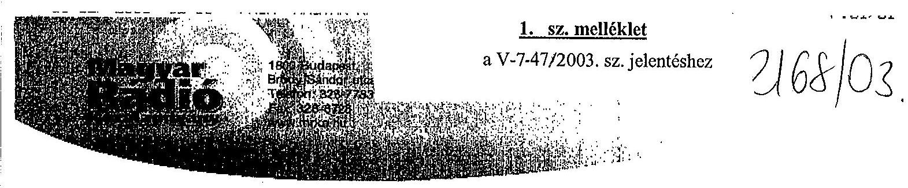
J. 12: 52K-101/2003.

Állami Számvevöszék
Dr. Bihary Zsigmond
Fölgazgató Úr
részére

Budapest

Tisztelt Fölgazgató Úr!
A Magyar Rádió Kőzalapítvány kuratóriumának elnökeként ezúton szeretném megköszönni, hogy az Állami Számvevőszék által készített ,,a Magyar Rádió Közalapítvány és a Magyar Rádió Részvénytársaság müködésének ellenőrzéséról szóló jelentés"-be nagyobbéézt beépítésre kerültek az általunk tett észrevételek. Természetesen mindezekkel együtt is vannak még olyan részei a jelentésnek, ahol véleményünk nem egyezik a számvevői megállapításokkal és ezt az álláspontunkat a jelentésben foglaltak alapján sem kívánjuk megváltoztatni.

A jelentésben megfogalmazott, és a Magyar Rádió Kőzalapítvány kuratóriumának hatáskörébe tartozó észrevételeket, a számvevők által javasolt módosításokat a közeljövöben mind az elnökségi, mind a kuratóriumi ülésen kiértékeljük és meghozzuk a szükséges döntéseket.

Üdvözlettel:
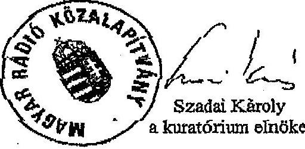

---

# HungarianRadio 

## 2. sz. melléklet

a V-7-47/2003. sz. jelentéshez

## 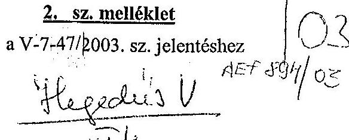

Budapest, 2003. szeptember 02. E/K/209/2003.

Állami Számvevőszék
Bihary Zsigmond föigazgató úr

BUDAPEST 4
Pf. 54.
1364
Tisztelt Föigazgató úr!

Állami Számvevőszék
Bihary Zsigmond
föigazgató úr
BUDAPEST 4
Pf. 54.
1364

Tisztelt Föigazgató úr!

Állami Számvevőszék
ÖGYVITELI IRODA
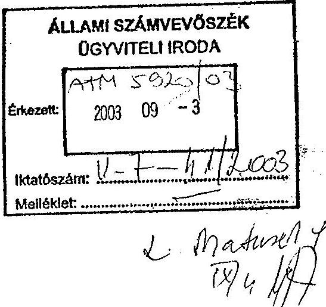

A Magyar Rádió Közalapítvány és a Magyar Rádió Részvénytársaság ellenőrzéséről készített végleges jelentés tervezetét a Magyar Rádió Rt. legszűkebb vezetése átnézte. Ennek során megállapíthattuk, hogy az első tervezet kapcsán 2003. augusztus 18 -án kelt észrevételeinket a tervezetben döntő részben átvezették. A jelen munkaanyaggal kapcsolatosan további észrevételeink nincsenek.

A megállapításokkal kapcsolatos észrevételeket és a szükségesnek tartott intézkedési tervet a végleges jelentés alapján tesszük majd meg.

Tisztelettel
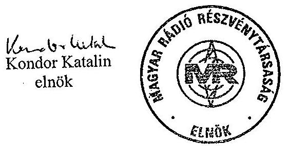

---

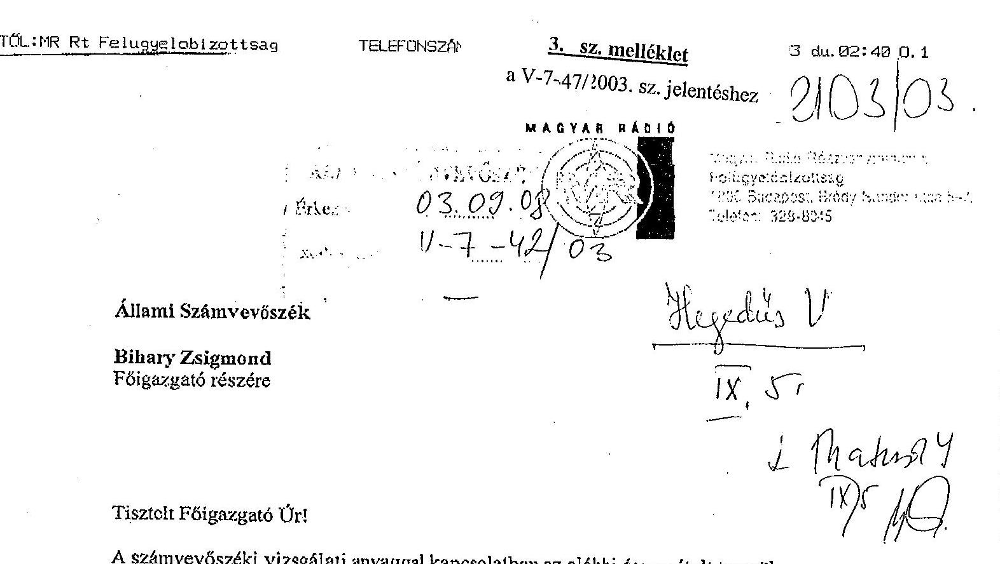

Tisztelt Fölgazgató Úr!
A számvevőszéki vizsgálati anyaggal kapcsolatban az alábbi észrevételt tesszük.
A Szállás utcai ingatlan vonatkozásában a Felügyclőbizottság véleményének csak egy részét - összefüggéseiből kiragadva - idézi az anyag. Egyebekben a Felügyelöbizottságra vonatkozó résszel egyctértünk.

Budapest, 2003. szcptember 4.

Tisztelettel:
Dr. Lukács Tamás
FB elnök
sk.

---

# dr. Lukács Tamás úr 

a Magyar Rádió Rt.
Felügyelő Bizottságának elnöke

## Budapest

## Tisztelt Elnök Úr!

A Szállás utcai ingatlan vonatkozásában a Felügyelőbizottság nevében tett észrevételét megkaptam. Mivel Szadai Károly úr, a kuratórium elnökének levele több vonatkozásban érintette a jelentésnek az ingatlanokkal kapcsolatos megállapításait, amelyeket - kellően mérlegelve - figyelembe vettünk, úgy gondolom a Felügyelőbizottságról tett megállapítások is pontosabbá váltak.

Budapest, 2003. szeptember M.

Tisztelettel:
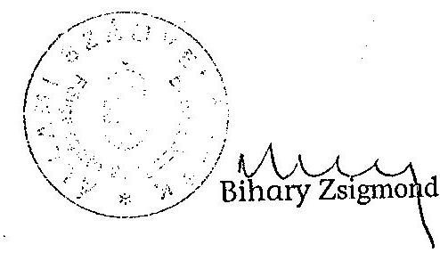

---

V-7-47/2003. számú jelentéshez

Tanúsítványok
(1-21. sz-ig)

---

# Egyszerűsített éves beszámoló (2002 év)

|   |  | Megnevezés | Előző év | Tárgy év | Index, %  |
| --- | --- | --- | --- | --- | --- |
|  1. | A | **BEFEKTETETT ESZKÖZÖK** | 4 509 116 | 6 007 603 | 133.23  |
|  2. |  | I. Immateriális javak | 1 258 | 1 503 | 119.48  |
|  3. |  | II. Tárgyi eszközök | 7 218 | 5 585 | 77.38  |
|  4. |  | III. Befektetett pénzügyi eszközök | 4 500 640 | 6 000 515 | 133.33  |
|  5. |  | IV. Befektetett pénzügyi eszközök értékhelyesbítése |  |  |   |
|  6. | B | **FORGÓESZKÖZÖK** | 1 557 407 | 80 786 | 5.19  |
|  7. |  | I. Készletek |  | 2 750 |   |
|  8. |  | II. Követelések | 1 500 151 | 41 | 0.003  |
|  9. |  | III. Értékpapírok | 37 010 | 76 010 | 205.38  |
|  10. |  | IV. Pénzeszközök | 20 246 | 1 985 | 9.80  |
|  11. | C | **AKTÍV IDŐBELI ELHATÁROLÁSOK** | 211 165 | 18 969 | 8.98  |
|  12. |  | **ESZKÖZÖK (AKTÍVÁK) ÖSSZESEN** (1.+6.+11. sorok) | 6 277 688 | 6 107 358 | 97.29  |
|  13. | D | **SAJÁT TŐKE** | 4 566 751 | 6 066 751 | 132.85  |
|  14. |  | I. Induló tőke | 15 000 | 15 000 | 100  |
|  15. |  | II. Tőkeváltozás | 4 551 751 | 6 051 751 | 132.95  |
|   |  | - ebből tárgyévi eredmény | 34 983 | 1 500 000 | 4287.80  |
|  16. |  | III. Értékelési tartalék |  |  |   |
|  17. | E | **CÉLTARTALÉK** |  |  |   |
|  18. | F | **KÖTELEZETTSÉGEK** | 1 505 684 | 23 568 | 1.57  |
|  19. |  | I. Hosszú lejáratú kötelezettségek |  |  |   |
|  20. |  | II. Rövid lejáratú kötelezettségek | 1 505 684 | 23 568 | 1.57  |
|  21. | G | **PASSZÍV IDŐBELI ELHATÁROLÁSOK** | 205 253 | 17 039 | 8.30  |
|  22. |  | **FORRÁSOK (PASSZÍVÁK) ÖSSZESEN** | 6 277 688 | 6 107 358 | 97.29  |

Tanúsítom, hogy az adatok a Közelapítvány számviteli nyilvántartásában szereplő adatokkal megegyeznek.

Budapest, 2003.

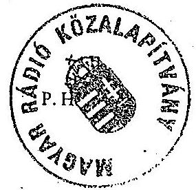

*I. Összlátó. Összlátó*

alázás

---

Magyar Rádió Közalapítvány

1. sz. tanúsítvány a V-7-47/2003. sz. jelentéshez

2. sz. tanúsítvány a V-7-47/2003. sz. jelentéshez

Eredménykimutatás (2002 év)

|  Megnevezés | Vállalkozási tevékenység | Alapítványi célú tevékenység  |
| --- | --- | --- |
|   | Előző év | Tárgy év  |
|  1. A Összes bevétel (2-6. sorok) |  |   |
|  2. 1. Alapítóktól kapott támogatások |  |   |
|  3. 2. Államháztartás alrendszereiből kapott támogatások |  |   |
|  4. 3. Pályázati úton elnyert támogatások |  |   |
|  5. 4. Egyéb adományozóktól kapott támogatások |  |   |
|  6. 5. Egyéb bevételek |  |   |
|  7. B Összes költség, ráfordítás (5-14. sorok) |  |   |
|  8. 1. Anyagjellegű ráfordítások |  |   |
|  9. 2. Személyi jellegű ráfordítások |  |   |
|  10. 3. Társadalombiztosítási járulék |  |   |
|  11. 4. Értékcsökkenési leírás |  |   |
|  12. 5. Egyéb költségek |  |   |
|  13. 6. Egyéb ráfordítások |  |   |
|  14. 7. Pályázati úton nyújtott támogatások |  |   |
|  15. C Adózás előtti eredmény |  |   |
|  16. D Adófizetési kötelezettség |  |   |
|  17. E Tárgyévi eredmény (15-16. sorok) |  |   |

Tanúsítom, hogy az adatok a Közalapítvány számviteli nyilvántartás a 2002. adatokkal megegyeznek. Budapest, 2003.

Támbiztos Árble

---

# Munkaügyi adatok (2001 év) 

|  | Megnevezés | Előző év | Tárgy év | Index, \% |
| :--: | :--: | :--: | :--: | :--: |
| 1. | Fóállásban, teljes munkaidőben foglalkoztatottak | 5 | 4 | 80 |
| a | Átlagos statisztikai állományi létszáma (fő) | 5 | 4 | 80 |
| b | Munkaviszonyból származó keresete (Ft) | 21.314 .497 | 13.295 .110 | 62.38 |
| 2. | Fóállásban, nem teljes munkaidőben foglalkoztatottak |  |  |  |
| a | Átlagos statisztikai állományi létszáma (fő) |  |  |  |
| b | Munkaviszonyból származó keresete (Ft) |  |  |  |
| 3. | Nyugdíjas foglalkoztatottak |  |  |  |
| a | Átlagos statisztikai állományi létszáma (fő) |  |  |  |
| b | Munkaviszonyból származó keresete (Ft) |  |  |  |
| 4. | Nem fóállású foglalkoztatottak |  |  |  |
| a | Átlagos statisztikai állományi létszáma (fő) |  |  |  |
| b | Munkaviszonyból származó keresete (Ft) |  |  |  |
| 5. | Egyéb | $\begin{aligned} & 37 \text { fő 02.28-ig } \\ & 25 \text { fő 02.29-től } \end{aligned}$ | 26 |  |
| a | Egyszeri eseti megbízási díjak (Ft) |  | 298.776 | 100 |
| b | Kuratóriumi tagok díjazása (Ft) | 13.742 .637 | 11.383 .200 | 82.83 |
| c | Kuratóriumi tagok költségtérítése (Ft) | 11.614 .485 | 10.391 .912 | 89.47 |

Tanúsítom, hogy az adatok a Közalapítvány nyilvántartásában szereplő adatokkal megegyeznek.
Budapest, 2003.
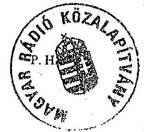
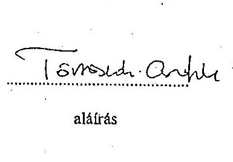

---

# Munkaügyi adatok (2002 év) 

|  | Megnevezés | Előző év | Tárgy év | Index, \% |
| :--: | :--: | :--: | :--: | :--: |
| 1. | Főállásban, teljes munkaidőben foglalkoztatottak | 4 | 4 | 100 |
| a | Átlagos statisztikai állományi létszáma (fô) | 4 | 4 | 100 |
| b | Munkaviszonyból származó keresete (Ft) | 13.295 .110 | 13.460 .052 | 101.24 |
| 2. | Főállásban, nem teljes munkaidőben foglalkoztatottak |  |  |  |
| a | Átlagos statisztikai állományi létszáma (fô) |  |  |  |
| b | Munkaviszonyból származó keresete (Ft) |  |  |  |
| 3. | Nyugdíjas foglalkoztatottak |  |  |  |
| a | Átlagos statisztikai állományi létszáma (fô) |  |  |  |
| b | Munkaviszonyból származó keresete (Ft) |  |  |  |
| 4. | Nem fóállású foglalkoztatottak |  |  |  |
| a | Átlagos statisztikai állományi létszáma (fô) |  |  |  |
| b | Munkaviszonyból származó keresete (Ft) |  |  |  |
| 5. | Egyéb | 26 | $\begin{aligned} & 26 \text { fô } 05.20 \text {-ig } \\ & 31 \text { fô } 05.21 \text {-tól } \end{aligned}$ | 119.23 |
| a | Egyszeri eseti megbízási díjak (Ft) | 298.776 | 957.775 | 320.57 |
| b | Kuratóriumi tagok díjazása (Ft) | 11.383 .200 | 21.151 .188 | 185.81 |
| c | Kuratóriumi tagok költségtérítése (Ft) | 10.391 .920 | 13.966 .428 | 134.40 |

Tanúsítom, hogy az adatok a Közalapítvány nyilvántartásában szereplő adatokkal megegyeznek.
Budapest, 2003.
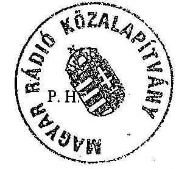
tomszuh. arfhe
aláírás

---

# Az MR Rt. által a Kuratóriumnak és tagjainak nyújtott szolgáltatások (2001 év) 

ezer Ft-ban

| Megnevezés |  | Szolgáltatás |  |  |  | Megjegyzés |
| :--: | :--: | :--: | :--: | :--: | :--: | :--: |
|  |  | Igénybe vevö neve | Ellenértéke | Számla száma | Kifizetés idópontja |  |
| 1. | MÁV Menetjegy |  | 19 |  |  | Kur. ülés |
| 2. | MÁV Menetjegy |  | 3 |  |  |  |
| 3. | Saját gk. tia. tér. |  | 238 | ütnyilvántartás |  |  |
| 4. | Saját gk. tia. tér. |  | 14 | ütnyilvántartás |  |  |
| 5. | Saját gk. tia.tér. |  | 71 | ütnyilvántartás |  |  |
| 6. | Saját gk. tia. tér. |  | 46 | ütnyilvántartás |  |  |
| 7. |  |  |  |  |  |  |
| 8. |  |  |  |  |  |  |
| 9. |  |  |  |  |  |  |
| 10. |  |  |  |  |  |  |
| 11. |  |  |  |  |  |  |
| 12. |  |  |  |  |  |  |
| 13. |  |  |  |  |  |  |
| 14. |  |  |  |  |  |  |
| 15. |  |  |  |  |  |  |
| 16. |  |  |  |  |  |  |
| 17. |  |  |  |  |  |  |
| 18. |  |  |  |  |  |  |
| 19. |  |  |  |  |  |  |
| 20. |  |  |  |  |  |  |
| 21. |  |  |  |  |  |  |
| 22. |  |  |  |  |  |  |
| 23. |  |  |  |  |  |  |
| 24. |  |  |  |  |  |  |
| 25. |  |  |  |  |  |  |

Tanúsítom, hogy az adatok a Közalapítvány nyilvántartásában szereplő adatokkal megegyeznek.
Budapest, 2003.
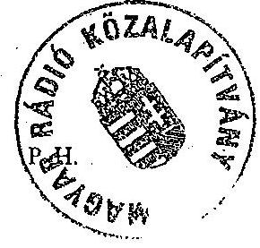
alárás

---

# Az MR Rt. által a Kuratóriumnak és tagjainak nyújtott szolgáltatások (2002 év) 

ezer Ft-ban

| Megnevezés |  | Szolgáltatás |  |  |  | Megjegyzés |
| :--: | :--: | :--: | :--: | :--: | :--: | :--: |
|  |  | Igénybe vevố neve | Ellenértéke | Számla száma | Kifizetés idópontja |  |
| 1. | MÁV Menetjegy |  | 12 |  |  | Ku.ülés |
| 2. | Saját gk. ua. térítés |  | 5 | Útnyilvántartás |  | " |
| 3. | Saját gk. ua. térítés |  | 32 | Útnyilvántartás |  | " |
| 4. | Saját gk. ua. térítés |  | 224 | Útnyilvántartás |  | " |
| 5. | Saját gk. ua. térítés |  | 21 | Útnyilvántartás |  | " |
| 6. | Saját gk. ua. térítés |  | 81 | Útnyilvántartás |  | " |
| 7. | Saját gk. ua. nyilvántartás |  | 26 | Útnyilvántartás |  | " |
| 8. |  |  |  |  |  |  |
| 9. |  |  |  |  |  |  |
| 10. |  |  |  |  |  |  |
| 11. |  |  |  |  |  |  |
| 12. |  |  |  |  |  |  |
| 13. |  |  |  |  |  |  |
| 14. |  |  |  |  |  |  |
| 15. |  |  |  |  |  |  |
| 16. |  |  |  |  |  |  |
| 17. |  |  |  |  |  |  |
| 18. |  |  |  |  |  |  |
| 19. |  |  |  |  |  |  |
| 20. |  |  |  |  |  |  |
| 21. |  |  |  |  |  |  |
| 22. |  |  |  |  |  |  |
| 23. |  |  |  |  |  |  |
| 24. |  |  |  |  |  |  |
| 25. |  |  |  |  |  |  |

Tanúsítom, hogy az adatok a Közalapítvány nyilvántartásában szereplő adatokkal megegyeznek.
Budapest, 2003.
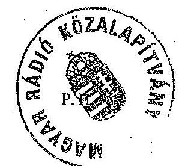
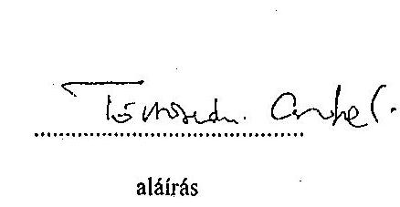

---

MR Rt. Budapest

A társaság vagyoni helyzetének alakulása (ESZKÖZÖK)

|  Megnevezés | 1998 | 1999 | 2000 | 2001 | 2002  |
| --- | --- | --- | --- | --- | --- |
|  Befektetett eszközök | 6201 | 6724 | 17747 | 18872 | 20617  |
|  ebből: immateriális javak | 571 | 964 | 9167 | 10361 | 11541  |
|  tárgyi eszközök | 5584 | 5718 | 8539 | 8477 | 9045  |
|  befektetett p. e. | 46 | 42 | 41 | 34 | 31  |
|  Forgóeszközök | 1146 | 1003 | 1016 | 934 | 1949  |
|  ebből: készletek | 124 | 157 | 156 | 188 | 297  |
|  követelések | 389 | 456 | 321 | 274 | 200  |
|  értékpapírok | 245 | 278 | 484 | 0 | 0  |
|  pénzeszközök | 388 | 112 | 55 | 472 | 1452  |
|  Aktív időbeli elhatárolások | 299 | 454 | 807 | 470 | 613  |
|  ESZKÖZÖK ÖSSZESEN | 7646 | 8181 | 19570 | 20276 | 23179  |

5. sz. tanúsítvánv a V-7-47/2003. sz. jelentéshez

tanúsítom, hogy az adatok az MR Rt. nyilvántartásában szereplő adatokkal megegyeznek! Budapest, 2003. március 31.

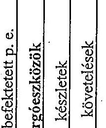

M. H. H. TÖKELLEN

alárás

---

MR Rt. Budapest

A társaság vagyoni helyzetének alakulása (FORRÁSOK)

|  Megnevezés | 1998 | 1999 | 2000 | 2001 | 2002  |
| --- | --- | --- | --- | --- | --- |
|  Saját tőke | 6898 | 7274 | 18409 | 19176 | 22062  |
|  ebből: - jegyzett tőke | 4500 | 4500 | 4500 | 4500 | 6000  |
|  - tőketartalék | 1809 | 1809 | 2800 | 2800 | 2800  |
|  - eredménytartalék | 533 | 643 | 881 | 941 | 1710  |
|  - mérleg sz. eredmény | -28 | 238 | 63 | 767 | 712  |
|  Céltartalék | 54 | 70 | 41 | 0 | 36  |
|  Kötelezettségek | 658 | 496 | 792 | 695 | 705  |
|  Passzív időbeli elhatárolások | 37 | 341 | 328 | 405 | 376  |
|  FORRÁSOK ÖSSZESEN | 7647 | 8181 | 19570 | 20276 | 23179  |

6.sz. tanúsítvány a V-7-47/2003. sz. jelentéshez

Tanúsítom, hogy az adatok az MR Rt. nyilvántartásában szereplő adatokkal megegyeznek!

Budapest, 2003. március 31.

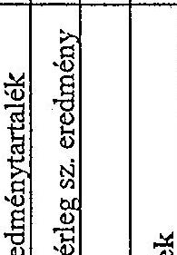

M. Bázis aláírás

---

MR Rt. Budapest 7.sz. tanúsítvány a V-7-47/2003. sz. jelentéshez

Bevételek alakulása

|  Megnevezés | 1998 | 1999 | 2000 | 2001 | 2002  |
| --- | --- | --- | --- | --- | --- |
|  Belföldi értékesítés nettó árbevétele | 9968 | 10576 | 10973 | 6684 | 6823  |
|  ebből: - reklámbevétel | 1302 | 1252 | 1177 | 943 | 967  |
|  Export értékesítés nettó árbevétele | 21 | 51 | 122 | 106 | 27  |
|  Egyéb bevételek | 75 | 92 | 122 | 5573 | 5701  |
|  Aktivált saját teljesítmények értéke | 381 | 419 | 1087 | 1585 | 1662  |
|  Pénzügyi műveletek bevételei | 141 | 70 | 31 | 34 | 123  |
|  Rendkívüli bevételek | 269 | 133 | 157 | 11 | 6  |
|  BEVÉTELEK ÖSSZESEN | 10855 | 11341 | 12492 | 13993 | 14342  |

Tanúsítom, hogy az adatok az MR Rt. nyilvántartásában szereplő adatokkal megegyeznek! Budapest, 2003. március 31.

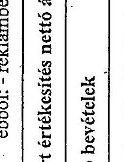

arha Billemel aláírás

---

8/a. tanúsítvány a V-7-47/2003. sz. jelentéshez

# Bevételek alakulása, ezen belül a társaságnak juttatott költségvetési támogatások

|   | 1998 | 1999 | 2000 | 2001 | 2002  |
| --- | --- | --- | --- | --- | --- |
|  Belföldi értékesítés nettó árbevétele | 9968 | 10576 | 10973 | 6684 | 6823  |
|  Ebből: üzemben tartási díj | 3305 | 3830 | 3737 | 3911 | 2002  |
|  üzemben tartási díj támogatás |  |  |  |  | 2017  |
|  mentesítettek miatti támogatás | 1064 | 1229 | 1217 | 0 | 0  |
|  sugárzási díj-támogatás | 2757 | 2846 | 3441 | 0 | 0  |
|  létszámleépítés támogatása | 0 | 53 | 0 | 150 | 0  |
|  Egyéb bevételek | 75 | 92 | 122 | 5573 | 5701  |
|  Ebből: mentesítettek miatti támogatás | 0 | 0 | 0 | 1323 | 1341  |
|  Sugárzási díj-támogatás | 0 | 0 | 0 | 3319 | 3550  |

Adatforrás: az éves beszámolók Tanúsítom, hogy az adatok a nyilvántartásban szereplőkkel megegyezőek! Budapest, 2003. június 10.

---

# A társaságnak juttatott költségvetési támogatások

|   | 1998 | 1999 | 2000 | 2001 | 2002  |
| --- | --- | --- | --- | --- | --- |
|  Költségvetési támogatások összesen | 4271 | 7958 | 5158 | 5292 | 7408  |
|  Zenei együttesek támogatása | 450 | 437,1 | 500 | 500 | 500  |
|  mentesítettek miatti támogatás | 1064 | 1229 | 1217 | 1323 | 1341  |
|  sugárzási díj-támogatás | 2757 | 2846 | 3441 | 3319 | 3550  |
|  létszámleépítés támogatása | 0 | 53 | 0 | 150 | 0  |
|  Üzembentartási díj (2002. augusztus 1. után) |  |  |  |  | 2017  |
|  MR KA előző évi pénzmaradványa |  |  |  |  |   |

Tanúsítom, hogy az adatok az MR Rt. nyilvántartásában szereplő adatokkal megegyeznek! Budapest, 2003. június 10.

---

MR Rt. Budapest

9.sz. tanúsítvány a V-7-47/2003. sz. jelentéshez

Költségek és ráfordítások alakulása

|  Megnevezés | 1998 | 1999 | 2000 | 2001 | 2002  |
| --- | --- | --- | --- | --- | --- |
|  Anyagjellegű ráfordítások | 3888 | 3956 | 4227 | 6601 | 6654  |
|  Személyi jellegű ráfordítások | 3658 | 3646 | 4028 | 4719 | 4824  |
|  Értékcsökkenési leírás | 446 | 449 | 553 | 567 | 545  |
|  Egyéb költség | 2091 | 2156 | 2420 | 0 | 0  |
|  Egyéb ráfordítás | 771 | 826 | 1134 | 1239 | 1566  |
|  Pénzügyi műveletek ráfordításai | 14 | 7 | 28 | 44 | 10  |
|  Rendkívüli ráfordítások | 15 | 63 | 40 | 56 | 31  |
|  KÖLTSÉGEK ÉS RÁFORDÍTÁSOK ÖSSZESEN | 10883 | 11103 | 12430 | 13226 | 13630  |

Tanúsítom, hogy az adatok az MR Rt. nyilvántartásában szereplőkkel megegyeznek! Budapest, 2003. március 31.

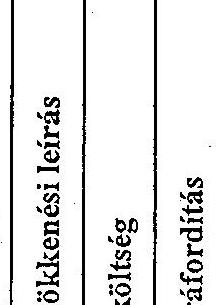

.../im. *trojleve* aláírás

---

MR RL Budapest

A TÁRSASÁG KÖLTSÉGEINEK ÖSSZETÉTELE

10/a. sz. tanúsítvány a V-7-47/2003. sz. jelentéshez

|   | 1998 | 1999 | 2000  |
| --- | --- | --- | --- |
|  Műszrgyártás költségei | 7 008 | 6 840 | 7 671  |
|  ebből: anyagköltség | 65 | 72 | 125  |
|  ig-be vett anyag jell. szolg. | 3 161 | 3 221 | 3 475  |
|  egyéb költségek | 1 538 | 1 473 | 1 724  |
|  személyi jellegű ráford. | 2 163 | 1 965 | 2 232  |
|  értékcsökkenési leírás | 81 | 109 | 115  |
|  Üzemeltetés költségei | 3 072 | 3 366 | 3 555  |
|  ebből: anyagköltség | 333 | 324 | 291  |
|  ig-be vett anyag jell. szolg. | 326 | 337 | 335  |
|  egyéb költségek | 553 | 683 | 696  |
|  személyi jellegű ráford. | 1 495 | 1 681 | 1 795  |
|  értékcsökkenési leírás | 365 | 341 | 438  |
|  Műsgyárt. és üzemelt. ktg. össz. | 10 080 | 10 206 | 11 226  |
|  Budapest, 2003. június 9. |  |  |   |

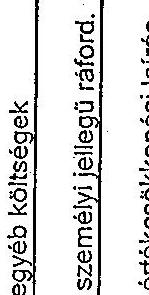

aláírás

---

MR Rt. Budapest

10/b. sz. tanúsítvány a V-7-47/2003. sz. jelentéshez

A társaság költségeinek összetétele

|   | 1998 | 1999 | 2000 | 2001 | 2002  |
| --- | --- | --- | --- | --- | --- |
|  Műsorgyártás költségei |  |  | 7672 | 8006 | 6560  |
|  ebből : anyagköltség |  |  | 126 | 150 | 72  |
|  igénybevett szolgáltatások értéke |  |  | 5091 | 5121 | 4681  |
|  egyéb szolgáltatások értéke |  |  | 6 | 5 | 3  |
|  személyi jellegű ráfordítások |  |  | 2333 | 2587 | 1802  |
|  értékcsökkenési leírás |  |  | 116 | 143 | 0  |
|  Üzemeltetés költségei |  |  | 3553 | 3871 | 5448  |
|  ebből: anyagköltség |  |  | 287 | 295 | 300  |
|  igénybe vett szolgáltatások értéke |  |  | 912 | 982 | 1543  |
|  közvetlen munkaszámra, műsor- |  |  |  |  |   |
|  ra könyvelhető |  |  |  |  |   |
|  egyéb szolgáltatások értéke |  |  | 31 | 37 | 38  |
|  személyi jellegű ráfordítások |  |  | 1885 | 2133 | 3022  |
|  értékcsökkenési leírás |  |  | 438 | 424 | 545  |
|  MŰSORGYÁRTÁS ÉS ÜZEMELTE- |  |  | 11225 | 11877 | 12008  |
|  TÉSI KÖLTSÉG ÖSSZESEN |  |  |  |  |   |

Tanúsítom, hogy az adatok az MR Rt. nyilvántartásában szereplő adatokkal megegyeznek!

Budapest, 2003. március 31.

---

MR Rt. Budapest

11.sz. tanúsítvánv a V-7-47/2003. sz. jelentéshez

Eredmény alakulása

|  Megnevezés | 1998 | 1999 | 2000 | 2001 | 2002  |
| --- | --- | --- | --- | --- | --- |
|  1. Üzemi (üzleti) tev. eredménye | -409 | 104 | -57 | 822 | 628  |
|  2. Pénzügyi műveletek eredménye | 127 | 64 | 3 | -11 | 109  |
|  3. Szokásos vállalk. eredménye (1+2) | -282 | 168 | -54 | 811 | 737  |
|  4. Rendkívüli eredmény | 254 | 70 | 117 | -44 | -25  |
|  5. Adózás előtti eredmény (3+4) | -28 | 238 | 63 | 767 | 712  |

Tanúsítom, hogy az adatok az MR Rt. nyilvántartásában szereplő adatokkal megegyeznek!

Budapest, 2003. június 30.

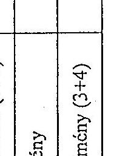

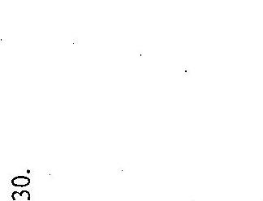

---

# Betöltött létszám alakulása 

|  |  |  |  |  | fóben |
| :--: | :--: | :--: | :--: | :--: | :--: |
| Megnevezés | 2000.XII.31.   Tényleges lét-   szám | 2001.XII.31.   Tényleges lét-   szám | Index \% | 2002.XII.31.   Tényleges lét-   szám | Index \% |
| Szellemi összesen   ebből:   - felsőbb vezetők   - középvezetők   - egyéb szellemi | $\begin{array}{r} 1423 \\ 21 \\ 75 \\ 1327 \end{array}$ | $\begin{array}{r} 1369 \\ 24 \\ 67 \\ 1278 \end{array}$ | $\begin{array}{r} 96,2 \\ 114,3 \\ 89,3 \\ 96,3 \end{array}$ | $\begin{array}{r} 1269 \\ 27 \\ 45 \\ 1197 \end{array}$ | $\begin{array}{r} 92,7 \\ 112,5 \\ 67,2 \\ 93,7 \end{array}$ |
| Fizikai összesen | 166 | 144 | 86,7 | 82 | 56,9 |
| Teljes és részmunkaidősök összesen ebből:   - teljes munkaidős | $\begin{array}{r} 1589 \\ 1555 \\ 34 \end{array}$ | $\begin{array}{r} 1513 \\ 1481 \\ 32 \end{array}$ | $\begin{array}{r} 95,2 \\ 95,2 \\ 94,1 \end{array}$ | $\begin{array}{r} 1351 \\ 1323 \\ 28 \end{array}$ | $\begin{array}{r} 89,3 \\ 89,3 \\ 87,5 \end{array}$ |

Tanúsítom, hogy az adatok az MR Rt. nyilvántartásában szereplő adatokkal megegyeznek.

Budapest, 2003. március 31.
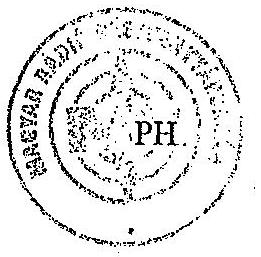
aláírás

---

MR Rt. Budapest

13.sz. tanúsítvány a V-7-47/2003. sz. jelentéshez

Munkaerő mozgás (betöltött létszámra vonatkozóan)

főben

|  Megnevezés | 2001. év |  |  |  |  | 2002. év |  |  |  |   |
| --- | --- | --- | --- | --- | --- | --- | --- | --- | --- | --- |
|   | Nyitó létszám | Belépők
száma | Kilépők
száma | Egyéb
változás | Záró
létszám | Nyitó
létszám | Belépők
száma | Kilépők
száma | Egyéb
változás | Záró
létszám  |
|  Szellemi összesen
ebből: | 1423 | 50 | 96 | -8 | 1369 | 1369 | 37 | 159 | +22 | 1269  |
|  - felsőbb vezetők | 21 | 3 | 3 | +3 | 24 | 24 | 3 | 4 | +4 | 27  |
|  - középvezetők | 75 | - | 4 | -4 | 67 | 67 | 2 | 11 | -13 | 45  |
|  - egyéb szellemi | 1327 | 47 | 89 | -7 | 1278 | 1278 | 32 | 144 | +31 | 1197  |
|  Fizikai összesen | 166 | 15 | 36 | -1 | 144 | 144 | - | 50 | -12 | 82  |
|  Teljes és
részmunkaidősök
összesen
ebből: | 1589 | 65 | 132 | -9 | 1513 | 1513 | 37 | 209 | +10 | 1351  |
|  - teljes munkaidős | 1555 | 59 | 122 | -11 | 1481 | 1481 | 34 | 201 | +9 | 1323  |
|  - részmunkaidős | 34 | 6 | 10 | +2 | 32 | 32 | 3 | 8 | +1 | 28  |

Tanúsítom, hogy az adatok az MR Rt. nyilvántartásában szereplő adatokkal megegyeznek. Budapest, 2003. március 31.

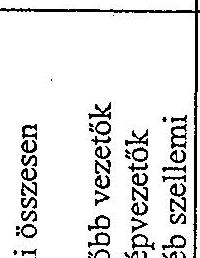

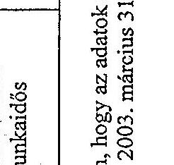

---

MR Rt. Budapest

14/a. vz. tanúsítvány a V-7-47/2003. sz. jelentéshez

Munkaviszonyból származó jövedelem alakulása 2001. - 2002. (belsősök)

ezer Ft-ban

|  Megnevezés | 2001. év |  |  |  |  | 2002 év |  |  |  |  |  |   |
| --- | --- | --- | --- | --- | --- | --- | --- | --- | --- | --- | --- | --- |
|   | Besorolás szerinti alapbér | Bérpótlék | Kiegészítő fizetés | Prémium | Jutalom | Összesen | Besorolás szerinti alapbér | Bérpótlék | Kiegészítő fizetés | Prémium | Jutalom | Összesen  |
|  Szellemi összesen ebből: | 2.165.828 | 20.402 | 5.407 | 23.966 | 160.990 | 2.376.593 | 2.276.403 | 27.884 | 6.615 | 24.492 | 190.281 | 2.525.675  |
|  - felsőbb vezetők | 127.155 |  |  |  | 11.176 | 138.331 | 180.666 |  |  |  | 8.582 | 189.248  |
|  - középvézetők | 190.165 | 69 | 23 | 117 | 18.761 | 209.135 | 145.586 | 5 |  | 38 | 16.412 | 162.041  |
|  - egyéb szellemi | 1.848.508 | 20.333 | 5.384 | 23.849 | 131.053 | 2.029.127 | 1.950.151 | 27.879 | 6.615 | 24.454 | 165.287 | 2.174.386  |
|  Ftikai összesen | 151.906 | 5.971 | 1.393 | 1.260 | 12.767 | 173.297 | 99.598 | 4.231 | 1.040 | 1.308 | 12.514 | 118.691  |
|  Teljes és részmunka idősök összesen ebből: | 2.317.734 | 26.373 | 6.800 | 25.226 | 173.757 | 2.549.890 | 2.376.001 | 32.115 | 7.655 | 25.800 | 202.795 | 2.644.366  |
|  - teljes munkaidős | 2.290.315 | 26.373 | 6.800 | 25.135 | 173.437 | 2.522.060 | 2.346.833 | 32.115 | 7.655 | 25.800 | 201.511 | 2.613.914  |
|  - rész munkaidős | 27.419 |  |  | 91 | 320 | 27.830 | 29.168 |  |  |  | 1.284 | 30.452  |

Tanúsítom, hogy az adatok az MR Rt. nyilvántartásában szereplő adatokkal megegyeznek. Budapest, 2003. március 31.

MR Rt. Budapest aláírás

---

# Munkaviszonyon kívüli jövedelem alakulása / belsősök / 

ezer Ft-ban

| Megnevezés | 2001. év | 2002. év |
| :--: | :--: | :--: |
| Nívódij | 8040 | 14460 |
| Tiszteletdij   - tiszteégviselő   - előadómüvész | $\begin{aligned} & 1440 \\ & 19171 \end{aligned}$ | $\begin{aligned} & 1560 \\ & 13834 \end{aligned}$ |
| Jutalék | 1786 | 1503 |
| Megbízási dij | 60236 | 49433 |
| Szerzői dij | 110545 | 84013 |
| Egyéb | 687 | 810 |
| Összesen | 201905 | 165613 |

Tanúsítom, hogy az adatok az MR Rt. nyilvántartásában szereplő adatokkal megegyeznek.

Budapest, 2003. március 31.
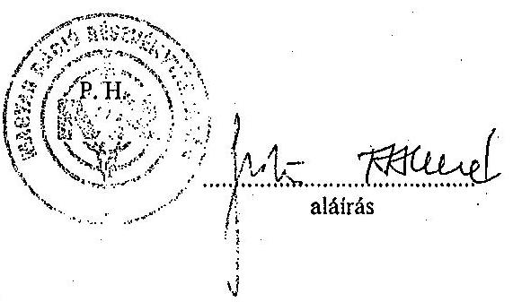

---

# Munkaviszonyon kívüli jövedelem alakulása / belsősök / 

ezer Ft-ban

| Megnevezés | 2001. év | 2002. év |
| :--: | :--: | :--: |
| Nívódij | $8040 / 48$ fó | $14460 / 98$ fó |
| Tiszteletdij   - tisztségviseló   - elöadómüvész | $\begin{gathered} 1440 / 2 \text { fó } \\ 19171 / 218 \text { fó } \end{gathered}$ | $\begin{gathered} 1560 / 2 \text { fó } \\ 13834 / 185 \text { fó } \end{gathered}$ |
| Jutalék | $1786 / 6$ fó | $1503 / 5$ fó |
| Megbízási dij | $60236 / 374$ fó | $49433 / 307$ fó |
| Szerzöi dij | $110545 / 313$ fó | $84013 / 262$ fó |
| Egyéb | $687 / 1$ fó | $810 / 2$ fó |
| Összesen | 201905 | 165613 |

Tanúsítom, hogy az adatok a MR Rt. nyilvántartásában szereplő adatokkal megegyeznek.

Budapest, 2003.06.03.
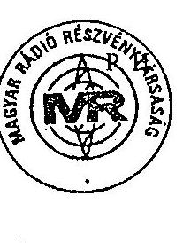
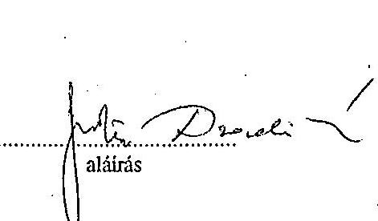

---

# Egy teljes munkaidősre jutó átlagbér és átlagkereset 

| Megnevezés | 2001. évben |  |  | 2002. évben |  |  |
| :--: | :--: | :--: | :--: | :--: | :--: | :--: |
|  | Létszám   XII.31. | Átlag alapbér Ft/fö/hó | Átlagkereset Ft/fö/hó | Létszám   XII.31. | Átlag alapbér Ft/fö/hó | Átlagkereset Ft/fö/hó |
| Szellemi összesen ebből:   - felsőbb vezetők   - középvezetők   - egyéb szellemi | $\begin{array}{r} 1340 \\ 24 \\ 67 \\ 1249 \end{array}$ | $\begin{array}{r} 133 \\ 442 \\ 237 \\ 121 \end{array}$ | $\begin{array}{r} 145 \\ 480 \\ 260 \\ 135 \end{array}$ | $\begin{array}{r} 1243 \\ 27 \\ 45 \\ 1171 \end{array}$ | $\begin{array}{r} 151 \\ 558 \\ 270 \\ 136 \end{array}$ | $\begin{array}{r} 167 \\ 584 \\ 300 \\ 153 \end{array}$ |
| Fizikai összesen | 141 | 89 | 100 | 80 | 102 | 121 |
| Összesen: | 1481 | 129 | 142 | 1323 | 148 | 165 |

Tanúsítom, hogy az adatok az MR Rt. nyilvántartásában szereplő adatokkal megegyeznek.

Budapest, 2003.március 31.
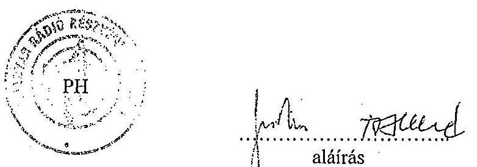

---

# Munkaviszonyon kívüli jövedelem alakulása / külsősök / 

ezer Ft-ban

| Megnevezés | 2001. év | 2002. év |
| :--: | :--: | :--: |
| Nivódij | 1915 | 4945 |
| Tiszteletdij   - tisztségviseló   - elöadómüvész | $\begin{gathered} 2875 \\ 32162 \end{gathered}$ | $\begin{gathered} 3534 \\ 54609 \end{gathered}$ |
| Jutalék | 220 | 33 |
| Megbízási dij | 61167 | 69950 |
| Szerzői dij | 165199 | 161098 |
| Egyéb | 11424 | 13407 |
| Összesen | 274962 | 307576 |

Tanúsítom, hogy az adatok az MR Rt. nyilvántartásában szereplő adatokkal megegyeznek.

Budapest, 2003.március 31.
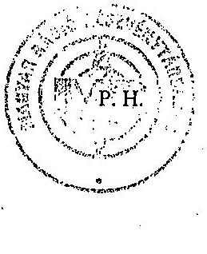
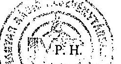
alálrás

---

MR Rt.
Budapest
17. tanúsítvány
a V-7-47/2003. sz. jelentéshez

Beruházások

| A beruházások megnevezése | 2001. év |  |  | 2002. év |  |  |
| :--: | :--: | :--: | :--: | :--: | :--: | :--: |
|  | Alapítványi   tám.-ból | Ebből   apport | Saját   forrásból | Alapítványi   tám.-ból | Ebből   apport | Saját   forrásból |
| Tárgyi eszközök: |  |  |  |  |  |  |
| Müsorkészítéssel kapcsolatos   beruházások, felújítások |  |  | 63 |  |  | 190 |
| Informatikai fejlesztések |  |  | 95 |  |  | 174 |
| Ingatlanok korszerűsítése,   épület felújítások |  |  | 185 |  |  | 131 |
| Bútorok, irodatechnikai   beszerzések |  |  | 52 |  |  | 23 |
| Gépjármú beszerzések |  |  | 12 |  |  | 21 |
| Egyéb beszerzések | 2 |  | 33 | 0,7 |  | 22 |
| Rész összesen: | 2 |  | 440 | 0,7 |  | 561 |
| Immateriális javak: |  |  |  |  |  |  |
| Kísérlet fejlesztés |  |  | 8 |  |  |  |
| Elkészült műsorok |  |  | 1532 |  |  | 1550 |
| Egyéb immateriális javak |  |  | 45 |  |  | 69 |
| Rész összesen: |  |  | 1585 |  |  | 1619 |
| Mindösszesen: |  |  | 2025 |  |  | 2180 |

Tanúsítom, hogy az adatok az MR Rt. nyilvántartásában szereplő adatokkal megegyeznek.

Budapest, 2003. március 31.
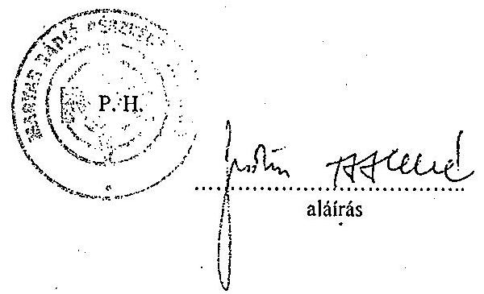

---

# Költségvetési juttatások

(Közvetlen és közvetett támogatások)

|  Megnevezés | 2000 | 2001 | millió Ft-ban  |
| --- | --- | --- | --- |
|  Bevételt növelő támogatások: |  |  | 2002  |
|  Támogatás kiesett előfizetők miatt | 1217 | 1323 | 1341  |
|  |   |   |   |
|  Müködési támogatások: |  |  |   |
|  Támogatás sugárzási díjra | 3441 | 3319 | 3550  |
|  Támogatás zenei együttesek miatt | 500 | 500 | 500  |
|  Üzembentartási díj (2002. augusztus-1. után) |  |  | 2017  |
|  Összesen: | 5158 | 5142 | 7408  |
|  |   |   |   |
|  Saját tökét növelő támogatás | 0 | 0 | 1500  |
|  |   |   |   |
|  |   |   |   |
|  Összesen: | 0 | 0 | 1500  |
|  Egyéb támogatások: |  |  |   |
|  ORTT-től, egyéb szervek től | 150 | 374 | 280  |
|  |   |   |   |
|  |   |   |   |
|  |   |   |   |
|  Összesen: | 150 | 374 | 280  |
|  Mindösszesen: | 5308 | 5516 | 9188  |

Tanúsítom, hogy az adatok a MR Rt. számviteli nyilvántartásában szereplő adatokkal megegyeznek.

Budapest, 2003. június 10.

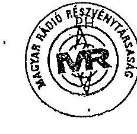

alárás

---

MR. Rt. Budapest

1. sz. tanúsítvány a V-7-47/2003. sz. jelentéshez

|  Sorszám | Társaság
neve | Alapítói
engedély
száma | Alaptőke | 2001 | 2002  |
| --- | --- | --- | --- | --- | --- |
|   |  |  |  | Pénzbetét | 2002  |
|   |  |  |  | Pénzbetét | 2002  |
|  1. | Új Képőjság KFT | 01-09-061123 | 86.000 | 5.900 | 5.900  |
|  2. | Eurumarketing KFT | 01-09-062833 | 10.000 | 1.600 | 1.600  |
|  3. | Rádió Delta Miskolc | 05-09-000177 | 6.550 | 1.000 | 15.27  |
|   | Pannonia Rádió Kft | 01-09-010134 | 3.400 | 4.000 | 97.0  |
|   | Kárpát-medencei Kht |  | 3.000 | 1.500 | 50.0  |
|  |   |   |   |   |   |
|  |   |   |   |   |   |
|  |   |   |   |   |   |
|  |   |   |   |   |   |
|  |   |   |   |   |   |
|  |   |   |   |   |   |
|  |   |   |   |   |   |
|  |   |   |   |   |   |
|  |   |   |   |   |   |
|  |   |   |   |   |   |
|  |   |   |   |   |   |
|  |   |   |   |   |   |
|  |   |   |   |   |   |
|  |   |   |   |   |   |
|  |   |   |   |   |   |
|  |   |   |   |   |   |
|  |   |   |   |   |   |
|  |   |   |   |   |   |
|  |   |   |   |   |   |
|  |   |   |   |   |   |
|  |   |   |   |   |   |
|  |   |   |   |   |   |
|  |   |   |   |   |   |
|  |   |   |   |   |   |
|  |   |   |   |   |   |
|  |   |   |   |   |   |
|  |   |   |   |   |   |
|  |   |   |   |   |   |
|  |   |   |   |   |   |
|  |   |   |   |   |   |
|  |   |   |   |   |   |
|  |

---

# Külföldi kiküldetések 

| Megnevezés Országok | 2000 |  |  | 2001 |  |  | 2002 |  |  |
| :--: | :--: | :--: | :--: | :--: | :--: | :--: | :--: | :--: | :--: |
|  | F6 | Nap | Összes   kóltség eFI | F6 | Nap | Összes   kóltség eFI | F6 | Nap | Összes   kólitség eFI |
| Albánia |  |  |  | 1 | 5 | 86522 | 0 | 0 | 0 |
| Algéria |  |  |  | 1 | 9 | 371130 | 0 | 0 | 0 |
| Ausztria |  |  |  | 106 | 374 | 3764034 | 34 | 82 | 2673119 |
| Ausztrália |  |  |  | 1 | 12 | 102711 | 1 | 17 | 861567 |
| Belgium |  |  |  | 12 | 47 | 1890013 | 3 | 11 | 362397 |
| Belgium |  |  |  | Tart. | 0 | $-787717$ |  | 0 | -891369 |
| Bosznia-Hercegovina |  |  |  | 1 | 3 | 151788 | 1 | 4 | 111202 |
| Bulgária |  |  |  | 2 | 3 | 38820 | 3 | 13 | 165580 |
| Ciprus |  |  |  | 0 | 0 | 0 | 3 | 14 | 624969 |
| Csehorszáag |  |  |  | 9 | 25 | 909385 | 6 | 42 | 586534 |
| Dánia |  |  |  | 3 | 7 | 444389 | 67 | 350 | 5364602 |
| Egyiptom |  |  |  | 2 | 22 | 818128 | 5 | 26 | 1410382 |
| Esztorszáag |  |  |  | 1 | 3 | 35765 | 0 | 0 | 0 |
| Finnorszáag |  |  |  | 2 | 17 | 411007 | 3 | 11 | 528697 |
| Franciaorszáag |  |  |  | 125 | 873 | 13926135 | 13 | 86 | 2823820 |
| Grúzia |  |  |  | 1 | 5 | 508698 | 0 | 0 | 0 |
| Görögorszáag |  |  |  | 2 | 11 | 130263 | 3 | 12 | 797798 |
| Hollandia |  |  |  | 17 | 76 | 2805616 | 12 | 42 | 1350816 |
| Horvátorszáag |  |  |  | 19 | 65 | 1635530 | 17 | 74 | 2450152 |
| Irorszáag |  |  |  | 4 | 37 | 1280260 | 2 | 5 | 439215 |
| Izland |  |  |  | 1 | 6 | 468848 | 2 | 13 | 316736 |
| Izrael |  |  |  | 0 | 0 | 0 | 2 | 39 | 143380 |
| Japán |  |  |  | 96 | 2098 | 22606718 | 1 | 34 | 263190 |
| Jugoszlávia |  |  |  | 53 | 133 | 3714339 | 12 | 35 | 1141240 |
| Jugoszlávia |  |  |  | Tart. |  | $-61618$ |  | 0 | $-46166$ |
| Kanada |  |  |  | 3 | 44 | 1877984 | 0 | 0 | 0 |
| Kína |  |  |  | 5 | 42 | 3136815 | 1 | 11 | 780356 |
| Lengyelorszáag |  |  |  | 14 | 66 | 1094349 | 3 | 8 | 394200 |
| Luxemburg |  |  |  | 1 | 1 | 13365 | 0 | 0 | 0 |
| Macedónia |  |  |  | 1 | 6 | 106160 | 2 | 5 | 303253 |
| Mexicó |  |  |  | 1 | 5 | 73218 | 0 | 0 | 0 |
| Moldova |  |  |  | 0 | 0 | 0 | 1 | 3 | 179205 |
| Nagy - Brittania |  |  |  | 70 | 135 | 6540646 | 16 | 48 | 3257830 |
| Norvégia |  |  |  | 2 | 12 | 904544 | 2 | 9 | 582922 |
| Németorszáag |  |  |  | 191 | 623 | 10723646 | 34 | 156 | 8683892 |
| Németorszáag |  |  |  | Tart. |  | -229657 |  | 0 | -365011 |
| Olaszorszáag |  |  |  | 134 | 1348 | 17552818 | 266 | 1179 | 19832566 |
| Oroszorszáag |  |  |  | 8 | 44 | 2174771 | 6 | 24 | 1590006 |
| Oroszorszáag |  |  |  | Tart. |  | -533594 |  | 0 | -577794 |
| Pakisztán |  |  |  | 1 | 14 | 1030685 | 0 | 0 | 0 |

---

| Portugália |  |  |  | 3 | 15 | 725994 | 3 | 19 | 1069984 |
| :--: | :--: | :--: | :--: | :--: | :--: | :--: | :--: | :--: | :--: |
| Románia |  |  |  | 62 | 169 | 4640850 | 137 | 596 | 9881756 |
| Románia |  |  |  | Tart. |  | $-1431586$ |  | 0 | $-264811$ |
| Spanyolorszag |  |  |  | 6 | 50 | 1459675 | 8 | 38 | 2453038 |
| Svédorszag |  |  |  | 3 | 10 | 457330 | 7 | 16 | 1588365 |
| Svajc |  |  |  | 40 | 154 | 10330096 | 35 | 180 | 8546844 |
| Szaud - Arábia |  |  |  | 1 | 3 | 59966 | 0 | 0 | 0 |
| Szlovénia |  |  |  | 12 | 38 | 1039381 | 0 | 0 | 0 |
| Szlovákia |  |  |  | 70 | 205 | 2381215 | 31 | 60 | 719795 |
| Talwan |  |  |  | 93 | 469 | 7428282 | 0 | 0 | 0 |
| Tunázia |  |  |  | 0 | 0 | 0 | 1 | 6 | 358148 |
| Törökorszag |  |  |  | 5 | 35 | 659825 | 2 | 8 | 622370 |
| USA |  |  |  | 22 | 178 | 9242551 | 10 | 87 | 4636426 |
| USA |  |  |  | Tart. |  | $-1529768$ | 1 | 0 | $-2807097$ |
| Ukrajna |  |  |  | 34 | 192 | 1724448 | 6 | 20 | 336937 |
| Örményorszag |  |  |  | 3 | 22 | 688323 | 2 | 5 | 471504 |

Tartós kiküldetés

| Belgium |  |  |  |  |  | 17101552 |  |  | 16956898 |
| :--: | :--: | :--: | :--: | :--: | :--: | :--: | :--: | :--: | :--: |
| Jugoszlávia |  |  |  |  |  | 18293412 |  |  | 17593971 |
| Németorszag |  |  |  |  |  | 15511406 |  |  | 14971181 |
| Oroszorszag |  |  |  |  |  | 25327962 |  |  | 29467759 |
| Románia |  |  |  |  |  | 17755059 |  |  | 19206880 |
| USA |  |  |  |  |  | 21679542 |  |  | 27455610 |

Tanúsítom, hogy az adatok az MR Rt. nyilvántartásában szereplő adatokkal megegyeznek.

Budapest, 2003. március 31.
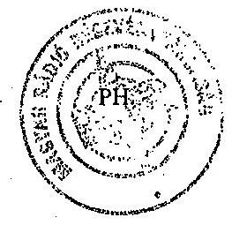
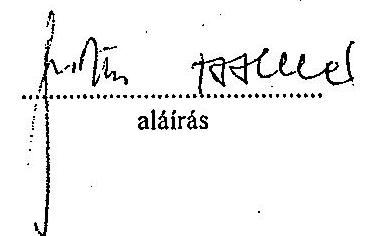

Megjegyzés: A negatív számok a külföldi kiküldetésre felvett előlegek tárgyévben el nem számolt részét mutatják.

---

MR Rt. Budapest

21. sz. tanúsítvány a V-7-47/2003. sz. jelentéshez

Műsorgyártás, aktiválás, közvetlen költsége adófűszerkesztőségénként

|  Megnevezés/E Ft |  | 2000 |  | 2001 |  | 2002 |   |
| --- | --- | --- | --- | --- | --- | --- | --- |
|   |  | gyártott | ebből aktivált | gyártott | ebből aktivált | gyártott | ebből aktivált  |
|  Kossuth | Darabszám | 295 | 125 | 350 | 122 | 372 | 77  |
|   | Költsége | 743.826 | 484.203 | 805.662 | 420.113 | 1.003.790 | 465.038  |
|  Petőfi | Darabszám | 220 | 130 | 231 | 47 | 306 | 78  |
|   | Költsége | 382.217 | 167.222 | 404.154 | 83.514 | 421.989 | 125.170  |
|  Bartók | Darabszám | 169 | 124 | 182 | 103 | 218 | 94  |
|   | Költsége | 216.176 | 156.737 | 219.724 | 129.704 | 214.051 | 77.976  |
|  KAF | Darabszám | 33 | 3 | 34 | 0 | 18 | 0  |
|   | Költsége | 151.802 | 12 | 171.909 | 0 | 46.613 | 0  |
|  RNI | Darabszám | 176 | 38 | 181 | 10 | 155 | 29  |
|   | Költség | 603.044 | 55.972 | 623.824 | 60.833 | 443.013 | 150.322  |
|  MPI | Darabszám | 210 | 104 | 213 | 104 | 238 | 90  |
|   | Költség | 944.744 | 156.360 | 902.421 | 838.029 | 791.875 | 731.572  |

---

|  Megnevezés/E Ft |  | 2000 |  | 2001 |  | 2002 |   |
| --- | --- | --- | --- | --- | --- | --- | --- |
|   |  | gyártott | ebből aktivált | gyártott | ebből aktivált | gyártott | ebből aktivált  |
|  Vallási | Darabszám | 13 | 12 | 15 | 0 | 0 | 0  |
|   | Költsége | 18.274 | 18.270 | 18.955 | 0 | 0 | 0  |
|  Músorigazgatóság | Darabszám | 6 | 2 | 9 | 0 | 4 | 0  |
|   | Költsége | 2.322 | 981 | 5.971 | 0 | 1.342 | 0  |
|  NKO | Darabszám | 7 | 2 | 4 | 0 | 3 | 0  |
|   | Költsége | 9.990 | 3.780 | 8.135 | 0 | 4.141 | 0  |
|  Összes Darabszám |  | 1.129 | 540 | 1.219 | 386 | 1.314 | 368  |
|  Msz-ra fel nem oszt. |  | 2.773.902 |  | 2.981.551 |  | 3.165.992 |   |
|  sugdíj közvetlen ktg. |  | 5.846.297 | 1.043.537 | 6.142.306 | 1.532.193 | 6.092.806 | 1.550.078  |
|  Közvetlen ktg.össz.: |  | 1.120.104 |  | 1.355.286 |  | 131.316 |   |
|  Msz-ra fel nem oszt. |  |  |  |  |  |  |   |
|  egyéb közvetlen ktg. |  | 0 |  | 0 |  | 1.466.052 |   |
|  Szerkesztőszegek |  |  |  |  |  |  |   |
|  közvetlen ktg. |  | 6.966.401 |  | 7.497.592 |  | 7.690.174 |   |
|  Összes költség |  |  |  |  |  |  |   |

Tanúsítom, hogy az adatok a MR Rt. nyilvántartásában szereplő adatokkal megjegyeznek.

Budapest, 2003. március 31.