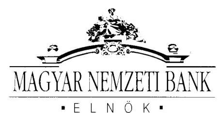
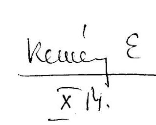
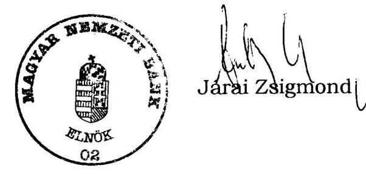

# JELENTÉS 

a Magyar Nemzeti Bank 2002. évi múködésének ellenőrzéséről

---

2. Államháztartás Központi Szintjét Ellenőrző Igazgatóság
2.1. Teljesítmény Ellenőrzési Főcsoport
Iktatószám: V-11-028/2003.
Témaszám: 646
Vizsgálat-azonosító szám: V0079
Az ellenőrzést felügyelte:
Bihary Zsigmond
föigazgató
Az ellenőrzés végrehajtásáért felelős:
Kemény Emil
főcsoportfőnök
Az ellenőrzést vezette:
Dr. Ocskovszki Jánosné
osztályvezető főtanácsos
Az ellenőrzést végezték:
Dr. Jártas Ágnes
saálné Izsó Éva Nagy Ákos
számvevő tanácsos
számvevő
Verő Tünde
számvevő

A témához kapcsolódó eddig készített számvevőszéki jelentések:
a Magyar Nemzeti Bank működésének ellenőrzése (2001) 0238
a Magyar Nemzeti Bank belső (banküzemi) múködésének 0328 ellenőrzése

# A témához kapcsolódó várható számvevőszéki jelentések: 

a Magyar Nemzeti Banknál alkalmazott teljesítményértékelési
rendszer múködésének ellenőrzése

---

# TARTALOMJEGYZÉK 

BEVEZETÉS ..... 3
I. ÖSSZEGZŐ MEGÁLLAPÍTÁSOK, KÖVETKEZTETÉSEK, JAVASLATOK ..... 5
II. RÉSZLETES MEGÁLLAPÍTÁSOK ..... 9

1. Az MNB 2002. évi múködésének törvényessége és szabályszerűsége ..... 9
1.1. A közgyűlés tevékenysége és az igazgatóság működése ..... 9
1.2. A szabályzatok felülvizsgálata ..... 10
2. A függetlenített belső ellenőrzés tevékenysége ..... 11
2.1. A 2002. évi munkaterv és végrehajtása ..... 11
2.2. Az FB megalakulása és múködése ..... 13
3. A számlavezetési tevékenység ..... 15
3.1. A pénzforgalmi bankszámlaszerződések szabályszerűsége ..... 15
3.2. A számlavezetés kondíciói és az elszámolások szabályszerűsége ..... 17
3.3. A törvény által kijelölt körben a hitelnyújtási tilalom betartása ..... 18
4. Az állam megbízása alapján végzett tevékenység ..... 19
5. Az intézményi gazdálkodás ..... 20
5.1. A befektetett eszközök állományának alakulása ..... 20
5.2. A gazdasági társaságokban való részvétel ..... 22
5.3. A szponzorálási tevékenység ..... 25
5.4. Az osztalékelőleg elszámolása, a mérleg szerinti eredmény és a tartalékok alakulása ..... 25
6. A nemzetközi kapcsolatok ..... 28
6.1. A nemzetközi pénzügyi és fejlesztési intézmények ..... 28
6.2. Az integrációs felkészülés ..... 29

## MELLÉKLETEK

1. sz. melléklet MNB észrevétel

---

# RÖVIDÍTÉSEK JEGYZÉKE 

Áht.
ÁKK Rt.
ÁPV Rt.
ÁSZ
ÁSZ tv.
BÉT
CWAG
DIPA Rt.
EKB
FB
GIRO Rt.
Gt.
KBER
KELER Rt.
MÁK Rt.
MKK Rt.
MNB
MNB törvény
PM
SzFP
SZMSZ
1992. évi XXXVIII. törvény az államháztartásról

Államadósság Kezelő Központ Rt.
Állami Privatizációs és Vagyonkezelő Rt.
Állami Számvevőszék
1989. évi XXXVIII. törvény az Állami Számvevőszékről Budapesti Értéktőzsde
Central Wechsel-und Creditbank AG.
Diósgyőri Papírgyár Rt.
Európai Központi Bank
felügyelő bizottság
GIRO Elszámolás-forgalmi Rt.
1997. évi CXLIV. törvény a gazdasági társaságokról

Központi Bankok Európai Rendszere
Központi Elszámolóház és Értéktár Rt.
Magyar Államkincstár Rt.
Magyar Követeléskezelő Rt.
Magyar Nemzeti Bank
2001. évi LVIII. törvény a Magyar Nemzeti Bankról

Pénzügyminisztérium
Szabályzat Felülvizsgálati Projekt
Szervezeti és Múködési Szabályzat

---

# JELENTÉS 

## a Magyar Nemzeti Bank 2002. évi múködésének ellenőrzéséről

## BEVEZETÉS

Az Állami Számvevőszék (továbbiakban: ÁSZ) az MNB múködésének ellenőrzésével kapcsolatos feladatokat a Magyar Nemzeti Bankról (továbbiakban: MNB) szóló 2001. évi LVIII. törvény (továbbiakban: MNB törvény) 45. § alapján végzi.

Az Országgyűlés a 2002. évi XXIII. törvénnyel 2002. július 27-i hatállyal módosította az MNB-ről szóló törvényt, a módosítás többek között a felügyelő bizottság (továbbiakban: FB) múködésének törvényi elrendelésére is vonatkozott.

A törvény rendelkezése szerint az ÁSZ azt ellenőrzi, hogy az MNB a törvényeknek, más jogszabályoknak, az alapszabálynak és a közgyűlés határozatainak megfelelően múködik-e. Hatásköre kiterjed az MNB múködésének és gazdálkodásának egészére, kivéve a törvény 4. § (1) és (3)-(7) bekezdésében meghatározott feladatait és azok hatását az eredményre.

Az ellenőrzés ezért nem terjed ki a monetáris politika meghatározására és megvalósításra; a hivatalos deviza- és az aranytartalék képzésére és kezelésére; a devizatartalék vezetésével és az árfolyam-politika végrehajtásával kapcsolatban végzett devizamúveletekre; a belföldi elszámolási rendszerek kialakítására és szabályozására, azok biztonságos és hatékony múködésének támogatására; a feladatai ellátásához szükséges statisztikai információk gyűjtésére és közzétételére; a pénzügyi rendszer stabilitásának, valamint prudenciális felügyeletére vonatkozó politika kialakításának és hatékony vitelének támogatására.

Az MNB törvény az ÁSZ MNB múködésének és gazdálkodásának ellenőrzésével összefüggésben nem tér ki a vizsgálatok gyakoriságára és a jelentések elkészítésének időpontjára.

Az első (2002. évben végzett) számvevőszéki ellenőrzés az MNB 2001. évi múködésének és gazdálkodásának átfogó értékelésére terjedt ki. Az ÁSZ ellenőrzési filozófiája 2003. évben az MNB múködésének teljes körű megismerése érdekében az volt, hogy az MNB múködésén és gazdálkodásán belül egyes területeket mélyebben ellenőrzött, és ezért három vizsgálatot tervezett. A 2003 augusztusában közzétett számvevőszéki jelentés az MNB 2002. évi belső (banküzemi) múködésének és gazdálkodásának ellenőrzéséről szólt. A jelentés a gazdálkodás racionalizálásáról, a múködési költségek alakulásáról, a kontrolling fela-

---

datokat támogató informatikai rendszer múködéséről tett részletes megállapításokat. ${ }^{1}$

Az ÁSZ 2004. évtől induló vizsgálatainál tervezi, hogy áttér az évi egy, átfogó ellenőrzésre, az MNB éves beszámolójához kapcsolódóan az ÁSZ ellenőrzési szempontjai és módszerei alapján.

A jelenlegi vizsgálat nem foglalkozott a banküzemi múködés tárgyában végzett ellenőrzés által érintett témakörökkel, - így az MNB éves gazdálkodásán belül a múködési költségek és a beruházások alakulásának értékelésével - továbbá az MNB mérlege és beszámolója valódiságának ellenőrzésével, mivel azt könyvvizsgáló auditálja.

Az ellenőrzés célja annak értékelése volt, hogy az MNB

- működése megfelelt-e a törvényesség követelményeinek, hogyan múködött az MNB ellenőrzési rendszere keretében a függetlenített belső ellenőrzés;
- a számlavezetési tevékenységet a hatályos jogszabályoknak megfelelően vé-gezte-e, a fedezeti ügyletek megkötése, lebonyolítása szabályszerű volt-e;
- intézményi gazdálkodása megfelelt-e a jogszabályoknak és a belső szabályzatoknak;
- a 2001. évi számvevőszéki ellenőrzés megállapításait, ajánlásait figyelembe vette-e, és történt-e intézkedés azok megvalósítására.

Az ellenőrzés a 2002. pénzügyi évre, de indokolt esetben az adott gazdasági esemény keletkezésétől számított időszakra irányult, illetve szükség szerint a helyszíni ellenőrzés befejezéséig (2003. június 13-ig) terjedő időszak pénzügyi, gazdasági folyamatait is figyelemmel kísérte.

Az ellenőrzés az ÁSZ korábbi ellenőrzési tapasztalatain, a kiválasztott és bekért dokumentumokon alapul.

A végleges jelentést megküldtük a pénzügyminiszternek és az MNB elnökének. Válaszlevelét a jelentés 1. számú melléklete tartalmazza.

[^0]
[^0]:    ${ }^{1}$ Az MNB elnöke az ÁSZ megállapításainak és javaslatainak hasznosítása érdekében 2003. augusztus 29-i levelében tájékoztatást adott arról, hogy milyen intézkedéseket hajt végre. Ennek megvalósítását az ÁSZ 2004. évi vizsgálata keretében fogja ellenőrizni.

---

# I. ÖSSZEGZŐ MEGÁLLAPÍTÁSOK, KÖVETKEZTETÉSEK, JAVASLATOK 

Az MNB működésében 2002-ben két területen következett be lényeges változás. Az MNB vezetése megváltoztatta az igazgatóság múködését és a módosított MNB törvénynek megfelelően, átalakította az ellenőrzési rendszerét.

Az igazgatóság múködése korábbi gyakorlatához képest operatívabbá vált, gyakoribb ülésein tárgyalt olyan előterjesztéseket, amelyeket - bár kizárólagos hatáskörébe tartoznak - 2001. évben nem tűzött napirendjére. ${ }^{2}$ Az MNB alapvető feladatait érintő előterjesztések mellett döntött múködési és gazdálkodási kérdésekben. Az ÁSZ ajánlásának megfelelően figyelemmel kísérte a 2002-ben elindított Szabályozás Felülvizsgálati Projekt (továbbiakban: SzFP) megvalósítását, amelynek záró ülésén megállapították, hogy „a projekt a kitüzött célt alapvetően teljesítette", és ez az értékelés összhangban van a vizsgálat tapasztalataival. Folytatta szabályozási rendszerének korszerűsítését és megalkotta Szervezeti és Múködési Szabályzatát (továbbiakban: SZMSZ), amelybe integrálta az MNB múködését érintő legfontosabb szabályokat. Erősítette beszámoltatási tevékenységét, fokozottan számon kérte a bankszervek vezetőitől a feladatok és a célkitűzések teljesítését. Az igazgatóság jogszabálynak megfelelő múködése, valamint az FB-nek adott beszámolók lehetőséget biztosítottak a tulajdonosi jogokat gyakorló pénzügyminiszter megfelelő tájékoztatására.

Az MNB ellenőrzési rendszere 2001-ben és 2002-ben is átalakult. Az MNB törvény 2002. évi módosítása visszaállította az FB intézményét, amely novemberben kezdte meg múködését és átvette az Ellenőrzési főosztály irányítását. A hatályos jogszabályoknak megfelelően megalkották az FB múködéséhez szükséges belső szabályzatokat. Az igazgatóság létrehozta az Audit Bizottságot, amely a különböző ellenőrző szervezetek megállapításainak végrehajtását számon kérő vezetői fórum.

Az MNB törvény szerint az FB feladata a belső ellenőrzés szervezetének irányítása. Az Ellenőrzési főosztály és az FB hatásköre nem azonos, mivel a főosztály az MNB teljes tevékenységét köteles ellenőrizni, az FB törvény szerinti ellenőrzési hatásköre viszont a múködésre és a gazdálkodásra korlátozódik. Ugyanakkor az igazgatóság, mint a Monetáris Tanács döntéseinek végrehajtásáért felelős testület a törvény idézett rendelkezése miatt nem irányíthatja közvetlenül a belső ellenőrzés e területen végzett tevékenységét.

[^0]
[^0]:    ${ }^{2}$ Az igazgatóság 2001. évi múködéséről szóló megállapítások a Magyar Nemzeti Bank múködésének ellenőrzéséről szóló, 2002. szeptemberében közzétett ÁSZ jelentésben szerepelnek. (témaszám: 596) Az MNB elnökének tett ajánlásaink között szerepelt, hogy „Gondoskodjon arról, hogy az igazgatóság minden esetben a jogszabályoknak megfelelően múködjön, és egyúttal biztosítsa a tulajdonosi jogokat gyakorló pénzügyminiszter megfelelő tájékoztatását", továbbá „Kezdeményezze, hogy az igazgatóság folyamatosan kísérje figyelemmel a szabályozás felülvizsgálati projekt megvalósítását, és szükség szerint intézkedjen a projekt következetes végrehajtása érdekében".

---

Ezen szabályozási hiba és a törvény rendelkezéseinek eltérő értelmezése miatt a Pénzügyminisztérium (továbbiakban: PM) és az MNB eltérő álláspontra helyezkedett az FB feladatait és jogosítványait illetően. A véleményeltérés a monetáris és a gazdálkodási tevékenység elhatárolására, ezzel összefüggésben az FB betekintési és vizsgálati jogosultságára terjedt ki. Az FB és az MNB igazgatósága közötti vita az ellenőrzési feladat ellátását nem akadályozta és az FB ügyrendjének elfogadásával lezárult. A PM és az Európai Központi Bank (továbbiakban: EKB) között további egyeztetések várhatók e témában.

Az FB ellenőrzési jogosultságát az MNB törvény egyrészt szűkíti, másrészt viszont nem mentesíti a gazdasági társaságokról szóló 1997. évi CXLIV. törvény (továbbiakban: Gt.) általános szabálya szerinti azon feladattól, hogy írásbeli jelentést készítsen a közgyűlés számára az éves beszámolóról, de ez a kötelezettség a korlátozott hatáskör miatt csak részben teljesíthető.

Az Ellenőrzési főosztály 2002-ben végrehajtotta az éves munkatervében meghatározott ellenőrzéseket, valamint ellátta a belső szabályzatban előírt feladatait.

Az MNB vezeti a törvények által kijelölt intézmények - Magyar Államkincstár Rt. (továbbiakban: MÁK Rt.), Állami Privatizációs és Vagyonkezelő Rt. (továbbiakban: ÁPV Rt.), Államadósság Kezelő Központ Rt. (továbbiakban: ÁKK Rt.), hitelintézetek és elszámolóházak, az Országos Betétbiztosítási Alap és a Befektetővédelmi Alap - pénzforgalmi számláját. A számlavezetés a jogszabályi rendelkezéseknek megfelelően szabályozott, a pénzügyi szolgáltatások nyújtása írásban rögzített feltételek alapján, a belső szabályzatok előírásainak betartásával történik. A számlaforgalom alakulása adatokat és információkat szolgáltat az MNB számára a pénzforgalmi folyamatokról. Az MNB-n keresztül történik a pénzintézetek elszámolásforgalma, itt helyezik el a kötelező tartalékot, és az MNB-től veszik igénybe a refinanszírozási hitelt. Az MNB a számlavezetési jogosultság és kötelezettség alapján pénzforgalmi bankszámlaszerződéseket kötött, amelyek feltételeit a jogszabályok előírásainak figyelembevételével határozta meg. Az MNB igazgatósága hagyja jóvá a pénzügyi szolgáltatások díjpolitikáját, a jutalékok, díjak és az egyéb költségek megállapításának elveit, amelyet évente felülvizsgál. A 2002. évi felülvizsgálat eredményeképpen 2003ban az MNB - az önköltségszámítás eredményeit, illetőleg az üzleti szempontokat figyelembe véve - mérsékelte a bankári ügyletek végzésének költségeit.

2002-ben az MNB az állam megbízásából végzett fedezeti ügyletek lebonyolításakor az MNB törvényben, a felek között kötött megállapodásokban, és a belső szabályzatokban foglaltak szerint járt el. Az MNB ezen ügyleteket nettó módon számolja el, míg az EKB bruttó elszámolást alkalmaz. Az elszámolási szabályok megváltoztatása befolyásolja az MNB mérlegét és eredményét, ezért a megoldás érdekében egyeztetést folytatnak a PM-mel.

Az MNB 2002. évi beszámolója szerint mérlegfőösszege 4232 Mrd Ft, eredménye 4,9 Mrd Ft veszteség volt. Az eredmény alakulására a nettó kamat és kamatjellegű eredmény 16,1 Mrd Ft-tal, a banküzemi bevételek és a banküzemi költségek, ráfordítások egyenlege mínusz 17,6 Mrd Ft-tal, és a deviza árfolyamválto-

---

zás eredménye mínusz 3,4 Mrd Ft-tal hatott. ${ }^{3}$ 2002. január 1-jétől a jogszabályi módosítás alapján változtak az eredmény elszámolás szabályai, amelyek egyrészről a kiegyenlítési tartalékokat, másrészről az árfolyameredményt érintették. A módosított szabályok szerint számított 2001. évi adatokhoz képest az MNB 2002-ben 66,6 Mrd Ft eredményjavulást ért el.

Az MNB befektetett eszközeinek állománya 2002. év végén nettó értéken 22,8 Mrd Ft volt, amely 0,7 Mrd Ft-tal kevesebb a 2001. évi záró állománynál. Ebből a befektetések aránya közel $57 \%$ - mintegy 13 Mrd Ft - volt. Az MNB kilenc társaságban rendelkezik részesedéssel, amelyből hét belföldi. Három társaságnak kizárólagos tulajdonosa. Stratégiája szerint - a Magyar Pénzverő Rt. kivételével - a belföldi társaságok értékesítését tervezi. 2002-ben folytatta a Bankjóléti Kft. ingatlanainak eladását és döntött végelszámolásáról, 2003 májusában a Bankárképző Rt. részvényeit értékesítette. Az MNB eszközgazdálkodása a jogszabályoknak és a belső utasításoknak megfelelő volt.

Az MNB korábbi évben megszűnt érdekeltségeinek 2002. évet érintő gazdasági hatása 368 M Ft veszteség volt, amely a Central Wechsel-und Creditbank AG. (továbbiakban: CWAG) elszámolása miatt merült fel. Az MNB-nek, mint volt tulajdonosnak, a CWAG esetleges további veszteségeivel kapcsolatban kötelezettsége nincs.

Az MNB nemzetközi tevékenységét két fő törekvés határozta meg. Egyrészt azon feladatok leépítése, amelyek nem tartoznak az alapfeladatai közé, másrészt a 2001-ben meghirdetett stratégiája alapján az integrációs felkészülés. Az MNB a nemzetközi fejlesztési intézményekben az állam képviseletével, vagy az állam által felvett kölcsönök lebonyolításával kapcsolatban ellátott feladatokat átadta a kormányzatnak. Az igazgatóság két alkalommal tekintette át az MNB nemzetközi szakmai kapcsolatait és azokhoz szükséges erőforrásigényt. Megkezdték a felkészülést a Magyarország uniós csatlakozásával megnyíló Központi Bankok Európai Rendszere (továbbiakban: KBER) tagságra, konkrét döntések meghozatalát 2003 második félévében tervezik.

A helyszíni ellenőrzés megállapításainak hasznosítása mellett javasoljuk:

# a Kormánynak 

Kezdeményezze az MNB-ről szóló 2001. évi LVIII. törvény módosítását annak érdekében, hogy:
a) az MNB belső ellenőrzési szervezete feletti irányítási jogkör az felügyelő bizottság MNB-ről szóló 2001. évi LVIII. törvényben meghatározott hatásköréhez igazodjon;

[^0]
[^0]:    ${ }^{3}$ Az MNB banküzemi költségeinek és ráfordításainak alakulását az ÁSZ 2003 augusztusában közzétett, a Magyar Nemzeti Bank belső (banküzemi) múködésének ellenőrzéséről szóló jelentése tartalmazza. (témaszám: 625)

---

b) szűkítse a felügyelő bizottság közgyűléssel szembeni jelentéstételi kötelezettségét (Gt. 32. § (3) bek.) azokra a gazdasági és pénzügyi folyamatokra, amelyekre az MNB-ről szóló 2001. évi LVIII. törvény szerint a felügyelő bizottságnak hatásköre van.

# a pénzügyminiszternek 

Tisztázza az MNB a Központi Bankok Európai Rendszeréhez történő csatlakozásáig, hogy az felügyelő bizottság ügyrendje minden tekintetben megfelel-e az uniós követelményeknek és szükség esetén kezdeményezze annak változtatását.

## az MNB testületeinek (Közgyűlés, Igazgatóság, felügyelő bizottság)

Gondoskodjanak az MNB-ről szóló 2001. évi LVIII. törvény - európai uniós jogharmonizáció biztosítása érdekében történő - módosítását követően az MNB belső szabályzatainak és szervezetének az EU követelményeivel összhangban lévő átalakításáról.

---

# II. RÉSZLETES MEGÁLLAPÍTÁSOK 

## 1. Az MNB 2002. ÉVI MŰKÖDÉSÉNEK TÖRVÉNYESSÉGE ÉS SZABÁLYSZERÜSÉGE

### 1.1. A közgyűlés tevékenysége és az igazgatóság múködése

Az MNB 2002-ben két alkalommal tartott közgyűlést. A május 8 -án tartott évi rendes közgyűlés elfogadta a 2001. évi üzleti évről szóló auditált éves beszámolót és üzleti jelentést. A közgyűlés a 2001. december 31-i mérlegfőösszeget 5453 Mrd Ft-ban, az eredményt pedig 3,6 Mrd Ft-ban állapította meg. Megválasztotta a könyvvizsgálót és megállapította annak díjazását.

A 2002. évi XXIII. törvény, - a Magyar Köztársaság 2001. és 2002. évi költségvetéséről szóló 2000. évi CXXXIII. törvény módosításáról - MNB törvényt érintő változásainak megfelelően az MNB a szeptember 26-án megtartott rendkívüli közgyűlésen módosította az alapszabályt. A törvénymódosítás többek között a FB létrehozására is vonatkozott, ezért az alapszabály meghatározta annak jogállását, összetételét és feladatait. Ezen túlmenően pontosító szövegmódosításokat vezettek át.

Az MNB operatív vezető testülete az igazgatóság, amely felelős a monetáris tanács döntéseinek végrehajtásáért, valamint a múködésért és a gazdálkodásért. A testület ügyrendjében részletesen meghatározta feladatait és múködésének szabályait.

Az ÁSZ 2002 szeptemberében közzétett jelentésében megállapította, hogy 2001. évben az igazgatóság operatív irányító tevékenységét nem látta el teljes körűen. Nem foglalkozott például a stratégiai és szervezet átalakítási kérdésekkel. Ezért az ÁSZ javasolta az MNB elnökének, hogy az igazgatóság múködését igazítsa a jogszabályokhoz és biztosítsa a pénzügyminiszter megfelelő tájékoztatását. ${ }^{4}$

Az MNB vezetése a javaslatot elfogadta, és megváltoztatta a korábbi gyakorlatát, az igazgatóság múködését operatívabbá tette. Napirendjére túzött olyan előterjesztéseket, amelyeket a korábbiakban nem tárgyalt. Foglalkozott a szervezet átalakításának kérdéseivel, rendszeresen beszámoltatta a bankszervek (belső szervezeti egységek) vezetőit, megtárgyalta havonta a költségek és az eredmény alakulását, döntött stratégiai ügyekben.

Az igazgatóság 2002. évben 17 alkalommal ülésezett és 4 esetben rendelt el ülésen kívüli szavazást, illetőleg határozatot hozott mintegy 140 napirendi témában. A tulajdonos képviselője és az FB elnöke vagy megbízottja - a testület

[^0]
[^0]:    ${ }^{4}$ A javaslatot megalapozó részletes megállapításokat az MNB múködésének ellenőrzéséről szóló, 2002. szeptemberében közzétett ÁSZ jelentés tartalmazza. (témaszám: 596)

---

múködésének megkezdése óta - valamennyi igazgatósági ülésen részt vett, ezáltal a pénzügyminiszter tájékoztatása biztosított volt.

Az MNB ügyrendjét az év folyamán 25 alkalommal módosították. A gyakori ügyrendmódosítást a jogszabályi változások, a szervezet átalakítása, a munkafolyamatok korszerűsítése, az új feladatokhoz kapcsolódó szervezeti egységek létrehozása indokolta. Az ügyrend módosításai megfeleltek a hatályos igazgatósági határozatban előírt eljárási rendnek.

Az MNB 2003 januárjában kiadta az SZMSZ-t, ezzel egyidejúleg ügyrendjét hatályon kívül helyezte. Az SZMSZ tartalmazza az MNB jogállását, feladatait, irányító és ellenőrző szerveit, valamint munkaszervezetét, a hatásköröket, a képviseletet, továbbá a munkavállalók jogállását, jogait és kötelezettségeit. Az SZMSZ rendszerszemléletben készült, konzisztens egységbe foglalja azokat a szabályzatokat, amelyeket korábban több utasítás részletezett. Új feladat és szervezeti egység a rendszerben egyértelmúen elhelyezhető.

# 1.2. A szabályzatok felülvizsgálata 

Az MNB 2002-ben korszerűsítette belső szabályozási rendjét. Meghatározta az utasítások formáinak, elkészítésének és a jóváhagyásának új rendjét.

Az MNB 2002-ben felülvizsgálta belső utasítási rendszerét annak érdekében, hogy az elnöki utasítások megfeleljenek a hatályos jogszabályoknak, és összhangban legyenek a vezetői döntésekkel. Az elnöki utasítások áttekintése a Jogi főosztály feladata volt, az attól alacsonyabb szintű szabályzatok átvilágítására pedig létrehozták az SzFP-t. A munka eredményeképpen 2002-ben a Jogi főosztály 113 elnöki utasítást tekintett át. A felülvizsgálat 92 utasítás esetében lezárult: 76 -ot hatályon kívül helyeztek, 16 -ot vagy új utasításként vagy módosítással adtak ki. 21 elnöki utasítás feldolgozása 2003-ra húzódott át.

A felülvizsgálat eddig elvégzett munkáiról a Jogi főosztály beszámolt, amelyet az igazgatóság elfogadott.

Az MNB belső szabályzatainak (az ügyvezető igazgatói utasítások és a körlevek) összehangolása és rendszerbe foglalása érdekében 2002 májusában elindította az SzFP-t, amelynek célját a következők szerint határozta meg:
„Az MNB-ben, mint specifikus üzemben folyó munka hatékonyságának és ellenőrizhetőségének javitása, egy korszerú, folyamatszemléletü, áttekinthető, elektronikus szabálykönyvbe foglalható belső szabályozási rendszer kialakítása, mely összhangban van a hatályos jogszabályokkal és kompatibilis a bankban meglévő más, pl. személyzeti, kontrolling, ellenőrzési alrendszerekkel."

Az SzFP az elnöki utasításokat a rendszer konzisztenciája szempontjából vizsgálta, akkor tett javaslatot, ha szabályokat hiányolt, illetve, ha túlszabályozottságot tapasztalt.

A projekt első szakaszában meghatározták a feladatokat, a szabályozási irányelveket és kialakították a tevékenységi térképet. Az első ütem a tervezett határidőhöz képest három hónap csúszással teljesült (2002. szeptemberoktóberében). A meglévő szabályzatok felülvizsgálata és az új szabályzatok el-

---

készítésének határideje 2003. december 30., ennek eredményeképpen véglegesítik a címszó- és definíció-gyűjteményt.

A második szakasz a szabályozási rendszer számítástechnikai feltételeinek megvalósítása. Ez részben az első szakasszal párhuzamosan, időbeni egybeeséssel vagy közvetlen követéssel történik. Az informatikai megvalósításnak, a projekt-terv előkészítésének és a kapcsolható banki alrendszerek feltárásának a határideje 2003. szeptember 30., a befejezés pedig 2003. december 30.

Az ÁSZ 2002 szeptemberében közzétett jelentésében az SzFP megvalósításának folyamatos figyelemmel kísérését - azaz a rendszeres beszámoltatást, a munka előrehaladásának megtárgyalását - ajánlotta. Az igazgatóság a projekt lezárásáig két alkalommal foglalkozott annak megvalósításával.

Az igazgatóság 2003. január 28-i ülésén megtárgyalta az SzFP munkaközi beszámolóját. Ebben tájékoztatást kapott az addig elvégzett tevékenységről, amelynek legfontosabb elemei a szabályozási térkép, a funkciókatalógus és a terméklista volt. Az igazgatóság tudomásul vette a tájékoztatást és a következő beszámolót 2003 szeptemberére rendelte el.

Az igazgatóság 2003. április 8-án tartott ülésén úgy döntött, hogy a szabályozás felülvizsgálati tevékenységet a jövőben nem projekt keretében végzi, hanem a feladatot önálló szervezeti egység látja el, ezért létrehozta a Belső szabályozási önálló osztályt és megszüntette az SzFP-t.

A projekt záró ülésén megállapították, hogy „A projekt a kitüzött célt alapvetően teljesítette. A felülvizsgálat még hátralévő feladatai már nem igényelnek projekt-jellegü kezelést, azok a normál múködés szabályozási tevékenységébe illeszkednek..."

# 2. A FÜGGETLENÍTETT BELSŐ ELLENŐRZÉS TEVÉKENYSÉGE 

### 2.1. A 2002. évi munkaterv és végrehajtása

Az Ellenőrzési főosztály átszervezését 2001 novemberében hajtották végre, amely a főosztály szervezeti átalakítását és szakmai tevékenysége új alapokra helyezését jelentette.

A főosztály az átszervezés után pénzügyi audit osztályra, IT audit osztályra és operációs kockázatkezelési osztályokra tagozódik. A főosztály ellenőrzéseit, utóellenőrzéseit a két audit osztály végzi. A pénzügyi audit osztály feladata a pénzügyi területek vizsgálata (függetlenül attól, hogy a vizsgált tevékenység a monetáris vagy az intézményi múködés körébe tartozik), az emissziós vizsgálatok, a leányvállalatok gazdálkodásának vizsgálata. Az informatikai vizsgálatokat az IT audit osztály az e területre kidolgozott kockázatértékelési módszer alapján állítja össze és hajtja végre. A működési kockázatkezelési osztály fő tevékenysége a múködési kockázatok felmérésével, kezelésével kapcsolatos nemzetközi irányelvek adaptációja az MNB-re és a központi Üzletmenet Folytonossági Tervvel (BCP) kapcsolatos feladatainak ellátása.

Az átszervezett Ellenőrzési főosztály a 2002. évi munkatervét a 2001 őszén kialakított - a bank összes tevékenységének elemzése alapján felállított - kockázati besorolás alapján határozta meg. A tervet az igazgatóság hagyta jóvá, il-

---

letve módosította szeptemberben az MNB egyik társaságának vizsgálata miatt (a vizsgálat végrehajtása a munka átcsoportosítását igényelte).

A főosztály I. féléves tevékenységéről szóló beszámoló szerint időarányosan lemaradás volt a tervhez képest. A vizsgálatok elmaradásának oka egyrészt a kapacitáshiány, másrészt az egyedileg elrendelt vizsgálatok miatt a feladatok későbbre halasztása volt.

A főosztály 2002. évi induló létszáma 5 fő volt, a státuszokat folyamatosan töltötték fel. Az év közepére (júliusra) a főosztály létszáma 16 főre emelkedett.

A főosztály az év végére a módosított munkatervet végrehajtotta. Az átszervezés miatt az emissziós területről átvett ellenőrzési feladatokat is tartalmazó 41 vizsgálat helyett összesen 43-at hajtott végre, amelyből 6 egyedileg elrendelt vizsgálat volt. A tervben nem szereplő ellenőrzések jellemzően az MNB társaságainak gazdálkodását és az emissziós tevékenységet érintették.

A főosztály vizsgálatai közül a nagyobb részt a pénzügyi auditok képviselték (16), amelyből 7 a monetáris tevékenységgel foglalkozott. Az informatikai vizsgálatok közül a tervhez képest kevesebb valósult meg (12 helyett 7). Növekedett az emissziós vizsgálatok száma ( 2 helyett 5), és 6 terven felüli, egyedileg elrendelt vizsgálatot, valamint 9 utóvizsgálatot végeztek el. A vizsgálatok a főosztály erőforrásainak mintegy háromnegyedét kötötték le. A kapacitás többi részét a különböző projektek figyelemmel kísérése, a pályázati eljárásokban való közreműködés és belső véleményezések vették igénybe (Pl. beruházások, utasítások).

A főosztály rendszeresen beszámol:

- tevékenységéről és vizsgálatai eredményéről (megállapításairól) az FB-nek és az Audit bizottságnak;
- a vizsgálatok ütemezés szerinti havi előrehaladásáról az FB-nek;
- az ellenőrzések megállapításai alapján készült intézkedési tervek határidőre történő teljesítésének elmaradásáról negyedévente az Audit bizottságnak.

Az igazgatóság az Audit bizottságot 2002 szeptemberében hozta létre, és állapította meg az ügyrendjét. Elnöke az MNB elnöke, tagjai az alelnökök. Feladata az MNB ellenőrzési rendszere (belső ellenőrzés, könyvvizsgáló, FB, ÁSZ) által tett megállapítások utókövetése, tapasztalatainak megtárgyalása, az éves ellenőrzési terv előzetes elfogadása, megvalósulásának nyomon követése és az Ellenőrzési főosztály éves beszámolójának előzetes elfogadása. Az Audit bizottság ellenőrzési ügyekben beszámoltatási és döntési joggal felruházott vezetői fórum. Számon kéri az elmaradt intézkedéseket, döntéseket hoz egyes ügyekben, mivel az Ellenőrzési főosztálynak nincs az intézkedések végrehajtásának elrendelésére jogosultsága, csak feltárja a hiányosságokat és meghatározza a szükséges intézkedéseket.

A főosztály tevékenységéről szóló beszámolók a vizsgálatok megállapításait nyilvántartó rendszer adataira támaszkodnak. Az adatbázis naprakész információt nyújt a megállapítások és ajánlások címzettjei által megtett intézkedé-

---

sekről. Az Audit bizottság felsővezetői szinten kíséri figyelemmel az ellenőrzések megállapításait és dönt a szükséges intézkedések végrehajtásáról. Az így kiépített rendszer biztosítja, hogy az Ellenőrzési főosztály megállapításai teljes mértékben hasznosuljanak, az ellenőrzések során feltárt hibákat vagy hiányosságokat a felelősök megszüntessék.

# 2.2. Az FB megalakulása és múködése 

Az Országgyűlés 2002. október végén határozott (72/2002. (X. 29.) OGY határozat) az FB elnökének és tagjainak személyéről.

Az FB elnökét és három tagját az Országgyűlés választja, további két tagja a pénzügyminiszter képviselője, és az általa megbízott szakértő. Az FB tagok a törvény alapján tájékoztatási kötelezettséggel tartoznak az őket megválasztó Országgyűlésnek, illetve a pénzügyminiszternek. A testület az éves munkájáról szóló jelentés megküldésével tájékoztatja tevékenységéről az Országgyűlést.

Az úrraalakult FB 2002. december 3-i ülésén állapította meg ügyrendjét, amelyet az állam képviselőjeként a pénzügyminiszter jóváhagyott.

A közpénzekkel való gazdálkodás átláthatósága érdekében a tulajdonosi jogok gyakorlásával felruházott pénzügyminiszter látja el az MNB gazdálkodása feletti ellenőrzést. A tulajdonosi ellenőrzést a részvénytársasági formából adódóan a pénzügyminiszter a következő csatornákon keresztül érvényesítheti: a közgyűlés tevékenységén keresztül, az igazgatósági üléseken tanácskozási joggal résztvevő képviselőjének tájékoztatása, valamint - a folyamatos tulajdonosi ellenőrzés szerve - az FB útján.

A Gt. tulajdonosi ellenőrzéssel kapcsolatos rendelkezéseit az MNB tekintetében az MNB törvényben meghatározott eltérésekkel kell alkalmazni. Az MNB törvény (52/A. § (3) bekezdése) az FB hatáskörével kapcsolatban a Gt.-hez képest speciális rendelkezéseket írt elő, azonban az FB feladatainak meghatározásakor az MNB sajátosságait nem teljes körűen vette figyelembe. Az MNB törvény az FB hatáskörét a jegybanki függetlenség biztosítása érdekében - az MNB által ellátandó alapvető feladatok felől közelítve - korlátozza, és az ellenőrzési jogkörét csak az MNB egyéb tevékenységére szűkíti. (Egyéb tevékenységet az MNB csak az elsődleges célja és alapvető feladatai teljesítésének veszélyeztetése nélkül, jogszabályban meghatározott felhatalmazás alapján végezhet.)

A PM - FB szerepével kapcsolatos - álláspontja szerint az FB csak úgy töltheti be ellenőrzés szakmai funkcióját és a Gt.-ben előírt feladatát, ha ellenőrzi a működés szabályosságát és törvényességét, amely magába foglalja a megfelelő szabályzatok meglétén kívül azok betartásának ellenőrzését az MNB teljes tevékenységével kapcsolatban. Ugyancsak az FB feladatának tekinti az MNB intézményi gazdálkodása során az alapfeladatok ellátásához szükséges technikai háttér megteremtése érdekében hozott gazdasági döntések vizsgálatát, amelyet az MNB vezetősége a jegybanki függetlenség megsértésének tekint, továbbá vitatja az FB ellenőrzéseinek kiterjeszthetőségét az alapfeladatok ellátásának szabályszerűségére.

Az MNB törvény a belső ellenőrzés szervezetének irányítását az FB-hez rendelte (52/A § (2) bek.). Az ÁSZ megítélése szerint az irányítás magába foglalja az erő-

---

forrással való gazdálkodáson túl a szakmai felügyeletet is. Az Ellenőrzési főosztály jogköre kiterjed az MNB teljes tevékenységére, ugyanakkor az FB hatáskörét a törvény a főosztályénál lényegesen szűkebb körben határozta meg. Az MNB törvény szabályozási hibája, hogy a szűkebb ellenőrzési felhatalmazással rendelkező FB irányítása alá rendelte a teljes Ellenőrzési főosztályt. Az MNB alapvető feladatait érintő vizsgálatok esetében - amely a főosztály vizsgálatainak mintegy felét teszi ki - az FB nem tudja betölteni irányítási funkcióját a törvényi tilalom miatt. Ugyanakkor az igazgatóság, mint a Monetáris Tanács döntéseinek végrehajtásáért felelős testület a törvény idézett rendelkezése miatt nem irányíthatja közvetlenül a belső ellenőrzés e területen végzett tevékenységét.

Az FB ügyrendje a törvényben deklarált irányítási funkció és a hatáskörök különbözőségéből származó helyzetet azzal a szabállyal oldja fel, hogy az Ellenőrzési főosztály minden vizsgálati jelentését köteles megküldeni az FB elnökének. Ezek közül az FB elnöke döntése alapján a testület a hatáskörébe tartozónak ítélt jelentéseket megtárgyalja.

Az FB ügyrendjének ezen szabálya kapcsán vita alakult ki a PM, az FB és az MNB igazgatósága között, ezért az MNB az EKB-hoz fordult állásfoglalásért. Az EKB nem hivatalos véleménye szerint az ügyrendi rendelkezés aggályos, mivel úgy ítéli meg, hogy ez a gyakorlat lehetőséget biztosít az FB-nek arra, hogy befolyást gyakoroljon az MNB döntéshozóira olyan kérdésekben, amelyek az MNB-nek a KBER-rel kapcsolatos feladatai teljesítését érintik. A PM érvelése szerint ez a szabály nem sérti a jegybanki függetlenséget, ezért további egyeztetéseket tervez az EKB-val.

Az FB az Ellenőrzési főosztály szakmai irányítása mellett az erőforrás felhasználását is meghatározza. Jóváhagyja a főosztály éves munkatervét és a terv módosítását, valamint dönt a soron kívül elvégzendő vizsgálatokról. Az MNB elnöke által kezdeményezett vizsgálatokkal az FB elnöke kiegészíti a munkatervet.

A főosztály az éves munkaterv összeállításakor a belső szabályzat szerint az ellenőrzés súlypontját a kockázati besorolás szerint nagyobb kockázatú területekre és tevékenységekre helyezi. Emellett figyelembe veszi az FB és az MNB vezetésének igényeit, valamint az ellenőrzések tapasztalatait. A 2003-ra összeállított tervet a belső szabályozás alapján az igazgatóság általi elfogadást követően az FB hagyta jóvá.

A Gt. általános szabályai szerint az éves beszámolóról és az adózott eredmény megállapításáról és felhasználásáról a közgyűlés csak az FB írásbeli jelentésének birtokában határozhat. Az MNB törvény az FB feladatainak meghatározásakor nincs tekintettel az MNB sajátosságaira, így az MNB közgyűlése csak az FB írásbeli jelentésének birtokában határozhat, annak ellenére, hogy az FB-nek az MNB gazdasági és pénzügyi folyamatainak csak kis részére lehet rálátása. Korlátozott hatásköréből következően nincs, és nem is lehet tudomása a monetáris tevékenységek eredményre gyakorolt hatásáról, ezért nincs abban a helyzetben, hogy az éves beszámoló egészéről megalapozott véleményt mondjon. Az FB az MNB közgyűlésének szóló, a 2002. évi mérlegre és eredménykimutatásra vonatkozó jelentésében ezért azt rögzítette, hogy „a mér-

---

leg- és eredménykimutatás fő számait alakító folyamatokat részleteiben nem vizsgálta, jelentésében csak egyes mérlegsorokkal, döntően a banküzemi müködéssel, a létszám- és bérgazdálkodással, valamint a beruházásokkal foglalkozik."

# 3. A SZÁMLAVEZETÉSI TEVÉKENYSÉG 

### 3.1. A pénzforgalmi bankszámlaszerződések szabályszerűsége

Az MNB törvény 15. és 21. §-ai alapján az MNB vezeti a kincstári egységes számlát, az ÁPV Rt, az ÁKK Rt, a Magyar Posta, az elszámolóházak, az Országos Betétbiztosítási Alap és a Befektetővédelmi Alap, továbbá - ha más hitelintézetet nem hatalmaz fel, - a hitelintézetek pénzforgalmi számláját.

A számlaforgalom alakulása a pénzforgalmi folyamatokról információt nyújt az MNB részére. A pénzintézeteknek a jegybankkal való kapcsolata az elszámolásforgalom (közvetlen GIRO, illetve VIBER tagságból eredő valamint, levelező banki elszámolások), a kötelező tartalék elhelyezése, és a refinanszírozási hitel igénybevétele.

Az államháztartásról szóló 1992. évi XXXVIII. törvény (továbbiakban: Áht.) 18/C. §-ának (3) bekezdése alapján a MÁK Rt. a feladatai ellátásával kapcsolatos pénzforgalom lebonyolítására az MNB-nél pénzforgalmi számlával rendelkezik, és devizaszámlát nyithat. Az MNB a MÁK Rt. pénzforgalmi bankszámlaszerződését a törvényi rendelkezésekkel összhangban 2002. évben módosította.

A törvényi előírásoknak megfelelően, a hatályos szerződés és a belső szabályzat szerint az MNB az ÁPV Rt. részére a megbízásokat a keret erejéig teljesíti, a pénzforgalmi bankszámla egyenlegét folyamatosan beszámítja a MÁK Rt. bankszámla egyenlegébe. Az egyenleg után az Áht.-ban meghatározott mértékű kamatot téríti, amelynek az elszámolása 2002-ben szabályszerű volt.

Az ÁPV Rt. számlája alszámlája a kincstári egységes számlának, az egymáshoz rendelt két számlán külön-külön számolják el a kamatot az aktuális, rögzített kamat mértékkel.

A 232/2001. (XII. 10.) Korm. rendelet a pénzforgalomról, a pénzforgalmi szolgáltatásokról és az elektronikus fizetési eszközökről szabályozza a bankszámlát, a fizetési megbízásokat, az elektronikus fizetési eszközöket.

Az MNB törvény 60. §-ában rögzített felhatalmazás alapján az MNB kötelező előírásokat adhat a pénzügyi közvetítő rendszer alanyainak, így különösen a pénzforgalomra vonatkozóan. Ezzel kapcsolatosan készült a 9/2001. (MK 147) MNB rendelkezés a pénz- és elszámolás forgalom, valamint a pénzfeldolgozás szabályairól.

Az MNB üzletpolitikai döntése alapján a pénzforgalmi bankszámla a kötelező tartalék kivételével nem kamatozó. Törvényi előírás alapján a MÁK Rt., a Monetáris Bizottság döntése alapján az ÁKK Rt., és a Központi Elszámolóház és Értéktár Rt. (továbbiakban: KELER Rt.) pénzforgalmi számlája kamatozó.

---

Az MNB a hitelintézetekkel egységes, az MNB törvényben nevesített intézményekkel - MÁK Rt., ÁPV Rt., ÁKK Rt., Magyar Posta Rt., KELER Rt. - egyedi pénzforgalmi bankszámlaszerződést kötött.

A pénzforgalmi bankszámlaszerződés feltételeit a jogszabályok előírásainak figyelembevételével határozták meg.

Az MNB-nél a pénzforgalmi bankszámlával rendelkező ügyfelek száma 97, melynek 73,2 \%-a belföldi. A vezetett analitikus ügyfél- (pénzforgalmi, hitel, betét stb.), illetve nem ügyfél- (technikai, függő, nyilvántartási stb.) számlák száma megközelíti a 10 ezer darabot. Az MNB számlavezetési körében maradt több mint háromszáz különböző (közöttük vállalati pénzforgalmi) számlát 2001-től kezdődően folyamatosan megszűntettek.

Az MNB a pénzforgalmi bankszámlaszerződéssel rendelkező ügyfelei pénzeszközeit kezeli és nyilvántartja, azok terhére szabályszerű pénzforgalmi megbízásokat teljesít. Ha a pénzforgalmi számlán fedezethiány van az üzleti nap végén, akkor az MNB egynapos fedezett hitelt, az MNB-vel szembeni tartozásokra pedig kényszerhitelt nyújt.

Az MNB törvény 22. §-a alapján azok a szervezetek, amelyeknek az MNB pénzforgalmi számlát vezet, betétet helyezhetnek el az MNB-nél. Az ügyfélkörbe tartozó pénzintézetek az MNB-nél rövidlejáratú jegybanki forintbetétet helyeznek el, a betéti feltételektől, és a szabad pénzeszközeik nagyságától függően.

Az MNB devizaforgalmi szolgáltatást végez a MÁK Rt. számlavezetési körébe tartozó költségvetési intézmények, az MNB-nél forintszámlával rendelkező hitelintézetek, és a számlavezetési körébe tartozó ügyfelek részére.

Az MNB a törvényi előírások alkalmazásával részletesen szabályozta a számlavezetési tevékenységet.

A forintbankszámla vezetéssel, és a megbízások kezelésével kapcsolatos ügyviteli folyamatok eljárási rendje teljes körűen szabályozza a számlavezetési kört, a bankszámlák fajtáit, a bankszámlarendet, a számlanyitást, továbbá a bankszámlák feletti rendelkezést, a bankszámla ügyleteket, a fizetési megbízások teljesítését és a fedezethiány esetén alkalmazandó eljárásokat, a napzárást érintő, valamint a zárlati feladatokat, és az adatszolgáltatást.

A devizaszámla-vezetéssel és a megbízások kezelésével kapcsolatos ügyviteli folyamatokat szabályzatban rögzítették.

2002-ben az Ellenőrzési főosztály vizsgálta a forint- és devizaszámla-vezetést, annak múködését, és a kontrollokat. Az ellenőrzés a számlavezetéssel kapcsolatosan a folyamatok és az eljárások szabályszerűségére vonatkozóan nem tett negatív észrevételt.

Az MNB a számlavezetést írásban rögzített, részletes feltételek alapján végzi. A hatályos szabályzat alapján a pénzforgalmi bankszámlaszerződés egységes tartalommal és formátummal készül. A szolgáltatás jellemzőjétől és módjától (elektronikus) függően az alapszerződéshez kiegészítő mellékletet csatol(hat)nak.

---

A pénzforgalmi bankszámlaszerződés mellékletét képezik: az üzleti feltételek az MNB által vezetett bankszámlákra, valamint a forint és devizaforgalmi elszámolásokra vonatkozóan; az üzleti feltételek a jegybank forint- és devizapiaci múveleteire (melyet 2003 februárjában egységesítettek, előtte két feltételrendszer volt); a hirdetmény a kondíciós feltételekre (jutalék, díj, költség). 2003 májusától hatályos üzleti feltétel kiegészült a jegybanki fedezetértékelési rendszerrel. Ennek célja a fizetési rendszer zökkenőmentességét biztosító napközbeni hitel fedezetének piaci árakon alapuló értékelése.

2003-tól belső szabályzat rendelkezik az MNB forint- és devizapiaci műveletei üzleti feltételei meghatározásának eljárási rendjéről.

Az MNB az üzleti feltételek módosulásáról a hatályba lépést megelőzően 15 nappal írásban, az új üzleti feltételek megküldésével értesíti a pénzpiaci ügyfeleit. A számlavezetéssel kapcsolatos költségekről szóló hirdetményt a számlatulajdonosok közvetlenül kapják meg.

Az MNB a bankári ügyletekkel kapcsolatos feltételeket és a lebonyolítással kapcsolatos valamennyi közérdekű információt az Internetes honlapján is megjelenteti.

# 3.2. A számlavezetés kondíciói és az elszámolások szabályszerűsége 

Az MNB hirdetményben teszi közzé a vezetett számlákkal kapcsolatos jutalékokat, készpénzkezelési díjakat, különdíjakat, postai és egyéb költségeket, valamint ezek és a kamatok elszámolásának rendjét. 2003-tól a hirdetmény része a devizaszámla vezetésének kondíciói és a deviza-árfolyamrés nagysága, ezáltal a több kondíciós listát egy egységes hirdetménnyel váltotta ki.

A MNB igazgatósága hagyja jóvá a szolgáltatásokra vonatkozó díjpolitikát, a jutalékok, díjak és egyéb költségek megállapításának elveit. A hatályos SZMSZ alapján az MNB Bankszakmai Bizottsága állapítja meg a kondíciók konkrét mértékét, amelyek felülvizsgálatát évente végzik el.

Az MNB igazgatósága 2002 novemberében tárgyalta a szolgáltatások egységes díjpolitikájáról készült előterjesztést.

Ebben a döntés előkészítésekor áttekintették szolgáltatáscsoportonként a díjképzési elveket, a bevétel és a költség viszonyát és a nemzetközi gyakorlatot. A Kontrolling főosztály elvégezte a pénzforgalmi szolgáltatások önköltség számítását, amelynél a közvetlen és a közvetett költségekkel egyaránt kalkuláltak. A számítások szerint a forintszámla vezetés és a devizaforgalom esetében a bevételek meghaladták a költségeket.

A díjpolitika alapelve a forint- és devizaszámlavezetésnél nem a nyereség elérése, hanem a költségmegtérülés. Mivel 2002-ben a díjak meghaladták a költségeket, ezért a kondíciókat 2003-ban csökkentették. A devizaárfolyam áérés megállapításánál az átváltások - a kincstári körbe tartozó ügyfelek és az ÁKK Rt. - ösztönzése érdekében piaci árkövetést alkalmaztak, ezért az árfolyamrést egy-harmadára csökkentették ( $\pm 0,15$ \%-ról $\pm 0,05$ \%-ra). Az MNB számításai szerint a díjak mérséklése 570 M Ft-tal csökkenti a nyereséget.

---

2003-tól az MNB egységes gyakorlatot alkalmaz a jutalékok és az egyéb költségek felszámításánál, a hirdetménytől eltérő kondíciót az igazgatóság jogosult megállapítani. A nemzetközi pénzügyi intézményekkel kapcsolatosan végzett pénzügyi szolgáltatások jutalékmentesek.

Az egyedi kondícióval rendelkező ügyfelek és ügyletek az MNB 2003 előtt kötött megbízási szerződései alapján vállalt kötelezettségei, amelybe beletartoznak többek között a Magyar Állam által nyújtott kormányhitel követelések, az MNB és a MÁK Rt. között létrejött adósságcserével kapcsolatos ügyletek és valamennyi nemzetközi pénzügyi intézmény deviza forgalma.

Az MNB a pénzforgalmi szolgáltatásokért fizetendő bankköltségekkel - a bankkövetelésekre vonatkozó teljesítési rend szerint - a számlatulajdonos forintvagy devizaszámláját terheli meg.

A bankári múveletek végrehajtása, a pénzügyi tranzakciók lebonyolítása, és az elszámolások zárt számítástechnikai rendszerben valósulnak meg. A szerződés, illetve a hirdetmény szerinti jutalék- és költségelszámolást - a tételek $90 \%$-át meghaladóan - az automatikus számítógépes elszámolás biztosítja. A hagyományos, nem gépi úton gyűjtött és kiszámított bankköltségeket (pl. másolási költség) az előírás szerint kiállított bizonylat alapján összesítik, és rögzítik. A postai szolgáltatásoknál a továbbháztott postaköltségeket manuálisan számolják el, és az egyeztetést követően végzik el az utalványozást.

Az alap analitikus számlavezető és könyvelő rendszerhez több kiegészítő rendszer, modul és program kapcsolódik. Az adatok átadása automatikus, az átadáskor ellenőrzési riportok készülnek, amelyek munkafolyamatba épített ellenőrzési pontok, így minden egyes múvelet végrehajtását követi az ellenőrzés.

A kondíciók változásakor a jutaléktételeket a számítógépben módosítják, és ellenőrzik, hogy a felszámított jutalék összegek megegyeznek-e az MNB hirdetményében foglaltakkal.

Az egyedileg megvizsgált tételek esetében megállapítható, hogy az MNB a pénzforgalmi szolgáltatásokat a jogszabályokban, a pénzforgalmi bankszámlaszerződésekben és mellékleteiben foglaltak alapján nyújtotta és a számlavezetés költségeit szabályszerűen számolta el.

# 3.3. A törvény által kijelölt körben a hitelnyújtási tilalom betartása 

Az MNB törvény 16. § (1) bekezdése alapján az MNB az államnak, helyi önkormányzatnak vagy az államháztartás körébe tartozó más intézménynek vagy az állam, illetve a helyi önkormányzat befolyásoló irányítása alatt múködő gazdálkodó szervezetnek hitelt nem nyújthat, ezen intézmények értékpapírjait közvetlenül a kibocsátótól nem vásárolhatja meg.

2002-ben az MNB a hitelnyújtási tilalomra vonatkozó törvényi rendelkezést betartotta. Az MNB-nél az Âllamháztartás éven belüli hitelei főkönyvi számla alatt nincs megnyitott analitikus számla a számlarendben rögzített rendelkezésnek megfelelően. A 2002. december 31-i állapot szerint az Âllamháztartás

---

éven túli hitelei főkönyvi számla analitikus nyilvántartása szerint a hitelszámlákra az MNB 2002-ben csak a hitelállományok törlesztéseit könyvelte. Az MNB a hitelnyújtási tilalom betartását folyamatosan, a beépített kontrollok segítségével ellenőrzi.

# 4. Az Állam megbízása alapján VÉgZett TEVÉKENYSÉG 

Az MNB törvény 20. § (2) bekezdése alapján az MNB az állammal, illetőleg az állam megbízottjaként határidős és fedezeti ügyleteket ${ }^{5}$ köthet.

A törvényben rögzített feladatok végrehajtása céljából a Magyar Állam és az MNB együttmúködési megállapodást kötött 1997. január 29-én, amelyet 1999. január 1-jei hatállyal módosítottak.

A fedezeti ügyletek és a portfolió kezelés tekintetében a megállapodás előírja, hogy az MNB az ÁKK Rt.-nek az adott ügylet megkötésére vonatkozó megbízása során (kivéve, ha a megbízó az MNB szakmai véleménye alapján ettől eltérően nem rendelkezik), legalább három egymástól független külföldi ajánlatot kér be és a legjobb ajánlatnak megfelelően, saját nevében megköti az ügyletet. Az MNB a bekért külföldi ajánlatokat tájékoztatásul megküldi az ÁKK Rt.-nek.

2002-ben az állam megbízásából az MNB 11 kamat swap ${ }^{6}$ és kamatozó deviza swap ${ }^{7}$ ügylet lebonyolításában vett részt.

Az MNB az állam megbízásából a fedezeti ügyletekben történt közremúködése során, az együttműködési megállapodásban, és a szabályzatában foglaltak szerint járt el.

Az MNB szabályzatban rögzítette a fedezeti ügyletek megkötésével és lebonyolításával kapcsolatos feladatokat és folyamatot. Ennek megfelelően a megbízások minden esetben írásban történtek a megbízólevél kiállításával, az MNB a három ajánlat közül a legkedvezőbbet fogadta el, és erről tájékoztatta az ÁKK Rt.-t. A fedezeti ügyletek lebonyolításakor az International Swaps and Derivatives Inc. (ISDA) nemzetközi szokványt (standard) alkalmazták. A külföldi partnerekkel történt egyeztetések dokumentáltak és szabályszerűek.

[^0]
[^0]:    ${ }^{5}$ Fedezeti ügylet: olyan kockázatfedezeti céllal kötött határidős, opciós, swap, illetve azonnali ügylet, amelynek várható árfolyamnyeresége, illetve kamatbevétele egy másik ügyletből vagy ügyletek sorozatából (fedezett ügyletek) adódó nyitott pozíció, várható kamatveszteség, illetve árfolyamveszteség kockázatának fedezetére szolgál. A fedezeti ügylet eredménye és a fedezett ügylet eredménye nagyságrendileg azonos vagy megközelítőleg azonos, ellenkező előjelű, nagy valószínűséggel realizálódó, egymással szoros korrelációt mutató, egymást ellentételező nyereség és veszteség.
    ${ }^{6}$ Kamat swap ügylet: valamely tőkeösszegre rögzített kamatláb alapján számított fix kamat és - bizonyos piaci kamatlábhoz, feltételhez igazított - változó kamatláb alapján számított változó kamatösszeg meghatározott időközönkénti cseréje.
    ${ }^{7}$ Kamatozó deviza swap: olyan - általában közép, illetve hosszú lejáratra kötött - ügylet, amely különböző devizák cseréjét, a tőke utáni kamatfizetések sorozatát és az ügylet lezárásakor a tőkék törlesztését foglalja magában.

---

Az MNB a kamatfizetések elszámolását a megállapodásban foglaltak szerint szabályszerűen végezte el.

Az MNB igazgatósága 2002 novemberében tárgyalta az állam megbízásából végzett határidős ügyletek számviteli kezelését. Az ügyleteket az MNB nettó módon számolja el, az EKB gyakorlata pedig bruttó elszámolást ír elő. Az MNBnél és az EKB-nál alkalmazott számviteli szabályok különbözősége befolyásolhatja az MNB mérleg- és eredmény alakulását az állam megbízásából kötött fedezeti (swap) ügyletek esetében. E kérdésben az MNB egyeztetést kezdett a PM és az EKB illetékeseivel, a megoldási javaslatok kidolgozása folyamatban van. A nettó elszámolásnál a két swap ügylet egymással szemben történő értékelése nem befolyásolja a mérleg és eredménykimutatást. A bruttó elszámolásnál az ügyleteket külön-külön értékelik. Az átértékelésből adódó különböz et a nyereséges ügyleteknél a kiegyenlítési tartalékot növeli, a veszteséges ügyleteknél az eredményt csökkenti. A kiegyenlítési tartalékban felhalmozódott nyereség csak az ügylet lezárásakor realizálódik.

# 5. AZ INTÉZMÉNYI GAZDÁlKODÁs 

### 5.1. A befektetett eszközök állományának alakulása

Az MNB számviteli politikájában, összhangban a számviteli törvény rendelkezéseivel, a befektetett eszközök állományát az immateriális javak, a tárgyi eszközök, a beruházások és a tulajdonosi részesedések alkotják.

A befektetett eszközök 2002. évi nettó nyitóállománya 23,5 Mrd Ft volt, amely az év folyamán 0,7 Mrd Ft-tal csökkent és december 31-én az állomány 22,8 Mrd Ft volt. Részarányukat tekintve 56,7 \% (13 Mrd Ft) a tulajdonosi részesedések, 37,9 \% (8,6 Mrd Ft) a tárgyi eszközök, 3,9 \% (0,9 Mrd Ft) az immateriális javak állománya, és a beruházások 1,5 \%-ot ( 0,3 Mrd Ft) képviselnek.

A befektetett eszközök között mutatják ki a számviteli politikának megfelelően, külön mérlegsoron a bankjegy és Érmemúzeum ( 0,2 Mrd Ft) készletét.

A befektetett eszközökre értékhelyesbítés nem volt.
Az MNB befektetései 2002. év elején, névértéken 12,7 Mrd Ft-ot, és év végén 13 Mrd Ft-ot tettek ki. A befektetései közül 10,1 Mrd Ft névértéket képviselnek az MNB 100 \%-os tulajdonát képező társaságok, a többiben tulajdoni hányada nem haladja meg az $50 \%$-ot.

Az MNB immateriális javainak és tárgyi eszközeinek nyilvántartása zárt számítástechnikai rendszerben történik, amely megbízható számviteli elszámolást és dokumentáltságot biztosít.

2002-ben az immateriális javak nettó állománya 0,7 Mrd Ft-tal csökkent, alapvetően a szoftver termékekhez kapcsolódóan. Az immateriális javak mintegy $90 \%$-át - 0,8 Mrd Ft-ot - a szellemi termékek alkotják. A változás az üzembe helyezés - 0,2 Mrd Ft - és a tárgyévi terv szerinti értékcsökkenés elszámolásának - 0,9 Mrd Ft - következménye.

---

A tárgyi eszközök között meghatározó (82,6 \%) az ingatlanok és a kapcsolódó vagyoni értékű jogok 7,1 Mrd Ft-os állománya, amely 0,3 Mrd Ft-tal csökkent az előző év állományához viszonyítva, a terv szerinti értékcsökkenés elszámolásának hatására. Az MNB nyilvántartása szerint 2002-ben 21 saját tulajdonú ingatlana, 14 telekingatlana, 2 vagyoni értékű joga és 4 bérleménye volt. Az ingatlan vagyon alakulását egyrészről az MNB feladatainak változása, másrészről a tulajdonos Magyar Állam igénye határozza meg. Az MNB saját tulajdonú ingatlan vagyont 2002-ben nem szerzett. Bérleményei közül egyet, (a trezort) megszüntetett.

A 2001. évi LXXV. törvény - a Magyar Köztársaság 2000. évi költségvetésének végrehajtásáról - 40. § (2) bekezdése kötelezte az ÁPV Rt.-t, hogy vásárolja meg az MNB tulajdonát képező Bp. V. ker. Szabadság tér 10-11. szám alatti ingatlant, majd térítés nélkül adja át a Kincstári Vagyoni Igazgatóságnak. Ennek alapján az MNB igazgatósága határozatot hozott és az átadás határidejének 2002. augusztus 30 -át jelölte meg. A határozat szerint, ha a vétel meghiúsul, akkor a határidő után az MNB-nek joga van más vevőnek értékesíteni az ingatlant.
2002. augusztus 12-i levelében az ÁPV Rt. tájékoztatta az MNB-t, hogy kezdeményezi a törvényi rendelkezés hatályon kívül helyezését. A Magyar Köztársaság 2001. és 2002. évi költségvetésének 2001. évi végrehajtásáról szóló 2002. évi XL. törvény 33. § 2. (b) bekezdése e kötelezettséget törölte.

Az USA nagykövetsége 2002. május 19-i levelében jelezte az MNB-nek, hogy szándékában áll megvásárolni az épületet, melyet 2002 decemberi és 2003 májusi leveleiben megerősített.

A Pénzügyminisztérium az állam képviseletében igényt jelentett be 2003. február 11-én írásban a Szabadság tér 10-11. sz. és a Hold u. 4. sz. alatti épületekre, amelyeknek együttes értéke 2,6 Mrd Ft. Az átadásról 2003 áprilisában megegyezés született.

A szervezet és tevékenység racionalizálás miatt az MNB kirendeltségeinek tevékenysége leszűkült, munkájuk integrálódott a Területi Igazgatóságokhoz. Az átszervezés következtében a kirendeltségeknek helyet adó ingatlanok feleslegessé váltak. Ezért az MNB igazgatósága úgy döntött, hogy a megszűnt miskolci, szegedi, pécsi és zalaegerszegi kirendeltségek épületeit térítés nélkül átadja a MÁK Rt-nek 2002. június 30-i határidővel. Ezek együttes értéke 0,09 Mrd Ft volt. Az egyeztetések és a szerződés véglegesítésének elhúzódása miatt az átadás 2002. november 30 -án valósult meg.

Az MNB 9 db Kiskörén levő üdülő́telket tart nyilván (összesen 7 M Ft értékben). A telkeket 1991-ben vásárolta, nem hasznosította és beruházást sem valósított meg rajtuk. Könyveiben jelenleg is üdülőtelekként tartja nyilván azokat, és nem adta át a Bankjóléti Kft. vagyonába. Az ÁSZ helyszíni vizsgálatát követően, 2003 júliusában tárgyalta az igazgatóság az értékesítéssel kapcsolatos előterjesztést.

Az immateriális javak és a tárgyi eszközök 2002. évi értékcsökkenése 12,8 Mrd Ft volt, az előző évi 11,8 Mrd Ft-tal szemben. Az 1 Mrd Ft-os emelkedést a terv szerinti értékcsökkenés ( 1,9 Mrd Ft) és az állományból történő kivezetés ( 0,9

---

Mrd Ft) különbsége okozta. Az MNB a vagyontárgyak értékcsökkenésének elszámolását a hatályos számviteli törvény előírásai szerint végzi, mind a hasznos élettartam, mind a leírási kulcsok tekintetében. Az eszközcsoportokhoz rendelt leírási kulcsok az előző évhez képest nem változtak. A számviteli politikában rögzítetteknek megfelelően maradványértékkel nem számoltak.

Az MNB az értékcsökkenés számítását - a vagyontárgyak állományára - az erre a célra kifejlesztett program segítségével végzi, az aktiválás napjától naponta. A főkönyvi könyvelést a hónap utolsó napján automatikusan végzi a program. Az értékcsökkenés számlán a használatba vételtől folyamatosan elszámolt költség jelenik meg.

A 2002. évi terv szerinti értékcsökkenés összege 1,9 Mrd Ft volt, az előző évi 2,3 Mrd Ft-tal szemben. A csökkenés oka, hogy az eszközállomány amortizációja folyamatos, az állományok pedig nem növekedtek. Az MNB 2002-ben terven felüli értékcsökkenést nem számolt el.

# 5.2. A gazdasági társaságokban való részvétel 

Az MNB vezetése 2001-ben stratégiai döntést hozott a tulajdonában lévő társaságokról. Az MNB-nek kilenc társaságban volt tulajdoni részesedése, melyből hét belföldi társaság, ebből három esetében $100 \%$-os részesedéssel rendelkezik.

Az MNB részvétele - a KELER Rt. a GIRO Elszámolás-forgalmi Rt. (továbbiakban: GIRO Rt.), és a Budapesti Értéktőzsde (továbbiakban: BÉT) esetében - a társaságok alapításakor az infrastruktúra és a múködés kialakítását segítette elő. A részesedés a társaságokban különböző mértékű (6,8 \%-tól $50 \%$-ig terjed), az adott intézményekkel kapcsolatos törvényi kötelezettség eltérő, és ehhez igazodik a tulajdonosi pozícióval kapcsolatos stratégia. A részesedés megtartását attól tette függővé az MNB, hogy a törvényben előírt feladatait tulajdonosi részesedés nélkül is el tudja-e látni.

Az MNB 100 \%-os tulajdonában lévő társaságoknál 2002-től az igazgatóságok megszűntek, élükön az MNB által kinevezett vezérigazgató áll. Az irányítást az MNB Tulajdonosi Bizottsága, illetve igazgatósága gyakorolja. A tulajdonosi ellenőrzést a társaságok felügyelő bizottsága és az MNB Ellenőrzési főosztálya végzi.

2002-ben az Ellenőrzési főosztály a Pénzjegynyomda Rt., a Magyar Pénzverő Rt. és a KELER Rt. tevékenységét vizsgálta.

A Pénzjegynyomda Rt. jegyzett tőkéje 8,93 Mrd Ft, az MNB részesedése 100 \%. 2002-ben az adózott eredmény $167,6 \mathrm{M} \mathrm{Ft}$, a fizetendő osztalék $166,9 \mathrm{M} \mathrm{Ft}$ volt. Az MNB igazgatósága ezen túlmenően az eredménytartalék terhére 89,3 M Ft 2003. évi osztalék-előlegként történő kifizetéséről döntött.

A társaság tevékenységi körébe a bankjegygyártás mellett a különleges okmányok (pl. személyi igazolvány, útlevél), valamint egyéb nyomdaipari termékek (pl. adójegy, bélyeg, zárjegy) előállítása, továbbá a kártyagyártás tartozik. A bankjegygyártás részaránya fokozatosan csökkenő tendenciát mutat, amely 2001-ben már $50 \%$ alatt volt és 2002-ben tovább mérséklődött. A kapacitás

---

átállítása az euró gyártásra aránytalanul nagy beruházási ráfordítást igényelne, amely az MNB számításai szerint nem lenne gazdaságos. Ezért az MNB a Pénzjegynyomda Rt.-ben - és leányvállalatában - fennálló részesedésének átadását tervezte az ÁPV Rt. részére. Az átadás meghiúsult, mivel az ÁPV Rt. ellenérték nélkül vette volna át a társaságot. A társaság értékesítésével kapcsolatban kormány-előterjesztés készült, döntés nem született a vizsgálat lezárásáig.

A Pénzjegynyomda Rt. 100 \%-os tulajdonosa a Diósgyőri Papírgyár Rt-nek, (továbbiakban DIPA Rt.), amely - egyéb biztonsági papírok mellett - a bankjegyek előállításához szükséges papírt gyártja. A bankjegypapír iránti igény csökkenése miatt a vállalat nagy értékű gépsora nincs kihasználva. Az éves árbevétel mintegy $60 \%$-a bankjegypapír előállításából származik. Az MNB stratégiai céljai között szerepel a DIPA Rt. privatizációja.

2002-ben az MNB Ellenőrzési főosztálya elvégezte mind a társaság, mind a leányvállalat hatékonysági, gazdaságossági és gazdálkodási átvilágítását. A társaságok gazdálkodását „alapvetően rendben találta", hiányosságot a költségek felosztásában tártak fel, ezért a Pénzjegynyomda Rt. a bankjegyárképzés módszerét átdolgozta.

A Magyar Pénzveró Rt. jegyzett tőkéje 0,575 Mrd Ft, az MNB részesedése 100 \%. 2002-ben az adózott eredmény és a fizetendő osztalék 0,14 Mrd Ft volt.

A társaság alaptevékenysége a pénzérmék gyártása, amelyből az összbevétel mintegy $70 \%$-a származott. Kiegészítő tevékenységként végzi az MNB programja szerinti emlék pénzérmék, és a saját kibocsátású érmék gyártását és forgalmazását. Az MNB stratégiája szerint a Magyar Pénzverő Rt.-ben részesedését hosszabb távon megtartja, és alkalmassá teszi az euró pénzérmék gyártására. Ehhez tervezi a szükséges technológiai rekonstrukció megvalósítását. Az érmegyártást a későbbiekben a Logisztikai Központ tevékenységébe kívánja integrálni.

A Bankjóléti Kft. alaptőkéje 0,6 Mrd Ft, az MNB részesedése 100 \%. 2002-ben a Kft. adózott eredménye 49 M Ft veszteség volt, ezért 2002-ben 32,5 M Ft céltartalékot képzett az MNB.

Az MNB a Bankjóléti Kft.-t a munkavállalók üdültetésével és sportolásával kapcsolatos feladatok ellátására hozta létre, a tevékenység fokozatosan szűkült és a társaság veszteséget termelt. Az MNB törvény 69. §-a szerint az MNB-nek csak a tevékenységével összefüggő gazdasági társaságokban lehet részesedése. Ezért az MNB vezetése döntött a Kft. által fenntartott üdülő ingatlanok értékesítéséről és a végelszámolás megindításáról. 2001 óta az ingatlanok értékesítése folyamatban van. Az MNB a Kft. végelszámolásáról 2003 februárjában döntött, ezt követően az ingatlanértékesítésből 482,5 M Ft vételár folyt be, amelyet az MNB el fog vonni a társaságból.

A KELER Rt. jegyzett tőkéje 4,5 Mrd Ft, az MNB részesedése 50 \%. 2002-ben az adózott eredmény 1,18 Mrd Ft, a fizetendő osztalék 0,15 Mrd Ft volt.

Az MNB a monetáris politikai eszköztár működtetése során aktívan igénybe veszi a KELER Rt. szolgáltatásait. A KELER Rt. várható átalakulására is tekintettel

---

az MNB igazgatósága úgy határozott, hogy a meglévő tulajdoni részét eladja. Törvényi kötelezettségének ellátása érdekében kezdeményezi az értékpapírelszámolási rendszerekkel kapcsolatos jogosítványai bővítését, a tőkepiacról szóló 2001. évi CXX törvény és az MNB törvény megfelelő módosítását, valamint a Pénzügyi Szervezetek Állami Felügyelete és az MNB közötti együttmúködési megállapodás kiegészítését a KELER Rt.-vel kapcsolatos ellenőrzési és információszerzési szempontokkal. Az MNB 2002-ben a tulajdonostársakkal tárgyalásokat kezdeményezett részesedésének értékesítéséről, amelynek lezárása 2003-ban várható.

A GIRO Rt. jegyzett tőkéje 2,496 Mrd Ft, az MNB részesedése 14,6 \%. 2002-ben az adózott eredmény 1,25 Mrd Ft, a fizetendő osztalék 0,41 Mrd Ft volt.

Az MNB a társaság Bankszakmai bizottságában való képviseletén, továbbá a társaság üzletszabályzatának és árpolitikájának jóváhagyásán keresztül is képes felügyeleti, irányító szerepének ellátására. Ezért az igazgatóság a fennálló részesedésének középtávon történő értékesítéséről döntött. A tulajdonostársakkal a részesedés átruházásáról történő tárgyalások, és a vagyonértékelés 2003ban, az értékesítés pedig 2004. évben várható.

A BÉT jegyzett tőkéje 0,55 Mrd Ft, az MNB részesedése a 6,8 \%. 2002-ben az adózott eredmény 58,9 M Ft, a fizetendő osztalék 4,1 M Ft volt.

A tőzsde 2002. április 30-án döntött a részvénytársasággá történő átalakulásról. Mivel az MNB a jegybanki monetáris műveleteket nem a tőzsdén keresztül végzi, ezért az igazgatóság úgy határozott, hogy elidegeníti a BÉT-ben meglévő tulajdoni részesedését.

2002 őszén az MNB igazgatósága döntött a Nemzetközi Bankárképző Központ Rt.-ben fennálló 14,6 \%-os tulajdoni részesedésének értékesítéséről. Az MNB a részesedését 2003 májusában 85 M Ft-ért értékesítette $277 \%$-os árfolyamon. 2002-ben a társaság adózott eredménye 3,6 M Ft volt, és 5,8 M Ft osztalék illette meg az MNB-t.

Az MNB korábban megszűnt érdekeltségei közül a CWAG végelszámolásának voltak a 2002. évet érintő pénzügyi kihatásai.

A pénzügyminiszter a 7/2001. számú alapítói határozatában felhatalmazta az MNB-t, hogy a CWAG-ban fennálló tulajdoni részesedését a Magyar Követeléskezelő Rt.-re (továbbiakban: MKK Rt.) ruházza át. Az erre vonatkozó háromoldalú, MNB - MKK Rt. - CWAG megállapodást 2001. április 23-án írták alá.

Az MNB követelése 2001. 12. 31-én 6,546 Mrd Ft volt, amely - a CWAG negyedévenkénti törlesztései miatt - 2002. 12. 31-re 0,945 Mrd Ft-ra csökkent.
2003. március 7-én a szükséges elszámolások végrehajtásáról és lezárásáról „Egyetértőleges megállapodás" született a három érintett fél között. Ebben rögzítették, hogy a CWAG-nak az MNB-vel szembeni tartozása az adott időpontban 1457076 EUR összeget tett ki.

---

Az MNB igazgatóságának 2003. április 8-i ülésén tájékoztatást fogadott el a CWAG elszámolásának lezárásáról, amely a megállapodásban foglaltak alapján megtörtént, március 13-án a törlesztés befolyt az MNB számlájára.

Az MNB a CWAG-val kapcsolatban további veszteséggel már nem számol, mivel az ügyet az érintett felek véglegesen lezárták.

Az MNB 2002. évi auditált beszámolója szerint a 2002. 12. 31-i árfolyamokon számítva 453 M Ft értékvesztést számoltak el, amelynek az egy évvel korábban képzett 85 M Ft tartalék miatt a 2002. évre gyakorolt eredménycsökkentő hatása 368 M Ft volt.

# 5.3. A szponzorálási tevékenység 

Az MNB vezetése 2001-ben döntést hozott arról, hogy a „jövőben közpénzből történő szponzorálással nem kíván foglalkozni", de nem zárta ki a „kiemelkedő humanitárius vagy jegybanki tevékenységgel összeegyeztethető" támogatásokat.

Az igazgatóság az MNB elnökét hatalmazta fel, hogy a kérelmeket, az írásban előterjesztett javaslat alapján jóváhagyja.

A szponzorálási feladatokkal és az MNB által létrehozott alapítványokkal kapcsolatos teendőket elnöki utasítás és a hatályos ügyrend, illetve SZMSZ szabályozta. Az MNB igazgatósága 2002-ben 35 M Ft-os keretet hagyott jóvá, amelyből tíz esetben összesen 29,1 M Ft-ot, 83,2 \%-ot, használtak fel. A szponzorálásra fordított összeg központi keret. Az igazgatóság a feladattal megbízott szakterület beszámolóját az elvégzett munkáról elfogadta.

Az MNB két alapítvány egyedüli alapítója. 2002-ben 8 M Ft-ot az 1993-ban alapított „Alapítvány a Közjóért" támogatására fordítottak. Az alapítvány szociális és humanitárius jellegű juttatásokat nyújt, és megállapodás alapján 2002-től, a hasonló profilú „Nemzeti Alapítvány" múködteti.

Az 1993-ban alapított „Magyar Modernizációért Alapítvány" vagyonát felélte és 2001 közepe óta nem múködik, ezért az alapítvány megszüntetését előkészítették.

Az MNB 12 alapítvány létrehozásában múködött együtt több kereskedelmi bankkal és más intézménnyel (pl. Közgazdasági Szemle Alapítvány, Reisz Miklós Alapítvány, Magyar Vállalkozásfejlesztési Alapítvány).

Az MNB a szponzorálási költségeket a számviteli politikával összhangban az egyéb költségek és ráfordítások között számolta el.

### 5.4. Az osztalékelőleg elszámolása, a mérleg szerinti eredmény és a tartalékok alakulása

Az MNB törvény alapján az MNB-nek 2002-ben osztalékelőleg fizetési kötelezettsége volt. Az osztalékelőleg összegének megállapítása a törvényi előírások és a belső szabályzat alapján történt, amelynek összege a tárgyévet megelőző második, harmadik és negyedik év (1998. 1999. 2000. év) eredményének szá-

---

mított átlaga szerint (69,9:3) 23,4 Mrd Ft volt. Ennek az összegnek 1/12 részét (1,95 Mrd Ft) havonta utalta át az MNB az előírásoknak megfelelően a központi költségvetés részére. 2002-ben az MNB eredménytartaléka (30,9 Mrd Ft) nyújtott fedezetet az osztalék fizetésére.

A 221/2000. (XII. 19.) Korm. rendelet és az ezt módosító 236/2001. (XII. 10.) Korm. rendelet 2002. január 1-jei hatállyal módosította a deviza árfolyamnyereséghez és veszteséghez kapcsolódó kiegyenlítési tartalék, valamint a deviza értékpapírok kiegyenlítési tartalékának számítását, és számviteli nyilvántartását, a kiegyenlítési tartalékokat a banküzem egyéb forrásai közül a saját tőke elemei közé sorolta. Ezekkel összefüggésben az MNB eredményében csak a pénzügyileg realizált nyereség/veszteség jelenik meg. A pénzügyileg nem realizált eredmény a kiegyenlítési tartalékba kerül.

Az MNB a főkönyvében lévő deviza eszközöket és forrásokat naponta átértékelte/átértékeli, a kormányrendelet előírásainak megfelelő átértékelési eljárást és annak módosított főkönyvi elszámolását 2002. január 1-től alkalmazza.

Az MNB az elszámolás módszerét a módosított 221/2000. (XII. 19.) Korm. rendelet előírásának megfelelően dolgozta ki, könyvvizsgálóval hitelesíttette, és számviteli politikájában rögzítette, a változást számlarendjében átvezette.

Az MNB 2002-re aktualizált főkönyvi számlatükre biztosítja a mérleg és eredménykimutatás rendeletben előírt tagolásnak megfelelő elkészítését.

A rendelet szerinti elszámolásnak megfelelően a saját tőke a következőképp alakult:

Adatok Mrd Ft

| Megnevezés | 2000. | 2001. | 2002. |
| :--: | :--: | :--: | :--: |
| Saját tőke | 64,9 | 40,9 | 32,6 |
| Jegyzett tőke | 10 | 10 | 10 |
| Értékelési tartalék | 0 | 0 | 0 |
| Eredménytartalék | 54,9 | 30,9 | 7,5 |
| Forint árfolyam kiegyenlítési   tartaléka* | - | - | 0 |
| Deviza-értékpapírok kiegyenl.   tartaléka* | - | - | 20 |
| Mérleg szerinti eredmény | 0 | 0 | $-4,9$ |

*A jogszabály alapján 2000-2001-ben a kiegyenlítési tartalék nem volt a saját tőke része, a banküzem egyéb forrásai mérlegsoron szerepelt. A 2002. évi eredménytartalék az osztalékfizetés miatt 7,5 Mrd Ft-ra csökkent.

A számlatükör elkülönítetten tartalmazza a jegybank által végzett tevékenységek szerint bontva a főkönyvi számlákat.

A számlatükör célszerűen a szervezet átláthatósága és a tevékenységek elkülönítése szempontjából is megbontotta a főkönyveket.

---

A számlatükör jegybanki funkciók szerint történő átrendezése 2002. év folyamán történt azzal a céllal, hogy támogassa az MNB mérlegének és eredménykimutatásának jegybank által végzett tevékenységek szerint strukturált változatban történő elkészítését. A jegybanki feladatok mérleg- és eredményhatás szerinti csoportosítása támogatja a:

- jegybanki alapfeladatokból;
- jegybanktörvényben szabályozott egyéb feladatokból;
- korábbi állami szerepvállalásból eredő feladatokból;
- egyéb, elsősorban szervezeti múködéshez kapcsolódó tevékenységekből származó eredményhatás elkülönítését.

A MNB szervezeti múködéshez kapcsolódó tevékenységét a számlatükörben a banküzemi múködési költségek és ráfordítások főkönyvi számlái, a tárgyi eszközökhöz kapcsolódó főkönyvi számlák és a kapcsolódó eredmény számlák tartalmazzák. Mérleg és eredmény hatás szempontjából az egyéb funkciócsoportban megbontás nélkül szerepelnek, mivel minden alapfunkcióhoz hozzárendelhetők.

Az MNB 2002. évi bevételeinek összege 421,3 Mrd Ft, a ráfordítások összege 426,2 Mrd Ft. A tárgyévi eredmény 4,9 Mrd Ft veszteség volt. Az eredmény alakulására a nettó kamat és kamatjellegú eredmény 16,1 Mrd Ft-tal, a deviza árfolyamváltozás eredménye mínusz 3,4 Mrd Ft-tal és az egyéb eredménytényezők (pénzforgalommal kapcsolatos, egyéb, és banküzemi eredmény) mínusz 17,6 Mrd Ft-tal voltak hatással.

Az MNB-nek az elmúlt évben a forint és euró árfolyamváltozása miatt, 82,9 Mrd Ft nem realizált árfolyamvesztesége keletkezett, amelyet az év végi mérlegben a központi költségvetéssel szembeni követelés soron jelenített meg. Az MNB törvény alapján ezt az összeget a költségvetés 2003. március 31-én megtérítette.

A 2001. évi mérlegadatokat az új jogszabály szerint korrigálva az MNB számításai szerint 2001. évi eredménye 3,6 Mrd Ft nyereség helyett 71,5 Mrd Ft veszteség, ehhez viszonyítva a 2002. évi eredmény 66,6 Mrd Ft javulást mutat. A kiegyenlítési tartalékok összege 250,2 Mrd Ft-helyett 175,1 Mrd Ft-ot mutatna.

A 2002. évi mérlegadatok alapján a deviza értékpapírok kiegyenlítési tartaléka 20 Mrd Ft, amely a saját tőke elemei között jelenik meg, az új szabályoknak megfelelően.

A kiegyenlítési tartalékok számítása, pénzügyi rendezése, a törvényi előírások szerint történt.

Az MNB 2002. évi mérleg és eredménykimutatását az igazgatóság megtárgyalta, a könyvvizsgáló hitelesítette és a Közgyűlés az FB javaslatára 2003. május 29-én elfogadta.

---

# 6. A NEMZETKÖZI KAPCSOLATOK 

A feladatok változása együtt járt egy erőteljes profiltisztítással és a nemzetközi terület átszervezésével, amelyet 2002 áprilisában hajtottak végre.

Az év elején még 19 fővel működő Európai integráció és nemzetközi szervezetek főosztálya megszüntetését követően áprilisban megkezdte működését a Nemzetközi kapcsolatok osztálya.

A feladatok ellátásához minimális emberi erőforrás kapacitást határoztak meg (december 31-i záró létszám 7 fő volt). A létszám tervezésénél a fejlesztési intézményekkel kapcsolatos feladatok megszűnésével számoltak, ez azonban csak 2003 tavaszán teljesült. Az erőteljes profiltisztítás után megmaradt feladatokat az osztály ellátta, de az év folyamán felmerült a bővítés szükségessége. Ennek oka az EU-val összefüggésben növekvő és a KBER-nél megnyílt szakmai együttműködésből fakadó feladatok ellátása. Ezért 2003 áprilisában visszaállították a korábbi főosztályi struktúrát, ezen belül létrehozták a nemzetközi kapcsolattartás koordinációs és titkársági feladatait ellátó osztályt. A létszámkeretet 2003. év végéig 13 före bővítik.

### 6.1. A nemzetközi pénzügyi és fejlesztési intézmények

Az MNB nemzetközi pénzügyi és fejlesztési intézményekben való szerepvállalásának áttekintése után az igazgatóság 2002 januárjában úgy határozott, hogy azokban az esetekben, - ahol nem jegybanki, hanem az állam képviseletével, vagy az állam által felvett kölcsönök lebonyolításával kapcsolatos feladatot látott el - kezdeményezi azok átadását a kormányzatnak (4/2002. I. 22. Ig. hat.).

A 2237/2002. (VIII. 9.) Korm. határozat elrendelte a Magyar Köztársaságnak a nemzetközi pénzügyi és fejlesztési intézményekkel való együttmúködésével és tagságával összefüggő feladatok szabályozásának áttekintését és a kormányzati-jegybanki felelősségi rend módosítását. A határozat visszahívta az MNB delegáltjait a Nemzetközi Újjáépítési és Fejlesztési Bank és az Európai Újjáépítési és Fejlesztési Bank Kormányzótanácsából. A Kormány határozatában azt is tudomásul vette, hogy az MNB nem kíván a jövőben új nemzetközi szerződésekben az állam kapcsolattartásra kijelölt képviselőjeként eljárni, és hogy a hatályos szerződéseket ennek megfelelően módosítani kívánja.

A kormányhatározatban foglaltak végrehajtásához szükséges törvénymódosítás (az egyes pénz- és tőkepiaci törvények módosításáról szóló 2002. évi LXIV. törvény) 2003. január 1-én lépett hatályba és rögzítette, hogy a nemzetközi fejlesztési intézményekben a kapcsolattartó szerv feladatait a Pénzügyminisztérium, a pénzforgalmi lebonyolítási feladatokat pedig a MÁK Rt. látja el. Az Áht. is kiegészült azzal, hogy a MÁK Rt. feladata a Magyar Állam nemzetközi pénzügyi és fejlesztési intézményekkel való együttmúködésével, és a tagságával öszszefüggő feladatok lebonyolítása.

A törvényben meghatározott feladatok végrehajtására 2003. január 24-én közös feladatterv készült, amelyben rögzítették a PM, a MÁK Rt. és az MNB ezzel kapcsolatos feladatait. Az átadásnak a fogadó oldalon résztvevője lett továbbá az Államháztartási Hivatal, és az ÁKK Rt. aszerint, hogy az intézményben való

---

részvétel, azzal összefüggő fizetési kötelezettség, vagy korábban megkötött hitelszerződéssel kapcsolatos teendőket érintett.

A törvény azt is előírta, hogy a nemzetközi fejlesztési intézményekben a Magyar Állam tagságával kapcsolatban vállalt, az MNB által kibocsátott, de még esedékessé nem vált kötelezvényeket a korábbiakkal azonos feltételű és lejáratú, a Kincstár által kibocsátott új kötelezvények kiállításával kell felváltani. Az új kötelezvények őrzését továbbra is az MNB végzi.

Az MNB és a MÁK Rt. a kötelezvények őrzésére és kezelésére 2003. április 4-én megállapodást írt alá, amelynek alapján az MNB ellátja a letéteményesi feladatokat. A kötelezvényeket a fópénztár idegen letétként dí ellenében őrzi.

A nemzetközi fejlesztési hitelekkel kapcsolatban a kormányhatározat rögzítette, hogy az MNB nem kíván az állam által felvett kölcsönök lebonyolítására vonatkozó hazai megállapodások résztvevője lenni, és megvizsgálja a már megkötött szerződések átadásának feltételeit. A megkötött hitelszerződések alapján fennálló adósságszolgálatot a jövőben az ÁKK Rt. kezeli. Ennek megfelelően az MNB megállapodást kötött az ÁKK Rt.-vel a hitelek átadásáról.

A törvényben meghatározott valamennyi feladat átadása 2003 áprilisáig megtörtént. A Pénzügyminisztérium és az MNB illetékesei jegyzőkönyvben rögzítették, hogy az átadás az elhangzottaknak megfelelően megvalósult, az érintett nemzetközi intézményekkel az együttmúködés zavartalan volt.

# 6.2. Az integrációs felkészülés 

Az MNB vezetése 2001 októberében közzétett középtávú intézményi célkitűzéseiben stratégiai célként határozta meg az erős nemzetközi kapcsolatok kiépítését. Nemzetközi szinten a legfontosabb jövőbeni eseményként az Európai Unióhoz és a KBER-hez való csatlakozást jelölték meg. Ezzel összefüggésben a KBER tagbankjaival, az EKB-val, az EU Bizottságaival és egyéb intézményeivel (pl. Eurostat) fenntartott kapcsolatok fejlesztését fogalmazták meg kiemelt feladatként.

Az igazgatóság tárgyalta az MNB nemzetközi részvétele tárgyában készült előterjesztést. A nemzetközi szakmai kapcsolatok jövőbeni dinamikus növekedése újabb erőforrásokat igényel az egyes bankszakmai területeken, és a nemzetközi kapcsolatok koordinációjában egyaránt.

Az igazgatóság 2003 januárjában ismét napirendre tűzte az előterjesztés aktualizált változatát, de a konkrét döntések meghozatalát elhalasztották a KBERen belüli szervezeti átalakulás lezárulása utáni időszakra. A csatlakozás dátumának ismertté válása, a KBER részéről időközben megnyílt szakértői együttműködési lehetőség tervezhetőbbé tette a feladatokat, de döntések ezen a területen is 2003 második félévére tolódtak át.

Budapest, 2003. október
Dr. Kovács Árpád
elnök
Melléklet: $\quad 1 \mathrm{db} \quad 1$ lap

---

II. RÉSZLETES MEGÁLLAPÍTÁSOK

---

# Dr. Kovács Árpád úr 

$A D P / 55-11 / 102 / 2003$.
elnök

Állami Számvevőszék

## Budapest

Tisztelt Elnők Úr!

$$
\frac{1}{1}
$$

Hivatkozással a 2003. szeptember 26-án kelt, V-11-25/2003. számú levelére tájékoztatom, hogy a Magyar Nemzeti Bank 2002. évi múködésének ellenőrzéséről készített jelentésükkel kapcsolatosan észrevételt nem teszek.

Budapest, 2003. október 8.
