# JELENTÉS 

a Gyermek-, Ifjúsági és Sportminisztérium fejezet működésének ellenőrzéséről

---

2. Államháztartás Központi Szintjét Ellenőrző Igazgatóság
2.3 Átfogó Ellenőrzési Főcsoport

Iktatószám: V-8-68/2003.
Témaszám: 643
Vizsgálat-azonosító szám: V0071

# Az ellenőrzést felügyelte: 

Bihary Zsigmond
főigazgató
Az ellenőrzés végrehajtásáért felelős:
Hegedűsné dr. Müllern Veronika
főcsoportfőnök
Az ellenőrzést vezette:
Bittó Zoltán
osztályvezető főtanácsos
Az ellenőrzést végezték:
Deák Tamásné
számvevő tanácsos
Er. Novák Zsuzsanna Varga Szabolcs
Csilla
számvevő
Eötvös Magdolna
külső munkatárs
Patonai Dénes
külső munkatárs
Számvevő tanácsos
dr. Himber Péter
külső munkatárs

## A témához kapcsolódó eddig készített számvevőszéki jelentések:

## címe

sorszáma
Jelentés az Országos Testnevelési és Sporthivatal költségvetési cím 9911 pénzügyi-gazdasági ellenőrzéséről (1998.)
Jelentés a Magyar Köztársaság 1999. évi költségvetése 0024 végrehajtásának ellenőrzéséről
Jelentés a Magyar Köztársaság 2000. évi költségvetése 0126 végrehajtásának ellenőrzéséről
Jelentés a Magyar Köztársaság 2001. évi költségvetése 0232 végrehajtásának ellenőrzéséről
Jelentés a központi költségvetés területén működő belső kontroll 0115 mechanizmusok ellenőrzéséről

---

# TARTALOMJEGYZÉK 

BEVEZETÉS ..... 5
I. ÖSSZEGZŐ MEGÁLLAPÍTÁSOK, KÖVETKEZTETÉSEK, JAVASLATOK ..... 8
II. RÉSZLETES MEGÁLLAPÍTÁSOK ..... 14

1. A minisztérium fejezet-irányító tevékenysége ..... 14
1.1. A feladatrendszer, a szervezeti struktúra és a működési feltételek összhangjának értékelése ..... 14
1.1.1. A minisztérium feladatai, szervezeti felépítése, ..... 14
1.1.2. Az intézményi struktúra kialakítása, felülvizsgálata ..... 17
1.1.3. Egyes intézmények közhasznú társasággá történő átalakításának (outsourcing) megalapozottsága, célszerűsége és eredményessége, a tulajdonosi felügyelet gyakorlása ..... 18
1.2. A fejezeti kontroll rendszer működése, eredményessége ..... 21
1.2.1. A belső kontroll rendszer egyes részterületeinek szabályozottsága ..... 21
1.2.2. A felügyeleti ellenőrzés rendszere, szabályozottsága, feltételei, működése ..... 22
1.2.3. A fejezeti kezelésű előirányzatok felhasználásánál kialakított ellenőrzési rendszer, az ellenőrzési megállapítások hasznosítása ..... 24
1.2.4. A belső ellenőrzési rendszer működésének feltételei, egyes elemeinek érvényesülése ..... 25
1.3. Az informatikai rendszer fejezeti irányítása és működése ..... 26
2. A költségvetés tervezése és végrehajtása ..... 28
2.1. A költségvetés tervezése ..... 28
2.2. A sportpolitika főbb törekvéseinek és pénzügyi feltételeinek alakulása, a kiemelt feladatok megvalósulása ..... 30
2.3. A költségvetési előirányzatok teljesítése ..... 31
2.3.1. Az évközi előirányzat-módosítások szabályszerűsége, indokoltsága ..... 31
2.3.2. A bevételeket és kiadásokat befolyásoló tényezők alakulása ..... 34
2.3.3. A költségvetési és a tényleges létszámok alakulása ..... 36
2.3.4. A személyi juttatások alakulása ..... 37
2.3.5. A központi beruházások és felújítások lebonyolítási rendje ..... 39
2.3.5.1. Új Budapest Sportcsarnok (Budapest Sportaréna) beruházás ..... 40
2.3.5.2. A Gyakorló jégpálya beruházás ..... 42

---

2.3.5.3. Az UTE stadion felújítása ..... 43
2.3.5.4. A Hajós Alfréd uszoda rekonstrukciójának III. üteme ..... 44
2.3.6. A közbeszerzés szabályozása, az előírások betartása ..... 45
2.3.7. Finanszírozási igények, pénzellátás ..... 47
2.4. A fejezeti kezelésű előirányzatokkal való gazdálkodás ..... 48
2.4.1. A fejezeti kezelésű előirányzatok szakmai megalapozottsága, a pénzügyi források ütemezése ..... 48
2.4.2. Az előirányzatok felhasználásának szabályszerűsége és célszerűsége ..... 50
3. A korábbi ÁSZ ellenőrzések alapján kezdeményezett javaslatok megvalósulása ..... 54

# MELLÉKLETEK 

1. sz. melléklet: A GYISM miniszterének észrevételező levele
2. sz. melléklet: Tanúsítványok (1-10)
3. sz. melléklet: A GYISM fejezet tényleges kiadásainak alakulása 1999-2002. években, diagramokban
4. sz. melléklet: A fejezeti kezelésű előirányzatok tényleges kiadásainak megoszlása 1999-2002. években, diagramokban
5. sz. melléklet: Kimutatás a közhasznú társasággá alakított intézmények állami támogatásának alakulásáról
6. sz. melléklet: A Budapest Sportaréna alapadatai (I. és II. ütem)
7. sz. melléklet: Az új BS beruházás (I. és II. ütem) pénzügyi forrásainak és költségeinek alakulása
8. sz. melléklet: Sportcsarnokok fajlagos költségeinek alakulása
9. sz. melléklet: Az Aréna üzemeltetési szerződése részletei
10. sz. melléklet: A Budapest Sportcsarnok fényképe
11. sz. melléklet: Sportlétesítményi látkép az új Budapest Sportcsarnokkal

## FÜGGELÉKEK

1. sz. függelék: Az új Budapest Sportcsarnok beruházás ellenőrzésének részletes megállapításai
2. sz. függelék: A Gyakorló jégpálya pótlása beruházás teljesítményellenőrzésének értékelése

---

# RÖVIDÍTÉSEK JEGYZÉKE 

| AFC | Architectural and Funkcional Concept (építészeti és funkcionális vázlatterv) |
| :--: | :--: |
| ÁHH | Államháztartási Hivatal |
| Áht. | az államháztartásról szóló 1992. évi XXXVIII. törvény |
| ANP | Közösségi Vívmányok Átvételének Nemzeti Programja |
| APEH | Adó- és Pénzügyi Ellenőrzési Hivatal |
| ÁSZ | Állami Számvevőszék |
| BESREK | Budai Edzőtábor és Sportrekreációs Központ |
| BM | Belügyminisztérium |
| BOT | Build Operate Transfer |
| BRFK | Budapesti Rendőrfőkapitányság |
| BS | Budapest Sportcsarnok (Budapest Sportaréna) |
| BYG | Bouygues Batiment |
| CB | Client Brief (megrendelői levél) |
| CR | Client Representative (megrendelő képviselője) |
| D\&B Contract | Design Building Contract (tervezési és építési szerződés) |
| DEM | német márka |
| DLE | Davis Langdon and Everest (angol mérnöki társaság) |
| EEGF | Emberi Erőforrás Gazdálkodás Főosztály |
| EU | Európai Unió |
| EUR | EURO |
| ÉMI Rt. | Építésügyi Minőségellenőrző Intézet Részvénytársaság |
| ÉVB | Építészeti Véleményező Bizottság |
| FF\&E | Furniture Fittings and Equipments (berendezések, alkatrészek, felszerelések listája) |
| FIDIC | Fédération Internationale des Ingénieurs Conseils (Nemzetközi Mérnök Kamara) |
| FVM | Földművelésügyi és Vidékfejlesztési Minisztérium |
| GYISM | Gyermek-, Ifjúsági és Sportminisztérium |
| ISM | Ifjúsági és Sportminisztérium |
| ITB | Információs Tárcaközi Bizottság |
| Kbt. | a közbeszerzésekről szóló 1995. évi XL. törvény |
| Kht. | Közhasznú Társaság |
| KÉSZ Kft. | Könnyűfémszerkezeteket Építő és Szolgáltató Korlátolt Felelősségű Társaság |
| Kincstár | Magyar Államkincstár |
| KIPSZER Rt. | Könnyűipari Szerelő Részvénytársaság |
| KÖZTI Rt. | Középülettervező Részvénytársaság |
| KSH | Központi Statisztikai Hivatal |
| KSI | Ifjúsági és Sportminisztérium Kiemelt Sportlétesítmények |
| Ktv. | a köztisztviselők jogállásáról szóló 1992. évi XXIII. törvény |
| KVI | Kincstári Vagyoni Igazgatóság |

---

| MFB | Magyar Fejlesztési Bank |
| :-- | :-- |
| MJSZ | Magyar Jégkorong Szövetség |
| MKB | Magyar Külkereskedelmi Bank |
| Mobilitás | Mobilitás Ifjúsági Szolgálat |
| MOKSZ | Magyar Országos Korcsolyázó Szövetség |
| MTK | Magyar Testgyakorlók Köre |
| NSI | Népstadion és Létesítményei Központi Edzőtábor |
| NSU | Nemzeti Sportuszodák |
| NUPI | Nemzeti Utánpótlás-nevelési Intézet |
| OGY | Országgyúlés |
| OPI | Olimpiai Projekt Iroda |
| ORFK | Országos Rendőrfőkapitányság |
| OTSH | Országos Testnevelési és Sporthivatal |
| PPP | Private Public Partnership (magán és állami partnerség) |
| PÜIIR | Pénzügyi és Úgyviteli Integrált Informatikai Rendszer SAP |
| PwC | PricewaterhouseCoopers |
| SEI | Sportlétesítményeket Ellátó Intézmény |
| Sportfolió Kht. | Sportfolió Sportlétesítményeket Kezelő, Hasznosító és Fejlesztés-szervező Közhasznú Társaság |
|  |  |
| SZMSZ | Szervezeti és Működési Szabályzat |
| UEFA | Európai Labdarúgó Szövetség |
| UTE | Újpesti Torna Egylet |

---

# JELENTÉS 

## a Gyermek-, Ifjúsági és Sportminisztérium fejezet működésének ellenőrzéséről

## BEVEZETÉS

Az Ifjúsági és Sportminisztériumot (ISM) a Magyar Köztársaság minisztériumainak felsorolásáról szóló 1998. évi XXXVI. törvény hívta életre. Az 1999. január 1-jei hatállyal megalakult minisztérium részletes feladatait az 1998. évi LXXXVI. törvény szabályozta. A 2002. évi XI. törvény módosította a kormányzati munkamegosztást és az ISM feladatainak bővítésével létrehozta a Gyermek-, Ifjúsági és Sportminisztériumot (GYISM). Az ISM jogelődje az önálló országos hatáskörrel rendelkező Országos Testnevelési és Sporthivatal (OTSH) volt, amelynek működését az Állami Számvevőszék (ÁSZ) 1998-ban ellenőrizte.

A GYISM az Alkotmányban és más jogszabályokban, különösen a sportról szóló 2000. évi CXLV. törvény, a Gyermek és Ifjúsági Alapról, a Nemzeti Gyermek és Ifjúsági Közalapítványról, valamint az ifjúsággal összefüggő egyes állami feladatok ellátásának szervezeti rendjéről szóló 1995. évi LXIV. törvény, valamint a gyermek-, ifjúsági és sportminiszter feladat- és hatásköréről szóló 157/2002. (VII. 11.) Korm. rendeletben foglaltakból adódó döntés-előkészítő és végrehajtási feladatokat végez.

A fejezeti-szakmai feladatokban meghatározó részt képvisel a sporttámogatás, amelynek keretében a sportszervezetek, a sportprogramok, sportesemények finanszírozása, valamint a sportlétesítmények vagyonkezelése és fejlesztése történik. A fejezet feladatát képezi a fogyatékosok sportjában, a kábítószerfogyasztás megelőzésében és visszaszorításában, valamint a gyermek- és ifjúságpolitikai célok megvalósításában való részvétel.
1999. évben 12 önálló költségvetési intézménnyel rendelkezett a minisztérium. 2001. évtől az intézmények száma négyre csökkent, a költségvetési szervezetek közhasznú társaságba történt átszervezése miatt. A fejezet feladatainak ellátásához rendelkezésre álló költségvetési támogatás 2002. évben 33569 M Ft-ot, a bevétel 2909 M Ft-ot, a teljesített kiadás 33076 M Ft-ot tett ki. 1999. évi engedélyezett költségvetési létszáma 1088 fő, a 2002. évi 427 fő volt.

Az ellenőrzés célja annak értékelése volt, hogy a Gyermek-, Ifjúsági és Sportminisztériumnál:

- a szervezeti, irányítási és működési rendszer, a költségvetés összhangban volt-e a jogszabályokban meghatározott szakmai feladatokkal;
- a tárca fejezetirányító tevékenysége során eleget tett-e a törvényekben és más jogszabályokban előírt, intézményeket felügyelő tevékenységének, azaz a kialakított költségvetés tervezési, végrehajtási és beszámolási rendszer

---

megfelelően segítette-e a költségvetési gazdálkodás irányítását;

- a fejezeti kezelésű előirányzatok felhasználásánál és a beruházások - kiemelten a Budapest Sportcsarnok (BS) -, felújítások lebonyolításánál és megvalósításánál a törvényességi, célszerűségi szempontokat érvényesítették-e;
- a korábbi számvevőszéki ellenőrzések megállapításait, ajánlásait hasznosították-e a fejezet irányító és gazdálkodási tevékenységében.

Az Állami Számvevőszék az államháztartásról szóló 1992. évi XXXVIII. törvény (Áht.) 120/A. § (1) bekezdése alapján ellenőrzi az államháztartás forrásait, azok felhasználását és a vagyonnal való gazdálkodást. Az ellenőrzés végrehajtására az Állami Számvevőszékről szóló 1989. évi XXXVIII. törvény 2. § (3) és (6), valamint a 17. § (3) bekezdésében foglaltak adnak jogszabályi alapot.

Az átfogó ellenőrzés alapvetően a fejezeti irányítás és a GYISM igazgatása feladatellátásának, gazdálkodási folyamatainak, valamint az ellenőrzési programnak megfelelően a fejezeti kezelésű előirányzatok közül a Drogmegelőzési Program, a Játszótér fejlesztési Program, valamint a Hajós Alfréd uszoda rekonstrukciója III. ütemének ellenőrzését, értékelését foglalta magában.

A fejezeti kezelésű előirányzatok felhasználásánál és a beruházások lebonyolításánál az ellenőrzés kiemelten irányult az új BS (2002 novemberétől: Budapest Sportaréna) beruházásra, ezen belül az előkészítő, koordináló tevékenységre, valamint a beruházás tervezésének, kivitelezésének jogi, pénzügyi és műszaki szempontok szerinti vizsgálatára. A beruházás új körülmények között, az államháztartás és az üzleti szféra együttműködésében, közös vállalkozásként valósult meg, mely korlátozott állami érdekérvényesítést tett lehetővé. A BS beruházás ellenőrzését nehezítette, hogy az angol nyelvű dokumentumok, szerződések magyar fordításai az ellenőrzés ideje alatt készültek el.

Az ellenőrzés az 1999-2002. közötti időszakra, hangsúlyozottan a 2001-2002. évekre irányult, de szükség szerint a helyszíni ellenőrzés befejezéséig terjedő időszak (2003. május) folyamataira is kiterjedt.

Az ellenőrzés részét képezte a GYISM fejezet 2002. évi költségvetése végrehajtásának, ezen belül az igazgatás és a fejezeti kezelésű előirányzatok beszámolói megbízhatóságának vizsgálata. A megállapításokat az Állami Számvevőszéknek a Magyar Köztársaság 2002. évi költségvetése végrehajtásának ellenőrzéséről szóló jelentése tartalmazza ${ }^{1}$.

A beruházások közül a Gyakorló jégpálya pótlása beruházást a teljesítményellenőrzés módszerével értékelte az ellenőrzés. Az ellenőrzés célja a beruházás

[^0]
[^0]:    ${ }^{1}$ A GYISM igazgatás 2002. évi intézményi beszámolója megbízható és valós képet adott a minisztériumi költségvetési szervezet vagyoni, pénzügyi helyzetéről. A GYISM fejezet 2002. évi fejezeti kezelésű előirányzatok költségvetési beszámolói - a lényegességi határértékeket meghaladó mértékű, a beszámolók megbízhatóságát befolyásoló jelentős hibák, szabálytalanságok kihatásai miatt - nem adnak megbízható és valós képet a fejezeti kezelésű előirányzatokkal való gazdálkodásról.

---

előkészítése, végrehajtása és
 a létesítmény működtetése gazdaságosságának és eredményességének megítélése volt.

Az ellenőrzött beruházások műszaki tartalmának értékelését nemzetközileg elismert külső szakértők véleményére alapoztuk.

A BS beruházásról szóló értékelésünket az 1. sz. függelék, a Gyakorló jégpálya teljesítmény-ellenőrzésnek a tapasztalatait pedig a 2. sz. függelék tartalmazza.

A jelentéstervezetet észrevételezésre megküldtük a gyermek-, ifjúsági és sportminiszternek, aki nem tett észrevételt. (Levele másolatát az 1. sz. melléklet tartalmazza.)

---

# I. ÖSSZEGZŐ MEGÁLLAPÍTÁSOK, KÖVETKEZTETÉSEK, JAVASLATOK 

#### Abstract

Az ellenőrzött időszakban a feladatok, a szervezetek és a működési feltételek összhangját a szükséges kormányzati intézkedésekkel biztosította a fejezet. A jogszabályokkal összhangban ellátta a számára meghatározott döntéselőkészítő és végrehajtási feladatokat. A minisztérium irányítása, a szakterületek összetétele a feladatok változásával, növekedésével összefüggésben többször változott. Az SZMSZ-t a változásoknak megfelelően módosították.

A GYISM szervezeti, irányítási és működési szabályozottsága alapvetően megfelelő volt. Szabályozási hiányosságként értékelhető, hogy a minisztérium, mint önálló költségvetési szervezet nem rendelkezik az Áht. követelményeinek megfelelő alapító okirattal. A szervezeti változtatások, feladatváltozások alapján az SZMSZ-ben történt módosítások, változtatások megalapozásáról dokumentumok nem készültek.

A döntéshozatali jogkörök, a felelősség meghatározása és érvényesülése megfelelt a jogszabályi előírásoknak, a gazdálkodási jogkörök szabályozása kivételével. A minisztériumi belső szabályozást az SZMSZ biztosította. A minisztérium ügyrenddel nem rendelkezik. Az EU csatlakozással összefüggő ágazati feladatok és ellátásuk szabályozott, jelentős jogharmonizációs feladat nem hárult a tárca szakterületeire.

Az intézményi struktúra a feladatváltozások és a jogszabályi megfeleltetés miatt többször változott. A strukturális változásokat a jogszabályban előírtaknak megfelelően hajtották végre. A szervezeti átalakítások megalapozására döntés előkészítő, hatáselemző belső dokumentumokat nem készítettek. A 2001-ben kialakított új intézményi struktúra felülvizsgálatára, értékelésére az ellenőrzött időszakban még nem került sor.

A feladatok és a költségvetési pénzeszközök összhangja alapvetően biztosított volt. A fejezet törvényi kötelezettségeinek végrehajtásához szükséges pénzügyi források - az adott évek költségvetési törvényeiben és azok kormányhatározatokban előírt prioritásokhoz kapcsolódó előirányzatai és módosításai nyomán - a vizsgált időszakban rendelkezésre álltak. Egyes kiemelt célfeladatok teljesítése a pályázati rendszerek sajátosságai és késedelmes indításuk, valamint programjellegük következtében áthúzódott a következő évre.

A fejezeti költségvetés eredeti előirányzata a feladatok kiteljesedése és a költségvetési források bővülése nyomán az 1999. évi 13,9 Mrd Ft-ról 2002-ben 18,2 Mrd Ft-ra növekedett. Ezen belül a támogatások 11,9 Mrd Ft-ról 18,0 Mrd Ft-ra nőttek. A szakmai feladatokat tartalmazó fejezeti kezelésű előirányzatok pénzügyi teljesítése a vizsgált időszakban alapfeladatonként dinamikus emelkedést mutat. 2002-ben a szakmai feladatok pénzfelhasználásának 89%-a sportfeladatokat, 8%-a ifjúsági feladatokat, 3%-a kábítószer megelőzést szolgált.

---

A módosított kiadási előirányzat az 1999. évi 15 613,3 M Ft-ról 2002. évre 36 412,6 M Ft-ra (133%-kal) növekedett. A tényleges állami támogatás összege nagyobb mértékben, 12 827,7 M Ft-ról 32 539,4 M Ft-ra (153%-kal) nőtt.

A sportfeladatok állami támogatásának bővülése - különösen a 2001-2002. években - új sport- és létesítményfejlesztési programok indításával, valamint a versenysporthoz kapcsolódó szervezetek növekvő támogatásával realizálódott. 2002-ben a sportcélokra felhasznált pénzeszközökből a versenysportok 69%-kal, a sportberuházások 27%-kal részesedtek. A szabadidősportra és a fogyatékosok sportjára fordított - 1999-hez képest növekvő - összegek mindössze 2-2%-ot képviseltek a sporttámogatáson belül. A sportra fordított kiadások 1999. évben a központi költségvetés kiadásának 0,1%-át, 2002. évben 0,4%-át tették ki.

A költségvetési gazdálkodás irányító tevékenységének ellátása során az 1999-2002. években a fejezet költségvetési tervezését a jogszabályi rendelkezések figyelembevételével végezték el. A tevékenység ellátásához szükséges szabályozási és szervezeti feltételek rendelkezésre álltak. A költségvetési intézmények tervezési tevékenységének irányítását, összefogását célszerűen látták el. A tervezésnél érvényesített szempontok elsődlegesen a sporttörvényi és egyéb jogszabályi kötelezettségek teljesítésére irányultak. E téren hiányosságként állapítható meg, hogy az igazgatás működési kiadásaiban 2001-2002. években a kétszer egyéves költségvetési tervezés miatt az időközben felmerült új feladatok gazdálkodási feszültséget okoztak.

A költségvetés végrehajtásához rendelkeztek intézményi gazdálkodási szabályzatokkal. A gazdálkodást irányító tevékenység nem volt teljes mértékben szabályszerű. Az évközi előirányzat-átcsoportosítási jogköröket nem határozták meg egyértelműen, illetve a gyakorlatban nem jártak el a hatásköri előírásoknak megfelelően. Az évközi előirányzat-módosítások jelentősen megemelték az eredeti költségvetési kereteket. A központi költségvetés általános tartalékából igényelt és juttatott összegek indoklása 2000-2002. években, évenként kettő-négy jogcím esetében nem felelt meg az Áht. rendelkezéseiben előírt rendkívüliség és nem tervezhetőség kritériumoknak.

A minisztérium fejezetirányító tevékenysége során 2001. és 2002. évben többször megsértette az Áht-ban és a fejezeti kezelésű előirányzatok felhasználásáról szóló szabályzatban is rögzített előírást, amely szerint a fejezeti kezelésű előirányzatok csak a költségvetési törvényben jóváhagyott célokra használhatók fel. 2001-ben a teljesített fejezeti kezelésű előirányzatok legalább 3,3%-át (670 M Ft) a jóváhagyott céloktól eltérően, alapvetően a Sportfolió Kht. tőkeemelésére hasznosították.

A kiadási előirányzatok teljesítésénél a jogszabályi rendelkezésekkel ellentétben, fedezet nélküli kötelezettségvállalások is történtek, alapvetően 2002. I. félévében, több mint 2 Mrd Ft-os összegben. A 2002. évi kormányváltást követően a minisztérium vezetése felülvizsgálta a szabálytalan kötelezettségvállalási eseteket. E témakörben a hódmezővásárhelyi sportuszoda és a stadion beléptető

---

rendszer ügyét - büntető feljelentés alapján - az ORFK vizsgálja². Ezért ellenőrzésünk e kötelezettségvállalásokra nem terjedt ki.

A fejezetnél a szakmai programok több évre áthúzódó lebonyolítása miatt az eredeti előirányzatok 19-30%-át kitevő maradványok képződtek. A maradványok nagyságrendjét az is befolyásolta, hogy a Kormány (különösen 2001-ben) év végén juttatta a póttámogatást a fejezethez. A maradványok elszámolása és felhasználása szabályszerű volt. A fejezethez tartozó tizenkét intézmény pénzellátása, likviditási helyzete az 1999-2001. években kiegyensúlyozott volt. 2002-ben likviditási nehézségek merültek fel két intézménynél, az igazgatásnál és a Nemzeti Utánpótlás-nevelési Intézetnél, fedezethiányos kötelezettségvállalások miatt. A finanszírozási feszültségeket a Kormány által biztosított évközi póttámogatással szüntették meg.

A minisztérium állományi létszáma a költségvetés rendelkezéseinek megfelelően alakult, azonban évenként magas volt a külsős foglalkoztatottak száma. A megbízási jogviszonyt tartós foglalkoztatási formaként is alkalmazták szabálytalanul. Ezen kívül 2001-2002. években az éves megbízási díjak 15-20%-át kitevő ügyvédi, jogi tanácsadási megbízások esetében átfedések voltak a megbízásos feladatok és a minisztérium azonos munkakört ellátó kinevezett köztisztviselőinek feladatai között.

A sportberuházások előkészítését és végrehajtását fejezeti szintű átfogó létesítményfejlesztési koncepció nem alapozta meg. A központi beruházások megfelelően kidolgozott beruházási programokon alapultak. A beruházások a felügyeleti szerv által létrehozott társaságok megfelelő irányításával, koordinálásában zajlottak. A vegyes finanszírozású, külföldi tőke részvételével és kereskedelmi banki hitelből bonyolított BS beruházást a minisztériumi projekt-iroda felügyelte külső szakértői szervezetek bevonásával, megfelelő koordinációval.

Az ellenőrzött központi beruházások végrehajtásában a kitűzött beruházási célok alapvetően érvényesültek, a tervezett pénzügyi keretek és szerződéses árak betartása mellett. Ez vonatkozik a BS beruházásra is, de itt a beruházást bonyolító társaság tulajdonosi és döntési viszonyai, az alkalmazott szerződéses konstrukció és a tételes költségvetés nélküli, fix szerződéses ár nem biztosította megfelelően az állami érdekek érvényesülését, a takarékossági szempontok érvényre juttatását. A Magyar Állam ugyanis, mint megrendelő és tulajdonos a vegyes vállalatban a legfontosabb beruházási döntések - a szerződéses árak és a műszaki tartalom meghatározása - időszakában csak 25%-os részvényesi aránnyal rendelkezett. Ezt a Magyar Államra kedvezőtlen, hibás dön-

[^0]
[^0]:    ${ }^{2}$ Az egyik ORFK vizsgálat a hódmezővásárhelyi városi fedett sportuszoda 400 M Ft-os fedezet nélküli kötelezettségvállalására irányul, mely a Hódmezővásárhely Önkormányzata és az ISM között pénzügyi ellenjegyzés nélkül létrejött szerződésen alapul. A másik rendőrségi vizsgálat tárgya az egész országot behálózó, egy adatbázisra épülő, központból irányítható labdarúgó stadion beléptető-, térfigyelő- és jegyértékesítő rendszerre vonatkozó fedezet nélküli kötelezettségvállalás, melynek keretében a rendelkezésre álló 3,2 M Ft-os módosított előirányzattal szemben $4,8 \mathrm{Mrd} \mathrm{Ft}+$ áfa szerződéses kötelezettségvállalás és 4 Mrd Ft-os kifizetés történt. (Időközben ez utóbbi témában a nyomozást megszüntették.)

---

tést 2000. november 30-án az ISM és a tendernyertes francia konzorcium által aláírt beruházási megállapodás rögzítette, melyet a Kormány jóváhagyott. A beruházás II. üteme (emelt városi tér) szerződéses összege 17,5%-kal magasabb volt a szakértői szinten javasolt árszintnél. Az eltérés 1,5 Mrd Ft értékű többletmunkára irányuló többletköltségeket tartalmazott.

A Budapest Sportaréna beruházás I. üteme a jogszabályi előírásoknak és a terveknek megfelelően készült el, határidőcsúszással. Az I. ütem (csarnoképítés) fajlagos költségei nemzetközi összehasonlításban elfogadható mértékűek. A II. ütem műszaki átadás-átvétele az ellenőrzés befejezéséig még nem valósult meg. Az új létesítmény kialakítása célszerű döntés volt, korunk igényeit kielégítő multifunkcionális építészeti komplexum jött létre.

A Gyakorló jégpálya beruházás megvalósítása összességében eredményes volt. A beruházás előkészítése során a sportszakmai feladatok mellett eleget tettek a létesítés jogszabályi feltételeinek is. A létesítmény a tervezett határidőre elkészült, működésével sportszakmailag teljes körű szolgáltatást biztosít. Gazdaságos működtetését a megfelelően kiválasztott jégtechnikai berendezés biztosítja. Kihasználtsága - adottságai alapján - meghaladja a korábbi, leégett BS gyakorló jégcsarnok lehetőségeit.
E beruházások aktiválása még aktuális feladatként jelentkezik.
A fejezet - a vagyonkezelési és fejlesztési feladatok kiszervezését követően - nem rendelkezik a beruházási tevékenységek végrehajtására vonatkozó beszámoltatási és értékelési rendszerrel.

A minisztérium a sportlétesítményekkel való vagyongazdálkodás költségvetési szervezetektől Kht-ba történő átszervezésére vonatkozó megalapozó dokumentációt - koncepciót, elemzést, számítási anyagot - nem készített. Az átszervezés során az állami vagyon használatba adása, a vagyonérték nyilvántartása szabályszerű volt. A piaci viszonyok között a vagyonműködtetés első két éve a kiszervezés előtti állapothoz képest, közel azonos összegű állami támogatás biztosítása mellett veszteséges gazdálkodást eredményezett.

Az Állami Számvevőszék a 2002. évi költségvetés végrehajtásának ellenőrzése keretében vizsgálta Sportfolió Kht. részére biztosított költségvetési forrásokkal való veszteséges gazdálkodás okait, a Kht. által létrehozott gazdasági társaságok gazdálkodásának hatását a Kht. jövedelmezőségére és a befektetések megtérülésének helyzetét. ${ }^{3}$

A tulajdonosi felügyelet gyakorlása - a közhasznú szervezetekről szóló törvényben előírt - Felügyelő Bizottság, valamint a Kht. beszámoltatása útján valósult meg. Az ellenőrzött időszakban egy alkalommal (2002. szeptember) készített szöveges értékelést a tulajdonos felügyeleti szerv a gazdasági társaságokról és közhasznú társaságokról, valamint a három közalapítvány működéséről. Ez azonban nem tartalmazott pénzügyi-gazdasági értékelést, a kiszervezett feladatellátás pénzügyi konzekvenciáira, a támogatás hatására az új szervezetek

[^0]
[^0]:    ${ }^{3}$ A Sportfolió Kht. gazdálkodásának részleteit a költségvetés 2002. évi végrehajtásáról szóló ÁSZ-jelentés tartalmazza.

---

által végzett tevékenység színvonalának befolyásolására, gazdaságosságára, jövedelmezőségére és a vagyon változására vonatkozóan.

A fejezeti- és belső kontroll rendszerek nem működtek az előírt eredményességgel. A belső kontroll rendszerek egyes részterületeinek szabályozottságában, működési feltételeiben lényeges változások nem történtek a 2000. évi ÁSZ-ellenőrzéshez képest. ${ }^{4}$ A belső ellenőrzési rendszer működésének feltételeit a vezetői ellenőrzés területén megteremtették, azonban a munkafolyamatba épített és a függetlenített belső ellenőrzés területén hiányosságok tapasztalhatók. A függetlenített belső ellenőrzést sem feladat meghatározásában, sem szervezetileg nem különítették el a felügyeleti ellenőrzéstől.

A felügyeleti ellenőrzés szabályozottsága megfelelő. A végrehajtás - részben a személyi feltételek hiánya miatt - nem volt teljes körű. A felügyeleti ellenőrzés nem tett eleget háromévenkénti átfogó ellenőrzési kötelezettségének, mivel a vizsgált időszakban nem ellenőrizte a minisztériumi költségvetési szervezetet.

A fejezeti kezelésű előirányzatoknál - a szabályzatban foglaltak ellenére -
 az ellenőrzött szakmai területeken hiányzott a szakmai vezetés és a referensek részéről a programok, illetve a feladatok ellátásának helyszíni ellenőrzése. A fejezeti kezelésű előirányzatok terén az Ellenőrzési Főosztály végzett megfelelő cél- és témaellenőrzéseket.

Az informatikai rendszer fejezeti irányítása és szabályozása - a felügyeleti irányítás változása, az informatikai stratégia és a szabályzat hiánya miatt - az ellenőrzött időszakban nem volt megfelelő. A minisztérium a feladatok ellátásához szükséges szakmai és gazdasági feltételeket - a Mobilitás Ifjúsági Szolgálat által működtetett pályázati rendszerek és a szakmai szervezeti egységek közötti együttműködés kivételével - megteremtette. A megvalósított informatikai fejlesztések az alapfeladatok ellátását biztosították.

A korábbi állami számvevőszéki vizsgálatok javaslatainak hasznosítása nem történt meg teljes körűen. A jogelőd fejezet (OTSH) 1998. évi átfogó ellenőrzése ajánlásai végrehajtása során az 1999-2002. időszakban javultak a sport állami forrásokkal történő költségvetési finanszírozásának feltételei, a sportra vonatkozó, időközben elfogadott jogszabályi rendelkezések nyomán. A sportcélú állami pénzeszközökből nyújtandó támogatás elosztásának elveit, módszereit továbbra sem kormányrendelet, hanem a sporttörvény végrehajtásaként minisztériumi rendelet határozza meg. A jogelődre vonatkozó további javaslatok a jogutód fejezetnél megvalósultak.

A fejezetnél az ellenőrzött időszak központi költségvetése tervezéséről és a költségvetés végrehajtásáról végzett ellenőrzések alapján javasolt intézkedések terén az általános, minden fejezetet érintő számvevőszéki ajánlásokat hasznosították. A fejezeti kezelésű előirányzatok felhasználása egységes nyilvántartásának kialakítása a 2003. évben bevezetett pénzügyi integrált informatikai rendszer révén folyamatban van. A belső kontroll mechanizmusok 2000. évi ellenőrzése alapján kezdeményezett javaslatok részleges hasznosítást tükröznek. Az informatikai környezet belső szabályozottságát biztosító informatikai szabályzatot 2002. évben elkészítették. A felügyeleti szerv részéről nem került sor évente az ÁSZ-ajánlásnak megfelelően az intézményi belső kontroll rendszerek kiépítettségének, működésének ellenőrzésére.

A helyszíni ellenőrzés megállapításainak hasznosítása mellett javasoljuk:

# a Kormánynak 

Biztosítsa az új BS beruházás tapasztalatai alapján, a magántőke közcélú beruházásokba való bevonására irányuló törvényi szabályozással - Public Private Partnership (PPP) - a takarékos közpénz-felhasználás fokozott érvényesülését és az állami tehervállalásnak megfelelő döntési jogosultságok meghatározását, különös tekintettel a szerződéses árak, valamint a beruházások műszaki tartalma kialakítására; továbbá határozzon meg érdekérvényesítési irányelveket a minisztériumok ezirányú belső szabályozásai elkészítéséhez.

## a gyermek-, ifjúsági és sportminiszternek

1. Gondoskodjon a fejezeti irányító tevékenység szabályozása keretében a minisztérium gazdálkodási ügyrendjének az elkészíttetéséről, valamint az előirányzat átcsoportosítási jogkörök egyértelmű meghatározásáról.
2. Intézkedjen a tulajdonosi joggyakorlás eszközei útján a közhasznú és más gazdasági társaságok számára nyújtott támogatások évenkénti rendszeres értékeléséről és a szükséges konzekvenciák levonásáról, különös tekintettel a Sportfolió Kht. működésére és veszteséges gazdálkodására.
3. Biztosítsa a költségvetési gazdálkodás szabályszerű és célszerű végrehajtása érdekében a teljes körű, céloknak megfelelő előirányzat-felhasználást, a fedezet nélküli kötelezettségvállalások megszüntetését, az általános tartalék jogszabályi kritériumok szerinti igénybevételét, a pályáztatási folyamat hatékony előkészítésével az átfutási idő rövidítését.
4. Vizsgáltassa felül a megbízási szerződéseket a költségvetési pénzeszközök takarékos felhasználása és a tartós szerződések megszüntetése céljából.
5. Törekedjen a fejezeti ellenőrzési tevékenység további erősítésére, ezen belül a felügyeleti ellenőrzés teljesebb körűvé tételére; a függetlenített belső ellenőrzés jogszabály szerinti működésére; a belső kontroll rendszer működési feltételei kockázatainak csökkentésére és a fejezeti kezelésű előirányzatok szakmai jellegű helyszíni ellenőrzésének kiterjesztésére.
6. Gondoskodjon a fejezet informatikai stratégiájának véglegesítéséről és elfogadásáról, valamint a Mobilitás pályázati rendszerei és a minisztérium szervezeti egységei közötti informatikai kapcsolat létrehozásáról.
7. Végeztesse el a központi beruházásoknál a bekerülési érték számviteli törvény szerinti meghatározását és aktiválását.

---

# II. RÉSZLETES MEGÁLLAPÍTÁSOK 

## 1. A MINISZTÉRIUM FEJEZET-IRÁNYÍTÓ TEVÉKENYSÉGE

### 1.1. A feladatrendszer, a szervezeti struktúra és a működési feltételek összhangjának értékelése

### 1.1.1. A minisztérium feladatai, szervezeti felépítése,

Az Ifjúsági és Sportminisztérium (ISM) 1998. július 8-i hatállyal a Magyar Köztársaság Minisztériumainak felsorolásáról szóló 1998. évi XXXVI. tv. alapján jött létre. Az ifjúsági és sportminiszter feladat- és hatáskörét a 113/1999. (VII. 16.) Korm. rendelet, illetve az ezt módosító 157/2002. (VII. 11.) Korm. rendelet szabályozza. A módosított rendelet az ifjúsági és sportminiszter feladatát és hatáskörét kiterjesztette a gyermekekkel összefüggő feladatokra is, melynek nyomán létrejött a Gyermek-, Ifjúsági és Sportminisztérium (GYISM).

A GYISM feladat- és hatásköri tevékenységét a sportról szóló 1996. évi LXIV. törvény, a 2000. évi CXLV. törvény, valamint a Gyermek és Ifjúsági Alapról, a Nemzeti Gyermek és Ifjúsági Közalapítványról, valamint az ifjúsággal összefüggő egyes állami feladatok ellátásának szervezeti rendjéről szóló 1995. évi LXIV. törvény szabályozza. A fejezeti feladatok további módosítása következtében 2002. július 15-től a GYISM feladat- és hatásköri tevékenységeit a felsoroltak mellett a sportról szóló 2000. évi CXLV. törvény határozza meg.

A GYISM az Alkotmányban és más - már említett - jogszabályokban, valamint a gyermek-, ifjúsági és sportminiszter feladat- és hatásköréről szóló 157/2002. (VII. 11.) Korm. rendeletben foglaltakból adódó döntés-előkészítő és végrehajtási feladatokat végez.

A fejezeti-szakmai feladatokban az ellenőrzött időszakban egyre bővülő és meghatározó részt képviselt a sporttámogatás, amelynek keretében a sportszervezetek, a sportprogramok, sportesemények finanszírozása, valamint a sportlétesítmények vagyonkezelése és fejlesztése történik. A fejezet folyamatosan kiteljesedő feladatát képezte a fogyatékosok sportjában, a kábítószer-fogyasztás megelőzésében és visszaszorításában, valamint a gyermek- és ifjúságpolitikai célok megvalósításában való részvétel.

A minisztérium szakterületeire az EU csatlakozással összefüggő sport- és ifjúsági célra jogharmonizációs feladat nem hárult.

## Az EU csatlakozással összefüggő ágazati feladatok szabályozását és végrehajtását az előírásoknak megfelelően teljesítették.

Az EU csatlakozással összefüggő ágazati feladatok ellátására a minisztériumban 2002. II. félévtől kezdődő működéssel új főosztályt (Európai Fejlesztési Programok Főosztálya) hoztak létre. Az EU csatlakozással kapcsolatos felada-

---

tok: a Közösségi Vívmányok Átvételének Nemzeti Programja (ANP) alapján készülő akcióterv, éves jelentés, monitoring jelentés, valamint az ezekhez kapcsolódó jogharmonizációs program. A feladatok ellátásában az ifjúságpolitika terén a tárca társfelelősként vett részt.

A fejezet EU-val összefüggő további feladata a Phare Programiroda fejezeti szintű feladatainak ellátása. A 2002-ben elindított „Kábítószerügyi egyeztető fórumok intézményfejlesztése" Phare projekt célja a Nemzeti stratégia a kábítószer-probléma visszaszorítására című 96/2000. (XII. 11.) OGY határozat végrehajtása az EU drogstratégiájával összhangban.

A minisztérium ellátja a jogszabályokban meghatározott döntés-előkészítő és végrehajtási feladatokat. A szervezeti változások igazodtak a feladatok változásához, biztosították a feladatok megfelelő ellátását.

A tárca irányítása, a szakterületek összetétele a feladatok változásával, növekedésével összefüggésben többször változott, az SZMSZ-t a változásoknak megfelelően módosították.

A minisztérium munkaszervezetében az egyes szervezeti egységek feladatuk és jellegük szerint funkcionálisan és projekt elven létrehozott munkacsoportokként különülnek el, a funkcionális feladatokat főosztályi szervezeti keretek között végzik, a szakmai feladatok megoldására projekt rendszert vezettek be.

A minisztérium szervezeti irányítása, a szakterületek összetétele, felügyelete megalakulásától kezdve állandó változásban, átalakulásban van, amelyet az SZMSZ folyamatos módosításaival követtek.

2002-ben a GYISM létrehozásával a szervezeti irányításban és a minisztérium munkaszervezetében egyaránt történtek változások.

A miniszter közvetlen irányítása alá visszakerült a közigazgatási államtitkártól a Sajtó-, Szövegelemző és Kommunikációs Szolgálat, az Információs és Szolgáltató Iroda, továbbá (a jogi ügyekért felelős helyettes államtitkárságtól) a Parlamenti Főosztály.

A közigazgatási államtitkár közvetlen irányítása alatt működő szervezetek köre kibővült az Olimpiai Projekt Irodával és (az ifjúsági ügyekért felelős helyettes államtitkárságtól) az Informatikai Önálló Osztállyal.

A szervezetirányításban végrehajtott változások szükségességét a feladatok változása, növekedése, illetve a vezetőváltozások indokolták. A minisztérium szervezeti átalakításait a feladatok változása mellett a mindenkori kormány államigazgatási, szervezeti koncepcióihoz igazították.

A minisztérium szervezeti, működési és irányítási rendjének szabályozottsága alapvetően a jogszabályoknak megfelelő volt.

A döntéshozatali jogkörök, a felelősség meghatározása, érvényesülése - a gazdálkodási jogkörök kivételével (költségvetési címek közötti előirányzat-átcsoportosítás a 2.4.1 pontban) - a jogszabályi előírásoknak megfelelt.

---

Az ISM szervezeti rendjének megfelelő szabályozottsága biztosította a minisztérium működését az ellenőrzött időszakban.

Az ISM alapítását követően 1999. év második felében kezdték meg a belső szabályzatok kidolgozását. A szervezeti egységek, szakterületek az SZMSZ-ben meghatározottak szerint kezdeményezték a szabályzatok elkészítését a közigazgatási államtitkár felügyelete alatt.

A minisztérium Szervezeti és Működési Szabályzatát 1999. augusztus 31-én adták ki. Négy alkalommal került átdolgozásra és három esetben módosították. Az új szabályzatok kiadását az elmúlt 4 évben bekövetkezett szervezeti, működési változások tették szükségessé.

A jelenleg hatályos Szervezeti és Működési Szabályzatot 2002. június 28-án adták ki a fejezet szakmai feladatai és sajátosságai figyelembe vételével. Az SZMSZ megfelelően részletezi a minisztérium jogállását, feladat- és hatáskörét, szervezeti egységeinek feladatait, feladat-ellátási rendjét.

Az irányítási és döntési mechanizmus szabályozottsága a helyettes államtitkárságok és az általuk irányított szervezeti egységek feladatellátásában megfelelő volt.

Hiányosságként állapítható meg, hogy az Áht. 88. § (4) bekezdése ellenére a minisztériumra a Magyar Köztársaság minisztériumainak felsorolásáról szóló 1998. évi XXXVI. törvény mellékleteként nem készült alapító okirat, amelyben rögzíteni kell a költségvetési szerv adatain kívül az állami feladatként ellátandó alaptevékenységet, gazdálkodási jogkörét, felügyeleti szervét, az alapító szerv nevét, a költségvetési szerv vezetőjének kinevezési rendjét. A Közgazdasági Főosztály gyakorolja a felügyeleti jogosítványait (elemi költségvetés és beszámoló ellenőrzése, pénzellátás), ugyanakkor az igazgatás a Közgazdasági Főosztály részét képezi.

Nem rendelkezik a minisztérium a 217/1998. (XII. 30.) Korm. rendelet (Ámr.) 17. § (4) bekezdése szerinti ügyrenddel sem, mely részletesen kell, hogy tartalmazza a szervezet feladatait, a vezetők és a beosztottak feladat-, hatás- és jogkörét.

Az SZMSZ a közigazgatási államtitkár közvetlen irányítása alatt működő szervezeti egységként határozza meg a Közgazdasági Főosztályt, melynek feladat- és hatáskörébe operatív gazdálkodási teendőket (költségvetési tervezés és végrehajtása, számviteli rend kialakítása, műszaki és technikai feltételek biztosítása) utal.

Az SZMSZ nem rögzíti a Költségvetési Főosztály, ezen belül a Költségvetési Osztály feladataiból származó (pénzellátás, beszámolók ellenőrzése) felügyeleti jogkörét a fejezethez tartozó költségvetési szervek vonatkozásában.

A törvények - az államháztartásról szóló 1992. évi XXXVIII. törvény, a számvitelről szóló 2000. évi C. törvény - előírásai alapján a minisztérium elkészítette a gazdálkodással, a számviteli renddel, a működéssel kapcsolatos szabályzatokat.

A költségvetési gazdálkodás általános folyamatait a minisztérium az évenként kiadott gazdálkodási szabályzatában határozta meg, ahol rögzítette a kötele-

---

zettségvállalás, ellenjegyzés, utalványozás, érvényesítés rendjét a 217/1998. (XII. 30.) Korm. rendelet (Ámr.) előírásainak megfelelően.

# 1.1.2. Az intézményi struktúra kialakítása, felülvizsgálata 

Az ISM-GYISM intézményeinek száma 1999-2002. között többször változott. A változások új intézmények átvételével, a meglévők összevonásával, átszervezéssel, jelentős számú intézmény megszüntetésével következtek be. A változásokat a minisztérium 4 éves működése során új és átalakított intézmények, kht-k és a tárca feladatainak ellátását jobban lehetővé tevő belső szervezeti átalakítások jelentették.

A vizsgált időszakban a szervezeti átalakításokra hozott vezetői határozatok megalapozottságát, indokoltságát alátámasztó, döntés-előkészítő dokumentumokat a minisztériumban nem készítettek.

Az 1999-2002. közötti időszakban 12-ről 4-re csökkent az intézmények száma.

A Mobilitás Ifjúsági Szolgálat az ISM létrejöttével, mint önálló intézmény a Miniszterelnöki Hivataltól került a fejezethez.

2001-ben közhasznú társaságba (Sportfolió Sportlétesítményeket Kezelő, Hasznosító és Fejlesztésszervező Kht.) történő kiszervezéssel (7 intézmény megszüntetésével) az intézmények száma 4-re csökkent. A 4 intézmény közül az ISM Kiemelt Sportlétesítmények ebben az évben új címként,
 kormányhatározat alapján került az FVM-től a minisztérium felügyelete alá.
2002. január 1-jével a Központi Sportiskola jogutódaként jött létre a Nemzeti Utánpótlás-nevelési Intézet, az ISM Kiemelt Sportlétesítmények a Sportfólió Kht-ba került. (2001-ben a Csanádi Árpád Központi Sportiskola egy része a Zánkai Gyermek és Ifjúsági Centrum Oktatási és Üdültetési Kht-ba épült be.)

A csökkenő számú intézmény mellett megnövekedtek az intézmények feladatai.

A Mobilitás feladatai 2000-ben növekedtek, regionális szolgáltató irodák kialakításával és működtetésével, a pályázatok kezelésével, amelyet 2001-ben a feladatok további növekedése miatt 3 új intézettel bővítettek. Nagyobb mértékű és folyamatos feladatbővülés történt a Sportfólió Kht-nál.

A minisztérium a 2001-2002-es időszakban az intézmények körét érintő változásoknál figyelembe vette a közigazgatás továbbfejlesztéséről szóló 1057/2001. (VI. 21.) Korm. határozatból fejezetre vonatkozó kötelezettségeket, a sportról szóló 2000. évi CXLV. törvény és a sporttal kapcsolatos, külön jogszabályok előírásait. A felső szintű döntések, jogszabályok végrehajtásával - a feladatok átrendezésével és bővítésével - az intézmények egy részének működése tartalmilag változott.

A kiszervezések következtében korábban a tárca által ellátott sportvagyonkezelési és fejlesztési feladatok a Sportfólió Kht. hatáskörébe kerültek. A Mobilitás Ifjúsági Szolgálat (Mobilitás) feladatkörét kibővítették a Csanádi Árpád Központi Sportis-

---

kola sportszakmai feladataival, az Ifjúságkutató Intézet, a Drogmegelőzési Intézet és a Sportmódszertani és Kutatóintézet kutatási feladataival.

A GYISM feladatköre az ifjúsággal kapcsolatos feladatok ellátása körében kiterjesztésre került a gyermekekkel összefüggésben is.

Az intézményi struktúra kialakítását, a vizsgált időszakban a strukturális változásokat a jogszabályokban meghatározottaknak megfelelően hajtották végre. Az ellenőrzött időszakban a kialakított új intézményi struktúra átfogó felülvizsgálatára, értékelésére nem került sor.

# 1.1.3. Egyes intézmények közhasznú társasággá történő átalakításának (outsourcing) megalapozottsága, célszerűsége és eredményessége, a tulajdonosi felügyelet gyakorlása 

A sportról szóló 2000. évi CXLV. törvény 65. § (1) bekezdése szerinti sportlétesítményekkel történő gazdálkodást a minisztérium a Sportfólió Kht. 2000. március 1-jei megalapításával oldotta meg. A Kht-t előbb 7, majd 2001. december 31-ével még egy költségvetési intézmény összevonásával hozták létre.

Az alapítói cél az volt, hogy biztosított legyen az állami sportvagyon piaci alapokon történő hasznosítása, a vagyonnal történő szakszerű vagyongazdálkodás, teljesüljenek az állami vagyon állagmegőrzésével, gyarapításával, fenntartásával és fejlesztésével szemben támasztott követelmények.

A fejezet felügyeletébe tartozó intézmények közül 2000. december 31-én hét intézményt (Balatonfüredi Edzőtábor, Budai Edzőtábor és Sportrekreációs Központ -BESREK-, Mátraházai Edzőtábor, Nemzeti Sportuszodák - NSU -, Népstadion és Létesítményei Központi Edzőtábor - NSI -, Sportlétesítményeket Ellátó Intézmény - SEI - ,Tatai Edzőtábor), az 1/2000. (XII. 21.) számú ISM rendelet, 2001. december 31-én, a 8/2001. (XII. 22.) ISM rendelet alapján egy intézményt (az Ifjúsági és Sportminisztérium Kiemelt Sportlétesítmények Intézménye - KSI) közhasznú társasággá alakítottak át.

Az ellenőrzés megállapította, hogy a minisztérium nem készítette elő megfelelően a kht-ba történő átszervezést. Az alapítást megelőzően az intézmények átszervezését megalapozó dokumentációt, - koncepciót, értékelést, elemzést, számítási anyagot - nem készített. Az állami vagyon használatba adása, a vagyonérték nyilvántartása szabályszerűen történt. A költségvetési szerveket és a vagyon feletti vagyonkezelői jogot egyidejűleg a Kincstári Vagyoni Igazgatóság vagyonkezelői szerződéssel adta át a Sportfólió Kht-nak.

A vagyonnyilvántartás alapján megállapítható, hogy az átalakulás során vagyonvesztés nem következett be. A működés során vagyongyarapodás állt elő az állami támogatásból megvalósított beruházásokból és az ingatlanfelértékelésből.

A Kht. 4077 M Ft értékű ingatlant vett át a vagyonnyilvántartásába az összesen 6194 M Ft értékből (mivel néhány intézmény - NSU, BESREK, Tatai Edzőtábor, múemlék és földterület védettsége miatt - vagyonértéke nem teljes összegben került a Kht. nyilvántartásába. A 2001. évi KSI átvétele 1700 M Ft értékű vagyongyarapodást, a 2001. évi ingatlan felértékelés 5515 M Ft összegű értékhelyesbítést eredményezett. A 2002. év végén nyilvántartott ingatlan vagyonérték 13516 M Ft volt. Ebből az ellenőrzött időszakban a beruházások aktivált értéke 2865 M Ft-ot tett ki.

A sportminiszter a Kht-ba szervezett költségvetési intézmények vagyonát időközben felülvizsgáltatta. Ennek eredményeként négy, nem sportcélokat szolgáló ingatlant kormányengedély nélkül, a Miniszterelnöki Hivatal, a Kincstári Vagyoni Igazgatóság és a tulajdonosi jogokat gyakorló miniszter engedélye és a szükséges értékbecslés alapján értékesítettek.

Az ingatlanértékesítésből összesen 641 M Ft bevétel származott, amelyet a stadion rekonstrukciós fejezeti kezelésű program UTE beruházására kellett fordítani. Az ISM ezt az összeget a beruházásokat finanszírozó fejezeti kezelésű előirányzat javára alapítói határozattal elvonta a Kht-tól (a 2001-2002. évi költségvetésről szóló CXXXIII. törvény nem határozta meg, hogy az értékesítésből származó bevételből ez a fejlesztés a fejezet vagy a Kht. által történjen meg), ugyanakkor a Sportfólió által bonyolított UTE stadion beruházásra szükséges keretet biztosította (2001. január - 2002. december között összesen 1420 M Ft-ot folyósított a minisztérium). Ezzel az értékesítésből befolyt bevétel szabályszerű felhasználásának eleget tettek.

Az átalakítás (outsourcing) célszerűségét és eredményességét - a Kht. alapfeladatának alapítói célok szerinti teljesítésén túl - a Kht. működéséhez szükséges állami támogatás alakulásán és a gazdálkodás eredményességén keresztül vizsgálta az ellenőrzés.

A Kht. állami támogatása 2001. évben 1917 M Ft (a jogelőd intézmények maradványa $369,4 \mathrm{M}$ Ft ), 2002. évben $1869,6 \mathrm{M}$ Ft volt az átalakítás évének 1845,5 M Ft-os támogatásához képest - mely utóbbi együtt tartalmazza a kiszervezés előtti intézményi támogatásokat és a Kht. alakulási támogatását. Ezen éves támogatási összegek minimális, 1-3 % közötti támogatás emelkedést tükröznek (a maradvány figyelembe vétele nélkül). E támogatási adatok a tőkeemelésre juttatott állami támogatást is magukban foglalják. (Részletes adatokat a „Kimutatás a közhasznú társasággá alakított intézmények állami támogatásának alakulásáról" c. táblázat tartalmazza).

Az ellenőrzés - a feladat- és szerkezeti változások figyelembe vétele nélkül - egybevetette a feltételezetten változatlanul intézményi formában működő szervezetek beruházás nélküli állami támogatását 2000-2002. évekre vonatkozóan a Kht-nak nyújtott tényleges működési célú állami támogatással. Ez az összehasonlítás közel azonos összegű támogatást mutat.

Ennek megfelelően az intézmények 2000. évi beszámolói alapján (KSI 2001. évi) igénybevett költségvetési támogatások összege - intézményi és központi beruházások nélkül - 1742 M Ft, amely 2001-2002. évekre - a KSH által közzétett 9,2 % és 5,3 % inflációval növelt összegben - továbbra is intézményi formában működve 1902 M Ft , illetve 2003 M Ft támogatási szükségletet jelentett volna.

Az ellenőrzés megállapította, hogy az intézmények változatlan formában történő működtetése összesen 3905 M Ft támogatási igényt jelentett volna. A Kht. létrehozásához és működtetéséhez összességében közel azonos állami támogatásra, összesen 3890 M Ft-ra (2000. évben 209,6 M Ft, 2001-ben 1200 M Ft, 2002-ben a feladatbővülés miatt 1669,6 M Ft, növekvő mértékű

---

működési támogatás, a fejezet pénzbeni részesedése a jegyzett tőkében $810,5 \mathrm{M}$ Ft) volt szükség (intézményi maradvány nélkül).

A Kht. kezelésében lévő ingatlanok beruházási igényét és egyéb célokat is költségvetési támogatás biztosította. A fejezeti kezelésű előirányzatok terhére 2001-ben összesen 5,2 Mrd Ft-ot, 2002-ben 8,0 Mrd Ft-ot nyújtott a minisztérium. Ezen túl az alapító folyamatosan emelte a Sportfólió Kht. törzstőkéjét, amellyel - a 2000. márciusi 40 M Ft-ról - az ellenőrzés befejezéséig 810,5 M Ft-ra nőtt. (Ebből 200 M Ft tőkeemelés cégbírósági bejegyzésére csak 2003. január hónapban került sor.)

A költségvetési támogatás célját, forrását, elszámolási határidejét a szabályszerű támogatási szerződések rögzítették. Az ebben foglaltak alapján a Sportfólió Kht. a támogatások felhasználásáról előzetes kimutatást, és szöveges értékelést készített mindkét évben.

A Kht. működése során az üzemi (saját) bevételek 2001-2002. években változóan alakultak. A gazdálkodási lehetőségek bővüléséből, a szervezeti forma rugalmasságából következő előnyöket nem sikerült eddig megvalósítani, miután a saját bevételek nem növekedtek.

A Kht. üzemi bevételei 2001-ben 2258,3 M Ft-ot, 2002-ben 1782,1 M Ft-ot képeztek. (2000-ben a jogelőd költségvetési intézmények saját bevétele 1934 M Ft-ot, 2001-ben a KSI 290 M Ft-ot tett ki).

Az ellenőrzött időszakban a Kht. gazdálkodása - a közhasznúsági jelentés szerint - negatív eredményt mutat (2001. évben -338,7 M Ft, 2002-ben -636,6 M Ft a tárgyévi eredmény). Ennek oka több tényezőre vezethető vissza. A fizetőképes kereslet hiánya nem teszi lehetővé a sport területén a piaci áron történő szolgáltatást, amely a Kht. által nyilvántartott vagyon értékcsökkenését is finanszírozná. Így az értékcsökkenés veszteséget idéz elő. (A 2001. évi értékcsökkenés 250,1 M Ft-ot, a 2002. évi 609,9 M Ft-ot tett ki.) A negatív gazdálkodási eredményben közrejátszik az is, hogy a sportegyesületek, szakszövetségek likviditási hiányra hivatkozva - a szerződéseken alapuló, teljesített szolgáltatásoknál a fizetési határidőt nem tartják be, amely a Kht-nál szintén a veszteség részét képezi. Hátrányosan hatott a Kht. eredményére a kiszervezett szolgáltatásokkal kapcsolatosan felmerült többletköltség is.

Valamennyi intézményt érintően a Kht. 2002. április 1-jétől outsourcing keretében kiszervezte az őrző-védő tevékenységet, a takarítást, a műszaki üzemeltetést, valamint egyéb kiszolgáló tevékenységeket, amellyel 600 fő létszámot az e tevékenységeket ellátó vállalkozó vette át. A feladatok díjazása ezt követően a dologi költségek között jelentkezik.

A kiszervezett feladatok korábbi költségigénye a 2001. évi tényszámok alapján 900 M Ft-ot képezett. Az üzleti tervben a 2002. évi árszínvonalon a töredékévre (április 1-től indult) 800 M Ft költségkihelyezéssel számolt. A vállalkozói díj 115,3 M Ft + ÁFA/hó, amely jelentősen meghaladja a korábbi költségeket (egy évre 1383,6 M Ft + 345,9 M Ft ÁFA). A megrendelő (Kht.) azonban az üzemeltető (vállalkozó) által végzett tevékenységek költségét középtávon megtakarítást eredményezőnek látja, azonban ezt semmilyen számítási anyag nem támasztja alá.

---

A vagyonkezelési, -gyarapítási és fejlesztési alapfeladatok cél szerinti ellátása mellett, a vizsgált időszak bevételi, támogatási és ráfordítási adatai nem egyértelműen tükrözik az eredményesebb, gazdaságosabb feladatellátást a közhasznú szervezetnél. E cél elérését elsősorban a bevétel növelésében és a takarékos gazdálkodás, működés fenntartásában - valamennyi dolgozó számára kialakított - érdekeltségi rendszer érvényesítése szolgálná, mellyel jelenleg nem rendelkezik a Kht. (A bevételeknél a piaci árak érvényesítésének gátja, hogy a szolgáltatást igénybevevők jellemzően állami támogatásból működő sportszervezetek.)

Az intézmények kiszervezésének célszerűségét és eredményességét a fejezet a létrehozást követően nem vizsgálta. Ilyen jellegű felmérést, elemzést nem készített. A Kht. működésére eddig átfogó fejezeti ellenőrzés nem irányult.

A minisztérium a közhasznú társaságok, gazdasági társaságok, közalapítványok működéséről szóló értékelési kötelezettségének az ellenőrzött időszakban - a 217/1998.(XII. 30.) Korm. rendelet 149. § (6) bekezdésében foglaltaknak késedelmesen, 2002. szeptemberben tett eleget. Ebben a jelentésben kifejezésre jutnak ezen szervezetek céljai, feladatai. A kormányrendelet által előírt értékelés azonban, amely tükrözné az újfajta feladatellátás pénzügyi konzekvenciáit, a támogatás hatását a szervezetek által végzett tevékenység színvonalának befolyásolására, gazdaságosságára, jövedelmezőségére, a vagyon változására nem készült, ez nem felel meg az előírt értékelési kötelezettségnek.

A minisztérium a 217/1998.(XII. 30.) Korm. rendelet 149. §-a alapján három közhasznú társaságot (Sportfólió Sportlétesítményeket Kezelő, Hasznosító és Fejlesztés-szervező Kht., Zánkai Gyermek és Ifjúsági Üdülőközpont Kht., Nemzeti Labdarúgó Akadémia Kht.), egy Kft-t (Hazai Sportlapok Lapkiadó Kft), három közalapítványt (Nemzeti Gyermek és Ifjúsági Közalapítvány, Wesselényi Miklós
 Sport Közalapítvány, Mező Ferenc Közalapítvány), valamint két részvénytársaságnál feladatot (Hungaroring Sport Rt., Rendezvénycsarnok Rt.) támogat.

# 1.2. A fejezeti kontroll rendszer működése, eredményessége 

### 1.2.1. A belső kontroll rendszer egyes részterületeinek szabályozottsága

A GYISM fejezetnél a korábbi ÁSZ ellenőrzés megállapította, hogy a belső kontroll rendszer működését felmérő tesztek alapján a minisztérium, mint költségvetési szervezet 2000. évi tevékenysége, szabályozottsága keretében az intézmény független belső ellenőrzésének működése és a számviteli rendszer szabályozottsága alacsony, az informatikai rendszer működése közepes kockázati értékű volt. ${ }^{5}$

[^0]
[^0]:    ${ }^{5}$ „Jelentés a központi költségvetés területén működő belső kontroll mechanizmusok ellenőrzéséről" szóló 0115 sorszámú ÁSZ-jelentés.

---

A fejezeti irányítási, szabályozási rendszerek és azok környezetének minősítését 2002-ben megváltozott intézményi körben végezte el az ellenőrzés. A 2000. évi 11 intézményből a megszüntetések miatt 3 intézmény összehasonlító minősítését lehetett elvégezni.

Az igazgatásnál a 2002. évi tevékenység szabályozottsága és a számviteli rendszer szabályozottsága, kockázati minősítése a 2000. évihez viszonyítva nem változott, a függetlenített belső ellenőrzés működése alacsonyról közepesre, az informatikai rendszer működésének szabályozottsága közepesről magas kockázati becslésűként értékelhető.

A Mobilitásnál nem változott az informatikai rendszer működése (alacsony kockázatú), a tevékenység szabályozottsága és a számviteli rendszer szabályozottsága (közepes kockázatú) és közepesről alacsonyra csökkent a függetlenített belső ellenőrzés működésének kockázati minősítése.

A Testnevelési és Sportmúzeumnál végzett felmérés szerint a kontroll rendszerek kockázata nem változott. A rendszer egyes részterületeinek kockázati minősítése megegyezett a 2000. évivel. (A számviteli rendszer szabályozottsága és a számviteli tevékenység informatikai támogatottsága közepes kockázatú, a rendszer többi részterületének minősítése magas kockázatú volt.)

Az intézményeknél összességében a feladatellátás, a tevékenység ellátásának szempontjából az egyes működési, gazdálkodási területeken - az elvégzett kontroll-tesztek alapján - lényeges változások nem történtek a kontroll rendszer működési feltételeiben, annak szabályozottságában 2000. évhez képest.

# 1.2.2. A felügyeleti ellenőrzés rendszere, szabályozottsága, feltételei, működése 

A felügyeleti ellenőrzés a fejezetnél 1999. június 1-től van, az ellenőrzési részleg 2000. január 1-től Ellenőrzési Főosztályként működött. Vezetői felügyeletét a közigazgatási államtitkár látja el. Ez megfelel a 15/1999. (II. 5.) Korm. rendelet 26. § (3) bekezdésnek. Ezáltal biztosított az ellenőrzési terület független működése.

Az ISM felügyeleti és belső ellenőrzési feladatainak ellátása szervezetileg nem különült el. Mindkét ellenőrzés az önálló szervezeti egységként működő főosztály feladata, amelyet azonban szervezeti és személyi feltételi hiányosságok miatt nem tudott a szabályozási előírásoknak megfelelően ellátni.

A minisztérium létrehozása, valamint a Fejezeti és belső ellenőrzési szabályzat kiadása közötti egy éves időszakban konkrét, munkaterv által meghatározott fejezeti felügyeleti ellenőrzésre nem került sor.

A Fejezeti és belső ellenőrzési szabályzat az ISM 18/B/2000. (VI. 17.) sz. utasítással 2000. június 15-től lépett hatályba. A szabályzatot a 15/1999. (II. 5.) Korm. rendelet előírásainak megfelelően készítették el, szabályozza a felügyeleti ellenőrzés rendszerét, folyamatát, eszközeit, jogosítványait. A belső ellenőrzést illetően megfelelően részletezi a vezetői és a munkafolyamatba épített ellenőrzési feladatokat.

---

Az ellenőrzési szakterület minden évben (2001. évet kivéve) a vezetés által jóváhagyott ellenőrzési tervet és éves beszámolót készített a feladatok ellátásáról. Az Ellenőrzési Főosztály a vizsgált időszakban nem tett teljes körűen eleget a 15/1999. (II. 5.) Korm. rendelet 3. § (2) bekezdésben foglalt 3 évenkénti átfogó felügyeleti ellenőrzési kötelezettségének. Az igazgatásnál nem történt felügyeleti ellenőrzés. Az évenként meghatározott cél- és témavizsgálatok jelentős része 1999-2001-ben elmaradt, vagy később került elvégzésre.

1999-ben tervezett 10 intézményi cél- és témavizsgálatból 2 célvizsgálat elvégzésére került sor.

2000-ben a tervezett 2 átfogó fejezeti ellenőrzésből egy, a 10 célvizsgálatból és 15 témavizsgálatból 4 témavizsgálat és 4 célvizsgálat maradt el.

2001-ben az ellenőrzési tervet az ISM vezetése nem hagyta jóvá, az ellenőrzéseket a közigazgatási államtitkár szóbeli utasítására végezték. A 2 átfogó fejezeti ellenőrzésből ismét egy, a 9 téma- és 7 célvizsgálatból 6, illetve 7, az ISM igazgatásánál tervezett vizsgálatokból (6) 3 elvégzésére került sor.

2002-ben az ellenőrzési tervben az előző évről maradt vizsgálatokból és az évközi új feladatokból (8) 2-2, a külső szervek egyidejű vizsgálata miatt szintén 2 ellenőrzésére nem került sor. A 3 hatékonyság vizsgálatnál csak adatgyűjtés történt, a vizsgálatot nem kezdték el.

Az ellenőrzési beszámolók közül a 2001. évi hiányos. Nem teljes körűen számol be az elvégzett vizsgálatok tapasztalatairól, a tervezett és elvégzett vizsgálatok egy részéről nem ad tájékoztatást.

Az ellenőrzés megállapításai alapján - néhány kivétellel - az egyes vizsgálatok nem kerültek értékelésre. A beszámoló nem számol be azonosíthatóan az előző évről folyamatban lévő 4 vizsgálatról, a 2001. évről maradt 6 témavizsgálatról, illetve 2 utóvizsgálatról. A 2002. évi 3 célvizsgálatból 1, a fejezeti kezelésű előirányzatok 9 témavizsgálatából 1 került értékelésre.

Az ellenőrzési szakterület munkatársainak munkaköri leírásai - az ellenőrzési szabályzatban meghatározottaknak megfelelően - tartalmazzák az alkalmazás feltételeit, a kötelezettségeket, a hatáskör és felelősség szabályozását.

Az ellenőrzési főosztály munkatársai szakirányú felsőfokú iskolai végzettséggel és egyéb képesítéssel rendelkeznek. Többen más területen szakértői jártasságot igazoltak.

A főosztály működési ideje első 3 éve alatt a feladatellátáshoz szükséges ellenőri létszámmal - 1999-ben 2 fő, 2000. II. félévétől 3 fő, 2001. szeptember 1-től 4 fő, 2002-ben 8 fő - nem rendelkezett.

Az ellenőrzés megállapította, hogy 2002. második félévében a főosztályvezetői munkakör betöltéséről nem szabályszerűen, a Ktv. 10. § (8) bekezdés előírásainak megfelelően gondoskodtak. A munkakör betöltése nem a pályázati kiírás feltételeinek megfelelően történt. A főosztályvezetői munkakör a kinevezési megbízás átadása nélkül 2002. november 15-i visszamenőleges hatályú kinevezéssel került betöltésre, 2003. április 26-ai kinevezési okirattal a 2003. április 16-ai eredményes pályázatot követően.

---

A felügyeleti ellenőrzések megállapításai, javaslatai - az éves ellenőrzési beszámolók alapján - az intézmények, közhasznú, társadalmi szervezetek gazdálkodási, adminisztratív tevékenységében érdemi változást nem eredményeztek.

Az intézmények a vizsgálati megállapításokat, javaslatokat általában elfogadták.

A 2002. évi fejezeti ellenőrzési beszámoló szerint „az ellenőrzés megállapításai alapján tett javaslatok nem hasznosultak, mivel az ismételt ellenőrzések során sem tapasztaltak jelentős javulást".

A vizsgált időszakban utóvizsgálatot (az igazgatásnál 2002-ben végzett 2 célvizsgálat kivételével) az intézményeknél és a közhasznú társadalmi szervezeteknél nem végeztek, a beszámolók erre vonatkozó tájékoztatást nem tartalmaznak.

# 1.2.3. A fejezeti kezelésű előirányzatok felhasználásánál kialakított ellenőrzési rendszer, az ellenőrzési megállapítások hasznosítása 

A fejezeti kezelésű előirányzatok felhasználásának ellenőrzésénél követendő gyakorlatot a fejezeti kezelésű előirányzatokra vonatkozó szabályzat minden évben rögzítette. Ennek megfelelően az elszámolások ellenőrzésén túl „az ellenőrzéseknek a programok jellegétől függően lehetőleg a helyszíni ellenőrzésre is ki kell terjedniük". Az ellenőrzött időszakban az ellenőrzött szakmai területeken nem került sor sem a szakmai vezetés, sem a referensek részéről a programok, illetve a feladatok ellátásának helyszíni ellenőrzésére. Erről dokumentáció (jegyzőkönyv) nem állt rendelkezésre, azaz a szabályozott rendszer egy része, a helyszíni ellenőrzés nem működött megfelelően.

A kábítószer fogyasztás megelőzéséhez kötődő előirányzatok felhasználásának és elszámolásának ellenőrzéséhez a szakmai terület (Kábítószerügyi Koordinációért Felelős Helyettes Államtitkárság) szerződést kötött (2000. december 14.) a Magyar Fejlesztési Bankkal (MFB) helyszíni ellenőrzések végzésére szabályszerűen, a fejezeti kezelésű szabályzat alapján.

Az ellenőrzés megállapította, hogy a megbízott e szerződésben vállalt feladatok végrehajtásával - jelen ellenőrzés befejezéséig -, teljes körűen még nem számolt el. A 7 M Ft-os szerződés szerinti összegből 4,2 M Ft-nak megfelelő elszámolást nyújtott be. A megbízott által végzett ellenőrzések 2001-ben csak dokumentációkon alapuló ellenőrzést jelentettek, a 2002. évi szerződésmódosítás a programok tényleges helyszíni ellenőrzések megvalósításának igényét rögzítette. A zárójelentés leadási határideje a szerződés módosítása szerint 2002. december 31-e volt, amelynek az MFB nem tett eleget.

Az Ellenőrzési Főosztály is végzett munkaterve alapján cél- és témaellenőrzéseket a fejezeti kezelésű előirányzatok terhére történt pénzeszközfelhasználásokat illetően. Az ellenőrzések kiterjedtek a versenysport, szabadidősport, a sportlétesítmény-fejlesztés és a drogmegelőzési program támogatási területeire.

---

Ellenőrzésünk megállapította, hogy utóellenőrzésre a vizsgált témakörökben nem került sor. A felügyeleti ellenőrzések megállapításainak hasznosítása a támogatások felhasználásának szabályszerűségében volt tapasztalható.

Az ellenőrzött témakörökön belül a pályázati úton nyújtott támogatással összefüggésben az Ellenőrzési Főosztály kifejezésre juttatta - a 2000. évi időszak ellenőrzésének tapasztalata alapján - az elszámolások tartalmára vonatkozó észrevételeik fokozatosan szűntek meg.

A Drogmegelőzési programmal összefüggő vizsgálatban az elszámolásokat érintően felvetett észrevételek rendeződtek, áttekinthetőbbé váltak.

# 1.2.4. A belső ellenőrzési rendszer működésének feltételei, egyes elemeinek érvényesülése 

A belső ellenőrzési rendszer működésének feltételeit a vezetői ellenőrzés területén megteremtették, azonban a munkafolyamatba épített és a függetlenített belső ellenőrzés területén hiányosságok találhatók.

A vezetői ellenőrzés fontosabb keretei az SZMSZ-ben, a fejezeti és ellenőrzési szabályzatban és a munkaköri leírásokban kerültek meghatározásra. A kialakított szabályozások lehetővé tették a központi, a társadalombiztosítási és a köztestületi költségvetési szervek kormányzati, felügyeleti, valamint belső költségvetési ellenőrzéséről szóló 15/1999. (II. 5.) Korm. rendelet 6. § (2) bekezdésben foglaltak érvényesülését.

A minisztérium felső- és középvezetői szakterületükön a vezetői ellenőrzést az aláírási, utalványozási, ellenjegyzési jog gyakorlásával, a vezetői döntések végrehajtásával kapcsolatos adatok, információk elemzésével, értékelésével, a gazdasági kihatással járó dokumentumok szabályszerűségének ellenőrzésével végzik.

A vezetői ellenőrzés további eszköze a 2002-ben bevezetésre kerülő, a Ktv. 34. §-ában korábban 4 évenként előírt feladat, a köztisztviselői munkateljesítmény éves értékelése, az 1057/2001. (VI. 21.) Korm. határozat alapján. A teljesítmény értékelésének rendjéről szóló szabályozás miniszteri utasítással 2002. július 9-én került kiadásra.

A köztisztviselői teljesítmény értékelése meghatározott teljesítménykövetelmények alapján történik, a 15/1999. (II. 5.) Korm. rendelet 6. § (2) bekezdése c.) pontnak megfelelően a vezetői ellenőrzés fontos eszköze. A teljesítménykövetelmények értékelését a jogszabálynak megfelelően az év végén elvégezték.

A munkafolyamatba épített ellenőrzéssel kapcsolatos rendelkezések a fejezeti és belső ellenőrzési szabályzatban csak a munkafolyamatba épített ellenőrzések általános megfogalmazását tartalmazzák. Nem kerültek megfogalmazásra az ellenőrzési kormányrendelet 6. § (3) bekezdésben előírt feladatok, azaz adott munkafolyamatban ellenőrzési pontok kijelölése, az ellenőrzés módjának meghatározása.

Az ellenőrzési kormányrendelet 53. §-a szerint „Az ellenőrzési kötelezettséget ... a szervezeti és működési szabályzatban kell előírni, a részletes szabályokat az

---

ügyrend és a munkaköri leírások tartalmazzák". A tárcánál ügyrendet nem készítettek, a feladatot a munkaköri leírások nem tartalmazzák. Az ügyrend hiányában az ellenőrzési rendszer eredményessége korlátozott.

A függetlenített belső ellenőrzést az SZMSZ-ben és a fejezeti és belső ellenőrzési szabályzatban szabályozták.

A függetlenített belső ellenőrzési tevékenység ellátását a felügyeleti ellenőrzéstől nem elkülönítetten, az Ellenőrzési Főosztály keretei között oldották meg. Az ellenőrzési szervezetben és munkatervben nem került kijelölésre a függetlenített belső ellenőrzést végző munkatárs. Nem történt meg annak meghatározása sem, hogy az ellenőrzés ellátása teljes-, rész- vagy osztott munkaidőben történjen. Így ez a gyakorlati megoldás nem felel meg a 15/1999. (II. 5.) Korm. rendelet 3. § (4) bekezdésének, mely szerint a belső ellenőrzési feladatokat függetlenített belső ellenőrzés útján kell ellátni.

1999-ben és 2000-ben az ellenőrzési tervben nem szerepelt feladat a minisztériumi belső ellenőrzésre. 2001-ben a tervben meghatározott ellenőrzési feladatoknak csak kisebb hányadát végezték el. 2002-ben az előző évről elmaradt, illetve folyamatban lévő vizsgálatokat részben elvégezték.

# 1.3.
 Az informatikai rendszer fejezeti irányítása és működése 

Az informatikai rendszer fejezeti irányítása és szabályozása az ellenőrzött időszak nagy részében, 2002-ig nem volt megfelelő a folyamatosan változó irányítás, a szabályozás és a személyi feltételek hiánya miatt.

A minisztérium 1999. évi megalakulását követően csak lassan, 2002. évre alakult ki az informatikai feladatokat ellátó Informatikai Osztály felsővezetői irányítása. Az informatikai feladatok évente más felügyelet alá tartoztak. Kezdetben a Gazdasági helyettes államtitkár, 2000-ben a Közgazdasági Főosztály, 2001-ben az Ifjúsági Ügyeket Felügyelő Helyettes Államtitkár felügyelete alatt működött, majd 2002. júniustól jelenleg is a Közigazgatási államtitkár irányítása alá tartozik az Informatikai Osztály.

A minisztérium érvényes informatikai stratégiával működése során és az ellenőrzés időtartama alatt még nem rendelkezett. A minisztérium informatikai fejlesztését tartalmazó (tervezési, megvalósítási) stratégiát az Informatikai Osztály 2003. év januárban készítette el és tervezet formájában előterjesztette az államtitkári értekezletre.

Ennek tárgyalása azonban a helyszíni ellenőrzés befejezéséig nem történt meg. A 2003. évben bevezetett pénzügyi integrált rendszerrel (PÜIIR) történő összehangolása elmaradt, így a meglévő stratégia tervezet átdolgozásra szorul.

A stratégia tervezetben szereplő informatikai fejlesztési célkitűzések az EU integrációs csatlakozás tárcát érintő követelményeinek megfelelnek. A régiós központok szerepének megerősítése jegyében a regionális ifjúsági irodák hálózattal, szoftverrel történő ellátásával kívánják biztosítani a teljes körű és megfelelő információ- és adatszolgáltatási igények kielégítését a sport- és ifjúsági feladatok megoldásában.

---

Az informatikai feladatok szabályozása késedelmesen és nem teljes körültekintéssel valósult meg. A feladatok szabályozására folyamatos kezdeményezések történtek az Informatikai Osztály részéről. Az ellenőrzött időszak nagy részében a szabályzat-tervezetek véglegesítése és elfogadása a minisztérium vezetése részéről nem történt meg. Csupán 2002. év folyamán következett be kedvező változás, amelynek eredményeként jelenleg rendelkezik a minisztérium Informatikai Szabályzattal - 3/B/2002. (VII. 12) GYISM utasítás. Az ellenőrzés észrevételezi azonban, hogy nem tartalmazza a minisztériumra vonatkozó sajátosságokat, ugyanakkor rögzíti azokat az elvárásokat és szükséges igényeket, amelyeknek a gyakorlatban az Informatikai Osztály nem tesz eleget (telepítési jegyzőkönyv, hardverrel kapcsolatos események naplózása). Olyan feladatok ellátását is megjelöli (pl.: oktatási referens, rendszer-adminisztrátor), amelyeket nem látnak el.

Az Informatikai Szabályzatban rögzített feladatok közül az intézményi beruházás terhére megvalósítható beszerzés, lízingelés végrehajtását az Informatikai Osztály, míg a központi beruházás terhére végrehajtott fejlesztéseket - a fejezeti kezelésű előirányzatok felhasználására vonatkozó szabályzatban foglaltak szerint - a Közgazdasági Főosztály végzi. Nem hangolták össze a szabályzatok tartalmát, mivel az Informatikai Szabályzat nem tesz említést a beruházási forrás függvényében alkalmazott eljárásról.

Az informatikai feladatokkal összefüggő Biztonságtechnikai Szabályzat nem készült az Információs Tárcaközi Bizottság (ITB) ajánlásával ellentétben. Az Informatikai Szabályzathoz kapcsolódó ügyrenddel nem rendelkeznek, amely elsősorban az informatikai feladatokat ellátók létszámával magyarázható. A munkamegosztást, a számonkérést, a feladatokat, a szükséges ismereteket stb. a munkaköri leírásokban megfelelően rögzítették.

Az informatikai feladatokat végző osztály az informatikai rendszer működtetését személyi feltételeinek és az igényeknek megfelelően ellátta. Fő feladatát a hardverek, szoftverek beszerzésének tervezése, annak végrehajtása, az alapszolgáltatások és a minisztérium informatikai eszközeinek folyamatos működtetése (hálózati rendszerszoftver, háttértárak, hálózati nyomtatás, hálózati kommunikáció) képezi. Fejlesztői tevékenységet - a létszámra való tekintettel - külső vállalkozók, szolgáltatók végeztek.

A minisztérium létrehozásakor 1 fő informatikai vezető feladatát képezte az Informatikai Osztály megszervezése. Az 1999-ben alkalmazott 1 fő megbízásos jogviszonyban lévő létszám bővült az elmúlt négy év során. A jelenleg 3 főállású (1 fő osztályvezető, 2 fő köztisztviselő), 1 fő megbízásos jogviszonnyal rendelkező munkatárs, és 1 fő titkárnő alkalmazásával látják el a feladatokat.

A minisztériumban működő informatikai rendszerek alapvetően a főkönyvi és analitikus könyvelést, a központi iktatást (kimenő és bejövő számlák, levelezések nyilvántartása visszakeresési lehetőséggel) szolgálják ki.

A minisztérium 2002. év folyamán szerződést kötött a Pénzügyi és Ügyviteli Integrált Informatikai Rendszer (PÜIIR) SAP kialakítására, amellyel a pénzügy, a számvitel, a költségvetés tervezés, a kontrolling, és az iktatás feladatainak magasabb színvonalú kiszolgálását kívánják megvalósítani.

---

A vizsgált időszakban végrehajtott informatikai beruházások az alapfeladatok ellátását, a feladat-végrehajtás informatikai feltételeinek folyamatos bővítését biztosították. A beruházások szakmai igényeknek megfelelő, fejezeten belüli összehangolása nem minden esetben történt meg.

Az informatikai fejlesztés 1999. év óta folyamatos, de évenként eltérő mértékű volt. A minisztérium valamennyi munkatársa rendelkezik számítógéppel.

A számítógépek nyilvántartását, a személyenkénti átvételét biztosították. Az otthoni használat az illetékes vezető hozzájárulásával, szállítólevéllel dokumentálva engedélyezett.

Az informatikai fejlesztés 1999-ben összesen 93 M Ft-ot tett ki. A következő évben az információs célú eszközbeszerzés (telefaxot, és telefonállomásokat is beleértve) 63 M Ft ráfordítást igényelt. A 2001. évi beszerzésekkel (39 db PC, 2 db hordozható PC, 2 db szerver) kiegészülve a minisztérium informatikai eszközei 1-3 éven belüli beszerzések voltak. A 2001. évi fejlesztés 58 M Ft-ot tett ki. Ugyanebben az évben létrejött a Bajcsy Zs. úti épülettel a közvetlen kapcsolat a minisztériumhoz tartozó irodákkal és Információs Szolgálattal.

A 2002. év folyamán megvalósított beszerzésekkel a számítógép állomány megfelelő ellátottságot biztosított, 314 db-ra emelkedett. Az információs célú beszerzés 2002-ben 142 M Ft volt, amelyből az informatikai fejlesztés (hardver, szoftver) 130 M Ft-ot képviselt. Ennek keretében valósult meg a minisztérium informatikai fejlesztése tárgyában - az SAP integrált pénzügyi rendszer bevezetését megvalósító szoftver beszerzése (80 M Ft + áfa). Ehhez kapcsolódik még a megvásárolt SAP licensz éves karbantartási díja, amely 2003. január 1-től esedékes 16065 EUR + áfa. E témakörben az ellenőrzés előnytelennek minősíti, hogy a megrendelő (minisztérium) vállalta a munkavégzés feltételeként egy iroda hat munkaállomással, internet hozzáféréssel, belföldi telefonhasználattal való ingyenes biztosítását a rendszer beüzemeltetését végző vállalkozó részére a projekt beindulásáig.

A minisztérium az adatok tárolásáról, a hozzáféréséről gondoskodott. A minisztérium és a hozzá tartozó intézmények, gazdasági társaságok az interneten megjelennek. A honlapok tervezését, karbantartását külső vállalkozók végezték. A minisztérium több honlappal is rendelkezik, mivel azok általában a különböző szakmai területek feladatai kapcsán kampányszerűen készültek el. Ezeknek az áttekintése és harmonizálása jelenleg folyamatban van.

# 2. A KÖLTSÉGVETÉS TERVEZÉSE ÉS VÉGREHAJTÁSA 

### 2.1. A költségvetés tervezése

A fejezet költségvetési tervezését 1999-2002. években a jogszabályi rendelkezések figyelembevételével végezték el. A tevékenységhez szükséges szabályozási, szervezeti és egyéb feltételek rendelkezésre álltak. A költségvetési intézmények tervezési tevékenységének irányítását, összefogását célszerűen látták el.

---

A tervezési javaslat elkészítéséhez az önálló költségvetési szervek részére a Közgazdasági Főosztály Költségvetési Osztálya - az egységes eljárás érdekében - a PM tájékoztatója alapján, körlevélben adott útmutatást. A szakmailag kiemelt feladatok pénzügyi fedezetét rendszerint a fejezeti kezelésű előirányzatok között elkülönítve tervezték meg.

Az intézmények és a szakterületek tervezett kiadási és támogatási javaslatai jelentősen meghaladták a PM által javasolt kiadási és támogatási összegeket. A fejlesztési többletek mértéke - jellemzően a fejezet fejlesztési igénye alatt, a PM előzetes javaslatait meghaladva - a pénzügyi kormányzat és a minisztérium által elfogadott konszenzus eredménye volt.

A fejezet költségvetése 1999-ben 13 956,6 M Ft, 2002-ben 18 218,6 M Ft eredeti előirányzatot tartalmazott, amely 30,5 % kiadásnövekedést jelent.

Az előirányzatok számszaki levezetése szabályszerűen történt, a szerkezeti változások és a szintre hozások kormányhatározatok, illetve jogszabályi előírások alapján kerültek meghatározásra.

A fejezet támogatási eredeti előirányzata a vizsgált időszakban 52,7 %-kal emelkedett, aránya a fejezet tervezett összbevételein belül az 1999. évi 85 %-ról 2002-ben 99 %-ra nőtt.

Az intézményrendszer átalakítása miatt 2001-ben 1040,8 M Ft kiadási és 1953,7 M Ft saját bevételi előirányzat csökkenéssel számoltak.

1999-2000. években összesen 5934,6 M Ft fejlesztési többlettel számolt a minisztérium, ezen belül a 2001. évi fejlesztési többlet 5065,9 M Ft volt. A fejlesztést konkrét feladatokra igényelték, melyeket fejezeti kezelésű előirányzatként terveztek meg. A Labdarúgó Stadionok és létesítmények fejlesztésére 4 Mrd Ft-ot, a Sportlétesítmény kezelés intézményrendszerének finanszírozására 1,2 Mrd Ft-ot irányoztak elő.

A fejezeti tartalék jogcímén az előre nem látható feladatokra 2001-ben 83,3 M Ft, 2002-ben 74,9 M Ft előirányzatot terveztek, amely a 0,47 %-a, illetve 0,41 %-a a fejezet támogatási előirányzatának.

# A tervezésnél érvényesített szempontok elsődlegesen a törvényi (sporttörvény) és egyéb jogszabályi kötelezettségek teljesítésére irányultak. Az egyes években eltérő hangsúlyt kapott a különböző szakmai programokban elrendelt feladatok forrásainak biztosítása. 

1999-ben különös hangsúlyt kapott az új sportfinanszírozási rendszer működtetése, az ifjúsági intézményrendszer átalakítása, az ifjúsági programok beindítása. 2000-ben a Nemzeti Sportstratégia Téziseiben megfogalmazott szabadidősport, olimpiai, hivatásos labdarúgás fejlesztését szolgáló programok mellett prioritással kezelték a kábítószer fogyasztás megelőzéséhez kapcsolódó feladatokat.

A 2001-2002. évek költségvetésének meghatározásakor elsőbbséget élveztek a Kormányprogramban a tárca részére elrendelt feladatok, többek között az állami sportlétesítmény vagyonkezelésének és fejlesztésének piaci alapokon történő megvalósítása, a kábítószer fogyasztás visszaszorításában folytatott prevenciós küzdelem.

---

A fejezet költségvetéséből a fejezeti kezelésű előirányzatok költségvetési támogatása 1999-ben 71,2 %-os, 2000-ben 72,0 %-os, 2001-ben 92,5 %-os és 2002-ben 89,3 %-os arányt képviselt.

A minisztérium költségvetési előirányzatainak tartalmi és számszaki levezetése megfelel a tervezési előírásoknak, ugyanakkor a 2001. és 2002. évi költségvetés a tervezésekor még nem ismert feladatok miatt nem nyújtott fedezetet, amely gazdálkodási feszültségekhez vezetett.

A 2001. és 2002. évi keretek kialakításánál nem ismerték a minisztériumi dolgozók elhelyezésének pénzügyi igényét, a 2001. március 1-től bérelt irodahelyiségek bérleti dijának az igazgatás költségvetésében nem volt fedezete.

A minisztérium eredeti előirányzata a vizsgált időszak alatt 57,3 %-os, a teljesítés 69,8 %-os növekedést mutat. A kiadási előirányzatok alakulását a 3. sz. tanúsítvány tartalmazza.

# 2.2. A sportpolitika főbb törekvéseinek és pénzügyi feltételeinek alakulása, a kiemelt feladatok megvalósulása 

1999-2000-ben a szakmai irányítási feladatok mellett a szervezeti változásokkal, a működés szabályozásával kapcsolatos ügyekben, 2001-2002-ben a szakmai feladatok végrehajtásával és a különböző sportszakmai feladatok meghatározásával, megvalósításával kapcsolatosan születtek döntések.

A költségvetési törvényekben és a kormányhatározatokban meghatározott prioritásokhoz kapcsolódó előirányzatokból a kiemelt tételek egy részénél a kiadások teljesítése igazodott az eredeti, illetve módosított előirányzathoz. Néhány nagyobb összegű feladat teljesítése azonban a pályáztatás elhúzódása miatt késedelmesen indult, részben átkerült a következő költségvetési évre.

1999-ben a futballfejlesztési program 500 M Ft előirányzatából - a módosított előirányzathoz viszonyítva - a teljesítés 37 %-os volt., a sportvállalkozások támogatási programjának 250 M Ft-os projektje - a későbbi pályázat kiírás és szerződéskötés miatt - 2000-ben valósult meg.

A létesítmények és stadionok 2000. évi 1565,7 M Ft módosított előirányzatából a pályázatok évközi meghirdetése miatt 796,1 M Ft-ot csak 2001-ben használtak fel.

2001-ben a sportágfejlesztési programok a 2378/2001. (XII. 18.) kormányhatározattal 1663 M Ft-ra emelkedett újabb feladatok (pl. a Herakles program elindítása és a működtetéshez szükséges szervezeti háttér kialakítása) végrehajtásához 336,2 M Ft maradvány felhasználására 2002-ben került sor. A Sportlétesítmények építési és korszerűsítési támogatása jogcímen a pályázatok megvalósításának elhúzódása miatt 220 M Ft összegű maradvány felhasználása 2002-ben történt meg.

2002-ben a hazai rendezésű sportesemények támogatási előirányzatát kormányhatározatokkal 1323,9 M Ft-ra módosították, a kötelezettségvállalással terhelt 474,5 M Ft előirányzat maradvány 2003. és 2004. évi sportesemények előkészítését biztosítja. A játszótér
 fejlesztési program 250 M Ft-ról 310,9 M Ft-ra módosított támogatásánál a teljesítés 51%-os volt.

---

A minisztérium törvényi kötelezettségeinek végrehajtásához szükséges anyagi források és személyi feltételek a sportszakmai feladatokhoz a vizsgált időszakban rendelkezésre álltak. A Kormány a kiemelt célnak tekintett feladatok teljesítéséhez 2000-2002-ben - év közbeni módosításokkal további jelentős forrásokat biztosított. (2000-ben: 1 Mrd, 2001-ben: 5,8 Mrd, 2002-ben: 7,2 Mrd Ft-ot, főként sportprogramok finanszírozására; 1. sz. tanúsítvány)

A költségvetésben jóváhagyott és a módosított előirányzatok közötti eltérés, valamint az egyes szakmai területeken az előzőhöz képest nagyarányú növekedés a feladatbővüléssel, illetve a kormányzati döntésekkel hozható összefüggésbe.

A sport-, ifjúság-, kábítószer-megelőző tevékenység megvalósításához a központi költségvetésből a tárca részére 1999-2002. között 11-31 Mrd Ft összegű források felhasználása - a módosított előirányzathoz viszonyítva (1999-ben 58,8 %, 2000-ben 78,4 %, 2001-ben 90,0 %, 2002-ben 90,5 %) - kedvezően alakult, emelkedő tendenciát tükröz, amelyet a 2/a-d. sz. tanúsítványok mutatnak be.

A költségvetési kiadások előirányzatai a szakmai területeken eltérő arányban, de növekvő összegben oszlottak meg az 1999-2002. közötti időszakban.

A kiadások legnagyobb részét (83-89 %-át) sporttámogatásra fordították évenként 4416 - 24937 M Ft összegben. A gyermek- és ifjúsági feladatok támogatása (14-7,5 %) csökkenő arányú, de növekvő összegű, 722-2105 M Ft, a kábítószerügyi tevékenység támogatása (0,2-3 %) 1999-ben minimális, de évenként emelkedő összegű 8-941 M Ft volt.

A Sporttámogatáson belül a Fogyatékosok sportja 61 - 424 M Ft összegű felhasználást teljesített 1999-2002. évek között.

Az előirányzatok tényleges teljesítésénél a sporttámogatások összegének főleg 2001-2002-ben jelentős növekedését az előirányzatok számának emelkedése (gyermek- és ifjúsági célú előirányzatok) mellett egyes előirányzatok (Sportágfejlesztési programok, Magyar Olimpiai Bizottság olimpiai feladatok támogatása, Sportvállalkozások támogatási programja) összegének (50-112 % közötti) évközi megemelése okozta.

A támogatások sajátossága, hogy sok támogatási program a pályáztatás, illetve a megvalósítás miatt egy évre, vagy annál hosszabb időre elhúzódik, ami az adott költségvetési évben előirányzat-maradványt eredményez. A programok folyamatossága miatt az előirányzat-maradvány legnagyobb része kötelezettségvállalással terhelt.

# 2.3. A költségvetési előirányzatok teljesítése 

### 2.3.1. Az évközi előirányzat-módosítások szabályszerűsége, indokoltsága

A fejezet teljesített kiadása 1999. és 2002. között 11,1 Mrd Ft-ról 33,1 Mrd Ft-ra, azaz háromszorosára emelkedett. Ez a nagyarányú növekedés a feladatok bővülésével és a kormányzati döntésekkel függ össze. (4. sz. tanúsítvány)

---

Az ellenőrzés megállapította, hogy az ISM gazdálkodásának belső szabályzatai egyik évben sem határozták meg egyértelműen az előirányzat-átcsoportosítási jogköröket. A fejezeti kezelésű előirányzatok felhasználásánál jelentkező címek közötti, felügyeleti hatáskörű jogkör-leadását nem dokumentálták megfelelően.

Az igazgatás gazdálkodási szabályzatában sem történt meg a miniszter hatáskörébe tartozó előirányzat-átcsoportosítási jogosítványok alacsonyabb szintre (közigazgatási államtitkár, közgazdasági főosztályvezető) történő leadása, így az ettől eltérő gyakorlat szabálytalannak minősíthető.

A gyakorlatban a kötelezettségvállalás és az előirányzat-módosítás belső bizonylatát úgy alakították ki, hogy a kötelezettségvállalási betétív aláírásával a kötelezettségvállaló (közigazgatási államtitkár, helyettes államtitkár) egyaránt rendelkezett az előirányzat címek közötti átcsoportosításáról is. Az eljárás ellentétes az Áht. 24. § (7) bekezdése előírásával, mely szerint a fejezeti kezelésű előirányzatok, fejezeten belül az egyes címekhez a fejezet felügyeletét ellátó szerv vezetője (miniszter) hatáskörében csoportosíthatók át.

Az egyes években változóan, különösen a vizsgált időszak utolsó két évében az évközi előirányzat-módosítások jelentősen megemelték az ISM költségvetésének tervszámait.

A módosított kiadási előirányzat 1999-ben 11,9 %-kal, 2000-ben 44 %-kal, 2001-ben 59 %-kal, 2002-ben 99,9 %-kal emelte meg az eredeti előirányzatot.

A módosítások abszolút összegéből - az évenként érvényesített elvonások mellett - 1999-ben 648 M Ft-ot, 2000-ben 1220 M Ft-ot, 2001-ben 4302 M Ft-ot, 2002-ben 12212 M Ft-ot tett ki az OGY, illetve Kormány által juttatott pótlólagos költségvetési támogatás.

A 2002. évi OGY hatáskörben juttatott 4,2 Mrd Ft összegű póttámogatás célja a labdarúgás utánpótlás-nevelését szolgáló Bozsik program technikai feltételeinek biztosítása volt.

A Kormány hatáskörében végrehajtott módosításokra a központi költségvetés általános tartalékának felhasználásakor került sor. A póttámogatások 2000-ben 1293,9 M Ft, 2001-ben 4370,8 M Ft, 2002-ben 5946 M Ft összeget tettek ki.

Az előterjesztések, illetve a kormányhatározatok nem minden esetben feleltek meg az Áht. 25. § (1) bekezdésében előírt „rendkívüliség és előre nem tervezhetőség” kritériumainak.

2000-ben a Sydney-i Olimpiai Játékokon eredményesen szereplő sportolók és szakemberek jutalmazása (368 M Ft) a 2125/2000. (VI. 18.) Korm. határozat által a Megyeri úti stadion felújítása (400 M Ft).

2001-ben a 2012. évi nyári olimpiai játékok Budapesten történő megrendezése, Sportágfejlesztési programok (770 M Ft), Sporttudomány (820 M Ft), Sportlétesítmény-kezelés intézményi rendszerének felhalmozási kiadásai (800 M Ft).

---

2002-ben a Forma 1 Magyar Nagydíj (2520 M Ft), a hazai rendezésű sportesemények támogatása (799 M Ft), a 2008. évi Labdarúgó EB budapesti megrendezésével összefüggő feladatok (150 M Ft), az igazgatás likviditási hiánya (302 M Ft).

A fejezet részéről a fenti igényléseket (2378/2001. (XII. 20.) Korm. határozatban jóváhagyott támogatást) részletes számításokkal nem támasztották alá. Az indoklások nem voltak megalapozottak.

A vizsgált időszakban az igazgatás címnél az évközi módosítások nagymértékben megemelték az eredeti költségvetési előirányzatokat.

A módosított kiadási előirányzatok az eredeti kereteket 1999-ben 167 %-ban, 2000-ben 179 %-ban, 2001-ben 371 %-ban, 2002-ben 246 %-ban emelték meg.

A felügyeleti szervi intézkedések a módosítások 58-68 %-át tették ki. A saját hatáskörű módosítások a maradvány felhasználására irányultak. Az előirányzat-átcsoportosítási jogkörök rendezetlensége, illetve nem megfelelő belső szabályozása miatt, a felügyeleti szervi hatáskörű módosítások a jogszabályokban rögzített hatásköri előírásoknak nem feleltek meg.

A közgazdasági főosztályvezető hatáskörében módosították az igazgatás kiadási előirányzatait a működési bevételek és egyéb átvett pénzeszközök terhére 2001. október 15-én 31933 e Ft, 2001. december 19-én 27897 e Ft, 2001. december 12-én 46231 e Ft összegben. Az e jogcímen történő átcsoportosításokat a 254/2000. (XII. 25.) Korm. rendelettel módosított Ámr. 48. § felügyeleti hatáskörben rendeli el.

Kifogásolható továbbá, hogy több esetben utólagosan, a tényleges teljesítésnek megfelelően hajtották végre az előirányzat-módosításokat, ami ellentétes az Áht. 98. § (3) bekezdésében foglaltakkal. Az évközben felmerült feladatokhoz az igazgatás megelőlegezte a kiadást és a forrást, később rendezték a fejezeti kezelésű előirányzatokból vagy azok évközi póttámogatásából.

A 115. számú kötelezettségvállalási betétíven a miniszter 2001. december 19-én 150 M Ft összeget csoportosított át a Sporttudomány előirányzatából az igazgatásra kommunikációs feladatokra, a kötelezettség konkrét meghatározása nélkül. A belső bizonylathoz tényleges kötelezettségvállalást jelentő ügyiratot nem csatoltak, arra történő hivatkozás nem volt.

A 112. számú kötelezettségvállalási betétíven 2001. december 22-én közigazgatási államtitkári hatáskörben 19500 e Ft összeget csoportosítottak át a Sporttudomány előirányzatából az igazgatásra Szteroid kampány megnevezéssel, év közben végrehajtott feladatokra. A bizonylathoz ügyirat nem társult.

Utólagos rendezést tartalmazott a Közgazdasági Főosztályvezető 2001. december 12-i (3130 e Ft), a 2002. január 4-i intézkedése (122,1 M Ft), melyben az igazgatás működési kiadási és bevételi előirányzatait, a felhalmozási kiadások és bevételek előirányzatát 275 M Ft összegben megemeli 2001. évben teljesített feladatok miatt.

---

# 2.3.2. A bevételeket és kiadásokat befolyásoló tényezők alakulása 

Mind a fejezet, mind a minisztérium 1999-2002. évi bevételeinek meghatározó hányadát a költségvetési támogatások és átvett pénzeszközök alkották. Az összes bevételen belül a teljesítés fejezeti szinten 85-92 %-ot, az igazgatásnál 97-91 %-ot tett ki. (5-6. sz. tanúsítvány)

Fejezeti szinten a működési saját bevételek aránya a bevételen belül 1999-ben jelentősebb arányt (13 %) képviselt a Központi Sportintézmények és Sportlétesítmények bevételei által, míg 2002-ben ez csupán 0,2 %.

A minisztérium saját bevételeinek aránya (intézményi működési, valamint a felhalmozási és tőke jellegű bevételek) csekély (1-2 %) volt 1999-2002. években.

A bevételek költségek megtérítéséből, kártérítésből, selejtezett készlet, eszközértékesítésekből származtak.

A fejezet költségvetési bevételein belül évenként jelentős arányt képviseltek az előirányzat-maradványok igénybevételéből származó pénzforgalom nélküli bevételek. Az ellenőrzött időszakban a maradványok nagyságrendje számottevő volt. Fejezeti szinten a tárgyévben képződött maradványok - az egyes években változóan - az eredeti előirányzatok 19-30 %-át tették ki.

A GYISM fejezetnél képződött előirányzat-maradványok 1999-ben 4246,6 M Ft, 2000-ben 4519,8 M Ft, 2001-ben 2642,7 M Ft, 2002-ben 3402 M Ft összeget tettek ki. A felhasználásra javasolt maradvány 1999-ben 4309,4 M Ft, 2000-ben 4519,3 M Ft, 2001-ben 3201,1 M Ft, 2002-ben 3460 M Ft volt.

A maradványok jellemzően (64-86 %-ban) a fejezeti kezelésű előirányzatok maradványát jelentették. Az előirányzatok - különösen a vizsgált időszak első felében - áthúzódó programok feladat-finanszírozását szolgálták.

Egyes feladatoknál - így például a futballfejlesztési programnál - a program teljesítése több évre áthúzódott, mert az 1999. évi támogatási szerződésekben a támogatás folyósítását nem kötötték határidőhöz.

A maradványok nagyságrendje annak is tulajdonítható, hogy a központi tartalék terhére eszközölt póttámogatásokat év végén juttatták a fejezethez.
2001. december 22-én döntött a Kormány a központi költségvetés általános tartalékának felhasználásáról, melyből 4370,8 M Ft-ot juttatott a fejezethez. Az áthúzódó feladatok maradványának bizonylati alátámasztását az Ámr. 66. § (11) bekezdése szerinti kötelezettségvállalási dokumentummal nem tudták biztosítani, mert a szerződéseket a következő évben kötötték meg.

A minisztérium költségvetésében évenként változó nagyságrendű előirányzat-maradvány képződött, mely azonos volt a felhasználásra javasolt és jóváhagyott előirányzat-maradvánnyal. Nagyságrendjük a teljesített kiadáshoz viszonyítva az 1999. évi 21,3 %-ról 2002. évre 4,7 %-ra csökkent.

1999-ben 225,6 M Ft, 2000-ben 29,7 M Ft, 2001-ben 220,1 M Ft, 2002-ben 135 M Ft volt az igazgatás maradványa.

---

Az előirányzat-maradványok elszámolásánál és felhasználásánál szabályszerűen jártak el.

Az ellenőrzött időszakban a fejezet teljesített kiadása az 1999. évi 11056,3 M Ft-ról 2002. évre 33076 M Ft-ra emelkedett. A kiadások az eredeti előirányzatot meghaladva - különösen az utolsó két évben 2001-ben 150 %-ban, 2002-ben 181 %-ban - teljesültek, de a módosított előirányzatot egyik évben sem érték el.

A teljesített kiadások az igazgatásnál hasonlóan, az 1999. évi 1059 M Ft-ról 2002. évben 2861 M Ft-ra emelkedtek. A teljesítés a módosított előirányzaton belül jelentősen - 2001-ben 3,5-szer, 2002-ben 2,3-szor - meghaladta az eredeti előirányzatot.

A kiadás szerkezete az ellenőrzött időszakban változott a dologi és működési célú pénzeszköz-átadások arányának növekedésével, különösen 2001-ben, amikor e két tétel (1921 M Ft-ot) a teljesített kiadások 46 %-át tette ki. Ez azonban nem tükrözi reálisan az igazgatási feladatok ellátásának költségeit, mert a szakmai pénzek felhasználását is tartalmazta. A dologi kiadásokon belül emelkedtek a számlás megbízási díjak ráfordításai, melyek a könyvelés adatai szerint 2000-ben 28,8 M Ft-ot, 2001-ben 144,6 M Ft-ot, 2002-ben 91 M Ft-ot tettek ki.

A minisztériumnál a működési kiadásokkal kapcsolatban egyes esetekben fedezethiányos kötelezettségeket is vállaltak, amely ellentétes az Áht. 98. §-ában foglaltakkal.
2001. március 1-től a minisztériumi osztályok elhelyezésére a Bajcsy-Zsilinszky út 57. szám alatt 960 m2 alapterületű irodahelyiségeket béreltek a Budapest Ingatlan Hasznosítási és Fejlesztési Rt-től. A bérleti díj 2001. évre 60 M Ft-ot tett ki.
 ki, erre azonban az igazgatás költségvetésében nem volt fedezet. A bérelt helyiségek alapterülete folyamatosan bővült 2002. január 30-ig. A hiányzó forrást mindkét évben póttámogatásból fedezték.
2002. év májusában 78,3 M Ft összegű rendkívüli jutalom elrendelések, a kormányváltás előtt, amikor csak 40 M Ft volt az éves jutalmazási előirányzat (részletesebben: 2.3.4 pontban).

A fejezet feladatellátásához szükséges tárgyi feltételek javultak, amelyet az eszközök használhatósági mutatójának (nettó érték a bruttó érték %-ában) emelkedése - 71 %-ról 77 %-ra - szemléltet 1999-2002. évek között. Abszolút számokban (8,2 Mrd Ft-ról 3,6 Mrd Ft-ra csökkent) azonban ez nem tükröződik, mivel a jelentős számú intézmény megszüntetésével, illetve átszervezésével a fejezet vagyoni adatai csökkentek. (7. sz. tanúsítvány)

Az ellenőrzött időszakban a minisztériumnál (igazgatás) is rendelkezésre álltak a feladatellátáshoz szükséges tárgyi feltételek. A vagyongyarapodás részben a leégett BS-ben lévő gyakorló jégpálya ingatlan tartozékainak átvételével, részben a Hold utcai épület beruházásával, a Budapest Sportaréna beruházásához kötődő befejezetlen beruházással van összefüggésben.

---

A tárgyi eszközök és az immateriális javak nettó állományi értéke az 1999. évi 794 M Ft-ról 2002-ben 3372 M Ft-ra növekedett, az ingatlanok nettó értéke az 1999. évi 644 M Ft-ról 2002-ben 2984 M Ft-ra emelkedett. (8. sz. tanúsítvány)

# 2.3.3. A költségvetési és a tényleges létszámok alakulása 

A fejezet költségvetési létszáma 1999-ben 1088 fő volt, a tényleges létszám 1022 fő. A következő évben feladatnövekedéssel összefüggésben 1153 főre növekedett a tervezett, és 1107 főre az átlaglétszám. 2001. évben jelentős csökkenést (261 fő) eredményezett a fejezet személyi állományában, az intézmények 2000. év végén történő megszüntetése, illetve kiszervezése. A feladatok növekedése miatt 2001-ben az átlaglétszám 415 főre emelkedett. A 2002. évi tényleges létszám már jelentős változást nem mutat, 405 fő volt.

A minisztérium állományi létszáma a költségvetés rendelkezéseinek megfelelően alakult, azonban évenként magas volt a külsős foglalkoztatottak száma. (Pl. az eseti megbízások mellett 2000-ben 11 fő, 2001-ben 21 fő, 2002-ben a tanúsítványoktól eltérően - 18 fő 6 hónapig és 23 fő pedig egész évben dolgozott.)

Az ellenőrzött időszak alatt a minisztérium engedélyezett és tényleges létszáma folyamatosan bővült, amit a szakmai feladatok és a minisztérium tevékenységi körének kiteljesedése indokolttá tett.

1999-ben a minisztérium a jogelőd OTSH létszámával megegyező, 107 fős engedélyezett létszámkerettel rendelkezett, ami 2000. évre 143 főre, 2001-2002. években 200 főre bővült. Mivel az OTSH dolgozóinak jelentős része (80 fő) felmentésre került, a minisztérium 1999. január 1-jével 27 fővel kezdte meg tevékenységét. Év végére az engedélyezett létszámkeretet feltöltötték. 2001. év végén a betöltetlen álláshelyek száma 8 főnek felelt meg. 2002-ben a Kormány a GYISM létszámát a 2242/2002. (VIII. 12.) határozatában 215 főre emelte. 2002. év végéig az engedélyezett létszám nem került betöltésre. (9. sz. tanúsítvány)

Az állományi létszám összetétele kis mértékben változott, jellemzően az I. és II. besorolású osztályba tartozó köztisztviselők aránya volt jelentősebb (62-70 %).

Az ellenőrzött időszakban a minisztérium létszámát nem jellemezte erőteljes munkaerőmozgás. A fluktuáció (hatása) elsősorban a vezetői és felső vezetői szintet érintette. 2002-ben a kilépések száma az átlaglétszám 21 %-át, ezen belül a felmentések száma az átlaglétszám 9 %-át tette ki.

Nem járt el szabályosan a minisztérium a fizikai és ügykezelő dolgozók 2001. július 1-jei közszolgálati jogviszonyból történő „kiszervezésénél", mert a dolgozókat (5 fő) áthelyezte a Sportfolió Kht-ba, annak ellenére, hogy munkájukat továbbra is a GYISM-nél végzik.

Az Emberi Erőforrás Gazdálkodás Főosztály (EEGF) vezetőjének véleménye szerint a minisztérium tevékenységi körébe tartozó feladatok ellátására alacsony az engedélyezett létszám. Ez tette szükségessé a Ktv. hatálya alól kiszervezett munkatársak Sportfolió Kht-hoz történő áthelyezését.

---

# 2.3.4. A személyi juttatások alakulása 

A minisztériumnál centralizált bérgazdálkodást folytattak, amelynek lényege az volt, hogy a központi előirányzat terhére a Közigazgatási államtitkár vállalhatott kötelezettséget az Emberi Erőforrás Gazdálkodás Főosztály (EEGF) vezetőjének ellenjegyzésével. A személyi juttatások előirányzatának kerete kiegészült - a külső személyi juttatásoknál - a fejezeti kezelésű előirányzatok terhére eszközölt, azok feladatellátásával kapcsolatos, személyi jellegű kifizetésekkel, melyekre a „keretgazda" vállalhatott kötelezettséget.

A Köztisztviselői törvény végrehajtására a minisztériumnál elkészítették a 7/B/2001. (XII. 19.) Miniszteri Utasítással hatályba helyezett ISM Közszolgálati Szabályzatát. A szabályzatban, a törvényi előírásoknak megfelelően rögzítették többek között, a közszolgálati jogviszony létesítésével, megszüntetésével, díjazásával kapcsolatos eljárásokat, meghatározták az egyéb juttatások rendjét.

A közszolgálati jogviszonyból származó jövedelmeknél, az illetmény besorolásoknál, az alapilletmények összege, az illetménykiegészítések mértéke, valamint a pótlékok megállapítása a törvényi előírásoknak megfelelően történt.

A személyi illetményben részesített dolgozók aránya az összlétszámon belül a vizsgált időszak első felében volt jelentősebb 9-10 %-os, ezt követően 5 %-ot tett ki.

A minisztériumnál létesített szakmai tanácsadói és főtanácsadói címek adományozásánál a Ktv. 30/A. § (1) bekezdése szerint jártak el, az adományozott címek 2002-ben a közigazgatási szerv felsőfokú iskolai végzettségű köztisztviselői létszámának 10 %-át tették ki.

Az ellenőrzött időszakban a rendszeres személyi juttatások növekedése az illetményalap növelésének, illetve egyéb jogszabályi rendelkezések végrehajtásának tulajdonítható. A személyi juttatásokon belül, egyaránt növekedett a kifizetett jutalmak aránya és abszolút összege.

Jutalommal együtt a rendszeres személyi juttatások összege az 1999. évi 227 M Ft-ról 2002-ben 573,8 M Ft-ra emelkedett. A rendszeres személyi juttatások közel két és fél szeresére 228 %-ban, a jutalom összege négy és fél szeresére 447 %-ban, az 1999. évi 25,1 M Ft-ról 2002-ben 112 M Ft-ra emelkedtek. A jutalom aránya a személyi juttatásokon belül 1999-ben 7 %-ot, 2000-ben 14 %-ot, 2001-ben 12 %-ot, 2002-ben 13 %-ot tett ki. (10. sz. tanúsítvány)

## Az illetmények összegének megállapításánál a köztisztviselői törvény előírásainak megfelelően jártak el.

A 2002. májusi rendkívüli jutalmazás elrendelésével a jogszabályi előírásokat nem tartották be. A jutalom elrendelésekor a külsős megbízott munkatársakat is megjutalmazták, ami csak szabálytalan eljárással volt lehetséges. (A külsős munkatársak részére az elrendelt jutalmak összegével azonos díjazású megbízási szerződéseket kötöttek, azok teljesítését rendszerint a közigazgatási államtitkár, valamint az illetékes vezetők igazolták.) Az elrendelt jutalom kifizetésére - 78,3 M Ft járulék nélkül - nem volt fedezet sem, mert az

---

éves jutalmazási előirányzat 40 M Ft-ot tett ki. A fedezetet utólagosan kormányhatározatban foglalt póttámogatással biztosították.

A személyi juttatások előirányzatának teljesítése 2002. május végére jóval meghaladta az időarányos teljesítést. Az igazgatásnál a jutalmazás éves előirányzata 40 M Ft volt. A jutalom kifizetését két részletben (2002. június 30. és 2002. augusztus 23-i utalással) teljesítették. A Kormány 2222/2002. (VII.24.) határozatában 104,2 M Ft póttámogatást biztosított az igazgatásnak e célra. A teljesített kifizetések 74,6 M Ft-ot tettek ki, ebből 3,2 M Ft volt a megbízási díjak összege. A minisztérium új vezetése 3,7 M Ft számlás megbízási díjak kifizetését visszatartotta, mert nem látták igazoltnak a megbízásokban rögzített feladatok ellátását.

A minisztérium fejezeti és belső ellenőrzési apparátusa külső szakértők bevonásával feltárták a jutalmazás területén, 2002. májusáig fellelhető szabálytalanságokat, intézkedtek fegyelmi és kártérítési eljárások kezdeményezéséről.

2002-ben a felmentések miatt összesen 75,1 M Ft személyi juttatást fizettek ki. A juttatások elrendelésénél és azok elszámolásánál a jogszabályi rendelkezések figyelembevételével jártak el.

A 2002. május 26. és 2003. március 31. közötti felmentések 18 főt érintettek. A felmentésekkel járó végkielégítések 24,2 M Ft-ot tettek ki.

Kifogásolható, hogy a minisztériumnál a megbízási jogviszonyt tartós foglalkoztatásra is alkalmazták. Ennek módját, kereteit egységes nyilvántartási rendszerét nem határozták meg. Az igazgatáson az Ámr. 134. § (6) bekezdésében foglalt előírások ellenére, a kötelezettségvállalások nyilvántartását nem vezették.

Az Emberi Erőforrás Gazdálkodás Főosztályon (EEGF) az ellenjegyzésre megküldött megbízásokból van ugyan egy nyilvántartás, ami a szerződésekre vonatkozó információkat tartalmazza, azonban nem minden megbízáshoz kérték az EEGF főosztályvezetőjének ellenjegyzését, annak ellenére, hogy a gazdálkodási szabályzat ezt előírja.

A szerződések teljesítése fellelhető mind a személyi juttatásokon belüli megbízási díjaknál, mind a dologi kiadásoknál „számlás" kifizetésként is. A nyilvántartás hiányában a fellelhető adatok mind a foglalkoztatottak számát, mind a tényleges kifizetések összegét illetően pontatlanok. Ennek következtében az igazgatás nem rendelkezik megbízható, pontos információkkal a szerződéses foglalkoztatás helyzetéről.

A személyi juttatásoknál teljesített megbízási díjak alapján - az eseti megbízások mellett - 2000-ben 11 fő, 2001-ben 21 fő, 2002-ben 18 fő 6 hónapig és 23 fő dolgozott egész évben. A megbízási díjak 2000-ben 35,6 M Ft, 2001-ben 50 M Ft, 2002-ben 64,5 M Ft-ot tettek ki. A számlás megbízási díjak kifizetéséből nem derül ki a foglalkoztatottak száma. Az EEGF nyilvántartása szerint 2000-ben 33 fő, 2001-ben 43 fő, 2002. május 31-én 52 fő külsős megbízott volt, 2002. december 31-én 48 fő dolgozott egész évben, 22 fő kapott évközi megbízást, ami a tényleges átlaglétszám 2002-ben 23 %-át, 2001-ben 22 %-át, 2002-ben 23 %-át tette ki.

Az összes megbízási díj, számlás kifizetésekkel együtt 2000-ben 64,3 M Ft-ot, 2001-ben 194,6 M Ft-ot, 2002-ben 155,5 M Ft-ot tettek ki, ami a rendszeres személyi juttatásokhoz viszonyítva 2000-ben 28,1 %-ot, 2001-ben 56,6 %-ot, 2002-ben 33,7 %-ot jelentenek.

A megbízási szerződések vizsgálatánál az ellenőrzés által tapasztalt szabálytalanságok, melyek nem felelnek meg a Munka Törvénykönyve 76. § (4) bek. és a Ktv. 1. § (6) és (7) bek. előírásainak:

- a megbízást munkavégzésre irányuló egyéb jogviszonyként, állandó foglalkoztatási formaként alkalmazták;
- eseti megbízási díjként külső munkatársak részére jutalmat fizette ki (2002. évi májusi rendkívüli jutalmazás);
- a megbízási szerződéses feladatok a minisztérium alapfeladataival átfedésben voltak a kinevezett köztisztviselők által ellátott minisztériumi alapfeladatokkal, különösen az ügyvédi, jogi megbízások esetében;
- a nem egységes nyilvántartási rendszer miatt a megbízások áttekinthetősége korlátozott, a szerződések a feladatok meghatározása, teljesítési határidők és teljesítési feltételek terén hiányosak, pontatlanok voltak;
- a teljesítések dokumentálása nem megfelelő, általában a feladat ellátását igazoló vezető aláírásából állt;
- a megbízási feladatokat rövid és általános fogalmazásban rögzítették, amelyből nem állapítható meg, hogy a kifizetett díj arányban van-e az elvégzett feladattal;
- a pénzügyi előzetes ellenjegyzés az Áht. 98. §. (2) bekezdésének rendelkezésével ellentétben - a 2002. januárban és májusban - ügyvédi irodával kötött megbízási szerződések esetében nem történt meg.

Az éves megbízási díjak 15-20 %-át ügyvédi, jogi tanácsadásra irányuló megbízások tették ki 2001-2002. években annak ellenére, hogy a minisztériumnál a feladat ellátásához szükséges szervezeti és személyi feltételek rendelkezésre álltak. Ez az alapfeladatok végzésénél párhuzamos feladatellátást jelentett, s nem megfelelő vezetői megbízás-kiadásokra vezethető vissza.

Az igazgatás gazdálkodási szabályzata 2001-2002. időszakában, a dologi előirányzaton belül 30 M Ft-os keretet utalt a közigazgatási államtitkár hatáskörébe jogtanácsosi, ügyvédi megbízásokra. A keretet felhasználták. Ugyanakkor a minisztériumnál a jogi ügyekért felelős helyettes-államtitkár irányításával Jogi és Igazgatási Főosztály működött, melynek feladatai közé tartozott, többek között, a döntések jogi előkészítése, a szakmai koncepciók jogi megalapozása, a minisztérium jogi és igazgatási, valamint perbeli képviselete, a jogalkotás. A Főosztályon belül 2002. júniusáig,
 a Jogi Osztály 12 fővel, a Kodifikációs Osztály 5 fővel működött. 2002. júniusától a Jogi és Igazgatási Főosztály mellett Jogszabály-előkészítő Főosztály működik 7 fő munkatárssal.

# 2.3.5. A központi beruházások és felújítások lebonyolítási rendje 

A fejezet költségvetése teljesítésében 1999-ben 15%-ot, 2002-ben 22,7%-ot tették ki a sportberuházások, a sport állami támogatásának fontos részét képezve. Az ellenőrzött időszak beruházásait a minisztérium részéről nem

---

előzte meg egységes sportlétesítmény-fejlesztési koncepció kialakítása. Az egyes beruházások megfelelő beruházási programokon alapultak. A beruházási feladatok koordinálása, bonyolítása a fejezet szervezetéből átkerült a Sportfolió Kht-hoz, illetve a kiemelten nagy projektek irányítását a GYISM szervezetéhez tartozó Olimpiai Projekt Iroda végzi. A beruházási feladatok kiszervezését követően a minisztérium még nem alakított ki a végrehajtott beruházásokra vonatkozó egységes felügyeleti beszámolási és értékelési rendszert. Az ellenőrzés az új BS, Gyakorló jégpálya, az UTE stadion rekonstrukciója, a Hajós Alfréd uszoda rekonstrukció III. üteme központi beruházások végrehajtását vizsgálta.

# 2.3.5.1. Új Budapest Sportcsarnok (Budapest Sportaréna) beruházás 

Az új BS beruházás megvalósítását egyéves átfutási idejű kormányzati előkészítés alapozta meg. A beruházás vegyes finanszírozásban - állami pénzeszközökből, kereskedelmi banki hitelből és külföldi tőke bevonásával - összesen 34,8 Mrd Ft-os pénzügyi forrás rendelkezésre állásával valósult meg. A fejezet részéről a megvalósítást a GYISM Olimpiai Projekt Iroda felügyelte és koordinálta.

Az ellenőrzés megállapította, hogy célszerű volt a teljesen új funkcionális, műszaki és esztétikai alapokra épülő létesítmény beruházására irányuló döntés. A döntés előkészítését kormányhatározatok és a BS törvény ${ }^{6}$ alapozta meg. A beruházás kormányzati döntés-előkészítése és megalapozása folyamatában megfelelő alternatív javaslatok készültek. Egyúttal alternatív elterjesztések születtek arra is, hogy kizárólag állami beruházásban vagy magántőke bevonásával létesüljön az építmény(együttes). Pénzügyi terv egyik alternatívára sem készült, a döntés egyetlen megvalósíthatósági tanulmányon alapult. Így teljes körűen megalapozottnak nem tekinthető az elfogadott megoldás, azaz az új multifunkcionális sportcsarnok építése kismértékű magántőke bevonással.

A külföldi magántőke bevonásával kialakított projekt-struktúra a gyors megvalósításra irányuló társadalmi igény kielégítését szolgálta. A magánbefektetői versenyeztetési eljárás szabályszerűen zajlott. A beruházási partner kiválasztása és a beruházás tervezett jogi struktúrája összhangban állt a projektcélokkal. A bonyolítást végző külföldi vállalkozó feladatát és felelősségét képezte az építés, valamint az üzemeltetés teljes kockázata.

A beruházás bonyolítására létrehozott vegyes vállalatban a 2001. február 1-jei alapítástól, 2001. október 9-ig - a legfontosabb beruházási döntések meghozatala és szerződések megkötése időszakában - a külföldi partner 75%-os, a magyar állam 25%-os részvényesi aránnyal és ennek megfelelő döntési jogosultsággal rendelkezett. Ez nem biztosította az állami érdekek megfelelő érvényre juttatását a legfontosabb döntésekben, így a szerződéses árak és a részletes tervek meghatározásakor. Ezt a Magyar Államra kedvezőtlen, hibás döntést az ISM és a tendernyertes francia konzorcium által aláírt beruházá-

[^0]
[^0]:    ${ }^{6}$ A Budapest Sportcsarnok újjáépítéséről szóló 2000. évi XL. törvény.

---

si megállapodás rögzítette, melyet a Kormány 2343/2000. (XII. 29.) Kormányhatározattal jóváhagyott.

A beruházás során - az egy időben beruházói, fővállalkozói és üzemeltetői szerepkörbe jutott - külföldi vállalkozó a helyzetét és érdekérvényesítő pozícióját maximálisan kihasználva tevékenykedett. A megbízói érdekvédelmet ellátó CR és műszaki ellenőri társaságok csak komoly erőfeszítések mentén tudták az elvárt műszaki tartalom, minőségi követelmények és megvalósulási határidő vonatkozásában megbízójuk, az állam érdekét érvényesíteni. További projekt ellenőrzési és megrendelői érdekérvényesítési hátrányokat okozott az alkalmazott D&B szerződés is, amely a magántőke érdekérvényesítő képességét tovább növelte, egyúttal nem ösztönözte költséghatékonyságra a bevont magántőkét. Ugyanis e szerződéstípusnál első lépésben a szerződéses ár meghatározása történt meg tételes költségvetés nélkül a beruházás I. és II. üteménél is, s csak ezt követte a pontos műszaki tartalom meghatározása.

A beruházás pénzügyi forrásait a kialakított vegyes finanszírozású konstrukció szerint és az állami tehervállalás hosszabb időtávra történő kinyújtása alapján alakították ki. Ez a biztosított forrásokon belül 90%-os banki hitelt, 6%-os magántőke részt és 4%-os költségvetési forrást jelentett, 100%-os állami garanciavállalás mellett. E finanszírozási konstrukcióban alacsony mértékű a magántőke részvállalása és teljes körű az állami garanciavállalás, illetve a hitel visszafizetési kötelezettség.

A Budapest Sportaréna beruházás megvalósításához igénybe vett pénzügyi eszközök felhasználásának szabályszerűsége, ellenőrizhetősége biztosított volt. A jogi és műszaki szempontok szerinti ellenőrzést nagymértékben akadályozta, hogy 2003. június 10-re készültek el, teljes körűen a beruházással összefüggő szerződések és műszaki dokumentumok magyar nyelvű fordításai (kb. 3000 oldal szöveg).

A nemzetközi viszonylatban is rövid idő alatt megvalósult létesítmény a tervezett beruházási céloknak, a jogszabályi előírásoknak és a terveknek megfelelően készült el, határidőcsúszással. (A szerződés szerinti műszaki- és sportszakmai igények teljes körű kielégítése 2003. szeptember 15-el zárul.) A beruházás folyamatos, szakszerű, szerződés szerinti műszaki és pénzügyi ellenőrzés mellett valósult meg. Az Aréna a nemzetközi versenyek lebonyolítására (funkcionálisan és alapterületileg) alkalmas bizonyos korlátokkal, azonban a kapcsolódó kiegészítő funkciók, berendezések és felszerelések vonatkozásában szükséges feltételek teljesítése az üzemeltetőre hárul. A beruházás során az előírt 70%-os magyar munka- és anyagráfordítás beépítése megtörtént. A tényleges bekerülési költségek nem haladják meg a szerződéses összegeket.

Az I. ütemnél, a kötbér érvényesítése szabályszerűen történt, a módosított szerződéses határidő (február 24.) és az átadás időpontja (március 2.) közötti 6 napos időtartamra összesen 144 M Ft összegben.

Az ellenőrzés azt állapította meg, hogy az I. ütem (csarnoképítés) ülőhelyszámra vetített fajlagos költsége nemzetközi viszonylatban elfogadható mértékű - hasonló aréna mutatószámok alapján. A II. ütem (az emelt

---

városi tér) kialakításának költségei viszonylag magasak, mert nem sikerült a beruházást bonyolító magántőke-partnernél a célszerű, takarékos állami érdekeket érvényre juttatni. Összegezésképpen, szakértői vélemények alapján az ellenőrzés megállapította, hogy a leégett Budapest Sportcsarnok helyén megépült Budapest Sportaréna - az ország második legnagyobb köztéri épülete - korunk igényeinek megfelelő, azokat kielégítő, multifunkcionális célokat szolgáló, mértékadó komplexum.

A beruházásra vonatkozó részletes megállapításokat az 1. számú függelék tartalmazza.

# 2.3.5.2. A Gyakorló jégpálya beruházás 

A beruházás célja az 1999. decemberében leégett Budapest Sportcsarnok alagsori részében működő gyakorló jégpálya pótlása volt. A beruházás célját a feladatnak megfelelően határozták meg. A beruházásról a Budapest Sportcsarnok gyakorló jégpályájának pótlásáról hozott 38/2001. (IV. 25.) ISM határozattal történt döntés.

A beruházás előirányzatai felhasználásának feltételeit a 254/2000. (X. 25.) Korm. rendelet tartalmazta. A beruházási létesítményjegyzék elkészítése, annak alapján a beruházási alapokmányok a Kincstár részére történő benyújtása, a számlák teljesítésigazolása a jogszabályi előírásoknak megfelelően történt.

A beruházás előkészítése a feltételek szakmai-műszaki meghatározásával, a jogszabályi feltételek betartásával, a finanszírozási igények pénzügyi forrásokhoz való igazításával megfelelő volt.

A beruházás feltételeinek szakmai meghatározását az érintett sportszövetségek: Magyar Országos Korcsolyázó Szövetség (MOKSZ) és a Magyar Jégkorong Szövetség (MJSZ) végezték.

A kivitelező kiválasztására - a sürgősségi megalapozó körülmények miatt - az előbbiekből következően nem pályázat alapján került sor. A kivitelezői pályáztatás elmaradása szabályszerű és indokolt volt. A beruházó jogszerűen, a Kbt. 71/B. § (3) bekezdésben foglaltaknak megfelelően hirdetmény közzététele nélküli tárgyalásos közbeszerzési eljárást kezdeményezett.

A Gyakorló jégpálya beruházás megvalósításával kapcsolatos feladatok ellátására 2001. január 12-én a Sportfolió Kht. kapott megbízást.

A beruházás előkészítése során kialakított szakmai-műszaki és jogszabályi feltételek lehetővé tették a beruházás gyors, összehangolt és szakszerű előkészítését. A feltételek megfelelő kialakítása biztosította a beruházás céljának eleget tevő létesítmény felépítését.

A beruházás összes tervezett költsége 936 M Ft + áfa, a tényleges felhasználás 934,9 M Ft + áfa volt. A beruházás Kht. által végzett költségelszámolása a kincstári kereten belül, pénzügy-technikailag szabályozottan történt.

---

A beruházás végrehajtására a szakmailag szükséges tervmódosításokkal, a tervezett költségszint betartásával, a beruházás tervezett határidejének figyelembe vételével a tervezett feltételeknek megfelelően került sor.

A beruházás megvalósítása során a beruházási tervben s annak megfelelően a kivitelezésben módosítások történtek. Ezek a szakmai szövetség által a nemzetközi sportrendezvények versenyzési feltételeinek megteremtése miatt keletkeztek. A létesítmény a módosításokkal együtt vállalt határidőre elkészült, működésével sportszakmailag teljes körű szolgáltatást biztosít.

A tervezési programban részletesen meghatározott sportszakmai követelményeket a beruházás során megvalósították, a létesítmény a szakmai funkciók ellátását teljes körűen biztosítja.

A szakmai sportszervezetek igényeit az adottságok figyelembevételével teljes mértékben kielégítették. Építészetileg megfelelő épület készült viszonylag szerény lehetőségekkel, a beruházást a terveknek megfelelően hajtották végre.

A létesítmény gazdaságos működtetését a szakmai funkciók megfelelő ellátása, a sportszervezetek igényeinek kielégítése, a korszerű jégtechnika alkalmazása, a leégett BS gyakorló jégcsarnok lehetőségeit meghaladó kihasználtsága, az üzemeltetés energiaigényének jelentős csökkenése igazolja.

A beruházás aktiválása a Sportfolió Kht. részéről és felügyeleti értékelése a helyszíni ellenőrzés lezárásáig még nem történt meg.

A Gyakorló jégpálya beruházás teljesítmény-ellenőrzési megállapításait a 2. számú függelék részletezi.

# 2.3.5.3. Az UTE stadion felújítása 

Az UTE labdarúgó stadion átalakítása és felújítása beruházási céljai - a 2000. július 19-én kelt beruházási program szerint - a jelen kor követelményeinek megfelelő, UEFA előírásokat kielégítő - korszerű stadion infrastruktúra kialakítására és fejlesztésére irányultak. Az eredeti beruházási program a GYISM által 2001. évtől jóváhagyott és beindított labdarúgó stadion rekonstrukciós program alapján komplex stadionfejlesztésévé teljesedett.

A beruházás végrehajtására a vizsgált időszakban 2120 M Ft összegű pénzügyi forrás állt rendelkezésre, melyből központi költségvetési támogatás 1420 M Ft-ot (ebből a Sportlétesítményeket Ellátó Intézményen (SEI) keresztül 2000. évben biztosított 400 M Ft-ot a fejezet), a bonyolító Sportfolió Kht. hitelfelvétele 700 M Ft-ot tett ki.

A pénzügyi források biztosítása szabályosan történt, figyelembe véve azt is, hogy a sportlétesítmény a Sportfolió Kht. tulajdona. A szerényebb stadion felújításból induló ügyletből 2001. évtől - a jóváhagyott stadion rekonstrukciós program alapján - teljes mértékű stadionfejlesztés valósult meg, amely kiterjedt a stadionhoz kapcsolódó kiszolgáló létesítmények (edzőtermek, irodák,

---

edzőpálya) átépítésére is. Az eddigi megvalósítás alapján egy korszerű, a beruházási céloknak megfelelő létesítmény-együttes keletkezett. A költségek az előirányzott összegen belül, az ellenőrzés zárásának időszakában 1848,3 M Ft-ot tettek ki.

A felhasználásra került összegek szerződéseit az ellenőrzés rendben találta. A szerződések alapján a számlák szabályosan kerültek kiállításra. A kifizetés előtt a számlákat a műszaki ellenőrök igazolása alapján ismételten szerződés és számszaki megfeleltetés oldaláról is - felülvizsgálták a bonyolító Sportfolió Kht-nál, azok szabályszerűek voltak.

A beruházási programban megfogalmazott alternatíva szerint a tervező kiválasztása zártkörű meghívásos árversennyel szabályszerűen történt. A kivitelező - generálkivitelezői minőségben - nyílt előminősítéses közbeszerzési eljárással, hat ajánlattevő közül került kiválasztásra.

A beruházást több lépcsőben valósították meg. A generálkivitelezői szerződést az időközben is alakuló - beruházási igények (pótmunkák) döntéshozók által, több ütemben történő elfogadása és a költségvetési források folyósítása mentén többször módosították. Ezek a módosítások a felmerült sportszakmai és műszaki igények megfelelő kielégítését biztosították az eredeti beruházási célok mellett a rendelkezésre álló költségkeretből.

Az ellenőrzés megállapította, hogy a vizsgált időszakban a beruházás még nem teljes körűen befejezett. Jelenleg még építés alatt áll a Megyeri útra néző fejépület. Nyitott kérdés még a beruházási célokból a parkolók
 kialakítása és a pályafűtés megvalósítása (pályaminőség javítása).

# 2.3.5.4. A Hajós Alfréd uszoda rekonstrukciójának III. üteme 

A Hajós Alfréd uszoda rekonstrukciója három ütemben valósult meg 1998-2002. évek között, összesen 2552 M Ft értékben. Az I. ütemben, 1998-ban a fedett medencecsarnok rekonstrukciója és tetőszigetelése valósult meg (a belső medencék felújítása nélkül). Az 1999. évi II. ütem a szabadtéri A-B lelátó korszerűsítését, belső burkolati átrakását, új kerítés kialakítását, bejárati lépcsők felújítását és a sportszálló korszerűsítését foglalta magában. A III. ütem (2000-2002.) összesen 1687 M Ft ráfordítást igényelt, amelynek befejezése a szerződésben rögzített (2001. december 20.) határidőn túl, 2002. március 12-én történt meg.

A Hajós Alfréd uszoda rekonstrukciójának III. üteme a "C" lelátó, A, B toronyépületek, szárnyépületek, teraszok, homlokzat teljes rekonstrukcióját és az épületgépészet korszerűsítését foglalta magában a beruházási programban.

A közbeszerzési eljárásokat - mind a lebonyolító cég kiválasztására, majd általuk a feladat végrehajtására - az előírásoknak megfelelően lefolytatták. Az ezzel összefüggő dokumentáció (megjelentetés, kiértékelés, szerződéskötés, pénzügyi ütemezés) megfelelő volt.

---

Az előírt nyilvántartást (építési naplót, pótmunkákra felmérési naplót) vezették. A lebonyolítás során - az épület műemlék jellegéből is adódóan - a felmerült műszaki problémákat (megrendelő és kivitelező részéről egyaránt) bejegyezték. A megrendelő, a lebonyolító és a kivitelező vállalkozó részéről a kijelölt képviselők rendszeres helyszíni szemlét, bejárásokat tartottak, amelyek tapasztalatait jegyzőkönyvben vagy emlékeztetőben rögzítették.

A pótmunkák szükséglete mellett egyidejűleg jelentkeztek tervezett, de elhagyható feladatok is az aktuális problémák megoldása érdekében. Ezek a módosulások a beruházás hosszú folyamatából is következtek, mivel a beruházás tervezése a folyamat (három ütem) megkezdését megelőzően történt. Mindezek következtében a III. ütemmel összefüggően 40 M Ft pótmunka kifizetés vált szükségessé. A dokumentációkat tekintve a feladatellátás szabályszerűen történt. Az átadás-átvételről is jegyzőkönyv készült és akkor műszakilag is elfogadhatónak tartották a beruházást.

A beruházás végrehajtását nehezítette az uszoda folyamatos üzemeltetése és a rendezvények (VB, EB) megtartása. A beruházás megfelelő minőségben történő megvalósítását hátrányosan befolyásoló tényező volt, hogy a kivitelező a lehető legrövidebb határidőre vállalta - a közbeszerzési eljárás során - a munka elnyerése érdekében. Az ellenőrzés észrevételezi a műszaki ellenőrzés végrehajtásának hiányosságait, amely miatt a beruházás átadását követően, egy éven belül minőségi hiányosságok - Pl. a "C" lelátó felülete nagy mértékben omlik - merültek fel. A megrendelő a garancia érvényesítésével megtette a szükséges intézkedéseket, azonban a javítás a kivitelező részéről még nem történt meg.

A kivitelezés műszaki ellenőrzésének végrehajtására vonatkozó szerződés megfelelő követelményeket rögzített ("garantálja a kivitelezés I. oszt. minőségét" "elvégzi a kivitelezés szakágankénti műszaki ellenőrzését" "a beépítésre kerülő anyagok és munkavégzés minőségellenőrzését stb.), amelynek betartása esetén ez nem fordulhatott volna elő.

# 2.3.6. A közbeszerzés szabályozása, az előírások betartása 

A fejezetnél a közbeszerzés szabályozása késedelmesen alakult ki. A 2000. évi szabályozás nem kellően koordinált rendszert valósított meg. A 2003. évi új rendszerszemléletű, törvényi előírásokat kielégítő szabályozás még nem lépett hatályba.

Az ISM Közbeszerzési és szabadkézi vétellel történő beszerzési eljárások szabályzata 2000. október 5-én lépett hatályba a 24/B/2000. (X. 14.) számú miniszteri utasítással.

A 10/B/2002. (V. 14.) számú miniszteri utasítással új Közbeszerzési Szabályzat lett kiadva, amely határozott ideig, 2002. december 31-ig volt hatályos. Ez a szabályzat sem rendelkezett külön önálló szervezeti egység létrehozásáról, ugyanakkor a nyilvántartás és összesítés kötelme kikerült a szabályzatból.

Az ellenőrzés ideje alatt elkészült az új szabályzat-tervezet, amely egyértelműen tartalmazza az eljárások engedélyezésével, megindításával és lefolytatásával kapcsolatban az egyes szervezeti egységek feladatát és felelősségének rendjét. A szabályzat hatályba léptetése az ellenőrzés zárásáig nem történt meg.

---

A minisztériumban a közbeszerzési feladatok ellátására külön önálló szervezeti egység nem jött létre. A hatályos Szervezeti és Működési Szabályzat szerint a közbeszerzési feladatok ellátását a Közgazdasági Főosztály és a Jogi és Igazgatási Főosztály végzi.

Ugyanakkor a közbeszerzési szabályzat nem határozta meg egyértelműen a szervezeti egységek feladatát és felelősségét. Ennek következtében nem alakult ki megfelelően koordinált beszerzési rendszer. Az összehangoltság hiányában a közbeszerzési feladatok végrehajtásánál mindkét főosztály kontroll szerepe szabályozatlan maradt.

Az árubeszerzések kategóriájába tartozó irodabútorok, irodagépek, egyéb irodaszerek és áruk, gépjárművek beszerzései vonatkozásában a Közgazdasági Főosztály megrendelése alapján az eljárás lebonyolítója a Műszaki és Ellátási Osztály. Számítógépek, szoftverek, számítógépes szolgáltatások esetében az Informatikai Osztály a felelős. Egyéb eseti jelleggel előforduló árubeszerzések, szolgáltatások közbeszerzési eljárásának végrehajtásáért az eljárást kiíró helyettes államtitkárság, illetve szervezeti egység a felelős.

A közbeszerzésekhez kapcsolódó jogi feladatok ellátása a Jogi és Igazgatási Főosztály feladata. A beszerzési eljárásokról az Igazgatási Osztályt értesíteni kell, részére az eljárás minden dokumentumából másolatot kell küldeni, melynek alapján a nyilvántartás vezetése az osztály feladata. A minisztérium egyes szervezetei által végrehajtott közbeszerzéseket szintén az Igazgatási Osztály összesíti és küldi meg a Közbeszerzések Tanácsa részére.

Az ellenőrzés megállapította, hogy az ellenőrzött esetekben egyaránt előfordult az előírásoknak megfelelő és attól eltérő közbeszerzési eljárás.

A szolgáltatások megrendelésénél előfordult, hogy nem tettek eleget az Áht. 13/B. § (1) bekezdése, valamint a közbeszerzési törvény előírásainak. A törvényi rendelkezések szerint az államháztartás alrendszereihez tartozó szervezetek kötelesek az árubeszerzési, építési, beruházási, illetve szolgáltatás-megrendelési célra juttatott támogatások felhasználását - ha ennek a közbeszerzésekről szóló 1995. évi XL. törvény (a továbbiakban: Kbt.) szerinti feltételei fennállnak - a közbeszerzési törvény alkalmazásához kötni. A közbeszerzési törvény megkerülésével megbízási szerződést kötöttek szolgáltatásra a HÍD RÁDIÓ Rt-vel 2001. január 31-én, 12 M Ft összegű díj ellenében. A megbízás tárgya „Tájékoztató az új sporttörvényből" című publikáció megjelentetése a Színes Sport Napilapban 15 alkalommal. A fedezetet 10 M Ft értékben a Szabadidősport programok támogatásáról csoportosították át.

Közbeszerzés keretében került sor a minisztérium informatikai fejlesztése tárgyában a SAP integrált pénzügyi rendszer bevezetését megvalósító szoftver beszerzésre. A közbeszerzési eljárást lefolytatták, azonban két ajánlattevő felülvizsgálatot kért a Közbeszerzési Döntőbizottságtól, amelynek helyt adtak és a minisztériumot 2 M Ft bírság, valamint a kérelmezők részére 30-30 e Ft igazgatási szolgáltatási díj megfizetésére kötelezték.

---

A Hajós Alfréd uszoda rekonstrukciójára a közbeszerzési eljárásokat az előírásoknak megfelelően lefolytatták. Az ezzel összefüggő dokumentáció (megjelentetés, kiértékelés, szerződéskötés, pénzügyi ütemezés) megfelelő volt.

# 2.3.7. Finanszírozási igények, pénzellátás 

Az ellenőrzött időszakban a fejezet és intézményei részére a Kincstárnál évente időben megnyitották az előirányzat-felhasználási kereteket. 1999-2000-ben a pénzellátás negyedéves előirányzat felhasználási tervek alapján történt. 2001. január 1-től a tervkészítési kötelezettség megszűnt.

A pénzellátás, döntően 1/12-es havi finanszírozás keretében valósult meg. Az egyes években több alkalommal igényeltek a Kincstártól támogatás előrehozást, mely döntően a szakmai feladatok ellátásával volt összefüggésben.

A minisztérium igazgatásánál 2002. év folyamán likviditási nehézségek jelentkeztek. Az intézménynek 2002. július 31-én 98,9 M Ft összegű köztartozása keletkezett. A likviditás átmeneti hiánya többek között az év első felében jellemző túlzott pénzkiáramláshoz vezethető vissza, mely csak folyamatos keret előrehozások révén vált lehetségessé. 2002. év közepére előfordult, hogy az Államháztartási Hivatal (ÁHH) nem hagyta jóvá a keret előrehozásokat. A pénzügyi hiányhoz - a számvevői jelentés előző pontjaiban részletesen bemutatott - tervezési hiányosságok, gazdálkodási szabálytalanságok (fedezet nélküli kötelezettségvállalás) is hozzájárultak.

A 2861/5/2001. ügyiratszámú levelében a Közigazgatási államtitkár 200 M Ft időarányos havi ütemezéstől eltérő támogatási keretnyújtást kért július hónapban. A nagy összegű előrehozást - ami az ÁHH véleménye szerint veszélyeztette volna az Igazgatás működőképességét - nem hagyták jóvá, mert annak visszapótlását csak pótelőirányzat mellett látták biztosíthatónak. A kért előrehozásból 50 M Ft-ot engedélyezett az ÁHH július hónapban.
2002. május 24-én közigazgatási államtitkári hatáskörben döntés született rendkívüli jutalom kifizetéséről. A jutalomra ( $78,3 \mathrm{M}$ Ft járulékok nélkül) azonban nem volt fedezet az Igazgatás költségvetésében. A jutalom kifizetését két részletben (2002. július 1. és 2002. augusztus 23.) teljesítették az évközi költségvetési juttatások terhére. Az első részlet kifizetése hozzájárult a 2002. július 31-én fennálló köztartozás keletkezéséhez.

Nem előzte meg megfelelő előkészítés és ebből következően a működéshez szükséges pénzeszközök igénye, a finanszírozás módja sem volt tisztázott, amikor a minisztérium a Csanádi Árpád Központi Sportiskola jogutódjaként létrehozta a Nemzeti Utánpótlás-nevelési Intézetet (NUPI), amely a magyar versenyszerű sport utánpótlás nevelését célzó Heraklés Program intézményi háttereként a PM egyetértésével 2001. decemberben jött létre. A jóváhagyott alapító okirat szerint a tevékenységét 2002. január 1-jével kezdte meg anélkül, hogy az intézménynek költségvetési forrása lett volna. A miniszter 2002. március 6-i 12. számú utasításában intézkedett a NUPI költségvetésének elfogadásáról, meghatározva annak keretszámát 855 M Ft-ban. A hiányzó támogatást több forrásból (maradvány, fejezeti kezelésű előirányzat, a központi költségvetés általános tartaléka) pótolták. A pénzügyi nehézségek miatt a szakmai programok részben elmaradtak. A NUPI 2002. évi pénzügyi hiánya - amely likviditási problémá-

---

hoz vezetett - fedezet nélküli kötelezettségvállalás eredménye. A finanszírozási feszültségeket a Kormány által juttatott évközi póttámogatásból szüntették meg.

# 2.4. A fejezeti kezelésű előirányzatokkal való gazdálkodás 

### 2.4.1. A fejezeti kezelésű előirányzatok szakmai megalapozottsága, a pénzügyi források ütemezése

A fejezeti kezelésű előirányzatok súlya, aránya a fejezeti költségvetésben növekvő mértékű volt: az 1999. évi 71,3 %-ról 2002-ben 89,3 %-ra növekedett. A fejezeti kezelésű előirányzatok kialakításánál a szakterületek javaslatait vették alapul. További tervezési szempontok voltak az előző évek teljesítései, a kiemelt prioritások, az előirányzatok feladatbővüléssel összefüggő lehetőségei.

A fejezeti kezelésű előirányzatok tervezett összege az 1999. évi 9950 M Ft-ról 2002. évre 16 268,8 M Ft-ra, 63,5 %-kal emelkedett. Az előirányzatokban és azok mértékében közrejátszott a minisztérium feladatainak kiteljesedésével együtt járó kiadásnövekedés (Pl.: Sportintézmények, sportlétesítmények szolgáltatásának beruházásai, BS létesítmény kiváltással és egyéb, az újjáépítéssel kapcsolatos állami feladatok - 2000. évi XL. tv. -, Gyermek- és Ifjúsági Alapprogramok - 4/2001. (V. 14.) ISM rendelet -, kábítószer-fogyasztás megelőzéséhez kötődő előirányzatok - 2000. évi CXLV. tv.)

A fejezeti kezelésű előirányzatok tervezése során a szakmai területek a feladataik ismeretében a Közgazdasági Főosztályra minden évben benyújtották a költségvetési források iránti igényüket. Ennek fedezete azonban egyik évben sem volt biztosítható. A kialakult gyakorlat alapján a Pénzügyminisztériummal történő alkumechanizmus eredményeként engedélyezett keret ismeretében kerülhetett sor fejezeten belül a felsővezetők és a szakmai vezetők közötti egyeztetésekre. Ennek többszöri megismétlődése során határozták meg a fejezeti kezelésű előirányzatok összegét. Az előirányzatok egyeztetési folyamatáról dokumentációk nem készültek.

A fejezeti kezelésű előirányzatok felhasználási rendjét az Áht. 24. § (4) bekezdésében előírt eljárás szerint - a fejezet felügyeletét ellátó szerv vezetője egyetértésben a pénzügyminiszterrel - évenként szabályozta. A szabályozás alapvető jogszabályi megfelelősége mellett kifogásolható, hogy a 2001. évi szabályozás indokolatlan átcsoportosításokat engedélyezett, a fejezeti kezelésű címről az igazgatásra.

Ennek értelmében 2001. évben a fejezeti kezelésű előirányzatokról összesen 2267 M Ft-ot csoportosítottak át, csökkentve ezáltal a jogcím szerinti felhasználását. Az igazgatásnál 1937 M Ft növekedést eredményezett az átcsoportosítás, ami nem tükrözte reálisan az igazgatási feladatok ráfordításait.

Az igazgatás gazdálkodási
 szabályzatában évenként rögzítették a miniszter azon felügyeleti jogkörét, mely szerint a felügyelete alá tartozó költségvetési szervnél a fejezeti kezelésű előirányzatok terhére átcsoportosítást végezhet. Ezt a jogkört a fejezeti kezelésű előirányzatok felhasználási szabályzatában átadta a szakmai helyettes államtitkároknak, illetve a közigazgatási államtitkárnak.

---

A fejezeti kezelésű előirányzatok felhasználási rendjében az V. fejezet 2. alcím szerint „Az előirányzat módosítás szabályai"-nál a címek közötti átcsoportosításokról azonban nem rendelkeztek.

Az ellenőrzött időszakban a fejezeti kezelésű előirányzatokkal való gazdálkodást nagy arányú előirányzat-módosítások jellemezték. Az előirányzatmódosítást az új feladatok, az előző évi előirányzat-maradványok és az általános tartalékból megvalósult póttámogatások együttesen idézték elő. Az 1999. évben a 8,7 Mrd Ft módosított előirányzat 12%-kal csökkent az eredeti előirányzathoz viszonyítva. A 2000. évben a módosított előirányzat 24%-kal, 2001-ben 38,1%-kal, 2002-ben 90%-kal haladta meg az eredeti előirányzatot, amelyeket az Országgyűlési és Kormány hatáskörben biztosított többletforrások, valamint az előirányzat-maradványok igénybevétele tett lehetővé.

A fejezeti kezelésű előirányzatok által szolgált célokra 1999. évben 5,2 Mrd Ft-ot, 2000. évben 10,6 Mrd Ft-ot, 2001-ben 20,2 Mrd Ft-ot, 2002-ben 28 Mrd Ft-ot fordítottak. A fejezet 1999-2002. évek teljesített kiadásában 47,2%-ot, illetve 84,8%-ot képvisel.

A jóváhagyott, következő évekre áthúzódó feladatokkal kapcsolatos előirányzatmaradvány összege 2000-2002. években 3,5 Mrd Ft, 2,7 Mrd Ft, illetve 3,2 Mrd Ft volt. Ezek az összegek az előző évekről áthúzódó maradványokat is tartalmazzák az előirányzat-maradvány elszámolás alapján.

Az áthúzódó feladatok évről-évre ismétlődtek, jellemzően ugyanazon jogcímeken jelentkeztek (Pl.: Futball-fejlesztési program, Sportszervezetek köztartozásának rendezése, Sportlétesítmények építési és korszerűsítési támogatása, az utóbbi két évben a drogmegelőzési program). Ezek több okra vezethetők vissza. A beruházási programok esetében a források nem megfelelő mértékben álltak rendelkezésre, mivel a stadion rekonstrukciós feladatoknál a beléptető rendszerre - tervezettől eltérő -, indokolatlan kiadásokat fordítottak (a 2.4.2. pont). A pályázati rendszerrel történő pénzfelhasználás esetén a kialakult hosszú átfutási idő okozta az előirányzat-maradványt. A Sportszervezetek köztartozásával összefüggő okokat az 1042/1998. (IV. 1.) Korm. határozatban foglaltakat nem teljesítő sportszervezetek idézték elő azzal, hogy a folyó adó- és járulékfizetési kötelezettségüket nem teljesítették. Ezáltal a korábbi 1997. december 31-i köztartozásukra tervezett előirányzatot nem használhatta fel a minisztérium.

A pénzügyi források ütemezésére hátrányosan hat a pályázati rendszerű tervezett pénzeszköz felhasználás, amely meghatározó mértékű a különböző célokra rendelkezésre álló előirányzatokban. A pályázati kiírásokat csak a költségvetési keretek ismeretében lehet megkezdeni, ami az egyes évek első negyedévében véglegesedik részleteiben. A pályázati folyamat (kiírás, értékelés, szerződéskötés) - a nyári szabadságos időszak figyelembe vételével - gyakran a harmadik negyedévben fejeződik be. A megvalósítás csak ezután következik változó átfutási idővel. Mindez évről-évre befolyásolta a maradványok kialakulását az indokolt mértékű előirányzatok tervezése esetén is.

---

# 2.4.2. Az előirányzatok felhasználásának szabályszerűsége és célszerűsége 

A fejezeti kezelésű előirányzatok felhasználása alapvetően a sportcélú (verseny-, szabadidő- és fogyatékos sport), kábítószer-ellenes és a gyermek-, ifjúsági feladatok megvalósítását szolgálta. Az ellenőrzés a kábítószer-ellenes feladatok, ezen belül a Drogmegelőzési Program, valamint a Játszótér fejlesztési Program fejezeti kezelésű előirányzatainak teljesítését vizsgálta.

A kábítószer-ellenes feladatok végrehajtására növekvő összegek - 1999-ben 50 M Ft, 2000-ben 676 M Ft, 2001-ben 1288 M Ft, 2002-ben 1295 M Ft módosított előirányzat - álltak rendelkezésre a feladatok társadalmi súlyának megfelelően. A pénzügyi források felhasználása - a szabályzat szerint - elő-, utófinanszírozással, illetve előlegfizetéssel történt. A teljesítések a program pénzeszközeinek pályázati úton történő szerződéses felhasználása, a pályáztatási folyamatok elhúzódása miatt az egyes években 1999-2002. évek között 16,7 és 59,7%-os értéket mutatnak a módosított előirányzathoz viszonyítva. Az áthúzódó összegek kötelezettségvállalással terhelt maradványok. A pénzfelhasználások a kitűzött célokat szolgálták.

Az 1999. évi Kábítószer-ellenes Koordinációs Bizottság működési költsége összesen 32 részprogram megvalósítását tűzte ki célul, amelyből az év során csupán 9 részprogram valósult meg 8,3 M Ft ráfordítással, a többi 23 program fizetési teljesítése 2000. évre húzódott át. A programokra fordított kiadások rendkívül széles skálában szóródnak, 150 e Ft és 5,6 M Ft között a feladatoktól függően.
2000. évben kialakult előirányzatok 6 jogcímet (kábítószer problémával kapcsolatos képzés, kortárs képzés támogatása, Nemzeti Droginformációs Központ és Módszertani Intézet, illetve Focal Point létesítése, drogmegelőzési program, drogkutatások, vizsgálatok támogatása, alacsonyküszöbű intézmények szolgáltatásainak fejlesztési támogatása, Kábítószerügyi Koordinációs Bizottság és kábítószerügyi egyeztető fórumok működésének támogatása) foglaltak magukban, összesen 676 M Ft összegben. Ezekre a feladatokra ténylegesen felhasznált összeg mindössze 141 M Ft volt.

A kábítószer-ellenes feladatokon belül a Drogmegelőzési Program megvalósítására 474,5 M Ft módosított előirányzat állt rendelkezésre, amelyet 881 db szerződéssel kötöttek le. A tényleges teljesítés a pályáztatási folyamat elhúzódásával azonban 74,9 M Ft volt. 400 M Ft összegben vállalt kötelezettségek elszámolása a következő évre húzódott át.

A 2001. évi feladatok 1288 M Ft összegű előirányzata 939 M Ft-ra teljesült. Ezen belül a Drogmegelőzési Program 752,6 M Ft-os módosított előirányzata 304 db pályázati és 792 db egyedi támogatást finanszírozott. Az év során megvalósult tényleges kifizetés ebből 534 M Ft volt. A felhasználás során támogatták a megelőzéssel kapcsolatos eseményeket, felvilágosító programokat, kiadványok, szórólapok és megelőzési eszközök kiadását, szabadidős megelőzési programok rendszerének kidolgozását.

A kábítószer fogyasztás megelőzéséhez kötődő előirányzatok 2002. évben öt jogcímen összesen 1038 M Ft-ot tettek ki. Az évközi módosításokkal (előirányzatmaradványok igénybevétele) ez 1297 M Ft-ra emelkedett. A pénzügyi teljesítés összesen 775 M Ft-ra alakult. Ezen belül a Drogmegelőzési program 751 M Ft összegű módosított előirányzatából 411 M Ft kifizetés teljesült. A 2002. évi eredeti

---

előirányzat (615 M Ft) terhére kiírt pályázatok megvalósítási határideje a támogatási szerződésben 2003. május 31., amelyből következően a pályázati elszámolások 2003. évre húzódtak át. A 2002. évi drogmegelőzési program 539 db pályázati és 81 db egyedi támogatási szerződéshez kötődött.

A Drogmegelőzési programmal összefüggő támogatásokkal az ellenőrzött esetekben elszámoltak. Az elszámolások egységesítése és megfelelő tartalommal történő végrehajtása érdekében a szakreferens az ellenőrzött időszakban folyamatosan módosított és mindig részletesebben kiegészített tájékoztatókat készített a kedvezményezettek részére. Pozitívan értékeli az ellenőrzés, hogy a pályázatok elszámolását - elsősorban 2001. évtől kezdődően - folyamatosan figyelemmel kísérték és a 217/1998. (XII. 30.) Korm. rendelet 88. §-ban foglaltaknak megfelelően - elszámolási hiányosság esetén - intézkedtek az elnyert támogatási összeg visszavonására.

A játszótér fejlesztési program támogatására a Magyar Köztársaság 2001 és 2002. évi költségvetéséről szóló 2000. évi CXXXIII. törvény nyújtott először lehetőséget, amelynek keretében elsősorban játszóterek építése és felújítása jutott kifejezésre. Az előirányzatok felhasználása a kitűzött céloknak megfelelő volt, a pénzügyi teljesítések részlegesen történtek meg a pályázati program újdonsága és a pályázati szerződések elhúzódó teljesülése miatt.

A 2001. évre rendelkezésre álló 250 M Ft-ból, amelyből 184 M Ft a pályázati programokat, 37 M Ft az egyedi támogatásokat, 21 M Ft egyéb megbízásokat (Vackorbusz projekt, Vackor program kommunikációs terve, 8 M Ft játszótér-kutatást finanszírozott. Az év végi maradvány jelentős, 154 M Ft-ot képviselt. Ebből 1 M Ft a játszóházi foglalkozások, szabadidős programok támogatására nyújtott pályázatok maradványa, 153 M Ft azonban a játszótér építési és felújítási programok teljes pályázati összege, mivel a benyújtott pályázatokban a pályázók nem szabványos terveket készítettek. Összesen 613 pályázat érkezett be és abból 8 pályázat volt elfogadható. Az a döntés született, hogy újra kiírásra kerül a pályázat, amelynek beadási határideje 2001. december 20-a volt. Így az elbírálás csak 2002. évben zárult le.

A 2002. évi előirányzat (250 M Ft) 311 M Ft-ra módosult, amellyel szemben 160 M Ft összegű felhasználás teljesült. A maradvány kötelezettségvállalással terhelt a rendelkezésre álló nyilvántartás szerint. A támogatásokat a szakmai terület nyilvántartotta, a felhasználásokat, elszámolásokat figyelemmel kísérte és annak hiányában az érintetteknek felszólítást küldött. A támogatások jellemzően utófinanszírozás keretében történtek.

Az ellenőrzés során áttekintett elszámolások - a játszótér fejlesztése és a játszóházi foglalkozás - megfelelő tartalmúak voltak. Pozitívan értékelhető, hogy a szakmai terület az előirányzat-maradványok áttekintése során kimutatást készített a lemondott és visszavont támogatásokról.

Az ellenőrzés megállapította, hogy a minisztérium fejezetirányító tevékenysége során a 2001-2002. években nem minden esetben érvényesítette az Áht. 24. §-ában foglaltakat és a fejezeti kezelésű előirányzatok felhasználásáról szóló szabályzatban is rögzített előírást, amely szerint a fejezeti kezelésű előirányzatok csak a költségvetési törvényben jóváhagyott célokra használhatók fel.

---

Az ellenőrzés során tapasztalt, céltól eltérő felhasználások a következők voltak, melynek következtében az előirányzott célokra fordított kiadások csökkentek, s az esetek többségében a Sportfolió Kht. tőkeemelésére fordították:

- A Sportfolió Kht. 2001. évi tőkeemelése összesen 570,5 M Ft volt. Ezen belül a tőkeemelést a Sporttudomány támogatásából 275 M Ft-tal, a Hazai rendezésű sportesemények támogatási előirányzataiból 50 M Ft-tal, a Drogmegelőzési programból 170 M Ft-tal, a Labdarúgó Stadionok fejlesztését finanszírozó előirányzatok terhére - kommunikációs tevékenységre (Sportmarketing Kft. részére) történő hivatkozással - 50 M Ft-tal finanszírozták.
- A „Hazai rendezésű sportesemények támogatása" fejezeti kezelésű előirányzat terhére 2002. évben 150 M Ft-ot a Sportfolió Kht. törzstőke emelésére nyújtottak támogatást. A „Bukmékeri rendszerű fogadások" fejezeti kezelésű előirányzat terhére 2002. évben 50 M Ft törzstőke emelést biztosítottak a Sportfolió Kht. részére.
- A Sporttudomány jogcímre 2001-ben az általános tartalékból igényelt póttámogatásból, összesen 394,2 M Ft-ot csoportosítottak át az igazgatásra, amelyből 275 M Ft-ot felhalmozási céllal a Sportfolió Kht. tőkeemelésének fedezetére, 49682 e Ft-ot Sportdiplomácia, OPEB Titkárság működésére áthúzódó kötelezettségként és a fennmaradó 69,5 M Ft-ot az igazgatásnál teljesített kiadások fedezetére.
- Az igazgatás dologi kiadásain belül 2001. április-májusában összesen 5,6 M Ft-ot fizettek ki a MTM-SBS Televízió Rt. megbízási szerződéseire, melynek alapján a TV2 MOBIL PARTY rendezvényein a minisztérium kábítószer-ellenes propagandára helyszínt (sátrat) állíthatott fel. A kötelezettséget a bukmékeri rendszerű fogadások játékadójának bevételéből származó támogatásból fedezték, ami a Nemzeti Szabadidősport Szövetséget illeti meg.

Az ellenőrzés észrevételezi, hogy a fejezet a Sportfolió Kht. törzstőke emelését nem a szabályzatban - erre a célra - kijelölt fejezeti kezelésű előirányzatból (Sportlétesítmény-kezelés intézményi rendszere) finanszírozta. A fejezet tájékoztatása szerint a kommunikáció jogcímen tőke-emelésre juttatott állami támogatás a célnak megfelelően kommunikációs kiadásokat szolgált a Sportfolió Kht-n keresztül. Kifogásolja az ellenőrzés, hogy a kommunikációs célokra a kiadásokat áttételesen - a közbeszerzési eljárás kikerülésével - a Sportfolió tőke emelésére, annak a Sportmarketing Kft. részére tőkeemelés címén történő továbbadásával finanszírozta a minisztérium.

A fejezeti kezelésű előirányzatokkal való gazdálkodás során az ISM esetenként szabálytalanul olyan kötelezettségeket vállalt, amelyekhez nem rendelkezett kellő összegű előirányzattal. Ez ellentétes az államháztartásról szóló 1992. évi XXXVIII. törvény 98. § (2)-(3) bekezdésében foglaltakkal. A feladatok teljesítésével összefüggő kifizetéseket utólag különböző forrásokból - kormányhatározattal történő kezességvállalás, általános tartalék - biztosították.
2001. augusztus 20-án 400 M Ft összegű támogatási szerződés jött létre - pénzügyi ellenjegyzés nélkül - az
 ISM és Hódmezővásárhely Önkormányzata között a városi sportuszoda felújításának támogatására. A szerződéses összeg a fejezeti kötelezettségvállalás nyilvántartásaiban nem jelent meg. A pénzügyi fedezet hiányában – a támogatási szerződés kiváltására – a 2002. évi kormányváltás előtt

---

az 1065/2002.(IV. 15.) Korm. határozat rendelkezett a fedett uszoda finanszírozásához kapcsolódó készfizető állami kezességvállalásról. Az önkormányzat ennek ellenére igényt tart a támogatási szerződésben foglaltak teljesítésére.

A 2000. évben kialakított stadion rekonstrukciós program részét képezte egy országos beléptető-, térfigyelő- és jegyértékesítő rendszer megvalósítása, melynek eredeti előirányzata 1750 M Ft-ot, módosított előirányzata 3200 M Ft-ot tett ki. A közbeszerzési pályázaton nyertes cég jóval a módosított előirányzaton felül elfogadott 4769 M Ft + áfa összegű ajánlata és teljesítése nyomán 2002-ben 4000 M Ft-os kifizetés történt a stadionrekonstrukciós program más beruházásai terhére, hátrányosan érintve a program folytatását. A pénzügyi hiány áthidalására 2000. május 14-én kormány-előterjesztés született új lízing-szerződéses megoldásra a nyertes céggel, állami készfizető kezességvállalás mellett.

A 2012. évi Olimpiai Játékok megvalósíthatósági tanulmányának elkészítése nem szerepelt a fejezet 2001-2002. évi költségvetésében. A feladat végrehajtására 2002. február 15-én kötött ISM szerződés – a közbeszerzési eljárás lefolytatását követően – 495 M Ft-os összegű volt, melyhez a fejezet 2001. decemberében 300 M Ft-ot igényelt a kormányzati általános tartalékból. A tanulmány a szerződés szerinti 2002. július 31-i határidő helyett 2002. októberre készült el. Teljes összegű finanszírozása az általános tartalék terhére történt.

# A 2002. évi kormányváltást követően a minisztérium jelenlegi vezetése felülvizsgálta az előzőekben ismertetett, szabálytalan kötelezettségvállalási eseteket. A vizsgálatok eredménye alapján intézkedtek a büntetőjogi jogkövetkezmények alkalmazására és ehhez megtették a szükséges intézkedéseket. A hódmezővásárhelyi sportuszoda és a beléptető rendszer ügyét az Országos Rendőrfőkapitányság (ORFK) vizsgálja. Ellenőrzésünk ezért e témakörökre nem terjedt ki.

A fejezeti kezelésű előirányzatok kötelezettségvállalás nyilvántartását a minisztérium fennállása óta nem jellemezte egységesség. A szakmai főosztályok önállóan alakították ki a nyilvántartások tartalmát. A felhasználások ellenőrzése a vizsgált előirányzatok esetében – alapvetően a beküldött elszámolásokra korlátozódott, a szabályzatban foglaltak szerinti helyszíni ellenőrzéseket nem végeztek.

A minisztérium megalakulásának évében (1999.) a fejezeti kezelésű előirányzatokkal összefüggő kötelezettségvállalási nyilvántartást nem vezettek, amely folyamatosan 2001. évre alakult ki az információkhoz szükséges tartalommal.

A pályázatok kezelését a minisztérium Mobilitás intézménye végzi. A pályáztatások technikai lebonyolításának szabályozottsága teljes körű. A kialakított és aktualizált pályázati rend és pályázati kézikönyv biztosítja a pályázatok szabályszerű lebonyolítását. Az ellenőrzött időszakban nehézséget okozott, hogy a minisztérium szakmai területei, a fejezeti kezelésű előirányzatok könyvelése és a Mobilitás pályázati nyilvántartása között nem volt közvetlen informatikai kapcsolat, nem volt összehangolt, egységes tartalmú nyilvántartás (nem azonos programmal dolgoztak).

A nyilvántartási problémák megoldása és az egységesítés megvalósítása érdekében a minisztérium megrendelt a HLC – Synergon konzorciumtól egy SAP integrált informatikai rendszert, amelynek bevezetése folyamatosan 2002-ben, a rendszer indulása 2003. év elején történt meg.

---

A megfogalmazott észrevételek alapján a fejezeti kezelésű előirányzatokkal való gazdálkodás nem volt teljes körűen megfelelő. Nem alkalmazták következetesen a szabályzatban foglaltakat, céltól eltérő felhasználásokat is eszközöltek, valamint a szabályokkal ellentétben egyes esetekben fedezetlen kötelezettségeket is vállaltak. A feladatok és a pénzügyi teljesítések összhangja az ellenőrzött fejezeti kezelésű előirányzatok esetében – a példák kivételével – biztosított volt.

# 3. A KORÁBBI ÁSZ ELLENŐRZÉSEK ALAPJÁN KEZDEMÉNYEZETT JAVASLATOK MEGVALÓSULÁSA

A jogelőd fejezet (OTSH) 1998. évi átfogó ellenőrzése ${ }^{7}$ ajánlásainak végrehajtásával összefüggésben az ellenőrzés megállapította, hogy a sport területét érintő jogszabályi rendelkezések 1999-2002. időszakában javították a sport állami forrásokkal történő költségvetési finanszírozásának feltételeit, teljesebbé tették a felhasználások ellenőrzésének lehetőségeit. Egyes részleteiben az ÁSZ ajánlásai nem hasznosultak teljes körűen.

ÁSZ-javaslat irányult arra, hogy a Sporttörvény módosításában határozzák meg a sport területén az állami feladatvállalás módját, mértékét, a sportigazgatásban résztvevő intézmények közötti feladatmegosztást, az ifjúsági és sportminisztert megillető speciális jogosítványokat. A 2000. évi sportról szóló CXLV. törvény – új alapokra helyezve a sportszervezetek finanszírozását – nem határozta meg az állami feladatvállalás mértékét.

A sportcélú állami pénzeszközökből nyújtandó támogatás elosztásának elveit, prioritását, módszereit kormányrendeletben történő szabályozását javasolta az Állami Számvevőszék. Ez az időközben megjelent Sporttörvény végrehajtásaként miniszteri rendeletben valósult meg.

A 2000. évi sporttörvény új alapokra helyezte a sportszervezetek finanszírozási rendszerét. A törvény létrehozott 3 új köztestületet: a Nemzeti Sportszövetséget, a Nemzeti Szabadidő Sportszövetséget, a Fogyatékosok Nemzeti Sportszövetségét, melyek hivatottak gondoskodni az állami támogatás felosztásáról – valamint a felhasználás ellenőrzéséről – a szakszövetségek között.

A 113/1999. (VII. 16.) Korm. rendeletben, valamint a 157/2002. (VII. 11.) Korm. rendeletben meghatározták az ifjúsági és sportminiszter, valamint a gyermek-, ifjúsági és sportminiszter feladat- és hatáskörét. E rendeletek a miniszter hatáskörébe utalták a fejezet rendelkezésére álló központi források eljárásának, támogatása módjának meghatározását, melyet – a vizsgált időszak alatt – a 10/2001. (XII. 23.) ISM rendelet szabályozott.

Az Állami Számvevőszék megállapításaiban és javaslataiban szereplő befizetési kötelezettségekről az alábbiak szerint gondoskodtak.

[^0]
[^0]:    ${ }^{7}$ Az Országos Testnevelési és Sporthivatal fejezet működésének ellenőrzéséről szóló 1998. évi ÁSZ-jelentés.

---

- Az OTSH Igazgatás 1991. évi 6000 e Ft összegű befizetési kötelezettségét 1999-ben teljesítették.
- A Népstadion és Intézményei 1995. évi 74063 e Ft összegű befizetési kötelezettség teljesítését az Országgyűlés a 2003. évi költségvetésről szóló 2002. évi LXII. törvény által elengedte a jogutód Sportfolió Kht. javára.

A sportszervezetek köztartozásának rendezéséről az 1042/1998. (IV. 1.) Kormányhatározat intézkedett, melynek alapján a kormány a központi költségvetés terhére a sportszervezetek – 1997. december 31-én fennálló – tartozásainak rendezésére 1999. évtől, 5 éven keresztül előirányzatot biztosított. Az előirányzatból pályázat útján, a sportszervezetek tőketartozásának törlesztésére használtak fel.

1999-ben a költségvetés 1 Mrd Ft támogatási keretet biztosított e célra. A támogatás feltételeként határozták meg azt, hogy a sportszervezet az aktuális fizetési kötelezettségeinek eleget tegyen. Miután a szerződésben rögzített feltételeket 9 sportszervezet nem teljesítette, a megállapodásokat felmondták. A keret terhére 1999-ben 532,4 M Ft-ot teljesítettek az Adó- és Pénzügyi Ellenőrzési Hivatal (APEH) értesítői alapján.

A 2000. évi előirányzat 850 M Ft volt, amely kiegészült az előző évi maradványnyal. A megállapodásokban foglaltaknak eleget tevő sportszervezetek adósságaként az APEH nyilvántartása alapján 643,6 M Ft-ot fizettek ki.

A 2001. évi 750 M Ft összegű előirányzat a Magyar Köztársaság 2000. évi költségvetésének végrehajtásáról szóló 2001. évi LXXV. törvénynek megfelelően törlésre került, mert hivatkozott törvény alapján a sportszervezetek 2001. május 31-én fennálló köztartozását az Országgyűlés elengedte. Az intézkedés időpontjáig 163,2 M Ft-ot teljesítettek az előirányzatból. A 2001. és a 2002. évi maradványt elvonásra felajánlották, a 2001. évi maradványelvonást a Kincstár 2002. december 6-án érvényesítette.

A Magyar Köztársaság éves költségvetésének tervezésével, és a költségvetés teljesítéséről szóló zárszámadással kapcsolatos ÁSZ jelentések a fejezeteket felügyelő szervek vezetőinek számos, tartalmát tekintve nagyrészt évenként ismétlődő javaslatokat fogalmaztak meg. Így többek között azt, hogy vizsgálják felül az intézmények működésére, gazdálkodására vonatkozó szabályzatokat, egyértelműen szabályozzák a fejezeti kezelésű előirányzatokkal kapcsolatos feladatokat, a támogatások felhasználásának rendjét. Az ellenőrzési jelentésekben az ISM-re nevesítetten javaslatok nem szerepeltek.

A minisztériumnál az általános, minden fejezetet érintő számvevőszéki ajánlásokat alapvetően hasznosították, hasznosításuk folyamatban van.

Az ellenőrzött időszakban, a fejezeti kezelésű előirányzatokat kezelő szakmai osztályoknál nem volt egységes, azonos feltételekkel kialakított nyilvántartási rendszer az előirányzatok felhasználásáról. Ennek hiányában, a szakmai területek beszámolása eltérő színvonalon és tartalmában nem azonos jelleggel valósult meg. Ezt a 2003. évben bevezetett SAP pénzügyi integrált informatikai rendszer és egységes iktatási rendszer bevezetésével pótolják, mely egyaránt kezeli a minisztérium gazdálkodási és ügyviteli folyamatait, a kötelezettségvállalások nyilván-

---

tartását, azok teljesítését, valamint a beszámolási kötelezettségekkel járó teendőket.

A 2000-ben végzett, a belső kontroll mechanizmusok működésének értékelését minősítő ÁSZ jelentés alapján kezdeményezett javaslatok megvalósítása kapcsán az ellenőrzés megállapította, hogy a fejezethez tartozó intézmények esetében nem került sor évente – az Állami Számvevőszék által rendelkezésre bocsátott módszertan szerint – a költségvetési beszámolók megbízhatóságának, szabályszerűségének és az intézményi belső kontroll mechanizmusok kiépítettségének, működésének ellenőrzésére.

2002-ben biztosították (a 2001. évi 4 főről 8 főre növelve) a fejezeti ellenőrzés személyi feltételeit. Az ellenőrzési tevékenységen belül sem szervezetileg, sem tevékenységében nem különítik el a felügyeleti ellenőrzést és a függetlenített belső ellenőrzést.

A fejezeti kezelésű előirányzatokkal kapcsolatban folyamatosan eleget tettek az Áht-ban előírt szabályozási, nyilvántartási kötelezettségeknek. Az előirányzatok felhasználását – az elszámolások alapján – a szakmai területek ellenőrzik.

Az informatikai környezet belső szabályozottságát lehetővé tevő informatikai szabályzatot 2002-ben készítették el. Az abban foglalt egyes igényeknek, elvárásoknak (pl. a hardverrel kapcsolatos események naplózása, telepítési jegyzőkönyv) az Informatikai Osztály nem teljes körűen tesz eleget. Az informatikai szervezet létszámát bővítették. A felügyeleti ellenőrzés keretében nem vizsgálták az informatikai kontrollok működését.

Budapest, 2003. október

Dr. Kovács Árpád
elnök

| Melléklet: | 11 db | 17 lap |
| :-- | --: | :-- |
| Függelék: | 2 db | 16 lap |

---

1. sz. melléklet

a V-8-68/2003. sz. jelentéshez

# A gyermek-, ifjúsági és sportminiszter észrevételező levele

---

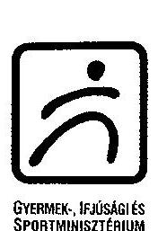
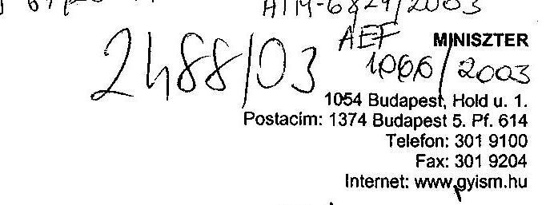

Állami Számvevőszék
Dr. Kovács Árpád úrnak
elnök úr
Budapest

Tisztelt Elnök Úr!
A V-8-66/2003. szám alatt megküldött, a minisztérium átfogó ellenőrzéséről készült jelentésre észrevételt nem teszek. Az ellenőrzés alapján elrendelt intézkedéseimről a későbbiekben fogom Önt tájékoztatni.

Az ellenőrzés alapján láthatóvá vált, hogy a 2002. évi zárszámadás ellenőrzésével összefüggésben feltárt, megállapított hiányosságok és szabálytalanságok, illetve jogszabályellenes intézkedések a gazdálkodás területén már 2002. évet megelőzően is jellemzőek voltak, a hiányosságok meghatározott típusokba csoportosíthatóak, ezért indokoltnak tartom a zárszámadással összefüggésben az Ön részére már eljutatott intézkedési terv kiegészítését.

Budapest, 2003. október 10.
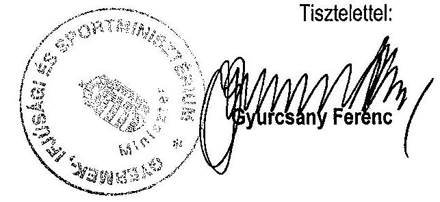

---

2. sz. melléklet
a V-8-68/2003. sz. jelentéshez

Tanúsítványok
(1-10)

---

adatok: E Fkban

|  Megnevezés | 1999. év | 2000. év | 2001. év | 2002. év  |
| --- | --- | --- | --- | --- |
|  Eredeti kiadási előirányzat | 13956600 | 15094800 | 17546100 | 18218600  |
|  Módosítás összesen | 1658721 | 6628838 | 10396412 | 16194016  |
|  Hatáskörök szerint ebből: |  |  |  |   |
|  OGY |  | 39000 | -750000 | 4200000  |
|  Kormány | 263820 | 1002450 | 5839827 | 7230853  |
|  Felügyeleti szervi | 266950 | 3806517 | 4294702 | 6283404  |
|  Saját | 1126146 | 1789871 | 1001883 | 479959  |
|  - előir. maradványból | 319546 | 794478 | 1001883 | 479959  |
|  - többletbevételből | 806600 | 995398 |  |   |
|  - egyéb tanásból |  |  |  |   |
|  Módosított kiad. előirányzat | 15615321 | 21723638 | 27942512 | 34412616  |
|  Eredeti bevételi előirányzat | 13956600 | 15094800 | 17546100 | 18218600  |
|

  Módosítás összesen | 1658721 | 6628838 | 10396412 | 16194016  |
|  Ebből: |  |  |  |   |
|  Saját bevétel | 268963 | 1158552 | 1522434 | 2222543  |
|  Átvett pénzeszköz | 298727 | 1163052 |  |   |
|  Költségvetési támogatás | 647619 | 1220787 | 4302115 | 12212445  |
|  Pénzforgalom nélküli bevétel | 319546 | 4244999 | 4551263 | 3749028  |
|  Módosított bevételi előirányzat | 15613321 | 21723638 | 27932512 | 36412616  |
|  Kölcsön nyújtása | 1866 | 4500 | 10580 | 10000  |

Megjegyzés: a tanúsítványt fejezeti szinten és igazgatási címen kérjük kitölteni!

Tanúsítom, hogy az adatok a fejezet/igazgatási cím számviteli nyilvántartásában szereplő adatokkal megegyeznek!

Budapest, 2003. március 

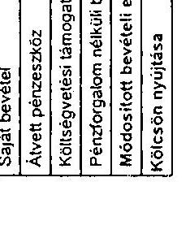

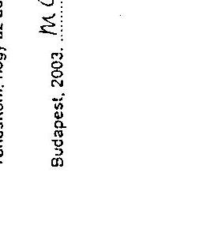

---

2/a. sz. tanúsítvány a V-8-68/2003. sz. jelentéshez

# A FEJEZETI KEZELÉSŰ ELŐIRÁNYZATOK KIADÁSAI 1999. év - GYISM fejezet

|  Megnevezés | Címintűn/ jogcím szám | Eredeti előirányzat | Módosított előirányzat | Adatok: E főben  |
| --- | --- | --- | --- | --- |
|  Programfinanszírozott előirányzatok |  |  |  |   |
|  Sportcsarnokok működési kiadásainak támogatása | 5/1/1/1 | 520 000 | 508 600 | 507 522  |
|  Sportcsarnokok közvilágításának rendszere | 5/1/1/2 | 1 000 000 | 1 000 000 | 532 413  |
|  Egyetem támogatása | 5/1/2 | 25 000 | 24 500 | 24 500  |
|  Szabadidősport programok támogatása | 5/1/3/1 | 150 000 | 140 160 | 137 997  |
|  Olimpiai műhelyek támogatása | 5/1/2/1 | 415 000 | 415 000 | 414 996  |
|  Futbal fejlesztési program | 5/1/2/2 | 500 000 | 451 900 | 169 093  |
|  Sportváltóbocskák támogatási programja | 5/1/6 | 700 000 | 546 684 | 299 972  |
|  Húsági és Sportmúzeum felújítási feladatra | 5/1/7/3 | 10 000 | 7 593 | 0  |
|  Létesítmények és eszközök építési és korszerűsítési támogatása | 5/1/7/4 | 1 000 000 | 928 320 | 138 146  |
|  Húsági- és sportmúzeumi napikai rendszer | 5/1/8 | 300 000 | 213 762 | 56 571  |
|  Fogyatékosok sportcélú fejlesztése | 5/1/9/3 | 50 000 | 48 894 | 45 308  |
|  Honlap fejlesztési program | 5/1/10/1 | 300 000 | 234 679 | 145 286  |
|  Szegényegészség | 5/1/10/2 | 50 000 | 0 | 0  |
|  Sportesemények támogatása | 5/1/12 | 300 000 | 743 400 | 686 321  |
|  Verseny- és átszállás | 5/1/15/1 | 0 | 16 048 | 12 938  |
|  Utánpótlás | 5/1/15/2 | 0 | 10 065 | 5 475  |
|  Szabadidőpont | 5/1/15/3 | 0 | 113 | 40  |
|  Sporttudomány | 5/1/15/4 | 0 | 1 | 0  |
|  Egyéb ágazati szakmai célú támogatások | 5/1/15/1 | 0 | 30 467 | 187  |
|  Olimpia és olimpiai romboló veszélyek | 5/1/15/11 | 0 | 870 | 0  |
|  Létesítmények pályázati támogatás | 5/1/16/3 | 0 | 190 | 0  |
|  Eseményre pályázati támogatás | 5/1/16/7 | 0 | 1 275 | 290  |
|  Egyéb célra pályázati támogatás | 5/1/16/8 | 0 | 3 338 | 3 138  |
|  Gyermek- és Húsági alap programok támogatása | 5/2/2 | 530 000 | 585 546 | 203 463  |
|  Húságbiztonsági kiadások támogatása | 5/2/4 | 8 000 | 7 925 | 7 943  |
|  Különszövetségi Kivonatolás Bűnügyi Osztály működési költségei | 5/2/7/1 | 20 000 | 49 731 | 8 300  |
|  Zártkői Gyermek és Húsági Szilágyi Központ működésének támogatása | 5/2/9/1 | 150 000 | 147 000 | 147 000  |
|  Zártkői Gyermek és Húsági programok támogatása | 5/2/9/2 | 80 000 | 78 500 | 78 500  |
|  Európai Tanács 50. évfordulójának rendezvénysorozata | 5/3 | 50 000 | 48 000 | 48 207  |
|  Egyszerűsített részprogramú előirányzat |  |  |  |   |
|  Wesszényi Módos Sport Közalapítvány támogatása | 5/1/1/2 | 5 000 | 5 000 | 5 000  |
|  Magyar Olimpiai Bizottság Olimpiai feladatok támogatása | 5/1/4/1 | 350 000 | 350 013 | 35 000  |
|  Mező Ferenc Közalapítvány támogatása | 5/1/4/9 | 15 000 | 15 000 | 15 000  |
|  Magyar Szövetség Olimpiai Bizottság | 5/1/9/1 | 8 000 | 8 000 | 8 000  |
|  Magyar Férfi Labdarúgó Szövetség | 5/1/9/2 | 16 000 | 16 000 | 16 000  |
|  Honvéd Gyermek és Húsági Közalapítvány | 5/2/5 | 228 000 | 194 000 | 193 798  |
|  Youth for Europe program | 5/2/8 | 142 000 | 107 552 | 102 551  |
|  Nem programfinanszírozott előirányzatok |  |  |  |   |
|  A Wesszényi Módos Sport Közalapítvány sorsolásos játékok játékadójából származó támogatása | 5/1/3/3 | 530 000 | 530 000 | 173 794  |
|  Wesszényi Módos Sport Közalapítvány bög játékadójából életével támogatása | 5/1/3/4 | 380 000 | 380 000 | 374 161  |
|  Olimpiai emlékérem feladatra | 5/1/4/2 | 183 000 | 202 558 | 202 082  |
|  Bulunkori rendszerű legalizációk játékadójából származó támogatás | 5/1/11 | 210 000 | 233 920 | 205 892  |
|  Központi sportlétesítmények beruházási programja | 5/1/14/1 | 1 030 000 | 251 704 | 0  |
|  Buszban Sportesemény adathordozók | 5/1/15 | 0 | 60 000 | 0  |
|  Verseny sport szervezetek normatív támogatása | 5/1/15/1 | 0 | 3 117 | 3 117  |
|  Működésre pályázati támogatás | 5/1/16/9 | 0 | 3 500 | 3 490  |
|  Kék és biztonsági nemzetközi szerződések alapján szervezett nemzetközi Húsági szerep programok | 5/2/10 | 130 000 | 128 170 | 124 986  |
|  II. Európai Húsági Központ | 5/2/11 | 80 000 | 22 400 | 12 000  |
|  Fejezet tartalék |  | 0 | 0 |   |
|  Összesen: |  | 9 950 000 | 8 743 627 | 5 146 274  |

Megjegyzés: a Tanúsítványt évenként kérjük kitölteni, külön részletezve előbb a programfeladat - ezen belül az egyszerűsített -, ezt követően a nem programfinanszírozás körébe tartozó előirányzatokat

Tanúsítom, hogy az adatok a fejezet számviteli nyilvántartásában szereplő adatokkal megegyeznek!

Budapest, 2003. március 20.

---

2/b. sz. tanúsítvány a V-8-68/2003. sz. jelentéshez

# A FEJEZETI KEZELÉSŰ ELŐIRÁNYZATOK KIADÁSAI 2000. év - GYISM fejezet

|  Megnevezés | Címintűl/ jogcím szám | Eredeti előirányzat | Módosított előirányzat | Intézmény  |
| --- | --- | --- | --- | --- |
|  Programfinanszírozott előirányzatok |  |  |  |   |
|  Sydney 2000. olimpiai támogatása | 5/2/1/2 | 767 600 | 1 135 600 | 1 114 352  |
|  Sportszervezetek közterületének rendezése | 5/2/1/3 | 850 000 | 1 317 587 | 643 551  |
|  Olimpiai Műhelyek támogatása | 5/2/4/1 | 429 000 | 420 000 | 418 451  |
|  Futball-fejlesztési program | 5/2/4/2 | 400 000 | 637 745 | 385 870  |
|  Nemzeti atlétikai program | 5/2/4/3 | 330 000 | 251 707 | 194 546  |
|  Kosárlabda-fejlesztési program | 5/2/4/4 | 100 000 | 100 000 | 64 552  |
|  Sportvállalkozások támogatási programja | 5/2/5 | 392 000 | 422 712 | 134 514  |
|  Sportegészségügy és doppingellenes feladatok | 5/2/7/1 | 35 000 | 264 | 0  |
|  Hazar rendezésű sportesemények támogatása | 5/2/11/1 | 243 000 | 319 687 | 254 651  |
|  Kábítószer problémával kapcsolatos képzés, továbbképzés, korlátozóképzés távú | 5/2/1 | 50 000 | 47 650 | 9 050  |
|  Drogmegelőzési program | 5/3/3 | 501 000 | 474 509 | 74 874  |
|  Drogkutatások, vizsgálatok támogatása | 5/3/5 | 48 000 | 47 000 | 0  |
|  Két- és többoldalú nemzetközi csereprogramok és Youth Program | 5/4/4 | 318 000 | 325 216 | 304 192  |
|  Igazgatási perhezéd és szervezeti demokrácia programja | 5/4/7 | 48 000 | 48 000 | 36 297  |
|  Sport-, egészségügyi és droginformatikai rendszer fejlesztése | 5/5/2 | 85 000 | 173 478 | 122 319  |
|  Európai Tanács 50. évfordulójának rendezvénysorozata | 5/6 | 0 | 1 795 | 1 687  |
|  Egyéb/részletes részprogramú előirányzat |  |  |  |   |
|  Magyar Olimpiai Bizottság Olimpiai feladatok támogatása | 5/2/3/1 | 350 000 | 350 000 | 350 000  |
|  Forma-1 Magyar Nagydíj támogatása | 5/2/11/2 | 400 000 | 400 000 | 400 000  |
|  Youth for Europe program | 5/4/9 | 0 | 5 002 | 4 789  |
|  Nem programfinanszírozott előirányzatok |  |  |  |   |
|  Sportintézmények, sportlétesítmények szolgáltatásainak beruházása | 5/1/2 | 700 000 | 423 039 | 191 809  |
|  Budapest Sportcsarnokok újjáépítése | 5/1/3 | 0 | 110 000 | 0  |
|  Sportág-szövetségek működési kiadásainak támogatása | 5/2/1/1 | 526 000 | 537 076 | 530 016  |
|  Szabadidősport programok támogatása | 5/2/2/1 | 300 000 | 172 143 | 162 911  |
|  A Wesszényi Módos Sport Közalapítvány sorsolásos játékok játékadójából származó támogatása | 5/2/2/2 |

 530 000 | 886 206 | 1 319 948  |
|  Wesselyi Mátyás Sport Közalapítvány totó játékodójából származó támogatás | 5/2/2/3 | 380 000 | 614 096 | 633 930  |
|  Olimpiai érmesek és fogyatékos sportolók járadéka, elismerése | 5/2/3/2 | 248 000 | 251 788 | 251 759  |
|  Mező-Faranc Közalapítvány támogatása | 5/2/3/3 | 10 000 | 10 000 | 10 000  |
|  Magyar Speciális Olimpiai Szövetség | 5/2/9/1 | 8 000 | 8 000 | 8 000  |
|  Magyar Paraklinikai Bizottság | 5/2/6/2 | 16 000 | 16 000 | 16 000  |
|  Fogyatékosok sportjának fejlesztése | 5/2/6/3 | 59 400 | 60 335 | 59 404  |
|  Igénybe vett sportlétesítmények akadálymentesítése | 5/2/6/4 | 10 000 | 10 000 | 10 000  |
|  Sporttudomány | 5/2/7/2 | 30 000 | 30 000 | 7 756  |
|  Tanulmányi kapcsolatok | 5/2/7/3 | 90 000 | 90 000 | 89 400  |
|  Létesítmények és pályák építési és korszerűsítési támogatása | 5/2/7/4 | 800 000 | 1 565 786 | 769 070  |
|  Sorsjátékok rendszerű fogadásai játékodójából származó támogatás | 5/2/8 | 210 000 | 196 235 | 311 360  |
|  Sportlétesítmény-kezelési intézményi rendszerének megújítása | 5/2/10 | 298 100 | 286 653 | 286 653  |
|  Budapest Sportcsarnokok újjáépítésének támogatása | 5/2/12 | 0 | 127 114 | 118 856  |
|  Nemzeti Droginformációs Központ és Módszertani Intézet, Reiva Focal Point | 5/3/2 | 50 000 | 0 | 0  |
|  Alacsony küszöbű intézmények szolgáltatásainak fejlesztési támogatása | 5/3/8 | 85 000 | 80 966 | 6 086  |
|  Kábítószerügyi Koordinációs Bizottság és kábítószerügyi egyeztető fórum működésének támogatása | 5/3/7 | 58 000 | 72 664 | 62 008  |
|  Gyermek- és ifjúsági programok támogatása | 5/4/1 | 447 000 | 805 598 | 632 898  |
|  Nemzeti Gyermek és Ifjúsági Közalapítvány | 5/4/2 | 156 000 | 156 000 | 156 000  |
|  II. Európai Ifjúsági Központ | 5/4/3 | 20 000 | 30 456 | 24 377  |
|  Zánkai Gyermek és Ifjúsági Örökös Központ és ifjúsági turizmus támogatása | 5/4/5 | 378 000 | 435 000 | 384 987  |
|  Határon túli fiatalok együttműködési programja | 5/4/6 | 71 000 | 50 050 | 47 590  |
|  Ifjúságkutatások támogatása | 5/4/8 | 10 000 | 2 815 | 2 203  |
|  Nemzetközi kapcsolatok | 5/5/1 | 45 000 | 0 | 0  |
|  Fejezeti tartalékok |  |  |  |   |
|  Összesen: |  | 10 880 100 | 13 488 657 | 10 574 231  |

Megjegyzés: a Tanúsítványt évenként kérjük kitölteni, külön részletezve előbb a programfeladat - ezen belül az egyszerűsített -, ezt követően a nem programfinanszírozás körébe tartozó előirányzatokat!

Tanúsítom, hogy ez eddig a fejezet számviteli nyilvántartásában szereplő program. Mindegyik a programfinanszírozás körébe tartozott, hogy az eddig a fejezet számviteli nyilvántartásában szereplő program. Mindegyik a programfinanszírozás körébe tartozott, hogy az eddig a fejezet számviteli nyilvántartásában szereplő program. Mindegyik a programfinanszírozás körébe tartozott, hogy az eddig a fejezet számviteli nyilvántartásában szereplő program. Mindegyik a programfinanszírozás körébe tartozott, hogy az eddig a fejezet számviteli nyilvántartásában szereplő program. Mindegyik a programfinanszírozás körébe tartozott, hogy az eddig a fejezet számviteli nyilvántartásában szereplő program. Mindegyik a programfinanszírozás körébe tartozott, hogy az eddig a fejezet számviteli nyilvántartásában szereplő program. Mindegyik a programfinanszírozás körébe tartozott, hogy az eddig a fejezet számviteli nyilvántartásában szereplő program. Mindegyik a programfinanszírozás körébe tartozott, hogy az eddig a fejezet számviteli nyilvántartásában szereplő program. Mindegyik a programfinanszírozás körébe tartozott, hogy az eddig a fejezet számviteli nyilvántartásában szereplő program. Everett 2000. év - GYISM fejezet

---

2/c. sz. tanúsítvány a V-8-68/2003. sz. jelentéshez

# A FEJEZETI KEZELÉSŰ ELŐIRÁNYZATOK KIADÁSAI 2001. év - GYISM fejezet

|  Megnevezés | Előirányzat
fejezet | Érintett előirányzatok | Módosított
előirányzatok | Teljesítés  |
| --- | --- | --- | --- | --- |
|  Fejezetközi tartalék előirányozás |  |  |  |   |
|  Székesfehérvár 2000. olimpiai támogatása | 50/10 | 0 | 10 439 000 | 2 079 936  |
|  Olimpiai Műhelyek támogatása | 50/4/1 | 0 | 1 348 000 | 1 443 422  |
|  Futball fejlesztési program | 50/4/2 | 0 | 271 873 000 | 125 101 680  |
|  Hosszútávfutó program | 50/4/3 | 0 | 56 546 000 | 43 032 807  |
|  Hozatalos fejlesztési program | 50/4/4 | 0 | 35 446 000 | 35 289 394  |
|  Igénybe vett házak felújítása | 5/4/12 | 10 000 000 | 8 000 000 | 0  |
|  Egyszerűsített részprogramú előirányzatok |  |  |  |   |
|  Nem feladathoz tartozó előirányzatok |  |  |  |   |
|  Budapest Sportcsarnokok létesítmény-korszerűsítése és egyéb, az újjáépítéssel kapcsolatos átmeneti fejlesztés | 5/1/1 | 600 000 000 | 800 522 889 | 626 997 643  |
|  Sportintézmények, sportlétesítmények szolgáltatásának beruházása | 5/1/2 | 730 000 000 | 1 191 037 281 | 931 080 571  |
|  Továbbtanulási létesítmények beruházása | 5/1/3 | 0 | 166 500 000 | 0  |
|  Sportág-szakszövetségek működési feltételeinek támogatása | 50/1/1 | 450 000 000 | 558 472 000 | 550 942 812  |
|  Sport szervezetek közötti kapcsolatok rendszerezése | 50/1/3 | 750 000 000 | 874 036 000 | 163 224 650  |
|  Egyetemi támogatása | 50/1/4 | 35 000 000 | 35 000 000 | 33 000 000  |
|  Olimpiai részvétel támogatása | 50/1/5 | 40 000 000 | 40 000 000 | 40 000 000  |
|  Totó játékadóból számított támogatás | 50/1/6 | 380 000 000 | 336 082 000 | 446 983 005  |
|  Műsorszerkesztő pályázat támogatás | 50/1/7 | 0 | 726 000 | 726 000  |
|  Előző évek maradványai | 50/1/8 | 0 | 76 541 000 | 76 073 000  |
|  Szakszövetségi programok támogatása | 50/2/1 | 450 000 000 | 403 584 000 | 391 539 298  |
|  A Magyar Állami Sport Központi irányító szervezete járadékadójából származó támogatása | 50/2/2 | 530 000 000 | 530 000 000 | 1 194 173 000  |
|  Magyar Olimpiai Bizottság olimpiai feladatok támogatása | 50/3/1 | 750 000 000 | 1 164 000 000 | 1 164 000 000  |
|  Olimpiai érmesek és fogyatékos sportolók járadéka, elismerése | 50/3/2 | 370 000 000 | 419 009 000 | 417 514 233  |
|  Macf. Ferenc Központi Irányító Szervezet támogatása | 50/3/3 | 15 000 000 | 15 000 000 | 15 000 000  |
|  Sportigazgatás | 50/4 | 581 000 000 | 1 602 902 000 | 1 526 808 445  |
|  Sportvállalkozások támogatási programja | 50/5 | 240 300 000 | 436 089 000 | 177 757 287  |
|  Fogyatékosok sportjának fejlesztése | 50/4/3 | 240 000 000 | 199 309 000 | 185 304 210  |
|  Igénybe vett sportlétesítmények akadálymentesítése | 50/4/4 | 70 000 000 | 54 116 000 | 27 685 000  |
|  Fogyatékosok integrációját segítő szervezetek | 50/5/5 | 5 000 000 | 4 497 000 | 3 500 000  |
|  Fogyatékosok sportkollégiumának támogatása | 50/5/6 | 60 000 000 | 62 900 000 | 62 903 000  |
|  Sportnyilvántartási és deponálás feladatok | 50/7/1 | 46 700 000 | 10 324 000 | 10 354 000  |
|  Sporttudomány | 50/7/2 | 20 000 000 | 473 562 000 | 25 724 033  |
|  Tanszéki kapcsolatok | 50/7/3 | 110 000 000 | 107 800 000 | 107 000 000  |
|  Sportlétesítmények építési és korszerűsítési támogatása | 50/7/4 | 700 000 000 | 1 623 235 000 | 1 403 408 967  |
|  Látogatottság növelése és létesítmények fejlesztése | 50/7/5 | 4 000 000 000 | 3 900 000 000 | 3 950 000 000  |
|  Bizottsági rendezett fogadások járadékadójából származó támogatás | 50/8 | 210 000 000 | 319 940 000 | 577 308 583  |
|  Sportlétesítmény-kezelési intézményi rendszer | 50/10 | 1 200 000 000 | 2 527 521 000 | 2 526 021 000  |
|  Hátrányos helyzetű sportesemények támogatása | 50/11/1 | 180 100 000 | 358 039 000 | 305 501 164  |
|  Forma-1 Magyar Nagydíj támogatása | 50/11/2 | 400 000 000 | 400 000 000 | 400 000 000  |
|  Budapest Sportcsarnokok újjáépítésének támogatása | 50/12 | 0 | 8 763 000 | 8 762 003  |
|  Kábítószer problémával kapcsolatos képzés, továbbképzés, korlátozó képzés | 50/1 | 85 000 000 | 115 298 000 | 60 040 584  |
|  Drogmegelőzési program | 50/3 | 568 000 000 | 752 674 000 | 534 011 773  |
|  Drogkutatások, vizsgálatok támogatása | 50/5 | 50 000 000 | 92 240 000 | 94 334 590  |
|  Alacsony küszöbű intézmények szolgáltatásainak fejlesztési támogatása | 50/6 | 190 000 000 | 206 500 000 | 232 018 742  |
|  Kábítószerügyi Koordinációs Bizottság és kábítószerügyi egyeztető fórum működésének támogatása | 50/7 | 65 000 000 | 81 461 000 | 48 923 924  |
|  Gyermek- és ifjúsági alapprogramok támogatása | 50/1 | 490 000 000 | 805 821 000 | 557
 460 699  |
|  Nagy Igusági rendszerek | 50/10 | 30 000 000 | 27 500 000 | 27 500 000  |
|  Jelszók fejlesztési program | 50/11 | 200 000 000 | 211 000 000 | 57 465 000  |
|  Hosszú Gyermek és Igusági Középpont | 50/2 | 187 900 000 | 187 900 000 | 187 900 000  |
|  II. Európai Igusági központ | 50/3 | 60 000 000 | 6 778 000 | 6 778 000  |
|  Két- és többoldalú nemzetközi cserecsoportok és Youth Program | 50/4 | 325 000 000 | 319 580 000 | 295 914 213  |
|  Zárkát Gyermek és Igusági Üzleti Házgom és Igusági külföldi támogatása | 50/5 | 420 000 000 | 555 763 000 | 511 658 005  |
|  Határon túli Balatoni együttműködési programok | 50/6 | 90 000 000 | 72 273 000 | 70 959 700  |
|  Igusági párbeszéd és Hosszú Igusági Tanács | 50/7 | 60 000 000 | 54 430 000 | 47 130 533  |
|  Igusági tudományos kutatások támogatása | 50/8 | 0 | 812 000 | 400 000  |
|  Iguságvédelmi, adózási kivonulási program | 50/9 | 32 500 000 | 12 750 000 | 12 750 000  |
|  Sport-, Igusági és drogprevenciós rendszer fejlesztése | 50/2 | 44 700 000 | 61 160 000 | 60 659 808  |
|  Feszült tartalom | 5/8 | 82 300 000 | 0 | 0  |
|  Összesen |  | 15 240 000 000 | 22 428 517 280 | 22 223 537 865  |

Megjegyzés: a Tanúsítvány évenként kérjük időben, külön részletezze előbb a programfizetésből, akkor beáll az egyenlőtlenséget ... azt követően a nem programfinanszírozás körébe tartozó előirányzatvétel.

Tanúsítom, hogy az aláírás a fejezeti számviteli nyilvántartásban szerepel.

Budapest, 2003.

---

2/d. sz. tanúsítvány a V-8-68/2003. sz. jelentéshez

# A FEJEZETI KEZELÉSŰ ELŐIRÁNYZATOK KIADÁSAI 2002. év - GYISM fejezet

|  Megnevezés | Címlelem/ jogcím szám | Eredeti előirányzat | Módosított előirányzat | Adatok | Ft-ban  |
| --- | --- | --- | --- | --- | --- |
|  Feladatfinanszírozott előirányzatok |  |  |  |  |   |
|  Olimpiai Műhelyek támogatása | 5/2/4/1 |  |  |  |   |
|  Futópálya fejlesztési program | 5/2/4/2 | 0 | 142 391 000 | 105 255 000 |   |
|  Nomzék abilitációs program | 5/2/4/3 | 0 | 10 501 000 | 5 487 450 |   |
|  Hozárfokozás fejlesztési program | 5/2/4/4 | 0 | 199 000 | 0 |   |
|  Húsvéti házak felújítása | 5/4/12 | 100 000 000 | 103 380 250 | 59 900 052 |   |
|  HU-0205-02 Kábítószerügyi Egyeztető Fórum intézményfejlesztési program | 5/6/4 | 0 | 132 452 228 | 57 007 192 |   |
|  Nem feladatfinanszírozott előirányzatok |  |  |  |  |   |
|  Budapest Sportcsarnok létesítmény-kiváltással és egyéb, az újjáépítéssel kapcsolatos aljain/ feladatok | 5/1/1 | 300 000 000 | 372 766 510 | 351 623 382 |   |
|  Sportesemények, sportlétesítmények szolgáltatásainak beruházásai | 5/1/2 | 733 000 000 | 674 817 022 | 699 310 357 |   |
|  Továbbképző létesítmények beruházásai | 5/1/3 | 0 | 396 800 000 | 268 195 000 |   |
|  Sportlétesítmények működési kiadásainak támogatása | 5/2/1/1 | 450 000 000 | 515 520 000 | 444 401 644 |   |
|  Sydney 2000. olimpiai támogatása | 5/2/1/2 |  |  |  |   |
|  Sportszövetségek közalapításának rendezése | 5/2/1/3 | 750 000 000 | 750 000 000 | 0 |   |
|  Universalek támogatása | 5/2/1/4 | 0 | 2 000 000 | 2 000 000 |   |
|  Olimpiai részvétel támogatása | 5/2/1/5 | 15 000 000 | 15 000 000 | 15 000 000 |   |
|  Többletjátékadóból származó támogatás | 5/2/1/6 | 380 000 000 | 380 000 000 | 409 926 970 |   |
|  Működésre pályázati támogatás | 5/2/1/7 |  |  |  |   |
|  Előző évek maradványa | 5/2/1/9 | 0 | 547 725 000 | 547 288 000 |   |
|  Szabadidősport programok támogatása | 5/2/2/1 | 550 000 000 | 552 717 000 | 550 003 774 |   |
|  A Wesselényi Miklós Sport Közalapítvány szerencsejátékok játékadójából származó támogatása | 5/2/2/2 | 530 000 000 | 530 000 000 | 1 540 433 474 |   |
|  Magyar Olimpiai Bizottság Olimpiai feladatok támogatása | 5/2/3/1 | 750 000 000 | 1 153 000 000 | 1 050 000 000 |   |
|  Olimpiai érmekes és fogyatékos sportolók járadéka, elismerése | 5/2/3/2 | 422 000 000 | 525 554 000 | 524 074 896 |   |
|  Mező Ferenc Közalapítvány támogatása | 5/2/3/3 | 15 000 000 | 15 000 000 | 15 000 000 |   |
|  Sportfejlesztés | 5/2/4 | 581 000 000 | 1 284 219 000 | 1 257 195 754 |   |
|  Sportválságkezelő támogatási programja | 5/2/5 | 292 500 000 | 465 460 000 | 385 145 967 |   |
|  Fogyatékossággal élők sportjának fejlesztése | 5/2/6/3 | 298 000 000 | 308 511 000 | 266 348 322 |   |
|  Húsvéti és sportlétesítmények akadálymentesítése | 5/2/6/4 | 120 000 000 | 146 545 000 | 99 326 220 |   |
|  Fogyatékossággal élők integrációját segítő szervezetek | 5/2/6/5 | 10 000 000 | 10 317 000 | 8 567 000 |   |
|  Fogyatékossággal élők sportszövetségeinek támogatása | 5/2/6/6 | 50 000 000 | 50 000 000 | 50 000 000 |   |
|  Sportfejlesztésügy és doppingellenes feladatok | 5/2/7/1 | 81 700 000 | 83 000 000 | 70 000 000 |   |
|  Sporttudomány | 5/2/7/2 | 42 000 000 | 701 789 000 | 517 285 317 |   |
|  Tenyésztés kapcsolat | 5/2/7/3 | 120 000 000 | 120 400 000 | 120 400 000 |   |
|  Sportlétesítmények építési és korszerűsítési támogatása | 5/2/7/4 | 700 000 000 | 7 921 839 000 | 1 397 766 660 |   |
|  Labdarúgó stadionok és létesítmények fejlesztése | 5/2/7/6 | 4 000 000 000 | 4 000 000 000 | 4 000 000 000 |   |
|  Sportlétesítmény-fejlesztési program | 5/2/7/7 | 0 | 0 | 0 |   |
|  Bozót-program támogatása | 5/2/7/7 | 0 | 4 200 000 000 | 4 200 000 000 |   |
|  Bukméker/szerencsejáték bűnözés játékadójából származó támogatás | 5/2/8 | 210 000 000 | 234 757 000 | 553 574 335 |   |
|  Sportlétesítmény-kezelés intézményi rendezése | 5/2/10 | 1 000 000 000 | 2 068 201 000 | 1 772 801 000 |   |
|  Hazai rendezésű sportesemények támogatása | 5/2/11/1 | 243 100 000 | 1 323 898 000 | 849 366 862 |   |
|  Fannai 1 Magyar Regutó támogatása | 5/2/11/2 | 400 000 000 | 2 920 000 000 | 2 920 000 000 |   |
|  Budapest Sportcsarnok újjáépítésének támogatása | 5/2/12 | 0 | 298 000 | 0 |   |
|  Kábítószer problémával kapcsolatos képzés, továbbképzés, korlátozásépítés tám | 5/3/1 | 85 000 000 | 146 343 000 | 86 774 257 |   |
|  Öregedésgátló program | 5/3/3 | 603 000 000 | 731 492 000 | 411 007 879 |   |
|  Öregedéskutatások, vizsgálatok támogatása | 5/3/5 | 50 000 000 | 75 283 000 | 61 595 000 |   |
|  Házszomszéd közösségi intézmények szolgáltatásainak fejlesztési támogatása | 5/3/6 | 215 000 000 | 249 876 000 | 216 848 500 |   |
|  Kábítószerügyi Koordinációs Bizottság és kábítószerügyi egyeztető fórumok működésének támogatása | 5/3/7 | 75 000 000 | 73 677 000 | 59 475 519 |   |
|  Gyermek- és ifjúsági alprogramja támogatása | 5/4/1 | 500 000 000 | 494 484 000 | 440 787 710 |   |
|  Nagy ifjúsági rendezvények | 5/4/10 | 30 000 000 | 30 000 000 | 30 000 000 |   |
|  Ifjúságfejlesztési program | 5/4/11 | 250 000 000 | 310 916 000 | 159 843 521 |   |
|  Nemzeti Gyermek és Ifjúsági Közalapítvány | 5/4/2 | 187 900 000 | 212 503 000 | 211 900 000 |   |
|  II. Európai Ifjúsági Központ | 5/4/3 | 70 000 000 | 0 | 0 |   |
|  Két- és többoldalú nemzetközi cserecsoportok és Youth Program | 5/4/4 | 330 000 000 | 309 464 000 | 373 573 310 |   |
|  Zárnai Gyermek és Ifjúsági Üdülési Központ és Ifjúsági turizmus támogatása | 5/4/5 | 440 000 000 | 632 707 000 | 574 203 459 |   |
|  Határon túli feljáték együttműködési programja | 5/4/6 | 100 000 000 | 87 030 000 | 75 086 477 |   |
|  Ifjúsági párbeszéd és Nemzeti Ifjúsági Tanács | 5/4/7 | 50 000 000 | 71 193 000 |

 | 55 993 614 |   |
|  Hűségfejlesztési kutatások támogatása | 5/4/8 | 0 | 212 000 | 0 |   |
|  Húsvételénk, erőszakmentességi program | 5/4/9 | 20 000 000 | 16 938 000 | 16 460 500 |   |
|  Sport-, Hűség- és droginformatikai rendszer fejlesztése | 5/5/2 | 44 700 000 | 50 074 000 | 49 493 750 |   |
|  A Részhívogató kar illetményeinek számítógépe | 5/5/3 |  |  |  |   |
|  Iskoláktai program | 5/5/5 | 0 | 540 000 000 | 208 495 627 |   |
|  Fejezeti tartalék | 5/6 | 74 900 000 | 32 000 | 0 |   |
|  Összesen: |  | 16 268 800 000 | 30 918 614 010 | 37 983 571 208 |   |

Megjegyzés: a Tanúsítványt évenként kérjük kitölteni, külön részletezve előbb a program/fejlesztési programja az egyszerűsített -, ezt követően a nem Tanúsítom, hogy az adatok a fejezet számviteli nyilvántartásában szereplő adatokkal megjegyzéssel. 11/2020. Budapest, 2003. 03. 20.

---

3. sz. tanúsítvány a V-8-68/2003. sz. jelentéshez

## A KIADÁSOK ALAKULÁSA KIEMELT ELŐÍRÁNYZATONKÉNT - Igazgatás címén

|  Megnevezés | 1999. év |  | 2000. év |  | 2001. év |  | 2002. év |   |
| --- | --- | --- | --- | --- | --- | --- | --- | --- |
|   | Eredeti | Mód. | Teljesítés | Eredeti | Mód. | Teljesítés | Eredeti | Mód.  |
|   | előirányzat | előirányzat | előirányzat | előirányzat | előirányzat | előirányzat | előirányzat |   |
|  Személyi juttatások | 247600 | 413255 | 359553 | 342800 | 419276 | 393349 | 506400 | 681402  |
|  Munkaadókat terhelő járulékok | 104400 | 148658 | 132315 | 130100 | 138090 | 137524 | 168000 | 251185  |
|  Dologi kiadások | 103082 | 271472 | 249798 | 300050 | 502879 | 499270 | 463200 | 1118339  |
|  Egyéb folyó kiadások | 15018 | 22708 | 22247 | 21550 | 21572 | 20424 | 15500 | 50171  |
|  Műk. és felhalm. célú pénzeszköz átadás | 1100 | 12899 | 11963 |  | 62894 | 62168 |  | 865039  |
|  Felújítás | 8900 | 11466 | 6089 | 8600 | 8600 | 8185 |  | 16369  |
|  Beruházási kiadások | 299700 | 420417 | 276344 | 25200 | 327315 | 326874 | 25200 | 959302  |
|  Pénzügyi befektetések |  |  |  |  |  |  |  | 422500  |
|  Kölcsönök nyújtása és törlesztése |  | 1666 | 1666 |  | 4510 | 4500 |  | 10000  |
|  Pénzforgalom nélküli kiadások |  |  |  |  |  |  |  |   |
|  Költségvetési kiadások összesen | 779800 | 1302535 | 1059975 | 828300 | 1485136 | 1452294 | 1178300 | 4374307  |
|  Függő, átfutó, kiegyenlítő kiadások |  |  | 18682 |  |  | 5254 |  |   |

|  2001. év | 2002. év  |
| --- | --- |
|  Eredeti | Mód.  |
|  előirányzat | Mód.  |
|  előirányzat | Mód.  |
|  előirányzat | Mód.  |
|  884609 | 828300  |
|  279782 | 1666  |
|  1064616 | 478700  |
|  822035 | 45518  |
|  45356 | 116467  |
|  116467 | 14457  |
|  15561 | 14457  |
|  25200 | 748435  |
|  583510 | 10000  |
|  10000 | 10000  |
|  4108300 | 1227400  |
|  -22396 | -22396  |

Megjegyzés: a tanúsítványt fejezeti szinten és igazgatási címen kérjük kitölteni!

Tanúsítom, hogy az adatok a fejezet/igazgatási cím számviteli nyilvántartásában szereplő adatokkal megegyeznek!

Budapest, 2003. március 20

P.H.

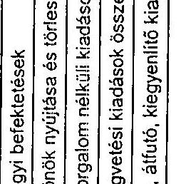

---

adatok: E Fishan

|  Megnevezés | 1999. év |  |  | 2000. év |  |  | 2001. év |  |  | 2002. év |  |   |
| --- | --- | --- | --- | --- | --- | --- | --- | --- | --- | --- | --- | --- |
|   | Eredeti | Mód. | Teljesítés | Eredeti | Mód. | Teljesítés | Eredeti | Mód. | Teljesítés | Eredeti | Mód. | Teljesítés  |
|   | -előirányzat |  |  | -előirányzat |  |  | -előirányzat |  |  | -előirányzat |  |   |
|  Személyi juttatások | 1145700 | 1645565 | 1529726 | 1667700 | 1669392 | 1723269 | 1031500 | 1351475 | 1308285 | 1323900 | 2021736 | 1932905  |
|  Munkaadókat terhelő járulékok | 522900 | 565542 | 503643 | 564900 | 610207 | 566798 | 218400 | 352949 | 307959 | 272200 | 500473 | 449068  |
|  Dologi kiadások | 1470941 | 2718573 | 2106724 | 2300157 | 3642040 | 3138926 | 1134950 | 1598025 | 1395928 | 1518188 | 2626260 | 2237291  |
|  Egyéb folyó kiadások | 38159 | 71709 | 75543 | 44843 | 359016 | 316171 | 16050 | 146580 | 142956 | 36432 | 603198 | 614030  |
|  Műk. és felhalmozás célú pénzeszköz átadás | 7441100 | 7178087 | 5067828 | 10516900 | 15233573 | 11900913 | 13702000 | 20745032 | 20258836 | 13917900 | 28041867 | 25575560  |
|  Felújítás | 141000 | 180986 | 150444 | 76800 | 91381 | 77119 | 1900 | 76953 | 74203 | 3000 | 18561 | 17092  |
|  Beruházási kiadások (többek között Közúti Célprogram) | 3194600 | 3249790 | 1619406 | 838700 | 2024024 | 1558365 | 1441300 | 3197418 | 2245949 | 1147000 | 2590521 | 2239598  |
|  Pénzügyi befektetések |  |  |  |  |  |  |  | 422500 | 583510 |  |  |   |
|  Kölcsönök nyújtása és törlesztése |  | 1866 | 1866 |  | 4510 | 4500 |  | 10580 | 10580 |  | 10000 | 10000  |
|  Pénzforgalom nélküli kiadások |  |  |  |  |  |  |  |  |  |  |  |   |
|  Költségvetési kiadások összesen | 13956600 | 15813321 | 11056290 | 15094800 | 21723638 | 17854921 | 17546100 | 27932512 | 26329246 | 18218600 | 36412616 | 33076387  |
|  Függő, átfutó, kiegyenlítő kiadások |  |  | 18548 |  |  | 4136 |  |  | -900 |  |  | -7091  |
|  Kamatkiadások |  |  |  |  |  |  |  |  |  |  |  | 895  |

Megjegyzés: a tanúsítványt fejezeti szinten és igazgatási címen kérjük kitölteni!

Tanúsítom, hogy az adatok a fejezeti/igazgatási cím számviteli nyilvántartásában szereplő adatokkal megegyeznek!

Budapest, 2003. március 20.

---

5. sz. tanúsítvány a V-8-68/2003. sz. jelentéshez

# A BEVÉTELEK ALAKULÁSA GYISM fejezet

|  Megnevezés | 1999. év |  |  | 2000. év |  |  | 2001. év |  |  | 2002. év |  |   |
| --- | --- | --- | --- | --- | --- | --- | --- | --- | --- | --- | --- | --- |
|   | Eredeti előirányzat | Mód. | Teljesítés | Eredeti előirányzat | Mód. | Teljesítés | Eredeti előirányzat | Mód. | Teljesítés | Eredeti előirányzat | Mód. | Teljesítés  |
|  1. Intézményi működési bevételek (kamat) | 2073200 | 2454792 | 1960587 | 2086400 | 2255067 | 2033773 | 36200 | 371117 | 340836 | 76200 | 111154 | 60293  |
|  2. Felhalmozási és tőke jellegű | 2000 | 9239 | 9059 | 1000 | 15006 | 14343 |  | 11044 | 9001 |  | 2971 | 3262  |
|  2./A bevételek |  |  |  |  |  |  |  |  |  |  |  |   |
|  3. Felügyeleti szervtől kapott támogatás | 11869200 | 12516819 | 12745075 | 13007400 | 14228187 | 14939273 | 17469600 | 21771715 | 22946716 | 18049900 | 30262345 | 31829415  |
|  - működésre, fejlesztésre előirányzott támogatás | 8621800 | 9751631 | 11227912 | 12939100 | 13008086 | 13466247 | 17431100 | 19578903 | 20171509 | 11850300 | 23622668 | 25197984  |
|  - felhalmozásra | 3247400 | 2765188 | 1517163 | 68300 | 1220101 | 1473026 | 38500 | 2192812 | 2775207 | 6199600 | 6639677 | 6631431  |
|  4. Átvett pénzeszközök | 12200 | 310927 | 316727 |  | 975879 | 952570 | 40300 | 1216773 | 1972497 | 92500 | 2277118 | 1739746  |
|  - működésre | 12200 | 248619 | 254405 |  | 456308 | 432932 |  | 243765 | 987586 |  | 1205404 | 758698  |
|  - felhalmozásra |  | 82308 | 64322 |  | 519571 | 519638 | 40300 | 973008 | 984911 | 92500 | 1071714 | 981048  |
|  5. Kölcsönök igénybevétele és visszatérítése |  | 1866 | 1866 |  | 4500 | 4500 |

 | 10580 | 10460 |  | 10000 | 10000  |
|  6. Pénzforgalom nélküli bevétel (előir. maradvány, igénybevétele) |  | 319546 | 266983 |  | 4244999 | 4230332 |  | 4551283 | 3444931 |  | 3749028 | 2835983  |
|  Költségvetési bevételek összesen | 13956600 | 15613321 | 15302946 | 15094800 | 21723638 | 22174791 | 17546100 | 27932512 | 28724441 | 18218600 | 36412616 | 36478699  |
|  Függő, átfutó, kiegyenlítő bevételek, finomsz. bev. |  |  | -2536 |  |  | -15928 |  |  | 276 |  |  | 8022  |
|  Pénzügyi befektetések ber. |  | 132 | 130 |  |  |  |  |  |  |  |  |   |

Megjegyzés: a tanúsítványt fejezeti szinten és igazgatási címen kérjük kitölteni.

Tanúsítom, hogy az adatok a fejezet/gazgatási cím számviteli nyilvántartásában szereplő adatokkal megegyeznek.

Budapest, 2003. március 20.

---

6. sz. tanúsítvány a V-8-68/2003. sz. jelentéshez

## A BEVÉTELEK ALAKULÁSA Igazgatási címné

|  Megnevezés | 1999. év |  | 2000. év |  | 2001. év |  | 2002. év |   |
| --- | --- | --- | --- | --- | --- | --- | --- | --- |
|   | Eredeti | Mód. | Teljesítés | Eredeti | Mód. | Teljesítés | Eredeti | Mód.  |
|   | előirányzat |  |  | előirányzat | előirányzat |  | előirányzat |   |
|  1. Intézményi működési bevételek | 5000 | 38053 | 24147 | 17200 | 44931 | 43252 | 17200 | 37015  |
|  2. Felhalmozás és tőke jellegű bevételek | 2000 | 5000 | 3342 | 800 | 708 | 708 | 10564 | 8461  |
|  3. Felügyeleti szervtől kapott támogatás |  |  |  |  |  |  |  |   |
|  - működésre | 454000 | 762571 | 861474 | 777300 | 863659 | 863659 | 1135900 | 1871972  |
|  - felhalmozásra | 306600 | 432832 | 333928 | 33800 | 240358 | 240358 | 25200 | 1095542  |
|  4. Átvett pénzeszközök |  |  |  |  |  |  |  |   |
|  - működésre | 12200 | 4058 | 2631 | 50203 | 48905 | 48905 | 133734 | 877487  |
|  - felhalmozásra |  |  |  | 55117 | 55117 | 55117 | 269514 | 399089  |
|  5. Kölcsönök igénybevétele és visszatérülése |  | 1666 | 1666 | 4500 | 4500 | 4500 | 10000 | 10000  |
|  6. Pénzforgalom nélküli bevétel (előir. maradvány igénybevétele) |  | 58355 | 8767 | 225568 | 225433 | 225433 | 945966 | 29773  |
|  7. Költségvetési bevételek összesen | 779800 | 1302535 | 1235955 | 828300 | 1485136 | 1481932 | 1178300 | 4374307  |
|  8. Függő, átfutó, kiegyenlítő bevételek |  |  | 200 |  |  |  |  | 63  |

Megjegyzés: a tanúsítványt fejezeti szinten és igazgatási címen kérjük kitölteni.

Tanúsítom, hogy az adatok a fejezeti/igazgatási cím számviteli nyilvántartásában szereplő adatokkal megegyeznek!

Budapest, 2003. március 20.

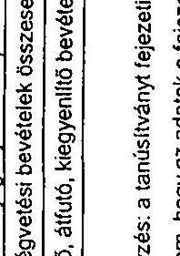

---

7. sz. tanúsítvány a V-8-68/2003. sz. jelentéshez 1. oldal

A TÁRGYI ESZKÖZÖKRE ÉS AZ IMMATERIÁLIS JAVAKRA VONATKOZÓ ADATOK - GYISM fejezet

|  Megnevezés | Bruttó/érték/nyitó | Összes
növekedés | Összes
csökkenés | Bruttó érték záró | Értékcsökkenés záró | Nettó érték | Nettó érték záró bruttó
érték %-ában | Teljesen (0-ra) leírt
állóeszközök  |
| --- | --- | --- | --- | --- | --- | --- | --- | --- |
|  1999. év |  |  |  |  |  |  |  |   |
|  Immateriális javak | 20356 | 33893 | 1551 | 52698 | 35583 | 17115 | 32,4 | 11891  |
|  Ingatlanok | 6774191 | 3160902 | 1193582 | 8741511 | 1495857 | 7245654 | 82,9 | 8642  |
|  Gépek, berendezések, felsz. | 2274967 | 579439 | 489016 | 2368390 | 1453492 | 912898 | 38,6 | 691369  |
|  Járművek | 120217 | 126645 | 35197 | 211665 | 108078 | 103587 | 48,9 | 51946  |
|  Üzemeltetésre, kezelésre átvelt, átadott |  |  |  |  |  |  |  |   |
|  Összesen | 9189731 | 3900879 | 1718346 | 11372264 | 3093010 | 8279254 | 72,8 | 723848  |
|  2000. év |  |  |  |  |  |  |  |   |
|  Immateriális javak | 52698 | 23080 | 23439 | 64749 | 40944 | 23805 | 36,8 | 13795  |
|  Ingatlanok | 8741511 | 1167303 | 2281157 | 9234094 | 1613081 | 7621013 | 82,5 | 5702  |
|  Gépek, berendezések, felsz. | 2368390 | 391033 | 460279 | 2554713 | 1696152 | 858561 | 33,6 | 931698  |
|  Járművek | 211665 | 54068 | 54068 | 250678 | 139784 | 110894 | 44,2 | 63884  |
|  Üzemeltetésre, kezelésre átvelt, átadott |  |  |  |  |  |  |  |   |
|  Összesen | 11372264 | 1635484 | 2818943 | 12194234 | 3489961 | 8614273 | 71,2 | 1015079  |

Megjegyzés: a tanúsítványt fejezeti szinten és igazgatási címen kérjük kitölteni.

Tanúsítom, hogy az adatok a fejezet/igazgatási cím számviteli nyilvántartásában szereplő adatokkal megegyeznek!

Budapest, 2003. március 20.

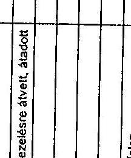

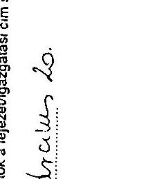

---

7. sz. tanúsítvány a V-8-68/2003. sz. jelentéshez 2. oldal

## A TÁRGYI ESZKÖZÖKRE ÉS AZ IMMATERIÁLIS JAVAKRA VONATKOZÓ ADATOK - GYISM fejezet

|  Megnevezés | Bruttó/érték/nyitó | Összes
növekedés | Összes
csökkenés | Bruttó érték záró | Értékcsökkenés záró | Nettó érték | Nettó érték záró bruttó
érték %-ában | Teljesen (0-ra) leírt
állóeszközök  |
| --- | --- | --- | --- | --- | --- | --- | --- | --- |
|  2001. év |  |  |  |  |  |  |  |   |
|  Immateriális javak | 61584 | 9038 | 27332 | 43290 | 30891 | 12399 | 28,6 | 2458  |
|  Ingatlanok | 11221933 | 4815829 | 10655643 | 5382119 | 875641 | 4506478 | 83,7 | 5555  |
|  Gépek, berendezések, felsz. | 2682961 | 273994 | 2233738 | 723217 | 411721 | 311496 | 43 | 150381  |
|  Járművek | 304936 | 43843 | 134658 | 214121 | 138945 | 75176 | 35,1 | 10172  |
|  Üzemeltetésre, kezelésre átvelt, átadott |  |  |  |  |  |  |  |   |
|  Összesen | 14271414 | 5142704 | 13051371 | 6362747 | 1457198 | 4905949 | 77 | 168564  |
|  2002. év |  |  |  |  |  |  |  |   |
|  Immateriális javak | 66376 | 131748 | 12577 | 185547 | 73771 | 111776 | 60,2 | 18746  |
|  Ingatlanok | 5390181 | 1832707 | 3479942 | 3747946 | 690966 | 3056980 | 81,5 | 5555  |
|  Gépek, berendezések, felsz. | 888792 | 280928 | 304029 | 864791 | 506112 | 258679 | 41,4 | 195614  |
|  Járművek | 265474 | 126033 | 121606 | 269901 | 131406 | 138495 | 51,3 | 5572  |
|  Üzemeltetésre, kezelésre átvelt, átadott |  |  |  |  |  |  |  |   |
|  Összesen | 6615823 | 2370516 | 3918154 | 5068185 | 1402255 | 3665930 | 72,3 | 225487  |

Megjegyzés: a tanúsítványt fejezeti szinten és igazgatási címen kérjük kitölteni.

Tanúsítom, hogy az adatok a fejezet/igazgatási cím számviteli nyilvántartásában szereplő adatokkal megegyeznek!

Budapest, 2003. március 20.

---

8. sz. tanúsítvány a V-8-68/2003. sz. jelentéshez 1. oldal

A TÁRGYI ESZKÖZÖKRE ÉS AZ IMMATERIÁLIS JAVAKRA VONATKOZÓ ADATOK Igazgatási címné

|  Megnevezés | Bruttó/érték/nyitó | Összes növekedés | Összes csökkenés | Bruttó érték záró | Értékcsökkenés záró | Nettó érték | Nettó érték záró bruttó érték %-ában | Teljesen (0-ra) leírt eszközök  |
| --- | --- | --- | --- | --- | --- | --- | --- | --- |
|  1999. év |  |  |  |  |  |  |  |   |
|  Immateriális javak | 4764 | 15252 |  | 20016 | 9591 | 10425 | 52 | 2944  |
|  Ingatlanok | 547018 | 735145 | 540808 | 741355 | 97001 | 644354 | 87 |   |
|  Gépek, berendezések, felsz. | 69467 | 122309 | 22512 | 169264 | 96155 | 73109 | 43 | 45833  |
|  Járművek | 44771 | 82593 | 20965 | 106399 | 40721 | 65678 | 62 | 15117  |
|  Üzemeltetésre, kezelésre átvelt, átadott |  |  |  |  |  |  |  |   |
|  Összesen | 686020 | 955299 | 584285 | 1037034 | 243468 | 793566 | 77 | 63994  |
|  2000. év |  |  |  |  |  |  |  |   |
|  Immateriális javak | 20016 | 14629 |  | 34645 | 19652 | 14993 | 43 | 4195  |
|  Ingatlanok | 741355 | 1072941 | 29218 | 1785078 | 386301 | 1398777 | 78 |

   |
|  Gépék, berendezések, felszerelések | 169166 | 239310 | 26565 | 381911 | 219859 | 162052 | 42 | 89767  |
|  Járművek | 106399 | 9663 | 3884 | 112178 | 56844 | 55334 | 49 | 13211  |
|  Üzemeltetésre, kezelésre átvett, átadott |  |  |  |  |  |  |  |   |
|  Összesen | 1036836 | 1336543 | 59687 | 2313812 | 682656 | 1631150 | 71 | 107173  |

Megjegyzés: a tanúsítványt fejezeti szinten és igazgatási címen kérjük kitölteni.

Tanúsítom, hogy az adatok a fejezeti/igazgatási cím számviteli nyilvántartásában szereplő adatokkal megegyeznek!

Budapest, 2003. Március 20.

P.H.

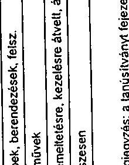

---

8. sz. tanúsítvány a V-8-68/2003. sz. jelentéshez 2. oldal

|  A TÁRGYI ESZKÖZÖKRE ÉS AZ IMMATERIÁLIS JAVAKRA VONATKOZÓ ADATOK Igazgatás címmel |  |  |  |  |  |  |  |   |
| --- | --- | --- | --- | --- | --- | --- | --- | --- |
|  Megnevezés | Bruttó érték/Onyító | Összes növekedés | Összes csökkenés | Bruttó érték záró | Értékcsökkenés záró | Nettó érték | Nettó érték záró bruttó érték %-ában | Teljesen (0-ra) leírt eszközök  |
|  2001. év |  |  |  |  |  |  |  |   |
|  Immateriális javak | 34645 | 7239 | 4652 | 37232 | 26178 | 11054 | 30 |   |
|  Ingatlanok | 1785079 | 3106626 | 1339430 | 3501275 | 596292 | 2904983 | 83 | 5555  |
|  Gépek, berendezések, felszerelések | 381911 | 200460 | 103604 | 479367 | 265567 | 213800 | 45 | 70510  |
|  Járművek | 112178 | 23500 | 4313 | 131365 | 77556 | 53809 | 41 | 8897  |
|  Üzemeltetésre, kezelésre átvett, átadott |  |  |  |  |  |  |  |   |
|  Összesen | 2313813 | 2984514 | 1451399 | 4149239 | 965593 | 3183648 | 77 | 84962  |
|  2002. év |  |  |  |  |  |  |  |   |
|  Immateriális javak | 37232 | 88784 | 0 | 126026 | 50975 | 75051 | 60 | 15407  |
|  Ingatlanok | 3501275 | 472753 | 306810 | 3667218 | 683097 | 2984121 | 81 | 5555  |
|  Gépek, berendezések, felszerelések | 479367 | 87024 | 9217 | 557173 | 342049 | 215124 | 39 | 149207  |
|  Járművek | 131365 | 81261 | 12967 | 199659 | 101233 | 98426 | 49 |   |
|  Üzemeltetésre, kezelésre átvett, átadott |  |  |  |  |  |  |  |   |
|  Összesen | 4149239 | 729832 | 328994 | 4550076 | 1177354 | 3372722 | 74 | 170169  |

Megjegyzés: a tanúsítványt fejezeti szinten és igazgatási címen kérjük kitölteni.

Tanúsítom, hogy az adatok a fejezet/igazgatási cím számviteli nyilvántartásában szereplő adatokkal megegyeznek!

Budapest, 2003. Március 20.

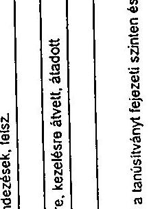

---

## A KÖLTSÉGVETÉSI ÉS A TÉNYLEGES ÁTLAGLÉTSZÁM ALAKULÁSA Igazgatás címnél

9. sz. tanúsítvány a V-8-68/2003. sz. jelentéshez

|  Állománycsoport megnevezés | 1999. év |  |  | 2000. év |  |  | 2001. év |  |  | 2002. év |  |   |
| --- | --- | --- | --- | --- | --- | --- | --- | --- | --- | --- | --- | --- |
|   | Költségvetés-1 eredeti | Mód. | Tényl. áll. | Költségvetés-1 eredeti | Mód. | Tényl. áll. | Költségvetés-1 eredeti | Mód. | Tényl. áll. | Költségvetés-1 eredeti | Mód. | Tényl. áll.  |
|  Miniszter és államtitkárok | 3 | 3 | 3 | 3 | 3 | 3 | 3 | 3 | 3 | 3 | 3 | 3  |
|  Helyettes államtitkárok és ennek minősülő vezetők | 5 | 5 | 5 | 5 | 5 | 5 | 5 | 5 | 5 | 5 | 5 | 5  |
|  Főosztályvezető | 4 | 4 | 4,5 | 5 | 5 | 5,5 | 14 | 8 | 10 | 13 | 11 | 12  |
|  Főosztályvezető-helyettes | 4 | 11 | 7,5 | 11 | 12 | 11,5 | 6 | 13 | 9,5 | 10 | 13 | 11,5  |
|  Osztályvezető |  | 1 |  | 4 | 4 | 4 | 16 | 5 | 10,5 | 10 | 10 | 10  |
|  Ügykezelő osztályvezető * | 5 | 5 | 5,5 | 5 | 9 | 8 | 11 |  | 5,5 |  |  |   |
|  Fülkiai csoportvezető | 2 | 2 | 2 | 2 | 2 | 2 | 2 |  | 1 |  |  |   |
|  I. besorolási osztály összesen | 47 | 35 | 41 | 62 | 65 | 63,5 | 106 | 91 | 98,5 | 89 | 85 | 92  |
|  II. besorolási osztály összesen | 27 | 24 | 25,5 | 35 | 27 | 31 | 29 | 52 | 40,5 | 52 | 48 | 50  |
|  III. besorolási osztály összesen * | 1 | 8 | 4,5 | 2 | 1 | 1,5 |  |  |  |  |  |   |
|  IV. besorolási osztály összesen * | 9 | 6 | 7,5 | 7 | 7 | 7 | 8 |  | 4 |  |  |   |
|  Teljes munkaidőben foglalkoztatottak | 107 | 106 | 106,5 | 143 | 143 | 143 | 200 | 175 | 187,5 | 192 | 173 | 182,5  |
|  Részmunkaidőben foglalkoztatottak |  |  |  |  |  |  |  | 1 | 0,5 |  |  |   |
|  Haugidíjasok (Részmunkaidőben foglalkoztatottak) |  |  |  |  |  |  |  |  |  |  |  |   |
|  Közösztviseiők összesen | 107 | 106 | 106,5 | 143 | 143 | 143 | 200 | 176 | 188 | 192 | 173 | 182,5  |
|  Külsős foglalkoztatottak |  |  |  |  |  |  |  |  |  |  | 16 | 8  |
|  Államtitkári besorolású köztisztviselők |  |  |  |  |  |  |  |  |  |  | 1 |   |
|  Helyettes államtitkári besorolású köztisztviselők |  |  |  |  |  |  |  |  |  |  | 3 | 1,5  |
|  Főosztályvezetői besorolású köztisztviselők |  |  |  |  |  |  |  |  |  |  | 3 | 1  |
|  Köztisztviselők |  |  |  |  |  |  |  |  |  |  | 1 |   |
|  Összesen ** | 107 | 106 | 106,5 | 143 | 143 | 143 | 200 | 184 | 192 | 200 | 206 | 203  |

Megjegyzés: a tanúsítványt igazgatási címen kérjük kitölteni!

A külsős foglalkoztatottak létszámadatait a költségvetési beszámoló összeállítására vonatkozó tájékoztató szerint kell feltüntetni.

- 2001. július 1-től az I. kategóriába tartozó köztisztviselőket közigazgatási átszervezés miatt az MI. hatálya alá tartozó munkaszerződéssel foglalkoztatják tovább. Az "összesen" sor 2001. II. félévi költségvetési terv adata tartalmazza az egyéb jogviszony alá tartozók adatait (létszám) és a tényleges (létszám) is, így biztosított az egyezőség a beszámoló adataival.

Tanúsítom, hogy az adatok a fejezeti/igazgatási cím nyilvántartásában szereplő adatokkal megegyeznek!

Budapest, 2003. március 20.

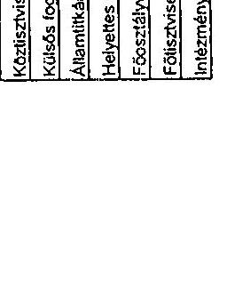

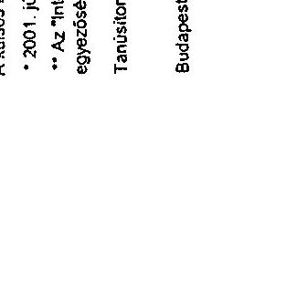

---

1. sz. tanúsítvány a V-8-68/2003. sz. jelentéshez

## A SZEMÉLYI JUTTATÁSOK ALAKULÁSA Igazgatás címnél

|  Megnevezés | 1999. év |  |  | 2000. év |  |  | 2001. év |  |  | 2002. év |  |   |
| --- | --- | --- | --- | --- | --- | --- | --- | --- | --- | --- | --- | --- |
|   | Eredeti előirányzat | Mód. | Tényl. | Eredeti előirányzat | Mód. | Tényl. | Eredeti előirányzat | Mód. | Tényl. | Eredeti előirányzat | Mód. | Tényl.  |
|  1. Rendszeres személyi juttatások | 200439 | 220075 | 202261 | 267178 | 253237 | 229244 | 359300 | 374694 | 343846 | 401799 | 481287 | 461799  |
|  ebből: - alapilletmény | 157018 | 165276 | 132940 | 216678 | 191362 | 145729 | 284500 | 284500 | 217388 | 303299 | 342587 | 347973  |
|  - illetmény kiegészítés | 30801 | 35801 | 31850 | 34000 | 42096 | 42096 | 53000 | 63733 | 68065 | 69000 | 95200 | 93913  |
|  - juttatások | 12620 | 18998 | 15449 | 16500 | 19779 |

 19 679 | 21 800 | 25 841 | 27 859 | 29 500 | 43 500 | 42 647  |
|  - 13. havi illetmény |  |  | 22 022 |  |  | 21 740 |  |  | 29 988 |  |  | 47 266  |
|  2. Nem rendszeres személyi juttatások | 34 228 | 163 041 | 128 074 | 62 355 | 131 964 | 130 029 | 143 100 | 221 485 | 189 685 | 88 413 | 309 280 | 289 397  |
|  ebből: - jutalom | 5 185 | 28 742 | 25 065 | 31 000 | 57 141 | 57 141 | 84 300 | 84 528 | 72 027 | 40 405 | 129 605 | 112 005  |
|  - túlóra, helyettesítés |  | 323 | 308 | 300 | 300 | 108 |  |  |  |  |  |   |
|  - végkielégítés |  | 37 049 | 32 015 |  | 3 877 | 3 657 |  | 95 | 95 |  | 27 200 | 24 193  |
|  - jubileumi jutalom | 1 574 | 10 667 | 8 903 | 7 000 | 3 532 | 3 531 | 3 000 | 4 454 | 5 114 | 3 000 | 5 500 | 5 100  |
|  - napdíj | 3 100 | 3 100 | 12 |  | 7 967 | 7 967 | 900 | 11 813 | 11 812 | 900 | 8 800 | 8 582  |
|  - ruházati költségtérítés | 3 315 | 4 023 | 4 007 | 6 038 | 6 038 | 5 561 | 7 252 | 7 895 | 7 895 | 9 900 | 9 900 | 9 511  |
|  - étkezési hozzájárulás | 2 964 | 2 964 | 2 783 | 4 805 | 4 805 | 4 366 | 6 810 | 7 046 | 6 380 | 7 200 | 8 000 | 7 767  |
|  - részmunkadós fogó jutt. |  |  |  |  |  |  |  |  |  |  |  |   |
|  - áll-ba tart. nem rendsz. jutt. | 2 000 | 2 058 | 442 | 1 000 | 2 660 | 2 660 |  |  |  |  |  |   |
|  3. Külső személyi juttatások | 12 933 | 30 139 | 29 218 | 13 267 | 34 075 | 34 076 | 4 000 | 85 223 | 85 223 | 42 588 | 137 970 | 133 413  |
|  ebből: - nyugdíjás fogó juttatások |  | 6 429 | 5 911 | 267 | 5 800 | 5 369 |  |  |  |  |  |   |
|  - állományba nem tart. jutt. | 12 933 | 23 716 | 23 397 | 13 000 | 28 275 | 28 707 | 4 000 | 85 223 | 85 223 | 42 588 | 137 970 | 133 413  |
|  4. Személyi juttatások összesen | 247 800 | 413 255 | 359 553 | 342 800 | 419 276 | 393 349 | 506 400 | 681 402 | 618 754 | 532 800 | 928 537 | 884 809  |

Megjegyzés: a tanúsítványt fejezeti szinten, igazgatási címen kérjük közlenné.

Tanúsítom, hogy az adatok a fejezet/igazgatási cím számviteli nyilvántartásában szereplő adatokkal megegyeznek!

Budapest, 2003. március 20

P. H.

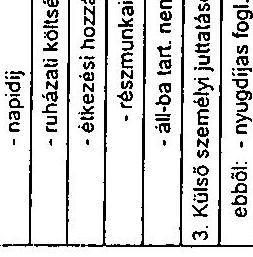

---

# A GYISM fejezet tényleges kiadásainak alakulása 1999-2002. években diagramokban 

Múködési kiadás
1999. év: 11.056 M Ft
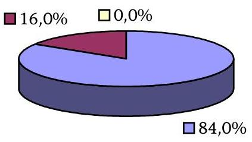
2000. év: 17.655 M Ft
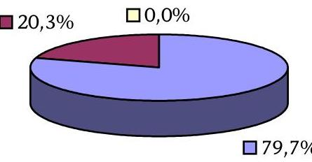
2001. év: 26.329 M Ft
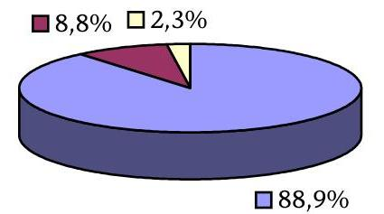
2002. év: 33.076 M Ft
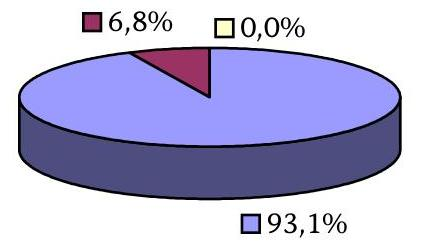

---

# A fejezeti kezelésű előirányzatok tényleges kiadásainak megoszlása 1999-2002. években, diagramokban 

$\square$ Sporttámogatás
$\square$ Kábítószer-fogyasztás megelőzése
$\square$ Ifjúsági feladatok
1999. év: 5.146 M Ft
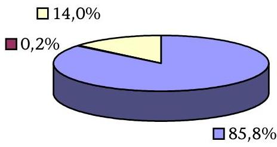
2000. év: 10.574 M Ft
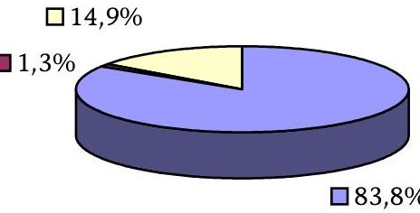
2001. év: 20.223 M Ft
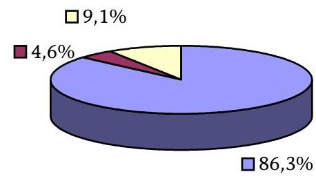
2002. év: 27.983 M Ft
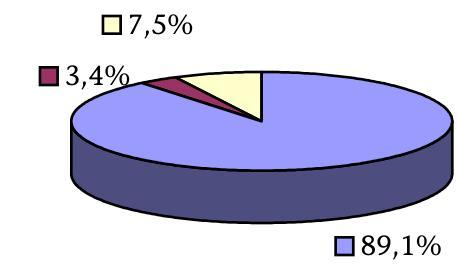

---

# KIMUTATÁS

## a közhasznú társasággá alakított intézmények állami támogatásának alakulásáról

|  I. A kht-vé alakított költségvetési intézmények |  |  |  |  | II. Sportfolió Kht. |  |  |  |  |   |
| --- | --- | --- | --- | --- | --- | --- | --- | --- | --- | --- |
|  Megnevezés | 2000. évi állami támogatása |  |  |  | 2001. évi állami támogatás |  |  |  | 2002. évi állami támogatás |   |
|   | Költségvetési támogatás összesen | Beruházási támogatás | Müködési támogatás | Tőkeemelés | Müködési támogatás | Tőkeemelés | Beruházási és egyéb célok | Maradvány | Müködési támogatás | Tőkeemelés  |
|  NSI | 1261,5 | 421,6 | 839,9 |  |  |  |  |  |  |   |
|  NSU | 514,0 | 472,1 | 41,9 |  |  |  |  |  |  |   |
|  Tata | 176,4 | 108,3 | 68,1 |  |  |  |  |  |  |   |
|  Balatonfüred | 26,2 | 16,9 | 9,3 |  |  |  |  |  |  |   |
|  BESREK | 60,7 | 0,3 | 60,4 |  |  |  |  |  |  |   |
|  SEI | 661,9 | 135,3 | 526,6 |  |  |  |  |  |  |   |
|  Mátraháza | 49,8 | 0,1 | 49,7 |  |  |  |  |  |  |   |
|  KSI |  |  |  |  | 146,5 |  | 187,6 |  |  |   |
|  Összesen | 2750,5 | 1154,6 | 1595,9 |  |  |  |  | 369,4 |  |   |
|  Sportfolió Kht. alapítása |  |  | 209,6 | 40,0 | 1200,0 | 570,5 | 5200,0 |  | 1669,6 | 200,0  |
|  Összesen |  | 1154,6 | 1805,5 | 40,0 | 1346,5 | 570,5 | 5387,6 | 369,4 | 1669,6 | 200,0  |

## Megjegyzés:

- Az intézményi adatok a 2000. évi költségvetési beszámoló adatain, a kht. adatai a támogatási szerződéseken alapulnak.
- Az átalakulás előtti összes intézményi támogatás: 1742,4 M Ft (a 2001. évi KSI átalakulás előtti támogatással).
- Az 1669,6 M Ft-ból - tulajdonosi döntés alapján - 30 M Ft-ot önkormányzatnak (az egri uszoda részére) adott tovább a Sportfolió Kht.

---

# A BUDAPEST SPORTARÉNA ALAPADATAI (I. és II. ütem) 

Építés kezdete:
Átadás időpontja (I. ütem):
Építési költség összesen:
(árfolyam $=247,08 \mathrm{Ft} /$ EUR)
2001. január
2003. március
116562839 EUR
azaz 28,8 Mrd Ft

## Ebből:

- korai munkák összege (2001. augusztus 5-ig):

4664003 EUR
ebből: bontás
2357403 EUR
tervezés
2306600 EUR
- csarnoképítés, ún. Phase 1. összege:

80398836 EUR

- csarnoképítés, ún. Phase 1. tervezéssel növelt összege:

82705436 EUR

- csarnok körüli építés, ún. Phase 2. összege:

31500000 EUR

## A Csarnoképítés, a munkák 1. szakaszának (Phase 1.) általános alapadatai:

Beépített terület:
$17404 \mathrm{~m}^{2}$
Épület hosszúság/szélesség:
$162 \mathrm{~m} / 118 \mathrm{~m}$
Épület magasság:
Hasznos szintterületek:

- felső szint:
$4200 \mathrm{~m}^{2}$
- félemeleti szint:
$4337 \mathrm{~m}^{2}$
- küzdőtér szint:
$8115 \mathrm{~m}^{2}$
- kiszolgáló (szerviz) szint:
$16718 \mathrm{~m}^{2}$
- alagsori szint:
$4938 \mathrm{~m}^{2}$
- Összesen:
$38308 \mathrm{~m}^{2}$
Befogadóképesség:
5000 - 12500 ülőhely
Versenyterület:
$8400 \mathrm{~m}^{2}$

## Csarnok körüli építés, a munkák 2. szakaszának (Phase 2.) általános alapadatai:

Az épületek teljes alapterülete:

- parkolóház:
$33360 \mathrm{~m}^{2}$
- emelt szintű városi tér:
$34460 \mathrm{~m}^{2}$
- beleértve:
- múzeum épület:
$880 \mathrm{~m}^{2}$
- söröző épület:
$1140 \mathrm{~m}^{2}$
- vegyes funkciójú épületek (lépcsők, jelkép torony):
$460 \mathrm{~m}^{2}$
- Volán buszpályaudvar területe, beleértve:
- Volánbusz épülete:
$1020 \mathrm{~m}^{2}$
- Postahivatal épülete:
$380 \mathrm{~m}^{2}$
- Bevásároló terület:
$2760 \mathrm{~m}^{2}$

---

# Az új BS beruházás (I. és II. ütem) pénzügyi forrásainak és költségeinek alakulása

adatok: e Ft-ban

|  Pénzügyi keretek |  |  |  | Felhasználás (2003. május 31-ig) | Maradvány  |
| --- | --- | --- | --- | --- | --- |
|  1 | Központi költségvetés | 657.000 |  |  |   |
|  2 | Adományok | 149.198 |  | 796.000 (1, 2, 3 összesen; előkészítésre és szakértői díjakra) | 50.000  |
|  3 | Egyéb forrás (bontás) | 40.000 |  |  |   |
|  4 | NSI pénzmaradvány | 417.200 |  | 417.200 |   |
|  5 | Befektetett tőke | 1.907.536 |  | 400.000 (Rt. müködési kiadásokra) | 1.266.336  |
|   | ebből: magántőke (BYG) | 1.902.516 | 7.700 EUR | 241.200 (beruházási költségekre) |   |
|   | IIM | 5.020 |  |  |   |
|  6 | Hitel | 31.205.000 |  | 30.363.800 | 841.120 (benyújtott, de ki nem fizetett számlák)  |
|   | - Fő hitelszerződés | 21.972.000 |  |  |   |
|   | ebből: Ft-hitel | 9.000.000 |  |  |   |
|   | EUR-hitel | 12.972.000 | 52.500 EUR |  |   |
|   | - Kiegészítő hitelszerződés | 9.233.000 |  |  |   |
|   | ebből: Ft-hitel | 4.650.000 |  |  |   |
|   | EUR-hitel | 4.583.000 | 18.550 EUR |  |   |
|  Összesen |  | 34.375.934 |  | 32.218.200 |   |

Állami kezességvállalás: 34,8 Mrd Ft Hitelfelhasználás részletezése: a.) Tervezési és Építési Szerződés (I. és II. ütem) b.)

 Egyéb építés (UTE, jégpálya) c.) Szerződéses költségtérítések d.) Műszaki szakértői szerződések költségei e.) Biztosítási szerződések költségei f.) Hitelezéssel kapcsolatos költségek

34,8 Mrd Ft 27.882.000 200.000 612.000 396.000 116.000 1.157.800 30.363.800

---

# Sportcsarnokok fajlagos költségeinek alakulása

|  Forrás |  | Név-helyszín | Adat-méret | Ülésszám | Építési költség | Költség/fő | Építés éve  |
| --- | --- | --- | --- | --- | --- | --- | --- |
|  1 | IAKS AWARD 1991 | Neo Faliro - Athén/Gr. | O 120 m, kábeltartó, nehéz tető | 12000 | 60 M USD | 5000 USD | 1985  |
|  2 | IAKS AWARD 1993 | Globe Arena - Stockholm/S | O 110 m, 85 m magas gömb, acél térrács | 13000 | 85 M USD | 6540 USD | 1986  |
|  3 | IAKS AWARD 1995 | Palau Sant Jorde - Barcelona/E | $130 \times 120 \mathrm{~m}$ acél térrács kupola | 15000 | 83 M USD | 5530 USD | 1990  |
|  4 | Sb 1/99 7-14 | Kölnarena - Köln/D | $\begin{aligned} & 140 \times 120 \mathrm{~m} \text {, ovális alaprajz, vb ivről } \ & \text { lefüggő acélkupola } \end{aligned}$ | 18000 | 180 M USD | 10000 USD | 1998  |
|  5 | Sb 5/2001 10-13 | Atlantica Pavilhao - Liszabon/P | $\begin{aligned} & 200 \times 120 \mathrm{~m} \text {, ovális alaprajz, ragasztott fa } \ & \text { kupola } \end{aligned}$ | 16500 | 74 M USD | 4490 USD | 1998  |
|  6 | Sb 5/2001 6-9 | Max Schmeling Halle - Berlin/D | $108 \times 86 \mathrm{~m}$, halalakú acél rácsos tartók | 10000 | 96 M USD | 9600 USD | 1997  |
|  7 | Sb 2/02 30-34 | Mile One Stadium - St John/Can | $\begin{aligned} & 130 \times 90 \mathrm{~m} \text {, jégpályát követő nézőtér, } \ & \text { vízszintes alsó óvú M-ábra alakú síkbeli } \ & \text { acél rácsostartó } \end{aligned}$ | 6000 | 24 M USD | 4000 USD | 2001  |
|  8 | Sb 1/03 26-31 | Arena Leipzig - Leipzig/D | $\begin{aligned} & 155 \times 87 \mathrm{~m} \text {, alulfeszített acél rácsos } \ & \text { szekrénytartók } \end{aligned}$ | 12000 | $\begin{gathered} 38 \text { M USD } \ 36 \text { M EUR } \end{gathered}$ | $\begin{gathered} 3171 \text { USD } \ (3000 \text { EUR) } \end{gathered}$ | 2001  |
|  9 | Sb 1/03 20-25 | Color Line Arena - Hamburg/SF | $\begin{aligned} & 140 \times 115 \mathrm{~m} \text {, ovális alaprajz, nyomatéki } \ & \text { ábrát követő síkbeli acél rácsos tartók } \end{aligned}$ | 15759 | $\begin{gathered} 88 \text { M USD } \ 83 \text { M EUR } \end{gathered}$ | $\begin{gathered} 5568 \text { USD } \ (5266 \text { EUR) } \end{gathered}$ | 2002  |
|  10 | Sb 1/03 12-15 | Dom Odate - Odate/J | $\begin{aligned} & 178 \times 157 \mathrm{~m} \text {, ovális alaprajz, helyi ciprusfa } \ & \text { elemekből helyszínen szerelt térrács acél } \ & \text { csomópontokkal } \end{aligned}$ | 17000 | 98 M USD | 5764 USD | 1997  |
|  11 | Sb 5/2003 17-18 | Manchester Evening - News Arena/U | 105 m-es fesztávolságú acél rácsos tartó | 17563 | 64 M USD | 3644 USD | 1995  |
|  12 | OCTOGON | Sheffield | acél rácsos tartó | 12500 | $\begin{gathered} 51,2 \text { M USD } \ 32 \text { M Ft } \end{gathered}$ | 4100 USD |   |
|  13 |  | Budapest Sportaréna - Budapest | $162 \times 118 \mathrm{~m}$ acél térrács kupola | 12500 | 82,7 M EUR | 6616 EUR | 2003  |

A tizenkét külföldi csarnok átlagos fajlagos költsége: 5617 USD

---

# AZ ARÉNA ÜZEMELTETÉSI SZERZŐDÉSE RÉSZLETEI 

Az üzemeltetési szerződés részletesen foglalkozik az üzemeltetőt terhelő kötelezettségekkel, melyből következően az üzemeltetőnek a csarnokot első osztályú létesítményként kell üzemeltetnie és felelős a csarnok működéséért, vezetéséért és fenntartásáért.

Az üzemeltető feladatai közé tartozik:

- a csarnok bérbeadása a rendezvényszervezőknek konkrét rendezvények kapcsán;
- a sport-, kulturális és szórakoztató események szervezése;
- reklám-, támogatási és szponzorálási szerződések kötése;
- étel- és italfogyasztási lehetőség biztosítása a csarnok látogatók számára a szerződésben rögzített mértéket meg nem haladó áron;
- a működéshez szükséges mindennemű szolgáltatás (takarítás, általános karbantartás, gépek és berendezések felügyelete, stb.);
- a különféle működési engedélyek beszerzése;
- az évente meghatározott minimális rendezvényszám megtartása;
- megfelelő jegyértékesítési rendszer kiépítése és működtetése.

A csarnok üzemeltetésének irányítását végző vezető állású munkavállalók kiválasztása csak a Rendezvénycsarnok Rt. előzetes jóváhagyása alapján történhet.

A Magyar Államot (illetve a minisztériumot) megillető kedvezmények:

- a csarnok térítésmentes használata évi 20 minisztériumi és 6 társadalmi eseménynapon;
- a minisztérium jogosult az üzemeltetőnek küldött értesítéssel bármely személyt felhatalmazni és kinevezni a csarnok hasznosítására az eseménynapok mindegyikén, vagy bármelyikén;
- az üzemeltető minden év augusztus 20-ára köteles fenntartani a csarnokot a minisztérium, vagy a minisztérium megbízottja számára;
- a minisztériumi eseménynapok közül évente legfeljebb háromra lehet betervezni atlétikai eseményeket és legfeljebb háromra a jégpálya igénybevételét. A minisztériumi eseménynapok közül egy adott évben legfeljebb 15 hétvégére lehet tervezni, a társadalmi eseménynapok közül legfeljebb háromnak

---

hétvégére kell esnie. Ugyanakkor a 4000 fős látogatottságú események közül egyazon évben legfeljebb négyet lehet a hétvégére tervezni;

- a minisztériumi eseménynapok nem használhatók olyan esemény megrendezésére, amelynek elsődleges célja a haszonszerzés, kivéve ha az esemény „adománygyűjtő" jellegű. (Ez esetben kizárólag egy sportszövetség hasznosíthatja a saját sportága fejlesztése céljából, vagy jótékonysági célra);
- az Üzemeltető köteles viselni a „Társadalmi eseménynapok" megrendezésével kapcsolatos költségeket. Az évi hat eseménynap keretében minden évben legalább $72 \mathrm{M} \mathrm{Ft}+\mathrm{ÁFA}$ összegben szolgáltatásokat köteles nyújtani,
- az előírt minimális használat évente 60 nap, ennek részeként kell tekinteni a 20 minisztériumi és a 6 társadalmi eseménynapot, valamint ezeken felül évente 10 olyan napot, amely a magyar válogatottat érintő nemzetközi sportesemény, vagy nemzetközileg, illetve nemzeti torna vagy bajnokság (pl.: Európa-bajnokság, világbajnokság, nemzetközi kupamérkőzés, nemzeti bajnokság, nemzeti kupamérkőzés), vagy bármely más sportesemény. Az utóbbi rendezvények kapcsán a Sportaréna használati díját az Üzemeltető a sportszövetségekkel történő ésszerű megegyezés szerint határozza meg. Ha ezt a követelményt az Üzemeltető nem teljesíti, akkor az állami oldal jogosult az üzemeltetési szerződés felbontására;
- a minisztériumi kiegészítő kötelezettségvállalása között eredetileg szerepelt, hogy az állam 2013-ig sem közvetve, sem közvetlenül nem támogat vagy finanszíroz hasonló méretű fedett csarnok építését Budapesten. Ezt a rendelkezést úgy módosították, hogy ez alá nem tartozik semmilyen olyan épület, amely sportcélra épül. Ha 2013-ig Budapesten olyan újabb sportcsarnok épülne, amelynek adottságai a Sportarénáéval megegyeznek, az Üzemeltetőnek joga van az előírt minimális használat részeként kötelezően megrendezendő sportesemények számát újratárgyalni.

---

10. sz. melléklet

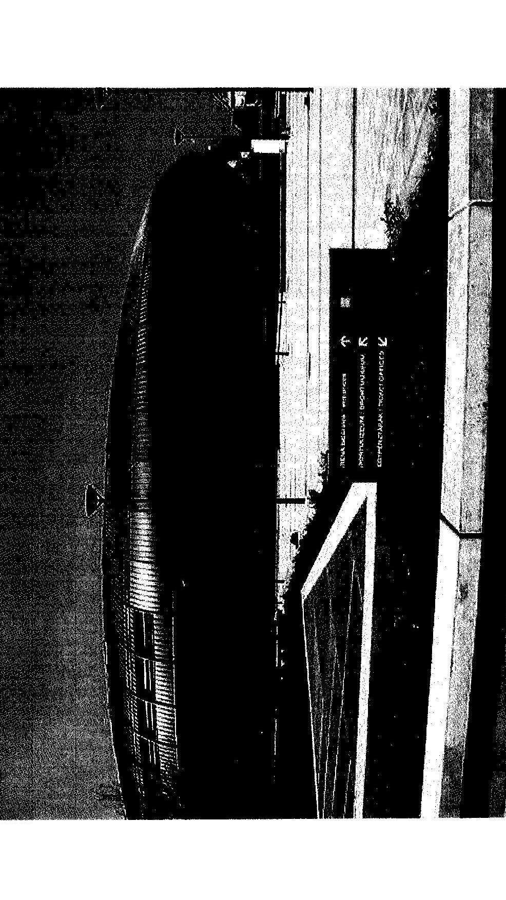

---

11. sz. melléklet a V-8-68/2003. sz. jelentéshez

# SPORTLÉTESÍTMÉNYI LÁTKÉP AZ ÚJ BUDAPEST SPORTCSARNOKKAL 

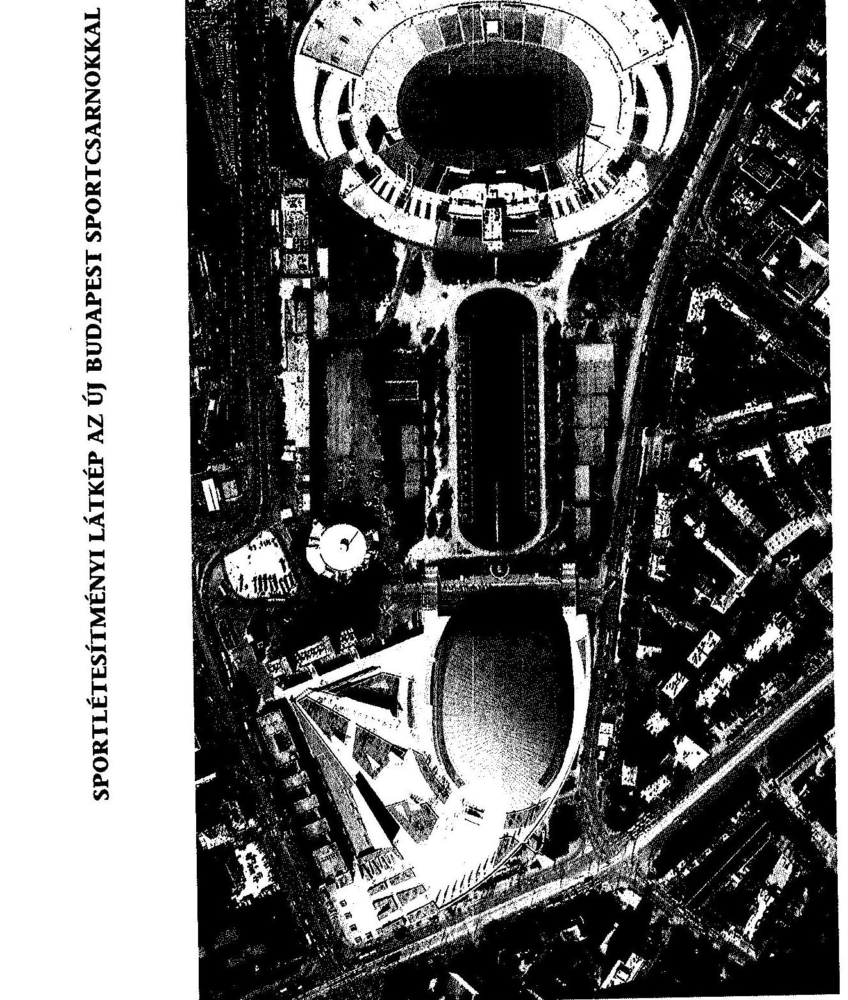

---

# AZ ÚJ BUDAPEST SPORTCSARNOK BERUHÁZÁS ELLENŐRZÉSÉNEK RÉSZLETES MEGÁLLAPÍTÁSAI 

## 1. A beruházás előzményei, indokoltsága, megvalósításának előkészítése

Az új BS beruházás előzménye, hogy 1999. december 15-én súlyos tűzvészben leégett a főváros, egyúttal az ország legnagyobb fedett sportlétesítménye, a Budapest Sportcsarnok (BS).

A BS jelentőségét az adta, hogy az ország egyetlen olyan fedett létesítménye volt, amely befogadóképessége meghaladta a 10 ezer főt, a fővároson belül központi területen helyezkedett el, nemzetközi szintű sport- és kulturális szórakoztató rendezvények megtartására is alkalmas volt.

## A BS-tűzkárból levont legfőbb műszaki-funkcionális következtetések:

- az 1997-es rekonstrukció során a BS korszerű tűzjelző berendezést kapott, de nem rendelkezett küzdőtéri tűzoltó berendezéssel. Ilyen méretű és értékű létesítmény - a korszerű tűzjelző berendezés mellett - nem üzemeltethető a teljes épület területét lefedő tűzoltó berendezés nélkül.
- paradox módon a multifunkcionalitás (a bevétel jelentős hányadát képezte) és annak piaci igénye már a leégett BS üzemeltetése során felmerült (a BS egy karácsonyi vásár idején és annak következményeként égett le).

A leégést követően megkezdődtek azok a munkák, amelyek a tűzkár felmérését, a tűzeset elemzését és a további teendők előkészítését célozták. A tárgyban (a terület megtisztítását és veszélytelenítését követően) az ÉMI Rt. készített szakvéleményt (2000. március 17. és március 29., majd 2000. május 5. kiegészítés). Ebben megállapításra került, hogy:

- az egyes épületrészekre megállapított károk jellege és jelentősége alapján, az alapterületi arányok figyelembevételével, valamint az épületszerkezeti, gépészeti és tartószerkezeti komponensek viszonyított értéke szerint súlyozva a teljes csarnoképület értékvesztése 66%-os. A kár összegét az ÉMI 2000. májusi kiegészítő levelében 8 Mrd Ft-ban állapította meg.

A Magyar Mérnöki Kamara (Tartószerkezeti Tagozata) 2000. július 7-én kelt előzetes állásfoglalása szerint:

- a BS újjáépíthető, a tartószerkezeti károk a teljes bontást nem indokolják („helyette teljesen új sportcsarnok építése szakmailag és gazdaságilag nem indokolt").

---

A két állásfoglalás között a látszólagos ellentmondás az, hogy a Magyar Mérnöki Kamara csak tartószerkezeti, műszaki vonatkozásban foglalt állást, a kérdést gazdaságossági szempontok szerint átfogóan nem vizsgálta.

A dokumentumok szerint 2000. március-szeptemberi időszakban egyfajta párhuzamosság jellemezte a döntés-előkészítői munkát: egy időben vizsgálták a BS helyreállíthatóságát vagy teljesen új csarnok építését - állami beruházás formájában, illetve zajlott a magánbefektetői lehetőségek vizsgálata az üzleti alapon történő újjáépítés-finanszírozás érdekében.

A BS újjáépítéséről a KÖZTI Rt. 2000. április 4-i keltezéssel tanulmányt készített. 2000. áprilisi keltezéssel úgyszintén tanulmány készült (tanulmánytervezők: Virtualspace-London, Sport Concepts - London, pénzügyi tanácsadó: PricewaterhouseCoopers - továbbiakban: PwC)

Az összesítő döntés-előkészítő tanulmány a PwC - Sport Concepts közös tanulmánya, melyben az alábbi változatok vizsgálata és összevetése történt meg:

- a meglévő épület helyreállítása,
- új sportcsarnok építése a meglévő épület alapjain,
- új sportcsarnok építése új helyszínen,
- új sportcsarnok építése a BS helyén.

A BS újjáépítésével kapcsolatos állami döntés-előkészítési folyamatban 14 kormányzati előterjesztés készült, ebből nyolc kormányhatározat és egy törvény született.

Már az első előterjesztés, amely 1999. december 20-án készült, megfogalmazta a multifunkcionalitás, a nemzetközi sportszövetségek standardjainak megfelelés, a mielőbbi, a XXI. század követelményeinek megfelelő újjáépítés, a nyereséges üzemeltetés, valamint a költségtakarékos megoldás erre tekintettel esetleg működő tőke bevonását - elvárásait a majdani létesítménnyel kapcsolatban.

Az előterjesztés öt megoldási javaslattal élt:

1. a régi sportcsarnok eredeti állapot szerinti helyreállítása;
2. a régi sportcsarnok újjáépítése, a régi szerkezeti elemeinek lehetséges felhasználásával;
3. új
 multifunkcionális sportaréna felépítése;
4. kulturális, szórakoztató központ építése sportarénával;
5. Népstadion átépítése, amely magában foglal egy új, minden igényt kielégítő arénát is.

A Kormány az előterjesztés alapján - a 2379/1999. (XII. 29.) Korm. határozattal a következő határozatot hozta:
„... felhívja az ifjúsági és sportminisztert, hogy a kárfelmérés befejezését követően azonnal tegyen javaslatot - a megállapításoktól függően - új sportcsarnok felépítéséhez

---

szükséges beruházási tervre, beleértve a Budapest Sportcsarnok esetleg még hasznosítható szerkezeti elemeit."
2000. január 19-én, majd azt kiegészítve január 24-én az ISM új előterjesztést készített a Kormány részére, amely három változatot tartalmazott, becsült áfa nélküli költséggel:

1. új, multifunkcionális sportaréna felépítése;
2. kulturális, szórakoztató központ építése sportarénával;
3. BS újjáépítés összekapcsolása a Népstadion rekonstrukciójával.

Az előterjesztés szerint „Önmagában a sportcsarnok felépítése és működtetése még a megvalósítandó multifunkcionalitás esetén sem tűnik - ésszerű időtávon belül - kellő befektetői hasznot valószínűsítő vállalkozásnak. Ezért az egyes változat esetén igen csekély az esélye annak, hogy a beruházásban a magántőke is részt vállaljon. Azaz az egyes változat finanszírozásának terhe vélhetően teljes egészében a költségvetést terhelné és a kizárólagos állami tulajdonú és üzemeltetésű létesítmény működtetése is folyamatos állami hozzájárulást igényelne".

Az előterjesztésről a 2000. január 25-i kormányülés határozatot nem hozott.
A következő, 2000. április 14-i előterjesztés kizárólag állami beruházásban történő két lehetséges megoldást vizsgált, figyelemmel az addig elkészült két műszaki szakvéleményre, valamint a finanszírozással kapcsolatos feltételek addigi vizsgálatára. Az előterjesztés költségkimutatást és pénzügyi ütemezést, valamint a beruházás időbeli folyamatábráját is tartalmazta. Az előterjesztés nyomán azonban nem született döntés.

Az előkészítés szakaszában, annak gyorsítása és célirányos szabályozása érdekében 2000. május 26-án az Országgyűlés elfogadta a Budapest Sportcsarnok újjáépítéséről szóló 2000. évi XL. törvényt. A törvény megfelelően segítette az újjáépítéshez szükséges eljárások meggyorsítását és előírta egy multifunkcionális sportcsarnok felépítését.

A törvény egyúttal a Kormány döntési kompetenciájába utalta annak eldöntését, hogy a multifunkcionális sportcsarnok a meglévő szerkezetek felhasználásával épüljön-e újjá, vagy egy új, modern sportaréna épüljön, másrészt azt is, hogy kizárólag állami beruházásban vagy magántőke bevonásával épüljön-e meg bármelyik alternatíva.

Az ezt követően született 1042/2000. (V. 31.) Korm. határozat az ifjúsági és sportminiszter és pénzügyminiszter feladatává tette, hogy készíttesse el három gazdasági társasággal mind a két variáció vonatkozásában a finanszírozás fenti alternatívájára a beruházás teljes összegét bemutató költségszámításokat, a beruházás részletes pénzügyi feltételeit és ütemezését, valamint a finanszírozási eszközök rendelkezésre bocsátását bemutató finanszírozási tervet.

Az augusztusi kormányelőterjesztés egyetlen ilyen tanulmányt (elemzést) nem tartalmazott. A 2184/2000. (VIII. 23.) Korm. határozat továbbra is nyitva hagyta a beruházás finanszírozásának lehetséges alternatíváját. Ezzel

---

párhuzamosan kormányzati megbízásból a 2000. áprilisi döntés-előkészítő tanulmányra alapozva elkészült a beruházás megvalósíthatósági tanulmánya.

Az új csarnok magántőke bevonásával történő megvalósításáról, azaz új multifunkcionális aréna koncepciójáról 2000. augusztusában megvalósíthatósági tanulmányt készített a PricewaterhouseCoopers - nemzetközi pénzügyi gazdasági tanácsadó szervezet. A PwC-vel költségbecslés terén együttműködött a DLE angol mérnöki társaság és az Óbuda-Újlak Rt. magyar mérnök társaság.

A megvalósíthatósági tanulmány elsődleges célja annak vizsgálata volt, hogy mennyire lehet gazdaságos az új sportcsarnok üzemeltetése és ebből következően mennyiben van lehetőség - érdeklődés a magántőke irányából.

A megvalósíthatósági tanulmány az alábbi főbb következtetésekre jutott:

- egy modern sportcsarnok üzemeltetésének potenciálja minden bizonnyal meghaladja a régi sportcsarnok által elért eredményeket;
- a beruházási költségeknek azonban csupán kis hányadát lehet fedezni a létesítmény (sportcsarnok) által termelt bevételekből.

Mindezek összegzéseként előtérbe került, hogy a projektbe magántőkét vonjanak be.

A magántőke beruházásban való részvételét a Kormány is szorgalmazta elsősorban azzal az indokkal, hogy ezáltal csökkenthető az állami tehervállalás. Másik fontos szempont volt, hogy olyan magánbefektető legyen a beruházó, aki a tőke hozzájáruláson túl az üzemeltetésre is kötelezettséget vállal, vállalva ezzel az üzemeltetés teljes pénzügyi kockázatát. A megvalósíthatósági tanulmány ugyanakkor felhívta arra a figyelmet, hogy magántőke bevonása esetén is jelentős állami hozzájárulást igényel a beruházás.

A tanulmány szerint a magántőke bevonása a beruházás rövidebb határidővel történő megvalósítását eredményezheti azáltal, hogy a vegyes tulajdonú (állami-magán) Rt., mint megrendelő kikerül a közbeszerzési eljárás hatálya alól. Ennek az „ára" viszont az volt, hogy a beruházás megvalósításakor a költségtakarékosságot, mint célszerűségi szempontot közvetlenül nem lehetett érvényesíteni.

A megvalósíthatósági tanulmány alapján az ISM, majd a Kormány a régi sportcsarnok helyreállítása helyett, magántőke bevonásával a multifunkcionális és az önfinanszírozó aréna létesítése mellett döntött. A döntés indokaiként az alábbi legfőbb érvek szóltak:

- a megmaradó szerkezeti és geometriai kötöttségek nem tették lehetővé az újjáépítés során elvárható külső és belső korszerűsítési igények kielégítését;
- a vállalkozói szerződésbe bizonytalan elemként kerültek volna be a még megmaradó szerkezetekre visszavezethető esetleges kockázatok, negatív hatások;
- a korábbi BS üzemeltetési és hasznosíthatósági hiányosságai, a funkcionális bővítés indokoltsága, a sporttechnológiák korszerűsödése, az új-megváltozott

---

esztétikai megjelenés igénye, a tömegközlekedési kapcsolatok átrendezésének igénye mind-mind az új csarnok építésének koncepciója mellett szóltak;

- a tanulmányban kimutatásra került, hogy időbeni megtakarítás sem érhető el a régi épület újjáépítésének alternatívájával.

A 2000. augusztusi Korm. határozat döntése nyomán a magánbefektető kiválasztása, a versenyeztetés több lépésben zajlott. A magánbefektető kiválasztása szabályszerű volt, mivel az nyilvános nemzetközi pályáztatással történt. A pályáztatást és a kiválasztást az ISM megbízásából eljáró PwC tanácsadó szervezet végezte.

Hat társaság/konzorcium érdeklődött a projekt iránt, öt nyújtott be írásbeli ajánlatot, ebből három minősült további megvitatásra érdemesnek. 2000. október 26. és november 20. között tárgyalások már csak két pályázóval folytatódtak, melynek eredményeként a BYG konzorciumot hirdették ki győztesnek. A döntést a 2184/2000. (VIII. 23.) Korm. határozat felhatalmazása alapján az ifjúsági és sportminiszter és a pénzügyminiszter együttesen hozta meg.

A partner kiválasztása összhangban volt a projekt alapvető céljaival, egyúttal elvileg garanciát jelentett az is, hogy a nyertes konzorciális befektető nagy tapasztalattal rendelkezett multifunkcionális sportarénák beruházása megvalósításában. A pályázati kiírás még nem tartalmazta azt az igényt, hogy a beruházás forrásfelhasználása átlátható legyen, de ez a megkötött Fő Projekt Megállapodásba már bekerült.

A decemberi kormány előterjesztés egyetlen megoldást tartalmazott: új multifunkcionális sportcsarnok felépítése magántőke bevonásával. Ennek oka az volt, hogy 2000. november hónapban a versenytárgyalás lezárását követően kiválasztásra került a magánbefektető, sőt az ISM megkötötte vele a megállapodást, amelyet jóváhagyásra előterjesztett.

A Kormány a 2343/2000. (XII. 29.) Korm. határozattal e megállapodást jóváhagyta. Mindezek alapján a kormányhatározat nem tekinthető teljes körűen megalapozottnak. A beruházás előkészítése csak részlegesen volt összhangban a jogszabályi előírásokkal. A kormányzati döntések funkcionálisan célszerűek voltak, ugyanakkor alternatíva hiányában nem állítható az, hogy a magántőke kismértékű bevonása - a győztes konzorcium 7,7 M EUR beruházási tőke-hozzájárulást vállalt, amely a tényleges bekerülési összeghez képest 10% alatti - és az alkalmazott - a 2. és 3. pontban későbbiekben ismertetett, ún. FIDIC-beruházási szerződésrendszer a beruházás megvalósítása során takarékos megoldásra ösztönzött.

A beruházás előkészítésére a DLE benchmarking és nemzetközi alapú költségelemzést végzett az elmúlt években épült, hasonló épületek-létesítmények forrásadatai alapján. Az elemzést a DLE finomította az Óbuda-Újlak Rt. által a hazai piacra jellemző alapadatok felhasználásával, majd ezen dokumentum képezte a beruházási keret meghatározásának alapját.

A BS sajnálatos leégése lehetőséget adott mind a társadalmi, mind a sportszakmai igények újrafogalmazásának, ugyanakkor jogos volt a multifunkcionalitás piaci, gazdasági szempontok szerinti vizsgálata. A tanul-

---

mányok során érthetően alapfeltételként kezelték a sportszakmai igényeket és a nemzetközi standardoknak való megfelelést.

Az ellenőrzés értékelése szerint egy teljesen új funkcionális, műszaki és esztétikai alapokra épülő létesítmény mellett történt döntés helyes volt. Tekintettel a létesítmény egyediségére és várható élettartamára elszalaszthatatlan lehetőség (sőt döntéshozó kötelezettség) jelentkezett - a BS építésétől eltelt időszakban megváltozott és újrafogalmazott - társadalmi, funkcionális, műszaki, esztétikai, valamint a sportszakmai igények figyelembe vételére (természetesen a döntés gazdasági-megtérülési szempontjai mellett).

Mindemellett le kell szögezni, hogy a multifunkcionális funkcióból adódó, egymásnak ellenfeszülő igények kielégítése csak kompromisszumok árán, adott esetben azok nem maradéktalan biztosítása árán volt csak megvalósítható.

Az ellenőrzés megállapította, hogy a beruházás előkészítése során a sportszakági megfelelőségekkel kapcsolatos értelmezési eltérések és problémák ugyancsak az alkalmazott szerződéstípus sajátosságaira, a feladat meghatározás és sportszakági igények nem kellő mélységű megfogalmazására vezethető vissza (DLE és Sportconcepts közreműködése). A külföldi sportági szakértőknek részletesebb technológiai tervet (adatszolgáltatást) kellett volna szolgáltatniuk. Ugyanakkor kritizálható a magyar sportszakági szervezetek hozzáállása az igények részletes meghatározásánál, majd az elkészült létesítmény átvétele során (a BYG-nek a sportszakági szövetségekkel „sikerült" aláírattatni a megfelelőséget, miközben a CR és Műszaki Ellenőri oldalról még követelés és egyet nem értés jelentkezett).

# 2. A BERUHÁZÁS JOGI MEGALAPOZOTTSÁGA, A FONTOSABB SZERZŐDÉSEK, MEGÁLLAPODÁSOK SZABÁLYSZERŰSÉGE, CÉLSZERŰSÉGE 

Az ISM 2000. november 30-án beruházási megállapodást (Term Sheet) kötött a tendernyertes francia konzorciummal, amelyet a Kormány a 2343/2000. (XII. 29.) Korm. határozattal jóváhagyott. A megállapodásban rögzítették a beruházási szándéknyilatkozat lényeges tartalmi elemeit a Magyar Államra és a Konzorciumra vonatkozóan.

A konzorcium megtervezi, megépíti és kulcsrakészen, legkésőbb 2002. augusztus 31-ig átadja az új multifunkcionális, fedett sportcsarnokot, átadás után 20 évig üzemelteti. 15 M DEM (7,7 M EUR) összegű tőke-hozzájárulást biztosít a beruházást megvalósító társaságnak. A teljesítést kötbér kikötéssel, valamint a Tervezési és Építési Szerződés értékének 10%-ában megállapított bankgaranciával biztosítja. Az üzemeltető rögzített éves díjat fizet, ezt kiegészíti egy változó díj. A konzorcium biztosítja, hogy a teljes építési költség legalább 70%-át magyar források fogják szolgáltatni.

A Magyar Állam az építési területet ingyenesen, terhektől és jogoktól mentesen az általa és a konzorcium által közösen alapított társaság rendelkezésére bocsátja. A beruházást e társaság valósítja meg és lesz a Sportcsarnok tulajdonosa. Az állam az átadást követően a beruházás teljes finanszírozási szükségletét fedező rögzített éves összeget fizet 10-12 évig terjedő időtartam alatt. A fizetésre a társaság részvényeinek lejegyzésével, illetve a konzorcium társaságban lévő részvényeinek megvásárlásával kerülhet sor. A minisztérium és az állam ezen kívül semmilyen más garanciát nem nyújt, kezességet nem vállal, üzemeltetési támogatást nem ad. A minisztérium jogában áll, hogy a Sportcsarnokot költségmentesen minden évben 20 eseménynapra nemzetközi és országos sport- és kulturális rendezvények céljára igénybe vegye.

A megállapodás biztosítja a felmondás jogát, ha viszont egyik fél sem kíván ezzel élni, úgy kötelesek megállapodni a határidők meghosszabbításában.

A lényeges tartalmi elemek alapján megállapítható a szándéknyilatkozat célszerűsége, mivel az tartalmazza a kormányzati célkitűzéseket.

A beruházási szándéknyilatkozat aláírását követően - a bontási és tervezési munkálatok mielőbbi indítására - 2001. február 1-jén a Rendezvénycsarnok Rt-t a leégett BS újjáépítése céljából a Magyar Állam képviseletében az ISM és a BYG hozta létre, zártkörű részvénytársaságként. A társaság alaptőkéje 20 M Ft, kizárólag pénzbeli hozzájárulás volt, amely 2000 darab, egyenként 10 E Ft névértékű részvényből állt. Ennek 75%-át a BYG, 25%-át a Magyar Állam jegyezte le. Ezt a tulajdonosi, egyúttal szavazati arány kialakítását, amely a BYG részére
 minősített többséget biztosított, semmi nem indokolta, ráadásul az elfogadott Alapító Okirat 75%-os többségi határozathozatalt írt elő meghatározott kérdésekben. Az alapítók az igazgatóság döntési kompetenciájába tették a beruházást érintő szerződések jóváhagyását, fizetés teljesítésének jóváhagyását. Az igazgatóság fenti döntéseit egyhangú határozatokkal hozhatta meg.

A 2001. július 6-án megtartott közgyűlés módosította az Alapító Okiratot, valamint alaptőke emelésről döntött. Ennek során 1 db „B” sorozatú szavazatelsőbbséget biztosító részvényt bocsátottak ki. E részvényhez fűződő jog – különösen erős érdekérvényesítést biztosított. Ezzel a részvénnyel a francia konzorcium rendelkezett a 75%-os tulajdoni részarány mellett. Szintén ekkor az Alapító Okirat módosításakor került át közgyűlési kompetenciába a beruházással kapcsolatos döntési jogkör. Ugyanakkor a közgyűlés a döntéseit a szavazatok legalább 75%-os többségével hozza meg. Mindezek következtében nem alakult célszerűen állami, megrendelői oldalról az Rt. részvényesi viszonya, s az annak megfelelő döntési, hatásköri illetékesség.

A BYG a részvényei többségét csak a beruházás fő szerződésének megkötése után – 2001. végén – adta el a magyar államnak, miután a saját kizárólagos tulajdonában álló üzemeltetőt (Aréna Üzemeltető Rt.) tőkeemelési indokkal bevitte a Rendezvénycsarnok Rt-be. 2002. február 12-i cégbejegyzéssel az Rt-ben 99,85%-os volt a magyar állam és 0,15%-os a francia cég részesedése. 2002. december 23-án az üzemeltetési szerződés módosításakor „A BYG és az Üzemeltető kötelezettséget vállal arra, hogy a Rendezvénycsarnok Rt-ben meglévő részvényeiket a minisztérium számára névértéken eladják; a visszavásárlás részleteiben és az érintett szerződések szükséges módosításában a Felek kötelesek 2003. február 15-ig megállapodni.” A fentiek az ellenőrzés lezárásáig nem valósultak meg.

---

Az ISM, a Rendezvénycsarnok Rt. (projekt társaság), a BYG és az üzemeltető (Aréna Üzemeltető Rt.) között csak 2001. október 9-én jött létre az ún. alap projektszerződés (Fő Projekt Megállapodás).

A késedelem oka részben a szándéknyilatkozatban foglalt feltételek nem határidőre történő teljesülése, részben a tárgyalások elhúzódása, valamint a Horode vállalat (mint üzemeltető) kiválása és a BYG – üzemeltetésre – újonnan létrehozott magyarországi vállalatának 2001. júliusi alapítása.

A Fő Megállapodás tartalmazza a szerződéses felek projekt megvalósításával kapcsolatos jogait és kötelezettségeit, a beruházás finanszírozásával és a Rendezvénycsarnok Rt. alaptőkéjébe történő tőkebefektetéssel kapcsolatos jogokat és kötelezettségeket, a tervezéshez és a tervrajzokhoz fűződő jogokat, a Rendezvénycsarnok Rt. vezetésével és irányításával kapcsolatos jogokat és kötelezettségeket, a csarnok üzemeltetését, a beruházás finanszírozására fordítható összegek felhasználását, a részvényátruházás korlátozását, valamint a szerződés (megállapodás) felmondásának jogait és következményeit.

A Fő Megállapodásban – a szándéknyilatkozathoz képest – módosult a beruházás-finanszírozás biztosítása, mivel a Kormány – a kereskedelmi bankok kikötése miatt – a felvett hitelekre állami készfizető kezességet vállalt (1022/2001. (III. 14.) és 1128/2001. (XII. 10.) Korm. határozat). A Megállapodás további tartalmi elemei megfelelő célszerűséget tükröznek.

A tervezett beruházási struktúra – tervezés, építés, kulcsrakész átadás, üzemeltetés – biztosította a kormányzati célkitűzések (multifunkcionalitás, nemzetközi színvonalú sportrendezvények megtartása, beruházás mielőbbi megvalósítása, üzemeltetés állami támogatás nélkül) megvalósulását. A vonatkozó magyar jogszabályok is lehetővé tették ezt a beruházási struktúrát.

Az államháztartásról szóló 1992. évi XXXVIII. törvény

- 22. §-a alapján: „A központi költségvetésben kiadás irányozható elő a központi költségvetési szervek feladatai, az állam nemzetközi, jogszabályi és szerződéses kötelezettségei ellátására, az államháztartás más alrendszerei, továbbá a jogi személy, jogi személyiséggel nem rendelkező szervezet, természetes személy részére.”
- 33. § (1) bekezdése alapján: „Az Országgyűlés felhatalmazza a Kormányt, hogy a központi költségvetés terhére, a költségvetési törvényben meghatározott mértéken belül, meghatározott célokra, egyedi esetben kezességet vállaljon.”
- 33. § (3) bekezdése alapján: „… A Kormány csak kivételesen indokolt esetben vállalhat készfizető kezességet.”
- 94. § (4) bekezdése alapján: „A központi költségvetési szerv a fejezet felügyeletét ellátó szervnek a pénzügyminiszter egyetértésével kiadott engedélyével … alapíthat gazdasági társaságot, illetőleg szerezhet gazdasági társaságban érdekeltséget.”

A tervezési és létesítési munkák elvégeztetésére az ISM a Nemzetközi Mérnöki Kamara (FIDIC) irányelvein, ajánlásán alapuló, 'Design and Build' - D&B (Tervezési és Építési) szerződéstípust választotta (ld. FIDIC Orange Book). Ez azonban csak az üzemeltetési megállapodással együtt értelmezhető. A PwC

---

ez irányú elemzése megállapította, hogy az építési és üzemeltetési kockázat ennél a szerződéstípusnál jelentős mértékben áthárítható a magánszektorra.

A szerződéstípus/vizsgált eset jellemzője, hogy megrendelői jogokat és megfelelő szankciókat tartalmazott, de a megrendelő követelményei csak általános megfogalmazásban rögzítettek. A megvalósítandó létesítmény pontos műszakitartalmi jellemzőit a szerződés megkötése után megindult műszaki tervezés során határozzák meg, már rögzített szerződéses ár mellett. Ugyanakkor a projekt irányítása során minden tervet jóvá kell hagynia a megrendelőnek.

Az állami érdekek elsődlegesen a tervezési, építési szerződések műszaki tartalma meghatározásában érvényesültek. További magyar állami érdekek a beruházási szerződésekben – mint pl. költségtakarékos megoldások – csak részlegesen érvényesültek, mivel a konzorcium erős érdekérvényesítő képességgel rendelkezett (beruházó, fővállalkozó, üzemeltető egyszemélyben) az egyes munkafázisok – előkészítő munkálatok, I. ütem, II. ütem – szerződéses árai meghatározásakor.

A megbízói igényeket s a beruházás műszaki tartalmát a Tervezési és Építési Szerződés részeként a Client Brief (megrendelői összefoglaló) és a Client Requirement (megrendelői követelmények) c. anyagokban foglalták össze. A dokumentum általánosságban (nem műszaki tervek és tételes költségvetési kiírás alapján) rögzítette az igényeket (pl.: legyen alkalmas adott világversenyek megrendezésére), azonban a nem kellően részletes és műszaki alapú követelményrendszer rögzítése – az építés és átvétel folyamán jelentős mértékű értelmezési, érdekérvényesítési és megfelelőség igazolási problémákat generált, vetett fel.

A Tervezési és Építési Szerződés feltételeinek kialakításánál figyelembe vették a FIDIC ilyen típusú szerződésekre kidolgozott ajánlásait. A Tervezési és Építési Szerződésben megfelelően meghatározták a felelősségi és hatásköri kompetenciákat. Így felelősségi kompetencia volt kötbér megállapítása mellett többek között a hibás teljesítésért, a jótállásért, a minőségbiztosításért.

A megrendelő képviselője rendelkezett megfelelő hatásköri kompetenciával is a felelőssége érvényesítéséhez, jogosult volt a vállalkozók felé jóváhagyások és utasítások kiadására.

A hazai építési gyakorlatban a „Tervezési és Építési Szerződés” nem ismeretlen, de nem is szokásos, ezért nagyon körültekintő és rendkívüli felkészültséget igényel a szerződéses rendszer kialakítása. Szükségessé vált, hogy a konstrukció kialakításában megfelelően képzett, a nemzetközi gyakorlatot jól ismerő, idegen nyelven (angol) is munkavégzésre képes tanácsadó szervezetek vegyenek részt. Mindezekre tekintettel a megrendelői oldal (ISM, majd Rendezvénycsarnok Rt.) kialakította tanácsadói-szakértői gárdáját. A beruházás pénzügyi tanácsadója a PwC lett. Ők vizsgálták a külső befektetők bevonásának lehetőségét, majd a nemzetközi versenyeztetési eljárás keretében a bevonandó partner személyének kiválasztását is ők végezték el. A beruházással kapcsolatos jogi tanácsadást a Mátrai HBR Ügyvédi Iroda szolgáltatta, nekik a szerződések előkészítésében és létrehozásában vezető szerepük volt. Az építkezés folyamán pedig a meglehetősen bonyolult „Tervezési és Építési Szerződés”-sel kapcsolatos jogi értelmezések és viták angol nyelvű jogi tartalmú levelezéseit és tárgyalásait végezték.

---

A szerződéses rendszer kialakulását követően szükségessé vált mérnök tanácsadó szervezetek bevonása. A beruházás kialakításában kezdeti időszakban elsődleges szerepet kapott az angol DLE mérnök társaság, akik az előzetes tartalmi követelmények megfogalmazását és a szerződést megalapozó költségbecsléseket dolgozták ki.

A szerződést megalapozó ármeghatározások során szakértőként működött közre az Óbuda-Újlak Rt., mivel birtokában volt mindazon hazai árbázisoknak, amelyek alapján a költségbecslések minősíthetők és ellenőrizhetők voltak. Ugyanők látták el a beruházás teljes ideje alatt a műszaki ellenőri feladatokat.

A Consultant Mérnöki Iroda Kft. lett a hazai mérnök-tanácsadó szervezet. Feladata volt mérnöki feladatok ellátása a Tervezési és Építési Szerződés kialakításában, javaslatok kidolgozása, majd a megrendelő képviselője lett. A megrendelő képviselője az állami érdekképviselet és kontroll lehetőségének biztosítása érdekében a vállalkozó és a megrendelő között olyan, kifejezetten a minisztérium által irányított és utasított szervezet, amely alkalmas volt a konzorcium kettős (megrendelői és vállalkozói) helyzetéből adódó ellentmondás, illetve ellenérdekűség feloldására.

Az ellenőrzés megállapította, hogy indokolt volt a tanácsadó szervezetek közreműködése.

A területet előkészítő munkák kivitelezői versenyeztetés, gyorsított tárgyalásos közbeszerzési eljárás, illetve tárgyalásos közbeszerzési eljárás keretében kerültek kiválasztásra. Az eljárások megfeleltek a hatályos jogi szabályozásoknak.

Legfontosabb szerződések, együttműködők:

- részletes tűzvizsgálathoz küzdőtér megtisztítása – KIPSZER Rt. – versenytárgyalás alapján;
- veszélytelenítés és romeltakarítás – KÉSZ Kft. – gyorsított tárgyalásos közbeszerzési eljárás alapján;
- részletes kárfelmérés, szerkezeti vizsgálatokhoz bontási munkák – KÉSZ Kft. tárgyalásos közbeszerzési eljárással szerződésmódosítás alapján;
- kárfelmérési és statikus szerkezeti vizsgálat – ÉMI Rt. – megbízás;
- lebonyolítói, műszaki ellenőri feladatok – Óbuda-Újlak Rt. – nyílt közbeszerzési eljárás alapján;
- mérnöktanácsadói feladatok: Consultant Kft. – tárgyalásos közbeszerzési eljárás alapján (+ megmarad a DLE mint külföldi mérnök-tanácsadó);
- előkészítési tervezési feladatok: Közti Rt. – mint a leégett sportcsarnok tervező-szerzői jogaival rendelkező társaság.

# 3. A beruházás költségeinek és finanszírozásának alakulása

### 3.1. A beruházás tervezett bekerülési költségei

A Budapest Arénát multifunkcionális, gyors váltással üzemeltethető épületként határozták meg a kormányzati döntés-előkészítő folyamatban. Ebben az igény-

---

szint a többlet irányában eltér az elmúlt években Európában létesült, hasonló léptékű sportcsarnokoktól.

A beruházás költségkeretének meghatározása a DLE előkészítő anyaga alapján történt.

A tervezési és kivitelezési szerződés (D&B Contract) fix összegű volt, az ármeghatározás gyakorlatilag tételes költségvetés nélkül készült és e nélkül rögzített szerződéses árat tartalmazott.

A D&B Contract lényeges eleme a megrendelői követelmények meghatározása, amely az un. Megrendelői Levélben (Client Brief) testesült meg. A Client Brief (CB) meghatározásához a hazai építési tapasztalatokat a megrendelő (képviselő: Consultant Mérnöki Iroda Kft.) nem minősítette elegendőnek, ezért a CB tartalmát többszöri egyeztetéseket követően a tervezők, a sportszövetségek és egyéb szervezetek bevonásával a DLE – angol mérnöki iroda – az Sport Concepts angol-amerikai sport tervező szakcég bevonásával alakította ki.

A Client Brief-el egyidőben készült az ún. AFC (Architectural & Functional Concept), azaz egy Építészeti és Funkcionális Vázlatterv, amely alapját képezte az első hatósági egyeztetéseknek (pl. tűzvédelmi hatóság).

Az első közelítő költségkalkulációk a CB és AFC és az akkori (készültségi foknak megfelelő) előtervek alapján készültek. Tekintettel arra, hogy részletes építészeti (egyéb szakági) tervek és költségvetések még nem álltak rendelkezésre, ezért a kalkulációs adatok a hasonló (sport és multifunkcionális) arénák fajlagos adatain (nézőszám, lm³, beépített m², stb.) alapultak, melyeket a helyi (hazai) építési anyagárakkal és munkabérjellemzőkkel (koeficiensekkel) korrigáltak.

Az előkalkulációkat az angol mérnök-tanácsadó és költség-konzulens DLE végezte és a kezdeti ártárgyalásokon is ő látta el a költségszakértői feladatokat.

Az angol DLE tanácsadó tevékenységének ellenőrzésére és az alkalmazott árelemek honosítása érdekében – költségszakértő és műszaki ellenőri tapasztalatokkal rendelkező – Óbuda-Újlak Rt. került bevonásra.

Az egyes esetekre vonatkozó eltérő vélemények, illetve a nyelvi nehézségek miatti kommunikációs problémák feloldására a nemzetközi projektvezetési tapasztalatú szakértőkkel rendelkező Consultant Kft. működött közre.

Az iratok és összefoglalók szerint a szerződéses ár kialakítása több hónapon át tartó, többlépcsős tárgyalássorozattal történt. A tárgyalásokat az ISM miniszteri biztosa és az akkori projektigazgató vezették a mérnöktanácsadó szervezetek közreműködésével.

A tárgyalássorozat egyaránt magában foglalta a részletes beruházási feladatok, a részletező műszaki tartalom és az egyes szerződéses árak egymással összefüggő kialakítását. E tárgyalási folyamat az Aréna, azaz
 „A" épület beruházásának meghatározásával indult, majd annak építészeti változtatásával „B" variációra módosult s képezte az I. ütemet (csarnok beruházás). Mindehhez kapcsolódott a későbbiek során a projekt II. ütemének ki-

---

alakítása, azaz az emelt szintű városi tér és parkoló beruházása (Phase II.). A beruházás alapadatait az 5. sz. melléklet rögzíti.

A tárgyalásokkal párhuzamosan már folytak az előkészítő munkák (bontás, korai munkák Early Works). A tárgyalásoknak alapvető feltétele volt, hogy abban az esetben, ha elmarad a végleges ármegállapodás, annak következményei egyoldalúan a BYG-ot terhelik. A magyar államra az elvégzett munkák igazolt költségeinek kifizetésén túl további kötelezettségek nem hárulnak.

A költségtervezés módszere felülről-lefelé történt, vagyis gyakorlatilag a fő szerződés összegét felbontották részmunkákra és az egyes részmunkákhoz igazították a pénzügyi ütemtervet. A felülről-lefelé való tervezés ebben az esetben azért volt elfogadható, mert ilyen jellegű objektum felépítésében a kellő jártasság hiánya miatt a DLE mérnöki társaság (nemzetközi szintű sportcsarnok és költségszakértő szervezet) költségvetési módszere bizonyult megoldásnak. Ennek a költségtervezésnek metodikai felépítését nem lehet vitatni, de az alkalmazott anyag, szolgáltatás költségeinek első megközelítésekor alapvetően az angol árkondícióknak megfelelő alkalmazását igen. Ezt a magyar műszaki szakértők vitatták, különösen az Óbuda-Újlak Rt. - mint a minisztérium szakértője és a hazai árbázisokkal rendelkező szervezet -, amely kezdetektől részt vett a munkálatokban, de közreműködött a Consultant Kft. is, mint nagy nemzetközi projektvezetési gyakorlatú szakértőkkel rendelkező szervezet.

# A teljes projekt (I. és II. ütem) szerződéses ára az alábbiak szerint 

alakult ki: (az árak áfa nélküli értékek, az árakat kezdetben DEM-ben mutatták ki és tárgyalták, későbbiek során áttértek az EUR-ra.)
A) AFC (Építészeti és funkcionális koncepció) alapján az „A" épületre: BYG által adott előirányzati ár összege: 152,6 M DEM.
B) Preliminary Design (előterv alapján) az „A" épületre: BYG költségirányzata 172,0 M DEM (2001. május 22.).

Az AFC-től való eltérés elemei, amelyek a műszaki tartalom és a mennyiségek növekedésén alapultak, a következők:

- az aréna főbejárati szintjéhez csatlakozó közlekedő és bejárati födém (cca. $8000 \mathrm{~m}^{2}$ ) - kis deck: 7,7 M DEM
- közműcsatlakozások: 3,0 M DEM
- a CB-ben meghatározott „ikon" jellegű épület kialakítása: 5,0 M DEM
- egyéb kiegészítő költségek: 4,3 M DEM
- régi sportcsarnok pincéjének felhasználása parkoló céljára: 2,5 M DEM
- Aréna felszerelési tárgyak és berendezési eszközök: 2,0 M DEM
fentiekkel az ajánlati összeg 176,5 M DEM-re nőtt, melyből a tárgyalások során árengedmény után alakult ki a 172,0 M DEM ajánlati összeg.

A fenti összeget a DLE több fordulóban felülvizsgálta, első megközelítésben 210,0 M DEM-ben határozta meg a nemzetközi normatívák alapján a számított költséget, majd mennyiségi és minőségi felülvizsgálat után 172,0 M DEM

---

költségkeretet javasolt. Kalkulációit saját nemzetközi tapasztalatai, valamint az Óbuda-Újlak Rt. által rendelkezésre bocsátott hazai anyag- és dí normatívák figyelembevételével, saját speciális előkalkulációs módszerével készítette.
C) Detailed Design (szerződést megalapozó részletes terv) „A" épületre.

Az előzetes tervek továbbfejlesztéseképpen a BYG benyújtotta a részletes terveket, melyekhez DLE újabb költségellenőrzést végzett és 167,447 M DEM költséget mutatott ki. Időközben az ISM a tanácsadók véleményének figyelembe vételével megállapodott a BYG-al, hogy az Építési és Tervezési Szerződés összegének felső korlátja (max. target price) 160,5 M DEM, mely 3,5 M DEM előirányzatot tartalmaz egy jégpálya megépítésére. Ugyanezen megállapodás tartalmazza a fővállalkozó által biztosítandó felszerelési és berendezési tárgyak listáját is.

További tárgyalások során végül a felek 161,6 M DEM szerződéses árban állapodtak meg, mely összeg tartalmazta a korábban említett, ún. kis deck, valamint a leégett sportcsarnok pincéjében létrehozandó parkoló költségeit, továbbá a Phase II. (emelt szintű városi tér) munkáinak tervezési költségeit is.
D) Óbuda-Újlak Rt. ellenőrző kalkulációja a Detailed Design „A"-ra

Az ártárgyalások előkészítéseként és jobb megalapozásaként a miniszteri biztos úr felkérésére a műszaki ellenőrként kijelölt Óbuda-Újlak Rt. előkalkulációt készített saját tapasztalatai alapján, amely a berendezéseket és felszereléseket kisebb mértékben tartalmazta, mint a BYG ajánlata. Ennek összege az „A" változatra 66,508 M EUR volt. A kalkulációs modell ez esetben alulról építkező modell volt, nem tartalmazott az épületre jellemző specifikus normatívákat. Végül a konzultánsok közti egyeztetések eredményeképpen az Óbuda-Újlak Rt. is elfogadta a DLE kalkulációs modelljét.
E) FF&E (felszerelések és berendezések) tételes egyeztetése a DLE összeállítása alapján megtörtént, a BYG elfogadta a DLE tételes listáját, amely a szerződés vonatkozó mellékletének alapját is szolgálta és a végső szerződéses ár ennek fedezetét is tartalmazta.
F) A 2001. augusztus 5-én aláírt D&B szerződés ára:

| projekt költség: 161600000 DEM = | 82634805 EUR |
| :-- | --: |
| 2001. augusztus 5-ig kifizetett bontási költség | -2357403 EUR |
| 2001. augusztus 5-ig kifizetett tervezési költség | -2306600 EUR |
| szerződés összege: | 77962032 EUR |

G) „B" variációjú épület megvalósításához tartozó szerződésmódosítás árának meghatározása:

Az építési engedély kézhezvételét követően, a KÖZTI egy építész csoportja új építési koncepciót dolgozott ki az Aréna épületére, amely már részletesebben

---

megfogalmazta az Arénához kapcsolódó Parkoló és reprezentatív városi köztér kialakítását.

A javasolt „B" variáció elnyerte az építészeti zsűri maximális támogatását és az ISM sorozatos tárgyalásokon elérte, hogy a BYG kötelezettséget vállaljon a „B" variáns ugyanazon határidőre történő megépítésére, a szükséges új engedélyezési tervek elkészítésére és az építési engedély megszerzésére.

Ezen megállapodást a 2001. augusztus 5-én kötött Supplementary Agreement (Kiegészítő megállapodás) rögzítette.

Ebben a felek előzetesen megállapodtak a fenti feltételekben, valamint a „B" változatú projekt összes költségét 85182500 EUR-ban állapítják meg, miközben az épület beépített területe 38312 m2-ről 41302 m2-re nőtt (7,8%-os növekedés).

Ez az összeg mintegy 3%-kal haladta meg az „A" variáns projekt költségét, miközben a fővállalkozó magára vállalta az új építési engedély megszerzésének és az eredeti határidő megtartásának kockázatát.

A „B" változat előkészítése során az építész tervezők a BYG javaslatát is figyelembe véve az épület tető és homlokzati burkolatait az eredetileg tervezett hagyományos építési módú rézlemez helyett iparszerűen szerelhető BEMO rendszerű alumíniumfedésű szerkezetre változtatták, az ahhoz tartozó szendvics rétegrendek alkalmazásával együtt, mely az „A" változathoz képest lényegesen növelte az épület kivitelezési, akusztikai és hőtechnikai kockázatait.

Fenti változásokat és az ehhez szükséges új építési engedélyezési tervek elkészítését is magába foglaló kialkudott szerződéses ár a vállalkozó által benyújtott módosított költségkalkuláció és számos ártárgyalás és egyeztetés alapján:
projekt teljes költsége
85062839 EUR
-szerződéses ár
80398836 EUR
amely az „A" variáns szerződéses összegénél 3%-al magasabb.
H) Parkoló és városi köztér (Phase II.)

A megrendelő által kiadott un. Design Brief alapján a fővállalkozó benyújtott egy vázlattervet (outline design), az Arénához kapcsolódó kétszintes személygépkocsi parkoló, a meglévő Volán buszpályaudvar elbontására és újjáépítésére, a meglévő Posta hivatal elbontására és újjáépítésére, a fenti létesítmények gyalogos kapcsolataira, majd azok lefedésével létrejövő emelt szintű reprezentatív városi tér és az azon elhelyezkedő Sportmúzeum és söröző épületek, valamint egy 50 autóbusz részére alkalmas szabadtéri parkoló megépítésére.

---

A műszaki szakemberekkel való konzultáció alapján rögzíthető, hogy a 2. szakasz munkálatai alapvetően önálló munkának is felfoghatók, mégsem történt erre a munkára pályáztatás. A pályáztatás elmaradásának indoka volt, hogy az esetleges külső vállalkozó zavarná a fővállalkozó munkálatait és sok problémát okozhatna, ugyanakkor a fővállalkozó már a helyszínen dolgozik és a két szakasz munkáit a kialakított rendben el tudja végezni. A fővállalkozó a fenti vázlattervhez csatolt egy 32,702 M EUR értékű költség előkalkulációt 2001. december 5-én.

Ugyanerre a műszaki tartalomra a DLE 2001. december 10-én 28,535 M EUR előirányzatot kalkulált saját nemzetközi tapasztalatai és statisztikái alapján.

Ugyanerre a Consultant Mérnöki Iroda Kft. hazai fajlagos mutatókkal végzett kalkulációi alapján 20,060 M EUR költségbecslést készített, melyet a BYG-al folytatott konzultáció után 21,380 M EUR-ra módosított.
2002. januárjában közelítő számítások alapján BYG 29,163 M EUR-ra módosította az árat.

Az időközben elkészült építési engedélyezési tervek alapján a Consultant Kft. részletesebb elemzést végzett és 21,600 M EUR eredményre jutott.

DLE 2002. február 25-én kiadott egy 26,860 M EUR-os javaslatot elsősorban saját statisztikai adatbázisára támaszkodva.

A BYG végül rendelkezésre bocsátotta, az un. Contract Design-hoz tartozó költségvetését 32,683 M EUR-os értékben, melyet a Consultant Kft. tételesen felülvizsgált és a tervezési munkákkal együtt a fenti összegből 25,264 M EUR összeget jelölt meg elfogadhatónak a hazai piaci viszonyoknak megfelelően.

Végül Consultant Kft. - minden körülmény figyelembe vételével - maximum 26,800 M EUR ár elfogadását javasolta az ISM-nek. Ez az árszint 13,5%-kal magasabb a magyar vállalkozók versenyeztetésével elérhető hazai piaci árnál és ez a növekmény fedezetet ad(hat) a BYG korábbiaktól nehezebb kezdési feltételeinek és a szoros határidő kompenzálására. A DLE, mint nemzetközi költségtanácsadó is ugyanezt az árat javasolta.

A végső ár (31,500 M EUR, 17,5%-kal magasabb a mindkét költség szakértő által maximum elfogadhatónak javasolttól) az ISM és BYG között lefolytatott további kereskedelmi kompromisszumokra törekvő tárgyalásokon alakult ki. Az eltérés mintegy 1,5 Mrd Ft összegű többletköltséget tartalmazott.

A többletköltségek, tételesen az alábbiak:

- a munkák felgyorsításáért fizetett többlet: 550 e EUR
- szerkezeti munkák vége: 500 e EUR
- jegyárusításhoz hardver: 500 e EUR
- téli munkák többletdíja: 1000 e EUR
- szakaszos teljesítés többletdíja: 650 e EUR
- ideiglenes használatba vételi engedély: 1000 e EUR

---

- végleges használatbavételi engedély: 500 e EUR

A magasabb árszint elfogadásának indoklásai között az alábbiak szerepeltek:

- a fővállalkozó jelentős építési és üzemeltetési kockázata;
- rendkívül szoros határidő vállalása;
- a D&B Contract módosítása, az addigi megvalósulások tapasztalataira épülve több pontban a megrendelő jogait növelte és a kivitelező kötelezettségeit szigorította;
- a parkoló üzemeltetésének átvállalása fővállalkozó részéről;
- az Aréna parkolás nélkül nem működtethető.

A szerződéses árak kialakulásának történetére vonatkozóan egy 2003. március 31-i frissítésű DLE jelentést is módunkban állt tanulmányozni. A jelentés - értelemszerűen a DLE szempontrendszeréből fontos momentumokat emel ki, a történeti leírás nem olyan részletes, mint a Consultant Kft. által 2002. augusztus 8-i keltezéssel készített hasonló tárgykörű jelentése.

Tekintettel, hogy a Consultant Kft. ármegállapodásokkal kapcsolatos összefoglaló jelentése sokkal részletesebb, érthetőbb, strukturáltabb és történetileg átfogóbb - fenti összefoglalónkat is arra támaszkodva rögzítettük.

A fenti indoklással együtt a munkák 2. fázisánál (emelt szintű városi tér) az alapárra (26,8 M EUR) felrakódó többletköltségek (4,7 M EUR) összegét és arányát magasnak értékeli az ellenőrzés, amely a nem megfelelő pozíciójú állami érdekérvényesítésre vezethető vissza.

# 3.2. A beruházás pénzügyi forrásai és felhasználásuk 

Az új BS beruházás fedezetét - a gyors megépítéshez választott vegyes finanszírozású modell, nevezetesen az ún. Private Public Partnership (PPP), azaz a magántőke közcélú beruházásokba való bevonása alapján - állami költségvetési támogatás, magánvállalkozói tőke és kereskedelmi banki hitelek biztosították.

A beruházás pénzügyi forrásait és felhasználását a 6. sz. melléklet tartalmazza részleteiben.

A központi költségvetés a BS újjáépítésére közvetlenül 657 M Ft-ot, közvetve (maradvány átcsoportosításával) 417,2 M Ft-ot
 biztosított. A költségvetés keretei között állt még rendelkezésre az újjáépítésre befolyt 149 M Ft-os adományok összege, valamint a bontásból származó 40 M Ft-os egyéb bevétel.

E forrásokból a 2000. évben felhasznált 149 M Ft a BS újjáépítésének előkészítésével kapcsolatos feladatokat biztosította. A további állami költségvetési összegek a beruházás induló szakaszában a pénzügyi, műszaki és jogi tanácsadás költségeit fedezték. A kiadások legnagyobb tételei: pénzügyi tanácsadás 101 M Ft, a műszaki tanácsadás 491 M Ft, jogi tanácsadás 46 M Ft, egyéb ki-

---

adás 19 M Ft. A felhasználások szerződésekkel alátámasztottak, számlával és ahhoz kapcsolódó teljesítés-igazolásokkal ellátottak.

Az NSI 1999. évi maradványából átcsoportosításra került 417200 e Ft-ból felhasználásra került 408912 e Ft. (A fennmaradó 8288 e Ft átutalásra került az ISM számlájára.) Az összegből a veszélytelenítési, romeltakarítási munkák mellett az őrzési feladatok, valamint a különféle szakértői és jogi tanácsadással kapcsolatos azonnali feladatok elvégzése történt meg. A felhasználással kapcsolatos szerződések és a kifizetést igazoló számlák szabályszerűek. A felmerült kiadásokat szabályszerűen megkötött szerződésekkel támasztották alá.

A központi költségvetésből, valamint az egyéb forrásokból felhasznált összegeknek a Budapest Sportaréna objektumra, mint beruházásra való aktiválása jelenleg még megoldatlan. Ez a kérdés még nem vetődött fel a Rendezvénycsarnok Rt-nél, csupán az NSI 1999. évi maradványából felhasznált 409 M Ft összegnek a telek értékére történő aktiválását készítették elő a Sportfolió Kht. nyilvántartásaiban.

Az ellenőrzés megállapította, hogy a pénzügyi keretek, - bár több ütemben és több forrásból származtak - időben rendelkezésre álltak.

A finanszírozási döntések megalapozottak voltak, mivel a vonatkozó kormányhatározatok előkészítése során mind a költségvetést érintő, mind a hitelfelvételi kérdések döntésre kerültek. A jogszabályi előírásokat betartották ezen a területen.

A pénzügyi források összetétele - mely végső soron 14918 M Ft és 78750 e EUR, forintra átszámítva 34376 M Ft -, alapvetően tükrözi a BS újjáépítésének végrehajtását és a változó finanszírozási, hitelfelvételi megoldásokat. A kezdeti szakaszban, amíg az újjáépítés klasszikus változatáról is volt szó, az állami költségvetés több menetes előkészítő munkaváltozatokat finanszírozott. Majd a kialakult beruházási változat alapján az állami költségvetés közvetlen finanszírozása már csak a szűken értelmezett szakértői feladatokra korlátozódott és a Budapest Sportaréna beruházás kivitelezésének pénzügyi lebonyolítása áthelyeződött a Rendezvénycsarnok Rt. által kezelt pénzeszközökből való finanszírozásra (hitel, befektetői tőke).

A külföldi magántőke részvállalása - a 2000. november 30-i beruházási szándéknyilatkozatnak megfelelően 7,7 M EUR, azaz 1,9 Mrd Ft volt. Ebből, 2003. május 31-ig 400 M Ft-os összeg a beruházást bonyolító Rt. működési kiadásait, 241,2 M Ft a beruházás költségeit biztosította szabályszerűen.

A BS beruházás alapvető pénzügyi forrása banki hitel volt a kormányzati döntések nyomán az azonnali nagy összegű állami tehervállalás kiváltására, illetve a felvett hitel későbbi egyenletes, 12 évre elnyújtott visszafizetése érdekében. A hitelfelvétel végrehajtása céljából a beruházást bonyolító társaság az egész beruházás hiteligényére versenytárgyalást kezdeményezett mind magyar, mind külföldi érdekeltségű bankokkal. A versenytárgyalás a szabályoknak megfelelően történt. A versenytárgyalás során az OTP és az MKB tette a legkedvezőbb ajánlatot.

---

A Rendezvénycsarnok Rt. 2001. február 23-án az OTP-vel hitelszerződést kötött 5600000 EUR összegre. (Áthidaló hitelszerződés.) A hitel feltétele: kamat az EURIBOR és a kamatrés (évi 0,75%). A hitelszerződés módosításra került 5450000 EUR összegre és a kamatrés is megváltozott évi 0,2%-ra.

A hitel biztosította a 2001. augusztus 5-ig elkészült munkák finanszírozását, a 2001. február 26-án megkötött „Bontási szerződés" (2 328842 EUR), a 2001. március 30-án megkötött „Tervezési szerződés" (2 428000 EUR) és a 2001. július 25-én megkötött „Cölöpözési szerződés" (1 999999 EUR) alapján. A felvett hitel visszafizetése a később felvett hitelből kiegyenlítésre került.

A beruházáshoz szükséges további hitelek összegeit a bankok már csak megfelelő állami garanciavállalása mellett voltak hajlandók folyósítani. Erre az állami garanciavállalásra intézkedett a Kormány az 1022/2001. (III. 14.) számú határozatában. Az állami készfizető kezesség vállalása a 151/1996. (X. 1.) Korm. rendeletben előírtaknak megfelelt. Az állami garanciavállalás 25 Mrd Ft értékhatárig szólt. A hitelfelvevő vagy kifizetésre kötelezett a Rendezvénycsarnok Rt. lett.

A „Fő hitelszerződést" 2001. július 27-én kötötték meg, melynek alapján a Rendezvénycsarnok Rt. 52500 e EUR (ebből: 8750 e EUR OTP, és 43750 e EUR MKB), és 9000 M Ft (OTP) hitelfelvételére lett jogosult egyrészt az „Áthidaló hitelszerződés" teljes tartozásának visszafizetésére, másrészt a Rendezvénycsarnok Rt. fejlesztési és építési költségeinek, valamint a hitelek kamatainak, díjainak és kiadásainak finanszírozására. A felvett hitel terhei: kamat az Irányadó Bankközi Piaci Kamat (EURIBOR, illetve BUBOR), a kamatrés (évi 0,35%), a rendelkezésre tartási díj (évi 0,125%), szervezési díj, monitorozási díj. Egyéb költségek: közjegyzői díj, jogi tanácsadók díjazása, készkiadások.

A „Fő hitelszerződés" biztosítékául szolgáló szerződések:

- 2001. július 27-én kelt kezességvállalási szerződés.
- 2001. július 27-én kelt a Rendezvénycsarnok Rt. bankszámláin létesített zálogszerződés.
- 2001. augusztus 1-jén kelt azonnali beszedési megbízás.

A „Fő hitelszerződés" megkötése az előírt jogszabályoknak megfelelően történt.
A BS-hez kapcsolódó parkoló, emeltszintű városi tér és egyéb létesítmények felépítésének finanszírozására, vagyis a beruházás II. ütemére szintén nagy összegű hitel felvételére volt szükség, ezért a Kormány ismételten foglalkozott a kérdéssel, és az 1128/2001. (XII. 10.) határozatában a beruházás II. ütemére vonatkozóan legfeljebb 9,8 Mrd Ft értékhatárig garanciát vállalt a hitel összegére. A kormányhatározat előírta a hitel felvételének feltételéül, hogy a hitel felvevője köteles a hitel nyújtására legalább három pénzintézet hitelajánlatát bekérni. A pályáztatásra az Államadósság Kezelő Központ Rt. bonyolításában került sor, melynek során a zártkörű pályázatra 6 bankot hívtak meg. A pályázatra 2 bank adott kötelező érvényű, 1 pedig indikatív ajánlatot. A pályázat eredménye alapján az Államadósság Kezelő Központ Rt. az OTP ajánlatát, (melyben szerepelt, hogy az MKB-vel közösen adták) tartotta a legjobbnak.

---

A kormányhatározat alapján megkötésre került 2002. április 12-én a „Kiegészítő hitelszerződés", melynek alapján a Rendezvénycsarnok Rt. jogosult volt 18550 e EUR (MKB) és 4650 M Ft (OTP) hitel felvételére. A forintra átszámított összeg (mintegy 9,2 Mrd Ft) megfelel a kormányhatározatban szereplő 9,8 Mrd Ft-nak.

Összességében a megkötött hitelszerződések nem lépik túl az állami garanciavállalás összegét, vagyis a 34,8 Mrd Ft-os keretet. A hitelszerződések összesítve 71050 e EUR és 13650 M Ft értéket képviselnek, amelyek forintra átszámítva (247,08 Ft/EUR) mintegy 31,2 Mrd Ft-ot jelentenek. Az állami garanciavállalás szükségszerűségét eldöntötte az a tény, hogy a hitelt nyújtó bankok alapvetően a hitel feltételéül szabták meg az állami garanciavállalást.

A hiteltörlesztés első üteme 2003. június 15-én esedékes, a helyszíni ellenőrzés lezárásakor. Azt már előzetesen meg lehet állapítani, hogy az állami költségvetés terhei

- a 2003. évi 8,7 M EUR és 2,5 Mrd Ft, összesen mintegy 4,7 Mrd Ft-ról,
- 2014. évre 6,1 M EUR és 1,2 Mrd Ft, összesen mintegy 2,7 Mrd Ft-ra változnak.

Összességében az OTP kimutatása szerint a 31,2 Mrd Ft-os hitelösszeg törlesztése 12 év alatt 88,2 M EUR és 22,6 Mrd Ft, összesen mintegy 44,5 Mrd Ft-ot tesz ki, mint az állami költségvetés által teljesítendő összeg. A hitelszerződések szerint a Kormány előtörlesztési díj megfizetése nélkül bármikor, előrehozottan is fizetheti a hiteleket, mely kamatcsökkenést eredményez.

A hiteltörlesztés részletei a helyszíni vizsgálat befejezésekor még nem tisztázódtak, mert a Rendezvénycsarnok Rt. még nem rendelkezik a Pénzügyminisztérium által aláírt teljes mértékű hitel-átvállalási engedéllyel, annak ellenére, hogy a tárgyalások már 2003. január közepe óta folynak. A 2003. évi költségvetésről szóló 2002. évi LXII. törvény 101. § (9) bekezdése kiegészítette a 2001. és 2002. évi költségvetésről szóló 2000. évi CXXXIII. törvény 122. §-át a (10) bekezdéssel, amely szerint a központi költségvetés a Rendezvénycsarnok Rt. 2002. december 31-én fennálló adósságaiból 34,8 Mrd Ft összegű hitelt - annak járulékaival együtt - ellenérték nélkül átvállal.

A hitelösszegek lehívása a hitelszerződésben meghatározott módon történt, a Rendezvénycsarnok Rt. OTP-nél vezetett számlájára, illetve az OTP számlán keresztül a benyújtott és kellően igazolt számlák alapján.

A hitelfelhasználás ellenőrzésére egy külön rendszert dolgoztak ki és ehhez megfelelő apparátust alakítottak ki.

Az egyes szerződésekhez kapcsolódó tételeknél a fővállalkozó által benyújtott számlákat teljesítmény-igazolásokkal látják el (Óbuda-Újlak Rt. és a DLE együttesen felméri az elvégzett munkákat), majd az igazolás alapján a „Tervezési és Építési Szerződés"-ben rögzített pénzügyi ütemezés alapján a magyar fél képviseletében a Consultant Kft. és a Privátbankár Kft. megállapítja a fizetés jogosságát. (A Privátbankár Kft. alapvetően a számítási metódus helyességét ellenőrzi.) A megfelelő igazolások alapján a Rendezvénycsarnok Rt. intézkedik a számlák kiegyenlítésére. A számlák kiegyenlítése előtt még egy banki kontroll is következik, amely után sor kerül a számla összegének átutalására.

---

A hitelösszegek felhasználását 2002. év áprilisig alapvetően a pénzügyi ütemtervnek megfelelően végezték el, melyet a „Tervezési és Építési Szerződés" egyes szakaszaihoz előre meghatároztak és a szerződés mellékletében összefoglaltak. Amikor az egyes ütemek lemaradása nyilvánvalóvá vált, akkor a műszaki szakértők csak részben igazolták a teljesítéseket. Így a pénzügyi teljesítés is elmaradt a pénzügyi ütemezésben rögzített összegektől.

# Hitel-felhasználás 2003. május 31-ig:

| I. ütem: | 9000000000 Ft és | 50981872 EUR |
| :-- | :-- | :-- |
| II. ütem: | 4650000000 Ft és | 16663886 EUR |
| Együtt: | 13650000000 Ft és | 67645758 EUR |
| Maradvány: |  | 3404242 EUR |

A hitel felhasználás összhangban van a teljesítéssel, melyről a már említett ellenőrzési rendszer „gondoskodott". A hitel fennmaradó része egy, az OTP-nél vezetett elkülönített számlán szerepel. Az elkülönített számláról történő felhasználás szabályai megegyeznek a hitelszámlán kezelt pénzösszegek felhasználásának szabályaival. Tehát a kifizetés előtt a számla még egy banki kontrollon is átmegy, amely a beruházáshoz nem kapcsolódó kifizetéseket nem engedi át. A fennmaradó hitel elkülönítése az OTP-nél vezetett elkülönített számlán célszerű megoldás.

A számlák bizonylati alátámasztása megfelelő, mert a kivitelező által benyújtott számlához a műszaki szakértők által kiállított teljesítés-igazolás (belső bizonylat erre a célra) tartalmazza az összes ellenőrzésre jogosult aláírását és ezáltal ez a bizonylat jelenti a számla igazolását, kifizetésének jogosságát.

Többletmunkák alapvetően a Budapest Sportaréna végső változatának elfogadásával történtek, melyeket a „Tervezési és Építési Szerződés" módosítása követett és a módosított szerződésben már a többletköltségek egy részét elismerték. A Szerződés 2002. december 23-án történt módosítása számol a vállalkozó által jelzett további többletköltségekkel, melyre variációs tartalékként 957 e EUR-t jelöl meg.

A Rendezvénycsarnok Rt-nél és a Bouygues Hungária Kft-nél történt helyszíni ellenőrzés alkalmával a vizsgált anyagok alapján az ellenőrzés megállapította, hogy a magyar számviteli előírásokat betartják.

A Rendezvénycsarnok Rt. - könyvvizsgáló által ellenjegyzett és a Közgyűlés által elfogadott - éves beszámolóit (2001. évi és a 2002. évi) átvizsgálva megállapítást nyert, hogy:

| 2001-ben elszámolt realizált árfolyam-eltérés címen | +44038 e Ft-ot |
| :-- | --: |

 |
| 2001-ben év végi árfolyamnyereség címén elhatárolt | +84571 e Ft-ot |
| 2002-ben elszámolt realizált árfolyam-eltérés címén | +35893 e Ft-ot |
| 2002-ben év végi árfolyamnyereség címén elhatárolt | +405239 e Ft-ot |
| Összesen | +569741 e Ft-ot |

---

Az elszámolt és az elhatárolt árfolyam-eltérések a számviteli törvény 47. §. (5) bekezdése értelmében nem a Rendezvénycsarnok Rt. eredményét (nyereségét) illeti, hanem a beruházás (tehát a Budapest Sportaréna) költségeit csökkenti. Az elszámolási hiba kijavítására intézkedni kell, melynek tényét a gazdasági társaság elfogadta.

# 4. A BERUHÁZÁS KOMPLEX MŰSZAKI-GAZDASÁGI MEGVALÓSULÁSA 

A beruházás építészeti terveit a formálisan és informálisan megfogalmazott építész és szakmai kritikák általánosságban elismerőnek minősítették. Azonban megjegyzendő, hogy az Aréna formáját és megjelenését tekintve nem egyedülálló: az 1998-ban átadott Lisszaboni Atlantico Aréna formailag hasonló megjelenésű.

A kiviteli tervek ellenőrzését a projekt folyamatában a műszaki ellenőr és CR társaság végezték, azonban sok vonatkozásban a kiviteli terveket (CR társaság információi és a heti kooperációs emlékeztetők szerint) a fővállalkozó nem szállította egészében egyszerre (munkakezdés előtt). Így a CR társaság kénytelen volt mind a szakipari, épületgépészeti, stb. terveket mind a megvalósult szerkezeteket több, a szakmában elismert szakértővel az építés folyamatában és átvétel előtt ellenőriztetni. (Ez a jelenség is a D\&B Contract és a választott projekt és finanszírozási struktúra velejárója!)

Így kerültek szakértői ellenőrzésre az alábbi szerkezetek, szakágak:

- az alapozási munkák;
- a vasbeton tartószerkezetek;
- az acél tartószerkezetek.

A CR és a Műszaki Ellenőri társaságok nyilatkozata és a rendelkezésre álló minősítések, szakértői felülvizsgálatok alapján az ellenőrzés megállapította, hogy az Aréna tartószerkezetei szakszerűen és biztonságosan valósultak meg.

Hasonló vizsgálatok és szakértői nyilatkozatok alapján az ellenőrzés megállapította, hogy a létesítmény jellegének és méretének megfelelően szakszerű és biztonságosan megvalósult:

- a tűzvédelmi (és menekülés-kiürítési) rendszer (Országos Tűzoltó- és Katasztrófavédelmi Parancsnokság bevonásával);
- az épület-felügyeleti rendszer (BRFK bevonásával);
- a különböző épületgépészeti rendszerek;
- az épületakusztika.

Hosszas egyeztetések és a CR valamint a Műszaki Ellenőr társaságok nyomására a fővállalkozó megváltoztatta az eredetileg beépíteni kívánt héjalási rétegrendet (az eredetileg megépíteni kívánt rétegrendben a párazáró réteg nem volt megfelelő, az elkezdett héjalás visszabontása okozta az első - jelentős - határidő csúszását a fővállalkozónak).

A megváltoztatott rétegrendet mind belföldi, mind külföldi szakértők minősítették, - a héjalás - ezek után, az elkészült állapotában elfogadásra került, azonban páratechnikai viselkedésének nyomon követése érdekében egy érzékelőmonitoring rendszer beépítését rendelték el.

A megtekintett szakértői dokumentumok és a szóbeli információk szerint az Aréna világítási rendszerével (különálló sport-, esemény- és biztonsági világítási rendszerekről beszélhetünk) sok probléma volt. A fővállalkozó nem teljesítette a követelményeket sem terv szinten, sem kivitelezés szintjén, ennek megfelelően - CR és Műszaki Ellenőri beavatkozásra - egy teljesen új (második) sportvilágítási rendszer épült. Hosszas megrendelő oldali műszaki szakértői és ellenőri nyomás következtében a világítás ma elfogadható szintű, de e kérdéskör még nem teljesen lezárt. A megfelelőség igazolását a CR és Műszaki ellenőr társaságok erre vonatkozóan nem adták ki.

A létesítmény különböző sportági elrendezési terveit mind a külföldi szakértők, mind az illetékes sportszövetségek véleményezték és elfogadták. A Client Brief c. dokumentumban általánosan megfogalmazott követelmények következtében a sportági megfelelőség értelmezésében és bizonyításában még vitás kérdések vannak, ugyanis:

- a létesítmény több sportági nemzetközi verseny lebonyolításához csak kiegészítő - és nem alacsony költségű - szerkezetekkel tehető alkalmassá (pl. akusztikai elválasztó fal, vagy lelátó szerkezet a színpadi résznél);
- a láthatósággal összefüggésben ellenőrzés alatt állnak a megkövetelt nézőszámi értékek;
- nem volt tisztázva a versenyekhez kapcsolódó kiegészítő funkciók (edző- és bemelegítő termek) iránti igény, ez jelen pillanatban értelmezési problémákat vet fel.

A megvalósult állapotot a DLE külföldi mérnök-tanácsadó társaság ellenőrizte és véleményezte (látóvonallal kapcsolatos észrevételei voltak). A helyszíni ellenőrzés zárásakor a sportszakági megfelelőség kérdésköre még nem lezárt. A CR és Műszaki Ellenőr társaságok még nem adták ki a megfelelőségi igazolásokat.

Fentiekben vázolt problémák ellenére a létesítmény alapjaiban a nemzetközi versenyek lebonyolítására (funkcionálisan és alapterületileg) alkalmas, a nemzetközi sportszakmai standardok és sportszövetségi előírások alapján. A kapcsolódó kiegészítő funkciók, berendezések és felszerelések vonatkozásában az utólagos igazolás még szükséges. A problémakör teljességéhez tartozik, hogy a kivitelezési szerződés nem írja elő minden sportághoz felszerelések, eszközök biztosítását, azt az üzemeltetési szerződés rögzíti az üzemeltető feladataként.

A megrendelői oldalon tevékenykedő szervezetek működése, együttműködése, jelentési és tájékoztatási tevékenysége, az adatkezelési és nyilvántartási felada-

---

tok megvalósítása megfelelt a beruházás támasztotta követelményeknek. A műszaki és minőségi projekt kontrolling vonatkozásban a CR és Műszaki Ellenőr társaságok tevékenységét tekintjük mértékadónak.

A D\&B szerződés keretében a határidők csúszása, egyes műszaki nem teljesülések nyomán a CR és Műszaki ellenőr - a rendelkezésére álló hatékony érdekérvényesítő eszközeivel - eltért a szerződés szerinti eredeti pénzügyi ütemezéstől (kifizetésektől), részben nem fizetett az eredeti pénzügyi ütemterv szerint, részben kötbért alkalmazott, védve ezzel a megrendelői érdekek érvényesítését.

A kooperációs emlékeztetők tanúsága szerint komoly és folyamatos erőfeszítések árán és mellett tudták a CR és a Műszaki Ellenőr társaságok - az egyidejűleg beruházó, fővállalkozó és üzemeltető - BYG ellenében az elvárt műszaki tartalom, minőségi követelmények és megvalósulási határidő vonatkozásában érdekérvényesítésüket megvalósítani.

A Tervezési és Építési szerződés 13. számú mellékletében megfogalmazásra kerültek a minőségbiztosítási terv követelményei. A rögzített követelményrendszert (A. függelék: Közösen meghatározott Minőségbiztosítási Terv; B. függelék: Havi Jelentés formája és tartalma) a projekt nagyságrendjének megfelelő mélységűnek és összetételűnek ítéljük.

A fővállalkozó magyarországi képviselete a Bouygues Hungária Kft. a szerződés megkötésekor nem rendelkezett tanúsított ISO minősítéssel, ezért a Megrendelő megkövetelte a Projekt minőségbiztosítási rendszerének elkészítését.

A CR és Műszaki Ellenőr társaságok nyilatkozata szerint a 70%-os magyar munka- és anyaghányad megvalósultnak tekinthető. (Azonban meg kell jegyeznünk ezen feltétel vizsgálatának tág határait: jogi vonatkozásban bármely külföldi cég Magyarországon bejegyzett fiók- vagy leányvállalata kvázi magyar cégnek tekintendő.)

Több ízben történt utalás a D\&B szerződéstípus sajátosságaira és az azokból fakadó hátrányaira. A szerződéstípus legfőbb előnye, hogy nagyobb felelősséget generál vállalkozói oldalon, ugyanakkor kiveszi a részletes műszaki tervezés (és ezzel együtt a részletes költségvetés alapú szerződéses árképzés) jogát és lehetőségét megrendelő kezéből. A projekt típusokra vonatkozó szakirodalomban az építés közbeni költségnövekedést ugyan a fővállalkozó kockázataként kezelik, azonban azáltal, hogy a műszaki tervezés joga és lehetősége is a fővállalkozó rendelkezésére áll: az építés közbeni költségnövekedések tételesen nehezen értelmezhetők, és ha igen, akkor a fővállalkozónak számtalan lehetősége és eszköztára van egyéb költségek csökkentésével az ellensúlyozására.

A minisztérium projekt kézikönyvében (kelt 2002. június) azonban választ kapunk a szerződéstípus kiválasztásának és alkalmazásának legfőbb indokaira:

- a megrendelő nem volt teljes körű ismeretek birtokában;
- a megvalósítás és megfelelőség kockázatát nem tudta és nem kívánta felvállalni.

---

Ilyen helyzetekben - nemzetközi gyakorlatban is - ezt a szerződéstípust preferálják és alkalmazzák. Jelen esetben az a tény, hogy a BYG egyidőben beruházói, fővállalkozói-kivitelezői és majdani üzemeltetői szerepkörbe is került, ez által kihasználta pozícióit, nehezítette minden vonalon a vele szembeni érdekérvényesítés lehetőségét.

Az ellenőrzés megállapította, hogy a létesítmény egyedisége, kiemeltsége, a rendkívül feszített ütemű építési tevékenység különleges követelményeket támasztott a kivitelezőkre, a megrendelő képviseletében és mellett tevékenykedő mérnök-tanácsadó, CR és műszaki ellenőri szervezetekre: akik a megvalósult létesítmény és az átvizsgált iratok alapján a minőségbiztosítás és az építés-kivitelezés műszaki, pénzügyi, gazdasági felügyelete szakmai követelményrendszerében, idegen nyelvű kommunikáció kötelezettsége mellett megfelelően látták el feladatukat.

A beruházás két ütemének szerződés szerinti határidői és azok teljesítése az alábbiak szerint alakult:

- Az I. ütem (aréna): 2002. december 14. > 2003. február 24. (módosított határidő)

Az I. ütem módosított határideje nem teljesült. A létesítményt megrendelői és beruházói oldalról egyaránt 2003. március 2-án nyilvánították elkészültnek és átvehetőnek, néhány kérdésben megfelelőségi fenntartással (lásd: világítás, sportszakági megfelelőségek).

Szerződéses kötelmeinek megfelelően a fővállalkozó 6 napi kötbért fizetett, cca. 24 M Ft/nap.

- A II. ütem (emelt szintű városi tér): 2003. március 15-i előirányzott teljesítése nem valósult meg határidőre. Átvétele az ellenőrzés lezárásakor még nyitott kérdés (fennálló kérdések, problémák: 1. Volán pályaudvarnál fennálló Volán követelések: golyóálló üveg a pénztárakhoz, klíma minden helyiségbe, kétoldali elektromos főbetáplálás; 2. gránit térburkolat, ágyazatra és csapadékvíz elvezető rendszer előzetes nem működésére visszavezethető problémái, a Műszaki Ellenőr javasolja a garancia idő kiterjesztését 6 évre).

Az aréna/csarnok használatba vétele megtörtént, a megnyitó és egyéb esemény, illetve a jégkorong A. csoportos világbajnokság sikeresen lezajlott.

Az ellenőrzés megállapította, hogy a D\&B szerződés következtében a megbízói oldalnak közvetlen beavatkozási lehetősége a követelmények, határidők stb. tekintetében korlátozott volt, azonban a határidők csúszásának és egyes nem megfelelőségek előállásával lehetőség nyílt a megbízót védő lépések megtételére (fizetési ütemezés határidő csúszáshoz történő igazítása, kötbér alkalmazása), amelyet a CR meg is tett (jelenleg kb. 3%-a a szerződéses árnak még nem került kifizetésre).

Az I. ütemnél, a kötbér érvényesítése szabályszerűen történt, a módosított szerződéses határidő (február 24.) és az átadás időpontja (március 2.) közötti 6 napos időtartamra összesen 144 M Ft összegben. A II. ütemnél a kötbér érvényesí-

---

tésére az ellenőrzés lezárásáig még nem került sor. A kötbér érvényesítése a végleges átadáskor visszamenőleges hatállyal történik.

A komplex beruházás tényleges bekerülési költségei a tervezettnek és a szerződéses áraknak megfelelően alakultak. Költség túllépés nem történt. Az ellenőrzés megállapította, hogy az összesen 28,8 Mrd Ft-os tervezési-építési költségeket - korai munkák: 4,7 M EUR, I. ütem: 80,4 M EUR; II. ütem: 31,5 M EUR - a bonyolító vegyes tulajdonú Rt. a helyszíni ellenőrzés lezárásáig nem lépte túl. Az eddig kifizetett számlák közel 27,9 Mrd Ft-ot képviselnek, a benyújtott és műszakilag még el nem ismert, kifizetetlen számlák közel 0,9 Mrd Ft-ot tesznek ki (I. és II. ütemnél). (Az ellenőrzés számára adott tájékoztatás szerint a fennálló, műszaki tartalmú hiányosságok kiküszöbölésére, a világítás próbaüzemelésére és a projekt teljes körű átadás-átvételére 2003. szeptember 15-ével kerül sor.)

A 31,2 Mrd Ft-os hitelösszegből - a 28,8 Mrd Ft-os építési-tervezési költségek mellett - 2,4 Mrd Ft-ot képeznek összesen a különféle szerződéses költségterhek, műszaki szakértői díjazások és a banki-hitelezési költségek. Ezen költségek szabályszerű szerződésekkel voltak alátámasztva, a kifizetések a pénzügyiszámviteli előírások szerint történtek.

A rendelkezésre álló 34,4 Mrd Ft-os pénzügyi keretből - melyet 34,8 Mrd Ft-os állami kezességvállalás támasztott alá - az ellenőrzés zárásáig összesen 32,2 Mrd Ft-ot használtak fel (hitel, magántőke, állami támogatás a 6. sz. melléklet szerint).

Az ellenőrzés megállapította, hogy az Aréna fő fajlagos költségmutatója az EUR/ülőhely nemzetközi összehasonlításban az előkészítő, szakértői költségek nélkül és a II. ütem költségeinek figyelembe vétele nélkül 6616 EUR/ülőhely. Így a max. ülőhelyszámra képzett fajlagos mutató, azaz a fajlagos költségek elfogadható mértékűek. (Ezek kizárólag a csarnok létesítésének költségei.)

Mindezt a hasonló létesítményekkel való összehasonlítás támasztja alá (lásd: 7. sz. melléklet).
 Az EUR/USD átváltási arányt 1:1-nek vesszük. Az Aréna átlagosnál némileg magasabb fajlagos beruházási költségei a sokfunkciós igénynyel, a beruházás összetettségével és szoros határidejével indokolhatóak.

Az üzemeltetési szerződés 2001. október 9-én jött létre a Rendezvénycsarnok Rt. (mint tulajdonos) és az Aréna Üzemeltető Rt. (mint üzemeltető), valamint a minisztérium között. A módosítás 2002. április 15-én történt, majd 2002. december 23. (Az üzemeltetési szerződés részleteit a 8. sz. melléklet mutatja be.)

A szerződés lényege, hogy az Aréna Üzemeltető Rt. kötelezettséget vállalt a csarnok bérletére és üzemeltetésére a csarnok átadásától számított 20 éves időtartamra, melynek keretében vállalta a fenntartás, karbantartás, üzemeltetés minden költségét.

Az üzemeltetési kötelezettség kiterjed magára a csarnokra, az emeltszintű gyalogostérre, a parkoló létesítményre, továbbá mindezekhez kapcsolódó egyéb létesítményekre (kivéve a Rendezvénycsarnok Rt. által üzemeltetett múzeumra, a

---

Magyar Posta Rt., illetve a Volánbusz Rt. által bérbe vett épületekre és létesítményekre).

Az üzemeltető a bérletért és az üzemeltetési jogért díjat köteles fizetni a Rendezvénycsarnok Rt. számára.

A bérleti díj több elemből áll:

- a fix bérleti díjból, mely évi 40 M Ft és a fogyasztói árindexek alapján korrigálásra kerül;
- eszközpótlási alapba történő befizetések, mely összegek egy elkülönített bankszámlára kerülnek és a rendezvénycsarnok, a kapcsolódó létesítmények berendezéseinek pótlására használható fel előre meghatározott rend szerint,

Az eszközpótlási alap:

- 2004. évvel bezárólag nem kell fizetni,
- 2005. évre: 13595 e Ft + az évi bruttó bevétel 736393 e Ft-ot meghaladó részének 26%-a,
- 2006. évre: 50981 e Ft + az évi bruttó bevétel 736393 e Ft-ot meghaladó részének 26%-a,
- 2007. évre és az azt követő évekre: 72506 e Ft + az évi bruttó bevétel 736393 e Ft-ot meghaladó részének 26%-a.

Külön kitétel, hogy az eszközpótlási alapba teljesített befizetések egyik évben sem haladhatják meg a 226582 e Ft-ot, illetve az üzemeltető által az időszak alatt a 2832280 e Ft-ot.

- a Rendezvénycsarnok Rt. részére megtérítendő költségek összege (nevezetesen az Rt. által fizetett biztosítási díjak és adók);
- a változó bérleti díj, mely abban az esetben fizetendő, ha a Bouygues által a projektbe befektetett tőkére számított megtérülési mutató eléri az 5%-ot, akkor az ezt meghaladó részből a Rendezvénycsarnok Rt. részesül.

A szerződés meghatározza, hogy a bérlemények üzemeltetése során felmerülő közüzemi és minden egyéb költség az üzemeltetőt terheli.

Az üzemeltetési szerződés megkötését megelőzően nem készültek számítások, majd ezt követően sem volt törekvés arra, hogy megállapítható legyen részletesen a fenntartási költség összege. Az üzemeltetési szerződés módosítását illetően az állami, megrendelői pozíciók javítása volt az első számú cél, amely nem párosult gazdasági számításokkal való alátámasztással.

Az üzemeltetési szerződésben foglaltak teljesítésének értékelésére legkorábban az üzemeltetés első évét követően kerülhet sor a GYISM felügyeleti ellenőrzése részéről.

Budapest, 2003. október

---

# A GYAKORLÓ JÉGPÁLYA PÓTLÁSA BERUHÁZÁS TELJESÍTMÉNY-ELLENŐRZÉSÉNEK ÉRTÉKELÉSE 

## I.

Az ellenőrzés - céljának megfelelően - rendszerszemléletűen áttekintette egyrészt a beruházás előkészítésének és megvalósításának műszaki-pénzügyi folyamatait, másrészt az előtanulmányban meghatározott eredményességi és gazdaságossági szempontok szerint értékelte azokat.

A teljesítmény-ellenőrzés fő kérdése az volt, hogy eredményesen valósult-e meg a Gyakorló jégpálya beruházás?

Az alkalmazott teljesítmény-ellenőrzési módszerek:

- Kérdéselemzés során a vizsgálat fő kérdése alapján „kérdésfa” módszerével alkérdésekre bontva kerültek feltárásra, értékelésre a beruházás egyes fázisaiban megfogalmazott témakörök.
- Összehasonlító elemzéssel a beruházási terv- és tényadatokat, illetve a BS jégpálya egyes adatait értékelte az ellenőrzés.
- A helyszíni ellenőrzés az ellenőrzési bizonyítékok, dokumentációk és helyszíni interjúk alapján történt.
- Fókuszcsoport alkalmazása az ellenőrzés részletes megállapításainak fókuszált megvitatását és egyeztetését célozta a tervező, kivitelező, beruházó, üzemeltető és a felügyeleti szerv képviselői részvételével.

Alkalmazott ellenőrzési kritériumok: az ellenőrzés során a beruházási tervben, a kivitelezési tervben meghatározottak alapján történt az eredményességi és gazdaságossági szempontok kiválasztása és értékelése.

---

# II. 

## Az ellenőrzés megállapításai

## 1. A beruházás célja, előkészítése, jogszabályi, szakmai, műszaki feltételei, pénzügyi forrása

A beruházás célja az 1999. decemberében leégett Budapest Sportcsarnok alagsori részében működő gyakorló jégpálya pótlása volt. A beruházás célját a feladatnak megfelelően határozták meg. A feladat meghatározásáról a Gyakorló jégpálya biztosításáról a 2001. és 2002. évi költségvetésről szóló 2000. évi CXXXIII. törvény rendelkezett. A beruházásról a Budapest Sportcsarnok gyakorló jégpályájának pótlásáról hozott 38/2001. (IV. 25.) ISM határozattal történt döntés.

A BS leégését követően a tervezett beruházás 2001. novemberben két változatban - ideiglenes, illetve állandó gyakorló jégcsarnok - került kidolgozásra. A projekt döntés előkészítő anyaga az állandó jégcsarnok elfogadására tett javaslatot.

Az állandó működésű gyakorló csarnokot vasbeton vázas, hőszigetelt tetőszerkezettel, nagyobb befoglaló méretekkel, az ideiglenes csarnokot könnyűszerkezetes falazással, hőszigetelés nélkül, ideiglenes építési engedéllyel, meghatározott időre (maximum 2 évre) javasolták megépíteni.

A 2342/2000. (XII. 29.) Korm. határozat alapján került jóváhagyásra a Budapest Sportcsarnok új létesítményként történő újjáépítése. A határozatot követően a miniszter 38/2001. (IV. 25.) sz. határozatával döntés született a Gyakorló jégpálya felépítésére, amelyben meghatározásra kerültek az állandó jellegű csarnok beruházásával kapcsolatos feladatok.

A beruházás előirányzatai felhasználásának feltételeit a 254/2000. (X. 25.) Korm. rendelet tartalmazta. A beruházási létesítményjegyzék elkészítése, annak alapján a beruházási alapokmányok Magyar Államkincstár részére történő benyújtása, a számlák teljesítésigazolása a jogszabályi előírásoknak megfelelően történt.

A beruházás előkészítése a feltételek szakmai-műszaki meghatározásával, a jogszabályi feltételek betartásával, a finanszírozási igények pénzügyi forrásokhoz való igazításával megfelelő volt.

A beruházás feltételeinek szakmai meghatározását az érintett sportszövetségek: Magyar Országos Korcsolyázó Szövetség (MOKSZ) és a Magyar Jégkorong Szövetség (MJSZ) végezték. A kapcsolattartás és együttműködés a beruházás előkészítésétől kezdődően és az intézmény átadását követően is rendszeres és megfelelő volt a szakmai szövetségek és a beruházás bonyolításában résztvevő szervezetek között.

---

A szakmai igények keretében megfogalmazták a jégkorong, műkorcsolya, rövidtávú gyorskorcsolya versenyek megrendezéséhez való alkalmasság nemzetközi szintű feltételeit (pályaméret, jégvastagság, jég- és levegő hőmérséklet, világítás, hangtechnikai és kommunikációs feltételek).

Meghatározásra kerültek a sportolók, sportági szövetségek elhelyezését biztosító higiénés és egyéb helyiségek és irodák.

A programban kidolgozásra kerültek a jégcsarnok külső környezeti kapcsolatai, a kiszolgáló terek, üzemeltetési helyiségek, jégpálya, a csarnok épület építészeti, statikai, épületgépészeti, jégtechnológiai és sportszakmai követelményei.

A tervezési feladatban nemzetközi színvonalú, az építési előírásoknak hőtechnikai szempontból megfelelő, klímatizált belső terű, edzésre, sportversenyek rendezésére egész évben alkalmas gyakorló jégcsarnok kialakítását határozták meg.

A Gyakorló jégcsarnok tervezési programját 2000 decemberében az Óbuda-Újlak Rt. készítette el. Az ellenőrzés megállapította szakértői véleményekre alapozva, hogy a tervezési programban meghatározott szakmai és műszaki feltételek alapján a jégcsarnok alkalmas nemzetközi színvonalú versenyek megrendezésére.
2003. január 10-12. között a jégcsarnokban lebonyolított Rövidpályás Gyorskorcsolyázó Junior Világbajnokság megrendezése kapcsán a verseny szakmai feltételeit a Nemzetközi Korcsolyázó Szövetség vezetése pozitívan minősítette.

A beruházás mielőbbi kezdése miatt a program elkészítését nem pályáztatással végezték.

A sürgősséget megalapozó körülmények a beruházás által előre nem látható okokból álltak elő, azokat nem a beruházó mulasztása okozta.

A sürgősséget indokolta egyrészt az, hogy a jégsportok számára nem volt biztosítható más helyszínen az edzési és versenyezési lehetőség, másrészt az a körülmény, hogy 2001. őszén korcsolyázó világ- és európai bajnokság, 2002. februárjában téli olimpia megrendezésére került sor. Mindezek miatt a közbeszerzési törvényben (Kbt.) előírt határidők nem voltak betarthatók.

A kivitelező kiválasztására - az előbbiekből következően - nem pályázat alapján került sor. A kivitelezői pályáztatás elmaradása szabályszerű és indokolt volt. A beruházó jogszerűen, a Kbt. 71/B. § (3) bekezdésben foglaltaknak megfelelően hirdetmény közzététele nélküli tárgyalásos közbeszerzési eljárást kezdeményezett. Az ajánlatadásra felkért két gazdasági szervezet közül csak a Könynyűszerkezeteket Építő és Szolgáltató Kft. (KÉSZ Kft.) tett megfelelő vállalkozási ajánlatot.

A szerződés jégtechnológiára vonatkozó része az előzetes elképzelésekkel (a BS gépészet alkalmazásával) szemben új, és mintegy 100 M Ft-tal olcsóbb, svéd (Prorink Isteknik AB) gépészeti berendezéssel számolt.

A meglévőnél korszerűbb, energiatakarékos, jó műszaki paraméterekkel rendelkező berendezés további előnye, hogy az eredetileg tervezett gépészeti alapterület kb. 1/3-át igényelte, a fennmaradó terület más célra volt hasznosítható.

---

A Gyakorló jégpálya beruházás megvalósításával kapcsolatos feladatok ellátására a miniszteri biztos javaslatára 2001. január 12-én a Sportfolió Kht. kapott megbízást. A megbízás átadásakor a lebonyolítói feladatokat, a projekt előkészítését az Óbuda-Újlak Beruházásszervező és Fővállalkozó Rt., az előzetes tervező munkát a Középülettervező Rt. (KÖZTI) végezte.

A beruházás előkészítése során kialakított szakmai-műszaki és jogszabályi feltételek lehetővé tették a beruházás gyors, összehangolt és szakszerű előkészítését. A feltételek megfelelő kialakítása biztosította a beruházás céljának eleget tevő létesítmény felépítését.

A generálkivitelezői szerződés teljes körűen tartalmazta a beruházási programban meghatározott műszaki és szakmai elemeket. A szerződés 2001. szeptember 4-én jött létre 790 M Ft + áfa értékben, 2002. március 20-i műszaki átadás-átvételi határidővel.

A beruházás tervezett költségvetési támogatása - áfa nélkül, a tervezési, kivitelezési, szerelési és szakértői teljes körű díjazás figyelembe vételével - 950 M Ft-ot, a tényleges költségvetési támogatás 840 M Ft-ot tett ki.

A forráshiány miatt a beruházó 96,3 M Ft összegű saját forrást biztosított, mely felhasználásra került.

A beruházás összes tervezett költsége 936 M Ft + áfa, a tényleges felhasználás 934,9 M Ft + áfa volt. A beruházás Kht. által végzett költségelszámolása a kincstári kereten belül, pénzügy-technikailag szabályozottan történt.

# 2. A beruházás megvalósítása során a kivitelezési terv végrehajtása, módosítása, a tervezett költségszint betartása, a beruházás határidő szerinti befejezése. 

A beruházás végrehajtására a szakmailag szükséges tervmódosításokkal, a tervezett költségszint betartásával, a beruházás tervezett határidejének figyelembe vételével a tervezett feltételeknek megfelelően került sor.

A beruházás megvalósítása során a beruházási tervben s annak megfelelően a kivitelezésben módosítások történtek. Ezek a szakmai szövetség által a nemzetközi sportrendezvények versenyzési feltételeinek megteremtése miatt keletkeztek. A létesítmény a módosításokkal együtt vállalt határidőre elkészült, működésével sportszakmailag teljes körű szolgáltatást biztosít.

A jóváhagyott beruházási terv a szakmai igényeket megfelelően tartalmazta. A beruházás megkezdését követően 2002. januárban változtatásokra került sor a jóváhagyott beruházási terv műszaki tartalmában. A változtatásokat a MOKSZ kezdeményezte, a nemzetközi sportrendezvények biztosítása érdekében.

A módosítások kalkulált többletköltsége 80 M Ft-ot tett ki. A jégcsarnok módosított kiviteli terveit 2002. január 31-én, módosított engedélyezési terveit 2002. március 4-én elkészítették. A módosítások tényleges többletköltsége 91,3 M Ft-ot tett ki.

---

A módosítás lényege a nézőtéri férőhelyszám 200 főről 600 főre történő bővítése, ebből fakadóan tűz esetén szükséges kiürítési útvonal biztosítása érdekében külső menekülő lépcsőház kiépítésének szükségessége, továbbá a jégtechnológia korszerű, energia- és helytakarékos (a gépészeti tér harmadára csökkent), automata üzemű rendszerrel történő kiváltása miatt keletkezett területek hasznos beépítése.

A megrendelő, a bonyolító, a tervező és a kivitelező részvételével rendszeresen illetve szükség szerint - az üzemeltető, illetve a MOKSZ bevonásával - került sor a beruházás aktuális feladatainak megbeszélésére, a végrehajtás értékelésére. A tervmódosítás végrehajtása is a sportszakmai szervezetek, tervező, beruházó folyamatos egyeztetésével valósult meg.

A beruházást a tervezett költségszinten készítették el. A generálkivitelező KÉSZ Kft. a vállalkozási szerződésben meghatározott 987,5 M Ft (790 M Ft + áfa) összegben készítette
 el a beruházást. A kivitelezés során a módosított megrendelői igényeket eredményesen és esztétikusan sikerült a már meglevő, megépített szerkezetekbe beilleszteni.

A beruházás teljes bruttó bekerülési összege 1 169,7 M Ft, amelyből a különböző tervezési, bonyolítási, szakértői díjak 43,4 M Ft-ot, a technikai, szerelési munkák 47,5 M Ft-ot, a sportszövetség igényeinek megfelelően végrehajtott tervmódosítás alapján elkészített pótmunkák költségei 91,3 M Ft-ot tettek ki.

A vállalkozó a 2001. szeptember 4-én megkötött generálkivitelezési szerződésben az építési és szerelési munkák végzésére vállalt 2002. március 20-i határidőt betartotta. A Gyakorló jégcsarnok hivatalos átadására 2002. február 28-án került sor.

Műszaki szakértői vélemény szerint a próbaüzemeltetés tapasztalatai alapján a hűtőjégkészítő berendezés kültéri egységének kapacitását növelni, ugyanakkor zajterhelése miatt a jelenlegi elhelyezésén változtatni kell, amelynek megoldása 30 M Ft + áfa beruházást igényel. Az oldalhomlokzat mellé utólagosan épített menekülő lépcsőház megbontja az eredetileg tervezett homlokzati rendet.

A tervezési programban részletesen meghatározott sportszakmai követelményeket a beruházás során megvalósították, a létesítmény a szakmai funkciók ellátását biztosítja.

A MOKSZ írásban adott véleménye szerint „a Szövetség szakmai kérései megvalósultak, a jégpálya mind a négy szakág számára megfelelő, a korábbitól lényegesen jobb körülményeket biztosít".

A szakmai sportszervezetek igényeit az adottságok figyelembevételével kielégítették. Építészetileg megfelelő épület készült viszonylag szerény lehetőségekkel, a beruházást a terveknek megfelelően hajtották végre.

---

# 3. A LÉTESÍTMÉNY MŰKÖDTETÉSE, A BERUHÁZÁS FUNKCIONÁLIS ALKALMASSÁGA, A KIHASZNÁLTSÁG MÉRTÉKE, AZ ÜZEMELTETÉS ENERGIAKÖLTSÉGE 

A létesítmény gazdaságos működtetését a szakmai funkciók megfelelő ellátása, a sportszervezetek igényeinek kielégítése, a korszerű jégtechnika alkalmazása, BS gyakorló jégcsarnok lehetőségeit meghaladó kihasználtsága, az üzemeltetés energiaigényének jelentős csökkenése igazolja.

A régi és új jégcsarnok eltérő alapterülete miatt a pályák jégfelülete $1456 \mathrm{~m}^{2}$ ről $1800 \mathrm{~m}^{2}$-re nőtt. A sportolókat kiszolgáló helyiségek (öltöző, fürdő, WC) alapterülete kismértékben növekedett, továbbá kiegészült a MOKSZ részére kialakított irodahelyiségekkel. A nézőtéri férőhelyek száma 200 főről 600 főre emelkedett. A jégcsarnok időbeli kapacitás kihasználásának mértéke azonos a korábbi sportcsarnokkal, 17 óra/nap, tovább nem növelhető. Az új jégtechnikai berendezés - a BS gyakorló jégpálya hasonló berendezéséhez képest - $50 \%$-kal alacsonyabb költségigényű.

Az üzemeltetés energiaköltsége a BS gyakorló jégpálya és a Gyakorló jégpálya költségadatainak összehasonlítása alapján jelentős mértékben, átlagosan $36 \%$-kal csökkent. Az átlagos havi energia (víz, elektromos áram, gáz, csatorna) felhasználás $3 \mathrm{MFt} /$ hó, a további működési kiadások $5 \mathrm{MFt} /$ hó összeget képviselnek, mely alapján a 2002. és 2003. évi költségek $96-100 \mathrm{M}$ Ft közötti összeget tesznek ki.

Az épület természetes fénnyel történő megvilágítása jelentős elektromos áram költségmegtakarítást jelent. A pergola rendszer kiépítése és a hőszigetelt szendvicspanel szerkezet alkalmazása megakadályozza a jégfelület külső sugárzó hő általi olvadását. Így a tervezési megoldások hozzájárultak a jégpálya gazdaságos működtetéséhez.

A BS Gyakorló jégpálya árbevétele 1999. évben 10,4 M Ft volt. Az új jégcsarnok tervezett árbevétele 2003-ban 50 M Ft (2002-ben a próbaüzem miatt nem terveztek árbevételt).

Az árbevétel növelésének jelentős mértékben határt szab az, hogy a jégcsarnokot - átadása óta kizárólag - a két sportszövetség versenyzői használják kedvezményes díjtételek mellett, a tényleges költségeknél lényegesen alacsonyabb díjtérítés mellett (a kedvezményes díjtételeket a BS Gyakorló jégpályánál vezették be). A költségek fedezetét a GYISM költségvetése állami támogatásként biztosítja. A fentiek szerint az új jégpálya a BS jégpályánál olcsóbban és gazdaságosabban üzemeltethető, de nyereségesen nem működtethető.

A beruházás aktiválása a Sportfolió Kht. részéről és felügyeleti értékelése a helyszíni ellenőrzés lezárásáig még nem történt meg.

Budapest, 2003. október
