# JELENTÉS 

## az M7 autópálya felújítás pénzügyi folyamatának ellenőrzéséről

---

2. Államháztartás Központi Szintjét Ellenőrző Igazgatóság
2.1. Teljesítmény Ellenőrzési Főcsoport
Iktatószám: V-27-088/2002-2003.
Témaszám: 631
Vizsgálat-azonosító szám: V0061
Az ellenőrzést felügyelte:
Bihary Zsigmond
főigazgató
Az ellenőrzés végrehajtásáért felelős:
Kemény Emil
főcsoportfőnök
Az ellenőrzést vezette:
Karsainé Dömsödi Éva
számvevő igazgatóhelyettes
Az ellenőrzést végezték:

| Bank Lajos | Bátory Béláné | Fekete Gábor |
| :-- | :-- | :-- |
| tanácsadó | tanácsadó | számvevő tanácsos |
| Uglár László | Schváb János | Szabó Gábor |
| főtanácsadó | szakértő | szakértő |

# A témához kapcsolódó eddig készített számvevőszéki jelentések: címe 

sorszáma
Jelentés az Útalap és az abból finanszírozott országos közúthálózat 94-228
fenntartásának, üzemeltetésének, fejlesztésének, valamint a kezelő
szervezetek múködésének pénzügyi-gazdasági ellenőrzéséről
Jelentés a Közlekedési, Hírközlési és Vízügyi Minisztérium fejezet 96-339
pénzügyi-gazdasági ellenőrzéséről
Jelentés a települési önkormányzatok tulajdonában lévő közutak, 0007
hidak, alagutak fejlesztésének, fenntartásának és üzemeltetésének vizsgálatáról
Jelentés a koncesszióba adott állami tevékenységek vizsgálatáról 0114
Jelentés az M3 autópálya beruházás pénzügyi folyamatának 0218 ellenőrzéséről

---

# TARTALOMJEGYZÉK 

BEVEZETÉS ..... 5
I. ÖSSZEGZŐ MEGÁLLAPÍTÁSOK, KÖVETKEZTETÉSEK, JAVASLATOK ..... 8
II. RÉSZLETES MEGÁLLAPÍTÁSOK ..... 17

1. M7 felújítás és építési beruházás finanszírozása ..... 17
1.1. A megvalósítás szervezeti keretei ..... 17
1.2. A finanszírozás módja, forrásai ..... 18
2. A beruházás elszámolása és pénzügyi lebonyolítása ..... 22
2.1. Az átadott M7 autópálya szakasz aktiválási értékének meghatározása az NA Rt.-nél ..... 22
2.1.1. Több projektet érintő kiadások elszámolása ..... 23
2.1.2. Az ÁAK Rt.-nél végzett munkák az M7 beruházáshoz kapcsolódóan ..... 26
2.1.2.1. A „kísérleti" szakasz ..... 27
2.1.2.2. Az M7 autópálya 59. sz. csomópontja ..... 28
2.2. A kizárólagos állami tulajdonjog érvényesülése ..... 28
2.2.1. A tulajdonjogi helyzet ..... 28
2.2.2. A KVI vagyonátadás bemutatása ..... 29
3. A beruházás vállalkozásba adása ..... 30
3.1. A fővállalkozó kiválasztása és a szerződéses feltételek kialakítása ..... 30
3.1.1. A fővállalkozási szerződések és a szerződéses feltételek kialakítása ..... 31
3.1.2. Az egyes szerződéses feltételek alakulása ..... 32
3.2. A beruházás költségelőirányzata és az árak kialakítása ..... 34
3.2.1. A rekonstrukció I. üteme ..... 35
3.2.2. A rekonstrukció II. üteme ..... 37
3.2.3. A Konzorciummal megkötött szerződésekben rögzített árak és fizetési feltételek jóváhagyása, a többlet és pótmunkák elfogadása ..... 38
4. A beruházás megvalósítása ..... 39
4.1. Az előkészítés és tervezés ..... 39
4.2. A megvalósítás folyamata ..... 44
4.3. Minőségbiztosítás, minőségellenőrzés ..... 47
4.3.1. A felújított pálya minősége ..... 48

---

# MELLÉKLETEK 

1. Gazdasági és közlekedési miniszter levele
2. Kivonat a gyorsforgalmi úthálózat fejlesztési kormányprogramból
3. Az NA Rt. finanszírozási forrásai
4. NA Rt. levele az ÁAK Rt.-nek a kísérleti szakaszról Ikt.szám: 657/2001-V.
5. NA Rt. - Vegyépszer Rt. kompenzációs megállapodás - 2001.10.19.
6. Kimutatás a több projektet érintő és felosztott tételekről
7. Kincstári vagyonban szereplő autópályák
8. A Magyar Autópálya Konzorciummal kötött megállapodások szerződéses feltételei
9. A beruházás kronológiája
10. Emlékeztető a technológiai kérdésekről ÁSZ-NA Rt - 2003.05.20.
11. Jegyzőkönyv a tűréshatárt meghaladó adatok eltéréseiről
12. Megállapodás - 2001.02.08. - 59. csomópont
13. Pályaszélesség adatok
14. ÁSZ műszaki mérések adatai
15. A KKF álláspontja jegyzőkönyv - leállósáv szélességi problémákról 2003.05.20.
16. Pályaszerkezet vastagság ellenőrzés fúrt mintákon - KTI és TLI
17. Teljességi nyilatkozat a kontroll laboratóriumok ellenőrzéseiről - NA Rt.
18. NA Rt. nyilatkozat az átalányáras szerződéses forma alkalmazásáról

## FÜGGELÉKEK

1. Glosszárium
2. A felújítási program $A B C$ analízissel kiválasztott árszakértői árvizsgálata - ÁSZ

---

# RÖVIDÍTÉSEK JEGYZÉKE 

| APEH | Adó és Pénzügyi Ellenőrzési Hivatal |
| :--: | :--: |
| Ász tv. | 1989. évi XXXVII. törvény az Állami Számvevőszékről |
| Áht. | 1992. évi XXXVIII. törvény az államháztartásról |
| Épt. | 1996. évi CXI. törvény az értékpapírokról |
| Gt. | 1997. évi XCLIV. törvény a gazdasági társaságokról |
| Kkt. | 1988. évi I. törvény a közúti közlekedésről |
| Koncessziós tv. | 1991. évi törvény a koncesszióról |
| Kbt. | 1995. évi XL. törvény a közbeszerzésről |
| Kv.tv. | A Magyar Köztársaság költségvetéséről szóló törvény |
| Priv tv. | 1995. évi XXXIX. törvény az állam tulajdonában lévő   vállalkozó vagyon értékesítéséről |
| Ptk. | 1959. évi törvény a Polgári Törvénykönyvről |
| Szvt. | 2000. évi C. törvény a számvitelről |
| Tpt. | 2001. évi CXX törvény a tőkepiacról |
| ÁAK Rt. | Állami Autópálya Kezelő Részvénytársaság |
| ÁHH | Államháztartási Hivatal |
| ÁKK | Államadósság Kezelő Központ |
| ÁPV Rt. | Állami Privatizációs és Vagyonkezelő Részvénytársaság |
| BME | Budapesti Múszaki Egyetem |
| ÉKMA Rt. | Észak-Kelet-Magyarországi Autópálya Fejlesztő és Üzemel-   tető Rt. |
| ÉMIR | Építőipari Műszaki Iránynormák |
| FIDIC | Tanácsadó Mérnökök Nemzetközi Szövetsége |
| GKM | Gazdasági és Közlekedési Minisztérium |
| GYUKI | Gyorsforgalmi Utak Koordinációs Iroda |
| KHVM | Közlekedési, Hírközlési és Vízügyi Minisztérium |
| KöM | Környezetvédelmi Minisztérium |
| KöViM | Közlekedési és Vízügyi Minisztérium |
| KSH | Központi Statisztikai Hivatal |
| KVI | Kincstári Vagyon Igazgatóság |
| MAK | Magyar Autópálya-építő Konzorcium |
| MEH | Miniszterelnöki Hivatal |
| MFB Rt. | Magyar Fejlesztési Bank Részvénytársaság |
| NA Rt. | Nemzeti Autópálya Részvénytársaság |
| PM | Pénzügyminisztérium |
| UKIG | GKM Útgazdálkodási és Koordinációs Igazgatóság |
| Vegyépszer Rt. | Vegyimúveket Építő és Szerelő Rt. |
| KKF | Központi Közlekedési Főfelügyelet |
| KTI | Közlekedéstudományi Intézet |
| OTP Rt. | Országos Takarékpénztár Rt. |

---

.

---

# JELENTÉS 

## az M7 autópálya felújítás pénzügyi folyamatának ellenőrzéséről

## BEVEZETÉS

Az ÁSZ stratégiai célkitűzéseivel összhangban megkülönböztetett figyelmet fordít a gyorsforgalmi úthálózat-fejlesztési program megvalósításának ellenőrzésére. A kormányhatározat alapján hatályos fejlesztési program kivonatát a 2. melléklet tartalmazza.

Az ÁSZ 2001-2002. évben - az ellenőrzési tervnek megfelelően - ellenőrizte az akkor még folyamatban lévő M3 autópálya Füzesabony-Polgár közötti szakasz beruházás pénzügyi folyamatait, amelyben a finanszírozási konstrukció vizsgálatára helyeztük a hangsúlyt. Az ellenőrzési stratégia megvalósításának folytatása az M7 autópálya felújítás ellenőrzése, majd - a 2003. évi ellenőrzési terv szerint az év második felében tervezett - az M9 autóút Szekszárdi Duna-hídhoz kapcsolódó szakaszának vizsgálata.

A Kormány a gyorsforgalmi úthálózat tizenöt éves fejlesztési programjának megvalósításáról szóló 2117/1999. (V. 26.) határozatával szabályozta a 2015-ig terjedő időszak útépítési feladatait, amelynek része volt az ellenőrzött M7 autópálya szakasz felújítása és építése. A teljes rekonstrukciós program az eredetileg előirányzott 2000. évi határidővel szemben 2002. november 30 -án fejeződött be a felújítási és építési munkákra megkötött szerződésekben rögzített határidők szerint, nettó bekerülési összege 72,4 Mrd Ft volt.

Az M7 autópálya Budapest-Zamárdi szakasz felújítás ellenőrzésénél a minőségi követelmények teljesülésére, a pénzfelhasználás gazdaságosságára, eredményességére helyeztük a hangsúlyt. A jelentés az M7 rekonstrukció projektszintű ellenőrzését foglalja össze és nem irányult az autópálya társaságok (NA Rt., ÁAK Rt.) gazdálkodásának, pénzügyi helyzetének elemzésére.

A rekonstrukciós munkák közel 90 \%-át a Vegyépszer Rt. és a Betonút Szolgáltató és Építőipari Rt. által létrehozott Magyar Autópálya-építő Konzorcium, mint fővállalkozó végezte 64,4 Mrd Ft nettó szerződéses értékben. A tervezést, a beruházás műszaki felügyeletét, vagyis az ún. „mérnöki" feladatokat, a kivitelezés közbeni forgalomterelést, az egyéb kiegészítő kommunális munkákat külön szerződések keretében - más vállalkozók végezték. A rekonstrukciós munkákban résztvevő szervezetek és vállalkozók fő feladatait, funkcióját és felelősségét a FIDIC ajánlások alapján kidolgozott beruházási glosszárium tartalmazza (1. függelék).

---

A kormányhatározat előírásai alapján bevezetett szervezeti, munkamegosztási és finanszírozási rendszerben a források biztosítására és koordinálására a Magyar Fejlesztési Bank Rt. (továbbiakban: MFB Rt.) kapott felhatalmazást azzal, hogy az adósságszolgálatból származó fizetési kötelezettségekért a Kormány kezességet vállalt. Az MFB Rt. által alapított Nemzeti Autópálya Rt. (továbbiakban: NA Rt.) a beruházás megvalósításáért felelt az Állami Autópálya Kezelő Rt. (továbbiakban: ÁAK Rt.) közremúködésével. A három jogelőd autópálya fejlesztő és kezelő társaság egyesítésével létrehozott ÁAK Rt. az üzemeltetői feladatokat látta el. A társaság alapítója a Magyar Állam, a részvényesi jogok gyakorlására az NA Rt. volt jogosult. 2002-ben a Gazdasági és Közlekedési Minisztérium átvette az NA Rt. felügyeletét, míg az ÁAK Rt. felett az állam tulajdonosi képviseletét 2003. január 15-től látja el a GKM.

Az M7-es rekonstrukciója tartalmazta: a jobb és a bal pálya burkolatának felújítását, a hiányzó Balatonaliga-Zamárdi közötti jobb pálya megépítését, a hidak és egyéb műtárgyak korszerűsítését, a bal pályán harmadik sáv építését a 17-65 km szelvények között, a csomópontok felújítását, gyorsító és lassító sávok szabványosítását, a vízelvezető rendszer felülvizsgálatát és részbeni felújítását, környezetvédelmi létesítmények elhelyezését, forgalomtechnikai berendezések felújítását, valamint védőkerítés építését. Az M7-es autópálya felújítása során végzett főbb munkák szerződött mennyiségei: 90 db hídfelújítás, 7 db új híd építése, földmű-építés, 445 ezer $\mathrm{m}^{3}$ talajcsere, 855 ezer tonna aszfaltbedolgozás, 335 kilométer acélszalag-korlát építése.

# Az ellenőrzés célja annak értékelése volt, hogy: 

- a Kormány gyorsforgalmi úthálózat fejlesztési programjának keretében megvalósult Budapest-Zamárdi közötti M7 autópálya építés és felújítás folyamatában érintett szervezeteknél a műszaki és a pénzügyi lebonyolítás, a szerződéses feltételek, az árképzési elv kialakítása, az elszámolások rendje hatékonyan és költségtakarékosan szolgálta-e a kormányzati célkitűzések megvalósítását;
- az állam tulajdonosi érdekeinek érvényesítése elősegítette-e a beruházás hatékony megvalósítását;
- a rendelkezésre bocsátott erőforrásokat gazdaságosan, hatékonyan és eredményesen használták-e fel a beruházás megvalósítása során.

Az ellenőrzés végrehajtására az Állami Számvevőszékről szóló 1989. évi XXXVIII. törvény 2. § (7) bekezdésében foglaltak adtak jogszabályi alapot.

A teljesítmény-ellenőrzési szempontok és kritériumok figyelembevételével végrehajtott ellenőrzés az Állami Számvevőszék korábbi ellenőrzési tapasztalatain, a bekért, valamint az ABC analízis alapján kiválasztott dokumentumokon, továbbá a fizikai eljárással vett pályaszerkezeti minták, valamint a helyszíni múszaki mérések alapján végzett elemzéseken alapult. Az ellenőrzés a rekonstrukcióval kapcsolatos 1999-2003. évi tevékenységeket és pénzügyi folyamatokat tekintette át az NA Rt.-nél a GKM, az MFB Rt., valamint az ÁAK Rt. kapcsolódó ellenőrzésével, utalva az 1992-től folytatott rekonstrukció-előkészítés főbb állomásaira. A vizsgálat visszatekintett az M3-as autópálya beruházás pénzügyi folyamatainak, a beruházás megvalósításának, a kormányzati célok teljesíté

---

sének és finanszírozási rendszerének 2002-ben lefolytatott ellenőrzési tapasztalataira, és az akkor megfogalmazott ajánlások hasznosulására is.
A jelentést 8 napos észrevételezésre megküldtük a gazdasági és közlekedési miniszternek. Levelének másolatát az 1. melléklet tartalmazza.

---

# I. ÖSSZEGZŐ MEGÁLLAPÍTÁSOK, KÖVETKEZTETÉSEK, JAVASLATOK 

A gyorsforgalmi úthálózat fejlesztésére hozott - többször módosított kormányhatározatokban előírt aktuális kormányzati igények befolyásolták a felújítási és építési folyamatokat, a pénzügyi és a szakmai döntéseket. Az M7 autópálya Budapest-Zamárdi közötti szakasza rekonstrukciójára alkalmazott feltételrendszer nem teremtette meg a gazdaságos megvalósítás lehetőségét, beleértve a vállalkozásba adás módját, a finanszírozási konstrukciót, a szerződéses árak kialakítását, a szerződéses feltételeket és a technológiai megvalósítást. A rekonstrukcióra vonatkozó kormányhatározatok 1997-2000 között háromszor módosultak, változott a megvalósítás határideje és a finanszírozás koncepciója. A rekonstrukció műszaki előkészítése 1992-től több lépcsőben és eltérő intenzitással folyt, a vállalkozásba adás felgyorsítására azonban csak 1999-től kezdődően került sor. A teljes rekonstrukciós program az 1997-es kormányhatározatban eredetileg tervezett 2000. évi határidővel szemben - a források hiánya miatt - 2002. november 30 -án fejeződött be.

A kormányhatározatokban rögzített előírásoknak megfelelően a finanszírozásban az MFB Rt. kapott meghatározó szerepet, a beruházói feladatokra létrehozott NA Rt. mellett. A beruházás megvalósítása során az NA Rt. és az autópálya üzemeltetői feladatokat ellátó ÁAK Rt. társasági múködési területei kapcsolódtak össze, mind a finanszírozásban, mind a múszaki megvalósításban.

Az állam tulajdonosi érdekeit képviselni hivatott ágazati szakmai irányítás és felügyeleti ellenőrzés szerepe 2002. év végéig formális volt, így a szakminisztérium nem volt hatással a beruházás hatékony megvalósítására, az átlátható és költségtakarékos gazdálkodásra az M7-es autópálya felújítás és építési beruházás megvalósításának folyamatában.

A beruházás vállalkozásba adása nem közbeszerzési eljárás keretében valósult meg és más versenyeztetési eljárást sem alkalmaztak. A vonatkozó 1999. évi kormányhatározat az MFB Rt. által finanszírozott beruházásokra felmentést adott a közbeszerzési törvény alkalmazása alól, ezért a vállalkozási szerződések megkötését nem előzte meg tender kiírás. A fővállalkozó kiválasztására a tulajdonos más versenyeztetési formát sem írt elő, annak ellenére, hogy a Kormány határozata nem zárta ki egyéb versenyeztetési eljárás, vagy több összehasonlító ajánlat beszerzésének alkalmazását.

A beruházások vállalkozásba adásának eljárási rendjét a tulajdonosi jogokat gyakorló MFB Rt. és a KöViM nem szabályozta, annak ellenére, hogy a jogelőd KHVM Közúti Főosztályának az állami beruházások szabályozásáról szóló rendelkezései érvényben vannak. Az NA Rt.-re, mint gazdasági társaságra azok nem voltak kötelezőek, mivel csak állami beruházások esetén érvényesíthetők, társasági formában nem. Az NA Rt. Igazgatósága így korlátozás nélkül tehetett javaslatot a közvetlen vállalkozói kijelöléses forma alkalmazására. Ebből következett, hogy az NA Rt., tulajdonosainak egyetértésével és igényeinek megfelelően, csak a Magyar Autópálya-építő Konzorciumtól kért ajánlatot, majd az

---

ajánlatok alapján kialakított műszaki-, ár- és szerződésfeltételek egyeztetését követően megkötötte a felújítási és építési szerződéseket. A vállalkozásba adás folyamata így feltétlenül gyorsabb volt, de az árverseny hiánya miatt nem érvényesülhetett a piaci verseny árleszorító hatása. ${ }^{1}$

Az alkalmazott finanszírozási konstrukció következtében - a kormányhatározatokban előírt döntéseknek megfelelően - a teljes rekonstrukciós program társasági beruházásként valósult meg. E struktúrában az ágazati irányításért felelős szaktárca tevékenysége lényegében a kormány-előterjesztések benyújtására korlátozódott, a rekonstrukció közvetlen irányítása és fejezeti finanszírozása az MFB Rt. - mint finanszírozó, szakosított pénzintézet - és az NA Rt. - mint beruházó - hatáskörébe került. Érvényben volt ugyanakkor az a kormányrendelet, amely fenntartotta a közlekedési és vízügyi miniszter feladatát és hatáskörét az országos közúthálózat fejlesztése, üzemeltetése és fenntartása tekintetében. Az államháztartás alrendszereiben nem jelentek meg az M7 autópálya rekonstrukció finanszírozási forrásai. A bank számára tőkeemelés formájában juttatott pénzeszközök kormányzati rendkívüli kiadások címen szerepeltek. Ezek mellett forrásként szolgáltak a társaságok által felvett hitelek, a bank esetében állami készfizető kezességvállalással, az NA Rt. esetében bankgarancia vállalással. A konstrukció miatt a költségvetésben nem mutathatók ki teljes körűen az M7 autópálya rekonstrukcióra igénybe vett források konszolidált pénzügyi kihatásai.

A tulajdonosi szerkezet, kormányzati döntés eredményeként 2003 januártól megváltozott, az NA Rt. és az ÁAK Rt. felett az állam tulajdonosi jogait a GKM gyakorolja. A 2002. december végén végrehajtott kincstári kivásárlás megszüntette az MFB Rt. szerepét a finanszírozásában, amely előremutató lépés volt a közvetlen ágazati szakmai irányítás érvényesítése szempontjából.

Értékben az M7 autópálya Érd-Zamárdi szakasz felújítása és a jobb pálya Balatonaliga-Zamárdi szakasz építése az NA Rt. könyveiben összesen nettó 72,4 Mrd Ft-ot képviselt. A fővállalkozó Magyar Autópálya-építő Konzorcium ebből 64,4 Mrd Ft-ot kapott az építéssel és a felújítással kapcsolatos munkák elvégzésére. A különbözet egyéb kötelezettségvállalások finanszírozását szolgálta, amely több folyó beruházási projektet érintett (pl.: területszerzési tevékenységek, jogi közreműködői szerződések, járulékos tevékenységek arányosított része).

A KVI a 2003. évi költségvetési törvényben előírtaknak megfelelően rendezte - az NA Rt.-vel és az ÁAK Rt.-vel megkötött háromoldalú megállapodásban - a kincstári vagyon részét képező M7 autópálya beruházás Budapest-Zamárdi szakaszának vagyonátadását. A háromoldalú megállapodás részét képező, az NA Rt. könyveiben szereplő 72,4 Mrd Ft összeg 1 Mrd Ft-tal több volt, mint a beruházás Budapest-Zamárdi szakaszát ténylegesen érintő része. Ez a különbözet abból adódott, hogy az említett szakasz ráfordításainak elszámolásakor olyan tételeket is figyelembe vettek, amelyek egyértelműen a Zamárdi-Letenye

[^0]
[^0]:    ${ }^{1}$ Az Állami Számvevőszék a beruházások vállalkozásba adása rendjének hiányát már az M3 autópálya beruházás 2002-ben lezárult vizsgálatánál észrevételezte és javasolta ilyen eljárási rend kidolgozását és alkalmazását.

---

szakaszhoz tartoznak, így elszámolásuk nem felel meg az Szvt. 26. § (7) bekezdésében előírtaknak. A háromoldalú megállapodás megkötésekor - az M7-es autópálya további szakaszához tartozó ráfordítások e szakaszra történt elszámolásával - a Magyar Állam 1 Mrd Ft-tal több hitelt vállalt át, mint amennyi indokolt volt. A számviteli törvény előírásaival függ össze az is, hogy az ÁAK Rt. 2003. május végéig nem rendelkezett számviteli politikával, amelynek hiánya miatt nem volt megítélhető teljes bizonyossággal az eszközök és források értékelése és a kiegészítő melléklet tartalma. Ez nem felelt meg a számviteli törvény 14 § (3)-(5) és (8)-(9) bekezdésében foglaltaknak. Az ÁAK Rt. számviteli politikáját júniusban hagyták jóvá, 2003. január 1-től visszamenőleges hatálylyal.

A rekonstrukciós projekt teljes körú megvalósításához kiegészítő beruházások elvégzése szükséges - amelyek nem voltak részei a vállalkozási szerződéseknek -, így rendezni kell a környezetvédelmi engedélyben előírtaknak megfelelően a vízelvezető rendszer további teljes kiépítését, közel 0,5 Mrd Ft értékben; a parkolók, pihenőhelyek kialakítását, és az üzemeltetést segítő közúti kamerás informatikai rendszer kiépítését. Az ÁAK Rt.-nél előkészítés alatt álló fejlesztések tervezett értéke, a pihenőhelyek és a Martonvásári Útmérnökség felújítása nélkül, 2,6 Mrd. Ft.

Az M7 autópálya felújítási és építési projektre fordított költségvetési eredetű pénzeszközök gazdaságos felhasználását több tényező kedvezőtlenül befolyásolta.

A vállalkozási szerződések versenyeztetés nélküli megkötése kizárta a piaci árverseny árleszorító hatásának érvényesülését, továbbá a szerződéses feltételek kialakítása, valamint az előlegfizetésekre alkalmazott mód növelte a kockázatokat.

Az NA Rt. és tulajdonosa a beruházás szerződéseit nem egységes rendszerben hagyták jóvá. A megkötött szerződésekben alkalmazott árformák nem egységesek, részben egy összegben rögzített átalányárak, részben tételes elszámolásúak. Az I. és II. ütem nagy értékű felújítási és építési szerződéseinek öszszegét, a szerződésekben rögzített egységárakat és a fizetési feltételeket az NA Rt. Igazgatósága, Felügyelő Bizottsága, az alapítói jogokat gyakorló miniszter és a társaság közgyűlése az előterjesztések alapján megtárgyalta és az MFB Rt. által elfogadott feltételek szerint jóváhagyta. A kisebb értékű szerződések árait és fizetési feltételeit - amelyek együttesen 4,8 Mrd Ft-ot tettek ki -, az alapító és a közgyűlés érdemben nem tárgyalta, az egyedi szerződésekre felosztott értékhatár miatt ezek vezérigazgatói döntési hatáskörbe kerültek. A 6 db fix átalányáras, és 5 db tételes elszámolású szerződés esetében változó a tartalékkeret alkalmazása, a fővállalkozónak nyújtott előlegek módja és mértéke, az előleg visszafizetésének garantálása, továbbá a fővállalkozó kötelezettségeinek mennyiségben, minőségben és határidőre történő teljesítési, jótállási és szavatossági bankgaranciák előírása. Az eltérések miatt a kockázatok minimalizálásának mértéke nem volt egységes. A vállalkozóknak nyújtott előlegek visszafizetésének kockázata a szerződéses feltételek módosításával növekedett. Egyes rész-szerződések tekintetében magas kockázati tényezőt jelentett a bankgarancia hiánya. Az előleg-visszafizetés módjára 2001. évben bevezetett módosítás a fővállalkozónak 2,5 Mrd Ft kamatmentes kölcsönnyújtást eredményezett. A

---

szerződéses munkák határidőre való elvégzésével és az átadás-átvétel lebonyolításával a lehetséges kockázatok csökkentek, de a garanciális és a jótállási időszak lejáratáig a kockázatok a teljesítés mennyiségét és minőségét illetően továbbra is fennállnak.

A szerződéses munkák vállalkozásba adása során nem rögzítették a fontosabb alvállalkozók körét, az általuk végzendő feladatok arányát, illetve öszszegét a teljes projekthez viszonyítva. Így előfordult, hogy az alvállalkozók nem teljes körűen rendelkeztek a feladat elvégzéséhez szükséges erőforrásokkal és megfelelő referenciákkal, ami szükségtelen további alvállalkozásba adás (profitlánc) kialakulását eredményezte (fővállalkozói feladatok, területszerzés, díjszedési stratégia stb.).

Az alkalmazott szerződéses feltételek kialakítása, valamint az átalányáras szerződés-típus elsődleges alkalmazása nem nyújtott megfelelő és elegendő garanciát, egységes követelményrendszert a közpénzek átlátható és megfelelő, pénzügyi-banki garanciák melletti felhasználásához. Célszerűbb lett volna - a beruházó javaslatának megfelelően, a felújítási munkára alkalmasabb - tételes elszámolású szerződés, mivel rekonstrukció esetében az előre nem látható feladatok miatt nagyobb a bizonytalanság, mint egy új beruházás esetében. A bizonytalanság az ajánlati árat növeli, mivel a vállalkozó a saját kockázatait az ajánlati árban érvényesíti. A szerződéses feltételek lehetővé tették ugyan a beruházás - kormányhatározatban rögzített - határidőre történő megvalósítását, de a kialakított szerződéses rendszer és az alkalmazott fizetési és teljesítési szerződéses feltételek kedvezőtlenül befolyásolták a beruházás gazdaságosságát. A fővállalkozó indokolatlan előnyöket élvezett, miközben az NA Rt.-nek - mint beruházónak - a kockázatai növekedtek (előlegnyújtás, jótállási és szavatossági bankgaranciák, előleg visszafizetés stb.).

A szerződéses ár kialakításának módszere nem segítette a beruházás gazdaságos megvalósítását. A beruházás költség-előirányzatát nem beruházási terv alapján határozták meg. A munkák terjedelmét és műszaki-technológiai tartalmát illetően átfogó beruházási terv összeállításához a rendelkezésre álló felmérések, tervek nem nyújtottak elegendő alapot a beruházás megkezdése előtt. A beruházás költségét a fővállalkozóval 60,7 Mrd Ft értékben megkötött 11 db különálló rész-szerződés alakította ki, amelyek alapján fizették ki a pótmunkákkal együttesen 64,4 Mrd Ft-ra növekedett összeget. A költségek elemzésére az NA Rt.-nél nem állt rendelkezésre saját, aktualizálható egységár bázis, ezért külső társaság szakértői árbecslése képezte az áralku alapját.

Az NA Rt., valamint a tulajdonosa, az MFB Rt., nem határoztak meg előzetesen ár- és költségképzési elveket, annak ellenére, hogy a felújítási munkák szerződéses árának kialakítására a kormányhatározatban előírt árelv nem volt alkalmazható a rekonstrukció esetében, mivel összehasonlításra alkalmas pályaszerkezet nincs az országban. Az ár- és költségképzés során a GKM Útgazdálkodási és Koordinációs Igazgatóság egységes, országos árakat alapul vevő árképzés elemeit vették figyelembe. Az ajánlati árak értékelésének elveit a társaság Igazgatósága és tulajdonosa, az MFB Rt., a beruházás megkezdése után és végrehajtása közben alakította ki. Ebből következett, hogy a beruházás teljes költség-előirányzata a teljes projekt több mint $25 \%$-ának elkészülte után, a kivitelezés közben vált ismertté. A beruházás előkészítése során, az egyes kisebb érté

---

kű projektelemekre szóló rész-szerződések megkötésénél, a megvalósítás határidejének előrehozatala fontosabb volt a költségképzési szempontoknál.

A fix átalányáras szerződéses ár kialakításához becsült mélyépítő-ipari inflációs árindexeket vettek alapul, miután a hivatalos inflációs árindex megállapítására és közzétételére hivatott KSH megszüntette a mélyépítő-iparra szűkített indexképzést. Az ármegállapodások során alkalmazott, becslésen alapuló inflációs indexek meghaladták a KSH szerinti építőipari árindex mértékét. A bizonytalan becslésen alapuló mélyépítőipari árindex alkalmazása növelte a beruházó árképzési kockázatát. A vállalkozásba adás során ez a kockázat csökkenthető lett volna tételes elszámolású ajánlati ár alkalmazásával úgy, hogy a szerződéses feltételek rendelkeznek az árkülönbözet tényszámokon alapuló elszámolásáról.

A fővállalkozói szerződésben rögzített ár és az NA Rt. által felkért társaság árbecslése minden esetben alacsonyabb volt a beruházás mennyiségi, minőségi megvalósítását és ütemezését felügyelő Mérnök által kalkulált összehasonlító árnál. Ugyanakkor a jobb és bal folyópálya esetében az ÁSZ szakértő összehasonlító számítása szerint a Mérnökár meghaladta az akkori kereskedelmi ár felső sávját. Az összehasonlított árak nem a teljes beruházást tartalmazzák, hanem az ÁSZ által, ABC analízissel ${ }^{2}$ kiválasztott szerződéses tételekre vonatkoznak, a folyópályára, hidak és csomópontok nélkül. Az NA Rt.-nél vizsgált ár- és költségszakértői elemzések, így a Mérnökár, a szerződéses ár és az NA Rt. alkalmazott szakértője szerint kalkulált ár 27,5-31,1 Mrd Ft között változott. Ugyanakkor az ÁSZ árszakértője a kiválasztott tételekre 22,3 Mrd Ft kalkulált árat számított, felhívva a figyelmet arra, hogy a tényleges kivitelezés térbeli és időbeli organizációs feltételei 1-2 év távlatából pontosan nem reprodukálhatók ${ }^{3}$, ezért a kalkulált ár különbségeket e körülménnyel együtt kell értékelni.

A vizsgált szakértői árelemzések nagyságrendi eltéréseket mutattak. Egységár eltérések különösen az aszfalt burkolati tételeknél voltak tapasztalhatók, összehasonlítva a Mérnökárral és a fővállalkozói szerződésben áralku alapján rögzített árral. A szerződéses ár 27,8 Mrd Ft volt az elemzett tételek esetében a 17111 km szelvény között. Kétségtelen tény, hogy a versenyeztetés hiánya, a szerződéskötés időzítése és körülményei, a felújítás és építés átlagostól eltérő organizációs feltételei a különböző szakértők által kalkulált ársáv felső szegmensébe eső szerződéses árat eredményeztek, ami megdrágította a beruházást. Nem volt

[^0]
[^0]:    ${ }^{2}$ A fővállalkozói szerződés tételcsoportjait csökkenő nagyságrendi sorrendbe állítva választottuk ki ABC elemzéssel az összes tétel $80 \%$-át kitevő tételcsoportokat, amelyek az alkalmazott technológia szempontjából meghatározóak, így: aszfalt burkolati tételek, padka, elválasztó-sáv, védőrétegek kialakítása és burkolatmarás szerepelt az összehasonlításban.
    ${ }^{3}$ „Ilyen volumenú és müszaki tartalmú autópálya rekonstrukcióra Magyarországon még nem került sor. A különleges körülmények okozta nehézségek, többletköltségek és a volumenből adódó kedvezmények ütköztek egymással." (ÁSZ szakértői vélemény)

---

árverseny, így a gazdaságosság szempontja háttérbe került és a fővállalkozó érvényesíthette meghatározó helyzetét. ${ }^{4}$

A terveztetési és az engedélyezési eljárások során - az útpályaszerkezetek méretezését tekintve - többször változott a kiépítés koncepciója. Műszakitechnológiai szempontból példa nélküli feladatot jelentett a rekonstrukció, mivel az M7-es az ország egyetlen betonburkolatú autópályája volt. Az engedélyezés során nem volt eléggé tisztázott az engedélyköteles építmények köre. A kiviteli tervek alapjául roncsolás mentes állapotfeltáró vizsgálatok szolgáltak, ugyanakkor a roncsolásos vizsgálatok a tervezettől eltérő, nagyobb mértékű javítási igényt tártak fel (pl.: hidak esetében). Az autópálya tervezésekor az élettartamot az ajánlott 20 év helyett - üzemeltetői hozzájárulással - a burkolatmegerősítések esetében a minimálisan még elfogadható 10 évben határozták meg. Ez az egyszeri bekerülési költségek szempontjából megtakarítást eredményezett, de a felújítási ciklusidő tervezését és fenntartását tekintve, hosszabb távon költségnövelő. Az 1992-től elhúzódó előkészítési folyamatban az NA Rt. megalakulásáig 0,6 Mrd Ft-ot használtak fel, míg az NA Rt által kifizetett tervezési költség 0,5 Mrd Ft volt.

A technológiai előkészítés folyamatában a pénzügyi és a műszaki kockázatok nem rendeződtek a jobb pálya felújítás vállalkozási szerződésének megkötéséig, az ötéves műszaki előkészítés és tervezés ellenére. Ezt befolyásolta az előkészítő tervezés elhúzódása, a pályaszerkezet összetételének bizonytalansága és az újabb technológiák gyakorlati tapasztalatainak hiánya. Ezt jelzi a fővállalkozói szerződést követően megkötött szerződések tartalma, a pótmunkák keletkezése és kényszerű elismerése, valamint több kompenzációs megállapodás.

A kiviteli tervben rögzített és a vállalkozási szerződésben leszerződött technológia - az aszfaltréteggel történő kiegyenlítés - nem vált be a kivitelezés megkezdésekor. A jobb pálya első három kilométerének megépítését követően ezért az NA Rt. a Mérnökkel és a vállalkozóval együttműködve pontosította a technológiát, azonban a megváltozott technológiára nem módosították a rögzített szerződéses árat és a műszaki tartalmat. A vállalkozási szerződéskötést megelőzően kísérleteket is folytattak a betonpálya oldalesésének növeléséhez javasolható betonmarási technológia ellenőrzésére. A kísérleti szakasz eredményeit a jobb pályán nem hasznosították. Versenyeztetés hiányában a technoló-gia-módosításban, illetőleg választásban a kivitelezői döntés volt a meghatározó. A betonmarásos technológia alkalmazása és az aszfalt-összetétel változtatása mintegy 1,7-2 Mrd Ft értékű megtakarítást jelenthetett volna, az eredetileg tervezett technológiához képest, a műszaki tartalom csökkentése mellett ${ }^{5}$ - a szakértői tanulmányok szerint. A technológiai feladatok változásait az NA Rt.

[^0]
[^0]:    ${ }^{4}$ A szakértői árbecslések, kalkulált árak táblázatos összevetése és elemzése az 1. Függelékben található.
    ${ }^{5}$ Az eredeti tervben szereplő értékeknél a leállósáv pályaszerkezete vékonyabb minden esetben ( $1,5-11 \mathrm{~cm}$-el), illetve néhány javaslat esetében a főpályára építeni tervezett aszfaltvastagság is csökkentett ( $1,5-3 \mathrm{~cm}$-el) lett volna az élettartam kockázatok növekedése mellett.

---

és a Mérnök eltérően ítélte meg, amelynél különösen a tényleges aszfaltkiegyenlítő réteg tömegének, illetve térfogatának meghatározása volt kockázatos.

Az M7 rekonstrukció átalányáras szerződései keretében pótmunkaként definiált kifizetések összege, amelyek - az előzetes műszaki tervek és felmérések, a forgalomtechnikai és biztonsági, valamint a környezetvédelmi követelmények menet közbeni pontosítása miatt keletkeztek - 4,7 Mrd Ft-ot tettek ki, amely a szerződés értékének $6 \%$-a.

A tervező és a kivitelező által készített és a Mérnök által jóváhagyott múszaki alapdokumentációkban (a megvalósulási, a minősítési dokumentációk, továbbá a garanciális hibaként bejelentett helyek, stb.) a ténylegesen mért adatok egymástól a túréshatárt meghaladóan eltértek. A helyszíni vizsgálatunk -nem reprezentatív mintavételen alapuló - eseti műszaki mérései alapján nem ítélhető meg teljes körűen és megalapozottan, hogy a mérési hibák, szelvényszámozási eltérések a pályaszint, a pályaszerkezet rétegvastagsági és pályaszélességi adatok milyen mértékben térnek el a valóságtól. A tapasztaltak azonban felvetik a megvalósulási és minősítési dokumentációkkal kapcsolatban a megbízhatóság kérdését, amely a ténylegesen beépített aszfaltmennyiségek és a garanciális idő meghatározásának alapja. Emellett szükséges a digitális törzskönyvi adatok felülvizsgálata is.

A kialakított projektirányítási és minőségellenőrzési rendszer dokumentált volt, azonban a minőségi folyamatok összefüggéseiben teljes körű kiértékelése nem történt meg. A minőségbiztosításban a bizalmi elv - a FIDIC előírásoknak megfelelően - minden szinten érvényesült. A projektirányítás a Mérnöki Szervezet feladata volt.

A Mérnök nem az elvárt gondossággal vizsgálta a pályaszélességek méretét és a módosított pályaszint alakulását a kivitelezés során, ugyanakkor a mintavételi és minősítési tervben előírt vizsgálatokat megkövetelte és ellenőrizte. Nem minden esetben vette figyelembe a minőségellenőrző laboratóriumok által mért, tűréshatárt meghaladó rétegvastagsági eredményeket, illetve nem intézkedett a minőségellenőrző vizsgálatok sűrítéséről. Elmulasztotta a magassági vonalvezetés részletes ellenőrzését, a tényleges kivitelezés és a megvalósulási dokumentációban rögzítettek összevetését. A ténylegesen mért szélességi, illetve magassági adatok eltértek a megvalósulási tervben szerepeltetett értékektől. Nem intézkedett a pályaszint módosításával egyidejűleg az aszfaltmennyiség újraszámításáról. A valóságos adatok és mennyiségek csak az abszolút mérési pontok helyreállításával és pályaszintméréssel ellenőrizhetők.

A monitoring rendszer követte a kifizetéseket, hiányosságok voltak azonban - a tényleges teljesítésekről - a technológiai változtatások, valamint a pótmunkák esetében, a szerződésben rögzítettekhez képest.

A garanciális hibák bejelentésére megállapított - szokásosnál rövidebb - 18 hónapos időszakra (általános gyakorlat 2-3 év) a jobbpályán csak egy nyári forgalomterhelés esett. (Viszont a félpályás forgalomterelés többletterhelést jelentett mindkét pályán.) Az üzemeltetési tapasztalatok alapján a leállósáv szélességi eltérései miatti garanciális hibák forgalombiztonsági kockázata ma

---

gas. A bejelentett és feltárt garanciális hibák között súlyos hiányosságok voltak: a pályaszélesség, a pályaszint-magasság, a rétegvastagság esetében. A helyszíni vizsgálat lezárásáig a bejelentett igények még nem rendeződtek.

Az M7 autópálya felújítás az első Magyarországon, amit forgalom-elterelési korlátok mellett, folyamatosan építettek. Az alkalmazott forgalomterelések - egy kivételével - az előírásokban ajánlott 6-9 km közötti hosszúságnak megfeleltek, azonban a közúti szabályozás nem terjedt ki a forgalomkorlátozás alá vont szakaszok egyidejűségének korlátozására.

A rekonstrukció eredményeként javult a személy- és áruszállítás minősége, megnőtt az átlagos utazási sebesség, csökkent a gépjárművek üzemeltetési költsége Balatonaliga-Zamárdi között, az előzetes szakértői számítások szerint, de a célok teljesülése az eltelt idő rövidsége miatt pontosan még nem értékelhető. Az utóértékelések elvégzését és finanszírozásának módját a szaktárca még nem szabályozta.

A helyszíni ellenőrzés megállapításainak hasznosítása mellett javasoljuk:

# a gazdasági és közlekedési miniszternek 

1. Szabályozza Alapítói Határozatban az NA Rt.-nél a fejlesztési beruházások vállalkozásba adásának az eljárási rendjét, amely tartalmazza a tervezés, a műszaki előkészítés, a pályáztatás, illetve a pályáztatás nélküli ajánlatkéréssel történő megvalósítás szabályait, továbbá a kötelezően alkalmazandó szerződéses feltételek körét és az attól való eltérés engedélyezésének feltételeit.
2. Szabályozza Alapítói Határozatban az NA Rt.-nél a beruházások műszaki, gazdasági elszámolásának rendjét. Alakítsa ki az állami beruházások teljesítmény követelményeinek és teljesítmény értékelésének rendszerét, és az ehhez szükséges adatbázist.
3. Kezdeményezze a mélyépítési árindexek önálló nyilvántartásának visszaállítását, az országos közúthálózat fejlesztési program ár- és költségelemzésének támogatása céljából.
4. Kezdeményezzen - tulajdonosi joggyakorló hatáskörében eljárva - kiegészítő vizsgálatot, független igazságügyi szakértők bevonásával:
a) a törzskönyvi adatok felülvizsgálatára, a megvalósulási terv valóságnak megfelelő összeállítására (az abszolút mérési pontok korrekt helyreállításával);
b) a ténylegesen megvalósított autópálya beruházás műszaki technológiai adatainak, a dokumentációkban rögzített műszaki jellemzők felülvizsgálatára;
c) a beépített aszfaltmennyiség és anyagszerkezet (eruptív helyett dolomitos kőzet) költségkihatásainak elemzésére;
d) a garanciális és jótállással összefüggő tevékenységek felülvizsgálatára

---

a valós helyzetnek megfelelő dokumentálás, a pénzügyi kihatások, valamint a felelősségi kérdések egyértelmű és pontos tisztázása érdekében.
5. Vizsgáltassa felül - az NA Rt. Igazgatóság elnökének, az ÁAK Rt. és a KVI vezérigazgatójának bevonásával - a 2002. december 31-én megkötött, háromoldalú, az átadott eszközökre vonatkozó megállapodást, mivel az M7-es autópálya felújításra és építésre ténylegesen elszámolható eszközök összege 1 Mrd Ft-tal kevesebb. A társaság könyveiben az elszámolásokat a valódiság elvével összhangban javíttassa.
6. Dolgoztassa ki az NA Rt. Igazgatóság elnökével a „több projektet érintő szerződések" elszámolási rendjét úgy, hogy a pénzeszközök felhasználása az egyes projektek kivezetésekor egy-egy projektre elkülöníthetők legyenek, a számviteli alapelvek érvényesülésére figyelemmel.
7. Vizsgáltassa felül az NA Rt. Igazgatóság elnökével a szerződésmódosítások formai és tartalmi követelményeit, valamint a szerződésmódosítások kötelező nyilvántartási rendjét, különös tekintettel a kompenzációs megállapodásokra és azok költségkalkulációira.
8. Követelje meg az NA Rt. Igazgatóság elnökétől, hogy a pályázók a beruházások vállalkozásba adása - a versenyeztetési eljárás - során jelöljék meg a fontosabb alvállalkozókat és az általuk végzendő munka arányát, vagy összegét, a projekt egészéhez viszonyítva. Minden esetben vizsgáltassa meg, hogy ezen vállalkozók rendelkeznek-e a feladat elvégzéséhez szükséges szerkezeti, pénzügyi és eszközfeltételekkel, referenciákkal és szakismeretekkel.

---

# II. RÉSZLETES MEGÁLLAPÍTÁSOK 

## 1. M7 FELÚJÍTÁS ÉS ÉPÍTÉSI BERUHÁZÁS FINANSZíROZÁSA

### 1.1. A megvalósítás szervezeti keretei

Az M3 autópálya beruházásnál vizsgált finanszírozási konstrukció az M7-es felújítási és építési munkák esetében is fennállt. A források biztosítását az MFB Rt. végezte, az NA Rt. a beruházói feladatokat látta el, az ÁAK Rt közreműködésével, a területszerzési, forgalom-elterelési feladatok megvalósításával. A társaságok tulajdoni viszonyai az alábbiak voltak:

- MFB Rt.: 100 \%-ban állami tulajdonú szakosított pénzintézet, amelynek múködését az MFB Rt.-ről szóló 2001. évi XX. törvény előírásai szabták meg.
- NA Rt.: Az MFB Rt. abszolút többségi tulajdona mellett 1 db KöViM szavazatelsőbbségi részvény, amely az MFB Rt. 99,9 \%-os és a KöViM 0,1 \%-os közvetlen tulajdoni hányadát jelentette;
- ÁAK Rt.: 100 \%-ban állami tulajdonú társaság, amely esetében a KöViM-NA Rt. között megkötött képviseleti megállapodás szerint történt az állam tulajdonosi jogainak gyakorlása.

Az M3 autópálya beruházás vizsgálat 2002. áprilisi lezárását követő változás az MFB Rt. tekintetében a vagyonkezelői jogot érintően volt. A 100 \%-os állami tulajdonlás megmaradt, a bank felett a tulajdonosi jogokat azonban nem a MEH, hanem a GKM minisztere gyakorolja - az MFB Rt.-ről szóló 2001. évi XX. tv 13. § (1) alapján, 2002. július 27-től -, amelynek átvezetése a társasági dokumentumokban megtörtént.

Az NA Rt. tulajdonosi szerkezete átalakult a Magyar Köztársaság 2003. évi költségvetéséről szóló 2002. évi LXII. törvény (a továbbiakban: 2003. Kv.tv.) 101. § előírásainak megfelelően. A jogszabály módosította a 2001. és 2002. évi költségvetéséről szóló 2000. évi CXXXIII. törvényt. Ennek (19) bekezdése szerint a Magyar Állam megvásárolta az MFB Rt. NA Rt.-ben lévő részesedését „saját tőke értéken, de legfeljebb 81000 millió forintért"; a (20) bekezdés szerint pedig az MFB Rt. ÁAK Rt.-ben lévő részesedését „saját tőke értéken, de legfeljebb 16800 millió forintért" (még a 2002. évi költségvetés terhére, 2002. december 31i értéknappal). A költségvetési törvény végrehajtásával, a kivásárlás eredményeképpen az NA Rt. az ágazati minisztérium közvetlen szakmai felügyelete alá került.

A közútkezelői, üzemeltetői feladatot ellátó ÁAK Rt.-ben 2002. év végére Magyar Állam közvetlen tulajdonosként kisebbségbe került. Az MFB Rt. által végrehajtott tőkeemelések eredményeképpen az alapító okiratok módosításai, illetve a társaság részvénykönyve szerint, a 2002. december 29-én végrehajtott kivásárlás időpontjában a tulajdoni részarány: MFB Rt. 55,8 \%, Magyar Állam 44,2 \% volt. Az ÁAK Rt. többségi tulajdonlását az MFB Rt. a kincstári vagyonra

---

vonatkozó törvényben (Áht. 109/G § (1) bek.), illetve a 183/1996. (XII. 11.) Korm. rendeletben meghatározott értékesítési módok és jóváhagyások mellőzésével szerezte meg. ${ }^{6}$ Az eljáráshoz az NA Rt. hozott hozzájáruló „részvényesi (tulajdonosi) határozat"-ot - 2001. december 28-án, az első tőkeemelés napján - annak ellenére, hogy a birtokában lévő vagyonkezelési szerződés ilyen felhatalmazás megadását nem tette lehetővé. A vonatkozó társasági részesedést egyébként az MFB Rt. - a kincstári kivásárlás keretében, jogszabály rendelkezése alapján - már elidegenítette.

A kincstári vagyon körébe kerültek az autópálya társaságok a 2002. december 29-ével végrehajtott kincstári kivásárlás következtében. Az NA Rt. és az ÁAK Rt. vagyonkezelőjéül a Magyar Állam nevében tulajdonosi jogokat gyakorló Kincstári Vagyoni Igazgatóság a GKM-et jelölte ki. Az ÁAK Rt. esetében kijelölő nyilatkozat készült 2003. január 15-én. A KVI az NA Rt. esetében a már meglévő - 1 db szavazatelsőbbségi részvényre vonatkozó - Vagyonkezelési Szerződést egészítette ki a társaság teljes részvényállományára. Az Áht. előírásainak megfelelően a KVI 1999. november 5-én vagyonkezelési szerződést kötött az NA Rt.-vel az ÁAK Rt.-re, mint üzletrészre, így a társaság egyrészt - az Alapító Okirat szerint - (részvényesi) tulajdonosi jogokat gyakorolt képviseleti alapon, másrészt a társaság vagyonkezelője is volt, az állam tulajdonosi jogait képviselő KVI-vel megkötött szerződés alapján.

# 1.2. A finanszírozás módja, forrásai 

A közutakban megtestesülő infrastrukturális vagyon az állam kizárólagos tulajdona a Ptk. 172. § d) pontja alapján és a közúti közlekedésről szóló 1988. évi I. tv. 32. § (1) bek. szerint, kincstári vagyon, amelyekkel kapcsolatos fejlesztési, beruházási, fenntartási, üzemeltetési feladatok állami feladatot képeznek. Ezek végrehajtása, vagy közvetlenül, vagy halasztott módon (hitelfelvételek), költségvetési terheket jelent. Ennek megfelelően történt a fejlesztések finanszírozása.

A gyorsforgalmi úthálózat tízéves fejlesztési programjának lebonyolítására nem az ágazati minisztérium, hanem az MFB Rt. készített egy rövid, közép- és hosszú távú finanszírozási tervet, amely a programban szereplő utak 2010-ig történő megépítését 2000. január 1-i árakon 808,15 Mrd Ft-ban határozta meg. Ebben az összegben az M7 autópálya Budapest-Zamárdi között megépült - vé

[^0]
[^0]:    ${ }^{6}$ A kincstári vagyon kezeléséről, értékesítéséről és az e vagyonnal kapcsolatos egyéb kötelezettségekről szóló 183/1996. (XII. 11.) Korm. rendelet előírásait nem megfelelően alkalmazták. Az NA Rt. a vagyonkezelési megállapodás alapján nem tett eleget azon kötelezettségének, hogy a tulajdonosi szerkezetét érintő tőkeemelés formájáról, módjáról és annak tényéről és következményeiről a Kincstári Vagyoni Igazgatóságot, a tulajdonosi jogot gyakorló minisztert és az MFB Rt. Igazgatóságát értesítette volna. Az MFB Rt. Igazgatóságát azért kellett volna értesítenie, mert az engedély megadása, vagy meg nem adása jelentősen befolyásolta volna a tőkeemelési tranzakció megvalósulását. A tőkeemelés visszterhes vagyonjogi tranzakció, erre figyelemmel az MFB Rt. vezetésének a tranzakció lebonyolítása előtt értesíteni kellett volna a kancellária minisztert (MeH miniszter), aki a tranzakció időpontjában az MFB Rt. tulajdonosi jogait gyakorló miniszter volt.

---

gül a 2002. december 31-ével 72,43 Mrd Ft értéken aktivált - szakasza még 34,96 Mrd Ft-ot képviselt, 2000. januári árszinten. A programfinanszírozás a benne szereplő utakra együttesen készült és 10 évre, a tervek szerint mindösszesen 625,68 Mrd Ft állami kötelezettséget jelentett, a 10 év alatti adósságszolgálatot is figyelembe véve (2000. januári árszinten). Az igénybe venni tervezett források között közvetlen költségvetési juttatás (MFB Rt. tőkeemelés formájában évi 27 Mrd Ft ), forint hitel ( 180 Mrd Ft ), forint kötvény, deviza hitel és deviza kötvény szerepeltek.

A gyorsforgalmi úthálózat (autópályák, autóutak) 2015-ig terjedő fejlesztési programjáról, valamint az országos közúthálózat kiemelten fontos elemeinek a megvalósításáról szóló 2303/2001. (X. 19.) Korm. határozat kibővítette a megvalósítandó fejlesztések körét és az időintervallumot. A gyorsforgalmi úthálózat program-módosulásai nem vonták magukkal a programfinanszírozási terv módosítását, a módosított program teljesítéséhez tartozó finanszírozási tervet az MFB Rt. nem mutatott be. ${ }^{7}$ Az inflációs változások nem adnak magyarázatot az eredeti finanszírozási tervtől való eltérésekre, mivel a ráfordítások $20 \%$-kal haladják meg a 2000. januári árszinten a finanszírozási tervben kalkulált értéket.

Az M7 rekonstrukció társasági beruházásként valósult meg, a finanszírozáshoz szükséges fedezetet a bank tőkejuttatásként kapta. A finanszírozásban központi szerepet betöltő MFB Rt. vette fel a gyorsforgalmi úthálózat kormányprogramban megjelenített és egyéb fejlesztésekhez szükséges hiteleket, vagy az NA Rt. hitelfelvételeit garantálta. Minden esetben a társasági hitelfelvételek mögött - az MFB Rt.-ről szóló 2001. évi XX. törvény 5. § (1) bek. a) pontja alapján állami készfizető kezesség állt.

Az állami készfizető kezesség vállalással felvett hitelekből, illetve kibocsátott kötvényekből származó bevételek, valamint a gazdasági társaságoknak tőkejuttatásként átadott, állami célfeladatok finanszírozását szolgáló, hitelekből származó összegek tekintetében is a költségvetési juttatások felhasználására, kezelésére vonatkozó szabályozás alkalmazása lett volna indokolt, ha az adósságszolgálat törlesztésekor az állami garanciát beváltják. Ilyen szabályozás alkalmazását a hatályos jog azonban nem írja elő. Amennyiben a készfizető kezesség beváltása bekövetkezik az közvetlen költségvetési kiadásokat eredményez. ${ }^{8}$ Az MFB Rt.-ről szóló 2001. évi XX. törvény 20. § b) pontja felhatalmazást

[^0]
[^0]:    ${ }^{7}$ 2003-ban új kormányprogram készült, a 2044/2003. (III. 14.) Korm. határozat szerint, amely a 2006-ig terjedő időszakot öleli fel. A források tekintetében a program a GKM fejezeti költségvetés részeként ÚFCE, FIFA és egyéb (közigazgatási és magánvállalkozási társulás, valamint operatív lízing formájában bevonható magántőke) forrásokat irányoz elő a 2003. évet követően mindösszesen 1255 Mrd Ft összegben, valamint egyéb, az EU-tól nyerhető támogatások és pénzintézeti források bevonását célozza meg.
    ${ }^{8}$ Az NA Rt.-nek nincs bevétele a gyorsforgalmi úthálózat építésére kapott költségvetési összegeken, vagy felvett hiteleken kívül. Mindkét társaságnál közpénzek szolgálnak az adósságszolgálat forrásául.

---

adott a Kormánynak arra, hogy rendeletben rögzítse az állami készfizető kezesség beváltás, valamint a Magyar Államkincstár és az MFB Rt. közti elszámolások eljárási szabályait. Rendeletalkotási kötelezettségének a Kormány nem tett eleget. Az elszámolások eljárási rendjét tartalmazó kormányrendelet hiánya miatt - a jövőben várható esetleges esemény bekövetkeztére figyelemmel mindenképpen célszerű lett volna, hogy az alapító alapítói határozatban írja elő az MFB Rt. számára a költségvetéssel történő elszámolás eljárási szabályait. Ez biztosította volna a közvetlen költségvetési kiadások elszámolásának nyomon követését, annak eljárási szabályait és megalapozottságát.

Nincs olyan hatályban lévő jogszabály, amely gazdasági társaságok állami készfizető kezesség vállalással felvett hiteleiből származó bevételei és költségvetési eredetű tőkejuttatásai felhasználásának eljárási rendjét, nyilvántartását, elkülönített kezelését, az elszámolási kötelezettséget és az ellenőrzésével kapcsolatos felhatalmazásokat teljes körűen szabályozza. Ezért a társasági konstrukcióban megvalósított állami beruházások esetében a tulajdonosi jogokat gyakorló GKM-nek kell a társaságok alapító okiratában szabályoznia a költségvetési pénzeszközök felhasználásának feltételeit és korlátait. Az átlátható és költségtakarékos közpénz-felhasználás másik eszköze a beruházó gazdasági társaság által kidolgozott és alkalmazott szerződéseses feltételek részletezése és elszámolási rendje.

Az MFB Rt. 19/2000. (VII. 6.) sz. alapítói határozata rögzítette, hogy: „a tulajdonosi jogok gyakorlója biztosítja, hogy a gyorsforgalmi úthálózat tízéves fejlesztési programjában meghatározott évi 27 Mrd Ft összegű tőkeemelés forrása minden évben az MFB Rt. rendelkezésére álljon". Ennek megfelelően a 2001. és 2002. évi költségvetési törvény alapján, az MFB Rt. tőkeemeléséhez szükséges költségvetési források rendelkezésre álltak.

A saját tőkébe került, célmeghatározás nélküli források felhasználása a Gt. szabályain alapult, az állam csak a társaság feletti tulajdonosi szerepkörében eljárva gondoskodhatott volna a megfelelő felhasználásról (ilyen eljárás lehet: pl. közgyűlési határozat, alapítói okirat, egyéb szabályozás), azonban e lehetőségek egyikével sem élt a Miniszterelnöki Hivatalt vezető miniszter - mint a tulajdonosi jogok akkori gyakorlója.

A 2002. december végén végrehajtott kincstári kivásárlás megszüntette az MFB Rt. szerepét a finanszírozásában. Az autópálya társaságok (NA Rt. és ÁAK Rt.) - a Magyar Köztársaság 2003. évi költségvetéséről szóló 2002. évi LXII. tv-el módosított 2000. évi CXXXIII. tv. alapján - történt kivásárlása a költségvetésből kifizetett ( $81+16,8=$ ) 97,8 Mrd Ft, államkötvénnyel teljesített bevételt jelentett az MFB Rt.-nek. A hatályos pénzügyi, számviteli költségvetési szabályok lehetővé tették volna a térítésmentes átadást, de ez esetben is rendezni kellett volna a mérleg forrás- és eszközoldalát. A finanszírozási konstrukció költségvetési forrásból történt átalakítása (kivásárlás) növelte a gyorsforgalmi úthálózat fejlesztési program megvalósításának ráfordításait.

Az NA Rt. összes forrása a vizsgált időszakban a saját tőkével, az áthidaló hitelekkel és a szindikált hosszúlejáratú hitellel együtt 391,6 Mrd Ft volt 2002 végéig (3. melléklet). A táblázat tartalmazza a források beérkezését, amelynek alapján megállapítható, hogy a tőkejuttatások, illetve az NA Rt. MFB Rt. által

---

garantált szindikált 180 Mrd Ft-os hitelfelvétele nem biztosította a feladatok végrehajtásához igazodó gördülékeny finanszírozást. Több ízben áthidaló hitelre volt szükség, amelyet először 12,2 Mrd Ft értékben - az MFB Rt. garanciájával - az OTP Rt. biztosított. A későbbiek során az áthidaló, rövid és középlejáratú beruházási hiteleket is az MFB Rt. biztosította 25-35, valamint 36-40-42,4 Mrd Ft-os értékben.

Az NA Rt. forrásai - főbb adatok
(mérlegadatok millió Ft-ban)

|  | 2000. év | 2001. év | 2002. év |
| :-- | --: | --: | --: |
| Jegyzett tőke | 13640 | 45320 | 72320 |
| Tóketartalék | 1359 | 8680 | 8681 |
| Saját tőke | 14953 | 53943 | 80453 |
| Rövid lej. hitelek | 11300 | 26011 | 0 |
| Hosszú lejáratú   hitel | 0 | 40000 | 69900 |

Az ÁAK Rt. részére nyújtott tőke fedezetét az MFB Rt. a költségvetésből kapta, a számára 2001-ben nyújtott 35,2 Mrd Ft, 2002-ben 36 Mrd Ft tőkejuttatás részeként.

A 2001-2002. évi költségvetési törvény az MFB Rt. tőkejuttatásának célját eredetileg autópálya fejlesztésben határozta meg. Az autópálya építési előirányzatok célját - a külső szövetkezeti üzletrészek megváltásával összefüggő feladatokról szóló 2045/2001. (III. 14.) Korm. határozat módosításáról rendelkező 2119/2001. (V. 19.) Korm. határozat módosította, és azokat részben a gyorsforgalmi úthálózat üzemeltetési és fejlesztési kiadásaiként nevesítette, 2001-ben 11,6 Mrd Ft, 2002-ben 15,3 Mrd Ft, azaz összesen a két évre 26,9 Mrd Ft értékben. A kormányhatározat mindkét évben csoportosított át a tőkejuttatásból olyan részösszegeket, amelyekhez felhasználási célt nem határozott meg.

A költségvetésből biztosított 35,2 Mrd Ft-ot 2001. július 18-án, a 36 Mrd Ft-ot 2002. február 1-én utalták az MFB Rt.-nek. Ebből 2001-ben az MFB Rt. 5,25 Mrd Ft-ot, 2002-ben 15,85 Mrd Ft-ot utalt át az ÁAK Rt.-nek, így összesen a 2 évre szóló 26,9 milliárd Ft átutalási kötelezettségét 21,1 Mrd Ft értékben teljesítette.

---

# 2. A BERUHÁZÁs elszámolása És PÉNZÜGYI LEBONYOLítÁsA 

### 2.1. Az átadott M7 autópálya szakasz aktiválási értékének meghatározása az NA Rt.-nél

Az M7 autópálya Érd-Zamárdi szakasz felújítása és a jobb pálya BalatonaligaZamárdi szakasz építése az NA Rt.-nél összesen 72,4 Mrd Ft értéket képviselt alábbi megoszlásban:
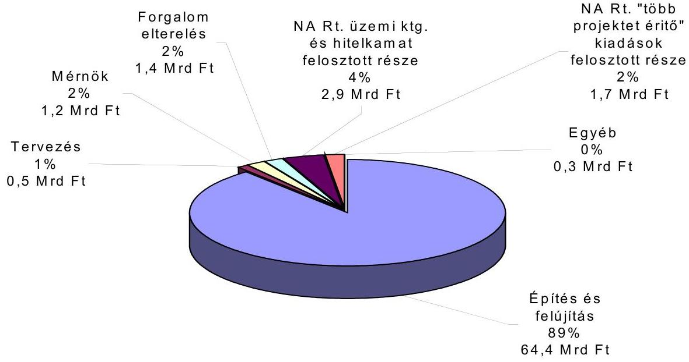

A beruházás legnagyobb részét (89 \%) a MAK-al kötött szerződések alapján kifizetett autópálya felújítással és építéssel kapcsolatos kiadások tették ki 64,4 Mrd Ft értékben. (8. melléklet) A tervezés, a mérnök vállalkozási díja, a forgalomelterelés és a beruházáshoz kapcsolódó egyéb kiadások egyenként a 2 \%-ot, összességében pedig az $6 \%$-ot nem érték el.

Az NA Rt. üzemi költségéből és a hitelkamatokból az M7 beruházásra jutó rész a beruházás $4 \%$-át, az ún."több projektet érintő tételek" pedig $2 \%$-ot jelentettek.

Az NA Rt pénzügyi és vagyoni helyzetéről negyedéves beszámolókat készített, éves beszámolóit pedig a könyvvizsgáló minden évben elfogadó nyilatkozattal látta el. Számviteli politikáját évről-évre aktualizálta.

Az ÁAK Rt érvényes számviteli politikával 2003. május végéig nem rendelkezett (annak tervezetét csak 2003. június 6-án terjesztették elő), amely nem felel meg a számviteli törvény 14. §. (8) bekezdésében foglaltaknak. A számviteli törvény 14 § (3) bekezdése szerint minden gazdálkodónak legalább a törvény 14 § (4)(5) bekezdésében részletezett tartalmú számviteli politikával kell rendelkeznie, amelyet a megalakulástól, vagy a törvénymódosítástól számított 90 napon belül kell elkészíteni. Az ÁAK Rt. 2000. Augusztusában alakult, tehát a 90 napos határidő lejárt. A számviteli politika elkészítéséért a gazdálkodó képvisele

---

tére jogosult személy a felelős (14. § (9) bek.). A számviteli politika hiánya miatt nem ítélhető meg teljes bizonyossággal az eszközök és források értékelése és a kiegészítő melléklet tartalma. Az ÁAK Rt éves beszámolóit ugyanaz a könyvvizsgáló mint az NA Rt-nél minden évben elfogadó nyilatkozattal látta el annak ellenére, hogy nem volt számviteli politikája.

# 2.1.1. Több projektet érintő kiadások elszámolása 

A „több projektet érintő szerződések" tartalmilag egyes projekteknél a kivezetéskor egy-egy projektre elkülöníthetők, ezért a kötelezettségvállalások összevont megkötését minimalizálni kell. A pénzeszközök felhasználásának átláthatóságát a projektenkénti egyedi szerződéskötés szolgálja. Az elszámolási hibák következtében eltéréseket tapasztaltunk a területszerzéssel, egyéb feladatok vállalkozásba adásával kapcsolatban.

Az ÁAK Rt. által kisajátított területeket elszámolták az NA Rt.-nek és ennek során egyedileg nem különítették el, hogy a ráfordítás melyik projekthez kötődik. Az NA Rt. minden évben arányszámokat képzett, a projektek adott évi ráfordításai ismeretében és ezekkel az arányszámokkal a „több projektet érintő beruházásokat" arányosan felosztották a következők szerint:
ezer Ft

| Év | Megnevezés | Összeg | Megjegyzés |
| :-- | :-- | --: | :-- |
| 2000. | M7 autópálya (közvetlen) | 347965 |  |
|  | „több projektet érintő" arányos része | 7671 | az egész 1,56 \%-a |
|  | Összesen: | 355636 |  |
| 2001. | M7 autópálya (közvetlen) | 29813371 |  |
|  | „több projektet érintő" tételes része | 19284 | tételes rész |
|  | „több projektet érintő" arányos része | 440189 | arányos rész (33 \%) |
|  | Összesen: | 30272844 |  |
| 2002. | M7 autópálya (közvetlen) | 40583031 |  |
|  | „több projektet érintő" tételes része | 12206 | tételes rész |
|  | „több projektet érintő arányos része | 1198080 | arányos rész (30 \%) |
|  | Összesen: | 41793317 |  |
|  | Mindösszesen: | $\mathbf{7 2} \mathbf{4 2 1 7 9 7}$ |  |

A „több projektet érintő beruházások" között 2002. évben 0,6 Mrd Ft értékben szerepeltek olyan, az ÁAK Rt. által átadott ingatlanok, amelyek kizárólag az M7 autópálya Zamárdi-Letenye szakaszához tartoztak. Ezeket - a szerződésben rögzítetteknek megfelelően - négy részletben az ÁAK Rt. átadta az NA Rt.-nek, az alábbi megoszlásban:

---

| ezer Ft |  |  |  |  |
| :--: | :--: | :--: | :--: | :--: |
| Sorszám | Megállapodás   kelte | Átadott ingatlanok értéke | Ebből: M7 | Ebből M7-re elszámolva |
| 1. | 2001.12 .21 . | 2078675 | 376235 | 19277 |
| 2. | 2002.02 .01 . | 2005336 | 806189 |  |
| 3. | 2002.04 .18 . | 2007642 | 885640 | 600807 |
| 4. | 2002.07 .08 . | 2102322 | 1125360 |  |
|  | Összesen: | $\mathbf{8 1 9 3 9 7 5}$ | $\mathbf{3 1 9 3 4 2 4}$ | $\mathbf{6 2 0 0 8 4}$ |

A táblázatban szereplő az első részletben átadott 19,3 millió Ft összegű ingatlan elszámolása indokolt volt, mert azt tételes elszámolás alapján állapították meg, és a felújított M7 autópálya Érd-Zamárdi szakaszához tartozott. Ezek az érintett ingatlanok Siófokon és Zamárdiban találhatók.

Indokolatlan a harmadik részletben átadott 0,6 Mrd Ft elszámolása a Buda-pest-Zamárdi szakaszra, mivel ezek kizárólag az M7 autópálya ZamárdiLetenye szakasz továbbépítése érdekében végzett területszerzéshez tartoznak. A harmadik részletben átadott ingatlanok tételes azonosítását Zamárdi térségében végeztük el, mivel a két pályaszakasz ezen a helyen kapcsolódik.

Az NA Rt.-n belül a Zamárdi-Letenye szakasz előkészítésével az Előkészítő Irodán foglalkoznak, míg az Érd-Zamárdi felújított szakasszal a Projekt Igazgatóságon. A két szakasz tehát még szervezeti alapon is jól elkülönül. (A területszerzés kérdéskörének kezelése nem volt egységes, mert a másik két részletet nem számolták el.)

A területszerzés, kisajátítás és a földvédelmi járulék elszámolásban az M7 autópályára is felosztott elemek között olyanok is szerepelnek (6. melléklet 15-1617 sorai), amelyek az M7 autópálya Zamárdi-Letenye új szakaszának építéséhez tartoznak. A táblázatban jelzett három társaság kizárólag az M7 autópálya Zamárdi-Letenye szakaszán dolgozott, ezért az Érd-Zamárdi felújított M7-re történő elszámolásuk nem indokolt.

Az elszámolási mód nem felel meg a számviteli törvény 26. §. (7) bekezdésében előírtaknak, mert „a beruházások, felújitások között kell kimutatni a rendeltetésszerüen használatba nem vett, üzembe nem helyezett" eszközök bekerülési értékét, itt pedig az NA Rt. ezeket részben az átadott - és aktivált - szakaszra terhelte.

---

| Sorsz. | Év | Cég megnevezése | Bruttó ösz-   szeg | Arány \% | Kalkulált ösz-   szeg |
| :--: | :--: | :--: | :--: | :--: | :--: |
| 1. | 2001. | „Q" Rt. | 389708 | 32,500 | 126655 |
| 2. |  | „D" Kft. | 320000 | 32,500 | 104000 |
| 3. |  | „E" Kft. | 144000 | 32,500 | 46800 |
|  |  | 2001. év összesen: |  |  | 277455 |
| 4. | 2002. | „Q" Rt. | 33360 | 29,926 | 9984 |
| 5. |  | „D" Kft. | 249500 | 29,926 | 74665 |
| 6. |  | „E" Kft | 185345 | 29,926 | 55466 |
|  |  | 2002. évi összesen: |  |  | 140116 |
|  |  | Mindösszesen |  |  | 417571 |

A táblázatban felsorolt cégek tevékenységét a különböző években nem kezelték egységesen, mivel a 2001. és 2002. évben, mint „több projektet érintő" költségeket felosztották a különböző projektek között, a 2000. évben viszont nem osztották fel.

Az „Q" Rt. tevékenysége a tervezéssel, a másik két társaságé a nyomvonalhoz tartozó terület előkészítésével volt kapcsolatos. A „D" Kft. - amely az NA Rt. nevében és helyette járt el - az előkészítés szervezését végezte (tervezés, lőszermentesítés, területszerzésben részt vevő ügyvédek, régészek munkájának koordinálása). Az „E" Kft. pedig a területszerzéssel kapcsolatos műszaki feladatokat (pl. kitűzés) látta el, elkészítette az ún. kisajátítási terveket és eljárt az illetékes hatóságoknál, köztük a földhivataloknál az érintett mezőgazdasági vagy erdőgazdasági területek művelés alóli kivonása ügyében. Ez a munka jelenleg az M7 autópálya Zamárdi-Letenye szakaszán folyamatban van.

Az Állami Számvevőszékről szóló 1989. évi XXXVIII. törvény 21. § (3) bek. alapján ellenőrzést kezdeményeztünk a magántársaságok üzleti kapcsolata alapján kiállított teljesítményigazolások és elvégzett munkák megalapozottságának megítélése érdekében. A „D" Kft. a teljesítésigazolásokat alátámasztó más társaságok üzleti kapcsolatait is érintő - dokumentumok átadását megtagadta. Az ÁFA nyilvántartás vezetése, a számlanyilvántartás megfelelő volt mindegyik társaság esetében. A helyszíni ellenőrzés feltárta az alvállakozásba adás folyamatát a díjszedési stratégia elkészítésére vonatkozóan, ami - az egyébként elkerülhető - profitlánc kialakulását eredményezte.

A „több projektet érintő szerződések" között szerepelt az M1, M3, M7 autópályák átfogó díjszedési stratégiájának elkészítésére vonatkozó szerződés megkötése az „F" Kft.-vel 99 millió Ft vállalkozási dí ellenében. A tényleges munkavégzés a „G" Kft.-nél történt, amely a megbízást már a „H" Kft.-től kapta. A profitlánc jelen esetben tehát a következők szerint alakult: az NA Rt. megbízta az M1, M3, M7 autópályák átfogó díjszedési stratégiájának elkészítésével az „F" Kft.-t, amely

---

ugyanezzel a feladattal megbízta a „H" Kft.-t, aki a „G" Kft.-vel továbbszerződött a feladat tényleges elvégzésére 75 millió Ft-ért.

Az APEH átfogó vizsgálatot végzett 2002-ben az M7-es autópálya építő társaságok körében. Jelentésében megállapította, hogy a Vegyépszer Rt. első körben alkalmazott alvállalkozói közül 6 társaság nem rendelkezett a vállalt feladat végrehajtásához szükséges gépekkel, berendezésekkel és egyéb erőforrásokkal a mérlegadatok és a társasági dokumentumok alapján. A 64 Mrd Ft értékben megkötött fővállalkozói szerződés szerinti munkák alvállalkozásba adásakor a 6 társaság esetében vállalt munkák mintegy 47 Mrd Ft-ot tettek ki, ami a fővállalkozói szerződéses ár közel $70 \%$-a. A jelentés megállapításai alapján prognosztizált az e 6 társaság által vállalt tevékenységek további alvállalkozásba adása.

# 2.1.2. Az ÁAK Rt.-nél végzett munkák az M7 beruházáshoz kapcsolódóan 

Az ÁAK Rt. az M7 autópálya beruházáshoz kapcsolódóan a következő munkákat végezte el:
millió Ft-ban

| Tevékenység megnevezése | Összeg (ÁFA nélkül) | Az elszámolás indokai |
| :--: | :--: | :--: |
| Jobb pálya kísérleti szakasz $64+925-69+675 \mathrm{~km}$ között 850 m hosszúságban | 123 | A kísérletet 2001. februárban végezték el egy időben a szerződéskötéssel |
| Székesfehérvár 59. km-nél található csomópont | 615 (2002. 12. 31-ig)   604 (2003., illetve 2004. évben várható kiadás) | Az önkormányzat és a közlekedési felügyelet hatására a bal pálya 3. sáv építési engedélye miatt volt rá szükség. A MAK szerződésben nem szerepelt. |
| Érd Tetőfedő és Szövő utcai aluljárók felújítása (16+594; 16+944 km) | 226 | Nem tartozott a MAK által szerződött 17-112 km közötti szakaszhoz |
| Összesen: | 964 | A 2003., illetve 2004. évben várható kiadás nélkül |

Ahhoz, hogy az M7 autópálya Budapest-Zamárdi szakaszának teljes felújítási és építési költségét megkapjuk, a jelentés 2.1. pontjában részletezett, az NA Rt. által erre a célra fordított 72,4 Mrd Ft-hoz hozzá kell még adni az előzőek szerint az ÁAK Rt. által erre a célra elköltött 0,96 Mrd Ft-ot, így a beruházás összege 73,36 Mrd Ft (áfa nélkül).

---

Tekintettel arra, hogy a tervezési költség, a tervezésre vonatkozó megbízások nem tartalmazták az informatikai rendszer, és a pihenők felújítását ${ }^{9}$, a Budapest-Zamárdi szakasz beruházás bekerülési összegének további lényeges emelkedése prognosztizálható, becslések szerint 3 Mrd Ft értékben.

Fentiek (az NA Rt.-nél tapasztalt nyilvántartási problémákkal együtt) azt is jelentik, hogy nem egyértelmú, meghatározott, hogy az átadott M7 BudapestZamárdi szakasz beruházás megvalósítása összesen mennyibe került, a bekerülési összeget az átadási (aktiválási) összeg nem fedi.

# 2.1.2.1. A „kísérleti" szakasz 

Az M7 autópálya Budapest-Zamárdi közötti szakaszának felújításával kapcsolatban merültek fel kiadások az ÁAK Rt.-nél is. Ilyen volt a jobb pálya 64+925$65+775 \mathrm{~km}$. szelvények közötti 850 m -es autópálya szakasz, amely kísérleti jelleggel, többfajta technológiával valósult meg. Építője az „N" Rt. volt, amelynek a munkavégzésre a megrendelést az NA Rt. utasítására rendelte meg az ÁAK Rt. Az NA Rt. vezérigazgatója azt is rögzíti az ÁAK Rt.-hez beérkezett és 657/2001-V sz. alatt iktatott 2001. február 12-i levelében, hogy a költségek is az ÁAK Rt.-t illetik (4. melléklet). Az ÁAK Rt. utasítása az NA Rt. részéről a kísérleti szakasz finanszírozására vonatkozóan sérti a Gt. 22. § (2) bekezdés előírását, amely szerint a társaság vezetője nem utasítható a társaság részvényesei, vagy munkáltatója által.

A kísérleti technológiákkal megvalósított 850 m-es pályaszakaszon szerepeltek a tételek között építés-előkészítő munkák, földmunkák, padka és elválasztósáv, vízépítési munkák, forgalomtechnikai jelek és eszközök, felfestés és ezek mellett természetesen az útburkolati rétegek. A szerződés összege 124,8 millió Ft, a ténylegesen benyújtott és kifizetett számla 123,0 millió Ft volt. A munkát sürgősséggel, az aszfaltozási munkák szokásos időtartama előtt, februárban végezték el. Az árból 19,1 millió Ft-ot annak a költsége jelentette, hogy a szokatlan időpontban szükséges volt a burkolat, aszfaltozás előtti, megfelelő hőmérsékletre melegítése és a keverőgép külön felfütése. További 3,7 millió Ft volt a próbagyártási többletköltség. Ezek alapján a különleges körülmények okozta többletek nélkül a szakasz ára mintegy 100 millió Ft összeget tett volna ki.

A kísérleti szakaszon elkészített felújítás költségét nem vonták le a VegyépszerBetonút Konzorcium szerződés összegéből - amely a teljes, a beruházással érintett hosszat tartalmazta -, hanem az átalányáras szerződés keretében kompenzációs megállapodásban rendezték. A megállapodásban a kompenzációs munkákat rögzítették, azok tételes ármegállapítása nélkül. Az NA Rt.- Vegyépszer Rt. kompenzációs megállapodás a 5. mellékletben szerepel. A kompenzáció ráfordítás arányossága nem ítélhető meg.

[^0]
[^0]:    ${ }^{9}$ Az összehasonlítási alapul szolgáló M3 beruházásban szerepeltek.

---

# 2.1.2.2. Az M7 autópálya 59. sz. csomópontja 

Az NA Rt. utasítására (ÁAK Rt. ikt. szám: 658/200/V, 2001. 02. 13.) az M7 Bu-dapest-Zamárdi szakasz 59. km-nél található (sárbogárdi) csomópont átépítését is az ÁAK Rt. végezte el saját költségére, 2002. december 31-ig 615 millió Ft költséggel. A 2003-ra, illetve 2004-re áthúzódó fizetési kötelezettségek további, mintegy 604 millió Ft-ot képviselnek (12. melléklet). (A csomópont átépítése az építési engedélyezési eljárás során került az M7 felújítási programjába.) ${ }^{10}$

Így az 59. km-nél található csomópont bekerülési összege az NA Rt. könyveiből kivezetett, az M7 Budapest-Zamárdi szakasszal kapcsolatos összegben nem szerepel.

### 2.2. A kizárólagos állami tulajdonjog érvényesülése

### 2.2.1. A tulajdonjogi helyzet

A Ptk. 172. § d) pontja alapján és a közúti közlekedésről szóló 1988. évi I. tv. 32. § (1) bek. szerint az országos közúthálózat a Magyar Állam kizárólagos tulajdonát képezi. A közúti közlekedésről szóló tv. 8. § (1) bek. alapján a közúthálózat fejlesztése, fenntartása és üzemeltetése állami feladat.

A finanszírozási konstrukció következményeképpen a végrehajtott fejlesztések társasági tulajdont képeztek.

Az ÁAK Rt. és az NA Rt. az év végén 235 Mrd Ft értékben vezetett ki autópályákat és közutakat a nyilvántartásaiból. A társaság tulajdonában állt kincstári vagyonnal szemben a társaságok, illetve jogelődjeik által felvett hitelek álltak, amelyeket a Magyar Állam a 2003. évi kv.tv.-el módosított és a 2001. és 2002. évi kv.tv. rendelkezései alapján átvállalt. A kivezetések háromoldalú megállapodások alapján történtek. A kivezetett M7 forgalomba helyezett, korábban társasági tulajdonban állt közúti infrastrukturális beruházást a KVI nyilvántartásba vette, majd az ÁAK Rt.-nek vagyonkezelésbe átadta.

A 2003. évi kv.tv. rendelkezései szerint az NA Rt. autópályákat és elkerülő utakat ad át a Magyar Államnak legfeljebb 207 Mrd Ft értékben. A központi költségvetés ennek ellenében az NA Rt. adósságaiból ezzel azonos összegű hiteltartozást - annak járulékaival együtt - vállalt át. Az Állami Autópálya Kezelő Rt. is autópályákat adott át a Magyar Államnak 28,1 Mrd Ft értékben.

Az aktiválások és a kivezetések a társaságok könyveiből a törvénynek megfelelően megtörténtek. Ennek a társaságok vagyoni helyzetére nem volt hatása, a kivezetéseket nem a saját tőkével, hanem az állam által átvállalt hitelekkel szemben hajtották végre.

[^0]
[^0]:    ${ }^{10}$ Az NA Rt. levele szerint ezek a költségek - bár az autópálya felújítása kapcsán, beruházásként merültek fel - fenntartási jellegűek és így az ÁAK Rt.-t illetik.

---

A korrekció ellenére, kisebb vagyon tekintetében, de jelenleg is szerepelnek a forgalomnak már átadott, az állam kizárólagos tulajdonát képező közutak 1,7 Mrd Ft értékben az ÁAK Rt. vagyonában, saját tőkéjével szemben (7. melléklet).

Az ÁAK Rt.-nél ez a helyzet annak ellenére alakult ki, hogy a 2002. évi költségvetési törvény módosítása alapján az előirányzat szerinti 66,5 Mrd Ft-ból csak 28,1 Mrd Ft volt eszközátadással ellentételezve, így 38,5 Mrd Ft hitelátvállalás ellentételezés nélkül történt, tehát lehetőség lett volna a fenti 1,7 Mrd Ft kivezetésére is.

# 2.2.2. A KVI vagyonátadás bemutatása 

A 2003. évi kvtv. 101. §. (7)-(8) bekezdése alapján az NA Rt, az ÁAK Rt és a Kincstári Vagyoni Igazgatóság (KVI) 2002. 12. 31-én háromoldalú szerződést kötött arra, hogy az NA Rt. autópályákat (M3 Füzesabony-Polgár közötti szakasza, M7 Budapest-Zamárdi szakasza) és elkerülő utat (35. út Polgárt elkerülő szakasza) ad át a Magyar Állam tulajdonosi képviseletében eljáró KVI-nek 185,6 Mrd Ft értékben. Az ebben foglaltak szerint a KVI vagyonkezelési szerződést kötött az ÁAK Rt.-vel az NA Rt. által átadott valamennyi kincstári vagyonelemre és a Magyar Állam átvállalta az átadott kincstári vagyonnal összefüggésben keletkezett, a vagyonértékkel egyező mértékű adósság-állományt az NA Rt.-től 185,5 Mrd Ft értékben.

Az átadásra került vagyoni érték meghatározása az NA Rt által befogadott számlák alapján az NA Rt. 2002. 12. 31-i könyvelési állapot szerinti adatokkal történt. Ezek:
ezer Ft-ban

| M3 autópálya | 113188041 |
| :-- | --: |
| M7 autópálya | 72421797 |
| Országos Közutak (Széchenyi Plussz) | 6934203 |
| Összes átadott eszköz: | 192544041 |
| Ebből M3 és M7 autópályák | 185609838 |
| Állam által átvállalt hitel | 185551299 |
| Különbözet | 58539 |

A hitelátvállalás kapcsán az NA Rt. terhére 58,5 millió Ft különbözet keletkezett, mert 2002. december 31-ére, az év végi végleges zárási adatok ismerete nélkül, előre határozták meg az érintett beruházások értékét. (Az NA Rt. 2002. évi eredményét terhelő különbözet az átadásra került vagyoni értékhez képest elhanyagolható, $0,03 \%$.

---

A háromoldalú szerződés 2. pontja szerint ${ }^{11}$ az NA Rt. átadja - többek között az M7 autópálya Budapest és Zamárdi között felújított, illetve megépített szakaszát (a Zamárdi-Letenye szakasz eddig elkészült, vagy folyamatban lévő részeit nem).

Figyelemmel a 2.1. pontban részletezett, az ÁAK Rt. által átadott 0,6 Mrd Ft értékű, a Zamárdi-Letenye szakaszhoz tartozó ingatlanokra, és a ZamárdiLetenye szakaszhoz tartozóan kifizetett további 0,4 Mrd Ft-ra - a Magyar Állam nevében eljáró KVI-vel kötött háromoldalú megállapodás alapján - az ÁKK összesen 1 Mrd Ft-tal több hitel törlesztését vállalta át, mint amenynyi indokolt volt, amely sérti a számvitelről szóló törvény 26. § (7) bekezdésében foglaltakat.

# 3. A beruházÁs vállalKOZÁsba adása 

### 3.1. A fóvállalkozó kiválasztása és a szerződéses feltételek kialakítása

A vállalkozási szerződések megkötését nem előzte meg tender kiírás, miután a 2117/1999. (V. 26.) Korm. határozat a gyorsforgalmi úthálózat fejlesztési program keretében megvalósuló és az MFB Rt. által finanszírozott beruházásoknak - ezen belül az M7 autópálya felújításnak - a Kbt. hatálya alóli kivételéről rendelkezett.

A beruházás vállalkozásba adása nem egy előre meghatározott eljárási rend alapján történt, miután a beruházások vállalkozásba adásának a KHVM Közúti Főosztály - 5874/001/1998. és 005290/2000. számú - rendelkezései szerinti szabályozása az NA Rt.-re, mint társaságra, nem kötelezőek. Ez az eljárási rend meghatározza az ajánlatok beszerzésének, elbírálásának kötelező formáját és módját, továbbá a szerződésekben alkalmazandó szerződéses feltételeket. A gyorsforgalmi úthálózat fejlesztési programjához - amelynek része volt az M7 autópálya rekonstrukciója - a társaság és a tulajdonosai sem alakítottak ki ilyen eljárási rendet.

A beruházás megvalósítására - bár a közbeszerzési eljárás mellőzését megengedő kormányhatározat nem zárta ki - másféle versenyeztetési eljárást sem alkalmaztak.

[^0]
[^0]:    ${ }^{11}$ A szerződés 2. pontja szerint az NA Rt. átadja a „Füzesabony és Polgár közötti M3 autópálya szakaszt, az M7 autópálya Budapest és Zamárdi között felújitott, illetve megépített szakaszát a megépített mütárgyakkal, alkotórészekkel, tartozékokkal és vagyoni értékü jogokkal együtt (a továbbiakban együtt: „Autópályák"), átadja továbbá a 35. sz. út Polgárt elkerülő szakaszát annak mütárgyaival, alkotórészeivel, tartozékaival és vagyoni értékü jogaival együtt, valamint a Beruházás kivitelezésével összefüggésben, a Magyar Állam tulajdonába került mindazon földterületeket, azokon létesített felvonulási, üzemeltetési, illetve egyéb építményekkel együtt, amelyeket Szindikált Hitelből vagy az MFB által folyósított hitelből finanszírozott (továbbiakban együtt: „Kincstári Vagyon"')".

---

Az NA Rt. a Magyar Autópálya-építő Konzorciumtól kért be ajánlatot a felújítási és kivitelezési munkák elvégzésére, más vállalkozók versenyeztetése nélkül. (A konzorcium tagjai a Vegyiműveket Építő és Szerelő Rt. és a Betonút Szolgáltató és Építő Rt. voltak.) Az NA Rt. csak a Konzorciumtól kért ajánlatot, és az ajánlatok alapján lefolytatott műszaki, ár és szerződéses feltételek egyeztetése alapján a szerződéseket a Konzorciummal kötötte meg. Az ajánlati árak véleményezésére a Mérnöknek és az „A" Kft.-nek adott megbízást. A szerződéses árakat - a „mérnökár" és az „A" Kft. számítási anyagának figyelembevételével tett igazgatósági javaslat alapján - a Felügyelő Bizottság, az Alapító és a Közgyűlés jóváhagyta.

# 3.1.1. A fövállalkozási szerződések és a szerződéses feltételek kialakítása 

A Konzorciummal mint Fővállalkozóval összesen 11 szerződést kötöttek - folyamatosan a 2000-2002. években - az autópálya bal és jobb oldali sávjának felújítási munkáira, valamint a hiányzó Balatonaliga-Zamárdi jobb pálya megépítésére. A szerződések alapján megvalósított beruházási érték 64,4 Mrd Ft. volt, ami a teljes beruházási érték $89 \%$-át tette ki.

A fővállalkozóval kötött szerződések főbb tartalma:

- az autópálya burkolatának felújítása;
- a hiányzó Balatonaliga-Zamárdi közötti jobb pálya megépítése;
- a bal pályán Budapest-Székesfehérvár között harmadik sáv kiépítése;
- a hidak és egyéb műtárgyak, vízelvezető rendszerek, forgalomtechnikai berendezések felülvizsgálata, felújítása, korszerűsítése;
- a csomópontok felújítása, a gyorsító, lassító sávok szabványosítása, a pihenőhelyek rekonstrukciója;
- a környezetvédelmi, vadvédelmi létesítmények megépítése és az autópálya növénytelepítésének felújítása, pótlása.

A szerződések formája, összetétele és szerződéses feltételei nem egységesek, 6 db fix, átalányáras, 5 db tételes elszámolású. Ezen túlmenően változó a tartalékkeret alkalmazása, az előleg nyújtása, az előleg-visszafizetés garantálásának módja, továbbá a teljesítési, a jótállási és a szavatossági bankgaranciák előírása. Négy szerződést előre kidolgozott szerződéses feltételekkel kötöttek, míg két esetben egyedi kikötéseket alkalmaztak (8. melléklet).

A gyorsforgalmi úthálózat fejlesztési programjának végrehajtásához az általános szerződéses feltételeket az NA Rt. Igazgatósága 2000. évben dolgozta ki, amit a társaság Közgyűlése jóváhagyott (Ig. 5/2000. (V. 8.) sz. Határozat az Útés hídépítési Pályázati, Szerződési feltételek, Szerződéses formanyomtatványok elfogadásáról; Ig. 8/2000.(V. 29.) sz. Határozat az Út-hídépítési szerződéses feltételek módosításának elfogadásáról). Ezek határozták meg a szerződések formáját, tartalmát és a versenyeztetési eljárások során is alkalmazható, általánosan kötelező szerződéses feltételeket.

---

A 2000. évben kidolgozott szerződéses feltételeket a rekonstrukciós program második felének végrehajtásához 2001. évben módosították (Ig. 47/2001 (XII. 18.) sz. Határozat a jövőben megkötendő kivitelezések esetében alkalmazandó Szerződéses Feltételektől).

A 2001. évben módosított „Szerződéses Feltételek" a beruházó számára előnytelenebbé váltak. Az általános „Szerződéses Feltételek" módosításakor, illetve az egyedi szerződéses feltételek bemutatásakor az Igazgatósági előterjesztések nem tartalmaztak olyan számítási anyaggal alátámasztott indoklást, amely az eltérő, illetve egyedi szerződéses feltételek gazdaságosságát a szerződéses árak kialakításának vonatkozásában megindokolták.

A „Szerződéses Feltételek" 2001. évi módosítása kapcsán - a 2002 májusában megjelent M3 autópálya beruházás ellenőrzéséről szóló jelentésből - egyetlen ÁSZ észrevételt vett figyelembe: nevezetesen elhagyta a tartalékkeret feltüntetését az átalányáras szerződések esetében. Nem változtatták meg azonban az alvállalkozók bejelentésének szabályozását. Ezen túlmenően az előlegvisszafizetési garanciaállítás formája, valamint az előleg-visszafizetés módja a banki garanciavállalás elhagyásával kedvezőtlenebb, illetve kockázatosabb lett a beruházó terhére. Kedvezőtlenebbé váltak a beruházó számára a teljesítési, a jótállási és a szavatossági garanciák állítására vonatkozó szerződéses feltételek is, részben az időtartam rövidítése, részben az egyes garanciafajták elhagyása miatt. (8. melléklet táblázatban foglalja össze a 2000. és 2001. évi Szerződéses Feltételek változásait.)

A rekonstrukciós program kisebb értékű kiegészítő, illetve járulékos részszerződéseit nem a 2000., illetve 2001. években kidolgozott "Szerződéses Feltételek" alkalmazásával, hanem egyedileg kötötték meg. (A beruházás kronológiája a 9. mellékletben található.)

# 3.1.2. Az egyes szerződéses feltételek alakulása 

A Konzorcium és tagjainak felelősség megosztása a fővállalkozási szerződésekben jól rendezett volt. A Konzorcium és tagjai egyetemlegesen és korlátlanul felelősek az általuk szerződött projektelemek megvalósításáért, az elemek közötti kivitelezés koordinációjának biztosításáért és az alkalmazott alvállalkozók munkájáért.

Az alvállalkozók alkalmazásának szabályozása a 2000. évben elfogadott eredeti és a 2001. évben módosított Szerződéses Feltételekben sem volt megfelelő. A feltételek rögzítik, hogy a vállalkozónak nem áll jogában a szerződéses munkákat teljes egészében alvállalkozásba adnia, ugyanakkor az alvállalkozásba adás megengedett mértéke nincs egyértelmúen limitálva. Ugyancsak nincs szabályozva az alvállalkozásba adás mértékének kötelező bemutatása. Ebből következően nem követhető, hogy a vállalkozás továbbadása milyen mértékű, és milyen részarányban oszlik meg a szerződés előírása szerint bejelentett „Fontosabb Alvállalkozók" között. Ez kockázati tényezőnek tekinthető, mivel akadályozza az alvállalkozók alkalmasságának és felkészültségének elbírálását a vállalt munkák mértéke tekintetében.

---

Az Állami Számvevőszék az alvállalkozókra vonatkozó szerződéses feltételek szabályozásának hiányosságát már a 2000-2001. évi M3-as autópálya beruházás ellenőrzése során is észrevételezte és kifogásolta.

# A fővállalkozó szerződésben vállalt kötelezettségeihez kapcsolódó teljesítményhez kötött fizetési rendszer, illetve a rendszer elemeinek alkalmazása nem volt egységes: 

- A vállalkozónak felróható késedelmekért fizetendő kötbéreket valamennyi megkötött szerződésben rögzítették. Közbenső teljesítési határidőket nem írtak elő. A végleges teljesítési határidők megvalósultak, így késedelmi kötbér kivetésére nem került sor.
- A teljesítési, jótállási és szavatossági garanciák előírása, formája és banki garantálása kifogásolható, 5 szerződés esetében a fővállalkozó számára kedvezőbbek a szokásos és a FIDIC ajánlásokban is megfogalmazott feltételektől.
- Önálló teljesítési bankgaranciát a szokásos $10 \%$-os mértékben, a beruházás egészét magában foglaló 11 db szerződés közül összesen 6 db szerződéshez nem állítottak. Így összesen 4,1 Mrd Ft értékű szerződéses munka teljesítési garancia nélkül került végrehajtásra.
- A jótállási bankgarancia 18 hónapos lejárati ideje rövidebb az útépítési gyakorlatban szokásos 2-3 év időtartamú garanciánál. Ezen túlmenően 5 db , együttesen 3,9 Mrd Ft értékű szerződés esetében, nem írtak elő garanciaállítási kötelezettséget.
- Szavatossági bankgarancia állításának szükségességét az általános „Szerződéses Feltételek" 2001. évi módosításakor elhagyták. 6 db rész-szerződésben, - amelyek vállalkozási értéke összesen 28,7 Mrd Ft volt - nem adtak ki ilyen bankgaranciát.
- Az egyes nyomvonal jellegű építményszerkezetek kötelező alkalmassági idejéről szóló 12/1988. (XII. 27.) együttes miniszteri rendelet a jótállási, szavatossági garanciális biztosítékon túlmenően a fővállalkozót kötelezi az építményszerkezetekre és a felhasznált anyagokra 10, illetve 5 éves alkalmassági idő garantálására, megfelelő karbantartási és felújítási tevékenység mellett. Ezen kötelezettség előírása nem következetes a megkötött felújítási részszerződésekben. 4 db nem tartalmaz ilyen előírást, aminek hiánya vitás esetekben értelmezési kockázatot eredményezhet a beruházó kárára.

A szerződések keretében nyújtott $10 \%$-os előleg visszafizetésének garantálására - 2000. évben kidolgozott - szerződéses feltételek kétféle, egymással nem azonos értékű biztosítékot határoztak meg. Egyrészt előleg-visszafizetési bankgaranciát, amely teljes körű pénzügyi biztosítékot nyújt, másrészt a bankon keresztül kibocsátott „előleg-visszafizetési kötelezettségvállalást" írtak elő. Ez utóbbi csak az előleg célszerű felhasználását garantálja, és gyengébb pénzügyi biztosítékot nyújt. Ez a forma a fővállalkozó részére a garancia állításának költségeit tekintve kedvezőbb. A „Szerződéses Feltételek" 2001. évi módosítása külön előleg-visszafizetési bankgarancia állítását nem írta elő, a visszafizetés garantálását összevonta a szerződés teljesítési garanciájával, így tovább rontotta az előleg visszafizetésének kockázatát.

---

A felújítási program 6 db szerződésére összesen 5,5 Mrd Ft értékben fizettek 10 \% előleget. Ezek a szerződések a teljes program $86 \%$-át fedik le értékben. Az így kifizetett előlegből 2,6 Mrd Ft összegre még a bankgaranciával szemben gyengébb biztosítékot nyújtó visszafizetési kötelezettségvállalás sem történt.

Előlegek nyújtása a kivitelezési, felújítási szerződések keretében 10 \% mértékben elfogadott gyakorlat. A munkák elvégzésére nem egyetlen átfogó fővállalkozási szerződést kötöttek. A beruházó NA Rt.-nek lehetősége lett volna arra, hogy egyes rész-szerződések esetében a munkák jellegének - előleg igényességének megítélése alapján az előlegfizetést mellőzze. Az igazgatósági előterjesztések és az ülésekről készült jegyzőkönyvek szerint ezt a kérdést nem vizsgálták. A kiegészítő, illetve járulékos szerződéseket tekintve: összesen 100 millió Ft értékű előleg tekintetében lehetett volna értékelni az előlegfizetés indokoltságát, illetve elhagyását (8. melléklet).

Az előleg visszafizetését a 2000. évi szerződéses feltételek szerint a számlázási rendszer a rész-számlák összegéből történő levonással, a második rész-számla kiállításától kezdődően biztosította. A 2001. évben módosított szerződéses feltételek új, kizárólag a fővállalkozónak kedvező feltételt vezettek be. Az új szerződéses feltétel szerint az előleg visszafizetése nem a második rész-számla összegéből volt esedékes, hanem a munkák $50 \%$-os készültségi fokától kezdődően. Ebből eredően a fővállalkozó gyakorlatilag 7 hónapos időtartamra 2,5 Mrd Ft kamatmentes kölcsönhöz jutott.

A fốvállalkozó részére egyoldalúan kedvező „Szerződéses Feltételek"et 2002. második félévében szüntették meg. Egyértelművé tették az előlegfizetési bankgarancia állításának és a második rész-számlától való törlesztésének kötelezettségét. A jótállási bankgarancia időtartamát 18 hónapról 36 hónapra növelték és 24 hónapos időtartammal visszaállították a szavatossági bankgaranciát.

# 3.2. A beruházás költségelőirányzata és az árak kialakítása 

A program bekerülési költségének előzetes meghatározására nem volt tételesen ellenőrizhető költségelőirányzat. A megvalósítási határidő késedelmének elkerülése érdekében a felújítási munkák mértékét, terjedelmét és műszaki tartalmát a fővállalkozótól bekért ajánlatok egyeztetése és megvitatása alapján, illetve magának a felújítási programnak a végrehajtása során elvégzett felmérések alapján pontosították és véglegesítették.

A 2117/1999. (V. 26.) Korm. határozatban megfogalmazott árképzési elv az M7 autópálya rekonstrukciós programjának költség-meghatározását nem támogatta. A kormányhatározat, amely rendelkezett a gyorsforgalmi úthálózat fejlesztési program keretében megvalósuló beruházásoknak - ezen belül az M7 autópálya felújításnak - a Kbt. hatálya alóli kivételéről, csak az útépítésekre határozott meg árképzési elvet, amikor előírta, hogy „az útépités öszszehasonlítható áron számítva, legalább öt százalékkal legyen olcsóbb az eddigi árszintnél". Az NA Rt. Igazgatósága 2001. március 2-i ülésén megvitatta a 2117/1999. (V. 26.) Korm. határozat alkalmazásának feltételeit, és megállapította, hogy a kormányhatározat célkitűzése az M7 felújítási feladatra nem értelmezhető, tekintettel arra, hogy hasonló jellegű és méretű munka korábban

---

nem volt. A döntés kiterjedt a felújítási program részét képező bal pálya harmadik sáv, valamint a hiányzó félpálya kiépítésére is, tekintettel arra, hogy ezek a részek önálló autópálya építésként nem értelmezhetők, illetve nem öszszehasonlíthatók.

A társaság és a társaság tulajdonosa, az MFB Rt. felkérésére a mérnöki feladatot ellátó „R" Kft. sem tudott megbízható, a felújítási munkákra vonatkozó ajánlatok elfogadásához alkalmazható bázis árat meghatározni. Mindezek alapján a társaság Felügyelő Bizottsága, tulajdonosa, és Közgyűlése az Igazgatóság állásfoglalását tudomásul vette és a beruházás költségeit, illetve a szerződéses árakat az egyes rész-szerződésekre vonatkozó előterjesztések elfogadására hozott határozataival hagyta jóvá.

A rekonstrukció végrehajtása során az UKIG országos árait alapul vevő árképzés elemeit vette figyelembe az NA Rt. A műszaki tartalom leírása az UKIG egységes tételrendjére épült. Az egyes tételek műszaki tartalma, technológiai leírása az „M7 autópálya rekonstrukciós munkáinak tételkigyűjtése" c. dokumentációban került összefoglalásra. A tételek összessége alkalmas a rekonstrukciós feladat leírására. Az egyes tételek rövid tartalmi leírása megadja az elvégzendő tevékenységsort. A munkák mennyiségét tételenkénti bontásban a mennyiségkimutatások tartalmazták, ezekhez a mennyiségekhez rendelte hozzá a vállalkozónak az egységárakat és összesítésüket.

A szerződéses ár, a „mérnökár" és a helyszíni vizsgálat során számított szakértői ár összevetése céljából a felújítási program ABC analízissel kiválasztott tételeit vizsgáltuk. Az így kiválasztott tételek a felújítási költségek szempontjából - nagyságrendi sorrendbe rakva - meghatározóak, és a folyópálya felújítási költségeinek - hidak és csomópontok nélkül - mintegy 70-80 \%-át teszik ki. Az ÁSZ szakértői vizsgálat eredményét a 2. sz. függelék tartalmazza. Az elemzés azt mutatta, hogy az áreltérések visszavezethetők együttesen a verseny hiányára, a szerződéstípus megválasztására, a kivitelezési idő elsődleges prioritására.

# 3.2.1. A rekonstrukció I. üteme 

A rekonstrukció I. ütem költségeinek meghatározása a Fővállalkozó ajánlata, a mérnök által kalkulált „mérnökár", és az „A" Kft. által kalkulált tervezői ár összehasonlító elemzésével történt, az árak azonos műszaki tartalomra és árszintre hozatalával. (Az I. ütemhez tartozó szerződéseket a 8. melléklet mutatja.) A minimális eltérést mutató három kalkulációból, az építtető számára a legkedvezőbb kiválasztásával és az infláció miatti árindex figyelembevételével alakították ki az I. ütem költségeit. Az NA Rt. javaslata alapján fogadták el az infláció kezelését. Ezt 2000. évre 12,1 \%-ban, míg 2001-ben, az I. ütem terv szerinti befejezéséig 9,6 \%-ban becsülték, 2001. augusztus 1-i súlyponttal. (A 2000. január 1.-2001. augusztus 1. közötti időszakra a számított átkülönbözet: $1,121 \times 1,096=1,2286$ azaz $22,86 \%$ ). Az ily módon előállt költségkeretre jóváhagytak $4 \%$ - a fővállalkozó által kalkulált - kockázati mértéket, melyet a projekt megvalósításának időkorlátjai és speciális körülményei, így a gyorsítás, a többlet-gépigény, akadályoztatás és felvonulási többletköltségek miatt tartottak indokoltnak.

---

A KSH statisztikai évkönyv szerint az építőipari árindex (előző év = 100 \%) a 2000. évre 111,2 \%, míg a teljes 2001. évre: 110,1 \%. Az „B" Kft. által a meghatározó munkanem (bitumenes alapok és burkolatok készítése) közvetlen költségére számított index, árkülönbözeti mutató 2000. január 1. - 2001. augusztus 1. közötti időszakra együttesen: $15,27 \%$. A döntő probléma nem az eltérés okozta pontatlanság, hanem a bizonytalanság, amely kockázati tényező, törekedni kell a csökkentésére. Erre a vállalkozásba adás, a szerződéses feltételek megfelelő kialakítása ad módot. Napi áron tett, kockázatmentes ajánlat alapján kell a vállalkozót kiválasztani és a vállalkozási szerződés rendelkezik az árkülönbözet - tényszámokon alapuló - elszámolásáról.

A Mérnök a „mérnökár" képzés során a közvetlen és közvetett költségek meghatározásán alapuló árazási módszert alkalmazta. A közvetett költségek kalkulációjában a díjra vetítetten (max.) $160 \%$ fedezettartalom van, ami a teljes közvetlen költségre vetítve átlagosan $48 \%$. Külön költségként az alábbi költségelemeket irányozták elő: ideiglenes melléképítmények (anyag+díj-ra) $3 \%$-a; ahol szabvány írja elő (anyag+díj-ra): anyagvizsgálatok (pl.: aszfaltburkolatok készítésekor: 5,5 \%); valamint különleges körülmények miatt: díjra vetített 10 \%. A „mérnökár"-at 2000. januári árszinten határozták meg, ezért a fővállalkozói árral az inflációs szorzóval történő korrekció után vethető össze. Ennek eredményeként a fővállalkozói ár mindenütt a „mérnökár" alatti.

Az I. ütem kivitelezési munkáira kialakított ár- és költség-meghatározási elvek jóváhagyását megelőzően a kisebb volumenű, de azonnal kezdhető munkarészekre és a tél folyamán is végezhető munkákra 2000. szeptember 14-én, majd 2001. január 26-án 4 db szerződést kötöttek vezérigazgatói hatáskörben. Az NA Rt. 2000. augusztus végén - a teljes M7 felújítási projekt időbeni ellehetetlenülésének elkerülése érdekében - szükségesnek ítélte a jobb pálya építéséből előrehozottan "gyorsított ütemű" bírálattal és ajánlat jóváhagyással ezen kivitelezési munkák megkezdését már 2000. szeptember 15-től kezdődően, majd folytatását a téli időjárástól függetlenül is végezhető munkákkal.

Az I. ütem (jobb pálya) szerződéses árának jóváhagyása idején a munkák egy részének végleges műszaki tartalma függőben volt, a folyamatban lévő hatósági engedélyezési eljárás miatt. A tervekben olyan tételek szerepeltek, amelyek pontatlanságát az építés során korrigálni kellett. Példaként említhető: a víztelenítési rendszer $10 \%$-a volt javításra előirányozva, ezzel szemben $96 \%$-át kellett felújítani; a magas töltésű hidak háttöltés cseréjét a terv nem irányozta elő, de a talajvizsgálatok ezt szükségessé tették. Menet közben az út víztelenítési tervet módosítani kellett; a hidakra menet közben új típusú korlátot rendeltek el; hatósági elrendelés alapján, terven felüli mennyiségű, acélszalag korlátot kellett beépíteni; a bal pálya három sáv építésénél több tízezer $\mathrm{m}^{3}$ talajcserét kellett terven felül alkalmazni; üzemeltetői elrendelésre a tervezettnél drágább hídszigetelést kellett alkalmazni; stb. Összhangban áll mindezzel az „Összefoglaló mérnökjelentés M7 autópálya 17-110,7 kmsz. Érd-Zamárdi közötti szakasz megvalósításáról 2001-2002." című jelentés megállapítása, amely szerint: „A tervezési szakaszban a pontosabb felmérés jobban lehetővé tette volna a teljes felújításra vonatkozólag az átalányáras szerződés kockázat mentesebb megvalósítását."

---

# 3.2.2. A rekonstrukció II. üteme 

Az M7 autópálya bal pályájának felújítása eltér a jobb pályán alkalmazott technológiától. A szerződés megkötésének előkészítése 2001. augusztusszeptemberében megkezdődött. A szeptember 19-i egyeztetés értelmében a vállalkozó október 15-én (határidőre) beadta ajánlatát. Az ajánlatot a november 27-i egyeztetésen elhangzottaknak megfelelően a vállalkozó december 11-re módosította. A december 12-i egyeztetés után december 17-én a vállalkozó a harmadik ajánlatát adta.

Az ajánlatok műszaki tartalmát az NA Rt. és a Mérnök részletesen vizsgálta, elemezte. Az ajánlat megfelelőségének igazolásához, a jobb pálya már elfogadott árajánlatát használták fel. A jobb pálya eredeti ajánlata 2001. augusztusi kivitelezési súlyponttal számolt, míg a bal pálya kivitelezési súlypontja 2002. július volt. Így a jobb pálya áraihoz hozzá kell adni a 2001. augusztus és 2002. július közötti 11 hónap inflációt. A rögzített inflációs ráta 7,33 \%. Erre az időszakra vonatkozóan KSH adat az építőipari árindexre vonatkozóan még nem állt rendelkezésre. A „B" Kft. átkülönbözeti mutatója ezen időszakra az ÉMIR 63 munkanemére „Bitumenes alapok és burkolatok készítése": 5,23 \% (a közvetlen költségre vonatkozóan). Az ajánlat műszaki tartalmának a jobb pálya ajánlatával összehasonlíthatóvá „transzformálása" után az NA Rt. - szúrópróba szerű ellenőrzés alapján - megállapította, hogy a bal pálya ugyanazon szelvények közötti felújításának ajánlati ára alacsonyabb, mint a jobb pálya ugyanezen szelvények közötti felújítási költsége. Ebből a szempontból az ajánlat elfogadhatónak tűnt, de a vállalkozóval további egyeztetések voltak szükségesek, különösen a többlet kockázati tényező tartalmának a kimunkálására.

A 2001. november 27-i, valamint december 12-i szerződésegyeztető tárgyalások jegyzőkönyvei szerint néhány költségvetési tétel egységárában külön vita után állapodtak meg a felek. Az idő sürgetése miatt - a bizonytalanság ellenére határozati javaslatot terjesztettek elő, ami alapján (a vállalkozó utolsó ajánlati árával megegyezően) az NA Rt. Igazgatóságának 2001. december 18-i Igazgatósági ülésén az Ig. 49/2001.(XII.18.) sz. Határozat született: „Az Igazgatóság az M7 autópálya bal oldali sáv felújításáról szóló előterjesztésben foglaltakat a Társaság Közgyúlése elé terjeszti jóváhagyásra 22325250000 Ft + inflációs árkiigazítás + maximum $4 \%$ akadályoztatás $=$ maximum 25095814000 Ft + áfa szerződéses árral, 2002. november 30. befejezési határidővel, 2002. januári aláírással..." A Közgyűlés változtatás nélkül elfogadta az előterjesztést. A szerződés 2002. január 17-én, a maximalizált összegnél némileg alacsonyabb áron (24 855 416 000,-Ft + áfa) lépett hatályba - a 7,33 \% infláció és $4 \%$ többlet- akadályoztatás figyelembevételével -, mintegy költségkeretet adva a bal pálya építésének.

A II. ütem kivitelezési munkáira vonatkozó átalányáras szerződésen felül további rész-szerződéseket is kötöttek. A „D"-jelű (H projektelem) szerződésre adott első (2001. 10. 15.) vállalkozói ajánlat még együtt kezelte a 17-111 kmsz. között a bal pálya teljes felújítását. A 2001. november 27-i egyeztetésnek megfelelően a „pontosított" ajánlat már nem tartalmazta a szalag-korlát-építéssel, kátyúzással és csatornákkal kapcsolatos felújítási tételeket. (A hossz- és keresztcsatornák állapotfelvétele ez időre nem fejeződött be, a műszaki tartalom nem volt ismert, külön szerződésben volt célszerű kezelni a felada

---

tot. A sok bizonytalanság miatt a kátyúk javítására és a szalagkorlát építésére is tételes felmérésen alapuló, fix egységárú szerződésekről döntöttek, kivéve ezeket a témákat is a II. ütem átalányáras szerződéséből.)

# 3.2.3. A Konzorciummal megkötött szerződésekben rögzített árak és fizetési feltételek jóváhagyása, a többlet és pótmunkák elfogadása 

A rekonstrukciós program I. és II. ütemére vonatkozó nagy értékú felújítási és kivitelezési szerződéses árainak elfogadását az Igazgatóság az ajánlatok egyedi elbírálás alapján javasolta a 9/2001. (III. 06.) sz. és a 49/2001. (XII. 18.) sz. határozataival 30,8 Mrd Ft értékben, illetve 25,1 Mrd Ft értékben limitálta egyösszegű átalány áron. Az árakat a Közgyűlés a Kgy. 15/2001. (III. 14.) sz. és a Kgy. 79/2001. (XII. 22.) sz. határozatával jóváhagyta. (A II. ütem alapszerződését a limitált átalányáron belül kötötték meg - két projekt elemre bontva - 24,9 Mrd Ft átalány összeggel.) A rögzített átalányáras árforma alkalmazásáról az MFB Rt. döntött az NA Rt. nyilatkozata szerint (18. melléklet)

A két meghatározó felújítási és építési szerződés mellett, az I. ütem végrehajtásához előzetesen 4 db szerződést kötöttek összesen 1,23 Mrd Ft értékben, a II. ütem végrehajtása során pedig 4 db járulékos megállapodást írtak alá 3,78 Mrd Ft összeggel.

Az 1,23 Mrd Ft értékben előzetesen vezérigazgatói hatáskörben megkötött szerződéseket, mint a rekonstrukciós program részét, az Igazgatóság és a társaság többi felügyeleti szerve érdemben nem tárgyalta, annak ellenére, hogy a létrehozásukat bemutató előterjesztésben csak 3 db szerződés $0,8 \mathrm{Mrd}$ Ft értékben szerepelt.

A 3,78 Mrd Ft értékben megkötött szerződések összegének, tartalmának és feltételeinek alapítói és közgyűlési jóváhagyása nem volt érdemi, mivel a szerződések megkötésére szóló felhatalmazó határozatokat utólagosan hozták meg.

A többletmunka és pótmunka elszámolásának módját a szerződéses feltételek rendezik. Átalányáras szerződés esetén a többletmunka nem számolható el (a vállalkozó kockázata, hogy a rendelkezésére álló tervdokumentáció alapján hogyan méri fel a feladatát, és milyen ajánlatot tesz), kisebb tényleges mennyiség esetén is jár azonban a teljes díj.

A pótmunkák elszámolására a megrendelő általában „Tartalékkeretet" hoz létre. A rekonstrukció I. ütem szerződéseinél tartalékkeretet határoztak meg, 1,8 Mrd Ft. összegben. Az I. ütem munkái során a pótmunkák mértéke nem haladta meg a tartalékkeret mértékét, a tartalékkeret fedezetet nyújtott az elvégzett pótmunkákra. Az I. ütem kivitelezési munkáinak „A" és „C" projekt elemeire összesen 1,7 Mrd Ft tartalékkeretet határoztak meg a szerződéses ár 5,5 \%-ában. A megvalósítás során a pótmunkák összege ténylegesen 2,3 Mrd Ft volt, a konkrét szerződéses összeg azonban 0,7 Mrd Ft-tal csökkent úgy, hogy ezt az összeget a bal pálya építésekor használták fel. Így a szerződés szerint végzett (csökkent volumenű) munkákhoz képest a pótmunkák összege 7,6 \%-ot képviselt.

---

A jobb pálya további („kis") szerződései közül kettőt átalányáron, pótmunka elszámolása nélkül, a szerződéses összeggel egyezően számolták el. A szalagkorlát építés („E" elem) szerződés szerinti összege szakhatóság által elrendelt többlet miatt nőtt meg 0,03 Mrd Ft-tal (5 \%), míg a vízelvezető rendszer felújítására vonatkozó szerződéses összeg tényleges elszámolás (felmérés) alapján alakult ki, az előzetes felmérés hiánya miatt az előirányzathoz képest több mint 2,5-szeres mértékben, összesen 0,5 Mrd Ft többlettel.

A II. ütem esetén tartalékkeretet nem irányoztak elő. A Kgy. 79/2001. (XII.22.) számú Közgyűlési határozat a Szerződéses Árról, a határidőről és a szerződés aláírásának idejéről döntött, de nem rendelkezett tartalékkeret létrehozásáról. A „D" szerződés szerinti munkák csökkentek, 24,8 Mrd Ft-ról 23,9 Mrd Ft-ra. (Különböző hatósági és közmú problémák miatt néhány munkát nem tudott elvégezni a Vállalkozó, amelyek értékét a szerződésből levonta a Mérnök.) Az igazolt (elszámolt) pótmunkák mértéke - ezzel párhuzamosan, beleértve a „C" szerződésből áthúzódott tételeket is - 2,5 Mrd Ft értékű volt összesen. A pótmunkaként elszámolt összeg a „D" szerződésre ténylegesen elszámolt összeg 10,25 \%-a. (A jobb pályáról átcsoportosított összeg levonásával: 7,22 \%.)

A pótmunkák ellenértékét, ugyancsak a megfelelően kitöltött, Mérnök által igazolt számla-mellékletek és teljesítésigazolások alapján kiállított számlák szerint fizették ki. A pótmunkák aránya az „A" szerződénél $13 \%$, „C" szerződésnél $7 \%$, „D" szerződésnél $8 \%$ volt.

Az NA Rt. Kgy. 15/2002. (III.29.) számú Közgyűlési határozatban rögzítette, hogy szerződésmódosítással meg kell szüntetni az ellentmondásokat a pótmunkák elszámolhatóságára vonatkozóan, és a pótmunkák ellenértékének kifizetése az egyes Szerződéses Megállapodásokban jóváhagyott tartalékkeret terhére történhet.

A pótmunkák elrendelése, illetve jóváhagyása - a szerződésekkel összhangban - a Mérnök utasításain keresztül, az NA Rt. egyetértésével történt. Pótmunkák a jobb pálya építése során nagyobb részt a helyszínen tapasztalt, előre nem látott, a tervezettől eltérő állapot miatt, kisebb mértékben szakhatóság, önkormányzat és üzemeltető elrendelésére váltak szükségessé. A bal pálya építése során ez az arány fordított volt.

# 4. A beruházás megValósítÁsa 

### 4.1. Az előkészítés és tervezés

Az NA Rt. által kifizetett és az átadott beruházás ráfordításai között elszámolt tervezési költségen felül - az NA Rt. megalakulását megelőzően - 1998-tól 0,6 Mrd Ft-ot használtak fel az M7 rekonstrukció tervezésére-előkészítésére.

Az NA Rt. ráfordításai között kimutatott 0,5 Mrd Ft tervezési költség és a tervezésre vonatkozó megbízások nem tartalmazták az informatikai rendszer, és a pihenők felújítását. Ezek a létesítmények fontos kiegészítői az autópálya szolgáltatásoknak, megvalósításuktól nem lehet eltekinteni, ezért az átadást követő időszakban további ráfordításként fognak jelentkezni.

---

A felújítás vállalkozási szerződésének megkötéséig nem tisztázódtak egyértelműen az alkalmazható technológia jellemzői az ötéves műszaki előkészítés és tervezés ellenére. Ezt befolyásolta egyrészt az elhúzódó előkészítés alatt fejlődő útépítési technológia a pályaszerkezet, a hidak rekonstrukciója, a vízelvezető rendszerek kiépítése tekintetében; másrészt a forgalomelterelés mellett végzett állapotfelmérés hiányosságai.

A terveztetési és a hatósági engedélyezési eljárásokat mindvégig a bizonytalanság jellemezte. A tervezés fázisában többször változott a kiépítés koncepciója (például a bal pálya 3. sávval kapcsolatban), az engedélyezés során nem volt eléggé tisztázott az engedélyköteles építmények köre (ugyancsak a bal pálya 3. sáv esetében). 2002. június 10 -én kapta meg a bal pálya harmadik sáv az építési engedélyt.

A Központi Közlekedési Felügyelet (továbbiakban KKF) a bal pálya 3. sáv esetében egyszerúsített engedélyezési eljárásra vonatkozó állásfoglalását menetközben megváltoztatta és előírta az összes szakhatóság megkeresését. 2000. december 7én a terveket megküldték az illetékes 104 szakhatóságnak, kérve a soron kívüli gyors ügyintézést. A szakhatóságok - két kivétellel - az építési engedély kiadásához hozzájárultak, tekintettel arra, hogy az új harmadik sáv idegen területet nem vett igénybe. A Közlekedési Felügyelet és a székesfehérvári önkormányzat a beruházáshoz csak feltételekkel járult hozzá. Ezek közül a legnagyobb forrásigényú beruházás az 59. sz főúti csomópont kiépítése volt. (A 62. sz. főút és a 8-as út kereszteződése, lásd: 13. melléklet.)

A Balatonaliga-Zamárdi közötti új szakasz építési engedélyezése tárgyában a hatósági engedélyezési eljárás 267 napig tartott. Az építési engedély 2001. júniusában született meg.
2000. június 20 -án nyújtották be a Közép-Dunántúli Környezetvédelmi Felügyelőséghez (KDKF) a környezetvédelmi törvényben előírt részletes környezeti hatástanulmányt. 2001. március 12. volt a közmeghallgatás. 2001. március 22 -én adták ki 90,7- 111,3 km szakasz jobb pálya építéséhez a környezetvédelmi engedélyt.

A pályaszerkezet tervezése 1997-ben - a költségek és a kockázatok értékelése alapján - a betonpálya burkolat repesztése és törése után klasszikus kiegyenlítő aszfaltréteg beépítésével és kétrétegű klasszikus aszfaltos átburkolásával indult. 1999. decemberében a BME Út és Forgalomtechnikai Tanszéke hasonlított össze 6 féle technológiát költség és kivitelezői felkészültség szempontjából, amelyben a betonburkolat marási technológiája nem szerepelt. A felújításra a kétrétegú aszfalt technológiát javasolták, amellyel a megrendelő -az akkori jogelőd ÁAK Rt.- egyetértett. A technológiai javaslat élettartamát - az útügyi előírásoknak megfelelően - 15 évre számították.

A beruházói feladatokat végző - időközben megalakult - NA Rt. átvette a korábbi előkészítési tervezési dokumentumokat és folytatta a szakmai döntés előkészítést. 2001. évben két szakmai szervezettől rendelt meg újabb, a pályaszerkezet kialakítására vonatkozó szakmai állásfoglalást. A „K" Kft 2001. januári tanulmánya szerint a pályaburkolat előírt oldalesésének biztosítása miatt - a szükséges technológia kétféle lehet: egyenlőtlen aszfaltréteg vastagítás vagy a betonpálya burkolat marása. Álláspontjuk szerint a betonmarásos technológia

---

költsége fele az aszfalt réteg kiegyenlítéssel történő megoldásnak, ezért a marásos technológia alkalmazását javasolta az NA Rt.-nek. Ezzel - a szakmai állásfoglalás szerint -, a folyópályán, a beépítendő aszfaltmennyiség csökkentése révén 1,7 Mrd Ft megtakarítás becsülhető, a műszaki tartalom csökkentése mellett. A megtakarítás lehetőségét alátámasztotta a „C" Kft. 2001 februári szakmai állásfoglalása is. A technológiai lehetőségek vizsgálata szerint a beépítendő aszfaltmennyiség csökkenthető. A „C" Kft. szerint a maximális megtakarítási lehetőség 2 Mrd Ft-ra becsülhető, a műszaki tartalom csökkentése mellett. ${ }^{12}$ A javaslatok, a pálya geometriájának kialakítási módozatain kívül, kiterjedtek arra is, hogy miképpen lehet további megtakarításokat elérni az eredeti tervtől eltérő összetételű aszfaltok beépítésével. Az összetétel változtatására vonatkozó javaslat részben kedvezőbb árú normál bitumennel számolt a modifikált bitumen helyett - amelynek adagolása (fajlagos felhasználása) is kedvezőbbé tehető -, másrészt a tervezett, eruptív kőzúzalékot tartalmazó aszfaltréteg helyett olcsóbb - nem fagyálló, kisebb nyomószilárdságú, lazább - dolomitos keveréket alkalmaz. Az így elérhető megtakarítás a számítások szerint további mintegy 8 \% lehetett volna a tervezetthez képest. ${ }^{13}$

Az NA Rt. az ÁAK Rt.-vel együttmúködve a szakmai tanulmányokban javasolt technológiai alternatívák alkalmazhatóságának gyakorlati vizsgálatához kísérleti szakasz megvalósításáról döntött, amelynek helyét 2001. január 17-én jelölték ki.

Ezzel párhuzamosan az NA Rt. átadta a „C" Kft. szakmai állásfoglalását a Vegyépszer Rt.-nek és a KTI-nek. A Vegyépszer Rt. 2001. február 9-i válaszában véleményezte az átadott tanulmányban javasolt hat technológiai változatot és elvetette az M7-es pályaszerkezet módosítására tett javaslatot. Vitatta a kőzetösszetételre és a marásos technológia alkalmazására vonatkozó állásfoglalást. A KTI 2001. február 19-én átadott válaszában a négy különböző mélységű marásos technológia értékelésében feltételt támasztott ezek alkalmazhatóságára. A KTI állásfoglalása megengedő a technológia módosítását illetően, nem ad egyértelmű szakmai állásfoglalást és alternatív ráfordítás elemzést sem.

Mindezekből következik, hogy az NA Rt.-nek mindössze egy hónappal a vállalkozásba adási szerződés megkötése előtt nem állt rendelkezésre -mintegy 5 éves időtartamú műszaki szakmai előkészítés és tervezés eredményeként, mérték

[^0]
[^0]:    ${ }^{12}$ Az eredeti tervben szereplő értékeknél a leállósáv pályaszerkezete vékonyabb minden esetben ( $1,5-11 \mathrm{~cm}$-el), illetve néhány javaslat esetében a fópályára építeni tervezett aszfaltvastagság is csökkentett ( $1,5-3 \mathrm{~cm}$-el) lett volna az élettartam kockázatok növekedése mellett.
    ${ }^{13}$ Az NA Rt. számítása szerint a bazaltos eruptív kőzet cseréje dolomitosra az M7 átadott szakaszán 64,1 millió Ft megtakarítást eredményezett a vállalkozónak. Az érvényes útügyi előírásoknak megfelelt a dolomit alkalmazása - amelyet a kompenzációs megállapodásban figyelembe vett az NA Rt. -. A KTI a 2003. június 23.-án tett nyilatkozatában ezt megerősítette, nevezetesen: hogy „szakmai álláspontjuk szerint a dolomit nem tekinthető ebben a burkolatalapban a jó minőségú eruptív kőzettől alacsonyabb rendúnek."

---

adónak tekinthető szakértők bevonásával - az ország egyetlen betonburkolatú autópályájának felújítására egyértelmúen alkalmazható technológia.

Az egyes - elméletben kidolgozott - technológiai változatok gyakorlati alkalmazhatóságának vizsgálatát célozta meg az ún. „kísérleti szakasz" megvalósítása. Ennek eredményeit - a szakasz 2001. március 4-én a forgalomba történt visszahelyezését követően - széles körű szakmai grémium értékelte 2001. március 8-án - ahol a Vegyépszer Rt. szakértői szinten képviseltette magát és nem cáfolta a marásos technológia alkalmazhatóságát.

A Vegyépszer Rt. 2001. március 12-én - a szerződés végleges aláírása előtt - a marásos technológia elvetéséről nyilatkozott írásban, hivatkozva arra, hogy a teljes körű jótállási és szavatossági kötelezettségeket nem vállalja a marásos technológia általa megítélt bizonytalanságai és tisztázatlansága miatt. ${ }^{14}$

Ugyanakkor az eredeti technológia alapján készített kiviteli tervre alapozva beton marásos technológiai változatok nélkül - az NA Rt. Igazgatósága határozatban elrendelte a szerződések megkötését a jobb pálya építésére és felújítására. Az igazgatósági döntés március 6-án két nappal előzte meg a több éves előkészítés technológiai változatainak kiértékelését. Ezt a döntést foglalta írásba a 2001. március 19-én aláírt, fix árban megkötött szerződés. Az eredeti szerződésben rögzített - technológiára nem végeztek gyakorlati kísérleti méréseket.

A kísérleti szakasz megvalósítását követően 2001. március 8-án az NA Rt., KTI Rt., az „M" Kft., a „C" Kft., az „F" Kft., a Betonút Rt. a Konzorcium tagja, az „N" Rt., az „O" Kft, az „R". Kft, az ÁAK Rt. és a BME, mint az NA Rt. által meghívott szakmai bizottság - a kísérlet kiértékelésekor - a marásos technológia mellett foglaltak állást. A tervező részéről készség mutatkozott az építés alatti áttervezésre. A Betonút Rt. részéről elhangzott, hogy az áttervezést az építési ütemek figyelembevételével kell végrehajtani. A jelenlévők egyetértettek azzal beleértve a Vegyépszer Rt. szakértőjét is -, hogy a gazdaságossági szempontok mellett a betonmarásos technológia műszakilag is jobb a korábbi technológiai megoldásoknál, azzal, hogy további vizsgálatokat tartottak szükségesnek tervezési és technológiai területeken.

A tervezés-előkészítés technológiai bizonytalanságai miatt szükségszerű szakmai igény volt a kísérleti szakasz megépíttetése az NA Rt. részéről az ÁAK Rt. közremúködésével a megvalósítási kockázatok csökkentése érdekében. Ugyanakkor a műszaki eredmények nem hasznosultak a vállalkozói szerződésben így a szakmai tanulmányok és gyakorlati eredmények kiértékelése nem befolyásolta a jobb pályára megkötött szerződéses feltételek kialakítását. Ehhez hozzájárult a felújítás megvalósítására előírt határidő betartásának követelménye Ezek a körülmények tették együttesen lehetővé, hogy versenyeztetés hiányában a Vegyépszer Rt. érvényesíthette elutasító véleményét a betonmarásos

[^0]
[^0]:    ${ }^{14}$ Ez nem volt összhangban a 2001. március 8-án a társaság szakértőjének megengedő véleményével.

---

technológia alkalmazására és a jobb pályára a szerződést az eredeti technológiára és kiviteli tervre alapozva írták alá.

A hidak felújításának előkészítését a műszaki állapot roncsolásmentes felmérése alapozta meg, amelynek során 62 hídon mérték fel és értékelték az autópálya jobb és a bal pályája alatti szerkezet állapotát. A roncso-lás-mentes feltáró vizsgálat részletes volt, de a tényleges műszaki állapot feltárásához nem adott teljes körű képet. További károsodásokat tapasztaltak a kivitelezés megkezdése után, amikor a burkolatokat lebontották ( 400 és 200 napot meghaladó túllépést okozott két híd esetében a feltárt többletmunka, egy hídnál a költségnövekedés meghaladta a 100 millió Ft-ot). A tapasztalatok szerint az 1997. és 2000. évi két vizsgálat közötti időben is tovább romlott a hidak állapota. Az elégtelen betonfedés, a téli olvasztó sózás korróziós hatásai, a szigetelési hibák, a csatlakozási helyek tömítetlensége, a háttöltésben mozgó vizek elégtelen elvezetése, a mechanikai sérülések és a fenntartási hiányosságok okozták a károkat.

A vízelvezető rendszerek komplex tervezése, előzetes költségbecslése nem megfelelő részletezettséggel folyt, a teljes körű tervezést nem rendelte meg az NA Rt. A vízelvezetési rendszerek műszaki állapotának felmérését a kivitelezési fázisban - a forgalom zavarása nélkül - a kamerás és feltárásos módszerrel végzett állapotfelvétel egészítette ki. Ennek alapján a vízépítési feladatok növekedtek az eredeti feltételezésekhez képest, ezért a vízépítésre külön tételes szerződést kötöttek. A pálya vízelvezető rendszerének karbantartási munkáit nem végezték el részben a forráshiány, részben a várható felújítás miatt.

Az új aszfaltos útpályaszerkezetek méretezésére vonatkozó ÚT 2-3.211 előírás szerint a tervezési élettartam ajánlott értéke autópályákon és főutakon 20 év, de ez csak tájékoztató jellegű összehasonlításra alkalmazható, mivel az egyedi beton autópálya aszfaltos megerősítésének speciális esetére nem határoz meg a szabvány ajánlott élettartamot. Az előkészítés során 15 évre tervezték az egyes változatokat. A szerződés megkötését megelőzően a folyópályára az érvényes ajánlástól eltérve a jobbpálya esetében az akkori üzemeltető - a jelenlegi ÁAK Rt. jogelődje -, a balpálya esetében - az üzemeltetői javaslattal egyetértve - az NA Rt. 10 éves élettartamot határozott meg a tervezői diszpozíció kiadásakor. A tervezési élettartam csökkentése az egyszeri bekerülési költségek szempontjából megtakarítást eredményez, ugyanakkor a felújítási ciklusidő tervezése szempontjából és az üzemeltetés, fenntartás költségeiben hosszú távon költségnövekedést okoz. ${ }^{15}$

Az élettartam kérdése közgyűlési határozatban nem szerepelt, tulajdonosi döntés ezzel kapcsolatban nem volt dokumentált.

[^0]
[^0]:    ${ }^{15}$ A 10 éves élettartam egyúttal azt is jelenti, hogy a pálya bekerülési költsége nemcsak a felújítási jelleg, hanem a rövidebbre tervezett élettartam okán sem hasonlítható össze más autópályák vagy autóutak áraival.

---

# 4.2. A megvalósítás folyamata 

Az M7 autópálya Budapest-Zamárdi szakasz felújítása és építése a fővállalkozói szerződésben, illetve a 2303/2001. (X.9.) Korm. határozatban rögzített határidőre befejeződött, a teljes szakaszt 2002. november 30 -án átadták a forgalomnak.

Az NA Rt. - mint beruházó - a megvalósítás szervezeti-irányítási feltételeit megfelelően kialakította, részletesen szabályozott feltételeket tartalmazó szerződést kötött a beruházás helyszíni szakmai felügyeletét ellátó független Mérnökkel; kiépítette a minőségbiztosítás rendszerét - külső minőségellenőrző szervezetek bevonásával - továbbá ellátta a beruházás megvalósításának szakmai koordinálását, felügyeletét.

A Magyar Autópálya-építő Konzorciummal megkötött szerződés szerint a meghatározott technológia és kiviteli terv alapján 2001. március végén megkezdődött a jobb pálya felújítása.

A felújítás megkezdését követően jelentkeztek az ellentmondásos előkészítés során fennmaradt műszaki-technológiai bizonytalanságok a pályaszerkezet kialakítása, a rétegek vastagsága, anyagösszetétele tekintetében. A jobb pálya 18+700-22+300 km szelvények között elkészült szakaszon minőségi problémákat okozott a pálya hullámosodása (2001. július 13. építés helyszíni szemle-emlékeztető). Ez a jobb pályán elkészült első pályaszakasz tekinthető az eredeti kiviteli terv szerinti felújítási technológia gyakorlati ellenőrzésének. ${ }^{16}$

A jobbpálya beépítés tapasztalatai nem igazolták a szerződés eredeti műszaki feltételek szerinti megkötését. Ennek eredményeként jelentkezett az eredeti technológia módosításának igénye (pályaszerkezet összetétel, rétegvastagságok és alakzatok). A Mérnök javaslatot tett az aszfalt összetétel módosítására, valamint a hullámosság megszüntetése érdekében a szerkezeti rétegek és rétegvastagságok megváltoztatására. A pályaszélesség, a rétegvastagság és az aszfaltkeverés kérdéseiben az érintett szakmai szervezetek álláspontjáról a helyszíni vizsgálat alatt, a 2003. május 20-án felvett jegyzőkönyvben foglaltuk össze a szakmai részleteket (10. melléklet). A jobb pálya esetében pontosították az alkalmazott technológiát. A betontáblák repesztése és „leültetése" miatt az eredeti tervhez képest változott a jobb pálya magassága, egy keresztmetszetben kétszer részlegesen marták a betonpályát és megváltozott az aszfalt keverék összetétele is.

A technológiai pontosításának megfelelően módosított tervet készített a tervező - ennek alapján folytatták a további kivitelezést -, ugyanakkor a szerződésben rögzített átalányárat változatlanul érvényben tartották. Nem számították ki teljes körűen a tervmódosítások költségkihatásait. Így a rendelkezésre bocsátott dokumentumok alapján nem erősíthető és nem cáfolható meg teljes bizonyossággal a szakmai állásfoglalásokban prognosztizált megtakarítások megalapo

[^0]
[^0]:    ${ }^{16}$ A betonpálya burkolat repesztése és törése utáni kiegyenlítő aszfaltréteg beépítése és kétrétegú aszfaltos átburkolás.

---

zottsága a marásos technológiai változatok alkalmazása esetében (lásd előkészítés: „K" és „C" Kft., valamint KTI állásfoglalások). Az ÁSZ helyszíni vizsgálatai és mérései alapján nem igazolható, hogy a szerződésben rögzített aszfaltmennyiséget beépítették, illetve nem készült aszfalttömeg számítás arra, hogy a ténylegesen a pálya teljes hosszában beépített aszfaltmennyiség milyen mértékben tér el a szerződött mennyiségtől pozitív, vagy negatív irányban.

A monitoring jelentések nem alkalmasak a ténylegesen beépített aszfaltmenynyiség ellenőrzésére, miután a leszerződött mennyiség 100 \%-át mutatták ki azokon a szakaszokon is, ahol időközben jóváhagyottan áttervezett pályaszerkezet épült meg. A felújított burkolat pályaszint magasságával sem volt rekonstruálható a ténylegesen beépített aszfalttömeg miután a méréshez szükséges geodéziai alappontok helyreállítása időigényes és az autópálya több napos forgalom elterelését teszi szükségesé a szelvényszámok utólagos ismételt kitűzésével - ami az ÁSZ helyszíni vizsgálat alatt nem volt megvalósítható.

A bal pálya esetében a beruházó NA Rt., a Mérnök és a kivitelezésben résztvevők hasznosították a marásos technológia alkalmazási tapasztalatait (beton- és aszfaltmarás).

Mindkét oldalon a pályaszerkezet esetében minőségi problémák merültek fel, amelyeket az 4.3. pontban mutatunk be.

A Mérnök - a beruházó helyszíni szakmai felügyeletét ellátó szervezet - feladatait, jogait és kötelezettségeit az NA Rt. által előkészített szerződések részletesen szabályozzák. A mérnöki feladatok ellátásáért az NA Rt. négy szerződés alapján összesen 1,2 Mrd Ft-ot fizetett ki. A Mérnök a beruházásról folyamatosan előrehaladási jelentéseket, 2003. márciusában összefoglaló, 114 oldal terjedelmű mérnöki jelentést készített, amely szerkezeti elemenként foglalja össze a főbb technológiai eseményeket és tapasztalatokat. A jelentések a beruházás megvalósításáról és ezen belül a minőségellenőrzésről szolgáltatnak információt a beruházó számára.

Az „R" Kft. a felújítás sajátosságainak megfelelően kialakította beruházás megvalósításában érintettek közötti koordinációt. A kialakított kommunikációs láncok a rendszeres munkaértekezletek révén alkalmasak voltak a beruházás megvalósításának rugalmas irányítására. A munkaértekezletek idő, minőség és közlekedésbiztonság, továbbá pótmunka orientált megtartása, illetve dokumentumainak ilyen csoportosítású jelentéstételi rendje hozzájárult a beruházási folyamatok aktuális igényekhez való igazításához.

Ugyanakkor a Mérnök nem megfelelő körültekintéssel ellenőrizte a pályaszélességek méretét, a módosított pályaszint alakulását a kivitelezés során. Nem az elvárható gondossággal értékelte ki a minőségellenőrző kontroll-laborok által mért tűréshatárt meghaladó mértékű rétegvastagsági (vékonysági) eredményeket, nem intézkedett a minőségellenőrző vizsgálatok arányos eloszlásáról és sűrítéséről. Elmulasztotta a megvalósulási dokumentáció részletes ellenőrzését, mivel a ténylegesen mért szélességi illetve magassági értékek a megvalósulási tervben rögzítettektől eltértek. Nem intézkedett az aszfalt mennyiség újraszámításáról a pályaszint módosításával egyidejűleg, illetve azt követően.

---

A monitoring rendszer múködtetése az M7 felújítás és építés bonyolultságával összhangban állt, technikailag korszerú volt, hálótervezési szoftver támogatta. A rendszer teljes körú alkalmazására a Konzorciummal kötött szerződéses feltételek nem biztosítottak kellő garanciát, mivel nem határoztak meg szankciókat a vállalt feltételek teljesítésének elmulasztására.

A kiépített rendszer múködtetésében meghatározott munkamegosztás szerint a Vállalkozó kötelessége volt a bázisterv és az aktualizált adatok felvitele, amely kettős szúrön ment keresztül. A Mérnök és Monitoring osztály is ellenőrizte a Vállalkozó által felvitt készültségi adatok helytállóságát. A munkamegosztás kialakult zavarai döntően azzal függtek össze, hogy az ajánlatkérési időszakban nem vették figyelembe a monitoring rendszer múködéséhez szükséges összes feltétel előirását. Ezek közé tartozik például a költségvetési kiírás tételrendjében való előzetes megállapodás hiánya.

A SZMSZ a vállalkozó számlázási tevékenységének ellenőrzésén túlmenően a monitoring osztály feladatává tette „a leigazolt teljesitések és a valóságos épitési előrehaladás helyszínen történő ellenőrzését, bevonva az Építési Iroda munkatársait is". A monitoring tevékenység kibővült a számlaellenőrzési feladatokkal is, ami elősegítette azt, hogy az M7 beruházás monitoring rendszer (hálóterv) múködtetése hiteles pénzügyi adatokon alapuljon. A monitoring és az ellenőrzési feladatok, továbbá felelősségek elkülönítése, részletes szabályozása az SZMSZ alapján nem történt meg az NA Rt.-nél. Nem értelmezték részletesen a műszaki jellemzők és a fizikai teljesítések ellenőrzésével összefüggő feladatokat a monitoring tevékenység keretében.

Az NA Rt. irányelveket bocsátott ki a vállalkozó és a Mérnök részére is. Az „Irányelvek a projekt időbeli és pénzügyi monitoring tevékenységéhez a Mérnök részére" szabályozta, hogyan kell a vállalkozó által készített kiviteli bázis ütemterveket értékelni, ellenőrizni és a megbízóval egyeztetve jóváhagyni. Az Irányelvekben foglaltak szerint és a szerződéses feltételeknek megfelelően a vállalkozó a szerződés aláírását követően 30 napon belül köteles részletes építési ütemtervet és az ehhez tartozó pénzügyi tervet jóváhagyásra benyújtani. Ettől eltérően a Konzorcium 2001-ben egy félévig elfogadható ütemtervet nem nyújtott be a mérnöki jelentések szerint. 2001. júliusáig visszamenőleg rögzítették a kivitelezés időbeni megvalósulását.

A monitoring rendszer múködtetése során nem biztosították a ténylegesen elvégzett munkamennyiségek szerepeltetését az adatbázisban a szerződést követően történt technológiai és szerkezeti változtatások, illetve pótmunkák esetében. Nem szerepeltették az aktualizált ütemtervben a jobb pályán - a módosított technológiának megfelelő, a trapéz alakú kiegyenlítést célzó - betonburkolat marási tételt. Ugyancsak pontatlan volt, hogy a K-20 kötőréteg építésének előrehaladását kimutatták az ütemtervben, ugyanakkor a pályaszerkezet változtatása miatt nem ez épült meg, hanem mJU-35/F kötőrétegre módosították. Az átalányáras típusú szerződésre hivatkozva a számlákban a K-20 kötőréteg elszámolása jelent meg. Ez nem tette lehetővé a kompenzációs megállapodások követését a monitoring rendszerben.

A monitoring rendszerben a pénzügyi és a műszaki teljesítések követése nem volt összhangban, a kifizetésekről megfelelő információkat adott, de - a fentiek

---

alapján - nem adott megbízható és hiteles képet a reálfolyamatokról, a szerződéshez képest történt mennyiségi és minőségi változtatásokról. A teljesítés monitoring elemeként a Mérnök rendszeresen összevetette a teljesítést az ütemtervekben foglaltakkal, jelezte az eltéréseket, elősegítve azt, hogy a monitoring jelentések megfeleljenek a beruházás készültségi fokának.

A monitoring rendszer havi gyakorisággal adott pénzügyi előrejelzést szerződésenként és projektelemenként (A,B,D,F,G). A műszaki és pénzügyi teljesítésekkel kapcsolatos előrejelzések megbízhatósága nem volt megfelelő. Az aktuális teljesítést tekintve például 2002. októberben a már aktualizált ütemtervhez képest $38 \%$-os teljesítési elmaradás ( 3,1 milliárd Ft) alakult ki.

A tapasztalatok szerint egyes hidaknál, a kiemelkedően magas (több száz napos) késedelemmel megvalósult műtárgyaknál előre nem látható okok eredményeztek többlet feladatokat. Ebből eredően a bázis a ütemtervhez képest kialakult egy megvalósítási többlet idő szükséglet. Ennek ellenére, a megfelelő szervező munka eredményeként nem lépték túl a teljes autópálya építésére rendelkezésére álló időt.

# 4.3. Minőségbiztosítás, minőségellenőrzés 

A kialakított minőségbiztosítási rendszer felépítése és dokumentáltsága megfelelő volt. A rendszerelemek együttesen lehetővé tették a teljes körű minőség ellenőrzés megvalósítását. A minőségbiztosítási rendszer főbb elemei:

1. Minőségellenőrzési kézikönyv.
2. Mintavételi és minősítési terv szerinti folyamatos minőség-ellenőrzés. A fővállalkozó szerződésben rögzített minőségtanúsítási kötelezettségét a nemzeti akkreditáló testület minősítésével rendelkező BMGE Út és Vasútépítési Tanszék, és az „L" Kft. teljesítette.
3. Az „R" Kft., mint az NA Rt. megbízásából múködő független Mérnök.
4. Az NA Rt Minőségvizsgálati Osztálya.
5. Az NA Rt. megbízásából a Mérnök ellenőrzési tevékenységét támogató laboratóriumok: a Közlekedéstudományi Intézet Rt., a "Kft., és a „C" Kft.

A minőségbiztosítási rendszerben az NA Rt. érvényesítette a FIDIC ajánlásokban is megfogalmazott bizalmi elvet.

A Mérnök által kijelölt mintavételi helyek sűrűsége és gyakorisága nem tette lehetővé az egyenletes kockázatot eredményező adatgyűjtést a pálya minőségi jellemzőiről (rétegvastagság, összetétel, szélességi mérések stb.). Előfordultak olyan szakaszok, ahol túlzott sűrűségű mintavétel volt és olyan is, ahol a mintavétel az útügyi előírásokban ajánlott $10 \%$-os arányt nem érte el (16. melléklet).

Az ellenőrző laboratóriumok feladatainak meghatározásában nem állítottak olyan követelményt, hogy a minőség javításon túlmenően, alapadatokat kell biztosítaniuk a költségérzékeny beruházói feladatok ellátásához (árellenőrzés

---

hez, pl.: az aszfaltkeverék összetétel és rétegvastagság ellenőrzés). Az ilyen irányú számon kérhetőséget nem biztosították a mintavételi helyek szabályozásával és a kontroll laborokkal kötött szerződésekben előírt feltételek előírásaival.

A marási technológiára áttérve nem aktualizálták a minőségellenőrzési kézikönyvet és a mintavételi tervet. A projekt felügyeletet ellátó Mérnök nem tárta fel teljes körűen a forgalomba helyezésig a kivitelezési hibákat, amelyeket a felújított pálya minőségi problémái támasztanak alá (lásd: 4.3.1. pontban).

A minőség-ellenőrzés megvalósítása során a kéthetente tartott kooperációs értekezleteken kiértékelték az eredményeket. Ez nem eredményezte a teljes körű és egymásra épülő korrekciót az ellenőrzések kijelölésében (a mintavételben) úgy, hogy azok az ellenőrzési kockázatokkal, a vizsgálandó feladatok prioritásaival összhangba kerüljenek.

# 4.3.1. A felújított pálya minősége 

A Mérnök a minősítési dokumentációban I. osztályú minőségben vette át az elkészült autópálya szakaszt, amelyet a beruházó NA Rt. elfogadott, ugyanakkor a burkolat szélességében, a pályaszerkezet vastagságában, magasságában a műszaki irányelvekben megadott tűréshatárt meghaladó eltérések tapasztalhatók - az ÁSZ reprezentatívnak nem tekinthető mintavétele alapján - és az üzemeltető is jelzett garanciális hibákat. Az eltérések bizonyítható mértéke befolyásolhatja a pálya minőségi osztályba sorolását - amelyet szakértői vizsgálat alapozhat meg - kiemelten a burkolat szélességi eltérésekre vonatkozóan.
A megvalósulási tervben rögzítettek a vizsgált szakaszon nem felelnek meg a tényleges teljesítésnek, eltérések állapíthatók meg a tervezői dokumentációval és a minőségellenőrzési adatokkal összevetve.

A burkolatszélességre vonatkozó ÚT 2-1.201. útügyi műszaki előírás a 2 sávos jobbpályára $11 \mathrm{~m}-\mathrm{t}$, a 3 sávos bal pályára $14,75 \mathrm{~m}$-t határozott meg. A tervező e szakaszra 14,65 m-t tervezett, a KKF jóváhagyásával.

Az előírásokban rögzített sávszélességtől eltérő - keskenyebb - leállósáv szakaszok miatti probléma kezelésére a KKF utólag, 2003. május 20.-án állásfoglalást adott ki, amely szerint a veszteség mértéke nem haladja meg az általuk nevesített határt, vagyis a legkeskenyebb leállósáv is szélesebb, mint a legszélesebb teherjármú (15. melléklet). A mérlegelésnél figyelembe vették, hogy a leállósávon viszonylag rövid ideig tartózkodnak műszaki hibás járművek, és huzamosabb tartózkodás esetén az üzemeltető ÁAK Rt.-nek kell a veszélyhelyzet megszüntetésére intézkedni. A Központi Közlekedési Felügyeletnek a vonatkozó előírás alóli felmentéshez nincs joga, és jelen esetben az elnéző magatartásnak több okból sincs létjogosultsága, mivel legalább 10 évig fenn fog állni a balesetveszélyes helyzet, a leállósávon nemcsak a leálló jármúnek kell elférni, hanem a műszaki meghibásodás javításához hely is kell, a jármú mozgásképes állapotának helyreállítása érdekében. A keskeny sávból bekövetkezett baleset kártérítési kötelezettségét nem lehet az üzemeltetőre hárítani.

Az ÁAK Rt., mint üzemeltető, garanciális hibaként bejelentette az NA Rt.-nek, hogy egyes szakaszokon nem megfelelő a pálya szélessége (13. melléklet).

---

Ugyanakkor a megvalósulási tervek több száz méter hosszon az előírásokat teljesítően szélesebb értéket mutattak az ÁAK Rt. mérésénél.

A garanciális bejelentések kezelése a vállalkozói és a Mérnök által megkötött szerződések szerint, az ÁAK Rt. által is elfogadott rendszerben történtek. A Mérnök által összehívott helyszíni szemléken a bejelentések vizsgálata megtörtént és megállapítást nyert, hogy a jobb pálya leállósávra - az újramérések szerint a terv szerinti szélességnek megfelel. (A bejelentések feltehetően hibás mérésekből adódtak.) A bal pálya tekintetében - amelynek jótállási ideje 2004. 06. 20.án jár le - a szélességre tett bejelentések a 17-31 km. szelvény közötti szakaszon egyes keresztmetszetekben megalapozottak voltak. A tervtől való eltérések 0-30 cm közöttiek. Az NA Rt. intézkedett a teljes szakasz ismételt felmérésére és a Mérnök a megvalósulási tervet a vállalkozónak visszaküldte, mint jótállási jogkörbe tartozó, javítandó hibát.
A bal pályán a kritikus pályakeresztmetszetekben - ahol 20 cm -nél nagyobb volt az eltérés az üzemeltető által a helyszínen mért és a megvalósulási, valamint a minősítési dokumentumokban tanúsított adatok között -, az ÁSZ ellenőrző méréseket végzett. A mérések forgalom alatti pályán, a forgalom rövid időre történő lezárása mellett történtek, 1-2 cm méretpontossággal (14. melléklet). A mérési keresztszelvények kiválasztása az ÁAK Rt. előzetes felmérési helyeire korlátozódott, így nem reprezentatív minták, elsősorban a 12 km vizsgált szakaszt értékeli. A többi szakaszra vonatkozóan ebből következtetést levonni nem lehet, azonban a szakasz nem megfelelő szélességi minősítése alapján a teljes megvalósult létesítmény kockázatai magasak.
A mérési eredmények a 10 keresztmetszet esetén az előírt burkolatszélességnél keskenyebbet mutattak. A KKF által jóváhagyott 14,65 méterhez képest amely 10 cm -el kevesebb az érvényes szabványnál - az eltérések 0,08-0,48 m között változtak. A megvalósulási tervben feltüntetett értékekhez képest 8 keresztmetszetben mértünk alacsonyabb értéket, azonban a megvalósulási tervben feltüntetett adat pontos értelmezése hiányzott a tervből.

A pályaszerkezet vastagság tekintetében az ÚT 2-3.301 Útépítési aszfaltkeverékek és út-pályaszerkezeti aszfaltrétegek útügyi műszaki előírás szerint a rétegek vastagságát a kész rétegekből vett mintákon kell meghatározni. Egy mintavételi hellyel forgalmi sávonként 500 folyóméter minősíthető. Ezt a kivitelező végezte el, és az eredményeket csatolta a minőségtanúsítási dokumentációba. Ennek ellenőrzését $10 \%$-os mértékben ajánlott a megrendelő laboratóriumainak elvégezni, amelytől a ténylegesen mért elemszám kismértékben ( $5 \%$-kal) alacsonyabb volt (17. melléklet).

Az ellenőrző laboratóriumok ellenőrzései az autópálya kopórétegének egyes szakaszait egyáltalán nem érintették, így az előzősáv esetén 34-43 km között, az 55-85 km között (kivéve a kísérleti szakaszt), a 99-110 km között nem volt vastagsági ellenőrzés. Ugyanez a haladásáv esetében: 54-69 km között, 71-92 km között, 100-110 km közötti szakaszokat érintette.

A burkolatvastagság hiányosságai egyéb burkolathibákkal együtt egymás hatását erősíthetik. A Mérnök szerint „a hullámosság kiküszöbölése azért is fontos, mert a tervezett 3 cm vastag kopóréteg vastagsági tűrése és a hullámosság

---

szélső esetben előidézhet olyan helyzetet, amikor a kopóréteg nem megfelelő vastagsága miatt a pályát osztályba kell sorolni".

Az építés során a Mérnök többször is jelezte a kifogásait. Például 2002. augusztus 30.-án az „R" Kft., hivatkozva a független minőségvizsgáló laboratóriumok eredményeire, az NA Rt. projektfelelősének jelezte, hogy a bal pályán a $85+500$ és a $81+000$ szelvényekben 1 , illetve 2 mm -el marad alatta a minimális kopóréteg vastagságnak a vizsgált minták eredménye. Ezeken a helyeken tömörségi problémát is találtak, ezért a szerződéses feltételek szerinti jótállást a 2 évről 3 évre történő felemelését javasolták, amelyet a beruházó elfogadott és érvényesített.

Az NA Rt. által választott ellenőrző laboratóriumok mért kopóréteg vastagsági eredményei az előírás szerinti $10 \%$-os tűrési értéket 32 mérésből 5 esetben haladták meg, ebből 2 esetben csak tájékoztató értéket adtak a laboratóriumok, 1 esetben a tűréshatáron lévő eredményt mértek. A laboratóriumok által mért kopóréteg vastagsági eredmények a $10 \%$-os tűrési értéket, a 3 mm -t a vett minták több, mint $5 \%$-ban meghaladták.

Az ÁSZ helyszíni ellenőrzése keretében - nem reprezentatív mintavétellel a kritikus keresztmetszetekre összpontosítva - elvégzett 8 db fúrásból 5 esett a felújított pályára és 3 az új jobb pályára. Összesen 24 rétegvastagságot ellenőriztünk, ami az ellenőrző laboratóriumok 95 mérésének $25 \%$-a. Az ÁSZ helyszíni ellenőrzése során végzett méréseknél 6 esetben a mintavétel hibája miatt elmaradt a külön, rétegenkénti vizsgálat. A kopóréteg eredmények mind a 8 fúrás esetén értékelhetőek voltak, ami az ellenőrző laboratóriumok 32 db mérésének $25 \%$-a. Az ellenőrző fúrások a szerkezet vastagságában hiányosságokat állapítottak meg. 3 esetben (a mérések $35 \%$-ában) a kopóréteg nem megfelelő vastagságú volt, a kötőrétegnél ez 2 esetben (amely $50 \%$-a a sikeres méréseknek), a kiegyenlítő rétegnél 2 esetben (amely $50 \%$-a a sikeres méréseknek) fordult elő. Az aszfaltszerkezet összvastagsága 1 esetben (a mérések $13 \%$-a) nem volt megfelelő (14. melléklet).

Az NA Rt. észrevételezésében jelezte: „A geodéziai alaphálózat ellenőrző méréseit a Mérnök időről időre elvégezte (pld.: 2001. júniusi jelentés geodéziai fejezete). Megállapítható, hogy az alaphálózat is több hibával terhelt volt, hisz pld. a 1723,7; 28,9-35,4; 44,3-51,0; 58,9-67,0 kmsz. közötti mérnöki ellenőrzések 24 $m m, 7 m m, 8 m m, 18 m m$ eltérésekkel voltak terheltek a tervező által megadott értékekhez képest. Lényeges kiemelni, hogy a Mérnök többször kifogásolta a geodéziai alaphálózat pontatlanságával összefüggő anomáliákat. A teljes körú komplex kiértékelés elvégzését az ISO minősitéssel rendelkező vállalkozó által szolgáltatott minősitési dokumentáció alapján végezte el a Mérnök, a geodéziai ellenőrző mérések szúrópróbaszerúek voltak. Miután jótállási időn belül az aszfalt pályaszerkezet épített vastagságával kapcsolatban nem jelentkeztek meghibásodások, a későbbi esetleges kockázatok a termékszavatosságra vonatkozó 12/1988. (XII. 27.) ÉVM-IpM-KM-MÉM-KVM együttes rendelet alapján érvényesíthető. Esetünkben ez kopórétegnél 5 év, alatta lévő út pályaszerkezeti rétegeknél 10 év..." „...Jeleznénk, hogy az aszfalt pályaszerkezet vastagságának értékelése során a felső rétegek vastagságtöbblete az alatta lévő réteg vastagságába beszámítható, illetve a réteg $10 \%$-ig terjedő eltérése megengedett."

Az ÁSZ ellenőrzés álláspontja szerint a rétegvastagság feltárt problémái a pálya minőségének szempontjából magas kockázatúak.

---

A megvalósulási dokumentáció megbízhatóságát megkérdőjelezik a pályaszélesség, a rétegvastagság adatainak minőségellenőrzési eredményei és a pályamagasság törzskönyvben rögzített jellemzőitől való eltérései.

A törzskönyvben rögzített pályaszint magassági adatokat összehasonlítva a megvalósulási terv ugyanazon 10 km -es szakaszára az eltérések mértéke meghaladta az $5 \%$-ot.

A helyszíni vizsgálat során feltárt hiányosság alapján az NA Rt. és a Mérnök elrendelte a megvalósulási dokumentációban szereplő adatok és a tervezői geodéziai mérések közti eltérések okainak vizsgálatát, megismételve a kritikus szakaszon a geodéziai méréseket.

A Mérnök, a tervező és a kivitelező által jóváhagyott alapdokumentumokban (a megvalósulási, a minősítési dokumentációkban, a törzskönyvi adatbázisban, továbbá a garanciális hibaként bejelentett helyeken) a ténylegesen mért adatok egymástól a tűréshatárt meghaladóan eltértek (11. melléklet). Mindezek felvetik a felsorolt dokumentumok felülvizsgálatának szükségességét. Az NA Rt. a jelentésre tett észrevételében jelezte, hogy intézkedéseket tett a feltárt hiányosságok javítása érdekében, nevezetesen:
„- az M7 felújítási munkáinál utóellenőrzést rendeltünk el a geometriai és törzskönyvi adatok ellenőrzése érdekében

- A Mérnök garanciális javitás keretében visszaküldte a vállalkozónak a megvalósulási terveket."
A garanciális hibák tekintetében a jótállási időnek a szerződésben 18 hónapban történt elfogadása az M7 beruházásnál kedvezőtlen, miután az általános gyakorlat 2-3 év.

Az NA Rt. és a Vegyépszer Rt. között 2002. szeptember 17.-én felvett jegyzőkönyv tanúsága szerint a bal pályán $6,5 \mathrm{~km}$ hosszan a minősítési paraméterek a tűrési határt negatív irányban meghaladták. Ezért a kivitelező az előző- és haladósáv kopórétegére vonatkozóan további 24 hónap jótállást vállalt (8. melléklet).

Az ÁAK Rt. garanciális észrevételek jegyzékében összesen 1036 hiba szerepelt. Ezen belül a jobb pálya 17-90 km szelvények között 648 hiba volt. A garanciális hibákat a jobb pályán azért ellenőrizték kiemelten, mert 2003. május végén a garancia megszűnt (14. melléket).

A feltárt és bejelentett garanciális hibák között vannak súlyosak (pl. szélesség, pályaszint, a megvalósítási dokumentációtól való eltérés, hosszirányú hézag szétnyílás stb.), amelyek a hosszú távú használatot befolyásolták és a kockázatokat növelték. A kevésbé súlyos hibák közé tartoznak (pl. a surrantók elemeinél a vasalás átrozsdásodása, a keresztszivárgók előfejeinek és a surrantók kitorkoló fejeinek hibái, csomóponti burkolati jelek hiánya, sóvédelem, villámvédelem, belső szegélyek repedése, stb.).

Pl.: a $45+326 \mathrm{~km}$ szelvényben lévő hídnál a híd egyik oldalán a zajárnyékoló falba építettek kaput, de a hozzávezető vizsgáló lépcső nem készült el és a jelentős szintkülönbség miatt nem is lehetett kilépni rajta. A híd másik oldalán viszont

---

megépült a lépcső, de ott a zajárnyékoló falban nem volt ajtó. A híd több mint 100 millió Ft költségtöbblettel épült meg (14. melléklet).

Az ÁSZ álláspontja, hogy a megtekintett helyeken az ÁAK Rt. által bejelentett garanciális igények egy része magas kockázatú.

A kivitelező a felmerült garanciális igényt több, mint $50 \%$-ban nem fogadta el - az alábbi táblázat szerint - és a vitatott kérdések az ÁSZ helyszíni vizsgálat lezárásáig nem rendeződtek. Az NA Rt. a jelentésre tett észrevételében átadta a jótállási feladatok értékelésének eredményeit.

| Megnevezés | Jobb pálya | Bal pálya | A hibák aránya pályánként az összes hibaszámhoz viszonyítva \%-ban |
| :--: | :--: | :--: | :--: |
| Vállalkozó felé bejelentett észrevétel | 648 | 388 |  |
| A vállalkozó által vitatott tételek száma | 34 | 48 | 5,2   jobb pálya   12,3   bal pálya |
| Az észrevételekből törölt tételek | 74 | - | 11 |
| A vállalkozó által elismert tételek közül javított 06.15.-ig | 220 | 49 | 33,9   jobb pálya   12,6   bal pálya |

A jótállási feladatok sorában előtérben lévő (jótállási idő 18 hónap) 17-90,5 km szakaszon 5 azonnali (súlyos), beavatkozást igénylő feladat bejelentésére került sor (pl.: burkolat melletti földmű kimosás, szalagkorlát lefuttatásának beton hibája, stb.). Három javítása azonnal megtörtént, kettőt nem minősített a bizottság azonnali beavatkozást igénylő feladatként.

A forgalomelterelések és közlekedésbiztonság tekintetében a közutakon folyó munkák elkorlátozásának és ideiglenes forgalomszabályozásának kézikönyvében szabályozott előírások az irányadók, amelyet a forgalomelterelések tervezésénél alapul vettek. A 3/2001. (I. 31.) KöViM rendelet intézkedik a közúton végzett munkák elkorlátozási és forgalombiztonsági követelményeiről. A kiépített forgalomelterelések minden esetben közúti hatósági hozzájárulással valósultak meg és a műszaki megoldások megfeleltek a miniszteri rendeletben és a vonatkozó műszaki előírásokban rögzítetteknek.

A terelés hosszának korlátozásánál a megkülönböztetett járművel (mentők, tűzoltók) közlekedésének biztosítását számításba vették. Az alkalmazott terelések - egy kivételével - az előírásokban ajánlott 6-9 km közötti hosszúságúak voltak. A szakterületért felelős tárca nem korlátozta az egy időben forgalomkorlátozás alá vont szakaszok számát.

Az ÁAK Rt. a 2001. évi forgalomelterelési feladatok tervezését és végrehajtását forgalmi méretezéssel készítette elő.

---

A közlekedésbiztonsági monitoring rendszert kiépítették, amelyet a heti kooperációs értekezletek alapján múködtettek. A balesetek elhárítására tett intézkedéseket - az érintett hatóságok részvételével - rendszeresen megtartott kapcsolattartási és forgalomterelési munkaértekezleteken összehangolták. A forgalomterelések kiépítése miatt baleset nem történt az áttekintett kooperációs jegyzőkönyvekben található és a rendőrség részéről történt bejelentések alapján, továbbá az ÁAK Rt. nyilatkozata szerint.

Budapest, 2003. november " "

Dr. Kovács Árpád

| Melléklet: | 18 db | 18 lap |
| :-- | --: | --: |
| Függelék: | 2 db | 7 lap |

---

# 1. melléklet   a V-27-088/2002-2003. jelentéshez 

Dr. Kovács Árpád úr
elnök
Állami Számvevőszék

## Budapest

## Tisztelt Elnök Úr!

Köszönettel megkaptam a V-27-087/2002-2003 ügyiratszámú, az Állami Számvevőszék által készített és az M7 autópálya felújítása pénzügyi folyamatának ellenőrzéséről szóló jelentés - Dr. Kovács Ferenc közlekedési helyettes államtitkár úrral egyeztetett - tervezetét.

Az érintett szervezetekkel előzetesen egyeztetett változatot a szaktárca felülvizsgálta, az ÁSZ megállapításait elfogadja, további észrevételt nem tesz.

A jelentés gazdasági és közlekedési miniszter részére készített javaslataival egyetértve az illetékes szakfőosztályok bevonásával Intézkedési Terv készül és a sorra kerülő szervezeti és eljárásrendi változtatásokról Elnök Urat tájékoztatom.

Budapest, 2003. október 20.
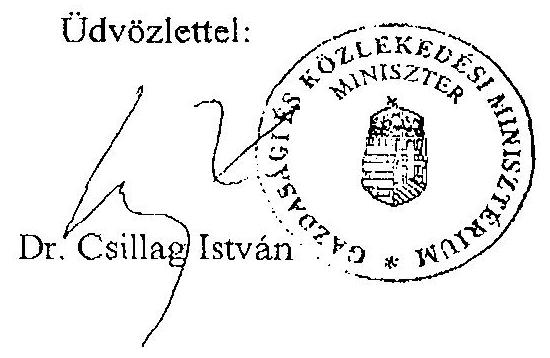

---

# Kivonat 

az országos közúthálózat fejlesztésének, fenntartásának és üzemeltetésének hosszú és középtávú feladatairól, valamint finanszírozásának egyes kérdéseiről szóló 2044/2003. (III. 14.) Korm. határozatból

1. A gyorsforgalmi úthálózat 2003-2006 közötti középtávú fejlesztési feladatait is magában foglaló, 2015-ig terjedő hosszú távú fejlesztési programja az alábbi útszakaszok megvalósítását tartalmazza:
1.1. az M0 teljes budapesti gyűrű az M1 autópályától indulva és oda zárva, szektoronként a forgalom igényeinek megfelelő keresztmetszetben;
1.2. az M1 autópálya Budapesttől Hegyeshalomig; M15 autópálya Rajkáig;
1.3. az M2 autópálya Budapesttől Vácig;
1.4. az M2 autópályává fejleszthető autóút Váctól a magyar-szlovák határig;
1.5. az M3 autópálya Budapesttől Nyíregyházáig autópályaként (szakaszolt beruházás);
1.6. az M3 autóút Nyíregyházától a magyar-ukrán határig;
1.7. az M4 autópálya Budapesttől Szolnokig;
1.8. az M4 autóút Szolnoktól a magyar-román határig (Biharkeresztes);
1.9. az M5 autópálya Budapesttől a magyar-jugoszláv határig (Röszke);
1.10. az M6 autópálya Budapesttől Dunaújvárosig;
1.11. az M6 autópályává fejleszthető autóút Dunaújvárostól Pécsig;
1.12. az M7 autópálya Budapesttől a magyar-horvát határig (Letenye) (szakaszolt felújítás és építés);
1.13. az M8 autóút Rábafüzestől Veszprémen át Dunaújvárosig, valamint Dunavecsétől Szolnokig;
1.14. az M8 autópálya Dunaújvárostól (M6) Dunavecséig (51 sz. főút);
1.15. az M9 autóút Soprontól az 53 sz. főútig (szakaszolt beruházás a kapcsolódó Szekszárdi Duna-híddal);
1.16. az M15 autópálya Mosonmagyaróvártól a magyar-szlovák határig (Rajka);
1.17. az M25 autóút M3-Eger között;
1.18. az M30 autópálya Emődtől (M3) Miskolcig;
1.19. az M30 autópályává fejleszthető autóút Miskolctól a magyar-szlovák határig (Tornyosnémeti);
1.20. az M35 autópálya Görbeházától (M3) Debrecenig;
1.21. az M43 autópályává fejleszthető autóút Szegedtől (M5) a magyar-román határig (Nagylak);
1.22. az M44 autóút Kecskeméttől (M5) a magyar-román határig (Gyula);
1.23. az M56 autóút Bólytól (M6) a magyar-horvát határig;
1.24. az M70 autóút Letenyétől (M7) a szlovén határig (Tornyiszentmiklós);
1.25. az M86 autóút Levéltől (M1/M15) Hegyfaluig (M9).

A kormányhatározat az összevont felsorolást követően éves bontásban, projektekre szakaszolva mutatja be a fejlesztési program elemeit.

---

Nemzeti Autópálya Rt

3. melléklet a V-27-088/2002-2003. jelentéshez

A finanszírozási források eredetis

|  |   |   |   |   |   |
| --- | --- | --- | --- | --- | --- |
|   |  |  |  | Hivatkozás | Összeg Ft-San  |
|  Sorszám | Hivatrész | Tőkezmelés hive |  |  | Törlesztések  |
|  1. | 1999.08.15 | MFB aszotika | Alapító Ökrös, 1999.08.15 |  | 89 000 000  |
|  2. | 1999.08.17 | KÖVöd aszotika | Alapító Ökrös, 1999.08.13 |  | 1 000 000  |
|  3. | 2000.03.20 | MFB aszotika | Cg. 01-10-044180/00 végzés, 2000.05.29. 2000.06. 25+ hatályjal |  | 4 400 000 000  |
|  4. | 2000.03.04 | Tőkezemelés (ázvól) | Cg. 01-10-044180/00 végzés, 2000.05.29. 2000.06. 25+ hatályjal |  | 400 000 000  |
|  5. | 2000.07.21 | MFB aszotika | Cg. 01-10-044180 végzés, 2000.07. 07. 2000.08. 02+ hatályjal |  | 4 945 500 000  |
|  6. | 2000.07.21 | Tőkezemelés (ázvól) | Cg. 01-10-044180 végzés, 2000.07. 07. 2000.08. 02+ hatályjal |  | 454 500 000  |
|  7. | 2000.08.24 | MFB aszotika | Cg. 01-10-044180 végzés, 2000.07. 07. 2000.08. 02+ hatályjal |  | 4 944 500 000  |
|  8. | 2000.08.04 | Tőkezemelés (ázvól) | Cg. 01-10-044180 végzés, 2000.07. 07. 2000.08. 02+ hatályjal |  | 494 500 000  |
|  9. | 2000.10.27 | 15,2 Mrd Ft-es GTP hive | GTP hive 1. lethvás |  | 7 000 000 000  |
|  10. | 2000.11.17 | 15,2 Mrd Ft-es GTP hive | GTP hive 2. lethvás |  | 4 200 000 000  |
|  11. | 2001.01.15 | 15,2 Mrd Ft-es GTP hive | GTP hive 3. lethvás |  | 800 000 000  |
|  12. | 2001.01.17 | MFB aszotika | Cg. 01-10-044180/42 végzés, 2001.01.16. 2001.02. 08+ hatályjal |  | 10 810 500 000  |
|  13. | 2001.01.17 | Tőkezemelés (ázvól) | Cg. 01-10-044180/42 végzés, 2001.01.16. 2001.02. 08+ hatályjal |  | 1 091 500 000  |
|  14. | 2001.05.24 | MFB aszotika | Cg. 01-10-044180/52 végzés, 2001.05.24. 2001.07. 09+ hatályjal |  | 9 000 000 000  |
|  15. | 2001.05.24 | MFB aszotika | Cg. 01-10-044180/52 végzés, 2001.05.24. 2001.07. 09+ hatályjal |  | 9 000 000 000  |
|  16. | 2001.07.17 | MFB aszotika | Cg. 01-10-044180/52 végzés, 2001.05.24. 2001.07. 09+ hatályjal |  | 4 200 000 000  |
|  17. | 2001.08.14 | MFB aszotika | Cg. 01-10-044180/52 végzés, 2001.05.24. 2001.07. 09+ hatályjal |  | 1 000 000 000  |
|  18. | 2001.08.21 | MFB aszotika | Cg. 01-10-044180/52 végzés, 2001.05.24. 2001.07. 09+ hatályjal |  | 4 770 000 000  |
|  19. | 2001.08.21 | Tőkezemelés (ázvól) | Cg. 01-10-044180/52 végzés, 2001.05.24. 2001.07. 09+ hatályjal |  | 4 230 000 000  |
|  20. | 2001.09.19 | Tőkezemelés (ázvól) | Cg. 01-10-044180/52 végzés, 2001.05.24. 2001.07. 09+ hatályjal |  | 2 000 000 000  |
|  21. | 2001.09.26 | MFB hive | Áthidató hive szerződés |  | 5 000 000 000  |
|  22. | 2001.10.04 | MFB hive | Áthidató hive szerződés |  | 10 120 127 000  |
|  23. | 2001.11.14 | MFB hive | Áthidató hive szerződés |  | 5 871 993 000  |
|  24. | 2001.12.03 | MFB hive | Áthidató hive szerződés |  | 11 011 000 000  |
|  25. | 2001.12.21 | 180 Mrd Ft-es Szindivári hive | Szindivári hive 1. Lethvás |  | 40 000 000 000  |
|  26. | 2001.12.21 |  | MFB Áthidató hive tőkezmése |  | 10 000 000 000  |
|  27. | 2001.12.21 |  | GTP Áthidató hive tőkezmése |  | 12 000 000 000  |
|  28. | 2002.01.03 | Tőkezemelés (ázvól) | MFB aszotik hódimzat alapján |  | 1 000 000  |
|  29. | 2002.01.10 | 180 Mrd Ft-es Szindivári hive | Szindivári hive 2. Lethvás |  | 75 000 000 000  |
|  30. | 2002.01.10 |  | MFB Áthidató hive tőkezmése |  | 10 000 000 000  |
|  31. | 2002.01.21 |  | MFB Áthidató hive tőkezmése |  | 10 000 000 000  |
|  32. | 2002.01.24 | 180 Mrd Ft-es Szindivári hive | Szindivári hive 2. Lethvás |  | 5 000 000 000  |
|  33. | 2002.02.18 | 180 Mrd Ft-es Szindivári hive | Szindivári hive 4. Lethvás |  | 5 000 000 000  |
|  34. | 2002.02.18 |  | MFB Áthidató hive tőkezmése |  | 10 000 000 000  |
|  35. | 2002.03.11 | 180 Mrd Ft-es Szindivári hive | Szindivári hive 5. Lethvás |  | 5 000 000 000  |
|  36. | 2002.03.28 | MFB hive | Áthidató hive szerződés |  | 5 000 000 000  |
|  37. | 2002.03.28 | 180 Mrd Ft-es Szindivári hive | Szindivári hive 6. Lethvás |  | 5 000 000 000  |
|  38. | 2002.03.28 |  | MFB Áthidató hive tőkezmése |  | 10 000 000 000  |
|  39. | 2002.04.25 | MFB hive | Áthidató hive szerződés |  | 6 011 000 000  |
|  40. | 2002.04.29 | 180 Mrd Ft-es Szindivári hive | Szindivári hive 7. Lethvás |  | 4 004 000 000  |
|  41. | 2002.05.17 | 180 Mrd Ft-es Szindivári hive | Szindivári hive 8. Lethvás |  | 10 000 000 000  |
|  42. | 2002.05.24 | MFB hive | Áthidató hive szerződés |  | 10 000 000 000  |
|  43. | 2002.05.07 | 180 Mrd Ft-es Szindivári hive | Szindivári hive 9. Lethvás |  | 5 009 000 000  |
|  44. | 2002.05.24 | 180 Mrd Ft-es Szindivári hive | Szindivári hive 10. Lethvás |  | 5 000 000 000  |
|  45. | 2002.05.29 | 180 Mrd Ft-es Szindivári hive | Szindivári hive 11. Lethvás |  | 15 000 000 000  |
|  46. | 2002.06.21 | MFB hive | Áthidató hive szerződés |  | 15 000 000 000  |
|  47. | 2002.06.21 | MFB aszotika |  |  | 1 001 000 000  |
|  48. | 2002.06.21 | MFB hive | Áthidató hive szerződés |  | 12 401 000 000  |
|  49. | 2002.09.20 | MFB hive | Áthidató hive szerződés |  | 3 003 000 000  |
|   |  |  |  |  | 4 004 000 000  |

---

|  A finanszírozási források eredete |  |  |  |  |   |
| --- | --- | --- | --- | --- | --- |
|  Hivatkozás |  |  |  |  |   |
|  Összeg Ft-ban |  |  |  |  |   |
|  Összeg | Ft-ban | Összeg |  |  |   |
|  30. | 3002.09.22 | 180 Mrd Ft-es Szindikált Nhel | Szindikált Nhel 12. Lelítség | 9 000 000 000 |   |
|  31. | 2002.10.15 | MFB alaptfke |  | 14 528 000 000 |   |
|  32. | 2002.10.22 | MFB Nhel | Áthidalő Nhel szerződés | 5 000 000 000 |   |
|  33. | 2002.11.20 | MFB Nhel | Áthidalő Nhel szerződés | 5 500 000 000 |   |
|  34. | 2002.11.22 | 180 Mrd Ft-es Szindikált Nhel | Szindikált Nhel 10. Lelítség | 15 000 000 000 |   |
|  35. | 2002.12.09 | MFB Nhel | Áthidalő Nhel szerződés | 7 759 818 000 |   |
|  36. | 2002.12.10 | 180 Mrd Ft-es Szindikált Nhel | Szindikált Nhel 14. Lelítség | 6 000 000 000 |   |
|  37. | 2002.12.10 | 180 Mrd Ft-es Szindikált Nhel | Szindikált Nhel 15. Lelítség | 10 000 000 000 |   |
|  38. | 2002.12.16 | MFB Nhel | Áthidalő Nhel szerződés | 13 450 000 000 |   |
|  39. | 2002.12.16 | MFB Nhel | Áthidalő Nhel szerződés | 6 977 500 000 |   |
|  40. | 2002.12.20 | MFB Nhel | Áthidalő Nhel szerződés | 21 101 258 747 |   |
|  41. | 2002.12.20 |  | MFB Áthidalő Nhel töreszése |  | 45 023 821  |
|  42. | 2002.12.31 |  | Magyar Állam által átváltat MFB Áthidalő Nhel |  | 160 000 000 000  |
|  43. | 2002.12.31 |  | Magyar Állam által átváltat MFB Áthidalő Nhel |  | 6 834 376 109  |
|  44. | 2002.12.31 |  | Magyar Állam által átváltat MFB Áthidalő Nhel |  | 5 501 298 747  |
|   |  |  |  | Összes tbt. | 240 982 298 747  |
|   |  |  |  | Ellenőrzés alaptfke: | 150 801 900 000  |
|   |  |  |  |  | 72 320 000 000  |
|   |  |  |  |  | 8 681 000 000  |
|   |  |  |  |  | 69 900 000 000  |
|   |  |  |  | Összesen/átvitat: | 2003-2006/  |
|   |  |  |  |  | 2003-2006/  |
|   |  |  |  | Összesen/átvitat: | 2003-2006/  |
|   |  |  |  |  | 2003-2006/  |

Tenosítom, hogy az adatok a Nemzeti Autópálya Rt. számviteli nyilvántartásában szereplő adatokkal megegyesnek!

Kelt: Budapest, 2003. március 14.

P.H.

Dr. Bizden I lona

Tímár Gyöngy

Főkönyvelő

---

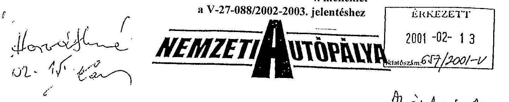

Állami Autópálya Kezelő Rt.
Répássy Attila vezérigazgató úr

## Helvben

Ezennel megerősítem korábban szóban többször is elhangzottakat miszerint az M7 autópálya felújitásával kapcsolatos kísérleti költségek az Állami Autópálya Rt-t terhelik.

A továbbiakban tájékoztatom, hogy az M7 autópálya betonburkolatának felújítására vonatkozó korábbi döntéseink megalapozása végett, szükségesnek tartjuk újabb technológiák felülvizsgálatát. A felülvizsgálat hatékonysága a helyszínen végzett kísérletek kiértékelésével növelhető. A TLI Kft által javasolt technológia kipróbálását az Önökkel egyeztetett helyen, az M7 autópálya szelvény szerinti jobb oldalán, a $65+000-66+000 \mathrm{~km}$ sz-ek között tervezzük. Az átdolgozott terveket már rövid úton eljuttattuk a munka tervezett kivitelezőjének, a Hoffmann Rt-nek. Ezennel felkérem T. Vezérigazgató Urat, hogy a fenti kísérleti szakaszra vonatkozó megrendelő levelet a Hoffmann Rt-nek megküldeni szíveskedjen.

A fenti tevékenység lebonyolító mérnöki feladatait - előzetes elképzeléseink szerint - az NA Rt. Székesfehérvári Lebonyolítói Mérnöki Irodája végzi, míg egyéb műszaki kérdésekben a szükséges egyeztetéseket az NA Rt. Programigazgatósága az Önök bevonásával folytatja le.

Budapest, 2001. február 12.
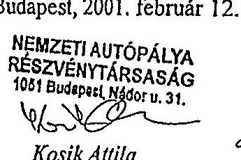

Kosik Attila
vezérigazgató
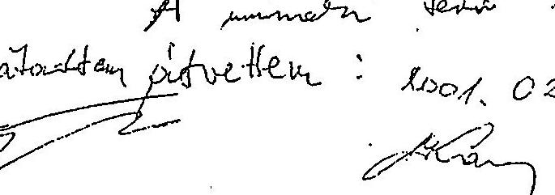

Hemiesi Autópálya Rt.
1036 Budapest, Lajos u. 80. Livelisté cim: 1300 Budapest, Pr. 299
Tel.: (36-1) 4368-100 Fax: (36-1) 4368-110

---

# Megállapodás 

Kelt: Budapest, 2001. 10. 19.
Tárgy: M7 autópálya 17-110 km között jobbpálya felújitás, illetve épités
Alulírott szerződő felek az M7 autópálya jobb pálya felújítási munkák elszámolásával kapcsolatban az alábbi megállapodást kötik.

A Nemzeti Autópálya Rt. és a Magyar Autópályaépítő Konzorcium között létrejött tárgybani szerződés részét képezi a $64+925-65+775 \mathrm{~km}$ sz. közötti 850 m hosszúságú szakasz, ahol az ÁAK Rt. Megbízása alapján a Hoffmann Rt. három különbözö pályaszerkezet kísérleti szakaszt épített.

Az egységes burkolat felület és garancia-vállalás érdekében felek az alábbi elszámolási rendben állapodnak meg:

- a próbaszakasz forgalom alatti viselkedésének hosszú távú figyelemmel kísérése érdekében nem kerül sor a tervekben szereplő állapot helyreállitására
- konzorcium a tervekben szereplőkhöz képest megemelt- átlagosan 4-4,5 cm vastagságú mZMA-12 kopóréteget terít a kérdéses szelvények között, ez alatt bent marad a kisérleti szakasz pályaszerkezete
- a beépített kopóréteg ellenértéke a szakasz forgalombahelyezéséhez szükséges további tételekkel a teljesítés elvégzését követő számlába állítható
- a szakaszra eső - tervekben szereplő további - építési költség elszámolására- amely a szakaszvégszámlában történhet -, valamint közetfizikai megfelelőség esetén a Megbízó korábbi igénybejelentésétől eltekintve változatlan áron történő dolomit zúzalék alkalmazására, az alábbi vállalása esetén jogosult a Vállalkozó:

Vállalkozó tudomásul veszi, hogy a munkaterület 3 hónapos késéssel kapta meg a 90 110 kmsz. kőzötti szakaszon, ennek ellenére az eredeti szerződéses határidőre elkészíti az épitmény kivitelezést. Ezen felül nem számolhatja el a kesedelmes munkaterület átadásából származó többletköltséget kivéve az igénybejelentés 4. számú pontját. Felek a 2001. 08. 22.-ei vállalkozói igénybejelentés határidőre vonatkozó részét lezártnak tekintik.

Nemzeti Autópálya Rt

---

NA RL

|  |   |   |   |   |   |   |   |   |   |   |   |   |   |   |   |   |   |   |   |   |   |   |   |   |   |   |   |   |   |   |   |   |   |   |   |   |   |   |   |   |   |   |   |   |   |   |   |   |   |   |   |   |   |   |   |   |   |   |   |   |   |   |   |   |   |   |   |   |   |   |   |   |   |   |   |   |   |   |   |   |   |   |   |   |   |   |   |   |   |   |   |   |   |   |   |   |   |   |   |   |   |

---

# KINCSTÁRI VAGYON

AUTÓPÁLYÁK 2003.01.31

|  Autópályák | Bruttó | Nattó  |
| --- | --- | --- |
|  M3 Autópálya | 140 331 025 818 | 139 986 053 978  |
|  M7 Autópálya | 72 421 796 802 | 72 272 110 817  |
|  KVI-tól átvett kincstári autópályák | 212 752 822 620 | 212 258 164 793  |
|  M3 Autópálya | 667 955 227 | 667 955 227  |
|  Korábbi évekből származó kincstári vagyon | 667 955 227 | 667 955 227  |
|  M1 Autópálya | 1 240 783 416 | 1 216 091 827  |
|  M0 Autóút | 477 681 778 | 467 513 071  |
|  KVI-nék még át nem adott autópályák | 1 718 465 194 | 1 683 604 858  |
|  **MINERGÁLYKÁK** | **2003.01.31** | **2003.01.31**  |

Budapest,2003.03.12. Tóth Zoltánné

2003.01.31

2003.01.31 7. melléklet a V-27-088/2002-2003. jelentéshez

---

## **8. sz melléklet a V-27-088/2002-2003. Jelentéshez**

|  Rekonstrukciós átazás | Szerződés | Szerződés
kötés
összege | Tényleges
kifizetés | Pótmunka | Tényleges
kifizetés
pótmunkával | Tartadék keret összege | Ár forma | Szerződéses Feltételek | Késedelmi kötőstól
előlése | Előleg összege | Előleg visszafizetési bank
garancia vagy visszafizetési
kötelezettségvállalás | Teljesítési bank garancia | Intéllási bankgarancia | Szerzőesség bankgarancia | ÖVM 12/1998 (XII. 27.) jobbítás
szerzőességi rendeltetések
előlése  |
| --- | --- | --- | --- | --- | --- | --- | --- | --- | --- | --- | --- | --- | --- | --- | --- |
|  I. | B Projektelem: leállósáv és műszaki átjárók építése | 00.00.14 | 199 844 | 199 844 |  | 199 844 | 20 000 | átalányáras | 2000. évi SzF | van |  |  | nincs | 18 hó | 42 hó  |
|   | F Projektelem: meglévő híd alaptest és közmű feltárás (Jobbp.) | 01.01.26 | 135 000 | 135 000 |  | 135 000 | 13 500 | átalányáras | egyedi | van | 13 500 | nincs | nincs | nincs | nincs  |
|   | E Projektelem: Ideiglenes szalagkorlát építés (Jobbp.) | 01.01.26 | 595 458 | 625 686 |  | 625 686 | 59 545 | átalányáras | egyedi | van | 59 500 | nincs | van | 18 hó | 42 hó  |
|   | D Projektelem: vízelvezető rendszer felújítása, növényírtás, csatorna tisztítás (Jobbp.) | 01.01.26 | 303 542 | 790 744 |  | 790 744 | 30 354 | üteles egységáras | egyedi | van | 30 300 | nincs | van | 18 hó | 42 hó  |
|   | A Projektelem: aluljárók felújítása (Jobbp.) | 01.03.19 | 2 340 044 | 2 340 044 |  | 2 687 768 | 120 000 | átalányáras | 2000. évi SzF | van | 23 400 | van | van | 18 hó | 42 hó  |
|   | Pótmunka A |  |  |  | 347 724 |  |  |  |  |  |  |  |  |  |   |
|   | C Projektelem: jobb pálya és felüljárók felújítása, hiányzó jobb pálya és felüljárók kiépítése, balpálya 3. sáv ideiglenes kiépítése (Jobbp.) | 01.03.19 | 28 491 980 | 27 766 453 |  | 29 715 339 | 1 568 000 | átalányáras | 2000. évi SzF | van | 2 849 198 |  | van | 18 hó | 42 hó  |
|   | Pótmunka C |  |  |  | 1 948 886 |  |  |  |  |  |  |  |  |  |   |
|  II. | H Projektelem: "D" Szerződés bal pálya felújítása, jobb pálya zajvad védedelem, bal pálya 3. sáv kiépítése | 02.01.17 | 24 855 416 | 23 930 110 |  | 2 453 264 |  | átalányáras | 2001. évi SzF | van | 2 485 542 | nincs | van | 18 hó | nincs  |
|   | Pótmunka D |  |  |  | 2 453 264 |  |  |  |  |  |  |  |  |  |   |
|   | Csatorna felújítás (hossz- és keresztcsatornák) | 02.03.19 | 1 999 992 | 1 998 447 |  | 1 998 447 |  | üteles egységáras | egyedi | van |  |  | nincs | nincs | nincs  |
|   | Kátyúzás | 02.03.19 | 253 659 | 234 689 |  | 234 689 |  | üteles egységáras | egyedi | van |  |  | nincs | nincs | nincs  |
|   | Szalagkorlát bontás-építés (65-110 kmsz.) | 02.03.20 | 749 049 | 811 093 |  | 811 093 |  | üteles egységáras | egyedi | van |  |  | nincs | nincs | nincs  |
|   | Szalagkorlát bontás-építés (17-65 kmsz.) | 02.03.20 | 777 285 | 788 969 |  | 788 969 |  | üteles egységáras | egyedi | van |  |  | nincs | nincs | nincs  |
|  Összesen |  |  | 60 701 269 | 59 621 079 | 4 749 874 | 64 370 953 | 1 811 399 |  |  |  | 5 461 440 |  |  |  |   |

#### **A Magyar Autópálya-építő Konzorciummal kötött megállapodások szerződéses feltételei**

#### **Rövidítések:** "SzF = "Szerződéses Feltételek"

---

# 9. melléklet   a V-27-088/2002-2003. jelentéshez 

## Kronológia

1997. május Az M7 autópálya felújításának elrendelése 2000. évi befejezési határidővel.
(2119/1997. (V. 26.) Korm. határozat)
1999. május A felújítás határidejének módosítása 2001. évi befejezésre (2117/1999. (V. 26.) Korm. határozat )

2000. február A felújítás kiegészítése a Balatonaliga-Zamárdi új jobb pálya és a szükséges kapaszkodó sávok kiépítésére.
(2037/2000. (II. 29.) Korm. határozat )
2000. június Az NA Rt. Igazgatóságának határozata az Út- hídépítési szerződéses feltételekről
(Ig. 8/2000.(V. 29.) sz. Határozat)
2000. szeptember A Magyar Autópálya-építő Konzorciummal a felújítási program első rész-szerződésének megkötése (Projekt elem „B")

2001. január A jobboldali pálya D, E, F Projekt elemeire szóló, rész-szerződések megkötése.

2001.február A jobboldali pálya felújítási és építési költségeinek ellenőrző költségbecslése (Ép-Total Kft., ÁMI Kft., NA Rt.)

2001. március A jobboldali pálya felújítási és építési szerződésének megkötése a 9/2001.(III.06.) sz. Ig. Határozat alapján
(A, C Projekt elemek)
2001. október Az M7 autópálya felújítás és kiépítés szerződés szerinti 2002. évi befejezési határidejének tudomásulvétele a folyó szerződések szerint. (2303/2001. (X. 19.) Korm. határozat)

2002. január A baloldali autópálya H Projekt elemére szóló felújítási szerződéskötésének elrendelése
(Ig. 49/2001 (XII.18.) sz Határozat
2002. február A baloldali autópálya H Projekt elemére szóló felújítási szerződéskötés végleges árának elfogadása
(Ig. 4/2002. (II. 14.) sz. Határozat)
2002. március A baloldali autópálya felújítás 4 db kiegészítő szerződéseinek megkötése
(Ig. 5/2002 (II.14.) sz. Határozat és Kgy. 17/2002. (III. 27). határozat)

2002. november A felújítás és építés befejezése

---

# Emlékeztető 

Készült: 2003. 05. 20-án, az NA Rt hivatalos helyiségben (Bp., Lajos u. 80. II. emelet 219. szoba) 16.00 órától tartott megbeszélésen elhangzottakról

Jelen vannak:Tárczy László
Vörös Zoltán
Tóth Ferenc
Hargitai József
Somorai Béla
Karsainé Dömsödi Éva
Bank Lajos
Fekete Gábor

ÁMI Kft, az M7 autópálya felújitás ćs építés fömérnöke,
aszfalttechnológus, az ÁMI Kft volt alkalmazottja,
monitoring igazgató, NA Rt
vezérigazgató-helyettes, NA Rt
üzemeltetési osztályvezető, NA Rt
igazgatóhelyettes, Állami Számvevőszék
tanácsos, tanácsadó Állami Számvevőszék
tanácsos, Állami Számvevőszék

Tárgy: M7 autópálya beruházás pénzügyi folyamatainak ellenőrzése
A kölcsönös üdvözlések és bemutatkozás után Tárczy úr arról tájékoztatta a jelenlévőket, hogy elkészítette és Kovács Magdolnának, az ÁMI Kft jelenlegi vezérigazgatójának átadta azt az anyagot, amelyet az NA Rt-től a pótmunkákkal kapcsolatban Bank Lajos 2003. 05. 07-én megtartott megbeszélésen Tóth Ferenc úr NA Rt. közvetítésével az ÁMI Kft-től kért (lásd 2003. 05. 07-én felvett emlékeztető). A hidak vonatkozásában Tárczy úr 3 nap haladékot kért. Bank Lajos megköszönte Tárczy úr eddigi munkáját, bejelentette, hogy a hidakkal kapcsolatos adatszolgáltatást nem kéri. Karsainé Dömsödi Éva elfogadta és helyesnek ítélte, hogy az elkészített anyag az ÁMI Kft vezérigazgatóján keresztül, hivatalos úton, iktatószámmal ellátva kerüljön az Állami Számvevőszékhez, de az a kérése, hogy a postai kézbesítés idejét lerövidítve közvetlenül, személyesen adják át. Tóth Ferenc úr elvállalta, hogy Kovács Magdolnát felhívja telefonon, és közremüködik abban, hogy a kért anyag az ÁSZ részére minél hamarabb átadásra kerüljön.
Tóth Ferenc úr ezek után felállt és a helyiséget elhagyva telefonon egyeztetett az ÁMI Kft. vezetőjével. A kért anyagot 2003-05-21-én délelőtt egyébként az ÁSZ részére az NA Rt.-ben átadták.

## Pálvaszélesség és rétegvastagság

Tárczy úr és Vörös Zoltán úr arról tájékoztatták a jelen lévőket, hogy a szúrópróbaszerű ellenőrző szintezések, geodéziai mérések dokumentumai az UVATERV-nél találhatók és Körmendi Benő úr az a személy, aki erről részletes tájékoztatást tud adni. A jelen lévők megállapodtak abban, hogy másnap, 2003. május 21 -én 13.00 -kor, az UVATERV-nél találkoznak (Bank Lajos úr, ÁSZ szakértő Vörös Zoltán úr, az ÁMI Kft. képviseletében).

Vörös Zoltán úr kijelentette, hogy a rétegvastagságra vonatkozóan az előbbiekben hivatkozott, az ÁSZ ellenőrének, Bank Lajos úrnak készített anyag részletes kifejtést tartalmaz.

Tárczy úr: Ha bármilyen rendellenességet tapasztalt a Mémök, vagy más (pld. külső laborok, Megbízó), azt a következő minőségi kooperációs értekezleten a szerződés szerint rendezték.

Bank úr: Rétegenként volt-e szintezés?

---

Tárczy úr és Vörös úr: Nem volt, mert a szintezésnek a felső pályaszintnek a megállapítása volt a célja, a rétegvastagságot a helyszínen, vastagság mérésekkel, rendszeresen ellenőrizték a szakasz müszaki ellenőrei.

Bank úr: Hogyan határozták meg a kiegyenlítő réteg tömegét?
Tárczy úr: A szerződés átalányáras volt, és ez a technológiai változtatás a tervhez képest nem eredményezhetett lényeges tömeg eltérést. Vállalkozói technológiai felelősség körébe sorolta ezt a megoldást a Megbízó is, a Mérnök is.
Mivel az első szakaszon az első kilométer megépítése után (kötöréteg szintig) hullámos lett a pálya, a tervben elképzelt, a széleken túlzóan eltérő vastagsági szélső értékeket módosítani kellett a Tervező és a Megbízó bevonásával.
A végső megoldást egy helyszíni bizottsági szemlét követően alakították ki a végrehajtók. Ez azt jelentette, hogy helyenként a jobb pálya betonján is marásokat kellett elvégezni. Ezért a munkáért pótmunka kifizetésre nem került sor.
A pályaszintet ez a megoldás nem változtatta meg, a terv méretezési alapelvei az aszfalt vastagság minimális értékére vonatkozóan nem sérültek.

Bank úr: Kérte mutassák be azt a naplóbejegyzést, vagy más dokumentumot, amelyben ezt a változtatást eldöntötték, jóváhagyták. Megj: 2003-05-21-én délelőtt a Mérnök bejelentette, hogy a naplóbejegyzést megtalálták és a délután 13-kor kezdődő helyszini megbeszélésen átadják az UVATERV-nél.
Vita alakult ki a jelenlévők között arról, hogy az alakzatváltoztatás szakmailag kimeríti-e a technológiai változtatás, vagy módosítás fogalmát, illetve milyen kifejezés alkalmas a bekövetkezett - az átalányáras szerzödés alapját képező tervben rögzítettektől eltérő módosítás meghatározására. Ennek jelentősége van, miután az autópálya további rekonstrukciója során végig ezt a módszert alkalmazták. Megegyezés nem született, Bank úr javaslatára ezt átmenetileg ,,alakváltoztatásnak" nevezték, amely az alsó két pályaszerkezeti réteg geometriai alak módosítását jelenti, ,,ék" alakú rétegek helyett „, trapéz" alakra.

Bank úr: Készült-e számítás a változtatás költségkihatásairól, tekintettel a jelentős volumenre, ez lényeges változást jelenthetett a költségekben?
Somorai úr elment Tóth úrért.
Tárczy úr: A FIDIC szerint átalányárat akkor javasolt alkalmazni, ha a tervek jól kidolgozottak, ha kicsi a kockázata annak, hogy a megvalósítás során sokszor és alapvetően meg kell változtatni a tervet. Itt szerencsésebb lett volna fix egységáron alapuló tételes felmérésű formát választani.

Hargitai úr: A bank viszont az átalányárat szereti, mert így a ráfordításokat előre kalkulálhatók.
Tóth úr és Somorai úr visszajöttek.
Bank úr: Az „alakváltozásról" tchát egy szakmai grémium döntött, volt-e valamilyen költségszámítás tekintettel a jelentős volumenre?

Tóth úr: Ennek utána kell néznem.
Bank úr: Ellenörizték-e a valós anyagmennyiségeket?

---

Vörös úr: A Tcrvező tudná megmondani a valós mennyiségeket, mivel átalányáras szerződést kötöttek, még felmérési naplót sem kellett volna vezetni.

Tóth úr: A felmérési naplót azért vezettük és az előrehaladást azért kísértük figyelemmel, hogy arányos legyen a kifizetés, a cél az volt, hogy „ne szaladjunk el" az időközi kifizetésekkel.

Tárczy úr: A felmérési napló vezetésének másik célja az volt, hogy ha az építés közben a kifizetett számlákhoz tartozóan nincs meg a beépített mennyiségeket igazoló felmérési napló, nem lehetett volna a \%-os előrehaladást ellenőrizni.

Vörös és Tárczy úr: Az eredeti tervben szereplő méretszámítást fogadták el a felmérési naplóban - miután ezt a kismértékủ változást Vállalkozói minőségi és technológiai felelősségi körbe tartozónak ítélte meg a Megbízó és a Mérnök egyaránt.

# Geodézia 

Bank úr: A következő fontos kérdés a geodézia. Ha módosult az „alak", akkor módosult-e a pályaszint? Szintezett-e a Mérnök, a Kivitelező és milyen ellenőrzéseket végeztek?

Tárczy úr: A Mérnök a kopórétegen szintezett, $10 \%$-ban, szúrópróbaszerűen szakaszonként.
Vörös úr: Nagyságrendi eltérés nem volt.
Bank úr: Felhasználhatók-e a mérések a rétegvastagság ellenőrzése szempontjából?
Vörös úr: A pálya magasságilag is egy meghatározott helyen van, a megvalósulási terv a felső réteg Balti magasságát mutatja.

## Jótállás

Bank úr: 700 hiba van, ezeket hogyan rendezték, hogyan állnak ezek az ügyek, mérnöki állásfoglalások?

Tárczy úr: Átadtam a Bank úr által kért összeállítást, amiben a 700 hibát 4 típusra bontottuk. Pénteken be fogjuk járni a jobb pályát a 17-90 között és megnézzük, hogy hogyan rendezhetőek (határidő, javítás módja, ellenőrzés stb.) a jobb pályára vonatkozó bejelentések (pld. 4 vízfeltörési helyen) kiegészítő vizsgálatokat elrendelni, a pontos okot és javítási módot meghatározni.

Bank úr: 50 db -ot a kb. 700-ból részletes ellenőrzésre kiválasztottam, ebből mintegy 40-et nem fogadott el a kivitelező.

Tárczy úr: A szélességgel kapcsolatban a Kivitelező nem a szabványra, hanem a tervre szerződött. Átadott Bank úr részére egy mintakercsztsszelvényt, amelyen látható, hogy 30-35 cm -es, a tervezettől eltérő szélesség, már a tervbe be van „kódolva", mert ha a terv szerinti szélesítést elvégezték - azt ellenőriztük - akkor a következő aszfaltrétegek már automatikusan csak erre a pályaszélességekre kerülhetnek, ami a meglévő volt. Földre aszfaltot teríteni nem szabad. Azt is figyelembe kell venni, hogy a régi leállósáv szélesség 2,5-2,7 m volt. Ez játszik döntő szerepet abban, hogy a pálya az ÁAK Rt. által jelzett szakaszokon keskenyebb, mint a szabvány (útügyi műszaki előírás).

---

Hargitai úr: A bal pálya jótállása még nem jár le.
Tárczy úr: A Mérnöknek az lesz a javaslata, hogy ott, ahol 2,5 alá csökken a leálló sáv szélessége, stabilizálni kell a padkát.
Tárczy úr a szélességi témában átadott az ÁSZ részére agy dokumentumot, amely a Közlekedési Felügyelet állásfoglalását tartalmazza.

Tárczy úr: Az általam készített dokumentumban leírtam, hogy melyek azok a kritikus pontok, amelyek további kérdéseket vetnek fel, mivel a felújított pálya az autópályákra vonatkozó, jelenleg érvényben lévő előírásoknak a $130 \mathrm{~km} / \mathrm{o}$ tervezési sebesség figyelembe vételével több paraméterében nem felel meg:

- nem 15 évre, hanem 10 évre tervezték,
- rézsúhajlások nem felelnek meg hosszú szakaszokon az útügyi műszaki utasításnak,
- ivekbenmines nteg a megfelelő előrelátás,
- oldalesés kevesebb az ívekben, mint az előírt,
de ezek is, mint a pályaszélesség, kényszerủ következményei annak, hogy egy meglévő pályát kellett felújítani.

Bank úr: Miért nincsenek a 3 méternél kisebb szélességi adatok a megvalósulási terveken átvezetve?

Tárczy úr: Ez hiba, amit ki kell javítani a megvalósulási terveken a Kivitelezőnek. Készülni fog egy törzskönyv, amely során minden változtatást át kell majd vezetni.

# Aszfaltkeverés 

Bank úr: Hol voltak az aszfaltkeverő telepek, megvannak-e a szükséges minősítések, volt-e olyan eset, hogy nem saját telepről származott az aszfalt, ha volt ilyen eset, akkor megtalálhatók-e ezek minősítései is?

Vörös úr: A Betonút a saját, martonvásári telepéről szállított, a Vegyépszer viszont részben vette az anyagot, mivel a saját telepével induláskor műszaki probléma volt, melynek elhárítása hosszabb időt vett igénybe. A technológiai utasítás és a minőségi dokumentumok minden esetben megvoltak. Azt, hogy az adott telepről mennyit szállítottak, a Vállalkozó tudná megmondani. Ez az „aszfalt naplóból" kiderül.

Tárczy úr: A KTI jelentéséhez az „aszfalt napló" adatait felhasználta, az volt az alapja.
Bank úr: A recepturák megvannak-e?
Vörös úr: Ez a „keverékterv", amely az UVATERV tervtárában megtalálható. Az alapanyag származási helyc is megvan.

Bank úr: Készült-e összesítő statisztikai kimutatás a kivitelező által vett mintavételekről?
Vörös úr: Minősitési dokumentáció van az UVATERV-nél (Dombóvári út 17-19), amelyben találhatók összesítő táblázatok szakaszonként és rétegenként.

## A „kísérleti szakasz kérdése"

Fekete úr: Az eddig rendelkezésre álló adatok szerint a jobb pályán a 64+925-65+775-ben ( 850 m ) a „marásos technológia" kapcsán ćpült egy kísérleti szakasz, amelyet nem az

---

Autópálya Konzorcium, hanem a Hoffmann Rt. épített és nem az NA Rt, hanem az ÁAK Rt fizetett ki. A számlamellékletekből nem derül ki, (mivel nem különítették el, hanem egy hosszabb szakasz részeként számolták el) hogy ezt a szakaszt a számlázáskor kivették-e az elszámolásból? Leegyszerüsítve az a kérdés, hogy nem számolták-e el kétszer ennek a szakasznak a megépítését?

Tárczy úr: Jótállási problémák merültek itt fel. A Konzorcium igy nem vállalta volna a garanciát erre a szakaszra, ezért ezt a szakaszt is leterítették kopóréteggel. Emlékei szerint készült kompenzációs anyag, mert vita volt a jótállásról, de pontos részletekre fejből nem emlékszik. A dokumentumokat újra át kellene nézni, azok alapján visszatérni a kérdésre.

Fekete úr: Ez azt jelenti, hogy ezen a szakaszon „két kopóréteg van", és ha megyek a jobb pályán észre sem veszem, hogy hol volt a kísérleti szakasz?

Tárczy úr: Igen ez azt jelenti. Erről bővebbet Fáy Miklós úr tudna mondani.
Somorai úr: Ő most vidéken van.
Tárczy úr: Csordás Péter úr (ÁMI Kft) tudna a mennyiségekre vonatkozóan nyilatkozni, miután a felmérések felelőse (monitoring) a munkahelyen ő volt.
Ellenőrizni kell az adott szakaszon az egyes rétegek menet közbeni elszámolását, hogy pontosan választ lehessen adni a kérdésre.

Mindezek után a résztvevök megállapodtak abban, hogy a további dokumentumok megtekintése az UVATERV tervtárában fellelhető szükséges dokumentumok ellenörzése 2003-05-21-én 13 órakor folytatódik. Az ÁMI Kft jelenlévő mérnökei további információkkal és a dokumentumok megkeresésével, bemutatásával továbbra is segltik az ÁSZ ellenőrzést, továbbá felveszik a kapcsolatot a megbeszélésen felmerült kérdésekben illetékes munkatársakkal a függöben maradt kérdések korrekt és pontos megválaszolása érdekében.
K. m. f.

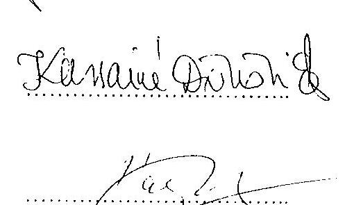
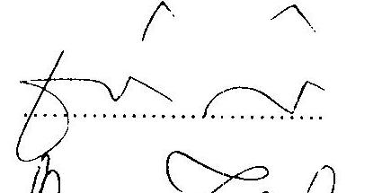
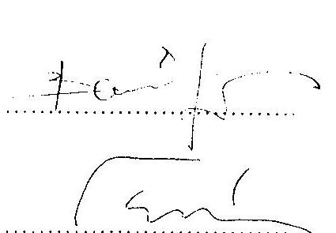

---

# Jegyzökönyv 

Készült: 2003. május 29-én, a Nemzeti Autópálya Rt. hivatalos helyiségében Tárgy: M7 ap. jobb pálya $71+500-81+500 \mathrm{~km}$ sz. közötti szakasza pályaszintjének ellenőrzése
Jelen vannak: Bank Lajos
Tárczy László
Mentes Balázs

Állami Számvevőszék
ÁMI Kft
Nemzeti Autćpálya Rt.

A jelenlévők az összehasonlítást az alábbiak szerint végezték el:
A tervező RODEN Mémöki Iroda Kft által az Állami Számvevőszéknek 2003. május 27-én szolgáltatott, a digitális törzskönyv készitésének alapjául szolgált adatokat a jelenlévők összehasonlították, a Kivitelező által készített és a Mémök jóváhagyásával a Megrendelő számára átadott megvalósulási tervekkel, valamint a minősitési dokumentációval. Az elemzés alapját elsősorban az új pályaszinttől negatív irányban történt eltéréseket mutató keresztszelvények képezték. Csak azokat a keresztszelvényhelyeket vizsgáltuk, ahol ezen negatív eltérés 15 mm -nél nagyobb volt (összesen 24 keresztszelvény).
Megállapítást nyert, hogy ezen keresztszelvények esetében a megvalósulási tervek és a digitális törzskönyv adatai között eltérések fedezhetők fel, amelyek egyes esetekben $20-30 \mathrm{~mm}$-t is elérik.
A Nemzeti Autópálya Rt. és a mérnơki feladatokat ellátó ÁMI Kft képviselöje a mai nap során megállapodott abban, hogy ezen eltérések tisztázása végett, közös helyszíni geodéziai mérések lefolytatása szükséges, amelyet a Kivitelezőnek, a Tervezőnek, a Mérnőknek és a Beruházónak együttesen kell elvégeznie.
A tárgyi szakaszon belül elsősorban azon alszakasz vizsgálata szükséges, ahol az eltérés nem lokálisan, hanem tendenciózusan jelentkezik. Ezen szakaszok:
$73+940-74+290 \mathrm{~km} \mathrm{sz}$.
$78+690-79+100 \mathrm{~km} \mathrm{sz}$.
Ezen vizsgálatot - tekintettel az Állami Számvevőszéki ellenőrzés lezárására, legkésőbb 2003. június első hét végéig el kell végezni, amelyről készült dokumentációt a Nemzeti Autópálya Rt. a vizsgálati anyag véleményezése során pótlólag becsatol.
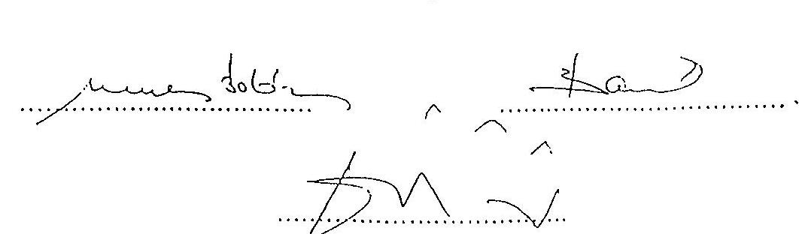

---

# MEGÁLLAPODÁS 

amely létrejött egyrészröl a Fejér Megyei Állami Közútkezelő Kht, Fejér Megyei Közlekedési Felügyelet, valamint a Fejér Megyei Rendörfőkapitányság, másrészröl az Állami Autópálya Kezelő Rt., valamint a Nemzeti Autópálya Rt. között

A Nemzeti Autópálya Rt. a 10 ćves autopálya-fejlesztési program keretében, az M7 autópálya felújítását tervezi Budapest-Balatonaliga-Zamárdi között. A felújítási programhoz kapcsolódó bal pálya 3: sáv építésénck engedélyczése sórán, a Fejér megyei közlekedési szervek szakhatósági nyilatkozatukban, illetve annak megerősítéseként 2001. január 30-án kelt nyilatkozatukban egyhangúlag kérték, hogy az M7 autópálya felújításával cgy idöben kerüljön sor a 8. sz. fóút, valamint a 62. sz. fơủt autópályával alkotott csomópontjainak szabványos kialakítás szerinti teljes átépitésére, kiépítésére.

Az előbbi két csomópont átépitése az Állami Autópálya Kezelő Rt. a 2001. évi feladattervében szerepel és vállalja, hogy a kiépitéshez szükséges elökészitő munkákat (terveztctés, területszerzés, szükség szerint régészet) haladéktalanul megkezdi és minden megtesz annak érdekében, hogy a felújítási program befejezéséig a két csomópontátépítése elkészüljön.

Ezen megállapodás aláírásával a Fejér Megyei Állami Közútkezelő Kht, a Fejér Megyei Közlekedési Felügyelet, valamint a Fejér Megyei Rendör-főkapitányság az építési engedély fellebbezésétől eltekint.

ÁLLAMI AUTÓPÁLYA KEZELŐ RT.
Budapest, 2001. február 8.

NEMZE TI AUTOPÁLYA RÉSZVÉNYTÁRSASÁG 1081 Budapest, Nador u. 31
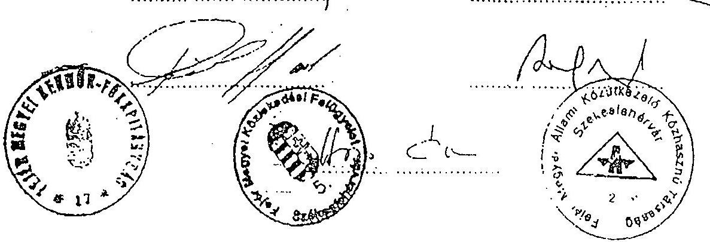

---

# 13. melléklet a V-27-088/2002-2003. jelentéshez 

## Kimutatás az M7 ap. $17+000-112+000 \mathrm{~km}$ sz. között azokról a pályaszakaszokról, ahol a leállósáv szélessége nem éri el a szabványban rögzített három métert

(A szabvány szerint a mérés a vízelvezető asziultszegély leállósáv felől: szélétől a leállósáv és haladásáv közötti optika haladásáv felőli széléig történik.)

| NA Rt felé történő garanciális hibabejelentés nyilvántartási száma | Jobb pálya/ Bal pálya | Km szelvény (tól-ig) |
| :--: | :--: | :--: |
| 7269 | Bal pálya | $29+600-29+800(2,30 \mathrm{~m}$ azonnali beavatkozás) |
| 7270 | Bal pálya | $18+200-18+600(2,35 \mathrm{~m}$ azonnali beavatkozás) |
| 7415 | Jobb pálya | $105+830-106+070$ |
| 7416 | Jobb pálya | $109+450-110+200$ |
| 7492 | Bal pálya | $53+544-53+580$ |
| 7493 | Bal pálya | $53+198-53+240$ |
| 7494 | Bal pálya | $30+800-31+400$ |
| 7495 | Bal pálya | $28+500-29+600$ |
| 7496 | Bal pálya | $25+500-26+650$ |
| 7497 | Bal pálya | $24+000-24+400$ |
| 7498 | Bal pálya | $20+450-22+050$ |
| 7499 | Bal pálya | $18+950-19+100$ |
| 7500 | Bal pálya | $18+700-18+950$ |
| 7501 | Bal pálya | $18+100-18+620$ |
| 7502 | Bal pálya | $17+100-17+300$ |
| 7503 | Jobb pálya | $49+400-50+100$ |
| 7408 | Jobb pálya | $60+310-60+370$ |
| 7409 | Jobb pálya | $64+400-64+450$ |
| 7410 | Jobb pálya | $79+170-79+250$ |
| 7411 | Jobb pálya | $86+900-89+000$ |
| 7412 | Jobb pálya | $91+000-91+750$ |
| 7413 | Jobb pálya | $93+300-93+950$ |
| 7414 | Jobb pálya | $95+200-96+900$ |

Budapest, 2003. május 5.
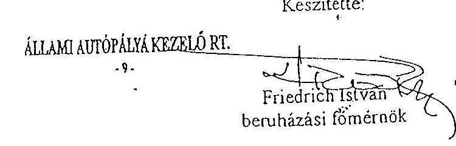

---

Az Állami Számvevőszék jelenlétében végzett helyszíni mérések 2003. május 17 -én és 22 -én

A 2003. 05. 22-én az M7 autópályán végzett szélességi mérések

| Szelvény | Belső   felfestés | 2. és 3.   sáv   tengelye | 1. és 2.   sáv   tengelye | leálló és 1.   sáv   tengelye | leállósáv   széle   (aszfalt-   szegély   külső)   (A) | megvaló-   sulási terv   szerinti   érték   (B) | Eltérés   (A-B) | Roden Kft   mérési   eredménye   (szóbeli   tájékoztatás   alapján |
| :--: | :--: | :--: | :--: | :--: | :--: | :--: | :--: | :--: |
| Me: | m | m | m | m | m | m | $\pm \mathrm{m}$ | m |
| $17+221$ | 0,34 | 4,10 | 7,87 | 11,60 | 14,54 | 14,62 | $-0,08$ | 14,46 |
| $18+296$ | 0,31 | 4,06 | 7,85 | 11,60 | 14,57 | 14,68 | $-0,11$ | 14,02 |
| $18+496$ | 0,30 | 4,05 | 7,81 | 11,55 | 14,16 | 14,64 | $-0,48$ | 14,02 |
| $19+020$ | 0,34 | 4,06 | 7,78 | 11,55 | 14,47 | 14,61 | $-0,14$ | 14,02 |
| $21+814$ | 0,41 | 4,05 | 7,80 | 11,57 | 14,53 | 14,63 | $-0,10$ | 14,37 |
| $21+939$ | 0,35 | 3,96 | 7,71 | 11,48 | 14,53 | 15,86 | $-1,33$ | 14,53 |
| $26+013$ | 0,29 | 4,06 | 7,81 | 11,54 | 14,56 | 14,31 | 0,25 | 14,49 |
| $28+515$ | 0,32 | 4,09 | 7,83 | 11,57 | 14,57 | 14,33 | 0,24 | 14,45 |
| $29+487$ | 0,40 | 4,16 | 7,88 | 11,66 | 14,32 | 14,64 | $-0,32$ | 14,23 |
| $29+500$ | 0,40 | 4,19 | 7,89 | 11,64 | 14,27 | 14,69 | $-0,42$ | 14,18 |

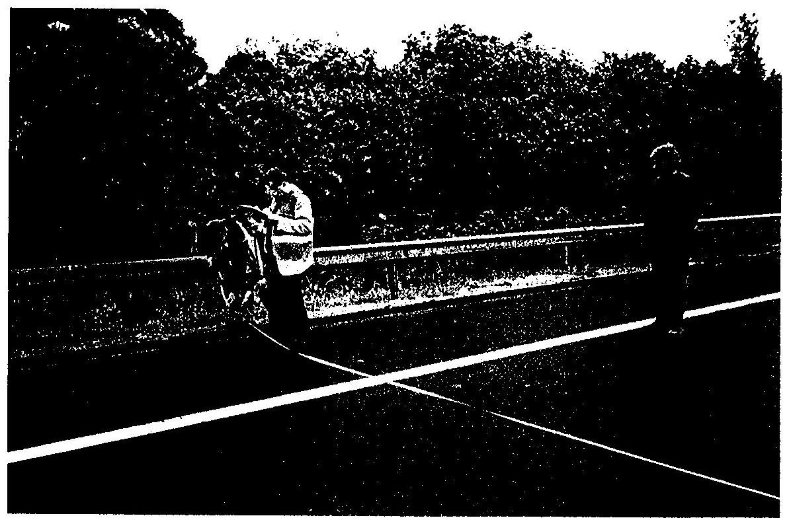

A 10 mérésre a bal pálya azon szakaszán került sor, ahol három forgalmi sáv viszi a forgalmat Budapest felé. A méréskor rövid időre a forgalmat - az illetékes területi rendőri szervek közreműködésével - megállították

---

Az Állami Számvevőszék jelenlétében 8 helyen végzett fürás
(réteg szerkezeti és vastagsági mérések) 2003. 05. 29-én

| Szelvény | Sáv | Kopóréteg mZMA-12 | Kötóréteg JU-35/F | Kiegyenlítő réteg AB-16/F | Megjegyzés |
| :--: | :--: | :--: | :--: | :--: | :--: |
| Mértékegység |  | cm | cm | cm |  |
| $21+000$ | elöző | 2,6 | 10,1 | 5,2 | Kopóréteg vastagsága alatta marad a megengedhetönek, nem megfelelö. Az ellenörzö labor mérése szerint 2,4 a rétegvastagság. Kötőréteg megfelelö. Az ellenörzö labor szerint $9,9 \mathrm{~cm}$ a rétegvastagság. A kiegyenlítő réteg megfelelö. Az ellenörzö labor szerint $4,0 \mathrm{~cm}$ a rétegvastagság. Összes vastagság $12,7 \mathrm{~cm}$, megfelelö. Az ellenörzö labor szerint $12,3 \mathrm{~cm}$ a rétegvastagság. |
| $21+000$ | haladó | 3,2 |  |  | Kopóréteg megfelelö. A kötőréteg, a kiegyenlítő réteg és az összes vastagság nem volt mérhető. Az ellenörzö labor nem végzett mérést. |
| $45+000$ | elöző | 3,2 | 8,8 | 3,2 | Kopóréteg megfelelö. Kötóréteg az ókhatást tekintve nem megfelelö az előző sávban a kiegyenlítő réteg nem megfelelö. Összes vastagság megfelelö. Az ellenörzö labor nem végzett mérést. |
| $49+000$ | haladó | 2,5 | 8,5 | 2,5 | Kopóréteg nem megfelelö. Kötóréteg megfelelö. Kiegyenlítő réteg nem megfelelö. Összes vastagság megfelelö. Az ellenörzö labor nem végzett mérést. |
| $71+500$ | leálló | 3,9 |  |  | Kopóréteg nem megfelelö. Az ellenörzö labor 2,0 cm a rétegvastagság. |
| $96+900$ | leálló | 4 | 9,1 |  | Kopóréteg megfelelö. Alsó és felső kötőréteg nem volt szétválasztható. A két réteg együttes vastagsága nem megfelelö. Teljes vastagság 13,1 cm , nem megfelelö. Az építés közbeni ellenörzö laboratórium ebben a szelvényben a K-20/F rétegre vonatkozóan $4,5 \mathrm{~cm}$-t mért. |
| $103+500$ | haladó | 4,3 | 4,5 | 6,1 | Kopóréteg megfelelö. Felső kötóréteg nem megfelelö. Alsó kötóréteg megfelelö. Teljes vastagság $14,9 \mathrm{~cm}$, megfelelö. Az építés közbeni ellenörzö laboratórium ebben a szelvényben a K20/F rétegre vonatkozóan $4,8 \mathrm{~cm}$-t mért. |
| $107+500$ | elöző | 3,5 | 11,9 |  | Kopóréteg nem megfelelö. Alsó és felső kötőréteg nem volt szétválasztható. A két réteg együttes vastagsága megfelelö. Teljes vastagság $15,4 \mathrm{~cm}$, megfelelö. Az építés közbeni ellenörzö laboratórium ebben a szelvényben a K-20/F rétegre vonatkozóan $5,4 \mathrm{~cm}$-t mért. |

---

14. melléklet
a V-27-088/2002-2003. jelentéshez
15. oldal

Az Állami Számvevőszék jelenlétében 8 helyen végzett fúrások (réteg szerkezeti és vastagsági mérések) 2003. 05. 29-én az M7 autópályán
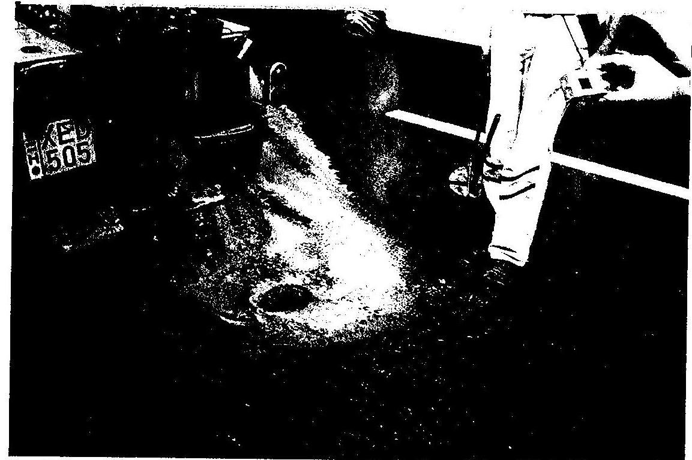

A kép a fúrás utáni, a minta kivételét megelőző állapotot mutatja. A képen látható fehér színű - eredetileg áttetsző - elfolyó hűtőfolyadék a dolomitos (mészkő) kőzet vágása miatt vált fehér színűvé.
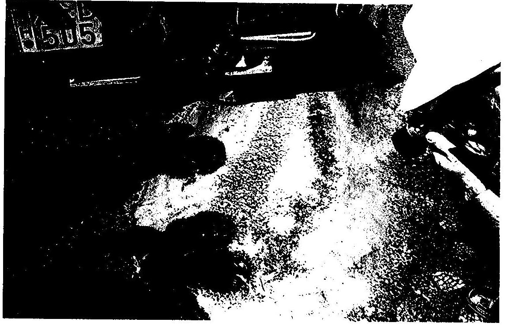

A kép a minta kivételét követő állapotot mutatja, a furatban látszanak a fehér dolomitos (mészkő) szemcsék

---

Hidak és garanciális javítási kötelezettségek

| Szelvényszám | Hiba | Állapot a helyszini szemlén |
| :--: | :--: | :--: |
| $31+651$ | Hid (aluljáró) felújítás során 400 napos késés | A híd burkolata hullámos, foltokban áll rajta a viz esö után |
| $33+855$ | Hid (aluljáró) felújítás során 242 napos késés | Boltíves mütárgy, javitott állapotban, számyfalon repedés |
| $34+180$ | Surrantó hiba 7230 számú bejelentés | A hibát kijavitották. A szélső korlát már átrozsdásodott. Leállósáv ellenőrző mérés: $2,96 \mathrm{~m}$ |
| $39+955$ | Rézsü kimosódás | A hibát nem javitották ki. |
| $44+400$ | Padka és rézsü kimosódás 7235 számú bejelentés | Erodált rézsü, feliszapolódott árok a viztelenitő csatornából már alig tud kifolyni a viz. Leállósáv ellenörzö mérés: $2,96 \mathrm{~m}$. |
| $45+000$ | Repedés 7236 számú bejelentés | A parkoló területen a terítési sávok csatlakozásánál vannak a repedések, nincs kijavitva. |
| $45+326$ | Hid (felüljáró) 130 millió Ft túlkölttés a felújítás során. | A hídon zajvédő falat épitettek. A menekülő ajtó müködött, azonban a magas töltésen nem volt lépcső a meneküléshez. A hídvizsgáló lépcső a híd másik oldalán van, azonban oda a menekülö ajtó hiánya miatt kijutni nem lehetett. A hídlól a település jelentős távolságra van, így a zajvédelem fontossága kétséges |
| $49+200$ | Kátyúsodó felület 7238 számú bejelentés | Kezdödő hiba. A leállósáv ellenörzö mérése: $2,98 \mathrm{~m}$ |

---

Példa az M7 autópálya 45. km-szelvényében található híd és zajvédő fal bemutatására.
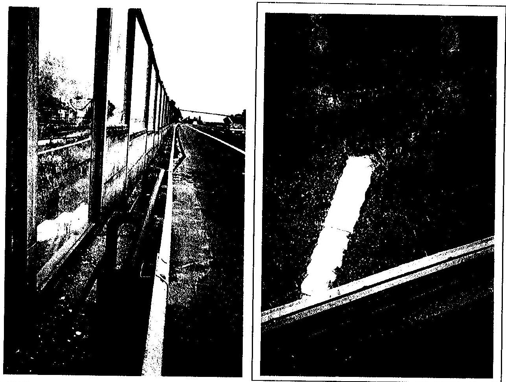

A hídhoz. épített zajvédő falon a lépcsőnél hiányzik a menekülő ajtó, a lejárati lépcső nem közelíthető meg. A képen nem látható, de a menekülő ajtóttévedésből a híd másik oldalára nyitották, ahol viszont nincs lejárati lépcső. A hiba tervezési és kivitelezési problémákra vezethető vissza, nem szerepelt a 2003. július 30 -ig érvényesíthető jótállási hibajegyzékben.

---

14. melléklet

a V-27-088/2002-2003. jelentéshez
6. oldal
A. helyszíni bejárás során észlelt garanciális hibák (2003. 05. 22)
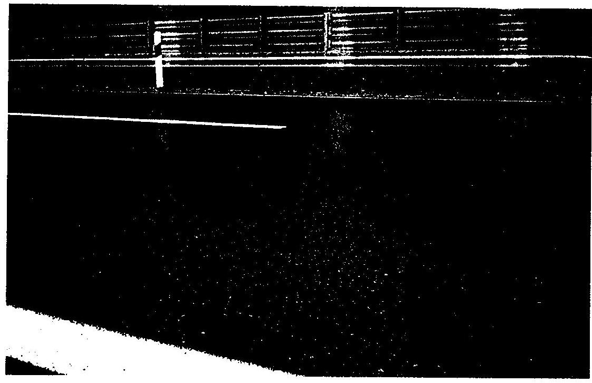

Példa a hosszanti repedésre a jobb pálya 45-59 km szelvény közötti szakaszán
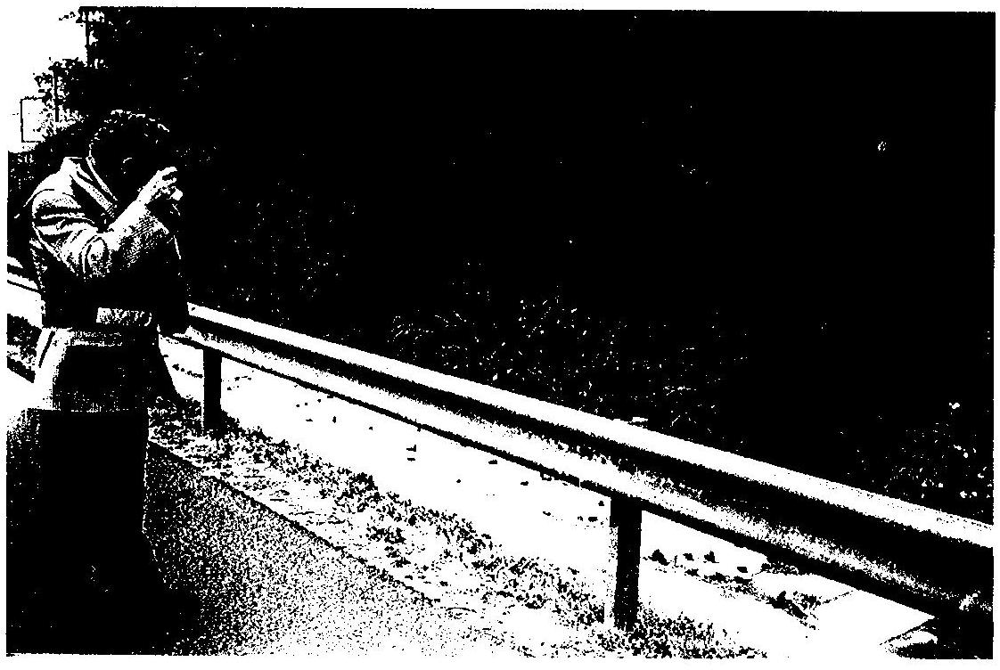

Példa a rozsdásodásra a jobb pálya szalagkorlátján a 35-59 km szelvény közötti szakaszon

---

Bal pálya - a már elkészült és átadott pályaszakaszon - végzett a vízelvezetést segitő beavatkozás ( $17-59 \mathrm{~km}$ szelvényben)
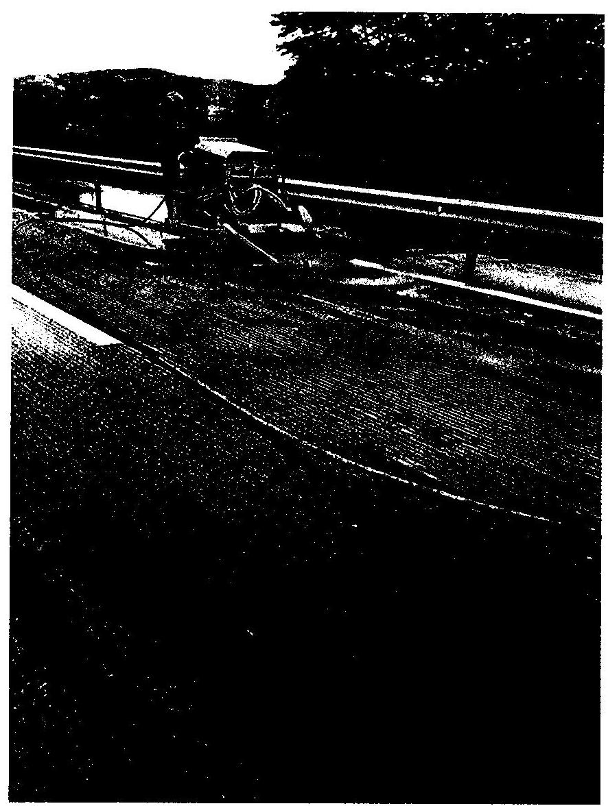

A vízelvezetés elősegitésére a - már elkészült bal pályán - több helyen hosszanti és keresztirányú bemarásokat („barázdákat") készitetett az ÁAK Rt. Két helyen 100 km -es sebesség korlátozó tábla kihelyezésére is sor került, ugyancsak vízelvezetési problémák miatt.

---

# JEGYZŐKÖNYV 

Készült: 2003. 05.20.-án a Központi Közlekedési Felügyeleten elhangzottak alapján

Jelen vannak: Papp Péter úr KKF.
Fáy Miklós úr NA.Rt.
Tárczy László ÁMI Kft.
Tárgy M7 autópálya 17-110kmsz leállósáv szélességek ügye

## 1 Előzmények

Az ÁAK Rt képviselői kifogásolták, hogy több rész szakaszon a leállósáv szélessége az ismert indokolt okok és adottságok miatt/ a régi pálya szélessége a leállósávon 2,5-2,7 volt a tengely bizonytalansága a régi kitüzési pontatlanságok miatt kb 10 cm nagységrendü//nem felel meg a 2003 évben érvényes útügyi előírásnak.
Az ÁAK Rt.képviselőjével egyeztetve a Megbízó képviselője és a Mérnök képviselöje megkeresték a Központi Közlekedési Felügyeletet, hogy az ideiglenes forgalombahelyezési engedéllyel rendelkező pálya e részletkérdésében adjon állásfoglalást.

## 2.A Központi Közlekedés Felügyelet véleménye és javaslata az előadottakkal kapcsolatban

A műszaki okból való leállás viszonylag ritkán fordul elő. A leálló járművek közül a szélesebb kategóriába tartozó tehergépjárművek ezen belül még kevesebb arányban veszik igénybe ezt a sávot. A rendelkezésre álló legkeskenyebb leállósávrész is szélesebb mint a legszélesebb tehergépjármü $/ 2,5 \mathrm{~m} /$. A fentiek miatt a vízelvezető szegély megbontása ezzel a padka és rézsü állékonyság veszélyeztetése nem indokolt.
Beavatkozást a kialakult helyzetre nem tart szükségesnek a KKF.
Azt is figyelembe kell venni a mérlegelésnél, hogy a műszaki meghibásodott gépjárművek a leállósávon viszonylag rövid ideig tartózkodnak és huzamosabb tartózkodás esetén az Üzemeltetőnek kell az esetleges veszélyhelyzet megszütetésére intézkednie.
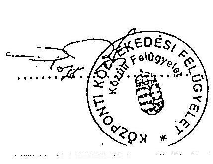
$\mathrm{Kmf}$.
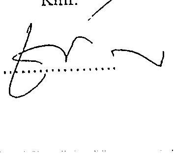
$\begin{array}{lll}\text { 11. } & \text { 11. } & \text { 11. } \\ \text { 11. } & \text { 11. } & \text { 11. }\end{array}$

---

# 16. melléklet

## a V-27-088/2002-2003. jelentéshez

M7-es autópálya jobb pályájának 17-90 km szelvények közül felújítási és 90-110 km szelvények közül szakasz új építési beruházásának ÁSZ ellenőrzése

A KTI Rt. és a TLI Kft. fúrt mintákon végzett rétegvastagság ellenőrzésének vizsgálati eredménye!

|  Mintavétel helye | CS |  |  |  |  |  | HS |  |  |  |  |  | LS |  |  |  |   |
| --- | --- | --- | --- | --- | --- | --- | --- | --- | --- | --- | --- | --- | --- | --- | --- | --- | --- |
|   | mZMA-12 | mK-20P | mJU-35P | AB-16P | VA-12 | mZMA-12 | mK-20P | mJU-35P | AB-16P | VA-12 | mZMA-12 | mK-20P | mJU-35P | AB-16P | VA-12 |  |   |
|   | cm | cm | cm | cm | cm | cm | cm | cm | cm | cm | cm | cm | cm | cm | cm |  |   |
|  20+250 |  |  | 10,3 | 7,1 |  |  |  |  |  |  |  |  |  |  |  |  |   |
|  21+000 |  |  |  |  |  |  |  |  |  |  |  |  |  |  |  |  |   |
|  21+250 |  |  |  |  |  |  |  | 10,1 |  |  |  |  |  |  | 11,2 |  |   |
|  21+750 ** |  |  |  |  |  |  |  |  |  |  |  |  |  |  |  |  |   |
|  23+000 | 2,5 |  | 8,3 |  |  |  |  |  |  |  |  |  |  |  |  |  |   |
|  26+000 |  |  |  |  |  |  |  |  |  |  |  |  |  |  |  |  |   |
|  26+500 |  |  |  |  |  |  |  |  |  |  |  |  | 2,9 |  | 11,2 |  |   |
|  27+000 | 3,4 |  | 8,4 | 5,7 |  |  |  |  |  |  |  |  |  |  |  |  |   |
|  30+000 |  |  |  |  |  |  |  |  |  |  |  |  |  |  |  |  |   |
|  31+000 |  |  |  |  |  |  |  |  |  |  |  |  |  |  |  |  |   |
|  34+000 | 2,8 |  |  |  |  |  | 2,8 |  | 9,7 |  |  |  |  |  |  |  |   |
|  36+500 |  |  |  |  |  |  |  |  |  |  |  |  | 3,5 |  | 11,3 |  |   |
|  40+000 |  |  |  |  |  |  | 3,0 |  | 9,8 |  |  |  |  |  |  |  |   |
|  42+000 |  |  |  |  |  |  | 2,9 |  | 8,4 |  |  |  |  |  |  |  |   |
|  43+000 | 3,0 |  | 9,1 | 4,8 |  |  |  |  |  |  |  |  |  |  |  |  |   |
|  44+500 * |  |  |  |  |  |  |  |  |  |  |  |  |  |  |  |  |   |
|  45+000 * | 1,0 |  |  |  |  |  |  |  |  |  |  |  |  |  |  |  |   |
|  46+750 |  |  |  |  |  |  |  |  | 8,5 |  |  |  |  |  |  |  |   |
|  48+000 |  |  |  |  |  |  |  |  |  |  |  |  |  |  |  | 9,0 |   |
|  48+250 |  |  |  |  |  |  |  |  | 11,1 |  |  |  |  |  |  |  |   |
|  48+500 * |  |  | 11,8 |  |  |  |  |  |  |  |  |  | 2,5 |  |  |  |   |
|  49+000 * | 2,5 |  |  |  |  |  |  |  |  |  |  |  |  |  |  |  |   |
|  50+000 |  |  |  |  |  |  | 3,1 |  |  |  |  |  |  |  |  | 8,1 | 4,9  |
|  50+500 |  |  | 11,3 |  |  |  |  |  |  |  |  |  |  |  |  |  |   |
|  50+750 |  |  |  |  |  |  |  |  | 9,0 |  |  |  |  |  |  |  |   |
|  54+000 |  |  |  |  |  |  | 4,0 |  |  |  |  |  |  |  |  |  |   |
|  55+000 | 3,5 |  |  |  |  |  |  |  |  |  |  |  |  |  |  |  |   |
|  58+500 |  |  |  |  |  |  |  |  |  |  |  |  | 3,2 |  |  |  |   |
|  60+000 |  |  |  |  |  |  | 6,0 |  |  |  |  |  |  |  |  |  |   |
|  61+000 | 6,0 |  |  |  |  |  |  |  |  |  |  |  | 0,0 |  |  |  |   |
|  61+650 |  |  |  |  |  |  |  |  |  |  |  |  | 0,0 |  |  |  |   |
|  62+100 |  |  |  |  |  |  | 0,0 |  |  |  |  |  |  |  |  |  |   |
|  63+000 | 6,0 |  |  |  |  |  |  |  |  |  |  |  |  |  |  |  |   |
|  042262403 |  |  |  |  |  |  |  |  |  |  |  |  |  |  |  |  |   |
|  DA1001289 |  |  |  |  |  |  |  |  |  |  |  |  |  |  |  |  |   |
|  A11012181 |  |  |  |  |  |  |  |  |  |  |  |  |  |  |  |  |   |
|  A11012181 |  |  |  |  |  |  |  |  |  |  |  |  |  |  |  |  |   |
|  A11012181 |  |  |  |  |  |  |  |  |  |  |  |  |  |  |  |  |   |
|  A11012181 |  |  |  |  |  |  |  |  |  |  |  |  |  |  |  |  |   |
|  A11001010 |  |  |  |  |  |  |  |  |  |  |  |  |  |  |  |  |   |
|  Kísérteti szakasz |  |  |  |  |  |  |  |  |  |  |  |  |  |  |  |  |   |
|  6510002008 |  |  |  |  |  |  |  |  |  |  |  |  |  |  |  |  |   |
|  6510002008 |  |  |  |  |  |  |  |  |  |  |  |  |  |  |  |  |   |
|  6510002008 |  |  |  |  |  |  |  |  |  |  |  |  |  |  |  |  |   |
|  6510002008 |  |  |  |  |  |  |  |  |  |  |  |  |  |  |  |  |   |
|  6510002008 |  |  |  |  |  |  |  |  |  |  |  |  |  |  |  |  |   |
|  6510002008 |  |  |  |  |  |  |  |  |  |  |  |  |  |  |  |  |   |
|  6510002008 |  |  |  |  |  |  |  |  |  |  |  |  |  |  |  |  |   |
|  67+500 |  |  |  |  |  |  |  |  |  |  |  |  |  |  |  |  |   |
|  67+500 |  |  |  |  |  |  |  |  |  |  |  |  |  |  |  |  |   |
|  042262403 |  |  |  |  |  |  |  |  |  |  |  |  |  |  |  |  |   |
|  DA1001289 |  |  |  |  |  |  |  |  |  |  |  |  |  |  |  |  |   |
|  A11012181 |  |  |  |  |  |  |  |  |  |  |  |  |  |  |  |  |   |
|  A11012181 |  |  |  |  |  |  |  |  |  |  |  |  |  |  |  |  |   |
|  A11012181 |  |  |  |  |  |  |  |  |  |  |  |  |  |  |  |  |   |
|  A11012181 |  |  |  |  |  |  |  |  |  |  |  |  |  |  |  |  |   |
|  A11012181 |  |  |  |  |  |  |  |  |  |  |  |  |  |  |  |  |   |
|  A11001010 |  |  |  |  |  |  |  |  |  |  |  |  |  |  |  |  |   |
|  Kísérteti szakasz |  |  |  |  |  |  |  |  |  |  |  |  |  |  |  |  |   |
|  6510002008 |  |  |  |  |  |  |  |  |  |  |  |  |  |  |  |  |   |
|  6510002008 |  |  |  |  |  |  |  |  |  |  |  |  |  |  |  |  |   |
|  6510002008 |  |  |  |  |  |  |  |  |  |  |  |  |  |  |  |  |   |
|  6510002008 |  |  |  |  |  |  |  |  |  |  |  |  |  |  |  |  |   |
|  6510002008 |  |  |  |  |  |  |  |  |  |  |  |  |  |  |  |  |   |
|  6510002008 |  |  |  |  |  |  |  |  |  |  |  |  |  |  |  |  |   |
|  6510002008 |  |  |  |  |  |  |  |  |  |  |  |  |  |  |  |  |   |
|  67+500 |  |  |  |  |  |  |  |  |  |  |  |  |  |  |  |  |   |
|  67+500 |  |  |  |  |  |  |  |  |  |  |  |  |  |  |  |  |   |
|  042262403 |  |  |  |  |  |  |  |  |  |  |  |  |  |  |  |  |   |
|  DA1001289 |  |  |  |  |  |  |  |  |  |  |  |  |  |  |  |  |   |
|  A11012181 |  |  |  |  |  |  |  |  |  |  |  |  |  |  |  |  |   |
|  A11012181 |  |  |  |  |  |  |  |  |  |  |  |  |  |  |  |  |   |
|  A11012181 |  |  |  |  |  |  |  |  |  |  |  |  |  |  |  |  |   |
|  A11001010 |  |  |  |  |  |  |  |  |  |  |  |  |  |  |  |  |   |
|  Kísérteti szakasz |  |  |  |  |  |  |  |  |  |  |  |  |  |  |  |  |   |
|  6510002008 |  |  |  |  |  |  |  |  |  |  |  |  |  |  |  |  |   |
|  6510002008 |  |  |  |  |  |  |  |  |  |  |  |  |  |  |  |  |   |
|  6510002008 |  |  |  |  |  |  |  |  |  |  |  |  |  |  |  |  |   |
|  6510002008 |  |  |  |  |  |  |  |  |  |  |  |  |  |  |  |  |   |
|  6510002008 |  |  |  |  |  |  |  |  |  |  |  |  |  |  |  |  |   |
|  6510002008 |  |  |  |  |  |  |  |  |  |  |  |  |  |  |  |  |   |
|  6510002008 |  |  |  |  |  |  |  |  |  |  |  |  |  |  |  |  |   |
|  6510002008 |  |  |  |  |  |  |  |  |  |  |  |  |  |  |  |  |   |
|  6510002008 |  |  |  |  |  |  |  |  |  |  |  |  |  |  |  |  |   |
|  6510002008 |  |  |  |  |  |  |  |  |  |  |  |  |  |  |  |  |   |
|  6510002008 |  |  |  |  |  |  |  |  |  |  |  |  |  |  |  |  |   |
|  6510002008 |  |  |  |  |  |  |  |  |  |  |  |  |  |  |  |  |   |
|  6510002008 |  |  |  |  |  |  |  |  |  |  |  |  |  |  |  |  |   |
|  6510002008 |  |  |  |  |  |  |  |  |  |  |  |  |  |  |  |  |   |
|  6510002008 |  |  |  |  |  |  |  |  |  |  |  |  |  |  |  |  |   |
|  6510002008 |  |  |  |  |  |  |  |  |  |  |  |  |  |  |  |  |   |
|  6510002008 |  |  |  |  |  |  |  |  |  |  |  |  |  |  |  |  |   |
|  6510002008 |  |  |  |  |  |  |  |  |  |  |  |  |  |  |  |  |   |
|  6510002008 |  |  |  |  |  |  |  |  |  |  |  |  |  |  |  |  |   |
|  6510002008 |  |  |  |  |  |  |  |  |  |  |  |  |  |  |  |  |   |
|  6510002008 |  |  |  |  |  |  |  |  |  |  |  |  |  |  |  |  |   |
|  6510002008 |  |  |  |  |  |  |  |  |  |  |  |  |  |  |  |  |   |
|  6510002008 |  |  |  |  |  |  |  |  |  |  |  |  |  |  |  |  |   |
|  6510002008 |  |  |  |  |  |  |  |  |  |  |  |  |  |  |  |  |   |
|  6510002008 |  |  |  |  |  |  |  |  |  |  |  |  |  |  |  |  |   |
|  6510002008 |  |  |  |  |  |  |  |  |  |  |  |  |  |  |  |  |   |
|  6510002008 |  |  |  |  |  |  |  |  |  |  |  |  |  |  |  |  |   |
|  6510002008 |  |  |  |  |  |  |  |  |  |  |  |  |  |  |  |  |   |
|  6510002008 |  |  |  |  |  |  |  |  |  |  |  |  |  |  |  |  |   |
|  6510002008 |  |  |  |  |  |  |  |  |  |  |  |  |  |  |  |  |   |
|  6510002008 |  |  |  |  |  |  |  |  |  |  |  |  |  |  |  |  |   |

---

M7-es autópálya jobb pályájának 17-90 km szelvények közti felújítási és 90-110 km szelvények közti szakasz új építési beruházásának ÁSZ ellenőrzése

|  07+500 |  |  |  |  |  | 7,9 |  |  | 4,6 |  |  |  |   |
| --- | --- | --- | --- | --- | --- | --- | --- | --- | --- | --- | --- | --- | --- |
|  07+750 |  | 7,7 |  |  |  |  |  |  |  |  |  |  |   |
|  08+000 |  |  |  |  |  | 7,9 |  |  |  |  |  |  |   |
|  28+300 |  | 6,2 |  |  |  |  |  |  |  |  |  |  |   |
|  28+600 |  |  |  |  |  | 6,2 |  |  |  |  |  |  |   |
|  28+800 |  | 6,3 |  |  |  |  |  |  |  |  |  |  |   |
|  09+000 | 3,8 | 5,1 |  |  |  |  |  |  |  |  |  |  |   |
|  100+000 |  |  |  |  |  | 3,7 | 6,2 |  |  |  |  |  |   |
|  100+500 |  |  |  |  |  |  | 6,4 |  |  |  | 4,5 |  |   |
|  100+600 |  |  |  |  |  |  |  |  |  |  |  |  |   |
|  101+000 |  | 6,5 |  |  |  |  |  |  |  |  |  |  |   |
|  101+500 |  |  |  |  |  |  | 7,0 |  |  |  |  |  |   |
|  101-100 |  |  |  |  |  |  | 6,2 |  |  |  |  |  |   |
|  102+100 |  | 7,8 |  |  |  |  |  |  |  |  |  |  |   |
|  102-200 |  | 6,7 |  |  |  |  |  |  |  |  |  |  |   |
|  102+500 |  |  |  |  |  |  | 5,3 |  |  |  |  |  |   |
|  103+000 |  | 6,5 |  |  |  |  |  |  |  |  |  |  |   |
|  103+500 |  |  |  |  |  |  | 4,8 |  |  |  |  |  |   |
|  104+000 | 0,0 | 6,3 |  |  |  |  |  |  |  | 0,0 |  |  |   |
|  104+500 |  |  |  |  |  |  |  |  |  |  |  |  |   |
|  105+000 |  | 3,8 |  |  |  |  |  |  |  |  |  |  |   |
|  105+500 |  | 5,6 |  |  |  |  |  |  |  |  |  |  |   |
|  106+000 |  |  |  |  |  |  | 5,3 |  |  |  |  |  |   |
|  106+500 |  | 5,8 |  |  |  |  |  |  |  |  |  |  |   |
|  107+000 |  |  |  |  |  |  | 5,0 | 6,9 |  |  |  |  |   |
|  107+500 |  | 6,4 |  |  |  |  |  |  |  |  |  |  |   |
|  108+000 |  |  |  |  |  |  | 7,3 |  |  |  |  |  |   |
|  108+500 |  | 5,5 |  |  |  |  |  |  |  |  |  |  |   |
|  109+000 | 0,0 |  |  |  |  |  | 5,7 |  |  | 0,0 |  |  |   |
|  109+500 |  | 5,8 |  |  |  |  |  |  |  |  |  |  |   |
|  110+000 |  |  |  |  |  |  | 6,8 |  |  |  |  |  |   |
|  110+500 |  |  |  |  |  |  |  |  |  |  |  |  |   |
|  110+500 |  |  |  |  |  |  |  |  |  |  |  |  |   |
|  110+500 |  |  |  |  |  |  |  |  |  |  |  |  |   |
|  110+500 |  |  |  |  |  |  |  |  |  |  |  |  |   |
|  110+500 |  |  |  |  |  |  |  |  |  |  |  |  |   |
|  110+500 |  |  |  |  |  |  |  |  |  |  |  |  |   |
|  110+500 |  |  |  |  |  |  |  |  |  |  |  |  |   |
|  110+500 |  |  |  |  |  |  |  |  |  |  |  |  |   |
|  110+500 |  |  |  |  |  |  |  |  |  |  |  |  |   |
|  110+500 |  |  |  |  |  |  |  |  |  |  |  |  |   |
|  110+500 |  |  |  |  |  |  |  |  |  |  |  |  |   |
|  110+500 |  |  |  |  |  |  |  |  |  |  |  |  |   |
|  110+500 |  |  |  |  |  |  |  |  |  |  |  |  |   |
|  110+500 |  |  |  |  |  |  |  |  |  |  |  |  |   |
|  110+500 |  |  |  |  |  |  |  |  |  |  |  |  |   |
|  110+500 |  |  |  |  |  |  |  |  |  |  |  |  |   |
|  110+500 |  |  |  |  |  |  |  |  |  |  |  |  |   |
|  110+500 |  |  |  |  |  |  |  |  |  |  |  |  |   |
|  110+500 |  |  |  |  |  |  |  |  |  |  |  |  |   |
|  110+500 |  |  |  |  |  |  |  |  |  |  |  |  |   |
|  110+500 |  |  |  |  |  |  |  |  |  |  |  |  |   |
|  110+500 |  |  |  |  |  |  |  |  |  |  |  |  |   |
|  110+500 |  |  |  |  |  |  |  |  |  |  |  |  |   |
|  110+500 |  |  |  |  |  |  |  |  |  |  |  |  |   |
|  110+500 |  |  |  |  |  |  |  |  |  |  |  |  |   |
|  110+500 |  |  |  |  |  |  |  |  |  |  |  |  |   |
|  110+500 |  |  |  |  |  |  |  |  |  |  |  |  |   |
|  110+500 |  |  |  |  |  |  |  |  |  |  |  |  |   |
|  110+500 |  |  |  |  |  |  |  |  |  |  |  |  |   |
|  110+500 |  |  |  |  |  |  |  |  |  |  |  |  |   |
|  110+500 |  |  |  |  |  |  |  |  |  |  |  |  |   |
| 

---

# NEMZETI AUTOPALYA 

Állami Számvevőszék
Bank Lajos úr részére
Helyben

INT- 1416 /2003.
Budapest, 2003. május 28.

## TELJESSÉGI NYILATKOZAT

1. A Nemzeti Autópálya Rt. az M7 autópálya jobb pályájának 17-90 km szelvények közti felújításának és $90-110 \mathrm{~km}$-k közti szakasza új építésének szerződött kontroll laboratóriumai által végzett ellenőrzésri között, az aszfalt pályaszerkezeti rétegek vonatkozásában, a fúrt mintákon végzett rétegvastagság ellenőrzés és az ömlesztett aszfaltkeverék vizsgálatok ellenőrzés tárgyában készült vizsgálatairól:

- aktuálisan, a havi teljesítésről készített jelentésben vagy annak mellékleteként, minden rendelkezésünkre bocsátott mérési jegyzőkönyvet átadtunk,
- amennyiben az nem eredeti példányban történt, annak tartalma az eredetivel megegyező,
- a jegyzőkönyvek az esetlegesen előforduló, formai hiányok mellett is hitelesnek tekinthetők.

Jelen nyilatkozat aláírásával egyidejűleg kijelentjük, hogy a tárgyi ügyre vonatkozóan további mérési jegyzőkönyvek a birtokunkban nem maradtak.

A vizsgálatokat egymás között szakaszonként felosztó, két labor eredményei összesítését tartalmazó tárgyhavi táblázatok a fenti jegyzőkönyvek kivonatolásával készültek, 2001. októberétől a megrendelői jelzésig, még az előző hónap(ok) eredményeit is göngyölítetten tartalmazzák.
2. A szerződött kontroll laboratóriumok munkája vonatkozásában kijelentjük továbbá, hogy:

- az elvégzett méréseik, ellenőrzéseik során tapasztalt nem megfelelőségekről haladéktalanul és igazolható formában értesítették a Mérnőköt,
- havi jelentéseikben minden tapasztalt eltérésről számot adtak, azt a Megrendelő NA Rt-n kívül a Mérnök részére is eljuttatták,
- a projekt minőségi kooperációkon jelen voltak, a megnyugtatóan vissza nem jelzett problémák a Mérnök felé bejelentésre kerültek,
- a szúrópróbaszerű mérési, mintavételi helyek kiválasztását a szabályok szem előtt tartásával, a kivitelező befolyásától mentesen a laborok végezték,
- a Mérnök külön kérésére végeztek az általa kijelölt helyeken is méréseket, mintavételeket.

3. Nyilatkozatunkat az érintett kontroll laborok tevékenysége, hasonló tartalmú nyilatkozataik, illetve közös és saját tevékenységünk alapján tesszük, az Állami Számvevőszék igényére, az M7 jobb pálya felújítás, építés tárgyában folytatott vizsgálathoz.
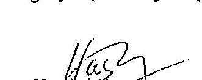
intergációs vezérigazgaté-helyettes

Somorai Béla
minőség-felügyeleti és útüzemeltetési osztályvezető

---

A Nemzeti Autópálya Rt. megalakulását követően három építési munkát adott vállalkozásba az M3, M9 és M7 autópályákkal kapcsolatosan.

Mindhárom projektnek több éves előkészitő tevékenysége folyt ezt megelőzően az EKM Autópálya Rt-nél, illetve az Állami Autópályakezeló Rt-nél. Legelőrehaladottabb állapotban az M3 autópálya Füzesabony-Polgár szakaszának ajánlatkérése volt, amely 1999-ben már EIB jóváhagyással bíró nemzetközi előminősitési (PQ) listával és tenderrel rendelkezett.

A Szerződéses Feltételek ekkor még a tervezett finanszírozó EIB és KfW által is elfogadott fix egységáras, tételes elszámolású FIDIC rendszeren alapultak.

Az előminősítési lista szereplőit ajánlatadási szándékukról a tulajdonos-alapító MFB Rt. engedélyével 1999. végén még megnyilatkoztattuk és pozitív visszajelzést kaptunk.

A korábbi állapothoz képest elmozdulás 2000. II. negyedévében történt, amikor a finanszírozással megbízott MFB Rt. számításait követően az akkori vezérigazgató felkért egy ügyvédi irodát a Szerződéses Feltételek áttekintésére és fix áras szerkezetüre (átalányár) történő átdolgozására. Az MFB Rt. döntésében meghatározó jelentőségủ volt az M3 autópálya Budapest-Füzesabony közötti - engedélyezési terven alapuló, fix egységáras ajánlat - építési szakaszának vizsgálata, amelynél a nettó $21,7 \mathrm{Mrd} \mathrm{Ft}+10 \%$ tartalék induló szerződéses ár befejezéskor - jelentős műszaki tartalom bővítést kővetően - 32 Mrd Ft-os végösszeget mutatott.

A bank a finanszírozhatóság tervezhetősége miatt szerződéskötéskor egy a végárhoz közeli szerződéses árat kívánt megismerni.

Az építési gyakorlatban mindkét módszer ismert. Az alkalmazást a jellemző körülmények és a fontosnak ítélt szempontok határozták meg, megjegyezve, hogy az átalányár korrekt Szerződéses Feltételek mellett nem jelent nagyobb beruházási kockázatot.

Az Na Rt. beruházói részlege az M7 felújítása során és több ízben jelezte a vezetőség és a bank felé a fix egységáras, tételes felméréses rendszer korrektségét és előnyeit, különös tekintettel a felújítási munkáknál általánosan előforduló műszaki tartalom bizonytalanságából fakadó kockázat miatt, amelyet a Vállalkozó kénytelen fix áras rendszer esetén abba beépíteni.

Ezt a javaslatot a tulajdonos csak az úgynevezett „kis szerződések" (szalagkorlátépítés, növényirtás, csatornatisztítási és -feltárási munkák) esetében fogadta el, a pálya és mútárgyfelújítási szerződéseknél elvetette.
(Melléklet: az MFB Rt. elrendelése alapján minden hónap 15 -ére beküldött tételes beszámoló jelzett bekezdése.)

Budapest, 2003. május 26.
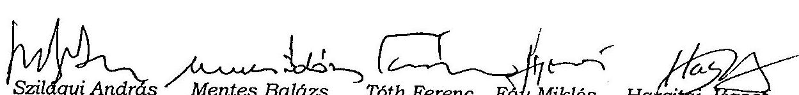

---

# Beruházási glosszárium 

| FIDIC | Federation Internationale Des Ingérieurs-Conseils Tanácsadó Mérnökök Nemzetközi Szövetsége |
| :--: | :--: |
| Megbízó | A szerződéses feltételek II. részében „különleges feltételek" között Megbízóként megnevezett szerződő fél és az ilyen személy törvényes jogutódjai, de ez nem jelenti (kivéve ha a Vállalkozó hozzájárul) annak a személynek bármely engedményesét. |
| Vállalkozó | az a személy, akinek az ajánlatát a Megbízó elfogadta, valamint annak a személynek törvényes jogutódjai, de ez nem jelenti (kivéve ha a Megbízó hozzájárul) annak a személynek bármely engedményesét. |
| Alvállalkozó | a Szerződésben a Beruházás egy részére Alvállalkozóként nevezett személy vagy bármely személy, aki a Mérnök hozzájárulásával alvállalkozói szerződést köt a beruházás egy részére, és annak a személynek törvényes jogutódjai, ide nem értve annak bármely engedményesét. |
| Mérnök | a Megbízó által kijelölt személy, aki a szerződés érdekében Mérnökként tevékenykedik és akit a szerződéses feltételek II. részében „különleges feltételek" Mérnökként megneveznek |
| Szerződés | szerződéses feltételek (I. rész: általános feltételek; II. rész: különleges feltételek), a műszaki előírások, a tervek, a mennyiség-kimutatás, az ajánlat, az elfogadó levél, a szerződéses megállapodás (ha ki van töltve), és az olyan további dokumentumok, amelyek kifejezetten belefoglaltak az elfogadó levélbe vagy a szerződéses megállapodásba (ha készült), |
| Tervek | az összes terv, számítás és az olyan természetű műszaki információk, amelyekkel a Mérnök látja el a Vállalkozót a Szerződés alapján, lés az összes rajz, számítás, minták, sablonok, mintadarabok, üzemeltetési és fenntartási utasítások és egyéb olyan természetű műszaki információk, amelyeket a Vállalkozó nyújtott be és a Mérnök jóváhagyta, |
| Mennyiségkimutatás | a beárazott és kitöltött mennyiség-kimutatás, amely az ajánlat részét képezi |
| Ajánlat   („Tender") | a Vállalkozó beárazott ajánlata, amelyet a Megbízóhoz benyújtott a Beruházás kivitelezésére és megvalósítására, valamint minden olyan hiba kijavítására, amely a Szerződés rendelkezéseivel összhangban elvégzendő, ahogyan az elfogadó levélben szerepel |

---

| Elfogadó levél | az Ajánlatnak a Megbízó részéről történő hivatalos elfoga-   dása |
| :-- | :-- |
| Szerződéses meg-   állapodás | a szerződéses megegyezés (ha van ilyen) |
| Szerződéses ár | az Elfogadó levélben szereplő összeg, amely a Vállalkozónak   fizethető a Beruházás kivitelezéséért és megvalósításáért és   az összes olyan hiba kijavításáért, amely a Szerződés felté-   eleivel összhangban van, |
| Beruházás | végleges munkák és az ideiglenes munkák, vagy bármelyik   közülük, ahogy megfelelő |
| Költség | (a FIDIC és nem számviteli értelemben)   az összes jogosan, akár a Munkaterületen, akár azon kívül   felmerült vagy felmerülő kiadás, beleértve a rezsi és egyéb   költséget, amelyek jogosan felszámíthatók, de nem szerepel   benne semmilyen nyereségrész. |

Készült a FIDIC „red book" meghatározásai alapján.

---

# A felújítási Program ABC analízissel kiválasztott tételeinek szakértői árvizsgálata 

## 1. Összehasonlító árclemzés

Az adatgyűjtés - Az NA Rt. hozzájárulásával és támogatásával - közvetlenül a „Mérnöknél", annak árszakértőjénél is történt. A meghatározó tételek egységárainak vizsgálata, elemzése, értékelése több módszerrel, összehasonlításokkal történik. A vállalkozó árait külön a jobb pálya és bal pálya kiválasztott tételei alapján - táblázatosan hasonlítom össze a „Mérnök" áraival, a felújítás során a jobb pályán egy kísérleti szakaszt készítő Hoffmann Rt. azonos tételekre vonatkozó egységáraival, egy tárnoki keverőtelep (az M7 autópálya közelségében) keverőtelepi áraival, valamint az ÉGSZI SENIOR Kft. áradatbázisából származó információkkal, a szakértői árakkal. Az összehasonlítás során természetesen mindenütt az azonos műszaki tartalom és azonos árszint kerül figyelembevételre. Ennek eléréséhez helyenként „transzformációkat" kell alkalmazni, hiszen az adatok különböző formában állnak rendelkezésre. Ahol nem lehetséges (nagy biztonsággal) az azonos peremfeltételek létrehozása, ott nem tüntetek fel adatot.

### 1.1. Az összehasonlító elemzés során fontos információk:

A vizsgált tételek kiválasztása az NA Rt.-től származó jobb-, illetve bal pálya megvalósításának műszaki tartalmát, mennyiségeit és vállalkozói egységárait tartalmazó tanúsítványairól történt, a jobb-, és a bal pályán egyaránt az $A B C$ analízis módszerével.

A vállalkozó árainak árszintje a jobb pálya esetében 2001. augusztus, a bal pálya tekintetében 2002. július. Az összehasonlítás ezeken az árszinteken történik.

Inflációszámításnál az NA Rt. által indítványozott és elfogadott inflációs tényezőket veszem alapul (azok korábban kifejtett bírálata ellenére) az egyes árak azonos szintre történő „transzponálásakor", az összehasonlíthatóság érdekében:
2000. január 1. -2000 . december 31.: $12,10 \%$
2000.december 31. - 2001. augusztus 1.: $9,60 \%$
2001. augusztus 1. - 2002. július 1.: $7,33 \%$

A Hoffmann Rt. szerződéses árai 2001. március 1. árszintűek. A 2001. augusztus 1.-i árszinthez ( 5 hónap) nem számolok inflációs indexet, mivel az év eleji jelentősebb árváltozásokat 2001. évre az ár már figyelembe veszi, másrészt a szerződés szerinti mennyiségekhez képest a teljes autópálya felújítás mennyisége esetén realizálható anyagbeszerzési kedvezmény mértéke bőségesen kompenzálja az 5 hónapnyi inflációt. Az összehasonlító elemzésnél kiemelésre kerülnek azok a tételek, amelyek az ABC analízis során kerültek kiválasztásra.

A PUHI TÁRNOK Út és Hídépítő Kft. (nyilvános) keverőtelepi áraihoz a „Mérnök" által kalkulált további költségelemeket számítom fel az összehasonlíthatóság érdekében, pl. a $160 \%$-os fedezetet, stb.

---

Az ÉGSZI SENIOR Kft szakértői egységárai a 2002. évi árszinten kerültek kialakításra, és az összehasonlíthatóság érdekében a fentebb már leírt indexekkel kerülnek - szükség szerint - változtatásra.

A vállalkozói árral történő összehasonlítás nem a kivitelező tényleges, tételes organizációjának és árképzési módszerének a vizsgálatát, minősitését jelenti, hiszen ez az üzleti titok kategóriájába tartozhat. A vizsgálat célja bemutatni, hogy piaci körülmények között, az adott idöpontban, helyszinen és körülmények között, az ismer müszaki tartalomra, milyen bekerülési összeg valószinüsithető és ez hogyan viszonyul a konzorcium áraihoz.

Az összehasonlítást mellékletekben szemléltetem (1. - 4. sz. mellékletek) táblázatos és grafikus formában. Az 1. illetve 2. sz. melléklet az ABC analízis során kiválasztott tételekre teljes körűen (mindegyik tételre) tartalmazza az összevetést a Konzorcium, a Mérnök, valamint a Szakértő képzett áraival, a jobb- és a bal pályára vonatkozóan különkülön. A 3. sz. melléklet a Hoffmann Rt. szerződéses egységárait mutatja be, amelyek összevethetőek a Konzorcium áraival. Külön kiemelésre kerülnek a táblázatban azok a tételek, amelyek az ABC analízis által is kiválasztottak, azaz súlyponti tételek. Mivel a vizsgálatok, elemzések azt mutatják, hogy a vállalkozói és a többi (a mérnökár kivételével) vizsgált árak leginkább a burkolati rétegek készitésében térnek el egymástól - amely tételek ráadásul a projekt meghatározó tételei is (költség szempontból) - így ezeket külön mellékletben, a 4. sz. mellékletben szemléltetem.

# 1.2. Összehasonlítás a „Mérnökár"-ral: 

A Mérnök a „mérnökár" képzés során a közvetlen és közvetett költségek meghatározásán alapuló árazási módszert alkalmazta. A közvetett költségek kalkulációjában a díjra vetítetten (max.) $160 \%$ fedezettartalom van, ami a teljes közvetlen költségre vetítve átlagosan $48 \%$. Külön költségként az alábbi költségelemek kerültek előirányzásra: ideiglenes melléképítmények (anyag+díj-ra) 3\%-a; ahol szabvány írja elő (anyag+díj-ra): anyagvizsgálatok (pl.: aszfaltburkolatok készítésekor: 5,5\%); valamint különleges körülmények miatt: díjra vetített $10 \%$. A „mérnökár" 2000. januári árszinten került kialakításra, a vállalkozói árral az inflációs szorzóval történő korrekciója után vethető össze.

A vállalkozói (MAK) ár szinte mindenütt a „mérnökár" alatt van. A mérnökár ugyanis a piaci ár felső sávjánál is magasabb, hiszen minden egyes külön költség elemet - a fedezeten túl is - maximálisan felszámol, míg a közvetlen költségek köre is magas árfekvésű. A vállalkozó „általános tételek" címen a szerződéses ár 1-2,7\%-át számolta fel (a két legnagyobb - „C" és „D" - volumenủ szerződése során, míg a mérnökár az első bekezdésben is részletezetten ennél magasabb általános költséggel számol. Az aszfaltok esetében csak a vizsgálatok költségére 5,5\%-ot számol fel (anyag+díjra), ami túlzott, hiszen ezzel egyidejűleg a kész aszfaltkeverék árából indul ki, ami már tartalmazza a kőanyagok, adalékok, bitumen vizsgálatait, valamin a keverőtelepi mintavételek vizsgálatát. Ekkor már csak a bedolgozás minőségének a vizsgálata van hátra, ami a közvetlen költség 1,5-2\%-át nem haladja meg. A díjra vetített $160 \%$ fedezet egy olyan fedezeti szint, ami a mérnōk számításai során tartalmazhatná a külön költségeket is, ezek külön felszámítása túlzott.

### 1.3. Összehasonlítás a Hoffmann Rt. egységáraival, amelyek a 850 fm kísérleti sza kaszra kerültek kidolgozásra:

A Hoffmann Rt. szerződésében szereplő tételek közül a burkolathoz közvetlen kapcsolódó tételek (az árak szerint több, mint 70\%) egységárai, közvetlenül összevethetők a MAK

---

egységáraival, amitől az eltérés tendencia szerüen 10\% körüli (inkább több). Hozzá kell tenni, hogy a Hoffmann Rt. árai sem mérettek meg versenyben, így a piaci viszonyokhoz képest $5-10 \%$ többlet még valószínűsíthető az áraiban.

# 1.4. Összehasonlítás a Puhi-Tárnok Út- és Hídépítő Kft keverőtelepi listaáraiból származtatott keverék bedolgozási egységárakkal: 

A Puhi-Tárnok Kft. keverőtelepe Tárnokon, a vállalkozó martonvásári keverőtelepének közelségében található. Beszerzési forrásai ennek megfelelően hasonlóak. A keverőtelepi árakból a Mérnök árképzése szerint (ami az előzőekből látszik, hogy nem alábecsült) származtattuk az egyes keverék-fajták bedolgozásának egységárait, $160 \%$ fedezettel, de a túlzottnak ítélt külön költségek nélkül. Az egységár mindegyik aszfalt bedolgozása esetén a MAK ár $80 \%$-a alatt marad. Kis mennyiségben beszállítója is volt a Puhi Kft a Konzorciumnak, de aszfalt vonatkozásában (kapacitási okok miatt) inkább csak kisebb részfeladatokra (pl. csomópontok). Nagy volumenben szállított viszont az autópálya felújításhoz Ckt-t. A Ckt (telepen kevert hidraulikus alapréteg) készítésében a közvetlen anyagköltség aránya mintegy $60 \%$. A Puhi-Tárnok Kft árlistáján (2001. évben) ez a tétel $5.300,-\mathrm{Ft} / \mathrm{m}^{3}$ áron szerepelt. Ebből képezve bedolgozási tétel egységárat, 8.833,-Ft adódik. Ez a konzorciumi ár $73 \%$-a.

## 1.5. Összehasonlítás a szakértői árakkal:

A szakértői árak a jobb pálya tételeihez 2001. augusztusi, míg a bal pálya kiválasztott tételeihez 2002. júliusi árszinten kerültek meghatározásra. Míg a burkolati rétegek árai a vállalkozói ár 70-80\%-a közé esnek, addig a földmunkával (, fehér munkákkal") csupán néhány \% eltérés mutatkozik (általában). Az ABC analízissel kiválasztott tételek egységárainak figyelembevételével megállapítható, hogy a jobb pálya vonatkozásában a szakértői ár összességében a vállalkozói árak kb. $81 \%$-a, míg (a bal pálya kiválasztott tételeire alapozottan) a bal pálya vonatkozásában pedig kb. $77 \%$-a.

### 1.6. Következtetések az összehasonlító árelemzésekből:

Az elemzésekből kitűnik, hogy a „mérnök-ár" nagyon biztonságos árszintet képvisel (átlagban 7-14\%-kal meghaladja a vállalkozói árat).

A Hoffmann Rt. egységárai $10 \%$-kal kedvezöbbek (átlagban) a Konzorcium árainál. Az árak biztosan tartalmaznak további tartalékokat, hiszen nem versenyben nyerték el Ök sem a kísérleti szakasz építési munkáit.

A Puhi-Tárnok Út- és Hídépítő Kft tárnoki keverőtelepének keverék-áraiból származtatott burkolati réteg árak az átlagos piaci feltételek mellett „élő" árak. Egyik burkolat fajta ára sem éri el a Konzorcium árának a 80\%-át. A szakértői ár a Puhi-Tárnok Kft áraihoz áll a legközelebb. Ez tekinthető átlagos árnak, piaci körülmények között.

A tényleges kivitelezési körülmények 1-2 év távlatából pontosan nem reprodukálhatók. Ilyen volumenű és technológiájú autópálya rekonstrukcióra ez ideig még nem került sor Magyarországon. A különleges körülmények okozta nehézségek, többletköltségek, valamint a volumen nagyságából adódó kedvezmények ütköznek egymással. Nagy valószínűséggel kijelenthető, hogy megfelelő előkészítéssel, a tervezés kezdetétől folyamatos költségszakértői követéssel, versenyhelyzet kialakításával és szakszerủ kivitelezés szervezéssel, irányítással, legalább a Hoffmann Rt. árszintje és a Puhi-Tárnok Kft. árszintje közötti

---

költségkeretből, a ténylegesnél mintegy $15 \%$-kal kedvezőbb építési költséggel is megvalósítható lett volna az M7 autópálya felújítási projekt.

Készítette: 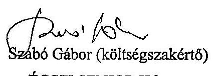

Szabó Gábor (költségszakértő)
ÉGSZI SENIOR Kft.
Budapest, 2003. május 30.

---

# MELLÉKLETEK 

1. sz. melléklet: M7 autópálya 17-111 kmsz. „C" szerződés (jobb pálya) ABC analízissel kiválasztott tételek árellenőrzése 1/2 Táblázat
2/2 Diagramm
2. sz. melléklet: M7 autópálya 17-111 kmsz. „C" szerződés (jobb pálya) ABC analízissel kiválasztott tételek árellenőrzése 1/2 Táblázat
2/2 Diagramm
3. sz. melléklet: A MAK M7 jobb pálya és a Hoffmann Rt. kísérleti szakasz szerződéses egységárainak elemzése
Különös tekintettel az ABC analízissel kiválasztott tételekre
4. sz. melléklet: Aszfalt bedolgozási tételek összehasonlító elemzése 2001. augusztus 1.-i árszinten

---

M7 autópálya 17-111 kmsz. "C" szerződés (jobb pálya) a V-27-088/2002-2003. jelentéshez

2. függelék I.melléklete a V-27-088/2002-2003. jelentéshez

|  Tétel | Megnevezés | Me. | Mennyiség | Konzorcium, tényleges |  |  | NA Rt. árszakértői ár |  |  | "Mémök ár" |  |  | Szakértői kalkulált ár |   |
| --- | --- | --- | --- | --- | --- | --- | --- | --- | --- | --- | --- | --- | --- | --- |
|   |  |  |  | Égységár
Ft | Összesen
EFt | Égységár
Ft | Összesen
EFt | Arány a MAK
ár %-ában | Égységár
Ft | Összesen
EFt | Arány a MAK
ár %-ában | Égységár
Ft | Összesen
EFt | Arány a MAK
ár %-ában  |
|  32-180 | Elválasztósáv
visszabontása | m³ | 153 516 | 2 619 | 402 058 | 3 800 | 583 361 | 145,09% | 3 127 | 480 018 | 119,39 | 2 495 | 383 022 | 95,27  |
|  32-520 | Védőréteg készítése
homokos kavisaból | m³ | 181 323 | 5 157 | 935 083 | 5 031 | 912 236 | 97,56% | 6 945 | 1 259 355 | 134,68 | 4 797 | 869 807 | 93,02  |
|  32-630 | Padka készítése
M 50-ből | m³ | 72 294 | 10 003 | 723 157 | 9 759 | 705 517 | 97,56% | 11 757 | 849 934 | 117,53 | 9 742 | 704 288 | 97,39  |
|  33-112 | M50 jelű mechanikai
stabilizáció | m³ | 39 290 | 10 003 | 393 018 | 9 759 | 383 431 | 97,56% | 11 757 | 461 918 | 117,53 | 9 742 | 382 763 | 97,39  |
|  33-121 | Ckt jelű cementes
stabilizáció | m³ | 65 879 | 12 095 | 796 807 | 15 000 | 988 185 | 124,02% | 18 391 | 1 211 591 | 152,06 | 12 338 | 812 815 | 102,01  |
|  33-133 | C12 jelű beton
utalap | m³ | 31 764 | 22 694 | 720 863 | 18 000 | 571 761 | 79,32% | 23 788 | 755 617 | 104,82 | 17 727 | 563 089 | 78,11  |
|  33-163 | AB-16/F jelű aszfalt
burkolati réteg | m³ | 6 340 | 53 710 | 340 521 | 52 400 | 332 216 | 97,56% | 57 774 | 366 290 | 107,57 | 41 564 | 263 516 | 77,39  |
|  33-225 | JU-35/F jelű javított
bitumenes útalap | m³ | 12 905 | 50 422 | 650 696 | 48 900 | 631 055 | 96,98% | 54 944 | 709 049 | 108,97 | 36 831 | 475 334 | 73,05  |
|  33-226 | mJU-35/F jelű javított
bitumenes útalap | m³ | 67 131 | 51 763 | 3 474 902 | 50 210 | 3 370 648 | 97,00% | 58 498 | 3 927 036 | 113,01 | 41 630 | 2 794 664 | 80,42  |
|  33-234 | mK-20/F jelű hengerelt
aszfalt kötőréteg | m³ | 37 582 | 54 376 | 2 043 559 | 53 050 | 1 993 725 | 97,56% | 60 644 | 2 279 141 | 111,53 | 42 770 | 1 607 382 | 78,66  |
|  33-314 | AB-12/F jelű aszfalt
burkolati réteg | m³ | 11 160 | 53 710 | 599 404 | 52 400 | 584 784 | 97,56% | 57 774 | 644 763 | 107,57 | 42 422 | 473 430 | 78,98  |
|  33-316 | AB-16/F jelű aszfalt
burkolati réteg | m³ | 8 740 | 53 710 | 469 425 | 52 400 | 457 976 | 97,56% | 57 774 | 504 949 | 107,57 | 41 564 | 363 269 | 77,39  |
|  33-340 | m2MA jelű masztix
aszfalt burkolati réteg | m³ | 28 187 | 72 263 | 2 036 877 | 70 500 | 1 987 184 | 97,56% | 77 169 | 2 175 173 | 106,79 | 51 292 | 1 445 768 | 70,98  |
|  42-222 | Betonlapból készült
folyókák szivárgóval | m³ | 47 899 | 12 645 | 605 687 | 12 205 | 584 611 | 96,52% | 13 415 | 642 582 | 106,09 | 10 890 | 521 624 | 86,12  |
|  72-120 | Egyoldali acélszalag-
kortát 4 m-es oszl.köz | m | 63 850 | 9 948 | 628 667 | 8 600 | 549 110 | 87,35% | 10 126 | 646 561 | 102,85 | 6 242 | 398 552 | 63,40  |
|  OSSZESEN: |  |  |  |  | 14 820 724 |  | 14 835 799 |  |  | 16 913 975 |  |  | 12 059 292 |   |

1/2

---

M7 autópálya 17-111 kmsz. "C" szerződés (jobb pálya) a V-27-086/2002-2003. jelentéshez

ABC analízissel kiválasztott tételek áreillenőrzése

|  Tétel | Megnevezés | Me. | Mennyiség |  |  |  |  |  |  |  |  |  |  |  |   |
| --- | --- | --- | --- | --- | --- | --- | --- | --- | --- | --- | --- | --- | --- | --- | --- |
|   |  |  |  |  |  |  |  |  | "Mémök-ár" |  | Szekértői kalkulat ár |  |  |  |   |
|   |  |  |  |  |  |  |  |  | Összesen
EFt | Arány a MAK
ár %-ában | Egységár
Ft | Összesen
EFt | Arány a MAK
ár %-ában | Egységár
Ft | Összesen
EFt  |
|  32-180 | Elválasztósáv
visszabontása | m² | 153 516 | 2 619 | 402 058 | 3 800 | 583 361 | 145,09% | 3 127 | 480 018 | 110,39 | 2 495 | 383 022 | 95,27 |   |
|  32-520 | Védőréteg készítése
homokos kavicsból | m² | 181 323 | 5 157 | 935 083 | 5 031 | 912 236 | 97,56% | 6 945 | 1 259 355 | 134,68 | 4 797 | 869 807 | 93,02 |   |
|  32-630 | Padka készítése
M-50-ből | m² | 72 294 | 10 003 | 723 157 | 9 759 | 705 517 | 97,56% | 11 757 | 849 934 | 117,53 | 9 742 | 704 288 | 97,39 |   |
|  33-112 | M50 jelű mechanikai
stabilizáció | m² | 39 290 | 10 003 | 393 018 | 9 759 | 383 431 | 97,56% | 11 757 | 461 918 | 117,53 | 9 742 | 382 763 | 97,39 |   |
|  33-121 | Okt jelű cementes
stabilizáció | m² | 65 879 | 12 095 | 796 807 | 15 000 | 988 185 | 124,02% | 18 391 | 1 211 591 | 152,06 | 12 338 | 812 815 | 102,01 |   |
|  33-133 | C12 jelű beton
útalap | m² | 31 764 | 22 694 | 720 863 | 18 000 | 571 761 | 79,32% | 23 788 | 755 617 | 104,82 | 17 727 | 563 089 | 78,11 |   |
|  33-163 | AB-16/F jelű aszfalt
burkolati réteg | m² | 6 340 | 53 710 | 340 521 | 52 400 | 332 216 | 97,56% | 57 774 | 366 290 | 107,57 | 41 564 | 263 516 | 77,39 |   |
|  33-225 | JU-35/F jelű javított
biturmenes útalap | m² | 12 905 | 50 422 | 650 696 | 48 900 | 631 055 | 96,98% | 54 944 | 709 049 | 108,97 | 36 831 | 475 304 | 73,05 |   |
|  33-226 | mJU-35/F jelű javított
biturmenes útalap | m² | 67 131 | 51 763 | 3 474 902 | 50 210 | 3 370 648 | 97,00% | 58 498 | 3 927 036 | 113,01 | 41 630 | 2 794 664 | 80,42 |   |
|  33-234 | mK-20/F jelű hengerelt
aszfalt kódiréteg | m² | 37 582 | 54 376 | 2 043 559 | 53 050 | 1 993 725 | 97,56% | 60 644 | 2 279 141 | 111,53 | 42 770 | 1 607 382 | 78,66 |   |
|  33-314 | AB-12/F jelű aszfalt
burkolati réteg | m² | 11 160 | 53 710 | 599 404 | 52 400 | 584 784 | 97,56% | 57 774 | 644 763 | 107,57 | 42 422 | 473 430 | 78,98 |   |
|  33-316 | AB-16/F jelű aszfalt
burkolati réteg | m² | 8 740 | 53 710 | 469 425 | 52 400 | 457 976 | 97,56% | 57 774 | 504 949 | 107,57 | 41 564 | 363 269 | 77,39 |   |
|  33-340 | mZMA jelű masztív
aszfalt burkolati réteg | m² | 28 187 | 72 263 | 2 036 877 | 70 500 | 1 987 184 | 97,56% | 77 169 | 2 175 173 | 106,79 | 51 292 | 1 445 768 | 70,98 |   |
|  42-222 | Betonlapból készült
folyókák szivárgóval | m² | 47 899 | 12 645 | 605 687 | 12 205 | 584 611 | 96,52% | 13 415 | 642 582 | 106,09 | 10 890 | 521 624 | 86,12 |   |
|  72-120 | Egyoldali acélszalag-
forlát á m-es oszt.köz. | m | 63 850 | 9 846 | 628 667 | 8 600 | 549 110 | 87,35% | 10 126 | 646 561 | 102,85 | 6 242 | 398 552 | 63,40 |   |
|  OSSZESEN: |  |  |  |  | 14 620 724 |  | 14 635 799 |  |  | 16 913 975 |  | 12 069 292 |  |  |   |

1/2

---

2. függelék 1. melléklete
a V-27-688/2002-2003. jelentéshez

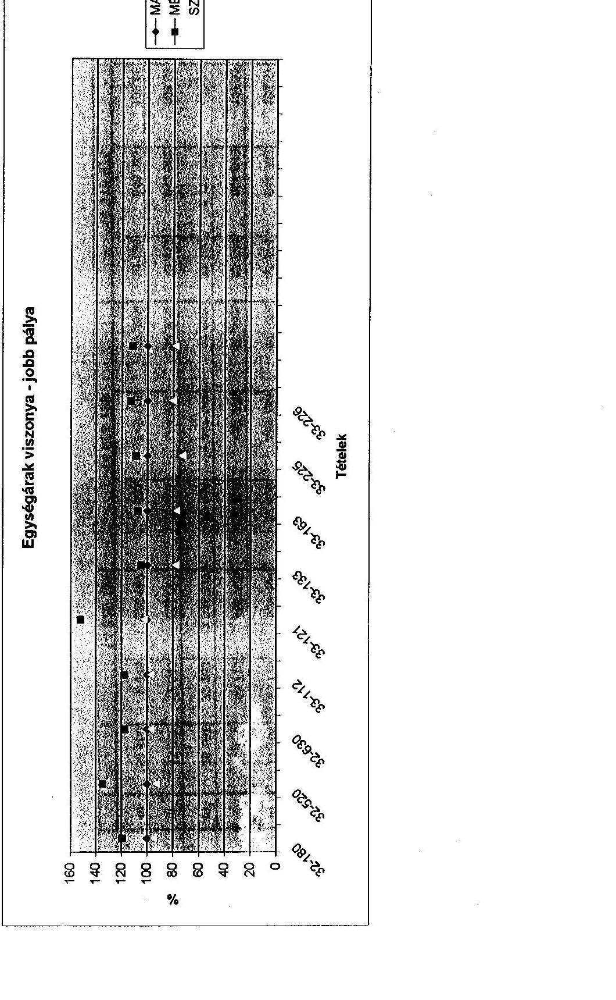

---

M7 autópálya 17-111 kmsz. "D" szerződés (bal pálya) a V-27-088/2002-2003. jelentőshez

2. függelék 2. melléklete a V-27-088/2002-2003. jelentőshez

|  Tétel | Megnevezés | Me | Mennyiség | Konyítság | Összesen
EFI | Összesen
EFI | NÁ RI, árszakértői ár |  | "Mérnök-ár" | Szakértői kalkulált ár |  |  |   |
| --- | --- | --- | --- | --- | --- | --- | --- | --- | --- | --- | --- | --- | --- |
|   |  |  |  |  |  |  | Égységár
FI | Összesen
EFI | Arány a MAK
ár %-ában | Égységár
FI | Arány a MAK
ár %-ában | Égységár
FI | Összesen
EFI  |
|  33-234 | mK-20/F jelű hengerelt
aszfalt kötőréteg | m³ | 78 070 | 60 541 | 4 726 436 | 59 044 | 4 609 565 | 97,53% | 65 089 | 5 081 514 | 107,51 | 47 741 | 3 727 155  |
|  33-340 | mZMA jelű masztix
aszfalt burkolati réteg | m³ | 43 700 | 80 449 | 3 515 621 | 78 466 | 3 428 964 | 97,54% | 82 825 | 3 619 474 | 102,95 | 57 254 | 2 502 003  |
|  33-161 | AB-12/F jelű aszfalt
burkolati réteg | m³ | 34 300 | 59 795 | 2 050 969 | 58 321 | 2 000 410 | 97,53% | 62 009 | 2 126 903 | 103,70 | 47 353 | 1 624 218  |
|  33-610 | Hálótentés haladásáv
felelt | m³ | 494 600 | 2 171 | 1 073 777 | 2 084 | 1 030 746 | 95,99% | 2 719 | 1 344 869 | 125,25 | 1 526 | 754 601  |
|  33-165 | AB-12/F jelű aszfalt
severékből többlet | m³ | 8 410 | 59 795 | 502 876 | 58 321 | 490 480 | 97,53% | 62 009 | 521 494 | 103,70 | 47 353 | 398 241  |
|  31-132 | Aszfaltburkolatok felső
rétegének lemarása | m³ | 14 545 | 32 971 | 479 563 | 29 400 | 427 623 | 89,17% | 30 633 | 445 554 | 92,91 | 27 004 | 392 757  |
|  42-222 | Betonlapból készült
folyékák szivárgóval | m³ | 26 927 | 14 011 | 377 274 | 13 450 | 362 168 | 96,00% | 14 398 | 367 704 | 102,76 | 12 156 | 327 332  |
|  32-630 | Padha készítése
M 50-ből | m³ | 32 725 | 11 136 | 364 426 | 10 862 | 355 459 | 97,54% | 12 619 | 412 950 | 113,32 | 10 874 | 355 860  |
|  31-144 | Betonburkolat
marása | m³ | 6 275 | 43 953 | 275 805 | 39 315 | 246 702 | 89,45% | 39 560 | 248 240 | 90,01 | 27 004 | 169 448  |
|  ÖSSZESEN: |  |  |  |  | 13 366 746 |  | 12 952 117 |  |  | 14 188 702 |  |  | 10 251 625  |

---

M7 autópálya 17-111 kmsz. "D" szerződés (bal pálya) a V-27-088/2002-2003. jelentéshez

2. függelék 2. melléklete a V-27-088/2002-2003. jelentéshez

Egységárak viszonya - bal pálya

|   | 140  |
| --- | --- |
|  120 |   |
|  100 |   |
|  80 |   |
|  60 |   |
|  40 |   |
|  20 |   |
|  0 |   |

Tételek

22

---

1. függelék 3. melléklete a V-27-088/2002-2003. jelentéshez

|   |  | EGYSÉG A RAK |  |  |  |  |  |  |  |  |  |  |  |  |  |  |  |  |  |  |  |   |
| --- | --- | --- | --- | --- | --- | --- | --- | --- | --- | --- | --- | --- | --- | --- | --- | --- | --- | --- | --- | --- | --- | --- |
|   |  |  |  |  |  |  |  |  |  |  |  |  |  |  |  |  |  |  |  |  |  |   |
|   |  |  |  |  |  |  |  |  |  |  |  |  |  |  |  |  |  |  |  |  |  |   |
|   |  |  |  |  |  |  |  |  |  |  |  |  |  |  |  |  |  |  |  |  |  |   |
|   |  |  |  |  |  |  |  |  |  |  |  |  |  |  |  |  |  |  |  |  |  |   |
|   |  |  |  |  |  |  |  |  |  |  |  |  |  |  |  |  |  |  |  |  |  |   |
|   |  |  |  |  |  |  |  |  |  |  |  |  |  |  |  |  |  |  |  |  |  |   |
|   |  |  |  |  |  |  |  |  |  |  |  |  |  |  |  |  |  |  |  |  |  |   |
|   |  |  |  |  |  |  |  |  |  |  |  |  |  |  |  |  |  |  |  |  |  |   |
|   |  |  |  |  |  |  |  |  |  |  |  |  |  |  |  |  |  |  |  |  |  |   |
|   |  |  |  |  |  |  |  |  |  |  |  |  |  |  |  |  |  |  |  |  |  |   |
|   |  |  |  |  |  |  |  |  |  |  |  |  |  |  |  |  |  |  |  |  |  |   |
|   |  |  |  |  |  |  |  |  |  |  |  |  |  |  |  |  |  |  |  |  |  |   |
|   |  |  |  |  |  |  |  |  |  |  |  |  |  |  |  |  |  |  |  |  |  |   |
|   |  |  |  |  |  |  |  |  |  |  |  |  |  |  |  |  |  |  |  |  |  |   |
|   |  |  |  |  |  |  |  |  |  |  |  |  |  |  |  |  |  |  |  |  |  |   |
|   |  |  |  |  |  |  |  |  |  |  |  |  |  |  |  |  |  |  |  |  |  |   |
|   |  |  |  |  |  |  |  |  |  |  |  |  |  |  |  |  |  |  |  |  |  |   |
|   |  |  |  |  |  |  |  |  |  |  |  |  |  |  |  |  |  |  |  |  |  |   |
|   |  |  |  |  |  |  |  |  |  |  |  |  |  |  |  |  |  |  |  |  |  |   |
|   |  |  |  |  |  |  |  |  |  |  |  |  |  |  |  |  |  |  |  |  |  |   |
|   |  |  |  |  |  |  |  |  |  |  |  |  |  |  |  |  |  |  |  |  |  |   |
|   |  |  |  |  |  |  |  |  |  |  |  |  |  |  |  |  |  |  |  |  |  |   |
|   |  |  |  |  |  |  |  |  |  |  |  |  |  |  |  |  |  |  |  |  |  |   |
|   |  |  |  |  |  |  |  |  |  |  |  |  |  |  |  |  |  |  |  |  |  |   |
|   |  |  |  |  |  |  |  |  |  |  |  |  |  |  |  |  |  |  |  |  |  |   |
|   |  |  |  |  |  |  |  |  |  |  |  |  |  |  |  |  |  |  |  |  |  |   |
|   |  |  |  |  |  |  |  |  |  |  |  |  |  |  |  |  |  |  |  |  |  |   |
|   |  |  |  |  |  |  |  |  |  |  |  |  |  |  |  |  |  |  |  |  |  |   |
|   |  |  |  |  |  |  |  |  |  |  |  |  |  |  |  |  |  |  |  |  |  |   |
|   |  |  |  |  |  |  |  |  |  |  |  |  |  |  |  |  |  |  |  |  |  |   |
|   |  |  |  |  |  |  |  |  |  |  |  |  |  |  |  |  |  |  |  |  |  |   |
|   |

---

2. függelék 4. melléklete a V-27-088/2002-2003. jelentéshez

|  KEVERÉKEK | MAK
egységár | MÉRNÖK
egységár | MAK %-ában | HOFFMANN Rt.
egységár | MAK %-ában | PUHI-TÁRNOK Kft.
egységár | MAK %-ában | SZAKÉRTŐ
egységár | MAK %-ában  |
| --- | --- | --- | --- | --- | --- | --- | --- | --- | --- |
|  AB-12/F jelű aszfalt | 53 710 | 57 774 | 107,57 | 47 800 | 89,00 | 42 659 | 79,42 | 42 422 | 78,98  |
|  AB-16/F jelű aszfalt | 53 710 | 57 774 | 107,57 |  |  |  |  | 41 564 | 77,39  |
|  JU-35/F jelű aszfalt | 50 422 | 54 944 | 108,97 |  |  | 36 456 | 72,30 | 36 831 | 73,05  |
|  mJU-35/F jelű aszfalt | 51 763 | 58 498 | 113,01 |  |  | 41 136 | 79,47 | 41 630 | 80,42  |
|  mK-20/F jelű aszfalt | 54 376 | 60 644 | 111,53 | 48 600 | 89,38 | 38 926 | 71,59 | 42 770 | 78,66  |
|  mZMA jelű masztix aszfalt | 72 263 | 77 169 | 106,79 | 67 100 | 92,86 |  |  | 51 292 | 70,98  |

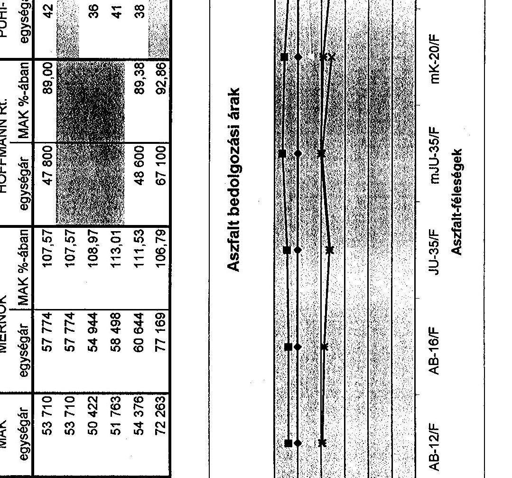