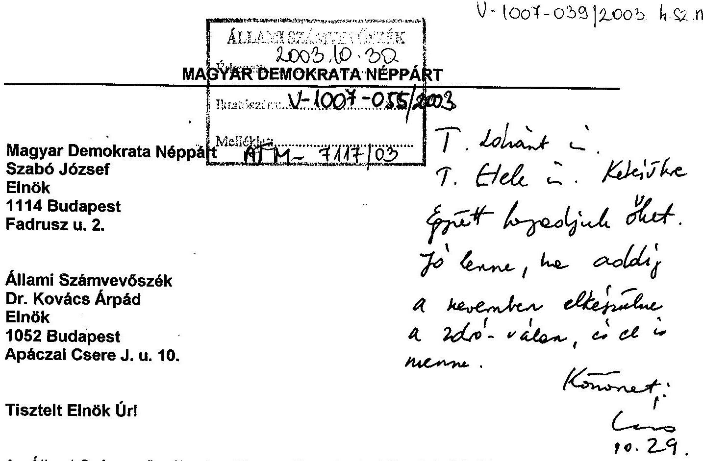
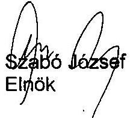
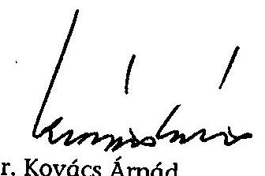

# JELENTÉS 

a Magyar Demokrata Néppárt 2000-2002. évi gazdálkodása törvényességének ellenőrzéséről

---

# 3. Önkormányzati és Területi Ellenőrzési Igazgatóság 

3.1. Szabályszerűségi Ellenőrzések Főcsoport

Iktatószám: V-1007-039/2003.
Témaszám: 654
Vizsgálat-azonosító szám: V0082

## Az ellenőrzést felügyelte:

Dr. Lóránt Zoltán
főigazgató
Az ellenőrzés végrehajtásáért felelős:
Dr. Elek János
főigazgató helyettes
Az ellenőrzést vezette:
Dr. Szávai Tamás
osztályvezető főtanácsos
Az összefoglaló jelentést készítette:
Horváth Balázs
tanácsos
Az ellenőrzést végezték:
Horváth Balázs Dr. Dotterweich Antal
tanácsos
tanácsadó

A témához kapcsolódó eddig készített számvevőszéki jelentések:
címe
sorszáma
Jelentés a Magyar Demokrata Néppárt 1998-1999. évi
0111
gazdálkodása törvényességének ellenőrzéséről

---

# TARTALOMJEGYZÉK 

BEVEZETÉS ..... 6
I. ÖSSZEGZŐ MEGÁLLAPÍTÁSOK, KÖVETKEZTETÉSEK, JAVASLATOK ..... 8
II. RÉSZLETES MEGÁLLAPÍTÁSOK ..... 12

1. A Párt gazdálkodásáról szóló 2000-2002. évi beszámolók ..... 12
1.1. A teljes vizsgálati időszakra érvényes megállapítások ..... 12
1.2. A 2000-2002. évi beszámolók ..... 13
1.2.1. Bevételek ..... 14
1.2.2. Kiadások ..... 15
2. A Pártnak a beszámoló összeállítására és az ezt alátámasztó könyvvezetésre vonatkozó szabályozása és gyakorlata ..... 15
2.1. A belső szabályozás rendszere ..... 15
2.2. A könyvvezetés gyakorlata, összhangja a törvényi és belső előírásokkal ..... 16
2.3. Analitikus nyilvántartások ..... 17
2.4. A bizonylati elv és a bizonylati fegyelem érvényesülése ..... 18
3. A gazdálkodó tevékenység törvényessége ..... 19
4. A gazdálkodással összefüggő egyéb jogszabályokban foglalt előírások betartása ..... 20
4.1. Személyi jellegű kifizetések ..... 20
4.2. Az adózási, társadalombiztosítási és egyéb jogszabályok rendelkezéseinek érvényesülése ..... 21
5. A Párt belső ellenőrzésének rendszere ..... 21
6. Az előző ellenőrzés megállapításaira tett intézkedések ..... 22

---

# MELLÉKLETEK 

1. számú A Párt 2000. évi gazdálkodásáról szóló beszámoló
2. számú A Párt 2001. évi gazdálkodásáról szóló beszámoló
3. számú A Párt 2002. évi gazdálkodásáról szóló beszámoló
4. számú Jelentésre érkezett észrevétel
5. számú Észrevételre adott válasz

---

# RÖVIDÍTÉSEK JEGYZÉKE 

| APEH | Adó és Pénzügyi Ellenőrzési Hivatal |
| :-- | :-- |
| ÁSZ | Állami Számvevőszék |
| OH | Országos Hivatal |
| Párttörvény | A pártok működéséről és gazdálkodásáról szóló 1989. évi |
|  | XXXIII. tv. |
| Párt | Magyar Demokrata Néppárt |
| PGSZ | Pénzügyi és Gazdálkodási Szabályzat |
| Szja. törvény | A személyi jövedelemadóról szóló 1995. évi CXVII. tv. |
| Szt. | A számvitelről szóló 2000. évi C. tv. |
| Szja | Személyi jövedelemadó |

---

.

---

# 1.3.2.2 Linear Differential Equations 

## 1.3.2.2.1 Linear Differential Equation

The equation

$$
x^{2}+y^{2}+z^{2}=a^{2}+b^{2}
$$

is called an equation of the form

$$
x^{2}+y^{2}+z^{2}=a^{2}+b^{2}
$$

The equation

$$
x^{2}+y^{2}+z^{2}=a^{2}+b^{2}
$$

is called an equation of the form

$$
x^{2}+y^{2}+z^{2}=a^{2}+b^{2}
$$

is called an equation of the form

$$
x^{2}+y^{2}+z^{2}=a^{2}+b^{2}
$$

is called an equation of the form

$$
x^{2}+y^{2}+z^{2}=a^{2}+b^{2}
$$

is called an equation of the form

$$
x^{2}+y^{2}+z^{2}=a^{2}+b^{2}
$$

is called an equation of the form

$$
x^{2}+y^{2}+z^{2}=a^{2}+b^{2}
$$

is called an equation of the form

$$
x^{2}+y^{2}+z^{2}=a^{2}+b^{2}
$$

is called an equation of the form

$$
x^{2}+y^{2}+z^{2}=a^{2}+b^{2}
$$

is called an equation of the form

$$
x^{2}+y^{2}+z^{2}=a^{2}+b^{2}
$$

is called an equation of the form

$$
x^{2}+y^{2}+z^{2}=a^{2}+b^{2}
$$

is called an equation of the form

$$
x^{2}+y^{2}+z^{2}=a^{2}+b^{2}
$$

is called an equation of the form

$$
x^{2}+y^{2}+z^{2}=a^{2}+b^{2}
$$

is called an equation of the form

$$
x^{2}+y^{2}+z^{2}=a^{2}+b^{2}
$$

is called an equation of the form

$$
x^{2}+y^{2}+z^{2}=a^{2}+b^{2}
$$

is called an equation of the form

$$
x^{2}+y^{2}+z^{2}=a^{2}+b^{2}
$$

is called an equation of the form

$$
x^{2}+y^{2}+z^{2}=a^{2}+b^{2}
$$

is called an equation of the form

$$
x^{2}+y^{2}+z^{2}=a^{2}+b^{2}
$$

is called an equation of the form

$$
x^{2}+y^{2}+z^{2}=a^{2}+b^{2}
$$

is called an equation of the form

$$
x^{2}+y^{2}+z^{2}=a^{2}+b^{2}
$$

is called an equation of the form

$$
x^{2}+y^{2}+z^{2}=a^{2}+b^{2}
$$

---

# JELENTÉS 

## a Magyar Demokrata Néppárt 2000-2002. évi gazdálkodása törvényességének ellenőrzéséről

## BEVEZETÉS

Az Állami Számvevőszékről szóló 1989. évi XXXVIII. törvény 5. §-a és a 16. § (2) bekezdése, valamint a pártok működéséről és gazdálkodásáról szóló - többször módosított - 1989. évi XXXIII. tv. (továbbiakban: Párttörvény) 10. § (1) bekezdése alapján a pártok gazdálkodása törvényességének ellenőrzésére az Állami Számvevőszék (továbbiakban: ÁSZ) jogosult. Az ÁSZ 2003. évi ellenőrzési tervének megfelelően vizsgálta a Magyar Demokrata Néppárt (a továbbiakban: Párt) 2000-2002. évi gazdálkodása törvényességét.

## Az ellenőrzés célja annak megállapítása, volt, hogy:

- a Párt által készített és a Magyar Közlönyben közzétett éves beszámolók a törvényi előírásoknak megfelelnek-e, a könyvvezetéssel és a valósággal megegyező adatokat tartalmaznak-e;
- a könyvvezetés és a gazdálkodás során betartották-e a számvitelről szóló többször módosított - 2000. évi C. tv. (a továbbiakban: Szt.) és az egyéb jogszabályi rendelkezéseket és belső előírásokat;
- a Párt a működéséhez szabályszerűen igénybe vehető forrásokat használt-e fel, nem folytatott-e a Párttörvény által tiltott gazdálkodó tevékenységet, nem fogadott-e el tiltott vagyoni hozzájárulást, illetőleg adományt.

Az ellenőrzés körülményeit illetően rögzíteni szükséges ${ }^{1}$, hogy

- a Párttörvény 1. sz. melléklete szerinti beszámoló-mintához magyarázatot, kitöltési útmutatót nem készítettek a jogalkotók, így ennek kitöltése pártonként - a kialakított számviteli politikájuknak megfelelően - eltérő lehet;
- a beszámoló-minta a számviteli törvény rendelkezéseivel nem harmonizál, nem felel meg sem a mérleg, sem az eredmény-kimutatás követelményeinek.

Az ellenőrzést az ÁSZ elnöke által 13/2003. sz. utasításával kiadott "Módszertan a pártok gazdálkodása törvényességének ellenőrzéséhez" c. kiadvány (a továbbiakban: Módszertan) alapján készítettük elő és hajtottuk végre.

A helyszíni ellenőrzés 2003. március 31-május 9. közötti időszakban történt.

[^0]
[^0]:    ${ }^{1}$ az ÁSZ folyamatosan javasolja a Kormánynak a pártellenőrzésről készített jelentéseiben a Párttörvény módosítását.

---

A 2002. június 1-jén történt választások eredményeként a Párt vezetése teljesen megújult. A Párt új képviselőjének jogerős bírósági bejegyzésére csak 2002. decemberében került sor. Az állami támogatás megszűnése miatt a Pártnak új székhelyre kellett költöznie és a gazdasági munkát végzők alkalmazását meg kellett szüntetnie. A Párt új vezetése a szükséges dokumentumokat és információkat a helyszíni vizsgálat időszakában még nem tudta maradéktalanul az ellenőrzést végzők rendelkezésére bocsátani. Ezek a körülmények nehezítették a vizsgálat lefolytatását.

Az ellenőrzés során felmerült a személyes felelősség megállapításának szükségessége, mellyel kapcsolatban a vizsgálatot végzők írásbeli magyarázatot kértek. A Párt felelős vezetőitől kapott írásbeli nyilatkozatok és csatolt dokumentumok lehetővé tették az ellenőrzés lezárását. Az ellenőrzés körülményei és a számviteli rend megsértése azonban indokolták a büntetőeljárás kezdeményezését.

---

# I. ÖSSZEGZŐ MEGÁLLAPÍTÁSOK, KÖVETKEZTETÉSEK, JAVASLATOK 

A Párt a 2000 és 2001. évi pénzügyi beszámolóját a Magyar Közlönyben határidőben közzétette. A 2002. évi beszámoló - a szerkesztőségi átfutás tíz napos időtartama következtében - egyhetes késéssel jelent meg a hivatalos lapban.

A Párt által közzétett pénzügyi beszámolók nem feleltek meg a törvényi követelményeknek. Ebben szerepe volt a belső szabályozások hiányának és korszerűtlenségének, valamint az előírások figyelmen kívül hagyásának is.

A Párt csak az új Szt. rendelkezésére, 2001-től alakította ki a Számviteli Politikát. A szabályozásban meghatározta a betartandó számviteli alapelveket, az eszközök minősítésének előírásait, valamint az amortizációs politikát. Egységesen rendelkezett az egyszeres könyvvezetésről és kiegészítő analitikáról, az éves beszámoló elkészítésének határidejéről. A Számviteli Politikához rendelt szabályzatok részletesen meghatározták a leltározási, értékelési, pénzkezelési előírásokat.

A Párt a beszámoló összeállítására, a könyvvezetés módjára vonatkozóan 1996. óta változatlan formában - hatályban tartotta a PGSZ-t. A szabályozást nem aktualizálták a Párttörvény módosításának, valamint az új Szt. rendelkezésének megfelelően. A gyakorlatban részlegesen tartották be a szabályzat előírásait. Ennek következtében a könyvvezetés és a beszámoló összeállítása során sérültek egyes számviteli alapelvek.

- A teljesség alapelve, mert az egyes években a helyi és területi szervezetek számát a Párt nem tudta hitelt érdemlően tanúsítani, továbbá a 2002. évi beszámolóból hiányzott 510000 Ft összegű - értékesítésből és adományból befolyt - bevétel szerepeltetése.
- A valódiság alapelve, mert a közzétett 2001. évi beszámolóban 28,3 % mértékű, lényeges összegű hibát okozott a kiegyenlítő - átvezetési és előleg elszámolás egyéb bevételként való szerepeltetése, valamint az egyes évek beszámolóinak nem volt teljes körű a bizonylati alátámasztottsága.
- A következetesség alapelve, mert azonos tartalmú tételeket más rovatra könyveltek, így a könyvvezetés és beszámolás terén nem érvényesülhetett az állandóság, illetőleg összehasonlíthatóság követelménye.

A számviteli alapelvek megsértésének hatásaként a bevételek főösszegére vetített hiba 2000-ben 1,0\%, 2001-ben 28,2\%, valamint 2002-ben 2,9\%-os mértéket ért el. A 2001. évi pénzügyi beszámoló halmozódásból eredő hibája 13359906 Ft bevételi, illetve 13380628 Ft kiadási eltéréssel lényegesnek minősült, ezért az éves beszámoló ismételt megjelentetése szükséges.

A Párt könyvvezetésének ellenőrzése három helyszínre korlátozódott. A vizsgálat mindegyik szervezetnél talált hibákat, így a számszerű mértékek nem az

---

összes hibát, eltérést mutatják. A könyvvezetés gyakorlata - a Budapest IX. kerületi szervezet kivételével - nem felelt meg a törvényi követelményeknek. Az OH naplófőkönyvének bevételi és kiadási rovatai nem igazodtak a Párttörvényben meghatározott beszámoló sorokhoz, a zárások és javítások szabálytalanul történtek. A Budapest XIV-XVI. kerületi szervezet az előírástól eltérő pénztárjelentését hiányosan vezette.

A Párt az analitikus nyilvántartások valóságnak megfelelő, folyamatos és teljes körű vezetéséről nem mindenkor gondoskodott. A vevőkkel szembeni követeléseket nem vette nyilvántartásba. A kiadott előlegeket, a szállítói tartozásokat részletező nyilvántartás vezetését nem igazolta. A pénztárjelentés szabályszerű vezetéséről, megőrzéséről nem gondoskodtak. A hiányosságok visszavezethetők voltak a leltározás nem szabályos bonyolítására. A kiegészítő analitikát érintő hiányosságok nem veszélyeztették a Párt éves beszámolóinak határidőre való összeállítását.

A Párt által hatályban tartott PGSZ kötelezettségvállalási előírásai korszerűtlenek voltak. Ennek oka, hogy időközben a szervezeti felépítés megváltozott, az ügyrendi szabályozásból hiányzott a pénzügyi hatáskör differenciálása. Az Alapszabály előírása nyomán a Párt elnöke mellett a két alelnök is rendelkezett utalványozási jogosultsággal. Ennek ellenére az OH 2002. II. félévi pénztári kifizetései utalványozás nélkül teljesültek.

A Párt szabályozta a bizonylati elv és bizonylati fegyelem előírásait. A gyakorlatban mégsem érvényesültek következetesen a bizonylatolás tartalmi és formai követelményei. A megbízási szerződések egyharmada adathiányos volt, a térítés jellegű befizetések fele számlával és megállapodással nem lett dokumentálva, az elszámolási előlegek engedélyezése felhasználási jogcím és elszámolási határidő kikötése nélkül történt. Jellemzően a pénztári ellenőrzés hiányosságaiból fakadóan sérült az Szt. számviteli bizonylatokra vonatkozó rendelkezése, mivel folyamatosan elmaradt a bizonylatok könyvelői és pénztárellenőri hitelesítése.

A számviteli rend megsértése miatti személyes felelősség megállapításának kezdeményezésére nem voltak alkalmasak az ellenőrzés részére átadott eseti megbízási szerződések. A konkrét felelősség megállapíthatósága szempontjából releváns dokumentumokat, így munkaszerződést és munkaköri leírást a Párt nem tudott az ellenőrzés rendelkezésére bocsátani.

A Párt gazdálkodó tevékenysége körében: tulajdonában álló ingókat hasznosított dí ellenében, szabad pénzeszközeit lekötött betétekben helyezte el. A Párttörvényben foglalt korlátozásokat a vizsgált három szervezet bizonylatai szerint folyamatosan betartotta. Részvényt nem vásárolt, névtelen adományt nem fogadott el, továbbá egyszemélyes kft-n kívül más gazdasági társaságban részesedést nem szerzett.

A Párt feladatai ellátása érdekében - a tömegközlekedési eszközökön kívül - saját és magántulajdonú személygépjárműveket vett igénybe. A Párt tulajdonában lévő gépjármű hivatalos célú használatának ellenőrzésére nem volt mód, mivel a menetleveleket a költöztetés után nem találták. A hatályos rendelkezések szerint a dokumentumokat az adó megállapításához való jog elévülésének

---

idejéig kell megőrizni. A Párt a magántulajdonú gépjárművek hivatalos célú használatát a motor hengerűrtartalmától függő alapnorma-átalány és az APEH által közzétett üzemanyagár alkalmazásával térítette. Az üzemanyagköltség térítése a kifizetések 20-25\%-os arányában hiányos adatszolgáltatáson alapult.

A Párt OH-nál került sor munkaviszony és munkavégzésre irányuló egyéb jogviszony létesítésére. A munkaerő-foglalkoztatással összefüggő nyilvántartások alkalmasak voltak a munkáltatót, a munkavállalót terhelő költségvetési kötelezettségek megállapítására.
 Ennek éves bevallását a Párt határidőre teljesítette, de a havi kötelezettségű bevallást 2001. február hónaptól elmulasztotta benyújtani. Ezzel összefüggésben az APEH a 2001. október 2-ig kiadott folyószámla kivonatban 2,5 millió Ft-ot meghaladó túlfizetésről értesítette a Pártot.

A Párt gazdálkodásának, számviteli munkájának belső ellenőrzésére vonatkozó jogosítványokat és követelményeket az Alapszabály, a Számviteli Politika, illetőleg a PGSZ tartalmazta. Az Alapszabály 2001-től kétszintűen szabályozta a Számvizsgáló Bizottságok működését. A PGSZ nem követte a Párt Alapszabályának módosulásait, valamint a szervezeti és képviseleti változásokat sem. Így nem épültek ki a pénzügyi tevékenység vezetői és munkafolyamatba épített ellenőrzésének szabályozott feltételei.

A Párt Országos Számvizsgáló Bizottsága 2000-2002 között ténylegesen nem működött. Így az Országos Küldöttgyűlésnek sem teljesítette az országos költségvetés végrehajtásáról előírt beszámolási kötelezettségét. A Pártnál a munkafolyamatba épített pénzügyi-számviteli ellenőrzésre 2000-ben megbízást adtak, de a belső ellenőrzés tényét nem dokumentálták.

A Párt képviselői az előző jelentés felhívására tett intézkedéseket felelősségi magyarázatkérésre - a helyszíni ellenőrzést követően - intézkedési tervvel igazolták. Ennek során megküldték az új Szt. előírásai szerint összeállított Számviteli Politikát, valamint az egyidejűleg kiadott leltározási, eszköz- és forrásértékelési, pénz- és értékkezelési szabályzatokat. A belső ellenőrzés feladataira szóló időszakos megbízást érvényes szerződéssel dokumentálták.

A Párt a tervezett intézkedések közül nem teljesítette a módosított 1998. és 1999. évi beszámolójának megjelentetését, nem biztosította a számvizsgáló bizottságok működését, teljes körűen nem szerzett érvényt a számviteli alapelveknek, illetve a bizonylati rend és fegyelem előírásainak. Mindezek az intézkedések annak következtében maradtak el, mivel a Párt képviseletét 2002 végéig ellátó elnök a törvényesség helyreállítását szolgáló feladatok végrehajtását nem kérte számon.

A helyszíni ellenőrzés megállapításainak hasznosítása mellett felhívjuk:

# a Párt elnökét 

1. Aktualizáltassa a Párt Pénzügyi és Gazdálkodási Szabályzatát, figyelemmel a hatályos törvényekre, illetve az Alapszabály, a Számviteli Politika és kapcsolódó szabályzatai előírásaival való összhang megteremtésére.

---

2. Intézkedjen, hogy tegyék közzé ismételten az ellenőrzési megállapításokra figyelemmel a Párt 2001. évi gazdálkodásáról szóló módosított beszámolóját. Egyben tegyen eleget az intézkedési terv alapján elmaradt 1998. és 1999. évi beszámoló ismételt megjelentetésének is.
3. A könyvvezetés és a beszámoló összeállítása során a jövőben szerezzen érvényt a hatályos számviteli alapelveknek.
4. Intézkedjen az analitikus nyilvántartások valóságnak megfelelő, folyamatos és teljes körű vezetésére. Gondoskodjon a leltározás szabályszerű lebonyolításáról és dokumentálásáról.
5. Intézkedjen a bizonylati elv és bizonylati fegyelem előírásainak maradéktalan betartására. Felülvizsgálat keretében tegyen eleget a 2002. II. félévi pénztári kifizetések utalványozásának.
6. Pótoltassa az OH 2002. január 1-jétől vezetett pénztárjelentését, valamint hivatali gépjárművének menetlevelét.
7. Intézkedjen, hogy a hivatali gépjármű kizárólag hivatalos célú használatának menetlevéllel való igazolása hiányában a Párt végezzen önellenőrzést és indokolt esetben a cégautó adó befizetési kötelezettségének tegyen eleget.
8. Vizsgáltassa felül a magántulajdonú járművek hivatalos célú használatára fizetett üzemanyag költségtérítések útnyilvántartásának szabályszerűségét.
9. Intézkedjen az adó- és járulékkötelezettségek önellenőrzésére annak érdekében, hogy az APEH által kimutatott túlfizetés is rendeződjön.
10. Vizsgáltassa felül, és az Alapszabállyal hozza összhangba a belső ellenőrzés rendszerének szabályozását. Gondoskodjon a számvizsgáló bizottságok hatáskörébe rendelt feladatok éves tervszerű megvalósulásáról és a beszámoltatásról. Teremtse meg a törvényesség megbízható feltételrendszerét.

A helyszíni ellenőrzés megállapításainak hasznosítása mellett javasoljuk:

# a Kormánynak 

Kezdeményezze a Párttörvény következők szerinti módosítását:
A korábbi pártvizsgálatok alapján tett jelzésekre is figyelemmel azon, a pártok számviteli nyilvántartási és beszámolási rendszerét érintő ellentmondások feloldását, amelyek a pártok működéséről és gazdálkodásáról szóló - többször módosított - 1989. évi XXXIII. törvény, valamint a 2001. január 1. napjától hatályos új számviteli törvény között továbbra is fennállnak.

---

# II. RÉSZLETES MEGÁLLAPÍTÁSOK 

## 1. A PÁRT GAZDÁLKODÁSÁRÓL SZÓLÓ 2000-2002. ÉVI BESZÁMOLÓK

A Párt az előző évi gazdálkodásról szóló beszámolóit - mindhárom évben - az OH naplófőkönyvében rögzített gazdálkodási adatok, továbbá a helyi és területi szervezetek által hiányosan megküldött beszámolók alapján állította össze.

A Párt minden beszámolási időszakra körlevélben intézkedett az éves pénzügyi beszámoló összeállítására. A határidőt elmulasztó helyi szervezeteknek rendszeresen felszólító levelet küldött. Az intézkedések nyomán jelentősen nőtt a nemleges jelentések hányada. Az ellenőrzés tényként rögzítette, hogy 2000. évben a begyűjtött éves beszámolók fele, majd 2001. és 2002. évben már kétharmada értékelhető adatot nem tartalmazott.

A Párt évenkénti beszámolóját minden esetben, a törvényes határidőn belül küldte meg a Magyar Közlöny szerkesztőségének. A 2000. évi az MK. 48/2001. április 27.-i, a 2001. évi az MK. 50/2002. április 29.-i, a 2002. évi az MK. 47/2003. május 7.-i számában jelent meg. A legutóbbi beszámoló április 30-ig való közzététele a tíz napos szerkesztőségi átfutás miatt nem teljesülhetett. A beszámolók szerkezetükben igazodtak a Párttörvény 1. számú mellékletében előírt mintához (1-3. számú melléklet).

### 1.1. A teljes vizsgálati időszakra érvényes megállapítások

A Párt által közzétett pénzügyi beszámolók nem feleltek meg az Szt. alapkövetelményeinek. Ebben szerepe volt a belső szabályozások hiányának, korszerűtlenségének.

Ennek következtében a könyvvezetés és a beszámoló összeállítása során sérültek egyes számviteli alapelvek ${ }^{2}$.

- A teljesség alapelve, mert az egyes években a helyi és területi szervezetek számát a Párt nem tudta hitelt érdemlően tanúsítani, továbbá a 2002. évi elszámolásból hiányzott 510000 forint összegű - értékesítésből és adományból befolyt - bevétel szerepeltetése.
- A valódiság alapelve, mert a közzétett 2001. évi beszámolóban 28,3 % mértékű, lényeges összegű hibát okozott a kiegyenlítő elszámolás egyéb bevételként való szerepeltetése, továbbá az egyes évek beszámolóinak nem volt teljes körű a bizonylati alátámasztottsága.

[^0]
[^0]:    ${ }^{2}$ Az Szt. 14. § (1) bekezdés értelmében: „A beszámoló elkészítésekor és a könyvvezetés során a 15-16. §-ban meghatározott alapelveket kell érvényesíteni".

---

- A következetesség alapelve, mert azonos tartalmú tételeket más rovatra könyveltek, így a könyvvezetésben nem érvényesülhetett az állandóság és összehasonlíthatóság követelménye.

# 1.2. A 2000-2002. évi beszámolók 

A 2000. évről közzétett beszámoló alapjául szolgált összesítő OH sora eltért a naplófőkönyv adataitól. A Párt csak a helyszíni vizsgálatot követő felelősségi nyilatkozattal adta magyarázatát az eltéréseknek.

A 2001. és 2002. évi pénzügyi beszámoló adatai a naplófőkönyvből, valamint a Párt által készített kimutatásokból levezethetők voltak. A 2002. évi kiadások esetében a valódiság követelményét ki nem elégítő, bizonylatokkal alá nem támasztott korrekciók is történtek.

A Párt által a 2000-2002. években közzétett beszámolók ellenőrzése során megállapított hibákat - beszámoló soronként - a következő összeállítás részletezi:

Adatok: beszámoló szerint forintban

| Megnevezés | Párt által közzétett beszámoló |  |  | Ellenőrzés által megállapított hiba |  |  |
| :--: | :--: | :--: | :--: | :--: | :--: | :--: |
|  | 2000. évi | 2001. évi | 2002. évi | 2000. évi | 2001. évi | 2002. évi |
| BEVÉTEL |  |  |  |  |  |  |
| 1. Tagdíjak | 639103 | 490380 | 112000 | -11795 | +30500 |  |
| 2. Állami t. | 30000000 | 30600000 | 12780000 |  |  | +30000 |
| 4. Egyéb hj. | 980853 | 890678 | 1995729 | +69880 | +40998 | +130000 |
| 4.1. Jogi sz. | 1448 |  | 12225 | -23120 | -37568 |  |
| 4.2. Gazd. t. |  |  | 30600 |  | -101434 |  |
| 4.3. Magán. | 979405 | 785084 | 1952904 | +94000 | +180000 | +130000 |
| 6. Egyéb bev. | 1174771 | 15460543 | 997676 | +272418 | +13288408 | -624000 |
| ÖSSZESEN: | 32794727 | 47441601 | 15885405 | +330503 | +13359906 | -464000 |
| - halmozódás | 23441 | 13435000 | 16000 |  |  |  |
| - kimaradt |  |  | 510000 |  |  |  |
| KIADÁS |  |  |  |  |  |  |
| 2. Támogat. |  |  | 43105 |  | -55000 |  |
| 3. Vállalkoz. | 2000000 |  |  |  |  |  |
| 4. Múködési | 20795592 | 18874970 | 15799542 | +8996 | +14100 | -152229 |
| 5. Eszközb. | 204972 | 61282 |  | +10 |  |  |
| 6. Politikai | 9241119 | 11437341 | 8278057 | -7500 | -14728 | +1077754 |
| 7. Egyéb k. | 723827 | 14866060 | 782840 |  | +13435628 |  |
| ÖSSZESEN: | 32965510 | 45239653 | 24903544 | +1596 | +13380628 | +925525 |

---

# 1.2.1. Bevételek 

A tagdíjak közölt összegéhez képest 2000-ben 1,8\%, 2001-ben 6,2\% eltérést tárt fel az ellenőrzés a következőkkel összefüggésben:

- a 2000. évi beszámolóban az OH naplófőkönyvi adatához képest 11795 Ft-tal kisebb összeget tüntettek fel az összesítőben;
- a 2001. évi beszámolóban a Budapest, XI. kerületi szervezet 67500 Ft tagdíjat közölt, de a csatolt nyilvántartása csak 37000 Ft befizetésről tanúskodott.

A Párt az eltérések okát nem dokumentálta, az összesítőben vagy könyvelésében indokát nem jelölte. Hasonlóan nem lehetett megbizonyosodni a 2002. évi adat valódiságáról, mivel a helyi szervezetek a belső rendelkezést megsértve a pénzügyi beszámolóhoz nem csatolták a tagdíjnyilvántartásukat.

Az állami költségvetésből származó támogatás 2000-2001. évi adata egyezett a főkönyvi és bizonylati adatokkal, valamint a Magyar Államkincstár által jelzett teljesítéssel is. A kincstári hivatalos adatszolgáltatás nyomán nyert megállapítást, hogy a 2002. évi beszámolóban - könyvelési hiba folytán 30000 Ft-tal több támogatást szerepeltettek.

Az egyéb hozzájárulások, adományok döntő részt az egyéb bevételekkel összefüggésben mutattak eltéréseket.

- A Budapest, XI. kerületi szervezet 2000-ben 93000 Ft egyéb bevételnek minősülő költségtérítést magánszemélyektől származó hozzájárulásként jelentett. Hasonló tartalmi hibát vétett 2001-2002-ben is 180000 Ft, illetve 140000 Ft összegben.
- A Budapest, XIV-XVI. kerületi szervezet 2000. évi beszámolójában 23120 Ft jogi személytől származó hozzájárulást egyéb bevételnek minősített. A hiba 2001-ben 33408 Ft összegben ismétlődött.

Az egyéb bevételeket érintően a beszámolók évente változó összegű halmozódást is tartalmaztak. A 2000. évi 23441 Ft, valamint a 2002. évi 16000 Ft halmozódás a szervezetek közötti pénzforgalom bevételi elszámolásából eredt. A 2001. évi beszámoló összes bevételét 28,3 %-kal torzító lényeges hibát okozott az átvezetési rovat 13200000 Ft és előleg rovat 235000 Ft összegű forgalmának tényleges bevételként való elszámolása.

A Párt bevételi elszámolásából kimaradt pénzügyi teljesítést 2002-ben állapított meg az ellenőrzés, összességében 510000 Ft nagyságrendben. A bevételből 500000 Ft a Párt egyszemélyes kft-je eladásával összefüggő részletfizetésből, míg 10000 Ft magánszemélytől származó adományból teljesült.

Mindezek hatásaként a vizsgálat által megállapított - a bevételek főösszegére vetített - hiba 2000-ben 1,0\%, 2001-ben 28,2\%, 2002-ben 2,9 \%-os mértéket ért el. A 2001. évi beszámoló hibája lényegesnek minősült,
 ezért a pénzügyi beszámoló ismételt megjelentetése szükséges.

---

# 1.2.2. Kiadások 

A Párt rendelkezett olyan belső szabályzattal, amely meghatározta az egyes kiadási sorok ismérveit, követelményeit. Ennek ellenére fordultak elő a számviteli alapelveket sértő hibák.

- A Párt 2001. évben 55000 Ft-ot nyújtott egyéb szervezetek támogatása címén, de az összeget helytelenül a saját szervezeteknek biztosított támogatások közé sorolta.
- Az OH 2002. évi beszámolási adata a működési kiadásoknál 152229 Ft-tal, a politikai tevékenységnél 1077754 Ft-tal tért el a naplófőkönyvi zárlattól. A Pártnál a törvényi követelményeknek megfelelő dokumentumot, bizonylatot nem tudtak bemutatni a végrehajtott korrekció igazolására.
- Az OH 2001. évi egyéb kiadások elszámolása tartalmazta a bank és pénztár közötti átvezetés 13200000 Ft, valamint az előleg elszámolás 235000 Ft összegét. A tételek nem minősültek kiadásnak. A halmozódás következtében a tényleges kiadás a közölt összegnek csak 7,8%-a volt.

A Párt helyi szervezetei által jelentett kiadások helyességének ellenőrzése teljes körűen nem valósulhatott meg, mivel a kiválasztott 12-12 szervezet közül 2000-es és 2002-ben mindegyik, 2001-ben 9 szervezet elmulasztotta a beszámolóhoz csatolni a kiadásokat részletező - szabályzatban előírt - munkalapot.

## 2. A PÁRTNAK A BESZÁMOLÓ ÖSSZEÁLLÍTÁSÁRA ÉS AZ EZT ALÁTÁMASZTÓ KÖNYVVEZETÉSRE VONATKOZÓ SZABÁLYOZÁSA ÉS GYAKORLATA

### 2.1. A belső szabályozás rendszere

A Pártnál a beszámoló összeállítására és a könyvvezetésre vonatkozóan előírásokat tartalmazó belső szabályzatként az 1999. május 29-én elfogadott, valamint a 2001. április 21-étől megújított Alapszabályt, továbbá az 1996. óta hatályban tartott PGSZ-t bocsátották az ellenőrzés rendelkezésére.

Az éves beszámolót illetően mindkét Alapszabály 105. § (2) bekezdése úgy rendelkezett, hogy "A helyi szervezetek minden év február 15-ig kötelesek gazdasági beszámolójukat az Országos Hivatalba megküldeni." A PGSZ szabályozása hiányos és részben elavult, mivel a szabályozásban nem követték a Párttörvény, az Szt. és az egyéb jogszabályok változásait.

A könyvvezetési kötelezettség teljesítésére vonatkozó PGSZ előírás keret jellegű szabályozást tartalmazott az egyszeres könyvvitel és kapcsolódó analitika, valamint a naplófőkönyv, időszaki pénztárjelentés vezetésére. Ennek okán rendelkezett a PGSZ 3. pontja arról, hogy "A számviteli politika nem a Pénzügyi és Gazdálkodási Szabályzat tárgya, elkészítéséről a Párt gazdasági vezetése gondoskodik."

---

A Párt a helyszíni ellenőrzés lezárását követően bocsátotta a vizsgálatot végzők rendelkezésére a 2001. október 30-án elkészült Számviteli Politikát. Ehhez csatolták az egyidejűleg kiadott

- leltározási szabályzatot,
- eszköz- és forrásértékelési szabályzatot,
- pénz- és értékkezelési szabályzatot.

A Párt a Számviteli Politikában meghatározta a betartandó számviteli alapelveket, az eszközök minősítésének előírásait, valamint a Párt amortizációs politikáját. Egységes rendelkezést tartalmazott az egyszeres könyvvezetésre és kiegészítő analitikájára, az éves beszámoló elkészítésének határidejére. A Számviteli Politikához rendelt szabályzatok részletesen meghatározták a leltározási, értékelési, pénzkezelési előírásokat. A kiadott szabályozásokkal a Párt pótlólag teljesítette az Szt. 14. § (3) és (5) bekezdésben foglalt kötelezettségét.

# 2.2. A könyvvezetés gyakorlata, összhangja a törvényi és belső előírásokkal 

A helyszíni ellenőrzés során hiányolt Számviteli Politika és hozzárendelt szabályzatai előírásainak ismerete nélkül az ellenőrzés a törvényi követelmények betartását vizsgálta.

Az OH naplófőkönyvet vezetett az ellenőrzött időszakban, a könyvvezetés idősorrendben, bizonylatok alapján történt. A gazdasági események bizonylatai visszakereshetők voltak a naplófőkönyv adatai alapján. A naplófőkönyv vezetése a következők miatt nem felelt meg a törvényi követelményeknek:

- Negyedéves és éves szabálytalan zárások találhatók a naplófőkönyvben, a záró adatokat ceruzával, nem időtálló módon rögzítették.
- A javítások szabálytalanok, az egyes rovatokban a golyóstollal rögzített adatokat ceruzával áthúzták és más rovatokban ceruzával rögzítették.
- A naplófőkönyv megfelelő oldalainak átvitel és a következő oldal áthozat sorait nem módosították a javításoknak megfelelően, csak az éves záró sorok alatt voltak szabálytalan - ceruzával eszközölt - módosító adatok.
- A naplófőkönyv bevételi és kiadási rovatai nem igazodtak a Párttörvény 1. sz. melléklete szerinti beszámoló soraihoz és az egyes években a Párt beszámolójának összeállítását szolgáló összesítő rovatokhoz sem. A 2000. évi záró adatok egyeztetése során kimutatott eltérésekre a Párt képviselője felelősségi nyilatkozatban magyarázatot adott. A 2001. évi adatok a mellékszámításokból és a naplófőkönyv egyes záró rovataihoz fűzött ceruzás megjegyzések alapján egyeztethetők voltak az összesítő adataival.
- Az éves zárlat időpontja nem volt megállapítható, jelölése a naplófőkönyvben nem történt meg.

---

A Budapest, IX. kerületi szervezet egyszeres könyvviteli nyilvántartásként pénztárkönyvet vezetett, amely megfelelt a törvényi követelményeknek. A nyilvántartás bevételi és kiadási rovatait a Párt beszámoló nyomtatványa sorainak megfelelően nyitották meg. A könyvvezetési adatok egyeztethetők voltak az alapbizonylatok adataival.

Hiba, hogy a 2000. évi beszámolóban közölt 95000 Ft magánszemélyek hozzájárulása összegből - a bizonylatok és a pénztárkönyv tanúsága szerint - 93000 Ft költségtérítés, a 2001. évben pedig a 210000 Ft magánszemélyek hozzájárulásból 180000 Ft a költségtérítés. Ezeket az összegeket szabályszerűen az egyéb bevételek soron kellett volna közölni.

A Budapest, XIV-XVI. kerületi szervezet kockás füzetben teljesítette könyvvezetési kötelezettségét, amely nem felelt meg a törvényi követelményeknek. A könyvelésben hiányzott a bizonylatszám jelölése, így a visszakeresés csak tételes egyeztetéssel volt lehetséges.

A 2000. év összes bevétele a beszámolóban 218920 Ft, a füzetben 207920 Ft volt. Az eltérés 11000 Ft, amely nem könyvelt OH támogatásból adódott.

# 2.3. Analitikus nyilvántartások 

A Párt belső szabályzatában meghatározta az egyszeres könyvvitelhez kapcsolódó analitikus nyilvántartások körét, de a valóságnak megfelelő és teljes körű vezetéséről nem mindenkor gondoskodott.

A Párt a 2000-2002 közötti években ingó vagyontárgyait hasznosította, de erről a vevőkkel szembeni követelésekre előírt nyilvántartást nem vezette. A kiadott pénztári előlegek elszámolását, valamint a szállítói tartozásokat részletező nyilvántartást a helyszíni ellenőrzés során bemutatni nem tudta. A Párt képviselőjének felelősségi nyilatkozata szerint mindkettőt vezették, de csak az utóbbit találták meg a helyszíni ellenőrzést követő iratfelkutatás során.

A Párt a számviteli analitika szabályszerű zárásához a leltározási szabályzata szerint elrendelt leltározási utasítást nem készített. A leltározást nem szabályszerűen dokumentálta, továbbá nem mindig végezte el. Ennek folytán 2001-ben elmaradt a leltár aláírásokkal való hitelesítése, 2002-ben nem készült leltár.

A Párt az 50 ezer forint értékhatárt meghaladó tárgyi eszközökről egyedi nyilvántartást vezetett. A kartonok vezetése nem volt egységes, kitöltése tartalmilag hiányosnak minősült. 2002-ben hét nettó értékkel bíró eszköz közül csak kettőnél hajtották végre az értékcsökkenés leírását; általános hiba a tárgyi eszköz műszaki paraméterek jelölésének hiánya.

A Párt a készpénzforgalom egységes nyilvántartására időszaki pénztárjelentést rendszeresített. A vizsgált két helyi szervezet a belső előírástól eltérő nyomtatványt, illetve füzetet használt. Ennél súlyosabb hiba, hogy az OH 2000. és 2001. évi 10-10 millió Ft nagyságrendű pénztári forgalmát a kétpéldányos rendszerű pénztárjelentés egy eredeti példányban, ceruzásan tartalmazta. A havi pénztárzárlatok szakszerűtlenek voltak, mivel folyamatosan hiányzott a

---

pénztáros aláírása, a címletjegyzék kitöltése, az ellenőrzés végrehajtása. Hasonlóan szabálytalan módon könyvelte a gazdasági eseményeket a Budapest, XIV-XVI. kerületi szervezet is ${ }^{3}$.

A 2002. január 1-jétől nyitott pénztárjelentés ellenőrzésére nem volt mód, mivel a dokumentum a Párt képviselőjének nyilatkozata szerint az ellenőrzést megelőző székhelyváltozás során eltűnt. Az analitika hiánya nem akadályozta a pénztári be- és kifizetések ellenőrzését, de nem lehetett meggyőződni a pénzkezelési és pénztárzárlati szabályok érvényesüléséről. A Pártnak az Szt. 169. § (2) bekezdés szerint kell gondoskodni a nyilvántartás megőrzéséről, pótlásáról.
„A könyvviteli elszámolást közvetlenül és közvetetten alátámasztó bizonylatot (ideértve az analitikus és részletező nyilvántartásokat is), legalább 8 évig kell olvasható formában, a könyvelési feljegyzések hivatkozása alapján, visszakereshető módon megőrizni."

A szigorú számadású nyomtatványok körét meghatározták, de hitelesítésük és nyilvántartásuk módját - a PGSZ vonatkozó előírása szerint - a szervezet Működési és Eljárási Rendjében nem szabályozták.

A belső előíráshoz képest a nyilvántartás nem tartalmazta a naplófőkönyv, a pénztárjelentés, a menetlevél, az úti elszámolás nyomtatványok dokumentálását ${ }^{4}$.

# 2.4. A bizonylati elv és a bizonylati fegyelem érvényesülése 

A Párt által hatályban tartott PGSZ kötelezettségvállalási előírásai - az elmúlt időszakban - korszerűtlenek voltak. Ennek oka, hogy időközben az OH szervezeti keretei megváltoztak, az ügyrendi szabályozásból hiányzott a pénzügyi hatáskör differenciálása.

Az Alapszabály előírása nyomán a Párt elnöke mellett a két alelnök is rendelkezett utalványozási jogosultsággal. Ennek ellenére volt olyan időszak, amikor az OH házipénztári kifizetéseknél e jogosultságát egyikük sem gyakorolta.

A Párt által kiadott bizonylati elv és bizonylati fegyelem előírásai nem érvényesültek következetesen a bizonylatolás tartalmi, formai követelményei vonatkozásában.

A Párt, két-három tagjával, havonkénti rendszerességgel kötött megbízási szerződéseket. A 25 - 30000 Ft/fő összegű díjazás folyósítása az esetek egyharmadában adathiányos dokumentum alapján történt. Így hiányzott: a megbízó

[^0]
[^0]:    ${ }^{3}$ Az Szt. előírásával összeegyeztethetetlen gyakorlatra már az 1998-1999 közötti törvényességi ellenőrzés jelentése rámutatott, de az ÁSZ elnökének felhívása ellenére sem szüntették meg a szabálytalanságokat.
    ${ }^{4}$ A számviteli mulasztás megszüntetésére az ÁSZ 111/2001. számú jelentése felhívást tartalmazott.

---

vagy megbízott aláírása, az elvégzendő feladatot a felelősségi nyilatkozathoz csatolt éves keretszerződéssel utólag igazolták.

Az OH készpénzforgalmi bizonylatolása a következőkben nem volt szabályszerű:

- a 2002. II. félévi pénztári kifizetések utalványozás nélkül teljesültek;
- a bizonylatok hitelesítése folyamatosan hiányos volt, mivel egyetlen bizonylaton sem szerepelt a pénztárellenőr, a könyvelő aláírása;
- a térítésjellegű befizetések jogszerűsége a tételek mintegy felénél számlával, megállapodással nem lett dokumentálva;
- az elszámolási előlegek engedélyezése felhasználási jogcím és határidő kikötése nélkül történt.

A banki forgalom bizonylatolásában eseti hiba, hiányosság mutatkozott. Így előfordult jelentősebb pénzforgalmi tétel nem megfelelő dokumentálása: 2001-ben 700 ezer Ft összegű bérleti díjról nem állítottak ki számlát.

A vizsgált két helyi szervezet közül a Budapest, IX. kerületi szervezet bizonylatolása megfelelt az előírásoknak. A Budapest, XIV-XVI. kerületi szervezet hibás gyakorlatot folytatott: a pénztári bizonylatok kitöltése hiányosan történt, a központi támogatásokat utólagosan és egy hiánnyal dokumentálták, a szervezet magánszemély nevére kiállított telefonszámlákat is kifizetett.

A jelzett hibák esetében súlyosan sérült az Szt. 166. § (1) és 167. § (1) bekezdés számviteli bizonylatokra vonatkozó alapkövetelménye.

# 3. A GAZDÁLKODÓ TEVÉKENYSÉG TÖRVÉNYSZERŰSÉGE 

A Párt könyvelt bevételei - a vizsgált időszakban - a következő jogcímekből származtak: tagdíjak, költségvetési támogatás, hozzájárulások és adományok, banki kamat, egyéb bevétel.

A három szervezetnél megvizsgált bizonylatok tanúsága szerint a Párt gazdálkodó tevékenysége keretében:

- tulajdonában álló ingókat hasznosított díj ellenében,
- szabad pénzeszközeit lekötött betétekben helyezte el,
- részvényt nem vásárolt, szabad pénzeszközeit tiltott módon nem hasznosította,
- névtelen adományt nem fogadott el,
- egyszemélyes kft-n kívül más gazdasági társaságban részesedést nem szerzett.

---

A rendelkezésre bocsátott és ellenőrzött dokumentumok szerint - a Párt gazdálkodó tevékenysége megfelelt a Párttörvényben meghatározott rendelkezéseknek.

# 4. A GAZDÁLKODÁSSAL ÖSSZEFÜGGŐ EGYÉB JOGSZABÁLYOKBAN FOGLALT ELŐÍRÁSOK BETARTÁSA 

### 4.1. Személyi jellegű kifizetések

A Pártnál külföldi kiküldetésre nem került sor, így e jogcímen pénzfelhasználás nem történt.

A Párt feladatai ellátása érdekében - a tömegközlekedési eszközökön kívül - saját és magántulajdonú személygépkocsit vett igénybe. A gépjárműhasználatot belsőleg nem szabályozta.

A Párt tulajdonában lévő 1 db gépjármű hivatalos célú használatának ellenőrzésére nem volt mód, mivel a
 székhelyváltozást követően a menetleveleket nem találták. A személygépkocsinak az alapfeladatokhoz kapcsolódó kizárólagos használatát igazoló dokumentumokat (menetlevél, útnyilvántartás) az adó megállapításához való jog elévülésének idejéig a kifizetőnek meg kell őriznie. Bizonyíték hiányában elkerülhetetlen a cégautóadó önellenőrzéssel való bevallása, befizetése az SZJA törvény 70. §-a előírása szerint.

A Párt a magántulajdonú gépkocsik hivatalos célú használatát a motor hengerűrtartalmától függő alapnorma-átalány és az APEH által közzétett üzemanyagár alkalmazásával térítette. Az adómentes költségtérítés folyósítását útnyilvántartással dokumentálta. A költségtérítések egyötöde hiányos adatszolgáltatáson alapult. Az igénylők elmulasztották közölni az utazás célját, a partner megnevezését, de esetenként a hivatalos út időpontját is. Ezzel nem tettek eleget az Szja törvény 5. számú melléklete II. 7. pontjában foglalt adatkövetelménynek ${ }^{5}$.

A Párt külön megállapodással, nem jogszabályon alapuló költségtérítést is folyósított két tagjának. A saját tulajdonú mobiltelefon hivatalos célú használatát normatív - számla szerinti összegre, havi átalányra korlátozott - mértékkel ismerte el. A költségtérítést a kiadott jövedelemigazolásban nem szerepeltették. A vizsgálat feltárására önellenőrzést hajtottak végre. Az érintetteket írásban értesítették a költségtérítés évenkénti nagyságáról és bevallásának kötelezettségéről.

[^0]
[^0]:    ${ }^{5}$ Az útnyilvántartásnak a következő adatokat kell feltétlenül tartalmaznia: gépjármű típusa, forgalmi rendszáma, fogyasztási norma, utazás időpontja, utazás célja (honnan-hová), partner megnevezése, megtett kilométerek száma.

---

# 4.2. Az adózási, társadalombiztosítási és egyéb jogszabályok rendelkezéseinek érvényesülése 

A Párt OH-nál került sor munkaviszony és munkavégzésre irányuló egyéb jogviszony létesítésére. A munkaerő-foglalkoztatással összefüggő nyilvántartások alkalmasak voltak a munkáltatót, illetve a munkavállalót terhelő költségvetési kötelezettségek megállapítására.

A Párt a személyi jövedelemadót, valamint a munkaadói és munkavállalói járulékot havonta megállapította, illetőleg rendszeresen befizette. Hasonlóan teljesítette nyugdíj- és egészségbiztosítási, továbbá egészségügyi hozzájárulási és magánnyugdíj-pénztári számfejtési, befizetési kötelezettségeit. Az erről szóló éves bevallását határidőre benyújtotta.

Az APEH által 2000. január 1. és 2001. október 2-a közötti időszakban könyvelt tételekről kiadott legutóbbi folyószámla-kivonat, különféle adó- és járuléknemekből, összességében 2,5 millió Ft-ot meghaladó túlfizetést mutatott. Ennek oka, hogy a Párt 2001. februártól elmulasztotta a kötelező havi bevallások elkészítését.

A Párt gondoskodott az szja-bevalláshoz szükséges munkáltatói igazolás kiadásáról. A 2001. évi igazolás kitöltése során hat foglalkoztatott, összességében 1,1 millió Ft-ot megközelítő megbízási díját adókedvezmény elszámolására jogosító „szellemi tevékenység bevétele"-ként igazolta. Az ellenőrzés feltárása alapján a tévedés helyesbítésére intézkedtek.

A Párt 2000-2002 között nem tett eleget az „Országos Statisztikai Adatgyűjtési Programról" szóló - évenként kiadott kormányrendeletben előírt - adatszolgáltatási kötelezettségének.

A Párnál az adózási és társadalombiztosítási rendelkezések 2000-2002 közötti betartását az APEH, az Egészségbiztosítási Pénztár, illetve a Nyugdíjbiztosítási Pénztár nem ellenőrizte.

## 5. A PÁRT BELSŐ ELLENŐRZÉSÉNEK RENDSZERE

A Párt gazdálkodásának, pénzügyi-számviteli munkájának belső ellenőrzésére vonatkozó jogosítványokat és követelményeket az Alapszabály, a Számviteli Politika, illetőleg a PGSZ tartalmazta. Utóbbi nem követte az Szt. változásait, a Párt Alapszabályának módosulásait, valamint a szervezeti és képviseleti változásokat sem. Így a Párnál nem épültek ki a pénzügyi tevékenység vezetői és munkafolyamatba épített ellenőrzésének szabályozott feltételei.

Az Alapszabály 2001-től kétszintűen szabályozta a Számvizsgáló Bizottságok működését. Az Országos Számvizsgáló Bizottság hatáskörébe utalta a költségvetés végrehajtásának ellenőrzését, a gazdálkodási és számviteli rendelkezések betartásának vizsgálatát, a vagyoni helyzet alakulásának figyelemmel kísérését. A helyi szervezetek gazdálkodásának ellenőrzését a területi szervek Számvizsgáló Bizottsága feladatkörébe rendelte.

---

A Párt Országos Számvizsgáló Bizottsága 2000-2002 között ténylegesen nem működött. Így az Országos Küldöttgyűlésnek sem teljesítette a Párt működéséről és az országos költségvetés végrehajtásáról előírt beszámolási kötelezettségét. A területi számvizsgáló bizottságok tevékenysége információ hiányában nem volt értékelhető.

Mindezek alapján az ellenőrzés felelősségi magyarázatot kért a belső ellenőrzés elmulasztásának, szervezeti hiányosságának okaira. A Pártot - a vizsgált időszakban - képviselő korábbi elnök a pénzügyi-számviteli tevékenység munkafolyamatba épített ellenőrzésére 2000. január 1.-december 31-e közötti időszakra szóló megbízást igazolt, de a belső ellenőrzés tényét nem dokumentálta.

# 6. AZ ELŐZŐ ELLENŐRZÉS MEGÁLLAPÍTÁSAIRA TETT INTÉZKEDÉSEK 

A Párt képviselői a helyszíni ellenőrzést követően - felelősségi magyarázat-kérésre - intézkedési tervvel igazolták az 1998-1999. évi gazdálkodás törvényességi ellenőrzése során feltárt mulasztások, hibák megszüntetését célzó feladatokat. A törvényes állapot helyreállításának végrehajtásáról csak részben gondoskodtak.

A Párt 2001 végén elkészítette a Számviteli Politikát, illetve hozzárendelten kidolgozta a leltározási, az eszköz- és forrásértékelési, valamint a pénz- és értékkezelési szabályzatokat. Ezzel utólag eleget tett az Szt. 14. § (3), illetve (5) bekezdésben foglalt előírásoknak.

A Párt által tervezett intézkedések közül

- nem teljesült az 1998. és 1999. évi pénzügyi beszámoló felülvizsgálata, így elmaradt az ismételt megjelentetésre szóló felhívás végrehajtása is;
- következetesen nem szereztek érvényt a számviteli politika alapelveinek, a belső szabályzatok előírásainak;
- nem biztosították 2002. II. félévben a kötelezettségvállalás és utalványozás szabályszerű működésének feltételeit;
- nem gondoskodtak a Számvizsgáló Bizottságok Alapszabálynak megfelelő működéséről és beszámoltatásáról.

A meghatározott intézkedések elmaradása összefüggésbe hozható azzal, hogy a Pártot 2002 végéig jogilag ellátó korábbi elnök a feladatok végrehajtását nem kérte számon.

Budapest, 2003. november " "

Dr. Kovács Árpád

Melléklet: $\quad 5 \mathrm{db}$

---

# Magyar Demokrata Néppárt beszámolója 2000. év 

Bevételek:

1. Tagdijak ..... 639.103
2. Állami költségvetésből származó támogatás ..... 30.000.000
3. Képviselői csoportnak nyújtott állami támogatás ..... 980.853
4. Egyéb hozzájárulások, adományok ..... 1.448
4.1. Jogi személyektől ..... 1.448
4.1.1. Belföldiektől ..... 1.448
(az 500.000,-Ft feletti hozzájárulás nevesítve)
4.1.2. Külföldiektől
(a 100.000,-Ft hozzájárulás nevesítve)
4.2. Jogi személynek nem minősülő gazdasági társaságtól
4.2.1. Belföldiektől
(az 500.000,-Ft hozzájárulás nevesítve)
4.2.2. Külföldiektől
(a 100.000,-Ft hozzájárulás nevesítve)
4.3. Magánszemélyektől ..... 979.405
4.3.1 Belföldiektől ..... 979.405
(az 500.000,-Ft feletti hozzájárulás nevesítve)
4.3.2. Külföldiektől
(a 100.000,- Ft feletti hozzájárulás nevesítve)
4. A párt által alapított vállalat és korlátolt felelősségű társaság nyereségéből származó bevétel.
5. Egyéb bevétel ..... 1.174.771
Összes bevétel a gazdasági évben: ..... 32.794.727
Kiadások:
6. Támogatás a párt országgyűlési csoportja számára
7. Támogatás egyéb szervezeteknek
8. Vállalkozások alapítására fordított összegek ..... 2.000.000
9. Működési kiadások ..... 20.795.592
10. Eszközbeszerzés ..... 204.972
11. Politikai tevékenység kiadása ..... 9.241.119
12. Egyéb kiadás ..... 723.827
Összes kiadás a gazdasági évben ..... 32.965.510
Összes bevétel, összes kiadás egyenlege: ..... -170.783
Budapest, 2001. április
Dr. Pusztai Erzsébet
Elnök

---

# A Magyar Demokrata Néppárt 2001. évi pénzügyi beszámolója 

## Bevételek

1. Tagdijak ..... 490380
2. Állami költségvetésből származó támogatás ..... 30600000
3. Képviselői csoportnak nyújtott állami támogatás
4. Egyéb hozzájárulások, adományok ..... 890678
4.1. Jogi személyektől
4.2. Jogi személynek nem minősülő gazdasági társaságtól
4.3. Magánszemélyektől ..... 785084
5. A párt által alapított vállalat és korlátolt felelősségű társaság nyereségéből származó bevétel
6. Egyéb bevétel ..... 15460543
Összes bevétel a gazdasági évben ..... 47441601
Kiadások
7. Támogatás a párt országgyűlési csoportja számára
8. Támogatás egyéb szervezeteknek
9. Vállalkozások alapítására fordított összegek
10. Működési kiadások ..... 18874970
11. Eszközbeszerzés ..... 61282
12. Politikai tevékenység kiadása ..... 11437341
13. Egyéb kiadás ..... 14866060
Összes kiadás a gazdasági évben ..... 45239653
Összes bevétel, összes kiadás egyenlege: ..... 2201948
Dr. Pusztai Erzsébet s. k., elnök

---

# Magyar Demokrata Néppárt beszámolója 2002. év 

## Bevételek

1. Tagdijak ..... 112000
2. Állami költségvetésből származó támogatás ..... 12780000
3. Képviselői csoportnak nyújtott állami támogatás
4. Egyéb hozzájárulások, adományok
4.1 Jogi személyektől ..... 12225
4.1.1. Belföldiektől
(az 500.000 Ft feletti nevesítve)
4.1.2. Külföldiektől
(a 100.000 Ft feletti hozzájárulás nevesítve)
4.2. Jogi személynek nem minősülő gazdasági társaságtól ..... 30600
4.2.1. Belföldiektől
(az 500.000 Ft feletti nevesítve)
4.2.2. Külföldiektől
(a 100.000 Ft feletti hozzájárulás nevesítve)
4.3. Magánszemélyektől ..... 1952904
4.3.1. Belföldiektől
(az 500.000 Ft feletti nevesítve)
4.3.2. Külföldiektől
(a 100.000 Ft feletti hozzájárulás nevesítve)
5. A párt által alapított vállalat és korlátolt felelősségű társaság nyereségéből származó bevétel
6. Egyéb bevétel ..... 997676
Összes bevétel a gazdasági évben: ..... 15885405
Kiadások:
7. Támogatás a párt országgyűlési csoportja számára
8. Támogatás egyéb szervezeteknek ..... 43105
9. Vállalkozások alapítására fordított összegek ..... 0
10. Működési kiadások ..... 15799542
11. Eszközbeszerzés ..... 0
12. Politikai tevékenység kiadása ..... 8278057
13. Egyéb kiadás ..... 782840
Összes kiadás a gazdasági évben: ..... 24903544
Összes bevétel, összes kiadás egyenlege: ..... -9018139
Budapest, 2003. Április 24.

---

Az Állami Számvevőszéknek a Magyar Demokrata Néppártnál lefolytatott vizsgálata alapján összeállított jelentésével kapcsolatban, melyet október 7-én vettünk kézhez az alábbi észrevételeket tesszük.

Ismételten felhívjuk a figyelmet arra, hogy a párt életében 2002-ben lényeges változás történt. A költségvetési támogatás megszűntével a korábban a számviteli feladatokkal megbízott munkatársaink alkalmazása megszűnt 2002 augusztusában, az országos hivatalt át kellett költöztetnünk 2003-ban. Az Állami Számvevőszék vizsgálata a költözés után kezdődött, amikor irataink összecsomagolva álltak. A vizsgálat időpontjában nem volt jelen olyan személy, aki kellő információ birtokában folyamatosan válaszolhatott volna a felmerülő kérdésekre, és így segíthetett volna az adatok feltárásában - ahogy ez az előző vizsgálat időszakában történt. A vizsgálatot végző számvevők több kérdésben úgy tájékoztatták a Néppárt részéről vizsgálatot segítő személyt, hogy később is mód lesz a hiányzó adatok pótlására, ezért sajnos nem mozgósítottuk időben a kellő információ birtokában lévő személyeket. Ezért történhetett az, hogy több kérdésben utólag adtunk részletes tájékoztatást, több dokumentumot a vizsgálat után találtunk meg és a jelentésben ezért szerepelhet néhány olyan megállapítás, melyekkel kapcsolatban az alábbi észrevételt tesszük:

A működő szervezetekről van részletes nyilvántartásunk, a párt dokumentációjában megtalálható.
A 2002. évi beszámolóban (ahogy a beszámoló mellékletében is) szerepel az 510000 Ft-os összeg.
Tény, hogy a naplófőkönyvben az éves záró adatokat helytelenül, ceruzával rögzítették, de az is tény, hogy ezek az adatok nem tértek el a tintával rögzített, banki kivonatokkal és a bizonylatokkal alátámasztott tételek összegeitől.
A szállítói tartozásokról, ahogy azt már az előző levelünkben leírtuk, vezettek nyilvántartást - bármikor bemutatjuk.
2002-ben készült leltár, bármikor bemutatjuk.

---

A párt három gazdasági feladatokkal megbízott munkatársával évenként megkötött keretszerződések alapján egy személy esetében számviteli feladatokra, egy személy esetében pénzügyi feladatokra havi rendszerességgel, egy személy esetében, aki okleveles könyvvizsgáló, az ellenőrzési feladatokra, negyedéves rendszerességgel kötöttünk megbízási szerződést. Ezért fordulhatott elő, hogy nem minden hónapban volt a dokumentum kellő precizitással kitöltve. Az olyan esetekben, amikor más személyek eseti megbízása történt, a dokumentumok a feladat részletes megjelölésével, pontos kitöltéssel készültek. A munkaviszonyban lévő dolgozók esetében volt munkaköri leírás. (Valamennyi anyag a párt dokumentációjában megtalálható!)
A banki forgalom bizonylatolásában egyetlen esetben volt hiányosság, egy bevételi számla kiállítása elmaradt.
A pártnak nincs havi adóbevallási kötelezettsége, nem is volt, tehát nem mulaszthatott. Az APEH-től kapott legutóbbi folyószámla-kivonat „túlfizetést" mutató tétele (ahogy a korábbi években is) látszólagos, a befizetés és a bevallás időeltolódásából minden alkalommal előálló, de az egyeztetés során minden évben rendezett tétel.
A munkafolyamatba épített ellenőrzéssel megbízott okleveles könyvvizsgáló (Aranyosi Károlyné) negyedéves megbízásokkal történt alkalmazása 2002 első negyedévének végéig tartott. (Szerződésekkel és kifizetésekkel dokumentált, ellenőrizhető.)

Végezetül fontosnak tartjuk kiemelni, hogy a vizsgálat során a könyvelési és nyilvántartási hibák, a számviteli szabálytalanságok mellett nem vetődött fel a költségvetési támogatással történt felelőtlen gazdálkodás, a költségvetési támogatással való visszaélés gyanúja. A párt gazdálkodó tevékenysége a Számvevői vizsgálat szerint is megfelelt a Párttörvényben meghatározott rendelkezéseknek.

Egyebekben a vizsgálat megállapításait tudomásul vesszük, s annak alapján az elnökséggel egyetértésben a hiányosságok kiküszöbölésére intézkedtünk.

Tisztelt Elnök Úr!
Köszönöm, hogy vizsgálatukkal segítették munkánkat, rámutattak a fennálló hiányosságokra, s ezáltal lehetővé
 tették, hogy a pénzügyi szabályokhoz jobban igazodó gyakorlatot alakíthassunk ki a jövőre nézve.

Budapest, 2003. október 27.

Tisztelettel:

---

# Állami Számvevőszék 

## Szabó József úr

elnök
Magyar Demokrata Néppárt

Budapest

## Tisztelt Elnök Úr!

Köszönettel vettem az Állami Számvevőszéknek a Magyar Demokrata Néppárt 2000-2002. évi gazdálkodása törvényességének ellenőrzéséről készült jelentésére tett 2003. október 27-i kelű észrevételét.

Az észrevételben kifogásolt megállapításokkal kapcsolatban a következőkről szeretném Elnök Urat tájékoztatni:

A Párt működő szervezeteiről az ellenőrzés részére egy, a teljes bizonyító erejű magánokirat követelményeinek nem megfelelő (pl. aláírás hiánya) kimutatást mutattak be. A számvevői jelentésre 2003. június 24-én tett észrevételben elismerték, hogy nem minden szervezet küldte be elszámolását ismételt felszólítás ellenére sem. Az ÁSZ megállapításának a lényege, hogy a teljesség alapelve sérült. Ez a megállapítás igaz attól függetlenül, hogy részletes nyilvántartás rendelkezésre áll-e.

A számvevői jelentés 17. oldala első bekezdése rögzíti a 10 ezer Ft, a 19. oldal második bekezdése az 500 ezer Ft szerepeltetésének hiányát a beszámolóban. Ezt a megállapítást sem a számvevői jelentésre, sem az ÁSZ jelentés-tervezetekre adott észrevételekben eddig nem kifogásolták. Megállapításunkat fenntartjuk.

A naplófőkönyv ceruzás bejegyzései nem felelnek meg a számvitelről szóló törvényben rögzített követelményeknek, mivel az adatokat időtálló módon kell rögzíteni.

Szállítói tartozások nyilvántartásának meglétét a számvevői jelentésre 2003. június 24-én tett észrevételükben jelezték, de a megtalált és beküldött dokumentumokkal együtt nem bocsátották az ellenőrzést végzők rendelkezésére. Az analitikus nyilvántartás bemutatásának hiányában kellett fenntartani a megállapítást.

A 2002. évi leltár hiányáról a számvevői jelentés 20. sz. melléklet 1.) pontjában nyilatkoztak. A jelentés megállapítása e dokumentumon alapult, mely a korábbi két észrevételüknek nem képezte tárgyát.

Az észrevételük 2. oldalának első bekezdésében leírtak megerősítik az ÁSZ jelentés azon megállapítását, hogy nem minden hónapban voltak a dokumentumok kellő precizitással kitöltve. A hiba okának magyarázata a megállapítást nem érinti.

---

Az Országos Hivatal banki pénzforgalmát érintően egy jelentős számlahiányt tapasztalt az ellenőrzés. A kiválasztott mintában visszatérő bizonylatolási hiányosság nem mutatkozott. Az ellenőrzés a megállapított eseti hibákat rögzítette.

Az adózás rendjéről szóló törvényben meghatározott éves adómérték alapján a Pártnak valóban nem volt havi adóbevallási kötelezettsége. A 2000. január 1. és 2001. október 2. közötti időszakra kiadott folyószámla kivonat szerint a túlfizetés ténye igazolt. Ennek rendezését időszerűnek, indokoltnak tartjuk.

Fenntartjuk az ellenőrzés azon megállapítását, hogy a munkafolyamatba épített ellenőrzéssel a Párt nem bízott meg okleveles könyvvizsgálót. Az ellenőrzésnek 2003. június 24-én megküldött dokumentumok alapján (szerződés) nem volt módja megbizonyosodni az észrevétel helytállóságáról.

Tisztelt Elnök Úr!
Bízom abban, hogy az észrevételeire adott válaszomban a nézetkülönbségeket sikerült tisztázni. Tájékoztatom továbbá, hogy észrevételüket és az arra adott válaszomat együttesen hozzuk nyilvánosságra a végleges jelentéssel együtt.

Budapest, 2003. október 29.

Tisztelettel:

Dr. Kovács Árpád
