# JELENTÉS 

a mozgáskorlátozottak támogatására elöirányzott pénzeszközök hasznosulásának ellenőrzéséről

---

2. Államháztartás Központi Szintjét Ellenőrző Igazgatóság
2.1 Teljesítmény Ellenőrzési FőcsoportIktatószám: V-9-146/2003.Témaszám: 644
Vizsgálat-azonosító szám: V0088
Az ellenőrzést felügyelte:
Bihary Zsigmond
főigazgató
Az ellenőrzés végrehajtásáért felelős:
Kemény Emil
főcsoportfőnök
Az ellenőrzést vezette:
Söveges Erika Katalin
osztályvezető főtanácsos
Molnár Istvánné
mb. osztályvezető
Az ellenőrzést végezték:

| Kriston-Vizi János | Farkas Ildikó | Laskai Ede |
| :-- | :-- | :-- |
| számvevő | számvevő gyakornok | számvevő |
| Marosi Gyöngyi | Alexovics Ágota | dr. Csikai Zsolt |
| számvevő tanácsos | számvevő tanácsos | számvevő tanácsos |
| Jakubcsák Jenő | dr. Lacó Bálintné | Harsányi Imréné |
| szávmevő | számvevő tanácsos | számvevő |

# A témához kapcsolódó eddig készített számvevőszéki jelentések: 

címe
sorszáma
Jelentés a Mozgáskorlátozottak Egyesületeinek Országos Szövetsége 9918 gazdálkodásának ellenőrzéséről (1999.)
Az ESzCsM (korábban EüM, NM) fejezet éves zárszámadásai
Jelentés az Egészségügyi Minisztérium fejezet múködésének 0324 ellenőrzéséről

---

# TARTALOMJEGYZÉK 

BEVEZETÉS ..... 5
I. ÖSSZEGZŐ MEGÁLLAPÍTÁSOK, KÖVETKEZTETÉSEK, JAVASLATOK ..... 8
II. RÉSZLETES MEGÁLLAPÍTÁSOK ..... 16

1. A mozgáskorlátozott személyek közlekedési kedvezményeinek rendszere, jogi szabályozása ..... 16
1.1. A támogatási rendszer ..... 16
1.2. A súlyos mozgáskorlátozottság definíciójának tartalmi változásai, a jogosultság szabályozása ..... 19
1.3. A támogatásra jogosultak száma ..... 22
1.4. A pénzbeli támogatások forrása ..... 23
1.5. Az esélyegyenlőség érvényesülése a közlekedési kedvezmények igénybevételénél ..... 25
1.5.1. A súlyos mozgáskorlátozottságot megállapító orvosszakértői tevékenység szabályozása ..... 25
1.5.2. A jogszabályban meghatározott előny-szempontok érvényesülése az igények kielégítése során ..... 26
1.5.3. A szerzési és átalakítási támogatás reálértékének csökkenése ..... 28
1.5.4. Az 1994. január 1. előtt szerzési támogatásra jogosultságot szerzett mozgáskorlátozott személyek helyzete ..... 29
1.6. A közlekedési kedvezmények rendszerének célszerűsége, eredményessége, a támogatások hasznosulása ..... 30
1.7. A továbbfejlesztés helyzete ..... 32
1.7.1. A parkolási igazolványok bevezetésének helyzete ..... 34
2. A támogatási rendszer ügyviteli háttere, a feladatok és források összhangja ..... 35
2.1. A mozgáskorlátozott személyek közlekedési kedvezményeinek ügyintézése ..... 35
2.2. A Moneta Kft. tevékenysége ..... 38
2.3. Az ügyintézés költségeinek alakulása ..... 39
2.4. A támogatási folyamatban megvalósult ellenőrzések ..... 40

---

# MELLÉKLETEK 

1. melléklet: Észrevételek
2. melléklet: A fogyatékos és a súlyosan mozgáskorlátozott személyek csoportjainak kapcsolatrendszere
3. melléklet: Mozgáskorlátozottak támogatása 2002. évi kiadásának megoszlása
4. melléklet: A szerzési és átalakítási támogatások 2002. évi keretei és teljesítési adatai
5. melléklet: A személygépkocsi szerzési támogatások 2002. évi igény és keret mennyiségei (az ESzCsM adatai alapján)
6. melléklet: A szerzési utalványok megyénkénti részarányai 2002-ben
7. melléklet: A 2002. évi jármúbeszerzések megoszlása vételár szerint (az ESzCsM adatai alapján)
8. melléklet: A szerzési és átalakítási támogatások 2002. évi alakulása (a vizsgált közigazgatási hivatalok adatai alapján)
9. melléklet: A várakozási idők hossza 2002. évben (a kielégített igények nélkül)
10. melléklet: 2002. évben szerzési támogatásra várakozók száma (a vizsgált intézmények adatai alapján)
11. melléklet: Az igényelt és megállapított közlekedési támogatások jogosultsági formák szerint (vizsgált polgármesteri hivatalok, 2002.)
12. melléklet: A 2002. évben megállapított közlekedési támogatások megoszlása jogosultsági forma szerint, a vizsgált intézmények adatai alapján
13. melléklet: A súlyos mértékben mozgáskorlátozott személyek 2002. évi közlekedési kedvezmény kérelmeinek orvosi pontszámai a vizsgált polgármesteri hivataloknál összesen
14. melléklet: Kérdőív a mozgáskorlátozottak közlekedési kedvezményeinek ügyintézéséről a polgármesteri hivataloknál - kiértékelés

---

# RÖVIDÍTÉSEK JEGYZÉKE 

| Áe. | 1957. évi IV. törvény az államigazgatási eljárás általános   szabályairól |
| :-- | :-- |
| áfa | általános forgalmi adó |
| ÁNTSZ | Állami Népegészségügyi és Tisztiorvosi Szolgálat |
| APEH | Adó- és Pénzügyi Ellenőrzési Hivatal |
| BM | Belügyminisztérium |
| ESzCsM | Egészségügyi, Szociális és Családügyi Minisztérium |
| Fot. | 1998. évi XXVI. törvény a fogyatékos személyek jogairól   és esélyegyenlőségük biztosításáról |
| ISO | International Organisation for Standardisation (szabvá-   nyositással foglalkozó nemzetközi szervezet) |
| KRESZ | Közlekedésrendészeti Szabályok (1/1975. (II. 5.) KPM-BM   együttes rendelet a közúti közlekedés szabályairól) |
| KSH | Központi Statisztikai Hivatal |
| MEOSZ | Mozgáskorlátozottak Egyesületeinek Országos Szövetsége |
| Moneta Kft. | MONETA Könyvvizsgáló és Adótanácsadó Kft. |
| OFP | Országos Fogyatékosügyi Program |
| OOSZI | Országos Orvosszakértői Intézet |
| OSAP | Országos Statisztikai Adatgyűjtési Program |
| SzCsM | Szociális és Családügyi Minisztérium |
| TÁH | Területi Államháztartási Hivatal |
| Kormányrendelet | 164/1995. (XII. 27.) Korm. rendelet |

---

# 4

---

# JELENTÉS 

## a mozgáskorlátozottak támogatására előirányzott pénzeszközök hasznosulásának ellenőrzéséről

## BEVEZETÉS

Az Európai Unióban az 1999. május 1-jén hatályba lépett Amszterdami Szerződés a közösségi jog részévé tette a társadalmilag hátrányos helyzetű rétegek, így a fogyatékos személyek jogainak védelmét. A diszkrimináció tilalma mellett kiemelt közösségi célként fogalmazta meg a fogyatékossággal élőket is sújtó társadalmi kirekesztettség elleni küzdelmet, és a munkaerőpiacról kirekedt személyek integrációjának segítését. A szociálpolitika ugyanakkor továbbra is a tagállamok döntési kompetenciája maradt, így az elfogadott célok megvalósításának módszereire nincsenek direktívák. A vizsgálatnak aktualitást ad, hogy az Európai Unió Tanácsa a 2003. évet a fogyatékos emberek évének nyilvánította az EU-ban.

Magyarországon a fogyatékos személyek jogairól és esélyegyenlőségük biztosításáról elfogadott 1998. évi XXVI. törvény (a továbbiakban Fot.) az Európai Unióban honos szemléletnek megfelelően fogalmazta meg a fogyatékos emberek esélyegyenlőségének megteremtéséhez szükséges feladatokat. A fogyatékos személyt megillető jogok közül - amelyeket a törvény öt témacsoportba sorol a mozgáskorlátozott állampolgárok életkörülményeinek javítása szempontjából kiemelendő az akadálymentes épített környezethez, a közlekedéshez és a támogató szolgálat, segédeszköz igénybevételéhez való jog. Az ellenőrzés csak a közlekedési kedvezmények hasznosulására irányult, de a helyszíni ellenőrzések tapasztalatai érintették az akadálymentesítés - országosan megoldatlan problémakörét is.

A KSH 2001. évi - önkéntes adatszolgáltatáson alapuló - népszámlálási adatai szerint az ország lakosságának 5,6\%-át teszik ki a különböző típusú fogyatékossággal élők. A mozgássérült és egyéb testi fogyatékos személyek száma az összes fogyatékossággal élőkön belül 251 ezer fő, ami a lakosság 2,46\%-a, tehát a mozgáskorlátozottak a fogyatékos népesség legnagyobb csoportját képezik $(43,9 \%)$.

Az orvosi szakvélemény alapján súlyos fokú mozgáskorlátozottnak minősülők száma ennél magasabb. A különféle pénzbeli közlekedési kedvezmények 2002ben több mint 300 ezer állampolgárt érintettek.

---

A mozgáskorlátozott emberek 1991-től (1994. január 1-től csak a súlyos mértékben mozgáskorlátozott személyek) négyféle közlekedési kedvezményt igényelhetnek:

- szerzési támogatást személygépkocsi, illetve rokkantkocsi vagy kerekesszék vásárlásához;
- átalakítási támogatást személygépkocsi speciális átalakításához;
- közlekedési támogatást közlekedési többletköltségeikhez;
- parkolási engedélyt, ami a KRESZ szerinti kedvezmények, valamint a mozgáskorlátozottak számára fenntartott parkolóhelyek igénybevételére jogosít.

A Mozgáskorlátozottak Egyesületének Országos Szövetségétől (a továbbiakban MEOSZ) kapott tájékoztatás szerint ilyen jellegű kedvezmények - a parkolási jegy kivételével - Európa csak néhány országában vehetők igénybe (szerzési és átalakítási támogatás múködik Szlovákiában és Németországban, ez utóbbi esetében a támogatás a foglalkoztatási rehabilitációt segíti, összege munkába állás esetén kiegészül).

A súlyosan mozgáskorlátozott személyek közlekedési kedvezményeinek forrása a szociális ellátásért felelős tárca, jelenleg az Egészségügyi, Szociális és Családügyi Minisztérium (a továbbiakban ESzCsM) költségvetésébe épült be. A módosítás nélkül túlléphető fejezeti kezelésű előirányzat teljesített kiadása öt éve gyakorlatilag változatlan, 4,0-4,1 Mrd Ft.

A vizsgálat célja annak értékelése volt, hogy:

- a mozgáskorlátozott emberek közlekedési kedvezményeinek szabályozása, szervezeti és múködési háttere, a feladatra elkülönített előirányzat összege megteremti-e a megfelelő hátteret a támogatási rendszer eredményes és célszerű működéséhez;
- a támogatás folyamataiban érintett intézményeknél átláthatók-e, megfelelően szabályozottak-e a közlekedési kedvezményekkel kapcsolatos ügyintézési folyamatok, továbbá rendelkezésre állnak-e a szükséges erőforrások a feladatok hatékony és eredményes ellátásához;
- a közlekedési kedvezmények jelenlegi rendszere megteremti-e a feltételeket a támogatások ésszerű felhasználásához, továbbá lehetővé teszi-e az „előnyben részesítés" jogszabályi követelményeinek betartását, a várólisták felállításakor objektív prioritási szempontok érvényesülését.

A helyszíni ellenőrzés során áttekintettük a fejezeti kezelésű előirányzat felett rendelkező ESzCsM illetékes szervezeti egységei, illetve a szerzési és átalakítási támogatásokkal kapcsolatos ügymenetet a minisztérium megbízásából ellátó Moneta Kft. tevékenységét, továbbá a főváros és 6 megye közigazgatási hivatalainál, 1 fővárosi kerület, 5 megyei jogú város és Cegléd város polgármesteri hivatalaiban a mozgáskorlátozott személyek közlekedési kedvezményeivel kapcsolatos feladatellátást. A vizsgálatba bevont megyékben, illetve a fővárosban él a közlekedési támogatásra jogosultak 49\%-a, a szerzési támogatásra 2002-

---

ben jóváhagyott keret 53\%-át e megyék közigazgatási hivatalai kapták, ami közel 50\%-os átlagos mintának felel meg.

Az ellenőrzés előkészítéséhez és megállapításaink értékeléséhez kikértük a MEOSZ véleményét.

Kérdőívet juttattunk el a vizsgálatban érintett megyék mozgáskorlátozott szervezeteihez a támogatási rendszer működéséről és eredményességéről, valamint kérdőíveken keresztül tájékozódtunk a helyszíni ellenőrzésbe bevont polgármesteri hivataloknál az ügyfélszolgálatok „polgárbarát" múködéséről. A támogatási folyamat egyes szakaszait értékeltük az esélyegyenlőség megvalósulása szempontjából is.

Az ellenőrzés jogalapja az Állami Számvevőszékről szóló - többször módosított - 1989. évi XXXVIII. törvény 2. § (5) bekezdése volt. Az ellenőrzés a 2002. év folyamataira irányult, szükség szerint 2003. évi kitekintéssel.

A jelentés-tervezetet észrevételezésre megküldtük az egészségügyi, szociális és családügyi miniszternek, a belügyminiszternek, a Miniszterelnöki Hivatalt vezető miniszternek és az esélyegyenlőségi tárca nélküli miniszternek. Leveleik és az arra adott válaszaink másolatát az $1 / a, 1 / b, 1 / c, 1 / d, 1 / e, 1 / f$ számú mellékletek tartalmazzák.

---

# I. ÖSSZEGZŐ MEGÁLLAPÍTÁSOK, KÖVETKEZTETÉSEK, JAVASLATOK 

A súlyosan mozgáskorlátozott személyek közlekedési hátrányaik (részleges) ellensúlyozására háromféle pénzbeli - szerzési, átalakítási és közlekedési - támogatást, és a KRESZ-ben meghatározott kedvezmények igénybevételére jogosító parkolási engedélyt igényelhetnek.

A jelenlegi támogatási rendszer 1991. évi bevezetésekor az orvosi szakvéleménnyel igazolt mozgáskorlátozottság volt a kedvezmények igénybevételének feltétele.

A jogosultsági feltételek 1994. január 1-től hatályos szigorítása - miután a bevezetett új kategória, a „súlyos mozgáskorlátozottság" tartalmát a korábbi jogszabály „mozgáskorlátozott" minősítésével azonosan határozták meg - nem vezetett a támogatásra jogosultak számának mérséklődéséhez.

Az 1996. január 1-től hatályos szabályozás a súlyos mozgáskorlátozottságra új definíciót tartalmaz, amelynek része a közlekedőképesség minősítése is. Támogatásra az a súlyosan mozgáskorlátozott személy jogosult, aki közlekedőképességének minősítése során 7 vagy annál több pontot szerzett (a közlekedőképesség fokozatait és az ezekre adható pontszámot a rendelet melléklete tartalmazza).

Az Országgyúlés a fogyatékosság problémakörének egységes szemléletű kezelése céljából 1998-ban törvényt fogadott el a fogyatékos személyek jogairól és esélyegyenlőségük biztosításáról. A törvény definiálta a „súlyos fogyatékosság" fogalmát, amely fogyatékossági támogatás igénybevételére jogosít. A súlyos mozgáskorlátozottság e törvény szerinti meghatározása jelentős tartalmi kérdésekben eltér a közlekedési kedvezményekről szóló kormányrendelet definíciójától.

A törvény végrehajtásának segítésére az Országgyúlés által elfogadott Országos Fogyatékosügyi Program (a továbbiakban OFP) célul tűzte ki a fogyatékossággal élők támogatásainak egységes rendszerbe integrálását. A Kormány 1999-ben határozatban rendelkezett a közlekedési kedvezmények átfogó felülvizsgálatáról, újraszabályozásáról és a közlekedési támogatás megszüntetéséről.

A súlyos mozgáskorlátozottságra vonatkozó definíciók különbözősége, amelyben a támogatások eltérő célja és funkciója - illetve ebből eredően a jogosulti kör eltérése - nyilvánul meg, akadályozta a mozgáskorlátozott személyek pénzbeli közlekedési kedvezményeinek és a fogyatékossági támogatásnak egy rendszerbe foglalását és kezelését. A Kormány ezért 2001-ben újabb határozatával visszavonta a közlekedési támogatást megszüntető rendelkezését és a szerzési, átalakítási támogatások korszerűsítését tűzte ki célul. 2002-ben ezt a határozatát is hatályon kívül helyezte, és ezzel lekerült a napirendről a súlyos mozgáskorlátozott személyek közlekedési kedvezményeit szabályozó 1995. évi

---

kormányrendelet felülvizsgálata is. Az OFP módosítására nem került sor, a fogyatékossághoz kötődő támogatások egy rendszerbe integrálása továbbra is érvényes cél, de a megvalósítás módjára konkrétan körvonalazott elképzelések még nem alakultak ki. ${ }^{1}$

A mozgáskorlátozott személyek közlekedési kedvezményei szabályozásának, az erre fordítható pénzforrások meghatározásának feltétele az érintettek körének felmérése, pontos számbavétele. A fogyatékossággal élők - ezen belül a mozgáskorlátozottak - számáról a 2001. évi népszámlálás adatai állnak rendelkezésre.

A KSH az Országos Statisztikai Adatgyűjtési Program (OSAP) keretében gyűjti a mozgássérült személyek támogatásaira vonatkozó adatokat. Ezen belül a gépkocsi szerzéshez és átalakításhoz adható támogatásra jogosultak számáról "akiknek a tárgyévben támogatásra való jogosultságát jegyzői döntés alapján megállapították", továbbá a közlekedési támogatásban részesített személyek számáról és a kifizetett közlekedési támogatás összegéről szolgáltatnak adatokat a települési önkormányzatok.

A jegyzői határozatokra épülő adatgyűjtés nem teljes körü. A szerzési és átalakítási támogatásra jogosultak száma nem tartalmazza azokat, akik jogosultságát első fokon nem a jegyzők, hanem - a szabályozásnak megfelelően - a közigazgatási hivatalok állapítják meg. A KSH-nak nem jelentik azokat az igénylőket sem, akiknek jogosultságát 1994. január 1. előtt állapították meg, mert rájuk a határozatok éves megújításának kötelezettsége nem vonatkozik. Az adatgyüjtés hiányosságai miatt a KSH adatai nem adnak megbízható alapot a támogatások tervezéséhez.

A KSH 2002. évi adata szerint 272242 fő részesült közlekedési támogatásban.
Szerzési támogatásra a KSH adata szerint 2002-ben 27353 fő volt jogosult. A szerzési támogatás igénybevételére jogosító utalványokat az ESzCsM megbízásából kezelő Moneta Kft. 33182 fő igénylőt tartott nyilván ugyanerre az időszakra. Az ellenőrzés által érintett három évben ez az eltérés (2002-ben 5829 fő) közel azonos mértékben végig fennállt, ennek ellenére az eltérés okát nem vizsgálták. A jogosultak pontos száma csak tételes helyszíni vizsgálattal lett volna megállapítható, így mintavételen alapuló ellenőrzésünk sem tud választ adni a kérdésre.

Szerzési támogatásra 2002-ben 5300 db-os keret állt rendelkezésre a 33182 nyilvántartott igénylő részére, ami a jogos igények 16\%-ának kielégítését tette lehetővé. A keretszám meghatározásánál a költségvetés egyensúlyi követelményeit veszik figyelembe, a módosítás nélkül túlléphető előirányzat mellett a keret egyfajta belső korlátként múködik. Az éves keretszámot a vizsgált időszak-

[^0]
[^0]:    ${ }^{1}$ Az ESzCsM Családi és szociális ellátások főosztálya azt a tájékoztatást adta, hogy az OFP végrehajtásáról szóló középtávú intézkedési terv 2004-2007. évi aktuális feladatai közé javasolják felvenni a súlyosan mozgáskorlátozott személyek közlekedési kedvezményrendszerének felülvizsgálatát és az újraszabályozására vonatkozó szakmai javaslat kidolgozását.

---

ban rendre meghaladta a jogosultak számának bővülése, a várakozók száma 2000-2002. között több mint háromezer fővel emelkedett.

A megkapott utalványok egy részét a jogosultak nem használták fel (az utalványok 3 hónapig érvényesek, utána kérésre újabb 3 hónapra meghosszabbítható az érvényességük). A fel nem használt utalványokat az érvényesség lejárta után felhasználni nem lehet, azok újabb igénylők részre ismételten kioszthatók. A fel nem használt utalványok száma 2000-től rendre 1000 felett volt, megmaradásuk okairól elemzés nem készült.

A közlekedési kedvezmények (a parkolási engedély kivételével) pénzügyi forrását a szociális ellátásért felelős tárca - jelenleg az ESzCsM - fejezeti kezelésű előirányzata „mozgáskorlátozottak támogatása" jogcímen tartalmazza.

Az előirányzat nyújt fedezetet - a három jogcímen fizetett közlekedési támogatáson kívül - a jogszabály értelmében a jogorvoslati eljárás során szükségessé váló orvos-szakértői felülvizsgálat díjára, a háziorvosok szakvéleményezési tevékenységért járó átalánydíjra, továbbá a szerzési és átalakítási támogatás minisztériumi ügyvitelének ellátásával megbízott Moneta Kft. lebonyolítási díjára. A fő jogcímeken kívüli tevékenységek finanszírozására az összes források 2\%-át fordították.

A mozgáskorlátozott személyek támogatására elkülönített fejezeti kezelésű előirányzat tervezett összege a vizsgálat által érintett 1998-2000. közötti években egységesen évi 4086 M Ft volt. A tervezés nem vette figyelembe sem az inflációs hatásokat, sem a jogos igények számát, illetve annak változását. 2002-re 35\%-kal csökkentett összeget - 2600 M Ft-ot - terveztek azzal az indokkal, hogy a Kormány a súlyosan mozgáskorlátozott személyek közlekedési támogatását a fogyatékossági támogatás rendszerébe illeszti. A határozatot a Kormány a végrehajtás előtt visszavonta. 2002-ben a tervezett 2600 M Ft helyett továbbra is a korábbi évek előirányzatának megfelelő összeget (4084,7 M Ft-ot) használtak fel, amit az tett lehetővé, hogy a törvény értelmében az előirányzat módosítás nélkül túlléphető. 2003-ra - annak ellenére, hogy a közlekedési kedvezmények rendszere nem változott, így kiadáscsökkenésre nem lehetett számítani - a Pénzügyminisztériummal folytatott többlépcsős egyeztetés eredményeként a 2002. évinek megfelelő csökkentett előirányzatot tervezték. Az alultervezett elöirányzat és a módosítás nélküli elöi-rányzat-túllépés lehetősége kockázatot jelent a költségvetés számára.

Az esélyegyenlőség biztosítását törvény írja elő. A kormányszintű szabályozás a folyósítás feltételrendszerét, a támogatási folyamatban együttműködő szervezetek feladatait pontosan, egymással összhangban határozza meg, de tartalmában nem biztosítja minden területen az esélyegyenlőség érvényesülését. A kockázatot jelentő területek a következők:

A súlyos mozgáskorlátozottság tényét megállapító orvosi szakvélemény tartalmának és kiadásának jelenlegi szabályozása a közlekedőképesség minősítését alapesetben a háziorvos - vizsgálat vagy orvosi dokumentáció alapján kialakított - megítélésére bízza. Az egyes mozgásfunkciók minősítési fokozatai

---

tartalmának határozatlansága („képtelen", „súlyosan nehezített", „nehéz") nem segíti az egységes értelmezést.

A háziorvosok által adott szakvélemények egy részét az igénylők nem fogadják el (a jegyzők által hozott elsőfokú határozatok 0,2\%-ával szemben az orvosi szakvélemény kifogásolása miatt nyújtottak be fellebbezést), a támogatási döntést hozóban pedig felmerül, hogy a szakvéleményben foglalt minősítést befolyásolhatta a háziorvos és a beteg között kialakult korábbi kapcsolat. Az orvosi szakvélemény felülvizsgálatát csak a támogatást igénylő kérheti (ha nem ért egyet az orvosi szakvélemény alapján hozott jegyzői határozattal), a hatóságnak erre nincs jogosítványa akkor sem, ha a gyakorlat azt indokolttá tenné. ${ }^{2}$

Az orvosi szakvélemény alapján a jegyző rögzíti határozatban a támogatási jogosultságot. E határozatok alapján a közigazgatási hivatalok döntenek az adott évben támogathatók köréről.

2002-ben a vizsgált közigazgatási hivatalokban nyilvántartott igénylők 24,1\%ának 1998 előtt állapították meg első ízben a jogosultságát a támogatásra. A több éven át húzódó igénylések a jogosultak bizonytalan várakozásán túl a hivatalokat is hosszú ideig visszatérő feladatokkal terhelik.

A jogszabály a döntés elősegítésére felsorolja azokat a szempontokat, amelyek alapján az igénylő előnyben részesíthető az igény-kielégítésnél, az előnyben részesítés szempontjai között azonban prioritási sorrendet nem határoz meg. Nem foglalkozik a nagyszámú várakozó igényének kezelésével, nem tér ki arra, hogy a várakozási idő miként viszonyul a többi előnyt nyújtó feltételhez.

Az igényekhez képest igen alacsony keretszámok miatti erős szürési kényszer és a szabályozás nyitottsága megyénként eltérő elbírálási elvek és módszerek alkalmazásához vezetett. Bár a kormányrendelet a várakozási időt nem sorolja fel az előnyben részesítés szempontjai között, több vizsgált közigazgatási hivatalnál - eltérő súllyal - ezt is mérlegelik. A szerzési támogatás esélye megyénként különböző. Nem készülnek olyan várólisták, amelyek alapján egyértelműen megállapítható az igénylők kielégítésének sorrendje, várható időpontja. Az alacsony keretszámok a jogosult igénylők közüli választásra kényszerítik a bíráló bizottságokat.

A fogyatékossági törvényben megfogalmazott alapelvek szerint a támogatások célja a fogyatékosság miatt elszenvedett hátrányok kompenzációja. Mivel a támogatási összegek értékállóságát nem biztosította a jogszabály (a támogatási összeg emelésére 1997-től, illetve az átalakítási támogatás esetében 1993-tól nem került sor) a kompenzáció reálértéke egyre csökken.

A szerzési támogatásoknál a támogatási összeg (a vásárolt jármú árának 60\%-a, legfeljebb 300 E Ft) változatlansága a támogatás értékarányának csökkenéséhez vezetett. A 2002-ben beváltott utalványokkal belföldi forgalomban összesen 5404

[^0]
[^0]:    ${ }^{2}$ A mozgáskorlátozottak egyesületei számára kiadott kérdőívekre érkezett válaszok 69 \%-ában javasolták a háziorvosi szakvéleményezés rendszerének megváltoztatását.

---

személygépkocsit vásároltak, amelyek átlagos beszerzési ára 1182 E Ft, az igénybe vett támogatás mértéke az átlagos beszerzési ár $25,2 \%$-a volt.

A reálérték folyamatos csökkenése következtében a rosszabb szociális helyzetben lévők - megfelelő önerő hiányában - kiszorulnak a szerzési támogatás igénybevételének lehetőségéből.

A jogszabály szerint csak meghatározott jövedelmi szintig állapítható meg a jogosultság, tehát a szabályozás a szociálisan hátrányos helyzetűeket kívánta előnyhöz juttatni. A támogatások reálértékének csökkenése miatt a szabályozás nem a jogalkotó eredeti szándékának megfelelően hat.

2002-ben a szerzési támogatásra kifizetett összeg több mint felét 1 M Ft vagy annál olcsóbb (használt, több éves) gépjármú vásárlására fordították. E használt és idős gépjárművek üzemben tartási és javítási költségei meghaladják egy új gépjármú hasonló költségeit. A támogatás aránya a 3 M Ft-ban maximált - támogatott -beszerzési árhoz viszonyítva $10 \%$, ami nem jelent hatékony segítséget új, vagy alacsony fenntartási költségű gépkocsik beszerzéséhez.

A szerzési támogatásra 1994 előtt jogosultságot szerzett személyek helyzete rendezetlen. Az 1994. január 1-től bevezetett új szabályozás 1 évben határozta meg a - korábban határozatlan ideig érvényes - jegyzői határozatok hatályát, amelyek a jogosultsági feltételek fennállása esetén - kérelemre - évenként meghosszabbíthatók. A rendelet nem foglalkozott azokkal, akik a korábbi jogszabály alapján érvényes határozattal rendelkeznek, de támogatásban még nem részesültek. E személyek esetében a jogosultság felülvizsgálata (megújítása) jogszabályi előírás hiányában nem rendelhető el (miután nem mindegyikük felelne meg az új jogosultsági kritériumoknak). Igényeik kielégítésénél viszont hátrányba kerülnek azokkal szemben, akik megfelelnek a jelenleg érvényes előny-feltételeknek (a várakozási idő nem előnyfeltétel).

Az 1994 előtti időszakból jogosultsággal rendelkezők pontos számáról nincs országos adat, és az sem ismert, hogy az eltelt időszakban hogyan változott az igénylők állapota, fenntartják-e még igényeiket, hányan haláloztak el közülük. A népjóléti tárca az 1998. évi vizsgálata során foglalkozott helyzetükkel, azonban a rendezésre intézményes megoldás nem született. ${ }^{3}$

A szerzési támogatás rendszere 2001-ig bizalmi elvre épült, az utalványok felhasználását tételesen nem ellenőrizték. A Népjóléti, illetve a Szociális és Családügyi Minisztérium 1998-ban és 2000-ben reprezentatív hatásvizsgálatot végeztetett. Ez utóbbi a szerzési támogatások 29,1\%-ánál állapított meg jogellenes használatot, nevezetesen, hogy a támogatással vásárolt jármú nem a kedvezményezett tulajdonában, használatában van, nem az arra rászoruló közlekedését segíti. A vizsgálat eredményeként 2001-től ismét bevezették az elidege-

[^0]
[^0]:    ${ }^{3}$ Az ESzCsM a helyszíni vizsgálat befejezése után felkérte a közigazgatási hivatalokat a várakozók - ezen belül az 1994 január 1. előtt jogosultságot szerzett mozgáskorlátozott személyek - meghatározott csoportosítás szerinti felmérésére. Az összegzés folyamatban van.

---

nítési tilalmat. A szigorítás életbe lépése óta nem készült felmérés az esetleges visszaélésekről.

A kedvezmények egyes fajtái közül a parkolási engedélyek érintik legnagyobb számban a mozgáskorlátozott embereket. A jelenlegi rendszerben parkolási engedélyekhez viszonylag könnyű hozzájutni, és a kiadott engedélyek országos nyilvántartása nem megoldott, visszaélésekre ad lehetőséget.

A parkolási engedélyek új rendjének kialakítására - az EU ajánlásainak figyelembe vételével - több lépés is történt. A Fot. előírta, hogy a mozgásukban korlátozott személyek számára - ez a megfogalmazás a jelenleg parkolási engedélyre jogosult mozgáskorlátozottaknál szélesebb kört érint - biztosítani kell a parkolóhelyeket és korszerüsíteni kell a parkolási engedélyeket. Ezek az előkészítés alatt lévő kormányrendelet tervezete szerint - a jövőben közokiratok és biztonsági okmányok lesznek. A bevezetés időpontja a már elfogadott törvény szerint 2004. július 1. A parkolási engedélyek kiadásával, nyilvántartásával kapcsolatos szabályozás a jövőben kiválik a súlyos mozgáskorlátozott személyek közlekedési kedvezményeinek rendszeréből, ezáltal a pénzbeli támogatások rendszere egységesebb lesz.

A vizsgálat keretében kérdőíves felmérést végeztünk az érintett megyei, illetve fővárosi MEOSZ tagszervezetek körében a mozgáskorlátozott személyek közlekedési kedvezményeinek jelenlegi rendszeréről. A 32 szervezet által megválaszolt kérdőívek alapján a mozgáskorlátozottak közlekedési kedvezményeinek jelenlegi rendszere nem ( $62 \%$ ), vagy csak részben (38\%) éri el a törvényben megfogalmazott célkitűzéseket. Nem (50\%), vagy csak részben (44\%) elégíti ki a legrászorultabbak igényeit. Általános vélemény volt, hogy a rendszer alapvetően szociális támogatásként funkcionál.

A vizsgálat tapasztalatait a szaktárca, az érintett intézmények és a MEOSZ képviselőivel értékelve, az az egységes vélemény fogalmazódott meg, hogy a súlyos mozgáskorlátozottak közlekedési támogatásainak rendszere átalakításra szorul, normális múködése a támogatási célok, az erre épülő jogosultsági kritériumok és a költségvetésben biztosított források összhangjának megteremtését igényli. A rendszer átalakítása során figyelmet kell fordítani a jelenlegi szabályozás alapján szerzési támogatásra jogosultságot szerzett 33 ezer fő várakozó igényeinek kezelésére, amelyek kielégítése 10 Mrd Ft-os nagyságrendű kiadást jelent a költségvetés számára.

A támogatási folyamatban közremúködő szervezeteknél (polgármesteri hivatalok, közigazgatási hivatalok) a mozgáskorlátozott személyek közlekedési kedvezményeivel kapcsolatos feladatellátás a hivatali tevékenység részeként megfelelően szabályozott. A munkafolyamatot külön nem elemzik, értékelése a személyre szóló teljesítmény-követelményrendszer, egyes hivatalokban az alkalmazott minőség-irányítási rendszer múködtetése keretében valósul meg. Az ügyintézés költségeit a támogatási folyamat egyik szintjén sem figyelik, az erre vonatkozó adatokat elkülönítve nem gyűjtik, így nem is elemzik. A feladatellátás személyi és tárgyi feltételei biztosítottak, alkalmasak a jogszabályban előírt határidők betartatására.

---

Az ügyfelekkel a polgármesteri hivatalok tartják a kapcsolatot. A feladatellátás szervezése az egyes vizsgált hivatalokban eltérő. Jellemző, hogy az ügyintézők az egyenletes munkaterhelés érdekében többféle segélyezési feladatot is ellátnak. A személyi feltételek, a képzettség megfelelő. Az egy főre jutó ügyiratok számának ingadozása nem tette szükségessé az ügyintézői létszám változtatását, a határidőkhöz kötődő egyenlőtlen munkaterhelést szervezési intézkedésekkel oldják meg.

Az ügyfélszolgálatok akadálymentesítése a vizsgált hivatalokban megtörtént, de az ügyintézők irodáinak megközelítése kerekesszékkel nem mindenütt biztosított. A problémát azzal oldják meg, hogy az ügyintézők keresik meg az ügyfélszolgálaton megjelenő mozgáskorlátozott ügyfelet, és a hivatalon belül egy számára megközelíthető helyen intézik el ügyét. A mozgáskorlátozott emberek számára az ügyintézés a teljes hivatali időben lehetséges.

A vizsgálat tapasztalatai megerősítik az Országos Fogyatékosügyi Program végrehajtására vonatkozó középtávú intézkedési terv megvalósulásának helyzetéről a Kormány számára készült beszámoló megállapításait, mely szerint a középületek akadálymentesítése pénzügyi és egyéb okok miatt egyes területeken elmarad a tervezett ütemtől.

A vizsgálatba bevont megyék, illetve a főváros mozgáskorlátozott egyesületei az ügyintézés színvonalát 76\%-ban tartották megfelelőnek, szervezettségével $20 \%$-uk teljesen, $60 \%$-uk részben elégedett.

A helyszíni ellenőrzés megállapításainak hasznosítása mellett javasoljuk:

# a Kormánynak: 

1. Tekintse át a mozgáskorlátozott emberek közlekedési hátrányai kompenzálásának rendszerét, összhangban a fogyatékos személyek jogairól és esélyegyenlőségük biztosításáról szóló 1998. évi XXVI. törvénnyel. A rendszer továbbfejlesztésénél fordítson figyelmet:
a) az esélyegyenlőség érvényesülését gátló tényezők kiszűrésére;
b) a jogosultsági feltételek olyan meghatározására, melyek alapján megállapított támogatások finanszírozásához a költségvetési források tartósan biztosíthatók;
c) a jelenleg jogosultsággal rendelkező személyek igényeinek rendezésére.
2. Fontolja meg az OFP-ban megfogalmazott cél, a fogyatékossággal összefüggő támogatások egy rendszerbe történő integrálásának lehetőségét, és szükség esetén tegyen javaslatot az Országgyűlésnek a módosításra.

## az egészségügyi, szociális és családügyi miniszternek:

Tegyen javaslatot - a támogatási rendszer általános felülvizsgálatáig - a jelenlegi szabályozás módosítására. Ennek kapcsán:

---

a) fontolja meg az orvosi szakvéleményezés rendszerének átalakítását az OFP-ban meghatározott intézkedések keretében;
b) intézkedjen, hogy a szerzési támogatást bármely (jogszerű) indokkal igénylők azonos feltételrendszerú elbírálásban részesüljenek. Ennek érdekében a 164/1995. (XII. 27.) Korm. rendelet olyan módosítására tegyen javaslatot, amely a határozathozatalt a 4/A. §-ban szabályozott esetekben is a települési önkormányzatok jegyzőinek hatáskörébe utalja;
c) vizsgálja felül az egyenlő esélyű hozzáférés érdekében az előnyben részesítés szempontrendszerét, alakítsa ki az előnyfeltételek rangsorát, figyelemmel a jogosultság első megállapítása óta eltelt várakozási időre is;
d) dolgoztasson ki törvényes megoldást azon mozgáskorlátozott személyek helyzetének rendezésére, akik 1994. január 1. előtt szereztek jogosultságot szerzési támogatásra, igényük kielégítésére azonban egyértelmű jogi szabályozás hiányában mindeddig nem került sor. Rendelje el az e körben kezelendő igények tételes felmérését;
e) rendelje el olyan információs rendszer kialakítását, amely támogatja a súlyosan mozgáskorlátozott személyek közlekedési kedvezményei rendszerével kapcsolatos stratégiai tervezést;
f) gondoskodjon a pénzügyminiszterrel való együttműködése keretében a támogatások reálértékének megőrzéséről és a támogatási rendszer eredményes müködéséhez szükséges forrás biztosításáról az éves költségvetésekben.

# a belügyminiszternek, valamint az egészségügyi, szociális és családügyi miniszternek: 

1. Segítse elő, hogy a szerzési támogatások odaítélése során - a 164/1995. (XII. 27.) Korm. rendeletben megfogalmazott előnyfeltételek érvényesítésénél - egységes gyakorlat szerint járjanak el a közigazgatási hivatalok.
2. Terjessze ki a közigazgatási hivatalok felügyeleti ellenőrzését, a gépjármű-szerzési támogatás odaítéléséről szóló határozatok szabályszerűségének ellenőrzése mellett, a kialakított egységes gyakorlat értékelésére.

## az esélyegyenlőségért felelős tárca nélküli miniszternek:

Kísérje figyelemmel és hatáskörében megfelelően segítse az Országos Fogyatékosügyi Program végrehajtására vonatkozó középtávú intézkedési tervről szóló 2062/2000. (III. 24.) Korm. határozat végrehajtását.

---

# II. RÉSZLETES MEGÁLLAPÍTÁSOK 

## 1. A MOZGÁSKORLÁTOZOTT SZEMÉLYEK KÖZLEKEDÉSI KEDVEZMÉNYEINEK RENDSZERE, JOGI SZABÁLYOZÁSA

### 1.1. A támogatási rendszer

A mozgáskorlátozott személyek közlekedési gátoltságukra tekintettel 1981 óta részesülnek különböző közlekedési támogatásokban, kedvezményekben. 1991ig a támogatások személygépkocsi vásárlásához és üzemeltetéséhez (vámkedvezmény, üzemanyag támogatás, hozzájárulás a kötelező biztosításhoz) kötődtek. A 91/1991. (VII. 18.) Korm. rendelettel bevezetett támogatási rendszer kibővült a közlekedési támogatás bevezetésével, amely hozzájárulást jelent a gépkocsival nem rendelkező mozgáskorlátozott emberek közlekedési többletkiadásaihoz is. Az üzemanyag-támogatás megszűnt, a gépkocsi szerzés támogatása átalakult.

A KSH adatai szerint 1990-ben 40 ezer mozgáskorlátozott ember részesült üzemanyag támogatásban, 2001-ben 275 ezer fő vette igénybe a súlyosan mozgáskorlátozottak közlekedési támogatását.

A közlekedési kedvezmények 1991-ben bevezetett rendszere - a jogosultság és a támogatási összegek szabályozásának többszöri módosítása mellett - fő elemeit tekintve napjainkig változatlan maradt. A szabályozás néhány kisebb hiányosságtól eltekintve - zárt, a folyósítás feltételrendszerét, a támogatási folyamatban együttmüködő szervezetek feladatait pontosan, egymással összhangban határozza meg. Hiányolható, hogy nem tartalmaz előírást az alkalmazandó nyilvántartásokra vonatkozóan. A parkolási igazolványok nyilvántartására, érvénytelenítésére például semmiféle központi előírás nincs, ezért országos szintű számbavételük nem lehetséges.

Tartalmában azonban a támogatási rendszer megújításra szorul, ennek okait az 1.5 pontban részletezzük.

Jelenleg - a jogszabályban előírt feltételek megléte esetén - 4 féle közlekedési kedvezményre tarthatnak igényt a súlyosan mozgáskorlátozott személyek:

A szerzési támogatás belföldi kereskedelmi forgalomban 3 M Ft-ot meg nem haladó fogyasztói árú, legfeljebb $1610 \mathrm{~cm}^{3}$ lökettérfogatú benzinüzemú, illetve $2000 \mathrm{~cm}^{3}$ lökettérfogatú dízelüzemú személygépkocsi, segédmotoros rokkantkocsi és gépi meghajtású kerekes szék vásárlásához igényelhető. A szerzési támogatás ezen felül az előbb felsorolt eszközök vám- és áfa költségének kiegyenlítéséhez is felhasználható, ha azokat az ESzCsM előzetes engedélyével külföldről szerzik be. A támogatás adható összege a vételár $60 \%$-a, 1997 óta változatlanul legfeljebb 300 E Ft.

A 91/1991. (VII. 18.) Korm. rendelet a szerzési támogatás összegét 200 E Ft-ban, mértékét az ár 50\%-ában határozta meg, az 53/1992. (III. 21.) Korm. rendelet ezt

---

240 E Ft-ra, illetve 60\%-ra emelte. A 164/1995. (XII. 27.) Korm. rendelet 250 E Ftos felső határt határozott meg, majd az ezt módosító 225/1996. (XII. 26.) Korm. rendelet 1997. január 1-től emelte 300 E Ft-ra a szerzési támogatás összegét.

A 91/1991. (VII. 18.) Korm. rendelet szerint legfeljebb 2000 köbcenti lökettérfogatú benzinüzemű, illetve 2500 köbcentiméteres dízelüzemű gépjármű megvásárlása esetén járt a támogatás. Az árat felülről nem korlátozták. A 179/1993. (XII. 29.) Korm. rendeletben $1610 \mathrm{~cm}^{3}$-ben maximálták a támogatással vásárolható benzinüzemű és $2000 \mathrm{~cm}^{3}$-ben a dízelüzemű gépjárművek hengerűrtartalmát. Ez azóta is változatlan. A 164/1995. (XII. 27.) Korm. rendelet meghatározta a támogatható legmagasabb árat ( $1,5 \mathrm{M} \mathrm{Ft}$ ), amit a jogszabály 1997. január 1től hatályos módosítása 2 M Ft-ra, a 124/2001. (VII. 10.) Korm. rendelet 3 M Ft-ra emelt. Ezzel a támogatás aránya a legmagasabb támogatható árhoz viszonyítva az 1996. évi 16,7\%-ról 10\%-ra csökkent.

Az átalakítási támogatás a gyárilag automata sebességváltóval felszerelt személygépkocsi vásárlásához, illetve a gépkocsi segédberendezéssel történő felszereléséhez, átalakításához nyújtott támogatás, továbbá igénybe vehető a gépjármú olyan átalakításához, speciális felszereléséhez is, amely lehetővé teszi a súlyos mozgáskorlátozott személy gépkocsival történő biztonságos szállítását. Az átalakítási támogatás összege az átalakítás díja, de legfeljebb 30 E Ft.

Az átalakítási támogatás eredeti összege a 91/1991. (VII. 18.) Korm. rendelet szerint 25 E Ft volt, amelyet az 53/1992. (III. 21.) Korm. rendelet emelt 30 E Ft-ra.

Közlekedési támogatás a súlyos mozgáskorlátozott személy közlekedési többletköltségeinek részleges ellentételezésére igényelhető. A közlekedési támogatás egy alapösszegből - jelenleg 7 E Ft/fő/év - és a jogszabályban meghatározott feltételek (életkor, gazdasági aktivitás, eltartottak) szerint alkalmazandó szorzókból tevődik össze, legmagasabb összege 28 E Ft/fő/év.

A közlekedési támogatás összege az eredeti 5 E Ft/év/főről 1992-ben 12 E Ft/év/főre módosult. A 179/1993. (XII. 29.) Korm. rendelet, életkor szerint differenciált összeget határozott meg, ez 6 illetve 12 E Ft/év/fő lett. A 164/1995. (XII. 27.) Korm. rendelet vezette be az alapösszegből és szorzószám alkalmazásával számítható kiegészítésből álló támogatási formát. Az alapösszeget 5 E Ft-ban határozta meg, ami 1997. január 1-től 7 E Ft/év/főre emelkedett, azóta változatlan.

Közlekedési támogatásra az a súlyos mértékben mozgáskorlátozott személy jogosult, aki megfelel a jövedelmi korlátoknak, és nem részesül fogyatékossági támogatásban.

A parkolási engedély a közúti közlekedés szabályairól szóló 1/1975. (II. 15.) KPM-BM rendeletben (KRESZ) meghatározott kedvezmények igénybevételére jogosít.

A támogatásokra vonatkozó igényt a települési önkormányzat jegyzőjénél kell bejelenteni, aki a jogszabályban meghatározott kritériumok alapján államigazgatási határozatban állapítja meg a jogosultságot és a közlekedési támogatás, illetve a parkolási engedély esetében intézkedik az igény közvetlen kielégítéséről.

---

A jegyzői határozatok 1 évig érvényesek, a ki nem elégített igények esetében az igénylési eljárást évente meg kell ismételni.

A közlekedési támogatásokra kifizetett összeget az előirányzatot kezelő ESzCsM a TÁH-ok összegzése alapján az APEH közvetítésével (a többi normatív támogatással együtt) téríti vissza az önkormányzatok számára.

A közlekedési kedvezményekre jogosultság alapvető feltétele az orvosi szakvéleménnyel igazolt súlyos mozgáskorlátozottság (a fogalom tartalmi változását, hatását a jogosultak számának alakulására az 1.2-1.3 pont részletezi). Ezen kívül - a parkolási engedély kivételével - az igénylőnek igazolnia kell, hogy családjában a tárgyévet megelőző évben az egy főre jutó havi átlagos nettó jövedelem a tárgyév január 1. napján érvényes öregségi nyugdíj legkisebb összegének kettő és félszeresét nem haladja meg.

Az 53/1992. (III. 21.) Korm. rendelet hatályba lépéséig a jövedelmi korlát a mindenkori öregségi nyugdíj legkisebb összegének kétszerese volt.

A szerzési és átalakítási támogatás esetében időbeli korlát is érvényesül: a jogosultság megállapításához igazolni kell, hogy az igénylő saját vagy más mozgáskorlátozottságára tekintettel a kérelem benyújtását megelőző 7 éven belül nem részesült szerzési támogatásban, vagy gépjármú behozatali vámmentességben.

Az időbeli korlát eredetileg 3 év volt, de kiterjedt a kérelem benyújtását megelőző 3 éven belül újként saját erőből vásárolt személygépkocsira is. Az 53/1992. (III. 21.) Korm. rendelet ezt az időt öt évre, a 164/1995. (XII. 27). Korm. rendelet hét évre emelte, de csak a támogatás igénybevételével vásárolt gépkocsi szerepel korlátként.

A szabályozás meghatározott esetekben lehetővé teszi, hogy a súlyosan mozgáskorlátozott személy szállítását vállaló közeli hozzátartozó szerzési/átalakítási támogatásban részesülhessen.

Szerzési és átalakítási támogatásra jogosultsága - fenti általános feltételek mellett - annak a súlyosan mozgáskorlátozott személynek állapítható meg, aki érvényes vezetői engedéllyel rendelkezik, vagy ennek hiányában személygépkocsival történő szállítását vezetői engedéllyel rendelkező szülője, házastársa vagy vele legalább egy éve közös háztartásban élő élettársa írásbeli nyilatkozatban vállalja.

Ha a szállítást a mozgáskorlátozott személy nagykorú gyermeke, testvére vállalja, a 164/1995. (XII. 27.) Korm. rendelet 4/A. §-a értelmében a jogosultságot nem a jegyző, hanem a megyei közigazgatási hivatal állapíthatja meg. Az Országgyúlési Biztos OBH/4876/2001. nyilvántartási számú vizsgálatában megállapította, hogy „ez a különbségtétel alkotmányos indok hiányában önkényes".

Ugyancsak jogosultsága állapítható meg annak a személynek, aki írásbeli nyilatkozatban vállalja 3. életévét betöltött, súlyos mértékben mozgáskorlátozott kiskorú gyermekének személygépkocsival történő szállítását, ha az a gyermek tanulása, gyógykezelése rendszeres intézményi ellátása miatt indokolt.

A szerzési és átalakítási támogatás esetében a jegyző a határozatokat megküldi a megyei közigazgatási hivatalnak, ahol döntenek az igények tárgyévi kielé-

---

gíthetőségéről (1997. január 1-ig a döntés a jogosultak igényeinek kielégítéséről a megyei tiszti-főorvos hatásköre volt). Miután a tárgyévben kielégíthető igényeket a rendelkezésre álló keret behatárolja, a közigazgatási hivatalokban e feladatra létrehozott bizottságok azokat a jogszabályban felsorolt előnyfeltételek alapján értékelik.

Az előnyben részesítés részletes szempontjait komplexen a 164/1995. (XII. 27.) Korm. rendelet 15 §. (2) bekezdése határozta meg.

A döntést követően a közigazgatási hivatalok a tárgyévben szerzési, illetve átalakítási támogatásban részesülők számára a támogatási összegre jogosító utalványt állítanak ki. A támogatásról szóló utalványt a kereskedő, illetve az átalakítást végző beszámítja a számla kiegyenlítésénél, majd az utalványt az ESzCsM fejezeti kezelésű előirányzata terhére beváltja.

A mozgáskorlátozott személyek közlekedési kedvezményeivel kapcsolatosan a minisztériumban felmerülő ügyviteli teendőket (néhány kivételtől eltekintve) 1999 óta megbízási szerződés alapján a Moneta Kft. végzi. Az ESzCsM feladatkörében a tervezésen és a beszámoláson kívül a pénzügyi bonyolítás és a visszafizetések kezelése, nyilvántartása maradt.

A közigazgatási hivatalok feladata intézkedni arról is, hogy a gépjármú forgalmi engedélyébe az okmányirodák elidegenítési tilalmat jegyezzenek be.

Az eredeti szabályozás szerint 3 éven belül csak a teljes támogatási összeg visszafizetése esetén lehetett elidegeníteni a gépkocsit. Az 53/1992. (III. 21.) Korm. rendelet megszüntette az elidegenítés tilalmát, azonban az ellenőrzések során feltárt visszaélések miatt újbóli bevezetésére volt szükség. A 124/2001. (VII. 10.) Korm. rendelet az elidegenítési tilalom törlését úgy szabályozta, hogy arra csak akkor kerülhet sor, ha a szerzési támogatásnak a határozathozatal napjától számított időarányos részét visszafizetik.

# 1.2. A súlyos mozgáskorlátozottság definíciójának tartalmi változásai, a jogosultság szabályozása 

A közlekedési kedvezmények igénybevételének általános feltétele a súlyos mozgáskorlátozottság ténye, amelyet minden kérelmező orvosi szakvéleménnyel igazol.

A jelenlegi támogatási rendszert bevezető 91/1991. (VII. 18.) Korm. rendelet eredetileg a mozgáskorlátozottságot szabta a jogosultság feltételéül. A rendelet alkalmazásában mozgáskorlátozott az a személy, aki a rendelet mellékletében meghatározott betegsége miatt mozgásában tartósan, oly mértékben korlátozott, hogy tömegközlekedési eszközt nem tud igénybe venni. Erről szakvéleményt az Országos Orvosszakértői Intézet (OOSZI) területileg illetékes bizottsága, illetve jogosítvánnyal nem rendelkező kérelmező esetében a fővárosi/megyei tisztifőorvos által felkért eseti szakértői bizottság adott ki.

Az 1992. évi módosítás során a jogosultság feltétele nem változott, a szakvéleményt továbbra is az OOSZI területileg illetékes bizottsága adhatta ki.

---

A 179/1993. (XII. 29.) Korm. rendelet már megkülönböztette a „mozgáskorlátozott" és „súlyos mozgáskorlátozott" kategóriát, támogatásra - a parkolási engedély kivételével - csak az utóbbiak voltak jogosultak. A jogosultak körének szűkítését a szerzési támogatást igénylők nagy száma és a korlátozott költségvetési források miatti feszültség csökkentése indokolta. A módosítás során azonban a „súlyos mozgáskorlátozottság" tartalmát a korábbi jogszabály „mozgáskorlátozott" minősítésével azonosan határozták meg.

Súlyos mértékben mozgáskorlátozott az a személy, aki tömegközlekedési eszközt nem tud igénybe venni. Mozgáskorlátozott az, aki a tömegközlekedési eszközt „csak nagy nehézségek árán" tudja igénybe venni.

A szabályozás változása így nem érte el célját, a támogatásra jogosultak számát nem mérsékelte.

Az 1994. január 1-től hatályos módosítással került a szakvélemény kiadásának joga a háziorvoshoz. A szakvéleménynek a beteg fenti kategóriák szerinti minősítését, és állapotának (végleges, vagy változhat) megítélését kellett tartalmaznia.

A 164/1995. (XII. 27.) Korm. rendelet (a továbbiakban Kormányrendelet) tartalmazta a „súlyos mozgáskorlátozottság,, jelenleg is érvényes meghatározását. E szerint súlyos mozgáskorlátozott az a személy, aki a rendelet mellékletében felsorolt betegsége következtében tömegközlekedési eszközt önerőből nem képes igénybe venni, de életvitelszerűen nem ágyhoz kötött, és a járás, terhelhetőség, valamint a tömegközlekedési jármű használata alapján közlekedőképességének minősítése során szerzett pontjainak száma 7 vagy annál több (a közlekedőképesség egyes fokozatait és az ezekre adható pontszámot a rendelet melléklete tartalmazza).

Az Országgyűlés a fogyatékosság problémakörének egységes szemléletű kezelése céljából elfogadta a fogyatékos személyek jogairól és esélyegyenlőségük biztosításáról szóló 1998. évi XXVI. törvényt, majd a végrehajtás előmozdítására 100/1999. (XII. 10.) számú határozatával az Országos Fogyatékosügyi Programot (OFP). Ebben feladatként fogalmazódik meg, hogy a fogyatékossági támogatás bevezetésével egyidejűleg gondoskodni kell a fogyatékosság címén járó jelenlegi támogatásoknak - beleértve a súlyosan mozgáskorlátozott személyek közlekedési támogatását is - az új rendszerbe történő integrálásáról.

A törvény definiálta a súlyos fogyatékosság fogalmát, amely fogyatékossági támogatás igénybevételére jogosít. A súlyos mozgáskorlátozottság e törvény szerinti meghatározása jelentős tartalmi kérdésekben különbözik a közlekedési kedvezményekről szóló 164/1995. (XII. 27.) Korm. rendelet definíciójától.

A Fot. szerint a mozgásrendszer károsodása miatt azok minősülnek súlyosan fogyatékosnak, akik „helyváltoztatása a külön jogszabályban meghatározott segédeszköz állandó és szükségszerű használatát igényli". A 141/2000. (VIII. 9.) Korm. rendelet ezt kiegészítette azzal, hogy ide értendő az a mozgásszervi károsodás miatt állandó jelleggel ágyhoz kötött személy is, aki segédeszköz használatára állapota vagy állapotrosszabbodása miatt nem képes". A Fot. fogyaté-

---

kossági támogatási szabályainak módosítása a 2003. évi IV. törvényben megtörtént. Ez a módosítás azonban nem közelítette a kétféle támogatási forma igénybevételének feltételrendszerét, hiszen a Fot. a súlyos állapotú fekvőbetegek újabb csoportja felé „nyitott", a közlekedési kedvezmények igénybevételének szabályozása viszont kizárja az „életvitelszerűen ágyhoz kötötteket" a közlekedési támogatásokból.

A MEOSZ kezdettől hangsúlyozta, hogy a két jogszabály által meghatározott jogosulti kör nem fedi egymást.

A Kormány több határozatában is foglalkozott az OFP-ben megfogalmazott feladat végrehajtásával.

A 2235/1999. (IX. 15.) Korm. határozat 3. pontja az OFP-ben megfogalmazottak mellett célul tűzte ki a közlekedési kedvezmények rendszerének átfogó felülvizsgálatát és újraszabályozását is. E pontban foglaltakat hatályon kívül helyezte a 2171/2001. (VII. 10.) Korm. határozat, amely ugyanakkor döntött a 164/1995. (XII. 27.) Korm. rendelet felülvizsgálatáról, a szerzési és átalakítási támogatás rendszerének „a szerzett jogokra figyelemmel" 2003. január 1-ig történő átalakításáról. Ezt a Kormányhatározatot a 2333/2002. (XI. 7.) Korm. határozat 2. pontja helyezte hatályon kívül.

A definíciók különbözősége - illetve ebből eredően a jogosulti kör eltérése - hátráltatta a kétféle támogatás összevonását. A 124/2001. (VII. 10.) Korm. rendelet 4. §-a értelmében közlekedési támogatást nem kaphat az, aki fogyatékossági támogatásban részesül. ${ }^{4}$

Az ESzCsM Családi és szociális ellátások főosztályától kapott tájékoztatás szerint (35251/2/2003 CsF sz. levél) a definíciók különbözőségében a kétféle támogatás céljának, funkciójának eltérése jut kifejezésre, a módosításoknak nem volt célja azonos személyi kör meghatározása.

Az OFP felülvizsgálatára és módosítására nem került sor, a támogatások egy rendszerbe integrálása továbbra is érvényes célként jelenik meg. A végrehajtás módjáról elfogadott koncepció még nincs.

A Miniszterelnöki Kabinetirodától kapott tájékoztatás szerint a Kormány 2003. augusztus 13-i ülésén megvitatta az OFP 2001-2002. évi végrehajtásáról és az ezzel összefüggésben megtett kormányzati intézkedésekről szóló előterjesztést. A fogyatékossághoz kötődő támogatások egy rendszerbe történő integrálásának módjáról döntés nem született.

[^0]
[^0]:    ${ }^{4}$ A fogyatékossági támogatás összege a legkisebb öregségi nyugdíj 65, illetve egyes esetekben $80 \%$-ának felel meg. Havi gyakorisággal folyósítják, így ez a támogatás a jogosultak számára lényegesen kedvezőbb, mint a közlekedési támogatás. A probléma abból adódik, hogy a jelenlegi szabályozás szerint fogyatékossági támogatásra a közlekedési támogatásban részesülőknek csak egy szűk rétege jogosult. A feltételrendszer lazítása viszont a költségvetés terheit előre nem látható mértékben növelné

---

# 1.3. A támogatásra jogosultak száma 

A fogyatékossággal élők pontos számáról országos adat nem áll rendelkezésre. A szociális ellátórendszer keretében részükre nyújtott különféle pénzbeli és speciális gondoskodást jelentő ellátások alapján - miután ezek között átfedések vannak - számuk csak megközelítő pontossággal határozható meg. Ezért az OFP-ben megfogalmazódott annak szükségessége, hogy „a 2001. évi népszámlálás során a fogyatékos személyek társadalmi helyzetére vonatkozó kibővített adatfelvétel történjék".

A 2001. évi népszámlás összesített adatai szerint a magát fogyatékosnak valló személyek száma 577006 fő volt, ebből a mozgáskorlátozottak száma 251560 fő. A KSH adatai azt mutatják, hogy a valóságban ennél magasabb a fogyatékos - ezen belül a mozgáskorlátozott -emberek száma.

A KSH Országos Statisztikai Adatgyűjtési Programja (OSAP) keretében a települési önkormányzatoknak a tárgyévet követő április 15-ig kell adatot szolgáltatniuk a KSH számára a gépkocsi szerzéshez és átalakításhoz adható támogatásra jogosultak számáról, "akiknek a tárgyévben támogatásra való jogosultságát jegyzői döntés alapján megállapították", valamint a közlekedési támogatásban részesített személyek számáról és a kifizetett közlekedési támogatás összegéről.

A szerzési támogatás esetében a KSH-adatok nem a támogatottak számát, hanem a jogosultak számát tartalmazzák, amely, miután a prezentációt a „Szociális segélyezés a támogatás formája szerint" c. összegző táblázat tartalmazza, félrevezető.

Az adatgyüjtés nem teljes körú. A szerzési és átalakítási támogatásra jogosultak száma nem tartalmazza azok adatát, akik jogosultságát a 164/1995. (XII. 27.) Korm. rendelet 4/A. §-a alapján a közigazgatási hivatalok állapítják meg. Ezen túlmenően a KSH felé nem jelentik azokat az igénylőket, akiknek jogosultságát 1994. január 1. előtt állapították meg, az akkor hatályos jogszabály ugyanis nem írta elő az évente történő megújítás kötelezettségét (így nem felelnek meg a KSH-adatszolgáltatás kitöltési utasításában foglaltaknak).

A jogos igénylők száma 2002-ben a KSH adata szerint 27353 fő, az utalványokat kezelő Moneta Kft. nyilvántartása szerint 33182 fő volt (az eltérés 5829 fő az előző években is hasonló nagyságrendet mutat). Az eltérés okát részletesen nem elemzik.

Az igénylőkről a Moneta Kft. számára a közigazgatási hivatalok szolgáltatnak adatokat (az adatszolgáltatást jogszabály nem írja elő). Az éves keret felosztása a megyék között - a minisztérium által a 2000. évtől kialakított rend szerint - az előző évi igények alapján történik.

A közlekedési támogatásra, illetve a parkolási engedélyre jogosultak korlát nélkül, közvetlenül hozzájutnak az őket megillető kedvezményekhez, azt részükre a határozat-hozatalra illetékes polgármesteri hivatal folyósítja, illetve kiállítja. 2002-ben 272242 fő részesült közlekedési támogatásban, a támogatás átlagos összege $8817 \mathrm{Ft} /$ fő volt.

---

A kiállított, illetve az érvényes parkolási engedélyekről országos adatgyűjtés nem készül. Az elutasítottakról nincs adatszolgáltatás.

A gépkocsi szerzési és átalakítási támogatások esetében az igénylők (jogosultak) száma, a felosztható keret és a ténylegesen felhasznált utalványok száma további eltérést mutat.

| Év | Szerzési támogatás |  |  |  |  |  |
| :-- | :--: | :--: | :--: | :--: | :--: | :--: |
|  | igénylők   száma   (Moneta Kft.) | jogosultak   száma   (KSH) | keretszám |  | kifizetett   utalványok   (áthúzódókkal együtt) |  |
|  | fó | db | db | igény \%-a | db | igény \%-a |
| 2000. | 30084 | 24938 | 6000 | $16,6 \%$ | 5743 | $15,9 \%$ |
| 2001. | 32368 | 25495 | 5300 | $16,4 \%$ | 4908 | $15,2 \%$ |
| 2002. | 33182 | 27353 | 5300 | $16,0 \%$ | 5419 | $16,3 \%$ |

Az éves keretszám az igénylők számához viszonyítva alacsony, aránya az elmúlt 2 évben csökkent (2001-re a volumene is). Az utalványok egy részét a jogosultak nem használják fel (az utalványok 3 hónapig érvényesek, utána kérésre újabb 3 hónapra meghosszabbítható az érvényességük). A viszszaadott utalványokat részben még a tárgyévben kiadják más jogosultnak, részben „áthúzódó" tételként a következő évi keretet bővítik. 2002-ben az 5300 db-os keretet 1411 előző évekről áthúzódó maradvány növelte, ugyanakkor 1292 jogosult nem használta fel az év végéig utalványát (ebből 1155 a 2002. évi keret maradványa). A visszaadás okait nem elemzik, arról csak szóbeli - nem hivatalos - információk vannak, elsősorban az önerő hiánya miatt történik. Az újbóli elosztás lelassítja a támogatás célba juttatását.

Az átalakítási támogatásra rendelkezésre álló keretszámból (2002-re 500 db és további 1784 db előző évekről áthúzódó) 2002-ben mindössze 198 dbot használtak fel (ebből 116 db-ot a tárgyévi keret terhére). Az év végi maradvány $74 \%$-a ki nem osztott, és $26 \%$-a be nem váltott utalvány.

# 1.4. A pénzbeli támogatások forrása 

A közlekedési kedvezmények (a parkolási engedély kivételével) pénzügyi forrását - a szociális ellátásért felelős minisztérium fejezeti kezelésű előirányzata „mozgáskorlátozottak támogatása" címen tartalmazza. A fejezeti kezelésű előirányzatok felhasználásáról a szakminiszter a pénzügyminiszter egyetértésével évente szabályzatban rendelkezik. E szerint a három jogcímen fizetendő támogatás mellett az előirányzatnak kell fedezetet nyújtania a 164/1995. (XII. 27.) Korm. rendelet értelmében a jogorvoslati eljárás során szükségessé váló orvosszakértői felülvizsgálat díjára, a háziorvosoknak a szakvéleményezési tevékenységért járó, a 3/1994. (II. 27.) NM rendelet szerinti átalánydíjra és a szerzési és átalakítási támogatás minisztériumi ügyvitelének ellátásával megbízott Moneta Kft. lebonyolítási díjára. Az előirányzat módosítás nélkül túlléphető.

---

A mozgáskorlátozottak támogatása a Magyar Köztársaság 2001. és 2002. évi költségvetéséről szóló CXXXIII. törvény címrendjében jogcímcsoportként, a 2003. évi költségvetést tartalmazó 2002. évi LXII. törvényben jogcímként szerepel. Miután az előirányzatból 3 féle támogatás nyújtható, a jogcímcsoport megjelölés helyesebb volt.

Az előirányzatból kifizetett támogatások tervezhetősége különböző. A szerzési és átalakítási támogatás forrásigénye az adott időszakra tervezett keretszám alapján pontosan megállapítható. Ez a keretszám azonban messze elmarad a jogosultak számától, vagyis a (jogos) igények oldaláról az előirányzat megalapozottságáról nem beszélhetünk. Arra vonatkozó dokumentumot, hogy a szerzési támogatás éves keretszámát minek az alapján tervezik meg, nem kaptunk. Szóbeli tájékoztatás szerint a tervezés bázis szemléletű, a költségvetési egyensúly szempontjainak van prioritása.

A közlekedési támogatást a települési önkormányzatok jegyzői közvetlenül kifizetik a jogosultaknak, a kifizetett összeget az ESzCsM az APEH közreműködésével visszatéríti a fejezeti kezelésű előirányzat terhére. Ez az eljárási rend biztosítja a jogosultak teljes körének kielégítését, egyben - miután pontosan nem tervezhető - indokolja az előirányzat nyitottságát.

A fejezeti kezelésű előirányzat tervezett összege 1998-2000 között évente 4086 M Ft volt. A kétéves költségvetés első évére, 2001-re 4000 M Ft-os előirányzatot terveztek, 2002-re viszont $35 \%$-kal csökkentett összeget - 2600 M Ft-ot tartalmazott a törvény. A csökkentés indoka az volt, hogy az OFP-nek megfelelően a Kormány a súlyosan mozgáskorlátozott személyek közlekedési támogatásának megszüntetését és a fogyatékossági támogatás rendszerébe történő beillesztését tervezte (2235/1999. (IX. 15.) Korm. határozat). Bár ezt, mint közvetlen célt a Kormány 2171/2001. (VII. 10.) Korm. határozatával visszavonta, mégsem került sor a 2002. évi előirányzat megemelésére, miután az előirányzat módosítás nélkül túlléphető.

2002-ben a 2600 M Ft-ra tervezett előirányzat 4084,6 M Ft-ra teljesült. A túllépést alapvetően a - nem tervezett - közlekedési támogatás okozta. A teljesített kiadáson belül a támogatásokra kifizetett összeg meghaladta a $98 \%$ ot. Vizsgálati díjra 56,7 M Ft-ot (1,4 \%), lebonyolítási díjra 22,6 M Ft-ot (0,6 \%) fizettek ki.

A szerzési támogatásokra előirányzott 2013,3 M Ft összeghez képest 395,2 M Ft megtakarítás keletkezett annak következtében, hogy az előirányzat figyelembevételével megállapított keretszámnál kevesebb utalványt váltottak be a jogosultak. Szerzési támogatásra összesen 1618,1 M Ft-ot használtak fel (39,6 \%). Az átalakítási támogatásra fordított összeg 5,9 M Ft (0,15 \%). A legnagyobb tételt a közlekedési támogatás képezi, erre 2381,2 M Ft-ot fizettek ki (58,3 \%).

A 2003. évi költségvetés tervezése során a minisztérium az előirányzat korábbi szintű tervezését javasolta 4000 M Ft összeggel, mivel továbbra is fennmaradt a közlekedési támogatás, mint fizetési kötelezettség és az előirányzatból finanszírozott egyéb kiadások köre is változatlan maradt. A Pénzügyminisztériummal történt többlépcsős egyeztetés során azonban a jóváhagyásra javasolt összeget a 2002. évi szintre csökkentették.

---

A 2003. évre tervezett - csökkentett - előirányzatot semmiféle elfogadható koncepció, vagy magyarázat nem indokolja. Már a tervezéskor nyilvánvaló volt betarthatatlansága.

A 2003-ra jóváhagyott előirányzattal összevetve a tárgyévi keretszámok által behatárolt kiadásokat, továbbá az egyéb kiadásokra betervezett összegeket megállapítható, hogy közlekedési támogatásra tervszinten mintegy 913 M Ft áll rendelkezésre, szemben az előző évek 2300 M Ft-ot meghaladó kifizetéseivel.

# 1.5. Az esélyegyenlőség érvényesülése a közlekedési kedvezmények igénybevételénél 

Az OFP alapelvként fogalmazza meg, hogy „a fogyatékosságból származó társadalmi hátrányokat enyhítő valamennyi megerősitő jog, támogatási és ellátási forma valamennyi fogyatékos embert egyformán megillessen. Az elbírálás folyamán érvényesüljön az átláthatóság és ellenőrizhetőség".

A súlyosan mozgáskorlátozott személyek közlekedési kedvezményei igénybevételének szabályozása - formai zártsága ellenére - nem biztosítja minden területen az egyenlő esélyű hozzáférést. A kockázatot jelentő területek a következők:

- a súlyos mozgáskorlátozottság tényét megállapító (házi)orvosi szakvélemény tartalmának és kiadásának jelenlegi szabályozása;
- a szerzési támogatások esetében az igények kielégítésére sokszor több évig váró, nagyszámú jogosult ügyének kezelése, a jogszabályban rögzített „előny-szempontok" korlátozott érvényesülése;
- a támogatások reálértékének, a vételárhoz viszonyított arányának csökkenése, aminek következtében a rosszabb szociális helyzetben lévők - megfelelő önerő hiányában - kizáródnak a szerzési támogatás igénybevételének lehetőségéből;
- külön intézkedést igényel az 1994 előtt jogosultságot szerzett személyek helyzetének rendezése.

### 1.5.1. A súlyos mozgáskorlátozottságot megállapító orvosszakértői tevékenység szabályozása

A súlyos mozgáskorlátozottságot igazoló orvosi szakvéleményt a jogszabály mellékletében felsorolt, meghatározott diagnózisok esetében a háziorvos, a többi esetben az illetékes szakorvos adja ki a háziorvos beutalása alapján. A szakvélemény - amelynek tartalmát és formáját szintén meghatározza a jogszabály - a mozgáskorlátozottság okát megállapító diagnózis és állapotleírás mellett tartalmazza az igénylő közlekedőképességének pontrendszer szerinti minősítését. A súlyos mozgáskorlátozottság megállapításának feltétele, hogy a közlekedőképesség minősítése a 7 pontot elérje.

Az orvosi szakvéleménynek a határozatot hozó, orvosszakmai kérdésekben nem kompetens jegyző döntését kell megalapoznia, így értelemszerűen nem is tartalmazhat mást, mint az állapot egy meghatározott szempont (a közlekedőképesség) szerinti minősítését, megítélését.

---

A 164/1995. (XII. 27.) Korm. rendelet 2. sz. melléklete előírja az I. fokú orvosi szakvélemény tartalmát és formáját, amelyben a „Közlekedőképesség minősítése (vizsgálat és szubjektív megítélés alapján)" megfogalmazás szerepel.

A támogatást igénylő mozgáskorlátozott és háziorvosának sajátos kapcsolata, továbbá az egyszemélyi döntés miatt azonban túlsúlyba kerülhetnek a szubjektív elemek - vagy ilyen látszat alakulhat ki (korábban a minősítés testületi döntés alapján történt). Nem segíti az egységes értelmezést az egyes mozgásfunkciók minősítési fokozatai tartalmának meghatározatlansága sem („képtelen", „súlyosan nehezített", „nehéz").

A mozgáskorlátozottak egyesületei számára kiadott kérdőívekre érkezett válaszok $69 \%$-ban a háziorvosi szakvéleményezés rendszerének megváltoztatását javasolják.

Az orvosi szakvélemény felülvizsgálatát csak a támogatást igénylő kérheti (ha nem ért egyet az orvosi szakvélemény alapján hozott jegyzői határozattal, felülvizsgálatért az OOSZI lakóhely szerint illetékes elsőfokú orvosi bizottságához fordulhat).

Az orvosi szakvélemény felülvizsgálatát a hatóság nem kezdeményezheti (ezt az indokolja, hogy a határozatot hozó jegyző orvosi ismeretekkel nem rendelkezik). Gyakorlati tapasztalataik (a súlyos mozgáskorlátozott minősítés átlagnál gyakoribb előfordulása egy-egy háziorvoshoz tartozó településen vagy körzetben) alapján a felülvizsgálat kezdeményezésének lehetőségét a helyszíni ellenőrzés során megkeresett jegyzők szükségesnek tartották.

# 1.5.2. A jogszabályban meghatározott előny-szempontok érvényesülése az igények kielégítése során 

A 164/1995. (XII. 27.) Korm. rendelet 14. § (1) bekezdése szerint az évente kiadható szerzési és átalakítási támogatások keretszámát a szociális és egészségügyi miniszter a MEOSZ-szal egyetértésben a költségvetési előirányzat függvényében meghatározza és a hivatalos közlönyben tárgyév április 30-ig közzéteszi. A szerzési támogatás keretszáma 2002-re 5300 db volt, az átalakítási támogatásoké 500 db .

A 2002. évi keret az érvényes határozat alapján szerzési támogatásra jogosultak számának csak 16,0 \%-a. Az alacsony kielégítési arányt költségvetési korlát nem indokolja, miután az előirányzat túlléphető.

A vizsgált időszakban az éves keretszámot folyamatosan meghaladta a türelmi idő lejártával és egyéb okok miatt évente jelentkező új jogosultak száma, ezért a várakozók száma 2000 és 2002 között több, mint 3000 fővel bővült (lásd 1.3.pont szerinti táblázat adatai).

A jogszabály értelmében a közigazgatási hivataloknak kell kiválasztani a támogatásban részesülőket, és a több mint $80 \%$-os arányban elutasítottal is határozatban közölni a döntést.

---

A jogszabály a döntés segítésére előny-szempontokat is meghatároz. A kielégítésnél előnyben részesíthető az a súlyos mértékben mozgáskorlátozott személy, aki saját jogán jogosult támogatásra, a személygépkocsit rehabilitáció céljára (munka, tanulás) használná, egyedülálló, a szerzési támogatás összegét segédmotoros rokkantkocsi vagy kerekesszék vásárlásához használná, továbbá, ha honvédelmi kötelezettsége teljesítése során, azzal összefüggésben vált mozgáskorlátozottá. Az előny-szempontok között prioritási sorrendet a jogszabály nem határoz meg, továbbá nem foglakozik a nagyszámú várakozó igényének kezelésével, nem tér ki arra, hogy a várakozási idő miként viszonyul a többi előny-szemponthoz.

A fővárosban és a vizsgált megyékben 2002-ben nyilvántartott várakozók 24,1 \%-ának 1998-ban, vagy azelőtt állapították meg először a jogosultságát szerzési támogatásra.

A közigazgatási hivataloknak döntéseiket a jegyzők határozatai alapján kell meghozniuk. A határozatnak a jogszabály értelmében tartalmaznia kell a későbbi döntésnél figyelembe vehető, a jegyző előtt dokumentumokkal igazolt előny-szempontok meglétét is. Annak érdekében, hogy a határozatok rendelkezzenek a megalapozott döntéshez szükséges adatokkal, a vizsgált közigazgatási hivatalok közül kettő körlevélben hívta fel a jegyzők figyelmét a határozatok tartalmi követelményeire. A döntés megalapozása céljából három hivatal a határozat mellé további kiegészítő információt, illetve igazolás bemutatását kéri a jegyzői határozatban már elbírált szempontokról (orvosi szakvélemény becsatolása, kérdőív kitöltetése, jövedelem, munkaviszony, tanulói jogviszony igazolása stb.).

A 164/1995. (XII. 27.) Korm. rendelet szerint a hivatal az általa létrehozott 3 tagú bizottság - amelynek tagja a MEOSZ képviselője, a hivatal által felkért személy és az ÁNTSZ tiszti főorvosa által megbízott szakorvos - véleményének kikérésével július 31-ig dönt az igények tárgyévi kielégítéséről.

A bizottságok múködési szabályzattal, ügyrenddel nem rendelkeznek. Feladataik ellátásához az előkészítést a hivatalok végzik.

A Fővárosi Közigazgatási Hivatal a helyszíni ellenőrzést követően készítette el a bíráló bizottság ügyrendjét.

Az igénylőkről vezetett számítógépes nyilvántartások - amelyek a személyi adatokon kívül a jogszabályban feltüntetett előnyszempontokat, a jogosultság első megállapításának idejét, és a közigazgatási hivatal saját prioritási szempontjait regisztrálják - lehetőséget adnak a különböző szempontok szerinti rangsorok, listák összeállítására. Olyan várólisták, amelyekből megállapítható, hogy egy adott személy hányadik a kielégítésre váró igénylők sorában, nincsenek. A bizottságoknak a jogszabály „véleményező" szerepet ad, a gyakorlatban döntéseiket a hivatal nem változtatja meg.

Az igényekhez képest igen alacsony keretszámok miatti erős szúrési kényszer és a szabályozás nyitottsága megyénként eltérő elbírálási elvek és módszerek alkalmazásához vezetett. Bár a Kormányrendelet a várakozási időt nem sorolja fel az előnyben részesítés szempontjai között, négy vizsgált közigazgatási hivatalnál ezt is mérlegelik, eltérő súllyal.

---

A Fővárosi Közigazgatási Hivatal azzal, hogy elsődlegesen a leghosszabb várakozási idővel rendelkezők igényét elégítette ki elérte, hogy jelenleg 3 évnél régebbi várakozó nincs. Az igénylők $81 \%$-a rendelkezik a Kormányrendeletben felsorolt előny-feltételekkel, így közülük a várakozási idő alapján választanak.

Pest megyében cél volt az 1998 előtti igénylők kielégítése, emellett a rendelet szempontjait vették figyelembe.

Borsod-Abaúj-Zemplén megyében a jogszabályi prioritások mellett a várakozási idő és a kérelmező lakóhelyének az egészségügyi intézménytől mért távolsága alapján döntenek.

Bács-Kiskun megyében a jogszabályi feltételek mellett a kiskorú mozgáskorlátozott szállítását vállaló részesül előnyben.

Baranya és Győr-Moson-Sopron megyében pontrendszert dolgoztak ki az igények rangsorolására, a jogszabályi prioritások alapján.

Baranya megyében a 2002-ben nyilvántartott várakozók 56,9 \%-a, Győr-MosonSopron megyében $56,8 \%$-a, Pest megyében $0,3 \%$-a 1998-ban, vagy azt megelőzően szerzett jogosultságot.

A hivatalok minden jó szándékú igyekezete ellenére a nagyszámú azonos feltétellel rendelkező jogosult közül a kedvezményezettek kiválasztása során nem zárható ki szubjektív szempontok érvényesülése. Az igény kielégítésének esélyei azonos előny-feltételekkel rendelkezők számára megyénként eltérőek.

A Fővárosi Közigazgatási Hivatalnál a 2002. évben szerzési támogatásra jogosultak közüli választás során előfordult egyes kérelmeknek az elfogadott elveken várakozási idő hossza, kormányrendeleti elsőbbségi tényezők - kívüli sajátos, egyedi mérlegelése is. A MEOSZ és az ÁNTSZ a véleményező bizottsági képviseletük útján 40 esetben (a kiosztható utalvány mennyiség 7,4 \%-ánál) különféle indokokkal előzetes egyedi, illetve soron kívüli elbírálásra is tett javaslatokat, és ezeket a bizottság, majd a Hivatal is elfogadta. További négy esetben a bizottság javasolt egyedi soron kívüliséget elsőbbségi várólistára kerülésre.

A vizsgált megyék közül három helyen „pótlisták" is készülnek, számítva a visszaadott utalványokra, esetleges pótkeretre. Ezekre az általánostól eltérő elvek alapján, vagy jegyzőkönyvi indokolás nélkül vesznek fel igénylőket.

# 1.5.3. A szerzési és átalakítási támogatás reálértékének csökkenése 

A szerzési támogatás összege 1997-től, az átalakítási támogatás nagysága 1993-tól nem változott, 300 E Ft , illetve 30 E Ft . A jogszabály szerint a szerzési támogatás nem lehet magasabb a vásárolt személygépkocsi árának $60 \%$-ánál. A támogatási összeg változatlansága a gépkocsi árak emelkedése mellett a támogatás arányának csökkenéséhez vezetett.

2002-ben az előző évről áthúzódó, be nem váltott utalványokkal együtt belföldi forgalomban összesen 5404 személygépkocsit vásároltak, amelyek átlagos beszerzési ára 1182 E Ft volt, az igénybe vett támogatás mértéke az átlagos beszerzési árhoz képest $25,2 \%$.

---

500 E Ft-ot meg nem haladó áron a kocsik 11,6 \%-át vásárolták, ezek esetében valósult meg a $60 \%$-os támogatás. A legtöbb megvásárolt jármú ( $41,62 \%$ ) az 500 E Ft-1000 E Ft közötti sávba tartozik, esetükben az átlagár 685 E Ft volt, a támogatás mértéke $43,8 \%$. Új vagy újszerú gépkocsi beszerzése esetén (ilyennek tekintve a 2 M Ft feletti beszerzési árú gépjárműveket, miután arról, hogy a beváltott utalványokat ténylegesen milyen évjáratú gépkocsi vásárlására fordították, nincsenek regisztrált adatok) a 300 E Ft-os támogatás már csak 12,1 \%-os hozzájárulást jelentett az átlagos árhoz.

A szerzési támogatás ilyen körülmények között eredeti célját nem tölti be, hiszen a mind nagyobb arányú önrész megfizetésére a súlyosan mozgáskorlátozott emberek csökkenő hányadának van lehetősége, figyelembe véve a jogosultság feltételeként megszabott jövedelmi korlátot is. A szükséges önrész hiányának is betudható, hogy 2002-ben a tárgyévi keretből 1155 db utalványt nem váltottak be. Hiányolható, hogy ennek okait nem rögzítik, és nem elemzik hivatalosan.

Az ESzCsM és a MEOSZ véleménye megegyezik abban, hogy - miután a támogatások célja a közlekedési hátrányok kompenzálása - indokolatlan a jövedelmi korlát további fenntartása.

A jövedelmi korlát fenntartásáról vagy megszüntetéséről csak a támogatási rendszer egészére vonatkozó fejlesztési koncepció keretében lehet dönteni.

# 1.5.4. Az 1994. január 1. előtt szerzési támogatásra jogosultságot szerzett mozgáskorlátozott személyek helyzete 

Sajátos helyzetben vannak azok a várakozók, akiknek még 1994. január 1. előtt állapították meg a szerzési támogatásra való jogosultságát, a jelenlegitől minden lényeges elemében eltérő feltételrendszer alapján. (Változott a mozgáskorlátozottság fogalma, az előnyszempontok, a jövedelmi korlát, időkorlát.) Az 1994. január 1-jén hatályba lépett 179/1993. (XII. 29.) Korm. rendelet az addig határozatlan ideig érvényes jegyzői határozattal szemben előírta, hogy a jogosultságot megállapító határozat 1 évig érvényes, és kérelemre évenként meghosszabbítható, amennyiben a jogosultsági feltételek fennállnak. Nem rendelkezett azonban arról, hogy mi a teendő a korábbi jogszabály alapján érvényes határozattal rendelkező, de támogatásban még nem részesült igénylők ügyeiben. E személyek esetében a jegyzői határozat kötelező felülvizsgálata jogszabályi előírás hiányában nem rendelhető el (a megváltozott feltételeknek nem mindegyik korábban jogosultságot szerzett személy felelne meg), ugyanakkor igényeik kielégítésénél hátrányba kerülnek a jelenleg érvényes szempontrendszernek megfelelő „új" jogosultakkal szemben.

Központi rendelkezés híján az egyes megyék közigazgatási hivatalai eltérően kezelték ezt a problémát. Volt, ahol prioritást adtak a hosszabb idő óta várakozók igényei kielégítésének (pl. a fővárosban, Bács-Kiskun megyében és Pest megyében), de így sem mindenütt sikerült az 1994 előtti várakozók teljes körének kielégítése.

Bács-Kiskun-megyében az 1994. január 1. előtti igényeket maradéktalanul kielégítették.

---

A fővárosban a vizsgálat időpontjában még 100 főt meghaladó létszámot tartottak nyilván az 1994 előtt jogosultságot szerzettek közül.

Győr-Moson-Sopron megyében a 2002-ben nyilvántartott 518 kérelemből 171 fő jogosult igényét már 1993 előtt megállapították. A Közigazgatási Hivatal hatáskörébe 1997-ben eredetileg 330 fő 1994 előtti igénylő iratanyaga került, számuk az igényektől való visszalépés, elhalálozás, illetve igényeik kielégítése miatt csökkent 171-re.

Az 1994. január 1-jét megelőzően szerzési támogatásra jogosultságot szerzett személyek esetében országos felmérésére 1998 óta nem került sor, ${ }^{5}$ így arra nézve összesített adat nincs, hogy hány fő tartja fenn ma is igényét. A minisztérium 2003-ra tervezi az országos adatgyűjtést.

Az ESzCsM-nek egyelőre nem sikerült a problémára jogi megoldást találni, külön pénzügyi keret - figyelembe véve a nagyszámú várakozót, akik megfelelnek a jelenleg hatályos jogszabályi feltételeknek - biztosítása nem várható, így az évek óta húzódó ügyben előrelépés nem történt.

A MEOSZ a támogatási rendszer megújítására tett javaslatában szükségesnek tartja a „régi jogosultak" igényeinek megszüntetését és új igénylési rendszer bevezetését, a megoldás módjára nem tér ki.

A kialakult helyzet súlyosan sérti az esélyegyenlőség elvét, rendezése mielőbb indokolt.

# 1.6. A közlekedési kedvezmények rendszerének célszerúsége, eredményessége, a támogatások hasznosulása 

A közlekedési kedvezmények hasznosulásának olyan közvetlen felmérésére, mely az érintettek megkérdezésén alapul, a vizsgálat nem terjedt ki. ${ }^{6}$ A szerzési

[^0]
[^0]:    ${ }^{5}$ A minisztérium által végeztetett 1998. évi reprezentatív hatásvizsgálat céljai között szerepelt annak felmérése, hogy az 1994. január 1. előtt jogosultságot szerzett, várakozó állományban lévő személyek esetében a jogosultsági feltételek jelenleg is fennáll-nak-e. A jelentés szerint körükben magas az inaktívak, kiskeresetűek aránya, jellemző a magas életkor. 1997-ben átlagosan $8,7 \%$-uk részesült szerzési támogatásban, ezen belül a közigazgatási hivatalok eltérő „támogatási filozófiájától" függően 0,1 \%-31,0 \% között ingadozott a kielégítési arány.
    ${ }^{6}$ A gépkocsi szerzési támogatások hasznosulásáról a Népjóléti, majd a Szociális és Családügyi Minisztérium 1998-ban illetve 2000-ben végeztetett felmérést. Az 1998-as reprezentatív felmérés során összesen 1009 utalványban részesült személyre terjedt ki az adatfelvétel.

    A vizsgálat megállapította, hogy a szerzési támogatásban részesülők mindössze $12,1 \%$-a folytat kereső tevékenységet, $51,4 \%$-uk rokkant nyugdíjas. A várakozók $31,2 \%$-a 4 évnél régebben várakozik igénye kielégítésére. A támogatásban részesítettek $74 \%$-a vásárolt használt gépkocsit, ezen belül $44,2 \%$-nak 8 évnél régebbi személygépkocsi beszerzésére volt lehetősége. A felmérés időpontjában 20,9 \%-uknak már nem volt birtokában a támogatással vásárolt gépkocsi, egy részük azóta újat vásárolt.

---

támogatásokra fordított pénzeszközök hasznosulásáról közvetett információk a Moneta Kft. kimutatásaiból kigyűjtött beszerzési árak - alapján vontunk le következtetéseket. A közlekedési kedvezmények rendszerének a súlyos mozgáskorlátozottak közlekedési hátrányainak ellensúlyozásában betöltött szerepéről, hatékonyságáról és eredményességéről a MEOSZ tagszervezeteitől kértünk véleményt kérdőívek alapján.

A szerzési támogatások "célba juttatását" segítette a 2001-ben bekövetkezett jogszabályi változás - a támogatással vásárolt személygépkocsik elidegenítési tilalmának ismételt bevezetése. Az intézkedés a felhasználás jogszerüsége tekintetében kedvező változást hozott: megteremtette annak garanciáját, hogy a szerzési támogatás valóban annak a mozgáskorlátozott személynek a gépjármú vásárlását segítse, akinek a részére megállapították. A közigazgatási hivatal az elidegenítési tilalom bejegyeztetése kapcsán erről egyértelmú információk birtokába jut.

A hivatal a támogatás felhasználásának jogszerűségéért felelős, nem feladata, hogy a közlekedési hátrányok kompenzálásának mértékét vizsgálja. Ezért például a megvásárolt gépjármú lökettérfogatát, árát regisztrálják a számla alapján, az évjáratát nem (kivétel Szabolcs-Szatmár-Bereg megye).

A szerzési támogatásra fordított pénzeszközök felhasználásának hatékonyságát negatívan minősíti az a tény, hogy a 2002-ben szerzési támogatásra kifizetett összeg több mint felét 1 M Ft alatti beszerzési árú gépjármú vásárlására fordították. Az árak alapján következtetni lehet az üzemben tartási és javítási kiadások átlagot meghaladó mértékére.

| Értékhatár Ft-ban | db | Megoszlás   \%-ban | Egy db-ra jutó   beszerzési ár   Ft-ban | Támogatás mér-   téke \%-ban |
| :-- | :--: | :--: | :--: | :--: |
| $0-500000$ | 628 | 11,62 | 484110 | 60,00 |
| $500000-1000000$ | 2249 | 41,62 | 685005 | 43,80 |
| $1000000-1500000$ | 1046 | 19,35 | 1244383 | 24,11 |
| $1500000-2000000$ | 605 | 11,20 | 1780262 | 16,85 |
| $2000000-2500000$ | 502 | 9,29 | 2248529 | 13,34 |
| $2500000-3000000$ | 374 | 6,92 | 2775123 | 10,81 |
| Mindösszesen | 5404 | 100,00 | 1182446 | 25,28 |

Annak érdekében, hogy a korlátozott pénzeszközök minél több mozgáskorlátozott ember számára tegyék lehetővé a közlekedési hátrányok - legalább részleges - kompenzálását, a jogszabály prioritást biztosított a rokkantkocsi vagy kerekesszék vásárlásához támogatást igénylők részére. A jogalkotói

A 2000. évi vizsgálat során a tárca Ellenőrzési Főosztályának munkatársai tételesen ellenőrizték az 1999. évi szerzési támogatások cél szerinti felhasználását. Az összességében 29,1 \%-os céltól eltérő felhasználás megállapításának következményeként került ismételten bevezetésre a támogatással vásárolt személygépkocsik elidegenítési tilalma.

---

szándék eddig nem vezetett eredményre, 2002-ben mindössze 1 kerekesszék és 9 segédmotoros rokkantkocsi vásárlásához igényeltek támogatást.

Az elszámolási kötelezettség nélkül folyósított közlekedési támogatás hasznosulása nem követhető. (Ez a támogatási forma jellegében a szociális támogatáshoz hasonló.) Miután nem dokumentált, hogy a támogatási összeg meghatározásakor ( $7 \mathrm{E} \mathrm{Ft} /$ fő/év alaphelyzetben) a közlekedési hátrányok milyen csökkentését tervezték, az sem állapítható meg, hogy ebből milyen mértékű hátránykompenzáció valósult meg. A támogatási összeg reálértékének megőrzése itt is alapfeltétele lenne a jogalkotói célok megvalósulásának.

A parkolási engedélyek esetében a hamisítás, illetve az illetéktelen használat korlátozza a mozgáskorlátozottak számára biztosított kedvezmény cél szerinti hasznosulást. A 2004-re tervezett módosítások ennek kiküszöbölésére irányulnak.

A vizsgálat során kérdőíves felmérést végeztünk az érintett megyékben, illetve a fővárosban múködő MEOSZ-tagszervezetek körében a mozgáskorlátozottak közlekedési kedvezményeinek jelenlegi rendszerével kapcsolatos véleményükről.

A 32 szervezet által megválaszolt kérdőívek szerint a mozgáskorlátozottak közlekedési kedvezményeinek jelenlegi rendszere nem ( $62 \%$ ), vagy csak részben éri el célját ( $38 \%$ ). Nem ( $50 \%$ ), vagy csak részben ( $44 \%$ ) elégíti ki a legrászorultabbak igényét. A támogatási rendszer alapvetően szociális támogatásként funkcionál (igen: $56 \%$, részben: $28 \%$ ).

A közlekedési hátrányok kompenzálásában első helyre $58 \%$ sorolta a szerzési támogatást, de arra a kérdésre, hogy ez a támogatási forma kompenzálja-e a közlekedésben elszenvedett hátrányokat, a megkérdezettek $41 \%$-a „nem", $53 \%$-a „részben" választ adott. Mindhárom pénzbeli támogatás esetében a támogatási összeg jelentős emelését tartanák méltányosnak, $100 \%$-ot meghaladó mértékű emelést javasol a szerzési támogatásoknál a válaszadók $81 \%$-a, az átalakítási támogatásoknál $56 \%$-a, a közlekedési támogatásoknál $97 \%$-a.

A feltételrendszer szempontjából változtatandónak tartja a háziorvosi szakvéleményezést $69 \%$, az igények elutasításának indoklását mindössze $16 \%$ tartja elfogadhatónak.

# 1.7. A továbbfejlesztés helyzete 

A vizsgálat tapasztalatait a szaktárca, az érintett intézmények és a MEOSZ képviselőivel értékeltük. A tapasztalatok azt igazolják, hogy a jelenlegi támogatási rendszer az egyenlő esélyű hozzáférést nem biztosítja, a támogatások nagyságrendjüknél fogva a közlekedési hátrányok hatékony ellentételezésére nem elegendőek, a források hasznosulása nem megfelelő. A megszüntetés azonban számos mozgáskorlátozott ember számára a közlekedési hátrányok növekedését jelentené, így a támogatási rendszer átalakítása indokolt.

---

A támogatási rendszer további sorsát meghatározó kormányzati elképzelések nem ismeretesek, miután a közlekedési kedvezmények rendszerének felülvizsgálatára vonatkozó kormányhatározatokat hatályon kívül helyezték Nincs még kialakult koncepció az igények és a költségvetési lehetőségek között jelenleg fennálló ellentét feloldására, mérséklésére, figyelemmel az egyenlő esélyű hozzáférés biztosítására.

Nem történt meg annak pontosabb körvonalazása, hogy a mozgáskorlátozottak milyen rétegét, milyen hátrányok alapján, milyen preferált célok érdekében kívánja támogatni az állam a jövőben. A támogatási rendszer célzottabbá tétele vezethet el a későbbiekben az igénylők számának mérséklődéséhez, illetve a célok és a rendelkezésre álló eszközök összhangjának megteremtéséhez. A szükséges költségvetési háttér megteremtésével biztosítani kell a támogatások reálértékének megőrzését.

A mozgáskorlátozottak támogatási rendszerét távlatilag a rehabilitációval összefüggésében lenne célszerű újra gondolni, megfosztva a jelenlegi szociális támogatás jellegétől.

A támogatási rendszer megváltoztatása mellett is megoldásra vár a jelenlegi szabályozás alapján szerzési támogatásra jogosultságot szerzett 33 ezer fő várakozó igényének kielégítése, annak érdekében, hogy elkerülhető legyen az 1994. január 1.-i szabályozás-változás következtében kialakult helyzet megismétlődése. Ez mintegy 10 Mrd Ft-os kötelezettséget jelent a költségvetés számára.

A támogatási rendszer továbbfejlesztésének lehetséges megoldásairól munkaanyagok készültek.

A mozgáskorlátozott személyek közlekedési kedvezményei rendszerének továbbfejlesztésére 2000-ben a SzCsM Szociálpolitikai Főosztálya három - alapelveiben is különböző - alternatívát tartalmazó tervezetet készített, amely azonban nem került államigazgatási egyeztetésre.

Az ESzCsM Családi és Szociális Ellátások Főosztálya a helyszíni ellenőrzést követően ismét javaslatot tett, hogy az OFP 2004-2007. évi aktuális feladataira vonatkozó intézkedési tervbe feladatként kerüljön be a súlyosan mozgáskorlátozott személyek közlekedési kedvezményrendszerének felülvizsgálatára és a rendszer újraszabályozására vonatkozó szakmai javaslat kidolgozása 2004. március 31-ig. Az újraszabályozás elvei még nem alakultak ki.

A mozgáskorlátozottak egyesületeit tömörítő MEOSZ továbbra is fontosnak tartja az egyéni közlekedést biztosító eszközök beszerzésének támogatását. A támogatási összegek emelése mellett olyan szervezett gépjármú beszerzési lehetőségek megvizsgálását is javasolják, amelyek révén kedvezőbb feltételeket lehetne elérni, mint az egyedi vásárlások esetén. Fontosnak tartják egyfajta részletfizetési konstrukció megteremtését, az elidegenítési tilalom ennek megfelelő átalakítását.

A Miniszterelnöki Kabinetirodától kapott tájékoztatás szerint a Kormány 2003. novemberében tárgyal a fogyatékos személyek közforgalmú személyszállítási, utazási kedvezményeinek rendezéséről és korszerűsítéséről, amely valamilyen formában a közlekedési támogatást is érintené. Ennek részletei még nem ismeretesek.

---

# 1.7.1. A parkolási igazolványok bevezetésének helyzete 

A 91/1991. (VII. 18.) Korm. rendelet a mozgáskorlátozott emberek közlekedésének elősegítése céljából a KRESZ 51/A. §-ában felsorolt közlekedési kedvezmények igénybevételéhez engedély kiadását rendelte el. 1996. január 1-től parkolási engedélyre csak a súlyos mértékben mozgáskorlátozott személyek jogosultak. A jogosultság megállapítása a többi közlekedési kedvezményhez hasonlóan jegyzői határozattal történik (ezen kívül más nem indokolta a pénzbeli támogatásokkal egy rendszerben kezelését).

A parkolási engedélyek nyilvántartására, érvénytelenítésére hiányoznak központi előírások. Ezért pontos számbavételük sem lehetséges.

A főváros XVIII. kerületi Polgármesteri Hivatalában egyszerűen, szóbeli bejelentés alapján pótolnak parkolási engedélyt. Ez az eljárás költség- és időkímélő, ám a hivatalnak nincs lehetősége, hogy megbizonyosodjon a megsemmisülés, elvesztés tényéről. Az elveszett, megsemmisült korábbi igazolvány érvénytelenítésére nem tesznek intézkedést, ezzel kapcsolatban jogszabály, vagy helyi előírás nem rendelkezik.

Az OFP végrehajtására vonatkozó középtávú intézkedési tervről szóló 2062/2000. (III. 24.) Korm. határozat melléklete rögzíti, hogy a Fot. értelmében biztosítani kell a megfelelő parkolóhelyeket, és az Európai Unió Tanácsának a fogyatékossággal élő személyek parkoló-kártyájáról szóló ajánlásait figyelembe véve korszerűsíteni kell a parkolási engedélyeket.

A parkolási engedélyekkel kapcsolatos szabályozás a jövőben elválik a pénzbeli közlekedési kedvezmények szabályozásától. Az erre vonatkozó kormányrendelet tervezetét 2003. szeptemberéig a Kormány elé kell terjeszteni

A Kormány feladatait a mozgásukban korlátozott személyek parkolási igazolványának bevezetésével összefüggésben a 1020/2002. (III. 21.) Korm. határozat fogalmazta meg, amelynek időbeli kereteit a 1190/2002. (XI. 7.) Korm. határozat módosította.

A visszaélési lehetőségek csökkentése érdekében a rendelet-tervezet a parkolási igazolványt közokirattá és biztonsági okmánnyá változtatja. A törvényi alapok megteremtése érdekében a Belügyminisztérium előkészítette a közúti közlekedési nyilvántartásról szóló 1999. LXXXIV. törvény módosítási javaslatát, amelyet a több törvényt módosító 2003. évi XIX. törvény keretében fogadott el az Országgyűlés. Figyelemmel a bevezetéshez szükséges költségvetési pénzeszközök biztosíthatóságára is, a törvény 2004. július 1-ét jelölte meg az új igazolvány rendszerbe állításának időpontjaként.

A Közlekedési Miniszterek Európai Konferenciájának hazánkra is kötelező 1997. április 22-i határozata arra kötelezi a tagállamokat, hogy a többi tagállamban kiállított parkolókártyát a parkolási kedvezmények igénybe vétele tekintetében fogadják el egyenértékűnek a saját állampolgáraik számára kiállított okmánynyal.

Az új szabályozás szerint a parkolási igazolványra jogosult személyek köre várhatóan kibővül a vakok és látási fogyatékosok, illetve az értelmi fogyatéko-

---

sok csoportjaival. A minisztérium 200-250 ezer új típusú parkolási engedély kiadására és mintegy 1 Mrd Ft kiadás felmerülésére számít.

A MEOSZ 2003 nyarán hologramos hitelesítő matrica kiosztását kezdte meg, amely az átmeneti időszakra biztosít ellenőrzési lehetőséget.

# 2. A TÁmogatÁsi Rendszer úGYviteli HÁtTERE, a feladatok és FORRÁSOK ÖSSZHANGJA 

A támogatási folyamat ügyvitele háromszintú.
A polgármesteri hivatalok szerepe alapvetően a jogosultságok elbírálása és megállapítása. A közlekedési támogatás esetében gondoskodnak a kiutalásról, és lebonyolítják a visszaigénylést, továbbá kiállítják és kiadják a parkolási engedélyeket.

A közigazgatási hivatalok feladata elsősorban döntés a szerzési, átalakítási támogatásokra jogosultak igényének kielégítéséről, továbbá a támogatás igénybevételére jogosító utalványok kiállítása és nyilvántartása. A közigazgatási hivatalok is megállapíthatnak - nevesített esetekben - szerzési támogatási jogosultságot, valamint ellátják a beszerzések, átalakítások számláinak, adásvételi szerződéseinek záradékolását, az elidegenítési tilalmak bejegyeztetését.

A szerzési támogatással együtt járó elidegenítési tilalom bejegyzéséről a polgármesteri hivatalok közlekedési igazgatása gondoskodik.

Az ESzCsM a támogatások költségvetési előirányzatának keretgazdája. Az előirányzat tervezésén, a beszámoláson, az éves szerzési és átalakítási támogatási keretszám meghatározásán kívül a folyósítással és a visszafizetésekkel kapcsolatos feladatokat látja el. A szerzési, átalakítási utalványokkal kapcsolatos ügyviteli feladatok ellátását 1999 óta az ESzCsM megbízásából a Moneta Kft. végzi.

### 2.1. A mozgáskorlátozott személyek közlekedési kedvezményeinek ügyintézése

A polgármesteri hivatalokban a mozgáskorlátozott emberek támogatási ügyei az egészségügyi és/vagy szociális ügyekkel foglalkozó osztályokhoz tartoznak, a közigazgatási hivatalokban a hatósági főosztályokhoz.

Az ügymenetet a 164/1995. (XII. 27.) Korm. rendelet és az Áe. szabályozza. A hivatalokban a feladatellátásra kijelölt szervezeti egység ügyrendjén és a munkaköri leírásokon kívül egyéb belső szabályzat, eljárási rend a mozgáskorlátozott személyek közlekedési kedvezményeivel kapcsolatosan nincs (erre véleményük szerint nincs is szükség, miután a Kormányrendelet részletesen meghatározza az egyes szintek feladatait, a benyújtandó igazolásokat stb.).

Ez alól kivétel az éves keret megyék közötti felosztása, amelynek módjáról a jogszabály nem rendelkezik, azt az ESzCsM a MEOSZ-szal egyetértésben határozta meg. A keretfelosztás az előző évi tényleges igények alapján történik, amelyet a közigazgatási hivatalok jelentenek a Moneta Kft. felé.

---

A jogszabályban részletesen előírt feladatellátás külön koordinációt nem igényel. Az ügymenet különböző szintjeinek kapcsolatára inkább a segítőkész együttműködés jellemző, másrészt a közigazgatási hivatalok felügyeleti szerepkörükből adódóan kontrollálják a polgármesteri hivatalok múködését.

A közigazgatási hivatalok rendszeresen foglalkoznak a jegyzői határozatok tartalmi kérdéseivel, körlevelekkel, tájékoztatókkal, értekezletekkel segítik a hatósági munka színvonalának javítását, az egységes jogértelmezést. Ezen kívül egyedi ügyekben közvetlen konzultációkra is sor kerül, beleértve az esetenkénti közvetlen kapcsolattartást az ESzCsM-mel és a Moneta Kft-vel.

A kedvezményekkel kapcsolatos nyilvántartások tartalmára, vezetésük módjára és rendszerére nincs egységes előírás. Ezek hivatalonként eltérőek, de elsősorban az államigazgatási feladataik ellátásához szükséges, jogszabályban meghatározott adatokra terjednek ki. A közigazgatási hivatalok nyilvántartásai saját döntési szempontjaik érvényesítéséhez szükséges adatokat is kezelnek, ennek megfelelő lekérdezési lehetőségeket írnak elő. Országos felméréshez, elemzéshez, döntés-előkészítéshez szükséges egységes szemléletű adatszolgáltatás emiatt nehézségekbe ütközhet. A hivatalokban számítógépes programok támogatják a munkát, a nyilvántartást. Ezek között célszoftverek és általános célúak egyaránt megtalálhatók.

A mozgáskorlátozottak közlekedési kedvezményeivel kapcsolatos ügyek intézésére elegendő számú, megfelelően képzett munkaerő áll rendelkezésre. Az ügyek száma két vizsgált megyében emelkedett (Baranya-megye, Szabolcs-Szatmár-Bereg megye), a többinél minimálisan csökkent, vagy stabilnak mondható.

A feladatellátás az év első felére, a polgármesteri hivatalokban az első 4 hónapra koncentrálódik.

A mozgáskorlátozott személyek közlekedési támogatásaival kapcsolatos ügyek átlagosan $88 \%$-a az év első négy hónapjában merül fel a polgármesteri hivataloknál, mert az átalakítási támogatás és a parkolási engedély kérelmek kivételével a többi kedvezményre április 30-ig nyújtható be igény. A közigazgatási hivataloknál munkacsúcsot különösen a szerzési támogatás kérelmek július 31-i elbírálási határideje okoz.

A feladatellátás szervezése a vizsgált intézményeknél eltérő, jellemző, hogy az ügyintézők az egyenletes leterhelés érdekében többféle hasonló jellegű (segélyezési) feladatot is ellátnak. A mozgáskorlátozott személyek által igénybe vehető összes támogatás azonban egy ügyintézőnél elintézhető, így a komplex ügyintézés megvalósul.

Győrben és Miskolcon a személyi-családi segélyezés módszerét alkalmazzák, az ügyintézők területi megoszlás szerint eljárnak az érintett családok összes szociális ügyeiben.

Pécsett felnőtt-védelmi ügyintézők foglalkoznak - egyebek mellett - a mozgáskorlátozott emberek ügyeivel is.

Nyíregyházán 2 fő osztott munkakörben látja el ezt a feladatot.

---

Feladatmutatókat közvetlenül sehol sem írnak elő, azonban minden köztisztviselő számára egyéni teljesítménykövetelményeket határoznak meg, amelyek teljesítését legalább évente egyszer értékelik. Az értékelésnél a hatósági munka mérhető eredményei mellett (határidők betartása, a hozott határozatokkal szembeni fellebbezéseket helybenhagyó, vagy elutasító II. fokú döntések száma) egyéb szempontokat a vizsgált polgármesteri hivatalok közül egynél vettek figyelembe.

Nyíregyházán pontozzák az ügyfélfogadás kultúráltságát, a szakszerű informá-ció-nyújtás és az udvarias ügyintézés követelményeinek teljesítését is.

A vizsgált hivatalok közül háromnál (XVIII. kerületi Önkormányzat Polgármesteri Hivatala, Cegléd és Győr városok Polgármesteri Hivatalai) az ISO 9001:2000 szabvány szerinti minőségirányítási rendszert alkalmazzák a belső múködési folyamatok rendezettségének, hatékonyságának, megbízhatóságának folyamatos javítása érdekében. A rendszer keretében elemzik az állampolgárok támogatási és segélykérelmei elbírálási folyamatának valamennyi mozzanatát.

A mozgáskorlátozott személyek esetében az ügyfélfogadás körülményei közül meghatározó jelentőségű a közhivatalok akadálymentesítése.

Az Országos Fogyatékosügyi Program, illetve a végrehajtására vonatkozó középtávú intézkedési tervről szóló 2062/2000. (III. 24.) Korm. határozat 2005. január 1-jét jelölte meg a középületek akadálymentesítésének végső határidejéül. Az egészségügyi, szociális és családügyi miniszter a tárcák beszámolói alapján évente tájékoztatja a Kormányt az intézkedési tervben foglaltak megvalósításának helyzetéről. A 2001-2002. évről készített beszámoló szerint az akadálymentesítés végrehajtása több területen elmarad a tervezett ütemtől, ennek oka e célra elkülönített források hiánya, elégedetlensége, másrészt az akadálymentesítést megdrágító, illetve nehezítő építészeti adottságok. Ezt az értékelést a helyszíni vizsgálat tapasztalatai is alátámasztják ${ }^{7}$.

A vizsgált közigazgatási hivatalok mindegyike akadálymentesen megközelíthető. A kedvezményeket igénylők teljes körével a polgármesteri hivatalok kerülnek kapcsolatba. A vizsgált polgármesteri hivatalokban a mozgáskorlátozott ügyfelek fogadásának körülményei még nem mindenhol megfelelőek annak ellenére, hogy az akadálymentesítés követelményét minden hivatal szem előtt tartja. A következetes végrehajtást azonban részben pénzhiány, részben nem megfelelő építészeti adottságok hátráltatják.

Az akadálymentesítés az ügyfélszolgálatok elérhetőségét mindenhol biztosítja, azonban az ügyintézők irodái öt polgármesteri hivatalnál kerekesszékkel nehezen, vagy egyáltalán nem közelíthetők meg (emeleti szobák lift nélkül vagy szűk lépcsővel stb.).

[^0]
[^0]:    ${ }^{7}$ Az ÁSZ ellenőrzései során a jövőben figyelemmel kíséri a közintézmények akadálymentesítésének helyzetét, mind az elkülönített források biztosítása, mind a megvalósulás oldaláról.

---

Nyíregyházán az irodák megközelítése nehézkes, de az ügyintézők a polgármesteri hivatal területén bárhol, gyakran a főbejáratnál lévő információs pultnál elintézik a mozgáskorlátozottak ügyét.

Miskolcon január 15. és április 15. között a nem akadálymentes hivatalon kívül, megállapodás alapján a Mozgáskorlátozottak és Barátaik Miskolci Egyesülete akadálymentes irodájában kihelyezve fogadnak ügyfeleket.

Pécsett az I. Területi Szociális Központban az ügyintézők szobái kerekesszékkel nem közelíthetők meg. Ezen úgy próbálnak segíteni, hogy ha az ügyfél nem tud feljutni az irodába, a hivatal munkatársai lemennek a parkolóba, és ott intézik a mozgáskorlátozott ügyfél kérelmét.

Az ügyfélfogadás a mozgáskorlátozott emberek számára folyamatos.
Az egyenlő esélyű hozzáférés érdekében Győrben a mozgáskorlátozott személyek közlekedési kedvezményeire vonatkozó igények nem csak a polgármesteri hivatalban, hanem a településrész-önkormányzatoknál, családsegítő központokban, hajléktalanok szolgáltató szervezeteinél és idősek klubjaiban is benyújthatók.

A polgármesteri hivatalok tájékoztatási kötelezettségüknek többféle módon tesznek eleget, ezen belül a helyi lapok, a városi média szerepe a meghatározó. A tájékoztatásba bevonják a háziorvosokat, a mozgáskorlátozottak civil szervezeteit is. A közigazgatási, a polgármesteri hivatalok és az ESzCsM is élnek az Internet nyújtotta tájékoztatás lehetőségével.

A vizsgált polgármesteri hivatalok a tevékenységüket felmérő kérdőívekre adott válaszaikban $100 \%$-ban jónak minősítették a közlekedési kedvezmények ügyintézési folyamatainak szervezettségét. A mozgáskorlátozottak egyesületei az ügyintézés színvonalát $76 \%$-ban tartották megfelelőnek, szervezettségével $20 \%$ teljesen, $60 \%$ részben elégedett.

# 2.2. A Moneta Kft. tevékenysége 

A 164/1995. (XII. 27.) Korm. rendelet alapján a szerzési és átalakítási támogatásokkal kapcsolatos minisztériumi feladatok meghatározó részét 1999 óta ugyanaz a külső szolgáltató, a Moneta Kft. végzi.

1998-tól az újonnan megalakult Szociális és Családügyi Minisztérium vette át a súlyos mozgáskorlátozottak közlekedési kedvezményeivel kapcsolatos feladatokat, de létszám-előirányzat és elhelyezési problémák miatt külső szervezet bevonásáról döntöttek. A közbeszerzési eljárás eredményhirdetéséig megbízott társaság - a Moneta Könyvvizsgáló és Adótanácsadó Kft. - később a hirdetmény közzététele nélküli tárgyalásos közbeszerzési eljárásnak is nyertese lett. A közbeszerzési eljárás eredményét nyilvánosságra hozták, a döntés ellen panasszal nem élt senki.

A társaság megbízási szerződés alapján tevékenykedik, díját a fejezeti kezelésű előirányzat terhére számolják el, annak 2002-ben 0,6 \%-a volt.

A megbízási szerződés értelmében a Moneta Kft. feladata a beérkező utalványok formai és tartalmi ellenőrzése, az átutalási bizonylatok elkészítése, ügyfélszolgá-

---

lat kialakítása, kapcsolattartás a jogosultakkal, a jogszabályokban előírt adatszolgáltatás biztosítása, a szükséges nyilvántartások vezetése. Feladatuk volt a belső eljárási rend kialakítása is, ezt a minisztérium Pénzügyi Főosztálya fogadta el.

Az utalványok nyilvántartására a Moneta Kft. számítógépes programot készített, amely a teljes forgalmat kezeli. Az adatbevitelhez a programban több ellenőrzési pontot is kialakítottak.

2002-ben 48 esetben küldték vissza a benyújtónak a dokumentumokat, mert az utalvány lejárt, vagy nem csatolták, más volt a vásárló, mint a kedvezményezett, a jogszabályi feltételeket nem tartották be a vásárlásnál stb.

A program alapján többféle lekérdezés lehetséges, amelyek elsődlegesen a megyei közigazgatási hivatalokkal történő egyeztetést segítik. A banki forgalmat is egyeztetik. A teljesítésről tájékoztatják a közigazgatási hivatalokat.

A Moneta Kft. szerződésben vállalt kötelezettségének maradéktalanul eleget tett. Tevékenységét a kapcsolattartó közigazgatási hivatalok pozitívan értékelték, azzal kapcsolatban panasz nem merült fel.

# 2.3. Az ügyintézés költségeinek alakulása 

A támogatási folyamat egyik szintjén sem gyújtik és így nem is elemzik a mozgáskorlátozottak közlekedési kedvezményeivel kapcsolatos ügyviteli költségeket. A számviteli nyilvántartási rendszerek a beszámolási kötelezettségnek megfelelően azokat szakfeladati mélységben különítik el. Értékelés, elemzés igénye csak a hivatali feladatellátás egészére fogalmazódik meg.

A vizsgálat számára kimunkálták a feladatellátáshoz közvetlenül kapcsolható személyi, dologi és felhalmozási kiadásokat. A tanúsítványokhoz fúzött szöveges megjegyzések utalnak arra, hogy a dologi és felhalmozási kiadásokra vonatkozó adatok becsültek, arányosítással határozták meg. A személyi kiadások pontos elkülönítését a kapcsolt munkakörök nehezítik. Az adatok csak nagyságrendi szemléltetésre alkalmasak.

A 2002. évben egy esetre jutó fajlagos kiadás a vizsgált polgármesteri hivatalok átlagában 2,1 E Ft/ügy, a közigazgatási hivataloknál 3,1 E Ft/ügy és az ESzCsM feladatkörében 5,5 E Ft/ügy. Ha tekintetbe vesszük a támogatási rendszer sajátosságait is, a támogatási rendszer múködtetésére fordított kiadások hatékonysága nem egyértelmúen pozitív.

Egy támogatással beszerzett gépkocsi ügyében a közigazgatási hivatal és a minisztérium közvetlen költségei együtt, átlagosan 8,6 E Ft-ot tesznek ki. S ehhez még a polgármesteri hivataloknál is felmerülnek költségek (az I. fokú eljárás e támogatásra eső hányada, gépkocsi elidegenítési tilalom bejegyzése stb.).

A költségvetési források felhasználásának eredményességét rontja az a tény, hogy a gépkocsi-szerzési támogatások esetében az ügyek több, mint $80 \%$-ában elutasító határozatot hoznak a közigazgatási hivatalok az igényekhez képest alacsony keretszám miatt. 25000 elutasított igénnyel számolva ez évente $77,5 \mathrm{M} \mathrm{Ft}$ olyan közvetlen kiadással terheli a közigazgatási hivatalok múködését, amelynek pozitív hozadéka az állampolgárok számára nincs. (A közigazgatási hivatalok

---

ilyen mértékű bekapcsolódását a szerzési támogatásokkal kapcsolatos ügyviteli folyamatba csak az igényektől folyamatosan és nagy arányban elmaradó keret teszi szükségessé. Amennyiben a jogosultság megállapítása együtt járna az igény kielégítésével - mint a közlekedési támogatás esetében - a közigazgatási hivatalok elosztó szerepe megszűnne, és csak a másodfokú eljárás lebonyolítása maradna feladatul, ami kiadáscsökkentést eredményezne).

A polgármesteri hivataloknál a 2,1 E Ft-os átlagos ráfordítás a mozgáskorlátozott személyek összes támogatási ügyére vonatkozik, ami azt is jelenti, hogy a hivatalok átlag 2,1 E Ft-os közvetlen költségráfordítással „mozgatnak meg" egy átlagosan 8,8 E Ft-os közlekedési támogatást is.

# 2.4. A támogatási folyamatban megvalósult ellenőrzések 

A minisztérium által 1998-ban és 2000-ben végeztetett reprezentatív hatásvizsgálat, illetve célellenőrzés mellett a súlyosan mozgáskorlátozott személyek közlekedési támogatásait jellemzően felügyeleti ellenőrzések keretében vizsgálták.

A Belügyminisztérium komplex felügyeleti ellenőrzés keretében a vizsgált közigazgatási hivatalok közül 2001-ben a Győr-Moson-Sopron megyei és a Baranya megyei Közigazgatási Hivatalt, 2002-ben a Pest megyei, a Bács-Kiskun megyei és a Szabolcs-Szatmár-Bereg megyei Közigazgatási Hivatalt ellenőrizte. A vizsgálatba hivatalos felkérés alapján bekapcsolódott az ESzCsM, illetve jogelődje a SzCsM is. Vizsgálati területe a tárcához tartozó különféle támogatásokkal kapcsolatos határozatok szabályszerűségének és jogszerűségének ellenőrzése volt. A hivatali munkát minden esetben megfelelőnek, a határozatokat megalapozottnak és szabályszerűnek értékelte.

A közigazgatási hivatalok munkatervi ellenőrzések keretében vizsgálják a települési önkormányzatok polgármesteri hivatalainak hatósági tevékenységét. A vizsgálatba bevont polgármesteri hivatalok 2002-ben nem kerültek be az ellenőrzött körbe (Pécs város Polgármesteri Hivatalánál az 1999-2000. évi ügyiratokra vonatkozóan végeztek célvizsgálatot). Ugyanitt a Pécs Városi Ügyészség végzett törvényességi ellenőrzést 2000-ben. Ezek az ellenőrzések nem célzottan a mozgáskorlátozott személyek ügyeire vonatkoztak, a hatósági munka megítélése a teljes tevékenység értékelésén alapult.

A mozgáskorlátozott állampolgárokat érintő ügyekben a polgármesteri hivatalok pénzbeli támogatási jogosultságot megítélő határozatai ellen benyújtott fellebbezések aránya $0,6 \%$ volt, átlagosan minden 165 ügyre esett egy (lásd 12. sz. melléklet). Ennek egyharmadát a háziorvosi szakvélemények elleni fellebbezés tette ki. Parkolási engedélyek esetében elvétve fordul elő fellebbezés. A vizsgált közigazgatási hivatalok 16459 meghozott határozatából mindössze 23 ellen ( $0,14 \%$ ) nyújtottak be bírósági keresetet szerzési támogatást igénylők.

Budapest, 2003. november
Dr. Kovács Árpád
elnök
Melléklet: $\quad 14 \mathrm{db} \quad 17$ lap

---

# ÉSZREVÉTELEK

---

EGÉSZSÉGÜGYI, SZOCIÁLIS ÉS CSALÁDÜGYI MINISZTÉRIUM MINISZTER
$44.980 .312003$.

Dr. Kovács Árpád úrnak elnök

Állami Számvevőszék

Budapest

1/1a. melléklet
a V-9-146/2003. sz. jelentéshez

$$
L 4341 \mathrm{US}
$$

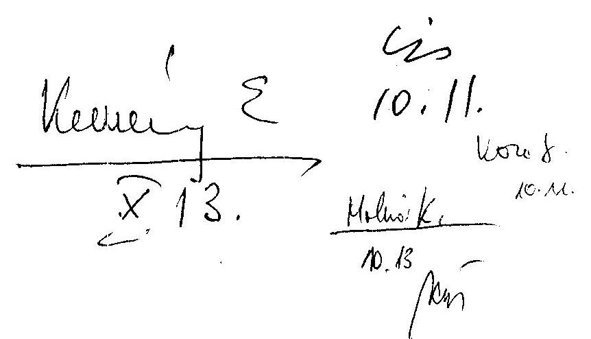

# Tisztelt Elnök Úr! 

A mozgáskorlátozottak támogatására előirányzott pénzeszközök hasznosulásának ellenőrzéséről készült jelentéssel kapcsolatos álláspontomról a következőkben tájékoztatom.

Megítélésem szerint a Jelentés a súlyos mozgáskorlátozott személyek közlekedési kedvezményeinek rendszerét átfogóan mutatja be, komplex módon elemzi a rendszer müködését rámutatva diszfunkcionális elemekre is.

A közlekedési kedvezményekkel kapcsolatos megállapításokkal, következtetésekkel alapvetően egyetértek.

A végrehajtási tapasztalatok ismeretében az általunk is számos elemében problémásnak tartott ellátórendszer átfogó felülvizsgálatát már kezdeményeztük. Ennek érdekében az Országos Fogyatékosügyi program végrehajtásáról szóló Intézkedési Tervben javaslatot teszünk arra, hogy a súlyos mozgáskorlátozott személyek közlekedési kedvezményeinek felülvizsgálata feladatként megjelenjen.

A magam részéről úgy ítélem meg, hogy a jelenlegi támogatási rendszer keretein belül már nem végezhető el az indokolt és szükséges átalakítás. E kérdésben előzetes egyeztetést folytattunk a Mozgáskorlátozottak Egyesületeinek Országos Szövetsége Elnökével, melynek során teljes egyetértés volt abban, hogy a 164/1995. (XII.27.) Korm. rendelet további módosítása helyett egy új támogatási rendszer kiépítését kell megkezdeni. Ezért javaslom,

---

hogy a Jelentésben megfogalmazott javaslatokból fenti kormányrendelet módosítást célzó intézkedésekre vonatkozó ajánlás maradjon el.

Tájékoztatom továbbá Elnök Urat, hogy a Mozgáskorlátozottak Egyesületeinek Országos Szövetségével történt szakmai egyeztetésen egyetértés alakult ki a támogatási rendszer átalakításának fő irányait és ütemezését illetően is.

Úgy vélem, hogy a további munkák elvégzését nagymértékben elősegítik a számvevőszéki vizsgálat által feltárt problémák és a Jelentésben foglalt megállapítások.

Budapest, 2003. október „6 „,
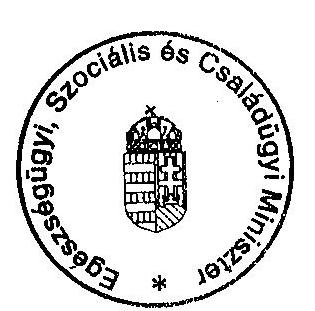

Tisztelettel:
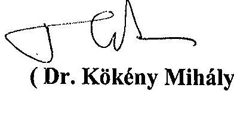
(Dr. Kökény Mihály )

---

# Dr. Kökény Mihály úr 

miniszter
Egészségügyi, Szociális és Családügyi Minisztérium

## Budapest

## Tisztelt Miniszter Úr!

Köszönettel megkaptam a mozgáskorlátozottak támogatására előirányzott pénzeszközök hasznosulásának ellenőrzéséről készült jelentéssel kapcsolatban írt levelét. Örömmel nyugtázom egyetértését a jelentés megállapításaival, következtetéseivel és pozitív fejleményként értékelem, hogy a jelenlegi szabályozás korrekciója helyett egy új alapokon nyugvó támogatási rendszer kiépítését kívánják megkezdeni.

Ismételten átgondolva javaslatainkat, a következőkről tájékoztatom Miniszter urat. A szakmai egyeztetések és végül a közigazgatási államtitkár asszonnyal folytatott egyeztetés során (az egyetértéséről szóló levél 2003. augusztus 29 -én kelt) mindvégig közös kiinduló pont volt a jelenlegi szabályozás megváltoztatásának szükségessége, ezért javaslataink is erre vonatkoznak. Az új helyzetértékelés ennél tágabb lehetőségeket hordoz, mivel a támogatási rendszer alapelveinek újragondolását is jelentheti, ennek lehetséges irányáról azonban még nincs információnk.

Úgy ítélem meg, hogy javaslataink - miután azok a jelenlegi szabályozás és az ezen alapuló gyakorlat diszfunkcionális elemeinek kiküszöbölésére irányulnak - egy új támogatási rendszer jogszabályi kereteinek kialakításánál is hasznosíthatók. Ebből a szempontból közömbösnek tartom, hogy újra szabályozzák-e a támogatási rendszert vagy a jelenlegi szabályozást módosítják. Azt pedig nem tudom megitélni, hogy a szorgalmazott módosításokkal indokolt-e megvárni a támogatási rendszer újraszabályozását, mivel nem ismerem annak időbeni ütemezését.

Mindezek alapján javaslatainkat fenntartva Miniszter úr mérlegelését kérem, hogy milyen módon érvényesíti azokat a szabályozásban.

Miniszter úr levelének kézhezvételét követően a BM közigazgatási államtitkárával folytatott konzultáció során felmerült, hogy a szerzési támogatásra jogosító utalványok kiosztása nem a Belügyminisztérium, hanem az Egészségügyi, Szociális és Családügyi Minisztérium feladata. Ugyanakkor az ESzCsM közigazgatási államtitkára szerint ez a két tárca együttes intézkedését igényli. A magam részéről nem kívánok állást foglalni a

---

hatásköri vitában. Az azonban tény, hogy a hatályos jogi szabályozás nem rögzíti a szerzési támogatásra jogosító utalványok kiosztásánál követendő eljárást, nem ír elő prioritási sorrendet a felsorolt előnyszempontok között, és nem tér ki arra, hogy a várakozási idő miként viszonyul a többi előnyt jelentő feltételhez. Mindez azért jelent problémát, mivel a kiosztható utalványok száma messze elmarad az igénylők számától, miközben a jogosultak jelentős része az elbírálás szempontjából azonos feltételekkel rendelkezik.

Megítélésem szerint a kialakult helyzet indokolja egy olyan, országosan egységes gyakorlat kialakítását és annak ellenőrzését, amely biztosítja a szerzési támogatáshoz való egyenlő hozzáférést. Ezért e javaslatok megvalósítására egyidejűleg kérem a BM és az ESzCsM minisztereket.

Az előzőek alapján kérem Miniszter urat, hogy javaslatainkat mérlegelni, illetve elfogadni szíveskedjék.

Budapest, 2003. november " 13 "

Tisztelettel: es myfecsülenl
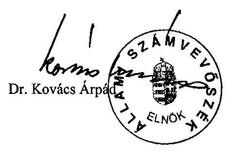

---

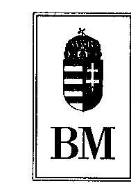

BELÜGYMINISZTER
se: $1-0-2 / 44 / 03$.

## Dr. Kovács Árpád Úrnak

Állami Számvevőszék
Elnöke

## Budapest

## Tisztelt Elnök Úr!

A mozgáskorlátozottak támogatására előirányzott pénzeszközök hasznosulásának ellenőrzéséről készített jelentéshez az alábbi észrevételeket teszem, illetve fenntartom a minisztérium korábban képviselt álláspontját.

1/c. melléklet
a V-9-146/2003. sz. jelentéshez
$24.561 \%$
T. Bihay a.

Kotch menes chody nhseltel, vagy valanotjich
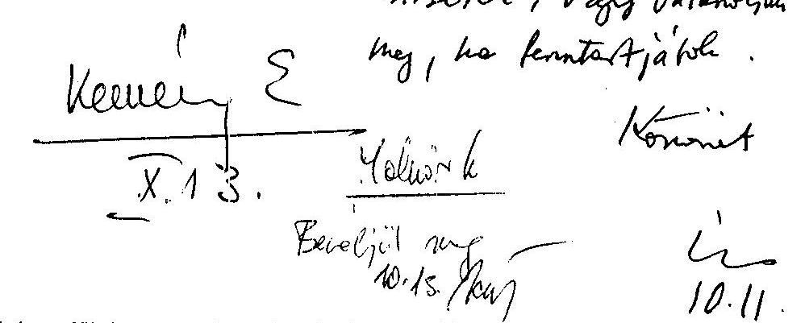

Mint az anyag is megállapítja a gépjármủ-szerzési támogatások esetében alapvető probléma a források szűkössége. A közreműködésemmel irányított közigazgatási hivatalok - a jogszabályi rendelkezések betartása mellett - az igénylők nagy száma, a kiosztható utalványok korlátozott mennyisége miatt kénytelenek prioritási sorrendet felállítani, illetve előny-szempontként a várakozási idő hosszát is figyelembe venni, de semmiképpen nem folytatnak jogszabálysértő gyakorlatot. Mindez azt szolgálja, hogy lehetőség szerint azonos elbírálást, jogegyenlőséget tudjanak biztosítani az érintetteknek. A fentiek alapján úgy gondolom tehát, hogy az ÁSZ javaslata - a kormányrendeletben megfogalmazott előny-feltételek maradéktalan betartatása a közigazgatási hivataloknál - nem reális, mivel a kérelmek elbírálása jelenleg a jogszabálynak megfelelően történik. Véleményem szerint a 164/1995. (XII. 27.) Korm. rendeletet kellene módosítani, abban kell az előny-szempontokat - a várakozási idő hosszát is egyértelműen rögzíteni és a prioritási sorrendet meghatározni. (A jogalkotásról szóló 1987. évi XI. tv. 11. § (1) bekezdése értelmében jogszabályban kell rencelkezni azokról a kérdésekről, amelyek az ország területén magánszemélyekre, jogi személyekre terjednek ki.)
A szükséges jogszabály-módosítás előkészítése az ezen hatósági tevékenység szakmai irányítását - az Ác. szerint - felettes szervként ellátó ESZCSM feladata.

A fentiek alapján kérem a részemre megfogalmazott javaslatok elhagyását.
Kérem Elnök urat, hogy észrevételem alapján álláspontjáról tájékoztatni szíveskedjék, mivel az intézkedési terv összeállítására annak függvényében adok utasítást.

Budapest, 2003. október

Tisztelettel:
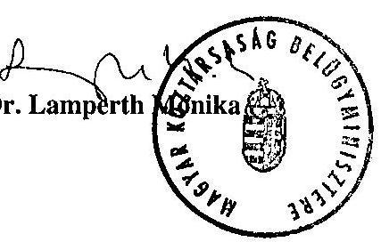

Budapest, V. József Attila u. 2-4. Postacím: 1903 Budapest, Pf. 314.

---

# Állami Számvevőszék 

## Dr. Lamperth Mónika úrhölgy

miniszter
Belügyminisztérium
Budapest

## Tisztelt Miniszter Asszony!

Köszönettel megkaptam a mozgáskorlátozottak támogatására előirányzott pénzeszközök hasznosulásának ellenőrzéséről készült jelentésünkkel kapcsolatban írt észrevételező levelét.

Annak előrebocsátásával, hogy a jelentés nem tartalmaz olyan megállapítást, amely szerint a hivatalok jogszabálysértő gyakorlatot folytatnak, a következők miatt tartjuk fontosnak az egységes gyakorlat kialakításának szorgalmazását.

A hatályos jogi szabályozás nem rögzíti a szerzési támogatásra jogosító utalványok kiosztásánál követendő eljárást, nem ír elő prioritási sorrendet a felsorolt előnyszempontok között, és nem tér ki arra, hogy a várakozási idő miként viszonyul a többi előnyt jelentő feltételhez. Mindez azért jelent problémát, mivel a kiosztható utalványok száma messze elmarad az igénylők számától, miközben a jogosultak jelentős része az elbírálás szempontjából azonos feltételekkel rendelkezik.

Megítélésem szerint a kialakult helyzet indokolja egy olyan, országosan egységes gyakorlat kialakítását, amely biztosítja a szerzési támogatáshoz való egyenlő hozzáférést.

Dr. Kökény Mihály miniszter úr arról tájékoztatott, hogy napirendre tűzik a támogatási rendszer újraszabályozását. Megítélésem szerint azonban az új szabályozás megalkotása hosszabb időt vesz igénybe és az érintettek igazságérzete is azt kívánja, hogy addig is érvényesüljenek a mindenki által megismerhető egységes prioritások.

A második javaslatunk pedig az egységes gyakorlat érvényesítésének az ellenőrzését célozza.

Miniszter asszony levelének kézhezvételét követően a tárca közigazgatási államtitkárával folytatott konzultáció során felmerült, hogy a szerzési támogatásra jogosító utalványok kiosztása nem a Belügyminisztérium, hanem az Egészségügyi, Szociális és Családügyi Minisztérium feladata. Ugyanakkor az ESzCsM közigazgatási államtitkára

---

szerint ez a két tárca együttes intézkedését igényli. A magam részéről nem kívánok állást foglalni a hatásköri vitában. Ezért a javaslatok megvalósitására egyidejüleg kérem a BM és az ESzCsM minisztereket.

Az előzőek alapján kérem Miniszter asszonyt, hogy javaslatainkat mérlegelni, illetve elfogadni szíveskedjék.

Budapest, 2003. november " 4 "
Tisztelettel: is mefecsilenat
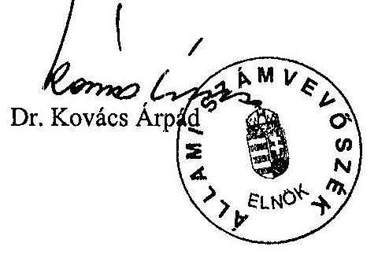

---

# 2h4403   2003   1/e. melléklet   2003. sz. jelentéshez is 

## 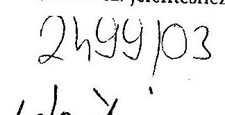

Ikt.szám: I-3133/1/2003
Üi.: dr. Enyedi József

Dr. Kovács Árpád úr elnök
Állami Számvevőszék
Budapest

Tisztelt Elnök Úr!
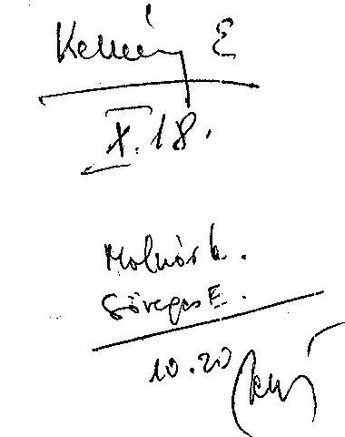

A mozgáskorlátozottak támogatására előirányzott pénzeszközök hasznosulásának ellenőrzéséről szóló jelentést köszönettel megkaptam.

A pénzeszközök hasznosulásának ellenőrzése alapos, hiszen kitér a mai állami támogatási formákra (ezt talán a vizsgálat címében is jelezni kellene), a fennálló fogalom eltérésre, az érintett kör nagyságának érzékeltetésére és az eszközök korlátos voltára.

A jelentés alapján sajnálattal veszem tudomásul, hogy a pénzeszközök felhasználásában anomáliák is léteznek. A mozgáskorlátozottak gépkocsi szerzési támogatásának igen jól érzékelhető hányadánál (majdnem $30 \%$-nál) a jelentésben idézett Népjóléti Minisztérium, illetve a Szociális és Családügyi Minisztérium által végzett reprezentatív vizsgálatok jogellenes használatot is megállapítottak. Hasonló módon a támogatási formák nem hatékony formájára utal az a megállapítás, hogy a parkolási engedélyekhez viszonylag könnyű hozzájutni, s mai országos nyilvántartásuk nem megoldott.

Igen komoly következtetésnek tartom, hogy a mozgáskorlátozottak közlekedési kedvezményeire vonatkozóan - a vizsgálat kereteiben végzett felmérés alapján az az általános vélemény, mely szerint e rendszer alapvetően szociális támogatásként funkcionál (jövedelemhez kötöttsége, családösszetétellel való összefüggései miatt). E támogatásnak kifejezetten a mozgáskorlátozott személyek támogatását kellene szolgálnia, segitve helyváltoztatási tevékenységüket,

---

közlekedési gondjaikat. A helytálló megállapítások jelentős részében megítélésem szerint a jelzett feszültségek közös forrása az érintett kör gondjainak megoldását segitő eszközrendszer forrásigényének és a forrás lehetőségek összhangjában mutatkozó lényeges eltérés.

Mindezekre is tekintettel igen fontosnak és megszívlelendőnek tartom a jelentés javaslatait, melyet részben a Kormány, részben az érintett minisztériumok felé fogalmaz meg.

Budapest, 2003. október „ 16 ,"

Tisztelettel:
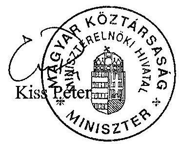

---

# ESÉLYEGYENLŐSÉGI TÁRCA NÉLKÜLI MINISZTER 

Hiv.sz: V-9-139/2003.

Dr. Kovács Árpád úrnak
Elnök

## Állami Számvevőszék

Budapest 4.
Pf.: 54.
1364

Tisztelt Elnök Úr!
A mozgáskorlátozottak támogatására elöirányzott pénzeszközök hasznosulásának ellenőrzéséről szóló jelentést köszönettel megkaptam.

Esélyegyenlőségi tárca nélküli miniszterként az ellenőrzés megállapításaira észrevételt nem teszek. Jelzem azonban, hogy a jelentésben tett megállapításokat saját tapasztalatom, illetve munkatársaim tapasztalatai is alátámasztják.

Az Állami Számvevőszék által tett javaslatokkal egyetértve kész vagyok koordinatív feladataimnak eleget téve segíteni az Országos Fogyatékostigyi Program végrehajtására vonatkozó középtávú intézkedési tervről szóló 2062/2000. (III. 24.) számú Korm. határozat végrehajtását.

A levelében hivatkozott 1989. évi XXXVIII. törvény értelmében az ellenőrzés alapján rendelt és a már megtett intézkedéseimről október 30-ig tájékoztatni fogom Önt.

Budapest, 2003. október 2.
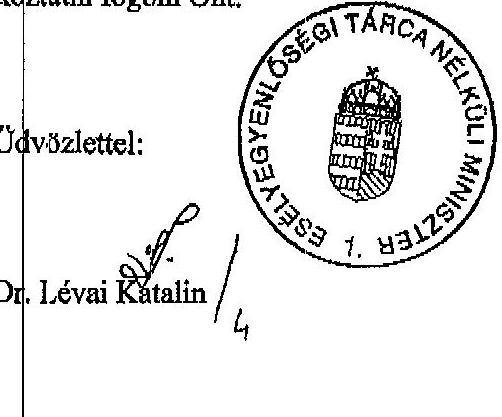

---

2. melléklet

a V-9-146/2003. sz. jelentéshez

A fogyatékos és a súlyosan mozgáskorlátozott személyek csoportjainak kapcsolatrendszere

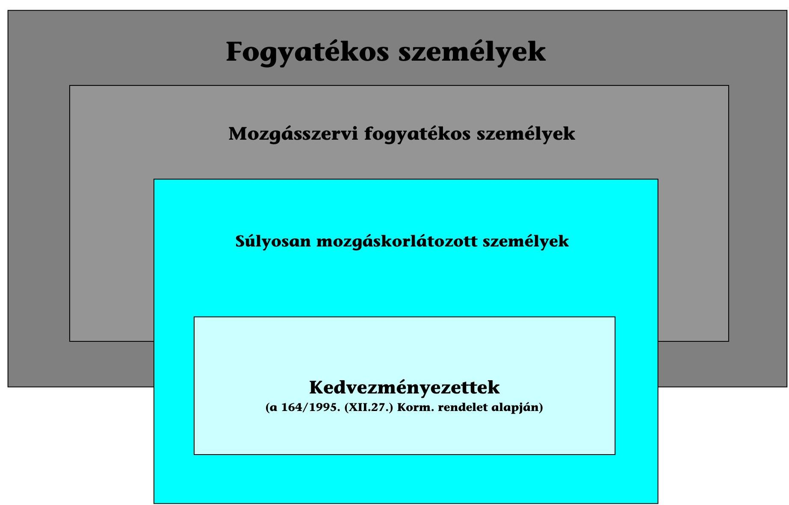

Megjegyzés: a téglalapok nagysága nem arányos az egyes csoportok létszámaival

---

# Mozgáskorlátozottak támogatása 2002. évi kiadásának megoszlása 

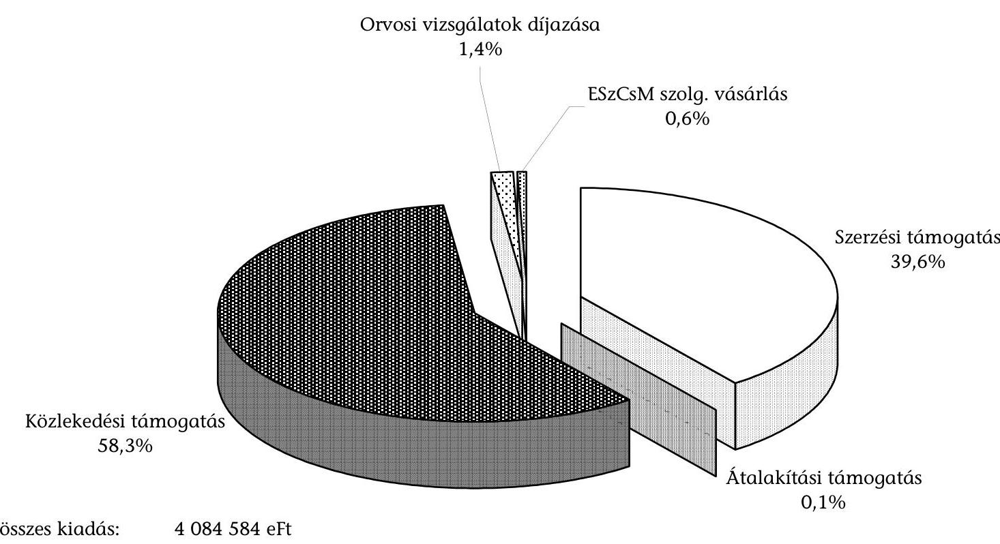
2002. évi összes kiadás: $\quad 4084584 \mathrm{eFt}$
ebből szerzési támogatás: $\quad 1618108 \mathrm{eFt}$
átalakítási támogatás: $\quad 5930 \mathrm{eFt}$
közlekedési támogatás: 2381239 eFt
orvosi vizsgálatok díjazása: 56723 eFt
ESzCsM szolgált. vás.: $\quad 22584 \mathrm{eFt}$
Az ESzCsM vizsgálatáról készített számvevői jelentés adatai.

---

# A szerzési és átalakítási támogatások 2002. évi keretei és teljesítési adatai

|  Megye | Szerzési támogatás |  |  |  |  |  |  |   |
| --- | --- | --- | --- | --- | --- | --- | --- | --- |
|   | Benyújtott
igények
száma |  | Keret |  | A keret-
kielégítettség
$\%-\mathbf{a}$ | Uralvány
beváltás ${ }^{\dagger}$ |  |   |
|   | (db) | utalvány
(db) | (eFt) |  |  | (db) | utalvány
(db) | (eFt)  |
|  Szabolcs-Szatmár-Bereg | 3387 | 556 | 166800 | 16\% | 478 | 50 | 1500 | 13  |
|  Borsod-Abaúj-Zemplén | 3067 | 547 | 164100 | 18\% | 402 | 50 | 1500 | 2  |
|  Békés | 3573 | 471 | 141300 | 13\% | 412 | 43 | 1290 | 5  |
|  Budapest | 2248 | 452 | 135600 | 20\% | 272 | 41 | 1230 | 23  |
|  Bács-Kiskun | 3135 | 417 | 125100 | 13\% | 337 | 40 | 1200 | 4  |
|  Pest | 2466 | 410 | 123000 | 17\% | 303 | 35 | 1050 | 7  |
|  Jász-Nagykun-Szolnok | 2195 | 348 | 104400 | 16\% | 289 | 30 | 900 | 3  |
|  Baranya | 2263 | 342 | 102600 | 15\% | 264 | 31 | 930 | 2  |
|  Csongrád | 1546 | 253 | 75900 | 16\% | 195 | 25 | 750 | 11  |
|  Hajdú-Bihar | 1585 | 247 | 74100 | 16\% | 203 | 25 | 750 | 11  |
|  Fejér | 1357 | 224 | 67200 | 17\% | 190 | 21 | 630 | 5  |
|  Heves | 1098 | 182 | 54600 | 17\% | 150 | 17 | 510 | 1  |
|  Somogy | 823 | 149 | 44700 | 18\% | 110 | 15 | 450 | 1  |
|  Veszprém | 722 | 119 | 35700 | 16\% | 92 | 15 | 450 | 8  |
|  Tolna | 961 | 116 | 34800 | 12\% | 86 | 10 | 300 | 4  |
|  Zala | 650 | 115 | 34500 | 18\% | 85 | 10 | 300 | 2  |
|  Nógrád | 746 | 112 | 33600 | 15\% | 96 | 10 | 300 | 2  |
|  Komárom-Esztergom | 455 | 86 | 25800 | 19\% | 73 | 10 | 300 | 4  |
|  Győr-Moson-Sopron | 498 | 83 | 24900 | 17\% | 63 | 12 | 360 | 8  |
|  Vas | 407 | 71 | 21300 | 17\% | 45 | 10 | 300 |   |
|  Összesen: | 33182 | 5300 | 1590000 | 16\% | 4145 | 500 | 15000 | 116  |

[^0] [^0]: ${ }^{\dagger}$ Megjegyzés: utalvány beváltás az áthúzódók nélkül

---

A személygépkocsi szerzési támogatások 2002. évi igény és keret mennyiségei
(az Egészségügyi, Szociális és Családügyi Minisztérium adatai alapján)
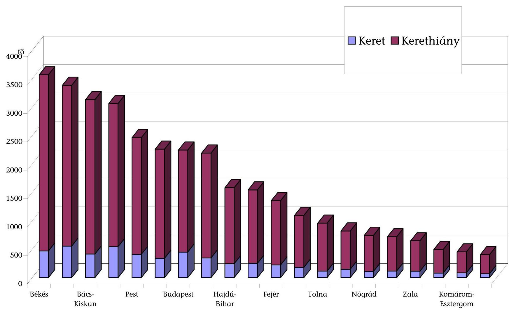

---

6. melléklet

a V-9-146/2003. sz. jelentéshez

A szerzési utalványok megyénkénti részarányai 2002-ben

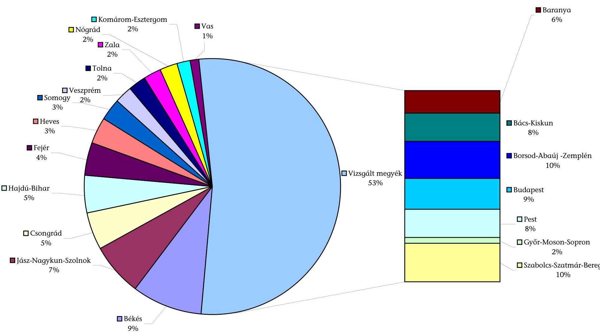

---

A 2002. évi jármúbeszerzések megoszlása vételár szerint
(az Egészségügyi, Szociális és Családügyi Minisztérium adatai alapján)
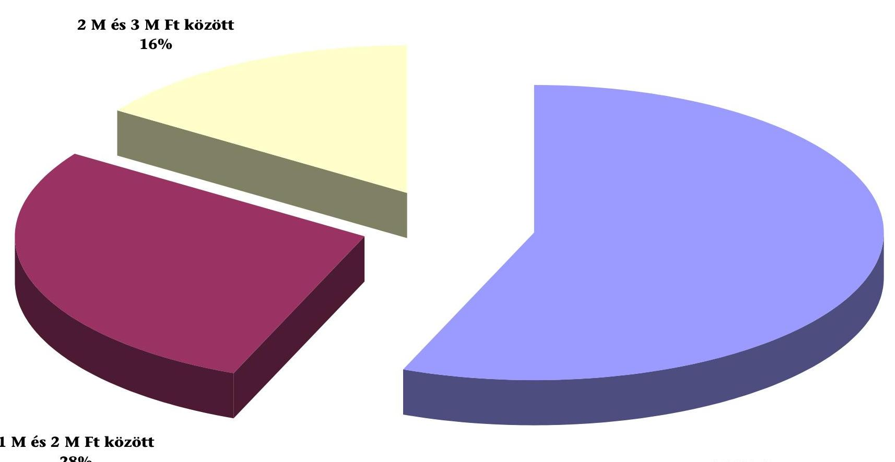

---

# A szerzési és átalakítási támogatások 2002. évi alakulása

(a vizsgált közigazgatási hivatalok adatai alapján)

|  Jogosultsági forma |  | Szerzési támogatás |  |  |  |  |  |  |  |  |  |  |  |  |  |  |  |  |  |  |   |
| --- | --- | --- | --- | --- | --- | --- | --- | --- | --- | --- | --- | --- | --- | --- | --- | --- | --- | --- | --- | --- | --- |
|   |  | Tárgyévi igények |  | Kielégített igények |  |  |  |  |  |  |  |  |  |  |  |  |  |  |  |  |   |
|   |  | db |  | db |  | eFt |  |  |  |  |  |  |  |  |  |  |  |  |  |  |   |
|  Személygépkocsi | Saját jogán | 14509 |  | 2588 |  | 657 119,4 |  |  |  |  |  |  |  |  |  |  |  |  |  |  |   |
|   | A szállítást vállaló jogán | 1948 |  | 349 |  | 57 347,4 |  |  |  |  |  |  |  |  |  |  |  |  |  |  |   |
|   | Összesen: | 16457 |  | 2937 |  | 714 466,8 |  |  |  |  |  |  |  |  |  |  |  |  |  |  |   |
|  Segédmotoros rokkantkocsi |  | 0 |  | 0 |  | 0,0 |  |  |  |  |  |  |  |  |  |  |  |  |  |  |   |
|  Gépi meghajtású kerekesszék |  | 2 |  | 2 |  | 600,0 |  |  |  |  |  |  |  |  |  |  |  |  |  |  |   |
|  Segédmotoros rokkantkocsi és gépi meghajtású kerekesszék összesen |  | 2 |  | 2 |  | 600,0 |  |  |  |  |  |  |  |  |  |  |  |  |  |  |   |
|  Mindösszesen: |  | 16459 |  | 2939 |  | 715 066,8 |  |  |  |  |  |  |  |  |  |  |  |  |  |  |   |

|  Átalakítási támogatás |  |  |   |
| --- | --- | --- | --- |
|  Tárgyévi igények | Elfogadott igények | Kerethiány miatt elutasított |   |
|  db | db | eFt | db  |
|  327 | 171 | 4 171,0 | 156  |
|  1 | 1 | 30,0 | 0  |
|  328 | 172 | 4 201,0 | 156  |
|  0 | 0 | 0,0 | 0  |
|  0 | 0 | 0,0 | 0  |
|  0 | 0 | 0,0 | 0  |
|  328 | 172 | 4 201,0 | 156  |

---

# A várakozási idők hossza 2002. évben (a kielégített igények nélkül) 

| Megye | Jogosultság megállapításának időpontja (év) | Várakozók száma 2002. évben (fő) |  |
| :--: | :--: | :--: | :--: |
|  |  | szerzési támogatásra | átalakítási támogatásra |
| Baranya | 1998, vagy az előtt | 1343 |  |
|  | 1999 | 120 |  |
|  | 2000 | 138 |  |
|  | 2001 | 232 |  |
|  | 2002 | 527 |  |
| Bács-Kiskun | 1998, vagy az előtt | 528 | 2 |
|  | 1999 | 342 | 2 |
|  | 2000 | 492 | 2 |
|  | 2001 | 538 | 8 |
|  | 2002 | 1235 | 17 |
| Borsod-AbaújZemplén | 1998, vagy az előtt | 464 | 9 |
|  | 1999 | 232 | 1 |
|  | 2000 | 298 | 3 |
|  | 2001 | 427 | 2 |
|  | 2002 | 1099 | 8 |
| Győr-MosonSopron | 1998, vagy az előtt | 283 |  |
|  | 1999 | 37 |  |
|  | 2000 | 34 |  |
|  | 2001 | 56 | 5 |
|  | 2002 | 88 | 20 |
| Szabolcs-SzatmárBereg | 1998, vagy az előtt | 980 |  |
|  | 1999 | 270 | 1 |
|  | 2000 | 380 | 1 |
|  | 2001 | 545 | 4 |
|  | 2002 | 556 | 3 |
| Pest | 1998, vagy az előtt | 6 |  |
|  | 1999 | 181 | 1 |
|  | 2000 | 347 | 1 |
|  | 2001 | 544 | 1 |
|  | 2002 | 831 | 6 |
| Budapest | 1998, vagy az előtt | 105 |  |
|  | 1999 |  |  |
|  | 2000 | 354 | 15 |
|  | 2001 | 467 | 40 |
|  | 2002 | 707 | 47 |
| Összesen | 1998, vagy az előtt | 3709 | 11 |
|  | 1999 | 1182 | 5 |
|  | 2000 | 2043 | 22 |
|  | 2001 | 2809 | 60 |
|  | 2002 | 5043 | 101 |

---

# 2002. évben szerzési támogatásra várakozók száma (a vizsgált intézmények adatai alapján) 

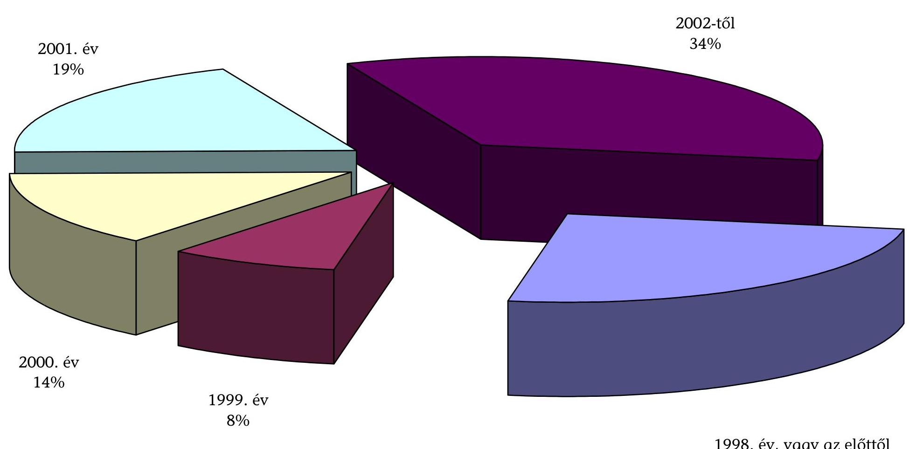

---

# Az igényelt és megállapított közlekedési támogatások jogosultsági formák szerint

(vizsgált polgármesteri hivatalok, 2002.)

|  Jogosultsági forma | Szorzó-
szám | Közlekedési támogatások |  |  |  | Közlekedési támogatások részarányai |  |  |   |
| --- | --- | --- | --- | --- | --- | --- | --- | --- | --- |
|   |  | Tárgyévi igények | Megállapított jogosultságok |  | Elutasított igények | Tárgyévi igények | Megállapított jogosultságok |  | Elutasított igények  |
|   |  | db | db | eFt | db | \% | db | Ft | \%  |
|  1-62 éves korú tanulói jogviszonyban, vagy munkaviszonyban álló | 3,5 | 1297 | 1259 | 30784,3 | 38 | $10 \%$ | $10 \%$ | $25 \%$ | $6 \%$  |
|  1-62 éves korú tanulói jogviszonyban vagy munkaviszonyban álló, és kiskorú eltartásáról gondoskodik | 4 | 453 | 443 | 12374,6 | 10 | $3 \%$ | $3 \%$ | $10 \%$ | $2 \%$  |
|  1-62 éves korú tanulói jogviszonyban, vagy munkaviszonyban nem állók | 1 | 4942 | 4686 | 32681,8 | 256 | $37 \%$ | $36 \%$ | $26 \%$ | $42 \%$  |
|  1-62 éves korú tanulói jogviszonyban, vagy munkaviszonyban nem állók, de kiskorú eltartásáról | 1,5 | 747 | 707 | 7413,0 | 40 | $6 \%$ | $5 \%$ | $6 \%$ | $7 \%$  |
|  62 év feletti | 1 | 5975 | 5706 | 39844,6 | 269 | $44 \%$ | $44 \%$ | $32 \%$ | $44 \%$  |
|  62 év feletti és kiskorú eltartásáról gondoskodik | 1,5 | 67 | 65 | 682,5 | 2 | $0 \%$ | $1 \%$ | $1 \%$ | $0 \%$  |
|  Összesen |  | 13481 | 12866 | 123780,8 | 615 | $100 \%$ | $100 \%$ | $100 \%$ | $100 \%$  |

---

A 2002. évben megállapított közlekedési támogatások megoszlása jogosultsági forma szerint, a vizsgált intézmények adatai alapján
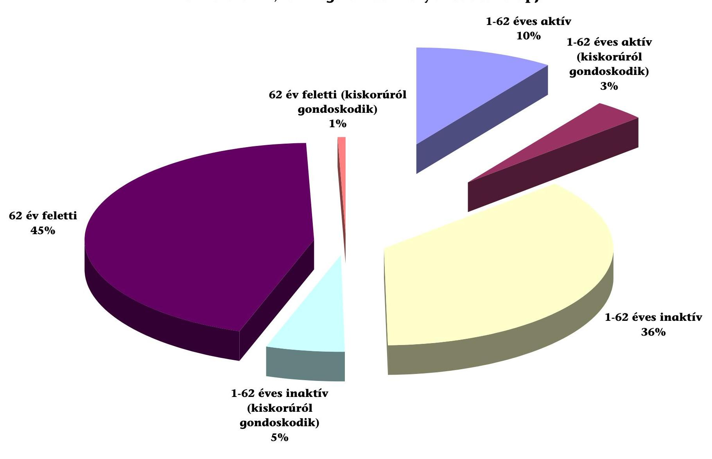

---

# A súlyos mértékben mozgáskorlátozott személyek 2002. évi közlekedési kedvezmény kérelmeinek orvosi pontszámai a vizsgált polgármesteri hivataloknál összesen

|  Megnevezés | Orvosi vélemény közlekedőképességet minősítő pontszáma |  |  |  |  |  |  |  |  |  |   |
| --- | --- | --- | --- | --- | --- | --- | --- | --- | --- | --- | --- |
|   | 7 alatt |  |  | 7 |  |  | 8 |  |  | 9 |   |
|   | háziorvosi | szakorvosi | összesen | háziorvosi | szakorvosi | összesen | háziorvosi | szakorvosi | összesen | háziorvosi | szakorvosi  |
|  Benyújtott kérelem (db) | 89 | 12 | 101 | 10123 | 2054 | 12177 | 5621 | 781 | 6402 | 708 | 70  |
|  ebből: - elfogadó határozat (db) | 0 | 0 | 0 | 9814 | 2005 | 11819 | 5391 | 756 | 6147 | 642 | 70  |
|  - elutasító határozat (db) | 89 | 12 | 101 | 309 | 49 | 358 | 230 | 25 | 255 | 66 | 0  |
|  - elutasítottból fellebbezés (db) | 29 | 0 | 29 | 42 | 4 | 46 | 22 | 1 | 23 | 3 | 0  |

---

# Kérdőív a mozgáskorlátozottak közlekedési kedvezményeinek ügyintézéséről a polgármesteri hivataloknál 

## KIÉRTÉKELÉS

1. Megítélése szerint jól szervezett-e a közlekedési kedvezmények ügyintézési folyamata a polgármesteri hivatalban?
$\square \quad$ Igen
$100 \%$
$\square \quad$ Nem
$0 \%$
$\square \quad$ Részben
$0 \%$
A mintában szereplő intézmények jól szervezettnek minősítették hivataluk közlekedési kedvezményekkel kapcsolatos ügyintézési tevékenységét.
2. Megítélése szerint megfelelő-e a hivatal tájékoztatási tevékenysége a mozgáskorlátozottak által igénybe vehető közlekedési kedvezmények vonatkozásában?
$\square \quad$ Igen
$85,71 \%$
$\square \quad$ Nem
$0 \%$
$\square \quad$ Részben
$14,29 \%$
A mintában szereplő intézmények $86 \%$-a megfelelő színvonalúnak minősítette a hivatala tájékoztatási tevékenységét a mozgáskorlátozottak által igénybe vehető közlekedési kedvezmények vonatkozásában.
3. Milyen eszközöket használnak tájékoztatási célból?
(Több válasz is megjelölhető volt)
$\square \quad$ Helyi újság, szórólap $71 \%$
$\square \quad$ Helyi rádió $43 \%$
$\square \quad$ Kábel TV $43 \%$
$\square \quad$ Internet $14 \%$
$\square \quad$ Egyéb $71 \%$
A mozgáskorlátozottak által igénybe vehető közlekedési kedvezményekről történő tájékoztatás céljából, a mintában szereplő intézmények $71 \%$-a alkalmaz helyi újságot, vagy szórólapot. A helyi rádió igénybe vételét az intézmények $43 \%$-a, a kábel TV igénybe vételét szintén $43 \%$-a jelölte meg. Az Internet lehetőségeivel $14 \%$-uk él. az. Az előzőeken túlmenően $71 \%$-uk egyéb eszközök használatát is megjelölte. Ezen intézmények közvetett módon, a háziorvosok, illetve egyéb, a mozgássérülteket tömörítő civil szervetek közreműködésével is fejtenek ki tájékoztatási tevékenységet.
4. Tettek-e konkrét intézkedéseket a mozgáskorlátozottak tájékoztatásának javítására az elmúlt két évben?
$\square \quad$ Igen
57,14
$\square \quad$ Nem
42,86

---

A mozgáskorlátozottak tájékoztatásának javítása céljából a mintában szereplő intézmények $57 \%$-a tett intézkedést. A kedvezményekkel kapcsolatos fontos tudnivalókat feltették az Internetre. A kedvezményezettek ügyeinek gyorsabb, hatékonyabb ügyintézése érdekében kapcsolatokat alakítottak ki a mozgáskorlátozottak érdekeit képviselő civil szervezetekkel.

# 5. A súlyos mozgáskorlátozottak ügyeinek intézéséhez 

$\square \quad$ Soron kívül fogadják őket
$71,43 \%$
$\square \quad$ Előzetesen időpontot egyeztetnek
$0 \%$
$\square \quad$ Az általános ügyfélfogadási mód érvényes
$28,57 \%$
A súlyos mozgáskorlátozottak ügyeinek intézése során jellemző a megfelelő bánásmód, a mintában szereplő intézmények $71 \%$-a soron kívül fogadja az érintett ügyfeleket.
6. Akadálymentesen bejuthat-e a mozgáskorlátozott az ügyfélszolgálati irodába?
$\square \quad$ Igen
$71,43 \%$
$\square \quad$ Nem
$28,57 \%$
A mintában szereplő intézmények $71 \%$-ánál a mozgáskorlátozott ügyfél akadálymentesen bejuthat polgármesteri hivatal ügyfélszolgálati irodájába.
7. A közlekedési kedvezmények különböző típusainak ügyintézésével:
$\square \quad$ Kizárólag egy személy foglalkozik
$42,86 \%$
$\square \quad$ A kedvezmények típusonként különböző ügyintézők
feladatkörébe tartoznak, irodán belül
$57,14 \%$
$\square \quad$ A kedvezmények típusonként más-más ügyintéző
feladatkörébe tartoznak, több különböző irodában
$0 \%$
A közlekedési kedvezmények különböző típusainak ügyintézésével a mintában szereplő intézmények $43 \%$-ánál kizárólag egy személy foglalkozik, illetve $57 \%$-ánál kedvezménytípusonként más-más ügyintéző foglalkozik, de az ügyintézés ugyanabban az irodában történik, így a mozgáskorlátozott ügyfél kérelme helyben intézhető.
8. Változott-e az ügyfélfogadási rend az elmúlt két évben a mozgáskorlátozottak közlekedési kedvezményeinek intézésével kapcsolatban?
$\square \quad$ Igen
$14,29 \%$
$\square \quad$ Nem
$85,71 \%$
Az ügyfélfogadási rend az elmúlt két évben a mozgáskorlátozottak közlekedési kedvezményeinek intézésével kapcsolatban csak a mintában szereplő intézmények $14 \%$-ánál (egy intézménynél) változott. A változás a különböző kedvezménytípusok ügyintézésének szervezésében következett be. Az addig különböző ügyintézők feladatkörébe tartozó kedvezmények ügyintézési gyakorlatát megszüntették, és helyette az ügyfélszolgálati iroda minden ügyintézője feladatkörébe helyezték át, ezáltal is biztosítva, hogy a kedvezmények ügyintézése folyamatos legyen.
9. Megoldott-e a mozgáskorlátozottak ügyeit intéző munkatárs(ak) helyettesítése, úgy hogy az ügyfélnek érdemi ügyintézés céljából ne kelljen ismételten megjelennie a polgármesteri hivatalban?
$\square \quad$ Igen
$100 \%$
$\square \quad$ Nem
$0 \%$

---

A mozgáskorlátozottak ügyeit intéző munkatárs(ak) helyettesítése a mintában szereplő intézményeknél $100 \%$-ban megoldott.
10. Gyakori-e a közlekedési kedvezmények megállapítása során a hiánypótlás?
$\square \quad$ Igen
$28,57 \%$
$\square \quad$ Nem
$71,43 \%$
A közlekedési kedvezmények megállapítása során a hiánypótlás nem gyakori, a mintában szereplő intézmények 29\%-ánál volt jellemző.
11. Gyakori-e, hogy a mozgáskorlátozottnak hiánypótlás miatt ismét meg kell jelennie az ügyfélszolgálaton?
$\square \quad$ Igen
$0 \%$
$\square \quad$ Nem, mert nem szükséges személyesen megielennie
$57,14 \%$
$\square \quad$ Nem gyakori
$42,86 \%$
A mozgáskorlátozottnak hiánypótlás miatt ismételt megjelenése nem gyakori, mert általában hiánypótlás céljából nem szükséges személyesen megjelenniük.
12. A közlekedési kedvezmények megállapítása során a hiánypótlás jellemzően mire irányul?
(Kérjük, jelölje be a leggyakrabban előfordulót!)
$\square \quad$ A kérelem tartalmi kiegészítésére
$0 \%$
$\square \quad$ A súlyos mozgáskorlátozottság tényét igazoló orvosi szak-
vélemény ismételt (pontosított) benyújtására
$14,29 \%$
$\square \quad$ Jövedelemigazolás pótlólagos benyújtására
$85,71 \%$
$\square \quad$ Egyébre
$0 \%$
A közlekedési kedvezmények megállapítása során a hiánypótlás jellemzően a súlyos mozgáskorlátozottság tényét igazoló orvosi szakvélemény ismételt (pontosított) benyújtására irányul.
13. A súlyos mozgáskorlátozott ügyfélnek a különböző támogatási formák megszerzéséhez (az igény benyújtásától a támogatás kézhezvételéig), ügyintézés céljából átlagosan hány alkalommal kell személyesen megjelennie a polgármesteri hivatalban? (Eltekintve az esetleges hiánypótlásoktól.)
(Kérjük, írja be az alkalmak számát!)
... Közlekedési támogatás esetén
1 eset
... Szerzési támogatás esetén
1 eset
... Átalakítási támogatás esetén
1 eset
... Parkolási engedély esetén
1 eset
A súlyos mozgáskorlátozott ügyfelek közlekedési kedvezményeinek ügyintézéséhez az ügyfeleknek bármely támogatási forma esetén elegendő egyszer megjelenniük.
14. Gyakori-e a mozgáskorlátozottak meghatalmazotti képviselete, az ügyintézés során?
$\square \quad$ Igen
$14,29 \%$
$\square \quad$ Nem
$85,71 \%$
A közlekedési kedvezmények ügyintézése során a mozgáskorlátozottak meghatalmazotti képviselete nem jellemző.

---

15. A különböző kedvezmények egyszerre történő kérelmezése esetén szükséges-e ugyanazon igazolás, szakvélemény több eredeti példányban való benyújtása?
$\square \quad$ Igen, mert közlekedési kedvezménytípusonként külön-külön bizonylat benyújtása szükséges 0\%
$\square \quad$ Nem, mert általánosan kerülnek elfogadása 100\%
A különböző kedvezmények egyszerre történő kérelmezése esetén nem szükséges ugyanazon igazolás, szakvélemény több eredeti példányban való benyújtása, mert azok általánosan kerülnek elfogadásra. A kedvezményezettekről általában felfektetnek egy aktát, és a különböző kedvezményeket ezek alszámain tartják nyilván.
16. Végeznek-e környezettanulmányt a benyújtott igazolások, nyilatkozatok hitelességének megállapítása céljából?
$\square \quad$ Igen $0 \%$
$\square \quad$ Nem $86 \%$
$\square \quad$ Szükség szerint $14 \%$
A mintában szereplő intézmények $86 \%$-ánál a benyújtott igazolások, nyilatkozatok hitelességének megállapítása céljából környezettanulmányt nem végeznek.
17. Általában mennyi ideig tart a közlekedési kedvezmények benyújtásának, meghosszabbításának ügyintézése?

- 1-15 perc $72 \%$
- 16-30 perc $14 \%$
- 30 perc felett $14 \%$

A mintában szereplő intézmények $72 \%$-ánál a közlekedési kedvezmények benyújtásának, meghosszabbításának ügyintézése 1-15 perc alatt megvalósítható.
18. Milyen időközönként folyósítja a polgármesteri hivatal a közlekedési támogatást?
$\square$ A határozathozatalt követően azonnal 0\%
$\square$ A jogerős határozatokat összegyújtve havonta 28,57\%
$\square$ A jogerős határozatokat összegyújtve negyedévente 0\%
$\square$ A jogerős határozatokat összegyújtve félévente 0\%
$\square$ A jogerős határozatokat összegyújtve évente egyszer 0\%
$\square \quad$ Egyéb időközönként 71,43\%
A polgármesteri hivatalok a közlekedési támogatásokat általában kevesebb, mint 1 hónapon belül kifizetik a kedvezményezettek részére.
19. Átlagosan mennyi idő telik el a kérelem benyújtásától a kedvezmény kézhezvételéig?
(Húzza alá a megfelelő időintervallumot)
Közlekedési támogatás: Max. 30 nap $31-60$ nap $0 \%$
Parkolási engedély: Max. 30 nap $100 \%$

Átalakítási támogatás: Max. 30 nap $57 \%$

31-60 nap $29 \%$

Min. 61 nap $0 \%$

Min. 61 nap $0 \%$

Min. 61 nap $29 \%$

---

A mintában szereplő intézmények $71 \%$-ánál a súlyos mozgáskorlátozott személyek a közlekedési támogatásokat a kérelem benyújtásától számítva 30 napon belül kézhez vehetik. Az intézmények $29 \%$-ánál a támogatást 31 és 60 nap között kaphatja meg az ügyfél, mert ezen polgármesteri hivataloknál kifizetést csak havonta egy alkalommal hajtanak végre.

A parkolási engedélyeket, a mintában szereplő polgármesteri hivatalok 1 és 30 nap között képesek kiadni a kedvezményezettek részére.

Az átalakítási támogatások kiadása nem a polgármesteri hivatalok hatáskörébe tartozik, így annak a kedvezményezettek részére történő átadása a megyei közigazgatási hivatalok munkamenetétől függ. A mintában szereplő hivatalok (települések) $57 \%$-ánál 30 napon belül, $14 \%$-ánál 31 és 60 nap között, és $29 \%$-ánál több mint 61 nap alatt jut az átalakítási utalványhoz az ügyfél.

# 20. Hogyan történik a közlekedési támogatások kifizetése? 

$\square \quad$ A polgármesteri hivatalnál, pénztárból $28,57 \%$
$\square \quad$ Banki (postai) úton $100 \%$
A mintában szereplő intézményeknél a közlekedési támogatások kifizetése jellemzően banki (postai) úton történik, de az intézmények 29\%-a pénztárból is teljesít kifizetéséket.

## 21. Hogyan történik a parkolási engedélyek kiadása?

$\square \quad$ A polgármesteri hivatalnál, személyes (meghatalmazotti) átvétellel $71,43 \%$
$\square \quad$ Tértivevényes postai úton $100 \%$
$\square \quad$ Ajánlott küldeményként $0 \%$
$\square \quad$ Egyszerű postai úton $0 \%$
A mintában szereplő intézményeknél a parkolási engedélyek kiadása általában tértivevényes postai úton történik, de az intézmények $71 \%$-ánál jellemző a személyes (meghatalmazotti) átvétel is.

## 22. Voltak-e panaszok az ügyfélszolgálat tevékenységével kapcsolatban?

$\square \quad$ Igen $0 \%$
$\square \quad$ Nem $100 \%$
A mintában szereplő intézményeknél - nyilatkozatuk szerint - az ügyfélszolgálat tevékenységével kapcsolatban panasz nem merült fel.

Budapest, 2003. november