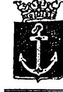
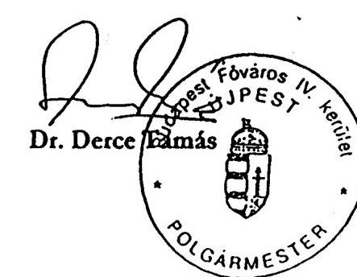

# JELENTÉS 

Budapest Főváros IV. kerület Újpest Önkormányzata gazdálkodásának átfogó ellenőrzéséről

---

3. Önkormányzati és Területi Ellenőrzési Igazgatóság
3.3 Átfogó Ellenőrzések Főcsoport
Iktatószám: V-1002-7/22/15/2003.
Témaszám: 635
Vizsgálat-azonosító szám: V0102
Az ellenőrzést felügyelte:
Dr. Lóránt Zoltán
főigazgató
Az ellenőrzés végrehajtásáért felelős:
Dr. Sepsey Tamás
főcsoportfőnök
Az ellenőrzést vezette:
Csecserits Imréné
főcsoportfőnök-helyettes
Az ellenőrzést végezték:
Cséffai János
számvevő tanácsos
Dér Géza
számvevő
Kozma Gábor
számvevő
Nagy Ervin
számvevő

# A témához kapcsolódó - az elmúlt három évben készített - 

számvevőszéki jelentések:
címe
Jelentés a települési önkormányzatok tulajdonában lévő közutak, 0007
hídak, alagutak fejlesztésének, fenntartásának és üzemeltetésének vizsgálatáról
Jelentés a települési önkormányzatok adóztatási tevékenységének 0121 vizsgálatáról
Jelentés a foglalkoztatást elősegítő támogatások felhasználásának 0226 ellenőrzéséről

---

# TARTALOMJEGYZÉK 

BEVEZETÉS ..... 5
I. ÖSSZEGZŐ MEGÁLLAPÍTÁSOK, KÖVETKEZTETÉSEK, JAVASLATOK ..... 7
II. RÉSZLETES MEGÁLLAPÍTÁSOK ..... 14

1. A költségvetés tervezésének, végrehajtásának és a zárszámadás elkészítésének szabályszerűsége ..... 14
1.1. A költségvetés tervezésének, a költségvetési rendelet megalkotásának, elfogadásának szabályszerűsége ..... 14
1.2. A költségvetési előirányzatok módosításának szabályszerűsége ..... 16
1.3. A gazdálkodás szabályozottsága, szabályszerűsége ..... 17
1.4. A munkafolyamatba épített ellenőrzések szabályozottsága és gyakorlati működése a pénzügyi, gazdasági és számviteli feladatellátás területén ..... 19
1.5. A bizonylati rend szabályszerűsége ..... 20
1.6. A vagyon nyilvántartásának és leltározásának szabályszerűsége ..... 22
1.7. A vagyongazdálkodással kapcsolatos feladat és döntési hatáskörök szabályozottsága, a vagyonváltozást előidéző intézkedések szabályszerűsége, célszerűsége ..... 24
1.8. Az Önkormányzat által céljelleggel - nem szociális ellátásként - juttatott támogatásokkal történő elszámoltatás szabályszerűsége ..... 27
1.9. A követelések, részesedések, értékpapírok év végi értékelésének szabályszerűsége ..... 29
1.10. A működési és felhalmozási bevételek, kiadások alakulása ..... 30
1.11. A költségvetés egyensúlyi helyzete ..... 32
1.12. A közbeszerzési eljárások szabályszerűsége ..... 33
1.13. A Polgármesteri hivatal helyi kisebbségi önkormányzatok gazdálkodását segítő tevékenysége ..... 35
1.14. A zárszámadási kötelezettség teljesítésének szabályszerűsége ..... 37
2. Az egyes kiemelt önkormányzati feladatok és a rendelkezésre álló források összhangja ..... 38
2.1. A feladatok meghatározása és szervezeti keretei ..... 38
2.2. Az egyes naturális mutatókkal mérhető feladatok bevételei és kiadásai ..... 40
2.3. A jelentős ráfordítást igénylő önként vállalt feladatok ellátása ..... 41
3. A belső irányítási, ellenőrzési rendszer működésének értékelése ..... 42
3.1. Az Önkormányzat informatikai rendszerének szabályozottsága, működése ..... 42
3.2. A helyi ellenőrzési rendszer kialakítása, működése ..... 43
3.3. A könyvvizsgálati kötelezettség teljesítése ..... 45
3.4. A korábbi számvevőszéki ellenőrzések javaslatainak hasznosulása ..... 46

---

# MELLÉKLETEK 

1. számú Az önkormányzati vagyon nagyságának alakulása (1 oldal)
2. számú Az Önkormányzat 2002. évi bevételeinek és kiadásainak alakulása (1 oldal)
3. számú Dr. Derce Tamás polgármester úr észrevétele (1 oldal)

---

# RÖVIDÍTÉSEK JEGYZÉKE 

| Ötv. | a helyi önkormányzatokról szóló 1990. évi LXV. törvény |
| :--: | :--: |
| Áht. | az államháztartásról szóló 1992. évi XXXVIII. törvény |
| Ámr. | az államháztartás működési rendjéről szóló 217/1998. (XII. 30.) Korm. rendelet |
| Kbt. | a közbeszerzésekről szóló 1995. évi XL. törvény |
| Számv. tv. | a számvitelről szóló 2000. évi C. törvény |
| Htv. | a helyi önkormányzatok és szerveik, a köztársasági megbízottak, valamint egyes centrális alárendeltségű szervek feladat- és hatásköreiről szóló 1991. évi XX. törvény |
| Nek. tv. | a nemzeti és etnikai kisebbségek jogairól szóló 1993. évi LXXVII. törvény |
| Vhr. | az államháztartás szervezetei beszámolási és könyvvezetési kötelezettségének sajátosságairól szóló 249/2000. (XII. 24.) Korm. rendelet |
| Ltv. | a lakások és helyiségek bérletére, valamint az elidegenítésükre vonatkozó egyes szabályokról szóló 1993. évi LXXVIII. törvény |
| Tpt. | a tőkepiacról szóló 2001. évi CXX. törvény |
| Önkormányzat | Budapest Főváros IV. kerület Újpest Önkormányzata |
| Képviselő-testület | Budapest Főváros IV. kerület Újpest Önkormányzat Képviselő-testülete |
| Pénzügyi bizottság | Budapest Főváros IV. kerület Újpest Önkormányzat Képviselő-testülete Pénzügyi Költségvetési Bizottság |
| Gazdasági bizottság | Budapest Főváros IV. kerület Újpest Önkormányzat Képviselő-testülete Gazdasági Bizottság |
| Polgármesteri hivatal | Budapest Főváros IV. kerület Újpest Önkormányzat Polgármesteri Hivatal |
| Pénzügyi osztály | Budapest Főváros IV. kerület Újpest Önkormányzat Polgármesteri Hivatal Adó és Pénzügyi Osztály |
| ÁSZ | Állami Számvevőszék |
| TÁH | Területi Államháztartási Hivatal |
| SzMSz | Budapest Főváros IV. kerület Újpest Önkormányzat Szervezeti és Működési Szabályzata |
| GI | Budapest Főváros IV. kerület Újpest Önkormányzat Gazdasági Intézmény |
| UV Rt. | Újpesti Vagyonkezelő Részvénytársaság |

---

# 4

---

# JELENTÉS 

## Budapest Főváros IV. kerület Újpest Önkormányzata gazdálkodásának átfogó ellenőrzéséről

## BEVEZETÉS

A helyi önkormányzatokról szóló 1990. évi LXV. törvény 92. § (1) bekezdése, valamint az államháztartásról szóló 1992. évi XXXVIII. törvény 120/A. § (1) bekezdése szerint Budapest IV. kerület Újpest Önkormányzatának gazdálkodását az Állami Számvevőszék Önkormányzati és Területi Ellenőrzési Igazgatósága a V-1002-7/2003. számú ellenőrzési program alapján vizsgálta.

## Az ellenőrzés célja annak értékelése volt, hogy:

- az önkormányzati gazdálkodás törvényességét, szabályszerűségét biztosították-e a tervezés, a költségvetés végrehajtása és a zárszámadás során; a gazdálkodás szabályszerűségét biztosító kontrollok megfelelően segítették-e a végrehajtást;
- az Önkormányzat által ellátandó feladatok és az azokhoz rendelkezésre álló pénzforrások összhangja biztosított volt-e;
- a helyi kisebbségi önkormányzat gazdálkodása során érvényesültek-e az Áht. és a vonatkozó kormányrendeletek előírásai.

Az ellenőrzött időszak: 2002. év, valamint a 2003. I. negyedév, az 1.7., 2.1., 2.2., 2.3., 3.2., 3.3. és 3.4. ellenőrzési programpontok esetében 2000-2002. évek.

Budapest Főváros IV. kerület Újpest Önkormányzata területén a 2002. évben 103625 fő lakos élt, ez a lakosságszám a 2000. évhez viszonyítva 2620 fővel (2,5%) kevesebb volt.

Az Önkormányzat Képviselő-testülete harminchárom képviselőből és a polgármesterből állt, nyolc állandó bizottságot választott. A 2002. évben tíz kisebbségi önkormányzat alakult. Az Önkormányzatnak a Polgármesteri hivatalon kívül hat önállóan gazdálkodó és 46 részben önállóan gazdálkodó költségvetési szerve volt. A Polgármesteri hivatal és az intézmények összesen 13438 millió Ft költségvetési kiadást teljesítettek a 2002. évben, amely 349 millió Fttal (2,7%) több a 2001. évi összes kiadásnál. Az önkormányzati feladatok ellátásához foglalkoztatott közalkalmazottak létszáma a 2002. évben 3144 fő volt, a Polgármesteri hivatalban 236 fő köztisztviselő dolgozott.

A könyvviteli mérlegben kimutatott önkormányzati vagyon értéke 25330 millió Ft volt 2002. december 31-én, ez 1676 millió Ft-tal (7,1%) több az előző événél. A kerület fejlődését az elhanyagolt, rossz állapotú területek rehabilitációját megvalósító fejlesztések is mutatják. A kerület közműellátottsága az egészséges ivóvíz-hálózatba bekapcsolt lakások tekintetében 100%-os, a csatornaellátottsága 94,7%-os, a kiépített belterületi utak összes úthoz viszonyított aránya 97,2%-os volt.

---

# I. ÖSSZEGZŐ MEGÁLLAPÍTÁSOK, KÖVETKEZTETÉSEK, JAVASLATOK 

Az önkormányzati gazdálkodás törvényességét, szabályszerűségét teljes körűen nem biztosították a tervezés, a költségvetés végrehajtása és a zárszámadás során. A gazdálkodás szabályszerűségét biztosító kontrollok nem megfelelő hatékonysággal segítették a végrehajtást.

Az Önkormányzat nem határozta meg gazdasági programját, de több, egyes szakterületet érintő hosszabb távú részprogramot készített. A 2002. évi költségvetési koncepciót az előírt tartalommal, határidőre elkészítették, de az előterjesztéshez nem csatolták a kisebbségi önkormányzatok véleményét. A polgármester az Áht-ban előírt határidőben előterjesztette a költségvetési rendelettervezetet, szerkezete részben felelt meg a vonatkozó előírásoknak, nem tartalmazta a kisebbségi önkormányzatok költségvetését, nem rögzítette teljes körűen a végrehajtás szabályait.

A Képviselő-testület az előirányzatok változtatásának jogát átengedte bizottságainak és a polgármesternek. A Polgármesteri hivatalnál és az Önkormányzat intézményeinél a 2002. évben a kiemelt előirányzatok közül a dologi kiadásoknál, a pénzeszköz-átadásnál, a felújítási és beruházási kiadásoknál volt előirányzat-túllépés, amely az előirányzat-módosítás és átcsoportosítás elmulasztásának a következménye. A túllépések okait vizsgálták, de felelősségre vonás nem történt. A Képviselő-testület az előirányzat-módosításokról és átcsoportosításokról a jogszabályban előírt határidő után, a zárszámadás elfogadásával egyidejűleg alkotott rendeletet.

Az Önkormányzatnál a gazdálkodási, ellenőrzési jogköröket szabályozták. A tisztségviselők, dolgozók ezzel összefüggő feladatait, hatásköreit és felelősségét a Polgármesteri hivatal SzMSz-ében, a munkaköri leírásokban rögzítették. Rendelkeztek a jogszabályokban előírt számviteli politikával és az ehhez kapcsolódó szabályzatokkal, de ezek nem feleltek meg teljes mértékben a hatályos jogszabályoknak, tartalmilag hiányosak voltak, aktualizálásuk a 2002. évben elmaradt, csak részben tükrözték a helyi sajátosságokat. Az operatív gazdálkodással kapcsolatos kötelezettségvállalási és utalványozási jogköröket és az ellenőrzést szolgáló érvényesítési és ellenjegyzési feladatokat rögzítették. Az írásos kötelezettségvállalás és az ellenjegyzés több esetben elmaradt, nem gondoskodtak a vállalt kötelezettségek nyilvántartásáról. Az érvényesítés a jogszabályban előírt formában nem valósult meg, ezért a munkafolyamatba épített ellenőrzési funkció nem érvényesült. A rendszeresített utalvány-nyomtatvány nem volt alkalmas a gazdálkodással kapcsolatos feladatok elvégzésének és az elvégzés időpontjainak ellenőrizhető rögzítésére.

A Polgármesteri hivatalnál a napi készpénzforgalom 3-10 millió Ft volt. Indokolatlan módon, készpénzben fizették ki a Polgármesteri hivatal dolgozóinak a jutalmakat is. A 2002. évben nem tettek eleget a gépjármű üzemanyag norma túllépése miatti személyi jövedelemadó és társadalombiztosítási járulék fizetési kötelezettségüknek.

---

A Polgármesteri hivatal könyvviteli mérlegében szereplő tételek értékét a főkönyvi és az analitikus nyilvántartások nem megfelelően bizonylatolt egyeztetésével, mennyiségi leltárfelvétellel, illetve összesítő kimutatásokkal támasztották alá, azonban ennek jogszabályban előírt feltételei részben voltak meg, mert a leltározási szabályzatban nem rögzítették az összesítő kimutatás tartalmát, formáját és kellékeit, nem rendelkeztek a felügyeleti szerv egyetértésével. A mérlegben nem a vevők által elfogadott, elismert követeléseket szerepeltették. A részletfizetéssel értékesített lakásokkal kapcsolatos több évre vonatkozó követeléseket a forgóeszközök között mutatták ki. A parkok esetében az építmények értékének elkülönített nyilvántartása hiányában a teljes érték után számolták el az építményekre érvényes leírási kulcs alapján az értékcsökkenést. Nem minden eszközféleséget értékeltek egyedileg. Nem vizsgálták a terven felüli értékcsökkenés és a követelések utáni értékvesztés elszámolásának szükségességét.

Az Önkormányzat vagyona a 2001-2002. években jelentős mértékben növekedett, döntően a fejlesztési célkitűzések megvalósításának eredményeként. A beruházások egy része azonban nem eredményezett vagyonnövekedést, mert az elkészült csatorna víziközművek tulajdonjogát három esetben - 2001. I. 23-án, 2002. VII. 19-én és 2003. I. 14-én - a jogszabályi előírás ellenére térítésmentesen átadták a szolgáltató gazdasági társaságnak.

A vagyon értékének és összetételének változását befolyásoló döntéseket a vagyongazdálkodást érintő rendeletekben és a helyi szabályzatokban előírt módon hozták meg. Az Önkormányzat nem fogadott el vagyongazdálkodási koncepciót. A vagyont érintő kérdésekben készült előterjesztések és az elfogadott határozatok kevés információt tartalmaztak. Az ingatlanok értékesítését a vevők kezdeményezték, a Gazdasági bizottság nem élt a pályáztatás lehetőségével, az eladási árat a bizottsági tagok szakértelme és személyes tapasztalatai alapján állapította meg. A folytatott gyakorlat nem biztosította a köztulajdon felhasználás nyilvánosságának, átláthatóságának a feltételeit.

A kerületi önkormányzat a tulajdonában lévő részesedés és értékpapírállomány kezelését nem bízta befektetési vállalkozásra, az értékesítésre és a vásárlásra vonatkozó döntéseket szabályosan hozták meg.

A Képviselő-testület rendeletben nem szabályozta, hogy milyen módon és mely esetekben lehet az önkormányzati vagyon tulajdonjogát és kezelési jogát ingyenesen átadni, követelésről lemondani.

Az egyes jogi személyek és jogi személyiséggel nem rendelkező szervezetek részére nyújtott támogatásokról rendeletet alkotott a Képviselő-testület. Megsértve a rendelet előírásait az alapítványok támogatásáról az esetek 71%-ában nem a Képviselő-testület döntött, a folyamatosan támogatott szervezetek előirányzatait nem tartalmazta elkülönítetten a költségvetési rendelet. A támogatott szervezetek egyötödének nem írták elő a számadási kötelezettséget.

Az Önkormányzat a Kbt.
 és a Képviselő-testület vonatkozó rendelete előírásainak betartásával folytatta le a közbeszerzési eljárásokat. Egy esetben a

---

közbeszerzési értékhatárt meghaladó összegű szolgáltatás vásárlásakor elmulasztották az eljárás megindítását.

A Polgármesteri hivatal rendelkezett a jegyző által kiadott informatikai szabályzatokkal, katasztrófa-elhárítási tervvel. Az informatikai eszközökről és a számítógépes programokról a Polgármesteri hivatal Informatikai osztályán önálló nyilvántartást alakítottak ki. A Pénzügyi osztályon dolgozók közül öt fő munkaköri leírása nem tartalmazta az informatikai eszközök használatával összefüggő feladatokat.

Az Önkormányzat kialakította az önállóan gazdálkodó intézményei pénzügyi (felügyeleti) ellenőrzéséhez, illetve a Polgármesteri hivatal belső ellenőrzéséhez szükséges szervezeti kereteket. A felügyeleti ellenőrzésre két munkakört biztosítottak, de ezek közül az egyik két éve betöltetlen. A Polgármesteri hivatal belső ellenőre által végzett ellenőrzések között 79% volt az ellenőrzési tervben nem szereplő feladatok aránya. A Képviselő-testület meghatározott időszakonként nem tekintette át a költségvetési szervek ellenőrzésének tapasztalatait. Az Önkormányzat az ellenőrzések megállapításainak hasznosításáról nem gondoskodott teljes körűen. Az ellenőrzési szabályzat kiadása óta bekövetkezett változásokat nem követte a szabályozás, nem tartalmazta a belső ellenőrzéssel összefüggő előírásokat. Az Önkormányzat egészére vonatkozóan határozták meg az ellenőrzöttek jogait és kötelezettségeit, de a szabályzat megismertetését a teljes intézményhálózattal nem biztosították.

Az Önkormányzat által ellátott feladatok és az azokhoz rendelkezésre álló források összhangja a költségvetési év egészét tekintve biztosított volt.

Az Önkormányzat költségvetése nem volt működési forráshiányos. Az önkormányzati költségvetési beszámolók szerint a 2001-2002. években a működési célú bevételek fedezték a működési kiadásokat, a felhalmozási bevételeket a működési célú forrásokból kiegészítették.

A jegyző - a pénzügyi egyensúly év közbeni fenntartása, az Önkormányzat által tervezett feladatok folyamatos finanszírozása érdekében - likviditási tervet készített, azonban annak folyamatos aktualizálása elmaradt.

Az önkormányzati feladatok ellátásához nem volt szükség tartósan idegen források bevonására. Az Önkormányzat élt a törvényben biztosított felhatalmazással és az 1992. évben helyi adókat: építményadót és telekadót vezetett be.

Az Önkormányzat a kötelezően előírt és az önként vállalt feladatait saját rendeletben, belső szabályzatban nem rögzítette. A feladatellátást költségvetési szervein és a tulajdonában álló gazdasági társaságon keresztül, illetve vásárolt szolgáltatásokkal biztosította. A vizsgált időszakban az Önkormányzat költségvetési intézményrendszere nem változott. A naturális mutatókkal mérhető feladatok esetében a fajlagos ráfordítások jelentősen emelkedtek az ellátottak számának csökkenése és a rendelkezésre álló kapacitások ennél kisebb arányú csökkentése, illetve a költségek emelkedése miatt. Az Önkormányzat által ellátott önként vállalt feladatok teljesítése nem veszélyeztette a kötelező feladatok ellátását.

---

A polgármester nem a jogszabályban előírt határidőn belül terjesztette elő a zárszámadási rendelet tervezetét. A 2002. évi zárszámadás tartalmazta a Polgármesteri hivatal és az Önkormányzat költségvetési szerveinek teljesítési adatait külön-külön és összevontan is. Az intézmények pénzmaradványának számszaki ellenőrzését elvégezték, de annak jóváhagyásáról a Polgármesteri hivatal írásban nem értesítette az intézmények vezetőit. A tárgyévi helyesbített pénzmaradványt terhelő visszafizetési kötelezettséget megállapították és azt az előírt határidőn belül visszautalták a Magyar Államkincstárnak. A Polgármesteri hivatal a jogszabály által előírt mellékletek és mérlegek közül hármat nem csatolt a beszámolóhoz.

Megsértve a jogszabályi előírást, az önkormányzati tulajdonú lakások értékesítéséből származó bevételek költségekkel csökkentett összegének 50%-át nem utalták át a Budapest Fővárosi Önkormányzatnak.

A helyi kisebbségi önkormányzatok gazdálkodása során részben érvényesültek az Áht. és a vonatkozó kormányrendeletek előírásai. A kerületi és a helyi kisebbségi önkormányzatok közötti megállapodásokat megkötötték. A megállapodások tartalma - a kisebbségi önkormányzatok költségvetése, módosítása határozattal történő elfogadásának, illetve azok Polgármesteri hivatal részére történő átadásának idejét kivéve - megfelelt a jogszabályi előírásoknak. A kerületi önkormányzat sem költségvetési, sem zárszámadási rendeleteibe nem építette be elkülönítetten a kisebbségi önkormányzatok határozattal elfogadott költségvetését és zárszámadását. A helyi kisebbségi önkormányzatok számviteli nyilvántartásainak elkülönített vezetését, a gazdálkodásukkal kapcsolatos pénzforgalmuk jogszabályi előírásoknak megfelelő bonyolítását, a működési feltételeket megfelelően biztosították.

A helyszíni ellenőrzés megállapításainak hasznosítása mellett javasoljuk:
A törvényes állapot helyreállítása és a jogszabályi előírások betartása érdekében:

# a polgármesternek: 

1. gondoskodjon arról, hogy az Önkormányzat készítsen gazdasági programot az Ötv. 91. § (1) bekezdésének megfelelően;
2. kezdeményezze a Képviselő-testület 14/1999. (V. 3.) számú rendeletének módosítását annak érdekében, hogy az önkormányzati beruházás eredményeként létrejött víziközművek az Ötv. 79. § (1) és (2) bekezdései, és a vízgazdálkodásról szóló 1995. évi LVII. törvény 6. § (3) bekezdésének megfelelően a továbbiakban az Önkormányzat tulajdonában maradjanak;
3. kezdeményezze, hogy az Áht. 108. § (2) bekezdésének megfelelően önkormányzati rendeletben szabályozzák, milyen módon és mely esetekben lehet a vagyon tulajdonjogát és kezelési jogát ingyenesen átruházni, követelésről lemondani;
4. kezdeményezze a Képviselő-testület 33/1996. (XI. 11.) számú rendelete 1. § (1) bekezdés a) pontjának hatályon kívül helyezését a Kbt. 96. § (2) bekezdése előírásának való megfeleltetés érdekében;

---

5. biztosítsa, hogy a - nem szociális ellátásként juttatott - támogatásokról szóló 6/1996. (III. 1.) számú rendelet 5. §-ában előírt testület döntsön az alapítványok esetében, a folyamatosan nyújtott támogatás összege a 2. §-nak megfelelően a költségvetési rendeletben kerüljön megtervezésre;
6. az Áht. 82. §-ban előírt határidőn belül terjessze a Képviselő-testület elé a zárszámadási rendelet tervezetét;
7. gondoskodjon arról, hogy a lakásértékesítéseiből származó - kiadásokkal csökkentett - bevétel 50%-a a Budapest Főváros Önkormányzata elkülönített számlájára az 1993. évi LXXVIII. törvény 63. § (1) bekezdése alapján átutalásra kerüljön;
8. kezdeményezze, hogy a Képviselő-testület meghatározott időszakonként tekintse át a költségvetési szervei ellenőrzésének tapasztalatait a Htv. 138. § (1) bekezdés g) pontjának megfelelően;
9. biztosítsa, hogy minden esetben folytassák le a közbeszerzési eljárást, amikor az a Kbt. 2. § (1) bekezdése alapján szükséges;
10. gondoskodjon arról, hogy a helyi kisebbségi önkormányzatok költségvetési határozatai változatlan tartalommal kerüljenek beépítésre a kerületi önkormányzat költségvetési rendeletébe az Áht. 65. § (3) bekezdés előírásainak megfelelően;
11. kezdeményezze a helyi kisebbségi önkormányzatokkal kötött együttműködési megállapodások módosítását annak érdekében, hogy azok kellő időben hozzák meg költségvetési és az azt módosító határozataikat;

# a jegyzőnek: 

1. biztosítsa, hogy a költségvetési előirányzatok módosítása, átcsoportosítása az Ámr. 53. § (2) és (6) bekezdéseiben meghatározott határidőn belül történjen meg;
2. intézkedjen a számviteli politika, valamint a számviteli politika keretében elkészített szabályzatok tartalmi kiegészítéséről, a helyi viszonyokhoz igazításról a Vhr. 8. § (3)(4) bekezdések előírásainak figyelembevételével;
3. biztosítsa, hogy a gazdálkodási rendelkezési jognak, valamint az érvényesítési és ellenjegyzési kötelezettségnek - az Ámr. 134-138. §-ai előírásainak és a helyi szabályoknak megfelelően - minden gazdasági eseménynél tegyenek eleget;
4. gondoskodjon arról, hogy a számviteli előírásoknak eleget téve:
a) a mérlegben csak a vevők által elfogadott, elismert követeléseket szerepeltessék a Vhr. 34. § (1) bekezdésének megfelelően;
b) a parkok és játszóterek esetében csak az építmények után számolják el a Vhr. 30. § (2) bekezdésében előírt mértékű értékcsökkenést;
c) a részletfizetéssel értékesített lakásokkal kapcsolatos követeléseket a következő évben esedékes rész kivételével a befektetett eszközök között mutassák ki a Vhr. 19. § (5) bekezdésének megfelelően;

---

d) a Számv. tv. 55. § (1)-(4) bekezdéseinek megfelelően végezzék el a követelések minősítését, indokolt esetben számolják el az értékvesztést;
e) a Számv. tv. 53. § (1)-(2) bekezdései alapján indokolt esetben számolják el az immateriális javak és a tárgyi eszközök esetében a terven felüli értékcsökkenést;
f) a Számv. tv. 16. § (1) bekezdésének megfelelően az eszközök teljes körűen egyedileg kerüljenek a számviteli nyilvántartásban rögzítésre és értékelésre;
g) a leltározás elvégzését igazoló leltárt helyettesítő összesítő kimutatás esetében a Vhr. 37. § (4) bekezdésében előírt feltételek teljesüljenek;
5. biztosítsa, hogy az Áht. 13/A. § (2) bekezdésében előírt követelmény érvényesítése érdekében a nem szociális ellátásként nyújtott támogatásoknál minden esetben írjanak elő számadási kötelezettséget;
6. gondoskodjon arról, hogy az Áht. 116. § 9. pontjában előírtaknak megfelelően a zárszámadáskor mutassák be a több éves kihatással járó döntések számszerűsítését évenkénti bontásban, valamint összesítve;
7. gondoskodjon arról, hogy a költségvetési szervek írásban értesítést kapjanak a pénzmaradvány jóváhagyásáról az Ámr. 149. § (5) bekezdésének megfelelően;
8. szabályozza az Ámr. 134. § (6) bekezdése értelmében a kötelezettségvállalások nyilvántartását, ennek során vegye figyelembe az Ámr. 134. § (2) és (4) bekezdéseiben előírtakat is, és határozza meg az 50000 Ft-ot el nem érő kötelezettségvállalások rendjét és nyilvántartási formáját;
9. gondoskodjon az Ámr. 139. §-ának előírása szerint elkészített önkormányzati szintű likviditási terv folyamatos aktualizálásáról;
10. segítse elő, hogy a helyi kisebbségi önkormányzatok kellő időben hozzák meg költségvetési és az azt módosító határozataikat;
11. biztosítsa, hogy az üzemanyag felhasználás ellenőrzése megtörténjen, teljesítsék a 60/1992. (IV.1.) Korm. rendelet szerinti 2002. évi norma túllépésből származó adó- és járulékfizetési kötelezettséget.

A munka színvonalának javítása érdekében:

# a polgármesternek: 

1. kezdeményezze vagyongazdálkodási koncepció kidolgozását, a nyilvánosság és az átláthatóság biztosítása érdekében: az önkormányzati vagyon tulajdonjogát érintő kérdésekben a pályáztatás alkalmazását, a készülő testületi előterjesztések és határozatok kötelező tartalmi elemeinek előírását, az előkészítés folyamatának szabályozását, ennek részeként ingatlanforgalmi szakvélemény beszerzését;
2. intézkedjen, hogy a belső ellenőr éves munkatervében szerepeljen az előirányzattúllépés okainak vizsgálata, növeljék a tervezett ellenőrzési feladatok arányát;

---

3. gondoskodjon a felügyeleti ellenőrzés személyi feltételeinek javításáról;
4. kezdeményezze, hogy a számvevői jelentést a Képviselő-testület tárgyalja meg, és a feltárt hiányosságok megszüntetése érdekében készítsenek intézkedési tervet;

# a jegyzőnek: 

1. kezdeményezze a készpénzforgalom csökkenését, a korszerű fizetési módok lehetőség szerinti kiterjesztését;
2. egészítse ki valamennyi a Pénzügyi osztályon dolgozó informatikai rendszereket használó köztisztviselő munkaköri leírását az ahhoz kapcsolódó feladatokkal;
3. vizsgálja felül az ellenőrzési szabályzatot, gondoskodjon annak aktualizálásáról és kiegészítéséről, az intézmények részére történő kiadásáról;
4. gondoskodjon az ellenőrzések megállapításai alapján tett javaslatok megvalósításáról;
5. biztosítsa a pénzügyi, gazdálkodási és számviteli feladatellátás területén a munkafolyamatba épített ellenőrzés működésének feltételeit, gyakorlati érvényesülését és megfelelő dokumentálását.

---

# II. RÉSZLETES MEGÁLLAPÍTÁSOK 

## 1. A KÖLTSÉGVETÉS TERVEZÉSÉNEK, VÉGREHAJTÁSÁNAK ÉS A ZÁRSZÁMADÁS ELKÉSZÍTÉSÉNEK SZABÁLYSZERŰSÉGE

### 1.1. A költségvetés tervezésének, a költségvetési rendelet megalkotásának, elfogadásának szabályszerűsége

A kerületi önkormányzat az Ötv. 91. § (1) bekezdésében előírt, a 2002. évre vonatkozó gazdasági programmal nem rendelkezett. Az Önkormányzat feladatainak ellátására a Képviselő-testület a következő részprogramokat fogadta el:

- az 1998. évben - Szociális cselekvési program az 1998-2002. évekre;
- a 2000. évben - Közoktatási intézmények eszköz- és felszerelés beszerzéséről készített program;
- a 2000. évben - Lakáspolitikai koncepció;
- a 2000. évben - Környezetvédelmi program irányelve.

A hosszabb távú célkitűzéseket az éves költségvetési koncepció készítésekor figyelembe vették.

Az Önkormányzat polgármestere a 2002. évi költségvetési koncepciót az előírt november 30-ai határidőt betartva terjesztette a Képviselőtestület elé. Az előterjesztést megelőzően az Önkormányzatnál működő bizottságok tájékoztatást kaptak a költségvetési koncepcióról, a Pénzügyi bizottság írásos véleményét csatolták az előterjesztéshez. A helyi kisebbségi önkormányzatok elnökeit szintén tájékoztatták a rájuk vonatkozó költségvetési koncepcióról, de az előterjesztéshez nem mellékelték a helyi kisebbségek koncepcióról alkotott véleményét, ezáltal nem tartották be az Ámr. 28. § (3) bekezdésében előírtakat. A Képviselő-testület a 152/2001. (X. 30.) számú határozatával elfogadta a 2002. évi költségvetési koncepciót, amelyben figyelembe
 vette a helyben képződő bevételeket és az ellátandó feladatok kiadási szükségletét, úgy döntött, hogy egyensúlyban lévő költségvetési rendeletet kell készíteni.

A polgármester a 2002. évi költségvetési rendelettervezetet, az Áht. 71. § (1) bekezdésében előírt – február 15-ei – határidőt betartva terjesztette a Képviselőtestület elé. A Képviselőtestület döntött azokban a kérdésekben, amelyek az előirányzatok meghatározását megalapozták.

A bizottságok által megtárgyalt rendelettervezet előterjesztéséhez csatolták a Pénzügyi bizottság véleményét és a könyvvizsgáló írásos jelentését is. A helyi kisebbségi önkormányzatok költségvetéséről hozott határozatokat, az Áht. 69. § (2) bekezdésében előírtak ellenére, nem építették be az Önkormányzat költségvetésébe. Az Önkormányzat által részükre biztosított támogatás összegéről külön mellékletet csatoltak a rendelettervezethez.

---

Az Áht. 118. §-ban előírt mérlegek bemutatását tartalmazta az előterjesztés, de ezek tartalmi követelményeit rendeletben nem határozta meg a Képviselőtestület. A rendelettervezetben rögzítették az Önkormányzatnál alkalmazott címrendet, valamint az Ámr. 29. § (1) bekezdése alapján:

- az Önkormányzat és az önállóan gazdálkodó intézmények bevételeit forrásonként külön-külön és összesen, az Ötv. 81-84. §-ában meghatározott részletezettségben;
- a működési, fenntartási kiadási előirányzatokat intézményenként és összesítve a kiemelt előirányzatonként részletezve;
- a felújítási előirányzatokat célonként;
- a felhalmozási kiadásokat feladatonként;
- az önkormányzati hivatal költségvetését feladatonként, külön rögzítve az általános és a céltartalékot;
- a több éves kihatással járó feladatok előirányzatait éves bontásban;
- a működési és a felhalmozási célú bevételi és kiadási előirányzatokat mérlegszerűen, együttesen egyensúlyban, tájékoztatási jelleggel;
- az éves létszámkeretet intézményenként és összesen.

A Képviselőtestület a 2002. évi költségvetést a 25/2001. (XII. 10.) számú rendeletével fogadta el, amely 11051 millió Ft bevételi és kiadási előirányzatot tartalmazott.

Az Önkormányzat 2002. évi költségvetési rendelete nem tartalmazta teljes körűen a költségvetés végrehajtásával kapcsolatos szabályokat, azok külön rendeletben, polgármesteri és jegyzői utasításokban jelentek meg. Az intézmények többletbevételei feletti rendelkezési jogosultság meghatározása nem a költségvetési rendeletben, hanem egy, 1996. évben alkotott rendeletben ${ }^{1}$ történt. Ez a rendelet részletezte a működési előirányzatokkal való gazdálkodás módját, az előirányzatok módosításának rendjét is. A rendelet a 2003. évi költségvetés megalkotásakor még hatályos volt, módosítása 2003. május 12-én történt meg.

A költségvetési rendeletben nem rögzítették a polgármesteri hatáskörű előirányzat-változtatás helyi rendjét, az Áht. 98. § (6) bekezdésében előírt önkormányzati biztos kirendelésének feltételeit és az Áht. 8/A. § (1) bekezdésben foglalt – az év során átmenetileg szabad – pénzeszközök hasznosításának szabályait.

A kerületi önkormányzat a költségvetési gazdálkodás szabályait nem módosította a jogszabályok 1996. óta bekövetkezett változásainak megfelelően, ezért a 2003. évi költségvetési koncepció, a költségvetési rendelettervezet előterjesztése és a költségvetési rendelet megalkotása során megismétlőd-

[^0]
[^0]:    ${ }^{1}$ A Képviselőtestület 40/1996. (XII. 12.) számú rendelete az önkormányzat által fenntartott önálló és részben önálló költségvetési intézmények gazdálkodási jogköréről.

---

tek a 2002. évi hiányosságok. A Képviselőtestület a 2003. évi költségvetést a 2/2003. (III. 10.) önkormányzati rendeletével fogadta el 12010 millió Ft előirányzati főösszeggel.

# 1.2. A költségvetési előirányzatok módosításának szabályszerűsége 

A Képviselőtestület a 2002. évi költségvetési rendeletében jóváhagyott előirányzatokat két alkalommal, összesen 3136 millió Ft-tal módosította. A főösszeget érintő módosítások az eredeti előirányzat 28,4%-át tették ki. A módosítás összege a központosított, normatív, kötött felhasználású támogatások (765 millió Ft), az átvett pénzeszközök (747 millió Ft), valamint a saját hatáskörű előirányzatok (1624 millió Ft) változásának a következménye volt. A költségvetési rendelet módosítására előterjesztett rendelettervezetek részletezettsége és szerkezete azonos volt az eredeti költségvetési rendeletével.

A Képviselőtestület élt az Áht. 74. § (2) bekezdésében biztosított lehetőséggel, az átcsoportosítás jogát átengedte a bizottságainak és a polgármesternek. A Képviselőtestület az Önkormányzat által fenntartott önálló és részben önálló költségvetési intézmények gazdálkodási jogköréről szóló 40/1996. (XII. 12.) számú rendeletében szabályozta az előirányzat-módosítás és átcsoportosítás módját. Az intézményvezetői hatáskörben végrehajtható előirányzat átcsoportosítást a polgármester jóváhagyásával teljesíthetik, a testület utólagos tájékoztatásával. Az intézményműködtetési céltartalék felhasználásáról előirányzat módosításként az illetékes bizottság dönt, a Pénzügyi bizottság soron következő ülésén történő tájékoztatása mellett. A rendelet szerint a Képviselőtestületet az év közben végrehajtott előirányzat-módosításokról a költségvetési beszámolási időszak előtt tájékoztatni kell. Ez a szabályozás nem felelt meg az Ámr. 53. § (6) bekezdésben foglaltaknak, mert az 30 napos tájékoztatási határidőt ír elő.

A Képviselőtestület az előirányzat-módosításról és átcsoportosításról 2003. május 12-én alkotott rendeletet a zárszámadás elfogadásával egyidejűleg. Nem tartották be az Áht. 93. § (2) bekezdésben foglaltakat, mert a költségvetési szervek előirányzaton felüli többletbevételüket előirányzat-módosítás nélkül használták fel, valamint nem teljesítették az Ámr. 53.§ (6) bekezdésének előírását, amely szerint a Képviselőtestület legkésőbb a zárszámadási rendelettervezet Képviselőtestület elé terjesztését közvetlenül megelőző ülésén módosíthatja költségvetési rendeletét.

Az előirányzatokkal történő gazdálkodás szabályozása és megvalósítása sem biztosította az Áht. 12/A. § (1) bekezdése előírásának érvényesülését, mely szerint kötelezettség vállalása és kifizetés teljesítése csak a jóváhagyott előirányzatok mértékéig vállalható. Az Önkormányzat 2002. évi költségvetési gazdálkodása során a Polgármesteri hivatalnál és az intézményeknél is volt kiemelt előirányzat túllépés.

A 45 részben önálló költségvetési intézmény gazdálkodását végző GI a kiemelt dologi kiadások módosított előirányzatát 2,5%-kal túllépte. A GI előirányzat túllépéseit a Pedagógiai Szolgáltató Központ 1,2 millió Ft, a Piac és Vásárcsarnok 16,2 millió Ft, a GI központ 13,9 millió Ft, a Bródy Imre Gimnázium 3,1 millió Ft és a Babits Mihály Gimnázium 4,4 millió Ft előirányzat nélküli kifize-

---

tései határozták meg. A Szociális Foglalkoztató is előirányzat nélkül vásárolt 2,8 millió Ft összegben. A Polgármesteri hivatal kiemelt előirányzatai közül, a pénzeszköz átadás módosított előirányzatát 14,3 millió Ft-tal túllépte.

Az önállóan és a részben önállóan gazdálkodó intézményeknél a felújítási és felhalmozási kiadások módosított előirányzatának közel ötszörös ${ }^{2}$ túllépése is előfordult.

Az előirányzatokkal történő gazdálkodás figyelemmel kísérését a folyamatos, zárt rendszerű analitikus nyilvántartás biztosította, a módosításokról és átcsoportosításokról a dokumentumok a jogszabályokban rögzített határidőkön túl, vagy egyáltalán nem készültek el. Az Áht. 93. § (1) bekezdésében előírtakat megsértették, mert nem a jóváhagyott költségvetési előirányzatokon belül gazdálkodtak.

Az előirányzat túllépések miatt az érintett intézmények vezetőit nem vonták felelősségre, a gazdálkodást felügyelő alpolgármester írásban hívta fel a figyelmüket a szabályszerű eljárásra.

# 1.3. A gazdálkodás szabályozottsága, szabályszerűsége 

Az önkormányzati gazdálkodással kapcsolatos döntési, felelősségi feladatkörök az Önkormányzat SzMSz-ében, a Polgármesteri hivatal SzMSz-ében, a költségvetési rendeletek végrehajtási szabályai között, valamint egyedi szabályzatokban kerültek meghatározásra.

A Polgármesteri hivatal szervezeti egységeire kiterjedően 1998. január 1-től az 1/2/25 számú polgármesteri utasítás tartalmazta részletesen a pénzgazdálkodással kapcsolatos kötelezettségvállalási, ellenjegyzési, érvényesítési és utalványozási, illetve a banki aláírási jogkörök szabályozását. A Polgármesteri hivatal kiadásai tekintetében a kötelezettségvállalási jogkört a polgármesterhez, az ellenjegyzési jogköröket a jegyzőhöz rendelte. Az érvényesítést végzők kijelölésénél tekintettel voltak az Ámr. 135. § (2) bekezdése szerinti szakmai végzettségre. A teljesítés szakmai igazolását az Ámr. 135. § (4) bekezdése szerint előírta az utasítás.

A polgármester meghatározott esetekben (munkaszerződések, külföldi kiküldetések, reprezentációs keret, értékpapírok vásárlása, támogatás folyósítása, állandó ellátmányok) a kötelezettségvállalási és utalványozási jogkört magának tartotta meg. Más összeghatárhoz kötött, illetve konkrétan nevesített (jogi, szociális, gyámügyi) esetekben felhatalmazta az alpolgármestereket, a jegyzőt, illetve a felsorolt szakterületek vezetőit a saját hatáskörben történő kötelezettségvállalásra. A jegyző megtartotta az ellenjegyzés jogkörét egyes gazdasági események tekintetében, az egyéb esetekben felhatalmazta a Pénzügyi osztály vezetőjét és annak helyetteseit a jogkör gyakorlására.

[^0]
[^0]:    ${ }^{2}$ Ez 3,1 millió Ft előirányzat nélküli kifizetés volt az Újpesti Gyermek és Ifjúsági Háznál.

---

A szabályozás a jogszabályi előírásokkal összhangban határozta meg a gazdálkodási jogkörök tartalmát és rögzítette a jogkörök gyakorlására jogosult személyeket, a neveket és az aláírás mintákat az utasítás melléklete tartalmazza. Nem rendelkeztek az 50 ezer Ft-ot el nem érő nem írásban vállalt kötelezettségek nyilvántartási rendjéről az Ámr. 134. § (4) bekezdésében előírtak szerint. Teljes körű volt az összeférhetetlenségi szabályok meghatározása az Ámr. 135. § (4) bekezdésében, illetve a 138. §-ban előírtaknak megfelelően.

A Polgármesteri hivatal – eleget téve a Vhr. 8. § (3) bekezdés előírásainak 2001. január 1-től hatályos számviteli politikával rendelkezett, de azt az időközben bekövetkezett jogszabályi változásoknak megfelelően nem aktualizálták. Nem rögzítették a terven felüli értékcsökkenés elszámolásának, visszaírásának szabályait. Nem tartalmazta a szabályozás a számviteli elszámolás szerinti lényeges és jelentős összegnek a Vhr. 8. § (5) bekezdés szerinti meghatározását. A számviteli politika a jogszabályi követelmények közül nem tartalmazott döntést arra vonatkozóan, hogy a számviteli politikát, vagy annak egyes elemeit, illetve a kapcsolódó szabályzatokat kiterjeszti-e az Önkormányzat felügyelete alá tartozó költségvetési szervekre az egységes számviteli rend megteremtése érdekében ${ }^{3}$.

A számviteli politika tartalmazta az értékpapírok befektetett-, vagy forgóeszközzé való minősítésének szabályozását, a minősítésre a polgármester jogosult. A mérlegkészítés időpontját – ameddig a tárgyévre vonatkozóan a számviteli nyilvántartásban a helyesbítések elvégezhetők – meghatározták a Vhr. 8. § (6) bekezdése szerint, de nem célszerűen, mivel azt az éves beszámoló TÁH részére való megküldési határideje utáni időpontban (március 30.) rögzítették.

A számviteli politika keretében elkészítették és hatályba léptették a polgármesteri hivatalra vonatkozó szabályzatokat: a Vhr. 49. §-a szerint a számlarendet, a Vhr. 37. § (5) bekezdése szerint a leltárkészítési és leltározási szabályzatot és a felesleges vagyontárgyak hasznosításának, selejtezésének szabályzatát, valamint a Vhr. 8. §-ának megfelelően az eszközök és források értékelési szabályzatát, illetve az értékkezelési és pénzkezelési szabályzatot. Önköltségszámítási szabályzatot nem kellett készíteni, mivel vállalkozási tevékenységet nem folytattak.

A számlarendben a számlaosztályok tartalmának és számlakapcsolataiknak a 2002. évi aktualizálása elmaradt. A számlarend a jogszabályi előírások figyelembevételével készült, ún. mintaszabályzat, aminek az adaptálása nem történt meg. (A szabályzat alkalmazójának döntésétől függő értékek, időpontok beírása a mintaszabályzat kipontozott részeibe elmaradt: a Polgármesteri hivatal vállalkozási tevékenységet nem végez, a 6-os számlaosztályt nem alkalmazza, ugyanakkor a számlarend ezekre vonatkozóan részletes és konkrét előírásokat tartalmaz.) Rögzítették a főkönyvi számlák tartalmát és a számlaösszefüggéseket a Számv. tv. 161. § (2) bekezdés b) pontja szerint, valamint a főkönyvi könyvelés és az analitika kapcsolatát. Számlakeretet a Vhr. 48. § (2)

[^0]
[^0]:    ${ }^{3}$ A Vhr. 8. § (11) bekezdés, valamint hatásköri törvény 140. § (1) bekezdés c) pontja alapján.

---

bekezdésének megfelelően – évente aktualizált formában – tartalmazott a szabályzat. Meghatározták az év végi zárlati tételeket, a zárlati feladatok végrehajtása előtt kötelezően elvégzendő egyeztetések formájára azonban nem tértek ki. Az analitikus nyilvántartások tartalmát, formáját, vezetésének módját, illetve az analitika adataiból készítendő összesítő feladások elkészítésének gyakoriságát, határidejét teljes részletességgel nem szabályozták. A törzsvagyon elkülönítéséről a számviteli analitikus nyilvántartásokban gondoskodtak a Vhr. 9. számú mellékletének előírása szerint.

Az eszközök és források értékelési szabályzata az általános szabályokon túl konkrét meghatározást ad az eszközök bekerülési értékének tartalmára. Részletes és egyedi előírásokat tartalmaz az egyes eszköz- és forrástételek értékelésére vonatkozóan.

A
 leltárkészítési és leltározási szabályzat meghatározza a leltározás és leltárkészítés célját, tartalmát, a leltározás alapfogalmait. Részletesen rögzíti a leltározásban közreműködők feladatát és felelősségét. A szabályzat megfelelő alapossággal foglalkozik a leltározás végrehajtásának előkészítésével, a leltározás feltételeinek biztosításával és a mennyiségileg számba vehető eszközök leltározásának végrehajtásával, tartalmazza a leltárkülönbözetek rendezésének szabályait.

A gazdálkodási jogkörök gyakorlásának részletes szabályait - a házipénztári és pénzkezelő-helyi pénzkezelést, illetve a bankszámlákon lebonyolított pénzforgalom kezelését - a pénz- és értékkezelési szabályzat tartalmazza. A szabályozás elvi része felsorolja a bankszámlaszerződésekből adódó jogokat és kötelezettségeket, illetve a pénzforgalom lebonyolítására szolgáló számlákat. Részletesen tartalmazza a pénzkezelés (bankszámla és készpénz) rendjét, a házipénztár működésének szabályait, a pénzkezelési munkakörökhöz kapcsolódó konkrét feladatokat és a pénzkezelés bizonylatait.

A felesleges vagyontárgyak hasznosításának, selejtezésének szabályzata a hivatal tárgyi eszközeire és készleteire vonatkozóan rögzíti a feleslegessé vált vagyontárgyak feltárásának, a selejtezés kezdeményezésének, a hasznosítási lehetőségek eldöntésének szabályait. Részletes előírásokat tartalmaz a selejtezési eljárás lefolytatására, végrehajtására, a selejtezéssel kapcsolatos számviteli elszámolásokra.

# 1.4. A munkafolyamatba épített ellenőrzések szabályozottsága és gyakorlati működése a pénzügyi, gazdasági és számviteli feladatellátás területén 

A Képviselő-testület a 151/2001. (X. 30.) számú határozatával fogadta el a Polgármesteri hivatal SzMSz-ét, a szabályozás az Ámr. 17. § (3) bekezdésének megfelelően készült el. Nem tartották be az Ámr. 17. § (4) bekezdés azon előírását, mely szerint a gazdasági szervezet ügyrendet köteles készíteni, amely tartalmazza a szervezet feladatait, a vezetők és a Pénzügyi osztály dolgozóinak feladat-, hatás- és jogkörét. A Polgármesteri hivatal 2002. évben érvényben lévő SzMSz-e a feladatok részletes leírását tartalmazta. A hatás- és

---

jogkörök itt nem szerepeltek, azokat külön szabályzatokban rögzítették.

A Pénzügyi osztály dolgozói részletes feladatait, hatáskörét és felelősségét a munkaköri leírások tartalmazták, kivételt képeztek a gazdálkodási és ellenőrzési jogkörök, mivel az ellenjegyzési és érvényesítési feladatok nem kerültek be a munkaköri leírásokba. Az ellenőrzési kötelezettségeket külön polgármesteri utasításban rögzítették, az érvényesítési feladattal a jegyző négy személyt bízott meg.

A munkafolyamatba épített ellenőrzésre vonatkozó szabályozás tartalmazta az ellenőrzési pontokat, de nem rögzítették az eltérések dokumentálásának módját.

Az alkalmazott utalványrendelet-nyomtatványt nem megfelelően alakították ki, mert a munkafázisok megnevezése nem szerepelt a nyomtatványon.

A munkafolyamatba épített ellenőrzési feladatot részben végezték el, a vizsgált bizonylatok 3,9%-ánál hiányzott a kötelezettségvállalás ellenjegyzését igazoló aláírás. Az érvényesítési feladatot az Ámr. 135. § (1) bekezdése írja elő, ezt a bizonylatok egyikénél sem teljesítették szabályosan, mert hiányzott az „érvényesítve" megjelölés és annak dátuma.

A Polgármesteri hivatalnál utasításra tett ellenjegyzés nem volt.
A Polgármesteri hivatal házipénztárában magas, napi 3-10 millió Ft-os készpénzforgalmat bonyolítottak a 2002. évben. A magas pénzforgalom a szociális segélyek, a közhasznú foglalkoztatottak bére, a dolgozók jutalma és a biztosítási díjak készpénzben fizetett összegei miatt alakult ki.

A készpénzforgalom lebonyolítása 2003. március 31-ig a házipénztárban az előírt nyomtatványok alkalmazásával történt. A pénztárjelentéseken a napi zárást a pénztárellenőr záradékolta.

Belső ellenőrzés a házipénztárban ezen időszakban nem volt. A szociális segélyek kifizetését külön pénzkezelő hely teljesítette, ahol a pénzforgalmi bizonylatok kiállítása és a pénztárjelentés elkészítése számítógéppel történt. A program a bizonylatok egymásra épített, sorszámozott zárt rendszerét biztosította.

# 1.5. A bizonylati rend szabályszerűsége 

A kiadások teljesítése, a bevételek elszámolása és nyilvántartása részben felelt meg a gazdálkodással kapcsolatos központi és helyi előírásoknak. A gazdasági eseményeket rögzítő bizonylatok az alapvető alaki követelmények szerint lettek kitöltve. A Polgármesteri hivatalban egyes bevételek beszedésekor a bizonylat (számla) kiállítása elmaradt, ezek fénymásolási, telefondíj és igazgatási szolgáltatási díjbevételek voltak, ezzel megsértették a Számv. tv. 165. § (1) bekezdése előírását.

A bizonylatok adatait a könyvviteli nyilvántartásban teljes körűen rögzítették. A Polgármesteri hivatalban a főkönyvi könyvelés, az analitikus nyilvántar-

---

tás és a bizonylatok adatai között az egyezőség megvolt. A könyvvezetést a számviteli előírásoknak megfelelő program alkalmazásával végezték, a kialakított szakfeladat rend szerint számolták el a bevételeket és a kiadásokat. Az Számv. tv. 15. § (9) és a Vhr. 9. § (16) bekezdésének előírásával ellentétesen, megsértve a bruttó elszámolás számviteli elvét, a térítési díjak (bérleti díjak) túlfizetéseit levonták a követelés állomány összegéből, így az év végi vevőállomány értékét csökkentett összegben mutatták ki a könyvviteli mérlegben. A 701 ezer Ft-os eltérés a követelés állomány 0,0002%-át tette ki, ezért lényegesen nem befolyásolta a mérleg főösszegét.

A készpénzkezeléshez kapcsolódó szigorú számadású bizonylatokról, nyomtatványokról nyilvántartást vezettek, nyomtatvány sorszám, kiadási és felhasználási dátum rögzítésével.

A pénztári bizonylatoknál a gazdálkodási jogkörök gyakorlásakor nem tartották be az Ámr. valamennyi előírását. Az 50 ezer Ft feletti kötelezettségvállalás az Ámr. 134. § (2) bekezdésében foglaltaknak megfelelően írásban történhet, a bizonylatok 2,4%-ánál megrendelés nem volt, ezek között volt egy öt millió Ft feletti tétel is.

A bizonylatok 3,9%-ánál nem történt meg a kötelezettségvállalás ellenjegyzése, így nem teljesült az Ámr. 134. § (7) bekezdésében rögzített előírás, elmaradt a fedezet meglétének, a gazdálkodásra vonatkozó szabályok betartásának ellenőrzése.

A Polgármesteri hivatalban az Ámr. 135. § (3) bekezdése előírását nem tartották be, mert az érvényesítés szabálytalanul történt, az „érvényesítve" megjelölés nem szerepelt a bizonylatokon. Az érvényesítés és az utalványozás elvégzésének sorrendje nem volt megállapítható, ugyanis a bizonylatokon egy dátumot rögzítettek, vagy nem volt dátum. A teljesítés szakmai igazolása az eredeti bizonylaton, az utalvány rendeletén, vagy külön iratként megvalósult. A Polgármesteri hivatalban a kiadási bizonylatokon az utalványozás és annak ellenjegyzése megtörtént, az aláírások azonosíthatók voltak. A készpénzelőlegek nyilvántartása és az azokkal történő elszámolás a pénzkezelési szabályzatban rögzítetteknek megfelelt.

A Polgármesteri hivatal által üzemeltetett személygépjárművek üzemanyag ellátása készpénzelőleg útján történt, az előleg-elszámolás rendje és a felhasználható előleg összege szabályozott volt, de az üzemanyagnormát egy esetben nem tartották be.

A BIT 279 forgalmi rendszámú gépkocsi a 2002. évben 54 ezer Ft-tal túllépte az üzemanyag normát. A közúti gépjárművek, az egyes mezőgazdasági, erdészeti és halászati erőgépek üzemanyag-és kenőanyag-fogyasztásának igazolás nélküli elszámolható mértékéről szóló 60/1992. (IV.1.) Korm. rendeletben előírt norma túllépése a személyi jövedelemadóról szóló 1995. évi CXVII. törvény 25. § (2) bekezdés a) pontja szerint bevételnek számít, ezért a munkáltató a természetbeni juttatások utáni adó-és járulék megfizetésére kötelezett volt. A Polgármesteri hivatal ezt a kötelezettségét nem teljesítette.

---

# 1.6. A vagyon nyilvántartásának és leltározásának szabályszerűsége 

A Polgármesteri hivatal kezelésében lévő önkormányzati vagyon nyilvántartását megoldották. A főkönyvi számlákhoz kapcsolódó a vagyont érintő analitikus nyilvántartásokat folyamatosan vezették. A 2002. évi mérleg készítésének időpontjában a főkönyvi és az analitikus nyilvántartások adatai egyezőséget mutattak. A 2002. évi zárszámadáshoz csatolt vagyonkimutatáshoz, ezen belül az önkormányzati törzsvagyon forgalomképesség szerinti bemutatásához a szükséges adatok a nyilvántartásokból kigyűjthetők voltak.

A Polgármesteri hivatal a 2002. évben részben tett eleget leltározási kötelezettségének. A jegyző 2002. november 13-án kiadott utasításával rendelte el a leltározás elvégzését, amelynek előkészítése a leltározási szabályzatnak megfelelően történt. A leltározási ütemterv részletesen tartalmazta az ellátandó feladatokat, a végrehajtásért és az ellenőrzésért felelős személyek megnevezését, a leltári körzeteket és az ott leltározandó eszközök és a felhasználandó dokumentumok körét. A közreműködőket felkészítették, erről jegyzőkönyvet vettek fel, bizonyítható módon átadták részükre a szükséges nyomtatványokat. A leltározás megkezdése előtt nem határozták meg az eszközök teljes körére a leltárfelvétel konkrét módját. A kis értékű tárgyi eszközöket mennyiségi felvétellel leltározták, azonban a leltár kiértékelését nem végezték el. A leltározott eszközökről és forrásokról készített összesítő kimutatásban a Pénzügyi osztály által egyeztetéssel leltározott forrásokról volt adat. A Polgármesteri hivatal a könyvviteli mérlegében szereplő eszközök állományát a főkönyvi és az analitikus nyilvántartások egyeztetésével és részben összesítő kimutatásokkal támasztotta alá. Ez nem felelt meg teljes mértékben a Vhr. 37. §-a előírásának, mely szerint az eszközöket - meghatározott kivételekkel - mennyiségi felvétellel kell leltározni. A leltározás elvégzését igazoló leltárt a Vhr. 37. § (4) bekezdésében részletezett feltételek megléte esetén lehet a részletező nyilvántartások alapján készített összesítő kimutatással helyettesíteni. A Polgármesteri hivatal ezeknek a feltételeknek csak részben tett eleget, nem rendelkezett a felügyeleti szerv engedélyével, nem rögzítette a leltározási szabályzatban az összesítő kimutatás tartalmát, formáját és kellékeit.

Az ingatlanok könyvviteli mérlegben szereplő értékét a főkönyvi számlák és az analitikus nyilvántartásokban szereplő adatok figyelembevételével állapították meg. Az ingatlanok értékcsökkenését negyedévente, időarányosan a jogszabályban ${ }^{4}$ előírt leírási kulcsok figyelembevételével számolták el. Az utakról, parkokról, játszóterekről egy egyedi nyilvántartó lapot vezettek, ezért az értékcsökkenés elszámolása is összevontan történt, ezzel megsértették a Számv. tv. 16. § (1) bekezdésében rögzített egyedi értékelés számviteli elvét.

A park és játszótér-beruházások, felújítások aktivált értékét is összevontan tartották nyilván az egyedi nyilvántartó lapon. Szabálytalanul, az építményekre előírt leírási kulcs alkalmazásával a pázsitfelület és a telepített növényállomány nyilvántartási értéke után is elszámolták az értékcsökkenést.

[^0]
[^0]:    ${ }^{4}$ A Vhr. 30. § (2) bekezdése tartalmazza részletesen az alkalmazandó leírási kulcsokat.

---

A részesedések könyvviteli mérlegben szereplő értékét helyesen állapították meg. A házipénztárban lévő önkormányzati vállalati részvényeket mennyiségi felvétellel, a bankban őrzött részvényeket a banki igazolások alapján egyeztetéssel leltározták.

A kötelezettségek, a követelések, a függő, átfutó és kiegyenlítő bevételek és kiadások év végi állományát a főkönyvi számlák és az ahhoz kapcsolódó számviteli analitikus nyilvántartások egyeztetésével leltározták. A vevőkkel nem egyeztették a követelések év végi értékét a 2002. évben, ezzel megsértették a Vhr. 34. § (1) bekezdésének előírását, mely szerint csak az elismert, elfogadott követeléseket lehet a mérlegben figyelembe venni.

A Polgármesteri hivatal, könyvviteli mérlegében a forgóeszközök között a különféle egyéb követelések mérlegsoron mutatta ki az önkormányzati lakások értékesítésével összefüggő 873 millió Ft értékű teljes, több évre vonatkozó követelésállományt, nem csak a 2003. évben esedékes összeget. Ez ellentétes az Számv. tv. 16. § (3) bekezdésében rögzített, a tartalom elsődlegessége a formával szemben számviteli alapelvvel, valamint a Vhr. 21. § (1) bekezdése ${ }^{5}$ előírásával. A hosszú lejáratú részletfizetés tartós bevételt eredményez az Önkormányzatnak.

Az üzemeltetésre, kezelésre átadott eszközök állományának értékét az üzemeltető gazdasági társaságok kimutatásaival alátámasztották. Az Önkormányzat a Budapest Főváros Önkormányzatával közös tulajdont képező gazdasági társaságnak 78 földterület-ingatlant, a kizárólagos tulajdonában álló UV Rt.-nek 783 lakást és nem lakás céljára szolgáló helyiséget adott át üzemeltetésre, kezelésre. Az UV Rt. és az Önkormányzat között megkötött szerződés részletesen tartalmazta az ellátandó feladatokat, a pénzügyi elszámolás módját, a nyilvántartások vezetését, az adatszolgáltatás tartalmát, módját, rendszerességét, nem korlátozta az Önkormányzat tulajdonosi rendelkezési jogainak érvényesítését. A részvénytársaságba apportált ingatlanok hasznosítása a hatályos önkormányzati rendeletek előírásainak betartásával történt. Az önkormányzati forrásokból megvalósult felújítások növelték a Polgármesteri hivatal, mérlegben kimutatott üzemeltetésre, kezelésre átadott eszközeinek értékét. Más önkormányzattal közös tulajdonban lévő eszköze nem volt az Önkormányzatnak.

Az önkormányzati ingatlanvagyon kataszteri nyilvántartást megbízás alapján az UV Rt. vezette. Az önkormányzatok tulajdonában lévő
 ingatlanvagyon nyilvántartási és adatszolgáltatási rendjéről szóló 147/1992. (XI. 6.) Korm. rendeletet módosító 48/2001. (III. 27.) Korm. rendeletben előírt határidőre elvégezték a nyilvántartás felülvizsgálatát és kiegészítését. Az ingatlanok becsült forgalmi értékét az 1/2002. BM irányelv ${ }^{6}$ alapján határozták meg. A számviteli nyilvántartásokban, a zárszámadási rendelethez csatolt vagyonkimutatásban és az

[^0]
[^0]:    ${ }^{5}$ A Vhr. 21. § (1) bekezdése szerint a forgóeszközök csoportjába az államháztartás szervezetének tevékenységét nem tartósan szolgáló követeléseket kell besorolni.
    ${ }^{6}$ Az irányelv teljes címe: 1/2002. (BK.8.) BM-EüM-FVM-GM-ISM-KöM-KöViM-NKÖM-OM-SzCsM irányelv az önkormányzati ingatlanvagyon egységes és egyedi értékeléséhez.

---

önkormányzati költségvetési beszámolóban szereplő 2002. december 31-i ingatlanokra vonatkozó bruttó értékadat 14779 millió Ft volt. Az ingatlankataszter alapján készült összesítő kimutatásban ettől jelentősen eltérő bruttó érték, 5535 millió Ft szerepelt. A 2003. június 19. állapotot tükröző kimutatás alapján az ingatlanok kataszterben feltüntetett könyv szerinti bruttó értéke 14140 millió Ft volt, az eltérés az elvégzett egyeztetések és a tisztázatlan tételek rendezése eredményeként jelentős mértékben csökkent. Az ellenőrzött húsz ingatlan a számviteli analitikus és a kataszteri nyilvántartásokban azonos könyv szerinti értékkel szerepelt.

# 1.7. A vagyongazdálkodással kapcsolatos feladat és döntési hatáskörök szabályozottsága, a vagyonváltozást előidéző intézkedések szabályszerűsége, célszerűsége 

Az Önkormányzat könyvviteli mérlegében kimutatott vagyona 2000. december 31-én 22434 millió Ft, 2002. december 31-én 25330 millió Ft volt. A két év alatt elért 12,9%-os, közel három milliárd Ft-os vagyonnövekedés a befektetett eszközök 28,7%-os növekedése és a forgóeszközök állományának 27,1%-os csökkenése eredményeként következett be. Változott az eszközállomány összetétele is, a forgóeszközök aránya az előző két évi 21,8%-ról 2002. december 31-ére 18,2%-ra csökkent. Az Önkormányzat 1999-ben elvégezte a korábban érték nélkül nyilvántartott vagyontárgyak értékének megállapítását, ezért a 2001-2002. évi növekedés a beruházások, felújítások eredményeként tényleges vagyongyarapodást tükröz. A kerület dinamikus fejlődését és az egyes területek rehabilitációját szolgáló fejlesztési - elsősorban bérlakás-építési programok végrehajtása miatt két év alatt az ingatlanok könyv szerinti értéke 2639 millió Ft-tal, a beruházások, felújítások értéke 2073 millió Ft-tal nőtt. A jelentős fejlesztések forrását a korábban tartalékolt pénzeszközök felhasználásával, kötvény-kibocsátással és hosszú lejáratú, központi költségvetési forrásokból támogatott hitel felvételével biztosították. Ennek következményeként két év alatt a pénzeszközök és a forgatási célú értékpapírok állománya 2366 millió Ft-tal csökkent, a hosszú lejáratú hitelállomány 1796 millió Ft-tal növekedett.

A könyvviteli mérlegben kimutatott, kötelezettségekkel csökkentett eszközállomány értéke 1180 millió Ft-tal volt magasabb 2002. december 31-én, mint 2000. december 31-én. Ez az Önkormányzat fejlesztésorientált gazdálkodását mutatja. Az Önkormányzat pénzügyi helyzetének viszonylagos romlását jelzi, hogy amíg a 2000. évben a pénzeszközök 3,3-szeresét tették ki a rövid lejáratú kötelezettségeknek, 2002. december 31-én ez az arány 1,1 volt.

A Képviselő-testület 5/1999. (V. 5.) számú rendeletében szabályozta az önkormányzati vagyon feletti tulajdonosi jogok gyakorlását. A rendelet hatálya a vagyon teljes körére kiterjedt, az Ötv-ben előírt csoportosításnak megfelelően nevesítette a törzsvagyont és a forgalomképes önkormányzati vagyont. Az eszközök besorolása a rendeletben megtörtént. A rendelet a tulajdonosi jogok széles körére terjedt ki.

A Képviselő-testület kizárólagos döntési hatáskörébe tartozik a forgalomképtelen törzsvagyon hasznosításával összefüggő döntés, a feladat-megszűnés, vagy

---

átszervezés miatt feleslegessé vált korlátozottan forgalomképes vagyontárgyak forgalomképessé minősítése, értékesítése, önkormányzati vagyon bevitele alapítványba, illetve apportálása gazdasági társaságba.

A korlátozottan forgalomképes törzsvagyon felett a tulajdonosi jogokat - beleértve a vételt, értékesítést és a selejtezést - a használó költségvetési intézmény vezetője gyakorolja 10 millió Ft-os értékhatárig önállóan, ezen értékhatár felett az önkormányzati SzMSz szerint illetékes bizottság egyetértésével. A bizottság egyetértése szükséges a kezelői, használati jog átruházásához is. Az intézményvezetők az általuk használt ingatlant (ingatlanrészt) egy évig terjedő időszakra bérbe adhatják az illetékes bizottság előzetes tájékoztatásával. Az egy éven túli, de öt évnél nem hosszabb időtartamú bérbeadáshoz, illetve az egyéb módon történő hasznosításhoz a bizottság egyetértése szükséges.

A forgalomképes önkormányzati vagyon hasznosításáról 10 millió Ft értékhatár alatt a kezeléssel megbízott költségvetési szerv önállóan, az értékhatár felett az illetékes bizottság egyetértésével dönthet, kivéve ha az - más rendelet alapján - a Gazdasági bizottság hatáskörébe tartozik. A Képviselő-testület az Önkormányzat SzMSz-ében minden, a forgalomképes vagyont érintő tulajdonosi jog gyakorlását a Gazdasági bizottság hatáskörébe utalta, az alapítványnak történő átadás és a gazdasági társaságba apportálás kivételével. A forgalomképes vagyonba tartozó önkormányzati tulajdonban álló lakások és nem lakás célú helyiségek hasznosításáról alkotott rendeletek is döntési jogköröket adnak a Gazdasági bizottságnak.

A Képviselő-testület 100 millió Ft-ban határozta meg azt az összeghatárt, amely felett nyilvános pályázat útján kell az önkormányzati ingatlanvagyont elidegeníteni, illetve a hasznosítás, a használat jogát átadni.

A vagyongazdálkodással kapcsolatos feladat- és döntési hatáskörök szabályozását a gazdálkodás hatékonyságát segítő módon alakította ki az Önkormányzat. A Képviselő-testület és a Gazdasági bizottság közötti munkamegosztás biztosította a körülményekhez igazodó, rugalmas, gyors döntéshozatalt.

Az ellenőrzött időszakban az önkormányzati vagyont közvetlenül befolyásoló döntéseket a vagyongazdálkodást érintő rendeletekben előírtaknak megfelelően, szabályosan, az arra feljogosított testületek hozták meg minden esetben. Átfogó vagyongazdálkodási koncepció hiányában is átgondoltan gazdálkodott az Önkormányzat a vagyonával. Ingatlan értékesítésekor az elsődleges szempont nem a bevétel növelése volt. A Gazdasági bizottság a 2002. évben összesen hét ingatlan értékesítéséről döntött. A döntések a tulajdon- és használói viszonyok rendezését, a rehabilitálásra szoruló területek vállalkozói tőke bevonásával történő korszerű beépítését, ezen keresztül a jóváhagyott városfejlesztési célok megvalósítását szolgálták. A testületi ülések jegyzőkönyvei szerint előnyben részesítették a tartósan bevételt biztosító megoldásokat, ezért nem értékesítették a bérbe adható ingatlanokat.

A vagyont érintő ügyeket a munkaköri leírásukban rögzített feladat-megosztás alapján illetékes alpolgármester, vagy a polgármester terjesztette írásban a döntéshozatalra feljogosított testület, legtöbb esetben a Gazdasági bizottság elé. Az előterjesztések - egy kivétellel - szűkszavúak voltak, kevés információt tartalmaztak, nem mutatták be teljes körűen az egyes gazdasági akciók ráfordításait, várható eredményeit.

- A Gazdasági bizottság 107/2002. (X. 8.) GB határozatában döntött a Budapest, IV., Árpád út 47. szám alatti ingatlan megvásárlására érkezett ajánlatról. Az előterjesztéshez mellékelt ajánlat szerint az ajánlatot tevő gazdasági társaság a szomszédos telken megkezdett építkezést szándékozott ebbe az irányba tovább folytatni. A részben lakott ingatlan kiürítését és lebontását az Önkormányzat vállalta, azonban erre a körülményre és ennek költségeire sem az írásos előterjesztés, sem az elfogadott határozat nem utalt.
- A Budapest, IV., Károlyi u. 21. szám alatti ingatlan megvásárlására szintén egy gazdasági társaság tett ajánlatot, melyben vázolta a beépítéssel kapcsolatos koncepcióját, vállalta az épületek díjmentes lebontását. A Gazdasági bizottság 22/2002. (I. 15.) GB határozatában elfogadta a koncepciót és hozzájárult az ingatlan értékesítéséhez, de a határozat az eladási árat nem tartalmazta. A 2002. május 31-én aláírt adásvételi „előszerződésben" a vételárat nem rögzítették, az Önkormányzat kötelezettségeként jelent meg az ingatlanon álló épületek lebontása.

Az ingatlanok értékesítését megelőzően előzetes ingatlanforgalmi szakértői értékbecslés nem készült, a saját tulajdonú gazdasági társasággal lebonyolított ingatlanügyletek esetében sem. Az értékesítésre kerülő ingatlanok eladási árát a vagyongazdálkodási rendelet mellékletében rögzített szempontok alapján a bizottság, tagjai ismereteire és személyes tapasztalataira alapozva határozta meg.

A Budapest IV., Árpád út 187. szám alatti ingatlanról 2002. szeptember 23-i dátummal készült szakértői forgalmi értékbecslés. A Gazdasági bizottság 113/2002. (IX. 8.) GB határozatában döntött az ingatlan értékesítéséről. Az eladási árat 20 ezer $\mathrm{Ft} / \mathrm{m}^{2}$-ben határozták meg, amely 30%-kal alacsonyabb volt a szakértő által becsült forgalmi értéknél.

Az ingatlanok tulajdonjogát érintő döntések célszerűségének megalapozott megállapításához az írásos előterjesztések és a testületi üléseken készült jegyzőkönyvek nem adtak elegendő információt. Az ingatlanok értékesítését az ellenőrzött öt gazdasági eseménynél a későbbi vevők kezdeményezték, pályázatot nem írtak ki. A folytatott gyakorlat nem biztosította a köztulajdon felhasználása nyilvánosságának, átláthatóságának a feltételeit.

Az ingatlan adásvételi szerződések és a hasznosításra irányuló bérleti szerződések az Önkormányzat érdekeit védő garanciális elemeket (a tulajdonjog változás földhivatali bejegyzésének feltételeit, a késedelmes fizetés szankcióit, a szerződéstől való elállás lehetőségét) tartalmazták.

A vagyongazdálkodási rendelet rögzítette, hogy „Az önkormányzati vagyont ingyenesen átruházni, illetve a vagyonról lemondani csak e rendeletben meghatározott módon lehet". A rendelet ezzel kapcsolatban további előírást nem tartalmazott. A szabályozás nem felelt meg az Áht. 108. § (2) bekezdésének, mert nem határozta meg a lemondás, illetve ingyenes átruházás módját és eseteit, nem érintette a követelésekről való lemondást sem. Az Önkormányzat a 2002. évben 0,3 millió Ft adókövetelésről mondott le az adózás rendjéről szóló 1990. évi XCI.

---

törvény 82. § (1) bekezdése alapján, méltányosságból, ez a 2002. január 1-jén meglévő követelésállomány három tízezred részét jelentette.

A számviteli nyilvántartásban az üzemeltetésre, kezelésre átadott eszközök között nem szerepelnek a víziközművek. A 2001-2003. években önkormányzati beruházásként megépített 129 millió Ft értékű csatorna tulajdonjogát három alkalommal 2001. I. 23-án, 2002. VII. 19-én és 2003. I. 24-én - térítésmentesen átadta ${ }^{7}$ az Önkormányzat a közművet üzemeltető részvénytársaságnak a Képviselő-testület e tárgyban elfogadott 14/1999. (X. 3.) számú rendelete alapján. Ez az eljárás ellentétes volt az Ötv. 79. § (1)-(2) bekezdése és a vízgazdálkodásról szóló 1995. évi LVII. törvény 6. § (3) bekezdése előírásaival, mivel mindkét jogszabályhely szerint az önkormányzati törzsvagyon része a víziközmű.

# 1.8. Az Önkormányzat által céljelleggel - nem szociális ellátásként - juttatott támogatásokkal történő elszámoltatás szabályszerűsége 

Az Önkormányzat a 2002. évben a főkönyvi könyvelés adatai alapján saját költségvetése terhére 111 millió Ft támogatást nyújtott - nem szociális ellátásként - államháztartáson kívüli szervezeteknek, illetve magánszemélyeknek. Az Önkormányzat az egyes jogi személyek és jogi személyiséggel nem rendelkező szervezetek részére nyújtott támogatásokról rendeletet ${ }^{8}$ alkotott, amely részletesen meghatározta a támogatás adásának célját, feltételeit, módját, az eljárási szabályokat és a döntési jogokat. Az Áht. 13/A. § (2) bekezdésének megfelelően előírta a felhasználás ellenőrzésével kapcsolatos feladatokat, a támogatásban részesülők számadási kötelezettségét, az ezt rögzítő szerződések megkötését. A rendelet 2. §-a lehetővé tette, hogy egyes szervezetek a Képviselőtestület jóváhagyásával több évre szóló megállapodás alapján, folyamatos támogatásban részesüljenek, előírva, hogy ezeket az összegeket a költségvetési rendeletben külön előirányzatként kell szerepeltetni. A további támogatásokat az e célból létrehozott civil-, sport- és táborozási alapokból, pályázat útján nyújtotta az Önkormányzat. A rendelet 5. §-a előírta, hogy a pályázatokat a Társadalmi kapcsolatok bizottsága bírálja el, az alapítványok támogatásáról a Képviselő-testület dönt, ez megfelel az Ötv. előírásainak. A rendeletben megjelölt forrásokon kívül az alpolgármesteri keret és egyéb elkülönített pénzalap terhére is nyújtottak támogatást önkormányzati tisztségviselői, illetve bizottsági döntés alapján.
Önkormányzati pénzeszközökből a 2002. évben összesen 179 esetben részesültek támogatásban alapítványok, társadalmi szervezetek, gazdasági társaságok és magánszemélyek.

[^0]
[^0]:    ${ }^{7}$ Az Alkotmánybíróság önkormányzati rendeleti előírás felülvizsgálatára és megsemmisítésére irányuló kezdeményezés tárgyában hozott 10/2002. (III. 20.) AB és 11/2002. (III.
 20.) AB határozatai az önkormányzati törzsvagyonnal kapcsolatos gazdálkodási jogosítványok korlátait részletesen tartalmazzák.
    ${ }^{8}$ A Képviselő-testület 6/1996. (III. 1.) számú rendelete.

---

A döntések meghozatalakor nem tartották be az Ötv. 10. § (1) bekezdés d) pontjának ${ }^{9}$ és a vonatkozó önkormányzati rendelet 5. §-ának előírásait, mert az alapítványokat érintő 26 döntésből hetet fogadott el a Képviselőtestület, a többi esetben a bizottság döntött. Több évre szóló megállapodás alapján kilenc szervezet részesült folyamatos támogatásban. A megállapodásban rögzített összeg - eltérően a vonatkozó önkormányzati rendelet 2. §-ában előírt szabálytól - mindössze egy szervezet esetében szerepelt külön előirányzatként a költségvetési rendeletben.

A 2002. évben hatályban lévő támogatási szerződések közül három, tartalma alapján árú, illetve szolgáltatás vásárlás volt, az ezek alapján teljesített kifizetéseket tévesen mutatták ki a számviteli nyilvántartásokban támogatásként. ${ }^{10}$

- Az Önkormányzat 1998-ban határozatlan idejű szolgáltatási szerződést kötött a Magyarország Református Egyház Bethesda Gyermekkórházával a gyermekorvosi ügyeleti szolgáltatás nyújtására. A szolgáltatás ellenértékét - amely magába foglalja az Országos Egészségbiztosítási Pénztári finanszírozást is - a kórház számlája alapján havonta egyenlítette ki az Önkormányzat, ezen a címen 7,2 millió Ft kifizetés történt a 2002. évben.
- Az Önkormányzat Városfejlesztési és Környezetvédelmi bizottsága 31/2002. (VII. 16.) VFKB határozatában döntött a káposztásmegyeri lakótelep mellett található Farkaserdő fenntartásának anyagi támogatásáról, a környezetvédelmi alap terhére. A megkötött szerződés az információs táblák felújítására, a berendezések és a pihenőhelyek karbantartására irányult. A 0,9 millió Ft kifizetése a gazdasági társaság áfát is tartalmazó számlái alapján történt.
- Az Önkormányzat a 132/1998. (IV. 28.) számú határozata alapján 1998-ban hat évre terjedő időszakra együttműködési megállapodást kötött a Szép Jelen Alapítvánnyal, amely egészségkárosodott, fogyatékos személyek részére pihenőházat működtet. Az alapítvány évente öt alkalommal hétnapos turnusokban az Önkormányzat rendelkezésére bocsátotta a férőhelyeket. A szolgáltatás ellenértékeként az Önkormányzat a non-profit alapon működő üdülő éves kiadásainak időarányos részét - a 2002. évben 1,3 millió Ft-ot - térítette meg számla ellenében. A tervezett és a tényleges működési költségekről az Önkormányzat minden évben részletes információkkal rendelkezett.

Az önkormányzati rendeletben előírt megállapodást a támogatásban részesülők 81%-ával kötötték meg. Ez minden esetben megtörtént, amikor a döntést a Képviselő-testület, illetve önkormányzati bizottság hozta meg. A feltételek írásos rögzítése a tisztségviselők által jóváhagyott támogatások esetében maradt el. Az Önkormányzat a támogatásban részesültek 19%-a részére nem

[^0]
[^0]:    ${ }^{9}$ Az Ötv. 10. § (1) bekezdés d) pontja alapján a képviselő-testület hatásköréből nem ruházható át a közösségi célú alapítvány és alapítványi forrás átvétele és átadása.
    ${ }^{10}$ A Számv. tv. 16. § (3) bekezdése szerint a beszámolóban és az azt alátámasztó könyvvezetés során a gazdasági eseményeket, ügyleteket a tényleges gazdasági tartalmuknak megfelelően kell bemutatni, illetve annak megfelelően kell elszámolni (a tartalom elsődlegessége a formával szemben számviteli elv).

---

írt elő számadási kötelezettséget, ezzel megsértette az Áht. 13/A. § (2) bekezdésének ${ }^{11}$ előírását. A megkötött megállapodások tartalmazták a támogatás célját, a folyósítás feltételeit, a felhasználás és az elszámolási kötelezettség teljesítésének határidejét, módját. Az elszámolások teljesítésének elősegítése érdekében egységes elszámolási lap használatát írták elő.

A megállapodást kötő szervezetek - hat kivételével - határidőre és dokumentáltan eleget tettek a 2002. évre vonatkozó elszámolási kötelezettségüknek.

- A kerület legnagyobb sportegyesületét évente változó nagyságú 10-16 millió Ft közötti támogatásban részesítette az Önkormányzat. A megállapodás 2001. január 10-i módosítása az illetékes alpolgármesternek történő szóbeli beszámolás kötelezettségét írta elő.
- Öt szervezet az elszámolási határidő 2003. szeptember 29-ig történő meghosszabbítására kért és kapott lehetőséget.

A Polgármesteri hivatal illetékes ügyosztályai a 2003. évi döntések meghozatalát megelőzően elvégezték a 2002. évi támogatásokról készült elszámolások tartalmi és formai felülvizsgálatát. Egy szervezetet az elszámolási kötelezettség teljesítésére szólítottak fel. Egy támogatott társadalmi szervezet az előző évben kapott összeget visszautalta az Önkormányzatnak. Egyéb intézkedés megtétele nem volt indokolt. A felhasználást igazoló elszámolások alapján a támogatások a meghatározott önkormányzati és társadalmi célok megvalósítását elősegítették.

# 1.9. A követelések, részesedések, értékpapírok év végi értékelésének szabályszerűsége 

A Polgármesteri hivatal a Számv. tv. 54. § előírásaival összhangban szabályozta a részesedések és az egy évnél hosszabb lejáratú hitelviszonyt megtestesítő értékpapírok értékvesztése elszámolásának, a korábban elszámolt értékvesztés visszaírásának szabályait. A 2001. január 1-én hatályba léptetett szabályzat 4.7 pontjában előírta a követelések, adósok, vevők minősítését és ennek alapján értékvesztés elszámolását annak ellenére, hogy az akkor hatályos Vhr. ${ }^{12}$ ezt nem tette lehetővé a költségvetési szerveknek. Az értékelési szabályzat nem tartalmaz előírásokat az immateriális javak és a tárgyi eszközök esetében elszámolandó terven felüli értékcsökkenésre, ezért csak részben felel meg a Vhr. 2. §-ában rögzített, 2002. január 1-től hatályos előírásnak.

[^0]
[^0]:    ${ }^{11}$ Az Áht. 13/A. § (2) bekezdése szerint az államháztartás alrendszereiből finanszírozott, vagy támogatott szervezetek, illetve magánszemélyek számára számadási kötelezettséget kell előírni a részükre céljelleggel - nem szociális ellátásként - juttatott összegek rendeltetésszerű felhasználásáról, a finanszírozó ellenőrizni köteles a felhasználást és a számadást.
    ${ }^{12}$ A Számv. tv. erre vonatkozó 55. §-át a költségvetési szervek 2002. január 1-től alkalmazhatják a Vhr. 3. §-a előírásai alapján.

---

A Polgármesteri hivatal a mérlegkészítést megelőzően elvégezte a gazdasági társaságokban lévő tulajdoni részesedést jelentő befektetések, és a hitelviszonyt megtestesítő, egy évnél hosszabb lejáratú értékpapírok értékelését. Az ehhez szükséges tőzsdei információk és a gazdasági társaságok mérlegkimutatásai rendelkezésre álltak. Az értékelés eredményét összesítő kimutatásban rögzítették, amely tartalmazta a befektetések névértékét, könyv szerinti értékét, a jegyzett tőke és a saját tőke 2001. és 2002. év végi értékét. Az eszközök és források értékelési szabályzatában rögzített lényegességi és tartóssági követelmények alapján a 2002. évben értékvesztés elszámolása, illetve visszaírása nem volt indokolt.

A Polgármesteri hivatal az ellenőrzött évben nem élt a vagyoni értékű jogok, a szellemi termékek, a tárgyi eszközök és a tulajdoni részesedést jelentő befektetések piaci értéken történő értékelésének a lehetőségével.

# 1.10. A működési és felhalmozási bevételek, kiadások alakulása 

Az Önkormányzat az éves költségvetések készítésének teljes folyamatában figyelemmel volt az ellátásra kerülő feladatok forrásigénye és a reálisan várható bevételek közötti egyensúly biztosítására.

A működési és felhalmozási bevételek és kiadások alakulását mutatja be a következő táblázat:

| Megnevezés | 2000. év   tény | 2001. év   tény | 2002. év   tény | 2001/   2000.   % | 2002/   2001.   %. |
| :-- | --: | --: | --: | --: | --: |
| Működési bevételek   millió Ft-ban | 10811,5 | 12575,5 | 12679,4 | 116,3 | 100,8 |
| Felhalmozási bevételek   millió Ft-ban | 1819,3 | 2272,9 | 1368,7 | 124,9 | 60,2 |
| Összes költségvetési be-   vétel millió Ft-ban | $\mathbf{1 2 630,8}$ | $\mathbf{1 4 848,4}$ | $\mathbf{1 4 048,1}$ | $\mathbf{1 17,6}$ | $\mathbf{94,6}$ |
| Működési bevétel az összes   bevétel %-ában | 85,6 | 84,7 | 90,3 | - | - |
| Felhalmozási bevétel az   összes bevétel %-ában | 14,4 | 15,3 | 9,7 | - | - |
| Működési kiadások   millió Ft-ban | 10630,0 | 10964,5 | 10937,4 | 103,1 | 99,8 |
| Felhalmozási kiadások   millió Ft-ban | 1017,4 | 3264,1 | 2654,5 | 320,8 | 81,3 |
| Összes költségvetési kia-   dás millió Ft-ban | $\mathbf{1 1 647,4}$ | $\mathbf{1 4 228,6}$ | $\mathbf{1 3 591,9}$ | $\mathbf{1 22,2}$ | $\mathbf{95,5}$ |
| Működési kiadás az összes   kiadás %-ában | 91,3 | 77,1 | 80,5 | - |  |
| Felhalmozási kiadás az ösz-   szes kiadás %-ában | 8,7 | 22,9 | 19,5 | - | - |

Az önkormányzati költségvetési beszámolók alapján a 2000-2002. években a működési bevételek teljes mértékben fedezték a működési kiadásokat. A felhalmozási célú kiadásokra - a 2000. év kivételével - nem nyújtottak teljes fedezetet a felhalmozási és tőke jellegű bevételek, ezért

---

a felhalmozási bevételeket a működési célú forrásokból egészítették ki, a felhalmozási (beruházási, felújítási) kötelezettségvállalások pénzügyi teljesítése érdekében.

A 2002. évi működési célú bevételek a 2001. évhez képest 0,8%-kal növekedtek, miközben a működési kiadások csökkenése 0,2%-os volt.

A finanszírozási műveletek költségvetési kihatását figyelmen kívül hagyva a 2002. évben a működési célú bevételek 20,5%-kal, a működési kiadások 10,9%-kal emelkedtek a 2001. évhez viszonyítva, tehát a működési kiadások 9,6 százalékponttal kisebb mértékben nőttek, mint a működési célú bevételek. A működési kiadásoknak az összes költségvetési kiadáson belüli részaránya a 2002. évben a 2001. évhez képest 11,2 százalékponttal emelkedett, ugyanakkor a működési célú bevételeknek az összes költségvetési bevételekhez viszonyított emelkedése 18,0 százalékpont volt. A felhalmozási kiadások nagysága és az összes költségvetési kiadáson belüli részaránya jelentős, közel 20%-os, bár a 2002. évben 3,4 százalékponttal csökkent az előző évekhez képest.

Az Önkormányzat operatív gazdálkodásának bonyolításához a 2002. évben több alkalommal vett igénybe folyószámla-hitelt átmeneti finanszírozási problémáinak megoldására.

Az Önkormányzat által tervezett feladatok folyamatos, zavartalan ellátása, a biztonságos gazdálkodás megalapozása érdekében a jegyző likviditási tervet készített, betartotta az Ámr. 139. §-ában előírtakat.

A likviditási terv önálló intézményekre bontását, illetve annak folyamatos havi intézményi szintű aktualizálását a pénzügyi szakterület vezetője végezte. A likviditási tervben reálisan vették figyelembe a bevételek és kiadások éven belüli ütemezését. A bevételek beérkezése és a kiadások felmerülése közötti tényleges időbeli eltolódások a megalapozott tervezés ellenére is okoztak a 2002. év második felében átmeneti finanszírozási feszültséget.

A 2002. évi átmeneti likviditási problémák megoldását az Önkormányzat a számlavezető pénzintézetével kötött folyószámlahitel keretszerződés alapján biztosította (a 2002. év végén nem volt ilyen hiteltartozás). Ezen túlmenően egyéb külső forrás igénybevételére nem volt szükség.

Az Önkormányzat az átmenetileg szabad pénzeszközeinek lekötéséből jelentős kamatbevételre tett szert, 2002. évben ez 80,2 millió Ft-ot tett ki, az előző évi 38,7 millió Ft-tal szemben.

Az Önkormányzat a korábban vállalt és a 2002. évben esedékes kötelezettségein túl a 2002. évben és a 2003. év első negyedévében az Ötv. 88. §-a szerinti, adósságot keletkeztető kötelezettségeket nem vállalt, hitelt nem vett fel, kötvényt nem bocsátott ki, lizingszerződést nem kötött, nem tett garancia- és kezességvállalási nyilatkozatot. Az Önkormányzatnál a 2002. évben a kötelezettségvállalás korlátjának a törvényben leírt algoritmus szerinti meghatározására így nem volt szükség.

---

A kötelezettségvállalásról az ellenőrzött időszakban nem alakítottak ki és nem vezettek naprakész analitikus nyilvántartást, nem volt
 megállapítható a kötelezettségvállalások 2002. évi összege, nem tartották be az Ámr. 134. § (6) bekezdése előírásait.

# 1.11. A költségvetés egyensúlyi helyzete 

Az Önkormányzat gazdálkodása a 2000-2002. években nem volt forráshiányos.

Az Önkormányzat élt a helyi adókról szóló 1990. évi C. törvényben biztosított felhatalmazással és helyi adókat vezetett be.

A vagyoni típusú helyi adók közül a nem lakás célú építményadó és a telekadó bevezetésével ${ }^{13}$ évről-évre jelentős forrást biztosítottak, a 2002. évben az önkormányzati saját bevételek 8,5%-a származott ebből. Az építményadó és a telekadó mértéke a 2002. évben a törvény szerinti maximális mértéknek felelt meg.

Az Önkormányzat a Budapest Főváros Önkormányzatától a forrásmegosztás során részesedést az iparűzési adó összegéből.

A működési és a felhalmozási kiadások fedezetét jelentő bevételek tervezésénél súlyozottan vették számításba az önkormányzati saját, illetve sajátos bevételeket. Ezek közül a tartós és eseti bérbeadásból, a helyi adókból, az ingatlanok értékesítéséből, a befektetési bevételekből származó forrásokat tartalmazza a következő táblázat:

|  |  | Adatok: millió Ft-ban |  |  |
| :--: | :--: | :--: | :--: | :--: |
| Megnevezés | 2000. év   tény | 2001. év   tény | 2002. év   tény | $\begin{gathered} 2002 / \\ 2000 . \\ \text { \% } \end{gathered}$ |
| Vagyonhasznosításból származó bevétel összesen | 2007,7 | 1585,4 | 1167,5 | 58,2 |
| Ebből: |  |  |  |  |
| értékesítési bevételek | 686,5 | 466,1 | 301,5 | 43,9 |
| bérleti díj bevételek | 362,4 | 392,4 | 358,6 | 99,0 |
| Önkormányzat sajátos felhalmozási és tőkebevételei | 237,6 | 186,9 | 351,3 | 147,9 |
| pénzügyi befektetések bevételei | 721,2 | 540,0 | 156,1 | 21,6 |
| Helyi adóbevétel összesen ${ }^{14}$ | 2962,7 | 3640,8 | 4076,2 | 137,6 |
| Mindösszesen | 4970,4 | 5226,2 | 5243,7 | 105,5 |

[^0]
[^0]:    ${ }^{13}$ A Képviselő-testület a nem lakás céljára szolgáló építmény- és telekadó bevezetéséről szóló 5/1992. (IV. 1.), illetve az ennek végrehajtására vonatkozó 14/1992. (VII. 28.) számú rendeletei.
    ${ }^{14}$ A helyi és a fővárosi kivetésű helyi adók, gépjárműadó, pótlék, bírság együtt.

---

A bevételek jelentős része - mintegy 2/3-a - mindhárom évben a helyi adóbevételekből származott. Bár a 2000. évben különösen magas volt a vagyonhasznosításból származó felhalmozási bevétel, a vizsgált időszakot tekintve mégis 41,8%-os csökkenés következett be, amit az értékesítési bevételek jelentős mérséklődése, valamint a pénzügyi befektetések bevételeinek még erőteljesebb csökkenése okozott.

A jelentős részarányt kitevő ingatlan-eladási bevétel 56,1%-kal csökkent, a helyi adó bevételek összege 37,6%-kal növekedett két év alatt. A növekedés oka: telekadónál új területek bekapcsolása az adózásba; építményadónál az adóalanyok számának megnövekedése, feltárása; iparűzési adónál pedig a fővárosi forrásmegosztás során kialakult 35,4%-os növekedés.

A Képviselő-testület a helyi adókról szóló rendeleteiben a vonatkozó törvényben meghatározottakon túl további, az adó megfizetését érintő mentességeket, kedvezményeket biztosított az adózók részére.

Az Önkormányzat helyi adókból származó bevétele évről-évre emelkedett, a saját bevételeken belüli részaránya a 2000. évi 38,5%-ról a 2002. évben 42,6%-ra nőtt.

Az önkormányzati tulajdonú lakások értékesítésével kapcsolatosan az Önkormányzat nem tett eleget az Ltv. 63. § (1) bekezdés előírásainak. A lakásértékesítésből származó bevételek költségekkel csökkentett összegének 50%-át nem utalták át a Budapest Főváros Önkormányzata részére és a kötelezettségek között sem szerepeltették.

Az Önkormányzat évek óta erőfeszítéseket tett kinnlevőségeinek behajtása érdekében. Ez minden bevételi jogcímre egyaránt vonatkozik, az eredménytelen fizetési felszólítást, behajtási kísérletet követően peres eljárást kezdeményeztek. A helyi adó, gépjárműadó, pótlék, bírság hátralékokból származó követelések összege a 2001. évi 486,8 millió Ft-ról 2002-re 381 millió Ft-ra csökkent.

A gazdálkodás pénzügyi egyensúlya biztosításához hozzájárult a saját bevételek növelése és a felhalmozási kiadások pénzügyi lehetőségekhez való igazítása. Az átmeneti likviditási problémáktól eltekintve a gazdálkodás pénzügyileg stabil, a feladatellátás kiegyensúlyozott volt.

# 1.12. A közbeszerzési eljárások szabályszerűsége 

A Képviselő-testület a 33/1996. (XI. 11.) számú rendeletében szabályozta a közbeszerzési eljárások lebonyolításával összefüggő kérdéseket. A Kbt. 96. § (2) bekezdése arra ad törvényi felhatalmazást, hogy az Önkormányzat rendeletben az általa alapított költségvetési szervek vonatkozásában szabályozza a közbeszerzési eljárás kiírásával és elbírálásával kapcsolatos tevékenységre és az abban eljáró személyekre vonatkozó rendelkezéseket, az értékhatár alatti beszerzésekre vonatkozó részletes szabályokat. A hivatkozott törvényi előírást sérti a közbeszerzésekről szóló helyi önkormányzati rendelet, mert annak 1. § (1) bekezdés a) pontja a rendelet hatályát kiterjeszti az Önkormányzat

---

közbeszerzéseire is, amely nem tekinthető költségvetési szervnek ${ }^{15}$. Ettől eltekintve a rendelet tartalma megfelel a Kbt. előírásainak. Nevesíti az ajánlatkérő nevében eljáró személyeket, rögzíti az eljárás megindításával, az ajánlatok elbírálásával, az eljárást lezáró döntés meghozatalával összefüggő feladatokat, hatásköröket.

A rendeletet a Kbt. előírásainak, illetve az egyéb helyi feltételek változásának megfelelően, elfogadása óta négy alkalommal módosította a Képviselő-testület.

A polgármester és a jegyző az 1/2/10/1999. számú közös intézkedésben rendelkezett a Kbt. és a közbeszerzési rendelet előírásainak végrehajtása érdekében a közbeszerzések megvalósításának rendjéről. Részletesen szabályozták a közbeszerzési eljárásban közreműködő önkormányzati tisztségviselők, a Polgármesteri hivatal és az érintett költségvetési szervek munkatársainak feladatait, felelősségét, a közbeszerzési folyamat egyes szakaszaiban alkalmazandó eljárás rendjét, a szakértői bizottság feladatait, személyi összetételét.

Az Önkormányzat a 2002. évben összesen két - a költségvetési törvényben meghatározott értékhatárt meghaladó - beruházás, illetve felújítás esetében folytatott le közbeszerzési eljárást. A Belügyminisztérium által lebonyolított központosított közbeszerzés keretében 2002. évben 14,8 millió Ft értékben szereztek be informatikai eszközöket.

Az ellenőrzésre kiválasztott Baross utcai út, járda és parkoló felújítása tárgyában a 2001. évben már lefolytattak egy nyílt közbeszerzési eljárást, amely megfelelő ajánlat hiányában eredménytelenül zárult. Ezt követően a 2001. november 14-én közzétett hirdetménynek megfelelően tárgyalásos közbeszerzési eljárást indítottak. Az eljárási fajta kiválasztása a Kbt. előírásainak figyelembevételével, szabályosan történt. Az Önkormányzat a beruházás lebonyolításával az UV Rt-t bízta meg. A megbízás kiterjedt a közbeszerzési eljárásban való részvételre is, magába foglalta az eljárás előkészítésével, a tenderdokumentáció elkészítésével, az ajánlatok bekérésével, felbontásával és elbírálásával a döntés szakmai előkészítésével, az eredmény kihirdetésével, a kivitelezési szerződés előkészítésével és közzétételével kapcsolatos feladatokat is.

Az UV Rt. szakszerűen teljesítette a megbízási szerződésben kapott feladatait, a közbeszerzési eljárás valamennyi szakaszában a Kbt. előírásainak megfelelően járt el, betartotta a különböző cselekményekre előírt határidőket, a helyi közbeszerzési rendeletben rögzített szabályokat. A közbeszerzési eljárás valamennyi történését írásban pontosan dokumentálták. A közbeszerzési eljárást lezáró határozatot meghozó személy munkájának segítése, a döntés szakmai előkészítése érdekében, a hatáskörileg illetékes Gazdasági bizottság által jóváhagyott személyekből létrehozták a bíráló bizottságot. Dokumentáltan vizsgálták az eljárásban, illetve a bizottság munkájában közreműködők esetében az összeférhetetlenség kérdését. A közbeszerzési eljárást lezáró döntést a polgármester megbízása alapján a hatáskörileg illetékes al-

[^0]
[^0]:    ${ }^{15}$ A részletesebb jogi indoklást az Alkotmánybíróság 20/2003. (IV. 18.) AB határozata tartalmazza.

---

polgármester hozta meg. Az eljárás eredményes volt, a nyílt közbeszerzés során kapott ajánlatokban közölt vállalkozási díjakhoz viszonyítva 45-50 millió Ft megtakarítást ért el az Önkormányzat a tárgyalásos eljárás során.

A kivitelezési szerződést az ajánlati felhívás, a dokumentáció és a nyertes ajánlat tartalmának megfelelően kötötte meg az Önkormányzat. Szerződésmódosítás nem volt, a vállalkozó határidőre, a rögzített 127 millió Ft + áfa áron elvégezte a munkát.

A Polgármesteri hivatal 1994-ben egy gazdasági társaságot bízott meg határozatlan időre a hivatal egyes helyiségei őrzésével, pénzszállítással, személy- és helyiség-biztosítással. Az őrzött objektumok száma és az ellátandó feladatok bővülése miatt a 2001. évben új szerződést kötöttek a kft-vel határozatlan időre, közbeszerzési eljárás lebonyolítása nélkül. Az igénybe vett szolgáltatásért kifizetett áfa nélküli ellenérték összege 10 millió Ft volt, ami a 2001. évben meghaladta a szolgáltatásokra vonatkozó, az éves költségvetési törvényben rögzített, 9 millió Ft-os értékhatárt. ${ }^{16}$ A közbeszerzési eljárás lefolytatásának elmulasztásával a Polgármesteri hivatalban megsértették a Kbt. 2. § (1) és a 4. § (5) bekezdése előírását.

# 1.13. A Polgármesteri hivatal helyi kisebbségi önkormányzatok gazdálkodását segítő tevékenysége 

A kerületben az 1998-2002. években hét helyi kisebbségi önkormányzat volt, a 2002. évi helyhatósági választások során, ezeken kívül még három új alakult. Jelenleg így tíz - bolgár, cigány, görög, horvát, lengyel, német, ruszin, szerb, szlovák és ukrán - helyi kisebbségi önkormányzat működik a kerületben. Az Újpesti Görög Kisebbségi Önkormányzat működését és gazdálkodását részletesen ellenőriztük, erről külön jelentés készült.

A helyi és a helyi kisebbségi önkormányzatok az Áht. 68. § (3) bekezdésében előírt együttműködési megállapodásokat megkötötték. A megállapodások a feladatok megosztását, az együttműködés és a gazdálkodás részletes szabályait teljes körűen tartalmazták.

Nem a jogszabályi előírásoknak megfelelően rögzítették a megállapodásokban a kisebbségi önkormányzatok által megtárgyalt és elfogadott éves költségvetési és az azt évközben módosító határozatoknak a Polgármesteri hivatal részére történő átadási idejét. A zárszámadási, valamint a féléves és háromnegyed éves beszámoló jelentésről hozott határozatok esetében a szabályozás megfelelő volt.

A jogszabályokban és a megállapodásban is rögzített költségvetési és beszámolási feladatoknak - a költségvetési és az azt módosító határozatok meghozatalát kivéve - a kerületi önkormányzat eleget tett.

[^0]
[^0]:    ${ }^{16}$ A Kbt. 4. § (5) bekezdése alapján a törvény előírásait alkalmaznia kell a határozatlan időre kötött szerződés alapján megvalósuló közbeszerzés esetén, ha az egy évre számított ellenszolgáltatás összege eléri az értékhatárt.

---

Az Önkormányzat a költségvetési elszámolási számláját vezető pénzintézetnél a kisebbségi önkormányzatok részére külön-külön alszámlát nyitott. Az alszámlák feletti - a banktechnikai gyakorlat szerint közvetetten, a Pénzügyi osztályon keresztül érvényesülő - rendelkezési jogot a helyi kisebbségi önkormányzatok gazdálkodásának rendjéről szóló 1/174/1998. számú jegyzői intézkedés szabályozta. A kisebbségi önkormányzatok gazdálkodásának készpénzes lebonyolítása, a Polgármesteri hivatal pénztárán keresztül történt szükség szerint előleg biztosításával, azokkal minden esetben szabályosan elszámoltak.

A kisebbségi önkormányzatok pénzforgalmának elkülönített bonyolítását a Polgármesteri hivatal Pénzügyi osztálya szabályosan végezte. A kisebbségi önkormányzatok állami támogatása negyedévenként egyenlő részletekben került a kerületi önkormányzat költségvetési számlájára, melyet azonnal, az önkormányzati támogatást pedig havonta átutalták a helyi kisebbségi önkormányzatok költségvetési alszámlájára.

A kisebbségi önkormányzatok számviteli- és pénzügyi nyilvántartásainak elkülönítését biztosították. A kisebbségi önkormányzatok gazdálkodásával kapcsolatos operatív feladatokat, a pénzügyi és számviteli nyilvántartások vezetését, a jogszabályok által előírt és egyéb adatszolgáltatásokat a Pénzügyi osztály végezte. Ez maradéktalanul megfelelt a kisebbségi önkormányzatok költségvetésének, gazdálkodásának, vagyonjuttatásának egyes kérdéseiről szóló 20/1995. (III.3.) Korm. rendelet 15. §-ában előírtaknak.

Az Önkormányzat a helyi kisebbségi önkormányzatok részére a testületi ülések megtartására és folyamatos, zavartalan működésük elősegítésére külön-külön helyiséget biztosított a tulajdonában álló épületben. A működés tárgyi feltételeinek megteremtése - ami egyébként a telefonhasználat kivételével térítésmentesen történt - megfelelt az Ámr. 57. § (6) bekezdésében és
 az együttműködési megállapodásban foglaltaknak.

A kerületi önkormányzat a költségvetési évre vonatkozó, számításba vehető bevételi forrásokról nem tájékoztatta a kisebbségi önkormányzatokat, így azok az előírt tartalommal elkészített éves költségvetésüket a kerületi önkormányzat költségvetési rendeletének elfogadása után tárgyalták és állapították meg önálló határozatban. A kerületi önkormányzat azokat így változatlan tartalommal nem építhette be az éves költségvetésébe, ezáltal nem tett eleget az Áht. 65. § (3) bekezdés előírásának.

A kerületi önkormányzat a kisebbségi önkormányzatok költségvetéseinek módosításait azok határozatai nélkül is átvezette. Az Önkormányzat ezzel megsértette az Áht. 74. § (3) bekezdésének előírásait.

A kisebbségi önkormányzatoknak az éves zárszámadásuk elfogadásáról hozott határozatait a Polgármesteri hivatal nem építette be változatlan formában, elkülönítetten az Önkormányzat zárszámadási rendeletébe, ezáltal megsértették a 20/1995. (III. 3.) Korm. rendelet 15. §-ának előírásait. A kisebbségi önkormányzatok előző évi pénzmaradványa a tárgyévi bevételi előirányzatukat növelte.

---

A Képviselő-testület az Önkormányzat és a helyi kisebbségi önkormányzatok kapcsolatrendszeréről önálló rendeletet alkotott ${ }^{17}$. Az alpolgármester és az aljegyző SzMSz-ben és munkaköri leírásban rögzített feladata a kisebbségek működésének koordinálása, működésük, gazdálkodásuk törvényességének biztosítása. A Képviselő-testület 2003. március hóban, a 173/2003. (III. 18). számú határozatával kisebbségi bizottság megalakításáról döntött.

# 1.14. A zárszámadási kötelezettség teljesítésének szabályszerűsége 

Az Önkormányzat a Vhr. 7. §-a és 10. § (1) és (5) bekezdései alapján teljesítette a 2002. évről - december 31-i fordulónappal - a beszámolás készítési és adatszolgáltatási kötelezettségét.

A költségvetési beszámoló adatai szerint a módosított előirányzatokhoz viszonyítva az Önkormányzat bevételeit 98,5%-ra, kiadásait 94,7%-ra teljesítette. Az Önkormányzat a bevételi előirányzatai közül a helyi adóbevételeket 8,8%-kal (364 millió Ft) teljesítette túl. Az éves költségvetési gazdálkodás során önkormányzati szinten egy kiemelt előirányzat esetében (pénzeszköz átadás) nem tartották be a módosított előirányzatot, azt 7,2%-kal (14,3 millió Ft) túllépték, nem vették figyelembe az Áht. 12/A. § (1) bekezdésében előírtakat. A jogszabály előírása értelmében tárgyévi fizetési kötelezettség a jóváhagyott kiadási előirányzatok mértékéig vállalható és kifizetések is ezen összeghatárig rendelhetők el. Tekintettel arra, hogy a tervezett bevételek az eredeti előirányzathoz viszonyítva magasabb összegben teljesültek, a kifizetésnek volt pénzügyi fedezete. A túllépést a kiadási előirányzat módosításának elmulasztása okozta.

A kerületi önkormányzat éves zárszámadását a polgármester az Áht. 82. §-ában előírt határidőn túl terjesztette a Képviselő-testület elé a jegyző által elkészített, a Pénzügyi bizottság által véleményezett zárszámadási rendelettervezetet, amely az előírásoknak megfelelően tartalmazta az éves pénzforgalmi jelentést, a könyvviteli mérleget, a pénzmaradvány-kimutatást és az eredménykimutatást. A rendelettervezet a Polgármesteri hivatal és az Önkormányzat intézményei adatait összevontan tartalmazta.

A zárszámadás a tárgyévi költségvetéssel azonos szerkezetben készült, ezért összehasonlítható volt.

Az intézményi beszámolók felülvizsgálatát elvégezte a Polgármesteri hivatal, az Ámr. 149. § (3) bekezdésének megfelelően, de a beszámoló és a pénzmaradvány jóváhagyásáról írásban nem értesítette az intézményvezetőket, ezzel nem teljesítették az Ámr. 149. § (5) bekezdésében előírtakat.

Az Önkormányzat pénzmaradványát együttesen is, és intézményenként is jóváhagyta a Képviselő-testület. A költségvetési szervek a kiutalt többlet-

[^0]
[^0]:    ${ }^{17}$ A Képviselő-testület 14/1995. (VI. 7.) számú rendelete, illetve az azt módosító 11/2003. (V. 14.) számú rendelete.

---

támogatást visszautalták az Önkormányzat számlájára, a kiutalatlan intézményi támogatást pedig megkapták. A tárgyévi helyesbített pénzmaradvány összegét terhelő visszafizetési kötelezettséget megállapították (a kötött felhasználású és a normatív állami hozzájárulásra vonatkozóan), és egy összegben 2003. március 26-án visszautalták a Magyar Államkincstár megfelelő számlájára.

Egy részben önállóan gazdálkodó költségvetési szerv az Újpest Televízió folytatott vállalkozási tevékenységet, amelyből 2,4 millió Ft bevételi forgalmat számolt el és 0,6 millió Ft eredményt realizált, amelyet teljes egészében az alaptevékenységére használt fel.

Az Önkormányzat zárszámadása összesen valamint önállóan és részben önállóan gazdálkodó költségvetési szervenként elkülönítve tartalmazta a működési-fenntartási előirányzatok teljesítését az Áht. 69. § és az Ámr. 29. § (1) bekezdés a) és b) pontok előírásainak megfelelően. A felújítási előirányzatok teljesítését, a felhalmozási kiadásokat feladatonként nem mutatták be a zárszámadásban, ezért nem teljesítették az Ámr. 29.§ (1) bekezdés c) és d) pontjaiban előírtakat. Nem mellékelték a felhalmozási bevételek és kiadások mérlegszerű bemutatását, ezzel megsértették az Ámr. 29. § (1) bekezdés h) pontjának előírását.

Az Önkormányzat összevont mérlegét bemutatták, de elkülönítetten nem csatolták be a helyi kisebbségi önkormányzatok mérlegeit, ez ellentétes volt az Áht. 116. § 6. pontjával.

A több éves kihatással járó döntéseket, így a hosszú lejáratú hitelállományt évenkénti bontásban és összesítve nem mutatták be a zárszámadáskor, ez sérti az Áht. 116. § 9. pont előírását.

A Képviselő-testület az Önkormányzat egyszerűsített tartalmú beszámolóját elfogadta, azt az éves zárszámadási rendelet tartalmazta.

A Polgármesteri hivatal az Ámr-ben előírt helyi adók és egyéb bevételek (bírság és pótlék) átutalási kötelezettségének az év során és az év végén is határidőben eleget tett, a 2003. január 1-jétől hatályos gépjárműadó átutalási kötelezettséget is teljesítette.

# 2. AZ EGYES KIEMELT ÖNKORMÁNYZATI FELADATOK ÉS A RENDELKEZÉSRE ÁLLÓ FORRÁSOK ÖSSZHANGJA 

### 2.1. A feladatok meghatározása és szervezeti keretei

Az Önkormányzat ágazati feladatai ellátásának szervezeti rendszerét és kereteit az Ötv. és az ágazati törvények előírásainak figyelembe vételével alakította ki. A kötelező és önként vállalt feladatok ellátását az Ötv. 8. § (1) bekezdés és a 63. § - a helyi feladat és hatáskörök megosztása a fővárosi és a kerületi önkormányzatok között - szerint szervezték meg.

---

Az Önkormányzat a kötelezően ellátandó és az önként vállalt feladatait az általa alapított költségvetési szervei, gazdasági társaságai, valamint vásárolt szolgáltatások útján látta el.

Az Önkormányzatnak az ellenőrzött időszakban - a Polgármesteri hivatalon kívül - hat önállóan gazdálkodó intézménye volt. (Gazdasági Intézmény; Ady Endre Művelődési Központ; Karinthy Frigyes Általános Művelődési Központ; Újpesti Gyermek- és Ifjúsági Ház; Szociális Foglalkoztató; Szociális és Egészségügyi Intézmény) A GI szervezethez részben önállóan gazdálkodó intézményként kapcsolódnak óvodák, általános iskolák, középiskolák, zeneiskola, bölcsődék, nevelési tanácsadó, Pedagógiai Szolgáltató Központ, illetve a Piac és Vásárcsarnok. Az Általános Művelődési Központhoz tartozik részben önállóan gazdálkodó intézményként az Újpest TV.

Az Önkormányzat közoktatási feladatait az óvodák, általános iskolák, a művészeti oktatást és képzést ellátó zeneiskola és a négy gimnázium működtetésével látja el.

A művelődési feladatok ellátását a két művelődési ház és a Gyermek- és Ifjúsági Ház tevékenysége biztosítja.

A szociális alap és szakosított ellátást a Szociális és Egészségügyi Intézmény, valamint a Szociális Foglalkoztató működtetésével és a bölcsődék fenntartásával teljesítette az Önkormányzat. Az intézmények feladatai kiterjedtek a családsegítési-és gyermekjóléti tevékenységekre, a szociális alapellátási körbe tartozó és a szociális foglalkoztatási feladatok ellátására.

Az egészségügyi alap és szakellátást szolgálja önálló intézményként a Szociális és Egészségügyi Intézmény. A gyermek és felnőtt háziorvosi ellátást, a védőnői szolgálatot, a fogorvosi ellátást és az orvosi ügyeleti feladatok ellátását egyrészt önálló szervezeti keretek között, költségvetési feladatként, másrészt vállalkozások bevonásával biztosította az Önkormányzat.

Az egészséges ivóvízellátást, a csatornázást, valamint a települési szilárd hulladékkal kapcsolatos tevékenységet a Budapest Főváros Önkormányzata gazdasági társaságai által nyújtott szolgáltatások útján biztosították. A saját kezelésben lévő helyi közutak fenntartásával az Önkormányzat gazdasági társaságokat bízott meg.

Közhasznú szervezeteket (kht, közalapítvány) az Önkormányzat nem alapított, az önkormányzati feladatellátáshoz kapcsolódóan társulásban nem vett részt.

Az önkormányzati feladatellátás intézményrendszere a 2000-2002. években lényegében nem változott, intézmények alapítására, összevonására, megszüntetésére minimális mértékben került sor. (Két tagóvoda megszűnt, egy általános iskolából - egy másik beolvasztásával - 12 évfolyamos intézmény jött létre, illetve a korábbi két helyi TV feladatait a 2001. évtől egy látja el.)

A Képviselő-testület az elmúlt három évben a feladatellátás hatékony működtetése érdekében az intézmények vezetőit megfelelő gyakorisággal beszámoltat-

---

ta. A feladatellátást végző intézményi, szervezeti rendszer átfogó felülvizsgálata nem történt meg, az ellátási alternatív módozatok elemzésével külön előterjesztés keretében nem foglalkoztak. (Az ellátórendszer továbbfejlesztésének, átalakításának kérdése a 2003. évben, a jelen ellenőrzés idejét megelőzően tartott testületi ülés napirendjeként, az alapfokú nevelési-oktatási tevékenységet ellátó intézmények vonatkozásában vetődött fel.)

# 2.2. Az egyes naturális mutatókkal mérhető feladatok bevételei és kiadásai 

Az ellenőrzés során az önkormányzati feladatok közül az óvodai nevelési, az általános iskolai oktatási, a bölcsődei ellátási és a nappali, illetve a bentlakásos szociális ellátási feladatok 2000-2002. évi működési kiadásainak elemzése történt meg.

A bölcsődei ellátás fajlagos kiadása két év alatt 26,0%-kal emelkedett. Ez a működési kiadás 14,9%-os növekedése, valamint az ellátotti létszám 45 fős, 8,9%-os csökkenése együttes hatását tükrözi. Két év alatt 32,9%-kal nőtt az állami támogatás összege. Az összes bölcsődei kiadáson belül 20,7%-ról 24,0%-ra növekedett az állami támogatás részesedése.

Az óvodai nevelésnél a 2000-2002. években az egy gyermekre jutó fajlagos kiadás összege jelentősen, 60,1%-kal változott, miközben a működési kiadás 44,1%-kal növekedett, az ellátottak száma 339 fővel, 10,0%-kal csökkent. Az állami normatív hozzájárulás, kötött felhasználású, központosított támogatás (a továbbiakban együttesen: állami támogatás) csupán 17,3%-kal emelkedett, részaránya 8,7 százalékponttal csökkent.

Az általános iskolai oktatást illetően az elemzett időszakban a fajlagos és a teljes működési kiadás - az óvodai neveléssel közel azonos mértékben - 61,1%-kal és 46,7%-kal növekedett. A tanulók száma 829 fővel, 9,0%-kal csökkent. Szintén azonos növekedést mutat az állami támogatás volumenének 17,9%-os változása.

A nappali szociális intézményi ellátás esetében a 2000. évről a 2002. évre a működési költség 71,0%-os növekedése mellett az állami támogatás csupán 43,2%-kal emelkedett. Az állami támogatás a 2000. évben 48,5%-át, a 2002. évben pedig 40,6%-át fedezte a működési kiadásoknak.

A bentlakásos szociális intézmény esetében a 2000-2002. évek között a fajlagos és a teljes működési kiadások egyaránt nőttek, 2,7-, illetve 6,5-szeresükre. Az állami támogatás összege 2,3-szeresére emelkedett. Az állami támogatás részaránya a működési költségekben 19,4 százalékponttal lett alacsonyabb. Az intézmény a vizsgált időszakban megnövelt férőhelyi kapacitása nem került megfelelően kihasználásra. (Erre vonatkozóan vizsgálják szomszédos önkormányzatokkal az un. társult feladatellátás lehetőségét).

A fajlagos mutatókkal jellemezhető feladatok közül a jelentős ellátotti létszámot érintő feladatok (bölcsőde, óvoda, általános iskola) esetében két év alatt mintegy 10%-os létszámcsökkenés történt, miközben a működési kiadások 15-

---

47%-kal emelkedtek. Az állami támogatás összege minden feladat esetében nőtt, de a feladatfinanszírozásban részaránya a - bölcsődei ellátás kivételével - jelentősen mérséklődött.

A költséghatékonyság javítása, az intézményi kapacitások jobb kihasználása, a fajlagos ráfordítások emelkedésének mérséklése érdekében a nevelési-oktatási intézményekben a csoportok számát és a feladatellátást végzők létszámát folyamatosan a tényleges igényekhez igazították, de az intézményrendszer átfogó elemzése nem történt meg.

# 2.3. A jelentős ráfordítást igénylő önként vállalt feladatok ellátása 

Az önkormányzati feladatok szétválasztása kötelező, illetve önként vállalt jellegük szerint sem a testületi működést meghatározó SzMSz-ben, sem egyéb belső szabályozásban nem történt meg. Viszonylag széles az un. önként vállalt feladatok köre és ezt a feszített pénzügyi lehetőségek ellenére sem szűkítették.

A jelentősebb önként vállalt feladatok összes költségvetési kiadáson belüli aránya a 2000. évi 8,4%-hoz képest a 2002. évre 11,8%-ra növekedett.
 Az összes költségvetési kiadás 13,5%-os növekedése mellett az önként vállalt feladatok kiadásai 60,4%-kal nőttek. Ezen belül a működési jellegű kiadások növekedése 53,0%-os, míg a felhalmozási jellegűeké 100%-os volt. Ugyanezt érzékelteti, hogy a felhalmozási jellegű ráfordítások részaránya 1,3%-ról 2,3%-ra emelkedett, de így is mindössze egynegyede volt a működési jellegű kiadásoknak.

A jelentősebb önként vállalt feladatok közül a legnagyobb kiadást az intézményi ellátású feladatok (középiskolai oktatás, általános műveltséget megalapozó felnőttoktatás, alapfokú művészetoktatás, közművelődés, üdültetés) jelentették. Részarányuk az elemzett feladatok négyötödét teszi ki, a 2002. évben 1225 millió Ft volt, ez a teljes önkormányzati költségvetési kiadás 9,1%-a.

Az önként vállalt feladatok ellátása a 2000-2002. közötti időszakban nem veszélyeztette az Önkormányzat kötelező feladatainak teljesítését.

A fogyatékos személyek jogairól és esélyegyenlőségük biztosításáról szóló törvényben foglalt akadálymentesítési kötelezettség 2005. év végéig történő végrehajtása érdekében konkrét intézkedés nem történt. A középületek akadálymentesítésével kapcsolatosan épület átalakítási feladatokat nem végeztek, erre költségvetési előirányzatot nem határozott meg az Önkormányzat. Az elmúlt évek beruházási és felújítási tevékenysége során (városháza új épülete, park- és útépítések, felújítások) figyelembe vették az akadálymentesítésre vonatkozó törvényi előírásokat.

---

# 3. A BELSŐ IRÁNYÍTÁSI, ELLENŐRZÉSI RENDSZER MŰKÖDÉSÉNEK ÉRTÉKELÉSE 

### 3.1. Az Önkormányzat informatikai rendszerének szabályozottsága, működése

A Polgármesteri hivatal valamennyi számítógépe a helyi hálózatba kötötten, munkaállomásként működött. A gépparkot folyamatosan fejlesztették, az elavult berendezéseket újra cserélték. A hivatali hálózat internet kapcsolattal rendelkezik.

A Polgármesteri hivatal a jegyző által 2002. november 15-én kiadott informatikai stratégiával rendelkezett. A stratégia helyzetfelmérésében tekintettel voltak a Polgármesteri hivatal hardver ellátottságára, a felhasználói programok összetételére és azok integrálhatóságára. A stratégia készítésekor a Polgármesteri hivatalban már kiépített, minden szervezeti egységet összekapcsoló informatikai hálózattal rendelkeztek, összesen 235 munkaállomást hét szerver támogatásával működtettek. A hálózaton futtatott 47 felhasználói programot a stratégia mellékletében mutatták be és 26 szoftvert az ún. keretrendszerbe illeszthetőnek minősítettek. A stratégia fő célkitűzése egy információs rendszerszervezési eljáráson alapuló ún. munkafolyamat-orientált keretrendszer kidolgozása volt.

A tervezett keretrendszer az alkalmazott szoftverek és az érintett szervezeti egységek feladatait összehangolva a munkafolyamatokat követi és támogatja, lehetővé teszi az elektronikus kapcsolattartást (internet, intranet) az ügyfelekkel és a társhatóságokkal. A helyzetfelmérésben ismertetett felhasználói programok továbbfejlesztését, a keretrendszer kialakítását, a szükséges oktatási és szervezési munka elvégzését a 2002. évi árakon számítva összesen 61 millió Ft összegre becsülték. A tervezett fejlesztési keretösszeget kiegészítette 15 millió Ft értékben egy új pénzügyi szoftver beszerzése, illetve a tervezett rendszer szervizéhez és felügyeletéhez szükséges program beszerzése 32 millió Ft értékben. A szükséges hardver beszerzéseket összesen 25 millió Ft-ra becsülték.

A fejlesztés becsült költsége összesen 133 millió Ft, három éves időszakot jelöltek meg a stratégiai terv megvalósítására. A stratégiában meghatározott hardver- és szoftverfejlesztésekre a 2003. év költségvetésében az időarányosan szükséges összeg felét, 20 millió Ft informatikai célú fejlesztési előirányzatot terveztek meg.

A Polgármesteri hivatal elkészítette informatikai katasztrófaelhárítási tervét (67/11/2002. számú jegyzői intézkedés) és informatikai védelmi szabályzatát (1/67/26/2001. számú jegyzői intézkedés). Az adatbiztonsági eljárások leírását és dokumentációs rendjét a katasztrófaelhárítási terv, az adatbiztonsági eljárások végrehajtási szabályait, illetve a jogosultsági rendszer előírásait és dokumentációs szabályait az informatikai védelmi szabályzat tartalmazta. A Polgármesteri hivatalban a katasztrófaelhárítási tervben, illetve a fenti szabályozásban előírtaknak megfelelően vezették a hozzáférési jogosultságok igénylésének és kiadásának nyilvántartását és folyamatosan végezték a rendszer helyreállításához szükséges biztonsági mentéseket (két hét teljes adatforgalmát őrizték meg, az alkalmazott programokról többszörös biztonsági másolatot készítettek).

---

Az informatikai hálózatról és operációs rendszerről, továbbá a pénzügyi és számviteli területen alkalmazott 19 felhasználói programról részletes üzemeltetési dokumentációval rendelkeztek. A pénzügyi- és számviteli terület ügyviteli folyamatairól részletes leírást nem készítettek, a felhasználói programok integrációjára nem került sor.

A Pénzügyi osztályon alkalmazott felhasználói programok közül a főkönyvi program esetében két fő, a tárgyi eszköz nyilvántartó program esetében egy fő, a vevő-szállító analitika nyilvántartó program esetében két fő hozzáférési jogosultsággal rendelkező dolgozó munkaköri leírásában nem rendelkeztek az informatikai rendszer használatáról. A pénzügyi-számviteli informatikai rendszer felhasználói (11 fő) közül heten rendelkeztek a számítógépes feladat ellátásához szükséges igazolt alapfokú informatikai képzettséggel.

Az informatikai eszközökről és a számítógépes programokról a Polgármesteri hivatal Informatikai osztályán önálló nyilvántartást alakítottak ki. A munkaállomások számítógépes konfigurációjának, illetve az ezekbe pótlólag beépített részegységeknek és az elvégzett felújításoknak az önálló nyilvántartásban kimutatott mennyiségi adata nem egyezett meg a Pénzügyi osztályon a beszerzési számlák alapján nyilvántartott mennyiségi adatokkal 2002. december 31-én.

# 3.2. A helyi ellenőrzési rendszer kialakítása, működése 

Az Önkormányzat kialakította az önállóan gazdálkodó intézményeinek pénzügyi (felügyeleti) ellenőrzéséhez, illetve a Polgármesteri hivatal belső ellenőrzéséhez szükséges szervezeti kereteket. A felügyeleti ellenőrzést a Pénzügyi osztályhoz tartozó költségvetési revizor, a hivatal ellenőrzését közvetlenül a polgármesterhez tartozó belső ellenőr teljes munkaidőben látta el. Ezzel az Önkormányzat eleget tett az Ötv. 92. § (2) bekezdésben foglalt kötelezettségének.

Az Önkormányzat ellenőrzési rendszerére vonatkozó előírásokat az 1992. november 27-én a polgármester és a jegyző által közösen kiadott ellenőrzési szabályzat (ebben a fejezetben: szabályzat) tartalmazta. A szabályzat a Képviselő-testület, a Pénzügyi bizottság, a polgármester és a jegyző ellenőrzési jogosítványait rögzítette, továbbá meghatározták az ellenőrzési feladatokat ellátó szervezeti egységeket. A szabályok kiterjedtek a belső ellenőrzés és a felügyeleti ellenőrzés eljárási rendjére, az alkalmazandó tervezési, nyilvántartási és vizsgálati dokumentációra, részletesen rögzítették az ellenőrzést végzők és az ellenőrzöttek jogait és kötelezettségeit. A szabályzat a vezetői és a munkafolyamatba épített ellenőrzés általános szabályait is tartalmazta.

A szabályzat kiadása óta bekövetkezett szervezeti változások miatt az ellenőrzést végző szervezeti egységek meghatározása nem naprakész, kimaradt a Polgármesteri hivatal függetlenített belső ellenőrzésének célja, feladatköre és eszközei.

Az Önkormányzat egészére vonatkozóan határozták meg az ellenőrzöttek jogait és kötelezettségeit, de a szabályzat megismertetését a teljes intézményhálózattal nem biztosították.

---

A felügyeleti ellenőrzésre két munkakört biztosítottak, az egyik munkakör két éve betöltetlen. A felügyeleti ellenőrzést végző revizor középfokú szakmai végzettséggel rendelkezik. Az önállóan gazdálkodó intézmények mindegyikében létrehoztak függetlenített belső ellenőrzést, három főállású, három megbízásos jogviszonyban álló belső ellenőrt foglalkoztattak. A Polgármesteri hivatal felügyeleti ellenőrzéseit éves munkaterv alapján végezték. A 2002. évi munkatervet a Pénzügyi bizottság a 4/2002. (IV. 29.) PB határozatával hagyta jóvá.

Az önállóan gazdálkodó költségvetési szervek felügyeleti ellenőrzését részletes ellenőrzési program alapján, kétéves gyakorisággal végezték. A felügyeleti ellenőrzésekről a jelentések azonos szerkezetben készültek. A jelentések összefoglaló részt és javaslatokat tartalmaztak, amelyekre az ellenőrzött intézmények intézkedési tervet készítettek. Az intézkedési tervek végrehajtását utó-, illetve a munkaterv szerinti következő vizsgálatok keretében ellenőrizték.

A felügyeleti ellenőrzések kiterjedtek az önállóan gazdálkodó intézmények szervezeti felépítésének, belső szabályozottságának, költségvetési tervezésük megalapozottságának, a költségvetés végrehajtásának, az intézmény finanszírozásának, pénzellátásának és pénzkezelésének, létszám-, eszköz- és készletgazdálkodásának, leltározási tevékenységének és belső ellenőrzési rendszerének átfogó vizsgálatára.

A Képviselő-testület meghatározott időszakonként nem tekintette át az általa alapított és fenntartott költségvetési szervek ellenőrzésének tapasztalatait, megsértve a Htv. 138. § (1) bekezdése g) pontjában előírtakat.

A Polgármesteri hivatal belső ellenőre - felsőfokú végzettséggel és okleveles könyvvizsgálói képesítéssel rendelkező köztisztviselő - éves munkatervét az ellenőrzés felügyeletével megbízott alpolgármester hagyta jóvá. Vizsgálatai a polgármesteri hivatali és az önkormányzati gazdálkodás egyes részterületeire terjedtek ki. A 2002. évben a munkaterv szerinti feladatai (a hivatal költségvetési tervezésének, a tárgyi eszközei vagyonvédelmének, munkaerő- és létszámgazdálkodásának, egyes szervezetek önkormányzati támogatásának ellenőrzése) mellett terven felüli célvizsgálatokat végzett és egyéb tevékenységet fejtett ki (szakvélemény készítése, tanácsadás gazdálkodási ügyekben). A belső ellenőr a 2002. évben összesen 4 munkaterv szerinti és 15 terven felüli feladatot látott el. Az ellenőrzési tervben nem szereplő feladatok aránya kiemelkedően magas, 79% volt.

A belső ellenőri vizsgálatok végrehajtása és dokumentálása megfelelt az ellenőrzési szabályzatban lefektetett követelményeknek. A belső ellenőri jelentések részletes és kellően megalapozott megállapításokat és javaslatokat tartalmaztak. Az ellenőrzött szervezeti egységek nem készítettek intézkedési tervet. A 2002. évben végrehajtott belső ellenőri vizsgálatok megállapításai és javaslatai közül a számítástechnikai eszközök nyilvántartásának hiányosságaira vonatkozó megállapítások, a hardver eszközök egyeztetésének és a leltárellenőrzésnek megszervezésére, továbbá az intézmények felügyeleti ellenőri munkakörének betöltésére vonatkozó javaslatok nem realizálódtak.

A normatív állami hozzájárulásokkal kapcsolatos adatszolgáltatásokat a felügyeleti ellenőrzés az átfogó intézményi vizsgálat keretében rendszeresen ellenőrizte. A belső ellenőr a normatív állami hozzájárulások és a központosított előirányzatok ellenőrzését a 2002. évi munkaterv szerinti vizsgálat keretében elvégezte.

A Pénzügyi bizottság hagyta jóvá a felügyeleti ellenőrzés éves beszámolóit. A Polgármesteri hivatal belső ellenőre éves beszámolóit a belső ellenőrzés felügyeletét ellátó alpolgármester részére adta át, a Pénzügyi bizottság tájékoztatása nem történt meg. Ez a gyakorlat eltért az ellenőrzési szabályzat 3.9 pontjában foglalt előírástól.

# 3.3. A könyvvizsgálati kötelezettség teljesítése 

Az Önkormányzat Képviselő-testülete a 153/2001. (X. 30.) számú határozatában egy adószakértő kft. állandó könyvvizsgálati feladattal történő megbízásáról döntött. A polgármester 2001. november 1-én határozott idejű, a 2001-től 2005-ig terjedő időszakra vonatkozó megbízási szerződést kötött az állandó könyvvizsgálati feladatokat ellátó gazdasági társasággal. Ezzel az Önkormányzat eleget tett az Ötv. 92/A. § (1) bekezdésében foglalt kötelezettségének.

A megbízási szerződésben megnevezték a könyvvizsgálatot ellátó természetes személyt, ezzel eleget tettek az Ötv. 92/B. § (3) bekezdésben foglalt előírásnak. Az állandó feladatokat végző könyvvizsgáló rendelkezett a Magyar Könyvvizsgálói Kamara „költségvetési” minősítésével és nyilatkozatot tett arról, hogy az Ötv. 92/B. § (2) bekezdése szerinti összeférhetetlenségek nem állnak fenn.

A megbízási szerződés értelmében a könyvvizsgáló elvégezte az Önkormányzat egyszerűsített beszámolójának felülvizsgálatát (auditálási eltérést állapított meg), a költségvetési és zárszámadási rendeletek véleményezését és további, az állandó jellegű könyvvizsgálati megbízásnak megfelelő feladatokat.

A 2001. és a 2002. év egyszerűsített beszámolóit a könyvvizsgáló korlátozás nélküli hitelesítő záradékkal látta el, a megbízási szerződés alapján a részletes könyvvizsgálati megállapításokat jelentésbe foglalta.

Jelentéseiben a könyvvizsgáló kitért a vagyonkataszteri és a számviteli nyilvántartások eltéréseire is, a 2002. évben intézkedési terv készítését javasolta az egyezőség helyreállításának biztosítására. A 2002. évről készített jelentésében javaslatot tett a számviteli politika módosítására a pénzügyi befektetések piaci értéken történő értékelésével összefüggésben. Megállapításokat és javaslatokat tett továbbá a követelések behajtásával, a tárgyi eszköz analitika fejlesztésével és számítógépre helyezésével, a belső ellenőrzési rendszer megerősítésével kapcsolatban. A javaslatok alapján a szükséges intézkedések megtétele összetett, hosszabb időtávon megvalósítható feladatokat jelent az Önkormányzat számára. A számvevőszéki ellenőrzés időpontjában a könyvvizsgálói javaslatokban jelzett problémák még megoldatlanok.

---

# 3.4. A korábbi számvevőszéki ellenőrzések javaslatainak hasznosulása 

Az Állami Számvevőszék a 2002. év januárjában végezte el a foglalkoztatást elősegítő támogatások ellenőrzését. A munka színvonalának javítása érdekében megtett javaslatokra az Önkormányzat intézkedett. A havi elszámolások áttekinthetősége miatt a közcélú és közhasznú dolgozók megkülönböztetése megtörtént a jelenléti íveken és a kapcsolódó munkabér elszámolásokban. A Képviselő-testület felülvizsgálta a 18/1997. (XI. 1.) számú rendeletét és szabályozta a közcélú foglalkoztatottak együttműködési kötelezettségét.
 Két további javaslatra (kapcsolatfelvétel vállalkozókkal, árajánlatok bekérése) nem történt intézkedés.

A települési önkormányzatok tulajdonában lévő közutak, hidak, alagutak fejlesztésének, fenntartásának és üzemeltetésének ellenőrzéséről 1999. júliusában készített számvevői jelentésnek a jogszabály alapján átvett törzsvagyon értékkel történő kimutatására vonatkozó javaslatát az Önkormányzat végrehajtotta. Az Önkormányzat a parkok, az úthálózat, a járdák és a parkolók becsült értékét 1999. szeptember 30-án a könyveiben rögzítette, 1999. december 31-től kezdődően a zárszámadáshoz csatolt mérlegben bemutatta.

A települési önkormányzatok adóztatási tevékenységének vizsgálatáról készült számvevői jelentés nem tartalmazott javaslatot.

Budapest, 2003. december " "

Dr. Kovács Árpád
Melléklet: $\quad 3 \mathrm{db} \quad 3$ lap

---

# Az önkormányzati vagyon nagyságának alakulása

|  Mérlegsor megnevezése | 2000.év
(ezer Ft) | 2001. év
(ezer Ft) | 2002. év
(ezer Ft) | Változás %-a |  |   |
| --- | --- | --- | --- | --- | --- | --- |
|   |  |  |  | 2001/2000. | 2002/2001. | 2002/2000.  |
|  Immateriális javak | 33578 | 33541 | 21937 | 99,9 | 65,4 | 65,3  |
|  Tárgyi eszközök | 10351472 | 12943529 | 15082167 | 125,0 | 116,5 | 145,7  |
|  ebből: ingatlanok | 9967888 | 10326012 | 12606586 | 103,6 | 122,1 | 126,5  |
|  beruházások | 100585 | 1834548 | 1583002 | 1823,9 | 86,3 | 1573,8  |
|  Befektetett pénzügyi eszközök | 3081641 | 3206646 | 3321721 | 104,1 | 103,6 | 107,8  |
|  Üzemeltetésre átadott eszközök | 2626938 | 2313501 | 2279141 | 88,1 | 98,5 | 86,8  |
|  Befektetett eszközök összesen | 16093629 | 18497217 | 20704966 | 114,9 | 111,9 | 128,7  |
|  Forgóeszközök összesen | 6340832 | 5156811 | 4625078 | 81,3 | 89,7 | 72,9  |
|  ebből: követelések | 2178717 | 2803973 | 2865030 | 128,7 | 102,2 | 131,5  |
|  pénzeszközök | 1255504 | 855767 | 671869 | 68,2 | 78,5 | 53,5  |
|  Eszközök összesen | 22434461 | 23654028 | 25330044 | 105,4 | 107,1 | 112,9  |
|  Saját tőke összesen | 20374889 | 20527392 | 21859434 | 100,7 | 106,5 | 107,3  |
|  Tartalék összesen | 1015187 | 668342 | 413627 | 65,8 | 61,9 | 40,7  |
|  Kötelezettségek összesen | 1044385 | 2458294 | 3056983 | 235,4 | 124,4 | 292,7  |
|  ebből: rövid lejáratú kötelezettségek | 383180 | 635621 | 617202 | 165,9 | 97,1 | 161,1  |
|  hosszú lejáratú kötelezettségek | 4174 | 1100115 | 1800000 | 26356,4 | 163,6 | 43124,1  |
|  Források összesen: | 22434461 | 23654028 | 25330044 | 105,4 | 107,1 | 112,9  |

Forrás: Államháztartási Hivatal Költségvetési Nyilvántartási és Adatfeldolgozási Főosztály éves költségvetési beszámoló "01" számú űrlap adatai

---

Budapest Főváros IV. Kerület Újpest Önkormányzata

# Az Önkormányzat 2002. évi bevételeinek és kiadásainak alakulása 

Adatok: ezer Ft-ban

| Mérlegsor megnevezése | Eredeti | Módosított | Teljesítés |
| :--: | :--: | :--: | :--: |
|  | előirányzat |  |  |
| Bevételek |  |  |  |
| Intézményi működési bevételek | 1394187 | 1424745 | 1360417 |
| Kamatbevételek | 290197 | 290484 | 166037 |
| Gépjárműadó | 130000 | 130000 | 134086 |
| Helyi adók és kapcsolódó pótlékok, bírságok | 3728901 | 3728901 | 3942112 |
| Illetékek |  |  |  |
| Személyi jövedelemadó | 1157408 | 1157408 | 1157408 |
| Egyéb átengedett adók, adójellegű bevételek | - | - | - |
| Önkorm. megillető bírságok és egyéb sajátos bevételek | 420819 | 420819 | 494812 |
| Működési célra átvett pénzeszközök | 236755 | 456931 | 666037 |
| Költségvetési kiegészítések, visszatérülések | - | 12405 | 88818 |
| Felhalmozási és tőkejellegű bevételek | 1070050 | 1070090 | 708875 |
| ebből: |  |  |  |
| Tárgyi eszköz, immateriális javak értékesítése | 690000 | 690040 | 301485 |
| Önkorm. lakások, egyéb helyiségek ért., cseréje | 276950 | 276950 | 319439 |
| Részesedések értékesítése | - | - | 51358 |
| Felhalmozási célra átvett pénzeszközök | 150000 | 663963 | 514213 |
| Kölcsönök visszatérülése, igénybevétele | - | - | 13722 |
| Saját bevételek összesen | 8578317 | 9355746 | 9246537 |
| Önkormányzat költségvetési támogatása | 2372419 | 3137988 | 3116067 |
| Előző évi pénzmaradvány igénybevétele | - | 718791 | 711517 |
| Hitelek bevételei | - | - | - |
| Értékpapírok bevételei | 100000 | 973947 | 973964 |
| Egyéb finanszírozás bevételei | - | - | 80466 |
| BEVÉTELEK MINDÖSSZESEN | 11050736 | 14186472 | 13967619 |
| Kiadások |  |  |  |
| Személyi juttatások | 3951227 | 4785658 | 4611517 |
| Munkaadókat terhelő járulékok | 1478904 | 1716088 | 1630058 |
| Dologi kiadások | 2985914 | 3451310 | 3376390 |
| Egyéb folyó kiadások | 279075 | 431218 | 431454 |
| Ellátottak pénzbeli juttatása | - | 2164 | 1385 |
| Működési célú pénzeszköz átadás | 61550 | 168242 | 167348 |
| Társadalom- és szociálpolitikai juttatások | 520260 | 693332 | 672614 |
| Tervezett maradvány, eredmény, tartalék | 1216000 | 165319 | 645 |
| Felújítás | 183000 | 773684 | 773132 |
| Intézményi beruházási kiadások | 340246 | 1934585 | 1851506 |
| Egyéb felhalmozási kiadások | - | - | - |
| Részesedések vásárlása | - | - | - |
| Felhalmozási célú pénzeszköz átadások | 30480 | 30792 | 45959 |
| Kölcsönök törlesztése, nyújtása | - | 30000 | 25841 |
| Hitelek törlesztése | 4080 | 4080 | 4079 |
| Értékpapírok kiadásai | - | - | - |
| KIADÁSOK MINDÖSSZESEN | 11050736 | 14186472 | 13591928 |

Forrás: Államháztartási Hivatal Költségvetési Nyilvántartási és Adatfeldolgozási Főosztály éves költségvetési beszámoló "80" számú űrlap adatai

---

Budapest Főváros IV.ker.Újpest
Polgármestere
1042 Budapest, István út 14. Tel.: 231-3131 Fax: 231-3133
E-mail:DerceT@ujpest.hu

$$
5 \mathrm{YV}-1002-1|22| 44 \mid 2003 \text {. Ikt.szám: } 24614 / 2003 .
$$

Dr. Kovács Árpád úrnak, az Állami Számvevőszék elnökének

# Tisztelt Elnök Úr! 

Köszönetemet fejezem ki, hogy Újpest Önkormányzatának gazdálkodásáról szóló átfogó ellenőrzéséről készült jelentésre tett korábbi észrevételeimet figyelembe véve készült a megküldött véglegesített jelentés.

A vizsgálati jelentés tárgyilagos képet alkot városrészünk gazdálkodásáról. Jóleső érzéssel vettem tudomásul, hogy a jelentés súlyos szabálytalanságokat nem tárt fel, ami azt jelenti számomra, hogy az Önkormányzat a sűrűn változó - néha már követhetetlen - jogszabályi környezetben, illetve az egyre növekedő működési forráshiány közepette igyekszik szakmai munkáját a lehető legjobban végezni. A vizsgálati jelentésben foglaltakat természetesen hasznosítani kívánjuk mind a végrehajtás, mind a belső ellenőrzés során.

A fenti megállapításokra tekintettel a jelentéssel kapcsolatban további észrevételt tenni nem kívánok, az abban foglalt megállapításokat, javaslatokat tudomásul veszem.

Újpest, 2003. november 06-án.

