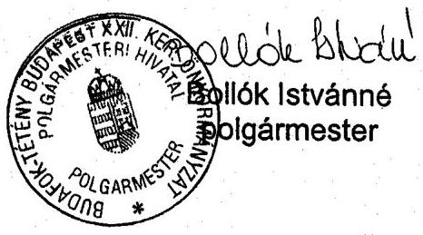

# JELENTÉS 

Budapest Főváros XXII. kerület Budafok-Tétény Önkormányzata gazdálkodásának átfogó ellenőrzéséről

---

3. Önkormányzati és Területi Ellenőrzési Igazgatóság
3.3 Átfogó Ellenőrzések FőcsoportIktatószám: V-1002-7/26/17/2003.Témaszám: 635
Vizsgálat-azonosító szám: V0102
Az ellenőrzést felügyelte:
Dr. Lóránt Zoltán
főigazgató
Az ellenőrzés végrehajtásáért felelős:
Dr. Sepsey Tamás
főcsoportfőnök
Az ellenőrzést vezette:
Csecserits Imréné
főcsoportfőnök-helyettes
Az ellenőrzést végezték:
Endrődy Péterné
számvevő
Dr. Karáné Kőszegi Zsuzsanna
számvevő tanácsos
Kozma Gábor
számvevő
Nagy Istvánné dr.
számvevő

# A témához kapcsolódó - az elmúlt három évben készített - 

számvevőszéki jelentések:
címe
sorszáma
Jelentés a települési önkormányzatok adóztatási tevékenységének 0121 vizsgálatáról
Jelentés a helyi önkormányzatok 2000. évi normatív állami 0128
hozzájárulás igénylésének és elszámolásának vizsgálatáról
Jelentés a helyi önkormányzatok beruházásaihoz és 0229
rekonstrukcióihoz nyújtott 2001. évi címzett és céltámogatások igénybevételének és felhasználásának vizsgálatáról

---

# TARTALOMJEGYZÉK 

BEVEZETÉS ..... 5
I. ÖSSZEGZŐ MEGÁLLAPÍTÁSOK, KÖVETKEZTETÉSEK, JAVASLATOK ..... 6
II. RÉSZLETES MEGÁLLAPÍTÁSOK ..... 14

1. A költségvetés tervezésének, végrehajtásának és a zárszámadás elkészítésének szabályszerűsége ..... 14
1.1. A költségvetés tervezésének, a költségvetési rendelet megalkotásának, elfogadásának szabályszerűsége ..... 14
1.2. A költségvetési előirányzatok módosításának szabályszerűsége ..... 16
1.3. A gazdálkodás szabályozottsága, szabályszerűsége ..... 17
1.4. A munkafolyamatba épített ellenőrzések szabályozottsága és gyakorlati működése a pénzügyi, gazdálkodási és számviteli feladatellátás területén ..... 19
1.5. A bizonylati rend szabályszerűsége ..... 19
1.6. A vagyon nyilvántartásának és leltározásának szabályszerűsége ..... 21
1.7. A vagyongazdálkodással kapcsolatos feladat- és döntési hatáskörök szabályozottsága, a vagyonváltozást előidéző intézkedések szabályszerűsége, célszerűsége ..... 23
1.8. Az Önkormányzat által céljelleggel - nem szociális ellátásként - juttatott támogatásokkal történő elszámoltatás szabályszerűsége ..... 24
1.9. A követelések, részesedések, értékpapírok év végi értékelésének szabályszerűsége ..... 26
1.10.A működési és felhalmozási bevételek, kiadások alakulása ..... 27
1.11.A költségvetés egyensúlyi helyzete ..... 29
1.12.A közbeszerzési eljárások szabályszerűsége ..... 31
1.13.A Polgármesteri hivatal helyi kisebbségi önkormányzatok gazdálkodását segítő tevékenysége ..... 33
1.14.A zárszámadási kötelezettség teljesítésének szabályszerűsége ..... 34
2. Az egyes kiemelt önkormányzati feladatok és a rendelkezésre álló források összhangja ..... 37
2.1. A feladatok meghatározása és szervezeti keretei ..... 37
2.2. Az egyes naturális mutatókkal mérhető feladatok bevételei és kiadásai ..... 39
2.3. A jelentős ráfordítást igénylő önként vállalt feladatok ellátása ..... 40
3. A belső irányítási, ellenőrzési rendszer működésének értékelése ..... 41
3.1. Az Önkormányzat informatikai rendszerének szabályozottsága, működése ..... 41
3.2. A helyi ellenőrzési rendszer kialakítása, működése ..... 42
3.3. A könyvvizsgálói kötelezettség teljesítése ..... 43
3.4. A korábbi számvevőszéki ellenőrzések javaslatainak hasznosulása ..... 44

---

# MELLÉKLETEK 

1. számú: Az önkormányzati vagyon nagyságának alakulása (1 oldal)
2. számú: Az Önkormányzat 2002. évi bevételeinek és kiadásainak alakulása (1 oldal)
3. számú Bollók Istvánné polgármester úrhöz észrevétele

---

# RÖVIDÍTÉSEK JEGYZÉKE 

| Önkormányzat | Budapest XXII. Kerület Budafok-Tétény Önkormányzata |
| :--: | :--: |
| Képviselő-testület | Budapest XXII. Kerület Budafok-Tétény Önkormányzat Képviselő-testülete |
| Polgármesteri hivatal | Budapest XXII. Kerület Budafok-Tétény Önkormányzat Polgármesteri Hivatala |
| Gazdasági iroda | Budapest XXII. Kerület Budafok-Tétény Önkormányzata Polgármesteri Hivatalának Gazdasági irodája |
| VAX Rt. | Budafok-Tétény Vagyonkezelő és Szolgáltató Rt. |
| ÁSZ | Állami Számvevőszék |
| TÁH | Területi Államháztartási Hivatal |
| SzMSz | Budapest XXII. Kerület Budafok-Tétény Önkormányzatának képviselő-testület és szervei Szervezeti és Működési Szabályzatáról szóló 19/1995. (VI. 1.) számú rendelet |
| Ötv. | A helyi önkormányzatokról szóló 1990. évi LXV. törvény |
| Áht. | Az államháztartásról szóló 1992. évi XXXVIII. törvény |
| Számv. tv. | A számvitelről szóló 2000. évi C. törvény |
| Htv. | A helyi önkormányzatok és szerveik, a köztársasági megbízottak, valamint egyes centrális alárendeltségű szervek feladat- és hatásköreiről szóló 1991. évi XX. törvény |
| Kbt. | A közbeszerzésekről szóló 1995. évi XL. törvény |
| Ámr. | Az államháztartás működési rendjéről szóló 217/1998. (XII. 30.) Korm. rendelet |
| Vhr. | Az államháztartás szervezetei beszámolási és könyvvezetési kötelezettségének sajátosságairól szóló 249/2000. (XII. 24.) Korm. rendelet |

---

# 4

---

# JELENTÉS 

## Budapest Főváros XXII. Kerület Budafok-Tétény Önkormányzata gazdálkodásának átfogó ellenőrzéséről

## BEVEZETÉS

Az Ötv. 92. § (1) bekezdése, valamint az Áht 120/A. § (1) bekezdése szerint az önkormányzatok gazdálkodását az ÁSZ ellenőrzi. A vizsgálatot a V-1002-7/2003. számú ellenőrzési program alapján végeztük.

## Az ellenőrzés célja annak értékelése volt, hogy:

- az önkormányzati gazdálkodás törvényességét, szabályszerűségét biztosították-e a tervezés, a költségvetés végrehajtása és a zárszámadás során; a gazdálkodás szabályszerűségét biztosító kontrollok megfelelően segítették-e a végrehajtást;
- az önkormányzat által ellátott feladatok és az azokhoz rendelkezésre álló pénzforrások összhangja biztosított volt-e, különös tekintettel egyes kiemelt feladatokra;
- a helyi kisebbségi önkormányzat gazdálkodása során érvényesültek-e az Áht. és a vonatkozó kormányrendeletek előírásai.

Az ellenőrzött időszak: 2002. év, valamint a 2003. I. negyedév, az 1.7., 2.1., 2.2., 2.3., 3.2., 3.3. és 3.4. ellenőrzési programpontok esetében 2000-2002. évek.

A főváros délnyugati részén, a Duna jobb partján fekszik Budafok-Tétény, Budapest XXII. kerülete.

A nagy településtörténeti múlttal rendelkező kerület lakosainak száma 2002. január 1-jén 52494 fő volt.

Az Önkormányzat feladatainak végrehajtása érdekében hat önállóan gazdálkodó és húsz részben önállóan gazdálkodó költségvetési intézményt működtet. Az önkormányzati feladatok ellátására foglalkoztatott közalkalmazottak száma a 2002. évben 1032 fő volt, a Polgármesteri hivatalban 211 fő dolgozott.

Az Önkormányzat 2002. évben 7683110 ezer Ft költségvetési kiadást teljesített és 8448829 ezer Ft értékű könyvviteli mérleg szerinti vagyonnal gazdálkodott.

A kerületben a 2002. évi választásokig három - cigány, horvát és német - kisebbségi önkormányzat, a 2002. évi választásokat követően - a bolgárokkal kibővülve - négy helyi kisebbségi önkormányzat működött.

---

# I. ÖSSZEGZŐ MEGÁLLAPÍTÁSOK, KÖVETKEZTETÉSEK, JAVASLATOK 

Az önkormányzati gazdálkodás törvényességét, szabályszerűségét az alábbiakban bemutatottak alapján részben biztosították a tervezés, a költségvetés végrehajtása és a zárszámadás során.

A Képviselő-testület az 1999-2002. évekre szóló gazdasági program meghatározásával teljesítette erre vonatkozó kötelezettségét. A 2002. évre szóló költségvetési koncepciót a polgármester határidőben a Képviselő-testület elé terjesztette, a bizottságok véleménye mellett azonban nem mutatta be a helyi kisebbségi önkormányzatok véleményét. A költségvetési és zárszámadási rendelet előterjesztését megelőzően nem határozták meg önkormányzati rendeletben a rendeletek kötelező mellékletét képező mérlegek, kimutatások tartalmát. A 2002. évi költségvetés előterjesztésekor nem mutatták be a tervezett hiány összegét, valamint teljes körűen a jogszabályban előírt kimutatásokat, mérlegeket. A költségvetésről szóló rendelet szerkezete, tartalma az előbbi hiányosságokon kívül megfelelt a jogszabályi előírásoknak. A Képviselő-testület a 2002. évi költségvetési rendeletét az előírásoknak megfelelően módosította. Az analitikus előirányzat nyilvántartás áttekinthető és hiteles dokumentumokkal alátámasztott volt. Az év közben elnyert céltámogatás előirányzatának elfogadásáról nem a jogszabály által előírt határidőn belül, hanem a zárszámadásról szóló rendeletben döntöttek.

A célszerűségi szempontok figyelmen kívül hagyásával a két jogkör együtt kezelésével határozták meg a kötelezettségvállalási és utalványozási jogkört. A 2002. évben hatályos számviteli politika jogszabályi változás miatti aktualizálása elmaradt. Ez évben a módosítás megtörtént, a hiányosságokat két kivétellel megszüntették. A mérlegkészítés időpontja továbbra sincs meghatározva, továbbá nem szabályozták a terven felüli értékcsökkenési leírást. A kötelezően elkészítendő szabályzatokkal az Önkormányzat rendelkezik, a számlarend azonban részben kidolgozott, nem tartalmazza a számlaösszefüggések előírását, valamint az egyeztetések formáját és dokumentálásának módját.

Az érvényesítés alapját képező teljesítés szakmai igazolásának rendjét és formáját nem szabályozták.

A gazdálkodás szabályszerűségét biztosító kontrollok gyakorlati érvényesülése nem kielégítő.

A pénzkezelési szabályzatban és a gazdálkodási folyamatra vonatkozó szabályozásban rögzített munkafolyamatba épített ellenőrzési feladatok a dolgozók munkaköri leírásában nem szerepeltek, a számlarendben meghatározott ellenőrzési feladatokat a számviteli területen foglalkoztatottak munkaköri leírása általános megfogalmazásban rögzítette. A gazdálkodási jogkörökhöz kapcsolódó ellenjegyzés nem töltötte be a funkcióját, amit az utalványozási jogkör helyi szabályainak megsértése igazolt. A beruházások kiadásait rendszeresen a hatáskörrel nem rendelkező Gazdasági irodavezető utalványozta.

---

A fejlesztési feladatok ellátására az Önkormányzat nem kötött szerződést. A gazdálkodással kapcsolatos központi és helyi előírások érvényesülése nem kielégítő, a banki bevételek esetében utalványozást és érvényesítést nem végeztek. A főkönyvi számlakapcsolatok kijelölése a kiadások esetében az előírtaktól eltérően nem az érvényesítés keretében, hanem azt követően történt.

Az önkormányzati vagyon nyilvántartásáról - a törzsvagyon elkülönítésével a számvitelben és az ingatlanok esetében a vagyonkataszterben is - gondoskodtak. A kialakított vagyon-nyilvántartási rendszerből hiányzott a tulajdoni részesedést jelentő befektetések egyedi nyilvántartása. A Polgármesteri hivatal a 2002. évi könyvviteli mérlegének adatait - a tulajdoni részesedést jelentő befektetések kivételével - leltárral alátámasztotta. A tárgyi eszközöknél - az ingatlanok kivételével - mennyiségi felvétellel hajtották végre a leltározást, míg követeléseknél, kötelezettségeknél, valamint az aktív és passzív pénzügyi elszámolásoknál az analitikus és a főkönyvi nyilvántartások adatait egyeztették. Az ingatlanoknál egyeztetéssel végrehajtott leltározáshoz a Polgármesteri hivatal nem rendelkezett a Képviselő-testület egyetértésével. Az Önkormányzat tulajdonában lévő, de üzemeltetésre átadott eszközök a Polgármesteri hivatal számviteli nyilvántartásában és könyvviteli mérlegében szerepeltek. Az üzemeltető részére átadott felhalmozási célú pénzeszközökből megvalósult fejlesztések, az üzemeltetőnél végrehajtott aktiválás miatt, nem növelték az Önkormányzat számviteli nyilvántartás szerinti vagyonát, bár lehetőség lett volna rá. Az ingatlanvagyon bruttó érték adata 2002. december 31-én nem egyezett a számviteli nyilvántartás és az ingatlanvagyon kataszter között. A Polgármesteri hivatal az ingatlanvagyon-értékeléssel összefüggő teljes körű egyeztetéssel nem készült el az előírt 2003. január 1-jére, az egyeztetés az ellenőrzés ideje alatt is zajlott.

A vagyongazdálkodással kapcsolatos feladat- és döntési hatáskörök kijelölését a vagyongazdálkodási rendelet tartalmazta. A szabályozásból hiányoztak azonban a vagyoni helyzet alakulásáról szóló beszámolás rendjével kapcsolatos, a forgalomképesség szerinti átsorolás módjára és jogköreinek meghatározására irányuló, valamint a nyilvános versenytárgyalás értékhatárának kijelölésére vonatkozó rendelkezések. A követelésekről történő lemondás feltételeit, okait és körülményeit nem rögzítették. A költségvetési rendeletben előírt értékhatárt betartva a követelések év végi állományi értékének 1,2%-át engedték el a 2002. évben.

A kerületi önkormányzat a tulajdonában lévő részesedés és értékpapírállomány kezelését nem bízta befektetési vállalkozásra. A befektetési jegy eladására vonatkozó döntéshozatali eljárásnál megsértették a Képviselő-testület vagyongazdálkodási rendeletében foglaltakat.

Az Önkormányzat által céljelleggel juttatott támogatásokkal kapcsolatos megállapodásokat több esetben konkrét felhasználási jogcím rögzítése nélkül kötötték. Az elszámolási kötelezettséget előírták, a felhasználás ellenőrzése a közhasznú társaságok esetében az éves beszámoló tudomásulvételére szorítkozott, a többi esetben a támogatások felhasználását ellenőrizték. Az elszámolási kötelezettség elmulasztásakor támogatás megvonás nem történt. A Polgármesteri hivatal a költségvetési rendeletben a működési célú pénzeszköz átadások között szerepeltette a kötelezettségvállalás nélküli feladat ellátások finanszírozását szolgáló pénzeszközöket, ezáltal megsértette a Számv. tv.-nek azt az alapelvét, amely szerint a tartalom az elsődleges a formával szemben.

A 2002. évi könyvviteli mérleg összeállításának értékelési feladatai során az értékvesztés elszámolásának szükségességét a tulajdoni részesedést jelentő befektetéseknél nem vizsgálták, emiatt azt indokolt esetben nem számolták el. A követelések, értékpapírok értékelését az előírásoknak megfelelően végezték el.

Az Önkormányzatnak nem volt működési forráshiánya, azonban a felhalmozási feladatok tekintetében a rendelkezésre álló felhalmozási forrásokon túl vállalt kötelezettséget. Gazdálkodása során a működési célú bevételek egy részét felhalmozási kiadásokra fordította, olyan mértékben, hogy a 2002. évben működési célú hitel felvételére kényszerült. A kedvezőtlen folyamatok ellenére a 2002. évben nem tett takarékossági intézkedéseket. A 2003. évre áthúzódó kötelezettségvállalások csökkentéséről azonban a 2002. évi zárszámadási rendelet elfogadásával egyidejűleg döntött. Szintén a takarékosság
 irányába hatnak a 2003. évi szigorú költségvetési tervezési elvek, valamint az egyes kiadások visszavezetésére irányuló egyedi programok. A kötelezettségvállalás teljes körű nyilvántartásáról a 2003. évben gondoskodtak, azonban nem szabályozták a rendszeres kifizetésekről szóló kötelezettségvállalások éves összegének nyilvántartásba vételének módját.

A közbeszerzési törvény hatálya alá tartozó beszerzésekkel kapcsolatos eljárás rendjét rendeletben szabályozták. A Városüzemeltetési Kht. által kizárólagos jogosultsággal ellátott beruházási és felújítási feladatoknál a közbeszerzési eljárás - a kiíró nevében eljáró személy tekintetében - nem egyértelműen szabályozott, és nem tartották be a közbeszerzésekről szóló rendelet kiíró nevében eljáró személyére vonatkozó előírását. Három szolgáltatás kivételével (szerződés részekre bontása, határozatlan idejű szerződésnél az értékhatár elérése) a Kbt. által előírt értékhatár feletti szerződés megkötését megelőzően a közbeszerzési eljárást lefolytatták, a 2002. évben összesen húsz esetben. Az ellenőrzött közbeszerzési eljárásokat - két hiányosság kivételével - a Kbt. előírásainak megfelelően folytatták le. A közbeszerzési eljárásban résztvevők esetében az összeférhetetlenséget nem vizsgálták, valamint az egyik eljárásnál mindössze kéttagú volt a nyertes ajánlat kiválasztását előkészítő bizottság.

A zárszámadásról szóló rendelettervezetet a polgármester határidőben benyújtotta a Képviselő-testületnek. A kimutatott negatív pénzmaradvány miatt a rendelettervezetről a 2003. évre áthúzódó kötelezettségvállalások csökkentését követően döntöttek. A zárszámadási rendelet a költségvetéssel összehasonlítható módon az előírások szerinti szerkezetben készült, azonban nem mutatták be a Képviselő-testület részére tájékoztatásul teljes körűen az előírt mérlegeket, kimutatásokat.

Az Önkormányzat által ellátott feladatok és az azokhoz rendelkezésre álló pénzforrások összhangja külső források igénybevétele mellett biztosított volt.

Az Önkormányzat a helyi közszolgáltatási feladatok ellátását elsősorban költségvetési szervein keresztül, ezen túlmenően gazdasági, illetve közhasznú társaságai, közalapítványai, valamint nem önkormányzati alapítványok és vásárolt szolgáltatások útján szervezte meg. Az Önkormányzat Képviselő-testülete nem

---

tekintette át és nem értékelte a nonprofit szervezetek, az egyéni és a társas vállalkozások feladatellátásban betöltött szerepét, eredményességét, a szervezeti rendszer célszerűségét.

Az Önkormányzat Képviselő-testülete az SzMSz-ben nem rögzítette az önként vállalt feladatok körét és tartalmát. Az önként vállalt feladatok ellátására fordított kiadások növekedése, a költségvetési kiadásokon belüli részarányuk emelkedése fokozódó terhet rótt az Önkormányzat gazdálkodására, de nem veszélyeztette a kötelező feladatok ellátását.

A Polgármesteri hivatal informatikai rendszerének szabályozottsága nem teljes körűen kialakított, hiányzott az átfogó informatikai stratégia, a katasztrófa elhárítási terv és az üzemeltetési leírás. A számítástechnikai eszközökkel való mennyiségi ellátottság kielégítő, az eszközök magas elhasználódási szintje mellett.

A Polgármesteri hivatal belső ellenőre éves ellenőrzési munkaterv alapján látta el a felügyeleti és belső ellenőrzési feladatokat, az ellenőri jelentések megfelelő színvonalúak. Az állami támogatások, hozzájárulások intézményi adatszolgáltatásának ellenőrzése a szűk ellenőri kapacitásból adódóan nem rendszeres. A felügyeleti és a belső ellenőri feladatok teljes körű elvégzésére a jelenlegi egy fő ellenőr nem elegendő. A Képviselő-testület az ellenőrzések tapasztalatairól és a javaslatok hasznosulásáról - a Pénzügyi bizottság előterjesztésével - készített beszámolót megtárgyalta, és tudomásul vételéről határozatot hozott.

A helyi kisebbségi önkormányzatok gazdálkodása során részlegesen érvényesültek az Áht. és a vonatkozó kormányrendeletek előírásai. A 2002. évi választásokig három (német, cigány, horvát) helyi kisebbségi önkormányzat működött. A választásokat követően a helyi kisebbségi önkormányzatok száma négyre emelkedett a Bolgár Kisebbségi Önkormányzat megalakulásával. A helyi önkormányzat valamennyi kisebbségi önkormányzattal megkötötte a vonatkozó jogszabálynak megfelelő együttműködési megállapodásokat. A megállapodásokat a helyi és valamennyi helyi kisebbségi önkormányzat július hónapban módosította a 2002. költségvetési évben. Ez nem felelt meg a vonatkozó jogszabály előírásának, mely szerint a megállapodások adott év január közepéig módosíthatók. A módosítás a költségvetés elfogadásának rendjét, a pénzellátás, a közüzemi számlák elszámolásával kapcsolatos szabályokat, illetve a beszámolás és információszolgáltatás rendjét érintette, ezért évközi változtatása célszerűtlen volt.

A helyi kisebbségi önkormányzatok a 2002. évi költségvetésük eredeti előirányzatáról a kerületi önkormányzat költségvetésének elfogadását követően hozták meg határozataikat, ezért azok nem épülhettek be az önkormányzati költségvetés normaszövegébe. A helyi kisebbségi önkormányzatok a 2002. évi költségvetésük módosításáról nem határozattal döntöttek, illetve a költségvetés végrehajtásáról (zárszámadásról) nem hoztak határozatot, ezért azok a kerületi önkormányzat zárszámadási rendelet normaszövegébe nem épülhettek be, így a helyi önkormányzat és a kisebbségi önkormányzatok nem tartották be a költségvetés tervezésével és a zárszámadás elfogadásával kapcsolatos, együttműködésüket rögzítő jogszabályi előírást.

---

A helyi önkormányzat nyilvántartásain belül a kisebbségi önkormányzatok számviteli és vagyoni nyilvántartásait elkülönítetten vezették. A készpénz kezelését a kisebbségi önkormányzatok önálló pénztárai látták el, a Polgármesteri hivatal részéről elmaradt az érvényesítés végrehajtása.

Az ÁSZ 2001. májusában ellenőrizte a helyi önkormányzatok 2000. évi normatív állami hozzájárulásának igénybevételét és elszámolását. A számvevői jelentés javaslatai alapján a felelősként megjelölt szervezeti egységek a szükséges intézkedéseket végrehajtották.

Az ÁSZ 2002. februárjában ellenőrizte a beruházásokhoz és rekonstrukciókhoz nyújtott 2001. évi címzett és céltámogatások igénybevételét és felhasználását. A számvevői jelentés javaslataiból egyet nem realizáltak, a belső ellenőrzés a 2003. évi ellenőrzési munkaprogramjába nem építették be az állami céltámogatások felhasználásának és elszámolásának vizsgálatát.

# Javaslatok 

## a törvényes állapot helyreállítása és a jogszabályi előírások betartása érdekében

## a polgármester

1. csatolja a költségvetési koncepció tervezethez az Ámr. 28. § (3) bekezdése szerint a helyi kisebbségi önkormányzatok koncepció tervezetről alkotott véleményét;
2. terjessze a Képviselő-testület elé az Áht. 118. §-ában előírt mérlegek, kimutatások tartalmának meghatározásáról szóló rendelettervezetet;
3. mutassa be a költségvetési rendelettervezetben az Áht. 8. § (1) és 8/A. § (7) bekezdésének megfelelően a költségvetési bevételeit és a költségvetési kiadásait, valamint azok különbségeként a tervezett, illetve tényleges költségvetési hiányt;
4. mutassa be a Képviselő-testület számára tájékoztatásul a költségvetési és zárszámadási rendelettervezet benyújtásával egyidejűleg az Áht. 118. §-a alapján a 116. § (9) és (10) bekezdése szerint a többéves kihatással járó döntések számszerűsítését évenkénti bontásban, valamint összesítve, a közvetett támogatásokat és a 116. § (8) bekezdése szerint zárszámadáskor a vagyonkimutatást;
5. terjessze a Képviselő-testület elé az év közben biztosított pótelőirányzatoknak az Ámr. 53. § (2) bekezdése szerinti módosítását;
6. kezdeményezze a Képviselő-testület 36/1996. (X. 11.) számú vagyongazdálkodási rendeletének kiegészítését az Áht. 108. § (1) és (2) bekezdéseiben foglaltakkal összhangban a nyilvános versenytárgyalás értékhatárának kijelölésére, valamint a követelésekről történő lemondás feltételeinek, okainak és körülményeinek szabályozására vonatkozóan;
7. gondoskodjon a közbeszerzésekről szóló önkormányzati rendelet kiíró nevében eljáró személyre vonatkozó előírásának, valamint a Kbt. 4. § (5), az 5. § és a 31. § (3) bekezdésében foglaltak következetes betartásáról;

---

# a jegyző 

1. készítse elő az Áht. 118. §-ában előírt mérlegek, kimutatások tartalmának meghatározásáról szóló rendelettervezetet;
2. gondoskodjon a költségvetési rendelettervezetben a tervezett hiány kimutatásáról az Áht. 8. § (1) bekezdése szerint;
3. készítse elő, hogy a költségvetési és a zárszámadási rendelet előterjesztésekor az Áht. 118. §-a alapján a 116. § (9) és (10) bekezdése szerint a Képviselő-testület részére tájékoztatásul bemutatásra kerüljön a többéves kihatással járó döntések számszerűsítése évenkénti bontásban, valamint összesítve, a közvetett támogatásokról szóló tájékoztató és a 116. § (8) bekezdése szerint zárszámadáskor a vagyonkimutatás;
4. készítse elő az év közben biztosított pótelőirányzatok Ámr. 53. § (2) bekezdése szerinti módosítását;
5. készítse elő a Képviselő-testület 36/1996. (X. 11.) számú vagyongazdálkodási rendeletének tartalmi kiegészítését az Áht. 108. § (1) bekezdése alapján a nyilvános versenytárgyalás értékhatárának kijelölésére, valamint az Áht. 108. § (2) bekezdése szerint a követelésekről történő lemondás feltételeinek, okainak és körülményeinek szabályozására vonatkozóan;
6. intézkedjen a törvényi felhatalmazás nélkül létrehozott alapok céltartalék előirányzatként történő elkülönítéséről és kezeléséről az Áht. 73. § (1) bekezdésében előírtaknak megfelelően;
7. gondoskodjon a Htv. 140. § (1) bekezdés c) pontjában, valamint a Vhr. 8. § (5) bekezdés g) pontjában és a (6) bekezdésében foglaltak betartása érdekében a számviteli politika kiegészítéséről az egységes számviteli rendszer kialakításával, a mérlegkészítés időpontjának meghatározásával és a terven felüli értékcsökkenés szabályozásával;
8. biztosítsa a Számv. tv. 161. § (2) bekezdésében foglaltak betartását a számlarend számlaösszefüggésekkel való kiegészítésével;
9. gondoskodjon a érvényesítési és utalványozási jogkörök teljes körű érvényesüléséről a banki bevételeknél az Ámr. 135. § (1) és a 136. § (2) bekezdésében foglalt előírás betartása érdekében;
10. intézkedjen a főkönyvi számlakapcsolatok kijelölésének érvényesítés keretében történő elvégzésére az Ámr. 135. § (3) bekezdésében foglaltak betartása érdekében;
11. biztosítsa a kötelezettségvállalások teljes körűségét az Áht. 98. § (1) bekezdésében, az Ámr. 134. § (1) és (2) bekezdésében foglalt, valamint a gazdálkodási jogkörök helyi szabályozásáról szóló intézkedésben az írásbeli kötelezettségvállalásra vonatkozó előírások következetes betartása érdekében;
12. intézkedjen - a Vhr. 49. § (1) bekezdése alapján - a tulajdoni részesedést jelentő befektetések részletező nyilvántartásának kialakításáról, és gondoskodjon az értékelési feladatok keretében ugyanezen eszközök piaci értékének vizsgálatáról a Számv. tv.

---

54. § (1) és (2) bekezdéseiben, valamint a Vhr. 31. §-ában foglaltak betartása érdekében;
13. gondoskodjon az Önkormányzat számviteli és ingatlanvagyon kataszteri nyilvántartásában az ingatlanok bruttó érték adatai egyezőségének biztosításáról a 147/1992. (XI. 6.) Korm. rendelet előírásainak megfelelően;
14. adjon ki leltározási utasítást, és gondoskodjon a leltárfelelős kijelöléséről a XI1/20./2003. számú polgármesteri és jegyzői együttes utasítás II. 4. pontjának megfelelően, valamint a Vhr. 37. § (4) bekezdése szerint szükséges esetben a felügyeleti szerv egyetértéséről;
15. vizsgálja felül a költségvetési rendeletben a működési célú pénzeszközátadásokat annak érdekében, hogy az önkormányzati társaságok által nyújtott szolgáltatásokat a Számv. tv. 16. § (3) bekezdés előírását betartva - a tényleges gazdasági tartalmuknak megfelelően tervezzék;
16. biztosítsa, hogy a helyi kisebbségi önkormányzatok együttműködési megállapodásait az adott költségvetési év január 15-ig módosítsák az Ámr. 29. § (11) bekezdésének megfelelően;
17. gondoskodjon arról, hogy a költségvetés előirányzatainak egyeztetési folyamatában a helyi kisebbségi önkormányzatok a költségvetésük eredeti előirányzatáról a kerületi önkormányzat költségvetésének elfogadását megelőzően hozzák meg határozataikat az Ámr. 36. § (5) bekezdése előírásainak megfelelően;
18. biztosítsa, hogy a helyi kisebbségi önkormányzatok előirányzatainak módosítása ne történhessen meg a kisebbségi önkormányzatok határozata nélkül, ezzel tegyen eleget az Ámr 53. § (1) bekezdésében foglaltaknak;
19. biztosítsa, hogy a Polgármesteri hivatal végezze el és dokumentálja az Ámr. 135. § (2) bekezdése szerinti érvényesítéseket a kisebbségi önkormányzatok elkülönített pénzeszközeinek kezelése során és gondoskodjon a helyi kisebbségi önkormányzatok pénzkezelési szabályzatának elkészítéséről.

# A munka színvonalának javítása érdekében 

## a polgármester

1. kezdeményezze jelen számvevői ellenőrzés tapasztalatainak Képviselő-testületi megtárgyalását, a feltárt hiányosságok megszüntetésére készítessen intézkedési tervet;
2. vizsgálja meg a kötelezettségvállalási és utalványozási jogkör különválasztási lehetőségét a beruházási és felújítási kiadásokra vonatkozóan az utalványozási értékhatárok differenciált meghatározásával;
3. kezdeményezze a Képviselő-testületnél, hogy a felhalmozási célú pénzeszközátadásokból megvalósult fejlesztések az Önkormányzat vagyonát gyarapítsák, és ennek érdekében a társaságokkal kötött megállapodásban rögzítsék a szükséges számviteli adatszolgáltatás tartalmát, az elszámolás részletezettségét és a kapcsolódó ellenőrzést;

---

4. kezdeményezze a Képviselő-testületnél a szervezeti rendszer célszerűségének, különös tekintettel a nonprofit szervezetek, az egyéni és a társas vállalkozások feladatellátásban betöltött szerepének, eredményességének áttekintését, értékelését;
5. kezdeményezze a Képviselő-testületnél az önként vállalt feladatok áttekintését, és az önkormányzati
 SzMSz kiegészítését ezen feladatok meghatározásával;
6. kezdeményezze a Belső ellenőrzési csoport létszámának növelését az állami hozzájárulások évi elszámolását megelőzően történő, valamint az egyéb támogatások ellenőrzésének rendszeres végrehajtása, a felügyeleti és belső ellenőrzés teljes körű feladatellátása érdekében;

# a jegyző 

1. gondoskodjon a rendszeres kifizetésekről szóló kötelezettségvállalások éves összegének figyelembevételéről a kötelezettségvállalások analitikus nyilvántartásában;
2. szabályozza az érvényesítés alapjául szolgáló teljesítés szakmai igazolásának módját;
3. egészítse ki a Gazdasági iroda köztisztviselőinek munkaköri leírását az adott munkakörben elvégzendő belső ellenőrzési, egyeztetési feladatok tartalmának részletes kijelölésével a felelősségek meghatározása mellett;
4. kezdeményezze a Képviselő-testület 36/1996. (X. 11.) számú vagyongazdálkodási rendeletének kiegészítését a vagyoni helyzet alakulásáról szóló beszámolás rendjére, a forgalomképesség szerinti átsorolás módjára, a kapcsolódó jogkörök meghatározására vonatkozóan;
5. rendelkezzen az átfogó informatikai stratégia és a katasztrófa-elhárítási terv elkészítéséről az informatikai rendszer belső szabályozottsága érdekében;
6. gondoskodjon a belső ellenőrzés személyi feltételeinek javításáról az ellenőrzési feladatok teljes körű elvégzése érdekében;
7. vegye fel a belső ellenőr munkatervébe a felhasznált cél- és címzett támogatások vizsgálatát.

---

# II. RÉSZLETES MEGÁLLAPÍTÁSOK 

## 1. A KÖLTSÉGVETÉS TERVEZÉSÉNEK, VÉGREHAJTÁSÁNAK ÉS A ZÁRSZÁMADÁS ELKÉSZÍTÉSÉNEK SZABÁLYSZERŰSÉGE

### 1.1. A költségvetés tervezésének, a költségvetési rendelet megalkotásának, elfogadásának szabályszerűsége

A Képviselő-testület a 164/1999. (V. 13.) számú határozatával az Ötv. 91. § (1) bekezdésében és a Htv. 138. § (1) bekezdésének a) pontjában előírt kötelezettség alapján elfogadta az Önkormányzat 1999-2002. évekre szóló gazdasági programját. A 2003-2006. közötti gazdasági programot a 257/2003. (VI. 26.) számú határozattal fogadta el a Képviselő-testület.

A polgármester a központi költségvetési forrásszabályozás, a „Főváros Önkormányzata költségvetési koncepciója", valamint az intézményektől és az általa alapított társaságoktól (rt., kht.) bekért információk alapján összeállított 2002. évre szóló költségvetési koncepciót határidőben ${ }^{1}$ - a 2001. október 18-i ülésre - a Képviselő-testület elé terjesztette.

A koncepciót a helyben képződő bevételek és az ismert kötelezettségek figyelembevételével állították össze. A felhalmozási bevételeknél figyelembe vették az ingatlaneladásból származó bevételeket, a pályázati lehetőségeket. A kiadások tervezésénél elsődleges célként az intézményrendszer működőképességének fenntartására és az érvényben lévő feladatellátási szerződésekre voltak tekintettel.

A koncepció elfogadását a Pénzügyi bizottság - a 135/2001. (X. 15.) PB határozatában -, valamint a többi bizottság is támogatta, a Bűnmegelőzési, jogi és kisebbségi bizottság kivételével, mely nem tárgyalta.

A három helyi kisebbségi önkormányzat közül kizárólag a horvát kisebbségi önkormányzat adott írásban véleményt a 2002. évi koncepcióról (13/2001. (X. 9.) h. k. határozat), azonban azt elmulasztották csatolni a koncepcióról szóló előterjesztéshez, ezért részben érvényesült az Ámr. 28. § (3) bekezdése szerinti előírás.

Az előterjesztéshez csatolták a könyvvizsgáló írásos véleményét, valamint az intézményvezetőkkel és a Közalkalmazottak Érdekegyeztető Tanácsával történt egyeztetésről készült jegyzőkönyvet.

[^0]
[^0]:    ${ }^{1}$ Az Áht. 70. §-a szerint a polgármesternek november 30-ig kell benyújtania a költségvetési koncepciót a Képviselő-testületnek.

---

A Képviselő-testület a 294/2001. (X. 18.) számú határozatában a részletes tervező munka alapjául elfogadta a 2002. évi költségvetési koncepciót.

A Képviselő-testület - az Áht. 118. §-ában előírtak ellenére - nem határozta meg önkormányzati rendeletben a költségvetés mellékleteként tájékoztatásul bemutatandó mérlegek, kimutatások tartalmi követelményeit.

A Képviselő-testület a 2002. évi költségvetési javaslatot két fordulóban, 2001. november 22-én és 2001. december 18-án tárgyalta.

A költségvetés tervezetének elkészítésekor figyelembe vették a koncepcióban megfogalmazottakat. A tervezés során eleget tettek az Ámr. 26. §-ában előírtaknak azzal, hogy a kiadási és bevételi előirányzatokat az előző évi adatokból kiindulva, az elhatározott szerkezeti változások, szintre hozások, előirányzati többletek számszerű kimunkálásával határozták meg.

A polgármester a 2002. évi költségvetési rendelettervezetet határidőben ${ }^{2}$ - a 2001. november 22-i ülésre - beterjesztette a Képviselőtestületnek.

A polgármester ezzel egyidejűleg az Áht. 71. § (2) bekezdésében foglaltaknak megfelelően

- előterjesztette a rendelettervezetet az Önkormányzat tulajdonában álló közterületek használatáról szóló 41/1995. (XII. 18.) számú rendelet módosításáról, amely elősegítette a bevételi előirányzat teljesítésének megalapozását;
- bemutatta a költségvetési évet követő két év várható előirányzatait.

A 2002. évi költségvetés előterjesztésekor a Képviselő-testület részére tájékoztatásul bemutatták az Önkormányzat összes bevételét, kiadását, finanszírozását, összevont mérlegét, elkülönítetten és összesítve, a helyi kisebbségi önkormányzatok mérlegeit, azonban nem mutatták be az Áht. 118. § alapján a 116. § (9) és (10) bekezdése szerint előírt többéves kihatással járó döntések számszerűsítését évenkénti bontásban, valamint összesítve és a közvetett támogatásokat tartalmazó kimutatást.

Az Önkormányzat 2002. évi költségvetéséről szóló 35/2001. (XII. 21.) számú rendelete az Áht. 69. §-a és az Ámr. 29. §-a szerinti szerkezetben készült, tartalmazta a címrendet, a működési előirányzatokat kiemelt előirányzatonként és a létszámkeretet önkormányzatra összesen és költségvetési szervenként, a felújítási előirányzatokat célonként, a felhalmozási kiadásokat feladatonként, a Polgármesteri hivatal költségvetését feladatonként, az általános- és céltartalékot, elkülönítetten is a helyi kisebbségi önkormányzatok költségvetését, az előirányzat felhasználási ütemtervet.

[^0]
[^0]:    ${ }^{2}$ Az Áht. 71. § (1) bekezdése szerint a polgármesternek a költségvetési év február 15-ig kell benyújtania a költségvetési rendelettervezetet a Képviselő-testületnek.

---

A költségvetési rendelet 8273978 ezer Ft bevételt és kiadást irányzott elő. A bevételi források között működési és felhalmozási célú hitelfelvétel címén összesen 1438473 ezer Ft előirányzatot hagyott jóvá a Képviselő-testület, de az előirányzatot, mint hiányt nem mutatta be a költségvetési rendeletében. Ezzel nem tettek eleget az Áht. 8. § (1) és 8/A. § (7) bekezdése szerinti előírásoknak.

A költségvetési rendeletben meghatározták a végrehajtásával kapcsolatos helyi szabályokat, így többek között rendelkeztek a bevételi többlet felhasználásáról, a hiány finanszírozásának módjáról és a hitelműveletekkel kapcsolatos hatáskörökről, az önállóan gazdálkodó költségvetési szervek előirányzat módosítási jogköréről, a tartalékkal való rendelkezési jogosultságról.

A polgármester a 2003. évi költségvetési rendelettervezetet az Áht. 71. § (1) bekezdésében meghatározott határidőn belül, 2003. január 30-án terjesztette be a Képviselő-testületnek. A költségvetés tárgyalásának eljárási rendje, a rendelettervezet szerkezete azonos volt a 2002. évi költségvetési rendelettel. A Képviselő-testület az 1/2003. (III. 10.) számú rendelettel fogadta el az Önkormányzat 2003. évi költségvetését.

Az Önkormányzat költségvetési szervei vállalkozási tevékenységet nem végeztek.

Az önkormányzati biztos kirendelésének feltételeit a Képviselő-testület 33/1999. (XI. 5.) számú rendelete tartalmazta.

# 1.2. A költségvetési előirányzatok módosításának szabályszerűsége 

A Képviselő-testület a 2002. évi költségvetési rendeletét öt alkalommal módosította. Az előterjesztett rendelettervezetek a költségvetés szerkezetével azonos részletezettségben tartalmazták a módosítási javaslatokat. Az előirányzat módosítások az előírásoknak megfelelően és a költségvetési rendelet 11. §-ában meghatározott hatáskörben (képviselő-testületi, polgármesteri) történtek.

A helyi kisebbségi önkormányzatok nem módosították az Ámr. 53. § (7) bekezdése szerint a költségvetésükről szóló határozatot, így az Önkormányzat az előirányzat módosításokat az Ámr. 53. § (8) bekezdés előírásával ellentétesen vezette át a költségvetési rendeletén.

A Polgármesteri hivatal számviteli politikájában meghatározták az előirányzat nyilvántartás adattartalmát. Az analitikus előirányzat nyilvántartást folyamatosan vezették a többletbevételek, az átcsoportosítások és az általános tartalék felhasználása szerinti kimutatásokban. Biztosították az előirányzat változások hitelt érdemlő dokumentálását. Az előirányzat nyilvántartás áttekinthető, az adatok megegyeztek a költségvetési beszámolóban szerepeltetett számadatokkal.

A Képviselő-testület a 2002. évben negyedévenként döntött az előirányzatok módosításáról, azonban sem év közben, sem a költségvetési beszámoló elküldésének határidejéig ${ }^{3}$ nem döntött 20 utca szennyvízcsatorna beruházásához 2002. július 11-én és október 18-án elnyert, összesen 317984 ezer Ft céltámogatás előirányzatának elfogadásáról. Ezáltal nem tettek eleget az Ámr. 53. § (2) bekezdésében foglaltaknak. Ennek következtében a zárszámadásról szóló 8/2003. (VI. 2.) számú rendeletben a módosított előirányzat nem egyezett meg az utolsó költségvetési rendeletmódosítás összegével.

A Polgármesteri hivatalban a 2002. évi előirányzatok főkönyvi nyilvántartásában a költségvetési rendelet alapján megnyitották az előirányzati számlákat és azokon a rendeletmódosítások alapján gondoskodtak az előirányzat módosítás könyveléséről. A főkönyvi könyvelés adatai megegyeztek az analitikus nyilvántartás és a zárszámadási rendelet adataival.

Előirányzat túllépés a felhalmozási célú kiadásoknál fordult elő három intézmény esetében (Herman Ottó Általános Iskola 4,5%; Kempelen Farkas Gimnázium 0,8%; Budai Nagy Antal Gimnázium 0,4%), ami az előirányzat módosítási kérelem költségvetési rendelet 12. § (7) bekezdésében meghatározott határidejének elmulasztásából eredt. Felelősségre vonás az eltérés kis értéke miatt nem történt.

# 1.3. A gazdálkodás szabályozottsága, szabályszerűsége 

A gazdálkodási folyamat a Polgármesteri hivatalban megfelelően szabályozott volt, az operatív gazdálkodással kapcsolatos döntési hatásköröket meghatározták. A kötelezettségvállalás, érvényesítés, utalványozás és ellenjegyzés rendjét az évente kiadott polgármesteri és jegyzői együttes intézkedés szabályozta ${ }^{4}$.

A szabályozás az Ámr. vonatkozó előírásaival összhangban határozta meg a gazdálkodási jogkörök tartalmát, rögzítették a jogkörök gyakorlására jogosult személyeket és azok aláírás mintáját. A szabályozás kiterjedt az összeférhetetlenségi előírások meghatározására is, szóbeli kötelezettségvállalást nem engedélyezett. A 2002. évben hatályos intézkedés szerint a polgármester és a jegyző egyaránt élt a hatáskör átruházásának lehetőségével, konkrétan meghatározva az egyes előirányzatokat, de nem számoltatták be a felhatalmazottakat az átruházott jogkör gyakorlásáról. A kötelezettségvállalásra és utalványozásra jogosultak körét - együtt kezelve - azonosan határozták meg az alábbiak szerint.

- A beruházási és felújítási kiadások utalványozására és a kötelezettségvállalásra a polgármester, illetve 3000 ezer Ft értékhatárig az alpolgármester jogosult.
- A Polgármesteri hivatal működésével kapcsolatos kötelezettségvállalási és utalványozási jogkört értékhatár nélkül a jegyző gyakorolja.

[^0]
[^0]:    ${ }^{3}$ A Vhr. 10. § (1) bekezdése szerint az éves költségvetési beszámolót legkésőbb a következő költségvetési év február 28-ig kell a felügyeleti szervnek megküldeni.
    ${ }^{4}$ XI-1/4/2002. számú polgármesteri és jegyzői együttes intézkedés.

---

- A rendszeres, rendkívüli és egyéb segélyek esetén a jogkörök gyakorlója a családvédelmi iroda vezetője.
- A közoktatási és sport feladatokhoz kapcsolódó szakértői és megbízási díjak esetében az oktatási irodavezető gyakorolhatja a hatásköröket.

Az intézkedés hiányossága, hogy az érvényesítés alapját képező teljesítés szakmai igazolásának rendjét és formáját nem szabályozták.

Az érvényesítők írásbeli megbízásakor nem tartották be az Ámr. 135. § (2) bekezdésében foglaltakat, az érvényesítési feladatokat ellátók egyike sem rendelkezett az előírt szakképesítéssel.

A Polgármesteri hivatal a 2002. évben hatályos számviteli politikával rendelkezett, a jogszabályi változások ellenére azonban nem aktualizálták azt. A 2003. május 23-án polgármesteri és jegyzői együttes intézkedéssel kiadott számviteli politika a hiányosságok egy részét megszüntette annak szabályozásával, hogy a számviteli elszámolás és értékelés szempontjából mit tekintenek lényegesnek, jelentős összegnek, lényeges szempontnak. A mérlegkészítés időpontja - ameddig a tárgyévre vonatkozóan a számviteli nyilvántartásokban a helyesbítések elvégezhetők - továbbra sincs meghatározva, ezáltal nem tartották be a Vhr. 8. § (6) bekezdésének előírásait. A Vhr. 8. § (5) bekezdésében foglaltak ellenére nem szabályozták a terven felüli értékcsökkenést, illetve azt tévesen a piaci értékeléshez kötötték.

A számviteli politika nem tartalmaz szabályozást arra vonatkozóan, hogy a Htv. 140. § (1) bekezdés c) pontjában foglaltakkal összhangban - az egységes számviteli rendszer kialakítása érdekében - a számlarendet és a számviteli politikát kiterjesztik-e az Önkormányzat felügyelete alá tartozó költségvetési szervekre.

A vizsgált időszakban érvényben lévő és a jelenleg hatályos számlarend egyaránt részben kidolgozott. Meghatározza a
 főkönyvi számlák tartalmát, a főkönyvi könyvelés és az analitika kapcsolatát, a számlatükröt. Hiányzik azonban a számlaösszefüggések előírása. A szabályozás nem tartalmazza a zárlati feladatok végrehajtása előtt kötelezően elvégzendő egyeztetések formáját, a dokumentálás módját.

A számviteli politika keretében kötelezően elkészítendő szabályzatokkal (pénzkezelési, leltározási és leltárkészítési, értékelési) a Polgármesteri hivatal a vizsgált időszakra vonatkozóan rendelkezett, önköltség-számítási szabályzat készítési kötelezettsége nem volt, mivel vállalkozási tevékenységet nem folytatott. A szabályzatok megfelelő tartalommal összeállítottak, a számviteli politikához hasonlóan aktualizálásuk 2002. évre vonatkozóan azonban elmaradt. Így többek között nem gondoskodtak az éves értékcsökkenés időarányosra történő módosításáról. A jelenleg érvényben lévő, aktualizált szabályzatokat ez év májusában adták ki polgármesteri és jegyzői együttes utasításokkal, azonban január 1.-i visszamenőleges hatállyal. Hiányosság, hogy a felesleges vagyontárgyak hasznosításának és selejtezésének jelenleg hatályos szabályzata nem tartalmazza az ármegállapítás szabályait az értékesítés esetére vonatkozóan.

---

# 1.4. A munkafolyamatba épített ellenőrzések szabályozottsága és gyakorlati működése a pénzügyi, gazdálkodási és számviteli feladatellátás területén 

A Polgármesteri hivatal pénzkezelési szabályzata teljes körűen tartalmazta a készpénzkezeléssel kapcsolatos ellenőrzési feladatokat. Ezek a pénztárbizonylatokhoz és az előleg elszámoláshoz (pénztárbizonylatokhoz kapcsolódó előzetes ellenőrzésként), valamint a napi pénztárjelentéshez kötődnek. A helyi szabályozás a bizonylatok alaki és tartalmi ellenőrzésére vonatkozó kötelezettséget rögzít, az ellenőrzés azonban elmaradt. A helyesen kialakított kontrollrendszer - a pénztárbizonylatok ellenőrzésének kivételével - a gyakorlatban megfelelően működött. A pénztárjelentés helyességének és a kimutatott pénzkészlet meglétének ellenőrzése dokumentáltan megtörtént. A napi záró pénzkészletre megállapított felső korlátot (500000 Ft) minden esetben betartották. Az előleg elszámolás a belső szabályozásnak megfelelően történt.

A gazdálkodási jogkörök gyakorlásához kapcsolódó ellenőrzési feladatok (ellenjegyzés, érvényesítés) szabályozottsága megfelelő. A kötelezettségvállalások és az utalványok ellenjegyzése kivétel nélkül megtörtént. A feladat elvégzését igazolták, de az utalványozó személy jogosultságát az ellenjegyzés során a bizonylatok 12%-ánál nem ellenőrizték. Az önkormányzati beruházások és felújítások kiadásait rendszeresen a hatáskörrel nem rendelkező gazdasági irodavezető utalványozta a polgármester helyett.

A pénzintézeti bevételek esetében a gazdálkodási jogköröket nem gyakorolták. Ezen bevételek érvényesítése, utalványozása és annak ellenjegyzése az Ámr. 135. § (1) és a 136. § (2) és a 137. § (2) bekezdésében foglaltak ellenére teljes körben elmaradt.

A kiadások vonatkozásában az érvényesítéshez kapcsolódó ellenőrzési funkció megfelelő volt. Szabálytalan azonban, hogy a főkönyvi számlakijelölés nem a kifizetést megelőző érvényesítés keretében, hanem azt követően, a kifizetéseket összesítő kontírozó lapon történt. Ezzel megsértették az Ámr. 135. § (3) bekezdésének előírását, az érvényesítésnek ugyanis tartalmaznia kell a könyvviteli elszámolásra utaló főkönyvi számlaszámot is.

A pénzkezelési szabályzatban és a gazdálkodási folyamatra vonatkozó szabályozásban rögzített munkafolyamatba épített ellenőrzési feladatok a dolgozók (pénztár ellenőrzést végző, érvényesítéssel megbízott, ellenjegyző) munkaköri leírásában nem szerepeltek. A számlarendben meghatározott ellenőrzési feladatokat a számviteli területen foglalkoztatott munkatársak munkaköri leírása általános megfogalmazásban rögzítette (pénzügyi analitikák egyeztetése a könyveléssel, főkönyvi egyeztetés negyedévente). A számvitel területén az ellenőrzések elvégzésének dokumentálása elmaradt.

### 1.5. A bizonylati rend szabályszerűsége

A Polgármesteri hivatal pénztári ki- és befizetéseiről a pénztáros kézi analitikus nyilvántartást vezetett. A készpénz kezeléséhez kapcsolódó bizonylatokat és nyomtatványokat (pénztárbizonylatok, pénztárjelentés) szigorú számadási

---

kötelezettség alá vonták, a kötelezően előírt nyilvántartásokat vezették. A pénztárbizonylatokhoz a gazdasági eseményt alátámasztó bizonylatokat - a pénzintézettől történő készpénzfelvétel kivételével - mellékelték, az alapbizonylatok (számlák) a Számv. tv. 167. §-ában előírt alaki és tartalmi követelményeknek megfeleltek. A kötelezettségvállalás igazolására - egy-két kifizetést kivéve - írásbeli dokumentum (szerződés, megrendelés, illetve határozat) szolgált.

Nem kötöttek szerződést a „Campona telekuckó" információs iroda dekorációs és grafikai tervezési munkálataira. A szolgáltatás ellenértékeként a kötelezettségvállalás nélkül kifizetett összeg 300 ezer Ft, a teljesítés igazolása szintén elmaradt. Az 50 ezer Ft egyedi érték alatti árubeszerzések (autóra gumiköpeny vásárlás, fuvardíj) írásbeli megrendelés nélkül történtek annak ellenére, hogy a belső szabályozás értelmében az Önkormányzat nevében kizárólag írásban lehet kötelezettséget vállalni.

A pénztári kifizetéseknél az utalványozás és ellenjegyzésének gyakorlata megfelelő volt. Mindössze egy esetben történt előírásoknak nem megfelelő utalványozás, amikor a Gazdasági iroda vezetője saját részére utalványozott 614 ezer Ft-ot árvízvédelmi ellátmány céljára, az ellenjegyzést az arra jogosult elvégezte, aki a szabálytalan utalványozást nem észrevételezte. Az előleggel való elszámolás megtörtént.

A kiadási bankbizonylatok szerződéssel részben alátámasztottak. A Városüzemeltetési Kht. lebonyolításával önkormányzati költségvetési forrásból megvalósított beruházások kifizetéseinek utalványozását kizárólag a társaságnak a kivitelezővel kötött szerződései támasztották alá, az Önkormányzat a társasággal egyedi szerződéseket nem kötött ezen előirányzatok igénybevételére vonatkozóan. A Polgármesteri hivatal nem tartotta be a XI-1/4/2002. számú polgármesteri és jegyzői együttes intézkedés kötelezettségvállalásra vonatkozó részében foglaltakat, mivel a költségvetésben tervezett beruházási előirányzatok tekintetében kötelezettségvállalásra a polgármester, illetve az illetékes alpolgármester jogosult. A teljesítés igazolása megtörtént, azt a Városüzemeltetési Kht. műszaki ellenőre végezte, amit a társaság által kibocsátott számlán (kivitelezői számla továbbszámlázása) a gazdasági irodavezető - szakértelem hiányában - formálisan megerősített. A gazdasági vezető a teljesítést igazolta a VAX Rt. két olyan számlája (lakásfelújítás, 9. tömb engedélyezési terv) esetében is, amelyek alapjául szolgáló kivitelezői számlán a teljesítés szakmai igazolása nem történt meg.

A banki utalványozás és annak ellenjegyzési gyakorlata nem volt megfelelő. A vizsgált időszakban hatályos belső szabályozás értelmében az önkormányzati beruházásokra és felújításokra kiterjedően kötelezettségvállalási és utalványozási jogköre a polgármesternek általános hatáskörben, az illetékes alpolgármesternek 3000 ezer Ft értékhatárig volt. A beruházási kiadásokat (útépítések, gimnázium épületre magas tető építés, Rózsavölgy szabályozási terve, Ják u-i óvoda felújítása) kivétel nélkül arra felhatalmazással nem rendelkező személy (Gazdasági iroda vezetője, költségvetési csoportvezető) utalványozta.

A kiadási bankbizonylatokhoz tartozó utalványokon az érvényesítő aláírása minden esetben szerepelt. A számlakijelölés (kontírozás) azonban a pénztári ki-

---

fizetésekhez hasonlóan -az Ámr. 135. § (3) bekezdés előírása ellenére - az érvényesítést követően történt. Hiányosság, hogy a banki bevételek esetében az utalványozás és érvényesítés elmaradt. Ezzel megsértették az Ámr. 135. § (1) és a 136. § (2) bekezdésében foglaltakat.

A gazdasági eseményeket a Városüzemeltetési Kht.-nak nyújtott támogatás (pénzeszközátadás) kivételével a tényleges tartalmuknak megfelelően számolták el. Az átadott pénzeszköz nem a társaság működésének támogatásául szolgált, hanem konkrét feladatok megrendeléséért fizetett ellenszolgáltatást finanszírozott.

# 1.6. A vagyon nyilvántartásának és leltározásának szabályszerűsége 

Az Önkormányzat a vagyon-nyilvántartási feladatait egyrészt a számviteli rendszerében a részletező nyilvántartások és a főkönyvi számlák vezetésével, másrészt - az ingatlanokra vonatkozóan - a vagyonkataszter segítségével oldotta meg.

Az üzemeltetésre, kezelésre átadott ingatlanok nyilvántartását folyamatosan vezették, a változásokat (felújítások, értékesítések, átsorolások) feljegyezték, és feltüntették az adott ingatlan törzs- vagy egyéb vagyonhoz való tartozását. Az értékcsökkenést év végén jegyezték fel az egyedi kartonokra, de a negyedéves mérlegjelentéshez a nyitóállományból kiindulva, a változásokat figyelembe vevő elszámolással meghatározták az értékcsökkenést. Az eljárás a 2002. évben nem volt összhangban az egyedi értékelés számviteli alapelvével, amelyet a Számv. tv. 16. § (1) bekezdése előír, azonban a 2003. évtől, a gépi nyilvántartásra áttérve, az értékcsökkenés időarányos elszámolása megoldást nyert. A saját használatú ingatlanok, gépek, berendezések, felszerelések és járművek nyilvántartását folyamatosan vezették, a vagyon értékét befolyásoló gazdasági események hatását az analitikus nyilvántartásban feljegyezték. A törzsvagyon elkülönített nyilvántartásáról - a Vhr. 9. számú mellékletének k) pontjában előírtak szerint - gondoskodtak. Szoftverhiba miatt azonban a 2002. évben hibás volt a negyedév közben üzembe helyezett tárgyi eszközök értékcsökkenési elszámolása, mivel a következő negyedévtől számolt el értékcsökkenést a program, és ez nem felelt meg a Vhr. 30. § (2) bekezdésében előírt időarányos elszámolási kötelezettségnek. A helyszíni ellenőrzés ideje alatt a programhibát kijavították.

A számlarendben előírt szabályozás ellenére nem alakították ki a 190360 ezer Ft összegű részesedések egyedi nyilvántartását. A kötelezettségek analitikus nyilvántartása 2002. évben nem volt teljes körű, mivel nem adtak át valamennyi szerződést, megállapodást az analitikus nyilvántartónak. A pénz-ügyi-gazdasági folyamatok 2003. évi átszervezésével oldották meg a problémát.

Az Önkormányzat 2002. év végi eszközállományának 30,8%-a üzemeltetésre, kezelésre átadott vagyon volt, amelyet nyilvántartottak a főkönyvi számlákon, szerepeltettek a vagyonkimutatásban és a könyvviteli mérlegben. Az üzemeltetésre átadott eszközök leltározását - a belső szabályozás-

---

nak megfelelően - az üzemeltető végezte el, és erről feladást készített a Polgármesteri hivatal részére. Az üzemeltető részére átadott felhalmozási célú pénzeszközökből megvalósult fejlesztések nem növelték az Önkormányzat számviteli nyilvántartás szerinti vagyonát, mivel azok aktiválása az érintett közhasznú társaságoknál történt (a Budafok-Tétény Művelődési ház Kht.-nál 2000 ezer Ft, a Dél-budai Egészségügyi Szolgálat Kht.-nál 8695 ezer Ft). A fővárosi önkormányzattal közös tulajdont képező eszközök a tulajdoni hányadnak megfelelő értéken szerepeltek a könyvviteli mérlegben.

Az önkormányzati tulajdonú ingatlanok vagyonkataszteri nyilvántartását a VAX Rt. számítógépes vagyonkataszteri program felhasználásával folyamatosan vezette. Az önkormányzatok tulajdonában lévő ingatlanvagyon nyilvántartási és adatszolgáltatási rendjéről szóló 48/2001. (III. 27.) Korm. rendelet 3. §-ban előírt értékeléssel összefüggő teljes körű egyeztetés az ellenőrzés ideje alatt is zajlott, mivel a jogszabályban rögzített határidőre (2003. január 1.) nem készültek el. Az elmaradt egyeztetések miatt nem egyezett az ingatlankataszter 2002. év végi bruttó érték adata a 2002. évi költségvetési beszámoló vonatkozó adatával. Az ingatlanvagyon kataszter 2002. év végi ingatlanok bruttó érték adata 36,2 milliárd Ft-tal haladta meg a 2002. évi költségvetési beszámoló megfelelő adatát.

A Polgármesteri hivatal 2002. évi könyvviteli mérlegének adatait - a tulajdoni részesedést jelentő befektetések kivételével - leltárral támasztották alá. A leltározás a 2002. november 11-én kiadott leltározási ütemtervben foglaltak szerint valósult meg. Elmaradt azonban a leltározási utasítás kiadása, ezáltal a leltározás vezetőjének (felelősének) kijelölése, következményeként pedig a leltározási folyamat összefogása, komplex kezelése, ellenőrzése. A leltározási ütemterv a leltározási szabályzattal összhangban kijelölte a leltározási körzeteket, a leltározókat és a leltárellenőröket. A végrehajtott mennyiségi leltározás, valamint az egyeztetések kiértékelése megtörtént, leltáreltérést nem tártak fel.

Mennyiségi leltározást hajtottak végre a gépek, berendezések, felszerelések, kis értékű tárgyi eszközök, számítástechnikai eszközök és járművek esetében. Az analitikus és a főkönyvi nyilvántartások adatait egyeztették az ingatlanok, a hitelviszonyt megtestesítő értékpapírok, a követelések esetében, valamint az aktív és passzív pénzügyi elszámolásoknál. Az ingatlanoknál végzett egyeztetéses leltározáshoz a Polgármesteri hivatal nem rendelkezett a Képviselő-testület egyetértésével, amelyet a Vhr. 37. § (4) bekezdése előír. A kötelezettségek analitikus kimutatásainak főkönyvi számlaegyenlegekkel történő egyeztetése a szállítói állomány teljességének vizsgálata mellett zajlott. A leltárt helyettesítő összesítő kimutatás készítésére nem volt szükség a Polgármesteri hivatalnál.

Az eszközök és kötelezettségek könyvviteli mérlegértékének meghatározásakor, a részesedések kivételével betartották az egyedi értékelés elvét. A vásárolt eszközök esetében az értékmegállapítási feladatokat helyesen végezték el.

---

# 1.7. A vagyongazdálkodással kapcsolatos feladat- és döntési hatáskörök szabályozottsága, a vagyonváltozást előidéző intézkedések szabályszerűsége, célszerűsége 

Az Önkormányzat vagyona a 2000-2002. évek könyvviteli mérlegének adatai alapján folyamatosan emelkedett. A vagyonnövekedés az előző évhez képest, 2001. december 31-ére 1533659 ezer Ft, míg 2002. december 31-ére 1303194 ezer Ft volt. A változás
 mértéke a 2000. évről a 2001. évre volt magasabb (27,3%), majd 2001. évről 2002. évre visszafogottabbá vált (18,2%). A változást előidéző tényezők közül kiemelkedő a beruházások hatása, amely az útépítések és a szennyvízcsatornázás jelentős ráfordításai révén növelte a vagyont. (Két év alatt 23444 folyóméter út épült és 19336 folyóméter szennyvízcsatorna készült el.) Ellentétes irányú változás jellemezte az értékpapír-állomány, illetve a pénzeszközök alakulását. A 2001. év végén az előző évhez viszonyítva négyszeresére növekedett az értékpapír-állomány, majd 2002. évben az értékesítések hatására 47,2%-kal, azaz 123726 ezer Ft-tal csökkent. A pénzeszközök összege 2001. december 31-ére 69,4%-kal alacsonyabb volt az előző évi szintnél, míg 2002. év végére az előző évi 1,8-szorosára emelkedett. A kötelezettségek belső szerkezete átalakult ezen időszakban. A 2002. év végére 186,5%-kal, azaz 487452 ezer Ft-tal volt magasabb a rövid lejáratú kötelezettség-állománya az előző évhez képest, míg a hosszú lejáratú kötelezettség értéke 24,7%-kal csökkent. A gazdasági események megváltoztatták az eszközök belső összetételét; 10,1 százalékponttal növekedett a befektetett eszközök aránya és ugyanilyen mértékben esett vissza a forgóeszközök részesedése.

A Képviselő-testület a 36/1996. (X. 11.) számú rendeletével szabályozta az Önkormányzat vagyonára és a vagyontárgyak feletti tulajdonosi jogok gyakorlására vonatkozó előírásokat ${ }^{5}$. A vagyongazdálkodási rendelet tárgyi hatálya az ingatlan-, ingó- és portfolió vagyonra terjedt ki, nem vonatkoztatták a követelésekre, mivel azt egyik vagyoni körbe sem sorolták be. A vagyonbesorolást az Ötv. 79. § előírásaival összhangban végezték el. Nem tartalmazott előírást a vagyongazdálkodási rendelet a vagyoni helyzet alakulásáról szóló beszámolás rendjéről. Hiányzott a rendeletből a forgalomképesség szerinti besorolás megváltoztatási módjának és az ehhez kapcsolódó jogköröknek a szabályozása. Meghatározták a tulajdonosi jogok gyakorlóit, az önkormányzati vagyon kezelőit. A vagyongazdálkodás szabályait (használat, bérbeadás, elidegenítés stb.) vagyoncsoportok (forgalomképtelen, korlátozottan forgalomképes törzsvagyon, egyéb) szerinti bontásban rögzítették, és ebben a részletezettségben kijelölték a döntési hatásköröket is. A döntési jogköröket értékhatárhoz rendelten szabályozták: 50000 ezer Ft-ig a polgármesterhez, 50000 ezer Ft-ot meghaladóan, de 100000 ezer Ft alatt az Önkormányzat bizottságaihoz, 100000 ezer Ft felett a Képviselő-testülethez delegálták. Nem rendelkeztek azonban a rendeletben - az Áht. 108. § (1) bekezdése alapján - olyan értékhatárról, amely felett a vagyont értékesíteni, kezelésbe adni és használati jogát átengedni nyilvános versenytárgyalás útján lehet.

[^0]
[^0]:    ${ }^{5}$ Ezen alaprendeletet három alkalommal módosították, utolsóként a Képviselő-testület 11/1998. (IV. 8.) számú rendeletével.

---

A vizsgált időszakban végrehajtott ingatlanértékesítések, bérbeadások és selejtezés során betartották a döntéshozatal szabályait. Az Önkormányzat a 2002. évi ingatlanértékesítésből elért bevétele az összes bevételnek 3,7%-át, a felhalmozási bevételnek 25,1%-át biztosította. Az eladások eljárási folyamata összhangban volt a rendelettel. Az értékesítések nyilvános árverésen történtek, ahol alapárként az ingatlanforgalmi szakértő által meghatározott árat hirdették meg. Nem a vagyonrendelet előírásai szerint jártak azonban el 2002. augusztus 12-én 37500 ezer Ft értékű befektetési jegy eladásánál, mivel a befektetési jegy értékesítési megbízását a Gazdasági iroda vezetője írta alá kötelezettségvállalóként. Az ingatlanértékesítési és bérbeadási szerződésekben szerepeltek az Önkormányzat érdekeit védő garanciális elemek, a fizetési kötelezettség nem teljesítésének szankciói, használati cél kikötése. Az önkormányzati vagyonváltozások körében az ingatlanokkal összefüggő térítésmentes átadás (útátadás) könyvviteli elszámolása az előírásoknak megfelelően történt.

A követelésekről történő lemondás értékhatárait a 2002. évi költségvetési rendelet tartalmazta, elmaradt viszont a lemondás feltételeinek, okainak és körülményeinek rögzítése. Az Önkormányzatnál a 2002. évi követelések mérlegérték meghatározásánál behajthatatlanság miatt az összes követelés 1,2%-át engedték el, 3414 ezer Ft összegben. A követelésekről való lemondás a helyi adók esetében adóhatósági határozat, az egyéb követeléseknél képviselőtestületi döntés alapján történt. A behajthatatlanság miatti törlés során betartották a Magyar Köztársaság 2001. és 2002. évi költségvetéséről szóló 2000. évi CXXXIII. törvény 8. § (5) bekezdésének a kis összegű követelés értékhatárára vonatkozó előírását.

# 1.8. Az Önkormányzat által céljelleggel - nem szociális ellátásként - juttatott támogatásokkal történő elszámoltatás szabályszerűsége 

A Képviselő-testület a 2002. évi költségvetésében 2700 ezer Ft-os keretet biztosított közművelődési és sport pályázati célokra. A Kulturális és sport bizottság határozatokkal döntött a benyújtott sportcélú pályázatok elfogadásáról, illetve elutasításáról, valamint a támogatás összegéről, annak ellenére, hogy a Képviselő-testület ez irányú felhatalmazást a bizottság részére nem adott. A szabályzatban - a Htv.-re hivatkozással - a kulturális és művészeti tevékenység támogatási lehetőségét biztosították a Kulturális és sport bizottság számára. A támogatott szervezetekkel kötött megállapodásokban határidőhöz kötött elszámolási kötelezettséget előírtak, amelynek elmulasztása a későbbiekben kiírásra kerülő pályázatból való kizárást vonja maga után, a támogatás visszavonását eredményező szankciót azonban nem határoztak meg. A nyertes 20 pályázó közül kettő sportegyesület nem számolt el a támogatással. Az elszámolásokat a Polgármesteri hivatal szakreferense ellenőrizte.

Hasonló tartalmú megállapodások születtek a civil szervezetekkel a közművelődési és egyéb pályázatokról. Három szervezet, amely a 2001. évi támogatás felhasználásáról elszámolást nem nyújtott be - a feltételrendszerből adódóan 2002. évben már nem is pályázott. Az elszámolásokat a Polgármesteri hivatal ellenőrizte.

---

Képviselő-testületi döntés alapján kötöttek megállapodást hét sportegyesülettel működésük támogatására összesen 22654 ezer Ft összegben. A pénzeszközátadás feladat meghatározás (versenyeztetés, edzői szakképzés) mellett, illetve konkrét felhasználási jogcím (közüzemi díjak, pályagondnok munkabére) megjelölésével történt. A támogatások felhasználását a Polgármesteri hivatal ellenőrizte, az ellenőrzések megállapítása szerint csak támogatott célnak megfelelő felhasználás történt.

Az Önkormányzat kötelező szociális feladatainak egy részét működési támogatás nyújtásával oldotta meg. A Képviselő-testület rendeletben, illetve egyedi döntéssel (határozat) rendelkezett az alapítványoknak és egyéb szervezeteknek nyújtott támogatásról. A szociális feladatellátás támogatására a 2002. évi költségvetésben jóváhagyott összeg 18300 ezer Ft volt, amit teljes mértékben felhasználtak. Az ellátási szerződésekben rögzítették az ellátandó feladatot, a támogatás mértékét és az elszámolás, valamint a szakmai beszámoló határidejét. A Polgármesteri hivatal által végzett ellenőrzést követően a Szociális és egészségügyi bizottság a 2002. évi beszámolók tudomásul vételéről határozatokkal döntött.

Az Önkormányzat 2002. évi költségvetésében összesen 638000 ezer Ft-ot hagytak jóvá kizárólagos tulajdonban lévő társaságaik működésének támogatására, ami az éves szinten tervezett működési célú pénzeszközátadás háromnegyed részét meghaladja. Ezen belül legnagyobb részarányt (500000 ezer Ft) a Városüzemeltetési Kht. részére biztosított előirányzat képviselt. A társasággal kötött feladat ellátási szerződés részletesen meghatározza az ellátandó feladatokat, mint zöldterületek fenntartása, útkarbantartás, hóeltakarítás, önkormányzati intézmények karbantartása. Ezen feladatokat azonban - fizikai foglalkoztatottak hiányában - a társaság nem saját maga végezte, hanem különböző vállalkozások bevonásával látta el. A pénzeszközátadás tehát nem a működés támogatásául szolgált, hanem a feladatellátás megrendeléséért fizetett ellenszolgáltatást finanszírozta. Az egyes feladatok ellátására az Önkormányzat a társaságával egyedi szerződéseket nem kötött, kizárólag a finanszírozási szerződés alapján utalta az éves szinten jóváhagyott összeget havi ütemezésben. A társaság részéről számlakibocsátás nem történt. A költségvetésben a társaság részére előirányzott pénzeszközátadás mögötti gazdasági esemény tartalmát tekintve feladat megrendelés, ezáltal az Önkormányzat nem vette figyelembe a Számv. tv. 16. § (3) bekezdésében foglalt - a tartalom elsődlegessége a formával szemben - alapelvet. Az átadott pénzeszközből megvalósított feladatok elvégzéséről a Kht. az éves beszámolóban adott számot, az elvégzett munka Polgármesteri hivatal által történő ellenőrzése azonban elmaradt.

A pénzeszközátadás kötelezettségvállalásaként feladat ellátási szerződést kötött az Önkormányzat a többi közhasznú társaságként működő társaságával is. A pénzeszközátadás ebben a körben általában valamilyen közcélú feladat ellátását (közművelődés, gyermeküdültetés, szociális foglalkoztatás), illetve a működés támogatását szolgálta. A szerződések a támogatási összeget, a finanszírozás ütemezését és az elszámolási kötelezettséget határidő meghatározásával rögzítették. A négy közhasznú társaság számára nyújtott támogatáson belül legnagyobb részarányt (47%) a Dohnányi Ernő Szimfonikus Zenekar Kht.-nak fizetett 104441 ezer Ft képviselt. Az éves beszámoló részeként elkészített

---

közhasznúsági jelentés tartalmazta a felhasznált támogatások elszámolását feladatok és felhasználási jogcím szerinti bontásban (vezető tisztségviselőnek személyi juttatás, hangversenysorozatok céljára nyújtott támogatás). A többi közhasznú társaság esetében az elszámolás az éves beszámolóra szorítkozott, amit az Önkormányzat elfogadott. Ezeknél a felhasználási jogcím konkrét meghatározásának hiányában a célirányos ellenőrzés az Áht. 13/A. § (2) bekezdésében előírtak ellenére nem volt biztosított.

# 1.9. A követelések, részesedések, értékpapírok év végi értékelésének szabályszerűsége 

A Polgármesteri hivatalnál a 2002. december 31-ig hatályban lévő számviteli politika és számlarend az államháztartás szervezeti, beszámolási és könyvvezetési kötelezettségének sajátosságairól szóló 295/2001. (XII. 27.) Korm. rendelettel összefüggő aktualizálásának elmaradása miatt nem tartalmazott a terven felüli értékcsökkenés elszámolására szabályozást a 2002. évre. A 2003. január 1-től hatályba helyezett számviteli politika és számlarendben kizárták a terven felüli értékcsökkenés elszámolását a piaci értékelés lehetőségének elutasítására hivatkozva. A terven felüli értékcsökkenés elutasítása szabálytalan volt, mivel a piaci értékelésen kívül is felmerülhet a terven felüli értékcsökkenés elszámolása a Számv. tv. 53. § (1) bekezdés alapján.

Az értékvesztés elszámolásának és visszaírásának szabályairól a 2003. január 1-jétől hatályos értékelési szabályzatban rendelkeztek, a megelőző szabályzat nem tartalmazott értékvesztésre és visszaírására vonatkozó előírást.

Terven felüli értékcsökkenést a 2002. és a 2003. évben egyaránt elszámoltak. 2002. évben egy üzemeltetésre átadott jármű esetében, a 2003. évben pedig a német kisebbségi önkormányzat használatában lévő berendezésnél merült fel a terven felüli értékcsökkenés elszámolásának szükségessége. A számviteli elszámolás mindkét esetben szabályosan történt.

Az értékelési feladatok keretében nem vizsgálták a Számv. tv. 54. § (1) bekezdésében előírtak ellenére a tulajdoni részesedést jelentő befektetéseknél az értékvesztés elszámolásának szükségességét. A tulajdoni részesedést jelentő befektetések esetében a két évre vonatkozó beszámolók alapján két társaságnál (Dohnányi Ernő Szimfonikus Zenekar Kulturális Kht., Budafok-Tétény Szociális Foglalkoztató Kht.) a saját tőke tartósan és jelentősen csökkent. A két közhasznú társaságnál a befektetések könyv szerinti értéke és a piaci értéke közötti tartós és jelentős összegű, veszteségjellegű különbözet miatt értékvesztést kellett volna elszámolni a Számv. tv. 54. § (1)-(3) bekezdéseiben, valamint a Vhr. 31. §-ában előírtak alapján. (A 2002. évi értékvesztés összege 11059 ezer Ft, amely a befektetett pénzügyi eszközök mérlegértékét csökkentette volna.)

Az értékpapírok addigi téves nyilvántartási értékét, a 2002. évi könyvviteli mérleg összeállításakor - a Számv. tv. 61. § (1) bekezdésében foglaltakkal összhangban - beszerzési értékre helyesbítették.

---

A helyi adókövetelések év végi értékelése kimunkált minősítésen (teljes értékű, határidőn túli, kétes, behajthatatlan) alapult. Az egyéb követelések esetében is elvégezték az év végi értékelés keretében a minősítést.

A Polgármesteri hivatal a 2003. évre hatályos számviteli politikájában és számlarendjében rögzítette, hogy elvégezve az ingatlanvagyon 48/2001. (III. 27.) Korm. rendeletben előírt felülvizsgálatát a továbbiakban nem kívánnak élni a piaci értékelés lehetőségével.

# 1.10. A működési és felhalmozási bevételek, kiadások alakulása 

Az Önkormányzat működési és felhalmozási bevételeinek és kiadásainak részarányait mutatja be a következő táblázat:

| Megnevezés | 2001. év   tény | 2002. év   tény | 2002/2001.   % |
| :-- | :--:

 | :--: | --: |
| Működési bevételek ezer Ft-ban | 5 687 545 | 6 517 370 | 114,6 |
| Felhalmozási bevételek ezer Ft-ban | 1 687 753 | 1 117 259 | 66,2 |
| Összes költségvetési bevétel ezer Ft-ban | $\mathbf{7 375 298}$ | $\mathbf{7 634 629}$ | $\mathbf{103,5}$ |
| Működési bevétel az összes költségvetési | 77,1 | 85,4 |  |
| bevétel %-ában | 22,9 | 14,6 |  |
| Felhalmozási bevétel az összes költségvetési | 4 830 949 | 5 689 371 | 117,8 |
| bevétel %-ában | 2 401 453 | 1 977 595 | 82,4 |
| Működési kiadások ezer Ft-ban | $\mathbf{7 232 402}$ | $\mathbf{7 666 966}$ | $\mathbf{106,0}$ |
| Felhalmozási kiadások ezer Ft-ban | 66,8 | 74,2 |  |
| Összes költségvetési kiadás ezer Ft-ban | 33,2 | 25,8 |  |
| Működési kiadás az összes költségvetési kiadás %-ában |  |  |  |

Az önkormányzati költségvetési beszámolók alapján bemutatott adatokból látható, hogy az elemzett években a működési célú bevételek fedezték a működési célú kiadásokat. A felhalmozási célú kiadásokra egyik évben sem nyújtott elegendő fedezetet a felhalmozási és tőke jellegű bevétel, ezért a felhalmozási célú bevételeket a működési célú forrásokból ki kellett egészíteni a felhalmozási kötelezettségvállalások pénzügyi teljesítése érdekében.

A 2002. évi működési célú bevételek 2001. évhez képest 14,6%-kal növekedtek, miközben a működési kiadások növekedése 17,8%-os volt, tehát 3,2 százalékponttal magasabb a működési kiadások növekedési mértéke a működési bevételek növekedési mértékénél. A működési kiadásoknak az összes költségvetési kiadáson belüli részaránya egyik évről a másikra 7,4 százalékponttal, a működési célú bevételeknek az összes költségvetési bevételekhez viszonyított részaránya 8,2 százalékponttal emelkedett. A felhalmozási bevétel a 2002. évben a 2001. évhez képest 33,8%-kal csökkent, az összes költségvetési bevételen belüli részaránya 8,3 százalékponttal csökkent. A felhalmozási kiadások nagysága a 2002. évben azonban mindössze

---

17,6%-kal csökkent a megelőző évhez viszonyítva, az összes költségvetési kiadáson belüli részaránya 7,4 százalékponttal csökkent.

Az egy lakosra jutó saját bevétel 2002. évben a megelőző évhez viszonyítva 10%-kal, az egy lakosra jutó helyi adóbevétel 13%-kal emelkedett. A saját bevételnek az összes költségvetési bevételhez viszonyított aránya hat százalékponttal, a helyi adóbevételnek az aránya kilenc százalékponttal növekedett a 2001. évről a 2002. évre.

Az Ámr. 139. §-ában előírtak ellenére a 2002. évben nem, de a 2003. évben már rendelkeztek likviditási tervvel.

A 2003. évi likviditási tervben a bevételeket és kiadásokat időbeli ütemezés szempontjából reálisan vették számba, figyelemmel voltak a helyi adók fizetési határidőire, az intézményi és az önkormányzati sajátos bevételek jogcímenkénti várható teljesülési időpontjaira. Az önkormányzati kiadások és bevételek időbeli ütemezése, összevetése alapján a likviditási tervben is számoltak rövid lejáratú hitel felvételével. A likviditási tervet év közben havonta aktualizálták.

Az Önkormányzat folyószámla és felhalmozási hitel felvételével valósította meg a 2002. évi gazdálkodását. Pénzügyi helyzete a 2002. évben a 2000. évhez képest folyamatosan romlott, a rövidlejáratú kötelezettsége a 2002. év végén három és félszeresére, 352%-ra, a hosszúlejáratú kötelezettség több mint kétszeresére, 232%-ra nőtt (1. számú melléklet).

A Képviselő-testület a 2001. évben a 318/2001. (XI. 22.) számú határozatában, valamint a 2002. évi költségvetési rendeletében hozott adósságot keletkeztető (beruházási hitel felvétel) döntést, amelyet 2002. szeptember 4-én kötelezettségvállalás követett. A képviselő-testületi döntést előkészítő előterjesztésben az adósságot keletkeztető kötelezettségvállalás - Ötv. 88. §-a szerinti - felső korlátját nem mutatták be, annak ellenére, hogy a Gazdasági irodán a számítást a beterjesztett 2002. évi költségvetési adatok alapján, 2001. november 19-én elvégezték. Ennek következtében a Képviselő-testület e korlát alakulását és betartását figyelembe venni nem tudta. A Képviselő-testület garancia- és kezességvállalásról nem döntött. A 2002. évben az adósságot keletkeztető kötelezettségvállalás felső határát betartották.

A Polgármesteri hivatal számviteli politikájában szabályozták a kötelezettségvállalások analitikus nyilvántartását. A nyilvántartás lehetővé tette az előirányzatok, kötelezettségvállalások és a pénzügyi teljesítés együttes nyilvántartását és megfigyelését. A nyilvántartás azonban nem teljes körű, mert a 2002. évben nem intézkedtek arról, hogy minden kötelezettségvállalás nyilvántartásba vételre kerüljön, valamint a rendszeres kifizetésekről szóló kötelezettségvállalások, többek között a közüzemi díjak éves összegének nyilvántartásba vételének módjáról. Ezáltal nem állapítható meg az analitikus nyilvántartásból a kötelezettségvállalás évenkénti összege. A 2003. évben gondoskodtak a kötelezettségvállalás nyilvántartásának teljes körűvé tételéről.

---

# 1.11. A költségvetés egyensúlyi helyzete 

Az Önkormányzat a 2002. évi költségvetését működési forráshiánnyal hagyta jóvá, forrásait 718513 ezer Ft működési célú hitel felvételével tervezte pótolni. A hitel figyelembevétele nélkül a tervezett működési bevétel 318799 ezer Ft-tal volt kevesebb a tervezett működési kiadásnál.

A Képviselő-testület a 2002. évben - a feszített költségvetés ellenére - sem vizsgálta az önként vállalt feladatok alakulását és azok költségvetési kihatását, a túlzott mértékű kötelezettségvállalásokból adódó fizetési kötelezettségek teljesíthetőségét. A 2002. január 3-án megkötött folyószámla-hitelszerződés 300000 ezer Ft keretösszegét az év során többször, utolsó alkalommal 2002. december 4-én emelték a tervezett 718513 ezer Ft-ra.

A 2002. évi költségvetési beszámoló bevételi oldalán kimutatott 277581 ezer Ft működési célú hitelfelvétel a likvid hitel éven belüli vissza nem fizetéséből származott. Az összeg ténylegesen a jelzettnél magasabb, mert a számlavezető pénzintézet az adósságot csökkentette december 27-én a 2003. évet illető állami támogatás 2002. decemberében utalt első részletével, 166033 ezer Ft-tal.

A 2002. évi zárszámadásról szóló 8/2003. (VI. 2.) számú rendelet pénzforgalmi mérlegének adatai alapján a működési bevételek (6 517 370 ezer Ft) fedezték a működési kiadásokat (5 689 371 ezer Ft). Forráshiány a felhalmozási feladatok teljesítésénél jelentkezett. A likvid hitel felvételére is azért volt szükség, mert a működési bevételből finanszírozták a felhalmozási kiadások egy részét. Az Önkormányzat bevételi forrásait vagyonának (lakások, lakótelek) értékesítésével növelte, melyből a 2002. évben 281887 ezer Ft bevétele származott. A különböző pályázatokon elnyert támogatások 132996 ezer Ft-tal szintén növelték a bevételi előirányzatot. A felhalmozási célú kötelezettségvállalásokat a 2002. évben nem csökkentették. A Képviselő-testület a 2003. évre áthúzódó kötelezettségvállalások csökkentéséről a 2002. évi zárszámadási rendelet elfogadásával egyidejűleg döntött.

Az önkormányzati feladatellátás hatékonyságát, az egyes intézmények kapacitáskihasználtságát nem elemezték. A takarékossági szempontokat a költségvetés tervezése során az intézmények működési kiadási előirányzatait alátámasztó számítások felülvizsgálatánál vették figyelembe, egyéb takarékossági intézkedéseket a 2002. évben nem tettek.

Az önkormányzati tulajdonú lakások értékesítéséből származó bevételek költségekkel csökkentett összegének 50%-át átutalták a Budapest Főváros Önkormányzata részére ${ }^{6}$.

[^0]
[^0]:    ${ }^{6}$ A lakások és helyiségek bérletére, valamint az elidegenítésükre vonatkozó egyes szabályokról szóló 1993. évi LXXVIII. törvény 63. § (1) bekezdése alapján.

---

Az Önkormányzat élt a helyi adókról szóló 1990. évi C. törvényben biztosított felhatalmazással és helyi adók bevezetésével, a Képviselő-testület 45/1995. (XII. 18.) számú rendeletében forrást biztosított az önkormányzati feladatok ellátásához. A törvényben nevesített adónemek közül az építményadót, a telekadót és a magánszemélyek kommunális adóját vezették be.

Az építményadó alapjaként az építmény m²-ben számított hasznos alapterületét vették figyelembe. Az adó mértékénél pedig három kategóriát határoztak meg, amelyből a magánszemélyek esetében Budafok-Belváros védett épülettömbjében 400 Ft/m²/év, egyéb esetekben 250 Ft/m²/év, jogi személyeknél 700 Ft/m²/év volt az adó mértéke. A meghatározott adómérték a törvény szerinti maximumhoz (900 Ft/m²) képest átlagosan 50%-os adóterhelést jelentett.

A telekadó alapjaként is a m²-ben számított területet vették figyelembe. Az adó mértékénél az építményadónál bemutatott három kategóriát határozták meg, amely esetekben, sorrendben 130 Ft/m²/év, 23 Ft/m²/év, 200 Ft/m²/év volt az adó mértéke. A meghatározott adómérték a törvény szerinti maximumhoz (200 Ft/m²) képest átlagosan 59%-os adóterhelést jelentett.

A magánszemélyek kommunális adója esetében az adó mértékét a lakás hasznos alapterülete szerint sávosan és növekvő mértékben határozták meg. A törvény szerinti maximumot (12000 Ft/év) a 200 m²-t meghaladó hasznos alapterületű lakás esetén sem érte el az adó mértéke (7000 Ft/év). Az adó átlagosan a törvényi maximum 35,4%-át jelentette.

A Képviselő-testület a helyi adókról szóló rendeletében a vonatkozó törvényben meghatározott mentességeken és kedvezményeken túl is biztosított kedvezményeket, mentességeket az adózók részére.

Az építményadó esetében többek között adókedvezmény illeti meg azt a magánszemélyt, aki építményében kizárólagosan és ténylegesen gombatermesztést folytat, illetve olyan pince után, amelyben kizárólag borászati tevékenység folyik. Adómentességet élvez a kezdő egyéni vállalkozó, a tevékenységével összefüggő építménye után egy évig, illetve a tulajdonos, ha a Budafok-Belváros védett területén lévő építményét a rendezési terv szerint felújítja vagy értékesíti.

A jegyző a helyi adót és annak járulékait kérelem alapján mérsékelheti vagy elengedheti a rendeletben meghatározott feltételek fennállása esetén.

A helyi adókból származó bevétel a 2001-2002. években az Önkormányzat összes költségvetési bevételeinek 34%-át, illetve 37%-át tette ki, az egy lakosra számított helyi adóbevétel 47513 Ft-ot, illetve 53821 Ft-ot jelentett. A helyi adóbevétel szükséges és nélkülözhetetlen forrást biztosított az önkormányzati feladatok ellátásához.

A Képviselő-testület módosította a helyi adókról szóló rendeletét ${ }^{7}$ és 2003. január 1-jétől a helyi adómértéket mindhárom adónemnél egységesen és a törvényben meghatározott maximum értékben állapította meg.

[^0]
[^0]:    ${ }^{7}$ A Képviselő-testület 30/2002. (XII. 30.) számú rendeletével módosított 45/1995. (XII. 18.) számú rendelet a helyi adókról.

---

A szabályozás továbbra is figyelembe vette az egyes adóalanyi körök eltérő teherviselő képességét az adókedvezmények módosításánál.

# 1.12. A közbeszerzési eljárások szabályszerűsége 

A közbeszerzési eljárások helyi szabályozására az Önkormányzat rendeletet alkotott ${ }^{8}$, amit utoljára a Képviselő-testület a 36/1996. (X. 11.) számú rendeletével módosított. A rendelet alanyi hatálya kiterjedt a Polgármesteri hivatalra és az egyéb költségvetési szervekre. A rendelet a Kbt. felhatalmazása alapján meghatározta a kiíró nevében eljáró személyeket, akik az ajánlatkérő jogait és kötelezettségeit gyakorolják. A szabályozás értelmében a közbeszerzések során az ajánlatkérő nevében eljáró személy a polgármester, az alábbiak kivételével:

- a Polgármesteri hivatal 20000 ezer Ft-ot el nem érő szolgáltatás- és árubeszerzése vonatkozásában a jegyző,
- egyéb költségvetési szervek (intézmények) beszerzése esetében a szerv vezetője.

A 2002. évi költségvetési rendeletben meghatározott felhalmozási és felújítási feladatok tekintetében a Városüzemeltetési Kht. kizárólagos jogosítvánnyal rendelkezik. A társasággal kötött feladatellátási szerződés szerint a társaság ellátja a Kbt.-ből és a közbeszerzési rendeletből adódó önkormányzati feladatokat és azok koordinálását az Önkormányzat éves költségvetésében a számára jóváhagyott keret erejéig. A Képviselő-testület ugyanakkor

 nem döntött a közbeszerzési rendeletben a fentiekben hivatkozott polgármesteri jogkör átruházásáról. A társaság jogosítványa a polgármesteri jogkörök átruházásának hiányában mindössze a feladat ellátására és a közbeszerzési eljárás lebonyolítására korlátozódhat. Erre a célra előirányzott kiadások összértéke a 2002. évben 1 500 000 Ft, amelyre vonatkozóan az ajánlatkérés (kiíró nevében eljáró személy) és ezáltal a döntési jogosultság a fentiek alapján az Önkormányzatnál a vizsgált időszakban nem egyértelműen volt szabályozva.

A Polgármesteri hivatal a vizsgált időszakban közbeszerzési eljárást nem bonyolított le. Közbeszerzési eljárás mellőzésével kötöttek szerződést az alábbi két - az előírt értékhatárt meghaladó - szolgáltatásra:

- A „Városházi Híradó" c. - kéthetente megjelenő - kerületi újság nyomdai és tipográfiai munkálataira kötöttek szerződést 1999. október 21-én határozatlan időre. A szolgáltatás ellenértékeként a 2002. évben kifizetett összeg a közbeszerzési értékhatár kétszerese. A Polgármesteri hivatal eljárásával megsértette a Kbt. 4. § (5) bekezdését, miszerint e törvényt kell alkalmazni a határozatlan időre kötött szerződés alapján megvalósuló beszerzések esetén is, ha az egy évre számított ellenszolgáltatás összege eléri az értékhatárt.

[^0]
[^0]:    ${ }^{8}$ A Képviselő-testület 39/1995. (XII. 1.) számú rendelete a közbeszerzési eljárás egyes kérdéseiről.

---

- A Polgármesteri hivatal helyiségeinek takarítására kötöttek szerződést 1997. február 10-én szintén határozatlan időre. A megállapodásnak a szolgáltatás díját tartalmazó pontját az infláció és az ellátandó feladatok bővülése (Gyámügyi Hivatal irodáinak és szociális helyiségeinek takarítása) miatt is módosították. További szerződés megkötésére került sor ugyanezen vállalkozással két fő - takarítással kapcsolatos tevékenységet végző - gondnoksági segédmunkás rendelkezésre bocsátására vonatkozóan. A vállalkozásnak a szerződések alapján a 2002. évben kifizetett összeg 12 600 000 Ft volt. A Polgármesteri hivatal fenti eljárásával megsértette a Kbt. 5. §-ában foglaltakat.

A Városüzemeltetési Kht. a Közbeszerzési Tanács részére ez év január 20-án megküldött összegzés szerint a 2002. év folyamán 20 közbeszerzési eljárást folytatott le összesen 1 400 000 ezer Ft értékben. A közbeszerzési eljárások szabályszerűségét az útépítések első ütemére, valamint az egyik általános iskola homlokzatának felújítására kiírt közbeszerzési eljárás lebonyolításának áttekintésével végeztük el. Nyílt pályázatot írtak ki mindkét esetben, az útépítésnél részajánlat tételi lehetőséget biztosítva. Az ajánlati felhívások elbírálási szempontként az összességében legelőnyösebb ajánlatot határozták meg.

Mindkét közbeszerzési eljárásra vonatkoznak a következő megállapítások. Az ajánlatkérő a Városüzemeltetési Kht. volt, a szerződést a nyertes pályázóval minden esetben a kht. ügyvezetője kötötte meg. Ebből adódóan nem tartották be a közbeszerzésekről szóló önkormányzati rendelet előírását, miszerint az 5. § (1) bekezdés b) és c) pontja kivételével a kiíró nevében eljáró személy a polgármester. A dokumentációk átvétele aláírással igazolt, a pályázatok bontásáról és a bíráló bizottság értékeléséről jegyzőkönyv készült. A közbeszerzési eljárás során az előírt határidőket betartották. A közbeszerzési eljárásban résztvevők esetében a Kbt. 31. § (2) bekezdésében előírt összeférhetetlenség kizárását nem vizsgálták, a bíráló bizottság tagjai arra vonatkozó nyilatkozatot nem tettek.

A szerződéseket a közbeszerzési eljárások nyerteseivel kötötték meg. A szerződésmódosítás a Kbt. 73. §-ában rögzített feltételeknek megfelelt, indokolt (földalatti közművek hibás térképéből adódó) pótmunka miatti műszaki tartalomváltozás következtében történt az útépítésre kötött szerződésnél.

Az iskola homlokzatának felújítására a nyertes ajánlat kiválasztását előkészítő bizottság mindössze kéttagú (jogi képviselő, a Polgármesteri hivatal pénzügyi csoportvezetője) volt. A társaság nem tartotta be a Kbt. 31. § (3) bekezdésében foglalt - a legalább háromtagú bíráló bizottság létrehozására vonatkozó - előírást.

A társaság nem indított közbeszerzési eljárást az önkormányzati intézmények hibaelhárítási, karbantartási tevékenységének ellátására. A feladatok elvégzésére szerződést kötött 2002. január 25-én havi 2 160 000 Ft átalánydíj összegben, amelynek éves szinten számított összege a szolgáltatásokra vonatkozó közbeszerzési értékhatár több mint kétszerese. A közbeszerzési eljárás mellőzésének oka, hogy az Önkormányzat a 2002. évi költségvetési rendeletének 16. § (5) bekezdése a hibaelhárítási munkák ellátására a Kbt. 9. § (2) bekezdés a)

---

pontja alapján a VAX Rt.-nek kizárólagos jogosítványt adott a Városüzemeltetési Kht. lebonyolítása mellett. A feladat végrehajtására költségvetési rendelet által biztosított kizárólagosság tette lehetővé a lebonyolítással megbízott társaság számára a közbeszerzési eljárás mellőzését, amelyik azt más esetekben következetesen alkalmazta.

Az Önkormányzat a közbeszerzési eljárás centrális lebonyolításának lehetőségét nem vizsgálta.

A Közbeszerzési Tanács hivatalból kezdeményezett jogorvoslati eljárást az Önkormányzat által fenntartott intézmények bútorjavítási munkáinak megrendelése előtt lefolytatott közbeszerzési eljárás ellen. A Döntőbizottság a Kbt. 62. § (1) bekezdésének megsértése miatt - a felhívásban foglaltaktól eltérő döntés miatt - a Városüzemeltetési Kht.-t 2002. év közepén elmarasztalta és 1 000 000 Ft, az ügyvezetőt pedig 100 000 Ft bírsággal sújtotta.

# 1.13. A Polgármesteri hivatal helyi kisebbségi önkormányzatok gazdálkodását segítő tevékenysége 

A XXII. kerületben a 2002. évi választásokig három (német, cigány, horvát) helyi kisebbségi önkormányzat működött. A választásokat követően a helyi kisebbségi önkormányzatok száma négyre emelkedett a Bolgár Kisebbségi Önkormányzat megalakulásával. A helyi önkormányzat valamennyi kisebbségi önkormányzattal megkötötte a költségvetés elkészítésének és jóváhagyásának, a gazdálkodás lebonyolításának, a beszámoló elkészítésének, a vagyontárgyak kezelésének és a pénzügyi-számviteli információszolgáltatásnak eljárási rendjére vonatkozó együttműködési megállapodást (továbbiakban: megállapodások). A megállapodások egységes szerkezetben, részletesen szabályozzák a fentiekben felsorolt gazdálkodási feladatokat. A helyi önkormányzat és a helyi kisebbségi önkormányzatok ezzel eleget tettek az Áht. 68. § (3) bekezdésében foglalt kötelezettségüknek.

A megállapodásokban rögzítettek lehetővé tették a költségvetési tervezés, a költségvetés végrehajtása és gazdálkodásról szóló beszámolók elkészítése során a jogszabályokban foglalt határidők betartását. A megállapodásokban kialakított eljárási rend és ütemezés megfelelt az Ámr. 29. § (10) bekezdésében foglalt előírásnak.

A megállapodásokat a 2002. költségvetési évben a helyi és valamennyi helyi kisebbségi önkormányzat július hónapban módosította. Ez nem felelt meg az Ámr. 29. § (11) bekezdésének, mely szerint a megállapodást az önkormányzatok január 15-ig módosíthatják. A módosítás a költségvetés elfogadásának rendjét, a pénzellátás, a közüzemi számlák elszámolásával kapcsolatos szabályokat, illetve a beszámolás és információszolgáltatás rendjét érintette, ezért évközi változtatása nem volt célszerű és indokolt.

A megállapodások alapján a helyi kisebbségi önkormányzatok elnökei intézkedésekben szabályozták a kötelezettségvállalás, érvényesítés, utalványozás és ellenjegyzés rendjét az adott helyi kisebbségi önkormányzatra vonatkozóan. Az intézkedések egységes szerkezetűek és tartalmúak, részletes eljárási szabályokat tartalmaznak és kijelölik a kisebbségi önkormányzati képviselőket a kötelezettségvállalás, ellenjegyzés, utalványozás, utalványozás ellenjegyzése tekintetében, illetve rögzítik a Polgármesteri hivatal Gazdasági irodájának érvényesítéssel kapcsolatos feladatait. A választásokat követően, 2003 januárjában az intézkedéseket aktualizálták a személyi változásoknak megfelelően. A helyi kisebbségi önkormányzatok elnökeinek intézkedései megfeleltek az Áht. 74/A. § (1) és (3) bekezdésében, továbbá az Ámr. 134. § (11) bekezdésében foglalt előírásoknak. A Polgármesteri hivatal érvényesítéssel kapcsolatos feladatkörének kijelölése megfelelt az Áht. 66. §-ában rögzítetteknek, azonban az érvényesítéssel megbízott polgármesteri hivatali dolgozó nem rendelkezett az Ámr. 135. § (2) bekezdés szerinti szakmai képesítéssel.

A helyi kisebbségi önkormányzatok költségvetésük eredeti előirányzatáról a helyi önkormányzat költségvetésének elfogadását követően hozták meg határozataikat, ezért azok nem épülhettek be az önkormányzati költségvetés normaszövegébe. A 2002. évi költségvetés tervezése és egyeztetése során a Polgármesteri hivatal nem biztosította a megállapodásokban foglalt határidők érvényesülését. Ez ellentétes volt az Ámr. 36. § (5) bekezdésének előírásaival. A 2003. évi költségvetés tervezése és egyeztetése során a fenti előírás két helyi kisebbségi önkormányzat (német, bolgár) esetében nem érvényesült.

A helyi önkormányzat a zárszámadási rendeletébe nem építette be a helyi kisebbségi önkormányzatok 2002. évi költségvetésének végrehajtásáról szóló határozatait, mert azok a szabályos zárszámadási határozatukat nem hozták meg. Ezzel a helyi önkormányzat és a helyi kisebbségi önkormányzatok együttműködésük során megsértették az Ámr. 36. § (5) bekezdésének előírásait.

A helyi önkormányzat nyilvántartásain belül a helyi kisebbségi önkormányzatok számviteli és vagyoni nyilvántartásait elkülönítetten vezették a 20/1995.(III.3.) Korm. rendelet 15. § előírásainak megfelelően.

A helyi kisebbségi önkormányzatok pénzforgalmának bonyolítására a költségvetési elszámolási számlához kapcsolódó alszámlákat nyitottak az Ámr. 103. § (8) bekezdésének megfelelően. Az alszámlákat ténylegesen igénybe vették a pénzforgalom lebonyolítására. A készpénz kezelését a kisebbségi önkormányzatok önálló pénztárai látták el a részükre biztosított polgármesteri hivatali helyiségekben, azonban pénzkezelési szabályzattal nem rendelkeztek. A gazdálkodási jogköröket (kötelezettségvállalás, utalványozás, ellenjegyzés) a helyi kisebbségi önkormányzatok szabályozták. (A horvát kisebbségi önkormányzat elnökének intézkedése szerint az elnökhöz és egyes képviselőkhöz rendelték a jogkörök gyakorlását.) A Polgármesteri hivatal részéről elmaradt az Ámr. 135. § (2) bekezdésében előírt érvényesítés végrehajtása.

# 1.14. A zárszámadási kötelezettség teljesítésének szabályszerűsége 

Az Önkormányzat a Vhr. 10. § (1) és (5) bekezdései alapján teljesítette a 2002. évről - december 31-ei fordulónappal - a beszámoló készítési és adatszolgáltatási kötelezettségét.

---

A jegyző által előkészített zárszámadási rendelettervezetet a polgármester az Áht. 82. §-ában előírt határidőn ${ }^{9}$ belül benyújtotta. A Képviselőtestület a 2002. április 17-i ülésén a napirendre tűzött zárszámadás tárgyalásának folytatását elnapolta (122/2003. (IV. 17.) számú határozat). A polgármester a zárszámadáshoz füzött beszámolójában felhívta a Képviselő-testület figyelmét az anyagban feltüntetett negatív pénzmaradványra, ami a Polgármesteri hivatalnál jelentkezett. Utalt a könyvvizsgáló megállapítására, miszerint felosztható pénzmaradvány nincs és a hiányzó összegek erejéig csökkenteni kell a 2003. évre áthúzódó kötelezettségvállalások összegét. Ezt követően elkészítették az előterjesztés kiegészítését a 2003. május 22-i ülésre, melyben meghatározták a 2002. évről áthúzódó kötelezettségvállalások 293,5 ezer Ft-tal csökkentett összegét. A Képviselő-testület a 194/2003. (V. 22.) számú határozatában döntött az áthúzódó kötelezettségvállalások módosításáról és a 2003. évi költségvetési rendeletbe történő beépítéséről. Ezt követően fogadta el a Képviselő-testület a 2003. május 22-i ülésén az Önkormányzat 2002. évi költségvetésének végrehajtásáról (zárszámadásáról) szóló 8/2003. (VI. 2.) számú rendeletet.

A zárszámadást - betartva az Áht. 18. §-ában foglaltakat - az elfogadott költségvetéssel összehasonlítható módon készítették el.

A zárszámadási rendeletben szerepeltetett eredeti előirányzatok főösszegei megegyeztek a költségvetési rendelet vonatkozó adataival.

A zárszámadási rendelet szerint az Önkormányzat a költségvetési bevételeit 77,1%-ra, kiadásait 75,8%-ra teljesítette a módosított előirányzatokhoz viszonyítva. Önkormányzati szinten és költségvetési szervenként a jóváhagyott kiadási előirányzatokon belül gazdálkodtak.

A 2002. évi költségvetési pénzmaradvány elszámolásának részletezését a zárszámadási rendeletben hagyta jóvá a Képviselő-testület. A pénzmaradvány elszámolást a pénzkészlet összegéből kiindulva vezették le, a tárgyévi helyesbített pénzmaradványt helyesbítették az alul- és túlfinanszírozások összegeivel. Az Önkormányzat negatív pénzmaradványa (133 975 000 Ft) az önállóan gazdálkodó intézmények pozitív pénzmaradványából (209 516 000 Ft) és a Polgármesteri hivatal negatív pénzmaradványából (343 491 000 Ft) származott.

A jóváhagyott intézményi pénzmaradvány felosztásáról, valamint a Polgármesteri hivatal negatív pénzmaradványának rendezéséről a 2003. I. negyedévében végrehajtott előirányzat módosításokkal egyidejűleg a 9/2003. (VI. 2.) számú rendeletben döntöttek. Megtették a szükséges intézkedéseket a hiány csökkentésére.

[^0]
[^0]:    ${ }^{9}$ Az Áht. 82. §-a szerint a polgármesternek a költségvetési évet követő négy hónapon belül (április 30.) kell benyújtania a zárszámadási rendelettervezetet a Képviselőtestületnek.

---

Az Önkormányzat jegyzője teljesítette az Ámr. 149. § (5) bekezdésében előírt kötelezettségét a Képviselő-testület 194/2003. (V. 22.) számú határozatának
 intézményvezetők részére történő megküldésével, mely a Képviselő-testület által jóváhagyott pénzmaradványuk összegét, ezen belül az elvont és az intézményi felhasználásra jóváhagyott előirányzatot tartalmazta.

Az Önkormányzat vállalkozási tevékenységet nem folytatott, ezért eredménykimutatást nem kellett készítenie.

A zárszámadási rendelethez mellékelték az Áht. 69. § és az Ámr. 29. §-a szerinti részletezésben a működési, fenntartási előirányzatok teljesítéséről szóló kimutatást Önkormányzatra összesen és költségvetési szervenként. Az Ámr. 29. §-a szerint többek között bemutatták a felújítási előirányzatok teljesítését célonként, a felhalmozási kiadásokat feladatonként, a Polgármesteri hivatal kiadásainak teljesítését feladatonként, a működési, felhalmozási bevételeket és kiadásokat mérlegszerűen.

Az Önkormányzat zárszámadásához mellékelték a helyi önkormányzat összevont mérlegét, azonban nem mutatták be a Képviselő-testület részére tájékoztatásul az Áht. 118. §-a alapján a 116. § (9), (10) és (8) bekezdéseiben előírt mérlegeket, kimutatásokat. Elmaradt a többéves kihatással járó döntések számszerűsített, évenkénti bontásban történő bemutatása és indoklása, a közvetett támogatások bemutatása és annak szöveges indokolása, valamint a vagyoni állapotot tükröző kimutatás elkészítése.

A zárszámadási rendelet a számviteli nyilvántartás alapján elkülönítetten tartalmazta a helyi kisebbségi önkormányzatok zárszámadását, azonban arról a helyi kisebbségi önkormányzatok nem hozták meg az Ámr. 36. § (5) bekezdésében előírt határozatukat.

A Képviselő-testület az Önkormányzat 2002. évi költségvetése teljesítésének kiadási főösszegét 7683110 ezer Ft-ban, bevételi főösszegét 7816659 ezer Ft-ban állapította meg. A zárszámadási rendeletben jóváhagyott főösszegek megegyeztek az Önkormányzat költségvetési szervei által készített költségvetési beszámolók önkormányzati szintre összesített, nettósított főösszegeivel.

Az elkülönített helyi adó, pótlék és bírság beszedési számlák év végi egyenlegét átvezették a költségvetési elszámolási számlára, ezáltal biztosították a tárgyévi helyi adóbevételeknek a költségvetési bevételek közötti elszámolását és számbavételét.

Külön előterjesztést készítettek az Önkormányzat egyszerűsített éves beszámolójáról, mellékelték a könyvvizsgáló írásos jelentését is. A Képviselő-testület a 123/2003. (IV. 17.) számú határozatában fogadta el az egyszerűsített éves beszámolót, ezáltal eleget tettek a Vhr. 10. § (11) bekezdésében foglaltaknak.

---

# 2. Az egyes kiemelt önkormányzati feladatok és a rendelkezésre álló források összhangja 

### 2.1. A feladatok meghatározása és szervezeti keretei

Az Önkormányzat a kötelező és az önként vállalt feladatok ellátásának szervezeti kereteit az Ötv. 1. § (6) bekezdés a) pontjában foglaltak szerint önállóan határozta meg, alakította ki, az ágazati törvények előírásaira tekintettel.

A helyi közszolgáltatások ellátását szolgáló szervezeti rendszer kialakításához, változtatásához külön koncepciót nem dolgoztak ki ${ }^{10}$, hanem a 2001. évben készített kerületfejlesztési koncepció „Intézményi ellátottság" és „Infrastrukturális ellátottság" fejezeteiben tértek ki a szervezeti rendszer jellemzőire, az ellátási igények várható alakulására. A kerületfejlesztési koncepció átfogóan a költségvetési intézményi rendszert tekintette át, nem tért ki más szervezeti formákra. Az ellenőrzött időszak alatt végrehajtott szervezeti változásoknál az előterjesztésben bemutatták és indokolták a javasolt szervezeti forma előnyeit és hátrányait.

Az Önkormányzat az általa alapított költségvetési szervein keresztül biztosította a bölcsődei, az oktatási-nevelési, valamint egyes szociális feladatok ellátását. A költségvetési intézményhálózatot a Polgármesteri hivatallal együtt hat önállóan és 20 részben önállóan gazdálkodó költségvetési szerv alkotta.

Közhasznú társasági formában szervezett a szociális foglalkoztatási, az egészségügyi, a közművelődési és a városüzemeltetési feladatok ellátása. A közhasznú társaságokkal feladatellátási szerződést kötöttek, amelyben rendelkeztek a feladatellátásról, az ellátás mértékéről, a vagyonról, az adatszolgáltatásról. Nem tartalmazta azonban a szerződés az adatszolgáltatás formáját, mélységét és részletezettségét a Polgármesteri hivatal számviteli rendszeréhez szorosan illeszkedő területeken (többek között a befejezett beruházások üzembe helyezésével kapcsolatosan).

Az egészségügyi alapellátásban a közhasznú társasági forma mellett egyéni vállalkozói háziorvosi ellátás is működött.

Az Önkormányzat gazdasági társasága (részvénytársaság) gondoskodott az Önkormányzat a tulajdonában lévő egyes ingatlanok (lakások, nem lakás célú helyiségek) vagyonkezelői feladatainak ellátásáról, üzemeltetésükről. Az Önkormányzat és részvénytársaságának gazdasági, pénzügyi kapcsolatát feladatokra lebontott szerződésekben rögzítették.

A kötelező feladatok ellátására kötöttek - képviselő-testületi felhatalmazás alapján - ellátási szerződést nem önkormányzati alapítású alapítványokkal, így a hajléktalanok átmeneti szállásának működtetésére, az időskorúak ápoló-

[^0]
[^0]:    ${ }^{10}$ Az önkormányzati feladatellátás szervezeti formáiról és működésük célszerűségének ellenőrzéséről szóló korábbi ÁSZ ellenőrzés javaslata.

---

gondozó otthoni ellátására. A szerződések magukban foglalták, az ellátandó feladat terjedelmét, időtartamát (általában négy év).

Budapest Főváros Közgyűlésének 32/1992. (1992. I. 2.) számú rendelete a fővárosi elsőfokú szabálysértési feladatok összevont ellátásáról rendelkezett, amely szerint a XI. és XXII. kerületre kiterjedően a XI. kerület látja el ezen feladatokat. Az Önkormányzat a feladatellátás ellenértékét megtérítette a XI. kerületi önkormányzat részére.

Az Önkormányzat három közalapítványt (Nagytétényi Kastély Közalapítvány, XXII. kerület Művészeti Alapítvány, Közrendvédelmi Közalapítvány) alapított. Az önkormányzati közalapítványokat meghatározott céllal és feladattal hozták létre.

Az Önkormányzat négy alappal rendelkezett. A képviselő-testületi rendelettel konkrét feladatra (zöldterületek óvása, védelme) létrehozott alapok az ellenőrzött időszak alatt önkormányzati költségvetési támogatást nem kaptak és egyéb bevételi forráshoz sem jutottak. Kizárólag a Képviselő-testület 47/1995. (XII. 18.) számú rendeletével megalkotott Környezetvédelmi Alap rendelkezett bevételekkel és kiadásokkal. A négy alapból a környezet védelmének általános szabályairól szóló 1995. évi LIII. törvény 58. § (1) bekezdése adott lehetőséget a Környezetvédelmi Alap létrehozására.

Az Önkormányzat tagja a kilenc települési önkormányzat és a főváros három kerülete (XI., XII. és XXII.) által önálló jogi személyként megalakított Dél-Buda Környéki Területfejlesztési Önkormányzati Társulásnak. A társulás a térség közös területfejlesztési, építési és környezethasználati érdekeinek hatékonyabb érvényesítését szolgálta.

Az Önkormányzat középfokú oktatási feladatokat is ellátott két gimnázium fenntartásával.

A 2000-2002. évek közötti időszakban két szervezeti változás történt az Önkormányzatnál: költségvetési szervből közhasznú társasággá alakították át a Dohnányi Ernő Szimfonikus Zenekart, valamint megalapították a városüzemeltetési közhasznú társaságot. A Városüzemeltetési iroda szakembergárdájával alapított városüzemeltetési közhasznú társaság feladata a beruházások, felújítások lebonyolítása. Az előterjesztések szerint a társasági forma előnyeit kívánták kihasználni többek között a feladatokhoz rugalmasan illeszkedő létszámgazdálkodással, teljesítmény szerinti bérezéssel.

Ugyanezen időszak alatt a közalapítványok száma eggyel - Közrendvédelmi Közalapítvány - gyarapodott.

Az Önkormányzat Képviselő-testülete a vizsgált időszakban nem tekintette át és nem értékelte a nonprofit szervezetek, az egyéni és a társas vállalkozások feladatellátásban betöltött szerepét, eredményességét, a szervezeti rendszer célszerűségét.

---

# 2.2. Az egyes naturális mutatókkal mérhető feladatok bevételei és kiadásai 

Az Önkormányzatnál a fajlagos kiadások vizsgálata a bölcsődei ellátás, az óvodai nevelés, az általános iskolai oktatás és a nappali szociális intézményi ellátás 2000-2002. évek közötti költségvetés működésre vonatkozó gazdálkodási adatainak felhasználásával történt.

A bölcsődei ellátásnál az egy ellátottra jutó kiadás folyamatosan emelkedett, 2002. évben egy bölcsődei férőhely fenntartására 978610 Ft-ot fordított az Önkormányzat, amely 41,8%-kal, azaz 288439 Ft-tal volt magasabb a 2000. évi mutatószám értékénél. A fajlagos kiadások emelkedését az ellátottak számának növekedését meghaladó mérvű, 47,6%-os kiadásnövekedés okozta. A működési kiadásokon belül a személyi juttatások és a munkaadót terhelő járulékaik 68,0%-os arányt képviseltek 2002. évben. Ezen kiadáscsoport meghatározó aránya jelezte, hogy az összes működési kiadás alakulását alapvetően befolyásolták az illetményekkel kapcsolatos intézkedések. A bölcsődei ellátás kiadásait - az ellenőrzött évek alatt - átlagosan 77,8%-ban finanszírozta önkormányzati támogatás és 21,3%-ban normatív állami hozzájárulás.

Az óvodai nevelésnél az egy ellátottra jutó kiadás összege 353995 Ft volt 2002. évben, ez 51,4%-kal, azaz 120239 Ft-tal magasabb a 2000. évi fajlagos mutatónál. Az egy ellátottra jutó kiadás növekedését az összes működési kiadás, valamint az óvodai ellátottak számának csökkenése okozta. Az összes működési kiadás 2002. évben 49,8%-kal haladta meg a 2000. évit, amelyen belül a pedagógusoknak járó illetményemelés (2001. január 1-jétől 8,75% és 2001. szeptember 1-jétől a szakmai szorzószám emelése 1,19-ről 1,43-ra, 2002. szeptember 1-jétől 50%-os illetményemelés), a kötelező pótlékok növelése (2001. szeptember 1-jétől 20%), valamint a kétszeri minimálbér-emelés jelentős növekedést eredményezett. Az óvodai nevelés 2002. évi működési kiadásaiból a személyi juttatások és a munkaadót terhelő járulékok 72,5%-ot képviseltek. Az óvodák fenntartási kiadásait a 2000. évben 49,7%-ban, a 2002. évben 55,5%-ban finanszírozta önkormányzati támogatás. A normatív állami hozzájárulás csökkenő mértékben járult hozzá a kiadások teljesítéséhez, a 2000. évben 48,4%-ban, a 2002. évben 42,4%-ban.

Az általános iskolai oktatásban az egy tanulóra jutó kiadás 2002. évi összege 318119 Ft volt, 33,9%-kal, azaz 80588 Ft-tal magasabb a 2000. évi szintnél. Az egy ellátottra jutó kiadás növekedéséhez az összes működési kiadás 31,0%-os emelkedése és a tanulói létszám 2,2%-os csökkenése járult hozzá. A működési kiadások növekedéséhez az óvodai nevelésnél részletezetteken túl a közoktatási törvény változása is hozzájárult (kötelező álláshelyek). Az általános iskolák működési kiadásainak 70,4%-a a személyi juttatások és a munkaadót terhelő járulékaik kifizetéséhez kötődött. A működési kiadások finanszírozásában a 2000. évi 49,5%-ról 59,4%-ra nőtt az önkormányzati támogatás aránya, és 44,7%-ról 35,6%-ra csökkent a normatív állami hozzájárulás részesedése.

A nappali szociális intézményi ellátásnál az egy ellátottra jutó kiadás 2002. évben 465983 Ft volt, amely a 2000. évit 5,4%-kal, összegszerűen 24083 Ft-tal haladta meg. A fajlagos kiadások alakulásához az összes műkö-

---

dési kiadás kismérvű emelkedése (1,9%), és az ellátottak számának alacsony csökkenése (két fő) vezetett. A nappali szociális intézményi ellátás működési kiadásain belül a személyi juttatások és járulékaik aránya 56,2%, míg a dologi kiadások részesedése 43,8%. Az e területen foglalkoztatottakat érintő illetményváltozások (2001. szeptember 1-jétől szakmai szorzószám növelése, 2002. szeptember 1-jétől 50%-os illetményemelés) az összes működési kiadás növekedésére mérsékeltebben hatottak. A működési kiadások fedezetét a 2002. évben 58%-ban önkormányzati támogatás, és 30,8%-ban normatív állami hozzájárulás biztosította.

A Képviselő-testület a kiadások csökkentésére irányuló közvetlen intézkedéseket nem hozott. A 2003. évi szigorú költségvetési tervezési elvek, egyes kiadások visszafogására irányuló egyedi programok a kiadások csökkenésének irányába hatnak.

# 2.3. A jelentős ráfordítást igénylő önként vállalt feladatok ellátása 

Az Önkormányzat Képviselő-testülete az SzMSz-ben meghatározta a kötelezően ellátandó feladatokat, de nem rendelkezett az önként vállalt feladatok köréről, tartalmáról. A vonatkozó belső szabályozás hiányában az önként vállalt feladatok kigyűjtéséhez a jogszabályok, az alapító okiratok és a feladat-ellátási szerződések nyújtottak segítséget.

Az Önkormányzat jelentős önként vállalt működési feladatai az intézményei által ellátott művészeti és középiskolai oktatás, szimfonikus zenekar fenntartása, a közhasznú foglalkoztatás, valamint a gazdasági társasága által üzemeltetett uszoda fenntartása. A nem kötelező egyéb feladatok közül jelentős költségkihatású volt a lapkiadás és a környezetvédelem.

Az önként vállalt feladatok megvalósítására fordított kiadások a 2000. és a 2002. évek között átlagosan 14,1%-kal növekedtek. Emelkedésük magasabb volt a költségvetés összes kiadásainak növekedésénél, így részesedésük az összes kiadásból fokozatosan növekedett, a 2000. évi 17,9%-ról a 2002. évre 20,5%-ra. Az önként vállalt feladatokon belül a működésre fordított kiadások aránya a 2000. évet jellemző 57,1%-ról a 2002. évre 47,6%-ra mérséklődött. Ellentétes tendencia jellemezte a kapcsolódó felhalmozási kiadásokat (útépítés, szennyvízcsatorna-építés), amelyek részesedése fokozatosan emelkedett, így az összkiadáson belüli arányuk a 2002. évre 10,7%-ot ért el, a 2000. évi 7,7%-ról. A működési kiadásokon belül közel azonos arányt képviseltek az intézményi feladatok és a működési célú pénzeszközátadások.

Az önként vállalt
 feladatok ellátására fordított kiadások növekedése, a költségvetési kiadásokon belüli részarányuk emelkedése fokozódó terhet rótt az Önkormányzat gazdálkodására, de nem veszélyeztette a kötelező feladatok ellátását. Az ellenőrzött időszak önkormányzati dokumentumaiban (a Képviselő-testület 409/2001. (XII. 18.) számú határozatában) fellelhető volt az önként vállalt feladatok felülvizsgálatára irányuló felvetés, amely munka az előkészítés szakaszában maradt.

---

Az Önkormányzatnál a 2002. évi működési és felhalmozási célú pénzeszközátvétel 7,1%-ot képviselt az összes bevételből. Az átvett pénzeszközök 88,4%-a államháztartáson belülről származott, és 79,9%-ban felhalmozási célokat szolgált. Ezek között a legjelentősebb nagyságrendet a Fővárosi Önkormányzattól szennyvízcsatorna építésre átvett pénzeszközök képviselték, 57,7%-os részesedéssel. A közműfejlesztési célokhoz, államháztartáson kívülről, a lakosságtól érkező felhalmozási célú pénzeszközátvétel 52058 ezer Ft volt. A működési célú pénzeszközátvétel között szerepelt a forrásszabályozás alapján az idegenforgalmi adó, valamint az üdülőhelyi feladatok támogatása, 34384 ezer Ft összegben. Az átvett pénzeszközökön belül pályázatokon nyertek el 132996 ezer Ft-ot, amely a költségvetési bevételi főösszeg 1,7%-a. Eredményes pályázataik (Fővárosi Közoktatásfejlesztési Közalapítványtól, Oktatási Minisztériumtól) révén egészítették ki a szűkülő finanszírozási forrásokat.

Az Önkormányzat a fogyatékos személyek jogairól és esélyegyenlőségük biztosításáról szóló 1998. évi XXVI. törvényben foglaltak végrehajtása érdekében a Polgármesteri hivatal külső bejáratának, valamint az okmányirodához vezető belső feljárójának akadálymentesítéséről már gondoskodott, amelyre 6107 ezer Ft-ot fordítottak 2002. évben. Az 1998. évben elkészített - a feladatokat összeg nélkül tartalmazó - felmérés következő lépéseként tervezték az általános iskolákban a mozgáskorlátozottak közlekedésének biztosítását, amelyre a 2003. évi költségvetésben a későbbi kivitelezési feladatok előkészítéseként 125 ezer Ft tervezési díjat határoztak meg.

# 3. A BELSŐ IRÁNYÍTÁSI, ELLENŐRZÉSI RENDSZER MŰKÖDÉSÉNEK ÉRTÉKELÉSE 

### 3.1. Az Önkormányzat informatikai rendszerének szabályozottsága, működése

A Polgármesteri hivatal a 2001. évben az „Ügyfélközpontú önkormányzat" megnevezésű pályázatra dolgozott ki és nyújtott be e területre vonatkozó informatikai stratégiát. A pályázati célhoz rendelten jelölték ki az informatikai fejlesztési elképzeléseket. Az informatikai rendszer működésének biztosítása érdekében katasztrófa elhárítási terv nem készült.

Az informatikai rendszer program mélységű hozzáférési jogosultsági rendszerét irodák és személyek szerint alakították ki. A jogosultsági rendszert számítógépen tartották nyilván. A Polgármesteri hivatal az adatbiztonsági eljárásokat adatvédelmi szabályzatba foglalta. Az adatvédelem keretében gondoskodtak az aktív vírusvédelemről, az adatállomány winchesterre történő napi, illetve CD-re történő heti mentéséről. A Polgármesteri hivatal informatikai rendszerére vonatkozóan nem rendelkezett üzemeltetési leírással.

A számítástechnikai eszközökkel való mennyiségi ellátottság megfelelő, 162 fő szakmai dolgozó 140 db számítógépet használt. A számítástechnikai eszközök elhasználódási szintje 86,3%, a 0-ra leírtak aránya 63,1%. Az informatikai eszközöket és programokat nyilvántartották és leltározták. A leltározás adatait egyeztették a gépi nyilvántartás adataival.

---

A pénzügyi-számviteli ügyviteli folyamatokról nem készült komplex leírás. A programok használatával kapcsolatos engedélyezési jogkörök dokumentációja a hozzáférések nyilvántartásába beillesztett. A Polgármesteri hivatalban az adatfelelősséget általános tartalommal az adatvédelmi szabályzatban rögzítették és az Informatikai iroda vezetőjéhez rendelték.

A pénzügyi-számviteli programokat használók köre a Polgármesteri hivatal egységes nyilvántartásában lett kijelölve. A felhasználók 42,8%-a rendelkezett igazolt alapfokú informatikai végzettséggel. A Gazdasági iroda dolgozóinak munkaköri leírása nem tért ki az informatikai rendszer használatára, a feladat és a felelősség kijelölésével.

A pénzügyi-számviteli felhasználói programokhoz teljes körűen rendelkezésre állt a működési leírás, az üzemeltetési dokumentáció, a rendszer és a felhasználói leírás a szerződés-nyilvántartó programnál hiányzott. A használt programok a pénzügyi, számviteli munka egy-egy részterületét szolgálták ki, integrált pénzügyi rendszer kialakítása megkezdődött, az ellenőrzés ideje alatt az ajánlatok minősítésénél tartottak.

A számítástechnikai eljárások eredményeként előállított számviteli bizonylatok kinyomtatása megtörtént, és megőrzésre került.

# 3.2. A helyi ellenőrzési rendszer kialakítása, működése 

Az Önkormányzat a felügyeleti és a belső ellenőrzés szervezeti keretét kialakította. Ezen ellenőrzési feladatokat a vizsgált időszak előtt a jegyző közvetlen irányítása alatt álló Belső ellenőrzési csoport látta el, a 2002. évtől pedig a Jegyzői iroda keretén belül működő Törvényességi és ellenőrzési csoporton belül - a hatósági ellenőrzéstől elkülönítetten - egy fő végzi. A Polgármesteri hivatal gazdasági ellenőrzését végző belső ellenőr egyúttal az intézmények felügyeleti ellenőrzését is ellátja.

A vizsgált időszakban hatályos Ellenőrzési Szabályzat¹¹ két külön fejezetben rögzíti a Polgármesteri hivatal belső ellenőrzésének és az önkormányzati intézmények ellenőrzésének a szabályait. A szabályzat meghatározza az ellenőrzés munkaszakaszait és eljárási rendjét, valamint a realizálásra vonatkozó előírásokat. Hiányossága azonban, hogy a felügyeleti ellenőrzési feladatok gyakoriságának meghatározása elmaradt.

A polgármesteri hivatali és intézményi ellenőrzés a jegyző és a polgármester által jóváhagyott éves munkaterv és megbízólevél alapján történt. Az éves munkatervek téma-, cél-, átfogó- és utóvizsgálat szerinti bontásban határozták meg az ellenőrzési feladatokat. A 2002. évi munkaterv 15 ellenőrzési feladatot tartalmazott, amelyből hét átfogó gazdasági ellenőrzésre (két önálló, öt részben önálló intézmény), három pedig utóellenőrzésre vonatkozott. A tervezett ellenőrzéseket elvégezték. Témavizsgálat keretében ellenőrizték a 2001. évi normatív hozzájárulások elszámolásának szabályszerűségét, valamint a

[^0]
[^0]:    ¹¹ I-3/2/1998. sz. Polgármesteri és Jegyzői együttes utasítással kiadott.

---

részben önállóan gazdálkodó intézmények étkezés megrendelésének nyilvántartását. A célvizsgálatok a Polgármesteri hivatal Gazdasági irodája működésének (a belső szabályzatok és a gyakorlat összhangja, analitika és főkönyv egyezősége, a VAX Rt. és a Gazdasági iroda közötti egyeztetések dokumentálása) ellenőrzésére irányultak. A tervezett feladatokon túl - a jegyző megbízása alapján - három soron kívüli ellenőrzés is történt. Az áttekintett ellenőri jelentések feltáró jellegűek voltak, megalapozott javaslatokat tartalmaztak.

A feltárt hiányosságok kiküszöbölése és a javaslatok hasznosulása érdekében polgármesteri és jegyzői együttes intézkedési tervek készültek a felelősök és a határidők megjelölésével, amelyek elfogadásáról a Pénzügyi bizottság határozatokkal döntött. A Képviselő-testület 2003. február 20-i ülésén tárgyalta a bizottság előterjesztését a 2002. évi intézményi és belső ellenőri ellenőrzések tapasztalatairól készített beszámolóról, és határozatot hozott a tájékoztató tudomásul vételéről.

A normatív állami hozzájárulások, a normatív kötött felhasználású, valamint a cél-és címzett támogatások igénylésének és elszámolásának rendje a vizsgált időszakban nem volt szabályozott, azt egy - 2003. május 23-án kiadott polgármesteri és jegyzői együttes intézkedés¹² szabályozta. Ebben részletesen meghatározták az igényléssel, lemondással, illetve a pótlólagos igényléssel kapcsolatos feladatokat, és az önálló, részben önálló intézmények, valamint a Gazdasági iroda feladat- és hatáskörét. Az intézkedés rögzítette a tényleges mutatószámokra vonatkozó adatszolgáltatás - a támogatással való elszámoláshoz előírt - ellenőrzési kötelezettségét is. A szabályozás értelmében az alapdokumentumok tételes felülvizsgálatát az intézményeknél legalább háromévente kell elvégezni. Mivel az intézkedés az állami hozzájárulásokra vonatkozóan évenkénti ellenőrzést nem írt elő, nem biztosított az indokolatlan támogatás igénybevétel ellenőrzéssel történő kiszűrése. A 2001. évi normatív hozzájárulások elszámolásához az intézmények által küldött adatszolgáltatás helyszíni ellenőrzését a 2002. évben a belső ellenőr elvégezte, a 2003. évi ellenőrzési munkaterv a feladatot azonban nem tartalmazza. A felügyeleti és a belső ellenőri feladatok teljes körű elvégzésére a jelenlegi egy fő ellenőr nem elegendő.

# 3.3. A könyvvizsgálói kötelezettség teljesítése 

Az Önkormányzat az Ötv. 92/A. § (1) és (2) bekezdése alapján is könyvvizsgálatra kötelezett volt a vizsgált időszakban.

A jelenlegi könyvvizsgáló cég az 1999. évi pályáztatást követően kapott megbízást a könyvvizsgálói feladatok ellátására. A természetes személy könyvvizsgáló elfogadó nyilatkozata tartalmazta, hogy összeférhetetlenség nem állt fenn. A költségvetési minősítésről szóló igazolást a pályázati anyaghoz mellékelték.

A könyvvizsgáló a törvényben előírt kötelezettségnek eleget tett, amelynek keretében a beszámolót korlátozás nélküli hitelesítő záradékkal látta el.

[^0]
[^0]:    ¹² XI-1/18./2003. sz. Polgármesteri és Jegyzői együttes intézkedés.

---

Javaslatként fogalmazta meg többek között a negatív pénzmaradvány miatti feladatkorlátozásokat. A Képviselő-testület 2003. május 22-i ülésén döntött az áthúzódó kötelezettségvállalások - több területet érintő (oktatási intézmények eszközbeszerzése, VAX Rt. felújítási kiadásai, Budafoki Munkás Testedző Egyesület támogatása) - felülvizsgálatot követő csökkentéséről. A könyvvizsgáló által az előző évben tett írásbeli javaslatok hasznosulása azonban nem teljes körű.

A könyvvizsgáló

- a teljes vagyon jogszabály szerinti bemutatására tett javaslatot már a 2001. évi beszámoló hitelesítésekor is. A vagyonkataszter és a hozzá kapcsolódó vagyon nyilvántartás számviteli adatokkal való egyeztetése jelenleg is tart;
- az elmúlt évi ajánlások ellenére a mérleg tételeinek meghatározásához szükséges analitikus nyilvántartások több területen (részesedések, szállítók) nem az előírásoknak megfelelőek, a főkönyv és az analitika egyezősége nem teljes körűen biztosított;
- a számviteli politikát és a számlarendet részben aktualizálták ugyan, de jelenleg is több hiányossága van;
- az intézményi beszámolók hibáinak kiszűrését célzó ellenőrzési rendszer a 2001. évről készített jelentésben megfogalmazott javaslat ellenére még nem működik, ezáltal nem biztosított az Ámr. 149 § (3) bekezdésben foglaltak betartása.

# 3.4. A korábbi számvevőszéki ellenőrzések javaslatainak hasznosulása 

Az ÁSZ 2000 decemberében ellenőrizte az adóztatási tevékenység vizsgálatának keretében a Fővárosi Önkormányzat és a kerületek forrásmegosztását. A számvevői jelentés nem tartalmazott intézkedést igénylő javaslatokat.

Az ÁSZ 2001 májusában ellenőrizte a helyi önkormányzatok 2000. évi normatív állami hozzájárulásának igénybevételét és elszámolását. A számvevői jelentés öt javaslatot tartalmazott. A jegyző intézkedési tervet készített 2001. május 28-án, melyet - a polgármester jóváhagyását követően - az ÁSZ részére továbbítottak. A számvevői jelentés javaslatai alapján a felelősként megjelölt szervezeti egységek a szükséges intézkedéseket végrehajtották.

A belső ellenőrzésnek a normatív állami hozzájárulásokkal kapcsolatos vizsgálati feladatát a 2002. évi munkatervébe beépítették. Biztosították, hogy a normatív állami hozzájárulások elszámolása az éves költségvetési törvény és az ágazati jogszabályi előírások figyelembevételével történjen. A Polgármesteri hivatal ügyrendjét kiegészítették az intézmények normatív állami hozzájárulásról készített adatszolgáltatásának ellenőrzésével. A Szociális Szolgálat működési engedélyébe az idősek klubjának férőhelyszámát beépítették. Kialakították a gazdasági és tanügyi ellenőrzés együttműködését a normatíva igénylése, lemondása és elszámolása területén.

Az ÁSZ 2002 februárjában ellenőrizte a beruházásokhoz és rekonstrukciókhoz nyújtott 2001. évi címzett és céltámogatások igénybevételét és felhasználását. A számvevői jelentés javaslataira a jegyző intézkedési tervet készített 2002. március 14-én, melyet - a polgármester jóváhagyását követően -

---

az ÁSZ részére továbbítottak. A polgármester az intézkedési tervet 2002 májusában a Képviselő-testület elé terjesztette, azt a testület a 134/2002. (V. 16.) számú határozatban fogadta el.

- A számvevői jelentés a Vöröskúti határsor - Szentkorona utca útszakasz átépítésével összefüggésben 3053 ezer Ft jogosulatlan felhasználást állapított meg, amelyet az Önkormányzat 2002. május 17-én kamataival együtt visszafizetett a kincstár részére.
- A belső ellenőrzés 2003. évi ellenőrzési munkaprogramjába beépítették az állami céltámogatások felhasználásának és elszámolásának vizsgálatát.
- A céltámogatások igénybevételénél és felhasználásánál nem gondoskodtak a törvényi előírások következetes betartásáról. Részlegesen szereztek érvényt az Önkormányzat polgármestere és jegyzője 11/2/2000. számú együttes intézkedésében rögzített utalványozási és ellenjegyzési rendnek.
- A Városüzemeltetési Kht.-nál nem ellenőrizték, hogy a Vöröskúti utcai beruházások során realizált többletbevételét mire használta fel, erről az Önkormányzat Képviselő-testületét nem tájékoztatták.
- Az állami és fővárosi céltámogatásokból megvalósuló fejlesztéseknél nem gondoskodtak a pénzügyi források takarékosabb felhasználásáról.

Budapest, 2003. december „ „

Dr. Kovács Árpád

Melléklet:  3 db 3 lap

---

# Az önkormányzati vagyon
 nagyságának alakulása

|  Mérlegsor megnevezése | 2000. év
(ezer Ft) | 2001. év
(ezer Ft) | 2002. év
(ezer Ft) | Változás %-a |  |   |
| --- | --- | --- | --- | --- | --- | --- |
|   |  |  |  | 2001/2000. | 2002/2001. | 2002/2000.  |
|  Immateriális javak | 63118 | 107525 | 176079 | 170,36 | 163,76 | 278,97  |
|  Tárgyi eszközök | 2559775 | 3398553 | 4390945 | 132,77 | 129,20 | 171,54  |
|  ebből: ingatlanok | 2235243 | 2833366 | 3684919 | 126,76 | 130,05 | 164,86  |
|  beruházások | 183897 | 406442 | 503970 | 221,02 | 124,00 | 274,05  |
|  Befektetett pénzügyi eszközök | 714415 | 1027733 | 831475 | 143,86 | 80,90 | 116,39  |
|  Üzemeltetésre átadott eszközök | 1412920 | 2200205 | 2600557 | 155,72 | 118,20 | 184,06  |
|  Befektetett eszközök összesen | 4750228 | 6734016 | 7999056 | 141,76 | 118,79 | 168,39  |
|  Forgóeszközök összesen | 861748 | 411619 | 449773 | 47,77 | 109,27 | 52,19  |
|  ebből: követelések | 370882 | 321089 | 288848 | 86,57 | 89,96 | 77,88  |
|  pénzeszközök | 222937 | 68182 | 122156 | 30,58 | 179,16 | 54,79  |
|  Eszközök összesen | 5611976 | 7145635 | 8448829 | 127,33 | 118,24 | 150,55  |
|  Saját tőke összesen | 4917755 | 6310489 | 7176367 | 128,32 | 113,72 | 145,93  |
|  Tartalék összesen | 205270 | -16572 | -127225 | -8,07 | 767,71 | -61,98  |
|  Kötelezettségek összesen | 488951 | 851718 | 1399687 | 174,19 | 164,34 | 286,26  |
|  ebből: rövid lejáratú kötelezettségek | 212704 | 261370 | 748822 | 122,88 | 286,50 | 352,05  |
|  hosszú lejáratú kötelezettségek | 158884 | 490000 | 368780 | 308,40 | 75,26 | 232,11  |
|  Források összesen: | 5611976 | 7145635 | 8448829 | 127,33 | 118,24 | 150,55  |

Forrás: Államháztartási Hivatal Költségvetési Nyilvántartási és Adatfeldolgozási Főosztály éves költségvetési beszámoló 01. számú űrlap adatai

---

Budafok-Tétény Budapest Főváros XXII. Kerület Önkormányzata

# Az Önkormányzat 2002. évi bevételeinek és kiadásainak alakulása 

Adatok: ezer Ft-ban

| Mérlegsor megnevezése | Eredeti | Módosított | Teljesítés |
| :--: | :--: | :--: | :--: |
|  | előirányzat |  |  |
| Bevételek |  |  |  |
| Intézményi működési bevételek | 473831 | 544211 | 361747 |
| Kamatbevételek | 200000 | 40169 | 22531 |
| Gépjárműadó | 85000 | 85000 | 92312 |
| Helyi adók és kapcsolódó pótlékok, bírságok | 2416331 | 2814419 | 2825299 |
| Illetékek | - | - | - |
| Személyi jövedelemadó | 1097121 | 1097121 | 1097121 |
| Egyéb átengedett adók, adójellegű bevételek | - | - | - |
| Önkorm. megillető bírságok és egyéb sajátos bevételek | 273800 | 275956 | 285727 |
| Működési célra átvett pénzeszközök | 36797 | 115326 | 111072 |
| Költségvetési kiegészítések, visszatérülések | - | 2612 | 96304 |
| Felhalmozási és tőkejellegű bevételek | 903321 | 1029115 | 329161 |
| ebből: |  |  |  |
| Tárgyi eszköz, immateriális javak értékesítése | 613321 | 743044 | 33274 |
| Önkorm. lakások, egyéb helyiségek ért., cseréje | 290000 | 271071 | 280887 |
| Részesedések értékesítése | - | 15000 | 15000 |
| Felhalmozási célra átvett pénzeszközök | 432012 | 775200 | 440756 |
| Kölcsönök visszatérülése, igénybevétele | 27000 | 27000 | 24766 |
| Saját bevételek összesen | 5945213 | 6806129 | 5686796 |
| Önkormányzat költségvetési támogatása | 1070292 | 1766644 | 1448659 |
| Előző évi pénzmaradvány igénybevétele | - | 47969 | 78316 |
| Hitelek bevételei | 1438473 | 1438473 | 337322 |
| Értékpapírok bevételei | - | 83536 | 83536 |
| Egyéb finanszírozás bevételei | - | - | 182030 |
| BEVÉTELEK MINDÖSSZESEN | 8453978 | 10142751 | 7816659 |
| Kiadások |  |  |  |
| Személyi juttatások | 2058899 | 2327237 | 2145352 |
| Munkaadókat terhelő járulékok | 721347 | 782413 | 740352 |
| Dologi kiadások | 1180471 | 1508633 | 1517611 |
| Egyéb folyó kiadások | 52395 | 105344 | 225477 |
| Ellátottak pénzbeli juttatása | - | - | - |
| Működési célú pénzeszköz átadás | 904093 | 904093 | 812789 |
| Társadalom- és szociálpolitikai juttatások | 197000 | 263926 | 247790 |
| Tervezett maradvány, eredmény, tartalék | 1696468 | 2026112 | - |
| Felújítás | 214000 | 218248 | 134470 |
| Intézményi beruházási kiadások | 1394623 | 1912903 | 1761201 |
| Egyéb felhalmozási kiadások | - | - | - |
| Részesedések vásárlása | - | 1000 | - |
| Felhalmozási célú pénzeszköz átadások | 28000 | 69958 | 67067 |
| Kölcsönök törlesztése, nyújtása | 24000 | 24000 | 22117 |
| Hitelek törlesztése | 8884 | 8884 | 8884 |
| Értékpapírok kiadásai | - | - | - |
| KIADÁSOK MINDÖSSZESEN | 8480180 | 10152751 | 7683110 |

Forrás: Államháztartási Hivatal Költségvetési Nyilvántartási és Adatfeldolgozási Főosztály éves költségvetési beszámoló "80" számú űrlap adatai

---

# BUDAFOK - TÉTÉNY BUDAPEST, XXII. KERÜLET ÖNKORMÁNYZAT POLGÁRMESTERE 

1221 Budapest, Városház tér 11.
Telefon: 229-2620, Fax: 229-2697

## Állami Számvevőszék

Dr. Kovács Árpád
Elnök Úr részére
Budapest
Pf: 54.
1364

## Tisztelt Elnök Úr!

A V-0102-7/26/15/2003 számú, az Önkormányzatunk átfogó ellenőrzéséről szóló jelentést köszönettel megkaptam.

A 2003. szeptember 10-én előzetes egyeztetésre megkapott munkaanyaghoz képest végrehajtott változtatásokat tudomásul vettem.

A feltárt hiányosságok kijavítására vonatkozó intézkedési tervet a Képviselőtestület ülése elé beterjesztem, és a döntést követően az Önök részére megküldöm.

Budapest, 2003. november 17.

Tisztelettel:

