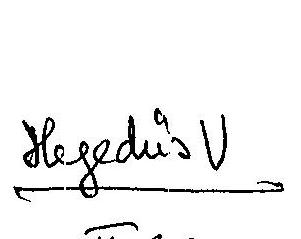
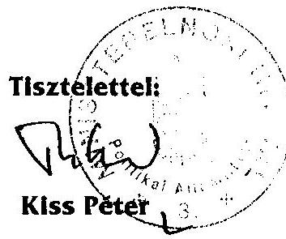

# JELENTÉS 

## a polgári nemzetbiztonsági szolgálatok gazdálkodásának ellenőrzéséről

---

# 2. Államháztartás Központi Szintjét Ellenőrző Igazgatóság 2.3. Átfogó Ellenőrzési Főcsoport 

Iktatószám: V-14-45/2003.
Témaszám: 649
Vizsgálat-azonosító szám: V0072

## Az ellenőrzést felügyelte:

## Bihary Zsigmond

föigazgató
Az ellenőrzés végrehajtásáért felelős:
Hegedüsné dr. Müllern Veronika
főcsoportfőnök

## Az ellenőrzést vezette:

## Hudik Zoltán

igazgatóhelyettes

## Az ellenőrzést végezték:

## Tóth Bálint

számvevő tanácsos, főtanácsadó
Dr. Pataki Magdolna
számvevő tanácsos, tanácsadó
Domonkosné Kurilla Edit
számvevő tanácsos

## Gömöri József

számvevő tanácsos

## A témához kapcsolódó eddig készített számvevőszéki jelentések:

## Címe

Információs Hivatal, Nemzetbiztonsági Hivatal pénzügyigazdasági ellenőrzése 1993. évben
A polgári nemzetbiztonsági szolgálatok gazdálkodásának ellenőrzése
A központi költségvetés területén működő belső (0115) kontrollmechanizmusok ellenőrzése

A zárszámadás és a költségvetési előirányzatok tervezésének (9927, 0024, ellenőrzése (évente)
$0126, 0232,$
$0329, 9839,$
$9932, 0034,$
$0241, 0329,$
$0338)$

---

## Eierlikör (1)

Menge: 1 Drink

2 Zentiliter Zitronensaft
2 Zentiliter Zuckersirup
1 Zentiliter Zuckersirup
1 Zentiliter Zuckersirup
etwas Zitronensaft
etwas Zuckersirup
etwas Zuckersirup
etwas Zuckersirup
etwas Zuckersirup
etwas Zuckersirup
etwas Zuckersirup
etwas Zuckersirup
etwas Zuckersirup
etwas Zuckersirup
etwas Zuckersirup
etwas Zuckersirup
etwas Zuckersirup
etwas Zuckersirup
etwas Zuckersirup
etwas Zuckersirup
etwas Zuckersirup
etwas Zuckersirup
etwas Zuckersirup
etwas Zuckersirup
etwas Zuckersirup
etwas Zuckersirup
etwas Zuckersirup
etwas Zuckersirup
etwas Zuckersirup
etwas Zuckersirup
etwas Zuckersirup
etwas Zuckersirup
etwas Zuckersirup
etwas Zuckersirup
etwas Zuckersirup
etwas Zuckersirup
et

---

# TARTALOMJEGYZÉK 

BEVEZETÉS ..... 5
ÖSSZEGZŐ MEGÁLLAPÍTÁSOK, KÖVETKEZTETÉSEK, JAVASLATOK ..... 7
MELLÉKLETEK

1. számú Melléklet Miniszterelnöki Hivatalt vezető miniszter észrevétele
2. számú Melléklet Miniszterelnöki Hivatal politikai államtitkárának minősítő átirata
FÜGGELÉKEK
3. számú Függelék A Nemzetbiztonsági Hivatal gazdálkodásának ellenőrzése
4. számú Függelék Az Információs Hivatal gazdálkodásának ellenőrzése
5. számú Függelék A Nemzetbiztonsági Szakszolgálat gazdálkodásának ellenőrzése

---

.

---

# RÖVIDÍTÉSEK JEGYZÉKE 

| ÁHH | Államháztartási Hivatal |
| :--: | :--: |
| Áht. | 1992. évi XXXVIII. törvény az államháztartásról |
| Ámr. | 217/1998. (XII. 30.) Korm. rendelet az államháztartás működési rendjéről |
| Er. | a központi, a társadalombiztosítási és a köztestületi költségvetési szervek kormányzati, felügyeleti, valamint belső költségvetési ellenőrzéséről szóló 15/1999. (II. 5.) Korm. rendelet |
| Étv. | 1997. évi LXXVIII. törvény az épített környezet alakításáról és védelméről |
| ÉVM | Építésügyi és Városfejlesztési Minisztérium |
| GI | Gazdasági Igazgatóság |
| GSZ | Gazdálkodási Szabályzat |
| Hszt. | 1996. évi XLIII. törvény a fegyveres szervek hivatásos állományú tagjainak szolgálati viszonyáról |
| IH | Információs Hivatal |
| IRA | Irodaautomatizálási Projekt |
| ITB | Informatikai Tárcaközi Bizottság |
| Kbt. | 1995. évi XL. törvény a közbeszerzésekről |
| KSH | Központi Statisztikai Hivatal |
| KTM | Közlekedési és Távközlési Minisztérium |
| Ktmr. | az egyes építményekkel, építési munkákkal és építési tevékenységekkel kapcsolatos építésügyi hatósági engedélyezési eljárásokról szóló 46/1997. (XII. 29.) KTM rendelet |
| MÁK | Magyar Államkincstár |
| MeH | Miniszterelnöki Hivatal |
| MeHVM | Miniszterelnöki Hivatalt vezető miniszter |
| NBA | Nemzetbiztonsági Adattár Rendszer Projekt |
| NBF | Nemzeti Biztonsági Felügyelet |
| NBH | Nemzetbiztonsági Hivatal |
| NBI | MeH Nemzetbiztonsági Iroda |
| NBSZ | Nemzetbiztonsági Szakszolgálat |
| Nbt. | 1995. évi CXXV. törvény a nemzetbiztonsági szolgálatokról |
| OMFB | Országos Műszaki Fejlesztési Bizottság |
| PM | Pénzügyminisztérium |
| Szakszolgálat | Nemzetbiztonsági Szakszolgálat |

---

| SzMSz | Szervezeti és Működési Szabályzat |
| :-- | :-- |
| Szolgálatok | Nemzetbiztonsági Hivatal, Információs Hivatal, Nemzetbiztonsági   Szakszolgálat |
| Sztr. | 2000. évi C. törvény a számvitelről |
| Szvr. | 249/2000. (XII. 24.) Korm. rendelet az államháztartás szervezetei   beszámolási és könyvvezetési kötelezettségének sajátosságairól |
| SzvSz | Számviteli Szabályzat |
| TÁKI | Távközlési Kutatóintézet |
| TNM | polgári nemzetbiztonsági szolgálatokat irányító tárca nélküli mi-   niszter |
| TNM Hivatal | Tárca Nélküli Miniszter Hivatala |
| VIR | Vezetői Információs Rendszer Projekt |

---

# JELENTÉS 

## a polgári nemzetbiztonsági szolgálatok gazdálkodásának ellenőrzéséről

## BEVEZETÉS

A nemzetbiztonsági szolgálatok a Magyar Köztársaság szuverenitásának biztosítását, alkotmányos rendjének védelmét, a nyílt és a titkos információgyűjtés eszközrendszerével segítik elő, ezáltal közreműködnek az ország nemzetbiztonsági érdekeinek érvényesítésében.

A nemzetbiztonsági szolgálatokról szóló 1995. évi CXXV. törvény (Nbt.) értelmében a polgári nemzetbiztonsági szolgálatok az Információs Hivatal, a Nemzetbiztonsági Hivatal és a Nemzetbiztonsági Szakszolgálat (a továbbiakban együtt: Szolgálatok). Szakmai feladataikat a törvény pontosan és részletesen meghatározta. A törvényi előírásokat a Szolgálatok sajátosságainak, speciális kiadásainak figyelembevételét tükröző - az érvényes államháztartási szabályoktól eltérő - szabályozás egészíti ki, többek között a költségvetési gazdálkodás és a közbeszerzések terén (a 19/1997. (II. 13.) és a 151/1999. (X. 22.) Korm. rendelet - a Szolgálatok költségvetése tervezésének, pénzellátásának, előirányzat-felhasználásának, kincstári gazdálkodásának és nyilvántartásának, valamint az egyes beszerzések nemzetbiztonsági és titokvédelmi okok miatti sajátos szabályairól).

A központi költségvetés szerkezeti rendjében a polgári nemzetbiztonsági szolgálatok együttesen - a Miniszterelnökség fejezeten belül - önálló költségvetési címet alkotnak, melyben az egyes szolgálatok alcímként jelennek meg.

A Kormány polgári nemzetbiztonsági szolgálatokat irányító szerepét 1995-2002. I. féléve között tárca nélküli miniszter, ezt követően a Miniszterelnöki Hivatalt vezető miniszter tölti be. A Szolgálatok irányításában a 27/2002. (VI. 7.) ME határozattal kijelölt politikai államtitkár is önálló felelősségi jogkört kapott. Az irányítási tevékenységet segítő szervezet - 1998-2002. első félévéig Tárca nélküli Miniszter Hivatala, azt követően Nemzetbiztonsági Iroda - egyúttal fejezeti felügyeleti szervként is működik a Miniszterelnöki Hivatal szervezeti keretei között, de annak irányítási rendszerétől elkülönülten, függetlenül látja el feladatait (148/2002. (VII. 1.) Korm. rendelet). A felügyeleti szervezet az egyszemélyi felelősség elvére épül, közreműködik a nemzetbiztonságilag érintett kérdések megoldásának döntés-előkészítésében, a szükséges koordináció megszervezésében.

A tárca nélküli miniszter a 2002. költségvetési évvel bezárólag - az éves költségvetési törvényekben, a Polgári Nemzetbiztonsági Szolgálatok költségvetési cím előirányzatai tekintetében - önálló fejezeti jogosítványt kapott. A Magyar Köztársaság 2003. évi költségvetéséről szóló 2002. évi LXII. törvény értelmében a Miniszterelnöki Hivatalt vezető miniszternek - mint a fejezet felügyeletét ellá-

---

tó szerv vezetőjének - tervezési, előirányzat-módosítási, felhasználási, beszámolási, információ-szolgáltatási, ellenőrzési kötelezettsége és jogköre nem terjed ki a Miniszterelnökség fejezet Polgári Nemzetbiztonsági Szolgálatok cím előirányzataira. Ezeket a Miniszterelnöki Hivatalt vezető miniszter a Polgári Nemzetbiztonsági Szolgálatok irányításában közreműködő politikai államtitkár útján gyakorolja.

A Szolgálatok költségvetési támogatása felhasználásának szakmai célszerűségét kizárólag a felügyelő miniszter illetékes megítélni, ugyanakkor a felhasználás szabályosságának értékelése az Állami Számvevőszékről szóló 1989. évi XXXVIII. törvény 2. § (3) és a 17. § (3) bekezdéseiben foglaltak alapján az ÁSZ feladata. Ennek alapján hajtottuk végre a Polgári Nemzetbiztonsági Szolgálatok gazdálkodásának átfogó ellenőrzését.

Az ellenőrzés célja annak értékelése volt, hogy a Polgári Nemzetbiztonsági Szolgálatok költségvetési címnél:

- az igazgatási, gazdálkodási tevékenység fejezeti szintű irányítása és felügyelete, szervezeti háttere célszerűen biztosította-e a törvényekben meghatározott feladatok teljesítéséhez szükséges feltételeket, a polgári nemzetbiztonsági szolgálatok feladatai és a meglévő források összhangját;
- az intézményi gazdálkodás irányítása, felügyelete, a költségvetés tervezési, végrehajtási és beszámolási információs rendszere biztosította-e a különböző jogcímeken rendelkezésre álló közpénzek törvényes, cél szerinti és eredményes felhasználását, továbbá a működésre fordított speciális kiadások szabályozottsága, elszámolása és ellenőrzése megfelelt-e a jogszabályi követelményeknek;
- a korábbi számvevőszéki ellenőrzések megállapításait, ajánlásait figyelembe vették-e, a felügyeleti szerv és a Szolgálatok intézkedési tervei megfelelően hasznosultak-e.

A fejezeti szintű gazdálkodást érintően a Nemzetbiztonsági Irodánál, az intézményi gazdálkodás tekintetében a Szolgálatok gazdálkodó szerveinél folytattuk le az ellenőrzést. A helyszíni ellenőrzések 1998. második félévétől a 2003. év első félév végéig tartó gazdálkodásra, ezen belül hangsúlyozottabban az utolsó két év gazdálkodására irányultak.

A végleges jelentést az Állami Számvevőszékről szóló 1989. évi XXXVIII. tv. III. fejezet 25. § (1) bekezdésének megfelelően észrevételezésre megküldtük Kiss Péter miniszter úrnak, aki megállapításainkat, javaslatainkat elfogadta, észrevételt nem tett és jelezte, hogy a hatáskörében teendő intézkedésekről a törvényes határidőben tájékoztatást ad (lásd: 1. számú Melléklet).

Az ellenőrzés összegző megállapításait, következtetéseinket és javaslatainkat nyilvános jelentésben foglaltuk össze. A Szolgálatok működésével kapcsolatos részletes megállapításokat az államtitokról és a szolgálati titokról szóló 1995. évi LXV. törvény 1. sz. melléklete 21. pontja alapján - a MeH politikai államtitkár átiratának (lásd: 2. számú Melléklet) figyelembevételével - szigorúan titkos minősítésű függelékek tartalmazzák.

---

# ÖSSZEGZŐ MEGÁLLAPÍTÁSOK, KÖVETKEZTETÉSEK, JAVASLATOK 

A törvényi szabályozás értelmében (Nbt., éves költségvetési törvények) a polgári nemzetbiztonsági szolgálatok tevékenységét, működését kijelölt miniszter 2002. II. félévtől kijelölt politikai államtitkár közreműködésével - irányítja, felügyeli és gyakorolja a fejezeti szintű gazdálkodási jogosítványokat. A politikai államtitkár irányítási feladatainak ellátását 2002. III. negyedévétől Nemzetbiztonsági Iroda (NBI - korábban Tárca Nélküli Miniszter Hivatala) segítette.

Az igazgatási, gazdálkodási tevékenység fejezeti szintű irányításának célszerűsége javult, ami biztosította a Szolgálatok számára a törvényekben meghatározott feladatok teljesítéséhez szükséges működési feltételeket. A Polgári Nemzetbiztonsági Szolgálatok sajátos szerepét tükröző jogszabályi környezet (részben a korábbi számvevőszéki ajánlások ${ }^{1}$ figyelembevételével) tökéletesedett, azonban nem követte teljes mértékben a változások folyamatát. Maradtak még pontosítandó jogszabályi területek, amelyek hatással vannak a Szolgálatok tevékenységére, számviteli kötelezettségeire, elsősorban a speciális működési kiadások költségvetése terén.

A speciális működési kiadások költségvetési megjelenítésével kapcsolatban hiányzik a szabályozási háttér összhangja, mivel az államháztartás működésének 1999. évtől hatályos előírása már nem tartalmazza az ilyen jellegű kiadások elkülönített - az Nbt. előírásainak is megfelelő - tervezésére és elszámolására alkalmas előirányzat jogcímet. Ennek következtében a Szolgálatok a speciális működési kiadásokat az „Egyéb dologi kiadások" előirányzatok között szerepeltették.

A költségvetési intézmények állománytáblájának és költségvetési kapcsolatának áttekintése olyan ellentmondásos helyzetre mutatott rá, ami azért alakulhatott ki, mert a jogszabályi háttér (Áht., Ámr., Nbt., Hszt.) nem tisztázta teljes körűen a sajátos jogosítványok költségvetési összefüggéseit. Ilyen szabályozási környezetben például a hivatásos álláshelyen közalkalmazott foglalkoztatására kapott felhatalmazás - a hozzá kapcsolódó személyi juttatás tervezésére vonatkozó konkrét rendelkezés hiányában - adott alkalmat a személyi juttatásokkal való gazdálkodás sajátos értelmezésére (NBSZ, NBH). Ebből eredően az ellenőrzött időszakban feltöltetlen hivatásos álláshelyet és a hozzá tervezett személyi juttatást más besorolási kategóriájú személy alkalmazásához és bérezéséhez használták. Ennek következtében megtakarítás képződött, amely forrásként szolgált a nem rendszeres személyi juttatások kiegészítésére (jutalom, egyéb juttatás). Ilyen eredetű megtakarítás összehangolt, az összefüggésekre is kiterjedő jogszabályi háttér mellett nem fordulhat elő, tekintettel a költségvetési gazdálkodás szigorú szabályozási elveire.

[^0]
[^0]:    ${ }^{1}$ Lásd: A Polgári Nemzetbiztonsági Szolgálatok ellenőrzéséről szóló 1999. évi (9910) jelentés jogszabályi környezet pontosítására vonatkozó javaslatai

---

A Szolgálatok kereskedelmi bankoknál lévő, speciális kiadásaik teljesítéséhez használatos számlák egyenlegeinek kezelésénél a pénzmaradvány elszámolások a polgári nemzetbiztonsági szolgálatok előirányzat-felhasználása tekintetében irányadó előírásától eltérően, ugyanakkor a számviteli alapelvek figyelembevételével történtek. A számlák év végi záró egyenlegét - a halmozódás elkerülése érdekében - a házipénztárban lévő pénzkészletként nem vették figyelembe (NBH), viszont az érintett szolgálat vagyonában kimutatták. A kereskedelmi bankoknál lévő pénzmaradvány a költségvetési elszámolásban megjelent, azonban a hatályos rendelkezések szerint mégis szabálytalan megoldás a vonatkozó kormányrendelet módosításának szükségességére hívja fel a figyelmet.

Az államháztartás szervezetei beszámolási és könyvvezetési kötelezettségének sajátosságairól szóló kormányrendelet a 2000. évtől tette kötelezővé az önköltségszámítást a költségvetési szervek által előállított, saját-felhasználású termékekre is. E rendelkezés előírásainak betartása az NBSZ speciális céllal összeállított termékeire (eszközrendszereire) vonatkozóan kedvezőtlenül érinti a gyors műveleti munkavégzést. Tekintve, hogy ezen eszközök felhasználása zárt, megbízható kontroll alatt áll, kellő
 garancia biztosított a vagyonvédelemhez. Ezért egy differenciáltabb, indokolt eltéréseket megengedő szabályozás még nem sértené az eredeti jogalkotói szándék érvényesülését.

Az építésügyi hatósági engedélyezési eljárások 1997. évi újraszabályozásánál, a korábbi rendelkezések hatálytalanítása következtében szabályozatlanul maradtak a nemzetbiztonsági szolgálatok objektumaival kapcsolatos titokvédelmi, biztonsági követelmények. (A Ktmr. e tekintetben csak utal külön jogszabály meglétére.) A tapasztalt hiányosság felszámolásának akadálya az, hogy törvényi felhatalmazást (Étv.) - titokvédelmi, nemzetbiztonsági követelményt is megfogalmazó építésügyi eljárásra vonatkozó szabályok alkotására - ez ideig a Kormány csak a honvédelmi és a katonai célú építményekkel kapcsolatban kapott.

A jogszabály-előkészítések visszatérő problémája a felmerülő új feladatok végrehajtásához szükséges forrásbiztosítás, ami jelentkezett az elmúlt rendszer titkosszolgálati tevékenységének feltárásáról és az Állambiztonsági Szolgálatok Történeti Levéltára létrehozásáról szóló törvény és kormány szintű rendelkezések előkészítésénél is. A Szolgálatok forrásigényét elismerték, de az erről rendelkező kormányhatározat fedezetként a fejezeti tartalékot jelölte meg. A Szolgálatok felügyeleti szerve 2003-ban tartalékkal nem rendelkezett, a feladatok végrehajtását ez évben a feltöltetlen létszámhelyek bérfedezetének a terhére kezdték meg.

A tapasztaltak alapján a jogszabályi környezet további pontosítása szükséges, ennek szükségességét a felügyeleti szerv (NBI) és a Szolgálatok felismerték, az előkészítő munkálatokat részben megkezdték (a polgári nemzetbiztonsági szolgálatok előirányzat-felhasználása tekintetében irányadó kormányrendelet módosítása céljából). A jogszabályi háttér összhangjának megteremtését szolgáló további kezdeményezések azonban még nem voltak napirenden (Nbt., Hszt., Áht., Ámr. összehangolása a létszám- és a személyi juttatás gazdálkodással összefüggésben).

---

A felügyeleti szerv szabályozó, ellenőrző tevékenysége, ezek folyamatossága - a jogi környezet változásainak követése - javult. Ennek hatására a Szolgálatok működésének szabályozottságában és szabályosságában minőséginek tekinthető változás vált érzékelhetővé az előző átfogó számvevőszéki ellenőrzés óta (a közbeszerzés alól kivont beruházások, a sajátos költségvetési eljárások, az intézményi sajátosságoknak megfelelő szabályozás vonatkozásában).

A Szolgálatokat érintően is fennmaradtak - már lényegesen kisebb súlyú tartalommal - olyan, esetleg további szabályozást igénylő kérdések is, melyek aktualitása az előző átfogó számvevőszéki ellenőrzés óta fennáll (a felügyelet kísérje figyelemmel a szervezetek költségvetési, illetve állománytábla szerinti létszáma belső összetételének egyezőségét). ${ }^{2}$

A felügyeleti szerv egyes esetekben a felhatalmazás adta lehetőségeket nem használta ki, vagy nem alkalmazta kellő hatékonysággal (az informatikai stratégiák koordinációja, az egyes szolgálatok költségvetési szükségleteinek képviselete, az NBSZ vitatott vagyoni eszközeinek meghatározása, a felügyeleti költségvetési ellenőrzés teljes körű alkalmazása).

A központi államigazgatási szervek informatikai fejlesztésének koordinálásáról szóló kormányhatározat szerint a minisztériumokban, az országos hatáskörű államigazgatási szerveknél rendszeressé kell tenni az informatikai fejlesztési (stratégiai) terv készítését. A stratégia készítésének kötelezettségét a jelzett kormányhatározat az önálló feladatkörrel rendelkező, fejezeti jogosultságot gyakorló felügyeleti szervezetekre külön nem fogalmazta meg. Az informatikai stratégia készítését az ügyrendi szabályozás az illetékes főosztály (Költségvetési, Igazgatási és Informatikai Főosztály) feladatává tette, azzal azonban az NBI nem rendelkezett.

Az NBI nem rendelkezett az informatikai felügyeleti tevékenységének teljes körű ellátásához olyan kontrollal, amely szavatolja az informatikai fejlesztések és a Szolgálatok szakmai feladatainak összhangját, illetve konkrét esetben az informatikai rendszer üzemeltetésének biztonságát (NBH). A szabályozások ellenére a koordinációs feladatok nem teljesültek. A Szolgálatok által készített informatikai stratégiák szerkezeti és tartalmi követelményeit a felügyeleti szerv nem határozta meg, kidolgozásukat követően elsősorban azokra az informatikai beruházásokra fordított figyelmet, amelyek részben, vagy egészben kormányzati beruházásból valósultak meg. Az intézményi forrásokból végrehajtott fejlesztésekről nem végzett értékelést annak ellenére, hogy az intézményi stratégiák - az ITB ajánlásait figyelembe véve - nem voltak alkalmasak a feladatok átlátható finanszírozásának bemutatására, nem biztosították a középtávú erőforrás-tervezést. (Csak nagy vonalakban határozták meg az egyes projektek végrehajtásával elérhető eredményt, így nem váltak alkalmassá az egyes projektfeladatok számonkérésére, készenléti állapotuk értékelésére.) Ebből következően az informatikai fejlesztések költségvetési szükségleteit sem tudta megfelelő erővel érvényesíteni a költségvetési tárgyalások során (NBSZ). (Az

[^0]
[^0]:    ${ }^{2}$ Lásd: A Polgári Nemzetbiztonsági Szolgálatok ellenőrzéséről szóló 1999. évi (9910) jelentés TNM részére megfogalmazott javaslatai

---

NBI a stratégia készítésének jelentőségét felismerve 2003. szeptemberében utasította a Szolgálatokat a 2004. évi informatikai stratégiai terveik elkészítésére és a felügyeleti szervnek 2003. november 15-ig jóváhagyásra történő megküldésére.)

A felügyeleti szerv a Szolgálatok költségvetési gazdálkodásának szabályozásában az egységes eljárások kialakítására törekedett (speciális előirányzatok, beruházási előirányzatok felhasználása), azonban a szervezeti struktúrára vonatkozó elvet nem határozott meg. Ennek következményeként két szolgálatnál a humánpolitikai tevékenység - annak indokolt szakmai követelményei miatt - közvetlenül főigazgatói irányítás alá került. A struktúra viszonylagos szabadsága lehetővé tette a Szolgálatok sajátosságainak érvényesítését, mely összességében azok működésére kedvező hatást gyakorolt (rugalmas feltételeket biztosított a szervezeti változtatásokhoz és szükség szerint a személyi és előirányzat-átcsoportosítások stb. végrehajtásához).

A szakmai prioritásokat a költségvetés tervezéséhez a kormányhatározatok, valamint az Nbt.-ben megfogalmazott feladatok, illetve a társ-szervezetek igényei figyelembevételével, valamint a Szolgálatok sajátosságaira alapozva állította össze az irányító szervezet (felügyelet), azokat utasítás formájában adta ki a miniszter a Szolgálatok számára. Ez adódott abból is, hogy az OGY határozatában a Kormány felelősségi körében meghatározott nemzetbiztonsági stratégia még nem készült el (kidolgozása a helyszíni ellenőrzés időszakában volt napirenden).

A technikai haladás - különösen a távközlés ugrásszerű fejlődésének - bűnözői körökben történt követése a Szolgálatok (hangsúlyozottan az NBSZ) folyamatos műszaki fejlesztését követelte meg. A fejlesztés folyamatosságát igényelte és igényli az európai uniós csatlakozás közelsége, ami egyes területeken az EU tagállamai szakmai szervezeteivel való együttműködés szükségességeként nyilvánul meg. Ez egyaránt megköveteli a polgári nemzetbiztonsági szolgálatok belső struktúrájának és alkalmazott módszereinek korszerűsítését, valamint adekvát ismereteinek bővítését is. A fejlesztési szükségletek egyes elemei a Szolgálatoknál megjelentek, de - annak felismerésén túl, hogy ezek középtávú szakmai, költségvetési és informatikai tervezést követelnek meg - a prioritások komplex kezelése még nem alakult ki (ez a nemzetbiztonsági stratégiában ölthet testet).

A törvényi feladatok ellátásához kapcsolódóan, mindhárom szolgálatra kiterjedő hatállyal szabályozta a TNM a speciális működési kiadások szakmai indokait, felhasználásuk alapelveit és költségvetési összefüggéseit. A speciális működési kiadásokra vonatkozó 1997. évi kormányrendelettel előírt miniszteri szabályozásig a Szolgálatok főigazgatói utasításai biztosították e kiadási források szabályozott keretek közötti felhasználását, ezáltal a megfelelő szintű szabályozás elhúzódása a működésben fennakadást nem okozott.

A központi beruházási, illetve a fejezeti kezelésű előirányzatok kezeléséről TNM utasítás rendelkezett. A miniszteri utasítás 2001. májusi - az Áht.-ban meghatározott határidőt követő - kiadása késleltette a felhasználást, amely emiatt döntően az év utolsó negyedévére korlátozódott (pl. az NBH, és az NBSZ beruházásai elhúzódását okozta). A 2002-ig meglévő fejezeti kezelésű előirányzatok

---

felhasználására a felügyeleti szerv a Szolgálatokat jogosította fel, a felügyeleti felelősséget és a jogkört a felhasználás folyamatába ágyazott ellenőrzési és több engedélyezési pont beépítésével érvényesítette. Hasonlóan TNM utasítás biztosította a felügyeleti szerv kontrollját a nagyobb volumenű intézményi beruházásoknál, mint a speciális eszközök fejlesztési projektek esetében. Az megfontolás tárgyát képezheti, hogy a fejezeti felügyeletet igénylő beruházások előirányzatai kezelését célszerűbb-e intézményi hatáskörbe adni és a kontrollt viszonylag bürokratikusabb eljárási renddel biztosítani, mint a feladatokat eleve fejezeti hatáskörben ellátni.

Titokvédelmi követelmények indokolják, hogy az éves költségvetések zárszámadása alkalmával részletes beszámolási adatokhoz csak a Pénzügyminisztérium és az OGY Nemzetbiztonsági bizottsága jut, megvalósítva a civil kontroll egyik elemét. Hasonló indokok alapján - a nemzetbiztonsági szolgálatok speciális gazdálkodására tekintettel - célszerűségi és eredményességi ellenőrzést a miniszter irányító tevékenysége keretében végezhet.

Az állami ellenőrzés formálódó gyakorlatában, a központi költségvetés végrehajtásának számvevőszéki pénzügyi (szabályszerűségi) ellenőrzése - az EU tagságra való felkészülés jegyében kidolgozott financial audit módszerével - a minisztériumi igazgatás és a fejezeti kezelésű előirányzatok beszámolóit minősíti. A költségvetési fejezet intézményeire kiterjedő financial auditokat a fejezetek felügyeletének ellenőrzési szervezetei végzik ${ }^{3}$. A Szolgálatok felügyeleti szerve ebben az évben csatlakozott ehhez az auditálási rendszerhez, döntés született az ellenőrzési módszer elsajátításáról, a létszámfeltételek biztosításáról. Ennek teljesülése az uniós követelményekkel harmonizáló, nemzetközi ellenőrzési standardokon alapuló pénzügyi szabályszerűségi ellenőrzési módszerét terjeszti ki a polgári nemzetbiztonsági szolgálatok területére is.

A belső rendelkezések, valamint az ügyrend és a munkaköri leírások megfelelő működési keretet adtak a felügyeleti költségvetési és az irányító szervezet függetlenített belső ellenőrzéseinek végrehajtására. Az NBI vezetőjének közvetlen alárendeltségébe tartozó felügyeleti ellenőrzési szervezet átfogó ellenőrzései rendszeressé váltak, kapacitása biztosította az éves feladatok, valamint az eseti ellenőrzések végrehajtását.

Az ellenőrzési programok készítésénél azonban esetenként figyelmen kívül hagytak az irányadó jogszabályban (Er.) meghatározott, a gazdálkodás szempontjából lényeges területeket (központi előirányzatból megvalósított beruházás, annak számviteli kezelése, egyeztetése a felügyeleti szervvel, a programok és céljellegű előirányzatok felhasználását, azok megvalósítását, hatékonyságát), valamint nem tértek ki a költségvetési szervek vezetői és munkafolyamatba épített ellenőrzéseinek értékelésére (Er.). Így a felügyeleti szerv a Szolgálatok belső ellenőrzésének tapasztalatairól, értékeléséről nem rendelkezett átfogó információval.

[^0]
[^0]:    ${ }^{3}$ Az Országgyúlés 69/2002. (X. 4.) és a 35/2003. (IV. 9.) határozataival is megerősítette azt a számvevőszéki stratégiát, miszerint a zárszámadás adatai megbízhatóságát tanúsító financial audit csak a fejezet belső ellenőrzési egységek bevonásával tehető teljes körűvé és zárt rendszerűvé.

---

Az ellenőrzési tapasztalatok hasznosulását hátráltatta, hogy az éves ellenőrzési tevékenységről írásos beszámolót a felügyeleti ellenőrzési szervezet nem készített, így ilyet az éves vezetői értekezlet sem tárgyalhatott, bár erre jogszabályi előírás volt (Er.). A felügyeleti szerv vezetője elegendőnek tartotta, hogy a jelentést minden esetben megismerte és az intézkedéseket számon kérte.

A felügyelet szervezeti feltételei terén a végrehajtott módosítások összességükben az ésszerűbb feladatmegosztás irányába mozdultak el (a szakmai és a költségvetési gazdálkodás, valamint a felügyeleti ellenőrzés területeit elkülönítették, a vonatkozó feladatköröket részletesen meghatározták). Annak ellenére, hogy a hatásköri szabályozás következetesen jelölte ki a szervezeti egységek együttműködési formáit, elsősorban a fejezet szintű tevékenység ellátásához biztosított - de az általánostól eltérő - létszám és gazdálkodási feltételek kevésbé sikeres megoldásokat eredményeztek (a személyi juttatásokkal történő gazdálkodás szabályszerűségét érintően és a koordinációs feladatok ellátásában).

Az irányító szerv (NBI, korábban TNM Hivatala) részére megállapított létszámok (2003-ban 20 fő köztisztviselői álláshely) a jogszabályokban (Nbt., Hszt., Áht., Ámr.) meghatározott szakmai döntés-előkészítő és koordinációs, humán erőforrás- és költségvetési gazdálkodási feladatai ellátásához nem volt elegendő. Ez indokolta a létszám más formában - hivatásos állomány berendeléssel való bővítését, amire törvényi szabályozás (Nbt., Hszt.) hatalmazta fel a Szolgálatokat irányító minisztert. Elsősorban a speciális szakmai munkakörök betöltéséhez a berendeltek száma - az ellenőrzött években - a felső határként engedélyezett keretszám 75%-a körül (20-25 fő között) mozgott.

A hivatásos állománnyal betölthető álláshelyeket a felügyeleti szervnél nem határozták meg, így ez a berendelés intézményének rugalmas alkalmazását tette lehetővé. A köztisztviselői és a berendelt hivatásos létszám együtt a felügyeleti szerv számára meghatározott feladatok teljesítését döntően biztosította. Ugyanakkor néhány részterületen érzékelhető volt elmaradás (informatikai terület koordinálása, felügyelete, a fejezeti kezelésű előirányzat cél szerinti felhasználásának ellenőrzése, az állománytábla és költségvetési létszám összetétel értékelése, a
 szabályozások előkészítése terén), melyek összefüggésbe hozhatók az engedélyezett keretlétszám kihasználatlanságával. (A felügyeleti szerv a miniszteri utasításban meghatározott keret teljes kihasználásával elegendőnek tartotta az NBI létszámbővítését a felügyeleti és a koordinációs feladatok elvégzéséhez.)

A felügyeleti szerv sajátos helyzetéből adódóan - a Miniszterelnöki Hivatal (MeH) önálló feladatkörrel rendelkező szervezeti egysége, melynél takarékossági megfontolások alapján saját gazdasági szervezetet nem hoztak létre, továbbá a jogszabályok alapján fejezeti jogosítványokkal felruházott szerv - egyfelől nem érvényesülhetett a központi költségvetési szervek könyvviteli kötelezettségére vonatkozó jogszabályi előírás. Másfelől a berendelések személyi juttatás költségvetési kapcsolatáról sem a törvények - Hszt., Áht. - szellemében rendelkeztek a TNM rendeletben, mivel a berendeltek foglalkoztatásával összefüggő költségek nem a felügyeleti szervet, hanem a Szolgálatokat terhelték (így nem volt tisztázott az Ámr.-ben előírt személyi juttatásra vonatkozó ellenjegyzés gyakorlása, illetve felelőse sem).

---

Ez a sajátos költségvetési gazdálkodási forma hívta fel a figyelmet arra, hogy az ilyen módon fejezeti jogosítványt gyakorló, önálló jogi személyiséggel nem rendelkező felügyeleti szerv gazdálkodási kötelezettségeit, illetve mentességeit a jogszabályi rendelkezések nem teljes körűen határozták meg, nem tértek ki a költségvetési szervként való létrehozással, a számvitellel, a gazdasági szervezettel kapcsolatos stb. kérdésekre.

A Szolgálatok költségvetési gazdálkodásának intézményi szintű irányítása és felügyelete döntő többségében szabálykövető volt, belső szabályozottsága szolgálatonként eltérő színvonalon valósult meg. A jogszabályi és a gazdálkodási környezet változásainak, valamint a szervezeti módosítások folyamatos követése elsősorban az NBSZ-nél volt jellemző. Az IH és az NBH esetében előfordultak hiányosságok, késedelmek a belső szabályozások aktualizálása terén, holott már az előző számvevőszéki ellenőrzés felhívta a figyelmet a hasonló jelenségek elkerülésére. ${ }^{4}$ (Az IH gazdálkodási szabályzata nem volt szinkronban a számviteli szabályozással, ezen túlmenően a számlarend és néhány munkaköri leírás hiánya is felszínre került. Az NBH esetében 1999. évtől tapasztalható volt a jogszabályi változások követésének elmaradása, illetve késedelmes aktualizálása, ami viszont tartalmi hiányosságokat is tartalmazott.)

A Szolgálatoknál általában rendszeresen elvégezték a személyi állomány teljesítményértékelését, a helyettesítések rendjét többségében kielégítően szabályozták. Ugyanakkor előfordult, hogy egyes miniszteri utasításban, illetve intézkedési tervben foglaltak teljesítése elhúzódott (az IH nem rendelkezett a munkaerővel kapcsolatos egységes belső szabályozással, elkészítését a helyszíni ellenőrzés idején kiadott utasításban 2003 végére határozta meg a szervezet főigazgatója).

A vagyonvédelmet érintő szabályozások a Szolgálatoknál - az ellenőrzött időszak alatt - folyamatosan váltak egyre kiterjedtebbé (a személyes igénybevételű eszközök - telefon- és gépkocsi - használatának térítése terén).

A speciális működési kiadások intézményi szabályozottsága általában megfelelő, az ilyen kiadások elszámolási rendje és kontrollja lényegében képes biztosítani a jogszabályi követelmények érvényesülését. Ezzel együtt volt arra példa (az IH-nál), hogy az okmánycsatolási kötelezettség alóli mentesítést nem csak a speciális, hanem nyílt kiadás esetében is alkalmazták. A szabálytalanságok előfordulásának megelőzésére 1999-ben eredményes főigazgatói intézkedés született.

A Szolgálatok költségvetési belső ellenőrzésének alapvető elemeit az irányadó jogszabály (Er.) megjelenését követően - kisebb-nagyobb késedelemmel (NBH 1999. novemberi, IH 2000. áprilisi szabályozással) - összhangba hozták a hatályos előírásokkal. Tapasztalható volt azonban az is, hogy a belső szabályozás nem kellő részletezettséggel tükrözte a szervezeti sajátosságokból levezethető ellenőrzési feladatokat (az IH nem rendelkezett azokról a teendőkről, amelyeket a szakmai vezetőknek rendszeresen kell elvégezni a speciális működéssel kap-

[^0]
[^0]:    ${ }^{4}$ Lásd: A Polgári Nemzetbiztonsági Szolgálatok ellenőrzéséről szóló 1999. évi (9910) jelentés főigazgatói hatáskörben megoldásra ajánlott javaslatai

---

csolatos - a gazdálkodási terület felé történő - adatszolgáltatást megelőzően). A TNM utasítás és a Szolgálatok szabályozásai alapján a vezetők ez irányú ellenőrzési feladatai elláthatók voltak, amelynek eleget tettek.

A szervezett hazai és nemzetközi bűnözés alakulása, a terrorizmus ténye, továbbá az elkövetési módszerekben, eszközökben bekövetkezett változások bővülő feladatokat hoztak a Szolgálatok differenciálódó tevékenységében. A feladatok teljesítése növekvő mértékű költségvetési támogatást igényelt, mivel az alaptevékenységükből adódóan a saját bevételük nem volt számottevő, csak szűk körre terjedt ki (selejtezett eszköz értékesítése, üdülő igénybevételi díj). A Szolgálatok költségvetési tervezési folyamatára jellemző volt, hogy a jóváhagyott költségvetés nem volt összhangban a Szolgálatok szükségleti terveire alapozott igényekkel, azzal együtt sem, hogy a cím költségvetési támogatása 1999-től 2003-ig közel háromszorosára nőtt.

A fejlesztési szükségletek és az attól rendszeresen alacsonyabb költségvetési támogatás a szakfeladatok ellátását lehetővé tette, de halmozódó hiányok középtávon - a Szolgálatok megítélése szerint - már korlátozhatják a működési feltételeket, ezen keresztül a jogszabályokban rögzített feladatok végrehajtását. Az NBSZ például rendelkezik két olyan projekt-tervvel, melyre kormányhatározat adott elvi engedélyt, a költségvetési források biztosítására azonban közvetlenül garanciát nem vállalt, annak jóváhagyását a mindenkori éves költségvetési lehetőségekre bízva (2003-ra a kormányhatározatban rögzített összeg töredékét kapták meg). Tekintve, hogy a szakfeladatok hosszabb távú ellátására ható beruházásokról van szó, a célkitűzések teljesíthetősége válhat kérdésessé.

A költségvetési tervezéshez feladatmutatókat, teljesítménymutatókat lényegében nem alkalmaztak a Szolgálatok, viszont a szükségleti terveket - ahol az lehetséges volt - számításokkal támasztottak alá, ami szolgálatonként eltérő volt. Az intézmények készítettek olyan tervet is (az NBH-nál az ún. tevékenység szerinti költségvetési terv, vagy az IH-nál a normatív dologi tervezés) melyek szorosabb, feszesebb kapcsolatot teremthettek volna a teljesítményelvű tervezés számára. Ugyanakkor a többletfeladatok költségvetési szükségletét (a létszámszükségleteket, a működés dologi és beruházási támogatási szükségleteit) a rendelkezésre álló tapasztalati adatok alapján alakították ki a központi gazdálkodó főosztályok, mivel ehhez a szakmai főosztályoktól előzetes felméréseket, alaptevékenységre jellemző statisztikai adatokat nem kaptak, a mennyiségi adatok esetleges változásáról szakmai elemzések nem készültek.

A nemzetközi egyezményekből és jogszabályokból levezethető, prognosztizálható költségvetési követelmények kevésbé érvényesülhettek az NBSZ esetében, mivel alapvetően kiszolgáló szervezet (a jogi környezet változásai elsősorban nem a saját, hanem a megrendelői feladatkörét érintik). Ennek ellenére rendkívül sokrétű szakmai statisztikai számítással és elemzéssel nyújtottak kiindulási pontokat, kalkulációs hátteret a tervezés megalapozásához (évről évre ismert volt az egyes szakmai tevékenységekhez kapcsolódó szükséges ráfordítás).

A mutatószámok, normatívák alkalmazása és érvényesítése nem csupán a tervezés megalapozottságát szolgálhatja, hanem a Szolgálatok teljesítményének bemutatását és ellenőrizhetőségét is. A fejezet a közeljövőre nézve tervbe vette a teljesítmény-ellenőrzések lefolytatását, annak eredményessége csak több irány-

---

ban lefolytatott teljesítmény-ellenőrzések tapasztalatainak összegzése révén, valamint a szakmai és gazdasági szervek szorosabb együttműködésével érhető el.

Ugyanakkor azt is meg kell jegyezni, hogy bár kormányhatározat rendelkezett az államháztartás alrendszerei költségvetési tervezésének feladatorientálttá tételéről, jellemző maradt a bázis szemléletű tervezési irányelv alkalmazása. (1999-től 2003-ig irreálisan magas bevételi előirányzatokat kellett tervezni, a dologi kiadások inflációs kihatásait és a fejlesztések dologi következményeit nem, vagy csak részben ismerte el a PM.) A Szolgálatok a meglévő teljesítményelvű számításaiknak sem tudtak érvényt szerezni, melyekkel a jogos támogatási igényeiket a költségvetési tervezés makroszintű egyeztetési folyamatában megalapozottan képviselhette volna a felügyeleti szerv.

A Szolgálatoknál kialakított költségvetési végrehajtási, beszámolási információs rendszer általánosságban megfelelő keretet adott a források célszerű és szabályszerű felhasználásához. Ez megmutatkozott abban, hogy a költségvetési beszámolók számszakilag és tartalmilag - összhangjuk biztosítása mellett - megalapozottak voltak, a mérlegadatokat leltárral alátámasztották. Az ellenőrzés a vizsgált időszak beszámolóiban lényeges hibát nem tárt fel, a tapasztalt - kisebb - eltérések hibás adatbevitelre, a szabályozás vagy a megfelelő munkafolyamatba épített kontroll hiányára voltak visszavezethetőek, melyeket utólag korrigáltak (NBH vízi jármű minősítése, a valóságtól eltérő értékcsökkenés elszámolása).

A szakmai és a költségvetési területek egyébként korrekt együttműködése a létszámmal és a személyi juttatásokkal való gazdálkodás terén nem valósult meg kielégítően. A szolgálatoknál különvált a személyi állománnyal és a hozzá tartozó személyi juttatással való költségvetési gazdálkodás. Következményeként az egyes munkakörökre engedélyezett létszámhoz a megfelelő költségvetési forrásigény hozzárendelését kimutató egységes nyilvántartással nem rendelkeztek, melyből kinyerhetők a gazdálkodáshoz szükséges információk a döntéshozók, a vezetés számára. Ez is szerepet játszott abban, hogy az állománytáblák ténylegesen jóváhagyott munkaköreinek teljes körű betöltéséhez, a jogszabály egyértelmű előírása ellenére - két intézménynél (NBH, NBSZ) - nem rendelkeztek a megfelelő költségvetési forrással. Az átmenetileg betöltetlen álláshelyekre jutó személyi juttatások előirányzatával ugyanis úgy kell gazdálkodni, hogy az álláshely az év bármely időpontjában betölthető legyen (Ámr.), ami azáltal biztosítható, hogy az üres álláshelyekre az adott illetménycsoport személyi juttatás átlaga rendelkezésre áll.

A bővülő számítástechnikai és biztonságtechnikai, illetve egyéb technikai fejlesztések az üzemeltetés, a fenntartás költségeit emelték, amit a költségvetési keretszámok meghatározása mellett nem tudtak érvényesíteni. A dologi kiadások emelésének bevételnövekményhez való kötése azt eredményezte, hogy a korlátozott bevételi lehetőségekkel rendelkező Szolgálatok előbb-utóbb a felhalmozási, azon belül a felújítási előirányzatok terhére biztosították a dologi, nem egy esetben személyi juttatásbeli hiányzó forrásaikat. (Az NBH-nál és az NBSZ-nél a felújítás ilyen okok miatt éveken át húzódott, illetve húzódik.)

---

Az évközi módosítások során - a valamennyi költségvetési intézményt érintő elvonások mellett - mód nyílt pótlólagos támogatásra is. Az NBSZ esetében 1998-ban a Kormány valójában többletfeladathoz kötött 180,0 M Ft pótlólagos támogatást, azonban ez a korábbi elégtelen költségvetési támogatás következtében kialakult likviditási hiány megszüntetésére szolgált.

A közbeszerzési törvény hatálya alól kivont beszerzéseknél, beruházásoknál a vonatkozó jogszabályi előírásokat általában - néhány eset kivételével - betartották. Az NBH beszerzéseinél előfordult, hogy a szerződéskötés költségvetési évre számított értéke meghaladta a szabadkézi vételt szabályozó kormányrendeletben meghatározott értékhatárt, de a megbízási szerződés megkötését - a szolgáltatás megrendelését - nem előzte meg a rendeletben előírt három ajánlat bekérése, emellett a kötelezettségvállalás pontos vezetése sem érvényesült. Az intézményi belső ellenőrzések tárták fel, hogy az NBSZ két részből álló zártkörű eljárást összevontan bonyolított le, az NBH-nál a beszerzés részekre bontása történt. A szabálytalanságok megszüntetése érdekében a szükséges intézkedéseket megtették.

A Szolgálatoknál a belső ellenőrzés szervezeti függetlensége megfelelő, a személyi és tárgyi feltételek összességükben alkalmasak voltak a belső ellenőrzési feladatok ellátásához. A költségvetési belső ellenőrzések megállapításainak hasznosulása a Szolgálatoknál fokozatosan javuló tendenciát mutatott. A függetlenített belső ellenőrzés rendszeresen végzett vizsgálatokat a speciális kiadások felhasználásáról és a pénztárak működéséről, a TNM utasítás alapján közbeszerzési törvény hatálya alól kivont beszerzések lebonyolításáról. A javaslatokat megfelelő intézkedési tervek követték.

A függetlenített belső ellenőrzés eredményességével és a vezetői hatékonyság javulásával is összefüggésben több ponton kimutathatóan javult a gazdálkodás szabályossága, a gazdálkodási tevékenység hatékonysága. (Az NBSZ-nél így kerültek felszínre a gépjármű használat szabálytalanságai, a tanulmányi szerződések, a támogatott képzési formák gazdaságossági és szakmai szempontok szerinti újragondolásának szükségessége, melyeket megfelelő intézkedések követtek.)

A korábbi számvevőszéki ellenőrzések hasznosulására irányuló utóellenőrzés keretében megállapítható volt, hogy az előző átfogó ellenőrzés ajánlásait a polgári nemzetbiztonsági szolgálatok figyelembe vették. A Nemzetbiztonsági Iroda lényegében már az ellenőrzött időszak első felében megvalósította intézkedési tervei alapvető célkitűzéseit (pl. a gazdálkodás átfogó szabályozása, a belső szabályozás felgyorsítása terén). Ezzel egyben folyamatosan szűkítették a költségvetési gazdálkodásban a - belső kontroll-mechanizmusok 2001. évi számvevőszéki ellenőrzése keretében jelzett - kockázati tényezők körét is (szabályozottság, belső
 ellenőrzés, informatikai biztonság).

A védett beruházások - titokvédelmi követelményeket is érvényesítő - eljárási és ellenőrzési rendjének kormány hatáskörben kezelendő, komplex szabályozását ${ }^{5}$

[^0]
[^0]:    ${ }^{5}$ Lásd: A Polgári Nemzetbiztonsági Szolgálatok ellenőrzéséről szóló 1999. évi (9910) jelentés kormányzati hatáskörben megoldásra ajánlott javaslatai

---

szorgalmazta a korábbi számvevőszéki átfogó ellenőrzés, az NBSZ bérleti konstrukcióval folytatott technikai fejlesztésének ellenőrzési tapasztalatai alapján. A beszerzések, beruházások és szerződéskötések, az előirányzatok felhasználásának szabályai - az NBSZ 1996. évi szerződéséből adódott szabálytalanságok jövőbeni elkerülésére - kormányrendelet formájában, illetve miniszteri rendelkezésekben jelentek meg, az NBSZ pedig belső utasításokban teremtette meg a szabályszerűség eszközrendszerét. Az ilyen típusú beruházások titokvédelemmel (fedéssel) összefüggő teljes körű, komplex szabályozása azonban még nem valósult meg, ezt a Szolgálatok felügyeleti szerve sem tartotta időszerűnek. Egyébként az NBSZ hivatkozott beruházásával kapcsolatos problémákat - a folyamatban levő peres eljárás miatt - még nem tudták véglegesen lezárni, így nem hasznosulhatott a speciális eszközök bérleti díja terhére történő beszerzések számviteli rendezésére tett számvevőszéki javaslat sem.

A helyszíni ellenőrzés megállapításainak hasznosítása mellett javasoljuk:

# a Kormánynak: 

Tegye meg a polgári nemzetbiztonsági szolgálatok részére az általános érvényű szabályok mellett eltérést is megengedő jogszabályok - a nemzetbiztonsági szolgálatokról szóló 1995. évi CXXV. törvény, az államháztartásról szóló 1992. évi XXXVIII. törvény, a fegyveres szervek hivatásos állományú tagjainak szolgálati viszonyáról szóló 1996. évi XLIII. törvény, valamint az államháztartás működési rendjéről szóló 217/1998. (XII. 30.) Korm. rendelet - rendelkezéseinek összehangolásához szükséges lépéseket, annak érdekében, hogy azok a központi költségvetésben önálló fejezetet nem alkotó, de fejezeti jogosultsággal felruházott szerv(ek) működési, gazdálkodási, számviteli rendjéhez harmonizált követelményeket támaszsanak.

## a Miniszterelnöki Hivatalt vezető miniszternek:

1. Kezdeményezze:
a) a nemzetbiztonsági szolgálatok objektumaira vonatkozó építésügyi hatósági engedélyezési eljárások titokvédelmi követelményeket kielégítő szabályozását, a törvényi felhatalmazás módosításával (1997. évi LXXVIII. tv.), amely lehetővé teszi a kérdéskörben a Kormány rendeletalkotási jogát;
b) az NBSZ véleményének figyelembevételével - a hatékony operatív feladatellátás érdekében - az államháztartás szervezetei beszámolási és könyvvezetési kötelezettségének sajátosságairól szóló 249/2000. (XII. 24.) Korm. rendeletben az önköltség számításának kötelezettsége alóli mentességet a nemzetbiztonsági céllal összeállított termékek, eszközrendszerek vonatkozásában;
c) a polgári nemzetbiztonsági szolgálatok költségvetése tervezésének, pénzellátásának, előirányzat-felhasználásának, kincstári gazdálkodásának és nyilvántartásának egyes szabályairól szóló 19/1997. (II. 13.) Korm. rendelet módosítását annak érdekében, hogy az általánosan érvényes gazdálkodási szabályoktól indokolt eltérések teljes köre megfelelően szabályozott legyen.

---

2. Gondoskodjon:
a) a polgári nemzetbiztonsági szolgálatok állománytáblájában megjelölt beosztások, munkakörök - hivatásos állomány tagjával, köztisztviselővel vagy közalkalmazottal való - betöltésének és az átminősítések részletes szabályozásáról (ideértve a kapcsolódó költségvetési tervezést meghatározó szabályok kiadását), a szolgálatok személyi juttatásokkal való gazdálkodásában ezek következetes érvényesítéséről;
b) a polgári nemzetbiztonsági szolgálatok informatikai fejlesztés hatáskörének megfelelő koordinációjáról, a működő rendszerek felügyeletéről, a biztonságos működés feltételeinek szabályozottságáról;
c) a polgári nemzetbiztonsági szolgálatok belső szabályozásainál tapasztalt hiányosságok (elmaradt aktualizálások, szervezeti felépítéshez igazodó pontosítások, hiányzó munkaköri leírások) felszámolásáról.

Budapest, 2003. november

Dr. Kovács Árpád

Melléklet: $\quad 2 \mathrm{db} 2 \mathrm{lap}$
Függelékek: (elosztó szerint)

1. sz. Függelék 004/30/2003 25 lap
2. sz. Függelék 004/31/2003 22 lap
3. sz. Függelék 004/32/2003 23 lap

---

# 1. sz. Melléklet   a V-14-45/2003. sz. Jelentéshez 2743/03. 

## MINISZTERELNÖKI HIVATAL MINISZTER

$$
7 A / 173-0039 / 2003
$$

Hiv. szám: V-14-42/2003.

Dr. Kovács Árpád úrnak
elnök

Állami Számvevőszék

Tisztelt Elnök Úr!

$$
\begin{gathered}
D^{\prime} \text { 'hoy } \\
\therefore \\
\therefore \\
11,19 \\
\text { uou } \\
11.19
\end{gathered}
$$

A polgári nemzetbiztonsági szolgálatok gazdálkodásának ellenőrzéséről készített jelentésben, valamint a kapcsolódó függelékekben foglalt megállapításokkal, javaslatokkal egyetértek, a jelentéshez és a függelékekhez észrevételt nem teszek.

A jelentés és a függelékek alapján az intézkedési terv készítését elkezdtük, a jóváhagyott intézkedési tervről a törvényes határidőn belül tájékoztatni fogom Elnök urat.

Ezúton is szeretném megköszönni az Állami Számvevőszék munkatársainak alapos, tényszerű és alapvetően segítő szándékú ellenőrzési munkáját.

Budapest, 2003. november " 11 "

---

# 2. sz. Melléklet   a V-14-45/2003. sz. Jelentéshez 

MINISZTERELNÖKI HIVATAL POLITIKAI ÁLLAMTITKÁRA

TA- $173-38 / 2003$.

Bihary Zsigmond úrnak
főgazgató
Állami Számvevőszék

Tisztelt Főgazgató Úr!

A polgári nemzetbiztonsági szolgálatok gazdálkodásának ellenőrzéséről készített jelentés-függelékeinek minősítésével kapcsolatban az alábbiakról tájékoztatom.

Megvizsgálva a függelékek szövegét, megállapítható, hogy azok az államtitokról és a szolgálati titokról szóló 1995. évi LXV. törvény I. sz. melléklete 98-125. pontjaiba tartozó témákat, adatokat tartalmaznak, ezért ugyanezen melléklet 21. pontja alapján az „Államtitok! Szigorúan titkos!" minősítés fenntartása indokolt.

Budapest, 2003. október " 3 "

## Üdvözlettel:

Tóth András
